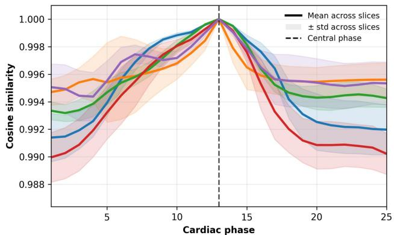
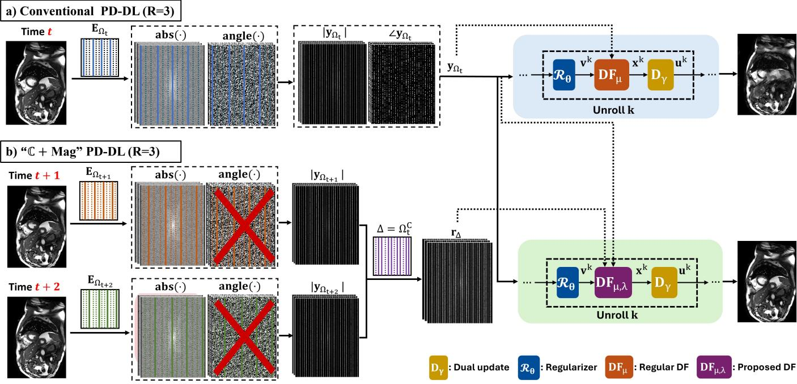
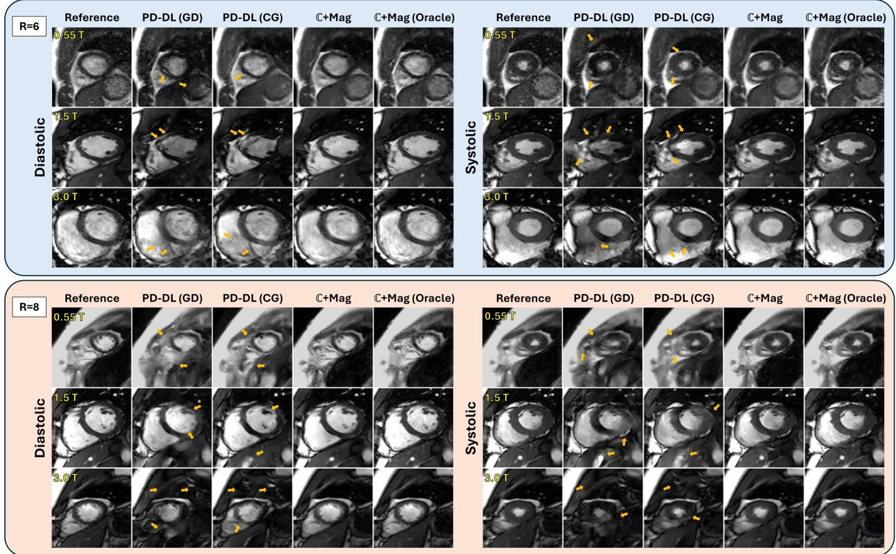
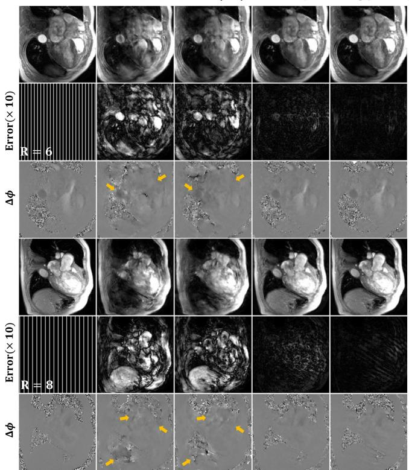
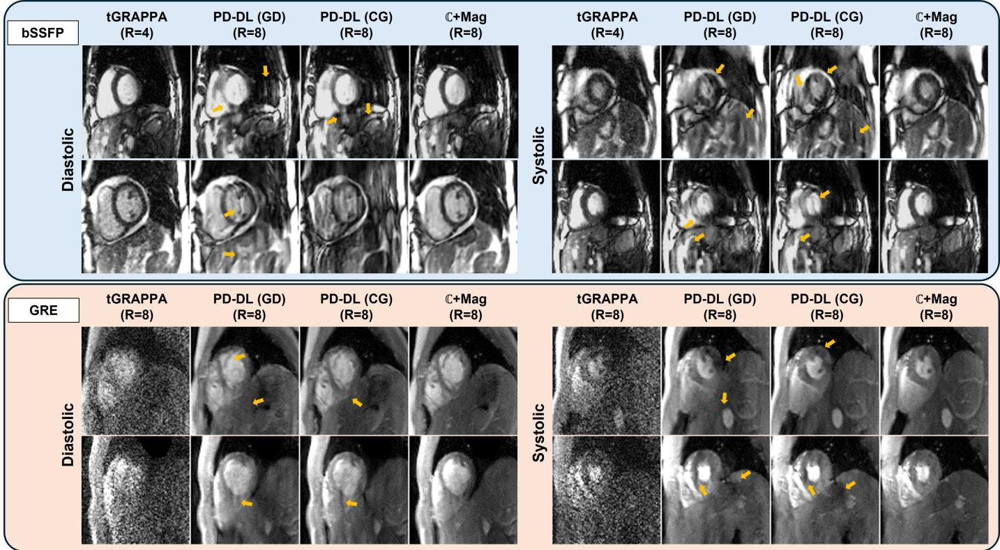
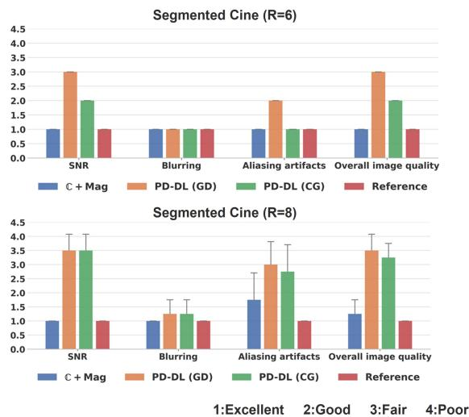
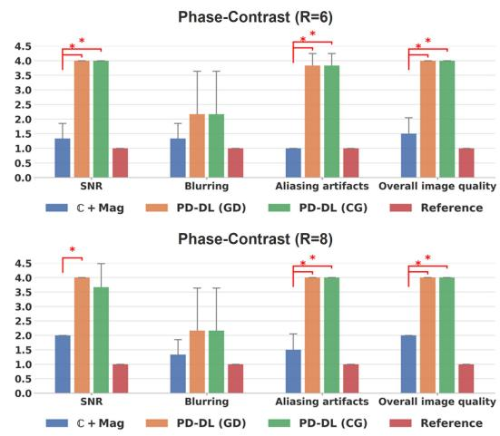

# Harnessing Magnitude-Only and Complex Measurements for Improved Dynamic MRI Reconstruction with Learned Priors

Mahdi Saberi, Student Member, IEEE, Yas¸ar Utku Alc¸alar, Student Member, IEEE, Merve Gulle,¨ Student Member, IEEE, Chetan Shenoy, and Mehmet Akc¸akaya, Senior Member, IEEE

Abstract— MRI reconstruction methods for undersampled k-space data naturally utilize complex-valued measurements. Parallel developments in sparse phase retrieval have shown that magnitude-only measurements may provide complementary information for signal recovery. However, their use in MRI reconstruction remains largely unexplored, due to lack of practical settings where informative magnitude measurements can be obtained without additional scan time. In this work, we investigate the use of auxiliary k-space magnitude information for accelerated steady-state dynamic MRI reconstruction, and demonstrate strong consistency of k-space magnitudes across time-frames. Building on this observation, we propose C + Mag, a magnitude-informed physics-driven deep learning reconstruction method. The proposed method employs an ADMM-based unrolling framework with a novel magnitude-aware data-fidelity formulation, where quadratically smoothed optimization and momentum-based updates are introduced to address the non-differentiability and non-convexity of the magnitude constraints. Experiments on retrospectively undersampled cine MRI and phase-contrast flow MRI datasets, as well as prospectively undersampled real-time cine MRI acquisitions, demonstrate improved artifact suppression, sharper anatomical recovery, and better preservation of phase information compared to conventional PD-DL methods, which is further supported through blinded expert reader evaluations.

Index Terms— Cardiac MRI, dynamic MRI reconstruction, magnitude-only measurements, phase retrieval, physicsdriven deep learning, algorithm unrolling.

## I. INTRODUCTION

EDUCING MRI acquisition time often requires recovresulting in a severely ill-posed inverse problem. Classical compressed sensing (CS) approaches address this challenge through sparsity-promoting regularization [1], while recent physics-driven deep learning (PD-DL) methods combine acquisition physics with learned priors to achieve substantially improved reconstruction quality [2]–[7]. Nevertheless, reconstruction performance at high acceleration rates remains fundamentally constrained by the limited amount of acquired information, frequently leading to residual artifacts, anatomical blurring, or loss of fine structural detail.

In parallel, the computational imaging community has extensively studied phase retrieval problems, where the goal is to recover signals from magnitude-only measurements [8]– [10]. In particular, theoretical studies have shown that, under suitable conditions, two magnitude-only measurements can carry information equivalent to one complex linear measurement in sparse recovery problems [11], motivating the use of combined complex-valued and magnitude-only measurements for MRI reconstruction [12]. However, despite this theoretical promise, the use of auxiliary magnitude information in MRI reconstruction has remained largely underexplored [13] due to two reasons: i) lack of practical acquisition settings where informative magnitude-only measurements can be obtained without increasing scan time, ii) limited improvement from using hand-designed regularizers in these settings.

The recent advent of large-scale raw MRI databases has renewed interest in understanding the structure of k-space magnitude across distinct datasets, albeit not for reconstruction. Studies in Fourier-domain representation learning [14] suggest that the magnitude and phase components capture low-level distributional features and high-level semantic information respectively. This idea was used in the backdoor attack literature [15] to devise triggers for magnitude kspace, leading to visually imperceptible attacks. Building on these observations, we revisit the utility of using additional magnitude-only k-space measurements in MRI reconstruction. In particular, using large-scale raw MRI databases, we investigate the consistency of multi-coil k-space magnitude across cardiac phases,demonstrating consistently high cosine similarity between neighboring temporal frames for various steady-state dynamic MRI applications.

Motivated by these findings, we propose a physics-driven deep learning framework for MRI reconstruction using a combination of complex-valued and magnitude-only measurements, referred to as C + Mag reconstruction. Specifically, we formulate a new objective function for MRI reconstruction with joint complex and magnitude least-squares data fidelity terms, where the latter uses auxiliary magnitude constraints derived from neighboring cardiac phases. The resulting objective is solved using algorithm unrolling with learned proximal operators and a novel data-fidelity formulation tailored for mixed complex and magnitude measurements. As the magnitude fidelity term is non-differentiable and non-convex, we further develop a quadratically smoothed formulation and investigate momentum-based optimization strategies within the data-fidelity updates. Our key contributions include:

• We introduce a PD-DL reconstruction framework that jointly leverages complex-valued and auxiliary magnitude-only measurements for accelerated MRI reconstruction through a unified optimization formulation.

• We develop an ADMM-based unrolled reconstruction algorithm with a novel magnitude-aware data-fidelity formulation, including quadratically smoothed optimization and momentum-based updates for improved stability.

• We conduct extensive evaluations on retrospectively undersampled cine MRI [16] and phase-contrast flow MRI datasets [17], as well as a local prospectively undersampled real-time cine MRI databases, demonstrating substantial improvements over conventional PD-DL reconstruction methods at high acceleration rates.

• We further validate the proposed framework through blinded cardiologist assessments and comprehensive ablation studies analyzing the major design choices of the proposed method.

This work is an invited extended submission of our IEEE ISBI paper [18], with new algorithmic components and optimization analyses of the proposed framework, numerous ablation studies on major design choices, significantly expanded experimental studies including phase-contrast flow and prospective real-time cine MRI, and blinded cardiologist evaluations from clinical collaborators.

## II. BACKGROUND & MOTIVATION

## A. Background on PD-DL Reconstruction in MRI

Canonical regularized MRI reconstruction solves:

$$
\arg \operatorname* { m i n } _ { \mathbf { x } } \| \mathbf { y } _ { \Omega } - \mathbf { E } _ { \Omega } \mathbf { x } \| _ { 2 } ^ { 2 } + \mathcal { R } ( \mathbf { x } )\tag{1}
$$

where $\mathbf { y } _ { \Omega } \in \mathbb { C } ^ { m }$ is the undersampled multi-coil k-space measurements acquired with sampling pattern Ω, $\mathbf { E } _ { \Omega } : \mathbb { C } ^ { n }  \mathbb { C } ^ { m }$ is the corresponding multi-coil encoding operator, and $\mathcal { R } ( \cdot )$ is a regularizer. The first quadratic term enforces data fidelity (DF) with the acquired complex-valued measurements, while the regularizer incorporates prior information. PD-DL methods unroll an iterative algorithm for solving this regularized least squares problem [19] for a fixed number of steps, where the DF unit is implemented by conventional methods with learnable parameters, and the proximal operator for the regularizer is implemented implicitly using a neural network [4], [20], [21]. The unrolled network can then be trained using either supervised [20], [21] or self-supervised learning [22], [23].

In this work, our primary focus is not the training paradigm itself, but rather the underlying inverse problem formulation and the corresponding optimization strategy. Nevertheless, both supervised and self-supervised training settings are considered in the retrospective and prospective undersampling experiments, respectively.

  
Fig. 1. Cosine similarity between the central cardiac phase and all other phases, computed from fully sampled magnitude k-spaces across five slices from five different subjects. Different colors correspond to different subjects, while the shaded regions denote the standard deviation across slices. The strong similarity suggest that k-space magnitude information from neighboring cardiac phases can be used as auxiliary information without increasing scan time.

## B. k-space Magnitude Similarity

Joint sparse phase retrieval and CS theory suggests that two random magnitude measurements holds the same information as one single random complex-valued linear measurement [11]. Therefore, in scenarios where additional magnitude-only measurements are available $( i . e . ,$ , accurate magnitude information with incorrect phase), one can leverage this information to improve MRI reconstruction quality. Prior work has explored several simple scenarios of this setting on a limited number of examples with hand-crafted regularizers [12].

Motivated by the availability of large-scale MRI databases and recent findings in adversarial robustness literature [15], we investigate whether auxiliary magnitude information can be reliably leveraged for MRI reconstruction without requiring additional scan time. In particular, steady-state dynamic MRI provides a natural setting for this formulation due to the high consistency of their multi-coil k-space magnitudes across time.

To quantify this consistency, we focus on breath-hold segmented cine acquisitions from the OCMR dataset [16], and analyze the cosine similarity of multi-coil k-space magnitudes across cardiac phases for a given subject and slice:

$$
\mathrm { c - s i m } ( \mathbf { u } , \mathbf { v } ) = { \frac { \langle \mathbf { u } , \mathbf { v } \rangle } { \| \mathbf { u } \| \| \mathbf { v } \| } } ,\tag{2}
$$

where u and v correspond to the magnitude of multi-coil k-space (i.e. phase is discarded). To facilitate visualization, we calculate the cosine similarity of all cardiac phases with the cardiac phase corresponding to the middle of the R-R wave. This process is then repeated across multiple slices and subjects. The mean and standard deviation across slices are shown in Fig. 1. The consistently high similarity values (csim > 0.988 even for distant phases) indicate strong temporal correlation in k-space magnitudes, suggesting that informative auxiliary magnitude k-space information can be obtained from different cardiac phases to improve MRI reconstruction without additional acquisition cost.

  
Fig. 2. C + Mag reconstruction pipeline that integrates both complex-valued and magnitude-only measurements. Acceleration rate R = 3 is used for illustration, without loss of generality. For the cardiac phase of interest t, the complex-valued measurements, $\mathbf { y } _ { \Omega _ { t } }$ , are used for reconstruction, both in regular PD-DL and in proposed $\mathbb { C } + \mathbf { M } \mathbf { a } \mathbf { g }$ . From adjacent cardiac phases $t + 1$ and $t + 2 ,$ only the magnitude of the k-space data on lines specified by $\Omega _ { t + 1 }$ and $\Omega _ { t + 2 }$ are used as auxiliary information in $\mathbb { C } + \mathbf { M } \mathbf { \dot { a } g }$ , denoted by $\mathbf { r } _ { \Delta }$ with $\Delta \mathsf { \dot { \Omega } } = \Omega _ { t + 1 } \mathsf { \dot { U } } \Omega _ { t + 2 } = \Omega _ { t } ^ { C }$ , and C denotes the complement set. Note $\mathbf { r } _ { \Delta }$ is readily available without any changes to the cine MRI acquisition. Learnable parameters corresponding to each unrol are highlighted using subscripts.

## III. METHODS

These findings motivate a reconstruction framework that jointly enforces consistency with both the acquired complexvalued measurements and auxiliary magnitude constraints, such as those from neighboring timeframes. Accordingly, we formulate accelerated MRI reconstruction using both complexvalued and magnitude-only measurements as the following regularized optimization problem:

$$
\arg \operatorname* { m i n } _ { \mathbf { x } } \| \mathbf { y } _ { \Omega } - \mathbf { E } _ { \Omega } \mathbf { x } \| _ { 2 } ^ { 2 } + \lambda \| \mathbf { r } _ { \Delta } - | \mathbf { E } _ { \Delta } \mathbf { x } | \| _ { 2 } ^ { 2 } + \mathcal { R } ( \mathbf { x } )\tag{3}
$$

where $| \cdot |$ is the element-wise absolute value operator, and λ is a weight term. Here, $\mathbf { y } _ { \Omega }$ denotes the complex-valued measurements acquired on sampling locations indexed by Ω for a given time-frame/cardiac phase, while $\mathbf { r } _ { \Delta }$ represents auxiliary magnitude-only measurements available on locations indexed by $\Delta .$ In this context, $\Delta \subseteq \Omega ^ { C }$ , ideally with $\Delta = \Omega ^ { C }$ such that the auxiliary magnitude data provides information on all k-space locations that are not directly sampled in the target time-frame. In many applications, this can be naturally realized using shifted interleaved sampling trajectories across neighboring temporal frames, as commonly employed in realtime imaging [24].

We solve the objective in (3) using ADMM [25]–[27],

leading to the following subproblems:

$$
\mathbf { v } ^ { \mathrm { k } } = \arg \operatorname* { m i n } _ { \mathbf { v } } \mu \| \mathbf { x } ^ { \mathrm { k } - 1 } - \mathbf { v } + \mathbf { u } ^ { \mathrm { k } - 1 } \| _ { 2 } ^ { 2 } + \mathcal { R } ( \mathbf { v } )\tag{4}
$$

$$
\mathbf { x } ^ { \mathrm { k } } = \arg \operatorname* { m i n } _ { \mathbf { x } } ~ \| \mathbf { y } _ { \Omega } - \mathbf { E } _ { \Omega } \mathbf { x } \| _ { 2 } ^ { 2 } + \lambda \| \mathbf { r } _ { \Delta } - | \mathbf { E } _ { \Delta } \mathbf { x } | \| _ { 2 } ^ { 2 }
$$

$$
+ \mu \| \mathbf x - \mathbf v ^ { \mathrm { k } } + \mathbf u ^ { \mathrm { k } - 1 } \| _ { 2 } ^ { 2 }\tag{5}
$$

$$
\begin{array} { r } { \mathbf { u } ^ { \mathrm { k } } = \mathbf { u } ^ { \mathrm { k } - 1 } + \gamma ( \mathbf { x } ^ { \mathrm { k } } - \mathbf { v } ^ { \mathrm { k } } ) . } \end{array}\tag{6}
$$

where $\mu , \lambda$ , γ are learnable parameters. Similar to conventional PD-DL [4], Eq. (4) is implicitly implemented using a neural network, while Eq. (5) is solved iteratively itself. To this end, the derivative of the objective function in (5) needs to be taken with respect to x¯ based on CR-Calculus [28]. However, the DF step in (5) is not differentiable as given, due to the | · | operator. Thus, we smoothen |x| using:

$$
| \mathbf { x } | \approx \sqrt { \mathbf { x } \odot \mathbf { x } ^ { \mathrm { H } } + \epsilon }\tag{7}
$$

where $\epsilon > 0$ , and $\odot$ is the Hadamard product. We refer to this approach as the quadratic smoothing (Quad-S) in the remainder of the paper. Beyond this strategy, more sophisticated smoothing formulations are investigated in an ablation study (Sec. V-E). Without loss of generality and for ease of notation, we continue our formulation with Quad-S. We define:

$$
\begin{array} { r l } & { Q ( \mathbf { x } ) \triangleq \| \mathbf { y } _ { \Omega } - \mathbf { E } _ { \Omega } \mathbf { x } \| _ { 2 } ^ { 2 } \ + \mu \| \mathbf { x } - \mathbf { v } ^ { ( \mathrm { i } ) } + \mathbf { u } ^ { ( \mathrm { i } - 1 ) } \| _ { 2 } ^ { 2 } } \\ & { \qquad + \lambda \| \mathbf { r } _ { \Delta } - \sqrt { ( \mathbf { E } _ { \Delta } \mathbf { x } ) \odot ( \mathbf { E } _ { \Delta } \mathbf { x } ) ^ { \mathrm { H } } + \epsilon } \| _ { 2 } ^ { 2 } , } \end{array}\tag{8}
$$

with the derivative:

$$
\begin{array} { r l } & { \nabla _ { \bar { \mathbf { x } } } Q ( \mathbf { x } ) = \mathbf { E } _ { \Omega } ^ { \mathrm { H } } ( \mathbf { E } _ { \Omega } \mathbf { x } - \mathbf { y } _ { \Omega } ) + \mu ( \mathbf { x } - \mathbf { v } ^ { ( \mathrm { i } ) } + \mathbf { u } ^ { ( \mathrm { i } - 1 ) } ) } \\ & { \quad \quad \quad + \lambda \Bigg ( \mathbf { E } _ { \Delta } ^ { \mathrm { H } } \big ( - \frac { \mathbf { r } _ { \Delta } \odot ( \mathbf { E } _ { \Delta } \mathbf { x } ) } { \sqrt { ( \mathbf { E } _ { \Delta } \mathbf { x } ) \odot ( \mathbf { E } _ { \Delta } \mathbf { x } ) ^ { \mathrm { H } } + \epsilon } } + \mathbf { E } _ { \Delta } \mathbf { x } \big ) \Bigg ) . } \end{array}\tag{9}
$$

TABLE I  
SUMMARY OF IMAGING DATASETS AND ACQUISITION PARAMETERS USED IN THIS STUDY.SD: SCAN-DEPENDENT.
<table><tr><td></td><td>Segmented Cine</td><td>Flow2D</td><td>Real-Time Cine (bSSFP)</td><td>Real-Time Cine (GRE)</td></tr><tr><td>Sequence Type</td><td>bSSFP</td><td>Phase-Contrast Flow2D</td><td>bSSFP</td><td>GRE</td></tr><tr><td>Field Strength</td><td> $0 . 5 5 \mathrm { T } ~ / ~ 1 . 5 \mathrm { T } ~ / ~ 3 . 0 \mathrm { T }$ </td><td>3.0T</td><td>1.5T</td><td>3.0T</td></tr><tr><td>View</td><td> $_ { \mathrm { S h o r t - a x i s } }$ </td><td> $\mathrm { { A x i a l \ a o r t i c } }$ </td><td> $_ { \mathrm { S h o r t - a x i s } }$ </td><td> $_ { \mathrm { S h o r t - a x i s } }$ </td></tr><tr><td>Subjects (Train/Test)</td><td> $4 6 / 1 4$ </td><td>20 / 8</td><td> $1 0 ~ / ~ 3$ </td><td>10 / 6</td></tr><tr><td>Matrix Size</td><td> $2 8 8 \times 2 0 8$ </td><td> $2 2 4 \times 1 6 0$ </td><td> $1 6 0 \times 9 6$ </td><td> $1 7 6 \times 1 7 6$ </td></tr><tr><td>Field-of-view</td><td>SD</td><td> $\mathrm { 3 4 0 \times 2 3 4 m m ^ { 2 } }$ </td><td> $\mathrm { 3 6 0 \times 2 7 0 m m ^ { 2 } }$ </td><td> $\mathrm { 3 0 0 \times 3 0 0 m m ^ { 2 } }$ </td></tr><tr><td>Spatial Resolution</td><td> $1 . 1 7 - 2 . 7 5 \ : \mathrm { m m }$ </td><td> $1 . 7 7 \times 1 . 9 5 \mathrm { { m m } ^ { 2 } }$ </td><td> $2 . 2 5 \times 2 . 9 3 \mathrm { { m m } ^ { 2 } }$ </td><td> $\mathrm { 1 . 7 0 \times 2 . 2 7 m m ^ { 2 } }$ </td></tr><tr><td>Slice Thickness</td><td> $6 - 8 \mathrm { m m }$ </td><td></td><td> $\mathrm { 8 m m }$ </td><td> $5 \mathrm { m m }$ </td></tr><tr><td>Acquisition Acceleration</td><td>Fully-sampled</td><td>Fully-sampled</td><td> $\mathrm { R } = 4$ </td><td> $\mathrm { R } = 8$ </td></tr><tr><td>Evaluation Acceleration</td><td> $\mathrm { ~ R ~ } \in \{ 6 , 8 \}$ </td><td> $\mathrm { { R } } \in \{ 6 , \dot { 8 } \}$ </td><td> $\mathrm { R } = 8$ </td><td> $\mathrm { R } = 8$ </td></tr><tr><td>Partial Fourier</td><td></td><td></td><td>6/8</td><td>6/8</td></tr><tr><td>Asymmetric Echo</td><td></td><td></td><td>20%</td><td>20%</td></tr><tr><td>TR / TE (ms)</td><td>SD</td><td> $3 7 . 1 / 2 . 5 $ </td><td>2.3/1.0</td><td> $4 . 7 / 2 . 4$ </td></tr></table>

(10)

(12)

This can be used for a simple gradient descent (GD) as:

$$
\mathbf { x _ { j } ^ { k } } = \mathbf { x _ { j } ^ { k - 1 } } - \eta _ { \mathrm { j } } ^ { \mathrm { k } } \nabla _ { \bar { \mathbf { x } } } Q ( \mathbf { x } ) \Big | _ { \mathbf { x } = \mathbf { x _ { j } ^ { k - 1 } } }\tag{11}
$$

1) Segmented Breath-Hold Cine MRI: Datasets from the OCMR database [16] were used. Preprocessing was performed to ensure consistent spatial and temporal dimensions across subjects, including readout (RO) oversampling removal, zeropadding along phase-encode (PE), and temporal interpolation to 25 cardiac phases. Retrospective undersampling was performed using a time-interleaved shifted equidistant sampling pattern [24] at $R \ \in \ \{ 6 , 8 \}$ without ACS lines. Auxiliary magnitude information was obtained from neighboring cardiac phases within the same subject, without requiring additional scan time or protocol modifications. Note in this setup, full kspace coverage is achieved across R adjacent cardiac phases, allowing the $R - 1$ nearest phases to provide auxiliary magnitude information for all locations in $\mathbf { \bar { \Omega } } ^ { \mathrm { C } }$

where $\mathbf { m } _ { j } ^ { k }$ is the momentum direction, $\beta$ is the momentum coefficient and $\eta _ { j } ^ { k }$ is a learnable step size. Alternative momentum-based optimization strategies, including Polyak momentum [32] and Adam optimization [33], are further investigated in our ablation studies (Sec. V-E). An overview of the proposed C + Mag unrolled PD-DL framework is shown in Fig. 2.

where $\eta _ { \mathrm { i } } ^ { \mathrm { k } }$ denotes the learnable step size corresponding to the $\mathrm { j } ^ { \mathrm { t h } }$ GD iteration within the ${ \mathrm { k } } ^ { \mathrm { t h } }$ unrolled step. However, due to the non-convexity introduced by the magnitude fidelity term, directly optimizing Eq. (5) using standard GD may lead to poor local minima. To improve stability within the DF subproblem, we employ Nesterov acceleration [29], which has previously shown improved convergence in inverse imaging and ADMM-based optimization frameworks [30], [31]:

All datasets used in this study were acquired under the corresponding institutional review board (IRB) approvals and data-sharing agreements. A summary of the datasets and acquisition parameters is provided in Table I.

## IV. IMAGING EXPERIMENTS & IMPLEMENTATION DETAILS A. Imaging Experiments

$$
\mathbf { m } _ { j } ^ { k } = \beta \mathbf { m } _ { j - 1 } ^ { k } + \nabla _ { \bar { \mathbf { x } } } Q ( \mathbf { x } ) \Big | _ { \mathbf { x } = \mathbf { x } _ { j - 1 } ^ { k } - \beta \mathbf { m } _ { j - 1 } ^ { k } } ,
$$

$$
\mathbf { x } _ { j } ^ { k } = \mathbf { x } _ { j - 1 } ^ { k } - \eta _ { j } ^ { k } \mathbf { m } _ { j } ^ { k } ,
$$

2) Phase-Contrast Flow MRI: To evaluate the applicability of the proposed framework beyond cine imaging, axial aortic phase-contrast Flow2D MRI data from the CMRxRecon2025 challenge dataset [34] were included. The dataset consists of single-slice acquisitions with two velocity encodes per timeframe. Preprocessing was performed similar to the segmented cine experiments. Retrospective undersampling and auxiliary magnitude extraction from neighboring temporal frames were performed identically to the segmented cine experiments.

3) Real-Time (RT) Cine MRI: Free-breathing real-time cine MRI were acquired using balanced steady-state free precession (bSSFP) and gradient-echo (GRE) sequences.

a) bSSFP: Real-time bSSFP cine data were obtained from the NIH Cardiac MRI Raw Data Repository hosted by the Intramural Research Program of the National Heart, Lung, and Blood Institute (NHLBI), in the short-axis view using a time-interleaved shifted equidistant undersampling trajectory. The data were acquired at $R = 4 .$ . For our experiments, the data were further retrospectively undersampled to $R = 8$ by selecting every eighth PE line while additionally retaining the k-space center line for each timeframe [35], [36].

b) GRE: Real-time GRE cine MRI data from 16 subjects were acquired locally at 3T in the short-axis view under an IRB-approved protocol, with an acceleration factor of $\mathrm { R } = 8 .$

## B. Implementation Details

1) Network Architecture: The proposed C + Mag PD-DL network was unrolled for T = 10 iterations. The proximal step was implemented using a recently proposed time-embedded U-Net (TE-UNet) architecture [37] with {32, 64, 96} channels in the encoder and symmetric decoding layers. The DF unit was solved using Nesterov-accelerated GD as described in Eq. (12), which itself was unrolled for 10 iterations. All the DF parameters, including $\mu , \lambda , \gamma , \beta$ and step sizes $\eta _ { \mathrm { j } } ^ { \mathrm { k } }$ were learned and unshared across the unrolls. The smoothing constant in Eq. (9) was chosen as $\epsilon = 1 0 ^ { - 4 } \cdot \lVert \mathbf { E } _ { \Omega } ^ { \mathrm { H } } \mathbf { y } _ { \Omega } \rVert _ { \infty } ^ { 2 }$

2) Comparison Methods: Conventional PD-DL baselines employed the same TE-UNet proximal architecture and ADMM-based unrolling framework to ensure a fair comparison. Accordingly, the primary difference between methods was the underlying inverse problem formulation and corresponding DF unit. Specifically, conventional PD-DL methods solved the standard reconstruction objective in (1) using either GD [21] or conjugate gradient (CG) for data fidelity [20].

  
Fig. 3. Representative reconstructions from cine MRI data with $\mathrm { ~ R ~ } = \{ 6 , 8 \}$ , acquired on 0.55T, 1.5T, and 3.0T scanners. Conventional PD-DL methods introduce artifacts and fail to preserve anatomical structures (yellow arrows), while also exhibiting noticeable blurring. In contrast, our proposed method effectively mitigates these artifacts and preserves image sharpness.

We emphasize that the proposed framework is not tied to a specific unrolled algorithm or proximal network architecture. Although ADMM unrolling is used in this work, the proposed complex-plus-magnitude formulation can in principle be incorporated into other unrolled reconstruction schemes, such as variable-splitting via quadratic penalty (VSQP) or proximalgradient-based approaches. Similarly, the learned proximal operator can be replaced with alternative architectures. These aspects are further examined in an ablation study in Sec. V-E.

All comparisons in the main experiments use spatial-only regularization to isolate the effect of the proposed auxiliary magnitude constraints at high acceleration rates. Spatiotemporal regularization is therefore not explored in this work, although the proposed formulation is complementary to such regularizers and may further benefit from their integration.

3) Training: Supervised training was performed for retrospectively undersampled data i.e., segmented cine, and phasecontrast flow MRI), using SENSE-1 coil-combined images [3] as reference data. All slices and timeframes from the training subjects were used for training. A normalized $\ell _ { 1 } - \ell _ { 2 }$ loss function was employed [38], [39] and optimized using Adam with a learning rate of $5 \times 1 0 ^ { - 4 }$ . All models were trained for 100 epochs. 10% of the training data was reserved for validation, hyperparameter fine-tuning, and learning rate scheduling.

Multi-mask SSDU [40] was employed for prospectively undersampled real-time GRE and bSSFP acquisitions. Similar training settings were used, except that the models were trained with learning rate of $2 \times 1 0 ^ { - 4 }$ , and three SSDU masks.

## C. Evaluation

1) Standard Quantitative Metrics: For datasets with available reference images (i.e., segmented cine and phase-contrast flow), reconstruction fidelity was quantitatively assessed using peak signal-to-noise ratio (PSNR) and structural similarity index measure (SSIM).

2) Cardiac Function Analysis: Cardiac function analysis was conducted on both the segmented breath-hold cine and prospective RT bSSFP datasets using Segment CMR (Medviso AB, Lund, Sweden). We note only four test subjects for segmented cine data had multiple slice acquisitions, and only these were used for quantification since multiple slices are required. Endocardial and epicardial contours were delineated at end-diastole and end-systole to derive end-diastolic volume (EDV), end-systolic volume (ESV), stroke volume (SV), ejection fraction (EF), end-diastolic mass (EDM), and end-systolic mass (ESM). For the segmented cine datasets, measurements obtained from the reconstructed images were compared against those derived from the fully sampled reference acquisitions. For the prospective RT bSSFP datasets, the clinically used R = 4 tGRAPPA reconstruction [41] served as the reference standard. Statistical differences between measurements were assessed using a paired t-test, with $P \ < \ 0 . 0 5$ considered statistically significant.

TABLE II  
QUANTITATIVE COMPARISON ON RETROSPECTIVELY UNDERSAMPLED CINE AND PHASE-CONTRAST FLOW2D MRI DATA AT $\mathrm { R } \in \{ 6 , 8 \}$ . NOTE  
C + MAG (ORACLE) IS INCLUDED TO SHOW THE UPPER PERFORMANCE BOUND OF OUR INVERSE PROBLEM, BUT IS NOT PRACTICAL FOR MAGNITUDE ESTIMATION.
<table><tr><td rowspan="3">Method</td><td colspan="3">Cine MRI</td><td colspan="3">Flow2D MRI</td></tr><tr><td>R = 6</td><td>R = 8</td><td></td><td> $\mathrm { R } = 6$ </td><td></td><td>R = 8</td></tr><tr><td>PSNR↑ SSIM↑</td><td>PSNR↑</td><td>SSIM↑</td><td>PSNR↑</td><td>SSIM↑ PSNR↑</td><td>SSIM↑</td></tr><tr><td>PD-DL (GD)</td><td>31.48 0.885</td><td>28.31</td><td>0.806</td><td>24.45 0.735</td><td>22.61</td><td>0.655</td></tr><tr><td>PD-DL (CG)</td><td>34.04 0.920</td><td>29.97</td><td>0.849</td><td>25.97</td><td>0.779 23.71</td><td>0.673</td></tr><tr><td>C+Mag (Ours)</td><td>40.09 0.971</td><td>37.55</td><td>0.955</td><td>34.16</td><td>0.931 31.58</td><td>0.889</td></tr><tr><td>C+Mag (Oracle)</td><td>42.29 0.980</td><td>40.83</td><td>0.974</td><td>39.10</td><td>0.969 35.53</td><td>0.942</td></tr></table>

Reference  
PD-DL (GD)  
PD-DL (CG)  
C+Mag  
C+Mag(Oracle)  
  
Fig. 4. Representative reconstruction results for phase-contrast flow MRI at acceleration factors $\mathrm { ~ R ~ } \in \ \{ 6 , 8 \}$ . The first row for each acceleration factor shows the reconstructed magnitude images, followed by the corresponding error maps (×10) and phase difference maps (∆ϕ). Conventional PD-DL methods exhibit residual artifacts and phase inconsistencies (yellow arrows), whereas the proposed method substantially suppresses these artifacts and preserves both magnitude and phase information.

3) Qualitative Expert Evaluation: Qualitative image quality assessment was performed by an experienced cardiologist using a 4-point Likert scale [42] for segmented breath-hold cine and 2D flow acquisitions. We note that only the four test subjects with multiple slices were used for the former dataset. In this blinded evaluation, the reader was blinded to the reconstruction method. Reconstructions were evaluated based on perceived SNR, blurring, aliasing artifacts, and overall image quality [21]. For perceived SNR and overall image quality, scores were assigned as 1 (excellent), 2 (good), 3 (fair), and 4 (poor). Blurring was scored as 1 (no blurring), 2 (mild blurring), 3 (moderate blurring), and 4 (severe blurring). For aliasing artifacts, the scores rated as 1 (none), 2 (mild), 3 (moderate), and 4 (severe). The Wilcoxon signed-rank test was used to evaluate the reader scores, with a significance level of $P < 0 . 0 5$

## V. RESULTS

## A. Retrospectively Accelerated Datasets

For these datasets, where fully-sampled k-space is available, we compare conventional PD-DL with two versions of the proposed C + Mag unrolled network. The first uses magnitude information estimated from adjacent cardiac phases, as proposed, while the second corresponds to an oracle setting using ground-truth magnitude information in Eq. (3) directly. The oracle case is included to illustrate the upper performance bound for our framework, and quantify the gap between the proposed magnitude estimation strategy that does not require any additional acquisition time and the ideal scenario.

1) SegmentedBreath-HoldCine MR: Fig. 3 shows representative reconstructions of systolic and diastolic cardiac phases at $\mathrm { R } \in \{ 6 , 8 \}$ . Conventional PD-DL methods struggle to suppress undersampling artifacts, leading to degraded visualization of cardiac structures in some cases. In contrast, the proposed C + Mag PD-DL effectively removes these artifacts while preserving cardiac anatomy. Tab. II summarizes the average of the population metrics on the test set. Consistent with the visual results, conventional PD-DL methods struggle under these high acceleration rates due to the absence of ACS lines in the low-frequency region. In contrast, the proposed C + Mag PD-DL achieves substantial performance gain with no additional cost.

2) Phase-Contrast Flow MRI: Fig. 4 show representative reconstruction results for 2D phase-contrast flow MRI at $\mathrm { R } \in$ {6, 8}. Conventional PD-DL methods exhibit residual artifacts and phase inconsistencies, leading to degraded magnitude reconstruction and inaccurate phase difference maps in some regions. In contrast, the proposed C + Mag PD-DL effectively suppresses these artifacts while preserving both magnitude and phase information. Tab. II summarizes the average population metrics on the test set. Consistent with the visual results, the proposed C + Mag PD-DL achieves significant quantitative improvements over conventional PD-DL approaches at both acceleration rates.

## B. Prospectively Undersampled Acquisitions

We next investigate our method in prospectively undesampled real-time cine acquisitions. Unlike the retrospective setting, fully sampled reference data is not available in this setup, and therefore the oracle C + Mag experiment using ground-truth magnitude information cannot be performed.

1) Real-Time Cine MR (bSSFP): Fig. 5 shows representative reconstructions from R = 8 real-time bSSFP cine data. While the clinically used tGRAPPA reconstruction at R = 4 provides a good image quality, conventional PD-DL methods at $\mathrm { R } = 8$ exhibit noticeable residual artifacts and loss of anatomical detail. In contrast, the proposed C + Mag method that uses magnitude-only information from nearby time-frames, better preserves overall structures and suppresses reconstruction artifacts. Notably, despite the substantially higher acceleration factor, the proposed reconstruction at R = 8 achieves image quality comparable to the clinically used tGRAPPA reconstruction at R = 4, using spatial-only regularization.

  
Fig. 5. Reconstruction examples from prospectively undersampled bSSFP (top) and GRE (bottom) real-time cine data at R = 8. tGRAPPA at the clinical acquisition $\left( \mathrm { R } = 4 \right)$ is used as the baseline for the bSSFP dataset. For the GRE dataset, the data were prospectively acquired at $\mathrm { R } = 8$ and there is no R = 4 baseline. Standard tGRAPPA reconstruction and conventional PD-DL methods at R = 8 exhibit residual artifacts and loss of anatomical detail (yellow arrows), both in systolic and diastolic phases. The proposed C+Mag method preserves cardiac structures and suppresses reconstruction artifacts.

2) Real-Time Cine MR (GRE): Fig. 5 shows example reconstructions for a R = 8 acquisition. At this high acceleration rate, tGRAPPA exhibits substantial artifacts, as expected. Conventional PD-DL methods improve on tGRAPPA, but still suffer from residual artifacts and loss of anatomical detail in both systolic and diastolic phases. In contrast, the proposed C+Mag reconstruction effectively preserves cardiac structures while suppressing noise and residual artifacts.

TABLE III  
CARDIAC FUNCTION ANALYSIS FOR THE BSSFP CINE SEQUENCES. EDV: END-DIASTOLIC VOLUME; ESV: END-SYSTOLIC VOLUME; EF: EJECTION FRACTION; SV: STROKE VOLUME; EDM: END-DIASTOLIC MASS; ESM: END-SYSTOLIC MASS. RESULTS ARE GIVEN AS MEAN, WITH THE STANDARD DEVIATION IN PARENTHESES. DIFFERENCES  
BETWEEN THE PROPOSED METHOD AND BASELINE WERE NON-SIGNIFICANT $( P > 0 . 0 5 )$ ACROSS ALL METRICS.
<table><tr><td rowspan="2">Metric</td><td colspan="2">Segmented BH Cine</td><td colspan="2">Real-Time Cine</td></tr><tr><td>C + Mag (R = 8)</td><td>Reference  $( \mathrm { R } = 1 )$ </td><td> $\mathbb { C } + \mathbf { M } \mathrm { a g }$   $( \mathrm { R } = 8 )$ </td><td>tGRAPPA  $\left( \mathrm { R } = 4 \right)$ </td></tr><tr><td>EDV (mL)</td><td>119.6 (26)</td><td>121.8 (25)</td><td>98.7 (14)</td><td>100.7 (13)</td></tr><tr><td>ESV (mL)</td><td>48.3 (19)</td><td>48.4 (18)</td><td>75.0 (30)</td><td>78.3 (23)</td></tr><tr><td>SV (mL)</td><td>71.3 (19)</td><td>73.2 (19)</td><td>23.7 (16)</td><td>22.3 (11)</td></tr><tr><td>EF (%)</td><td>40.4 (9)</td><td>40.8 (8)</td><td>26.0 (21)</td><td>23.0 (14)</td></tr><tr><td>EDM (g)</td><td>96.2 (7)</td><td>94.1 (18)</td><td>103.7 (27)</td><td>103.3 (28)</td></tr><tr><td>ESM (g)</td><td>93.3 (16)</td><td>95.9 (18)</td><td>121.3 (14)</td><td>121.7 (15)</td></tr></table>

## C. Quantitavtive Cardiac Function Analysis

Tab. III shows the proposed C + Mag reconstruction has excellent agreement with the corresponding baseline acquisitions for all cardiac function parameters. Note cardiac function analysis was performed only for the R = 8 reconstructions, representing the most challenging acceleration setting considered in this study. Despite the high acceleration, the proposed method yielded volumetric and mass measurements that closely matched the reference values, with no statistical differences for either the segmented cine or real-time bSSFP datasets $( P > 0 . 0 5$ for all metrics). Thus, the results for $\mathrm { R } = 6$ setting are omitted for brevity.

## D. Expert Cardiologist Readings

Fig. 6 summarizes the results of the blinded expert reader evaluation for cine and flow acquisitions. Across all evaluation criteria, the proposed method consistently received scores that were comparable to the corresponding reference acquisitions, while outperforming conventional PD-DL reconstructions substantially. In cine imaging, the proposed method demonstrated improved depiction of cardiac structures and reduced reconstruction artifacts, resulting in higher overall image quality, matching that of the fully-sampled reference. We note that the statistical power in this case is limited due to the small number of multi-slice cases scored. Similar trends were observed for phase-contrast flow imaging, where the proposed reconstructions provided superior visualization of vascular structures and flow-related features compared with conventional PD-DL methods. Notably, the reader scores obtained by the proposed method remained close to those of the reference images despite the substantially higher acceleration factor. These findings indicate that the proposed reconstruction preserves clinically relevant image features and enables accelerated cardiac MRI without compromising clinical image quality.

  
\* Statistically significant difference (P < 0.05)  
Fig. 6. Results of the blinded expert reader evaluation for segmented cine and phase-contrast flow acquisitions at $\mathrm { R } = 6$ and $\mathrm { R } = 8 .$ . Bar plots show the mean reader scores and standard deviations for perceived SNR, blurring, aliasing artifacts, and overall image quality, where lower scores indicate better image quality. Statistical significance was assessed using Wilcoxon signed rank test. Across both datasets, the proposed C + Mag reconstruction achieved scores comparable to the reference standard, while consistently outperforming conventional PD-DL reconstructions.

## E. Ablation Studies

We conducted several key ablation studies of the proposed method on retrospectively undersampled cine MRI data with R = 8 by varying: I) The network architecture for the proximal operator to show that the improvements of our framework is agnostic to the specifics of such network architectures, II) Momentum-based GD schemes for solving the DF subproblem, III) Smoothing operators for the | · | term, and iv) Unrolling strategies. The corresponding population metrics on the full test set are reported in Tab. IV.

1) Network architecture for proximal operator: We utilize the ResNet architecture in [22] to solve Eq. (4) instead of the baseline time-embedded U-Net [37], and also investigate the impact of sharing the DF learnable parameters, while keeping the regularizer parameters shared. These experiments utilize a simple GD for solving Eq. (5). The results indicate that the TE-UNet with unshared DF parameters achieves the best performance, confirming the theoretical findings in [37]. It is worth noting that even the simpler setup of ResNet with shared parameters achieves substantial improvements over conventional PD-DL methods, highlighting the benefits of our inverse problem formulation in Eq. (3), irrespective of architectural optimization.

2) Solving the data fidelity sub-problem: With $\mathrm { p r o x } _ { \mathcal { R } } ( \cdot )$ architecture fixed, we investigate different three momentumbased GD schemes for solving the DF subproblem in Eq. (5), as discussed in Sec. III. Among these approaches, Nesterov-GD (denoted as Nesterov) achieves the best performance.

3) Smoothing forthe magnitude term: We further investigate the effect of the smoothing formulation for Eq. (7). In addition to the proposed simple quadratic smoothing (Quad-S), we evaluate alternative smooth approximations of the absolute value operator, including Smooth-ℓ1 (Huber) smoothing [43], Pseudo-Huber (PH-S) [44], and Log-Exp (Log-S) smoothing [45]. The corresponding hyperparameters were fine-tuned on a small validation subset for maximal performance $( \delta = 1$ for $\operatorname { S m o o t h } \mathbf { - } \ell _ { 1 }$ and Pseudo-Huber smoothing, and $\alpha \ : = \ : 2 0$ for Log-Exp smoothing). However, none of these alternatives outperformed the proposed Quad-S formulation, which consistently achieved the best performance, despite its simplicity, on the full test set.

TABLE IV  
ABLATION STUDY ON THE RECONSTRUCTION ARCHITECTURE, DFSOLVER, SMOOTHING OPERATOR, AND UNROLLING STRATEGY. THEBEST-PERFORMING CONFIGURATION IN EACH PANEL IS HIGHLIGHTEDOVERALL BEST RESULT IS SHOWN IN BOLD . (♠) AND (♣) DENOTESHARED AND UNSHARED DF PARAMETERS $( \lambda , \mu , \beta )$ , RESPECTIVELY.
<table><tr><td> $\mathrm { P r o x } _ { \mathcal { R } ( \cdot ) }$ </td><td>DF Solver</td><td>Smoothing</td><td>Unrolling</td><td>PSNR</td><td>SSIM</td></tr><tr><td>TE-UNet ()</td><td>GD</td><td>Quad-S</td><td>ADMM</td><td>35.60</td><td>0.936</td></tr><tr><td>TE-UNet ()</td><td>GD</td><td>Quad-S</td><td>ADMM</td><td>36.13</td><td>0.947</td></tr><tr><td>ResNet (</td><td>GD</td><td>Quad-S</td><td>ADMM</td><td>35.82</td><td>0.933</td></tr><tr><td>ResNet ()</td><td>GD</td><td>Quad-S</td><td>ADMM</td><td>35.83</td><td>0.935</td></tr><tr><td>TE-UNet () TE-UNet ()</td><td>GD Adam</td><td>Quad-S Quad-S</td><td>ADMM ADMM</td><td>36.13 32.79</td><td>0.947 0.868</td></tr><tr><td>TE-UNet () TE-UNet ()</td><td>Polyak</td><td>Quad-S</td><td>ADMM</td><td>37.30</td><td>0.954</td></tr><tr><td></td><td>Nesterov</td><td>Quad-S</td><td>ADMM</td><td>37.55</td><td>0.955</td></tr><tr><td>TE-UNet () TE-UNet ()</td><td>Nesterov Nesterov</td><td>Quad-S  $\ell _ { 1 } { - } S$ </td><td>ADMM ADMM</td><td>37.55</td><td>0.955 0.939</td></tr><tr><td>TE-UNet ()</td><td>Nesterov</td><td>PH-S</td><td>ADMM</td><td>35.60 32.92</td><td>0.913</td></tr><tr><td>TE-UNet ()</td><td>Nesterov</td><td>Log-S</td><td>ADMM</td><td>34.18</td><td>0.914</td></tr><tr><td>TE-UNet ()</td><td>Nesterov</td><td></td><td></td><td></td><td></td></tr><tr><td></td><td></td><td>Quad-S</td><td>ADMM</td><td>37.55</td><td>0.955</td></tr><tr><td>TE-UNet ()</td><td>Nesterov</td><td>Quad-S</td><td>VSQP</td><td>35.93</td><td>0.937</td></tr><tr><td>TE-UNet ()</td><td>Nesterov</td><td>Quad-S</td><td>PGD</td><td>26.40</td><td>0.755</td></tr></table>

4) Unrolling strategies: Finally, to highlight that our formulations are agnostic to the specifics of the algorithm unrolling strategy, we also investigate different unrolling strategies.

As reported in Tab. IV, the ADMM-based formulation achieves the best performance, outperforming both variable splitting with quadratic penalty (VSQP) [20] and proximal gradient descent (PGD) [46], [47]. While VSQP maintains competitive quantitative performance, PGD exhibits a substantial degradation in performance. This is due to the use of single DF update per unroll in conventional PGD, which limits the contribution of the proposed magnitude-informed formulation. Note this may be improved by using more iterations for data fidelity in PGD, but this was not unexplored since it deviates from standard practice in previous works [46], [47].

## VI. DISCUSSION AND CONCLUSION

In this work, we proposed a PD-DL framework for incorporating auxiliary magnitude k-space information into MRI reconstruction. We identified steady-state dynamic MRI as a practical application of this framework, where informative auxiliary magnitude information can be obtained from neighboring time-frames without incurring additional acquisition cost. Experimental results on retrospectively undersampled cine, phase-contrast flow MRI data at $\mathrm { ~ { ~ R ~ } ~ } \in \mathrm { ~ \{ 6 , 8 \} ~ }$ , and prospectively undersampled real-time cine MRI data, demonstrated substantial improvements over conventional PD-DL reconstruction methods in both image quality and phase preservation.

Finally, we note that the focus of this work is to introduce a new inverse problem formulation that enables incorporation of auxiliary magnitude information into PD-DL MRI reconstruction, in particular for dynamic MRI with no additional acquisition costs. Advances in network architectures, regularizers, and optimization strategies are complementary to our proposed framework and can be naturally integrated within it. Indeed, our ablation studies demonstrate that our proposed formulation can be synergistically combined with different optimization schemes and network architectures. Thus, further comparisons of different network architectures, including those that enable spatiotemporal regularization, are not critical for this work.

## ACKNOWLEDGMENT

We thank Dr. Peter Kellman for providing the real-time cine bSSFP data. The authors also acknowledge the Intramural Research Program of the NHLBI for supporting the NIH Open Source Cardiac MRI Raw Data Repository used in this study.

## REFERENCES

[1] M. Lustig, D. Donoho, and J. M. Pauly, “Sparse MRI: The application of compressed sensing for rapid MR imaging,” Magn. Reson. Med., vol. 58, no. 6, pp. 1182–1195, Dec. 2007.

[2] Y. Yang et al., “ADMM-CSNet: A deep learning approach for image compressive sensing,” IEEE Trans. Pattern Anal. Mach. Intell., vol. 42, no. 3, pp. 521–538, Mar. 2020.

[3] F. Knoll et al., “Deep-learning methods for parallel magnetic resonance imaging reconstruction: A survey of the current approaches, trends, and issues,” IEEE Signal Process. Mag., vol. 37, no. 1, pp. 128–140, 2020.

[4] K. Hammernik et al., “Physics-driven deep learning for computational magnetic resonance imaging: Combining physics and machine learning for improved medical imaging,” IEEE Signal Process. Mag., vol. 40, no. 1, pp. 98–114, 2023.

[5] Y. U. Alc¸alar and M. Akc¸akaya, “Sparsity-driven parallel imaging consistency for improved self-supervised MRI reconstruction,” in Proc IEEE Int. Conf. Image Process., 2025, pp. 851–856.

[6] M. Saberi et al., “Phase-correction strategies for physics-driven deep learning reconstruction of accelerated non-cartesian multi-echo fMRI,” in Proc. IEEE Int. Symp. Biomed. Imag. IEEE, 2026, pp. 1–4.

[7] M. Saberi, C. Zhang, and M. Akc¸akaya, “Training-free adversarial mitigation for computational mri,” Proc. Int. Conf. Mach. Learn., 2026.

[8] G. Wang et al., “SPARTA: Sparse phase retrieval via truncated amplitude flow,” in Proc. IEEE Int. Conf. Acoust., Speech, Signal Process., 2017, pp. 3974–3978.

[9] H. Chung et al., “Diffusion posterior sampling for general noisy inverse problems,” in Proc. Int. Conf. Learn. Represent., 2023.

[10] M. Gulle ¨ et al., “PnP-CM: Consistency models as plug-and-play priors for inverse problems,” in Proc. IEEE/CVF Conf. Comput. Vis. Pattern Recog., 2026.

[11] M. Akc¸akaya and V. Tarokh, “Sparse signal recovery from a mixture of linear and magnitude-only measurements,” IEEE Signal Process. Lett., vol. 22, no. 9, pp. 1220–1223, 2015.

[12] M. Akc¸akaya, V. Tarokh, and R. Nezafat, “Joint compressed sensing and sparse phase retrieval: reconstruction from a combination of complex and magnitude-only k-space measurements,” in Proc. ISMRM Annu. Meeting, 2015.

[13] S. Park and J. Park, “SMS-HSL: simultaneous multislice aliasing separation exploiting hankel subspace learning,” Magn. Reson. Med., vol. 78, no. 4, pp. 1392–1404, 2017.

[14] Y. Yang and S. Soatto, “Fda: Fourier domain adaptation for semantic segmentation,” in Proc. IEEE/CVF Conf. Comput. Vis. Pattern Recog., 2020, pp. 4085–4095.

[15] Y. Feng et al., “FIBA: Frequency-injection based backdoor attack in medical image analysis,” in Proc. IEEE/CVF Conf. Comput. Vis. Pattern Recog., 2022, pp. 20 876–20 885.

[16] C. Chen et al., “OCMR (v1.0)–Open-access multi-coil k-space dataset for cardiovascular magnetic resonance imaging,” 2020, arXiv:2008.03410.

[17] C. Wang et al., “CMRxRecon: A publicly available k-space dataset and benchmark to advance deep learning for cardiac MRI,” Scientific Data, vol. 11, p. 687, 2024.

[18] M. Saberi and M. Akc¸akaya, “Revisiting MRI reconstruction using a combination of complex and magnitude measurements with learned priors,” in Proc. IEEE Int. Symp. Biomed. Imag., 2026.

[19] J. A. Fessler, “Optimization methods for magnetic resonance image reconstruction,” IEEE Signal Process. Mag., vol. 37, no. 1, pp. 33–40, 2020.

[20] H. K. Aggarwal, M. P. Mani, and M. Jacob, “MoDL: Model-based deep learning architecture for inverse problems,” IEEE Trans. Med. Imag., vol. 38, no. 2, pp. 394–405, 2019.

[21] K. Hammernik et al., “Learning a variational network for reconstruction of accelerated MRI data,” Magn. Reson. Med., vol. 79, no. 6, pp. 3055– 3071, 2018.

[22] B. Yaman et al., “Self-supervised learning of physics-guided reconstruction neural networks without fully sampled reference data,” Magn. Reson. Med., vol. 84, no. 6, pp. 3172–3191, Dec. 2020.

[23] M. Akc¸akaya et al., “Unsupervised deep learning methods for biological image reconstruction and enhancement: An overview from a signal processing perspective,” IEEE Signal Process. Mag., vol. 39, no. 2, pp. 28–44, 2022.

[24] P. Kellman, F. H. Epstein, and E. R. McVeigh, “Adaptive sensitivity encoding incorporating temporal filtering (TSENSE),” Magn. Reson. Med., vol. 45, no. 5, pp. 846–852, 2001.

[25] J. Sun et al., “Deep ADMM-Net for compressive sensing MRI,” in Proc. Adv. Neural Inf. Process. Syst., 2016, pp. 10–18.

[26] H. Gu et al., “Revisiting ℓ1-wavelet compressed-sensing MRI in the era of deep learning,” Proc. Natl. Acad. Sci., vol. 119, no. 33, 2022, Art. no. e2201062119.

[27] M. Saberi, T. Kilic, and M. Akc¸akaya, “Umpire-Net: Unrolled magnitude–phase regularization network for accelerated mri,” in Proc. IEEE Int. Workshop Mach. Learn. Signal Process. (MLSP), 2026.

[28] K. Kreutz-Delgado, “The complex gradient operator and the CRcalculus,” arXiv:0906.4835, 2009.

[29] Y. Nesterov, “A method of solving a convex programming problem with convergence rate O(1/k2),” Soviet Mathematics Doklady, vol. 27, no. 2, pp. 372–376, 1983.

[30] T. Goldstein et al., “Fast alternating direction optimization methods,” SIAM J. Imag. Sci., vol. 7, no. 3, pp. 1588–1623, 2014.

[31] A. Thorley et al., “Nesterov accelerated ADMM for fast diffeomorphic image registration,” in Proc. Int. Conf. Med. Image Comput. Comput.- Assist. Intervent., 2021, pp. 150–160.

[32] B. T. Polyak, “Some methods of speeding up the convergence of iteration methods,” USSR Comput. Math. Math. Phys., vol. 4, no. 5, pp. 1–17, 1964.

[33] D. P. Kingma and J. Ba, “Adam: A method for stochastic optimization,” 2014, arXiv:1412.6980.

[34] “CMRxRecon 2025 Challenge,” https://cmrxrecon.github.io/2025/Home. html, 2025.

[35] O. B. Demirel ¨ et al., “High-fidelity database-free deep learning reconstruction for real-time cine cardiac MRI,” in Proc. Annu. Int. Conf. IEEE Eng. Med. Biol. Soc. (EMBC), 2023, pp. 1–4.

[36] M. Gulle, S. Weing¨ artner, and M. Akc¸akaya, “Deep learning assisted¨ outer volume removal for highly-accelerated real-time dynamic MRI,” 2025, arXiv:2505.00643.

[37] J. Yun, Y. U. Alc¸alar, and M. Akc¸akaya, “Time-embedded algorithm unrolling for computational MRI,” in Proc. Adv. Neural Inf. Process. Syst., 2025.

[38] M. Saberi et al., “Physics-driven deep learning reconstruction of frequency-modulated Rabi-encoded echoes for faster accessible MRI,” in Proc. Annu. Int. Conf. IEEE Eng. Med. Biol. Soc. (EMBC), 2024, pp. 1–5.

[39] M. Akc¸akaya et al., “Physics-driven deep learning reconstruction of non-fourier encoded magnetic resonance imaging data,” International Patent Application WO 2026/015 808 A1, Jan. 15, 2026, pCT Application No. PCT/US2025/037294. [Online]. Available: https: //patentscope.wipo.int/search/en/WO2026015808

[40] B. Yaman et al., “Multi-mask self-supervised learning for physics-guided neural networks in highly accelerated magnetic resonance imaging,” NMR Biomed., vol. 35, no. 12, 2022, Art. no. e4798.

[41] F. A. Breuer et al., “Dynamic autocalibrated parallel imaging using temporal GRAPPA (TGRAPPA),” Magn. Reson. Med., vol. 53, no. 4, pp. 981–985, 2005.

[42] B. Yaman et al., “Self-supervised physics-guided deep learning reconstruction for high-resolution 3D LGE CMR,” in Proc. IEEE Int. Symp. Biomed. Imag., 2021, pp. 100–104.

[43] P. J. Huber, “Robust estimation of a location parameter,” Ann. Math. Statist., vol. 35, no. 1, pp. 73–101, 1964.

[44] P. Charbonnier et al., “Deterministic edge-preserving regularization in computed imaging,” IEEE Trans. Image Process., vol. 6, no. 2, pp. 298– 311, 1997.

[45] Y. Nesterov, “Smooth minimization of non-smooth functions,” Math. Program., vol. 103, no. 1, pp. 127–152, 2005.

[46] M. Mardani et al., “Neural proximal gradient descent for compressive imaging,” in Proc. Adv. Neural Inf. Process. Syst., 2018, pp. 9573–9583.

[47] S. A. H. Hosseini et al., “Dense recurrent neural networks for accelerated MRI: history-cognizant unrolling of optimization algorithms,” IEEE J. Sel. Topics Signal Process., vol. 14, no. 6, pp. 1280–1291, Oct. 2020.