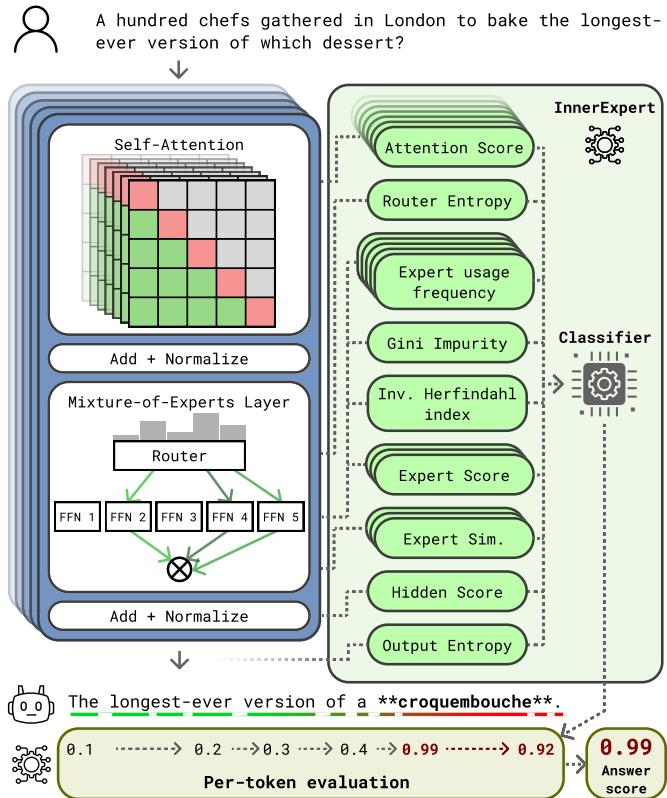
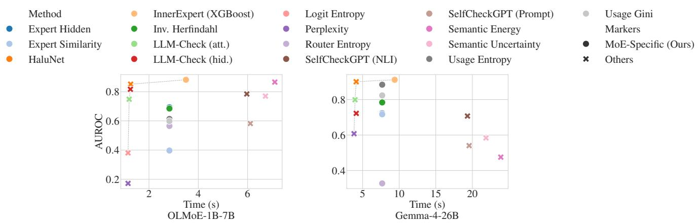

# Mixture-of-Expert Blocks Contain Strong Hallucination Detection Signals

Joao Fonseca<sup>1</sup>, Rodrigo Rodrigues<sup>1,</sup> <sup>2</sup>, Paolo Romano<sup>1,</sup> <sup>2∗</sup>

<sup>1</sup>INESC<sub>-</sub>ID<sub>,</sub> R<sub>ua</sub> Al<sub>ves</sub> R<sub>e</sub>d<sub>o</sub>l<sub>,</sub> 9<sub>,</sub> Li<sub>s</sub>b<sub>o</sub>n<sub>,</sub> 1000<sub>-</sub>029 P<sub>o</sub>rt<sub>uga</sub>l <sup>2</sup>In<sub>s</sub>tit<sub>u</sub>t<sub>o</sub> S<sub>upe</sub>ri<sub>o</sub>r Té<sub>c</sub>ni<sub>co</sub> {joaofonseca, rodrigo.rodrigues, romano}@inesc-id.pt

## Abstract

D<sub>esp</sub>it<sub>e</sub> th<sub>e</sub>ir <sub>w</sub>id<sub>esp</sub>r<sub>ea</sub>d <sub>use,</sub> L<sub>a</sub>r<sub>ge</sub> L<sub>a</sub>n<sub>guage</sub> M<sub>o</sub>d<sub>e</sub>l<sub>s</sub> (LLMs) remain limited b<sub>y</sub> a fundamental <sub>p</sub>roblem: the <sub>g</sub>eneration of plausible but false content, known as hallucinations. Most existing detection methods operate at the answer <sub>or sen</sub>t<sub>ence</sub> l<sub>eve</sub>l<sub>, ye</sub>t <sub>per-</sub>t<sub>o</sub>k<sub>en</sub> d<sub>e</sub>t<sub>ec</sub>ti<sub>on</sub> i<sub>s essen</sub>ti<sub>a</sub>l f<sub>or</sub> l<sub>o-</sub> <sub>ca</sub>li<sub>z</sub>i<sub>ng</sub> h<sub>a</sub>ll<sub>uc</sub>i<sub>na</sub>t<sub>e</sub>d <sub>spans an</sub>d <sub>ena</sub>bli<sub>ng</sub> fi<sub>ne-gra</sub>i<sub>ne</sub>d i<sub>n</sub>t<sub>er-</sub> <sub>ven</sub>ti<sub>ons.</sub> I<sub>n</sub> thi<sub>s</sub> <sub>paper,</sub> <sub>we</sub> <sub>exp</sub>l<sub>ore</sub> th<sub>e</sub> <sub>use</sub> <sub>o</sub>f th<sub>e</sub> Mi<sub>x</sub>t<sub>ure-</sub> of-Ex<sub>p</sub>erts (MoE) <sub>p</sub>aradi<sub>g</sub>m to address this <sub>g</sub>a<sub>p</sub>. In MoE ar-<sub>c</sub>hit<sub>ec</sub>t<sub>ures, a s</sub>i<sub>ng</sub>l<sub>e</sub> f<sub>orwar</sub>d <sub>pass ac</sub>ti<sub>va</sub>t<sub>es a sparse su</sub>b<sub>se</sub>t of experts (i.e., distinct feedforward networks per layer) via a routing mechanism, producing internal signals (e.g., router entro<sub>py</sub>, ex<sub>p</sub>ert disa<sub>g</sub>reement, and ex<sub>p</sub>ert usa<sub>g</sub>e <sub>p</sub>atterns) that <sub>are unava</sub>il<sub>a</sub>bl<sub>e</sub> i<sub>n</sub> d<sub>ense arc</sub>hit<sub>ec</sub>t<sub>ures an</sub>d h<sub>ave no</sub>t b<sub>een pre-</sub> <sub>v</sub>i<sub>ous</sub>l<sub>y exp</sub>l<sub>o</sub>it<sub>e</sub>d f<sub>or</sub> h<sub>a</sub>ll<sub>uc</sub>i<sub>na</sub>ti<sub>on</sub> d<sub>e</sub>t<sub>ec</sub>ti<sub>on.</sub> T<sub>o</sub> thi<sub>s en</sub>d<sub>, we</sub> introduce InnerExpert, the first method to levera<sub>g</sub>e these M<sub>o</sub>E<sub>-spec</sub>ifi<sub>c s</sub>i<sub>gna</sub>l<sub>s</sub> f<sub>or per-</sub>t<sub>o</sub>k<sub>en</sub> h<sub>a</sub>ll<sub>uc</sub>i<sub>na</sub>ti<sub>on</sub> d<sub>e</sub>t<sub>ec</sub>ti<sub>on.</sub> InnerExpert combines routin<sub>g</sub>-level and standard transf<sub>ormer s</sub>i<sub>gna</sub>l<sub>s</sub> i<sub>n</sub>t<sub>o compac</sub>t <sub>per-</sub>t<sub>o</sub>k<sub>en</sub> f<sub>ea</sub>t<sub>ure vec</sub>t<sub>ors, c</sub>l<sub>as-</sub> <sub>s</sub>ifi<sub>e</sub>d b<sub>y a</sub> li<sub>g</sub>ht<sub>we</sub>i<sub>g</sub>ht d<sub>e</sub>t<sub>ec</sub>t<sub>or</sub> t<sub>ra</sub>i<sub>ne</sub>d <sub>on</sub> l<sub>a</sub>b<sub>e</sub>l<sub>s pro</sub>d<sub>uce</sub>d by an LLM-as-a-judge pipeline, which enables continuous <sub>mo</sub>d<sub>e</sub>l <sub>up</sub>d<sub>a</sub>t<sub>es w</sub>ith<sub>ou</sub>t <sub>manua</sub>l <sub>anno</sub>t<sub>a</sub>ti<sub>on.</sub> O<sub>ur resu</sub>lt<sub>s s</sub>h<sub>ow</sub> that InnerExpert out<sub>p</sub>erforms existin<sub>g</sub> methods across five d<sub>a</sub>t<sub>ase</sub>t<sub>s an</sub>d t<sub>wo</sub> M<sub>o</sub>E <sub>arc</sub>hit<sub>ec</sub>t<sub>ures, ac</sub>hi<sub>ev</sub>i<sub>ng up</sub> t<sub>o</sub> 0<sub>.</sub>91 <sub>answer-</sub>l<sub>eve</sub>l <sub>an</sub>d 0<sub>.</sub>76 t<sub>o</sub>k<sub>en-</sub>l<sub>eve</sub>l AUROC<sub>, w</sub>hil<sub>e requ</sub>i<sub>r</sub>i<sub>ng</sub> <sub>on</sub>l<sub>y a s</sub>i<sub>ng</sub>l<sub>e</sub> f<sub>orwar</sub>d <sub>pass.</sub>

Code — https://github.com/joaopfonseca/InnerExpert-H<sub>a</sub>ll<sub>uc</sub>i<sub>na</sub>ti<sub>on-</sub>D<sub>e</sub>t<sub>ec</sub>ti<sub>on</sub>

## 1 Introduction

The reliabilit<sub>y</sub> of Lar<sub>g</sub>e Lan<sub>g</sub>ua<sub>g</sub>e Models (LLMs) is often <sub>ques</sub>ti<sub>one</sub>d d<sub>ue</sub> t<sub>o</sub> th<sub>e</sub> <sub>r</sub>i<sub>s</sub>k <sub>o</sub>f <sub>genera</sub>ti<sub>ng</sub> <sub>p</sub>l<sub>aus</sub>ibl<sub>e</sub> b<sub>u</sub>t f<sub>a</sub>l<sub>se</sub> content, commonly referred to as hallucination (Alansari and Luqman 2026). Hallucinations are <sub>p</sub>articularl<sub>y</sub> <sub>p</sub>reval<sub>en</sub>t <sub>w</sub>h<sub>en</sub> LLM<sub>s are promp</sub>t<sub>e</sub>d f<sub>or</sub> i<sub>n</sub>f<sub>orma</sub>ti<sub>on</sub> th<sub>a</sub>t i<sub>s ou</sub>t<sub>s</sub>id<sub>e</sub> their training distribution (e.g., post-training events or highly s<sub>p</sub>ecialized knowled<sub>g</sub>e) (Vu et al. 2024). Des<sub>p</sub>ite the im<sub>p</sub>ort<sub>ance o</sub>f thi<sub>s pro</sub>bl<sub>em,</sub> d<sub>e</sub>t<sub>ec</sub>ti<sub>ng</sub> h<sub>a</sub>ll<sub>uc</sub>i<sub>na</sub>ti<sub>ons re</sub>li<sub>a</sub>bl<sub>y an</sub>d <sub>e</sub>fi<sub>c</sub>i<sub>en</sub>tl<sub>y</sub> <sub>rema</sub>i<sub>ns</sub> <sub>an</sub> <sub>open</sub> <sub>c</sub>h<sub>a</sub>ll<sub>enge.</sub>

The Mixture-of-Ex<sub>p</sub>erts (MoE) <sub>p</sub>aradi<sub>g</sub>m has become <sub>preva</sub>l<sub>en</sub>t i<sub>n</sub> f<sub>ron</sub>ti<sub>er open-we</sub>i<sub>g</sub>ht LLM<sub>s, as</sub> it <sub>a</sub>ll<sub>ows</sub> f<sub>or</sub> l<sub>arger parame</sub>t<sub>er coun</sub>t<sub>s an</sub>d <sub>grea</sub>t<sub>er mo</sub>d<sub>e</sub>l <sub>per</sub>f<sub>ormance a</sub>t a feasible inference cost (Cai et al. 2025). A distinctive <sub>p</sub>ro<sub>p</sub>- ert<sub>y</sub> of MoE models (as o<sub>pp</sub>osed to dense models) is that a f<sub>orwar</sub>d <sub>pass se</sub>l<sub>ec</sub>t<sub>s, v</sub>i<sub>a a rou</sub>ti<sub>ng</sub> f<sub>unc</sub>ti<sub>on, a sparse su</sub>b<sub>se</sub>t <sub>o</sub>f experts (i.e., feedforward networks) per layer (Fedus, Zoph, and Shazeer 2022). This <sub>p</sub>rocess <sub>p</sub>roduces a lar<sub>g</sub>e amount of <sub>s</sub>i<sub>gna</sub>l<sub>s, mos</sub>t <sub>o</sub>f <sub>w</sub>hi<sub>c</sub>h <sub>are unava</sub>il<sub>a</sub>bl<sub>e</sub> i<sub>n</sub> d<sub>ense arc</sub>hit<sub>ec</sub>t<sub>ures,</sub> <sub>suc</sub>h <sub>as rou</sub>t<sub>er en</sub>t<sub>ropy,</sub> di<sub>sagreemen</sub>t b<sub>e</sub>t<sub>ween exper</sub>t<sub>s</sub>’ hidd<sub>en</sub> <sub>s</sub>t<sub>a</sub>t<sub>es, an</sub>d th<sub>e</sub> di<sub>s</sub>t<sub>r</sub>ib<sub>u</sub>ti<sub>on o</sub>f <sub>exper</sub>t <sub>usage over a sequence.</sub> Fi<sub>gure</sub> 1 ill<sub>us</sub>t<sub>ra</sub>t<sub>es</sub> thi<sub>s approac</sub>h <sub>a</sub>t <sub>a</sub> hi<sub>g</sub>h l<sub>eve</sub>l<sub>.</sub>

  
Fi<sub>g</sub>ure 1: Overview of InnerExpert. A sin<sub>g</sub>le forward pass through the MoE model exposes internal signals (i.e., <sub>rou</sub>t<sub>er</sub> di<sub>s</sub>t<sub>r</sub>ib<sub>u</sub>ti<sub>ons,</sub> <sub>per-exper</sub>t hidd<sub>en</sub> <sub>s</sub>t<sub>a</sub>t<sub>es,</sub> <sub>an</sub>d <sub>exper</sub>t <sub>us-</sub> a<sub>g</sub>e <sub>p</sub>atterns) which are combined into <sub>p</sub>er-token hallucinati<sub>on scores.</sub>

Alth<sub>oug</sub>h thi<sub>s</sub> <sub>approac</sub>h <sub>may</sub> <sub>a</sub>ll<sub>ow</sub> th<sub>e</sub> d<sub>eve</sub>l<sub>opmen</sub>t <sub>o</sub>f <sub>c</sub>h<sub>eap</sub> <sub>an</sub>d <sub>e</sub>fi<sub>c</sub>i<sub>en</sub>t h<sub>a</sub>ll<sub>uc</sub>i<sub>na</sub>ti<sub>on</sub> d<sub>e</sub>t<sub>ec</sub>ti<sub>on</sub> <sub>me</sub>th<sub>o</sub>d<sub>s,</sub> t<sub>o</sub> th<sub>e</sub> b<sub>es</sub>t <sub>o</sub>f <sub>our</sub> k<sub>now</sub>l<sub>e</sub>d<sub>ge,</sub> <sub>no</sub> <sub>pr</sub>i<sub>or</sub> <sub>wor</sub>k l<sub>everages</sub> M<sub>o</sub>E<sub>-spec</sub>ifi<sub>c</sub> i<sub>n</sub>t<sub>erna</sub>l <sub>s</sub>i<sub>gna</sub>l<sub>s</sub> t<sub>o</sub> d<sub>e</sub>t<sub>ec</sub>t h<sub>a</sub>ll<sub>uc</sub>i<sub>na</sub>ti<sub>ons</sub> i<sub>n</sub> LLM<sub>s.</sub> Th<sub>ese s</sub>i<sub>g-</sub> nals have been shown to relate to e<sub>p</sub>istemic uncertaint<sub>y</sub> (Pavlitska et al. 2025), <sub>p</sub>rovidin<sub>g</sub> a theoretical motivation for their <sub>use</sub> i<sub>n</sub> h<sub>a</sub>ll<sub>uc</sub>i<sub>na</sub>ti<sub>on</sub> d<sub>e</sub>t<sub>ec</sub>ti<sub>on; we</sub> d<sub>eve</sub>l<sub>op</sub> thi<sub>s connec</sub>ti<sub>on</sub> i<sub>n</sub> A<sub>ppen</sub>di<sub>x</sub> A<sub>.</sub> M<sub>oreover,</sub> b<sub>ecause</sub> M<sub>o</sub>E <sub>rou</sub>ti<sub>ng</sub> d<sub>ec</sub>i<sub>s</sub>i<sub>ons are</sub> <sub>ma</sub>d<sub>e a</sub>t <sub>eac</sub>h t<sub>o</sub>k<sub>en,</sub> th<sub>ese s</sub>i<sub>gna</sub>l<sub>s are na</sub>t<sub>ura</sub>ll<sub>y a</sub>li<sub>gne</sub>d <sub>w</sub>ith <sub>per-</sub>t<sub>o</sub>k<sub>en granu</sub>l<sub>ar</sub>it<sub>y, ena</sub>bli<sub>ng</sub> fi<sub>ne-gra</sub>i<sub>ne</sub>d l<sub>oca</sub>li<sub>za</sub>ti<sub>on o</sub>f h<sub>a</sub>ll<sub>uc</sub>i<sub>na</sub>t<sub>e</sub>d <sub>spans.</sub> H<sub>owever, mos</sub>t <sub>ex</sub>i<sub>s</sub>ti<sub>ng me</sub>th<sub>o</sub>d<sub>s oper-</sub> <sub>a</sub>t<sub>e a</sub>t th<sub>e answer or sen</sub>t<sub>ence</sub> l<sub>eve</sub>l <sub>an</sub>d d<sub>o no</sub>t <sub>prov</sub>id<sub>e suc</sub>h <sub>capa</sub>bilit<sub>y.</sub>

E<sub>x</sub>i<sub>s</sub>ti<sub>ng</sub> h<sub>a</sub>ll<sub>uc</sub>i<sub>na</sub>ti<sub>on</sub> d<sub>e</sub>t<sub>ec</sub>ti<sub>on me</sub>th<sub>o</sub>d<sub>s can</sub> b<sub>e groupe</sub>d i<sub>n</sub>t<sub>o</sub> th<sub>ree para</sub>di<sub>gms.</sub> S<sub>amp</sub>li<sub>ng-</sub>b<sub>ase</sub>d <sub>approac</sub>h<sub>es, suc</sub>h <sub>as</sub> SelfCheckGPT (Manakul, Liusie, and Gales 2023) and Semantic Uncertaint<sub>y</sub> (Kuhn, Gal, and Farquhar 2023), <sub>p</sub>robe consistenc<sub>y</sub> across sam<sub>p</sub>les (obtained via multi<sub>p</sub>le forward-<sub>p</sub>asses), which is ex<sub>p</sub>ensive at inference time. INSIDE (Chen et al. 2024) is a sam<sub>p</sub>lin<sub>g</sub>-based method that also utilizes hidd<sub>en s</sub>t<sub>a</sub>t<sub>es over mu</sub>lti<sub>p</sub>l<sub>e responses.</sub> I<sub>n</sub>t<sub>erna</sub>l<sub>-s</sub>i<sub>gna</sub>l <sub>me</sub>th<sub>o</sub>d<sub>s,</sub> such as LLM-Check (Sriramanan et al. 2024), and MIND (Su et al. 2024), o<sub>p</sub>erate on hidden states and attention in a sin<sub>g</sub>le <sub>pass,</sub> b<sub>u</sub>t <sub>genera</sub>ll<sub>y emp</sub>l<sub>oy a</sub> li<sub>m</sub>it<sub>e</sub>d <sub>su</sub>b<sub>se</sub>t <sub>o</sub>f th<sub>ese s</sub>i<sub>g-</sub> <sub>na</sub>l<sub>s an</sub>d i<sub>gnore</sub> th<sub>e</sub> M<sub>o</sub>E<sub>-spec</sub>ifi<sub>c rou</sub>ti<sub>ng s</sub>t<sub>ruc</sub>t<sub>ure.</sub> T<sub>ra</sub>i<sub>n-</sub> able detectors, such as HaluNet (Ton<sub>g</sub> et al. 2025) and FacLens (Wan<sub>g</sub> et al. 2025), learn classifiers usin<sub>g</sub> dense transf<sub>ormer s</sub>i<sub>gna</sub>l<sub>s over en</sub>ti<sub>re answers,</sub> b<sub>u</sub>t <sub>none o</sub>f th<sub>ese oper-</sub> <sub>a</sub>t<sub>e a</sub>t th<sub>e</sub> t<sub>o</sub>k<sub>en</sub> l<sub>eve</sub>l<sub>.</sub> A <sub>comp</sub>l<sub>emen</sub>t<sub>ary</sub> li<sub>ne o</sub>f <sub>wor</sub>k <sub>on</sub> <sub>uncer</sub>t<sub>a</sub>i<sub>n</sub>t<sub>y es</sub>ti<sub>ma</sub>ti<sub>on</sub> d<sub>ecomposes pre</sub>di<sub>c</sub>ti<sub>ve uncer</sub>t<sub>a</sub>i<sub>n</sub>t<sub>y</sub> into aleatoric and e<sub>p</sub>istemic com<sub>p</sub>onents (Hüllermeier and Wae<sub>g</sub>eman 2021; Yadkori et al. 2024), <sub>p</sub>rovidin<sub>g</sub> theoreti<sub>ca</sub>l <sub>mo</sub>ti<sub>va</sub>ti<sub>on</sub> f<sub>or</sub> i<sub>n</sub>t<sub>erna</sub>l<sub>-s</sub>i<sub>gna</sub>l <sub>approac</sub>h<sub>es, w</sub>hil<sub>e</sub> P<sub>av</sub>l<sub>-</sub> itska et al. (2025) show that MoE-s<sub>p</sub>ecific si<sub>g</sub>nals ca<sub>p</sub>ture <sub>ep</sub>i<sub>s</sub>t<sub>em</sub>i<sub>c uncer</sub>t<sub>a</sub>i<sub>n</sub>t<sub>y</sub> i<sub>n</sub> th<sub>e v</sub>i<sub>s</sub>i<sub>on</sub> d<sub>oma</sub>i<sub>n.</sub> Additi<sub>ona</sub>l d<sub>e-</sub> t<sub>a</sub>il<sub>s on</sub> th<sub>e a</sub>b<sub>ove approac</sub>h<sub>es are prov</sub>id<sub>e</sub>d i<sub>n</sub> A<sub>ppen</sub>di<sub>x</sub> B<sub>.</sub> InnerExpert addresses these <sub>g</sub>a<sub>p</sub>s b<sub>y</sub> s<sub>y</sub>stematicall<sub>y</sub> ext<sub>rac</sub>ti<sub>ng an</sub>d <sub>com</sub>bi<sub>n</sub>i<sub>ng rou</sub>ti<sub>ng-</sub>l<sub>eve</sub>l <sub>s</sub>i<sub>gna</sub>l<sub>s w</sub>ith <sub>s</sub>t<sub>an</sub>d<sub>ar</sub>d t<sub>rans</sub>f<sub>ormer s</sub>i<sub>gna</sub>l<sub>s</sub> i<sub>n</sub>t<sub>o a un</sub>ifi<sub>e</sub>d h<sub>a</sub>ll<sub>uc</sub>i<sub>na</sub>ti<sub>on</sub> d<sub>e</sub>t<sub>ec</sub>ti<sub>on</sub> f<sub>ramewor</sub>k<sub>.</sub>

InnerExpert combines the internal-si<sub>g</sub>nal and t<sub>ra</sub>i<sub>na</sub>bl<sub>e-</sub>d<sub>e</sub>t<sub>ec</sub>t<sub>or para</sub>di<sub>gms.</sub> It <sub>preserves</sub> th<sub>e s</sub>i<sub>ng</sub>l<sub>e-pass</sub> <sub>e</sub>fi<sub>c</sub>i<sub>ency</sub> <sub>o</sub>f i<sub>n</sub>t<sub>erna</sub>l<sub>-s</sub>i<sub>gna</sub>l <sub>me</sub>th<sub>o</sub>d<sub>s</sub> <sub>w</sub>hil<sub>e</sub> <sub>a</sub>d<sub>op</sub>ti<sub>ng</sub> th<sub>e</sub> t<sub>ra</sub>i<sub>na</sub>bl<sub>e-c</sub>l<sub>ass</sub>ifi<sub>er approac</sub>h <sub>o</sub>f d<sub>e</sub>t<sub>ec</sub>t<sub>ors,</sub> l<sub>everag</sub>i<sub>ng</sub> th<sub>e</sub> f<sub>ac</sub>t th<sub>a</sub>t M<sub>o</sub>E <sub>mo</sub>d<sub>e</sub>l<sub>s ex ose a</sub>dditi<sub>ona</sub>l <sub>rou</sub>ti<sub>n -</sub>l<sub>eve</sub>l <sub>s</sub>i <sub>na</sub>l<sub>s,</sub> <sup>s</sup>u<sup>ch as ro</sup>u<sup>ter entro</sup>py, <sup>ex</sup>p<sup>ert disa</sup>g<sup>reement</sup>, <sup>and ex</sup>p<sup>ert</sup> u<sup>s-</sup> <sub>age pa</sub>tt<sub>erns.</sub> T<sub>o</sub> th<sub>e</sub> b<sub>es</sub>t <sub>o</sub>f <sub>our</sub> k<sub>now</sub>l<sub>e</sub>d<sub>ge, no pr</sub>i<sub>or me</sub>th<sub>o</sub>d <sub>exp</sub>l<sub>ores</sub> th<sub>ese s</sub>i<sub>gna</sub>l<sub>s</sub> f<sub>or</sub> h<sub>a</sub>ll<sub>uc</sub>i<sub>na</sub>ti<sub>on</sub> d<sub>e</sub>t<sub>ec</sub>ti<sub>on</sub> i<sub>n</sub> t<sub>ex</sub>t <sub>genera</sub>ti<sub>on.</sub> F<sub>ur</sub>th<sub>ermore, mos</sub>t <sub>ex</sub>i<sub>s</sub>ti<sub>ng me</sub>th<sub>o</sub>d<sub>s opera</sub>t<sub>e a</sub>t th<sub>e answer or sen</sub>t<sub>ence</sub> l<sub>eve</sub>l<sub>; per-</sub>t<sub>o</sub>k<sub>en</sub> h<sub>a</sub>ll<sub>uc</sub>i<sub>na</sub>ti<sub>on</sub> d<sub>e</sub>t<sub>ec-</sub> ti<sub>on, w</sub>hi<sub>c</sub>h <sub>ena</sub>bl<sub>es</sub> fi<sub>ne-gra</sub>i<sub>ne</sub>d l<sub>oca</sub>li<sub>za</sub>ti<sub>on o</sub>f h<sub>a</sub>ll<sub>uc</sub>i<sub>na</sub>t<sub>e</sub>d spans, remains largely underexplored. InnerExpert combines MoE-specific signals at per-token granularity, addressing both gaps simultaneously. Importantly, we show that InnerExpert achieves state-of-the-art <sub>p</sub>erformance in hallucination detection using simple classifiers, i.e., with-<sub>ou</sub>t <sub>emp</sub>l<sub>oy</sub>i<sub>ng comp</sub>l<sub>ex arc</sub>hit<sub>ec</sub>t<sub>ures suc</sub>h <sub>as</sub> i<sub>n</sub> H<sub>a</sub>l<sub>u</sub>N<sub>e</sub>t <sub>or</sub> F<sub>ac</sub>L<sub>ens, w</sub>hi<sub>c</sub>h <sub>we</sub> l<sub>eave</sub> t<sub>o</sub> f<sub>u</sub>t<sub>ure wor</sub>k<sub>.</sub> I<sub>n summary, our</sub> <sub>con</sub>t<sub>r</sub>ib<sub>u</sub>ti<sub>ons are as</sub> f<sub>o</sub>ll<sub>ows:</sub>

1 We propose InnerExpert, a single-pass, per-token h<sub>a</sub>ll<sub>uc</sub>i<sub>na</sub>ti<sub>on</sub> d<sub>e</sub>t<sub>ec</sub>t<sub>or</sub> th<sub>a</sub>t <sub>o</sub>b<sub>serves</sub> th<sub>e mo</sub>d<sub>e</sub>l’<sub>s</sub> i<sub>n</sub>t<sub>erna</sub>l <sub>s</sub>t<sub>a</sub>t<sub>es</sub> <sub>an</sub>d l<sub>everages</sub> M<sub>o</sub>E<sub>-spec</sub>ifi<sub>c</sub> i<sub>n</sub>t<sub>erna</sub>l <sub>s</sub>i<sub>gna</sub>l<sub>s,</sub> <sub>requ</sub>i<sub>r</sub>i<sub>ng</sub> <sub>no</sub> <sub>mo</sub>difi<sub>ca</sub>ti<sub>ons</sub> t<sub>o</sub> th<sub>e</sub> h<sub>os</sub>t LLM <sub>or</sub> <sub>a</sub>dditi<sub>ona</sub>l <sub>samp</sub>li<sub>ng.</sub>

2 We formalize an unsupervised training approach f<sub>or per-</sub>t<sub>o</sub>k<sub>en</sub> h<sub>a</sub>ll<sub>uc</sub>i<sub>na</sub>ti<sub>on</sub> d<sub>e</sub>t<sub>ec</sub>ti<sub>on,</sub> d<sub>es</sub>i<sub>gne</sub>d t<sub>o</sub> t<sub>ra</sub>i<sub>n</sub> InnerExpert, based on LLM-based labelin<sub>g</sub> of <sub>g</sub>enerated <sub>answers</sub> <sub>aga</sub>i<sub>ns</sub>t <sub>re</sub>f<sub>erence</sub> <sub>ev</sub>id<sub>ence.</sub>

3 We demonstrate that InnerExpert achieves an average <sub>co</sub>m<sub>pe</sub>titi<sub>ve</sub> <sub>pe</sub>rf<sub>o</sub>rm<sub>a</sub>n<sub>ce</sub> <sub>o</sub>f <sub>up</sub> t<sub>o</sub> 0<sub>.</sub>91 AUROC <sub>a</sub>t th<sub>e</sub> <sub>a</sub>n<sub>swe</sub>r<sub>-</sub> l<sub>eve</sub>l <sub>an</sub>d 0<sub>.</sub>76 AUROC <sub>a</sub>t th<sub>e</sub> t<sub>o</sub>k<sub>en-</sub>l<sub>eve</sub>l<sub>.</sub> i<sub>n</sub> th<sub>e</sub> h<sub>a</sub>ll<sub>uc</sub>i<sub>na</sub>ti<sub>on</sub> d<sub>e</sub>t<sub>ec</sub>ti<sub>on</sub> t<sub>as</sub>k <sub>across</sub> fi<sub>ve</sub> d<sub>a</sub>t<sub>ase</sub>t<sub>s an</sub>d t<sub>wo</sub> dif<sub>eren</sub>t <sub>open-</sub> <sub>we</sub>i<sub>g</sub>ht M<sub>o</sub>E <sub>arc</sub>hit<sub>ec</sub>t<sub>ures, aga</sub>i<sub>ns</sub>t b<sub>ase</sub>li<sub>nes spann</sub>i<sub>ng</sub> th<sub>e</sub> <sub>samp</sub>li<sub>ng-</sub>b<sub>ase</sub>d<sub>,</sub> i<sub>n</sub>t<sub>erna</sub>l<sub>-s</sub>i<sub>gna</sub>l<sub>, an</sub>d t<sub>ra</sub>i<sub>na</sub>bl<sub>e para</sub>di<sub>gms.</sub>

4 We formalize an inventory of six MoE-specific signals <sub>a</sub>l<sub>ongs</sub>id<sub>e</sub> th<sub>e s</sub>t<sub>an</sub>d<sub>ar</sub>d hidd<sub>en s</sub>t<sub>a</sub>t<sub>e an</sub>d <sub>a</sub>tt<sub>en</sub>ti<sub>on scores use</sub>d i<sub>n</sub> <sub>pr</sub>i<sub>or</sub> <sub>wor</sub>k<sub>,</sub> <sub>ena</sub>bli<sub>ng</sub> <sub>a</sub> <sub>sys</sub>t<sub>ema</sub>ti<sub>c</sub> <sub>s</sub>t<sub>u</sub>d<sub>y</sub> <sub>o</sub>f <sub>w</sub>hi<sub>c</sub>h <sub>rou</sub>ti<sub>ng</sub> <sub>s</sub>i<sub>gna</sub>l<sub>s carry</sub> h<sub>a</sub>ll<sub>uc</sub>i<sub>na</sub>ti<sub>on-</sub>di<sub>scr</sub>i<sub>m</sub>i<sub>na</sub>ti<sub>ve</sub> i<sub>n</sub>f<sub>orma</sub>ti<sub>on.</sub>

## 2 Background

Hallucination in LLMs. We consider an autoregressive LLM with parameters θ that, given a prompt (i.e., sequence of in<sub>p</sub>ut tokens) $\mathbf { x } ~ = ~ \left( x _ { 1 } , \ldots , x _ { U } \right)$ , g<sup>enerates</sup> <sup>a</sup> <sup>se</sup>qu<sup>ence</sup> $\mathbf { y } = ( y _ { 1 } , \dots , y _ { T } )$ b<sub>y</sub> <sub>samp</sub>li<sub>ng</sub> <sub>eac</sub>h t<sub>o</sub>k<sub>en</sub> f<sub>rom</sub> $p _ { \theta } ( y _ { t } \mid \mathbf { x } , y _ { < t } ) . \mathbf { A }$ hallucination corresponds to a subset of fl<sub>uen</sub>t <sub>an</sub>d i<sub>n</sub>t<sub>erna</sub>ll<sub>y co</sub>h<sub>eren</sub>t t<sub>o</sub>k<sub>ens</sub> $\mathbf { y } _ { h } \subseteq \mathbf { y }$ th<sub>a</sub>t <sub>are</sub> f<sub>ac</sub>t<sub>u-</sub> all<sub>y</sub> incorrect or unsu<sub>pp</sub>orted (Alansari and Luqman 2026).<sup>1</sup>

Mixture-of-Experts and Its Internal Signals. A MoE re-<sub>p</sub>l<sub>aces eac</sub>h f<sub>ee</sub>df<sub>orwar</sub>d <sub>su</sub>bl<sub>ayer o</sub>f <sub>a s</sub>t<sub>an</sub>d<sub>ar</sub>d t<sub>rans</sub>f<sub>ormer</sub> architecture with a sparse mixture of N expert networks $\{ E _ { 1 } , \ldots , E _ { N } \}$ and a <sub>g</sub>atin<sub>g</sub> (router) network, <sub>p</sub>arameterized by W<sup>g</sup>, that selects a subset of k experts per layer, per token (Fedus, Zo<sub>p</sub>h, and Shazeer 2022). Let $\mathbf { h } _ { t , l } \in \mathbb { R } ^ { d }$ d<sub>e-</sub> note the hidden state at token position t entering layer l. Within layer l, the self-attention sublayer and subsequent <sub>pos</sub>t<sub>-a</sub>tt<sub>en</sub>ti<sub>on</sub> l<sub>ayernorm</sub> <sub>pro</sub>d<sub>uce</sub> <sub>an</sub> i<sub>n</sub>t<sub>erme</sub>di<sub>a</sub>t<sub>e</sub> <sub>represen-</sub> t<sub>a</sub>ti<sub>on</sub> $\mathbf { h } _ { t , l } ^ { \prime } \in \mathbb { R } ^ { \breve { d } }$ th<sub>a</sub>t <sub>serves as</sub> i<sub>npu</sub>t t<sub>o</sub> th<sub>e</sub> M<sub>o</sub>E <sub>su</sub>bl<sub>ayer.</sub> Th<sub>e</sub> <sub>rou</sub>t<sub>er</sub> <sub>pro</sub>d<sub>uces</sub> <sub>a</sub> <sub>pro</sub>b<sub>a</sub>bilit<sub>y</sub> di<sub>s</sub>t<sub>r</sub>ib<sub>u</sub>ti<sub>on</sub> <sub>over</sub> <sub>exper</sub>t<sub>s</sub> f<sub>rom</sub> thi<sub>s represen</sub>t<sub>a</sub>ti<sub>on,</sub>

$$
g _ { l } ( \mathbf { h } _ { t , l } ^ { \prime } ) = \mathrm { s o f t m a x } \big ( \mathbf { W } _ { l } ^ { g } \mathbf { h } _ { t , l } ^ { \prime } \big ) \in \mathbb { R } ^ { N } ,\tag{1}
$$

<sub>a su</sub>b<sub>se</sub>t $S _ { t , l } \subseteq \{ 1 , \dots , N \}$ of k experts is then selected (typically by top-k), and the MoE sublayer contribution is th<sub>e we</sub>i<sub>g</sub>ht<sub>e</sub>d <sub>com</sub>bi<sub>na</sub>ti<sub>on o</sub>f <sub>exper</sub>t <sub>ou</sub>t<sub>pu</sub>t<sub>s, a</sub>dd<sub>e</sub>d t<sub>o</sub> th<sub>e</sub> <sub>res</sub>id<sub>ua</sub>l <sub>s</sub>t<sub>ream</sub> t<sub>o</sub> f<sub>orm</sub> th<sub>e</sub> hidd<sub>en</sub> <sub>s</sub>t<sub>a</sub>t<sub>e</sub> <sub>en</sub>t<sub>er</sub>i<sub>ng</sub> th<sub>e</sub> <sub>nex</sub>t <sup>l</sup>a<sub>y</sub>er:

$$
\begin{array} { r l } & { \mathbf { h } _ { t , l + 1 } = \mathbf { h } _ { t , l } + \mathrm { M o E } _ { l } ( \mathbf { h } _ { t , l } ^ { \prime } ) , } \\ & { \mathrm { M o E } _ { l } ( \mathbf { h } _ { t , l } ^ { \prime } ) = \displaystyle \sum _ { i \in \mathcal { S } _ { t , l } } g _ { l , i } ( \mathbf { h } _ { t , l } ^ { \prime } ) E _ { i } ( \mathbf { h } _ { t , l } ^ { \prime } ) . } \end{array}\tag{2}
$$

A <sub>s</sub>i<sub>ng</sub>l<sub>e</sub> f<sub>orwar</sub>d <sub>pass o</sub>f <sub>an</sub> M<sub>o</sub>E <sub>mo</sub>d<sub>e</sub>l th<sub>ere</sub>f<sub>ore exposes</sub> i<sub>n</sub>t<sub>erna</sub>l <sub>s</sub>i<sub>gna</sub>l<sub>s</sub> th<sub>a</sub>t <sub>are unava</sub>il<sub>a</sub>bl<sub>e</sub> i<sub>n</sub> d<sub>ense arc</sub>hit<sub>ec</sub>t<sub>ures.</sub>

Hallucination detection. InnerExpert aims to prod<sub>uce a score</sub> $s ( y _ { t } ) \in [ 0 , 1 ]$ for each generated token y and, by a<sub>gg</sub>re<sub>g</sub>at<sup>i</sup>on, an answer-<sup>l</sup>eve<sup>l</sup> score $\mathbf { \bar { \mathbf { \xi } } } S ( \mathbf { y } ) = \arg ( \{ s ( y _ { t } ) \} _ { t = 1 } ^ { T } )$ th<sub>a</sub>t i<sub>n</sub>di<sub>ca</sub>t<sub>es</sub> th<sub>e</sub> lik<sub>e</sub>lih<sub>oo</sub>d th<sub>a</sub>t $y _ { t }$ (or y) is hallucinated. <sup>W</sup>e com<sub>p</sub>ute $s ( y _ { t } )$ f<sub>rom</sub> th<sub>e</sub> i<sub>n</sub>t<sub>erna</sub>l <sub>s</sub>i<sub>gna</sub>l<sub>s</sub> $\mathcal { T } ( y _ { t } )$ th<sub>a</sub>t th<sub>e</sub> <sub>mo</sub>d<sub>e</sub>l <sub>exposes</sub> d<sub>ur</sub>i<sub>ng a s</sub>i<sub>ng</sub>l<sub>e</sub> f<sub>orwar</sub>d <sub>pass: aggrega</sub>t<sub>e an</sub>d <sub>per-exper</sub>t hidd<sub>en s</sub>t<sub>a</sub>t<sub>es, a</sub>tt<sub>en</sub>ti<sub>on we</sub>i<sub>g</sub>ht<sub>s, ou</sub>t<sub>pu</sub>t l<sub>og</sub>it<sub>s, cu-</sub> <sub>mu</sub>l<sub>a</sub>ti<sub>ve rou</sub>ti<sub>ng</sub> di<sub>s</sub>t<sub>r</sub>ib<sub>u</sub>ti<sub>ons an</sub>d <sub>exper</sub>t <sub>ac</sub>ti<sub>va</sub>ti<sub>ons.</sub> A t<sub>o</sub>k<sub>en</sub> i<sub>s</sub> fl<sub>agge</sub>d <sub>as</sub> h<sub>a</sub>ll<sub>uc</sub>i<sub>na</sub>t<sub>e</sub>d <sub>w</sub>h<sub>en</sub> $s ( y _ { t } )$ <sub>excee</sub>d<sub>s a</sub> th<sub>res</sub>h<sub>o</sub>ld $\tau ,$ <sub>w</sub>hi<sub>c</sub>h <sub>can</sub> b<sub>e</sub> t<sub>une</sub>d t<sub>o</sub> t<sub>ra</sub>d<sub>e o</sub>f <sub>prec</sub>i<sub>s</sub>i<sub>on</sub> f<sub>or reca</sub>ll <sub>us</sub>i<sub>ng</sub> <sub>s</sub>t<sub>an</sub>d<sub>ar</sub>d <sub>me</sub>th<sub>o</sub>d<sub>s;</sub> th<sub>e answer-</sub>l<sub>eve</sub>l <sub>pre</sub>di<sub>c</sub>ti<sub>on</sub> i<sub>s o</sub>bt<sub>a</sub>i<sub>ne</sub>d by aggregating per-token scores (e.g., by mean or max) and th<sub>res</sub>h<sub>o</sub>ldi<sub>ng.</sub> Th<sub>e spec</sub>ifi<sub>c s</sub>i<sub>gna</sub>l<sub>s an</sub>d <sub>scor</sub>i<sub>ng</sub> f<sub>unc</sub>ti<sub>on use</sub>d in InnerExpert are defined in Section 3.

## 3 InnerExpert

InnerExpert combines MoE-s<sub>p</sub>ecific internal si<sub>g</sub>nals and combines them via a meta-expert (i.e., a trained classifier) into <sub>p</sub>er-token hallucination scores (as summarized in Fi<sub>g</sub>ure 1). Since the host model’s si<sub>g</sub>nals are ver<sub>y</sub> hi<sub>g</sub>hdi<sub>mens</sub>i<sub>ona</sub>l<sub>,</sub> th<sub>e</sub> E<sub>xper</sub>t i<sub>s</sub> i<sub>n</sub>t<sub>en</sub>ti<sub>ona</sub>ll<sub>y</sub> f<sub>e</sub>d <sub>a compac</sub>t <sub>se</sub>t <sub>o</sub>f <sub>scores</sub> d<sub>er</sub>i<sub>ve</sub>d f<sub>rom</sub> th<sub>e</sub> i<sub>n</sub>t<sub>erna</sub>l <sub>s</sub>i<sub>gna</sub>l<sub>s, ra</sub>th<sub>er</sub> th<sub>an</sub> th<sub>e</sub> <sub>raw</sub> hidd<sub>en s</sub>t<sub>a</sub>t<sub>es, a</sub>tt<sub>en</sub>ti<sub>on ma</sub>t<sub>r</sub>i<sub>ces an</sub>d <sub>rou</sub>t<sub>er</sub> l<sub>og</sub>it<sub>s.</sub> Al<sub>-</sub> th<sub>oug</sub>h it i<sub>s no</sub>t <sub>requ</sub>i<sub>re</sub>d t<sub>o mo</sub>dif<sub>y</sub> th<sub>e</sub> h<sub>os</sub>t <sub>mo</sub>d<sub>e</sub>l <sub>an</sub>d <sub>no</sub> <sub>a</sub>dditi<sub>ona</sub>l <sub>genera</sub>ti<sub>ons are nee</sub>d<sub>e</sub>d b<sub>eyon</sub>d th<sub>e</sub> f<sub>orwar</sub>d <sub>passes</sub> th<sub>a</sub>t <sub>pro</sub>d<sub>uce</sub> th<sub>e answer un</sub>d<sub>er eva</sub>l<sub>ua</sub>ti<sub>on, some prac</sub>ti<sub>ca</sub>l i<sub>m-</sub> <sub>p</sub>l<sub>emen</sub>t<sub>a</sub>ti<sub>on c</sub>h<sub>a</sub>ll<sub>enges mus</sub>t b<sub>e cons</sub>id<sub>ere</sub>d t<sub>o ac</sub>hi<sub>eve</sub> th<sub>e</sub> f<sub>u</sub>ll <sub>o</sub>b<sub>serva</sub>bilit<sub>y o</sub>f th<sub>e</sub> h<sub>os</sub>t <sub>mo</sub>d<sub>e</sub>l<sub>, w</sub>hi<sub>c</sub>h <sub>we</sub> d<sub>e</sub>t<sub>a</sub>il i<sub>n</sub> $\mathsf { A p - }$ <sub>pen</sub>di<sub>x</sub> D<sub>.</sub>

## 3.1 Architecture

Durin<sub>g</sub> <sub>g</sub>eneration, InnerExpert interce<sub>p</sub>ts the model’s f<sub>orwar</sub>d <sub>pass</sub> <sub>a</sub>t <sub>eac</sub>h d<sub>eco</sub>di<sub>ng</sub> <sub>s</sub>t<sub>ep</sub> <sub>an</sub>d <sub>co</sub>ll<sub>ec</sub>t<sub>s</sub> <sub>a</sub> <sub>compre-</sub> h<sub>ens</sub>i<sub>ve se</sub>t <sub>o</sub>f i<sub>n</sub>t<sub>erna</sub>l <sub>s</sub>i<sub>gna</sub>l<sub>s a</sub>t <sub>every</sub> l<sub>ayer.</sub> W<sub>e</sub> di<sub>s</sub>ti<sub>ngu</sub>i<sub>s</sub>h between standard signals, available in any transformer-based architecture, and MoE-specific signals, which arise from the <sub>rou</sub>ti<sub>ng s</sub>t<sub>ruc</sub>t<sub>ure an</sub>d <sub>are a</sub>b<sub>sen</sub>t i<sub>n</sub> d<sub>ense arc</sub>hit<sub>ec</sub>t<sub>ures.</sub> All <sub>s</sub>i<sub>gna</sub>l<sub>s are compu</sub>t<sub>e</sub>d <sub>cumu</sub>l<sub>a</sub>ti<sub>ve</sub>l<sub>y over</sub> th<sub>e genera</sub>t<sub>e</sub>d <sub>pre</sub>fi<sub>x</sub> $y _ { \leq t } .$ , yielding a per-token value at each generation step t.

Standard signals. We adapt two complementary signals from LLM-Check (Sriramanan et al. 2024), which <sub>p</sub>ro<sub>p</sub>oses <sub>s</sub>i<sub>ng</sub>l<sub>e-pass</sub> i<sub>n</sub>t<sub>erna</sub>l <sub>s</sub>i<sub>gna</sub>l<sub>s</sub> th<sub>a</sub>t <sub>corre</sub>l<sub>a</sub>t<sub>e w</sub>ith h<sub>a</sub>ll<sub>uc</sub>i<sub>na</sub>ti<sub>on</sub> i<sub>n</sub> <sub>pr</sub>i<sub>or</sub> <sub>wor</sub>k<sub>.</sub> Th<sub>e</sub> hidd<sub>en</sub> <sub>s</sub>t<sub>a</sub>t<sub>e</sub> <sub>score</sub> <sub>cap</sub>t<sub>ures</sub> <sub>represen</sub>t<sub>a-</sub> ti<sub>ona</sub>l <sub>re</sub>d<sub>un</sub>d<sub>ancy across</sub> th<sub>e genera</sub>t<sub>e</sub>d <sub>sequence, w</sub>hil<sub>e</sub> th<sub>e</sub> <sub>a</sub>tt<sub>en</sub>ti<sub>on score cap</sub>t<sub>ures</sub> th<sub>e mo</sub>d<sub>e</sub>l’<sub>s</sub> f<sub>ocus pa</sub>tt<sub>erns;</sub> b<sub>o</sub>th <sub>are</sub> <sub>compu</sub>t<sub>e</sub>d <sub>cumu</sub>l<sub>a</sub>ti<sub>ve</sub>l<sub>y</sub> <sub>over</sub> th<sub>e</sub> <sub>pre</sub>fi<sub>x,</sub> <sub>a</sub>li<sub>gn</sub>i<sub>ng</sub> <sub>na</sub>t<sub>ura</sub>ll<sub>y</sub> <sub>w</sub>ith <sub>per-</sub>t<sub>o</sub>k<sub>en</sub> <sub>granu</sub>l<sub>ar</sub>it<sub>y:</sub>

Hidden state score. For each layer $l ,$ l<sub>e</sub>t $\mathbf { H } _ { t , l } \ \in \ \mathbb { R } ^ { t \times d }$ d<sub>eno</sub>t<sub>e</sub> th<sub>e ma</sub>t<sub>r</sub>i<sub>x o</sub>f hidd<sub>en s</sub>t<sub>a</sub>t<sub>es</sub> $\{ \mathbf { \dot { h } } _ { 1 , l } , \dots , \mathbf { h } _ { t , l } \}$ <sub>co</sub>ll<sub>ec</sub>t<sub>e</sub>d up to position t. Following Sriramanan et al. (2024), we <sub>compu</sub>t<sub>e</sub> th<sub>e cen</sub>t<sub>ere</sub>d <sub>covar</sub>i<sub>ance</sub> $\Sigma _ { t , l } = \mathbf { H } _ { t . l } ^ { \top } \mathbf { J } \mathbf { H } _ { t , l } + \alpha \mathbf { I } ,$ <sub>w</sub>h<sub>ere</sub> $\begin{array} { r } { \mathbf { J } = \mathbf { I } - \frac { 1 } { d } \mathbf { 1 } \mathbf { 1 } ^ { \intercal } } \end{array}$ <sub>cen</sub>t<sub>er</sub>i<sub>ng over</sub> th<sub>e</sub> hidd<sub>en</sub> di<sub>mens</sub>i<sub>on</sub> <sub>an</sub>d $\alpha > 0$ is a re<sub>g</sub>ularization constant (we use $\alpha = 0 . 0 0 1 )$ . Th<sub>e</sub> hidd<sub>en</sub> <sub>s</sub>t<sub>a</sub>t<sub>e</sub> <sub>score</sub> i<sub>s</sub> th<sub>e</sub> <sub>mean</sub> l<sub>og-s</sub>i<sub>ngu</sub>l<sub>ar-va</sub>l<sub>ue</sub> <sub>o</sub>f $\Sigma _ { t , l } \colon$

$$
\phi _ { t , l } ^ { \mathrm { h i d } } = \frac { 1 } { t } \sum _ { j = 1 } ^ { t } \log \sigma _ { j } ( \Sigma _ { t , l } ) ,\tag{3}
$$

<sub>w</sub>h<sub>ere</sub> $\sigma _ { j } ( \cdot )$ denotes the j-th singular value. Low values indicate low-rank (redundant) hidden re<sub>p</sub>resentations, associated with confident <sub>g</sub>eneration (Sriramanan et al. 2024).

Attention score. Let $\mathbf { A } _ { t , l , h } \in \mathbb { R } ^ { t \times t }$ b<sub>e</sub> th<sub>e a</sub>tt<sub>en</sub>ti<sub>on ma</sub>t<sub>r</sub>i<sub>x</sub> of head h at layer l up to position t. The attention score is the l<sub>og-cumu</sub>l<sub>a</sub>ti<sub>ve</sub> <sub>sum</sub> <sub>o</sub>f th<sub>e</sub> di<sub>agona</sub>l <sub>en</sub>t<sub>r</sub>i<sub>es</sub> <sub>o</sub>f th<sub>e</sub> <sub>a</sub>tt<sub>en</sub>ti<sub>on</sub> k<sub>erne</sub>l<sub>:</sub>

$$
\phi _ { t , l , h } ^ { \mathrm { a t t } } = \sum _ { j = 1 } ^ { t } \log ( \mathbf { A } _ { t , l , h } [ j , j ] + \epsilon ) ,\tag{4}
$$

where ϵ is a small constant for numerical stability. The di-<sub>agona</sub>l <sub>o</sub>f th<sub>e a</sub>tt<sub>en</sub>ti<sub>on</sub> k<sub>erne</sub>l <sub>equa</sub>l<sub>s</sub> it<sub>s e</sub>i<sub>genva</sub>l<sub>ues, so</sub> thi<sub>s</sub> <sub>quan</sub>tit<sub>y</sub> <sub>approx</sub>i<sub>ma</sub>t<sub>es</sub> th<sub>e</sub> l<sub>og-</sub>d<sub>e</sub>t<sub>erm</sub>i<sub>nan</sub>t <sub>o</sub>f th<sub>e</sub> <sub>a</sub>tt<sub>en</sub>ti<sub>on</sub> similarit<sub>y</sub> matrix (Sriramanan et al. 2024).

MoE-specific signals. The routing structure of MoE mod-<sub>e</sub>l<sub>s exposes a</sub>dditi<sub>ona</sub>l <sub>s</sub>i<sub>gna</sub>l<sub>s unava</sub>il<sub>a</sub>bl<sub>e</sub> i<sub>n</sub> d<sub>ense arc</sub>hi<sub>-</sub> t<sub>ec</sub>t<sub>ures.</sub> W<sub>e</sub> d<sub>e</sub>fi<sub>ne s</sub>i<sub>x s</sub>i<sub>gna</sub>l<sub>s cover</sub>i<sub>ng</sub> th<sub>ree comp</sub>l<sub>emen-</sub> tar<sub>y</sub> as<sub>p</sub>ects of routin<sub>g</sub> behavior: routin<sub>g</sub> uncertaint<sub>y</sub> (router entro<sub>py</sub>), ex<sub>p</sub>ert-level re<sub>p</sub>resentation qualit<sub>y</sub> (ex<sub>p</sub>ert hidden score, ex<sub>p</sub>ert similarit<sub>y</sub>), and routin<sub>g</sub> distribution d<sub>y</sub>namics (ex<sub>p</sub>ert usa<sub>g</sub>e distribution, Gini im<sub>p</sub>urit<sub>y</sub>, inverse Herfindahl). This selection is rounded in the connection between MoE routin<sub>g</sub> and e<sub>p</sub>istemic uncertaint<sub>y</sub> (Pavlitska et al. 2025), detailed in A<sub>pp</sub>endix A:

Router entropy. The entropy of the gating distribution at <sub>eac</sub>h l<sub>ayer,</sub>

$$
\phi _ { t , l } ^ { \mathrm { r o u t } } = \mathrm { H } \bigl [ g _ { l } ( \mathbf { h } _ { t , l } ^ { \prime } ) \bigr ] = - \sum _ { i = 1 } ^ { N } g _ { l , i } ( \mathbf { h } _ { t , l } ^ { \prime } ) \log g _ { l , i } ( \mathbf { h } _ { t , l } ^ { \prime } ) ,\tag{5}
$$

i<sub>s</sub> hi<sub>g</sub>h <sub>w</sub>h<sub>en</sub> th<sub>e</sub> <sub>rou</sub>t<sub>er</sub> i<sub>s</sub> <sub>uncer</sub>t<sub>a</sub>i<sub>n</sub> <sub>a</sub>b<sub>ou</sub>t <sub>w</sub>hi<sub>c</sub>h <sub>exper</sub>t <sub>s</sub>h<sub>ou</sub>ld h<sub>an</sub>dl<sub>e</sub> th<sub>e</sub> t<sub>o</sub>k<sub>en,</sub> <sub>sugges</sub>ti<sub>ng</sub> th<sub>e</sub> i<sub>npu</sub>t f<sub>a</sub>ll<sub>s</sub> i<sub>n</sub> <sub>a</sub> <sub>reg</sub>i<sub>on</sub> <sub>w</sub>h<sub>ere</sub> th<sub>e mo</sub>d<sub>e</sub>l’<sub>s</sub> k<sub>now</sub>l<sub>e</sub>d<sub>ge may</sub> b<sub>e</sub> i<sub>nsu</sub>fi<sub>c</sub>i<sub>en</sub>t<sub>.</sub>

Expert hidden score. Each selected expert $i \in S _ { t , l }$ p<sup>ro-</sup> <sup>d</sup>uces an out<sub>p</sub>ut $\mathbf { e } _ { t , l , i } = E _ { i } ( \mathbf { h } _ { t , l } ^ { \prime } )$ <sub>.</sub> W<sub>e</sub> <sub>compu</sub>t<sub>e</sub> th<sub>e</sub> hidd<sub>en</sub> state score (Eq. 3) inde<sub>p</sub>endentl<sub>y</sub> for each ex<sub>p</sub>ert’s out<sub>p</sub>ut se<sub>q</sub>uence an<sup>d</sup> a<sub>gg</sub>re<sub>g</sub>ate v<sup>i</sup>a t<sup>h</sup>e rout<sup>i</sup>n<sub>g</sub> we<sup>i</sup><sub>g</sub><sup>h</sup>ts:

$$
\phi _ { t , l } ^ { \mathrm { { e x p } \mathrm { { - h i d } } } } = \sum _ { i \in { \cal { S } } _ { t , l } } { g _ { l , i } ( { { \bf { h } } _ { t , l } ^ { \prime } } ) \phi _ { t , l , i } ^ { \mathrm { { h i d } } } } ,\tag{6}
$$

<sub>w</sub>h<sub>ere</sub> $\phi _ { t , l , i } ^ { \mathrm { h i d } }$ i<sub>s</sub> th<sub>e</sub> hidd<sub>en</sub> <sub>s</sub>t<sub>a</sub>t<sub>e</sub> <sub>score</sub> <sub>compu</sub>t<sub>e</sub>d f<sub>rom</sub> th<sub>e</sub> p<sup>er-ex</sup>p<sup>ert</sup> <sup>o</sup>u<sup>t</sup>pu<sup>t</sup> <sup>se</sup>qu<sup>ence</sup> $\left\{ \mathbf { e } _ { 1 , l , i } , \ldots , \mathbf { e } _ { t , l , i } \right\}$ <sub>.</sub> Thi<sub>s measures</sub> <sub>w</sub>h<sub>e</sub>th<sub>er</sub> th<sub>e ac</sub>ti<sub>va</sub>t<sub>e</sub>d <sub>exper</sub>t<sub>s</sub> i<sub>n</sub>di<sub>v</sub>id<sub>ua</sub>ll<sub>y pro</sub>d<sub>uce con</sub>fid<sub>en</sub>t re<sub>p</sub>resentat<sup>i</sup>ons.

Expert similarity. Low pairwise similarity among the acti-<sub>va</sub>t<sub>e</sub>d <sub>exper</sub>t<sub>s</sub>’ <sub>ou</sub>t<sub>pu</sub>t<sub>s</sub> i<sub>n</sub>di<sub>ca</sub>t<sub>es</sub> di<sub>sagreemen</sub>t<sub>, ana</sub>l<sub>ogous</sub> t<sub>o</sub> <sub>ensem</sub>bl<sub>e</sub> di<sub>sagreemen</sub>t<sub>,</sub> <sub>w</sub>hi<sub>c</sub>h h<sub>as</sub> b<sub>een</sub> <sub>s</sub>h<sub>own</sub> t<sub>o</sub> <sub>cap</sub>t<sub>ure</sub> e<sub>p</sub>istemic uncertaint<sub>y</sub> (Pavlitska et al. 2025). We com<sub>p</sub>ute th<sub>e rou</sub>ti<sub>ng-we</sub>i<sub>g</sub>ht<sub>e</sub>d <sub>average o</sub>f <sub>pa</sub>i<sub>rw</sub>i<sub>se cos</sub>i<sub>ne s</sub>i<sub>m</sub>il<sub>ar</sub>iti<sub>es:</sub>

$$
\phi _ { t , l } ^ { \mathrm { s i m } } = \sum _ { i \in S _ { t , l } } \sum _ { j \in S _ { t , l } } g _ { l , i } ( \mathbf { h } _ { t , l } ^ { \prime } ) g _ { l , j } ( \mathbf { h } _ { t , l } ^ { \prime } ) \cos ( \mathbf { e } _ { t , l , i } , \mathbf { e } _ { t , l , j } ) .\tag{7}
$$

<sub>w</sub>ith l<sub>ow</sub> <sub>va</sub>l<sub>ues</sub> i<sub>n</sub>di<sub>ca</sub>ti<sub>ng</sub> th<sub>a</sub>t th<sub>e</sub> <sub>ac</sub>ti<sub>va</sub>t<sub>e</sub>d <sub>exper</sub>t<sub>s</sub> <sub>pro</sub>d<sub>uce</sub> i<sub>ncons</sub>i<sub>s</sub>t<sub>en</sub>t <sub>represen</sub>t<sub>a</sub>ti<sub>ons</sub> f<sub>or</sub> th<sub>e curren</sub>t t<sub>o</sub>k<sub>en.</sub>

Expert usage distribution. We maintain a cumulative count of expert selections up to position t, weighted by routing

<sub>pro</sub>b<sub>a</sub>biliti<sub>es an</sub>d <sub>norma</sub>li<sub>ze</sub>d i<sub>n</sub>t<sub>o a</sub> di<sub>s</sub>t<sub>r</sub>ib<sub>u</sub>ti<sub>on:</sub>

$$
\mathbf { u } _ { t , l } = { \frac { \sum _ { t ^ { \prime } = 1 } ^ { t } \mathbf { c } _ { t ^ { \prime } , l } } { \left\| \sum _ { t ^ { \prime } = 1 } ^ { t } \mathbf { c } _ { t ^ { \prime } , l } \right\| _ { 1 } } } \in \Delta ^ { N - 1 } ,\tag{8}
$$

<sub>w</sub>h<sub>ere</sub>

$$
c _ { t ^ { \prime } , l , i } = { \left\{ \begin{array} { l l } { g _ { l , i } ( \mathbf { h } _ { t ^ { \prime } , l } ^ { \prime } ) } & { { \mathrm { i f ~ } } i \in S _ { t ^ { \prime } , l } } \\ { 0 } & { { \mathrm { o t h e r w i s e } } } \end{array} \right. }\tag{9}
$$

<sub>re</sub>t<sub>a</sub>i<sub>ns</sub> th<sub>e rou</sub>ti<sub>ng pro</sub>b<sub>a</sub>bilit<sub>y</sub> f<sub>or eac</sub>h <sub>se</sub>l<sub>ec</sub>t<sub>e</sub>d <sub>exper</sub>t <sub>an</sub>d <sub>zeros ou</sub>t th<sub>e res</sub>t<sub>.</sub> Thi<sub>s</sub> di<sub>s</sub>t<sub>r</sub>ib<sub>u</sub>ti<sub>on cap</sub>t<sub>ures</sub> h<sub>ow rou</sub>ti<sub>ng</sub> h<sub>as</sub> <sub>evo</sub>l<sub>ve</sub>d <sub>over</sub> th<sub>e genera</sub>t<sub>e</sub>d <sub>sequence.</sub>

Gini impurity. The Gini impurity of the expert usage dist<sub>r</sub>ib<sub>u</sub>ti<sub>on,</sub>

$$
\phi _ { t , l } ^ { \mathrm { g i n i } } = 1 - \sum _ { i = 1 } ^ { N } u _ { t , l , i } ^ { 2 } ,\tag{10}
$$

is hi<sub>g</sub>h when man<sub>y</sub> ex<sub>p</sub>erts are selected equall<sub>y</sub> often (scattered routin<sub>g</sub>) and low when few ex<sub>p</sub>erts dominate.

Inverse Herfindahl index. The inverse Herfindahl index, <sub>or e</sub>f<sub>ec</sub>ti<sub>ve num</sub>b<sub>er o</sub>f <sub>exper</sub>t<sub>s,</sub>

$$
\phi _ { t , l } ^ { \mathrm { h e r f } } = \left( \sum _ { i = 1 } ^ { N } u _ { t , l , i } ^ { 2 } \right) ^ { - 1 } ,\tag{11}
$$

<sub>cap</sub>t<sub>ures</sub> h<sub>ow many exper</sub>t<sub>s are e</sub>f<sub>ec</sub>ti<sub>ve</sub>l<sub>y con</sub>t<sub>r</sub>ib<sub>u</sub>ti<sub>ng</sub> t<sub>o</sub> the generation. A value close to 1 indicates a single expert dominates; a value close to N indicates uniform usage.

Th<sub>ese</sub> <sub>s</sub>i<sub>gna</sub>l<sub>s</sub> <sub>expose</sub> th<sub>e</sub> <sub>mo</sub>d<sub>e</sub>l’<sub>s</sub> <sub>rou</sub>ti<sub>ng</sub> b<sub>e</sub>h<sub>av</sub>i<sub>or</sub> <sub>an</sub>d th<sub>e</sub> <sub>cons</sub>i<sub>s</sub>t<sub>ency o</sub>f th<sub>e exper</sub>t<sub>s</sub>’ hidd<sub>en s</sub>t<sub>a</sub>t<sub>es a</sub>t th<sub>e</sub> t<sub>o</sub>k<sub>en</sub> l<sub>eve</sub>l<sub>.</sub> A <sub>summary o</sub>f th<sub>e me</sub>t<sub>r</sub>i<sub>cs compu</sub>t<sub>e</sub>d <sub>an</sub>d th<sub>e</sub>i<sub>r</sub> di<sub>mens</sub>i<sub>ona</sub>liti<sub>es</sub> (for a sin<sub>g</sub>le forward <sub>p</sub>ass) is available in A<sub>pp</sub>endix C. To the b<sub>es</sub>t <sub>o</sub>f <sub>our</sub> k<sub>now</sub>l<sub>e</sub>d<sub>ge, no pr</sub>i<sub>or wor</sub>k l<sub>everages</sub> th<sub>ese s</sub>i<sub>gna</sub>l<sub>s</sub> f<sub>or</sub> h<sub>a</sub>ll<sub>uc</sub>i<sub>na</sub>ti<sub>on</sub> d<sub>e</sub>t<sub>ec</sub>ti<sub>on.</sub>

Feature Assembly. In order for the signals to be used as i<sub>npu</sub>t t<sub>o</sub> th<sub>e</sub> h<sub>a</sub>ll<sub>uc</sub>i<sub>na</sub>ti<sub>on exper</sub>t<sub>,</sub> f<sub>or eac</sub>h <sub>genera</sub>t<sub>e</sub>d t<sub>o</sub>k<sub>en</sub> $y _ { t } ,$ th<sub>e per-</sub>l<sub>ayer s</sub>i<sub>gna</sub>l<sub>s are</sub> fl<sub>a</sub>tt<sub>ene</sub>d i<sub>n</sub>t<sub>o a s</sub>i<sub>ng</sub>l<sub>e</sub> f<sub>ea</sub>t<sub>ure vec</sub>t<sub>or</sub> i<sub>n a</sub> fi<sub>xe</sub>d <sub>or</sub>d<sub>er,</sub>

$$
\begin{array} { r l } & { \Phi _ { t } = \{ \phi _ { t , l } ^ { \mathrm { h i d } } , \phi _ { t , l , 1 } ^ { \mathrm { a t t } } , \ldots , \phi _ { t , l , h } ^ { \mathrm { a t t } } , \phi _ { t , l } ^ { \mathrm { r o u t } } , } \\ & { \qquad \phi _ { t , l } ^ { \mathrm { e x p - h i d } } , \phi _ { t , l } ^ { \mathrm { s i m } } , \phi _ { t , l } ^ { \mathrm { g i n i } } , \phi _ { t , l } ^ { \mathrm { h e r f } } , \mathbf { u } _ { t , l } \} . } \end{array}\tag{12}
$$

Si<sub>g</sub>nals are collected onl<sub>y</sub> for <sub>g</sub>enerated tokens (not the <sub>p</sub>rom<sub>p</sub>t <sub>p</sub>refix). Durin<sub>g</sub> classifier trainin<sub>g</sub>, all features exce<sub>p</sub>t the ex<sub>p</sub>ert usa<sub>g</sub>e distribution (which is alread<sub>y</sub> bounded in [0, 1]) are standardized via z-score normalization; the expert <sub>usage ra</sub>ti<sub>os are passe</sub>d th<sub>roug</sub>h <sub>unsca</sub>l<sub>e</sub>d<sub>.</sub>

Per-token hallucination scoring. As stated in Section $^ { 2 , }$ <sub>our</sub> <sub>goa</sub>l i<sub>s</sub> t<sub>o</sub> <sub>pro</sub>d<sub>uce</sub> <sub>a</sub> <sub>scor</sub>i<sub>ng</sub> f<sub>unc</sub>ti<sub>on</sub> $s ( y _ { t } , \Phi _ { t } ) \in [ 0 , 1 ]$ that predicts the probability that a generated token y<sub>t</sub> is hallucinated. In InnerExpert, s is a lightweight classifier trained on labeled data (Section 3.2). An<sub>y</sub> standard ML classifier can be used; we evaluate five families (Lo<sub>g</sub>istic Re-<sub>g</sub>r<sub>ess</sub>i<sub>o</sub>n<sub>,</sub> R<sub>a</sub>nd<sub>o</sub>m F<sub>o</sub>r<sub>es</sub>t<sub>,</sub> XGB<sub>oos</sub>t<sub>,</sub> <sub>a</sub> m<sub>u</sub>ltil<sub>aye</sub>r <sub>pe</sub>r<sub>cep</sub>tr<sub>o</sub>n<sub>,</sub> and a Transformer encoder). Full h<sub>yp</sub>er<sub>p</sub>arameter <sub>g</sub>rids are <sub>prov</sub>id<sub>e</sub>d i<sub>n</sub> A<sub>ppen</sub>di<sub>x</sub> D<sub>.</sub>

Answer-level aggregation. Finally, the answer-level score i<sub>s</sub> <sub>o</sub>bt<sub>a</sub>i<sub>ne</sub>d b<sub>y</sub> <sub>aggrega</sub>ti<sub>ng</sub> <sub>per-</sub>t<sub>o</sub>k<sub>en</sub> <sub>scores:</sub>

$$
S ( \mathbf { y } ) = \arg \left( \{ s ( \Phi _ { t } ) \} _ { t = 1 } ^ { T } \right) ,\tag{13}
$$

where agg is the mean or max operator. In our implementation we use the max operator, i.e., we consider an answer to b<sub>e</sub> h<sub>a</sub>ll<sub>uc</sub>i<sub>na</sub>t<sub>e</sub>d if <sub>any o</sub>f it<sub>s</sub> t<sub>o</sub>k<sub>ens</sub> i<sub>s pre</sub>di<sub>c</sub>t<sub>e</sub>d t<sub>o</sub> b<sub>e</sub> h<sub>a</sub>ll<sub>uc</sub>i<sub>-</sub> <sub>na</sub>t<sub>e</sub>d<sub>.</sub> Th<sub>ere</sub>f<sub>ore, an answer</sub> i<sub>s</sub> fl<sub>agge</sub>d <sub>as</sub> h<sub>a</sub>ll<sub>uc</sub>i<sub>na</sub>t<sub>e</sub>d <sub>w</sub>h<sub>en</sub> $S ( \mathbf { y } )$ exceeds a threshold τ. We discuss potential uses of τ i<sub>n</sub> f<sub>u</sub>t<sub>ure wor</sub>k f<sub>or</sub> d<sub>oma</sub>i<sub>n cer</sub>tifi<sub>ca</sub>ti<sub>on an</sub>d <sub>con</sub>t<sub>ro</sub>ll<sub>e</sub>d t<sub>ex</sub>t <sub>genera</sub>ti<sub>on</sub> i<sub>n</sub> A<sub>ppen</sub>di<sub>x</sub> G<sub>.</sub>

## 3.2 Training Supervision

We aim to set u<sub>p</sub> a trainin<sub>g</sub> re<sub>g</sub>ime for InnerExpert that d<sub>oes no</sub>t <sub>requ</sub>i<sub>re manua</sub>l <sub>anno</sub>t<sub>a</sub>ti<sub>on o</sub>f h<sub>a</sub>ll<sub>uc</sub>i<sub>na</sub>ti<sub>ons an</sub>d <sub>a</sub>l<sub>-</sub> l<sub>ows</sub> f<sub>or con</sub>ti<sub>nuous mo</sub>d<sub>e</sub>l <sub>up</sub>d<sub>a</sub>t<sub>es w</sub>ith<sub>ou</sub>t <sub>manua</sub>l <sub>e</sub>f<sub>or</sub>t<sub>.</sub> T<sub>o</sub> do this, we levera<sub>g</sub>e the RealTime QA platform (Kasai et al. 2023) to obtain a stream of question-answer pairs (x, y) with reference evidence e, where y is generated by the host model. In <sub>ou</sub>r <sub>e</sub>x<sub>pe</sub>rim<sub>e</sub>nt<sub>s, we use ques</sub>ti<sub>o</sub>n<sub>s pose</sub>d b<sub>e</sub>t<sub>wee</sub>n J<sub>a</sub>n<sub>ua</sub>r<sub>y</sub> 1<sub>s</sub>t 2024 <sub>an</sub>d D<sub>ecem</sub>b<sub>er</sub> 31<sub>s</sub>t 2025 f<sub>or</sub> t<sub>ra</sub>i<sub>n</sub>i<sub>ng.</sub> Aft<sub>erwar</sub>d<sub>s,</sub> we form per-token hallucination labels with LLM-as-a-judge evaluation (Zhen<sub>g</sub> et al. 2023). In our ex<sub>p</sub>eriments, we use GLM-5.1 as the judge. For each question, the host model <sub>genera</sub>t<sub>es</sub> t<sub>wo answers: one w</sub>ith <sub>access</sub> t<sub>o</sub> th<sub>e re</sub>f<sub>erence ev-</sub> id<sub>ence,</sub> t<sub>o emu</sub>l<sub>a</sub>t<sub>e re</sub>t<sub>r</sub>i<sub>eva</sub>l<sub>-augmen</sub>t<sub>e</sub>d <sub>genera</sub>ti<sub>on, an</sub>d <sub>one</sub> <sub>w</sub>ith<sub>ou</sub>t<sub>, w</sub>hi<sub>c</sub>h i<sub>s more</sub> lik<sub>e</sub>l<sub>y</sub> t<sub>o con</sub>t<sub>a</sub>i<sub>n</sub> h<sub>a</sub>ll<sub>uc</sub>i<sub>na</sub>ti<sub>ons.</sub>

Answer-level labels. For each generated answer, an LLM judge compares the answer against reference evidence and <sub>p</sub>roduces (i) a binar<sub>y</sub> hallucination label and (ii) a list of hallucinated s<sub>p</sub>an strin<sub>g</sub>s (exact substrin<sub>g</sub>s from the answer). The judge is prompted to return structured JSON with a label field (1 = hallucinated, 0 = grounded) and a field listing the h<sub>a</sub>ll<sub>uc</sub>i<sub>na</sub>t<sub>e</sub>d <sub>su</sub>b<sub>s</sub>t<sub>r</sub>i<sub>ngs.</sub>

Token-level labels. The hallucinated spans are mapped to <sub>per-</sub>t<sub>o</sub>k<sub>en</sub> bi<sub>nary</sub> l<sub>a</sub>b<sub>e</sub>l<sub>s: a</sub> t<sub>o</sub>k<sub>en</sub> $y _ { t }$ i<sub>s</sub> l<sub>a</sub>b<sub>e</sub>l<sub>e</sub>d <sub>as</sub> h<sub>a</sub>ll<sub>uc</sub>i<sub>na</sub>t<sub>e</sub>d $( \ell _ { t } = 1 )$ if it<sub>s c</sub>h<sub>arac</sub>t<sub>er span over</sub>l<sub>aps w</sub>ith <sub>any</sub> h<sub>a</sub>ll<sub>uc</sub>i<sub>na</sub>t<sub>e</sub>d <sub>span,</sub> <sub>an</sub>d <sub>as</sub> <sub>groun</sub>d<sub>e</sub>d $( \bar { \ell _ { t } } = 0 )$ <sub>o</sub>th<sub>erw</sub>i<sub>se.</sub> Thi<sub>s pro</sub>d<sub>uces a</sub> t<sub>o</sub>k<sub>en-</sub>l<sub>eve</sub>l <sub>superv</sub>i<sub>s</sub>i<sub>on s</sub>i<sub>gna</sub>l <sub>a</sub>li<sub>gne</sub>d <sub>w</sub>ith th<sub>e</sub> f<sub>ea</sub>t<sub>ure vec</sub>t<sub>or</sub> $\Phi _ { t }$

Train/validation split. The labeled data is split into traini<sub>ng</sub> <sub>an</sub>d <sub>va</sub>lid<sub>a</sub>ti<sub>on</sub> <sub>se</sub>t<sub>s</sub> <sub>s</sub>t<sub>ra</sub>tifi<sub>e</sub>d b<sub>y</sub> h<sub>a</sub>ll<sub>uc</sub>i<sub>na</sub>ti<sub>on</sub> <sub>ra</sub>t<sub>e,</sub> <sub>groupe</sub>d b<sub>y ques</sub>ti<sub>on</sub> id<sub>en</sub>tifi<sub>er</sub> t<sub>o preven</sub>t l<sub>ea</sub>k<sub>age</sub> b<sub>e</sub>t<sub>ween an-</sub> <sub>swers</sub> t<sub>o</sub> th<sub>e same ques</sub>ti<sub>on.</sub> Th<sub>e va</sub>lid<sub>a</sub>ti<sub>on se</sub>t i<sub>s use</sub>d t<sub>o com-</sub> <sub>pu</sub>t<sub>e mo</sub>d<sub>e</sub>l <sub>per</sub>f<sub>ormance w</sub>hil<sub>e per</sub>f<sub>orm</sub>i<sub>ng</sub> h<sub>yperparame</sub>t<sub>er</sub> <sub>gr</sub>id <sub>searc</sub>h <sub>on</sub> th<sub>e c</sub>l<sub>ass</sub>ifi<sub>er.</sub> Th<sub>e</sub> b<sub>es</sub>t<sub>-</sub>f<sub>oun</sub>d h<sub>yperparame</sub>t<sub>er</sub> <sub>se</sub>t <sub>per mo</sub>d<sub>e</sub>l i<sub>s use</sub>d t<sub>o</sub> t<sub>ra</sub>i<sub>n a</sub> fi<sub>na</sub>l <sub>mo</sub>d<sub>e</sub>l <sub>on</sub> th<sub>e com</sub>bi<sub>ne</sub>d t<sub>ra</sub>i<sub>n</sub>i<sub>ng an</sub>d <sub>va</sub>lid<sub>a</sub>ti<sub>on se</sub>t<sub>s.</sub> Th<sub>e</sub> fi<sub>na</sub>l <sub>mo</sub>d<sub>e</sub>l i<sub>s eva</sub>l<sub>ua</sub>t<sub>e</sub>d <sub>on a</sub> held-out test set, and the threshold τ is selected to maximize F1<sub>-</sub>S<sub>core over a</sub>ll th<sub>e</sub> l<sub>a</sub>b<sub>e</sub>l<sub>e</sub>d d<sub>a</sub>t<sub>a.</sub> O<sub>u</sub>t<sub>-o</sub>f<sub>-</sub>di<sub>s</sub>t<sub>r</sub>ib<sub>u</sub>ti<sub>on eva</sub>l<sub>u-</sub> ation is performed on data from a temporally disjoint period (see Section 4). We validate the qualit<sub>y</sub> of the LLM-as-jud<sub>g</sub>e l<sub>a</sub>b<sub>e</sub>l<sub>s aga</sub>i<sub>ns</sub>t h<sub>uman anno</sub>t<sub>a</sub>ti<sub>ons</sub> i<sub>n</sub> A<sub>ppen</sub>di<sub>x</sub> F<sub>.</sub>2<sub>.</sub>

## 4 Experiments

O<sub>ur</sub> <sub>exper</sub>i<sub>men</sub>t<sub>a</sub>l <sub>proce</sub>d<sub>ure</sub> i<sub>s</sub> <sub>organ</sub>i<sub>ze</sub>d <sub>aroun</sub>d f<sub>our</sub> <sub>re-</sub> search questions (RQs): RQ1: Can InnerExpert serve as a reliable indicator of per-token hallucination? RQ2: How does InnerExpert com<sub>p</sub>are to existin<sub>g</sub> halluci-<sub>na</sub>ti<sub>on</sub> d<sub>e</sub>t<sub>ec</sub>ti<sub>on</sub> b<sub>ase</sub>li<sub>nes</sub> <sub>spann</sub>i<sub>ng</sub> th<sub>e</sub> <sub>samp</sub>li<sub>ng-</sub>b<sub>ase</sub>d<sub>,</sub> internal-signal, and trainable-detector paradigms? RQ3: Whi<sub>c</sub>h <sub>s</sub>i<sub>gna</sub>l<sub>s con</sub>t<sub>r</sub>ib<sub>u</sub>t<sub>e mos</sub>t t<sub>o</sub> h<sub>a</sub>ll<sub>uc</sub>i<sub>na</sub>ti<sub>on</sub> d<sub>e</sub>t<sub>ec</sub>ti<sub>on per-</sub> formance? RQ4: How reliably does the LLM-as-a-judge lab<sub>e</sub>li<sub>ng p</sub>i<sub>pe</sub>li<sub>ne pro</sub>d<sub>uce groun</sub>d<sub>-</sub>t<sub>ru</sub>th h<sub>a</sub>ll<sub>uc</sub>i<sub>na</sub>ti<sub>on</sub> l<sub>a</sub>b<sub>e</sub>l<sub>s</sub>? The LLM-as-a-judge evaluation is detailed in Appendix F.2.

Baselines. We compare InnerExpert against baselines <sub>spann</sub>i<sub>ng</sub> th<sub>e</sub> th<sub>ree para</sub>di<sub>gms</sub> id<sub>en</sub>tifi<sub>e</sub>d i<sub>n</sub> S<sub>ec</sub>ti<sub>on</sub> 1<sub>.</sub> Th<sub>ese</sub> b<sub>ase</sub>li<sub>nes are a</sub>l<sub>so</sub> b<sub>r</sub>i<sub>e</sub>fl<sub>y</sub> d<sub>escr</sub>ib<sub>e</sub>d i<sub>n</sub> A<sub>ppen</sub>di<sub>x</sub> B<sub>.</sub> F<sub>or</sub> sampling-based methods, we generate K=5 stochastic samples per question with temperature 0.7 and top-p=0.9.

• Sampling-based. We evaluate two variants of SelfCheck-GPT (Manakul, Liusie, and Gales 2023): the NLI-based vari-<sub>an</sub>t <sub>an</sub>d <sub>a promp</sub>t<sub>-</sub>b<sub>ase</sub>d <sub>var</sub>i<sub>an</sub>t<sub>.</sub> W<sub>e a</sub>l<sub>so eva</sub>l<sub>ua</sub>t<sub>e</sub> S<sub>eman</sub>ti<sub>c</sub> Uncertaint<sub>y</sub> (Kuhn, Gal, and Farquhar 2023) and Semantic Ener<sub>gy</sub> (Ma et al. 2025).

• Internal-signal. We evaluate two scoring variants from LLM-Check (Sriramanan et al. 2024), attention score and hidd<sub>en</sub> <sub>score,</sub> <sub>eva</sub>l<sub>ua</sub>t<sub>e</sub>d i<sub>n</sub>d<sub>epen</sub>d<sub>en</sub>tl<sub>y</sub> <sub>w</sub>ith <sub>per-</sub>t<sub>o</sub>k<sub>en</sub> <sub>scores</sub> <sub>aggrega</sub>t<sub>e</sub>d t<sub>o</sub> <sub>answer</sub> l<sub>eve</sub>l <sub>v</sub>i<sub>a</sub> <sub>mean</sub> <sub>an</sub>d <sub>max.</sub> A<sub>s</sub> <sub>s</sub>t<sub>an</sub>d<sub>ar</sub>d floor baselines, we include the logit entropy (i.e., per-token Shannon entro<sub>py</sub> of the model’s out<sub>p</sub>ut distribution) and <sub>p</sub>er-<sub>p</sub><sup>l</sup>ex<sup>i</sup>t<sub>y</sub>.

• Trainable. We evaluate HaluNet (Tong et al. 2025), a multib<sub>ranc</sub>h <sub>neura</sub>l d<sub>e</sub>t<sub>ec</sub>t<sub>or</sub> th<sub>a</sub>t f<sub>uses</sub> t<sub>o</sub>k<sub>en-</sub>l<sub>eve</sub>l l<sub>og-</sub>lik<sub>e</sub>lih<sub>oo</sub>d<sub>s,</sub> <sub>en</sub>t<sub>ropy</sub> <sub>scores,</sub> <sub>an</sub>d hidd<sub>en-s</sub>t<sub>a</sub>t<sub>e</sub> <sub>em</sub>b<sub>e</sub>ddi<sub>ngs.</sub> H<sub>a</sub>l<sub>u</sub>N<sub>e</sub>t i<sub>s</sub> t<sub>ra</sub>i<sub>ne</sub>d <sub>w</sub>ith bi<sub>nary</sub> <sub>cross-en</sub>t<sub>ropy</sub> l<sub>oss.</sub> A<sub>s</sub> <sub>no</sub> <sub>open-source</sub> i<sub>mp</sub>l<sub>emen</sub>t<sub>a</sub>ti<sub>on</sub> <sub>o</sub>f H<sub>a</sub>l<sub>u</sub>N<sub>e</sub>t i<sub>s</sub> <sub>ava</sub>il<sub>a</sub>bl<sub>e,</sub> <sub>we</sub> <sub>prov</sub>id<sub>e</sub> <sub>a</sub> <sub>re-</sub> i<sub>mp</sub>l<sub>emen</sub>t<sub>a</sub>ti<sub>on</sub> b<sub>ase</sub>d <sub>on</sub> th<sub>e arc</sub>hit<sub>ec</sub>t<sub>ure</sub> d<sub>escr</sub>ib<sub>e</sub>d i<sub>n</sub> th<sub>e</sub> <sub>paper;</sub> f<sub>u</sub>ll h<sub>yperparame</sub>t<sub>ers are prov</sub>id<sub>e</sub>d i<sub>n</sub> A<sub>ppen</sub>di<sub>x</sub> D<sub>.</sub>

Datasets. We train InnerExpert and all baselines exclusivel on RealtimeQA (Kasai et al. 2023) data from Jan-<sub>uary</sub> 2024 t<sub>o</sub> D<sub>ecem</sub>b<sub>er</sub> 2025<sub>,</sub> l<sub>a</sub>b<sub>e</sub>l<sub>e</sub>d <sub>v</sub>i<sub>a</sub> th<sub>e unsuperv</sub>i<sub>se</sub>d LLM-as-judge pipeline described in Section 3.2. We evaluate <sub>on</sub> t<sub>wo ca</sub>t<sub>egor</sub>i<sub>es o</sub>f t<sub>es</sub>t d<sub>a</sub>t<sub>a:</sub>

1. A temporall<sub>y</sub> out-of-distribution subset of RealtimeQA from Januar<sub>y</sub> to June 2026 (365 questions), which tests <sub>w</sub>h<sub>e</sub>th<sub>er</sub> th<sub>e</sub> d<sub>e</sub>t<sub>ec</sub>t<sub>or genera</sub>li<sub>zes</sub> t<sub>o pos</sub>t<sub>-</sub>t<sub>ra</sub>i<sub>n</sub>i<sub>ng even</sub>t<sub>s.</sub>

2. Four additional QA datasets: SQuAD (Rajpurkar et al. 2016), TruthfulQA (Lin, Hilton, and Evans 2022), NQ-Open (Kwiatkowski et al. 2019; Lee, Chan<sub>g</sub>, and Toutanova 2019), and FreshQA (Vu et al. 2024), sam<sub>p</sub>led <sub>a</sub>t 200 <sub>ques</sub>ti<sub>ons eac</sub>h<sub>, w</sub>hi<sub>c</sub>h t<sub>es</sub>t <sub>cross-</sub>d<sub>a</sub>t<sub>ase</sub>t <sub>genera</sub>l<sub>-</sub> i<sub>za</sub>ti<sub>on</sub> t<sub>o</sub> dif<sub>eren</sub>t <sub>ques</sub>ti<sub>on</sub> di<sub>s</sub>t<sub>r</sub>ib<sub>u</sub>ti<sub>ons.</sub>

All d<sub>a</sub>t<sub>ase</sub>t<sub>s con</sub>t<sub>a</sub>i<sub>n</sub> E<sub>ng</sub>li<sub>s</sub>h<sub>-</sub>l<sub>anguage ques</sub>ti<sub>ons an</sub>d <sub>answers.</sub> RealtimeQA and SQuAD additionall<sub>y</sub> provide reference evidence; TruthfulQA, NQ-Open, and FreshQA do not. We l<sub>eave</sub> <sub>mu</sub>ltili<sub>ngua</sub>l h<sub>a</sub>ll<sub>uc</sub>i<sub>na</sub>ti<sub>on</sub> d<sub>e</sub>t<sub>ec</sub>ti<sub>on</sub> t<sub>o</sub> f<sub>u</sub>t<sub>ure</sub> <sub>wor</sub>k<sub>.</sub> F<sub>u</sub>ll d<sub>a</sub>t<sub>ase</sub>t d<sub>escr</sub>i<sub>p</sub>ti<sub>ons an</sub>d <sub>summary s</sub>t<sub>a</sub>ti<sub>s</sub>ti<sub>cs are prov</sub>id<sub>e</sub>d i<sub>n</sub> A<sub>ppen</sub>di<sub>x</sub> E<sub>.</sub>

Host models. We use two open-weight MoE models as host architectures: OLMoE-1B-7B-0924-Instruct (Muenni<sub>g</sub>hof et al. 2025) (64 ex<sub>p</sub>erts, 8 active <sub>p</sub>er token) and Gemma-4-26B-A4B-it (Team et al. 2026) (128 ex<sub>p</sub>erts <sub>p</sub>lus 1 shared,

8 active <sub>p</sub>er token). Althou<sub>g</sub>h Gemma 4 is a multimodal <sub>mo</sub>d<sub>e</sub>l<sub>, we use</sub> it <sub>on</sub>l<sub>y</sub> f<sub>or</sub> t<sub>ex</sub>t<sub>-</sub>t<sub>o-</sub>t<sub>ex</sub>t <sub>genera</sub>ti<sub>on.</sub>

Generation settings. For each question, the host model <sub>genera</sub>t<sub>es answers us</sub>i<sub>ng gree</sub>d<sub>y</sub> d<sub>eco</sub>di<sub>ng w</sub>ith <sub>a max</sub>i<sub>mum o</sub>f 65 <sub>new</sub> t<sub>o</sub>k<sub>ens.</sub> F<sub>or</sub> d<sub>a</sub>t<sub>ase</sub>t<sub>s</sub> th<sub>a</sub>t <sub>prov</sub>id<sub>e re</sub>f<sub>erence ev</sub>id<sub>ence</sub> (RealtimeQA and SQuAD), we <sub>g</sub>enerate two answers per question: one without evidence (base) and one with retrieved evidence (RAG simulation). For datasets without evidence (TruthfulQA, NQ-Open, and FreshQA), we <sub>g</sub>enerate onl<sub>y</sub> th<sub>e</sub> b<sub>ase</sub> <sub>answer.</sub> Thi<sub>s</sub> <sub>proce</sub>d<sub>ure</sub> i<sub>s</sub> <sub>app</sub>li<sub>e</sub>d id<sub>en</sub>ti<sub>ca</sub>ll<sub>y</sub> d<sub>ur</sub>i<sub>ng</sub> b<sub>o</sub>th t<sub>ra</sub>i<sub>n</sub>i<sub>ng an</sub>d <sub>eva</sub>l<sub>ua</sub>ti<sub>on.</sub> F<sub>or samp</sub>li<sub>ng-</sub>b<sub>ase</sub>d b<sub>ase</sub>li<sub>nes,</sub> <sub>we genera</sub>t<sub>e s</sub>t<sub>oc</sub>h<sub>as</sub>ti<sub>c samp</sub>l<sub>es us</sub>i<sub>ng</sub> th<sub>e se</sub>tti<sub>ngs</sub> d<sub>escr</sub>ib<sub>e</sub>d i<sub>n</sub> “B<sub>ase</sub>li<sub>nes</sub>”<sub>.</sub>

Hyperparameters. The InnerExpert classifier is sel<sub>ec</sub>t<sub>e</sub>d <sub>v</sub>i<sub>a gr</sub>id <sub>searc</sub>h <sub>over</sub> fi<sub>ve</sub> dif<sub>eren</sub>t <sub>c</sub>l<sub>ass</sub>ifi<sub>ers:</sub> L<sub>og</sub>i<sub>s</sub>ti<sub>c</sub> R<sub>eg</sub>r<sub>ess</sub>i<sub>o</sub>n<sub>,</sub> R<sub>a</sub>nd<sub>o</sub>m F<sub>o</sub>r<sub>es</sub>t<sub>,</sub> XGB<sub>oos</sub>t<sub>, a</sub>nd <sub>a</sub> m<sub>u</sub>ltil<sub>aye</sub>r <sub>pe</sub>r<sub>-</sub> ce<sub>p</sub>tron (MLP). H<sub>yp</sub>er<sub>p</sub>arameters are scored b<sub>y</sub> F1 on a sin<sub>g</sub>le validation fold (10% of trainin<sub>g</sub> data, <sub>g</sub>rou<sub>p</sub>ed b<sub>y</sub> question identifier), and the best-<sub>p</sub>erformin<sub>g</sub> h<sub>yp</sub>er<sub>p</sub>arameter sets <sub>p</sub>er <sub>c</sub>l<sub>ass</sub>ifi<sub>er</sub> i<sub>s re</sub>fit <sub>on</sub> th<sub>e com</sub>bi<sub>ne</sub>d t<sub>ra</sub>i<sub>n</sub>i<sub>ng an</sub>d <sub>va</sub>lid<sub>a</sub>ti<sub>on</sub> d<sub>a</sub>t<sub>a.</sub> The decision threshold τ is then F1-optimized on this combi<sub>ne</sub>d <sub>se</sub>t <sub>v</sub>i<sub>a a prec</sub>i<sub>s</sub>i<sub>on-reca</sub>ll <sub>curve sweep.</sub> Th<sub>e comp</sub>l<sub>e</sub>t<sub>e</sub> h<sub>yperparame</sub>t<sub>er gr</sub>id<sub>s are prov</sub>id<sub>e</sub>d i<sub>n</sub> A<sub>ppen</sub>di<sub>x</sub> F<sub>.</sub>

Performance metrics. We evaluate all methods at both an-<sub>swer</sub> l<sub>eve</sub>l <sub>an</sub>d t<sub>o</sub>k<sub>en</sub> l<sub>eve</sub>l<sub>.</sub> F<sub>or</sub> th<sub>res</sub>h<sub>o</sub>ld<sub>-</sub>i<sub>n</sub>d<sub>epen</sub>d<sub>en</sub>t <sub>com-</sub> <sub>par</sub>i<sub>son, we repor</sub>t AUROC<sub>.</sub> F<sub>or</sub> th<sub>res</sub>h<sub>o</sub>ld<sub>-</sub>d<sub>epen</sub>d<sub>en</sub>t <sub>com-</sub> <sub>par</sub>i<sub>son,</sub> i<sub>n</sub> A<sub>ppen</sub>di<sub>ces</sub> F<sub>.</sub>3<sub>,</sub> F<sub>.</sub>4 <sub>an</sub>d F<sub>.</sub>5 <sub>we repor</sub>t F1<sub>-</sub>S<sub>cores.</sub> All <sub>me</sub>t<sub>r</sub>i<sub>cs</sub> <sub>are</sub> <sub>compu</sub>t<sub>e</sub>d <sub>us</sub>i<sub>ng</sub> th<sub>e</sub> l<sub>a</sub>b<sub>e</sub>l<sub>s</sub> <sub>pro</sub>d<sub>uce</sub>d b<sub>y</sub> th<sub>e</sub> LLM-as-judge pipeline described in Section 3.2.

Hardware and software. All experiments were conducted <sub>on a mac</sub>hi<sub>ne w</sub>ith <sub>an</sub> AMD EPYC 9555P 64<sub>-core pro-</sub> cessor (128 threads), 258 GiB RAM, and two NVIDIA RTX PRO 6000 Blackwell Max-Q Workstation Edition GPUs (96 GiB VRAM each), usin<sub>g</sub> Ubuntu 26.04 LTS. The InnerExpert classifier and baselines were trained usin<sub>g</sub> <sub>sc</sub>ikit<sub>-</sub>l<sub>earn</sub> 1<sub>.</sub>8 <sub>an</sub>d P<sub>y</sub>T<sub>orc</sub>h 2<sub>.</sub>10<sub>.</sub> H<sub>a</sub>ll<sub>uc</sub>i<sub>na</sub>ti<sub>on</sub> l<sub>a</sub>b<sub>e</sub>l<sub>s were</sub> <sub>ge</sub>n<sub>e</sub>r<sub>a</sub>t<sub>e</sub>d <sub>us</sub>in<sub>g</sub> GLM<sub>-</sub>5<sub>.</sub>1 <sub>accesse</sub>d <sub>v</sub>i<sub>a</sub> th<sub>e</sub> D<sub>eep</sub>Infr<sub>a</sub> API<sub>.</sub>

## 4.1 Per-token hallucination detection (RQ1)

Table 1 re<sub>p</sub>orts token-level AUROC for InnerExpert and <sub>a</sub>ll b<sub>ase</sub>li<sub>nes</sub> th<sub>a</sub>t <sub>pro</sub>d<sub>uce per-</sub>t<sub>o</sub>k<sub>en scores, across</sub> fi<sub>ve eva</sub>l<sub>-</sub> <sub>ua</sub>ti<sub>on</sub> d<sub>a</sub>t<sub>ase</sub>t<sub>s an</sub>d b<sub>o</sub>th h<sub>os</sub>t <sub>mo</sub>d<sub>e</sub>l<sub>s.</sub><sup>2</sup>

Predictive performance. All five InnerExpert clas-<sub>s</sub>ifi<sub>er var</sub>i<sub>an</sub>t<sub>s excee</sub>d th<sub>e</sub> b<sub>es</sub>t <sub>s</sub>i<sub>ng</sub>l<sub>e-s</sub>i<sub>gna</sub>l b<sub>ase</sub>li<sub>ne</sub> i<sub>n av-</sub> <sub>erage</sub> t<sub>o</sub>k<sub>en-</sub>l<sub>eve</sub>l AUROC <sub>on</sub> b<sub>o</sub>th h<sub>os</sub>t <sub>mo</sub>d<sub>e</sub>l<sub>s, w</sub>ith th<sub>e</sub> stron<sub>g</sub>est variant reachin<sub>g</sub> 0.762 on OLMoE (LR) and 0.753 on Gemma (XGBoost), im<sub>p</sub>rovements of 0.12 and 0.20 over th<sub>e</sub> b<sub>es</sub>t b<sub>ase</sub>li<sub>ne.</sub> Cl<sub>ass</sub>ifi<sub>er</sub> i<sub>s no</sub>t <sub>s</sub>t<sub>a</sub>bl<sub>e across</sub> h<sub>os</sub>t <sub>mo</sub>d<sub>e</sub>l<sub>s:</sub> XGB<sub>oos</sub>t <sub>an</sub>d MLP l<sub>ea</sub>d <sub>on</sub> G<sub>emma, w</sub>hil<sub>e</sub> LR <sub>an</sub>d MLP <sub>per</sub>f<sub>orm</sub> b<sub>es</sub>t <sub>on</sub> OLM<sub>o</sub>E<sub>.</sub> A<sub>mong s</sub>i<sub>ng</sub>l<sub>e-s</sub>i<sub>gna</sub>l b<sub>ase</sub>li<sub>nes,</sub> l<sub>og</sub>it <sub>en</sub>t<sub>ropy an</sub>d th<sub>e</sub> LLM<sub>-</sub>Ch<sub>ec</sub>k hidd<sub>en s</sub>t<sub>a</sub>t<sub>e score are</sub> th<sub>e</sub> <sub>s</sub>tr<sub>o</sub>n<sub>ges</sub>t<sub>;</sub> th<sub>e</sub> LLM<sub>-</sub>Ch<sub>ec</sub>k <sub>a</sub>tt<sub>e</sub>nti<sub>o</sub>n <sub>sco</sub>r<sub>e y</sub>i<sub>e</sub>ld<sub>s</sub> AUROC b<sub>e</sub>l<sub>ow</sub> 0<sub>.</sub>5 <sub>on</sub> b<sub>o</sub>th <sub>mo</sub>d<sub>e</sub>l<sub>s, as</sub> th<sub>e or</sub>i<sub>g</sub>i<sub>na</sub>l LLM<sub>-</sub>Ch<sub>ec</sub>k f<sub>or-</sub> <sub>mu</sub>l<sub>a</sub>ti<sub>on</sub> <sub>pro</sub>d<sub>uces</sub> <sub>a</sub> <sub>s</sub>i<sub>ng</sub>l<sub>e</sub> <sub>cumu</sub>l<sub>a</sub>ti<sub>ve</sub> <sub>score</sub> <sub>per</sub> <sub>answer</sub> <sub>an</sub>d <sub>our</sub> <sub>per-</sub>t<sub>o</sub>k<sub>en</sub> <sub>a</sub>d<sub>ap</sub>t<sub>a</sub>ti<sub>on</sub> did <sub>no</sub>t <sub>y</sub>i<sub>e</sub>ld <sub>a</sub> <sub>re</sub>li<sub>a</sub>bl<sub>e</sub> <sub>per-</sub>t<sub>o</sub>k<sub>en</sub> i<sub>n-</sub> dicator. On the temporall<sub>y</sub> out-of-distribution RealTimeQA test set, InnerExpert achieves its hi<sub>g</sub>hest <sub>p</sub>er-dataset AU-ROC<sub>,</sub> <sub>sugges</sub>ti<sub>ng</sub> th<sub>e</sub> l<sub>earne</sub>d <sub>mapp</sub>i<sub>ng</sub> d<sub>oes</sub> <sub>no</sub>t <sub>over</sub>fit t<sub>o</sub> th<sub>e</sub> t<sub>ra</sub>i<sub>n</sub>i<sub>ng</sub> <sub>per</sub>i<sub>o</sub>d<sub>.</sub>

Table 1: Token-level results (AUROC) across datasets and h<sub>os</sub>t <sub>mo</sub>d<sub>e</sub>l<sub>s.</sub>
<table><tr><td colspan="5">FQA NQO RTQA SQuAD TQA Rank Avg</td></tr><tr><td colspan="5">Gemma-4-26B</td></tr><tr><td>IE (LR)</td><td>0.705 0.635</td><td>0.759</td><td>0.785</td><td>0.740 3.0</td><td>0.725</td></tr><tr><td>IE (MLP)</td><td>0.7100.662</td><td>0.756</td><td>0.806</td><td>0.715 2.6</td><td>0.730</td></tr><tr><td>IE (RF)</td><td>0.6380.651</td><td>0.749</td><td>0.788</td><td>0.724 3.6</td><td>0.710</td></tr><tr><td>IE (Transf.)</td><td>0.656 0.619</td><td>0.716</td><td>0.760</td><td>0.722 4.6</td><td>0.694</td></tr><tr><td>IE (XGB)</td><td>0.711 0.678</td><td>0.805</td><td>0.802</td><td>0.767 1.2</td><td>0.753</td></tr><tr><td>LC (att.) LC (hid.)</td><td>0.310 0.331 0.525 0.544</td><td>0.370 0.512</td><td>0.332 0.614</td><td>0.223 8.0 0.562 6.2</td><td>0.313 0.551</td></tr><tr><td colspan="4">Entropy 0.523 0.540 0.514 0.571 0.559</td><td>6.8</td><td>0.541</td></tr><tr><td colspan="5">IE (LR) 0.732 0.737 0.830 0.787 0.726</td><td>2.0 0.762</td></tr><tr><td>IE (MLP)</td><td>0.740 0.741</td><td>0.840</td><td>0.742</td><td>0.704 2.0</td><td>0.754</td></tr><tr><td>IE (RF)</td><td>0.618 30.531</td><td>0.633</td><td>0.483</td><td>0.707 5.6</td><td>0.594</td></tr><tr><td>IE (Transf.)</td><td>0.610 0.568</td><td>0.718</td><td>0.420</td><td>0.777 5.0</td><td>0.619</td></tr><tr><td>IE (XGB)</td><td>0.739 0.728</td><td>0.810</td><td>0.682</td><td>0.719 2.8</td><td>0.736</td></tr><tr><td>LC (att.)</td><td>0.258 0.287</td><td>0.267</td><td>0.481</td><td>0.224 7.8</td><td>0.303</td></tr><tr><td>LC (hid.)</td><td>0.590 0.569</td><td>0.590</td><td>0.670</td><td>0.609</td><td>6.0 0.605</td></tr><tr><td>Entropy</td><td>0.6360.621</td><td>0.653</td><td>0.650</td><td>0.634 4.8</td><td>0.639</td></tr><tr><td></td><td></td><td></td><td></td><td></td><td></td></tr></table>

Cross-dataset generalization. InnerExpert maintains <sub>a cons</sub>i<sub>s</sub>t<sub>en</sub>t <sub>a</sub>d<sub>van</sub>t<sub>age over s</sub>i<sub>ng</sub>l<sub>e-s</sub>i<sub>gna</sub>l b<sub>ase</sub>li<sub>nes across</sub> <sub>a</sub>ll fi<sub>ve eva</sub>l<sub>ua</sub>ti<sub>on</sub> d<sub>a</sub>t<sub>ase</sub>t<sub>s,</sub> i<sub>nc</sub>l<sub>u</sub>di<sub>ng</sub> th<sub>e</sub> th<sub>ree ou</sub>t<sub>-o</sub>f<sub>-</sub> distribution QA datasets (FreshQA, NQ-Open, TruthfulQA) that difer substantiall<sub>y</sub> from the RealTimeQA trainin<sub>g</sub> distribution (SQuAD provides evidence in a similar wa<sub>y</sub> RealTimeQA does). Threshold-de<sub>p</sub>endent results (F1) are re-<sub>por</sub>t<sub>e</sub>d i<sub>n</sub> A<sub>ppen</sub>di<sub>x</sub> F<sub>.</sub>3<sub>.</sub>

## 4.2 Comparison to baselines (RQ2)

Table 2 re<sub>p</sub>orts answer-level AUROC for InnerExpert <sub>aga</sub>i<sub>ns</sub>t <sub>a</sub>ll b<sub>ase</sub>li<sub>nes.</sub>

Baselines. InnerExpert (XGB) achieves the best aver-<sub>age</sub> AUROC <sub>on</sub> b<sub>o</sub>th h<sub>os</sub>t <sub>mo</sub>d<sub>e</sub>l<sub>s, surpass</sub>i<sub>ng</sub> H<sub>a</sub>l<sub>u</sub>N<sub>e</sub>t<sub>,</sub> th<sub>e</sub> <sub>s</sub>t<sub>ronges</sub>t t<sub>ra</sub>i<sub>na</sub>bl<sub>e</sub> b<sub>ase</sub>li<sub>ne,</sub> d<sub>esp</sub>it<sub>e us</sub>i<sub>ng s</sub>t<sub>ruc</sub>t<sub>ura</sub>ll<sub>y</sub> dif<sub>-</sub> f<sub>eren</sub>t i<sub>npu</sub>t f<sub>ea</sub>t<sub>ures an</sub>d <sub>a comp</sub>l<sub>ex c</sub>l<sub>ass</sub>ifi<sub>er arc</sub>hit<sub>ec</sub>t<sub>ure.</sub> S<sub>amp</sub>li<sub>ng-</sub>b<sub>ase</sub>d <sub>me</sub>th<sub>o</sub>d<sub>s ex</sub>hibit th<sub>e</sub> l<sub>arges</sub>t <sub>cross-mo</sub>d<sub>e</sub>l variance: Semantic Ener<sub>gy</sub> is com<sub>p</sub>etitive on OLMoE (0.866) but near-random on Gemma (0.475), and Semantic Uncertaint<sub>y</sub> shows a similar instabilit<sub>y</sub>; SelfCheckGPT (NLI) is th<sub>e mos</sub>t <sub>s</sub>t<sub>a</sub>bl<sub>e samp</sub>li<sub>ng-</sub>b<sub>ase</sub>d b<sub>ase</sub>li<sub>ne.</sub> A<sub>mong</sub> i<sub>n</sub>t<sub>erna</sub>l<sub>-</sub> <sub>s</sub>i<sub>gna</sub>l b<sub>ase</sub>li<sub>nes,</sub> th<sub>e</sub> LLM<sub>-</sub>Ch<sub>ec</sub>k hidd<sub>en</sub> <sub>s</sub>t<sub>a</sub>t<sub>e</sub> <sub>score</sub> <sub>ac</sub>hi<sub>eves</sub> com<sub>p</sub>etitive results. Threshold-de<sub>p</sub>endent results (F1) are re-<sub>por</sub>t<sub>e</sub>d i<sub>n</sub> A<sub>ppen</sub>di<sub>x</sub> F<sub>.</sub>4<sub>.</sub>

Inference cost. Figure 2 shows, InnerExpert (XGB) <sub>reac</sub>h<sub>es</sub> th<sub>e</sub> P<sub>are</sub>t<sub>o</sub> f<sub>ron</sub>ti<sub>er, excee</sub>di<sub>ng</sub> th<sub>e</sub> AUROC <sub>o</sub>f th<sub>e</sub> <sub>s</sub>t<sub>ronges</sub>t b<sub>ase</sub>li<sub>nes w</sub>hil<sub>e rema</sub>i<sub>n</sub>i<sub>ng s</sub>i<sub>ng</sub>l<sub>e-pass, w</sub>h<sub>ereas</sub> <sub>samp</sub>li<sub>ng-</sub>b<sub>ase</sub>d <sub>me</sub>th<sub>o</sub>d<sub>s c</sub>l<sub>us</sub>t<sub>er</sub> i<sub>n</sub> th<sub>e</sub> hi<sub>g</sub>h<sub>-cos</sub>t <sub>reg</sub>i<sub>on w</sub>ith<sub>-</sub> <sub>ou</sub>t <sub>a</sub> <sub>propor</sub>ti<sub>ona</sub>t<sub>e</sub> <sub>pre</sub>di<sub>c</sub>ti<sub>ve</sub> <sub>per</sub>f<sub>ormance</sub> <sub>ga</sub>i<sub>n.</sub> W<sub>e</sub> <sub>prov</sub>id<sub>e</sub> <sub>a comp</sub>l<sub>e</sub>t<sub>e</sub> t<sub>a</sub>bl<sub>e w</sub>ith th<sub>e</sub> i<sub>n</sub>f<sub>erence</sub> ti<sub>mes an</sub>d <sub>pea</sub>k <sub>memory</sub> <sub>usage</sub> i<sub>n</sub> A<sub>ppen</sub>di<sub>x</sub> F<sub>.</sub>4<sub>,</sub> T<sub>a</sub>bl<sub>e</sub> 14<sub>.</sub> V<sub>an</sub>ill<sub>a</sub> <sub>genera</sub>ti<sub>on</sub> <sub>cos</sub>t<sub>s</sub> 1<sub>.</sub>15 <sub>s pe</sub>r 100 t<sub>o</sub>k<sub>e</sub>n<sub>s o</sub>n OLM<sub>o</sub>E <sub>a</sub>nd 3<sub>.</sub>83 <sub>s o</sub>n G<sub>e</sub>mm<sub>a.</sub> St<sub>an</sub>d<sub>ar</sub>d i<sub>n</sub>t<sub>erna</sub>l<sub>-s</sub>i<sub>gna</sub>l b<sub>ase</sub>li<sub>nes</sub> <sub>a</sub>dd <sub>neg</sub>li<sub>g</sub>ibl<sub>e</sub> <sub>over</sub>h<sub>ea</sub>d (< 10%). Extracting the full set of MoE signals raises the cost to ∼ 2.5× vanilla, and the InnerExpert classifier adds onl<sub>y</sub> ∼ 0.7 s on to<sub>p</sub> (∼3× vanilla overall), with ne<sub>g</sub>li<sub>g</sub>ible diference across classifier variants and onl<sub>y</sub> ∼ 3% <sub>p</sub>eak GPU <sub>memory</sub> <sub>over</sub>h<sub>ea</sub>d<sub>.</sub> H<sub>a</sub>l<sub>u</sub>N<sub>e</sub>t i<sub>s</sub> <sub>su</sub>b<sub>s</sub>t<sub>an</sub>ti<sub>a</sub>ll<sub>y</sub> <sub>c</sub>h<sub>eaper</sub> but under<sub>p</sub>erforms InnerExpert in AUROC. Sam<sub>p</sub>lin<sub>g</sub>- based methods are the most expensive category due to K=5 <sub>g</sub>eneration <sub>p</sub>asses, with SelfCheckGPT (Prom<sub>p</sub>t) requirin<sub>g</sub> a <sub>secon</sub>d <sub>mo</sub>d<sub>e</sub>l i<sub>ns</sub>t<sub>ance</sub> th<sub>a</sub>t <sub>roug</sub>hl<sub>y</sub> d<sub>ou</sub>bl<sub>es</sub> GPU <sub>memory.</sub>

Table 2: Answer-level results (AUROC) across datasets and h<sub>os</sub>t <sub>mo</sub>d<sub>e</sub>l<sub>s.</sub>
<table><tr><td colspan="5">FQA NQO RTQA SQuAD TQA Rank Avg</td></tr><tr><td colspan="5">Gemma-4-26B</td></tr><tr><td>HaluNet</td><td>0.8360.835 0.937</td><td>0.945</td><td>0.952</td><td>3.2 0.901</td></tr><tr><td>IE (LR)</td><td>0.847 0.7900.927</td><td>0.933</td><td>0.963 3.8</td><td>0.892</td></tr><tr><td>IE (MLP)</td><td>0.866 0.780 0.939</td><td>0.943</td><td>0.952 3.0</td><td>0.896</td></tr><tr><td>IE (RF)</td><td>0.752 0.832 0.870</td><td>0.919</td><td>0.937 5.8</td><td>0.862</td></tr><tr><td>IE (Transf.)</td><td>0.813 0.8540.902</td><td>0.883</td><td>0.947 5.0</td><td>0.880</td></tr><tr><td>IE (XGB)</td><td>0.843 0.865 0.938</td><td>0.940</td><td>0.974 2.2</td><td>0.912</td></tr><tr><td>LC (att.)</td><td>0.650 0.711 0.616</td><td>0.887</td><td>0.724 8.0</td><td>0.718</td></tr><tr><td>LC (hid.)</td><td>0.6800.8340.445</td><td>0.949</td><td>0.704 7.0</td><td>0.722</td></tr><tr><td>Entropy</td><td>0.4360.4720.701</td><td>0.716</td><td>0.695 11.0</td><td>0.604</td></tr><tr><td>Perplexity</td><td>0.600 0.612 0.562</td><td>0.595</td><td>0.669</td><td>10.8 0.608</td></tr><tr><td></td><td>SCGPT (NLI) 0.646 0.630 0.713</td><td>0.760</td><td>0.788</td><td>8.2 0.707</td></tr><tr><td>SCGPT (P)</td><td>0.5700.557 0.551</td><td>0.551</td><td>0.473</td><td>12.2 0.540</td></tr><tr><td>SemEnergy</td><td>0.4370.429 0.553</td><td>0.506</td><td>0.452</td><td>13.4 0.475</td></tr><tr><td>SemUncert</td><td>0.5260.512 0.614</td><td>0.670</td><td>0.597</td><td>11.40.584</td></tr></table>

<table><tr><td colspan="6">OLMoE-1B-7B</td></tr><tr><td>HaluNet</td><td>0.804 0.8420.953</td><td>0.881</td><td>0.778</td><td>4.6</td><td>0.851</td></tr><tr><td>IE (LR)</td><td>0.9200.7840.924</td><td>0.802</td><td>0.898</td><td>4.2</td><td>0.865</td></tr><tr><td>IE (MLP)</td><td>0.973 0.923 0.953</td><td>0.692</td><td>0.826</td><td>4.2</td><td>0.874</td></tr><tr><td>IE (RF)</td><td>0.7900.821 0.565</td><td>0.714</td><td>0.776</td><td>8.6</td><td>0.733</td></tr><tr><td>IE (Transf.)</td><td>0.7210.5100.649</td><td>0.329</td><td>0.839</td><td>10.0</td><td>0.610</td></tr><tr><td>IE (XGB)</td><td>0.943 0.9260.928</td><td>0.786</td><td>0.825</td><td>4.0</td><td>0.882</td></tr><tr><td>LC (att.)</td><td>0.631 0.7370.614</td><td>0.805</td><td>0.385</td><td>9.2</td><td>0.634</td></tr><tr><td>LC (hid.)</td><td>0.856 0.8540.721</td><td>0.813</td><td>0.838</td><td>5.0</td><td>0.817</td></tr><tr><td>Entropy</td><td>0.2450.1700.530</td><td>0.768</td><td>0.191</td><td>11.8</td><td>0.381</td></tr><tr><td>Perplexity</td><td>0.146 0.051 0.182</td><td>0.367</td><td>0.113</td><td>13.8</td><td>0.172</td></tr><tr><td>SCGPT (NLI)</td><td>0.851 0.685</td><td>0.812 0.706</td><td>0.869</td><td>7.0</td><td>0.784</td></tr><tr><td>SCGPT (P)</td><td>0.622 0.550</td><td>0.644 0.564</td><td>0.531</td><td>11.2</td><td>0.582</td></tr><tr><td>SemEnergy</td><td>0.866 0.805</td><td>0.910 0.840</td><td>0.907</td><td>3.6</td><td>0.866</td></tr><tr><td>SemUncert</td><td>0.7680.713</td><td>0.803</td><td>0.688</td><td>0.877 7.8</td><td>0.770</td></tr></table>

## 4.3 Signal contribution analysis (RQ3)

T<sub>a</sub>bl<sub>e</sub> 3 i<sub>so</sub>l<sub>a</sub>t<sub>es</sub> th<sub>e</sub> <sub>con</sub>t<sub>r</sub>ib<sub>u</sub>ti<sub>on</sub> <sub>o</sub>f i<sub>n</sub>di<sub>v</sub>id<sub>ua</sub>l M<sub>o</sub>E<sub>-spec</sub>ifi<sub>c</sub> <sub>s</sub>i<sub>gna</sub>l<sub>s</sub> b<sub>y repor</sub>ti<sub>ng answer- an</sub>d t<sub>o</sub>k<sub>en-</sub>l<sub>eve</sub>l AUROC f<sub>or eac</sub>h <sub>s</sub>i<sub>gna</sub>l i<sub>n</sub>d<sub>epen</sub>d<sub>en</sub>tl<sub>y,</sub> <sub>a</sub>l<sub>ongs</sub>id<sub>e</sub> th<sub>e</sub> <sub>s</sub>t<sub>an</sub>d<sub>ar</sub>d <sub>s</sub>i<sub>gna</sub>l<sub>s</sub> <sub>an</sub>d th<sub>e</sub> full InnerExpert classifier.

  
Fi<sub>g</sub>ure 2: Inference time (<sub>p</sub>er 100 tokens) vs. answer-level AUROC (avera<sub>g</sub>ed across five evaluation datasets) for each detection method, measured on 50 RealTimeQA questions per host model. The <sub>g</sub>ra<sub>y</sub>, dashed line represents the pareto frontier.

T<sub>a</sub>bl<sub>e</sub> 3<sub>:</sub> A<sub>verage</sub> AUROC f<sub>or</sub> i<sub>n</sub>di<sub>v</sub>id<sub>ua</sub>l M<sub>o</sub>E <sub>s</sub>i<sub>gna</sub>l<sub>s,</sub> b<sub>ase-</sub> lines, InnerExpert (XGB). Each value is avera<sub>g</sub>ed across <sub>a</sub>ll fi<sub>ve eva</sub>l<sub>ua</sub>ti<sub>on</sub> d<sub>a</sub>t<sub>ase</sub>t<sub>s per</sub> h<sub>os</sub>t <sub>mo</sub>d<sub>e</sub>l<sub>.</sub> A<sub>nswer-</sub>l<sub>eve</sub>l <sub>scores</sub> <sub>use</sub> th<sub>e</sub> b<sub>es</sub>t <sub>aggrega</sub>ti<sub>on</sub> <sub>per</sub> <sub>me</sub>th<sub>o</sub>d<sub>.</sub> M<sub>e</sub>th<sub>o</sub>d<sub>s</sub> <sub>w</sub>ith<sub>ou</sub>t <sub>a</sub> t<sub>o</sub>k<sub>en-</sub>l<sub>eve</sub>l <sub>coun</sub>t<sub>erpar</sub>t <sub>are mar</sub>k<sub>e</sub>d “<sub>—</sub>”<sub>.</sub>
<table><tr><td>Method</td><td>OLMoE-1B-7B Answer</td><td></td><td>Gemma-4-26B</td><td>Token</td></tr><tr><td>Inv. Herfindahl</td><td>0.685</td><td>Token 0.675</td><td>Answer 0.784</td><td>0.602</td></tr><tr><td>Exp. Entropy</td><td>0.613</td><td>0.574</td><td>0.884</td><td>0.591</td></tr><tr><td>Exp. Gini</td><td>0.599</td><td>0.561</td><td>0.824</td><td>0.626</td></tr><tr><td>Expert Hidden</td><td>0.693</td><td>0.640</td><td>0.722</td><td>0.466</td></tr><tr><td>Expert Similarity</td><td>0.397</td><td>0.442</td><td>0.717</td><td>0.437</td></tr><tr><td>Router Entropy</td><td>0.565</td><td>0.574</td><td>0.327</td><td>0.446</td></tr><tr><td>Hid. Score</td><td>0.817</td><td></td><td></td><td></td></tr><tr><td>Att. Score</td><td></td><td>0.605</td><td>0.722</td><td>0.551</td></tr><tr><td></td><td>0.748</td><td>0.303</td><td>0.799</td><td>0.313</td></tr><tr><td>Logit Entropy</td><td>0.381</td><td>0.639</td><td>0.604</td><td>0.541</td></tr><tr><td>Perplexity</td><td>0.172</td><td></td><td>0.608</td><td></td></tr><tr><td>IE (XGB)</td><td>0.882</td><td>0.736</td><td>0.912</td><td>0.753</td></tr><tr><td>IE (MLP)</td><td>0.874</td><td>0.754</td><td>0.896</td><td>0.730</td></tr><tr><td>HaluNet</td><td>0.851</td><td></td><td>0.901</td><td></td></tr><tr><td>SCGPT (NLI)</td><td>0.784</td><td></td><td>0.707</td><td>一</td></tr><tr><td>SCGPT (Prompt)</td><td>0.582</td><td></td><td>0.540</td><td></td></tr><tr><td>SemUncert</td><td>0.770</td><td></td><td>0.584</td><td></td></tr><tr><td></td><td></td><td></td><td></td><td></td></tr><tr><td>SemEnergy</td><td>0.866</td><td></td><td>0.475</td><td></td></tr></table>

Individual MoE signals. No single MoE signal is unif<sub>orm</sub>l<sub>y s</sub>t<sub>rong across</sub> b<sub>o</sub>th h<sub>os</sub>t <sub>mo</sub>d<sub>e</sub>l<sub>s.</sub> E<sub>xper</sub>t <sub>en</sub>t<sub>ropy an</sub>d <sub>usage</sub> Gi<sub>n</sub>i <sub>are</sub> th<sub>e s</sub>t<sub>ronges</sub>t i<sub>n</sub>di<sub>v</sub>id<sub>ua</sub>l M<sub>o</sub>E <sub>s</sub>i<sub>gna</sub>l<sub>s on</sub> G<sub>emma, approac</sub>hi<sub>ng</sub> H<sub>a</sub>l<sub>u</sub>N<sub>e</sub>t<sub>,</sub> b<sub>u</sub>t <sub>are cons</sub>id<sub>era</sub>bl<sub>y wea</sub>k<sub>er</sub> <sub>o</sub>n OLM<sub>o</sub>E<sub>.</sub> C<sub>o</sub>n<sub>ve</sub>r<sub>se</sub>l<sub>y, expe</sub>rt hidd<sub>e</sub>n <sub>sco</sub>r<sub>e</sub> i<sub>s</sub> th<sub>e s</sub>tr<sub>o</sub>n<sub>ges</sub>t i<sub>n</sub>di<sub>v</sub>id<sub>ua</sub>l M<sub>o</sub>E <sub>s</sub>i<sub>gna</sub>l <sub>on</sub> OLM<sub>o</sub>E b<sub>u</sub>t i<sub>s m</sub>id<sub>-ran</sub>ki<sub>ng on</sub> G<sub>e</sub>mm<sub>a.</sub> E<sub>xpe</sub>rt <sub>s</sub>imil<sub>a</sub>rit<sub>y</sub> i<sub>s</sub> n<sub>ea</sub>r<sub>-</sub>r<sub>a</sub>nd<sub>o</sub>m <sub>o</sub>n OLM<sub>o</sub>E <sub>ye</sub>t <sub>mo</sub>d<sub>era</sub>t<sub>e</sub>l<sub>y</sub> i<sub>n</sub>f<sub>orma</sub>ti<sub>ve on</sub> G<sub>emma, an</sub>d <sub>rou</sub>t<sub>er en</sub>t<sub>ropy</sub> i<sub>s</sub> <sub>an</sub>ti<sub>-corre</sub>l<sub>a</sub>t<sub>e</sub>d <sub>on</sub> G<sub>emma.</sub>

Combination benefit. Combining all signals via the InnerExpert classifier <sub>y</sub>ields consistent <sub>g</sub>ains over the b<sub>es</sub>t i<sub>n</sub>di<sub>v</sub>id<sub>ua</sub>l <sub>s</sub>i<sub>gna</sub>l<sub>,</sub> b<sub>u</sub>t th<sub>e magn</sub>it<sub>u</sub>d<sub>e</sub> d<sub>epen</sub>d<sub>s on</sub> th<sub>e</sub> h<sub>os</sub>t <sub>mo</sub>d<sub>e</sub>l<sub>.</sub> O<sub>n</sub> OLM<sub>o</sub>E<sub>, w</sub>h<sub>ere</sub> i<sub>n</sub>di<sub>v</sub>id<sub>ua</sub>l M<sub>o</sub>E <sub>s</sub>i<sub>gna</sub>l<sub>s are</sub> <sub>wea</sub>k<sub>,</sub> th<sub>e com</sub>bi<sub>na</sub>ti<sub>on prov</sub>id<sub>es a s</sub>i<sub>gn</sub>ifi<sub>can</sub>t i<sub>mprovemen</sub>t<sub>:</sub> IE (XGBoost) reaches 0.882 answer-level AUROC, a <sub>g</sub>ain <sub>o</sub>f 0<sub>.</sub>197 <sub>over</sub> th<sub>e</sub> b<sub>es</sub>t i<sub>n</sub>di<sub>v</sub>id<sub>ua</sub>l M<sub>o</sub>E <sub>s</sub>i<sub>gna</sub>l<sub>.</sub> O<sub>n</sub> G<sub>emma,</sub> <sub>w</sub>h<sub>ere exper</sub>t <sub>en</sub>t<sub>ropy a</sub>l<sub>one a</sub>l<sub>rea</sub>d<sub>y ac</sub>hi<sub>eves</sub> 0<sub>.</sub>884<sub>,</sub> th<sub>e com-</sub> bination adds a consistent mar<sub>g</sub>in (IE XGBoost: 0.912). At th<sub>e</sub> t<sub>o</sub>k<sub>en</sub> l<sub>eve</sub>l<sub>,</sub> th<sub>e s</sub>i<sub>gna</sub>l <sub>com</sub>bi<sub>na</sub>ti<sub>on y</sub>i<sub>e</sub>ld<sub>s a</sub> l<sub>arger re</sub>l<sub>a</sub>ti<sub>ve</sub> <sub>g</sub>ain. These results indicate that the InnerExpert classifi<sub>er ex</sub>t<sub>rac</sub>t<sub>s comp</sub>l<sub>emen</sub>t<sub>ary</sub> i<sub>n</sub>f<sub>orma</sub>ti<sub>on</sub> f<sub>rom</sub> th<sub>e s</sub>i<sub>gna</sub>l <sub>se</sub>t th<sub>a</sub>t i<sub>s</sub> <sub>no</sub>t <sub>ava</sub>il<sub>a</sub>bl<sub>e</sub> t<sub>o</sub> <sub>any</sub> i<sub>n</sub>di<sub>v</sub>id<sub>ua</sub>l <sub>s</sub>i<sub>gna</sub>l<sub>.</sub>

Standard signals. Among the standard signals, the LLM-Check hidden score is stron<sub>g</sub> on OLMoE (0.817 answer) but dro<sub>p</sub>s on Gemma (0.722), while the attention score shows the o<sub>pp</sub>osite <sub>p</sub>attern (0.748 vs. 0.799) but de<sub>g</sub>rades to near-<sub>ran</sub>d<sub>om a</sub>t th<sub>e</sub> t<sub>o</sub>k<sub>en</sub> l<sub>eve</sub>l<sub>.</sub> L<sub>og</sub>it <sub>en</sub>t<sub>ropy</sub> i<sub>s an</sub>ti<sub>-corre</sub>l<sub>a</sub>t<sub>e</sub>d <sub>a</sub>t <sub>answer</sub> l<sub>eve</sub>l <sub>on</sub> OLM<sub>o</sub>E b<sub>u</sub>t <sub>mo</sub>d<sub>era</sub>t<sub>e</sub>l<sub>y</sub> i<sub>n</sub>f<sub>orma</sub>ti<sub>ve</sub> <sub>a</sub>t the token level (0.639). Threshold-de<sub>p</sub>endent results (F1) are <sub>repor</sub>t<sub>e</sub>d i<sub>n</sub> A<sub>ppen</sub>di<sub>x</sub> F<sub>.</sub>5<sub>.</sub>

## 5 Conclusion

We <sub>p</sub>resented InnerExpert, a sin<sub>g</sub>le-<sub>p</sub>ass, <sub>p</sub>er-token hall<sub>uc</sub>i<sub>na</sub>ti<sub>on</sub> d<sub>e</sub>t<sub>ec</sub>t<sub>or</sub> th<sub>a</sub>t l<sub>everages</sub> M<sub>o</sub>E<sub>-spec</sub>ifi<sub>c</sub> i<sub>n</sub>t<sub>erna</sub>l <sub>s</sub>i<sub>g-</sub> <sub>na</sub>l<sub>s, a</sub>l<sub>ongs</sub>id<sub>e s</sub>t<sub>an</sub>d<sub>ar</sub>d t<sub>rans</sub>f<sub>ormer s</sub>i<sub>gna</sub>l<sub>s.</sub> E<sub>x</sub>t<sub>ens</sub>i<sub>ve ex-</sub> <sub>p</sub>eriments show that InnerExpert achieves u<sub>p</sub> to 0.91 <sub>answer-</sub>l<sub>eve</sub>l <sub>an</sub>d 0<sub>.</sub>76 t<sub>o</sub>k<sub>en-</sub>l<sub>eve</sub>l AUROC<sub>, ou</sub>t<sub>per</sub>f<sub>orm</sub>i<sub>ng</sub> b<sub>ase</sub>li<sub>nes spann</sub>i<sub>ng</sub> th<sub>e samp</sub>li<sub>ng-</sub>b<sub>ase</sub>d<sub>,</sub> i<sub>n</sub>t<sub>erna</sub>l<sub>-s</sub>i<sub>gna</sub>l<sub>, an</sub>d t<sub>ra</sub>i<sub>na</sub>bl<sub>e-</sub>d<sub>e</sub>t<sub>ec</sub>t<sub>or para</sub>di<sub>gms, w</sub>hil<sub>e requ</sub>i<sub>r</sub>i<sub>ng on</sub>l<sub>y a s</sub>i<sub>ng</sub>l<sub>e</sub> f<sub>orwar</sub>d <sub>pass an</sub>d <sub>mo</sub>d<sub>es</sub>t <sub>compu</sub>t<sub>a</sub>ti<sub>ona</sub>l <sub>over</sub>h<sub>ea</sub>d<sub>.</sub> O<sub>ur s</sub>i<sub>gna</sub>l <sub>con</sub>t<sub>r</sub>ib<sub>u</sub>ti<sub>on ana</sub>l<sub>ys</sub>i<sub>s revea</sub>l<sub>s</sub> th<sub>a</sub>t <sub>no</sub> i<sub>n</sub>di<sub>v</sub>id<sub>ua</sub>l M<sub>o</sub>E <sub>s</sub>i<sub>gna</sub>l i<sub>s</sub> <sub>re</sub>li<sub>a</sub>bl<sub>y</sub> <sub>s</sub>t<sub>rong</sub> <sub>across</sub> <sub>arc</sub>hit<sub>ec</sub>t<sub>ures,</sub> b<sub>u</sub>t <sub>com</sub>bi<sub>n</sub>i<sub>ng</sub> th<sub>em</sub> <sub>y</sub>i<sub>e</sub>ld<sub>s cons</sub>i<sub>s</sub>t<sub>en</sub>t <sub>ga</sub>i<sub>ns,</sub> d<sub>emons</sub>t<sub>ra</sub>ti<sub>ng</sub> th<sub>a</sub>t th<sub>e com</sub>bi<sub>na</sub>ti<sub>on</sub> <sub>o</sub>f th<sub>ese</sub> <sub>s</sub>i<sub>gna</sub>l<sub>s</sub> <sub>y</sub>i<sub>e</sub>ld<sub>s</sub> i<sub>n</sub>f<sub>orma</sub>ti<sub>on</sub> <sub>unava</sub>il<sub>a</sub>bl<sub>e</sub> t<sub>o</sub> <sub>any</sub> i<sub>n</sub>di<sub>-</sub> <sub>v</sub>id<sub>ua</sub>l <sub>s</sub>i<sub>gna</sub>l<sub>.</sub>

Limitations. Our human validation study (Appendix F.2) <sub>was</sub> <sub>eva</sub>l<sub>ua</sub>t<sub>e</sub>d <sub>on</sub> <sub>a</sub> <sub>sma</sub>ll <sub>sca</sub>l<sub>e;</sub> <sub>we</sub> <sub>a</sub>i<sub>m</sub> t<sub>o</sub> <sub>expan</sub>d it i<sub>n</sub> f<sub>u-</sub> t<sub>ure wor</sub>k <sub>w</sub>ith <sub>a</sub> l<sub>arger samp</sub>l<sub>e s</sub>i<sub>ze an</sub>d <sub>anno</sub>t<sub>a</sub>t<sub>or</sub> di<sub>vers</sub>it<sub>y.</sub> Additi<sub>ona</sub>ll<sub>y,</sub> <sub>our</sub> <sub>curren</sub>t <sub>eva</sub>l<sub>ua</sub>ti<sub>on</sub> i<sub>s</sub> li<sub>m</sub>it<sub>e</sub>d t<sub>o</sub> th<sub>e</sub> E<sub>ng</sub>li<sub>s</sub>h l<sub>anguage;</sub> f<sub>u</sub>t<sub>ure wor</sub>k <sub>w</sub>ill <sub>exp</sub>l<sub>ore</sub> th<sub>e genera</sub>li<sub>za</sub>bilit<sub>y o</sub>f <sub>our</sub> <sub>approac</sub>h <sub>over a more</sub> di<sub>verse se</sub>t <sub>o</sub>f l<sub>anguages.</sub> Fi<sub>na</sub>ll<sub>y,</sub> thi<sub>s</sub> <sub>paper</sub> d<sub>emons</sub>t<sub>ra</sub>t<sub>es</sub> th<sub>a</sub>t M<sub>o</sub>E<sub>-spec</sub>ifi<sub>c</sub> <sub>s</sub>i<sub>gna</sub>l<sub>s</sub> <sub>can</sub> b<sub>e</sub> l<sub>ever-</sub> <sub>age</sub>d f<sub>or</sub> h<sub>a</sub>ll<sub>uc</sub>i<sub>na</sub>ti<sub>on</sub> d<sub>e</sub>t<sub>ec</sub>ti<sub>on.</sub> H<sub>ence,</sub> th<sub>e</sub> <sub>c</sub>l<sub>ass</sub>ifi<sub>ers</sub> <sub>use</sub>d in InnerExpert are naturall<sub>y</sub> li<sub>g</sub>htwei<sub>g</sub>ht. See a<sub>pp</sub>endix G f<sub>or</sub> d<sub>e</sub>t<sub>a</sub>il<sub>s.</sub>

## Acknowledgments

W<sub>or</sub>k <sub>suppor</sub>t<sub>e</sub>d b<sub>y</sub> <sub>na</sub>ti<sub>ona</sub>l f<sub>un</sub>d<sub>s</sub> th<sub>roug</sub>h F<sub>un</sub>d<sub>aç</sub>ã<sub>o</sub> <sub>p</sub>ara a Ciência e a Tecnolo<sub>g</sub>ia, I.P. (FCT) under projects: UID/50021/2025 (htt<sub>p</sub>s://doi.or<sub>g</sub>/10.54499/UID/ 50021/2025), UID/PRR/50021/2025 (htt<sub>p</sub>s://doi.or<sub>g</sub>/10.54499/ UID/PRR/50021/2025), and CCloud (ref. 2023.16986.ICDT, htt<sub>p</sub>s://doi.or<sub>g</sub>/10.54499/2023.16986.ICDT). This work was also <sub>suppo</sub>rt<sub>e</sub>d b<sub>y</sub> th<sub>e</sub> E<sub>u</sub>r<sub>opea</sub>n Uni<sub>o</sub>n’<sub>s</sub> H<sub>o</sub>ri<sub>zo</sub>n E<sub>u</sub>r<sub>ope</sub> r<sub>e-</sub> <sub>searc</sub>h <sub>an</sub>d i<sub>nnova</sub>ti<sub>on program un</sub>d<sub>er</sub> G<sub>ran</sub>t A<sub>greemen</sub>t GAP<sub>-</sub> 101189689<sub>.</sub>

## References

Al<sub>ansar</sub>i<sub>,</sub> A<sub>.; an</sub>d L<sub>uqman,</sub> H<sub>.</sub> 2026<sub>.</sub> L<sub>arge</sub> l<sub>anguage mo</sub>d<sub>e</sub>l<sub>s</sub> hallucination: A comprehensive survey. Computer Science Review, 61: 100970.

A<sub>zar</sub>i<sub>a,</sub> A<sub>.; an</sub>d Mit<sub>c</sub>h<sub>e</sub>ll<sub>,</sub> T<sub>.</sub> 2023<sub>.</sub> Th<sub>e</sub> i<sub>n</sub>t<sub>erna</sub>l <sub>s</sub>t<sub>a</sub>t<sub>e o</sub>f <sub>an</sub> LLM knows when it’s lying. In Findings of the Association for Computational Linguistics: EMNLP 2023, 967–976.

C<sub>a</sub>i<sub>,</sub> W<sub>.;</sub> Ji<sub>a</sub>n<sub>g,</sub> J<sub>.;</sub> W<sub>a</sub>n<sub>g,</sub> F<sub>.;</sub> T<sub>a</sub>n<sub>g,</sub> J<sub>.;</sub> Kim<sub>,</sub> S<sub>.;</sub> <sub>a</sub>nd H<sub>ua</sub>n<sub>g,</sub> J<sub>.</sub> 2025<sub>.</sub> A <sub>survey</sub> <sub>on</sub> <sub>m</sub>i<sub>x</sub>t<sub>ure</sub> <sub>o</sub>f <sub>exper</sub>t<sub>s</sub> i<sub>n</sub> l<sub>arge</sub> l<sub>anguage</sub> models. IEEE Transactions on Knowledge and Data Engineering.

Ch<sub>en,</sub> C<sub>.;</sub> Li<sub>u,</sub> K<sub>.;</sub> Ch<sub>en,</sub> Z<sub>.;</sub> G<sub>u,</sub> Y<sub>.;</sub> W<sub>u,</sub> Y<sub>.;</sub> T<sub>ao,</sub> M<sub>.;</sub> F<sub>u,</sub> Z<sub>.; an</sub>d Y<sub>e,</sub> J<sub>.</sub> 2024<sub>.</sub> INSIDE<sub>:</sub> LLM<sub>s</sub>’ I<sub>n</sub>t<sub>erna</sub>l St<sub>a</sub>t<sub>es</sub> R<sub>e-</sub> tain the Power of Hallucination Detection. In The Twelfth International Conference on Learning Representations.

Ch<sub>ua</sub>n<sub>g,</sub> Y<sub>.-</sub>S<sub>.;</sub> Xi<sub>e,</sub> Y<sub>.;</sub> L<sub>uo,</sub> H<sub>.;</sub> Kim<sub>,</sub> Y<sub>.;</sub> Gl<sub>ass,</sub> J<sub>.</sub> R<sub>.; a</sub>nd H<sub>e,</sub> P<sub>.</sub> 2024<sub>.</sub> D<sub>o</sub>L<sub>a:</sub> D<sub>eco</sub>din<sub>g</sub> b<sub>y</sub> C<sub>o</sub>ntr<sub>as</sub>tin<sub>g</sub> L<sub>aye</sub>r<sub>s</sub> Im<sub>p</sub>r<sub>oves</sub> F<sub>ac</sub>t<sub>ua</sub>lit<sub>y</sub> in L<sub>a</sub>r<sub>ge</sub> L<sub>a</sub>n<sub>guage</sub> M<sub>o</sub>d<sub>e</sub>l<sub>s.</sub> In Kim<sub>,</sub> B<sub>.;</sub> Y<sub>ue,</sub> Y<sub>.;</sub> Ch<sub>au</sub>dh<sub>ur</sub>i<sub>,</sub> S<sub>.;</sub> F<sub>rag</sub>ki<sub>a</sub>d<sub>a</sub>ki<sub>,</sub> K<sub>.;</sub> Kh<sub>an,</sub> M<sub>.;</sub> <sub>an</sub>d S<sub>un,</sub> Y<sub>.,</sub> eds., International Conference on Learning Representations, <sub>vo</sub>l<sub>ume</sub> 2024<sub>,</sub> 54158<sub>–</sub>54183<sub>.</sub>

E<sub>m</sub>d<sub>e,</sub> C<sub>.;</sub> P<sub>aren,</sub> A<sub>.;</sub> A<sub>rv</sub>i<sub>n</sub>d<sub>,</sub> P<sub>.;</sub> K<sub>ayser,</sub> M<sub>.;</sub> R<sub>a</sub>i<sub>n</sub>f<sub>or</sub>th<sub>,</sub> T<sub>.;</sub> L<sub>u</sub>k<sub>as</sub>i<sub>ew</sub>i<sub>cz,</sub> T<sub>.;</sub> T<sub>orr,</sub> P<sub>.; an</sub>d Bibi<sub>,</sub> A<sub>.</sub> 2025<sub>.</sub> Shh<sub>,</sub> d<sub>on</sub>’t <sub>say</sub> that! Domain Certification in LLMs. In International Conference on Learning Representations, volume 2025, 15394– 15430<sub>.</sub>

F<sub>arqu</sub>h<sub>ar,</sub> S<sub>.;</sub> K<sub>ossen,</sub> J<sub>.;</sub> K<sub>u</sub>h<sub>n,</sub> L<sub>.; an</sub>d G<sub>a</sub>l<sub>,</sub> Y<sub>.</sub> 2024<sub>.</sub> D<sub>e</sub>t<sub>ec</sub>t<sub>-</sub> i<sub>ng</sub> h<sub>a</sub>ll<sub>uc</sub>i<sub>na</sub>ti<sub>ons</sub> i<sub>n</sub> l<sub>arge</sub> l<sub>anguage</sub> <sub>mo</sub>d<sub>e</sub>l<sub>s</sub> <sub>us</sub>i<sub>ng</sub> <sub>seman</sub>ti<sub>c</sub> entropy. Nature, 630(8017): 625–630.

F<sub>e</sub>d<sub>us,</sub> W<sub>.;</sub> Z<sub>op</sub>h<sub>,</sub> B<sub>.; an</sub>d Sh<sub>azeer,</sub> N<sub>.</sub> 2022<sub>.</sub> S<sub>w</sub>it<sub>c</sub>h t<sub>rans-</sub> f<sub>ormers:</sub> S<sub>ca</sub>li<sub>ng</sub> t<sub>o</sub> t<sub>r</sub>illi<sub>on parame</sub>t<sub>er mo</sub>d<sub>e</sub>l<sub>s w</sub>ith <sub>s</sub>i<sub>mp</sub>l<sub>e an</sub>d eficient sparsity. Journal of Machine Learning Research, 23(120): 1–39.

F<sub>onseca,</sub> J<sub>.;</sub> B<sub>e</sub>ll<sub>,</sub> A<sub>.;</sub> <sub>an</sub>d St<sub>oyanov</sub>i<sub>c</sub>h<sub>,</sub> J<sub>.</sub> 2025<sub>.</sub> SAFENUDGE<sub>:</sub> S<sub>a</sub>f<sub>egua</sub>rdin<sub>g</sub> L<sub>a</sub>r<sub>ge</sub> L<sub>a</sub>n<sub>guage</sub> M<sub>o</sub>d<sub>e</sub>l<sub>s</sub> in R<sub>ea</sub>l<sub>-</sub>ti<sub>me</sub> <sub>w</sub>ith T<sub>una</sub>bl<sub>e</sub> S<sub>a</sub>f<sub>e</sub>t<sub>y-</sub>P<sub>er</sub>f<sub>ormance</sub> T<sub>ra</sub>d<sub>e-o</sub>f<sub>s.</sub> I<sub>n</sub> Proceedings of the 2025 Conference on Empirical Methods in Natural Language Processing, 19966–19980.

Gal, Y. 2017. Uncertainty in deep learning. Ph.D. thesis, U<sub>n</sub>i<sub>vers</sub>it<sub>y</sub> <sub>o</sub>f C<sub>am</sub>b<sub>r</sub>id<sub>ge.</sub>

H<sub>an,</sub> J<sub>.;</sub> K<sub>ossen,</sub> J<sub>.;</sub> R<sub>azza</sub>k<sub>,</sub> M<sub>.;</sub> S<sub>c</sub>h<sub>u</sub>t<sub>,</sub> L<sub>.;</sub> M<sub>a</sub>lik<sub>,</sub> S<sub>.</sub> A<sub>.; an</sub>d G<sub>a</sub>l<sub>,</sub> Y<sub>.</sub> 2024<sub>.</sub> S<sub>eman</sub>ti<sub>c</sub> <sub>en</sub>t<sub>ropy</sub> <sub>pro</sub>b<sub>es:</sub> R<sub>o</sub>b<sub>us</sub>t <sub>an</sub>d <sub>c</sub>h<sub>eap</sub> hallucination detection in llms. In ICML 2024 Workshop on Foundation Models in the Wild.

Hüll<sub>erme</sub>i<sub>er,</sub> E<sub>.; an</sub>d W<sub>aegeman,</sub> W<sub>.</sub> 2021<sub>.</sub> Al<sub>ea</sub>t<sub>or</sub>i<sub>c an</sub>d <sub>ep</sub>i<sub>s</sub>t<sub>em</sub>i<sub>c uncer</sub>t<sub>a</sub>i<sub>n</sub>t<sub>y</sub> i<sub>n mac</sub>hi<sub>ne</sub> l<sub>earn</sub>i<sub>ng:</sub> A<sub>n</sub> i<sub>n</sub>t<sub>ro</sub>d<sub>uc</sub>ti<sub>on</sub> to concepts and methods. Machine learning, 110(3): 457– 506<sub>.</sub>

Ji<sub>,</sub> Z<sub>.;</sub> L<sub>ee,</sub> N<sub>.;</sub> F<sub>r</sub>i<sub>es</sub>k<sub>e,</sub> R<sub>.;</sub> Y<sub>u,</sub> T<sub>.;</sub> S<sub>u,</sub> D<sub>.;</sub> X<sub>u,</sub> Y<sub>.;</sub> I<sub>s</sub>hii<sub>,</sub> E<sub>.;</sub> B<sub>a</sub>n<sub>g,</sub> Y<sub>.</sub> J<sub>.;</sub> M<sub>a</sub>d<sub>o</sub>tt<sub>o,</sub> A<sub>.; a</sub>nd F<sub>u</sub>n<sub>g,</sub> P<sub>.</sub> 2023<sub>.</sub> S<sub>u</sub>r<sub>vey o</sub>f H<sub>a</sub>l<sub>-</sub> lucination in Natural Language Generation. ACM Comput. Surv., 55(12).

K<sub>asa</sub>i<sub>,</sub> J<sub>.;</sub> S<sub>a</sub>k<sub>aguc</sub>hi<sub>,</sub> K<sub>.;</sub> L<sub>e</sub> Br<sub>as,</sub> R<sub>.;</sub> A<sub>sa</sub>i<sub>,</sub> A<sub>.;</sub> Y<sub>u,</sub> X<sub>.;</sub> R<sub>a</sub>d<sub>ev,</sub> D<sub>.;</sub> S<sub>m</sub>ith<sub>,</sub> N<sub>.</sub> A<sub>.;</sub> Ch<sub>o</sub>i<sub>,</sub> Y<sub>.;</sub> I<sub>nu</sub>i<sub>,</sub> K<sub>.;</sub> <sub>e</sub>t <sub>a</sub>l<sub>.</sub> 2023<sub>.</sub> R<sub>ea</sub>lti<sub>me</sub> <sub>qa:</sub> What’s the answer right now? Advances in neural information processing systems, 36: 49025–49043.

K<sub>u</sub>hn<sub>,</sub> L<sub>.;</sub> G<sub>a</sub>l<sub>,</sub> Y<sub>.; a</sub>nd F<sub>a</sub>r<sub>qu</sub>h<sub>a</sub>r<sub>,</sub> S<sub>.</sub> 2023<sub>.</sub> S<sub>e</sub>m<sub>a</sub>nti<sub>c</sub> Un<sub>ce</sub>r<sub>-</sub> t<sub>a</sub>i<sub>n</sub>t<sub>y:</sub> Li<sub>ngu</sub>i<sub>s</sub>ti<sub>c</sub> I<sub>nvar</sub>i<sub>ances</sub> f<sub>or</sub> U<sub>ncer</sub>t<sub>a</sub>i<sub>n</sub>t<sub>y</sub> E<sub>s</sub>ti<sub>ma</sub>ti<sub>on</sub> i<sub>n</sub> Natural Language Generation. In The Eleventh International Conference on Learning Representations.

K<sub>w</sub>i<sub>a</sub>tk<sub>ows</sub>ki<sub>,</sub> T<sub>.;</sub> P<sub>a</sub>l<sub>oma</sub>ki<sub>,</sub> J<sub>.;</sub> R<sub>e</sub>dfi<sub>e</sub>ld<sub>,</sub> O<sub>.;</sub> C<sub>o</sub>lli<sub>ns,</sub> M<sub>.;</sub> P<sub>ar</sub>ikh<sub>,</sub> A<sub>.;</sub> Alb<sub>er</sub>ti<sub>,</sub> C<sub>.;</sub> E<sub>ps</sub>t<sub>e</sub>i<sub>n,</sub> D<sub>.;</sub> P<sub>o</sub>l<sub>osu</sub>khi<sub>n,</sub> I<sub>.;</sub> D<sub>ev</sub>li<sub>n,</sub> J<sub>.;</sub> L<sub>ee,</sub> K<sub>.; e</sub>t <sub>a</sub>l<sub>.</sub> 2019<sub>.</sub> N<sub>a</sub>t<sub>ura</sub>l <sub>ques</sub>ti<sub>ons: a</sub> b<sub>enc</sub>h<sub>mar</sub>k f<sub>or</sub> question answering research. Transactions ofthe Association for Computational Linguistics, 7: 453–466.

L<sub>a</sub>hl<sub>ou,</sub> S<sub>.;</sub> J<sub>a</sub>in<sub>,</sub> M<sub>.;</sub> N<sub>e</sub>k<sub>oe</sub>i<sub>,</sub> H<sub>.;</sub> B<sub>u</sub>t<sub>o</sub>i<sub>,</sub> V<sub>.</sub> I<sub>.;</sub> B<sub>e</sub>rtin<sub>,</sub> P<sub>.;</sub> R<sub>ec</sub>t<sub>o</sub>r<sub>-</sub>Br<sub>oo</sub>k<sub>s,</sub> J<sub>.;</sub> K<sub>o</sub>r<sub>a</sub>bl<sub>yov,</sub> M<sub>.;</sub> <sub>a</sub>nd B<sub>e</sub>n<sub>g</sub>i<sub>o,</sub> Y<sub>.</sub> 2023<sub>.</sub> DEUP: Direct Epistemic Uncertainty Prediction. Transactions on Machine Learning Research.

L<sub>ee,</sub> K<sub>.;</sub> Ch<sub>a</sub>n<sub>g,</sub> M<sub>.-</sub>W<sub>.; a</sub>nd T<sub>ou</sub>t<sub>a</sub>n<sub>ova,</sub> K<sub>.</sub> 2019<sub>.</sub> L<sub>a</sub>t<sub>e</sub>nt <sub>re</sub>t<sub>r</sub>i<sub>eva</sub>l f<sub>or wea</sub>kl<sub>y superv</sub>i<sub>se</sub>d <sub>open</sub> d<sub>oma</sub>i<sub>n ques</sub>ti<sub>on an-</sub> swering. In Proceedings of the 57th annual meeting of the associationfor computational linguistics, 6086–6096.

Li<sub>,</sub> K<sub>.;</sub> P<sub>a</sub>t<sub>e</sub>l<sub>,</sub> O<sub>.;</sub> Vié<sub>gas,</sub> F<sub>.;</sub> Pfi<sub>s</sub>t<sub>e</sub>r<sub>,</sub> H<sub>.; a</sub>nd W<sub>a</sub>tt<sub>e</sub>nb<sub>e</sub>r<sub>g,</sub> M<sub>.</sub> 2023<sub>.</sub> I<sub>n</sub>f<sub>erence-</sub>ti<sub>me</sub> i<sub>n</sub>t<sub>erven</sub>ti<sub>on:</sub> Eli<sub>c</sub>iti<sub>ng</sub> t<sub>ru</sub>thf<sub>u</sub>l <sub>answers</sub> from a language model. Advances in Neural Information Processing Systems, 36: 41451–41530.

Li<sub>ang,</sub> T<sub>.;</sub> D<sub>u,</sub> Y<sub>.;</sub> H<sub>uang,</sub> J<sub>.;</sub> K<sub>ong,</sub> M<sub>.;</sub> Ch<sub>en,</sub> L<sub>.;</sub> Li<sub>,</sub> Y<sub>.;</sub> Chen, S.; and Zhu, Q. 2025. MoLE:Decodin<sub>g</sub> b<sub>y</sub> Mixture <sub>o</sub>f L<sub>ayer</sub> E<sub>xper</sub>t<sub>s</sub> All<sub>ev</sub>i<sub>a</sub>t<sub>es</sub> H<sub>a</sub>ll<sub>uc</sub>i<sub>na</sub>ti<sub>on</sub> i<sub>n</sub> L<sub>arge</sub> Vi<sub>s</sub>i<sub>on-</sub> Language Models. Proceedings of the AAAI Conference on Artificial Intelligence, 39(18): 18684–18692.

Li<sub>n,</sub> S<sub>.;</sub> Hilt<sub>on,</sub> J<sub>.; an</sub>d E<sub>vans,</sub> O<sub>.</sub> 2022<sub>.</sub> T<sub>ru</sub>thf<sub>u</sub>l<sub>qa:</sub> M<sub>easur-</sub> ing how models mimic human falsehoods. In Proceedings of the 60th annual meeting ofthe associationfor computational linguistics (volume 1: long papers), 3214–3252.

M<sub>a,</sub> H<sub>.;</sub> P<sub>a</sub>n<sub>,</sub> J<sub>.;</sub> Li<sub>u,</sub> J<sub>.;</sub> Ch<sub>e</sub>n<sub>,</sub> Y<sub>.;</sub> Zh<sub>ou,</sub> J<sub>.</sub> T<sub>.;</sub> W<sub>a</sub>n<sub>g,</sub> G<sub>.;</sub> Hu, Q.; Wu, H.; Zhan<sub>g</sub>, C.; and Wan<sub>g</sub>, H. 2025. Semanti<sub>c</sub> E<sub>nergy:</sub> D<sub>e</sub>t<sub>ec</sub>ti<sub>ng</sub> LLM H<sub>a</sub>ll<sub>uc</sub>i<sub>na</sub>ti<sub>on</sub> B<sub>eyon</sub>d E<sub>n</sub>t<sub>ropy.</sub> <sub>ar</sub>Xi<sub>v:</sub>2508<sub>.</sub>14496<sub>.</sub>

M<sub>ana</sub>k<sub>u</sub>l<sub>,</sub> P<sub>.;</sub> Li<sub>us</sub>i<sub>e,</sub> A<sub>.; an</sub>d G<sub>a</sub>l<sub>es,</sub> M<sub>.</sub> 2023<sub>.</sub> S<sub>e</sub>lf<sub>c</sub>h<sub>ec</sub>k<sub>gp</sub>t<sub>:</sub> Z<sub>ero-resource</sub> bl<sub>ac</sub>k<sub>-</sub>b<sub>ox</sub> h<sub>a</sub>ll<sub>uc</sub>i<sub>na</sub>ti<sub>on</sub> d<sub>e</sub>t<sub>ec</sub>ti<sub>on</sub> f<sub>or</sub> <sub>gener-</sub> ative large language models. In Proceedings of the 2023 conference on empirical methods in natural language processing, 9004–9017.

D<sub>.;</sub> W<sub>e</sub>tti<sub>g,</sub> A<sub>.;</sub> H<sub>u</sub>i<sub>,</sub> B<sub>.;</sub> D<sub>e</sub>ttm<sub>e</sub>r<sub>s,</sub> T<sub>.;</sub> Ki<sub>e</sub>l<sub>a,</sub> D<sub>.;</sub> F<sub>a</sub>rh<sub>a</sub>di<sub>,</sub> A<sub>.;</sub> Smith, N.; Koh, P. W.; Singh, A.; and Hajishirzi, H. 2025. OLM<sub>o</sub>E<sub>:</sub> O<sub>pe</sub>n Mi<sub>x</sub>t<sub>u</sub>r<sub>e-o</sub>f<sub>-</sub>E<sub>xpe</sub>rt<sub>s</sub> L<sub>a</sub>n<sub>guage</sub> M<sub>o</sub>d<sub>e</sub>l<sub>s.</sub> In Yue, Y.; Garg, A.; Peng, N.; Sha, F.; and Yu, R., eds., International Conference on Learning Representations, volume 2025<sub>,</sub> 62061<sub>–</sub>62121<sub>.</sub>

P<sub>av</sub>lit<sub>s</sub>k<sub>a,</sub> S<sub>.;</sub> K<sub>es</sub>ki<sub>n,</sub> B<sub>.;</sub> F<sub>a</sub>ßb<sub>en</sub>d<sub>er,</sub> A<sub>.;</sub> H<sub>u</sub>b<sub>sc</sub>h<sub>ne</sub>id<sub>er,</sub> C<sub>.;</sub> <sub>an</sub>d Zöll<sub>ner,</sub> J<sub>.</sub> M<sub>.</sub> 2025<sub>.</sub> E<sub>x</sub>t<sub>rac</sub>ti<sub>ng</sub> <sub>uncer</sub>t<sub>a</sub>i<sub>n</sub>t<sub>y</sub> <sub>es</sub>ti<sub>ma</sub>t<sub>es</sub> f<sub>rom</sub> <sub>m</sub>i<sub>x</sub>t<sub>ures</sub> <sub>o</sub>f <sub>exper</sub>t<sub>s</sub> f<sub>or</sub> <sub>seman</sub>ti<sub>c</sub> <sub>segmen</sub>t<sub>a</sub>ti<sub>on.</sub> I<sub>n</sub> Proceedings of the IEEE/CVF International Conference on Computer Vision, 311–320.

Rajpurkar, P.; Zhang, J.; Lopyrev, K.; and Liang, P. 2016. S<sub>qua</sub>d<sub>:</sub> 100<sub>,</sub>000+ <sub>ques</sub>ti<sub>ons</sub> f<sub>or mac</sub>hi<sub>ne compre</sub>h<sub>ens</sub>i<sub>on o</sub>f text. In Proceedings of the 2016 conference on empirical methods in natural language processing, 2383–2392.

Smith<sub>,</sub> F<sub>.</sub> B<sub>.;</sub> K<sub>osse</sub>n<sub>,</sub> J<sub>.;</sub> Tr<sub>o</sub>ll<sub>ope,</sub> E<sub>.; va</sub>n d<sub>e</sub>r Wilk<sub>,</sub> M<sub>.;</sub> F<sub>os</sub>t<sub>er,</sub> A<sub>.; an</sub>d R<sub>a</sub>i<sub>n</sub>f<sub>or</sub>th<sub>,</sub> T<sub>.</sub> 2025<sub>.</sub> R<sub>e</sub>thi<sub>n</sub>ki<sub>ng</sub> Al<sub>ea</sub>t<sub>or</sub>i<sub>c</sub> and Epistemic Uncertainty. In Forty-second International Conference on Machine Learning.

Srir<sub>a</sub>m<sub>a</sub>n<sub>a</sub>n<sub>,</sub> G<sub>.;</sub> Bh<sub>a</sub>rti<sub>,</sub> S<sub>.;</sub> S<sub>a</sub>d<sub>as</sub>i<sub>va</sub>n<sub>,</sub> V<sub>.</sub> S<sub>.;</sub> S<sub>a</sub>h<sub>a,</sub> S<sub>.;</sub> K<sub>a</sub>t<sub>-</sub> t<sub>a</sub>ki<sub>n</sub>d<sub>a,</sub> P<sub>.; an</sub>d F<sub>e</sub>i<sub>z</sub>i<sub>,</sub> S<sub>.</sub> 2024<sub>.</sub> Ll<sub>m-c</sub>h<sub>ec</sub>k<sub>:</sub> I<sub>nves</sub>ti<sub>ga</sub>t<sub>-</sub> i<sub>ng</sub> d<sub>e</sub>t<sub>ec</sub>ti<sub>on o</sub>f h<sub>a</sub>ll<sub>uc</sub>i<sub>na</sub>ti<sub>ons</sub> i<sub>n</sub> l<sub>arge</sub> l<sub>anguage mo</sub>d<sub>e</sub>l<sub>s.</sub> Advances in Neural Information Processing Systems, 37: 34188<sub>–</sub>34216<sub>.</sub>

Su, W.; Wan<sub>g</sub>, C.; Ai, Q.; Hu, Y.; Wu, Z.; Zhou, Y.; and Liu, Y. 2024<sub>.</sub> U<sub>nsuperv</sub>i<sub>se</sub>d <sub>rea</sub>l<sub>-</sub>ti<sub>me</sub> h<sub>a</sub>ll<sub>uc</sub>i<sub>na</sub>ti<sub>on</sub> d<sub>e</sub>t<sub>ec</sub>ti<sub>on</sub> b<sub>ase</sub>d on the internal states of large language models. In Findings ofthe Associationfor Computational Linguistics: ACL 2024, 14379<sub>–</sub>14391<sub>.</sub>

T<sub>ea</sub>m<sub>,</sub> G<sub>.;</sub> Abd<sub>,</sub> S<sub>.</sub> E<sub>.;</sub> A<sub>gga</sub>r<sub>wa</sub>l<sub>,</sub> V<sub>.;</sub> Al<sub>gay</sub>r<sub>es,</sub> R<sub>.;</sub> Andr<sub>eev,</sub> A<sub>.;</sub> B<sub>ac</sub>h<sub>e</sub>m<sub>,</sub> O<sub>.;</sub> B<sub>a</sub>ll<sub>a</sub>nt<sub>y</sub>n<sub>e,</sub> I<sub>.;</sub> Bri<sub>c</sub>k<sub>,</sub> C<sub>.;</sub> Cărb<sub>u</sub>n<sub>e,</sub> V<sub>.;</sub> C<sub>as-</sub> bon, M.; et al. 2026. Gemma 4 technical report. arXiv preprint arXiv:2607.02770.

Ton<sub>g</sub>, C.; Zhan<sub>g</sub>, Q.; Gao, J.; Jian<sub>g</sub>, L.; Liu, Y.; and Sun, N. 2025<sub>.</sub> H<sub>a</sub>l<sub>u</sub>N<sub>e</sub>t<sub>:</sub> M<sub>u</sub>lti<sub>-</sub>G<sub>ranu</sub>l<sub>ar</sub> U<sub>ncer</sub>t<sub>a</sub>i<sub>n</sub>t<sub>y</sub> M<sub>o</sub>d<sub>e</sub>li<sub>ng</sub> f<sub>or</sub> Eficient Hallucination Detection in LLM Question Answering. arXiv preprint arXiv:2512.24562.

V<sub>u,</sub> T<sub>.;</sub> I<sub>yy</sub>er<sub>,</sub> M<sub>.;</sub> Wan<sub>g,</sub> X<sub>.;</sub> Con<sub>s</sub>tant<sub>,</sub> N<sub>.;</sub> Wei<sub>,</sub> J<sub>.;</sub> Wei<sub>,</sub> J<sub>.;</sub> Tar, C.; Sun<sub>g</sub>, Y.-H.; Zhou, D.; Le, Q.; et al. 2024. Freshllms: R<sub>e</sub>f<sub>res</sub>hi<sub>ng</sub> l<sub>arge</sub> l<sub>anguage</sub> <sub>mo</sub>d<sub>e</sub>l<sub>s</sub> <sub>w</sub>ith <sub>searc</sub>h <sub>eng</sub>i<sub>ne</sub> <sub>aug-</sub> mentation. In Findings of the Association for Computational Linguistics: ACL 2024, 13697–13720.

Wan<sub>g</sub>, C.; Su, W.; Ai, Q.; and Liu, Y. 2026. Joint evaluation of <sub>answer an</sub>d <sub>reason</sub>i<sub>n cons</sub>i<sub>s</sub>t<sub>enc</sub> f<sub>or</sub> h<sub>a</sub>ll<sub>uc</sub>i<sub>na</sub>ti<sub>on</sub> d<sub>e</sub>t<sub>ec</sub>ti<sub>on</sub> in large reasoning models. In Proceedings ofthe AAAI Conference on Artificial Intelligence, volume 40, 33377–33385.

Wan<sub>g</sub>, Y.; Li, H.; Zou, H.; Zhan<sub>g</sub>, J.; He, X.; Li, Q.; and X<sub>u,</sub> K<sub>.</sub> 2025<sub>.</sub> F<sub>ac</sub>L<sub>ens:</sub> T<sub>rans</sub>f<sub>era</sub>bl<sub>e</sub> P<sub>ro</sub>b<sub>e</sub> f<sub>or</sub> F<sub>oresee-</sub> in<sub>g</sub> Non-Factualit<sub>y</sub> in Fact-Seekin<sub>g</sub> Question Answerin<sub>g</sub> of Large Language Models. In Proceedings of the 2025 Conference on Empirical Methods in Natural Language Processing, 18574<sub>–</sub>18593<sub>.</sub>

Xi<sub>a,</sub> Z<sub>.;</sub> X<sub>u,</sub> J<sub>.;</sub> Zh<sub>a</sub>n<sub>g,</sub> Y<sub>.; a</sub>nd Li<sub>u,</sub> H<sub>.</sub> 2025<sub>.</sub> A <sub>su</sub>r<sub>vey o</sub>f <sub>uncer</sub>t<sub>a</sub>i<sub>n</sub>t<sub>y es</sub>ti<sub>ma</sub>ti<sub>on me</sub>th<sub>o</sub>d<sub>s on</sub> l<sub>arge</sub> l<sub>anguage mo</sub>d<sub>e</sub>l<sub>s.</sub> I<sub>n</sub>

Findings of the Association for Computational Linguistics: ACL 2025, 21381–21396.

Yadkori, Y. A.; Kuzborskij, I.; György, A.; and Szepesvari, C<sub>.</sub> 2024<sub>.</sub> T<sub>o</sub> b<sub>e</sub>li<sub>eve or no</sub>t t<sub>o</sub> b<sub>e</sub>li<sub>eve your</sub> ll<sub>m:</sub> It<sub>era</sub>ti<sub>ve</sub> prompting for estimating epistemic uncertainty. Advances in Neural Information Processing Systems, 37: 58077–58117.

Zh<sub>ang,</sub> S<sub>.;</sub> Y<sub>u,</sub> T<sub>.; an</sub>d F<sub>eng,</sub> Y<sub>.</sub> 2024<sub>.</sub> T<sub>ru</sub>th<sub>x:</sub> All<sub>ev</sub>i<sub>a</sub>ti<sub>ng</sub> h<sub>a</sub>ll<sub>uc</sub>i<sub>na</sub>ti<sub>ons</sub> b<sub>y e</sub>diti<sub>ng</sub> l<sub>arge</sub> l<sub>anguage mo</sub>d<sub>e</sub>l<sub>s</sub> i<sub>n</sub> t<sub>ru</sub>thf<sub>u</sub>l space. In Proceedings of the 62nd Annual Meeting of the Associationfor Computational Linguistics (Volume 1: Long Papers), 8908–8949.

Zh<sub>e</sub>n<sub>g,</sub> L<sub>.;</sub> Chi<sub>a</sub>n<sub>g,</sub> W<sub>.-</sub>L<sub>.;</sub> Sh<sub>e</sub>n<sub>g,</sub> Y<sub>.;</sub> Zh<sub>ua</sub>n<sub>g,</sub> S<sub>.;</sub> W<sub>u,</sub> Z<sub>.;</sub> Zh<sub>ua</sub>n<sub>g,</sub> Y<sub>.;</sub> Lin<sub>,</sub> Z<sub>.;</sub> Li<sub>,</sub> Z<sub>.;</sub> Li<sub>,</sub> D<sub>.;</sub> Xin<sub>g,</sub> E<sub>.</sub> P<sub>.; e</sub>t <sub>a</sub>l<sub>.</sub> 2023<sub>.</sub> Judging LLM-as-a-judge with MT-bench and Chatbot Arena. In Proceedings ofthe 37th International Conference on Neural Information Processing Systems, 46595–46623.

## A Hallucination Detection via Epistemic Uncertainty

U<sub>ncer</sub>t<sub>a</sub>i<sub>n</sub>t<sub>y</sub> i<sub>n nex</sub>t<sub>-</sub>t<sub>o</sub>k<sub>en pre</sub>di<sub>c</sub>ti<sub>on can</sub> b<sub>e</sub> d<sub>ecompose</sub>d into aleatoric and epistemic uncertainty (Hüllermeier and Waegeman 2021). Aleatoric uncertainty reflects irreducible ambiguity in the data generating process (e.g., multiple valid <sub>con</sub>ti<sub>nua</sub>ti<sub>ons o</sub>f <sub>a pre</sub>fi<sub>x suc</sub>h <sub>as</sub> “Th<sub>e wea</sub>th<sub>er</sub> $\mathrm { i s } \dots \vec { \upsilon } )$ <sub>,</sub> <sub>an</sub>d i<sub>s</sub> di<sub>rec</sub>tl<sub>y re</sub>fl<sub>ec</sub>t<sub>e</sub>d i<sub>n</sub> th<sub>e en</sub>t<sub>ropy o</sub>f th<sub>e mo</sub>d<sub>e</sub>l’<sub>s ou</sub>t<sub>pu</sub>t distribution. Epistemic uncertainty arises from the model’s l<sub>ac</sub>k <sub>o</sub>f k<sub>now</sub>l<sub>e</sub>d<sub>ge a</sub>b<sub>ou</sub>t th<sub>e</sub> i<sub>npu</sub>t <sub>reg</sub>i<sub>on an</sub>d i<sub>s re</sub>d<sub>uc</sub>ibl<sub>e</sub> <sub>w</sub>ith <sub>a</sub>dditi<sub>ona</sub>l <sub>ev</sub>id<sub>ence.</sub> E<sub>x</sub>i<sub>s</sub>ti<sub>ng</sub> h<sub>a</sub>ll<sub>uc</sub>i<sub>na</sub>ti<sub>on</sub> d<sub>e</sub>t<sub>ec</sub>t<sub>ors</sub> t<sub>en</sub>d t<sub>o opera</sub>t<sub>e on s</sub>i<sub>gna</sub>l<sub>s</sub> th<sub>a</sub>t <sub>pr</sub>i<sub>mar</sub>il<sub>y re</sub>fl<sub>ec</sub>t <sub>a</sub>l<sub>ea</sub>t<sub>or</sub>i<sub>c or</sub> <sup>a</sup>gg<sup>re</sup>g<sup>ate</sup> u<sup>ncertaint</sup>y $( e . g .$ , via multiple stochastic generations or lo<sub>g</sub>it-based <sub>p</sub>redictions), leavin<sub>g</sub> e<sub>p</sub>istemic uncert<sub>a</sub>i<sub>n</sub>t<sub>y</sub> l<sub>arge</sub>l<sub>y un</sub>d<sub>er-exp</sub>l<sub>ore</sub>d <sub>as a</sub> d<sub>e</sub>t<sub>ec</sub>ti<sub>on s</sub>i<sub>gna</sub>l<sub>.</sub>

Th<sub>e connec</sub>ti<sub>on</sub> b<sub>e</sub>t<sub>ween ep</sub>i<sub>s</sub>t<sub>em</sub>i<sub>c uncer</sub>t<sub>a</sub>i<sub>n</sub>t<sub>y an</sub>d h<sub>a</sub>l<sub>-</sub> l<sub>uc</sub>i<sub>na</sub>ti<sub>on prov</sub>id<sub>es a</sub> th<sub>eore</sub>ti<sub>ca</sub>l h<sub>oo</sub>k f<sub>or</sub> d<sub>e</sub>t<sub>ec</sub>ti<sub>on: w</sub>h<sub>en</sub> <sub>ep</sub>i<sub>s</sub>t<sub>em</sub>i<sub>c</sub> <sub>uncer</sub>t<sub>a</sub>i<sub>n</sub>t<sub>y</sub> i<sub>s</sub> hi<sub>g</sub>h b<sub>u</sub>t th<sub>e</sub> <sub>mo</sub>d<sub>e</sub>l <sub>em</sub>it<sub>s</sub> <sub>a</sub> <sub>con</sub>fid<sub>en</sub>t<sub>-</sub> lookin<sub>g</sub> answer (re<sub>g</sub>ardless of its aleatoric uncertaint<sub>y</sub>), th<sub>e ou</sub>t<sub>pu</sub>t i<sub>s</sub> lik<sub>e</sub>l<sub>y</sub> t<sub>o</sub> b<sub>e unre</sub>li<sub>a</sub>bl<sub>e an</sub>d th<sub>ere</sub>f<sub>ore</sub> h<sub>a</sub>ll<sub>u-</sub> cinated (Yadkori et al. 2024). This su<sub>gg</sub>ests that <sub>p</sub>ractical <sub>prox</sub>i<sub>es</sub> f<sub>or</sub> <sub>ep</sub>i<sub>s</sub>t<sub>em</sub>i<sub>c</sub> <sub>uncer</sub>t<sub>a</sub>i<sub>n</sub>t<sub>y</sub> <sub>can</sub> <sub>serve</sub> <sub>as</sub> <sub>use</sub>f<sub>u</sub>l h<sub>a</sub>l<sub>-</sub> l<sub>uc</sub>i<sub>na</sub>ti<sub>on</sub> d<sub>e</sub>t<sub>ec</sub>t<sub>ors.</sub> Th<sub>e</sub> <sub>con</sub>t<sub>r</sub>ib<sub>u</sub>ti<sub>ons</sub> i<sub>n</sub> thi<sub>s</sub> <sub>paper</sub> <sub>a</sub>ll<sub>ow</sub> d<sub>e</sub>fi<sub>n</sub>i<sub>ng use</sub>f<sub>u</sub>l <sub>ep</sub>i<sub>s</sub>t<sub>em</sub>i<sub>c uncer</sub>t<sub>a</sub>i<sub>n</sub>t<sub>y prox</sub>i<sub>es</sub> f<sub>or</sub> h<sub>a</sub>ll<sub>uc</sub>i<sub>na-</sub> ti<sub>on</sub> d<sub>e</sub>t<sub>ec</sub>ti<sub>on</sub> th<sub>a</sub>t <sub>are c</sub>h<sub>eap</sub> t<sub>o compu</sub>t<sub>e an</sub>d <sub>ava</sub>il<sub>a</sub>bl<sub>e w</sub>ithi<sub>n</sub> <sub>a s</sub>i<sub>ng</sub>l<sub>e</sub> f<sub>orwar</sub>d <sub>pass, w</sub>ith<sub>ou</sub>t <sub>requ</sub>i<sub>r</sub>i<sub>ng mu</sub>lti<sub>p</sub>l<sub>e s</sub>t<sub>oc</sub>h<sub>as-</sub> ti<sub>c genera</sub>ti<sub>ons or an ex</sub>t<sub>erna</sub>l <sub>ver</sub>ifi<sub>er.</sub> I<sub>n</sub> th<sub>e v</sub>i<sub>s</sub>i<sub>on</sub> d<sub>oma</sub>i<sub>n,</sub> M<sub>o</sub>E<sub>-spec</sub>ifi<sub>c s</sub>i<sub>gna</sub>l<sub>s</sub> h<sub>ave</sub> b<sub>een s</sub>h<sub>own</sub> t<sub>o cap</sub>t<sub>ure ep</sub>i<sub>s</sub>t<sub>em</sub>i<sub>c</sub> <sub>uncer</sub>t<sub>a</sub>i<sub>n</sub>t<sub>y, w</sub>ith <sub>exper</sub>t di<sub>sagreemen</sub>t <sub>ac</sub>ti<sub>ng as an ana</sub>l<sub>ogue</sub> of ensemble disa<sub>g</sub>reement (Pavlitska et al. 2025).

Uncertainty Decomposition. Following the Bayesian treatment of <sub>p</sub>redictive uncertaint<sub>y</sub> (Hüllermeier and Wae<sub>g</sub>eman 2021), su<sub>pp</sub>ose the model <sub>p</sub>arameters lie in a <sub>p</sub>osterior $p ( \theta )$ <sub>.</sub> Th<sub>e marg</sub>i<sub>na</sub>l <sub>pre</sub>di<sub>c</sub>ti<sub>ve</sub> di<sub>s</sub>t<sub>r</sub>ib<sub>u</sub>ti<sub>on averages over</sub> thi<sub>s</sub> <sub>p</sub>oster<sup>i</sup>or,

$$
p ( y _ { t } \mid \mathbf { x } , y _ { < t } ) = \mathbb { E } _ { p ( \theta ) } [ p ( y _ { t } \mid \mathbf { x } , y _ { < t } , \theta ) ] .\tag{14}
$$

Th<sub>e</sub> t<sub>o</sub>t<sub>a</sub>l <sub>pre</sub>di<sub>c</sub>ti<sub>ve uncer</sub>t<sub>a</sub>i<sub>n</sub>t<sub>y, measure</sub>d <sub>as</sub> th<sub>e</sub> Sh<sub>annon</sub> <sub>en</sub>t<sub>ropy</sub> <sub>o</sub>f th<sub>e</sub> <sub>marg</sub>i<sub>na</sub>l <sub>pre</sub>di<sub>c</sub>ti<sub>ve,</sub> d<sub>ecomposes</sub> <sub>as</sub>

$$
\begin{array} { r } { \underbrace { \mathrm { H } [ p ( y _ { t } \mid \mathbf { x } , y _ { < t } ) ] } _ { \mathrm { t o t a l } } = \underbrace { \mathbb { E } _ { p ( \theta ) } [ \mathrm { H } [ p ( y _ { t } \mid \mathbf { x } , y _ { < t } , \theta ) ] ] } _ { \mathrm { a l e a t o r i c } } } \\ { + \underbrace { \mathrm { I } ( y _ { t } ; \theta \mid \mathbf { x } , y _ { < t } ) } _ { \mathrm { e p i s t e m i c } } , } \end{array}\tag{15}
$$

<sub>w</sub>h<sub>ere</sub> $\operatorname { I } ( \cdot ; \cdot \mid \cdot )$ i<sub>s</sub> th<sub>e con</sub>diti<sub>ona</sub>l <sub>mu</sub>t<sub>ua</sub>l i<sub>n</sub>f<sub>orma</sub>ti<sub>on</sub> b<sub>e</sub>t<sub>ween</sub> y and θ (Smith et al. 2025; Gal 2017). The aleatoric com-<sub>ponen</sub>t <sub>cap</sub>t<sub>ures</sub> i<sub>rre</sub>d<sub>uc</sub>ibl<sub>e</sub> <sub>am</sub>bi<sub>gu</sub>it<sub>y</sub> i<sub>n</sub> th<sub>e</sub> d<sub>a</sub>t<sub>a-genera</sub>ti<sub>ng</sub> p<sup>rocess</sup> $( e . g .$ , multiple valid continuations of a prefix such as “Th<sub>e wea</sub>th<sub>er</sub> $\mathrm { i s } \dots \bar { } ^ { \flat } )$ <sub>an</sub>d i<sub>s re</sub>fl<sub>ec</sub>t<sub>e</sub>d i<sub>n</sub> th<sub>e en</sub>t<sub>ropy o</sub>f <sub>a s</sub>i<sub>n-</sub> <sub>g</sub>l<sub>e</sub> <sub>con</sub>diti<sub>ona</sub>l di<sub>s</sub>t<sub>r</sub>ib<sub>u</sub>ti<sub>on</sub> $p ( y _ { t } \mid \mathbf { x } , y _ { < t } , \theta )$ . The epistemic com<sub>p</sub>onent ca<sub>p</sub>tures uncerta<sup>i</sup>nt<sub>y</sub> a<sup>b</sup>out t<sup>h</sup>e <sub>p</sub>arameters t<sup>h</sup>em-<sub>se</sub>l<sub>ves an</sub>d i<sub>s re</sub>d<sub>uc</sub>ibl<sub>e w</sub>ith <sub>a</sub>dditi<sub>ona</sub>l <sub>ev</sub>id<sub>ence.</sub> Si<sub>nce</sub> $p ( \theta )$ i<sub>s</sub> not available in LLMs, neither term of (15) can be com<sub>p</sub>uted <sub>exac</sub>tl<sub>y;</sub> i<sub>n prac</sub>ti<sub>ce, es</sub>ti<sub>ma</sub>ti<sub>ng uncer</sub>t<sub>a</sub>i<sub>n</sub>t<sub>y</sub> i<sub>nvo</sub>l<sub>ves mu</sub>lti<sub>p</sub>l<sub>e</sub> <sub>mo</sub>d<sub>e</sub>l <sub>eva</sub>l<sub>ua</sub>ti<sub>ons or s</sub>t<sub>oc</sub>h<sub>as</sub>ti<sub>c genera</sub>ti<sub>ons, w</sub>hi<sub>c</sub>h <sub>are ex-</sub> <sub>pens</sub>i<sub>ve</sub> <sub>a</sub>t i<sub>n</sub>f<sub>erence</sub> ti<sub>me.</sub> Thi<sub>s</sub> i<sub>s</sub> th<sub>e</sub> <sub>case</sub> f<sub>or</sub> <sub>me</sub>th<sub>o</sub>d<sub>s</sub> lik<sub>e</sub> Semantic Uncertaint<sub>y</sub> (Kuhn, Gal, and Farquhar 2023) and

SelfCheckGPT (Manakul, Liusie, and Gales 2023), which esti<sub>ma</sub>t<sub>e an aggrega</sub>t<sub>e uncer</sub>t<sub>a</sub>i<sub>n</sub>t<sub>y measure</sub> th<sub>a</sub>t <sub>m</sub>i<sub>xes a</sub>l<sub>ea</sub>t<sub>or</sub>i<sub>c</sub> <sub>an</sub>d <sub>ep</sub>i<sub>s</sub>t<sub>em</sub>i<sub>c.</sub>

Epistemic Uncertainty and Hallucination. In LLMs, the decom<sub>p</sub>osition in (15) links e<sub>p</sub>istemic uncertaint<sub>y</sub> and hallucination (Yadkori et al. 2024): when e<sub>p</sub>istemic uncertaint<sub>y</sub> i<sub>s</sub> hi<sub>g</sub>h <sub>re</sub>l<sub>a</sub>ti<sub>ve</sub> t<sub>o a</sub>l<sub>ea</sub>t<sub>or</sub>i<sub>c uncer</sub>t<sub>a</sub>i<sub>n</sub>t<sub>y,</sub> th<sub>e mo</sub>d<sub>e</sub>l’<sub>s ou</sub>t<sub>pu</sub>t i<sub>s</sub> lik<sub>e</sub>l<sub>y</sub> t<sub>o</sub> b<sub>e</sub> h<sub>a</sub>ll<sub>uc</sub>i<sub>na</sub>t<sub>e</sub>d<sub>.</sub> Th<sub>e mu</sub>t<sub>ua</sub>l i<sub>n</sub>f<sub>orma</sub>ti<sub>on can</sub> b<sub>e ex-</sub> <sub>p</sub>resse<sup>d</sup> as an ex<sub>p</sub>ecte<sup>d di</sup>ver<sub>g</sub>ence amon<sub>g p</sub>oster<sup>i</sup>or sam<sub>p</sub><sup>l</sup>es,

$$
\begin{array} { r l } & { \mathrm { I } ( y _ { t } ; \theta \mid \mathbf { x } , y _ { < t } ) = \mathbb { E } _ { p ( \theta ) } \Big [ } \\ & { \qquad \mathrm { K L } \big ( p _ { \theta } ( y _ { t } \mid \mathbf { x } , y _ { < t } ) \big \| p ( y _ { t } \mid \mathbf { x } , y _ { < t } ) \big ) \Big ] , } \end{array}\tag{16}
$$

<sub>w</sub>h<sub>ere</sub> $\operatorname { K L } ( \cdot \| \cdot )$ i<sub>s</sub> th<sub>e</sub> K<sub>u</sub>llb<sub>ac</sub>k<sub>-</sub>L<sub>e</sub>ibl<sub>er</sub> di<sub>vergence.</sub> A t<sub>o</sub>k<sub>en</sub> $y _ { t }$ i<sub>s</sub> th<sub>ere</sub>f<sub>ore</sub> lik<sub>e</sub>l<sub>y</sub> t<sub>o</sub> b<sub>e</sub> h<sub>a</sub>ll<sub>uc</sub>i<sub>na</sub>t<sub>e</sub>d <sub>w</sub>h<sub>en</sub> thi<sub>s expec</sub>t<sub>e</sub>d divergence is high relative to the aleatoric term, i.e., when th<sub>e mo</sub>d<sub>e</sub>l’<sub>s parame</sub>t<sub>ers, were</sub> th<sub>ey resamp</sub>l<sub>e</sub>d<sub>, wou</sub>ld di<sub>verge</sub> <sub>su</sub>b<sub>s</sub>t<sub>an</sub>ti<sub>a</sub>ll<sub>y ye</sub>t th<sub>e mo</sub>d<sub>e</sub>l <sub>none</sub>th<sub>e</sub>l<sub>ess em</sub>it<sub>s a con</sub>fid<sub>en</sub>t<sub>-</sub> l<sub>oo</sub>ki<sub>ng</sub> <sub>pre</sub>di<sub>c</sub>ti<sub>on.</sub> I<sub>n</sub> th<sub>e</sub> <sub>we</sub>ll<sub>-spec</sub>ifi<sub>e</sub>d B<sub>ayes</sub>i<sub>an</sub> li<sub>m</sub>it thi<sub>s</sub> <sub>w</sub>ithi<sub>n-mo</sub>d<sub>e</sub>l di<sub>sagreemen</sub>t t<sub>rac</sub>k<sub>s</sub> di<sub>vergence</sub> f<sub>rom</sub> th<sub>e</sub> d<sub>a</sub>t<sub>a-</sub> <sub>genera</sub>ti<sub>ng</sub> di<sub>s</sub>t<sub>r</sub>ib<sub>u</sub>ti<sub>on</sub> $p _ { \mathrm { d a t a } }$ <sub>,</sub> b<sub>u</sub>t thi<sub>s</sub> li<sub>n</sub>k i<sub>s</sub> b<sub>ro</sub>k<sub>en</sub> f<sub>or m</sub>i<sub>s-</sub> <sub>spec</sub>ifi<sub>e</sub>d <sub>mo</sub>d<sub>e</sub>l<sub>s suc</sub>h <sub>as</sub> LLM<sub>s, w</sub>h<sub>ose parame</sub>t<sub>ers</sub> d<sub>o no</sub>t <sub>a</sub>d<sub>m</sub>it <sub>a pos</sub>t<sub>er</sub>i<sub>or</sub> $p ( \theta )$ <sub>.</sub> W<sub>e</sub> th<sub>e</sub>r<sub>e</sub>f<sub>o</sub>r<sub>e</sub> tr<sub>ea</sub>t M<sub>o</sub>E r<sub>ou</sub>tin<sub>g</sub> <sub>s</sub>i<sub>g-</sub> <sub>na</sub>l<sub>s as emp</sub>i<sub>r</sub>i<sub>ca</sub>l <sub>prox</sub>i<sub>es o</sub>f <sub>w</sub>ithi<sub>n-mo</sub>d<sub>e</sub>l di<sub>sagreemen</sub>t<sub>,</sub> f<sub>o</sub>l<sub>-</sub> lowin<sub>g</sub> the em<sub>p</sub>irical results of Pavlitska et al. (2025) that <sub>exper</sub>t di<sub>sagreemen</sub>t <sub>cap</sub>t<sub>ures ep</sub>i<sub>s</sub>t<sub>em</sub>i<sub>c uncer</sub>t<sub>a</sub>i<sub>n</sub>t<sub>y</sub> i<sub>n v</sub>i<sub>s</sub>i<sub>on</sub> <sub>mo</sub>d<sub>e</sub>l<sub>s</sub> <sub>as</sub> th<sub>e</sub> b<sub>r</sub>id<sub>ge.</sub> Th<sub>e</sub> <sub>c</sub>h<sub>a</sub>ll<sub>enge</sub> <sub>a</sub>dd<sub>resse</sub>d i<sub>n</sub> thi<sub>s</sub> <sub>paper</sub> i<sub>s</sub> t<sub>o</sub> d<sub>e</sub>fi<sub>ne suc</sub>h <sub>prox</sub>i<sub>es</sub> th<sub>a</sub>t <sub>are ava</sub>il<sub>a</sub>bl<sub>e w</sub>ithi<sub>n a s</sub>i<sub>ng</sub>l<sub>e</sub> f<sub>or-</sub> <sub>war</sub>d <sub>pass an</sub>d d<sub>o no</sub>t <sub>requ</sub>i<sub>re mu</sub>lti<sub>p</sub>l<sub>e s</sub>t<sub>oc</sub>h<sub>as</sub>ti<sub>c genera</sub>ti<sub>ons</sub> <sub>or an ex</sub>t<sub>erna</sub>l <sub>ver</sub>ifi<sub>er.</sub>

## B Related Work

W<sub>e rev</sub>i<sub>ew pr</sub>i<sub>or wor</sub>k <sub>a</sub>l<sub>ong</sub> th<sub>e</sub> th<sub>ree para</sub>di<sub>gms</sub> i<sub>n</sub>t<sub>ro</sub>d<sub>uce</sub>d i<sub>n</sub> S<sub>ec</sub>ti<sub>on</sub> 1<sub>: samp</sub>li<sub>ng-</sub>b<sub>ase</sub>d d<sub>e</sub>t<sub>ec</sub>ti<sub>on,</sub> i<sub>n</sub>t<sub>erna</sub>l<sub>-s</sub>i<sub>gna</sub>l d<sub>e-</sub> t<sub>ec</sub>ti<sub>on, an</sub>d t<sub>ra</sub>i<sub>na</sub>bl<sub>e</sub> d<sub>e</sub>t<sub>ec</sub>t<sub>ors.</sub> W<sub>e</sub> th<sub>en</sub> di<sub>scuss uncer</sub>t<sub>a</sub>i<sub>n</sub>t<sub>y</sub> <sub>es</sub>ti<sub>ma</sub>ti<sub>on me</sub>th<sub>o</sub>d<sub>s, w</sub>hi<sub>c</sub>h <sub>prov</sub>id<sub>e</sub> th<sub>e</sub> th<sub>eore</sub>ti<sub>ca</sub>l <sub>mo</sub>ti<sub>va-</sub> tion for InnerExpert, and conclude with the emer<sub>g</sub>in<sub>g</sub> lit<sub>era</sub>t<sub>ure on</sub> M<sub>o</sub>E<sub>-spec</sub>ifi<sub>c s</sub>i<sub>gna</sub>l<sub>s, w</sub>hi<sub>c</sub>h <sub>cons</sub>tit<sub>u</sub>t<sub>es</sub> th<sub>e gap</sub> <sub>our wor</sub>k <sub>a</sub>dd<sub>resses.</sub>

Sampling-based approaches probe the consistency of a <sub>mo</sub>d<sub>e</sub>l’<sub>s ou</sub>t<sub>pu</sub>t<sub>s across mu</sub>lti<sub>p</sub>l<sub>e s</sub>t<sub>oc</sub>h<sub>as</sub>ti<sub>c genera</sub>ti<sub>ons.</sub> M<sub>an-</sub> akul, Liusie, and Gales (2023) introduce SelfCheckGPT, <sub>w</sub>hi<sub>c</sub>h d<sub>e</sub>t<sub>ec</sub>t<sub>s</sub> h<sub>a</sub>ll<sub>uc</sub>i<sub>na</sub>ti<sub>ons</sub> b<sub>y measur</sub>i<sub>ng agreemen</sub>t <sub>among</sub> <sub>severa</sub>l <sub>samp</sub>l<sub>e</sub>d <sub>responses</sub> t<sub>o</sub> th<sub>e same promp</sub>t<sub>, e</sub>ith<sub>er v</sub>i<sub>a an</sub> LLM<sub>-</sub>b<sub>ase</sub>d <sub>c</sub>h<sub>ec</sub>k<sub>er or</sub> th<sub>roug</sub>h t<sub>o</sub>k<sub>en-</sub>l<sub>eve</sub>l <sub>n-gram cons</sub>i<sub>s-</sub> t<sub>ency.</sub> I<sub>n</sub> thi<sub>s wor</sub>k<sub>, we use</sub> th<sub>e</sub> t<sub>wo</sub> b<sub>es</sub>t<sub>-per</sub>f<sub>orm</sub>i<sub>ng</sub> S<sub>e</sub>lf<sub>-</sub> Ch<sub>ec</sub>kGPT <sub>var</sub>i<sub>an</sub>t<sub>s</sub> f<sub>or compar</sub>i<sub>son: an</sub> NLI<sub>-</sub>b<sub>ase</sub>d <sub>var</sub>i<sub>an</sub>t th<sub>a</sub>t d<sub>e</sub>t<sub>ec</sub>t<sub>s</sub> <sub>con</sub>t<sub>ra</sub>di<sub>c</sub>ti<sub>ons</sub> b<sub>e</sub>t<sub>ween</sub> th<sub>e</sub> <sub>or</sub>i<sub>g</sub>i<sub>na</sub>l <sub>response</sub> <sub>an</sub>d <sub>samp</sub>l<sub>e</sub>d <sub>responses us</sub>i<sub>ng a</sub> D<sub>e</sub>BERT<sub>a mo</sub>d<sub>e</sub>l fi<sub>ne-</sub>t<sub>une</sub>d <sub>on</sub> MNLI<sub>, a</sub>nd <sub>a p</sub>r<sub>o</sub>m<sub>p</sub>t<sub>-</sub>b<sub>ase</sub>d <sub>va</sub>ri<sub>a</sub>nt th<sub>a</sub>t <sub>uses a</sub>n LLM t<sub>o</sub> <sub>assess</sub> <sub>w</sub>h<sub>e</sub>th<sub>er</sub> <sub>eac</sub>h <sub>response</sub> <sub>sen</sub>t<sub>ence</sub> i<sub>s</sub> <sub>suppor</sub>t<sub>e</sub>d b<sub>y</sub> th<sub>e</sub> sam<sub>p</sub>led res<sub>p</sub>onses. Kuhn, Gal, and Farquhar (2023) <sub>p</sub>ro<sub>p</sub>ose S<sub>eman</sub>ti<sub>c</sub> U<sub>ncer</sub>t<sub>a</sub>i<sub>n</sub>t<sub>y,</sub> <sub>w</sub>hi<sub>c</sub>h <sub>c</sub>l<sub>us</sub>t<sub>ers</sub> <sub>seman</sub>ti<sub>ca</sub>ll<sub>y</sub> <sub>equ</sub>i<sub>va-</sub> l<sub>en</sub>t <sub>samp</sub>l<sub>es an</sub>d <sub>compu</sub>t<sub>es en</sub>t<sub>ropy over</sub> th<sub>e resu</sub>lti<sub>ng c</sub>l<sub>us-</sub> t<sub>ers,</sub> <sub>prov</sub>idi<sub>ng</sub> <sub>a</sub> <sub>more</sub> <sub>ro</sub>b<sub>us</sub>t <sub>uncer</sub>t<sub>a</sub>i<sub>n</sub>t<sub>y</sub> <sub>es</sub>ti<sub>ma</sub>t<sub>e</sub> th<sub>an</sub> <sub>raw</sub> token-level entro<sub>py</sub>. Farquhar et al. (2024) scale this a<sub>pp</sub>roach <sub>an</sub>d d<sub>emons</sub>t<sub>ra</sub>t<sub>e</sub> th<sub>a</sub>t <sub>seman</sub>ti<sub>c en</sub>t<sub>ropy</sub> i<sub>s e</sub>f<sub>ec</sub>ti<sub>ve</sub> f<sub>or</sub> h<sub>a</sub>l<sub>-</sub> l<sub>uc</sub>i<sub>na</sub>ti<sub>on</sub> d<sub>e</sub>t<sub>ec</sub>ti<sub>on across</sub> l<sub>ong-</sub>f<sub>orm genera</sub>ti<sub>on</sub> t<sub>as</sub>k<sub>s.</sub> M<sub>a</sub> et al. (2025) extend this line of work with Semantic En-<sub>ergy,</sub> <sub>w</sub>hi<sub>c</sub>h <sub>rep</sub>l<sub>aces</sub> th<sub>e</sub> <sub>pro</sub>b<sub>a</sub>bilit<sub>y-space</sub> <sub>en</sub>t<sub>ropy</sub> <sub>o</sub>f S<sub>e-</sub> <sub>man</sub>ti<sub>c</sub> U<sub>ncer</sub>t<sub>a</sub>i<sub>n</sub>t<sub>y w</sub>ith <sub>a</sub> B<sub>o</sub>lt<sub>zmann-</sub>i<sub>nsp</sub>i<sub>re</sub>d <sub>energy</sub> f<sub>unc-</sub> ti<sub>on over seman</sub>ti<sub>c c</sub>l<sub>us</sub>t<sub>ers, ca</sub> t<sub>ur</sub>i<sub>n mo</sub>d<sub>e</sub>l <sub>con</sub>fid<sub>ence even</sub> <sub>w</sub>h<sub>en samp</sub>l<sub>e</sub>d <sub>responses are seman</sub>ti<sub>ca</sub>ll<sub>y</sub> id<sub>en</sub>ti<sub>ca</sub>l<sub>.</sub> Ch<sub>en</sub> et al. (2024) introduce INSIDE, which measures the semanti<sub>c cons</sub>i<sub>s</sub>t<sub>ency o</sub>f <sub>mu</sub>lti<sub>p</sub>l<sub>e samp</sub>l<sub>e</sub>d <sub>responses</sub> i<sub>n</sub> th<sub>e mo</sub>d<sub>e</sub>l’<sub>s</sub> i<sub>n</sub>t<sub>erna</sub>l <sub>em</sub>b<sub>e</sub>ddi<sub>ng space.</sub> Th<sub>e</sub>i<sub>r</sub> Ei<sub>gen</sub>S<sub>core compu</sub>t<sub>es</sub> th<sub>e</sub> l<sub>og-</sub>d<sub>e</sub>t<sub>erm</sub>i<sub>nan</sub>t <sub>o</sub>f th<sub>e covar</sub>i<sub>ance ma</sub>t<sub>r</sub>i<sub>x o</sub>f <sub>sen</sub>t<sub>ence em-</sub> beddings across K sampled responses, capturing semanti<sub>c</sub> di<sub>vergence</sub> i<sub>n</sub> th<sub>e</sub> d<sub>ense represen</sub>t<sub>a</sub>ti<sub>on space.</sub> Whil<sub>e</sub> thi<sub>s</sub> <sub>approac</sub>h <sub>re</sub>t<sub>a</sub>i<sub>ns more seman</sub>ti<sub>c</sub> i<sub>n</sub>f<sub>orma</sub>ti<sub>on</sub> th<sub>an</sub> t<sub>ex</sub>t<sub>-</sub>l<sub>eve</sub>l <sub>cons</sub>i<sub>s</sub>t<sub>ency</sub> <sub>me</sub>t<sub>r</sub>i<sub>cs,</sub> it <sub>s</sub>till <sub>requ</sub>i<sub>res</sub> <sub>mu</sub>lti<sub>p</sub>l<sub>e</sub> <sub>s</sub>t<sub>oc</sub>h<sub>as</sub>ti<sub>c</sub> <sub>gen-</sub> erations <sub>p</sub>er <sub>p</sub>rom<sub>p</sub>t. Han et al. (2024) introduce Semantic E<sub>n</sub>t<sub>ropy</sub> P<sub>ro</sub>b<sub>es,</sub> li<sub>g</sub>ht<sub>we</sub>i<sub>g</sub>ht <sub>pro</sub>b<sub>es</sub> t<sub>ra</sub>i<sub>ne</sub>d t<sub>o approx</sub>i<sub>ma</sub>t<sub>e</sub> <sub>seman</sub>ti<sub>c en</sub>t<sub>ropy</sub> f<sub>rom</sub> i<sub>n</sub>t<sub>erna</sub>l <sub>s</sub>t<sub>a</sub>t<sub>es,</sub> b<sub>r</sub>id<sub>g</sub>i<sub>ng samp</sub>li<sub>ng-</sub> b<sub>ase</sub>d <sub>an</sub>d i<sub>n</sub>t<sub>erna</sub>l<sub>-s</sub>i<sub>gna</sub>l <sub>approac</sub>h<sub>es.</sub> Whil<sub>e</sub> th<sub>ese me</sub>th<sub>-</sub> <sub>o</sub>d<sub>s</sub> <sub>are</sub> <sub>e</sub>f<sub>ec</sub>ti<sub>ve,</sub> th<sub>ey</sub> <sub>requ</sub>i<sub>re</sub> <sub>mu</sub>lti<sub>p</sub>l<sub>e</sub> f<sub>orwar</sub>d <sub>passes</sub> <sub>per</sub> <sub>promp</sub>t<sub>,</sub> <sub>ma</sub>ki<sub>ng</sub> th<sub>em</sub> <sub>pro</sub>hibiti<sub>ve</sub>l<sub>y</sub> <sub>expens</sub>i<sub>ve</sub> <sub>a</sub>t i<sub>n</sub>f<sub>erence</sub> time. InnerExpert, b<sub>y</sub> contrast, o<sub>p</sub>erates on si<sub>g</sub>nals ext<sub>rac</sub>t<sub>e</sub>d f<sub>rom a s</sub>i<sub>ng</sub>l<sub>e</sub> f<sub>orwar</sub>d <sub>pass an</sub>d <sub>requ</sub>i<sub>res no a</sub>dditi<sub>ona</sub>l <sub>g</sub>enerat<sup>i</sup>ons.

Internal signal-based methods leverage internal model states (e.g., hidden representations, attention patterns, or out-<sub>p</sub>ut distributions) collected durin<sub>g</sub> a sin<sub>g</sub>le forward <sub>p</sub>ass. Azaria and Mitchell (2023) show that a classifier trained <sub>on</sub> hidd<sub>en s</sub>t<sub>a</sub>t<sub>es can</sub> di<sub>s</sub>ti<sub>ngu</sub>i<sub>s</sub>h f<sub>ac</sub>t<sub>ua</sub>l f<sub>rom non-</sub>f<sub>ac</sub>t<sub>ua</sub>l <sub>s</sub>t<sub>a</sub>t<sub>emen</sub>t<sub>s,</sub> d<sub>emons</sub>t<sub>ra</sub>ti<sub>ng</sub> th<sub>a</sub>t h<sub>a</sub>ll<sub>uc</sub>i<sub>na</sub>ti<sub>on-re</sub>l<sub>evan</sub>t i<sub>n</sub>f<sub>or-</sub> <sub>ma</sub>ti<sub>on</sub> i<sub>s</sub> <sub>enco</sub>d<sub>e</sub>d i<sub>n</sub> i<sub>n</sub>t<sub>erna</sub>l <sub>represen</sub>t<sub>a</sub>ti<sub>ons.</sub> S<sub>r</sub>i<sub>ramanan</sub> et al. (2024) <sub>p</sub>ro<sub>p</sub>ose LLM-Check, which com<sub>p</sub>ute halluci-<sub>na</sub>ti<sub>on scores</sub> f<sub>rom</sub> hidd<sub>en s</sub>t<sub>a</sub>t<sub>es, a</sub>tt<sub>en</sub>ti<sub>on</sub> k<sub>erne</sub>l<sub>s, an</sub>d <sub>per-</sub> <sub>p</sub>lexit<sub>y</sub>. These methods share InnerExpert’s sin<sub>g</sub>le-<sub>p</sub>ass <sub>e</sub>fi<sub>c</sub>i<sub>ency,</sub> b<sub>u</sub>t th<sub>ey opera</sub>t<sub>e exc</sub>l<sub>us</sub>i<sub>ve</sub>l<sub>y on</sub> i<sub>n</sub>di<sub>v</sub>id<sub>ua</sub>l <sub>s</sub>i<sub>gna</sub>l<sub>s</sub> available in an<sub>y</sub> transformer architecture (hidden states, attention matrices, and out<sub>p</sub>ut lo<sub>g</sub>its) and do not ex<sub>p</sub>loit the routin<sub>g</sub> structure uni<sub>q</sub>ue to MoE models. InnerExpert <sub>ex</sub>t<sub>en</sub>d<sub>s</sub> thi<sub>s</sub> <sub>para</sub>di<sub>gm</sub> b<sub>y</sub> i<sub>n</sub>t<sub>ro</sub>d<sub>uc</sub>i<sub>ng</sub> M<sub>o</sub>E<sub>-spec</sub>ifi<sub>c</sub> <sub>s</sub>i<sub>gna</sub>l<sub>s</sub> (e.g., router entropy, expert disagreement, expert usage distributions) that are absent in dense architectures while combi<sub>n</sub>i<sub>ng</sub> th<sub>em</sub> i<sub>n</sub>t<sub>o a s</sub>i<sub>ng</sub>l<sub>e</sub> h<sub>a</sub>ll<sub>uc</sub>i<sub>na</sub>ti<sub>on score.</sub>

A <sub>re</sub>l<sub>a</sub>t<sub>e</sub>d b<sub>u</sub>t di<sub>s</sub>ti<sub>nc</sub>t li<sub>ne o</sub>f <sub>wor</sub>k <sub>mo</sub>difi<sub>es</sub> i<sub>n</sub>t<sub>erna</sub>l <sub>re re-</sub> sentations at inference time to mitigate hallucinations rather than detect them. Decodin<sub>g</sub> b<sub>y</sub> Contrastin<sub>g</sub> La<sub>y</sub>ers (Chuan<sub>g</sub> et al. 2024) contrasts lo<sub>g</sub>its across la<sub>y</sub>ers to am<sub>p</sub>lif<sub>y</sub> factual k<sub>now</sub>l<sub>e</sub>d<sub>ge</sub> l<sub>oca</sub>li<sub>ze</sub>d i<sub>n spec</sub>ifi<sub>c</sub> t<sub>rans</sub>f<sub>ormer</sub> l<sub>ayers.</sub> I<sub>n</sub>f<sub>erence-</sub> Time Intervention (Li et al. 2023) shifts activations alon<sub>g</sub> t<sub>ru</sub>th<sub>-corre</sub>l<sub>a</sub>t<sub>e</sub>d di<sub>rec</sub>ti<sub>ons</sub> id<sub>en</sub>tifi<sub>e</sub>d i<sub>n a sparse se</sub>t <sub>o</sub>f <sub>a</sub>tt<sub>en-</sub> tion heads. TruthX (Zhan<sub>g</sub>, Yu, and Fen<sub>g</sub> 2024) edits hidden <sub>represen</sub>t<sub>a</sub>ti<sub>ons</sub> i<sub>n a</sub> l<sub>earne</sub>d t<sub>ru</sub>thf<sub>u</sub>l <sub>space</sub> t<sub>o</sub> i<sub>mprove ou</sub>t<sub>-</sub> <sub>p</sub>ut factualit<sub>y</sub>. MoLE (Lian<sub>g</sub> et al. 2025) extends the la<sub>y</sub>er-<sub>con</sub>t<sub>ras</sub>ti<sub>ng</sub> id<sub>ea</sub> t<sub>o</sub> <sub>v</sub>i<sub>s</sub>i<sub>on-</sub>l<sub>anguage</sub> <sub>mo</sub>d<sub>e</sub>l<sub>s,</sub> d<sub>ynam</sub>i<sub>ca</sub>ll<sub>y</sub> <sub>se-</sub> lectin<sub>g</sub> transformer la<sub>y</sub>ers as “ex<sub>p</sub>erts” (Final, Second O<sub>p</sub>inion, and Prom<sub>p</sub>t Retention) via a heuristic <sub>g</sub>atin<sub>g</sub> mechanism. W<sub>e no</sub>t<sub>e</sub> th<sub>a</sub>t M<sub>o</sub>LE’<sub>s use o</sub>f “<sub>exper</sub>t” <sub>re</sub>f<sub>ers</sub> t<sub>o</sub> t<sub>rans</sub>f<sub>ormer</sub> l<sub>ayers,</sub> <sub>no</sub>t th<sub>e</sub> <sub>rou</sub>t<sub>e</sub>d f<sub>ee</sub>df<sub>orwar</sub>d <sub>ne</sub>t<sub>wor</sub>k<sub>s</sub> <sub>o</sub>f M<sub>o</sub>E <sub>arc</sub>hi<sub>-</sub> t<sub>ec</sub>t<sub>ures.</sub> Th<sub>ese me</sub>th<sub>o</sub>d<sub>s are comp</sub>l<sub>emen</sub>t<sub>ary</sub> t<sub>o</sub> h<sub>a</sub>ll<sub>uc</sub>i<sub>na</sub>ti<sub>on</sub> d<sub>e</sub>t<sub>ec</sub>ti<sub>on</sub> b<sub>u</sub>t f<sub>a</sub>ll <sub>ou</sub>t<sub>s</sub>id<sub>e</sub> th<sub>e</sub> <sub>scope</sub> <sub>o</sub>f thi<sub>s</sub> <sub>paper,</sub> <sub>w</sub>hi<sub>c</sub>h f<sub>o-</sub> <sub>cuses on</sub> d<sub>e</sub>t<sub>ec</sub>ti<sub>on ra</sub>th<sub>er</sub> th<sub>an m</sub>iti<sub>ga</sub>ti<sub>on.</sub>

Trainable detectors over internal signals typically use li<sub>g</sub>ht<sub>we</sub>i<sub>g</sub>ht <sub>c</sub>l<sub>ass</sub>ifi<sub>ers over</sub> i<sub>n</sub>t<sub>erna</sub>l <sub>s</sub>i<sub>gna</sub>l<sub>s</sub> t<sub>o pro</sub>d<sub>uce</sub> h<sub>a</sub>ll<sub>u-</sub> cination scores. Ton<sub>g</sub> et al. (2025) introduce HaluNet, which <sub>mo</sub>d<sub>e</sub>l<sub>s</sub> h<sub>a</sub>ll<sub>uc</sub>i<sub>na</sub>ti<sub>on r</sub>i<sub>s</sub>k <sub>us</sub>i<sub>ng a mu</sub>lti<sub>-</sub>b<sub>ranc</sub>h <sub>arc</sub>hit<sub>ec</sub>t<sub>ure</sub> th<sub>a</sub>t f<sub>uses</sub> t<sub>o</sub>k<sub>en-</sub>l<sub>eve</sub>l l<sub>og-</sub>lik<sub>e</sub>lih<sub>oo</sub>d<sub>s, en</sub>t<sub>ropy scores, an</sub>d hidden-state embeddin<sub>g</sub>s. Wan<sub>g</sub> et al. (2026) <sub>p</sub>ro<sub>p</sub>ose a joint <sub>eva</sub>l<sub>ua</sub>ti<sub>on</sub> f<sub>ramewor</sub>k th<sub>a</sub>t <sub>assesses</sub> b<sub>o</sub>th <sub>answer an</sub>d <sub>reason-</sub> i<sub>ng cons</sub>i<sub>s</sub>t<sub>ency</sub> f<sub>or</sub> h<sub>a</sub>ll<sub>uc</sub>i<sub>na</sub>ti<sub>on</sub> d<sub>e</sub>t<sub>ec</sub>ti<sub>on</sub> i<sub>n reason</sub>i<sub>ng mo</sub>d<sub>-</sub> els. Wan<sub>g</sub> et al. (2025) <sub>p</sub>resent FacLens, a transferable <sub>p</sub>robe f<sub>or non-</sub>f<sub>ac</sub>t<sub>ua</sub>lit<sub>y pre</sub>di<sub>c</sub>ti<sub>on</sub> th<sub>a</sub>t <sub>ana</sub>l<sub>yzes</sub> h<sub>ow</sub> f<sub>ac</sub>t<sub>ua</sub>l k<sub>now</sub>l<sub>-</sub> <sub>e</sub>d<sub>ge</sub> i<sub>s em</sub>b<sub>e</sub>dd<sub>e</sub>d i<sub>n</sub> hidd<sub>en represen</sub>t<sub>a</sub>ti<sub>ons o</sub>f f<sub>ac</sub>t<sub>-see</sub>ki<sub>ng</sub> <sub>ques</sub>ti<sub>ons, w</sub>ith th<sub>e goa</sub>l <sub>o</sub>f <sub>cross-mo</sub>d<sub>e</sub>l t<sub>rans</sub>f<sub>era</sub>bilit<sub>y.</sub> S<sub>u</sub> et al. (2024) <sub>p</sub>resent MIND, a framework that trains an MLP <sub>on</sub> hidd<sub>en s</sub>t<sub>a</sub>t<sub>es co</sub>ll<sub>ec</sub>t<sub>e</sub>d d<sub>ur</sub>i<sub>ng genera</sub>ti<sub>on, us</sub>i<sub>ng an au-</sub> t<sub>oma</sub>t<sub>e</sub>d Wiki<sub>pe</sub>di<sub>a-</sub>b<sub>ase</sub>d l<sub>a</sub>b<sub>e</sub>li<sub>ng sc</sub>h<sub>eme</sub> t<sub>o avo</sub>id <sub>manua</sub>l annotation. InnerExpert follows this trainable-detector <sub>p</sub>aradi<sub>g</sub>m but difers in two ke<sub>y</sub> res<sub>p</sub>ects: (i) it enriches the f<sub>ea</sub>t<sub>ure se</sub>t <sub>w</sub>ith M<sub>o</sub>E<sub>-spec</sub>ifi<sub>c rou</sub>ti<sub>ng s</sub>i<sub>gna</sub>l<sub>s unava</sub>il<sub>a</sub>bl<sub>e</sub> t<sub>o</sub> <sub>p</sub>rior methods, and (ii) it em<sub>p</sub>lo<sub>y</sub>s an unsu<sub>p</sub>ervised labelin<sub>g</sub> pipeline based on LLM-as-judge evaluation against reference <sub>ev</sub>id<sub>ence, requ</sub>i<sub>r</sub>i<sub>ng no</sub> h<sub>uman anno</sub>t<sub>a</sub>ti<sub>ons.</sub>

Uncertainty estimation in LLMs. Uncertainty estimation <sub>p</sub>rovides the theoretical motivation for InnerExpert, de-<sub>ve</sub>l<sub>ope</sub>d i<sub>n</sub> A<sub>ppen</sub>di<sub>x</sub> A<sub>.</sub> G<sub>enera</sub>ll<sub>y,</sub> f<sub>or</sub> M<sub>ac</sub>hi<sub>ne</sub> L<sub>earn</sub>i<sub>ng,</sub> Hüllermeier and Wae<sub>g</sub>eman (2021) <sub>p</sub>rovide a formalization of aleatoric uncertaint<sub>y</sub> (irreducible ambi<sub>g</sub>uit<sub>y</sub> in the data-<sub>g</sub>eneratin<sub>g</sub> <sub>p</sub>rocess) and e<sub>p</sub>istemic uncertaint<sub>y</sub> (uncertaint<sub>y</sub> arisin<sub>g</sub> from the model’s lack of knowled<sub>g</sub>e), which is reducible with additional evidence. Lahlou et al. (2023) <sub>p</sub>ro-<sub>pose</sub> DEUP<sub>, a</sub> f<sub>ramewor</sub>k f<sub>or</sub> di<sub>rec</sub>tl<sub>y pre</sub>di<sub>c</sub>ti<sub>ng ep</sub>i<sub>s</sub>t<sub>em</sub>i<sub>c</sub> <sub>uncer</sub>t<sub>a</sub>i<sub>n</sub>t<sub>y</sub> b<sub>y</sub> l<sub>earn</sub>i<sub>ng</sub> t<sub>o es</sub>ti<sub>ma</sub>t<sub>e excess r</sub>i<sub>s</sub>k <sub>an</sub>d <sub>su</sub>bt<sub>rac</sub>t<sub>-</sub> in<sub>g</sub> an estimate of aleatoric uncertaint<sub>y</sub>. Smith et al. (2025) <sub>rev</sub>i<sub>s</sub>it th<sub>e</sub> <sub>a</sub>l<sub>ea</sub>t<sub>or</sub>i<sub>c</sub>/<sub>ep</sub>i<sub>s</sub>t<sub>em</sub>i<sub>c</sub> d<sub>ecompos</sub>iti<sub>on</sub> <sub>an</sub>d hi<sub>g</sub>hli<sub>g</sub>ht <sub>prac</sub>ti<sub>ca</sub>l <sub>c</sub>h<sub>a</sub>ll<sub>enges</sub> i<sub>n</sub> di<sub>sen</sub>t<sub>ang</sub>li<sub>ng</sub> th<sub>e</sub> t<sub>wo componen</sub>t<sub>s</sub> i<sub>n</sub> d<sub>eep</sub> l<sub>earn</sub>i<sub>ng mo</sub>d<sub>e</sub>l<sub>s.</sub> S<sub>pec</sub>ifi<sub>ca</sub>ll<sub>y</sub> f<sub>or</sub> LLM<sub>s,</sub> Y<sub>a</sub>dk<sub>or</sub>i <sub>e</sub>t <sub>a</sub>l<sub>.</sub> (2024) introduce an iterative <sub>p</sub>rom<sub>p</sub>tin<sub>g</sub> a<sub>pp</sub>roach for esti-<sub>ma</sub>ti<sub>ng</sub> <sub>ep</sub>i<sub>s</sub>t<sub>em</sub>i<sub>c</sub> <sub>uncer</sub>t<sub>a</sub>i<sub>n</sub>t<sub>y</sub> i<sub>n</sub> LLM<sub>s</sub> <sub>v</sub>i<sub>a</sub> it<sub>era</sub>ti<sub>ve</sub> <sub>promp</sub>t<sub>-</sub> in<sub>g</sub> based on <sub>p</sub>revious res<sub>p</sub>onses. Xia et al. (2025) <sub>p</sub>rovide <sub>a com re</sub>h<sub>ens</sub>i<sub>ve surve o</sub>f <sub>uncer</sub>t<sub>a</sub>i<sub>n</sub>t <sub>es</sub>ti<sub>ma</sub>ti<sub>on me</sub>th<sub>o</sub>d<sub>s</sub> f<sub>or</sub> LLM<sub>s,</sub> <sub>cover</sub>i<sub>ng</sub> b<sub>o</sub>th <sub>samp</sub>li<sub>ng-</sub>b<sub>ase</sub>d <sub>an</sub>d i<sub>n</sub>t<sub>erna</sub>l<sub>-s</sub>i<sub>gna</sub>l <sup>a</sup>pp<sup>roaches</sup>.

Signals from Mixture-of-Experts The MoE architecture (Fedus, Zo<sub>p</sub>h, and Shazeer 2022) introduces a routin<sub>g</sub> <sub>mec</sub>h<sub>an</sub>i<sub>sm</sub> th<sub>a</sub>t <sub>se</sub>l<sub>ec</sub>t<sub>s a sparse su</sub>b<sub>se</sub>t <sub>o</sub>f <sub>exper</sub>t <sub>ne</sub>t<sub>wor</sub>k<sub>s per</sub> token, <sub>p</sub>roducin<sub>g</sub> si<sub>g</sub>nals (router distributions, <sub>p</sub>er-ex<sub>p</sub>ert hidden states and ex<sub>p</sub>ert usa<sub>g</sub>e <sub>p</sub>atterns) that are not observable i<sub>n</sub> d<sub>ense mo</sub>d<sub>e</sub>l<sub>s.</sub> D<sub>esp</sub>it<sub>e</sub> th<sub>e grow</sub>i<sub>ng prom</sub>i<sub>nence o</sub>f M<sub>o</sub>E <sub>mo</sub>d<sub>e</sub>l<sub>s</sub> i<sub>n</sub> th<sub>e</sub> LLM l<sub>an</sub>d<sub>scape,</sub> th<sub>e</sub> i<sub>n</sub>f<sub>orma</sub>ti<sub>on enco</sub>d<sub>e</sub>d i<sub>n</sub> th<sub>ese</sub> <sub>s</sub>i<sub>gna</sub>l<sub>s</sub> <sub>rema</sub>i<sub>ns</sub> l<sub>arge</sub>l<sub>y</sub> <sub>unexp</sub>l<sub>ore</sub>d f<sub>or</sub> h<sub>a</sub>ll<sub>uc</sub>i<sub>na</sub>ti<sub>on</sub> d<sub>e-</sub> tection. Pavlitska et al. (2025) demonstrate that uncertaint<sub>y</sub> <sub>es</sub>ti<sub>ma</sub>t<sub>es can</sub> b<sub>e ex</sub>t<sub>rac</sub>t<sub>e</sub>d f<sub>rom</sub> M<sub>o</sub>E <sub>mo</sub>d<sub>e</sub>l<sub>s</sub> i<sub>n</sub> th<sub>e v</sub>i<sub>s</sub>i<sub>on</sub> d<sub>oma</sub>i<sub>n, s</sub>h<sub>ow</sub>i<sub>ng</sub> th<sub>a</sub>t <sub>exper</sub>t di<sub>sagreemen</sub>t <sub>serves as an ana-</sub> l<sub>ogue o</sub>f <sub>ensem</sub>bl<sub>e</sub> di<sub>sagreemen</sub>t <sub>an</sub>d <sub>cap</sub>t<sub>ures ep</sub>i<sub>s</sub>t<sub>em</sub>i<sub>c un-</sub> <sub>cer</sub>t<sub>a</sub>i<sub>n</sub>t<sub>y</sub> i<sub>n seman</sub>ti<sub>c segmen</sub>t<sub>a</sub>ti<sub>on</sub> t<sub>as</sub>k<sub>s.</sub> T<sub>o</sub> th<sub>e</sub> b<sub>es</sub>t <sub>o</sub>f <sub>our</sub> k<sub>now</sub>l<sub>e</sub>d<sub>ge,</sub> <sub>no</sub> <sub>pr</sub>i<sub>or</sub> <sub>wor</sub>k l<sub>everages</sub> M<sub>o</sub>E<sub>-spec</sub>ifi<sub>c</sub> i<sub>n</sub>t<sub>erna</sub>l <sub>s</sub>i<sub>gna</sub>l<sub>s</sub> f<sub>or</sub> h<sub>a</sub>ll<sub>uc</sub>i<sub>na</sub>ti<sub>on</sub> d<sub>e</sub>t<sub>ec</sub>ti<sub>on</sub> i<sub>n</sub> LLM<sub>s.</sub>

## C Additional Method Details

Thi<sub>s appen</sub>di<sub>x prov</sub>id<sub>es a comp</sub>l<sub>e</sub>t<sub>e re</sub>f<sub>erence</sub> f<sub>or</sub> th<sub>e s</sub>i<sub>gna</sub>l<sub>s</sub> used b<sub>y</sub> InnerExpert (Table 4), the inference <sub>p</sub>rocedure (Al<sub>g</sub>orithm 1), and the trainin<sub>g p</sub>i<sub>p</sub>eline (Al<sub>g</sub>orithm 2).

## C.1 Signal Summary

Table 4 lists all si<sub>g</sub>nals extracted b<sub>y</sub> InnerExpert, their <sub>no</sub>t<sub>a</sub>ti<sub>on, ca</sub>t<sub>egory, an</sub>d <sub>per-</sub>t<sub>o</sub>k<sub>en</sub> di<sub>mens</sub>i<sub>ona</sub>lit<sub>y.</sub> Si<sub>gna</sub>l<sub>s are</sub> grouped into standard signals (available in any transformer) and MoE-specific signals (derived from the MoE block). All <sub>per-</sub>l<sub>ayer s</sub>i<sub>gna</sub>l<sub>s are compu</sub>t<sub>e</sub>d <sub>cumu</sub>l<sub>a</sub>ti<sub>ve</sub>l<sub>y over</sub> th<sub>e gener-</sub> <sub>a</sub>t<sub>e</sub>d <sub>pre</sub>fi<sub>x</sub> $y _ { \leq t } ,$ <sub>y</sub>i<sub>e</sub>ldi<sub>ng a per-</sub>t<sub>o</sub>k<sub>en va</sub>l<sub>ue a</sub>t <sub>eac</sub>h <sub>genera</sub>ti<sub>on</sub> step t. The ratio between the total per-token dimensionality <sub>an</sub>d th<sub>e or</sub>i<sub>g</sub>i<sub>na</sub>l di<sub>mens</sub>i<sub>ona</sub>lit<sub>y o</sub>f th<sub>e s</sub>i<sub>gna</sub>l<sub>s use</sub>d f<sub>rom</sub> th<sub>e</sub> h<sub>os</sub>t <sub>mo</sub>d<sub>e</sub>l <sub>un</sub>d<sub>erscores</sub> th<sub>e compac</sub>t<sub>ness o</sub>f th<sub>e represen</sub>t<sub>a-</sub> tion, i.e., detecting hallucinations does not require the full i<sub>n</sub>t<sub>erna</sub>l <sub>s</sub>t<sub>a</sub>t<sub>e o</sub>f th<sub>e</sub> h<sub>os</sub>t <sub>mo</sub>d<sub>e</sub>l<sub>.</sub> F<sub>or</sub> th<sub>e</sub> t<sub>wo</sub> h<sub>os</sub>t <sub>mo</sub>d<sub>e</sub>l<sub>s</sub> <sub>use</sub>d i<sub>n</sub> thi<sub>s paper,</sub> th<sub>e aggrega</sub>t<sub>e</sub> f<sub>ea</sub>t<sub>ure</sub> di<sub>mens</sub>i<sub>ona</sub>liti<sub>es are</sub> <sub>presen</sub>t<sub>e</sub>d i<sub>n</sub> T<sub>a</sub>bl<sub>e</sub> 5<sub>.</sub>

Table 5: Feature dimensionality for each host model. L: number of layers, H: number of attention heads, N: number of <sup>ex</sup>p<sup>erts</sup>, $\left| { \Phi _ { t } } \right|$ <sub>:</sub> <sub>per-</sub>t<sub>o</sub>k<sub>en</sub> f<sub>ea</sub>t<sub>ure</sub> di<sub>mens</sub>i<sub>ona</sub>lit<sub>y,</sub> P<sub>arams:</sub> t<sub>o-</sub> t<sub>a</sub>l <sub>mo</sub>d<sub>e</sub>l <sub>parame</sub>t<sub>ers,</sub> A<sub>c</sub>t<sub>.:</sub> <sub>num</sub>b<sub>er</sub> <sub>o</sub>f <sub>ac</sub>ti<sub>ve</sub> <sub>parame</sub>t<sub>ers</sub> <sub>per</sub> t<sub>o</sub>k<sub>en.</sub>
<table><tr><td>Model</td><td>L H</td><td>N</td><td> $| \Phi _ { t } |$  Params</td><td>Act.</td></tr><tr><td>OLMoE-1B-7B-0924-Instruct</td><td>16</td><td>16 64 1360</td><td>~7B</td><td>~1B</td></tr><tr><td>Gemma-4-26B-A4B-it</td><td>30</td><td>16 129 4470</td><td>~26B</td><td>~4B</td></tr></table>

For Gemma, N=129 comprises 128 routed experts plus 1 <sub>s</sub>h<sub>are</sub>d <sub>exper</sub>t th<sub>a</sub>t i<sub>s a</sub>l<sub>ways ac</sub>ti<sub>ve.</sub>

## C.2 Inference Procedure

Al<sub>g</sub>orithm 1 outlines the InnerExpert inference <sub>p</sub>i<sub>p</sub>eline. Given a question x (and optional evidence e), the host model g<sup>enerates</sup> <sup>an</sup> <sup>ans</sup>w<sup>er</sup> $\mathbf { y } = ( y _ { 1 } , \dots , y _ { T } )$ <sub>v</sub>i<sub>a</sub> <sub>gree</sub>d<sub>y</sub> d<sub>eco</sub>di<sub>ng.</sub> D<sub>ur</sub>i<sub>ng</sub> <sub>genera</sub>ti<sub>on,</sub> i<sub>n</sub>t<sub>erna</sub>l <sub>s</sub>i<sub>gna</sub>l<sub>s</sub> <sub>are</sub> <sub>co</sub>ll<sub>ec</sub>t<sub>e</sub>d <sub>a</sub>t <sub>eac</sub>h t<sub>o</sub>k<sub>en</sub> <sub>pos</sub>iti<sub>on</sub> <sub>an</sub>d <sub>assem</sub>bl<sub>e</sub>d i<sub>n</sub>t<sub>o</sub> th<sub>e</sub> f<sub>ea</sub>t<sub>ure</sub> <sub>vec</sub>t<sub>or</sub> $\Phi _ { t }$ (Eq. 12). The trained classifier s(·) produces a per-token hallucination score $s ( \Phi _ { t } ) \ \in \ [ 0 , 1 ]$ <sub>.</sub> Th<sub>e answer-</sub>l<sub>eve</sub>l <sub>score</sub> $S ( \mathbf { y } )$ i<sub>s o</sub>b<sub>-</sub> ta<sup>i</sup>ne<sup>d</sup> <sup>b</sup><sub>y</sub> a<sub>gg</sub>re<sub>g</sub>at<sup>i</sup>n<sub>g</sub> <sub>p</sub>er-to<sup>k</sup>en scores v<sup>i</sup>a t<sup>h</sup>e max o<sub>p</sub>erator (Eq. 13).

## C.3 Training Procedure

Al<sub>g</sub>orithm 2 outlines the InnerExpert trainin<sub>g p</sub>i<sub>p</sub>eline. Trainin<sub>g</sub> data is sourced from RealtimeQA (Januar<sub>y</sub> 2024– December 2025), with answers <sub>g</sub>enerated under two conditions (base and RAG) <sub>p</sub>er question. The LLM-as-a-jud<sub>g</sub>e <sub>pro</sub>d<sub>uces answer-</sub>l<sub>eve</sub>l h<sub>a</sub>ll<sub>uc</sub>i<sub>na</sub>ti<sub>on</sub> l<sub>a</sub>b<sub>e</sub>l<sub>s an</sub>d h<sub>a</sub>ll<sub>uc</sub>i<sub>na</sub>t<sub>e</sub>d <sub>span</sub> <sub>s</sub>t<sub>r</sub>i<sub>ngs,</sub> <sub>w</sub>hi<sub>c</sub>h <sub>are</sub> <sub>mappe</sub>d t<sub>o</sub> t<sub>o</sub>k<sub>en-</sub>l<sub>eve</sub>l bi<sub>nary</sub> l<sub>a</sub>b<sub>e</sub>l<sub>s.</sub> F<sub>ea</sub>t<sub>ure</sub> <sub>vec</sub>t<sub>ors</sub> <sub>are</sub> <sub>ex</sub>t<sub>rac</sub>t<sub>e</sub>d f<sub>or</sub> <sub>a</sub>ll <sub>genera</sub>t<sub>e</sub>d t<sub>o</sub>k<sub>ens</sub> <sub>an</sub>d <sub>assem</sub>bl<sub>e</sub>d i<sub>n</sub>t<sub>o a</sub> t<sub>ra</sub>i<sub>n</sub>i<sub>ng ma</sub>t<sub>r</sub>i<sub>x.</sub> A <sub>s</sub>t<sub>ra</sub>tifi<sub>e</sub>d t<sub>ra</sub>i<sub>n</sub>/<sub>va</sub>lid<sub>a-</sub> ti<sub>on</sub> <sub>sp</sub>lit<sub>,</sub> <sub>groupe</sub>d b<sub>y</sub> <sub>ques</sub>ti<sub>on</sub> id<sub>en</sub>tifi<sub>er,</sub> <sub>preven</sub>t<sub>s</sub> l<sub>ea</sub>k<sub>age</sub> b<sub>e</sub>t<sub>ween answers</sub> t<sub>o</sub> th<sub>e same ques</sub>ti<sub>on.</sub> G<sub>r</sub>id <sub>searc</sub>h <sub>over</sub> fi<sub>ve</sub> classifier families (Lo<sub>g</sub>istic Re<sub>g</sub>ression, Random Forest, XG-Boost, MLP, and a Transformer encoder) is scored b<sub>y</sub> F1 on th<sub>e va</sub>lid<sub>a</sub>ti<sub>on</sub> f<sub>o</sub>ld<sub>.</sub> Th<sub>e</sub> b<sub>es</sub>t <sub>mo</sub>d<sub>e</sub>l <sub>per</sub> f<sub>am</sub>il<sub>y</sub> i<sub>s re</sub>fit <sub>on</sub> th<sub>e</sub> <sub>com</sub>bi<sub>ne</sub>d t<sub>ra</sub>i<sub>n</sub>+<sub>va</sub>lid<sub>a</sub>ti<sub>on</sub> d<sub>a</sub>t<sub>a, an</sub>d th<sub>e</sub> d<sub>ec</sub>i<sub>s</sub>i<sub>on</sub> th<sub>res</sub>h<sub>o</sub>ld τ is F1-optimized on this combined set via a precision-recall <sup>c</sup>u<sup>r</sup>v<sup>e</sup> <sup>s</sup>w<sup>ee</sup>p.

Al<sub>g</sub>orithm 1: InnerExpert Inference   
Require: Question x, evidence e (optional), trained classi  
fier s, host model θ   
Ensure: Answer $\mathbf { y } ,$ <sub>p</sub>er-to<sup>k</sup>en scores $\{ s ( \Phi _ { t } ) \} _ { t = 1 } ^ { T }$ , answer  
l<sub>eve</sub>l <sub>score</sub> $S ( \mathbf { y } )$   
1<sub>:</sub> G<sub>e</sub>n<sub>e</sub>r<sub>a</sub>t<sub>e a</sub>n<sub>swe</sub>r $\mathbf { \nabla } \cdot \mathbf { y } = ( y _ { 1 } , \dots , y _ { T } )$ <sub>v</sub>i<sub>a</sub> <sub>gree</sub>d<sub>y</sub> d<sub>eco</sub>di<sub>ng</sub>   
on $\theta ,$ <sub>co</sub>ll<sub>ec</sub>ti<sub>ng</sub> i<sub>n</sub>t<sub>erna</sub>l <sub>s</sub>t<sub>a</sub>t<sub>es</sub> <sub>a</sub>t <sub>eac</sub>h <sub>s</sub>t<sub>ep</sub>   
2: for $t = 1$ to $T$ do   
3: for $l = 1$ to L do   
4<sub>:</sub> C<sub>o</sub>ll<sub>ec</sub>t hidd<sub>en s</sub>t<sub>a</sub>t<sub>es</sub> $\mathbf { H } _ { t , l } = \{ \mathbf { h } _ { 1 , l } , \dots , \mathbf { h } _ { t , l } \}$   
5<sub>:</sub> <sup>C</sup>om<sub>p</sub>ute $\phi _ { t , l } ^ { \mathrm { h i d } }$ ▷ Eq. 3   
6<sub>:</sub> for $h = 1$ to H do   
7<sub>:</sub> <sup>C</sup>om<sub>p</sub>ute $\phi _ { t , l , h } ^ { \mathrm { a t t } }$ ▷ Eq. 4   
8<sub>:</sub> end for   
9: <sup>C</sup>om<sub>p</sub>ute $\phi _ { t , l } ^ { \mathrm { r o u t } }$ ▷ Eq. 5   
10<sub>:</sub> <sup>C</sup>om<sub>p</sub>ute $\operatorname { \rho 6 } ^ { \mathrm { e x p - h i d } }$ $\phi _ { t , l } ^ { }$ ▷ Eq. 6   
11<sub>:</sub> <sup>C</sup>om<sub>p</sub>ute $\phi _ { t , l } ^ { \mathrm { s i m } }$ ▷ Eq. 7   
12<sub>:</sub> $\mathrm { U p d a t e } \mathbf { u } _ { t , l }$ ▷ Eq. 8   
13<sub>:</sub> $\mathrm { C o m p u t e } \phi _ { t , l } ^ { \mathrm { g i n i } } , \phi _ { t , l } ^ { \mathrm { h e r f } }$ ▷ Eqs. 10, 11   
14<sub>:</sub> end for   
15<sub>:</sub> A<sub>ssem</sub>bl<sub>e</sub> $\Phi _ { t }$ ▷ Eq. 12   
16: Com<sub>p</sub>ute $s ( \Phi _ { t } ) \in [ 0 , 1 ]$   
17: end for   
<sup>18</sup>: <sup>A</sup>gg<sup>re</sup>g<sup>ate</sup> $S ( \mathbf { y } ) = \operatorname* { m a x } _ { t = 1 } ^ { T } s ( \Phi _ { t } )$ ▷ Eq. 13   
19: return y, $\{ s ( \Phi _ { t } ) \} _ { t = 1 } ^ { T } , \bar { S } ( \bar { \mathbf { y } } )$

## D Implementation Details

Expert hidden state extraction. Standard M<sub>o</sub>E i<sub>mp</sub>l<sub>emen</sub>t<sub>a</sub>ti<sub>ons suc</sub>h as H<sub>ugg</sub>in<sub>g</sub>F<sub>ace</sub>’<sub>s</sub> OlmoeSparseMoeBlock and Gemma4TextExperts d<sub>o no</sub>t <sub>expose per-exper</sub>t hidd<sub>en s</sub>t<sub>a</sub>t<sub>es—</sub>th<sub>ey re</sub>t<sub>urn on</sub>l<sub>y</sub> th<sub>e</sub> <sub>rou</sub>ti<sub>ng-we</sub>i<sub>g</sub>ht<sub>e</sub>d <sub>com</sub>bi<sub>na</sub>ti<sub>on o</sub>f <sub>se</sub>l<sub>ec</sub>t<sub>e</sub>d <sub>exper</sub>t <sub>ou</sub>t<sub>pu</sub>t<sub>s.</sub> T<sub>o</sub> collect the <sub>p</sub>er-ex<sub>p</sub>ert si<sub>g</sub>nals re<sub>q</sub>uired b<sub>y</sub> InnerExpert (e.<sub>g</sub>., ex<sub>p</sub>ert hidden score, ex<sub>p</sub>ert similarit<sub>y</sub>), we re<sub>p</sub>lace (via monke<sub>y</sub>-<sub>p</sub>atchin<sub>g</sub>) the forward method of each MoE block i<sub>n</sub> th<sub>e</sub> h<sub>os</sub>t <sub>mo</sub>d<sub>e</sub>l <sub>w</sub>ith <sub>a mo</sub>difi<sub>e</sub>d <sub>vers</sub>i<sub>on</sub> th<sub>a</sub>t <sub>saves</sub> th<sub>e pre-</sub> routin<sub>g p</sub>er-ex<sub>p</sub>ert out<sub>p</sub>uts to a last\_experts\_hidden attribute before the routing weights are applied. For G<sub>emma,</sub> th<sub>e</sub> h<sub>os</sub>t d<sub>eco</sub>d<sub>er</sub> l<sub>ayer</sub> fl<sub>a</sub>tt<sub>ens</sub> hidd<sub>en s</sub>t<sub>a</sub>t<sub>es</sub> f<sub>rom</sub> (B, S, H) to $( B \times S , H )$ b<sub>e</sub>f<sub>ore ca</sub>lli<sub>ng</sub> th<sub>e</sub> M<sub>o</sub>E bl<sub>oc</sub>k<sub>;</sub> <sub>we</sub> h<sub>an</sub>dl<sub>e</sub> thi<sub>s</sub> b<sub>y reg</sub>i<sub>s</sub>t<sub>er</sub>i<sub>ng a pre-</sub>f<sub>orwar</sub>d h<sub>oo</sub>k <sub>on</sub> th<sub>e</sub> <sub>paren</sub>t l<sub>ayer</sub> th<sub>a</sub>t <sub>cap</sub>t<sub>ures</sub> th<sub>e</sub> <sub>or</sub>i<sub>g</sub>i<sub>na</sub>l b<sub>a</sub>t<sub>c</sub>h <sub>an</sub>d <sub>sequence</sub> di<sub>mens</sub>i<sub>ons, ena</sub>bli<sub>ng</sub> th<sub>e pa</sub>t<sub>c</sub>h<sub>e</sub>d f<sub>orwar</sub>d t<sub>o recover</sub> th<sub>e</sub> <sub>correc</sub>t 4D <sub>ou</sub>t<sub>pu</sub>t <sub>s</sub>h<sub>ape.</sub> Th<sub>e</sub> d<sub>es</sub>i<sub>gn</sub> i<sub>s</sub> <sub>arc</sub>hit<sub>ec</sub>t<sub>ure-agnos</sub>ti<sub>c:</sub> <sub>a</sub>ddi<sub>ng</sub> <sub>a</sub> <sub>new</sub> M<sub>o</sub>E <sub>mo</sub>d<sub>e</sub>l <sub>requ</sub>i<sub>res</sub> <sub>on</sub>l<sub>y</sub> i<sub>mp</sub>l<sub>emen</sub>ti<sub>ng</sub> <sub>a</sub> forward\_<model> function.

Memory usage. The instrumentation adds moderate GPU m<sub>e</sub>m<sub>o</sub>r<sub>y</sub> <sub>ove</sub>rh<sub>ea</sub>d<sub>.</sub> B<sub>e</sub>n<sub>c</sub>hm<sub>a</sub>rkin<sub>g</sub> <sub>o</sub>n 50 R<sub>ea</sub>l<sub>-</sub> timeQA questions, peak GPU memor<sub>y</sub> for OLMoE increases from 12.7 GB (vanilla <sub>g</sub>eneration) to 13.1 GB with full InnerExpert instrumentation, an overhead <sub>o</sub>f <sub>approx</sub>i<sub>ma</sub>t<sub>e</sub>l<sub>y</sub> 3%<sub>.</sub> F<sub>or</sub> G<sub>emma,</sub> th<sub>e</sub> i<sub>ncrease</sub> i<sub>s</sub> f<sub>rom</sub> 46.8 GB to 48.1 GB (2.8%). The dominant memor<sub>y</sub> cost of InnerExpert is the <sub>p</sub>er-ex<sub>p</sub>ert hidden state tensor, which h<sub>as</sub> <sub>s</sub>h<sub>ape</sub> $( B , S , k , d )$ p<sup>er</sup> <sup>MoE</sup> <sup>la</sup>y<sup>er</sup> p<sup>er</sup> g<sup>eneration</sup> <sup>ste</sup>p. O<sub>n resource-cons</sub>t<sub>ra</sub>i<sub>ne</sub>d <sub>env</sub>i<sub>ronmen</sub>t<sub>s w</sub>ith li<sub>m</sub>it<sub>e</sub>d VRAM<sub>,</sub> th<sub>ese</sub> t<sub>ensors mus</sub>t b<sub>e move</sub>d t<sub>o</sub> CPU b<sub>e</sub>t<sub>ween genera</sub>ti<sub>on</sub> <sub>s</sub>t<sub>eps</sub> t<sub>o</sub> f<sub>ree memory</sub> f<sub>or su</sub>b<sub>sequen</sub>t i<sub>n</sub>f<sub>erence ca</sub>ll<sub>s.</sub> O<sub>n</sub> our hardware (2× 96 GB VRAM), tensors can be accumul<sub>a</sub>t<sub>e</sub>d <sub>on</sub> GPU <sub>an</sub>d t<sub>rans</sub>f<sub>erre</sub>d i<sub>n a s</sub>i<sub>ng</sub>l<sub>e</sub> b<sub>a</sub>t<sub>c</sub>h <sub>a</sub>ft<sub>er gener-</sub> ation com<sub>p</sub>letes. Durin<sub>g</sub> baseline fittin<sub>g</sub>, unused ke<sub>y</sub>s (e.<sub>g</sub>., expert\_usage at 28 GB <sub>p</sub>added for Gemma) are filtered d<sub>ur</sub>i<sub>ng</sub> d<sub>a</sub>t<sub>a</sub> l<sub>oa</sub>di<sub>ng,</sub> <sub>su</sub>b<sub>s</sub>t<sub>an</sub>ti<sub>a</sub>ll<sub>y</sub> <sub>re</sub>d<sub>uc</sub>i<sub>ng</sub> <sub>pea</sub>k RAM<sub>,</sub> <sub>a</sub>t th<sub>e</sub> <sub>cos</sub>t <sub>o</sub>f <sub>a</sub>dditi<sub>ona</sub>l CPU ti<sub>me</sub> f<sub>or</sub> filt<sub>er</sub>i<sub>ng.</sub>

Table 4: Summar<sub>y</sub> of si<sub>g</sub>nals extracted b<sub>y</sub> InnerExpert. Each si<sub>g</sub>nal is com<sub>p</sub>uted cumulativel<sub>y</sub> over the <sub>g</sub>enerated <sub>p</sub>refix u<sub>p</sub> to position t, yielding a per-token value. The total per-token feature dimensionality is the sum of all signal dimensions. $L =$ number of MoE la ers, H = number of attention heads, N = number of ex erts.
<table><tr><td>Signal</td><td>Notation</td><td>Category</td><td>Description</td><td>Per-token dim.</td></tr><tr><td>Hidden state score</td><td> $\phi _ { t , l } ^ { \mathrm { h i d } }$ </td><td>Standard</td><td>Mean log-singular-value of hidden state covariance</td><td>L</td></tr><tr><td>Attention score</td><td> $\phi _ { t , l , h } ^ { \mathrm { a t t } }$ </td><td>Standard</td><td>Log-cumulative sum of attention kernel diagonal</td><td>LH</td></tr><tr><td>Router entropy</td><td> $\mathcal { A } ^ { \mathrm { r o u t } }$   $\phi _ { t , l } ^ { \mathbf { { \imath } _ { \mathrm { ~ v ~ u ~ t ~ } } } }$ </td><td>MoE</td><td>Shannon entropy of gating distribution</td><td>L</td></tr><tr><td>Expert hidden score</td><td> $\mathbf { \Phi } _ { \phi } \mathbf { e x p - h i d }$   $\phi _ { t , l } ^ { }$ </td><td>MoE</td><td>Routing-weighted hidden score of selected experts</td><td>L</td></tr><tr><td>Expert similarity</td><td> $\mathbf { \nabla } _ { \mathcal { A } } \mathrm { s i m }$   $\phi _ { t , l }$ </td><td>MoE</td><td>Routing-weighted pairwise cosine similarity of experts</td><td> $L$ </td></tr><tr><td>Expert usage</td><td> $\mathbf { u } _ { t , l }$ </td><td>MoE</td><td>Cumulative routing-weighted usage distribution</td><td> $L N$ </td></tr><tr><td>Gini impurity</td><td> $\mathcal { A } ^ { \mathrm { g i n i } }$   $\phi _ { t , l } ^ { \mathrm { { o - } } }$ </td><td>MoE</td><td>Gini impurity of usage distribution</td><td> $L$ </td></tr><tr><td>Inverse Herfindahl</td><td> $\phi _ { t , l } ^ { \mathrm { h e r f } }$ </td><td>MoE</td><td>Effective number of experts from usage distribution</td><td> $L$ </td></tr><tr><td colspan="5">Total per-token dimensionality</td></tr></table>

Storage requirements. Total disk usage for the project is <sub>approx</sub>i<sub>ma</sub>t<sub>e</sub>l<sub>y</sub> 1<sub>.</sub>7 TB<sub>,</sub> l<sub>arge</sub>l<sub>y</sub> d<sub>ue</sub> t<sub>o raw</sub> b<sub>a</sub>t<sub>c</sub>h fil<sub>es save</sub>d durin<sub>g g</sub>eneration. Pretrained models (host LLMs and baseline models combined) account for 119 GB, while trained InnerExpert detectors take u<sub>p</sub> 311 MB. The trainin<sub>g</sub> data (RealtimeQA 2024–2025) requires 0.9 TB of raw files, the tem<sub>p</sub>oral OOD test set (RealtimeQA 2026) adds 0.17 TB, <sub>a</sub>nd th<sub>e</sub> OOS d<sub>a</sub>t<sub>ase</sub>t<sub>s co</sub>ntrib<sub>u</sub>t<sub>e</sub> 0<sub>.</sub>48 TB<sub>.</sub>

HaluNet re-implementation As no o en-source im lementation of HaluNet (Ton<sub>g</sub> et al. 2025) is available, we <sub>re-</sub>i<sub>mp</sub>l<sub>emen</sub>t it f<sub>rom</sub> th<sub>e</sub> <sub>arc</sub>hit<sub>ec</sub>t<sub>ure</sub> d<sub>escr</sub>ib<sub>e</sub>d i<sub>n</sub> th<sub>e</sub> <sub>paper.</sub> Th<sub>e mo</sub>d<sub>e</sub>l h<sub>as</sub> th<sub>ree</sub> b<sub>ranc</sub>h<sub>es: a</sub> l<sub>og-</sub>lik<sub>e</sub>lih<sub>oo</sub>d b<sub>ranc</sub>h <sub>an</sub>d <sub>an en</sub>t<sub>ropy</sub> b<sub>ranc</sub>h<sub>, eac</sub>h <sub>cons</sub>i<sub>s</sub>ti<sub>ng o</sub>f <sub>mean poo</sub>li<sub>ng</sub> f<sub>o</sub>ll<sub>owe</sub>d b<sub>y a</sub> 2<sub>-</sub>l<sub>ayer</sub> MLP<sub>, an</sub>d <sub>a</sub> hidd<sub>en-s</sub>t<sub>a</sub>t<sub>e em</sub>b<sub>e</sub>ddi<sub>ng</sub> b<sub>ranc</sub>h <sub>w</sub>ith two 1D convolutional la<sub>y</sub>ers (kernel size 3, <sub>p</sub>addin<sub>g</sub> 1) with R<sub>e</sub>LU <sub>ac</sub>ti<sub>va</sub>ti<sub>ons</sub> <sub>an</sub>d <sub>a</sub>d<sub>ap</sub>ti<sub>ve</sub> <sub>average</sub> <sub>poo</sub>li<sub>ng.</sub> B<sub>ranc</sub>h <sub>ou</sub>t<sub>-</sub> puts are fused via attention and projected to a single logit. The hidd<sub>en</sub> di<sub>mens</sub>i<sub>on</sub> i<sub>s</sub> 128<sub>,</sub> th<sub>e max</sub>i<sub>mum sequence</sub> l<sub>eng</sub>th i<sub>s</sub> 50 (zero-<sub>p</sub>added and truncated), and dro<sub>p</sub>out is 0.5. The model is trained with Adam (learnin<sub>g</sub> rate $1 0 ^ { - 3 } )$ <sub>,</sub> bi<sub>nary</sub> <sub>cross-</sub> <sub>en</sub>t<sub>ropy</sub> l<sub>oss,</sub> f<sub>or</sub> 20 <sub>epoc</sub>h<sub>s</sub> <sub>w</sub>ith <sub>a</sub> b<sub>a</sub>t<sub>c</sub>h <sub>s</sub>i<sub>ze</sub> <sub>o</sub>f 32<sub>.</sub> T<sub>ra</sub>i<sub>n-</sub> ing uses the same LLM-as-judge binary hallucination labels as InnerExpert. The decision threshold is F1-o<sub>p</sub>timized <sub>on</sub> th<sub>e va</sub>lid<sub>a</sub>ti<sub>on se</sub>t<sub>.</sub> Th<sub>e em</sub>b<sub>e</sub>ddi<sub>ng</sub> di<sub>mens</sub>i<sub>on</sub> i<sub>s mo</sub>d<sub>e</sub>l<sub>-</sub> d<sub>epen</sub>d<sub>en</sub>t <sub>an</sub>d d<sub>e</sub>t<sub>erm</sub>i<sub>ne</sub>d f<sub>rom</sub> th<sub>e</sub> d<sub>a</sub>t<sub>a a</sub>t t<sub>ra</sub>i<sub>n</sub>i<sub>ng</sub> ti<sub>me.</sub> All <sub>o</sub>th<sub>er</sub> h<sub>yperparame</sub>t<sub>ers</sub> f<sub>o</sub>ll<sub>ow</sub> th<sub>e</sub> d<sub>e</sub>f<sub>au</sub>lt<sub>s spec</sub>ifi<sub>e</sub>d i<sub>n</sub> th<sub>e</sub>

or<sup>i</sup><sub>g</sub><sup>i</sup>na<sup>l</sup> <sub>p</sub>a<sub>p</sub>er.

## E Datasets Description

Thi<sub>s</sub> <sub>sec</sub>ti<sub>on</sub> <sub>prov</sub>id<sub>es</sub> d<sub>e</sub>t<sub>a</sub>il<sub>e</sub>d d<sub>escr</sub>i<sub>p</sub>ti<sub>ons</sub> <sub>o</sub>f th<sub>e</sub> fi<sub>ve</sub> d<sub>a</sub>t<sub>ase</sub>t<sub>s</sub> used in our experiments. RealtimeQA serves as both trainin<sub>g</sub> data and temporal out-of-distribution test set, while SQuAD, TruthfulQA, NQ-Open, and FreshQA are used for crossd<sub>a</sub>t<sub>ase</sub>t <sub>genera</sub>li<sub>za</sub>ti<sub>on</sub> <sub>eva</sub>l<sub>ua</sub>ti<sub>on.</sub> S<sub>ummary</sub> <sub>s</sub>t<sub>a</sub>ti<sub>s</sub>ti<sub>cs,</sub> i<sub>n-</sub> <sub>c</sub>l<sub>u</sub>di<sub>ng samp</sub>l<sub>e coun</sub>t<sub>s,</sub> h<sub>a</sub>ll<sub>uc</sub>i<sub>na</sub>ti<sub>on ra</sub>t<sub>es, an</sub>d <sub>average an-</sub> <sub>swer</sub> l<sub>eng</sub>th<sub>s per</sub> h<sub>os</sub>t <sub>mo</sub>d<sub>e</sub>l<sub>, are repor</sub>t<sub>e</sub>d i<sub>n</sub> T<sub>a</sub>bl<sub>e</sub> 6<sub>.</sub>

RealtimeQA (Kasai et al. 2023) is a dynamic question-<sub>answer</sub>i<sub>ng p</sub>l<sub>a</sub>tf<sub>orm</sub> th<sub>a</sub>t <sub>re</sub>l<sub>eases ques</sub>ti<sub>ons a</sub>b<sub>ou</sub>t <sub>curren</sub>t <sub>rea</sub>l<sub>-</sub> <sub>wor</sub>ld <sub>even</sub>t<sub>s on a regu</sub>l<sub>ar</sub> b<sub>as</sub>i<sub>s.</sub> E<sub>ac</sub>h <sub>ques</sub>ti<sub>on</sub> i<sub>s accompa-</sub> <sub>n</sub>i<sub>e</sub>d b<sub>y re</sub>f<sub>erence ev</sub>id<sub>ence</sub> i<sub>n</sub> th<sub>e</sub> f<sub>orm o</sub>f <sub>re</sub>t<sub>r</sub>i<sub>eve</sub>d <sub>passages.</sub> W<sub>e use ques</sub>ti<sub>ons</sub> f<sub>rom</sub> J<sub>anuary</sub> 2024 t<sub>o</sub> D<sub>ecem</sub>b<sub>er</sub> 2025 <sub>as</sub> t<sub>ra</sub>i<sub>n</sub>i<sub>ng</sub> d<sub>a</sub>t<sub>a an</sub>d <sub>ques</sub>ti<sub>ons</sub> f<sub>rom</sub> J<sub>anuary</sub> t<sub>o</sub> J<sub>une</sub> 2026 (365 questions) as the tem<sub>p</sub>orall<sub>y</sub> out-of-distribution test set, <sub>eva</sub>l<sub>ua</sub>ti<sub>ng w</sub>h<sub>e</sub>th<sub>er</sub> th<sub>e</sub> d<sub>e</sub>t<sub>ec</sub>t<sub>or genera</sub>li<sub>zes</sub> t<sub>o pos</sub>t<sub>-</sub>t<sub>ra</sub>i<sub>n</sub>i<sub>ng</sub> events.

SQuAD (Rajpurkar et al. 2016) is a reading comprehen-<sub>s</sub>i<sub>o</sub>n d<sub>a</sub>t<sub>ase</sub>t <sub>co</sub>m<sub>p</sub>ri<sub>s</sub>in<sub>g ove</sub>r 100<sub>,</sub>000 <sub>ques</sub>ti<sub>o</sub>n<sub>s pose</sub>d b<sub>y</sub> <sub>crow</sub>d<sub>wor</sub>k<sub>ers on</sub> Wiki<sub>pe</sub>di<sub>a ar</sub>ti<sub>c</sub>l<sub>es.</sub> E<sub>ac</sub>h <sub>ques</sub>ti<sub>on</sub> i<sub>s pa</sub>i<sub>re</sub>d with a context <sub>p</sub>assa<sub>g</sub>e (reference evidence) from which the <sub>answer span</sub> i<sub>s</sub> d<sub>rawn.</sub> W<sub>e use</sub> th<sub>e va</sub>lid<sub>a</sub>ti<sub>on sp</sub>lit <sub>an</sub>d <sub>ran-</sub> d<sub>om</sub>l<sub>y samp</sub>l<sub>e</sub> 200 <sub>ques</sub>ti<sub>ons.</sub>

TruthfulQA (Lin, Hilton, and Evans 2022) is a benchmark <sub>o</sub>f817 <sub>ques</sub>ti<sub>ons across</sub> 38 <sub>ca</sub>t<sub>egor</sub>i<sub>es</sub> d<sub>es</sub>i<sub>gne</sub>d t<sub>o</sub> t<sub>es</sub>t <sub>w</sub>h<sub>e</sub>th<sub>er</sub> l<sub>anguage mo</sub>d<sub>e</sub>l<sub>s avo</sub>id <sub>m</sub>i<sub>m</sub>i<sub>c</sub>ki<sub>ng</sub> h<sub>uman</sub> f<sub>a</sub>l<sub>se</sub>h<sub>oo</sub>d<sub>s an</sub>d <sub>common m</sub>i<sub>sconcep</sub>ti<sub>ons.</sub> Th<sub>e</sub> d<sub>a</sub>t<sub>ase</sub>t d<sub>oes no</sub>t <sub>prov</sub>id<sub>e re</sub>f<sub>-</sub> <sub>erence ev</sub>id<sub>ence, re</sub>l<sub>y</sub>i<sub>ng on</sub> th<sub>e mo</sub>d<sub>e</sub>l’<sub>s</sub> i<sub>n</sub>t<sub>erna</sub>l k<sub>now</sub>l<sub>e</sub>d<sub>ge.</sub> W<sub>e use</sub> th<sub>e</sub> t<sub>ra</sub>i<sub>n sp</sub>lit t<sub>o ran</sub>d<sub>om</sub>l<sub>y samp</sub>l<sub>e</sub> 200 <sub>ques</sub>ti<sub>ons an</sub>d <sub>use</sub> th<sub>e</sub> <sub>prov</sub>id<sub>e</sub>d <sub>answer</sub> <sub>as</sub> <sub>ev</sub>id<sub>ence.</sub>

NQ-Open (Kwiatkowski et al. 2019; Lee, Chang, and Toutanova 2019) is an o<sub>p</sub>en-domain question-answerin<sub>g</sub> benchmark derived from Goo<sub>g</sub>le’s Natural Questions b<sub>y</sub> dis-<sub>car</sub>di<sub>ng</sub> th<sub>e</sub> <sub>accompany</sub>i<sub>ng</sub> <sub>ev</sub>id<sub>ence</sub> d<sub>ocumen</sub>t<sub>s</sub> <sub>an</sub>d <sub>re</sub>t<sub>a</sub>i<sub>n</sub>i<sub>ng</sub> <sub>on</sub>l<sub>y</sub> <sub>ques</sub>ti<sub>ons</sub> <sub>w</sub>ith <sub>s</sub>h<sub>or</sub>t <sub>answers.</sub> Th<sub>e</sub> d<sub>a</sub>t<sub>ase</sub>t d<sub>oes</sub> <sub>no</sub>t <sub>pro-</sub> <sub>v</sub>id<sub>e</sub> <sub>re</sub>f<sub>erence</sub> <sub>ev</sub>id<sub>ence,</sub> <sub>as</sub> th<sub>e</sub> <sub>open-</sub>d<sub>oma</sub>i<sub>n</sub> <sub>se</sub>tti<sub>ng</sub> <sub>requ</sub>i<sub>res</sub> <sub>sys</sub>t<sub>ems</sub> t<sub>o</sub> <sub>re</sub>t<sub>r</sub>i<sub>eve</sub> <sub>ev</sub>id<sub>ence</sub> i<sub>n</sub>d<sub>epen</sub>d<sub>en</sub>tl<sub>y.</sub> W<sub>e</sub> <sub>use</sub> th<sub>e</sub> <sub>va</sub>l<sub>-</sub> id<sub>a</sub>ti<sub>on</sub> <sub>sp</sub>lit t<sub>o</sub> <sub>ran</sub>d<sub>om</sub>l<sub>y</sub> <sub>samp</sub>l<sub>e</sub> 200 <sub>ques</sub>ti<sub>ons</sub> <sub>an</sub>d <sub>use</sub> th<sub>e</sub> <sub>prov</sub>id<sub>e</sub>d <sub>answer as ev</sub>id<sub>ence.</sub>

Al<sub>g</sub>orithm 2: InnerExpert Trainin<sub>g</sub>   
Require: RealtimeQA questions $\{ { \bf { x } } _ { i } \}$ <sub>w</sub>ith <sub>ev</sub>id<sub>ence</sub> $\left\{ \mathbf { e } _ { i } \right\}$   
host model θ, LLM judge J   
Ensure: Trained classifier s, threshold τ   
1: Phase 1: Answer Generation & Labeling   
2: for each question $\mathbf { x } _ { i }$ do   
3<sub>:</sub> G<sub>enera</sub>t<sub>e</sub> b<sub>ase answer</sub> $\mathbf { y } _ { i } ^ { \mathrm { b a s e } }$ (no evidence) via <sub>g</sub>reed<sub>y</sub>   
decoding on θ   
4<sub>:</sub> if evidence $\mathbf { e } _ { i }$ available then   
5<sub>:</sub> G<sub>e</sub>n<sub>e</sub>r<sub>a</sub>t<sub>e</sub> RAG <sub>a</sub>n<sub>swe</sub>r ${ \bf y } _ { i } ^ { \mathrm { r a g } }$ (with evidence) via   
<sub>gree</sub>d<sub>y</sub> d<sub>eco</sub>di<sub>ng</sub> <sub>on</sub> $\theta$   
6: end if   
7: end for   
8: for each generated answer $\mathbf { y } _ { i }$ do   
9: LLM judge J produces binary label $\ell _ { i }$ <sub>an</sub>d h<sub>a</sub>ll<sub>uc</sub>i<sub>-</sub>   
nate<sup>d</sup> s<sub>p</sub>ans   
10<sub>:</sub> M<sub>ap</sub> <sub>spans</sub> t<sub>o</sub> t<sub>o</sub>k<sub>en-</sub>l<sub>eve</sub>l l<sub>a</sub>b<sub>e</sub>l<sub>s</sub> $\{ \ell _ { t } \} _ { t = 1 } ^ { T _ { i } }$   
11: end for   
12: Phase 2: Feature Extraction   
13: for each generated answer $\mathbf { y } _ { i }$ do   
14: for t = 1 to $T _ { i }$ do   
15<sub>:</sub> E<sub>x</sub>t<sub>rac</sub>t $\Phi _ { t }$ f<sub>o</sub>ll<sub>ow</sub>i<sub>ng</sub> Al<sub>gor</sub>ith<sub>m</sub> 1<sub>,</sub> <sub>s</sub>t<sub>eps</sub> 2<sub>–</sub>11   
16: end for   
17: end for   
18: Phase 3: Model Selection   
19<sub>:</sub> S<sub>p</sub>lit d<sub>a</sub>t<sub>a</sub> i<sub>n</sub>t<sub>o</sub> t<sub>ra</sub>i<sub>n</sub>/<sub>va</sub>lid<sub>a</sub>ti<sub>on se</sub>t<sub>s, groupe</sub>d b<sub>y ques</sub>ti<sub>on</sub>   
id<sub>en</sub>tifi<sub>er</sub>   
20: Grid search over classifier families {LR, RF, XGBoost,   
MLP, Transformer}, F1-scored on validation fold   
21<sub>:</sub> S<sub>e</sub>l<sub>ec</sub>t b<sub>es</sub>t h<sub>yperparame</sub>t<sub>ers per</sub> f<sub>am</sub>il<sub>y; re</sub>fit <sub>on com-</sub>   
bi<sub>ne</sub>d t<sub>ra</sub>i<sub>n</sub>+<sub>va</sub>lid<sub>a</sub>ti<sub>on</sub>   
22: Optimize threshold τ for F1 on combined set via PR   
<sup>c</sup>u<sup>r</sup>v<sup>e</sup> <sup>s</sup>w<sup>ee</sup>p   
23: return $s , \tau$

FreshQA (Vu et al. 2024) is a dynamic benchmark with <sub>ques</sub>ti<sub>ons requ</sub>i<sub>r</sub>i<sub>ng</sub> f<sub>as</sub>t<sub>-c</sub>h<sub>ang</sub>i<sub>ng wor</sub>ld k<sub>now</sub>l<sub>e</sub>d<sub>ge,</sub> i<sub>nc</sub>l<sub>u</sub>d<sub>-</sub> i<sub>ng</sub> <sub>ques</sub>ti<sub>ons</sub> <sub>w</sub>ith f<sub>a</sub>l<sub>se</sub> <sub>prem</sub>i<sub>ses</sub> th<sub>a</sub>t <sub>nee</sub>d t<sub>o</sub> b<sub>e</sub> d<sub>e</sub>b<sub>un</sub>k<sub>e</sub>d<sub>.</sub> W<sub>e use a snaps</sub>h<sub>o</sub>t f<sub>rom</sub> N<sub>ovem</sub>b<sub>er</sub> 2025 t<sub>o ran</sub>d<sub>om</sub>l<sub>y samp</sub>l<sub>e</sub> 200 <sub>ques</sub>ti<sub>o</sub>n<sub>s.</sub>

## F Additional Experiment Details

T<sub>a</sub>bl<sub>e</sub> 7 <sub>repor</sub>t<sub>s</sub> th<sub>e</sub> h<sub>yperparame</sub>t<sub>er</sub> <sub>gr</sub>id<sub>s</sub> <sub>use</sub>d f<sub>or</sub> <sub>eac</sub>h <sub>c</sub>l<sub>as-</sub> <sub>s</sub>ifi<sub>er</sub> f<sub>am</sub>il<sub>y.</sub>

## F.1 Training Dataset Analysis

Th<sub>e</sub> bl<sub>oc</sub>k b<sub>e</sub>l<sub>ow</sub> <sub>con</sub>t<sub>a</sub>i<sub>ns</sub> th<sub>e</sub> <sub>promp</sub>t t<sub>emp</sub>l<sub>a</sub>t<sub>e</sub> <sub>use</sub>d t<sub>o</sub> <sub>gener-</sub> <sub>a</sub>t<sub>e</sub> <sub>answers</sub> f<sub>rom</sub> th<sub>e</sub> h<sub>os</sub>t <sub>mo</sub>d<sub>e</sub>l<sub>s.</sub> Th<sub>e</sub> <sub>promp</sub>t<sub>s</sub> <sub>are</sub> d<sub>es</sub>i<sub>gne</sub>d t<sub>o e</sub>li<sub>c</sub>it <sub>responses</sub> f<sub>rom</sub> th<sub>e</sub> h<sub>os</sub>t <sub>mo</sub>d<sub>e</sub>l <sub>w</sub>ith <sub>an</sub>d <sub>w</sub>ith<sub>ou</sub>t <sub>access</sub> t<sub>o re</sub>f<sub>erence ev</sub>id<sub>ence.</sub>

T<sub>a</sub>bl<sub>e</sub> 6<sub>:</sub> D<sub>a</sub>t<sub>ase</sub>t <sub>s</sub>t<sub>a</sub>ti<sub>s</sub>ti<sub>cs</sub> f<sub>or a</sub>ll <sub>eva</sub>l<sub>ua</sub>ti<sub>on</sub> d<sub>a</sub>t<sub>ase</sub>t<sub>s an</sub>d host models. Labels are from the LLM-as-a-judge approach (GLM-5.1). “Ans.” is the avera<sub>g</sub>e number of words in the <sub>g</sub>enerate<sup>d</sup> answer.
<table><tr><td>Dataset N Base Eviden. Halluc. Grounded Halluc. % Ans.</td><td colspan="5"></td></tr><tr><td colspan="7">Gemma-4-26B</td></tr><tr><td>SQuAD 400</td><td>200</td><td>200</td><td>172</td><td>228</td><td>43.0</td><td>17.1</td></tr><tr><td>TQA</td><td>399 199</td><td>200</td><td>194</td><td>205</td><td>48.6</td><td>19.2</td></tr><tr><td>NQO</td><td>400 200</td><td>200</td><td>233</td><td>167</td><td>58.2</td><td>16.0</td></tr><tr><td>FQA</td><td>400 200</td><td>200</td><td>226</td><td>174</td><td>56.5</td><td>13.3</td></tr><tr><td>RTQA</td><td>730365</td><td>365</td><td>397</td><td>333</td><td>54.4</td><td>15.3</td></tr><tr><td colspan="7">OLMoE-1B-7B</td></tr><tr><td>SQuAD 400</td><td>200</td><td>200</td><td>309</td><td>91</td><td>77.2</td><td>43.4</td></tr><tr><td>TQA</td><td>400 200</td><td>200</td><td>381</td><td>19</td><td>95.2</td><td>46.9</td></tr><tr><td>NQO</td><td>400 200</td><td>200</td><td>381</td><td>19</td><td>95.2</td><td>43.3</td></tr><tr><td>FQA</td><td>400 200</td><td>200</td><td>378</td><td>22</td><td>94.5</td><td>37.8</td></tr><tr><td>RTQA</td><td>730365</td><td>365</td><td>635</td><td>95</td><td>87.0</td><td>43.8</td></tr></table>

T<sub>a</sub>bl<sub>e</sub> 7<sub>:</sub> H<sub>yperparame</sub>t<sub>er gr</sub>id<sub>s</sub> f<sub>or eac</sub>h <sub>c</sub>l<sub>ass</sub>ifi<sub>er</sub> f<sub>am</sub>il<sub>y.</sub> H<sub>y-</sub> <sub>perparame</sub>t<sub>ers use</sub>d f<sub>or</sub> OLM<sub>o</sub>E <sub>are</sub> b<sub>o</sub>ldf<sub>ace</sub>d<sub>,</sub> th<sub>e ones use</sub>d f<sub>or</sub> G<sub>emma are un</sub>d<sub>er</sub>li<sub>ne</sub>d<sub>.</sub>
<table><tr><td>Classifier</td><td>Hyperparameter</td><td>Grid</td></tr><tr><td>Logistic Regression</td><td>C</td><td>{0.01, 0.1, 1.0, 10.0}</td></tr><tr><td>Random Forest</td><td>n_estimators max_depth min_samples_leaf</td><td>{300, 500, 1000} {3, 6, 10} {1,5}</td></tr><tr><td>XGBoost</td><td>n_estimators max_depth learning_rate</td><td>{300, 500, 1000} {3, 6, 10} {0.001, 0.01, 0.1}</td></tr><tr><td rowspan="2">MLP</td><td>hidden_layer_sizes</td><td>{(128,), (256, ), (512, ), (1024,)}  $\{ 1 0 ^ { - 4 } , 1 0 ^ { - 3 } ,$ </td></tr><tr><td>α learning_rate_init</td><td> $\mathbf { \bar { 1 0 } ^ { - 2 } } , \underline { { 1 0 } } ^ { - 1 } \big \}$   $\{ \underline { { 1 0 } } ^ { - 3 } , \mathbf { 1 0 } ^ { - 4 } \}$ </td></tr><tr><td rowspan="4">Transformer</td><td>early_stopping d_model</td><td>{True, False} {256, 512}</td></tr><tr><td>n_heads</td><td>{4}</td></tr><tr><td>n_transformer_layers {1, 2, 3}</td><td></td></tr><tr><td>dropout optimizer_lr max_epochs</td><td>{0.1, 0.3} {10−3, 10−4} {500}</td></tr></table>

Generation Prompt   
System message:   
You are a helpful assistant who   
provides accurate and very concise   
answers to questions about recent   
events. Today is {DATE}.   
User message (base, no evidence):   
{QUESTION}   
User message (with evidence):   
Evidence: {EVIDENCE}   
Question: {QUESTION}

Th<sub>e</sub> bl<sub>oc</sub>k b<sub>e</sub>l<sub>ow con</sub>t<sub>a</sub>i<sub>ns</sub> th<sub>e promp</sub>t t<sub>emp</sub>l<sub>a</sub>t<sub>e use</sub>d t<sub>o</sub> l<sub>a-</sub> bel the training dataset using the LLM-as-a-judge approach. Th<sub>e promp</sub>t i<sub>s</sub> d<sub>es</sub>i<sub>gne</sub>d t<sub>o e</sub>li<sub>c</sub>it <sub>a</sub> bi<sub>nary c</sub>l<sub>ass</sub>ifi<sub>ca</sub>ti<sub>on o</sub>f th<sub>e mo</sub>d<sub>e</sub>l’<sub>s answer as e</sub>ith<sub>er</sub> h<sub>a</sub>ll<sub>uc</sub>i<sub>na</sub>t<sub>e</sub>d <sub>or groun</sub>d<sub>e</sub>d<sub>, a</sub>l<sub>ong</sub> <sub>w</sub>ith th<sub>e</sub> <sub>spec</sub>ifi<sub>c</sub> <sub>spans</sub> <sub>o</sub>f t<sub>ex</sub>t th<sub>a</sub>t <sub>are</sub> h<sub>a</sub>ll<sub>uc</sub>i<sub>na</sub>t<sub>e</sub>d<sub>.</sub>

System message:   
Return concise, valid JSON only.   
User message template:   
Given a question, evidence, and model   
answer, decide whether the answer   
contains unsupported or hallucinated   
content. Return valid JSON only with   
this exact schema:   
{   
"label": 1 or 0,   
"hallucinated\_spans": [   
"exact substring from answer",   
]   
}   
Rules:   
- label = 1 means hallucinated/   
unsupported, label = 0 means   
grounded/correct.   
hallucinated\_spans must be   
exact substrings from the answer.   
if label = 0, hallucinated\_spans   
must be an empty list.   
Question: {QUESTION}   
Evidence: {EVIDENCE}   
Answer: {ANSWER}

Th<sub>e</sub> f<sub>o</sub>ll<sub>ow</sub>i<sub>ng</sub> bl<sub>oc</sub>k<sub>s</sub> <sub>con</sub>t<sub>a</sub>i<sub>n</sub> t<sub>ra</sub>i<sub>n</sub>i<sub>ng</sub> d<sub>a</sub>t<sub>a</sub> <sub>examp</sub>l<sub>es</sub> <sub>o</sub>f h<sub>a</sub>ll<sub>uc</sub>i<sub>na</sub>ti<sub>ons an</sub>d <sub>non-</sub>h<sub>a</sub>ll<sub>uc</sub>i<sub>na</sub>ti<sub>ons, w</sub>h<sub>ere</sub>i<sub>n</sub> th<sub>e</sub> h<sub>a</sub>ll<sub>uc</sub>i<sub>-</sub> nated s<sub>p</sub>ans (as assessed b<sub>y</sub> the jud<sub>g</sub>e LLM) are hi<sub>g</sub>hli<sub>g</sub>hted i<sub>n re</sub>d<sub>.</sub>

## Example 1 (2024/01/05)

Question: Who was named Director of the Year at this <sub>wee</sub>k’<sub>s</sub> P<sub>a</sub>l<sub>m</sub> S<sub>pr</sub>i<sub>ngs</sub> I<sub>n</sub>t<sub>erna</sub>ti<sub>ona</sub>l Fil<sub>m</sub> F<sub>es</sub>ti<sub>va</sub>l A<sub>war</sub>d<sub>s</sub>? Evidence: The "Barbie" director was presented with the Di<sub>rec</sub>t<sub>or o</sub>f th<sub>e</sub> Y<sub>ear awar</sub>d b<sub>y</sub> h<sub>er</sub> fil<sub>m</sub>’<sub>s s</sub>t<sub>ars</sub> M<sub>argo</sub>t R<sub>o</sub>b<sub>-</sub> bi<sub>e an</sub>d A<sub>mer</sub>i<sub>ca</sub> F<sub>errera a</sub>t th<sub>e awar</sub>d<sub>s ceremony</sub> i<sub>n</sub> P<sub>a</sub>l<sub>m</sub> S<sub>pr</sub>i<sub>ngs,</sub> C<sub>a</sub>lif<sub>orn</sub>i<sub>a.</sub> Oth<sub>er w</sub>i<sub>nners</sub> i<sub>nc</sub>l<sub>u</sub>d<sub>e</sub>d <sub>ac</sub>t<sub>ors</sub> Cilli<sub>an</sub> M<sub>u</sub>r<sub>p</sub>h<sub>y,</sub> Emm<sub>a</sub> St<sub>o</sub>n<sub>e</sub> <sub>a</sub>nd C<sub>a</sub>r<sub>ey</sub> M<sub>u</sub>lli<sub>ga</sub>n<sub>.</sub>

At this week’s Palm Springs   
International Film Festival Awards,   
the Director of the Year award was   
presented to Alfonso Cuarón, a   
renowned Mexican film director,   
producer, and screenwriter. Cuarón   
is known for his work on films such   
as "Y Tu Mamá También," " Children   
of Men,"

OLMoE (with evidence) hallucinated   
The Director of the Year award was   
presented to the "Barbie" film’s   
director, Liesl Tommy, at the Palm   
Springs International Film Festival   
Awards in California. Other winners   
included actors Cillian Murphy, Emma   
Stone, and Carey Mulligan.

Gemma 4 (no evidence) hallucinated   
No awards were presented at this   
week’s Palm Springs International Film   
Festival, as the festival is   
currently ongoing (January 4-14, 2024   
). The awards ceremony is scheduled   
for January 14, 2024.   
Gemma 4 (with evidence) hallucinated   
Greta Gerwig.

## Example 2 (2024/05/31)

OLMoE (no evidence) hallucinated As of May 31, 2024, there isn’t any widely reported new restaurant opening in Rehoboth Beach, Delaware, at least not under the name you provided. Rehoboth Beach is a popular beach destination in Delaware, and many restaurants come and go. If you have more information about the restaurant you’re

As of May 31, 2024, there is no new restaurant that has officially opened in Rehoboth Beach, Delaware, according to available information. However, there are several restaurants in the area that have been operating for years, such as The Salty Dog, The Beachcomber, and The Reh

I do not have information on a specific new restaurant opening in Rehoboth Beach, Delaware, as your request does not specify a particular name or recent opening date. Please provide more details if you are looking for a specific establishment.

## Example 3 (2024/01/05)

OLMoE (no evidence) hallucinated As of January 05, 2024, a significant percentage of US adults have received the latest COVID-19 vaccine. According to data from the Centers for Disease Control and Prevention (CDC), as of January 2, 2024, approximately 70.8% of adults in the United States have received at least one dose of a COVID

19% of US adults have received the latest Covid-19 vaccine, according to CDC data.

As of January 2024, there is no single official percentage for the "latest" COVID-19 vaccine across all US adults , as uptake varies by age group and specific booster type. However, CDC data indicates that roughly <sub>\*\*</sub>22%<sub>\*\*</sub> of all US adults have received an updated 202

## Example 4 (2024/01/05)

Question: Who beat 16-year-old darts prodigy Luke Littler   
t<sub>o</sub> b<sub>ecome</sub> th<sub>e</sub> PDC <sub>wor</sub>ld <sub>c</sub>h<sub>amp</sub>i<sub>on</sub>?   
Evidence: British teen Littler nicknamed "The Nuke"   
d<sub>e</sub>f<sub>ea</sub>t<sub>e</sub>d f<sub>ormer wor</sub>ld N<sub>o.</sub>1<sub>s</sub> C<sub>ross an</sub>d <sub>van</sub> G<sub>erwen</sub> t<sub>o</sub>   
b<sub>ecome</sub> th<sub>e younges</sub>t<sub>-ever wor</sub>ld <sub>c</sub>h<sub>amp</sub>i<sub>ons</sub>hi<sub>p</sub> fi<sub>na</sub>li<sub>s</sub>t<sub>,</sub>   
b<sub>e</sub>f<sub>ore</sub> l<sub>os</sub>i<sub>ng</sub> t<sub>o</sub> H<sub>ump</sub>h<sub>r</sub>i<sub>es.</sub> Th<sub>e</sub> 28<sub>-year-o</sub>ld <sub>new wor</sub>ld   
<sub>c</sub>h<sub>amp</sub> t<sub>oo</sub>k fi<sub>ve consecu</sub>ti<sub>ve se</sub>t<sub>s</sub> t<sub>o w</sub>i<sub>n</sub> 7<sub>-</sub>4 <sub>a</sub>t L<sub>on</sub>d<sub>on</sub>’<sub>s</sub>   
Al<sub>exan</sub>d<sub>ra</sub> P<sub>a</sub>l<sub>ace on</sub> W<sub>e</sub>d<sub>nes</sub>d<sub>ay.</sub>   
OLMoE (no evidence) hallucinated   
As of January 05, 2024, 16-year-old   
darts prodigy Luke Littler did not   
yet win the PDC (Professional Darts   
Corporation) world championship. The   
PDC world champion for the 2023   
season was Peter Wright, who   
defeated Mark Webster in the final.   
Peter Wright is a 38-   
OLMoE (with evidence) hallucinated   
Luke Littler, also known as "The   
Nuke," was defeated by another   
player in the PDC world championship.   
Chris "Welly" Humphries, a   
32-year-old player, won the match 7-4   
at London’s Alexandra Palace on   
Wednesday.   
Gemma 4 (no evidence) hallucinated   
No one has beaten Luke Littler for   
the PDC World Championship yet; the   
2024 tournament is currently ongoing.   
Luke Littler is a finalist/competitor   
in the event, but the champion has   
not been crowned.   
Gemma 4 (with evidence) grounded   
Luke Humphries.

## Example 5 (2025/04/04)

```csv
Question: More than 240 people fell ill recently due to a
<sub>norov</sub>i<sub>rus ou</sub>tb<sub>rea</sub>k <sub>on w</sub>hi<sub>c</sub>h l<sub>uxury cru</sub>i<sub>se s</sub>hi<sub>p</sub>?
Evidence: The outbreak aboard the Queen Mary 2 comes
<sub>on</sub> th<sub>e</sub> h<sub>ee</sub>l<sub>s o</sub>f th<sub>e wors</sub>t <sub>year</sub> f<sub>or cru</sub>i<sub>se s</sub>hi<sub>p-</sub>b<sub>ase</sub>d <sub>gas-</sub>
t<sub>ro</sub>i<sub>n</sub>t<sub>es</sub>ti<sub>na</sub>l <sub>ou</sub>tb<sub>rea</sub>k<sub>s</sub> i<sub>n over a</sub> d<sub>eca</sub>d<sub>e.</sub>
OLMoE (no evidence) hallucinated
As of April 03, 2025, there has been
no reported norovirus outbreak on a
luxury cruise ship involving more
than 240 people falling ill. The
norovirus is a highly contagious
virus that can cause gastroenteritis,
which includes symptoms such as
nausea, vomiting, diarrhea, and
stomach cramps. It is common on
OLMoE (with evidence) hallucinated
The luxury cruise ship involved in
the norovirus outbreak that affected
more than 240 people was the Queen
Mary 2. This incident occurred in
early 2023, as mentioned in your
evidence.
Gemma 4 (no evidence) hallucinated
The norovirus outbreak occurred on
the <sub>**</sub>Celebrity Eclipse<sub>**</sub>.
Gemma 4 (with evidence) grounded
Queen Mary 2
```

## F.2 LLM-as-a-Judge Label Validation (RQ4)

Th<sub>e</sub> t<sub>ra</sub>i<sub>n</sub>i<sub>ng</sub> <sub>superv</sub>i<sub>s</sub>i<sub>on</sub> <sub>p</sub>i<sub>pe</sub>li<sub>ne</sub> d<sub>escr</sub>ib<sub>e</sub>d i<sub>n</sub> S<sub>ec</sub>ti<sub>on</sub> 3<sub>.</sub>2 relies on LLM-as-a-judge labels as ground truth. In this secti<sub>on, we va</sub>lid<sub>a</sub>t<sub>e</sub> th<sub>e qua</sub>lit<sub>y o</sub>f th<sub>ese</sub> l<sub>a</sub>b<sub>e</sub>l<sub>s aga</sub>i<sub>ns</sub>t h<sub>uman</sub> <sub>anno</sub>t<sub>a</sub>ti<sub>ons</sub> <sub>an</sub>d <sub>compare</sub> th<sub>em</sub> <sub>w</sub>ith <sub>a</sub> <sub>s</sub>i<sub>mp</sub>l<sub>er</sub> <sub>wea</sub>k l<sub>a</sub>b<sub>e</sub>li<sub>ng</sub> h<sub>eur</sub>i<sub>s</sub>ti<sub>c</sub> b<sub>ase</sub>d <sub>on</sub> l<sub>ex</sub>i<sub>ca</sub>l <sub>an</sub>d <sub>seman</sub>ti<sub>c over</sub>l<sub>ap me</sub>t<sub>r</sub>i<sub>cs.</sub>

Weak labeling heuristic. Lexical and semantic overlap metrics (e.g., BLEU, ROUGE, and BERTScore) are commonl<sub>y</sub> used to evaluate hallucination in LLM out<sub>p</sub>uts (Ji et al. 2023; Alansari and Luqman 2026). However, both these <sub>s</sub>t<sub>a</sub>ti<sub>s</sub>ti<sub>ca</sub>l <sub>me</sub>t<sub>r</sub>i<sub>cs o</sub>ft<sub>en</sub> f<sub>a</sub>il t<sub>o assess</sub> th<sub>e</sub> f<sub>ac</sub>t<sub>ua</sub>lit<sub>y an</sub>d f<sub>a</sub>ith<sub>-</sub> f<sub>u</sub>l<sub>ness o</sub>f <sub>genera</sub>t<sub>e</sub>d t<sub>ex</sub>t <sub>an</sub>d l<sub>ac</sub>k <sub>ro</sub>b<sub>us</sub>t<sub>ness</sub> i<sub>n a</sub>li<sub>gn</sub>i<sub>ng w</sub>ith human judgments of hallucination (Ji et al. 2023; Alansari and Luqman 2026). We observed this limitation em<sub>p</sub>iricall<sub>y</sub>; th<sub>e separa</sub>bilit<sub>y</sub> b<sub>e</sub>t<sub>ween</sub> h<sub>a</sub>ll<sub>uc</sub>i<sub>na</sub>t<sub>e</sub>d <sub>an</sub>d <sub>groun</sub>d<sub>e</sub>d <sub>answers</sub> <sub>rema</sub>i<sub>ne</sub>d l<sub>ow across a</sub>ll th<sub>ree me</sub>t<sub>r</sub>i<sub>cs.</sub> W<sub>e none</sub>th<sub>e</sub>l<sub>ess con-</sub> <sub>s</sub>t<sub>ruc</sub>t <sub>a wea</sub>k l<sub>a</sub>b<sub>e</sub>li<sub>ng</sub> h<sub>eur</sub>i<sub>s</sub>ti<sub>c</sub> b<sub>y compu</sub>ti<sub>ng</sub> F1<sub>-op</sub>ti<sub>ma</sub>l thresholds for each metric (estimated from base vs. RAG se<sub>p</sub>arabilit<sub>y</sub> on the trainin<sub>g</sub> data) and avera<sub>g</sub>in<sub>g</sub> the resultin<sub>g</sub> bi<sub>nary</sub> l<sub>a</sub>b<sub>e</sub>l<sub>s</sub> i<sub>n</sub>t<sub>o a wea</sub>k h<sub>a</sub>ll<sub>uc</sub>i<sub>na</sub>ti<sub>on</sub> l<sub>a</sub>b<sub>e</sub>l<sub>.</sub> Th<sub>e</sub> i<sub>na</sub>d<sub>equacy</sub> of this heuristic motivates the LLM-as-a-judge approach de-<sub>scr</sub>ib<sub>e</sub>d i<sub>n</sub> S<sub>ec</sub>ti<sub>on</sub> 3<sub>.</sub>2<sub>, w</sub>hi<sub>c</sub>h <sub>we va</sub>lid<sub>a</sub>t<sub>e</sub> b<sub>e</sub>l<sub>ow.</sub>

Human validation study. To assess label quality, we drew a stratified sample of 200 answers from the RealtimeQA trainin<sub>g</sub> data (Januar<sub>y</sub> 2024–December 2025). The sampling design consists of a 2×2 contingency stratification: for each host model (OLMoE and Gemma), we sam<sub>p</sub>le

T<sub>a</sub>bl<sub>e</sub> 8<sub>:</sub> C<sub>on</sub>f<sub>us</sub>i<sub>on ma</sub>t<sub>r</sub>i<sub>x</sub> b<sub>e</sub>t<sub>ween</sub> h<sub>uman anno</sub>t<sub>a</sub>ti<sub>ons an</sub>d LLM-as-a-judge labels/Weak labeling on the 200-sample validation set (pooled across both host models, 25 per 2×2 contin<sub>g</sub>enc<sub>y</sub> cell <sub>p</sub>er model).
<table><tr><td>LLM-as-a-judge Human</td><td>Grounded</td><td>Hallucinated</td><td>Total</td></tr><tr><td>Grounded</td><td>93</td><td>20</td><td>113</td></tr><tr><td>Hallucinated Total</td><td>7 100</td><td>80 100</td><td>87 200</td></tr><tr><td>Weak heuristic</td><td>Grounded</td><td>Hallucinated</td><td>Total</td></tr><tr><td>Human</td><td></td><td></td><td></td></tr><tr><td>Grounded</td><td>66</td><td>47</td><td>113</td></tr><tr><td>Hallucinated</td><td>34</td><td>53</td><td>87</td></tr><tr><td>Total</td><td>100</td><td>100</td><td>200</td></tr></table>

25 answers from each cell of the weak-label × LLMlabel contin<sub>g</sub>enc<sub>y</sub> table (both a<sub>g</sub>ree-<sub>g</sub>rounded, both a<sub>g</sub>reeh<sub>a</sub>ll<sub>uc</sub>i<sub>na</sub>t<sub>e</sub>d<sub>, wea</sub>k<sub>-</sub>h<sub>a</sub>ll<sub>uc</sub>i<sub>na</sub>t<sub>e</sub>d/LLM<sub>-groun</sub>d<sub>e</sub>d<sub>, an</sub>d <sub>wea</sub>k<sub>-</sub> <sub>g</sub>rounded/LLM-hallucinated), <sub>y</sub>ieldin<sub>g</sub> $2 5 \times 4 \times 2 = 2 0 0$ <sub>samp</sub>l<sub>es.</sub> A <sub>s</sub>i<sub>ng</sub>l<sub>e</sub> h<sub>uman anno</sub>t<sub>a</sub>t<sub>or eva</sub>l<sub>ua</sub>t<sub>e</sub>d <sub>eac</sub>h <sub>samp</sub>l<sub>e,</sub> labelin<sub>g</sub> it as hallucinated (1) or <sub>g</sub>rounded (0) based on the <sub>ques</sub>ti<sub>on,</sub> th<sub>e</sub> <sub>re</sub>f<sub>erence</sub> <sub>ev</sub>id<sub>ence,</sub> <sub>an</sub>d th<sub>e</sub> <sub>genera</sub>t<sub>e</sub>d <sub>answer.</sub> Th<sub>e</sub> <sub>anno</sub>t<sub>a</sub>t<sub>or</sub> h<sub>a</sub>d <sub>no</sub> <sub>access</sub> t<sub>o</sub> th<sub>e</sub> l<sub>a</sub>b<sub>e</sub>l<sub>s</sub> <sub>pro</sub>d<sub>uce</sub>d b<sub>y</sub> <sub>e</sub>i<sub>-</sub> ther the weak heuristic or the LLM judge, ensuring that the <sub>va</sub>lid<sub>a</sub>ti<sub>on</sub> i<sub>s</sub> <sub>no</sub>t bi<sub>ase</sub>d b<sub>y</sub> <sub>e</sub>ith<sub>er</sub> l<sub>a</sub>b<sub>e</sub>li<sub>ng</sub> <sub>approac</sub>h<sub>.</sub>

Results. Table 8 reports the confusion matrices between h<sub>uman anno</sub>t<sub>a</sub>ti<sub>ons an</sub>d b<sub>o</sub>th l<sub>a</sub>b<sub>e</sub>li<sub>ng approac</sub>h<sub>es, poo</sub>l<sub>e</sub>d across both host models. The LLM judge achieves substanti<sub>a</sub>ll<sub>y</sub> hi<sub>g</sub>h<sub>er</sub> <sub>agreemen</sub>t <sub>w</sub>ith h<sub>uman</sub> <sub>anno</sub>t<sub>a</sub>ti<sub>ons,</sub> <sub>w</sub>ith 27 misclassifications out of 200 (86.5 % accurac<sub>y</sub>), com<sub>p</sub>ared to 81 misclassifications for the weak heuristic (59.5 % accuracy). The LLM judge’s errors are also more balanced: 20 false hallucinated labels (<sub>g</sub>rounded b<sub>y</sub> human, but hallucinated by the LLM judge) and 7 false grounded labels, <sub>w</sub>h<sub>ereas</sub> th<sub>e wea</sub>k h<sub>eur</sub>i<sub>s</sub>ti<sub>c ex</sub>hibit<sub>s</sub> 47 f<sub>a</sub>l<sub>se</sub> h<sub>a</sub>ll<sub>uc</sub>i<sub>na</sub>t<sub>e</sub>d <sub>an</sub>d 34 f<sub>a</sub>l<sub>se groun</sub>d<sub>e</sub>d l<sub>a</sub>b<sub>e</sub>l<sub>s.</sub> Thi<sub>s con</sub>fi<sub>rms</sub> th<sub>a</sub>t th<sub>e</sub> LLM<sub>-</sub> as-a-judge approach produces more reliable training labels th<sub>an</sub> th<sub>e me</sub>t<sub>r</sub>i<sub>c-</sub>b<sub>ase</sub>d h<sub>eur</sub>i<sub>s</sub>ti<sub>c.</sub>

Confidence distributions. Tables 9 and 10 report the distribution of LLM-judge labels across the weak heuristic’s confidence scores (the calibrated hallucination <sub>p</sub>robabilit<sub>y</sub>) f<sub>or</sub> h<sub>a</sub>ll<sub>uc</sub>i<sub>na</sub>t<sub>e</sub>d <sub>an</sub>d <sub>groun</sub>d<sub>e</sub>d l<sub>a</sub>b<sub>e</sub>l<sub>s, respec</sub>ti<sub>ve</sub>l<sub>y.</sub> F<sub>or</sub> h<sub>a</sub>ll<sub>u-</sub> cinated labels, the judge’s labels are heavily concentrated in the [0.8, 1.0] bin (74.4 % for OLMoE, 82.0 % for Gemma), i<sub>n</sub>di<sub>ca</sub>ti<sub>ng a goo</sub>d l<sub>eve</sub>l <sub>o</sub>f <sub>agreemen</sub>t fl<sub>agg</sub>i<sub>ng</sub> h<sub>a</sub>ll<sub>uc</sub>i<sub>na-</sub> ti<sub>ons.</sub> F<sub>or groun</sub>d<sub>e</sub>d l<sub>a</sub>b<sub>e</sub>l<sub>s, con</sub>fid<sub>ence</sub> i<sub>s concen</sub>t<sub>ra</sub>t<sub>e</sub>d i<sub>n</sub> th<sub>e</sub> [0.0, 0.2[ bin (24.9 % for OLMoE, 75.2 % for Gemma) and the [0.2, 0.4[ bin (67.5 % for OLMoE, 12.8 % for Gemma), indicatin<sub>g</sub> hi<sub>g</sub>h confidence (low hallucination <sub>p</sub>robabilit<sub>y</sub>) f<sub>or</sub> <sub>groun</sub>d<sub>e</sub>d <sub>answers.</sub> Th<sub>e</sub> <sub>c</sub>l<sub>ear</sub> <sub>separa</sub>ti<sub>on</sub> b<sub>e</sub>t<sub>ween</sub> th<sub>e</sub> t<sub>wo</sub> distributions suggests the LLM judge is well calibrated and that ambi<sub>g</sub>uous cases (confidence near 0.5) are relativel<sub>y</sub> <sub>rare.</sub> H<sub>owever,</sub> hi<sub>g</sub>h di<sub>sagreemen</sub>t b<sub>e</sub>t<sub>ween</sub> th<sub>e wea</sub>k h<sub>eur</sub>i<sub>s-</sub> tic and the LLM judge is observed in some cases, which hi<sub>g</sub>hli<sub>g</sub>ht<sub>s</sub> th<sub>e cases w</sub>h<sub>ere</sub> th<sub>e wea</sub>k h<sub>eur</sub>i<sub>s</sub>ti<sub>c</sub> f<sub>a</sub>il<sub>s</sub> t<sub>o</sub> l<sub>a</sub>b<sub>e</sub>l h<sub>a</sub>ll<sub>uc</sub>i<sub>na</sub>ti<sub>ons w</sub>hil<sub>e asser</sub>ti<sub>ng</sub> hi<sub>g</sub>h <sub>con</sub>fid<sub>ence.</sub>

T<sub>a</sub>bl<sub>e</sub> 9<sub>:</sub> C<sub>on</sub>fid<sub>ence</sub> di<sub>s</sub>t<sub>r</sub>ib<sub>u</sub>ti<sub>on,</sub> b<sub>ase</sub>d <sub>on</sub> th<sub>e</sub> <sub>wea</sub>k l<sub>a</sub>b<sub>e</sub>li<sub>ng</sub> a<sub>pp</sub>roach, for hallucinated labels (label=1)
<table><tr><td>Confidence</td><td>OLMoE (%)</td><td>Gemma (%)</td></tr><tr><td>[0.0, 0.2[</td><td>36 (0.9 %)</td><td>220 (9.6 %)</td></tr><tr><td>[0.2, 0.4[</td><td>598 (15.5 %)</td><td>88 (3.8 %)</td></tr><tr><td>[0.4, 0.6[</td><td>230 (6.0 %)</td><td>33 (1.4 %)</td></tr><tr><td>[0.6, 0.8[</td><td>121 (3.1 %)</td><td>71 (3.1 %)</td></tr><tr><td>[0.8, 1.0]</td><td>2862 (74.4 %)</td><td>1877 (82.0 %)</td></tr><tr><td>Total</td><td>3847 (100 %)</td><td>2289 (100 %)</td></tr></table>

T<sub>a</sub>bl<sub>e</sub> 10<sub>:</sub> C<sub>on</sub>fid<sub>ence</sub> di<sub>s</sub>t<sub>r</sub>ib<sub>u</sub>ti<sub>on,</sub> b<sub>ase</sub>d <sub>on</sub> th<sub>e wea</sub>k l<sub>a</sub>b<sub>e</sub>li<sub>ng</sub> a<sub>pp</sub>roach, for <sub>g</sub>rounded labels (label=0)
<table><tr><td>Confidence</td><td>OLMoE (%)</td><td>Gemma (%)</td></tr><tr><td>[0.0, 0.2[ [0.2, 0.4[ [0.4, 0.6[ [0.6, 0.8[</td><td>196 (24.9 %) 531 (67.5 %) 44 (5.6 %) 6 (0.8 %)</td><td>1764 (75.2 %) 301 (12.8 %) 50 (2.1 %) 42 (1.8 %)</td></tr><tr><td>[0.8, 1.0]</td><td>10 (1.3 %)</td><td>189 (8.1 %)</td></tr><tr><td>Total</td><td>787 (100 %)</td><td>2346 (100 %)</td></tr></table>

Label distribution. Table 11 reports the label distribution b<sub>y</sub> h<sub>os</sub>t <sub>mo</sub>d<sub>e</sub>l <sub>an</sub>d <sub>ev</sub>id<sub>ence con</sub>diti<sub>on.</sub> OLM<sub>o</sub>E <sub>ex</sub>hibit<sub>s a</sub> <sub>s</sub>t<sub>rong c</sub>l<sub>ass</sub> i<sub>m</sub>b<sub>a</sub>l<sub>ance, w</sub>ith 83<sub>.</sub>0 % <sub>o</sub>f <sub>answers</sub> l<sub>a</sub>b<sub>e</sub>l<sub>e</sub>d <sub>as</sub> hallucinated overall (99.7 % for base answers without evidence, 66.2 % for answers <sub>g</sub>enerated with evidence). Gemma is more balanced, with 49.4 % hallucinated overall (85.4 % base, 13.3 % with evidence). The contrast between base and <sub>ev</sub>id<sub>ence con</sub>diti<sub>ons crea</sub>t<sub>es a na</sub>t<sub>ura</sub>l l<sub>a</sub>b<sub>e</sub>l di<sub>vers</sub>it<sub>y</sub> th<sub>a</sub>t b<sub>ene</sub>fit<sub>s c</sub>l<sub>ass</sub>ifi<sub>er</sub> t<sub>ra</sub>i<sub>n</sub>i<sub>ng,</sub> th<sub>oug</sub>h th<sub>e c</sub>l<sub>ass</sub> i<sub>m</sub>b<sub>a</sub>l<sub>ance</sub> f<sub>or</sub> OLM<sub>o</sub>E <sub>s</sub>h<sub>ou</sub>ld b<sub>e cons</sub>id<sub>ere</sub>d <sub>w</sub>h<sub>en</sub> i<sub>n</sub>t<sub>erpre</sub>ti<sub>ng</sub> th<sub>res</sub>h<sub>o</sub>ld<sub>-</sub> de<sub>p</sub>endent metrics such as F1 (cf. Section 4).

T<sub>a</sub>bl<sub>e</sub> 11<sub>:</sub> L<sub>a</sub>b<sub>e</sub>l di<sub>s</sub>t<sub>r</sub>ib<sub>u</sub>ti<sub>on</sub> b<sub>y mo</sub>d<sub>e</sub>l <sub>an</sub>d <sub>ev</sub>id<sub>ence con</sub>diti<sub>on</sub>
<table><tr><td>Condition</td><td>N</td><td>Halluc.</td><td>Grounded</td><td>Halluc. %</td></tr><tr><td></td><td colspan="4">OLMoE-1B-7B</td></tr><tr><td>Base</td><td>2318</td><td>2312</td><td>6</td><td>99.7 %</td></tr><tr><td>Evidence</td><td>2318</td><td>1535</td><td>783</td><td>66.2 %</td></tr><tr><td>Overall</td><td>4636</td><td>3847</td><td>789</td><td>83.0 %</td></tr><tr><td></td><td colspan="4">Gemma-4-26B</td></tr><tr><td>Base</td><td>2318</td><td>1980</td><td>338</td><td>85.4 %</td></tr><tr><td>Evidence</td><td>2318</td><td>309</td><td>2009</td><td>13.3 %</td></tr><tr><td>Overall</td><td>4636</td><td>2289</td><td>2347</td><td>49.4 %</td></tr></table>

## F.3 Per-token hallucination detection (RQ1 - Cont.)

T<sub>a</sub>bl<sub>e</sub> 12 <sub>repor</sub>t<sub>s</sub> t<sub>o</sub>k<sub>en-</sub>l<sub>eve</sub>l F1<sub>.</sub> Th<sub>e</sub> th<sub>res</sub>h<sub>o</sub>ld<sub>-</sub>d<sub>epen</sub>d<sub>en</sub>t <sub>resu</sub>lt<sub>s revea</sub>l <sub>grea</sub>t<sub>er var</sub>i<sub>a</sub>bilit<sub>y across c</sub>l<sub>ass</sub>ifi<sub>er</sub> f<sub>am</sub>ili<sub>es</sub> than the AUROC anal<sub>y</sub>sis (Section 4.1). IE (MLP) and IE (LR) remain the most consistent <sub>p</sub>erformers, with IE (MLP) achievin<sub>g</sub> the hi<sub>g</sub>hest avera<sub>g</sub>e F1 on OLMoE and IE (LR) on Gemma. In contrast, IE (XGBoost), the stron<sub>g</sub>est variant <sub>un</sub>d<sub>er</sub> AUROC<sub>, su</sub>f<sub>ers a s</sub>h<sub>arp</sub> F1 d<sub>egra</sub>d<sub>a</sub>ti<sub>on on</sub> G<sub>emma,</sub> i<sub>n</sub>di<sub>ca</sub>ti<sub>ng</sub> th<sub>a</sub>t it<sub>s</sub> F1<sub>-op</sub>ti<sub>m</sub>i<sub>ze</sub>d th<sub>res</sub>h<sub>o</sub>ld d<sub>oes no</sub>t <sub>genera</sub>li<sub>ze</sub> across datasets. LC (att.) <sub>p</sub>roduces zero F1 on RealTimeQA f<sub>or</sub> b<sub>o</sub>th <sub>mo</sub>d<sub>e</sub>l<sub>s,</sub> <sub>re</sub>fl<sub>ec</sub>ti<sub>ng</sub> th<sub>res</sub>h<sub>o</sub>ld i<sub>ns</sub>t<sub>a</sub>bilit<sub>y</sub> <sub>ra</sub>th<sub>er</sub> th<sub>an</sub> <sub>a</sub> l<sub>ac</sub>k <sub>o</sub>f di<sub>scr</sub>i<sub>m</sub>i<sub>na</sub>ti<sub>ve s</sub>i<sub>gna</sub>l<sub>.</sub>

Table 12: Token-level results (F1) across datasets and host <sub>mo</sub>d<sub>e</sub>l<sub>s.</sub>
<table><tr><td colspan="5">FQA NQO I RTQA SQuAD TQA Rank Avg</td></tr><tr><td></td><td colspan="4">Gemma-4-26B</td></tr><tr><td>IE (LR)</td><td>0.648 0.629</td><td>0.751 0.705</td><td>0.730</td><td>2.6</td><td>0.693</td></tr><tr><td>IE (MLP)</td><td>0.646 0.625</td><td>0.681 0.718</td><td>0.706</td><td>4.0</td><td>0.675</td></tr><tr><td>IE (RF)</td><td>0.571 0.575</td><td>0.756 0.706</td><td>0.774</td><td>3.2</td><td>0.676</td></tr><tr><td>IE (Transf.)</td><td>0.5860.544</td><td>0.726 0.653 0.139</td><td>0.671</td><td>5.2</td><td>0.636</td></tr><tr><td>IE (XGB)</td><td>0.175 0.116</td><td>0.782 0.000 0.602</td><td>0.168</td><td>6.6</td><td>0.276</td></tr><tr><td>LC (att.)</td><td>0.649 0.645</td><td>0.643</td><td>0.720 0.727</td><td>4.2</td><td>0.523</td></tr><tr><td>LC (hid.) Entropy</td><td>0.652 0.627 0.332 0.381</td><td>0.738 0.307</td><td>0.426 0.462</td><td>3.2 7.0</td><td>0.678 0.382</td></tr><tr><td colspan="6">OLMoE-1B-7B</td></tr><tr><td>IE (LR)</td><td>0.733 0.781</td><td>0.784</td><td>0.714</td><td>0.760 2.6</td><td>0.754</td></tr><tr><td>IE (MLP)</td><td>0.7830.779</td><td>0.794</td><td>0.688 0.825</td><td>1.6</td><td>0.774</td></tr><tr><td>IE (RF)</td><td>0.732 0.604</td><td>0.631</td><td>0.508</td><td>0.826 5.0</td><td>0.660</td></tr><tr><td>IE (Transf.)</td><td>0.741 0.595</td><td>0.657</td><td>0.542</td><td>0.819 4.8</td><td>0.671</td></tr><tr><td>IE (XGB)</td><td>0.629 0.565</td><td>0.753</td><td>0.555</td><td>0.564 6.6</td><td>0.613</td></tr><tr><td>LC (att.)</td><td>0.763 0.773</td><td>0.000</td><td>0.616</td><td>0.815 4.2</td><td>0.594</td></tr><tr><td>LC (hid.)</td><td>0.684 0.658</td><td>0.144</td><td>0.628</td><td>0.756 5.4</td><td></td></tr><tr><td></td><td>0.645 0.672</td><td>0.603</td><td></td><td></td><td>0.574</td></tr><tr><td>Entropy</td><td></td><td></td><td>0.595</td><td>0.721</td><td>5.8 0.647</td></tr></table>

## F.4 Comparison to baselines (RQ2 - Cont.)

Table 13 re<sub>p</sub>orts answer-level F1. IE (MLP) achieves the hi<sub>g</sub>h<sub>es</sub>t <sub>average</sub> F1 <sub>on</sub> b<sub>o</sub>th h<sub>os</sub>t <sub>mo</sub>d<sub>e</sub>l<sub>s, cons</sub>i<sub>s</sub>t<sub>en</sub>t <sub>w</sub>ith it<sub>s</sub> stron<sub>g</sub> AUROC <sub>p</sub>erformance. IE (XGBoost) a<sub>g</sub>ain de<sub>g</sub>rades <sub>s</sub>h<sub>arp</sub>l<sub>y</sub> <sub>on</sub> G<sub>emma,</sub> <sub>con</sub>fi<sub>rm</sub>i<sub>ng</sub> th<sub>e</sub> th<sub>res</sub>h<sub>o</sub>ld <sub>sens</sub>iti<sub>v</sub>it<sub>y</sub> <sub>o</sub>b<sub>-</sub> <sub>serve</sub>d <sub>a</sub>t th<sub>e</sub> t<sub>o</sub>k<sub>en</sub> l<sub>eve</sub>l<sub>.</sub> O<sub>n</sub> OLM<sub>o</sub>E<sub>,</sub> F1 <sub>va</sub>l<sub>ues are</sub> i<sub>n</sub>fl<sub>a</sub>t<sub>e</sub>d across most methods (man<sub>y</sub> exceedin<sub>g</sub> 0.94), likel<sub>y</sub> due to the extreme label imbalance on this model (Table 11); con-<sub>sequen</sub>tl<sub>y,</sub> th<sub>e</sub> F1 <sub>ran</sub>ki<sub>ng</sub> i<sub>s</sub> l<sub>ess</sub> i<sub>n</sub>f<sub>orma</sub>ti<sub>ve</sub> th<sub>an</sub> AUROC<sub>.</sub> S<sub>amp</sub>li<sub>ng-</sub>b<sub>ase</sub>d <sub>me</sub>th<sub>o</sub>d<sub>s</sub> <sub>ex</sub>hibit l<sub>ow</sub> F1 <sub>on</sub> G<sub>emma,</sub> <sub>w</sub>ith SelfCheckGPT (Prom<sub>p</sub>t) reachin<sub>g</sub> onl<sub>y</sub> 0.129, but recover on OLM<sub>o</sub>E<sub>.</sub> Th<sub>e</sub> f<sub>u</sub>ll i<sub>n</sub>f<sub>erence</sub> b<sub>enc</sub>h<sub>mar</sub>k t<sub>a</sub>bl<sub>e</sub> i<sub>s prov</sub>id<sub>e</sub>d i<sub>n</sub> T<sub>a</sub>bl<sub>e</sub> 14<sub>; see</sub> S<sub>ec</sub>ti<sub>on</sub> 4<sub>.</sub>2 f<sub>or</sub> di<sub>scuss</sub>i<sub>on.</sub>

## F.5 Signal contribution analysis (RQ3 - Cont.)

T<sub>a</sub>bl<sub>e</sub> 15 <sub>repor</sub>t<sub>s</sub> F1 f<sub>or</sub> i<sub>n</sub>di<sub>v</sub>id<sub>ua</sub>l <sub>s</sub>i<sub>gna</sub>l<sub>s an</sub>d M<sub>ac</sub>hi<sub>ne</sub> L<sub>earn</sub>i<sub>ng c</sub>l<sub>ass</sub>ifi<sub>ers.</sub> Th<sub>e com</sub>bi<sub>na</sub>ti<sub>on</sub> b<sub>ene</sub>fit <sub>o</sub>b<sub>serve</sub>d <sub>un-</sub> der AUROC is <sub>p</sub>reserved for IE (MLP), which achieves the hi<sub>g</sub>hest F1 on both models at both levels. However, IE (XG-Boost) under<sub>p</sub>erforms several individual si<sub>g</sub>nals at F1 on both <sub>mo</sub>d<sub>e</sub>l<sub>s,</sub> th<sub>e</sub> <sub>oppos</sub>it<sub>e</sub> <sub>o</sub>f th<sub>e</sub> AUROC fi<sub>n</sub>di<sub>ng,</sub> <sub>aga</sub>i<sub>n</sub> <sub>re</sub>fl<sub>ec</sub>t<sub>-</sub> i<sub>ng</sub> th<sub>res</sub>h<sub>o</sub>ld <sub>sens</sub>iti<sub>v</sub>it<sub>y</sub> <sub>ra</sub>th<sub>er</sub> th<sub>an</sub> <sub>re</sub>d<sub>uce</sub>d di<sub>scr</sub>i<sub>m</sub>i<sub>na</sub>ti<sub>ve</sub> p<sup>o</sup>w<sup>er</sup>.

Table 13: Answer-level results (F1) across datasets and host <sub>mo</sub>d<sub>e</sub>l<sub>s.</sub>
<table><tr><td colspan="8">FQA NQO RTQA SQuAD TQA Rank Avg</td></tr><tr><td colspan="8">Gemma-4-26B</td></tr><tr><td>HaluNet</td><td>0.778 0.769</td><td></td><td>0.849</td><td>0.825</td><td>0.897</td><td>3.2</td><td>0.824</td></tr><tr><td>IE (LR)</td><td></td><td>0.790 0.7630.849</td><td></td><td>0.873</td><td>0.904</td><td>2.4</td><td>0.836</td></tr><tr><td>IE (MLP)</td><td></td><td>0.828 0.780 0.876</td><td></td><td>0.890</td><td>0.868</td><td>2.0</td><td>0.849</td></tr><tr><td>IE (RF)</td><td></td><td>0.689 0.679 0.809</td><td></td><td>0.837</td><td>0.912</td><td>4.6</td><td>0.785</td></tr><tr><td>IE (Transf.)</td><td></td><td>0.751 0.787 0.840</td><td></td><td>0.760</td><td>0.884</td><td>3.6</td><td>0.804</td></tr><tr><td>IE (XGB)</td><td></td><td>0.444 0.4100.804</td><td></td><td>0.472</td><td>0.636</td><td>9.6</td><td>0.553</td></tr><tr><td>LC (att.)</td><td></td><td>0.722 0.7360.705</td><td></td><td>0.601</td><td>0.654</td><td>7.0</td><td>0.684</td></tr><tr><td>LC (hid.)</td><td></td><td>0.722 0.7360.705</td><td></td><td>0.710</td><td>0.654</td><td>6.6</td><td>0.705</td></tr><tr><td>Entropy</td><td></td><td>0.5850.6580.722</td><td></td><td>0.689</td><td>0.735</td><td>7.8</td><td>0.678</td></tr><tr><td>Perplexity</td><td></td><td>0.317 0.3950.332</td><td></td><td>0.424</td><td>0.561</td><td>12.4</td><td>0.405</td></tr><tr><td>SCGPT (NLI)</td><td></td><td>0.354 0.3830.401</td><td></td><td>0.306</td><td>0.183</td><td>12.6</td><td>0.325</td></tr><tr><td>SCGPT (Prompt) 0.221 0.174</td><td></td><td></td><td>0.133</td><td>0.077</td><td>0.037</td><td>14.0</td><td>0.129</td></tr><tr><td>SemEnergy</td><td>0.643 0.675</td><td></td><td>0.633</td><td>0.588</td><td>0.587</td><td>9.2</td><td>0.625</td></tr><tr><td>SemUncert</td><td>0.594 0.590</td><td></td><td>0.604</td><td>0.597</td><td>0.581</td><td>10.0</td><td>0.593</td></tr><tr><td colspan="8">OLMoE-1B-7B</td></tr><tr><td>HaluNet</td><td></td><td>0.9630.975</td><td>0.947</td><td>0.884</td><td>0.966</td><td>5.2</td><td>0.947</td></tr><tr><td>IE (LR)</td><td></td><td>0.955 0.973 0.931</td><td></td><td>0.830</td><td>0.963</td><td>9.0</td><td>0.930</td></tr><tr><td>IE (MLP)</td><td></td><td>0.973 0.981 0.950</td><td></td><td>0.875</td><td>0.978</td><td>1.8</td><td>0.951</td></tr><tr><td>IE (RF)</td><td></td><td>0.969 0.952 0.847</td><td></td><td>0.864</td><td>0.977</td><td>8.1</td><td>0.922</td></tr><tr><td>IE (Transf.)</td><td></td><td>0.972 0.972 0.905</td><td></td><td>0.871</td><td>0.976</td><td>6.6</td><td>0.939</td></tr><tr><td>IE (XGB)</td><td></td><td>0.952 0.957 0.877</td><td></td><td>0.857</td><td>0.919</td><td>11.0</td><td>0.913</td></tr><tr><td>LC (att.)</td><td></td><td>0.972 0.9760.930</td><td></td><td>0.872</td><td>0.976</td><td>4.7</td><td>0.945</td></tr><tr><td>LC (hid.)</td><td></td><td>0.973 0.687 0.929</td><td></td><td>0.780</td><td>0.976</td><td>7.7</td><td>0.869</td></tr><tr><td>Entropy</td><td></td><td>0.969 0.972 0.935</td><td></td><td>0.876</td><td>0.976</td><td>5.2</td><td>0.946</td></tr><tr><td>Perplexity</td><td></td><td>0.968 0.972 0.934</td><td></td><td>0.874</td><td>0.974</td><td>6.9</td><td>0.944</td></tr><tr><td>SCĠPT (NLI)</td><td></td><td>0.7380.6740.716</td><td></td><td>0.449</td><td>0.318</td><td>13.0</td><td>0.579</td></tr><tr><td>SCGPT (Prompt)</td><td></td><td>0.366 0.2900.326</td><td></td><td>0.154</td><td>0.066</td><td>14.0</td><td>0.241</td></tr><tr><td>SemEnergy</td><td></td><td>0.961 0.974 0.939</td><td></td><td>0.896</td><td>0.975</td><td>5.2</td><td>0.949</td></tr><tr><td>SemUncert</td><td></td><td>0.970 0.974 0.930</td><td></td><td>0.870</td><td>0.974</td><td>6.6</td><td>0.944</td></tr></table>

## G Future Work

Thi<sub>s wor</sub>k <sub>o ens severa</sub>l <sub>avenues</sub> f<sub>or</sub> f<sub>u</sub>t<sub>ure researc</sub>h<sub>.</sub> Fi<sub>rs</sub>t<sub>,</sub> takin<sub>g</sub> ins<sub>p</sub>iration from methods such as Emde et al. (2025), one could certify the τ-lucidity of a model (i.e., the guar-<sub>an</sub>t<sub>ee</sub> th<sub>a</sub>t th<sub>e mo</sub>d<sub>e</sub>l <sub>w</sub>ill <sub>no</sub>t h<sub>a</sub>ll<sub>uc</sub>i<sub>na</sub>t<sub>e w</sub>ith <sub>pro</sub>b<sub>a</sub>bilit<sub>y</sub> 1 − τ within a given domain), building on the threshold dis-<sub>cuss</sub>i<sub>on</sub> i<sub>n</sub> S<sub>ec</sub>ti<sub>on</sub> 3<sub>.</sub>1<sub>.</sub> S<sub>econ</sub>d<sub>, a</sub>d<sub>ap</sub>ti<sub>ng approac</sub>h<sub>es suc</sub>h as Fonseca, Bell, and Sto<sub>y</sub>anovich (2025) for hallucination detection, or extendin<sub>g</sub> InnerExpert as a Controlled Text G<sub>enera</sub>ti<sub>on me</sub>th<sub>o</sub>d<sub>,</sub> i<sub>s a prom</sub>i<sub>s</sub>i<sub>ng</sub> di<sub>rec</sub>ti<sub>on.</sub> Thi<sub>r</sub>d<sub>, w</sub>hil<sub>e</sub> th<sub>e unsuperv</sub>i<sub>se</sub>d <sub>groun</sub>d t<sub>ru</sub>th <sub>anno</sub>t<sub>a</sub>ti<sub>on approac</sub>h i<sub>s e</sub>f<sub>ec-</sub> ti<sub>ve,</sub> it <sub>rema</sub>i<sub>ns prone</sub> t<sub>o no</sub>i<sub>sy</sub> l<sub>a</sub>b<sub>e</sub>l<sub>s; more ro</sub>b<sub>us</sub>t l<sub>a</sub>b<sub>e</sub>li<sub>ng</sub> <sub>me</sub>th<sub>o</sub>d<sub>s cou</sub>ld b<sub>e exp</sub>l<sub>ore</sub>d<sub>.</sub> F<sub>our</sub>th<sub>, w</sub>hil<sub>e our resu</sub>lt<sub>s suppor</sub>t th<sub>e use o</sub>f li<sub>g</sub>ht<sub>we</sub>i<sub>g</sub>ht <sub>c</sub>l<sub>ass</sub>ifi<sub>ers,</sub> th<sub>e</sub> th<sub>res</sub>h<sub>o</sub>ld <sub>sens</sub>iti<sub>v</sub>it<sub>y o</sub>f XGBoost (Section F.3) su<sub>gg</sub>ests that ad-hoc classifier archit<sub>ec</sub>t<sub>ures</sub> <sub>or</sub> th<sub>res</sub>h<sub>o</sub>ld <sub>ca</sub>lib<sub>ra</sub>ti<sub>on</sub> t<sub>ec</sub>h<sub>n</sub>i<sub>ques</sub> <sub>cou</sub>ld i<sub>mprove</sub> <sub>ro</sub>b<sub>us</sub>t<sub>ness.</sub> Fifth<sub>,</sub> th<sub>e</sub> <sub>unsuperv</sub>i<sub>se</sub>d t<sub>ra</sub>i<sub>n</sub>i<sub>ng</sub> <sub>p</sub>i<sub>pe</sub>li<sub>ne</sub> <sub>na</sub>t<sub>u-</sub> <sub>ra</sub>ll<sub>y</sub> <sub>ex</sub>t<sub>en</sub>d<sub>s</sub> t<sub>o</sub> <sub>on</sub>li<sub>ne</sub> <sub>mo</sub>d<sub>e</sub>l <sub>mon</sub>it<sub>or</sub>i<sub>ng,</sub> <sub>ena</sub>bli<sub>ng</sub> d<sub>e</sub>t<sub>ec-</sub> ti<sub>on o</sub>f h<sub>a</sub>ll<sub>uc</sub>i<sub>na</sub>ti<sub>on ra</sub>t<sub>e</sub> d<sub>r</sub>ift <sub>over</sub> ti<sub>me.</sub> Fi<sub>na</sub>ll<sub>y,</sub> t<sub>rans</sub>f<sub>err</sub>i<sub>ng</sub>

Table 14: Inference time (<sub>p</sub>er 100 tokens) and <sub>p</sub>eak GPU <sub>memory</sub> f<sub>or eac</sub>h d<sub>e</sub>t<sub>ec</sub>ti<sub>on me</sub>th<sub>o</sub>d<sub>, measure</sub>d <sub>on</sub> 50 R<sub>ea</sub>l<sub>-</sub> TimeQA questions per host model. InnerExpert times include MoE feature extraction (SVD-based hidden scores, attention scores, ex<sub>p</sub>ert routin<sub>g</sub> si<sub>g</sub>nals) as well as classifier inference.
<table><tr><td colspan="3"></td><td colspan="2">Gemma-4-26B</td></tr><tr><td>Method</td><td>100 tok (s)</td><td>Time per Peak GPU (GB)</td><td>100 tok (s)</td><td>Time per Peak GPU (GB)</td></tr><tr><td>Vanilla</td><td>1.146</td><td>12.660</td><td>3.825</td><td>46.810</td></tr><tr><td>Logit Entropy</td><td>1.152</td><td>12.670</td><td>3.830</td><td>46.880</td></tr><tr><td>Perplexity</td><td>1.152</td><td>12.670</td><td>3.830</td><td>47.010</td></tr><tr><td>LC (att.)</td><td>1.198</td><td>12.680</td><td>3.965</td><td>46.880</td></tr><tr><td>LC (hid.)</td><td>1.246</td><td>12.670</td><td>4.133</td><td>46.830</td></tr><tr><td>HaluNet</td><td>1.257</td><td>12.680</td><td>4.128</td><td>47.050</td></tr><tr><td>Router Entropy</td><td>2.829</td><td>12.820</td><td>7.677</td><td>47.470</td></tr><tr><td>Exp. Hidden</td><td>2.829</td><td>12.820</td><td>7.677</td><td>47.470</td></tr><tr><td>Exp. Similarity</td><td>2.829</td><td>12.820</td><td>7.677</td><td>47.470</td></tr><tr><td>Exp. Entropy</td><td>2.829</td><td>12.820</td><td>7.677</td><td>47.470</td></tr><tr><td>Usage Gini</td><td>2.829</td><td>12.820</td><td>7.677</td><td>47.470</td></tr><tr><td>Inv. Herfindahl</td><td>2.829</td><td>12.820</td><td>7.677</td><td>47.470</td></tr><tr><td>IE (LR)</td><td>3.493</td><td>13.080</td><td>9.376</td><td>48.110</td></tr><tr><td>IE (MLP)</td><td>3.492</td><td>13.080</td><td>9.377</td><td>48.110</td></tr><tr><td>IE (RF)</td><td>3.537</td><td>13.080</td><td>9.409</td><td>48.110</td></tr><tr><td>IE (XGBoost)</td><td>3.498</td><td>13.080</td><td>9.384</td><td>48.110</td></tr><tr><td>IE (Transf.)</td><td>3.495</td><td>13.110</td><td>9.384</td><td>48.180</td></tr><tr><td>SemUncert</td><td>6.722</td><td>14.230</td><td>21.860</td><td>48.360</td></tr><tr><td>SemEnergy</td><td>7.101</td><td>14.230</td><td>23.883</td><td>48.360</td></tr><tr><td>SCGPT (NLI)</td><td>5.966</td><td>14.200</td><td>19.331</td><td>48.340</td></tr><tr><td>SCGPT (Prompt)</td><td>6.108</td><td>26.850</td><td>19.562</td><td>59.340</td></tr></table>

InnerExpert across domains, tasks, lan<sub>g</sub>ua<sub>g</sub>es, and MoE <sub>arc</sub>hit<sub>ec</sub>t<sub>ures w</sub>ith<sub>ou</sub>t <sub>re</sub>t<sub>ra</sub>i<sub>n</sub>i<sub>ng</sub> i<sub>s an</sub> i<sub>mpor</sub>t<sub>an</sub>t di<sub>rec</sub>ti<sub>on</sub> f<sub>or</sub> <sub>sca</sub>l<sub>a</sub>bilit<sub>y.</sub>

T<sub>a</sub>bl<sub>e</sub> 15<sub>:</sub> A<sub>verage</sub> F1 f<sub>or</sub> i<sub>n</sub>di<sub>v</sub>id<sub>ua</sub>l M<sub>o</sub>E <sub>s</sub>i<sub>gna</sub>l<sub>s,</sub> b<sub>ase</sub>li<sub>nes,</sub> InnerExpert (XGB). Each value is avera<sub>g</sub>ed across all fi<sub>ve eva</sub>l<sub>ua</sub>ti<sub>on</sub> d<sub>a</sub>t<sub>ase</sub>t<sub>s per</sub> h<sub>os</sub>t <sub>mo</sub>d<sub>e</sub>l<sub>.</sub> A<sub>nswer-</sub>l<sub>eve</sub>l <sub>scores</sub> <sub>use</sub> th<sub>e</sub> b<sub>es</sub>t <sub>aggrega</sub>ti<sub>on per me</sub>th<sub>o</sub>d<sub>.</sub> M<sub>e</sub>th<sub>o</sub>d<sub>s w</sub>ith<sub>ou</sub>t <sub>a</sub> t<sub>o</sub>k<sub>en-</sub>l<sub>eve</sub>l <sub>coun</sub>t<sub>erpar</sub>t <sub>are</sub> <sub>mar</sub>k<sub>e</sub>d “<sub>—</sub>”<sub>.</sub>
<table><tr><td>Method</td><td>OLMoE-1B-7B Answer</td><td>Token Answer</td><td>Gemma-4-26B Token</td></tr><tr><td>Inv. Herfindahl Exp. Entropy Exp. Gini</td><td>0.940 0.881 0.869</td><td>0.731 0.697 0.639 0.748 0.597 0.745</td><td>0.619 0.671 0.671</td></tr><tr><td>Expert Hidden Expert Similarity Router Entropy</td><td>0.945 0.945 0.857</td><td>0.698 0.707 0.634 0.740 0.731 0.571</td><td>0.667 0.523 0.667</td></tr><tr><td>Hid. Score Att. Score Logit Entropy Perplexity</td><td>0.869 0.945 0.946 0.944</td><td>0.574 0.705 0.594 0.684 0.647 0.680</td><td>0.678 0.523 0.382</td></tr><tr><td></td><td></td><td>0.405</td><td></td></tr><tr><td>IE (XGB) IE (MLP) HaluNet SCGPT (NLI) SCGPT (Prompt)</td><td>0.913 0.613 0.951 0.774 0.947 0.579</td><td>0.553 0.849 0.824</td><td>0.276 0.675</td></tr></table>