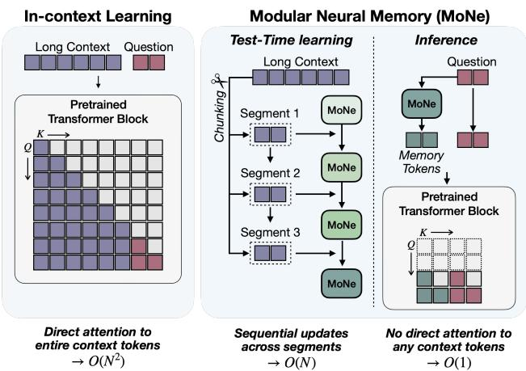
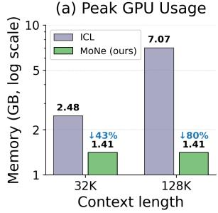
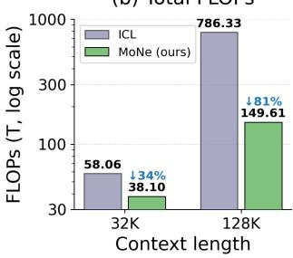
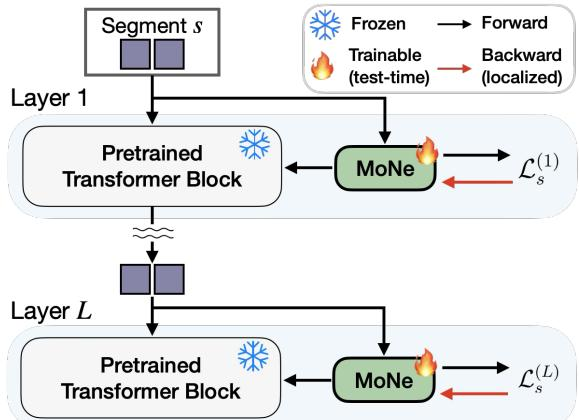
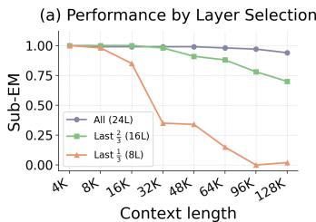
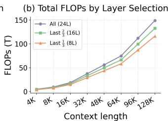
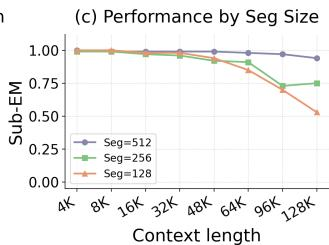
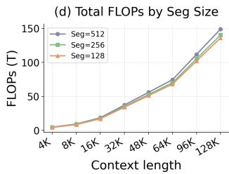

# MoNe: Modular Neural Memory for Efficient Long Context Inference

Wonguk Cho 1 Kyubyung Chae 1 Tribhuvanesh Orekondy 1 Sunghyun Park 1 Hyoungwoo Park 1 Jeongho Kim 1 Arash Behboodi 1 Kyuwoong Hwang 1 Sungrack Yun 1

## Abstract

We present MoNe, a lightweight modular neural memory that attaches to any frozen pretrained Transformer to enable long-context inference without retraining. MoNe reads context in fixedsize segments via test-time learning of fast-weight neural memory networks with layer-localized gradient updates; at inference, the memory generates keys and values from the query tokens alone, with no context tokens re-read. This two-phase design decouples inference cost from context length, achieving O(N) preprocessing and O(1) query cost with peak GPU memory that does not grow with N. At 128K tokens, MoNe reduces both compute and peak GPU memory by approximately 80% compared to ICL with only 6.4% parameter overhead. MoNe generalizes to context lengths far beyond the backbone’s native window, achieving strong performance on needle-ina-haystack and word extraction benchmarks from RULER, where ICL degrades sharply.

## 1. Introduction

Long-context processing has become essential to practical AI applications: personalized assistants that reason over user history, document QA over lengthy contracts or medical records, and agentic systems that must synthesize information spanning tens of thousands of tokens. The dominant approach—feeding the full context as a prompt—scales quadratically in FLOPs $( O ( N ^ { 2 } ) )$ ) with context length. On resource-constrained hardware such as mobile devices, this cost becomes prohibitive; and for small models that are practical on-device, the problem is compounded: they struggle to reliably extract information from long prompts even when those prompts fit within the context window, particularly when tasks demand complex reasoning across many attended tokens.

Figure 1. Comparison of ICL and MoNe. (Left) In ICL, question tokens must attend to all context tokens. (Right) In MoNe, segments are processed sequentially during test-time learning to update neural memory; at inference, question tokens attend only to memory tokens.  

  
Figure 2. End-to-end peak GPU memory and total FLOPs for MoNe (test-time learning + inference) at context lengths of 32K and 128K, in comparison with ICL.

As an alternative, Retrieval-Augmented Generation (RAG) (Lewis et al., 2020; Guu et al., 2020) partially addresses the cost problem by selecting relevant chunks before generation. However, RAG fundamentally limits reasoning to locally-recoverable facts: embedding-based retrieval fails when an answer requires integrating multiple scattered fragments that are individually unremarkable. On the other hand, recurrent models such as Mamba (Gu & Dao, 2024),

TTT (Sun et al., 2025), and Titans (Behrouz et al., 2026) achieve linear-complexity context processing, but they require designing and training entirely new architectures from scratch and cannot be seamlessly integrated with existing pretrained Transformers without full retraining.

We propose MoNe (Modular Neural Memory), a lightweight plugin module that attaches to any frozen pretrained Transformer and enables efficient long-context reasoning without retraining the backbone. As presented in Fig. 1, MoNe sequentially reads context in fixed-size segments and performs test-time learning offast-weight neural memory networks via layer-localized gradient updates— without modifying any backbone weights. After all context segments are processed, the updated neural memory generates memory tokens from the question at inference time; these memory tokens serve as keys and values in the frozen backbone’s self-attention, enabling the model to answer from the question alone, with no directly attention to any context tokens.

MoNe’s efficiency stems directly from this two-phase design: during test-time learning, context segments of size T are processed sequentially in $O ( N )$ total FLOPs; at inference, the query attends only to the memory tokens it generates—not to any context tokens—so inference cost does not scale with $N _ { \ast }$ , compared to $O ( N ^ { 2 } )$ FLOPs for incontext learning (ICL). The fast weights occupy a constant footprint regardless of context length: at 128K tokens, this reduces both compute and peak GPU memory by approximately 80% compared to ICL, with only 6.4% parameter overhead, as shown in Fig. 2. The final fast-weight state can additionally be reused across multiple queries and incrementally extended as new context arrives, without reprocessing past content. MoNe generalizes to 128K (a 32× extrapolation with no additional training) with strong accuracy on S-NIAH, MK-NIAH, and Frequent Word Extraction benchmarks from RULER, while ICL collapses beyond the model’s native context window.

Our contributions can be summarized as follows:

• We propose a modular neural memory architecture that plugs into any pretrained Transformer without backbone modification, adding only 6.4% parameter overhead.

• We introduce a test-time learning procedure with layerlocalized gradient updates that adapts per-layer fastweight neural memory networks to encode long contexts in $O ( N )$ preprocessing and $O ( 1 )$ query cost— compared to $O ( N ^ { 2 } )$ for ICL—with natural support for incremental context extension and multi-query reuse.

• We demonstrate that MoNe trained on contexts up to 4K tokens generalizes to 128K (a 32× extrapolation), achieving strong performance on S-NIAH, MK-NIAH, and Frequent Word Extraction where ICL collapses beyond the native context window, while reducing total FLOPs and peak GPU memory by approximately 80% at 128K.

## 2. Related Work

In this section, we discuss how our work on enabling efficient long-context understanding ties with prior literature.

Long Context Problem. Reasoning over long contexts remains a central challenge for LLMs, in part because selfattention scales quadratically with sequence length. In practice, long-context settings arise when generation is conditioned on large external context, such as documents in retrieval-augmented generation (RAG) (Vodrahalli et al., 2024; Yen et al., 2025), or on extended reasoning traces, such as those produced during mathematical reasoning (Guo et al., 2025). In this work, we focus on the former setting, where answering a query requires analyzing, understanding, and retrieving relevant information from a long input context.

Despite increasingly large context windows, LLMs often fail to robustly exploit long contexts, missing facts buried in documents or failing to preserve information from distant positions (Liu et al., 2024; Hsieh et al., 2024). This limitation is further reflected in the context rot phenomenon (Hong et al., 2025), where increasing input length degrades a model’s ability to use relevant information already present in the context, leading to systematic performance drops even when task-relevant evidence is retained. Prior work has sought to improve long-context performance through long-context fine-tuning (Chen et al., 2024b; Gao et al., 2025), context compression (Yang et al., 2025; Kontonis et al., 2026), and memory-augmented architectures or systems (Chhikara et al., 2025; Zhou et al., 2025; Behrouz et al., 2026). Our work belongs to the memory-augmented line of research, but differs by studying a lightweight neural memory model that is trained at inference time.

Retrieval-Augmented Generation (RAG). RAG (Lewis et al., 2020; Guu et al., 2020) retrieves relevant documents at inference time to extend LLMs beyond their context window (Izacard & Grave, 2021; Shi et al., 2023). In the context of personalization, RAG-based methods select the most relevant fragments of a user’s behavior history to augment the prompt (Salemi et al., 2024; Mysore et al., 2024), yielding strong results on personalization benchmarks. Despite its effectiveness, RAG faces fundamental limitations for personalized on-device agentic AI. The computational overhead of repeatedly searching through large local user contexts (e.g., lengthy chat histories and app usage logs) at every query is prohibitive on resource-constrained devices. More critically, embedding-based retrieval operates on independently chunked segments, making it ill-suited for long-context reasoning tasks that require identifying and synthesizing multiple fragmented, interdependent facts distributed across the full user context (Shi et al., 2023; Gupta et al., 2024).

Test-Time Learning with Neural Memory. Test-Time Training (TTT) (Sun et al., 2025) has emerged as an alternative paradigm for long-context modeling, where a small sub-network with rapidly adaptablefast weights is updated at inference time to compress and store past context as neural memory (Schmidhuber, 1992; Behrouz et al., 2026; Yang et al., 2024; Gu & Dao, 2024). These fast weights function similarly to recurrent states in RNNs, enabling sub-quadratic sequence modeling as an alternative to full self-attention. However, existing TTT methods suffer from low hardware utilization (often below 5% peak FLOPs) due to small mini-batch update sizes. LaCT (Zhang et al., 2026) addresses this by adopting extremely large chunk updates (2K–1M tokens), achieving up to 70% GPU utilization and enabling significantly larger fast-weight state sizes. Despite these advances, all such approaches require training new architectures from scratch, making them difficult to integrate with existing pretrained Transformer-based models.

## 3. MoNe: Modular Neural Memory for Pretrained Transformer Attention

## 3.1. Problem Setup

We consider a pretrained L-layer Transformer with hidden dimension d whose weights are kept completely frozen. Given a context $\mathbf { C } = \left( t _ { 1 } , \ldots , t _ { N } \right)$ of N tokens and a query q, our goal is to enable efficient and effective long-context inference without modifying any backbone parameter. We partition C into S non-overlapping segments $\mathbf { s } _ { 1 } , \ldots , \mathbf { s } _ { S }$ of $T { = } 5 1 2$ tokens each, with $s \in \{ 1 , \ldots , S \}$ and $s { = } 0$ denoting the initial state before any segment is processed.

At each layer l, self-attention projects the segment hidden states $\mathbf { X } ^ { ( l ) } \in \mathbb { R } ^ { T \times d }$ into queries, keys, and values via frozen weight matrices $\mathbf { W } _ { q } , \mathbf { W } _ { k } , \mathbf { W } _ { v }$

$$
\mathbf { Q } = \mathbf { W } _ { q } \mathbf { X } ^ { ( l ) } , \quad \mathbf { K } = \mathbf { W } _ { k } \mathbf { X } ^ { ( l ) } , \quad \mathbf { V } = \mathbf { W } _ { v } \mathbf { X } ^ { ( l ) } ,\tag{1}
$$

and computes the attention output as:

$$
{ \mathrm { A t t e n t i o n } } ( \mathbf { Q } , \mathbf { K } , \mathbf { V } ) = { \mathrm { s o f t m a x } } \left( { \frac { \mathbf { Q } \mathbf { K } ^ { \top } } { \sqrt { d _ { h } } } } \right) \mathbf { V } ,\tag{2}
$$

where $d _ { h }$ is the per-head dimension. Processing a long context of N tokens incurs $O ( N ^ { 2 } )$ FLOPs and requires a KV cache that grows as $O ( N )$ , making long-context inference prohibitively expensive on resource-constrained devices.

  
Figure 3. An overview of the update process of MoNe during test-time learning. For each layer, neural memory fast weights are updated using the associative memory loss, which is localized and computed entirely from layer l’s own forward-pass activations, making the memory update both efficient and truly modular.

## 3.2. Memory Injection into Backbone Attention

MoNe attaches a fast-weight neural memory to each decoder layer l (Fig. 3). Following Zhang et al. (2026), we use a SwiGLU MLP for the memory module of each layer $l ,$ defined as $\mathcal { M } ( \cdot ; \mathbf { W } ^ { ( l ) } )$ with fast-weight parameters $\mathbf W ^ { ( l ) } = \{ \mathbf W _ { \mathrm { i n } } , \mathbf W _ { \mathrm { g a t e } } , \mathbf W _ { \mathrm { o u t } } \}$

$$
\boldsymbol { \mathcal { M } } ( \mathbf { x } ; \mathbf { W } ^ { ( l ) } ) = \mathbf { W } _ { \mathrm { o u t } } ^ { \top } \Big ( \mathrm { S i L U } \big ( \mathbf { W } _ { \mathrm { i n } } \mathbf { x } \big ) \odot \mathbf { W } _ { \mathrm { g a t e } } \mathbf { x } \Big ) ,\tag{3}
$$

where all three matrices are $\mathbb { R } ^ { d _ { h } \times d _ { h } }$ per fast-weight head and are updated online as context segments are consumed. Using a nonlinear network rather than a single linear map substantially increases the expressive capacity of the stored memory, allowing each layer to encode richer associative structure within the same parameter budget. At generation time, the query tokens are projected via $\mathbf { W } _ { q }$ and used to read from the cached fast-weight state $\mathbf { W } _ { S } ^ { ( l ) }$ (the state after all S segments have been processed), producing layer-wise memory tokens:

$$
\mathbf h _ { j } = \mathcal { M } \left( \mathbf { W } _ { q } \mathbf { x } _ { j } ; \mathbf { W } _ { S } ^ { ( l ) } \right) .\tag{4}
$$

The raw output is normalized per fast-weight head with RM-SNorm and scaled by a learned per-head gate, producing the memory tokens $\mathbf { h } _ { j }$ used below. These memory tokens are projected into key-value space using the same frozen backbone matrices $\mathbf { W } _ { k }$ and $\mathbf { W } _ { v }$ , and concatenated alongside the standard attention entries derived from the query tokens:

$$
\mathrm { o u t } = \mathrm { A t t e n t i o n } ( \mathbf { Q } , \mid \mathbf { K } \mid \mid \mathbf { W } _ { k } \mathbf { h } ] , \mid \mathbf { V } \mid \mid \mathbf { W } _ { v } \mathbf { h } ] ) ,\tag{5}
$$

where Q, K, V are the standard attention projections of the query tokens per Eq. (1). While $\mathbf { W } _ { q } , \mathbf { W } _ { k }$ , and $\mathbf { W } _ { v }$ are shared directly from the backbone without duplication,

MoNe adds only small low-rank adapters (Hu et al., 2022) to these frozen weights. The memory KV pair has a fixed size of $T$ entries per layer regardless of N, keeping the KVcache footprint constant during both test-time learning and inference.

## 3.3. Associative Memory Loss and Update

During test-time learning, the memory module M is $\mathrm { { _ { o p - } } }$ timized via an associative memory loss. The key-value training targets are produced by $\mathbf { W } _ { k }$ and $\mathbf { W } _ { v }$ , which are frozen backbone weights equipped with meta-trained LoRA adapters:

$$
\mathbf { k } _ { s , j } ^ { ( l ) } = \mathbf { W } _ { k } \mathbf { x } _ { s , j } ^ { ( l ) } , \quad \mathbf { v } _ { s , j } ^ { ( l ) } = \mathbf { W } _ { v } \mathbf { x } _ { s , j } ^ { ( l ) } ,\tag{6}
$$

where $j \in \{ 1 , \ldots , T \}$ indexes tokens within segment s. In practice, $\mathbf { k } _ { s , j } ^ { ( l ) }$ is further passed through SiLU activation and per-token L2 normalization after projection, and $\mathbf { v } _ { s , j } ^ { ( l ) }$ through SiLU activation; see Appendix A for the full pipeline. Following Zhang et al. (2026), we define the associative memory loss as the negative inner product between the memory output and the target value:

$$
\ell _ { s , j } ^ { ( l ) } \Big ( \mathbf { W } ^ { ( l ) } \Big ) \ = \ - \big ( \mathbf { v } _ { s , j } ^ { ( l ) } \big ) ^ { \top } \mathcal { M } \Big ( \mathbf { k } _ { s , j } ^ { ( l ) } ; \mathbf { W } ^ { ( l ) } \Big ) \ ,\tag{7}
$$

with segment-level average $\begin{array} { r } { \mathcal { L } _ { s } ^ { ( l ) } = \frac { 1 } { T } \sum _ { j = 1 } ^ { T } \ell _ { s , j } ^ { ( l ) } } \end{array}$ . Minimizing $\ell _ { s , j } ^ { ( l ) }$ directly imprints the association $\mathbf { k } _ { s , j } ^ { ( l ) }  \mathbf { v } _ { s , j } ^ { ( l ) }$ into the fast weights by maximizing the inner product between the memory output and the target value, without requiring a prediction error.

The fast weights are updated at each segment via a gradient step:

$$
\mathbf { W } _ { s } ^ { ( l ) } = \mathbf { W } _ { s - 1 } ^ { ( l ) } - \mathbf { \mu } \mu _ { s } ^ { ( l ) } ,\tag{8}
$$

where $\mu _ { s } ^ { ( l ) }$ accumulates gradients of $\ell _ { s , j } ^ { ( l ) }$ with per-token learning rates and data-dependent momentum decay $( \mathsf { A p - } $ pendix A).

Positional information is incorporated into $\mathbf { k } _ { s , j } ^ { ( l ) }$ via segmentlocal RoPE: each context token is assigned position $p _ { j } ^ { \mathrm { l o c a l } } { = } j$ mod T, so position indices always lie in [0, T) regardless of N. At inference time, query tokens receive positions in [0, Q) where $Q$ is the query length; since $Q \ll T$ , this falls within the same [0, T) range with no positional interpolation required, allowing MoNe to generalize to arbitrarily long contexts. The LoRA adapters and meta-parameters $( \eta ^ { ( \bar { l } ) }$ , momentum projections, output scale) are trained offline via a generation loss on answer tokens conditioned on the updated memory $\mathbf { W } _ { S } ^ { ( l ) }$ and remain frozen during test-time learning and inference, so that the fast weight update operates as a fixed, pre-learned algorithm at deployment.

## 3.4. Test-Time Learning and Inference

During test-time learning, segments are consumed sequentially and the fast weights at each layer l are updated per Eq. (8):

$$
\mathbf { W } _ { 0 } ^ { ( l ) } \to \mathbf { W } _ { 1 } ^ { ( l ) } \to \cdots \to \mathbf { W } _ { S } ^ { ( l ) } .\tag{9}
$$

Each update step computes the per-token gradient of $\ell _ { s , j } ^ { ( l ) }$ locally at layer l:

$$
\nabla _ { \mathbf { W } _ { s - 1 } ^ { ( l ) } } \ell _ { s , j } ^ { ( l ) } = - \mathbf { v } _ { s , j } ^ { ( l ) } \frac { \partial \mathcal { M } \left( \mathbf { k } _ { s , j } ^ { ( l ) } ; \mathbf { W } _ { s - 1 } ^ { ( l ) } \right) ^ { \top } } { \partial \mathbf { W } _ { s - 1 } ^ { ( l ) } } ,\tag{10}
$$

carrying no gradient through any other layer:

$$
\frac { \partial \ell _ { s , j } ^ { ( l ) } } { \partial \mathbf { W } _ { s - 1 } ^ { ( l ^ { \prime } ) } } = \mathbf { 0 } \qquad \forall l ^ { \prime } \neq l .\tag{11}
$$

Each update is thus computed entirely from layer $l \mathbf { \{ } s $ own forward-pass activations, making the memory update both efficient and truly modular. By contrast, updating $\mathbf { W } _ { s - 1 } ^ { ( l ) }$ via a standard cross-entropy loss would require propagating gradients from the output logits back through all subsequent layers $\mathbf { W } _ { s - 1 } ^ { ( L ) } , \ldots , \mathbf { W } _ { s - 1 } ^ { ( l + 1 ) }$ before reaching layer l.

During inference, the query tokens are projected via $\mathbf { W } _ { q }$ and the memory is read without any weight update per Eq. (4), producing memory tokens supplied to the frozen backbone in Eq. (5).

## 4. Experiments

In this section, we first detail the experimental setup, and follow up by presenting quantitative results and a detailed computation cost analysis.

## 4.1. Experimental Setup

Datasets. We evaluate on three tasks drawn from the RULER benchmark (Hsieh et al., 2024), each designed to require precise retrieval or aggregation over the full context rather than surface-level pattern matching. We use S-NIAH (Single Needle-in-a-Haystack), MK-NIAH (Multi-Key Needle-in-a-Haystack), and FWE (Frequent Word Extraction) tasks.

Evaluation Metric. S-NIAH and MK-NIAH use substring exact match (Sub-EM): whether the ground-truth value appears as a substring of the model’s output (Asai et al., 2024). For FWE, we measure variable recall: the fraction of the three target words that appear in the model’s output. All tasks are evaluated at context lengths of 4K, 8K, 16K, and 32K tokens (within the backbone’s native window) and 48K, 64K, 96K, and 128K tokens (beyond the native window). Further training and evaluation details are described in the Appendix A.

Table 1. Performance of ICL, RAG, and MoNe (ours) on S-NIAH, MK-NIAH, and Frequent Word Extraction across varying context lengths. Results are grouped by whether the input length falls within or beyond the model’s training context length (32K tokens), assessing generalization to out-of-training-distribution sequence lengths.
<table><tr><td rowspan="2">Task</td><td rowspan="2">Method</td><td colspan="4">Within model context length</td><td colspan="4">Beyond model context length</td></tr><tr><td>4K</td><td>8K</td><td>16K</td><td>32K</td><td>48K</td><td>64K</td><td>96K</td><td>128K</td></tr><tr><td rowspan="3">S-NIAH</td><td>ICL</td><td>0.95</td><td>0.98</td><td>0.94</td><td>0.94</td><td>0.64</td><td>0.60</td><td>0.42</td><td>0.28</td></tr><tr><td>RAG</td><td>0.94</td><td>0.93</td><td>0.91</td><td>0.93</td><td>0.93</td><td>0.93</td><td>0.97</td><td>0.89</td></tr><tr><td>MoNe (ours)</td><td>1.00</td><td>1.00</td><td>0.99</td><td>1.00</td><td>1.00</td><td>0.99</td><td>0.99</td><td>0.96</td></tr><tr><td rowspan="3">MK-NIAH</td><td>ICL</td><td>0.89</td><td>0.84</td><td>0.83</td><td>0.93</td><td>0.41</td><td>0.13</td><td>0.11</td><td>0.00</td></tr><tr><td>RAG</td><td>0.92</td><td>0.91</td><td>0.88</td><td>0.79</td><td>0.80</td><td>0.66</td><td>0.74</td><td>0.71</td></tr><tr><td>MoNe (ours)</td><td>1.00</td><td>0.99</td><td>0.99</td><td>0.99</td><td>0.99</td><td>0.98</td><td>0.97</td><td>0.94</td></tr><tr><td rowspan="3">Frequent Word Extraction</td><td>ICL</td><td>0.59</td><td>0.57</td><td>0.42</td><td>0.41</td><td>0.29</td><td>0.31</td><td>0.28</td><td>0.23</td></tr><tr><td>RAG</td><td>0.58</td><td>0.61</td><td>0.60</td><td>0.61</td><td>0.61</td><td>0.59</td><td>0.60</td><td>0.60</td></tr><tr><td>MoNe (ours)</td><td>1.00</td><td>1.00</td><td>1.00</td><td>1.00</td><td>0.99</td><td>0.99</td><td>0.96</td><td>0.96</td></tr></table>

Baselines. We use Qwen2.5-0.5B-Instruct (Qwen et al., 2025) as the frozen backbone for all methods.

In-Context Learning (ICL) feeds the full context directly as a prompt, up to the backbone’s native 32K context window; performance degrades sharply beyond this limit as the model must attend over increasingly many tokens.

Retrieval-Augmented Generation (RAG) treats the long context as an external memory from which relevant information can be retrieved at query time—a natural baseline that avoids quadratic attention cost by first compressing the context into a retrievable index (Lewis et al., 2020; Guu et al., 2020; Izacard & Grave, 2021). We split each context into chunks of 128 tokens and use BGE-Large (Chen et al., 2024a) to compute embeddings; the top-K chunks with highest cosine similarity to the query are concatenated as the prompt. We evaluate $K \in \{ 1 , 4 , 8 \}$ and report the best score at each context length.

## 4.2. Evaluation Results

Table 1 reports results of all three methods across three tasks and eight context lengths, covering both within and beyond the backbone’s native 32K window. The results reveal a consistent pattern: MoNe sustains near-perfect performance across all tasks, while ICL collapses once the context exceeds the native limit and RAG plateaus on tasks that require integrating information distributed across the full context.

Within the Native Context Window (4K–32K). MoNe achieves near-perfect Sub-EM across all tasks and context lengths (0.99–1.00), substantially outperforming ICL (0.41– 0.98) and RAG (0.58–0.93). ICL’s degradation even within the native window is most pronounced on Frequent Word Extraction, where attending to all tokens is necessary but the backbone’s limited capacity is overwhelmed; MoNe’s compressed representation is more robust.

Beyond the Native Context Window (48K–128K). ICL degrades sharply once the context exceeds the 32K window:

Table 2. Computational cost comparison at different context lengths. Values in parentheses denote reduction rate relative to ICL (↓ larger is better).
<table><tr><td>Method</td><td>Peak GPU Usage</td><td>Total FLOPs</td><td></td></tr><tr><td colspan="4">Context length = 32K</td></tr><tr><td>ICL</td><td>2.48 GB</td><td>58.06T</td><td></td></tr><tr><td>MoNe (total)</td><td>1.41 GB (↓43%)</td><td>38.10 T</td><td>(↓34%)</td></tr><tr><td> Test-time learning</td><td>1.41 GB</td><td>37.24T</td><td></td></tr><tr><td> Inference</td><td>1.29 GB</td><td>0.86T</td><td></td></tr><tr><td colspan="4">Context length = 128K</td></tr><tr><td>ICL</td><td>7.07 GB</td><td>786.33 T</td><td></td></tr><tr><td>MoNe (total)</td><td>1.41 GB</td><td>(↓80%) 149.61 T</td><td>(↓81%)</td></tr><tr><td>Test-time learning</td><td>1.41 GB</td><td>148.97T</td><td></td></tr><tr><td> Inference</td><td>1.29 GB</td><td>0.64T</td><td></td></tr></table>

from 0.64 on S-NIAH at 48K to 0.28 at 128K, and from 0.41 to 0.00 on MK-NIAH. RAG is more stable but plateaus below 0.97 on S-NIAH and below 0.80 on MK-NIAH, as embedding-based retrieval struggles with multi-hop facts distributed across many passages. MoNe maintains 0.96, 0.94, and 0.96 Sub-EM on S-NIAH, MK-NIAH, and Frequent Word Extraction at 128K tokens, despite being trained exclusively on contexts up to 4K tokens. This generalization in context length with no additional training or positional interpolation is enabled by the segment-local RoPE encoding (§3.3), which keeps position indices bounded in [0, T) regardless of total context length.

## 4.3. Computational Cost Analysis

Table 2 compares the end-to-end computational cost of ICL and MoNe, including both test-time learning and inference. At 32K tokens, MoNe reduces peak GPU memory by 43% (1.41 GB vs. 2.48 GB) and total FLOPs by 34% (38.10 T vs. 58.06 T). The advantage becomes more pronounced at longer contexts. At 128K tokens, ICL requires 7.07 GB and 786.3 T FLOPs for inference alone, whereas MoNe requires only 1.41 GB and 149.61 T FLOPs in total.

Importantly, MoNe’s peak GPU memory is independent of the context length N. During test-time learning, fast-weight updates are computed locally within fixed-size segments (Eq. (8)), resulting in a constant 1.41 GB. At inference time, queries attend only to the fixed-size memory tokens, requiring 1.29 GB of memory and 0.64 T FLOPs.

  
Figure 4. Ablation study on performance-efficiency trade-off: (Left) Layer selection. Attaching MoNe to all 24 decoder layers achieves the highest accuracy across all context lengths; restricting to the last 16 layers (last $_ { \frac { 2 } { 3 } } ^ { } )$ yields modest degradation beyond 32K, while using only the last 8 layers (last $_ { \frac { 1 } { 3 } } ^ { \frac { 1 } { 3 } } )$ collapses beyond 32K. (Right) Segment size. T=512 (default) generalizes from 4K training contexts to 128K evaluation contexts, whereas $\scriptstyle { \hat { T } } = 1 2 8$ and T=256 degrade rapidly past 16K, yet offer only marginal efficiency gains over the default.

## 4.4. Performance-Efficiency Trade-off

Figure 4 presents two ablations on MK-NIAH, examining how layer coverage and segment size each contribute to long-context generalization.

Layer Selection. We ablate the effect of attaching MoNe to different subsets of the 24 decoder layers. Figure 4(a) shows that attaching MoNe to all 24 layers achieves Sub-EM scores of 1.00 / 0.98 / 0.94 at 4K / 64K / 128K. Restricting MoNe to the last 16 layers (the final $_ { 3 } ^ { 2 } )$ preserves shortcontext performance (1.00 at 4K) but degrades at longer contexts (0.88 at 64K, 0.70 at 128K). Restricting further to the last 8 layers (the final $_ { \frac { 1 } { 3 } } ^ { \frac { 1 } { 3 } } )$ leads to a substantial collapse, dropping to 0.15 at 64K and 0.02 at 128K. Each additional group of 8 layers adds only ≈12.6M parameters (≈2.1% of backbone size), and Fig. 4(b) shows that the FLOPs overhead is equally modest: at 128K, all-24L incurs 149.1T FLOPs versus 132.6T for last-16L and 116.1T for last-8L— the restricted configurations reduce FLOPs by only 11–22% while suffering a far greater loss in performance.

Segment Size. We compare three segment sizes $T \in$ {128, 256, 512} across the same context lengths. Increasing the segment size consistently improves long-context performance: at 64K / 128K, T=512 achieves 0.98 / 0.94, outperforming T=256 (0.91 / 0.75) and T=128 (0.85 / 0.53). Although all configurations are trained on contexts of up to 4K tokens, smaller segments degrade more sharply at longer test contexts. As shown in Fig. 4(d), smaller segments offer only marginal FLOPs savings; as shown in Fig. 4(c), this comes at a substantial cost to long-context performance. We therefore adopt T=512, which delivers the strongest performance among the tested configurations.

## 5. Conclusion

MoNe augments frozen, pretrained Transformers with longcontext capabilities via modular neural memory, requiring no modifications to the backbone weights. Although trained on relatively short sequences, MoNe generalizes to context lengths far exceeding the native window. In our experiments, MoNe consistently outperforms ICL, which suffers from sharp performance degradation beyond the training limit. It also surpasses RAG on tasks requiring the synthesis of distributed information. These performance gains are achieved with high efficiency; at 128K tokens, MoNe reduces both FLOPs and peak GPU memory by approximately 80% compared to ICL. Crucially, its memory footprint remains constant regardless of context length. Finally, our ablation studies show that full layer coverage with a segment size of 512 optimizes the performance-efficiency trade-off. MoNe is thus highly effective for resource-constrained applications, such as on-device personalization (Cho et al., 2024; Park et al., 2026) and continual learning (Cho et al., 2023; Dorovatas et al., 2026).

Limitations and Future Work. Current experiments validate MoNe’s core properties—long-context generalization, constant-memory inference, and modular integration— using a Qwen2.5-0.5B backbone and the controlled retrieval tasks in RULER. Extending these results to larger model scales and to naturalistic long-document workloads such as single/multi-document QA (Yang et al., 2018; Rajpurkar et al., 2016) and real-world conversational histories (Maharana et al., 2024; Shaham et al., 2023) is a natural next step: MoNe’s plug-in design requires no architectural changes to accommodate larger backbones, and the efficiency advantages of constant-memory inference are expected to become even more pronounced at scale, where KV-cache cost is otherwise extremely prohibitive. A further direction is to apply different LoRA-based approaches (Hu et al., 2022; Hwang et al., 2025) for each neural memory to improve efficiency and enable flexible management of multiple memory modules.

## References

Asai, A., Wu, Z., Wang, Y., Sil, A., and Hajishirzi, H. Selfrag: Learning to retrieve, generate, and critique through self-reflection. In International conference on learning representations, volume 2024, pp. 9112–9141, 2024.

Behrouz, A., Zhong, P., and Mirrokni, V. Titans: Learning to memorize at test time. In The Thirty-ninth Annual Conference on Neural Information Processing Systems, 2026. URL https://openreview.net/forum ?id=8GjSf9Rh7Z.

Chen, J., Xiao, S., Zhang, P., Luo, K., Lian, D., and Liu, Z. M3-embedding: Multi-linguality, multifunctionality, multi-granularity text embeddings through self-knowledge distillation. In Ku, L.-W., Martins, A., and Srikumar, V. (eds.), Findings of the Association for Computational Linguistics: ACL 2024, pp. 2318–2335, Bangkok, Thailand, August 2024a. Association for Computational Linguistics. doi: 10.18653/v1/2024.findings-a cl.137. URL https://aclanthology.org/202 4.findings-acl.137/.

Chen, Y., Qian, S., Tang, H., Lai, X., Liu, Z., Han, S., and Jia, J. Longlora: Efficient fine-tuning of long-context large language models. In International Conference on Learning Representations, volume 2024, pp. 8220–8238, 2024b.

Chhikara, P., Khant, D., Aryan, S., Singh, T., and Yadav, D. Mem0: Building production-ready ai agents with scalable long-term memory. arXiv preprint arXiv:2504.19413, 2025.

Cho, W., Park, J., and Kim, T. Complementary domain adaptation and generalization for unsupervised continual domain shift learning. In Proceedings ofthe IEEE/CVF International Conference on Computer Vision, pp. 11442– 11452, 2023.

Cho, W., Choi, S., Das, D., Reisser, M., Kim, T., Yun, S., and Porikli, F. Hollowed net for on-device personalization of text-to-image diffusion models. Advances in Neural Information Processing Systems, 37:43058–43079, 2024.

Dorovatas, V., Schwerin, M., Bagdanov, A. D., Caccia, L., Carta, A., Charlin, L., Hammer, B., Hayes, T. L., Hess, T., Kanan, C., et al. Modular memory is the key to continual learning agents. arXiv preprint arXiv:2603.01761, 2026.

Gao, T., Wettig, A., Yen, H., and Chen, D. How to train long-context language models (effectively). In Proceedings of the 63rd Annual Meeting of the Association for Computational Linguistics (Volume 1: Long Papers), pp. 7376–7399, 2025.

Gu, A. and Dao, T. Mamba: Linear-time sequence modeling with selective state spaces. In First Conference on Language Modeling, 2024. URL https://openre view.net/forum?id=tEYskw1VY2.

Guo, D., Yang, D., Zhang, H., Song, J., Wang, P., Zhu, Q., Xu, R., Zhang, R., Ma, S., Bi, X., et al. Deepseek-r1: Incentivizing reasoning capability in llms via reinforcement learning. arXiv preprint arXiv:2501.12948, 2025.

Gupta, A., Shirgaonkar, A., Balaguer, A. d. L., Silva, B., Holstein, D., Li, D., Marsman, J., Nunes, L. O., Rouzbahman, M., Sharp, M., et al. Rag vs fine-tuning: Pipelines, tradeoffs, and a case study on agriculture. arXiv preprint arXiv:2401.08406, 2024.

Guu, K., Lee, K., Tung, Z., Pasupat, P., and Chang, M.-W. Realm: retrieval-augmented language model pre-training. In Proceedings ofthe 37th International Conference on Machine Learning, ICML’20. JMLR.org, 2020.

Hong, K., Troynikov, A., and Huber, J. Context rot: How increasing input tokens impacts llm performance. URL https://research. trychroma. com/context-rot, retrieved October, 20:2025, 2025.

Hsieh, C.-P., Sun, S., Kriman, S., Acharya, S., Rekesh, D., Jia, F., and Ginsburg, B. RULER: What’s the real context size of your long-context language models? In First Conference on Language Modeling, 2024. URL https: //openreview.net/forum?id=kIoBbc76Sy.

Hu, E. J., yelong shen, Wallis, P., Allen-Zhu, Z., Li, Y., Wang, S., Wang, L., and Chen, W. LoRA: Low-rank adaptation of large language models. In International Conference on Learning Representations, 2022. URL https://openreview.net/forum?id=nZeV KeeFYf9.

Hwang, J., Cho, W., and Kim, T. Pica: Parameter-efficient fine-tuning with column space projection. arXiv preprint arXiv:2505.20211, 2025.

Izacard, G. and Grave, E. Leveraging passage retrieval with generative models for open domain question answering. In Merlo, P., Tiedemann, J., and Tsarfaty, R. (eds.), Proceedings of the 16th Conference of the European Chapter of the Association for Computational Linguistics: Main Volume, pp. 874–880, Online, April 2021. Association for Computational Linguistics. doi: 10.18653/v1/2021.eacl- main.74. URL https: //aclanthology.org/2021.eacl-main.74/.

Kontonis, V., Zeng, Y., Garg, S., Chen, L., Tang, H., Wang, Z., Awadallah, A., Horvitz, E., Langford, J., and Papailiopoulos, D. Memento: Teaching llms to manage their own context. arXiv preprint arXiv:2604.09852, 2026.

Lewis, P., Perez, E., Piktus, A., Petroni, F., Karpukhin, V., Goyal, N., Kuttler, H., Lewis, M., Yih, W.-t., Rockt¨ aschel,¨ T., Riedel, S., and Kiela, D. Retrieval-augmented generation for knowledge-intensive nlp tasks. In Larochelle, H., Ranzato, M., Hadsell, R., Balcan, M., and Lin, H. (eds.), Advances in Neural Information Processing Systems, volume 33, pp. 9459–9474. Curran Associates, Inc., 2020. URL https://proceedings.neurips.cc/p aper\_files/paper/2020/file/6b4932302 05f780e1bc26945df7481e5-Paper.pdf.

Liu, N. F., Lin, K., Hewitt, J., Paranjape, A., Bevilacqua, M., Petroni, F., and Liang, P. Lost in the middle: How language models use long contexts. Transactions ofthe Associationfor Computational Linguistics, 12:157–173, 2024. doi: 10.1162/tacl a 00638. URL https://ac lanthology.org/2024.tacl-1.9/.

Maharana, A., Lee, D.-H., Tulyakov, S., Bansal, M., Barbieri, F., and Fang, Y. Evaluating very long-term conversational memory of llm agents. In Proceedings of the 62nd Annual Meeting of the Association for Computational Linguistics (Volume 1: Long Papers), pp. 13851–13870, 2024.

Mysore, S., Lu, Z., Wan, M., Yang, L., Sarrafzadeh, B., Menezes, S., Baghaee, T., Gonzalez, E. B., Neville, J., and Safavi, T. Pearl: Personalizing large language model writing assistants with generation-calibrated retrievers. In Kumar, S., Balachandran, V., Park, C. Y., Shi, W., Hayati, S. A., Tsvetkov, Y., Smith, N., Hajishirzi, H., Kang, D., and Jurgens, D. (eds.), Proceedings of the 1st Workshop on Customizable NLP: Progress and Challenges in Customizing NLP for a Domain, Application, Group, or Individual (CustomNLP4U), pp. 198–219, Miami, Florida, USA, November 2024. Association for Computational Linguistics. doi: 10.18653/v1/2024.customnlp4u-1.16. URL https://aclanthology.org/2024.cu stomnlp4u-1.16/.

Park, S., Kim, J., Park, H., Das, D., Yun, S., Hayat, M., Choo, J., Porikli, F., and Choi, S. Memory-efficient finetuning diffusion transformers via dynamic patch sampling and block skipping. arXiv preprint arXiv:2603.20755, 2026.

Qwen, :, Yang, A., Yang, B., Zhang, B., Hui, B., Zheng, B., Yu, B., Li, C., Liu, D., Huang, F., Wei, H., Lin, H., Yang, J., Tu, J., Zhang, J., Yang, J., Yang, J., Zhou, J., Lin, J., Dang, K., Lu, K., Bao, K., Yang, K., Yu, L., Li, M., Xue, M., Zhang, P., Zhu, Q., Men, R., Lin, R., Li, T., Tang, T., Xia, T., Ren, X., Ren, X., Fan, Y., Su, Y., Zhang, Y., Wan, Y., Liu, Y., Cui, Z., Zhang, Z., and Qiu, Z. Qwen2.5 technical report, 2025. URL https: //arxiv.org/abs/2412.15115.

Rajpurkar, P., Zhang, J., Lopyrev, K., and Liang, P. Squad: 100,000+ questions for machine comprehension of text. In Proceedings of the 2016 conference on empirical methods in natural language processing, pp. 2383–2392, 2016.

Salemi, A., Mysore, S., Bendersky, M., and Zamani, H. LaMP: When large language models meet personalization. In Ku, L.-W., Martins, A., and Srikumar, V. (eds.), Proceedings of the 62nd Annual Meeting of the Association for Computational Linguistics (Volume 1: Long Papers), pp. 7370–7392, Bangkok, Thailand, August 2024. Association for Computational Linguistics. doi: 10.18653/v1/2024.acl- long.399. URL https: //aclanthology.org/2024.acl-long.399/.

Schmidhuber, J. Learning to control fast-weight memories: an alternative to dynamic recurrent networks. Neural Comput., 4(1):131–139, January 1992. ISSN 0899-7667. doi: 10.1162/neco.1992.4.1.131. URL https://doi. org/10.1162/neco.1992.4.1.131.

Shaham, U., Ivgi, M., Efrat, A., Berant, J., and Levy, O. Zeroscrolls: A zero-shot benchmark for long text understanding. In Findings of the Association for Computational Linguistics: EMNLP 2023, pp. 7977–7989, 2023.

Shi, F., Chen, X., Misra, K., Scales, N., Dohan, D., Chi, E., Scharli, N., and Zhou, D. Large language models can be¨ easily distracted by irrelevant context. In Proceedings of the 40th International Conference on Machine Learning, ICML’23. JMLR.org, 2023.

Sun, Y., Li, X., Dalal, K., Xu, J., Vikram, A., Zhang, G., Dubois, Y., Chen, X., Wang, X., Koyejo, S., Hashimoto, T., and Guestrin, C. Learning to (learn at test time): RNNs with expressive hidden states. In Forty-second International Conference on Machine Learning, 2025. URL https://openreview.net/forum?id= wXfuOj9C7L.

Vodrahalli, K., Ontanon, S., Tripuraneni, N., Xu, K., Jain, S., Shivanna, R., Hui, J., Dikkala, N., Kazemi, M., Fatemi, B., et al. Michelangelo: Long context evaluations beyond haystacks via latent structure queries. arXiv preprint arXiv:2409.12640, 2024.

Yang, C., Srebro, N., McAllester, D., and Li, Z. Pencil: Long thoughts with short memory. arXiv preprint arXiv:2503.14337, 2025.

Yang, S., Wang, B., Shen, Y., Panda, R., and Kim, Y. Gated linear attention transformers with hardware-efficient training. In Proceedings ofthe 41st International Conference on Machine Learning, ICML’24. JMLR.org, 2024.

Yang, Z., Qi, P., Zhang, S., Bengio, Y., Cohen, W., Salakhutdinov, R., and Manning, C. D. Hotpotqa: A dataset for diverse, explainable multi-hop question answering. In Proceedings ofthe 2018 conference on empirical methods in natural language processing, pp. 2369–2380, 2018.

Yen, H., Gao, T., Hou, M., Ding, K., Fleischer, D., Izsak, P., Wasserblat, M., and Chen, D. Helmet: How to evaluate long-context language models effectively and thoroughly. ICLR, 2025.

Zhang, T., Bi, S., Hong, Y., Zhang, K., Luan, F., Yang, S., Sunkavalli, K., Freeman, W. T., and Tan, H. Testtime training done right. In The Fourteenth International Conference on Learning Representations, 2026. URL https://openreview.net/forum?id=Tb9q AxT3xv.

Zhou, Z., Qu, A., Wu, Z., Kim, S., Prakash, A., Rus, D., Zhao, J., Low, B. K. H., and Liang, P. P. Mem1: Learning to synergize memory and reasoning for efficient longhorizon agents. arXiv preprint arXiv:2506.15841, 2025.

## A. Experimental Details

## A.1. Datasets

From the RULER benchmark (Hsieh et al., 2024), we use the following three tasks:

• S-NIAH (Single Needle-in-a-Haystack) embeds a single key–value pair of adjective-noun compound words at a random depth within a passage of filler text; the model must recall the exact value given the key. We measure Sub-EM: whether the ground-truth value appears as a substring of the model’s output.

• MK-NIAH (Multi-Key Needle-in-a-Haystack) plants four key–value pairs of adjective-noun compound words at scattered positions within Paul Graham essay excerpts; the model is queried for the value of one specific key while the remaining pairs serve as distractors. Sub-EM is reported on the queried value.

• Frequent Word Extraction (FWE) fills the context with synthetic 6-character words sampled from a Zipfian distribution (α=2.0), with the top-ranked word replaced by a noise token; the model must identify the top-3 most frequent non-noise words. We measure variable recall: the fraction of the three target words that appear in the model’s output.

With a segment size of 512 tokens, we generate 30K samples for each $N \in \{ 2 , 3 , \ldots , 8 \}$ , covering context lengths from 1K to 4K tokens, for offline training of LoRA adapters and meta-parameters $( \pmb { \eta } ^ { ( l ) }$ , momentum projections). For evaluation, we generate 100 samples per $N \in \{ 8 , 1 6 , \ldots , 2 5 6 \}$ , ranging from 4K to 128K context lengths. At test time, context segments are processed sequentially to update the neural memory; the model then answers using only the final memory state, with no direct access to the context.

## A.2. Implementation Details

We use Qwen2.5-0.5B-Instruct as the frozen backbone, attaching a SwiGLU MLP to each decoder layer (H=4 heads, $d _ { h } \mathrm { = } 2 2 4 )$ . Following Zhang et al. (2026), keys and queries undergo affine rescaling, SiLU, and per-token L2 normalization, values SiLU only, and the output is RMSNorm-normalized and SiLU-gated before injection into attention. Weights are channel-wise L2-renormalized after each update, and the gradient uses a learned per-token learning rate (softplus-activated) and data-dependent momentum decay (sigmoid-activated). The data-dependent decay $\beta _ { s } ^ { ( l ) } \in ( 0 , 1 )$ is predicted from each chunk’s hidden states, allowing the momentum to be selectively reset based on content. For LoRA adapters, rank 128 and α=128 are used. We train for one epoch with AdamW $( \beta _ { 1 } { = } 0 . 9 , \beta _ { 2 } { = } 0 . 9 5$ , wd 0.1), batch 16, lr $1 0 ^ { - 3 } / 5 { \times } 1 0 ^ { - 5 }$ (non-LoRA/LoRA), 200-step warmup and cosine decay to $\eta _ { \mathrm { m i n } } \mathrm { = } 1 0 ^ { - 5 }$ , gradient clip 1.0, bf16.