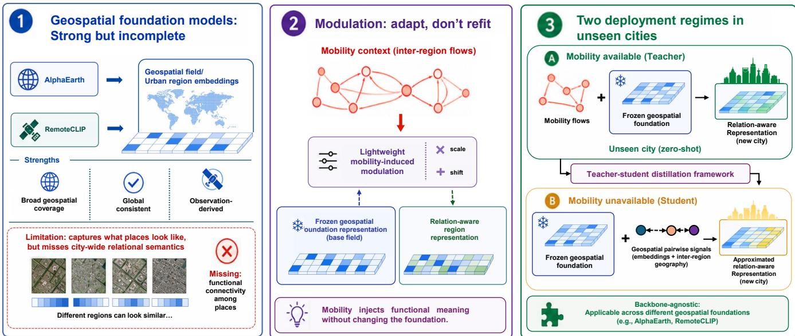
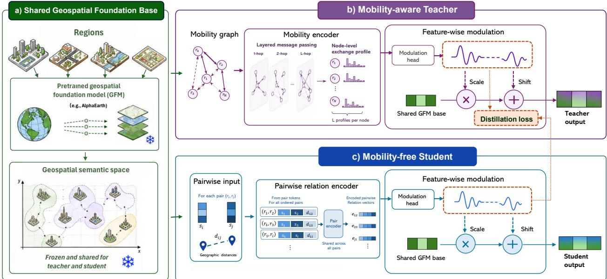
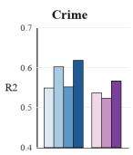
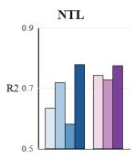
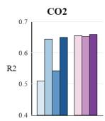
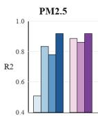

# MoRAX: Mobility-based Representation Augmentation for Geospatial Foundation Models

Ya Wen The University of Hong Kong Hong Kong SAR, China wenya@connect.hku.hk

Yulun Zhou∗ The University of Hong Kong Hong Kong SAR, China yulunzhou@hku.hk

## Abstract

Geospatial Foundation Models (GFMs) are emerging as a powerful paradigm for learning semantically rich and geographically consistent visual and physical representations. However, their reliance on Earth-observation (EO) data leaves information about human activity largely underrepresented. Human mobility data reveals the functional and relational structure between regions that is missing from EO data, but is often limited only to the city where it is observed, making it challenging to use for transferable urban representation learning. We introduce MoRAX, a lightweight framework for augmenting geospatial embeddings with functional structure derived from human mobility. MoRAX preserves the coverage and consistency of a GFM while providing information about the functional connectivity among urban regions, permitting zeroshot deployment in unseen cities with or without available mobility data. Across four target cities spanning two countries, the MoRAX teacher model, which observes mobility, consistently outperforms GFMs and strong urban representation baselines in eight socioeconomic and environmental prediction tasks. Meanwhile, the student model, which never takes mobility data as input, approaches the teacher in performance on most tasks. Transfer results across countries further demonstrate that modulation conditioned on mobility flows provides a general mechanism for grounding geospatial foundations in the human dimension of cities.

## CCS Concepts

• Information systems → Location based services; Geographic information systems.

## 1 Introduction

Urban region representation learning aims to encode spatial units of a city into low-dimensional vectors that support a wide range of downstream applications, including socioeconomic data estimation, environmental monitoring, and urban planning [2, 21, 34, 41]. A useful region representation should describe not only the physical and environmental properties of a space but also the functional role that the place plays within the broader urban system. Learning such representations is therefore an important step toward general purpose urban intelligence [4, 46].

Jixuan Cai The Chinese University of Hong Kong Hong Kong SAR, China codyjcai@gmail.com

Alec Kirkley∗ The University of Hong Kong Hong Kong SAR, China akirkley@hku.hk

Recent advances in geospatial foundation models (GFMs) provide a promising basis for this goal. By pretraining on large-scale Earth observation (EO) data, these models produce geographically extensive, rich representations of the natural and built environment [3, 11]. AlphaEarth Foundations [3], for instance, integrates multi-source temporal and spatially contextualized Earth observations into globally available, fine-grained geospatial embeddings. Meanwhile, remote-sensing foundation models such as Remote-CLIP [22] extract visual cues directly from satellite imagery. Compared with conventional heterogeneous urban data sources such as points of interest, land-use records, and demographic statistics, geospatial foundation representations ofer more consistent, broader coverage across cities and are far less dependent on local taxonomies, individual data platforms, or city-specific collection processes [3, 31]. However, by construction, GFMs learn semantics from what a region and its immediate surrounding environment physically look like, ignoring the fundamentally diferent (and equally important) information embedded in the relational semantics of a city which are defined by how people actually move through, use, and connect urban regions [23]. Traditional GFMs thus remain incomplete for providing a holistic understanding of urban regions.

Human mobility, represented by observed flows of people between regions, has repeatedly been shown to reveal the functional and interaction-driven structure of cities that GFMs do not explicitly capture [40, 45, 48]. It is thus important to investigate how human mobility data can complement geospatial foundation rep resentations. However, treating GFMs and human mobility data as symmetric modalities within a conventional fusion architecture risks obscuring their distinct roles and respective strengths. GFMs provide a compact representation ofobservable place characteristics and have broad geographic availability. Meanwhile, human mobility data describes relational dynamics among places and is only available in a limited and potentially unrepresentative subset of cities, since collecting it requires dedicated data infrastructure [25].

These observations motivate the approach of learning a lightweight, feature-wise modulation conditioned on mobility in order to adapt, rather than reconstruct, the underlying semantic space of an existing GFM. Such modulation captures how the meaning of a geospatially described place changes according to its exchange relationships with the rest of the city, and allows the adaptation mechanism to be a compact, self-contained module that can be learned separately from the base representation it acts upon. This separation allows for distilling the teacher’s mobility-induced modulation into a student model that does not depend on mobility data but approximates the same modulation using only widely available, mobility-free signals. This process enables deployment without access to mobility data, extending applicability across the broad geographic coverage of EO-based GFMs. The resulting adaptation and distillation framework generalizes across cities as well as across the choice of baseline foundation model, allowing, for example, the usage of either AlphaEarth or RemoteCLIP as the baseline GFM without changing the overall framework.

Based on this perspective, we propose MoRAX, a framework that learns how mobility adapts an existing geospatial foundation representation and distills this adaptation capability into a deployable, mobility-free encoder. A teacher is trained on cities with ob served mobility graphs, learning a lightweight modulation network that reshapes a baseline foundation embedding into a mobility aware representation. A student, trained on the same cities but never taking mobility as input—mobility influences it only through the teacher’s supervision—is distilled to reproduce this modulation using a proxy relational signal constructed from widely available covariates alone. MoRAX consequently supports two complementary transfer regimes. When mobility is available in an unseen city, the pretrained teacher model directly produces mobility-aware region representations without the need to fine-tune the encoder on the target city. When mobility data is unavailable, the pretrained student model infers how mobility would have reshaped each region’s representation, using only geospatial embeddings and pairwise geographic distances. Fig. 1 provides an overview of the MoRAX framework.

Our main contributions are summarized as follows:

• We develop the MoRAX framework to augment EO-based GFMs with functional mobility structure through lightweight feature-wise modulation.

• We propose a teacher-student framework that distills this modulation into a student model, enabling functionally aware region representations in cities where no mobility data exists.

• We test MoRAX in a series of zero-shot evaluation tasks, finding that the mobility-aware teacher consistently outperforms both geospatial foundation representations and urban representation learning baselines, while the mobility-free student remains competitive with the strongest baselines.

## 2 Related Work

Transferable Urban Region Representation Learning. Existing urban region representation methods draw on a wide range of data sources, including points of interest [12, 17, 33, 45], mobility flows [37, 42, 48], and satellite imagery [19, 24, 32], which are typically integrated through multimodal fusion and alignment then trained and evaluated within the same city. This diversity in data sources complicates fair comparison across methods, while the single-city paradigm obscures the distinction between regularities that transfer across urban systems and correlations tied to a specific city or its data collection process. These representations thus ofer limited capability of generalization to cities with diferent urban structure and data modality availability [34].

Existing work has explored large scale urban representation pretraining by organizing heterogeneous urban signals around mobility as the principal relational backbone. By learning from a nation-scale mobility graph, MoRA [40] establishes a shared representation space in which human-centered urban knowledge can be accumulated, compared, and reused across locations. Similarly, PDFM [1] models population dynamics from a rich collection of human-related signals over a large scale neighborhood graph. These studies demonstrate the potential of foundation-style pretraining for learning transferable representations of urban systems from human activity and population dynamics. However, their learned foundations tend to have more limited geographic coverage than EO foundation models (PDFM, for instance, covers only postal codes and counties within the United States).

Earth Observation-Based Geospatial Foundation Models. Benefiting from the growing volume, diversity, and geographic coverage of Earth observation data, recent EO-based geospatial foundation models have learned increasingly general and reusable representations of the Earth’s surface. For example, AlphaEarth Foundations [3] integrates multi-source, temporal, and spatially contextualized Earth observations into globally available geospatial embeddings while related eforts such as Tessera [11] similarly seek to provide broadly applicable representations for downstream geospatial applications. RemoteCLIP [22] aligns remote sensing imagery with language to support transfer across classification, retrieval, and recognition tasks. However, these representations remain primarily grounded in EO signals and may not fully capture the interaction-driven functional relationships that are critical to urban region understanding.

Adaptation of Pretrained Foundation Models. As pretrained foundation models have grown in scale and capability, research across diferent domains has developed a range of approaches for adapting their representations to new tasks, domains, and information sources without retraining from scratch [15, 16, 20]. These methods parameterize adaptation through a compact set of task- or domain-specific trainable parameters, learned once and then held fixed at inference time. A complementary line of work instead performs adaptation dynamically, generating the adaptation itself as a function of an auxiliary conditioning signal rather than learning a static set of parameters. FiLM [30], for example, generates featurewise scaling and shifting parameters from a conditioning input to modulate intermediate activations. Similar conditional modulation mechanisms appear in adaptive normalization methods for style transfer and difusion models, where activations are adjusted according to style, class, text, or timestep information [9, 18]. Despite their broad use in language and vision, conditional adaptation mechanisms remain underexplored in geospatial representation learning. Geospatial foundation models are still typically used as fixed feature extractors, with limited study of how complementary signals such as city-wide relational information can adapt their pretrained representations.

  
Figure 1: Motivation and overview of MoRAX. Geospatial foundation models (GFMs) ofer broad, consistent coverage but miss the relational semantics of how places function together (left). MoRAX adapts a frozen GFM base through lightweight modulation induced b mobility (middle), supporting zero-shot deployment in unseen cities with or without available mobility data (right).

## 3 Preliminaries

Regions. A city � is partitioned into $N _ { c }$ disjoint urban regions, denoted as $\mathcal { R } ^ { c } ~ = ~ \{ r _ { 1 } ^ { c } , r _ { 2 } ^ { c } , . . . , r _ { N _ { c } } ^ { c } \}$ . For notational simplicity, we omit the city superscript � when the context is clear.

Region Features. Each region is associated with features drawn from diferent sources, characterizing it from complementary dimensions. We consider two data types, chosen for their independence from manually defined taxonomies (e.g., POI category schemes).

Definition 3.1 (Human Mobility Graph). Human mobility flows record movements between urban regions and reflect functional interactions among them. For a city with observed mobility data, we represent these interactions as a mobility graph $G _ { m } = ( \mathcal { R } , \mathcal { E } _ { m } )$ where each edge $( r _ { i } , r _ { j } ) \in \mathcal { E } _ { m }$ is associated with an observed interaction intensity $w _ { i j }$ between regions $r _ { i }$ and $r _ { j } .$ . The intensity $w _ { i j }$ is a generic measure of directed interaction between �� and $r _ { j }$ within a given period of time, and provides a proxy for the functional connectivity of the two regions. It can be derived, for example, from observed flows of people or trips between the two regions, or from other interaction records aggregated to the region level.

Definition 3.2 (Geospatial Foundation Embedding). Each region $r _ { i }$ is represented by a pretrained foundation embedding $\mathbf { s } _ { i } ,$ which summarizes the region’s EO-derived physical, environmental, and spatial characteristics in a globally consistent representation space. Such embeddings are produced by encoders pretrained on largescale EO corpora, including satellite imagery and other sensorderived measurements, through masked reconstruction, contrastive invariance, and cross-modal alignment objectives [8, 22, 26]. The resulting representation s� encodes physical morphology such as texture, spectral response, built density, and vegetation, but not the functional role a region plays within the wider urban system.

Region Representation Learning. Given a set of regions R and their associated features, region representation learning aims to train an encoder $f : \mathcal R  \mathbb R ^ { d }$ that maps each region $r _ { i } \in \mathcal { R }$ to a low-dimensional embedding $\mathbf { z } _ { i } \in \mathbb { R } ^ { d }$ that captures the region $r _ { i } { ' } s$ characteristics and can be directly applied to a variety of downstream urban prediction tasks with a lightweight model such as Ridge Regression [14].

## 3.1 Problem Statement

We consider the problem of augmenting pretrained geospatial foundation representations with the city-wide functional structure encoded by human mobility. Given source cities $C _ { \mathrm { s r c } }$ with fixed foundation embeddings and observed mobility graphs, the objective is to learn a region representation model that transfers zero-shot to unseen target cities $C _ { \mathrm { t g t } } ,$ , without updating the underlying foundation model or performing target-city training; zero-shot thus refers to the absence of target-city parameter updates, not the absence of target-city inputs. At inference time, the target city’s mobility graph may be available or unavailable—in the latter setting, we use a student model that only requires pretrained foundation embeddings and inter-region geographic information.

## 4 Methodology

## 4.1 Framework Overview

MoRAX extends pretrained geospatial foundation representations with the city-wide functional structure revealed by human mobility. Its central operation is a lightweight mobility-induced modulation that uses relational context to reinterpret the pretrained representation without discarding its original geospatial semantics.

When an observed mobility graph is available, a mobility-aware teacher derives the conditioning context directly from inter-region flows. When mobility is unavailable, a graph-free student approximates the teacher-induced modulation using only pretrained geospatial embeddings and inter-region geographic information.

As illustrated in Fig. 2, MoRAX first projects the pretrained GFM embedding of each region into a shared urban representation space (Sec. 4.2). It then defines a general feature-wise modulation operator that adapts the projected foundation representation according to a region-level relational context (Sec. 4.3). The teacher obtains this context from observed mobility relations through an edge-centric mobility encoder (Sec. 4.4), whereas the student infers a proxy context from pairwise geospatial representations (Sec. 4.5). Finally, modulation distillation transfers the mobility-induced adaptation from the teacher to the student (Sec. 4.6).

## 4.2 Geospatial Foundation Representation

As shown in Fig. 2(a), for each region ��, we retrieve a pretrained GFM embedding $\mathbf { s } _ { i } \in \mathbb { R } ^ { d _ { \mathrm { E O } } }$ according to its geographic location and spatial extent. These embeddings summarize EO-derived characteristics in a globally consistent representation space shared across source and target cities.

We map each pretrained embedding into the hidden space of MoRAX using a lightweight projector

$$
\begin{array} { r } { \mathbf { z } _ { i } ^ { 0 } = f _ { \mathrm { p r o j } } ( \mathbf { s } _ { i } ) \in \mathbb { R } ^ { d } , } \end{array}\tag{1}
$$

where $f _ { \mathrm { p r o j } }$ is implemented as an MLP shared across all regions and cities. The underlying geospatial foundation representation remains frozen and the projector is shared between the student and the teacher.

The resulting set ${ \bf Z } ^ { 0 } = \{ { \bf z } _ { i } ^ { 0 } \} _ { i = 1 } ^ { N }$ provides the shared geospatial foundation representation used by both the teacher and student. Because it is independent of the mobility graph, it provides a common semantic coordinate system across cities and across mobility availability settings. We refer to this spatially indexed layer of region embeddings, defined consistently within and across cities, as the geospatial field. However, the pretrained representation primarily describes the observable characteristics of individual regions and does not explicitly encode how they interact as parts of a city-wide system. We therefore conditionally reshape this representation using region-level relational context.

## 4.3 Relation-Induced Feature Modulation

We first define the modulation operator, which is independent of how the conditioning signal is obtained. Given the projected foundation embedding $\mathbf { z } _ { i } ^ { 0 }$ and a region-level relational context $\mathbf { z } _ { i } ^ { r } ,$ a lightweight modulation network generates feature-wise scale and shift parameters

$$
\begin{array} { r } { \gamma _ { i } = f _ { Y , \theta } ( \mathbf { z } _ { i } ^ { r } ) , \qquad \beta _ { i } = f _ { \beta , \theta } ( \mathbf { z } _ { i } ^ { r } ) , } \end{array}\tag{2}
$$

where $\gamma _ { i } , \pmb { \beta } _ { i } \in \mathbb { R } ^ { d }$ , and � denotes the parameters of the modulation module.

We parameterize the feature-wise scale as $1 + \operatorname { t a n h } ( \gamma _ { i } )$ , which constrains each scaling coeficient to (0, 2). This parameterization centers the scale at identity and allows mobility to induce a bounded, feature-wise reweighting of the projected base. The resulting relation-conditioned transformation is

$$
\begin{array} { r } { { \bf z } _ { i } ^ { \mathrm { m o d } } = \left( 1 + \operatorname { t a n h } ( { \gamma } _ { i } ) \right) \odot { \bf z } _ { i } ^ { 0 } + \beta _ { i } , } \end{array}\tag{3}
$$

where $\odot$ denotes element-wise multiplication.

For compactness, we denote the complete operation in Eqs. (2) and (3) as

$$
{ \bf z } _ { i } ^ { \mathrm { m o d } } = { \cal M } _ { \theta } \left( { \bf z } _ { i } ^ { 0 } , { \bf z } _ { i } ^ { r } \right) .\tag{4}
$$

The modulated features are then integrated with the projected foundation representation

$$
\mathbf { z } _ { i } = \mathbf { z } _ { i } ^ { 0 } + \mathbf { z } _ { i } ^ { \mathrm { m o d } } .\tag{5}
$$

This additive formulation retains the projected geospatial representation while allowing relational context to alter its feature-wise interpretation. The projected foundation representation continues to provide the semantic basis of the final representation, while the modulation introduces complementary information about the functional role of each region.

The modulation operation is agnostic to the source of $\mathbf { z } _ { i } ^ { r }$ . In the mobility-aware teacher, the relational context is encoded directly from observed mobility flows. In the graph-free student, it is inferred from pairwise geospatial representations and inter-region geography. The teacher and student use the same modulation form but have independently learned parameters, denoted by $\theta _ { T }$ and $\theta _ { S } ,$ respectively, with only the frozen foundation embeddings and the projector $f _ { \mathrm { p r o j } }$ being shared between the two.

## 4.4 Teacher: Mobility-Aware Relational Encoding

When inter-region mobility flows are observed, we derive the relational context directly from the mobility graph. We refer to this mobility-aware instantiation as the teacher because its induced modulation later supervises the graph-free student.

Because mobility is naturally defined over region pairs rather than individual regions, we adopt an edge-centric encoder that explicitly updates relation states before aggregating them into regionlevel mobility contexts, as shown in Fig. 2(b).

4.4.1 Edge-Centric MobilityEncoding. Human mobility is naturally observed on region pairs rather than on individual regions. For each mobility edge $( r _ { i } , r _ { j } ) \in \mathcal { E } _ { m }$ , let $\mathbf { a } _ { i j } ^ { m }$ denote its edge attributes, including within-city standardized flow strength and geographic distance. We first map these attributes into a hidden relation state

$$
\begin{array} { r } { \mathbf { e } _ { i j } ^ { ( 0 ) } = f _ { \mathrm { e d g e } } ( \mathbf { a } _ { i j } ^ { m } ) . } \end{array}\tag{6}
$$

The mobility encoder then applies � edge-centric message-passing layers. At layer ℓ, each region summarizes its incident relation states into a relational profile

$$
\mathbf { h } _ { i } ^ { ( \ell ) } = \operatorname { A g g } \left( \left\{ \mathbf { e } _ { j i } ^ { ( \ell - 1 ) } : ( r _ { j } , r _ { i } ) \in \mathcal { E } _ { m } \right\} \right) ,\tag{7}
$$

where Agg is mean pooling in our implementation, and $\mathbf { h } _ { i } ^ { ( \ell ) }$ is set to the zero vector for regions with no incoming edges.

Each edge state is then updated using the relational profiles of both endpoints and its previous state

$$
\mathbf { e } _ { i j } ^ { ( \ell ) } = \mathbf { e } _ { i j } ^ { ( \ell - 1 ) } + f _ { \mathrm { u p d } } ^ { ( \ell ) } \left( \mathbf { h } _ { i } ^ { ( \ell ) } \lVert \mathbf { h } _ { j } ^ { ( \ell ) } \rVert \mathbf { e } _ { i j } ^ { ( \ell - 1 ) } \right) ,\tag{8}
$$

  
Figure 2: The MoRAX architecture. (a) A frozen geospatial foundation model provides a shared semantic base in which pretrained region embeddings are projected into a common representation space used by both teacher and student. (b) The mobility-aware teacher encodes the observed mobility graph with an edge-centric message passing encoder and generates feature-wise scale and shift parameters that modulate the shared base. (c) The mobility-free student approximates this modulation from pairwise geospatial embeddings and inter-region distances alone, trained by distilling the teacher’s mobility-induced modulation

where ∥ denotes vector concatenation and $f _ { \mathrm { u p d } } ^ { ( \ell ) }$ is a layer-specific MLP. Since the readout below consumes only the relational profiles, the edge update is omitted at the final layer $\ell = L$

Finally, the mobility context of region $r _ { i }$ is read out from the relational profiles across all layers

$$
\mathbf { z } _ { i } ^ { m } = f _ { \mathrm { r e a d } } \left( \mathbf { h } _ { i } ^ { ( 1 ) } \| \cdot \cdot \cdot \| \mathbf { h } _ { i } ^ { ( L ) } \right) \in \mathbb { R } ^ { d } .\tag{9}
$$

Since $\mathbf { z } _ { i } ^ { m }$ is constructed from explicitly updated relation states, it summarizes the multi-layer relational profile associated with region $r _ { i } ,$ , rather than merely smoothing neighboring node features. The resulting mobility context serves as the teacher-side relational conditioning signal, $\mathbf { z } _ { i } ^ { r , T } = \mathbf { z } _ { i } ^ { m }$

The teacher then applies the modulation operator defined in Eq. (4)

$$
\mathbf { z } _ { i } ^ { \mathrm { m o d } , T } = \mathcal { M } _ { \theta _ { T } } \left( \mathbf { z } _ { i } ^ { 0 } , \mathbf { z } _ { i } ^ { r , T } \right) , \qquad \mathbf { z } _ { i } ^ { T } = \mathbf { z } _ { i } ^ { 0 } + \mathbf { z } _ { i } ^ { \mathrm { m o d } , T } .\tag{10}
$$

The teacher thus uses observed city-wide interactions to reinterpret the foundation representation while retaining its original geospatial content. Its computation, however, requires access to the target-city mobility graph. We therefore introduce a graph-free student that approximates the teacher-induced modulation from inputs available without mobility observations.

## 4.5 Student: Graph-Free Modulation Approximation

As shown in Fig. 2(c), the student does not attempt to reconstruct the target mobility graph. Instead, it learns to approximate how the mobility-aware teacher reshapes each region representation. It operates on the same projected foundation representation as the teacher but infers its relational context from pairwise geospatial embeddings and inter-region geographic information.

4.5.1 Geospatial Pair Relation Encoder. For an anchor region $r _ { i }$ and a candidate partner $r _ { j } ,$ , where $j \neq i ,$ we construct the pair attribute

$$
\mathbf { a } _ { i j } ^ { p } = \left[ \mathbf { s } _ { i } \parallel \mathbf { s } _ { j } \parallel d _ { i j } \right] ,\tag{11}
$$

where s� and $\mathbf { s } _ { j }$ are the pretrained GFM embeddings of the two regions, and $d _ { i j }$ is their geographic distance standardized within the city.

A shared pair encoder maps each pair attribute into a latent relation representation

$$
\mathbf { e } _ { i j } ^ { S } = f _ { \mathrm { p a i r } } \left( \mathbf { a } _ { i j } ^ { p } \right) \in \mathbb { R } ^ { d } .\tag{12}
$$

For each anchor region, the student aggregates the relation representations of all candidate partners

$$
\mathbf { z } _ { i } ^ { \rho } = \frac { 1 } { N - 1 } \sum _ { j \neq i } \mathbf { e } _ { i j } ^ { S } ,\tag{13}
$$

The pair encoder captures the geospatial relation between the anchor and each candidate region, while mean pooling produces a permutation-invariant summary over the city. This aggregated representation serves as the student-side relational conditioning signal, $\mathbf { z } _ { i } ^ { r , S } = \mathbf { z } _ { i } ^ { p }$

The student applies the same modulation form with independently learned parameters

$$
\mathbf { z } _ { i } ^ { \mathrm { m o d } , S } = \mathcal { M } _ { \theta _ { S } } \left( \mathbf { z } _ { i } ^ { 0 } , \mathbf { z } _ { i } ^ { r , S } \right) , \qquad \mathbf { z } _ { i } ^ { S } = \mathbf { z } _ { i } ^ { 0 } + \mathbf { z } _ { i } ^ { \mathrm { m o d } , S } .\tag{14}
$$

## 4.6 Training Objectives

We train MoRAX in two stages. The teacher is first optimized on source-city mobility graphs so that observed interaction structure is encoded into both the mobility context and the final adapted representation. The teacher is then frozen, and its mobility-induced modulation supervises the graph-free student.

4.6.1 TeacherTraining. The teacher is trained using self-supervision derived from observed mobility relations. The objective is applied both to the mobility context and to the final teacher representation.

Mobility Relation Loss. For each anchor region $r _ { i } ,$ we construct a candidate set $C _ { i } = \mathcal { P } _ { i } \cup \mathcal { N } _ { i }$ , where $\mathcal { P } _ { i }$ contains all regions with observed mobility interactions from $r _ { i } ,$ and $N _ { i }$ contains distancestratified sampled non-neighbors.

Positive candidates are assigned flow-normalized soft targets

$$
q _ { i j } = \frac { w _ { i j } } { \sum _ { r _ { k } \in \mathcal { P } _ { i } } w _ { i k } } , \qquad r _ { j } \in \mathcal { P } _ { i } ,\tag{15}
$$

while negative candidates receive zero target mass $q _ { i j } = 0 .$ Given a region representation $\mathbf { u } _ { i } ,$ a level-specific pair scorer $\psi _ { u }$ predicts a logit for each candidate

$$
s _ { i j } ^ { u } = \psi _ { u } \left( [ \mathbf { u } _ { i } \lVert \mathbf { u } _ { j } ] \right) , \qquad p _ { i j } ^ { u } = \frac { \exp ( s _ { i j } ^ { u } ) } { \sum _ { r _ { k } \in C _ { i } } \exp ( s _ { i k } ^ { u } ) } .\tag{16}
$$

The mobility relation loss is the soft-target cross entropy

$$
\mathcal { L } _ { \mathrm { m r e l } } ( \mathbf { u } ) = - \frac { 1 } { | \mathcal { R } | } \sum _ { r _ { i } \in \mathcal { A } } \sum _ { r _ { j } \in C _ { i } } q _ { i j } \log p _ { i j } ^ { u } ,\tag{17}
$$

where $\mathcal { A }$ denotes anchors with at least one observed positive interaction.

We apply this objective at two levels. First, $\mathcal { L } _ { \mathrm { m r e l } } ^ { m } = \mathcal { L } _ { \mathrm { m r e l } } ( \mathbf { z } ^ { m } )$ directly supervises the mobility encoder. Second, $\begin{array} { r } { \mathcal { L } _ { \mathrm { m r e l } } ^ { T } = \mathcal { L } _ { \mathrm { m r e l } } ( g _ { T } ( \mathbf { z } ^ { T } ) ) } \end{array}$ applies the same supervision to a relation-head projection of the final teacher representation, where $g _ { T }$ is a lightweight MLP head, to preserve mobility-derived interaction structure.

The overall teacher objective is then as follows

$$
\mathcal { L } _ { T } = \mathcal { L } _ { \mathrm { m r e l } } ^ { m } + \lambda _ { T } \mathcal { L } _ { \mathrm { m r e l } } ^ { T } ,\tag{18}
$$

where $\lambda _ { T }$ controls the contribution of the representation-level relation objective. Note that the teacher objective is purely relational, since the underlying geospatial semantics are preserved architecturally, through the frozen foundation embeddings and the additive formulation of Eq. (5), rather than through an explicit grounding term as in the student objective below.

4.6.2 Student Training. The student learns to approximate the mobility-conditioned modulation generated by the teacher.

Distillation of relation-induced modulation. We align the student modulated features with the detached teacher features

$$
\mathcal { L } _ { \mathrm { m o d } } = \frac { 1 } { N } \sum _ { i = 1 } ^ { N } \left\| \mathbf { z } _ { i } ^ { \mathrm { m o d } , S } - \mathbf { z } _ { i } ^ { \mathrm { m o d } , T } \right\| _ { 2 } ^ { 2 } .\tag{19}
$$

To keep the student representation anchored to the pretrained GFM semantic space, we use a lightweight decoder Dec� to reconstruct the original foundation embedding

$$
\mathcal { L } _ { \mathrm { f i e l d } } ^ { S } = \frac { 1 } { N } \sum _ { i = 1 } ^ { N } \left\| \operatorname { D e c } _ { S } \left( \mathbf { z } _ { i } ^ { S } \right) - \mathbf { s } _ { i } \right\| _ { 2 } ^ { 2 } .\tag{20}
$$

The overall student objective is

$$
\begin{array} { r } { \mathcal { L } _ { S } = \alpha _ { \mathrm { m o d } } \mathcal { L } _ { \mathrm { m o d } } + \mathcal { L } _ { \mathrm { f i e l d } } ^ { S } , } \end{array}\tag{21}
$$

where $\alpha _ { \mathrm { m o d } }$ controls the weight of the modulation distillation term.

## 5 Experiments

## 5.1 Experimental Setup

Datasets. We collect data from seven Chinese cities. Five cities, Beijing, Shenzhen, Hangzhou, Nanjing, and Suzhou, serve as source cities for pretraining, while Shanghai (SH) and Guangzhou (GZ) are held out for zero-shot transfer evaluation. We further include New York City (NYC) and Chicago (CHI) to assess cross-country transfer. We use AlphaEarth embeddings as the EO-based geospatial foundation representation in the main experiments. We adopt hexagonal H3 grids [35] at Level 7 for region discretization for Shanghai and Guangzhou, with each cell covering approximately 5.16 km2, ofering a spatial granularity suitable for city-level modeling. For NYC and CHI, administrative boundaries $( \mathrm { i . e . , }$ census tracts) are adopted for region construction. We detail the training and downstream data collection and processing in Appendix C.

Implementation Details. MoRAX is trained in two stages. We first train the teacher on the 5 source cities with observed mobility graphs, and then freeze the teacher to train the student on the same source cities. Both stages use AdamW, with learning rates $3 \times 1 0 ^ { - 4 }$ and $1 \times 1 0 ^ { - 4 }$ for the teacher and student, respectively, and weight decay $1 \times 1 0 ^ { - 2 }$ . The hidden dimension is $d = 1 2 8 ,$ , the mobility encoder uses $L = 3$ message-passing layers, and the loss weights are $\lambda _ { T } = 0 . 5$ and $\alpha _ { \mathrm { m o d } } = 0 . 2 5$ . For each anchor region, $N _ { i }$ contains up to 24 negatives sampled with distance stratification: non-neighbor regions are divided into three distance-quantile bins according to their distance to $r _ { i } ,$ , and up to eight negatives are sampled from each bin.

Evaluation Procedure. We evaluate two deployment regimes, corresponding to the teacher and student encoders introduced in Sec. 4. In the mobility-available regime, the pretrained teacher $f _ { T }$ is directly applied to a held-out target city using that city’s own mobility graph, without any target-city fine-tuning. In the mobilityfree regime, the pretrained student $f _ { S }$ is applied to the same held-out city using only widely available region signals, without observing the target city’s mobility graph.

We consider four downstream prediction tasks for Shanghai and Guangzhou: crime, nighttime light intensity, carbon emissions, and $\mathrm { P M } _ { 2 . 5 }$ concentration. For New York City and Chicago, we evaluate crime, check-in counts, house prices, and income levels. For each downstream task, we train a lightweight Ridge regressor on the target city and evaluate it with five-fold cross-validation over regions. We report the coeficient of determination, $R ^ { 2 } ,$ as the main metric.

Baselines. We select state-of-the-art urban region representation methods that are compatible with city-agnostic transfer as baselines, including HREP [48], FlexiReg [32], and UrbanCLIP [43].

Table 1: Comparison of model performance on cross-city and cross-country transfer. Results are reported as $R ^ { 2 } .$ . The best result for each task is shown in bold and the second best is underlined. Δ denotes the relative improvement over the strongest non-MoRAX baseline for each task. Standard deviations over 10 random seeds are reported in parentheses (RemoteCLIP and AlphaEarth embeddings are deterministic and therefore reported without variance).
<table><tr><td rowspan="2">Model</td><td colspan="4">Shanghai</td><td colspan="4">Guangzhou</td></tr><tr><td>Crime</td><td>NTL</td><td> $\mathrm { C O _ { 2 } }$ </td><td> $\mathrm { P M } _ { 2 . 5 }$ </td><td>Crime</td><td>NTL</td><td> $\mathrm { C O _ { 2 } }$ </td><td> $\mathrm { P M } _ { 2 . 5 }$ </td></tr><tr><td>RemoteCLIP</td><td>0.494</td><td>0.636</td><td>0.449</td><td>0.397</td><td>0.524</td><td>0.611</td><td>0.433</td><td>0.346</td></tr><tr><td>AlphaEarth</td><td>0.548</td><td>0.638</td><td>0.508</td><td>0.506</td><td>0.672</td><td>0.694</td><td>0.466</td><td>0.430</td></tr><tr><td>FlexiReg</td><td>0.192(0.037)</td><td>0.237(0.040)</td><td>0.228(0.038)</td><td>0.281(0.050)</td><td>0.209(0.052)</td><td>0.225(0.060)</td><td>0.257(0.058)</td><td>0.399(0.079)</td></tr><tr><td>HREP</td><td>0.268(0.014)</td><td>0.361(0.027)</td><td>0.323(0.006)</td><td>0.592(0.044)</td><td>0.367(0.025)</td><td>0.415(0.036)</td><td>0.355(0.027)</td><td>0.640(0.035)</td></tr><tr><td>UrbanCLIP</td><td>0.519(0.007)</td><td>0.642(0.004)</td><td>0.418(0.001)</td><td>0.287(0.017)</td><td>0.563(0.008)</td><td>0.633(0.008)</td><td>0.369(0.024)</td><td>0.281(0.019)</td></tr><tr><td>MoRAX-Student</td><td>0.569(0.008)</td><td>0.774(0.002)</td><td>0.659(0.002)</td><td>0.915(0.001)</td><td>0.725(0.017)</td><td>0.797(0.018)</td><td>0.702(0.012)</td><td>0.929(0.005)</td></tr><tr><td>Student ∆</td><td>+3.8%</td><td>+20.6%</td><td>+29.7%</td><td>+54.6%</td><td>+7.9%</td><td>+14.8%</td><td>+50.6%</td><td>+45.2%</td></tr><tr><td>MoRAX-Teacher</td><td>0.618(0.005)</td><td>0.777(0.010)</td><td>0.649(0.004)</td><td>0.917(0.002)</td><td>0.727(0.005)</td><td>0.803(0.007)</td><td>0.696(0.004)</td><td>0.943(0.002)</td></tr><tr><td>Teacher ∆</td><td>+12.8%</td><td>+21.0%</td><td>+27.8%</td><td>+54.9%</td><td>+8.2%</td><td>+15.7%</td><td>+49.4%</td><td>+47.3%</td></tr><tr><td rowspan="2">Model</td><td colspan="4">NYC</td><td colspan="4">Chicago</td></tr><tr><td>Crime</td><td>Check-in</td><td>House</td><td>Income</td><td>Crime</td><td>Check-in</td><td>House</td><td>Income</td></tr><tr><td>RemoteCLIP</td><td>0.168</td><td>0.341</td><td>0.232</td><td>0.271</td><td>0.012</td><td>0.243</td><td>0.188</td><td>0.113</td></tr><tr><td>AlphaEarth</td><td>0.179</td><td>0.464</td><td>0.222</td><td>0.277</td><td>0.050</td><td>0.246</td><td>0.208</td><td>0.108</td></tr><tr><td>FlexiReg</td><td>0.176(0.043)</td><td>0.256(0.078)</td><td>0.179(0.055)</td><td>0.209(0.044)</td><td>0.174(0.086)</td><td>0.233(0.061)</td><td>0.307(0.093)</td><td>0.235(0.100)</td></tr><tr><td>HREP</td><td>0.421(0.039)</td><td>0.564(0.042)</td><td>0.419(0.049)</td><td>0.518(0.027)</td><td>0.382(0.052)</td><td>0.610(0.053)</td><td>0.625(0.047)</td><td>0.455(0.060)</td></tr><tr><td>UrbanCLIP</td><td>0.150(0.033)</td><td>0.318(0.038)</td><td>0.111(0.018)</td><td>0.149(0.026)</td><td>0.066(0.021)</td><td>0.205(0.054)</td><td>0.163(0.048)</td><td>0.106(0.037)</td></tr><tr><td>MoRAX-Student</td><td>0.404(0.013)</td><td>0.588(0.013)</td><td>0.466(0.034)</td><td>0.530(0.022)</td><td>0.367(0.030)</td><td>0.570(0.040)</td><td>0.715(0.014)</td><td>0.502(0.024)</td></tr><tr><td>Student ∆</td><td>-4.0%</td><td>+4.3%</td><td>+11.2%</td><td>+2.3%</td><td>-3.9%</td><td>-6.6%</td><td>+14.4%</td><td>+10.3%</td></tr><tr><td>MoRAX-Teacher</td><td></td><td>0.825(0.020)</td><td>0.469(0.064)</td><td></td><td></td><td></td><td></td><td></td></tr><tr><td>Teacher ∆</td><td>0.520(0.035) +23.5%</td><td>+46.3%</td><td>+11.9%</td><td>0.542(0.039) +4.6%</td><td>0.662(0.050) +73.3%</td><td>0.859(0.021) +40.8%</td><td>0.809(0.051) +29.4%</td><td>0.622(0.051) +36.7%</td></tr></table>

For each method, we train on the five source cities and directly apply the learned model to the four test cities, reporting the average transfer performance across source-city runs.

We further include two pretrained geospatial foundation mod els as training-free baselines. RemoteCLIP [22] directly encodes satellite imagery from the target cities, whereas AlphaEarth [3] provides a pretrained geospatial embedding for each target region, retrieved according to its geographic location and spatial extent.

## 5.2 Performance Comparison

Table 1 reports cross-city transfer results on four held-out cities, covering both within-country and cross-country settings. Overall, MoRAX-Teacher consistently outperforms pretrained foundation embeddings and existing urban representation baselines, achieving relative gains of up to 54.9% in the within-country setting and 73.3% in the cross-country setting.

Pretrained geospatial embeddings, particularly AlphaEarth, per form strongly in the Chinese target cities, where tasks such as $\mathrm { C O _ { 2 } }$ prediction are closely associated with spatially continuous physical and environmental patterns that Earth-observation-based foundations can capture. Their advantage is less consistent in the U.S. cities, where the prediction targets depend more strongly on human activity and inter-region interactions and are therefore less directly recoverable from Earth-observation signals alone. This contrast highlights the need to complement Earth-observation-based foundation embeddings with relational knowledge.

Built on frozen AlphaEarth embeddings, MoRAX-Teacher increases the average $R ^ { 2 }$ from 0.558 to 0.766 in the within-country setting and from 0.219 to 0.663 in the cross-country setting, corresponding to relative gains of 37.4% and 202.6%, respectively. Importantly, these gains are not confined to tasks for which the underlying foundation representation is weak. Even when AlphaEarth already performs strongly, as in NTL prediction for Shanghai and Guangzhou, relational adaptation yields further improvements. This suggests that mobility contributes complementary functional structure rather than merely compensating for deficiencies in the base representation. Overall, mobility conditioned modulation enables MoRAX to enrich geospatial foundation representations with interaction-aware information while preserving their observationderived semantics.

MoRAX-Student further shows that a substantial portion of the mobility-induced modulation can be transferred to a graph-free encoder through distillation. On spatially smooth tasks, the student closely matches the teacher and occasionally performs slightly better. In contrast, the larger teacher–student gaps on crime and check-in prediction suggest that some fine-grained human interaction patterns remain dificult to recover without direct access to the target city’s mobility graph.

Nevertheless, MoRAX-Student improves over AlphaEarth by an average of 36.0% in the within-country setting and 136.1% in the cross-country setting. It also outperforms most urban region representation baselines despite its lightweight, graph-free design. The main exception is HREP on several interaction-intensive U.S. tasks, where human mobility is used directly as an input.

## 5.3 Cross-Country Transfer

We further complement the cross-country evaluation with a bidirectional transfer analysis. In addition to transferring models trained on the five Chinese source cities to New York City and Chicago, we reverse the direction by training MoRAX on the two U.S. cities and directly applying it to the held-out Chinese cities. As shown

Table 2: Cross-country transfer results $( R ^ { 2 } )$  
(a) Transfer to held-out Chinese cities
<table><tr><td>Target</td><td>Source</td><td>Encoder</td><td>Crime</td><td>NTL</td><td> $\mathbf { C O } _ { 2 }$ </td><td> $\mathbf { P } \mathbf { M } _ { 2 . 5 }$ </td></tr><tr><td rowspan="5">SH</td><td rowspan="3">一 5 CN</td><td>AlphaEarth</td><td>0.548</td><td>0.638</td><td>0.508</td><td>0.506</td></tr><tr><td>Student</td><td>0.569</td><td>0.774</td><td>0.659</td><td>0.915</td></tr><tr><td>Teacher</td><td>0.618</td><td>0.777</td><td>0.649</td><td>0.917</td></tr><tr><td rowspan="2">NYC+CHI</td><td>Student</td><td>0.585</td><td>0.789</td><td>0.615</td><td>0.829</td></tr><tr><td>Teacher</td><td>0.625</td><td>0.785</td><td>0.597</td><td>0.824</td></tr><tr><td rowspan="5">GZ</td><td rowspan="3">一 5 CN</td><td>AlphaEarth</td><td>0.672</td><td>0.694</td><td>0.466</td><td>0.430</td></tr><tr><td>Student</td><td>0.725</td><td>0.797</td><td>0.702</td><td>0.929</td></tr><tr><td>Teacher</td><td>0.727</td><td>0.803</td><td>0.696</td><td>0.943</td></tr><tr><td rowspan="2">NYC+CHI</td><td>Student</td><td>0.736</td><td>0.843</td><td>0.565</td><td>0.818</td></tr><tr><td>Teacher</td><td>0.742</td><td>0.849</td><td>0.541</td><td>0.782</td></tr></table>

(b) Transfer to U.S. cities
<table><tr><td>Target</td><td>Source</td><td>Encoder</td><td>Crime</td><td>Check-in</td><td>House</td><td>Income</td></tr><tr><td rowspan="6">NYC</td><td>一</td><td>AlphaEarth</td><td>0.179</td><td>0.464</td><td>0.222</td><td>0.277</td></tr><tr><td>5 CN</td><td>Student</td><td>0.404</td><td>0.588</td><td>0.466</td><td>0.530</td></tr><tr><td></td><td>Teacher</td><td>0.520</td><td>0.825</td><td>0.469</td><td>0.542</td></tr><tr><td>CHI</td><td>Student</td><td>0.349</td><td>0.537</td><td>0.402</td><td>0.536</td></tr><tr><td></td><td>Teacher</td><td>0.422</td><td>0.752</td><td>0.410</td><td>0.541</td></tr><tr><td>一</td><td>AlphaEarth</td><td>0.050</td><td>0.246</td><td>0.208</td><td>0.108</td></tr><tr><td rowspan="4">CHI</td><td>5 CN</td><td>Student</td><td>0.367</td><td>0.570</td><td>0.715</td><td>0.502</td></tr><tr><td></td><td>Teacher</td><td>0.662</td><td>0.859</td><td>0.809</td><td>0.622</td></tr><tr><td></td><td>Student</td><td>0.453</td><td>0.517</td><td>0.651</td><td>0.425</td></tr><tr><td>NYC</td><td>Teacher</td><td>0.476</td><td>0.856</td><td>0.700</td><td>0.525</td></tr></table>

in Table 2(a), training on the five Chinese cities or on the two U.S. cities leads to broadly comparable performance in Shanghai and Guangzhou. More importantly, both source configurations yield consistent improvements over the unadapted AlphaEarth embeddings across all tasks for both the student and teacher. This suggests that mobility-conditioned modulation captures relational regularities that can transfer across countries, rather than merely memorizing interaction patterns specific to the source cities.

Interestingly, for transfer to New York City and Chicago, training on the five Chinese cities generally performs better than training on the other U.S. city (See Table 2 (b)), despite the latter being geographically and institutionally closer to the target. Averaged across the student and teacher variants, the five-city Chinese source set improves the mean $R ^ { 2 }$ from 0.535 to 0.591, corresponding to a relative gain of 10.4%, and achieves higher performance in 14 of the 16 model–task comparisons. This result suggests that source diversity may be more important than geographic proximity alone. The five Chinese cities expose the model to a broader range of urban forms and interaction patterns, which may support a more robust and transferable modulation rule, whereas training on a single source city is more susceptible to city-specific regularities.

Table 3: Performance applying MoRAX to RemoteCLIP (�2).Δ denotes the relative improvement over RemoteCLIP.
<table><tr><td>City</td><td>Model</td><td>Crime</td><td>NTL</td><td> $\mathbf { C O } _ { 2 }$ </td><td> $\mathbf { P M } _ { 2 . 5 }$ </td></tr><tr><td rowspan="5">SH</td><td>RemoteCLIP</td><td>0.494</td><td>0.636</td><td>0.449</td><td>0.397</td></tr><tr><td>MoRAX-Student</td><td>0.532</td><td>0.716</td><td>0.632</td><td>0.874</td></tr><tr><td>Student ∆</td><td>+7.7%</td><td>+12.6%</td><td>+40.8%</td><td>+120.2%</td></tr><tr><td>MoRAX-Teacher</td><td>0.596</td><td>0.739</td><td>0.623</td><td>0.884</td></tr><tr><td>Teacher ∆</td><td>+20.6%</td><td>+16.2%</td><td>+38.8%</td><td>+122.7%</td></tr><tr><td rowspan="5">GZ</td><td>RemoteCLIP</td><td>0.524</td><td>0.611</td><td>0.433</td><td>0.346</td></tr><tr><td>MoRAX-Student</td><td>0.655</td><td>0.748</td><td>0.687</td><td>0.895</td></tr><tr><td>Student ∆</td><td>+25.0%</td><td>+22.4%</td><td>+58.7%</td><td>+158.7%</td></tr><tr><td>MoRAX-Teacher</td><td>0.702</td><td>0.801</td><td>0.635</td><td>0.931</td></tr><tr><td>Teacher ∆</td><td>+34.0%</td><td>+31.1%</td><td>+46.7%</td><td>+169.1%</td></tr></table>

## 5.4 Generalization Across Geospatial Foundations

Table 3 evaluates whether MoRAX generalizes beyond AlphaEarth by applying the same adaptation framework to RemoteCLIP, a satellite-based vision-language foundation model. Across Shanghai and Guangzhou, both MoRAX variants consistently improve the original RemoteCLIP representations on all four downstream tasks.

To accommodate the independently encoded region images produced by RemoteCLIP, we first transform them into a spatially continuous visual field using parameter-free heat difusion, as described in Appendix A. We then apply the same relational modulation framework used for the AlphaEarth-derived geospatial field. The consistent gains across these two substantially diferent foundation representations suggest that MoRAX provides a general interface for relational adaptation across geospatial backbones. Its improvements arise from injecting city-wide interaction structure into a spatially aligned region field, rather than from properties specific to the underlying geospatial encoder. Additional ablations in Appendix B further show that constructing a coherent semantic field is important for efective modulation.

## 5.5 Ablation Study

We conduct ablation studies on Shanghai to isolate the contribution of each component in MoRAX. For the teacher, w/o modulation directly uses the original AlphaEarth embedding without mobilityinduced reshaping; w/o relation removes mobility-relation supervision and replaces it with geospatial reconstruction; w/o foundation removes the geospatial foundation and trains only the mobility encoder. For the student, w/o distillation trains the student directly from observed mobility relations without teacher supervision while w/o modulation alignment removes the objective aligning the student with the teacher’s mobility-induced modulation.

w/o modulation w/o distill.

w/o relation w/o mod. align

  
w/o foundation MoRAX-Student

  
Figure 3: Ablation study on Shanghai (�2). Blue bars ablate the teacher by removing the modulation, the mobility-relation supervision, or the geospatial foundation. Purple bars ablate the student by training directly on mobility relations without the teacher (w/o distill.) or removing modulation alignment (w/o mod. align). The complete teacher and student match or exceed every ablated variant on all four tasks.

As shown in Figure 3, the gap between the mobility-only variant (w/o foundation) and the teacher indicates that mobility provides useful relational information but benefits from the stable semantic base of the geospatial foundation. Removing relation supervision also degrades the teacher, showing that reconstructing the original AlphaEarth embeddings alone is insuficient to learn meaningful modulation. For the student, both direct training and removing modulation alignment reduce performance on most tasks, suggesting that teacher supervision helps transfer the mobility-induced adaptation rather than only providing another embedding target. Overall, the ablation results support the central design of MoRAX: a shared geospatial foundation provides transferable semantics, mobilityrelation learning injects functional context through feature-wise modulation, and distillation transfers this adaptation to the graph free student.

## 6 Conclusion

We presented MoRAX, a framework that learns transferable urban region representations by using mobility to modulate a shared geospatial foundation. The key idea is that foundation embeddings provide a stable cross-city semantic base, but Earth-observation alone is not suficient for urban understanding. MoRAX therefore treats mobility as relational context that reshapes the functional interpretation of geospatial foundation embeddings.

MoRAX further enables graph-free transfer by distilling the modulation process itself into a student that relies only on widely available proxy signals (e.g. pairwise distances). Across Chinese and U.S. cities, MoRAX consistently improves over pretrained geospatial embeddings and existing urban representation baselines. It further demonstrates the generalizability across foundation model back bones and across countries, strengthening the foundation backbone along a human-centric dimension. More broadly, this work sug gests a shift in how relational signals can be incorporated into the growing ecosystem of pretrained foundation models.

## References

[1] Mohit Agarwal, Mimi Sun, Chaitanya Kamath, Arbaaz Muslim, Prithul Sarker, Joydeep Paul, Hector Yee, Marcin Sieniek, Kim Jablonski, Swapnil Vispute, et al. 2024. General geospatial inference with a population dynamics foundation model. arXiv preprint arXiv:2411.07207 (2024).

[2] Pasquale Balsebre, Weiming Huang, Gao Cong, and Yi Li. 2024. City foundation models for learning general purpose representations from openstreetmap. In Proceedings of the 33rd ACM international conference on information and knowledge management. 87–97.

[3] Christopher F Brown, Michal R Kazmierski, Valerie J Pasquarella, William J Rucklidge, Masha Samsikova, Chenhui Zhang, Evan Shelhamer, Estefania Lahera, Olivia Wiles, Simon Ilyushchenko, et al. 2025. AlphaEarth foundations: An embedding field model for accurate and eficient global mapping from sparse label data. arXiv preprint arXiv:2507.22291 (2025).

[4] Yile Chen, Weiming Huang, Kaiqi Zhao, Yue Jiang, and Gao Cong. 2025. Selfsupervised representation learning for geospatial objects: A survey. Information Fusion 123 (2025), 103265

[5] City of Chicago. 2024. Chicago Data Portal. https://data.cityofchicago.org/. Accessed: 2024-08-20.

[6] City of Chicago. 2024. Transportation Network Providers - Trips (2018 - 2022). https://data.cityofchicago.org/Transportation/Transportation-Network-Providers-Trips-2018-2022-/m6dm-c72p/about\_data. Accessed: 2024-08-20.

[7] NYC Taxi & Limousine Commission. 2024. TLC Trip Record Data. https://www. nyc.gov/site/tlc/about/tlc-trip-record-data.page. Accessed: 2024-08-20.

[8] Yezhen Cong, Samar Khanna, Chenlin Meng, Patrick Liu, Erik Rozi, Yutong He, Marshall Burke, David B Lobell, and Stefano Ermon. 2022. SatMAE: Pre-training transformers for temporal and multi-spectral satellite imagery. In Advances in Neural Information Processing Systems, Vol. 35. 197–211.

[9] Prafulla Dhariwal and Alex Nichol. 2021. Difusion models beat GANs on image synthesis. In Proceedings of the 35th International Conference on Neural Information Processing Systems (NeurIPS ’21). Curran Associates Inc., Red Hook, NY, USA, Article 672, 15 pages.

[10] Christopher D Elvidge, Kimberly Baugh, Mikhail Zhizhin, Feng Chi Hsu, and Tilottama Ghosh. 2017. VIIRS night-time lights. International journal of remote sensing 38, 21 (2017), 5860–5879.

[11] Zhengpeng Feng, Clement Atzberger, Sadiq Jafer, Jovana Knezevic, Silja Sor munen, Robin Young, Madeline C Lisaius, Markus Immitzer, Toby Jackson, James Ball, et al. 2026. TESSERA: Temporal embeddings of surface spectra for earth rep resentation and analysis. In Proceedings ofthe IEEE/CVF Conference on Computer Vision and Pattern Recognition. 34818–34831.

[12] Yunfan Gao, Yun Xiong, Siqi Wang, and Haofen Wang. 2022. GeoBERT: Pre training geospatial representation learning on point-of-interest. Applied Sciences 12, 24 (2022), 12942.

[13] Noel Gorelick, Matt Hancher, Mike Dixon, Simon Ilyushchenko, David Thau, and Rebecca Moore. 2017. Google Earth Engine: Planetary-scale geospatial analysis for everyone. Remote Sensing ofEnvironment 202 (2017), 18–27.

[14] Arthur E Hoerl and Robert W Kennard. 1970. Ridge regression: applications to nonorthogonal problems. Technometrics 12, 1 (1970), 69–82.

[15] Neil Houlsby, Andrei Giurgiu, Stanislaw Jastrzebski, Bruna Morrone, Quentin De Laroussilhe, Andrea Gesmundo, Mona Attariyan, and Sylvain Gelly. 2019. Parameter-Eficient Transfer Learning for NLP. In Proceedings ofthe 36th International Conference on Machine Learning (Proceedings ofMachine Learning Research, Vol. 97), Kamalika Chaudhuri and Ruslan Salakhutdinov (Eds.). PMLR, 2790–2799. https://proceedings.mlr.press/v97/houlsby19a.html

[16] Edward J Hu, Yelong Shen, Phillip Wallis, Zeyuan Allen-Zhu, Yuanzhi Li, Shean Wang, Lu Wang, and Weizhu Chen. 2022. LoRA: Low-rank adaptation of large language models. In International Conference on Learning Representations.

[17] Weiming Huang, Daokun Zhang, Gengchen Mai, Xu Guo, and Lizhen Cui. 2023. Learning urban region representations with POIs and hierarchical graph infomax. ISPRS Journal of Photogrammetry and Remote Sensing 196 (2023), 134–145.

[18] Xun Huang and Serge Belongie. 2017. Arbitrary Style Transfer in Real-time with Adaptive Instance Normalization. In ICCV.

[19] Konstantin Klemmer, Esther Rolf, Caleb Robinson, Lester Mackey, and Marc Rußwurm. 2025. SatCLIP: Global, general-purpose location embeddings with satellite imagery. In Proceedings ofthe AAAI Conference on Artificial Intelligence, Vol. 39. 4347–4355.

[20] Brian Lester, Rami Al-Rfou, and Noah Constant. 2021. The Power of Scale for Parameter-Eficient Prompt Tuning. In Proceedings ofthe 2021 Conference on Empirical Methods in Natural Language Processing, Marie-Francine Moens, Xuanjing Huang, Lucia Specia, and Scott Wen-tau Yih (Eds.). Association for Computational Linguistics, Online and Punta Cana, Dominican Republic, 3045– 3059. doi:10.18653/v1/2021.emnlp-main.243

[21] Zechen Li, Weiming Huang, Kai Zhao, Min Yang, Yongshun Gong, and Meng Chen. 2024. Urban region embedding via multi-view contrastive prediction. In Proceedings ofthe AAAI Conference on Artificial Intelligence, Vol. 38. 8724–8732.

[22] Fan Liu, Delong Chen, Zhangqingyun Guan, Xiaocong Zhou, Jiale Zhu, Qiaolin Ye, Liyong Fu, and Jun Zhou. 2024. RemoteCLIP: A vision language foundation

model for remote sensing. IEEE Transactions on Geoscience and Remote Sensing 62 (2024), 1–16.

[23] Junyuan Liu, Quan Qin, Guangsheng Dong, Xinglei Wang, Jiazhuang Feng, Zichao Zeng, and Tao Cheng. 2025. Beyond AlphaEarth: Toward human-centered geospatial foundation models via POI-guided contrastive learning. arXiv preprint arXiv:2510.09894 (2025).

[24] Yu Liu, Xin Zhang,Jingtao Ding, Yanxin Xi, and Yong Li. 2023. Knowledge-infused Contrastive Learning for Urban Imagery-based Socioeconomic Prediction. In Proceedings ofthe ACM Web Conference 2023 (Austin, TX, USA) (WWW ’23). Association for Computing Machinery, New York, NY, USA, 4150–4160. doi:10. 1145/3543507.3583876

[25] Massimiliano Luca, Gianni Barlacchi, Bruno Lepri, and Luca Pappalardo. 2021. A survey on deep learning for human mobility. Comput. Surveys 55, 1 (2021), 1–44. doi:10.1145/3485125

[26] Oscar Mañas, Alexandre Lacoste, Xavier Giró-i Nieto, David Vazquez, and Pau Rodríguez. 2021. Seasonal contrast: Unsupervised pre-training from uncurated remote sensing data. In Proceedings ofthe IEEE/CVF International Conference on Computer Vision.

[27] NYC Department of Finance. 2024. Annualized Sales Update. https://www.nyc. gov/site/finance/property/property-annualized-sales-update.page. Accessed: 2024-08-20.

[28] NYC Open Data. 2024. NYC Open Data. https://opendata.cityofnewyork.us/. Accessed: 2024-08-20.

[29] Tomohiro Oda, Shamil Maksyutov, and Robert J Andres. 2018. The Open-source Data Inventory for Anthropogenic CO2, version 2016 (ODIAC2016): A global monthly fossil fuel CO2 gridded emissions data product for tracer transport simulations and surface flux inversions. Earth System Science Data 10, 1 (2018), 87–107.

[30] Ethan Perez, Florian Strub, Harm De Vries, Vincent Dumoulin, and Aaron Courville. 2018. FiLM: Visual reasoning with a general conditioning layer. In Proceedings of the AAAI conference on artificial intelligence, Vol. 32.

[31] Esther Rolf, Jonathan Proctor, Tamma Carleton, Ian Bolliger, Vaishaal Shankar, Miyabi Ishihara, Benjamin Recht, and Solomon Hsiang. 2021. A generalizable and accessible approach to machine learning with global satellite imagery. Nature Communications 12, 1 (2021), 4392.

[32] Fengze Sun, Yanchuan Chang, Egemen Tanin, Shanika Karunasekera, and Jianzhong Qi. 2025. FlexiReg: Flexible urban region representation learning. In Proceedings of the 31st ACM SIGKDD Conference on Knowledge Discovery and Data Mining V. 2. 2702–2713.

[33] Fengze Sun, Jianzhong Qi, Yanchuan Chang, Xiaoliang Fan, Shanika Karunasekera, and Egemen Tanin. 2024. Urban region representation learning with attentive fusion. In 2024 IEEE 40th International Conference on Data Engineering (ICDE). IEEE, 4409–4421.

[34] Fengze Sun, Egemen Tanin, Shanika Karunasekera, Zuqing Li, Flora D Salim, and Jianzhong Qi. 2026. UrbanVerse: Learning urban region representation Across Cities and Tasks. arXiv preprint arXiv:2602.15750 (2026).

[35] Uber Technologies, Inc. [n. d.]. H3: Hexagonal hierarchical geospatial indexing system. https://h3geo.org/. Accessed: 2025-05-04.

[36] U.S. Census Bureau. 2024. United States Census Bureau Data. https://www. census.gov. Accessed: 2024-08-20.

[37] Hongjian Wang and Zhenhui Li. 2017. Region Representation Learning via Mobility Flow. In Proceedings ofthe 2017 ACM on Conference on Information and Knowledge Management (Singapore, Singapore) (CIKM ’17). Association for Computing Machinery, New York, NY, USA, 237–246. doi:10.1145/3132847. 3133006

[38] Jing Wei, Zhanqing Li, Maureen Cribb, Wei Huang, Wenhao Xue, Lin Sun, Jianping Guo, Yiran Peng, Jing Li, Alexei Lyapustin, et al. 2020. Improved 1 km resolution PM2 5 estimates across China using enhanced space–time extremely randomized trees. Atmospheric Chemistry and Physics 20, 6 (2020), 3273–3289.

[39] Jing Wei, Zhanqing Li, Alexei Lyapustin, Lin Sun, Yiran Peng, Wenhao Xue, Tianning Su, and Maureen Cribb. 2021. Reconstructing 1-km-resolution high quality PM2.5 data records from 2000 to 2018 in China: spatiotemporal variations and policy implications. Remote Sensing of Environment 252 (2021), 112136.

[40] Ya Wen, Jixuan Cai, Qiyao Ma, Linyan Li, Xinhuan Chen, Chris Webster, and Yulun Zhou. 2026. MoRA: Mobility as the backbone for geospatial representation learning at scale. In The Fourteenth International Conference on Learning Representations.

[41] Ya Wen and Yulun Zhou. 2024. Demo2Vec: Learning region embedding with demographic information. In Proceedings of the 7th ACM SIGSPATIAL International Workshop on AI for Geographic Knowledge Discovery. 71–74

[42] Shangbin Wu, Xu Yan, Xiaoliang Fan, Shirui Pan, Shichao Zhu, Chuanpan Zheng, Ming Cheng, and Cheng Wang. 2022. Multi-graph fusion networks for urban region embedding. In Proceedings of the Thirty-First International Joint Conference on Artificial Intelligence, IJCAI-22. 2312–2318. doi:10.24963/ijcai.2022/321

[43] Yibo Yan, Haomin Wen, Siru Zhong, Wei Chen, Haodong Chen, Qingsong Wen, Roger Zimmermann, and Yuxuan Liang. 2024. UrbanCLIP: Learning textenhanced urban region profiling with contrastive language-image pretraining from the web. In Proceedings ofthe ACM Web Conference 2024. 4006–4017.

[44] Dingqi Yang, Daqing Zhang, and Bingqing Qu. 2016. Participatory Cultural Mapping Based on Collective Behavior Data in Location-Based Social Networks. ACM Trans. Intell. Syst. Technol. 7, 3, Article 30 (jan 2016), 23 pages.

[45] Xixian Yong and Xiao Zhou. 2024. MuseCL: Predicting urban socioeconomic indicators via multi-semantic contrastive learning. In Proceedings of the Thirty-Third International Joint Conference on Artificial Intelligence, IJCAI-24. doi:10. 24963/ijcai.2024/834

[46] Weijia Zhang, Jindong Han, Zhao Xu, Hang Ni, Hao Liu, and Hui Xiong. 2024. Urban foundation models: A survey. In Proceedings ofthe 30th ACM SIGKDD Conference on Knowledge Discovery and Data Mining. 6633–6643.

[47] Yan Zhang, Mei-Po Kwan, and Libo Fang. 2025. An LLM driven dataset on the spatiotemporal distributions of street and neighborhood crime in China. Scientific Data 12, 1 (2025), 467.

[48] Silin Zhou, Dan He, Lisi Chen, Shuo Shang, and Peng Han. 2023. Heterogeneous region embedding with prompt learning. In Proceedings of the AAAI conference on artificial intelligence, Vol. 37. 4981–4989.

[49] Zillow Research. 2024. Zillow Research Data. https://www.zillow.com/research/ data/. Accessed: 2024-08-20.

## A Constructing a Visual Field fromRemoteCLIP

Unlike AlphaEarth, which directly provides a spatially contextualized geospatial embedding field, RemoteCLIP independently encodes the satellite image associated with each urban region. Directly applying relational modulation to these isolated image embeddings provides no explicit spatial continuity across neighboring regions. We therefore apply a parameter-free heat difusion operator before using RemoteCLIP as the field base of MoRAX.

For each region $r _ { i } ,$ a pretrained RemoteCLIP encoder produces an image embedding $\mathsf { s } _ { i } \in \mathbb { R } ^ { d _ { \mathrm { R C } } } . \mathrm { L e t } \mathsf { S } \in \mathbb { R } ^ { N \times d _ { \mathrm { R C } } }$ denote the embedding matrix of all regions in a city. We construct a distance-weighted �-nearest-neighbor graph $\left( K = 8 \right)$ over region centroids. The edge weight between neighboring regions is defined by an exponential decay of geographic distance. The graph is then symmetrized and row-normalized to obtain a transition matrix P.

Let $\mathcal { H } = \{ 0 , 1 , 2 , 4 \}$ denote the retained difusion orders. The spatially difused embedding of region $r _ { i }$ is

$$
\widetilde { \mathbf { s } } _ { i } = \sum _ { h \in \mathcal { H } } w _ { h } ( t ) \left( \mathbf { P } ^ { h } \mathbf { S } \right) _ { i } ,\tag{22}
$$

where the difusion weights follow a truncated and renormalized Poisson distribution with difusion time $t = 2 \colon$

$$
w _ { h } ( t ) = \frac { e ^ { - t } t ^ { h } / h ! } { \sum _ { h ^ { \prime } \in \mathcal { H } } e ^ { - t } t ^ { h ^ { \prime } } / h ^ { \prime } ! } .\tag{23}
$$

We then project the difused satellite embedding into the model hidden space as $\mathbf { z } _ { i } ^ { 0 } = f _ { \mathrm { p r o j } } ( \widetilde { \mathbf { s } } _ { i } ) \in \mathbb { R } ^ { d }$ . The resulting $\mathbf { z } _ { i } ^ { 0 }$ serves as the RemoteCLIP-based visual field for both the teacher and student. Heat difusion is used only to construct a spatially coherent field from independently encoded region images, while the subsequent mobility encoder, pairwise student encoder, modulation heads, and training objectives remain unchanged.

## B Importance of the Semantic Field

MoRAX assumes that relational context modulates a coherent region-level semantic field. To examine the importance of this field structure, we compare the complete RemoteCLIP-based model with a variant that applies the same teacher and student modulation mechanisms directly to isolated RemoteCLIP region embeddings, without heat difusion. All other components and training settings are kept unchanged.

Table 4: Ablation on the RemoteCLIP-based semantic field. “w/ Field” applies heat difusion before projection, whereas “w/o Field” directly projects isolated RemoteCLIP embeddings. Results are reported in terms of $R ^ { 2 }$
<table><tr><td rowspan="2">Task</td><td rowspan="2">Variant</td><td colspan="2">Target Cities</td></tr><tr><td>GZ</td><td>SH</td></tr><tr><td rowspan="4">Crime</td><td>Student w/o Field</td><td>0.415</td><td>0.432</td></tr><tr><td>Student w/ Field</td><td>0.655</td><td>0.532</td></tr><tr><td>Teacher w/o Field</td><td>0.571</td><td>0.534</td></tr><tr><td>Teacher w/ Field</td><td>0.702</td><td>0.596</td></tr><tr><td rowspan="4">NTL</td><td>Student w/o Field</td><td>0.572</td><td>0.628</td></tr><tr><td>Student w/ Field</td><td>0.748</td><td>0.716</td></tr><tr><td>Teacher w/o Field</td><td>0.651</td><td>0.639</td></tr><tr><td>Teacher w/ Field</td><td>0.801</td><td>0.739</td></tr><tr><td rowspan="4"> $\mathrm { C O _ { 2 } }$ </td><td>Student w/o Field</td><td>0.237</td><td>0.449</td></tr><tr><td>Student w/ Field</td><td>0.687</td><td>0.632</td></tr><tr><td>Teacher w/o Field</td><td>0.267</td><td>0.491</td></tr><tr><td>Teacher w/ Field</td><td>0.635</td><td>0.623</td></tr><tr><td rowspan="4"> $\mathrm { P M } _ { 2 . 5 }$ </td><td>Student w/o Field</td><td>0.345</td><td>0.384</td></tr><tr><td>Student w/ Field</td><td>0.895</td><td>0.874</td></tr><tr><td>Teacher w/o Field</td><td>0.776</td><td>0.690</td></tr><tr><td>Teacher w/ Field</td><td>0.931</td><td>0.884</td></tr></table>

As reported in Table 4, removing heat difusion consistently and largely weakens both the teacher and student. This result indicates that relational modulation benefits from an aligned and spatially coherent base: the mobility or proxy context can then reinterpret an existing semantic field rather than independently modulating a set of disconnected image embeddings.

## C Datasets

## C.1 Training Datasets

Mobility graphs. For U.S. cities, we use publicly available ridehailing trip records released by local transportation agencies. New York City mobility flows are constructed from the Taxi and Limousine Commission (TLC) trip record data [7], while Chicago mobility flows are constructed from the Transportation Network Providers (TNP) trip records released by the City of Chicago [6]. Both datasets provide origin–destination information, which we aggregate into region-level mobility graphs. For Chinese cities, mobility graphs are constructed by aggregating ofline store-level transaction records from WeChat Pay (Tencent) into region-level interaction flows.

AlphaEarth embeddings. We use AlphaEarth embeddings as the geospatial foundation features in the main experiments. The embeddings are obtained from Google Earth Engine [13]. For each H3 region, we extract all 10-meter AlphaEarth embedding pixels within the region boundary and use their mean vector as the regionlevel representation.

## C.2 Downstream Tasks

Shanghai and Guangzhou. For crime datasets, we aggregate the original crime cases data from Zhang et al. [47] over a 5-year interval. Night-time light labels are derived by aggregating VIIRS radiance pixels within each H3 region. We remove invalid and negative pixels, compute region-level summary statistics, and use the logtransformed total radiance, log(1 + sum), as the downstream NTL target [10]. Carbon emissions are derived from the ODIAC fossilfuel CO2 emission dataset [29]. We use monthly 1 km ODIAC 2024 GeoTIFF rasters for 2021, aggregate pixel values within each H3 region across all months, and use the log-transformed annual sum. PM2.5 concentration is derived from the CHAP / ChinaHighPM2.5 1 km annual PM2.5 product [38, 39]. We use the 2021 NetCDF raster,

NYC and CHI. Crime records are collected from NYPD [28] and the Chicago Police Department [5]. Check-in activity is obtained from Foursquare [44] and house price labels are derived from Zillow [49] and NYC Department of Finance records [27]. We obtain regional income level data from the U.S. Census Bureau [36].

aggregate valid raster pixels within each H3 region by their mean value.