MotoSafety: Edge-AI with Learned Temporal Importance for Two-Wheeler Collision Risk Assessment Under Time Pressure

Sumit S. Shevtekar , Chandresh K. Maurya , Gourab Sil , Subasish Das

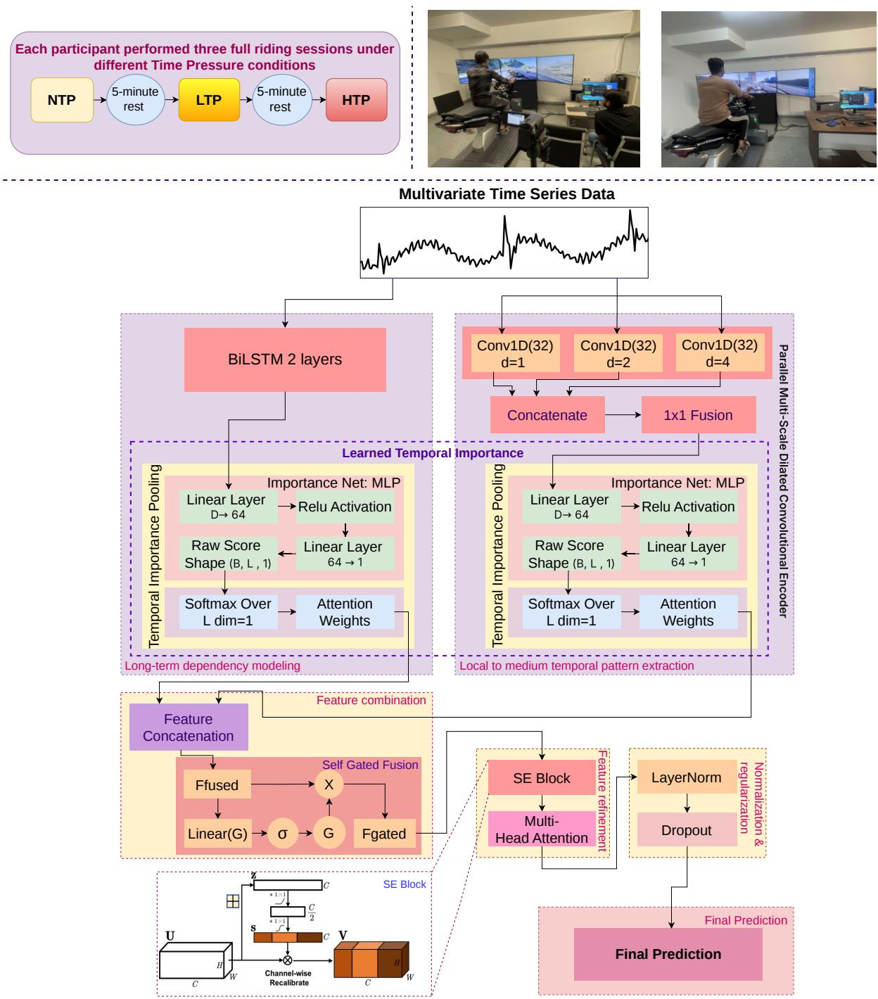

# MotoSafety: Edge-AI with Learned Temporal Importance for Two-Wheeler Collision Risk Assessment Under Time Pressure

Sumit S. Shevtekar a,1,∗, Chandresh K. Maurya a, Gourab Sil b, Subasish Das c

aDepartment of Computer Science and Engineering, Indian Institute of Technology Indore, Khandwa Road, Simrol, Indore, 453552, Madhya Pradesh, India

bDepartment of Civil Engineering, Indian Institute of Technology Indore, Khandwa Road, Simrol, Indore, 453552, Madhya Pradesh, India

cCivil Engineering Program, Ingram School of Engineering, Texas State University, RFM 5202, San Marcos, 78666, TX, USA

## Abstract

Powered two-wheeler riders face critical safety challenges in low- and middle-income countries, yet limited studies exist on how cognitive stressors such as Time Pressure influence collision risk. To address this gap, we introduce a large-scale dataset of over 129,000 labeled multivariate time-series sequences from 153 simulator rides by 51 participants under No, Low, and High TP, capturing 64 features across vehicle dynamics, control inputs, proximity, and behavioral violations. Building on this dataset, we propose MotoSafety, a novel edge-AI architecture grounded in the Learned Temporal Importance principle. MotoSafety achieves 94.97% accuracy and 99.33% ROC AUC, outperforming ten baselines, including TimesNet and LLM4TS, and achieves 0.039 MSE and 0.094 MAE for forecasting (4.4× lower error than Time-LLM and iTransformer). With only 1.15M parameters and 0.135 ms latency, it is suitable for edge deployment on low-cost CPU hardware. Using ground truth TP as an inductive bias improves accuracy from 94.09% to 94.97%, while predicted TP achieves 94.82%. Using only 21 IMU+GPS features, it achieves 93.91% accuracy, indicating practical deployment. Beyond PTW safety, the architecture shows better transferability to human activity (97.66%) and clinical (99.65%) domains. This lightweight framework advances PTW collision risk assessment, supporting the Safe System Approach for Intelligent Transportation

Systems.

Keywords: Powered two-wheeler safety, Time pressure, Collision risk assessment, Deep learning, Intelligent transportation systems

## 1. Introduction

Road trafic accidents are the leading cause of death worldwide, particularly in Low- and Middle-Income Countries (LMICs) [1]. Powered two-wheeler (PTW) riders represent one of the most vulnerable groups, facing disproportionately high fatality rates due to limited protection, complex trafic, and socio-economic pressures to meet mobility and livelihood deadlines. Globally, PTWs account for approximately 21% of road trafic fatalities, a figure that rises to nearly 38% in LMICs, where PTWs serve as an afordable and widely adopted mode of transport [1]. In India alone, PTWs constituted 74.4% of registered vehicles as of 2022 shown in Fig. 1 [2]. As of 2023, two-wheelers constitute the largest segment of the India’s vehicle population with more than 263 million registered units and were involved in 44.5% of total road trafic fatalities, as shown in Fig. 2 [3, 4]. According to oficial MoRTH reports on road accidents in India, road fatalities in India are predominantly male, ranging from 85.2% to 87.3% between 2019 and 2023 [5, 6, 7, 8, 9], with most fatalities occurring in the 18–45 age group. These statistics show the high risk associated with male PTW riding behavior. Despite advances in infrastructure design and trafic enforcement, human error remains the dominant contributor to PTW crashes, with risky behaviors such as overspeeding, abrupt maneuvering, and inadequate hazard response accounting for a large share of fatalities [10]. Naturalistic and simulator-based studies consistently show that riding speed, control variability, and situational context strongly influence crash risk [11]. PTW riders frequently travel at speeds up to 2.3 times higher than four-wheeler drivers, and overspeeding alone contributes to approximately 34% of PTW fatalities [12].

Time Pressure (TP) refers to the subjective perception of insuficient time to complete a riding task, commonly arising from risk-prone behaviors, situational urgency, or externally imposed constraints [12, 13]. This is especially common for app-based delivery riders in LMICs such as India. App-generated delivery deadlines, performance incentives, and intense customer demands for fast, flawless service combine to create persistent and often extreme TP [13, 14, 15]. Elevated TP afects cognitive processing and motor control, narrowing attentional bandwidth and accelerating decision-making. This in turn promotes risk-prone behaviors such as overspeeding, inconsistent braking, and delayed hazard response [12, 16, 10]. Simulator studies on car drivers report increased accident risk of up to 181% under high time pressure (HTP) compared to no time pressure (NTP) [12]. Related work [17] demonstrates that cognitive and emotional stress amplifies speed variability and control instability. However, a key cause of these behaviors, TP-induced cognitive stress, is still not well understood within the PTW-driving situation. Recent AI-driven trafic crash prediction leverages largescale datasets, classical ML/DL architectures to improve safety [18, 19, 20, 21, 22]. Although efective in predicting four-wheeler crashes, these approaches inadequately model the unique dynamics and highly unstable control characteristics of PTWs. For example, [19] achieved ∼90% accuracy using deep neural networks on highway data, [20] improved driver behavior classification with feature selection on large datasets, [21] used Random Forest to predict injury severity (92% accuracy). However, these studies focus primarily on four-wheelers or general trafic datasets and do not incorporate fine-grained temporal modeling of PTW riders

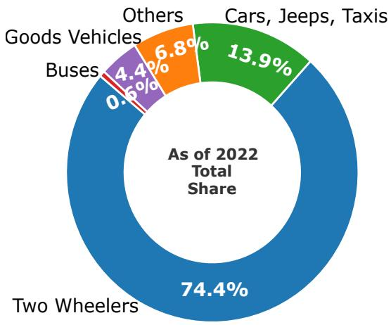  
Figure 1: Registered Vehicles Share in India.

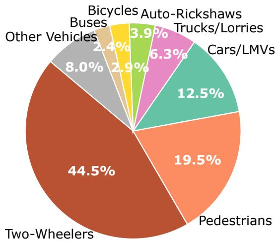  
Figure 2: Road Crash Fatalities in India.

or cognitive stress factors such as TP.

To the best of our knowledge, this is the first work to address the prediction of collision risk for two-wheeler riders under TP. To bridge this gap, we propose a novel MotoSafety model specifically designed for multivariate time series data and to quantify and predict collision risk by modeling the interplay between a riders cognitive state under TP and their operational maneuvers. Our work addresses a critical public safety exigency: the protection of vulnerable PTW riders operating under chronic TP—a phenomenon increasingly prevalent in the rapidly urbanizing and dense trafic environments of emerging economies like India. The proposed system can be deployed as an edge-based alert system, where a handlebarmounted device or smart helmet provides haptic/audio alerts when collision risk exceeds a threshold, enabling proactive safety interventions for riders under TP (e.g., emergency commuting, delivery deadlines, or urgent travel).

This methodology was co-developed with road safety authorities and transportation experts to address PTW fatalities in LMICs. By integrating stakeholder input on crash-prone scenarios and demographic vulnerability, we ensure that our edge-deployable model satisfies real-world operational requirements. Consequently, our approach transitions from theoretical inference to a practitioner-validated solution for tangible public safety impact. The key contributions of this work are summarized as follows:

## 1.1. Key Contributions

We make the following key contributions.

1. Large-Scale PTW Simulator Data Under TP: To study the efect of TP on PTW riders, we collect 129,000 labeled multivariate time series data from 51 participants under No, Low, and High TP. Each input sequence comprises 64 features categorized into vehicle dynamics, control inputs, headway/tailway distances, and behavioral violations.

2. Novel Architecture for Collision Risk Forecasting and Classification: We propose MotoSafety, a novel architecture grounded in the Learned Temporal Importance (LTI) principle. The architecture integrates: (i) parallel multi-scale dilated convolutions for local-to-medium pattern extraction; (ii) Bidirectional Long Short-Term Memory (Bi-LSTM) for long-range dependencies; (iii) Temporal Importance Pooling (TIP) for content-aware temporal collapse, applied independently to both CNN and BiLSTM branches, which reduces downstream fusion, SE-recalibration, and attention stages to O(1) with respect to sequence length, while the front-end encoder retains O(L) complexity, giving an overall O(L) model (Table 4); and (iv) self-gated fusion with squeeze-and-excitation (SE) and multi-head attention (MHA) for dynamic representation refinement.

3. SOTA Performance and Deployability: MotoSafety achieves 94.97% accuracy and 99.33% ROC AUC, showing improved performance over ten baselines including Times-Net, Time-LLM and LLM4TS. For long-term forecasting, it achieves 0.039 MSE and 0.094 MAE (4.4× lower error than Time-LLM and iTransformer). Notably, MotoSafety requires only ∼1.15M parameters and achieves an inference latency of 0.135 ms, making it 21.9× and 71.9× faster than TimesNet and LLM4TS, respectively, and makes it suitable for edge devices.

4. TP Inductive Bias, Real-World Feasibility, and Architecture Transferability: Explicit TP prediction improves collision accuracy from 94.09% to 94.97% (ground truth) and 94.82% (predicted TP). Using only 21 real-world features (IMU+GPS), MotoSafety achieves 93.91% accuracy, indicating practical deployment potential; hardware validation remains future work. Beyond PTW safety, the architecture demonstrates strong transferability to human activity (97.66%) and clinical exercise (99.65%) domains when retrained from scratch.

## 2. Related Work

## 2.1. Time Pressure as a Latent Risk Factor in Driving Safety

Time Pressure (TP) is widely recognized as a cognitive stressor that degrades driver and rider decision-making and elevates crash risk. Under TP, individuals experience a perceived urgency to complete the driving task within insuficient time, which narrows attentional focus, accelerates cognitive processing, and increases reliance on risk-oriented heuristics [12, 16]. Empirical studies consistently show that TP leads to higher speeds, shorter accepted gaps, reduced safety margins, and increased crash likelihood across diverse trafic contexts [23, 10, 13]. Experimental evidence from simulator-based studies indicates that TP significantly alters longitudinal and lateral control behavior, including increased acceleration variability, unstable steering, and abrupt braking [24].

These behavioral deviations are strongly associated with near-crash and collision events, suggesting that TP acts as an upstream cognitive trigger for unsafe driving outcomes rather than merely a contextual modifier. PTWs are particularly susceptible to TP-induced risk due to unstable dynamics and high dependence on rider motor control compared to fourwheelers [23, 10, 25]. At unsignalized intersections, [12] show that drivers with low time pressure (LTP) and high time pressure (HTP) accept significantly smaller gaps, resulting in elevated crash likelihoods of 127% in LTP and 181% in HTP relative to no time pressure (NTP). TP increases cognitive load and unintentional attentional lapses under stress [26, 27], reducing situational awareness and leading to errors that precede collisions. These findings highlight TP as a critical contributor to risk in dense, heterogeneous trafic flows common in LMICs.

## 2.2. Simulator-Based Collision and Risk Analysis

Driving simulators provide a safe and controlled environment for analyzing collision risk under cognitively demanding conditions such as TP, eliminating real-world crash risks while enabling high-resolution data collection for both collision risk classification and kinematic state forecasting [24, 28, 29]. Prior work demonstrates strong relative validity between simulated and real-world behavior, particularly for risk-related metrics including speed selection, braking intensity, and control variability [24, 28, 29].

Although absolute behavioral magnitudes may difer between simulated and naturalistic settings, the fundamental patterns of TP-induced changes remain consistent: increased speeds, more frequent lane changes, amplified braking intensity, and greater vehicular variability occur in both environments [24]. This supports the ecological validity of using simulators to investigate TP-induced behavioral changes in PTW rider behavior, enabling the current study to train and evaluate MotoSafety’s classification and forecasting tasks under controlled yet realistic conditions.

## 2.3. Machine Learning for Collision and Risk Prediction

The intelligent transportation systems (ITS) literature increasingly employs machine learning and deep learning techniques to predict risky events, collisions, and hazardous driving events. Classical approaches using Random Forests, Support Vector Machines, and feedforward neural networks report moderate success in identifying high-risk maneuvers [30, 31]. More recently, sequence models such as Temporal Transformers, Informer, and TimesNet have shown strong performance in modeling long-range temporal dependencies inherent in driving dynamics [32, 33]. However, most existing models focus on detecting externally observable outcomes (e.g., collisions or near-crashes) after risk has already manifested. They largely overlook latent cognitive precursors such as TP that shape behavior well before unsafe actions occur. Furthermore, few studies address PTW-specific dynamics, which are characterized by inherent instability and high dependence on rider motor control.

## 2.4. Research Gap and Motivation

Although TP is a critical contributor to unsafe driving behavior, it is rarely integrated into collision risk assessment frameworks as a latent risk factor. This gap is particularly pronounced for PTWs, where safety margins are narrow and early intervention is essential.

Motivated by these limitations, this work advances collision risk assessment under TP by leveraging high-resolution multivariate time-series data to infer risk directly from behavioral dynamics. By focusing on collision risk in cognitively stressed riding conditions, this study aligns with the Safe System Approach (SSA) [34] and the goal of Vision Zero [35], enabling the detection of high-risk states and supporting the development of intelligent rider-assistance systems and safer PTW mobility.

## 3. Methodology

In this section, we provide details of our data collection protocol, followed by MotoSafety architecture.

## 3.1. Experimental Design and Data Collection

## 3.1.1. Simulator Setup

All experimental trials use a static PTW simulator housed at the Institute (Fig. 3). The system integrates an instrumented Honda motorcycle frame with fully operational throttle, brake, clutch, and gear controls, replicating the ergonomics of real-world riding. A three-screen immersive display surrounds the rider to deliver a wide field of view with realistic roadway visualization. High-precision industrial-grade sensors continuously record rider inputs, vehicle dynamics, and environmental parameters through a real-time data acquisition interface, complying with IEC 393 accuracy standards [36]. While the frame is static, a 4-actuator motion system provides vibration and acceleration. Complete technical specifications, including sensor accuracy ratings, appear in Table 1. This setup provides a high-fidelity, controlled environment that supports systematic investigation of rider responses across diverse trafic and roadway scenarios.

This ISO-compliant simulator provides a controlled, scalable, and safe environment to investigate rider behavior, cognitive load, and collision risk under realistic operational conditions.

Table 1: Specifications of the two-wheeler simulator
<table><tr><td>Component</td><td>Specification</td></tr><tr><td>Platform</td><td>Static PTW frame, ISO-compliant</td></tr><tr><td>Controls</td><td>Throttle, clutch, hydraulic brakes, 5-speed gearbox, steering, handbrake</td></tr><tr><td>Sensors</td><td>Servo Potentiometers (Wire Wound – 50WW): Resistance: 5 kΩ (±10%); Independent Linearity: ±0.5% (IEC 393), Electrical Angle: Mechanical Rotation: 360°</td></tr><tr><td></td><td>Power Rating: 3 W (@ 70°C); Rotational Life: 2,000,000 revolutions Operating Temperature: -40°C to +105°C Load Cells: Brake force measurement</td></tr><tr><td></td><td>Optical Encoders: Gear position and control tracking, Limit Switches (SPDT): Gear shift detection</td></tr><tr><td>Visual System Motion System</td><td> $3 \times 5 0 "$  inch LED displays, 180° field of view 3-DOF Electric Actuators (×4): Max acceleration ±1 G, 0-100 Hz bandwidth</td></tr><tr><td></td><td>Pitch: ±1.75°, Roll: ±3.5°, Heave: 38.1 mm; Stroke: 1.5 inch</td></tr><tr><td></td><td></td></tr><tr><td></td><td>Load Capacity: 114 kg per actuator</td></tr><tr><td>Computer Systems</td><td>Rider Station: Intel i7, 32GB RAM, GTX 1650</td></tr><tr><td></td><td>Instructor Station: Intel i5, 16GB RAM, GTX 1650</td></tr><tr><td>Software</td><td></td></tr><tr><td></td><td>TechnoSim (AI traffic, environment modelling, scenario scripting)</td></tr><tr><td>Data Logging</td><td>Real-time data acquisition, sampling frequency  $f _ { s } \geq 1 0 0 ~ \mathrm { H z }$ </td></tr><tr><td></td><td></td></tr><tr><td></td><td></td></tr></table>

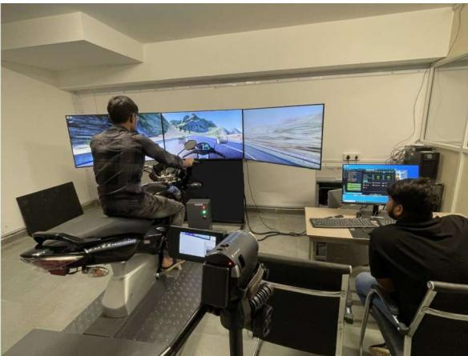

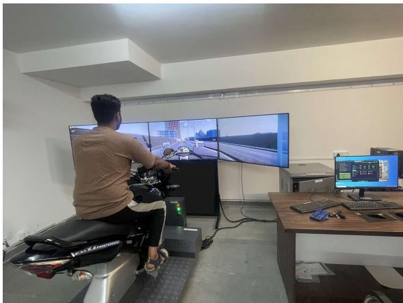  
Figure 3: Participants performing the simulator test.

## 3.1.2. Simulated Scenarios

We design a 4.8 km urban scenario on a high-fidelity two-wheeler simulator to investigate rider behavior under cognitive stress (TP). The route incorporates both undivided twolane and four-lane sections with a 50 km/h speed limit, reflecting typical Indian urban conditions. The scenario embeds diverse events—including pedestrian crossings, obstacle overtaking, intersections, bike and car following segments to elicit real-time decision-making, adaptive control, and risk-taking under varying TP. The key elements of the scenario are illustrated in Fig. 4: Fig. 4a: primary route with intersections and conflict zones, Fig. 4b: AI vehicle triggers simulating dynamic interactions, Fig. 4c: route direction changes and detour prompts, and Fig. 4d: speed change triggers near sensitive areas.

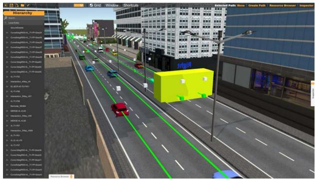  
(a) Primary route with intersections and conflict zones

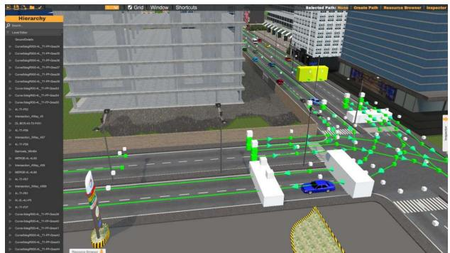  
(b) AI vehicle triggers simulating dynamic interactions

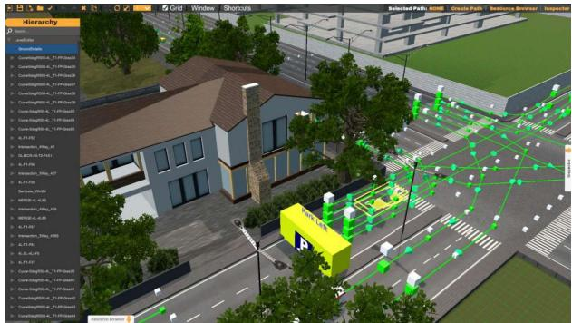  
(c) Route direction changes and detour prompts

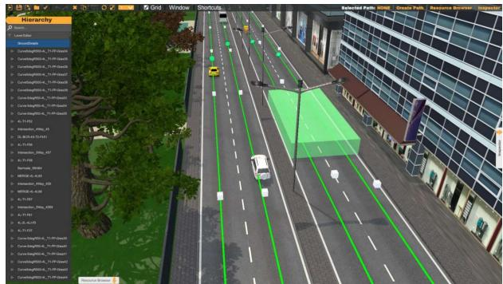  
(d) Speed change triggers near sensitive areas  
Figure 4: Sample snapshots of the simulated riding environment.

Table 2: Rider Characteristics (N = 51)
<table><tr><td>Variable</td><td>Level / Description</td><td>Mean (SD) or %</td></tr><tr><td>Age (yrs)</td><td>18-42</td><td>26.4 (5.7)</td></tr><tr><td>Experience (yrs)</td><td>≥2</td><td>5.6 (3.1)</td></tr><tr><td>License</td><td>Valid two-wheeler</td><td>100%</td></tr><tr><td>Education</td><td>Graduate / Final-year B.Tech</td><td>58.8% / 41.2%</td></tr><tr><td>Simulator Exp</td><td>No / Yes</td><td>92.2% / 7.8%</td></tr><tr><td>Health</td><td>Medically fit</td><td>100%</td></tr></table>

## 3.1.3. Participants

The vast majority of two-wheeler riders in India are male, as reflected in MoRTH road fatality statistics report [5, 6, 7, 8, 9]. According to oficial MoRTH reports, males accounted for 86.0%, 87.3%, 86.4%, 86.2%, and 85.2% of PTW fatalities between 2019 and 2023, respectively, with most deaths in the 18–45 age group. This overwhelming male predominance provides a strong empirical basis for focusing on male participants in this study. Accordingly, fifty-one male riders (ages 18–42) with at least two years of riding experience participated.

Detailed rider characteristics are presented in Table 2, and Fig. 3 shows participants performing simulator tasks.

The male-only cohort is justified by three converging factors: First, national crash data shows male riders as the dominant high-risk group. According to MoRTH reports, male PTW fatalities accounted for 85.2–87.3% of all PTW deaths from 2019 to 2023 [5, 6, 7, 8, 9], with fatalities concentrated in the 18–45 age group. Statistical tests confirm this pattern: a binomial test shows male fatalities (86%) significantly exceed equal representation $( p <$ 0.0001), and a chi-square test confirms consistency across years $( \chi ^ { 2 } = 2 6 2 . 3 , \ : \mathrm { d f } = 5 , \ : p <$ 0.0001).

Second, female exposure to manually geared PTWs is extremely limited. Women hold only about 6% of motor vehicle licenses in India [37, 38, 39], significantly below equal representation $( p < 0 . 0 0 0 1 )$ . The proportion of women actually riding manually geared motorcycles is even lower due to socio-cultural norms and practical barriers [38]. Consequently, the pool of female riders with manual transmission experience suitable for simulator-based research is extremely small.

Third, the simulator’s manual transmission requirement creates a practical recruitment constraint. The high-fidelity PTW simulator replicates a manually geared motorcycle with functional clutch and gear controls, requiring prior manual transmission experience. Given the extremely low prevalence of female riders with such experience in India, recruiting a statistically suficient female sample for robust analysis is infeasible. Thus, male participants were selected to ensure a suficiently large and statistically robust sample for meaningful spatial risk analysis, consistent with the dominant high-risk demographic. Future studies will include female riders as their PTW participation increases.

## 3.1.4. Time Pressure (TP) Scenarios

To ethically evoke graduated cognitive load mimicking emergency commuting, participants were tasked with reaching an examination hall under three conditions: (i) NTP: Baseline with ample time; (ii) LTP: Restricted to 90% of baseline duration (Try not to be late); and (iii) HTP: Restricted to 80% of baseline with active urgency prompts (e.g., Exam gate closing). This standardized exam-deadline scenario simulates high-arousal stress states common in urban transit, providing a controlled environment to study behavioral degradation.

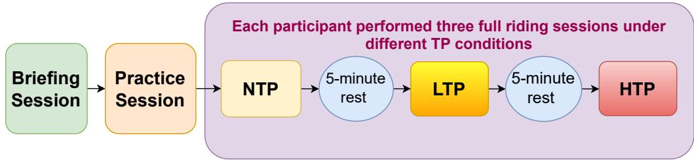  
Figure 5: Flow of dataset collection and experimental design.

## 3.1.5. Experimental Design and Protocol

A structured four-phase experimental protocol (Fig. 5) was implemented to ensure data consistency: (i) Briefing: Standardized orientation and informed consent; (ii) Practice: A 5– 10 minute familiarization ride (excluded from analysis); (iii) Main Task: Three riding sessions under NTP, LTP, and HTP conditions, with session order counterbalanced to eliminate sequence bias; and (iv) Rest: 5–8 minute inter-session breaks to stabilize cognitive load and mitigate fatigue.

Ethics and Informed Consent: All participants provided written informed consent before participating in the study. The study was approved by the Institutional Ethics Committee of the Indian Institute of Technology Indore (Approval No. BSBE/IITI/IHEC-11/2025/11).

Consent to Publish: Written informed consent was obtained from all participants to publish anonymized data and findings from this study. All data have been anonymized to protect the privacy of the participants.

## 3.1.6. Behavioral Transition : Why LTP Matters

The inclusion of a LTP condition captures the intermediate behavioral transition between safe (NTP) and risky (HTP) riding, representing the early stages of behavioral degradation.

This continuum follows the progression: NTP → LTP → HTP. While NTP reflects calm and stable riding behavior, and HTP indicates high-stress operation characterized by significant overspeeding and trafic violations, LTP acts as a critical threshold that reveals subtle, early signs of risk—such as mild overspeeding or minor lane deviations. By incorporating LTP, the model improves its sensitivity to rising stress levels, supporting earlier detection and enabling more timely safety interventions. Moreover, LTP data inform policymakers and trainers by defining practical stress thresholds, facilitating preventive strategies before riders reach the high-risk HTP state.

## 3.2. Feature Engineering and Preprocessing

From raw time-series sensor data, we derived 64 domain-informed features that capture vehicle dynamics, rider behavior, and contextual factors as summarized in Table 3. These features include statistics such as mean and standard deviation of speed and acceleration, counts of braking events, lane-change frequency, and TP levels. All features were normalized to the [0, 1] range using Min–Max scaling. We segment the time series data into fixed-length overlapping windows to preserve temporal dependencies, enabling the model to capture both gradual risk accumulation and abrupt behavioral deviations. Detailed training configurations are provided in Section 4.1.

## 3.3. Dataset and Feature Set

The experimental protocol yielded 153 multivariate time-series sessions (51 participants × 3 conditions). Data were sampled at 100 Hz. The 100 Hz streams were segmented into 960 ms windows (96 time steps) with 50% overlap, yielding 129,209 windows slid continuously. A window is labeled as collision (1) if a collision occurs within it, otherwise 0. The dataset exhibits a class distribution of 21% collision and 79% non-collision events. A single collision spans multiple windows (impact+sliding+aftermath, due to overlap), reflecting the inherent imbalance of safety-critical scenarios. This is window-level, not event-level labeling.

Each input sequence comprises 64 features (summarized in Table 3) categorized into:

Table 3: Summary of simulator features used in this study.
<table><tr><td>Category</td><td>Feature Names</td><td>Count</td></tr><tr><td>Vehicle Controls</td><td>Ignition, Engine, Accelerator, Brake, Clutch, Handbrake, Steering, Gear, Headlight, Horn Violation</td><td>10</td></tr><tr><td>Vehicle Performance</td><td>Speed, RPM, Fuel Economy, Distance Travelled</td><td>4</td></tr><tr><td>Lighting and Indicators</td><td>Indicator, Indicated before moving off, Indicated while turning at junction, Indicated while changing lanes, Failed to use headlights</td><td>5</td></tr><tr><td>Behavioral Violations</td><td>Over-speeding, Incorrect speed at intersections/junctions, Incorrect speed on speed breakers, Improper gap maintenance, Dangerous overtaking, Turned without indication, Incorrect lane driving, Wrong-side driving, Driving with handbrake applied, Clutch riding, Incorrect gear change sequence, Improper clutch release, Gear shift without clutch, Correct gear before moving off, Smooth releasing of clutch</td><td></td></tr><tr><td>Traffic Rule Violations</td><td>Crossed white line, Crossed yellow line, Crossed stop line, Signal jumping, No-entry violation, U-turn violation, No-parking violation</td><td>7</td></tr><tr><td>Time Context and Sce- nario Spatial Position</td><td>Time Stamp, TP (0=HTP, 1=LTP, 2=NTP)</td><td>2</td></tr><tr><td>Motion and Proximity</td><td>Position (X, Y, Z), Rotation (X, Y, Z), Lane No., Left Lane Offset, Right Lane Offset Lateral Velocity, Longitudinal Velocity, Headway Distance, Headway Time, Tailway Distance,</td><td>9 9</td></tr><tr><td></td><td>Tailway Time, Leftway Distance, Rightway Distance, Steering Angle</td><td></td></tr><tr><td>Brake Force</td><td>Brake test done, Front Tire Brake Force, Rear Tire Brake Force</td><td>3</td></tr></table>

Note: All types of collisions features (with vehicles, objects, obstacles, etc.) were combined into a single binary target variable ‘Target‘, with 0 indicating no collision and 1 indicating collision. These collision events were excluded from the input features to prevent label leakage.

(i) Vehicle Dynamics: Speed, acceleration, and 3D rotation; (ii) Control Inputs: Throttle, hydraulic brake force, and gear transitions; (iii) Proximity: Headway/tailway distances and lane ofsets; (iv) Time context and scenario: Time Stamp, TP (0=HTP, 1=LTP, 2=NTP); and (v) Behavioral Violations: Overspeeding, improper gap maintenance and trafic rule infractions. All collisions were aggregated into a single binary target variable, with leakage prevented by excluding impact-related features from the input.

## 3.4. Scope of the Classification and Forecasting Tasks

We define two complementary but distinct tasks, and are explicit about what each does and does not establish.

Classification Task (Same-Window Risk Detection): Given a 960 ms observation window, the model predicts whether a collision event occurs within that window. Because a subset of positive windows overlaps the collision event itself (impact, sliding, or aftermath phases, as noted in Section 3.3), this task is best characterized as same-window collision risk detection rather than a fixed-lead-time forecast: it evaluates whether pre-collision and in-progress behavioral signatures are jointly separable from normal riding, not how far in

advance a collision can be anticipated.

Forecasting Task (Prospective Kinematic Prediction): Given a lookback window of L = 96 timesteps, a separately trained instance of the architecture predicts future kinematic states (e.g., speed, lean angle, longitudinal force) up to $H \in \{ 9 6 , 1 9 2 , 3 3 6 , 7 2 0 \}$ timesteps (up to 7.2s) ahead. This task, evaluated in Section 5.2, is a genuine prospectiveforecasting result with an explicit lead time, but its target is future sensor state, not future collision probability; it demonstrates that the architecture can anticipate the kinematic precursors of hazardous states, which is complementary to, but distinct from, a direct lead-time collision-probability forecast.

We view a labeled, fixed-lead-time collision-probability forecast (i.e., excluding all windows that overlap a collision event and labeling remaining windows by whether a collision begins within a defined horizon τ afterward) as an important direction for follow-up work, and report the current classification results with this scope explicitly stated rather than implied.

## 3.5. Proposed Architecture: MotoSafety

## 3.5.1. Architecture Overview

The proposed MotoSafety architecture, shown in Fig. 6, is a DL architecture based on the Learned Temporal Importance (LTI) principle, developed for the prediction of PTW collisions and forecasting. It employs a multi-stage pipeline: (i) a parallel multi-scale dilated convolutional encoder with three branches (dilation factors 1, 2, 4) extracts local to mediumrange temporal patterns; (ii) a 2-layer Bi-LSTM (128 hidden units per direction) captures long-range sequential dependencies; (iii) a novel TIP module (which uses a lightweight Multi-Layer Perceptron (MLP) as a learned scoring function to evaluate the importance of each timestep) is applied independently to the outputs of both the CNN and LSTM paths, learning to adaptively weight the most critical pre-collision timesteps for each feature type and collapsing them into compact vectors; (iv) these vectors are concatenated and processed by a self-gated fusion stage, refined by channel-wise recalibration via a SE block and MHA (4 heads). The resulting representation is normalized, regularized with dropout, and linearly projected to produce binary collision probabilities.

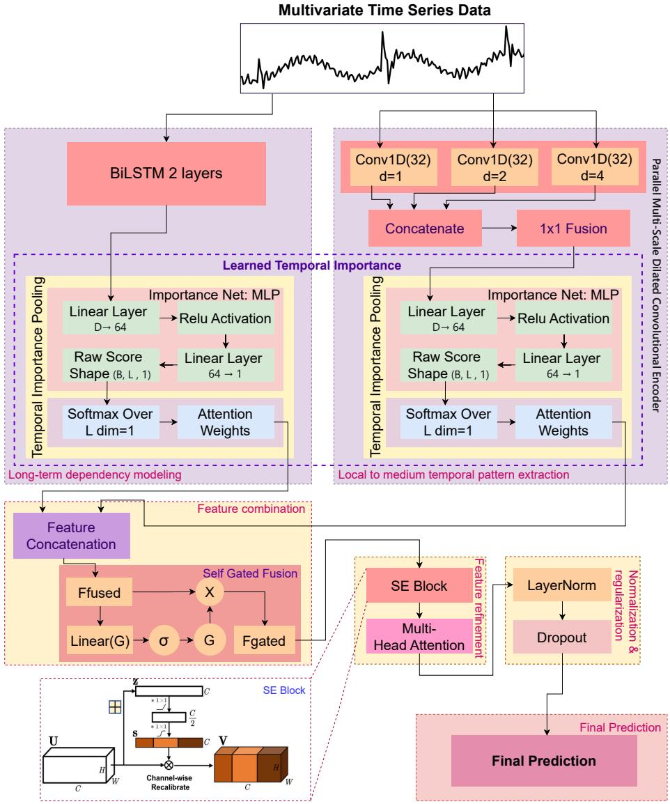  
Figure 6: The proposed MotoSafety architecture.

## 3.5.2. Comment on the Novelty

We distinguish clearly between architectural components adapted from prior work and the components that constitute this paper’s novel contribution.

Adapted components: The parallel dilated-convolution encoder, Bi-LSTM, SE recalibration, and MHA are established building blocks, each individually well-studied in time-

series and sequence modeling literature.

Novel contribution: TIP. The core contribution of this work is the $\mathrm { T I P }$ module and the LTI principle it instantiates. Rather than collapsing the temporal dimension with a fixed operator (mean-pool, max-pool, or final-hidden-state extraction, as is standard practice in CNN/RNN-based time-series classifiers), TIP learns a content-aware scoring function that assigns a data-dependent importance weight to every timestep before collapsing the sequence. This is applied independently to both the CNN and BiLSTM representations, allowing the model to learn which pre-collision moments matter most for each feature pathway, rather than treating all timesteps as equally informative. Unlike full self-attention pooling (which computes pairwise timestep interactions at $\mathcal { O } ( L ^ { 2 } )$ cost), TIP scores each timestep independently against a shared learned criterion, at $\mathcal O ( L )$ cost, and produces a fixed-size vector consumed by the downstream fusion stage. Applied independently to both CNN and BiLSTM branches, TIP reduces the downstream fusion, SE-recalibration, and attention stages to $\mathcal { O } ( 1 )$ with respect to sequence length, while the front-end encoder retains $\mathcal O ( L )$ complexity, giving an overall $\mathcal O ( L )$ model (Table 4).

Empirical validation of TIP. The efectiveness of TIP is validated in Section 5.8 (Table 14), where it outperforms standard fixed-pooling strategies (mean-pooling, max-pooling, last-timestep) under an identical architecture, indicating that the performance gain stems from learned, content-aware weighting rather than fixed pooling.

This strategic “content-aware collapse” means the fusion, SE-recalibration, and MHA stages operate on a fixed-size 320-dimensional vector regardless of sequence length, i.e., these downstream stages cost $\mathcal { O } ( 1 )$ per sample once pooling is complete. The upstream CNN and Bi-LSTM encoder remains $\mathcal O ( L )$ , so the model’s end-to-end complexity is $\mathcal O ( L )$ overall, not $\mathcal { O } ( 1 )$ ; the practical benefit of TIP is that it removes the $\mathcal { O } ( L ^ { 2 } )$ cost a full-sequence self-attention mechanism would otherwise add on top of the encoder. Table 4 details the per-module accounting. This design ensures the low-latency performance required for robust real-time deployment on edge devices.

Table 4: Per-module computational complexity. L: sequence length, C: feature channels, H: hidden dimension, k: kernel size.
<table><tr><td>Module</td><td>Complexity</td></tr><tr><td>Dilated CNN encoder (×3 branches)</td><td> $\mathcal { O } ( L \cdot k \cdot C )$ </td></tr><tr><td>Bi-LSTM (2 layers)</td><td> $\mathcal { O } ( L \cdot H ^ { 2 } )$ </td></tr><tr><td>TIP scoring + weighted sum</td><td> $\mathcal { O } ( L \cdot H )$ </td></tr><tr><td>Gated fusion + SE block</td><td>O(1) (fixed-size input)</td></tr><tr><td>Multi-head attention (post-pooling)</td><td>O(1) (fixed-size input)</td></tr><tr><td>MotoSafety total</td><td>O(L)</td></tr></table>

## 3.5.3. MotoSafety: Mathematical Formulation

We address the problems of binary collision prediction and multi-horizon time-series forecasting from multivariate sensor data under TP. Our input consists of sensor readings $X \in \mathbb { R } ^ { B \times L \times C }$ from a two-wheeler simulator, with B batch size, lookback window L and C feature channels.

Forward Process: The input X is processed by two parallel branches: CNN and BiL-STM. The CNN branch captures local patterns using three dilated convolutional branches with kernel size $k = 3$ . To accommodate the channel-first requirement of 1D convolutions, we apply a permutation function $\pi ( \cdot )$ to X such that $\hat { X } = \pi ( X ) \in \mathbb { R } ^ { B \times C \times L }$

$$
H _ { \mathrm { d } } = \mathrm { R e L U } ( \mathrm { C o n v 1 D } _ { d } ( \hat { X } ) )\tag{1}
$$

where $d = \{ 1 , 2 , 4 \}$ is the dilation factor. These views are merged into a unified 64-channel representation via a $1 \times 1$ convolution: $H _ { \mathrm { m s } } = \mathrm { C o n v } 1 \mathrm { D } _ { 1 \times 1 } ( [ H _ { 1 } ; H _ { 2 } ; H _ { 4 } ] ) \in \mathbb { R } ^ { B \times 6 4 \times L }$ . In parallel, a bidirectional LSTM captures long-range dynamics:

$$
H _ { \mathrm { l s t m } } = \mathrm { B i L S T M } ( X ) \in \mathbb { R } ^ { B \times L \times 2 5 6 } .\tag{2}
$$

To identify safety-critical moments, we utilize TIP to learn importance weights across the temporal dimension. Two distinct networks, $\mathrm { M L P } _ { \theta _ { 1 } }$ and $\mathrm { M L P } _ { \theta _ { 2 } }$ , assign scores to the CNN

and LSTM features respectively:

$$
w _ { \mathrm { c } } = \mathrm { S o f t m a x } ( \mathrm { M L P } _ { \theta _ { 1 } } ( H _ { \mathrm { m s } } ^ { T } ) ) , \quad f _ { \mathrm { c n n } } = \sum _ { t = 1 } ^ { L } w _ { \mathrm { c } } ^ { ( t ) } H _ { \mathrm { m s } } ^ { ( t ) }\tag{3}
$$

$$
w _ { \mathrm { l } } = \mathrm { S o f t m a x } ( \mathrm { M L P } _ { \theta _ { 2 } } ( H _ { \mathrm { l s t m } } ) ) , \quad f _ { \mathrm { l s t m } } = \sum _ { t = 1 } ^ { L } w _ { \mathrm { l } } ^ { ( t ) } H _ { \mathrm { l s t m } } ^ { ( t ) }\tag{4}
$$

The resulting vectors, $f _ { \mathrm { c n n } } \in \mathbb { R } ^ { 6 4 }$ and $f _ { \mathrm { l s t m } } \in \mathbb { R } ^ { 2 5 6 }$ , are concatenated to form the joint representation $f = [ f _ { \mathrm { c n n } } , f _ { \mathrm { l s t m } } ] \in \mathbb { R } ^ { 3 2 0 }$ . The fused representation undergoes refinement through a gating mechanism and a channel-wise recalibration block (SE-Block). Finally, a MHA block performs high-order feature refinement:

$$
f _ { \mathrm { g a t e } } = f \odot \sigma ( W _ { g } f + b _ { g } ) ,\tag{5}
$$

$$
f _ { \mathrm { s e } } = \mathrm { S E B l o c k } ( f _ { \mathrm { g a t e } } ) ,\tag{6}
$$

$$
f _ { \mathrm { a t t n } } = \mathrm { M H A } ( f _ { \mathrm { s e } } ) .\tag{7}
$$

The final prediction $\mathbf { y } \in \mathbb { R } ^ { 2 }$ is obtained via a linear projection of the normalized and regularized context:

$$
\mathbf { y } = { \mathrm { S o f t m a x } } \Big ( \mathrm { L i n e a r } \big ( \mathrm { L a y e r N o r m } ( \mathrm { D r o p o u t } ( f _ { \mathrm { a t t n } } ) \big ) \Big ) .\tag{8}
$$

To address the extreme class imbalance (rare collision events), we utilize Focal Loss with a focusing parameter $\gamma = 2$

$$
\mathcal { L } _ { \mathrm { c l s } } = - \frac { 1 } { B } \sum _ { i = 1 } ^ { B } ( 1 - P _ { i , y _ { i } } ) ^ { \gamma } \log ( P _ { i , y _ { i } } ) ,\tag{9}
$$

where $P _ { i , y _ { i } }$ is the predicted probability for the true binary collision label $y _ { i } \in \{ 0 , 1 \}$ .

Multi-Horizon Forecasting Module. Our forecasting module predicts future target values $\hat { Y } \in$ $\mathbb { R } ^ { B \times \tau }$ over horizon $\tau$ . It uses a separate but architecturally similar network with identical CNN and BiLSTM branches, TIP, gating, SE-Block, and MHA. Both the classification and forecasting modules use the same $L = 9 6$ timestep lookback window; they difer only in their prediction target (same-window collision label vs. future kinematic states) and are trained separately, as described above. This produces a refined context vector $\mathbf { f } _ { \mathrm { a t t n } } \in \mathbb { R } ^ { B \times 3 2 0 }$ . The final forecast is obtained via:

$$
\hat { Y } = \mathrm { L i n e a r } _ { \mathrm { f o r e c a s t } } \big ( \mathrm { L a y e r N o r m } ( \mathbf { f } _ { \mathrm { a t t n } } ) \big ) .\tag{10}
$$

The module is trained to minimize the Mean Squared Error (MSE) loss:

$$
\mathcal { L } _ { \mathrm { f o r e c a s t } } = \frac { 1 } { \boldsymbol { B } \cdot \tau } \sum _ { i = 1 } ^ { B } \sum _ { k = 1 } ^ { \tau } \left( y _ { i , L + k } - \hat { Y } _ { i , k } \right) ^ { 2 } ,\tag{11}
$$

where $y _ { i , L + k }$ is the true target value at future step k. Both models share identical architectural components but are trained separately for their respective tasks.

## 4. Experimental Setup and Baselines

## 4.0.1. Ground Truth and Human Validation

To ensure the reliability of the simulator-generated labels, a systematic validation protocol was conducted. Two road experts in road safety and human factors (male, postgraduate) reviewed a representative subset of 2,000 randomly selected segments from the total of 129,000-sequence dataset. Experts independently annotated the onset and severity of high-risk episodes (e.g. abrupt swerves, loss of balance, critical near-misses) using a standardized coding scheme based on kinematic thresholds and behavioral cues. The inter-annotator agreement, measured via Cohen’s Kappa coeficient (κ), was 0.87, indicating almost perfect agreement according to conventional benchmarks [40]. This high agreement validates the dataset’s labels as a robust ground truth for model training.

## 4.0.2. Baselines

We benchmark MotoSafety against ML (RF, CNN, RNN) and modern DL architectures: Informer [32] and iTransformer [41] for Transformer-based long-range modeling. TimesNet

Table 5: Training configuration for MotoSafety classification and forecasting models.
<table><tr><td>Component</td><td>Setting</td></tr><tr><td>Classification Model</td><td></td></tr><tr><td>Input sequence length</td><td>96 timesteps (960 ms)</td></tr><tr><td>Feature dimension</td><td>64</td></tr><tr><td>CNN hidden channels</td><td>32 per branch, 64 fused</td></tr><tr><td>BiLSTM hidden dimensions</td><td>128 (bidirectional)</td></tr><tr><td>Total model parameters</td><td>~1.15 million</td></tr><tr><td>Dropout rate</td><td>0.3</td></tr><tr><td>Loss function</td><td>Focal Loss  $( \gamma = 2 )$ </td></tr><tr><td>Forecasting Model</td><td></td></tr><tr><td>Input lookback length</td><td>96 timesteps</td></tr><tr><td>Prediction horizons</td><td>H ∈ {96, 192, 336, 720}</td></tr><tr><td>Architecture</td><td>Identical to classification model</td></tr><tr><td>Loss function</td><td>MSE</td></tr><tr><td>Shared Settings</td><td></td></tr><tr><td>Optimizer</td><td>AdamW  $( \mathrm { l r } { = } 3 \times 1 0 ^ { - 4 }$  , weight decay=5 × 10−5)</td></tr><tr><td>Batch size</td><td>64</td></tr><tr><td>Training epochs</td><td>50</td></tr><tr><td>Regularization</td><td>EMA, Mixup, MC Dropout (5 samples)</td></tr><tr><td>Hardware</td><td>NVIDIA T400 GPU (4GB VRAM)</td></tr></table>

[42] for multi-scale frequency analysis; PatchTST [43] for patching-based local semantics.   
Time-LLM [44] and LLM4TS (GPT-2) [45] as a representative fine-tuned LLM baseline.

## 4.1. Training and Evaluation

## 4.1.1. Training Protocol

The MotoSafety model is implemented in PyTorch and optimized using AdamW (lr = $3 \times 1 0 ^ { - 4 }$ , weight decay $5 \times 1 0 ^ { - 5 } )$ with Focal Loss (γ = 2) for classification and MSE loss for forecasting. To enhance generalization, we employed Mixup augmentation, Exponential Moving Average (EMA) of weights, and Monte Carlo (MC) Dropout (5 samples) for uncertainty calibration. Training was conducted on an NVIDIA T400 GPU (4GB VRAM) with a batch size of 64 for 50 epochs. Key training parameters are summarized in Table 5. All experiments used a participant-wise split (80/10/10), where all sessions from the same rider are kept together in the same split to prevent data leakage.

## 4.1.2. Evaluation Protocol

Performance was measured using Accuracy, F1-Score, and ROC-AUC for classification, and MSE and mean absolute error (MAE) for forecasting. Statistical significance was as-

Table 6: Behavioral diferences across time pressure conditions: Normal (NTP), Low (LTP), and High (HTP) $( \mathrm { M e a n } \pm \mathrm { S t d } )$
<table><tr><td>Feature</td><td>NTP</td><td>LTP</td><td>HTP</td></tr><tr><td>Speed (km/h)</td><td> $3 3 . 1 2 \pm 1 9 . 4 2$ </td><td> $3 9 . 6 9 \pm 2 1 . 6 7$ </td><td> ${ \bf 4 9 . 0 0 \pm 2 6 . 4 8 }$ </td></tr><tr><td>Sudden braking</td><td> $1 . 3 2 \pm 2 . 5 4$ </td><td> $1 . 3 8 \pm 2 . 3 6$ </td><td> ${ \bf 1 . 8 0 \pm 2 . 0 1 }$ </td></tr><tr><td>Dangerous overtaking</td><td> $1 . 0 7 \pm 1 . 1 8$ </td><td> $1 . 2 1 \pm 1 . 2 7$ </td><td> ${ \bf 1 . 3 6 \pm 1 . 5 2 }$ </td></tr><tr><td>Headway distance (m)</td><td> $8 . 9 9 \pm 1 4 . 3 8$ </td><td> $8 . 2 0 \pm 1 4 . 3 4$ </td><td> $\mathbf { 7 . 7 5 \ : \pm { \ : 1 3 . 8 8 } }$ </td></tr></table>

Table 7: Multivariate long-term forecasting results (mean ± std over 5 runs). Input lookback window $L = 9 6$ Prediction horizons $H \in \{ 9 6 , 1 9 2 , 3 3 6 , 7 2 0 \}$ . Avg is averaged over all four prediction horizons.
<table><tr><td>Models Metric</td><td>MotoSafety MSE</td><td>MAE</td><td>Time-LLM| MSE MAE</td><td>MSE</td><td>[iTransformer MAE</td><td></td><td>PatchTST MSE MAE</td></tr><tr><td>96</td><td> $\mathbf { 0 . 0 3 3 \ : \pm 0 . 0 0 5 0 . 0 8 2 \ : \pm 0 . 0 0 7 }$ </td><td></td><td>0.136</td><td>0.148</td><td>0.161</td><td>0.237</td><td>0.188 0.208</td></tr><tr><td>192</td><td> $\mathbf { 0 . 0 3 7 \ : \pm 0 . 0 0 6 0 . 0 8 6 \ : \pm 0 . 0 0 8 }$ </td><td></td><td>0.145</td><td>0.153</td><td>0.170</td><td>0.246</td><td>0.205 0.223</td></tr><tr><td>336</td><td> $\mathbf { 0 . 0 4 1 \ : \pm 0 . 0 0 6 0 . 0 9 7 \ : \pm 0 . 0 1 0 }$ </td><td></td><td>0.192</td><td>0.215</td><td>0.177 0.258</td><td>0.227</td><td>0.272</td></tr><tr><td>720</td><td> $\mathbf { 0 . 0 4 5 \ : \pm 0 . 0 0 7 }$ </td><td>0.111 ±0.012</td><td>0.212</td><td>0.293</td><td>0.183 0.262</td><td>0.267</td><td>0.338</td></tr><tr><td>Avg</td><td>0.039</td><td>0.094</td><td>0.171</td><td>0.210</td><td>|0.173</td><td>0.251 |0.222</td><td>0.260</td></tr></table>

sessed via paired Wilcoxon signed-rank tests over $5$ runs, with the Holm–Bonferroni correction $( \alpha = 0 . 0 5 )$

## 5. Results

## 5.1. Impact of Time Pressure on Riding Behavior

Analysis of our PTW dataset reveals that HTP is the primary driver of behavioral volatility, with a clear transition to high-risk strategies as TP increases, as shown in Table 6. Riders under HTP exhibited 48% higher mean speed, 36% increase in sudden braking, and 14% shorter headway distance compared to NTP, along with a 27% increase in dangerous overtaking. These statistically supported trends define a hurry-up strategy of excessive speed, abrupt control, and reduced spacing, highlighting TP as a key behavioral stressor that increases the risk of PTW collisions.

## 5.2. Multivariate Long-Term Forecasting Performance

To evaluate the proactive safety capabilities of MotoSafety, we conducted multivariate long-term forecasting across four horizons $( H \in \{ 9 6 , 1 9 2 , 3 3 6 , 7 2 0 \} )$ on our PTW data. This experiment assesses the models ability to project future kinematic states such as lean angles and longitudinal forces, essential for anticipating hazardous transitions before they culminate in a collision. As shown in Table 7, MotoSafety achieves an average MSE of 0.039 and MAE of 0.094, representing a 4.4× reduction in error over the Time-LLM (0.171) and iTransformer (0.173) baselines. This high forecasting fidelity under TP is critical for proactive safety; by accurately projecting states up to $H = 7 2 0$ , the model provides a vital safety bufer for early risk mitigation before a maneuver reaches a non-recoverable limit.

Table 8: Performance comparison of all models (mean ± std over 5 runs). Asterisks indicate significant diferences (paired Wilcoxon signed-rank with Holm–Bonferroni correction, $\alpha = 0 . 0 5 )$ $^ { * * * } p < 0 . 0 0 1 , { } ^ { * * } p <$ 0.01, $^ { * } p < 0 . 0 5$ . All tests compare each baseline model against MotoSafety.
<table><tr><td>Model</td><td>Acc. (%)  $\mathrm { M e a n } \pm \mathrm { S t d }$ </td><td>Result Result</td><td></td><td>Prec. Rec. F1-Score (%) AUC (%)  $\mathrm { M e a n } \pm \mathrm { S t d }$ </td><td> $\mathrm { M e a n } \pm \mathrm { S t d }$ </td></tr><tr><td>RF</td><td> $8 4 . 9 3 \pm 0 . 1 6 ^ { \ast \ast \ast }$ </td><td>85.24</td><td>84.87</td><td> $8 5 . 0 2 \pm 0 . 2 3 ^ { \ast \ast \ast }$ </td><td> $9 3 . 6 8 \pm 0 . 3 1 ^ { \ast \ast \ast }$ </td></tr><tr><td>CNN</td><td> $9 0 . 1 9 \pm 0 . 1 1 ^ { \ast \ast \ast }$ </td><td>93.82</td><td>80.68</td><td> $8 6 . 7 4 \pm 0 . 2 1 ^ { \ast \ast \ast }$ </td><td> $9 7 . 6 2 \pm 0 . 2 2 ^ { \ast \ast \ast }$ </td></tr><tr><td>RNN</td><td> $9 0 . 9 4 \pm 0 . 1 2 ^ { \ast \ast \ast }$ </td><td>83.41</td><td>96.38</td><td> $8 9 . 4 3 \pm 0 . 3 2 ^ { \ast \ast \ast }$ </td><td> $9 7 . 2 7 \pm 0 . 3 4 ^ { \ast \ast \ast }$ </td></tr><tr><td>LLM4TS</td><td> $9 0 . 0 6 \pm 0 . 1 4 ^ { * * * }$ </td><td>90.58</td><td>83.23</td><td> $8 6 . 8 1 \pm 0 . 3 1 ^ { \ast \ast \ast }$ </td><td> $9 7 . 3 1 \pm 0 . 4 2 ^ { \ast \ast \ast }$ </td></tr><tr><td>Informer</td><td> $9 3 . 6 1 \pm 0 . 0 7 ^ { \ast \ast \ast }$ </td><td>89.72</td><td>94.88</td><td> $9 2 . 2 1 \pm 0 . 2 2 ^ { \ast \ast }$ </td><td> $9 9 . 1 2 \pm 0 . 2 1 ^ { \ast \ast }$ </td></tr><tr><td>TST</td><td> $9 3 . 8 6 \pm 0 . 0 9 ^ { \ast \ast \ast }$ </td><td>93.67</td><td>90.74</td><td> $9 2 . 1 8 \pm 0 . 2 9 ^ { \ast \ast }$ </td><td> $9 9 . 2 3 \pm 0 . 2 8 ^ { \ast }$ </td></tr><tr><td>TimesNet</td><td> $9 4 . 0 6 \pm 0 . 0 5 ^ { \ast \ast \ast }$ </td><td>89.23</td><td>96.69</td><td> $9 2 . 7 7 \pm 0 . 3 8 ^ { \ast \ast }$ </td><td> $9 9 . 1 8 \pm 0 . 2 4 ^ { \ast }$ </td></tr><tr><td>iTransformer</td><td> $9 4 . 3 9 \pm 0 . 0 6 ^ { \ast \ast }$ </td><td>92.41</td><td>93.57</td><td> $9 3 . 1 2 \pm 0 . 4 2 ^ { \ast }$ </td><td> $9 9 . 2 2 \pm 0 . 3 2 ^ { \ast }$ </td></tr><tr><td>PatchTST</td><td> $9 4 . 4 1 \pm 0 . 0 5 ^ { \ast \ast }$ </td><td>90.73</td><td>96.18</td><td> $9 3 . 2 8 \pm 0 . 2 4 ^ { \ast }$ </td><td> $9 9 . 3 1 \pm 0 . 2 2 $ </td></tr><tr><td>Time-LLM</td><td> $9 4 . 4 6 \pm 0 . 0 7 ^ { \ast }$ </td><td>93.12</td><td>93.79</td><td> $9 3 . 4 1 \pm 0 . 3 3 ^ { \ast }$ </td><td> $9 9 . 2 4 \pm 0 . 3 1 ^ { \ast }$ </td></tr><tr><td>MotoSafety</td><td> ${ \bf 9 4 . 9 7 \pm 0 . 0 8 }$ </td><td>93.80</td><td>93.90</td><td> ${ \bf 9 3 . 7 0 \pm 0 . 2 0 }$ </td><td> $\mathbf { 9 9 . 3 3 \pm 0 . 3 0 }$ </td></tr></table>

## 5.3. Comparative Classification Performance

Table 8 summarizes the performance of the models on the PTW simulation data under TP. The proposed MotoSafety achieves 94.97% accuracy, 93.7% F1-score and 99.33% ROC AUC, outperforming ten baselines including TimesNet, PatchTST, iTransformer, Time-LLM and LLM4TS. To assess the robustness of the performance gains, statistical significance is evaluated using paired Wilcoxon signed-rank tests over 5 independent runs (Table 8). To account for the nine pairwise comparisons against baseline models, we employ the Holm– Bonferroni correction to control the family-wise error rate (FWER) at $\alpha \ = \ 0 . 0 5$ . The high ROC AUC indicates that MotoSafety can maintain a low false-alarm rate, which is a prerequisite for real-world Advanced Rider Assistance Systems (ARAS).

Table 9: Forecasting performance by prediction horizon (mean over 5 runs)
<table><tr><td>Horizon H</td><td>Time (s)</td><td>MSE</td><td>MAE</td></tr><tr><td>96</td><td>0.96</td><td> $0 . 0 3 3 \pm 0 . 0 0 5$ </td><td> $0 . 0 8 2 \pm 0 . 0 0 7$ </td></tr><tr><td>192</td><td>1.92</td><td> $0 . 0 3 7 \pm 0 . 0 0 6$ </td><td> $0 . 0 8 6 \pm 0 . 0 0 8$ </td></tr><tr><td>336</td><td>3.36</td><td> $0 . 0 4 1 \pm 0 . 0 0 6$ </td><td> $0 . 0 9 7 \pm 0 . 0 1 0$ </td></tr><tr><td>720</td><td>7.20</td><td> $0 . 0 4 5 \pm 0 . 0 0 7$ </td><td> $0 . 1 1 1 \pm 0 . 0 1 2$ </td></tr></table>

Table 10: Performance comparison of MotoSafety showing improvement from adding TP features. Significance markers indicate improvement over the Without TP baseline: $^ { * * * } p < 0 . 0 0 1$
<table><tr><td>Model</td><td>Accuracy (%)</td><td>AUC (%)</td></tr><tr><td>Without TP Feature</td><td> $9 4 . 0 9 \pm 0 . 0 4$ </td><td> $9 9 . 1 0 \pm 0 . 0 1$ </td></tr><tr><td>With Predicted TP Feature</td><td> $9 4 . 8 2 \pm 0 . 0 2 ^ { \ast \ast \ast }$ </td><td> $9 9 . 2 4 \pm 0 . 0 1 ^ { \ast \ast \ast }$ </td></tr><tr><td>With Ground Truth TP Feature</td><td> $\mathbf { 9 4 . 9 7 \pm 0 . 0 1 ^ { \ast \ast \ast } }$ </td><td> $\mathbf { 9 9 . 3 3 \pm 0 . 0 1 ^ { \ast \ast \ast } }$ </td></tr></table>

## 5.4. Forecasting Horizon Analysis

To characterize how forecasting accuracy varies with prediction horizon, Table 9 reports MSE and MAE for the kinematic-state forecasting task (Section 3.5.3) across horizons up to 7.2s. Error increases gradually with horizon (MSE from 0.033 at H = 96 to 0.045 at H = 720), indicating the model retains meaningful predictive signal even at longer horizons rather than degrading sharply. We note this result characterizes future kinematic-state prediction and is reported separately from the same-window collision classification task described in Section 3.3; the two tasks use diferent targets and should not be read as a single fused collision-lead-time result.

## 5.5. Downstream Task: Impact of TP on Model Performance

In practical deployment, direct and accurate measurement of ground truth TP labels, denoted $T P _ { g t }$ , may be infeasible due to sensor limitations or real-time constraints. In the proposed data set, the TP characteristic is a categorical variable representing three distinct TP conditions: HTP = 0, LTP = 1, NTP = 2. To address missing or unavailable GT TP labels, we employed a Time Series Transformer (TST) [46] model to predict these categorical TP labels from the multivariate time series input data. The TST achieved 89.26% accuracy for 3-class TP prediction (0=HTP, 1=LTP, 2=NTP). Table 11 shows the confusion matrix (raw counts) per-class performance.

Table 11: Confusion matrix (raw counts) for TST-based TP prediction.
<table><tr><td>True / Predicted</td><td>0: HTP</td><td>1: LTP</td><td>2: NTP</td></tr><tr><td>0: HTP</td><td>8878</td><td>229</td><td>163</td></tr><tr><td>1: LTP</td><td>76</td><td>7326</td><td>568</td></tr><tr><td>2: NTP</td><td>82</td><td>1661</td><td>6859</td></tr></table>

Let ${ \bf X } = ( { \bf x } _ { 1 } , { \bf x } _ { 2 } , \ldots , { \bf x } _ { T } ) \in \mathbb { R } ^ { T \times D }$ denote the multivariate time series input from the PTW simulator excluding any explicit TP feature, where T represents the sequence length and D = 63 is the number of telemetry features. Each vector $\mathbf { x } _ { t } \in \mathbb { R } ^ { D }$ represents the synchronized sensor states at time step t. The TST model is defined as:

$$
T P _ { p r e d } = f _ { T S T } ( { \bf X } ) ,\tag{12}
$$

where $T P _ { p r e d } \in \{ 0 , 1 , 2 \}$ is the predicted TP label. The predicted TP feature $T P _ { p r e d } .$ , along with all other relevant sensor and behavioral features of the data set, forms the complete input to our collision risk prediction model, MotoSafety. Formally, the model can be expressed as:

$$
\hat { y } = g _ { M o t o S a f e t y } ( \mathbf { X } , T P ) ,\tag{13}
$$

where T P is the ground truth $T P _ { g t }$ or predicted $T P _ { p r e d }$ , and $\hat { y }$ is the predicted safety risk label for the rider. We evaluated the robustness of model by comparing the predictions when using:

$$
\hat { y } _ { g t } = g _ { M o t o S a f e t y } ( \mathbf { X } , T P _ { g t } ) ,\tag{14}
$$

$$
\hat { y } _ { p r e d } = g _ { M o t o S a f e t y } ( \mathbf { X } , T P _ { p r e d } ) .\tag{15}
$$

The experimental results in Table 10 show the importance of TP in collision risk prediction. While the baseline model $f _ { \mathrm { M o t o s a f e t y } } ( X )$ achieves an accuracy 94.09% using only PTW simulation data without TP feature. The integration of predicted TP features $f _ { \mathrm { M o t o s a f e t y } } ( X \in$ ⊕ $T P _ { p r e d } )$ improved this to 94.82%, nearly matching the 94.97% Oracle performance fMotosafety(X

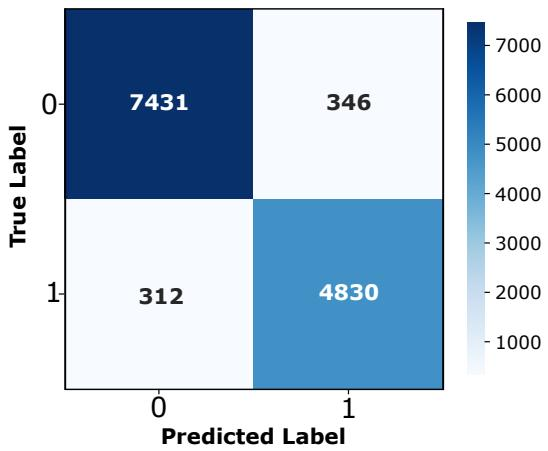  
Figure 7: Confusion matrix for the MotoSafety model on the primary PTW simulator dataset under time pressure.

$T P _ { g t } )$ . This performance gain shows that $T P _ { p r e d }$ captures latent psychological context, such as rider stress, which is not fully represented by telemetry alone. The marginal 0.15% gap between the predicted (94.82%) and Oracle (94.97%) results validates MotoSafety for realworld deployment where ground truth states are not available.

## 5.6. Model Performance and Reliability

## 5.6.1. Confusion Matrix Analysis

The confusion matrix provides a detailed view of the predictive performance of Moto-Safety across collision and non-collision events. Fig. 7 visualizes the distribution of correct and incorrect predictions.

## 5.6.2. Calibration Curve and Risk Scores

The MST calibration curve on the primary PTW simulator dataset under TP (Fig. 8) shows that predicted collision probabilities closely match observed event frequencies, indicating statistically reliable and well-calibrated outputs. In safety-critical contexts, such calibration enables risk-aware adaptive interventions rather than reliance on fixed thresholds. The distribution of predicted risk scores by true outcome (Fig. 9) further illustrates clear separation: collision events consistently receive higher predicted probabilities, while non-collision samples remain concentrated at lower values. This separation reinforces both discriminative ability and calibration quality, supporting the potential for real-world deployment.

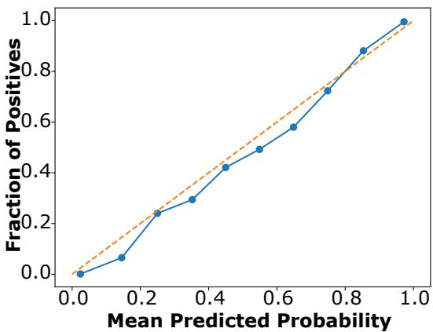  
Figure 8: Calibration curve.

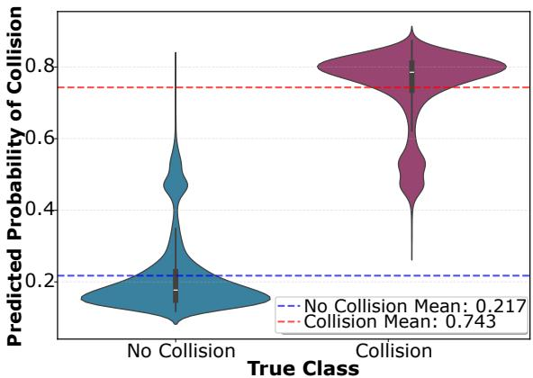  
Figure 9: Distribution of predicted collision risk.

Table 12: Cross-Safety-Domain Evaluation of MotoSafety Accuracy (%) and Prior Work Accuracy (%). MST: MotoSafety.
<table><tr><td>Dataset</td><td>Details</td><td>Safety main</td><td>Do- Application</td><td>CountryMST</td><td></td><td>Prior Work Accuracy</td></tr><tr><td>Proposed Dataset</td><td>PTW with GT TP</td><td>Simulator PTW Safety</td><td>Collision Predic- India tion</td><td></td><td>94.97</td><td></td></tr><tr><td>[47]</td><td>Simulator</td><td>PTW High-Fidelity PTW Safety</td><td>Collision Predic- Germany 99.49 tion</td><td></td><td></td><td>91.0 [RF, GB [31]]</td></tr><tr><td>[48]</td><td>Event Data</td><td>PTW Real Time Fall PTW Safety</td><td>Fall Detection</td><td>France</td><td>96.10</td><td>91.59 [DT [49]]</td></tr><tr><td>[50]</td><td>Human Recognition</td><td>Activity Human Safety</td><td>Activity Recogni- Italy tion</td><td></td><td>97.66</td><td>83.35 [K-means + NB [51]]</td></tr><tr><td>[52]</td><td>Wearable-Sensor Movement</td><td>Human cal Safety</td><td>Clini- Exercise Quality Turkey Assessment</td><td></td><td>99.65</td><td>88.65[MTMM-DTW [53]]</td></tr></table>

## 5.7. Architecture Transferability Across Safety Domains

Note that each dataset below is used to train and evaluate a separate MotoSafety instance from scratch (i.e., no weights are transferred from the PTW model); this experiment therefore evaluates the transferability of the architecture to other safety-critical sequence classification tasks, rather than knowledge transfer from the PTW domain itself.

To evaluate the versatility of the MotoSafety framework beyond motorcycle simulators, we performed cross-dataset evaluations across distinct safety-critical domains as shown in Table 12. In the PTW Safety domain, MotoSafety achieved 99.49% accuracy on the highfidelity German simulator dataset [47] for collision prediction, outperforming traditional ensemble methods (RF/GB) by 8.49%. Similarly, on real-world fall event data [48], achieved improved 96.10% accuracy, a significant improvement over the 91.59% reported for Decision Tree (DT) benchmarks [49]. Beyond vehicle dynamics, the model exhibited exceptional robustness in Human and Clinical Safety. On the UCI HAR human activity recognition dataset [50], MotoSafety surpassed Naive Bayes (83.35%) by 14.31%, achieving 97.66% accuracy. Most notably, in clinical exercise quality assessment [52], the framework achieved near-perfect classification (99.65%), marking an 11% gain over DTW-based clinical algorithms (88.65%) [53]. These results demonstrate that the MotoSafety architecture is not overfit to PTW-simulator-specific artifacts and performs competitively when retrained on diverse safety-critical sequence classification tasks, supporting the architecture’s applicability beyond its original design domain.

Table 13: Ablation Study of MotoSafety Components.
<table><tr><td>Variant</td><td>Accuracy (%) ∆ Acc.</td></tr><tr><td>Full Model</td><td>94.97</td></tr><tr><td>No BiLSTM</td><td>90.42 -4.55</td></tr><tr><td>No SE Block</td><td>91.24 -3.73</td></tr><tr><td>No Attention</td><td>90.78 -4.19</td></tr><tr><td>No CNN Branch</td><td>92.66 -2.31</td></tr><tr><td>No Gated Fusion</td><td>92.90 -2.07</td></tr></table>

## 5.8. Ablation Study

We evaluated individual contributions of MotoSafety components through a comprehensive ablation study shown in Table 13. The study was carried out on PTW simulation data under TP. The results show that the full model achieves an accuracy of 94.97%. The removal of BiLSTM and MHA resulted in significant performance degradation of 4.55% and 4.19%, respectively, highlighting their role in capturing long-range dependencies. Similarly, the exclusion of the CNN branch and Gated Fusion mechanism led to accuracy drops of 2.31% and 2.07%, underscoring the necessity of multi-scale feature extraction. Furthermore, removing the SE block decreases accuracy by 3.73%, validating its efectiveness in channel-wise feature recalibration. Collectively, these findings justify the necessity of each integrated module to maintain high predictive precision.

Table 14: Comparison of MotoSafety with TIP against standard fixed temporal-pooling strategies (mean ± std over 5 runs).
<table><tr><td>Pooling Strategy</td><td>Accuracy (%)</td><td>AUC (%)</td></tr><tr><td>Mean-pooling</td><td> $9 2 . 2 3 \pm 0 . 1 5$ </td><td> $9 8 . 8 0 \pm 0 . 2 2$ </td></tr><tr><td>Max-pooling</td><td> $9 3 . 4 1 \pm 0 . 1 2$ </td><td> $9 9 . 1 1 \pm 0 . 1 8$ </td></tr><tr><td>Last-timestep</td><td> $9 2 . 8 7 \pm 0 . 1 4$ </td><td> $9 8 . 9 7 \pm 0 . 2 0$ </td></tr><tr><td>TIP</td><td> ${ \bf 9 4 . 9 7 \pm 0 . 0 8 }$ </td><td> $\mathbf { 9 9 . 3 3 \ : \pm { \ : 0 . 3 0 } }$ </td></tr></table>

Table 15: MotoSafety accuracy with real-bike features (IMU+GPS).
<table><tr><td>Features</td><td>Accuracy (%)</td></tr><tr><td>3</td><td>80.22</td></tr><tr><td>5</td><td>83.11</td></tr><tr><td>7</td><td>88.78</td></tr><tr><td>9</td><td>90.16</td></tr><tr><td>21</td><td>93.91</td></tr><tr><td>All 64 (simulator)</td><td>94.97</td></tr></table>

To further isolate the efect of TIP, we compare it against three standard temporal-pooling strategies—mean-pooling, max-pooling, and last-timestep extraction—under an otherwise identical architecture. As shown in Table 14, MotoSafety with TIP achieves 94.97% accuracy, outperforming mean-pooling by 2.74%, max-pooling by 1.56%, and last-timestep by 2.10%. This indicates that the performance gain stems from the learned, content-aware weighting rather than from the surrounding architecture alone.

## 5.9. Real-World Feature Feasibility

To assess real-world deployment feasibility, we identified that 21 of the 64 features used in this study are available on standard motorcycles via low-cost IMU+GPS (e.g., speed, acceleration, yaw rate, position, brake force, throttle, steering angle). The remaining features (e.g., precise gap metrics, rule violations) are simulator-only. As shown in Table 15, accuracy increases with more features, achieving 93.91% with 21 features (compared to 94.97% with all 64 features), indicating that real-world deployment is feasible with onboard sensors. Validation on physical hardware in real trafic remains necessary and is identified as future work in Section 6.1.

## 5.10. Model Complexity and Edge-AI Deployability

The MotoSafety model is designed for real-time deployment in resource-constrained environments. Latency was measured on an Intel Core i7 CPU (2.8 GHz) with batch size 32, PyTorch 2.0, CPU-only inference, averaged over 1000 batches. With only 1.15M parameters and a 4.38 MB memory footprint (Table 16A), it maintains a low computational profile without sacrificing accuracy. Benchmarking on our PTW simulation dataset reveals that MotoSafety achieves a per-sample inference latency of 0.135 ms, outperforming all baseline and SOTA architectures (Table 16B). Specifically, MotoSafety is 5.3×, 9.5×, 21.9×, and 71.9× faster than PatchTST, Time-LLM, TimesNet, and LLM4TS (GPT-2), respectively. Even when accounting for TST preprocessing (36.88ms overhead) to predict TP labels when ground truth is unavailable, MotoSafety (37.01ms) remains faster than iTransformer (37.47ms), PatchTST (37.60ms), Time-LLM (38.16ms), TimesNet (39.84ms), and LLM4TS (46.59ms). This ultra-low latency ensures near-instantaneous risk assessment, allowing maximum time for emergency interventions. These eficiency metrics satisfy the stringent requirements for real-time deployment on low-cost on-board units (OBUs). Unlike GPU-dependent Transformer baselines, complexity of MotoSafety is O(L). This balance of eficiency and performance makes it a viable candidate for large-scale ITS deployment in developing regions, providing an accessible AI-driven safety net for vulnerable riders.

## 6. Conclusion

This work studied the efect of TP on PTW riders and its influence on collision risk. To address this gap, we introduced a large-scale dataset of over 129,000 labeled multivariate time-series sequences from 153 simulator rides involving 51 participants under no, low, and high TP conditions. Each sequence captures 64 features spanning vehicle dynamics, control inputs, proximity, temporal context, and behavioral violations.

Building on this dataset, we proposed MotoSafety, a novel deep learning architecture grounded in the LTI principle. MotoSafety achieves 94.97% accuracy and 99.33% ROC AUC for collision risk assessment, outperforming ten baselines including TimesNet, PatchTST, iTransformer, Time-LLM, and LLM4TS. For long-term forecasting, it achieves 0.039 MSE and 0.094 MAE (4.4× lower error than Time-LLM and iTransformer). With only 1.15 million parameters and 0.135 ms inference latency, the model is 21.9× and 71.9× faster than TimesNet and LLM4TS.

Table 16: MotoSafety Eficiency Metrics and Comparative Latency.
<table><tr><td colspan="4">A. MotoSafety Efficiency &amp; Deployability</td></tr><tr><td>Metric</td><td>Value</td><td>Significance</td></tr><tr><td>Total Parameters Model Size</td><td>1,149,048 4.38 MB &gt; 7, 400 s/sec</td><td>Low Complexity Edge-ready Storage High-speed Inference</td></tr><tr><td>Arch. Complexity O(L) Edge-AI Deploya- Yes bility</td><td></td><td>Linear Scalability Suitable for wearable</td></tr><tr><td>Deployment</td><td>Re- Global</td><td>Operate in low-resource</td></tr><tr><td>gions</td><td></td><td></td></tr><tr><td></td><td></td><td>B. Latency Comparison (PTW Simulator Dataset Under TP)</td></tr><tr><td>Model (Year)</td><td>Latency (ms) Speed Gap</td><td>Parameters</td></tr><tr><td>MotoSafety</td><td>0.135</td><td></td></tr><tr><td>iTransformer (2024) 0.587</td><td></td><td>1.0× 1,149,048 4.3× ↓</td></tr><tr><td>PatchTST (2023)</td><td>0.720</td><td>275,714 5.3× ↓ 187,330</td></tr><tr><td></td><td>1.280</td><td>9.5× ↓</td></tr><tr><td>Time-LLM (2024)</td><td></td><td>3,183,618 21.9× ↓</td></tr><tr><td>TimesNet (2023)</td><td>2.960</td><td>4,708,226</td></tr><tr><td>LLM4TS (2025)</td><td>9.710</td><td>71.9× ↓ 124,506,626</td></tr></table>

Our findings show that explicit TP prediction provides a critical inductive bias, improving collision accuracy from 94.09% to 94.97% (ground truth) and 94.82% with predicted TP. Furthermore, using only 21 real-world features (available via low-cost IMU+GPS), MotoSafety achieves 93.91% accuracy, indicating practical deployment potential; real-world hardware validation remains future work. Beyond PTW safety, the MotoSafety architecture shows improved transferability when retrained on human activity recognition (97.66%) and clinical exercise monitoring (99.65%) datasets.

The model’s small size (1.15M parameters, 4.38 MB) and low latency (0.135 ms) make it well-suited for future edge deployment on handlebar-mounted devices or smart helmets as a potential edge-deployable black box for two-wheelers, enabling real-time collision risk alerts without relying on cloud connectivity.

## 6.1. Limitations and Future Work

This study has several limitations that should be acknowledged. First, the participant cohort is entirely male, consistent with Indian statistics where males constitute 85.2–87.3% of PTW fatalities. However, this restricts generalizability to female riders, as TP perception and riding behavior may difer across genders. Future studies should include female riders to systematically examine whether the observed relationships hold across genders. Second, data were collected in a controlled simulator environment, which may not fully represent real-world conditions such as fatigue, weather variations, or social pressures. Real-world TP collision data cannot be collected safely, so simulators provide the only ethical controlled setting. To validate in real conditions, we plan phased testing: closed-course trials followed by naturalistic data collection through commercial riding platforms. Third, we did not measure physiological stress indicators (e.g., heart rate variability, electrodermal activity). Behavioral markers such as speed variability and control inputs were used as indicators of cognitive load; however, the absence of physiological validation limits direct assessment of the underlying stress response. Future work should incorporate physiological measures to complement behavioral markers. Fourth, the proposed safety system requires prospective validation in real-world operational settings before practical deployment. Hardware validation on handlebar-mounted devices or smart helmets remains future work.

Future work will validate MotoSafety across diverse populations and road environments using both simulator and naturalistic data. Multimodal signals (physiological, behavioral, contextual) will be integrated to enhance robustness. Adaptive ITS interventions (haptics, throttle modulation, context-aware alerts) will be developed to manage crash risk and kinetic energy transfer. Transfer learning and domain adaptation will be applied for scalability across vehicle types, regions, and cultures.

## Data and Code Availability

All data and code used will be made available from the corresponding author on a reasonable request upon publication.

## CRediT Authorship Contribution Statement

Sumit S. Shevtekar: Conceptualization, Data curation, Formal analysis, Investigation, Methodology, Software, Validation, Visualization, Writing – original draft, Writing – review & editing. Dr. Chandresh K. Maurya: Conceptualization, Data curation, Formal analysis, Funding acquisition, Investigation, Methodology, Project administration, Resources, Supervision, Validation, Writing – review & editing. Dr. Gourab Sil: Conceptualization, Data curation, Formal analysis, Funding acquisition, Investigation, Methodology, Resources, Supervision, Validation, Writing – review & editing. Dr. Subasish Das: Methodology, Supervision, Validation, Writing – review & editing.

## Funding

This work was supported by the IIT Indore Young Faculty Research Catalyzing Grant (YFRCG) Scheme [Project ID: IITI/YFRCG/2023-24/01].

## Acknowledgments

The authors sincerely thank all volunteers who participated in this study. Special thanks to Manvendra T. for his support in data collection.

Declaration of Competing Interest

The authors declare no conflict of interest.

## References

[1] World Health Organization. Global status report on road safety 2023. Geneva: WHO; 2023.

[2] Ministry of Road Transport and Highways. Road accidents in India 2023-24. New Delhi: MoRTH; 2024.

[3] Ministry of Road Transport and Highways. Road accidents in India 2024-25. New Delhi: MoRTH; 2025.

[4] Ministry of Road Transport and Highways. Road accidents in India 2022-23. New Delhi: MoRTH; 2023.

[5] Ministry of Road Transport and Highways. Road accidents in India 2019. New Delhi: Transport Research Wing; 2019.

[6] Ministry of Road Transport and Highways. Road accidents in India 2020. New Delhi: Transport Research Wing; 2020.

[7] Ministry of Road Transport and Highways. Road accidents in India 2021. New Delhi: Transport Research Wing; 2021.

[8] Ministry of Road Transport and Highways. Road accidents in India 2022. New Delhi: Transport Research Wing; 2022.

[9] Ministry of Road Transport and Highways. Road accidents in India 2023. New Delhi: Transport Research Wing; 2023.

[10] Sharma I, Gupta M, Mishra S, Velaga NR. Exploring the impact of time pressure on motorized two-wheeler riders’ over-speeding behavior. Transp Lett. 2025;17(4):595–611.

[11] Kong X, Das S, Jha K, Zhang Y. Understanding speeding behavior from naturalistic driving data: Applying classification based association rule mining. Accid Anal Prev. 2020;144:105620.

[12] Pawar NM, Velaga NR. Analyzing the impact of time pressure on drivers’ safety by assessing gap-acceptance behavior at un-signalized intersections. Saf Sci. 2022;147:105582.

[13] Fortune India Staf. Racing against time: Quick commerce is pushing delivery riders to the edge, claims study. Fortune India. 2025 Feb.

[14] The Hindu Staf Reporter. Rash driving, fall in income, more pressure: Behind the scenes of 10-minute delivery. The Hindu. 2022 Mar.

[15] Reuters. Delivery race brings road safety risks in India. Jakarta Post. 2022 Jan.

[16] Gupta M, Velaga NR. Motorized two-wheeler riders’ rear brake application in sudden hazardous event of animal crossing. Transp Lett. 2024;16(10):1268–1275.

[17] Pavlidis I, Dcosta M, Taamneh S, Manser M, Ferris T, Wunderlich R, et al. Dissecting driver behaviors under cognitive, emotional, sensorimotor, and mixed stressors. Sci Rep. 2016;6:25651.

[18] Mostafa AM, Aldughayfiq B, Tarek M, Alaerjan AS, Allahem H, Elbashir MK, et al. AI-based prediction of trafic crash severity for improving road safety and transportation eficiency. Sci Rep. 2025;15:27468.

[19] Pan G, Wang G, Wei H, Chen Q, Zhang A. Development of an automated global crash prediction model with adaptive feature selection of deep neural networks. IEEE Trans Ind Inform. 2024;20:12010–12020.

[20] Bouhsissin S, Sael N, Benabbou F, Soultana A. Enhancing machine learning algorithm performance through feature selection for driver behavior classification. Indones J Electr Eng Comput Sci. 2024;35(1):354–365.

[21] Acı Çİ, Mutlu G, Ozen M, Acı M. Enhanced multi-class driver injury severity prediction using a hybrid deep learning and random forest approach. Appl Sci. 2025;15.

[22] Jiang Y, Qu X, Zhang W, Guo W, Xu J, Yu W, et al. Analyzing crash severity: Human injury severity prediction method based on transformer model. Vehicles. 2025;7(1):5.

[23] Pawar NM, Velaga NR, Mishra S. Impact of time pressure on acceleration behavior and crossing decision at the onset of yellow signal. Transp Res Part F Trafic Psychol Behav. 2022;87:1–18.

[24] Pawar NM, Velaga NR, Sharmila RB. Exploring behavioral validity of driving simulator under time pressure driving conditions of professional drivers. Transp Res Part F Trafic Psychol Behav. 2022;89:29–52.

[25] Gashaw S, Goatin P, Härri J. Modeling and analysis of mixed flow of cars and powered two wheelers. Transp Res Part C Emerg Technol. 2018;89:148–167.

[26] Gupta M, Pawar NM, Velaga NR, Mishra S. Modeling distraction tendency of motorized two-wheeler drivers in time pressure situations. Saf Sci. 2022;154:105820.

[27] Leung S, Croft RJ, Jackson ML, Howard ME, McKenzie RJ. A comparison of the efect of mobile phone use and alcohol consumption on driving simulation performance. Trafic Inj Prev. 2012;13(6):566–574.

[28] Bham GH, Leu MC. A driving simulator study to analyze the efects of portable changeable message signs on mean speeds of drivers. J Transp Saf Secur. 2018;10(1-2):45–71.

[29] Li X, Oviedo-Trespalacios O, Rakotonirainy A, Yan X. Collision risk management of cognitively distracted drivers in a car-following situation. Transp Res Part F Trafic Psychol Behav. 2019;60:288–298.

[30] Bouhsissin S, Sael N, Benabbou F, Soultana A. Enhancing machine learning algorithm performance through feature selection for driver behavior classification. Int J Electr Comput Eng Syst. 2023;35(1):354–365.

[31] Rodegast P, Maier S, Kneifl J, Fehr J. On using machine learning algorithms for motorcycle collision detection. Discov Appl Sci. 2024;6(6):326.

[32] Zhou H, Zhang S, Peng J, Zhang S, Li J, Xiong H, et al. Informer: Beyond eficient transformer for long sequence time-series forecasting. In: Proceedings of the AAAI Conference on Artificial Intelligence. 2021;35:11106–11115.

[33] Zeng A, Chen M, Zhang L, Xu Q. Are transformers efective for time series forecasting? In: Proceedings of the Thirty-Seventh AAAI Conference on AI and Thirty-Fifth Conference on Innovative Applications of AI and Thirteenth Symposium (AAAI’23/IAAI’23/EAAI’23). AAAI Press; 2023.

[34] World Health Organization. Road trafic injuries. Geneva: WHO; 2023.

[35] Krug E. It’s time to end deaths on our roads. Geneva: WHO; 2022.

[36] International Electrotechnical Commission. Potentiometers for use in electronic equipment. Standard IEC 60393. Geneva: IEC; 2023.

[37] Gupta M, Velaga NR. Dynamic dilemma zone at signalized intersection: attention allocation patterns using cure survival analysis for male riders. Accid Anal Prev. 2026;228:108408.

[38] Transportation Research and Injury Prevention Centre. Road safety in India. New Delhi: IIT Delhi; 2023.

[39] Atif M, Sil G. Modeling the efects of driver and road geometric characteristics on consecutive horizontal curve perception. Transp Res Rec. 2026;2680(3):286–310.

[40] Landis JR, Koch GG. The measurement of observer agreement for categorical data. Biometrics. 1977;33(1):159–174.

[41] Liu Y, Hu T, Zhang H, Wu H, Wang S, Ma L, et al. iTransformer: Inverted transformers are efective for time series forecasting. arXiv. 2024.

[42] Wu H, Hu T, Liu Y, Zhou H, Wang J, Long M. TimesNet: Temporal 2D-variation modeling for general time series analysis. arXiv. 2023.

[43] Nie Y, Nguyen NH, Sinthong P, Kalagnanam J. A time series is worth 64 words: Longterm forecasting with transformers. arXiv. 2023.

[44] Jin M, Wang S, Ma L, Chu Z, Zhang JY, Shi X, et al. Time-LLM: Time series forecasting by reprogramming large language models. arXiv. 2024.

[45] Chang C, Wang WY, Peng WC, Chen TF. LLM4TS: Aligning pre-trained LLMs as data-eficient time-series forecasters. ACM Trans Intell Syst Technol. 2025;16(3).

[46] Zerveas G, Jayaraman S, Patel D, Bhamidipaty A, Eickhof C. A transformer-based framework for multivariate time series representation learning. In: Proceedings of the 27th ACM SIGKDD Conference on Knowledge Discovery and Data Mining. 2021. p. 2114–2124.

[47] Rodegast M, et al. Motorcycle collision dataset. 2024.

[48] Boubezoul A, Dufour F, Bouaziz S, Larnaudie B, Espié S. Dataset on powered two wheelers fall and critical events detection. Data Brief. 2019;23:103828.

[49] Elwy F, Aburukba R, Al-Ali AR, Al Nabulsi A, Tarek A, Ayub A, et al. Data-driven safe deliveries: The synergy of IoT and machine learning in shared mobility. Future Internet. 2023;15(10).

[50] Reyes-Ortiz J, Anguita D, Ghio A, Oneto L, Parra X. Human Activity Recognition Using Smartphones [dataset]. UCI Machine Learning Repository. 2013.

[51] Ismi DP, Panchoo S, Murinto M. K-means clustering based filter feature selection on high dimensional data. Int J Adv Intell Inform. 2016;2:38–45.

[52] Yurtman A, Barshan B. Physical Therapy Exercises [dataset]. 2014.

[53] Yurtman A, Barshan B. Automated evaluation of physical therapy exercises using multitemplate dynamic time warping on wearable sensor signals. Comput Methods Programs Biomed. 2014;117(2):189–207.