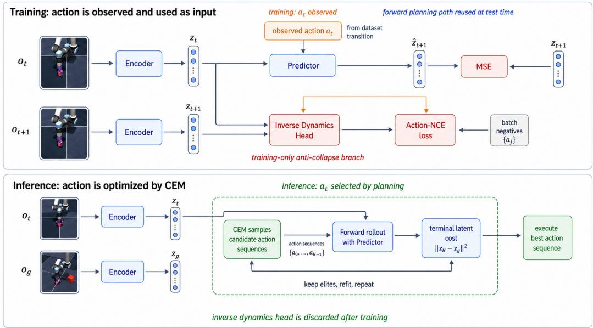
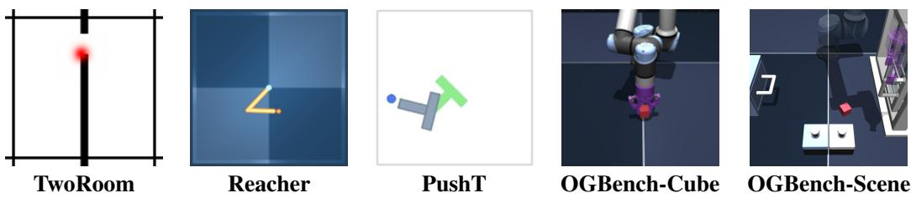
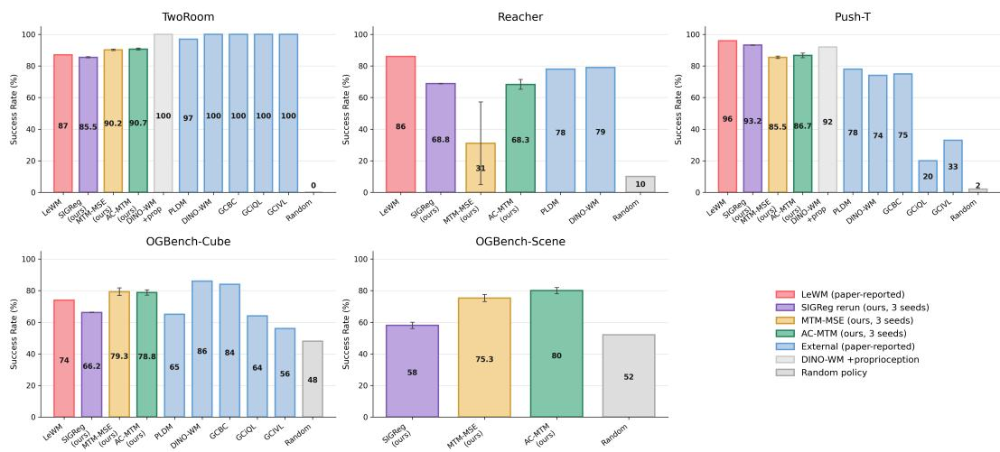
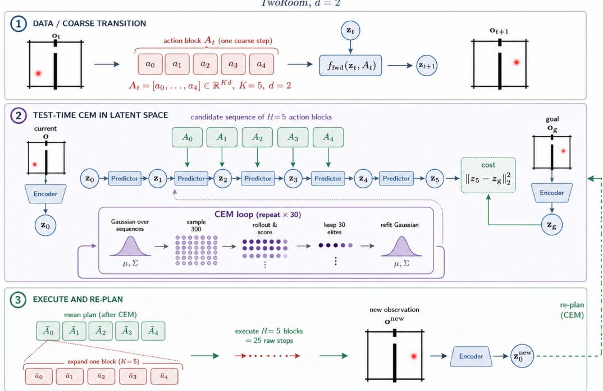
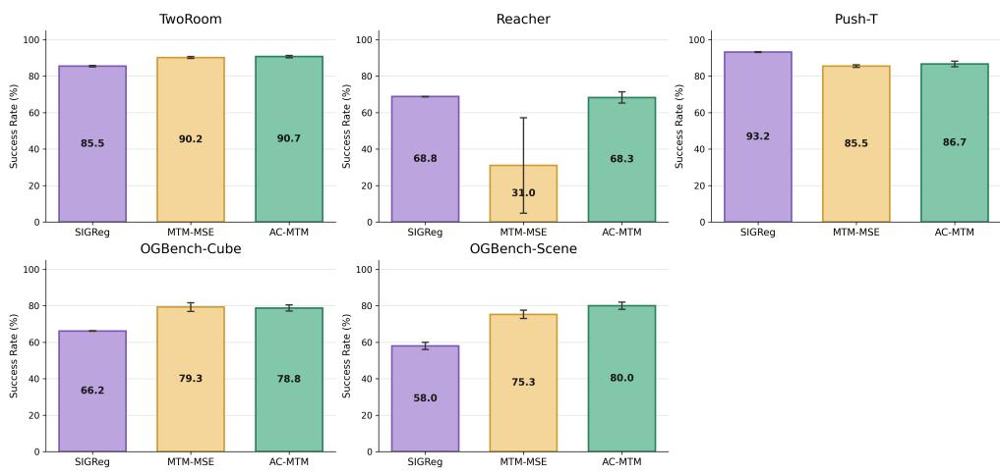

# NO GAUSSIAN REQUIRED: CONTRASTIVE INVERSE DYNAMICS FOR JEPA WORLD MODELS

Jack Boylan Chris Hokamp

Quantexa

{jackboylan,chrishokamp}@quantexa.com

## ABSTRACT

Joint-Embedding Predictive Architectures (JEPAs) learn world models by predicting future embeddings, but the objective admits a trivial solution of a constant encoder, so every practical system adds an anti-collapse mechanism (LeCun, 2022; Assran et al., 2023; Bardes et al., 2022; 2024). LeWorldModel (LeWM) prevents collapse with SIGReg, a regularizer that forces the latent distribution to match an isotropic Gaussian: the representation is stabilized by prescribing what it must look like, independently of the environment it models. We argue that the anti-collapse pressure can instead come from the transition data itself. Action-Contrastive Masked Transition Modeling (AC-MTM) keeps LeWM’s forward latent-prediction objective and adds a training-only inverse-dynamics head trained with Action-NCE: each latent transition must identify the action that produced it among the other actions in the batch, a discrimination task that a collapsed encoder provably fails. The inverse branch is discarded after training, leaving test-time encoding, forward prediction, planning, and compute identical to LeWM. On four standard pixel-control tasks under a matched planning protocol, AC-MTM trains stably from scratch and matches SIGReg on average. On the harder multi-object OGBench Visual Scene task, results are consistent with the prescribed geometry becoming a bottleneck: AC-MTM reaches 80.0±2.0% success versus 58.0±2.0% for SIGReg, improving by 20–24 points in each training seed. A single 50-episode random-policy run gives a 52% baseline estimate. Contrastive inverse dynamics thus provides a distribution-free anti-collapse signal that requires no target network, stop-gradient, pretrained encoder, or reconstruction objective, and we characterize the action-space and observability assumptions under which it holds. We make our code available at https://github.com/jackboyla/action-contrastive-jepa.

## 1 INTRODUCTION

A useful world model should learn from experience, predict the consequences of actions, and support planning without reward labels or hand-designed state. Joint-Embedding Predictive Architectures (JEPAs) offer an appealing route: an encoder maps sensory observations to a compact latent, and a predictor models future latents conditioned on actions (LeCun, 2022; Zhou et al., 2025; Sobal et al., 2025). Because prediction happens in representation space, the model need not reconstruct pixels. Our experiments use images, but the objective itself only requires paired observations and actions.

The central difficulty is collapse: if every observation maps to the same latent, next-latent prediction is trivially perfect but the representation is useless for planning. Existing systems prevent collapse by constraining the representation with pretrained encoders, stop-gradient and teacher–student heuristics, or explicit distributional regularizers (Assran et al., 2023; Bardes et al., 2022; 2024). LeWM (Maes et al., 2026) distills this line to its simplest form: an end-to-end pixel JEPA trained with next-embedding prediction plus SIGReg, a regularizer from LeJEPA (Balestriero & LeCun, 2025) that projects embeddings onto random directions and pushes every one-dimensional marginal to ward a Gaussian. This reduces the multi-term PLDM recipe (Sobal et al., 2025) to a single effective coefficient.

  
Figure 1: Training and inference paths for AC-MTM. During training, the observed action is an input to the forward predictor and the positive label for the contrastive inverse task. At test time, CEM samples candidate actions and uses only the unchanged encoder and forward predictor; the inverse dynamics/Action-NCE branch is discarded.

SIGReg is principled, but it stabilizes the world model by prescribing a global, isotropic-Gaussian latent geometry that the encoder must satisfy regardless of the environment being modeled. Maes et al. (2026) themselves flag this prescription as a possible cause of weak LeWM performance in low-intrinsic-dimensionality environments. This motivates our question: rather than imposing a distribution the dynamics never asked for, can anti-collapse be derived from the transition data itself?

Sensorimotor World Models (SMWM) answers this question with a standalone inverse-action MSE regularizer in the same LeWM setting (Ivashkov et al., 2026). Our focus is the contrastive formulation: a chance-level collapse bound, its reliability relative to inverse MSE, one loss weight held fixed across tasks, and a harder Scene stress test.

We study Action-Contrastive Masked Transition Modeling (AC-MTM). As in LeWM, the model predicts the future latent from the current latent and action. During training only, an inverse head additionally maps each adjacent latent pair to an action query that must identify the observed action among the other actions in the batch, an InfoNCE-style objective (Gutmann & Hyvarinen, 2010;¨ van den Oord et al., 2018) we call Action-NCE. A constant encoder maps every transition to the same query, so action identification cannot beat chance (Section 3): collapse turns the forward objective’s global optimum into a representation that cannot outperform chance on the inverse task. The resulting anti-collapse pressure is dynamics-native; the encoder is forced to keep exactly the information that distinguishes the effects of actions. The entire inverse branch is discarded after training, leaving the deployed model identical to LeWM. We evaluate AC-MTM as a controlled LeWM modification against SIGReg, a non-contrastive inverse-regression ablation (MTM-MSE), and a contrastive forward-prediction alternative (AC-CPC). Three findings emerge:

(1) Dynamics-derived anti-collapse works, with no distributional prior and no test-time change. Trained from scratch under LeWM’s one-stage recipe, AC-MTM never collapses across tasks and seeds and matches SIGReg on the standard four-task suite (TwoRoom, Reacher, PushT, OGBench-Cube), winning two tasks, tying one, and losing PushT. The planner never calls the inverse head: evaluation uses the same encoder, autoregressive predictor, latent distance, and CEM planner as LeWM.

(2) On the harder Scene task, results are consistent with the prescribed geometry becoming a bottleneck. On OGBench Visual Scene, where a single arm controls a drawer, window, buttons, and a movable cube, SIGReg drops to a three-seed mean of 58.0% under the matched trajectorygoal MPC protocol, while AC-MTM remains at 80.0%, with gains of 24, 20, and 22 points across the three training seeds. A single 50-episode random-policy run gives a 52% baseline estimate. The inverse-regression ablation also clears SIGReg decisively (75.3%), so the advantage belongs to the dynamics-derived signal itself, not to one loss form. Both models avoid collapse; the result may combine more useful transition geometry with more accurate short-horizon latent dynamics. Appendix B audits this result.

(3) The contrastive form of the inverse signal is what makes it reliable. Plain inverse regression (MTM-MSE) is strong on TwoRoom, Cube, and Scene, but collapses on two of three Reacher seeds; Action-NCE removes this bimodality at the cost of 3.8 points on a long-horizon stress test. Both inverse variants trail SIGReg on PushT, where identifying the action underweights weakly controlled object state, a limitation we analyze in Section 4.5.

Our contributions are: (i) AC-MTM, a distribution-free, dynamics-native anti-collapse mechanism for end-to-end JEPA world models, with a simple chance-level lower bound showing why collapse cannot pay; (ii) a controlled three-seed comparison on five pixel-control tasks, matched down to the planner, isolating the training signal as the only moving part; and (iii) probe, stress-test, and counterfactual-surprise analyses that separate “does not collapse” from “supports planning,” including an explicit account of when inverse-dynamics anti-collapse should and should not be expected to hold.

## 2 BACKGROUND AND POSITIONING

Reward-free latent planning. We consider offline trajectories of pixel observations and actions $\boldsymbol { \tau } = ( \mathbf { o } _ { 0 } , \mathbf { a } _ { 0 } , \mathbf { o } _ { 1 } , \dots )$ , with no rewards or optimality assumptions. During training, $\mathbf { a } _ { t }$ is the recorded continuous command carrying $\mathbf { o } _ { t }$ to $\mathbf { o } _ { t + 1 }$ . At test time, no action label is available: a modelpredictive-control solver based on the cross-entropy method (CEM) samples, scores, and refits a distribution over candidate action sequences to minimize latent distance to an encoded goal (Sobal et al., 2025; Maes et al., 2026).

From PLDM to LeWM. PLDM prevents collapse with a VICReg-derived objective of several interacting terms (Sobal et al., 2025; Bardes et al., 2022). LeWM replaces it with prediction plus SIGReg, matching all one-dimensional latent marginals to a Gaussian (motivated by the Cramer–´ Wold theorem) (Balestriero & LeCun, 2025; Maes et al., 2026). This simplification is the right comparison point for our work: the contribution of LeWM is not only performance, but the fact that stable end-to-end pixel JEPA world models can be made dramatically simpler than earlier recipes. We keep that agenda while replacing the remaining global distribution-matching term with a local, contrastive transition signal.

A family of distribution-free signals. MTM-MSE is our SMWM-style inverse-regression baseline (Ivashkov et al., 2026): it regresses the observed action from an adjacent latent pair. SMWM establishes this basic inverse-MSE mechanism and tunes its loss weight per environment; our controlled baseline uses one coefficient chosen on Reacher and held fixed across tasks. To separate “does not collapse” from “plans well,” we also evaluate AC-CPC, an action-conditioned contrastive forward objective that identifies the true future latent among batch negatives rather than identifying the action. All variants are training signals plugged into the same LeWM encoder, predictor, and planner; Table 1 summarizes what each signal asks of the representation.

## 3 ACTION-CONTRASTIVE MASKED TRANSITION MODELING

Let latent embedding of observation $\mathbf { o } _ { t }$ at timestep t be ${ \bf z } _ { t } = \mathrm { e n c } _ { \theta } ( { \bf o } _ { t } )$ . We write a one-step predictor for compactness; the implementation inherits LeWM’s causal latent-history predictor. The forward (planning) task is

$$
\hat { \mathbf { z } } _ { t + 1 } = \mathrm { f w d } _ { \phi } ( \mathbf { z } _ { t } , \mathbf { a } _ { t } ) , \qquad \mathcal { L } _ { \mathrm { f w d } } = \left. \hat { \mathbf { z } } _ { t + 1 } - \mathbf { z } _ { t + 1 } \right. _ { 2 } ^ { 2 } .\tag{1}
$$

AC-MTM adds a training-only inverse-dynamics head. For each of the $N$ transitions in a flattened batch/window, it produces an action query

$$
\begin{array} { r } { \hat { \mathbf { a } } _ { i } = \operatorname* { i n v } _ { \psi } ( \mathbf { z } _ { i } , \mathbf { z } _ { i + 1 } ) . } \end{array}\tag{2}
$$

<table><tr><td>Method</td><td>Anti-collapse signal</td><td>Latent geometry prescribed?</td></tr><tr><td>PLDM (Sobal et al., 2025)</td><td>VICReg variance/covariance (multi- term)</td><td>Yes (variance floor)</td></tr><tr><td>LeWM (Maes et al., 2026)</td><td>SIGReg isotropic-Gaussian match- ing</td><td>Yes (global Gaussian)</td></tr><tr><td>MTM-MSE (Ivashkov et al., 2026) AC-MTM (ours)</td><td>Inverse-action MSE  $( \mathbf { z } _ { t } , \mathbf { z } _ { t + 1 } )  \mathbf { a } _ { t }$  Contrastive inverse-action identifica-</td><td>No No</td></tr><tr><td></td><td>tion</td><td></td></tr><tr><td>AC-CPC</td><td>Contrastive future identification</td><td>Implicit (unit sphere)</td></tr></table>

Table 1: Anti-collapse mechanisms compared in this paper. AC-MTM uses negatives during training, but does not prescribe a global latent marginal and does not change the test-time planner.

We score every observed action $\mathbf { a } _ { j }$ as a candidate for transition i using negative squared distance, giving an InfoNCE-style classification loss (Gutmann & Hyvarinen, 2010; van den Oord et al., 2018)¨ over in-batch actions:

$$
s _ { i j } = - \frac { \| \hat { \mathbf { a } } _ { i } - \mathbf { a } _ { j } \| _ { 2 } ^ { 2 } } { \tau d _ { a } } , \qquad \mathcal { L } _ { \mathrm { N C E } } = - \frac { 1 } { N } \sum _ { i = 1 } ^ { N } \log \frac { \exp ( s _ { i i } ) } { \sum _ { j = 1 } ^ { N } \exp ( s _ { i j } ) } ,\tag{3}
$$

where $d _ { a }$ is the action dimension. The total objective is

$$
\mathcal { L } _ { A C - M T M } = \mathcal { L } _ { \mathrm { f w d } } + \lambda \mathcal { L } _ { \mathrm { N C E } } , \qquad \lambda = 0 . 3 0 , \quad \tau = 0 . 1 0 .\tag{4}
$$

There is no SIGReg term. The fixed coefficient was selected by a bounded Reacher stability sweep and then used unchanged across all tasks.

“Masked” refers to factor prediction within a transition tuple, not image patch masking. The forward task withholds $\mathbf { z } _ { t + 1 }$ and predicts it from $\left( \mathbf { z } _ { t } , \mathbf { a } _ { t } \right)$ ; the inverse task withholds $\mathbf { a } _ { t }$ and predicts it from $\left( \mathbf { z } _ { t } , \mathbf { z } _ { t + 1 } \right)$ . We optimize both tasks on every batch rather than sample one mask at a time.

The candidate set in Equation 3 is the $N { = } B ( T { - } 1 )$ observed action blocks already present in the batch; any dataset action or a memory bank could serve instead, but we use in-batch actions for several reasons. First, the blocks are already resident on the GPU, so the negatives add only an $N \times N$ distance matrix. Second, the candidates $\mathbf { a } _ { j }$ are raw actions, not encoder outputs, so they carry no gradient to enc ; enlarging the pool changes only the difficulty of the discrimination, not the gradient path. Third, the objective is anti-collapse, which the in-batch pool already enforces through the log N floor of Equation 5. Sampling globally would mostly add easy negatives (blocks far from the prediction that contribute negligible gradient) while raising the rate of false negatives, since control actions repeat (near-zero or saturated blocks) and a duplicated “negative” penalizes a correct prediction. A larger candidate set therefore adds compute and label noise to sharpen an action-retrieval property the method does not require.

Why Action-NCE opposes collapse. Forward prediction alone cannot distinguish a useful representation from a constant one: if $\mathrm { e n c } _ { \boldsymbol { \theta } } ( \mathbf { o } ) = c$ for every observation and $\operatorname { f w d } _ { \phi } ( c , \mathbf { a } ) = c .$ , then $\mathcal { L } _ { \mathrm { f w d } } = 0$ . Action-NCE turns this degenerate solution into a failed classification problem. Under collapse, every transition gives the inverse head the same input pair $( c , c )$ , so every row of the action classifier is identical. The model is then forced to assign one fixed probability vector $p$ to all N positives in the batch. Since each candidate action is the correct label exactly once, the average loss satisfies

$$
- \frac { 1 } { N } \sum _ { i = 1 } ^ { N } \log p _ { i } \ge \log N ,\tag{5}
$$

with equality only at the chance classifier. Thus collapse can drive the forward loss to zero but cannot drive the contrastive inverse loss below chance. To improve Action-NCE, the encoder must preserve transition information that makes the observed action more identifiable than the in-batch alternatives.

Why not use non-contrastive inverse regression? MTM-MSE is the SMWM-style distributionfree replacement for SIGReg (Ivashkov et al., 2026): it replaces Equation 3 with $\mathcal { L } _ { \mathrm { i n v } } = \| \hat { \mathbf { a } } _ { t } - \mathbf { a } _ { t } \| _ { 2 } ^ { 2 }$

  
Figure 2: Evaluation suite. TwoRoom is low-dimensional navigation through a wall opening; Reacher matches a target arm configuration; PushT requires contact-rich pushing of a T-shaped block to a goal pose; OGBench-Cube is 3D robot-arm cube manipulation; OGBench-Scene adds a multi-object drawer/window/button/cube scene. These tasks stress different failure modes: low intrinsic dimension, articulated dynamics, contact, 3D manipulation, and multi-object visual com plexity.

It is an important ablation because it asks whether any inverse-dynamics signal is enough. MTM-MSE is strong on TwoRoom, PushT, and Cube, but the instability appears on Reacher, where two of three seeds collapse. The reason is that inverse regression supplies only a variance-scale floor under complete collapse: its best collapsed prediction is the mean action, and the loss is the action variance. When multiple action blocks can produce similar visual endpoints, that margin can be weak, while forward MSE still rewards shrinking the latent scale. Action-NCE keeps the same training-only inverse head but changes the failure geometry to chance-level identification, which gives a sharper barrier against constant latents. Section 4.4 analyzes this failure mode.

Controlled implementation. We inherit the LeWM vision encoder, latent projector, causal forward predictor, action conditioning, offline datasets, and CEM planner. The only added component is a small MLP inverse head used during training. After training, the head is never called by model rollout or cost evaluation and can be removed without changing predictions. Consequently AC-MTM and LeWM use the same test-time computation and planner.

## 4 EXPERIMENTS

Evaluation Setup. We evaluate the LeWM continuous-control suite. This includes TwoRoom, Reacher, PushT, and OGBench-Cube. We add OGBench Visual Scene as a harder multi-object manipulation study (Figure 2). All models train end-to-end from pixels in one stage. We evaluate each policy with the same CEM/MPC planner used by Maes et al. (2026). CEM samples 300 candidate action sequences, retains 30 elites, and refits the sampling distribution for 30 iterations. In Figure 3 we report AC-MTM and MTM-MSE against our matched SIGReg reproduction of LeWM, alongside paper-reported PLDM, DINO-WM, goal-conditioned policy, and random baselines from Maes et al. (2026); on OGBench-Scene, where no external numbers exist, we evaluate the random policy ourselves under the identical protocol. Our controlled claims use three training seeds {3072, 1, 2}, 200 evaluation episodes, evaluation seed 42, goal offset 25, and interaction budget 50. TwoRoomlong changes only the goal offset and budget to 100/150. The OGBench-Scene task uses the same trajectory-goal MPC protocol as the other visual tasks, with 50 evaluation episodes per training seed. Appendix A records the full protocol.

## 4.1 COLLAPSE SANITY CHECK

On TwoRoom, removing SIGReg without replacement (NoReg) drives forward loss to ≈ 0 in training diagnostics, the trivial constant-latent solution described above. Both MTM-MSE and AC-MTM inverse tasks prevent this failure while preserving the same one-stage training recipe proposed by Maes et al. (2026). This confirms that transition supervision, not merely removal of SIGReg, provides the anti-collapse signal (Table 2).

<table><tr><td>Model</td><td>TwoRoom success (%)</td></tr><tr><td>NoReg: no anti-collapse term</td><td>28.0±2.0</td></tr><tr><td>LeWM with SIGReg</td><td>85.5±0.4</td></tr><tr><td>MTM-MSE</td><td>90.2±0.5</td></tr><tr><td>AC-MTM</td><td>90.7±0.6</td></tr></table>

Table 2: TwoRoom anti-collapse ablation with 200 evaluation episodes per seed. Values are mean ± standard deviation over three training seeds. Plain next-latent prediction reaches a trivial low-loss solution and plans substantially worse.

<table><tr><td>Task</td><td>SIGReg (LeWM)</td><td>AC-MTM (ours)</td><td>∆</td></tr><tr><td>TwoRoom</td><td>85.5±0.4</td><td>90.7±0.6</td><td>+5.2</td></tr><tr><td>Reacher</td><td>68.8±0.2</td><td>68.3±3.1</td><td>-0.5</td></tr><tr><td>PushT</td><td> $\mathbf { 9 3 . 2 \pm 0 . 2 }$ </td><td> $8 6 . 7 { \pm } 1 . 5 $ </td><td>-6.5</td></tr><tr><td>OGB-Cube</td><td>66.2±0.2</td><td> ${ \bf 7 8 . 8 \pm 1 . 7 }$ </td><td>+12.6</td></tr><tr><td>OGB-Scene</td><td>58.0±2.0</td><td> ${ \bf 8 0 . 0 { \pm } 2 . 0 }$ </td><td>+22.0</td></tr></table>

Table 3: Planning success (%) with the shared autoregressive planner: 200 evaluation episodes per seed on the standard tasks and 50 on OGBench-Scene. Values are mean ± standard deviation over three training seeds; bold marks differences larger than the cross-seed noise. Figure 3 places these numbers next to external paper-reported baselines.

## 4.2 PLANNING RESULTS IN THE LEWM EVALUATION FRAME

Table 3 gives the controlled AC-MTM versus SIGReg comparison, while Figure 3 restores the original evaluation style by including the external paper-reported baselines. The figure is contextual: PLDM, DINO-WM, GCBC, GCiQL, and GCIVL are taken from the LeWM paper, while the statistical claims come from our matched SIGReg reruns. AC-MTM uses the same test-time planner as LeWM and improves over SIGReg on TwoRoom, Cube, and Scene, matches it on Reacher, and trails it on PushT. The PushT deficit is analyzed in Section 4.5; the full MTM-MSE ablation is reported in Appendix C.

## 4.3 HARDER OGBENCH SCENE SEPARATES THE METHODS

The largest margin appears on the more complex OGBench Visual Scene task (Table 4). Scene is qualitatively different from OGBench-Cube: the same arm must control a multi-object visual state involving a drawer, window, buttons, and movable object, so a useful latent must preserve several slow-changing task variables at once. Under the trajectory-goal MPC protocol, SIGReg falls to a three-seed mean of 58.0% success while AC-MTM achieves 80.0%. The random-policy run helps calibrate these numbers: like OGBench-Cube (48% random), the 25-step trajectory-goal protocol leaves many episodes near-solved at reset. One 50-episode random-policy run scores 52.0% (Wilson 95% interval, 38.5 to 65.2%), so we treat it as a baseline estimate. The paired comparison pooled over the three repeated sets of 50 start–goal tasks gives 40 AC-MTM-only successes versus 7 SIGReg-only successes. Notably, SIGReg does not collapse on Scene (its final latent scale is healthy; Appendix B); the gap is between avoiding collapse and learning a geometry the planner can exploit.

The MTM-MSE ablation localizes the credit. Trained on Scene under the identical protocol, it reaches 75.3±2.3% with no collapsed seed and beats SIGReg in the paired comparison (39 wins vs. 13 losses, $p \approx 4 \times 1 0 ^ { - 4 }$ in an episode-level descriptive test). The Scene advantage therefore belongs to the inverse-dynamics family: deriving anti-collapse from the transitions, in either form, beats prescribing the latent distribution once several controllable factors must coexist in the latent. The contrastive form adds 4.7 points over inverse regression on Scene (16 wins vs. 9 losses, $p { \approx } 0 . 2 3$ in the same descriptive test) on top of the Reacher reliability that motivates it (Section 4.4).

Figure 3: Planning success across the five environments. Salmon and blue bars are paper-reported LeWM/external baselines from Maes et al. (2026); purple, gold, and green bars are our controlled SIGReg, MTM-MSE, and AC-MTM evaluations across three training seeds. No external baseline has published OGBench-Scene results under this protocol, so the Scene panel contains only our controlled models and the random policy. The external baselines place AC-MTM in the original evaluation frame; direct statistical claims are made only for the controlled comparisons in Table 3.
<table><tr><td>Method</td><td>Seed 3072</td><td>Seed 1</td><td>Seed 2</td><td>Mean</td><td>Paired wins/losses vs. SIGReg</td></tr><tr><td>Random</td><td></td><td></td><td></td><td>52.0</td><td>一</td></tr><tr><td>SIGReg</td><td>56.0</td><td>58.0</td><td>60.0</td><td> $5 8 . 0 { \pm } 2 . 0 $ </td><td></td></tr><tr><td>MTM-MSE</td><td>78.0</td><td>74.0</td><td>74.0</td><td> $7 5 . 3 { \pm } 2 . 3 $ </td><td>39/13</td></tr><tr><td>AC-MTM</td><td>80.0</td><td>78.0</td><td>82.0</td><td> ${ \bf 8 0 . 0 { \pm } 2 . 0 }$ </td><td>40/7</td></tr></table>

Table 4: OGBench Visual Scene trajectory-goal success (%), with 50 evaluation episodes per training seed and evaluation seed 42. The random policy is a single 50-episode evaluation under the identical protocol and is a baseline estimate. Paired wins/losses pool all 150 outcomes against SI-GReg: two-sided binomial/McNemar $p \approx 1 . 1 { \times } 1 0 ^ { - 6 }$ for AC-MTM (40/7) and $p \approx 4 . 1 \times 1 0 ^ { - 4 }$ for MTM-MSE (39/13); the AC-MTM–MTM-MSE pairing is 16/9 $( p \approx 0 . 2 3 )$ . Because the same 50 tasks recur across the three training seeds, these are episode-level descriptive tests, not tests with 150 independent experimental units. The seed-level gains for AC-MTM over SIGReg are 24, 20, and 22 points. This is not a public OGBench leaderboard claim; the official fixed-goal protocol is separate. Appendix B audits possible explanations for the large margin.

## 4.4 RELIABILITY AND STRESS-TEST TRADE-OFFS

The Reacher seed breakdown makes the stability difference explicit (Table 5). One MTM-MSE run is competitive, but two enter the constant-latent state. In contrast, all AC-MTM runs remain useful. On TwoRoom-long the non-contrastive inverse-regression ablation is stronger: 28.0±0.8% versus 24.2±0.6% for AC-MTM (Table 6). Both MTM-MSE and Action-NCE remain above SIGReg on this long-goal stress test, but Action-NCE trades 3.8 points of the pure-MSE long-horizon gain for much better Reacher reliability.

<table><tr><td>Method</td><td>Seed 3072</td><td>Seed 1</td><td>Seed 2</td><td>Mean</td></tr><tr><td>SIGReg</td><td>69.0</td><td>69.0</td><td>68.5</td><td>68.8</td></tr><tr><td>MTM-MSE</td><td>68.0</td><td>11.5</td><td>13.5</td><td>31.0</td></tr><tr><td>AC-MTM</td><td>70.5</td><td>70.5</td><td>64.0</td><td>68.3</td></tr></table>

Table 5: Reacher success (%) by training seed, with 200 evaluation episodes per checkpoint. MTM-MSE succeeds once but collapses twice; AC-MTM removes that bimodality.

<table><tr><td>TwoRoom-long (100/150)</td><td>SIGReg</td><td>MTM-MSE</td><td>AC-MTM</td></tr><tr><td>Success (%)</td><td>17.0±0.4</td><td>28.0±0.8</td><td>24.2±0.6</td></tr></table>

Table 6: Long-horizon stress test with 200 evaluation episodes and three training seeds per method. AC-MTM retains most of the inverse-dynamics gain over SIGReg but trails MTM-MSE by 3.8 points.
<table><tr><td>Mechanism</td><td>Planner</td><td>Orient.  $R ^ { 2 }$ </td><td>Mean  $R ^ { 2 }$ </td><td>Success (%)</td></tr><tr><td>SIGReg (LeWM)</td><td>AR</td><td>0.791</td><td>0.701</td><td>93.2</td></tr><tr><td>MTM-MSE</td><td>AR</td><td>0.508</td><td>0.674</td><td>85.5</td></tr><tr><td>AC-MTM</td><td>AR</td><td>0.514</td><td>0.675</td><td>86.7</td></tr><tr><td>AC-CPC</td><td>AR</td><td>0.655</td><td>0.564</td><td>62.5</td></tr></table>

Table 7: PushT anti-collapse mechanisms: frozen-latent probes (n=4000, α=1; orientation is state[4]) and 200-episode planning. AC-MTM probe values are means over three training seeds; all rows use the same autoregressive planner.

## 4.5 PUSHT PROBES DIAGNOSE THE REMAINING FAMILY-LEVEL GAP

Linear probes freeze the encoder, embed 4000 frames, and fit ridge regression (α=1) from the latent to each privileged simulator-state coordinate. Both inverse variants trail SIGReg on PushT, and the probes show the same family-level failure mode for MTM-MSE and AC-MTM (Table 7): both preserve agent position, retain much of block position, and underencode the T-block orientation, a weakly controlled variable that determines contact geometry.

## 5 ANALYSIS

Why Action-NCE stabilizes Reacher. Inverse-MSE only resists collapse to the extent that the observed action can be regressed below the mean-action baseline. Reacher applies a multi-step action block to a visually observed two-link arm; many action sequences can produce similar endpoints, so the regression margin can be weak. At the same time, forward latent MSE rewards shrinking the online representation. Action-NCE changes the failure geometry: even when absolute action regres sion is ambiguous, identical transition queries cannot assign different positives to different rows and remain at chance by Equation 5. This does not make the inverse problem fully identifiable, but it provides a stronger early barrier against the constant-latent attractor.

What Action-NCE does not solve. The contrastive loss still emphasizes state that separates actions. It does not unconditionally preserve every task-relevant variable, unlike SIGReg’s global variance pressure. PushT requires accurate block pose and orientation even when the same commanded action has little visible effect before contact. This is a plausible reason both inverse variants remain below SIGReg. The remaining problem is representation coverage, not test-time action selection: every method uses the same CEM planner.

Why probes are diagnostic, not decisive. Linear probes measure whether a quantity is linearly decodable from the latent; planning measures whether the forward model and latent metric place goal-reaching trajectories where CEM can find them. These need not align. MTM-MSE and AC-MTM under-decode block orientation yet still support substantial planning success, while AC-CPC decodes orientation better but plans worse. Representation audits and planner behavior should therefore be reported together: a probe can identify a missing state factor, but it is not a substitute for closed-loop planning.

Training-only means test-time equivalence. The inverse head affects the encoder during optimization, but it is not queried by CEM and does not propose or score actions at test time. Candidate actions come entirely from CEM, as in LeWM. Thus the empirical differences isolate training-time representation learning; they do not arise from a stronger inference procedure or extra runtime computation.

<table><tr><td>Task</td><td>Model</td><td>Action counterfactual (↑)</td><td>State discontinuity (↑)</td></tr><tr><td>PushT</td><td>SIGReg</td><td>151.7±4.7×</td><td>1246.0±34.1×</td></tr><tr><td>PushT</td><td>AC-MTM</td><td>9.6±0.3×</td><td>40.0±1.4×</td></tr><tr><td>OGB-Cube</td><td>SIGReg</td><td>274.2±12.6×</td><td>835.4±35.2×</td></tr><tr><td>OGB-Cube</td><td>AC-MTM</td><td>82.3±1.6×</td><td>434.4±5.6×</td></tr></table>

Table 8: Latent surprise ratios: one-step prediction error on a corrupted (physically invalid) transition divided by the same clip’s error on the real transition. 1× would mean the model cannot tell invalid transitions from real ones; higher means the model is more surprised by violations. Each entry uses 4096 sampled clips per training seed (mean ± standard deviation over seeds {3072, 1, 2}). In every row, the invalid transition has higher error than the matched real transition for at least 99.95% of clips. Ratios are normalized by each model’s own baseline error, so they should be compared within a model, not across models (see text).

## 5.1 DOES THE MODEL NOTICE IMPOSSIBLE TRANSITIONS?

Goal-reaching success does not by itself show that a latent world model assigns meaningful surprise to physically inconsistent events. We therefore add a model-facing diagnostic on PushT and OGBench-Cube. For each sampled trajectory clip we first record the model’s normal one-step prediction error: the latent-space MSE between its prediction and the encoding of the frame that actually followed. We then corrupt the same clip in one of two ways and measure the error again: (i) an action counterfactual keeps the latent history but swaps in an action block from a different clip; the model should no longer expect the observed outcome; and (ii) a state discontinuity keeps the model’s prediction but replaces the target future with latents from a different clip; an impossible jump in the environment state. The reported surprise ratio is the per-clip corrupted error divided by the normal error. A ratio of 1× means the model finds impossible transitions exactly as predictable as real ones, i.e. its dynamics carry no physical content; higher is better. Both tests use the trained encoder, action encoder, and autoregressive predictor used by MPC; no decoder or privileged state is introduced.

Table 8 shows that both objectives learn action-conditioned dynamics with strong internal violation signals: every model flags both corruption types with errors one to three orders of magnitude above its normal prediction error, and does so on essentially every clip. Two caveats guide the reading. First, because each ratio is normalized by that model’s own normal-transition error, absolute magnitudes are not comparable across models: a model with near-zero baseline error can post an enormous ratio without having better dynamics. The meaningful statements are within-model (SIGReg and AC-MTM both separate violations from real transitions by large margins) and qualitative (neither model is fooled). Second, the smaller AC-MTM margins on PushT are consistent with its weaker block-state probes and lower PushT planning success (Section 4.5), so the diagnostic tracks the planning evidence rather than contradicting it. These results support a narrower claim than human-style physical reasoning: the learned latent dynamics are sensitive to impossible action-conditioned transitions in the same representation used for planning.

## 6 RELATED WORK

World models and planning. The idea of learning a predictive model and planning through it goes back at least to differentiable recurrent world models for control (Schmidhuber, 1990) and was later popularized in compact latent form by Ha & Schmidhuber (2018). Reward-driven latent world models such as Dreamer (Hafner et al., 2020) and TD-MPC2 (Hansen et al., 2024) shape their representations with reconstruction or value signals; our setting removes both. We follow the reward-free, goal-conditioned variant: learn from offline state–action trajectories without task rewards, then plan to a goal image at test time, which leaves anti-collapse as the central representational problem.

Reconstruction-free latent planning. PLDM shows that a JEPA-style latent dynamics model can plan from reward-free offline data without reconstructing pixels, but relies on a VICReg-derived multi-term anti-collapse recipe and inverse-dynamics regularization (Sobal et al., 2025; Bardes et al., 2022). DINO-WM instead uses frozen DINOv2 features and learns a latent dynamics model on top, trading end-to-end simplicity for strong pretrained visual representations (Zhou et al., 2025). LeWM is the closest predecessor to our work: it trains from pixels end-to-end with a two-term objective, replacing PLDM’s heavier recipe with next-latent prediction plus SIGReg (Maes et al., 2026; Balestriero & LeCun, 2025). We share LeWM’s simplification agenda but remove its remaining global distributional assumption during training while leaving its deployed model unchanged.

SMWM is the most direct prior work: it uses the same basic LeWM encoder, forward latent predictor, and training-only inverse head, with inverse-action MSE as the sole anti-collapse term (Ivashkov et al., 2026). It evaluates the same four standard environments and finds that inverse MSE roughly matches SIGReg on the 2D tasks and improves on Cube. We therefore treat MTM-MSE as an SMWM-style baseline, not a new mechanism. Our contribution is the contrastive Action-NCE form, its chance-level collapse bound and Reacher reliability, a single coefficient held fixed across tasks rather than tuned per environment, and the Scene and stress-test analysis.

Anti-collapse objectives for JEPAs. I-JEPA and V-JEPA stabilize prediction with target encoders, stop-gradient, and EMA updates (Assran et al., 2023; Bardes et al., 2024; Grill et al., 2020). VICReg prevents collapse by variance and covariance constraints (Bardes et al., 2022). LeJEPA derives a leaner alternative, SIGReg, by regularizing embeddings toward an isotropic Gaussian through random one-dimensional projections (Balestriero & LeCun, 2025). These are representation-distribution constraints: they state what the latent cloud should look like. MTM-MSE and AC-MTM instead state what adjacent latents must explain: the action that connected them. AC-MTM sharpens this requirement from absolute regression to contrastive identification. The signal is local, transition-level, and dynamics-native.

Benchmarks and goal-conditioned baselines. The LeWM suite combines top-down navigation, DMC-style reaching, PushT contact manipulation, and OGBench-Cube (Park et al., 2025). The external baselines in Figure 3 include PLDM, DINO-WM, goal-conditioned behavioral cloning, goal-conditioned offline RL, and random policies as reported by Maes et al. (2026). They place AC-MTM in the same visual frame as the original LeWM evaluation; our controlled claims use the released LeWM datasets, architectures, and planner settings so that the comparison changes the training signal rather than the downstream policy class.

Inverse dynamics and probing. Inverse dynamics has long been used to learn controllable representations: as a self-supervised feature signal for manipulation (Agrawal et al., 2016), to build the embedding underlying curiosity rewards (Pathak et al., 2017), as an auxiliary loss for RL (Shelhamer et al., 2016), and, in multi-step form, with guarantees that it recovers exactly the control-endogenous part of the state (Lamb et al., 2023). PLDM includes an inverse term inside a larger multi-term objective (Sobal et al., 2025). Our use is narrower and sharper: a training-only anti-collapse head attached to an otherwise unchanged LeWM planner, with no privileged state and no planner-time inverse model, and (unlike ordinary inverse regression) trained to identify the positive action among in-batch continuous-action negatives. Linear probing of physical quantities is increasingly used to interpret latent world models (Maes et al., 2026); our results caution against inferring planning quality from such probes alone.

Action-driven contrastive representation learning. CLOUD learns forward and inverse dynamics through contrastive estimation for planning and imitation (Wang et al., 2021). Yuan et al. (2024) use InfoNCE between visual representations and observed actions to retain controllable factors, while also using reward prediction and temporal coherence for online visual RL. TACO instead contrasts current-state and action sequences against future-state representations for online and offline visual RL (Zheng et al., 2023). These works establish action-driven contrast as a useful representation signal. We use observed continuous actions as the candidate labels of a training-only inverse task and study that task as the sole anti-collapse term in an end-to-end, reward-free JEPA world model.

## 7 LIMITATIONS

AC-MTM provides no unconditional geometric guarantee. It requires variation in the action candidates and useful visual evidence about action effects; unobserved actuators, stochastic dynamics, no-op-heavy datasets, or many duplicate actions can weaken the contrastive task. We evaluate normalized continuous controls only. Discrete, hybrid, structured, and very high-dimensional action spaces may require different scores, learned action embeddings, or hard-negative sampling. The loss also introduces training-time dependence on batch composition, the temperature τ, and one coefficient λ; although one setting works across our suite, broader scaling evidence is needed. PushT shows the flip side of the dynamics-native pressure: a variable that actions barely move can be underweighted even when it matters for the task, and exploratory single-seed runs on additional OGBench families (Appendix D) suggest the same trade-off on combinatorial puzzle tasks.

AC-MTM improves several goal-conditioned planning protocols and shows strong latent surprise on counterfactual-action and state-discontinuity probes, but these diagnostics remain internal to the trained latent dynamics. They do not replace public violation-of-expectation suites with humandesigned physical events or prove robust out-of-distribution physical reasoning. OGBench Visual Scene is also evaluated under our trajectory-goal protocol rather than the official five-task fixed-goal OGBench leaderboard protocol, so its 80% success rate should be read as a matched stress test, not a public benchmark score; under the official 750-step fixed-goal protocol, neither method solves the tasks at this model scale (Appendix B).

## 8 CONCLUSION

A world model’s representation has to be protected from collapse, but nothing about the problem says that protection must take the form of a prescribed latent distribution. AC-MTM replaces LeWM’s Gaussian matching with a contrastive, dynamics-native signal: keep whatever information identifies the action that drove each transition. The result is still a one-stage, end-to-end pixel JEPA without target network, stop-gradient branch, frozen encoder, reconstruction decoder, or fixed global latent distribution, and the deployed model is unchanged. The empirical picture is not universal dominance: PushT exposes a real limitation of inverse-action signals when task-relevant state is weakly controlled. Where the environment couples many controllable factors, our results are consistent with prescribed geometry becoming a bottleneck: on OGBench Visual Scene, SIGReg reaches 58.0% while AC-MTM reaches 80.0% across matched seeds, though the Scene gain may also reflect lower one-step forward error. On TwoRoom-long AC-MTM retains most of the inverse-dynamics gain over SIGReg. These results show that transition-derived anti-collapse can replace a fixed global latent prior while preserving planning quality.

## REFERENCES

Pulkit Agrawal, Ashvin Nair, Pieter Abbeel, Jitendra Malik, and Sergey Levine. Learning to poke by poking: Experiential learning of intuitive physics. In Advances in Neural Information Processing Systems, 2016.

Mahmoud Assran, Quentin Duval, Ishan Misra, Piotr Bojanowski, Pascal Vincent, Michael Rabbat, Yann LeCun, and Nicolas Ballas. Self-supervised learning from images with a joint-embedding predictive architecture. In IEEE/CVF Conference on Computer Vision and Pattern Recognition (CVPR), 2023.

Randall Balestriero and Yann LeCun. LeJEPA: Provable and scalable self-supervised learning without the heuristics. arXiv preprint arXiv:2511.08544, 2025.

Adrien Bardes, Jean Ponce, and Yann LeCun. VICReg: Variance-invariance-covariance regularization for self-supervised learning. In International Conference on Learning Representations (ICLR), 2022.

Adrien Bardes, Quentin Garrido, Jean Ponce, Xinlei Chen, Michael Rabbat, Yann LeCun, Mahmoud Assran, and Nicolas Ballas. Revisiting feature prediction for learning visual representations from video. Transactions on Machine Learning Research, 2024.

Jean-Bastien Grill, Florian Strub, Florent Altche, Corentin Tallec, Pierre H. Richemond, Elena´ Buchatskaya, Carl Doersch, Bernardo Avila Pires, Zhaohan Daniel Guo, Mohammad Gheshlaghi Azar, Bilal Piot, Koray Kavukcuoglu, Remi Munos, and Michal Valko. Bootstrap your own la-´ tent: A new approach to self-supervised learning. In Advances in Neural Information Processing Systems, 2020.

Michael Gutmann and Aapo Hyvarinen. Noise-contrastive estimation: A new estimation principle¨ for unnormalized statistical models. In International Conference on Artificial Intelligence and Statistics (AISTATS), 2010.

David Ha and Jurgen Schmidhuber. Recurrent world models facilitate policy evolution. In¨ Advances in Neural Information Processing Systems, 2018.

Danijar Hafner, Timothy Lillicrap, Jimmy Ba, and Mohammad Norouzi. Dream to control: Learning behaviors by latent imagination. In International Conference on Learning Representations (ICLR), 2020.

Nicklas Hansen, Hao Su, and Xiaolong Wang. TD-MPC2: Scalable, robust world models for continuous control. In International Conference on Learning Representations (ICLR), 2024.

Petr Ivashkov, Randall Balestriero, and Bernhard Scholkopf. Sensorimotor world models: Percep- ¨ tion for action via inverse dynamics. arXiv preprint arXiv:2606.20104, 2026.

Alex Lamb, Riashat Islam, Yonathan Efroni, Aniket Didolkar, Dipendra Misra, Dylan Foster, Lekan Molu, Rajan Chari, Akshay Krishnamurthy, and John Langford. Guaranteed discovery of controlendogenous latent states with multi-step inverse models. Transactions on Machine Learning Research, 2023.

Yann LeCun. A path towards autonomous machine intelligence. OpenReview, 2022.

Lucas Maes, Quentin Le Lidec, Damien Scieur, Yann LeCun, and Randall Balestriero. LeWorld-Model: Stable end-to-end joint-embedding predictive architecture from pixels. arXiv preprint arXiv:2603.19312, 2026.

Seohong Park, Kevin Frans, Benjamin Eysenbach, and Sergey Levine. OGBench: Benchmarking offline goal-conditioned reinforcement learning. In International Conference on Learning Representations, 2025.

Deepak Pathak, Pulkit Agrawal, Alexei A. Efros, and Trevor Darrell. Curiosity-driven exploration by self-supervised prediction. In International Conference on Machine Learning (ICML), 2017.

Jurgen Schmidhuber. Making the world differentiable: On using self-supervised fully recurrent¨ neural networks for dynamic reinforcement learning and planning in non-stationary environments. Technical Report FKI-126-90, Institut fur Informatik, Technische Universit¨ at M¨ unchen, 1990.¨

Evan Shelhamer, Parsa Mahmoudieh, Max Argus, and Trevor Darrell. Loss is its own reward: Selfsupervision for reinforcement learning. arXiv preprint arXiv:1612.07307, 2016.

Uladzislau Sobal, Wancong Zhang, Kyunghyun Cho, Randall Balestriero, Tim G. J. Rudner, and Yann LeCun. Learning from reward-free offline data: A case for planning with latent dynamics models. In Advances in Neural Information Processing Systems, volume 38, 2025.

Aaron van den Oord, Yazhe Li, and Oriol Vinyals. Representation learning with contrastive predic-¨ tive coding. arXiv preprint arXiv:1807.03748, 2018.

Jianren Wang, Yujie Lu, and Hang Zhao. CLOUD: Contrastive learning of unsupervised dynamics. In Proceedings of the 2020 Conference on Robot Learning, volume 155 of Proceedings of Machine Learning Research, pp. 365–376, 2021.

Linghui Yuan, Xiaowei Lu, and Yunlong Liu. Learning task-relevant representations via rewards and real actions for reinforcement learning. Knowledge-Based Systems, 294:111788, 2024. doi: 10.1016/j.knosys.2024.111788.

Ruijie Zheng, Xiyao Wang, Yanchao Sun, Shuang Ma, Jieyu Zhao, Huazhe Xu, Hal Daume III, and´ Furong Huang. TACO: Temporal latent action-driven contrastive loss for visual reinforcement learning. In Advances in Neural Information Processing Systems, volume 36, 2023.

Gaoyue Zhou, Hengkai Pan, Yann LeCun, and Lerrel Pinto. DINO-WM: World models on pretrained visual features enable zero-shot planning. In Proceedings of the 42nd International Conference on Machine Learning, volume 267 of Proceedings of Machine Learning Research, pp. 79115–79135, 2025.

## A EVALUATION PROTOCOL

Our controlled standard-task planning tables use 200 episodes, evaluation seed 42, exact checkpoint stems, CEM 300 samples / 30 elites / 30 iterations, and unique output files. SIGReg, MTM-MSE, and AC-MTM use final epoch-10 checkpoints from training seeds {3072, 1, 2}. No validation-based checkpoint selection is used in the controlled tables. The non-LeWM baselines in Figure 3 are paperreported values from Maes et al. (2026); they are included for continuity with the original evaluation style, not as reruns.

<table><tr><td>Task</td><td>Controlled evaluation decision</td></tr><tr><td>TwoRoom</td><td>Use released/maintainer-confirmed goal offset 25, budget 50. Issue #38 records main- tainer confirmation that the paper&#x27;s 100/150 text was a typo; issue #67 documents the same mismatch and low success under 100/150. We keep 100/150 only as the sepa-</td></tr><tr><td>PushT Reacher</td><td>rately labeled TwoRoom-long stress test. Use released config: goal offset 25, budget 50, CEM 300/30/30. Use released config: goal offset 25, budget 50, CEM 300/30/30. Issue #41 records that the paper text says 10 CEM iterations for non-PushT tasks while the released config uses 30; no maintainer correction is visible. Issues #37 and #62 show Reacher sensitivity to</td></tr><tr><td>OGBench-Cube</td><td>training/eval seed. Use released config: goal offset 25, budget 50, CEM 300/30/30, with the same CEM caveat as Reacher from issue #41.</td></tr><tr><td>OGBench-Scene</td><td>Added complex-task trajectory-goal protocol using visual-scene-play-v0: goal offset 25, budget 50, CEM 300/30/30, 50 episodes per training seed, and matched train seeds {3072, 1, 2} for both SIGReg and AC-MTM. This is separate from the official OGBench Visual Scene five-task fixed-goal protocol.</td></tr></table>

Table 9: Protocol audit for the 200-episode controlled comparisons. Issue numbers refer to the public LeWM repository: https://github.com/lucas-maes/le-wm/issues: #38, #67, #41, #37, and #62.

## B INTERROGATING THE OGBENCH SCENE RESULT

The Scene margin is large enough that it deserves a separate audit. Table 10 lists the checks we performed on the completed trajectory-goal runs. The headline survives these checks, but the causal interpretation should remain narrow: this is evidence about our matched trajectory-goal MPC protocol, not the public OGBench fixed-goal benchmark.

Why can the gap be this large? Scene couples several slow variables (drawer, window, two buttons, and a cube state) to the same arm observation. A final-latent MPC cost is brittle to dropping any one of these variables: a rollout can be close in agent pose while still missing the target object configuration. SIGReg prevents constant collapse by enforcing a global isotropic latent distribution, but that guarantee does not say which state factors are preserved with a geometry useful for final latent distance. In a multi-object scene, part of the latent budget can be spent matching the global marginal or representing visually variable but planning-irrelevant factors.

AC-MTM supplies a different pressure. To identify the observed action among in-batch alternatives, adjacent latents must retain information about controllable changes. This favors variables whose changes explain the executed control and therefore aligns more directly with the CEM rollout interface. The training logs also show that AC-MTM reaches a lower final one-step forward MSE on Scene (about 0.002 versus 0.004 for SIGReg in the last logged batches), so the observed advantage may combine better transition geometry with more accurate short-horizon latent dynamics. Consistent with this account, the non-contrastive MTM-MSE ablation trained under the identical Scene protocol also clears SIGReg (75.3% vs. 58.0%, paired 39/13, $p \approx 4 { \times } 1 0 ^ { - 4 } )$ , so the win belongs to inverse-dynamics supervision as a family, with the contrastive form contributing a further (noise-level) 4.7 points. The result should therefore be interpreted as a downstream planning win for dynamics-derived training signals, not as a pure proof that latent marginal normality alone is harmful.

<table><tr><td>Check</td><td>Finding</td><td>Interpretation</td></tr><tr><td>Episode pairing</td><td>All six result files use evaluation seed 42, 50 episodes, goal offset 25, budget 50, CEM 300/30/30, horizon 5, and action block 5. The raw success ar- rays give 40 AC-MTM-only wins and 7 SIGReg-only wins over 150 paired episodes.</td><td>The gap is not an artifact of comparing different episode sets.</td></tr><tr><td>Training comparability</td><td>The resolved training con- figs match on dataset ogbench/visual_scene-play,_ batch size 128, learning rate 5× 10− -5 10 epochs, history size 3, encoder, action encoder, and forward predictor. They differ in the intended objective: SIGReg weight 0.09 versus Action- NCE with inverse weight 0.30 and no</td><td>The comparison isolates the anti- collapse/training signal up to the small training-only inverse head.</td></tr><tr><td>Checkpoint selection</td><td>SIGReg. Eval logs load the epoch-10 object checkpoint for both SIGReg and AC- MTM.</td><td>The result is not caused by acciden- tally evaluating an earlier or best- selected checkpoint. This matches the trajectory-goal</td></tr><tr><td>Privileged-state leakage</td><td>The Scene evaluator uses privileged future state to reset simulator targets and define success, but the world- model cost path encodes goal pixels and drops goal action before comput- ing final latent distance.</td><td>setup: privileged state defines the task, not the planner input.</td></tr><tr><td>Collapse</td><td>Final training logs show nonzero la- tent scale for both methods (roughly 0.99 mean embedding standard devi- ation for SIGReg and 0.24 for AC- MTM over the last logged batches).</td><td>The SIGReg model is not constant- collapsed; the gap is a planner-usable- geometry or dynamics-quality failure, not trivial collapse.</td></tr><tr><td>Protocol scope</td><td>The goal is a future visual observation from visual-scene-play-v0; public OGBench Scene tables average five fixed goal tasks with a 750-step cap.</td><td>The 80% number should not be com- pared to public OGBench leaderboard scores.</td></tr></table>

Table 10: Audit of the completed OGBench Visual Scene trajectory-goal comparison.

The official fixed-goal protocol. For completeness we also ran the official OGBench Visual Scene protocol (five fixed goal tasks, 750-step cap) with the matched seed-3072 checkpoints: both SIGReg and AC-MTM score 0/250, with every episode reaching the step cap. The official tasks demand much longer-horizon manipulation than the 25-step trajectory goals used in training-matched evaluation, and the final-latent CEM planner does not solve them at this model scale for either objective. This is why Table 4 reports the matched trajectory-goal protocol: it is the regime in which these world models operate, and it keeps the comparison between training signals rather than between planners and task horizons.

What would falsify the interpretation? Two further checks would make the Scene story tighter. First, an evaluation-seed sweep or larger n would test whether the same paired advantage holds beyond the current 150 matched episodes. Second, per-factor diagnostics (drawer, window, button, and cube target probes or per-target success decomposition) would show which Scene variables SIGReg loses.

Probe details: n=4000 frames, ridge α=1, a 70/30 split, and per-dimension $R ^ { 2 }$ on privileged state. PushT probes agent x, y, block x, y, block orientation, and two velocity components. All probe rows shown use epoch-10 checkpoints.

CEM action-block semantics. At test time, no observed action is supplied. The planner samples actions in the same normalized action space used by the world model. With raw action dimension $d ,$ planning horizon $H { = } 5 ,$ and action block $K { = } 5 ,$ CEM samples candidate sequences $A \in \mathbb { R } ^ { B \times 3 0 0 \times H \times K \Breve { d } }$ . Each of the H coarse planner slots is therefore a flattened block of K lowlevel simulator actions. CEM initializes a diagonal Gaussian over these blocks, samples 300 candidate sequences, inserts the current mean as one candidate, rolls the world model forward under every candidate, keeps the 30 lowest final latent-goal MSE sequences, and refits the Gaussian mean and per-component scale to those elites. This sample-score-refit loop is repeated for 30 iterations, after which the policy returns the final mean sequence.

Action blocks and CEM rollouts  
  
Figure 4: Action blocks and CEM rollouts (TwoRoom, d=2). Each coarse transition bundles $K { = } 5$ raw simulator actions into one model input block. CEM samples $H { = } 5 { \mathrm { - } } \mathrm { b l o c k }$ candidate sequences, rolls them through the unchanged latent forward model, scores final latent-goal distance, refit to elites, and executes the final mean blocks as ordered low-level env.step actions before replanning.

Figure 4 summarizes how the three time scales fit together. They coincide at the value five in this configuration and should not be conflated. The action block $K { = } 5$ is the number of raw simulator steps bundled into one coarse transition (equal to the dataset frameskip); the planning horizon $H { = } 5$ is the number of coarse transitions the planner looks ahead, i.e. $H K { = } 2 5$ simulator steps; and the receding horizon $R { = } 5$ is the number of coarse transitions executed before the policy re-plans, i.e. $R K { = } 2 5$ environment steps per replan. Here $R { = } H$ , so each plan is executed in full before re-planning; smaller R yields tighter closed-loop control and warm-starts the next solve from the unused tail of the current plan. The world model predicts the next coarse latent state, not actions and not the $K - 1$ skipped frames: one forward step maps the latent of coarse frame t to that of coarse frame t+1 conditioned on the entire K-action block, and only the final predicted latent is scored against the goal. The action block is thus the optimization variable supplied by CEM at test time and by the dataset at training time. It is never an output of the model.

For example, on a two-dimensional action task with $K { = } 5 .$ , one coarse action slot is

$$
[ a _ { 0 } ^ { x } , a _ { 0 } ^ { y } , a _ { 1 } ^ { x } , a _ { 1 } ^ { y } , a _ { 2 } ^ { x } , a _ { 2 } ^ { y } , a _ { 3 } ^ { x } , a _ { 3 } ^ { y } , a _ { 4 } ^ { x } , a _ { 4 } ^ { y } ] .
$$

This slot connects adjacent model frames separated by five simulator steps. The policy reshapes it into the ordered low-level sequence $( a _ { 0 } , a _ { 1 } , a _ { 2 } , a _ { 3 } , a _ { 4 } )$ , inverse-normalizes those five actions, and executes them with five consecutive environment steps. Thus the action associated with a coarse transition is not one command repeated for five frames; it is the whole intervening action block. The HDF5 training loader uses the same convention: pixels and other non-action columns are subsampled every K steps, while the action column is kept dense and reshaped into one flattened block per coarse transition.

Cold start and self-conditioning. The rollout never receives an empty context. On episode reset the frame-history buffer is pre-filled by repeating the initial observation, so the policy always supplies a full history size-length context; for TwoRoom evaluation history size=1, that context is the single current frame. The predictor is a Transformer, so a length-one sequence is valid input: it encodes the initial frame to $\mathbf { z } _ { 0 }$ and predicts $\mathbf { z } _ { 1 }$ from $\mathbf { z } _ { 0 }$ and the first action block. Thereafter the autoregressive rollout conditions on its own predicted latents until the window reaches the trained length and then slides, so beyond the first step the history is imagined rather than observed, which is precisely why a stable latent geometry matters, as an early error propagates through the remaining coarse steps. The autoregressive model trains on three real context frames but TwoRoom evaluation begins from one, a mild context-length difference the variable-length predictor tolerates.

CEM distribution updates. The sampling distribution is a diagonal Gaussian over the flattened plan: for TwoRoom the plan is $H \times K \bar { d } = \mathbf { \bar { \{ } } \times 1 0 $ , so the mean and scale are each $5 \times 1 0$ tensors; fifty independent one-dimensional Gaussians per environment, with no cross-coordinate covariance. Each iteration draws 300 plans $A _ { s } = \mu + \sigma \odot \varepsilon _ { s }$ with $\varepsilon _ { s } \sim \mathcal { N } ( 0 , I )$ , forces $A _ { 0 } { = } \mu ,$ , scores each by final-latent goal distance, and refits µ and σ to the per-coordinate mean and standard deviation of the 30 elite plans. Selection is joint (whole plans are ranked) but the refit is marginal (each coordinate’s new moments are those of the elites at that coordinate), so a coordinate that drives the cost is sharpened while an irrelevant one stays diffuse. For instance, a coordinate whose useful value is ${ \approx } \mathrm { + 0 . 7 }$ might move $\mu : 0 . 0 0 {  } 0 . 4 2 {  } 0 . 6 1 {  } 0 . 6 9$ with σ contracting $\phantom { - } 1 . 0 0 \to 0 . 5 5 \to 0 . 3 0 \to 0 . 1 6$ over the first iterations and freezing near µ≈0.71, σ≈0.04, whereas an unleveraged coordinate keeps µ≈0, σ≈1. The refit is hard. Moments are replaced, with no step size or variance floor, so the Gaussian collapses to nearly a point within roughly fifteen iterations.

Training-only action contrast. For each $B \times T$ batch, the inverse task flattens $N = B ( T - 1 )$ adjacent transitions and uses all observed actions in that flattened batch as candidates in Equation 3. Each query $\hat { \mathbf { a } } _ { i } = \mathrm { i n v } _ { \psi } ( \mathbf { z } _ { i } , \mathbf { z } _ { i + 1 } )$ and candidate $\mathbf { a } _ { j }$ is a full coarse action block of dimension Kd (all K raw actions, e.g. 10 on TwoRoom), regressed in a single pass from the latent pair rather than decoded into K ordered actions; the horizon-conditioned variant instead predicts the first block $\mathbf { a } _ { t }$ from a k-step-apart pair $( \mathbf { z } _ { t } , \mathbf { z } _ { t + k } , e _ { k } )$ . The inverse head is optimized and checkpointed for reproducibility, but rollout and cost functions never call it; removing it after training leaves predictions and CEM action selection unchanged.

## C CONTROLLED THREE-WAY ABLATION

Table 11 and Figure 5 give the matched comparison between SIGReg, the non-contrastive inverseregression ablation, and AC-MTM. This diagnostic isolates the effect of Action-NCE: on TwoRoom, PushT, and Cube, AC-MTM remains within 1.2 percentage points of MTM-MSE; on Reacher, MTM-MSE collapses for two of three seeds whereas AC-MTM remains non-collapsed; on Scene, both inverse variants beat SIGReg decisively and AC-MTM leads MTM-MSE by 4.7 points (paired 16/9, p≈0.23).

<table><tr><td>Task</td><td>SIGReg (LeWM)</td><td>MTM-MSE</td><td>AC-MTM (ours)</td></tr><tr><td>TwoRoom</td><td> $8 5 . 5 { \pm } 0 . 4 $ </td><td> $9 0 . 2 { \pm } 0 . 5 $ </td><td> ${ \bf 9 0 . 7 \pm 0 . 6 }$ </td></tr><tr><td>Reacher</td><td>68.8±0.2</td><td> $3 1 . 0 { \pm } 2 6 . 2 $ </td><td> $6 8 . 3 { \pm } 3 . 1 \ $ </td></tr><tr><td>PushT</td><td> $\mathbf { 9 3 . 2 } \pm \mathbf { 0 . 2 }$ </td><td> $8 5 . 5 { \pm } 0 . 7 \ $ </td><td> $8 6 . 7 { \pm } 1 . 5 $ </td></tr><tr><td>OGB-Cube</td><td> $6 6 . 2 { \pm } 0 . 2 $ </td><td> ${ \bf 7 9 . 3 { \pm 2 . 4 } }$ </td><td> $7 8 . 8 \pm 1 . 7$ </td></tr><tr><td>OGB-Scene</td><td> $5 8 . 0 { \pm } 2 . 0 $ </td><td>75.3±2.3</td><td> $\mathbf { 8 0 . 0 { \pm } 2 . 0 }$ </td></tr></table>

Table 11: Controlled planning success (%) with the shared autoregressive planner: 200 evaluation episodes per seed on the standard tasks and 50 on OGBench-Scene. Values are mean ± standard deviation over three training seeds.

  
Figure 5: Controlled three-way ablation with 200 evaluation episodes. Error bars show standard deviation over three training seeds. The Reacher panel shows why Action-NCE is used as the main method: it removes the bimodal collapse of the non-contrastive inverse-regression ablation without changing the test-time planner.

## D EXPLORATORY SINGLE-SEED RESULTS ON ADDITIONAL OGBENCHFAMILIES

To probe how the two training signals behave outside the main suite, we ran single-seed (3072) comparisons on six additional OGBench environments under the same trajectory-goal protocol (50 episodes, evaluation seed 42). These runs use one training seed and no tuning, so they are reported as exploratory scope evidence, not controlled claims.

<table><tr><td>Task</td><td>SIGReg</td><td>AC-MTM</td><td>∆</td></tr><tr><td>Visual Puzzle 4x4 (play)</td><td>50.0</td><td>34.0</td><td>-16</td></tr><tr><td>Visual Puzzle 4x5 (play)</td><td>52.0</td><td>26.0</td><td>-26</td></tr><tr><td>Visual AntMaze teleport (navigate)</td><td>40.0</td><td>46.0</td><td>+6</td></tr><tr><td>Powderworld medium (play)</td><td>6.0</td><td>16.0</td><td>+10</td></tr><tr><td>Visual AntMaze large (stitch)</td><td>30.0</td><td>30.0</td><td>0</td></tr><tr><td>AntSoccer medium (stitch)</td><td>88.0</td><td>88.0</td><td>0</td></tr></table>

Table 12: Exploratory single-seed (3072) trajectory-goal success (%) on additional OGBench families, 50 episodes each. SIGReg is clearly better on the combinatorial button-puzzle tasks, AC-MTM modestly better on the stochastic-teleport maze and Powderworld, and the two tie on the stitching tasks.

The pattern is consistent with the PushT analysis in Section 4.5. The puzzle tasks are dominated by a grid of buttons whose visual state changes discretely and near-identically regardless of which action toggled them; identifying the executed action then provides little pressure to represent the full button configuration, whereas SIGReg’s global variance pressure preserves it. Frozen-latent probes confirm this mechanism: on Puzzle 4x4, SIGReg decodes the variable button bits at $R ^ { 2 } \stackrel { - } { \approx } 0 . 9 8$ while AC-MTM decodes them at chance $( R ^ { 2 } \leq 0 )$ , even though both models decode the continuous arm pose at $R ^ { 2 } \approx 0 . 9 9$ . Conversely, where the environment adds stochastic or diffuse dynamics (teleporting maze, falling-particle Powderworld), the dynamics-native signal is at least as good. We report these runs to delimit the method’s scope: the claim is not that contrastive inverse dynamics dominates distributional regularization everywhere, but that it is a robust distribution-free alternative whose advantage grows with the number of coupled controllable factors, as in Scene.