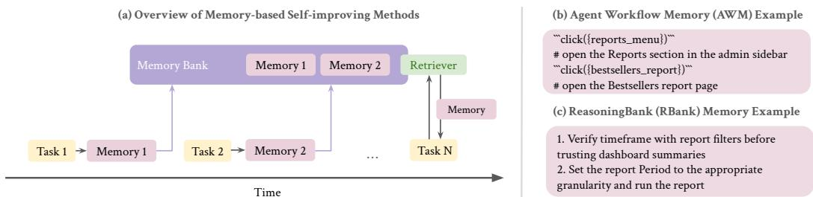
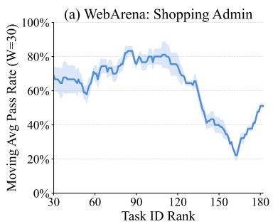
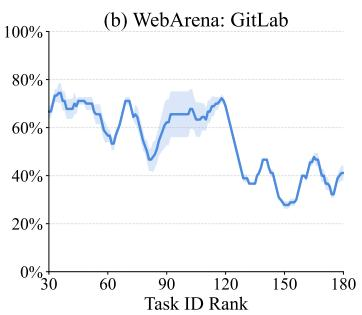
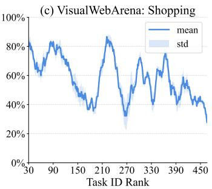
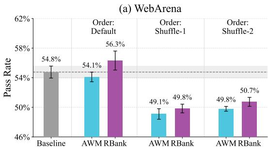
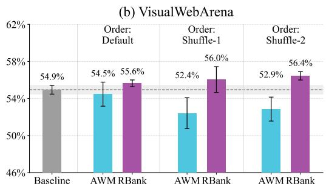
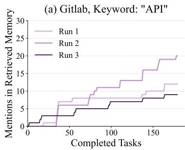
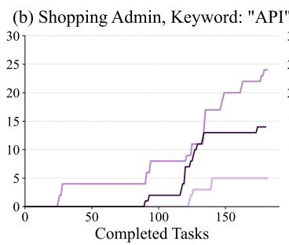
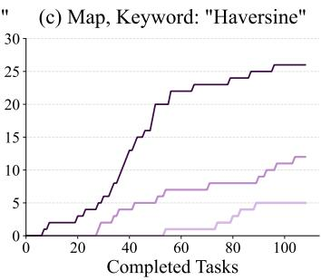
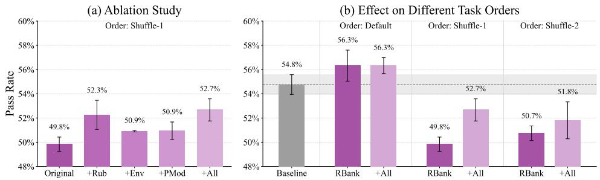

# On the Fragility of Self-Improving Agents: Variance, Task Order, and Underspecification

Qinyuan Ye Yu Li Yada Pruksachatkun Jiaxin Zhang Chien-Sheng Wu Salesforce AI Research

## Abstract

Memory-based self-improving agents—those that learn from an online stream of tasks and improve over time by maintaining a textual memory bank—have shown great promise in recent literature. However, the reliability aspects of these methods have been critically overlooked. In this work, we conduct a comprehensive reevaluation of two memory-based methods, broadening the scope of evaluation along two axes: (1) including multiple runs to quantify variance, and (2) randomly shuffling the tasks to investigate the effect of task order. Through these experiments, we make two observations that expose the fragility of current methods: First, agent evaluation is inherently noisy in complex environments and on multi-step tasks, and stacking a self-improving loop on top can further amplify this noise. Empirically, when these methods are applied, we observe the variance across runs increase in 71% of cases, and the gap between the best and worst runs of the same experiment can reach up to 10 percentage points. Second, the agent’s improvement is highly dependent on task order. Prior works often adopt default orderings that impose an implicit curriculum, acting as a hidden prerequisite for success. In contrast, when evaluated under a randomly shuffled task order, agent performance degrades (-4.5%) instead of exhibiting the expected improvement (+1.5%).

To better understand this fragility, we manually examine the agents’ memory and hypothesize that task and environment underspecification contribute to this fragility. Without clear specifications, agents generate plausible yet inapplicable memories (e.g., recommending API usage in a browser-only environment) that may distract the agent from feasible strategies. We validate this hypothesis by incorporating information that enables better specification, such as detailed rubrics and environment feedback, into the memory construction process. While this added information partially closes the performance degradation in previous experiments, significant gaps still remain, suggesting that other uncharacterized factors contribute to this fragility. Looking ahead, our work advocates for more rigorous evaluation protocols for self-improving agents by reporting results across multiple runs and stress-testing them under realistic, challenging conditions. Moreover, our findings on underspecification call for systems and interfaces that enable effective human oversight, preventing agents from failing in unforeseeable ways.<sup>1</sup>

## 1 Introduction

The development of self-improving agents [1, 2, 3]—systems designed to learn from past experiences and autonomously refine their performance over time—has emerged as a highly promising research direction. If they realize this potential, they could not only better automate routine workflows and create significant economic impact, but also enable highly adaptable systems and facilitate openended research discovery. While recent works show progress in this direction [4, 5, 6, 7, 8, 9], little focus has been placed on stress-testing the reliability of such systems [10]. In practical settings, such as enterprise deployments, there is often minimal tolerance for error; an initial failure risks losing user trust. Moreover, initial mistakes can cascade silently over the long term, causing irreversible or prohibitively costly impacts if adopted in high-stakes domains. Before we can confidently deploy these systems, we must critically evaluate their reliability under realistic, challenging conditions.

This work begins with a comprehensive re-evaluation of two representative memory-based selfimproving systems—Agent Workflow Memory [11] and ReasoningBank [12]—across three realistic web-browsing benchmarks: WebArena [13], VisualWebArena [14], and SCUBA [15]. In this evaluation, we establish a stronger baseline by upgrading both the underlying language model and the agent harness. Furthermore, we broaden the scope of evaluation along two axes: conducting multiple runs of the same experimental setting to quantify variance, and randomly shuffling the tasks to investigate the effect of task order. Through this extended re-evaluation, we identify two critical reliability issues.

First, we show that the variance across runs can be concerningly large, an observation largely hidden in prior works, as web agent evaluations typically report only single-run results. We show that the no-memory baseline agent already exhibits significant variance across multiple runs, and that incorporating a self-improving procedure can further amplify this variance. For example, on the WebArena GitLab subset (comprising 180 tasks), the absolute performance gap between the best and worst baseline runs is 4.4%, whereas applying ReasoningBank enlarges this gap to 7.8%. These observations call the reliability of single-run evaluation practices into question.

Second, we demonstrate that agent improvement is highly sensitive to task order. The default task order in prior works imposes an implicit, easy-to-hard curriculum, which acts as a hidden prerequisite for these self-improving methods to succeed. Under the default order, the agent using ReasoningBank achieves an average performance gain of 1.5%; however, when evaluated under randomly shuffled task orders, the agent exhibits a performance degradation of 4.5%. This dependency introduces a pressing concern, as real-world applications cannot assume a neatly ordered stream of user requests.

To better understand this fragility, we manually investigate the memories written by the agents, and identify environment and task underspecification during memory generation as potential drivers for the large variance and degraded performance. For example, when the memory construction model is unaware that the environment is browser-only and does not support code execution, it generates suggestions to use APIs—a strategy that is plausible but unexecutable. Regarding task underspecification, we show that ambiguous task queries can give rise to misunderstanding, overthinking, and the construction of erroneous memories that propagate to subsequent tasks.

To mitigate these issues, we consider incorporating additional context—such as environment feedback and task rubrics—into the memory construction step, and we further revise the prompt with clearer environment specifications. These interventions close 31% of the performance degradation observed in the shuffled task order settings. While this demonstrates the utility of such additional information, the remaining performance gap suggests that other uncharacterized factors contribute to this fragility, highlighting the need for future work to ensure the reliability of self-improving agents.

Beyond these empirical results, our work calls for research into rigorous evaluation methodologies for self-improving AI systems, and we provide practical recommendations in this direction. Furthermore, our analysis of underspecification motivates the development of effective human intervention interfaces, where the “wrong lessons” learned by these agents can be identified and corrected timely.

## 2 Background: Memory-Based Self-Improving Agents

In this section, we first revisit the problem setting of memory-based self-improving agents. We then provide a brief overview of two representative methods that we use in our analysis.

## 2.1 Problem Setting

We follow the setting described in prior literature [11, 16, 12]. The agent is required to complete an online stream of N tasks, $\mathcal { Q } = \{ q _ { 0 } , q _ { 1 } , . . . , q _ { N } \}$ and maintain a textual memory M. For each task $q _ { i }$ , the agent, backed by a language model $L ,$ is required to generate an action $a _ { t } \in \mathcal A$ from past observations $\left( o _ { 0 : t - 1 } \right)$ and actions $\left( a _ { 0 : t - 1 } \right)$ at each timestamp t, i.e., $a _ { i } \gets \pi _ { L } ( o _ { 0 : t - 1 } , a _ { 0 : t - 1 } ; \mathcal { M } , \mathcal { A } )$

  
Figure 1: (a) Overview of Memory-based Self-improving Methods. In this setting, agents will perform a sequence of tasks and generate memories at the end of each tasks. The memories will be saved to a memory bank and will be retrieved for performing future tasks. (b)(c) Example memories. We consider two established methods (AWM [11] and RBank [12]) in our evaluation.

At the end of each task, the agent receives a reward $r \in [ 0$ , 1], where a reward of 1 indicates that the agent “passes” the task. A memory construction module C will be instructed to update the memory M based on the task trajectory and optionally the reward. See Fig. 1(a) for an illustration.

## 2.2 Representative Approaches

We consider two representative approaches in our evaluation, and we describe them below.

• Agent Workflow Memory (AWM) [11]. At the end of each task, the memory module is instructed to summarize reusable workflows from successful trajectories (Fig. 1(b)). Following the original implementation, each new workflow is checked for duplication against existing workflows, and all workflows are included in the agent’s context when performing subsequent tasks.

• ReasoningBank (RBank) [12]. In this more recent approach, memory items were not limited to structured, step-by-step workflows, but more generic reasoning traces and insights that could be helpful for future similar tasks (Fig. 1(c)). Following the original implementation, memory items are generated from both successful and failed trajectories, and a retriever is used to select the most relevant past memories for subsequent tasks.

## 3 Exposing Fragility with Broadened Re-evaluation

## 3.1 Experiment Setting

Benchmarks. In this work, we focus our evaluation on web browsing domain. Specifically, we focus on the following three benchmarks.

• WebArena [13]. WebArena is a widely-adopted benchmark consisting of 812 web browsing tasks involving six domains: Shopping, Shopping Admin, Gitlab, Reddit, Map and Multisite.

• VisualWebArena [14]. VisualWebArena extends from WebArena and adds challenges by requiring agents to understand visual elements in the question or on the website. VisualWebArena has 910 tasks on three domains: Classifieds, Reddit and Shopping.

• SCUBA [15]. SCUBA is an enterprise-centric benchmark on automating the activities of platform administrators (Admin), sales representatives (Sales), and service agents (Service) on a web-based customer relation management software. We manually excluded tasks that became invalid due to recent website updates, leaving a total of 267 tasks.

Evaluation practices in prior works. With very few exceptions [17, 18], prior work on web agent evaluation reports pass rate over one single run of the agent. While this is permissible for early exploration in this field and for cost considerations, recent work points out that agent performance can vary across runs [19, 10], and hence a comprehensive re-evaluation over multiple runs is needed. Further, when self-improvement methods are applied to web-browsing tasks [11, 12], experiments are typically conducted under a pre-determined task order. As our later analysis shows, this ordering induces an implicit easy-to-hard curriculum that may inadvertently favor these methods.

Evaluation practice in this work. Echoing the concerns above, we broaden our evaluation along two axes: (1) To better characterize the variance across runs, we conduct three identical runs for each experiment of interest. In terms of evaluation metric, we focus on run-level statistics such as average pass rate (pass@1) per domain, along with it standard deviation across three runs, and its best-worst gap among the three run<sup>2</sup>. (2) To investigate the influence of task order in agent self-improving, we conduct experiments with two shuffled task orders (i.e., Shuffle-1, Shuffle-2), in addition to the default order used in prior works.

Experiment details. We use the baseline agent harness used in [20] for WebArena and VisualWebArena, and the baseline agent harness used in [15] for SCUBA. They are referred to as “(no-memory) baseline” in the following. The self-improving methods (AWM and RBank) are built on top of these baseline agents. Unless otherwise specified, we use GPT-5-mini as the agent backbone model and the memory construction model. When constructing memories, we deliberately provide the ground-truth reward r to the model, in contrast to prior works which uses a proxy reward rˆ from an LLM-Judge, which we found to be noisy and further complicate our analysis. We report selected results in the main paper and defer additional result tables in Appendix D.

## 3.2 Variance

Web agent evaluation is intrinsically noisy. In Table 1, we first report variance-related metrics for the no-memory baseline in the rows marked “Baseline”. While noise and randomness across runs are expected, it is important to quantify the magnitude of variance across runs, especially since prior work typically reports average pass@1 from a single run. In the GitLab subset of WebArena, the gap between the best and worst runs reaches a surprising 4.4%, which in some contexts would often be considered a meaningful improvement. The standard deviation in this particular domain also reaches 1.98%. Similarly, in VWA and SCUBA, the domain-level best-worst gap can be up to 2.4% and 6.7% respectively, raising concerns that single-run evaluations may be misleading and could lead to inaccurate conclusions.

Self-improvement methods could amplify the variance. We further compare the the rows of the baseline versus the self-improving methods in Table 1, where we see a consistent trend that variance increases greatly when these methods are applied on top of the baseline. In 17 of the 24 cases, we see an increase in variances, and in 11 cases the relative increase exceeds 50%. This observation is a direct consequence of the stateful nature of self-improving methods: memory construction is conditioned on prior task outcomes and is further influenced by stochastic LLM sampling. As a result, early randomness can compound over time, leading to substantially different memory states across runs. While this phenomenon is expected, it is concerning from an evaluation perspective, as we observe standard deviations as large as 3.9%, and a best-worst gap also widened to 8.2% in the Map domain and 7.8% in the Gitlab domain of WebArena.

Self-improvement methods have diminishing effects when a strong “initialization” is used. Since the introduction of AWM and RBank, the capabilities of language models on web browsing tasks have advanced significantly. As shown in Table 2, RBank reports an average success rate of 53.9% on a subset of 684 WebArena tasks using Gemini-2.5-Pro. Our baseline agent, based on the more recent GPT-5-mini model, achieves comparable performance (55.3%) to their reported memory-enhanced result (53.9%). On VisualWebArena, our baseline agent achieves 54.9%, which is comparable to the reported state-of-the-art result on this benchmark<sup>3</sup>.

Building on this baseline, our re-evaluation enables a reassessment of the effectiveness of these self-improvement approaches under better “initializations”. As shown in Table 3, we find that selfimprovement methods struggle to yield consistent gains. For instance, although RBank achieves an average improvement of 1.5% over our baseline, this gain corresponds to a p-value of 0.23 (computed over three runs using an unpaired t-test), indicating limited statistical significance<sup>4</sup>. These results suggest that, while prior methods are effective for less capable web agents, more advanced approaches are required to construct high-quality memory and sustain the self-improvement process.

Table 1: Variance-related metrics across 3 runs. Memory-based self-improving agent methods introduce increased variance in 17 out of 24 (≈ 71%) cases, among which 11 cases show a relative increase of more than 50%.
<table><tr><td>Method</td><td colspan="6">WebArena</td><td colspan="3">VisualWebArena</td><td colspan="3">SCUBA</td></tr><tr><td></td><td>Shopping (187)</td><td>Admin (182)</td><td>GitLab (180)</td><td>Map (109)</td><td>Reddit (106)</td><td>Multisite (48)</td><td>Classifieds (234)</td><td>Shopping (466)</td><td>Reddit (210)</td><td>Admin (158)</td><td>Sales (64)</td><td>Service (45)</td></tr><tr><td colspan="9">Standard deviation of pass@1 across 3 runs (%)</td><td></td><td></td><td></td><td></td></tr><tr><td>Baseline</td><td>1.53</td><td>1.19</td><td>1.98</td><td>1.30</td><td>1.78</td><td>0.98</td><td>1.01</td><td>0.83</td><td>1.03</td><td>0.30</td><td>1.95</td><td>2.77</td></tr><tr><td rowspan="3">AWM</td><td>1.26</td><td>2.99</td><td>1.20</td><td>1.98</td><td>2.48</td><td>0.98</td><td>1.79</td><td>1.01</td><td>2.38</td><td>2.09</td><td>1.28</td><td>2.77</td></tr><tr><td>(-18%)</td><td>(+152%)</td><td>(-39%)</td><td>(+53%)</td><td>(+39%)</td><td>(0%)</td><td>(+78%)</td><td>(+22%)</td><td>(+131%)</td><td>(+600%)</td><td>(-35%)</td><td>(0%)</td></tr><tr><td>1.33</td><td>2.12</td><td>3.34 (+69%)</td><td>3.89 (+200%)</td><td>2.22 (+25%)</td><td>4.28 (+336%)</td><td>1.23 (+22%)</td><td>1.58 (+91%)</td><td>1.47 (+43%)</td><td>1.58</td><td>1.47</td><td>3.78</td></tr><tr><td colspan="10">RBank (-13%) (+79%)</td><td>(+429%)</td><td>(-24%)</td><td>(+36%)</td></tr><tr><td colspan="10">Best-worst gap of pass@1 in 3 runs (%)</td><td></td><td></td><td></td></tr><tr><td>Baseline</td><td>3.74</td><td>2.75</td><td>4.44</td><td>2.75</td><td>3.77</td><td>2.08</td><td>2.14</td><td>1.93</td><td>2.38</td><td>0.63</td><td>4.69</td><td>6.67</td></tr><tr><td rowspan="2">AWM</td><td>2.67</td><td>6.59</td><td>2.78</td><td>4.59</td><td>5.66</td><td>2.08</td><td>4.27</td><td>2.15</td><td>5.71</td><td>4.43</td><td>3.12</td><td>6.67</td></tr><tr><td>(-29%)</td><td>(+140%)</td><td>(-38%)</td><td>(+67%)</td><td>(+50%)</td><td>(0%)</td><td>(+100%)</td><td>(+11%)</td><td>(+140%)</td><td>(+600%)</td><td>(-33%)</td><td>(0%)</td></tr><tr><td>RBank</td><td>3.21 (-14%)</td><td>4.95 (+80%)</td><td>7.78 (+75%)</td><td>8.26 (+200%)</td><td>4.72 (+25%)</td><td>10.42 (+400%)</td><td>2.99 (+40%)</td><td>3.86 (+100%)</td><td>3.33 (+40%)</td><td>3.80 (+500%)</td><td>3.12 (-33%)</td><td>8.89 (+33%)</td></tr></table>

Relative change vs. Baseline shown in parentheses. Cell color: higher (worse) or lower (better) instability.

Table 2: Contextualizing our WebArena results with those in prior works. The no-memory baseline agent in this work (based on GPT-5-mini) already outperforms memory-based agents in prior works.  
Table 3: Overall results on three benchmarks. We report average pass@1 across 3 runs. AWM/RBank cells show score and absolute gain over the baseline (in parentheses). With stronger baselines, these methods show diminishing performance gains.
<table><tr><td colspan="2">AWM (Claude-3.5-Sonnet) 812 Tasks 32.7</td><td colspan="2">RBank (Gemini-2.5-Pro) 684 Tasks</td></tr><tr><td colspan="2">Baseline 36.3</td><td colspan="2">Baseline</td></tr><tr><td colspan="2">+AWM</td><td colspan="2">46.7</td></tr><tr><td colspan="2"></td><td colspan="2">+RBank 53.9</td></tr><tr><td colspan="2">Our Baseline</td><td colspan="2">Our Baseline 55.3</td></tr></table>

<table><tr><td>Method</td><td>WebArena</td><td>VisualWebArena</td><td>SCUBA</td></tr><tr><td>Baseline</td><td>54.8</td><td>54.9</td><td>49.6</td></tr><tr><td rowspan="2">AWM</td><td>54.1</td><td>54.5</td><td>50.1</td></tr><tr><td>(-0.7)</td><td>(-0.4)</td><td>(+0.5)</td></tr><tr><td rowspan="2">RBank</td><td>56.3</td><td>55.6</td><td>51.1</td></tr><tr><td>(+1.5)</td><td>(+0.7)</td><td>(+1.5)</td></tr></table>

## 3.3 Task Order

Our previous results focus on broadening the evaluation through repeated, identical runs and examining the variance across those runs. These results were obtained using a default task order—from smaller task IDs to larger task IDs. In this section, we discuss the implicit assumptions underlying this design and further extend our analysis by exploring alternative task orderings.

The default order exhibits an implicit easy-to-hard curriculum. In Figure 2, we visualize the moving average (window = 30) of task success rates based on the no-memory baseline agent. In (a) and (b), the curves begin with high pass rates (around 75%), which subsequently decline to below 40% once the task ID exceeds 150. This pattern reflects an implicit easy-to-hard curriculum, where earlier tasks are more likely to fall within the agent’s capability. In (c), the sequence also begins with easier tasks, although the second half exhibits a more complex oscillatory pattern.

The default ordering may be an artifact of the benchmark construction process, whereby annotators begin with simpler tasks and progressively introduce more challenging ones. While evaluating self-improvement approaches under this ordering is natural, real-world users may submit tasks in arbitrary orders. To stress-test self-improving systems prior to deployment, it is important to evaluate them under alternative task orderings.

Shuffled task order leads to performance degradation. We extend our evaluation on WebArena and VisualWebArena to two additional shuffled task orders. We present the result overview in Fig. 3. On WebArena, we observe a significant performance degrade when using shuffled task orders. For example, when Shuffle-1 is used, performance drops from 54.8% to 49.1% (AWM) and 49.8% (RBank). On VisualWebArena, AWM is also significantly influenced by task order, while RBank is less sensitive to this change. While shuffled task orders create challenges for models to learn, we expect the overall success rate to be maintained at the same level as the no-memory baseline in these challenging settings; however, we see that performance often goes worse, raising concerns on the reliability of these self-improving methods in real-world settings.





  
Figure 2: Implicit curriculum in the default task order. We visualize the moving average (window=30) of task pass rates as the no-memory baseline agent performs tasks in the default order. In (a)(b), success rates drop on tasks with larger task IDs. In (c), we observe a more complex oscillating pattern. In general, tasks of different difficulties are not distributed evenly in the default order.



  
Figure 3: Performance using different task orders. We use the default task order and two shuffled orders. Model performance degrade significantly in 6 out of 8 cases when shuffled orders are used.

## 4 Indentifying Underspecification as a Potential Cause of Fragility

## 4.1 Uncovering the Failure Modes in Memory Construction

To understand the amplified variance and the unexpected performance drop when shuffled orders are used, we manually inspect the agent’s memory produced by the RBank method, where we identify underspecification as a potential cause of these issues. We summarize three notable findings below.

Environment underspecification leads to recurring memories on unsupported actions. In our manual inspection, we identify several cases of unexpected memories that are plausible yet not applicable in the web agent’s environment. For example, the agent frequently references “API” and recommends API-based solutions in its memory. However, the web browsing environment used in our experiments does not support such actions, and this key constraint is not provided to the memory proposal module in the RBank implementation, creating this mismatch.

In Fig. 4(a) and (b), we visualize the number of times the agent retrieves and conditions on memory items containing the keyword “API”. We observe that such mentions appear across domains, potentially introducing distraction or confusion for the agent. Similarly, the agent frequently includes “user confirmation” in its memory (26 times in 3 runs of WebArena, and 22 times in 3 runs of VisualWebArena). While acquiring user confirmation is generally desirable, as many task queries are ambiguous, it is not supported by the evaluation environment. Consequently, such memory items may lead to situations in which the agent repeatedly issues “wait” actions until the time limit is reached.

Task underspecification leads to misunderstanding, overthinking and irrelevant memories. Task queries in WebArena are often ambiguous [18], leading to unintended behaviors from the agent. For example, in WebArena task 118, the agent is tasked with “I have jaw bruxism problem, show me something that could alleviate the problem.” The intended goal is for the agent to locate a relevant product (i.e., a mouth guard) on the shopping website; however, the agent instead adopts a more literal interpretation and responds with “consult your dentist or doctor for personalized advice.” Further, when the agent is prompted to reflect on its failure on this task, it produces irrelevant memories such as “gather targeted patient/context details before giving medical guidance.” We also observe cases in which benchmark evaluator bugs lead to false negatives during evaluation, which in turn cause the agent to overthink and generate spurious memories. See Table 7-8 for concrete examples.





  
Figure 4: Mentions of Selected Keywords in Retrieved Memory. In (a)(b), we show that while the environment does not support API-based actions, agents increasingly save and retrieve memories about completing tasks with APIs. In (c), we show that in travel time related tasks in the map domain, the agent proposes to use Haversine Estimation instead of relying on the websites route engine, and this unintended strategy is amplified throughout the course of self-improvement.

Table 4: Three types of additional information used in §4.2. We hypothesize such information can reduce underspecification when constructing memories. Examples are truncated due to space limit.
<table><tr><td rowspan=1 colspan=1>Rubrics and Scores (+Rub):</td></tr><tr><td rowspan=1 colspan=1>Evaluator: string_match | Score: 0.0 (FAIL)Prediction: &quot;Top-2 best-selling products in 2022: 1) Quest Lumaflex™M Band, 5 units; 2) Cruise Dual AnalogWatch, 4 units.&quot;must_include: &quot;Quest LumaflexTM Band&quot; → PASSmust_include: &quot;Sprite Stasis Ball 65 cm&quot; → FAIL</td></tr><tr><td rowspan=1 colspan=1>Environment Feedback (+Env):</td></tr><tr><td rowspan=1 colspan=1>Actions: click(31), input_text(41, &quot;05/01/2022&quot;), input_text(44, &quot;12/31/2022&quot;), click(59) # Preceding ContextAction error: Error executing action input_text: Failed to input text into index 41</td></tr><tr><td rowspan=1 colspan=1>Prompt Modification (+PMod):</td></tr><tr><td rowspan=1 colspan=1>- INCLUDE: Procedural knowledge, reusable workflows, site navigation structure, UI interaction tips.- STRICTLY AVOID: API or programmatic solutions, visiting external websites, requesting human confir-mation, or task-specific details tied to a particular site or query.</td></tr></table>

Memories are “contagious”: the case of using Haversine Formula in map tasks. Surprisingly, in the map domain of WebArena, we observe references to the “Haversine Formula”, a method for computing the shortest distance between two points on a sphere. Upon further inspection, we find that when the agent is tasked with obtaining the distance between two locations, the map website does not always load as expected or respond in time. As a result, the agent adopts a fallback strategy of estimating distances using the Haversine Formula. This approximation occasionally yields correct answers (see Table 9 for a detailed example), which leads the agent to incorporate these unintended strategies into its memory. As shown in Fig. 4, the introduction of this strategy appears to be stochastic, and the earlier “Haversine” is added to memory, the more frequently it is retrieved and used in later tasks. This effect may contribute to increased variance across runs.

## 4.2 Addressing Underspecification with Additional Information

In the original implementation of RBank, the memory construction module is minimal and generic; i.e., “You need to extract and summarize useful insights in the format of memory items based on the agent’s successful trajectory” (see Appendix E for the full prompt). Based on our findings in §4.1, such generic descriptions may be insufficient, particularly when the baseline agent is already strong and more specific feedback or memory is required to achieve meaningful improvements.

  
Figure 5: Addressing Underspecification with Additional Information. (a) We apply the three types of information individually and altogether. (b) We experiment with +All using three task orders.

In the following, we address this limitation by incorporating additional information during memory construction. We describe three types of such information below and provide examples in Table 4.

• Rubrics and Scores (+Rub). Across all considered benchmarks, tasks are evaluated using function-based rubrics. For example, WebArena adopts three types of evaluation functions (must\_include, exact\_match, and fuzzy\_match), which can be applied to the agent’s returned answer or final state. In the jaw bruxism example discussed earlier (Table 7), we demonstrate that an ambiguous task query can lead to multiple interpretations and outcomes. Providing rubrics can help clarify the intended task and improve the relevance of the resulting memory. Note that these rubrics are provided only during post-completion memory construction; i.e., the agent remains unaware of them while performing the task.

• Environment Feedback (+Env). We incorporate web environment feedback, such as whether click or selection actions are successful, into the memory construction process. In practice, we observe cases where the agent issues a sequence of actions $( e . g .$ , click item 31, then fill textbox 41). However, after clicking item 31, textbox 41 may no longer be present on the page, resulting in an action error. Such information is not included in the original memory generation process, which can lead the agent to repeat similar UI interaction mistakes. Incorporating this feedback provides a useful signal for improving performance in future tasks.

• Prompt Modification (+PMod). Our previous analysis shows that the agent may “learn” unintended strategies, such as proposing API-based actions or requesting confirmation from human users. While these behaviors are plausible, they are not supported in the agent environment. To address this, we introduce a prompt edit that explicitly discourages such strategies. Additionally, we encourage the inclusion of procedural knowledge and site navigation structures, thereby guiding the model to generate memories that are more relevant to web-browsing tasks.

• +All. Finally, we experiment with including all three modifications mentioned above.

Results and Discussion. We begin by applying these modifications to the RBank experiments under the Shuffle-1 task order. The results are presented in Fig. 5(a), where we observe that each type of additional information yields modest performance gains. When combined, these modifications result in a 2.9% improvement over the original RBank method (49.8% → 52.7%). We further evaluate the +All setting under the Default and Shuffle-2 orders, with results shown in Fig. 5(b). We observe an improvement of 1.1% on Shuffle-2, while performance under the Default order is maintained.

Overall, these findings suggest that incorporating additional information during memory construction is beneficial and non-disruptive; thus, when such information is available, its incorporation during memory construction is recommended. However, even with these enhancements, the agent still underperforms the no-memory baseline under Shuffle-1 and Shuffle-2. Indeed, the three types of additional information represent our initial attempt to address this issue and may not fully capture all sources of underspecification. Other factors contributing to robustness under varying task orders may also exist and remain unidentified. We leave further investigation of this issue to future work.

## 5 Related Works

Agent Continual Learning and Self-Improvement. This work focuses on an inference-only setting for agent self-improvement, motivated by its practical utility, accessible interface, and as a way to explore the limits of agents in forward-pass only settings. Beyond web-browsing tasks, related self-improvement methods have been studied for math, reasoning, and coding agents [5, 21, 22], as well as long-term personalization [23, 24]. More broadly, continual learning and self-improvement (or “self-play”) have long been studied prior to the inference-only paradigm, including in supervised fine-tuning [2, 25] and reinforcement learning settings [26].

Agent Skill and Memory. One promising direction for agent continual learning is the construction of “memories”, including both parametric and non-parametric forms. This work focuses on nonparametric, textual memory, which has gained significant traction recently [27, 28, 29, 30, 31]. Relatedly, workflow-related memories are sometimes referred to as “skills” and has been extensively studied [32, 33, 34, 35]. For parametric memory, representative approaches include sparse memory fine-tuning [36], which updates trainable memory slots based on their relative activation on unseen tasks compared to a background corpus. Additionally, memory mechanisms have been studied from a model architecture perspective, with notable works including Hope [37] and Titans [38].

Agent Evaluation and Reliability. The research community has developed diverse benchmarks for evaluating agent capabilities, in domains such as tool use [39, 40], computer use [41], web browsing [13, 14, 42]. As agent capabilities continue to grow, newer benchmarks target tasks with real-world economical values [43], including coding [44, 45], customer service [19, 46], customer relationship management [47, 48], and enterprise operations [49]. Along these contributions, there is also growing concern regarding the evaluation sciences of agents [10, 50, 51, 52]. In particular, Rabanser et al. [10] advocate treating reliability as a primary evaluation axis alongside capability, a perspective we strongly agree with. We extend this viewpoint from single-session agents to multi-session self-improving agents, where reliability becomes even more critical and harder to measure.

## 6 Conclusion

In this work, we conducted a comprehensive re-evaluation of two established memory-based methods for agent self-improvement, broadening the scope of evaluation along two axes (multiple runs and shuffled task orders) while using a stronger combination of base model and agent harness as the baseline (i.e., the starting point for self-improvement). Overall, our results reveal the fragility of these self-improving systems under more challenging settings: the results of self-improving experiments can exhibit significant variance, meaning that evaluation based on a single run can hinder accurate measurement of progress. Furthermore, agents do not self-improve, but instead degrade, in challenging settings where the baseline is already strong or when tasks arrive in a random order.

Given these surprising findings, we further manually examine the agents’ memory and identify environment and task underspecification as a key limitation in existing approaches, supporting this with detailed case studies and analyses. We address this limitation by incorporating additional information that provides better specification to the memory generation module. By doing so, the performance degradation observed in prior experiments is reduced by 31%, demonstrating promising progress. However, the remaining 69% performance gap suggests that there are still fundamental issues to be uncovered and resolved to fully overcome this fragility.

Beyond these empirical observations, our findings offer practical recommendations for researchers and practitioners working with self-improving agentic systems.

Recommendations for Evaluation. Our work advocates for more rigorous evaluation protocols that account for the stability issues discussed in this study. Specifically, results from a single run should be interpreted with caution; instead, reporting outcomes across multiple runs and randomized task orders should be highly encouraged. Furthermore, we recommend first piloting new methods on benchmarks with well-specified tasks, followed by stress-testing them on underspecified tasks to estimate worst-case performance prior to deployment.

Recommendations for System Development. Our analysis reveals that without proper validation mechanisms, agent memories are merely unverified hypotheses rather than true lessons learned. They can be erroneous and, more importantly, cascade negatively into subsequent tasks over time. Future work should investigate memory validation mechanisms that filter out problematic memories to ensure long-term robustness. Additionally, as demonstrated in §4.1, task and environment specification is a nuanced challenge. Because underspecification cannot be fully foreseen, and real-world deployments unfold as a single, irreversible run, refining specifications through an iterative process represents one viable path forward. Consequently, our findings motivate the development of interfaces that enable effective human oversight and timely intervention before agents fail unintentionally.

## References

[1] Juergen Schmidhuber. Gödel machines: Self-referential universal problem solvers making provably optimal self-improvements, 2006. URL https://arxiv.org/abs/cs/0309048.

[2] Eric Zelikman, Yuhuai Wu, Jesse Mu, and Noah Goodman. STar: Bootstrapping reasoning with reasoning. In Alice H. Oh, Alekh Agarwal, Danielle Belgrave, and Kyunghyun Cho, editors, Advances in Neural Information Processing Systems, 2022. URL https://openreview.net/ forum?id=\_3ELRdg2sgI.

[3] Jiaxin Huang, Shixiang Gu, Le Hou, Yuexin Wu, Xuezhi Wang, Hongkun Yu, and Jiawei Han. Large language models can self-improve. In Houda Bouamor, Juan Pino, and Kalika Bali, editors, Proceedings of the 2023 Conference on Empirical Methods in Natural Language Processing, pages 1051–1068, Singapore, December 2023. Association for Computational Linguistics. doi: 10.18653/v1/2023.emnlp-main.67. URL https://aclanthology.org/ 2023.emnlp-main.67/.

[4] Mingchen Zhuge, Wenyi Wang, Louis Kirsch, Francesco Faccio, Dmitrii Khizbullin, and Jürgen Schmidhuber. GPTSwarm: Language agents as optimizable graphs. In Forty-first International Conference on Machine Learning, 2024. URL https://openreview.net/ forum?id=uTC9AFXIhg.

[5] Shengran Hu, Cong Lu, and Jeff Clune. Automated design of agentic systems. In The Thirteenth International Conference on Learning Representations, 2025. URL https://openreview. net/forum?id=t9U3LW7JVX.

[6] Yifei Zhou, Sergey Levine, Jason E Weston, Xian Li, and Sainbayar Sukhbaatar. Selfchallenging language model agents. In The Thirty-ninth Annual Conference on Neural Information Processing Systems, 2026. URL https://openreview.net/forum?id=9yusqX9DpR.

[7] Tianqing Fang, Hongming Zhang, Zhisong Zhang, Kaixin Ma, Wenhao Yu, Haitao Mi, and Dong Yu. WebEvolver: Enhancing web agent self-improvement with co-evolving world model. In Christos Christodoulopoulos, Tanmoy Chakraborty, Carolyn Rose, and Violet Peng, editors, Proceedings of the 2025 Conference on Empirical Methods in Natural Language Processing, pages 8959–8975, Suzhou, China, November 2025. Association for Computational Linguistics. ISBN 979-8-89176-332-6. doi: 10.18653/v1/2025.emnlp-main.454. URL https: //aclanthology.org/2025.emnlp-main.454/.

[8] Shikhar Murty, , Hao Zhu, Dzmitry Bahdanau, and Christopher D Manning. Nnetnav: Unsupervised learning of browser agents through environment interaction in the wild. arXiv preprint arXiv:2410.02907, 2025.

[9] Boyuan Zheng, Michael Y. Fatemi, Xiaolong Jin, Zora Zhiruo Wang, Apurva Gandhi, Yueqi Song, Yu Gu, Jayanth Srinivasa, Gaowen Liu, Graham Neubig, and Yu Su. Skillweaver: Web agents can self-improve by discovering and honing skills, 2025. URL https://arxiv.org/ abs/2504.07079.

[10] Stephan Rabanser, Sayash Kapoor, Peter Kirgis, Kangheng Liu, Saiteja Utpala, and Arvind Narayanan. Towards a science of ai agent reliability, 2026. URL https://arxiv.org/abs/ 2602.16666.

[11] Zora Zhiruo Wang, Jiayuan Mao, Daniel Fried, and Graham Neubig. Agent workflow memory. In Forty-second International Conference on Machine Learning, 2025. URL https://openreview.net/forum?id=NTAhi2JEEE.

[12] Siru Ouyang, Jun Yan, I-Hung Hsu, Yanfei Chen, Ke Jiang, Zifeng Wang, Rujun Han, Long T. Le, Samira Daruki, Xiangru Tang, Vishy Tirumalashetty, George Lee, Mahsan Rofouei, Hangfei Lin, Jiawei Han, Chen-Yu Lee, and Tomas Pfister. Reasoningbank: Scaling agent self-evolving with reasoning memory, 2025. URL https://arxiv.org/abs/2509.25140.

[13] Shuyan Zhou, Frank F. Xu, Hao Zhu, Xuhui Zhou, Robert Lo, Abishek Sridhar, Xianyi Cheng, Tianyue Ou, Yonatan Bisk, Daniel Fried, Uri Alon, and Graham Neubig. Webarena: A realistic web environment for building autonomous agents. In The Twelfth International Conference on Learning Representations, 2024. URL https://openreview.net/forum?id=oKn9c6ytLx.

[14] Jing Yu Koh, Robert Lo, Lawrence Jang, Vikram Duvvur, Ming Lim, Po-Yu Huang, Graham Neubig, Shuyan Zhou, Russ Salakhutdinov, and Daniel Fried. VisualWebArena: Evaluating multimodal agents on realistic visual web tasks. In Lun-Wei Ku, Andre Martins, and Vivek Srikumar, editors, Proceedings of the 62nd Annual Meeting of the Association for Computational Linguistics (Volume 1: Long Papers), pages 881–905, Bangkok, Thailand, August 2024. Association for Computational Linguistics. doi: 10.18653/v1/2024.acl-long.50. URL https://aclanthology.org/2024.acl-long.50/.

[15] Yutong Dai, Krithika Ramakrishnan, Jing Gu, Matthew Fernandez, Yanqi Luo, Viraj Prabhu, Zhenyu Hu, Silvio Savarese, Caiming Xiong, Zeyuan Chen, and Ran Xu. Scuba: Salesforce computer use benchmark, 2025. URL https://arxiv.org/abs/2509.26506.

[16] Zora Zhiruo Wang, Apurva Gandhi, Graham Neubig, and Daniel Fried. Inducing programmatic skills for agentic tasks. In Second Conference on Language Modeling, 2025. URL https: //openreview.net/forum?id=lsAY6fWsog.

[17] Simon Yu, Gang Li, Weiyan Shi, and Peng Qi. Polyskill: Learning generalizable skills through polymorphic abstraction for continual learning. In The Fourteenth International Conference on Learning Representations, 2026. URL https://openreview.net/forum?id=KdEsujyiSV.

[18] Amine El hattami, Joel Bredeson, Megh Thakkar, Eric LaBouve, Nicolas Chapados, and Christopher Pal. Webarena verified, 2025. URL https://openreview.net/forum?id= CSIo4D7xBG.

[19] Shunyu Yao, Noah Shinn, Pedram Razavi, and Karthik Narasimhan. τ -bench: A benchmark for tool-agent-user interaction in real-world domains, 2024. URL https://arxiv.org/abs/ 2406.12045.

[20] Viraj Prabhu, Yutong Dai, Matthew Fernandez, Krithika Ramakrishnan, Jing Gu, Yanqi Luo, silvio savarese, Caiming Xiong, Junnan Li, Zeyuan Chen, and Ran Xu. WALT: Web agents that learn tools. In The Fourteenth International Conference on Learning Representations, 2026. URL https://openreview.net/forum?id=cgIDqcJcoI.

[21] Jenny Zhang, Shengran Hu, Cong Lu, Robert Tjarko Lange, and Jeff Clune. Darwin gödel machine: Open-ended evolution of self-improving agents. In The Fourteenth International Conference on Learning Representations, 2026. URL https://openreview.net/forum? id=pUpzQZTvGY.

[22] Wenyi Wang, Piotr Pi˛ekos, Li Nanbo, Firas Laakom, Yimeng Chen, Mateusz Ostaszewski, Mingchen Zhuge, and Jürgen Schmidhuber. Huxley-g<sup>´</sup>’odel machine: Human-level coding agent development by an approximation of the optimal self-improving machine. In The Fourteenth International Conference on Learning Representations, 2026. URL https://openreview. net/forum?id=T0EiEuhOOL.

[23] Adyasha Maharana, Dong-Ho Lee, Sergey Tulyakov, Mohit Bansal, Francesco Barbieri, and Yuwei Fang. Evaluating very long-term conversational memory of LLM agents. In Lun-Wei Ku, Andre Martins, and Vivek Srikumar, editors, Proceedings ofthe 62nd Annual Meeting of the Association for Computational Linguistics (Volume 1: Long Papers), pages 13851–13870, Bangkok, Thailand, August 2024. Association for Computational Linguistics. doi: 10.18653/ v1/2024.acl-long.747. URL https://aclanthology.org/2024.acl-long.747/.

[24] Omar Shaikh, Valentin Teutschbein, Kanishk Gandhi, Yikun Chi, Nick Haber, Thomas Robinson, Nilam Ram, Byron Reeves, Sherry Yang, Michael S. Bernstein, and Diyi Yang. Learning next action predictors from human-computer interaction, 2026. URL https://arxiv.org/abs/ 2603.05923.

[25] Zixiang Chen, Yihe Deng, Huizhuo Yuan, Kaixuan Ji, and Quanquan Gu. Self-play fine-tuning converts weak language models to strong language models, 2024.

[26] David Silver, Thomas Hubert, Julian Schrittwieser, Ioannis Antonoglou, Matthew Lai, Arthur Guez, Marc Lanctot, Laurent Sifre, Dharshan Kumaran, Thore Graepel, Timothy Lillicrap, Karen Simonyan, and Demis Hassabis. A general reinforcement learning algorithm that

masters chess, shogi, and go through self-play. Science, 362(6419):1140–1144, 2018. doi: 10.1126/science.aar6404. URL https://www.science.org/doi/abs/10.1126/science. aar6404.

[27] Wujiang Xu, Zujie Liang, Kai Mei, Hang Gao, Juntao Tan, and Yongfeng Zhang. A-mem: Agentic memory for LLM agents. In The Thirty-ninth Annual Conference on Neural Information Processing Systems, 2026. URL https://openreview.net/forum?id=FiM0M8gcct.

[28] Bowen Jiang, Zhuoqun Hao, Young Min Cho, Bryan Li, Yuan Yuan, Sihao Chen, Lyle Ungar, Camillo Jose Taylor, and Dan Roth. Know me, respond to me: Benchmarking LLMs for dynamic user profiling and personalized responses at scale. In Second Conference on Language Modeling, 2025. URL https://openreview.net/forum?id=6ox8XZGOqP.

[29] Wanjun Zhong, Lianghong Guo, Qiqi Gao, He Ye, and Yanlin Wang. MemoryBank: Enhancing large language models with long-term memory. In Proceedings of the Thirty-Eighth AAAI Conference on Artificial Intelligence, pages 19724–19731, 2024.

[30] Charles Packer, Sarah Wooders, Kevin Lin, Vivian Fang, Shishir G. Patil, Ion Stoica, and Joseph E. Gonzalez. MemGPT: Towards LLMs as operating systems. arXiv preprint arXiv:2310.08560, 2023.

[31] Prateek Chhikara, Dev Khant, Saket Aryan, Taranjeet Singh, and Deshraj Yadav. Mem0: Building production-ready ai agents with scalable long-term memory. arXiv, 2025. doi: 10.48550/arxiv.2504.19413.

[32] Barry Zhang, Keith Lazuka, and Mahesh Murag. Equipping agents for the real world with agent skills. Anthropic Engineering Blog, Oct 2025. URL https://www.anthropic.com/ engineering/equipping-agents-for-the-real-world-with-agent-skills. Accessed: 2026-05-06.

[33] Xiangyi Li, Wenbo Chen, Yimin Liu, Shenghan Zheng, Xiaokun Chen, Yifeng He, Yubo Li, Bingran You, Haotian Shen, Jiankai Sun, Shuyi Wang, Binxu Li, Qunhong Zeng, Di Wang, Xuandong Zhao, Yuanli Wang, Roey Ben Chaim, Zonglin Di, Yipeng Gao, Junwei He, Yizhuo He, Liqiang Jing, Luyang Kong, Xin Lan, Jiachen Li, Songlin Li, Yijiang Li, Yueqian Lin, Xinyi Liu, Xuanqing Liu, Haoran Lyu, Ze Ma, Bowei Wang, Runhui Wang, Tianyu Wang, Wengao Ye, Yue Zhang, Hanwen Xing, Yiqi Xue, Steven Dillmann, and Han chung Lee. Skillsbench: Benchmarking how well agent skills work across diverse tasks, 2026. URL https://arxiv.org/abs/2602.12670.

[34] Yu Tian, Jiawei Chen, Lifan Zheng, Mingxiang Tao, Xinyi Zeng, Zhaoxia Yin, Hang Su, and Xian Sun. Skills-coach: A self-evolving skill optimizer via training-free grpo, 2026. URL https://arxiv.org/abs/2604.27488.

[35] Guanyu Jiang, Zhaochen Su, Xiaoye Qu, and Yi R. Fung. Xskill: Continual learning from experience and skills in multimodal agents, 2026. URL https://arxiv.org/abs/2603. 12056.

[36] Jessy Lin, Luke Zettlemoyer, Gargi Ghosh, Wen-Tau Yih, Aram Markosyan, Vincent-Pierre Berges, and Barlas Oguz. Continual learning via sparse memory finetuning.˘ arXiv preprint arXiv:2510.15103, 2025. URL https://arxiv.org/abs/2510.15103.

[37] Ali Behrouz, Meisam Razaviyayn, Peilin Zhong, and Vahab Mirrokni. Nested learning: The illusion of deep learning architectures. In The Thirty-ninth Annual Conference on Neural Information Processing Systems, 2026. URL https://openreview.net/forum?id=nbMeRvNb7A.

[38] Ali Behrouz, Peilin Zhong, and Vahab Mirrokni. Titans: Learning to memorize at test time. In The Thirty-ninth Annual Conference on Neural Information Processing Systems, 2026. URL https://openreview.net/forum?id=8GjSf9Rh7Z.

[39] Timo Schick, Jane Dwivedi-Yu, Roberto Dessì, Roberta Raileanu, Maria Lomeli, Luke Zettlemoyer, Nicola Cancedda, and Thomas Scialom. Toolformer: Language models can teach themselves to use tools, 2023. URL https://arxiv.org/abs/2302.04761.

[40] Xingyao Wang, Yangyi Chen, Lifan Yuan, Yizhe Zhang, Yunzhu Li, Hao Peng, and Heng Ji. Executable code actions elicit better LLM agents. In Forty-first International Conference on Machine Learning, 2024. URL https://openreview.net/forum?id=jJ9BoXAfFa.

[41] Tianbao Xie, Danyang Zhang, Jixuan Chen, Xiaochuan Li, Siheng Zhao, Ruisheng Cao, Toh Jing Hua, Zhoujun Cheng, Dongchan Shin, Fangyu Lei, Yitao Liu, Yiheng Xu, Shuyan Zhou, Silvio Savarese, Caiming Xiong, Victor Zhong, and Tao Yu. OSWorld: Benchmarking multimodal agents for open-ended tasks in real computer environments. In The Thirty-eight Conference on Neural Information Processing Systems Datasets and Benchmarks Track, 2024. URL https://openreview.net/forum?id=tN61DTr4Ed.

[42] Xiang Deng, Yu Gu, Boyuan Zheng, Shijie Chen, Samuel Stevens, Boshi Wang, Huan Sun, and Yu Su. Mind2web: Towards a generalist agent for the web. In Thirty-seventh Conference on Neural Information Processing Systems Datasets and Benchmarks Track, 2023. URL https://openreview.net/forum?id=kiYqbO3wqw.

[43] Tejal Patwardhan, Rachel Dias, Elizabeth Proehl, Grace Kim, Michele Wang, Olivia Watkins, Simón Posada Fishman, Marwan Aljubeh, Phoebe Thacker, Laurance Fauconnet, Natalie S. Kim, Patrick Chao, Samuel Miserendino, Gildas Chabot, David Li, Michael Sharman, Alexandra Barr, Amelia Glaese, and Jerry Tworek. Gdpval: Evaluating ai model performance on real-world economically valuable tasks, 2025. URL https://arxiv.org/abs/2510.04374.

[44] Carlos E Jimenez, John Yang, Alexander Wettig, Shunyu Yao, Kexin Pei, Ofir Press, and Karthik R Narasimhan. SWE-bench: Can language models resolve real-world github issues? In The Twelfth International Conference on Learning Representations, 2024. URL https: //openreview.net/forum?id=VTF8yNQM66.

[45] Xiang Deng, Jeff Da, Edwin Pan, Yannis Yiming He, Charles Ide, Kanak Garg, Niklas Lauffer, Andrew Park, Nitin Pasari, Chetan Rane, Karmini Sampath, Maya Krishnan, Srivatsa Kundurthy, Sean Hendryx, Zifan Wang, Vijay Bharadwaj, Jeff Holm, Raja Aluri, Chen Bo Calvin Zhang, Noah Jacobson, Bing Liu, and Brad Kenstler. Swe-bench pro: Can ai agents solve long-horizon software engineering tasks?, 2025. URL https://arxiv.org/abs/2509.16941.

[46] Victor Barres, Honghua Dong, Soham Ray, Xujie Si, and Karthik Narasimhan. τ<sup>2</sup>-bench: Evaluating conversational agents in a dual-control environment, 2025. URL https://arxiv. org/abs/2506.07982.

[47] Kung-Hsiang Huang, Akshara Prabhakar, Sidharth Dhawan, Yixin Mao, Huan Wang, Silvio Savarese, Caiming Xiong, Philippe Laban, and Chien-Sheng Wu. CRMArena: Understanding the capacity of LLM agents to perform professional CRM tasks in realistic environments. In Luis Chiruzzo, Alan Ritter, and Lu Wang, editors, Proceedings ofthe 2025 Conference ofthe Nations of the Americas Chapter of the Association for Computational Linguistics: Human Language Technologies (Volume 1: Long Papers), pages 3830–3850, Albuquerque, New Mexico, April 2025. Association for Computational Linguistics. ISBN 979-8-89176-189-6. doi: 10.18653/v1/ 2025.naacl-long.194. URL https://aclanthology.org/2025.naacl-long.194/.

[48] Kung-Hsiang Huang, Akshara Prabhakar, Onkar Thorat, Divyansh Agarwal, Prafulla Kumar Choubey, Yixin Mao, Silvio Savarese, Caiming Xiong, and Chien-Sheng Wu. CRMArenapro: Holistic assessment of LLM agents across diverse business scenarios and interactions. Transactions on Machine Learning Research, 2026. ISSN 2835-8856. URL https://openreview.net/forum?id=EPlpe3Fx1x.

[49] Shiva Krishna Reddy Malay, Shravan Nayak, Jishnu Sethumadhavan Nair, Sagar Davasam, Aman Tiwari, Sathwik Tejaswi Madhusudhan, Sridhar Krishna Nemala, Srinivas Sunkara, and Sai Rajeswar. Enterpriseops-gym: Environments and evaluations for stateful agentic planning and tool use in enterprise settings, 2026. URL https://arxiv.org/abs/2603.13594.

[50] Mikaela Grace, Jeremy Hadfield, Rodrigo Olivares, and Jiri De Jonghe. Demystifying evals for AI agents. Anthropic Engineering Blog, Jan 2026. URL https://www.anthropic.com/ engineering/demystifying-evals-for-ai-agents. Accessed: 2026-03-24.

[51] Yuxuan Zhu, Tengjun Jin, Yada Pruksachatkun, Andy Zhang, Shu Liu, Sasha Cui, Sayash Kapoor, Shayne Longpre, Kevin Meng, Rebecca Weiss, Fazl Barez, Rahul Gupta, Jwala Dhamala, Jacob Merizian, Mario Giulianelli, Harry Coppock, Cozmin Ududec, Jasjeet Sekhon, Jacob Steinhardt, Antony Kellermann, Sarah Schwettmann, Matei Zaharia, Ion Stoica, Percy Liang, and Daniel Kang. Establishing best practices for building rigorous agentic benchmarks, 2025. URL https://arxiv.org/abs/2507.02825.

[52] Sayash Kapoor, Benedikt Stroebl, Peter Kirgis, Nitya Nadgir, Zachary S Siegel, Boyi Wei, Tianci Xue, Ziru Chen, Felix Chen, Saiteja Utpala, Franck Ndzomga, Dheeraj Oruganty, Sophie Luskin, Kangheng Liu, Botao Yu, Amit Arora, Dongyoon Hahm, Harsh Trivedi, Huan Sun, Juyong Lee, Tengjun Jin, Yifan Mai, Yifei Zhou, Yuxuan Zhu, Rishi Bommasani, Daniel Kang, Dawn Song, Peter Henderson, Yu Su, Percy Liang, and Arvind Narayanan. Holistic agent leaderboard: The missing infrastructure for ai agent evaluation, 2025. URL https: //arxiv.org/abs/2510.11977.

[53] Bowen Baker, Joost Huizinga, Leo Gao, Zehao Dou, Melody Y. Guan, Aleksander Madry, Wojciech Zaremba, Jakub Pachocki, and David Farhi. Monitoring reasoning models for misbehavior and the risks of promoting obfuscation, 2025. URL https://arxiv.org/abs/ 2503.11926.

[54] Melody Y. Guan, Miles Wang, Micah Carroll, Zehao Dou, Annie Y. Wei, Marcus Williams, Benjamin Arnav, Joost Huizinga, Ian Kivlichan, Mia Glaese, Jakub Pachocki, and Bowen Baker. Monitoring monitorability, 2025. URL https://arxiv.org/abs/2512.18311.

[55] Kevin Meng, Vincent Huang, Jacob Steinhardt, and Sarah Schwettmann. Introducing docent. https://transluce.org/introducing-docent, March 2025.

[56] Peter Henderson, Riashat Islam, Philip Bachman, Joelle Pineau, Doina Precup, and David Meger. Deep reinforcement learning that matters, 2019. URL https://arxiv.org/abs/ 1709.06560.

[57] Chelsea Finn, Pieter Abbeel, and Sergey Levine. Model-agnostic meta-learning for fast adaptation of deep networks, 2017. URL https://arxiv.org/abs/1703.03400.

[58] Antreas Antoniou, Harrison Edwards, and Amos Storkey. How to train your MAML. In International Conference on Learning Representations, 2019. URL https://openreview. net/forum?id=HJGven05Y7.

[59] Tianyi Zhang, Felix Wu, Arzoo Katiyar, Kilian Q Weinberger, and Yoav Artzi. Revisiting few-sample {bert} fine-tuning. In International Conference on Learning Representations, 2021. URL https://openreview.net/forum?id=cO1IH43yUF.

[60] Jesse Dodge, Gabriel Ilharco, Roy Schwartz, Ali Farhadi, Hannaneh Hajishirzi, and Noah Smith. Fine-tuning pretrained language models: Weight initializations, data orders, and early stopping, 2020. URL https://arxiv.org/abs/2002.06305.

[61] Melanie Sclar, Yejin Choi, Yulia Tsvetkov, and Alane Suhr. Quantifying language models’ sensitivity to spurious features in prompt design or: How i learned to start worrying about prompt formatting. In The Twelfth International Conference on Learning Representations, 2024. URL https://openreview.net/forum?id=RIu5lyNXjT.

[62] Moran Mizrahi, Guy Kaplan, Dan Malkin, Rotem Dror, Dafna Shahaf, and Gabriel Stanovsky. State of what art? a call for multi-prompt llm evaluation. Transactions of the Association for Computational Linguistics, 12:933–949, 08 2024. ISSN 2307-387X. doi: 10.1162/tacl\_a\_00681. URL https://doi.org/10.1162/tacl\_a\_00681.

[63] Tony Z. Zhao, Eric Wallace, Shi Feng, Dan Klein, and Sameer Singh. Calibrate before use: Improving few-shot performance of language models, 2021. URL https://arxiv.org/abs/ 2102.09690.

[64] Yao Lu, Max Bartolo, Alastair Moore, Sebastian Riedel, and Pontus Stenetorp. Fantastically ordered prompts and where to find them: Overcoming few-shot prompt order sensitivity. In Smaranda Muresan, Preslav Nakov, and Aline Villavicencio, editors, Proceedings ofthe 60th

Annual Meeting of the Association for Computational Linguistics (Volume 1: Long Papers), pages 8086–8098, Dublin, Ireland, May 2022. Association for Computational Linguistics. doi: 10.18653/v1/2022.acl-long.556. URL https://aclanthology.org/2022.acl-long. 556/.

[65] Anton Voronov, Lena Wolf, and Max Ryabinin. Mind your format: Towards consistent evaluation of in-context learning improvements. In Lun-Wei Ku, Andre Martins, and Vivek Srikumar, editors, Findings ofthe Associationfor Computational Linguistics: ACL 2024, pages 6287–6310, Bangkok, Thailand, August 2024. Association for Computational Linguistics. doi: 10.18653/ v1/2024.findings-acl.375. URL https://aclanthology.org/2024.findings-acl.375/.

[66] Jie Huang, Xinyun Chen, Swaroop Mishra, Huaixiu Steven Zheng, Adams Wei Yu, Xinying Song, and Denny Zhou. Large language models cannot self-correct reasoning yet. In The Twelfth International Conference on Learning Representations, 2024. URL https://openreview. net/forum?id=IkmD3fKBPQ.

## A Limitations

Our evaluation focuses on a specific class of memory-based self-improving agents applied to the domain of web browsing. To maintain a tractable scope given the complexity of the experimental design, we did not extend our analysis to other types of self-improvement methods or alternative domains. Furthermore, given the rapid pace of development in this field, we were unable to evaluate the most recently introduced memory management techniques. Nevertheless, the vulnerabilities identified in this study remain highly relevant, as the two methods evaluated are minimalist, highly scalable, and increasingly adopted.

Additionally, our manual inspection of agent memories was qualitative and conducted on a subset of the agent’s memory. Due to the sheer volume of memories produced during the experiments, an exhaustive review of every entry was infeasible. While our analysis highlights several critical failure modes, other undocumented patterns likely exist. Future work would benefit from analyzing agent memories at scale and developing novel, scalable methods for human oversight.

## B Additional Experiment Details

Costs. When using GPT-5-mini as the backbone model, a single run over all 812 WebArena tasks costs around \$25, and a single run over all 267 SCUBA tasks costs \$29. These estimates are based on the no-memory baselines. For memory-based methods, additional costs arise from (a) generating memories via extra LM calls and (b) including memories in the context. However, we expect the additional cost from both components to be minimal. All experiment code are hosted and run from a standard 64-CPU server.

Dataset and Code License. The WebArena benchmark [13] is released under Apache-2.0 license. The VisualWebArena benchmark [14] is released under MIT license. The SCUBA benchmark [15] is released under Apache-2.0 license. Our baseline agents were revised from WALT [20] and SCUBA [15], released under MIT license and Apache-2.0 license respectively.

LLM Usage. We used coding agents to support our experimentation. Our code is largely based on existing implementation from prior works, therefore these coding agents do not contribute original, new ideas. We also used LLMs for paper editing and proofreading.

## C Extended Related Works

Monitorability. Our work is also broadly related to literature on chain-of-thought and agent monitorability [53, 54, 55]. For instance, Baker et al. [53] observe instances of reward hacking in coding agents via chain-of-thought monitoring. This aligns closely with our findings, as we observe similar cases of “reward hacking” (e.g., the Haversine Formula example in Table 9) occurring during the agent’s learning process. Because memory-based continual learning provides an accessible textual interface to inspect an agent’s “learning,” it introduces opportunities to explore scalable monitoring methods, as well as interfaces to intervene in the process.

Reliability and Stability Concerns of Emerging Learning Paradigms. Reliability has been a recurring challenge across evolving learning paradigms in AI. Prior works have extensively investigated the stability of deep reinforcement learning [56], gradient-based meta-learning [57, 58], language model fine-tuning [59, 60], prompting [61, 62], in-context learning [63, 64, 65], and self-correction [66]. Self-improving agents represent a nascent paradigm enabled by increasingly capable language models. However, unlike earlier paradigms confined to passive prediction or generation, modern agents are increasingly integrated into real-world systems where they are granted the autonomy to execute irreversible actions. Consequently, deploying them without systematically addressing underlying fragility risks not only compounding computational errors, but tangible real-world harm, making reliability an urgent prerequisite for safe adoption.

## D Additional Result Tables

Table 5: Evaluation of the no-memory baseline agent on WebArena.
<table><tr><td>Metric</td><td>Shopping (187)</td><td>Admin (182)</td><td>GitLab (180)</td><td>Map (109)</td><td>Reddit (106)</td><td>Multisite (48)</td><td>All (812)</td></tr><tr><td>Avg. Pass</td><td>45.8</td><td>62.6</td><td>53.9</td><td>53.2</td><td>69.5</td><td>34.0</td><td>54.8</td></tr><tr><td>Pass@3</td><td>55.1</td><td>72.0</td><td>63.3</td><td>67.0</td><td>82.1</td><td>47.9</td><td>65.4</td></tr><tr><td>Pass^3</td><td>34.8</td><td>52.2</td><td>45.0</td><td>40.4</td><td>53.8</td><td>20.8</td><td>43.3</td></tr></table>

Table 6: Evaluation of the no-memory baseline agent on VisualWebArena and SCUBA.
<table><tr><td rowspan="2">Metric</td><td colspan="4">VisualWebArena</td><td colspan="4">SCUBA</td></tr><tr><td>Classifieds (234)</td><td>Shopping (466)</td><td>Reddit (210)</td><td>All (910)</td><td>Admin (158)</td><td>Sales (64)</td><td>Service (45)</td><td>All (267)</td></tr><tr><td>Avg. Milestone</td><td></td><td></td><td></td><td></td><td>46.7</td><td>61.8</td><td>42.3</td><td>49.6</td></tr><tr><td>Avg. Pass</td><td>60.1</td><td>57.6</td><td>43.3</td><td>54.9</td><td>26.2</td><td>39.6</td><td>28.1</td><td>29.7</td></tr><tr><td>Pass@3</td><td>73.9</td><td>69.1</td><td>51.4</td><td>66.3</td><td>39.2</td><td>57.8</td><td>40.0</td><td>43.8</td></tr><tr><td>Pass^3</td><td>44.9</td><td>45.1</td><td>33.8</td><td>42.4</td><td>13.9</td><td>20.3</td><td>13.3</td><td>15.4</td></tr></table>

## E Prompts

Listing 1: Memory construction prompt used in AWM. The prompt is obtained from the codebase of ASI [16].

You are a proficient software engineer. Your task is to (1) summarize   
reusable workflows from the provided action trajectories. Each workflow   
should be a textual guideline to solve a task.   
A workflow should contain the task described in natural language, and an   
action trajectory to solve the task. The action trajectory should   
contain a sequence of steps, each with an action and a textual   
description.   
An example workflow look like this:   
II  II   
Task: Tell me who has made the most contributions, in terms of number of   
commits, to the primer/design project   
Action Trajectory:   
‘‘‘click("505")‘‘‘ # open the ‘Primer / design‘ repository page   
‘‘‘click("642")‘‘‘ # click on the "Commits" link   
‘‘‘click("307")‘‘‘ # click on the "Contributors" link   
‘‘‘stop("The top 3 contributors to the ’prime/design’ repo are: 1. Shawn   
Allen with 95 commits, 2. Inayaili León with 77 commits, 3. Aurora   
Pleguezuelo with 66 commits.")‘‘‘ # This page contains the information   
required to determine the top 3 contributors to the ‘prime/design‘   
repository, based on the number of commits. I will now extract and send   
the top 3 contributors based on the number of commits from the current   
page.   
II I II   
Do not include the answer or example-specific information in the workflows.   
Make sure each workflow has no less than 2 steps and no more than 5 steps;   
to keep the workflow simple and task-oriented.   
You can generate zero or one workflow depending on the provided examples.   
Particularly for ‘click‘ actions, either put exact element ids like ‘click   
(’120’)‘ or use a variable placeholder like ‘click({element\_id})‘. Do   
NOT put text strings in such as ‘click(’Reports’)‘.   
[Two additional example workflows were included in the experiments but   
skipped here.]   
‘‘‘

Listing 2: Memory construction prompt used in ReasoningBank (successful tasks).

```markdown
You are an expert in web navigation. You will be given a user query, the
corresponding trajectory that represents how an agent successfully
accomplished the task.
## Guidelines
You need to extract and summarize useful insights in the format of memory
items based on the agent’s successful trajectory. The goal of
summarized memory items is to be helpful and generalizable for future
similar tasks.
## Important notes
- You must first think why the trajectory is successful, and then summarize
the insights.
- You can extract at most 3 memory items from the trajectory.
- You must not repeat similar or overlapping items.
- Do not mention specific websites, queries, or string contents, but rather
focus on the generalizable insights.
## Output Format
Your output must strictly follow the Markdown format shown below:

# Memory Item i
## Title: <the title of the memory item>
## Description: <one sentence summary of the memory item>
## Content: <1-3 sentences describing the insights learned to successfully
accomplishing the task>
```

Listing 3: Memory construction prompt used in ReasoningBank (failed tasks).

```markdown
You are an expert in web navigation.
You will be given a user query, the corresponding trajectory that represents
how an agent attempted to resolve the task but failed.
## Guidelines
You need to extract and summarize useful insights in the format of memory
items based on the agent’s failed trajectory.
The goal of summarized memory items is to be helpful and generalizable for
future similar tasks.
## Important notes
- You must first reflect and think why the trajectory failed, and then
summarize what lessons you have learned or strategies to prevent the
failure in the future.
- You can extract at most 3 memory items from the trajectory.
- You must not repeat similar or overlapping items.
Do not mention specific websites, queries, or string contents, but rather
focus on the generalizable insights.
## Output Format
Your output must strictly follow the Markdown format shown below:

# Memory Item i
## Title: <the title of the memory item>
## Description: <one sentence summary of the memory item>
## Content: <1-3 sentences describing the insights learned to successfully
accomplishing the task>
```

## F Failure Modes

Table 7: Example of Ambiguous Task Query: WebArena Task 118. The task is intended to be a web navigation task but is interpreted as an question answering task by the agent.
<table><tr><td rowspan=1 colspan=1>Task Query</td></tr><tr><td rowspan=1 colspan=1>I have jaw bruxism problem, show me something that could alleviate the problem.</td></tr><tr><td rowspan=1 colspan=1>Ground-Truth Evaluator</td></tr><tr><td rowspan=1 colspan=1>“Jaw bruxism” and “mouth guard&quot; must be included in the content of the final page.</td></tr><tr><td rowspan=1 colspan=1>Agent&#x27;s Final Message</td></tr><tr><td rowspan=1 colspan=1>(The agent didn&#x27;t browse the shopping website and ends the task after 1 step.)Here are practical things that can help reduce jaw bruxism (teeth grinding/clenching). This is generalinformation — consult your dentist or doctor for personalized advice:1) Night guard / oral splint- Best: a custom-fitted occlusal guard from your dentist (protects teeth and reduces muscle stress). [textomitted for brevity...]</td></tr><tr><td rowspan=1 colspan=1>Agent&#x27;s Memory</td></tr><tr><td rowspan=1 colspan=1>Title: Always gather targeted patient/context details before giving medical guidanceDescription: Before offering specific treatments for a health problem, ask concise clarifying questionsabout symptoms and context.Content: Ask whether the problem occurs during sleep or wakefulness, severity/frequency, currenttreatments, dental history, relevant medications, pregnancy, and presence of red-flag symptoms (severe pain,tooth damage, jaw locking, daytime sleepiness). These details let you tailor recommendations (e.g.,conservative self-care vs. urgent dental referral) and avoid unsafe suggestions.</td></tr></table>

Table 8: Example of Evaluator Bug: WebArena Task 329. A correct answer may fail strict string-matching rubric, and further lead to the creations of irrelevant memories.
<table><tr><td rowspan=1 colspan=1>Task Query</td></tr><tr><td rowspan=1 colspan=1>How much I spend on 4/19/2023 on shopping at One Stop Market?</td></tr><tr><td rowspan=1 colspan=1>Ground-Truth Evaluator</td></tr><tr><td rowspan=1 colspan=1>The answer string must include “0”.</td></tr><tr><td rowspan=1 colspan=1>Agent&#x27;s Final Message</td></tr><tr><td rowspan=1 colspan=1>I could not find any orders dated 4/19/2023 in your One Stop Market account. I scanned the full orderhistory (37 orders shown after setting per-page to 50) and the extraction returned no matches for 4/19/2023.Therefore, according to this account, the amount spent on 4/19/2023 at One Stop Market is $0.00.</td></tr><tr><td rowspan=1 colspan=1>Author Comment</td></tr><tr><td rowspan=1 colspan=1>“0.00&quot; is processed as one token and is considered different from “0” according to WebArena evaluator.</td></tr><tr><td rowspan=1 colspan=1>Agent&#x27;s Memory</td></tr><tr><td rowspan=1 colspan=1>Title: Consider alternate accounts and guest/third-party purchasesDescription: Missing orders in one account can result from purchases made under a different account,guest checkout, or through a different platform.Content: If an order date isn&#x27;t found, check other user accounts, alternate email addresses or phonenumbers, loyalty profiles, and third-party marketplaces or apps the user might have used.</td></tr></table>

Table 9: Example of Using Haversine Formula: WebArena Task 38. The agent receives an reward for including “yes” in its final answer, while the strategy to reach the answer is unintended.
<table><tr><td>Task</td></tr><tr><td>Check if Duquesne University in Pittsburgh can be reached in one hour by car from Pittsburgh Airport.</td></tr><tr><td>Rubric</td></tr><tr><td>Answer string must include &quot;yes&quot;.</td></tr><tr><td>Agent&#x27;s Answer Result and conclusion: What I could not do: The OpenStreetMap directions page did not show a numeric route or duration because it displayed messages indicating JavaScript was not available, so a live OSRM route summary could not be</td></tr><tr><td>extracted. Fallback method used: Coordinates embedded in the page URL were used (origin: 40.4918, -80.2370 — Pittsburgh International Airport; destination: 40.4365, -79.9905 — Duquesne University area). Great-circle (haversine) distance was computed, then a conservative routing factor was applied to estimate driving distance and time. Calculations and assumptions:</td></tr><tr><td>• Straight-line distance (haversine): ≈ 21.7 km (≈ 13.5 miles). • Estimated driving distance (routing factor ≈ 1.3): ≈ 28–29 km (≈ 17.5–18 miles). • Estimated driving time using typical effective speeds: 60 mph → ~ 17–18 min; 40 mph → ~ 26–28 min; heavy congestion at ≈ 30 mph → ~ 35–40 min. • Conservative upper bound: under most circumstances, the drive remains well under 60 minutes; only</td></tr><tr><td>extreme incidents may push it beyond one hour. Final answer: Yes— Duquesne University can be reached by car from Pittsburgh International Airport in under one hour under normal and moderately heavy traffic conditions (typical estimate: ~ 20–40 minutes) For exact current travel time, enable JavaScript on the directions page or use a live routing API (OSRM/Google Maps/Waze).</td></tr><tr><td>Method summary (reproducibility): Used URL coordinates (40.4918,-80.2370 → 40.4365,-79.9905), computed haversine distance (≈ 21.7 km), applied a 1.3 routing multiplier (≈ 28–29 km), and converted distance to time ranges using reasonable average speeds</td></tr><tr><td>Agent&#x27;s Memory Title: Use URL or page coordinates as a robust routing fallback. Description: If the directions UI or routing engine fails to render, extract coordinates from the page or URL</td></tr></table>

## NeurIPS Paper Checklist

## 1. Claims

Question: Do the main claims made in the abstract and introduction accurately reflect the paper’s contributions and scope?

Answer: [Yes]

Justification: Our abstract and introduction reflect our contributions and scope.

Guidelines:

• The answer [N/A] means that the abstract and introduction do not include the claims made in the paper.

• The abstract and/or introduction should clearly state the claims made, including the contributions made in the paper and important assumptions and limitations. A [No] or [N/A] answer to this question will not be perceived well by the reviewers.

• The claims made should match theoretical and experimental results, and reflect how much the results can be expected to generalize to other settings.

• It is fine to include aspirational goals as motivation as long as it is clear that these goals are not attained by the paper.

## 2. Limitations

Question: Does the paper discuss the limitations of the work performed by the authors?

Answer: [Yes]

Justification: §A

Guidelines:

• The answer [N/A] means that the paper has no limitation while the answer [No] means that the paper has limitations, but those are not discussed in the paper.

• The authors are encouraged to create a separate “Limitations” section in their paper.

• The paper should point out any strong assumptions and how robust the results are to violations of these assumptions (e.g., independence assumptions, noiseless settings, model well-specification, asymptotic approximations only holding locally). The authors should reflect on how these assumptions might be violated in practice and what the implications would be.

• The authors should reflect on the scope of the claims made, e.g., if the approach was only tested on a few datasets or with a few runs. In general, empirical results often depend on implicit assumptions, which should be articulated.

• The authors should reflect on the factors that influence the performance of the approach. For example, a facial recognition algorithm may perform poorly when image resolution is low or images are taken in low lighting. Or a speech-to-text system might not be used reliably to provide closed captions for online lectures because it fails to handle technical jargon.

• The authors should discuss the computational efficiency of the proposed algorithms and how they scale with dataset size.

• If applicable, the authors should discuss possible limitations of their approach to address problems of privacy and fairness.

• While the authors might fear that complete honesty about limitations might be used by reviewers as grounds for rejection, a worse outcome might be that reviewers discover limitations that aren’t acknowledged in the paper. The authors should use their best judgment and recognize that individual actions in favor of transparency play an important role in developing norms that preserve the integrity of the community. Reviewers will be specifically instructed to not penalize honesty concerning limitations.

## 3. Theory assumptions and proofs

Question: For each theoretical result, does the paper provide the full set of assumptions and a complete (and correct) proof?

Answer: [N/A]

Justification: Our work does not involve theoretical analysis.

## Guidelines:

• The answer [N/A] means that the paper does not include theoretical results.

• All the theorems, formulas, and proofs in the paper should be numbered and crossreferenced.

• All assumptions should be clearly stated or referenced in the statement of any theorems.

• The proofs can either appear in the main paper or the supplemental material, but if they appear in the supplemental material, the authors are encouraged to provide a short proof sketch to provide intuition.

• Inversely, any informal proof provided in the core of the paper should be complemented by formal proofs provided in appendix or supplemental material.

• Theorems and Lemmas that the proof relies upon should be properly referenced.

## 4. Experimental result reproducibility

Question: Does the paper fully disclose all the information needed to reproduce the main experimental results of the paper to the extent that it affects the main claims and/or conclusions of the paper (regardless of whether the code and data are provided or not)?

Answer: [Yes]

Justification: We discuss experiment settings and details in §3.1.

Guidelines:

• The answer [N/A] means that the paper does not include experiments.

• If the paper includes experiments, a [No] answer to this question will not be perceived well by the reviewers: Making the paper reproducible is important, regardless of whether the code and data are provided or not.

• If the contribution is a dataset and/or model, the authors should describe the steps taken to make their results reproducible or verifiable.

• Depending on the contribution, reproducibility can be accomplished in various ways. For example, if the contribution is a novel architecture, describing the architecture fully might suffice, or if the contribution is a specific model and empirical evaluation, it may be necessary to either make it possible for others to replicate the model with the same dataset, or provide access to the model. In general. releasing code and data is often one good way to accomplish this, but reproducibility can also be provided via detailed instructions for how to replicate the results, access to a hosted model (e.g., in the case of a large language model), releasing of a model checkpoint, or other means that are appropriate to the research performed.

• While NeurIPS does not require releasing code, the conference does require all submissions to provide some reasonable avenue for reproducibility, which may depend on the nature of the contribution. For example

(a) If the contribution is primarily a new algorithm, the paper should make it clear how to reproduce that algorithm.

(b) If the contribution is primarily a new model architecture, the paper should describe the architecture clearly and fully.

(c) If the contribution is a new model (e.g., a large language model), then there should either be a way to access this model for reproducing the results or a way to reproduce the model (e.g., with an open-source dataset or instructions for how to construct the dataset).

(d) We recognize that reproducibility may be tricky in some cases, in which case authors are welcome to describe the particular way they provide for reproducibility. In the case of closed-source models, it may be that access to the model is limited in some way (e.g., to registered users), but it should be possible for other researchers to have some path to reproducing or verifying the results.

## 5. Open access to data and code

Question: Does the paper provide open access to the data and code, with sufficient instructions to faithfully reproduce the main experimental results, as described in supplemental material?

## Answer: [Yes]

Justification: Released at <sup>§</sup> SalesforceAIResearch/self-improve-fragility and Salesforce/self-improve-fragility

## Guidelines:

• The answer [N/A] means that paper does not include experiments requiring code.

• Please see the NeurIPS code and data submission guidelines (https://neurips.cc/ public/guides/CodeSubmissionPolicy) for more details.

• While we encourage the release of code and data, we understand that this might not be possible, so [No] is an acceptable answer. Papers cannot be rejected simply for not including code, unless this is central to the contribution (e.g., for a new open-source benchmark).

• The instructions should contain the exact command and environment needed to run to reproduce the results. See the NeurIPS code and data submission guidelines (https: //neurips.cc/public/guides/CodeSubmissionPolicy) for more details.

• The authors should provide instructions on data access and preparation, including how to access the raw data, preprocessed data, intermediate data, and generated data, etc.

• The authors should provide scripts to reproduce all experimental results for the new proposed method and baselines. If only a subset of experiments are reproducible, they should state which ones are omitted from the script and why.

• At submission time, to preserve anonymity, the authors should release anonymized versions (if applicable).

• Providing as much information as possible in supplemental material (appended to the paper) is recommended, but including URLs to data and code is permitted.

## 6. Experimental setting/details

Question: Does the paper specify all the training and test details (e.g., data splits, hyperparameters, how they were chosen, type of optimizer) necessary to understand the results?

Answer: [Yes]

Justification: We describe the dataset we usedand discuss experiment details in §3.1.

Guidelines:

• The answer [N/A] means that the paper does not include experiments.

• The experimental setting should be presented in the core of the paper to a level of detail that is necessary to appreciate the results and make sense of them.

• The full details can be provided either with the code, in appendix, or as supplemental material.

## 7. Experiment statistical significance

Question: Does the paper report error bars suitably and correctly defined or other appropriate information about the statistical significance of the experiments?

Answer: [Yes]

Justification: We always error bars whenever possible (e.g., Fig. 3, Fig. 5). In fact, one main goal of this paper is to encourage reporting multi-run statistics responsibly.

Guidelines:

• The answer [N/A] means that the paper does not include experiments.

• The authors should answer [Yes] if the results are accompanied by error bars, confidence intervals, or statistical significance tests, at least for the experiments that support the main claims of the paper.

• The factors of variability that the error bars are capturing should be clearly stated (for example, train/test split, initialization, random drawing of some parameter, or overall run with given experimental conditions).

• The method for calculating the error bars should be explained (closed form formula, call to a library function, bootstrap, etc.)

• The assumptions made should be given (e.g., Normally distributed errors).

• It should be clear whether the error bar is the standard deviation or the standard error of the mean.

• It is OK to report 1-sigma error bars, but one should state it. The authors should preferably report a 2-sigma error bar than state that they have a 96% CI, if the hypothesis of Normality of errors is not verified.

• For asymmetric distributions, the authors should be careful not to show in tables or figures symmetric error bars that would yield results that are out of range (e.g., negative error rates).

• If error bars are reported in tables or plots, the authors should explain in the text how they were calculated and reference the corresponding figures or tables in the text.

## 8. Experiments compute resources

Question: For each experiment, does the paper provide sufficient information on the computer resources (type of compute workers, memory, time of execution) needed to reproduce the experiments?

Answer: [Yes]

Justification: See §B.

Guidelines:

• The answer [N/A] means that the paper does not include experiments.

• The paper should indicate the type of compute workers CPU or GPU, internal cluster, or cloud provider, including relevant memory and storage.

• The paper should provide the amount of compute required for each of the individual experimental runs as well as estimate the total compute.

• The paper should disclose whether the full research project required more compute than the experiments reported in the paper (e.g., preliminary or failed experiments that didn’t make it into the paper).

## 9. Code of ethics

Question: Does the research conducted in the paper conform, in every respect, with the NeurIPS Code of Ethics https://neurips.cc/public/EthicsGuidelines?

Answer: [Yes]

Justification: The paper conform with the NeurIPS Code of Ethics.

Guidelines:

• The answer [N/A] means that the authors have not reviewed the NeurIPS Code of Ethics.

• If the authors answer [No], they should explain the special circumstances that require a deviation from the Code of Ethics.

• The authors should make sure to preserve anonymity (e.g., if there is a special consideration due to laws or regulations in their jurisdiction).

## 10. Broader impacts

Question: Does the paper discuss both potential positive societal impacts and negative societal impacts of the work performed?

Answer: [Yes]

Justification: We discuss implications of our work and practical recommendations stemming from our findings in the conclusion section (§6).

Guidelines:

• The answer [N/A] means that there is no societal impact of the work performed.

• If the authors answer [N/A] or [No], they should explain why their work has no societal impact or why the paper does not address societal impact.

• Examples of negative societal impacts include potential malicious or unintended uses (e.g., disinformation, generating fake profiles, surveillance), fairness considerations (e.g., deployment of technologies that could make decisions that unfairly impact specific groups), privacy considerations, and security considerations.

• The conference expects that many papers will be foundational research and not tied to particular applications, let alone deployments. However, if there is a direct path to any negative applications, the authors should point it out. For example, it is legitimate to point out that an improvement in the quality of generative models could be used to generate Deepfakes for disinformation. On the other hand, it is not needed to point out that a generic algorithm for optimizing neural networks could enable people to train models that generate Deepfakes faster.

• The authors should consider possible harms that could arise when the technology is being used as intended and functioning correctly, harms that could arise when the technology is being used as intended but gives incorrect results, and harms following from (intentional or unintentional) misuse of the technology.

• If there are negative societal impacts, the authors could also discuss possible mitigation strategies (e.g., gated release of models, providing defenses in addition to attacks, mechanisms for monitoring misuse, mechanisms to monitor how a system learns from feedback over time, improving the efficiency and accessibility of ML).

## 11. Safeguards

Question: Does the paper describe safeguards that have been put in place for responsible release of data or models that have a high risk for misuse (e.g., pre-trained language models, image generators, or scraped datasets)?

Answer: [N/A]

Justification: The paper does not introduce new dataset or models.

Guidelines:

• The answer [N/A] means that the paper poses no such risks.

• Released models that have a high risk for misuse or dual-use should be released with necessary safeguards to allow for controlled use of the model, for example by requiring that users adhere to usage guidelines or restrictions to access the model or implementing safety filters.

• Datasets that have been scraped from the Internet could pose safety risks. The authors should describe how they avoided releasing unsafe images.

• We recognize that providing effective safeguards is challenging, and many papers do not require this, but we encourage authors to take this into account and make a best faith effort.

## 12. Licenses for existing assets

Question: Are the creators or original owners of assets (e.g., code, data, models), used in the paper, properly credited and are the license and terms of use explicitly mentioned and properly respected?

Answer: [Yes]

Justification: See §B.

Guidelines:

• The answer [N/A] means that the paper does not use existing assets.

• The authors should cite the original paper that produced the code package or dataset.

• The authors should state which version of the asset is used and, if possible, include a URL.

• The name of the license (e.g., CC-BY 4.0) should be included for each asset.

• For scraped data from a particular source (e.g., website), the copyright and terms of service of that source should be provided.

• If assets are released, the license, copyright information, and terms of use in the package should be provided. For popular datasets, paperswithcode.com/datasets has curated licenses for some datasets. Their licensing guide can help determine the license of a dataset.

• For existing datasets that are re-packaged, both the original license and the license of the derived asset (if it has changed) should be provided.

• If this information is not available online, the authors are encouraged to reach out to the asset’s creators.

## 13. New assets

Question: Are new assets introduced in the paper well documented and is the documentation provided alongside the assets?

Answer: [Yes]

Justification: Our code and data are released under Apache-2.0 license.

Guidelines:

• The answer [N/A] means that the paper does not release new assets.

• Researchers should communicate the details of the dataset/code/model as part of their submissions via structured templates. This includes details about training, license, limitations, etc.

• The paper should discuss whether and how consent was obtained from people whose asset is used.

• At submission time, remember to anonymize your assets (if applicable). You can either create an anonymized URL or include an anonymized zip file.

## 14. Crowdsourcing and research with human subjects

Question: For crowdsourcing experiments and research with human subjects, does the paper include the full text of instructions given to participants and screenshots, if applicable, as well as details about compensation (if any)?

Answer: [N/A]

Justification: This paper does not involve crowdsourcing or research with human subjects. Guidelines:

• The answer [N/A] means that the paper does not involve crowdsourcing nor research with human subjects.

• Including this information in the supplemental material is fine, but if the main contribution of the paper involves human subjects, then as much detail as possible should be included in the main paper.

• According to the NeurIPS Code of Ethics, workers involved in data collection, curation, or other labor should be paid at least the minimum wage in the country of the data collector.

## 15. Institutional review board (IRB) approvals or equivalent for research with human subjects

Question: Does the paper describe potential risks incurred by study participants, whether such risks were disclosed to the subjects, and whether Institutional Review Board (IRB) approvals (or an equivalent approval/review based on the requirements of your country or institution) were obtained?

Answer: [N/A]

Justification: We did not recruit study participants in this work and hence this is not applicable.

Guidelines:

• The answer [N/A] means that the paper does not involve crowdsourcing nor research with human subjects.

• Depending on the country in which research is conducted, IRB approval (or equivalent) may be required for any human subjects research. If you obtained IRB approval, you should clearly state this in the paper.

• We recognize that the procedures for this may vary significantly between institutions and locations, and we expect authors to adhere to the NeurIPS Code of Ethics and the guidelines for their institution.

• For initial submissions, do not include any information that would break anonymity (if applicable), such as the institution conducting the review.

## 16. Declaration of LLM usage

Question: Does the paper describe the usage of LLMs if it is an important, original, or non-standard component of the core methods in this research? Note that if the LLM is used only for writing, editing, or formatting purposes and does not impact the core methodology, scientific rigor, or originality of the research, declaration is not required.

Answer: [Yes]

Justification: See §B.

Guidelines:

• The answer [N/A] means that the core method development in this research does not involve LLMs as any important, original, or non-standard components.

• Please refer to our LLM policy in the NeurIPS handbook for what should or should not be described.