# Online Generalized Sparse Regression: How Does Overparametrization Help?

Shuoguang Yang∗1, Qiang Sun†2

1 HKUST 2 University of Toronto and MBZUAI

## Abstract

Regularized sparse regression has been extensively studied in the ofline setting, but online formulation remains relatively under-explored. This gap stems from four key challenges: (i) the infeasibility of dynamically updating the regularization parameter in every online round, (ii) managing storage and memory complexity, (iii) enabling real-time computation via closed-form updates rather than solving full optimization problems at each round, and (iv) achieving optimal statistical guarantees under realistic assumptions. In this paper, we propose an online generalizedsparsity-constrained regression framework, focusing on online cardinality-constrained linear regression and low-rank matrix sensing. Unlike online regularized regression, our constrained formulation eliminates the need for dynamic parameter tuning. We introduce an eficient online hard-thresholding algorithm that performs closed-form updates and requires storing only summary statistics, making it computationally, memory, and storage eficient. Despite the inherent nonconvexity and combinatorial nature of the formulation, our algorithm achieves global convergence at the optimal statistical rate under realistic assumptions, provided that the projection set is properly overparameterized. Numerical experiments demonstrate that our method consistently outperforms state-of-the-art alternatives.

Keywords: cardinality constraints, generalized sparsity, online hard thresholding, optimality, rank constraints, streaming data

Date: August 2026

## Contents

Introduction 2   
1.1 Related Work 4   
1.2 Notation 4   
2 Why Overparameterized Online Hard Thresholding Works 5   
2.1 Problem Setup . . 5   
2.2 Why Extending Ofline Penalized Regression to the Online Setting Is Challenging 5   
2.3 Moving to Online Constrained Regression . 6   
2.4 An Overparameterized Online Hard Thresholding Algorithm 8   
3 Global Convergence Analysis 10   
3.1 Online Sparse Linear Regression 10   
3.2 Online Low-Rank Matrix Sensing 14   
4.1 Online Sparse Linear Regression 16   
4.2 Online Low-Rank Matrix Sensing 17   
5 Numerical Experiments 18   
5.1 Online Sparse Linear Regression 18   
5.2 Online Low-Rank Matrix Sensing 19   
6 Conclusions 20   
Supplementary Material 25

## 1 Introduction

Modern data analysis often involves a massive number of features, which poses both statistical and computational challenges. A common assumption is that the underlying signals are sparse, a property believed to hold in many applications such as genome-wide association studies, image processing, signal processing, and medical imaging. To exploit this sparse structure, a popular approach is to adopt the penalized empirical risk minimization approach:

$$
\begin{array} { r } { \widehat { \Theta } ^ { \mathrm { p e n } } = \underset { \Theta \in \mathbb { R } ^ { d _ { 1 } \times d _ { 2 } } } { \operatorname { a r g m i n } } \left\{ \mathcal { L } ( \Theta ) + \mathcal { R } ( \Theta ; \lambda ) \right\} , } \end{array}\tag{1.1}
$$

where $\mathcal { L } ( \cdot )$ is a loss function, $\Theta \in \mathbb { R } ^ { d _ { 1 } \times d _ { 2 } }$ is a matrix or a vector $( d _ { 2 } = 1 ) , \mathcal { R } ( \Theta ; \lambda )$ is a sparsity-inducing regularizer such as the LASSO penalty (Tibshirani, 1996) or the nuclear norm penalty (Recht et al., 2010), and � is a regularization parameter. Both statistical and computational aspects of this penalized approach have been studied extensively in the ofline setting, where all data are readily accessible at once (Agarwal et al., 2012; Loh and Wainwright, 2015; Fan et al., 2018b). By contrast, sparse regression in the online setting, where data arrive sequentially, has received relatively little attention.

Consider the online setting, where in each round $t \geq 1$ , we receive a label-feature pair $( Y _ { t } , X _ { t } ) \in$ $\mathbb { R } \times \mathbb { R } ^ { d _ { 1 } \times d _ { 2 } }$ Our goal is to construct an estimator $\Theta _ { t }$ in real time to estimate the ground-truth coeficient matrix $\Theta ^ { * } \in \mathbb { R } ^ { d _ { 1 } \times d _ { 2 } }$ . Although online regression and stochastic optimization have been studied extensively (Kushner and Yin, 1997; Rakhlin et al., 2012; Fan et al., 2018a), extending the ofline sparse regression (1.1) to the online setting is challenging due to presence of the regularizer ${ \mathcal { R } } ( \Theta , \lambda )$ . The main challenges are fourfold:

1. Infeasibility of dynamic regularization. Achieving optimal statistical performance at each round requires dynamically updating the regularization parameter �, which depends on both the unknown error distribution and the growing sample size. Manually tuning � in every round is often infeasible in practice.

2. Memory and storage complexity. Naively storing all past data up to round � leads to $O ( t d _ { 1 } d _ { 2 } )$ storage and memory costs, which are impractical for large-scale settings.

3. Requirement for real-time computation. Parameter updates must be computationally simple to enable real-time operation, especially in large-scale applications.

4. Realistic assumptions. Achieving optimal statistical guarantees under realistic assumptions, such as allowing arbitrary regularized/sparse condition numbers, is essential for practical deployment.

Several existing methods have attempted to address these challenges, but none simultaneously resolve all four. For instance, Kale et al. (2017) proposed an online sparse linear regression algorithm that periodically solves a randomized Dantzig-selector linear program (Candès and Tao, 2007) and then applies a sparse projection; the linear program is solved when the round index is a power of two. The method also stores an estimated design matrix whose number of rows grows with �, so it does not provide bounded storage. Moreover, their results require a bound on the restricted isometry property constant $\leq 1 / 5$ , implying a sparse condition number $\leq 3 / 2 .$ which is restrictive, since real-world high-dimensiona datasets can have much larger condition numbers. Steinhardt et al. (2014) proposed a streaming sparse-regression method with stochastic-gradient-like computational and memory requirements, but its support-recovery theory requires an irrepresentability condition (Zhao and $\mathrm { Y u } .$ , 2006). Yang et al. (2023) introduced a new loss function and a memory-eficient online linearized LASSO algorithm that allows arbitrary condition numbers, but each round is still defined by solving an ℓ1-regularized optimization problem rather than by a fixed number of closed-form updates. This naturally raises the question:

Can we design online algorithms that are storage- and memory-eficient, admit simple updates at each round, and achieve optimal statistical convergence guarantees under reasonable assumptions, without requiring dynamic regularization?

This paper provides a positive answer to the question above. Instead of a regularized approach, we propose the following online constrained sparse regression framework:

$$
\widehat { \Theta } _ { t } \in \operatorname * { a r g m i n } _ { \Theta \in \mathbb { R } ^ { d _ { 1 } \times d _ { 2 } } } \left\{ \mathcal { L } _ { t } ( \Theta ) : \Upsilon ( \Theta ) \leq s ^ { * } \right\} \mathrm { ~ f o r ~ } t \geq 1 ,\tag{1.2}
$$

where $\Upsilon ( \Theta )$ represents the generalized sparsity of $\Theta ,$ and $s ^ { * }$ denotes the unknown true generalized sparsity of the ground-truth coeficient matrix $\Theta ^ { * }$ . We focus on problems: (i) online cardinalityconstrained linear regression, where $\Theta \in \mathbb { R } ^ { d }$ is a vector and $\Upsilon ( \Theta ) = \| \Theta \| _ { 0 }$ , the number of non-zero entries; (ii) online rank-constrained matrix sensing, where $\Theta \in \mathbb { R } ^ { d _ { 1 } \times d _ { 2 } }$ is a matrix and $\Upsilon ( \Theta ) = \mathrm { r a n k } ( \Theta )$ A solution to problem (i) is called sparse if it has a small cardinality, and a solution to problem (ii) is called low-rank if it has a small rank.

One immediate advantage of formulating online generalized sparse regression in this constrained form is that it eliminates the need to dynamically tune a regularization parameter such as � in (1.1). The drawback is also apparent: the resulting generalized-sparsity-constrained problem is combinatorial and typically NP-hard (Natarajan, 1995; Foster et al., 2015). Assuming natural sparse strong convexity and smoothness conditions, which often hold in practice, Jain et al. (2014) showed that projected gradient descent with an enlarged projection set $\{ \Theta : \| \Theta \| _ { 0 } \le s = 3 2 \kappa ^ { 2 } s ^ { * } \}$ and a strict step size $\eta = 2 / ( 3 L )$ converges to the underlying $\Theta ^ { * }$ in function value, where � and � are the sparse condition number and smoothness parameter, respectively1. However, eficient online algorithms that admit simple updates and provable statistical guarantees remain unavailable, particularly when the loss function changes across rounds. Additionally, strictly requiring a step size of $2 / ( 3 L )$ may be overly restrictive.

We propose an online hard thresholding (OHT) algorithm to solve (1.2). Instead of solving each subproblem exactly, we perform � hard thresholding steps in each online round:

$$
\Theta _ { t , k + 1 } = \Pi _ { C _ { s } } \left( \Theta _ { t , k } - \eta _ { t , k } \nabla { \mathcal { L } } _ { t } ( \Theta _ { t , k } ) \right) , \mathrm { f o r } k = 0 , 1 , \cdots , K - 1 ,\tag{1.3}
$$

where $\Pi _ { C _ { s } } ( \cdot )$ denotes the projection operator onto the set $C _ { s }$ and $\Theta _ { 0 } \ : = \ : \Theta _ { 0 , 0 }$ is the initialization point. When $\Upsilon ( \Theta ) = \| \Theta \| _ { 0 } , \Pi _ { C _ { s } } ( \cdot )$ performs hard thresholding by retaining the � entries with the largest magnitude and setting the rest to zero. When $\Upsilon ( \Theta ) = \mathrm { r a n k } ( \Theta ) , \Pi _ { C _ { s } } ( \cdot )$ returns the best rank-� approximation.

Assuming generalized sparse strong convexity and smoothness, and setting the step size $\eta _ { t , k } = \eta \leq$ $1 / L$ with � being the sparse strong smoothness parameter, our algorithm with an overparameterized projection set $s > \kappa ^ { 2 } s ^ { * }$ converges geometrically to the ground-truth coeficients, up to the optimal statistical error of $s \sigma _ { x } ^ { 2 } / t ,$ , where $\sigma _ { x } ^ { 2 }$ is a constant depending on the design and noise. Informally, we have

$$
\begin{array} { r } { \mathbb { E } \left[ \Vert \Theta _ { t , K } - \Theta ^ { * } \Vert _ { 2 } ^ { 2 } \right] \lesssim \underbrace { \delta ^ { t } \cdot \mathbb { E } \left[ \Vert \Theta _ { 0 } - \Theta ^ { * } \Vert _ { 2 } ^ { 2 } \right] } _ { \mathrm { g e o m e t r i c ~ c o n v e r g e n c e } } + \underbrace { \frac { s ^ { * } \sigma _ { x } ^ { 2 } } { t } } _ { \mathrm { o p t . ~ s t a t . ~ e r r o r } } , \mathrm { f o r ~ s o m e } \delta \in ( 0 , 1 ) . } \end{array}\tag{1.4}
$$

For logarithmically large round �, our algorithm achieves the optimal statistical error, as if one had solved the ofline constrained program had been solved exactly using all data up to round �. Moreover, our algorithm achieves constant memory and storage complexity: $O ( d _ { 1 } ^ { 2 } )$ for linear regression and $O ( d _ { 1 } ^ { 2 } d _ { 2 } ^ { 2 } )$ for matrix sensing. Crucially, these complexities do not scale with the number of online rounds �. The result holds for arbitrarily large sparse condition numbers.

Remarkably, this is the first algorithm to simultaneously overcome all major challenges: eliminating the need for dynamic regularization, ensuring storage and memory eficiency, admitting closed-form perround updates, and achieving optimal statistical guarantees under realistic assumptions. To establish generalized sparse strong convexity and smoothness, we initialize with a batch of samples and then stream on top of it; we also extend our results to scenarios where no such initial batch is available.

## 1.1 Related Work

We review additional works related to ours. Online regularized sparse optimization has been studied in several works such as Bertsekas (2011); Duchi et al. (2011); Xiao (2010), which analyzed the convergence behavior of various online methods. However, these studies assumed a fixed regularization parameter, and thus their results are not applicable to our setting. Han et al. (2024b) proposed a onepass debiased stochastic gradient descent method for online confidence intervals. Its goal is statistical inference rather than maintaining a sparse estimator under a changing regularization path, so it does not address our constrained sparse-optimization problem. Recently, Fan et al. (2018a) proposed a two-stage algorithm that first identifies the support set by solving a penalized ofline problem during a burn-in stage, and then performs truncated gradient descent restricted to that support. Their method, however, requires both a minimum signal strength assumption and a suficiently large burn-in sample size, while our method does not rely on either. Our work is partly motivated by Liu and Foygel Barber (2020), who studied optimal thresholding algorithms for ofline sparse linear regression. There are, however, two key diferences: (i) we consider an online setting where the loss function changes from round to round, and (ii) we establish a new descent lemma and leverage it to provide last-iterate guarantees, from which we derive the optimal statistical rate for our algorithm. By contrast, Liu and Foygel Barber (2020) did not provide last-iterate guarantees, and hence their results cannot be applied in the online setting. Taken together, our work introduces the first algorithm that simultaneously addresses all four challenges: it eliminates the need for dynamic regularization, ensures storage and memory eficiency, admits closed-form updates, and achieves optimal statistical guarantees under realistic assumptions.

## 1.2 Notation

We summarize here the notation that will be used throughout the paper. We use � and � to denote generic constants which may change from line to line. For two sequences of real numbers $\{ a _ { n } \} _ { n \geq 1 }$ and $\{ b _ { n } \} _ { n \geq 1 }$ , we write $a _ { n } = O ( b _ { n } )$ or $a _ { n } \lesssim b _ { n }$ if there exists some constant $C > 0$ such that $a _ { n } \leq C b _ { n }$ for all $n \geq 1$ . We use $a _ { n } \asymp b _ { n }$ to denote $a _ { n } \gtrsim b _ { n }$ and $a _ { n } \lesssim b _ { n }$ . The log operator is understood to be with respect to the base �. For a function $f ( x )$ , we use $\nabla f ( x )$ to denote its derivative. For a vector � and any $p \geq 1$ , we use $\| u \| _ { p }$ to denote its �-th norm, use ∥�∥ to denote the cardinality of �, and use $\| a \| _ { \infty } = \operatorname* { m a x } _ { j \leq d } | a _ { j } |$ to denote the maximum of absolute entries of $a \in \mathbb { R } ^ { d }$ . For a matrix Θ, we use $\lVert \Theta \rVert _ { 2 }$ to denote its spectral norm and use $\lVert \Theta \rVert _ { \mathrm { F } }$ to denote its Frobenius norm, tr(Θ) denotes its trace. We shall note that the Frobenius norm coincides with the $\ell _ { 2 }$ norm when Θ is a vector. For any vector $\boldsymbol { x } \in \mathbb { R } ^ { d }$ we denote by $\boldsymbol { x } _ { \boldsymbol { S } } \in \mathbb { R } ^ { d }$ a vector whose entries within $s$ are the same as those in � but the rest entries are all zeros. For any matrix $X \in \mathbb { R } ^ { d _ { 1 } \times d _ { 2 } }$ , we denote by $X _ { S } \in \mathbb { R } ^ { d _ { 1 } \times d _ { 2 } }$ a matrix such that the columns within S are the same as those in � but the rest entries are all zeros. We use $\mathrm { v e c } ( X ) \in \mathbb { R } ^ { d _ { 1 } d _ { 2 } }$ to denote the vectorized representation of a matrix $X \in \mathbb { R } ^ { d _ { 1 } \times d _ { 2 } }$ . We denote by $S ^ { * }$ the support of the underlying coeficient $\Theta ^ { * }$ . For any two linear spaces $S _ { 1 }$ and $S _ { 2 }$ , we denote by $S _ { 1 } + S _ { 2 } = \{ x _ { 1 } + x _ { 2 } \mid x _ { 1 } \in S _ { 1 } , x _ { 2 } \in S _ { 2 } \}$ For any matrix � and any linear space � with the basis matrix being � (i.e., � consists of the basis vectors as its columns), let $P _ { S } ( A ) = U U ^ { \top } A$ , that is, $P _ { S }$ denotes the operator that projects the columns of � onto the linear space �. Constants � and � may vary from line to line.

## 2 Why Overparameterized Online Hard Thresholding Works

In this section, we formally define the problem and highlight the challenges involved in extending ofline penalized regression to the online setting. We also discuss how overparameterization can help overcome the dificulty of solving a seemingly NP-hard problem. Finally, we introduce our proposed algorithm and provide an analysis of its runtime complexity.

## 2.1 Problem Setup

We consider a scenario where independent and identically distributed (i.i.d.) data arrive sequentially and are generated according to the following realizable linear model

$$
Y _ { j } = \left. X _ { j } , \Theta ^ { * } \right. + \epsilon _ { j } , ~ j \geq 1 ,\tag{2.1}
$$

where $Y _ { j } \in \mathbb { R }$ is the response, $X _ { i } \in \mathbb { R } ^ { d _ { 1 } \times d _ { 2 } }$ is the covariate, $\epsilon _ { j }$ is the random error, and $\Theta ^ { * } \in \mathbb { R } ^ { d _ { 1 } \times d _ { 2 } }$ is the ground-truth coeficient matrix with a generalized sparse structure. When $d _ { 2 } = 1$ , the matrices $X _ { j }$ and $\Theta ^ { * }$ reduce to vectors. We assume that $\Theta ^ { * }$ is generalized $s ^ { * }$ -sparse, i.e., $\Upsilon ( \Theta ^ { * } ) = s ^ { * }$ , which corresponds to cardinality $s ^ { * }$ in sparse linear regression and rank $s ^ { * }$ in low-rank matrix regression.

We focus on the squared loss, denoting by $\ell _ { j }$ the loss for the �-th data point:

$$
\ell _ { j } ( \Theta ) : = \ell \Big ( Y _ { j } , \langle \Theta , X _ { j } \rangle \Big ) = \frac { 1 } { 2 } \Big ( Y _ { j } - \langle \Theta , X _ { j } \rangle \Big ) ^ { 2 } .\tag{2.2}
$$

Suppose we have access to an initial batch of sample size $t _ { 0 }$ consisting of i.i.d. samples $( X _ { 0 _ { j } } , Y _ { 0 _ { j } } ) _ { 1 \leq j \leq t _ { 0 } }$ Then the loss for the initial batch and the cumulative loss up to (including) round � are

$$
\ell _ { 0 } ( \Theta ) = \frac { 1 } { 2 } \sum _ { j = 1 } ^ { t _ { 0 } } { \Big ( } Y _ { 0 _ { j } } - \langle \Theta , X _ { 0 _ { j } } \rangle { \Big ) } ^ { 2 } { \mathrm { ~ a n d ~ } } \mathcal { L } _ { t } ( \Theta ) = \frac { 1 } { t _ { 0 } + t } { \Big ( } \ell _ { 0 } ( \Theta ) + \sum _ { j = 1 } ^ { t } \ell _ { j } ( \Theta ) { \Big ) } , \ \mathrm { r e s p e c t i v e l y . }
$$

## 2.2 Why Extending Ofline Penalized Regression to the Online Setting Is Challenging

We focus on the linear regression problem with $d = d _ { 1 }$ and $d _ { 2 } = 1$ in (2.1) as an illustration, though the same reasoning applies to low-rank matrix sensing. A natural online extension of the ofline penalized regression (1.1) is

$$
\widehat { \Theta } _ { t } ^ { \mathrm { p e n } } = \underset { \Theta \in \mathbb { R } ^ { d } } { \mathrm { a r g m i n } } \left\{ \mathcal { L } _ { t } ( \Theta ) + \lambda _ { t } \Vert \Theta \Vert _ { 1 } \right\} ,\tag{2.3}
$$

where $\begin{array} { r } { \| \Theta \| _ { 1 } = \sum _ { i = 1 } ^ { d } | \Theta _ { j } | } \end{array}$ is the vector $\ell _ { 1 }$ norm.

As discussed earlier, the main challenges in the online setting are: (1) the infeasibility of dynamic regularization, (2) managing memory and storage limitations, and (3) the requirement for real-time computation. Previous works (Han et al., 2024a; Yang et al., 2023) adopted related regularized streaming formulations and addressed the second challenge by storing only summary statistics. However, these approaches update regularization or tuning parameters over time, which becomes dificult especially when the errors are heterogeneous. In the case of i.i.d. errors, one can make $\lambda _ { t }$ adaptive to the sample size, reducing dynamic regularization to careful tuning of the standard error in early rounds. Moreover, these estimators are defined through regularized optimization problems at successive rounds or data batches. A naive alternative is to perform a few simple updates, such as sub-gradient steps, and use the last iterate as the solution for each round. Yet, this approach does not guarantee the desired statistical properties. We illustrate this issue below.

We denote the approximate solutions obtained after a few simple updates as $\widehat { \Theta } _ { t } ^ { \mathrm { a p p r } }$ . Since the objective function in (2.3) changes from round to round, the problem is a moving target optimization problem, where the updates must converge suficiently fast, ideally at a geometric rate, to keep up. However, geometric convergence is only guaranteed within a cone-like set

$$
C ( 3 , S ) = \{ \Theta : \| ( \Theta - \Theta ^ { * } ) _ { S ^ { c } } \| _ { 1 } \leq 3 \| ( \Theta - \Theta ^ { * } ) _ { S } \| _ { 1 } , S { \mathrm { ~ i s ~ t h e ~ s u p p o r t ~ o f ~ } } \Theta ^ { * } \} .
$$

It is known that the exact solution at round � falls into the above set whenever $\lambda _ { t } \geq 2 \| \nabla { \mathcal { L } } _ { t } \big ( \Theta ^ { * } \big ) \| _ { \infty }$ (Yang et al., 2023, Lemma 3.1). In contrast, approximate solutions need not remain in this set. In fact, $\widehat { \Theta } _ { t } ^ { \mathrm { a p p r } } - \Theta ^ { * }$ , obtained from small perturbations of $\widehat { \Theta } _ { t } ^ { \mathsf { p e n } } - \Theta ^ { * }$ , can drift outside $C ( 3 , S )$ and instead form a neighborhood around it; see Figure 1. Once outside the set, the restricted strong convexity (Raskutti et al., 2010), fails to hold for $\widehat { \Theta } _ { t } ^ { \mathrm { a p p r } } - \Theta ^ { * }$ because it runs out of $C ( 3 , S )$ , i.e., there may NOT exist a $. \kappa > 0$ such that

$$
\begin{array} { r } { \langle \nabla \mathcal { L } _ { t } ( \widehat { \Theta } _ { t } ) - \nabla \mathcal { L } _ { t } ( \Theta ^ { * } ) , \widehat { \Theta } _ { t } ^ { \mathrm { p e n } } - \Theta ^ { * } \rangle \geq \kappa \| \widehat { \Theta } _ { t } ^ { \mathrm { p e n } } - \Theta ^ { * } \| _ { 2 } ^ { 2 } . } \end{array}
$$

This leads to non-identifiability of approximate solutions, preventing geometric convergence or even desirable statistical guarantees. Related online sparse-regression procedures therefore rely on repeated global optimization: Kale et al. (2017) solve a linear program at periodic rounds, Yang et al. (2023) solve an $\ell _ { 1 } { \mathrm { - r e g u l a r i z e d } }$ problem at every round, and Han et al. (2024a) solve successive regularized estimating problems as data batches arrive. Moreover, dynamically updating $\lambda _ { t }$ is practically dificult, as its optimal value depends on unknown problem-dependent quantities. By contrast, online constrained optimization sidesteps this issue entirely, as it does not require dynamically updated regularization parameters.

## 2.3 Moving to Online Constrained Regression

We now turn to online constrained regression, which circumvents both the challenges of dynamic regularization and the violation of the restricted strong convexity condition. Upon receiving the �-th data point in round $t ,$ a straightforward approach is to run ofline generalized-sparsity-constrained least squares to estimate the regression coeficients $\Theta ^ { * }$ :

$$
\hat { \Theta } _ { t } = \operatorname * { a r g m i n } _ { \Theta \in \mathbb { R } ^ { d _ { 1 } \times d _ { 2 } } } \left\{ \ell _ { 0 } ( \Theta ) + \sum _ { j = 1 } ^ { t } \ell _ { j } ( \Theta ) \right\} \mathrm { ~ s . t . ~ } \Upsilon ( \Theta ) \leq s ^ { * } ,\tag{2.4}
$$

where $\Upsilon ( \Theta ) \leq s ^ { * }$ imposes a hard constraint on the generalized sparsity of $\Theta ^ { * }$

Two main challenges arise: (1) due to storage and memory limitations, it is infeasible to retain all past data to optimize (2.4) directly; and (2) solving cardinality-constrained regression is NP-hard in general (Natarajan, 1995; Foster et al., 2015). Challenge (1) can be addressed by maintaining suitable summary statistics, which we introduce later. To address (2), we first consider the case of linear regression. While Foster et al. (2015) established strong computational lower bounds for sparse linear regression under standard complexity assumptions, eficient globally convergent algorithms are possible when the design matrix is well-conditioned.

Now let us examine the optimization problem in the �-th round more carefully:

$$
\hat { \Theta } _ { t } = \operatorname * { a r g m i n } _ { \| \Theta \| _ { 0 } \leq s ^ { * } } \frac { \| \mathbb { Y } - \mathbb { X } \Theta \| _ { 2 } ^ { 2 } } { t + t _ { 0 } } ,
$$

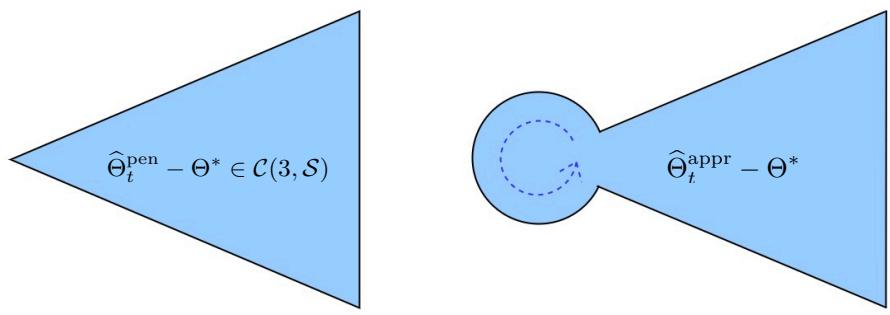  
Figure 1: The left panel shows the cone-like set $\textstyle C ( 3 , S )$ while the right panel depicts the region where $\widehat { \Theta } _ { t } ^ { \mathrm { a p p r } } - \Theta ^ { * }$ may fall.

where $\mathbb { Y }$ consists of all labels and the rows of X consist of all covariates up to round � (we omit the dependence on �). As a warm-up, consider the special case where the feature matrix X is orthonormal, i.e., $\mathbb { X } ^ { \mathrm { T } } \mathbb { X } = ( t + t _ { 0 } ) I$ . In this setting, $\hat { \Theta } _ { t }$ has a closed form:

$$
\begin{array} { r } { \hat { \Theta } _ { t } = \Pi _ { C _ { s ^ { * } } } \left( \widehat { \Theta } ^ { \mathrm { o l s } } \right) = \Pi _ { C _ { s ^ { * } } } \left( \left( \mathbb { X } ^ { \mathrm { T } } \mathbb { X } \right) ^ { - 1 } \mathbb { X } ^ { \mathrm { T } } \mathbb { Y } \right) , } \end{array}
$$

where $C _ { s } { \mathrm { : } }$ ∗ is the set of �-dimensional vectors with at most $s ^ { * }$ nonzeros, and $\Pi _ { C _ { s } }$ ∗ is the projection operator onto this set $C _ { s ^ { * } }$ . In other words, $\widehat { \Theta } _ { t }$ can be obtained by first computing the ordinary least square estimator and then hard thresholding to retain the $s ^ { * }$ largest entries in magnitude.

Equivalently, $\hat { \Theta } _ { t }$ can be obtained as the limiting solution of the iterative hard thresholding algorithm:

$$
\Theta _ { t , k + 1 } = \Pi _ { C _ { s ^ { * } } } \left( \Theta _ { t , k } - \eta \cdot \frac { \mathbb { X } ^ { \mathrm { T } } \left( \mathbb { X } \Theta - \mathbb { Y } \right) } { t + t _ { 0 } } \right) ,\tag{2.5}
$$

starting from $\Theta _ { t , 0 } = 0$ , where � is the step size. Although this derivation assumes orthonormal designs, it suggests that this iterative algorithm may still converge to $\Theta ^ { * }$ under more general conditions.

Indeed, by assuming the restricted isometry property (RIP) constant $\delta _ { 3 s ^ { * } } \leq 1 / \sqrt { 3 2 }$ , which bounds the sparse condition number $\mathrm { t o } \leq 1 . 4 3$ and allows slightly more general designs than orthonormal ones, the seminal work by Blumensath and Davies (2009) proved that the iterative hard thresholding algorithm (2.5) with $\eta = 1$ recovers an approximate $\Theta _ { t , k }$ satisfying

$$
\left\| \Theta _ { t , k } - \Theta ^ { * } \right\| _ { 2 } \leq \frac { 6 \| \epsilon \| _ { 2 } } { \sqrt { t + t _ { 0 } } }
$$

for suficiently large �, where $\epsilon \in \mathbb { R } ^ { t + t _ { 0 } }$ is the noise vector2.

For the realizable model (2.1) with i.i.d. data points, a slightly modified analysis yields, for $k \gtrsim$ log $\left( \lVert \Theta _ { t , 0 } - \Theta ^ { * } \rVert _ { 2 } / \sqrt { ( s \log d ) / ( t + t _ { 0 } ) } \right)$

$$
\begin{array} { l } { \displaystyle \left\| \Theta _ { t , k } - \Theta ^ { * } \right\| _ { 2 } \leq \frac { 1 } { 2 } \left\| \Theta _ { t , k - 1 } - \Theta ^ { * } \right\| _ { 2 } + \frac { 2 \| \mathbb { X } _ { S _ { k } } ^ { \Gamma } \epsilon \| _ { 2 } } { t + t _ { 0 } } } \\ { \leq 2 ^ { - k } \left\| \Theta _ { t , 0 } - \Theta ^ { * } \right\| _ { 2 } + \frac { 4 \sqrt { s } \cdot \| \mathbb { X } ^ { \Gamma } \epsilon \| _ { \infty } } { t + t _ { 0 } } } \\ { \lesssim \sqrt { \frac { 4 s \log d } { t + t _ { 0 } } } } \end{array}
$$

where the last inequality holds i $\begin{array} { r } { \mathbf { \dot { \mathbf { \rho } } } \| \mathbb { X } ^ { \mathrm { T } } \boldsymbol { \epsilon } \| _ { \infty } \lesssim \sqrt { ( t + t _ { 0 } ) \log d } . } \end{array}$ , a standard high-dimensional score bound (Fan et al., 2018b).

However, the condition number bound $\leq 1 . 4 3$ is very restrictive, and real-world high-dimensional data often exhibit much larger condition numbers due to strongly correlated features. This motivates the natural question:

Is it possible to modify the hard thresholding algorithm to allow potentially arbitrary condition numbers while still achieving last-iterate convergence?

## 2.4 An Overparameterized Online Hard Thresholding Algorithm

Designing algorithms for the online case requires answering the above question first. Our key intuition is that when the linear system has a large condition number, restricting the projection set in (2.5) to exactly size $s ^ { * }$ may be too limiting. A small projection set can miss true coeficients due to strong correlations among features. To address this, we overparameterize the projection set by using $C _ { s ( \kappa , s ^ { * } ) }$ instead of $C _ { s ^ { * } }$ in each hard-thresholding step, where $s = s ( \kappa , s ^ { * } ) \geq s ^ { * }$ depends on the condition number � and the true sparsity $s ^ { * }$ . The intuition is that a larger condition number warrants a larger projection set. This approach allows including a few additional features beyond the ground truth, mitigating the risk of missing important coeficients while keeping the estimation error nearly unafected.

We now introduce our online hard thresholding (OHT) algorithm. First, we formally define the projection operator. Let $C _ { s }$ be the set of Φ that is at most generalized �-sparse:

$$
C _ { s } = \left\{ \Phi : \Upsilon ( \Phi ) \leq s \right\} ,
$$

where $C _ { s }$ is nonconvex and represents the set of at most �-sparse vectors for cardinality-constrained linear regression, or the set of at most rank-� matrices for rank-constrained matrix sensing. The projection operator $\Pi _ { C _ { s } }$ is defined as

$$
\Pi _ { C _ { s } } ( \Theta ) : = \underset { \Phi \in \mathbb { R } ^ { d _ { 1 } \times d _ { 2 } } } { \mathrm { a r g m i n } } \Big \{ \| \Phi - \Theta \| _ { \mathrm { F } } ^ { 2 } \big | \Phi \in C _ { s } \Big \} ,
$$

which returns the best generalized �-generalized sparse approximation of Θ. Concretely, this reduces to keeping the � largest entries of Θ in magnitude and truncating the rest to zero for cardinality-constrained optimization, and to returning the rank-� approximation for rank-constrained matrix sensing.

Our OHT algorithm is as follows. Upon receiving each observation $( X _ { t } , Y _ { t } )$ in round $t \geq 0$ , OHT performs � iterations of overparameterized hard thresholding with sparsity $s = s ( \boldsymbol { \kappa } , s ^ { * } )$ :

$$
\Theta _ { t , j + 1 } = \Pi _ { C _ { s } } \left\{ \Theta _ { t , j } - \eta _ { t , j } \nabla \mathcal { L } _ { t } ( \Theta _ { t , j } ) \right\} , \ 0 \leq j \leq K - 1\tag{2.6}
$$

where $\Theta _ { t , 0 } = \Theta _ { t - 1 , K }$ is the last iterate from the previous round, $\Theta _ { 0 , 0 }$ is some initialization, and the gradient is

$$
\nabla \mathcal { L } _ { t } ( \Theta ) = \frac { 1 } { t + t _ { 0 } } \sum _ { i \in J _ { t } } X _ { i } \ \left( \langle X _ { i } , \Theta \rangle - Y _ { i } \right) ,\tag{2.7}
$$

with ${ \bar { J } } _ { t } = \{ i : 0 \leq i \leq t _ { 0 } \} \cup \{ j : 1 \leq j \leq t \}$ indexing all data points up to round �. Algorithm 1 summarizes the details.

The main technical challenge in analyzing the sequence $\left\{ \Theta _ { t , k } : t \geq 0 , k \geq 0 \right\}$ comes from the nonconvex constraint set $C _ { s }$ , which prevents the direct use of classical nonconvex optimization analysis. For comparison, if we replace $C _ { s }$ with a convex set $\chi .$ , the projected gradient descent update

$$
\Theta _ { t , k + 1 } = \underset { \Theta \in \mathcal { X } } { \mathrm { a r g m i n } } \left. \| \Theta - ( \Theta _ { t , k } - \eta _ { t , k } \nabla \mathcal { L } _ { t } ( \Theta _ { t , k } ) ) \| _ { 2 } ^ { 2 } \right. , 0 \leq k \leq K - 1\tag{2.8}
$$

Algorithm 1 An online hard thresholding algorithm.   
Require: $\Theta _ { 0 } , \{ \eta _ { t , j } \} , s , K .$   
Ensure: $\Theta _ { T }$   
1: Initialization Phase: Generate $t _ { 0 }$ samples   
2: for $t = 1 , \cdots , T$ do   
3: Generate the �-th sample outside the initialization phase. Set $\Theta _ { t , 0 } = \Theta _ { t - 1 }$   
4: for $k = 0 , \cdots , K - 1$ do   
5: Update $\Theta _ { t , k + 1 } = \Pi _ { C _ { s } } \left\{ \Theta _ { t , k } - \eta _ { t , k } \nabla \mathcal { L } _ { t } ( \Theta _ { t , k } ) \right\}$   
6: end for   
7: Set $\Theta _ { t } = \Theta _ { t , K }$   
8: end for

satisfies the first-order optimality condition:

$$
\left. \eta _ { t , k } \nabla { \mathcal { L } } _ { t } ( \Theta _ { t , k } ) + \Theta _ { t , k + 1 } - \Theta _ { t , k } , \Theta - \Theta _ { t , k + 1 } \right. \geq 0 , \forall \Theta \in \mathcal { X } .\tag{2.9}
$$

By setting $\Theta = \Theta _ { t , k }$ , we obtain

$$
\eta _ { t , k } \left. \nabla \mathcal { L } _ { t } ( \Theta _ { t , k } ) , \Theta _ { t , k + 1 } - \Theta _ { t , k } \right. \leq - \| \Theta _ { t , k + 1 } - \Theta _ { t , k } \| _ { 2 } ^ { 2 } .
$$

Using the smoothness of $\mathcal { L } _ { t }$ , the function value satisfies

$$
\begin{array} { r l r } {  { \mathcal { L } _ { t } ( \Theta _ { t , k + 1 } ) - \mathcal { L } _ { t } ( \Theta _ { t , k } ) \le  \nabla { \mathcal { L } _ { t } } ( \Theta _ { t , k } ) , \Theta _ { t , k + 1 } - \Theta _ { t , k }  + \frac { L } { 2 } \| \Theta _ { t , k + 1 } - \Theta _ { t , k } \| _ { 2 } ^ { 2 } } } \\ & { } & { \qquad \le - ( \frac { 1 } { \eta _ { t , k } } - \frac { L } { 2 } ) \| \Theta _ { t , k + 1 } - \Theta _ { t , k } \| _ { 2 } ^ { 2 } \le 0 , ~ } \end{array}\tag{2.10}
$$

for $\eta _ { t , k } \leq 2 / L$ , where � is the sparse strong smoothness parameter.

However, this argument fails for the nonconvex set $C _ { s }$ , requireing a new understanding of the hard thresholding operator. Specifically, we establish descent lemmas, i.e., Lemmas 3.3 and 3.7:

$$
\mathcal { L } _ { t } ( \Theta _ { t , k + 1 } ) - \mathcal { L } _ { t } ( \Theta _ { t , k } ) \leq - \frac { \eta _ { t , k } ( 1 - L \eta _ { t , k } ) } { 2 } \| ( \nabla \mathcal { L } _ { t } ( \Theta _ { t , k } ) ) _ { S _ { t , k } \cup S _ { t , k + 1 } } \| _ { 2 } ^ { 2 } \leq 0
$$

for $\eta _ { t , k } \leq 1 / L$ . This new understanding enables a recursive relationship between outputs from successive online rounds, leading to the final convergence result (1.4).

To summarize, Algorithm 1 simultaneously addresses the four main challenges:

1. No dynamic regularization: The algorithm does not require updating any regularization parameter dynamically. Once the projection sparsity � is chosen, it remains fixed throughout all rounds.

2. Storage and memory eficiency: Each update only requires the previous solution $\Theta _ { t - 1 }$ and the gradient $\nabla \mathcal { L } _ { t } ( \Theta _ { t - 1 } )$ . For linear regression, we maintain $\textstyle \sum _ { i \in J _ { t } } X _ { i } X _ { i } ^ { \top }$ and $\textstyle \sum _ { i \in J _ { t } } X _ { i } Y _ { i } ;$ ; for matrix sensing, we store $\textstyle \sum _ { i \in J _ { t } } { \mathrm { v e c } } ( X _ { i } ) { \mathrm { v e c } } ( X _ { i } ) ^ { \top }$ and $\textstyle \sum _ { i \in J _ { t } } X _ { i } Y _ { i }$ , with memory costs $O ( d ^ { 2 } )$ and $O ( d _ { 1 } ^ { 2 } d _ { 2 } ^ { 2 } )$ , respectively.

3. Real-time computation: Each round only requires a few projected gradient steps.

4. Realistic assumptions: We allow arbitrary sparse condition numbers.

Finally, the projection sparsity $s = s ( \boldsymbol { \kappa } , s ^ { * } )$ can be chosen as small as $s > \kappa ^ { 2 } s ^ { * }$ when $\eta _ { t , k } = 1 / L$ . For orthonormal designs $\left( \kappa = 1 \right)$ , this reduces to $s > s ^ { * }$ , which is nearly the minimal requirement to achieve good statistical accuracy, since any $s < s ^ { * }$ would miss true signals.

## 3 Global Convergence Analysis

In this section, we prove that our proposed online hard thresholding algorithm (Algorithm 1) achieves global convergence for both online sparse linear regression and low-rank matrix sensing. To begin, we assume that the loss functions $\mathcal { L } _ { t }$ satisfy the following generalized sparse strong smoothness (GSSS) and generalized sparse strong convexity (GSSC) conditions with appropriate parameters.

Condition 3.1 (Generalized Sparse Strong Smoothness, GSSS). For each $t \geq 0 ,$ , the lossfunction $\mathcal { L } _ { t }$ is $( s _ { 1 } , s _ { 2 } )$ -generalized sparse strongly smooth, or $\left( s _ { 1 } , s _ { 2 } \right) \ – G S S S _ { \cdot }$ for short, with parameter $L _ { s _ { 1 } , s _ { 2 } } ,$ , meaning that

$$
\mathcal { L } _ { t } ( \Theta ^ { \prime } ) - \mathcal { L } _ { t } ( \Theta ) \leq \langle \nabla \mathcal { L } _ { t } ( \Theta ) , \Theta ^ { \prime } - \Theta \rangle + \frac { L _ { s _ { 1 } , s _ { 2 } } } { 2 } \| \Theta ^ { \prime } - \Theta \| _ { \mathrm { F } } ^ { 2 } , \ f o r a l l \Theta ^ { \prime } \in C _ { s _ { 1 } } a n d \Theta \in C _ { s _ { 2 } } .
$$

Condition 3.2 (Generalized Sparse Strong Convexity, GSSC). For each $t \geq 0 ,$ the loss function $\mathcal { L } _ { t }$ is (�1, �2)-generalized sparse strongly convex with parameter $\alpha _ { s _ { 1 } , s _ { 2 } } ,$ , meaning that

$$
\mathcal { L } _ { t } ( \Theta ^ { \prime } ) - \mathcal { L } _ { t } ( \Theta ) \geq \langle \nabla \mathcal { L } _ { t } ( \Theta ) , \Theta ^ { \prime } - \Theta \rangle + \frac { \alpha _ { s _ { 1 } , s _ { 2 } } } { 2 } \left\| \Theta ^ { \prime } - \Theta \right\| _ { \mathrm { F } } ^ { 2 } , \ f o r \ a l l \Theta ^ { \prime } \in C _ { s _ { 1 } } \ a n d \Theta \in C _ { s _ { 2 } } .
$$

These GSSS and GSSC conditions characterize the smoothness and convexity properties required for a wide range of problems. In the rest of this section, we will specify the generalized sparsity levels $s _ { 1 }$ and $s _ { 2 }$ , the convexity parameter $\alpha _ { s _ { 1 } , s _ { 2 } }$ , and the smoothness parameter $L _ { s _ { 1 } , s _ { 2 } }$ for both online sparse linear regression and online low-rank matrix sensing.

## 3.1 Online Sparse Linear Regression

We first investigate the performance of Algorithm 1 for online sparse linear regression, for which $d _ { 2 } = 1$ and we write $d = d _ { 1 }$ . Accordingly, we have $X _ { i } \in \mathbb { R } ^ { d } , \Theta ^ { * } \in \mathbb { R } ^ { d } , \Upsilon ( \Theta ) = \| \Theta \| _ { 0 }$ , and

$$
\Pi _ { C _ { s } } ( \Theta ) = \underset { \Phi \in \mathbb { R } ^ { d } } { \mathrm { a r g m i n } } \Big \{ \| \Phi - \Theta \| _ { 2 } ^ { 2 } \mid \| \Phi \| _ { 0 } \leq s \Big \} ,\tag{3.1}
$$

which the hard thresholding operator that keeps the � largest entries of Θ in magnitude and truncates the rest to zeros.

For this problem, the GSSS and GSSC conditions reduce to the familiar sparse strong smoothness (SSS) and sparse strong convexity (SSC) conditions, respectively.

Assumption 3.1. For all $t \geq 1$ , the loss function $\mathcal { L } _ { t }$ satisfies $\left( s , s \right) { \ - - } S S C$ and $\left( s , s \right) { - } S S S$ conditions with parameters � and $L ,$ respectively. We define the sparse condition number as $\kappa = L / \alpha$

Assumption 3.1 is standard in the high-dimensional statistics literature (Bickel et al., 2009; Raskutti et al., 2010). By adapting the proofs of (Raskutti et al., 2010, Theorem 1 and Corollary 1), one can show that this assumption holds with high probability under Gaussian covariates, provided that $t _ { 0 } \geq c s$ log � for some constant $c > 0$ and the relevant population sparse eigenvalues are bounded. For simplicity, we also assume that the random noises $\epsilon _ { i }$ and covariates $X _ { i }$ satisfy the following standard assumption.

Assumption 3.2. The random noises $\epsilon _ { i }$ are mean-zero and have bounded second moments $\mathbb { E } [ \epsilon _ { i } ^ { 2 } ] \le \sigma ^ { 2 }$ . Moreover, the scaled sum of noise-weighted covariates satisfies

$$
\mathbb { E } \left[ \Big \lVert \sum _ { i \in J _ { t } } \frac { \epsilon _ { i } X _ { i } } { \sqrt { t + t _ { 0 } } } \Big \rVert _ { \infty } ^ { 2 } \right] \leq \sigma _ { x } ^ { 2 } .
$$

The following result shows that $\sigma _ { x } ^ { 2 } = O ( \log d )$ when both $X _ { i }$ and $\epsilon _ { i }$ are sub-Gaussian3.

Proposition 3.1. Suppose the coordinates of $X _ { i }$ are sub-Gaussian, $X _ { i j } \ \sim \ \mathrm { s u b G } ( \sigma _ { 1 } ^ { 2 } )$ , and $\mathbb { E } \epsilon _ { i } ^ { 2 } \le \sigma ^ { 2 }$ . Then

$$
\mathbb { E } \left[ \left. \sum _ { i \in { \mathcal { I } } _ { t } } { \frac { \epsilon _ { i } X _ { i } } { \sqrt { t + t _ { 0 } } } } \right. _ { \infty } ^ { 2 } \right] \leq C \sigma ^ { 2 } \sigma _ { 1 } ^ { 2 } \log d ,
$$

where � is some universal constant.

With these assumptions in place, we now characterize the performance ofthe best achievable estimator in each online round. Suppose we have received � online data points after the initial batch. Recall that $\hat { \Theta } _ { t }$ in (2.4) is the optimal $s ^ { * } .$ -sparse solution under the loss function $\mathcal { L } _ { t } ( \cdot )$ . This estimator serves as the moving target that a globally convergent algorithm aims to track. Upon receiving an additional observation $( X _ { t + 1 } , Y _ { t + 1 } )$ , the loss function updates to $\textstyle { \mathcal { L } } _ { t + 1 } ( \cdot )$ , and the target estimator becomes $\hat { \Theta } _ { t + 1 }$ This gives rise to a moving-target optimization problem.

Lemma 3.2. Suppose Assumptions 3.1 and 3.2 hold. Then, for all $t \geq 1$ ,

$$
\mathbb { E } \left[ \lVert \hat { \Theta } _ { t } - \Theta ^ { * } \rVert _ { 2 } ^ { 2 } \right] \leq \frac { 8 s ^ { * } \sigma _ { x } ^ { 2 } } { \alpha ^ { 2 } ( t + t _ { 0 } ) } .
$$

The above expected mean squared error bound can be interpreted as the minimum statistical error achievable by any estimator under the loss function $\mathcal { L } _ { t } ( \cdot )$ , given the data available up to round �. Intuitively, in round �, no estimator can outperform $\hat { \Theta } _ { t }$ , since only $t + t _ { 0 }$ observations are available. Having established this benchmark, we now analyze the performance of our OHT algorithm for online sparse linear regression, partially motivated by the analysis of the ofline iterative hard thresholding algorithm in Liu and Foygel Barber (2020). For any �-sparse initialization $\Theta _ { t , 0 }$ in round $t ,$ Liu and Foygel Barber (2020) established a linear convergence result under the projection sparsity level $s > \kappa ^ { 2 } s ^ { * }$

$$
\operatorname* { m i n } _ { k = 1 , \cdots , K } \mathcal { L } _ { t } ( \Theta _ { t , k } ) - \mathcal { L } _ { t } ( \Theta ^ { * } ) \leq \frac { L } { 2 } \left( \frac { 1 - \kappa } { 1 - 2 \gamma _ { s , s ^ { * } } } \right) ^ { K } \| \Theta _ { t , 0 } - \Theta ^ { * } \| _ { 2 } ^ { 2 } ,\tag{3.2}
$$

where $\gamma _ { s , s ^ { * } }$ is a constant defined later, and the step size is taken as $1 / L$ . Actually, Liu and Foygel Barber $( 2 0 2 0 ) \mathrm { { s } }$ result (3.2) can be easily extended to $\eta \ge 1 / L$ but not $\eta < 1 / L$ , whereas our new results later hold for any $\eta \leq 1 / L$ . The requirement $\eta \leq 1 / L$ is necessary for our descent lemma, Lemma 3.3, to hold.

However, the online and ofline settings difer in ways that make extending this convergence result challenging:

(i) Last-iterate convergence: The result (3.2) does not guarantee last-iterate convergence. In the online setting, the output of round � serves as the initialization for round $t + 1$ . Without last-iterate guarantees for $\Theta _ { t , K }$ , establishing a recursive relationship between consecutive rounds is impossible.

(ii) Moving target: The ofline result assumes a fixed loss, while in the online setting, $\mathcal { L } _ { t }$ changes with each incoming observation. This leads to diferent target estimators $\hat { \Theta } _ { t }$ in each round, requiring a new analysis to understand how the moving target afects convergence.

(iii) Metric mismatch: The left and right sides of (3.2) involve diferent metrics, which do not naturally form a recursive relationship across multiple online rounds.

These diferences necessitate a new understanding of the hard thresholding operator and a novel analysis

to establish theoretical convergence guarantees for Algorithm 1 in the online setting.

To overcome challenge (i), we need to establish a last-iterate convergence result, which in turn requires a deeper understanding of the hard thresholding operator. To this end, we introduce a new descent lemma that guarantees the objective value decreases after each hard thresholding step.

Lemma 3.3 (Descent Property). Suppose $\mathcal { L } _ { t }$ is $\left( s , s \right) \ – \mathbf { S } \mathbf { S } \mathbf { S }$ with smoothness parameter $L ,$ and the step sizes are set as $\eta _ { t , k } \leq 1 / L$ . Let $\boldsymbol { S } _ { t , k }$ and $S _ { t , k + 1 }$ denote the supports of $\Theta _ { t , k }$ and $\Theta _ { t , k + 1 }$ respectively. Then

$$
\mathscr { L } _ { t } ( \Theta _ { t , k + 1 } ) - \mathscr { L } _ { t } ( \Theta _ { t , k } ) \leq - \frac { \eta _ { t , k } ( 1 - L \eta _ { t , k } ) } { 2 } \| ( \nabla \mathscr { L } _ { t } ( \Theta _ { t , k } ) ) _ { S _ { t , k } \cup S _ { t , k + 1 } } \| _ { 2 } ^ { 2 } \leq 0 .
$$

It is worth emphasizing that this descent result holds for any projection sparsity level $s \geq 1$ and any loss function $\mathcal { L } _ { t } ( \cdot )$ satisfying the sparse smoothness assumption. This generalizes the descent property of projected gradient descent with convex constraints (see (Lan, 2020, Lemma 3.3) or (2.10)) to the nonconvex cardinality-constrained setting, showing that the loss $\mathcal { L } _ { t } ( \Theta _ { t , k } )$ is non-increasing across consecutive hard thresholding steps. Consequently, the last iterate $\Theta _ { t , K }$ achieves the minimum loss among $\left\{ \Theta _ { t , k } : 0 \leq k \leq K \right\}$

Leveraging this descent property, we can further quantify the loss incurred by the last-iterate solution $\Theta _ { t , K } ;$

$$
\mathcal { L } _ { t } ( \Theta _ { t , K } ) - \mathcal { L } _ { t } ( \Theta ^ { * } ) \leq \frac { 1 - 2 \gamma _ { s , s ^ { * } } } { 2 \eta } \left( \frac { 1 - \eta \alpha } { 1 - 2 \gamma _ { s , s ^ { * } } } \right) ^ { K } \| \Theta _ { t , 0 } - \Theta ^ { * } \| _ { 2 } ^ { 2 } .\tag{3.3}
$$

Here, the loss $\mathcal { L } _ { t }$ can be directly related to the MSE $\lVert \Theta _ { t , K } - \Theta ^ { * } \rVert _ { 2 } ^ { 2 }$ at the beginning of round �. However, as highlightened in Challenges (ii) and (iii), issues remain: (1) the loss function $\mathcal { L } _ { t }$ changes dynamically as new observations arrive, yielding a moving optimization target, and (ii) the metrics on both sides of the inequality above are not naturally recursive, which prevents straightforward iteration across multiple online rounds.

To overcome these issues, we employ the $( s , s )$ -SSC property to derive a lower bound for the loss diference $\mathcal { L } _ { t } \left( \Theta _ { t , K } \right) - \mathcal { L } _ { t } \left( \Theta ^ { * } \right)$ :

$$
\begin{array} { r l } & { \displaystyle \mathcal { L } _ { t } ( \boldsymbol { \Theta } _ { t , K } ) - \mathcal { L } _ { t } ( \boldsymbol { \Theta } ^ { * } ) \geq \frac { \alpha } { 2 } \| \boldsymbol { \Theta } _ { t , K } - \boldsymbol { \Theta } ^ { * } \| _ { 2 } ^ { 2 } + \left. \nabla \mathcal { L } _ { t } ( \boldsymbol { \Theta } ^ { * } ) , \boldsymbol { \Theta } _ { t , K } - \boldsymbol { \Theta } ^ { * } \right. } \\ & { \displaystyle \qquad = \frac { \alpha } { 2 } \| \boldsymbol { \Theta } _ { t , K } - \boldsymbol { \Theta } ^ { * } \| _ { 2 } ^ { 2 } - \frac { 1 } { t _ { 0 } + t } \displaystyle \sum _ { i \in \mathcal { I } _ { t } } \left. X _ { i } \boldsymbol { \epsilon } _ { i } , \boldsymbol { \Theta } _ { t , K } - \boldsymbol { \Theta } ^ { * } \right. . } \end{array}
$$

Using the Cauchy-Schwarz inequality and the fact that both $\Theta _ { t , K }$ and $\Theta ^ { * }$ are �-sparse, we have

$$
\frac { 1 } { t _ { 0 } + t } \sum _ { i \in { \cal I } _ { t } } \left. X _ { i } \boldsymbol { \epsilon } _ { i } , { \Theta } _ { t , K } - { \Theta } ^ { * } \right. \leq \frac { 2 s } { \alpha } \left\| \frac { \sum _ { i \in { \cal I } _ { t } } X _ { i } \boldsymbol { \epsilon } _ { i } } { t _ { 0 } + t } \right\| _ { \infty } ^ { 2 } + \frac { \alpha } { 4 } \| { \Theta } _ { t , K } - { \Theta } ^ { * } \| _ { 2 } ^ { 2 } .
$$

Consequently, the loss diference can be bounded from below in terms of the mean squared error and a statistical error term:

$$
\mathcal { L } _ { t } ( \boldsymbol { \Theta } _ { t , K } ) - \mathcal { L } _ { t } ( \boldsymbol { \Theta } ^ { * } ) \geq \frac { \alpha } { 4 } \| \boldsymbol { \Theta } _ { t , K } - \boldsymbol { \Theta } ^ { * } \| _ { 2 } ^ { 2 } - \frac { 2 s } { \alpha } \left\| \frac { \sum _ { i \in { \mathcal { I } _ { t } } } X _ { i } \epsilon _ { i } } { t _ { 0 } + t } \right\| _ { \infty } ^ { 2 } .\tag{3.4}
$$

Using the above results, we are now ready to establish a recursive relationship between the solutions obtained in successive online rounds. We summarize our result in the following lemma. We first

formally define

$$
\gamma _ { s , s ^ { * } } : = \operatorname* { s u p } \left\{ \frac { \langle Y - \Pi _ { C _ { s } } ( Z ) , Z - \Pi _ { C _ { s } } ( Z ) \rangle } { \| Y - \Pi _ { C _ { s } } ( Z ) \| _ { 2 } ^ { 2 } } : Y , Z \in \mathbb { R } ^ { d } , \| Y \| _ { 0 } \leq s ^ { * } , Y \neq \Pi _ { C _ { s } } ( Z ) \right\}
$$

as the relative concavity of �-sparse hard-thresholding operator $\Pi _ { C _ { s } }$ with respect to the ground truth sparsity level $s ^ { * }$

Lemma 3.4. Suppose Assumption 3.1 holds. We have $\gamma _ { s , s ^ { * } } = \sqrt { s ^ { * } / s } / 2$ . Let $\eta _ { t , k } = \eta \leq 1 / L$ and choose � large enough such that

$$
K \ge K _ { 0 } : = \frac { \log \{ 2 ( 1 - 2 \gamma _ { s , s ^ { * } } ) / ( \eta \alpha ) \} } { \log \{ ( 1 - 2 \gamma _ { s , s ^ { * } } ) / ( 1 - \eta \alpha ) \} } ,
$$

then

$$
\delta : = \frac { 2 ( 1 - 2 \gamma _ { s , s ^ { * } } ) } { \eta \alpha } \left( \frac { 1 - \eta \alpha } { 1 - 2 \gamma _ { s , s ^ { * } } } \right) ^ { K } < 1 .\tag{3.5}
$$

Consequently,

$$
\left. \Theta _ { t + 1 , 0 } - \Theta ^ { * } \right. _ { 2 } ^ { 2 } = \left. \Theta _ { t , K } - \Theta ^ { * } \right. _ { 2 } ^ { 2 } \leq \underbrace { \delta \left. \Theta _ { t , 0 } - \Theta ^ { * } \right. _ { 2 } ^ { 2 } } _ { \mathrm { I } } + \underbrace { \frac { 8 s } { \alpha ^ { 2 } } \left. \frac { \sum _ { i \in { \mathcal { I } } _ { t } } \epsilon _ { i } X _ { i } } { t + t _ { 0 } } \right. _ { \infty } ^ { 2 } } _ { \mathrm { I I } } .\tag{3.6}
$$

The result above bounds the mean squared error $\lVert \Theta _ { t + 1 , 0 } - \Theta ^ { \ast } \rVert _ { 2 } ^ { 2 }$ by two terms. The first term (I) contracts the error from the previous round $\lVert \Theta _ { t , 0 } - \Theta ^ { * } \rVert _ { 2 } ^ { 2 }$ by a factor of � through � iterations of hardthresholded gradient descent. The second term (II) represents the optimal statistical error with $t + t _ { 0 }$ samples in round �. Therefore, when �, �, and � are chosen appropriately, the successive solutions form a contraction, ensuring that the sequence of iterates $\Theta _ { t , K } : t \geq 0$ converges to the true sparse coeficient $\Theta ^ { * }$ . By applying this result recursively, we establish the convergence rate of $\Theta _ { t , K }$ for any round $t \geq 1$

Theorem 3.5. Suppose Assumptions 3.1 and 3.2 hold. Let $\{ \Theta _ { t , k } : t \ge 1 , 1 \le k \le K \}$ denote the solution sequence generated by Algorithm 1 with step size $\eta _ { t , k } = \eta \le 1 / L , K \ge K _ { 0 }$ , and projection sparsity $s > s ^ { * } / ( \eta ^ { 2 } \alpha ^ { 2 } )$ . Then

$$
\mathbb { E } [ \Vert \Theta _ { t + 1 , 0 } - \Theta ^ { * } \Vert _ { 2 } ^ { 2 } ] \leq \delta ^ { t + 1 } \mathbb { E } \left[ \Vert \Theta _ { 0 } - \Theta ^ { * } \Vert _ { 2 } ^ { 2 } \right] + \frac { 8 s \sigma _ { x } ^ { 2 } } { \alpha ^ { 2 } \log ( 1 / \delta ) } \left( \frac { \delta ^ { t - 1 } } { t _ { 0 } + 1 } + \frac { 3 } { \delta ( t + 1 + t _ { 0 } ) } + \frac { \delta ^ { ( t + 1 ) / 2 - 1 } } { t _ { 0 } + 1 } \right)
$$

where $\delta < 1$ is defined in (3.5). Consequently, when

$$
t \gtrsim \frac { \log \left\{ \mathbb { E } \| \Theta _ { 0 } - \Theta ^ { * } \| _ { 2 } ^ { 2 } / ( s ^ { * } \sigma _ { x } ^ { 2 } ) \right\} } { \log ( 1 / \delta ) } + \frac { \log ( t + t _ { 0 } ) } { \log ( 1 / \delta ) } ,
$$

we have $\mathbb { E } [ \| \Theta _ { t + 1 , 0 } - \Theta ^ { * } \| _ { 2 } ^ { 2 } ] \lesssim s \sigma _ { x } ^ { 2 } / ( t + t _ { 0 } )$

The above theorem indicates that, for projection sparsity satisfying $s ^ { * } / ( \eta ^ { 2 } \alpha ^ { 2 } ) < s \lesssim s ^ { * } / ( \eta ^ { 2 } \alpha ^ { 2 } )$ Algorithm 1 achieves a convergence rate of $O ( s ^ { * } \sigma _ { x } ^ { 2 } / ( t + t _ { 0 } ) )$ , matching the optimal ofline statistical error given in Lemma 3.2. Furthermore, if we select the step size $\eta _ { t , k } = \eta = 1 / L$ , the projection sparsity requirement reduces to $s > \kappa ^ { 2 } s ^ { * }$ . When the sparse condition number � is small, this requirement is minimal. For example, in isotropic designs where $\kappa = 1$ , the OHT algorithm converges with $s > s ^ { * } .$ whereas under-projection $( s \ < \ s ^ { * } )$ will miss some of the true signals. We note, however, that the dependency of � on � may be sub-optimal and could potentially be improved.

## 3.2 Online Low-Rank Matrix Sensing

In this section, we analyze the OHT algorithm for the online low-rank matrix sensing problem. Here, the rank function serves as the sparsity measure, i.e., $\Upsilon ( \Theta ) = \mathrm { r a n k } ( \Theta )$ , and the corresponding projection operator is

$$
\Pi _ { C _ { s } } ( \Theta ) = \underset { X \in \mathbb { R } ^ { d _ { 1 } \times d _ { 2 } } } { \mathrm { a r g m i n } } \left. \| X - \Theta \| _ { \mathrm { F } } ^ { 2 } \mid \mathrm { r a n k } ( X ) \leq s \right. .\tag{3.7}
$$

Let $\Theta = U \Sigma V ^ { \top }$ denote the singular value decomposition (SVD) of $\Theta \in \mathbb { R } ^ { d _ { 1 } \times d _ { 2 } }$ , where the singular values in Σ are arranged in decreasing order, and let $U _ { s }$ be the first � columns of $U .$ Then, the projection operator can be equivalently written as $\Pi _ { C _ { s } } ( \Theta ) = U _ { s } U _ { s } ^ { \top } \Theta$

In this context, we refer to the generalized sparse strong smoothness and generalized sparse strong convexity assumptions as low-rank strong smoothness (LowRankSS) and low-rank strong convexity (LowRankSC) assumptions, respectively. As in the online sparse linear regression setting, the following assumptions are required.

Assumption 3.3. For all $t \geq 0$ , the loss function $\mathcal { L } _ { t }$ is $( s , s )$ -LowRankSC and $( s , s )$ -LowRankSS assumptions with parameter � and �, respectively. The corresponding $( s , s )$ -low-rank condition number is defined as $\kappa = L / \alpha$

A suficient condition for LowRankSC and LowRankSS is the RIP condition (Maros and Scutari, 2023). In particular, Theorem 2.3 of Candès and Plan (2011) shows that RIP holds with high probability for random measurement ensembles satisfying an appropriate concentration inequality. Properly normalized i.i.d. Gaussian, Bernoulli, and sub-Gaussian measurement ensembles are examples (Vershynin, 2000).

Assumption 3.4. The noise terms $\epsilon _ { j }$ are mean-zero with bounded second moments, i.e., $\mathbb { E } [ \epsilon _ { j } ] = 0$ and $\mathbb { E } [ \epsilon _ { j } ^ { 2 } ] \le \sigma ^ { 2 }$ . Moreover, there exists a constant $\sigma _ { X } > 0$ such that

$$
\mathbb { E } \left[ \Big \| \sum _ { i \in { \cal I } _ { t } } \frac { \epsilon _ { i } X _ { i } } { \sqrt { t _ { 0 } + t } } \Big \| _ { 2 } ^ { 2 } \right] \leq \sigma _ { X } ^ { 2 } .
$$

With these assumptions, we first characterize the performance of $\hat { \Theta } _ { t }$ , the target estimator for the OHT algorithm in round $t \geq 0$

Lemma 3.6. Suppose Assumptions 3.3 and 3.4 hold. For all $t \geq 1$

$$
\mathbb { E } [ \Vert \hat { \Theta } _ { t } - \Theta ^ { * } \Vert _ { \mathrm { F } } ^ { 2 } ] \leq \frac { 8 s ^ { * } \sigma _ { X } ^ { 2 } } { \alpha ^ { 2 } ( t _ { 0 } + t ) } .
$$

We point out that (Negahban and Wainwright, 2011, Corollary 1) established a similar highprobability bound. Our result here is in expectation, which is needed for our subsequent analysis.

Lemma 3.7. Suppose $\mathcal { L } _ { t }$ is $( s , s )$ -LowRankSS with smoothness parameter �, and let $\eta _ { t , k } \leq 1 / L$ Let $S _ { t , k }$ and $S _ { t , k + 1 }$ denote the column spaces of $\Theta _ { t , k }$ and $\Theta _ { t , k + 1 }$ , respectively. Then

$$
\mathcal { L } _ { t } ( \boldsymbol { \Theta } _ { t , k + 1 } ) - \mathcal { L } _ { t } ( \boldsymbol { \Theta } _ { t , k } ) \leq - \frac { \eta _ { t , k } ( 1 - L \eta _ { t , k } ) } { 2 } \| P _ { S _ { t , k } + S _ { t , k + 1 } } \nabla \mathcal { L } _ { t } ( \boldsymbol { \Theta } _ { t , k } ) ) \| _ { \mathrm { F } } ^ { 2 } .
$$

This lemma implies that the objective value is non-increasing between consecutive hard-thresholding gradient steps within each round, for any projection rank $s \geq 1$ and any low-rank strong smooth loss function. It generalizes the descent property of projected gradient descent with a convex constraint (Lan, 2020, Lemma 3.3) to accommodate rank-cardinality constraints.

The next two results establish the recursive relation between successive rounds and the overall convergence guarantee. Recall the definitions of $K _ { 0 }$ and � in Lemma 3.4, where � denotes the low-rank strong convexity parameter and $\gamma _ { s , s ^ { * } }$ is the relative concavity parameter

$$
\gamma _ { s , s ^ { * } } = \operatorname* { s u p } \left\{ \frac { \langle Y - \Pi _ { C _ { s } } ( Z ) , Z - \Pi _ { C _ { s } } ( Z ) \rangle } { \| Y - \Pi _ { C _ { s } } ( Z ) \| ^ { 2 } } : Y , Z \in \mathbb { R } ^ { d _ { 1 } \times d _ { 2 } } , \operatorname { r a n k } ( Y ) \leq s ^ { * } , Y \neq \Pi _ { C _ { s } } ( Z ) \right\} .
$$

It can be shown that, for the low-rank hard-thresholding operator, $\gamma _ { s , s ^ { * } } = \sqrt { s ^ { * } / s } / 2 ;$ see Lemma S.3.2 in the appendix.

Lemma 3.8. Suppose Assumption 3.3 holds. Take $\eta _ { t , k } = \eta \le 1 / L$ If $s > s ^ { * } / ( \eta ^ { 2 } \alpha ^ { 2 } )$ and $K \geq K _ { 0 } = \log \{ 2 ( 1 - 2 \gamma _ { s , s ^ { \ast } } ) / ( \eta \alpha ) \} / \log \{ ( 1 - 2 \gamma _ { s , s ^ { \ast } } ) / ( 1 - \eta \alpha ) \}$ , then

$$
\Vert \Theta _ { t + 1 , 0 } - \Theta ^ { * } \Vert _ { \mathrm { F } } ^ { 2 } \leq \delta \Vert \Theta _ { t , 0 } - \Theta ^ { * } \Vert _ { \mathrm { F } } ^ { 2 } + \frac { 8 s } { \alpha ^ { 2 } } \left. \frac { \sum _ { i \in J _ { t } } \epsilon _ { i } X _ { i } } { t _ { 0 } + t } \right. _ { 2 } ^ { 2 } ,
$$

where $\delta < 1$ is as in Lemma 3.4.

Theorem 3.9. Suppose Assumptions 3.3 and 3.4 hold. Let $\{ \Theta _ { t , k } \}$ be generated by Algorithm 1 with $\eta _ { t , k } = \eta \le 1 / L , K \ge K _ { 0 }$ , and projection rank $s > s ^ { * } / ( \eta ^ { 2 } \alpha ^ { 2 } )$ . Then

$$
\mathbb { E } \left[ \Vert \Theta _ { t + 1 , 0 } - \Theta ^ { * } \Vert _ { \mathrm { F } } ^ { 2 } \right] \leq \delta ^ { t + 1 } \left. \Theta _ { 0 } - \Theta ^ { * } \right. _ { \mathrm { F } } ^ { 2 } + \frac { 8 s \sigma _ { X } ^ { 2 } } { \alpha ^ { 2 } \log ( 1 / \delta ) } \left( \frac { \delta ^ { t } } { t _ { 0 } + 1 } + \frac { 3 } { \delta ( t + 2 + t _ { 0 } ) } + \frac { \delta ^ { t / 2 } } { t _ { 0 } + 1 } \right) ,
$$

for some $\delta < 1$ . Consequently, when

$$
t \gtrsim \frac { \log \left\{ \mathbb { E } \| \Theta _ { 0 } - \Theta ^ { * } \| _ { \mathrm { F } } ^ { 2 } / ( s ^ { * } \sigma _ { x } ^ { 2 } ) \right\} } { \log ( 1 / \delta ) } + \frac { \log ( t + t _ { 0 } ) } { \log ( 1 / \delta ) } ,
$$

we have

$$
\mathbb { E } [ \Vert \Theta _ { t + 1 , 0 } - \Theta ^ { * } \Vert _ { \mathrm { F } } ^ { 2 } ] \lesssim \frac { s \sigma _ { X } ^ { 2 } } { \alpha ^ { 2 } ( t + t _ { 0 } ) } .
$$

This theorem indicates that Algorithm 1 produces a sequence that converges to the ground truth coeficient matrix at a rate of $O ( s ^ { * } \sigma _ { X } ^ { 2 } / t )$ for online rank-constrained matrix sensing, under projection rank levels $s ^ { * } / ( \eta ^ { 2 } \alpha ^ { 2 } ) < s \lesssim s ^ { * }$ . These results parallel those obtained for online sparse linear regression, with $\sigma _ { x } ^ { 2 }$ replaced by $\sigma _ { X } ^ { 2 }$

## 4 No Batch Initialization

In previous sections, we introduced our online hard thresholding algorithm, Algorithm 1, for eficient generalized sparse online regression. The algorithm relies on the key assumption that the generalized sparse strong convexity and smoothness assumptions hold, which is only possible by starting with an initial batch of observations. This raises a natural question:

What ifsuch an initialization batch is not available?

This section addresses this question by proposing a single-phase algorithm that computes a solution upon receiving each observation, without a batch initialization. Specifically, this corresponds to $t _ { 0 } = 0$ in the previous section, so that

$$
\mathcal { L } _ { t } ( \Theta ) = \frac { 1 } { t } \sum _ { j = 1 } ^ { t } \ell _ { j } ( \Theta ) .
$$

We assume that the GSSS and GSSC assumptions hold after receiving $t _ { w }$ observations, although the exact value of $t _ { w }$ may not be known in practice. For simplicity, we shall take $t _ { w } = t _ { 0 }$ . With a slight abuse of notation, we denote the data pairs received up to round � as $( X _ { 1 } , Y _ { 1 } ) , \cdot \cdot \cdot , ( X _ { t } , Y _ { t } )$ and the solution computed in round � as $\Theta _ { t }$ . The proposed algorithm proceeds exactly as Algorithm 1, but without an initial batch.

## 4.1 Online Sparse Linear Regression

When analyzing the performance of Algorithm 1 without batch initialization, we assume that the $( 2 s , s )$ SSS assumption4 with parameter � holds for all $t \geq 0$ . A key challenge in this setting is that the SSC assumption may not hold during early rounds, potentially leading to poor early solutions. Specifically, without the SSC assumption, errors from the hard-thresholding steps for $t ~ \le ~ t _ { 0 }$ may propagate and amplify across rounds.

Proposition 4.1. Suppose Assumption 3.2 holds, and $\mathcal { L } _ { t } ( \cdot )$ is $( 2 s , s )$ -SSS with parameter � for $t \geq 1$ . Considering running Algorithm 1 for $t _ { 0 }$ rounds without an initial batch, with step size $\begin{array} { r } { \eta _ { t } = \eta \le \frac { 1 } { L } } \end{array}$ and arbitrary $s \geq 1 , K \geq 1$ Then, there exists a constant $C _ { 1 }$ independent of � such that, for all $1 \leq t \leq t _ { 0 }$

$$
\begin{array} { r } { \mathbb { E } [ \mathcal { L } _ { t } ( \Theta _ { t , K } ) ] \leq C _ { 1 } \boldsymbol { 4 } ^ { t K } + \sigma ^ { 2 } \log ( t + 1 ) , } \end{array}
$$

$$
\mathrm { w h e r e } \ C _ { 1 } = C _ { 0 } ( \| \Theta _ { 0 , 0 } - \Theta ^ { * } \| _ { 2 } + ( 4 s \eta ^ { 2 } \sigma _ { x } ^ { 2 } + \| \Theta ^ { * } \| _ { 2 } ^ { 2 } ) / 3 ) \mathrm { ~ a n d ~ } C _ { 0 } = ( s + s ^ { * } ) \mathbb { E } \big [ \| X _ { 0 } \| _ { \infty } ^ { 2 } \big ] .
$$

Once �0 observations are collected, the SSC assumption begins to hold. Then, $\lVert \Theta _ { t _ { 0 } , K } - \Theta ^ { * } \rVert ^ { 2 }$ can be treated as the initial gap. By applying Eq. (3.4), we see that the expected initial gap is bounded:

$$
\begin{array} { r l } & { \displaystyle \frac { \alpha } { 4 } \mathbb { E } [ \| \Theta _ { t _ { 0 } , K } - \Theta ^ { * } \| _ { 2 } ^ { 2 } ] \leq \mathbb { E } [ \mathcal { L } _ { t _ { 0 } } ( \Theta _ { t _ { 0 } , K } ) - \mathcal { L } _ { t _ { 0 } } ( \Theta ^ { * } ) ] + \frac { 2 s } { \alpha } \mathbb { E } \left[ \left\| \frac { \sum _ { i \in \mathcal { I } _ { t _ { 0 } } } X _ { i } \epsilon _ { i } } { t _ { 0 } } \right\| _ { \infty } ^ { 2 } \right] } \\ & { \qquad \leq C _ { 1 } 4 ^ { t _ { 0 } K } + \sigma ^ { 2 } \log ( t _ { 0 } + 1 ) + O \bigg ( \frac { s \sigma _ { x } ^ { 2 } } { t _ { 0 } } \bigg ) , } \end{array}
$$

and this gap is geometrically discounted in each subsequent round $t > t _ { 0 }$ by Theorem 3.5.

Corollary 4.2. Suppose $\mathcal { L } _ { t }$ is $\left( s , s \right) \mathbf { - } \mathbf { S } \mathbf { S } \mathbf { C }$ with parameter $\alpha$ for all $t ~ > ~ t _ { 0 } , ~ ( 2 s , s ) – s \mathrm { s s }$ with parameter $L$ for all $t \geq 1$ , and Assumption 3.2 holds. Let $\{ \Theta _ { t , k } , t \ge 1 , 1 \le k \le K , \}$ be the sequence generated by Algorithm 1 with $\eta _ { t , k } = \eta \le 1 / L , s > s ^ { * } / ( \eta ^ { 2 } \alpha ^ { 2 } )$ , and

$$
K \ge K _ { 0 } : = \frac { \log \{ 2 ( 1 - 2 \gamma _ { s , s ^ { * } } ) / ( \eta \alpha ) \} } { \log \{ ( 1 - 2 \gamma _ { s , s ^ { * } } ) / ( 1 - \eta \alpha ) \} } , ~ \gamma _ { s , s ^ { * } } = \sqrt { s ^ { * } / s } / 2 ,
$$

but without an initial batch. Then for all $t \geq t _ { 0 }$

$$
\mathbb { E } [ \| \Theta _ { t , K } - \Theta ^ { * } \| _ { 2 } ^ { 2 } ] \leq \delta ^ { t - t _ { 0 } } \mathbb { E } [ \| \Theta _ { t _ { 0 } , K } - \Theta ^ { * } \| _ { 2 } ^ { 2 } ] + O \Big ( \frac { s \sigma _ { x } ^ { 2 } } { t } \Big ) \leq \frac { 4 C _ { 1 } \delta ^ { t - t _ { 0 } } 4 ^ { t _ { 0 } K } } { \alpha } + O \Big ( \frac { s \sigma _ { x } ^ { 2 } } { t } \Big ) ,
$$

where $\delta < 1$ is defined in (3.5).

The above result indicates that Algorithm 1 without batch initialization still achieves the $O ( s ^ { * } \sigma _ { x } ^ { 2 } / t )$ convergence rate once � is only logarithmically large.

## 4.2 Online Low-Rank Matrix Sensing

We further study the performance of Algorithm 1 for rank-constrained matrix sensing without batch initialization.

## Proposition 4.3.

Suppose Assumption 3.4 holds and $\mathcal { L } _ { t } ( \cdot )$ is $( 2 s , s )$ -LowRankSS with parameter � for all $t \geq 1$ Suppose we run Algorithm 1 for $t _ { 0 }$ rounds without an initial batch, using step size $\eta _ { t } = \eta \in [ 0 , 1 / L ]$ and arbitrary $s \geq 1 , K \geq 1$ . Then, there exists a constant

$$
C _ { 1 } = 3 C _ { 0 } ( \| \Theta _ { 0 } - \Theta ^ { * } \| _ { \mathrm { F } } ^ { 2 } + ( 4 s \eta ^ { 2 } \sigma _ { X } ^ { 2 } + \| \Theta ^ { * } \| _ { \mathrm { F } } ^ { 2 } ) / 3 )
$$

independent of � such that for all $1 \leq t \leq t _ { 0 }$

$$
\begin{array} { r } { \mathbb { E } [ \mathcal { L } _ { t } ( \Theta _ { t , K } ) ] \leq C _ { 1 } 4 ^ { t K } + \sigma ^ { 2 } \log ( t + 1 ) , } \end{array}
$$

where $C _ { 0 } = ( s + s ^ { * } ) \mathbb { E } \big [ \| X _ { 0 } \| _ { 2 } ^ { 2 } \big ]$ .

Corollary 4.4. Suppose Assumption 3.4 holds, $\mathcal { L } _ { t } ( \cdot )$ is $( 2 s , s )$ -LowRankSS with parameter � for all $t \geq 1$ , and $\mathcal { L } _ { t } ( \cdot )$ is $( s , s )$ -LowRankSC with parameter � for all $t \geq t _ { 0 }$ . Let $\left\{ \Theta _ { t , k } , t \geq 1 , 1 \leq \right.$ $k \leq K \}$ be the sequence generated by Algorithm 1 with $s > s ^ { * } / ( \eta ^ { 2 } \alpha ^ { 2 } ) , \eta _ { t } = \eta \le 1 / L$ , and

$$
K \ge K _ { 0 } : = \frac { \log \{ 2 ( 1 - 2 \gamma _ { s , s ^ { * } } ) / ( \eta \alpha ) \} } { \log \{ ( 1 - 2 \gamma _ { s , s ^ { * } } ) / ( 1 - \eta \alpha ) \} } , ~ \gamma _ { s , s ^ { * } } = \sqrt { s ^ { * } / s } / 2 ,
$$

but without an initial batch. Then, for all $t \geq t _ { 0 }$

$$
\mathbb { E } [ \Vert \Theta _ { t , K } - \Theta ^ { * } \Vert _ { \mathrm { F } } ^ { 2 } ] \leq \delta ^ { t - t _ { 0 } } \mathbb { E } [ \Vert \Theta _ { t _ { 0 } , K } - \Theta ^ { * } \Vert _ { \mathrm { F } } ^ { 2 } ] + O \Big ( \frac { s \sigma _ { X } ^ { 2 } } { t } \Big ) \leq \frac { 4 C _ { 1 } \delta ^ { t - t _ { 0 } } 4 ^ { t _ { 0 } K } } { \alpha } + O \Big ( \frac { s \sigma _ { X } ^ { 2 } } { t } \Big ) ,
$$

where $\delta < 1$ is defined in (3.5).

We can also see that Algorithm 1 exhibits the $O ( s ^ { * } \sigma _ { X } ^ { 2 } / t )$ rate of convergence for rank-constrained matrix sensing without an initial batch.

## 5 Numerical Experiments

This section presents numerical experiments to validate the practical performance of our proposed algorithms.

## 5.1 Online Sparse Linear Regression

For the linear regression problem, let $d \ : = \ : d _ { 1 } \ : = \ : 1 0 0 0$ and $d _ { 2 } ~ = ~ 1$ . We consider a weak signal setting, where the sparse coeficient vector $\Theta ^ { \ast } \in \mathbb { R } ^ { d }$ has its first 15 entries drawn from a normal distribution $\Theta _ { i } ^ { * } \sim \mathcal { N } ( 0 , 0 . 2 )$ for $j = 1 , \cdots , 1 5$ , and rest entries set to zero. Hence, the true sparsity is $s ^ { * } = \| \Theta ^ { * } \| _ { 0 } = \mathbf { \bar { 1 5 } }$

We evaluate the performance of our OHT algorithm, Algorithm 1, using diferent numbers of hard thresholding steps $K \ = \ 1 , 5 , 1 0 , 2 0$ per round. As baselines, we implement $0 \mathsf { S \_ L A S S 0 \_ K } \mathtt { = } 1$ and OS\_LASSO\_K=20 (Fan et al., 2018a), which first determine the support via LASSO on an initial batch of size $t _ { 0 } .$ , and then perform � gradient descent steps over the pre-determined support. All algorithms share the same initial batch and online data.

We consider two covariate correlation structures.

(i) Independent: each entry $[ X _ { i } ] _ { j } \sim { \cal N } ( 0 , 1 )$ independently for $1 \leq j \leq d ;$

(ii) Toeplitz with $\rho = 0 . 5 \colon X _ { i } \sim N ( 0 , \Sigma )$ , where $\Sigma _ { j k } = \rho ^ { | j - k | }$ for $1 \leq j , k \leq d .$

For each covariate design, the response is generated as $Y _ { i } = X _ { i } ^ { \top } \Theta ^ { * } + \epsilon _ { i }$ with independent noise $\epsilon _ { i } \sim$ $N ( 0 , 1 )$ . Each experiment first generates an initial batch of size $t _ { 0 } .$ followed by $1 0 ^ { 4 }$ online rounds, where each round observes a single data point $( X _ { t } , Y _ { t } )$ . For OHT\_K=1, OHT\_K=5, OHT\_K=10, and OHT\_K=20, we update $\Theta _ { t }$ via � hard-thresholding gradient descent steps with projection sparsity �.

For the baseline algorithms $0 \mathsf { S \_ L A S S 0 \_ K } = 1$ and $0 . 5 \_ \mathrm { L A S S 0 } \_ \mathrm { K } = 2 \mathbb { 0 }$ , we first estimate the support by running LASSO over the initial batch, where the regularization parameter is selected using crossvalidation. Subsequently, in each online round $t ,$ we update $\Theta _ { t }$ by conducting � truncated gradient descent steps that keep only the components in the estimated support and truncate the rest to zero. From now on, we shall write $\Theta _ { t }$ as the last iterate solution $\Theta _ { t , K }$ for simplicity. We consider the following three sets of experiments.

1. We test the algorithms over diferent initial batch sizes $t _ { 0 } = 2 0 , 4 0 , \cdots , 5 0 0$ and $T = 1 0 ^ { 4 }$ online rounds under both covariate designs. We report the MSE of the output solution, $\lVert \Theta _ { t } - \Theta ^ { * } \rVert _ { 2 } ^ { 2 } ,$ , against $t _ { 0 }$ in Figure 2. The projection sparsity is set to $s = 5 0$ and the step size to $\eta = 0 . 0 0 1$

2. We test our algorithms for $s = 1 5 , 2 0 , 3 0 , \cdots , 1 0 0$ under both covariate correlation designs, with $\eta = 0 . 0 0 1 , t _ { 0 } = 1 0 0 .$ and $T = 1 0 ^ { 4 }$ online rounds. Figure 3 summarizes the results.

3. We evaluate the algorithm for $s \in \{ 1 5 , 3 0 \}$ under the independent covariate design, with $\eta = 0 . 0 0 1$ $t _ { 0 } = 1 0 0$ , and $T = 1 0 ^ { 4 }$ online learning rounds. The MSE $\lVert \Theta _ { t } - \Theta ^ { * } \rVert _ { 2 } ^ { 2 }$ is plotted against � in Figure 4.

4. Finally, we test our OHT algorithms on highly correlated covariates with a large sparse condition number �. We generate an orthonormal basis $U \in \mathbb { R } ^ { p \times p }$ and a diagonal positive-definite matrix Λ, then generate $X _ { i } \sim { \cal N } ( 0 , \Sigma )$ with $\Sigma = U \Lambda U ^ { \top }$ . Specifically, the first 12 diagonal entries of Λ are 500, 100, 10, 9, 8, . . . , 1 and the remaining entries are 1, giving $\kappa = 5 0 0$ . The signal $\Theta ^ { * }$ is generated as before, with an initial batch size $t _ { 0 } = 1 0 0$ and $T = 1 0 ^ { 4 }$ online rounds. We test sparsity levels $s = 1 4 , 1 5 , 2 0 , 2 5 , 3 0 , 4 0$ , and results are reported in Table 1.

From Figure 2, we observe that the performance of OS\_LASSO\_K=1 and OS\_LASSO\_K=20 is sensitive to the initial batch size $t _ { 0 }$ under both covariate designs. In particular, both algorithms converge to solutions far away from the true coeficients $\Theta ^ { * }$ when the initial batch size is small $\left( t _ { 0 } \le 1 5 0 \right)$ and their convergence performance improves with larger initial batches. By contrast, our OHT algorithms are robust to the initial batch size, achieving comparable performance for all $t _ { 0 } \in [ 2 0 , 5 0 0 ]$

From Figure 3, when $s \leq 3 0 , 0 \mathrm { H T \_ K = 5 , 0 \mathrm { H T \_ K = 1 0 } }$ , and OHT\_K=20 outperform OHT\_K=1. When $s >$ 30, all OHT variants perform comparably under the independent design, while OHT\_K=5,10,20 slightly outperform OHT\_K=1 under the Toeplitz design. These observations are consistent with Theorem 3.5, which requires suficiently large � and � to ensure global convergence. Furthermore, the performance of

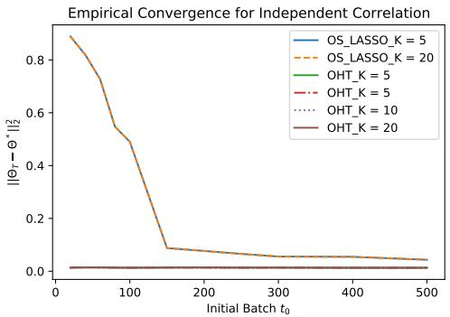

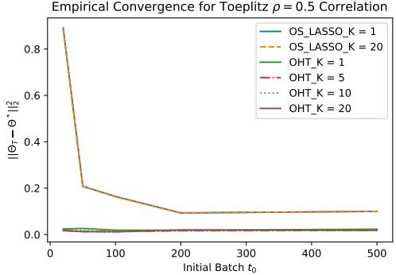  
Figure 2: Online sparse linear regression under weak signal setup for $t _ { 0 } ~ \in ~ [ 2 0 , 5 0 0 ]$ and $t \ : = \ : 1 0 0 0 0$ online learning rounds for independent and Toeplitz $\rho = 0 . 5$ covariate designs.

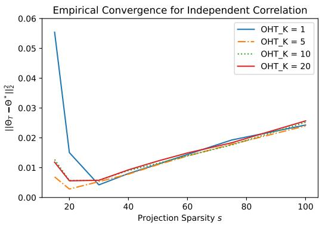

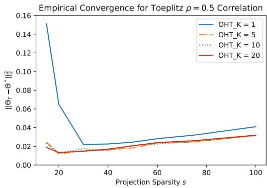  
Figure 3: Online sparse linear regression under weak signal setup for projection sparsity level $s \in [ 1 5 , 1 0 0 ]$ $t _ { 0 } = 1 0 0$ , and $T = 1 0 ^ { 4 }$ online rounds, under independent and Toeplitz $\rho = 0 . 5$ covariate correlation designs.

OHT\_K=5,10,20 is comparable, suggesting that $K = 5$ already exceeds the intrinsic $K _ { 0 }$ , and increasing � further does not improve accuracy further.

From Figure 4, under both sparsity levels $s = 1 5 , 3 0 .$ , our OHT algorithms with $K = 5 , 1 0 , 2 0$ generate sequences $\Theta _ { t }$ that converge to the true sparse coeficient $\Theta ^ { * }$ even without an initial batch, while $\mathrm { O H T } _ { - } { = } 1$ converges much more slowly. $\mathrm { ~ A t ~ } t = 1 0 ^ { 4 }$ , a performance gap between OHT\_=1 and OHT\_=5,10,20 remains evident.

Based on Table 1, we observe that Algorithm 1 performs well and only requires a slightly overselected projection sparsity level, $s = 2 0$ , even when the sparse condition number $\kappa = 5 0 0$ is large. This suggests that the dependence of the projection sparsity on � in Theorem 3.5 may not be tight.

These numerical experiments indicate the superior performance of our algorithm compared to OS\_LASSO, regardless of the covariate design, particularly in scenarios with weak signals or small initial batches. Additional experiments in Appendix S.1 further demonstrate empirical convergence across online rounds and under various design and signal strength settings, highlighting the eficiency and robustness of our approach.

## 5.2 Online Low-Rank Matrix Sensing

We evaluate the performance of our algorithm for the online low-rank matrix sensing problem. We consider $d _ { 1 } \ = \ d _ { 2 } \ = \ 5 0$ and an underlying coeficient matrix $\Theta ^ { * } ~ \in ~ \mathbb { R } ^ { d _ { 1 } \times d _ { 2 } }$ of rank $s ^ { * } ~ = ~ 5$ In our experiments, $\Theta ^ { * }$ is obtained as the rank-5 approximation of a matrix $\tilde { \Theta } \in \mathbb { R } ^ { d _ { 1 } \times d _ { 2 } }$ with entries $\tilde { \Theta } _ { i , j } \sim { \cal N } ( 0 , 1 )$ independently. Each feature-label pair $( X _ { t } , Y _ { t } )$ is generated by independently sampling $X _ { t } \ \in \ \mathbb { R } ^ { d _ { 1 } \times d _ { 2 } }$ with entries $[ X _ { t } ] _ { i , j } \sim { \cal N } ( 0 , 1 )$ , followed by $Y _ { t } = \left. X _ { t } , \Theta ^ { * } \right. + \epsilon _ { t }$ with $\epsilon _ { t } \sim { \cal N } ( 0 , 1 )$ . We conduct the following experiments.

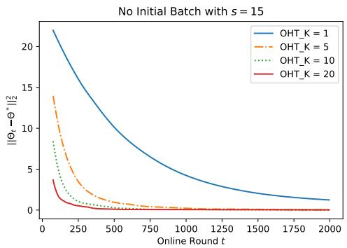

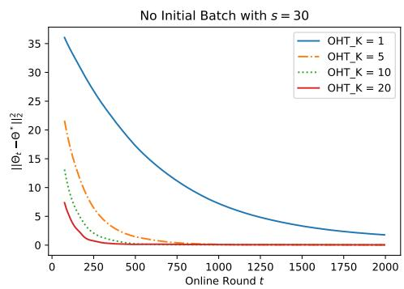

Figure 4: Online sparse linear regression under weak signal setup without the initial batch under projection sparsity level � ∈ {15, 30}.
<table><tr><td>MSE</td><td> $s = 1 4$ </td><td> $s = 1 5$ </td><td> $s = 2 0$ </td><td> $s = 2 5$ </td><td> $s = 3 0$ </td><td> $s = 4 0$ </td></tr><tr><td>OHT_K=1</td><td>0.519131</td><td>0.529622</td><td>0.376415</td><td>0.239696</td><td>0.138760</td><td>0.126439</td></tr><tr><td>OHT_K=5</td><td>0.115403</td><td>0.070367</td><td>0.011384</td><td>0.007039</td><td>0.010385</td><td>0.012848</td></tr><tr><td>OHT_K=10</td><td>0.070169</td><td>0.046840</td><td>0.007254</td><td>0.009965</td><td>0.011081</td><td>0.013396</td></tr><tr><td>OHT_K=20</td><td>0.046217</td><td>0.009727</td><td>0.007280</td><td>0.008915</td><td>0.011370</td><td>0.014919</td></tr></table>

Table 1: Empirical last-iterate MSE $\lVert \Theta _ { T } - \Theta ^ { * } \rVert _ { 2 } ^ { 2 }$ for $t _ { 0 } ~ = ~ 1 0 0$ and $T = 1 0 ^ { 4 }$ under projection sparsity levels $s = 1 4 , 1 5 , 2 0 , 2 5 , 3 0 , 4 0$ and $[ \Lambda _ { i , i } , 1 \le i \le p ] = [ \bar { 5 } 0 0$ , 100, 10, 8, · · · , 1, 1, · · · , 1].

1. With an initial batch of size $t _ { 0 } = 1 0 0$ , we run $T = 1 0 ^ { 4 }$ online rounds for various projection ranks $s \in \{ 3 , 4 , 5 , 1 0 , 1 5 , 2 0 \}$ . For $s = 5 .$ , we plot the MSE $\| \Theta _ { t } - \Theta ^ { * } \| _ { \mathrm { F } } ^ { 2 }$ versus the round � in Figure 5, and the log-MSE log $( \lVert \Theta _ { t } - \Theta ^ { * } \rVert _ { \mathrm { F } } ^ { 2 } )$ versus log � to assess empirical convergence rates, including a reference line of slope −1. Similar results for $s = 1 5$ are presented in Figure 6. The MSE of the last-iterate solution $\Theta _ { T }$ at $T = 1 0 ^ { 4 }$ is reported for all algorithms in Table 2.

2. Without an initial batch $( t _ { 0 } = 0 )$ , we run $T = 2 0 0 0$ online rounds for projection ranks $s \in \{ 5 , 1 5 \}$ and hard-thresholding gradient descent steps $K \in \{ 1 , 5 , 1 0 , 2 0 \}$ , reporting $\lVert \Theta _ { t } - \Theta ^ { * } \rVert _ { \mathrm { F } } ^ { 2 }$ versus � and log � in Figure 7.

From Figures 5 and 6, Algorithm 1 generates solution sequences converging to $\Theta ^ { * }$ for $s = 5 .$ , 15 and $K = 1 , 5 , 1 0 , 2 0$ , with an initial batch of size $t _ { 0 } = 1 0 0$ . Since the covariance matrix is isotropic and $s ^ { * } = 5 ,$ , only a slightly larger projection rank is required to ensure convergence. The slopes of log $( \lVert \Theta _ { t } - \Theta ^ { * } \rVert _ { \mathrm { F } } ^ { 2 } )$ versus log � are approximately −1 for both $s = 5 , 1 5$ when $K \ge 5$ , consistent with Theorem 3.9, which predicts an $O ( s / ( t + t _ { 0 } ) )$ convergence rate.

Table 2 shows that under-picking the projection level $( \mathrm { e . g . } , s = 3 , 4 )$ prevents convergence. Additionally, the MSE for $s = 2 0$ is roughly four times that for $s = 5 ,$ , confirming the linear dependence of the MSE on the projection sparsity � as indicated in Theorem 3.9.

Finally, Figure 7 demonstrates that our algorithms perform well even without an initial batch, with Θ� converging to $\Theta ^ { * }$ for $s \in \{ 5 , 1 5 \}$ . These results validate the practical eficiency and robustness of our method and corroborate the theoretical guarantees in Section 4.2.

## 6 Conclusions

This paper proposes an online hard thresholding algorithm for online generalized sparse regression problems, with a focus on online sparse linear regression and low-rank matrix sensing. The algorithm does not need dynamic regularization, features closed-form updates in each online round, requires only the storage of summary statistics, making it memory and storage eficient, and converges globally to the ground-truth coeficients at the optimal statistical rate under realistic assumptions. To our knowledge, it is the first algorithm that simultaneously achieves all four of these properties. One practical limitation is that key quantities such as the per-round iteration number � and projection sparsity � are typically unavailable in real-world applications. In practice, the projection sparsity level can be chosen via cross-validation using an initial batch. If no initial batch is available, cross-validation can be performed during the early online rounds, after which the algorithm proceeds in a streaming fashion. Moreover, numerical experiments demonstrate that the algorithm is robust to the choices of � and �, provided that � is not under-picked.

<table><tr><td>MSE</td><td> $s = 3$ </td><td> $s = 4$ </td><td> $s = 5$ </td><td> $s = 1 0$ </td><td> $s = 1 5$ </td><td> $s = 2 0$ </td></tr><tr><td>OHT_K=1</td><td>10.8453</td><td>5.6856</td><td>0.0546</td><td>0.1265</td><td>0.1848</td><td>0.2395</td></tr><tr><td>OHT_K=5</td><td>10.8447</td><td>5.6460</td><td>0.0508</td><td>0.1357</td><td>0.1968</td><td>0.2499</td></tr><tr><td>OHT_K=10</td><td>10.8367</td><td>5.6276</td><td>0.0503</td><td>0.1367</td><td>0.1958</td><td>0.2451</td></tr><tr><td> ${ 0 } \mathrm { H T } \_ { \mathrm { K } = 2 0 }$ </td><td>10.8299</td><td>5.2613</td><td>0.0499</td><td>0.1350</td><td>0.1990</td><td>0.2516</td></tr></table>

Table 2: Empirical last-iterate MSE $\lVert \Theta _ { T } - \Theta ^ { * } \rVert _ { \mathrm { F } } ^ { 2 }$ for $t _ { 0 } ~ = ~ 1 0 0$ and $T ~ = ~ 1 0 ^ { 4 }$ under projection rank levels � = 3, 4, 5, 10, 15, 20.

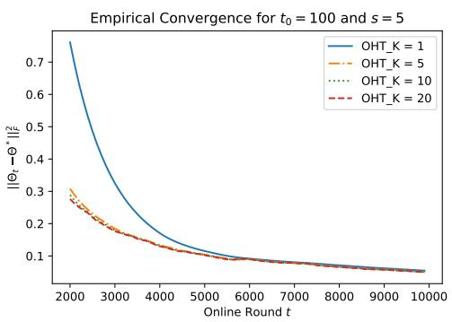

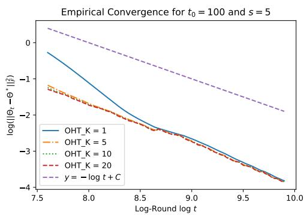  
Figure 5: Online low-rank matrix sensing for $t _ { 0 } = 1 0 0$ and $T = 1 0 0 0 0$ online learning rounds with projection sparsity level $s = 5$

## Acknowledgments

Qiang Sun is supported in part by an NSERC Discovery Grant (RGPIN-2018-06484), a Data Sciences Institute Catalyst Grant, and a computing grant from Compute Canada.

## References

Alekh Agarwal, Sahand Negahban, and Martin J Wainwright. Fast global convergence of gradient methods for high-dimensional statistical recovery. The Annals ofStatistics, 40(5):2452–2482, 2012.

Dimitri P Bertsekas. Incremental proximal methods for large scale convex optimization. Mathematical Programming, 129(2):163–195, 2011.

Peter J Bickel, Ya’acov Ritov, and Alexandre B Tsybakov. Simultaneous analysis of Lasso and Dantzig selector. The Annals ofStatistics, 37(4):1705–1732, 2009.

Thomas Blumensath and Mike E Davies. Iterative hard thresholding for compressed sensing. Applied and Computational Harmonic Analysis, 27(3):265–274, 2009.

Emmanuel J. Candès and Yaniv Plan. Tight oracle inequalities for low-rank matrix recovery from a minimal number of noisy random measurements. IEEE Transactions on Information Theory, 57(4): 2342–2359, 2011.

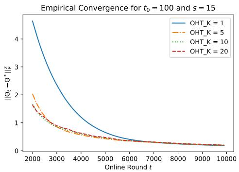

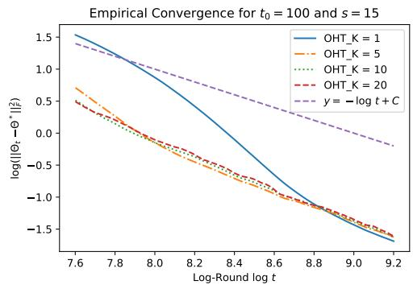  
Figure 6: Online low-rank matrix sensing for $t _ { 0 } = 1 0 0$ and $T = 1 0 0 0 0$ online learning rounds with projection sparsity level $s = 1 5$

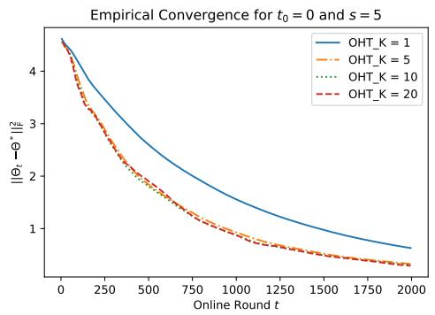

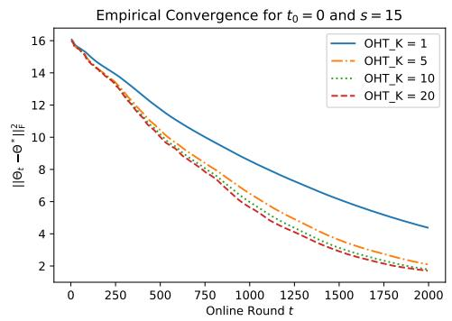  
Figure 7: Online low-rank matrix sensing without the initial batch $( t _ { 0 } = 0 )$ and $T = 2 0 0 0$ online learning rounds with projection rank levels $s \in \{ 5 , 1 5 \}$

Emmanuel J. Candès and Terence Tao. The Dantzig selector: Statistical estimation when � is much larger than �. The Annals ofStatistics, 35(6):2313–2351, 2007.

John Duchi, Elad Hazan, and Yoram Singer. Adaptive subgradient methods for online learning and stochastic optimization. Journal ofMachine Learning Research, 12(61):2121–2159, 2011.

Jianqing Fan, Wenyan Gong, Chris Junchi Li, and Qiang Sun. Statistical Sparse Online Regression: A Difusion Approximation Perspective. In Proceedings of the 21st International Conference on Artificial Intelligence and Statistics (AISTATS 2018). Proceedings of Machine Learning Research, 84:1017–1026, 2018a.

Jianqing Fan, Han Liu, Qiang Sun, and Tong Zhang. I-LAMM for sparse learning: Simultaneous control of algorithmic complexity and statistical error. The Annals of Statistics, 46(2):814–841, 2018b.

Dean Foster, Howard Karlof, and Justin Thaler. Variable Selection Is Hard. In Proceedings of the 28th Conference on Learning Theory (COLT 2015). Proceedings of Machine Learning Research, 40:696–709, 2015.

Dongxiao Han, Jinhan Xie, Jin Liu, Liuquan Sun, Jian Huang, Bei Jiang, and Linglong Kong. Inference on high-dimensional single-index models with streaming data. Journal of Machine Learning Research, 25(337):1–68, 2024a.

Ruijian Han, Lan Luo, Yuanyuan Lin, and Jian Huang. Online inference with debiased stochastic gradient descent. Biometrika, 111(1):93–108, 2024b.

Prateek Jain, Ambuj Tewari, and Purushottam Kar. On Iterative Hard Thresholding Methods for High-Dimensional M-Estimation. In Proceedings ofthe 28th Conference on Neural Information Processing Systems (NIPS 2014). Advances in Neural Information Processing Systems, 27:685–693, 2014.

Satyen Kale, Zohar Karnin, Tengyuan Liang, and Dávid Pál. Adaptive Feature Selection: Computationally Eficient Online Sparse Linear Regression under RIP. In Proceedings of the 34th International Conference on Machine Learning (ICML 2017). Proceedings of Machine Learning Research, 70:1780–1788, 2017.

Harold J. Kushner and G. George Yin. Stochastic Approximation Algorithms and Applications. Springer-Verlag, 1997.

Guanghui Lan. First-Order and Stochastic Optimization Methods for Machine Learning. Springer, 2020.

Haoyang Liu and Rina Foygel Barber. Between hard and soft thresholding: Optimal iterative thresholding algorithms. Information and Inference: A Journal ofthe IMA, 9(4):899–933, 2020.

Po-Ling Loh and Martin J. Wainwright. Regularized �-estimators with nonconvexity: statistical and algorithmic theory for local optima. Journal of Machine Learning Research, 16(19):559–616, 2015.

Marie Maros and Gesualdo Scutari. Decentralized Matrix Sensing: Statistical Guarantees and Fast Convergence. In Proceedings of the 37th Conference on Neural Information Processing Systems (NeurIPS 2023). Advances in Neural Information Processing Systems, 36:40154–40166, 2023.

B. K. Natarajan. Sparse approximate solutions to linear systems. SIAM Journal on Computing, 24(2): 227–234, 1995.

Sahand Negahban and Martin J Wainwright. Estimation of (near) low-rank matrices with noise and high-dimensional scaling. The Annals ofStatistics, 39(2):1069–1097, 2011.

Alexander Rakhlin, Ohad Shamir, and Karthik Sridharan. Making Gradient Descent Optimal for Strongly Convex Stochastic Optimization. In Proceedings of the 29th International Conference on Machine Learning (ICML 2012). Omnipress, 1571–1578, 2012.

Garvesh Raskutti, Martin J Wainwright, and Bin Yu. Restricted eigenvalue properties for correlated Gaussian designs. Journal ofMachine Learning Research, 11(78):2241–2259, 2010.

Benjamin Recht, Maryam Fazel, and Pablo A Parrilo. Guaranteed minimum-rank solutions of linear matrix equations via nuclear norm minimization. SIAM Review, 52(3):471–501, 2010.

Jacob Steinhardt, Stefan Wager, and Percy Liang. The statistics of streaming sparse regression. arXiv preprint arXiv:1412.4182, 2014.

Robert Tibshirani. Regression shrinkage and selection via the lasso. Journal of the Royal Statistical Society. Series B (Methodological), 58(1):267–288, 1996.

Aad W. van der Vaart and Jon A. Wellner. Weak Convergence and Empirical Processes: With Applications to Statistics. Springer, 1996.

Roman Vershynin. On large random almost Euclidean bases. Acta Mathematica Universitatis Comenianae, 69(2):137–144, 2000.

Roman Vershynin. High-Dimensional Probability: An Introduction with Applications in Data Science. Cambridge University Press, 2018.

Lin Xiao. Dual averaging methods for regularized stochastic learning and online optimization. Journal ofMachine Learning Research, 11(88):2543–2596, 2010.

Shuoguang Yang, Yuhao Yan, Xiuneng Zhu, and Qiang Sun. Online Linearized LASSO. In Proceedings of the 26th International Conference on Artificial Intelligence and Statistics (AISTATS 2023). Proceedings of Machine Learning Research, 206:7594–7610, 2023.

Peng Zhao and Bin Yu. On model selection consistency of Lasso. Journal of Machine Learning Research, 7(90):2541–2563, 2006.

## Supplementary Material Contents

S.1 Additional Numerical Results 25   
S.2 Proofs for Section 3.1 26   
S.2.1 Proof of Proposition 3.1 . 26   
S.2.2 Proof of Lemma 3.2 . 27   
S.2.3 Proof of Lemma 3.3 28   
S.2.4 Proof of Lemma 3.4 . 30   
S.2.5 Proof of Theorem 3.5 32   
S.2.6 Supporting Lemmas . 32   
S.3 Proofs for Section 3.2 36   
S.3.1 Proof of Lemma 3.6 . 36   
S.3.2 Proof of Lemma 3.7 36   
S.3.3 Proof of Lemma 3.8 . 38   
S.3.4 Proof of Theorem 3.9 39   
S.3.5 Supporting Lemmas 39   
S.4 Proofs for Section 4 40   
S.4.1 Proof of Proposition 4.1 40   
S.4.2 Proof of Proposition 4.3 . 42

This appendix presents additional numerical experiments, and collects proofs for the main results and technical lemmas. Additional numerical experiments are presented in Appendix S.1. Appendix S.2 collects proofs for online sparse linear regression in Section 3.1, and Appendix S.3 collects the proofs for online low-rank matrix sensing in Section 3.2. Appendix S.4 collects proofs for the no initial batch case in Section 4.

Notation. For any two spaces $S _ { 1 }$ and $S _ { 2 }$ , with a slight abuse of notation, we denote by $S _ { 1 } \cap S _ { 2 } ^ { \bot }$ the intersection between $S _ { 1 }$ and the orthogonal complement of $S _ { 2 }$

## S.1 Additional Numerical Results

In this section, we conduct additional numerical experiments to investigate the performance of our OHT algorithms under various signal strength and covariate correlation setups. We consider the following two experiments with sparsity level $s = 5 0$ and step-size $\eta = 0 . 0 0 1$

1. Weak signal under diferent covariate correlations: We test the algorithms for initial batch size $t _ { 0 } = 1 0 0$ , 500 and $1 0 ^ { 4 }$ online learning rounds, under both independent and Toeplitz $\rho = 0 . 3 , 0 . 5 , 0 . 7$ covariate correlation designs provided in Section 5. We report the MSE $\lVert \Theta _ { t } - \Theta ^ { * } \rVert _ { \mathrm { F } } ^ { 2 }$ against online learning rounds � in Figures S.1, S.2, S.3, and S.4.

2. Strong signal under independent covariate correlation: We generate a vector $\hat { \Theta } ^ { \ast } \in \mathbb { R } ^ { d }$ where each entry is normally distributed such that $\hat { \Theta } _ { i } ^ { * } \sim { \cal N } ( 0 , 0 . 4 )$ ; we conduct hard thresholding truncation such that $\Theta _ { i } ^ { * } = \hat { \Theta } _ { i } ^ { * } \mathrm { ~ i f ~ } | \hat { \Theta } _ { i } ^ { * } | \geq 1$ and $\Theta _ { i } ^ { * } = 0$ otherwise. The cardinality of the generating parameter Θ∗ is 12. We then test our algorithms for initial batch size $t _ { 0 } = 1 0 0 , 5 0 0$ and $1 0 ^ { 4 }$ subsequent online learning rounds, under the independent covariate correlation design. We plot the $\mathrm { M S E } \parallel \Theta _ { t } - \Theta ^ { * } \parallel _ { \mathrm { F } }$ against online learning rounds � in Figure S.5.

From Figures S.1, S.2, S.3, and S.4, we observe that our OHT algorithms outperform $\mathtt { 0 S \_ L A S S 0 \_ K = 1 }$ and OS\_LASSO\_K=20 in the weak signal setting for $t _ { 0 } = 1 0 0 , 5 0 0$ , regardless of the covariate correlation design. Further, we observe that OS\_LASSO\_K=1 and OS\_LASSO\_K=20 exhibit comparable performance to our algorithms for strong-signal instances. This is because under strong-signal settings, OS\_LASSO\_K=1 and $0 . 5 \_ \mathrm { L A S S 0 } \_ \mathrm { K } = 2 \mathbb { 0 }$ are able to identify the correct set of nonzero entries $s$ by using a small initial batch $t _ { 0 } ~ = ~ 1 0 0$ . Consequently, the solutions are truncated to the correct set in each subsequent online learning round. These numerical observations further demonstrate the eficiency and robustness of our algorithm in the weak-signal and small-initial-batch scenarios.

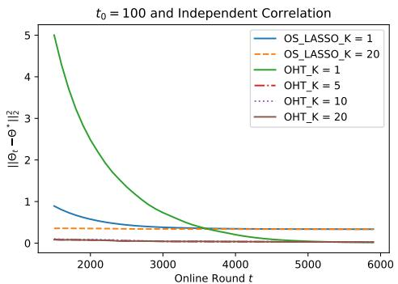

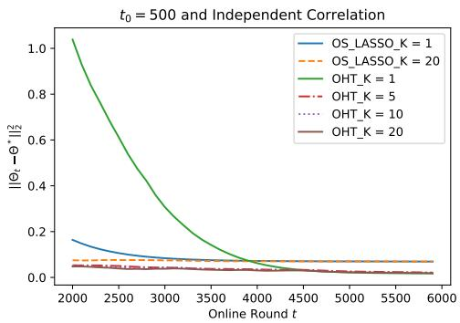  
Figure S.1: Empirical convergence of MSE $\lVert \Theta _ { t } - \Theta ^ { * } \rVert _ { \mathrm { F } } ^ { 2 }$ against online learning round � under weak signal setup and independent covariate correlation

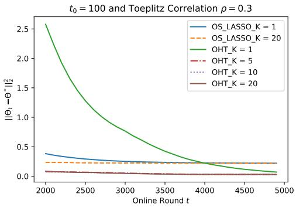

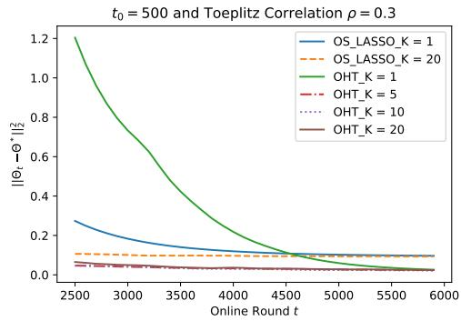  
Figure S.2: Empirical convergence of MSE $\lVert \Theta _ { t } - \Theta ^ { * } \rVert _ { \mathrm { F } } ^ { 2 }$ against online learning round � and weak signal setup with Toeplitz $\rho = 0 . 3$ covariate correlation

## S.2 Proofs for Section 3.1

## S.2.1 Proof of Proposition 3.1

Proof. Conditional on $\epsilon _ { i } .$ , we apply (Vershynin, 2018, Proposition 2.6.1) to obtain

$$
\left. Z _ { j } \right. _ { \psi _ { 2 } } = \left. \left[ \sum _ { i \in I _ { t } } \frac { \epsilon _ { i } X _ { i } } { \sqrt { t + t _ { 0 } } } \right] _ { j } \right. _ { \psi _ { 2 } } \le \sqrt { \frac { C } { t + t _ { 0 } } \sum _ { i \in I _ { t } } \epsilon _ { i } ^ { 2 } \left. X _ { i j } \right. _ { \psi _ { 2 } } ^ { 2 } } \le \sqrt { \frac { C \sigma _ { x } ^ { 2 } } { t + t _ { 0 } } \sum _ { i \in I _ { t } } \epsilon _ { i } ^ { 2 } } ,
$$

where � is some constant.

Since $Z _ { j }$ is sub-Gaussian with $\| Z _ { j } \| _ { \psi _ { 2 } }$ , conditional on $\epsilon _ { i } .$ , we have

$$
\| Z _ { j } ^ { 2 } \| _ { \psi _ { 1 } } = \| Z _ { j } \| _ { \psi _ { 2 } } ^ { 2 } = \frac { C \sigma _ { x } ^ { 2 } } { t + t _ { 0 } } \sum _ { i \in I _ { t } } \epsilon _ { i } ^ { 2 } .
$$

Let $V _ { i } = \epsilon _ { i } X _ { i j }$ . Then, we apply the maximum inequality (van der Vaart and Wellner, 1996, Lemma

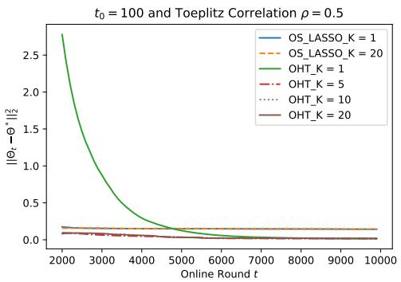

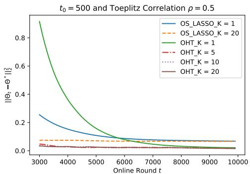  
Figure S.3: Empirical convergence of MSE $\lVert \Theta _ { t } - \Theta ^ { * } \rVert _ { \mathrm { F } } ^ { 2 }$ against online learning round � under weak signal setup and Toeplitz $\rho = 0 . 5$ covariate correlation

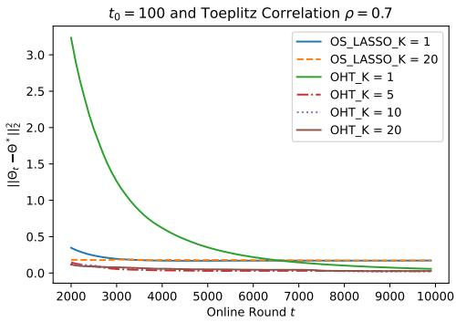

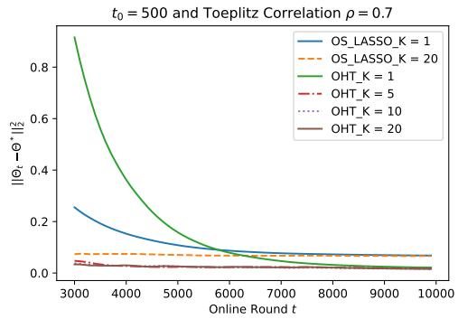  
Figure S.4: Empirical convergence of MSE $\| \Theta _ { t } - \Theta ^ { * } \| _ { \mathrm { F } } ^ { 2 }$ against online learning round � under weak signal setup and Toeplitz $\rho = 0 . 7$ covariate correlation

## 2.2.2), and obtain

$$
\begin{array} { r l } & { \mathbb { E } \left[ \displaystyle \operatorname* { m a x } _ { 1 \leq j \leq d } Z _ { j } ^ { 2 } \left| \epsilon _ { i } , i \in I _ { t } \right. \right] \leq \left\| \displaystyle \operatorname* { m a x } _ { 1 \leq j \leq d } Z _ { j } ^ { 2 } \right\| _ { \psi _ { 1 } } } \\ & { \qquad \leq C \psi _ { 1 } ^ { - 1 } ( d ) \left\| \displaystyle \frac { 1 } { t + t _ { 0 } } \sum _ { i \in I _ { t } } \epsilon _ { i } ^ { 2 } X _ { i j } ^ { 2 } \right\| _ { \psi _ { 1 } } \leq C \log d \cdot \displaystyle \frac { \sigma _ { x } ^ { 2 } } { t + t _ { 0 } } \sum _ { i \in I _ { t } } \epsilon _ { i } ^ { 2 } , } \end{array}
$$

and thus

$$
\mathbb { E } \left[ \operatorname* { m a x } _ { 1 \leq j \leq d } Z _ { j } ^ { 2 } \right] \leq C \sigma ^ { 2 } \sigma _ { x } ^ { 2 } \log d ,
$$

where � is some constant.

## S.2.2 Proof of Lemma 3.2

Proof. Recall that $\begin{array} { r } { \hat { \Theta } _ { t } ~ = ~ \arg \operatorname* { m i n } _ { \| \Theta \| _ { 0 } \leq s ^ { * } } \mathcal { L } _ { t } ( \Theta ) } \end{array}$ for cardinality-constrained linear regression where $\Upsilon ( \Theta ) = \| \Theta \| _ { 0 }$ , we have

$$
\begin{array} { c } { \displaystyle \mathcal { L } _ { t } ( \hat { \Theta } _ { t } ) = \frac { 1 } { 2 ( t _ { 0 } + t ) } \sum _ { i \in \mathcal { I } _ { t } } \Big ( \left. X _ { i } , \hat { \Theta } _ { t } \right. - Y _ { i } \Big ) ^ { 2 } = \frac { 1 } { 2 ( t _ { 0 } + t ) } \sum _ { i \in \mathcal { I } _ { t } } \Big ( \left. X _ { i } , \hat { \Theta } _ { t } - \Theta ^ { * } \right. - \epsilon _ { i } \Big ) ^ { 2 } } \\ { \displaystyle \leq \frac { 1 } { 2 ( t _ { 0 } + t ) } \sum _ { i \in \mathcal { I } _ { t } } \Big ( \left. X _ { i } , \Theta ^ { * } \right. - Y _ { i } \Big ) ^ { 2 } = \frac { 1 } { 2 ( t _ { 0 } + t ) } \sum _ { i \in \mathcal { I } _ { t } } \epsilon _ { i } ^ { 2 } = \mathcal { L } _ { t } ( \Theta ^ { * } ) , } \end{array}
$$

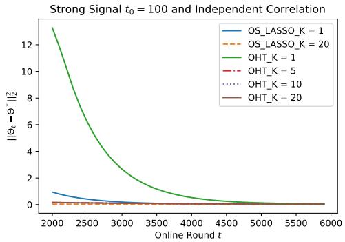

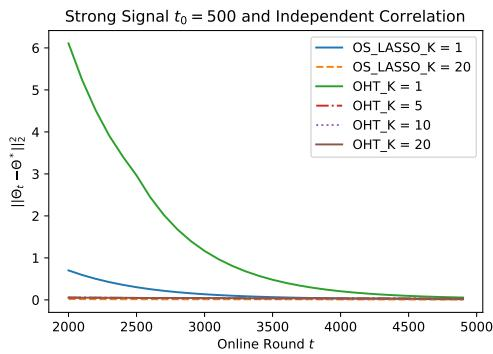  
Figure S.5: Empirical convergence of MSE $\lVert \Theta _ { t } - \Theta ^ { * } \rVert _ { \mathrm { F } } ^ { 2 }$ against online learning round � under strong signal setup and independent covariate correlation

implying that

$$
\frac { 1 } { 2 ( t _ { 0 } + t ) } \sum _ { i \in J _ { t } } \left. X _ { i } , \hat { \Theta } _ { t } - \Theta ^ { * } \right. ^ { 2 } \leq \frac { 1 } { t _ { 0 } + t } \sum _ { i \in J _ { t } } \epsilon _ { i } \left. X _ { i } , \hat { \Theta } _ { t } - \Theta ^ { * } \right. .
$$

Because $\mathcal { L } _ { t } ( \cdot )$ satisfies the $\left( s , s \right) { \ - - } S S C$ condition under Assumpption (3.1), using the fact that $\| \hat { \Theta } _ { t } -$ $\Theta ^ { * } \lVert _ { 0 } \leq 2 s ^ { * }$ and applying Proposition S.2.1 in Appendix Section S.2.6 arrives at

$$
\begin{array} { r l r } {  { \frac { \alpha } { 2 } \| \hat { \Theta } _ { t } - \Theta ^ { * } \| _ { 2 } ^ { 2 } \leq \frac { 1 } { 2 ( t _ { 0 } + t ) } \displaystyle \sum _ { i \in \mathcal { I } _ { t } }  X _ { i } , \hat { \Theta } _ { t } - \Theta ^ { * }  ^ { 2 } \leq \frac { 1 } { t _ { 0 } + t } \displaystyle \sum _ { i \in \mathcal { I } _ { t } } \epsilon _ { i }  X _ { i } , \hat { \Theta } _ { t } - \Theta ^ { * }  } } \\ & { } & { \leq \sqrt { 2 s ^ { * } } \| \Theta ^ { \prime } - \Theta ^ { * } \| _ { 2 } \Big \| \displaystyle \frac { 1 } { t _ { 0 } + t } \sum _ { i \in \mathcal { I } _ { t } } \epsilon _ { i } X _ { i } \Big \| _ { \infty } } \\ & { } & { \leq \frac { 2 s ^ { * } } { \alpha } \Big \| \displaystyle \frac { 1 } { t _ { 0 } + t } \sum _ { i \in \mathcal { I } _ { t } } \epsilon _ { i } X _ { i } \Big \| _ { \infty } ^ { 2 } + \frac { \alpha } { 4 } \| \hat { \Theta } _ { t } - \Theta ^ { * } \| _ { 2 } ^ { 2 } . } \end{array}\tag{S.2.1}
$$

Rearranging the terms, we obtain

$$
\lVert \hat { { \boldsymbol { \Theta } } } _ { t } - { \boldsymbol { \Theta } } ^ { * } \rVert _ { 2 } ^ { 2 } \leq \frac { 8 s ^ { * } } { \alpha ^ { 2 } } \Big \lVert \frac { 1 } { t _ { 0 } + t } \sum _ { i \in \mathcal { I } _ { t } } \epsilon _ { i } { \boldsymbol { X } } _ { i } \Big \rVert _ { \infty } ^ { 2 } .
$$

By using Assumption 3.2 that $\begin{array} { r } { \mathbb { E } \Big [ \Big \| \sum _ { i \in \mathcal { I } _ { t } } \epsilon _ { i } X _ { i } \Big \| _ { \infty } ^ { 2 } \Big ] \leq ( t _ { 0 } + t ) \sigma _ { x } ^ { 2 } } \end{array}$ , and taking expectations on both sides of the above inequality, we conclude that

$$
\mathbb { E } [ \| \hat { { \boldsymbol \Theta } } _ { t } - { \boldsymbol \Theta } ^ { * } \| _ { 2 } ^ { 2 } ] \leq \frac { 8 s ^ { * } } { \alpha ^ { 2 } } \mathbb { E } \Big [ \Big \| \frac { 1 } { t _ { 0 } + t } \sum _ { i \in { \cal I } _ { t } } \epsilon _ { i } { \boldsymbol X } _ { i } \Big \| _ { \infty } ^ { 2 } \Big ] \leq \frac { 8 s ^ { * } \sigma _ { x } ^ { 2 } } { \alpha ^ { 2 } ( t _ { 0 } + t ) } .
$$

This completes the proof.

## S.2.3 Proof of Lemma 3.3

Proof. When $\Upsilon ( \Theta ) = \| \Theta \| _ { 0 }$ , we consider a hard thresholding step of Algorithm 1 that

$$
\begin{array} { r l } & { \Theta _ { t , k + 1 } = \Pi _ { C _ { s } } \left( \Theta _ { t , k } - \eta _ { t , k } \nabla \mathcal { L } _ { t } ( \Theta _ { t , k } ) \right) } \\ & { \qquad = \underset { z \in \mathbb { R } ^ { d } , \| z \| _ { 0 } \leq s } { \mathrm { a r g m i n } } \left\{ \| z - ( \Theta _ { t , k } - \eta _ { t , k } \nabla \mathcal { L } _ { t } ( \Theta _ { t , k } ) ) \| _ { 2 } ^ { 2 } \right\} . } \end{array}
$$

By Assumption $3 . 1 , \mathcal { L } _ { t } ( \cdot )$ satisfies the $( s , s )$ -SSS condition (3.1) with parameter �. Let $g _ { k } = \nabla \mathcal { L } _ { t } ( \Theta _ { t , k } )$ We then analyze the change of objective value from $\Theta _ { t , k }$ to $\Theta _ { t , k + 1 }$ w.r.t. $\mathcal { L } _ { t } ( \cdot )$ as

$$
\begin{array} { r } { \displaystyle \mathcal { L } _ { t } ( \boldsymbol { \Theta } _ { t , k + 1 } ) - \mathcal { L } _ { t } ( \boldsymbol { \Theta } _ { t , k } ) \leq \left. \nabla \mathcal { L } _ { t } ( \boldsymbol { \Theta } _ { t , k } ) , \boldsymbol { \Theta } _ { t , k + 1 } - \boldsymbol { \Theta } _ { t , k } \right. + \frac { L } { 2 } \left\| \boldsymbol { \Theta } _ { t , k + 1 } - \boldsymbol { \Theta } _ { t , k } \right\| _ { 2 } ^ { 2 } } \\ { = \left. g _ { k } , \boldsymbol { \Theta } _ { t , k + 1 } - \boldsymbol { \Theta } _ { t , k } \right. + \frac { L } { 2 } \left\| \boldsymbol { \Theta } _ { t , k + 1 } - \boldsymbol { \Theta } _ { t , k } \right\| _ { 2 } ^ { 2 } = \mathrm { I } + \mathrm { I I } , } \end{array}\tag{S.2.2}
$$

where $\mathrm { ~ I ~ } : = \left. g _ { k } , \Theta _ { t , k + 1 } - \Theta _ { t , k } \right.$ and $\begin{array} { r } { \mathrm { I I } : = \frac { L } { 2 } \left\| \Theta _ { t , k + 1 } - \Theta _ { t , k } \right\| _ { 2 } ^ { 2 } . } \end{array}$ For simplicity, we write $\eta ~ = ~ \eta _ { t , k }$ $\Theta _ { k } = \Theta _ { t , k } , \Theta _ { k + 1 } = \Theta _ { t , k + 1 } , S _ { k - 1 } = S _ { t , k - 1 }$ and $S _ { k } = S _ { t , k }$ . We proceed to bound I and II respectively. We start with I:

$$
\begin{array} { r l } & { 1 = \langle g _ { k } , \Theta _ { k + 1 } - \Theta _ { k } \rangle } \\ & { = -  \Theta _ { { { \delta } _ { k } } , \langle s _ { k + 1 } , \theta _ { { \delta } _ { k } } ^ { k } , S _ { k + 1 } ^ { k } \rangle } ^ { k } +  \Theta _ { { S } _ { k + 1 } } ^ { k + 1 } - \Theta _ { { S } _ { k + 1 } } ^ { k } , g _ { { S } _ { k + 1 } } ^ { k }   } \\ & {  \quad = -  \Theta _ { { S } _ { k } , \langle s _ { k + 1 } , \theta _ { { S } _ { k } } ^ { k } , S _ { k } ^ { k } \rangle \langle S _ { k + 1 } \rangle } ^ { k }  - \eta \| g _ { { S } _ { k + 1 } } ^ { k } \| _ { 2 } ^ { 2 } } \\ & { \quad = -  \Theta _ { { S } _ { k } , \langle s _ { k - 1 } , \theta _ { { S } _ { k } } ^ { k } , S _ { k + 1 } ^ { k } \rangle } ^ { k } , g _ { { S } _ { k } , \langle s _ { k + 1 } \rangle } ^ { k }  - \eta \| g _ { { S } _ { k } , \langle S _ { k + 1 } ^ { k } \rangle } ^ { k } \| _ { 2 } ^ { 2 } - \eta \| g _ { k + 1 } ^ { k } \| _ { 2 } ^ { 2 } } \\ & { \quad \le \frac { 1 } { 2 \eta } \| \Theta _ { { S } _ { k } , \langle s _ { k + 1 } , \cdot } ^ { k } - \eta g _ { { S } _ { k } , \langle s _ { k + 1 } , \cdot } ^ { k } \rangle \| _ { 2 } ^ { 2 } - \frac { \eta } { 2 } \| g _ { { S } _ { k } , \langle s _ { k + 1 } \rangle } ^ { k } \| _ { 2 } ^ { 2 } - \eta \| g _ { { S } _ { k + 1 } } ^ { k } \| _ { 2 } ^ { 2 } } \\ &  \quad \le \frac { \eta } { 2 } \| g _  k + 1 , \cdot \end{array}
$$

where the last second inequality follows from the fact

$$
\begin{array} { r } { \| \Theta _ { S _ { k } \backslash S _ { k + 1 } } ^ { k } - \eta g _ { S _ { k } \backslash S _ { k + 1 } } ^ { k } \| _ { 2 } ^ { 2 } \leq \| \Theta _ { S _ { k + 1 } \backslash S _ { k } } ^ { k + 1 } \| _ { 2 } ^ { 2 } = \eta ^ { 2 } \| g _ { S _ { k + 1 } \backslash S _ { k } } ^ { k } \| _ { 2 } ^ { 2 } . } \end{array}
$$

For II, by using the fact that $\| a \| _ { 2 } ^ { 2 } = \| a + b \| _ { 2 } ^ { 2 } - \| b \| _ { 2 } ^ { 2 } - 2 \left. a , b \right.$ , we have

$$
\begin{array} { l } { \displaystyle \Pi = \frac { L } { 2 } \left. \Theta _ { k + 1 } - \Theta _ { k } \right. _ { 2 } ^ { 2 } } \\ { \displaystyle = \frac { L } { 2 } \left. \Theta _ { k + 1 } - \Theta _ { k } + \eta g _ { S _ { k + 1 } \cup S _ { t } } ^ { k } \right. _ { 2 } ^ { 2 } - \frac { L } { 2 } \left. \eta g _ { S _ { k + 1 } \cup S _ { k } } ^ { k } \right. _ { 2 } ^ { 2 } - L \eta \cdot \left. g _ { S _ { k + 1 } \cup S _ { k } } ^ { k } , \Theta _ { k + 1 } - \Theta _ { k } \right. } \\ { \displaystyle = \frac { L } { 2 } \operatorname* { i n f } _ { z \in C _ { s } } \left. z - \Theta _ { k } + \eta g _ { S _ { k + 1 } \cup S _ { k } } ^ { k } \right. _ { 2 } ^ { 2 } - \frac { L } { 2 } \left. \eta g _ { S _ { k + 1 } \cup S _ { k } } ^ { k } \right. _ { 2 } ^ { 2 } - L \eta \cdot \mathrm { I } } \\ { \displaystyle \leq - L \eta \cdot \mathrm { I } . } \end{array}
$$

Plugging the above bounds for I and II into (S.2.2) acquires

$$
\mathcal { L } ( \boldsymbol { \Theta } _ { k + 1 } ) - \mathcal { L } ( \boldsymbol { \Theta } _ { k } ) \leq ( 1 - L \eta ) \cdot \mathrm { I } \leq - \frac { \eta ( 1 - L \eta ) } { 2 } \| g _ { S _ { k } \cup S _ { k + 1 } } ^ { k } \| _ { 2 } ^ { 2 } ,
$$

as desired.

## S.2.4 Proof of Lemma 3.4

Proof. By using the $\left( s , s \right) { \ - - } S S C$ and $\left( s , s \right) { - } S S S$ conditions (3.1) with $\Upsilon ( \Theta ) = \| \Theta \| _ { 0 }$ and the fact that $\lVert \Theta _ { t , k - 1 } \rVert _ { 0 } , \lVert \Theta _ { t , k } \rVert _ { 0 } , \lVert \Theta ^ { * } \rVert _ { 0 } \leq s$ , we have the followings:

$$
\begin{array} { r l } & { \displaystyle \mathcal { L } _ { t } ( \Theta ^ { * } ) \geq \mathcal { L } _ { t } ( \Theta _ { t , k - 1 } ) + \left. \nabla \mathcal { L } _ { t } ( \Theta _ { t , k - 1 } ) , \Theta ^ { * } - \Theta _ { t , k - 1 } \right. + \frac { \alpha } { 2 } \| \Theta ^ { * } - \Theta _ { t , k - 1 } \| _ { 2 } ^ { 2 } , } \\ & { \displaystyle \mathcal { L } _ { t } ( \Theta _ { t , k } ) \leq \mathcal { L } _ { t } ( \Theta _ { t , k - 1 } ) + \left. \nabla \mathcal { L } _ { t } ( \Theta _ { t , k - 1 } ) , \Theta _ { t , k } - \Theta _ { t , k - 1 } \right. + \frac { L } { 2 } \| \Theta _ { t , k } - \Theta _ { t , k - 1 } \| _ { 2 } ^ { 2 } } \\ & { \qquad \leq \mathcal { L } _ { t } ( \Theta _ { t , k - 1 } ) + \left. \nabla \mathcal { L } _ { t } ( \Theta _ { t , k - 1 } ) , \Theta _ { t , k } - \Theta _ { t , k - 1 } \right. + \frac { 1 } { 2 \eta } \| \Theta _ { t , k } - \Theta _ { t , k - 1 } \| _ { 2 } ^ { 2 } . } \end{array}
$$

The above two inequalities suggest that

$$
\mathcal { L } _ { t } ( \boldsymbol { \Theta } _ { t , k } ) - \mathcal { L } _ { t } ( \boldsymbol { \Theta } ^ { * } ) \leq \left. \nabla \mathcal { L } _ { t } ( \boldsymbol { \Theta } _ { t , k - 1 } ) , \boldsymbol { \Theta } _ { t , k } - \boldsymbol { \Theta } ^ { * } \right. + \frac { 1 } { 2 \eta } \| \boldsymbol { \Theta } _ { t , k } - \boldsymbol { \Theta } _ { t , k - 1 } \| _ { 2 } ^ { 2 } - \frac { \alpha } { 2 } \| \boldsymbol { \Theta } ^ { * } - \boldsymbol { \Theta } _ { t , k - 1 } \| _ { 2 } ^ { 2 } .
$$

Meanwhile, we have

$$
\begin{array} { r l } & { \displaystyle \frac { 1 } { 2 \eta } \| \Theta _ { t , k } - \Theta ^ { * } \| _ { 2 } ^ { 2 } } \\ & { = \displaystyle \frac { 1 } { 2 \eta } \| \Theta _ { t , k - 1 } - \Theta ^ { * } \| _ { 2 } ^ { 2 } - \frac { 1 } { 2 \eta } \| \Theta _ { t , k } - \Theta _ { t , k - 1 } \| _ { 2 } ^ { 2 } + \frac { 1 } { \eta } \left. \Theta _ { t , k - 1 } - \Theta _ { t , k } , \Theta ^ { * } - \Theta _ { t , k } \right. } \\ & { = \displaystyle \frac { 1 } { 2 \eta } \| \Theta _ { t , k - 1 } - \Theta ^ { * } \| _ { 2 } ^ { 2 } - \frac { 1 } { 2 \eta } \| \Theta _ { t , k } - \Theta _ { t , k - 1 } \| _ { 2 } ^ { 2 } + \frac { 1 } { \eta } \left. \Theta _ { t , k - 1 } - \eta \nabla \mathcal { L } _ { t } ( \Theta _ { t , k - 1 } ) - \Theta _ { t , k } , \Theta ^ { * } - \Theta _ { t , k } \right. } \\ & { \quad + \left. \nabla \mathcal { L } _ { t } ( \Theta _ { t , k - 1 } ) , \Theta ^ { * } - \Theta _ { t , k } \right. } \\ & { \le \displaystyle \frac { 1 } { 2 \eta } \| \Theta _ { t , k - 1 } - \Theta ^ { * } \| _ { 2 } ^ { 2 } - \frac { 1 } { 2 \eta } \| \Theta _ { t , k } - \Theta _ { t , k - 1 } \| _ { 2 } ^ { 2 } + \frac { \gamma _ { s , s ^ { * } } } { \eta } \| \Theta ^ { * } - \Theta _ { t , k } \| _ { 2 } ^ { 2 } + \left. \nabla \mathcal { L } _ { t } ( \Theta _ { t , k - 1 } ) , \Theta ^ { * } - \Theta _ { t , k } \right. , } \end{array}
$$

where we use the update rule that $\Theta _ { t , k } = \Pi _ { C _ { s } } \big ( \Theta _ { t , k - 1 } - \eta \nabla \mathcal { L } _ { t } \big ( \Theta _ { t , k - 1 } \big ) \big )$ and

$$
\gamma _ { s , s ^ { * } } = \operatorname* { s u p } \left\{ \frac { \left. Z - \Pi _ { C _ { s } } ( Z ) , Y - \Pi _ { C _ { s } } ( Z ) \right. } { \| Y - \Pi _ { C _ { s } } ( Z ) \| _ { 2 } ^ { 2 } } , Y , Z \in \mathbb { R } ^ { d } , \| Y \| _ { 0 } \leq s ^ { * } , Y \neq \Pi _ { C _ { s } } ( Z ) \right\}
$$

for any sparsity pair $( s ^ { * } , s )$ . By combining the above two inequalities, we have

$$
\mathcal L _ { t } ( \boldsymbol { \Theta } _ { t , k } ) - \mathcal L _ { t } ( \boldsymbol { \Theta } ^ { * } ) \leq \frac { 1 } { 2 \eta } \left[ ( 1 - \eta \alpha ) \| \boldsymbol { \Theta } _ { t , k - 1 } - \boldsymbol { \Theta } ^ { * } \| _ { 2 } ^ { 2 } - ( 1 - 2 \gamma _ { s , s ^ { * } } ) \| \boldsymbol { \Theta } _ { t , k } - \boldsymbol { \Theta } ^ { * } \| _ { 2 } ^ { 2 } \right] .
$$

By multiplying $\begin{array} { r } { 2 \eta \left( \frac { 1 - \eta \alpha } { 1 - 2 \gamma _ { s , s ^ { * } } } \right) ^ { K - k } } \end{array}$ to both sides of the above inequality and summing over $k = 1 , \cdots , K .$ we obtain

$$
\sum _ { k = 1 } ^ { K } 2 \eta \left( \frac { 1 - \eta \alpha } { 1 - 2 \gamma _ { s , s ^ { * } } } \right) ^ { K - k } \left( \mathcal { L } _ { t } ( \Theta _ { t , k } ) - \mathcal { L } _ { t } ( \Theta ^ { * } ) \right)
$$

$$
\leq \sum _ { k = 1 } ^ { K } \left( \frac { 1 - \eta \alpha } { 1 - 2 \gamma _ { s , s ^ { * } } } \right) ^ { K - k } \left[ ( 1 - \eta \alpha ) \| \Theta _ { t , k - 1 } - \Theta ^ { * } \| _ { 2 } ^ { 2 } - ( 1 - 2 \gamma _ { s , s ^ { * } } ) \| \Theta _ { t , k } - \Theta ^ { * } \| _ { 2 } ^ { 2 } \right]
$$

$$
\leq \left( 1 - 2 \gamma _ { s , s ^ { * } } \right) \left( \frac { 1 - \eta \alpha } { 1 - 2 \gamma _ { s , s ^ { * } } } \right) ^ { K } \Vert \Theta _ { t , 0 } - \Theta ^ { * } \Vert _ { 2 } ^ { 2 } .
$$

By using the descent lemma, aka Lemma 3.3, under the step-size that $\begin{array} { r } { \eta _ { t , k } ~ = ~ \eta ~ \le ~ \frac { 1 } { L } } \end{array}$ , we have $\mathscr { L } _ { t } ( \Theta _ { t , k + 1 } ) \leq \mathscr { L } _ { t } ( \Theta _ { t , k } )$ for all $k = 0 , \cdots , K - 1$ . Consequently, the above inequality implies that

$$
\sum _ { k = 1 } ^ { K } \left( \frac { 1 - \eta \alpha } { 1 - 2 \gamma _ { s , s ^ { * } } } \right) ^ { K - k } \left( \mathcal { L } _ { t } ( \Theta _ { t , K } ) - \mathcal { L } _ { t } ( \Theta ^ { * } ) \right)
$$

$$
\leq \frac { 1 - 2 \gamma _ { s , s ^ { * } } } { 2 \eta } \left( \frac { 1 - \eta \alpha } { 1 - 2 \gamma _ { s , s ^ { * } } } \right) ^ { K } \Vert \Theta _ { t , 0 } - \Theta ^ { * } \Vert _ { 2 } ^ { 2 } .
$$

Together with the fact that

$$
\sum _ { k = 1 } ^ { K } \left( \frac { 1 - \eta \alpha } { 1 - 2 \gamma _ { s , s ^ { * } } } \right) ^ { K - k } \geq 1 ,
$$

we obtain

$$
\mathcal { L } _ { t } ( \boldsymbol { \Theta } _ { t , K } ) - \mathcal { L } _ { t } ( \boldsymbol { \Theta } ^ { * } ) \leq \frac { 1 - 2 \gamma _ { s , s ^ { * } } } { 2 \eta } \left( \frac { 1 - \eta \alpha } { 1 - 2 \gamma _ { s , s ^ { * } } } \right) ^ { K } \| \boldsymbol { \Theta } _ { t , 0 } - \boldsymbol { \Theta } ^ { * } \| _ { 2 } ^ { 2 } .\tag{S.2.3}
$$

Note that the above inequality holds regardless of $\mathrm { s g n } ( \mathcal { L } _ { t } ( \Theta _ { t , K } ) - \mathcal { L } _ { t } ( \Theta ^ { * } ) )$ . Recall that $S _ { \Theta _ { t , K } }$ and $S ^ { * }$ are the collection of non-zero entries of $\Theta _ { t , K }$ and $\Theta ^ { * }$ , respectively. By using the $( s , s )$ -SSC condition of $\mathcal { L } _ { t }$ , we further have

$$
\begin{array} { r l } & { \displaystyle \frac { \alpha } { 2 } \| \Theta _ { t , K } - \Theta ^ { * } \| _ { 2 } ^ { 2 } \leq \mathcal { L } _ { t } ( \Theta _ { t , K } ) - \mathcal { L } _ { t } ( \Theta ^ { * } ) - \left. \nabla \mathcal { L } _ { t } ( \Theta ^ { * } ) , \Theta _ { t , K } - \Theta ^ { * } \right. } \\ & { \quad \quad \quad \quad = \mathcal { L } _ { t } ( \Theta _ { t , K } ) - \mathcal { L } _ { t } ( \Theta ^ { * } ) + \displaystyle \frac { 1 } { t _ { 0 } + t } \sum _ { i \in \mathcal { I } _ { t } } \left. X _ { i } \epsilon _ { i } , \Theta _ { t , K } - \Theta ^ { * } \right. . } \end{array}\tag{S.2.4}
$$

By using the fact that $\lVert \Theta _ { t , K } - \Theta ^ { * } \rVert _ { 0 } \leq s + s ^ { * } \leq 2 s$ , we further have

$$
\begin{array} { r l } & { \displaystyle \frac { \alpha } { 2 } \| \Theta _ { t , K } - \Theta ^ { * } \| _ { 2 } ^ { 2 } \leq \mathcal { L } _ { t } ( \Theta _ { t , K } ) - \mathcal { L } _ { t } ( \Theta ^ { * } ) + \left\| \frac { \sum _ { i \in { \mathcal { I } _ { t } } } X _ { i } \epsilon _ { i } } { t _ { 0 } + t } \right\| _ { \infty } \| \Theta _ { t , K } - \Theta ^ { * } \| _ { 1 } } \\ & { \qquad \leq \mathcal { L } _ { t } ( \Theta _ { t , K } ) - \mathcal { L } _ { t } ( \Theta ^ { * } ) + \sqrt { 2 s } \left\| \frac { \sum _ { i \in { \mathcal { I } _ { t } } } X _ { i } \epsilon _ { i } } { t _ { 0 } + t } \right\| _ { \infty } \| \Theta _ { t , K } - \Theta ^ { * } \| _ { 2 } } \\ & { \qquad \leq \mathcal { L } _ { t } ( \Theta _ { t , K } ) - \mathcal { L } _ { t } ( \Theta ^ { * } ) + \displaystyle \frac { 2 s } { \alpha } \left\| \frac { \sum _ { i \in { \mathcal { I } _ { t } } } X _ { i } \epsilon _ { i } } { t _ { 0 } + t } \right\| _ { \infty } ^ { 2 } + \displaystyle \frac { \alpha } { 4 } \| \Theta _ { t , K } - \Theta ^ { * } \| _ { 2 } ^ { 2 } , } \end{array}
$$

which further implies that

$$
\frac { \alpha } { 4 } \| \Theta _ { t , K } - \Theta ^ { * } \| _ { 2 } ^ { 2 } \leq \mathcal { L } _ { t } ( \Theta _ { t , K } ) - \mathcal { L } _ { t } ( \Theta ^ { * } ) + \frac { 2 s } { \alpha } \left\| \frac { \sum _ { i \in { \mathcal { I } _ { t } } } X _ { i } \epsilon _ { i } } { t _ { 0 } + t } \right\| _ { \infty } ^ { 2 } .\tag{S.2.5}
$$

By substituting the above inequality into (S.2.3), we conclude that

$$
\frac { \alpha } { 4 } \| \Theta _ { t , K } - \Theta ^ { * } \| _ { 2 } ^ { 2 } \leq \frac { 1 - 2 \gamma _ { s , s ^ { * } } } { 2 \eta } \left( \frac { 1 - \eta \alpha } { 1 - 2 \gamma _ { s , s ^ { * } } } \right) ^ { K } \| \Theta _ { t , 0 } - \Theta ^ { * } \| _ { 2 } ^ { 2 } + \frac { 2 s } { \alpha } \left\| \frac { \sum _ { i \in { \cal I } _ { t } } X _ { i } \epsilon _ { i } } { t _ { 0 } + t } \right\| _ { \infty } ^ { 2 } .
$$

We divide both sides of the above inequality by $\frac { \alpha } { 4 }$ and acquire the desired result.

Further, by using Lemma S.2.2 in Appendix Section S.2.6 that $\gamma _ { s , s ^ { * } } = \sqrt { s ^ { * } / s } / 2$ when $\Upsilon ( \Theta ) = \| \Theta \| _ { 0 }$ and recalling the step-size $\eta _ { t , k } = \eta \leq 1 / L$ and sparsity level $\begin{array} { r } { s > \frac { s ^ { * } } { \eta ^ { 2 } \alpha ^ { 2 } } } \end{array}$ , we obtain

$$
2 \gamma _ { s , s ^ { * } } = \sqrt { s ^ { * } / s } < \eta \alpha ,
$$

implying that

$$
\frac { 1 - \eta \alpha } { 1 - 2 \gamma _ { s , s ^ { * } } } < 1 .
$$

Skipping some algebra, we conclude that

$$
\frac { 2 ( 1 - 2 \gamma _ { s , s ^ { * } } ) } { \alpha \eta } \left( \frac { 1 - \eta \alpha } { 1 - 2 \gamma _ { s , s ^ { * } } } \right) ^ { K } < 1 \iff K \geq \frac { \log \{ 2 ( 1 - 2 \gamma _ { s , s ^ { * } } ) / ( \eta \alpha ) \} } { \log \{ ( 1 - 2 \gamma _ { s , s ^ { * } } ) / ( 1 - \eta \alpha ) \} } .
$$

This completes the proof.

□

## S.2.5 Proof of Theorem 3.5

Proof. Here we observe $\delta < 1$ according to (3.5). By taking expectations on both sides of (3.6) and using Assumption 3.2 and the fact that $\Theta _ { t , 0 } = \Theta _ { t - 1 , K }$ , we have

$$
\mathbb { E } [ \| \Theta _ { t , K } - \Theta ^ { * } \| _ { 2 } ^ { 2 } ] \leq \delta \mathbb { E } [ \| \Theta _ { t - 1 , K } - \Theta ^ { * } \| _ { 2 } ^ { 2 } ] + \frac { 8 s \sigma _ { x } ^ { 2 } } { \alpha ^ { 2 } ( t _ { 0 } + t ) } .
$$

By recursively applying the above inequality and using Lemma S.2.3, we have that

$$
\begin{array} { r l } & { \displaystyle \mathbb { E } [ \| \Theta _ { t , K } - \Theta ^ { * } \| _ { 2 } ^ { 2 } ] \leq \delta ^ { t + 1 } \| \Theta _ { 0 } - \Theta ^ { * } \| _ { 2 } ^ { 2 } + \frac { 8 s \sigma _ { x } ^ { 2 } } { \alpha ^ { 2 } } \left( \displaystyle \sum _ { j = 1 } ^ { t + 1 } \frac { \delta ^ { t - j } } { t _ { 0 } + j } \right) } \\ & { \qquad \leq \delta ^ { t + 1 } \| \Theta _ { 0 } - \Theta ^ { * } \| _ { 2 } ^ { 2 } + \frac { 8 s \sigma _ { x } ^ { 2 } } { \alpha ^ { 2 } \log ( 1 / \delta ) } \left( \frac { \delta ^ { t } } { t _ { 0 } + 1 } + \frac { 3 } { \delta ( t + 2 + t _ { 0 } ) } + \frac { \delta ^ { t / 2 } } { t _ { 0 } + 1 } \right) . } \end{array}
$$

This concludes the proof.

## S.2.6 Supporting Lemmas

Proposition S.2.1 (In-sample prediction error). Suppose $\mathcal { L } _ { t }$ satisfies Assumption 3.1 under the sparsity level $s \geq s ^ { * }$ , then for any $\Theta \in \mathbb { R } ^ { d }$ such that $\| \Theta \| _ { 0 } \leq s ,$ we have

(a)

$$
\alpha \| \Theta - \Theta ^ { * } \| _ { 2 } ^ { 2 } \leq \frac { 1 } { t _ { 0 } + t } \sum _ { i \in J _ { t } } \left. X _ { i } , \Theta - \Theta ^ { * } \right. ^ { 2 } \leq L \| \Theta - \Theta ^ { * } \| _ { 2 } ^ { 2 } .\tag{S.2.6}
$$

(b)

$$
\frac { \alpha } { 4 } \lVert \Theta - \Theta ^ { * } \rVert _ { 2 } ^ { 2 } \leq \mathcal { L } _ { t } ( \Theta ) - \mathcal { L } _ { t } ( \hat { \Theta } _ { t } ) + \frac { 2 s } { \alpha } \Big \lVert \sum _ { j \in \mathcal { I } _ { t } } \frac { \epsilon _ { j } X _ { j } } { t _ { 0 } + t } \Big \rVert _ { \infty } ^ { 2 } .\tag{S.2.7}
$$

Proof. (a) Suppose $\| \Theta \| _ { 0 } \leq s$ and $\lVert \Theta ^ { * } \rVert _ { 0 } \leq s$ . Under the $( s , s )$ -SSS condition, we have

$$
\begin{array} { r l } & { \mathcal { L } _ { t } ( \Theta ) - \mathcal { L } _ { t } ( \Theta ^ { * } ) = \displaystyle \frac { 1 } { 2 ( t + t _ { 0 } ) } \sum _ { i \in \mathcal { I } _ { t } } \left( ( \langle X _ { i } , \Theta \rangle - Y _ { i } ) ^ { 2 } - \left( \langle X _ { i } , \Theta ^ { * } \rangle - Y _ { i } \right) ^ { 2 } \right) } \\ & { \quad \quad \quad = \displaystyle \frac { 1 } { 2 ( t + t _ { 0 } ) } \sum _ { i \in \mathcal { I } _ { t } } \left( \left( \langle X _ { i } , \Theta - \Theta ^ { * } \rangle - \epsilon _ { i } \right) ^ { 2 } - \epsilon _ { i } ^ { 2 } \right) } \\ & { \quad \quad \quad = \displaystyle \frac { 1 } { 2 ( t + t _ { 0 } ) } \sum _ { i \in \mathcal { I } _ { t } } \left( \langle X _ { i } , \Theta - \Theta ^ { * } \rangle ^ { 2 } - 2 \epsilon _ { i } \langle X _ { i } , \Theta - \Theta ^ { * } \rangle \right) } \\ & { \quad \quad \quad \geq \langle \nabla \mathcal { L } _ { t } ( \Theta ^ { * } ) , \Theta - \Theta ^ { * } \rangle + \displaystyle \frac { \alpha } { 2 } \left. \Theta - \Theta ^ { * } \right. _ { 2 } ^ { 2 } . } \end{array}
$$

Using the fact that $\begin{array} { r } { \nabla \mathcal { L } _ { t } ( \Theta ^ { * } ) = - \frac { 1 } { t _ { 0 } + t } \sum _ { i \in J _ { t } } X _ { i } \epsilon _ { i } } \end{array}$ , the above inequality implies

$$
\frac { 1 } { t _ { 0 } + t } \sum _ { i \in { \cal I } _ { t } } { \langle X _ { i } , \Theta - \Theta ^ { * } \rangle } ^ { 2 } \geq \alpha \left\| \Theta - \Theta ^ { * } \right\| _ { 2 } ^ { 2 } .
$$

Similarly, under Assumption 3.1 and using the facts that $\| \Theta \| _ { 0 } \leq s$ and $\lVert \Theta ^ { * } \rVert _ { 0 } \leq s$ , we have

$$
\begin{array} { c } { \displaystyle \mathcal { L } _ { t } ( \Theta ) - \mathcal { L } _ { t } ( \Theta ^ { * } ) = \frac { 1 } { 2 ( t + t _ { 0 } ) } \sum _ { i \in J _ { t } } \Big ( \left. X _ { i } , \Theta - \Theta ^ { * } \right. ^ { 2 } - 2 \epsilon _ { i } \left. X _ { i } , \Theta - \Theta ^ { * } \right. \Big ) } \\ { \displaystyle \le \left. \nabla \mathcal { L } _ { t } ( \Theta ^ { * } ) , \Theta - \Theta ^ { * } \right. + \frac { L } { 2 } \left\| \Theta - \Theta ^ { * } \right\| _ { 2 } ^ { 2 } . } \end{array}
$$

This implies

$$
\frac { 1 } { t _ { 0 } + t } \sum _ { i \in I _ { t } } \left. \boldsymbol { X } _ { i } , \boldsymbol { \Theta } - \boldsymbol { \Theta } ^ { * } \right. ^ { 2 } \leq L \| \boldsymbol { \Theta } - \boldsymbol { \Theta } ^ { * } \| _ { 2 } ^ { 2 } ,
$$

completing the proof of part (a).

(b) We observe that

$$
\begin{array} { r l } & { \mathcal { L } _ { \varepsilon } ( \Theta ) - \mathcal { L } _ { \varepsilon } ( \Theta _ { \varepsilon } ) \geq \mathcal { L } _ { \varepsilon } ( \Theta ) - \mathcal { L } _ { \varepsilon } ( \Theta ^ { * } ) } \\ & { = \cfrac { 1 } { 2 ( \varepsilon + t _ { 0 } ) } \displaystyle \sum _ { i \in \mathcal { I } _ { \varepsilon } } \left( \left( \langle X _ { i } , \Theta \rangle - Y _ { j } \right) ^ { 2 } - ( \langle X _ { j } , \Theta _ { \varepsilon } ^ { * } \rangle - Y _ { j } ) ^ { 2 } \right) } \\ & { = \cfrac { 1 } { 2 ( \varepsilon + t _ { 0 } ) } \displaystyle \sum _ { i \in \mathcal { I } _ { \varepsilon } } \left( \left( \langle X _ { j } , \Theta - \Theta ^ { * } \rangle - \varepsilon _ { i } \right) ^ { 2 } - \varepsilon _ { i } ^ { 2 } \right) } \\ & { = \cfrac { 1 } { 2 ( \varepsilon + t _ { 0 } ) } \displaystyle \sum _ { i \in \mathcal { I } _ { \varepsilon } } \left( \langle X _ { j } , \Theta - \Theta ^ { * } \rangle ^ { 2 } - 2 \varepsilon _ { j } \left. X _ { j } , \Theta - \Theta ^ { * } \right. \right) } \\ & { \geq \cfrac { \alpha } { 2 } \| \Theta - \Theta ^ { * } \| _ { 2 } ^ { 2 } - \displaystyle \sum _ { j \in \mathcal { I } _ { \varepsilon } } \frac { \varepsilon _ { j } } { t + t _ { 0 } } \left. X _ { j } , \Theta - \Theta ^ { * } \right. } \\ & { \geq \cfrac { \alpha } { 2 } \| \Theta - \Theta ^ { * } \| _ { 2 } ^ { 2 } - \displaystyle \frac { 2 \beta } { \alpha } \left\| \sum _ { k \in \mathcal { I } _ { \varepsilon } } \frac { \varepsilon _ { j } X _ { j } } { t _ { 0 } + t } e ^ { - \alpha } \right\| _ { \infty } - \frac { \alpha } { 4 } \| \Theta - \Theta ^ { * } \| _ { 2 } ^ { 2 } } \end{array}
$$

where the second last inequality uses part (a) and the last inequality uses the fact that $\lVert \Theta - \Theta ^ { * } \rVert _ { 0 } \leq 2 s$ and

$$
\langle a , b \rangle \leq \sqrt { 2 s } \| a \| _ { 2 } \| b \| _ { \infty } \leq \frac { \alpha } { 4 } \| a \| _ { 2 } ^ { 2 } + \frac { 2 s } { \alpha } \| b \| _ { \infty } ^ { 2 }
$$

when $\| a \| _ { 0 } \leq 2 s$ . As a result, we conclude that

$$
\frac { \alpha } { 4 } \lVert \Theta - \Theta ^ { * } \rVert _ { 2 } ^ { 2 } \leq \mathcal { L } _ { t } ( \Theta ) - \mathcal { L } _ { t } ( \hat { \Theta } _ { t } ) + \frac { 2 s } { \alpha } \Big \lVert \sum _ { j \in \mathcal { I } _ { t } } \frac { \epsilon _ { j } X _ { j } } { t _ { 0 } + t } \Big \rVert _ { \infty } ^ { 2 } ,
$$

completing the proof.

Lemma S.2.2. (Liu and Foygel Barber, 2020, Lemma 4.1) When $\Upsilon ( \Theta ) = \| \Theta \| _ { 0 }$ and a �-sparse hard thresholding operator $\Pi _ { C _ { s } }$ , for any sparsity pair $( s , s ^ { * } )$ where $0 < s ^ { * } \leq s .$ , the relative concavity to sparsity level $s _ { 0 }$ is

$$
\gamma _ { s , s ^ { * } } = \operatorname* { s u p } \left\{ \frac { \langle Y - \Pi _ { C _ { s } } ( Z ) , Z - \Pi _ { C _ { s } } ( Z ) \rangle } { \| Y - \Pi _ { C _ { s } } ( Z ) \| _ { 2 } ^ { 2 } } , Y , Z \in \mathbb { R } ^ { d } , \| Y \| _ { 0 } \leq s ^ { * } , Y \neq \Pi _ { C _ { s } } ( Z ) \right\} = \frac { \sqrt { s ^ { * } / s } } { 2 } .
$$

Lemma S.2.3. For any $\gamma \in ( 0 , 1 )$ , the following holds

$$
\sum _ { t = 1 } ^ { T } \frac { \gamma ^ { T - t } } { t + t _ { 0 } } \leq \frac { \gamma ^ { T - 1 } } { ( t _ { 0 } + 1 ) } + \frac { 3 } { \gamma ( T + 1 + t _ { 0 } ) } + \frac { \gamma ^ { ( T + 1 ) / 2 - 1 } } { 1 + t _ { 0 } } .
$$

Proof. Our proof consists of two steps. In Step 1, we provide an upper bound for the term $\begin{array} { r } { \sum _ { t = 1 } ^ { T } \frac { \gamma ^ { T - t } } { t + t _ { 0 } } } \end{array}$ such that

$$
\sum _ { t = 1 } ^ { T } \frac { \gamma ^ { T - t } } { t _ { 0 } + t } \leq \frac { \gamma ^ { T - 1 } } { ( t _ { 0 } + 1 ) \log ( 1 / \gamma ) } + \gamma ^ { T } \int _ { 1 } ^ { T + 1 } \frac { 1 } { ( x + t _ { 0 } ) \gamma ^ { x } } d x .
$$

In Step 2, we further provide a bound on the above integration and acquire the desired result. Step 1: We note that $\begin{array} { r } { \sum _ { t = 1 } ^ { T } \frac { \gamma ^ { T - t } } { t _ { 0 } + t } = \gamma ^ { T } \sum _ { t = 1 } ^ { T } \frac { 1 } { \left( t _ { 0 } + t \right) \gamma ^ { t } } } \end{array}$ . We denote by $\begin{array} { r } { f ( t ) : = \log ( \frac { 1 } { ( t _ { 0 } + t ) \gamma ^ { t } } ) = - \log ( t _ { 0 } + } \end{array}$ $t ) - t \log \gamma$ . By utilizing the monotonicity of $\log ( \cdot )$ , we observe that $f ( t )$ and $\frac { 1 } { ( t _ { 0 } { + } t ) \gamma ^ { t } }$ share the same minimizer. By setting $f ^ { \prime } ( t )$ to be zero, we have

$$
f ^ { \prime } ( \hat { t } ) = - \frac { 1 } { t _ { 0 } + \hat { t } } - \log \gamma = 0 \Longleftrightarrow \hat { t } = ( \log ( 1 / \gamma ) ) ^ { - 1 } - t _ { 0 } .
$$

We can see that $f ( t )$ is decreasing for $t \leq \widehat { t }$ and increasing for $t \geq \widehat t .$ We consider two scenarios.

• Scenario 1: Suppose $\hat { t } = ( \log ( 1 / \gamma ) ) ^ { - 1 } - t _ { 0 } \leq 1$ . Then we observe that $f ( t )$ is monotonically increasing over $[ 1 , \infty )$ . In this case, clearly, we have

$$
\sum _ { t = 1 } ^ { T } \frac { \gamma ^ { T - t } } { t _ { 0 } + t } \leq \gamma ^ { T } \int _ { 1 } ^ { T + 1 } \frac { 1 } { ( t _ { 0 } + x ) \gamma ^ { x } } d x .
$$

• Scenario 2: Suppose $\hat { t } ~ = ~ ( \log ( 1 / \gamma ) ) ^ { - 1 } - t _ { 0 } > 1$ . We observe that $f ( t )$ is decreasing within $t \in [ 1 , \lfloor \hat { t } \rfloor ]$ and increasing within $[ \lceil \hat { t } \rceil , \infty )$ . By utilizing this observation, we have

$$
\begin{array} { r l } & { \displaystyle \sum _ { t = 1 } ^ { T } \displaystyle \frac { \gamma ^ { T - t } } { t _ { 0 } + t } \leq \gamma ^ { T } \left[ \displaystyle \sum _ { t = 1 } ^ { \lfloor \hat { t } \rfloor } \displaystyle \frac { 1 } { ( t _ { 0 } + t ) \gamma ^ { t } } + \displaystyle \int _ { \lceil \hat { t } \rceil } ^ { T + 1 } \displaystyle \frac { 1 } { ( x + t _ { 0 } ) \gamma ^ { x } } d x \right] } \\ & { \qquad \leq \gamma ^ { T } \left[ \displaystyle \frac { \lfloor \hat { t } \rfloor } { ( t _ { 0 } + 1 ) \gamma } + \displaystyle \int _ { \lceil \hat { t } \rceil } ^ { T + 1 } \displaystyle \frac { 1 } { ( x + t _ { 0 } ) \gamma ^ { x } } d x \right] } \\ & { \qquad \leq \gamma ^ { T } \left[ \left( \displaystyle \frac { 1 } { \log ( 1 / \gamma ) } - t _ { 0 } \right) \displaystyle \frac { 1 } { ( t _ { 0 } + 1 ) \gamma } + \displaystyle \int _ { 1 } ^ { T + 1 } \displaystyle \frac { 1 } { ( x + t _ { 0 } ) \gamma ^ { x } } d x \right] , } \end{array}
$$

where the second inequality comes from the fact that $f ( t )$ is decreasing for $t \in [ 1 , \lfloor \hat { t } \rfloor ]$ so that $\begin{array} { r } { \frac { 1 } { ( t + t _ { 0 } ) \gamma ^ { t } } \le \frac { 1 } { ( t _ { 0 } + 1 ) \gamma } } \end{array}$

By combining the above two scenarios, we conclude that

$$
\sum _ { t = 1 } ^ { T } \frac { \gamma ^ { T - t } } { t _ { 0 } + t } \leq \frac { \gamma ^ { T - 1 } } { \bigl ( t _ { 0 } + 1 \bigr ) \log ( 1 / \gamma ) } + \gamma ^ { T } \int _ { 1 } ^ { T + 1 } \frac { 1 } { ( x + t _ { 0 } ) \gamma ^ { x } } d x .\tag{S.2.8}
$$

Step 2: By setting $c = \log ( 1 / \gamma ) > 0$ , we have $\begin{array} { r } { \exp ( c ) = \frac { 1 } { \gamma } } \end{array}$ and obtain the following.

$$
\begin{array} { r l } & { \gamma ^ { T + 1 } \cint _ { 1 } ^ { T + 1 } \frac { 1 } { ( x + t _ { 0 } ) \gamma ^ { x } } d x } \\ & { = \gamma ^ { T + 1 } \cint _ { 1 } ^ { T + 1 } ( x + t _ { 0 } ) ^ { - 1 } \csc ( c x ) d x } \\ & { = \gamma ^ { T + 1 } \cfrac { \left( \cfrac { \csc ( \varepsilon c x ) } { c ( x + t _ { 0 } ) } \right) ^ { \frac { 1 } { \sin C - 1 } + 1 } } { c ( x + t _ { 0 } ) } + \cint _ { 1 } ^ { T + 1 } \cfrac { e ^ { c x } } { c ( x + t _ { 0 } ) ^ { 2 } } d x ) } \\ & { = \frac { 1 } { c ( T + 1 + t _ { 0 } ) } - \cfrac { \gamma ^ { T + 1 } e ^ { c x } } { c ( t _ { 0 } + 1 ) } + \gamma ^ { T + 1 } \cint _ { 1 } ^ { T + 1 } \cfrac { e ^ { c x } } { c ( x + t _ { 0 } ) ^ { 2 } } d x } \\ & { \leq \cfrac { 1 } { c ( T + 1 + t _ { 0 } ) } - \cfrac { \gamma ^ { T } } { c ( t _ { 0 } + 1 ) } + \cfrac { \gamma ^ { T + 1 } } { c } \cint _ { \frac { r + 1 } { 2 } } ^ { T + 1 } \cfrac { e ^ { c x } } { ( x + t _ { 0 } ) ^ { 2 } } d x + \underbrace { \frac { \gamma ^ { T + 1 } } { c } \cint _ { 1 } ^ { \frac { r + 1 } { 2 } } \cfrac { e ^ { c x } } { ( x + t _ { 0 } ) ^ { 2 } } d x } _ { \mathrm { 1 } } . } \end{array}
$$

For the last two terms, by using the fact that $\begin{array} { r } { e ^ { c ( T + 1 ) } = \frac { 1 } { \gamma ^ { T + 1 } } } \end{array}$ , we can see that

$$
\mathrm { I } \leq \frac { \gamma ^ { T + 1 } } { c } \int _ { \frac { T + 1 } { 2 } } ^ { T + 1 } \frac { e ^ { c ( T + 1 ) } } { ( x + t _ { 0 } ) ^ { 2 } } d x \leq \int _ { \frac { T + 1 } { 2 } } ^ { T + 1 } \frac { 1 } { c ( x + t _ { 0 } ) ^ { 2 } } d x = - \frac { 1 } { c ( x + t _ { 0 } ) } \Big | _ { x = \frac { T + 1 } { 2 } } ^ { x = T + 1 } \leq \frac { 2 } { c ( T + 1 + 2 t _ { 0 } ) } ,
$$

and

$$
\begin{array} { l } { \Pi \le \displaystyle \frac { \gamma ^ { T + 1 } } { c } \int _ { 1 } ^ { \frac { T + 1 } { 2 } } \frac { e ^ { c x } } { ( x + t _ { 0 } ) ^ { 2 } } d x } \\ { \le \displaystyle \frac { \gamma ^ { T + 1 } } { c } \int _ { 1 } ^ { \frac { T + 1 } { 2 } } \frac { \gamma ^ { - ( T + 1 ) / 2 } } { ( x + t _ { 0 } ) ^ { 2 } } d x = \displaystyle \frac { \gamma ^ { ( T + 1 ) / 2 } } { c } \int _ { 1 } ^ { \frac { T + 1 } { 2 } } \frac { 1 } { ( x + t _ { 0 } ) ^ { 2 } } d x } \\ { = - \displaystyle \frac { \gamma ^ { ( T + 1 ) / 2 } } { c ( x + t _ { 0 } ) } \left| _ { x = 1 } ^ { x - \frac { T + 1 } { 2 } } = - \frac { \gamma ^ { ( T + 1 ) / 2 } } { c } \Big ( \frac { 2 } { T + 1 + 2 t _ { 0 } } - \frac { 1 } { 1 + t _ { 0 } } \Big ) \right. } \\ { = \displaystyle \frac { \gamma ^ { ( T + 1 ) / 2 } } { c } \left( \frac { 1 } { 1 + t _ { 0 } } - \frac { 2 } { T + 1 + 2 t _ { 0 } } \right) , } \end{array}
$$

where the second inequality uses the fact that $e ^ { c x } = \gamma ^ { - x } \leq \gamma ^ { - ( T + 1 ) / 2 } \mathrm { ~ f o r ~ } x \in [ 1 , \frac { T + 1 } { 2 } ]$ . By combining the above terms, we obtain

$$
\begin{array} { l } { \gamma ^ { T + 1 } \displaystyle \int _ { 1 } ^ { T + 1 } \frac { 1 } { ( x + t _ { 0 } ) \gamma ^ { x } } d x } \\ { \le \frac { 1 } { c ( T + 1 + t _ { 0 } ) } - \frac { \gamma ^ { T } } { c ( t _ { 0 } + 1 ) } + \frac { 2 } { c ( T + 1 + 2 t _ { 0 } ) } + \frac { \gamma ^ { ( T + 1 ) / 2 } } { c } \left( \frac { 1 } { 1 + t _ { 0 } } - \frac { 2 } { T + 1 + 2 t _ { 0 } } \right) } \\ { \le \frac { 3 } { c ( T + 1 + t _ { 0 } ) } + \frac { \gamma ^ { ( T + 1 ) / 2 } } { c ( 1 + t _ { 0 } ) } . } \end{array}
$$

By substituting the above inequality into (S.2.8), we obtain

$$
\sum _ { t = 1 } ^ { T } \frac { \gamma ^ { T - t } } { t + t _ { 0 } } \leq \frac { 1 } { \log ( 1 / \gamma ) } \left( \frac { \gamma ^ { T - 1 } } { ( t _ { 0 } + 1 ) } + \frac { 3 } { \gamma ( T + 1 + t _ { 0 } ) } + \frac { \gamma ^ { ( T + 1 ) / 2 - 1 } } { 1 + t _ { 0 } } \right) ,
$$

completing the proof.

## S.3 Proofs for Section 3.2

## S.3.1 Proof of Lemma 3.6

Proof. Recall that $\begin{array} { r } { \hat { \Theta } _ { t } = \arg \operatorname* { m i n } _ { \mathrm { r a n k } ( \Theta ) \le s ^ { * } } \mathcal { L } _ { t } ( \Theta ) } \end{array}$ and rank $( \hat { \Theta } _ { t } - \Theta ^ { * } ) \leq 2 s ^ { * }$ . Suppose $\mathcal { L } _ { t } ( \cdot )$ satisfies the 2�-LowRankSC condition. By following the analysis of Lemma 3.2 for sparse linear regression, we note that (S.2.1) still holds for low-rank matrix sensing. Specifically, we have Proposition S.3.1 (a) that

$$
\frac { \alpha } { 2 } \lVert \hat { { \boldsymbol \Theta } } _ { t } - { \boldsymbol \Theta } ^ { * } \rVert _ { \mathrm { F } } ^ { 2 } \le \frac { 1 } { 2 ( t _ { 0 } + t ) } \sum _ { i \in I _ { t } } \left. X _ { i } , \hat { { \boldsymbol \Theta } } _ { t } - { \boldsymbol \Theta } ^ { * } \right. ^ { 2 } \le \frac { 1 } { t _ { 0 } + t } \sum _ { i \in I _ { t } } \epsilon _ { i } \left. X _ { i } , \hat { { \boldsymbol \Theta } } _ { t } - { \boldsymbol \Theta } ^ { * } \right. .
$$

For any matrices �, $B \in \mathbb { R } ^ { d _ { 1 } \times d _ { 2 } }$ where rank $( A ) \leq 2 s$ , we can see that

$$
\langle A , B \rangle \leq \| A \| _ { \mathrm { s } _ { 1 } } \| B \| _ { \mathrm { s } _ { \infty } } \leq \sqrt { 2 s } \| A \| _ { \mathrm { F } } \| B \| _ { 2 } \leq \frac { \alpha } { 4 } \| A \| _ { \mathrm { F } } ^ { 2 } + \frac { 2 s } { \alpha } \| B \| _ { 2 } ^ { 2 } ,\tag{S.3.1}
$$

where $\| A \| _ { \mathrm { s } _ { p } }$ is the Schatten �-norm of � and the second inequality uses $\| A \| _ { \mathrm { s } _ { 1 } } \le \sqrt { \mathrm { r a n k } ( A ) } \| A \| _ { \mathrm { F } }$ for any matrix � and the last inequality uses the fact that $\textstyle a b \leq { \frac { a ^ { 2 } } { \alpha } } + { \frac { \alpha b ^ { 2 } } { 4 } }$ . Combining the above inequalities and using the fact that rank $( \hat { \Theta } _ { t } - \Theta ^ { * } ) \leq 2 s ^ { * }$ , we have

$$
\begin{array} { r l } & { \displaystyle \frac { \alpha } { 2 } \| \hat { \Theta } _ { t } - \Theta ^ { * } \| _ { \mathrm { F } } ^ { 2 } \leq \frac { 1 } { t _ { 0 } + t } \sum _ { i \in \mathcal { I } _ { t } } \epsilon _ { i } \left. X _ { i } , \hat { \Theta } _ { t } - \Theta ^ { * } \right. } \\ & { \qquad \leq \left\| \frac { 1 } { t _ { 0 } + t } \sum _ { i \in \mathcal { I } _ { t } } \epsilon _ { i } X _ { i } \right\| _ { \mathrm { s } _ { \mathrm { e } } } \| \hat { \Theta } _ { t } - \Theta ^ { * } \| _ { \mathrm { s } _ { 1 } } } \\ & { \qquad \leq \sqrt { 2 s ^ { * } } \left\| \frac { 1 } { t _ { 0 } + t } \sum _ { i \in \mathcal { I } _ { t } } \epsilon _ { i } X _ { i } \right\| _ { 2 } \| \hat { \Theta } _ { t } - \Theta ^ { * } \| _ { \mathrm { F } } } \\ & { \qquad \leq \displaystyle \frac { 2 s ^ { * } } { \alpha } \left\| \frac { 1 } { t _ { 0 } + t } \sum _ { i \in \mathcal { I } _ { t } } \epsilon _ { i } X _ { i } \right\| _ { 2 } ^ { 2 } + \frac { \alpha } { 4 } \| \hat { \Theta } _ { t } - \Theta ^ { * } \| _ { \mathrm { F } } ^ { 2 } . } \end{array}
$$

Rearranging the terms, we have

$$
\big \| \hat { \Theta } _ { t } - \Theta ^ { * } \big \| _ { \mathrm { F } } ^ { 2 } \leq \frac { 8 s ^ { * } } { \alpha ^ { 2 } } \bigg \| \sum _ { i \in J _ { t } } \frac { \epsilon _ { i } X _ { i } } { t _ { 0 } + t } \bigg \| _ { 2 } ^ { 2 } .
$$

By using Assumption 3.4 that $\begin{array} { r } { \mathbb { E } \big [ \big \| \sum _ { i \in \mathcal { I } _ { t } } \epsilon _ { i } X _ { i } \big \| _ { 2 } ^ { 2 } \big ] \leq ( t _ { 0 } + t ) \sigma _ { X } ^ { 2 } } \end{array}$ and taking expectations on both sides of the above inequality, we conclude that

$$
\mathbb { E } [ \Vert \hat { { \boldsymbol \Theta } } _ { t } - { \boldsymbol \Theta } ^ { * } \Vert _ { \mathrm { F } } ^ { 2 } ] \leq \frac { 8 s ^ { * } } { \alpha ^ { 2 } } \mathbb { E } \Big [ \Big \Vert \sum _ { i \in I _ { t } } \frac { \epsilon _ { i } X _ { i } } { t _ { 0 } + t } \Big \Vert _ { 2 } ^ { 2 } \Big ] \leq \frac { 8 s ^ { * } \sigma _ { X } ^ { 2 } } { \alpha ^ { 2 } ( t _ { 0 } + t ) } .
$$

This completes the proof.

## S.3.2 Proof of Lemma 3.7

Proof. We denote by $\Theta _ { t , k }$ and $\Theta _ { t , k + 1 }$ two consecutive rank-� solutions generated by Algorithm 1 with projection operator $\Pi _ { C _ { s } } ( \Theta )$ returning the rank-� approximation of Θ and denote by $\mathcal { L } _ { t } ( \cdot )$ the corresponding loss function. By Assumption 3.1, $\mathcal { L } _ { t } ( \cdot )$ satisfies the 2�-LowRankSS condition (3.1) with parameter �. For notational convenience, we write $\eta _ { t , k } = \eta$ and rewrite the update rule as

$$
\Theta _ { t , k + 1 } = \underset { Z \in \mathbb { R } ^ { d _ { 1 } \times d _ { 2 } } , \operatorname { r a n k } ( Z ) \leq s } { \arg \operatorname* { m i n } } \left\| Z - ( \Theta _ { t , k } - \eta \nabla \mathcal { L } _ { t } ( \Theta _ { t , k } ) ) \right\| _ { \mathrm { F } } ^ { 2 } .
$$

For simplicity, we denote by $S _ { t , k }$ and $S _ { t , k + 1 }$ the column spaces of $\Theta _ { t , k }$ and $\Theta _ { t , k + 1 }$ , respectively. Let $g _ { k } = \nabla \mathcal { L } ( \Theta _ { t , k } )$ . We then bound the change of the objective function value from $\mathcal { L } _ { t } \left( \Theta _ { t , k } \right) \mathrm { t o } \mathcal { L } _ { t } \left( \Theta _ { t , k + 1 } \right)$ as

$$
\begin{array} { l } { \displaystyle \mathcal { L } _ { t } ( \Theta _ { t , k + 1 } ) - \mathcal { L } _ { t } ( \Theta _ { t , k } ) \leq \left. \nabla \mathcal { L } _ { t } ( \Theta _ { t , k + 1 } ) , \Theta _ { t , k + 1 } - \Theta _ { t , k } \right. _ { \mathrm { F } } + \displaystyle \frac { L } { 2 } \left\| \Theta _ { t , k + 1 } - \Theta _ { t , k } \right\| _ { \mathrm { F } } ^ { 2 } } \\ { \displaystyle = \left. g _ { k } , \Theta _ { t , k + 1 } - \Theta _ { t , k } \right. _ { \mathrm { F } } + \displaystyle \frac { L } { 2 } \left\| \Theta _ { t , k + 1 } - \Theta _ { t , k } \right\| _ { \mathrm { F } } ^ { 2 } } \\ { \displaystyle = \mathrm { I } + \mathrm { I I } , } \end{array}\tag{S.3.2}
$$

where $\mathrm { I } = \left. g _ { k } , \Theta _ { t , k + 1 } - \Theta _ { t , k } \right. _ { \mathrm { F } }$ and $\begin{array} { r } { \mathrm { I I } = \frac { L } { 2 } \left. \Theta _ { t , k + 1 } - \Theta _ { t , k } \right. _ { \mathrm { F } } ^ { 2 } } \end{array}$ . We proceed to bound I and II respectively. We start with I and have

$$
\begin{array} { r l } & { | = \big \langle P _ { S _ { k + 5 ; k + 2 } } | \mathcal { S } _ { k } , P _ { S _ { k + 3 ; k - 1 } } ( \Theta _ { k , k + 1 - } \Theta _ { t , k } ) \big \rangle _ { \mathrm { F } } } \\ & { = - \bigg \langle P _ { S _ { k } , i \times \{ 1 \} , i } \Theta _ { t , k } , P _ { S _ { i } , i \times \{ 1 \} , k } \theta _ { t } \bigg \rangle + \Big \langle P _ { S _ { k } , k + 1 } ( \Theta _ { t , k + 1 } - \Theta _ { t , k } ) , P _ { S _ { k } , i \times \{ 1 \} } \Big \rangle } \\ & { = - \bigg \langle P _ { S _ { k } , i \times \{ 1 \} , i } \Theta _ { t , k } , P _ { S _ { k } , i \times \{ 1 \} , k } \theta _ { k } \bigg \rangle + \Big \langle P _ { S _ { k } , k + 1 } ( P _ { S _ { k } , i \times \{ 1 \} } \Theta _ { t , k } , - \eta \xi _ { k } ) \cdot \Theta _ { t , k } \Big \rangle _ { \mathrm { F } } } \\ & { = - \bigg \langle P _ { S _ { k } , i \times \{ 1 \} , i } \Theta _ { t , k } , P _ { S _ { k } , i \times \{ 1 \} , k } \theta _ { k } \bigg \rangle - \eta \Big \| P _ { S _ { k } , i \times \{ 1 \} , \beta } \mathbb { E } \Big \rangle _ { \mathrm { F } } } \\ & { = - \bigg \langle P _ { S _ { k } , i \times \{ 1 \} , i } \Theta _ { t , k } , P _ { S _ { k } , i \times \{ 1 \} , k } \theta _ { k } \bigg \rangle - \eta \Big \| P _ { S _ { k } , i \times \{ 1 \} , \beta } \mathbb { E } \bigg \rangle - \eta \Big \| P _ { S _ { k } , i \times \{ 1 \} , k } \mathcal { E } _ { k } \Big \| _ { \mathrm { F } } ^ { 2 } } \\ &  = - \bigg \langle P _ { S _ { k } , i \times \{ 1 \} , i } \Theta _ { t , k } - \eta P _  S _ { k } , i \times \{ 1 \} , \end{array}
$$

where the third equality comes from $\Theta _ { t , k + 1 } = P _ { S _ { t , k + 1 } } ( \Theta _ { t , k } - \eta g _ { k } )$ , and the last second inequality follows from the fact

$$
\begin{array} { r } { \| P _ { S _ { t , k } \cap S _ { t , k + 1 } ^ { \perp } } ( \Theta _ { t , k } - \eta g _ { k } ) \| _ { \mathrm { F } } ^ { 2 } \leq \| P _ { S _ { t , k + 1 } \cap S _ { t , k } ^ { \perp } } \Theta _ { t , k + 1 } \| _ { \mathrm { F } } ^ { 2 } = \eta ^ { 2 } \| P _ { S _ { t , k + 1 } \cap S _ { t , k } ^ { \perp } } g _ { k } \| _ { \mathrm { F } } ^ { 2 } . } \end{array}
$$

For II, by using the fact that $\Vert a \Vert _ { \mathrm { F } } ^ { 2 } = \Vert a + b \Vert _ { \mathrm { F } } ^ { 2 } - \Vert b \Vert _ { \mathrm { F } } ^ { 2 } - 2 \left. a , b \right.$ , we note that

$$
\begin{array} { r l } & { \Theta _ { t , k + 1 } = \underset { Z : \mathrm { r a n k } ( Z ) \leq r } { \mathrm { a r g m i n } } \left\{ \| Z - \Theta _ { t , k } + \eta g _ { k } \| _ { \mathrm { F } } ^ { 2 } \right\} } \\ & { \qquad = \underset { \textstyle \mathrm { a r g m i n } } { \mathrm { a r g m i n } } \left\{ \| Z - \Theta _ { t , k } + \eta g _ { k } \| _ { \mathrm { F } } ^ { 2 } \bigg | \mathrm { r a n k } ( Z ) \leq r , Z \in S _ { t , k } + S _ { t , k + 1 } \right\} } \\ & { \qquad = \underset { \textstyle Z : \mathrm { r a n k } ( Z ) \leq r } { \mathrm { a r g m i n } } \| P _ { S _ { t , k } + S _ { t , k + 1 } } ( Z - \Theta _ { t , k } + \eta g _ { k } ) \| _ { \mathrm { F } } ^ { 2 } \leq \| \eta P _ { S _ { t , k } + S _ { t , k + 1 } } g _ { k } \| _ { \mathrm { F } } ^ { 2 } , } \end{array}
$$

which yields that

$$
\begin{array} { l } { \displaystyle \Pi = \frac { L } { 2 } \left. \Theta _ { t , k + 1 } - \Theta _ { t , k } \right. _ { \mathrm { F } } ^ { 2 } } \\ { \displaystyle = \frac { L } { 2 } \left. \Theta _ { t , k + 1 } - \Theta _ { t , k } + \eta P _ { S _ { t , k } + S _ { t , k + 1 } } g _ { k } \right. _ { \mathrm { F } } ^ { 2 } - \frac { L } { 2 } \left. \eta P _ { S _ { t , k } + S _ { t , k + 1 } } g _ { k } \right. _ { \mathrm { F } } ^ { 2 } } \\ { \displaystyle ~ - L \eta \cdot \left. P _ { S _ { t , k } + S _ { t , k + 1 } } g _ { k } , \Theta _ { t , k + 1 } - \Theta _ { t , k } \right. } \\ { = \displaystyle \frac { L } { 2 } \operatorname* { i n f } _ { z \mathrm { z r a n k } ( Z ) \leq r } \left. Z - \Theta _ { t , k } + \eta P _ { S _ { t , k } + S _ { t , k + 1 } } g _ { t } \right. _ { \mathrm { F } } ^ { 2 } - \frac { L } { 2 } \left. \eta P _ { S _ { t , k } + S _ { t , k + 1 } } g _ { k } \right. _ { \mathrm { F } } ^ { 2 } - L \eta \cdot \mathrm { I } } \\ { \displaystyle \leq - L \eta \cdot \mathrm { I } . } \end{array}
$$

Plugging the above bounds for I and II into (S.3.2), we obtain that

$$
\mathcal { L } _ { t } ( \boldsymbol { \Theta } _ { t , k + 1 } ) - \mathcal { L } _ { t } ( \boldsymbol { \Theta } _ { t , k } ) \leq ( 1 - L \eta ) \cdot \mathrm { I } \leq - \frac { \eta ( 1 - L \eta ) } { 2 } \| P _ { S _ { t , k } + S _ { t , k + 1 } } g _ { k } \| _ { \mathrm { F } } ^ { 2 } ,
$$

completing the proof.

## S.3.3 Proof of Lemma 3.8

Proof. (a) We consider the case where we conduct � gradient descent steps upon receiving the �-th data. Recall the descent Lemma 3.7, when $\eta _ { t , k } = \eta \leq 1 / L$ , we have

$$
\mathcal { L } _ { t } ( \boldsymbol { \Theta } _ { t , k + 1 } ) - \mathcal { L } _ { t } ( \boldsymbol { \Theta } _ { t , k } ) \leq - \frac { \eta ( 1 - L \eta ) } { 2 } \| P _ { S _ { \boldsymbol { \Theta } _ { t , k } } + S _ { \boldsymbol { \Theta } _ { t , k + 1 } } } \nabla \mathcal { L } _ { t } ( \boldsymbol { \Theta } _ { t , k } ) \| _ { \mathrm { F } } ^ { 2 } \leq 0 .
$$

Using the 2�-LowRank SC and SS conditions and the fact that rank $( \Theta _ { t , k - 1 } )$ , rank $( \Theta _ { t , k } )$ , rank $( \Theta ^ { * } ) \leq s .$ we see that (S.2.3) and (S.2.4) still hold for low-rank matrix sensing. Specifically, for low-rank matrix regression, we rewrite (S.2.3) as

$$
\mathcal { L } _ { t } ( \Theta _ { t , K } ) - \mathcal { L } _ { t } ( \Theta ^ { * } ) \leq \frac { 1 - 2 \gamma _ { s , s ^ { * } } } { 2 \eta } \left( \frac { 1 - \eta \alpha } { 1 - 2 \gamma _ { s , s ^ { * } } } \right) ^ { K } \Vert \Theta _ { t , 0 } - \Theta ^ { * } \Vert _ { \mathrm { F } } ^ { 2 } ,\tag{S.3.3}
$$

where

$$
\gamma _ { s , s ^ { * } } = \operatorname* { s u p } \left\{ \frac { \left. Z - \Pi _ { C _ { s } } ( Z ) , Y - \Pi _ { C _ { s } } ( Z ) \right. } { \| Y - \Pi _ { C _ { s } } ( Z ) \| _ { \mathrm { F } } ^ { 2 } } , Y , Z \in \mathbb { R } ^ { d _ { 1 } \times d _ { 2 } } , \mathrm { r a n k } ( Y ) \leq s ^ { * } , Y \neq \Pi _ { C _ { s } } ( Z ) \right\}
$$

for any sparsity pair $( s ^ { * } , s )$ . As in (S.2.4), using (S.3.1) and the fact that rank $\left( \Theta _ { t , K } - \Theta ^ { * } \right) \leq 2 s$ , we have

$$
\begin{array} { r l } & { \displaystyle \frac { \alpha } { 2 } \| \Theta _ { t , K } - \Theta ^ { * } \| _ { \mathrm { F } } ^ { 2 } \leq \mathcal { L } _ { t } ( \Theta _ { t , K } ) - \mathcal { L } _ { t } ( \Theta ^ { * } ) + \displaystyle \frac { 1 } { t _ { 0 } + t } \sum _ { i \in { \cal I } _ { t } } \left. \epsilon _ { i } X _ { i } , \Theta _ { t , K } - \Theta ^ { * } \right. } \\ & { \qquad \leq \mathcal { L } _ { t } ( \Theta _ { t , K } ) - \mathcal { L } _ { t } ( \Theta ^ { * } ) + \displaystyle \frac { 2 s } { \alpha } \left\| \displaystyle \frac { \sum _ { i \in { \cal I } _ { t } } \epsilon _ { i } X _ { i } } { t _ { 0 } + t } \right\| _ { 2 } ^ { 2 } + \displaystyle \frac { \alpha } { 4 } \| \Theta _ { t , K } - \Theta ^ { * } \| _ { \mathrm { F } } ^ { 2 } , } \end{array}
$$

which further implies that

$$
\frac { \alpha } { 4 } \| \Theta _ { t , K } - \Theta ^ { * } \| _ { \mathrm { F } } ^ { 2 } \leq \mathcal { L } _ { t } ( \Theta _ { t , K } ) - \mathcal { L } _ { t } ( \Theta ^ { * } ) + \frac { 2 s } { \alpha } \left\| \frac { \sum _ { i \in { \mathcal { I } _ { t } } } \epsilon _ { i } X _ { i } } { t _ { 0 } + t } \right\| _ { 2 } ^ { 2 } .\tag{S.3.4}
$$

By combining (S.3.3) and (S.3.4), we conclude that

$$
\frac { \alpha } { 4 } \| \Theta _ { t , K } - \Theta ^ { * } \| _ { \mathrm { F } } ^ { 2 } \leq \frac { 1 - 2 \gamma _ { s , s ^ { * } } } { 2 \eta } \left( \frac { 1 - \eta \alpha } { 1 - 2 \gamma _ { s , s ^ { * } } } \right) ^ { K } \| \Theta _ { t , 0 } - \Theta ^ { * } \| _ { \mathrm { F } } ^ { 2 } + \frac { 2 s } { \alpha } \left\| \frac { \sum _ { i \in { \cal T } _ { t } } \epsilon _ { i } X _ { i } } { t _ { 0 } + t } \right\| _ { 2 } ^ { 2 } .
$$

We divide both sides of the above inequality by $\frac { \alpha } { 4 }$ and obtain that

$$
\left. \Theta _ { t , K } - \Theta ^ { * } \right. _ { \mathrm { F } } ^ { 2 } \leq \frac { 2 ( 1 - 2 \gamma _ { s , s ^ { * } } ) } { \alpha \eta } \left( \frac { 1 - \eta \alpha } { 1 - 2 \gamma _ { s , s ^ { * } } } \right) ^ { K } \left. \Theta _ { t , 0 } - \Theta ^ { * } \right. _ { \mathrm { F } } ^ { 2 } + \frac { 8 s } { \alpha ^ { 2 } } \left. \frac { \sum _ { i \in { \cal I } _ { t } } \epsilon _ { i } X _ { i } } { t _ { 0 } + t } \right. _ { 2 } ^ { 2 } .
$$

(b) Further, by using Lemma S.3.2 that $\gamma _ { s , s ^ { * } } = \sqrt { s ^ { * } / s } / 2$ when $\Upsilon ( \Theta ) = \mathrm { r a n k } ( \Theta )$ and recalling the step-size $\eta \leq 1 / L$ and rank level $\begin{array} { r } { s > \frac { s ^ { * } } { \eta ^ { 2 } \alpha ^ { 2 } } } \end{array}$ , we obtain the desired result by following the analysis of Lemma 3.4 (b). □

## S.3.4 Proof of Theorem 3.9

Proof. Here we observe $\tilde { \delta } < 1$ by recalling (3.5). By applying Lemma S.2.4 (a), taking expectations on both sides, and using Assumption 3.4 and the fact that $\Theta _ { t , 0 } = \Theta _ { t - 1 , K }$ , we have

$$
\mathbb { E } [ \left. \Theta _ { t , K } - \Theta ^ { * } \right. _ { \mathrm { F } } ^ { 2 } ] \leq \tilde { \delta } \mathbb { E } [ \left. \Theta _ { t - 1 , K } - \Theta ^ { * } \right. _ { \mathrm { F } } ^ { 2 } ] + \frac { 8 s \sigma _ { X } ^ { 2 } } { \alpha ^ { 2 } ( t _ { 0 } + t ) } .
$$

By recursively applying the above inequality and using Lemma S.2.6, we have that

$$
\begin{array} { r l } & { \mathbb { E } [ \| \Theta _ { t , K } - \Theta ^ { * } \| _ { \mathrm { H } } ^ { 2 } ] \le \widetilde { \delta } ^ { t + 1 } \| \Theta _ { 0 } - \Theta ^ { * } \| _ { \mathrm { F } } ^ { 2 } + \frac { 8 s \sigma _ { X } ^ { 2 } } { \alpha ^ { 2 } } \left( \displaystyle \sum _ { j = 1 } ^ { t + 1 } \frac { \widetilde { \delta } ^ { t - j } } { t _ { 0 } + j } \right) } \\ & { \qquad \le \widetilde { \delta } ^ { t + 1 } \| \Theta _ { 0 } - \Theta ^ { * } \| _ { \mathrm { F } } ^ { 2 } + \frac { 8 s \sigma _ { X } ^ { 2 } } { \alpha ^ { 2 } \log ( 1 / \widetilde { \delta } ) } \left( \frac { \widetilde { \delta } ^ { t } } { t _ { 0 } + 1 } + \frac { 3 } { \widetilde { \delta } ( t + 2 + t _ { 0 } ) } + \frac { \widetilde { \delta } ^ { t / 2 } } { t _ { 0 } + 1 } \right) . } \end{array}
$$

This concludes the proof.

## S.3.5 Supporting Lemmas

Proposition S.3.1. Suppose $\mathcal { L } _ { t }$ satisfies Assumption 3.3 under the rank level $s \geq s ^ { * }$ , then for any $\Theta \in \mathbb { R } ^ { d _ { 1 } \times d _ { 2 } }$ such that rank $( \Theta ) \leq s$ , we have

(a)

$$
\alpha \| \Theta - \Theta ^ { * } \| _ { \mathrm { F } } ^ { 2 } \leq \frac { 1 } { t _ { 0 } + t } \sum _ { i \in J _ { t } } \left. X _ { i } , \Theta - \Theta ^ { * } \right. ^ { 2 } \leq L \| \Theta - \Theta ^ { * } \| _ { \mathrm { F } } ^ { 2 } .\tag{S.3.5}
$$

(b)

$$
\frac { \alpha } { 4 } \| \Theta - \Theta ^ { * } \| _ { \mathrm { F } } ^ { 2 } \leq \mathcal { L } _ { t } ( \Theta ) - \mathcal { L } _ { t } ( \hat { \Theta } _ { t } ) + \frac { 2 s } { \alpha } \Big \| \sum _ { j \in J _ { t } } \frac { \epsilon _ { j } X _ { j } } { t _ { 0 } + t } \Big \| _ { 2 } ^ { 2 } .\tag{S.3.6}
$$

Proof. (a) Clearly, we can see that rank $( \Theta ) \leq s$ and rank $( \Theta ^ { * } ) \le s ^ { * }$ . Under Assumption 3.1, part (a) can be acquired by using a similar analysis to that of of Proposition S.2.1.

(b) We observe that

$$
\begin{array} { r l } & { \mathcal { L } _ { \iota } ( \Theta ) - \mathcal { L } _ { \iota } ( \Theta _ { \mathsf { J } } ) \geq \mathcal { L } _ { \iota } ( \Theta ) - \mathcal { L } _ { \iota } ( \Theta ^ { * } ) } \\ & { = \displaystyle \frac { 1 } { 2 ( \iota + t _ { 0 } ) } \sum _ { i \in \mathcal { I } _ { t } } \Big ( \big ( \mathcal { X } _ { \iota } , \Theta \rangle - \mathcal { Y } _ { j } \big ) ^ { 2 } - ( ( \mathcal { X } _ { j } , \Theta _ { \mathsf { J } } ^ { * } ) - \mathcal { Y } _ { j } ) ^ { 2 } \Big ) } \\ & { = \displaystyle \frac { 1 } { 2 ( \iota + t _ { 0 } ) } \sum _ { i \in \mathcal { I } _ { t } } \Big ( \big ( \mathcal { X } _ { \iota } , \Theta - \Theta ^ { * } \rangle - \epsilon _ { j } \big ) ^ { 2 } - \epsilon _ { j } ^ { 2 } \Big ) } \\ & { = \displaystyle \frac { 1 } { 2 ( \iota + t _ { 0 } ) } \sum _ { i \in \mathcal { I } _ { t } } \Big ( \big \langle \mathcal { X } _ { \iota } , \Theta - \Theta ^ { * } \rangle ^ { 2 } - 2 \epsilon _ { j } \big \langle \mathcal { X } _ { j } , \Theta - \Theta ^ { * } \rangle \Big \rangle } \\ & { \geq \displaystyle \frac { \alpha } { 2 } \| \Theta - \Theta ^ { * } \| _ { \mathsf { F } } ^ { 2 } - \sum _ { j \in \mathcal { I } _ { t } } \frac { \epsilon _ { j } } { \iota + t _ { 0 } } \langle \mathcal { X } _ { j } , \Theta - \Theta ^ { * } \rangle } \\ &  \geq \displaystyle \frac { \alpha } { 2 } \| \Theta - \Theta ^ { * } \| _ { \mathsf { F } } ^ { 2 } - \frac { 2 \delta } { \alpha } \Big \| \displaystyle \sum _ { \ell \in \mathcal { I } _ { t } } \frac { \epsilon _ { j } \mathcal { X } _ { j } } { \iota _ { 0 } + t _ { 0 } } - \frac { \alpha } { 4 } \| \Theta - \Theta ^ { * } \| _ { \mathsf { F } }  \end{array}
$$

where the second last inequality uses part (a) and the last inequality uses the fact that rank $\left( \Theta - \Theta ^ { * } \right) \leq 2 s$

and applying (S.3.1) that

$$
\langle A , B \rangle \leq \| A \| _ { \mathrm { s } _ { 1 } } \| B \| _ { \mathrm { s } _ { \infty } } \leq \sqrt { 2 s } \| A \| _ { \mathrm { F } } \| B \| _ { 2 } \leq \frac { \alpha } { 4 } \| A \| _ { \mathrm { F } } ^ { 2 } + \frac { 2 s } { \alpha } \| B \| _ { 2 } ^ { 2 } ,
$$

where $\| A \| _ { \mathrm { s } _ { p } }$ is the Schatten �-norm of � and the second inequality uses $\| A \| _ { \mathrm { s } _ { 1 } } \le \sqrt { \mathrm { r a n k } ( A ) } \| A \| _ { \mathrm { F } }$ . As a result, we conclude that

$$
\frac { \alpha } { 4 } \| \Theta - \Theta ^ { * } \| _ { \mathrm { F } } ^ { 2 } \leq \mathcal { L } _ { t } ( \Theta ) - \mathcal { L } _ { t } ( \hat { \Theta } _ { t } ) + \frac { 2 s } { \alpha } \bigg \| \sum _ { j \in J _ { t } } \frac { \epsilon _ { j } X _ { j } } { t _ { 0 } + t } \bigg \| _ { 2 } ^ { 2 } ,
$$

completing the proof.

Lemma S.3.2. (Liu and Foygel Barber, 2020, Lemma 5.2) For any rank pair $( s , s ^ { * } )$ , the relative concavity of the low-rank projection operator is

$$
\gamma _ { s , s ^ { * } } = \operatorname* { s u p } \left\{ \frac { \langle Y - \Pi _ { C _ { s } } ( Z ) , Z - \Pi _ { C _ { s } } ( Z ) \rangle } { \| Y - \Pi _ { C _ { s } } ( Z ) \| ^ { 2 } } , Y , Z \in \mathbb { R } ^ { d _ { 1 } \times d _ { 2 } } , \operatorname { r a n k } ( Y ) \leq s ^ { * } , Y \neq \Pi _ { C _ { s } } ( Z ) \right\} = \frac { \sqrt { s ^ { * } / s } } { 2 } ,
$$

where $0 < s ^ { * } \leq s$ and $\Pi _ { C _ { s } } ( \Theta )$ is an operator that returns the rank-� approximation of a matrix $\Theta \in \mathbb { R } ^ { d _ { 1 } \times d _ { 2 } }$

## S.4 Proofs for Section 4

## S.4.1 Proof of Proposition 4.1

Proof. We assume that $\eta _ { t , k } ~ = ~ \eta$ . We first analyze the MSE $\lVert \Theta _ { t , k } - \Theta ^ { * } \rVert ^ { 2 }$ for $t \le t _ { 0 } , 1 \le k \le K$ Recall that $\Theta _ { t , k } = \Pi _ { C _ { s } } \{ \Theta _ { t , k - 1 } - \eta \nabla \mathcal { L } _ { t } ( \Theta _ { t , k - 1 } ) \}$ . Let $S ^ { * } = \mathrm { s u p p o r t } ( \Theta ^ { * } ) , S _ { t , k } = \mathrm { s u p p o r t } ( \Theta _ { t , k } )$ , and $g = \nabla \mathcal { L } _ { t } ( \Theta _ { t , k - 1 } )$ , we have

$$
\begin{array} { r l } & { \| \Theta _ { t , k } - \Theta ^ { * } \| _ { 2 } ^ { 2 } = \| \Pi _ { C _ { s } } \{ \Theta _ { t , k - 1 } - \eta \nabla \mathcal { L } _ { t } ( \Theta _ { t , k - 1 } ) \} - \Theta ^ { * } \| _ { 2 } ^ { 2 } } \\ & { \qquad = \| ( \Theta _ { t , k - 1 } - \eta g - \Theta ^ { * } ) _ { S _ { t , k } } - \Theta _ { S ^ { * } \setminus S _ { t , k } } ^ { * } \| _ { 2 } ^ { 2 } } \\ & { \qquad \le \| \Theta _ { S _ { t , k } } ^ { t , k - 1 } - \Theta _ { S _ { t , k } } ^ { * } \| _ { 2 } ^ { 2 } + \eta ^ { 2 } \| g _ { S _ { t , k } } \| _ { 2 } ^ { 2 } - 2 \langle \Theta _ { S _ { t , k } } ^ { t , k - 1 } - \Theta _ { S _ { t , k } } ^ { * } , \eta g _ { S _ { t , k } } \rangle + \| \Theta _ { S ^ { * } \setminus S _ { t , k } } ^ { * } \| _ { 2 } ^ { 2 } } \\ & { \qquad \le 2 \| \Theta _ { S _ { t , k } } ^ { t , k - 1 } - \Theta _ { S _ { t , k } } ^ { * } \| _ { 2 } ^ { 2 } + 2 \eta ^ { 2 } \| g _ { S _ { t , k } } \| _ { 2 } ^ { 2 } + \| \Theta _ { S ^ { * } \setminus S _ { t , k } } ^ { * } \| _ { 2 } ^ { 2 } . } \end{array}\tag{S.4.1}
$$

We write $\tilde { X } _ { t } = [ X _ { 1 } , X _ { 2 } , \cdot \cdot \cdot , X _ { t } ] ^ { \top } \in \mathbb { R } ^ { t \times d }$ . Taking expectation and using the fact

$$
g _ { S _ { t , k } } = t ^ { - 1 } \left[ \tilde { X } _ { t } ^ { \top } \tilde { X } _ { t } ( \Theta _ { t , k - 1 } - \Theta ^ { * } ) + \tilde { X } _ { t } ^ { \top } \tilde { \epsilon } _ { t } \right] _ { S _ { t , k } } = \left[ A ( \Theta _ { t , k - 1 } - \Theta ^ { * } ) \right] _ { S _ { t , k } } + \frac { \left[ \tilde { X } _ { t } ^ { \top } \tilde { \epsilon } _ { t } \right] _ { S _ { t , k } } } { t } ,
$$

where $A = t ^ { - 1 } \tilde { X } _ { t } ^ { \top } \tilde { X } _ { t }$ . We have

$$
\left[ A ( \Theta _ { t , k - 1 } - \Theta ^ { * } ) \right] _ { { \cal { S } } _ { t , k } } = A _ { S _ { t , k } } ( \Theta _ { t , k - 1 } - \Theta ^ { * } ) ,
$$

where $A _ { S _ { t , k } }$ agrees with � when the row index belongs to $\boldsymbol { S } _ { t , k }$ with other rows being zeroes. Let $\mathcal { A } = \mathrm { s u p p o r t } \{ \Theta ^ { * } - \Theta _ { t , k - 1 } \}$ and $\mathcal { D } = \mathcal { A } \cup S _ { t , k }$ , we can see that the cardinality of $\mathcal { D }$ is no more than

$2 s + s * ,$ and

$$
\begin{array} { r l } & { \left\| \left[ A ( \Theta _ { t , k - 1 } - \Theta ^ { * } ) \right] _ { S _ { t , k } } \right\| _ { 2 } ^ { 2 } = ( \Theta _ { t , k - 1 } - \Theta ^ { * } ) ^ { \top } A _ { S _ { t , k } } ^ { \top } A _ { S _ { t , k } } ( \Theta _ { t , k - 1 } - \Theta ^ { * } ) } \\ & { \qquad = ( \Theta _ { t , k - 1 } - \Theta ^ { * } ) ^ { \top } A _ { S _ { t , k } \mathcal { A } } ^ { \top } A _ { S _ { t , k } \mathcal { A } } ( \Theta _ { t , k - 1 } - \Theta ^ { * } ) } \\ & { \qquad = ( \Theta _ { t , k - 1 } - \Theta ^ { * } ) _ { \mathcal { D } } ^ { \top } A _ { \mathcal { D } \mathcal { D } } ^ { \top } A _ { \mathcal { D } \mathcal { D } } ( \Theta _ { t , k - 1 } - \Theta ^ { * } ) _ { \mathcal { D } } , } \end{array}
$$

where $A _ { S _ { t , k } \mathcal { A } }$ denotes the collection of entries within A whose row index belong to $\boldsymbol { S } _ { t , k }$ and column index belong to A, and $\mathcal { A } _ { \mathcal { D D } }$ is defined in a similar manner.

Note that when $\mathcal { L } _ { t } ( \cdot )$ satisfies the (2�, �)-SSS condition with constant �, (S.2.6) states that for any $\Theta \in \mathbb { R } ^ { d }$ such that $\lVert \Theta \rVert _ { 0 } \leq 2 s$

$$
\frac { 1 } { t } \sum _ { i = 1 } ^ { t } { \langle X _ { i } , \Theta - \Theta ^ { * } \rangle } ^ { 2 } = ( \Theta - \Theta ^ { * } ) ^ { \top } A ( \Theta - \Theta ^ { * } ) \leq L \| \Theta - \Theta ^ { * } \| _ { 2 } ^ { 2 } ,
$$

which further implies

$$
\| A _ { \mathcal { D } \mathcal { D } } \| _ { 2 } \leq L { \mathrm { ~ a n d ~ } } \| A _ { \mathcal { D } \mathcal { D } } \| _ { 2 } ^ { 2 } \leq L ^ { 2 } .
$$

As a result, we obtain that

$$
\left\| \left[ A ( \Theta _ { t , k - 1 } - \Theta ^ { * } ) \right] _ { S _ { t , k } } \right\| _ { 2 } ^ { 2 } \leq L ^ { 2 } \| \Theta _ { t , k - 1 } - \Theta ^ { * } \| _ { 2 } ^ { 2 } .
$$

This together with the fact that $\epsilon _ { i } ^ { \phantom { } } \mathrm { { s } }$ are i.i.d. distributed further imply

$$
\begin{array} { r l } & { \mathbb { E } \left[ \Vert g _ { S _ { t , k } } \Vert _ { 2 } ^ { 2 } \right] \leq \frac { 2 } { t ^ { 2 } } \mathbb { E } \left[ \operatorname { t r } \left( ( \Theta _ { t , k - 1 } - \Theta ^ { * } ) ^ { \top } ( \tilde { X } _ { t } ^ { \top } \tilde { X } _ { t } ) ^ { 2 } ( \Theta _ { t , k - 1 } - \Theta ^ { * } ) \right) \right] + \frac { 2 } { t ^ { 2 } } \mathbb { E } \Big [ \Big \Vert \Big ( \displaystyle \sum _ { i = 1 } ^ { t } \epsilon _ { i } X _ { i } \Big ) _ { S _ { t , k } } \Big \Vert _ { 2 } ^ { 2 } \Big ] } \\ & { \qquad \leq \frac { 2 } { t ^ { 2 } } \mathbb { E } \left[ \operatorname { t r } \left( ( \Theta _ { t , k - 1 } - \Theta ^ { * } ) ^ { \top } ( \tilde { X } _ { t } ^ { \top } \tilde { X } _ { t } ) ^ { 2 } ( \Theta _ { t , k - 1 } - \Theta ^ { * } ) \right) \right] + \frac { 2 s } { t ^ { 2 } } \mathbb { E } \Big [ \Big \Vert \displaystyle \sum _ { i = 1 } ^ { t } \epsilon _ { i } X _ { i } \Big \Vert _ { \infty } ^ { 2 } \Big ] } \\ & { \qquad \leq 2 L ^ { 2 } \mathbb { E } [ \Vert \Theta _ { t , k - 1 } - \Theta ^ { * } \Vert _ { 2 } ^ { 2 } ] + 2 s \sigma _ { x } ^ { 2 } / t . } \end{array}
$$

We then obtain

$$
\begin{array} { r l } & { \mathbb { E } [ \| \Theta _ { t , k } - \Theta ^ { * } \| _ { 2 } ^ { 2 } ] \leq 2 \mathbb { E } [ \| \Theta _ { S _ { t , k } } ^ { t , k - 1 } - \Theta _ { S _ { t , k } } ^ { * } \| _ { 2 } ^ { 2 } ] + 2 \eta ^ { 2 } \mathbb { E } [ \| g _ { S _ { t , k } } \| _ { 2 } ^ { 2 } ] + \mathbb { E } [ \| \Theta _ { S ^ { * } \setminus S _ { t , k } } ^ { * } \| _ { 2 } ^ { 2 } ] } \\ & { \qquad \leq 2 ( 1 + \eta ^ { 2 } L ^ { 2 } ) \mathbb { E } [ \| \Theta _ { t , k - 1 } - \Theta ^ { * } \| _ { 2 } ^ { 2 } ] + 4 s \eta ^ { 2 } \sigma _ { x } ^ { 2 } / t + \| \Theta ^ { * } \| _ { 2 } ^ { 2 } } \\ & { \qquad \leq 2 ( 1 + \eta ^ { 2 } L ^ { 2 } ) \mathbb { E } [ \| \Theta _ { t , k - 1 } - \Theta ^ { * } \| _ { 2 } ^ { 2 } ] + 4 s \eta ^ { 2 } \sigma _ { x } ^ { 2 } + \| \Theta ^ { * } \| _ { 2 } ^ { 2 } . } \end{array}
$$

Recursively applying the above relationship under the condition that $\begin{array} { r } { \eta \le \frac { 1 } { L } } \end{array}$ , we obtain

$$
\begin{array} { r } { \mathbb { E } [ \| \Theta _ { t , k } - \Theta ^ { * } \| _ { 2 } ^ { 2 } ] \leq 4 ^ { ( t - 1 ) K + k } \| \Theta _ { 0 , 0 } - \Theta ^ { * } \| _ { 2 } + \left( 4 s \eta ^ { 2 } \sigma _ { x } ^ { 2 } + \| \Theta ^ { * } \| _ { 2 } ^ { 2 } \right) \frac { ( 4 ^ { ( t - 1 ) K + k } - 1 ) } 3 . } \end{array}\tag{S.4.2}
$$

Next, using the descent lemma with $\eta \leq 1 / L$ acquires

$$
\begin{array} { r l } & { \mathcal { L } _ { t } ( \Theta _ { t , K } ) - \mathcal { L } _ { t } ( \hat { \Theta } _ { t } ) \leq \mathcal { L } _ { t } ( \Theta _ { t , 0 } ) - \mathcal { L } _ { t } ( \hat { \Theta } _ { t } ) = \mathcal { L } _ { t } ( \Theta _ { t - 1 , K } ) - \mathcal { L } _ { t } ( \hat { \Theta } _ { t } ) } \\ & { \quad = \mathcal { L } _ { t - 1 } ( \Theta _ { t - 1 , K } ) - \mathcal { L } _ { t - 1 } ( \hat { \Theta } _ { t - 1 } ) + \Big ( \mathcal { L } _ { t } ( \Theta _ { t - 1 , K } ) - \mathcal { L } _ { t - 1 } ( \Theta _ { t - 1 , K } ) \Big ) + u _ { t } } \\ & { \quad \leq \mathcal { L } _ { t - 1 } ( \Theta _ { t - 1 , K } ) - \mathcal { L } _ { t - 1 } ( \hat { \Theta } _ { t - 1 } ) + \displaystyle \frac { 1 } { t } \ell _ { t } ( \Theta _ { t - 1 , K } ) - \displaystyle \frac { 1 } { t ( t - 1 ) } \sum _ { i = 1 } ^ { t - 1 } \ell _ { i } ( \Theta _ { t - 1 , K } ) + u _ { t } } \end{array}
$$

where $u _ { t } ~ = ~ \mathcal { L } _ { t - 1 } ( \hat { \Theta } _ { t - 1 } ) - \mathcal { L } _ { t } ( \hat { \Theta } _ { t } )$ . In addition, we have that for $t ~ = ~ 1 , ~ \mathcal { L } _ { 1 } ( \Theta _ { 1 , K } ) - \mathcal { L } _ { 1 } ( \hat { \Theta } _ { 1 } ) ~ \leq$

$\mathcal { L } _ { 1 } ( \Theta _ { 1 , 0 } ) - \mathcal { L } _ { 1 } ( \hat { \Theta } _ { 1 } ) = \ell _ { 1 } ( \Theta _ { 1 , 0 } ) - \mathcal { L } _ { 1 } ( \hat { \Theta } _ { 1 } ) = \ell _ { 1 } ( \Theta _ { 0 } ) - \mathcal { L } _ { 1 } ( \hat { \Theta } _ { 1 } )$ . By recursively applying the above relation, we have

$$
\mathcal { L } _ { t } ( \Theta _ { t , K } ) - \mathcal { L } _ { t } ( \hat { \Theta } _ { t } ) \leq \sum _ { j = 1 } ^ { t } \frac { 1 } { j } \ell _ { j } ( \Theta _ { j - 1 , K } ) + \sum _ { j = 1 } ^ { t } u _ { j } = \sum _ { j = 1 } ^ { t } \frac { 1 } { j } \ell _ { j } ( \Theta _ { j - 1 , K } ) - \mathcal { L } _ { t } ( \hat { \Theta } _ { t } ) .\tag{S.4.3}
$$

Because data are independently generated and collected, the �-th feature-label pair $( X _ { t } , Y _ { t } )$ is independent of $\Theta _ { t - 1 , K }$ at the (� − 1)-th epoch. Using the fact that $\lVert \Theta _ { t - 1 , K } - \Theta ^ { * } \rVert _ { 0 } \leq s + s ^ { * }$ , we have

$$
\begin{array} { r l } & { \mathbb { E } [ \ell _ { t } ( \Theta _ { t - 1 , K } ) ] = \mathbb { E } \bigg [ \Big ( \left. X _ { t } , \Theta _ { t - 1 , K } \right. - Y _ { t } \Big ) ^ { 2 } \bigg ] = \mathbb { E } \bigg [ \Big ( \left. X _ { t } , \Theta _ { t - 1 , K } - \Theta ^ { * } \right. - \epsilon _ { t } \Big ) ^ { 2 } \bigg ] } \\ & { \quad \quad \quad \quad = \mathbb { E } \bigg [ \left. X _ { t } , \Theta _ { t - 1 , K } - \Theta ^ { * } \right. ^ { 2 } \bigg ] + \mathbb { E } [ \epsilon _ { t } ^ { 2 } ] } \\ & { \quad \quad \quad \quad \leq \mathbb { E } \bigg [ \| X _ { t } \| _ { \infty } ^ { 2 } \| \mathbb { E } [ \| \Theta _ { t - 1 , K } - \Theta ^ { * } \| _ { 1 } ^ { 2 } ] + \mathbb { E } [ \epsilon _ { t } ^ { 2 } ] } \\ & { \quad \quad \quad \quad \leq \big ( s + s ^ { * } \big ) \mathbb { E } \bigg [ \| X _ { t } \| _ { \infty } ^ { 2 } \| \mathbb { E } [ \| \Theta _ { t - 1 , K } - \Theta ^ { * } \| _ { 2 } ^ { 2 } ] + \mathbb { E } [ \epsilon _ { t } ^ { 2 } ] } \\ & { \quad \quad \quad \quad \quad \leq C _ { 0 } \mathbb { E } [ \| \Theta _ { t - 1 , K } - \Theta ^ { * } \| _ { 2 } ^ { 2 } ] + \sigma ^ { 2 } } \end{array}
$$

where $C _ { 0 } = ( s + s ^ { * } ) \mathbb { E } \big [ \| X _ { 0 } \| _ { \infty } ^ { 2 } \big ]$ . Clearly, rearranging (S.4.3) and taking expectations on both sides, we obtain

$$
\mathbb { E } [ \mathcal { L } _ { t } ( \Theta _ { t , K } ) ] \le \sum _ { j = 1 } ^ { t } \frac { 1 } { j } \mathbb { E } [ \ell _ { j } ( \Theta _ { j - 1 , K } ) ] \le C _ { 0 } \sum _ { 1 \le j \le t } \frac { 1 } { j } \mathbb { E } \big [ \| \Theta _ { j - 1 , K } - \Theta ^ { * } \| _ { 2 } ^ { 2 } \big ] + \sigma ^ { 2 } \log ( t + 1 ) .
$$

Finally, applying (S.4.2) to the above inequality, we conclude that

$$
\begin{array} { r l } & { \displaystyle \mathbb { E } [ \mathcal { L } _ { t } ( \Theta _ { t , K } ) ] \leq C _ { 0 } \sum _ { j \leq t } \frac { 4 ^ { ( j - 1 ) K } } { j } \times \left( \| \Theta _ { 0 , 0 } - \Theta ^ { * } \| _ { 2 } + \frac { 4 s \eta ^ { 2 } \sigma _ { x } ^ { 2 } + \| \Theta ^ { * } \| _ { 2 } ^ { 2 } } { 3 } \right) + \sigma ^ { 2 } \log ( t + 1 ) } \\ & { \qquad \leq C _ { 1 } 4 ^ { t K } + \sigma ^ { 2 } \log ( t + 1 ) } \end{array}
$$

for all $t \leq t _ { 0 }$ , where $C _ { 1 } = C _ { 0 } ( \| \Theta _ { 0 , 0 } - \Theta ^ { * } \| _ { 2 } + ( 4 s \eta ^ { 2 } \sigma _ { x } ^ { 2 } + \| \Theta ^ { * } \| _ { 2 } ^ { 2 } ) / 3 )$ . This completes the proof. □

## S.4.2 Proof of Proposition 4.3

Proof. We first analyze the solution sequence $\{ \Theta _ { t , k } - \Theta ^ { * } \} _ { t \leq t _ { 0 } }$ up to time $t _ { 0 }$ . Recall that $\Theta _ { t , k } \ =$ $\Pi _ { C _ { s } } \{ \Theta _ { t , k - 1 } - \eta \nabla \mathcal { L } _ { t } ( \Theta _ { t , k - 1 } ) \}$ . Let $S _ { t , k }$ and $\tilde { S } _ { t , k }$ be the column spaces of $\Theta _ { t , k }$ and $\Theta _ { t , k } \cup \Theta ^ { * }$ respectively. Let $g = \nabla { \mathcal { L } } _ { t } ( \Theta _ { t , k - 1 } )$ . We have

$$
\begin{array} { r l } & { \| \Theta _ { t , k } - \Theta ^ { * } \| _ { \mathrm { F } } ^ { 2 } } \\ & { = \| \Pi _ { C _ { s } } \{ \Theta _ { t , k - 1 } - \eta \nabla { \mathcal { L } } _ { t } ( \Theta _ { t , k - 1 } ) \} - \Theta ^ { * } \| _ { \mathrm { F } } ^ { 2 } } \\ & { = \| P _ { S _ { t , k } } ( \Theta _ { t , k - 1 } - \eta g - \Theta ^ { * } ) - P _ { S ^ { * } \cap S _ { t , k } ^ { 1 } } \Theta ^ { * } \| _ { \mathrm { F } } ^ { 2 } } \\ & { \leq \| P _ { S _ { t , k } } ( \Theta _ { t , k - 1 } - \Theta ^ { * } ) \| _ { \mathrm { F } } ^ { 2 } + \eta ^ { 2 } \| P _ { S _ { t , k } } ( g ) \| _ { \mathrm { F } } ^ { 2 } } \\ & { \qquad - 2 \langle P _ { S _ { t , k } } ( \Theta _ { t , k - 1 } - \Theta ^ { * } ) , \eta P _ { S , k } ( g ) \rangle + \| P _ { S ^ { * } \cap S _ { t , k } ^ { 1 } } \Theta ^ { * } \| _ { \mathrm { F } } ^ { 2 } } \\ & { \leq \| P _ { S _ { t , k } } ( \Theta _ { t , k - 1 } - \Theta ^ { * } ) \| _ { \mathrm { F } } ^ { 2 } + \eta ^ { 2 } \| P _ { S _ { t , k } } ( g ) \| _ { \mathrm { F } } ^ { 2 } } \\ & { \qquad + 2 \eta \| P _ { S _ { t , k } } ( \Theta _ { t , k - 1 } - \Theta ^ { * } ) \| _ { \mathrm { F } } \| P _ { S _ { t , k } } ( g ) \| _ { \mathrm { F } } + \| P _ { S ^ { * } \cap S _ { t , k } ^ { 1 } } \Theta ^ { * } \| _ { \mathrm { F } } ^ { 2 } . } \end{array}\tag{S.4.4}
$$

For $P _ { S _ { t , k } } ( g )$ , we have

$$
\begin{array} { r l } & { P _ { S _ { t , k } } ( g ) = P _ { S _ { t , k } } [ t ^ { - 1 } \displaystyle \sum _ { i \leq t } X _ { i } (  X _ { i } , \Theta  - Y _ { i } ) ] } \\ & { \quad \quad \quad = P _ { S _ { t , k } } [ t ^ { - 1 } \displaystyle \sum _ { i \leq t } X _ { i }  X _ { i } , \Theta _ { t , k - 1 } - \Theta ^ { * }  - \epsilon _ { i } ) ] } \\ & { \quad \quad \quad = t ^ { - 1 } \displaystyle \sum _ { i \leq t } P _ { S _ { t , k } } X _ { i }  P _ { S _ { t , k } \cup \tilde { S } _ { t , k - 1 } } X _ { i } , \Theta _ { t , k - 1 } - \Theta ^ { * }  - t ^ { - 1 } \displaystyle \sum _ { i \leq t } P _ { S _ { t , k } } X _ { i } \epsilon _ { i } , } \end{array}
$$

implying that

$$
\| P _ { S _ { t , k } } ( g ) \| _ { \mathrm { F } } ^ { 2 } \leq 2 t ^ { - 2 } \left\| \sum _ { i \leq t } P _ { S _ { t , k } } X _ { i } \left. P _ { S _ { t , k } \cup \tilde { S } _ { t , k - 1 } } X _ { i } , \Theta _ { t , k - 1 } - \Theta ^ { * } \right. \right\| _ { \mathrm { F } } ^ { 2 } + 2 t ^ { - 2 } \left\| \sum _ { i \leq t } P _ { S _ { t , k } } X _ { i } \epsilon _ { i } \right\| _ { \mathrm { F } } ^ { 2 } .
$$

Write $S _ { t , k } \cup \tilde { S } _ { t , k - 1 } = \{ S _ { t . k } ^ { \perp } \cap \tilde { S } _ { t , k - 1 } \} \cup S _ { t , k }$ , where $\{ S _ { t , k } ^ { \perp } \cap \tilde { S } _ { t , k - 1 } \} \cap S _ { t , k } = 0$ . Then

$$
P _ { S _ { t , k } \cup \tilde { S } _ { t , k - 1 } } X _ { i } = P _ { S _ { t , k } } X _ { i } + P _ { S _ { t , k } ^ { \bot } \cap \tilde { S } _ { t , k - 1 } } X _ { i } \qquad \mathrm { a n d } \qquad \left. P _ { S _ { t , k } } X _ { i } , P _ { S _ { t , k } ^ { \bot } \cap \tilde { S } _ { t , k - 1 } } X _ { i } \right. = 0 ,
$$

which further implies

$$
\begin{array} { r l } & { \left| \displaystyle \left| \sum _ { i \leq t } P _ { S _ { t , k } \cup \bar { S } _ { t , k - 1 } } X _ { i } \left. P _ { S _ { t , k } \cup \bar { S } _ { t , k - 1 } } X _ { i } , \Theta _ { t , k - 1 } - \Theta ^ { * } \right. \right| \right| _ { \mathrm { F } } ^ { 2 } } \\ & { = \left\| \displaystyle \sum _ { i \leq t } P _ { S _ { t , k } \cup \bar { S } _ { t , k - 1 } } X _ { i } \left. P _ { S _ { t , k } \cup \bar { S } _ { t , k - 1 } } X _ { i } , \Theta _ { t , k - 1 } - \Theta ^ { * } \right. \right\| _ { \mathrm { F } } ^ { 2 } } \\ & { ~ - \left\| \displaystyle \sum _ { i \leq t } P _ { S _ { t , k } \cup \bar { S } _ { t , k - 1 } } X _ { i } \left. P _ { S _ { t , k } \cup \bar { S } _ { t , k - 1 } } X _ { i } , \Theta _ { t , k - 1 } - \Theta ^ { * } \right. \right\| _ { \mathrm { F } } ^ { 2 } } \\ & { \leq \left\| \displaystyle \sum _ { i \leq t } P _ { S _ { t , k } \cup \bar { S } _ { t , k - 1 } } X _ { i } \left. P _ { S _ { t , k } \cup \bar { S } _ { t , k - 1 } } X _ { i } , \Theta _ { t , k - 1 } - \Theta ^ { * } \right. \right\| _ { \mathrm { F } } ^ { 2 } . } \end{array}
$$

Combining the above inequalities, we obtain

$$
\Vert P _ { S _ { t , k } } ( g ) \Vert _ { \mathrm { F } } ^ { 2 } \leq 2 t ^ { - 2 } \left. \sum _ { i \leq t } P _ { S _ { t , k } \cup \bar { S } _ { t , k - 1 } } X _ { i } \left. P _ { S _ { t , k } \cup \bar { S } _ { t , k - 1 } } X _ { i } , \Theta _ { t , k - 1 } - \Theta ^ { * } \right. \right. _ { \mathrm { F } } ^ { 2 } + 2 t ^ { - 2 } \left. \sum _ { i \leq t } P _ { S _ { t , k } } X _ { i } \epsilon _ { i } \right. _ { \mathrm { F } } ^ { 2 } .\tag{S.4.5}
$$

Let $\boldsymbol { z } _ { i } = \mathrm { v e c } ( P _ { S _ { t , k } \cup \tilde { S } _ { t , k - 1 } } X _ { i } )$ and $\theta _ { t , k - 1 } = \mathrm { v e c } ( \Theta _ { t , k - 1 } - \Theta ^ { * } )$ , then we can bound the first term as

$$
\begin{array} { r l } & { \left\| t ^ { - 1 } \displaystyle \sum _ { i \leq t } P _ { S _ { t , k } \cup \tilde { S } _ { t , k - 1 } } X _ { i } \left. P _ { S _ { t , k } \cup \tilde { S } _ { t , k - 1 } } X _ { i } , \Theta _ { t , k - 1 } - \Theta ^ { * } \right. \right\| _ { \mathrm { F } } ^ { 2 } } \\ & { = \displaystyle \theta _ { t , k - 1 } ^ { \top } \Big ( \frac { 1 } { t } \sum _ { i \leq t } z _ { i } z _ { i } ^ { \top } \Big ) \Big ( \frac { 1 } { t } \sum _ { i \leq t } z _ { i } z _ { i } ^ { \top } \Big ) \theta _ { t , k - 1 } } \\ & { \leq \displaystyle \left\| \frac { 1 } { t } \sum _ { i \leq t } z _ { i } z _ { i } ^ { \top } \right\| _ { 2 } ^ { 2 } \| \Theta _ { t , k - 1 } - \Theta ^ { * } \| _ { \mathrm { F } } ^ { 2 } . } \end{array}\tag{S.4.6}
$$

To further bound the right hand side (RHS) of the inequality above, we need to bound $\begin{array} { r } { \big \| \sum _ { i \leq t } z _ { i } z _ { i } ^ { \mathrm { T } } / t \big \| _ { 2 } } \end{array}$ Because $\mathcal { L } _ { t } ( \cdot )$ satisfies the $( 2 s + s ^ { * } ) – \mathrm { L o w R a n k S S }$ with parameter $L$ , following the proof of (S.3.5), we

have

$$
\frac { 1 } { t } \sum _ { i \leq t } \left. P _ { S _ { t , k } \cup \tilde { S } _ { t , k - 1 } } X _ { i } , P _ { S _ { t , k } \cup \tilde { S } _ { t , k - 1 } } A \right. ^ { 2 } \leq L \| P _ { S _ { t , k } \cup \tilde { S } _ { t , k - 1 } } A \| _ { \mathrm { F } } ^ { 2 } ,
$$

for any matrix $A \in \mathbb { R } ^ { d _ { 1 } \times d _ { 2 } }$ . Let $a = \operatorname { v e c } ( A )$ . This further implies

$$
\begin{array} { r l } & { a ^ { \mathrm { \scriptscriptstyle T } } \left( \frac { 1 } { t } \sum _ { i \leq t } z _ { i } z _ { i } ^ { \mathrm { \scriptscriptstyle T } } \right) a = \displaystyle \frac { 1 } { t } \sum _ { i \leq t } \left. P _ { S _ { t , k } \cup \tilde { S } _ { t , k - 1 } } X _ { i } , P _ { S _ { t , k } \cup \tilde { S } _ { t , k - 1 } } A \right. ^ { 2 } } \\ & { \qquad \leq L \| P _ { S _ { t , k } \cup \tilde { S } _ { t , k - 1 } } A \| _ { \mathrm { F } } ^ { 2 } \leq L \| P _ { S _ { t , k } \cup \tilde { S } _ { t , k - 1 } } \| _ { 2 } ^ { 2 } \| A \| _ { \mathrm { F } } ^ { 2 } \leq L \| a \| _ { 2 } ^ { 2 } , } \end{array}
$$

and thus

$$
\left\| { \frac { 1 } { t } } \sum _ { i \leq t } z _ { i } z _ { i } ^ { \operatorname { T } } \right\| _ { 2 } \leq L .
$$

Plugging the above inequality into (S.4.6), we obtain

$$
\left\| t ^ { - 1 } \sum _ { i \leq t } P _ { S _ { t , k } \cup \tilde { S } _ { t , k - 1 } } X _ { i } \left. P _ { S _ { t , k } \cup \tilde { S } _ { t , k - 1 } } X _ { i } , \Theta _ { t , k - 1 } - \Theta ^ { * } \right. \right\| _ { \mathrm { F } } ^ { 2 } \leq L ^ { 2 } \| \Theta _ { t , k - 1 } - \Theta ^ { * } \| _ { \mathrm { F } } ^ { 2 } .
$$

Substituting the above inequality into (S.4.5) and taking expectations on both sides, we have

$$
\begin{array} { r l } & { \mathbb { E } [ \| P _ { S _ { t , k } } ( g ) \| _ { \mathrm { F } } ^ { 2 } ] \le 2 L ^ { 2 } \mathbb { E } \| \Theta _ { t , k - 1 } - \Theta ^ { * } \| _ { \mathrm { F } } ^ { 2 } + \displaystyle \frac { 2 } { t ^ { 2 } } \mathbb { E } \left\| P _ { S _ { t , k } } \Big ( \displaystyle \sum _ { i = 1 } ^ { t } X _ { i } \epsilon _ { i } \Big ) \right\| _ { \mathrm { F } } ^ { 2 } } \\ & { \qquad \le 2 L ^ { 2 } \mathbb { E } \| \Theta _ { t , k - 1 } - \Theta ^ { * } \| _ { \mathrm { F } } ^ { 2 } + \displaystyle \frac { 2 s } { t ^ { 2 } } \mathbb { E } \left\| \displaystyle \sum _ { i = 1 } ^ { t } X _ { i } \epsilon _ { i } \right\| _ { 2 } ^ { 2 } } \\ & { \qquad \le 2 L ^ { 2 } \mathbb { E } \| \Theta _ { t , k - 1 } - \Theta ^ { * } \| _ { \mathrm { F } } ^ { 2 } + 2 s \sigma _ { X } ^ { 2 } \Big / t , } \end{array}
$$

where the second inequality uses the facts that rank $\begin{array} { r } { ( P _ { S _ { t , k } } ( \sum _ { i = 1 } ^ { t } X _ { i } \epsilon _ { i } ) ) \le s } \end{array}$ and $\| A \| _ { \mathrm { F } } ^ { 2 } \le \mathrm { r a n k } ( A ) \| A \| _ { 2 } ^ { 2 }$ and the last inequality comes from Assumption 3.4. Following the analysis of Proposition 4.1, we conclude that

$$
\mathbb { E } [ \mathcal { L } _ { t } ( \Theta _ { t } ) ] \le C _ { 1 } \boldsymbol { 4 } ^ { t K } + \sigma ^ { 2 } \log ( t + 1 )
$$

for all $t \leq t _ { 0 }$ , where $C _ { 1 } = C _ { 0 } ( \Vert \Theta _ { 0 } - \Theta ^ { * } \Vert _ { \mathrm { F } } ^ { 2 } + ( 4 s \eta ^ { 2 } \sigma _ { X } ^ { 2 } + \Vert \Theta ^ { * } \Vert _ { \mathrm { F } } ^ { 2 } ) / 3 )$ and $C _ { 0 } = ( s + s ^ { * } ) \mathbb { E } \big [ \| X _ { 0 } \| _ { 2 } ^ { 2 } \big ]$ . This completes the proof. □