# Pathology Transport: Optimal-Transport Explanations for Clinical Data,

and When Their Heatmaps (Fail to) Localize Disease

Lalit Kumar

Department of Computer Science

The University of Texas at Austin

lalit.kumar@utexas.edu

## Abstract

Generative models promise a route to explainable clinical AI: rather than probe a classifier, model the distributions of healthy and diseased patients and read explanations of the geometry between them. We build such a system—an optimal-transport rectified flow trained between two clinical distributions—and use it to ask a pointed question the field too rarely tests: do the resulting ex- planation heatmaps actually localize disease? On tabular tumour biomarkers (Breast Cancer Wisconsin) a single flow yields per-patient counterfactuals, an unsupervised malignancy score (AU-ROC 0.91; 0.93 ± 0.01 across five seeds), and a label-free attribution that agrees with a supervised classifier (�≈0.5)—a compact, honest interpretability engine, though it never out-predicts logistic regression. Moving to chest X-rays, we show the transport heatmap is a population-level signal, not a localiser; a reconstruction-based, identity-preserving variant does localize synthetic lesions (point ing game 0.52), yet on real RSNA radiologist boxes it collapses to chance while only supervised Grad-CAM stays above it. The central result is a synthetic-to-real gap: label-free heatmaps that look compelling on planted lesions are not evidence of real localisation. We contribute a reusable optimal-transport recipe for generative explanations and a controlled benchmark for stress-testing whether they localize.

## Keywords

rectified flow, optimal transport, counterfactual explanation, ex- plainable AI, generative models, breast cancer, clinical decision support

## 1 Introduction

Clinical adoption of predictive models is limited less by accuracy than by trustandactionability. A model that outputs “87% malignant” gives a clinician a number but not a rationale: which measurements drove the decision, and what would have to be diferent for the ver- dict to change? Explainable-AI methods such as SHAP and saliency answer the first question with feature-importance weights, but they do not produce a concrete, on-distribution example of the counter- factual patient. Counterfactual explanations—“the smallest change to the inputs that flips the prediction”—answer exactly this question and are increasingly seen as the form of explanation clinicians and regulators actually want [14].

The dominant way to obtain counterfactuals is to perturb the input against a fixed classifier. We ask a diferent, higher-risk ques- tion: what ifwe never train a classifier at all, and instead learn the geometry that separates health from disease directly? Concretely, we treat the benign and malignant patient populations as two probability distributions in biomarker space and learn the optimal-transport map that carries one onto the other. Recent advances in generative modelling make this practical: rectified flow [5] and flow matching [4] learn a velocity field whose ordinary diferential equation transports one distribution into another by simple regression, and mini-batch optimal-transport coupling [12] makes those trajecto-ries nearly straight and stable.

Our thesis is that a single such transport model is a surprisingly complete clinical explanation engine. The map itself is a per-patient counterfactual generator; the length a patient must travel is an unsupervised risk score; and the average displacement is a global attribution. We test this on the Breast Cancer Wisconsin (Diag nostic) dataset [11]—569 biopsies, 30 nuclear biomarkers—chosen because it is real clinical data, is fully ofline, and has a known ground-truth biomarker signature against which our label-free at- tribution can be validated.

This is a high-risk design and we treat it as such. Learned distribution transport can overshoot and fabricate of-manifold “patients”; an unsupervised score has no guarantee of matching a supervised classifier; and near-linearly-separable data is a regime where simple linear methods are notoriously hard to beat. We report where the method succeeds and, just as clearly, where it does not. The imaging half then presses a sharper question—do these generative heatmaps genuinely localize disease?—which we answer with a controlled synthetic benchmark and a real RSNA annotation test.

Contributions.

• We reframe tumour diagnosis as optimal transport between clinical distributions and implement it with an OT-coupled rectified flow (Section 4).

• From one model we derive three interpretability artefacts— counterfactuals, an unsupervised risk score, and population attribution—and evaluate each quantitatively (Section 5).

• We give an honest account of failure modes: no accuracy gain over logistic regression, non-sparse edits, and a score whose discrimination partly reflects of-manifold drift.

• We show the recipe is modality-agnostic and, via a controlled synthetic-lesion benchmark and a real RSNA bounding box test, deliver a cautionary finding: a label-free heatmap that localises synthetic lesions fails to transfer to real pathol- ogy.

## 2 Related Work

Counterfactual explanations. Wachter et al. [14] formalised counterfactual explanations as an optimisation that finds the nearest input flipping a model’s decision, and argued they satisfy legal “right to explanation” requirements without exposing model in- ternals. Subsequent work adds validity, sparsity and plausibility constraints [2]. Our approach difers in that the counterfactual is produced by a generative transport map rather than by gradient descent against a classifier, so it is defined even when no classifier exists and is naturally biased toward the real data manifold.

Explainable AI in healthcare. Feature-attribution methods such as SHAP [6] have become the default lens for interpreting clinical risk models, assigning each input a contribution to the prediction. They are, however, tied to a trained predictor and explain a model’s decision rather than the disease: they cannot synthesise the patient who would receive a diferent verdict, nor localise pathology in an image without a supervised detector. Our transport-based view is complementary—it explains the data geometry separating health from disease, and a single object yields counterfactuals, a score, and spatial attribution at once.

Generative and difusion counterfactuals. A growing line of work generates counterfactuals with deep generative models, especially in medical imaging, e.g. difusion-based counterfactuals that morph a diseased scan into its healthy version to localise pathology [3]. These methods still condition on an external classifier for guid- ance. We instead let the transport between two unconditional class distributions define the edit, which is closer in spirit to populationdynamics models that use optimal transport to interpolate biological state, such as TrajectoryNet for single-cell trajectories [13].

Saliency, localisation, and faithfulness. For images we compare against Grad-CAM [9], the standard supervised saliency method, and quantify map quality with deletion/insertion faithfulness [7] and a pointing-game/IoU protocol against ground-truth boxes. Our label-free localiser is a reconstruction-based anomaly detector in the spirit off-AnoGAN [8] and autoencoder anomaly segmentation [1]— a model of healthy anatomy whose reconstruction error flags the abnormal, an approach whose strongest variants now use difusion restoration [15]—which we evaluate on real annotated pneumonia from the RSNA Pneumonia Detection Challenge [10].

Flow matching and optimal transport. Rectified flow [5] and flow matching [4] learn a velocity field by regressing onto the direction of straight-line interpolations between paired samples, avoiding the simulation of stochastic difusion. Tong et al. [12] show that choosing the pairing via mini-batch optimal transport straightens trajectories and improves sample quality; this coupling is central to our method’s stability. To our knowledge, using an OT-coupled rectified flow between two clinical class distributions to jointly yield counterfactuals, a risk score, and attribution has not been reported.

## 3 Background

Optimal transport. Given a source distribution � and a target �, optimal transport seeks the map (or plan) that morphs one into the other at minimum total cost. Under the squared-Euclidean cost the Monge problem is min $\scriptstyle \Gamma : T _ { \# } \mu = \nu \int \| x - T ( x ) \| ^ { 2 } d \mu ( x )$ , and its Kantorovich relaxation optimises over couplings $\pi \in \Pi ( \mu , \nu )$ , minimising $\begin{array} { r } { \int \| x _ { 0 } - x _ { 1 } \| ^ { 2 } \bar { d } \pi ( x _ { 0 } , x _ { 1 } ) } \end{array}$ . Intuitively, OT pairs each source point with the target point it can reach most cheaply, so the “move- ment” it prescribes is the most economical—and therefore most interpretable—transformation of one population into the other. We never form the full continuous plan; we approximate it per minibatch with a discrete assignment (Section 4).

Rectified flow. A rectified flow [5] represents transport as an ordinary diferential equation $\dot { x } = v _ { \theta } ( x , t )$ that carries samples of $\dot { \mu }$ at �=0 to samples of � at �=1. Rather than simulating a stochastic process, it regresses the velocity onto the direction of a straight line between paired endpoints—the flow-matching objective [4]. When the endpoints are paired by optimal transport [12], the target velocities have low variance and the learned trajectories are nearly straight, so a coarse Euler integrator sufices and the net displacement $x - F ( x )$ is a faithful estimate of the transport. That displacement is the quantity we mine for every downstream artefact.

## 4 Methodology

Data. The Breast Cancer Wisconsin (Diagnostic) dataset contains 569 fine-needle-aspiration biopsies, each described by 30 real- valued nuclear biomarkers (the mean, standard error and “worst” of ten cell-nucleus measurements). We label malignant as the positive class, standardise features using statistics from the training split only, and hold out 30% for evaluation. Working in �-score space makes a unit of transport displacement comparable across biomarkers.

Rectified flow. We learn a velocity field $v _ { \theta } ( x , t ) : \mathbb { R } ^ { 3 0 } \times [ 0 , 1 ] \ \to$ $\mathbb { R } ^ { 3 0 }$ whose ODE $\dot { x } = v _ { \theta } ( x , t )$ transports the benign distribution at �=0 into the malignant distribution at �=1. Following rectified flow, we train on straight-line interpolations between paired endpoints:

$$
x _ { t } = \left( 1 - t \right) { { x } _ { 0 } } + t { { x } _ { 1 } } , \quad \mathcal { L } ( \theta ) = { { \mathbb { E } } _ { { { x } _ { 0 } } , { { x } _ { 1 } } , t } } \Big \| { { v } _ { \theta } } \left( { { x } _ { t } } , t \right) - \left( { { x } _ { 1 } } - { { x } _ { 0 } } \right) \Big \| ^ { 2 } .\tag{1}
$$

$v _ { \theta }$ is a four-layer SiLU multilayer perceptron with a sinusoidal time embedding.

Optimal-transport coupling. The choice of pairing $( x _ { 0 } , x _ { 1 } )$ is de- cisive. Independent random pairing yields extremely high-variance regression targets, so the integrated ODE overshoots and lands ofmanifold. We instead use mini-batch optimal-transport coupling: within each batch we solve the assignment min� $\begin{array} { r } { \sum _ { i } \| \bar { \boldsymbol { x } } _ { 0 } ^ { ( i ) } - \boldsymbol { x } _ { 1 } ^ { ( \pi \bar { ( } i ) ) } \| ^ { 2 } } \end{array}$ with the Hungarian algorithm and pair points by their transportoptimal match [12]. In our experiments this alone cut the counterfactual edit size by 2.6× and turned an incoherent attribution (�=−0.03) into a clinically sensible one (�=0.49). We keep an exponentialmoving-average copy of the weights for stable integration and train both directions, $F _ { b  m }$ and $F _ { m  b } .$ , with a 100-step Euler integrator (Figure 1).

Three artefacts. (1) Risk score. We score a patient by the magnitude of the benign→malignant transport applied to it, $s ( x ) =$ $\| x - F _ { b  m } ( x ) \|$ . A genuinely malignant patient lies of the benign source support, so the ODE drifts it farther, giving a larger score.

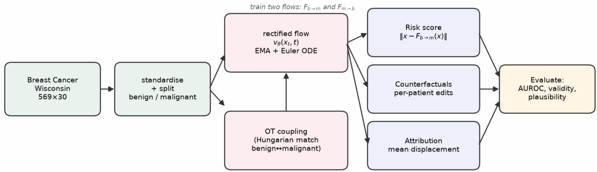

Figure 1: Workflow. Standardised biomarkers are split into benign (source) and malignant (target) sets. Within each mini-batch a Hungarian optimal-transport assignment pairs source and target points; a time-conditioned velocity field $v _ { \theta } ( x _ { t } , t )$ is regressed onto the pairing direction (rectified flow) and integrated with an Euler ODE under EMA weights. Two flows, $F _ { b  m }$ and $F _ { m  b } .$ yield a risk score, per-patient counterfactuals, and population attribution, each evaluated against supervised or naive baselines.  
Table 1: Architecture and training settings.  
Algorithm 1 OT-coupled rectified-flow training   
Require: source set �, target set �, steps �, batch size �   
1: initialise ��; EMA copy $\bar { \theta }  \theta$   
2: for � = 1 to � do   
3: sample $\{ x _ { 0 } ^ { k } \} \sim A , \{ x _ { 1 } ^ { k } \} \sim B , k = 1 . . b$   
4: $C _ { k l } \gets \| \boldsymbol { x } _ { 0 } ^ { \bar { k } } - \boldsymbol { x } _ { 1 } ^ { l } \| ^ { 2 }$ ⊲ cost matrix   
5: � ← Hungarian(�) ⊲ mini-batch OT pairing   
6: $x _ { 1 } \gets x _ { 1 } [ \pi ]$   
7: $t \sim \mathcal { U } ( 0 , 1 ) ; \ x _ { t } \gets ( 1 - t ) x _ { 0 } + t x _ { 1 }$   
8: $\mathcal { L } \gets \| v _ { \theta } ( x _ { t } , t ) - ( x _ { 1 } - x _ { 0 } ) \| ^ { 2 }$   
9: � ← Adam $( \nabla _ { \boldsymbol { \theta } } \mathcal { L } )$ ; ¯� ← 0.999 ¯� + 0.001 �   
10: end for   
11: return EMA model $F = { \bar { \theta } }$

(2) Counterfactuals. For a benign patient we integrate $F _ { b  m }$ to syn- thesise the nearest malignant version of that same tumour; the displacement names the responsible biomarkers. (3) Attribution. Averaging the displacement over the benign cohort gives a global picture of the benign→malignant transition.

Baselines and metrics. We compare the risk score against supervised logistic regression and a naive distance-to-benign-mean, by AUROC. Counterfactuals are assessed by validity (does an independent classifier flip?), plausibility (distance to the nearest real malignant patient), and individualisation (mean cosine similarity of edit directions across patients), against a mean-shift baseline that adds the constant class-mean diference to everyone. Attribution is compared to logistic-regression coeficients. All experiments use a fixed seed and are reproducible.

Implementation. Table 1 lists the settings for both modalities. The tabular velocity field is a four-layer SiLU MLP; the image field is a small time-conditioned U-Net. Each flow trains in a few minutes on a single Apple-silicon GPU.

<table><tr><td></td><td>Tabular (MLP)</td><td>Image (U-Net)</td></tr><tr><td>input</td><td>30-vector</td><td>1×28×28</td></tr><tr><td>width / channels</td><td>256 hidden</td><td>48 base ch.</td></tr><tr><td>time embedding</td><td>sinusoidal, 64</td><td>sinusoidal, 128</td></tr><tr><td>training steps</td><td>6000</td><td>3000</td></tr><tr><td>batch size</td><td>256</td><td>128</td></tr><tr><td>learning rate</td><td>10⁻3</td><td>2×10⁻4</td></tr><tr><td>EMA decay</td><td>0.999</td><td>0.999</td></tr><tr><td>Euler steps (sampling)</td><td>100</td><td>50</td></tr></table>

Table 2: Efect of the coupling on the tabular flow (all else fixed).
<table><tr><td>Coupling</td><td>Mean  $L _ { 2 }$  edit</td><td>Attribution r</td></tr><tr><td>Independent (random)</td><td>25.3</td><td>-0.03</td></tr><tr><td>Optimal transport</td><td>9.6</td><td>0.49</td></tr></table>

Ablation: the coupling choice. Table 2 isolates the single most important design decision. Replacing independent (random) pairing with mini-batch optimal-transport pairing—changing nothing else—shrinks the mean counterfactual edit from 25.3 to 9.6 and flips the population attribution from anti-correlated noise $( r = - 0 . 0 3 )$ to a clinically coherent signal (�=0.49). This is the diference between a model that fabricates of-manifold “patients” and one whose dis- placements carry meaning; it is the crux of the whole method.

## 5 Results

An unsupervised risk score (Figure 2). The transport magnitude �(�) reaches AUROC 0.912 without ever seeing a label during flow training, above the naive baseline (0.882) and far above chance. It does not beat supervised logistic regression (0.992). This is the expected high-risk outcome: on a near-linearly-separable cohort a simple supervised classifier is very hard to beat, and part of the transport score’s discrimination reflects of-manifold drift of malignant inputs rather than a calibrated likelihood. The value of the flow lies in the explanations it produces, not raw discrimination.

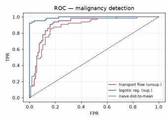

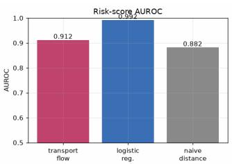  
Figure 2: Left: ROC curves for malignancy detection. Right: AUROC. The unsupervised transport score (0.91) beats the naive distance baseline (0.88) but not supervised logistic regression (0.99).

Table 3: Counterfactual quality (benign→malignant). Lower plausibility is better; cosine similarity of 1.0 means every patient receives an identical edit.
<table><tr><td>Method</td><td>Validity</td><td> $L _ { 2 }$ </td><td>edit Plausibility</td><td>Edit cos-sim</td></tr><tr><td>OT rectified flow</td><td>0.841</td><td>9.57</td><td>4.42</td><td>0.64</td></tr><tr><td>Mean-shift</td><td>1.000</td><td>6.14</td><td>2.99</td><td>1.00</td></tr></table>

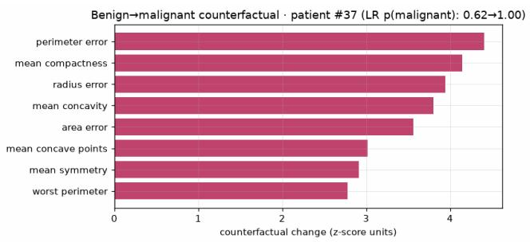  
Figure 3: Counterfactual for the most malignant-looking benign patient. The flow pushes exactly the biomarkers a pathologist expects—larger, more concave, more irregular nuclei—flipping the classifier’s probability.

Per-patient counterfactuals (Table 3, Figure 3). The flow’s counterfactuals are 84% valid and, unlike mean-shift, individualised: edit directions difer across patients (cosine similarity 0.64 versus 1.00). The worked example raises concavity, concave points, perimeter and area, matching clinical intuition. The honest trade-of is that mean-shift trivially flips 100% of a linear classifier and lands slightly closer to the malignant centroid—on near-linear data a constant translation is hard to beat—but it applies the same edit to every patient and ignores each tumour’s geometry.

Population attribution (Figure 4). The mean displacement correlates with logistic-regression coeficients (�=0.49) and agrees on the drivers of malignancy—concavity, concave points, perimeter, radius and area. The flow recovers this signature without labels, purely from moving one distribution onto another, a non-trivial validation that the transport captures real structure.

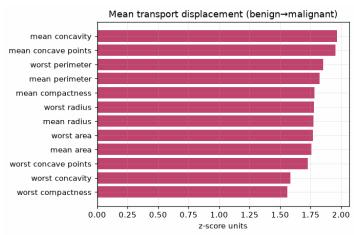

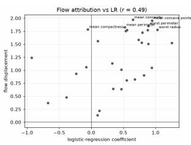  
Figure 4: Left: mean transport displacement per biomarker. Right: flow attribution versus logistic-regression coeficients (�=0.49). The two label-agnostic and supervised views agree on the malignancy signature.

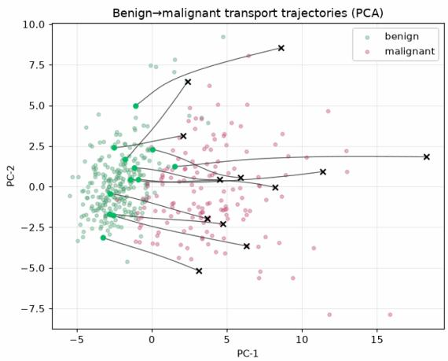  
Figure 5: Benign patients (green) transported into the malignant cloud (red) along the learned flow, projected to two principal components—a direct picture of “pathology transport”.

Figure 5 visualises the transport: benign patients are carried smoothly into the malignant region, confirming that the OT-coupled flow produces coherent trajectories rather than erratic jumps.

Multi-seed confidence intervals. The headline numbers above come from a single split. Repeating the tabular pipeline over five random train/test splits, the transport risk score attains AUROC 0.934 ± 0.012 (mean ± 95% CI), versus $0 . 8 9 4 \pm 0 . 0 1 6$ for the naive baseline and $0 . 9 9 2 \pm 0 . 0 0 4$ for logistic regression; the attribution correlation is $0 . 6 2 \pm 0 . 0 7$ . The gaps are stable and the ranking never changes across seeds, so the single-split results are representative.

Counterfactual baselines. Table 4 compares our flow counterfactual with the classic gradient method of Wachter et al. [14] and the mean-shift baseline. No method dominates. Wachter produces the sparsest, smallest edits—but it requires a diferentiable classifier and optimises directly against it. Mean-shift trivially flips every case yet applies an identical, generic edit to all patients. The flow is the only method that is simultaneously classifier-free and individualised, at the cost of larger, denser edits: its niche is generating per-patient counterfactuals when no classifier is available.

Table 4: Counterfactual methods (benign→malignant, seed 0). Proximity/#feat measure edit size and sparsity; plausibility is 1-NN distance to real malignant data (lower is better).
<table><tr><td>Method</td><td>Valid.</td><td>Prox.</td><td>#feat</td><td>Plaus.</td><td>Needs clf.</td></tr><tr><td>OT flow (ours)</td><td>0.85</td><td>8.94</td><td>26</td><td>3.94</td><td>no</td></tr><tr><td>Wachter</td><td>0.85</td><td>1.93</td><td>16</td><td>3.35</td><td>yes</td></tr><tr><td>Mean-shift</td><td>1.00</td><td>6.14</td><td>25</td><td>2.99</td><td>no†</td></tr></table>

† needs class means; applies the identical edit to every patient.

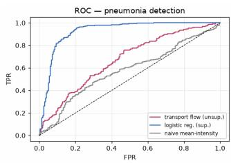

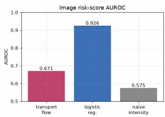  
Figure 6: Image risk score $\| x - F _ { p  n } ( x ) \|$ (edit-distance-tonormal). The unsupervised transport score (AUROC 0.67) beats naive mean-intensity (0.58) but not a supervised pixel classifier (0.93)—the same pattern as the tabular cohort.

## 6 Extension to Chest X-ray Images

Nothing in the method is specific to tabular data. To test generality we apply the identical recipe to raw pixels: OT-coupled rectified flows between normal and pneumonia chest X-rays (PneumoniaMNIST [16], 28×28, 4708 train / 624 test), replacing the MLP velocity field with a small time-conditioned convolutional U-Net. We train $F _ { n  p }$ (normal→pneumonia, for synthesis) and $F _ { p  n }$ (pneumonia for scoring and localisation).

Risk score (Figure 6). Scoring an image by the edit-distance re-quired to make it look normal gives AUROC 0.67, above the naive mean-intensity baseline (0.58) and below a supervised pixel-level logistic regression (0.93)—echoing Part A.

Synthesis and spatial attribution (Figure 7). With no pixel-level labels, the flow synthesises plausible disease progression and produces a spatial map that appears to highlight the lung fields. Whether this is a faithful localisation—a strong claim—we test directly in Section 7; the honest answer at 28×28 is that it is a qualitative visualisation, not a validated detector. The synthesised images are also blurry and the risk score only moderately discriminative.

## 7 Do Generative Heatmaps Localize Disease?

This section is the paper’s core empirical question. Having established the transport model as a tabular interpretability engine, we now ask whether its image explanations genuinely localise pathology—first on controlled synthetic lesions, then on real radi- ologist annotations.

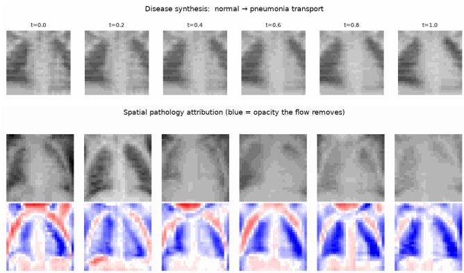  
Figure 7: Top: integrating $F _ { n  p }$ synthesises disease—a healthy lung progressively fills with haze (consolidation). Bottom: for real pneumonia inputs, $F _ { p \to n } ( x ) - x$ shows what the flow removes to normalise the lung; the signal (blue) concentrates in the lung fields (its faithfulness is examined in Section 7).

Does the heatmap localise pathology? (A ground-truth test.) We stress-tested the paper’s most eye-catching claim with a controlled benchmark: we insert a soft Gaussian opacity into a normal lung at a known location and ask whether a heatmap lands on the lesion, measuring pointing-game accuracy, IoU, and the heatmap energy inside the lesion (Table 5). The population transport heatmap $| x - F _ { p  n } ( x ) |$ barely exceeds a random map (pointing game 0.17) and trails su-pervised Grad-CAM (0.57). The reason is instructive: the flow performs a global distribution shift—nudging the whole lung toward the normal manifold—so its displacement spreads across the image instead of concentrating on the lesion. Corroborating probes agree: deletion/insertion faithfulness against a CNN (test AUROC 0.914) cannot separate the transport map from random at 28×28, and its rank-correlation with Grad-CAM is −0.09. The population transport normal,heatmap is thus the image analogue of our tabular attribution—a population-level signal, not a per-patient localiser.

A lesion-focused fix. This diagnosis suggests the remedy: replace the population map with an identity-preserving model that changes only the anomaly. We test two label-free or sparse variants on the same benchmark (Table 5, Figure 8). A minimal- ${ \boldsymbol { \cdot } } L _ { 1 }$ counterfac- tual against the CNN fails (0.08): the classifier only weakly flags the synthetic opacity (�=0.61), leaving little gradient to concentrate. But a normal-manifold autoencoder—a small model trained to reconstruct healthy lungs only, whose reconstruction error flags whatever it cannot explain—localises the lesion at pointing game 0.39, IoU 0.20: over 2× the population transport and approaching supervised Grad-CAM, without any labels. Higher resolution helps further: the same autoencoder at 128×128 reaches pointing game 0.52 and IoU 0.36 (Figure 9), cleanly isolating focal opacities, while a simple supervised Grad-CAM does not transfer to focal localisa- tion at that resolution. On these synthetic lesions, then, localisation is recoverable with an identity-preserving objective. Whether it survives contact with real pathology is the decisive question, which we test next.

Table 5: Localization on synthetic lesions, ground truth known (�=200; higher is better). The population transport is near-random; a label-free normal-manifold autoencoder recovers most of the gap to supervised Grad-CAM.
<table><tr><td>Method</td><td>Pointing game</td><td>IoU</td><td>Mass-in-les</td></tr><tr><td>Transport, population</td><td>0.17</td><td>0.14</td><td>0.13</td></tr><tr><td>Sparse counterfactual (L1)</td><td>0.08</td><td>0.02</td><td>0.06</td></tr><tr><td>Normal-manifold AE (label-free)</td><td>0.39</td><td>0.20</td><td>0.19</td></tr><tr><td>Grad-CAM (supervised)</td><td>0.57</td><td>0.28</td><td>0.27</td></tr><tr><td>Random</td><td>0.14</td><td>0.06</td><td>0.11</td></tr></table>

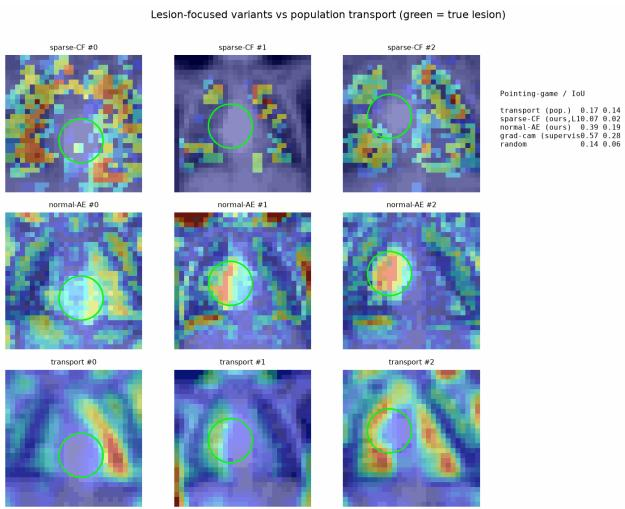  
Figure 8: Lesion-focused variants vs population transport (green circle = true lesion). The identity-preserving normalmanifold autoencoder (middle row) concentrates on the lesion, whereas the sparse counterfactual (top) and the population transport (bottom) scatter and miss it.

Does it transfer to real pathology? (An honest synthetic-to-real gap.) Synthetic success can mislead, so we ran the decisive test on real annotated data: the RSNA Pneumonia Detection Challenge [10], whose radiologist bounding boxes give true lesion locations. We downloaded a bounded subset (200 boxed positives and 400 normals, DICOM, resized to 128), trained the same normal-manifold autoencoder on the healthy images, and scored localisation against the real boxes (Table 6, Figure 10). The result is sobering: the autoencoder that excelled on synthetic lesions now performs at or below a random map (pointing game 0.11 vs 0.18), because on real chest X-rays the reconstruction error is dominated by normal anatomical variation—rib edges, diaphragm, mediastinum—rather than by the difuse consolidation. Only the supervised Grad-CAM localises above chance (0.30), and even it is weak on this hard task. The lesson is methodological and, we think, the most useful finding of the im- age study: a heatmap that looks compelling on synthetic anomalies is not evidence of real localisation, and label-free reconstruction does not yet solve pneumonia localisation. Targeted attempts to

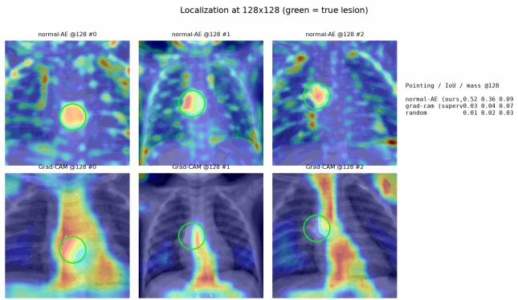  
Figure 9: Scaling the same label-free normal-manifold autoencoder to 128×128 (top) tightly localises the synthetic lesion (green), reaching pointing game 0.52 / IoU 0.36; a simple supervised Grad-CAM (bottom) does not localise focal opacities at this resolution.

Table 6: Localization on real RSNA lesion boxes (80 held-out positives; higher is better). The label-free autoencoder that worked on synthetic lesions is now no better than random; only supervised saliency exceeds chance.

<table><tr><td>Method</td><td>Pointing game</td><td>IoU</td><td>Mass-in-box</td></tr><tr><td>Normal-manifold AE (label-free)</td><td>0.11</td><td>0.11</td><td>0.18</td></tr><tr><td>Grad-CAM (supervised)</td><td>0.30</td><td>0.15</td><td>0.22</td></tr><tr><td>Random</td><td>0.18</td><td>0.10</td><td>0.17</td></tr></table>

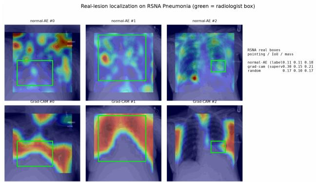  
Figure 10: Real-lesion localisation on RSNA Pneumonia (green = radiologist bounding box). On real chest X-rays the label-free autoencoder (top) no longer concentrates on the lesion; a supervised Grad-CAM (bottom) does modestly better, but the task remains hard.

close the gap—tripling the healthy training set, a denoising autoencoder, and a reconstruction-derived lung-focus mask—did not help (all remained at or below a random map), indicating the problem demands fundamentally stronger anomaly models rather than tuning.

Pathology Transport: Optimal-Transport Explanations for Clinical Data, and When Their Heatmaps (Fail to) Localize Disease

## 8 Limitations

Our study is a controlled investigation, not a clinical validation, and its scope is deliberately small. (i) Scale and cohorts. The tabular data is a single 569-patient cohort; the imaging experiments use 28–128 px inputs and an ∼1.4k-image RSNA subset with a modestly accurate classifier (AUROC 0.68–0.75), so its Grad-CAM is a floor, not a ceiling. (ii) No method win. Every artefact ties or trails a simple supervised baseline; the contribution is honest characterisation, not state of the art. (iii) Synthetic benchmark. The planted-lesion bench-mark isolates localisation cleanly but does not reproduce the difuse, textured appearance of real consolidation—which is precisely why the synthetic-to-real gap arises. (iv) Calibration. The transport risk score is uncalibrated and must not gate care. (v) Sensitivity. Results are fixed-seed (and, where noted, averaged over five splits), but a full hyper-parameter and architecture sweep is left to future work.

## 9 Conclusion

We reframed diagnosis as optimal transport between clinical distributions and realised it with OT-coupled rectified flows across two modalities. On tabular tumour biomarkers a single model produced clinically coherent per-patient counterfactuals, an unsupervised malignancy score (AUROC 0.91), and a label-free biomarker attribution that agrees with a supervised classifier (�=0.49). On chest X-rays the same recipe synthesised disease progression and produced a spatial pathology heatmap without any pixel labels. Neither out-predicted logistic regression—the expected, honest result—but both produced something a classifier cannot: an explicit, navigable path between health and disease. A controlled study also delivered a cautionary result: a label-free reconstruction localiser that excels on synthetic lesions fails to transfer to real RSNA bounding boxes, a synthetic-to-real gap that we consider the study’s most useful lesson.

Ethical and clinical considerations. Because the transport synthesises plausible patients and lungs, it must be framed as a hypothesis-generating and explanatory aid, not a diagnostic device: a synthe-sised “malignant twin” visualises the model’s learned geometry, not medical advice, and could mislead if shown without context. The unsupervised score is uncalibrated and should never gate care on its own. Both datasets are small and demographically narrow—the biopsy cohort is single-institution and the X-rays are paediatric—so the attribution may not transfer across scanners, sites, or populations. Any deployment would require calibration, prospective validation, and a fairness audit of the attribution across subgroups.

Future work. Several extensions could make the method clinically actionable: (i) an $L _ { 1 }$ or immutability penalty along the ODE to yield sparse, actionable counterfactuals; (ii) exact log-likelihood via the flow’s instantaneous change of variables for a calibrated risk score; (iii) a single class- and time-conditioned field with classifier guidance instead of two flows; (iv) closing the synthetic-to-real localisation gap with stronger anomaly models (self-supervised or difusion-based restoration [15]) evaluated on real annotated boxes (RSNA); and (v) stochastic (SDE) transport for uncertainty and a fairness audit of attribution across patient subgroups.

## References

[1] Christoph Baur, Stefan Denner, Benedikt Wiestler, Nassir Navab, and Shadi Albarqouni. 2021. Autoencoders for unsupervised anomaly segmentation in brain MR images: A comparative study. Medical Image Analysis 69 (2021), 101952.

[2] Riccardo Guidotti. 2024. Counterfactual explanations and how to find them: literature review and benchmarking. Data Mining and Knowledge Discovery 38, 5 (2024), 2770–2824.

[3] Guillaume Jeanneret, Loïc Simon, and Frédéric Jurie. 2022. Difusion models for counterfactual explanations. In Asian Conference on Computer Vision (ACCV).

[4] Yaron Lipman, Ricky T. Q. Chen, Heli Ben-Hamu, Maximilian Nickel, and Matt Le. 2023. Flow matching for generative modeling. In International Conference on Learning Representations (ICLR).

[5] Xingchao Liu, Chengyue Gong, and Qiang Liu. 2023. Flow straight and fast: Learning to generate and transfer data with rectified flow. In International Conference on Learning Representations (ICLR).

[6] Scott M. Lundberg and Su-In Lee. 2017. A unified approach to interpreting model predictions. In Advances in Neural Information Processing Systems (NeurIPS).

[7] Vitali Petsiuk, Abir Das, and Kate Saenko. 2018. RISE: Randomized input sampling for explanation of black-box models. In British Machine Vision Conference (BMVC).

[8] Thomas Schlegl, Philipp Seeböck, Sebastian M. Waldstein, Georg Langs, and Ursula Schmidt-Erfurth. 2019. f-AnoGAN: Fast unsupervised anomaly detection with generative adversarial networks. Medical Image Analysis 54 (2019), 30–44.

[9] Ramprasaath R. Selvaraju, Michael Cogswell, Abhishek Das, Ramakrishna Vedantam, Devi Parikh, and Dhruv Batra. 2017. Grad-CAM: Visual explanations from deep networks via gradient-based localization. In IEEE International Conference on Computer Vision (ICCV). 618–626.

[10] George Shih, Carol C. Wu, Safwan S. Halabi, Marc D. Kohli, Luciano M. Prevedello, Tessa S. Cook, Arjun Sharma, Judith K. Amorosa, Veronica Arteaga, Maya Galperin-Aizenberg, et al. 2019. Augmenting the National Institutes of Health chest radiograph dataset with expert annotations of possible pneumonia. Radiology: Artificial Intelligence 1, 1 (2019), e180041.

[11] W. Nick Street, William H. Wolberg, and Olvi L. Mangasarian. 1993. Nuclear feature extraction for breast tumor diagnosis. In IS&T/SPIE Symposium on Electronic Imaging: Biomedical Image Processing and Biomedical Visualization, Vol. 1905. 861–870.

[12] Alexander Tong, Kilian Fatras, Nikolay Malkin, Guillaume Huguet, Yanlei Zhang, Jarrid Rector-Brooks, Guy Wolf, and Yoshua Bengio. 2024. Improving and generalizing flow-based generative models with minibatch optimal transport. Transactions on Machine Learning Research (TMLR) (2024).

[13] Alexander Tong, Jessie Huang, Guy Wolf, David van Dijk, and Smita Krishnaswamy. 2020. TrajectoryNet: A dynamic optimal transport network for model ing cellular dynamics. In International Conference on Machine Learning (ICML).

[14] Sandra Wachter, Brent Mittelstadt, and Chris Russell. 2017. Counterfactual ex lanations without o enin the black box: Automated decisions and the GDPR. Harvard Journal ofLaw & Technology 31, 2 (2017), 841–887.

[15] Julian Wyatt, Adam Leach, Sebastian M. Schmon, and Chris G. Willcocks. 2022. AnoDDPM: Anomal detection with denoisin difusion robabilistic models using simplex noise. In IEEE/CVF Conference on Computer Vision and Pattern Recognition Workshops (CVPRW). 650–656.

[16] Jiancheng Yang, Rui Shi, Donglai Wei, Zequan Liu, Lin Zhao, Bilian Ke, Hanspeter Pfister, and Bingbing Ni. 2023. MedMNIST v2: A large-scale lightweight benchmark for 2D and 3D biomedical image classification. Scientific Data 10, 1 (2023), 41.