# Prism-GRPO: Faster VLA Policy Optimization via Splitting Same-outcome Groups

Zeyun Deng1\*, Yuzhe Lu2, Yawei Wang2, Linbo Liu2, Qing Ping2, Han Ding2, Guande Wu2, Panpan Xu2, Jun Huan2 1Purdue University 2AWS AI

## Abstract

GRPO is increasingly used for reinforcement learning of vision-language-action (VLA) policies because, unlike PPO, it does not require training a critic. This simplification comes with a sampling cost: group-relative advantages require multiple rollouts from each scene. Under binary success rewards, groups whose rollouts all succeed or all fail have zero advantage and are discarded by dynamic sampling. These groups are especially common early in training, when most rollouts fail, wasting much of the expensive robotic rollout budget. We introduce Prism-GRPO, which augments binary outcome reward with a weighted trajectory-level execution-quality score. By splitting same-outcome groups into a quality spectrum, Prism-GRPO recovers training signal while ensuring that every success still outranks every failure. Quality scores can be derived from simulator contacts, executed actions, or visual observations, avoiding task-specific progress rewards. We prove that Prism-GRPO never increases the probability that a sampled group is discarded for having zero advantages, and derive a gradient-alignment condition under which its combined update remains a local ascent direction for task success. Across four RoboTwin tasks spanning different horizons and coordination patterns, Prism-GRPO improves success and quality at matched rollout budgets and reaches target success rates with up to 56% fewer rollouts. It also suppresses a reward-hacking shortcut, with the cleaner behavior transferring under direct deployment to a real robot. Through ablations, we show consistent gains across contact-, smoothness-, and VLM-derived quality signals.

## 1 Introduction

Reinforcement learning is a standard way to improve visionlanguage-action (VLA) policies beyond supervised finetuning, and GRPO (Shao et al. 2024) is attractive because it avoids a learned critic by comparing rollouts within a group. Under a binary success reward, however, GRPO can be highly sample-inefficient. If all trajectories in a group succeed, or all of them fail, every rollout receives the same reward. The group has no advantage spread, produces no gradient, and is discarded by dynamic sampling (Yu et al. 2026). GRPO therefore learns only from mixed-outcome groups, wasting the samples collected in degenerate groups.

Recent LLM reasoning work revives degenerate groups using finer-grained signals. RL-ZVP uses the policy's output entropy (Le et al. 2025), CAST uses self-teacher guidance (Li et al. 2026b), and LLM-as-a-Verifier (Kwok et al. 2026) uses an external verifier's scoring-token logits. In robotics, the execution itself provides a natural signal. Two rollouts with the same outcome may differ in unintended contact, object disturbance, or motion smoothness. Unlike task progress, these properties describe how the task is executed rather than how far it has advanced, making them reusable across manipulation tasks. The only requirement is an observable trajectory score aligned with successful execution, leaving its definition and measurement flexible. We turn this observation into Prism-GRPO, Policy optimization by Refining Identical-outcome groups into a quality Spectrum for More efficient GRPO. As illustrated in Figure 1, Prism-GRPO uses execution quality to turn otherwise discarded same-outcome groups into informative updates. Breaking reward ties alone, however, does not guarantee progress toward task success. Prism-GRPO therefore preserves success dominance by construction; we further characterize when the recovered signal advances success. Our contributions are threefold:

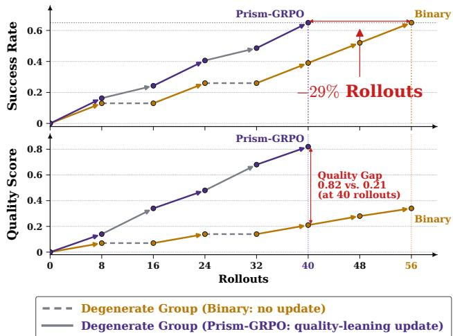  
Figure 1: Illustrative overview. Binary GRPO discards allsuccess and all-failure groups because identical rewards yield zero advantage. Prism-GRPO splits them by execution quality to recover informative, success-aligned updates.

• We introduce Prism-GRPO for reinforcement learning of VLA policies on robotic tasks, combining binary task success with bounded trajectory quality to recover training signal from same-outcome rollouts.

• We prove that Prism-GRPO never increases the expected number of rollouts needed to obtain an informative group. Under success-quality gradient alignment, its combined update is a first-order ascent direction for both objectives.

• Across four RoboTwin tasks, Prism-GRPO reaches target success rates with up to 56% fewer rollouts while improving execution quality. The gains hold across contact-, smoothness-, and VLM-derived signals, and cleaner behavior transfers under direct real-robot deployment.

## 2 Related Work

Vision-language-action models. Vision-language-action (VLA) models map visual observations and a language instruction to a robot action, typically the target pose and gripper state across the arm's degrees of freedom, on top of a pretrained vision-language backbone. They split by how that action is represented. OpenVLA (Kim et al. 2024; Kim, Finn, and Liang 2025) discretizes each degree of freedom into bins and emits one token per degree of freedom, so control becomes next-token prediction over a fixed action vocabulary; the π models (Black et al. 2024; Intelligence et al. 2025) instead use a flow-matching head that outputs continuous actions directly. Pretrained by imitation, these policies are capped at their demonstration quality; reinforcement learning is the standard fine-tuning stage that lifts them past it.

Reinforcement learning for VLA policies. RL for continuous control has long relied on PPO (Schulman et al. 2017), which estimates advantages with a separate value network. GRPO (Shao et al. 2024) removes this critic, scoring a group of trajectories on the same input against their mean reward, and has driven much of the progress in LLM post-training. Carrying it over to VLA policies is harder than it looks: Liu et al. (2026) find that a single trajectory-level reward cannot fairly credit individual actions when each physically moves the agent. SimpleVLA-RL (Li et al. 2025) nonetheless makes GRPO effective for VLAs by adapting the rollout process to encourage exploration, through dynamic sampling that discards and resamples same-outcome groups, a raised upper clipping bound (clip-higher, following DAPO (Yu et al. 2026)), a higher rollout temperature, and no KL penalty. We build directly on this recipe.

Enriching the binary reward. The binary reward used by SimpleVLA-RL (Li et al. 2025) is cheap to check but blind within an outcome: all successes score alike and so do all failures. A common way to add signal is to replace or augment success with graded feedback. RoboReward (Lee et al. 2026) learns a vision-language reward model from robot data, while stage-level process rewards such as StARe-VLA (Xu et al. 2025) use task-specific intermediate scores. LLM-asa-Verifier (Kwok et al. 2026) provides another source of graded feedback, computing continuous verifier scores from scoring-token logits rather than discrete judge outputs and using these scores as dense rewards.

Reviving degenerate groups. Under binary rewards, same-outcome GRPO groups have zero advantage spread and provide no update. Recent LLM reasoning work asks whether these zero-variance groups can still provide useful signal, but differs in where that signal comes from. RL-ZVP (Le et al. 2025) is the closest baseline to ours and the first to treat zero-variance groups themselves as useful training data, reviving them with entropy from the policy's own output distribution. Other methods add extra assistance. EDGE-GRPO (Zhang et al. 2025) combines entropy-driven advantages with guided error correction that supplies failed samples with oracle reference solutions, introducing additional supervision beyond the sampled rollouts. CAST (Li et al. 2026b) uses an additional self-teacher pass for tokenlevel guidance, while LLM-as-a-Verifier (Kwok et al. 2026) uses an external verifier's scoring-token logits to produce continuous scores rather than discrete judge labels. These methods are designed around LLM reasoning, where intermediate reasoning quality is hard to measure directly. VLA rollouts are physical executions, so their trajectories already expose quality signals such as collisions, object disturbance, or smoothness. Prism-GRPO directly ranks same-outcome rollouts using trajectory signals, without oracle references, helper models, or policy-confidence proxies.

Gradient conflict in multi-objective learning. Two objectives on one policy may have gradients that oppose each other, so the averaged update improves one at the other's expense. Prior work addresses this by gating or projecting auxiliary gradients (Du et al. 2018; Yu et al. 2020), or by controlling their influence through learned weights or strict priorities (Gupta et al. 2023; Berducci et al. 2021). These methods assume conflict. We instead target manipulation settings where higher-quality behavior tends to support task completion, allowing the two rewards to be added directly.

## 3 Preliminary

GRPO with binary reward and compositional reward. We cast VLA control as a Markov decision process $( S , \mathcal { A } , P , R , \rho _ { 0 } )$ : at each step the policy πθ observes a state $s _ { t } ~ \in ~ S$ (images and the instruction), takes an action $a _ { t } ~ \in ~ { \mathcal { A } }$ (a robot command), and the environment transitions by $\textstyle P ( s _ { t + 1 } \mid s _ { t } , a _ { t } )$ . A full episode is a trajectory ${ \boldsymbol \tau } = ( s _ { 0 } , a _ { 0 } , \dots )$ , and RL seeks the θ maximizing the expected return $\mathbb { E } _ { \tau \sim \pi _ { \theta } } [ R ( \tau ) ]$ . GRPO optimizes this objective without a learned value function: on each scene it samples a group of G trajectories from πθ, scores them $R _ { 1 } , \ldots , R _ { G }$ and forms each advantage by subtracting the group's baseline reward, so the signal is purely relative (Shao et al. 2024). The reward itself is left to the practitioner.

Definition 1 (Degenerate group). A group is degenerate if $R _ { 1 } = \cdot \cdot \cdot = R _ { G }$ , yielding zero advantages and no gradient; otherwise, it is informative.

Definition 2 (Objective gradients and alignment). Let πθ have parameters $\theta ~ \in ~ \mathbb { R } ^ { d }$ , and define the success and quality objectives as $J ( \theta ) \ = \ \mathbb { E } _ { x , \tau } [ \mathrm { s u c c e s s } ( \tau ) ]$ and $Q ( \theta ) \dot { = } \mathbb { E } _ { x , \tau } [ q \dot { ( } \tau ) ]$ . Their gradients $g _ { \mathrm { s u c c e s s } } = \nabla _ { \theta } \dot { J } ( \ddot { \theta } )$ and $g _ { \mathrm { q u a l i t y } } = \nabla _ { \theta } Q ( \theta )$ lie in the same parameter space. They align if $\langle g _ { \mathrm { s u c c e s s } } , g _ { \mathrm { q u a l i t y } } \rangle \geq 0$ and conflict otherwise.

Algorithm 1 Prism-GRPO   
Require: $\pi _ { \theta } ,$ scene x, group size $G , \lambda \in ( 0 , 1 )$   
1: repeat   
2: sample $\tau _ { 1 } , \dots , \tau _ { G } \sim \pi _ { \theta } ( \cdot \mid x )$   
3: $R _ { i } \bar {  } \operatorname { s u c c e s s } ( \tau _ { i } ) + \lambda \dot { q } ( \dot { \tau } _ { i } )$   
4: until not all $R _ { i }$ are equal {discard G rollouts per retry}   
5: $\begin{array} { r } { \hat { A } _ { i } \gets R _ { i } - \frac { 1 } { G - 1 } \sum _ { j \neq i } R _ { j } } \end{array}$   
6: update $\theta$ using $\{ \hat { A } _ { i } \}$

## 4 Prism-GRPO

## 4.1 Reward design and problem formulation

Tasks, scenes, trajectories. A task $T$ (e.g. stacking two cubes) induces a distribution over scenes; we write x \~ Scene(T) for a scene, consisting of an initial configuration together with its instruction. Running $\pi _ { \theta }$ on x produces a trajectory $\tau \sim \pi _ { \boldsymbol { \theta } } ( \cdot \ | \ x )$ , scored by a binary outcome success $( \tau ) \ \in \ \{ 0 , 1 \}$ and a continuous quality score $q ( \tau ) \in [ 0 , 1 ]$ , where $q ( \cdot )$ is a measurement of quality, such as smoothness, larger the better. A GRPO group drawns $G$ trajectories on the same scene x.

Quality-augmented reward. Prism-GRPO starts with the binary outcome reward and adds execution quality. For a trajectory τ, we define

$$
R _ { \mathrm { c o m b i n e d } } ( \tau ) = \operatorname { s u c c e s s } ( \tau ) + \lambda q ( \tau ) , \qquad 0 < \lambda < 1 .\tag{1}
$$

This turns tied binary rewards into a success-dominant reward spectrum. As illustrated in Figure 2, an all-failure group has all rewards equal to 0 under the binary reward, and vise versa; therefore, both have no spread of advantages. The quality term breaks these ties by refining failures within [0, λ] and successes within $[ 1 , 1 + \lambda ]$ . Since $\lambda < 1$ , the two bands remain separated: every success still scores above every failure, while quality only reorders trajectories within an outcome class. We pair this reward with the leave-one-out (RLOO) advantage estimator (Kool, van Hoof, and Welling 2019; Ahmadian et al. 2024), which subtracts the siblings'mean but does not divide by the group standard deviation. This matters on same-outcome groups, where the entire reward spread is λq: standard GRPO normalization would cancel the scale of λ (Arora and Zanette 2025), while RLOO preserves the raw quality differences.

Analysis target. Our goal is to improve rollout efficiency without sacrificing task success, while also improving execution quality. Relative to Binary GRPO, Prism-GRPO should reach the same target value of the success objective $J ( \theta )$ using no more generated rollouts and, at that point, attain at least as large a value of the quality objective $\bar { Q } ( \theta )$

## 4.2 When Quality Supports Success

Task-level correlation remains informative. The quality term is useful only if higher-quality trajectories are also more likely to succeed. We measure this relationship directly from rollouts using the task-level correlation $\kappa _ { 2 } = \mathrm { C o r r } _ { x \sim \mathrm { S c e n e } ( T ) , \tau \sim \pi _ { \theta } ( \cdot | x ) } [ q ( \tau )$ , success(τ)], where x denotes a sampled scene, τ a trajectory generated by the current policy $\pi _ { \boldsymbol { \theta } } , q ( \tau )$ the trajectory quality, and success $( \tau ) \in$ {0, 1} the task outcome. Although many GRPO groups become degenerate, $\kappa _ { 2 }$ remains meaningful because it is computed over all scenes rather than within a single group. Its covariance $\operatorname { C o v } ( q ,$ success) decomposes as

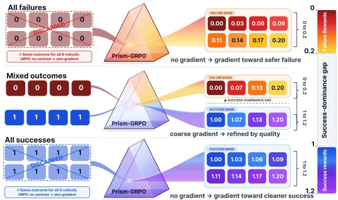  
Figure 2: Prism-GRPO splits same-outcome groups into a reward spectrum. Colors indicate rewards. λ=0.2.

$$
\underbrace { \mathbb { E } _ { x } [ \mathrm { C o v } ( q , \mathrm { s u c c e s s } \mid x ) ] } _ { \mathrm { w i t h i n - s c e n e } } + \underbrace { \mathrm { C o v } _ { x } ( \bar { q } ( x ) , \bar { s } ( x ) ) } _ { \mathrm { b e t w e e n - s c e n e } } ,\tag{2}
$$

where $\bar { q } ( x ) = \mathbb { E } [ q ( \tau ) \mid x ]$ and $\bar { s } ( x ) = \mathbb { E } [ \mathrm { s u c c e s s } ( \tau )$ | x] are the average quality and success rate on scene $x .$ The withinscene term vanishes when a scene is saturated (all rollouts share the same outcome), but the between-scene term can remain positive because the policy tends to achieve higher quality on easier scenes where it succeeds more often. Consequently, $\kappa _ { 2 }$ continues to capture the overall quality-success relationship even when many GRPO groups are degenerate.

From correlation to gradient alignment. Our theory assumes population-level alignment, $\langle g _ { \mathrm { s u c c e s s } } , g _ { \mathrm { q u a l i t y } } \rangle \geq 0 .$ where $\bar { g } _ { \mathrm { s u c c e s s } } = \nabla _ { \boldsymbol { \theta } } \mathbb { E } [ \mathrm { s u c c e s s } ]$ and $g _ { \mathrm { q u a l i t y } } = \dot { \nabla } _ { \theta } \mathbb { E } [ q ]$ . To study this condition, we analyze a single softmax decision and identify a sufficient mechanism for alignment. Let $\rho ( s )$ denote the policy-weighted correlation between the actions success and quality values. The proposition below shows that sufficiently high $\rho ( s )$ yields decision-level alignment.

Proposition 1. Consider a single softmax decision at state s over K actions, with distribution $\pi = \pi _ { \theta } ( \cdot \mid s )$ . Let uk and $v _ { k }$ denote the success and quality values of action $k ,$ and let $\rho ( s ) = \mathrm { C o r r } _ { k \sim \pi } ( u _ { k } , v _ { k } )$ be their policy-weighted correlation. Assume both u and v take at least two distinct values under π. Let $D _ { \pi } = \mathrm { d i a g } ( \pi )$ , and let $\kappa _ { \pi } \geq 1$ be its condition number on the policy-centered subspace. It measures how unevenly probability is distributed across actions: $\kappa _ { \pi } = 1$ for a uniform policy and can increase as the policy becomes more concentrated. Appendix A.3 gives the precise definition and proof. Writing $g _ { \mathrm { s u c c e s s } } ( s )$ and $g _ { \mathrm { q u a l i t y } } ( s )$ for the corresponding policy gradients

$$
\rho ( s ) \geq \frac { \kappa _ { \pi } - 1 } { \kappa _ { \pi } + 1 } \Longrightarrow \langle g _ { \mathrm { s u c c e s s } } ( s ) , g _ { \mathrm { q u a l i t y } } ( s ) \rangle \geq 0 .\tag{3}
$$

Interpretation and scope. The threshold $( \kappa _ { \pi } - 1 ) / ( \kappa _ { \pi } +$ 1) depends on policy conditioning: it is 0 for a uniform policy and approaches 1 only under extreme concentration. Modern RL methods discourage such collapse through clip-higher, temperature sampling, and entropy regularization (Yu et al. 2026; Cui et al. 2025; Simoni et al. 2025); our implementation inherits clip-higher and temperature-1 sampling from SimpleVLA-RL (Li et al. 2025). For example, $\bar { \pi } ~ = ~ ( 0 . 9 7 , \bar { 0 } . 0 1 5 , 0 . 0 1 5 )$ has $\kappa _ { \pi } ~ \approx ~ 2 . 9$ , requiring $\rho ( s ) \approx 0 . 4 9$ for decision-level alignment. This gives a tractable alignment mechanism at a single decision, but does not establish population-level alignment across scenes, states, and stochastic long-horizon trajectories. Finite rollouts yield noisy estimates, and reliable verification would require many batches with full-model gradient aggregation. We therefore retain $\langle g _ { \mathrm { s u c c e s s } } , g _ { \mathrm { q u a l i t y } } \rangle \geq 0$ as an explicit assumption, report correlation diagnostics in Appendix H, and evaluate it empirically in full Prism-GRPO training.

## 4.3 The combined update points toward success

Under the alignment condition in Section 4.2, the combined gradient improves quality without sacrificing success.

Proposition 2 (The combined gradient ascends both success and quality). Whenever the population gradients align, $\langle g _ { \mathrm { s u c c e s s } } , g _ { \mathrm { q u a l i t y } } \rangle \geq 0 ,$ the combined direction gcombined = gsuccess $+ \lambda g _ { \mathrm { q u a l i t y } }$ is a first-order ascent direction for both the success objective $J ( \theta )$ and the quality objective $Q ( \theta )$ . In particular, $\langle \nabla _ { \theta } J , g _ { \mathrm { c o m b i n e d } } \rangle \geq \mathbf { \bar { \phi } } \| g _ { \mathrm { s u c c e s s } } \| ^ { 2 }$ and $\langle \dot { \nabla } _ { \boldsymbol { \theta } } \dot { Q } , g _ { \mathrm { c o m b i n e d } } \rangle ~ \geq ~ \dot { \lambda } \| g _ { \mathrm { q u a l i t y } } \| ^ { 2 }$ . Both are non-negative and are strictly positive whenever the corresponding gradient is nonzero. The proof is given in Appendix A.2.

Proposition 2 shows that gcombined preserves first-order progress on success, with directional derivative at least $\yen 12$ , while also improving quality. Thus, the quality signal can improve execution quality without pulling the update away from the target success level.

## 4.4 Improved sample efficiency

Dynamic sampling discards zero-advantage groups. We measure sample efficiency by rollouts per informative group.

Theorem 1 (The combined reward is at least as sample-efficient as the binary reward). Fix a scene with success rate $p \in ( 0 , 1 )$ and group size $G \geq 2 ,$ and let $\delta ( p )$ be the probability that all G combined rewards in a group coincide. The expected rollouts per informative group are $C _ { \mathrm { b i n a r y } } ( p ) =$ $G / ( 1 - p ^ { G } - ( 1 - p ) ^ { G } )$ and $C _ { \mathrm { c o m b i n e d } } ( p ) = G / ( 1 - \delta ( p ) )$ respectively. They satisfy

$$
C _ { \mathrm { c o m b i n e d } } ( p ) \leq C _ { \mathrm { b i n a r y } } ( p ) \qquad f o r a l l p \in ( 0 , 1 ) .\tag{4}
$$

The proof, including coincident combined rewards, is given in Appendix A.1. For continuous conditional quality scores, exact ties occur with probability zero, so $C _ { \mathrm { c o m b i n e d } } ( p ) ~ = ~ G$ and every group is informative. At $p = 0 . 1 \mathrm { o r } 0 . 9 $ , Binary GRPO then requires approximately 1.76× as many rollouts for $G = 8$ and $2 . 9 1 \times$ for $G = 4$

Rescued groups train quality, yet still move success. Theorem 1 is a fixed-scene statement: near $\bar { s } ( x ) \ : = \ : 0$ or $\bar { s } ( x ) = 1$ every rollout in the group shares an outcome, so the binary term is constant and the group's entire advantage spread comes from $\lambda q .$ Such a rescued group thus contributes only $g _ { \mathrm { q u a l i t y } }$ , and appears to train quality alone. It does not. By the alignment above, $g _ { \mathrm { q u a l i t y } }$ projects non-negatively onto gsuccess, so the quality-only gradient from a saturated scene still advances the task-level success objective, which Proposition 2 defines over all scenes rather than any one group. This fails only when $g _ { \mathrm { s u c c e s s } } = 0$ over the whole task, meaning $\bar { s } ( x ) = 1$ everywhere, where the task is solved, or $\bar { s } ( x ) = 0$ everywhere, where no trajectory ever succeeds. The zerosuccess case also defeats standard GRPO, which likewise assumes an SFT initialization with some task competence to bootstrap RL (Li et al. 2025); Ours requires no more.

## 5 Experiments

Benchmark and training setup. All experiments use RoboTwin 2.0 (Chen et al. 2025a), a bimanual manipulation benchmark with domain randomization over clutter, lighting, background, tabletop height, and language instruction. Each randomized task instance defines a scene $x \sim \mathrm { S c e n e } ( T )$ and all rollouts in a GRPO group are sampled from the same scene. Thus, group degeneracy is determined per scene, while training aggregates updates across scenes. We evaluate four tasks: Lift Pot, Move Can Pot, Handover Block, and Beat Block Hammer, spanning effectively single-arm and bimanual control as well as short- to long-horizon manipulation. Task details are provided in Appendix C.1. Following SimpleVLA-RL (Li et al. 2025), we use $G = 8$ and 512 rollouts per update, replacing the binary reward with success $+ \lambda q .$ We use $\lambda = 0 . 2$ by default and ablate it in the main paper. Appendix G provides the G ablation and shows that applying the combined reward to all groups is necessary to realize the full gains; thus, we use it for all groups in the main experiments. We train each configuration with five random seeds and report means with standard-error intervals.

Default quality signal. In the main experiments, we derive $q$ from GT-Max Force, defined as the largest force applied to any non-target object during a rollout (Appendix B.1). For example, in Lift Pot, the pot is the target object and all other objects are treated as non-target. We use this signal because unintended contacts are common, easy to measure, and can displace objects or interfere with later execution. Unless otherwise specified, the resulting quality score is used as q during training. Figure 6 evaluates two additional collisionbased signals and three smoothness-based signals, showing that Prism-GRPO is not tied to a specific quality definition.

Evaluation metrics. We evaluate both task success and execution quality. Success rate is the fraction of completed trials. Calibrated success rate discounts successful trajectories according to the number of non-target contacts, regardless of contact force. Max-Force Quality measures the severity of the strongest non-target contact and corresponds to the default GT-Max Force training signal. Sum-Impulse Quality aggregates impulse over all non-target contacts throughout the trajectory, capturing the overall collision burden.

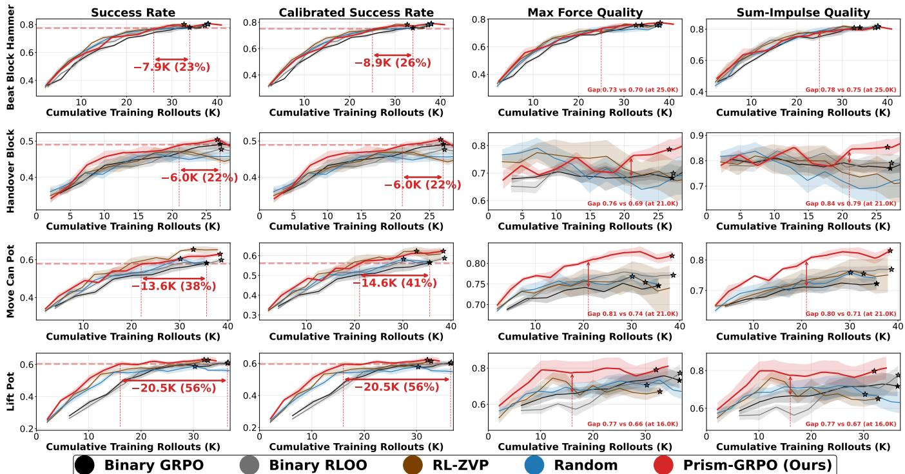  
Figure 3: Main results.λ = 0.2. Stars mark each curve's peak mean success, and arrows show the rollouts saved by Prism-GRPO when matching Binary GRPO's peak mean success.

These metrics capture complementary aspects of collision quality. Unless otherwise specified, calibrated success rate and Max-Force Quality are our primary success and quality metrics. All non-binary metrics are normalized to [0, 1], with higher values indicating better performance. Appendix B.2 provides metric definitions, while Appendix G.1 reports all metrics for experiments not fully shown in the main paper.

Baselines. We compare Prism-GRPO against four baselines. Binary GRPO is the SimpleVLA-RL configuration, using the binary success reward with standard groupstandardized advantages. Binary RLOO replaces this estimator with leave-one-out advantages. Random quality preserves the binary success term but replaces the quality score q with a random scalar, testing whether the gains come from meaningful quality information rather than random variation. RL-ZVP (Le et al. 2025) revives degenerate groups using entropy-shaped advantages; we adapt it to manipulation with per-step action entropy. We exclude methods requiring extra supervision, such as external verifiers, self-teacher passes, or oracle demonstrations; external scoring is covered by the VLM-Predicted ablation. Full details are in Appendix E.

## 5.1 Sample Efficiency and Execution Quality

Prism-GRPO improves rollout efficiency and execution quality. Figure 3 compares all methods against total generated rollouts across four tasks. At matched rollout budgets, Prism-GRPO improves rollout savings over Binary GRPO by 22–56%, with calibrated success following the same trend. The largest gain occurs on Lift Pot, where Binary GRPO discards 70% of the earliest rollout batches and stabilizes at 20% through the rest of training, whereas Prism-GRPO keeps the discard rate at essentially 0% early on and around 14% throughout the remainder. Appendix G.1 reports detailed rollout statistics for all tasks. Moreover, when Prism-GRPO reaches a given target success rate, it also exhibits higher execution quality. Although Prism-GRPO is trained using Max-Force Quality, it also improves Sum-Impulse Quality at evaluation, demonstrating cross-metric generalization rather than overfitting to a specific collision measure. On Handover Block, RL-ZVP shows much worse quality than the other methods: catastrophic contacts with multiple objects can disrupt the tabletop scene, as illustrated in Figure 4(right). Overall, Prism-GRPO performs best among the baselines, except that RL-ZVP reaches higher raw success on Move Can Pot; however, its large gap between raw and calibrated success shows that many successful rollouts hacked the binary checker. We explain this shortcut behavior next.

Shove-cheat exploitation on Move Can Pot. The Move Can Pot instruction requires the arm to lift the can and place it beside the pot, whereas the success checker considers only the final geometry: the can must end beside the pot, regardless of whether it was lifted or whether the pot moved. This mismatch permits a shove-cheat, where the arm pushes the pot toward a stationary can and is still marked successful. Figure 4 (left) illustrates the behavior qualitatively: RL-ZVP strikes and displaces the pot instead of performing the instructed lift-and-place. Figure 5 reports the shove-cheat rate, where a shove-cheat is defined as a successful rollout that displaces the pot by at least 10 cm. RL-ZVP ranges from 0.6–20.0% and Binary GRPO from 0.7–7.0%, whereas all Prism-GRPO seeds remain within 0.6–1.3%. The highest RL-ZVP rate is over 15× that of Prism-GRPO.

Successes: clean pick-up vs. shove-cheat  
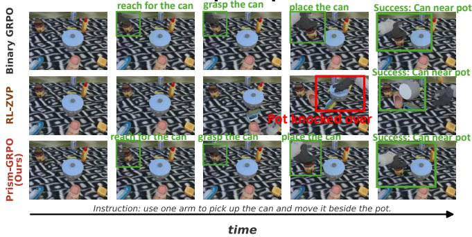

Failures: clean abort vs. clutter wreck  
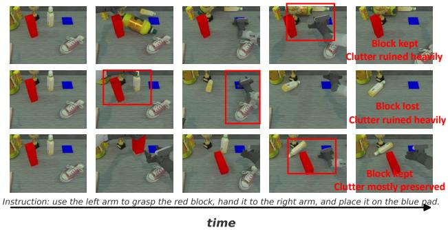  
Figure 4: Qualitative examples. Left: Move Can Pot: RL-ZVP shove-cheat vs. clean executions by the other methods. Right: Handover Block shows worse failures cause stronger unintended contacts and larger scene disturbance.

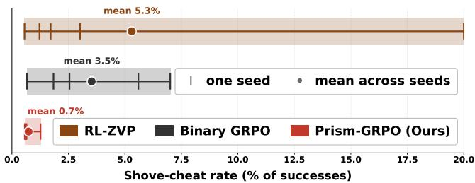  
Figure 5: Shove-cheat behavior on Move Can Pot. 5 seeds each; ticks = per-seed rate, band = min-max, dot = mean.

Quality steers online RL away from reward shortcuts. Online RL can discover behaviors beyond the SFT policy (Li et al. 2025), but imperfect success checkers may also reward unintended shortcuts (Skalse et al. 2022; Yao et al. 2026). On Move Can $P o t ,$ shoving the pot satisfies the geometric checker, so Binary GRPO treats it as equivalent to a clean lift-and-place. RL-ZVP may further reinforce this shortcut through policy confidence without assessing execution quality. Prism-GRPO instead ranks successful trajectories by non-target contact, preserving exploration while favoring cleaner solutions. This reduces the shove-cheat rate to nearly zero and highlights execution quality as a natural signal available from robot trajectories.

## 5.2 Sensitivity to Quality Weight

Meaningful quality is robust to λ, while random quality is not. We vary λ to test weight sensitivity and success dominance, and compare with random quality to verify the value of meaningful signals. Results are in Table 1, with full curves in Appendix G.2. Within the success-dominant regime, $\lambda < 1$ , Prism-GRPO consistently reaches the target, saving 45–56% of rollouts on Lift Pot and 41–48% on Move Can $P o t .$ while improving quality by 11–15 and 7–13 points, respectively. Since $q \in [ \bar { 0 } , \bar { 1 } ] , \lambda \dot { < } \bar { 1 }$ preserves success dominance, whereas $\lambda \geq 1$ allows failures to tie or outrank successes and yields less stable performance. The strong $\lambda = 2$ result on Lift Pot is an outlier, as the same setting fails to reach the target on Move Can Pot. Figure 3 shows that Random quality can improve success early. By making reward ties unlikely, the random term revives all-failure groups that Binary GRPO would discard. Under GRPO clipping bias (Shao et al. 2025), these updates may reinforce favored actions and increase success. However, as the success rate approaches 0.5, mixed-outcome groups become common and this tiebreaking benefit largely vanishes. Because random quality provides no success- or quality-aligned signal, its gains are unstable and yield little execution-quality improvement.

<table><tr><td colspan="7">Random</td><td colspan="4">Prism-GRPO</td></tr><tr><td>Task</td><td>Metric</td><td>0.2 0.5</td><td></td><td>0.9</td><td>1 2</td><td>0.2</td><td>0.5</td><td>0.9</td><td>1</td><td>2</td></tr><tr><td>Lift Pot</td><td>CS Q</td><td>× X</td><td>X X</td><td>X X</td><td>X X</td><td>X X</td><td>56 49 11 14</td><td>45 15</td><td>25 14</td><td>53 26</td></tr><tr><td>Move</td><td>CS</td><td>24</td><td>33</td><td>X</td><td>X</td><td>X 41</td><td>48</td><td>41</td><td>3</td><td>X</td></tr><tr><td>Can Pot</td><td>t Q</td><td>1</td><td>0</td><td>X</td><td>X X</td><td>7</td><td>10</td><td>13</td><td>16</td><td>X</td></tr></table>

Table 1: Quality-weight λ ablation. CS is the rollout saving (%) to match Binary GRPO's calibrated success; Q is the quality gain at that point. × denotes an unreached success.

## 5.3 Generalization Across Quality Sources

We test Prism-GRPO across quality sources, treating quality as any observable trajectory signal aligned with success.

Quality-source generalization. Figure 6 evaluates collision cleanliness and motion smoothness using signals from different sources. For collision quality, Prism-Peak (Default) uses the strongest force applied to any non-target object, Prism-Count uses the number of such contacts, and Prism-VLM-Contact replaces simulator contact data with a zero-shot Qwen3-VL judge to emulate settings in which such data are unavailable. These signals save 38–56% of rollouts while improving collision quality. Prism-VLM-Contact yields the weakest gains among them, consistent with its imperfect agreement with ground-truth contact labels (F1 ≈ 0.765). For motion quality, Prism-Flips counts armjoint reversals, Prism-Jerk measures the largest abrupt action change, and Prism-MeanFlips averages reversal counts across action chunks. These signals save 25-44% of rollouts while improving motion quality. See Appendix B.1 for details. Overall, Prism-GRPO is not tied to a particular metric or source: a single trajectory can expose diverse quality signals that distinguish same-outcome rollouts.

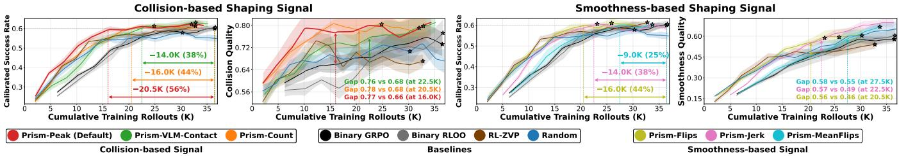  
Figure 6: Quality-source ablation. Evaluated on Lift Pot.

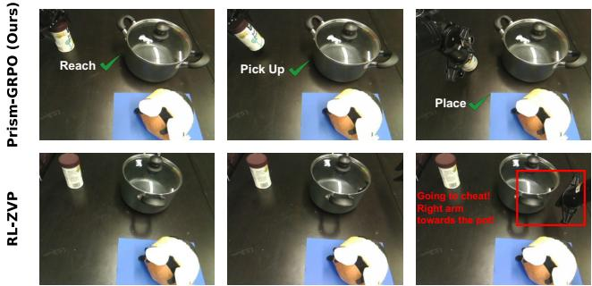  
Figure 7: Real-world behaviors. Top: clean placement from Prism-GRPO (Ours). Bottom: shove-cheat from RL-ZVP.

Quality adds little training overhead. Adding trajectory quality incurs little relative cost to training. Simulator- and VLM-derived quality add only 0.04% and 4.8% wall-clock time, respectively, Rollout generation cost remains dominant.

## 5.4 Real-World Evaluation

Simulation may assign the same success label to behaviors with very different execution quality. The shove-cheat on Move Can Pot provides a clear test case: both clean placement and shoving can succeed in simulation, allowing us to examine whether the higher-quality behavior favored by Prism-GRPO transfers more reliably to hardware at comparable success. We evaluate Binary GRPO, RL-ZVP, and Prism-GRPO on Piper over 25 trials each.

Execution quality improves sim-to-real reliability. The real-world rollouts clarify why this shortcut emerges. In simulation, the appropriate arm depends on the can's position relative to the pot: the right arm acts when the can is on the right, whereas the left arm should act when it is on the left. In some left-side scenes, however, the policy reuses the learned rightarm pickup motion and strikes the intervening pot. A strong simulated contact can displace the pot unrealistically far, allowing the shove to satisfy the geometric success checker without executing the intended left-arm manipulation. On hardware, the same impact produces much less displacement because of real contact dynamics and safety-limited actuation, so these low-quality simulator successes often fail after deployment. Figure 7 contrasts an RL-ZVP shove-cheat with a clean Prism-GRPO placement. Consistent with simulation, RL-ZVP cheats most often, Binary GRPO occasionally, and Prism-GRPO not at all while maintaining comparable clean success (Table 2). Setup details are in Appendix I.

<table><tr><td>Metric</td><td>Binary GRPO</td><td>RL-ZVP</td><td>Prism-GRPO</td></tr><tr><td>Clean Success</td><td>4/25 (16%)</td><td>2/25 (8%)</td><td>6/25 (24%)</td></tr><tr><td>Shove-Cheat</td><td>1/25 (4%)</td><td>5/25 (20%)</td><td>0/25 (0%)</td></tr></table>

Table 2: Real-world results. Clean Success counts trials that move the can beside the pot without using the shove-cheat.

## 6 Discussion and Conclusion

Positioning. To our knowledge, Prism-GRPO is the first VLA RL method to improve sample efficiency by recovering training signal from same-outcome groups. PolicyTrim and Z-1 instead target deployment and rollout-generation efficiency (Wang et al. 2026; Cao et al. 2026). RoboReward can break reward ties using continuous scores, but requires training an additional reward model (Lee et al. 2026). SmoothVLA improves motion quality among successful trajectories but does not target sample efficiency (Li et al. 2026a). TGRPO and GiGPO study credit assignment (Chen et al. 2025b; Feng et al. 2026), whereas RLinf-VLA and VLAJS focus on scalable training and guided exploration (Zang et al. 2025; Moroncelli et al. 2026). These directions are complementary, but none directly recovers training signal from rollouts lost to same-outcome groups.

Limitations and conclusion. Prism-GRPO requires an observable trajectory signal aligned with success. Such signals are readily available in robotics through contacts, actions, and vision, but may require proxies or external verifiers in other domains. Theoretically, Prism-GRPO never increases the rollout cost of obtaining an informative group and, when the population-level success and quality gradients align, its update improves both objectives. Verifying this alignment directly in full VLA models remains challenging. Overall, Prism-GRPO recovers degenerate groups while preserving success dominance, improving sample efficiency and execution quality across tasks, signals, and real-world deployment

## Acknowledgments

Zeyun Deng at the DT Lab, Purdue University, would like to thank her advisor Ziran Wang and co-advisor Ruqi Zhang for their support in approving her summer internship. She also thanks Kai Cheng and Zhengyuan Li from Purdue University for helpful discussions. The authors would also like to sincerely thank the UCLA Mobility Lab for providing access to the robot platform and providing the basic camera synchronization code used in our real-world experiments, which significantly saved our development time.

## References

Ahmadian, A.; Cremer, C.; Gallé, M.; Fadaee, M.; Kreutzer, J.; Pietquin, O.; Üstün, A.; and Hooker, S. 2024. Back to basics: Revisiting REINFORCE-style optimization for learning from human feedback in LLMs. In Proceedings of the 62nd Annual Meeting of the Association for Computational Linguistics (Volume 1: Long Papers), 12248–12267.

Arora, D.; and Zanette, A. 2025. Training language models to reason efficiently. arXiv preprint arXiv:2502.04463.

Berducci, L.; Aguilar, E. A.; Ničković, D.; and Grosu, R. 2021. Hierarchical potential-based reward shaping from task specifications. arXiv preprint arXiv:2110.02792.

Black, K.; Brown, N.; Driess, D.; Esmail, A.; Equi, M.; Finn, C.; Fusai, N.; Groom, L.; Hausman, K.; Ichter, B.; et al. 2024. π0: A Vision-Language-Action Flow Model for General Robot Control. arXiv preprint arXiv:2410.24164.

Cao, L.; Chen, R.; Li, L.; Wang, P.; Peng, M.; and Li, Y. 2026. Z-1: Efficient Reinforcement Learning for Vision-Language-Action Models. arXiv preprint arXiv:2606.31846.

Chen, T.; Chen, Z.; Chen, B.; Cai, Z.; Liu, Y.; Li, Z.; Liang, Q.; Lin, X.; Ge, Y.; Gu, Z.; et al. 2025a. Robotwin 2.0: A scalable data generator and benchmark with strong domain randomization for robust bimanual robotic manipulation. arXiv preprint arXiv:2506.18088.

Chen, Z.; Niu, R.; Kong, H.; Wang, Q.; Xing, Q.; and Fan, Z. 2025b. Tgrpo: Fine-tuning vision-language-action model via trajectory-wise group relative policy optimization. arXiv preprint arXiv:2506.08440.

Cui, G.; Zhang, Y.; Chen, J.; Yuan, L.; Wang, Z.; Zuo, Y.; Li, H.; Fan, Y.; Chen, H.; Chen, W.; et al. 2025. The entropy mechanism of reinforcement learning for reasoning language models. arXiv preprint arXiv:2505.22617.

Du, Y.; Czarnecki, W. M.; Jayakumar, S. M.; Farajtabar, M.; Pascanu, R.; and Lakshminarayanan, B. 2018. Adapting auxiliary losses using gradient similarity. arXiv preprint arXiv:1812.02224.

Feng, L.; Xue, Z.; Liu, T.; and An, B. 2026. Group-ingroup policy optimization for llm agent training. Advances in Neural Information Processing Systems, 38: 46375–46408.

Gupta, D.; Chandak, Y.; Jordan, S.; Thomas, P. S.; and C da Silva, B. 2023. Behavior alignment via reward function optimization. Advances in Neural Information Processing Systems, 36: 52759–52791.

Intelligence, P.; Black, K.; Brown, N.; Darpinian, J.; Dhabalia, K.; Driess, D.; Esmail, A.; Equi, M.; Finn, C.; Fusai, N.; et al. 2025. π0.5: a Vision-Language-Action Model with Open-World Generalization. arXiv preprint arXiv:2504.16054.

Kim, M. J.; Finn, C.; and Liang, P. 2025. Fine-tuning vision-language-action models: Optimizing speed and success. arXiv preprint arXiv:2502.19645.

Kim, M. J.; Pertsch, K.; Karamcheti, S.; Xiao, T.; Balakrishna, A.; Nair, S.; Rafailov, R.; Foster, E.; Lam, G.; Sanketi, P.; et al. 2024. Openvla: An open-source vision-languageaction model. arXiv preprint arXiv:2406.09246.

Kool, W.; van Hoof, H.; and Welling, M. 2019. Buy 4 reinforce samples, get a baseline for free!

Kwok, J.; Li, S.; Atreya, P.; Liu, Y.; Jiang, Y.; Finn, C.; Pavone, M.; Stoica, I.; and Mirhoseini, A. 2026. LLM-as-a-Verifier: A General-Purpose Verification Framework. arXiv preprint arXiv:2607.05391.

Le, T.-L. V.; Jeon, M.; Vu, K.; Lai, V.; and Yang, E. 2025. No prompt left behind: Exploiting zero-variance prompts in llm reinforcement learning via entropy-guided advantage shaping. arXiv preprint arXiv:2509.21880.

Lee, T.; Wagenmaker, A.; Pertsch, K.; Liang, P.; Levine, S.; and Finn, C. 2026. RoboReward: General-Purpose Vision-Language Reward Models for Robotics. arXiv preprint arXiv:2601.00675.

Li, H.; Zuo, Y.; Yu, J.; Zhang, Y.; Yang, Z.; Zhang, K.; Zhu, X.; Zhang, Y.; Chen, T.; Cui, G.; et al. 2025. Simplevlarl: Scaling vla training via reinforcement learning. arXiv preprint arXiv:2509.09674.

Li, J.; Shi, X.; Xie, H.; Shang, M.; and Lu, Y. 2026a. SmoothVLA: Aligning Vision-Language-Action Models with Physical Constraints via Intrinsic Smoothness Optimization. arXiv preprint arXiv:2603.13925.

Li, Y.; Xue, G.; Guo, Y.; Yuan, Y.; Hu, L.; and Ma, L. 2026b. CAST: Non-Privileged Clipped Asymmetric Self-Teaching with Advantage Flipping for GRPO. arXiv preprint arXiv:2606.00172.

Liu, J.; Gao, F.; Wei, B.; Chen, X.; Liao, Q.; Wu, Y.; Yu, C.; and Wang, Y. 2026. What can rl bring to vla generalization? an empirical study. Advances in Neural Information Processing Systems, 38: 97121–97151.

Moroncelli, A.; Zanetti, R.; Maccarini, M.; and Roveda, L. 2026. Vision-Language-Action Jump-Starting for Reinforcement Learning Robotic Agents. arXiv preprint arXiv:2604.13733.

Schulman, J.; Wolski, F.; Dhariwal, P.; Radford, A.; and Klimov, O. 2017. Proximal policy optimization algorithms. arXiv preprint arXiv:1707.06347.

Shao, R.; Li, S. S.; Xin, R.; Geng, S.; Wang, Y.; Oh, S.; Du, S. S.; Lambert, N.; Min, S.; Krishna, R.; et al. 2025. Spurious rewards: Rethinking training signals in rlvr. arXiv preprint arXiv:2506.10947.

Shao, Z.; Wang, P.; Zhu, Q.; Xu, R.; Song, J.; Bi, X.; Zhang, H.; Zhang, M.; Li, Y.; Wu, Y.; et al. 2024. Deepseekmath: Pushing the limits of mathematical reasoning in open language models. arXiv preprint arXiv:2402.03300.

Simoni, M.; Fontana, A.; Rossolini, G.; Saracino, A.; and Mori, P. 2025. Gtpo: Stabilizing group relative policy optimization via gradient and entropy control. arXiv preprint arXiv:2508.03772.

Skalse, J.; Howe, N.; Krasheninnikov, D.; and Krueger, D. 2022. Defining and characterizing reward gaming. Advances in Neural Information Processing Systems, 35: 9460–9471.

Wang, X.; Chen, F.; Zhang, W.; Yan, H.; Wang, Z.; Li, C.; and Lei, Y. 2026. PolicyTrim: Boosting Intrinsic Policy Efficiency of Vision-Language-Action Models. arXiv preprint arXiv:2606.22540.

Xu, F.; Zhai, G.; Kong, X.; Fu, T.; Gordon, D. F.; An, X.; and Busam, B. 2025. STARE-VLA: Progressive Stage-Aware Reinforcement for Fine-Tuning Vision-Language-Action Models. arXiv preprint arXiv:2512.05107.

Yao, J.; Wang, Y.; Zhang, A.; Sun, Z.; Wang, S.; Mei, L.; Ge, Y.; and Liu, S. 2026. Multimodal Reward Hacking in Reinforcement Learning. arXiv preprint arXiv:2607.09492.

Yu, Q.; Zhang, Z.; Zhu, R.; Yuan, Y.; Zuo, X.; Yue, Y.; Dai, W.; Fan, T.; Liu, G.; Liu, L.; et al. 2026. Dapo: An opensource llm reinforcement learning system at scale. Advances in Neural Information Processing Systems, 38: 113222– 113244.

Yu, T.; Kumar, S.; Gupta, A.; Levine, S.; Hausman, K.; and Finn, C. 2020. Gradient surgery for multi-task learning. Advances in neural information processing systems, 33: 5824– 5836.

Zang, H.; Wei, M.; Xu, S.; Wu, Y.; Guo, Z.; Wang, Y.; Lin, H.; Shi, L.; Xie, Y.; Xu, Z.; et al. 2025. Rlinf-vla: A unified and efficient framework for vla+ rl training. arXiv preprint arXiv:2510.06710.

Zhang, X.; Wen, S.; Wu, W.; and Huang, L. 2025. Edgegrpo: Entropy-driven grpo with guided error correction for advantage diversity. arXiv preprint arXiv:2507.21848.

## A Proofs

## A.1 Proof of Theorem 1

Proof. Fix a scene with success rate $p \in ( 0 , 1 )$ and group size $G \geq 2$ . Let $t _ { \mathrm { s u c c } }$ be the probability that all G quality scores coincide given that all G trajectories succeed, and let $t _ { \mathrm { f a i l } }$ be the analogous probability given that all G fail; both lie in [0, 1].

Under the binary reward every trajectory scores 0 or 1, so a group is degenerate exactly when all G trajectories succeed or all G fail. By independence this has probability $p ^ { G } + ( 1 - p ) ^ { G }$ and a group is informative with probability $\stackrel { \cdot } { 1 } - p ^ { G } - \stackrel { \cdot } { ( 1 - \cdot }$ $p ) ^ { G }$ . Dynamic sampling draws fresh groups until the first informative one, so the number of groups is geometric with that success probability. $\mathbf { A } \mathbf { t } \ G$ rollouts per group,

$$
C _ { \mathrm { b i n a r y } } ( p ) = { \frac { G } { 1 - p ^ { G } - ( 1 - p ) ^ { G } } } .
$$

Under $R _ { \mathrm { c o m b i n e d } } = \mathrm { s u c c e s s } + \lambda q$ with $0 < \lambda < 1$ , the success and failure reward ranges $[ 1 , 1 + \lambda ]$ and $[ 0 , \lambda ]$ are disjoint, so a mixed-outcome group can never have all rewards equal. A combined-reward group is therefore degenerate only if all trajectories share an outcome and, given that outcome, all G quality scores coincide, giving

$$
\delta ( p ) = p ^ { G } t _ { \mathrm { s u c c } } + ( 1 - p ) ^ { G } t _ { \mathrm { f a i l } } .\tag{5}
$$

The same geometric argument yields $C _ { \mathrm { c o m b i n e d } } ( p ) \ =$ $G / ( 1 - \delta ( p ) { \bar { ) } }$

The combined cost never exceeds the binary one. Since $t _ { \mathrm { s u c c } } , t _ { \mathrm { f a i l } } \leq 1$ , each term of (5) is at most the corresponding binary term, so $\delta ( p ) \leq p ^ { G } + ( 1 - p ) ^ { G }$ . A smaller degeneracy probability means a larger informative fraction $1 - \delta ( p )$ and hence fewer groups drawn: $C _ { \mathrm { c o m b i n e d } } ( p ) \leq C _ { \mathrm { b i n a r y } } ( p )$ which is (4).

The gap becomes extreme at the boundary. $\mathbf { A s } p \to 1$ , the binary informative fraction $1 - p ^ { G } - ( 1 - p ) ^ { \dot { G } } \sim \hat { G } ( 1 - p ) $ 0, so almost every group is degenerate and $C _ { \mathrm { b i n a r y } } ( p ) \to$ $+ \infty ;$ the same holds as $p  0$ . The combined cost does not blow up. Provided quality is not almost surely constant within an outcome, so that $t _ { \mathrm { s u c c } } , t _ { \mathrm { f a i l } } < 1$ , the quality term breaks most ties, keeping $\delta ( p ) \leq \operatorname* { m a x } ( t _ { \mathrm { s u c c } } , t _ { \mathrm { f a i l } } ) < 1$ and $C _ { \mathrm { c o m b i n e d } }$ finite. Its limits are $G / ( 1 - \dot { t } _ { \mathrm { s u c c } } )$ as $p  1$ and $G / ( 1 - t _ { \mathrm { f a i l } } )$ as $p  0 { : }$ at each boundary only one kind of degenerate group remains, since an all-failure group has probability $( 1 \bar { - } p ) ^ { \bar { G } } \to 0 \mathrm { a s } p \to 1$ and an all-success group has probability $p ^ { G } \to 0 \mathrm { a s } p \to 0$

## A.2 Proof of Proposition 2

Proof. The change in an objective along a direction w is its directional derivative $\langle \nabla _ { \theta } ( \cdot ) , w \rangle$ . Since $\nabla _ { \theta } J = g _ { \mathrm { s u c c e s s } }$ and $\nabla _ { \theta } Q = g _ { \mathrm { q u a l i t y } }$ , substituting $w = g _ { \mathrm { c o m b i n e d } } = g _ { \mathrm { s u c c e s s } } +$ $\lambda g _ { \mathrm { q u a l i t y } }$ and expanding gives

$$
\begin{array} { r l } & { \langle \nabla _ { \theta } J , g _ { \mathrm { c o m b i n e d } } \rangle = \| g _ { \mathrm { s u c c e s s } } \| ^ { 2 } + \lambda \langle g _ { \mathrm { s u c c e s s } } , g _ { \mathrm { q u a l i t y } } \rangle , } \\ & { \langle \nabla _ { \theta } Q , g _ { \mathrm { c o m b i n e d } } \rangle = \lambda \| g _ { \mathrm { q u a l i t y } } \| ^ { 2 } + \langle g _ { \mathrm { s u c c e s s } } , g _ { \mathrm { q u a l i t y } } \rangle . } \end{array}\tag{6}
$$

By the alignment hypothesis, the cross term $\langle g _ { \mathrm { s u c c e s s } } , g _ { \mathrm { q u a l i t y } } \rangle$ is non-negative, so the first derivative is

at least $\| g _ { \mathrm { s u c c e s s } } \| ^ { 2 }$ and the second at least $\lambda \| g _ { \mathrm { q u a l i t y } } \| ^ { 2 } ,$ each strictly positive when the corresponding gradient is nonzero. □

## A.3 Proof of Proposition 1

Throughout this appendix we abbreviate $g _ { S } = g _ { \mathrm { s u c c e s s } }$ and $g _ { Q } = g _ { \mathrm { q u a l i t y } }$ , and for a positive definite A we write

$$
\cos _ { A } ( w , z ) = \frac { w ^ { \top } A z } { \sqrt { w ^ { \top } A w } \sqrt { z ^ { \top } A z } }\tag{7}
$$

for the A-metric cosine between nonzero vectors $w ,$ z, so that cos1 is the ordinary Euclidean cosine.

Lemma 1 (Metric cosine under bounded conditioning). Let $A \succ 0$ be self-adjoint with eigenvalues in $[ m , M ]$ and condition number $\kappa = M / m$ For nonzero $w , z$ with Euclidean cosine $\rho = \cos _ { I } ( w , z ) ;$

$$
\begin{array} { c } { \cos _ { A } ( w , z ) \geq h _ { \kappa } ( \rho ) , } \\ { h _ { \kappa } ( \rho ) = \displaystyle \frac { ( \kappa + 1 ) \rho - ( \kappa - 1 ) } { ( \kappa + 1 ) - ( \kappa - 1 ) \rho } . } \end{array}\tag{8}
$$

In particular, $i f \rho \geq ( \kappa - 1 ) / ( \kappa + 1 ) t h e n \ w ^ { \top } A z \geq 0 .$

Proof. The left side of (8) depends only on span $\{ w , z \}$ . If $\rho = \pm 1$ then $w , z$ are collinear and cos $\mathbf { \Phi } _ { A } ( w , z ) = \rho ,$ so the claim holds. Assume $\rho \in ( - 1 , 1 )$ , making the span twodimensional. Each of $\dot { w } ^ { \top } A \dot { z } , w ^ { \top } A w , z ^ { \top } \bar { A } z$ is unchanged when A is replaced by its compression $P A P$ to this span, with P the orthogonal projection onto it. By Rayleigh–Ritz the compression has eigenvalues in $[ m , M ]$ , hence condition number $\mathit { \bar { \kappa } ^ { \prime } } \leq \kappa .$ Rescaling A leaves cosA unchanged, so we may take $A = \mathrm { d i a g } ( 1 , \kappa ^ { \prime } )$ on this span.

Normalize $\lVert \boldsymbol { w } \rVert = \lVert \boldsymbol { z } \rVert = 1$ . Let e ∥ w + z and $f \parallel w - z$ be unit vectors; they are orthogonal, and

$$
w = c e + \sigma f , \qquad z = c e - \sigma f ,\tag{9}
$$

with $c = \sqrt { ( 1 + \rho ) / 2 } , \sigma = \sqrt { ( 1 - \rho ) / 2 } .$ and $r = \sigma ^ { 2 } / c ^ { 2 } =$ $( \underline { { 1 } } - \rho ) / ( 1 + \rho )$ . Writing $E = e ^ { \top } A e , F = f ^ { \top } A f , G =$ $e ^ { \top } A f$ , a direct calculation and $E F - G ^ { 2 } = \operatorname* { d e t } ( { \tilde { A } } ) = \kappa ^ { \prime }$ give

$$
\begin{array} { r } { \cos _ { A } ( w , z ) = \frac { E - r F } { \sqrt { ( E + r F ) ^ { 2 } - 4 r G ^ { 2 } } } } \\ { = \frac { E - r F } { \sqrt { ( E - r F ) ^ { 2 } + 4 r \kappa ^ { \prime } } } . } \end{array}\tag{10}
$$

Let θ be the angle between e and the eigenvector of A with eigenvalue 1, so $E = \cos ^ { 2 } \theta + \kappa ^ { \prime } \sin ^ { 2 } \breve { \theta }$ and $F = \sin ^ { 2 } \theta +$ $\kappa ^ { \prime } \cos ^ { 2 } \theta . \mathrm { A s } \theta$ ranges over $[ 0 , \pi )$ the pair $( w , z )$ ranges over all configurations with the prescribed norms and $w ^ { \top } z = \rho ,$ so minimizing over θ minimizes over all such pairs. Then

$$
E - r F = ( 1 - r \kappa ^ { \prime } ) \cos ^ { 2 } \theta + ( \kappa ^ { \prime } - r ) \sin ^ { 2 } \theta \geq 1 - r \kappa ^ { \prime } ,
$$

since $( \kappa ^ { \prime } - r ) - ( 1 - r \kappa ^ { \prime } ) = ( \kappa ^ { \prime } - 1 ) ( 1 + r ) \geq 0$ The map $t \mapsto t / \sqrt { t ^ { 2 } + }$ - 4rκ' is increasing on R, and $( 1 - r \kappa ^ { \prime } ) ^ { 2 } +$ $4 r \dot { \kappa } ^ { \prime } = ( 1 + r \kappa ^ { \prime } ) ^ { 2 }$ , so from (10),

$$
\cos _ { A } ( w , z ) \geq \frac { 1 - r \kappa ^ { \prime } } { 1 + r \kappa ^ { \prime } } = h \kappa ^ { \prime } ( \rho ) ,\tag{11}
$$

where the last equality follows by substituting $r = ( 1 -$ $\rho ) / ( 1 + \rho )$ . Finally $h _ { \kappa } ( \rho )$ is decreasing in κ for $\rho \in ( - 1 , 1 )$ since

$$
\frac { \partial h _ { \kappa } ( \rho ) } { \partial \kappa } = - \frac { 2 ( 1 - \rho ^ { 2 } ) } { \big ( ( \kappa + 1 ) - ( \kappa - 1 ) \rho \big ) ^ { 2 } } < 0 ,
$$

SO $\kappa ^ { \prime } \leq \kappa$ gives $h _ { \kappa ^ { \prime } } ( \rho ) \geq h _ { \kappa } ( \rho )$ , proving (8). The final implication holds because the denominator of $h _ { \kappa } ( \rho )$ is positive for $\rho < 1 , \kappa \geq 1$ , sO $h _ { \kappa } ( \rho ) \geq 0$ iff $\rho \ge ( \kappa - 1 ) \ddot { / ( \kappa + 1 ) }$ . □

Proof of Proposition 1. Fix the state s, write $\pi = \pi _ { \theta } ( \cdot \mid s )$ and $D = \mathrm { d i a g } ( \pi )$ , and center the action values as $\tilde { u } = u - \bar { u } \mathbf { 1 }$ and $\tilde { v } = v - \bar { v } { \bf 1 }$ , where $\begin{array} { r } { \bar { u } = \sum _ { k } \pi _ { k } u _ { k } } \end{array}$ and $\begin{array} { r } { \bar { v } = \sum _ { k } \pi _ { k } v _ { k } } \end{array}$ .For a single softmax decision the logit gradients are $g _ { S } = D \tilde { u }$ and $g _ { Q } = D \tilde { v }$ , so $\langle g _ { S } , g _ { Q } \rangle = \tilde { u } ^ { \top } D ^ { 2 } \tilde { v }$

Put $w = D ^ { 1 / 2 } \tilde { u } \mathbf { a n d } z = D ^ { 1 / 2 } \tilde { v }$ . Since $\tilde { u } ,$ ů are π-centered, w and z lie in the centered subspace

$$
{ \mathcal { H } } _ { \pi } = \{ y : \langle y , ( { \sqrt { \pi _ { 1 } } } , \ldots , { \sqrt { \pi _ { K } } } ) \rangle = 0 \} ,\tag{12}
$$

and the policy-weighted correlation is the Euclidean cosine of w and z, that is $\rho ( s ) = \cos _ { I } ( w , z )$

Let $P _ { \pi }$ be the Euclidean projection onto $\mathcal { H } _ { \pi }$ and set $A _ { \pi } =$ $P _ { \pi } D P _ { \pi } | _ { \mathcal { H } _ { \pi } }$ . Although D need not preserve $\mathcal { H } _ { \pi }$ , for $w , z \in$ $\mathcal { H } _ { \pi }$ we have $w ^ { \top } A _ { \pi } \bar { z } = w ^ { \top } D z$ , and therefore

$$
\begin{array} { r l } & { \boldsymbol { w } ^ { \top } \boldsymbol { A } _ { \pi } \boldsymbol { z } = \tilde { \boldsymbol { u } } ^ { \top } \boldsymbol { D } ^ { 2 } \tilde { \boldsymbol { v } } = \langle g _ { S } , g _ { Q } \rangle , } \\ & { \boldsymbol { w } ^ { \top } \boldsymbol { A } _ { \pi } \boldsymbol { w } = \| g _ { S } \| ^ { 2 } , \qquad \boldsymbol { z } ^ { \top } \boldsymbol { A } _ { \pi } \boldsymbol { z } = \| g _ { Q } \| ^ { 2 } . } \end{array}\tag{13}
$$

So the gradient cosine equals the $A _ { \pi } { \mathrm { - m e t r i c } }$ cosine, $\cos _ { A _ { \pi } } ( w , z )$ , and $\kappa _ { \pi }$ is by definition the condition number of $A _ { \pi }$ on $\mathcal { H } _ { \pi }$ . Applying Lemma 1 with $A = A _ { \pi }$

$$
\frac { \langle g _ { S } , g _ { Q } \rangle } { \| g _ { S } \| \| g _ { Q } \| } \ge h _ { \kappa _ { \pi } } ( \rho ( s ) ) .\tag{14}
$$

If $\begin{array} { r } { \dot { \rho } ( s ) \geq ( \kappa _ { \pi } - 1 ) / ( \kappa _ { \pi } + 1 ) } \end{array}$ then $h _ { \kappa _ { \pi } } ( \rho ( s ) ) \geq 0$ , and since the gradient norms are positive under the non-degeneracy assumptions, $\langle g _ { S } , g _ { Q } \rangle \geq 0$

For sharpness, when dim $\mathcal { H } _ { \pi } ~ \geq ~ 2$ let $e _ { \mathrm { m i n } } , e _ { \mathrm { m a x } }$ be orthonormal eigenvectors of $A _ { \pi }$ with eigenvalues $m _ { \pi } , M _ { \pi }$ Given $\rho \in ( - 1 , 1 )$ , set

$$
\begin{array} { r } { w = \sqrt { \frac { 1 + \rho } { 2 } } e _ { \mathrm { m i n } } + \sqrt { \frac { 1 - \rho } { 2 } } e _ { \mathrm { m a x } } , } \\ { z = \sqrt { \frac { 1 + \rho } { 2 } } e _ { \mathrm { m i n } } - \sqrt { \frac { 1 - \rho } { 2 } } e _ { \mathrm { m a x } } , } \end{array}\tag{15}
$$

sO $\| w \| ~ = ~ \| z \| ~ = ~ 1$ and $w ^ { \top } z \ = \ \rho$ Then $w ^ { \top } A _ { \pi } z ~ =$ $m _ { \pi } { \frac { 1 + \rho } { 2 } } - M _ { \pi } { \frac { 1 - \rho } { 2 } }$ and $w ^ { \top } A _ { \pi } w = z ^ { \top } A _ { \pi } z = m _ { \pi } { \frac { 1 + \rho } { 2 } } +$ $M _ { \pi } { \frac { 1 { \bar { - } } \rho } { 2 } }$ , whose ratio is exactly $h _ { \kappa _ { \pi } } ( \rho )$ . Setting $\tilde { u } = D ^ { - 1 / 2 } w$ and $\bar { \tilde { v } } = D ^ { - 1 / 2 } z$ gives π-centered action values attaining the bound. Letting $\kappa _ { \pi }  \infty$ sends $h _ { \kappa \pi } ( \rho )  - 1$ for every $\rho < 1$ , so no nontrivial lower bound depending on $\rho$ alone can hold: bounded conditioning is necessary, not merely sufficient. □

## B Quality

Prism-GRPO treats quality as a bounded trajectory-level score $q ( \tau ) \in [ 0 , 1 ]$ , with larger values indicating cleaner

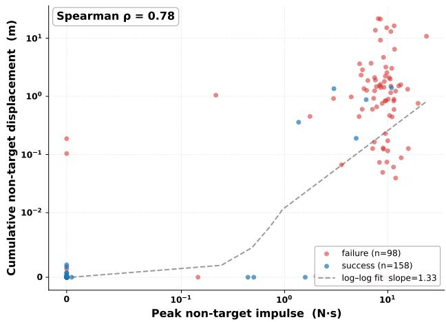  
Figure 8: Peak non-target contact and object displacement on Lift Pot. Stronger unintended contact is associated with larger displacement of non-target objects.

or smoother execution. Every Prism variant uses the same success-dominant reward

$$
R ( \tau ) = \mathrm { s u c c e s s } ( \tau ) + \lambda q ( \tau ) , \qquad \mathrm { s u c c e s s } ( \tau ) \in \{ 0 , 1 \} ,\tag{16}
$$

and the same RLOO advantage estimator. The variants differ only in how $q ( \tau )$ is measured. This isolates the effect of the quality source while keeping the policy, success reward, and optimization procedure fixed.

## B.1 Quality Signals

Collision signals. We seek task-agnostic collision signals that describe how cleanly a trajectory is executed rather than how far the task has progressed. For each task, we designate the manipulated object as the target object. For example, the target is the pot in Lift Pot and the can in Move Can Pot. Contact with the target is required for manipulation and is therefore excluded, while contact between the robot and any other object is treated as non-target contact.

Simulator-based collision signals. When simulator contact data are available, we derive two trajectory-level signals directly from the contact log. Let $ { \mathcal { C } _ { \mathrm { n t } } } ( \tau )$ denote the set of non-target contact events in trajectory $\tau ,$ and let $I ( c )$ denote the impulse of event c. We define

$$
I _ { \mathrm { p e a k } } ( \tau ) = \operatorname* { m a x } _ { c \in \mathcal { C } _ { \mathrm { n t } } ( \tau ) } I ( c ) , \qquad N _ { \mathrm { n t } } ( \tau ) = | \mathcal { C } _ { \mathrm { n t } } ( \tau ) | ,\tag{17}
$$

with both quantities set to zero when no non-target contact occurs. Prism-Peak (Default), referred to as GT-Max Force in the main paper, uses $I _ { \mathrm { p e a k } } ( \tau )$ to capture collision severity. Stronger unintended contact is more likely to displace surrounding objects and affect subsequent execution, as illustrated in Figure 8. Prism-Count instead uses $N _ { \mathrm { n t } } ( \tau )$ to capture collision frequency, assigning equal weight to each contact event regardless of its magnitude.

Prism-VLM-Contact. When simulator contact logs are unavailable, Prism-VLM-Contact estimates collisions directly from visual observations. A zero-shot Qwen3-VL-235B judge receives eight temporally ordered frames and determines whether the robot contacts any object other than the task target. The prompt identifies the target, excludes its intended manipulation, and asks the judge to inspect both changes in the scene layout and brief contacts in intermediate frames. We convert its output into a binary quality signal indicating whether the trajectory is collision-free. On 256 trajectories, the judge achieves 78.9% accuracy and a contact-class F1 score of 69.0%, with 90.9% precision and 55.6% recall. It correctly recognizes 142 of 148 collision-free trajectories but detects only 60 of 108 trajectories containing contact, showing that it provides a conservative visual alternative to simulator-derived contact signals.

## Full Lift Pot collision-judging prompt.

## Decision rule.

Decide whether the robot COLLIDED with anything other than its target object at any point during the trajectory.

In this task the target object is: THE POT.

Touching, gripping, closing on, lifting, holding, or moving THE POT is the task itself—it is NOT a collision, no matter how firm. The pot rising in the air, the gripper closing around the pot, and the pot leaving the table are all expected and are not counted.

## What counts as a collision:

• The robot arm or gripper visibly contacts the table, including pressing into it, sliding along it, or pushing against it.

• The robot contacts the wall behind it.

• The robot bumps, knocks, slides, tips, or pushes any distractor object that is not the pot.

• Any non-pot object visibly moves because of the robot.

• Even a brief, light touch that displaces a non-target object counts; there is no “too gentle to count" threshold.

## How to read the images:

• You are given N frames sampled in temporal order from a single trajectory. The first image is the start of the trajectory, before the robot moves, and the last image is the end, after the robot has stopped. The middle frames are evenly spaced snapshots in between.

• The frames are not independent. Read them as a short film. Anchor the judgment on the first frame, which shows the initial layout, and the last frame, which shows the final layout. Use the middle frames to identify contacts or displacements that occur only briefly.

## How to look for collisions across frames:

1. Identify the pot and ignore its motion entirely because it is supposed to move.

2. In the first frame, identify every other visible object, including the table surface, wall, and distractors. Note their positions, orientations, and stacking configurations as the reference state.

3. Compare the last frame with the first frame for each non-target object:

• Has it shifted left, right, forward, or backward?

• Has it rotated, tipped, or fallen?

• Has it been knocked off the table or scattered? Any visible displacement of a non-target object between the first and last frames indicates that a collision occurred during the trajectory.

4. Inspect the middle frames in temporal order and follow the robot arm and gripper path. Determine whether they visibly intersect the table surface, wall, or space occupied by a distractor. Contact in a middle frame counts even if the non-target object returns to its original position by the end.

5. Look for indirect evidence, including motion blur on a distractor, the gripper momentarily pressed flat against the table, or a distractor's shadow moving as the robot passes nearby.

## Anchors:

2 — No collision: Comparing the last frame with the first frame, all non-pot objects remain in the same positions and orientations, and the robot never visibly contacts the table, wall, or a distractor.

1 — Collision: At least one non-pot object visibly shifts, rotates, tips, or moves between the first and last frames, or the robot visibly contacts the table, wall, or a distractor in any frame.

Task, for context only—do not score task success: Use both arms to lift the pot.

Respond with the digit first, followed by a brief reason. Use exactly the following format:

ANSWER: <1|2>   
REASON: <one short sentence naming   
the specific frame(s) and object(s)   
that drove your decision>

Smoothness signals. We derive three task-agnostic smoothness signals from the executed action sequence, without requiring simulator contact data. For the 14-dimensional ALOHA action space, we use the twelve arm-joint dimensions and exclude the two gripper dimensions, so intended opening and closing motions are not treated as irregular behavior. Let A denote the set of arm joints, K the number of action chunks in trajectory τ, and fj(τ) the number of velocity-direction reversals of joint j. Each signal captures a different form of irregular motion.

Prism-Flips. This captures localized oscillation, where a single unstable joint repeatedly changes direction even when the remaining joints move smoothly. It uses the largest reversal count among the arm joints:

$$
s _ { \mathrm { f l i p s } } ( \tau ) = \frac { 1 } { K _ { \tau } } \operatorname* { m a x } _ { j \in \mathcal { A } } f _ { j } ( \tau ) .\tag{18}
$$

The signal is therefore determined by the most oscillatory joint in the trajectory.

Prism-MeanFlips. This captures reversals distributed across the entire arm rather than focusing on a single joint It averages the reversal count over all arm joints:

$$
s _ { \mathrm { m e a n f l i p s } } ( \tau ) = \frac { 1 } { K _ { \tau } | \mathcal { A } | } \sum _ { j \in \mathcal { A } } f _ { j } ( \tau ) .\tag{19}
$$

This signal reflects the overall level of oscillatory motion and is less sensitive to one isolated noisy joint.

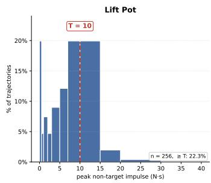

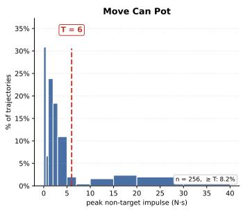

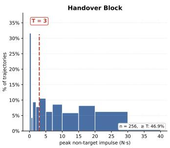

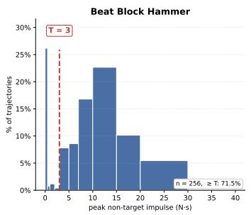  
Figure 9: Collision-threshold calibration. Dashed lines mark the thresholds selected at the boundary between the low-impulse cluster and the high-impulse tail.

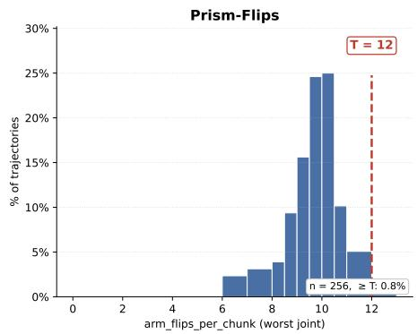

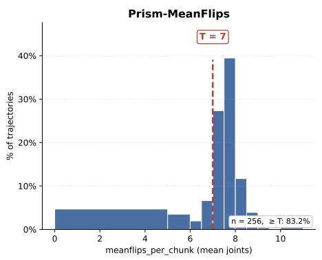

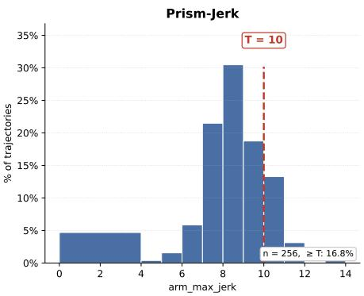  
Figure 10: Smoothness-threshold calibration on Lift Pot.

Prism-Jerk. This captures abrupt changes in commanded arm motion rather than repeated direction reversals. Let $\mathbf { a } _ { t } ^ { \mathrm { a r m } }$ denote the arm-joint action vector at timestep $t ,$ and let $T _ { \tau }$ denote the number of evaluated timesteps. We compute the average magnitude of the third-order action difference:

$$
s _ { \mathrm { j e r k } } ( \tau ) = \frac { 1 } { T _ { \tau } } \sum _ { t = 1 } ^ { T _ { \tau } } \left. \Delta ^ { 3 } \mathbf { a } _ { t } ^ { \mathrm { a r m } } \right. _ { 2 } .
$$

Thus, Prism-Flips measures the most severe single-joint oscillation, Prism-MeanFlips measures oscillation across the arm, and Prism-Jerk measures the average magnitude of abrupt action changes. We evaluate the three signals separately.

## B.2 Metrics

(20)

Quality signals and normalization. We consider six trajectory-level quality signals. For collision, Prism-Peak (Default), referred to as GT-Max Force in the main paper, uses the peak non-target contact impulse; Prism-Count uses the number of non-target contact events; and Prism-VLM-Contact uses a zero-shot VLM to estimate non-target contacts from sampled trajectory frames. For smoothness, Prism-Flips uses the largest velocity-sign reversal count among the arm joints per action chunk, Prism-MeanFlips averages the reversal count across all arm joints, and Prism-Jerk measures action jerk. We convert each non-negative raw cost $r ( \tau )$ into a quality score in $[ 0 , 1 ]$

$$
q ( \tau ) = \operatorname* { m a x } \left( 0 , 1 - \frac { \operatorname* { m a x } ( 0 , r ( \tau ) - r _ { 0 } ) } { T } \right) ,\tag{21}
$$

where larger values indicate cleaner or smoother execution. The threshold $T$ determines the normalization scale, while r0 is an optional floor for motion that is inherently required by the task. Collision signals always use $r _ { 0 } = 0 .$ For Prism-Flips on Move Can Pot and Beat Block Hammer, we use $r _ { 0 } = 1 2 $ , estimated from the median flip count of successful SFT trajectories. This removes the reversals naturally required by grasp-and-place and lift-and-strike motions before measuring excess oscillation.

Calibration from the SFT policy. Before reinforcement learning, we begin with the SFT policy. For each task, we run this policy on the same set of 256 validation scenes and examine the resulting distribution of each raw quality signal. We then choose T from this distribution so that ordinary SFT trajectories retain useful variation in quality, while clearly excessive collision or motion values receive low scores. Once selected, the threshold is fixed for all subsequent RL runs and is not adjusted using RL performance, individual seeds, or reported checkpoints.

Collision thresholds. For Prism-Peak, we examine the SFT distribution of peak non-target impulse for each task and place $T _ { \mathrm { p e a k } }$ at the boundary between the low-impulse cluster and the high-impulse tail. The low-impulse region mainly contains gentle grazing or placement contacts, while the tail corresponds to more severe unintended interactions such as arm slams or object tipping. This choice preserves quality differences among relatively clean trajectories while assigning zero quality to clearly excessive contacts. As shown in Figure 9, the resulting thresholds are 10 N s for Lift Pot, 6 N s for Move Can Pot, and 3N s for both Handover Block and Beat Block Hammer. The distributions are computed after applying the same target exemptions and grace filters used during training, including exempting task-required placement contact in Handover Block and contact with the manipulated hammer in Beat Block Hammer. For Prism-Count and cumulative-impulse quality, the SFT distributions have comparable scales across tasks, so we use the shared thresholds $T _ { n } = 3 0$ and $T _ { \Sigma } = 3 0 .$

Smoothness thresholds. Figure 10 shows the SFT distributions used to calibrate the three smoothness thresholds on Lift Pot. For Prism-Flips, we set $T _ { \mathrm { { f l i p s } } } = 1 2$ near the upper tail because the signal is determined by the most oscillatory arm joint. For Prism-Jerk, we similarly set $T _ { J } = 1 0$ near the upper tail so that ordinary variation in commanded motion retains positive quality while unusually abrupt motion is penalized. Prism-MeanFlips instead averages reversals across all arm joints and has a more concentrated distribution around typical behavior. Placing its threshold at the upper tail would assign nearly all trajectories high quality and provide little distinction among them. We therefore set $T _ { \mathrm { m e a n f l i p s } } = 7$ near the SFT median, preserving useful variation in the quality score. All three thresholds are selected before RL and remain fixed during training and evaluation.

Robustness to threshold choice. The SFT-based calibration above provides a principled default for selecting T, but the method should not depend critically on the exact placement of this threshold. We therefore test Prism-Peak on Lift Pot using both the calibrated value $T _ { \mathrm { p e a k } } = 1 0 \mathrm { N }$ s and a substantially smaller value, $T _ { \mathrm { p e a k } } = \mathrm { \dot { 3 } N s }$ . The latter changes the normalization scale by more than a factor of three and clips a much larger portion of the impulse distribution to zero. Despite this large change, Figure 11 shows similar learning behavior and rollout savings under both settings. This result suggests that the calibration rule provides a reasonable default, while Prism-GRPO remains effective over a broad range of threshold values and does not require precise tuning of $\check { T }$

## C Experimental Setup

The following configuration is shared by Prism-GRPO and all baselines.

Initialization. We build directly on SimpleVLA-RL (Li et al. 2025), whose full code and supervised fine-tuning (SFT) checkpoints are publicly released. Every run in this paper, including Prism-GRPO and all baselines, starts from the same released SFT checkpoint for the corresponding task, so the methods differ only in the reinforcement-learning stage rather than initialization.

```latex
Algorithm 2 Adaptive gap-fill rollout generation
Require: Scene batch size B, rollouts per scene $G ,$ data
parallel size D
1: $\bar { \nu }  \varnothing$
2: $N _ { \mathrm { g e n } }  0$
3: while $| \mathcal { V } | < B G$ do
4:if $N _ { \mathrm { g e n } } = 0$ then
5: $B _ { \mathrm { r e q } }  B$
6: else
7: $N _ { \mathrm { k e e p } }  | \nu |$
8: $\begin{array} { r } { r _ { \mathrm { k e e p } } \gets \operatorname* { m a x } \biggl ( 0 . 3 , \frac { N _ { \mathrm { k e e p } } } { N _ { \mathrm { g e n } } } \biggr ) } \end{array}$
9: $N _ { \mathrm { s h o r t } }  B G ^ { \setminus } - N _ { \mathrm { k e e p } }$
10: $\begin{array} { r } { B _ { \mathrm { s h o r t } }  \lceil \frac { N _ { \mathrm { s h o r t } } } { G } \rceil } \end{array}$
11: $\begin{array} { r } { \widetilde { B }  \lceil \frac { 1 . 2 B _ { \mathrm { s h o r t } } } { r _ { \mathrm { k e e p } } } \rceil } \end{array}$
12: $\widetilde { B }  \operatorname* { m a x } \Big ( D , \mathrm { R o u n d U p } ( \widetilde { B } , D ) \Big )$
13: $B _ { \mathrm { r e q } }  \operatorname* { m i n } ( B , \widetilde { B } )$
14: end if
15: Generate $B _ { \mathrm { r e q } } G$ trajectories from fresh scenes
16: $N _ { \mathrm { g e n } }  N _ { \mathrm { g e n } } \dot { + } \dot { B _ { \mathrm { r e q } } } G$
17: Apply dynamic filtering and append surviving trajec
tories to V
18: end while
19: Retain the first BG trajectories in V for the policy update
```

Policy and action space. The policy is OpenVLA-OFT with a discrete action head. Each degree of freedom is uniformly quantized into 256 bins, and one action token is emitted per degree of freedom. On RoboTwin with the ALOHA embodiment, each action chunk spans 25 steps with 14 action tokens per step.

Training configuration. Each RL step samples 64 scenes with group size $G = 8 ,$ yielding 512 rollouts per step. We use $\bar { G } = \bar { 8 }$ as the default setting throughout the main paper, following the standard SimpleVLA-RL configuration; its effect is studied separately in Section G.4. We use a learning rate of $5 \times 1 0 ^ { - 6 }$ with constant warmup, gradient clipping at 1, PPO clip bounds (0.2, 0.28), no KL penalty or entropy bonus, and a rollout temperature of 1.6.

Avoiding unnecessary full-batch refills. The original SimpleVLA-RL dynamic-sampling procedure refills the retained batch in fixed increments of 64 scenes, or 512 trajectories. After the initial batch is generated and degenerate groups are removed, it requests another full batch whenever the retained set falls below the target size, regardless of the remaining deficit. This can generate substantial surplus. For example, with a 95% keep rate, only about 26 additional trajectories are needed, yet the procedure still generates another 512.

Adaptive gap-fill rollout generation. We replace the fixed-size refill with an adaptive strategy while keeping the optimizer batch unchanged. Each update targets $\dot { B } ~ \stackrel { \sim } { = } ~ 6 4$ retained scenes with $G = 8$ rollouts per scene, for a total of 512 retained trajectories. After each filtering round, we estimate the number of additional scenes required from the observed keep rate, lower-bound the keep-rate estimate by 0.3, add 20% headroom, round the request to a multiple of the data-parallel group size, and cap it at B scenes. Refill rounds use fresh scenes and continue until the target batch is complete. Algorithm 2 gives the full procedure. All methods therefore update on the same number of retained trajectories, while every generated trajectory, including filtered and surplus trajectories, is counted toward rollout cost.

O Binary GRPO Binary RLOO RL-ZVP Random— - Prism-GRPO (Ours)·T=3 —- Prism-GRPO (Ours)·T=10 (Default)  
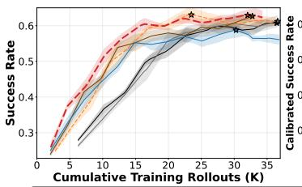

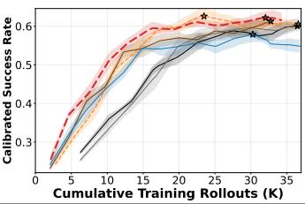

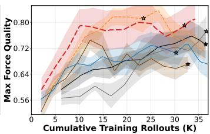

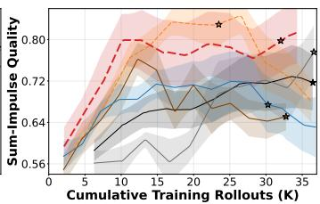

Figure 11: Sensitivity to the quality threshold on Lift Pot. Prism-Peak shows similar performance for $T _ { \mathrm { p e a k } } \in \{ 3 , 1 0 \} \mathrm { N s } ,$ with 10 N s used as the default  
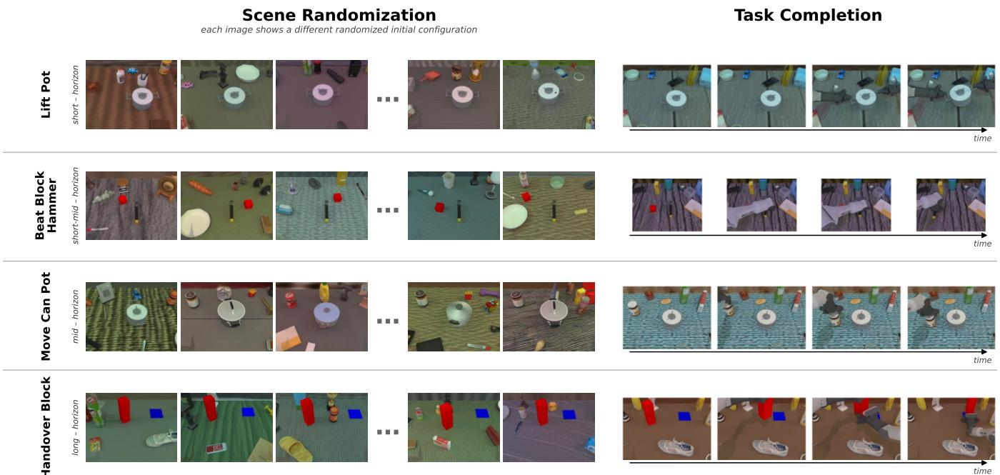  
Figure 12: Task overview. Four tasks under randomized object placements, clutter, lighting, and backgrounds.

## C.1 Tasks

Task selection. We evaluate on four RoboTwin tasks that cover different manipulation skills and coordination patterns. Lift Pot and Handover Block require bimanual coordination, while Move Can Pot and Beat Block Hammer primarily use one arm. Together, the tasks include lifting, pick-and-place, handover, and tool use, and expose different failure modes such as unstable grasps, object tipping, inaccurate placement, failed transfer, and reward shortcuts.

Lift Pot. The robot uses both arms to grasp opposite sides of a pot and lift it while keeping the pot upright. The pot variant and scene configuration are randomized. Success requires a stable bimanual grasp, sufficient lifting height, and limited pot tilt. Common failures include one-sided grasps, gripper slip, and tipping during the lift.

Beat Block Hammer. The robot grasps a hammer with the arm closest to the block and strikes the block with the hammer head. The block pose is randomized across scenes. Success requires contact between the hammer head and the block with accurate horizontal alignment. Common failures include incorrect hammer orientation, poor strike alignment and missing the block.

Move Can Pot. The robot picks up a can and places it beside a pot. The can pose, object variants, and instructed arm are randomized, while the pot remains near the center of the workspace. Success requires the can to be upright, released, and placed within the target region beside the pot. A characteristic failure is the shove-cheat, in which the policy moves the pot toward the stationary can instead of grasping

and moving the can.

Handover Block. The left arm grasps a block, transfers it to the right arm, and places it on a target pad. The block and pad poses are randomized. Success requires completing the handover and releasing the block at the target location. Common failures include dropping the block during transfer, incomplete handover, and inaccurate final placement.

## D Advantage Calculation

This section describes how Prism-GRPO converts the combined reward into advantages and why the leave-one-out estimator provides learning signal for same-outcome groups whenever their trajectory qualities differ.

Combined reward. Each trajectory receives $\begin{array} { r l } { R ( \tau ) } & { { } = } \end{array}$ success $( \tau ) + \lambda q ( \tau )$ with $\lambda = 0 . 2 .$ where $q ( \tau ) \in [ 0 , 1 ]$ is the quality score defined in Section B.2. The quality term therefore lies in $[ 0 , \lambda ]$ . Any successful trajectory has reward at least 1, while any failed trajectory has reward at most $\lambda ,$ SO every success continues to outrank every failure. The quality term only distinguishes trajectories within the same outcome class and is applied to mixed- and same-outcome groups alike.

Leave-one-out advantage. We use the leave-one-out estimator, which compares each trajectory with the mean reward of the remaining group members:

$$
A _ { i } = R _ { i } - \frac { 1 } { G - 1 } \sum _ { j \neq i } R _ { j } .\tag{22}
$$

Unlike standard group-normalized GRPO, RLOO does not divide by the within-group reward standard deviation. In a same-outcome group, every trajectory shares the same binary outcome b, so $R _ { i } = b + \lambda q _ { i }$ . The constant outcome term cancels:

$$
\begin{array} { l } { { \displaystyle { \cal A } _ { i } = ( b + \lambda q _ { i } ) - \left( b + \frac \lambda { G - 1 } \sum _ { j \neq i } q _ { j } \right) } } \\ { { \displaystyle ~ = \lambda \left( q _ { i } - \frac 1 { G - 1 } \sum _ { j \neq i } q _ { j } \right) . } } \end{array}\tag{23}
$$

Thus, whenever quality varies within a same-outcome group, the group receives nonzero advantages and contributes learning signal where a binary reward would give none. This behavior requires no special handling in the implementation; the same estimator in Equation (22) is applied to every group. Standard group normalization would retain the ordering induced by quality, but it would largely cancel the scale of λ because the reward standard deviation in a same-outcome group is also proportional to λ. RLOO instead preserves the intended magnitude of the quality term, which is why we use it throughout Prism-GRPO. We empirically ablate this design choice in Section G.6, where we compare RLOO with the standard group-normalized GRPO estimator.

## E Baseline Implementation

All baselines use the setup of Appendix C and differ from Prism-GRPO only in the reward and the advantage estimator.

Binary GRPO. The reward is the binary success flag, $R =$ success. Advantages are the standard group-standardized GRPO values $A _ { i } \stackrel { \_ } { = } ( R _ { i } - \mu ) / ( \sigma + \varepsilon )$ , where $\mu$ and σ are the mean and standard deviation over the G group members. Zero-variance groups carry no advantage and are removed by the dynamic-sampling filter. This reproduces the SimpleVLA-RL configuration. The peak success values reported by SimpleVLA-RL are not directly comparable with the maximum of the mean training curve in our main paper because the two presentations aggregate checkpoints differently. SimpleVLA-RL reports the best-success checkpoint from each of three seeds and then aggregates the resulting scores, whereas our curves show the step-aligned mean over five seeds throughout training. For example, SimpleVLA-RL reports a 64.1% success rate on Lift Pot. In our five Binary GRPO runs, the best success rates are 60.6% at step 39, 64.5% at step 34, 64.5% at step 49, 63.7% at step 29, and 64.8% at step 44. These per-seed maxima average to 63.6%, closely matching the reported result. However, because the maxima occur at different training steps, they do not appear simultaneously in the step-aligned five-seed mean curve and are therefore smoothed when the learning curves are averaged.

Binary RLOO. The reward is identical to Binary GRPO; the only change is the estimator. Advantages use the leaveone-out baseline (22) with no standard-deviation division. Since Prism-GRPO also uses RLOO, this baseline isolates the contribution of the quality term from that of the estimator. Everything else is inherited unchanged.

Random reward. Each trajectory receives $R = \operatorname { s u c c e s s } +$ λu, where $u \sim$ Uniform(0, 1) is sampled independently for each rollout. The random term almost always introduces within-group reward variation, so same-outcome groups rarely remain zero-variance and are typically retained by the dynamic-sampling filter. However, because u contains no information about task execution, it provides only noise rather than a meaningful quality signal. Random reward uses the same RLOO advantage estimator as Prism-GRPO, thereby isolating the effect of replacing the trajectory-derived quality signal with uninformative random scores while holding the reward scale, filtering behavior, and advantage estimator fixed.

RL-ZVP. RL-ZVP (Le et al. 2025) was developed for LLM reasoning, where one decision is one output token. We port it to our discrete action head by treating one action-chunk step as one decision: we mean-pool the per-token entropies over the 14 action-token slots of a step to obtain a single entropy $H _ { i , t }$ per decision, computed from the rollout policy and detached before use. A group is judged degenerate on the binary success signal, all-success or all-failure, rather than on reward variance; this is exact for a binary base reward. On a degenerate group the zeroed GRPO advantage is overwritten by

$$
A _ { i , t } = \left\{ \begin{array} { l l } { + \alpha H _ { i , t } , } & { \mathrm { a l l - s u c c e s s } , } \\ { - \alpha \left( \operatorname* { m a x } _ { k } H _ { i , k } - H _ { i , t } \right) , } & { \mathrm { a l l - f a i l u r e } , } \end{array} \right.\tag{24}
$$

with $\alpha = 0 . 1$ and $\mathrm { m a x } _ { k }$ over the valid decisions of the trajectory. Mixed groups keep their standard GRPO advantage;

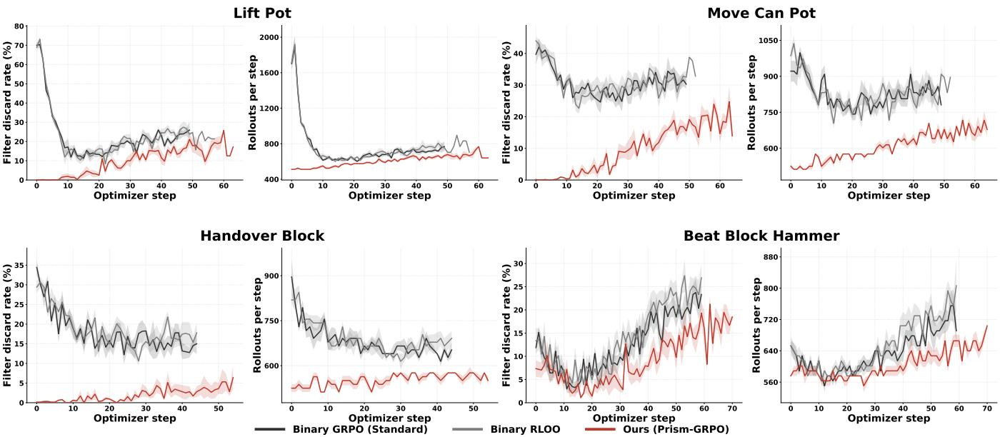  
Figure 13: Dynamic-filtering statistics across four tasks. Each task panel reports the percentage of zero-variance groups discarded by the trainer (left) and the total number of trajectories generated per optimizer step (right). Prism-GRPO consistently discards fewer groups and consequently remains closer to the minimum cost of 512 rollouts per step.

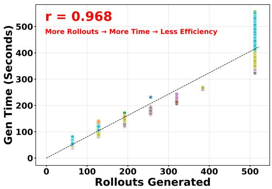  
Figure 14: Rollout-generation cost. Per-step generation time scales nearly linearly with the number of requested rollouts across ten RL runs (1,295 measurements). Each color denotes one run.

RL-ZVP composes only with group-standardized GRPO. So that the override sees degenerate groups, the dynamicsampling filter is disabled for this baseline.

## F Compute usage

Hardware and per-run wall time. Each task is trained on a single node with 8× NVIDIA H100-80 GB GPUs. A complete RL run takes approximately 12–16 hours, depending on the task horizon and rollout cost. Rollout generation accounts for roughly 8-12 hours and dominates the total wall time, with the remaining time spent on policy updates, dynamic filtering, and periodic validation.

Rollout savings translate directly to compute savings. Figure 14 shows a near-linear relationship between rollout count and generation time, averaging approximately 0.81 s per rollout. Because rollout generation dominates training time, reducing the rollout budget yields an almost proportional wall-clock saving. For example, a 30% reduction from the 35,000 rollouts required by Binary GRPO on Lift Pot avoids 10,500 rollouts, saving approximately 2.4 of the 7.9 hours spent on rollout generation.

## G Detailed Experimental Results

## G.1 Full Statistics

Figure 13 examines how often the quality signal recovers same-outcome groups and how this reduction in filtering affects rollout cost across all four tasks.

Filter discard rate. The filter discard rate is the fraction of generated groups whose final rewards are identical across all group members and are therefore removed before the policy update. Under Binary GRPO and Binary RLOO, every allsuccess or all-failure group has zero reward variance and is discarded. Under Prism-GRPO, the quality term introduces reward variation whenever trajectories with the same outcome differ in execution quality, allowing these groups to contribute to learning. The discard rate is not necessarily zero because a same-outcome group can still receive identical quality scores, such as an all-success group in which every trajectory has perfect quality. The reduction in discard rate therefore directly measures how much otherwise unusable same-outcome data is recovered by Prism-GRPO.

Rollouts per step. This metric counts every trajectory generated to construct one optimizer batch, including filtered trajectories and surplus trajectories produced during adaptive gap filling. Each update requires 64 retained groups with $G = 8 ,$ corresponding to 512 retained trajectories. The trainer first generates 512 trajectories and then samples additional scenes to replace discarded groups until the target batch is complete. A higher discard rate therefore requires more refill rollouts and increases the generation cost of each optimizer step.

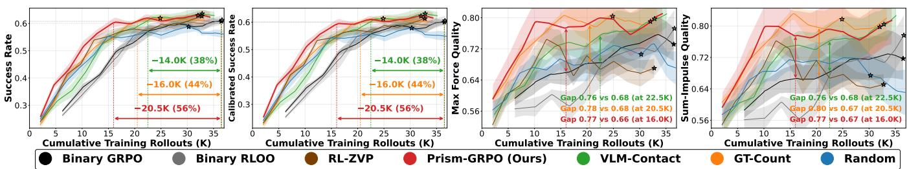

Figure 15: Full collision-quality results.  
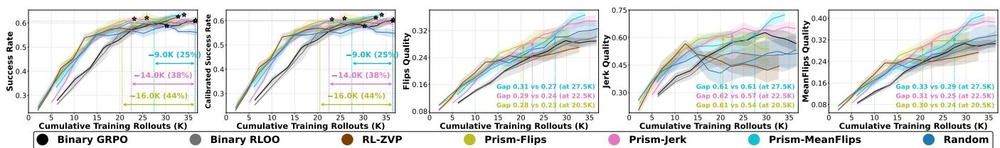  
Figure 16: Full smoothness-quality results.

Random and RL-ZVP incur no filtering. We omit Random and RL-ZVP from Figure 13 because neither method produces discarded groups in our experiments. The filter removes a group only when all trajectories receive the same final score. Random uses $R = { \mathrm { s u c c e s s } } + \lambda u ,$ where an independent continuous random quality u is sampled for each rollout, while RL-ZVP assigns trajectory-dependent policyconfidence values. These scores vary within every sampled group, giving both methods a zero discard rate and the minimum rollout cost of 512 trajectories per step.

Full quality metrics. Due to space constraints, Figure 6 in the main paper contains one collision panel and one smoothness panel, each reporting a representative quality metric. Here, we provide the full collision and smoothness results in Figures 15 and 16. For collision quality, Max-Force Quality and Sum-Impulse Quality show similar trends despite measuring the strongest individual contact and the accumulated contact burden, respectively. The smoothness metrics likewise produce consistent trends across flip- and jerk-based measures. This cross-metric consistency indicates that the observed gains are not specific to a single evaluation metric.

## G.2 Quality Weight Ablation

Figures 19 and 20 report the full learning curves for $\lambda \in$ {0.2, 0.5, 0.9, 1, 2} on Lift Pot and Move Can Pot. Each column corresponds to one value of λ, and the rows report success rate, calibrated success rate, Max-Force Quality, and

Sum-Impulse Quality. On both tasks, success rate and calibrated success rate follow similar trends, showing that the conclusions are not sensitive to contact-based success calibration. Likewise, Max-Force Quality and Sum-Impulse Quality exhibit consistent patterns despite measuring the strongest collision and cumulative collision burden, respectively. The main paper uses Max-Force Quality as the primary collision-quality metric because it directly corresponds to the default GT-Max Force training signal; the complete results here confirm that the same conclusions hold under the other reported metrics.

## G.3 Quality-Term Placement Ablation

The quality term should be applied to all groups. Figure 17 compares our default reward with variants that apply the quality term only to same-outcome groups or only to all-failure groups. Applying quality to every group nearly doubles the success rate relative to these restricted variants and produces a more stable quality curve. The quality term serves a useful role in every group type: in mixed groups, it distinguishes trajectories within each outcome class while preserving success dominance; in same-outcome groups, it provides the learning signal that the binary reward lacks. Restricting the quality term therefore discards informative execution differences from part of the training data, whereas the default combined reward uses them consistently across all groups.

## G.4 Effect of Group Size

We ablate the number of rollouts sampled per group using $G \in \{ 8 , 1 6 , 3 2 \}$ , where G = 8 is the default setting in the main experiments. To isolate the effect of group size, we keep the total number of generated rollouts per optimizer update fixed at 512 and adjust the number of groups accordingly. All other settings, including initialization, rollout budget, optimizer configuration, and quality weight, remain unchanged.

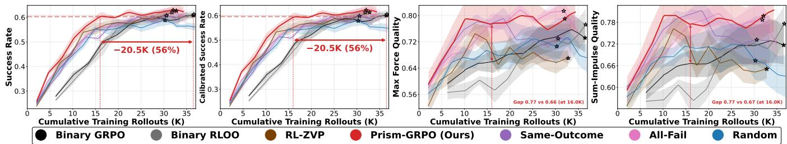  
Figure 17: Quality-term placement ablation. Full results across success and collision-quality metrics.

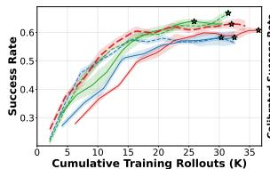

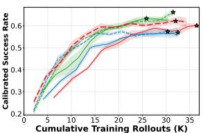

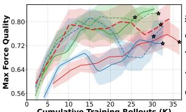

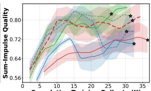  
Binary GRPO· G=8 —- Prism-GRPO (Ours)· G=8 — Binary GRPO· G=16 —- Prism-GRPO (Ours)· G=16 — Binary GRPO· G=32 —- Prism-GRPO (Ours)· G=32  
Figure 18: Effect of group size. Each optimizer update uses 512 generated rollouts, while the group size varies over $G \in$ {8, 16, 32}. Prism-GRPO provides the largest gain at $G = 8 ,$ while the gain decreases as the group size increases.

Figure 18 shows that Prism-GRPO provides the largest improvement at $G = 8 .$ The gain becomes smaller at $G = 1 6 ,$ and the results are nearly identical at $G = 3 2$ . This trend is consistent with the design of Prism-GRPO: as G increases, all-success and all-failure groups become less frequent, so the binary baseline discards fewer groups and leaves less wasted rollout data for Prism-GRPO to recover.

## G.5 Effect of Quality-Weight Decay

A natural question is whether the quality weight λ should decay during training. Early in training, failures dominate and many groups are all-failure, so the quality term is particularly useful for recovering learning signal. Later, as the success rate increases, one might expect that reducing λ would shift the update increasingly toward task success. Figure 21 shows that decay does not improve performance for λ = 0.2 or 0.5. For $\lambda \ = \ 0 . 9 .$ decay reaches the target about 2K rollouts earlier, but the advantage is not clearly observable from the overall learning curves. Because decay provides no substantial or consistent improvement, we use a fixed quality weight throughout the main experiments.

## G.6 Effect of the Advantage Estimator

As discussed in Section D, RLOO preserves the scale of the quality term in same-outcome groups, whereas standard group normalization largely cancels this scale. We therefore compare the two estimators while keeping the reward and all other training settings unchanged. Figure 22 shows that RLOO produces more stable learning and consistently achieves the expected rollout-saving gains. Standard group-normalized GRPO exhibits less stable optimization and smaller, less consistent rollout savings. We therefore use RLOO throughout the main experiments.

## H Empirical Analysis of Success-Quality Alignment

## H.1 Analysis Protocol

We empirically examine whether the trajectory-level quality signals used by Prism-GRPO are associated with task success. Correlations computed across all trajectories can be confounded by scene difficulty, since easier scenes may simultaneously produce higher success rates and cleaner execution. We therefore use two complementary diagnostics: a within-scene quality gap that compares success and failure under the same scene configuration, and a cross-scene Spearman correlation between scene success rate and mean quality.

Within-scene measure. For each task, we evaluate its best-success checkpoint on 256 randomized scenes with 56 stochastic rollouts per scene, yielding 14,336 trajectories per task. Rollouts from the same scene share an identical simulator initialization, including object poses, clutter, lighting, tabletop properties, and instruction; only policy sampling and simulator stochasticity vary. We apply no dynamic filtering and include every generated trajectory. For each scene containing at least one successful and one failed rollout, we define the within-scene quality gap as

$$
\Delta q ( x ) = \bar { q } _ { \mathrm { s u c c } } ( x ) - \bar { q } _ { \mathrm { f a i l } } ( x ) ,\tag{25}
$$

where the two terms denote the mean normalized quality of successful and failed trajectories, respectively. A positive gap indicates that successful trajectories have higher quality under the same scene configuration. Each mixed-outcome scene receives equal weight, and we report the mean gap with a 95% confidence interval obtained from 10,000 scenelevel bootstrap resamples.

Cross-scene measure. As a complementary populationlevel diagnostic, we compute Spearman's $\rho$ between each scene's success rate and mean trajectory quality. Each point in the corresponding scatter plot represents one scene, with the horizontal coordinate given by its success rate over the 56 rollouts and the vertical coordinate given by their mean quality. Spearman correlation measures whether scenes with higher success rates also tend to have higher quality, without assuming a linear relationship. Whereas the within-scene gap compares success and failure under an identical scene configuration, the cross-scene measure evaluates whether quality tracks success across the broader task distribution. We compute both diagnostics for the collision and smoothness signals defined in Appendix B.

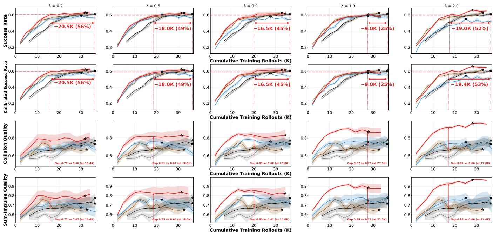  
Binary GRPO Binary RLOO RL-ZVP Prism-GRPO (Ours) Random  
Figure 19: Quality-weight ablation on Lift Pot.

## H.2 Collision-Based Alignment

Figure 23 reports both alignment diagnostics for Max-Force Quality, Contact-Count Quality, and Sum-Impulse Quality. Max-Force Quality is the default signal used in the main experiments, while the other two signals test whether the conclusion depends on a particular definition of unintended contact. For Max-Force Quality, the mean within-scene quality gap is approximately 0.55 on Lift Pot, 0.45 on Move Can Pot, 0.87 on Handover Block, and 0.85 on Beat Block Hammer, with 89.5%–100% of mixed-outcome scenes exhibiting a positive gap. The corresponding cross-scene Spearman correlations are also strongly positive, reaching 0.79, 0.68, 0.98, and 0.80, respectively. Contact-Count and Sum-Impulse Quality show the same qualitative pattern across all four tasks, despite measuring collision frequency and accumulated contact burden rather than the strongest individual contact. Together, these results show that success is strongly associated with cleaner execution both within identical scenes and across the task distribution, and that this relationship is robust to the particular collision statistic extracted from the trajectory.

## H.3 Smoothness-Based Alignment

Figure 24 reports both alignment diagnostics for Prism-Flips, Prism-MeanFlips, and Prism-Jerk, labeled as Flips (Max), Mean Flips, and Max Jerk in the figure. Across all task–signal combinations, 87%-100% of mixed-outcome scenes have a positive within-scene quality gap, and the cross-scene correlations are consistently positive and strong. These results show that the success-smoothness relationship holds across multiple smoothness definitions rather than depending on a single metric.

One implementation detail is needed for Prism-Flips on Move Can Pot and Beat Block Hammer, where successful execution naturally contains several joint-direction reversals during grasp-and-place or lift-and-strike motions. We therefore subtract a reversal floor automatically estimated as the median reversal count among successful trajectories before normalization, allowing Prism-Flips to measure excess oscillation beyond the motion required for task completion. The same data-driven estimation rule is applied without manual tuning, while no floor is needed for Lift Pot or Handover Block. Prism-MeanFlips and Prism-Jerk are computed without this adjustment. Our goal is not to identify the optimal smoothness metric, but to test whether several reasonable trajectory-derived signals are consistently associated with success; developing more specialized measures that better separate necessary motion from undesirable oscillation remains an interesting direction for future work.

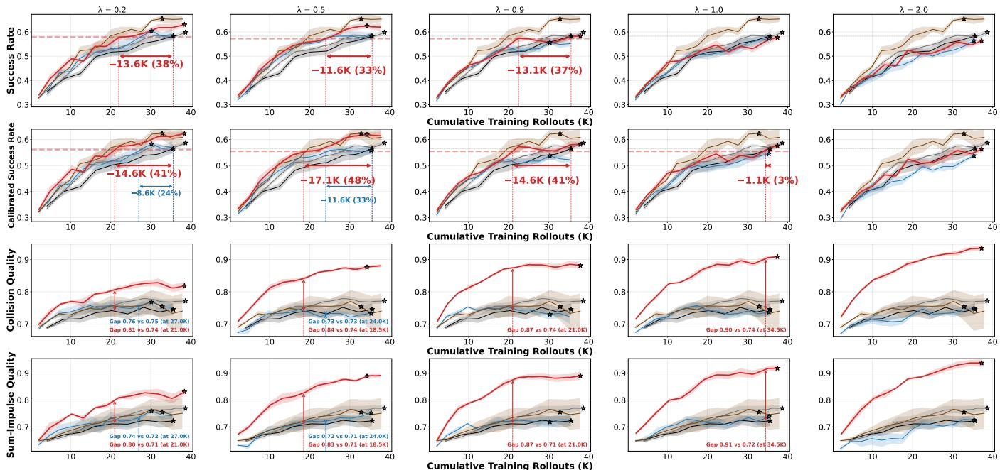  
Binary GRPO Binary RLOO RL-ZVP Prism-GRPO (Ours) Random

Figure 20: Quality-weight ablation on Move Can Pot.  
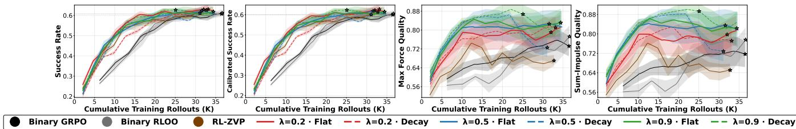  
Figure 21: Quality-weight decay ablation. Solid lines use a fixed quality weight, dashed lines use decay, and colors indicate different values of λ.

## I Real-World Experiments

## I.1 Deployment Setup

We evaluate the policies zero-shot on a Piper robot without additional real-world fine-tuning. The task is to move a can next to a pot. Observations are captured by an Orbbec DaBai DC1 camera at $6 4 0 \times 4 8 0$ resolution and resized to the 240 × 320 resolution used during training before being passed through the standard policy preprocessing pipeline.

The policy predicts 25-step action chunks. Each executed action is seven-dimensional, consisting of six arm-joint targets and one gripper target. To prevent abrupt motions on the physical robot, we apply a proportional rate limit to the six arm-joint dimensions in each control tick:

$$
\begin{array} { r l r } & { \alpha = \operatorname* { m i n } \left( 1 , \frac { \eta } { \operatorname* { m a x } _ { 1 \leq j \leq 6 } | \Delta _ { j } ^ { \mathrm { m o d e l } } | } \right) , } & \\ & { \Delta _ { i } ^ { \mathrm { s e n t } } = \alpha \Delta _ { i } ^ { \mathrm { m o d e l } } , \quad i \in \{ 1 , \dots , 6 \} , \quad \eta = 0 . 0 5 \mathrm { r a d } . } & \end{array}\tag{26}
$$

Here, $\Delta ^ { \mathrm { m o d e l } }$ is the model-requested joint displacement and η limits the largest arm-joint change to 0.05 rad per control tick. When any requested joint displacement exceeds this limit, all six arm-joint dimensions are scaled by the same factor, preserving the relative direction of the commanded motion. The seventh action dimension controls the gripper and is exempt from this rate limit.

## I.2 Evaluation Protocol

The purpose of this experiment is to examine whether the shove-cheat behavior observed in the simulated Move Can Pot task transfers to the real world. In this shortcut, the policy moves the pot toward the can instead of lifting and placing the can as instructed. To stress-test this behavior, for each method we select the checkpoint with the highest simulated shove-cheat rate among checkpoints with similar simulated success rates of approximately 65%. We conduct 25 trials for each policy. In every trial, the can is initially placed to the left of the pot. We manually reset the can and pot to approximately the same positions before each trial.

O Binary GRPO  
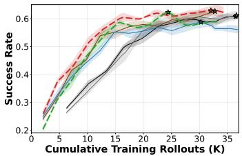

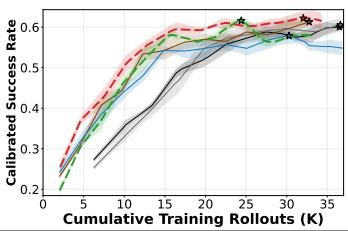

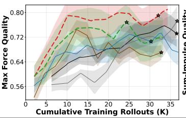

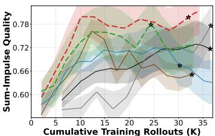  
Figure 22: Effect of the advantage estimator. RLOO yields more stable learning and more consistent rollout savings than standard group-normalized GRPO. λ = 0.2

## I.3 Real-World Results

Table 2 reports clean success and shove-cheat behavior over 25 trials per method. Prism-GRPO achieves 6/25 clean successes, compared with 4/25 for Binary GRPO and 2/25 for RL-ZVP. We do not interpret the difference between Prism-GRPO and Binary GRPO as conclusive evidence of improved clean success, since their counts differ by only two trials. The more pronounced result is the occurrence of the shove-cheat behavior observed in simulation. Instead of moving the can beside the pot, the policy attempts to move the pot toward the stationary can. This shortcut occurs in 5/25 RL-ZVP trials and 1/25 Binary GRPO trials, but is not observed in any of the 25 Prism-GRPO trials. Thus, while the cleansuccess comparison should be interpreted cautiously, the shortcut pattern qualitatively supports the simulation finding that Prism-GRPO discourages undesirable task-completion strategies.

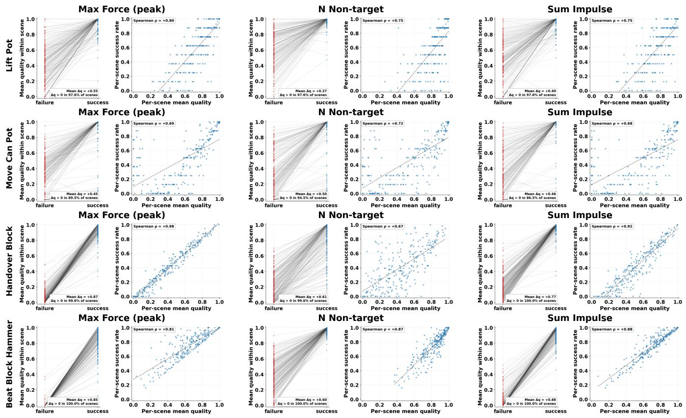  
Figure 23: Collision-based success-quality alignment. Each task is evaluated using Max-Force, Contact-Count, and Sum-Impulse Quality. Within-scene plots compare the mean quality of successful and failed trajectories generated from the same mixed-outcome scene; positive gaps indicate that successful trajectories are cleaner. Cross-scene plots report the Spearman correlation between scene success rate and mean quality.

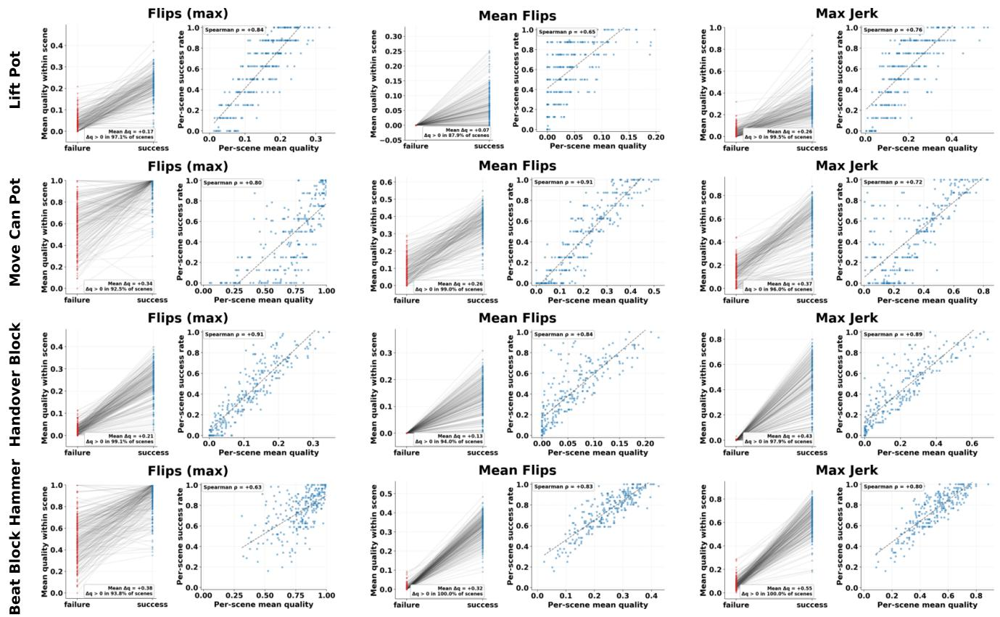  
Figure 24: Smoothness-based success-quality alignment. Each task is evaluated using maximum joint reversals, mean joint reversals, and action jerk. The within-scene and cross-scene diagnostics follow the same definitions as Figure 23.