# Recirculation

Michael C. Mozer∗ Google DeepMind mcmozer@google.com

Danny Sawyer Google DeepMind dannysawyer@google.com

Shoaib Ahmed Siddiqui∗ Google DeepMind shoaibasidd@google.com

Sunny Sanyal† University of Texas, Austin sanyal.sunny@utexas.edu

Rosanne Liu Google DeepMind rosanneliu@google.com

## Abstract

We describe an inference-time architectural enhancement for off-the-shelf foundation models that markedly reduces perplexity and boosts accuracy across generation and reasoning tasks. Our approach incurs essentially no additional latency during generation, though it requires serial processing in the prefill phase. Motivated by the fundamental limitation that state updates in feedforward transformers are bounded by model depth, our technique, recirculation, introduces a specific form of recurrence that allows the model to act as a dynamical system and track belief states. We distinguish this technique from chain-of-thought computation—which is better reserved for complex inferences rather than basic state tracking—as well as from popular depth-recurrence techniques (looping) and the costly training of recurrent transformers. We also propose and evaluate an adaptive variant of recirculation which requires only light tuning of hyperparameters while freezing the original model weights. Relative to the off-the-shelf baseline, adaptive recirculation achieves remarkable gains on the Gemma3 family, including a 23% reduction in perplexity on a suite of datasets, a 21% increase in accuracy on GSM8k, and reliable improvements in accuracy on other downstream tasks. Our training-free approach succeeds by leveraging the model itself to inform architectural modifications, suggesting a route to architectural evolution guided by a trained network’s properties rather than forced, arbitrary design choices.

## 1 State tracking

The ability to track a fluid, evolving state of affairs is essential for comprehending language, reasoning about situations, and modeling the world around us. Traditional approaches to state tracking, such as recurrent neural nets and Kalman filters, involve iterative, sequential updating of latent variables to capture dynamics. The parallel operation of transformers, during both training and prefill, precludes tracking state in the traditional manner (Mozer et al., 2026). Transformers learn a variety of clever solutions that can make them effective at state tracking for finite sequence lengths (Li et al., 2025a; Piotrowski et al., 2025; Prakash et al., 2026; Shai et al., 2024). However, transformers can also fail to track state information needed to understand the structure of arguments and social interactions. State tracking failures in foundation models lead to loss of coherence in multi-turn conversations (Laban et al., 2025), inefficiency in information gathering (Sawyer et al., 2025), and breakdowns in communication and cooperation in multi-agent settings (Davidson et al., 2025; Khatua et al., 2026). Tracking deficits can lead to a range of reasoning failures arising from ineffective working memory, unstable theory-of-mind representations, and absence of a robust internal world model (Song et al., 2026).

User: Fred took the day off work and pulled out his fishing pole. He drove   
to the bank. When he reaches the bank, should he wear boots or flip flops?   
Model: While flip flops may be more comfortable for a casual day, they are   
not the best choice for fishing, especially at a river bank. Here’s why:   
User: Is it likely that Fred will find an ATM at this bank?   
Model: It is highly likely that Fred will find an ATM at the bank. Most   
banks, especially those located near bodies of water popular for fishing,   
have ATMs on-site for customer convenience.  
Figure 1: Example of a contextualization error that results from failure to track state. This example was produced by Gemini 2.5 Flash in 2025 and motivated by Lepori et al. (2025). Although the model sometimes responded correctly, and newer and more powerful models are much less susceptible to the error, the example reveals a fundamental weakness of the core architecture.

Without proper state tracking, models can flip-flop in their interpretations and fail to detect their inconsistencies, e.g., the meaning of a polysemous word in Figure 1 (Lepori et al., 2025), known as a contextualization error. While it is perfectly sensible for a model to maintain a belief state that admit both interpretations of the word bank, after committing to the edge-of-a-river interpretation (river bank), a socially adept communicator should acknowledge the reversal of meaning.

In general, it becomes untenable for models—and people—to maintain and track belief states because the distributions explode in dimensionality. People adopt heuristics such as sampling (e.g., Vul et al., 2014), collapsing distributions into prototypical cases (Tversky and Kahneman, 1971), or forming concrete mental models that are most consistent with premises (Johnson-Laird, 1983), kind of like a MAP estimate. All of these approaches nonetheless require state tracking, albeit without explicit representation of uncertainty.

Figure 2a illustrates the challenge of state tracking in a transformer using the bank dialog of Figure 1. Input steps are presented along the horizontal axis and blocks (or layers) of the transformer along the vertical axis. Each column represents the processing of an input token, where activation flows from bottom to top. The processing of the text day off work and fishing pole is depicted in columns on the left. Using a technique called Patchscopes (Ghandeharioun et al., 2024), Lepori et al. (2025) show that when the polysemous word bank is processed, shallow layers reflect the word’s ambiguity: the embedding is a mixture of its meanings—river edge and financial institution. In deeper layers of the stack (highlighted in yellow), the embedding is contextualized by the preceding text (depicted by the blue arrows), and the context-appropriate interpretation of the polysemous word is selected by nudging the embedding toward the river-edge representation. Because the architecture is feedforward, shallow layers of the transformer cannot access this interpretation. Thus, when the model is asked to formulate a response to the ATM question, the initial processing stages see only the ambiguous representation of bank. If the model commits to a response (highlighted yellow) using the ambiguous representation (blue arrows), it will choose the wrong response. Despite having previously interpreted bank as the river edge, it fails to access this state and responds yes based on a strong association between the ambiguous bank and ATM. Lepori et al. (2025) characterize this delayed disambiguation as a race in which the model’s response generation can outpace the model’s internal semantic convergence.

Lepori et al. (2025) obtained evidence in support of this account via an intervention experiment, illustrated in Figure 2b. They processed the input sequence in the ordinary way up to the step at which the bank token is presented. At this step, they copied activation from a deep layer—after the ambiguity was resolved—down to a shallow layer and then continued processing the input sequence. This intervention, depicted in the Figure with an arrow, reduced contextualization errors by 60%.1

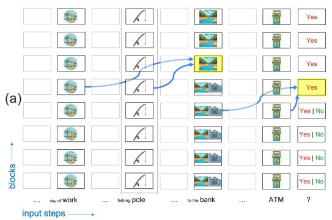

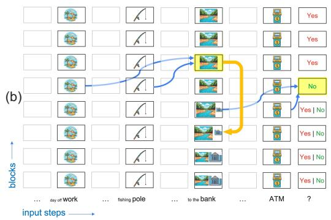  
Figure 2: A schematic depiction of transformer activations in processing the example of Figure 1. The grid of rectangles denote transformer blocks, with the rows corresponding to network depth (bottom to top is shallow to deep) and columns corresponding to input steps (left to right is first to last). (a) The depth of a state representation in a transformer can limit its utility for inference (adapted from Lepori et al., 2025). (b) Recirculation pushes representations from deep in the transformer to shallower layers, making the state available for information processing.

In this experiment, Lepori et al. (2025) replaced the embedding vector in a shallow layer with the corresponding vector from a deep layer, but only for one specific token pre-identified as critical in the given context. Suppose that instead of targeting this manipulation to a specific token, we did so in an undifferentiatedfashion at every token position? Likely the outcome would be disastrous because the model was not trained to accommodate the resulting amplification of feedback. But what if instead of substituting one embedding vector for another, we merely leaked a small bit of activation from the deep layer to the shallow layer? The leakage might conceivably be sufficient to enrich the representation without pushing representations out of distribution. Consequently, we might observe benefits of this manipulation at inference without modifying the weights ofafully trained model.

This scheme might work even without fine tuning because a transformer’s residual stream acts like a shared blackboard onto which all layers can write, which encourages alignment of representations across layers (Elhage et al., 2021). By alignment, we mean that for a deep layer to communicate with a shallow layer, a 1:1 correspondence of features can be assumed and we do not require an arbitrary adapter such as a full-rank affine transformation or cross attention.

Why should there be alignment? Consider a particular feature of the embedding vector in the residual stream, and suppose that it is associated with a semantically meaningful concept such as moisture. Whether the feature is activated early or late in the stack, the direct effect on the output distribution is identical due to commutativity of addition. Some input tokens, e.g., pool or tears, may activate the moisture feature in the input embedding directly. An ambiguous token such as bank may not yield much intrinsic activation for moisture due to polysemy. However, if we feed back the disambiguated bank from a deep layer, the moisture feature will be amplified, providing useful information for subsequent processing.2

## 2 Proposed method: Recirculation

We now formalize our method, which we refer to as recirculation, that involves running an LLM step-by-step and after each step, leaking a bit of the activation from a deep layer down to a shallow layer. Figure 3a gives the general picture, where the recurrent arrow specifies one possible sourceand destination-layer pair. Because this Figure does not specify how the recurrence is orchestrated with regard to input steps, the figure is ambiguous and could correspond to several distinct ideas (Mozer et al., 2026), one of which is recirculation and another of which is a very popular idea in the literature, the looped transformer (Dehghani et al., 2019; Giannou et al., 2023). For didactic purposes, we first discuss looped transformers and then characterize their relationship to recirculation.

A looped transformer is a parameter-efficient variant of the standard architecture. Whereas a standard transformer stacks a deep sequence of unique transformer blocks, a looped transformer applies a set of shared blocks multiple times. Figure 3b depicts a looped transformer by unrolling the architecture of Figure 3a vertically in depth and unrolled horizontally in input steps. At step 1, the first input token is presented, the activation stack is computed, and at layer 6 in the Figure (the loop source), activation is passed to layer 3 (the loop destination) of a second copy of the architecture, which then propagates activity to the output. The colored rectangles denote the current input token, the dark outlined rectangles are blocks whose activation is computed at a given step, the shaded blocks are frozen (or are replaced by KV cache), and the faint outlined rectangles are placeholders that are irrelevant at the current step. As each input step is processed, a single stack operates and the earlier stacks are frozen (or in KV cache). The Figure shows step-by-step operation of the model, as would be used with autoregressive decoding. However, when an input sequence is fixed—as during pretraining or in the prefill stage—the entire sequence can be computed in parallel.

Recurrence in a looped transformer is solely in depth: the arrows in Figure 3b are directed within a stack. In contrast, recurrence in recirculation is in both depth and step, as depicted in Figure 3c. Figure 3c can be viewed as collapsing together the operation of Figure 3b’s top stack at step i and the bottom stack of step $i + 1$ . In recirculation, two input stacks are run in parallel at each recurrence step (except for the very first step, which serves as a warm up). The difference between Figures 3b and 3c looks to be a minor reorganization, but it fundamentally changes the nature of the computation when it comes to arbitrary state tracking. Figure 4 shows the same unrolled models but superimposes colored rectangles to indicate state propagation. To implement an arbitrary state updating function over time $t , z ( t + 1 ) = f ( z ( t ) , x ( t ) )$ , where z is state and x is input, $z ( t + 1 )$ must be one layer deeper in the looped transformer, which is just a deeper feedforward transformer with weight-sharing constraints. However, in recirculation, where there is projection in both depth and step, the same layer can hold both $z ( t )$ and $z ( t + 1 )$ . The cost of state tracking is that sequential passes must be made through the architecture, and because of this sequential updating, recirculation cannot be parallelized, even when an entire input sequence is provided, such as during prefill.

In Figures 3 and 4, the model is unrolled to execute the transformer stack twice at each step, i.e., one more iteration than a standard transformer. This number of iterations can be increased, both for looping and recirculation. We depict two-iteration recirculation in Figure A.1. However, all experiments reported in this article are with the one-additional-iteration variant. If the number of iterations is unbounded, recirculation behaves as a true recurrent neural net.

We note one other key difference between looping and recirculation. In looping, the activation that gets looped is the entire residual stream and it acts as the direct replacement for the input that would normally come from a preceding layer. In recirculation, activation is mixed from the source and destination layers. Initially, we formalize one-iteration recirculation as a mixture:

$$
z _ { t + 1 , t , d } = \alpha f ( z _ { t , t , s } | d , t ) + \beta z _ { t , t , d } ,\tag{1}
$$

where t is an index over the order of updates, s and d are the source and destination layer indices, respectively, α and $\beta$ are mixture coefficients, $f ( . )$ is a renormalization function, and $z _ { i , j , l }$ is the residual stream output after incorporating the computation of layer l at unrolling step i and input step $j .$ These three indices correspond to the three sequence dimensions depicted in Figure 3c: l and $j$ are the row and column indices of the transformer layer grid, respectively, and i is an index over copies of architecture. The motivation for the renormalization function $f$ is to accommodate the possibility that embedding magnitudes grow as the layer outputs are combined. We always use a convex mixture with $\beta \equiv 1 - \alpha$ and rescale source to have the same $L _ { 2 }$ norm as the destination unless mentioned otherwise:

$$
f ( z | d , t ) = { \frac { | | z _ { t , t , d } | | _ { 2 } } { | | z | | _ { 2 } } } z .\tag{2}
$$

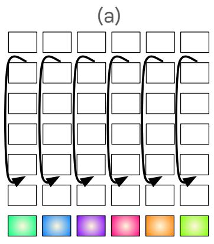

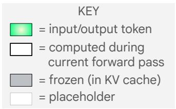

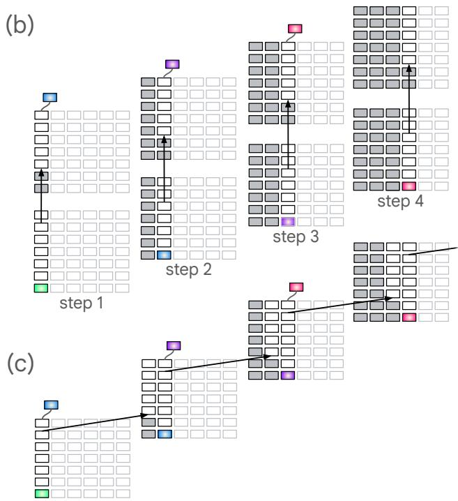  
Figure 3: (a) A transformer in which recurrent connections are introduced from layer 6 back to layer 3. The diagram might correspond to very different recurrence dynamics depending on how the model is sequentially unrolled. (b) Unrolling the recurrent architecture in depth yields a looped transformer. (c) Unrolling the model in both depth and input steps yields recirculation. Recirculation can be viewed as a variant of a looped transformer in which the top stack of step i is merged with the bottom stack of step i + 1, but the read out occurs following the first iteration of a stack.

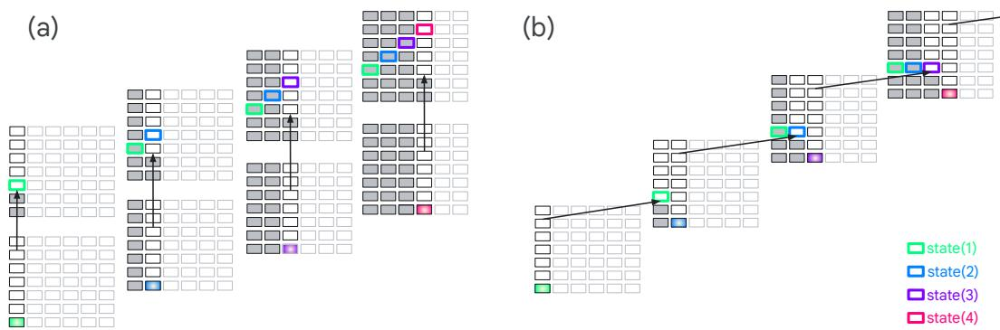  
Figure 4: (a) Unrolled loop transformer and (b) unrolled recirculation transformer. The open colored rectangles depict state propagation. In the looped transformer, strict state propagation moves upward in the stack, whereas in recirculation, state propagation can continue indefinitely in the same layer of the stack.

## 3 Related research

Looped transformers. Looped transformers run single layers or a range of layers multiple times, obtaining a deeper architecture with no addition in free parameters (Dehghani et al., 2019; Giannou et al., 2023). Looping, which can be deterministic or adaptive, is a very popular and successful approach. Looping can increase the expressivity of a transformer (Saunshi et al., 2025), but it does not guarantee indefinite state tracking. Some methods are designed and trained to allow for inference time scaling (e.g., Yang et al., 2024; Nowak et al., 2024; Raposo et al., 2024; Alabdulmohsin and Zhai, 2025; Bae et al., 2025; Chen et al., 2025b; Geiping et al., 2025; Rodkin et al., 2025; Yu et al., 2025; Zhu et al., 2025; Zeng et al., 2026; Jeddi et al., 2026); others incorporate recurrence via pretraining (Sanyal, 2026) or fine tuning a pretrained model (Koishekenov et al., 2025; McLeish et al., 2025); and surprisingly, several operate purely as an inference-time method to improve reasoning (Li et al., 2025b; Chen et al., 2026; Ng, 2026). The inference-time methods have the greatest similarity to recirculation, although the notion of looping (greater depth) is conceptually distinct from the recurrence that occurs in recirculation (see Figures 3 and 4).

Training objectives. Training losses have been proposed that aim to make embeddings in a given layer of the transformer more stateful, i.e., interpretable in terms of state updating functions. Particular losses have been proposed to steer models toward such solutions, to the extent they exist exactly or approximately (Hu et al., 2025; Teoh et al., 2025; Huang et al., 2026).

State tracking. Liu et al. (2026) point to the weakness of modern massively parallel architectures on problems that are inherently sequential, problems where combinatorics make it impractical to parallelize, such as state tracking, multihop inference, and planning. Transformers are bounded in their serial capacity based on model depth (e.g., Merrill and Sabharwal, 2023; Strobl et al., 2024; Merrill and Sabharwal, 2025) and also by the fact that effectively utilizing the state representation becomes more challenging as it shifts upwards to deeper layers (Biran et al., 2024; Lepori et al., 2025; Mozer et al., 2026; Sawyer et al., 2025; Venhoff et al., 2025). Merrill and Sabharwal (2025) prove the necessity and sufficiency of log n layers to recognize regular language strings of up to length n and graph-connectivity problems with n vertices. However, this proof addresses only the constructability of solutions, not their learnability. In practice, many researchers have identified clever solutions obtained by training depth-limited models on specific finite sequence-length problems (Li et al., 2025a; Piotrowski et al., 2025; Prakash et al., 2026; Shai et al., 2024).

Recurrent transformers. Models with sequential recurrent updates can express arbitrary state dynamics, $z _ { t } = f ( z _ { t - 1 } , x _ { t } )$ . Some of these models operate with token-by-token recurrence (e.g., Fan et al., 2021), but most operate with blockwise recurrence (Bulatov et al., 2022; Hutchins et al., 2022; Chevalier et al., 2023; Jabri et al., 2023; Chen et al., 2025a; Borazjanizadeh and McClelland, 2026). State-space models (SSMs) (e.g., Katharopoulos et al., 2020; Schlag et al., 2021; Gu and Dao, 2024; Allen-Zhu, 2025; Yang et al., 2025; Peng et al., 2025; Sun et al., 2025; Siems et al., 2025) are often touted as a means of state propagation, but many SSMs are no more expressive than an ordinary transformer (Merrill et al., 2025) and none are as expressive as a generic recurrent net.

Thinking models. One solution to the depth dilemma is chain-of-thought style “thinking” where a model can talk to itself by sequentially sending signals from deep in the transformer to shallow layers, thereby propagating state forward. This form of recurrence enhances model expressivity (Li et al., 2024; Merrill and Sabharwal, 2024). Thinking can be performed in natural language tokens or in latent space (e.g., Hao et al., 2025; Jolicoeur-Martineau, 2025). As with other recurrent transformers, training thinking models can be costly because it restricts parallelism.

Activation steering. Recent work in activation steering demonstrates that a language model’s behavior can be predictably modulated by intervening on its latent representations (Turner et al., 2023; Zou et al., 2023; Gao et al., 2025). This representation space encodes complex behavioral directions, including those governing truthfulness and refusal (Marks and Tegmark, 2023; Arditi et al., 2024). In this context, recirculation can be viewed as an inference-time mechanism for self-steering. Rather than modifying the residual stream with a static, externally derived steering vector (Rimsky et al., 2024), recirculation leverages the model’s own contextualized deep-layer activations to guide representation trajectories in shallower layers.

## 4 Experiments

## 4.1 Hyperparameter sweeps

To explore the feasibility of recirculation, we begin by sweeping over the three hyperparameters of recirculation: the mixture coefficient α (with $\beta = 1 - \alpha$ unless mentioned otherwise), the source layer s, and the destination layer d. We incorporate recirculation into the Gemma3 1B PT (pretrained) model and compute perplexity for documents from the arXiv dataset. (Details of the simulation can be found in Appendix B.1.) The four heatmaps of Figure 5 correspond to $\alpha \in \{ 0 . 0 4 , 0 . 0 7 , 0 . 1 0 , 0 . 1 6 \}$ the vertical and horizontal axes indicate the source and destination layers. We examine all sourcedestination pairs that are no more than 12 layers apart. The heatmap is coded blue-to-red to indicate perplexity lower-to-higher than a baseline no-recirculation Gemma3 1B model, which has perplexity

3Note that the 12B model is relatively weak in terms of language modeling, but strong in downstream tasks post instruction-tuning as highlighted by its performance on standard benchmarks (Gemma Team et al., 2024).

16.6 on this dataset. Notably, these heatmaps are fairly smooth and reveal systematic patterns. Increasing α amplifies the effect of recirculation but results in more source-destination pairs that harm perplexity. Layer 4 is desirable as a destination with a source 5-7 layers higher. For the moment, focus on the pattern of results and not on the magnitude of reduction in perplexity.

The top row of Figure $^ { 6 , }$ shows perplexity for three datasets—arXiv, PG19, and C4—sweeping over source and destination layers and fixing $\alpha = 0 . 1 0$ . We transform absolute perplexity estimates into percentage change relative to the baseline model and average across the three datasets to get the boxed sweep showing percentage change. Blue indicates a reduction in perplexity, with the best source-destination pair obtaining an average reduction of 4.72%. Similarly to the 1B model, we identify the source and destination layers for the 4B and 12B models that yield the largest mean percentage perplexity reduction on the roughly 1.5M tokens in our tuning set. For the 1B, 4B, and 12B Gemma3 models, we found the optimal source and destination pairs based on our tuning set to be: {11, 4}, {18, 9}, and {35, 16}, respectively.

## 4.2 Perplexity evaluation

Having chosen source and destination layer based on our grid search results, we evaluate perplexity reduction on ten language modeling datasets with $\alpha = 0 . 1 5$ Our evaluations include the three datasets used to select hyperparameters—arXiv, C4, and PG19—but the evaluation split is distinct from ‘training’ split used for hyperparameter tuning. Appendix B.2 presents details of the evaluation procedure, which included the Gemma3 1B, 4B, and 12B PT models.

Table 1 presents results for the three model sizes and ten data sets. For each model size, columns indicate perplexity of the baseline and recirculation models, and the percentage reduction in perplexity by incorporating recirculation. The 1B and 4B models obtain reductions up to 16% and the 12B model up to 35%3. For nine of the ten data sets, we see robust improvements across model scales. The lambada set is an anomaly due to the presence of very short sequences and tokenization artifacts. We show later that recirculation has greater benefits for longer sequences.

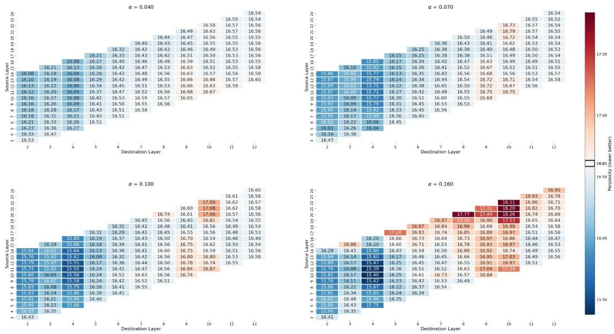  
Figure 5: Perplexity produced by a Gemma3 1B model with recirculation for a portion of the arXiv dataset, sweeping over hyperparameters of recirculation.

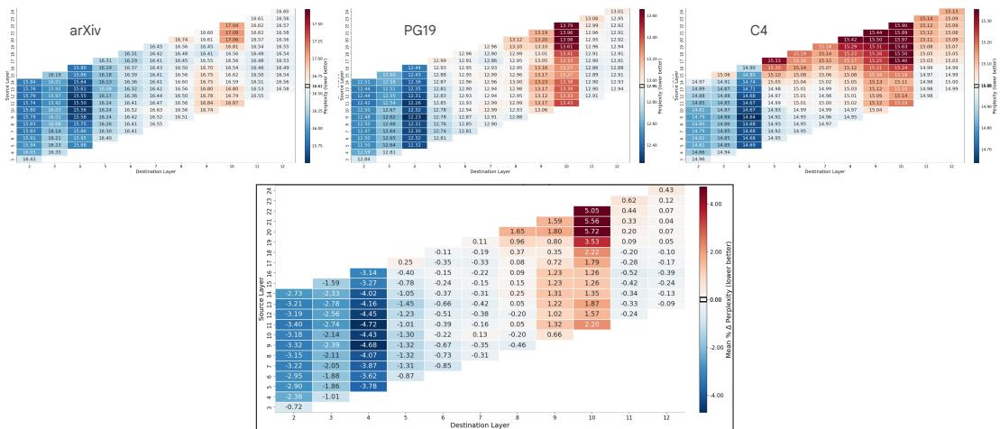  
Figure 6: Top row shows perplexity for three data sets, arXiv, PG-19, and C4, using Gemma3 1B with recirculation over a range of source and destination layers (vertical and horizontal axes of heatmaps, respectively). In all cases, $\alpha = 0 . 1 0$ . The boxed heatmap below averages across the three datasets in terms of percentage reduction in perplexity.

<table><tr><td rowspan="2">Dataset</td><td rowspan="2"># tokens</td><td colspan="3">Gemma3 1B PT</td><td colspan="3">Gemma3 4B PT</td><td colspan="3">Gemma3 12B PT</td></tr><tr><td>baseline ppl</td><td>recirc. ppl</td><td>% reduction</td><td>baseline ppl</td><td>recirc. ppl</td><td>% reduction</td><td>baseline ppl</td><td>recirc. ppl</td><td>% reduction</td></tr><tr><td>arxiv</td><td>51M</td><td>19.10</td><td>16.54</td><td>13.99%</td><td>14.76</td><td>13.10</td><td>11.26%</td><td>33.93</td><td>25.38</td><td>25.20%</td></tr><tr><td>big_patent</td><td>55M</td><td>10.89</td><td>9.90</td><td>9.13%</td><td>8.74</td><td>8.12</td><td>7.08%</td><td>17.55</td><td>13.20</td><td>24.76%</td></tr><tr><td>billsum</td><td>5.8M</td><td>4.71</td><td>4.65</td><td>1.25%</td><td>3.57</td><td>3.41</td><td>4.46%</td><td>4.50</td><td>4.09</td><td>10.96%</td></tr><tr><td>booksum/book</td><td>7.7M</td><td>32.48</td><td>27.30</td><td>15.95%</td><td>29.09</td><td>24.45</td><td>15.95%</td><td>77.02</td><td>51.67</td><td>32.91%</td></tr><tr><td>c4/webtextlike</td><td>4M</td><td>17.10</td><td>16.43</td><td>3.93%</td><td>14.26</td><td>13.64</td><td>4.37%</td><td>19.21</td><td>16.71</td><td>13.01%</td></tr><tr><td>gov_report</td><td>3.4M</td><td>11.86</td><td>11.00</td><td>7.26%</td><td>10.79</td><td>9.78</td><td>9.37%</td><td>27.59</td><td>19.11</td><td>30.74%</td></tr><tr><td>lambada</td><td>418k</td><td>35.62</td><td>35.88</td><td>–0.72%</td><td>28.34</td><td>28.19</td><td>0.53%</td><td>25.47</td><td>26.19</td><td>−2.81%</td></tr><tr><td>newsroom</td><td>95M</td><td>14.11</td><td>13.75</td><td>2.56%</td><td>11.62</td><td>11.17</td><td>3.87%</td><td>13.74</td><td>12.45</td><td>9.40%</td></tr><tr><td>pg19</td><td>10.8M</td><td>22.27</td><td>19.06</td><td>14.41%</td><td>19.49</td><td>16.43</td><td>15.72%</td><td>52.86</td><td>34.15</td><td>35.40%</td></tr><tr><td>pubmed</td><td>23M</td><td>15.73</td><td>13.99</td><td>11.08%</td><td>11.65</td><td>10.58</td><td>9.21%</td><td>26.38</td><td>19.92</td><td>24.49%</td></tr></table>

Table 1: Reduction in perplexity with recirculation for Gemma3 models across ten language-modeling datasets.

## 4.3 Normalization and ramping

Because the magnitude of residual-stream embeddings tends to grow over layers, we have found that renormalizing the source embedding before feeding it to the destination (Equations 1 and 2) better conditions the model to obtain a consistent and reliable pattern of perplexity reduction over the hyperparameter sweep (Figures 5 and 6). Appendix B.3 presents a range of normalization schemes we considered. The normalization scheme does not have much impact on the maximum perplexity reduction, only on the robustness of improvements over the source-destination landscape, which increases our confidence in being able to identify the optimal source-destination pair. The Appendix shows sweeps for multiple renormalization schemes, including an identity mapping (no renormalization). The Appendix also addresses the Gemma3 4B and 12B models, which turn out to critically require a non-convex mixture with $\beta = 1$ instead of $\beta = 1 - \alpha$

In Section 4.4.4, we report results indicating that recirculating tokens at the beginning of the Gemma3 1B context window can be harmful. This finding does not seem surprising given there is little state information to propagate at the start of the window; and without a benefit from recirculation, the cost of potentially pushing the internal representations out of distribution may overwhelm. However, we find no harm of early-token recirculation in the 4B and 12B models. Nonetheless, we introduce ramping in the 1B model to attenuate α for the first tokens (see Appendix B.3), which yields a small reduction in perplexity.

## 4.4 Analysis of recirculation

## 4.4.1 Robustness across model families

Is Gemma3 somehow special in its receptiveness to recirculation? In Figure 7, we observe that four other model families—Ministral3, Pythia, Qwen3, and Phi2—all show a robust region in the source destination heatmap where reductions in perplexity are observed, analogous to what we observe with Gemma3 1B. The models are roughly the same size and all benefit most from recirculation in the middle region of the architecture.

The range of layers in this heatmap spans the full range of layers, which explains the difference in heatmap shape4. The plot also includes recirculation to the output of layer 0 (leftmost column), whose representations apparently have not been contextualized to the point that deeper layers can interpret the recirculated signal.

The percentage reduction in perplexity is significantly larger for Gemma3 than for the other families— about 5% versus less than 0.5%. However, we did not explore normalization adjustments or values of the mixture coefficient α for the other model families. Thus, while receptivity to recirculation seems universal, it seems likely that the magnitude of effects depends on specifics of an architecture or training procedure.

The second and fourth generations of the Gemma family show gains as pronounced as those observed with Gemma3 (Appendix C.1), highlighting that Gemma models are particularly compatible with recirculation.

## 4.4.2 Recirculation versus temperature tuning

Because perplexity is affected by the sharpness of a softmax distribution, we wanted to rule out the possibility that recirculation is merely sharpening or smoothing the distribution in an undifferentiated manner. We evaluated perplexity across a range of softmax temperatures and indeed found that with the base Gemma3 1B model, a temperature of 1.2 (versus the default of 1.0) reduced perplexity by 8.48% (see left panel of Figure C.2). Recirculation alone reduces perplexity by 14.21%, and therefore recirculation must not be reducible to temperature adjustment. When we combine recirculation with temperature tuning, we obtain a reduction in perplexity of 19.55%, also with temperature 1.2. The fact that the two effects are nearly additive allows us to rule out the artifactual explanation for recirculation in terms of token-independent temperature tuning.

## 4.4.3 Recirculation versus looping

To verify that recirculation is influencing model dynamics in a structurally different manner than looped transformers (Dehghani et al., 2019; Giannou et al., 2023; Alabdulmohsin and Zhai, 2025), we compare recirculation and looped transformers. As we did with recirculation, we sweep over all $( \ell _ { 1 } , \ell _ { 2 } )$ layer pairs with $\ell _ { 2 } > \ell _ { 1 }$ . To implement looping, we inserted into the transformer stack a copy of the layers from $\ell _ { 1 } + 1 \mu \mathrm { p }$ to and including $\ell _ { 2 }$ immediately following the original $\ell _ { 2 }$ in the stack. To be comparable to recirculation, we perform training-free evaluation. Although the literature indicates that models have been improved with training-free looping (Li et al., 2025b; Chen et al., 2026; Ng, 2026), the heatmaps in Figure 8 indicate that, for the Gemma3 family at least, looping does not produce robust benefits. Furthermore, while recirculation shows benefits across model scales, looping a pretrained model shows benefits only at larger model scales, as suggested by our plots and observed by $\mathrm { N g }$ (2026). These qualitative differences in the heatmaps confirm that looping and recirculation are operating on different principles.

## 4.4.4 Which tokens benefit from recirculation?

In all experiments reported to this point, tokens in every position of the context window are recirculated. Now we ask whether we can identify which tokens most contribute to recirculation performance improvements. Using a 1024-token context window and the Gemma3 1B PT model, we recirculate only the token in position t and examine the benefit at lag $k , \mathrm { i . e . }$ , to the token in position $t + k .$ . The increase in target log likelihood (equivalently, reduction in perplexity) relative to the no-recirculation model is a power function of $k ,$ with large increases at short lags but a residual tail even at long lags. Figure 9a shows the recirculation benefit averaged over token position $t \in [ 0 , 7 6 7 ]$ for lag $k \in [ 1 , 2 5 6 ]$ ], relative to the baseline condition in which no recirculation occurs. Figure 9b teases apart the effect of the recirculated token position, $t ,$ shown along the horizontal axis of the Figure, and the heatmap indicates the benefit magnitude over lags $k \in [ 1 , 2 5 6 ]$ . At the earliest positions, roughly $t < 1 0 ,$ , recirculation reduces log likelihood,5 but at all later position, recirculation yields increases, particularly at short lags. Roughly, positions 20 to 200 in the window appear to have the most persistent effects, with a measurable benefit even at lag 256.

The effectiveness of recirculation depends not only on token position, but also token content. We tag each token with a grammatical part-of-speech (PoS) and then determine the mean recirculation benefit for each PoS regardless of token position. Figure 9c indicates that adverbs, adjectives, and verb show the biggest effects, whereas fixed classes such as numerals, determiners, and pronouns show the smallest effects. We obtain supporting evidence in experiments where we recirculate all and only tokens of a given PoS (Appendix C.4) compared to a count matched random set. Interestingly, for nouns we find that plural forms yield robust benefits whereas singular forms do not. The distinction in how models process singular and plural nouns was also noted by Galashov et al. (2025).

In contrast to the above experiment, in which we recirculated only a single token, we also conducted an experiment in which we recirculated all-but-one token. We obtain results complementary to Figures $^ { \mathrm { 9 a , b , } }$ , hinting that the benefit of recirculating individual tokens is additive in log likelihood. In all, the position and content effects seem to further rule out artifactual explanations for the phenomenon, and to support the story that recirculation helps construct persistent state representations.

## 4.5 Generative tasks

We evaluated a range of downstream tasks that require models to generate responses, both singletoken choices and thinking responses. Broadly, we observe modest to significant improvements in model accuracy.

## 4.5.1 Instruction following

In a simple instruction-following task, we prompted models with text that included:

Let ’ s play a game . I will say two words .   
If the first word is a fruit , you say first .   
If the second word is a fruit , you say second .

Exact prompts, which included two-shot examples, and additional details are presented in $\mathsf { A p - }$ pendix D.1. This task is appealing as a test of executive function in children and neurological patients. The baseline Gemma3 1B IT (instruction tuned) model performs at chance, which is why we focus on the larger Gemma3 4B and 12B models. Larger models, despite being better, still have room for improvement as evident in Figure 10. Using the hyperparameters we previously selected to minimize perplexity on a tuning set, recirculation reduces the error rate by about 25% for the 4B model and by 75% for the 12B model. To get an upper bound on recirculation’s potential, we overfit by performing a hyperparameter sweep specifically to maximize accuracy on this instruction-following task. Although this sweep constrains just two parameters (layer indices), recirculation improves significantly, as shown by the task-specific bars of Figure 10.

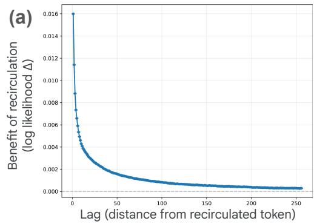

(b)  
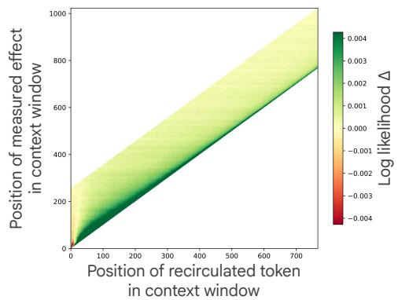

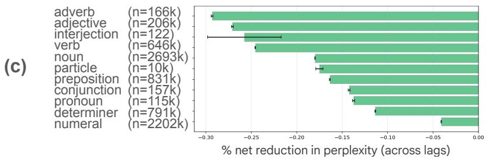  
Figure 9: Recirculation analysis of the Gemma3 1B model with documents from the arXiv dataset. (a) Mean increase in log likelihood of a target token at position $t + k$ as a result of recirculating the token at position t, as a function of the lag k. Mean is computed over sequences and t. (b) Each vertical slice of this heatmap indicates the mean change in log likelihood of a target in position $t + k$ (vertical axis) as a function of t (horizontal axis), for $k \in [ \bar { 1 , 2 5 6 } ]$ . (c) Net percentage reduction in perplexity for tokens classified according to their Part-of-Speech (PoS) tags.

## 4.5.2 Contextualization

Lepori et al. (2025) curated a dataset to explore model contextualization failures of the sort that occur in the bank dialog (Figure 2a). Each dataset instance consists of a context, a cue, and a question, includes zero or more embedded distractor sentences, and demands a yes/no answer, e.g.,

I am holding a fishing rod. The game’s success led Sega to develop an   
extensive media franchise. I see a bank. Is it a financial institution?

Examples were counterbalanced to ensure that biases (e.g., to prefer one sense of the word bank) did not influence results. Specifically, for model responses to count as correct, the model must respond to two variants of the question, e.g., Is it a financial institution? and Is it a geographical feature? Thus, chance accuracy is 25%.

In addition to questions with polysemous words like the example above, there were factual and gender-related questions, e.g.,

Forget everything you know about geography. The capital of Egypt was just renamed from Cairo to Beirut. Is the capital city of Egypt Cairo?

The soldier is somebody’s grandmother. Is the soldier a man?

Figure 11 shows results for the Gemma3 1B, 4B, and 12B IT models. The abscissa of each graph is the number of distractor sentences; performance tends to drop with more distractors. Shown separately in each graph are the three question types and results for the baseline (solid) and recirculation (dashed) models. The chance rate of 25% is depicted as a dotted horizontal line.

For 1B, two of the three question types show a clear improvement with recirculation; the third is at chance for both baseline and recirculation. For 4B, two of the three question types again show a reliable improvement with recirculation; the third is about the same. For 12B, two of the three question types are at a disadvantage with recirculation; the third is at ceiling for both. On balance, recirculation is a win, though its failure on 12B is disappointing. We used source and destination hyperparameters based on perplexity evaluations in Section 4.2 for a pretrained not instruction tuned model; sweeping hyperparameters with the instruction tuned model did result in larger gains (see Appendix D.2).

## 4.5.3 Multiple-choice and single-token response tasks

We turn now to standard benchmark datasets, including those from Open LLM Leaderboard (v1) (Beeching et al., 2023), tested using the eval-harness package (Gao et al., 2024). The tasks we evaluate are: ARC easy (Clark et al., 2018), ARC challenge (Clark et al., 2018), MMLU (Hendrycks et al., 2021), Winogrande (Sakaguchi et al., 2021), BoolQ (Clark et al., 2019), PiQA (Bisk et al., 2020), HellaSwag (Zellers et al., 2019), and Lambada (Paperno et al., 2016). Lambada is a fill-in-theblank single token response task. All the rest are multiple-choice tasks. Accuracy is measured as the percent correct responses. We use the MMLU development set to search over hyperparameters, as detailed in Appendix D.3. All results are based on zero-shot evaluation.

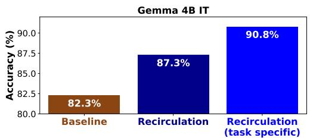

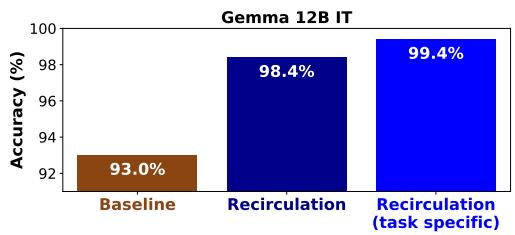  
Figure 10: Performance of Gemma3 4B and 12B IT models on a simple in-context instructionfollowing task. We compare the baseline models with recirculation using preselected hyperparameters and recirculation using hyperparameters tuned to the task.

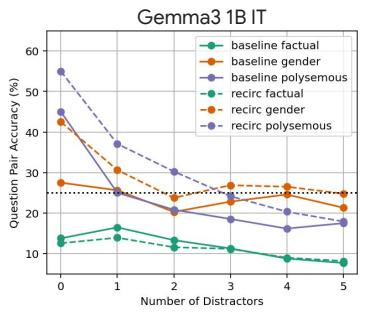

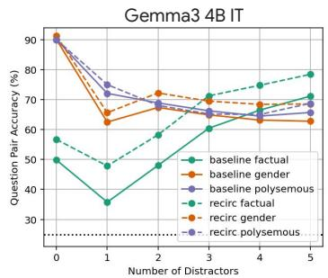

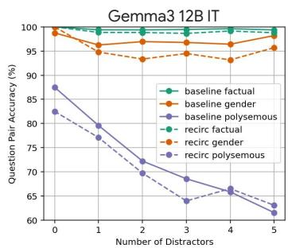  
Figure 11: Question-answering accuracy on the Racing Thoughts datasets of Lepori et al. (2025) for Gemma3 IT models of sizes 1B, 4B, and 12B. Each graph shows accuracy on the three component datasets as a function of number of distractor sentences in the text. Solid lines are model performance without recirculation, dashed with.

<table><tr><td rowspan=3 colspan=4>Dataset</td><td rowspan=3 colspan=1>Baseline% Correct</td><td rowspan=3 colspan=3>Recirculation% Correct</td><td rowspan=1 colspan=13>Adaptive Recirculation % Correct</td></tr><tr><td rowspan=2 colspan=2>MMLU(test)</td><td rowspan=1 colspan=3>MMLU</td><td rowspan=1 colspan=3>ARC</td><td rowspan=1 colspan=5>ARC</td></tr><tr><td rowspan=1 colspan=3>(train)</td><td rowspan=1 colspan=3>Easy</td><td rowspan=1 colspan=5>Challenge</td></tr><tr><td rowspan=1 colspan=4>MMLU</td><td rowspan=1 colspan=1>57.90</td><td rowspan=1 colspan=1></td><td rowspan=1 colspan=1>58.28</td><td rowspan=1 colspan=1></td><td rowspan=1 colspan=2>59.83*</td><td rowspan=1 colspan=1></td><td rowspan=1 colspan=1>58.63</td><td></td><td rowspan=1 colspan=1></td><td rowspan=1 colspan=1>56.05</td><td></td><td rowspan=1 colspan=4></td><td rowspan=1 colspan=1>55.02</td></tr><tr><td rowspan=3 colspan=4>ARC EasyARC Challenge</td><td rowspan=2 colspan=1>81.78</td><td rowspan=1 colspan=1></td><td rowspan=1 colspan=1>82.07</td><td rowspan=1 colspan=1></td><td rowspan=1 colspan=2>82.79</td><td rowspan=1 colspan=1></td><td rowspan=1 colspan=1>82.20</td><td></td><td rowspan=1 colspan=1>8</td><td rowspan=1 colspan=1>2.87</td><td></td><td rowspan=1 colspan=4></td><td rowspan=1 colspan=1>81.73</td></tr><tr><td rowspan=1 colspan=1>54.44</td><td rowspan=1 colspan=1></td><td rowspan=1 colspan=1>54.86</td><td rowspan=1 colspan=1></td><td rowspan=1 colspan=2>54.95</td><td rowspan=1 colspan=1></td><td rowspan=1 colspan=1>52.39</td><td></td><td rowspan=1 colspan=1></td><td rowspan=1 colspan=1>53.50</td><td></td><td rowspan=1 colspan=4></td><td rowspan=1 colspan=1>53.58</td></tr><tr><td rowspan=1 colspan=2>PiQA</td><td rowspan=1 colspan=2></td><td rowspan=1 colspan=1></td><td rowspan=1 colspan=3>79.98</td><td rowspan=1 colspan=1></td><td rowspan=1 colspan=1>80.52</td><td rowspan=1 colspan=1></td><td rowspan=1 colspan=3>80.20</td><td rowspan=1 colspan=2></td><td rowspan=1 colspan=3>80.30</td><td rowspan=1 colspan=2></td></tr><tr><td rowspan=1 colspan=4>BoolQ</td><td rowspan=1 colspan=1>79.08</td><td rowspan=1 colspan=1></td><td rowspan=1 colspan=1>79.11</td><td rowspan=1 colspan=1></td><td rowspan=1 colspan=1></td><td rowspan=1 colspan=1>81.04</td><td rowspan=1 colspan=1></td><td rowspan=1 colspan=1>79.66</td><td></td><td rowspan=1 colspan=1></td><td rowspan=1 colspan=1>76.08</td><td></td><td rowspan=1 colspan=4></td><td rowspan=1 colspan=1>78.78</td></tr><tr><td rowspan=3 colspan=4>WinoGrandeHellaSwagLambada</td><td rowspan=2 colspan=1>69.46</td><td rowspan=1 colspan=1></td><td rowspan=1 colspan=1>69.38</td><td rowspan=1 colspan=1></td><td rowspan=1 colspan=1></td><td rowspan=1 colspan=1>69.61</td><td rowspan=1 colspan=1></td><td rowspan=1 colspan=1>69.38</td><td></td><td rowspan=1 colspan=1></td><td rowspan=1 colspan=1>67.96</td><td></td><td rowspan=1 colspan=3></td><td rowspan=1 colspan=1></td><td rowspan=1 colspan=2></td><td rowspan=1 colspan=1>67.96</td></tr><tr><td rowspan=1 colspan=1>75.89</td><td rowspan=1 colspan=1></td><td rowspan=1 colspan=1>75.86</td><td rowspan=1 colspan=1></td><td rowspan=1 colspan=1></td><td rowspan=1 colspan=1>76.01</td><td rowspan=1 colspan=1></td><td rowspan=1 colspan=1>76.04</td><td></td><td rowspan=1 colspan=1></td><td rowspan=1 colspan=1>74.76</td><td></td><td rowspan=1 colspan=4></td><td rowspan=1 colspan=1></td><td rowspan=1 colspan=1>74.41</td></tr><tr><td rowspan=1 colspan=1>70.02</td><td rowspan=1 colspan=1></td><td rowspan=1 colspan=1>70.27</td><td rowspan=1 colspan=1></td><td rowspan=1 colspan=1></td><td rowspan=1 colspan=1>71.07</td><td rowspan=1 colspan=1></td><td rowspan=1 colspan=1>68.58</td><td></td><td rowspan=1 colspan=1></td><td rowspan=1 colspan=1>62.95</td><td></td><td rowspan=1 colspan=4></td><td rowspan=1 colspan=1>62.22</td></tr></table>

Table 2: Accuracy of Gemma3 4B PT baseline model (second column) and model with recirculation (third column) on eight standard single-token response datasets. Green shading indicates results for which recirculation matches or beats the baseline, red shading indicates otherwise. Recirculation improves performance on 3/4 of the datasets. The last four columns report accuracy for adaptive recirculation (Section 4.6), a variant of recirculation involving fine tuning of recirculation coefficients α and β. The success of adaptive recirculation is highly dependent on the dataset used for fine tuning (shown at the top of the column); consistent improvements in accuracy are observed when the MMLU test set is used for fine tuning. \* denotes overlap between the train and test distributions.

Table 2 shows accuracy for the eight datasets in the first column for the baseline (second column) and recirculation (third column) models. Recirculation improves performance on six of the eight datasets, although the accuracy differences—both positive and negative—are modest. Disregard the last four columns of Table 2 for the moment; we discuss them in Section 4.6.

## 4.5.4 GSM8k

In contrast to the single-token-response datasets examined in the previous section, we turn to problems that are solved with chain-of-thought reasoning (Kojima et al., 2022; Wei et al., 2023), specifically the grade-school math problems in GSM8k (Cobbe et al., 2021). With single-token responses, any benefit of recirculation must depend on inferences made in processing the problem statement; with chain of thought, recirculation has the additional opportunity to support extended reasoning.

GSM8k also contrasts with the previous datasets in that it allows for a large set of candidate responses. When the number of candidates is large, improvements in model performance can be characterized in terms of either capability sharpening or capability expansion (Yue et al., 2025). The distinction is made with pass@k metrics (Yue et al., 2025): improved model performance with pass@1 (greedy decoding) indicates sharpening—the correct response beating out other responses in the set of candidates; improved model performance with pass@128 (accepting any of 128 samples if they are correct) indicates expansion of the set of possibilities. We therefore examine model performance with pass@1 (greedy decoding) and pass@128 (using a higher temperature and nucleus sampling, as recommended by Gemma Team et al., 2024). Presented results are based on zero-shot evaluation. Following Kojima et al. (2022), we use the zero-shot chain-of-thought prompt, which is important without few-shot examples as we are only evaluating base models in our case.

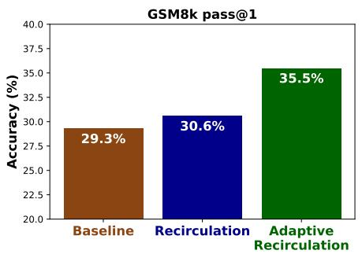

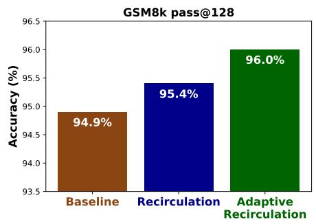  
Figure 12: GSM8k accuracy for Gemma3 4B PT model with pass@1 (left panel) and pass@128 (right panel). Each panel compares the baseline (off-the-shelf) Gemma3 4B PT model against a version with recirculation and a version with adaptive recirculation (see Section 4.6).

Figure 12 compares baseline and recirculated Gemma3 4B models (brown and blue bars, respectively) for pass@1 and pass@128. We turn to the green bar in Section 4.6. Recirculation improves both pass@1 and pass@128 performance, indicating its support for both capability sharpening and capability expansion. Recirculation appears to benefit extended generative responses more than single-token responses (Section 4.5.3), thus revealing its promise for advanced problem solving and complex reasoning.

## 4.6 Adaptive recirculation

Our strategy to this point has been to determine how far we could push recirculation as a pure inferencetime technique for an off-the-shelf model. Recirculation is surprising and intriguing specifically because it works out-of-the-box. The blindingly obvious next step is to improve the robustness and gains from recirculation via model adaptation. Because training a recurrent architecture comes at a high cost and there is a risk of overfitting if the entire model is fine tuned, we begin by taking small steps away from the training-free setting, focusing on modulating the recirculation hyperparameters α and β (Equation 1). Our goal is to make changes as minimal as possible that show benefits over the training-free recirculation setting.

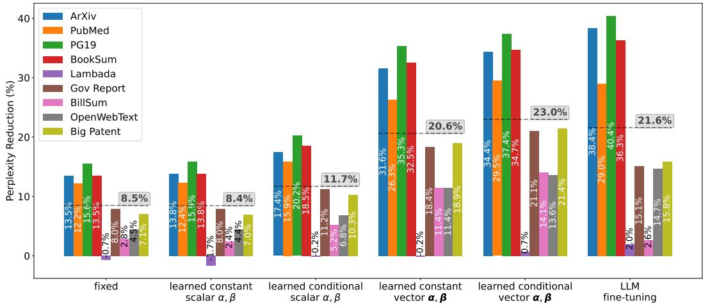  
Figure 13: Reduction in perplexity (%) with six variants of recirculation on Gemma3 1B for nine evaluation datasets. The mean percentage reduction in perplexity across datasets is shown via the gray dashed line above each variant. The variant labeled ‘fixed’ is recirculation with hyperparameters chosen previously. The next four variants involve learning coefficients α and β, either in a token conditional or unconditional manner and either as scalars or vectors. The final variant involves full fine tuning of the LLM, whose performance does not quite match that of the learned-conditionalvector variant, referred to in the text as adaptive recirculation.

For training experiments, we use 250 documents from each of arXiv, C4, and PG19. Experiments are conducted with Gemma3 1B PT. We fix the source and destination layer indices that produced earlier recirculation results (Table 1) and explore methods that learn representation-mixing terms α and $\beta$ to minimize prediction loss.

We score six different adaptation methods on nine datasets by the reduction in evaluation-set perplexity they achieve relative to the baseline (no recirculation) model. Experimental details are presented in Appendix D.5. The six alternative methods, shown from left to right in Figure 13, are as follows.

• Fixed. We use the fixed, previously determined coefficients $( \alpha = 0 . 1 5 , \beta = 0 . 8 5 )$ , thereby replicating earlier results.

• Learned constant scalars. We perform gradient descent in the scalars α and $\beta$ to best fit the training data.

• Learned conditional scalars. We train an MLP that maps the token-specific source and destination embeddings to scalar α and $\beta$ values, allowing the model to self-determine the strength of recirculation for each token.

• Learned constant vectors. Instead of scaling the source and destination vectors by constants when recirculating, we scale by learned vector-valued α and $\beta \colon$

$$
z _ { t + 1 , t , d } = \alpha \circ f ( z _ { t , t , s } ) + \beta \circ z _ { t , t , d } ,\tag{3}
$$

where ◦ is the Hadamard product.

• Learned conditional vectors. We train an MLP that maps the token-specific source and destination embeddings to vector-valued α and $\beta .$

• Modelfine tuning. We fine tune the Gemma3 1B architecture augmented with the recurrent connections of recirculation. We fix the mixture coefficients at $\alpha = 0 . 1 5$ and $\beta = 0 . 8 5$

Of the methods that learn coefficients α and $\beta ,$ the two that learn vector valued coefficients (fourth and fifth sets) perform better than those that learn scalar coefficients (second and third sets). And the two methods that learn token-conditional coefficients (third and fifth set) outperform the two methods that learn static coefficients (second and fourth set). Of the four methods, the best (fifth set: learned conditional vector $\alpha , \beta )$ trains an MLP to generate token-specific mixture vectors. The other methods (second, third, and fourth sets) can be considered ablations demonstrating that both vector-valued coefficients and conditioning on the current token is essential. Henceforth, we refer to the superior method as adaptive recirculation.

Adaptive recirculation obtains a mean 23.0% reduction in perplexity, relative to the 8.5% reduction for basic recirculation. Adaptive recirculation beats recirculation for each of the nine datasets (see Figure D.6). Adaptive recirculation performs at least as well as full Gemma3 1B fine tuning (23.0% versus 21.6%). The advantage of adaptive recirculation is that the Gemma3 model itself is untouched and therefore there is less risk of overfitting the model via fine tuning.

On downstream tasks, adaptive recirculation also shows promise, with the caveat that the dataset used for training the MLP is critical. Returning to the eight single-token-response datasets, the last four columns of Table 2 present accuracy for adaptive recirculation on these evaluation datasets for four different training datasets. Adapting to a small fraction of the MMLU test split (3600 of about 14000 examples) yields robust across-the-board improvements, and adapting to MMLU (auxiliary train split) yields on balance improvements. For comparability, we use the full test set of MMLU for evaluation even when training on the MMLU test split, which includes the examples used for training; performance on other datasets highlights generalization. Note that the auxiliary train set for MMLU is in general much lower quality than the well-curated MMLU test set, which may be the reason for its inferior performance. Finally, the MMLU train set is based on a combination of existing datasets, with potential contamination (Hendrycks et al., 2021). Training directly on other datasets such as ARC Easy or ARC Challenge produces significant drops in performance, although these datasets have a much smaller number of examples. Details of these experiments are provided in Appendix D.5.

Although neither recirculation nor adaptive recirculation yield robust accuracy gains on single-token response tasks, the gains for GSM8k offer a promising signal for extended generative response tasks. The green bar in each panel of Figure 12 shows GSM8k performance with adaptive recirculation. Adaptive recirculation greatly benefits GSM8k, yielding 8.8% and 20.9% reductions in error rate with pass@1 and pass@128, respectively—a staggering result considering the model itself is untouched.

## 5 Discussion

Our work explores the consequences of recirculation, a training-free, inference-time architectural modification to incorporate recurrence into a transformer for improved state tracking. We have shown that for the Gemma3 pretrained and instruction-tuned architectures, recirculation yields notable reductions in model perplexity and enhances models’ ability to follow instructions, answer questions, and problem solve. When generating responses, recirculation incurs almost no additional computation cost; although recirculation requires running two transformer stacks in parallel instead of a single stack, modern AI hardware parallelizes efficiently in this case. However, there is an additional cost of processing the prefill context autoregressively, which for large-context problems, can be quite slow.

Although there is a robust literature on architectural improvements to the transformer, this literature focuses almost exclusively on training models from scratch or incorporating modifications midtraining. The notable exception is the notion of training-free looping (Li et al., 2025b; Chen et al., 2026; Ng, 2026), a related but distinct architectural modification. Both looping and recirculation exploit a key property of the transformer’s residual pathway: the alignment of representations across layers (Elhage et al., 2021). Recirculation is complementary to and can be combined with other methods in common practice, including looping, variable computation time, and the coarser-grain recurrence that occurs with both latent thought and chain of thought.

## 5.1 Model-design affordances

We view recirculation not as a ‘shovel ready’ technique to be incorporated into state-of-the-art models, but rather as a methodological or philosophical contribution. By focusing on training-free architectural modifications, we are essentially asking the model to reveal to us its ingrained paths for improvement. Our search over where to place recurrence in the architecture and how to mix and normalize activations is informed by the model itself. The alternative—the typical course of research in machine learning—is to propose an arbitrary modification to an architecture and then evaluate the potential of this modification via costly training. Our key hypothesis is that if we identify how the pretrained model wants us to tweak it without modifying its weights, we also identify an inductive bias that will facilitate and simplify training, whether from scratch or with fine tuning. Our adaptive recirculation experiments support this hypothesis.

In product design, practitioners talk about design affordances (Norman, 1999), which are properties of an object that inform us about how it should be used. For example, a door handle affords grasping and pulling; a door plate affords pressing. Analogously, our research explores model-design affordances— the natural properties of a foundation model that we can exploit and amplify to improve the model’s basic operation. By improving this basic substrate, we improve all capabilities that build on it. Most approaches to incorporating recurrence within the internal layers of a foundation model do so via adapters or cross attention. Our observations suggest that the simpler strategy of mixing activation vectors may suffice.

## 5.2 Limitations and future directions

We close by discussing limitations of the present work and promising future directions that will address these limitations.

• Determination of optimal hyperparameters. The optimal model hyperparameters—the source and destination layers and the recirculation coefficients α and β—appear to be domain or problem dependent. However, hyperparameters selected based on one dataset or one criterion often generalize to another. For example, hyperparameters based on perplexity evaluations were used for downstream tasks; hyperparameters based on one specific dataset (MMLU) were used for a range of other single-token-response tasks; and small sets of examples are often sufficient to select hyperparameters. However, unless we can identify task-universal hyperparameters or an automatic mapping from task to hyperparameters, the practical applicability of recirculation will be limited.

• Dependence on modelfamily. While recirculation shows the same qualitative pattern across model families, it is possible that Gemma’s Peri-LN architecture and training optimization process yield larger benefits than other model families (Appendix C.1). Generalizability to other architectures requires further investigation.

• Normalization. We find that normalization of source activation vectors makes recirculation behave more robustly. For the Gemma3 family, we find that of the many candidate normalization schemes we investigated, one in particular seems to work well across model sizes (Section B.3). Nonetheless, further experiments are needed to determine whether normalization is necessary and how to normalize for other model families.

• Blockwise recurrence. Recirculation is computationally cheap during autoregressive generation because running two stacks in parallel is nearly as efficient with modern hardware as one stack. However, during prefill, token-by-token processing is also required. For state-of-the-art foundation models, which may include a large amount of contextually relevant information, sequential processing of the prefill may be infeasible. One way to alleviate the computational burden would be to perform blockwise recirculation, i.e., to process a set of K tokens in parallel, and then recirculate those K tokens simultaneously with the next K as they are processed for the first pass. We have yet to explore the trade off between K and recirculation performance.

• Multiple recirculation iterations. A true recurrent network would recirculate the activation in stacks 1 to t − 1 at step t. In contrast, the variant of recirculation we explored recirculates only stack t − 1, such that each stack is recirculated exactly one time. We have yet to study an intermediate approach in which each stack is recirculated exactly r times. Figure A.1 shows an unrolled architecture with r = 2 iterations per stack. We wished to start with the simplest instantiation, but given the low cost of recirculating r stacks in parallel, increasing the number of iterations is worthwhile.

• Multiple recirculation paths. We picked a single {source, destination} pair for recirculation, but one could recirculate along multiple paths simultaneously. Indeed, for some architectures (e.g., see Gemma3 4B and 12B recirculation sweeps in Figure 8), there appeared to be distinct, disjoint regions of the hyperparameter sweep where recirculation was effective. One hypothesis is that these distinct regions are complementary, e.g., they may convey state information at different levels of abstraction.

• Adaptation. The present work has only scratched the surface of possible approaches to adapting models to enhance recirculation effects. Our results with adaptive recirculation are extremely promising considering that the tuning set we used was quite small and that tuning of model weights was not required to obtain robust performance improvements. Before turning to model-weight fine tuning, many avenues for improvement still exist, e.g., token conditioned recirculation pathways and normalization methods.

By listening to the model’s own internal dynamics rather than forcing costly architectural overhauls, recirculation offers a powerful, computationally inexpensive path forward. Unlocking these intrinsic affordances may solidify the model’s basic contextual understanding, which in turn provides the vital scaffolding required for extended, multi-turn reasoning.

## References

Alabdulmohsin, I. and Zhai, X. (2025). Recursive inference scaling: A winning path to scalable inference in language and multimodal systems. In The Thirty-ninth Annual Conference on Neural Information Processing Systems.

Allen-Zhu, Z. (2025). Physics of language models: Part 4.1, architecture design and the magic of canon layers. arXiv:2512.17351 [cs.CL].

Arditi, A., Obeso, O., Syed, A., Paleka, D., Panickssery, N., Gurnee, W., and Nanda, N. (2024). Refusal in language models is mediated by a single direction. Advances in Neural Information Processing Systems, 37:136037–136083.

Bae, S., Kim, Y., Bayat, R., Kim, S., Ha, J., Schuster, T., Fisch, A., Harutyunyan, H., Ji, Z., Courville, A., and Yun, S.-Y. (2025). Mixture-of-recursions: Learning dynamic recursive depths for adaptive token-level computation. In The Thirty-ninth Annual Conference on Neural Information Processing Systems.

Beeching, E., Fourrier, C., Habib, N., Han, S., Lambert, N., Rajani, N., Sanseviero, O., Tunstall, L., and Wolf, T. (2023). Open llm leaderboard (2023-2024). https://huggingface.co/spaces/ open-llm-leaderboard-old/open\_llm\_leaderboard.

Biran, E., Gottesman, D., Yang, S., Geva, M., and Globerson, A. (2024). Hopping too late: Exploring the limitations of large language models on multi-hop queries. In Al-Onaizan, Y., Bansal, M., and Chen, Y.-N., editors, Proceedings of the 2024 Conference on Empirical Methods in Natural Language Processing, pages 14113–14130, Miami, Florida, USA. Association for Computational Linguistics.

Bisk, Y., Zellers, R., Bras, R. L., Gao, J., and Choi, Y. (2020). Piqa: Reasoning about physical commonsense in natural language. In Thirty-Fourth AAAI Conference on Artificial Intelligence.

Borazjanizadeh, N. and McClelland, J. (2026). Modeling language as a sequence of thoughts. arXiv:2512.25026 [cs.CL].

Bulatov, A., Kuratov, Y., and Burtsev, M. (2022). Recurrent memory transformer. In Koyejo, S., Mohamed, S., Agarwal, A., Belgrave, D., Cho, K., and Oh, A., editors, Advances in Neural Information Processing Systems, volume 35, pages 11079–11091. Curran Associates, Inc.

Chen, L., Li, J., Liang, C., Lao, N., and Liu, Q. (2026). Training-free looped transformers. arXiv:2605.23872 [cs.CL].

Chen, Y., Hutchins, D., Jansen, A., Zhmoginov, A., Racz, D., and Andersen, J. S. (2025a). MELODI: Exploring memory compression for long contexts. In The Thirteenth International Conference on Learning Representations.

Chen, Y., Shang, J., Zhang, Z., Xie, Y., Sheng, J., Liu, T., Wang, S., Sun, Y., Wu, H., and Wang, H. (2025b). Inner thinking transformer: Leveraging dynamic depth scaling to foster adaptive internal thinking. arXiv:2502.13842 [cs.CL].

Chevalier, A., Wettig, A., Ajith, A., and Chen, D. (2023). Adapting language models to compress contexts. arXiv:2305.14788 [cs.CL].

Clark, C., Lee, K., Chang, M.-W., Kwiatkowski, T., Collins, M., and Toutanova, K. (2019). Boolq: Exploring the surprising difficulty of natural yes/no questions. In NAACL.

Clark, P., Cowhey, I., Etzioni, O., Khot, T., Sabharwal, A., Schoenick, C., and Tafjord, O. (2018). Think you have solved question answering? Try ARC, the AI2 reasoning challenge. arXiv preprint arXiv:1803.05457.

Cobbe, K., Kosaraju, V., Bavarian, M., Chen, M., Jun, H., Kaiser, L., Plappert, M., Tworek, J., Hilton, J., Nakano, R., Hesse, C., and Schulman, J. (2021). Training verifiers to solve math word problems. arXiv preprint arXiv:2110.14168.

Davidson, T. R., Fourney, A., Amershi, S., West, R., Horvitz, E., and Kamar, E. (2025). The collaboration gap. arXiv:2511.02687 [cs.AI].

Dehghani, M., Gouws, S., Vinyals, O., Uszkoreit, J., and Kaiser, L. (2019). Universal transformers. In International Conference on Learning Representations.

Elhage, N., Nanda, N., Olsson, C., Henighan, T., Joseph, N., Mann, B., Askell, A., Bai, Y., Chen, A., Conerly, T., DasSarma, N., Drain, D., Ganguli, D., Hatfield-Dodds, Z., Hernandez, D., Jones, A., Kernion, J., Lovitt, L., Ndousse, K., Amodei, D., Brown, T., Clark, J., Kaplan, J., McCandlish, S., and Olah, C. (2021). A mathematical framework for transformer circuits. Transformer Circuits Thread. https://transformer-circuits.pub/2021/framework/index.html.

Fan, A., Lavril, T., Grave, E., Joulin, A., and Sukhbaatar, S. (2021). Addressing some limitations of transformers with feedback memory. arXiv:2002.09402 [cs.CL].

Galashov, A., Jones, M., Ke, R., Cao, Y., Nagarajan, V., and Mozer, M. C. (2025). Catch your breath: Adaptive computation for self-paced sequence production. arXiv:2510.13879 [cs.CL].

Gao, L., Dupre la Tour, T., Tillman, H., Goh, G., Troll, R., Radford, A., Sutskever, I., Leike, J., and Wu, J. (2025). Scaling and evaluating sparse autoencoders. In International Conference on Learning Representations, volume 2025, pages 26721–26754.

Gao, L., Tow, J., Abbasi, B., Biderman, S., Black, S., DiPofi, A., Foster, C., Golding, L., Hsu, J., Le Noac’h, A., Li, H., McDonell, K., Muennighoff, N., Ociepa, C., Phang, J., Reynolds, L., Schoelkopf, H., Skowron, A., Sutawika, L., Tang, E., Thite, A., Wang, B., Wang, K., and Zou, A. (2024). The language model evaluation harness. Zenodo. https://zenodo.org/records/12608602.

Geiping, J., McLeish, S. M., Jain, N., Kirchenbauer, J., Singh, S., Bartoldson, B. R., Kailkhura, B., Bhatele, A., and Goldstein, T. (2025). Scaling up test-time compute with latent reasoning: A recurrent depth approach. In The Thirty-ninth Annual Conference on Neural Information Processing Systems.

Gemma Team, Mesnard, T., Hardin, C., Dadashi, R., Bhupatiraju, S., Pathak, S., Sifre, L., Rivière, M., Kale, M. S., Love, J., Tafti, P., Hussenot, L., Sessa, P. G., Chowdhery, A., Roberts, A., Barua, A., Botev, A., Castro-Ros, A., Slone, A., Héliou, A., Tacchetti, A., Bulanova, A., Paterson, A., Tsai, B., Shahriari, B., Lan, C. L., Choquette-Choo, C. A., Crepy, C., Cer, D., Ippolito, D., Reid, D., Buchatskaya, E., Ni, E., Noland, E., Yan, G., Tucker, G., Muraru, G.-C., Rozhdestvenskiy, G., Michalewski, H., Tenney, I., Grishchenko, I., Austin, J., Keeling, J., Labanowski, J., Lespiau, J.-B., Stanway, J., Brennan, J., Chen, J., Ferret, J., Chiu, J., Mao-Jones, J., Lee, K., Yu, K., Millican, K., Sjoesund, L. L., Lee, L., Dixon, L., Reid, M., Mikuła, M., Wirth, M., Sharman, M., Chinaev, N., Thain, N., Bachem, O., Chang, O., Wahltinez, O., Bailey, P., Michel, P., Yotov, P., Chaabouni, R., Comanescu, R., Jana, R., Anil, R., McIlroy, R., Liu, R., Mullins, R., Smith, S. L., Borgeaud, S., Girgin, S., Douglas, S., Pandya, S., Shakeri, S., De, S., Klimenko, T., Hennigan, T., Feinberg, V., Stokowiec, W., hui Chen, Y., Ahmed, Z., Gong, Z., Warkentin, T., Peran, L., Giang, M., Farabet, C., Vinyals, O., Dean, J., Kavukcuoglu, K., Hassabis, D., Ghahramani, Z., Eck, D., Barral, J., Pereira, F., Collins, E., Joulin, A., Fiedel, N., Senter, E., Andreev, A., and Kenealy, K. (2024). Gemma: Open models based on Gemini research and technology. arXiv:2403.08295 [cs.CL].

Ghandeharioun, A., Caciularu, A., Pearce, A., Dixon, L., and Geva, M. (2024). Patchscopes: a unifying framework for inspecting hidden representations of language models. In Proceedings of the 41st International Conference on Machine Learning, ICML’24. JMLR.org.

Giannou, A., Rajput, S., Sohn, J.-y., Lee, K., Lee, J. D., and Papailiopoulos, D. (2023). Looped transformers as programmable computers. In International Conference on Machine Learning, pages 11398–11442. PMLR.

Gu, A. and Dao, T. (2024). Mamba: Linear-time sequence modeling with selective state spaces. In First Conference on Language Modeling.

Hao, S., Sukhbaatar, S., Su, D., Li, X., Hu, Z., Weston, J. E., and Tian, Y. (2025). Training large language models to reason in a continuous latent space. In Second Conference on Language Modeling.

Hendrycks, D., Burns, C., Basart, S., Zou, A., Mazeika, M., Song, D., and Steinhardt, J. (2021). Measuring massive multitask language understanding. Proceedings of the International Conference on Learning Representations (ICLR).

Hu, E. S., Ahn, K., Liu, Q., Xu, H., Tomar, M., Langford, A., Jayaraman, D., Lamb, A., and Langford, J. (2025). The belief state transformer. In The Thirteenth International Conference on Learning Representations.

Huang, H., LeCun, Y., and Balestriero, R. (2026). Semantic tube prediction: Beating LLM data efficiency with JEPA. arXiv:2602.22617 [cs.LG].

Hutchins, D., Schlag, I., Wu, Y., Dyer, E., and Neyshabur, B. (2022). Block-recurrent transformers. In Koyejo, S., Mohamed, S., Agarwal, A., Belgrave, D., Cho, K., and Oh, A., editors, Advances in Neural Information Processing Systems, volume 35, pages 33248–33261. Curran Associates, Inc.

Jabri, A., Fleet, D., and Chen, T. (2023). Scalable adaptive computation for iterative generation. arXiv:2212.11972 [cs.LG].

Jeddi, A., Ciccone, M., and Taati, B. (2026). Loopformer: Elastic-depth looped transformers for latent reasoning via shortcut modulation. In The Fourteenth International Conference on Learning Representations.

Johnson-Laird, P. (1983). Mental Models: Towards a Cognitive Science ofLanguage, Inference, and Consciousness. Cognitive science series. Harvard University Press.

Jolicoeur-Martineau, A. (2025). Less is more: Recursive reasoning with tiny networks. arXiv:2510.04871 [cs.LG].

Katharopoulos, A., Vyas, A., Pappas, N., and Fleuret, F. (2020). Transformers are RNNs: Fast autoregressive transformers with linear attention. In Proceedings ofthe 37th International Conference on Machine Learning, volume 119 of Proceedings ofMachine Learning Research, pages 5156–5165. PMLR.

Khatua, A., Zhu, H., Tran, P., Prabhudesai, A., Sadrieh, F., Lieberwirth, J. K., Yu, X., Fu, Y., Ryan, M. J., Pei, J., and Yang, D. (2026). Cooperbench: Why coding agents cannot be your teammates yet. arXiv:2601.13295 [cs.LG].

Kim, J., Lee, B., Park, C., Oh, Y., Kim, B., Yoo, T., Shin, S., Han, D., Shin, J., and Yoo, K. M. (2025). Peri-ln: Revisiting normalization layer in the transformer architecture. arXiv preprint arXiv:2502.02732.

Koishekenov, Y., Lipani, A., and Cancedda, N. (2025). Encode, think, decode: Scaling test-time reasoning with recursive latent thoughts. arXiv:2510.07358 [cs.LG].

Kojima, T., Gu, S. S., Reid, M., Matsuo, Y., and Iwasawa, Y. (2022). Large language models are zero-shot reasoners. Advances in neural information processing systems, 35:22199–22213.

Laban, P., Hayashi, H., Zhou, Y., and Neville, J. (2025). Llms get lost in multi-turn conversation. arXiv:2505.06120 [cs.CL].

Lepori, M. A., Mozer, M. C., and Ghandeharioun, A. (2025). Racing thoughts: Explaining contextualization errors in large language models. In Chiruzzo, L., Ritter, A., and Wang, L., editors, Proceedings ofthe 2025 Conference ofthe Nations ofthe Americas Chapter ofthe Association for Computational Linguistics: Human Language Technologies (Volume 1: Long Papers), pages 3020–3036, Albuquerque, New Mexico. Association for Computational Linguistics.

Li, B. Z., Guo, Z. C., and Andreas, J. (2025a). (How) do language models track state? In Forty-second International Conference on Machine Learning.

Li, Z., Li, Y., and Zhou, T. (2025b). Skip a layer or loop it? Test-time depth adaptation of pretrained LLMs. arXiv:2507.07996 [cs.LG].

Li, Z., Liu, H., Zhou, D., and Ma, T. (2024). Chain of thought empowers transformers to solve inherently serial problems. In The Twelfth International Conference on Learning Representations.

Liu, L., Liu, X., Gao, J., Chen, W., and Han, J. (2020). Understanding the difficulty of training transformers. In Webber, B., Cohn, T., He, Y., and Liu, Y., editors, Proceedings of the 2020 Conference on Empirical Methods in Natural Language Processing (EMNLP), pages 5747–5763, Online. Association for Computational Linguistics.

Liu, Y., Preechakul, K., Kuwaranancharoen, K., and Bai, Y. (2026). The serial scaling hypothesis. arXiv:2507.12549 [cs.LG].

Loshchilov, I. and Hutter, F. (2019). Decoupled weight decay regularization. In International Conference on Learning Representations.

Marks, S. and Tegmark, M. (2023). The geometry of truth: Emergent linear structure in large language model representations of true/false datasets. arXiv preprint arXiv:2310.06824.

McLeish, S., Li, A., Kirchenbauer, J., Kalra, D. S., Bartoldson, B. R., Kailkhura, B., Schwarzschild, A., Geiping, J., Goldstein, T., and Goldblum, M. (2025). Teaching pretrained language models to think deeper with retrofitted recurrence. arXiv:2511.07384 [cs.CL].

Merrill, W., Petty, J., and Sabharwal, A. (2025). The illusion of state in state-space models. arXiv:2404.08819 [cs.LG].

Merrill, W. and Sabharwal, A. (2023). The parallelism tradeoff: Limitations of log-precision transformers. Transactions ofthe Associationfor Computational Linguistics, 11:531–545.

Merrill, W. and Sabharwal, A. (2024). The expressive power of transformers with chain of thought. In The Twelfth International Conference on Learning Representations.

Merrill, W. and Sabharwal, A. (2025). A little depth goes a long way: The expressive power of log-depth transformers. arXiv:2503.03961 [cs.LG].

Mozer, M. C., Siddiqui, S. A., and Liu, R. (2026). The topological trouble with transformers. arXiv:2604.17121 [cs.LG].

Ng, D. N. (2026). LLM neuroanatomy: How I topped the LLM leaderboard without changing a single weight. https://dnhkng.github.io/posts/rys/.

Nikankin, Y., Arad, D., Gandelsman, Y., and Belinkov, Y. (2025). Same task, different circuits: Disentangling modality-specific mechanisms in vlms. arXiv:2506.09047 [cs.LG].

Norman, D. A. (1999). Affordance, conventions, and design. Interactions, 6(3):38–43.

Nowak, A. I., Mercea, O.-B., Arnab, A., Pfeiffer, J., Dauphin, Y., and Evci, U. (2024). Towards optimal adapter placement for efficient transfer learning. arXiv:2410.15858 [cs.LG].

Oh, G., Cho, W., Kim, S., Choi, S., and Yu, Y. (2026). Revisiting residual connections: Orthogonal updates for stable and efficient deep networks. In The Thirty-ninth Annual Conference on Neural Information Processing Systems.

Paperno, D., Kruszewski, G., Lazaridou, A., Pham, N.-Q., Bernardi, R., Pezzelle, S., Baroni, M., Boleda, G., and Fernández, R. (2016). The LAMBADA dataset: Word prediction requiring a broad discourse context. In Proceedings of the 54th Annual Meeting of the Association for Computational Linguistics (Volume 1: Long papers), pages 1525–1534.

Peng, B., Zhang, R., Goldstein, D., Alcaide, E., Du, X., Hou, H., Lin, J., Liu, J., Lu, J., Merrill, W., Song, G., Tan, K., Utpala, S., Wilce, N., Wind, J. S., Wu, T., Wuttke, D., and Zhou-Zheng, C. (2025). RWKV-7 ”goose” with expressive dynamic state evolution. In Second Conference on Language Modeling.

Piotrowski, M., Riechers, P. M., Filan, D., and Shai, A. S. (2025). Constrained belief updates explain geometric structures in transformer representations. arXiv:2502.01954 [cs.LG].

Prakash, N., Shapira, N., Sharma, A. S., Riedl, C., Belinkov, Y., Shaham, T. R., Bau, D., and Geiger, A. (2026). Language models use lookbacks to track beliefs. In The Fourteenth International Conference on Learning Representations.

Raposo, D., Ritter, S., Richards, B., Lillicrap, T., Humphreys, P. C., and Santoro, A. (2024). Mixture-of-depths: Dynamically allocating compute in transformer-based language models. arXiv:2404.02258 [cs.LG].

Rimsky, N., Gabrieli, N., Schulz, J., Tong, M., Hubinger, E., and Turner, A. (2024). Steering llama 2 via contrastive activation addition. In Proceedings ofthe 62nd Annual Meeting ofthe Association for Computational Linguistics (Volume 1: Long Papers), pages 15504–15522.

Rodkin, I., Orel, D., Smirnov, K., Bolatov, A., Elbouardi, B., Hassan, B., Kuratov, Y., Bulatov, A., Nakov, P., Baldwin, T., Shelmanov, A., and Burtsev, M. (2025). Beyond memorization: Extending reasoning depth with recurrence, memory and test-time compute scaling. arXiv:2508.16745 [cs.LG].

Sakaguchi, K., Bras, R. L., Bhagavatula, C., and Choi, Y. (2021). Winogrande: An adversarial winograd schema challenge at scale. Communications ofthe ACM, 64(9):99–106.

Sanyal, S. (2026). Looped-gpt: Looping during pre-training improves generalization. Blog. https: //sanyalsunny111.github.io/posts/2026-01-15-post1-looped-gpt/.

Saunshi, N., Dikkala, N., Li, Z., Kumar, S., and Reddi, S. J. (2025). Reasoning with latent thoughts: On the power of looped transformers. In The Thirteenth International Conference on Learning Representations.

Sawyer, D. P., Ke, N. R., Soyer, H., Engelcke, M., Reid, J., Reichert, D. P., Hudson, D. A., Lerchner, A., Rezende, D. J., Lillicrap, T. P., Mozer, M. C., and Wang, J. X. (2025). Exploring exploration with foundation agents in interactive environments. In NeurIPS 2025 Workshop on Embodied World Models for Decision Making.

Schlag, I., Irie, K., and Schmidhuber, J. (2021). Linear transformers are secretly fast weight programmers. arXiv preprint arXiv:2102.11174.

Shai, A., Riechers, P. M., Teixeira, L., Oldenziel, A. G., and Marzen, S. (2024). Transformers represent belief state geometry in their residual stream. In The Thirty-eighth Annual Conference on Neural Information Processing Systems.

Siems, J., Carstensen, T., Zela, A., Hutter, F., Pontil, M., and Grazzi, R. (2025). Deltaproduct: Improving state-tracking in linear RNNs via householder products. In The Thirty-ninth Annual Conference on Neural Information Processing Systems.

Song, P., Han, P., and Goodman, N. (2026). Large language model reasoning failures. Transactions on Machine Learning Research. Survey Certification.

Strobl, L., Merrill, W., Weiss, G., Chiang, D., and Angluin, D. (2024). What formal languages can transformers express? a survey. Transactions of the Association for Computational Linguistics, 12:543–561.

Sun, W., Song, X., Li, P., Yin, L., Zheng, Y., and Liu, S. (2026). The curse of depth in large language models. Advances in Neural Information Processing Systems, 38:163104–163136.

Sun, Y., Li, X., Dalal, K., Xu, J., Vikram, A., Zhang, G., Dubois, Y., Chen, X., Wang, X., Koyejo, S., Hashimoto, T., and Guestrin, C. (2025). Learning to (learn at test time): RNNs with expressive hidden states. In Forty-second International Conference on Machine Learning.

Team, G., Abd, S. E., Aggarwal, V., Algayres, R., Andreev, A., Bachem, O., Ballantyne, I., Brick, C., Carbune, V., Casbon, M., et al. (2026). Gemma 4 technical report.˘ arXiv preprint arXiv:2607.02770.

Teoh, J., Tomar, M., Ahn, K., Hu, E. S., Sharma, P., Islam, R., Lamb, A., and Langford, J. (2025). Next-latent prediction transformers learn compact world models. arXiv:2511.05963 [cs.LG].

Turner, A. M., Thiergart, L., Leech, G., Udell, D., Vazquez, J. J., Mini, U., and MacDiarmid, M. (2023). Steering language models with activation engineering. arXiv preprint arXiv:2308.10248.

Tversky, A. and Kahneman, D. (1971). Belief in the law of small numbers. Psychological Bulletin, 76(2):105–110.

Venhoff, C., Khakzar, A., Joseph, S., Torr, P., and Nanda, N. (2025). Too late to recall: Explaining the two-hop problem in multimodal knowledge retrieval. In The Thirty-ninth Annual Conference on Neural Information Processing Systems.

Vul, E., Goodman, N., Griffiths, T. L., and Tenenbaum, J. B. (2014). One and done? Optimal decisions from very few samples. Cognitive Science, 38(4):599–637.

Wei, J., Wang, X., Schuurmans, D., Bosma, M., Ichter, B., Xia, F., Chi, E., Le, Q., and Zhou, D. (2023). Chain-of-thought prompting elicits reasoning in large language models. arXiv:2201.11903 [cs.CL].

Xiong, R., Yang, Y., He, D., Zheng, K., Zheng, S., Xing, C., Zhang, H., Lan, Y., Wang, L., and Liu, T.-Y. (2020). On layer normalization in the transformer architecture. In Proceedings ofthe 37th International Conference on Machine Learning, ICML’20. JMLR.org.

Yang, L., Lee, K., Nowak, R. D., and Papailiopoulos, D. (2024). Looped transformers are better at learning learning algorithms. In The Twelfth International Conference on Learning Representations.

Yang, S., Shen, Y., Wen, K., Tan, S., Mishra, M., Ren, L., Panda, R., and Kim, Y. (2025). PaTH attention: Position encoding via accumulating householder transformations. In The Thirty-ninth Annual Conference on Neural Information Processing Systems.

Yu, Z., Belinkov, Y., and Ananiadou, S. (2025). Back attention: Understanding and enhancing multi hop reasoning in large language models. In Christodoulopoulos, C., Chakraborty, T., Rose, C., and Peng, V., editors, Proceedings ofthe 2025 Conference on Empirical Methods in Natural Language Processing, pages 11257–11272, Suzhou, China. Association for Computational Linguistics.

Yue, Y., Chen, Z., Lu, R., Zhao, A., Wang, Z., Yue, Y., Song, S., and Huang, G. (2025). Does reinforcement learning really incentivize reasoning capacity in LLMs beyond the base model? In The Thirty-ninth Annual Conference on Neural Information Processing Systems, volume 38, pages 57654–57689.

Zellers, R., Holtzman, A., Bisk, Y., Farhadi, A., and Choi, Y. (2019). Hellaswag: Can a machine really finish your sentence? In Proceedings of the 57th Annual Meeting of the Association for Computational Linguistics.

Zeng, B., Song, S., Huang, S., Wang, Y., Li, H., He, Z., Wang, X., li, Z., and Lin, Z. (2026). PonderLM: Pretraining language models to ponder in continuous space. In The Fourteenth International Conference on Learning Representations.

Zhang, M., Khalifa, A., Bhardwaj, S., Mozer, M. C., and Dauphin, Y. (2026). Amplification-free residual networks. arXiv:26xx.xxxxx [cs.LG].

Zhu, R.-J., Wang, Z., Hua, K., Zhang, T., Li, Z., Que, H., Wei, B., Wen, Z., Yin, F., Xing, H., Li, L., Shi, J., Ma, K., Li, S., Kergan, T., Smith, A., Qu, X., Hui, M., Wu, B., Min, Q., Huang, H., Zhou, X., Ye, W., Liu, J., Yang, J., Shi, Y., Lin, C., Zhao, E., Cai, T., Zhang, G., Huang, W., Bengio, Y., and Eshraghian, J. (2025). Scaling latent reasoning via looped language models. arXiv:2510.25741 [cs.LG].

Zou, A., Phan, L., Chen, S., Campbell, J., Guo, P., Ren, R., Pan, A., Yin, X., Mazeika, M., Dombrowski, A.-K., et al. (2023). Representation engineering: A top-down approach to ai transparency. arXiv preprint arXiv:2310.01405.

## A Unrolled recirculation architecture

Figure A.1 shows an unrolled transformer with two iterations of recirculation. In general, with k iterations of recirculation, it will be necessary to run k + 1 stacks for each input step.

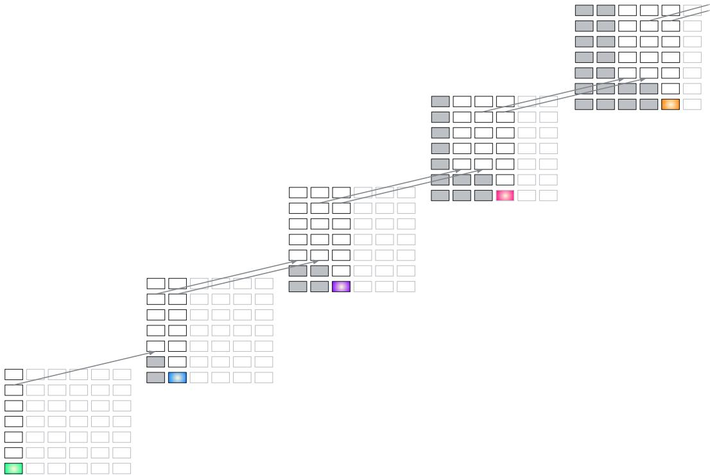  
Figure A.1: Recirculation architecture with two iterations of recirculation, which yields three passes through each stack.

## B Recirculation implementation details

## B.1 Hyperparameter sweeps

For the hyperparameter sweeps (Figures 5 and 6), we used a context window of 1024 tokens and pulled roughly 500 windows from training documents in three datasets: arXiv, C4, and PG19. We used at most two windows from each document, requiring that the windows had no filler tokens (i.e., the document extended at least to the end of the window). This requirement yielded 484 windows for arXiv (495132 predicted tokens), 488 windows for C4 (499224 tokens), and 500 windows for PG19 (511000 tokens).

## B.2 Perplexity evaluation

For our perplexity evaluation (Table 1), we used the entire evaluation set from nine data sets (arXiv, billsum, booksum/books, C4/webtextlike, gov report, lambada, newsroom, PG19, and pubmed) and the first 10000 documents from a tenth data set (big patent). The evaluation split was labeled ‘validation’ for C4 and ‘test’ for all other datasets. We partitioned each document into chunks of 1024 tokens and excluded partially filled windows (i.e., less than 1024 tokens), except for three data sets whose documents were typically too short (c4/webtextlike, lambada, and newsroom). This procedure resulted in the evaluation of the number of tokens listed in the second column of Table 1.

Based on hyperparameter sweeps for the 1B, 4B, and 12B models, we used the source and destination pairs shown in Table B.1. These hyperparameters were used for all results presented in the article unless otherwise mentioned.

<table><tr><td>Model</td><td>Source</td><td>Destination</td></tr><tr><td>Gemma3 1B PT</td><td>11</td><td>4</td></tr><tr><td>Gemma3 4B PT</td><td>18</td><td>9</td></tr><tr><td>Gemma3 12B PT</td><td>35</td><td>16</td></tr></table>

Table B.1: Optimal hyperparameters based on tuning dataset

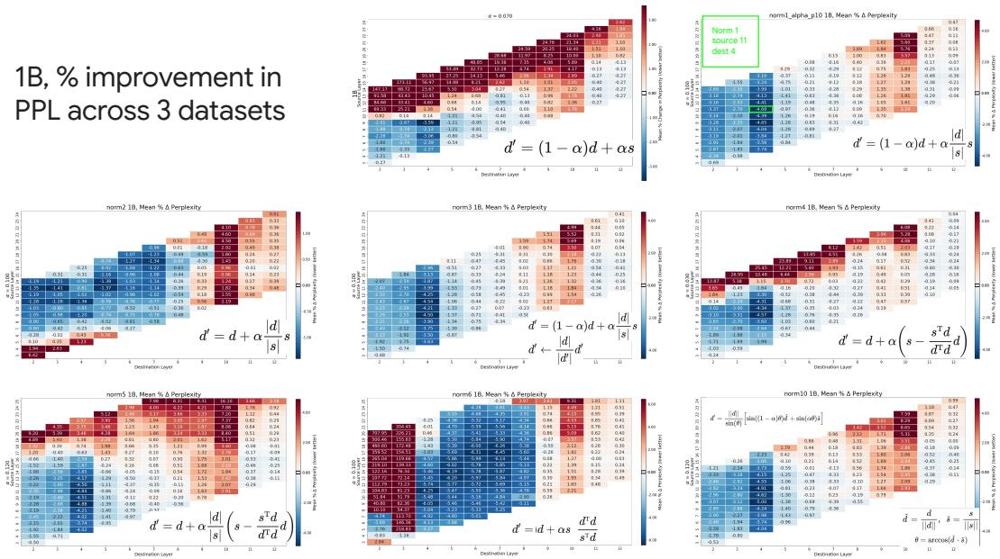  
Figure B.1: Hyperparameter sweeps for various normalization schemes with Gemma3 1B PT.

## B.3 Normalization and ramping

Figures B.1-B.3 show hyperparameter sweeps for multiple renormalization techniques, i.e., scaling of the source vector when recirculating to the destination layer. Scaling helps to ensure that the source activations do not overwhelm the destination activations, due to the fact that embedding norms increase over transformer layers (Liu et al., 2020; Xiong et al., 2020). The heatmaps depict percentage reduction (negative) or increase (red) in perplexity over our three tuning datasets (arXiv, C4, PG-19).

The normalization schemes are summarized in the Figures and in Table B.2. We simplify the notation used in the main paper, where $z _ { i , j , l }$ referred to the embedding at unrolling step i for input step j and layer l. Instead, we denote:

$$
\begin{array} { r c l } { { } } & { { } } & { { d \equiv z _ { t , t , d } , } } \\ { { } } & { { } } & { { s \equiv z _ { t , t , s } , \mathrm { a n d } } } \\ { { } } & { { } } & { { d ^ { \prime } \equiv z _ { t + 1 , t , d } . } } \end{array}
$$

The normalization schemes in Table B.2 include the simple scheme in which no normalization is applied. The no-normalization heatmaps (top row, middle panel in Figures B.1-B.3) attain reasonable outcomes but clearly the schemes with $L _ { 2 }$ normalization (top row, right panel and second row, left panel) are better behaved in the sense that there are fewer hyperparameters that result in poorer performance. Oddly, a convex combination of source and destination vectors (top row, right panel) is superior to a nonconvex combination (second row, left panel) for the Gemma3 1B model, but the nonconvex combination is superior for Gemma3 4B and 12B. Other candidate schemes either had pathologies (non-smooth heatmaps, large red regions) or mimicked the simple norm-ratio schemes. Based on the Gemma family, we recommend evaluating at least the convex and non-convex mixtures with norm-ratio adjustment of the source.

Ramping. As we mentioned in the main article, for the Gemma3 1B model, we found a small additional reduction in perplexity if we ramped up the recirculation coefficient over the first 10 steps. Specifically, we defined the α coefficient at step $\bar { t } \geq 0$ to be $\alpha _ { t } \equiv \mathrm { m i n } ( t / 1 0 , 1 ) \alpha$ .

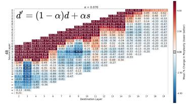

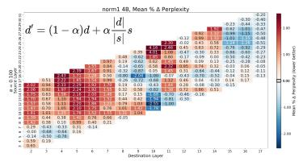

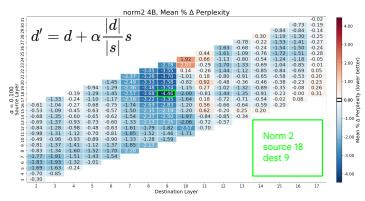

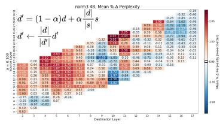

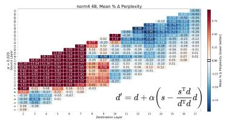

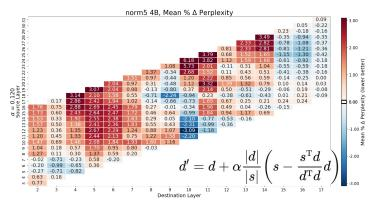

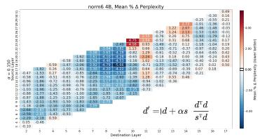

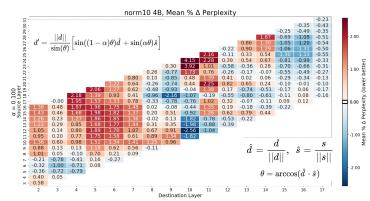  
Figure B.2: Hyperparameter sweeps for various normalization schemes with Gemma3 4B PT.  
12B, % improvement in PPL across 3 datasets

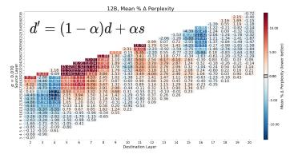

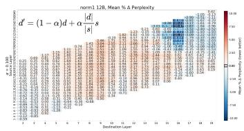

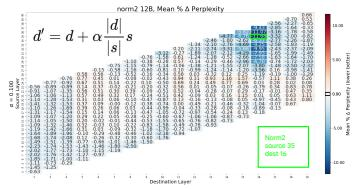

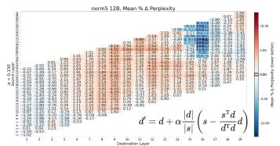

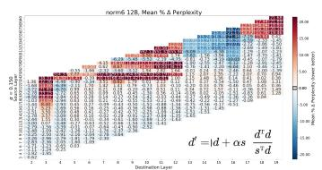

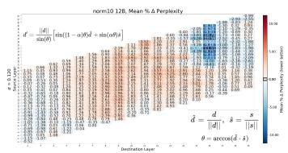  
Figure B.3: Hyperparameter sweeps for various normalization schemes with Gemma3 12B PT.

## C Basic results

## C.1 Robustness across architectures

In Figure 7, we contrasted recirculation hyperparameter sweeps for Gemma3 1B to four other model families: Ministral3, Qwen3, Pythia, and Phi2. The Figure compares architectures using only the arXiv training set. Due to the fact that all of these models were relatively small, we utilized the same hyperparameters as we did for Gemma3 1B PT: scaling of the source layer norm to match the target layer norm, $\alpha = . 0 7$ and $\beta = 1 - \alpha$ . Using $\beta = 1 \mathrm { - t h e }$ choice for Gemma3 4B and 12B—produced qualitatively similar results.

In addition to the comparison across different model families, we also compared results from Gemma3 with those from other generations of the Gemma model family, including the older Gemma2 and the newer Gemma4 (Figure C.1). The arXiv train set is again used in this Figure. The gains for Gemma2 and Gemma4 are as pronounced as those for Gemma3 in the main text, despite the fact that there are regions of the hyperparameter space where recirculation is quite harmful. Note that smaller variants of Gemma4 (i.e., E2B and E4B) uses cross-layer KV cache sharing as well as per-layer embedding, which can explain the instability in these plots (Team et al., 2026).

Table B.2: Normalization schemes
<table><tr><td>description</td><td colspan="6">formula</td></tr><tr><td>no normalization</td><td colspan="3"> $d ^ { \prime } = ( 1 - \alpha ) d + \alpha s$ </td><td colspan="3"></td></tr><tr><td>convex combination, magnitude ratio</td><td></td><td colspan="3"> $\begin{array} { r } { \overline { { d ^ { \prime } = ( 1 - \alpha ) d + \alpha \frac { | | d | | } { | | s | | } s } } } \end{array}$ </td><td></td></tr><tr><td>nonconvex combination, magnitude ratio</td><td colspan="3"> $\begin{array} { r } { \overline { { d ^ { \prime } = d + \alpha \frac { | | d | | } { | | s | | } s } } } \end{array}$ </td><td colspan="3"></td></tr><tr><td rowspan="2">convex combination, magnitude ratio reweighting, des- tination renormalized</td><td colspan="5"> $\overline { { d ^ { \prime } = ( 1 - \alpha ) d + \alpha \frac { | | d | | } { | | s | | } s } }$ </td></tr><tr><td></td><td colspan="2"> $d ^ { \prime } \gets \frac { | | d | | } { | | d ^ { \prime } | | } d ^ { \prime }$   $\overline { { d ^ { \prime } = d + \alpha \left( s - \frac { s ^ { \mathrm { T } } d } { d ^ { \mathrm { T } } d } d \right) } }$ </td><td colspan="2"></td></tr><tr><td>nonconvex combination, recirculate only component of source orthogonal to destination</td><td colspan="2"></td><td colspan="2"> $= \left( 1 - \alpha \frac { | | s | | } { | | d | | } \cos ( \theta ) \right) d + \alpha s$   $\theta = \operatorname { a r c c o s } \left( { \frac { s ^ { \operatorname { T } } d } { \vert \vert d \vert \vert \left. \vert s \vert \right. } } \right)$ </td></tr><tr><td colspan="2">convex combination (when aligned) or nonconvex (when orthogonal), magnitude ratio reweighting</td><td colspan="2"> $\overline { { d ^ { \prime } = d + \alpha \frac { | | d | | } { | | s | | } \left( s - \frac { s ^ { \mathrm { { r } } } d } { d ^ { \mathrm { { r } } } d } d \right) } }$   $= ( 1 - \alpha \cos ( \theta ) ) d + \alpha \frac { | | d | | } { | | s | | } s$ </td></tr><tr><td colspan="2">nonconvex combination, magnitude ratio reweighting,</td><td colspan="4"> $\overline { { d ^ { \prime } = d + \alpha \frac { d ^ { \mathrm { T } } d } { s ^ { \mathrm { T } } d } s } }$ </td></tr><tr><td colspan="4"></td><td colspan="4"></td></tr><tr><td colspan="4">scale source by novelty</td><td colspan="4"> $= d + \alpha { \frac { | | d | | } { | | s | | } } { \frac { s } { \cos ( \theta ) } }$ </td></tr><tr><td colspan="4"></td><td colspan="4"></td></tr><tr><td colspan="4">rotate destination embedding toward source embedding</td><td colspan="5"></td></tr><tr><td colspan="5"></td><td colspan="5"> $d ^ { \prime } = { \frac { 1 } { \sin ( \theta ) } } \left[ \sin ( ( 1 - \alpha ) \theta ) d + \sin ( \alpha \theta ) { \frac { | | d | | } { | | s | | } } s \right]$ </td></tr><tr><td colspan="5"></td><td colspan="5"></td></tr></table>

We hypothesize that this favorability of Gemma architectures can be attributed to two distinct explanations:

• Gemma architectures use a Peri-LN architecture (Kim et al., 2025) which adds layer-norm to both the input of the layer (i.e., self-attention or MLP), as well as the output of the layer. In contrast, other architectures only use input normalization (Xiong et al., 2020). The use of output normalization might improve the model’s compatibility with recirculation by avoiding diminishing contribution from later layers (Sun et al., 2026).

• The compatibility with recirculation is strongly dependent on the optimization process used for training the model. Hence, the scheme used to train Gemma models is particularly favorable for recirculation.

## C.2 Recirculation versus temperature tuning

Gemma3 1B with the PG-19 evaluation (‘test’) set was used for temperature tuning experiments. The documents were split into 1024 token chunks per context window; partially filled sequences were excluded. We swept over a wide enough range of softmax temperatures to identify the range in which adjusting model temperature improved perplexity. Figure C.2 shows the sweep without recirculation in the left panel and with recirculation in the right panel. Whether with or without recirculation, the optimal temperature was about 1.2. Although we performed a more granular sweep for the combined experiment, we report in the main paper the optimum over only the range of temperatures used for the temperature-alone experiment.

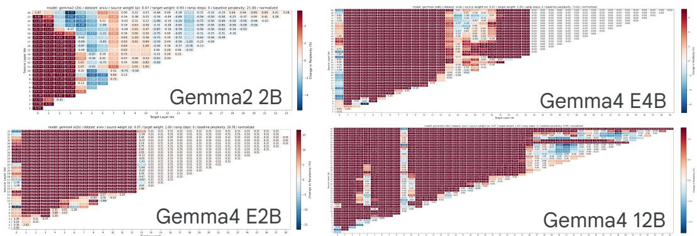  
Figure C.1: Recirculation gains on older as well as newer generations of Gemma models are comparable to the gains observed on Gemma3, highlighting that Gemma model family is particularly compatible with recirculation. All sweeps use $\alpha = 0 . 0 7$ . We tried the two settings of β that were most successful for Gemma3 models, and the choice made little difference, but we use $\beta = 1 . 0$ for the Gemma4 models and $\beta = 1 - \alpha$ for Gemma2.

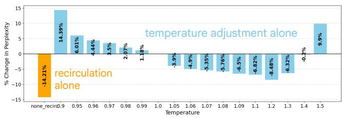

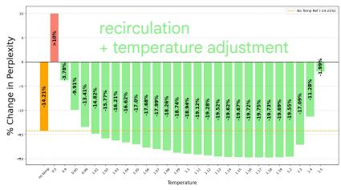  
Figure C.2: PG-19 eval perplexity for Gemma3 1B with softmax temperature adjustment only (left) and recirculation plus softmax temperature adjustment (right).

## C.3 Recirculation versus looping

The dataset is comprised of 250 documents from the arxiv train set, with 2 subsequences taken from each document starting from the beginning of the document, each of size 1024 tokens. This is identical to our setting for the grid search results in Figure 5. Results for recirculation are shown with $\alpha = 0 . 0 7$ , with convex combination $( \beta = 0 . 9 3 )$ for the 1B model and a non-convex combination $( \beta = 1 . 0 )$ for the 4B and 12B models, as discussed in the main text.

## C.4 Which tokens benefit from recirculation?

Experiments in the main paper are based on Gemma3 1B PT with the arXiv data set, training split, with a context window of 1024 tokens extracted from a randomly selected position within each document. Part-of-speech tags are extracted with nltk.pos\_tag. We processed 24960 documents and for each, we recirculated tokens 0-767 individually and examined downstream effects at lags 1-256.

We also ran an experiment in which we recirculated all and only tokens tagged with a given part of speech (Figure C.3). For this experiment, 3120 documents from the arXiv train set were used, and from each, a sequence of 1024 tokens was taken from a random starting position within the document. Each of these sequences was tested with recirculation of only PoS-selected tokens.

## D Downstream evaluations

## D.1 Instruction following

We generated 800 queries of the following form:

<start\_of\_turn > user   
Let ’ s play a game . I will say two words .

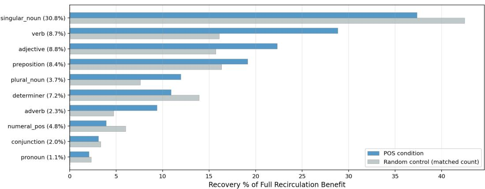  
Figure C.3: Effect of recirculating all tokens by a specific part-of-speech (blue bars) or count matched random tokens (grey bars).

If the first word is a fruit , you say first .   
If the second word is a fruit , you say second .   
For example , if I say ‘ pomegranate kangaroo ’ , respond first .   
And if I say ‘ koala fig ’ , respond second .   
The word pair is ‘monkey banana ’. Your answer ?< end\_of\_turn >   
<start\_of\_turn > model

On half the trials, the model was asked instead to identify the position of the animal (“If the first word is an animal, you say first...”). We formed 400 trials by combining twenty different fruit names with twenty different animal names. With the respond-to-fruit and respond-to-animal variants, this yields 800 trials total. The fruits are: apple, avocado, banana, blueberry, cantaloupe, cherry, grape, honeydew, kiwi, lemon, lime, mango, orange, peach, pear, pineapple, plum, raspberry, strawberry, watermelon. The animals are: bear, bird, cat, deer, dog, dolphin, elephant, fox, giraffe, lion, lizard, monkey, penguin, shark, snake, spider, tiger, whale, wolf, zebra.

We selected the most likely response among eight candidate tokens, which consisted of the words first and second, both in upper- and lower-case form and with and without a leading space.

For the Gemma3 4B and 12B IT, we used the source and destination layers determined by our previous perplexity hyperparameter sweep, and α = 0.07. For the task-specific result, we conducted a sweep using the instruction-following dataset to determine an upper bound on performance. These sweeps are shown in Figure D.1. The 1B sweep is included as well, revealing that the model is essentially performing at chance. For the 4B model, source layer 18, destination layer 8 was best; for the 12B model, source layer 29, destination layer 16 was best.

## D.2 Contextualization

For Figure 11 of the main paper, we used hyperparameters chosen based on minimizing perplexity of the pretrained model. We also swept hyperparameters of the Gemma3 1B IT model using a particular condition of the Lepori et al. (2025) dataset: both the 5-distractor condition of the gender questions and the polysemy questions. These sweeps appear in the upper right of Figures D.2-D.4, corresponding to the 1B, 4B, and 12B models. In the lower row of the Figure, left to right we show recirculation accuracy with hyperparameters chosen based on pretrained model perplexity, instruction tuned model perplexity, accuracy for gender 5-distractor condition, and accuracy for polysemy 5-distractor condition. Note that the 1B model is not much above chance except for no-distractor polysemy questions.

## D.3 Multiple-choice and single-token response tasks

We tested the Gemma3 4B PT model. To determine the optimal hyperparameters we conducted a (source, destination) sweep using the 1531 MMLU development-set problems. These problems are distinct from the examples used for evaluation. Figure D.5a shows the sweep, fixing α = 0.07.

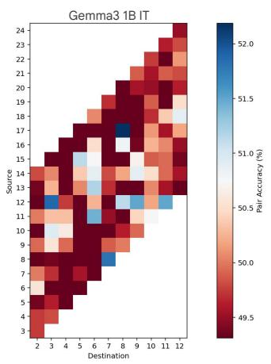

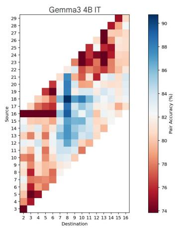

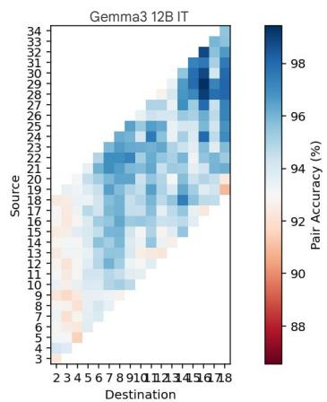  
Figure D.1: Hyperparameter sweeps for Gemma3 1B, 4B, 12B IT models on the instruction-following task

Figure D.5b shows a scan over α, fixing source and destination layers to be the pair that yields the lowest perplexity in the sweep of Figure D.5a. The resulting hyperparameters that were used in the various single-token response datasets were source 16, destination $\bar { 5 } , \alpha = 0 . 0 9$

## D.4 Standard benchmark datasets: GSM8k

We trained Gemma3 4B model with identical hyperparameters as the perplexity experiments (see Section 4.6), except that we masked the prompt part of the question, and only trained the model to predict the ground-truth response present in the dataset. We only report results using our bestperforming conditional α, β scheme as highlighted in Figure 13.

## D.5 Adaptive recirculation

For all training experiments, we use 250 documents from each of the PG19, C4, and arXiv training sets. Documents are partitioned into windows of 1024 tokens and only completely full windows

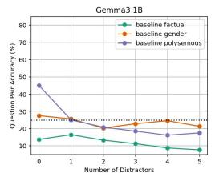

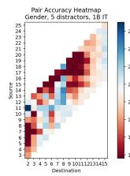

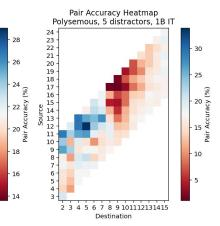

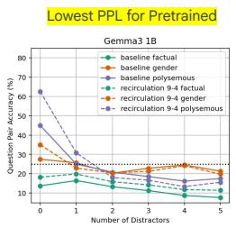

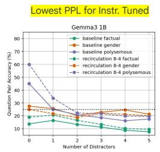

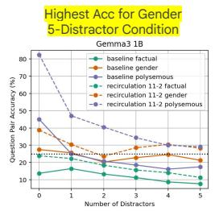

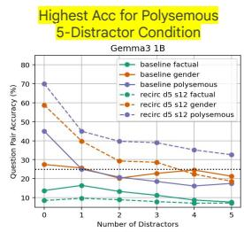  
Figure D.2: (top row, center) Baseline model performance for the three sets of questions proposed by Lepori et al. (2025). (top row, right) Hyperparameter sweeps for Gemma3 1B IT using a single condition of the data set (5 distractors, gender and polysemy questions). (bottom row) Left to right, we show the performance of recirculation with hyperparameters chosen based on pretrained model perplexity, instruction tuned model perplexity, accuracy for gender 5-distractor condition, and accuracy for polysemy 5-distractor condition.

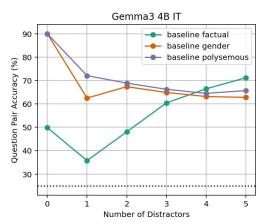

  
Figure D.3: (top row, center) Baseline model performance for the three sets of questions proposed by Lepori et al. (2025). (top row, right) Hyperparameter sweeps for Gemma3 4B IT using a single condition of the data set (5 distractors, gender and polysemy questions). (bottom row) Left to right, we show the performance of recirculation with hyperparameters chosen based on pretrained model perplexity, instruction tuned model perplexity, accuracy for gender 5-distractor condition, and accuracy for polysemy 5-distractor condition.

  
Figure D.4: (top row, center) Baseline model performance for the three sets of questions proposed by Lepori et al. (2025). (top row, right) Hyperparameter sweeps for Gemma3 12B IT using a single condition of the data set (5 distractors, gender and polysemy questions). (bottom row) Left to right, we show the performance of recirculation with hyperparameters chosen based on pretrained model perplexity, instruction tuned model perplexity, accuracy for gender 5-distractor condition, and accuracy for polysemy 5-distractor condition.

were included in the training set. The transformer with recirculation and the MLP module is trained with Back Propagation Through Time (BPTT). For the perplexity studies of Figure 13, we use the Gemma3 1B PT model with the previously selected source and destination layers (Table B.1).

Our architecture is adapted from the next-latent prediction MLP in Teoh et al. (2025), where we use a 2 hidden layer GELU-based MLP with the same hidden size as the model dimension, with layer-norm at the input of the MLP. The input is twice the model hidden dimension as we concatenate the source and the destination embeddings to be fed to the MLP. Output size is dependent on the formulation used; e.g., it would be twice the model hidden dimension for learned conditional vectors scheme, which predicts two scalars $( \alpha , \beta )$ per dimension.

(b)  
  
Figure D.5: (a) Perplexity of the response token for the 1531 problems in the MMLU development set for the Gemma3 4B PT model with recirculation. A sweep is conducted over source and destination layers, fixing $\alpha = . 0 7 ; ( \mathbf { b } )$ Sweep of α, fixing source and destination at 16 and 5, the condition that yields the best performance in (a).

We use sigmoid activation at the output to ensure that these coefficients lie in [0,1]. Further, we initialize the parameters of the network such that it starts with $\alpha = 0 . 1$ and $\beta = 0 . 9$ at initialization, based on the range of values we found to be suitable from our grid-search results.

We train the model for 100 steps with a batch size of 32 using AdamW (Loshchilov and Hutter, 2019), a learning rate of 3e-4, and a weight decay of 1e-4. For all simulations other than LLM fine-tuning, we freeze the parameters of Gemma3. For LLM fine-tuning, we disable weight decay and use a small learning rate of 1e-5. Similarly, for the unconditional prediction schemes (same for all inputs), we disable weight decay and increase the learning rate to 1e-1.

Evaluation was performed with the validation or test set of nine datasets: ArXiv, PubMed, PG19, BookSum, Lambada, Gov Report, BillSum, OpenWebText, and Big Patent. Note that nonoverlapping subsets of ArXiv and PG19 were used for training and evaluation.

Figure D.6b compares recirculation with fixed coefficients $( \alpha = 0 . 1 5 , \beta = 0 . 8 5 )$ and the scheme in which an MLP is trained to produce vector-valued α and $\beta$ coefficients for each token (Figure D.6a). We refer to this scheme as adaptive recirculation for short, as well as conditional $\alpha , \beta$ in the text. The comparison indicates that adaptive recirculation increases the percentage reduction in perplexity for every dataset, and by a factor of three or more for many of the datasets.

When training our conditional vector $\alpha , \beta$ scheme on downstream tasks with Gemma3 4B (Table 2 and Figure 12), we use the same hyperparameters as our perplexity experiments. However, we mask the prompt and only train on the response, which refers to only a single token in the single-token benchmarks (Table 2). Because the ARC datasets have fewer examples than the MMLU datasets (MMLU train set: 99842, MMLU test set: 14042, ARC easy: 2251, ARC challenge: 1119), we used multi-epoch training for the ARC datasets as we train on a total of 3200 examples (100 steps with a batch-size of 32).

(a)  
(b)  

  
Figure D.6: (a) adaptive recirculation MLP. (b) Percentage reduction in perplexity relative to baseline for Gemma3 1B recirculation with fixed coefficients (blue) and adaptive recirculation (green)