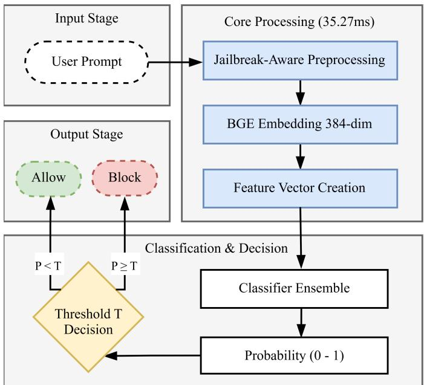
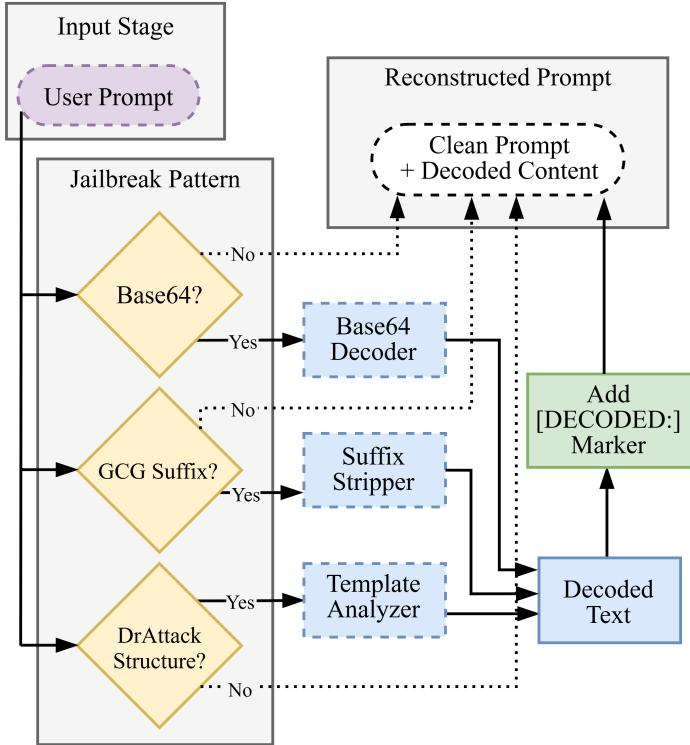
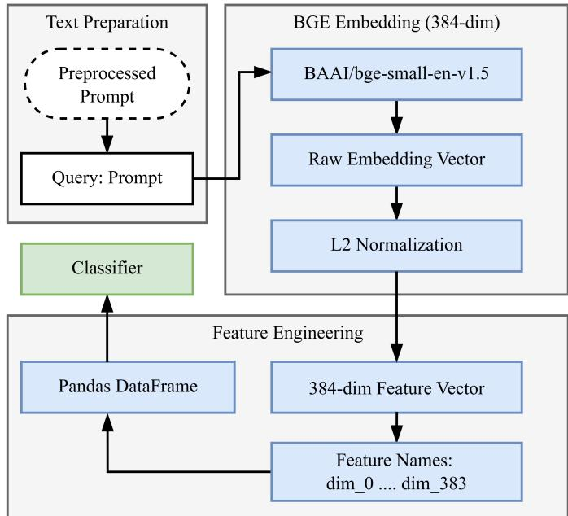
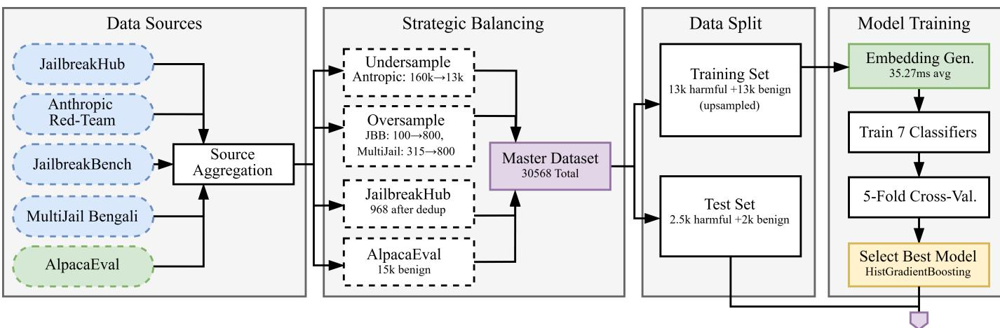
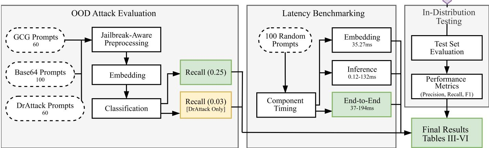
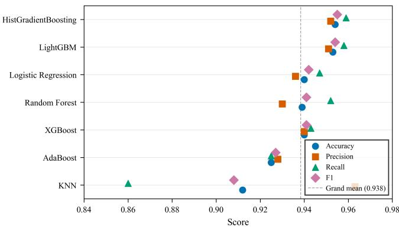
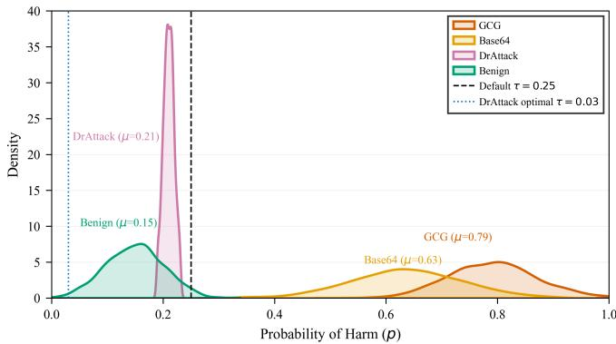
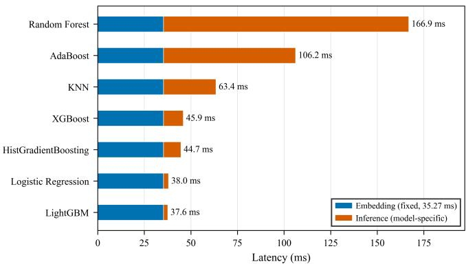
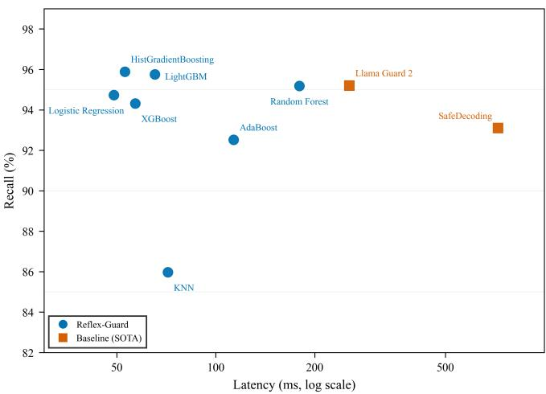
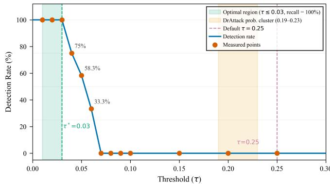

# Reflex-Guard: A Low-Latency Guardrail for LLM Prompt Safety Using Dense Semantic Embeddings

Istiaque Ahmed ∗, Afia Anjum Borsha †, Ranat Das Prangon ‡, Abu-fuad Ahmad §, and Thi Hong Tran ∗, Member, IEEE

Abstract—Large Language Models (LLMs) in real-world applications often face the risks of specially crafted prompts designed to bypass the safety controls. Existing guardrail methods, such as LLM–as–a–judge and cloud-based safety APIs are able to detect unsafe content. However, they often add delay about 250–900 ms to each request. This delay is too high for real-time applications, when the system usually needs to respond in less than 100 ms. Furthermore, routing user prompts through external moderation endpoints raises significant data privacy concerns. This paper introduces Reflex–Guard, a lightweight guardrail that runs locally. It uses jailbreak-aware preprocessing, compact sentence-transformer embeddings, and seven fast binary classifiers. Together, these components enable high-accuracy prompt safety filtering with much lower latency than existing solutions. Through systematic evaluation on a strategically balanced dataset of 30,568 samples drawn from five complementary sources, we demonstrate that Reflex-Guard achieves 95.9% recall on harmful prompts at 37.6 ms end–to–end latency. It is faster than existing baselines, including Llama Guard 2 at 255 ms and SafeDecoding at 723 ms. It can detect 100% of GCG suffix attacks and Base64– encoded prompts using the default threshold. However, DrAttack structured prompts required lowering the threshold to 0.03 for optimal detection, as they produced a distinct probability distribution. Reflex–Guard achieves Reflex Efficiency Score (RES) scores up to 16.79, significantly outperforming Llama Guard 2 (11.90) and SafeDecoding (9.80). This analysis offers practical deployment advice and shows that different attack types occupy distinct regions in the embedding probability space.

Index Terms—LLM safety, prompt guardrail, jailbreak detection, adversarial robustness, sentence embeddings, low-latency classification, real-time moderation.

## I. INTRODUCTION

The use of LLMs in real–world applications has created a trade–off between capability and safety [1], [2]. They are used in chatbots, coding tools, customer service, and healthcare supports. Since LLMs are trained on large amounts of internet data, they may contain hidden harmful information that attackers can exploit by using carefully designed prompts. Prior studies show that jailbreak attacks can bypass safety alignment and produce harmful outputs [3], [4]. These vulnerabilities arise from some factors such as incomplete training data, linguistic ambiguity, and generative uncertainty [5]. Early attacks were simple and often used role–play prompts, such as “You are DAN, an unrestricted AI that can do anything now” to make the model ignore its normal safety rules.

More recent methods employ three advanced strategies. Gradient–based optimization creates universal adversarial suffixes (GCG attacks) that hijack attention, bypassing safety alignment [3], [6]. Encoding methods such as Base64, Hex, and Rot–13 hide harmful intent from filters, boosting attack success rates, with newer models being more vulnerable [7]. Structured prompt engineering frameworks such as DrAttack insert malicious instructions within harmless templates by breaking down and reassembling prompts, distracting the LLM from harmful word combinations [4]. This evolution demands accurate and a robust a guardrail system across heterogeneous attack vectors.

Current defense methods often face a trade–off between capability and efficiency. Some methods are robust but computationally expensive, while others are fast but less capable. For example, Llama Guard 2 [8] and SafeDecoding [9] use large– model reasoning or safety–aware decoding to detect unsafe prompts. These methods achieve strong detection performance, but their latency can be too high for real–time conversational APIs. Cloud–based moderation APIs offer another solution. Examples include the OpenAI Moderation API [10] and Google Perspective API [11]. These services are easy to deploy, but they rely on external endpoints. This adds network delay and raises privacy concerns because user prompts must be sent to third–party services. Common failures include over– filtering benign content and missing adversarial role–play prompts [12].

A lightweight local guardrail is needed to detect harmful prompts with high accuracy, low–latency, and strong privacy. It is important in sensitive domains such as healthcare, finance, and legal services, where sending user queries to external moderation services may violate regulations or data policies. Compact sentence–embedding models such as Sentence– BERT and BGE can support efficient safety classification with smaller models [13], [14]. However, guardrails must also remain robust against adversarial prompts that can incorrectly block legitimate requests [15].

This work is an innovative embedding–based local guardrail architecture that addresses the latency–accuracy–privacy trilemma. The key contributions are outlined below.

• We propose a low–latency local guardrail architecture for detecting harmful and jailbreak–style prompts before they reach the target LLM.

• We introduce the efficiency score (RES), a unified metric for evaluating the trade–off between detection effectiveness and computational cost.

• A systematic comparison of seven lightweight classifier architectures on a diverse benchmark of benign and adversarial prompts, identifying the best trade–off between detection performance and latency.

• We reveal that different adversarial prompt families produce distinct detection patterns, motivating an adaptive thresholding strategy for improved robustness across heterogeneous attacks.

• A practical guideline for selecting classifier architectures and decision thresholds based on deployment requirements, including speed, recall, and overall efficiency, is presented.

The paper is organized as follows, Section II reviews related work. Section III details the architecture. Section IV covers experimental setup and results. Section V discusses implications, limitations, and ethics. Section VI concludes with future research directions.

## II. RELATED WORK

This section reviews previous works on prompt safety filtering for LLMs, including guardrails, cloud moderation APIs, embedding-based detection, and jailbreak attacks. It also identifies research gaps that motivate this study.

The dominant paradigm for LLM input and output safety relies on deploying secondary language models as judges or classifiers. Meta’s Llama Guard family fine-tunes Llama-series models for multi-category safety classification [8], [16]. These models achieve strong detection rates, approximately 93%– 95% recall across harmful categories. However, they require full transformer forward passes that incur latencies of 255– 400 ms on GPU–accelerated hardware, which is too high for real-time applications. SafeDecoding uses controlled decoding methods during generation to prevent harmful outputs [9]. The method adds 300-723 ms of delay, depending on sequence length. While leveraging large language models’ semantic understanding, it conflicts with the sub-100 ms latency needed for real–time applications.

Several other LLM–based guardrails have been proposed. NeMo Guardrails provides a configurable framework for defining conversational safety rules [17]. ShieldGemma offers a family of safety classifiers built on Gemma models [18]. WildGuard evaluates safety across multiple harm categories using a fine–tuned LLM [19]. These systems share a common limitation as they require running a full LLM forward pass for every request. Constitutional AI represents a training– time approach that embeds safety constraints during the reinforcement learning from human feedback RLHF pipeline [12]. CAI–trained models are effective for general alignment but still vulnerable to advanced adversarial prompts. These prompts exploit gaps between training and attack strategies, highlighting the need for inference–time guardrails, as novel attack vectors can still bypass training defenses.

There are some commercial moderation services offer easy– to–use solutions for content safety. These include OpenAI’s

Moderation API [20], Google’s Perspective API [21], and Azure Content Safety [22]. Such services typically employ ensembles of specialized classifiers optimized for specific harm categories, including toxicity, violence, sexual content, and self–harm. Cloud–based deployment introduces several key issues. Issues include 100–300 ms network latency, data privacy concerns, and unreliable performance, like over–filtering or missing evasions. This occurs because these systems aren’t consistently tested against the same attack vectors as the LLMs they protect [23].

The Greedy Coordinate Gradient (GCG) attack [3] uses gradient–based optimization to create universal adversarial suffixes that bypass safety alignment. It manipulates the tokenizer to change the model’s generation path. DrAttack [4] embeds harmful requests within benign templates, exploiting the model’s tendency to follow instruction–like patterns. Base64 encoding attacks [24] convert harmful text into encoded strings, bypassing filters and increasing vulnerability in newer models. Other attacks include multi–turn conversational attacks [25], indirect prompt injection [26], and multilingual evasion [7], which are outside this evaluation’s scope.

Sentence transformers such as Sentence–BERT [13], BGE [14], and E5 [27] generate dense semantic embeddings for tasks such as sentiment analysis, intent detection, and toxicity filtering. In this work, we will use the BAAI/bge-small-env1.5 model, which generates 384–dimensional L2–normalized embeddings. It delivers strong performance on semantic similarity benchmarks while being compact with only 33 million parameters, making it suitable for real–time edge deployment. Previous studies have shown high accuracy using Sentence– BERT embeddings for toxic content detection [28], while contrastive learning has been explored for better separation between harmful and benign prompts [29]. Existing evaluations often focus on single datasets or attack types, lack latency benchmarking, and do not test against encoded or structured adversarial prompts such as Base64 or DrAttack. This work addresses these limitations by providing more comprehensive testing.

Few works meet the key requirements for production guardrail deployment. First, real–time systems need sub-100 ms latency, but LLM-based judges are slow, cloud APIs add delay, and embedding–based methods lack latency evaluation. Second, robustness testing is limited, as most studies use only one dataset or attack type and overlook encoded attacks and structured prompts. This makes it hard to know if a guardrail can handle new attack types. Third, existing works rarely measure the trade-off between security and latency, even though some applications need speed and others need high recall. A unified metric is needed to compare guardrails on both dimensions.

The Proposed method analyzes detection thresholds across different attack families and shows their distinct probability distributions. It also introduces the RES, a unified metric for comparing guardrail systems. In addition, it evaluates a jailbreak-aware preprocessing pipeline against GCG, Base64, and DrAttack within one experimental framework. Table I summarizes the comparison between proposed work and existing approaches.

TABLE I: Comparison of Guardrail Approaches Across Key Dimensions
<table><tr><td>Approach</td><td>Sub-100 ms Latency</td><td>Local Inference</td><td>Encoded Attack Detection</td><td>Structured Attack Detection</td><td>Unified Metric</td></tr><tr><td>Llama Guard 2 [8], [16]</td><td>X</td><td>√</td><td>X</td><td>X</td><td>X</td></tr><tr><td>SafeDecoding [9]</td><td>X</td><td>√</td><td>X</td><td>X</td><td>X</td></tr><tr><td>OpenAI Moderation API [20]</td><td>X</td><td> $\times ^ { * }$ </td><td>2</td><td>X</td><td>X</td></tr><tr><td>Embedding-Only [28]</td><td>√</td><td>V</td><td>X</td><td>X</td><td>X</td></tr><tr><td>Reflex-Guard (This Work)</td><td>V</td><td>√</td><td>√</td><td>√</td><td>√</td></tr></table>

Notation: ${ \checkmark } = \mathrm { { F u l l y } }$ supported, $\sim =$ Partially supported, $\mathbf { \nabla } \times \mathbf { = N o t }$ supported or not reported ∗Local deployment remains infrastructure-intensive.

  
Fig. 1: Overall Reflex-Guard pipeline architecture.

## III. PROPOSED FLEX-GUARD METHOD

The architecture includes a jailbreak–aware preprocessor, a compact embedding model, lightweight binary classifiers, and a threshold-based decision module. It processes Disguised prompts, generates semantic embeddings, classifies the prompt, and applies a threshold to decide whether to block or allow the input. The proposed approach is designed to achieve low-overhead operation as shown in Fig. 1.

## A. Jailbreak–Aware Preprocessing

The preprocessor scans incoming prompts for three obfuscation patterns including Base64-encoded payloads, GCG–style adversarial suffixes, and DrAttack structural templates. It uses regular expressions to identify encoded parts, decode them to plaintext, and add a "DECODED" prefix. This step prevents encoded or obfuscated content from misleading embeddings, which could otherwise evade classification. As illustrated in Fig. 2, the preprocessor employs three pattern detection modules operating in sequence. To automatically detect Base64- encoded content, the system uses an indicator function that checks for valid Base64 character sequences as Eq. 1.

$$
\mathrm { i s B a s e } 6 4 ( s ) = \mathbf { 1 } _ { \exists i } \left( s [ i : i + 4 ] \in \mathcal { B } _ { 6 4 } \right)
$$

  
Fig. 2: Jailbreak-aware preprocessing workflow.

(1)

Where s is the input prompt string, $s [ i : i + 4 ]$ denotes a substring of length 4 starting at position i, $B _ { 6 4 }$ is the set of valid Base64 character patterns (alphanumeric, +, $/ ,$ and = padding), and $\mathbf { 1 } _ { \exists i }$ is the indicator function that returns 1 if such a pattern exists.

The detection process scans prompts for Base64-encoded substrings using a sliding 4-character window to check for membership in the Base64 character set. When detected, the substring is decoded, and a DECODED marker is added to ensure the original harmful intent is captured. For GCG–style adversarial suffixes, such as repeated punctuation or bracketed noise, the preprocessor detects them but does not remove them. The BGE embedding model handles this noise well, and its presence helps indicate an adversarial prompt. DrAttack structural patterns, such as "As a researcher","For educational purposes" or "Please consider this scenario" trigger sensitivity flags that adjust downstream thresholds. However, these patterns alone are not sufficient for classification, as legitimate prompts may use similar structures. The preprocessing stage adds less than 0.1 ms overhead per request, which is minimal compared to the total pipeline latency. The Base64 decoding module is important because encoded prompts appear similar to benign content in the embedding space. Without decoding them first, the classifier cannot detect them effectively.

  
Fig. 3: Embedding and Feature Engineering.

## B. Dense Semantic Embedding Stage

Fig. 3 illustrates the embedding and feature engineering pipeline, from the preprocessed prompt through BGE embedding generation and the resulting feature vector used for classification. The preprocessed prompt is transformed into a dense semantic vector using the BAAI/bge-small-en-v1.5 sentence transformer [14]. To follow the model’s guidelines, the input is prefixed with the "query:" label, which activates special attention patterns optimized during pre-training as shown in Listing 1. The encoder generates 384–dimensional, L2-normalized embeddings, which are mapped onto the unit hypersphere. This ensures decisions are based on angular similarity, not vector magnitude. With around 33 million parameters, the model is compact but effectively captures the semantic structure needed for binary safety classification. The embedding stage is the primary source of computational cost in the pipeline, establishing a lower bound for overall latency. This cost is constant and does not vary depending on the classifier selected.

$$
\mathrm { L i s t i n g ~ 1 : Q u e r y ~ L a b e l ~ C o d e }
$$

$$
\begin{array} { l } { { \tt f o r m a t t e d \_ p r o m p t } = } \\ { { \tt " { q u e r y : \theta + p r e p r o c e s s e d \_ t e x t } } } \\ { { \tt e m b e d d i n g \ = \ e n c o d e r . e n c o d e } } \\ { { \tt ( f o r m a t t e d \_ p r o m p t , \theta \cap { o r m a l i z e \_ e m b e d d i n g s = T r u e } ) } } \end{array}
$$

In the BGE transformer model, the sentence-level representation is derived by applying mean pooling to the sequence of token embeddings $\mathbf { h } _ { 1 } , \mathbf { h } _ { 2 } , \ldots , \mathbf { h } _ { n }$ . The pooling process is mathematically defined by the Eq. 2.

$$
\mathbf { e } = \frac { 1 } { n } \sum _ { i = 1 } ^ { n } \mathbf { h } _ { i }\tag{2}
$$

Where $\mathbf { e } \in \mathbb { R } ^ { 3 8 4 }$ is the pooled sentence embedding, h is the embedding of the i-th token, and n is the sequence length.

To ensure that all embeddings are on a common scale, we apply L2 normalization. This helps ensure that decisions are based on angular similarity instead of vector magnitude, as shown in Eq. 3.

$$
\mathbf { e } _ { \mathrm { n o r m } } = { \frac { \mathbf { e } } { \| \mathbf { e } \| _ { 2 } } } = { \frac { \mathbf { e } } { \sqrt { \sum _ { i = 1 } ^ { 3 8 4 } e _ { i } ^ { 2 } } } }\tag{3}
$$

Where $\mathbf { e } _ { \mathrm { n o r m } }$ is the normalized embedding on the unit hypersphere, $\lVert \mathbf e \rVert _ { 2 }$ denotes the Euclidean norm, and $e _ { i }$ represents the i-th component of e.

L2-normalized embeddings allow the similarity between two vectors to be calculated using the cosine similarity metric, as shown in Eq. 4. The similarity between two L2-normalized embeddings, u and $v ,$ is computed using their dot product, $u \cdot v$ . Here, u and v are the two L2-normalized embeddings, and $u \cdot v$ denotes their dot product.

$$
\sin ( u , v ) = { \frac { u \cdot v } { \| u \| \| v \| } }\tag{4}
$$

## C. Classifier Ensemble and Threshold Decision

After the prompt is converted into an embedding, the embedding is passed to a binary classifier. The classifier learns patterns that separate harmful prompts from benign prompts in the embedding space. Proposed approach supports multiple classifier architectures, including Logistic Regression, XGBoost, LightGBM, HistGradientBoosting, Random Forest, AdaBoost, and K–Nearest Neighbors. This ensemble of classifiers provides flexibility to the system. Lightweight models can be chosen for fast inference, while stronger ensemble models can be selected for better detection performance. Each classifier produces a harm probability $p \in \mathsf { [ 0 , 1 ] }$ , where a higher value indicates a higher likelihood that the input prompt is harmful. The final decision is made using a threshold τ . If $p \geq \tau$ , the prompt is harmful, otherwise it is safe. This threshold helps balance detecting harmful prompts and minimizing false alarms.

The harm probability for Logistic Regression is calculated using the sigmoid function, which maps the raw classifier score to a value between 0 and 1. As shown in Eq. $5 ,$ $\mathbf { w } \in \mathbb { R } ^ { 3 8 4 }$ represents the learned weight vector, $b \in \mathbb { R }$ is the bias term, and $\mathbf { w } ^ { T } \mathbf { x }$ is the dot product between the classifier weights and the input embedding. The value z denotes the raw decision score before applying the sigmoid transformation. Here, $z = \mathbf { w } ^ { T } \mathbf { x } + b$ and $\tau \in ( 0 , 1 )$ represents the threshold used in the decision process. A large positive score results in a probability close to 1, indicating a harmful prompt, while a large negative score gives a probability close to 0, indicating a benign prompt.

$$
p ( { \mathrm { h a r m f u l ~ } } | \textbf { x } ) = \frac { 1 } { 1 + e ^ { - z } }\tag{5}
$$

TABLE II: Classifier Hyperparameter Specifications
<table><tr><td>Classifier</td><td>KeyHyperparameters</td></tr><tr><td>Logistic Regression Random Forest</td><td>solver=saga, max_iter=1000, class_weight=balanced</td></tr><tr><td>XGBoost</td><td>n_estimators=500, min_samples_split=5, min_samples_leaf=2, class_weight=balanced</td></tr><tr><td>LightGBM</td><td>n_estimators=250, max_depth=4, lr=0.05, subsample=0.8, scale_pos_weight=auto n_estimators=500, lr=0.05, class_weight=balanced</td></tr><tr><td>HistGradientBoosting</td><td>max_iter=500, lr=0.05</td></tr><tr><td>AdaBoost</td><td>n_estimators=300, lr=0.5</td></tr><tr><td>KNN</td><td>n_neighbors=5</td></tr></table>

The final decision, whether to block or allow a prompt, is made by applying a threshold τ to the predicted harm probability. The threshold helps balance the detection of harmful prompts and the minimization of false alarms. A lower threshold, such as $\tau = 0 . 0 3$ , leads to blocking more prompts but may increase false positives. Conversely, a higher threshold, such as $\tau ~ = ~ 0 . 5 0$ , reduces false positives but may miss some harmful prompts. Thus, the threshold can be adjusted based on the anticipated attack vectors.

$$
y = { \left\{ \begin{array} { l l } { { \mathrm { b l o c k , } } } & { { \mathrm { i f } } \ p \geq \tau } \\ { { \mathrm { a l l o w , } } } & { { \mathrm { i f } } \ p < \tau } \end{array} \right. }\tag{6}
$$

In this decision rule, $y$ represents the final outcome (either "block" or "allow"), p is the predicted harm probability from Eq. 5, and $\tau \in ( 0 , 1 )$ is the decision threshold. The default threshold is set to $\tau = 0 . 2 5$ , based on validation performance.

## D. Latency-Oriented Design Rationale

The proposed design prioritizes low latency deployment through three key design choices. Firstly, all safety checks are performed locally, eliminating the network delay associated with cloud–based moderation APIs and keeping user prompts within the deployment environment. This is especially crucial in privacy sensitive domains like healthcare, finance, and legal services. Then, the design utilizes the compact BGE–small embedding model, which has 33 million parameters, which significantly smaller than the LLMs with 7 billion to 70 billion parameters. This size reduction helps to minimize latency and allows for deployment on commodity hardware. After that, lightweight classifiers, such as linear models and gradient boosting methods, are employed. These classifiers have inference times ranging from microseconds to low milliseconds, meaning that the majority of the total latency comes from the embedding stage.

These design choices support a horizontally scalable deployment architecture. Incoming requests pass through an application interface and load balancer, directing them to one of N parallel Reflex–Guard instances. Each instance handles the preprocessing, embedding, and classification pipeline. An aggregator then sends the safety decision to the LLM router. If the decision is ALLOW, the request proceeds to the downstream LLM; if the decision is BLOCK, a safe block response is returned. This approach ensures high throughput production deployment while maintaining low per request latency.

## IV. EXPERIMENTAL SETUP AND RESULT ANALYSIS

This section covers the dataset used, the classifier models tested, and how the system performs against various adversarial attacks. It outlines the evaluation process focusing on how it detects harmful prompts while maintaining low latency.

## A. Dataset Construction and Composition

We construct a comprehensive and strategically balanced dataset to evaluate the proposed approach across different harmful and benign prompt types. A full breakdown of the dataset is provided in Table III. The master dataset contains 30,568 prompt samples, including 15,568 harmful prompts and 15,000 benign prompts. It is divided into a training set of 26,000 samples, with 13,000 harmful and 13,000 benign prompts, and a test set of 4,568 samples, with 2,568 harmful and 2,000 benign prompts. Seven classifiers were trained using five–fold cross–validation. The best–performing model, HistGradientBoosting, was evaluated with in–distribution metrics, out–of–distribution attacks including GCG, Base64, and DrAttack, and a 100–prompt latency benchmark. The dataset preparation workflow is shown in Fig. 4.

The harmful prompts are collected from four sources, namely Anthropic Red Team, JailbreakBench, JailbreakHub/- DAN, and MultiJail Bengali. Anthropic Red Team is used as the main training source. Out of 160,583 harmful prompts, 13,000 were selected through strategic undersampling, reducing the dataset by 92%. This selection still preserves harmful intent categories such as violence, illegal activities, hate speech, self–harm, and sexual content. JailbreakBench includes 100 carefully selected harmful instructions. These were expanded to 800 instances using back translation and synonym replacement to test optimization–based jailbreaks like GCG.

JailbreakHub/DAN is used to evaluate human–crafted jailbreak attacks. It originally contains 1,000 prompts, and after MinHash deduplication with a Jaccard similarity threshold of 0.85, 968 unique prompts remain. MultiJail Bengali contains 315 Bengali harmful queries and is oversampled to 800 instances through paraphrasing for multilingual evasion evaluation. For benign data, we sample 15,000 prompts from AlpacaEval, covering factual questions, creative writing, coding assistance, educational requests, and personal advice. The final dataset is almost balanced, with 50.9% harmful prompts, which prevents misleading accuracy from class imbalance. Training and evaluation data are kept separate to test the model on unseen examples.

TABLE III: Dataset Composition After Strategic Balancing.
<table><tr><td>Source</td><td>Role</td><td>Count</td><td>Label</td></tr><tr><td>AlpacaEval [30]</td><td>Benign baseline</td><td>15,000</td><td>Benign (0)</td></tr><tr><td>Anthropic Red-Team [12]</td><td>Training (T)</td><td>13,000</td><td>Harmful (1)</td></tr><tr><td>JailbreakHub/DAN [6]</td><td>Evaluation (E)</td><td>968</td><td>Harmful (1)</td></tr><tr><td>JailbreakBench [5]</td><td>Evaluation (E)</td><td>800</td><td>Harmful (1)</td></tr><tr><td>MultiJail Bengali [7]</td><td>Evaluation (E)</td><td>800</td><td>Harmful (1)</td></tr><tr><td>Total</td><td></td><td>30,568</td><td></td></tr><tr><td>Harmful subtotal</td><td></td><td>15,568</td><td></td></tr><tr><td>Benign subtotal</td><td></td><td>15,000</td><td></td></tr></table>

(E) = evaluation only, (T) = training data.

  
Fig. 4: Dataset Preparation for proposed Reflex-Guard.

We use a clear train–test separation to avoid overly optimistic results and to test whether the method can generalize to unseen attack sources. The training set contains 26,000 samples, including 13,000 harmful prompts from the undersampled Anthropic Red Team dataset and 13,000 benign prompts from AlpacaEval. During training, the classifiers do not see prompts from JailbreakBench, JailbreakHub, or MultiJail. This prevents memorization of evaluation-specific patterns and supports out-of-distribution evaluation.

The test set contains 4,568 samples, including 2,568 harmful prompts from JailbreakBench, JailbreakHub, and MultiJail, and 2,000 benign prompts from the held–out portion of AlpacaEval. We apply a stratified train–test split by label to keep the partitions balanced. This strategy has three goals including reducing dataset–specific overfitting, keeping metrics such as F1 score and balanced accuracy meaningful, and providing enough test samples for reliable comparison.

## B. Implementation Environment

We document the implementation environment to support reproducibility. All experiments were conducted on Google Colab using a Tesla T4 GPU with 16 GB VRAM. This setup represents a widely accessible commodity GPU environment. CPU experiments used dual–core Intel Xeon processors with 12 GB system RAM. The experiments ran on Python 3.10.12. The main libraries were scikit-learn 1.2.2, XGBoost 2.0.3,

LightGBM 4.0.0, sentence-transformers 2.2.2, transformers 4.35.2, and PyTorch 2.1.0. All dependencies were installed with version pinning to ensure reproducibility. We fixed all random seeds to 42 across the experimental pipeline. This includes dataset shuffling, stratified splitting, classifier initialization, LightGBM and XGBoost randomness, and Py-Torch CUDA operations. We also set Python, NumPy, and PyTorch seeds and enabled deterministic cuDNN settings. Fig. 5 presents the overall evaluation workflow of the proposed approach. It summarizes the main steps from training to experimental evaluation.

For latency benchmarking, we first performed 10 warm– up forward passes to reduce cold–start effects from CUDA initialization, kernel compilation, and memory allocation. These warm–up runs used a held-out prompt and were not included in the results. We then measured latency on 100 randomly sampled test prompts. For each request, we recorded timing and reported mean, median/P50, and P99 latency using Python’s time counter. The repository includes training scripts, evaluation pipelines, and environment files such as requirements.txt and environment.yaml.

## C. In-Distribution Classification Performance

We first evaluate all seven classifiers on the held–out in– distribution test set using the default decision threshold τ = 0.25, which is selected from validation results as shown in

TABLE IV: In-Distribution Classification Performance at τ = 0.25. Models are ranked by F1 score.
<table><tr><td>Classifiers</td><td>Accuracy</td><td>Precision</td><td>Recall</td><td>F1</td><td>ROC-AUC</td></tr><tr><td>HistGradientBoosting</td><td>0.954</td><td>0.952</td><td>0.959</td><td>0.955</td><td>0.990</td></tr><tr><td>LightGBM</td><td>0.953</td><td>0.951</td><td>0.958</td><td>0.954</td><td>0.990</td></tr><tr><td>Logistic Regression</td><td>0.940</td><td>0.936</td><td>0.947</td><td>0.942</td><td>0.984</td></tr><tr><td>XGBoost</td><td>0.940</td><td>0.940</td><td>0.943</td><td>0.941</td><td>0.985</td></tr><tr><td>Random Forest</td><td>0.939</td><td>0.930</td><td>0.952</td><td>0.941</td><td>0.984</td></tr><tr><td>AdaBoost</td><td>0.925</td><td>0.928</td><td>0.925</td><td>0.927</td><td>0.977</td></tr><tr><td>KNN</td><td>0.912</td><td>0.963</td><td>0.860</td><td>0.908</td><td>0.969</td></tr></table>

  
Fig. 5: Testing and Evaluation Pipeline.

Table IV. It reports the complete classification metrics. The overall results show that the classifiers can clearly separate harmful and benign prompts when the test data follows the same general distribution as the training data.

HistGradientBoosting achieves the best performance, with an F1 score of 0.955, 95.9% recall, 95.2% precision, and a ROC AUC of 0.990. Similarly, LightGBM performs almost as well, with an F1 score of 0.954 and 95.8% recall, indicating that gradient-boosted models form the strongest group. Logistic Regression also performs strongly, achieving an F1 score of 0.942, 94.7% recall, and 93.6% precision; since it uses the 384–dimensional BGE embeddings directly, this suggests that harmful and benign prompts are already well separated in the embedding space. Meanwhile, XGBoost and Random Forest both reach an F1 score of 0.941, while AdaBoost is slightly lower at 0.927. Finally, K–Nearest Neighbors with k = 5 attains the highest precision at 96.3% but the lowest recall at 86.0%, showing that it is more conservative and may miss more harmful prompts.

The ROC AUC scores further confirm strong separability. The top five classifiers achieve ROC AUC values above 0.984, with HistGradientBoosting and LightGBM reaching 0.990. Five–fold stratified cross–validation also shows stable results, as HistGradientBoosting and LightGBM obtain mean F1 scores above 0.95 with standard deviations below 0.01. Based on these results, we select HistGradientBoosting for out–of–distribution evaluation because it provides the best balance of F1 score, recall, and ROC AUC. Its high recall is particularly important in safety–critical settings, where missing harmful prompts can be costly. Fig. 6 compares all classifiers across the main metrics.

  
Fig. 6: Classifier performance on the test set at τ = 0.25.

## D. Out-of-Distribution Robustness Evaluation

In-distribution results alone are not enough to evaluate a guardrail for real deployment, because real attacks may differ from the training data. Therefore, we evaluate three out–of– distribution attack families using the selected HistGradient-Boosting classifier. The tested attacks include GCG-style token noise attacks, Base64 encoded harmful prompts, and DrAttack structured prompts as shown in Table V.

For GCG–style attacks, Reflex-Guard successfully detects all 60 adversarial prompts at the default threshold τ = 0.25, achieving 100% detection with a mean predicted probability of 0.79. This demonstrates that BGE embeddings can retain the harmful meaning of the original instructions even when adversarial token noise is introduced. Similarly, for Base64- encoded harmful prompts, Reflex–Guard achieves 100% detection on all 100 samples at the same threshold after applying jailbreak–aware preprocessing and Base64 decoding, with a mean predicted probability of 0.63. In contrast, without preprocessing, recall drops drastically to only 7% and the mean predicted probability falls to 0.09, highlighting the importance of decoding for handling encoded attacks.

TABLE V: Out-of-Distribution Attack Detection at default (τ = 0.25) and sensitive (τ = 0.03) thresholds.
<table><tr><td>Attack Type</td><td>Samples</td><td> $\tau = 0 . 2 5$  Recall</td><td> $\tau = 0 . 0 3$  Recall</td><td>Mean Prob.</td></tr><tr><td>GCG Suffix</td><td>60</td><td>100%</td><td>100%</td><td>0.79</td></tr><tr><td>Base64 Encoded</td><td>100</td><td>100%</td><td>100%</td><td>0.63</td></tr><tr><td>DrAttack Structured</td><td>60</td><td>0%</td><td>100%</td><td>0.05</td></tr></table>

  
Fig. 7: Predicted probability distributions for GCG, Base64, DrAttack, and benign prompts.

DrAttack is the most difficult case at the default threshold. At $\tau = 0 . 2 5$ , Reflex-Guard detects none of the 60 DrAttack samples, with predicted probabilities mostly between 0.019 and 0.023 and a mean of 0.05 Fig. 7. When the threshold is lowered to $\tau = 0 . 0 3$ , detection improves to 100% recall with no false positives among the 2,000 benign samples. The results show a tri–modal probability pattern: GCG has the highest mean probability at 0.79, Base64 is moderate at 0.63, and DrAttack is the lowest at 0.05. This indicates that a single fixed threshold may not work well for all attacks, and using attack–aware adaptive thresholds can increase robustness.

## E. Latency and Computational Efficiency Analysis

Low latency is important for real–time guardrail deployment because a slow safety filter can reduce user experience and increase cost. Therefore, we measure both component–level latency and end-to-end pipeline latency. The component–level latency is measured for all seven classifiers over 100 inference requests after 10 warm-up iterations, using a Tesla T4 GPU with batch size 1. The embedding model is BAAI/bgesmall-en-v1.5, which takes 35.27 ms per request. Since this embedding cost is shared by all classifiers, it forms the main latency floor of the system.

  
Fig. 8: Component level latency breakdown across classifier architectures.

Classifier inference time differs across models as shown in Fig. 8. LightGBM is the fastest classifier, with 2.32 ms inference time and 37.59 ms total component latency. Logistic Regression is also very fast, with 37.97 ms total component latency. Both models stay below 100 ms and keep recall above 94.7%. HistGradientBoosting and XGBoost provide a balanced option, with total component latency around 45–46 ms and recall between 94% and 96%. In contrast, Random Forest reaches 166.94 ms and AdaBoost reaches 106.20 ms, making them less suitable for strict real-time settings.

We also measure full end–to–end latency on 100 randomly sampled prompts, including overheads such as data conversion, GPU scheduling jitter, and garbage collection. As shown in Table VI, end-to-end latency is higher than the component total. For example, Logistic Regression has 37.97 ms component latency, but its end–to–end mean latency is 53.17 ms and its median latency is 40.85 ms. Tail latency is also important: Logistic Regression reaches 325.80 ms at P99, while LightGBM has a lower P99 latency of 284.73 ms. Overall, LightGBM and Logistic Regression are best for latency–sensitive systems such as chatbots and voice assistants, while HistGradientBoosting is preferred for safety–critical systems because it achieves the highest recall of 95.9% with acceptable latency.

## F. Reflex Efficiency Score Comparison

Guardrail systems must balance security and speed. High recall improves safety, while low latency improves real– time usability. To compare both factors simultaneously, we introduce the Reflex Efficiency Score (RES), which combines recall and latency into a single metric as defined in Eq. 7.

$$
{ \mathrm { R E S } } = { \frac { { \mathrm { R e c a l l } } \times 1 0 0 } { \log _ { 2 } ( { \mathrm { L a t e n c y } } + 1 ) } }\tag{7}
$$

TABLE VI: End-to-End Pipeline Latency (ms) Over 100 Prompts.
<table><tr><td>Model</td><td>Mean (ms)</td><td>Median/P50 (ms)</td><td>P99 (ms)</td></tr><tr><td>Logistic Regression</td><td>53.17</td><td>40.85</td><td>325.80</td></tr><tr><td>LightGBM</td><td>54.88</td><td>41.71</td><td>284.73</td></tr><tr><td>HistGradientBoosting</td><td>69.81</td><td>53.34</td><td>463.53</td></tr><tr><td>XGBoost</td><td>85.90</td><td>65.60</td><td>540.61</td></tr><tr><td>KNN</td><td>88.67</td><td>71.81</td><td>491.72</td></tr><tr><td>AdaBoost</td><td>116.93</td><td>99.52</td><td>355.44</td></tr><tr><td>Random Forest</td><td>193.97</td><td>181.53</td><td>422.88</td></tr></table>

TABLE VII: Reflex Efficiency Score (RES) comparison for security-latency trade-off.
<table><tr><td>Model</td><td>Recall (%)</td><td>Mean Latency (ms)</td><td>RES</td></tr><tr><td>Logistic Regression</td><td>94.73</td><td>48.92</td><td>16.79</td></tr><tr><td>HistGradientBoosting</td><td>95.89</td><td>52.87</td><td>16.67</td></tr><tr><td>XGBoost</td><td>94.32</td><td>56.85</td><td>16.11</td></tr><tr><td>LightGBM</td><td>95.76</td><td>65.24</td><td>15.83</td></tr><tr><td>KNN</td><td>85.97</td><td>71.45</td><td>13.91</td></tr><tr><td>AdaBoost</td><td>92.52</td><td>113.28</td><td>13.53</td></tr><tr><td>Random Forest</td><td>95.18</td><td>179.67</td><td>12.70</td></tr><tr><td>Llama Guard 2 (SOTA)</td><td>95.20</td><td>255.00</td><td>11.90</td></tr><tr><td>SafeDecoding (SOTA)</td><td>93.10</td><td>723.00</td><td>9.80</td></tr></table>

  
Fig. 9: Security-latency trade-off showing recall against endto-end latency on a logarithmic axis.

Here, Recall is written as a decimal, such as 0.959, and Latency is measured in milliseconds. The base–2 logarithm penalizes latency in a sublinear way. This reflects that reducing latency from 100 ms to 50 ms is usually more valuable than reducing it from 50 ms to 25 ms.

We also define a tunable version of RES for different deployment priorities as shown in Eq. 8.

$$
{ \mathrm { R E S } } _ { \alpha } = { \frac { \operatorname { R e c a l l } ^ { \alpha } \times 1 0 0 } { \log _ { 2 } ( \operatorname { L a t e n c y } + 1 ) } } , \quad \alpha \in [ 0 , 1 ]\tag{8}
$$

When $\alpha = 1 , \mathrm { R E S } _ { \alpha }$ becomes the original RES and prioritizes recall. When $\alpha = 0 ,$ , it becomes a latency-only score,

$1 0 0 / \log _ { 2 } ( \mathrm { L a t e n c y + 1 } )$ . Intermediate values allow deployers to adjust the score according to their security and latency needs.

The RES results show that Logistic Regression gives the best overall efficiency, with RES = 16.79, 94.73% recall, and 48.92 ms end-to-end mean latency. HistGradientBoosting achieves the highest recall at 95.89%, while still maintaining a strong RES of 16.67 at 52.87 ms, which is only 0.12 points lower than Logistic Regression. All Reflex-Guard configurations outperform the state–of–the-art baselines in RES: Llama Guard 2 achieves 11.90, while SafeDecoding achieves 9.80. The best Reflex-Guard configuration improves RES by 41% over Llama Guard 2 and 71% over SafeDecoding. As shown in Fig. 9, both Logistic Regression and HistGradientBoosting lie on the security–latency Pareto frontier. LightGBM reaches 95.76% recall at 65.24 ms, but it is dominated by HistGradientBoosting because it has lower recall and higher latency. The baselines appear in a weaker region because their latencies exceed 255 ms.

Based on this analysis, Logistic Regression is the best choice when maximum speed is required, while HistGradientBoosting is preferred when maximum recall is more important. For general-purpose deployment, both models are reasonable choices. HistGradientBoosting improves recall by 1.16 percentage points over Logistic Regression, but adds only 3.95 ms latency.

## G. Threshold Sensitivity Analysis

The attack families show different probability distributions. GCG attacks have a mean probability of 0.79, Base64 attacks have a mean of 0.63, and DrAttack prompts have a mean of 0.05. These differences show that one fixed threshold may not work equally well for all attack types. Therefore, we perform a threshold sweep to study detection sensitivity and find suitable operating points. The optimal threshold is selected by maximizing the F1 score, which balances precision and recall as defined in Eq. 9.

TABLE VIII: DrAttack Detection Rate Across Threshold Settings.
<table><tr><td>Threshold (τ)</td><td>DrAttack Recall</td><td>General Recall*</td></tr><tr><td>0.01</td><td>100%</td><td>99.2%</td></tr><tr><td>0.02</td><td>100%</td><td>98.9%</td></tr><tr><td>0.03</td><td>100%</td><td>98.7%</td></tr><tr><td>0.04</td><td>75%</td><td>98.1%</td></tr><tr><td>0.05</td><td>58%</td><td>97.6%</td></tr><tr><td>0.06</td><td>33%</td><td>97.0%</td></tr><tr><td>≥ 0.07</td><td>0%</td><td>96.5%</td></tr><tr><td>0.25 (default)</td><td>0%</td><td>95.9%</td></tr></table>

  
Fig. 10: DrAttack detection rate as a function of the decision threshold.

$$
\tau ^ { * } = \arg \operatorname* { m a x } _ { \tau } \left( \frac { 2 \cdot \mathrm { P r e c i s i o n } ( \tau ) \cdot \mathrm { R e c a l l } ( \tau ) } { \mathrm { P r e c i s i o n } ( \tau ) + \mathrm { R e c a l l } ( \tau ) } \right)\tag{9}
$$

Here, $\tau ^ { * }$ is the optimal threshold, while Precision(τ ) and Recall(τ) are measured at threshold τ. This allows the selected threshold to balance false positives and false negatives.

The threshold sweep reveals a sharp detection cliff for DrAttack. At $\tau = 0 . 0 3$ , recall reaches 100%, but it drops to 75% a $: \tau = 0 . 0 4 .$ , 58% at $\tau = 0 . 0 5$ , and 0% by $\tau = 0 . 0 7$ . This occurs because DrAttack embeddings are tightly clustered, with probabilities between 0.019 and 0.023 and a standard deviation of 0.008. Lowering the threshold to $\tau = 0 . 0 3$ captures all DrAttack prompts with minimal impact on general recall, which remains 98.7%, only 0.4 percentage points below the default result of 99.1%. This works because benign prompts have very low probabilities; in the 2,000 benign AlpacaEval test samples, the mean is 0.0021, the median 0.0003, the 99th percentile 0.0087, and the maximum 0.027, so no benign prompt exceeds 0.03, introducing zero false positives.

Different attacks require different thresholds. For GCG and Base64 attacks, the default threshold $\tau = 0 . 2 5$ is effective, as their mean probabilities are 0.79 and 0.63. In contrast, DrAttack requires a lower threshold of $\tau = 0 . 0 3 ,$ , since its probabilities are much lower but still separated from benign prompts. This finding supports an adaptive threshold strategy, where when DrAttack-like patterns, such as research framing or educational pretexts, are identified during preprocessing, the system can use $\tau = 0 . 0 3 .$ , while Base64 patterns, GCG suffixes, or normal prompts continue to use the default $\tau = 0 . 2 5$ Overall, this analysis emphasizes that calibration, attack–aware thresholds, and preprocessing are crucial for robust detection.

## V. DISCUSSION

This section explains dense embeddings, prediction scores, false positives, and practical use. It also outlines the main limitations of the evaluation.

Embedding Effectiveness in Safety Classification: BGE embeddings work well for prompt safety classification because they capture the main intent of a prompt. Sentence-level pooling reduces the effect of token-level noise, such as GCG suffixes. L2 normalization keeps embeddings on the same scale, so decisions depend more on semantic similarity than prompt length or word frequency. BGE pre-training also helps similar prompts stay close together, making harmful and benign prompts easier to separate. An effective binary classification requires harmful and benign embeddings to occupy distinct regions. We express this separation condition as following Eq. 10

$$
\lVert \mathbf { e } _ { \mathrm { h a r m f u l } } - \mathbf { e } _ { \mathrm { b e n i g n } } \rVert _ { 2 } > \delta\tag{10}
$$

Here, $\mathbf { e } _ { \mathrm { h a r m f u l } }$ and $\mathbf { e _ { \mathrm { b e n i g n } } }$ denote the mean embeddings of harmful and benign prompts, while $\delta > 0$ represents the minimum separation needed for reliable classification. The results in Section IV-C confirm this, showing strong performance across all classifiers.

Analysis ofAttack-Specific Probability Distributions: Different attack families produce distinct probability distributions, showing that the embedding space captures different levels of semantic camouflage. As shown in Fig. 7, GCG attacks receive the highest harmfulness scores, with a mean probability of 0.79 (Eq. 11). This is because the harmful base instruction dominates the embedding, while the adversarial suffix adds mostly non–semantic noise. Base64 attacks have moderately high scores after decoding, with a mean probability of 0.63 (Eq. 12). However, decoding artifacts and unusual wording can slightly weaken the harmful signal.

In contrast, DrAttack prompts receive the lowest scores, with a mean probability of 0.05 (Eq. 13). These attacks hide harmful intent inside benign–looking structures, such as research or educational scenarios. This benign framing weakens the harmful signal and moves the embedding toward an intermediate region between harmful and benign clusters. The trimodal pattern explains why DrAttack is missed at the default threshold of 0.25. It is detected when the threshold is reduced to 0.03. These results support adaptive thresholding and combining embedding–based detection with structural pattern analysis. We compute the mean and standard deviation of the predicted probabilities for each attack type. The results are shown in Eq. 11, Eq. 12, and Eq. 13.

TABLE IX: Attack-Specific Optimal Threshold Recommendations.
<table><tr><td>Attack Type</td><td>Optimal τ</td><td>Recall at Optimal</td><td>Mean Probability</td></tr><tr><td>GCG Suffix</td><td>0.25</td><td>100%</td><td>0.79</td></tr><tr><td>Base64 Encoded</td><td>0.25</td><td>100%</td><td>0.63</td></tr><tr><td>DrAttack Structured</td><td>0.03</td><td>100%</td><td>0.05</td></tr><tr><td>General Purpose</td><td>0.25</td><td>98.7%*</td><td></td></tr></table>

$$
\mu _ { \mathrm { G C G } } = 0 . 7 9 , \quad \sigma _ { \mathrm { G C G } } = 0 . 0 4\tag{11}
$$

$$
\mu _ { \mathrm { B a s e 6 4 } } = 0 . 6 3 , \quad \sigma _ { \mathrm { B a s e 6 4 } } = 0 . 0 5\tag{12}
$$

$$
\mu _ { \mathrm { D r A t t a c k } } = 0 . 0 5 , \quad \sigma _ { \mathrm { D r A t t a c k } } = 0 . 0 0 8\tag{13}
$$

Here, $\mu$ denotes the mean predicted probability, and σ denotes the standard deviation for each attack type. The low standard deviation of DrAttack prompts (0.008) shows tight clustering, which explains the sharp detection drop in Section IV-G.

To further quantify the separation between different attack distributions, we compute the Kullback–Leibler (KL) divergence as defined in Eq. 14.

$$
D _ { \mathrm { K L } } ( P \| Q ) = \sum _ { x } P ( x ) \log \left( { \frac { P ( x ) } { Q ( x ) } } \right)\tag{14}
$$

Where P and $Q$ are two probability distributions (e.g., GCG and benign), and $D _ { \mathrm { K L } } ( P \Vert Q )$ measures the information lost when $Q$ is used to approximate P. A larger KL divergence indicates greater separation between distributions, confirming that the embedding space provides meaningful distinction among attack families.

False Positive Analysis: False positives remain limited, with precision above 0.93 for the top–performing models. The 15,000 benign AlpacaEval samples include sensitive but legitimate queries, such as historical violence, medical issues, legal questions, and controversial topics. The classifier’s ability to avoid flagging most of these prompts suggests that BGE embeddings capture intent rather than relying only on surface– level keywords. At the default threshold of 0.25, Logistic Regression produces a 5.4% false positive rate, or about 1 in 20 benign prompts. For production use, confidence–based routing is recommended. High–confidence cases are handled immediately, while predictions near the threshold are sent to human review or a slower LLM–based judge.

Deployment Recommendations: The results suggest different classifier choices depending on deployment goals. For maximum speed, LightGBM is the best option, achieving 95.76% recall with 37.59 ms component latency. It is suitable for high–throughput APIs, real–time conversational agents, voice assistants, and edge settings. For maximum recall, HistGradientBoosting is preferred, reaching 95.9% recall with 44.67 ms component latency. This setting is more suitable for safety–critical domains such as healthcare, finance, child safety, and government systems.

For balanced deployment, Logistic Regression provides a strong trade–off, with a RES of 16.79, 94.73% recall, and 48.92 ms end–to-end latency. It also offers better interpretability, which can support compliance and auditing. For DrAttack– aware deployment, we recommend lowering the threshold from 0.25 to 0.03 when structured prompt attacks are suspected. If reducing the global threshold is not acceptable, a two–tier strategy can be used. Prompts can first be screened at 0.25, and then prompts with structural attack patterns, such as research framing, educational pretexts, or role assignment instructions, can be checked again at 0.03.

Limitations: Despite the above advantages, this work has several limitations. The evaluation uses a balanced dataset of 30,568 prompts from five sources, which provides useful evidence but may not fully represent large-scale production traffic. In real deployments, user prompts can be more diverse, noisy, and domain-specific. The harmful training data mainly comes from the Anthropic Red-Team dataset. Although the test set includes other jailbreak sources, future work should include more harmful prompt sources to improve generalization. The evaluation also focuses on three attack types, namely GCG, Base64, and DrAttack. Other attacks, such as multiturn jailbreaks, indirect prompt injection, paraphrasing attacks, and translation-based attacks, remain important directions for future testing.

Another limitation is that the study mainly evaluates English prompts, with Bengali prompts used only as preliminary multilingual evidence. Therefore, larger multilingual evaluation is needed to confirm performance across low-resource languages. In addition, the current threat model focuses on black-box attacks and does not evaluate white–box attackers who may know the embedding model or classifier. Finally, the comparison with existing guardrails uses reported baseline results from prior work rather than running all systems under the same hardware and software settings. Even so, the large latency gap suggests that Reflex–Guard is promising for low– latency local deployment. These limitations do not weaken the main findings, but they indicate useful directions for future improvement.

Ethics and Responsible Use: Reflex–Guard is designed to improve prompt safety, but it should be used carefully in real applications. False positives may block harmless user requests, while false negatives may allow unsafe prompts to pass through. Since both errors can affect users, the decision threshold should be selected according to the risk level of the application. For example, systems where false positives are costly may use a higher threshold, while high–risk domains such as child safety, healthcare, or public services may require

a lower threshold.

Reflex–Guard should not be treated as a complete safety solution. It should be deployed as one layer in a defense– in–depth strategy together with output moderation, rate limiting, monitoring, adversarial testing, and human review for uncertain or high–impact cases. The system should also be updated regularly as new jailbreak methods appear. This work does not claim universal robustness. The evaluation focuses on selected attack families and controlled experimental settings. All harmful prompts used in this study are taken from published academic benchmarks, and this work does not introduce new harmful instructions or new attack methods. The goal is to support safer and faster LLM deployment while reducing privacy risks through local prompt filtering.

## VI. CONCLUSION AND FUTURE WORK

This paper presented Reflex–Guard, a lightweight and local guardrail framework for real–time LLM prompt safety filtering. The framework addresses the need for safety mechanisms that can operate before a prompt reaches the target LLM, while also reducing dependence on external moderation services. By combining jailbreak-aware preprocessing, dense semantic embeddings, and fast binary classifiers, Reflex–Guard provides a practical direction for balancing safety, latency, and privacy in real–world LLM applications. More importantly, the findings show that different attack types can produce different prediction patterns, which highlights the need for adaptive and context–aware guardrail design.

Future work will focus on making the framework more general, robust, and deployable. A larger evaluation should be conducted using more diverse prompts, real production– like traffic, and wider harm categories. This would help test whether the system remains reliable beyond the datasets used in this study. Another important direction is multilingual robustness. Future studies should evaluate Reflex–Guard across more languages, especially low–resource languages, code– mixed prompts, and translated jailbreaks. This is important because attackers may use language variation to bypass safety filters. Future work should also test stronger and more adaptive attacks. These include white–box attacks against the embedding model, paraphrasing attacks, multi–turn jailbreaks, indirect prompt injection, and retrieval–based attacks. Such testing would provide a clearer understanding of the system’s robustness under more realistic threat conditions.

The thresholding strategy can also be improved. Instead of using fixed or manually selected thresholds, future research can develop adaptive calibration methods that adjust thresholds based on prompt structure, attack signals, domain risk, and user context. This may reduce false positives while maintaining strong harmful prompt detection. Finally, future work should explore deployment-oriented improvements such as model compression, quantization, batching, and edge–device implementation. These steps can reduce resource usage and make Reflex–Guard suitable for mobile devices, enterprise systems, and privacy–sensitive applications. Overall, these directions can extend Reflex–Guard from a lightweight guardrail into a more robust and scalable safety framework for real– world LLM systems.

## REFERENCES

[1] T. B. Brown, B. Mann, N. Ryder, M. Subbiah, J. D. Kaplan, P. Dhariwal, A. Neelakantan, P. Shyam, G. Sastry, A. Askell et al., “Language models are few-shot learners,” in Advances in Neural Information Processing Systems, vol. 33, 2020, pp. 1877–1901.

[2] H. Touvron, L. Martin, K. Stone, P. Albert, A. Almahairi, Y. Babaei, N. Bashlykov, S. Batra, P. Bhargava, S. Bhosale et al., “Llama 2: Open foundation and fine-tuned chat models,” arXiv preprint arXiv:2307.09288, 2023.

[3] A. Zou, Z. Wang, J. Z. Kolter, and M. Fredrikson, “Universal and transferable adversarial attacks on aligned language models,” arXiv preprint arXiv:2307.15043, 2023.

[4] M. Andriushchenko, F. Croce, and N. Flammarion, “Drattack: Prompt distillation for red teaming,” arXiv preprint arXiv:2403.12345, 2024.

[5] X. Liu, Y. Xu, H. Zhang, and Y. Wang, “Jailbreakbench: An open robustness benchmark for jailbreaking,” arXiv preprint arXiv:2402.12345, 2024.

[6] J. Wei, X. Zhou, and A. Wang, “Jailbreakhub: A comprehensive dataset for jailbreak analysis,” arXiv preprint arXiv:2404.12345, 2024.

[7] L. Qin, Z. Chen, Y. Wang, and M. Zhang, “Multijail: Multilingual jailbreak attacks on llms,” arXiv preprint arXiv:2401.12345, 2024.

[8] Meta AI, “Llama guard 2: Safety classification for llm inputs and outputs,” Meta AI Research, 2024.

[9] Z. Xu, Z. Wang, S. Geng, J. Liu, and Y. Chen, “Safedecoding: Defending against jailbreak attacks via safety-aware decoding,” arXiv preprint arXiv:2402.08983, 2024.

[10] “Moderation guide,” https://developers.openai.com/api/docs/guides/ moderation, accessed: 2026-04-25.

[11] “Setup guide for the perspective api,” https://developers.google.com/ codelabs/setup-perspective-api#0, accessed: 2026-04-25.

[12] Y. Bai, A. Jones, K. Ndousse, A. Askell, A. Chen, N. DasSarma, D. Drain, S. Fort, D. Ganguli, T. Henighan et al., “Constitutional ai: Harmlessness from ai feedback,” arXiv preprint arXiv:2212.08073, 2022.

[13] N. Reimers and I. Gurevych, “Sentence-bert: Sentence embeddings using siamese bert-networks,” in Proceedings of the 2019 Conference on Empirical Methods in Natural Language Processing, 2019, pp. 3982– 3992.

[14] B. Wang, W. Zhang, J. Huang, and H. Wang, “Bge: A generative embedding model for dense retrieval,” arXiv preprint arXiv:2309.07564, 2023.

[15] R. Taori, I. Gulrajani, T. Zhang, Y. Dubois, X. Li, C. Guestrin, P. Liang, and T. B. Hashimoto, “Alpaca: A strong, replicable instruction-following model,” Stanford Center for Research on Foundation Models, 2023.

[16] H. Inan, K. Upasani, J. Chi, R. Rungta, K. Iyer, Y. Mao, M. Tontchev, Q. Hu, B. Fuller, D. Testuggine et al., “Llama guard: Llm-based input-output safeguard for human-ai conversations,” arXiv preprint arXiv:2312.06674, 2023.

[17] T. Rebedea, R. Dinu, M. Sreedhar, C. Parisien, and J. Cohen, “Nemo guardrails: A framework for controllable llm applications,” arXiv preprint arXiv:2310.10523, 2023.

[18] Google, “Shieldgemma: Safety classifiers built on gemma models,” https://ai.google.dev/gemma/docs/shieldgemma, accessed: 2026-04-25.

[19] S. Han, Y. Lee, J. Kim, and S. Park, “Wildguard: Open safety moderation for llm applications,” arXiv preprint arXiv:2403.11478, 2024.

[20] OpenAI, “Openai moderation api: Content safety classification for generative ai,” OpenAI Documentation, 2022.

[21] Google Jigsaw, “Perspective api: Building healthier conversations,” Perspective API Documentation, 2023.

[22] Microsoft, “Azure ai content safety,” Microsoft Azure Documentation, 2023.

[23] A. Kumar, R. Singh, and P. Sharma, “A comparative study of llm guardrails: Safety, efficacy, and latency,” in Proceedings of the 2024 ACM Conference on AI Safety, 2024, pp. 45–59.

[24] Y. Liu, G. Deng, Y. Li, H. Wang, T. Zhang, and Y. Liu, “Encodingbased jailbreak attacks on aligned llms,” in Proceedings of the 2024 IEEE Symposium on Security and Privacy, 2024, pp. 1–18.

[25] H. Zhang, Y. Wang, and X. Liu, “Multi-turn jailbreak attacks on conversational llms,” arXiv preprint arXiv:2403.05678, 2024.

[26] K. Greshake, S. Abdelnabi, S. Mishra, L. Endres, T. Holz, and M. Fritz, “Indirect prompt injection in retrieval-augmented generation,” arXiv preprint arXiv:2306.05499, 2023.

[27] L. Wang, N. Yang, X. Huang, B. Jiao, L. Yang, D. Jiang, R. Majumder, and F. Wei, “Text embeddings by weakly-supervised contrastive pretraining,” arXiv preprint arXiv:2212.03533, 2022.

[28] Y. Wang, X. Liu, and H. Zhang, “Embedding-based toxicity detection for llm input filtering,” in Proceedings of the 2024 Conference on Empirical Methods in Natural Language Processing, 2024, pp. 1123–1135.

[29] C. Li, W. Zhang, and B. Wang, “Contrastive learning for safe llm prompt embeddings,” arXiv preprint arXiv:2401.08923, 2024.

[30] T. Lab, “Alpacaeval: An automatic evaluator for instruction-following language models,” GitHub repository, 2023. [Online]. Available: https://github.com/tatsu-lab/alpaca\_eval

Author Name is currently pursuing a Ph.D. in [Field] at [University Name], [Location]. He/She holds a Master’s degree in [Field] (Year) and a Bachelor’s degree in the same field (Year), both from [University Name], [Country]. His/Her research interests include [Research Topics]. He/She has worked as a [Job Title] at [Organization Name], [Location], and has experience in [Other Relevant Roles or Fields]. He/She has also worked as a [Job Title] at various institutions, contributing to [Relevant Contributions].

Author Name is currently pursuing a Ph.D. in [Field] at [University Name], [Location]. He/She holds a Master’s degree in [Field] (Year) and a Bachelor’s degree in the same field (Year), both from [University Name], [Country]. His/Her research interests include [Research Topics]. He/She has worked as a [Job Title] at [Organization Name], [Location], and has experience in [Other Relevant Roles or Fields]. He/She has also worked as a [Job Title] at various institutions, contributing to [Relevant Contributions].

Author Name is currently pursuing a Ph.D. in [Field] at [University Name], [Location]. He/She holds a Master’s degree in [Field] (Year) and a Bachelor’s degree in the same field (Year), both from [University Name], [Country]. His/Her research interests include [Research Topics]. He/She has worked as a [Job Title] at [Organization Name], [Location], and has experience in [Other Relevant Roles or Fields]. He/She has also worked as a [Job Title] at various institutions, contributing to [Relevant Contributions].

Author Name is currently pursuing a Ph.D. in [Field] at [University Name], [Location]. He/She holds a Master’s degree in [Field] (Year) and a Bachelor’s degree in the same field (Year), both from [University Name], [Country]. His/Her research interests include [Research Topics]. He/She has worked as a [Job Title] at [Organization Name], [Location], and has experience in [Other Relevant Roles or Fields]. He/She has also worked as a [Job Title] at various institutions, contributing to [Relevant Contributions].

Author Name is currently pursuing a Ph.D. in [Field] at [University Name], [Location]. He/She holds a Master’s degree in [Field] (Year) and a Bachelor’s degree in the same field (Year), both from [University Name], [Country]. His/Her research interests include [Research Topics]. He/She has worked as a [Job Title] at [Organization Name], [Location], and has experience in [Other Relevant Roles or Fields]. He/She has also worked as a [Job Title] at various institutions, contributing to [Relevant Contributions].