# Rethinking Irregular Time Series Forecasting from the Perspective of Basis Functions

Rongwen Li 1 Changjian Chen 1

## Abstract

Irregular time series forecasting is crucial in many domains, such as healthcare and meteorological observation. However, due to the inherent characteristics of irregular time series, including sparse observations and non-uniform sampling, accurately predicting future dynamics remains challenging. In light of these two characteristics, many existing methods aggregate irregular observations into fixed-dimensional estimated response coefficients through predefined basis functions and use these coefficients as sequence representations. Nevertheless, this modeling paradigm still suffers from two key limitations: (i) a potential non-vanishing asymptotic bias caused by ignoring the sampling density of timestamps; and (ii) the limited adaptability of predefined basis functions to diverse temporal patterns. In this study, we propose a Debiased Neural Basis-Function Network (DNBNet) to address these challenges. Its core is a debiased neural basis-function response mechanism, which corrects asymptotic bias through importance sampling while parameterizing basis functions with neural networks to adapt to diverse temporal patterns. In addition, considering the sparsity of irregular data, we design a novel multiscale decomposition module based on average pooling, together with a mass-aware fusion mechanism, to obtain richer representations. Finally, a dual-branch decoder is employed for forecasting. Extensive experiments on multiple real-world datasets demonstrate the effectiveness of DNBNet and its strong generalizability across diverse irregular time series scenarios. Our code can be obtained at https://github.com/hnu-vis/DNBNet.

Table 1. Comparison of the types of predefined basis functions adopted by different methods, including their specific mathematical forms and function curves, reflecting their distinct modeling assumptions and interpretations of the temporal dynamics in the data.
<table><tr><td>Basis Type</td><td>Formulation Shape</td><td>Related Work</td></tr><tr><td>RBF basis function</td><td> $\exp \left( - \frac { ( t - c _ { k } ) ^ { 2 } } { 2 \sigma _ { k } ^ { 2 } } \right)$  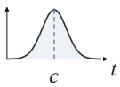</td><td>(Zhou et al., 2026)</td></tr><tr><td>Fourier basis function</td><td> $\cos ( 2 \pi \omega _ { k } t ) ,$   $\sin ( 2 \pi \omega _ { k } t )$  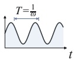</td><td>(Fons et al., 2025; Qiu et al., 2026)</td></tr><tr><td>Attention basis function</td><td> $\frac { \exp ( c _ { k } Q ^ { \top } K t ) } { \sqrt { d } }$  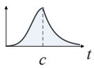</td><td>(Shukla &amp; Marlin, 2021; Lee et al., 2026)</td></tr><tr><td>Soft-window basis function</td><td> $\sigma \left( \frac { t _ { k } ^ { \mathrm { r i g h t } } - t } { \mathrm { s o f t p l u s } ( \delta ) } \right)$   $\sigma \left( \frac { t - t _ { k } ^ { \mathrm { l e f t } } } { \mathrm { s o f t p l u s } ( \delta ) } \right)$  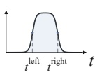</td><td>(Liu et al., 2026)</td></tr></table>

## 1. Introduction

Irregular Multivariate Time Series (IMTS) consist of observations from multiple variables collected asynchronously at non-uniform, variable-specific timestamps, often with unequal sampling intervals and missing values. Such data are widely encountered in various domains, including medical monitoring, sensor networks, and meteorological observations (Ghassemi et al., 2015; Decorte et al., 2024; Afrifa-Yamoah et al., 2020). They are typically generated by underlying continuous-time dynamic processes, but can only be observed through sparse and irregular measurements in practice. As a result, learning reliable representations and making accurate predictions remain challenging.

To address this issue, many recent methods (Shukla & Marlin, 2021; Zhou et al., 2026; Liu et al., 2026; Lee et al., 2026; Qiu et al., 2026) attempt to map irregular observations into regular fixed-dimensional representations for subsequent prediction. Although these methods differ substantially in model design, we observe that most of them can be interpreted from a unified basis function perspective: the model computes the responses of an irregular time series to a set of predefined temporal basis functions, and uses the resulting coefficients as the sequence representation. These coefficients summarize how strongly the observed irregular time series aligns with each temporal basis, thereby encoding potential temporal patterns in a compact form.

From this perspective, the key distinction among different methods lies in the form of the adopted basis functions. As shown in Table 1, existing methods use different predefined temporal basis functions and their corresponding response curves to encode temporal information. For example, radial basis functions (RBFs) typically emphasize local temporal responses and are therefore well suited for capturing information around specific time regions (Zhou et al., 2026). In contrast, Fourier basis functions provide global temporal support and are more naturally aligned with modeling longrange structures such as periodicity and seasonality (Qiu et al., 2026). Therefore, the choice of basis functions is not merely a technical detail; it implicitly determines which temporal patterns are easier for the model to represent, thereby introducing different structural priors and inductive biases.

This unified perspective also reveals two key limitations of existing methods. 1) Potential asymptotic bias under irregular sampling: existing discrete approximations for response coefficients are generally reasonable under regular or nearly uniform sampling, but they ignore the distribution of observation timestamps in irregular sampling scenarios, which may lead to a non-vanishing asymptotic bias. 2) Limited adaptability of predefined bases: although predefined basis functions introduce useful inductive biases, their fixed forms restrict the model’s ability to adapt to different datasets and sampling patterns for irregular time series.

To overcome the above limitations, we propose a Debiased Neural Basis-Function Network (DNBNet). Specifically, we design a Debiased Neural Basis-function Response mechanism, which estimates the timestamp density via Kernel Density Estimation (KDE) to correct the asymptotic bias caused by non-uniform sampling. Moreover, it parameterizes temporal basis functions with learnable neural networks, thereby improving the model’s adaptability to complex temporal patterns. In addition, considering the sparsity of irregular time series data, we further develop a novel multi-scale decomposition based on average pooling and mass-aware fusion mechanism to obtain richer feature representations. Finally, the fused representations are fed into a dual-branch decoder for more accurate prediction. Extensive experiments on multiple real-world datasets demonstrate the effectiveness of the proposed framework.

• A unified basis-function perspective of irregular time series forecasting, which reveals two key limitations of existing methods: potential asymptotic estimation bias caused by irregular sampling, and the limited ability of predefined basis functions to adaptively model diverse temporal patterns.

• A DNBNet with a neural basis-response mechanism that corrects the asymptotic bias and produces more expressive response coefficients. Building on this mechanism, we also incorporate multi-scale decomposition and mass-aware fusion to learn richer feature representations.

• Extensive experiments on multiple irregular time series forecasting benchmarks show that DNBNet consistently achieves superior predictive performance compared with existing competitive methods.

## 2. Related Work

## 2.1. Irregular Multivariate Time Series Forecasting

Recent IMTS forecasting methods can be roughly divided into three categories. (i) Some methods directly model the underlying continuous time based ODE or CDE (Mercatali et al., 2024; Oh et al., 2026). For instance, Latent ODE (Rubanova et al., 2019) leverages ODEs to construct continuous-time sequences in the latent space, thereby enabling interpolation and extrapolation. To avoid inefficient numerical integration for ODEs, Neural Flow (Bilos et al., 2021) turn to directly model the solution of ODEs. (ii) Methods based on specific data structures model message passing among observation points (Yalavarthi et al., 2024; Zhang et al., 2022). For example, SeFT (Horn et al., 2020) utilizes set, whereas GraFITi (Yalavarthi et al., 2024) and Hyper-IMTS (Li et al., 2025) use bipartite graphs and hypergraphs, respectively. (iii) Some methods learn compact representations through temporal alignment and aggregation (Zhang et al., 2024; Luo et al., 2025). tPatchGNN (Zhang et al., 2024) integrates region-level information by a fixed-span patching strategy, and APN (Liu et al., 2026) designs an adaptive patch-span learning mechanism to avoid the meaningless and sparse feature representation from rigid patch size. Despite these advancements, many representation learning methods ignore the influence of timestamp density, thereby resulting in asymptotic biases.

## 2.2. Basis Functions for Irregular Multivariate Time Series

Basis functions provide a classical perspective for continuous signals, i.e., decomposing and characterizing complex signals through a set of response coefficients over temporal patterns. This idea has been widely used in regularly sampled time series analysis (Oreshkin et al., 2020). For example, some methods (Zhou et al., 2022; Qiu et al., 2025) capture periodic components of sequences via the Fast Fourier Transform (FFT). Similarly, many IMTS methods also utilize basis functions to extract temporal information. For instance, mTAN (Shukla & Marlin, 2021) proposes a timeaware attention mechanism to aggregate irregular observations using attention-based basis functions with predefined reference points. KAFNet (Zhou et al., 2026) utilizes Gaussian temporal kernel aggregation constructed from radial basis functions (RBFs) to efficiently model irregular time series. LSCD (Fons et al., 2025) performs imputation with better consideration of the global structure of irregular time series through Fourier bases. However, previous methods usually ignore the inherent non-uniform sampling of irregular time series when estimating basis responses, thereby introducing asymptotic bias.

## 3. Preliminaries and Motivation

In this section, we first formalize the irregular time series forecasting problem and then present the discrete computation form of basis-function response coefficients adopted by existing methods. Based on this formulation, we further analyze the bias introduced by discrete response estimation under irregular sampling, which motivates us to design a debiased response estimation mechanism.

## 3.1. Problem Definition

Given an irregular multivariate time series $\mathcal { O } = \{ \mathcal { O } ^ { n } \} _ { n = 1 } ^ { N }$ with N variates, where $\mathcal { O } ^ { n } = \{ ( t _ { i } ^ { n } , x _ { i } ^ { n } ) \} _ { i = 1 } ^ { L _ { n } }$ denotes the observations of the n-th variate at non-uniform timestamps, and $( t _ { i } ^ { n } , x _ { i } ^ { n } )$ represents the value $\boldsymbol { x } _ { i } ^ { n }$ recorded at time $t _ { i } ^ { n }$ Irregular time series forecasting aims to predict future values at a set of query timestamps $\mathsf { \bar { Q } } = \{ \mathsf { \bar { Q } } ^ { n } \} _ { n = 1 } ^ { N }$ , with ${ \mathcal { Q } } ^ { n } =$ $\{ q _ { j } ^ { n } \} _ { j = 1 } ^ { Q _ { n } }$ . Formally, the goal is to learn a model $f _ { \theta }$ that maps the historical observations and query timestamps to the corresponding predictions:

$$
f _ { \theta } ( \mathcal { O } , \mathcal { Q } ) \to \hat { \mathcal { V } } = \left\{ \{ \hat { y } _ { j } ^ { n } \} _ { j = 1 } ^ { Q _ { n } } \right\} _ { n = 1 } ^ { N } ,\tag{1}
$$

where $\hat { y } _ { j } ^ { n }$ denotes the predicted value of the n-th variate at timestamp $q _ { j } ^ { n }$

## 3.2. Basis-Function Response Representation

Given a continuous-time signal $x ( t )$ and a set of temporal basis functions $\{ \phi _ { k } ( t ) \} _ { k = 1 } ^ { K }$ , the ideal response coefficient with respect to the k-th basis is defined by the following integral:

$$
c _ { k } = \langle x , \psi _ { k } \rangle = \int _ { T } x ( t ) \psi _ { k } ( t ) d t ,\tag{2}
$$

where $\begin{array} { r } { \psi _ { k } ( t ) = \frac { \phi _ { k } ( t ) } { \int _ { \mathcal { T } } \phi _ { k } ( t ) d t } ~ \mathrm { o r } ~ \psi _ { k } ( t ) = \frac { \phi _ { k } ( t ) } { \int _ { \mathcal { T } } \phi _ { k } ^ { 2 } ( t ) d t } } \end{array}$ correspond to the weighted average response and projection response for nonnegative and orthogonal basis functions, respectively. For example, a commonly used weighted average response coefficient is given by $\overset { \cdot } { c _ { k } { = } } \overset { \textstyle { \int } _ { T } x ( t ) \phi _ { k } \overline { { ( t ) } } d t } { \textstyle { \int } _ { T } \phi _ { k } ( t ) d t }$ . In practice, only discrete observations $\{ ( t _ { i } , x _ { i } ) \} _ { i = 1 } ^ { L }$ are available. Existing methods therefore usually approximate the above continuous integral by summing over the observed data, e.g., $\begin{array} { r } { \hat { c } _ { k } = \frac { \sum _ { i = 1 } ^ { L } x _ { i } \phi _ { k } \left( t _ { i } \right) } { \sum _ { i = 1 } ^ { L } \phi _ { k } \left( t _ { i } \right) } } \end{array}$ (Shukla & Marlin, 2021; Zhou et al., 2026; Liu et al., 2026). In the following, we focus on the weighted average response formulation for clarity, while the analysis for the projection response is similar.

## 3.3. Asymptotic Bias Analysis of Discrete Response Estimation

Existing methods approximate the continuous-time response $c _ { k }$ using the discrete computation form $\hat { c } _ { k }$ , which is reasonable under regular sampling. However, when the observations are irregularly sampled, this discrete approximation may lead to an asymptotic bias. To facilitate the subsequent analysis, we consider a normalized time domain $\mathcal { T } = [ 0 , 1 ]$ and introduce the following mild assumption:

Assumption 3.1. The continuous signal $x ( t )$ and the nonnegative basis functions $\phi _ { k } ( t )$ are bounded, $\mathrm { i . e . , } | x ( t ) | \leq 1$ and $| \phi _ { k } ( t ) | \le m$ for any t and $k .$ . Moreover, each basis function has a nontrivial mass under both the uniform time density and the timestamp sampling density:

$$
\operatorname* { m i n } \left\{ \int _ { \mathcal { T } } \phi _ { k } ( t ) d t , \int _ { \mathcal { T } } \phi _ { k } ( t ) p ( t ) d t \right\} \geq a .\tag{3}
$$

Assumption 3.1 is reasonable in practice. Data normalization and the construction of basis functions typically ensure the existence of upper bounds for $x ( t )$ and $\phi _ { k } ( t )$ , while the lower bound on the basis mass guarantees that each basis function carries sufficient information. Under Assumption 3.1, we give the following theorem, which provides an estimation error bound between the discrete coefficient $\hat { c } _ { k }$ and the ideal response coefficient $c _ { k } .$

Theorem 3.2. Given observations $\{ ( t _ { i } , x _ { i } ) \} _ { i = 1 } ^ { L }$ , where $t _ { i } \stackrel { \mathrm { i . i . d . } } { \sim } p ( t )$ , for any $\delta \in ( 0 , 1 )$ , when L is sufficiently large, with probability at least $1 - \delta ,$ , the following inequality holds:

$$
\operatorname* { m a x } _ { k \in [ K ] } | \hat { c } _ { k } - c _ { k } | \leq \frac { 4 m } { a } \sqrt { \frac { 2 \log ( 4 K / \delta ) } { L } } + \frac { 2 m } { a } \| p ( t ) - 1 \| _ { L ^ { 1 } } ,
$$

$$
\begin{array} { r } { w h e r e \parallel p ( t ) - 1 \parallel _ { L ^ { 1 } } = \int _ { \mathcal T } | p ( t ) - 1 | d t . } \end{array}
$$

Proof. See Appendix A.

The first term on the right-hand side of the above bound decreases as the number of observations L increases, reflecting the standard finite-sample estimation error. In contrast, the second term is independent of L and does not vanish with more observations unless the timestamp density p(t) approaches the uniform distribution $( p ( t ) = 1 ) , { \mathrm { i . e . } }$ , the observations are obtained through regular sampling. Therefore, this term characterizes the potential asymptotic bias induced by irregular sampling, which does not vanish as L increases. This observation motivates the need for a debiased response estimation mechanism that explicitly considers the sampling density of observed timestamps.

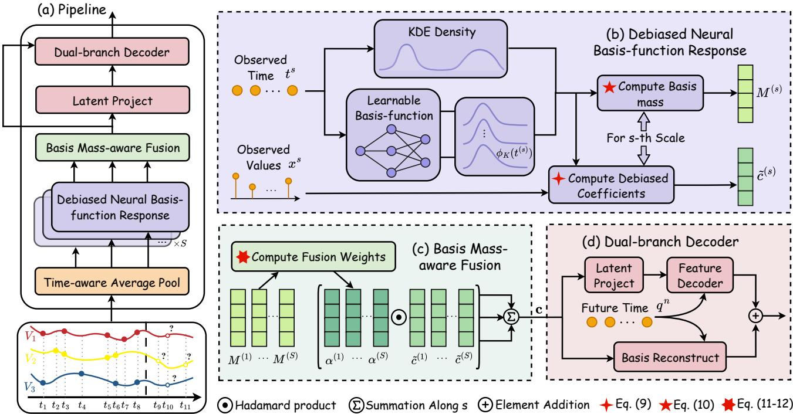  
Figure 1. (a) The overall pipeline of DNBNet. (b) The debiased neural basis-function response computes debiased coefficients and basis masses using KDE and learnable basis functions. (c) The basis mass-aware fusion module aggregates coefficients from different scales. (d) The final prediction is obtained by combining the feature decoder with basis-function reconstruction.

## 4. Debiased Neural Basis-Function Network

In this section, we introduce the proposed DNBNet in detail. As shown in Fig. 1, we first generate observation subsequences at different scales through time-aware average pooling. We then design a debiased neural basis response mechanism to compute debiased and more expressive response coefficients. Next, we introduce a mass-aware fusion mechanism to integrate multi-scale response information. Finally, a dual decoder is employed to produce the final predictions.

## 4.1. Time-aware Average Pool

The underlying dynamics of irregular time series often exhibit heterogeneous temporal patterns across different time scales, while the inherent sparsity of the original sequence limits its ability to provide sufficient information for feature learning. This motivates us to construct subsequences at different scales to capture temporal patterns of varying granularities and obtain richer representations through fu sion. Therefore, we first utilize time-aware average pooling to obtain the subsequence of the original input sequence $\mathcal { O } = \{ ( t _ { i } , x _ { i } ) \} _ { i = 1 } ^ { L }$ at the s-th scale:

$$
\mathcal { O } ^ { ( s ) } = \mathrm { A v g P o o l } \left( \mathcal { O } ; w _ { s } , r _ { s } \right) ,\tag{4}
$$

$$
\mathcal { O } ^ { ( s ) } = \{ ( t _ { i } ^ { ( s ) } , x _ { i } ^ { ( s ) } ) \} _ { i = 1 } ^ { L _ { s } } ,\tag{5}
$$

where $w _ { s }$ and $r _ { s }$ respectively denote the window size and stride defined by absolute time spans at scale s, and we let $\mathcal { O } ^ { ( 1 ) }$ denotes the sequence of original scale. Note that our model learns representation mainly in a channelindependent manner. For convenience, we temporarily omit the variate index n in this section.

## 4.2. Debiased Neural Basis-function Response

According to the previous analysis, existing discrete computation methods suffer from asymptotic bias under irregular sampling. To correct this bias, we employ importance sampling to construct a density-corrected estimator of the original integral:

$$
\frac { \int _ { \mathcal { T } } \frac { x ( t ) \phi _ { k } ( t ) } { p ( t ) } p ( t ) d t } { \int _ { \mathcal { T } } \frac { \phi _ { k } ( t ) } { p ( t ) } p ( t ) d t } = \frac { \mathbb { E } _ { t } \left[ \frac { x ( t ) \phi _ { k } ( t ) } { p ( t ) } \right] } { \mathbb { E } _ { t } \left[ \frac { \phi _ { k } ( t ) } { p ( t ) } \right] } \approx \frac { \sum _ { i = 1 } ^ { L } \frac { x _ { i } \phi _ { k } ( t _ { i } ) } { p ( t _ { i } ) } } { \sum _ { i = 1 } ^ { L } \frac { \phi _ { k } ( t _ { i } ) } { p ( t _ { i } ) } } = \tilde { c } _ { k } .\tag{6}
$$

The proposed estimator asymptotically corrects the bias. A detailed explanation of the debiasing property of our estimates is provided in the Appendix A.2. Note that $\hat { c } _ { k }$ of the existing methods is actually a special case of our formulation $\tilde { c } _ { k }$ under the uniform timestamp distribution, $\mathrm { i } . \mathsf { e } . , p ( t ) = 1$ . In irregular sampling scenarios, $1 / p ( t )$ can be interpreted as an importance weight that explicitly corrects the sampling bias: it suppresses the overemphasis on densely sampled regions while compensating for contributions from sparsely sampled regions. In our implementation, we use Kernel Density Estimation (KDE) to estimate the timestamp density:

$$
p ( t _ { i } ) = \frac { 1 } { L h } \sum _ { j = 1 } ^ { L } \kappa \left( \frac { t _ { i } - t _ { j } } { h } \right) ,\tag{7}
$$

where $\kappa ( \cdot )$ denotes the kernel function, for which we adopt the Gaussian kernel. We further parameterize the bandwidth as a learnable variable, i.e., $h = \mathrm { s o f t p l u s } ( \rho )$ , to adapt to different temporal scales.

In addition, as shown in Table 1, many existing methods rely on predefined basis functions. The choice of basis functions usually reflects prior assumptions about the characteristics of the data. However, in the real scenarios, a fixed set of basis functions may be difficult to adapt to diverse datasets due to the changes of data distribution. Meanwhile, selecting appropriate basis functions for different datasets is highly dependent on domain expert knowledge, further limiting the generalization and applicability of the method. Therefore, considering the strong approximation ability of neural networks, we directly learn basis functions themselves from raw data by fully connected neural networks. Specifically, let ${ \phi } ( t ) = [ \phi _ { 1 } ( t ) , \ldots , \phi _ { K } ( t ) ] \in \mathbb { R } ^ { K }$ denote the vector formed by concatenating K basis functions. We parameterize it with a two-layer MLP:

$$
\phi ( t ) = \operatorname { s o f t m a x } ( \mathrm { M L P } _ { \mathrm { b a s i s } } ( t ) ) ,\tag{8}
$$

where softmax is to bound basis functions, consistent with Assumption 3.1. It also normalizes the responses across basis functions, thereby improving the stability of computation.

Next, we incorporate the learnable basis-function $\phi ( t )$ into the debiased estimation in Eq. (37). For each scale-specific sequence $\mathcal { O } ^ { ( s ) }$ , we compute the corresponding basis response coefficient with respect to the k-th basis function:

$$
\tilde { c } _ { k } ^ { ( s ) } = \frac { \sum _ { i = 1 } ^ { L _ { s } } x _ { i } ^ { ( s ) } \phi _ { k } ( t _ { i } ^ { ( s ) } ) / p ( t _ { i } ^ { ( s ) } ) } { \sum _ { i = 1 } ^ { L _ { s } } \phi _ { k } ( t _ { i } ^ { ( s ) } ) / p ( t _ { i } ^ { ( s ) } ) } ,\tag{9}
$$

In this way, each scale produces a set of basis response coefficients $\{ \tilde { c } _ { k } ^ { ( s ) } \} _ { k = 1 } ^ { K }$

## 4.3. Basis Mass-aware Fusion

To obtain richer representations, we further fuse the basis response coefficients across different scales. Note that the denominator in Eq. (9) can be viewed as the basis mass of the k-th basis function at scale s:

$$
M _ { k } ^ { ( s ) } = \sum _ { i = 1 } ^ { L _ { s } } \phi _ { k } ( t _ { i } ^ { ( s ) } ) / p ( t _ { i } ^ { ( s ) } ) .\tag{10}
$$

A larger $M _ { k } ^ { ( s ) }$ indicates that the corresponding basis function receives stronger support at scale s, and thus its coefficient may contain more informative signals. Based on this observation, we design a mass-aware fusion mechanism to adaptively aggregate coefficients from different scales:

$$
r _ { s , k } = \tau _ { s , k } \log ( 1 + M _ { k } ^ { ( s ) } ) + \beta _ { s , k } ,\tag{11}
$$

$$
\alpha _ { s , k } = \mathrm { s o f t m a x } \left( \{ r _ { s , k } \} _ { s = 1 } ^ { S } \right) ,\tag{12}
$$

$$
\tilde { c } _ { k } = \sum _ { s = 1 } ^ { S } \alpha _ { s , k } \tilde { c } _ { k } ^ { ( s ) } ,\tag{13}
$$

where $\tau _ { s , k }$ and $\beta _ { s , k }$ are learnable scale and bias parameters. The logarithmic transformation prevents excessively large basis masses from dominating the fusion weights. Finally, we concatenate the fused coefficients of all basis functions as $\mathbf { c } = [ \widetilde { c } _ { 1 } , \dots , \widetilde { c } _ { K } ] \in \mathbb { R } ^ { K }$ , and further project it into a latent space to enhance its representation capacity:

$$
\mathbf { h } = \mathrm { L i n e a r } ( \mathbf { c } ) ,
$$

$$
{ \bf z } = \mathrm { L a y e r N o r m } \left( { \bf h } + \mathrm { M L P } ( { \bf h } ) \right) .\tag{14}
$$

(15)

The representation $\mathbf { z } \in \mathbb { R } ^ { d }$ encodes debiased multi-scale basis responses for the subsequent forecasting decoder.

## 4.4. Dual-Branch Forecasting Decoder

To exploit both the latent representation and basis coefficients, we design a dual-branch forecasting decoder consisting of a feature decoder and a basis reconstruction branch.

Given a future query timestamp $q _ { l } ^ { n }$ from the n-th variate at the l-th prediction step, following existing methods (Zhang et al., 2024), we construct its time embedding as follows:

$$
\begin{array} { r } { \mathrm { T E } ( q _ { l } ^ { n } ) [ d ] = \left\{ \begin{array} { l l } { \omega _ { 0 } \cdot q _ { l } ^ { n } + b _ { 0 } , } & { \mathrm { i f ~ } d = 0 , } \\ { \sin ( \omega _ { d } \cdot q _ { l } ^ { n } + b _ { d } ) , } & { \mathrm { i f ~ } 0 < d \leq D _ { t } . } \end{array} \right. } \end{array}\tag{16}
$$

where $\left\{ \omega _ { 0 } , b _ { 0 } \right\}$ and $\{ \omega _ { d } , b _ { d } \} _ { d = 1 } ^ { D _ { t } }$ are learnable parameters for the linear and periodic components, respectively. To distinguish different variates, we add a variate embedding $\mathbf { e } _ { n }$ to obtain $\ \mathbf { z } ^ { n } = \mathbf { z } + \mathbf { e } _ { n }$ . The feature-branch prediction is then computed by

$$
\hat { y } _ { l } ^ { n , \mathrm { f e a } } = \mathbf { M } \mathbf { L } \mathbf { P } _ { \mathrm { f e a } } \left( [ \mathbf { z } ^ { n } , \mathbf { T } \mathbf { E } ( q _ { l } ^ { n } ) ] \right) .\tag{17}
$$

The basis functions provide a natural way to reconstruct the signal from the learned coefficients. This allows us to explicitly extrapolate future values by evaluating the learned basis functions at query timestamps and combining them with the basis coefficients. Therefore, in the basis branch, the prediction for the n-th variate at query timestamp $q _ { l } ^ { n }$ is computed as

$$
\hat { y } _ { l } ^ { n , \mathrm { b a s i s } } = \sum _ { k = 1 } ^ { K } \tilde { c } _ { k } \phi _ { k } ( q _ { l } ^ { n } ) ,\tag{18}
$$

where $\tilde { c } _ { k }$ denotes the fused coefficient in Eq. (13) and ϕ(t) is the same learnable basis-function in Eq. (8). Finally, we fuse the two branches via a learnable gate:

$$
\hat { y } _ { l } ^ { n } = \lambda \hat { y } _ { l } ^ { n , \mathrm { f e a } } + \left( 1 - \lambda \right) \hat { y } _ { l } ^ { n , \mathrm { b a s i s } } ,\tag{19}
$$

where $\lambda = \mathrm { s i g m o i d } ( \gamma )$ is a learnable parameter that balances the contribution of the feature and basis branch.

## 5. Experiments

## 5.1. Experimental Setup

## 5.1.1. DATASETS AND BASELINES

To evaluate our method on irregular multivariate time series forecasting, we conduct experiments on five widely used benchmark datasets across multiple real-world domains. Specifically, we consider two healthcare datasets, PhysioNet and MIMIC, containing ICU clinical records; two biomechanics-related datasets, Human Activity and Student Life, consisting of sensor data from subjects performing various activities; and one climate dataset, USHCN, containing historical meteorological observations from U.S. weather stations. Following common practice, each dataset is split into training, validation, and test sets with proportions of 80%, 10%, and 10%, respectively. We compare our method with 12 baseline models covering IMTS forecasting, classification, and interpolation, including PrimeNet (Chowdhury et al., 2023), SeFT (Horn et al., 2020), mTAN (Shukla & Marlin, 2021), CRU (Schirmer et al., 2022), GNeuralFlow (Mercatali et al., 2024), Raindrop (Zhang et al., 2022), tPatchGNN (Zhang et al., 2024), GraFITi (Yalavarthi et al., 2024), Warpformer (Zhang et al., 2023), Hi-Patch (Luo et al., 2025), KAFNet (Zhou et al., 2026), and APN (Liu et al., 2026). Additional details on datasets and baselines are provided in Appendix B.1.

## 5.1.2. IMPLEMENTATION DETAILS

Following the prior work (Bilos et al., 2021; Luo et al., 2025), for USHCN, we use 3 years of historical observations to predict the next 1 year; for Human Activity, the look-back window and prediction horizon are set to 3000 ms and 1000 ms, respectively; for Student Life, we use observations from the past 30 days to predict the next 30 days; and for PhysioNet and MIMIC, we use observations from the past 36 hours to predict the next 3 observation points. All experiments are implemented in PyTorch 2.5.1+cu121 and conducted on a single NVIDIA 4090 GPU. During training, all models are optimized using the AdamW optimizer, with mean squared error (MSE) adopted as the training objective. We set the maximum number of training epochs to 200 and use an early stopping patience of 10 to prevent overfitting. Mean squared error and mean absolute error (MAE) are used as evaluation metrics. Each experiment is repeated with five random seeds, and we report the mean and standard deviation of the results.

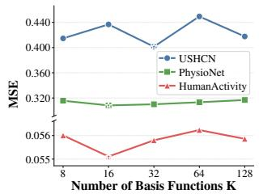  
(a) MSE on three datasets w.r.t. different K.

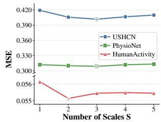  
(b) MSE on three datasets w.r.t. different S.  
Figure 2. Parameter sensitivity study of number of basis functions K and Scales S on three datasets.

## 5.2. Main results

Due to space limitations, we report the MSE results of our method and all baselines across all datasets in Table 2, while the MAE results are provided in Appendix B.2. As shown in the table, DNBNet achieves the best performance on four of the five datasets and obtains the second-best result on PhysioNet. In particular, compared with Warpformer, the average second-best baseline, DNBNet achieves an average relative MSE reduction of approximately 3.18%. Furthermore, compared with methods that also utilize basis-function based modeling, such as mTAN, KAFNet, and APN, DNBNet consistently achieves leading results on datasets from different domains, including healthcare and climate field. This indicates that, compared with directly relying on predefined basis functions, the proposed learnable basis functions can more effectively adapt to differences in sampling frequency or temporal irregularity across datasets, which is consistent with our motivation. In addition, we provide experimental results and analyses under different look-back windows and prediction horizons in the Appendix B.3, further validating the stable advantages of DNBNet.

## 5.3. Ablation Study

We conduct ablation studies on three irregular time-series datasets to verify the effectiveness of our model components. The main results are reported in Table 3, with complete results provided in the Appendix B.4. Specifically, (1) w/o $p ( t )$ removes the density factor in Eq. (9), leading to consistent performance degradation and confirming the effectiveness of our debiased response mechanism. (2) Rep. RBF and Rep. Fourier replace our learnable basis functions ϕ(t) with RBF and Fourier bases, respectively, both yielding inferior performance on all datasets. This suggests that our learnable basis-function is more robust and generalizable than predefined bases across different datasets. (3) w/o AvgPool and w/o BasDec remove the average pooling module and the basis-function prediction branch, respectively. The consistent performance degradation validates the effectiveness of leveraging multi-scale features and further demonstrates the potential of basis-function coefficients in representing future continuous dynamics. (4) To further validate the effectiveness of the debiased mechanism, we introduce the density debiasing factor $p ( t )$ into two existing basis-function-based methods, KAFNet and APN. Specifically, we replace their biased weighted average responses with the estimator in Eq. (37). Table 4 reports the original results of KAFNet and APN, as well as their performance after incorporating $p ( t )$ on three datasets. Compared with the original biased weighted average aggregation, simply dividing by $p ( t )$ yields consistent and stable improvements with almost no additional complexity. This verifies the effectiveness of our debiasing analysis.

Table 2. MSE results of DNBNet and baselines on five irregular time-series datasets. Best results are in bold and second-best results are underlined.
<table><tr><td>Method</td><td>USHCN</td><td>Human Activity</td><td>Student Life</td><td>PhysioNet</td><td>MIMIC</td></tr><tr><td>PrimeNet</td><td> $0 . 7 3 2 8 \pm 0 . 0 0 0 0$ </td><td> $4 . 2 5 6 4 \pm 0 . 0 0 0 7$ </td><td> $0 . 8 7 9 9 \pm 0 . 0 0 0 1$ </td><td> $0 . 7 9 5 2 \pm 0 . 0 0 0 0$ </td><td> $0 . 9 7 2 8 \pm 0 . 0 0 0 1$ </td></tr><tr><td>SeFT</td><td> $0 . 6 6 4 7 \pm 0 . 0 0 0 8$ </td><td> $1 . 3 7 5 0 \pm 0 . 0 0 3 6$ </td><td> $0 . 8 7 4 7 \pm 0 . 0 0 2 6$ </td><td> $0 . 7 8 0 1 \pm 0 . 0 0 2 6$ </td><td> $0 . 9 9 0 5 \pm 0 . 0 0 0 3$ </td></tr><tr><td>mTAN</td><td> $0 . 4 1 9 7 \pm 0 . 0 1 6 1$ </td><td> $0 . 1 0 1 7 \pm 0 . 0 0 4 9$ </td><td> $0 . 6 5 5 5 \pm 0 . 0 0 6 4$ </td><td> $0 . 3 7 8 7 \pm 0 . 0 0 5 7$ </td><td> $0 . 9 7 1 9 \pm 0 . 0 1 6 9$ </td></tr><tr><td>CRU</td><td> $0 . 5 1 7 9 \pm 0 . 0 1 1 3$ </td><td> $0 . 1 4 5 2 \pm 0 . 0 0 0 9$ </td><td> $0 . 7 4 8 7 \pm 0 . 0 0 5 5$ </td><td> $0 . 6 1 6 9 \pm 0 . 0 0 3 6$ </td><td> $0 . 7 3 7 0 \pm 0 . 0 0 5 9$ </td></tr><tr><td>GNeuralFlow</td><td> $0 . 4 9 7 1 \pm 0 . 0 0 9 3$ </td><td> $0 . 2 5 5 0 \pm 0 . 0 3 7 3$ </td><td> $0 . 7 1 6 8 \pm 0 . 0 4 2 2$ </td><td> $0 . 3 5 1 6 \pm 0 . 0 0 2 8$ </td><td> $0 . 6 6 3 1 \pm 0 . 0 1 1 2$ </td></tr><tr><td>Raindrop</td><td> $0 . 4 8 4 1 \pm 0 . 0 0 6 4$ </td><td> $0 . 0 9 3 9 \pm 0 . 0 0 1 7$ </td><td> $0 . 6 6 7 2 \pm 0 . 0 0 5 4$ </td><td> $0 . 3 4 9 1 \pm 0 . 0 0 1 5$ </td><td> $0 . 6 2 1 9 \pm 0 . 0 0 4 0$ </td></tr><tr><td>tPatchGNN</td><td> $0 . 5 4 9 9 \pm 0 . 1 0 6 8$ </td><td> $0 . 0 5 7 8 \pm 0 . 0 0 0 7$ </td><td> $0 . 6 3 3 2 \pm 0 . 0 0 2 3$ </td><td> $0 . 3 0 9 7 \pm 0 . 0 0 1 4$ </td><td> $0 . 4 6 7 3 \pm 0 . 0 0 1 6$ </td></tr><tr><td>GraFITi</td><td> $0 . 4 2 7 0 \pm 0 . 0 0 9 3$ </td><td> $0 . 0 6 0 6 \pm 0 . 0 0 2 9$ </td><td> $0 . 6 3 6 6 \pm 0 . 0 0 0 1$ </td><td> $\mathbf { 0 . 3 0 2 1 \pm 0 . 0 0 1 1 }$ </td><td> $\underline { { 0 . 4 3 4 9 } } \pm 0 . 0 0 7 0$ </td></tr><tr><td>Warpformer</td><td> $0 . 4 2 6 3 \pm 0 . 0 0 7 3$ </td><td> $0 . 0 5 7 6 \pm 0 . 0 0 0 9$ </td><td> $0 . 6 2 6 7 \pm 0 . 0 0 6 6$ </td><td> $0 . 3 1 5 3 \pm 0 . 0 0 1 1$ </td><td> $0 . 4 3 5 8 \pm 0 . 0 0 1 8$ </td></tr><tr><td>Hi-Patch</td><td> $0 . 4 1 0 8 \pm 0 . 0 0 4 9$ </td><td> $0 . 0 5 9 2 \pm 0 . 0 0 0 3$ </td><td> $0 . 6 2 7 7 \pm 0 . 0 0 1 0$ </td><td> $0 . 3 2 2 6 \pm 0 . 0 0 1 5$ </td><td> $0 . 4 7 2 4 \pm 0 . 0 0 6 7$ </td></tr><tr><td>KAFNet</td><td> $0 . 4 1 3 2 \pm 0 . 0 0 6 0$ </td><td> $0 . 0 5 7 2 \pm 0 . 0 0 0 2$ </td><td> $0 . 6 3 1 2 \pm 0 . 0 0 0 9$ </td><td> $0 . 3 3 2 8 \pm 0 . 0 0 1 5$ </td><td> $0 . 4 6 1 2 \pm 0 . 0 0 7 3$ </td></tr><tr><td>APN</td><td> $0 . 4 2 6 2 \pm 0 . 0 0 3 0$ </td><td> $0 . 0 5 6 2 \pm 0 . 0 0 0 4$ </td><td> $0 . 6 5 1 2 \pm 0 . 0 0 1 5$ </td><td> $0 . 3 1 3 3 \pm 0 . 0 0 0 5$ </td><td> $0 . 4 5 2 7 \pm 0 . 0 0 9 3$ </td></tr><tr><td>DNBNet (Ours)</td><td> $\mathbf { 0 . 4 0 1 3 \pm 0 . 0 1 0 8 }$ </td><td> $\mathbf { 0 . 0 5 5 1 } \pm \mathbf { 0 . 0 0 0 1 }$ </td><td> $\mathbf { 0 . 6 1 3 6 \pm 0 . 0 0 0 2 }$ </td><td> $0 . 3 0 8 9 \pm 0 . 0 0 0 5$ </td><td> $\mathbf { 0 . 4 2 8 9 \pm 0 . 0 0 1 2 }$ </td></tr></table>

Table 3. Ablation study of DNBNet on three irregular time-series datasets, with MSE reported.
<table><tr><td>Variant</td><td>USHCN</td><td> $\mathbf { P h y s i o N e t }$ </td><td>MIMIC</td></tr><tr><td>w/o p(t)</td><td> $0 . 4 4 4 9 \pm 0 . 0 2 9 1$ </td><td> $0 . 3 1 6 1 \pm 0 . 0 0 0 3$ </td><td> $0 . 4 4 8 5 \pm 0 . 0 0 1 2$ </td></tr><tr><td>Rep. RBF</td><td> $0 . 4 1 4 4 \pm 0 . 0 0 9 1$ </td><td> $0 . 3 2 3 1 \pm 0 . 0 0 0 7$ </td><td> $0 . 4 5 0 7 \pm 0 . 0 0 0 9$ </td></tr><tr><td>Rep. Fourier</td><td> $0 . 4 1 0 1 \pm 0 . 0 0 8 8$ </td><td> $0 . 3 2 6 7 \pm 0 . 0 0 0 2$ </td><td> $0 . 4 8 6 9 \pm 0 . 0 0 4 8$ </td></tr><tr><td>w/o AvgPool</td><td> $0 . 4 1 9 5 \pm 0 . 0 1 6 6$ </td><td> $0 . 3 1 1 9 \pm 0 . 0 0 0 6$ </td><td> $0 . 4 4 9 4 \pm 0 . 0 0 1 2$ </td></tr><tr><td>w/o BasDec</td><td> $0 . 4 5 5 2 \pm 0 . 0 4 2 4$ </td><td> $0 . 3 0 9 2 \pm 0 . 0 0 0 2$ </td><td> $0 . 4 6 1 3 \pm 0 . 0 0 2 3$ </td></tr><tr><td colspan="4">DNBNet (Full)  $\mathbf { 0 . 4 0 1 3 \pm 0 . 0 1 0 8 }$   $\mathbf { 0 . 3 0 8 9 \pm 0 . 0 0 0 5 }$   $\mathbf { 0 . 4 2 8 9 \pm 0 . 0 0 1 2 }$ </td></tr></table>

## 5.4. Parameter Sensitivity

In this subsection, we study the impact of the number of basis functions and the multi-scale aggregation setting on model performance. As shown in Figure 2, we report the results with different numbers of basis functions K and scales S on three datasets. We observe that using more basis functions does not necessarily lead to better performance; relatively small values, such as $K = 1 6$ or $K = 3 2$ , are often sufficient to achieve the best or competitive results. Similarly, aggregating features from 2 or 3 scales already yields strong predictive performance, while further increasing the number of scales does not bring consistent gains. These results indicate that DNBNet is not sensitive to key hyperparameters and can maintain stable performance over a wide range of settings, providing practical guidance for transferring it to other datasets or application scenarios.

Table 4. Effectiveness of the density debiasing factor $1 / p ( t )$ on existing basis-function-based methods.
<table><tr><td>Method</td><td>USHCN</td><td>PhysioNet</td><td>MIMIC</td></tr><tr><td>KAFNet  $\mathbf { w } / \mathbf { o } p ( t )$ </td><td> $0 . 4 1 3 2 \pm 0 . 0 0 6 0$ </td><td> $0 . 3 3 2 8 \pm 0 . 0 0 1 5$ </td><td> $0 . 4 6 1 2 \pm 0 . 0 0 7 3$ </td></tr><tr><td>KAFNet w/ p(t)</td><td> $\mathbf { 0 . 4 0 5 0 \pm 0 . 0 1 7 3 }$ </td><td> $\mathbf { 0 . 3 1 1 7 \pm 0 . 0 0 0 7 }$ </td><td> $\mathbf { 0 . 4 4 8 8 \pm 0 . 0 0 2 4 }$ </td></tr><tr><td>APN w/o p(t)</td><td> $0 . 4 2 6 2 \pm 0 . 0 0 3 0$ </td><td> $0 . 3 1 3 3 \pm 0 . 0 0 0 5$ </td><td> $0 . 4 5 2 7 \pm 0 . 0 0 9 3$ </td></tr><tr><td> $\mathrm { \bf A P N } \ : \mathrm { w } / p ( t )$ </td><td> $\mathbf { 0 . 4 1 9 3 \pm 0 . 0 1 5 6 }$ </td><td> $\mathbf { 0 . 3 0 9 4 \pm 0 . 0 0 2 0 }$ </td><td> $\mathbf { 0 . 4 4 0 9 \pm 0 . 0 0 1 9 }$ </td></tr></table>

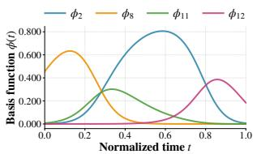  
(a) The learned basis functions with the four largest basis function mass on PhysioNet dataset.

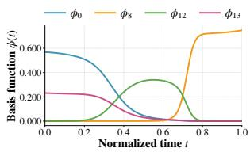  
(b) The learned basis functions with the four largest basis function mass on MIMIC dataset.  
Figure 3. Visualization of the four learned basis functions with the largest basis function mass on two datasets.

## 5.5. Visualization and Efficiency Analysis

To better understand the basis functions learned from data, we visualize the top four basis functions ϕ(t) with the largest mass on PhysioNet and MIMIC in Figure 3. For PhysioNet, the model learns localized basis functions similar to RBFs. Notably, each learned basis function has a distinct center, bandwidth, and peak location, suggesting that the model can adaptively adjust its local response range, which is difficult to achieve with predefined RBF bases. For the more challenging MIMIC dataset, DNBNet learns more complex and diverse basis-function shapes, including the soft window function $\phi _ { 1 2 }$ and sigmoid-like functions ϕ , ϕ , and $\phi _ { 1 3 } .$ . These basis functions capture response patterns over different temporal regions, further showing that DNBNet can learn temporal basis representations suited to the data distribution and dynamics, rather than being constrained by fixed predefined forms. Figure 4 further compares the computational efficiency of DNBNet with six competitive baselines on MIMIC, the largest dataset, under the same batch size. DNBNet achieves the best forecasting performance while introducing nearly the lowest computational cost, except for APN. This efficiency mainly comes from avoiding quadratic-complexity operations and instead extracting temporal dynamics through learnable basis functions, resulting in a lightweight and efficient model design.

## 6. Conclusion

We show that existing basis-based irregular time series forecasting methods can exhibit a non-vanishing asymptotic estimation bias when timestamp density is ignored, while their reliance on predefined basis functions may limit adaptability. To address these limitations, we propose the Debiased Neural Basis Function Network (DNBNet), a flexible framework that integrates density correction, learnable neural basis functions, multi-scale response extraction, and massaware fusion to enable robust and adaptive representation learning. DNBNet further employs a dual-branch decoder that combines implicit latent prediction with explicit basisfunction reconstruction, thereby improving both predictive flexibility and reconstruction interpretability. Experiments on five real-world benchmarks demonstrate that DNBNet consistently achieves superior performance against strong baselines.

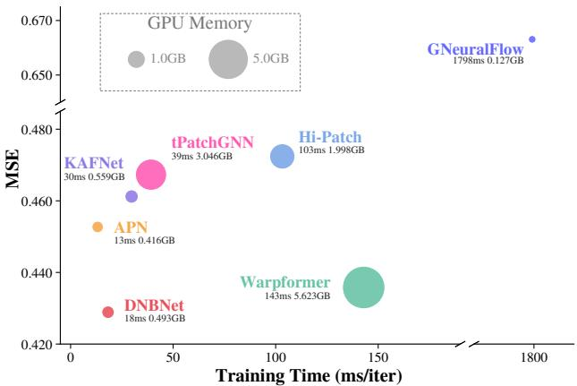  
Figure 4. Model efficiency comparison with six competitive baselines on MIMIC dataset.

## References

Afrifa-Yamoah, E., Mueller, U. A., Taylor, S. M., and Fisher, A. J. Missing data imputation of high-resolution temporal climate time series data. Meteorological Applications, 27 (1):e1873, 2020.

Bilos, M., Sommer, J., Rangapuram, S. S., Januschowski, T., and Gunnemann, S. Neural flows: Efficient alterna-¨ tive to neural odes. In Advances in Neural Information Processing Systems 34: Annual Conference on Neural Information Processing Systems 2021, NeurIPS 2021, December 6-14, 2021, virtual, pp. 21325–21337, 2021.

Chowdhury, R. R., Li, J., Zhang, X., Hong, D., Gupta, R. K., and Shang, J. Primenet: Pre-training for irregular multivariate time series. In Proceedings ofthe AAAI Conference on Artificial Intelligence, pp. 7184–7192, 2023.

Decorte, T., Mortier, S., Lembrechts, J. J., Meysman, F. J. R., Latre, S., Mannens, E., and Verdonck, T. Missing´ value imputation of wireless sensor data for environmental monitoring. Sensors, 24(8):2416, 2024.

Fons, E., Sztrajman, A., El-Laham, Y., Ferrer, L., Vyetrenko,

S., and Veloso, M. LSCD: lomb-scargle conditioned diffusion for time series imputation. In Forty-second International Conference on Machine Learning, ICML 2025, Vancouver, BC, Canada, July 13-19, 2025, volume 267, 2025.

Ghassemi, M., Pimentel, M. A. F., Naumann, T., Brennan, T., Clifton, D. A., Szolovits, P., and Feng, M. A multivariate timeseries modeling approach to severity of illness assessment and forecasting in ICU with sparse, heterogeneous clinical data. In Proceedings ofthe Twenty-Ninth AAAI Conference on Artificial Intelligence, January 25- 30, 2015, Austin, Texas, USA, pp. 446–453, 2015.

Horn, M., Moor, M., Bock, C., Rieck, B., and Borgwardt, K. Set functions for time series. In International Conference on Machine Learning, pp. 4353–4363, 2020.

Johnson, A. E., Pollard, T. J., Shen, L., Lehman, L.-w. H., Feng, M., Ghassemi, M., Moody, B., Szolovits, P., Anthony Celi, L., and Mark, R. G. Mimic-iii, a freely accessible critical care database. Scientific data, 3(1):1–9, 2016.

Lee, S., Min, K., Son, Y., and Do, H. Adaptive time encoding for irregular multivariate time-series classification. Advances in neural information processing systems, 38: 101795–101824, 2026.

Li, B., Luo, Y., Liu, Z., Zheng, J., Lv, J., and Ma, Q. Hyperimts: Hypergraph neural network for irregular multivariate time series forecasting. In Forty-second International Conference on Machine Learning, ICML 2025, Vancouver, BC, Canada, July 13-19, 2025, 2025.

Liu, X., Qiu, X., Wu, X., Li, Z., Guo, C., Hu, J., and Yang, B. Rethinking irregular time series forecasting: A simple yet effective baseline. In Proceedings ofthe AAAI Conference on Artificial Intelligence, pp. 23873–23881, 2026.

Luo, Y., Zhang, B., Liu, Z., and Ma, Q. Hi-patch: Hierarchical patch GNN for irregular multivariate time series. In Forty-second International Conference on Machine Learning, ICML 2025, Vancouver, BC, Canada, July 13- 19, 2025, 2025.

Menne, M. J., Williams Jr, C. N., and Vose, R. S. Long-term daily and monthly climate records from stations across the contiguous united states (us historical climatology network). Technical report, Environmental System Science Data Infrastructure for a Virtual Ecosystem; CDIAC, 2015.

Mercatali, G., Freitas, A., and Chen, J. Graph neural flows for unveiling systemic interactions among irregularly sampled time series. In Advances in Neural Information Processing Systems 37: Annual Conference on Neural

Information Processing Systems 2024, NeurIPS 2024, Vancouver, BC, Canada, December 10 - 15, 2024, 2024.

Nepal, S., Liu, W., Pillai, A., Wang, W., Vojdanovski, V., Huckins, J. F., Rogers, C., Meyer, M. L., and Campbell, A. T. Capturing the college experience: a four-year mobile sensing study of mental health, resilience and behavior of college students during the pandemic. Proceedings of the ACM on interactive, mobile, wearable and ubiquitous technologies, 8(1):1–37, 2024.

Oh, Y., Lim, D.-Y., and Kim, S. Flowpath: Learning data-driven manifolds with invertible flows for robust irregularly-sampled time series classification. In Proceedings of the AAAI Conference on Artificial Intelligence, pp. 24594–24603, 2026.

Oreshkin, B. N., Carpov, D., Chapados, N., and Bengio, Y. N-BEATS: neural basis expansion analysis for interpretable time series forecasting. In 8th International Conference on Learning Representations, ICLR 2020, Addis Ababa, Ethiopia, April 26-30, 2020, 2020.

Qiu, X., Wu, X., Lin, Y., Guo, C., Hu, J., and Yang, B. DUET: dual clustering enhanced multivariate time series forecasting. In Proceedings of the 31st ACM SIGKDD Conference on Knowledge Discovery and Data Mining, V.1, KDD 2025, Toronto, ON, Canada, August 3-7, 2025, pp. 1185–1196, 2025.

Qiu, X., Yan, K., Liu, X., Wu, X., and Hu, J. Bridging time and frequency: A joint modeling framework for irregular multivariate time series forecasting. arXiv preprint arXiv:2602.00582, 2026.

Rubanova, Y., Chen, R. T., and Duvenaud, D. K. Latent ordinary differential equations for irregularly-sampled time series. Advances in neural information processing systems, 32, 2019.

Schirmer, M., Eltayeb, M., Lessmann, S., and Rudolph, M. Modeling irregular time series with continuous recurrent units. In International conference on machine learning, pp. 19388–19405, 2022.

Shukla, S. N. and Marlin, B. M. Multi-time attention networks for irregularly sampled time series. In 9th International Conference on Learning Representations, ICLR 2021, Virtual Event, Austria, May 3-7, 2021, 2021.

Silva, I., Moody, G., Scott, D. J., Celi, L. A., and Mark, R. G. Predicting in-hospital mortality of icu patients: The physionet/computing in cardiology challenge 2012. In 2012 computing in cardiology, pp. 245–248. IEEE, 2012.

Yalavarthi, V. K., Madhusudhanan, K., Scholz, R., Ahmed, N., Burchert, J., Jawed, S., Born, S., and Schmidt-Thieme, L. Grafiti: Graphs for forecasting irregularly sampled

time series. In Proceedings of the AAAI Conference on Artificial Intelligence, pp. 16255–16263, 2024.

Zhang, J., Zheng, S., Cao, W., Bian, J., and Li, J. Warpformer: A multi-scale modeling approach for irregular clinical time series. In Proceedings of the 29th ACM SIGKDD Conference on Knowledge Discovery and Data Mining, pp. 3273–3285, 2023.

Zhang, W., Yin, C., Liu, H., Zhou, X., and Xiong, H. Irregular multivariate time series forecasting: A transformable patching graph neural networks approach. In Salakhutdinov, R., Kolter, Z., Heller, K. A., Weller, A., Oliver, N., Scarlett, J., and Berkenkamp, F. (eds.), Forty-first International Conference on Machine Learning, ICML 2024, Vienna, Austria, July 21-27, 2024, pp. 60179–60196, 2024.

Zhang, X., Zeman, M., Tsiligkaridis, T., and Zitnik, M. Graph-guided network for irregularly sampled multivariate time series. In The Tenth International Conference on Learning Representations, ICLR 2022, Virtual Event, April 25-29, 2022, 2022.

Zhou, T., Ma, Z., Wen, Q., Wang, X., Sun, L., and Jin, R. Fedformer: Frequency enhanced decomposed transformer for long-term series forecasting. In International Conference on Machine Learning, ICML 2022, 17-23 July 2022, Baltimore, Maryland, USA, pp. 27268–27286, 2022.

Zhou, Z., Huang, Y., Wang, Y., Wu, Y., Kwok, J., and Liang, Y. Revitalizing canonical pre-alignment for irregular multivariate time series forecasting. In Proceedings of the AAAI Conference on Artificial Intelligence, pp. 29115– 29123, 2026.

## A. Proof of Theorem 1

For each basis function $\phi _ { k } ,$ , the ideal continuous-time response coefficient is defined as

$$
c _ { k } = \frac { \int _ { T } x ( t ) \phi _ { k } ( t ) d t } { \int _ { T } \phi _ { k } ( t ) d t } .\tag{20}
$$

The uncorrected discrete estimator is defined as

$$
\hat { c } _ { k } = \frac { \sum _ { i = 1 } ^ { L } x _ { i } \phi _ { k } ( t _ { i } ) } { \sum _ { i = 1 } ^ { L } \phi _ { k } ( t _ { i } ) } .\tag{21}
$$

Since the timestamps are sampled from density $p ( t )$ , the discrete estimator does not directly approximate $c _ { k }$ . Instead, it approximates the response coefficient under the timestamp sampling density:

$$
c _ { k } ^ { p } = \frac { \int _ { T } x ( t ) \phi _ { k } ( t ) p ( t ) d t } { \int _ { T } \phi _ { k } ( t ) p ( t ) d t } .\tag{22}
$$

Therefore, we decompose the error as

$$
| \hat { c } _ { k } - c _ { k } | \le | \hat { c } _ { k } - c _ { k } ^ { p } | + | c _ { k } ^ { p } - c _ { k } | .\tag{23}
$$

The first term corresponds to the finite-sample approximation error, while the second term corresponds to the sampling bias induced by the non-uniform timestamp density.

We first bound the finite-sample error. Define

$$
Y _ { i } ^ { k } = x ( t _ { i } ) \phi _ { k } ( t _ { i } ) , \qquad Z _ { i } ^ { k } = \phi _ { k } ( t _ { i } ) .\tag{24}
$$

Then

$$
\hat { c } _ { k } = \frac { \bar { Y } _ { k } } { \bar { Z } _ { k } } , \qquad c _ { k } ^ { p } = \frac { \mathbb { E } _ { p } [ Y _ { i } ^ { k } ] } { \mathbb { E } _ { p } [ Z _ { i } ^ { k } ] } ,\tag{25}
$$

where

$$
\bar { Y } _ { k } = \frac 1 L \sum _ { i = 1 } ^ { L } Y _ { i } ^ { k } , \qquad \bar { Z } _ { k } = \frac 1 L \sum _ { i = 1 } ^ { L } Z _ { i } ^ { k } .\tag{26}
$$

Since $| x ( t ) | \leq 1$ and $0 \le \phi _ { k } ( t ) \le m$ , we have

$$
| Y _ { i } ^ { k } | \leq m , \qquad 0 \leq Z _ { i } ^ { k } \leq m .\tag{27}
$$

By Hoeffding’s inequality and a union bound over all $k \in$ $[ K ]$ for both $\bar { Y } _ { k }$ and $\bar { Z } _ { k }$ , with probability at least $1 - \delta ,$ , the following inequalities hold simultaneously:

$$
\operatorname* { m a x } _ { k \in [ K ] } | \bar { Y } _ { k } - \mathbb { E } _ { p } [ Y _ { i } ^ { k } ] | \leq \epsilon _ { L } , \qquad \operatorname* { m a x } _ { k \in [ K ] } | \bar { Z } _ { k } - \mathbb { E } _ { p } [ Z _ { i } ^ { k } ] | \leq \epsilon _ { L } ,\tag{28}
$$

where

$$
\epsilon _ { L } = m \sqrt { \frac { 2 \log ( 4 K / \delta ) } { L } } .\tag{29}
$$

When L is sufficiently large such that $\epsilon _ { L } \leq a / 2 , \mathrm { i . e . , } L \geq$ $\frac { 8 m ^ { 2 } } { a ^ { 2 } }$ log $\textstyle { \frac { 4 K } { \delta } }$ , we have

$$
\bar { Z } _ { k } \ge \mathbb { E } _ { p } [ Z _ { i } ^ { k } ] - \epsilon _ { L } \ge \frac { a } { 2 } .\tag{30}
$$

Now we compare the two ratios:

$$
\begin{array} { l } { \displaystyle | \hat { c } _ { k } - c _ { k } ^ { p } | = \left| \frac { \bar { Y } _ { k } } { \bar { Z } _ { k } } - \frac { \mathbb { E } _ { p } [ Y _ { i } ^ { k } ] } { \mathbb { E } _ { p } [ Z _ { i } ^ { k } ] } \right| } \\ { \displaystyle \quad \leq \frac { | \bar { Y } _ { k } - \mathbb { E } _ { p } [ Y _ { i } ^ { k } ] | } { \bar { Z } _ { k } } + | \mathbb { E } _ { p } [ Y _ { i } ^ { k } ] | \left| \frac { 1 } { \bar { Z } _ { k } } - \frac { 1 } { \mathbb { E } _ { p } [ Z _ { i } ^ { k } ] } \right| \cdot } \\ { \displaystyle \quad \leq \frac { | \bar { Y } _ { k } - \mathbb { E } _ { p } [ Y _ { i } ^ { k } ] | } { \bar { Z } _ { k } } + \mathbb { E } _ { p } [ Z _ { i } ^ { k } ] \frac { | \bar { Z } _ { k } - \mathbb { E } _ { p } [ Z _ { i } ^ { k } ] | } { \bar { Z } _ { k } \mathbb { E } _ { p } [ Z _ { i } ^ { k } ] } } \\ { \displaystyle \quad \leq \frac { 2 \epsilon _ { L } } { a } + \frac { 2 \epsilon _ { L } } { a } } \\ { \displaystyle \quad = \frac { 4 \epsilon _ { L } } { a } . \qquad } & { \mathrm { ( 3 1 ) } } \end{array}
$$

The second inequality holds because $\begin{array} { r l } { | \mathbb { E } _ { p } [ Y _ { i } ^ { k } ] | } & { { } = } \end{array}$ $\begin{array} { r } { \left| \int _ { \mathcal T } x ( t ) \phi _ { k } ( t ) p ( t ) \dot { d t } \right| \le \int _ { \mathcal T } \phi _ { k } ( t ) p ( t ) d t = \dot { \mathbb { E } } _ { p } [ \dot { Z } _ { i } ^ { k } ] } \end{array}$ . Taking the maximum over all $\dot { k } \in [ K ]$ , we obtain

$$
\operatorname* { m a x } _ { k \in [ K ] } | \hat { c } _ { k } - c _ { k } ^ { p } | \leq \frac { 4 m } { a } \sqrt { \frac { 2 \log ( 4 K / \delta ) } { L } } .\tag{32}
$$

Next, we bound the sampling bias term $| c _ { k } ^ { p } - c _ { k } | .$ Define

$$
A _ { k } = \int _ { \mathcal T } \phi _ { k } ( t ) d t , \qquad B _ { k } = \int _ { \mathcal T } x ( t ) \phi _ { k } ( t ) d t ,\tag{33}
$$

and

$$
A _ { k } ^ { p } = \int _ { T } \phi _ { k } ( t ) p ( t ) d t , \qquad B _ { k } ^ { p } = \int _ { T } x ( t ) \phi _ { k } ( t ) p ( t ) d t .\tag{34}
$$

Then

$$
c _ { k } = \frac { B _ { k } } { A _ { k } } , \qquad c _ { k } ^ { p } = \frac { B _ { k } ^ { p } } { A _ { k } ^ { p } } .\tag{35}
$$

Thus,

$$
\begin{array} { r l } { \mathbf { r } _ { k } ^ { n } - c _ { k } \big \vert = \left. \frac { B _ { k } ^ { n } } { A _ { k } ^ { n } } - \frac { B _ { k } } { A _ { k } } \right. } \\ { \leq } & { \frac { B _ { k } ^ { n } } { A _ { k } ^ { n } } - \frac { B _ { k } } { A _ { k } } \bigg \vert \mid \frac { B _ { k } } { A _ { k } ^ { n } } \bigg \vert \frac { 1 } { A _ { k } ^ { n } } - \frac { 1 } { A _ { k } } \bigg \vert } \\ { \leq } & { \frac { B _ { k } ^ { n } - B _ { k } } { A _ { k } ^ { n } } + A _ { k } \frac { \vert A _ { k } ^ { n } - A _ { k } \vert } { A _ { k } ^ { n } A _ { k } } } \\ { \leq } & { \frac { B _ { k } ^ { n } - B _ { k } \vert + \vert A _ { k } ^ { n } - A _ { k } \vert } { A _ { k } ^ { n } } } \\ { = } & { \frac { \big \vert \int _ { T } \pi i \ell \phi _ { k } ^ { n } \vert \ell \vert \phi ( t ) \vert \ell \vert \phi ( t ) - 1 \vert d t \big \vert } { A _ { T } } + \frac { \vert j _ { T } \phi _ { k } \vert \phi ( t ) \vert \phi ( t ) \vert \vert \phi ( t ) - 1 \vert d t \big \vert } { \vert \phi ( t ) \vert \vert \phi ( t ) - 1 \vert \vert \phi ( t ) \vert } } \\ { \leq } & { \frac { \int _ { T } \pi i \left( \delta \right) \vert \phi ( t ) \vert \vert \phi ( t ) - 1 \vert d t \vert } { \pi } - \frac { 1 } { \pi } \frac { \delta } { \phi } } \\ { \leq } & { \frac { 2 \pi i \sqrt { \phi } \vert \phi ( t ) \vert \vert \phi ( t ) - 1 \vert d t \vert } { \pi } } \\ { = \frac { 2 \pi i \sqrt { \phi } \vert \phi ( t ) - 1 \vert \mathbf { k } \vert } { \pi } . } \end{array}
$$

The second inequality holds due to $\begin{array} { r l } { \left| B _ { k } \right| \quad } & { { } = } \end{array}$ $\begin{array} { r } { \left| \int _ { \mathcal { T } } x ( t ) \phi _ { k } ( t ) d t \right| \ \le \ \int _ { \mathcal { T } } \phi _ { k } ( t ) d t \ = \ A _ { k } } \end{array}$ Taking the maximum over $\dot { k } \in [ K ]$ , we obtain

$$
\operatorname* { m a x } _ { k \in [ K ] } | c _ { k } ^ { p } - c _ { k } | \leq \frac { 2 m } { a } \| p ( t ) - 1 \| _ { L ^ { 1 } } .\tag{37}
$$

Finally, combining the finite-sample approximation error in Eq. (32) and the sampling bias term in Eq. (37) yields

$$
\begin{array} { r l } & { \displaystyle \operatorname* { m a x } _ { k \in [ K ] } | \hat { c } _ { k } - c _ { k } | \leq \operatorname* { m a x } _ { k \in [ K ] } | \hat { c } _ { k } - c _ { k } ^ { p } | + \operatorname* { m a x } _ { k \in [ K ] } | c _ { k } ^ { p } - c _ { k } | } \\ & { \qquad \leq \displaystyle \frac { 4 m } { a } \sqrt { \frac { 2 \log \left( 4 K / \delta \right) } { L } } + \frac { 2 m } { a } \| p ( t ) - 1 \| _ { L ^ { 1 } } . } \end{array}\tag{38}
$$

This completes the proof.

## B. Debiasing Property of Density-Corrected Estimation

In this section, we further explain why the density-corrected estimator can eliminate the sampling bias. Recall when the observed timestamps are sampled from a non-uniform density $p ( t )$ , the uncorrected discrete estimator converges to the response coefficient under the timestamp sampling density, which leads to the non-vanishing bias term in Theorem 1.

To remove this bias, we apply importance weighting to compensate for the timestamp sampling density. The densitycorrected estimator is defined as

$$
\tilde { c } _ { k } = \frac { \sum _ { i = 1 } ^ { L } \frac { x _ { i } \phi _ { k } ( t _ { i } ) } { p ( t _ { i } ) } } { \sum _ { i = 1 } ^ { L } \frac { \phi _ { k } ( t _ { i } ) } { p ( t _ { i } ) } } .\tag{39}
$$

The key difference from the uncorrected estimator is that the numerator and denominator now directly estimate the corresponding continuous-time integrals under the uniform time domain. Specifically, since $t _ { i }$ is sampled from density $p ( t )$ , we have

$$
\mathbb { E } _ { p } \left[ \frac { x ( t ) \phi _ { k } ( t ) } { p ( t ) } \right] = \int _ { \tau } \frac { x ( t ) \phi _ { k } ( t ) } { p ( t ) } p ( t ) d t = \int _ { \tau } x ( t ) \phi _ { k } ( t ) d t ,\tag{40}
$$

$$
\mathbb { E } _ { p } \left[ \frac { \phi _ { k } ( t ) } { p ( t ) } \right] = \int _ { \mathcal { T } } \frac { \phi _ { k } ( t ) } { p ( t ) } p ( t ) d t = \int _ { \mathcal { T } } \phi _ { k } ( t ) d t .\tag{41}
$$

Therefore, the density-corrected estimator directly approximates the desired coefficient $c _ { k }$ , rather than the samplingdensity-weighted coefficient $c _ { k } ^ { p } .$

To obtain a finite-sample bound, we additionally assume that the sampling density is lower bounded, i.e., there exists a constant $\rho > 0$ such that $p ( t ) \geq \rho ,$ for $\forall t \in \mathcal T$ . This condition ensures that the importance weights $1 / p ( t )$ are bounded. Under this assumption, together with $| x ( t ) | \leq 1$ and $0 \le \phi _ { k } ( t ) \le m$ , we have

$$
\left| \frac { x ( t _ { i } ) \phi _ { k } ( t _ { i } ) } { p ( t _ { i } ) } \right| \le \frac { m } { \rho } , \qquad 0 \le \frac { \phi _ { k } ( t _ { i } ) } { p ( t _ { i } ) } \le \frac { m } { \rho } .\tag{42}
$$

Following the same concentration and ratio-estimation arguments as in Appendix A, when L is sufficiently large, with probability at least $1 - \delta$ , the following bound holds:

$$
\operatorname* { m a x } _ { k \in \left[ K \right] } | \tilde { c } _ { k } - c _ { k } | \leq \frac { 4 m } { a \rho } \sqrt { \frac { 2 \log ( 4 K / \delta ) } { L } } .\tag{43}
$$

Compared with the bound for the uncorrected estimator in Theorem 1, the above bound does not contain the nonvanishing bias term related to $\| p ( t ) - 1 \| _ { L ^ { 1 } }$ . Therefore, the density-corrected estimator removes the systematic bias induced by irregular timestamp sampling.

## C. Datasets and Baseline Model Details

## C.1. Datasets

In this section, we provide a detailed description of the five public datasets used in our experiments, including their sources and characteristics. The basic statistics are summarized in Table 5.

MIMIC. MIMIC is a large, freely accessible critical care database (Johnson et al., 2016). It contains de-identified health records from patients who stayed in intensive care units (ICUs). The dataset is highly detailed, including vital signs, medications, and laboratory measurements. In our experiments, we use the clinical time series collected from the first 48 hours of each patient’s ICU stay. The resulting benchmark contains 21,250 samples with 96 variables.

<table><tr><td>Dataset</td><td># Variables</td><td># samples</td><td>Avg # Obs.</td><td>Max Length</td></tr><tr><td>PhysioNet</td><td>36</td><td>11,981</td><td>308.6</td><td>47</td></tr><tr><td>MIMIC</td><td>96</td><td>21,250</td><td>144.6</td><td>96</td></tr><tr><td>HumanActivity</td><td>12</td><td>1,359</td><td>362.2</td><td>131</td></tr><tr><td>StudentLife</td><td>9</td><td>20</td><td>7,680.5</td><td>1,370</td></tr><tr><td>USHCN</td><td>5</td><td>1,114</td><td>313.5</td><td>337</td></tr></table>

Table 5. Dataset statistics.

PhysioNet. PhysioNet is another widely used clinical benchmark for irregular time series analysis (Silva et al., 2012). It was originally released for predicting in-hospital mortality of ICU patients. Each record consists of multivariate measurements collected during the first 48 hours after admission. The processed benchmark used in our experiments contains 11,981 samples and 36 variables, such as serum glucose and heart rate.

Human Activity. Human Activity is a biomechanicsrelated dataset from the UCI Machine Learning Repository. It contains sensor measurements collected from five subjects performing various activities. The benchmark includes 1,359 samples and 12 variables representing 3D positions. The data are naturally irregular because the sensors record information at non-uniform time intervals.

StudentLife. StudentLife is a human behavior sensing dataset collected from college students using smartphones and wearable devices (Nepal et al., 2024). In our setting, we use its numerical time series modality, which includes activity-related features such as biking, walking, and sleeping. The irregularity mainly arises from human scheduling, device usage patterns, and asynchronous sensor recording, making it a realistic benchmark for irregular multivariate time series forecasting.

USHCN. USHCN (United States Historical Climatology Network) is a climate dataset containing long-term meteorological observations from weather stations across the United States (Menne et al., 2015). The processed benchmark contains 1,114 samples and 5 variables, such as daily maximum temperature, daily minimum temperature, and precipitation. Although the data are recorded daily, missing observations are common in practice, which makes this dataset suitable for irregular time series forecasting. Following previous work, we use a subset covering the period from 1996 to 2000.

## C.2. Baseline Model Details

We compare our method with 12 representative baseline models, covering irregular time series forecasting, classification, and interpolation methods. These baselines include PrimeNet, SeFT, mTAN, CRU, GNeuralFlow, Raindrop, tPatchGNN, GraFITi, Warpformer, Hi-Patch, KAFNet, and

Table 6. MAE results of DNBNet and baselines on five irregular time-series datasets. Best results are in bold and second-best results are underlined.
<table><tr><td>Method</td><td>USHCN</td><td>Human Activity</td><td>Student Life</td><td>PhysioNet</td><td>MIMIC</td></tr><tr><td>PrimeNet</td><td> $0 . 5 0 9 4 \pm 0 . 0 0 0 2$ </td><td> $1 . 7 0 5 4 \pm 0 . 0 0 0 5$ </td><td> $0 . 7 2 3 1 \pm 0 . 0 0 0 1$ </td><td> $0 . 6 8 5 9 \pm 0 . 0 0 0 0$ </td><td> $0 . 6 6 3 2 \pm 0 . 0 0 0 1$ </td></tr><tr><td>SeFT</td><td> $0 . 4 9 8 1 \pm 0 . 0 0 2 1$ </td><td> $0 . 9 7 3 3 \pm 0 . 0 0 0 6$ </td><td> $0 . 7 2 0 1 \pm 0 . 0 0 2 2$ </td><td> $0 . 6 7 6 6 \pm 0 . 0 0 0 5$ </td><td> $0 . 6 6 8 9 \pm 0 . 0 0 0 8$ </td></tr><tr><td>mTAN</td><td> $0 . 3 4 1 2 \pm 0 . 0 0 7 6$ </td><td> $0 . 2 3 0 2 \pm 0 . 0 0 7 1$ </td><td> $0 . 5 7 4 2 \pm 0 . 0 0 3 3$ </td><td> $0 . 4 2 7 1 \pm 0 . 0 0 4 1$ </td><td> $0 . 6 7 4 9 \pm 0 . 0 0 2 3$ </td></tr><tr><td>CRU</td><td> $0 . 3 9 4 8 \pm 0 . 0 0 6 9$ </td><td> $0 . 2 6 7 3 \pm 0 . 0 0 2 6$ </td><td> $0 . 6 4 0 3 \pm 0 . 0 0 4 3$ </td><td> $0 . 5 7 8 2 \pm 0 . 0 0 4 0$ </td><td> $0 . 5 8 2 8 \pm 0 . 0 0 4 6$ </td></tr><tr><td>GNeuralFlow</td><td> $0 . 3 8 4 2 \pm 0 . 0 0 2 4$ </td><td> $0 . 3 8 0 2 \pm 0 . 0 2 1 7$ </td><td> $0 . 6 0 8 5 \pm 0 . 0 1 6 3$ </td><td> $0 . 4 0 1 2 \pm 0 . 0 0 0 9$ </td><td> $0 . 5 3 3 6 \pm 0 . 0 0 5 8$ </td></tr><tr><td>Raindrop</td><td> $0 . 3 5 1 5 \pm 0 . 0 0 7 0$ </td><td> $0 . 2 1 5 9 \pm 0 . 0 0 2 7$ </td><td> $0 . 5 8 1 6 \pm 0 . 0 0 7 2$ </td><td> $0 . 4 0 5 7 \pm 0 . 0 0 0 6$ </td><td> $0 . 5 0 4 7 \pm 0 . 0 0 3 5$ </td></tr><tr><td>tPatchGNN</td><td> $0 . 4 1 0 5 \pm 0 . 0 7 2 5$ </td><td> $0 . 1 4 4 4 \pm 0 . 0 0 2 0$ </td><td> $0 . 5 6 0 3 \pm 0 . 0 0 0 9$ </td><td> $0 . 3 6 6 5 \pm 0 . 0 0 1 8$ </td><td> $0 . 4 0 6 9 \pm 0 . 0 0 1 5$ </td></tr><tr><td>GraFITi</td><td> $0 . 3 4 3 7 \pm 0 . 0 1 0 5$ </td><td> $0 . 1 5 5 9 \pm 0 . 0 0 5 6$ </td><td> $0 . 5 6 4 4 \pm 0 . 0 0 0 5$ </td><td> $\mathbf { 0 . 3 5 3 8 \pm 0 . 0 0 1 5 }$ </td><td> $0 . 4 0 1 6 \pm 0 . 0 0 4 0$ </td></tr><tr><td>Warpformer</td><td> $0 . 3 2 1 5 \pm 0 . 0 0 1 7$ </td><td> $0 . 1 4 2 7 \pm 0 . 0 0 0 5$ </td><td> $\mathbf { 0 . 5 5 1 0 \pm 0 . 0 0 1 6 }$ </td><td> $0 . 3 7 1 8 \pm 0 . 0 0 1 3$ </td><td> $0 . 4 0 6 9 \pm 0 . 0 0 1 4$ </td></tr><tr><td>Hi-Patch</td><td> $0 . 3 3 6 4 \pm 0 . 0 1 1 4$ </td><td> $0 . 1 4 5 0 \pm 0 . 0 0 0 8$ </td><td> $0 . 5 5 8 0 \pm 0 . 0 0 1 1$ </td><td> $0 . 3 7 1 5 \pm 0 . 0 0 3 6$ </td><td> $0 . 4 1 1 2 \pm 0 . 0 0 2 2$ </td></tr><tr><td>KAFNet</td><td> $0 . 3 2 1 9 \pm 0 . 0 0 2 8$ </td><td> $0 . 1 5 0 1 \pm 0 . 0 0 1 3$ </td><td> $0 . 5 6 7 4 \pm 0 . 0 0 1 1$ </td><td> $0 . 3 8 0 9 \pm 0 . 0 0 0 8$ </td><td> $0 . 4 0 9 8 \pm 0 . 0 0 2 2$ </td></tr><tr><td>APN</td><td> $0 . 3 3 6 8 \pm 0 . 0 1 4 7$ </td><td> $\underline { { 0 . 1 4 0 1 \pm 0 . 0 0 0 7 } }$ </td><td> $0 . 5 6 8 2 \pm 0 . 0 0 0 5$ </td><td> $0 . 3 6 6 9 \pm 0 . 0 0 0 2$ </td><td> $0 . 4 1 4 5 \pm 0 . 0 0 5 6$ </td></tr><tr><td>DNBNet (Ours)</td><td> $\mathbf { 0 . 3 0 5 3 \pm 0 . 0 0 4 6 }$ </td><td> $\mathbf { 0 . 1 3 7 6 \pm 0 . 0 0 0 3 }$ </td><td> $0 . 5 5 1 5 \pm 0 . 0 0 0 3$ </td><td> $0 . 3 6 4 4 \pm 0 . 0 0 1 1$ </td><td> $\mathbf { 0 . 3 9 8 1 \pm 0 . 0 0 0 9 }$ </td></tr></table>

## APN.

PrimeNet (Chowdhury et al., 2023) is a pretraining framework for irregular multivariate time series, which learns generalizable temporal representations from irregular observations and can be adapted to downstream forecasting tasks.

SeFT (Horn et al., 2020) is a set-function-based model that treats irregular observations as an unordered set and uses permutation-invariant aggregation to learn representations without requiring time alignment.

and timestamps to handle missingness and asynchronous observations.

tPatchGNN (Zhang et al., 2024) is a patch-based graph neural network that partitions irregular sequences into temporal patches and models temporal and variable dependencies jointly.

mTAN (Shukla & Marlin, 2021) employs multi-time attention to map irregular observations onto a set of reference time points, thereby obtaining a regularized latent representation for downstream prediction.

GraFITi (Yalavarthi et al., 2024) represents irregular time series as a bipartite graph over observations, timestamps, and variables, allowing the model to operate directly on sparse observations without dense alignment.

CRU (Schirmer et al., 2022) is a continuous-time recurrent model that combines recurrent updates with latent uncertainty modeling, making it suitable for irregularly sampled observations with varying time gaps.

Warpformer (Zhang et al., 2023) is a Transformer-based model that introduces a temporal warping mechanism for multi-scale modeling, aiming to better capture irregular and non-stationary temporal patterns.

GNeuralFlow (?) extends neural flow modeling with graph structures to capture both continuous-time dynamics and inter-variable dependencies in irregular multivariate time series.

Hi-Patch (Luo et al., 2025) adopts a hierarchical patching strategy to model irregular time series at multiple temporal granularities, which helps capture both local dynamics and long-range dependencies.

Raindrop (Zhang et al., 2022) is a graph attention model for IMTS, which propagates information across variables

KAFNet (Zhou et al., 2026) is a recent IMTS forecasting model that uses kernel-based aggregation to encode irregular observations into compact latent representations for future prediction.

APN (Liu et al., 2026) is a recent basis-function-based forecasting method that models irregular observations through adaptive temporal aggregation, providing a strong and efficient baseline for IMTS forecasting.

Table 7. Complete ablation study of DNBNet on five irregular time-series datasets. Best results are highlighted in bold.
<table><tr><td colspan="6">MSE</td></tr><tr><td>Variant</td><td>USHCN</td><td>Human Activity</td><td>Student Life</td><td>PhysioNet</td><td>MIMIC</td></tr><tr><td>w/o p(t)</td><td> $0 . 4 4 4 9 \pm 0 . 0 2 9 1$ </td><td> $0 . 0 5 6 4 \pm 0 . 0 0 0 0$ </td><td> $0 . 6 2 9 1 \pm 0 . 0 0 0 4$ </td><td> $0 . 3 1 6 1 \pm 0 . 0 0 0 3$ </td><td> $0 . 4 4 8 5 \pm 0 . 0 0 1 2$ </td></tr><tr><td>Rep. RBF</td><td> $0 . 4 1 4 4 \pm 0 . 0 0 9 1$ </td><td> $0 . 0 5 6 8 \pm 0 . 0 0 0 2$ </td><td> $0 . 6 2 4 2 \pm 0 . 0 0 0 7$ </td><td> $0 . 3 2 3 1 \pm 0 . 0 0 0 7$ </td><td> $0 . 4 5 0 7 \pm 0 . 0 0 0 9$ </td></tr><tr><td>Rep. Fourier</td><td> $0 . 4 1 0 1 \pm 0 . 0 0 8 8$ </td><td> $0 . 0 5 6 2 \pm 0 . 0 0 0 1$ </td><td> $0 . 6 2 5 7 \pm 0 . 0 0 0 9$ </td><td> $0 . 3 2 6 7 \pm 0 . 0 0 0 2$ </td><td> $0 . 4 8 6 9 \pm 0 . 0 0 4 8$ </td></tr><tr><td>w/o AvgPool</td><td> $0 . 4 1 9 5 \pm 0 . 0 1 6 6$ </td><td> $0 . 0 5 6 9 \pm 0 . 0 0 0 1$ </td><td> $0 . 6 2 6 9 \pm 0 . 0 0 0 4$ </td><td> $0 . 3 1 1 9 \pm 0 . 0 0 0 6$ </td><td> $0 . 4 4 9 4 \pm 0 . 0 0 1 2$ </td></tr><tr><td>w/o BasDec</td><td> $0 . 4 5 5 2 \pm 0 . 0 4 2 4$ </td><td> $0 . 0 5 5 9 \pm 0 . 0 0 0 2$ </td><td> $0 . 6 2 8 1 \pm 0 . 0 0 1 1$ </td><td> $0 . 3 0 9 2 \pm 0 . 0 0 0 2$ </td><td> $0 . 4 6 1 3 \pm 0 . 0 0 2 3$ </td></tr><tr><td>DNBNet (Full)</td><td> $\mathbf { 0 . 4 0 1 3 \pm 0 . 0 1 0 8 }$ </td><td> $\mathbf { 0 . 0 5 5 1 } \pm \mathbf { 0 . 0 0 0 1 }$ </td><td> $\mathbf { 0 . 6 1 3 6 \pm 0 . 0 0 0 2 }$ </td><td> $\mathbf { 0 . 3 0 8 9 \pm 0 . 0 0 0 5 }$ </td><td> $\mathbf { 0 . 4 2 8 9 \pm 0 . 0 0 1 2 }$ </td></tr><tr><td colspan="6">MAE</td></tr><tr><td>Variant</td><td>USHCN</td><td>Human Activity</td><td>Student Life</td><td>PhysioNet</td><td>MIMIC</td></tr><tr><td>w/o p(t)</td><td> $0 . 3 2 7 6 \pm 0 . 0 2 0 0$ </td><td> $0 . 1 3 8 6 \pm 0 . 0 0 0 6$ </td><td> $0 . 5 5 7 5 \pm 0 . 0 0 0 5$ </td><td> $0 . 3 6 9 4 \pm 0 . 0 0 0 2$ </td><td> $0 . 4 0 7 8 \pm 0 . 0 0 1 4$ </td></tr><tr><td>Rep. RBF</td><td> $0 . 3 0 7 9 \pm 0 . 0 0 6 4$ </td><td> $0 . 1 3 8 2 \pm 0 . 0 0 0 3$ </td><td> $0 . 5 5 4 9 \pm 0 . 0 0 1 4$ </td><td> $0 . 3 7 9 8 \pm 0 . 0 0 1 2$ </td><td> $0 . 4 1 1 6 \pm 0 . 0 0 0 9$ </td></tr><tr><td>Rep. Fourier</td><td> $0 . 3 1 3 9 \pm 0 . 0 0 5 2$ </td><td> $0 . 1 3 9 9 \pm 0 . 0 0 0 5$ </td><td> $0 . 5 5 7 1 \pm 0 . 0 0 1 1$ </td><td> $0 . 3 7 9 4 \pm 0 . 0 0 0 1$ </td><td> $0 . 4 2 3 9 \pm 0 . 0 0 3 3$ </td></tr><tr><td>w/o AvgPool</td><td> $0 . 3 1 4 7 \pm 0 . 0 1 1 0$ </td><td> $0 . 1 3 8 8 \pm 0 . 0 0 0 3$ </td><td> $0 . 5 5 6 9 \pm 0 . 0 0 0 5$ </td><td> $0 . 3 6 8 6 \pm 0 . 0 0 1 0$ </td><td> $0 . 4 0 8 0 \pm 0 . 0 0 0 9$ </td></tr><tr><td>w/o BasDec</td><td> $0 . 3 3 9 5 \pm 0 . 0 2 7 8$ </td><td> $0 . 1 3 8 7 \pm 0 . 0 0 0 6$ </td><td> $0 . 5 5 6 5 \pm 0 . 0 0 1 1$ </td><td> $0 . 3 6 5 2 \pm 0 . 0 0 1 3$ </td><td> $0 . 4 1 6 9 \pm 0 . 0 0 2 2$ </td></tr><tr><td>DNBNet (Full)</td><td> $\mathbf { 0 . 3 0 5 3 \pm 0 . 0 0 4 6 }$ </td><td> $\mathbf { 0 . 1 3 7 6 \pm 0 . 0 0 0 3 }$ </td><td> $\mathbf { 0 . 5 5 1 5 \pm 0 . 0 0 0 3 }$ </td><td> $\mathbf { 0 . 3 6 4 4 \pm 0 . 0 0 1 1 }$ </td><td> $\mathbf { 0 . 3 9 8 1 \pm 0 . 0 0 0 9 }$ </td></tr></table>

## D. Additional Experiments Results

## D.1. Complete MAE Results

Due to space limitations, we report only the MSE results in the main paper and provide the complete MAE results in Table 6. DNBNet achieves the best MAE on USHCN, Human Activity, and MIMIC, and obtains the second-best results on Student Life and PhysioNet, which is generally consistent with the MSE results. This demonstrates that DNBNet remains effective under different evaluation metrics and across diverse application domains.

## D.2. Varying Lookback Lengths and Forecast Horizons

To further evaluate the robustness of DNBNet under different temporal settings, we conduct additional experiments by varying the lookback lengths and forecast horizons. As shown in Fig. 5, DNBNet consistently achieves stable and competitive performance across different lookback windows. This indicates that the proposed model does not rely on a specific input length, and can effectively extract useful temporal patterns from both shorter and longer historical observations.

Table 8. The lookback lengths follow the settings in Table 5 of main paper, while the prediction horizons are set to the remaining length of each sequence, including 12 hours for MIMIC-III and PhysioNet, 300 milliseconds for Human Activity, the next 3 observations for USHCN, and 10 days for Student Life. The results show that DNBNet maintains strong performance under these horizon settings, further demonstrating the effectiveness of the debiased neural basisfunction response and the dual-branch forecasting decoder for irregular time-series forecasting.

We also report the results under different forecast horizons in

## D.3. Complete Ablation Results

We further report the complete ablation results on all five datasets in Tables 7. The full DNBNet consistently outperforms its variants, verifying the contribution of each component. In particular, removing the density correction term p(t), replacing learnable basis functions with predefined RBF or Fourier bases, or removing the average pooling module or basis-function decoder all lead to performance degradation. These results confirm the effectiveness of debiased response estimation, learnable basis functions, multiscale representation, and basis-function-based prediction.

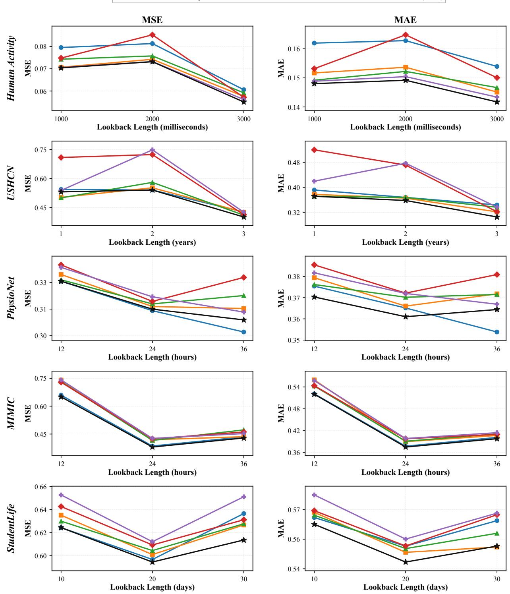  
Figure 5. Forecasting performance with varying lookback lengths and fixed forecast horizons.

<table><tr><td colspan="6">MSE</td></tr><tr><td>Method</td><td>USHCN</td><td>Human Activity</td><td>Student Life</td><td>PhysioNet</td><td>MIMIC</td></tr><tr><td>GraFTi</td><td> $0 . 2 0 8 9 { \pm } 0 . 0 2 1 8$ </td><td> $0 . 0 4 3 1 { \scriptstyle \pm 0 . 0 0 0 6 }$ </td><td> $0 . 5 7 8 9 { \pm } 0 . 0 0 1 8$ </td><td> $\mathbf { 0 . 3 5 5 3 3 { \scriptstyle \pm 0 . 0 0 1 6 } }$ </td><td> $0 . 4 9 5 7 { \pm } 0 . 0 0 3 2$ </td></tr><tr><td>Warpformer</td><td> $0 . 1 7 3 8 { \pm } 0 . 0 0 6 9$ </td><td> $0 . 0 4 4 6 { \pm } 0 . 0 0 1 3$ </td><td> $0 . 5 8 6 1 { \scriptstyle \pm 0 . 0 0 3 2 }$ </td><td> $0 . 3 5 5 8 { \scriptstyle \pm 0 . 0 0 1 6 }$ </td><td> $0 . 5 2 9 5 { \pm } 0 . 0 0 3 5$ </td></tr><tr><td>Hi-Patch</td><td> $0 . 2 4 1 6 { \pm } 0 . 0 2 0 5$ </td><td> $0 . 0 4 7 2 { \scriptstyle \pm 0 . 0 0 0 1 }$ </td><td> $0 . 5 9 0 2 { \scriptstyle \pm 0 . 0 0 2 0 }$ </td><td> $0 . 3 6 6 6 { \scriptstyle \pm 0 . 0 0 0 1 }$ </td><td> $0 . 5 3 5 2 { \scriptstyle \pm 0 . 0 0 6 2 }$ </td></tr><tr><td>KAFNet</td><td> $0 . 2 0 4 5 { \pm } 0 . 0 0 9 1$ </td><td> $0 . 0 6 7 7 { \scriptstyle \pm 0 . 0 0 0 6 }$ </td><td> $0 . 5 9 8 0 { \pm } 0 . 0 0 2 4$ </td><td> $0 . 3 6 4 7 { \scriptstyle \pm 0 . 0 0 1 0 }$ </td><td> $0 . 5 1 4 5 { \scriptstyle \pm 0 . 0 0 7 6 }$ </td></tr><tr><td>APN</td><td> $0 . 1 8 1 6 { \pm } 0 . 0 1 3 3$ </td><td> $0 . 0 4 3 6 { \pm } 0 . 0 0 0 4$ </td><td> $0 . 6 0 5 7 { \scriptstyle \pm 0 . 0 1 4 0 }$ </td><td> $0 . 3 6 8 9 { \pm } 0 . 0 0 2 6$ </td><td> $0 . 5 3 9 6 { \pm } 0 . 0 0 5 3$ </td></tr><tr><td>NBFN (Ours)</td><td> $\mathbf { 0 . 1 7 3 0 { \pm } 0 . 0 0 9 7 }$ </td><td> $\mathbf { 0 . 0 4 2 9 { \pm } 0 . 0 0 0 1 }$ </td><td> $\mathbf { 0 . 5 7 6 3 { \scriptstyle \pm 0 . 0 0 3 7 } }$ </td><td> $0 . 3 5 8 4 { \pm } 0 . 0 0 0 6$ </td><td> $\mathbf { 0 . 4 9 0 2 { \pm } 0 . 0 0 8 5 }$ </td></tr><tr><td colspan="6">MAE</td></tr><tr><td>Method</td><td>USHCN</td><td>Human Activity</td><td>Student Life</td><td>PhysioNet</td><td>MIMIC</td></tr><tr><td>GraFTi</td><td> $0 . 2 8 1 3 { \scriptstyle \pm 0 . 0 0 3 1 }$ </td><td> $0 . 1 2 0 3 { \pm } 0 . 0 0 3 0$ </td><td> $0 . 5 3 0 8 { \scriptstyle \pm 0 . 0 0 1 2 }$ </td><td> $\mathbf { 0 . 4 0 5 1 { \pm } 0 . 0 0 0 3 }$ </td><td> $0 . 4 3 6 9 { \pm } 0 . 0 0 2 3$ </td></tr><tr><td>Warpformer</td><td> $0 . 2 6 8 2 { \scriptstyle \pm 0 . 0 0 2 6 }$ </td><td> $0 . 1 2 2 1 { \pm } 0 . 0 0 2 2$ </td><td> $0 . 5 3 1 7 { \scriptstyle \pm 0 . 0 0 1 5 }$ </td><td> $0 . 4 0 6 3 { \pm } 0 . 0 0 1 9$ </td><td> $0 . 4 4 1 2 { \scriptstyle \pm 0 . 0 0 2 3 }$ </td></tr><tr><td>Hi-Patch</td><td> $0 . 2 9 2 3 { \pm } 0 . 0 1 0 5$ </td><td> $0 . 1 2 5 0 { \pm } 0 . 0 0 0 1$ </td><td> $0 . 5 3 1 8 { \pm } 0 . 0 0 1 1$ </td><td> $0 . 4 1 5 0 { \scriptstyle \pm 0 . 0 0 1 1 }$ </td><td> $0 . 4 5 4 4 { \scriptstyle \pm 0 . 0 0 6 2 }$ </td></tr><tr><td>KAFNet</td><td> $0 . 2 7 1 4 { \pm } 0 . 0 1 3 5$ </td><td> $0 . 1 5 8 2 { \pm } 0 . 0 0 1 5$ </td><td> $0 . 5 3 8 6 { \pm } 0 . 0 0 1 6$ </td><td> $0 . 4 1 3 8 { \pm } 0 . 0 0 1 4$ </td><td> $0 . 4 4 1 9 { \pm } 0 . 0 0 4 6$ </td></tr><tr><td>APN</td><td> $0 . 2 8 1 8 { \pm } 0 . 0 0 9 8$ </td><td> $0 . 1 2 1 1 { \scriptstyle \pm 0 . 0 0 1 1 }$ </td><td> $0 . 5 4 8 0 { \pm } 0 . 0 1 5 6$ </td><td> $0 . 4 1 5 3 { \scriptstyle \pm 0 . 0 0 2 7 }$ </td><td> $0 . 4 5 6 4 { \scriptstyle \pm 0 . 0 0 4 4 }$ </td></tr><tr><td>NBFN (Ours)</td><td> $\mathbf { 0 . 2 5 1 8 { \pm } 0 . 0 0 7 3 }$ </td><td> $\mathbf { 0 . 1 1 7 2 { \scriptstyle \pm 0 . 0 0 0 6 } }$ </td><td> $\mathbf { 0 . 5 2 9 1 { \pm } 0 . 0 0 2 2 }$ </td><td> $0 . 4 0 8 4 { \pm } 0 . 0 0 1 2$ </td><td> $\mathbf { 0 . 4 3 3 8 { \scriptstyle \pm 0 . 0 0 6 7 } }$ </td></tr></table>

Table 8. Experimental results on five irregular multivariate time-series datasets evaluated by MSE and MAE. The look-back lengths follow Table 2, and the prediction horizons are set to the remaining length of each sequence: 12 hours for MIMIC-III and PhysioNet, 300 milliseconds for Human Activity, the next 3 observations for USHCN, and 10 days for Student Life