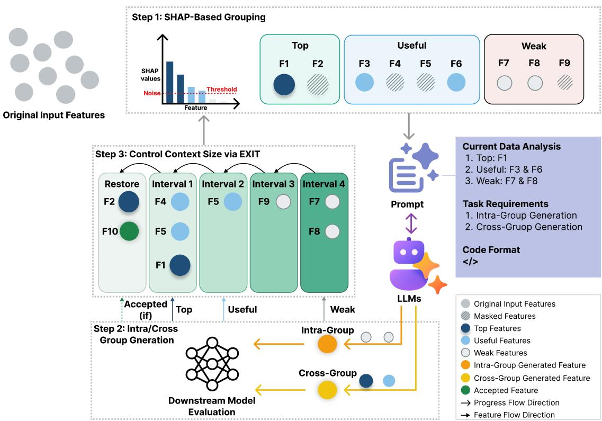
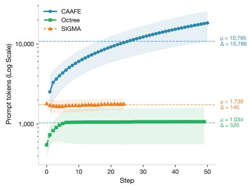
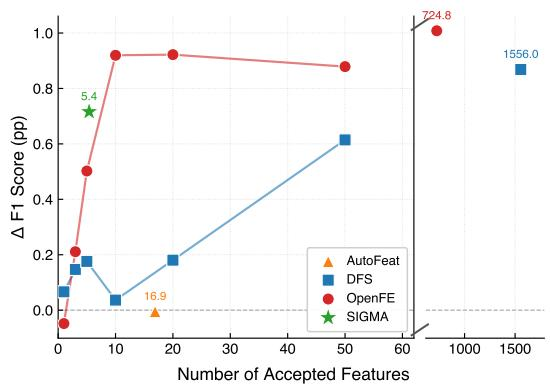
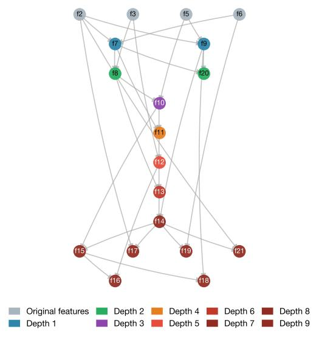
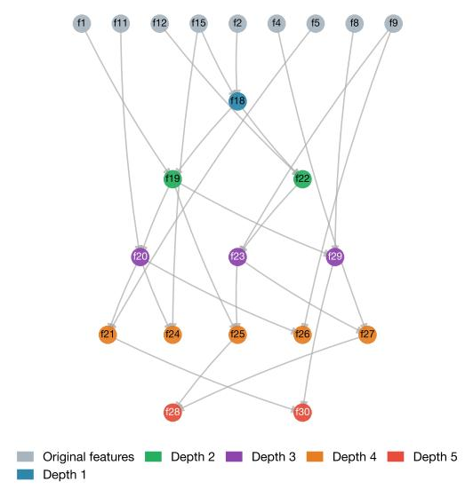
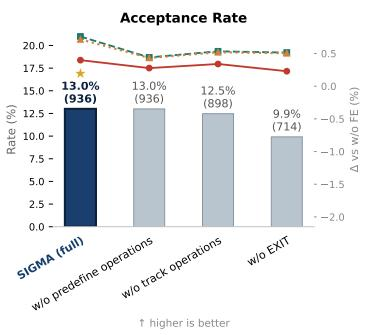
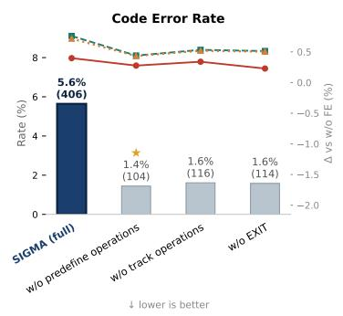
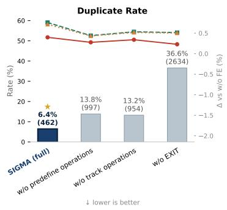
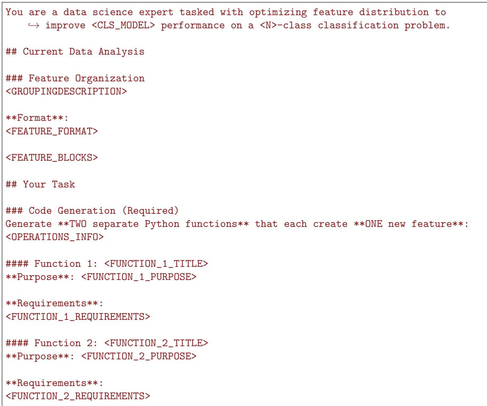

# SIGMA: SHAP-Guided Implicit-Trajectory Generation for Metadata-Free LLM-Based AutoFE

Xuan Zheng   
Kento Uchida   
Shinichi Shirakawa   
Yokohama National University

zheng-xuan-dz@ynu.jp

uchida-kento-fz@ynu.ac.jp

shirakawa-shinichi-bg@ynu.ac.jp

## Abstract

Recent research has leveraged Large Language Models (LLMs) to enhance Automated Feature Engineering (AutoFE) through semantic descriptions and trajectory-based prompting. However, there exist two challenges that limit their applicability and scalability in long-horizon optimization: (1) semantic metadata is unavailable in many practical settings, and (2) trajectory accumulation increases the risk of exceeding the context window, while without it, the generation process can become unstable, leading to becoming stuck in the local optima and a high duplicate rate of generated features. To this end, we propose a SHAP-enhanced Implicit-trajectory Generation for Metadata-free AutoFE (SIGMA), a scalable constant-context optimization framework. SIGMA leverages SHAP values to provide task-aware signals for guiding group feature generation instead of semantic information. In addition, we adopt an EXposed-feature Implicit Trajectory (EXIT) approach, where the exposed features in the prompt implicitly represent the trajectory. Empirical results demonstrate that SIGMA achieves performance comparable to the state-of-the-art (SOTA) LLM baselines with a nearly constant prompt length. Notably, EXIT significantly reduces the duplicate ratio of generated features from 37.2% to 6.8%. At the same time, SIGMA matches traditional SOTA performance with only 5.4 features on average, demonstrating substantial eficiency gains in feature utilization.

Keywords: Automated Feature Engineering, LLM, Tabular Machine Learning, AutoML.

## 1. Introduction

Automated Feature Engineering (AutoFE) (Hutter et al., 2019) is an important component of AutoML (Ravishankar and Battineni, 2025). A primary objective of AutoFE is generating new features to enhance the representational power of the original feature set. It improves AutoML eficiency and robustness, and has been widely applied in domains such as finance and medicine (Hollmann et al., 2023; Lucas et al., 2020; Waring et al., 2020).

Traditionally, AutoFE methods primarily adopt an expansion-reduction framework that explores large combinatorial spaces of predefined feature transformations (Zhang et al., 2023; Hollmann et al., 2023). These approaches have demonstrated strong performance under suficient search budgets. However, the manually defined search space is not only complex to design but also limits the exploration, potentially leading to sub-optimal results (Abhyankar et al., 2025). In addition, it is hard to interpret the enormous number of generated features.

Since Large Language Models (LLMs) (Chang et al., 2024) have shown strong reasoning (Wei et al., 2022) and In-Context Learning (ICL) (Dong et al., 2024) capabilities, extensive research has explored leveraging LLMs to enhance AutoFE through sequential optimization.

  
Figure 1: The overview of SIGMA.

By providing semantic (features and task) descriptions and statistical information (Fathollahzadeh et al., 2025), LLMs can generate interpretable features from domain knowledge (Li et al., 2026; Han et al., 2024). Such LLM-based AutoFE methods show promise for Data Science (DS) Agent (Guo et al., 2024; Chen et al., 2025). However, the assumption of access to semantic information limits their applicability in real-world scenarios (Nam et al., 2024). For example, in privacy-preserving medical datasets, or sensor logs, the semantic information may be unavailable or unreliable. In addition, the continuous expansion of the optimization trajectory used for ICL not only increases the risk of exceeding context length constraints, but also induces a bias toward successful feature-operation pairs. However, without the trajectory information, LLMs tend to generate duplicates.

To address the above challenges, we propose a SHAP-enhanced Implicit-trajectory Generation for Metadata-free AutoFE (SIGMA), a scalable constant-context optimization framework for metadata-free LLM-based AutoFE. Figure 1 illustrates the overview of SIGMA. First, SIGMA leverages SHAP (SHapley Additive exPlanations) values (Ponce-Bobadilla et al., 2024) to provide task-aware signals for group feature generation. It enables efective optimization without relying on semantic descriptions. Specifically, input features will be divided into three groups (top, useful, and weak) according to SHAP values and used for generating intra-group and cross-group features. Motivated by the fact that LLMs exhibit a strong contextual bias toward provided information, and that minor prompt perturbations can significantly enhance generation diversity, we propose EXposed-feature Implicit Trajectory (EXIT) to mitigate the overhead associated with expanding the optimization trajectory. In this manner, the visible feature set serves as a proxy for the optimization history, where the trajectory is implicitly reflected in the feature composition rather than being enumerated via explicit tokens. The contributions of our work are as follows:

1. We propose SIGMA, a metadata-free LLM-based AutoFE framework that replaces semantic descriptions with SHAP-based importance signals and introduces a grouped generation strategy for structured feature exploration.

2. We introduce EXIT to enable efective long-horizon optimization without explicit trajectory in the prompt, which reduces the duplicate generation rate from 37.2% to 6.8%.

3. Results show that SIGMA achieves comparable performance to current LLM-based baselines, and remains competitive with traditional AutoFE with eficient feature utilization.

## 2. Related Work

Traditional AutoFE Methods. Traditional AutoFE methods are usually based on an expansion-reduction framework. Deep Feature Synthesis (DFS) (Kanter and Veeramachaneni, 2015) leveraged relational paths and mathematical primitives to automatically generate cross-table features, and then select the most performing ones. ExploreKit (Katz et al., 2016) proposed a framework to generate candidate features by combining all original features, do selection on a ranking classifier. Since non-linear transformation is also very beneficial, AutoFeat (Horn et al., 2019) introduced non-linear feature transformations and employs an L1-regularized linear model for feature selection, efectively enhancing the predictive power of linear models while preserving interpretability. Besides, evolutionary computation (B¨ack and Schwefel, 1996) and genetic programming (Espejo et al., 2009) have also been widely applied in traditional AutoFE. TPOT (Olson and Moore, 2016) utilized genetic programming to combine feature selectors, transformers, and classifiers to maximize predictive accuracy. Other representative methods include AutoGluon (Erickson et al., 2020), which treats feature interactions implicitly within its hierarchical intelligent type inference and multi-stage model stacking architecture, and OpenFE (Zhang et al., 2023), which proposes a two-stage pruning strategy to eficiently identify high-quality candidate features.

LLM-based AutoFE Methods. LLMs built on the Transformer architecture (Vaswani et al., 2017) have shown powerful ICL and reasoning capabilities (Guo et al., 2025), aligned with domain knowledge. CAAFE (Hollmann et al., 2023) first proposed to take advantage of the prior semantic knowledge of LLMs to generate interpretable features based on textua descriptions. FeatLLM (Han et al., 2024) utilized LLMs to generate rules to transfer features to binary sequences based on feature descriptions and samples, boosting few-shot tabular learning. In addition, such a framework can be easily combined with optimization algorithms. For example, LLM-FE (Abhyankar et al., 2025) combines LLM-based feature engineering with evolutionary computation. However, in the real-world, feature and task descriptions may be hard to obtain because of privacy and security issues, while the expansion of features will dramatically increase the prompt length. Therefore, OCTree (Nam et al., 2024) proposed using only the tree expression of features to generate new ones. Although such research has achieved great success, there are several concerns about LLMs’ memory of datasets (Zhang et al., 2024), as well as the preference for generating simple operations (K¨uken et al., 2024).

As a solution, Li et al. (2026) proposed decoupling the transformation operation proposal from the selection processes.

## 3. Methodology

SIGMA contains three main steps: (1) SHAP-based Feature Grouping, (2) Intra-Group and Cross-Group Generation, and (3) Applying EXIT to control context size. The overall procedure of SIGMA is summarized in Algorithm 1.

Algorithm 1 SIGMA Workflow   
Require: Splits $( \mathcal { D } _ { \mathrm { t r } } , \mathcal { D } _ { \mathrm { v a } } , \mathcal { D } _ { \mathrm { t e } } ) ;$ ; LLM $\mathcal { L } ;$ classifier $\mathcal { C } ;$ max steps $T ;$ noise level $\eta ;$ patience $P$   
1: Extract $( \mathbf { X } _ { \mathrm { t r } } , \mathbf { X } _ { \mathrm { v a } } , \mathbf { X } _ { \mathrm { t e } } )$ from $\left( \mathcal { D } _ { \mathrm { t r } } , \mathcal { D } _ { \mathrm { v a } } , \mathcal { D } _ { \mathrm { t e } } \right)$   
2: Set $s ^ { * } \gets \mathrm { E v a l } ( \mathcal { C } , \mathbf { X } _ { \mathrm { t r } } , \mathbf { X } _ { \mathrm { v a } } ) , \mathcal { B } \gets \emptyset , \mathcal { H } _ { \mathrm { o p } } \gets \emptyset$ and $k _ { \mathrm { f a i l } }  0$   
3: for $t \gets 1$ to $T$ do   
4: $( \mathcal G _ { \mathrm { t o p } } , \mathcal G _ { \mathrm { u s e } } , \mathcal G _ { \mathrm { w e a k } } ) \gets \mathrm { S H A P - }$ -based feature grouping with $( \mathcal { C } , \mathbf { X } _ { \mathrm { t r } } , \eta )$   
5: if $k _ { \mathrm { f a i l } } \geq P$ then   
6: Set $\begin{array} { r } { B  \emptyset , k _ { \mathrm { f a i l } }  0 } \end{array}$   
7: else   
8: Remove expired masks from $\boldsymbol { B }$   
9: end if   
10: Remove masked features in B from $( \mathcal { G } _ { \mathrm { t o p } } , \mathcal { G } _ { \mathrm { u s e } } , \mathcal { G } _ { \mathrm { w e a k } } )$   
11: $\mathcal { P } _ { t } \gets$ BuildPrompt $( \mathcal { G } , \mathcal { H } _ { \mathrm { o p } } , s ^ { * } )$   
12: $\Phi _ { t } \gets$ Intra/cross-group generations with $\big ( \mathcal { L } ( \mathcal { P } _ { t } ) , ( \mathbf { X } _ { \mathrm { t r } } , \mathbf { X } _ { \mathrm { v a } } , \mathbf { X } _ { \mathrm { t e } } ) \big )$   
13: $A  \emptyset$   
14: for all $\phi \in \Phi _ { t }$ do   
15: $s _ { \phi } $ EvalC, Concat $[ \mathbf { X } _ { \mathrm { t r } } , \phi ( \mathbf { X } _ { \mathrm { t r } } ) ]$ , Concat $\big [ \mathbf { X } _ { \mathrm { v a } } , \phi ( \mathbf { X } _ { \mathrm { v a } } ) \big ] \big )$   
16: if $s _ { \phi } > s ^ { * }$ then   
17: ${ \mathcal { A } } \gets { \mathcal { A } } \cup \{ ( \phi , s _ { \phi } ) \}$   
18: end if   
19: end for   
20: if $\mathcal A \neq \emptyset$ then   
21: $\left( \phi ^ { * } , s ^ { * } \right) \gets$ arg $\operatorname* { m a x } _ { ( \phi , s _ { \phi } ) \in \mathcal { A } } s _ { \phi }$ and $\mathbf { X } \gets \mathrm { C o n c a t } [ \mathbf { X } , \phi ^ { * } ( \mathbf { X } ) ]$ for $\mathbf { X } \in \{ \mathbf { X } _ { \mathrm { t r } } , \mathbf { X } _ { \mathrm { v a } } , \mathbf { X } _ { \mathrm { t e } } \}$   
22: Set $B  B \cup \mathrm { M a s k }$ (ExtractSourceFeatures $\left( \phi ^ { * } \right) )$ and $k _ { \mathrm { f a i l } }  0$   
23: else   
24: Set $\mathcal { H } _ { \mathrm { o p } }  \mathcal { H } _ { \mathrm { o p } } \cup$ ExtractOperations $\left( \Phi _ { t } \right)$ and $k _ { \mathrm { f a i l } }  k _ { \mathrm { f a i l } } + 1$   
25: end if   
26: end for   
27: return $( \mathbf { X } _ { \mathrm { t r } } , \mathbf { X } _ { \mathrm { v a } } , \mathbf { X } _ { \mathrm { t e } } )$ ; $/ /$ return augmented feature sets

## 3.1. Feature Groups

Original features are divided into groups according to their SHAP values. Instead of dividing each group by a fixed ratio (e.g., 33% features for each group), we introduce a threshold by adding a noise feature. Specifically, we first add a Gaussian noise column to the original feature set, and then calculate the SHAP values for all of them. To make features comparable to the noise, min-max normalization is applied at this stage. After that, the SHAP value of the noise is used as the threshold to divide features into three groups: top, useful, and weak. The top group contains features with SHAP values ranked as the top 10% (a minimum of two features). These features are the most important for the model’s predictions. The weak group consists of features with SHAP values below the threshold, while the remaining features are assigned to the useful group.

Dividing features into groups based on the noise threshold can help adjust the LLM’s attention to the current feature space. If we use a fixed partition ratio, the LLM will allocate a fixed level of attention to each group across all datasets. However, diferent datasets have their own characteristics. For instance, in some cases, the majority of features exhibit lower importance than the noise, whereas in others, all features are more important than the noise. The more features a group contains, the more attention the LLM pays to it. As a result, introducing the noise feature can help the LLM generate features that align with the intrinsic characteristics of the target dataset. In addition, the group strategy can also benefit the EXIT strategy, which will be introduced later, making it indispensable.

## 3.2. Intra-Group and Cross-Group Generation

After dividing the features into groups, we build the prompt for the LLM to generate new features. The prompt template can be found in the Appendix A. Instead of only generating one feature in each step, we require the LLM to generate one intra-group feature and one cross-group feature. The intra-group feature focuses on deep feature transformation or multi-feature interaction to find the hidden patterns in the same group. By generating intra-group features, we aim to improve already influential signals. In contrast, the crossgroup feature focuses on synergy building by bridging high-importance features with weaker signals. In other words, the cross-group generation is designed to improve weak signals. Both generated features will be evaluated by the downstream model, and only the feature with the most positive improvement will be accepted.

## 3.3. EXposed-feature Implicit Trajectory (EXIT)

Since we drop the explicit trajectory in the prompt, the LLM demonstrates a high tendency to generate duplicated features. Motivated by the principle that information is conveyed not only through the presence of explicit signals but also through their strategic omission, we propose EXIT. Specifically, at each step, all selected features s fsel. $f _ { \mathrm { s e l } }$ used for generation are tracked and masked from the prompt in the following few steps. Since top features carry more information and are more likely to benefit from interactions, they are assigned the shortest masking interval of $2 ^ { 0 }$ steps. In contrast, the intervals for useful and weak features are set to $2 ^ { 1 }$ and $2 ^ { 2 }$ steps, respectively, corresponding to their importance and function. Given that the LLM may become trapped in local optima, EXIT resets the masked feature space and restores all frozen features when no features are accepted for $P = 5$ consecutive steps.

We also track the applied operations and prevent the LLM from using the two most frequent operations in the prompt, since the LLM tends to select the same operations for a given dataset. Nevertheless, only operations associated with failed generations are tracked and temporarily forbidden. If an operation continuously improves performance, it should be considered well-suited to the dataset and rewarded accordingly.

In a word, the trajectory information is implicitly encapsulated within the set of exposed features, rather than maintaining an explicit, token-heavy record of the optimization history.

## 4. Experiments and Results

## 4.1. Experimental Setup

Datasets: In our experiments, we used 16 public tabular classification datasets from previous studies (Hollmann et al., 2023; Nam et al., 2024). They all come from OpenML (Feurer et al., 2021) and Kaggle (Banachewicz and Massaron, 2022). We limited each dataset to a maximum of 50,000 samples and split it into training and test sets with an 8:2 ratio. In addition, we performed this data splitting three times using diferent random seeds to improve the reliability of the results.

Evaluation Metrics: We adopt the F1-score as our primary evaluation metric to provide a balanced assessment of model performance.

Baselines: We compare SIGMA with both LLM-based and traditional AutoFE approaches and choose XGBoost (Chen and Guestrin, 2016) as the downstream model. As representative LLM-based approaches, we used CAAFE and OCTree as baselines. While CAAFE is a semantic-based approach leveraging detailed feature descriptions, OCTree uses treestructured expressions of feature space as trajectory information to realize non-semantic generation. We used well-known AutoFE methods, including DFS, OpenFE, and AutoFeat, as traditional baselines. These approaches are based on predefined transformation rules and perform feature generation through an exhaustive search over operation spaces.

Experimental Protocol: To ensure a comprehensive evaluation, we adopt the following settings. For SIGMA and traditional feature engineering approaches, semantic information was removed by masking feature names and encoding values, so that all methods operate without access to semantic descriptions. To eliminate diferences arising from transformation definitions, we further adopted a shared operation space consisting of basic arithmetic operations (addition, subtraction, multiplication, division), common unary transformations (logarithm, square root, absolute value), and simple feature interactions (ratios).

For LLM-based baselines, we followed their original implementations. To reduce performance fluctuations caused by the temperature parameter and sampling strategies, we repeated each LLM-based AutoFE method three times. The generation budget was set to 50 features, counting generated features rather than accepted features.

We argue that the performance of an AutoFE method should also be measured by the trade-of between predictive performance and feature budget. In the real world, a large number of generated features will be hard to interpret and require huge maintenance costs. Therefore, we also contrast SIGMA’s feature-eficiency against traditional AutoFE by varying their feature budget K.

Implementation Details: Given the practical usage, LLMs were deployed through vLLM (Kwon et al., 2023) to enable eficient and scalable inference. For all baselines, we used their oficial implementations with standard configurations. To eliminate the CPU bottleneck, we used the GPU version of XGBoost (Mitchell and Frank, 2017). Detailed configurations of baselines are provided in Appendix B.

Table 1: F1-score comparison of LLM-based AutoFE using Qwen3-4B-Instruct-2507. The best results are highlighted in bold, and the second-best results are underlined.
<table><tr><td>Dataset</td><td>Baseline  $\left( \mathrm { w . o . \ A u t o F E } \right)$ </td><td>CAAFE</td><td>OCTree</td><td>SIGMA (ours)</td></tr><tr><td>eucalyptus</td><td> $6 4 . 9 4 \pm { \ : } 1 . 7 0$ </td><td> $6 5 . 2 7 \pm 2 . 0 4$ </td><td> $6 5 . 1 2 \pm { } 1 . 2 4$ </td><td> ${ \bf 6 6 . 3 9 \pm _ { 2 . 2 9 } }$ </td></tr><tr><td>diabetes</td><td> $7 3 . 5 5 \pm 5 . 4 0$ </td><td> $7 3 . 5 8 \pm { \ : } 3 . 6 2$ </td><td> $\underline { { 7 3 . 6 2 } } \pm . 4 . 3 7$ </td><td> ${ \bf 7 4 . 8 2 \pm 3 . 1 6 }$ </td></tr><tr><td>credit-g</td><td> $7 4 . 2 8 \pm { \ : } 3 . 1 1$ </td><td> $7 3 . 4 6 \pm 2 . 9 0$ </td><td> $7 4 . 5 6 \pm 1 . 7 3$ </td><td> $\mathbf { 7 4 . 8 4 \ : \pm { \ : 2 . 1 9 } }$ </td></tr><tr><td>pc1</td><td> $9 2 . 7 1 \pm 1 . 2 1$ </td><td> $9 2 . 6 4 \pm \ : 0 . 9 5$ </td><td> $\mathbf { 9 2 . 8 3 \ : \pm { \ : 1 . 4 2 } }$ </td><td> $9 2 . 2 2 \pm { \ : } 1 . 0 6$ </td></tr><tr><td>cmc</td><td> $5 1 . 2 2 \pm 2 . 6 0$ </td><td> ${ \bf 5 1 . 7 6 \pm . 0 1 }$ </td><td> $4 9 . 9 7 \pm { \ : } 1 . 9 5$ </td><td> $5 1 . 4 6 \pm 2 . 5 0$ </td></tr><tr><td>wine</td><td> ${ \bf 8 0 . 5 3 \pm 0 . 3 9 }$ </td><td> $8 0 . 0 7 \pm { \ : } 1 . 6 6$ </td><td> $8 0 . 1 5 \pm { } 1 . 3 6$ </td><td> $7 9 . 1 3 \pm \ : 0 . 8 9$ </td></tr><tr><td>MagicTelescope</td><td> $8 6 . 3 0 \pm 0 . 3 0$ </td><td> $8 6 . 3 0 \pm \ : 0 . 2 6$ </td><td> $8 6 . 0 5 \pm \ : 0 . 2 7$ </td><td> ${ \bf 8 6 . 5 8 \pm 0 . 4 6 }$ </td></tr><tr><td>house_16H</td><td> $\mathbf { 8 7 . 9 7 \ : \pm { \ : 0 . 6 2 } }$ </td><td> $\underline { { 8 7 . 7 9 \pm 0 . 6 9 } }$ </td><td> $8 7 . 7 5 \pm \ : 0 . 6 0$ </td><td> $8 7 . 7 1 \pm \ : 0 . 3 6$ </td></tr><tr><td>compass</td><td> $7 5 . 0 7 \pm \ : 0 . 2 3$ </td><td> $7 6 . 6 6 \pm 0 . 5 0$ </td><td> $7 4 . 1 3 \pm \ : 0 . 4 1$ </td><td> $\mathbf { 7 7 . 9 7 \pm { \bf \sigma _ { 1 . 0 0 } } }$ </td></tr><tr><td>electricity</td><td> $9 0 . 4 3 \pm \ : 0 . 2 0$ </td><td> $9 0 . 5 1 \pm \ : 0 . 2 6$ </td><td> $9 0 . 3 3 \pm \ : 0 . 2 0$ </td><td> $\mathbf { 9 0 . 7 7 \ : \pm { \ : 0 . 3 1 } }$ </td></tr><tr><td>jungle_chess</td><td> $8 6 . 8 9 \pm \ : 0 . 1 1$ </td><td> $\mathbf { 9 5 . 0 3 \ : \pm { \ : 2 . 9 3 } }$ </td><td> $8 8 . 2 2 \pm { \ : } 1 . 1 3$ </td><td> $9 2 . 6 2 \pm 2 . 1 2$ </td></tr><tr><td>airlines</td><td> $6 3 . 4 3 \pm \ : 0 . 6 0$ </td><td> $6 3 . 3 5 \pm \ : 0 . 2 5$ </td><td> ${ \bf 6 3 . 7 2 \pm 0 . 8 0 }$ </td><td> $6 3 . 3 1 \pm \ : 0 . 5 3$ </td></tr><tr><td>jannis</td><td> $7 8 . 6 0 \pm \ : 0 . 5 2$ </td><td> ${ \underline { { 7 8 . 7 7 } } } \pm 0 . 5 5$ </td><td> $7 8 . 6 9 \pm \ : 0 . 3 9$ </td><td> ${ \bf 7 8 . 8 4 \pm 0 . 2 6 }$ </td></tr><tr><td>MiniBooNE</td><td> $\mathbf { 9 4 . 0 9 \ : \pm { \ : 0 . 4 4 } }$ </td><td> $9 3 . 9 0 \pm \ : 0 . 4 2$ </td><td> $9 3 . 9 1 \pm 0 . 4 6$ </td><td> $9 3 . 9 2 \pm 0 . 4 9$ </td></tr><tr><td>road-safety</td><td> $7 7 . 9 0 \pm \ : 0 . 6 5$ </td><td> ${ \bf 7 9 . 5 2 \pm 0 . 7 0 }$ </td><td> $7 7 . 9 6 \pm \ : 0 . 6 5$ </td><td> $7 7 . 9 4 \pm \ : 0 . 4 6$ </td></tr><tr><td>covertype</td><td> $8 7 . 4 6 \pm \ : 0 . 2 2$ </td><td> $B 7 . 7 9 \pm 0 . 3 6$ </td><td> $8 7 . 3 1 \pm \ : 0 . 1 5$ </td><td> ${ \bf 8 8 . 2 9 \pm 0 . 4 3 }$ </td></tr><tr><td>Average</td><td>79.09</td><td> ${ \underline { { 7 9 . 7 8 \pm 0 . 1 8 } } }$ </td><td> $7 9 . 0 2 \pm \ : 0 . 3 1$ </td><td> ${ \bf 7 9 . 8 0 \pm 0 . 2 3 }$ </td></tr><tr><td>Avg Rank</td><td>2.75</td><td>2.31</td><td>2.81</td><td>2.06</td></tr></table>

## 4.2. Comparison with Existing LLM-Based Methods

Table 1 shows the comparison of all LLM-based methods. Results demonstrate that SIGMA achieves competitive performance with semantic-based CAAFE. This indicates that LLMbased AutoFEs can generate efective features without relying on detailed descriptions. Compared to the same metadata-free OCTree, SIGMA consistently achieves better performance across most datasets. Results of other metrics can be found in Appendix C.

Furthermore, we analyze the prompt token trend during the optimization to compare the eficiency. Figure 2(a) shows the average token trend of diferent LLM-based AutoFE methods. We observe that both prior LLM-based AutoFE frameworks exhibit an escalating trend in prompt length across successive optimization steps. The diference is that OCTree sets a trajectory limitation of the top-7 performing features, while CAAFE does not set any upper bound. In contrast, SIGMA maintains a near-constant context throughout the iteration, as evidenced by the smallest peak-to-trough token variation. While this bottleneck restricts prior methods to a limited optimization horizon, SIGMA facilitates sustainable iterative refinement without cost explosion.

By extension, although OCTree costs the fewest tokens, the optimization progress can easily become stuck when the LLM cannot generate features better than the top-7 performing features. The absence of prompt evolution forces the system to rely solely on stochastic sampling parameters to escape the local optima. This is one of the reasons why OCTree performs below average. SIGMA replaces the passive strategy dependent on the LLM itself to active guidance. Specifically, EXIT dynamically adjusts the exposed features for LLMs to reduce the co-occurrence probability of identical features.

  
(a)

  
(b)  
Figure 2: Eficiency analysis of methods: (a) the average prompt token trends of LLM-based AutoFE methods. Since SIGMA generates two features at each iteration, the final step is 25. (b) the feature-eficiency comparison with traditional AutoFE.

Table 2: F1-score results of traditional AutoFE methods under the same feature budget. Bold and underlined indicate the best and second-best results, respectively.
<table><tr><td>Dataset</td><td>Baseline  $\left( \mathrm { w . o . \ A u t o F E } \right)$ </td><td>AutoFeat</td><td>DFS</td><td>OpenFE</td><td>SIGMA (Ours)</td></tr><tr><td>eucalyptus</td><td> $6 4 . 9 4 \pm 1 . 7 0$ </td><td> $6 5 . 7 2 \pm 2 . 9 3$ </td><td> ${ \bf 6 6 . 7 1 \pm 1 . 7 1 }$ </td><td> $6 5 . 6 7 \pm 0 . 4 1$ </td><td> $6 6 . 3 9 \pm 2 . 2 9$ </td></tr><tr><td>diabetes</td><td> $7 3 . 5 5 \pm 5 . 4 0$ </td><td> $\underline { { 7 4 . 8 7 \pm 2 . 3 4 } }$ </td><td> $7 4 . 3 2 \pm 2 . 9 5$ </td><td> ${ \bf 7 5 . 9 3 \pm 2 . 8 2 }$ </td><td> $\overline { { 7 4 . 8 2 \pm 3 . 1 6 } }$ </td></tr><tr><td>credit-g</td><td> $\underline { { 7 4 . 2 8 \pm 3 . 1 1 } }$ </td><td> $\overline { { 7 3 . 9 7 \pm 2 . 3 3 } }$ </td><td> $7 4 . 1 8 \pm 3 . 0 5$ </td><td> $7 3 . 7 9 \pm 2 . 2 4$ </td><td> $\mathbf { 7 4 . 8 4 \ : \pm { \ : 2 . 1 9 } }$ </td></tr><tr><td>pcl</td><td> $9 2 . 7 1 \pm 1 . 2 1 $ </td><td> $\mathbf { 9 2 . 9 4 \ : \pm { \ : 0 . 6 6 } }$ </td><td> $9 2 . 6 5 \pm 1 . 2 9$ </td><td> $9 2 . 3 9 \pm \ : 0 . 3 8$ </td><td> $9 2 . 2 2 \pm 1 . 0 6$ </td></tr><tr><td>cmc</td><td> $5 1 . 2 2 \pm 2 . 6 0$ </td><td> $5 0 . 5 1 \pm 2 . 7 5$ </td><td> $5 2 . 3 2 \pm 2 . 9 6$ </td><td> $\mathbf { 5 2 . 6 0 \ : \pm { \ : 2 . 3 0 } }$ </td><td> $5 1 . 4 6 \pm 2 . 5 0$ </td></tr><tr><td>wine</td><td> $\mathbf { 8 0 . 5 3 \ : \pm { \ : 0 . 3 9 } }$ </td><td> $7 8 . 4 2 \pm 1 . 4 6$ </td><td> $7 9 . 8 7 \pm 1 . 5 2 $ </td><td> $7 8 . 8 3 \pm 0 . 3 2$ </td><td> $7 9 . 1 3 \pm 0 . 8 9$ </td></tr><tr><td>MagicTelescope</td><td> $8 6 . 3 0 \pm \ : 0 . 3 0$ </td><td> $8 6 . 9 6 \pm \ : 0 . 5 3$ </td><td> $\overline { { 8 6 . 0 5 \pm 0 . 1 0 } }$ </td><td> $\mathbf { 8 7 . 5 1 \ : \pm { \ : 0 . 5 2 } }$ </td><td> $8 6 . 5 8 \pm 0 . 4 6$ </td></tr><tr><td>house_16H</td><td> $8 7 . 9 7 \pm \ : 0 . 6 2$ </td><td> $\underline { { 8 8 . 0 4 } } \pm \ : 0 . 5 3$ </td><td> $8 8 . 0 2 \pm \ : 0 . 7 7$ </td><td> ${ \bf 8 8 . 0 6 \pm 0 . 2 4 }$ </td><td> $8 7 . 7 1 \pm \ : 0 . 3 6$ </td></tr><tr><td>compass</td><td> $7 5 . 0 7 \pm \ : 0 . 2 3$ </td><td> $\overline { { 7 4 . 8 2 \pm 0 . 0 9 } }$ </td><td> $7 4 . 3 6 \pm \ : 0 . 7 1$ </td><td> $7 7 . 2 7 \pm 0 . 7 5$ </td><td> $\mathbf { 7 7 . 9 7 \pm 1 . 0 0 }$ </td></tr><tr><td>electricity</td><td> $9 0 . 4 3 \pm \ : 0 . 2 0$ </td><td> $9 0 . 4 0 \pm 0 . 2 0$ </td><td> $8 9 . 9 7 \pm \ : 0 . 1 3$ </td><td> $\mathbf { 9 1 . 6 9 \ : \pm { \ : 0 . 1 4 } }$ </td><td> $9 0 . 7 7 \pm 0 . 3 1$ </td></tr><tr><td>jungle_chess</td><td> $8 6 . 8 9 \pm \ : 0 . 1 1$ </td><td> $8 7 . 1 8 \pm \ : 0 . 0 9$ </td><td> $8 7 . 8 7 \pm \ : 0 . 3 8$ </td><td> $9 0 . 4 1 \pm \ : 0 . 2 9$ </td><td> ${ \bf 9 2 . 6 2 \pm 2 . 1 2 }$ </td></tr><tr><td>airlines</td><td> ${ \bf 6 3 . 4 3 \pm 0 . 6 0 }$ </td><td> $6 3 . 0 3 \pm \ : 0 . 9 3$ </td><td> $6 3 . 1 0 \pm \ : 0 . 8 0$ </td><td> $6 3 . 1 0 \pm 0 . 5 5$ </td><td> $6 3 . 3 1 \pm \ : 0 . 5 3$ </td></tr><tr><td>jannis</td><td> $7 8 . 6 0 \pm \ : 0 . 5 2$ </td><td> $7 8 . 5 8 \pm \ : 0 . 3 7$ </td><td> $7 8 . 9 8 \pm \ : 0 . 2 7$ </td><td> ${ \bf 7 9 . 3 1 \pm 0 . 1 1 }$ </td><td> $7 8 . 8 4 \pm \ : 0 . 2 6$ </td></tr><tr><td>MiniBooNE</td><td> $\underline { { 9 4 . 0 9 \pm 0 . 4 4 } }$ </td><td> $\mathbf { 9 4 . 1 4 \ : \pm { \ : 0 . 4 4 } }$ </td><td> $\overline { { 9 3 . 9 9 \pm 0 . 4 7 } }$ </td><td> $9 3 . 9 9 \pm \ : 0 . 5 8$ </td><td> $9 3 . 9 2 \pm \ : 0 . 4 9$ </td></tr><tr><td>road-safety</td><td> $\overline { { 7 7 . 9 0 \pm \ : 0 . 6 5 } }$ </td><td> $7 7 . 8 7 \pm \ : 0 . 3 8$ </td><td> $7 7 . 6 4 \pm \ : 0 . 4 8$ </td><td> ${ \bf 7 9 . 7 0 \pm 0 . 6 8 }$ </td><td> $7 7 . 9 4 \pm \ : 0 . 4 6$ </td></tr><tr><td>covertype</td><td> $8 7 . 4 6 \pm \ : 0 . 2 2$ </td><td> $8 7 . 8 3 \pm 0 . 3 0$ </td><td> $8 8 . 2 4 \pm \ : 0 . 0 7$ </td><td> ${ \bf 8 9 . 8 7 \pm 0 . 5 3 }$ </td><td> $8 8 . 2 9 \pm \ : 0 . 4 3$ </td></tr><tr><td>Average</td><td>79.09</td><td>79.08</td><td>79.27</td><td>80.01</td><td></td></tr><tr><td>Avg Rank</td><td>3.31</td><td>3.44</td><td>3.38</td><td>2.19</td><td> $\frac { 7 9 . 8 0 \pm 0 . 2 3 } { 2 . 6 9 }$ </td></tr></table>

Overall, it is observed that LLM-based AutoFE can still achieve strong performance even when semantic information is absent. By providing the implicit trajectory through exposed features, EXIT helps SIGMA maintain the constant context during iteration, enabling long-horizon optimization.

## 4.3. Comparison with Traditional AutoFE

Figure 2(b) illustrates the tradeof between the number of selected features and the corresponding performance gain across datasets. While DFS and OpenFE allow explicit control over the accepted feature count K, SIGMA and AutoFeat do not directly support featurebudget control. Therefore, each of them is shown as a single point, using the average number of generated features across datasets. In addition, DFS and OpenFE generate an average of 724.8 and 1556 features per dataset, respectively, when all generated features are retained. Despite their significant performance gains, these methods often introduce noisy features, rendering the underlying reasons for their efectiveness virtually uninterpretable. Under constraint settings, OpenFE still exhibits strong feature generation abilities since it is the current most powerful AutoFE, while the performance of DFS sufers a great fluctuation. Compared to these methods, SIGMA achieves nearly 0.8% improvement with an average of 5.4 accepted features. It demonstrates that SIGMA has the ability to find the most promising features under constrained settings and provides an interpretation.

  
(a)

  
(b)  
Figure 3: The topology of generated features on the jungle chess and compass datasets: (a) and (b) are the jungle chess and compass datasets, respectively.

In addition, Table 2 compares SIGMA and traditional AutoFE under the feature budget K = 20, and the results of other metrics are demonstrated in Appendix C. SIGMA achieves a competitive F1-score, with only a marginal gap of 0.2% compared to OpenFE. Notably, this is achieved using approximately 5 accepted features, substantially fewer than the full feature budget, indicating a more eficient use of feature capacity. This eficiency advantage makes SIGMA a practical alternative in constrained settings.

## 4.4. Case Study

Upon reviewing the experimental results, the performance in the jungle chess and compass datasets are especially noteworthy due to the significant improvement. To investigate the underlying reasons for the substantial performance gains, we performed a deeper analysis of the generated features. Figure 3 shows the topology structure of the generated

w/o FE AUC: 87.01% ACC: 79.22% F1: 79.09% SIGMA (full model) Ablated variants AUC ACC F1

  
(a)

  
(b)

  
(c)  
Figure 4: Ablation results of SIGMA. “w/o predefine operations” represents that EXIT is still used, but operations are not provided. “w/o track operations” represents that EXIT is still used and operations are provided, but LLMs are not forbidden from using the top-2 frequent operations. “w/o EXIT” represents that operation predefinition and tracking are kept the same as SIGMA, but without the EXIT. (a) depicts the acceptance rate of generated features over all experiments. (b) and (c) show the code error rate and feature duplication rate, respectively.

features. Instead of generating features independently from the original feature space, SIGMA recursively reuses previously constructed features and composes them step by step to a depth of 9, as demonstrated in Figure 3(a). This is beyond the reach of traditional AutoFE methods. A similar pattern is observed in the compass dataset, as illustrated 3(b). These results highlight that SIGMA enables structured and reusable feature construction, rather than relying on shallow or independent feature generation.

## 4.5. Ablation Study

The ablation study is conducted to evaluate the efectiveness of the proposed EXIT strategies, as well as the influence on predefining and tracking operations. Figure 4 shows the comparison between SIGMA, SIGMA without predefining operations, SIGMA without tracking the top-2 most frequent operations, and SIGMA without EXIT strategies.

Figure 4(a) shows the improvement in the acceptance rate between SIGMA and SIGMA without EXIT. Combined with Figure 4(c), it can be found that without EXIT, 36.6% of generated features are duplicated. In other words, nearly 40% of the generation chance has been wasted, leading to a low acceptance rate in Figure 4(a). EXIT successfully solves this problem as designed with a 30% decrease in the duplicate rate.

Next, two ablated variants on operations also demonstrate another characteristic of the LLM—a tendency on operation selection. Without predefined operations, the LLM still generates 14.1% redundant features, a result consistent with the scenario where the top-2 most frequent operations are neither tracked nor restricted. This suggests an inherent heuristic bias: the LLM tends to prioritize specific operation-feature pairings based on its initial assessment, rather than exploring a broader range of alternatives. Consequently, the optimization process remains confined to these preferred operations, leading to a low diversity in the feature generation. This phenomenon is more serious when it is hard to generate accepted features. The reason is that the update on feature space (accepted new features) will force the LLM to think of novel operations. As a result, tracking and forbidding operations are also beneficial for better performance.

Table 3: SIGMA performance with diferent LLMs by dataset size. LLama-70B represents Llama-3.1-70B. The best results are highlighted in bold.
<table><tr><td rowspan="2">Dataset Size</td><td colspan="3">Mean F1-Score</td><td colspan="3">Mean Rank</td><td colspan="2">vs Qwen3-4B</td></tr><tr><td>Qwen3 4B</td><td>Qwen3 Coder</td><td>Llama 70B</td><td>Qwen3 4B</td><td>Qwen3 Coder</td><td>Llama 70B</td><td>Qwen3 Coder</td><td>Llama 70B</td></tr><tr><td>Small (≤2000)</td><td>71.95%</td><td>71.34%</td><td>71.27%</td><td>1.60</td><td>2.2</td><td>2.2</td><td>-0.61%</td><td>-0.67%</td></tr><tr><td>Large (&gt;2000)</td><td>83.37%</td><td>83.51%</td><td>83.30%</td><td>2.36</td><td>1.73</td><td>1.91</td><td>+0.14%</td><td>-0.07%</td></tr><tr><td>All</td><td>79.80%</td><td>79.71%</td><td>79.54%</td><td>2.12</td><td>1.88</td><td>2.00</td><td>-0.10%</td><td>-0.26%</td></tr></table>

However, forcing the LLM to use infrequent operations also causes a high code error rate, as shown in Figure 4(b). The error rate of SIGMA reaches 5.6%, which is 4% higher than other variants. Therefore, when repeatedly exposed to similar feature pairs, the LLM tends to select the same operations, resulting in safer code generation but a higher duplicate rate. This introduces a trade-of between error rate and duplicate rate.

We further analyze the impact of LLMs on SIGMA. We choose three representative LLMs: Qwen3-4B-Instruct (small dense), Qwen3-Coder-Next (total 80 billion parameters, activation 3 billion parameters, MoE structure), and Llama3.1-70B (large dense). Table 3 demonstrates the impact of diferent LLMs, and detailed performance results can be found in Appendix D. Although stronger models tend to achieve better average ranks across datasets, mean performance does not always improve accordingly. We find that this phenomenon is mainly driven by small datasets (less than 2,000 samples), where performance exhibits higher variance. As a result, during sequential optimization, powerful LLMs are more capable of generating features to improve the validation set performance, causing overfitting in small datasets. In contrast, in datasets with more than 2,000 samples, larger models can continuously improve performance. In addition, since the target task consists of coding, Qwen3-Coder-Next achieves the highest average ranking. This overfitting on small datasets is also discovered in the field of Hyperparameter Optimization (HPO) (Schneider et al., 2025), indicating that further mitigation strategies should be studied.

## 5. Conclusion

In this paper, we propose SIGMA, a novel and scalable constant-context optimization framework for metadata-free LLM-based AutoFE. Instead of semantic information, SIGMA leverages SHAP values to guide task-aware generation, and introduces a grouped generation strategy for structured feature exploration. To enable long-horizon optimization with a low duplicate generation rate, we introduce EXIT to use exposed features in the prompt, tracking the trajectory in an implicit way. Empirical results demonstrate that SIGMA achieves comparable performance to current LLM-based baselines with nearly constant context, and remains competitive with traditional AutoFE with eficient feature utilization. However, several limitations remain to be addressed in future work. First, current operation restrictions are still weak, so the duplicate rate is still nearly 7%. Second, SIGMA focuses only on the classification task; the regression task should also be considered. The last is overfitting to the validation set, reflected by performance degradation. Thus, in the future, we will focus on combining more diverse datasets and further improving performance by solving the overfitting problem with a more powerful operation selection approach.

Code Availability The source code is available at: https://github.com/shiralab/ SIGMA/

## References

Nikhil Abhyankar, Parshin Shojaee, and Chandan K Reddy. Llm-fe: Automated feature engineering for tabular data with llms as evolutionary optimizers. arXiv preprint arXiv:2503.14434, 2025.

Thomas B¨ack and Hans-Paul Schwefel. Evolutionary computation: An overview. In Proceedings of IEEE International Conference on Evolutionary Computation, pages 20–29. IEEE, 1996.

Konrad Banachewicz and Luca Massaron. The Kaggle Book: Data analysis and machine learning for competitive data science. Packt Publishing Ltd, 2022.

Yupeng Chang, Xu Wang, Jindong Wang, Yuan Wu, Linyi Yang, Kaijie Zhu, Hao Chen, Xiaoyuan Yi, Cunxiang Wang, Yidong Wang, et al. A survey on evaluation of large language models. ACM Transactions on Intelligent Systems and Technology, 15(3):1–45, 2024.

Ke Chen, Peiran Wang, Yaoning Yu, Xianyang Zhan, and Haohan Wang. Large language model-based data science agent: A survey. arXiv preprint arXiv:2508.02744, 2025.

Tianqi Chen and Carlos Guestrin. Xgboost: A scalable tree boosting system. In Proceedings of the 22nd ACM SIGKDD International Conference on Knowledge Discovery and Data Mining, pages 785–794, 2016.

Qingxiu Dong, Lei Li, Damai Dai, Ce Zheng, Jingyuan Ma, Rui Li, Heming Xia, Jingjing Xu, Zhiyong Wu, Baobao Chang, et al. A survey on in-context learning. In Proceedings of the 2024 Conference on Empirical Methods in Natural Language Processing, pages 1107–1128, 2024.

Nick Erickson, Jonas Mueller, Alexander Shirkov, Hang Zhang, Pedro Larroy, Mu Li, and Alexander Smola. Autogluon-tabular: Robust and accurate automl for structured data. arXiv preprint arXiv:2003.06505, 2020.

Pedro G Espejo, Sebasti´an Ventura, and Francisco Herrera. A survey on the application of genetic programming to classification. IEEE Transactions on Systems, Man, and Cybernetics, Part C (Applications and Reviews), 40(2):121–144, 2009.

Saeed Fathollahzadeh, Essam Mansour, and Matthias Boehm. Demonstrating catdb: Llmbased generation of data-centric ml pipelines. In Companion of the 2025 International Conference on Management of Data, pages 87–90, 2025.

Matthias Feurer, Jan N Van Rijn, Arlind Kadra, Pieter Gijsbers, Neeratyoy Mallik, Sahithya Ravi, Andreas M¨uller, Joaquin Vanschoren, and Frank Hutter. Openml-python: an extensible python api for openml. Journal of Machine Learning Research, 22(100):1–5, 2021.

Daya Guo et al. DeepSeek-R1 incentivizes reasoning in LLMs through reinforcement learning. Nature, 645(8081):633–638, 2025. ISSN 1476-4687. doi: 10.1038/s41586-025-09422-z.

Siyuan Guo, Cheng Deng, Ying Wen, Hechang Chen, Yi Chang, and Jun Wang. DS-agent: Automated data science by empowering large language models with case-based reasoning. In International Conference on Machine Learning, pages 16813–16848. PMLR, 2024.

Sungwon Han, Jinsung Yoon, Sercan O Arik, and Tomas Pfister. Large language models can automatically engineer features for few-shot tabular learning. arXiv preprint arXiv:2404.09491, 2024.

Noah Hollmann, Samuel M¨uller, and Frank Hutter. Large language models for automated data science: Introducing caafe for context-aware automated feature engineering. Advances in Neural Information Processing Systems, 36:44753–44775, 2023.

Franziska Horn, Robert Pack, and Michael Rieger. The autofeat python library for automated feature engineering and selection. In Joint European Conference on Machine Learning and Knowledge Discovery in Databases, pages 111–120. Springer, 2019.

Frank Hutter, Lars Kotthof, and Joaquin Vanschoren. Automated machine learning: methods, systems, challenges. Springer, 2019.

James Max Kanter and Kalyan Veeramachaneni. Deep feature synthesis: Towards automating data science endeavors. In 2015 IEEE International Conference on Data Science and Advanced Analytics (DSAA), pages 1–10. IEEE, 2015.

Gilad Katz, Eui Chul Richard Shin, and Dawn Song. Explorekit: Automatic feature generation and selection. In 2016 IEEE 16th International Conference on Data Mining (ICDM), pages 979–984. IEEE, 2016.

Jaris K¨uken, Lennart Purucker, and Frank Hutter. Large language models engineer too many simple features for tabular data. arXiv preprint arXiv:2410.17787, 2024.

Woosuk Kwon, Zhuohan Li, Siyuan Zhuang, Ying Sheng, Lianmin Zheng, Cody Hao Yu, Joseph Gonzalez, Hao Zhang, and Ion Stoica. Eficient memory management for large language model serving with pagedattention. In Proceedings of the 29th Symposium on Operating Systems Principles, pages 611–626, 2023.

Zhuoyan Li, Aditya Bansal, Jinzhao Li, Shishuang He, Zhuoran Lu, Mutian Zhang, Qin Liu, Yiwei Yang, Swati Jain, Ming Yin, and Yunyao Li. Human-LLM collaborative feature

engineering for tabular data. In The International Conference on Learning Representations, 2026.

Yvan Lucas, Pierre-Edouard Portier, L´ea Laporte, Liyun He-Guelton, Olivier Caelen, Michael Granitzer, and Sylvie Calabretto. Towards automated feature engineering for credit card fraud detection using multi-perspective hmms. Future Generation Computer Systems, 102: 393–402, 2020.

Rory Mitchell and Eibe Frank. Accelerating the xgboost algorithm using gpu computing. PeerJ Computer Science, 3:e127, 2017.

Jaehyun Nam, Kyuyoung Kim, Seunghyuk Oh, Jihoon Tack, Jaehyung Kim, and Jinwoo Shin. Optimized feature generation for tabular data via llms with decision tree reasoning. Advances in Neural Information Processing Systems, 37:92352–92380, 2024.

Randal S Olson and Jason H Moore. Tpot: A tree-based pipeline optimization tool for automating machine learning. In Workshop on Automatic Machine Learning, pages 66–74. PMLR, 2016.

Ana Victoria Ponce-Bobadilla, Vanessa Schmitt, Corinna S Maier, Sven Mensing, and Sven Stodtmann. Practical guide to shap analysis: Explaining supervised machine learning model predictions in drug development. Clinical and Translational Science, 17(11):e70056, 2024.

S Ravishankar and Gopi Battineni. A survey on recent advancements in auto-machine learning with a focus on feature engineering. Journal of Computational and Cognitive Engineering, 4(1):56–63, 2025.

Lennart Schneider, Bernd Bischl, and Matthias Feurer. Overtuning in hyperparameter optimization. In AutoML 2025 Methods Track, 2025.

Ashish Vaswani, Noam Shazeer, Niki Parmar, Jakob Uszkoreit, Llion Jones, Aidan N Gomez, Lukasz Kaiser, and Illia Polosukhin. Attention is all you need. Advances in Neural Information Processing Systems, 30, 2017.

Jonathan Waring, Charlotta Lindvall, and Renato Umeton. Automated machine learning: Review of the state-of-the-art and opportunities for healthcare. Artificial Intelligence in Medicine, 104:101822, 2020.

Jason Wei, Xuezhi Wang, Dale Schuurmans, Maarten Bosma, Fei Xia, Ed Chi, Quoc V Le, Denny Zhou, et al. Chain-of-thought prompting elicits reasoning in large language models. Advances in Neural Information Processing Systems, 35:24824–24837, 2022.

Tianping Zhang, Zheyu Aqa Zhang, Zhiyuan Fan, Haoyan Luo, Fengyuan Liu, Qian Liu, Wei Cao, and Li Jian. Openfe: Automated feature generation with expert-level performance. In International Conference on Machine Learning, pages 41880–41901. PMLR, 2023.

Yanlin Zhang, Ning Li, Quan Gan, Weinan Zhang, David Wipf, and Minjie Wang. Elf-gym: Evaluating large language models generated features for tabular prediction. In Proceedings

of the 33rd ACM International Conference on Information and Knowledge Management, pages 5420–5424, 2024.

## Appendix A. Prompt Examples

In Listing 1, we give the prompt template.

  
Listing 1: Overall Prompt Template

## Appendix B. Implementation Details

AutoFeat: The oficial python library is used with feateng steps=2, featsel runs=3 DFS: The oficial python library is used with trans primitives ¯[‘add numeric’, ‘subtract numeric’, ‘multiply numeric’, ‘divide numeric’, ‘natural logarithm’, ‘square root’, ‘absolute’], max depth=2. OpenFE: The oficial python library is used with default parameters. CAAFE: The oficial Python implementation is used with XGBoost for fair comparison. OCTree: The oficial python code is used.

## Appendix C. Additional Comparison Results of Diferent Metrics

Tables 4 and 5 demonstrate the overall comparison results of LLM-based AutoFE and traditional AutoFE, respectively.

Table 4: Overall accuracy (ACC) and AUC-ROC comparison of LLM-based AutoFE.
<table><tr><td>Metric</td><td>Baseline (w.o. AutoFE)</td><td>CAAFE</td><td>OCTree</td><td>SIGMA</td></tr><tr><td>Average ACC Avg ACC Rank</td><td>79.22 2.50</td><td> ${ \underline { { 7 9 . 9 1 } } } \pm 0 . 1 8$  2.38</td><td> $7 9 . 1 0 \pm \ : 0 . 1 4$  3.12</td><td> ${ \bf 7 9 . 9 8 \pm 0 . 2 4 }$  2.00</td></tr><tr><td>Average AUC Avg AUC Rank</td><td>87.01 2.44</td><td>87.43 ± 0.12 2.12</td><td> $8 6 . 7 7 \pm \ : 0 . 1 0$  3.38</td><td>87.41 ± 0.04 2.00</td></tr></table>

Table 5: Overall accuracy (ACC) and AUC-ROC comparison of traditional methods under a feature budget of 20.
<table><tr><td>Dataset</td><td>Baseline (w.o. AutoFE)</td><td>AutoFeat</td><td>DFS</td><td> $\mathrm { O p e n F E }$ </td><td>SIGMA</td></tr><tr><td>Average ACC Avg ACC Rank</td><td>79.22 3.38</td><td>79.36 3.06</td><td>79.39 3.44</td><td>80.18</td><td> ${ \underline { { 7 9 . 9 8 \pm 0 . 2 4 } } }$ </td></tr><tr><td>Average AUC</td><td>87.01</td><td>87.30</td><td>87.09</td><td>2.38 87.60</td><td>2.69</td></tr><tr><td>Avg AUC Rank</td><td>3.38</td><td>2.81</td><td>3.44</td><td>2.50</td><td> $8 7 . 4 1 \pm \ : 0 . 0 4$  2.81</td></tr></table>

## Appendix D. Impact of LLMs on diferent datasets

The following table demonstrates the influence of diferent LLM backbones.

Table 6: Impact of LLMs on each dataset of F1-score. C denotes the number of classes, F denotes the number of features, and N denotes the number of samples.
<table><tr><td>Dataset</td><td>C</td><td>F</td><td>N</td><td>Llama3.1-70B</td><td>Qwen3-4B</td><td>Qwen3-Coder-Next</td></tr><tr><td>eucalyptus</td><td>5</td><td>19</td><td>736</td><td> $6 5 . 1 5 \pm 2 . 3 5$ </td><td> ${ \bf 6 6 . 3 9 \pm 2 . 2 9 }$ </td><td> $6 5 . 4 3 \pm 2 . 4 5$ </td></tr><tr><td>diabetes</td><td>2</td><td>8</td><td>768</td><td> $7 3 . 5 0 \pm { } 3 . 7 2$ </td><td> ${ \bf 7 4 . 8 2 \pm 3 . 1 6 }$ </td><td> $\overline { { 7 3 . 9 7 \pm 3 . 9 2 } }$ </td></tr><tr><td>credit-g</td><td>2</td><td>20</td><td>1,000</td><td> $7 3 . 3 3 \pm 2 . 7 0$ </td><td> $\mathbf { 7 4 . 8 4 \ : \pm { \ : 2 . 1 9 } }$ </td><td> $7 3 . 8 4 \pm 2 . 0 0$ </td></tr><tr><td>pcl</td><td>2</td><td>21</td><td>1,109</td><td> $\mathbf { 9 2 . 7 0 \ : \pm { \ : 1 . 0 4 } }$ </td><td> $9 2 . 2 2 \pm 1 . 0 6$ </td><td> $9 2 . 3 2 \pm 1 . 0 6$ </td></tr><tr><td>cmc</td><td>3</td><td>9</td><td>1,473</td><td> ${ \bf 5 1 . 6 6 \pm 2 . 6 5 }$ </td><td> $5 1 . 4 6 \pm 2 . 5 0$ </td><td> $\overline { { 5 1 . 1 4 \pm 3 . 1 6 } }$ </td></tr><tr><td>wine</td><td>2</td><td>11</td><td>2,554</td><td> ${ \bf 7 9 . 7 6 \pm 1 . 3 6 }$ </td><td> $7 9 . 1 3 \pm 0 . 8 9$ </td><td> $\underline { { 7 9 . 3 1 \pm 1 . 2 4 } }$ </td></tr><tr><td>MagicTelescope</td><td>2</td><td>10</td><td>13,376</td><td> $\mathbf { 8 6 . 7 2 \ : \pm { \ : 0 . 3 0 } }$ </td><td> $8 6 . 5 8 \pm 0 . 4 6$ </td><td> $8 6 . 3 8 \pm \ : 0 . 5 2$ </td></tr><tr><td>house_16H</td><td>2</td><td>16</td><td>13,488</td><td> $\mathbf { 8 7 . 9 4 \ : \pm { \ : 0 . 5 0 } }$ </td><td> $\overline { { 8 7 . 7 1 \pm \ : 0 . 3 6 } }$ </td><td> $\underline { { 8 7 . 7 7 \pm 0 . 5 4 } }$ </td></tr><tr><td>compass</td><td>2</td><td>17</td><td>16,644</td><td> $7 7 . 0 1 \pm 1 . 2 9$ </td><td> $\mathbf { 7 7 . 9 7 \pm 1 . 0 0 }$ </td><td> $7 7 . 4 6 \pm \ : 0 . 9 2$ </td></tr><tr><td>electricity</td><td>2</td><td>8</td><td>38,474</td><td> $9 0 . 8 7 \pm 0 . 2 5$ </td><td> $9 0 . 7 7 \pm 0 . 3 1$ </td><td> $\mathbf { 9 1 . 3 3 \ : \pm { \ : 0 . 3 4 } }$ </td></tr><tr><td>jungle_chess</td><td>3</td><td>6</td><td>44,819</td><td> $9 1 . 1 7 \pm 3 . 0 6$ </td><td> $9 2 . 6 2 \pm 2 . 1 2$ </td><td> $\mathbf { 9 3 . 4 5 \ : \pm { \ : 2 . 5 9 } }$ </td></tr><tr><td>airlines</td><td>2</td><td>7</td><td>50,000</td><td> $6 3 . 3 9 \pm \ : 0 . 6 8$ </td><td> $6 3 . 3 1 \pm \ : 0 . 5 3$ </td><td> ${ \bf 6 3 . 4 4  { \mathrm { ~ \pm ~ 0 . 6 3 } } }$ </td></tr><tr><td>covertype</td><td>2</td><td>54</td><td>50,000</td><td> $\mathbf { 8 8 . 4 4 \ : \pm { \ : 0 . 4 1 } }$ </td><td> $8 8 . 2 9 \pm \ : 0 . 4 3$ </td><td> $\underline { { 8 8 . 3 4 } } \pm \ : 0 . 5 1$ </td></tr><tr><td>jannis</td><td>2</td><td>54</td><td>50,000</td><td> $7 8 . 6 3 \pm 0 . 5 6$ </td><td> $\mathbf { 7 8 . 8 4 \ : \pm { \ : 0 . 2 6 } }$ </td><td> $7 8 . 7 6 \pm 0 . 5 7$ </td></tr><tr><td>MiniBooNE</td><td>2</td><td>50</td><td>50,000</td><td> $9 3 . 8 8 \pm 0 . 4 8$ </td><td> $9 3 . 9 2 \pm 0 . 4 9$ </td><td> $\mathbf { 9 3 . 9 4 \ : \pm { \ : 0 . 5 3 } }$ </td></tr><tr><td>road-safety</td><td>2</td><td>32</td><td>50,000</td><td> $\mathbf { 7 8 . 5 4 \ : \pm { \ : 0 . 7 7 } }$ </td><td> $\overline { { 7 7 . 9 4 \pm 0 . 4 6 } }$ </td><td> $\underline { { 7 8 . 4 0 \pm \ : 0 . 7 3 } }$ </td></tr><tr><td>Average</td><td></td><td></td><td></td><td> $7 9 . 5 4 \pm \ : 0 . 0 8$ </td><td>79.80 ± 0.23</td><td> ${ \underline { { 7 9 . 7 1 } } } \pm 0 . 1 4$ </td></tr><tr><td>Avg Rank</td><td></td><td></td><td></td><td>2.00</td><td>2.12</td><td>1.88</td></tr></table>