# SPACE: Sample-cloud Predictive Adaptive Conformal Ellipsoids for Multivariate Time-Series Forecasting

Baishi Li1 Kelvin J.L. Koa2 Ke-Wei Huang1,2

1Department of Information Systems and Analytics, National University of Singapore 2Asian Institute of Digital Finance, National University of Singapore baishili@u.nus.edu, kelvin.koa@u.nus.edu, dishkw@nus.edu.sg

## Abstract

Modern probabilistic time-series forecasters often express uncertainty through forecast samples. While typically converted into nominal prediction regions using empirical quantiles, these model-implied sets lack formal coverage guarantees and frequently deviate from nominal targets under distribution shift. Existing multivariate conformal methods can calibrate these regions online, but they typically estimate geometry from historical residuals using fixed or accumulating look-back windows. This reliance on the past limits their ability to exploit the instantaneous dependence structure of current predictions and leaves them vulnerable to staleregime contamination. To address this, we propose SPACE, a conformal wrapper for sample-generating multivariate forecasters. SPACE constructs ellipsoidal joint prediction regions by estimating time-local covariance geometry directly from the current forecast sample cloud, calibrating the region’s radius via a dynamic backward window-selection scheme. Across diverse multivariate datasets, probabilistic forecasters, and conformal baselines, SPACE consistently brings realized joint and rolling coverage closer to the nominal target, achieving superior coverage-efficiency tradeoffs relative to competing wrappers.

## 1 Introduction

While modern deep forecasting architectures—spanning diffusion [27, 19, 43], autoregressive [31, 26], copula [3, 30], and flow-based models [28, 14]—excel at generating multivariate sample clouds, converting these rich representations into statistically calibrated joint prediction regions under nonstationarity remains an open challenge. Building on foundational conformal prediction work [36, 18, 2], recent methods have made major strides in sequential coverage calibration [40, 11, 1], often by using historical residual covariance to shape multivariate prediction sets [41, 24]. This approach is natural and effective, but it can adapt slowly when the instantaneous uncertainty geometry changes abruptly. In this paper, we build on these foundations by showing that robustness to sudden shifts can be improved by separating two roles that are often coupled: geometry estimation and conformal radius calibration. Our method shapes joint regions using the forecaster’s current predictive sample covariance, while calibrating the radius using an adaptively selected, same-regime historical window.

The practical consequences of delayed geometric adaptation become visible under non-stationary dynamics. As illustrated in Figure 1(a), raw sample-based regions from modern forecasters can be substantially miscalibrated at the joint level across diverse datasets, often deviating due to model misspecification and finite-sample error [29, 20]. Furthermore, as shown in Figure 1(b), this realized coverage often drifts away from the nominal 90% target over time. Many multivariate conformal baselines correct this coverage gap by relying on past residuals to estimate both region geometry and calibration thresholds. After abrupt regime changes, this coupling creates a difficult trade-off: expanding the radius may recover coverage but sacrifice efficiency, while maintaining a tight region with outdated geometry preserves efficiency at the cost of local coverage. Even online adaptive methods, such as Adaptive Conformal Inference (ACI) [11, 34], adjust only the scalar miscoverage rate, leaving the geometric shape inherited from historical residuals unchanged. The closest prior work, MultiDimSPCI [41], constructs ellipsoidal regions from historical residual covariance within a fixed-length sequential window. We address this limitation by ensuring that both the region’s geometry and its calibration window are chosen adaptively in response to the current forecast state.

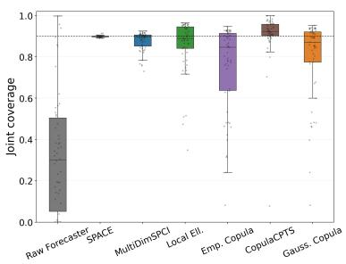  
(a)

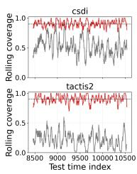

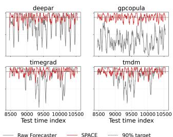  
(b)

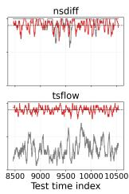  
Figure 1: Joint coverage at the 90% target. Panel (a) shows the distribution of empirical joint coverage. The x-axis evaluates different constructions: Raw Forecaster denotes native sample-based regions without conformal calibration, SPACE is our method, and the rest are competing conformal baselines. The y-axis shows empirical joint coverage, with the dotted line marking the 90% target; better methods concentrate near this line. Panel (b) shows rolling joint coverage on the weather dataset across forecasters. Raw rolling coverage (gray) is unstable and systematically off-target, whereas SPACE (red) stays much closer to the desired level over time.

To address these limitations, we introduce SPACE (Sample-cloud Predictive Adaptive Conformal Ellipsoids), a post-hoc conformal wrapper that directly exploits the probabilistic capabilities of the underlying forecaster. Our primary contributions are summarized as follows:

• Decoupling geometry from calibration. We formalize a principle for multivariate conformal forecasting under non-stationarity: the forecaster’s predictive samples should determine the local shape of the joint region, while conformal calibration scores should determine its radius. Based on this principle, we introduce SPACE, a post-hoc wrapper that constructs ellipsoidal regions using the time-local covariance of the current predictive sample cloud, reducing the adaptation delay associated with residual-based conformal geometries.

• Regime-local adaptive calibration. We propose a backward same-regime testing procedure for calibrating the radius of the forecast-conditioned ellipsoid. By adaptively selecting the longest recent calibration window whose conformity scores remain statistically compatible with the current regime, the method reduces the influence of outdated dynamics while balancing local coverage and statistical efficiency in sequential prediction.

• Theoretical guarantees and error decomposition. We establish finite-sample joint coverage under an idealized same-regime assumption and derive a sequential local coverage-gap bound that separates the effects of sample-based geometry estimation, adaptive window selection, and finite calibration sample size. This analysis clarifies how predictive sample size and calibration-window quality influence local coverage error.

• Extensive empirical validation. We evaluate SPACE across 7 multivariate datasets spanning energy, finance, weather, and traffic domains, 8 diverse probabilistic forecasters (including diffusion, flow, and autoregressive architectures), and 5 competing conformal baselines (MultiDimSPCI, local ellipsoidal CP, and copula-based CP). Across these diverse benchmark pairs, SPACE achieves a median realized joint coverage gap of just 0.2 percentage points from the nominal target. Furthermore, it reduces the overall mean coverage gap by over 80% relative to the strongest baseline (MultiDimSPCI) while consistently improving local calibration stability under distribution shift.

Table 1: Positioning of SPACE relative to representative conformal approaches for multivariate and sequential prediction.
<table><tr><td>Method</td><td></td><td>Sequential TS Joint multivariate set</td><td>Geometry source</td><td></td><td>Requires auxiliary CP model Adaptive calibration window</td></tr><tr><td>Adaptive TS CP [40, 11, 1]</td><td></td><td>x</td><td>Scalar / marginal residuals</td><td>x</td><td>x</td></tr><tr><td>MultiDimSPCI [41]</td><td> $\begin{array} { l } { \displaystyle { \begin{array} { l } { \surd } \\ { \medskip } \end{array} } } \end{array}$ </td><td>√</td><td>Historical residual covariance</td><td>x</td><td>x</td></tr><tr><td>Copula-based CP [23, 32]</td><td>Mixed</td><td>√</td><td>Fitted copula dependence</td><td>√</td><td>x</td></tr><tr><td>FCP [17]</td><td> $\begin{array} { l } { \displaystyle { \begin{array} { l } { \surd } \\ { \medskip } \end{array} } } \end{array}$ </td><td>√</td><td>Learned residual flow</td><td>√</td><td>x</td></tr><tr><td>SPACE (ours)</td><td></td><td>√</td><td>Current predictive samples</td><td>x</td><td>√</td></tr></table>

∗These methods perform adaptive online scalar updates, but do not adaptively select contiguous historical calibration windows.

## 2 Related Work

Sample-generating probabilistic forecasters. Modern forecasters—including autoregressive [31], diffusion [27, 33, 19, 43], copula [30, 3], and flow-based models [14]—encode joint dependencies through predictive sample clouds. However, these native sample regions remain model-implied rather than coverage-calibrated. We treat these models as black boxes, converting their raw predictive samples into formally calibrated joint prediction regions without altering the underlying architecture.

Sequential, localized, and online conformal prediction. A growing literature studies conformal prediction beyond the exchangeable setting. Methods such as EnbPI [40], Adaptive Conformal Inference (ACI) [11], and Conformal PID [1] robustly adapt calibration thresholds or miscoverage levels online. Recent extensions have improved online tracking [6], rolling risk control [1], covariate shift and localized conformal prediction [34, 4, 12]. However, these methods do not specify a forecast-conditioned geometry for conformalized multivariate joint regions.

Multivariate and ellipsoidal conformal prediction. Prior work has developed conformal prediction for cross-sectional multivariate regression using structured dependence via copulas [23, 32] and ellipsoidal sets [24, 13, 10]. For multivariate time series, MultiDimSPCI [41] is the closest benchmark to our work. It constructs sequential ellipsoidal regions by using historical residual covariance and handles temporal dependence through sequential calibration within a fixed-length window. SPACE differs by extracting the ellipsoidal geometry from the current predictive sample cloud—rather than from a historical surrogate—and by adaptively selecting the calibration window via same-regime testing. Another approach, FCP [17], targets multivariate time series by learning a context-conditioned residual flow, whereas SPACE requires no auxiliary generative model fitting.

Positioning of SPACE. SPACE is a conformal wrapper that simultaneously (i) operates on samplegenerating multivariate forecasters without auxiliary model fitting, (ii) derives its multivariate geometry from the current predictive sample cloud rather than historical residuals, and (iii) adapts its calibration window to the current regime. Table 1 summarizes these structural differences.

## 3 Method: SPACE

We consider a probabilistic multivariate forecaster that outputs a set of M predictive samples (e.g., generated trajectories from a conditional generative model) for a target $y _ { t } \in \mathbb { R } ^ { d }$ , where d spans multiple variables, forecast horizons, or both. We denote this predictive sample cloud by

$$
\widehat { \mathcal { Y } } _ { t } = \{ \boldsymbol { \hat { y } } _ { t } ^ { ( m ) } \} _ { m = 1 } ^ { M } , \qquad \boldsymbol { \hat { y } } _ { t } ^ { ( m ) } \in \mathbb { R } ^ { d } .\tag{1}
$$

Given a target miscoverage level $\alpha \in ( 0 , 1 )$ , our goal is to construct a joint prediction set

$$
\mathcal { C } _ { t } ( \alpha ) \subseteq \mathbb { R } ^ { d } \quad \mathrm { s u c h t h a t } \quad \operatorname* { P r } \bigl ( y _ { t } \in \mathcal { C } _ { t } ( \alpha ) \bigr ) \approx 1 - \alpha ,\tag{2}
$$

while maximizing statistical efficiency.

Operating strictly causally over a chronological stream $\{ ( \widehat { \mathcal { V } } _ { t } , y _ { t } ) \} _ { t = 1 } ^ { T }$ , SPACE constructs this set sequentially. At prediction time $t ,$ it uses only the current sample cloud $\widehat { \mathcal { V } } _ { t }$ and realized past data $( s < t )$ . The method consists of two core components: First, SPACE extracts a time-local multivariate geometry directly from $\widehat { \mathcal { V } } _ { t }$ to shape the region (Section 3.1). Second, it calibrates the ellipsoid’s radius via a sequential same-regime procedure that dynamically selects the optimal historical calibration window (Section 3.2).

## 3.1 Sample-derived local geometry

For each time step t, we first construct a median-based center $\mu _ { t }$ from $\widehat { \mathcal { Y } } _ { t } = \{ \hat { y } _ { t } ^ { ( m ) } \} _ { m = 1 } ^ { M }$ , and form predictive residual samples $r _ { t } ^ { ( m ) } = \hat { y } _ { t } ^ { ( m ) } - \mu _ { t }$ . To account for varying marginal scales, we compute the empirical covariance of the standardized residuals:

$$
\widehat { C } _ { t } = \operatorname { C o v } \bigl ( \tilde { r } _ { t } ^ { ( 1 ) } , \dots , \tilde { r } _ { t } ^ { ( M ) } \bigr ) ,\tag{3}
$$

where $\tilde { r } _ { t } ^ { ( m ) } = D ^ { - 1 } r _ { t } ^ { ( m ) }$ and $D = \mathrm { d i a g } ( s _ { 1 } , \ldots , s _ { d } )$ with $s _ { j } > 0$ being the coordinate-wise scale estimate fitted from the wrapper-training segment. Mapping this covariance back to the original scale gives the local multivariate geometry at time t:

$$
\begin{array} { r } { \widehat { \Sigma } _ { t } = D \widehat { C } _ { t } D . } \end{array}\tag{4}
$$

Crucially, as we establish in Proposition 1, this sample-derived covariance acts as a statistically consistent proxy that robustly concentrates around the forecaster’s true conditional geometry.

We define the radial Mahalanobis-type nonconformity score at time t as

$$
e _ { t } = \sqrt { ( y _ { t } - \mu _ { t } ) ^ { \top } \widehat { \Sigma } _ { t } ^ { + } ( y _ { t } - \mu _ { t } ) } .\tag{5}
$$

Here, $\widehat { \Sigma } _ { t } ^ { + }$ denotes the stabilized pseudo-inverse of the local covariance matrix $\widehat { \Sigma } _ { t }$ . Since $\widehat { \Sigma } _ { t }$ is symmetric positive semidefinite, it admits a spectral decomposition $\widehat { \Sigma } _ { t } = U _ { t } \Lambda _ { t } U _ { t } ^ { \top }$ , where $\Lambda _ { t } =$ $\mathrm { d i a g } ( \lambda _ { t , 1 } , \bar { . . . } , \lambda _ { t , d } )$ contains the nonnegative eigenvalues. The stabilized pseudo-inverse is formed by inverting only eigenvalues above an adaptive tolerance $\rho _ { t } \mathbf { : }$

$$
\widehat { \Sigma } _ { t } ^ { + } = U _ { t } \mathrm { d i a g } \left( \frac { \mathbf { 1 } \{ \lambda _ { t , i } > \rho _ { t } \} } { \lambda _ { t , i } } \right) U _ { t } ^ { \top } .\tag{6}
$$

The score in (5) therefore measures how far the realized target lies from the center of the forecast cloud relative to its implied local covariance geometry.

## 3.2 Dynamic same-regime calibration window selection

At forecast time t, let $\mathcal { P } _ { t } = \{ t - p , \ldots , t - 1 \}$ denote the recent probe block of length $p .$ SPACE searches backward over candidate calibration lengths

$$
L \in \{ L _ { \operatorname* { m i n } } , L _ { \operatorname* { m i n } } + h , L _ { \operatorname* { m i n } } + 2 h , . . . , L _ { \operatorname* { m a x } } \} ,\tag{7}
$$

where h is the backward extension step size. For each candidate length $L ,$ define the full candidate block $\mathcal { C } _ { t } ^ { \mathrm { w h o l e } } ( L ) = \{ t - p - L , \dots , t - p - 1 \}$ } and the newly added increment ${ \cal B } _ { t } ^ { \mathrm { i n c } } ( L ) = \{ t - p -$ $L , \dots , { \dot { t } } - p - L + { \dot { h } } - 1 \}$

While the radial score $e _ { t }$ captures overall ellipsoidal distance, it may miss regime shifts that manifest purely through coordinate-wise extremes or directional changes. Therefore, for the conformal uniformity test, we deploy a bundle of three complementary scalar diagnostics. For any observed time $s ,$ let $\tilde { r } _ { s } = D ^ { - 1 } ( y _ { s } - \mu _ { s } )$ denote the realized standardized residual:

$$
s _ { s , 1 } = e _ { s } , \qquad s _ { s , 2 } = \| \tilde { r } _ { s } \| _ { \infty } , \qquad s _ { s , 3 } = | v _ { 1 } ^ { \top } \tilde { r } _ { s } | ,\tag{8}
$$

where $v _ { 1 }$ is the top eigenvector of the training residual covariance in standardized space. Thus, $s _ { s , 1 }$ captures radial size, $s _ { s , 2 }$ captures extremeness, and $s _ { s , 3 }$ captures variation along a dominant direction.

Conformal same-regime uniformity test. For each diagnostic $j \in \{ 1 , 2 , 3 \}$ and candidate block $\mathcal { A } \in \{ \mathcal { C } _ { t } ^ { \mathrm { w h o l e } } ( L ) , \mathcal { B } _ { t } ^ { \mathrm { i n c } } ( L ) \}$ }, SPACE compares the probe scores $\left\{ s _ { u , j } : u \in \mathcal { P } _ { t } \right\}$ with the calibration scores $\{ s _ { v , j } : v \in A \}$ using randomized conformal p-values:

$$
U _ { u , j } ( A ) = \frac { 1 + \# \{ v \in \mathcal { A } : s _ { v , j } > s _ { u , j } \} + \xi _ { u , j } \# \{ v \in \mathcal { A } : s _ { v , j } = s _ { u , j } \} } { | \mathcal { A } | + 1 } , \qquad \xi _ { u , j } \sim \mathrm { U n i f } ( 0 , 1 ) .\tag{9}
$$

The finite-sample validity of this test is formalized in Assumption (A2): clean same-regime blocks have controlled false-rejection probability, while contaminated extensions have controlled falseacceptance probability. Proposition 2 shows that these local test guarantees imply recovery of

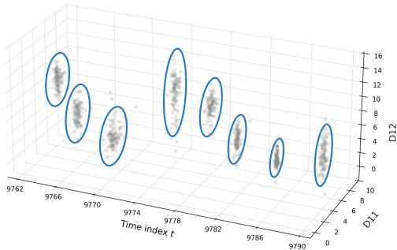  
Figure 2: Illustration of local prediction geometry over time on the Weather–CSDI stream, shown on randomly selected target dimensions $( d _ { 1 1 }$ and $d _ { 1 2 } )$ and time indices. Each ellipse is the 2D projection of SPACE’s ellipsoidal prediction region, while the gray points denote the forecast sample cloud.

the oracle same-regime window with high probability. Accordingly, A passes the test if, for each diagnostic j:

$$
\mathrm { K S } _ { t , L , j } ^ { A } = \operatorname* { s u p } _ { x \in [ 0 , 1 ] } \left. \widehat { F } _ { t , L , j } ^ { A } ( x ) - x \right. < \tau _ { t , L , j } ^ { A } , \qquad j = 1 , 2 , 3 ,\tag{10}
$$

where $\widehat { F } _ { t , L , j } ^ { A } ( x )$ is the empirical CDF of the probe p-values, $\mathrm { K S } _ { t , L , j } ^ { A }$ is the Kolmogorov–Smirnov discrepancy, and $\tau _ { t , L , j } ^ { A }$ is the familywise-corrected Dvoretzky–Kiefer–Wolfowitz (DKW) threshold.

Sequential extension rule. Starting from $L _ { \mathrm { m i n } }$ , SPACE extends the calibration window from L to $L + h$ only if both $\mathcal { C } _ { t } ^ { \mathrm { w h o l e } } ( L )$ and $B _ { t } ^ { \mathrm { i n c } } ( L )$ pass (10). This dual-check guards against dilution, since a stale older increment could be masked by the previously accepted history if only the full block were tested. The selected calibration length $L _ { t }$ is the last accepted length before the first rejection.

## 3.3 Prediction Set

Given $L _ { t } ,$ SPACE calibrates the radius using the same-regime score history and the probe block. Let

$$
\mathcal { H } _ { t } ( L _ { t } ) = \{ e _ { s } : s \in \mathcal { C } _ { t } ^ { \mathrm { w h o l e } } ( L _ { t } ) \cup \mathcal { P } _ { t } \}\tag{11}
$$

denote the final calibration score set available at time t. The radius is defined as

$$
r _ { t } = Q _ { 1 - \alpha _ { t } } \big ( \mathcal { H } _ { t } ( L _ { t } ) \big ) ,\tag{12}
$$

where $Q _ { 1 - \alpha _ { t } } ( \cdot )$ is the empirical quantile at level $1 - \alpha _ { t } .$ , and $\alpha _ { t }$ is updated online using adaptive conformal inference (ACI) [11]. The final prediction set at time t is the ellipsoid

$$
\mathcal { C } _ { t } ( \alpha ) = \left\{ y \in \mathbb { R } ^ { d } : ( y - \mu _ { t } ) ^ { \top } \widehat { \Sigma } _ { t } ^ { + } ( y - \mu _ { t } ) \leq r _ { t } ^ { 2 } \right\} .\tag{13}
$$

Figure 2 visualizes the local prediction geometry used by our method. The ellipses are not fixed in either orientation or aspect ratio: instead, they rotate, elongate, or contract over time to match the local structure of the forecast sample cloud. This behavior is a direct consequence of our time-local covariance estimated from the contemporaneous generative sample cloud.

By rigorously decoupling the sample-based shape estimation from the same-regime scale calibration, SPACE transcends empirical heuristics to achieve the formal finite-sample coverage guarantees and theoretical error decomposition presented next in Section 4.

Computational Efficiency. Despite performing a dynamic backward search at every time step, SPACE introduces minimal operational overhead. The backward search relies strictly on onedimensional empirical CDF comparisons (KS test) over the pre-computed scalar $s _ { t , j }$ , thereby bypassing repeated matrix inversions. Algorithm 1 in Appendix B summarizes the full execution.

## 4 Theoretical Analysis

We analyze through: (i) finite-sample concentration of the sample-cloud covariance, (ii) recovery of a same-regime calibration window, and most importantly — (iii) a sequential coverage-error decomposition. The four sets of formal assumptions and other proofs are deferred to Appendix A.

Assumptions (informal). Let $\mathcal { F } _ { t }$ be the filtration generated by realized targets, forecast clouds, and auxiliary randomness up to time t. We define $\mathbb { P } _ { t } \breve { ( \cdot ) } = \mathbb { P } ( \cdot \mid \breve { \mathcal { F } } _ { t - 1 } )$ as the probability conditional on the immediate past. For same-regime properties, we use $\mathbb { Q } _ { t } ( \cdot ) = \mathbb { P } ( \cdot \mid \mathcal { F } _ { \tau _ { t } } )$ , conditioning only on information prior to the most recent change point $\tau _ { t }$ . Our per-time coverage bounds are thus conditional; unconditional variants follow by integrating over the past.

(A1) Sample-cloud regularity and stable score geometry: conditional on the past, the M forecast samples are i.i.d. sub-Gaussian draws from the forecaster-implied law, their standardized population covariance is well defined, and the resulting Mahalanobis conformal set is locally stable under small perturbations of the sample-cloud covariance [37, 41]. This assumption provides the regularity needed for the $L _ { \Sigma }$ term below and rules out discontinuities caused by atoms in the ideal score distribution or eigenvalues crossing the pseudo-inverse threshold.1 (A2) Same-regime test calibration and shift detectability: clean candidate blocks are rejected by the same-regime test with probability at most $\delta _ { \mathrm { u n i } }$ , while every contaminated extension has at least one diagnostic/block comparison whose falseacceptance probability is at most $\beta _ { \mathrm { d e t } } \ [ 3 9 , 6 ]$ . For the KS-style version used by SPACE, a sufficient DKW-type form is $\beta _ { \mathrm { d e t } } = 2 \exp ( - 2 | \mathcal { P } _ { t } | \Delta _ { \mathrm { s e p } } ^ { 2 } )$ under a population separation margin $\Delta _ { \mathrm { s e p } } > 0 . ( \mathbf { A } \pmb { 3 } )$ Piecewise augmented exchangeability: within each stationary regime, the augmented forecast– target objects $\mathcal { Z } _ { t } = ( Y _ { t } , \widehat { { y } } _ { t } )$ are conditionally exchangeable, and the ideal conformal scores used for coverage inherit this same-regime exchangeability [4, 11]. (A4) Adaptive-level validity: the adaptive miscoverage level $\alpha _ { t }$ is causal and does not use the oracle test score. Formally, its effect is controlled by a tracking term $\bar { \varepsilon } _ { t } ^ { \mathrm { A C I } }$ together with a rank-validity condition for the oracle same-regime conformal predictor using $\alpha _ { t } ,$ , up to the usual finite calibration-sample error [11, 1].

Step 1: Geometry Concentration. First, we establish that the empirical sample-cloud covariance $\widehat { C } _ { t }$ reliably estimates the forecaster-implied conditional geometry.

Proposition 1 (Sample-cloud covariance concentration). Under $( A I ) ,$ for any fixed prediction time t and any $\delta \in ( 0 , 1 )$ , there exists a universal constant $c _ { 0 } > 0$ such that, conditional on $\mathcal { F } _ { t - 1 }$

$$
\mathbb { P } _ { t } \left( \left. \widehat { C } _ { t } - C _ { t } ^ { \star } \right. _ { \mathrm { o p } } \leq \eta _ { M , \delta } \right) \geq 1 - \delta , \qquad \eta _ { M , \delta } = c _ { 0 } K ^ { 2 } \left( \sqrt { \frac { d + \log ( 1 / \delta ) } { M } } + \frac { d + \log ( 1 / \delta ) } { M } \right)\tag{14}
$$

Proof intuition: This follows from the standard operator-norm concentration bound for sample covariance matrices of sub-Gaussian vectors (see [35]).

Remark on Statistical Rate and Generative Capacity. The convergence rate $\eta _ { M , \delta }$ matches the standard dimension dependence for unstructured sub-Gaussian covariance estimation. Unlike classical settings constrained by historical data, the generative sample size M is fully controllable and can theoretically be arbitrarily large, driving the geometry estimation error to zero. Practically, M need not be large: once $M \gtrsim d ,$ the leading $\sqrt { d / M }$ term decays rapidly. Faster estimation rates would require structural assumptions on $C _ { t } ^ { \star }$ , such as sparsity or low rank.

Step 2: Window Recovery. $\rho _ { t } ^ { \mathrm { w i n } } = \mathbb { Q } _ { t } \big ( \widehat { L } _ { t } \neq L _ { t } ^ { \star } \big )$ denotes the window-selection error probability, where $L _ { t } ^ { \star }$ is the largest candidate length whose calibration and probe blocks lie in the current regime.

Proposition 2 (Same-regime window recovery). Under (A2), if the same-regime tests have falserejection probability at most $\delta _ { \mathrm { u n i } }$ and false-acceptance probability at most $\beta _ { \mathrm { d e t } }$ , then

$$
\rho _ { t } ^ { \mathrm { w i n } } \leq 6 | \mathcal { G } | \delta _ { \mathrm { u n i } } + | \mathcal { G } | \beta _ { \mathrm { d e t } } .\tag{15}
$$

In the DKW-style separation case, $\beta _ { \mathrm { d e t } } = 2 \exp \{ - 2 | \mathcal { P } _ { t } | \Delta _ { \mathrm { s e p } } ^ { 2 } \} . ^ { 2 }$ 2

Proof intuition. Because the window extends sequentially, a false rejection at any clean length prematurely halts the search before reaching the oracle length $L _ { t } ^ { \star } . \mathrm { ~ A ~ }$ union bound over the $6 | \mathcal G |$ clean tests (2 block types × 3 diagnostics) controls this premature stopping. Conversely, Assumption (A2) ensures that any invalid length $L > L _ { t } ^ { \star }$ is detected and rejected with probability at least $1 - \beta _ { \mathrm { d e t } }$ . A combined union bound over these candidate lengths yields the final recovery probability [39, 6].

Step 3: Coverage Gap Decomposition. Let $\mathcal { H } _ { t } ^ { \star } = \mathcal { C } _ { t } ^ { \mathrm { w h o l e } } ( L _ { t } ^ { \star } ) \cup \mathcal { P } _ { t } , n _ { t } ^ { \star } = | \mathcal { H } _ { t } ^ { \star } |$ , and $\mathcal { C } _ { t } ^ { \mathrm { A C I } } ( \alpha )$ denote the final prediction set when the nominal target level is $\alpha ,$ allowing the algorithm to use the adaptive internal level $\alpha _ { t }$ . The per-time coverage error can be decomposed into window-selection error, adaptive-level error, finite calibration-sample error, and sample-geometry perturbation error.

Theorem 1. Assume $( A I ) – ( A 4 )$ . For any fixed prediction time t and any $\delta _ { t } ~ \in ~ ( 0 , 1 )$ , suppose $\eta _ { M , \delta _ { t } / ( n _ { t } ^ { \star } + 1 ) } \leq \eta _ { 0 }$ . Then

$$
\left| \mathbb { Q } _ { t } \big ( Y _ { t } \in \mathcal { C } _ { t } ^ { \mathrm { A C I } } ( \alpha ) \big ) - ( 1 - \alpha ) \right| \le \rho _ { t } ^ { \mathrm { w i n } } + \varepsilon _ { t } ^ { \mathrm { A C I } } + \frac { 1 } { n _ { t } ^ { \star } + 1 } + L _ { \Sigma } \eta _ { M , \delta _ { t } / ( n _ { t } ^ { \star } + 1 ) } + \delta _ { t } ,\tag{16}
$$

where $L _ { \Sigma }$ is the score-geometry stability constantfrom (A1), and $\eta _ { M , \delta }$ is the covariance concentration rate from Proposition 1. The window-selection term $\rho _ { t } ^ { \mathrm { w i n } }$ satisfies Proposition 2.

Proof intuition. The proof compares the empirical prediction set with an oracle same-regime set. The coverage gap decomposes into additive penalties for window-selection failure, ACI tracking, finite calibration size, covariance estimation, and the concentration failure probability. The term $\rho _ { t } ^ { \mathrm { w i n } }$ accounts for selecting the wrong window without conditioning on data-dependent search paths [36, 18]. Corollary 1 follows by averaging over t and applying the tower property.

Corollary 1 (Expected empirical average coverage). Under the conditions of Theorem 1, assume the per-time right-hand-side terms are deterministic or hold almost surely under the outer expectation. Let $\begin{array} { r } { \widehat { \mathrm { C o v } } _ { T } \ = \ T ^ { - 1 } \sum _ { t = 1 } ^ { T } \mathbf { 1 } \{ Y _ { t } \ \in \ \mathcal { C } _ { t } ^ { \mathrm { A C I } } ( \alpha ) \} } \end{array}$ , and define ${ \bar { \rho } } _ { T } ^ { \mathrm { w i n } } ~ = ~ T ^ { - 1 } \sum _ { t = 1 } ^ { T } \rho _ { t } ^ { \mathrm { w i n } }$ $\begin{array} { r } { \bar { \varepsilon } _ { T } ^ { \mathrm { A C I } } = T ^ { - 1 } \sum _ { t = 1 } ^ { T } \varepsilon _ { t } ^ { \mathrm { A C I } } , \bar { \eta } _ { T } = T ^ { - 1 } \sum _ { t = 1 } ^ { T } \eta _ { M , \delta _ { t } / ( n _ { t } ^ { \star } + 1 ) } , } \end{array}$ , and $\begin{array} { r } { \bar { \delta } _ { T } = T ^ { - 1 } \sum _ { t = 1 } ^ { T } \delta _ { t } . } \end{array}$ . Then

$$
\left| \widehat { \mathbb { E } [ \mathrm { C o v } _ { T } ] } - ( 1 - \alpha ) \right| \leq \bar { \rho } _ { T } ^ { \mathrm { w i n } } + \bar { \varepsilon } _ { T } ^ { \mathrm { A C I } } + \frac { 1 } { T } \sum _ { t = 1 } ^ { T } \frac { 1 } { n _ { t } ^ { \star } + 1 } + L _ { \Sigma } \bar { \eta } _ { T } + \bar { \delta } _ { T } .\tag{17}
$$

If these terms are random, interpret the averaged right-hand-side terms as their outer expectations.

## 5 Experiments

## 5.1 Experimental setup and metrics

We evaluate SPACE on multivariate forecasting streams produced by eight heterogeneous probabilistic forecasters (TimeGrad [27], CSDI [33], TSFlow [14], DeepAR [31], GP-Copula [30], NsDiff [43], TMDM [19], and TACTiS-2 [3]) across seven real-world datasets summarized in Table 8. We then compare the performance of SPACE against five conformal baselines (MultiDimSPCI [41], Local Ellipsoid [24], CopulaCPTS [32], Empirical Copula and Gaussian Copula [23]). The probabilistic forecasters are trained with a 7:1:2 train/validation/test split on the original dataset. Each conformal wrapper is evaluated with a 6:2:2 train/calibration/test split on the sample streams.

In downstream decision settings, predictive uncertainty should be close to the nominal target, rather than merely exceed it [44, 15, 8]. We therefore report both the coverage gap and the rolling coverage gap. The coverage gap is the absolute deviation between empirical joint coverage and the target level $1 - \alpha .$ , and therefore penalizes both under- and over-coverage. To evaluate efficiency, we report the mean log-volume of the prediction regions, denoted LOGVOL, following prior multivariate conformal work that measures sharpness through region size or volume [41, 17, 42]. This section focuses on the target coverage level $\mathrm { \bar { 1 } } - \alpha = 0 . \bar { 9 } 0$ . The full results at different target coverage levels and other implementation details are deferred to Appendix C and F.

Table 2: Aggregated comparison over all dataset–forecaster pairs. Mean Gap and Median Gap summarize the pair-level absolute coverage gap from the target. Std. LogVol denotes the pairlevel log-volume after standardization within each dataset and target level, so it measures size on a comparable scale across datasets. For Mean Gap and Mean Std. LogVol, the reported standard deviation is the across-pair standard deviation within each wrapper. Mean Std. LogVol and Median Std. LogVol are computed only over pairs whose coverage gap is at most 0.05. Valid Ratio reports the fraction of dataset–forecaster pairs satisfying this coverage-gap threshold.
<table><tr><td>Wrapper</td><td></td><td></td><td></td><td>Mean Gap ↓ Median Gap ↓ Mean Std. LogVol ↓ Median Std. Log Vol ↓</td><td>Valid Ratio</td></tr><tr><td>SPACE</td><td> $\mathbf { 0 . 0 0 3 \pm 0 . 0 0 4 }$ </td><td>0.002</td><td> $- 0 . 1 1 1 \pm 1 . 0 4 3$ </td><td>-0.334</td><td>1.000</td></tr><tr><td>MultiDimSPCI</td><td> $0 . 0 3 2 \pm 0 . 0 4 1$ </td><td>0.013</td><td> $- 0 . 4 3 5 \pm 1 . 0 2 4$ </td><td>-0.804</td><td>0.759</td></tr><tr><td>Local Ellipsoid</td><td> $0 . 0 8 3 \pm 0 . 1 1 1$ </td><td>0.054</td><td> $\mathbf { - 0 . 5 8 0 \ : \pm 0 . 8 7 8 }$ </td><td>-0.753</td><td>0.463</td></tr><tr><td>Empirical Copula</td><td> $0 . 1 6 5 \pm 0 . 2 0 5$ </td><td>0.053</td><td> $0 . 0 3 1 \pm 0 . 6 3 0$ </td><td>0.012</td><td>0.481</td></tr><tr><td>Gaussian Copula</td><td> $0 . 1 3 0 \pm 0 . 1 8 4$ </td><td>0.042</td><td> $0 . 0 0 3 \pm 0 . 6 1 8$ </td><td>-0.037</td><td>0.593</td></tr><tr><td>CopulaCPTS</td><td> $0 . 0 5 7 \pm 0 . 1 1 2$ </td><td>0.034</td><td> $1 . 0 2 1 \pm 0 . 7 8 9$ </td><td>1.037</td><td>0.593</td></tr></table>

## 5.2 Aggregate comparison against conformal wrappers

We first compare SPACE with five strong conformal wrappers from prior work. Table 2 provides the wrapper-level comparison. The full dataset-forecaster level comparison is in Appendix C.

SPACE achieves the best Mean Gap and Median Gap among all compared wrappers, with the smallest standard deviation. This is the main wrapper-level result: the mean coverage gap of SPACE is 0.3 percentage points from the nominal target. The efficiency results are more nuanced. SPACE does not attain the smallest LogVol overall; MultiDimSPCI has the lowest median volume. However, this smaller volume comes with noticeably worse calibration and a lower validity ratio. In particular, the mean coverage gap of SPACE is only about one tenth of that of the strongest baseline, MultiDimSPCI, and SPACE is the only method with a validity ratio of 1.00. This indicates that SPACE is the most consistent wrapper for bringing realized coverage close to the nominal target across diverse datasets and forecasters.

The key point is therefore coverage–efficiency trade-off at the target level. SPACE achieves much better calibration while remaining competitive in median log-volume, which is the more relevant comparison for a conformal wrapper whose purpose is to deliver regions that are both reliable and usable.

## 5.3 Rolling coverage under drift and regime change

Rolling metrics show whether a wrapper stays close to the nominal target locally over time. This is a pattern that could be overlooked by aggregated mean or median measures. We use a rolling window length $w = 3 0$ in all evaluations. Figure 3 reports boxplots for Mean Rolling Gap, P90 Rolling Gap, and Frac. Bad Windows, where lower values indicate better local calibration stability. Mean Rolling Gap averages the absolute deviation between rolling joint coverage and the target level 1 − α over all valid sliding windows. P90 Rolling Gap reports the 90th percentile of these deviations, capturing severe local miscalibration. Frac. Bad Windows is the proportion of windows whose rolling coverage gap exceeds $\delta = 0 . 1 0$ . Table 3 complements the figure by providing the dataset-level breakdown.

Across datasets, SPACE shows its clear advantage over the best baseline in mean rolling gap, especially on the higher-dimensional, more nonstationary settings, where maintaining stable coverage over time is most difficult. In particular, the separation between SPACE and the best competing method is largest on datasets such as electricity and traffic, which have richer joint dependence structure and stronger temporal instability; this suggests that SPACE is especially effective when the calibration problem is genuinely multivariate and the underlying coverage behavior drifts over time. By contrast, on smaller and more stationary datasets, the gap between methods narrows substantially. In ettm1, SPACE and the best baseline perform similarly. A more detailed analysis in Appendix D shows that SPACE’s gains are more pronounced in datasets with stronger covariance drift and more challenging rolling coverage behavior.

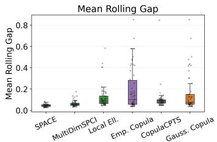

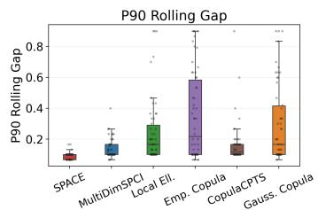

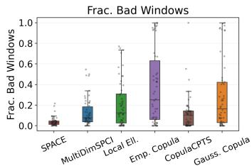  
Figure 3: Distributional boxplots of rolling coverage diagnostics across wrapper benchmark pairs. The center line denotes the median. The three panels report Mean Rolling Gap, P90 Rolling Gap, and Frac. Bad Windows, respectively, with lower values indicating better local calibration stability. Table 3 gives the corresponding dataset-level breakdown.

Table 3: Dataset-level rolling coverage diagnostics for conformal wrappers at the 90% target. Lower is better for all metrics. These metrics evaluate local calibration stability under drift and regime change. SPACE performs best or near-best on all datasets.
<table><tr><td>Dataset</td><td>Metric</td><td>SPACE</td><td>MultiDimSPCI</td><td>Local Ell.</td><td>Emp. Copula</td><td>Gauss. Copula</td><td>CopulaCPTS</td></tr><tr><td rowspan="3">electricity</td><td>Mean Rolling Gap ↓</td><td>0.041</td><td>0.109</td><td>0.278</td><td>0.326</td><td>0.125</td><td>0.082</td></tr><tr><td>P90 Rolling Gap ↓</td><td>0.086</td><td>0.214</td><td>0.557</td><td>0.556</td><td>0.257</td><td>0.100</td></tr><tr><td>Frac. Bad Windows ↓</td><td>0.021</td><td>0.360</td><td>0.584</td><td>0.689</td><td>0.298</td><td>0.010</td></tr><tr><td rowspan="3">etth1</td><td>Mean Rolling Gap ↓</td><td>0.032</td><td>0.044</td><td>0.074</td><td>0.048</td><td>0.049</td><td>0.072</td></tr><tr><td>P90 Rolling Gap ↓</td><td>0.067</td><td>0.092</td><td>0.133</td><td>0.096</td><td>0.096</td><td>0.112</td></tr><tr><td>Frac. Bad Windows ↓</td><td>0.006</td><td>0.014</td><td>0.074</td><td>0.020</td><td>0.010</td><td>0.041</td></tr><tr><td rowspan="3">ettm1</td><td>Mean Rolling Gap ↓</td><td>0.054</td><td>0.051</td><td>0.083</td><td>0.062</td><td>0.063</td><td>0.107</td></tr><tr><td>P90 Rolling Gap ↓</td><td>0.108</td><td>0.100</td><td>0.146</td><td>0.112</td><td>0.108</td><td>0.204</td></tr><tr><td>Frac. Bad Windows ↓</td><td>0.065</td><td>0.047</td><td>0.067</td><td>0.054</td><td>0.038</td><td>0.185</td></tr><tr><td rowspan="3">ettm2</td><td>Mean Rolling Gap ↓</td><td>0.045</td><td>0.055</td><td>0.070</td><td>0.067</td><td>0.066</td><td>0.065</td></tr><tr><td>P90 Rolling Gap ↓</td><td>0.096</td><td>0.100</td><td>0.146</td><td>0.112</td><td>0.108</td><td>0.117</td></tr><tr><td>Frac. Bad Windows ↓</td><td>0.029</td><td>0.061</td><td>0.118</td><td>0.091</td><td>0.072</td><td>0.077</td></tr><tr><td rowspan="3">exchange</td><td>Mean Rolling Gap ↓</td><td>0.050</td><td>0.067</td><td>0.156</td><td>0.257</td><td>0.250</td><td>0.211</td></tr><tr><td>P90 Rolling Gap ↓</td><td>0.100</td><td>0.163</td><td>0.263</td><td>0.444</td><td>0.436</td><td>0.313</td></tr><tr><td>Frac. Bad Windows ↓</td><td>0.066</td><td>0.162</td><td>0.225</td><td>0.460</td><td>0.435</td><td>0.296</td></tr><tr><td rowspan="3">traffic</td><td>Mean Rolling Gap ↓</td><td>0.055</td><td>0.069</td><td>0.103</td><td>0.467</td><td>0.467</td><td>0.072</td></tr><tr><td>P90 Rolling Gap ↓</td><td>0.100</td><td>0.157</td><td>0.205</td><td>0.676</td><td>0.676</td><td>0.105</td></tr><tr><td>Frac. Bad Windows ↓</td><td>0.039</td><td>0.174</td><td>0.281</td><td>0.950</td><td>0.950</td><td>0.038</td></tr><tr><td rowspan="3">weather</td><td>Mean Rolling Gap ↓</td><td>0.052</td><td>0.073</td><td>0.121</td><td>0.198</td><td>0.167</td><td>0.111</td></tr><tr><td>P90 Rolling Gap ↓</td><td>0.096</td><td>0.142</td><td>0.288</td><td>0.488</td><td>0.408</td><td>0.204</td></tr><tr><td>Frac. Bad Windows ↓</td><td>0.051</td><td>0.136</td><td>0.173</td><td>0.441</td><td>0.344</td><td>0.166</td></tr></table>

## 6 Conclusion

In this paper, we introduced SPACE, a post-hoc conformal wrapper that bridges the gap between the rich uncertainty representations of modern probabilistic forecasters and the rigorous calibration guarantees of conformal prediction. By decoupling the estimation of multivariate geometry—extracted directly from the predictive sample cloud—from the sequential calibration of the region’s radius, SPACE overcomes the adaptation delays inherent in historical residual-based methods. Our theoretical analysis establishes formal finite-sample coverage guarantees under stated assumptions, and extensive experiments demonstrate that SPACE consistently tightens realized coverage toward the nominal target across diverse forecasting architectures (e.g., diffusion, flow, and autoregressive models) under non-stationarity. Ultimately, this work demonstrates that predictive sample clouds contain valuable geometric signals that can be exploited for calibrated predictive inference. Natural extensions of this framework include generalizing the set geometry beyond ellipsoids to capture non-convex predictive topologies.

## 7 Limitations

This work has two main limitations. First, SPACE depends on the quality of the predictive sample cloud produced by the generative forecasters. The conformal calibration can correct the overall scale of the prediction region, but the local covariance geometry is still estimated from generated samples.

Therefore, if the forecaster produces biased or insufficiently diverse samples, the calibrated regions may remain valid only at the cost of reduced efficiency. The second limitation concerns adaptation under difficult regime dynamics. When changes are gradual, recent scores may not show a sharp enough diagnostic signal; when changes are frequent, little same-regime history may be available. In either case, SPACE may select a window that is not fully representative of the current regime, leading to coverage deviations. This challenge is shared by time-series uncertainty calibration methods without external change indicators, where adaptation must be inferred from observed errors.

## References

[1] A. Angelopoulos, E. Candes, and R. J. Tibshirani. Conformal PID control for time series prediction. Advances in Neural Information Processing Systems, 36:23047–23074, 2023.

[2] A. N. Angelopoulos and S. Bates. A gentle introduction to conformal prediction and distribution-free uncertainty quantification. arXiv preprint arXiv:2107.07511, 2021.

[3] A. Ashok, É. Marcotte, V. Zantedeschi, N. Chapados, and A. Drouin. TACTis-2: Better, faster, simpler attentional copulas for multivariate time series. In The Twelfth International Conference on Learning Representations, 2024.

[4] R. F. Barber, E. J. Candes, A. Ramdas, and R. J. Tibshirani. Conformal prediction beyond exchangeability. The Annals ofStatistics, 51(2):816–845, 2023.

[5] M. Basseville, I. V. Nikiforov, et al. Detection of abrupt changes: theory and application, volume 104. Prentice Hall, Englewood Cliffs, 1993.

[6] A. Bhatnagar, H. Wang, C. Xiong, and Y. Bai. Improved online conformal prediction via strongly adaptive online learning. In International Conference on Machine Learning, pages 2337–2363. PMLR, 2023.

[7] T. T. Cai, C.-H. Zhang, and H. H. Zhou. Optimal rates of convergence for covariance matrix estimation. The Annals ofStatistics, 38(4):2118–2144, 2010.

[8] L. Deng, H. Xiong, F. Wu, S. Kapoor, S. Gosh, Z. Shahn, and L.-w. Lehman. Uncertainty quantification for conditional treatment effect estimation under dynamic treatment regimes. In Proceedings of the 4th Machine Learning for Health Symposium, volume 259, pages 248–266. PMLR, 2025.

[9] A. Dvoretzky, J. Kiefer, and J. Wolfowitz. Asymptotic minimax character of the sample distribution function and of the classical multinomial estimator. The Annals of Mathematical Statistics, pages 642–669, 1956.

[10] S. Feldman, S. Bates, and Y. Romano. Calibrated multiple-output quantile regression with representation learning. Journal ofMachine Learning Research, 24(24):1–48, 2023.

[11] I. Gibbs and E. Candes. Adaptive conformal inference under distribution shift. Advances in Neural Information Processing Systems, 34:1660–1672, 2021.

[12] L. Guan. Localized conformal prediction: A generalized inference framework for conformal prediction. Biometrika, 110(1):33–50, 2023.

[13] C. Johnstone and E. Ndiaye. Exact and approximate conformal inference for multi-output regression. In Proceedings of the Fourteenth Symposium on Conformal and Probabilistic Prediction with Applications, volume 266, pages 153–172. PMLR, 2025.

[14] M. Kollovieh, M. Lienen, D. Lüdke, L. Schwinn, and S. Günnemann. Flow matching with gaussian process priors for probabilistic time series forecasting. In The Thirteenth International Conference on Learning Representations, 2025.

[15] V. Kuleshov and S. Deshpande. Calibrated and sharp uncertainties in deep learning via density estimation. In International Conference on Machine Learning, pages 11683–11693. PMLR, 2022.

[16] G. Lai, W.-C. Chang, Y. Yang, and H. Liu. Modeling long- and short-term temporal patterns with deep neural networks. In The 41st international ACM SIGIR conference on research & development in information retrieval, pages 95–104, 2018.

[17] J. Lee, C. Xu, and Y. Xie. Flow-based conformal prediction for multi-dimensional time series. In The Fourteenth International Conference on Learning Representations, 2026.

[18] J. Lei, M. G’Sell, A. Rinaldo, R. J. Tibshirani, and L. Wasserman. Distribution-free predictive inference for regression. Journal ofthe American Statistical Association, 113(523):1094–1111, 2018.

[19] Y. Li, W. Chen, X. Hu, B. Chen, B. Sun, and M. Zhou. Transformer-modulated diffusion models for probabilistic multivariate time series forecasting. In The Twelfth International Conference on Learning Representations, 2024.

[20] C. Marx, S. Zalouk, and S. Ermon. Calibration by distribution matching: Trainable kernel calibration metrics. In Advances in Neural Information Processing Systems, volume 36, pages 25910–25928, 2023.

[21] P. Massart. The tight constant in the dvoretzky-kiefer-wolfowitz inequality. The Annals of Probability, pages 1269–1283, 1990.

[22] D. S. Matteson and N. A. James. A nonparametric approach for multiple change point analysis of multivariate data. Journal ofthe American Statistical Association, 109(505):334–345, 2014.

[23] S. Messoudi, S. Destercke, and S. Rousseau. Copula-based conformal prediction for multi-target regression. Pattern Recognition, 120:108101, 2021.

[24] S. Messoudi, S. Destercke, and S. Rousseau. Ellipsoidal conformal inference for multi-target regression. In Conformal and Probabilistic Prediction with Applications, pages 294–306. PMLR, 2022.

[25] T. Miyato, T. Kataoka, M. Koyama, and Y. Yoshida. Spectral normalization for generative adversarial networks. In International Conference on Learning Representations, 2018.

[26] S. S. Rangapuram, M. W. Seeger, J. Gasthaus, L. Stella, Y. Wang, and T. Januschowski. Deep state space models for time series forecasting. Advances in Neural Information Processing Systems, 31, 2018.

[27] K. Rasul, C. Seward, I. Schuster, and R. Vollgraf. Autoregressive denoising diffusion models for multivariate probabilistic time series forecasting. In International Conference on Machine Learning, pages 8857–8868. PMLR, 2021.

[28] K. Rasul, A.-S. Sheikh, I. Schuster, U. M. Bergmann, and R. Vollgraf. Multivariate probabilistic time series forecasting via conditioned normalizing flows. In International Conference on Learning Representations, 2021.

[29] Y. Romano, E. Patterson, and E. Candes. Conformalized quantile regression. Advances in Neural Information Processing Systems, 32, 2019.

[30] D. Salinas, M. Bohlke-Schneider, L. Callot, R. Medico, and J. Gasthaus. High-dimensional multivariate forecasting with low-rank gaussian copula processes. Advances in Neural Information Processing Systems, 32, 2019.

[31] D. Salinas, V. Flunkert, J. Gasthaus, and T. Januschowski. DeepAR: Probabilistic forecasting with autoregressive recurrent networks. International journal offorecasting, 36(3):1181–1191, 2020.

[32] S. H. Sun and R. Yu. Copula conformal prediction for multi-step time series prediction. In The Twelfth International Conference on Learning Representations, 2024.

[33] Y. Tashiro, J. Song, Y. Song, and S. Ermon. CSDI: Conditional score-based diffusion models for probabilistic time series imputation. Advances in Neural Information Processing Systems, 34:24804–24816, 2021.

[34] R. J. Tibshirani, R. Foygel Barber, E. Candes, and A. Ramdas. Conformal prediction under covariate shift. Advances in Neural Information Processing Systems, 32, 2019.

[35] R. Vershynin. High-dimensional probability: An introduction with applications in data science, volume 47. Cambridge University Press, 2018.

[36] V. Vovk, A. Gammerman, and G. Shafer. Algorithmic learning in a random world. Springer, 2005.

[37] M. J. Wainwright. High-dimensional statistics: A non-asymptotic viewpoint, volume 48. Cambridge University Press, 2019.

[38] H. Wu, J. Xu, J. Wang, and M. Long. Autoformer: Decomposition transformers with auto-correlation for long-term series forecasting. Advances in Neural Information Processing Systems, 34:22419–22430, 2021.

[39] Y. Xie, J. Huang, and R. Willett. Change-point detection for high-dimensional time series with missing data. IEEE Journal of Selected Topics in Signal Processing, 7(1):12–27, 2013.

[40] C. Xu and Y. Xie. Conformal prediction interval for dynamic time-series. In Proceedings of the 38th International Conference on Machine Learning, volume 139, pages 11559–11569. PMLR, 18–24 Jul 2021.

[41] C. Xu, H. Jiang, and Y. Xie. Conformal prediction for multi-dimensional time series by ellipsoidal sets. In Proceedings of the 41st International Conference on Machine Learning, volume 235, pages 55076–55099. PMLR, 21–27 Jul 2024.

[42] Q. Yang, Q. J. Zhu, J. Giezendanner, Y. Marzouk, S. Bates, and S. Wang. Conformal prediction for generative models via adaptive cluster-based density estimation. arXiv preprint arXiv:2601.22298, 2026.

[43] W. Ye, Z. Xu, and N. Gui. Non-stationary diffusion for probabilistic time series forecasting. In Proceedings ofthe 42nd International Conference on Machine Learning, volume 267, pages 72112–72130. PMLR, 2025.

[44] S. Zhao, M. Kim, R. Sahoo, T. Ma, and S. Ermon. Calibrating predictions to decisions: A novel approach to multi-class calibration. Advances in Neural Information Processing Systems, 34:22313–22324, 2021.

[45] H. Zhou, S. Zhang, J. Peng, S. Zhang, J. Li, H. Xiong, and W. Zhang. Informer: Beyond efficient transformer for long sequence time-series forecasting. In Proceedings ofthe AAAI conference on artificial intelligence, volume 35, pages 11106–11115, 2021.

## A Proofs for Section 4

## A.1 Assumptions.

We work under the following four assumptions. They are stated in the same order and with the same meaning as in Section 4. Let $\mathcal { F } _ { t }$ be the natural filtration generated by realized targets, forecast sample clouds, and all auxiliary randomization up to time t. Let $\tau _ { t } < t$ denote the last change point before prediction time t. Let $\mathbb { Q } _ { t } ( \cdot )$ denote the probability measure conditional on the pre-regime information $\mathcal { F } _ { \tau _ { t } }$ and the deterministic window-design parameters, but marginal over the realized augmented objects inside the current regime. Let $\mathbb { E } _ { \mathbb { Q } _ { t } } \big [ \cdot \big ]$ be the corresponding expectation.

(A1) Conditional sample-cloud regularity and stable score geometry. We assume that, at each prediction time $t ,$ the forecast sample cloud is conditionally i.i.d. and sufficiently lighttailed after standardization. We also assume that the Mahalanobis conformal set is locally stable with respect to covariance-estimation error, in a pathwise sense conditional on the realized covariance estimates. These regularity conditions are standard in high-dimensional probability and are adapted from the foundational framework established by Vershynin [35]. More formally:

(A1a) Conditional sample-cloud law. Conditional on $\mathcal { F } _ { t - 1 }$

$$
\hat { y } _ { t } ^ { ( 1 ) } , \ldots , \hat { y } _ { t } ^ { ( M ) } \overset { \mathrm { i . i . d . } } { \sim } \widehat { P } _ { t } ( \cdot \vert \mathcal { F } _ { t - 1 } ) .\tag{18}
$$

Let $D = \mathrm { d i a g } ( s _ { 1 } , \ldots , s _ { d } )$ be fixed before time t, with

$$
0 < s _ { \operatorname* { m i n } } \le s _ { j } \le s _ { \operatorname* { m a x } } < \infty .
$$

For an $\mathcal { F } _ { t - 1 }$ -measurable center $\mu _ { t } ^ { \star }$ , define

$$
\xi _ { t } ^ { ( m ) } = D ^ { - 1 } \big ( \hat { y } _ { t } ^ { ( m ) } - \mu _ { t } ^ { \star } \big ) , \qquad m = 1 , \ldots , M .
$$

(A1b) Sub-Gaussian residuals and covariance estimation target. Conditional on $\mathcal { F } _ { t - 1 }$ , the vectors $\xi _ { t } ^ { ( 1 ) } , \dots , \xi _ { t } ^ { ( M ) }$ are mean-zero, K-sub-Gaussian, and have conditional covariance

$$
C _ { t } ^ { \star } = \mathrm { C o v } \left( \xi _ { t } ^ { ( m ) } \mid \mathcal { F } _ { t - 1 } \right) .\tag{19}
$$

The empirical covariance $\widehat { C } _ { t }$ in (3) is the centered empirical covariance of the standardized sample cloud. Hence it is unchanged by replacing the ideal center $\mu _ { t } ^ { \star }$ with the median-based center $\mu _ { t }$ used in the method.

(A1c) Pathwise stability of the conformal set under covariance perturbation. For any deterministic or previsible same-regime calibration index set $\mathcal { H } _ { t }$ , and in particular for the oracle set $\mathcal { H } _ { t } ^ { \star }$ , let $\mathcal { C } _ { t } ^ { \star } ( \alpha _ { t } )$ denote the conformal set constructed from ideal scores, and let $\mathcal { C } _ { t } ( \alpha _ { t } )$ denote the conformal set constructed from empirical scores.

For such a set $\mathcal { H } _ { t }$ , define the conditional law

$$
\widetilde { \mathbb { Q } } _ { t , \mathcal { H } _ { t } } ( \cdot ) = \mathbb { P } \Big ( \cdot \mid \mathcal { F } _ { \tau _ { t } } , ( \widehat { C } _ { s } ) _ { s \in \mathcal { H } _ { t } \cup \{ t \} } \Big ) \ .
$$

There exist constants $\eta _ { 0 } > 0$ and $L _ { \Sigma } < \infty$ such that, on the event

$$
\operatorname* { m a x } _ { s \in \mathcal { H } _ { t } \cup \{ t \} } \| \widehat { C } _ { s } - C _ { s } ^ { \star } \| _ { \mathrm { o p } } \leq \eta \leq \eta _ { 0 } ,
$$

we have

$$
\begin{array} { r } { \left| \widetilde { \mathbb { Q } } _ { t , \mathcal { H } _ { t } } \big ( Y _ { t } \in \mathcal { C } _ { t } ( \alpha _ { t } ) \big ) - \widetilde { \mathbb { Q } } _ { t , \mathcal { H } _ { t } } \big ( Y _ { t } \in \mathcal { C } _ { t } ^ { \star } ( \alpha _ { t } ) \big ) \right| \le L _ { \Sigma } \eta . } \end{array}\tag{20}
$$

This condition is implied, for example, by local stability of the stabilized pseudo-inverse map together with an anti-concentration condition for the ideal radial score distribution.

(A2) Same-regime test calibration and contaminated-window detectability. A2 is a finitesample version of two standard requirements in change-point and sequential goodness-of-fit testing: size control under homogeneous samples and power under separated alternatives. Fix a prediction time t, and let τt denote the most recent regime change before time t. Thus, the current regime contains the observations indexed by

$$
\{ \tau _ { t } + 1 , \ldots , t - 1 \} .
$$

Let $\mathbb { Q } _ { t }$ denote the probability law, or the relevant conditional probability law, governing the data and random test statistics at time t. This assumption states that same-regime candidate blocks are not rejected too often, while any candidate window that crosses a regime boundary is detected with high probability. The assumption is stated directly at the level of the finite-sample test errors used by the window-selection algorithm. This calibration-versus-detectability form is standard in change-point analysis: homogeneous samples require size control, while contaminated samples require a separation condition large enough to overcome sampling noise [5, 39].

More formally:

(A2a) Oracle same-regime window. Let

$$
\mathcal { G } = \{ L _ { \operatorname* { m i n } } , L _ { \operatorname* { m i n } } + h , \ldots , L _ { \operatorname* { m a x } } \}
$$

be the finite grid of candidate window lengths, where $L _ { \mathrm { m i n } }$ and $L _ { \mathrm { m a x } }$ are the minimum and maximum candidate lengths, respectively, and h is the grid step size. Let $\mathcal { P } _ { t }$ denote the probe block at time $t ,$ namely the recent block used as the reference block for testing whether a candidate block belongs to the same regime. Assume that $\mathcal { P } _ { t }$ lies inside the current regime and that there exists at least one same-regime candidate length. For each $L \in { \mathcal { G } }$ , let $\mathcal { C } _ { t } ^ { \mathrm { w h o l e } } ( L )$ denote the whole candidate block of length L used by the algorithm. Define the oracle same-regime length $L _ { t } ^ { \star }$ as the largest candidate length whose whole candidate block and probe block are both contained in the current regime:

$$
L _ { t } ^ { \star } = \operatorname* { m a x } \Bigl \{ L \in \mathcal { G } : \mathcal { C } _ { t } ^ { \mathrm { w h o l e } } ( L ) \cup \mathcal { P } _ { t } \subseteq \{ \tau _ { t } + 1 , \ldots , t - 1 \} \Bigr \} .\tag{21}
$$

For each candidate block

$$
\mathcal { A } \in \{ \mathcal { C } _ { t } ^ { \mathrm { w h o l e } } ( L ) , \mathcal { B } _ { t } ^ { \mathrm { i n c } } ( L ) \} ,
$$

where $B _ { t } ^ { \mathrm { i n c } } ( L )$ denotes the incremental block associated with candidate length $L ,$ and for each diagnostic $j \in \{ 1 , 2 , 3 \}$ , let $\mathrm { K S } _ { t , L , j } ^ { A }$ denote the empirical KS-type discrepancy in (10). Here $j$ indexes the diagnostic being tested, $L$ indexes the candidate length, and A indexes the tested candidate block. Let $\tau _ { t , L , j } ^ { A ^ { - } }$ denote the corresponding rejection threshold for this KS-type test. The thresholds are deterministic functions of the window-design parameters, sample sizes, and nominal test levels, or are measurable with respect to information outside the realized test statistics. For the KS-type diagnostics used here, such thresholds can be justified by the Dvoretzky–Kiefer–Wolfowitz inequality and Massart’s sharp constant, which give finite-sample uniform bounds for empirical distribution functions [9, 21].

(A2b) Clean-block calibration. For every clean tested block, meaning every tested block A whose union with the probe block $\mathcal { P } _ { t }$ lies entirely inside the current regime,

$$
A \cup \mathcal { P } _ { t } \subseteq \{ \tau _ { t } + 1 , \ldots , t - 1 \} ,
$$

the probability of false rejection is controlled:

$$
\mathbb { Q } _ { t } \left( \mathrm { K S } _ { t , L , j } ^ { \mathcal { A } } > \tau _ { t , L , j } ^ { \mathcal { A } } \right) \leq \delta _ { \mathrm { u n i } } .\tag{22}
$$

Here $\delta _ { \mathrm { u n i } }$ is the per-test, or union-adjusted, upper bound on the false rejection probability. This is the finite-sample size-control requirement for the same-regime test. When A and $\mathcal { P } _ { t }$ are drawn from the same regime, the population discrepancy is zero, and the empirical discrepancy is controlled by standard empirical-process concentration; the constant $\delta _ { \mathrm { u n i } }$ can also absorb a union bound over the finite set of candidate lengths, blocks, and diagnostics [9, 21].

(A2c) Contaminated-window detectability. For every $L > L _ { t } ^ { \star }$ , the candidate length L is longer than the oracle same-regime length and hence its associated candidate window necessarily crosses a regime boundary. The assumption requires that at least one tested pair

$$
( \boldsymbol { A } , \boldsymbol { j } ) , \qquad \boldsymbol { \mathcal { A } } \in \{ \mathcal { C } _ { t } ^ { \mathrm { w h o l e } } ( L ) , \mathcal { B } _ { t } ^ { \mathrm { i n c } } ( L ) \} , \quad \boldsymbol { j } \in \{ 1 , 2 , 3 \} ,
$$

detects this contamination. Specifically, the probability that this contaminated tested pair fails to reject is bounded by $\beta _ { \mathrm { d e t } }$

$$
\mathbb { Q } _ { t } \left( \mathrm { K S } _ { t , L , j } ^ { \mathcal { A } } \leq \tau _ { t , L , j } ^ { \mathcal { A } } \right) \leq \beta _ { \mathrm { d e t } } .\tag{23}
$$

Here $\beta _ { \mathrm { d e t } }$ is the upper bound on the missed-detection probability. This is the corresponding finite-sample power requirement. It is a local identifiability condition: if a candidate window crosses a regime boundary, then at least one of the diagnostics must see a population distributional shift large enough to be detected with probability at least $1 - \beta _ { \mathrm { { d e t } } }$ , as in standard abrupt-change and high-dimensional change-point formulations [5, 39].

A sufficient, but not necessary, condition for (23) is the following. For some tested pair $( \mathcal { A } , j )$ , let $H _ { t , L , j } ^ { A }$ denote the population distribution function, or population probabilityintegral-transform target, of the diagnostic values comparing the candidate block A with the probe block $\mathcal { P } _ { t }$ . Let $\operatorname { I d } ( x ) = x$ denote the identity distribution function on [0, 1], which corresponds to the ideal same-regime case after probability-integral transformation. Let $\widehat { F } _ { t . L . i } ^ { A }$ denote the empirical distribution function estimated from the probe block, and let $\Delta _ { \mathrm { s e p } } ^ { \cdot \because } > 0$ denote the separation margin between the population discrepancy and the test threshold. Suppose

$$
\begin{array} { r } { \| H _ { t , L , j } ^ { \mathcal { A } } - \mathrm { I d } \| _ { \infty } \geq \tau _ { t , L , j } ^ { \mathcal { A } } + \Delta _ { \mathrm { s e p } } , } \end{array}
$$

where $\| \cdot \| _ { \infty }$ denotes the uniform sup-norm distance, and suppose that the empirical distribution function satisfies the concentration bound

$$
\mathbb { Q } _ { t } \left( \| \widehat { F } _ { t , L , j } ^ { A } - H _ { t , L , j } ^ { A } \| _ { \infty } > \Delta _ { \mathrm { s e p } } \right) \leq 2 \exp \{ - 2 | \mathcal { P } _ { t } | \Delta _ { \mathrm { s e p } } ^ { 2 } \} .
$$

Here $| \mathcal { P } _ { t } |$ is the number of observations in the probe block. Then (23) holds with

$$
\beta _ { \mathrm { d e t } } = 2 \exp \{ - 2 | \mathcal { P } _ { t } | \Delta _ { \mathrm { s e p } } ^ { 2 } \} .
$$

Indeed, the population separation margin $\Delta _ { \mathrm { s e p } }$ ensures that the empirical KS statistic can fall below the threshold only if the empirical process deviates from its population target by more than $\Delta _ { \mathrm { s e p } }$ . The displayed exponential bound is therefore exactly the DKW/Massart-type tail probability for this failure event [9, 21].

(A3) Piecewise augmented exchangeability. This assumption imposes the standard exchangeability condition used in conformal prediction, but only locally within the current regime. Specifically, conditional on the pre-regime information $\mathcal { F } _ { \tau _ { t } }$ , where $\tau _ { t }$ is the most recent regime change before time t, the observations inside the current regime are treated as exchangeable. This is the classical condition under which conformal methods obtain finite sample rank validity and distribution-free coverage [36, 18, 2]. Here the condition is imposed piecewise, after conditioning on the regime start, which is natural in nonstationary settings where exchangeability is expected to hold only locally rather than over the entire time series. More formally, for each $s = \tau _ { t } + 1 , \ldots , t ,$ define the augmented forecast-target object

$$
\mathcal { Z } _ { s } = ( Y _ { s } , \widehat { \mathcal { V } } _ { s } ) ,
$$

where $Y _ { s }$ is the realized target and $\widehat { \mathcal { V } } _ { s }$ is the corresponding forecast object, such as a predictive distribution, trajectory forecast, or prediction set. The augmented objects

$$
\mathcal { Z } _ { \tau _ { t } + 1 } , \ldots , \mathcal { Z } _ { t }
$$

are conditionally exchangeable given $\mathcal { F } _ { \tau _ { t } }$ . That is, for any finite permutation π of $\{ \tau _ { t } +$ $1 , \ldots , t \}$

$$
( \mathcal { Z } _ { \tau _ { t } + 1 } , \dots , \mathcal { Z } _ { t } ) \mid \mathcal { F } _ { \tau _ { t } } \overset { d } { = } \left( \mathcal { Z } _ { \pi ( \tau _ { t } + 1 ) } , \dots , \mathcal { Z } _ { \pi ( t ) } \right) \mid \mathcal { F } _ { \tau _ { t } } .
$$

This is the regime-local analogue of the exchangeability assumption commonly used in split conformal prediction and related finite-sample conformal procedures [36, 18, 29].

The diagnostics and ideal conformity scores are assumed to be generated from these augmented objects by common measurable permutation-equivariant maps, possibly together with auxiliary tie-breaking random variables that are independent of the augmented objects conditional on $\mathcal { F } _ { \tau _ { t } }$ . Permutation equivariance means that if the augmented objects are permuted, the resulting diagnostics or scores are permuted in the same way, rather than changing their joint distribution. Therefore, by the standard closure property of exchangeability under common measurable equivariant transformations, the ideal score collection for any same-regime index set $\mathcal { H } _ { t }$

$$
\{ e _ { s } ^ { \star } : s \in \mathcal { H } _ { t } \} \cup \{ e _ { t } ^ { \star } \} ,
$$

is conditionally exchangeable under $\mathbb { Q } _ { t }$ . This is the exact property needed in the conformal coverage proof: the test score $e _ { t } ^ { \star }$ has a uniform rank among the same-regime calibration scores, up to the usual tie-breaking convention [36, 2].

(A4) ACI adaptation error and rank validity. Let $\mathcal { C } _ { t , \mathrm { o r } } ^ { \star } ( \alpha _ { t } )$ denote the oracle same-regime conformal set constructed from the ideal scores on $\mathcal { H } _ { t } ^ { \star }$ using the adaptive miscoverage level $\alpha _ { t } \in [ 0 , 1 ]$ , and let $n _ { t } ^ { \star } = | \mathcal { H } _ { t } ^ { \star } |$ be the number of oracle same-regime calibration scores. This assumption separates the effect of adaptive level selection from the usual conformal rank-validity argument. Such a separation is standard in adaptive conformal inference: the adaptive procedure controls or tracks the target miscoverage level over time, while the conformal coverage argument relies on the rank of the test score among the calibration scores [11, 1, 6].

(A4a) Mean tracking error. The adaptive level remains close to the nominal level in expectation:

$$
\begin{array} { r } { \mathbb { E } _ { \mathbb { Q } _ { t } } [ | \alpha _ { t } - \alpha | ] \leq \varepsilon _ { t } ^ { \mathrm { A C I } } . } \end{array}\tag{24}
$$

Here α is the target miscoverage level, $\alpha _ { t }$ is the data-adaptive level selected by the ACI update rule at time t, and $\varepsilon _ { t } ^ { \mathrm { A C I } }$ summarizes the finite-sample adaptation or tracking error of this update. This type of condition is the standard way to abstract the performance of an adaptive conformal update under distribution shift: rather than requiring $\alpha _ { t } = \alpha$ exactly at every time point, one allows the online update to deviate from the target level by a controlled amount [11, 1]. Strongly adaptive online-learning formulations provide one route for bounding such tracking errors over nonstationary sequences [6].

(A4b) Rank validity under adaptivity. Conditional on $\alpha _ { t }$ , the rank of the test ideal score among the $n _ { t } ^ { \star } + 1$ oracle ideal scores

$$
\{ e _ { s } ^ { \star } : s \in \mathcal { H } _ { t } ^ { \star } \} \cup \{ e _ { t } ^ { \star } \}
$$

is uniformly distributed. Equivalently, the oracle ideal conformal predictor satisfies the finite-sample rank bound

$$
\left| \mathbb { Q } _ { t } \big ( Y _ { t } \in \mathcal { C } _ { t , \mathrm { o r } } ^ { \star } ( \alpha _ { t } ) \big ) - ( 1 - \mathbb { E } _ { \mathbb { Q } _ { t } } [ \alpha _ { t } ] ) \right| \leq \frac { 1 } { n _ { t } ^ { \star } + 1 } .\tag{25}
$$

This is the usual finite-sample conformal rank argument, applied after conditioning on the adaptive level. It is satisfied, for example, when $\alpha _ { t }$ is predictable with respect to the score-ranking step, meaning that it is determined by past information, previous coverage errors, or other external randomness, but not by the relative rank of $e _ { t } ^ { \star }$ among the sameregime calibration scores at time t. Under this previsible-level condition, conditioning on $\alpha _ { t }$ does not destroy the exchangeability of the oracle ideal scores, so the test score keeps the usual uniform-rank property [36, 18, 2]. The additional $1 / ( n _ { t } ^ { \star } + 1 )$ term is the standard finite-sample discretization error from using $n _ { t } ^ { \star }$ calibration scores in conformal prediction. Combining (24) and (25), we have

$$
\left| \mathbb { Q } _ { t } \mathopen { } \mathclose \bgroup \left( Y _ { t } \in \mathcal { C } _ { t , \mathrm { o r } } ^ { \star } ( \alpha _ { t } ) \aftergroup \egroup \right) - ( 1 - \alpha ) \right| \leq \varepsilon _ { t } ^ { \mathrm { A C I } } + \frac { 1 } { n _ { t } ^ { \star } + 1 } .\tag{26}
$$

Thus, A4 is not an additional distributional assumption beyond the local exchangeability condition in A3. Rather, it records two standard ingredients needed when conformal prediction is combined with an adaptive level: a bounded ACI tracking error and the preservation of the conformal rank argument under a previsible adaptive level.

## A.2 Proof of Proposition 1

Our goal is to establish the concentration of the empirical sample-cloud covariance. While this is a foundational step for our method, the proof relies on well-established techniques rather than novel probabilistic machinery. Specifically, we follow the standard high-dimensional probability pipeline detailed in Vershynin [35].

Proof. Fix a prediction time t and condition on $\mathcal { F } _ { t - 1 }$ . Write $\mathbb { P } _ { t } ( \cdot ) = \mathbb { P } ( \cdot \mid \mathcal { F } _ { t - 1 } )$ and $\mathbb { E } _ { t } [ \cdot ] = \mathbb { E } [ \cdot \ |$ $\mathcal { F } _ { t - 1 } ]$ . For brevity, drop the time subscript and write

$$
\xi _ { m } = D ^ { - 1 } \big ( \hat { y } _ { t } ^ { ( m ) } - \mu _ { t } ^ { \star } \big ) , \qquad m = 1 , \ldots , M .
$$

By Assumption $( \mathbf { A } 1 )$ , conditional on $\mathcal { F } _ { t - 1 }$ , the vectors $\xi _ { 1 } , \dots , \xi _ { M }$ are independent, mean-zero, and sub-Gaussian with sub-Gaussian parameter at most $K .$ , and

$$
C _ { t } ^ { \star } = \mathbb { E } _ { t } [ \xi _ { 1 } \xi _ { 1 } ^ { \top } ] .
$$

Let

$$
\bar { \xi } = \frac { 1 } { M } \sum _ { m = 1 } ^ { M } \xi _ { m } , \qquad \widehat C _ { t } = \frac { 1 } { M } \sum _ { m = 1 } ^ { M } ( \xi _ { m } - \bar { \xi } ) ( \xi _ { m } - \bar { \xi } ) ^ { \top } .
$$

Then

$$
\widehat { C } _ { t } = \frac { 1 } { M } \sum _ { m = 1 } ^ { M } \xi _ { m } \xi _ { m } ^ { \top } - \bar { \xi } \bar { \xi } ^ { \top } .
$$

Therefore,

$$
\| \widehat { C } _ { t } - C _ { t } ^ { \star } \| _ { \mathrm { o p } } \leq \left\| \frac { 1 } { M } \sum _ { m = 1 } ^ { M } \xi _ { m } \xi _ { m } ^ { \top } - C _ { t } ^ { \star } \right\| _ { \mathrm { o p } } + \| \bar { \xi } \| _ { 2 } ^ { 2 } .\tag{27}
$$

We first bound the uncentered empirical second-moment term. For any symmetric matrix A, if $\mathcal { N }$ is a 1/4-net of $S ^ { d - 1 }$ , then

$$
\| A \| _ { \mathrm { o p } } \leq 2 \operatorname* { m a x } _ { v \in \mathcal { N } } | v ^ { \top } A v | .
$$

Choose such a net with cardinality $| { \mathcal { N } } | \leq 9 ^ { d }$ . Applying this to

$$
A = \frac { 1 } { M } \sum _ { m = 1 } ^ { M } \xi _ { m } \xi _ { m } ^ { \top } - C _ { t } ^ { \star } ,
$$

we obtain

$$
\left\| \frac { 1 } { M } \sum _ { m = 1 } ^ { M } \xi _ { m } \xi _ { m } ^ { \top } - C _ { t } ^ { \star } \right\| _ { \mathrm { o p } } \leq 2 \operatorname* { m a x } _ { v \in \mathcal { N } } \left| \frac { 1 } { M } \sum _ { m = 1 } ^ { M } \langle \xi _ { m } , v \rangle ^ { 2 } - \mathbb { E } _ { t } [ \langle \xi _ { 1 } , v \rangle ^ { 2 } ] \right| .\tag{28}
$$

Fix $v \in \mathcal N$ . Since $\xi _ { m }$ is conditionally K-sub-Gaussian, $\langle \xi _ { m } , v \rangle$ is conditionally K-sub-Gaussian. Hence

$$
Z _ { m , v } = \langle \xi _ { m } , v \rangle ^ { 2 } - \mathbb { E } _ { t } [ \langle \xi _ { m } , v \rangle ^ { 2 } ]
$$

is conditionally centered sub-exponential with sub-exponential norm bounded by $c _ { 1 } K ^ { 2 }$ , for an absolute constant $c _ { 1 } > 0$ . Bernstein’s inequality for independent centered sub-exponential random variables gives, for every $u > 0$

$$
{ \mathbb P } _ { t } \left( \left| \frac { 1 } { M } \sum _ { m = 1 } ^ { M } Z _ { m , v } \right| \ge u \right) \le 2 \exp \left[ - c _ { 2 } M \operatorname* { m i n } \left( \frac { u ^ { 2 } } { K ^ { 4 } } , \frac { u } { K ^ { 2 } } \right) \right] ,
$$

where $c _ { 2 } > 0$ is an absolute constant.

Taking a union bound over $v \in \mathcal N$ yields

$$
{ \mathbb P } _ { t } \left( \operatorname* { m a x } _ { v \in \mathcal N } \left| \frac 1 { M } \sum _ { m = 1 } ^ { M } Z _ { m , v } \right| \ge u \right) \le 2 \exp \left[ d \log 9 - c _ { 2 } M \operatorname* { m i n } \left( \frac { u ^ { 2 } } { K ^ { 4 } } , \frac { u } { K ^ { 2 } } \right) \right] .
$$

Thus, for a sufficiently large absolute constant $c _ { 3 } > 0$ , with $\mathbb { P } _ { t }$ -probability at least $1 - \delta / 2$

$$
\left\| \frac { 1 } { M } \sum _ { m = 1 } ^ { M } \xi _ { m } \xi _ { m } ^ { \top } - C _ { t } ^ { \star } \right\| _ { \mathrm { o p } } \leq c _ { 3 } K ^ { 2 } \left( \sqrt { \frac { d + \log ( 1 / \delta ) } { M } } + \frac { d + \log ( 1 / \delta ) } { M } \right) .\tag{29}
$$

It remains to bound the centering term $\| \bar { \xi } \| _ { 2 } ^ { 2 }$ . For any fixed $v \in S ^ { d - 1 }$ , the scalar random variable $\langle \bar { \xi } , v \rangle$ is conditionally sub-Gaussian with parameter at most $K / \sqrt { M }$ . Applying the same $1 / \ l$ 4-net argument and a union bound gives that, with $\mathbb { P } _ { t }$ -probability at least $1 - \delta / 2$

$$
\| \bar { \xi } \| _ { 2 } ^ { 2 } \leq c _ { 4 } K ^ { 2 } \frac { d + \log ( 1 / \delta ) } { M } ,\tag{30}
$$

for an absolute constant $c _ { 4 } > 0 .$

Combining (27), (29), and (30), and absorbing constants into a universal constant $c _ { 0 } > 0$ , we obtain that, with conditional probability at least $1 - \delta .$

$$
\| \widehat { C } _ { t } - C _ { t } ^ { \star } \| _ { \mathrm { o p } } \leq c _ { 0 } K ^ { 2 } \left( \sqrt { \frac { d + \log ( 1 / \delta ) } { M } } + \frac { d + \log ( 1 / \delta ) } { M } \right) .
$$

Since the argument holds conditionally on $\mathcal { F } _ { t - 1 } ,$ , the same high-probability bound also holds marginally. This completes the proof. □

Discussion on the Tightness of the Covariance Bound. The high-probability bound established in Proposition 1 is statistically tight and cannot be substantially improved without imposing strong structural assumptions on the generative model’s output [7].

Specifically, estimating an arbitrary $d \times d$ covariance matrix in the operator norm requires $\Omega ( \sqrt { d / M } )$ error, as established by standard minimax lower bounds via Fano’s inequality [7]. In the standard operational regime of SPACE, where the number of generated samples M is reasonably large relative to the feature dimension $d \left( \mathrm { i . e . , } M \geq d \right)$ , the linear dimension term $\mathcal { O } ( d / M )$ is negligible, and our estimator achieves the optimal $\mathcal { O } ( \sqrt { d / M } )$ minimax rate.

This bound would only be considered loose if the true conditional covariance $C _ { t } ^ { \star }$ possessed known, exploitable structure—such as high sparsity or strict low-rank constraints. In such cases, thresholded or PCA-based estimators could replace $\widehat { \widehat { C } } _ { t }$ to achieve rates depending on the effective intrinsic dimension rather than the ambient dimension $d .$ However, because SPACE operates on black-box generative models where the latent geometry of the predictive sample cloud is not known a priori, the unstructured minimax optimal rate achieved here represents the fundamental statistical limit of the local geometry estimation step.

## A.3 Proof of Proposition 2

Proof. Fix a prediction time t. We work under the conditional probability measure $\mathbb { Q } _ { t }$ specified in Assumption (A2). Let $J = | \mathcal { G } |$ |.

Define the collection of clean tests

$$
\mathcal { T } _ { \mathrm { c l e a n } } = \left\{ ( L , \boldsymbol { A } , \boldsymbol { j } ) : L \leq L _ { t } ^ { \star } , \boldsymbol { A } \in \{ \mathcal { C } _ { t } ^ { \mathrm { w h o l e } } ( L ) , \mathcal { B } _ { t } ^ { \mathrm { i n c } } ( L ) \} , \boldsymbol { j } \in \{ 1 , 2 , 3 \} \right\} .
$$

By the definition of $L _ { t } ^ { \star }$ and the nesting of the backward candidate windows, for every $L \leq L _ { t } ^ { \star }$

$$
{ \mathcal { C } } _ { t } ^ { \mathrm { w h o l e } } ( L ) \cup { \mathcal { B } } _ { t } ^ { \mathrm { i n c } } ( L ) \cup { \mathcal { P } } _ { t } \subseteq \{ \tau _ { t } + 1 , \dots , t - 1 \} .
$$

Therefore every test in $\tau _ { \mathrm { c l e a n } }$ is a clean-block test. By the clean-block calibration part of Assumption (A2),

$$
\mathbb { Q } _ { t } \left( \mathrm { K S } _ { t , L , j } ^ { \mathcal { A } } > \tau _ { t , L , j } ^ { \mathcal { A } } \right) \leq \delta _ { \mathrm { u n i } }
$$

for every $( L , \mathcal { A } , j ) \in \mathcal { T } _ { \mathrm { c l e a n } }$ . Since $\vert \mathcal { T } _ { \mathrm { c l e a n } } \vert \le 6 J$ , the union bound gives

$$
\mathbb { Q } _ { t } \left( \exists ( L , \boldsymbol { A } , \boldsymbol { j } ) \in \mathcal { T } _ { \mathrm { c l e a n } } : \mathrm { K S } _ { t , L , j } ^ { \boldsymbol { A } } > \tau _ { t , L , j } ^ { \boldsymbol { A } } \right) \le 6 J \delta _ { \mathrm { u n i } } .
$$

Next consider any candidate length $L > L _ { t } ^ { \star }$ . By the contaminated-window detectability part of Assumption $( \mathbf { A } 2 )$ , there exists a tested pair

$$
\begin{array} { r l r l } & { ( A _ { L } , j _ { L } ) , } & & { \mathcal { A } _ { L } \in \{ \mathcal { C } _ { t } ^ { \mathrm { w h o l e } } ( L ) , \mathcal { B } _ { t } ^ { \mathrm { i n c } } ( L ) \} , } & & { j _ { L } \in \{ 1 , 2 , 3 \} , } \end{array}
$$

such that

$$
\begin{array} { r } { \mathbb { Q } _ { t } \left( \mathrm { K S } _ { t , L , j _ { L } } ^ { \mathcal { A } _ { L } } \leq \tau _ { t , L , j _ { L } } ^ { \mathcal { A } _ { L } } \right) \leq \beta _ { \mathrm { d e t } } . } \end{array}
$$

The selector accepts candidate length L only if all block-diagnostic checks for that length pass. Hence acceptance of $L$ implies that the detectably contaminated test $( A _ { L } , j _ { L } )$ passes. Therefore,

$$
\mathbb { Q } _ { t } \left( { \mathrm { S P A C E ~ a c c e p t s ~ c a n d i d a t e ~ l e n g t h ~ } } L \right) \leq \beta _ { \mathrm { d e t } } .
$$

Taking a union bound over all invalid candidate lengths $L > L _ { t } ^ { \star }$ , of which there are at most $J ,$ yields

$$
\mathbb { Q } _ { t } \left( \exists L > L _ { t } ^ { \star } : \mathrm { S P A C E ~ a c c e p t s ~ c a n d i d a t e ~ l e n g t h ~ } L \right) \le J \beta _ { \mathrm { d e t } } .
$$

Let $\mathcal { E } _ { t }$ be the event that no clean test is falsely rejected and no invalid candidate length is accepted. Combining the two union bounds,

$$
\mathbb { Q } _ { t } ( \mathcal { E } _ { t } ^ { c } ) \leq 6 J \delta _ { \mathrm { u n i } } + J \beta _ { \mathrm { d e t } } .
$$

On $\mathcal { E } _ { t } ,$ every candidate length $L  \leq L _ { t } ^ { \star }$ passes all required checks, while every candidate length $L > L _ { t } ^ { \star }$ is not accepted. Since the selector returns the longest accepted candidate length,

$$
\widehat { L } _ { t } = L _ { t } ^ { \star } \quad \mathrm { o n } \mathcal { E } _ { t } .
$$

Therefore,

$$
\mathbb { Q } _ { t } ( \widehat { L } _ { t } = L _ { t } ^ { \star } ) \geq 1 - 6 | \mathcal { G } | \delta _ { \mathrm { u n i } } - | \mathcal { G } | \beta _ { \mathrm { d e t } } .
$$

If the sufficient empirical-process condition in Assumption (A2) holds with

$$
\beta _ { \mathrm { d e t } } = 2 \exp \{ - 2 | \mathcal { P } _ { t } | \Delta _ { \mathrm { s e p } } ^ { 2 } \} ,
$$

then

$$
\mathbb { Q } _ { t } ( \widehat { L } _ { t } = L _ { t } ^ { \star } ) \geq 1 - 6 | \mathcal { G } | \delta _ { \mathrm { u n i } } - 2 | \mathcal { G } | \exp \{ - 2 | \mathcal { P } _ { t } | \Delta _ { \mathrm { s e p } } ^ { 2 } \} .
$$

This completes the proof.

## A.4 Proof of Theorem 1

Lemma 1 (Exchangeability of oracle ideal radial scores). Let $\mathcal { H } _ { t } ^ { \star }$ be the oracle same-regime calibration set associated with $L _ { t } ^ { \star }$ . Under Assumption (A3), the ideal score collection

$$
\{ e _ { s } ^ { \star } : s \in \mathcal { H } _ { t } ^ { \star } \} \cup \{ e _ { t } ^ { \star } \}
$$

is conditionally exchangeable under $\mathbb { Q } _ { t }$

Proof. By the definition of $L _ { t } ^ { \star }$ , the indices $\mathcal { H } _ { t } ^ { \star } \cup \{ t \}$ lie in the same regime. Assumption $( \mathbf { A } 3 )$ directly gives conditional exchangeability of the ideal score collection for any same-regime index set. Taking $\bar { \mathcal { H } } _ { t } = \mathcal { H } _ { t } ^ { \star }$ proves the claim. 口

ProofofTheorem 1. Fix a prediction time t, and let $n _ { t } ^ { \star } = | \mathcal { H } _ { t } ^ { \star } |$ . Let $\mathcal { C } _ { t , \mathrm { o r } } ^ { \star } ( \alpha _ { t } )$ denote the oracle sameregime conformal set constructed from ideal scores on $\mathcal { H } _ { t } ^ { \star }$ , and let $ { \mathcal { C } } _ { t , \mathrm { o r } } (  { \alpha } _ { t } )$ denote the corresponding oracle set constructed from empirical scores. Let $\mathcal { C } _ { t } ^ { \mathrm { A C I } } ( \alpha )$ denote the actual set returned by the algorithm when the nominal target is $\alpha ,$ internally using $\alpha _ { t }$

Step 1: Oracle ideal conformal coverage. By Lemma 1 and Assumption (A4b), conditional on $\alpha _ { t } ,$ , the rank of $e _ { t } ^ { \star }$ among the $n _ { t } ^ { \star } + 1$ oracle ideal scores is uniform. Hence the split-conformal rank argument gives

$$
\left| \mathbb { Q } _ { t } \big ( Y _ { t } \in \mathcal { C } _ { t , \mathrm { o r } } ^ { \star } ( \alpha _ { t } ) \big ) - ( 1 - \mathbb { E } _ { \mathbb { Q } _ { t } } [ \alpha _ { t } ] ) \right| \leq \frac { 1 } { n _ { t } ^ { \star } + 1 } .
$$

Step 2: Covariance perturbation. Define

$$
\mathcal { G } _ { t } ^ { \mathrm { c o v } } = \left\{ \operatorname* { m a x } _ { s \in \mathcal { H } _ { t } ^ { \star } \cup \{ t \} } \| \widehat { C } _ { s } - C _ { s } ^ { \star } \| _ { \mathrm { o p } } \leq \eta _ { M , \delta _ { t } / ( n _ { t } ^ { \star } + 1 ) } \right\} .
$$

By Proposition 1, iterated expectation, and a union bound over the $n _ { t } ^ { \star } + 1$ time points,

$$
\mathbb { Q } _ { t } \big ( \ b { \mathcal { G } } _ { t } ^ { \mathrm { c o v } } \big ) ^ { c } \big ) \leq \delta _ { t } .
$$

Since $\eta _ { M , \delta _ { t } / ( n _ { t } ^ { \star } + 1 ) } ~ \leq ~ \eta _ { 0 }$ , Assumption (A1c) applies on $\mathcal { G } _ { t } ^ { \mathrm { c o v } }$ . Thus replacing ideal scores by empirical scores changes the oracle conformal coverage probability by at most $L _ { \Sigma } \eta _ { M , \delta _ { t } / ( n _ { t } ^ { \star } + 1 ) }$ Accounting for $( \mathcal { G } _ { t } ^ { \mathrm { c o v } } ) ^ { c }$

$$
\begin{array} { r } { \left| \mathbb { Q } _ { t } \big ( Y _ { t } \in \mathcal { C } _ { t , \mathrm { o r } } ( \alpha _ { t } ) \big ) - \mathbb { Q } _ { t } \big ( Y _ { t } \in \mathcal { C } _ { t , \mathrm { o r } } ^ { \star } ( \alpha _ { t } ) \big ) \right| \leq L _ { \Sigma } \eta _ { M , \delta _ { t } / ( n _ { t } ^ { \star } + 1 ) } + \delta _ { t } . } \end{array}
$$

Step 3: Window-selection error. Let $\mathcal { E } _ { t } = \{ \widehat { L } _ { t } = L _ { t } ^ { \star } \}$ . By Proposition 2,

$$
\mathbb { Q } _ { t } ( \mathcal { E } _ { t } ^ { c } ) \leq \rho _ { t } ^ { \mathrm { w i n } } .
$$

On $\mathcal { E } _ { t } ^ { { \mathrm { ~ ~ } } }$ , the selected empirical calibration window equals the oracle empirical calibration window, so

$$
\mathcal { C } _ { t } ^ { \mathrm { A C I } } ( \alpha ) = \mathcal { C } _ { t , \mathrm { o r } } ( \alpha _ { t } ) .
$$

Therefore,

$$
\begin{array} { r l } & { \left| \mathbb { Q } _ { t } \big ( Y _ { t } \in \mathcal { C } _ { t } ^ { \mathrm { A C I } } ( \alpha ) \big ) - \mathbb { Q } _ { t } \big ( Y _ { t } \in \mathcal { C } _ { t , \mathrm { o r } } ( \alpha _ { t } ) \big ) \right| \le \mathbb { Q } _ { t } ( \mathcal { E } _ { t } ^ { c } ) \le \rho _ { t } ^ { \mathrm { w i n } } . } \end{array}
$$

Step 4: ACI tracking. Combining Steps 1–3,

$$
\begin{array} { r l } { \displaystyle \big | \mathbb { Q } _ { t } \big ( Y _ { t } \in \mathcal { C } _ { t } ^ { \mathrm { A C I } } ( \alpha ) \big ) - ( 1 - \mathbb { E } _ { \mathbb { Q } _ { t } } [ \alpha _ { t } ] ) \big | \le \rho _ { t } ^ { \mathrm { w i n } } + \frac { 1 } { n _ { t } ^ { \star } + 1 } } & { } \\ { \displaystyle + L _ { \Sigma } \eta _ { M , \delta _ { t } / ( n _ { t } ^ { \star } + 1 ) } + \delta _ { t } . } \end{array}
$$

By Assumption (A4a),

$$
\begin{array} { r } { | ( 1 - \mathbb { E } _ { \mathbb { Q } _ { t } } [ \alpha _ { t } ] ) - ( 1 - \alpha ) | \le \mathbb { E } _ { \mathbb { Q } _ { t } } [ | \alpha _ { t } - \alpha | ] \le \varepsilon _ { t } ^ { \mathrm { A C I } } . } \end{array}
$$

The triangle inequality yields

$$
\left| \mathbb { Q } _ { t } \big ( Y _ { t } \in \mathcal { C } _ { t } ^ { \mathrm { A C I } } ( \alpha ) \big ) - ( 1 - \alpha ) \right| \le \rho _ { t } ^ { \mathrm { w i n } } + \varepsilon _ { t } ^ { \mathrm { A C I } } + \frac { 1 } { n _ { t } ^ { \star } + 1 } + L _ { \Sigma } \eta _ { M , \delta _ { t } / ( n _ { t } ^ { \star } + 1 ) } + \delta _ { t } .
$$

This completes the proof.

## A.5 Proof of Corollary 1

Proof. The empirical average coverage is

$$
\widehat { \mathrm { C o v } } _ { T } = \frac { 1 } { T } \sum _ { t = 1 } ^ { T } \mathbf { 1 } \{ Y _ { t } \in \mathcal { C } _ { t } ^ { \mathrm { A C I } } ( \alpha ) \} .
$$

By the tower property,

$$
\mathbb { E } [ \widehat { \mathrm { C o v } } _ { T } ] = \frac { 1 } { T } \sum _ { t = 1 } ^ { T } \mathbb { E } \big [ \mathbb { Q } _ { t } \big ( Y _ { t } \in \mathcal { C } _ { t } ^ { \mathrm { A C I } } ( \alpha ) \big ) \big ] .
$$

Hence

$$
\Bigl | \mathbb { E } [ \widehat { \mathrm { C o v } _ { T } } ] - ( 1 - \alpha ) \Bigr | \le \frac { 1 } { T } \sum _ { t = 1 } ^ { T } \mathbb { E } \bigl [ \bigl | \mathbb { Q } _ { t } \bigl ( Y _ { t } \in \mathcal { C } _ { t } ^ { \mathrm { A C I } } ( \alpha ) \bigr ) - ( 1 - \alpha ) \bigr | \bigr ] .
$$

Applying Theorem 1 for each t gives

$$
\left| \widehat { \mathbb { E } [ \mathrm { C o v } _ { T } ] } - ( 1 - \alpha ) \right| \leq \frac { 1 } { T } \sum _ { t = 1 } ^ { T } \left( \rho _ { t } ^ { \mathrm { w i n } } + \varepsilon _ { t } ^ { \mathrm { A C I } } + \frac { 1 } { n _ { t } ^ { \star } + 1 } + L _ { \Sigma } \eta _ { M , \delta _ { t } / ( n _ { t } ^ { \star } + 1 ) } + \delta _ { t } \right) ,
$$

provided these per-time terms are deterministic or hold almost surely under the outer expectation. If they are random, the same display holds with outer expectations applied to each right-hand-side term. Defining

$$
\bar { \rho } _ { T } ^ { \mathrm { w i n } } = \frac { 1 } { T } \sum _ { t = 1 } ^ { T } \rho _ { t } ^ { \mathrm { w i n } } , \quad \quad \bar { \varepsilon } _ { T } ^ { \mathrm { A C I } } = \frac { 1 } { T } \sum _ { t = 1 } ^ { T } \varepsilon _ { t } ^ { \mathrm { A C I } } ,
$$

$$
\bar { \eta } _ { T } = \frac { 1 } { T } \sum _ { t = 1 } ^ { T } \eta _ { M , \delta _ { t } / \left( n _ { t } ^ { \star } + 1 \right) } , \qquad \bar { \delta } _ { T } = \frac { 1 } { T } \sum _ { t = 1 } ^ { T } \delta _ { t } ,
$$

we obtain

$$
\left| \widehat { \mathbb { E } [ \mathrm { C o v } _ { T } ] } - ( 1 - \alpha ) \right| \leq \bar { \rho } _ { T } ^ { \mathrm { w i n } } + \bar { \varepsilon } _ { T } ^ { \mathrm { A C I } } + \frac { 1 } { T } \sum _ { t = 1 } ^ { T } \frac { 1 } { n _ { t } ^ { \star } + 1 } + L _ { \Sigma } \bar { \eta } _ { T } + \bar { \delta } _ { T } .
$$

This completes the proof.

## B Algorithm

Algorithm 1 Sequential SPACE wrapper   
Require: Predictive sample stream $\{ \widehat { \mathcal { V } } _ { t } \} _ { t = 1 } ^ { T }$ , observations revealed sequentially, target miscoverage   
$\alpha ,$ training scales $D ,$ probe length $p ,$ window range $[ L _ { \mathrm { m i n } } , L _ { \mathrm { m a x } } ] ,$ step size h   
1: Initialize internal level $\alpha _ { t }  \alpha$   
2: Initialize score and diagnostic histories   
3: for $t = t _ { \mathrm { c a l } } , \dots , T$ do   
4: Compute center $\mu _ { t }$ from $\widehat { \mathcal { V } } _ { t }$   
5: Form predictive residual samples $r _ { t } ^ { ( m ) } = \hat { y } _ { t } ^ { ( m ) } - \mu _ { t }$   
6: Standardize $\tilde { r } _ { t } ^ { ( m ) } = D ^ { - 1 } r _ { t } ^ { ( m ) }$   
7: Compute $\widehat { C } _ { t } = \operatorname { C o v } ( \tilde { r } _ { t } ^ { ( 1 ) } , \dots , \tilde { r } _ { t } ^ { ( M ) } )$ and set $\widehat { \Sigma } _ { t } = D \widehat { C } _ { t } D$   
8: Form the regularized inverse $\widehat { \Sigma } _ { t } ^ { + }$   
9: Construct $\bar { \mathcal P _ { t } } = \{ t - p , \dots , t - 1 \}$ from stored past diagnostics   
10: Select $L _ { t }$ by backward same-regime search over $L \in \{ \breve { L } _ { \mathrm { m i n } } , L _ { \mathrm { m i n } } + h , . . . , L _ { \mathrm { m a x } } \}$   
Accept the extension from $L - h$ to $L$ only if both $\mathcal { C } _ { t } ^ { \mathrm { w h o l e } } ( L )$ and $B _ { t } ^ { \mathrm { i n c } } ( L )$ pass the same  
regime test. Stop at the first rejected extension and set $L _ { t }$ to the last accepted length   
11: Form $\mathcal { H } _ { t } ( \tilde { L _ { t } } ) = \{ e _ { s } : s \in \mathsf { \bar { C } } _ { t } ^ { \mathrm { v h o l e } } ( L _ { t } ) \cup \mathcal { P } _ { t } \}$   
12: Compute $r _ { t } \stackrel { \cdot } { = } Q _ { 1 - \alpha _ { t } } ( \mathcal { H } _ { t } ( \bar { L _ { t } } ) )$   
13: Output   
$\mathcal { C } _ { t } ( \alpha ) = \left\{ y \in \mathbb { R } ^ { d } : ( y - \mu _ { t } ) ^ { \top } \widehat { \Sigma } _ { t } ^ { + } ( y - \mu _ { t } ) \leq r _ { t } ^ { 2 } \right\}$   
14: Observe $y _ { t }$ and compute   
$e _ { t } = \sqrt { ( y _ { t } - \mu _ { t } ) ^ { \top } \widehat { \Sigma } _ { t } ^ { + } ( y _ { t } - \mu _ { t } ) }$   
15: Compute $\tilde { r } _ { t } = D ^ { - 1 } ( y _ { t } - \mu _ { t } )$ and diagnostics   
$s _ { t , 1 } = e _ { t } , \qquad s _ { t , 2 } = \| \tilde { r } _ { t } \| _ { \infty } , \qquad s _ { t , 3 } = | v _ { 1 } ^ { \top } \tilde { r } _ { t } |$   
16: Store $e _ { t }$ and $( s _ { t , 1 } , s _ { t , 2 } , s _ { t , 3 } )$   
17: Update $\alpha _ { t }$ using ACI   
18: end for

## C Result Tables

## C.1 Performance across forecasters

In this subsection, we evaluate SPACE across heterogeneous probabilistic forecasters. Table 4 averages results over datasets for each forecaster, so it should be read as a robustness check on the intended application of the wrapper.

SPACE improves calibration across a wide range of forecasters with very different raw uncertainty behavior. It substantially reduces the gap for clearly under-covered forecasters such as GP-Copula, TACTiS-2, and TimeGrad while also improving on raw forecasters that are already producing competitive results, such as NsDiff. This is consistent with the role of the wrapper: it is designed to pull realized coverage toward the nominal target regardless of whether the raw samples under- or over-cover.

## C.2 Full result tables

We report the complete numerical results for all evaluated methods at the three target coverage levels in this subsection. These tables complement the aggregate summaries in the main text by providing the full dataset–forecaster level comparisons, including empirical joint coverage gap, and efficiency metrics for each conformal wrapper.

Table 4: Forecaster summary under SPACE at the 90% target. Forecasters are GP-Copula [30], TimeGrad [27], CSDI [33], TSFlow [14], DeepAR [31], NsDiff [43], TMDM [19], and TACTiS-2 [3]. Coverage columns report average empirical coverage, while Gap columns report the average absolute coverage gaps. Gap reduction is reported as the relative percentage reduction 100 × (RAWGAP − SPACEGAP)/RAWGAP.
<table><tr><td>Backbone</td><td>Raw Cov</td><td>Raw Gap ↓</td><td>SPACE Cov</td><td>SPACE Gap ↓</td><td>Gap Red.</td></tr><tr><td>CSDI</td><td>0.787</td><td>0.125</td><td>0.902</td><td>0.004</td><td>96.8%</td></tr><tr><td>DeepAR</td><td>0.636</td><td>0.274</td><td>0.897</td><td>0.003</td><td>99.0%</td></tr><tr><td>GP-Copula</td><td>0.400</td><td>0.500</td><td>0.898</td><td>0.003</td><td>99.4%</td></tr><tr><td>NsDiff</td><td>0.824</td><td>0.189</td><td>0.899</td><td>0.003</td><td>98.4%</td></tr><tr><td>TACTiS-2</td><td>0.376</td><td>0.524</td><td>0.903</td><td>0.004</td><td>99.3%</td></tr><tr><td>TimeGrad</td><td>0.371</td><td>0.529</td><td>0.897</td><td>0.005</td><td>99.0%</td></tr><tr><td>TMDM</td><td>0.644</td><td>0.308</td><td>0.899</td><td>0.002</td><td>99.4%</td></tr><tr><td>TSFlow</td><td>0.509</td><td>0.403</td><td>0.901</td><td>0.002</td><td>99.4%</td></tr></table>

Table 5: Detailed conformal wrapper comparison at the 90% target. The table reports coverage gap and log-volume for each dataset–backbone pair across all conformal wrappers. Lower is better for both metrics.
<table><tr><td rowspan="2"></td><td rowspan="2"></td><td colspan="6">Coverage gap ↓</td><td colspan="6">LogVol ↓</td></tr><tr><td>SPACE</td><td>MultiDim SPCI</td><td>Local Ell.</td><td>Emp. Cop.</td><td>CopulaCPTS</td><td>Gauss. Cop.</td><td>SPACE</td><td>MultiDim SPCI</td><td>Local Ell.</td><td>Emp. Cop.</td><td>CopulaCPTS</td><td>Gauss. Cop.</td></tr><tr><td>electricity</td><td>DeepAR GP-Copula NsDiff TACTiS-2 TimeGrad TMDM</td><td>0.004 0.002 0.000 0.002 0.003 0.002 0.003</td><td>0.139 0.142 0.079 0.134 0.073 0.065 0.117</td><td>0.139 0.151 0.426 0.183 0.384 0.390 0.121</td><td>0.121 0.254 0.585 0.080 0.580 0.477 0.142</td><td>0.083 0.072 0.099 0.081 0.075 0.043 0.077</td><td>0.002 0.030 0.124 0.028 0.299 0.109 0.002</td><td>1797.94 1827.45 3436.61 1867.36 3955.57 3446.15 2787.87</td><td>1743.91 1851.09 1916.57 1790.10 2066.06 1986.95 1758.87</td><td>1751.16 1842.54 1879.74 1791.68 2034.33 1956.58 1756.52 2051.49</td><td>2072.63 2082.68 2046.48 2134.99 2126.94 2102.96 2803.15</td><td>2816.26 2970.49 3047.53 2848.78 3086.63 3140.46</td><td>2166.29 2186.00 2201.14 2187.38 2236.49 2221.45 2191.19</td></tr><tr><td>etth1</td><td>CSDI DeepAR GP-Copula NsDiff TACTiS-2 TimeGrad TMDM</td><td>0.003 0.002 0.005 0.005 0.002 0.008 0.000</td><td>0.007 0.015 0.011 0.014 0.005 0.025 0.002</td><td>0.054 0.041 0.058 0.063 0.064 0.165 0.057</td><td>0.024 0.028 0.047 0.023 0.027 0.033 0.031 0.063 0.030</td><td>0.099 0.058 0.037 0.034 0.034 0.058 0.060 0.100</td><td>0.027 0.041 0.053 0.023 0.034 0.009 0.043 0.037</td><td>10.52 9.79 10.26 11.90 10.30 16.19 11.46 10.37</td><td>7.53 7.76 8.70 9.05 7.66 11.96 7.67 7.87</td><td>7.51 7.86 9.17 9.49 8.18 13.22 8.13 8.14</td><td>11.49 11.13 12.08 11.81 11.49 14.35 11.81 11.19</td><td>20.79 15.68 16.50 16.47 15.11 19.49 16.61 20.87</td><td>11.69 11.56 12.40 11.81 11.67 14.55 12.16 11.63</td></tr><tr><td>ettm1</td><td>CSDI DeepAR GP-Copula NsDiff TACTiS-2 TimeGrad TMDM</td><td>0.000 0.001 0.000 0.005 0.001 0.011 0.001</td><td>0.017 0.009 0.005 0.002 0.004 0.021 0.005 0.018</td><td>0.054 0.059 0.049 0.046 0.054 0.117 0.053 0.057</td><td>0.030 0.028 0.021 0.016 0.027 0.015 0.026 0.025</td><td>0.009 0.019 0.006 0.009 0.001 0.076 0.003 0.011</td><td>0.042 0.038 0.038 0.029 0.037 0.007 0.038 0.037</td><td>6.59 6.74 5.53 9.04 6.55 13.51 7.26 7.22</td><td>4.60 4.82 5.95 7.28 4.91 9.18 4.70 5.44</td><td>5.27 5.74 6.59 7.57 5.47 10.30 5.33 5.94</td><td>9.06 8.80 9.74 9.68 9.14 12.40 8.94 9.16</td><td>11.78 11.99 12.44 13.78 11.84 18.36 11.50 11.69</td><td>9.46 9.19 10.21 10.00 9.55 12.55 9.31 9.53</td></tr><tr><td>ettm2</td><td>CSDI DeepAR GP-Copula NsDiff TACTiS-2 TimeGrad</td><td>0.000 0.000 0.000 0.001 0.000 0.000 0.000</td><td>0.009 0.006 0.007 0.001 0.010 0.010 0.004</td><td>0.019 0.036 0.054 0.009 0.009 0.039 0.012</td><td>0.004 0.004 0.019 0.010 0.000 0.011 0.004</td><td>0.004 0.007 0.019 0.009 0.009 0.074 0.005 0.026</td><td>0.019 0.010 0.008 0.012 0.017 0.019 0.015 0.007</td><td>10.59 11.17 9.72 12.61 10.84 14.24 10.76 19.02</td><td>6.82 7.50 8.26 10.50 6.65 13.97 7.23 15.57</td><td>6.33 7.68 7.73 10.40 6.33 14.12 6.91 16.04</td><td>10.02 10.43 10.87 12.30 9.57 15.15 10.04</td><td>12.37 12.61 12.22 13.55 12.52 18.35 12.24</td><td>10.33 10.64 11.09 12.66 9.85 15.25 10.28</td></tr><tr><td>exchange</td><td>CSDI DeepAR GP-Copula NsDiff TACTiS-2 TimeGrad</td><td>0.014 0.009 0.012 0.005 0.014 0.009 0.009</td><td>0.018 0.055 0.025 0.048 0.018 0.045</td><td>0.001 0.018 0.002 0.044 0.024 0.551 0.047</td><td>0.009 0.001 0.041 0.140 0.055 0.134 0.048 0.818 0.439</td><td>0.044 0.024 0.014 0.051 0.064 0.821 0.196</td><td>0.041 0.094 0.055 0.134 0.048 0.818 0.439</td><td>-36.70 -29.75 -34.64 -29.63 -36.41 -11.24 -13.05</td><td>-23.14 -18.29 -20.83 -21.82 -23.43 -9.03 -9.87</td><td>-35.28 -28.40 -31.97 -26.09 -34.81 -12.69 -15.25</td><td>-36.88 -30.11 -32.78 -29.38 -36.66 -17.86 -18.56</td><td>-29.04 -22.54 -27.08 -21.91 -28.35 -6.30</td><td>-36.88 -29.78 -32.78 -29.38 -36.66 -17.86 -18.56</td></tr><tr><td>traffic</td><td>DeepAR GP-Copula NsDiff TACTiS-2</td><td>0.005 0.001 0.003 0.004 0.006 0.006 0.000</td><td>0.028 0.070 0.060 0.007 0.054 0.070</td><td>0.166 0.034 0.018 0.058 0.023 0.078</td><td>0.117 0.367 0.417 0.503 0.419 0.659 0.035 0.436</td><td>0.101 0.069 0.057 0.027 0.057 0.039 0.015</td><td>0.084 0.367 0.417 0.503 0.419 0.659 0.436</td><td>-33.11 -2004.30 -2043.70 -1666.08 -1947.96 -1419.68 -1524.18</td><td>-20.75 -1655.92 -1485.45 -1049.60 -1612.59 -1282.09 -704.16</td><td>-33.39 -1917.09 -1843.90 -1774.45 -1837.45 -1501.35</td><td>-35.09 -1110.90 -1047.90 -1090.52 -1075.69 -955.67</td><td>-1444.22 -1498.27 -1513.42 -1471.75 -1165.37</td><td>-34.92 -1110.90 -1047.90 -1090.52 -1075.69 -955.67</td></tr><tr><td>weather</td><td>CSDI DeepAR GP-Copula NsDiff TACTiS-2 TimeGrad TMDM</td><td>0.002 0.003 0.001 0.001 0.001 0.001 0.001 0.004</td><td>0.007 0.004 0.009 0.003 0.000 0.001</td><td>0.059 0.036 0.057 0.020 0.020 0.085</td><td>0.055 0.115 0.157 0.107 0.096 0.051 0.271</td><td>0.059 0.021 0.027 0.005 0.024 0.020 0.010</td><td>0.421 0.045 0.125 0.049 0.058 0.045 0.229</td><td>41.87 54.96 43.25 61.59 43.82 57.09</td><td>5.26 35.45 22.63 53.72 8.22 41.14</td><td>2.86 39.73 21.91 55.02 4.96 42.66</td><td>25.90 49.29 41.69 59.86 28.99</td><td>100.70 113.17 102.62 108.53 100.33</td><td>-1576.92 -1111.23 28.92 50.42 44.55 61.17 29.32</td></tr></table>

Table 6: Detailed conformal wrapper comparison at the 50% target. The table reports coverage gap and log-volume for each dataset–backbone pair across all conformal wrappers. Lower is better for both metrics.
<table><tr><td rowspan="2"></td><td rowspan="2"></td><td colspan="6">Coverage gap ↓</td><td colspan="6"> $\mathrm { L o g V o l \downarrow }$ </td></tr><tr><td>SPACE</td><td>MultiDim Local SPCI</td><td>Ell.</td><td>Emp. Cop.</td><td>CopulaCPTS</td><td>Gauss. Cop. SPACE</td><td>MultiDim SPCI</td><td></td><td>Local Ell.</td><td>Emp. Cop.</td><td>CopulaCPTS</td><td>Gauss. Cop.</td></tr><tr><td>electricity</td><td>DeepAR GP-Copula NsDiff TACTiS-2 TimeGrad TMDM</td><td>0.004 0.001 0.002 0.005 0.001 0.002 0.001</td><td>0.111 0.100 0.115 0.106 0.108 0.106 0.105</td><td>0.122 0.158 0.305 0.179 0.232 0.262 0.103</td><td>0.197 0.158 0.385 0.140 0.373 0.331 0.193</td><td>0.458 0.226 0.378 0.159 0.175 0.095 0.424</td><td>0.121 0.088 0.287 0.007 0.337 0.195 0.098</td><td>1716.61 1765.49 2694.55 1776.44 3304.03 2759.85 2351.84</td><td>1696.69 1802.28 1876.96 1743.45 2042.12 1960.32 1714.78</td><td>1684.79 1766.75 1834.83 1725.51 1995.94 1928.50 1695.45</td><td>1884.26 1990.40 1972.64 1964.06 2076.98 2040.14 1907.09</td><td>2702.49 2564.03 2799.25 2500.17 2819.30 2900.43 2643.04</td><td>1914.07 2017.31 2010.21 1993.67 2088.17 2071.59 1933.06</td></tr><tr><td>etth1</td><td>CSDI DeepAR GP-Copula NsDiff TACTiS-2 TimeGrad TMDM</td><td>0.001 0.005 0.008 0.004 0.005 0.002 0.008 0.006</td><td>0.012 0.038 0.027 0.011 0.001 0.038 0.006</td><td>0.160 0.216 0.189 0.174 0.183 0.196 0.128 0.183</td><td>0.065 0.081 0.095 0.077 0.113 0.110 0.060 0.081</td><td>0.499 0.458 0.047 0.199 0.094 0.160 0.065 0.500</td><td>0.105 0.147 0.144 0.115 0.156 0.027 0.115 0.140</td><td>4.63 4.39 5.33 6.18 4.68 13.35 6.05 4.70</td><td>4.16 4.33 5.58 6.02 4.18 10.41 4.85 4.44</td><td>3.79 4.43 5.54 6.06 4.18 10.36 4.77 4.33</td><td>5.78 5.69 7.15 6.95 6.26 10.60 6.77 5.98</td><td>20.79 15.68 8.72 12.25 8.28 16.19 9.49 20.87</td><td>6.30 6.43 7.77 7.45 6.72 11.24 7.26 6.58</td></tr><tr><td>ettm1</td><td>CSDI DeepAR GP-Copula NsDiff TACTiS-2 TimeGrad TMDM</td><td>0.001 0.001 0.001 0.000 0.000 0.003 0.000</td><td>0.018 0.015 0.020 0.004 0.000 0.063 0.019</td><td>0.152 0.175 0.152 0.110 0.150 0.204 0.188</td><td>0.078 0.100 0.061 0.016 0.062 0.113 0.074</td><td>0.037 0.057 0.047 0.004 0.040 0.240 0.022</td><td>0.116 0.135 0.091 0.074 0.119 0.043 0.129</td><td>1.37 1.48 1.04 4.41 1.31 10.58 1.87</td><td>1.05 1.09 2.51 4.71 1.31 7.31 1.29</td><td>1.07 1.49 2.22 4.35 1.30 6.70 1.65</td><td>2.25 2.42 3.26 4.85 2.26 8.15 2.45</td><td>3.66 3.67 4.51 7.80 3.78 14.17 3.68</td><td>2.64 2.82 3.64 5.30 2.82 8.80 3.01</td></tr><tr><td>ettm2</td><td>CSDI DeepAR GP-Copula NsDiff TACTiS-2 TimeGrad</td><td>0.001 0.002 0.004 0.000 0.001 0.003 0.002</td><td>0.033 0.002 0.008 0.009 0.004 0.001 0.020 0.005</td><td>0.145 0.010 0.062 0.042 0.055 0.007 0.120 0.015</td><td>0.067 0.027 0.002 0.003 0.029 0.013 0.062 0.019</td><td>0.050 0.049 0.023 0.000 0.006 0.047 0.201 0.028</td><td>0.107 0.069 0.039 0.039 0.025 0.069 0.081 0.047</td><td>2.18 5.15 6.07 4.97 8.95 4.64 12.10 6.09</td><td>1.91 4.03 5.62 5.18 8.84 4.19 12.54 5.13</td><td>2.11 2.89 4.46 3.86 7.66 2.62 12.20 4.01</td><td>2.89 5.45 6.61 6.71 8.99 4.16 12.41 6.17</td><td>4.18 6.89 7.16 7.17 9.82 6.81 14.85 6.92</td><td>3.27 5.98 7.03 7.21 9.34 5.09 12.55 6.41</td></tr><tr><td>exchange</td><td>CSDI DeepAR GP-Copula NsDiff TACTiS-2</td><td>0.000 0.016 0.010 0.010 0.016 0.003</td><td>0.003 0.026 0.023 0.010 0.026 0.046 0.066</td><td>0.041 0.036 0.082 0.122 0.013 0.118 0.490</td><td>0.001 0.128 0.049 0.003 0.086 0.086 0.500</td><td>0.024 0.326 0.411 0.345 0.434 0.464 0.480</td><td>0.016 0.102 0.003 0.023 0.013 0.056 0.500 -13.76</td><td>13.64 -41.58 -33.27 -39.91 -32.50 -42.47 -12.22</td><td>14.05 -25.69 -19.66 -23.05 -23.40 -25.88 -9.98</td><td>13.38 -39.72 -32.02 -36.72 -30.04 -39.44 -14.18</td><td>13.63 -42.43 -33.12 -38.24 -32.25 -42.62 -19.46</td><td>16.48 -31.77 -23.03 -29.11 -23.10 -28.35 -6.49</td><td>13.75 -42.04 -32.77 -37.83 -31.88 -42.14 -19.43</td></tr><tr><td>traffic</td><td>TSFlow DeepAR GP-Copula NsDiff TACTiS-2</td><td>0.007 0.001 0.001 0.001 0.003 0.006</td><td>0.023 0.049 0.078 0.090 0.053 0.090 0.093</td><td>0.046 0.283 0.094 0.094 0.117 0.110 0.127</td><td>0.230 0.266 0.205 0.226 0.359 0.232 0.369</td><td>0.204 0.214 0.111 0.209 0.117 0.115 0.323</td><td>0.227 0.161 0.174 0.188 0.103 0.187 0.356</td><td>-36.90 -2751.54 -2763.05 -2252.30 -2633.07 -1977.18</td><td>-22.61 -2041.51 -1871.26 -1306.73 -2013.00 -1547.09</td><td>-37.73 -2780.99 -2697.83 -2347.17 -2766.84 -2157.70</td><td>-39.89 -1496.57 -1431.22 -1488.17 -1456.24 -1253.83</td><td>-27.48 -2275.99 -2037.54 -2020.75 -2197.27 -1439.78</td><td>-38.94 -1413.46 -1349.32 -1090.52 -1373.58 -1193.78</td></tr><tr><td>weather</td><td>CSDI DeepAR GP-Copula NsDiff TACTiS-2 TimeGrad</td><td>0.004 0.004 0.004 0.004 0.002 0.004</td><td>0.067 0.021 0.014 0.004 0.009 0.001</td><td>0.103 0.178 0.086 0.114 0.039 0.155</td><td>0.271 0.144 0.179 0.139 0.081 0.158</td><td>0.125 0.074 0.045 0.074 0.367 0.070</td><td>0.238 0.044 0.114 0.052 0.015 0.074</td><td>-2693.86 24.26 37.54 26.74 49.90 23.38</td><td>-1980.92 -2.85 30.15 13.03 49.44 -0.54</td><td>-2595.17 -10.86 30.30 7.31 48.36 -8.53</td><td>-1519.05 -3.75 32.18 -34.41 50.91 0.08</td><td>-2249.78 53.21 67.44 58.39 104.03 53.40</td><td>-1434.20 5.73 35.49 0.05 52.31 6.62</td></tr></table>

Table 7: Detailed conformal wrapper comparison at the 95% target. The table reports coverage gap and log-volume for each dataset–backbone pair across all conformal wrappers. Lower is better for both metrics.
<table><tr><td></td><td colspan="7">Coverage gap ↓</td><td colspan="6">LogVol ↓</td></tr><tr><td></td><td></td><td colspan="7">MultiDim</td><td>MultiDim</td><td>Local</td><td>Emp.</td><td></td><td>Gauss.</td></tr><tr><td>Dataset</td><td>Backbone</td><td>SPACE</td><td>SPCI</td><td>Ell.</td><td>Cop.</td><td>CopulaCPTS</td><td>Cop.</td><td>SPACE</td><td>SPCI</td><td>Ell.</td><td>Cop.</td><td>CopulaCPTS</td><td>Cop.</td></tr><tr><td rowspan="7">electricity</td><td>DeepAR</td><td>0.004</td><td>0.111</td><td>0.068</td><td>0.171</td><td>0.042</td><td>0.052</td><td>1823.07</td><td>1759.72</td><td>1790.24</td><td>2072.63</td><td>2949.63</td><td>2166.29</td></tr><tr><td>GP-Copula</td><td>0.000</td><td>0.116</td><td>0.098</td><td>0.304</td><td>0.040</td><td>0.080</td><td>1854.07</td><td>1866.89</td><td>1864.68</td><td>2082.68</td><td>3051.98</td><td>2186.00</td></tr><tr><td>NsDiff</td><td>0.000</td><td>0.057</td><td>0.369</td><td>0.635</td><td>0.050</td><td>0.174</td><td>3683.00</td><td>1928.18</td><td>1895.89</td><td>2046.48</td><td>3144.25</td><td>2201.14</td></tr><tr><td>TACTiS-2</td><td>0.003</td><td>0.121</td><td>0.110</td><td>0.130</td><td>0.042</td><td>0.078</td><td>1903.58</td><td>1805.75</td><td>1821.25</td><td>2134.99</td><td>2957.35</td><td>2187.38</td></tr><tr><td>TimeGrad</td><td>0.003</td><td>0.067</td><td>0.402</td><td>0.630</td><td>0.044</td><td>0.349</td><td>4202.56</td><td>2073.73</td><td>2041.09</td><td>2126.94</td><td>3188.55</td><td>2236.49</td></tr><tr><td>TMDM</td><td>0.002</td><td>0.065</td><td>0.376</td><td>0.527</td><td>0.037</td><td>0.159</td><td>3757.88</td><td>1997.86</td><td>1963.54</td><td>2102.96</td><td>3220.00</td><td>2221.45</td></tr><tr><td>TSFlow</td><td>0.001</td><td>0.110</td><td>0.085</td><td>0.192</td><td>0.040</td><td>0.052</td><td>2967.57</td><td>1777.25</td><td>1781.26</td><td>2051.49</td><td>2915.85</td><td>2191.19</td></tr><tr><td rowspan="7">etth1</td><td>CSDI</td><td>0.003</td><td>0.000</td><td>0.034</td><td>0.011</td><td>0.049</td><td>0.021</td><td>12.96</td><td>8.25</td><td>9.33</td><td>12.86</td><td>20.79</td><td>13.36</td></tr><tr><td>DeepAR</td><td>0.000</td><td>0.008</td><td>0.024</td><td>0.011</td><td>0.030</td><td>0.024</td><td>11.97</td><td>8.60</td><td>9.25</td><td>12.45</td><td>17.49</td><td>13.10</td></tr><tr><td>GP-Copula</td><td>0.005</td><td>0.000</td><td>0.030</td><td>0.026</td><td>0.024</td><td>0.031</td><td>12.31</td><td>9.45</td><td>10.60</td><td>13.08</td><td>18.69</td><td>13.46</td></tr><tr><td>NsDiff</td><td>0.000</td><td>0.010</td><td>0.027</td><td>0.014</td><td>0.030</td><td>0.024</td><td>13.53</td><td>9.95</td><td>10.56</td><td>12.99</td><td>18.42</td><td>13.68</td></tr><tr><td>TACTiS-2</td><td>0.000</td><td>0.003</td><td>0.033</td><td>0.018</td><td>0.028</td><td>0.026</td><td>12.75</td><td>8.58</td><td>9.64</td><td>12.75</td><td>17.76</td><td>13.28</td></tr><tr><td>TimeGrad</td><td>0.003 0.002</td><td>0.010 0.001</td><td>0.109 0.028</td><td>0.038 0.013</td><td>0.010 0.028</td><td>0.029 0.018</td><td>16.81 13.72</td><td>12.42 8.43</td><td>13.86 9.43</td><td>14.95 12.84</td><td>20.49</td><td>15.13</td></tr><tr><td>TMDM TSFlow</td><td>0.000</td><td>0.000</td><td>0.030</td><td>0.020</td><td>0.050</td><td>0.024</td><td>13.29</td><td>8.77</td><td>9.61</td><td>12.57</td><td>18.38 20.87</td><td>13.45 12.97</td></tr></table>

Continued on next page

Table 7 continued from previous page
<table><tr><td rowspan="2"></td><td rowspan="2"></td><td colspan="6">Coverage gap ↓</td><td colspan="6">LogVol ↓</td></tr><tr><td>SPACE</td><td>MultiDim SPCI</td><td>Local Ell.</td><td>Emp. Cop.</td><td>CopulaCPTS</td><td>Gauss. Cop.</td><td>SPACE</td><td>MultiDim SPCI</td><td>Local Ell.</td><td>Emp. Cop.</td><td>CopulaCPTS</td><td>Gauss. Cop.</td></tr><tr><td>ettm1</td><td>CSDI DeepAR GP-Copula NsDiff TACTiS-2 TimeGrad TMDM</td><td>0.000 0.000 0.001 0.007 0.000 0.019 0.000</td><td>0.002 0.002 0.003 0.003 0.006 0.004 0.003 0.025</td><td>0.027 0.028 0.028 0.023 0.026 0.067</td><td>0.013 0.009 0.024 0.009 0.009 0.026 0.008</td><td>0.007 0.002 0.005 0.006 0.001 0.038 0.002</td><td>0.024 0.022 0.024 0.013 0.019 0.016 0.023</td><td>9.32 9.18 7.55 11.44 9.45 14.26 9.51</td><td>5.91 5.92 7.00 8.33 6.18 9.89 5.73</td><td>6.57 7.19 8.26 8.43 7.07 10.95 6.72</td><td>10.49 10.18 11.77 11.27 10.58 13.45 10.31</td><td>14.63 14.06 14.89 15.32 14.39 19.58 14.23</td><td>11.21 10.97 11.77 11.47 11.32 13.76 11.10</td></tr><tr><td>ettm2</td><td>DeepAR GP-Copula NsDiff TACTiS-2 TimeGrad TMDM TSFlow</td><td>0.001 0.000 0.000 0.002 0.001 0.002 0.000 0.001</td><td>0.005 0.001 0.002 0.005 0.009 0.001 0.002 0.002</td><td>0.016 0.027 0.029 0.005 0.020 0.024 0.011 0.002</td><td>0.007 0.011 0.016 0.002 0.004 0.013 0.009 0.008</td><td>0.003 0.003 0.011 0.011 0.011 0.037 0.002 0.004</td><td>0.008 0.003 0.006 0.004 0.009 0.015 0.004 0.005</td><td>11.95 12.64 11.36 13.81 12.34 14.95 12.25 20.47</td><td>7.65 8.16 8.83 11.13 7.39 14.38 7.96 16.18</td><td>7.36 8.62 8.88 11.17 7.26 14.84 7.72 16.64</td><td>10.87 11.33 11.97 13.53 10.87 16.01 10.89 17.26</td><td>13.51 13.79 13.67 14.49 13.79 19.11 13.42 20.82</td><td>11.34 11.75 12.87 13.59 11.27 16.09 11.29 17.31</td></tr><tr><td>exchange</td><td>CSDI DeepAR GP-Copula NsDiff TACTiS-2 TimeGrad TMDM TSFlow</td><td>0.004 0.012 0.004 0.004 0.004 0.009 0.009 0.003</td><td>0.026 0.065 0.042 0.042 0.036 0.026 0.026 0.039</td><td>0.004 0.006 0.016 0.011 0.020 0.473 0.034</td><td>0.003 0.114 0.088 0.128 0.006 0.845 0.374</td><td>0.027 0.009 0.026 0.011 0.024 0.838 0.246</td><td>0.003 0.114 0.088 0.091 0.006 0.845 0.364</td><td>-34.50 -28.47 -32.85 -28.63 -34.39 -10.88 -12.82</td><td>-22.56 -17.98 -20.47 -21.37 -22.68 -8.83 -9.70</td><td>-33.74 -27.50 -30.81 -25.40 -33.41 -12.23 -14.77</td><td>-35.03 -29.07 -32.31 -28.80 -34.39 -17.64 -18.17</td><td>-26.83 -21.76 -26.16 -21.38 -27.13 -6.17 -9.52</td><td>-35.03 -29.07 -32.31 -28.37 -34.39 -17.64 -18.01</td></tr><tr><td>traffic</td><td>DeepAR GP-Copula NsDiff TACTiS-2 TimeGrad TMDM</td><td>0.003 0.067 0.002 0.057 0.006 0.028 0.004 0.054 0.001 0.050 0.003 0.043</td><td></td><td>0.101 0.118 0.027 0.417 0.002 0.467 0.034 0.553 0.018 0.469 0.033 0.709 0.027 0.486</td><td></td><td>0.095 0.049 0.047 0.026 0.040 0.031 0.026</td><td>0.078 -31.84 0.417 -1857.94 0.467 -1920.81 0.553 -1537.94 0.469 -1766.47 0.709 -1292.86 0.486 -1414.25</td><td>-20.47 -1533.90 -1373.97 -968.88 -1485.68 -1205.61 -629.93</td><td>-1600.10</td><td>-32.35 -1786.11 -1677.17 -1653.99 -1695.04 -1273.84</td><td>-34.26 -1110.90 -1047.90 -1090.52 -1075.69 -955.67 -1086.10</td><td>-26.32 -1279.82 -1245.06 -1389.24 -1308.90 -929.23</td><td>-33.38 -1110.90 -1047.90 -1090.52 -1075.69 -955.67 -1086.10</td></tr><tr><td>weather</td><td>CSDI DeepAR GP-Copula NsDiff TACTiS-2 TimeGrad</td><td>0.002 0.001 0.008 0.007 0.000 0.001 0.001 0.007 0.001 0.003 0.007 0.001 0.004</td><td>0.035 0.015 0.004 0.003</td><td>0.031 0.022 0.020 0.007 0.002 0.011 0.105 0.273 0.107</td><td>0.471 0.065 0.137 0.071 0.094 0.060</td><td>0.039 0.007 0.029 0.005 0.002 0.011 0.023</td><td>0.471 0.035 0.078 0.040 0.068 0.036 0.241 61.43</td><td>-1866.32 49.05 60.59 49.41 66.01 50.75 42.84</td><td>-1488.75 8.05 37.36 25.51 55.47 10.75</td><td>-1755.73 8.75 42.74 27.73 57.71 9.63</td><td>-1111.23 31.59 51.66 46.84 61.58 31.75</td><td>-1365.39 -1445.21 111.77 121.18 112.24 113.15 112.39</td><td>-1111.23 33.00 54.18 49.05 62.93 33.28</td></tr></table>

## D Non-stationarity and Performance Gains Analysis

In this appendix, we examine whether the performance gains of SPACE are associated with the severity of time-varying multivariate dependence structure. Our goal is to test whether datasets with stronger and more rapidly changing joint covariance geometry are precisely the settings in which modeling multivariate uncertainty structure is most beneficial.

Local covariance drift index. For each dataset, let $Y _ { t } \in \mathbb { R } ^ { d }$ denote the standardized multivariate target at time t. We quantify local covariance instability by comparing adjacent rolling windows. For a window size w, define

$$
\begin{array} { r } { { W _ { t } ^ { L } = \{ Y _ { t - w } , \dots , Y _ { t - 1 } \} } , \qquad { W _ { t } ^ { R } = \{ Y _ { t } , \dots , Y _ { t + w - 1 } \} } , } \end{array}\tag{31}
$$

with empirical covariance matrices $\Sigma _ { t } ^ { L }$ and $\Sigma _ { t } ^ { R }$ . Let $\Sigma _ { \mathrm { f u l l } }$ denote the covariance matrix of the full standardized series, and define a whitening operator

$$
\begin{array} { r } { A = ( \Sigma _ { \mathrm { f u l l } } + \lambda I ) ^ { - 1 / 2 } , } \end{array}\tag{32}
$$

where $\lambda > 0$ is a small ridge term used only for numerical stability. We then compute the local covariance-drift score

$$
\delta _ { t } = \frac { \| A ( \Sigma _ { t } ^ { L } - \Sigma _ { t } ^ { R } ) A \| _ { F } } { \sqrt { d } } .\tag{33}
$$

This quantity is dimension-normalized and measures how much the local covariance structure changes from one temporal regime to the next, relative to the dataset’s own global covariance geometry. To obtain a single dataset-level summary, we aggregate the largest drift episodes using the mean of the top decile of $\{ \delta _ { t } \} _ { t }$ :

$$
\mathrm { L C I } = \mathrm { T o p 1 0 M e a n } \big ( \{ \delta _ { t } \} _ { t } \big ) ,\tag{34}
$$

where larger values indicate stronger local covariance drift. In the plots below, datasets are ordered from left to right by decreasing LCI.

Interpretation. The local covariance drift index is intended to capture a specific form of nonstationarity: instability in the joint second-order geometry of the target. This is directly relevant for SPACE, whose construction relies on adaptive multivariate covariance structure when forming calibrated uncertainty sets. If joint covariance geometry is both meaningful and time-varying, then methods that explicitly account for such geometry should benefit most.

Results and ranking. Using the local covariance drift index defined above, the datasets are ranked as follows: traffic (4.939), weather (3.326), electricity (3.108), etth1 (1.738), exchange (1.487), ettm2 (1.075), and ettm1 (0.867). Thus, the left-hand side of Figure 4 corresponds to datasets with substantially stronger local covariance deformation over time, while the right-hand side contains the smaller and more stationary regimes. In particular, ettm1 has the smallest local covariance drift index, consistent with its comparatively stable dependence structure.

Association with coverage-gap improvement. This ranking is informative for understanding where SPACE helps most. At the pair level, the local covariance drift index is positively associated with coverage-gap improvement, with Pearson correlation $r = 0 . 3 5 7 \ : ( p = 0 . 0 0 8 0 )$ and Spearman correlation $\rho = 0 . 2 8 1 \ : ( p = 0 . 0 3 9 6 )$ . At the dataset level, where the sample size is necessarily small $( n = 7 )$ , the association remains positive but is less statistically stable, with Pearson $r = 0 . 5 9 6$ $( p = 0 . 1 5 8 )$ and Spearman $\rho = 0 . 6 7 9 \ ( p = 0 . 0 9 3 8 )$ . Looking directly at the dataset means, the strongest gains appear in more difficult regimes such as electricity, whose local covariance drift index is 3.108 and whose mean coverage-gap improvement is 0.0344, and traffic, whose local covariance drift index is 4.939 with mean improvement 0.0217. By contrast, smaller and more stationary datasets exhibit much smaller gains; for example, ettm1 has the lowest local covariance drift index (0.867) and also one of the smallest mean improvements (0.0035). Overall, the figure supports the interpretation that SPACE is most beneficial when the target exhibits stronger timevarying multivariate dependence geometry, while performance becomes much closer to the baselines in lower-drift settings.

SPACE versus all baselines. To make this trend visible at a dataset level, Figure 4 compares SPACE against the mean performance of all baseline methods, with datasets ordered by decreasing local covariance drift. The top panel reports mean coverage gap, and the bottom panel reports mean rolling gap. In both panels, points correspond to dataset means across dataset–forecaster pairs, and error bars show mean ±2 standard errors. The raw points in the background show the individual dataset–forecaster pairs. The same qualitative pattern appears in both panels: SPACE offers the clearest advantage in the high-drift regime, while performance differences narrow substantially in the low-drift regime.

Overall, this appendix analysis is consistent with the view that SPACE is especially effective in datasets whose multivariate dependence geometry is both strong and temporally unstable. In contrast, when the target is lower-dimensional and closer to stationary covariance structure, SPACE remains competitive but its advantage over simpler baselines naturally becomes smaller.

## E Dynamic Window-Length Diagnostics

In this appendix, we provide a visual diagnostic for the dynamic window length selected by SPACE, denoted by $L _ { t }$ . The goal is to illustrate the intended mechanism behind the dynamic rule. When the underlying target process changes regime, the selected memory length is designed to contract so that stale calibration history is downweighted or discarded. When the process becomes more stable again, the selected memory length can recover, allowing the method to reuse longer and more stable calibration windows.

To avoid circularity, we detect regime changes directly from the original multivariate target stream $y _ { t } ,$ rather than from the selected $L _ { t }$ path or from SPACE diagnostics. Specifically, for each dataset– forecaster pair at the 90% target level, we align the valid test times, standardize the multivariate target stream, reduce it by PCA to a low-dimensional representation, and then apply the energy-divisive nonparametric multivariate change-point method of Matteson and James [22]. This provides a target-side notion of regime change that is external to the dynamic window-selection rule itself.

Figure 5 is constructed to visualize three aspects of the dynamic rule:

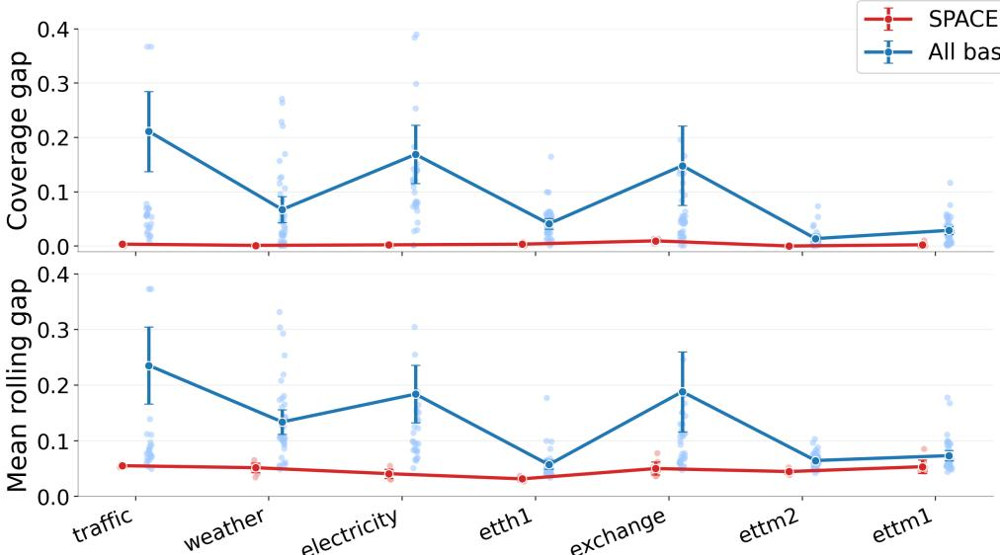  
Dataset (ordered by local covariance drift index)  
Figure 4: Performance of SPACE versus the mean over all baselines, with datasets ordered from left to right by decreasing local covariance drift index. Top: mean coverage gap. Bottom: mean rolling gap. Error bars are constructed based on two standard errors of the mean across the dataset–forecaster pairs. The left side of the figure corresponds to higher-dimensional and more nonstationary datasets with stronger local covariance drift, where the advantage of SPACE is largest; the gap narrows for smaller and more stationary datasets such as ettm1.

1. Contraction: whether the selected window length becomes smaller around a detected change point;

2. Recovery: whether the selected window length increases again after the immediate postchange region;

3. Long-term behavior: whether the selected window length tends to grow as the detected regime becomes older and more stable.

Each panel in Figure 5 contains three aligned subplots. The top subplot shows the selected dynamic window length $\bar { L } _ { t }$ over valid test times. The middle subplot shows Target PC1, the first principal component of the standardized multivariate target stream, which provides a one-dimensional summary of the dominant variation in the target process. The bottom subplot shows target-side change points detected by the energy-divisive procedure.

The intended visual pattern is as follows. Around a vertical change-point marker, a local downward reset in $L _ { t }$ indicates that the dynamic rule shortens its calibration memory when the target process changes. Over a more stable segment, $L _ { t }$ may increase again, indicating that the method can use a longer historical window when the local regime persists.

Taken together, these illustrative plots are consistent with the intended interpretation of the dynamic window-selection mechanism. The selected memory length is not static; rather, it changes over time, contracts around detected target-side disturbances, and in the clearer examples rebuilds during more stable segments. This behavior reflects the design motivation for dynamic $L _ { t } \mathrm { : }$ SPACE uses shorter memory when the recent past becomes unreliable and longer memory when the local regime appears stable enough to benefit from a broader calibration history.

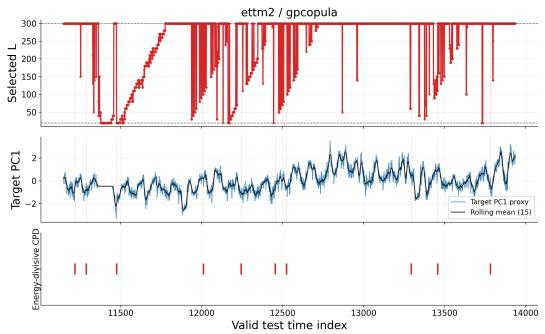  
(a) ettm2/gpcopula

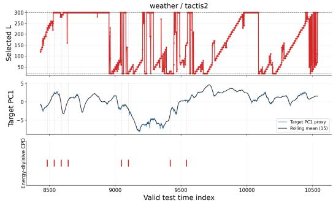  
(b) weather/tactis2  
Figure 5: Illustrative dynamic-L overlays at the 90% target level using energy-divisive target-side change-point detection [22]. In each plot, the top panel shows the selected window length $L _ { t } ,$ the middle panel shows the first principal component of the standardized valid-test target stream (Target PC1), and the bottom panel shows detected target-side change points. Across these examples, the selected dynamic memory length exhibits active interior adaptation and contraction-and-rebuilding behavior around detected target-side regime changes.

## F Implementation details of SPACE

## F.1 Metric definitions

For a fixed target miscoverage level α, empirical joint coverage is defined as

$$
\widehat { \mathrm { C o v } } = \frac { 1 } { N } \sum _ { t = 1 } ^ { N } \mathbb { I } \{ y _ { t } \in \mathcal { C } _ { t } ( \alpha ) \} .\tag{35}
$$

The global coverage gap is the absolute deviation from the target coverage level,

$$
\mathrm { G a p } = \left| \widehat { \mathrm { C o v } } - ( 1 - \alpha ) \right| .\tag{36}
$$

For rolling diagnostics, let w denote the sliding-window length and let $\tau$ denote the set of valid rolling-window endpoints. The rolling joint coverage at endpoint $t \in \tau$ is

$$
\widehat { \mathrm { R C } } _ { t } = \frac { 1 } { w } \sum _ { s = t - w + 1 } ^ { t } \mathbb { I } \{ y _ { s } \in \mathcal { C } _ { s } ( \alpha ) \} .\tag{37}
$$

The corresponding rolling coverage gap is

$$
g _ { t } = \left| \widehat { \mathrm { R C } } _ { t } - ( 1 - \alpha ) \right| .\tag{38}
$$

We summarize these local deviations using three rolling metrics. The mean rolling gap is

$$
\mathrm { M e a n \ R o l l i n g \ G a p } = \frac { 1 } { | \mathcal T | } \sum _ { t \in \mathcal T } g _ { t } = \frac { 1 } { | \mathcal T | } \sum _ { t \in \mathcal T } \left| \widehat { \mathrm { R C } } _ { t } - \left( 1 - \alpha \right) \right| .\tag{39}
$$

The P90 rolling gap is the 90th percentile of the rolling coverage gaps,

$$
\mathrm { P 9 0 ~ R o l l i n g ~ G a p } = Q _ { 0 . 9 } ( \{ g _ { t } : t \in \mathcal { T } \} ) .\tag{40}
$$

The fraction of bad windows is the proportion of rolling windows whose gap exceeds a tolerance threshold $\delta ,$

$$
\mathrm { F r a c . ~ B a d ~ W i n d o w s } = \frac { 1 } { | T | } \sum _ { t \in \mathcal { T } } \mathbb { I } \{ g _ { t } > \delta \} .\tag{41}
$$

In all main experiments, we use $w = 3 0$ and $\delta = 0 . 1 0$

For efficiency, we report the mean log-volume of the prediction regions,

$$
\mathrm { L o G V o L } = \frac { 1 } { N } \sum _ { t = 1 } ^ { N } \log \mathrm { V o l } ( \mathcal { C } _ { t } ( \alpha ) ) .\tag{42}
$$

Lower values are better for coverage gap, rolling diagnostics, and LOGVOL. The size metric should be interpreted together with calibration, since small sets are meaningful only when coverage is close to the target.

## F.2 Compute resources

All wrapper experiments were run on a single local workstation equipped with a 13th Gen Intel(R) Core(TM) i9-13980HX CPU, an NVIDIA GeForce RTX 4080 Laptop GPU and 32GB system memory. The reported benchmark evaluates all dataset–forecaster pairs and all target levels included in the full result table in Section C.2. Since SPACE is a post-hoc wrapper, the reported time refers to wrapper execution and evaluation on saved predictive sample streams, excluding the original training of the forecasting backbones. The complete SPACE run took 1h19m38s. MultiDimSPCI was the most computationally intensive among the baselines, requiring 14h58m33s under the same benchmark scope. The remaining conformal baselines were substantially lighter and completed in comparatively small additional time. Additional exploratory runs and preliminary tuning experiments were performed during development, but the above times describe the compute required to reproduce the reported final benchmark from the saved sample streams.

## F.3 Experimental configuration

Unless stated otherwise, all forecasters use context window 96, and one-step-ahead prediction (pred\_ $\mathtt { l e n } = 1 )$ to simulate one-step-ahead forecasting. The saved predictive sample streams have $\bar { M } = 1 0 0$ forecast samples per time point. Note that, in principle, increasing the number of forecast samples reduces sample-geometry error. In the main benchmark, SPACE is evaluated under a single fixed configuration. Specifically, the candidate calibration lengths are

$$
L \in \{ 2 0 , 3 0 , . . . , 3 0 0 \} ,\tag{43}
$$

so that $L _ { \mathrm { m i n } } = 2 0 , L _ { \mathrm { m a x } } = 3 0 0$ , and the backward extension step size is $h = 1 0$ . The probe-block length is set to $p = 2 0$ , and the adaptive conformal inference update uses step size $\eta = 0 . 0 1$

For numerical robustness, the benchmark implementation uses a shrinkage-stabilized version of the sample-derived covariance estimator, with identity shrinkage parameter $\lambda _ { \mathrm { s h r i n k a g e } } = 0 . 3 0$ . This shrinkage choice is an empirical implementation device introduced to improve stability of the local covariance estimate in practice, especially when the effective sample size is limited or the sample cloud is ill-conditioned. It is not a separate conceptual component of SPACE, and it is not required by the theoretical results in Section 4. Our theory is stated at the level of the sample-derived local geometry and its estimation error, so the guarantees do not rely on this particular shrinkage form or on the specific value of $\rho .$

For dynamic same-regime calibration window selection, SPACE uses a DKW-style KS acceptance threshold to instantiate the same-regime test described in Section 3.2. At time $t ,$ the threshold is

$$
\tau _ { t } ( c _ { \tau } ) = c _ { \tau } \sqrt { \frac { \log \left( \frac { 2 K _ { t } J } { \delta _ { \tau } } \right) } { 2 p } } ,\tag{44}
$$

where $c _ { \tau } = 2 . 0$ is a multiplicative tuning constant, $K _ { t }$ is the number of feasible candidate window lengths at time $t , J = 3$ is the number of diagnostics in the test bundle, $\delta _ { \tau } = 0 . 0 5$ , and $p = 2 0$ is the probe-block length. The factor $2 K _ { t } J$ accounts for the two block comparisons, the feasible candidate lengths, and the diagnostic bundle. This threshold is the empirical implementation of the KS-style same-regime test; the theoretical analysis abstracts its behavior through Assumption (A2), which controls false rejection on clean blocks and false acceptance on contaminated extensions.

## G Dataset Details

We use the following seven publicly available datasets for academic research and evaluation purposes.   
The details of the datasets are listed in Table 8.

Table 8: Dataset summary for the saved predictive sample streams used in wrapper evaluation. Here d is the target dimension, T is the saved stream length, and Test denotes the SPACE/baseline wrapper test split.
<table><tr><td>Dataset</td><td>Freq.</td><td>d</td><td>T</td><td>Test</td></tr><tr><td>electricity</td><td>H</td><td>321</td><td>5261</td><td>1053</td></tr><tr><td>ETTh1</td><td>H</td><td>7</td><td>3484</td><td>697</td></tr><tr><td>ETTm{1,2}</td><td>15 min</td><td>7</td><td>13936</td><td>2788</td></tr><tr><td>exchange</td><td>D</td><td>8</td><td>1518</td><td>304</td></tr><tr><td>traffic</td><td>H</td><td>862</td><td>3509</td><td>702</td></tr><tr><td>weather</td><td>10 min</td><td>21</td><td>10539</td><td>2108</td></tr></table>

1. Electricity. The dataset records electricity consumption for 321 customers and is used as a standard multivariate forecasting benchmark. URL: https://archive.ics.uci.edu/ dataset/321/electricityloaddiagrams20112014.

2. ETTh1, ETTm1, and ETTm2. The datasets contain electricity transformer variables, including load and oil temperature, recorded at hourly or 15-minute resolution [45]. URL: https://github.com/zhouhaoyi/ETDataset.

3. Exchange. The dataset records daily exchange rates of eight countries and is commonly used in multivariate time-series forecasting benchmarks [16]. URL: https://github. com/laiguokun/multivariate-time-series-data.

4. Traffic. The dataset contains hourly road occupancy rates measured by sensors on San Francisco Bay Area freeways and is commonly distributed through multivariate time-series benchmark collections [16]. Raw data are associated with the Caltrans Performance Measurement System (PeMS), which requires an account for access. URL: https://pems.dot.ca.gov/; benchmark mirror: https://github.com/laiguokun/ multivariate-time-series-data.

5. Weather. The dataset is commonly distributed through the Autoformer/Time-Series-Library benchmark collection [38]. URL: https://github.com/thuml/Autoformer.