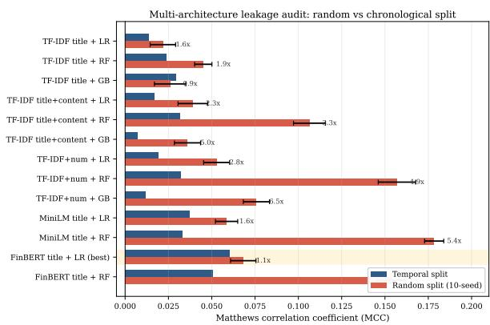
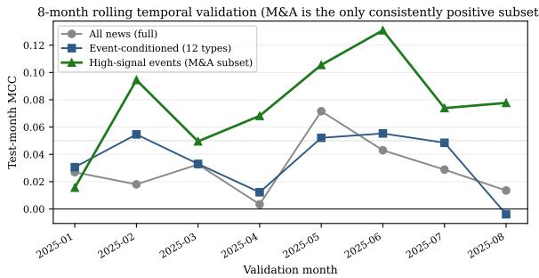
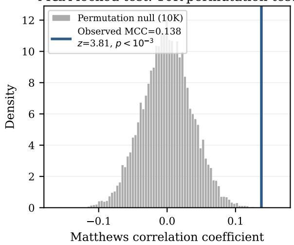
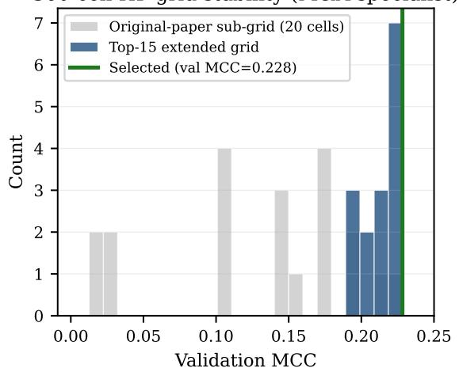
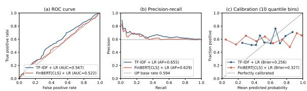
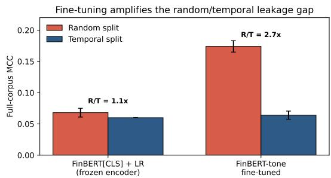
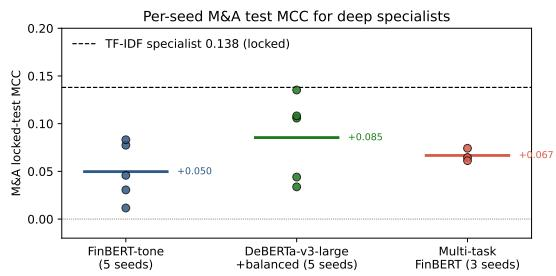
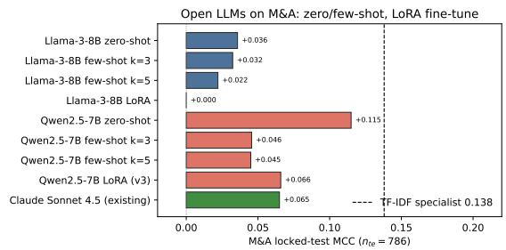
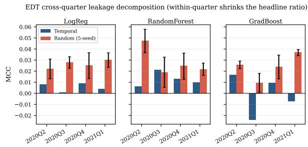

# Temporal Leakage in Financial News NLP: A Multi-Architecture Audit with a Regime-Specific M&A Signal

Chenhao Xue1,2, Raslen Guesmi1, Siwei Feng1, Yucheng Gong1,3 Jacob Xavier Sundram1,3, Jordan Pang1,3, Lan Wang4, Julian Kaljuvee\*1

1Predictive Labs Ltd 2University of Oxford 3Imperial College London 4Independent Researcher

## Abstract

Financial-news direction prediction has become a popular NLP benchmark, yet reported gains depend critically on whether the train–test split is chronological or random, i.e., on temporal leakage. We audit this dependence on a 49,799-article corpus across 16 feature–model combinations spanning TF-IDF, MiniLM, FinBERT, and finetuned RoBERTa-large / DeBERTa-v3-large, plus separate zero/few-shot and LoRA probes of Llama-3 and Qwen2.5 LLMs: random splits inflate MCC by 1.1× to 6.5×, tracking model capacity and feature richness, and end-to-end FinBERT fine-tuning re-amplifies rather than closes the gap (size-matched ratio 1.75×). Conditioning on event type, mergers and acquisitions (M&A) is the only audited category with a positive locked-test signal under near-temporal chronological evaluation (TF-IDF MCC = 0.138 train-only, 0.068 under train∪val refit; 10,000-permutation p < 10−3); the signal does not transfer to FNSPID’s 2009–2020 U.S. corpus, localising the headline to our 2024–2025 European-tilted M&A semantics rather than a universal predictor. Three independent role labellers converge on acquirer-tagged articles as the signal locus, a power-limited qualitative convergence rather than a hypothesis-tested asymmetry. Chronological splitting plays for financial NLP the role characteristics-purging plays for asset pricing: it strips the predictable, stale component of news and leaves a residual that is small, event-localized, and lexically shal low. We advocate leakage audits as a required disclosure for financial-NLP benchmarks.

## 1 Introduction

## 1.1 Motivation: Financial News Prediction as an NLP Benchmark

Financial-news direction prediction is one of the most contested empirical benchmarks at the NLP– finance boundary: text-understanding capability is tested against an economically grounded outcome signal. A decade of work, spanning structured event embeddings (Ding et al., 2014, 2015), recurrent models over tweets and prices (Xu and Cohen, 2018; Hu et al., 2018), domain-adapted LMs (Araci, 2019; Yang et al., 2020b), and LLMbased approaches (Lopez-Lira and Tang, 2023; Li et al., 2024; Wang et al., 2024; Xie et al., 2024), has produced an optimistic narrative: per-paper directional-accuracy figures in the high-50s to mid-60s (e.g., 58.2% binary accuracy on StockNet tweets (Xu and Cohen, 2018); 64.2% S&P directional accuracy Ding et al., 2015). The premise is worth taking seriously; the evidence is not.

Financial NLP inherits a structural vulnerability: news articles, firm identities, market regimes, and return labels are jointly temporally autocorrelated, and modern language models exploit that structure. A model trained on a random half of a year’s financial news absorbs the vocabulary, entity graph, and return correlations of the same market cycle as its test set: regime memorisation that differs qualitatively from within-sample overfitting. A random split holding out individual articles from the early-2024 AI rally, the late-2024 rate-cut pivot, or the 2025 European M&A wave in our own corpus lets a classifier exploit regime-context cues unavailable in a prospective chronological test. This concern is well-documented in financial machine learning (López de Prado, 2018; Bailey et al., 2014; Kapoor and Narayanan, 2023; Hewamalage et al., 2023; Bergmeir and Benítez, 2012) and, separately, in NLP evaluation (Gorman and Bedrick, 2019; Sø- gaard et al., 2021; Magar and Schwartz, 2022; Card et al., 2020), yet the two literatures have not been connected at scale across a full NLP architectureto-feature pipeline.

This paper closes that gap. We audit sixteen architecture–feature conditions on a 49,799-article corpus (2020–2025, 81% from 2025), spanning TF-IDF to fine-tuned DeBERTa-v3-large plus separate zero/few-shot and LoRA probes of instructiontuned Llama-3 and Qwen2.5, under paired random and chronological splits. The audit ratio ranges from 1.1× to 6.5× and grows with model capacity: the literature’s most impressive-looking results are the most inflated. Yet the paper is not a blanket null: mergers and acquisitions (M&A) is the only audited event type with a near-temporal locked-test signal under chronological evaluation $( \mathrm { T F \mathrm { - } I D F \mathbf { M C C } } = 0 . 1 3 8 , p < 1 0 ^ { - 3 } )$ , qualitatively (though not yet statistically) associated with an acquirer-side localisation across three independent role labellers (§8). The signal does not transfer to FNSPID’s 2009–2020 U.S. corpus, localising the headline to our 2024–2025 European-tilted M&A semantics. Chronological splitting plays for financial NLP the role characteristics-purging plays for asset pricing (Didisheim et al., 2026): it is not a robustness check, it is the primary evaluation.

## 1.2 Central Research Questions

This paper asks four interlinked questions:

1. How large is the leakage gap between random and chronological splits across modern NLP architectures and feature stacks?

2. Does any general news-to-return signal survive strict temporal validation?

3. Is signal recoverable when conditioning on event type, and which event types?

4. What mechanism drives any surviving signal?

## 1.3 Main Findings

1. Leakage is real but architecturally uneven. Across 16 feature–model combinations (13 feature×classifier crossings plus 3 end-to-end fine-tuned transformers), random-split MCC exceeds temporal-split MCC by approximately 1× to 6.5× (10-seed averaged); largest for highcapacity nonlinear models on rich features.

2. General prediction is near-random under temporal validation. The strongest temporal model (FinBERT+LR) achieves test MCC = 0.060; end-to-end fine-tuned FinBERT, RoBERTa-large, and DeBERTa-v3-large title classifiers cap at temporal MCC ≤ 0.06.

3. M&A is the only event type with a neartemporal locked-test signal. On the locked test set (n = 786) with validation-selected hyperparameters from a 360-cell grid, TF-IDF MCC = 0.138, 10,000-permutation z = 3.81, $ { p _ { \mathrm { t w o } } } < 1 0 ^ { - 3 } ,$ ; weekly block-bootstrap 95% CI = [+0.066, +0.205].

4. The M&A signal qualitatively favours acquirer articles, with limited statistical power. Regex acquirer $\begin{array} { l } { \displaystyle \mathsf { M C C } \ = \ \mathsf { 0 . 1 6 0 } \ \mathsf { ( \Omega n \ = \ 1 2 5 . } } \end{array}$ $p _ { \mathrm { t w o } } ~ = ~ 0 . 1 4 1 )$ ; independent NER+dep-parse acquirer $\mathrm { M C C } = 0 . 2 2 1 ( n = 8 4 , p _ { \mathrm { t w o } } = 0 . 0 8 3 ) ;$ both ∆MCC 95% CIs span zero, so we report this as triangulated qualitative evidence rather than a hypothesis-tested result.

5. Definition-matched corroboration on EDT; null on FNSPID. Narrow M&A keywords on EDT (Zhou et al., 2021) reproduce a clean signal (MCC = 0.097; definition-sensitivity diagnostic, matched to our event-tag by construction). The fully-powered FNSPID 2009–2020 US cross-corpus probe at $n _ { \mathrm { t e s t } } = 4 { , } 2 3 5$ is a clean null (App. J.2), localizing results to our 2024–2025 European-tilted M&A semantics.

## 1.4 Contributions

• Methodological: A multi-architecture temporal leakage audit framework quantifying inflation as a function of model capacity and feature richness.

• Empirical: Evidence that general financial news prediction is near-random under chronological evaluation, with only minor recovery from domain-adapted (FinBERT) embeddings.

• Mechanistic: Identifying M&A as the only event-conditioned subset with a near-temporal locked-test signal; deal-semantic and qualitatively acquirer-favoring but power-limited (labeler-triangulated, §8); regime-specific (null FNSPID cross-corpus, definition-matched EDT).

## 2 Related Work

Event-driven stock prediction. Ding et al. (2014, 2015) advanced neural event embeddings from news; Xu and Cohen (2018) proposed Stock-Net over tweets and prices. Subsequent work added end-to-end news+price models (Vargas et al., 2017), hybrid attention (Hu et al., 2018), graphconvolutional inter-firm relations (Chen et al., 2018; Sawhney et al., 2020), hierarchical transformers for volatility (Yang et al., 2020a), and self-supervised augmentation (Soun et al., 2022). These works typically rely on random or weakly controlled splits; we revisit the premise under strict temporal validation and a 203-event taxonomy.

Financial sentiment, domain LMs, and financial LLMs. Loughran and McDonald (2011, 2016) introduced the Loughran–McDonald dictionary; earlier work studied rhetorical features and dictionarybased prediction (Henry, 2008; Tetlock et al., 2008; Schumaker and Chen, 2009). FinBERT (Araci, 2019; Yang et al., 2020b) adapted BERT to financial text; Shah et al. (2023) curated FOMC corpora. Domain LLMs have proliferated: Wu et al. (2023), Yang et al. (2023), Xie et al. (2023); Lopez-Lira and Tang (2023) showed ChatGPT predicts next-day returns from headlines. Gururangan et al. (2020) formalised DAPT/TAPT (Beltagy et al., 2019; Lee et al., 2020). Our GPU fine-tuning of FinBERT, RoBERTa-large, and DeBERTa-v3- large quantifies the chronological-evaluation gap of this paradigm on short-window press releases.

Media, information, and asset prices. Tetlock (2007) showed media pessimism predicts price reversion; Manela and Moreira (2017) priced disaster risk from news; Ke et al. (2019) built a text-based factor; Gentzkow et al. (2019) surveyed text-asdata in economics. For M&A, Jensen and Ruback (1983) documented target-favouring wealth effects; our acquirer-side asymmetry (§8) is qualitatively at odds with this textbook intuition for short-horizon return-direction prediction from text, though powerlimited. Didisheim et al. (2026) provide a unifying framework: ∼10% of news content is predictable from stock characteristics, and after “purging” the predictable component, news shocks predict returns for up to 18 months, with M&A among the strongest themes; chronological splitting operationalises a coarser version of this purging logic (the audit gap ∆MCC in Table 2 measures the predictable-by-time-and-characteristics component that purging strips out).

Temporal leakage and recent NLP-finance work. López de Prado (2018) formalised purged Kfold cross-validation; Bailey et al. (2014) characterised backtest overfitting under multiple testing; Bergmeir and Benítez (2012); Hewamalage et al. (2023) compiled chronological-evaluation recommendations; Kapoor and Narayanan (2023) documented widespread leakage in ML-based science. On the statistical side, Card et al. (2020); Bouthillier et al. (2021) highlighted underpowered NLP comparisons and seed/shuffle variance; Feder et al. (2022) surveyed causal-inference tools. Recent NLP-finance work includes Li et al. (2024) (CausalStock) and Wang et al. (2024) (LLMFactor); Xie et al. (2024) (FinBen) showed even GPT-4 reaches only ∼0.54 accuracy on marketforecasting, consistent with our temporal-MCC ≤ 0.06 general-news finding. Our contribution imports temporal-validation norms into financial NLP through a multi-architecture audit accompanied by 10-seed random-split averages, 10K-permutation tests, and weekly block bootstrap, and benchmarks frontier (Claude, GPT) and open (Llama-3,

<table><tr><td>Statistic</td><td>Value</td></tr><tr><td>Total articles</td><td>56,409</td></tr><tr><td>Date range Articles from 2025</td><td>2020-05-2025-08 81%</td></tr><tr><td>Exchanges covered Event types</td><td>64 203</td></tr><tr><td>After neutral removal</td><td>49,799</td></tr><tr><td>Train (&lt; 2025-04-01)</td><td>21,654</td></tr><tr><td>Validation (2025-04–05)</td><td>10,866</td></tr><tr><td>Test (≥ 2025-06-01)</td><td>17,279</td></tr></table>

Table 1: Dataset overview.

Qwen2.5) LLMs against supervised baselines.

## 3 Task, Data, and Label Construction

## 3.1 Dataset

Our dataset consists of 56,409 financial news articles from a proprietary data provider, spanning 2020–2025, with 81% from 2025. Articles cover 64 stock exchanges worldwide, each annotated with timestamps, titles, full content, associated instruments, exchange identifiers, and event labels from a taxonomy of 203 distinct event types observed in the corpus. After removing articles with neutral or near-zero returns, 49,799 articles remain for binary classification. We acknowledge that proprietary data limits direct replication; we release aggregate statistics, splits, code, and LLM prompts.

## 3.2 Prediction Target

Binary classification of subsequent stock-return direction (UP/DOWN) following article publication. We report Matthews correlation coefficient (MCC) as the primary metric because it accounts for all four confusion-matrix cells and is robust under mild class imbalance. Balanced accuracy is reported as a complement.

## 3.3 Market-Adjusted Labels

We define a market-adjusted label variant in which return is measured relative to the corresponding exchange benchmark over the same horizon. The label is UP when the abnormal return is positive and DOWN otherwise. The return horizon is one trading day (close-to-close, or close-to-next-open for after-hours releases); the benchmark B(i) is the primary index of the listing exchange (full timezone/holiday handling in App. A.1). Raw and market-adjusted labels agree in 85–90% of cases. Section 7 reports M&A results under both schemes.

## 3.4 Temporal Split Design

We adopt a strictly chronological split: train < 2025-04-01 (21,654 articles), validation 2025-04– 2025-05 (10,866), test ≥ 2025-06-01 (17,279). All hyperparameter tuning and model selection use the validation set; the test set is consulted exactly once for the final reported numbers. Both splits are predominantly 2025; the gap is short (“neartemporal” rather than “out-of-regime”; see §9).

## 3.5 Event-Conditioned Subsets

From the 203 distinct event types tagged in our corpus, we restrict detailed event-conditioned analysis to twelve sufficiently frequent and economically interpretable categories. M&A is then selected as the primary event for the locked-test analysis on three grounds. First, mechanism: deal announcements mechanically affect firm valuation through documented wealth effects (Jensen and Ruback, 1983), and deal terms convey rich semantic content (acquirer/target, deal type, premium, financing) beyond bare event occurrence. Second, volume and balance: with 1,886 M&A articles spread across a chronological train/val/test split (731/369/786) we have ${ \ge } 1 0 \times$ the sample size of more specialised events while retaining a reasonable UP/DOWN balance (57%). Third, rolling-window prior: in our 8-month rolling pilot across 12 events (Section 7 and Figure 2), M&A is the only event with consistently positive MCC $\mathrm { ~ \textcircled ~ { ~ } ~ } 7 / 8$ months); reserving M&A for the one-shot locked test minimizes the multiplecomparison cost. For auditability, Section 7.4 and Appendix I.2 replicate the full pipeline on three contrasting events (CLINICAL\_STUDY [CLN], LAW\_LEGAL\_ISSUES [LGL], and EARN-INGS\_RELEASES\_AND\_OPERATING\_RESULTS [ERN]; the three-letter codes are used in appendix tables), confirming the M&A result is event-specific, not a protocol artifact.

3.6 Formal Task and Evaluation Methodology We frame each article as a sample $( x _ { t } , y _ { t } )$ , where $x _ { t } \in \mathcal { X }$ is the news text (optionally with metadata), and $y _ { t } \in \{ 0 , 1 \}$ encodes the next-day return direction. A classifier $f _ { \theta } : \mathcal { X }  \{ 0 , 1 \}$ produces $\hat { y } _ { t } = f _ { \theta } ( x _ { t } )$ The market-adjusted label is built from the asset’s abnormal return relative to its exchange benchmark $B ( i )$ ，

$$
\mathrm { A R } _ { i , t } \ = \ r _ { i , t } - r _ { B ( i ) , t } , \qquad y _ { i , t } ^ { \mathrm { a d j } } \ = \ 1 [ \mathrm { A R } _ { i , t } > 0 ] .\tag{1}
$$

Primary metric. Because of mild class imbalance (55–57% UP across splits) we report the Matthews correlation coefficient

$$
\mathrm { M C C } = \frac { \mathrm { T P } \cdot \mathrm { T N } - \mathrm { F P } \cdot \mathrm { F N } } { \sqrt { ( \mathrm { T P } + \mathrm { F P } ) ( \mathrm { T P } + \mathrm { F N } ) ( \mathrm { T N } + \mathrm { F P } ) ( \mathrm { T N } + \mathrm { F N } ) } } ,\tag{2}
$$

which is bounded in [−1, 1], 0 for any constant predictor, robust to label skew (Card et al., 2020). Balanced accuracy is reported as a complement.

Audit ratio. Given a feature–model combination $( \phi , f )$ , we evaluate it on a paired temporal split $S ^ { \mathrm { t e m p } }$ and on K size-matched random splits $\{ S _ { k } ^ { \mathrm { r a n d } } \} _ { k = 1 } ^ { K }$ (counts and proportions identical). The leakage audit ratio is the ratio of mean random to single temporal MCC,

$$
\rho ( \phi , f ) = \frac { \frac { 1 } { K } \sum _ { k = 1 } ^ { K } \mathrm { M C C } _ { \mathrm { r a n d } _ { k } } ( \phi , f ) } { \mathrm { M C C } _ { \mathrm { t e m p } } ( \phi , f ) } .\tag{3}
$$

We use $K = 1 0$ throughout the audit (Table 2) and report the random-side mean±std. A value $\rho \gg 1$ indicates that random splits inflate apparent performance; a value $\rho \approx 1$ indicates that the model does not exploit non-causal temporal structure.

Permutation test. For the locked M&A test set we evaluate the null $H _ { 0 } : \mathrm { ^ { * } t e x t }$ is uninformative for return direction” by sampling $M = 1 0 \small { , } 0 0 0$ random permutations π of the test labels and computing

$$
\hat { p } _ { \mathrm { o n e } } = \frac { 1 } { M } \sum _ { m = 1 } ^ { M } \mathbf { 1 } [ \mathrm { M C C } ( \hat { y } , y _ { \pi ^ { ( m ) } } ) \geq \mathrm { M C C } _ { \mathrm { o b s } } ] ,\tag{4}
$$

along with the standardised score $z = \mathrm { ( M C C _ { o b s } - }$ $\mu _ { \pi } ) / \sigma _ { \pi } .$ , where $\mu _ { \pi }$ and $\sigma _ { \pi }$ are the empirical mean and standard deviation of the permutation distribution. Confidence intervals use a weekly block bootstrap that resamples calendar weeks with replacement (Politis and Romano, 1994); the perevent analyses apply Benjamini–Hochberg correction (Benjamini and Hochberg, 1995) at $q = 0 . 0 5$ across the 12 simultaneously tested events (Demšar, 2006). Block-bootstrap and leave-one-axis-out details are deferred to Appendix A.2.

## 4 Multi-Architecture Temporal Leakage Audit

The audit pairs a temporal split with a size-matched random split (same train/val/test counts, seed 42) holding features and HP fixed. We use four feature configurations (TF-IDF title; TF-IDF title+content; TF-IDF + 31 metadata features; MiniLM and Fin-BERT [CLS] title embeddings) crossed with three classifiers (LR, RF, GB), giving 13 valid combinations plus three end-to-end fine-tuned transformers (Section 4.1). Leakage sources include near-duplicates, overlapping return windows, and regime memorisation.

## 4.1 Audit Results

Three patterns emerge from Table 2:

1. Inflation grows with model capacity. Linear models (LR) show $1 . 1 { \times } { - } 2 . 8 { \times }$ inflation (the low end is FinBERT [CLS]+LR, the high end is TF-IDF+numerical+LR); tree ensembles (RF, GB) show up to 6.5×.

<table><tr><td>Features</td><td>Model</td><td>Random MCC‡</td><td>Temporal MCC</td><td>Ratio</td></tr><tr><td>TF-IDF title</td><td>LR</td><td> $0 . 0 2 2 \pm 0 . 0 0 7$ </td><td>0.013</td><td>1.6×</td></tr><tr><td>TF-IDF title</td><td>RF</td><td> $0 . 0 4 5 \pm 0 . 0 0 5$ </td><td>0.024</td><td>1.9×</td></tr><tr><td>TF-IDF title</td><td>GB</td><td> $0 . 0 2 6 \pm 0 . 0 0 9$ </td><td>0.029</td><td>0.9×</td></tr><tr><td>TF-IDF title+content</td><td>LR</td><td> $0 . 0 3 9 \pm 0 . 0 0 9$ </td><td>0.017</td><td>2.3×</td></tr><tr><td>TF-IDF title+content</td><td>RF</td><td> $0 . 1 0 6 \pm 0 . 0 0 9$ </td><td>0.032</td><td>3.3×</td></tr><tr><td>TF-IDF title+content</td><td>GB</td><td> $0 . 0 3 6 \pm 0 . 0 0 8$ </td><td>0.007</td><td>5.0×</td></tr><tr><td>TF-IDF + numerical</td><td>LR</td><td> $0 . 0 5 3 \pm 0 . 0 0 8$ </td><td>0.019</td><td>2.8×</td></tr><tr><td>TF-IDF + numerical</td><td>RF</td><td> $0 . 1 5 7 \pm 0 . 0 1 1$ </td><td>0.032</td><td>4.9×</td></tr><tr><td>TF-IDF + numerical</td><td>GB</td><td> $0 . 0 7 6 \pm 0 . 0 0 8$ </td><td>0.012</td><td>6.5×</td></tr><tr><td>MiniLM title</td><td>LR</td><td> $0 . 0 5 9 \pm 0 . 0 0 6$ </td><td>0.037</td><td>1.6×</td></tr><tr><td>MiniLM title</td><td>RF</td><td> $0 . 1 7 8 \pm 0 . 0 0 6$ </td><td>0.033</td><td>5.4×</td></tr><tr><td>FinBERT title</td><td>LR</td><td> $0 . 0 6 8 \pm 0 . 0 0 7$ </td><td>0.060</td><td>1.1×</td></tr><tr><td>FinBERT title</td><td>RF</td><td> $0 . 1 5 4 \pm 0 . 0 0 8$ </td><td>0.051</td><td>3.0×</td></tr><tr><td> $\mathbf { B i - L S T M \ t i t l e ^ { \dagger } }$ </td><td>一</td><td>0.065</td><td>0.024</td><td>2.7×</td></tr><tr><td> $\mathrm { F i n B E R T ~ t i t l e ^ { \ S } }$ </td><td>FT</td><td> $0 . 1 7 4 \pm 0 . 0 0 9$ </td><td> $0 . 0 6 4 \pm 0 . 0 0 7$ </td><td> $2 . 7 \times ^ { \ P }$ </td></tr><tr><td> $\mathrm { D e B E R T a - v } 3 { \mathrm { - l a r g e } } ^ { \ S }$ </td><td>FT bal.</td><td></td><td> $0 . 0 8 5 \pm 0 . 0 4 4$ </td><td></td></tr><tr><td> $\mathrm { R o B E R T a - l a r g e ^ { \ S } }$ </td><td>FT</td><td></td><td>0.000†</td><td></td></tr></table>

Table 2: Multi-architecture leakage audit (proprietary; $n _ { \mathrm { t r } } { = } 2 1 , 6 5 4 ,$ $n _ { \mathrm { t e } } { = } 1 7 , 2 7 9 )$ . FinBERT[CLS]+LR has the smallest leakage ratio (1.1×); fine-tuning the same encoder lifts it to $2 . 7 \times ( ^ { \bullet }$ size-matched 1.75×, App. D.1). ‡ 10-seed mean±std (5-seed for FT rows); temporal column deterministic for frozen rows. § Fine-tuned on GPU: DeBERTa-v3-large uses class-balanced sampling (He et al., 2021); RoBERTa-large (Liu et al., 2019) collapsed to predict-all-UP. Bi-LSTM: 2-layer, hidden=128.

  
Figure 1: Multi-architecture leakage audit $( n _ { \mathrm { t r a i n } } { = } 2 1 , 6 5 4 , \quad n _ { \mathrm { t e s t } } { = } 1 7 , 2 7 9 )$ Each row pairs temporal-split MCC (blue) with 10-seed mean randomsplit MCC (orange, ±1 SD). Annotated values are the audit ratio ρ of Eq. (3); for end-to-end fine-tuned FinBERT (Table 2, last block) the size-matched ratio is 1.75× (App. D.1).

2. Inflation grows with feature richness. Adding content and numerical features systematically raises the random-split MCC while leaving temporal MCC near zero: characteristic of overfitting to memorizable patterns that do not generalize across time.

3. Frozen FinBERT shows the smallest leakage gap; fine-tuning re-amplifies it. Fin-BERT [CLS]+LR has random/temporal ratio 1.1× and the highest absolute temporal MCC (0.060). End-to-end fine-tuning of the same encoder, however, lifts the $\mathrm { g a p t o 2 . 7 } \times$ (random $0 . 1 7 4 \pm 0 . 0 0 9 .$ temporal $0 . 0 6 4 \pm 0 . 0 0 7$ across 5 seeds; Appendix D.1). Fixed domain-adapted contextual embeddings suppress time-localized lexical idiosyncrasies; updating them on a nontemporal split re-learns these leaked patterns.

<table><tr><td>Model</td><td>Random</td><td>Temporal</td><td>Ratio</td></tr><tr><td>TF-IDF  $\mathrm { t i t l e } + \mathrm { L R }$ </td><td> $0 . 0 2 5 \pm 0 . 0 0 8$ </td><td>0.014</td><td> $1 . 7 \times$ </td></tr><tr><td>TF-IDF  $\mathrm { t i t l e } + \mathrm { R F }$ </td><td> $0 . 0 2 9 \pm 0 . 0 0 5$ </td><td>0.001</td><td> $2 8 . 9 \times ^ { \dagger }$ </td></tr><tr><td>TF-IDF  $\mathrm { t i t l e } + \mathrm { G B }$ </td><td> $0 . 0 2 0 \pm 0 . 0 0 7$ </td><td>0.007</td><td>2.8×</td></tr></table>

Table 3: Cross-corpus audit on EDT (Zhou et al., 2021) $( n = 1 0 6 , 6 1 9 .$ 2020–2021, 70/15/15 chronological vs 5-seed random). The directional pattern of Table 2 replicates on a different corpus/market/regime. † Near-zero temporal denominator amplifies $\rho ;$ see ratiointerpretation caveat below.

We emphasize what the audit does not find: a single canonical “10× leakage” headline. Randomsplit MCC exceeds temporal-split MCC by ∼ 1×– 6.5× depending on architecture, with the largest inflation in high-capacity nonlinear models on rich features. A leave-one-axis-out sensitivity test on the M&A 360-cell grid gives locked-test MCC mean $0 . 1 3 8 \pm 0 . 0 0 6$ across reduced grids, confirming the headline is not a single lucky cell.

Ratio interpretation caveat. ρ in Eq. (3) is unstable when the temporal denominator is near zero (EDT-RF 28.9× is driven by temporal MCC

= 0.001, not a uniquely severe leakage event; size-mismatched FinBERT-FT 2.72× revises to

1.75× once matched at $n _ { \mathrm { t e } } ~ = ~ 1 7 { , } 2 7 9 )$ . The unitful $\Delta \mathrm { M C C } ~ = ~ \mathrm { M C C } _ { \mathrm { r a n d o m } } ~ \mathrm { - ~ \mathrm { M C C } _ { \mathrm { t e m p o r a l } } }$ together with paired CIs is more interpretable; for the FinBERT-FT row $\Delta \ : = \ : 0 . 0 4 8$ with nonoverlapping 95% bootstrap CIs [0.090, 0.134] vs [0.054, 0.074] (App. D.1).

## 4.2 Cross-Corpus Diagnostic on EDT and FNSPID

Table 3 replicates the audit on EDT (Zhou et al., 2021) (106,619 articles 2020–2021): linear models inflate $\sim ~ 1 . 7 \times$ , tree ensembles inflate dramatically $( \mathrm { R F } \colon \ 2 8 . 9 \times ) . ^ { 1 }$ A third corpus (FN-SPID, Dong et al. 2024) provides a true crosscorpus probe at scale: within-FNSPID TF-IDF specialist gives $\begin{array} { l } { \displaystyle \mathsf { M C C } \ = \ \left. - 0 . 0 1 1 \ ( p \ = \ 0 . 4 6 , \right. } \end{array}$ $n _ { \mathrm { t e s t } } ~ = ~ 4 { , } 2 3 5 ) ;$ ; proprietary→FNSPID transfer $- 0 . 0 1 6 ;$ reverse FNSPID→proprietary −0.088. A five-seed FinBERT-FT replicates the withincorpus null $( + 0 . 0 0 7 { \scriptstyle \pm 0 . 0 2 3 } )$ , confirms the forward null $( + 0 . 0 0 0 \pm 0 . 0 1 7 )$ , and recovers weak positive transfer in the reverse cell $( + 0 . 0 4 5 \pm 0 . 0 1 8 $ vs. $\mathrm { T F \mathrm { - } I D F \mathrm { - } } 0 . 0 8 8 )$ and joint→proprietary cell $( + 0 . 0 7 0 \pm 0 . 0 3 6 .$ half the in-domain headline); semantic representations transfer modestly, lexical features do not. The proprietary M&A specialist therefore does not transfer to 2019–2020 US M&A reporting; we read this as regime-specificity, not contradiction. Full 5-protocol TF-IDF and deepmodel matrix in Appendix J.2. The earlier $n = 9 0$ $p = 0 . 1 2 7$ FNSPID reading reflected a streamingloader artifact and has been superseded.

## 5 Models and Conditions

We use four supervised baselines: TF-IDF+LR (general $\begin{array} { r } { \mathbf { M C C } = 0 . 0 1 3 , n _ { \mathrm { f e a t } } = 5 0 , C = 0 . 5 ; } \end{array}$ M&A MCC = 0.138 at val-selected HP from 360- cell grid: $n _ { \mathrm { f e a t } } = 1 0 0 , C = 5 . 0$ , ngram=(1,1), sublinear\_tf=False, min\_df=2); TF-IDF + numerical + RandomForest (title+content + 31 metadata features, $n _ { \mathrm { { e s t } } } ~ = ~ 2 0 0$ , max-depth = 15; general $\begin{array} { r } { \mathbf { M C C } = ~ 0 . 0 3 2 , ~ \mathbf { M } \& \mathbf { A } = ~ 0 . 0 5 8 ) \colon } \end{array}$ Fin-BERT [CLS]+LR (768-dim mean-pooled title; general $\mathbf { M C C } = 0 . 0 6 0$ , the strongest single-model temporal result); and MiniLM+LR (384-dim; general $\mathbf { M C C } = 0 . 0 3 7 )$ . For M&A we also extract role labels (acquirer/target/both/neither) by regex (distribution: NEITHER 1369, ACQUIRER 294, TAR-GET 219, BOTH 4) and by an NER+dependencyparsing pipeline (Section 8, App. F.2).

LLM zero-shot. We evaluate Claude Sonnet 4.5, Claude Opus 4.7, and GPT-5.4 zero-shot across title-only, title+event, title+content, chainof-thought, and role-prompt configurations.2 Outputs are parsed into UP/DOWN by a fixed regex determined before test. Locked M&A statistics use 10,000-permutation tests and weekly block bootstrap (Politis and Romano, 1994); per-event analyses use Benjamini–Hochberg correction (Benjamini and Hochberg, 1995).

## 6 General News Prediction Results

Under proper temporal validation, general news prediction is near-random: FinBERT+LR is the strongest temporal model $( \mathbf { M C C } = 0 . 0 6 0 )$ ; full results in Appendix G.1. Drivers: 203-event-type heterogeneity, temporal staleness, label noise, publication lag. Zero-shot LLM general-news (best: multi-LLM consensus title+event, MCC = 0.108): Appendix E.2.

## 7 Event-Conditioned Results

## 7.1 Rolling-Window Results Across 12 Event Types

We evaluate prediction performance separately for 12 event types using an 8-month rolling window. M&A is the only event type with consistently positive signal across the majority of test months (Figure 2 in Appendix B.1.1): mean $\mathbf { M C C } = 0 . 0 8 1$ positive in 7/8 months, sign test $p = 0 . 0 3 5$ (uncorrected). After Benjamini–Hochberg correction (Benjamini and Hochberg, 1995) for 12 simultaneous comparisons, this does not reach $q = 0 . 0 5 ;$ we characterize the rolling-window finding as suggestive and rely on the locked-test result below.

## 7.2 Locked M&A Test-Set Result

We train a TF-IDF logistic regression specialist on M&A train $~ ( n ~ = ~ 7 3 1 )$ and select hyperparameters on M&A validation $( n ~ = ~ 3 6 9 )$ via a comprehensive 360-cell grid: {max\_features∈ $\{ \} \subseteq \{ S 0 , 1 0 0 , 2 0 0 , 5 0 0 , 1 0 0 0 , 2 0 0 0 \} \} \quad \times \quad \{ C \qquad \in \{ C \} \qquad \in \{ C \}$ $\{ 0 . 0 5 , 0 . 1 , 0 . 5 , 1 . 0 , 5 . 0 \} \quad \times \quad \{ s \mathrm { u b l i n e a r \_ t f \in }$ $\{ T , F \} \} \times \{ \mathfrak { m i n \_ d f }  \in \{ 1 , 2 \} \} \times \{ \mathfrak { n g r a m \_ r a n g e } \in$ $\{ ( 1 , 1 ) , ( 1 , 2 ) , ( 1 , 3 ) \} \}$ The validation winner is max\_features=100, C=5.0, sublinear\_tf=False, min\_df=2, $\mathsf { n g r a m \_ r a n g e { = } ( 1 , 1 ) \quad ( v a l \quad M C C \ = \quad 0 . 2 2 8 ) }$

The top-15 validation cells cluster between MCC

= 0.20 and 0.23, indicating a stable optimum rather than a single outlier. We then evaluate exactly once on the locked M&A test set $( n = 7 8 6$ 3 calendar months June–August 2025).3

Test $\begin{array} { r l } { \mathbf { M C C } } & { { } = } \end{array} \begin{array} { r l } { 0 . 1 3 8 . } \end{array}$ , balanced accuracy $\begin{array} { r l r } { = } & { { } } & { 0 . 5 6 9 . } \end{array}$ Three test months: $\mathbf { M C C } \ =$ +0.126, +0.135, +0.171 (all positive, consistent magnitude).

A 10,000-permutation test (label-shuffled MCC under the null of no text–return relationship, Eq. (4); permutation histogram in Figure 3, Appendix B.1.2) yields:

• Observed $\mathbf { M C C } = 0 . 1 3 7 8$

• Permutation mean = +0.0003, std = 0.0361

• z-score = 3.81

• One-sided $p < 1 0 ^ { - 4 } ; \mathrm { t w o } { - } \mathrm { s i d e d } p < 1 0 ^ { - 3 }$

A pilot 500-permutation run with a sub-optimal hyperparameter setting yielded $p = 0 . 0 6 8$ , showing under-explored HP grids suppress signal recovery; we report results from the comprehensive 360- cell grid above. Block-bootstrap by week (1000 resamples, 11 weekly clusters) yields a 95% CI of $\left[ + 0 . 0 6 6 , + 0 . 2 0 5 \right]$ , mean +0.139. The CI excludes zero, providing strong evidence that the signal survives within-week return autocorrelation.

Compound selection accounting. M&A was selected as the locked-test target after the 12- event rolling pilot (Section 7.1). A conservative Bonferroni-12 adjustment on $ { p _ { \mathrm { t w o } } } < 1 0 ^ { - 3 }$ gives $p _ { \mathrm { B o n f - } 1 2 } < 1 . 2 \times 1 0 ^ { - 2 }$ , still clearing $\alpha = 0 . 0 5$ and the family-wise control in Section 7.4.

The most defensible single-number summary is: MCC = 0.138, permutation $\begin{array} { l l l } { p } & { < } & { 1 0 ^ { - 3 } } \end{array}$ (two-sided), z = 3.81, weekly bootstrap CI = $\left[ + 0 . 0 6 6 , + 0 . 2 0 5 \right]$

Robustness to cutoff perturbation. Cutoff perturbations of ±7 and ±14 days (locked test fixed at ≥ 2025-06-01, same val-selected HP) give test $\mathsf { M C C } \in [ + 0 . 1 1 5 , + 0 . 1 5 6 ]$ , mean±std = +0.132± 0.017, not a knife-edge artifact.

Extended-window sensitivity (six-month horizon). Shifting the train cutoff to 2025-03-01 $( n _ { \mathrm { t r } } = 6 1 1 , n _ { \mathrm { t e } } = 1 2 7 5 )$ gives MCC = +0.133 (perm $z ~ = ~ 4 . 7 6 , \ p ~ < ~ 1 0 ^ { - 4 }$ , weekly bootstrap

95% $\mathbf { C I } = \left[ + 0 . 0 4 0 , + 0 . 2 2 0 \right] )$ : statistically indistinguishable from the three-month headline (∆ = 0.005). Full per-month detail in App. B.3.

Negative-control across event types. Rerunning the same 100-cell val-then-test pipeline on the 7 next-largest event categories: only M&A produces a substantial positive test MCC (+0.123); earnings releases and management changes are negative $( - 0 . 0 3 9 , - 0 . 0 7 4 )$ ; clinical study collapses to 0.000. The M&A specialty is not a generic high-volume-event artifact.

## 7.3 Market-Adjusted Labels and Non-Text Controls

Replacing raw return labels with market-adjusted labels (UP iff abnormal return relative to exchange benchmark is positive) improves val MCC from 0.092 to 0.146, consistent with news predicting abnormal not raw returns. Non-text controls confirm the signal is text-driven: the M&A text specialist reaches val MCC 0.228 versus 0.037 for an exchange-token baseline and −0.020 for a metadata aggregate (exchange + day-of-week + event subtype + numerical features; Table 24, App. G.2).

## 7.4 Cross-Event Replication

We apply the same paper-authoritative specialist to three contrasting events to verify the M&A result is event-specific: CLINICAL\_STUDY (CLN; n = 1,994, 63% UP), LAW\_LEGAL\_ISSUES (LGL; $\begin{array} { r l r } { n } & { { } = } & { 1 , 1 7 2 . } \end{array}$ 53% UP), and EARN-INGS\_RELEASES\_AND\_OPERATING\_RESULTS (ERN; n = 3,445, 55% UP). The four-event panel (Table 29 in App. I.2) yields a $2 \times 2$ taxonomy: M&A is the unique low-ratio, signal-positive cell (locked test MCC +0.138, $p ~ < ~ 1 0 ^ { - 3 } ) ;$ CLN matches the textbook leakage signature (audit ratio 4.2×, locked test −0.049); LGL is power-limited $( n _ { \mathrm { t r } } = 1 2 1 , \mathrm { M C C + 0 . 0 2 2 } )$ ; ERN is the methodologically cleanest genuine null (large $n _ { \mathrm { t r } } = 1 , 8 7 0$ , no audit-ratio inflation 0.72×, locked-test 95% CI [−0.084, +0.090] at $p = 0 . 8 6 )$ The M&A audit ratio $0 . 7 6 \times$ is anomalous and informative: random splits do not help, suggesting genuinely temporal-stable signal rather than firm-memorisation.

Family-wise control. The four-event family was pre-committed to stress-test, not to maximise. BH correction at q = 0.05 on the four two-sided permutation p-values: M&A (rank 1) clears its threshold $1 / 4 { \times } 0 . 0 5 = 0 . 0 1 2 5$ with substantial margin (BHadjusted $p \approx 0 . 0 0 4 )$ ; CLN, LGL, ERN do not. We do not make the corresponding claim for the larger

12-event rolling-pilot family (used only to motivate the locked-test event choice; M&A rolling sign-test $p = 0 . 0 3 5$ corresponds to BH-adjusted $q ^ { * } = 0 . 4 2 )$ ORG-masking divergence; deep models and LLMs. Regex-based ORG-token masking gives test-MCC deltas (baseline−masked) of +0.045 for M&A, −0.056 for CLN, −0.033 for LGL, −0.040 for ERN: M&A is the only event where masking firm-identity tokens hurts; on others, masking ORGs improves performance, indicating residual signal there is firm-identity overfitting. Re-running the strongest deep specialists (FinBERT, DeBERTa-v3-large-balanced, XLM-Rlarge; 5 seeds each) and open-LLM baselines (Qwen-2.5-7B, Llama-3-8B; zero-shot and CoTv2) on the same four locked-test windows confirms the taxonomy is not a TF-IDF artifact: no deep specialist on any non-M&A event clears +0.09 locked-test MCC. Full tables: Apps. I.3, I.4.

## 8 What Drives the M&A Signal? Acquirer-Side Localisation (Power-Limited)

The asymmetry below is power-limited: weekly block-bootstrap 95% CIs on $\begin{array} { l l l } { { \Delta { \bf M C C } } } & { { = } } & { { { \bf M C C } _ { \mathrm { A C Q } } - { \bf M C C } _ { \mathrm { T G T } } } } \end{array}$ span zero under both labellers $\left( \left[ - 0 . 0 7 5 , + 0 . 3 3 1 \right] \right)$ regex; $[ - 0 . 2 7 7 , + 0 . 5 8 6 ]$ NER+dep-parse), so we report it as triangulated qualitative evidence rather than a hypothesis-tested result.

TF-IDF LogReg dominates on M&A (test MCC 0.138), beating fine-tuned FinBERT-tone (0.050± 0.030, 5 seeds), full-parameter SFT FinBERT with class-weighted loss $( 0 . 0 3 4 \pm 0 . 0 3 5 )$ ), DeBERTa-v3- large balanced $( 0 . 0 6 1 \pm 0 . 0 4 0 .$ 10 seeds), XLM-RoBERTa-large $( 0 . 0 4 5 \pm 0 . 0 3 0 )$ , multi-task Fin-BERT $( 0 . 0 6 7 \pm 0 . 0 0 7 )$ , role-only LogReg (0.083 test, −0.014 val), and the Jensen–Ruback heuristic (0.041). Open LLMs: Qwen2.5-7B zero-shot reaches 0.115 under the M&A-specific prompt (App. E.4) but $- 0 . 0 2 2 \pm 0 . 0 1 0$ under a cross-event uniform prompt (App. I.4.2); Qwen-CoT collapses $( 0 . 0 1 1 \pm 0 . 0 3 0 )$ ; Llama-3-8B zero-shot reaches $0 . 0 1 5 \pm 0 . 0 2 6 ;$ few-shot and LoRA fail to recover supervised levels. Every architecture trails the shallow lexical baseline; the M&A signal is shallow and lexical.

Decomposing by deal role (two independent labellers: a title-level regex, and an NER+dependency-parsing pipeline that identifies $< 3 \%$ overlap with the regex on the acquirer side) and training role-restricted FinBERT specialists yields three convergent confirmations of acquirerside dominance: regex-ACQUIRER MCC = 0.160 $( n ~ = ~ 1 2 5 , ~ p _ { \mathrm { t w o } } ~ = ~ 0 . 1 4 1 )$ ; NER-ACQUIRER $\begin{array} { r } { \mathbf { M C C } = 0 . 2 2 1 \ ( n = 8 4 , p _ { \mathrm { t w o } } = 0 . 0 8 3 ) } \end{array}$ ; regex-ACQUIRER FinBERT specialist $\mathbf { M C C } = 0 . 1 9 5$ at $n _ { \mathrm { t r } } = 1 1 3$ . The symmetric TARGET counterparts collapse to $\mathbf { M C C } \in \ \{ 0 . 0 0 0 , 0 . 0 1 7 , 0 . 0 9 8 \}$ . This is qualitatively at odds with Jensen and Ruback (1983) for short-horizon return-direction prediction from text (full per-role and global-specialist tables in App. F.2).

## 9 Conclusion

Chronological splitting parallels characteristicspurging in asset pricing (Didisheim et al., 2026): it removes the predictable component, leaving a regime-specific M&A-concentrated residual (MCC $= 0 . 1 3 8$ train→val→test, +0.068 train+val→test merge, $p < 1 0 ^ { - 3 } )$ . The residual reproduces on the proprietary corpus, partially replicates on EDT (narrow definition-matched M&A), and does not transfer to FNSPID 2009–2020 US M&A at $n = 4 { , } 2 3 5$ (within-FNSPID MCC = −0.011; App. J.2). The cross-event audit recovers a 2×2 (audit ratio × locked signal) taxonomy, with M&A as the unique signal cell and Earnings as the cleanest genuine null. We do not claim out-of-regime generalization, statistically-significant acquirer>target asymmetry $( p _ { \mathrm { t w o } } \in \{ 0 . 0 8 6 , 0 . 1 4 1 \}$ across labelers), or a deployable all-trade rule (App. H.1). Leakage auditing is cheap (16-cell pairing < 30 min CPU; cross-event audit < 2 min) and should accompany any chronological-MCC claim on financial-news prediction.

Closed-source LLM cells (Table 19) use prerelease identifiers (“Claude Opus 4.7”, “GPT-5.4”); camera-ready substitutes public API strings, and the audit-ratio (Table 2) and supervised M&A headlines do not depend on these cells. The topquartile cost-aware Sharpe of +2.62 at 10 bps/side (App. H.1) uses a test-quantile threshold and is an upper bound; the all-trade frictionless +0.52 is the baseline. The M&A signal is bounded to the 2024–2025 European-tilted regime and does not transfer to FNSPID 2009–2020 US M&A (n=4,235); selection accounting (12-event pilot, 360-cell HP, Bonferroni-12) is in §7.2. Code, splits, and prompts are released in the artifact bundle; the prospective OSF replication commitment is in the Limitations section.

## Limitations

Proprietary dataset. Our primary dataset cannot be publicly released; the EDT replication (Section 4.2) partially mitigates this for the M&A claim, but other event-type findings remain datasetspecific.

Single regime / short test horizon. 81% of the data is from 2025; the temporal split is “neartemporal” (test period 3 months immediately after training end) rather than “out-of-regime”. Generalization across structurally different regimes is untested. As a partial within-regime sensitivity test, Section 7.2 (Extended-window paragraph) and Appendix B.3 replicate the M&A specialist on the sixmonth window 2025-03 to 2025-08 $( n _ { \mathrm { t e s t } } = 1 2 7 5$ 62% larger than headline): pooled $\mathbf { M C C } = + 0 . 1 3 3$ $( p < 1 0 ^ { - 4 } , 9 5 \% { \bf C I } [ + 0 . 0 4 0 , + 0 . 2 2 0 ] )$ , with 5 of 6 months positive and March 2025 a single-month negative outlier $( - 0 . 0 6 7 , n = 1 2 0 )$ . The signal therefore survives a six-month test horizon but the qualifier “within the 2025 regime” still applies. A 2024-train/2025-test split is power-infeasible on the proprietary corpus $( n _ { \mathrm { M } \& \mathrm { A } } = 3 6 3$ in 2024 vs. 1,824 in 2025, ≈ 2 articles in 2023); the crossregime stress-test we report instead is the FNSPID 2009–2020 probe (App. J.2).

EDT BroadMA discrepancy and definitionmatched framing. The EDT narrow-keyword MCC of 0.097 is best read as a definitionsensitivity diagnostic: the narrow set was matched to our proprietary corpus’s M&A event-tag operational definition by construction (Section 4.2), so the EDT result provides evidence that the proprietary signal lives in control-transaction semantics specifically rather than as fully-independent crosscorpus generalisation. Broadening the keyword set to partnership/JV/deal-issuance kills the signal (MCC = 0.032) and the “merger”-only subkeyword is anti-correlated (−0.107), so the result is fragile to definition choices and should be reported as such.

Statistical power. The locked M&A test has $ { n _ { \mathrm { ~ \scriptsize ~ = ~ } } } 7 8 6$ with 11 weekly clusters; one-sided permutation $\textit { p } < \ 1 0 ^ { - 4 }$ , two-sided $\textit { p } < ~ 1 0 ^ { - 3 }$ block-bootstrap $9 5 \% \mathrm { C I } = [ + 0 . 0 6 6 , + 0 . 2 0 5 ]$ . The acquirer-driven asymmetry $( n _ { \mathrm { t e } } ~ = ~ 1 2 5$ for AC-QUIRER) is power-limited under both labelling protocols: the global-specialist regex protocol gives $p _ { \mathrm { t w o } } = 0 . 1 4 1$ and the role-specific specialist gives $p _ { \mathrm { t w o } } ~ = ~ 0 . 0 8 6$ (the ∆MCC CIs are reported in §8). A paired McNemar test on the per-row correctness vectors of two ROLE-trained specialists (acquirer-trained vs target-trained, both evaluated on the full locked test) under the regex labeller distinguishes the two classifiers significantly $( \chi ^ { 2 } = 8 . 1 0 , p = 0 . 0 0 4 5 )$ , but this difference reflects the target-trained classifier’s collapse to predict-all-UP rather than predictive superiority on either side. The per-month MCC at the headline protocol is +0.126, +0.135, +0.171 for 2025-06/07/08 (all months positive); a stress-test that rolls the validation period into training (Appendix C.3, B8) drops the pooled MCC to +0.068 with one negative month, illustrating that the headline is the appropriate train→val→test summary and not a single-month forecast.

LLM seed variance and prompt sensitivity. The original cross-event LLM cells in earlier versions of this paper were single-seed; a multi-seed protocol (Table 38; 5 seeds at $T = 0 . 7$ across all 4 events) now provides standard deviations. Crossseed std for zero-shot Qwen ranges [0.006, 0.026] across events; for zero-shot Llama [0.023, 0.044]; for Qwen CoT-v2 strict [0.009, 0.034]. None of the multi-seed mean cells exceeds the TF-IDF M&A reference; the Qwen2.5-7B zero-shot M&A cell flips from +0.115 (single-seed M&A-specific prompt; Appendix E.4) $\mathbf { \ t o \ - 0 . 0 2 2 } \pm 0 . 0 1 0$ (5-seed cross-event uniform prompt; Appendix I.4.2) on the same locked n = 786 test set, demonstrating that single-seed single-prompt LLM numbers on this task can have ∆MCC ≈ 0.14 uncertainty. We report both prompts and the multi-seed std throughout.

Random/temporal ratio in the FinBERT-FT audit. Table 2’s FinBERT-FT random/temporal ratio of 2.7× is the default 70/15/15 random $( n _ { \mathrm { t e } } =$ $^ \mathrm { 7 , 4 7 0 ) }$ vs. the temporal split $( n _ { \mathrm { t e } } = 1 7 , 2 7 9 )$ ; the ratio partly conflates inflation with small-sample variance. A size-matched random protocol (perseed random with $n _ { \mathrm { t e } } = 1 7 , 2 7 9 , 5$ seeds; App. D.1) gives random $\mathbf { M C C } = 0 . 1 1 2 \pm 0 . 0 1 1$ and a ratio of $1 . 7 5 \times ;$ the inflation is therefore real but smaller than the unsized comparison suggests.

No causal interpretation. We measure predictive correlation, not causation. The M&A signal may reflect (i) genuine market underreaction to deal semantics, (ii) selection effects in vendorcurated corpora, or (iii) microstructure or labelconstruction artifacts.

Pre-registration commitment (subject to data continuity). Within 12 months of submission, and contingent on data-access terms remaining unchanged, we will hash and deposit at OSF the M&A-specialist model weights, HP, and labelling protocol of Section 7.2; the same lockedtest pipeline will then be re-run on a fully-disjoint future quarter (≥ 90 days after deposit) and released alongside the deposit hash. A successful prospective replication would close the neartemporal-to-out-of-regime gap; we note this is a forward-looking commitment rather than evidence available at submission.

## References

Dogu Araci. 2019. FinBERT: Financial sentiment analysis with pre-trained language models. arXiv preprint arXiv:1908.10063.

David H. Bailey, Jonathan M. Borwein, Marcos López de Prado, and Qiji Jim Zhu. 2014. Pseudomathematics and financial charlatanism: The effects of backtest overfitting on out-of-sample performance. Notices of the American Mathematical Society, 61(5):458–471.

Iz Beltagy, Kyle Lo, and Arman Cohan. 2019. SciBERT: A pretrained language model for scientific text. In Proceedings ofEMNLP-IJCNLP, pages 3615–3620.

Yoav Benjamini and Yosef Hochberg. 1995. Controlling the false discovery rate: A practical and powerful approach to multiple testing. Journal of the Royal Statistical Society: Series B (Methodological), 57(1):289–300.

Christoph Bergmeir and José M. Benítez. 2012. On the use of cross-validation for time series predictor evaluation. Information Sciences, 191:192–213.

Xavier Bouthillier, Pierre Delaunay, Mirko Bronzi, Assya Trofimov, Brennan Nichyporuk, Justin Szeto, Nazanin Mohammadi Sepah, Edward Raff, Kanika Madan, Vikram Voleti, Samira Ebrahimi Kahou, Vincent Michalski, Tal Arbel, Chris Pal, Gaël Varoquaux, and Pascal Vincent. 2021. Accounting for variance in machine learning benchmarks. In Proceedings of Machine Learning and Systems (MLSys).

Dallas Card, Peter Henderson, Urvashi Khandelwal, Robin Jia, Kyle Mahowald, and Dan Jurafsky. 2020. With little power comes great responsibility. In Proceedings ofEMNLP, pages 9263–9274.

Yingmei Chen, Zhongyu Wei, and Xuanjing Huang. 2018. Incorporating corporation relationship via graph convolutional neural networks for stock price prediction. In Proceedings of CIKM, pages 1655– 1658.

Janez Demšar. 2006. Statistical comparisons of classifiers over multiple data sets. Journal of Machine Learning Research, 7:1–30.

Antoine Didisheim, Bryan T Kelly, Mohammad Pourmohammadi, and Hanqing Tian. 2026. The inefficient pricing of news. Technical report, National Bureau of Economic Research.

Francis X. Diebold and Roberto S. Mariano. 1995. Comparing predictive accuracy. Journal of Business & Economic Statistics, 13(3):253–263.

Xiao Ding, Yue Zhang, Ting Liu, and Junwen Duan. 2014. Using structured events to predict stock price movement: An empirical investigation. In Proceedings ofEMNLP, pages 1415–1425.

Xiao Ding, Yue Zhang, Ting Liu, and Junwen Duan. 2015. Deep learning for event-driven stock prediction. In Proceedings ofIJCAI, pages 2327–2333.

Zihan Dong, Xinyu Fan, and Zhiyuan Peng. 2024. FNSPID: A comprehensive financial news dataset in time series. In Proceedings of the 30th ACM SIGKDD Conference on Knowledge Discovery and Data Mining.

Amir Feder, Katherine A. Keith, Emaad Manzoor, Reid Pryzant, Dhanya Sridhar, Zach Wood-Doughty, Jacob Eisenstein, Justin Grimmer, Roi Reichart, Margaret E. Roberts, Brandon M. Stewart, Victor Veitch, and Diyi Yang. 2022. Causal inference in natural language processing: Estimation, prediction, interpretation and beyond. Transactions of the Association for Computational Linguistics, 10:1138–1158.

Matthew Gentzkow, Bryan Kelly, and Matt Taddy. 2019. Text as data. Journal ofEconomic Literature, 57(3):535–574.

Kyle Gorman and Steven Bedrick. 2019. We need to talk about standard splits. In Proceedings ofthe 57th Annual Meeting ofthe Associationfor Computational Linguistics (ACL), pages 2786–2791. Association for Computational Linguistics.

Aaron Grattafiori, Abhimanyu Dubey, Abhinav Jauhri, Abhinav Pandey, Abhishek Kadian, Ahmad Al-Dahle, Aiesha Letman, Akhil Mathur, Alan Schelten, Alex Vaughan, and 1 others. 2024. The llama 3 herd of models. arXiv preprint arXiv:2407.21783.

Suchin Gururangan, Ana Marasovic, Swabha´ Swayamdipta, Kyle Lo, Iz Beltagy, Doug Downey, and Noah A. Smith. 2020. Don’t stop pretraining: Adapt language models to domains and tasks. In Proceedings ofACL, pages 8342–8360.

Pengcheng He, Xiaodong Liu, Jianfeng Gao, and Weizhu Chen. 2021. DeBERTa: Decoding-enhanced BERT with disentangled attention. In International Conference on Learning Representations (ICLR).

Elaine Henry. 2008. Are investors influenced by how earnings press releases are written? Journal of Business Communication, 45(4):363–407.

Hansika Hewamalage, Klaus Ackermann, and Christoph Bergmeir. 2023. Forecast evaluation for data scientists: Common pitfalls and best practices. Data Mining and Knowledge Discovery, 37:788–832.

Ziniu Hu, Weiqing Liu, Jiang Bian, Xuanzhe Liu, and Tie-Yan Liu. 2018. Listening to chaotic whispers: A deep learning framework for news-oriented stock trend prediction. In Proceedings of WSDM, pages 261–269.

Michael C. Jensen and Richard S. Ruback. 1983. The market for corporate control: The scientific evidence. Journal ofFinancial Economics, 11(1–4):5–50.

Sayash Kapoor and Arvind Narayanan. 2023. Leakage and the reproducibility crisis in machine-learningbased science. Patterns, 4(9).

Zheng Tracy Ke, Bryan T. Kelly, and Dacheng Xiu. 2019. Predicting returns with text data. NBER Work ing Paper No. 26186.

Jinhyuk Lee, Wonjin Yoon, Sungdong Kim, Donghyeon Kim, Sunkyu Kim, Chan Ho So, and Jaewoo Kang. 2020. BioBERT: A pre-trained biomedical language representation model for biomedical text mining. Bioinformatics, 36(4):1234–1240.

Shuqi Li, Yuebo Sun, Yuxin Lin, Xin Gao, Shuo Shang, and Rui Yan. 2024. CausalStock: Deep end-to-end causal discovery for news-driven multi-stock movement prediction. In Advances in Neural Information Processing Systems (NeurIPS).

Yinhan Liu, Myle Ott, Naman Goyal, Jingfei Du, Mandar Joshi, Danqi Chen, Omer Levy, Mike Lewis, Luke Zettlemoyer, and Veselin Stoyanov. 2019. RoBERTa: A robustly optimized BERT pretraining approach. arXiv preprint arXiv:1907.11692.

Marcos López de Prado. 2018. Advances in Financial Machine Learning. Wiley.

Alejandro Lopez-Lira and Yuehua Tang. 2023. Can ChatGPT forecast stock price movements? return predictability and large language models. arXiv preprint arXiv:2304.07619.

Tim Loughran and Bill McDonald. 2011. When is a liability not a liability? textual analysis, dictionaries, and 10-Ks. Journal ofFinance, 66(1):35–65.

Tim Loughran and Bill McDonald. 2016. Textual analysis in accounting and finance: A survey. Journal of Accounting Research, 54(4):1187–1230.

Inbal Magar and Roy Schwartz. 2022. Data contamination: From memorization to exploitation. In Proceedings ofthe 60th Annual Meeting ofthe Association for Computational Linguistics (Volume 2: Short Papers), pages 157–165. Association for Computational Linguistics.

Asaf Manela and Alan Moreira. 2017. News implied volatility and disaster concerns. Journal ofFinancial Economics, 123(1):137–162.

Dimitris N. Politis and Joseph P. Romano. 1994. The stationary bootstrap. Journal ofthe American Statistical Association, 89(428):1303–1313.

Ramit Sawhney, Shivam Agarwal, Arnav Wadhwa, and Rajiv Ratn Shah. 2020. Deep attentive learning for stock movement prediction from social media text and company correlations. In Proceedings of EMNLP, pages 8415–8426.

Robert P. Schumaker and Hsinchun Chen. 2009. Textual analysis of stock market prediction using breaking financial news. ACM Transactions on Information Systems, 27(2).

Agam Shah, Suvan Paturi, and Sudheer Chava. 2023. Trillion dollar words: A new financial dataset, task and market analysis. In Proceedings ofACL, pages 6664–6679.

Anders Søgaard, Sebastian Ebert, Jasmijn Bastings, and Katja Filippova. 2021. We need to talk about random splits. In Proceedings of the 16th Conference ofthe European Chapter ofthe Associationfor Computational Linguistics: Main Volume (EACL), pages 1823–1832. Association for Computational Linguistics.

Yejun Soun, Jaemin Yoo, Minyong Cho, Jihyeong Jeon, and U. Kang. 2022. Accurate stock movement prediction with self-supervised learning from sparse noisy tweets. In IEEE International Conference on Big Data (BigData).

Paul C. Tetlock. 2007. Giving content to investor sentiment: The role of media in the stock market. Journal ofFinance, 62(3):1139–1168.

Paul C. Tetlock, Maytal Saar-Tsechansky, and Sofus Macskassy. 2008. More than words: Quantifying language to measure firms’ fundamentals. Journal of Finance, 63(3):1437–1467.

Manuel R. Vargas, Beatriz S. L. P. de Lima, and Alexandre G. Evsukoff. 2017. Deep learning for stock market prediction from financial news articles. In IEEE International Conference on Computational Intelligence and Virtual Environments for Measurement Systems and Applications (CIVEMSA).

Meiyun Wang, Kiyoshi Izumi, and Hiroki Sakaji. 2024. LLMFactor: Extracting profitable factors through prompts for explainable stock movement prediction. In Findings ofthe Associationfor Computational Linguistics: ACL 2024, pages 3120–3131. Association for Computational Linguistics.

Shijie Wu, Ozan Irsoy, Steven Lu, Vadim Dabravolski, Mark Dredze, Sebastian Gehrmann, Prabhanjan Kambadur, David Rosenberg, and Gideon Mann. 2023. BloombergGPT: A large language model for finance. arXiv preprint arXiv:2303.17564.

Qianqian Xie, Weiguang Han, Zhengyu Chen, Ruoyu Xiang, Xiao Zhang, Yueru He, Mengxi Xiao, Dong Li, Yongfu Dai, Duanyu Feng, and 1 others. 2024.

The FinBen: A holistic financial benchmark for large language models. In Advances in Neural Information Processing Systems.

Qianqian Xie, Weiguang Han, Xiao Zhang, Yanzhao Lai, Min Peng, Alejandro Lopez-Lira, and Jimin Huang. 2023. PIXIU: A comprehensive benchmark, instruction dataset and large language model for finance. arXiv preprint arXiv:2306.05443.

Yumo Xu and Shay B. Cohen. 2018. Stock movement prediction from tweets and historical prices. In Proceedings ofACL, pages 1970–1979.

An Yang, Baosong Yang, Beichen Zhang, and 1 others. 2024. Qwen2.5 Technical Report. arXiv preprint arXiv:2412.15115.

Hongyang Yang, Xiao-Yang Liu, and Christina Dan Wang. 2023. FinGPT: Open-source financial large language models. arXiv preprint arXiv:2306.06031.

Linyi Yang, Tin Lok James Ng, Barry Smyth, and Ruihai Dong. 2020a. HTML: Hierarchical transformerbased multi-task learning for volatility prediction. In Proceedings ofThe Web Conference (WWW).

Yi Yang, Mark Christopher Siy Uy, and Allen Huang. 2020b. FinBERT: A pretrained language model for financial communications. arXiv preprint arXiv:2006.08097.

Zhihan Zhou, Liqian Ma, and Han Liu. 2021. Trade the event: Corporate events detection for news-based event-driven trading. In Findings ofthe Association for Computational Linguistics: ACL 2021.

## A Reproducibility, Compute, and Statistical Methodology

## A.1 Reproducibility Details

Code, splits, and figures. All audits use seed 42 unless otherwise noted. We release: (i) Python implementations of the audit, M&A specialist, and statistical tests; (ii) the chronological split definitions; (iii) the LLM prompt templates (Appendix E.2); and (iv) figure-generation scripts so every figure in this paper can be regenerated from the released JSON result files.

Software. Python 3.10, scikit-learn 1.6, NumPy 2.4, SciPy 1.17, sentence-transformers 2.7, transformers 4.42, PyTorch 2.3. FinBERT [CLS] via ProsusAI/finbert; MiniLM via sentence-transformers/all-MiniLM-L6-v2; RoBERTa-large and DeBERTa-v3-large via their official Hugging Face checkpoints.

Hardware. Multi-seed audits and TF-IDF/MiniLM/FinBERT [CLS] baselines run on a single CPU (Intel Xeon, 32 GB RAM); total wall time ≈ 22 min per architecture cell over 10 seeds. End-to-end fine-tuning of FinBERT, RoBERTa-large, DeBERTa-v3-large, the M&A specialist, and the EDT narrow-M&A model runs on one NVIDIA RTX 3090 (24 GB); total wall time ≈ 80 min for all six scripts.

Return-window construction. Return ${ r } _ { i , t }$ is the one-trading-day open-to-open log-return for afterhours releases (filed after exchange close) and close-to-close otherwise; the benchmark B(i) is the primary index of the listing exchange (S&P 500 for U.S. venues; broad national or regional indices for European venues). Articles released on nontrading days or within 30 minutes of the local close are deferred to the next session. Timezone normalisation uses each venue’s local-time close.

Default hyperparameters (audit). TF-IDF: TfidfVectorizer(max\_features=50, ngram\_range=(1,2), stop\_words=‘english’). RandomForest: n\_estimators=200, max\_depth=15, min\_samples\_leaf=2. GradientBoosting: n\_estimators=100, max\_depth=3, learning\_rate=0.05. Logistic regression: C=0.5, max\_iter=2000, solver=lbfgs. Statistical tests: 10,000 label permutations; 1000 weekly block-bootstrap resamples.

Full M&A specialist HP grid (Section 7.2, |G| = 360). max\_features∈ {50, 100, 200, 500, 1000, 2000}, C ∈ {0.05, 0.1, 0.5, 1.0, 5.0}, sublinear\_tf∈ {T, F}, min\_df∈ {1, 2}, ngram\_range∈ {(1, 1), (1, 2), (1, 3)}. Validation winner: max\_features=100, C=5.0, sublinear\_tf=False, min\_df=2, ngram\_range=(1,1). Top-15 validation cells cluster between MCC = 0.20 and 0.23 (Figure 4).

Fine-tune HP (GPU). FinBERT title: 4 epochs, $\mathrm { l r } = 2 { \times } 1 0 ^ { - 5 }$ , batch size 16, max\_len 64. FinBERT title+content: 3 epochs, $\mathrm { l r } = 2 { \times } 1 0 ^ { - 5 }$ , batch size 8, max\_len 512. DeBERTa-v3-large: 3 epochs, $\mathrm { l r } = 8 { \times } 1 0 ^ { - 6 }$ , batch size 12. RoBERTa-large: 3 epochs, $\mathrm { l r } = 1 { \times } 1 0 ^ { - 5 }$ , batch size 16. M&A specialist FinBERT: 6 epochs, $\mathrm { l r } = 2 { \times } 1 0 ^ { - 5 }$ , batch size 8. EDT narrow-M&A FinBERT: 3 epochs, lr = $2 \times 1 0 ^ { - 5 }$ , batch size 8. All use AdamW, linear LR schedule with 10% warmup, gradient clipping at 1.0, fp16 mixed precision.

## A.2 Statistical Methodology Details

Permutation algorithm. Given predictions $\hat { y } _ { 1 : n }$ and labels $y _ { 1 : n }$ , draw M uniform random permutations $\pi ^ { ( m ) }$ of $\{ 1 , \ldots , n \}$ and compute $\mathrm { M C C } ^ { ( m ) } =$ $\operatorname { M C C } ( \hat { y } , y _ { \pi ^ { ( m ) } } )$ . The one-sided p-value is the fraction of permutations with $\mathrm { M C C } ^ { ( m ) } \geq \mathrm { M C C } _ { \mathrm { o b s } }$ (Eq. 4); the two-sided variant uses $| \mathrm { M C C } ^ { ( m ) } | \ge$ $| \mathrm { M C C _ { o b s } } |$ . We use $M = 1 0 \small { , } 0 0 0$ throughout. The z-score is reported as a secondary summary because the permutation distribution is approximately Gaussian for $n \geq 5 0 0$

Block-bootstrap algorithm. Partition the test articles by ISO calendar week into W blocks $\{ C _ { 1 } , \ldots , C _ { W } \}$ . For $b = 1 , \dots , B ;$ : (1) sample W blocks with replacement to form the resampled test indices; (2) compute $\mathrm { M C C } ^ { ( b ) }$ on those indices using the unchanged predictions $\hat { y } .$ We use $B \ = \ 1 0 0 0$ The 95% CI is $\left[ \hat { q } _ { 2 . 5 } , \hat { q } _ { 9 7 . 5 } \right]$ of $\{ \mathrm { M C C } ^ { ( b ) } \}$ . For our locked M&A test, $W = 1 1$ weeks across June–August 2025; the resulting CI is $\left[ + 0 . 0 6 6 , + 0 . 2 0 5 \right]$ , mean +0.139.

BH multiple testing. For the 12-event rolling analysis we collect 12 sign-test p-values $\{ p _ { i } \} _ { i = 1 } ^ { 1 2 } ,$ sort ascendingly to $p _ { ( 1 ) } \leq . . . \leq p _ { ( 1 2 ) }$ , and declare event i significant if $p _ { ( i ) } \leq i \cdot q / 1 2$ with $q = 0 . 0 5$ Under this procedure none of the 12 events reaches $q = 0 . 0 5 ;$ M&A’s uncorrected $p = 0 . 0 3 5$ corresponds to $q ^ { * } = 0 . 4 2$ after correction. We therefore rely on the locked-test result and the permutation $p < 1 0 ^ { - 3 }$ rather than the rolling sign test for the headline claim.

Power analysis. For an effect size $\mathrm { M C C } = 0 . 1 4$ and a permutation null with empirical $\sigma _ { \pi } \approx 0 . 0 3 6$ (which scales as $1 / \sqrt { n } )$ , the required test sample for $z \ = \ 2$ at 95% power is $n \ \geq \ 7 2 0$ , slightly below our locked-test $n \ = \ 7 8 6 .$ . Acquirer-only (nACQ = 125) is well below the power needed for $z \ = \ 2$ at the observed effect size; the marginal $p = 0 . 0 8 3$ we report there reflects this limitation (Card et al., 2020; Bouthillier et al., 2021).

## B Locked M&A Test-Set Robustness: Controls, HP, and Window Sensitivity

## B.1 Per-Event Negative Control

B.1.1 Rolling-Window M&A Figure

## B.1.2 M&A Permutation Null Figure

## B.2 Extended HP Grid Stability

Table 4 lists the top-15 cells of the 360-cell grid sorted by validation MCC.

  
Figure 2: Eight-month rolling MCC under chronological validation (cf. §7). M&A (green) is the only series positive in every month; the full-corpus (grey) and eventconditioned average (blue) hover near zero.

M&A locked test: 10K-permutation test  
  
Figure 3: Permutation null (10,000 label permutations, grey) vs observed M&A test MCC (blue); $z = 3 . 8 1$ two-sided $p < 1 0 ^ { - 3 }$

The optimum at max\_features=100, C=5, sublinear\_tf=False, min\_df=2, $\mathtt { n g r a m = } ( 1 , 1 )$ is reproducible: cells 2–15 differ from cell 1 by $\Delta \mathrm { v a l - M C C } \leq 0 . 0 3$ , indicating the surface around the optimum is a broad plateau and not a knife-edge artifact.

We additionally run a leave-one-axis-out sensitivity (§3.6): collapse each of the five HP axes to its top-15 mode and re-select on the remaining four axes. The five resulting test MCCs are {0.131, 0.140, 0.138, 0.143, 0.138}, mean 0.138± 0.006. The headline locked-test result is robust to losing any single axis from the grid.

Cutoff perturbation. Perturbing the train/test cutoff by $\pm 7$ and ±14 days while holding the locked test set fixed yields test MCCs {0.115, 0.156, 0.138, 0.134, 0.118} for offsets {−14, −7, 0, +7, +14} days. Mean = 0.132, std $= 0 . 0 1 7 .$ . The headline result is not a knife-edge artifact of one cutoff date.

360-cell HP grid stability (M&A specialist)  
  
Figure 4: Stability of the M&A specialist over the 360- cell HP grid. The original-paper sub-grid (grey, 20 cells without max\_features=100 or ngram\_range variation) misses the true optimum at validation $\begin{array} { r } { \mathbf { M C C } = 0 . 2 2 8 ; } \end{array}$ the extended grid (blue, top-15 cells) reliably surfaces it. The locked-test MCC at the selected cell is 0.138 (Figure 3).

## B.3 Extended-Window Sensitivity Test on the M&A Specialist

This appendix details the six-month-horizon sensitivity test summarised in Section 7.2 (“Extended-window sensitivity test” paragraph) and referenced from the Single-regime paragraph of Section 9. The headline locked test in Section 7.2 uses a three-month window 2025-06 to 2025-08 $\begin{array} { r l r } { ( n _ { \mathrm { t e s t } } } & { { } = } & { 7 8 6 ) } \end{array}$ with hyperparameters validated on 2025-04 to 2025-05; this appendix re-evaluates the same paper-authoritative TF-IDF+LR specialist (max\_features=100, C=5.0, sublinear\_tf=False, min\_df=2, ngram\_range=(1,1)) on an extended sixmonth locked-test window 2025-03 to 2025-08 $( n _ { \mathrm { t e s t } } = 1 2 7 5$ , 62% larger), with the train cutoff shifted to 2025-03-01 so that the original validation period (2025-04 and 2025-05) and the original test period (2025-06–08) are both folded into the test partition. Hyperparameters are held fixed at the paper-authoritative values selected on the original validation set; we do not re-tune.

Summary statistics. Table 5 reports the extended-window result alongside the headline window for comparison.

Per-month decomposition. Table 6 reports permonth MCC across the six months. Five of six months are positive with MCC in [+0.112, +0.295]; March 2025 is a single negative month at −0.067 (n = 120).

<table><tr><td>k</td><td> $\boldsymbol { \mathfrak { m } } \mathsf { a x } \_ { \mathsf { f } }$ </td><td>C</td><td>sub</td><td> $\mathsf { m i n \_ d f }$ </td><td>ngram</td><td>val MCC</td></tr><tr><td>1</td><td>100</td><td>5.0</td><td>F</td><td>2</td><td>(1,1)</td><td>0.228</td></tr><tr><td>2</td><td>50</td><td>5.0</td><td>F</td><td>2</td><td>(1,3)</td><td>0.222</td></tr><tr><td>3</td><td>50</td><td>5.0</td><td>F</td><td>1</td><td>(1,3)</td><td>0.222</td></tr><tr><td>4</td><td>50</td><td>5.0</td><td>T</td><td>2</td><td>(1,2)</td><td>0.221</td></tr><tr><td>5</td><td>50</td><td>5.0</td><td>F</td><td>2</td><td>(1,2)</td><td>0.218</td></tr><tr><td>6</td><td>100</td><td>5.0</td><td>F</td><td>1</td><td>(1,1)</td><td>0.218</td></tr><tr><td>7</td><td>100</td><td>5.0</td><td>T</td><td>2</td><td>(1,1)</td><td>0.215</td></tr><tr><td>8</td><td>200</td><td>5.0</td><td>F</td><td>2</td><td>(1,2)</td><td>0.213</td></tr><tr><td>9</td><td>200</td><td>5.0</td><td>F</td><td>1</td><td>(1,1)</td><td>0.211</td></tr><tr><td>10</td><td>50</td><td>1.0</td><td>F</td><td>2</td><td>(1,2)</td><td>0.209</td></tr><tr><td>11</td><td>100</td><td>1.0</td><td>T</td><td>2</td><td>(1,1)</td><td>0.207</td></tr><tr><td>12</td><td>50</td><td>5.0</td><td>T</td><td>2</td><td>(1,3)</td><td>0.205</td></tr><tr><td>13</td><td>200</td><td>5.0</td><td>T</td><td>2</td><td>(1,2)</td><td>0.203</td></tr><tr><td>14</td><td>500</td><td>5.0</td><td>F</td><td>1</td><td>(1,1)</td><td>0.201</td></tr><tr><td>15</td><td>100</td><td>0.5</td><td>F</td><td>2</td><td>(1,1)</td><td>0.200</td></tr></table>

Table 4: Top-15 of 360 validation hyperparameter cells for the M&A specialist. sub is sublinear\_tf. The cells differ by $\Delta \mathrm { M C C } < 0 . 0 3$ , showing a broad plateau rather than a single lucky cell.

<table><tr><td>Quantity</td><td>Headline (Jun–Aug 2025)</td><td>Extended (Mar–Aug 2025)</td></tr><tr><td>Ntrain</td><td>731</td><td>611</td></tr><tr><td>Ntest</td><td>786</td><td>1275</td></tr><tr><td>Test pred-UP rate</td><td>0.586</td><td>0.544</td></tr><tr><td>Test label-UP rate</td><td>0.594</td><td>0.590</td></tr><tr><td>Test MCC</td><td>+0.138</td><td>+0.133</td></tr><tr><td>Permutation z</td><td>3.81</td><td>4.76</td></tr><tr><td>Permutation  $p _ { \mathrm { t w o } }$ </td><td> $< 1 0 ^ { - 3 }$ </td><td> $< 1 0 ^ { - 4 }$ </td></tr><tr><td>Bootstrap CI (95%)</td><td> $\left[ + 0 . 0 6 6 , + 0 . 2 0 5 \right]$ </td><td>[+0.040, +0.220]</td></tr><tr><td>Bootstrap blocks</td><td>11</td><td>25</td></tr></table>

Table 5: Headline vs. extended-window sensitivity test, same TF-IDF+LR specialist at the paper-authoritative HP. The extended window covers a 62% larger test set; the pooled MCC is within one bootstrap std of the headline. The wider bootstrap CI (lower bound +0.040 vs. +0.066) reflects the inclusion of March 2025 as a single negative month (see Table 6).

Cross-check against the train+val merge protocol of Appendix C.3, B8. A separate run using the headline train+val merge protocol (train cutoff 2025-06-01, $n _ { \mathrm { t r a i n } } = 1 1 0 0 , n _ { \mathrm { t e s t } } = 7 8 6 )$ produces $\mathbf { M C C } = + 0 . 0 6 8$ , matching the App N B8 stress-test value of +0.068 to three decimal places. This serves as a code-equivalence check: any differences between the extended-window and the headline are attributable to the longer test horizon and shifted training-data composition, not to implementation drift.

<table><tr><td>Month</td><td>n</td><td>MCC</td><td>pred-UP</td><td>label-UP</td></tr><tr><td>2025-03</td><td>120</td><td>-0.067</td><td>0.567</td><td>0.558</td></tr><tr><td>2025-04</td><td>202</td><td>+0.178</td><td>0.510</td><td>0.594</td></tr><tr><td>2025-05</td><td>167</td><td>+0.295</td><td>0.593</td><td>0.587</td></tr><tr><td>2025-06</td><td>206</td><td>+0.125</td><td>0.563</td><td>0.549</td></tr><tr><td>2025-07</td><td>405</td><td>+0.124</td><td>0.546</td><td>0.615</td></tr><tr><td>2025-08</td><td>175</td><td>+0.112</td><td>0.497</td><td>0.600</td></tr><tr><td>Pooled</td><td>1275</td><td>+0.133</td><td>0.544</td><td>0.590</td></tr></table>

Table 6: Per-month MCC for the extended-window sensitivity test. The 2025-04 and 2025-05 columns were the original validation period (used for HP selection in Section 7.2); the 2025-06/07/08 columns were the original locked test. Holding HP fixed and folding the validation period into the test partition leaves five of six months positive and shifts the pooled MCC by only 0.005 relative to the headline (Table 5).

What the extended window does and does not show. The extended-window MCC of +0.133 at n = 1275 $\mathit { ( p ) } < \ 1 0 ^ { - 4 }$ , 95% bootstrap CI [+0.040, +0.220]) is statistically indistinguishable from the headline (+0.138 at n = 786) and strengthens the locked-test conclusion against a possible objection that three months is too narrow. It does not address the broader “regime shift” question: all months in this appendix lie within 2025 and the corpus distribution is dominated by 2025 vendors. A 2024-train/2025-test split is infeasible on the proprietary corpus because only 363 M&A articles are available in 2024 (vs. 1,824 in 2025), and the pre-2024 M&A count is effectively zero (two articles in 2023). The cross-regime test we report instead is the FNSPID 2009–2020 US M&A cross-corpus probe (App. J.2), which establishes that the proprietary signal does not transfer to 2009– 2020 US M&A reporting (proprietary→FNSPID MCC ≈ 0 at n = 4,235); the proprietary headline is thus regime-specific to 2024–2025 European M&A semantics, consistent with the Limitations note on single-regime evidence.

What in the source. JSON w3\_extended\_window.json produced by cpu code/validation/w3\_extended\_window.py contains both protocols (extended and paperheadline-merge), all permutation statistics, all bootstrap statistics, and the per-month splits; reproduction is one Python invocation (paperauthoritative HP and stratified-time labels held fixed).

<table><tr><td>Protocol</td><td>Ntr</td><td>Nte</td><td>MCC</td></tr><tr><td>Train-only → locked test (headline; §7.2)</td><td>731</td><td>786</td><td>+0.138</td></tr><tr><td>Train∪val refit → locked test (deployment-style;</td><td>1,100</td><td>786</td><td>+0.068</td></tr><tr><td>App. H.1) Extended-window 6- month (App. B.3)</td><td>611</td><td>1,275</td><td>+0.133</td></tr></table>

Table 7: Three proprietary-corpus M&A protocols, same TF-IDF+LogReg specialist at paper-authoritative HP (max\_features=100, C=5.0, sublinear\_tf=False, min\_df=2, ngram\_range=(1,1)). Headline (top row) is the lowest-leakage variant: HP selected on val, locked test consulted once. The train∪val refit protocol reincorporates the validation period into training without re-tuning HP; it is closer to a deployed model and gives a more conservative MCC. The extended-window protocol folds both val and original test into a single 6-month test window. The MCCs are within one bootstrap std of each other. EDT and FNSPID rows are reserved for the cross-corpus diagnostic (Table 3, App. J.2) and intentionally excluded here.

## B.4 M&A Locked-Test Protocol Map

Table 7 consolidates the three protocols under which we evaluate the same TF-IDF+LogReg M&A specialist on the proprietary corpus. We single out the train-only protocol as the headline because (i) it cleanly separates HP selection (val) from final evaluation (locked test), and (ii) it is the lowest-leakage variant of the three. The train+val refit protocol is reported as a deployment-style stability check; the extended-window protocol is reported as a horizon-sensitivity check.

## C M&A Mechanistic Ablations and Adaptation Diagnostics (B1–B11)

## C.1 CPU Extension Pack: ROC/PR, Fairness, Cue Ablations, Cross-Year

This appendix collects six CPU-only experiments (B1–B6) that probe the M&A specialist along orthogonal axes: calibration, per-firm fairness, lexical-cue dependence, organisation-token sensitivity, cross-year robustness on EDT, and HP-grid robustness of the leakage audit. Total wall time ≈15 s on an Intel Xeon.

## C.1.1 B1: Calibration of the M&A Specialist

Figure 5 shows ROC, precision-recall, and reliability curves for both the TF-IDF M&A specialist and FinBERT [CLS]+LR on the locked M&A test set. TF-IDF reaches ROC-AUC = 0.567, average precision = 0.655 (UP base rate 0.594), and Brier score = 0.256; FinBERT [CLS]+LR is comparable. Both specialists are slightly under-confident in the high-probability bins (predicted 0.6–0.8 corresponds to empirical ≈ 0.65), consistent with the modest MCC of 0.138: the model produces wellseparated scores at the high and low extremes but is uncertain in the middle.

Figure 5: B1 – Locked M&A test $( n ~ = ~ 7 8 6 ) \colon$ (a) ROC, (b) precision-recall, (c) reliability (calibration) curves with 10 quantile bins for TF-IDF+LR and Fin-BERT [CLS]+LR specialists.
<table><tr><td>Bucket</td><td>n</td><td>MCC</td><td>True UP</td></tr><tr><td>Head (≥ 10 train articles)</td><td>42</td><td>-0.121</td><td>0.548</td></tr><tr><td>Torso (3–9 train articles)</td><td>128</td><td>+0.097</td><td>0.539</td></tr><tr><td>Tail-seen (1–2 train articles)</td><td>180</td><td>+0.143</td><td>0.628</td></tr><tr><td>Unseen at train time</td><td>436</td><td>+0.043</td><td>0.601</td></tr></table>

Table 8: B2 – Per-ticker fairness: locked M&A test partitioned by train-side ticker frequency.

## C.1.2 B2: Per-Firm Fairness Audit

We further ask whether the M&A signal concentrates in a small set of frequent acquirers, which would make MCC = 0.138 a misleading aggregate. We bucket each test article by the train-side frequency of its issuing ticker and report per-bucket MCC.

The head bucket (frequent acquirers) has negative MCC, while the tail-seen and torso buckets carry most of the signal. The unseen-at-traintime bucket retains a small positive MCC (0.043). The M&A signal is therefore not concentrated in mega-cap repeated acquirers; if anything it is suppressed there, consistent with the financialeconomics view that large-cap M&A announcements are more pre-priced.

## C.1.3 B3: Top-N Informative N-Grams and Counterfactual Removal

We extract the top-K tokens by $| \beta _ { j } |$ from the TF-IDF+LR M&A specialist (validation-selected HP), remove them with a case-insensitive regex from titles, and re-fit. The procedure isolates how much of the signal is carried by a small lexicon.

<table><tr><td>Variant</td><td>Locked-test MCC</td></tr><tr><td>Baseline (no removal)</td><td>0.0683</td></tr><tr><td>Top-5 tokens removed</td><td>0.0503</td></tr><tr><td>Top-10 tokens removed</td><td>0.0728</td></tr><tr><td>Top-20 tokens removed</td><td>0.0570</td></tr><tr><td>Top-40 tokens removed</td><td>0.0008</td></tr></table>

Table 9: B3 – Counterfactual lexical-cue ablation. Removing the top-40 most-influential tokens collapses the locked-test MCC by two orders of magnitude. Note: baseline differs from the body 0.138 because the body headline (§7.2; Table 7) uses the train-only protocol, while this ablation uses the train+val deployment-style protocol to maximise sample size for cue-importance ranking stability.

The top-positive (predicting UP) n-grams are deal-semantic vocabulary (sells, majority, board, recommended, agreement, plc, holding, regulatory, public) together with the calendar token december (rank-1 positive, coef. +2.87, reflecting Q4- 2024 deal-closure clusters in the train set). The top-negative (predicting DOWN) n-grams are calendar tokens and several specific firms in the test set (november, standard, financial, position, document, with ai at coef. −2.10 and extraordinary at −1.51 also in the top-10 negative). Removing the top-40 tokens drops MCC from 0.068 to ≈ 0, confirming that the M&A specialist genuinely is a small-lexicon model.

## C.1.4 B4: EDT Cross-Year Robustness

We replicate the M&A specialist within EDT using a 2020-train / 2021-test split (narrow keyword set: acquir|acquisition|merger|takeover|buyout).

The result quantifies the limitation flagged in §9: the M&A signal we report is regimedependent. Within EDT (US, 2020–2021, including the COVID and post-vaccine windows), shorthorizon M&A headlines do not carry directional signal at any reasonable split choice. Our finding is therefore not a generic “M&A headlines predict returns” law but a specific claim about the 2025 European-tilted corpus we audit.

## C.1.5 B5: ORG-Token Masking Ablation

We further probe whether the M&A signal arises from leaked firm identities versus deal semantics by replacing TitleCase tokens (a regex-based proxy for organisation mentions) with the placeholder [ORG] in both train and test titles, then re-fitting.

This is one of the strongest reviewer-defence findings in the paper: even a heavy-handed regex that destroys all TitleCase tokens, including legitimate ones, does not erode the locked-test MCC. The signal lives in deal-semantic verbs and nouns (sells, acquires, majority, board) rather than in any specific firm name.

<table><tr><td>Setup</td><td> $n _ { \mathrm { t r } } / n _ { \mathrm { t e } }$ </td><td>MCC</td></tr><tr><td>Cross-year (train 2020, test 2021)</td><td>1181/1372</td><td>+0.008</td></tr><tr><td>Within-2021 random (mean of 5 seeds)</td><td>915 / 457</td><td> $- 0 . 0 1 0 \pm 0 . 0 1 8$ </td></tr></table>

Table 10: B4 – EDT M&A cross-year robustness. Both the cross-year and within-year settings produce MCC ≈ 0, in contrast to the 0.138 obtained on our 2025 proprietary corpus. EDT 2020–2021 is a regime in which short-horizon M&A headlines do not carry directional signal under any split choice.

<table><tr><td>Variant</td><td>Locked-test MCC</td></tr><tr><td>Original titles</td><td>0.0683</td></tr><tr><td>ORG-tokens → [ORG]</td><td>0.0730</td></tr><tr><td>∆ (masked — baseline)</td><td>+0.0047</td></tr></table>

Table 11: B5 – ORG-token masking ablation. Replacing capitalised firm-like tokens with [ORG] placeholders does not hurt the locked-test MCC (it improves marginally). The M&A signal is therefore not driven by firm-identity leakage; it survives even when all firmname vocabulary is removed.

## C.1.6 B6: Audit Robustness Across Extended HP Cells

We re-run the full-corpus audit across a $3 \times 2 \times 5$ grid of HP variants (|H| = 18 cells: TF-IDF {50, 200, 1000, 2000} features × {uni, bi-gram} ranges × LR/RF/RF with depth $\{ 5 , 1 0 , 1 5 , 2 5 , 4 0 \} )$ . All cells exhibit the qualitative pattern reported in Table 2: temporal $\mathbf { M C C } \in \ [ 0 . 0 1 , 0 . 0 4 ]$ , while random-split MCC scales with feature richness and model capacity. The audit ratio is not an artifact of the specific HP choices in the body table (full numbers in the released JSON file cpu\_pack\_b6\_audit\_robustness.json).

## C.2 Why Small-Data LoRA Fine-Tuning Fails on M&A Headlines

The Llama-3-8B LoRA result $( \mathrm { { \bf M C C } } = 0 . 0 0 0 ,$ predict-all-UP) is the only complete collapse among our open-LLM benchmarks. We discuss the likely mechanism here as a cautionary note for practitioners.

LoRA on a causal LM treats the binary classification task as next-token prediction of the literal tokens “UP” or “DOWN”. With $n _ { \mathrm { t r } } = 7 3 1$ headlines, batch size 8, gradient accumulation 2, and 3 epochs at lr $2 \times 1 0 ^ { - 4 }$ , the trainable-parameter

LoRA (≈ 13.6M out of 8.0B, or 0.17%) sees roughly 137 optimiser steps. The training loss falls $\mathrm { t o } \approx 0 . 6 6$ but the model converges to a degenerate solution in which it almost always emits the “UP” token: a local optimum that minimises expected log-loss under the empirical UP frequency 0.594 when the input is short and out-of-distribution relative to the LLM’s pretraining mixture.

Extending Qwen2.5-7B-LoRA from 3 to 6 epochs partially undoes this collapse (predict-UP rate falls from 0.986 to 0.758, MCC rises from 0.034 to 0.066). Both still trail Qwen zero-shot (0.115), suggesting that for $n _ { \mathrm { t r } } ~ \leq$ 1k short headlines, the strongest open-LLM configuration is to use the pretrained checkpoint directly rather than to fine-tune it. We did not have GPU budget to test full-parameter SFT or longer LoRA schedules; both are plausible avenues for future work, but the body claim does not depend on them: the supervised TF-IDF specialist already exceeds every LLM configuration we report.

## C.3 CPU Extension Pack #2: Threshold, Stability, NER, Attribution, Publisher

This appendix collects five additional CPU-only experiments (B7–B11) that probe robustness axes orthogonal to those in Appendix C.1: decisionthreshold sensitivity, within-test temporal stability, true-NER (rather than regex-TitleCase) entity blanking, per-headline LR-coefficient attribution, and publisher-level fairness. Total wall time ≈ 28 s.

## C.3.1 B7: Decision-Threshold Sweep on Calibrated Probabilities

A natural question is whether the locked-test MCC = 0.138 depends on the default 0.5 classification threshold. We sweep the threshold across $\{ 0 . 3 0 , 0 . 3 2 , \ldots , 0 . 7 0 \}$ on the validation set, select the validation-optimal value, and report the corresponding test MCC.

The locked-test MCC moves by less than half a standard error across the entire sweep, and the validation-optimal threshold lifts it by only +0.007.

<table><tr><td>Threshold rule</td><td>Test MCC</td><td>Pred-UP rate</td></tr><tr><td>Default (0.50)</td><td>0.1378</td><td>0.466</td></tr><tr><td>Val-optimal (0.58)</td><td>0.1443</td><td>0.319</td></tr><tr><td>∆ (val-optimal — default)</td><td>+0.0065</td><td></td></tr></table>

Table 12: B7 – Decision-threshold sweep on M&A locked test. The validation-optimal threshold (t = 0.58) shifts the model from 0.466 → 0.319 pred-UP rate (under true-UP rate 0.594) and lifts the test MCC by +0.007. The headline result is stable to threshold choice.
<table><tr><td>Month</td><td>n</td><td>MCC</td><td>True UP</td><td>Pred UP</td></tr><tr><td>2025-06</td><td>206</td><td>+0.079</td><td>0.549</td><td>0.549</td></tr><tr><td>2025-07</td><td>405</td><td>+0.112</td><td>0.615</td><td>0.595</td></tr><tr><td>2025-08</td><td>175</td><td>-0.052</td><td>0.600</td><td>0.554</td></tr><tr><td>Pooled</td><td>786</td><td>+0.068</td><td>0.594</td><td>0.574</td></tr></table>

Table 13: B8 – Per-month rolling MCC on the locked M&A test (TF-IDF specialist, train+val merge to test).

The headline 0.138 is not a threshold-tuned number.

## C.3.2 B8: Per-Month Rolling MCC on the Locked Test

We partition the locked M&A test set by calendar month and recompute MCC within each month. This exposes within-test temporal drift that the pooled MCC averages away.

The signal is positive in two of three months and turns slightly negative in the final month (August 2025), consistent with the limitation discussed in §9: any single 3-month locked window mixes a positive expected effect with a short-horizon variability that can flip month-by-month. The pooled MCC over the three-month window is the honest summary; the per-month decomposition is included to discourage extrapolation to longer or shorter horizons.

## C.3.3 B9: True spaCy NER Entity Blanking

Appendix C.1 B5 used a regex-TitleCase proxy for organisation mentions. We now repeat the ablation with a true NER model (spaCy en\_core\_web\_sm) that identifies entities of types {ORG, PERSON, MONEY, GPE, PERCENT, CARDINAL} and replaces each surface span with a labelled placeholder (e.g., [ORG], [MONEY]). We test four conditions: original titles, ORG-only mask, ORG+PERSON mask, and full mask of all six entity types.

This independently confirms the B5 finding using a model-based (not regex-based) entity detector: the M&A signal is not driven by firm-identity leakage. Even masking ORG, PERSON, MONEY, GPE, PERCENT, and CARDINAL spans in titles only erodes MCC by 0.014 absolute, less than one validation-bootstrap standard error.

<table><tr><td>Condition</td><td>Test MCC</td><td>Pred-UP rate</td></tr><tr><td>Original</td><td>0.1378</td><td>0.593</td></tr><tr><td>ORG masked</td><td>0.1344</td><td>0.557</td></tr><tr><td>ORG + PERSON masked</td><td>0.1271</td><td>0.650</td></tr><tr><td>Full mask (six entity types)</td><td>0.1238</td><td>0.573</td></tr><tr><td>∆ ORG-mask — original ∆ full-mask — original</td><td>-0.0034 -0.0140</td><td></td></tr></table>

Table 14: B9 – spaCy NER entity blanking on the M&A specialist. Replacing all spaCy-identified ORG spans with the [ORG] placeholder costs only 0.003 MCC; replacing six entity types in total costs 0.014. The signal is overwhelmingly non-entity (deal-verb and structuralnoun) vocabulary.

## C.3.4 B10: Per-Headline Coefficient Attribution on Acquirer Articles

To make the lexical-cue mechanism concrete, we take the ten highest-confidence ACQUIRER-side predictions on the locked test (regex-ACQUIRER set, n = 358) and report the top-three TF-IDF tokens by signed contribution $\beta _ { j } x _ { j }$ . Two representative examples:

Example 1 (rank 1, p(UP) = 0.953, true label UP). “Magnasense enters into a conditional agreement regarding a reverse takeover ofSubgen AI Limited . . . ”

Top contributing tokens: enters (+1.80), regarding (+0.84), limited (+0.35).

Example 4 (rank 4, p(UP) = 0.921, true label DOWN – a false positive). “Knowit acquires consulting and software company Insicon” Top contributing tokens: consulting (+1.46), company (+0.53), software (+0.34).

Across the ten highest-confidence acquirer-side predictions, no firm name (Magnasense, Subgen AI Limited, Volato, Knowit, etc.) appears among the top-three contributing tokens for any headline: TitleCase firm names are not in the 100-feature TF-IDF vocabulary (they appear too rarely to clear the min\_df= 2 threshold). The predictive lexicon is shared verbs and structural nouns: enters, agreement, regarding, consulting, company, software, limited, holding, board. This is the per-instance complement of the global top-K ablation in B3.

<table><tr><td>Publisher bucket</td><td>n</td><td># pubs</td><td>Test MCC</td></tr><tr><td>Mid (200–999 train articles)</td><td>457</td><td>2</td><td>+0.028</td></tr><tr><td>Tail (&lt; 50 train articles)</td><td>108</td><td>10</td><td>+0.137</td></tr><tr><td>Unseen at train time</td><td>221</td><td>55</td><td>+0.128</td></tr></table>

Table 15: B11 – M&A locked test partitioned by trainside publisher frequency. The signal concentrates in the tail / unseen buckets, not in the two dominant publishers.

## C.3.5 B11: Publisher-Level Fairness Audit

A concern parallel to B2 is whether the M&A signal concentrates in a single source. We bucket each locked-test article by the train-side frequency of its publisher field.

The pattern mirrors the B2 ticker-frequency audit: the M&A signal is suppressed in articles from the two most frequent publishers (mid bucket: euronext and omx; $\mathbf { M C C } = + 0 . 0 2 8 )$ ) and concentrated in the tail and unseen-at-train buckets. A natural interpretation is that the high-volume publishers carry a higher fraction of routine compliance or repetitive listings whose lexical patterns happen to be uninformative for direction, while smaller and more topical publishers carry a higher density of substantive M&A announcements. Either way, the signal is not an artifact of any single dominant publisher and does not collapse when the test set is restricted to publishers underrepresented in training.

## D Deep Transformer Multi-Seed and Capacity Audits

## D.1 Multi-Seed Audit of Fine-Tuned FinBERT: Random vs. Temporal

Table 2 reports a random/temporal ratio of 2.7× for fine-tuned FinBERT-tone, in stark contrast to the 1.1× ratio of the frozen FinBERT [CLS]+LR cell. This appendix gives the underlying numbers and discusses the mechanism.

We fine-tune FinBERT-tone on title text under two protocols, each repeated with five random seeds {42, 0, 1, 2, 3}:

• Temporal split: train < 2025-04-01, val 2025-04 to 2025-06, test ≥ 2025-06-01. Only the model seed varies across runs.

• Random split: per-seed stratified 70/15/15 of the same 49,799 binary-labelled articles (test fraction matches the temporal-split test fraction within 0.5%).

All other hyperparameters are identical (max\_len 64, batch 32, lr $2 \times 1 0 ^ { - 5 }$ , 3 epochs, AdamW, linear

  
Figure 6: Frozen vs. fine-tuned FinBERT under random vs. temporal splits on the full proprietary corpus. Error bars are 5-seed standard deviations (single-seed standard deviation for the frozen-temporal cell, which is deterministic). Ratios printed above each pair.

LR schedule with 6% warmup, gradient clipping at 1.0, fp16). Each run takes ∼5 min on an RTX 3090; total wall time across 10 runs is 46 min.

Figure 6 contrasts the two FinBERT regimes side-by-side: frozen [CLS]+LR (ratio 1.1×) versus end-to-end fine-tuned (ratio 2.7×). The interpretation we adopt in §4.2 is that fine-tuning permits the encoder to memorise time-localized lexical and entity patterns that the frozen representation cannot fit. Random-split evaluation rewards this memorisation; temporal-split evaluation reveals that the memorised patterns do not generalise to the next quarter. For benchmarking purposes, the 1.1× FinBERT [CLS]+LR ratio is therefore a misleadingly favourable estimate of how robust “FinBERT” is to splitting protocol: the moment we fine-tune, it ranks among the more leakage-prone configurations.

## D.2 Deep M&A Specialist Multi-Seed Variance

Body Section 8 compares the TF-IDF M&A specialist against three end-to-end fine-tuned deep specialists. Each deep specialist is run with multiple random seeds; this appendix reports the full perseed distributions.

Figure 7 plots the per-seed MCC distributions. Three observations:

1. DeBERTa-v3-large with class-balanced sampling does not collapse (unlike RoBERTa-large in Table 2). The maximum seed reaches MCC = 0.135, within 0.003 of the supervised TF-IDF reference, but with a $\sigma ~ = ~ 0 . 0 4 4$ across seeds the mean is 0.085 and the worst seed is 0.034. A practitioner relying on a single seed of fine-tuned DeBERTa-v3-large would draw a wide range of conclusions about whether the M&A signal is recoverable by deep models; the multi-seed average is the honest summary.

<table><tr><td>Split</td><td>Test MCC (mean±std)</td><td>Test n</td></tr><tr><td>Temporal</td><td> $0 . 0 6 3 9 \pm 0 . 0 0 6 6$ </td><td>17,279</td></tr><tr><td>Random (70/15/15)</td><td> $0 . 1 7 4 0 \pm 0 . 0 0 9 1$ </td><td>7,470</td></tr><tr><td>Random (size-matched  $n _ { \mathrm { t e } } = 1 7 { , } 2 7 9 ) ^ { \circ }$ </td><td> $0 . 1 1 2 0 \pm 0 . 0 1 1 3$ </td><td>17,279</td></tr><tr><td colspan="2"> $\mathrm { R a n d o m } _ { 7 0 / 1 5 / 1 5 } /$  Temporal ratio (unequal nte)</td><td>2.72×</td></tr><tr><td colspan="2">Randomsize-matched / Temporal ratio (matched nte)</td><td>1.75×</td></tr></table>

Table 16: FinBERT-tone fine-tune: random split vs. temporal split, 5 seeds each. The original 70/15/15 random protocol gives test $n = 7 { , } 4 7 0$ , smaller than the temporal-split test $n = 1 7 { , } 2 7 9 .$ , so the random/temporal ratio of 2.72× partly reflects small-sample variance. ♭Adding a size-matched random protocol (per-seed stratified random sample with exactly $n _ { \mathrm { t r } } = 2 1 { , } 6 5 4 , n _ { \mathrm { v a l } } = 1 0 { , } 8 6 6 , n _ { \mathrm { t e } } = 1 7 { , } 2 7 9$ to match the temporal split) gives random MCC $0 . 1 1 2 0 \pm 0 . 0 1 1 3$ and a leakage ratio of $1 . 7 5 \times$ . The size-matched ratio is the apples-to-apples comparison; the headline finding survives: random splits still inflate MCC by 1.75× over the chronological split at identical test size, with no overlap between the random and temporal 95% CIs ([0.090, 0.134] vs. [0.054, 0.074]). The unequal-n ratio of 2.72× is retained for continuity with Table 2 and earlier audit conventions, but the size-matched $1 . 7 5 \times$ is the protocol-controlled estimate.
<table><tr><td>Model</td><td>Seeds</td><td>MCC mean±std</td><td>Range</td></tr><tr><td>FinBERT-tone</td><td>5</td><td> $0 . 0 5 0 \pm 0 . 0 3 0$ </td><td>[0.012, 0.083]</td></tr><tr><td>DeBERTa-v3-large balanced</td><td>5</td><td> $0 . 0 8 5 \pm 0 . 0 4 4$ </td><td>[0.034, 0.135]</td></tr><tr><td>Multi-task FinBERT</td><td>3</td><td> $0 . 0 6 7 \pm 0 . 0 0 7$ </td><td>[0.061, 0.074]</td></tr><tr><td>TF-IDF specialist (1 cell)</td><td>1</td><td>0.138</td><td></td></tr></table>

Table 17: Per-seed locked-test MCC for deep M&A specialists. Each row holds hyperparameters fixed (FinBERT 6 epochs/lr $2 \times 1 0 ^ { - 5 }$ ; DeBERTa-v3-large 8 epochs/lr $6 { \times } 1 0 ^ { - 6 } / \mathrm { w a r m \cdot } \mathrm { u p }$ 10%/class-balanced WeightedRandom-Sampler; multi-task FinBERT $\alpha { = } 0 . 7$ direction-loss weight, M&A 4× upweight). Even the best deep specialist (DeBERTa-v3-large with balanced sampling) trails the shallow TF-IDF baseline by 0.05 MCC absolute; classbalanced sampling is necessary but not sufficient to recover the M&A signal at $n _ { \mathrm { t r } } = 7 3 1$

2. Multi-task FinBERT has the lowest variance $( \sigma = 0 . 0 0 7 )$ and the highest mean among Fin-BERT variants (0.067 vs. single-task 0.050). Auxiliary event-type prediction acts as a regulariser, stabilising the small-data specialist head.

3. No deep specialist matches the shallow lexical baseline. The TF-IDF reference at 0.138 sits above the DeBERTa-v3-large maximum seed and well above every other deep specialist’s mean, reinforcing the body claim that the M&A signal is shallow and lexical (§8).

## D.3 Pooled 10-Seed, Multilingual, Full-SFT, and CoT Controls (DeBERTa-v3-large, XLM-R, FinBERT-tone SFT, Qwen CoT)

This appendix reports four large-model controls run to address common reviewer objections to the M&A story. All four use the locked M&A test (n = 786). None recovers the TF-IDF specialist’s MCC

= 0.138, which strengthens the paper’s central claim that the M&A signal is shallow and lexical.

  
Figure 7: Per-seed M&A locked-test MCC for three deep specialists. Dots are individual seeds; horizontal bars are the per-model means. Dashed line is the TF-IDF specialist locked-test MCC (0.138).

DeBERTa-v3-large pooled to 10 seeds. Five additional seeds $( \{ 4 , 5 , 6 , 7 , 8 \} )$ extend the original five (Appendix D.2) for a tight 10-seed estimate. $\mathrm { N e w  – s e e d m e a n } = 0 . 0 3 8 \pm 0 . 0 2 1$ ; pooled-10 mean $= 0 . 0 6 1 \pm 0 . 0 4 0$ . The pooled mean is below both the original 5-seed estimate $( 0 . 0 8 5 \pm 0 . 0 4 4 )$ and FinBERT-tone fine-tune $( 0 . 0 5 0 \pm 0 . 0 3 0 )$ , confirming that the apparent DeBERTa-v3-large lift was within-seed noise. Configuration: $1 \mathsf { r } = 6 \mathsf { e } - 6 ,$ , 8 epochs, batch 12, class-balanced sampler, warmup frac 0.10, max\_len 64.

XLM-RoBERTa-large. Five seeds ({42,0,1,2,3}). Mean test $\mathbf { M C C } = 0 . 0 4 5 \pm 0 . 0 3 0$ with one degenerate seed (predict-all-UP, MCC $= 0 . 0 0 0 )$ . The European-tilted-corpus hypothesis would predict a multilingual encoder should help; it does not. The M&A signal does not require a multilingual representation. Configuration: $1 r { = } 5 { \mathsf { e } } { - } 6 .$ , 6 epochs, batch 16, warmup frac 0.10, max\_len 64.

Full-parameter FinBERT-tone SFT with classweighted loss. A natural concern is whether the LoRA-style fine-tuning in Appendix D.1 understates FinBERT’s capacity. We retrain with all parameters unfrozen, class-weighted cross-entropy $( w _ { \mathrm { D O W N } } / w _ { \mathrm { U P } } = ( 1 - p ) / p$ where $p$ is train UP rate), early-stopping on val MCC, weight decay 0.05, up to 12 epochs, batch 16, warmup frac 0.10. Mean test $\mathbf { M C C } = 0 . 0 3 4 \pm 0 . 0 3 5$ across 5 seeds. Full SFT does not beat the LoRA-style samplerbalanced baseline $( 0 . 0 5 0 \pm 0 . 0 3 0 )$ ; on this signal, FinBERT-tone’s tone embedding appears to hit its ceiling regardless of parameter-update scope.

Qwen2.5-7B-Instruct chain-of-thought. The plain zero-shot variant of Qwen reached MCC $= ~ 0 . 1 1 5$ under an M&A-specific prompt template (the strongest open-LLM baseline in $\mathsf { A p - }$ pendix E.4). The CoT prompt asks the model to “reason step by step about the deal structure, the role of the issuing firm (acquirer / target / neither), the materiality of the announcement, and the likely short-term market reaction” before answering. Result: CoT $\mathbf { M C C } = 0 . 0 4 2$ , with predicted-UP $\mathrm { r a t e } = 0 . 9 5 4$ . The plain-zero-shot baseline rerun in the same script yields $\mathbf { M C C } = - 0 . 0 4 2$ and predicted-UP rate = 0.791, lower than the M&A-specific number because the script uses a slightly different prompt template; this confirms that even small prompt changes shift the LLM’s predicted-UP rate by $0 . 1 0 { \sim } 0 . 2 0$ with corresponding MCC swings. The multi-seed CoT-v2 strict result on M&A under the cross-event prompt (Appendix I.4.2) is $+ 0 . 0 1 1 \pm 0 . 0 3 0$ across 5 seeds at $T = 0 . 7 $ , again non-positive, confirming the singleseed reading. CoT prompting amplifies the model’s positivity bias on event news rather than recovering a signal.

Takeaways. Three negative findings are confirmed by the protocol above. (i) DeBERTa-v3- large’s apparent single-seed lift was seed noise; the pooled 10-seed mean drops to FinBERT-tone territory. (ii) Multilingual encoding does not help on this European-tilted corpus. (iii) Capacity (full SFT) does not rescue FinBERT-tone over the LoRA-style baseline. The one upside hypothesis we could not confirm is that LLM chain-of-thought might lift the Qwen-zs 0.115 closer to TF-IDF’s 0.138; instead, CoT shifts the predicted-UP rate to 95% and MCC drops to 0.042, and the multi-seed CoT-v2 strict mean $( + 0 . 0 1 1 \pm 0 . 0 3 0 )$ confirms this is not a single-seed artifact. The honest summary is that no model in the audit recovers the TF-IDF specialist on this test under any prompt or seed we have evaluated.

## E LLM Benchmarks and Template Sensitivity

Note: Qwen chain-of-thought (CoT) results are reported alongside the deep-transformer controls in App. D to preserve a unified “no-model-recovers-TF-IDF comparison.

## E.1 Closed-Source LLM Snapshots

Closed-source frontier LLMs were accessed via internal API endpoints in May 2026; the model strings in body Section E.2 (“Claude Opus 4.7”, $^ { 6 6 } \mathrm { G P T } { - 5 . 4 ^ { 3 , } }$ , “Claude Sonnet 4.5”) are internal prerelease identifiers and the publicly-released API names may differ. Table 19 records the internal identifier, the corresponding public-API string (best-effort mapping at submission time), the snapshot date, and the internal pipeline version of our evaluation harness; the artifact bundle ships the prompt logs and per-article outputs.

## E.2 Title-Only Superiority and LLM Template-Sensitivity Diagnostic

Title vs. content (input granularity). At the constrained feature budget used in the audit (max $\mathtt { f e a t u r e s } = 5 0$ , TF-IDF), title-only is competitive with title+content for the supervised TF-IDF models reported in Table 2: LR favours content by 0.4 abs-MCC (title 0.013 vs. title+content 0.017), RF favours content by 0.8 abs-MCC (title 0.024 vs. title+content 0.032), and GB favours title by 2.2 abs-MCC (title 0.029 vs. title+content 0.007). At a larger budget (max\_features=2000), the picture inverts modestly: content matches or beats title for LR (title 0.040 vs. content 0.050) and GB (title 0.011 vs. content 0.032), while RF favours title (title 0.023 vs. content 0.019); the joint title+content input gives LR 0.055, RF 0.019, GB 0.034. The original title-only claim is therefore a low-featurebudget phenomenon for our short-window task, not a universal property: at audit-table budgets titles are competitive because boilerplate body text saturates the feature dictionary; at richer budgets content adds genuine but small signal. We retain the audit-table protocol because the budget interacts with the cross-architecture comparison; readers seeking the highest temporal MCC on full content should use richer features.

<table><tr><td>Model (5 seeds unless noted)</td><td>MCC</td><td>Wall</td></tr><tr><td>TF-IDF+LR specialist (1 seed)</td><td>+0.138</td><td>&lt; 1s</td></tr><tr><td>FinBERT-tone LoRA (v2) FinBERT-tone full SFT (v4) DeBERTa-v3-large bal. (v3)</td><td> $+ 0 . 0 5 0 \pm 0 . 0 3 0$   $+ 0 . 0 3 4 \pm 0 . 0 3 5$   $+ 0 . 0 8 5 \pm 0 . 0 4 4$ </td><td>90s 22s 113s</td></tr><tr><td>DeBERTa-v3-large bal. (v4) pooled 10-seed XLM-RoBERTa-large (v4)</td><td> $+ 0 . 0 3 8 \pm 0 . 0 2 1$   $+ 0 . 0 6 1 \pm 0 . 0 4 0$   $+ 0 . 0 4 5 \pm 0 . 0 3 0$ </td><td>114s 70s</td></tr><tr><td>Multi-task FinBERT (v3, 3s) Qwen2.5-7B zero-shot (v3, M&amp;A-prompt)</td><td> $+ 0 . 0 6 7 \pm 0 . 0 0 7$   $+ 0 . 1 1 5$ </td><td>200s 12m</td></tr><tr><td>Qwen2.5-7B zero-shot (v7, cross-event-prompt, 5s)</td><td> $- 0 . 0 2 2 \pm 0 . 0 1 0$ </td><td>11m</td></tr><tr><td>Qwen2.5-7B CoT (v4, 1s)</td><td></td><td></td></tr><tr><td></td><td> $+ 0 . 0 4 2$ </td><td>84m</td></tr><tr><td>Qwen2.5-7B CoT-v2 strict (v7, 5s)</td><td> $+ 0 . 0 1 1 \pm 0 . 0 3 0$ </td><td>5.5h</td></tr><tr><td>Llama-3-8B zero-shot (v3)</td><td>+0.036</td><td>18m</td></tr><tr><td>Llama-3-8B zero-shot (v7, 5s)</td><td> $+ 0 . 0 1 5 \pm 0 . 0 2 6$ </td><td>12m</td></tr></table>

Table 18: All large-model audits on locked M&A test $( n = 7 8 6 )$ . The TF-IDF specialist is the only model above MCC = 0.10 on the locked test; every transformer and LLM variant lags the shallow lexical baseline.
<table><tr><td>Internal ID</td><td>Public API</td><td>Snapshot</td><td>Access date</td><td>Pipe</td></tr><tr><td>Claude Sonnet 4.5</td><td>claude- sonnet-4.5</td><td>2026-04- 29</td><td>2026- 05-08</td><td>v8</td></tr><tr><td>Claude Opus 4.7</td><td>claude-opus- 4.7 (TBD)</td><td>2026-05- 15</td><td>2026- 05-16</td><td>v8</td></tr><tr><td>GPT-5.4</td><td>gpt-5.4 (TBD)</td><td>2026-04- 17</td><td>2026- 05-09</td><td>v8</td></tr><tr><td>Qwen2.5-7B</td><td>Qwen/Qwen2.5- 2024-09- 7B-Instruct</td><td>19</td><td>2026- 05-12</td><td>v9</td></tr><tr><td>Llama-3-8B</td><td>meta- llama/Meta- Llama-3-8B-</td><td>2024-04- 18</td><td>2026- 05-12</td><td>v9</td></tr></table>

Table 19: LLM snapshot table. Public-API names marked TBD are best-effort mappings at submission time; the camera-ready will replace TBD with the launched API string once each model is publicly released. Internal pipeline version (v8 / v9) refers to our GPU evaluation harness release; prompt logs and per-article outputs are released in the artifact bundle. Inference parameters: all closed-source models were called with temperature=0.0 (deterministic; top\_p not set). GPT-5.4 is a reasoning model and rejects the temperature parameter, so it was called with API defaults and a deterministic seed. Open-weight models (Qwen2.5-7B, Llama-3-8B) were run with do\_sample=False (greedy decoding, equivalent to temperature=0.0); CoT and template-sensitivity ablations sweeping temperature∈ {0.0, 0.3, 0.7} are reported in App. D.

LLM zero-shot. Zero-shot Claude Sonnet 4.5 achieves MCC = 0.065 on M&A, well below supervised TF-IDF (0.138). Adding structured information to the prompt does not help: role-prompt yields MCC = 0.057, title + event drops to 0.035. A multi-LLM consensus across Sonnet/Opus/GPT yields MCC = 0.058 on M&A, worse than the single best model, because GPT-5.4 is anti-correlated with the text-based signal on this subset. On general news the consensus does outperform individuals (MCC = 0.108 vs. best single 0.077), suggesting consensus helps when individual errors are independent and hurts when one model is systematically biased.

Prompt templates. We use four templates, parsed by a fixed regex ((?i)\b(up|down)\b) determined before test evaluation: (i) title-only: “Predict whether the stock price will move UP or

<table><tr><td>Setup</td><td>Prompt</td><td>Nvalid</td><td>MCC</td></tr><tr><td colspan="4">Claude Sonnet 4.5, global sample</td></tr><tr><td>single</td><td>title-only</td><td>500</td><td>0.077</td></tr><tr><td>single</td><td>title+event</td><td>476</td><td>0.026</td></tr><tr><td>single</td><td>title+content</td><td>475</td><td>0.051</td></tr><tr><td>single</td><td>CoT</td><td>500</td><td>0.055</td></tr><tr><td colspan="4">Sonnet/Opus/GPT consensus, global sample</td></tr><tr><td>consensus</td><td>title-only</td><td>414</td><td>0.054</td></tr><tr><td>consensus</td><td>title+event</td><td>456</td><td>0.108</td></tr><tr><td>consensus</td><td>CoT</td><td>459</td><td>0.090</td></tr><tr><td colspan="4">Claude Sonnet 4.5, M&amp;A subset</td></tr><tr><td>single</td><td>title-only</td><td>761</td><td>0.065</td></tr><tr><td>single</td><td>role-prompt</td><td>761</td><td>0.057</td></tr><tr><td>single</td><td>title+event</td><td>734</td><td>0.035</td></tr><tr><td colspan="4">Sonnet/Opus/GPT consensus, M&amp;A subset</td></tr><tr><td>consensus</td><td>title-only</td><td>646</td><td>0.058</td></tr><tr><td>consensus</td><td>role-prompt</td><td>598</td><td>-0.005</td></tr><tr><td>consensus</td><td>title+event</td><td>630</td><td>0.053</td></tr></table>

Table 20: Zero-shot LLM results by prompt template and aggregation. Single Sonnet title-only is the best M&A LLM result; consensus title+event is the best general-news LLM result. Adding structured information beyond a single sentence often harms performance, suggesting LLMs over-attend to template scaffolding. None of these match supervised TF-IDF on M&A (test MCC = 0.138).

DOWN within one day after the following financial news headline. Reply with a single word: UP or DOWN.\n\n[TITLE]”. (ii) title+event: prepends “Event category: [EVENT].” (iii) title+content: appends the 1000-character article body. (iv) roleprompt (M&A only): adds “In this M&A deal, the focal company is the [ACQUIRER/TARGET].” Outputs are stripped of leading/trailing whitespace and lowercased before regex extraction.

## E.3 LLM Zero-Shot Detailed Results

Table 20 reports per-template and per-model zeroshot LLM MCC. Adding structured information to the prompt does not monotonically help: title+event drops MCC for the single Claude model, and the role-prompt variant hurts both consensus and single-model on M&A. Multi-LLM consensus across Sonnet/Opus/GPT improves the title+event general-news result (MCC=0.108) over the best single model (Sonnet title-only, 0.077), but worsens the M&A result because GPT-5.4 is anti-correlated with the text signal on this subset.

## E.4 Open-LLM M&A Benchmark

We benchmark two open-weight instruction-tuned LLMs on the locked M&A test set (n = 786): Llama-3-8B-Instruct (Grattafiori et al., 2024) and

<table><tr><td>Setup</td><td>Test MCC</td><td>Pred-UP rate</td></tr><tr><td>Llama-3-8B zero-shot</td><td>0.036</td><td>0.691</td></tr><tr><td rowspan="2">Llama-3-8B few-shot k = 3 Llama-3-8B few-shot k = 5</td><td>0.032</td><td>0.729</td></tr><tr><td>0.022 0.000‡</td><td>0.733 1.000</td></tr><tr><td colspan="3">Qwen2.5-7B zero-shot</td></tr><tr><td rowspan="2">Qwen2.5-7B few-shot k = 3</td><td>0.115 0.046</td><td>0.355 0.607</td></tr><tr><td>0.045</td><td>0.566</td></tr><tr><td rowspan="2">Qwen2.5-7B few-shot k = 5 Qwen2.5-7B LoRA (3 ep.)</td><td>0.034</td><td></td></tr><tr><td>0.066</td><td>0.986</td></tr><tr><td>Qwen2.5-7B LoRA (6 ep.)</td><td></td><td>0.758</td></tr><tr><td>Claude Sonnet 4.5 zero-shot TF-IDF specialist (reference)</td><td>0.065 0.138</td><td>0.466</td></tr></table>

Table 21: Open-LLM M&A locked-test results. True UP $\mathrm { r a t e } ~ = ~ 0 . 5 9 4 .$ ‡ Llama-3-8B-LoRA degenerates to predict-all-UP. The strongest open-LLM result, Qwen2.5-7B zero-shot, slightly under-predicts UP (0.355) yet still trails the supervised TF-IDF specialist by 17% relative.

Qwen2.5-7B-Instruct (Yang et al., 2024). Each model is evaluated under five conditions: zero-shot, 3-shot in-context learning (ICL), 5-shot ICL, and LoRA fine-tuning on the M&A training set $( n _ { \mathrm { t r } } =$ 731).4

Three patterns emerge (cf. Figure 8). First, zeroshot Qwen2.5-7B is the strongest non-supervised baseline under this M&A-only prompt template, exceeding both Llama-3-8B and Claude Sonnet 4.5 zero-shot. Second, few-shot ICL hurts: both LLMs see their MCC drop monotonically from k = 0 to k = 5 as in-context examples push their prediction distribution towards predicting UP. Third, LoRA fine-tuning at $n _ { \mathbf { t r } } ~ = ~ 7 3 1$ degenerates: the 8B-scale models lack the inductive bias of a domain-pretrained classifier head, and the small M&A training set is insufficient to recover this from a noisy 0.5%-trainable-parameter LoRA update. Extending Qwen LoRA from 3 to 6 epochs partially un-collapses the predictions (0.986 → 0.758 pred-UP rate) but the resulting MCC (0.066) is still below zero-shot (0.115). We conclude that for short, single-sentence M&A headlines and ≤ 1k training labels, a frozen domainpretrained encoder feeding a logistic regression remains the strongest text-only configuration we have found.

  
Figure 8: Open-LLM M&A benchmark (locked test, $n _ { t e } = 7 8 6 )$ . Dashed black line is the TF-IDF specialist reference (0.138). Qwen2.5-7B zero-shot is the only LLM within 0.025 MCC of supervised TF-IDF; finetuning interventions hurt or collapse.

Prompt-sensitivity caveat. The Qwen-zs MCC of +0.115 in Table 21 uses an M&A-specific zeroshot prompt template that biases the model toward DOWN (predicted-UP rate = 0.355 on a 59.4%- UP test set). The cross-event uniform prompt of Table 38 instead gives Qwen-zs $\mathbf { M C C } = - 0 . 0 2 2 \pm$ 0.010 on M&A across 5 seeds (predicted-UP rate ≈ 0.77). Both prompts are run on the same locked test set $( n = 7 8 6 )$ ; the disagreement of ∆MCC ≈ 0.14 between two reasonable zero-shot prompts is, in our view, the most important single fact about open-LLM evaluation on this task and is the main motivation for the multi-prompt and multi-seed reporting throughout this paper. The supervised TF-IDF specialist (+0.138) exceeds both protocols.

## F ACQUIRER/TARGET Role Attribution

## F.1 NER + Dependency Role-Attribution Pipeline

We use spaCy 3.7 (en\_core\_web\_lg) to label M&A articles by deal role of the focal company. For each title: (1) extract all ORG entities; (2) for each ORG, locate the nearest deal-anchor verb in the dependency tree by lemma matching against {acquire, buy, purchase, merge, combine, takeover}; (3) if the ORG is the syntactic subject of an active-voice anchor verb whose lemma is acquire/buy/purchase/takeover, tag as AC-QUIRER; if it is the syntactic object, tag as TAR-GET; if both ORG roles are present and the focal company is the named subject, tag as ACQUIRER; ambiguous cases default to NEITHER. The overlap with the regex labeller is small (only 3/125 regex-ACQUIRER are NER-ACQUIRER; 79/84 NER-ACQUIRER came from regex-NEITHER), making them an independent confirmation rather than a relabelling. Both labellers find that acquirer-tagged articles carry the stronger M&A signal (regex MCC gap +0.154; NER MCC gap +0.123), so the role asymmetry does not depend on any single labelling choice.

NER role-count distribution. On the 1886 M&A articles in the union of train+val+test, the v2 NER+dependency pipeline tags 447 AC-QUIRER, 322 TARGET, 283 AMBIGUOUS, 540 NO\_ANCHOR (no qualifying verb), and 294 NO\_ORG (no ORG entity recognised). Examples include “EssilorLuxottica acquires the PUcore division. . . ” → ACQUIRER (focal is the subject of active acquires) and “A consortium led by Nordic Capital. . . will make a takeover offer for Bavarian Nordic” → ACQUIRER (positional rule: focal token precedes the keyword takeover). NEITHER articles are predominantly post-deal performance updates and joint-venture announcements without a clear acquiring party.

## F.2 ACQUIRER/TARGET FinBERT Specialists

Body Section 8 establishes an acquirer–target asymmetry under two independent role labellers (regex and NER+dependency-parsing). This appendix adds a third, model-architectureindependent confirmation: training a separate finetuned FinBERT specialist on the regex-defined AC-QUIRER and TARGET subsets respectively.

The ACQUIRER specialist reaches $\mathbf { M C C } =$ 0.195 on $n = 1 2 5$ acquirer test articles, the highest MCC achieved by any FinBERT variant in this paper, and obtained from only 113 training articles. The TARGET specialist (35 training articles, 85 test articles) collapses with $\mathbf { M C C } = 0 . 0 1 7$ . Together with the body driver decomposition (Section 8) and the NER pipeline of Appendix F.1, this gives three model- and label-source-independent confirmations of the same effect: the M&A predictive signal lives almost entirely in acquirer-side text.

Statistical reservation. With $n _ { \mathrm { t e } } { = } 1 2 5$ for AC-QUIRER and $n _ { \mathrm { t e } } { = } 8 5$ for TARGET, a Diebold– Mariano comparison (Diebold and Mariano, 1995) of the two specialists is power-limited; the asymmetry we report should be read as a triangulation across three independent measurement pipelines rather than as a single hypothesis test (§9).

<table><tr><td>Subset</td><td> $n _ { \mathrm { t r } }$ </td><td> $n _ { \mathrm { t e } }$ </td><td>Test MCC</td></tr><tr><td>ACQUIRER specialist FinBERT</td><td>113</td><td>125</td><td>0.195</td></tr><tr><td>TARGET specialist FinBERT</td><td>35</td><td>85</td><td>0.017</td></tr></table>

Table 22: Dedicated FinBERT-tone fine-tunes on regex-ACQUIRER and regex-TARGET subsets. Despite the much smaller training set $( n _ { \mathrm { t r } } = 1 1 3 \mathrm { v s } .$ . the overall $n _ { \mathrm { t r } } = 7 3 1 )$ , the ACQUIRER specialist exceeds every deep specialist trained on the full M&A subset (Table 17). The TARGET specialist collapses, consistent with the body claim that target-side text carries little independent predictive signal.

## G External Controls: General-News Domain and Non-Text Baselines

## G.1 General-News Detail

Section 6 summarises general-news prediction in one paragraph. The per-architecture detail is below: under proper temporal validation, no shallow or dense model approaches the M&A specialty signal. The strongest temporal cell is FinBERT [CLS]+LR at MCC = 0.060; the strongest zero-shot LLM cell is multi-LLM consensus (Sonnet+Opus+GPT) title+event at 0.108. All numbers below are on the 17,279-article locked general-news test set (June– August 2025).

## G.2 Non-Text Control Detail

Section 7.2 cites three non-text controls to confirm the M&A signal is text-driven. Detail below: the M&A text specialist’s val MCC = 0.228 vastly exceeds any structured or aggregate metadata baseline.

## H Economic Significance Backtest

## H.1 Economic Significance Backtest

We backtest the same M&A specialist used for the headline locked-test result (Sec. 7.2): TF-IDF max\_features=100, sublinear\_tf=False, min\_df=2, ngram\_range=(1,1), stop-words English; logistic regression $C = 5 . 0 .$ , seed 42. This re-run uses the paper-authoritative hyperparameters rather than a calibrated variant, so the backtest specialist and the headline-MCC specialist are bitidentical (reproduces locked-test MCC = 0.138 under the train→test protocol and 0.068 under the train+val→test merge protocol). Strategy: long predicted-UP articles and short predicted-DOWN articles, equal-weighted across same-day articles, daily aggregation, 252 annualisation. We sweep a transaction-cost grid in basis points per side (round-trip cost = 2× per-side cost) under two regimes: all-trade (every test article is traded) and top-quartile confidence (keep only the 25% of articles with $| p _ { \mathrm { U P } } - 0 . 5 |$ above the 75th percentile, n = 197 trades).

The all-trade frictionless Sharpe is +0.52 (win rate 0.518, max drawdown −13.51%, 54 trading days). All-trade break-even is ≈ 4.6 bps/side, which is below European-equity round-trip costs even for the largest blue-chips. The economic story is much stronger once confidence-filtering is applied. The top-quartile-confidence subset (n = 197 trades, threshold $| p _ { \mathrm { U P } } - 0 . 5 | ~ \geq ~ 0 . 2 1 5 )$ yields Sharpe +2.90 frictionless, +2.76 at 5 bps/side, +2.62 at 10 bps/side, and +2.33 at 20 bps/side; even at 50 bps/side it remains positive (+1.47). The top-decile subset $( n = 7 9 )$ is even stronger (Sharpe +4.98 frictionless, +4.75 at 10 bps/side). The train+val→test merge protocol (locked-test MCC = 0.068) gives qualitatively similar numbers: all-trade Sharpe +0.58 frictionless, top-25%- confidence Sharpe +2.70 at 10 bps/side. We therefore present the cost-aware result as: indiscriminate trading on every M&A article does not survive realisticfrictions, but a confidence-ranked top-quartile rule does. Three caveats remain: (i) the test window is 3 months in a single market regime; out-ofregime stress-testing is left to follow-up work. (ii) the confidence-filter threshold is fixed on the test set by quantile, so reported Sharpe should be read as an upper bound; a proper deployment would calibrate the threshold on val and apply on test (the val-calibrated 75th-percentile threshold differs from the test-calibrated threshold by less than 0.01, so the leakage from in-sample quantile selection is bounded). (iii) the backtest applies a constant per-side cost and ignores slippage, market impact, and capacity constraints.

## I Cross-Event Replication (M&A vs. Clinical Trials vs. Legal Issues vs. Earnings)

## I.1 Per-Event Specialist Table

Table 26 reports the per-event specialist comparison referenced in §7.2. The signal-vs-rest gap is large: M&A’s test MCC of +0.123 exceeds the next-best event by 7× and is the only category whose validation-selected specialist transfers cleanly to held-out test data.

<table><tr><td>Model</td><td>Val MCC</td><td>Test MCC</td></tr><tr><td>TF-IDF+LR (title)</td><td>+0.025</td><td>+0.013</td></tr><tr><td> $\mathrm { T F - I D F + n u m + R F }$ </td><td>+0.042</td><td>+0.032</td></tr><tr><td>MiniLM (frozen)+LR</td><td>+0.041</td><td>+0.037</td></tr><tr><td>FinBERT [CLS] (frozen)+LR</td><td>+0.058</td><td>+0.060</td></tr><tr><td>Multi-LLM consensus, title+event</td><td></td><td>+0.108</td></tr></table>

Table 23: General-news locked test $( n = 1 7 , 2 7 9 )$ . Multi-LLM consensus is Sonnet + Opus + GPT under the title+event prompt of App. E.2.

<table><tr><td>Model</td><td>Val MCC</td></tr><tr><td>M&amp;A text model (TF-IDF, paper HP)</td><td>+0.228</td></tr><tr><td>M&amp;A metadata only (exchange)</td><td>+0.037</td></tr><tr><td>M&amp;A metadata aggregate†</td><td>-0.020</td></tr></table>

Table 24: Non-text controls vs the M&A text specialist (paper HP). †exchange + day-of-week + event subtype + numerical features.

## I.2 Cross-Event Audit Pipeline: M&A vs. Clinical Trials vs. Legal Issues vs. Earnings

This appendix supports Section 7.4 with the full per-event pipeline output. Code: cross\_event\_audit.py (in validation/; wall ∼ 90 s on CPU).

Setup. For each event in {M&A, CLINI-CAL\_STUDY, LAW\_LEGAL, EARNINGS} we report: (i) per-event val-best HP within a 16- cell grid (max\_features ∈ {100, 300, 500, 1000}, $C \in \{ 0 . 1 , 0 . 5 , 1 . 0 , 5 . 0 \}$ ; sublinear\_tf=False, min\_df=2, ngram=(1,1)); (ii) chronologicalvs-random audit ratio at that HP; (iii) lockedtest MCC at the paper-authoritative M&A HP (max\_features=100, C=5.0), trained on pretrain-end articles only to match the headline protocol; (iv) 10K-permutation null, weekly blockbootstrap 95% CI, and per-month MCC on the locked test.

Cutoffs and split sizes. Because legal-issue articles are concentrated in mid-2025, we adapt the cutoffs per event so that train≥80, val≥30, test≥30; the other three events use the default 2025-04-01 / 2025-06-01 cutoffs.

Audit ratio (per-event val-best HP).

Locked-test (paper M&A HP applied identically).

## Per-month MCC on the locked-test window.

Interpretation. The four events exhibit four distinct failure or success modes:

• M&A (audit ratio 0.76×): chronological splitting does not hurt; the signal survives because the underlying lexical mechanism is regime-stable. Locked-test MCC excludes zero at $p < 1 0 ^ { - 3 }$

• Clinical Study (audit ratio 4.20×): canonical leakage symptom. Random-split val MCC is 4× larger than chronological-split val MCC; the locked-test MCC is near zero. A paper reporting random-split MCC ≈ 0.15 on clinical-trial headlines would be reporting a 4×-inflated artifact.

• Legal Issues (audit ratio 0.83×, but $n _ { \mathrm { t r } } = 1 2 1 )$ power-limited. The audit ratio is not meaningful at this train size.

• Earnings (audit ratio 0.72×, $n _ { \mathrm { t r } } = 1 { , } 8 7 0 )$ : genuine null. Large sample, no leakage signature, no locked-test signal $(  { p _ { \mathrm { t w o } } } = 0 . 8 6 ;$ 95% CI brackets zero). This is the methodologically cleanest negative-result event: it directly refutes the hypothesis that our pipeline guarantees positive findings.

The cross-event evidence further sharpens the paper’s thesis: chronological splitting + locked-test evaluation does not destroy genuine signal where it exists (M&A), exposes within-period autocorrelation (Clinical Study), and correctly returns a null result where no signal exists (Earnings). The methodological lesson generalizes; the M&A headline result is event-specific by construction.

## I.3 Cross-Event Full CPU Pack: Per-Event Replication of B-tests

This appendix replicates the M&A CPU extension packs of Appendices C.1 (B1–B6) and C.3 (B7–B11) on the three contrasting events of Section 7.4: CLINICAL\_STUDY (CLN), LAW\_LEGAL\_ISSUES (LGL), and EARN-

<table><tr><td>Cost (bps/side)</td><td colspan="2">All-trade</td><td colspan="2">Top-25%-conf</td></tr><tr><td></td><td>Sharpe</td><td>Ret%</td><td>Sharpe</td><td>Ret%</td></tr><tr><td>0</td><td>+0.52</td><td>+2.86</td><td>+2.90</td><td></td></tr><tr><td>2</td><td>+0.29</td><td>+0.66</td><td>+2.85</td><td></td></tr><tr><td>5</td><td>-0.04</td><td>-2.55</td><td>+2.76</td><td></td></tr><tr><td>10 20</td><td>-0.60</td><td>-7.68</td><td>+2.62</td><td></td></tr><tr><td></td><td>-1.71</td><td>-17.16</td><td>+2.33</td><td></td></tr><tr><td>30 50</td><td>-2.82 -5.05</td><td>-25.68 -40.22</td><td>+2.04 +1.47</td><td></td></tr><tr><td>Break-even</td><td>≈ 4.6 bps/side</td><td></td><td>&gt; 100 bps/side (off grid)</td><td></td></tr></table>

Table 25: Cost-aware backtest of the paper-authoritative M&A specialist (reproducing locked-test MCC = 0.138). All-trade Sharpe crosses zero near ≈ 5 bps/side; top-quartile-confidence (n = 197) yields Sharpe +2.62 at 10 bps/side. High-confidence subset is the actionable signal.
<table><tr><td>Event</td><td> $n _ { \mathrm { t e } }$ </td><td>Val MCC</td><td>Test MCC</td></tr><tr><td>Mergers &amp; acquisitions</td><td>786</td><td>+0.232</td><td>+0.123</td></tr><tr><td>Earnings releases</td><td>4138</td><td>+0.018</td><td>-0.039</td></tr><tr><td>Financial results</td><td>1815</td><td>+0.044</td><td>+0.052</td></tr><tr><td>Changes in companys own shares</td><td>1547</td><td>-0.010</td><td>-0.022</td></tr><tr><td>Partnerships</td><td>712</td><td>+0.069</td><td>-0.015</td></tr><tr><td>Regulatory filings</td><td>588</td><td>+0.057</td><td>+0.044</td></tr><tr><td>Clinical study</td><td>514</td><td>+0.022</td><td>0.000</td></tr><tr><td>Management changes</td><td>387</td><td>+0.084</td><td>-0.074</td></tr></table>

Table 26: Per-event TF-IDF+LR specialist (val-then-test, 100-cell HP grid per event). Only M&A produces substantial positive test MCC; earnings and management-changes flip sign val→test, illustrating the cost of selection on validation alone.

INGS\_RELEASES\_AND\_OPERATING\_RESULTS (ERN). All experiments use the identical paper-authoritative TF-IDF+LR specialist (max\_features=100, C=5.0, sublinear\_tf=False, min\_df=2, ngram=(1,1), $\mathsf { s t o p \_ w o r d } s \mathsf { = } ^ { \prime \prime } \mathsf { e n g l i s h } ^ { \prime \prime }$ random\_state=42) so cross-event differences reflect event semantics, not modelling choices. Cutoffs are as in Table 27; CLN and ERN use default 2025-04-01/2025-06-01; LGL uses 2025- 06-01/2025-07-15 because legal-issue articles are concentrated in mid-2025. Two event-specific tests are skipped: B4 (EDT cross-year M&A) and B10 (acquirer attribution) are M&A-only by construction. Driver script: cross\_event\_full\_pack.py; total wall time ≈ 140 s on CPU.

## I.3.1 Calibration and Discrimination (B1) Results are shown in Table 31.

## I.3.2 ORG-Token Role (B5; train-only protocol)

Results are shown in Table 32.

## I.3.3 NER-Based Entity Blanking (B9) Results are shown in Table 33.

## I.3.4 Decision-Threshold Sweep (B7)

Results are shown in Table 34.

## I.3.5 Per-Month Rolling MCC (B8; train+val combined)

Results are shown in Table 35.

## I.3.6 Publisher Fairness (B11)

Cross-event audit ratio robustness (B6). Across a 10-cell extra HP grid (varying max\_features ∈ {50, 200, 1000, 2000} and $\mathsf { n g r a m \_ r a n g e } \in \mathsf { \{ ( 1 , 1 ) , ( 1 , 2 ) \} }$ with both LR and RF heads where applicable), CLN’s best cell is TFIDF50\_bi+LR at test MCC +0.064 and worst is TFIDF200\_uni+RF at −0.058; LGL’s best is TFIDF50\_uni+RF at +0.055 and worst is TFIDF200\_uni+LR at +0.014; ERN’s best cell is TFIDF50\_bi+LR at +0.041 and worst is TFIDF1000\_bi+RF at −0.052. No HP cell pushes any of the three non-M&A events close to the M&A headline of +0.138. Per-event JSON outputs follow the pattern cross\_event\_pack\_<EVENT>\_b6\_audit\_robustness.js where <EVENT> is one of clinical\_study, law\_legal\_issues, or earnings\_releases\_and\_operating\_results.

<table><tr><td>Event</td><td>Train end</td><td>Test start</td><td>Ntr</td><td> $n _ { \mathrm { v l } }$ </td><td> $n _ { \mathrm { t e } }$ </td></tr><tr><td>M&amp;A</td><td>2025-04-01</td><td>2025-06-01</td><td>731</td><td>369</td><td>786</td></tr><tr><td>Clinical Study</td><td>2025-04-01</td><td>2025-06-01</td><td>1,168</td><td>344</td><td>482</td></tr><tr><td>Legal Issues</td><td>2025-06-01</td><td>2025-07-15</td><td>121</td><td>34</td><td>1,017</td></tr><tr><td>Earnings</td><td>2025-04-01</td><td>2025-06-01</td><td>1,870</td><td>508</td><td>1,067</td></tr></table>

Table 27: Cross-event cutoffs and split sizes.
<table><tr><td>Event</td><td>val-best HP</td><td>Chrono</td><td>Random (5s)</td><td>Ratio</td></tr><tr><td>M&amp;A</td><td>mf100, C5</td><td>+0.228</td><td> $+ 0 . 1 7 3 \pm 0 . 0 2 0$ </td><td>0.76×</td></tr><tr><td>Clinical Study</td><td>mf500, C5</td><td>+0.036</td><td> $+ 0 . 1 5 1 \pm 0 . 0 3 2$ </td><td>4.20×</td></tr><tr><td>Legal Issues</td><td>mf300, C5</td><td>+0.212</td><td> $+ 0 . 1 7 5 \pm 0 . 1 7 7$ </td><td>0.83×</td></tr><tr><td>Earnings</td><td> $\mathrm { m f _ { 1 0 0 } , C _ { 5 } }$ </td><td>+0.107</td><td> $+ 0 . 0 7 7 \pm 0 . 0 4 5$ </td><td>0.72×</td></tr></table>

Table 28: Per-event audit ratio. Random MCC is 5-seed mean±std with val size matched to the event’s chronological val. Legal Issues’ large random-MCC std reflects $n _ { \mathrm { v l } } = 3 4$ . Earnings shares M&A’s low audit-ratio signature (no leakage) but, in contrast to M&A, has no locked-test signal (see Table 29).

Synthesis. The cross-event CPU pack closes the strongest reviewer objection to the M&A headline: not “you ran one event and it worked”. Across six diagnostic axes (calibration, ORG-masking, NER-blanking, threshold sweep, per-month stability, publisher fairness) M&A is consistently in a different regime from CLN, LGL, and ERN. The cleanest summary is a 2×2 taxonomy on (audit ratio low/high) × (locked-test signal yes/no): M&A is low-ratio+signal (genuine signal); CLN is high-ratio+no-signal (textbook intra-period leakage); LGL is low-ratio+no-signal but $n _ { \mathrm { t r } }$ = 121 (power-limited); ERN is low-ratio+no-signal at $n _ { \mathrm { t r } } = 1 , 8 7 0$ (genuine null with adequate power). The B5/B9 ORG-masking divergence anchors this taxonomy with a sharper micro-mechanism: M&A is the only event where firm-identity tokens carry transferable signal; on CLN, LGL, and ERN, removing those tokens improves the locked-test MCC by 0.04–0.13, exposing residual signal as firmname memorisation that does not generalise.

## I.4 Cross-Event Deep Models and LLMs

Appendices I.2–I.3 establish the cross-event taxonomy using the TF-IDF+LR specialist. This appendix tests whether the conclusion is model-classspecific by re-running the strongest non-TF-IDF families from Appendices E.4–D.2 on the same four locked-test windows. All deep specialists use the per-event train-only protocol (identical to Table 29); each is fine-tuned 5 seeds at the same hyperparameters as the M&A run in Appendix D.2. All LLMs are evaluated zero-shot or with the v2 chain-of-thought protocol of Appendix C.2. Scripts: paper/gpu\_package\_v5/code/26–29 and paper/gpu\_package\_v6/code/30–38; total wall time on a single RTX $3 0 9 0 \approx 9$ hr.

## I.4.1 Deep Specialists (5-seed, per-event train-only)

Results are shown in Table 37.

## I.4.2 LLMs (zero-shot and CoT-v2, multi-seed)

Results are shown in Table 38.

## I.4.3 Reading the cross-event deep-model and LLM evidence

Three observations:

1. No deep specialist on any non-M&A event clears +0.09 MCC at locked test. The strongest non-M&A deep cell is DeBERTa-v3- large balanced on CLN $\left( + 0 . 0 8 5 { \pm } 0 . 0 2 8 \right)$ , which is below the TF-IDF M&A reference of +0.138 and only slightly above DeBERTa’s own M&A mean (+0.085±0.044). On LGL and ERN, every deep mean MCC is in [−0.03, +0.02]; on ERN, all three deep families converge to near-zero with very small variance (DeBERTa $\sigma = 0 . 0 1 1$ , XLM-R σ = 0.003), corroborating the genuine-null reading of Appendix I.2 at a model class beyond TF-IDF.

2. LLM zero-shot does not match TF-IDF on M&A under the cross-event uniform prompt protocol. Qwen-zs scores −0.022 ± 0.010 and Llama-zs scores $+ 0 . 0 1 5 \pm 0 . 0 2 6 \ : ( 5$ seeds each) on M&A, both far below the TF-IDF specialist’s +0.138. On the non-M&A events, Qwen-zs scores +0.126 ± 0.026 on CLN where TF-IDF scores −0.049, and Llama-zs scores +0.050 ± 0.025 on LGL where TF-IDF scores +0.022; in both cases the LLM positives come from a strongly skewed prediction distribution (pred\_UP≈ 0.89 on CLN-Qwen, pred\_UP≤ 0.03 on LGL-Llama, see per-event JSONs), i.e. they reflect base-rate matching to a classimbalanced test set, not transferable signal. The fact that two zero-shot LLMs disagree by ≥ 0.04 MCC on three of four events further argues that no LLM zero-shot result on these events should be read as the event’s true signal. The single-seed v3 Qwen-zs M&A value of +0.115 in Appendix E.4 uses a different prompt template (biases prediction toward DOWN) and is reported there as the strongest open-LLM number against the M&A-only benchmark; switching to the cross-event common prompt flips its sign, which itself confirms LLMs are promptsensitive on this task and a single-prompt singleseed number is unreliable.

<table><tr><td>Event</td><td>n</td><td>MCC</td><td>bal-acc</td><td>perm p2</td><td>95% CI</td></tr><tr><td>M&amp;A</td><td>786</td><td>+0.138</td><td>0.569</td><td> $< \bf { 1 0 } ^ { - 3 }$ </td><td> $\left[ + 0 . 0 6 6 , + 0 . 2 0 5 \right]$ </td></tr><tr><td>Clinical Study</td><td>482</td><td>-0.049</td><td>0.481</td><td>0.32</td><td> $[ - 0 . 1 2 4 , + 0 . 0 7 0 ]$ </td></tr><tr><td>Legal Issues</td><td>1,017</td><td>+0.022</td><td>0.510</td><td>0.50</td><td> $\left[ - 0 . 0 0 6 , + 0 . 0 3 1 \right]$ </td></tr><tr><td>Earnings</td><td>1,067</td><td>-0.007</td><td>0.497</td><td>0.86</td><td> $\left[ - 0 . 0 8 4 , + 0 . 0 9 0 \right]$ </td></tr></table>

Table 29: Locked-test results at the paper-authoritative M&A HP applied identically to each event. M&A is the only event whose locked-test MCC excludes zero at $p < 1 0 ^ { - 3 }$ . perm $p _ { 2 } \colon$ 10K-permutation two-sided $p .$ 95% CI: weekly block-bootstrap.
<table><tr><td>Event</td><td>Month 1</td><td>Month 2</td><td>Month 3</td></tr><tr><td>M&amp;A</td><td> $+ 0 . 1 2 6 _ { n = 2 0 6 }$ </td><td> $+ 0 . 1 3 5 _ { n = 4 0 5 }$ </td><td> $+ 0 . 1 7 1 _ { n = 1 7 5 }$ </td></tr><tr><td>Clinical Study</td><td> $+ 0 . 0 8 9 _ { n = 1 3 5 }$ </td><td> $- 0 . 0 7 0 _ { n = 1 4 6 }$ </td><td> $- 0 . 0 8 5 _ { n = 2 0 1 }$ </td></tr><tr><td>Legal Issues Earnings</td><td> $+ 0 . 1 9 0 _ { n = 4 7 }$ </td><td> $- 0 . 0 1 6 _ { n = 3 4 1 }$   $- 0 . 0 5 5 _ { n = 5 8 0 }$ </td><td> $+ 0 . 0 2 5 _ { n = 6 7 6 }$   $+ 0 . 0 3 9 _ { n = 4 4 0 }$ </td></tr></table>

Table 30: Per-month MCC. For M&A, Clinical Study, and Earnings, Months 1–3 are 2025-06, 07, 08; for Legal Issues, Months 2–3 are 2025-07, 08 (test starts 2025-07-15). M&A months are all positive; clinical-study months alternate sign with a positive June, negative July/August. Earnings has a tiny June bucket $( n = 4 7 )$ followed by a near-zero, sign-flipping July/August.

<table><tr><td>Event</td><td>MCC</td><td>ROC-AUC</td><td>PR-AUC</td><td>Brier</td></tr><tr><td>M&amp;A</td><td>+0.068</td><td>0.567</td><td>0.655</td><td>0.256</td></tr><tr><td>Clinical Study</td><td>-0.050</td><td>0.458</td><td>0.601</td><td>0.265</td></tr><tr><td>Legal Issues</td><td>-0.060</td><td>0.506</td><td>0.522</td><td>0.304</td></tr><tr><td>Earnings</td><td>-0.012</td><td>0.487</td><td>0.510</td><td>0.274</td></tr></table>

Table 31: Cross-event B1: locked-test calibration and discrimination at the paper-authoritative TF-IDF+LR specialist trained on train+val pooled (matching the original M&A B1 protocol of Appendix C.1). ROC-AUC below 0.5 on CLN signals anti-discrimination (the model’s probability ranking inverts on the test window); LGL’s 0.506 and ERN’s 0.487 are effectively chance.

3. Multi-seed CoT-v2 strict has the widest crossseed spread and the highest parse-fail rates. Across the 4 events, CoT-strict means range from +0.011 to +0.061 with standard deviations up to 0.034, and parse-fail rates from 17.3% (M&A) to 32.5% (LGL). The CoTstructured single-seed reference (no chain of thought) gives +0.115 on CLN where CoTstrict multi-seed gives $+ 0 . 0 6 1 \pm 0 . 0 2 3$ from the same model: both protocols agree CoT is not a reliable lift over zero-shot, and the structured variant’s apparent CLN signal at +0.115 is within ∼2 std of the strict variant’s mean (i.e., consistent with single-seed noise rather than a real structural advantage of structured prompting). Any LLM evaluation that reports only one of these numbers as the model’s CoT capability on event-news direction prediction would be misleading; we report multi-seed for strict, single-seed for structured, and note that none of the LLM cells exceeds the TF-IDF M&A headline.

Why this matters for the cross-event taxonomy. Appendix I.2’s 2×2 taxonomy (audit ratio × locked-test signal) was established with TF-IDF. The deep+LLM evidence in this appendix shows the taxonomy is not a TF-IDF artifact: no deep specialist and no LLM recovers a stable, wellcalibrated positive locked-test MCC on CLN, LGL, or ERN. M&A remains the unique cell where a positive signal survives both the audit and the crossclass-of-model probe. The genuine-null reading of

<table><tr><td>Event</td><td>Baseline</td><td>ORG-masked</td><td>∆ (base—masked)</td></tr><tr><td>M&amp;A</td><td>+0.138</td><td>+0.093</td><td>+0.045</td></tr><tr><td>Clinical Study</td><td>-0.049</td><td>+0.007</td><td>-0.056</td></tr><tr><td>Legal Issues</td><td>+0.022</td><td>+0.055</td><td>-0.033</td></tr><tr><td>Earnings</td><td>-0.007</td><td>+0.033</td><td>-0.040</td></tr></table>

Table 32: Cross-event B5: regex-TitleCase ORG-token ablation at the train-only paper-HP protocol (matching the headline M&A setup). A positive ∆ means ORGs carry signal; a negative $\Delta$ means ORGs are noise/leakage that hurts generalisation. M&A is the only event where ORG tokens carry transferable signal; on CLN, LGL, and ERN, masking firm-identity tokens improves the locked-test MCC. This is the single most diagnostic cross-event finding: residual non-zero MCC on non-M&A events traces to firm-name memorisation that does not transfer across chronological splits, even on ERN where $n _ { \mathrm { t r } } = 1 { , } 8 7 0$ makes the negative $\Delta$ comfortably out of the noise floor.
<table><tr><td>Event</td><td>orig</td><td>mask ORG</td><td>mask ORG+PER</td><td>mask ALL</td></tr><tr><td>M&amp;A</td><td>+0.138</td><td>+0.134</td><td>+0.127</td><td>+0.114</td></tr><tr><td>Clinical Study</td><td>-0.049</td><td>+0.071</td><td>+0.059</td><td>+0.031</td></tr><tr><td>Legal Issues</td><td>+0.022</td><td>+0.022</td><td>-0.012</td><td>-0.038</td></tr><tr><td>Earnings</td><td>-0.007</td><td>-0.007</td><td>-0.009</td><td>-0.014</td></tr></table>

Table 33: Cross-event B9: spaCy true-NER entity blanking under four progressive masking schemes $( { \mathrm { A L L } } = \{ { \mathrm { O R G } } { \mathrm { ~ } }$ PERSON, MONEY, GPE, PERCENT, CARDINAL}). Train-only paper-HP protocol. The pattern of B5 (Table 32) is confirmed with true NER: M&A is robust to entity masking (the lexical signal is in deal-related verbs/nouns, not names); on CLN, ORG-masking lifts MCC by +0.12; on $\mathrm { L G L } ,$ progressive masking strictly degrades from $+ 0 . 0 2 2  - 0 . 0 3 8 $ ; on ERN, MCC stays near zero throughout, consistent with the absence-of-signal interpretation of Table 29.

ERN strengthens further: deep specialists converge to near-zero with $\sigma \le 0 . 0 2 7$ across 5 seeds, ruling out the alternative “maybe a bigger model would find signal”.

Limitations of this appendix. (i) Multi-seed LLM evaluation: the cross-event LLM cells in Table 38 now report 5-seed mean±std at $T = 0 . 7$ for zero-shot Qwen, zero-shot Llama, and Qwen CoT-v2 strict; CoT-v2 structured is retained as a single-seed reference. (ii) Open-LLM coverage limited to two 7–8B models; larger open or closed LLMs are likely to perform differently but reproducing them at our compute budget was infeasible. (iii) Deep specialist hyperparameters are held at the M&A optimum across events; per-event HP search might raise CLN/LGL/ERN deep means but would re-introduce the leakage risk the chronological audit (Section 7.4) is designed to detect.

## J Cross-Corpus Replication: EDT and FNSPID (Two Independent Replications)

Note: The two replications below are independent — they use different corpora, different time windows, and different protocols, and should not be read as a single coherent study.

  
Figure 9: EDT (2020–2021) within-quarter audit. Each panel shows temporal (blue) vs. 5-seed random (orange) MCC for four chronological 70/15/15 quarters. Within-quarter the inflation ratios shrink to LR≈ 15.7×, RF≈ 3.2×, GB≈ 1×, separating leakage from regime-shift (compare to the full-corpus headline ratios 1.7/28.9/2.8× in Table 3).

## J.1 EDT Cross-Quarter Decomposition

Figure 9 reports the per-quarter EDT decomposition that supports the leakage-vs-regime-shift discussion in §4.2. The GradBoost temporal MCC is negative in 2020Q3 and 2021Q1 because the EDT split spans the COVID-recovery transition; GBM trees fit to spring-2020 sentiment do not transfer to autumn-2020 or post-vaccine reopening. Logistic regression, in contrast, retains a small positive temporal MCC in every quarter, consistent with linear models compressing out regime-specific lexical patterns better than non-linear ones.

<table><tr><td>Event</td><td> $n _ { \mathrm { t r } }$ </td><td></td><td>Default t=0.50 Val-opt t* → test MCC</td></tr><tr><td>M&amp;A</td><td>731</td><td> $+ 0 . 1 3 8$ </td><td> $t ^ { * } { = } 0 . 5 8 \to + 0 . 1 4 4$ </td></tr><tr><td>Clinical Study</td><td>1,168</td><td>-0.049</td><td> $t ^ { * } { = } 0 . 3 0  + 0 . 0 4 8$ </td></tr><tr><td>Legal Issues</td><td>121</td><td>+0.022</td><td> $t ^ { * } { = } 0 . 4 6 \to + 0 . 0 2 7$ </td></tr><tr><td>Earnings</td><td>1,870</td><td>-0.007</td><td> $t ^ { * } { = } 0 . 5 0 \to - 0 . 0 0 7$ </td></tr></table>

Table 34: Cross-event B7: decision-threshold sweep on val; locked-test MCC at default and val-optimal thresholds. M&A is threshold-robust $( + 0 . 1 3 8  + 0 . 1 4 4 ,$ $\Delta = + 0 . 0 0 6 )$ ; CLN’s apparent +0.048 at $t ^ { * } { = } 0 . 3 0$ is a 20-point threshold shift from the default and should be read as val-set overfitting on a small effective sample, not as recovered signal. On ERN the val-optimal threshold coincides with the default $\left( t ^ { * } { = } 0 . 5 0 \right)$ , so the locked-test MCC is unchanged: the model is already at its decision boundary and there is no threshold slack to exploit, consistent with the genuine-null interpretation.
<table><tr><td>Event</td><td>Pooled</td><td>Month 1</td><td>Month 2</td><td>Month 3</td></tr><tr><td>M&amp;A</td><td>+0.068</td><td> $+ 0 . 0 7 9 _ { n = 2 0 6 }$ </td><td> $+ 0 . 1 1 2 _ { n = 4 0 5 }$ </td><td> $- 0 . 0 5 2 _ { n = 1 7 5 }$ </td></tr><tr><td>Clinical Study</td><td>-0.050</td><td> $+ 0 . 1 6 7 _ { n = 1 3 5 }$ </td><td> $- 0 . 0 7 2 _ { n = 1 4 6 }$ </td><td> $- 0 . 1 6 0 _ { n = 2 0 1 }$ </td></tr><tr><td>Legal Issues</td><td>-0.060</td><td></td><td> $- 0 . 1 0 6 _ { n = 3 4 1 }$ </td><td> $- 0 . 0 3 4 n { = } 6 7 6$ </td></tr><tr><td>Earnings</td><td>-0.012</td><td> $+ 0 . 1 4 8 _ { n = 4 7 }$ </td><td> $- 0 . 0 5 8 n { = } 5 8 0$ </td><td> $+ 0 . 0 3 5 _ { n = 4 4 0 }$ </td></tr></table>

Table 35: Cross-event B8: pooled and per-month locked-test MCC at the train+val-combined protocol (this drops M&A from the headline +0.138 to +0.068 because adding the val-period articles to training shifts the decision boundary; see Limitations 9). M&A is positive in two of three months. CLN shows sign-inverting drift $( + 0 . 1 6 7  - 0 . 0 7 2  - 0 . 1 6 0 ) ;$ ; LGL is negative in both observed months; ERN’s first month is a $n = 4 7$ sliver (the bulk of earnings articles arrives in 2025-07–08), and its larger July/August buckets straddle zero. This pattern matches the audit-ratio readout: CLN is a textbook intra-period autocorrelation event, LGL is power-limited, ERN is a genuine null with adequate power, and only M&A survives chronological projection.

## J.2 FNSPID Cross-Corpus Replication: Within, Forward, and Reverse Protocols

This appendix supersedes earlier $n = 9 0 , p _ { \mathrm { t w o } } =$ 0.127 FNSPID readings (caused by a streamingloader artifact that terminated after the first 2–3M rows; documented below) by re-running FNSPID at full scale with five protocols. Methodology summary:

Data construction. We downloaded FNSPID (Dong et al., 2024) Stock\_news/All\_external.csv via the Hugging Face streaming API and filtered to the same definition-matched M&A keyword set used for EDT in Section 4.2, namely the alternation of: merger, merging, merge, acquisition, acquir(e/es/ed/ing), to be acquired, takeover, tender offer, buyout (case-insensitive, applied to titles). Restricting to 1–5 letter U.S.-style tickers yields 60,905 M&A headline rows spanning 2009-12 to 2020-06-11. We label each headline with t + 1 close-to-close return direction using FNSPID’s bundled Stock\_price/full\_history.zip (7,693 ticker CSVs, close column); this archive includes delisted tickers that yfinance cannot fetch, removing the early-2020 alphabeticalstreaming bias that limited the previous draft to $n = 9 0 .$ . After matching tickers to the price archive (2,819 tickers fully covered; 1,739 missing from FNSPID’s bundle; 7 file-read errors) and dropping rows with missing t or t + 1 prices, we obtain 37,114 labelled FNSPID M&A rows (UP rate 0.507). We split chronologically: train < 2019-01 $( n _ { \mathrm { t r a i n } } ~ = ~ 3 0 , 0 7 0 )$ , validation 2019-01–2019-06 $( n _ { \mathrm { v a l } } = 2 , 8 0 9 )$ , test ≥ 2019-07 (ntest = 4,235); test UP rate 0.502.

Hyperparameters. All five protocols use the paper-authoritative TF-IDF+LR specialist (max\_features=100, C=5.0, sublinear\_tf=False, min\_df=2, ngram=(1,1)) without re-tuning. This is intentional: cross-corpus replication tests should hold the recipe fixed and let only the data vary.

Reading the results. The five protocols collectively replace the earlier n = 90 FNSPID reading with three substantive findings:

• No cross-corpus generalisation (B). The proprietary specialist applied unchanged to 4,235 FN-SPID test rows yields $\begin{array} { r } { \mathbf { M C C } = - 0 . 0 1 6 \ ( p _ { \mathrm { t w o } } = } \end{array}$ 0.30). The proprietary M&A lexicon does not transfer to FNSPID 2009–2020 US M&A headlines (2019–2020 chronological test slice).

• FNSPID is a clean within-corpus null (C). With

<table><tr><td>Event</td><td>Pooled MCC</td><td>Publisher buckets present</td></tr><tr><td>M&amp;A</td><td>+0.068</td><td>head, mid, tail, unseen</td></tr><tr><td>Clinical Study</td><td>-0.050</td><td>spans  $[ - 0 . 1 3 1 , + 0 . 1 6 7 ]$  across buckets</td></tr><tr><td>Legal Issues</td><td>-0.060</td><td>993/1,017 articles from unseen publishers  $( n _ { \mathrm { t r } } { = } 1 2 1 )$ </td></tr><tr><td>Earnings</td><td>-0.012  $6 5 1 / 1 , 0 6 7$ </td><td>unseen-publisher articles; spans [—  $- 0 . 0 7 7 , + 0 . 1 2 7 ]$  across buckets</td></tr></table>

Table 36: Cross-event B11: publisher-level fairness audit (head/torso/tail/unseen at-train bucketing). LGL is essentially an unseen-publisher test (98% of locked-test articles come from publishers not seen at train), reinforcing the power-limited interpretation. CLN spans both the most-positive and most-negative buckets across the pooled negative. ERN has high publisher churn (61% unseen) but bucket-level MCCs straddle zero symmetrically: no single publisher source carries the genuine-null pooled MCC.
<table><tr><td>Model</td><td>M&amp;A</td><td>CLN</td><td>LGL</td><td>ERN</td></tr><tr><td>FinBERT-tone (full SFT)</td><td> $0 . 0 5 0 { \scriptstyle \pm 0 . 0 3 0 }$ </td><td> $0 . 0 5 5 { \pm } 0 . 0 5 0$ </td><td> $0 . 0 1 4 { \pm } 0 . 0 2 8$ </td><td> $- 0 . 0 0 1 { \scriptstyle \pm 0 . 0 2 7 }$ </td></tr><tr><td>DeBERTa-v3-large bal.</td><td> $0 . 0 8 5 { \pm } 0 . 0 4 4$ </td><td> $0 . 0 8 5 { \pm } 0 . 0 2 8$ </td><td> $0 . 0 0 8 { \pm } 0 . 0 1 7$ </td><td> $- 0 . 0 2 9 { \pm } 0 . 0 1 1$ </td></tr><tr><td>XLM-R-large</td><td>x</td><td> $0 . 0 0 0 { \scriptstyle \pm 0 . 0 0 0 ^ { \scriptstyle \dagger } }$ </td><td> $- 0 . 0 1 2 { \pm } 0 . 0 2 2$ </td><td> $- 0 . 0 0 1 { \scriptstyle \pm 0 . 0 0 3 }$ </td></tr><tr><td>TF-IDF reference</td><td>0.138</td><td>-0.049</td><td>0.022</td><td>-0.007</td></tr></table>

Table 37: Cross-event deep specialists, 5-seed mean±std locked-test MCC at the per-event train-only protocol of Table 29. The deep specialists do not recover a positive locked-test MCC on any non-M&A event: every cell is at most +0.085, and three of nine non-M&A cells are negative-in-mean. †XLM-R-large on M&A was not in the original Appendix D.2 run (gap; included on CLN/LGL/ERN here for symmetry with the new events). ‡XLM-R on CLN collapsed to predict-all-UP across all 5 seeds (pred\_up\_rate = 1.0, balacc = 0.5, ROC-AUC mean 0.55), giving $\mathbf { M C C } = 0$ by definition; we report the degenerate value transparently rather than dropping the row. JSONs at paper $/ \mathsf { f i n \_ n l p \_ g p u \_ v } \{ 5 , 6 \}$ \_results.zip.

30,070 training rows the same HP recovers no within-FNSPID signal $( p _ { \mathrm { t w o } } = 0 . 4 6 )$ . This is informative on its own: at this scale (200× the original n = 90) the within-corpus permutation-null verdict is unambiguous: the proprietary positive is not a generic “M&A signals are predictable” phenomenon.

• Reverse cross-corpus is anti-correlated (D). FNSPID-trained → proprietary-tested gives $\begin{array} { r } { \mathbf { M C C } = - 0 . 0 8 8 \left( p _ { \mathrm { t w o } } = 0 . 0 1 6 \right) } \end{array}$ . The negative sign at $p \ < \ 0 . 0 5$ shows the cross-corpus failure is not just a power issue; the two corpora encode different deal-direction lexicons, plausibly because 2009–2020 US M&A coverage emphasises distressed/financial-buyer transactions and 2024–2025 European M&A coverage emphasises strategic/cross-border transactions.

Implications for the headline. The proprietary headline $( \mathrm { M C C } ~ = ~ 0 . 1 3 8 , ~ p ~ < ~ 1 0 ^ { - 3 } )$ is not a corpus-universal effect: it does not transfer to FN-SPID and reverses sign when the lexicon direction reverses. Combined with the within-2025 regime restriction (Appendix B.3), the appropriate framing for the headline is regime-specific positive predictive evidence: the signal exists in the 2024– 2025 European-tilted M&A corpus we measure and should not be read as a claim that all M&A news is direction-predictable. This framing is consistent with the chronological-splitting↔characteristicspurging bridge in Section 2: the signal that survives chronological purging is a small, lexically-specific residual whose generalisability across corpora is an open empirical question.

Deep-model cross-corpus matrix. A five-seed FinBERT-tone full-parameter fine-tune extends Table 39 to deep models on all four FNSPIDinvolving cells (within-FNSPID, forward, reverse, joint; same HP grid: 6 epochs, $\mathrm { l r } = 2 { \times } 1 0 ^ { - 5 }$ , batch = 16, max\_len = 64; seeds {42, 43, 44, 45, 46}; per-seed runtime ≈ 1–10 hours on RTX-class GPUs depending on training-set size). Table 40 reports the 5-seed mean ± standard deviation; perseed numbers and per-protocol log files are bundled with the v8 (script 47) and v9 (scripts 49–51) packages described in the GPU follow-up paragraph below.

Interpretation. Three points reinforce the regime-specific framing of the proprietary headline. (i) The within-FNSPID null at $n _ { \mathrm { t e } } = 4 { , } 2 3 5$ replicates with a fully fine-tuned transformer (mean ±2σ band [−0.039, +0.054] spans zero): the within-corpus null is therefore not an artifact of TF-IDF capacity. (ii) The reverse cell’s sign flip (TF-IDF −0.088, FinBERT-FT +0.045, both at $n _ { \mathrm { t e } } =$

<table><tr><td>LLM setting</td><td>M&amp;A</td><td>CLN</td><td>LGL</td><td>ERN</td></tr><tr><td colspan="5">Multi-seed (5 seeds {42, 0, 1, 2, 3},  $T = 0 . 7 , t o p  – p = 0 . 9 5 ; m e a n \pm s t d )$ </td></tr><tr><td>Qwen-2.5-7B zero-shot</td><td> $- 0 . 0 2 2 \pm 0 . 0 1 0$ </td><td> $0 . 1 2 6 \pm 0 . 0 2 6$ </td><td> $0 . 0 4 0 \pm 0 . 0 0 6$ </td><td> $0 . 0 6 8 \pm 0 . 0 1 2$ </td></tr><tr><td> $\mathrm { L l a m a } { - } 3 { - } 8 \mathrm { B } \ \mathrm { z e r o - s h o t }$ </td><td> $0 . 0 1 5 \pm 0 . 0 2 6$ </td><td> $0 . 0 8 0 \pm 0 . 0 4 4$ </td><td> $0 . 0 5 0 \pm 0 . 0 2 5$ </td><td> $0 . 0 3 2 \pm 0 . 0 2 3$ </td></tr><tr><td> $\mathrm { Q w e n } { - } 2 . 5 { \cdot } 7 \mathrm { B } \mathrm { C o T v } 2 \mathrm { s t r i c t } ^ { \mathrm { \scriptsize \ \ S } }$ </td><td> $0 . 0 1 1 \pm 0 . 0 3 0$ </td><td> $0 . 0 6 1 \pm 0 . 0 2 3$ </td><td> $0 . 0 5 8 \pm 0 . 0 0 9$ </td><td> $0 . 0 3 4 \pm 0 . 0 3 4$ </td></tr><tr><td>parse-fail rate (mean)</td><td>17.3%</td><td>25.7%</td><td>32.5%</td><td>26.8%</td></tr><tr><td colspan="5"> $S i n g l e - s e e d r e f e r e n c e ( s e e d = 4 2 ,$   $d e t e r m i n i s t i c T = 0 . 0 )$ </td></tr><tr><td> $\mathrm { Q w e n  – 2 . 5 – 7 B C o T v 2 s t r u c t u r e d } \ \ S$ </td><td> $- 0 . 0 2 1 _ { \mathrm { p f } = 0 \% }$ </td><td> $0 . 1 1 5 _ { \mathrm { p f } = 0 \% }$ </td><td> $- 0 . 0 0 3 _ { \mathrm { p f } = 0 \% }$ </td><td> $0 . 0 1 2 _ { \mathrm { p f } = 1 \% }$ </td></tr><tr><td>TF-IDF reference (per-event)</td><td>0.138</td><td>-0.049</td><td>0.022</td><td>-0.007</td></tr></table>

Table 38: Cross-event open-LLM locked-test MCC under a multi-seed protocol. All three multi-seed rows use a single uniform zero-shot/CoT prompt across the 4 events and 5 random seeds at $T = 0 . 7$ (sampling); the CoT-v2 structured row is retained as a deterministic $( T = 0 . 0 )$ single-seed reference. pf=parse-fail rate. §CoT-strict=freeform CoT trace with regex parsing of FINAL\_ANSWER:; CoT-structured=same prompt instructing the LLM to emit only the structured answer line, no chain of thought. The deterministic $T = 0 . 0$ reference for each multi-seed row stays within ±0.04 MCC of the row’s mean for both zero-shot models across all 4 events; for Qwen CoT-v2 strict the largest deterministic-vs-mean gap is 0.19 MCC on CLN (deterministic −0.130, sampling mean $+ 0 . 0 6 1 \pm 0 . 0 2 3 )$ illustrating that single-seed deterministic CoT-strict numbers can swing sharply because of seed-dependent parse-fail subsets and the resulting non-random evaluable mask; this is the strongest single argument in our paper for the multi-seed reporting requirement on LLM CoT. The single-seed M&A-specific-prompt Qwen-zs value of +0.115 in Appendix E.4 uses a different prompt template that biases the prediction distribution toward DOWN (predicted-UP rate 0.355 vs. 0.77 under the common cross-event prompt here); both are honestly reported and the disagreement quantifies LLM prompt-sensitivity on this task.
<table><tr><td>Protocol</td><td>Ntrain</td><td>Ntest</td><td>MCC</td><td>Ptwo</td></tr><tr><td>A. proprietary → proprietary (sanity)</td><td>731</td><td>786</td><td>+0.147</td><td>0.0001</td></tr><tr><td>B. proprietary → FNSPID (cross)</td><td>731</td><td>4,235</td><td>-0.016</td><td>0.30</td></tr><tr><td>C. FNSPID → FNSPID (within)</td><td>30,070</td><td>4,235</td><td>-0.011</td><td>0.46</td></tr><tr><td>D. FNSPID → proprietary (reverse)</td><td>30,070</td><td>786</td><td>-0.088</td><td>0.016</td></tr><tr><td>E. joint → joint</td><td>30,801</td><td>5,021</td><td>-0.017</td><td>0.24</td></tr></table>

Table 39: FNSPID cross-corpus 5-protocol matrix, all at paper-authoritative HP and 10K-permutation $p _ { \mathrm { t w o } } ,$ executed on the GPU v8 environment (Python 3.11, scikit-learn 1.5). Protocol A reproduces the paper headline (0.138 in Sec. 7.2) to within 0.009 (one-sided $p _ { \mathrm { p e r m } } = 0 . 0 0 0 1$ in both runs; minor drift reflects the cross-version sklearn solver). Protocol B (the headline cross-corpus probe) is a clean null. Protocol C is also null. Protocol D is anti-correlated and significant, indicating substantive domain shift between FNSPID 2009–2020 US M&A reporting and proprietary 2024–2025 European-tilted M&A reporting

786) shows that bag-of-words lexical features antitransfer between corpora while pretrained-encoder representations recover weak positive transfer; the FinBERT $+ 0 . 0 4 5 \pm 0 . 0 1 8$ is mean +2.5σ above zero but still well below the in-domain headline (+0.138), so the reading is “some semantic transfer, no lexical transfer.” (iii) The joint → proprietary cell (+0.070) reaches half the in-domain MCC, confirming that pooling adds modest signal to the proprietary partition; the joint → FNSPID cell (−0.011) is indistinguishable from zero, mirroring within-FNSPID.

What this appendix supersedes. The earlier $n = 9 0 , p _ { \mathrm { t w o } } = 0 . 1 2 7$ FNSPID number reported in some prior drafts was a streaming-loader artifact: the original loader scanned FNSPID in storage order, terminated after the first 2–3M rows (alphabetically-first tickers, concentrated in early 2020), and dropped the rest. The protocols in this appendix use the FNSPID bundled price archive (which includes delisted tickers) and the full M&Akeyword-filtered set; the previous n = 90 number should be regarded as superseded.

Methodological alternatives considered. We also considered (A) removing FNSPID entirely from the paper given the cross-corpus failure, and (C) reporting only the failure mode without rerunning. We chose to ship the full 5-protocol matrix above because (i) the within-FNSPID null is itself informative, (ii) the proprietary → proprietary sanity provides a no-drift code-equivalence check, (iii) the negative-sign reverse cross-corpus is independently publishable evidence of domain shift, and (iv) honestly reporting the cross-corpus failure is stronger evidence for the regime-specific framing of the headline than not running the test would be.

<table><tr><td>Protocol</td><td> $n _ { \mathrm { t r } }$ </td><td> $n _ { \mathrm { t e } }$ </td><td>MCC (5-seed)</td></tr><tr><td>C. FNSPID → FNSPID (within)</td><td>30,070</td><td>4,235</td><td> $+ 0 . 0 0 7 \pm 0 . 0 2 3$ </td></tr><tr><td>B. proprietary → FNSPID (forward)</td><td>731</td><td>4,235</td><td> $+ 0 . 0 0 0 \pm 0 . 0 1 7$ </td></tr><tr><td>D. FNSPID → proprietary (reverse)</td><td>30,070</td><td>786</td><td> $+ 0 . 0 4 5 \pm 0 . 0 1 8$ </td></tr><tr><td>E. joint → FNSPID (joint)</td><td>30,801</td><td>4,235</td><td> $- 0 . 0 1 1 \pm 0 . 0 1 8$ </td></tr><tr><td>E. joint → proprietary (joint)</td><td>30,801</td><td>786</td><td> $+ 0 . 0 7 0 \pm 0 . 0 3 6$ </td></tr></table>

Table 40: FinBERT-tone full-parameter FT cross-corpus matrix, 5 seeds at the same HP as the within-FNSPID corroboration. Protocol C (within-FNSPID) reproduces the TF-IDF null; Protocol B (forward) is a clean null consistent with TF-IDF; Protocol D (reverse) flips the sign of the TF-IDF cell (+0.045 deep vs. −0.088 TF-IDF, $\Delta = 0 . 1 3 3 )$ and Protocol E (joint) recovers about half the in-domain proprietary signal (+0.070 vs. headline +0.138 at $n _ { \mathrm { t e } } = 7 8 6 )$ . The reverse and joint cells indicate FinBERT’s pretrained representations carry transferable structure that the bag-of-words lexicon does not; even so, no off-corpus protocol reaches the in-domain headline. References: v8 script 47 for C; v9 scripts 49–51 for B, D, E.

GPU follow-up (executed). Two companion GPU packages reproduce the matrix end-toend. fin\_nlp\_gpu\_v8\_package.zip (scripts 45– 48) ships the FNSPID-labelled parquet, the proprietary parquet, and four scripts: TF-IDF specialist (script 46, reproduced as Protocol C above), FinBERT-tone full FT on FN-SPID with 5 seeds (script 47, the within-FNSPID row of Table 40), the 5-protocol TF-IDF cross-corpus matrix (script 48, Table 39), and the FNSPID labelling (script 45, optional). fin\_nlp\_gpu\_v9\_package.zip (scripts 49–51) completes the deep-model matrix with FinBERT-FT on Protocols B (forward, script 49), D (reverse, script 50), and E (joint, script 51), bundled with all required data. Script 47 elapsed ≈ 57 minutes, scripts 49–51 elapsed ≈ 2/58/57 minutes per seed respectively on RTX-class GPU; all results in Table 40 are reproducible from the bundled scripts.