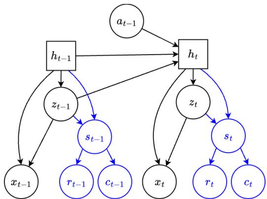
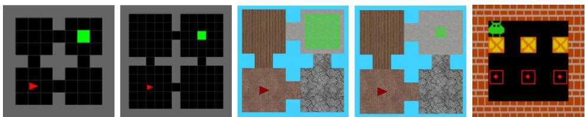
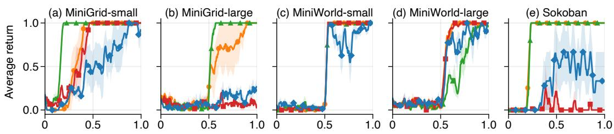
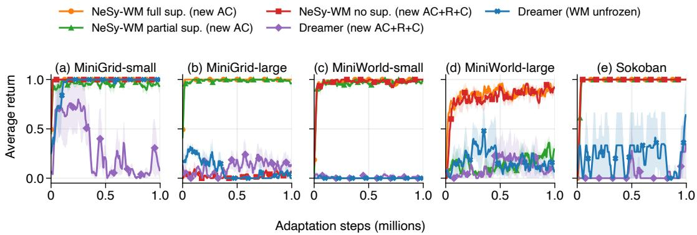

# Towards Zero-Shot Task Transfer with Neurosymbolic World Models

Isidoro Tamassia, Lennert De Smet, Giuseppe Marra

KU Leuven, Department of Computer Science, Belgium {isidoro.tamassia, lennert.desmet, giuseppe.marra}@kuleuven.be

## Abstract

State-of-the-art model-based reinforcement learning methods learn neural world models that allow policy improvement by planning in a latent space, without assumptions on the structure of the underlying environment. While expressive, these models are generally task-dependent: they learn unin- terpretable latent representations that are tied to the training task and thus hard to generalize to new tasks. In this work, we present a novel world model formulation where the reward prediction only depends on a subset of structured, symbolic components of the whole latent state. Decoupling observation reconstruction and reward prediction allows us to learn world models that can adapt zero-shot, i.e. without further environ- ment interactions, to new reward functions defined over the same symbolic state space. We discuss the main advantages and challenges of learning these neurosymbolic world models and demonstrate the strong generalisation properties of our approach over purely neural methods.

## 1 Introduction

World models are motivated by the idea that agents can learn compact internal representations of their environments from experience and use them to guide decision-making (Ha and Schmidhuber 2018). In reinforcement learning (RL), popular methods typically learn latent representations of states, dy- namics, and reward functions directly from high-dimensional observations such as sequences ofimages (Schrittwieser et al. 2020; Hafner et al. 2019, 2020, 2021, 2025; Hansen, Wang, and Su 2022; Hansen, Su, and Wang 2024). These learned representations can be used to optimise behaviour in several ways, including model-predictive control (Hansen, Wang, and Su 2022; Hansen, Su, and Wang 2024), Monte-Carlo Tree Search (Schrittwieser et al. 2020), or actor-critic learning on imagined trajectories (Hafner et al. 2020, 2021, 2025).

Despite their ability to learn compact representations of environment dynamics, RL world models are not straightfor- wardly reusable across tasks. A particularly important case is task transfer under shared dynamics: the environment and its transition structure remain the same, but the reward func- tion changes. This setting arises naturally in domains where the same environment supports multiple objectives, such as reaching diferent goals, placing objects in diferent config-urations, or avoiding diferent hazards. Current RL world models are poorly suited to this setting because they typi- cally learn a reward predictor jointly with the latent state and dynamics model. As a result, the learned representations may depend fully (Schrittwieser et al. 2020; Hansen, Wang, and Su 2022; Hansen, Su, and Wang 2024) or partially (Hafner et al. 2020, 2021, 2025) on the rewards observed during trainin . When the task chan es, the learned reward redic- tor remains tied to the training objective and is therefore not aligned with the new reward function, even though the underlying dynamics are unchanged. At the same time, the latent states learned by these models do not provide an in- terpretable interface on which a new reward function can be specified directly. Consequently, reusing a task-dependent world model for a new task typically requires learning or finetuning a new reward predictor using data from the test environment, or by relabeling training trajectories with the downstream task rewards (Sekar et al. 2020).

Unlike transition dynamics, reward functions often en- code the desiderata of a user or task designer rather than an intrinsic property of the environment. Hence, they are frequently specified in terms of high-level semantic abstrac- tions of the state, such as an agent reaching a target location, objects satisfying a desired configuration, or unsafe states being avoided (Icarte et al. 2022). When a reward function is given, replacing it with a learned predictor can unnecessarily entangle the task objective with the latent dynamics model.

However, directly using an explicit reward function re- quires the variables on which it depends to be available to the model. If these symbolic properties were available as part of the model state, the same learned model could be reused for new tasks whose reward functions are defined over the same properties, even when the reward specification itself changes. Crucially, exposing such symbolic properties should not re- quire replacing learned latent dynamics with a fully symbolic model. The symbolic component only needs to capture the reward-relevant aspects of the state, while the remaining in- formation required for control can remain encoded in latent representations learned from raw, subsymbolic observations.

We instantiate this principle with Neurosymbolic World Models (NeSy-WMs), a new class of world models that combine latent dynamics learning with an explicit symbolic inter- face for reward evaluation. NeSy-WMs build on Recurrent State-Space Models (RSSMs) (Hafner et al. 2019), which learn compact latent dynamics from high-dimensional obser- vations. In addition, a NeSy-WM predicts a set of symbolic state properties that are chosen to capture the variables on which task rewards depend. Rewards are then predicted only through these symbolic properties, rather than directly from the latent state. This design disentangles latent modeling of environment dynamics from symbolic, interpretable reward prediction. Importantly, the symbolic state does not need to provide a complete symbolic description of the environ- ment. It only needs to expose the reward-relevant properties, leaving the remaining information needed for prediction and control in the learned latent representation.

Our contributions are as follows. (1) We formalise NeSy-WMs and their use for task transfer under shared dynamics, where new reward functions are defined over the same symbolic state properties as the training task. (2) We propose diferent symbolic supervision regimes for NeSy-WMs and evaluate their training performance and sample-eficiency against the state-of-the-art Dream- erV3 (Hafner et al. 2025). (3) We evaluate the zero-shot adaptation of NeSy-WMs to new test-time tasks in two dif- ferent settings: one where pure imagination planning is per- formed to solve the task (no further learning), and one where the model is finetuned in imagination. (4) We provide an open-source and highly configurable PyTorch (Paszke et al. 2019) implementation of NeSy-WMs.

## 2 Related Work

Our work lies at the intersection of world models for model- based RL (MBRL) and probabilistic neurosymbolic learning.

World models aim to predict, explicitly or implicitly, how an environment (the world) evolves under actions. While reward-free world models are typically trained from observa- tions alone through predictive or generative objectives (As-sran et al. 2023; Zhou et al. 2025; Micheli, Alonso, and Fleuret 2023), several task-dependent world models used in MBRL instead aim for optimal control by learning latent dynamics directly through reward prediction, value predic- tion, and policy improvement objectives (Schrittwieser et al. 2020; Danihelka et al. 2022; Hansen, Wang, and Su 2022; Hansen, Su, and Wang 2024). Generative world models (Ha and Schmidhuber 2018; Alonso et al. 2024; Hafner et al. 2020, 2021, 2025) additionally shape their representations by reconstructing observations or sensory inputs. In particular, Recurrent State-Space Models (RSSMs) (Hafner et al. 2019) can successfully model high-dimensional, partially observ- able environments and form the backbone of the Dreamer family of algorithms (Hafner et al. 2020, 2021, 2025). More-over, their probabilistic formulation is naturally compatible with probabilistic neurosymbolic methods.

Neurosymbolic AI (Garcez and Lamb 2023; Marra et al. 2024) integrates symbolic knowledge and reasoning into machine learning models. Various probabilistic neurosym- bolic models (Manhaeve et al. 2018; Yang, Ishay, and Lee 2020) now integrate generative models to constrain generations and perform test-time interventions. They mostly use variational autoencoders (Kingma and Welling 2014) with a static (Misino, Marra, and Sansone 2022; De Smet et al. 2023) or dynamic (De Smet et al. 2025) encoding space combining latent and symbolic features. Their probabilis- tic nature is not only used for compatibility with generative models, but also to enable end-to-end training via proba- bilistic inference. A number of neurosymbolic approaches to world modeling have recently been proposed. Cano et al. (2025) learn reusable neural world-model primitives from ofline data and assembles them into a finite-state-machine world model to facilitate control across environments. Seh- gal et al. (2024) introduce an object-centric neurosymbolic world model that augments object representations with symbolic attributes to improve compositional generalisation in dynamics prediction. In both cases, the primary goal is to leverage symbolic structure to improve modeling and gener- alisation of environment dynamics, rather than our goal of enabling adaptation to new tasks under shared dynamics.

Finally, our work is related to goal-conditioned RL (GCRL), which learns policies or value functions conditioned on a goal representation to solve a family of tasks (Schaul et al. 2015; Andrychowicz et al. 2017; Liu, Zhu, and Zhang 2022). GCRL typically amortizes adaptation by jointly training on many goals and executing a goal-conditioned policy at test time. In contrast, we learn a NeSy- WM on a single training task and perform the desired task adaptation in the imagination of the world model, without the need to pre-train in a multi-task setting.

## 3 Methodology

## 3.1 Overview

Our goal is task transfer under two main assumptions. (A1) Training and test reward functions are explicitly defined in terms of a limited number of high-level abstractions of the state. Such abstractions will be called the s mbolic properties of the state and the vocabulary of such abstractions is assumed to be given by the user. (A2) The underlying dynamics of all tasks is the same. For instance, consider a navigation environment where the training task is to reach a fixed goal. Whether this task has been achieved only de- pends on the location of the agent. No other properties of the environment, e.g. agent orientation, matter for assessing task-achievement. A possible test task would be to shift the goal to any other position in the map; the reward function still depends only on the agent location, despite inducing a task that is completely diferent from the training task.

Current world models learn purely latent representations of the state which cannot directly exploit user-specified re- ward functions, even when the test tasks are naturally defined on symbolic properties. As a result, a new reward predictor has to be learned, e.g. by manually relabeling replayed ob- servations (Sekar et al. 2020).

NeSy-WMs avoid learning new reward functions without harming representation learning. They instead make the symbolic properties an explicit part of the world model. The symbolic properties form a bottleneck for the reward pre- diction to facilitate substitution of any other reward function defined on the same properties. More specifically, the model augments DreamerV3 (Hafner et al. 2025) with neurosymbolic reward and continue predictors (Figure 1).

  
Figure 1: Overview of NeSy-WMs. The symbolic- bottlenecked reward and continue predictors are shown in blue; the rest follows the RSSM structure of (Hafner et al. 2019). At test time, new reward and continue functions can be defined over the same symbols to enable zero-shot plan- ning or imagination training of a new actor-critic.

Sequence model: $h _ { t } = f _ { \phi } ( z _ { t - 1 } , h _ { t - 1 } , a _ { t - 1 } )$

Encoder: $z _ { t } \sim q _ { \phi } ( z _ { t } \mid h _ { t } , x _ { t } )$

Dynamics predictor: $\hat { z } _ { t } \sim p _ { \phi } ( \hat { z } _ { t } \mid h _ { t } )$

NeSy reward predictor: $\hat { r } _ { t } \sim p _ { \phi } ^ { \mathrm { s y m } } ( \hat { r } _ { t } \mid z _ { t } , h _ { t } )$

NeSy continue predictor: $\hat { c } _ { t } \sim p _ { \phi } ^ { \mathrm { s y m } } ( \hat { c } _ { t } \mid z _ { t } , h _ { t } )$

Decoder: $\hat { x } _ { t } \sim p _ { \phi } ( \hat { x } _ { t } \mid z _ { t } , h _ { t } )$

Here, $x _ { t }$ denotes the observation at time $t , a _ { t }$ the action, $h _ { t }$ the deterministic recurrent hidden state, $z _ { t }$ the stochastic latent state. The "continue" predictor models the probability that the episode continues at the next step, i.e. that the current state is non-terminal. The function $f _ { \phi }$ is the deterministic recurrent transition of the RSSM. Next, we specify the neurosymbolic predictors and how to compute their probabilities.

Neurosymbolic predictors combine neural parametrisations with functions on symbols. The neurosymbolic re-ward predictor first neurally predicts a distribution $p _ { \phi } ( s _ { t } \mid$ $z _ { t } , h _ { t } )$ over the symbolic properties using a simple MLP. The symbolic properties are assumed to be the only input to a given reward function $p ^ { s y m } ( r _ { t } \mid s _ { t } )$ (Assumption (A1)). The uncertainty on $s _ { t }$ parametrised by $p _ { \phi } ( s _ { t } \mid z _ { t } , h _ { t } )$ in- duces a probability distribution over the rewards $r _ { t }$ . Indeed, the distribution $p _ { \phi } ^ { \mathrm { { s y m } } } ( r _ { t } \mid z _ { t } , h _ { t } )$ is given by marginalising over the symbolic states $s _ { t }$ as

$$
\sum _ { s _ { t } } p ^ { s y m } ( r _ { t } \mid s _ { t } ) p _ { \phi } ( s _ { t } \mid z _ { t } , h _ { t } )\tag{1}
$$

$$
\mathrm { o r } \qquad \int p ^ { s y m } ( \boldsymbol { r } _ { t } \mid s _ { t } ) p _ { \phi } ( s _ { t } \mid \boldsymbol { z } _ { t } , h _ { t } ) \mathrm { d } s _ { t } ,\tag{2}
$$

for discrete or continuous symbolic properties, respectively. Equations 1 and 2 also explain the generalisation ability of NeSy-WMs; $p ^ { s y m } ( r _ { t } \mid s _ { t } )$ can simply be replaced with a new reward function. The same holds for the neurosymbolic continue predictor, which can be defined analogously.

Example 3.1 (Discrete Navigation). Consider a discrete grid world where the symbolic property $\boldsymbol { s } _ { t } = ( x _ { t } , y _ { t } )$ models the discrete coordinates of the player at time step t. The reward function $p ^ { s y m } ( r _ { t } \mid \ r _ { t } )$ takes the coordinates $s _ { t }$ as input and returns $1 \ i f \ s _ { t }$ is the goal $( x _ { g } , y _ { g } )$ and 0 otherwise. If we model the distribution over the symbolic properties $p _ { \phi } ( s _ { t } \mid z _ { t } , h _ { t } )$ as two independent categorical distributions, then $p _ { \phi } ^ { \mathrm { { s y m } } } ( r _ { t } = 1 \mid z _ { t } , h _ { t } )$ (Equation 1) reduces to

$$
\operatorname* { P r } _ { \phi } ( x _ { t } = x _ { g } \mid z _ { t } , h _ { t } ) \cdot \operatorname* { P r } _ { \phi } ( y _ { t } = y _ { g } \mid z _ { t } , h _ { t } ) .
$$

Example 3.2 (Continuous Navigation). Consider a continuous grid world that has a continuous symbolic state $s _ { t } ~ = ~ ( x _ { t } , y _ { t } ) ~ \in ~ \mathbb { R } \times \mathbb { R } .$ Here, a goal is reached when the symbolic state $s _ { t }$ lies in a square target area $\left\{ ( x , y ) \mid a _ { x } ^ { - } \leq x \leq a _ { x } ^ { + } , a _ { y } ^ { - } \leq y \leq a _ { y } ^ { + } , \right\}$ . If we model the distribution over the symbolic properties $p _ { \phi } ( s _ { t } \mid z _ { t } , h _ { t } )$ as two independent Gaussian distributions

$$
\begin{array} { r } { \boldsymbol { x } _ { t } \mid \boldsymbol { z } _ { t } , \boldsymbol { h } _ { t } \sim \mathcal { N } ( \mu _ { x } ( \boldsymbol { z } _ { t } , \boldsymbol { h } _ { t } ) , \sigma _ { x } ^ { 2 } ( \boldsymbol { z } _ { t } , \boldsymbol { h } _ { t } ) ) , } \\ { \boldsymbol { y } _ { t } \mid \boldsymbol { z } _ { t } , \boldsymbol { h } _ { t } \sim \mathcal { N } ( \mu _ { y } ( \boldsymbol { z } _ { t } , \boldsymbol { h } _ { t } ) , \sigma _ { y } ^ { 2 } ( \boldsymbol { z } _ { t } , \boldsymbol { h } _ { t } ) ) , } \end{array}
$$

then $p _ { \phi } ^ { s y m } ( r _ { t } = 1 \mid z _ { t } , h _ { t } )$ (Equation 2) is given by

$$
\operatorname* { P r } _ { \phi } ( a _ { x } ^ { - } < x _ { t } < a _ { x } ^ { + } ) \cdot \operatorname* { P r } _ { \phi } ( a _ { y } ^ { - } < y _ { t } < a _ { y } ^ { + } ) ,
$$

where $\operatorname* { P r } _ { \phi } ( a _ { x } ^ { - } < x _ { t } < a _ { x } ^ { + } )$ is computable using the Gaussian CDF (supplementary material).

In the relevant case where the reward function checks whether $s _ { t }$ satisfies logical properties, computing Equa- tions 1 and 2 reduces to the standard inference tasks in probabilistic neurosymbolic AI: Weighted Model Counting (WMC) (Chavira and Darwiche 2008) for discrete $s _ { t }$ or Weighted Model Integration (WMI) (Belle, Passerini, and Van den Broeck 2015) for continuous $s _ { t }$ . WMC and WMI have highly-optimised inference strategies (Chavira and Dar-wiche 2008; Zeng et al. 2020; Maene, Derkinderen, and Zuid- berg Dos Martires 2025) to better handle the intractability of computing Equations 1 and 2 (Roth 1996).

## 3.2 Model Learning

Our model-learning setup difers from DreamerV3 in two ways. (1) The neurosymbolic predictors $p _ { \phi } ^ { \mathrm { s y m } } ( r _ { t } \mid z _ { t } , h _ { t } )$ and $p _ { \phi } ^ { \mathrm { s y m } } ( c _ { t } \mid z _ { t } , h _ { t } )$ replace the standard MLPs and (2) symbolic supervision losses that can be added to ensure aligned symbolic representations.

Standard Loss Given a sequence of observations $x _ { 1 : T }$ actions $a _ { 1 : T } .$ , rewards $r _ { 1 : T }$ and continuation flags $c _ { 1 : T }$ , we minimize the overall world model loss

$$
\begin{array} { r } { \mathcal { L } _ { \mathrm { W } } ( \phi ) = \mathbb { E } _ { q _ { \phi } } \Bigg [ \displaystyle \sum _ { t = 1 } ^ { T } \Big ( \beta _ { \mathrm { p r e d } } \mathcal { L } _ { \mathrm { p r e d } } ^ { t } ( \phi ) + \beta _ { \mathrm { d y n } } \mathcal { L } _ { \mathrm { d y n } } ^ { t } ( \phi ) } \\ { + \beta _ { \mathrm { r e p } } \mathcal { L } _ { \mathrm { r e p } } ^ { t } ( \phi ) + \beta _ { \mathrm { r e c } } \mathcal { L } _ { \mathrm { r e c } } ^ { t } ( \phi ) \Big ) \Bigg ] , } \end{array}
$$

where $\beta _ { \mathrm { p r e d } } , \beta _ { \mathrm { d y n } } , \beta _ { \mathrm { r e p } } , \beta _ { \mathrm { r e c } }$ are fixed hyperparameters and the individual losses are defined as

$$
\begin{array} { r l } & { \quad \mathcal { L } _ { \mathrm { r e c } } ^ { t } ( \phi ) = - \log p _ { \phi } ( x _ { t } \mid z _ { t } , h _ { t } ) , } \\ & { \mathcal { L } _ { \mathrm { p r e d } } ^ { t } ( \phi ) = - \log p _ { \phi } ^ { \mathrm { s y m } } ( r _ { t } \mid z _ { t } , h _ { t } ) - \log p _ { \phi } ^ { \mathrm { s y m } } ( c _ { t } \mid z _ { t } , h _ { t } ) , } \\ & { \mathcal { L } _ { \mathrm { d y n } } ^ { t } ( \phi ) = \operatorname* { m a x } \bigr ( 1 , \mathrm { K L } [ \mathrm { s g } ( q _ { \phi } ( z _ { t } \mid h _ { t } , x _ { t } ) ) \mid \mid p _ { \phi } ( z _ { t } \mid h _ { t } ) ] \bigr ) , } \\ & { \mathcal { L } _ { \mathrm { r e p } } ^ { t } ( \phi ) = \operatorname* { m a x } ( 1 , \mathrm { K L } [ q _ { \phi } ( z _ { t } \mid h _ { t } , x _ { t } ) \mid \mid \mathrm { s g } ( p _ { \phi } ( z _ { t } \mid h _ { t } ) ) ] \bigr ) , } \end{array}
$$

where $\operatorname { s g } ( \cdot )$ is the stop-gradient operator. The dynamics loss $\mathcal { L } _ { \mathrm { d y n } } ^ { t } ( \phi )$ and representation loss $\dot { \mathcal { L } } _ { \mathrm { r e p } } ^ { t } ( \phi )$ optimise the transi- tions via a KL divergence between prior and posterior. Re- construction loss $\mathscr { L } _ { \mathrm { r e c } } ^ { t } ( \phi )$ and prediction loss $\mathcal { L } _ { \mathrm { p r e d } } ^ { \dot { t } } ( \phi )$ ensure accurate observations and reward/continuation signals.

Neurosymbolic predictors are diferentiable. The neu-rosymbolic reward and continuation predictors are computed exactly via Equation 1 or 2. Exact neurosymbolic inference remains end-to-end diferentiable (Manhaeve et al. 2018) to propagate gradients from $s _ { t } \ \mathrm { t o } \ z _ { t }$ and $h _ { t } .$ Consequently, the neurosymbolic $p _ { \phi } ^ { \mathrm { s y m } } ( r _ { t } \mid \hat { z } _ { t } , h _ { t } )$ and $p _ { \phi } ^ { \mathrm { s y m } } ( c _ { t } \mid \mathbf { \bar { \phi } } z _ { t } , h _ { t } )$ are drop-in replacements for the MLPs used by DreamerV3.

Symbolic supervision losses make symbolic states identifiable. Solely relying on task reward prediction as a source of distant supervision for learning symbolic states can be in- suficient to learn aligned representations (Marconato et al. 2023). Identifiability of the symbols impacts task generali-sation; if the symbols are learned wrongly, symbolic states may be assigned wrong rewards at test-time. For this reason, we consider and test three diferent supervision schemes (S).

(S1) Full supervision. Direct symbolic supervision on all the states visited throughout world model training. This re- quires the agent to directly observe the symbolic properties $s _ { 1 : T }$ . The per-step symbolic supervision loss is the negative log-likelihood of the ground-truth symbol

$$
\mathcal { L } _ { \mathrm { s y m } } ^ { t } ( \phi ) = - \log p _ { \phi } ( s _ { t } \mid z _ { t } , h _ { t } ) .
$$

This kind of supervision can be seen as a form of privileged- information training (Lambrechts, Bolland, and Ernst 2024; Huang et al. 2025). However, such approaches either pro-vide the full Markovian state during training, or a surrogate that is suficient for reconstructing image observations (Lambrechts, Bolland, and Ernst 2024). This is a stronger assump- tion than observing the symbolic properties considered in our work, which neither constitute a Markovian state representa- tion nor sufice to reconstruct image observations.

(S2) Partial supervision. A weaker assumption is to su-pervise only a subset $S ^ { \prime }$ of all symbolic states. This limits the generalisation of NeSy-WMs to novel tasks involving relevant symbolic states, e.g. potential goal states, in $S ^ { \check { \prime } } .$ Concretely, partial supervision adds the log-likelihood of the ground-truth symbols only when a state in $S ^ { \prime }$ is visited:

$$
\mathcal { L } _ { \mathrm { s y m } } ^ { t } ( \phi ) = - \mathbb { 1 } _ { \{ s _ { t } \in S ^ { \prime } \} } \cdot \log p _ { \phi } ( s _ { t } \mid z _ { t } , h _ { t } ) .
$$

Intuitively, this corresponds to having sensors in limited parts of the environment. A potential issue is that the predictor may collapse to always predicting supervised symbols; after a reward intervention, a state incorrectly mapped to a re- warded supervised symbol may produce a spurious reward and cause transfer failure. A simple solution inspired by Mar- conato et al. (2024) is to add an entropy regularisation term to discourage overly confident predictions. For a symbolic state composed of M categorical variables, we minimise

$$
\mathcal { L } _ { \mathrm { e n t } } ^ { t } ( \phi ) = - \beta _ { \mathrm { e n t } } \frac { 1 } { M } \sum _ { j = 1 } ^ { M } \frac { \mathcal { H } \Big [ p _ { \phi } ( s _ { t } ^ { ( j ) } \mid z _ { t } , h _ { t } ) \Big ] } { \log \vert \mathcal { S } _ { j } \vert } ,
$$

where $\mathcal { H }$ denotes Shannon entropy, $S _ { j }$ is the domain of the j-th symbolic variable, and $\beta _ { \mathrm { e n t } }$ controls the regularisation.

(S3) No supervision. When no supervision is provided, the symbolic predictors can learn any mapping as long as it suf- fices to solve the training task. Nonetheless, we still consider this setting because the imposed symbolic structure may still help stabilise training and facilitate downstream finetuning.

## 3.3 Test-Time Interventions and Generalisation

At training time, control follows the actor-critic scheme of DreamerV3, summarised in the supplementary material. Once a NeSy-WM is trained, it can be adapted to diferent tasks without access to the test environments. To do so, it is suficient to replace the training predictors $p ^ { s y m } ( r _ { t } \mid s _ { t } )$ and $p ^ { s y m } ( c _ { t } \mid s _ { t } )$ in Equation 1 or 2 with the given test predictors. This requires new tasks to be defined over the same symbols (Assumption (A1)) and assumes fixed dynamics (Assumption (A2)). Given the replaced reward function, there are two options (O) to adapt a NeSy-WM to a novel test task. In both cases, there is no interaction with the test environment.

(O1) Adaptation by pure planning. Monte-Carlo Tree Search (MCTS) (Coulom 2006; Kocsis and Szepesvári 2006) can be employed to plan at test time using the learned model and the new reward/continue predictors without any further learning. We stress that this is not possible for purely neural models such as Dreamer, since they cannot replace the previ- ously learned reward/continue predictors without a finetun- ing phase. While we experiment on environments with dis- crete action spaces, NeSy-WMs can also be used for planning in continuous action spaces using compatible algorithms, such as the Cross-Entropy Method (CEM) (Rubinstein 1997) or appropriate extensions of MCTS (Couetoux 2013).

(O2) Adaptation by imagination finetuning. NeSy-WMs can be finetuned on a new task entirely in the world model’s imagination without anyfurther interaction with the environment. By manually replacing the predictors $p ^ { \mathrm { s y m } } ( r _ { t } \mid s _ { t } )$ and $p ^ { \mathrm { s y m } } ( c _ { t } \mid s _ { t } )$ as described above, a new actor-critic can be trained without collecting new task-specific data or perform- ing the time-consuming replay-bufer relabeling required by previous Dreamer adaptation approaches (Sekar et al. 2020).

## 3.4 Limitations

The main limitation of our approach surrounds the align- ment of the symbolic predictions $p _ { \phi } ( s _ { t } \mid z _ { t } , h _ { t } )$ with the ground-truth properties they are meant to represent. If the predicted symbolic distribution is misaligned, then interven- ing on the reward function can assign rewards according to the wrong symbolic interpretation, leading to adaptation failure. Symbolic supervision aligns the symbols with the in- tended semantics and facilitates reliable task transfer, while purely reward-based training may lead to symbolic shortcuts suficient only for the training task. That is, NeSy-WMs make explicit the relation between the symbolic information pro- vided during learning and the range of reward interventions that can be trusted at test time. Purely neural world models do not provide this possibility because they have no interpretable interface for directly specifying new reward functions.

A separate limitation concerns the availability and sufi- ciency of the symbolic language. Our formulation assumes that training and test rewards are defined over the same sym- bolic properties. If a new task depends on properties outside this vocabulary, the latent RSSM state may still contain useful predictive information, but provides no interpretable mecha- nism for wiring the new reward function on top of it. Transfer is therefore limited to tasks whose rewards can be expressed suficiently in the chosen symbolic vocabulary.

## 4 Experimental Evaluation

In this section, we propose experiments to test the following three main claims (C) of our work.

(C1) Sample-eficient training. We expect NeSy-WMs to improve sample eficiency with respect to DreamerV3 due to the provided structure of the reward/continue predictors, especially when some symbolic supervision is provided.

(C2) Zero-shot adaptation by imagination planning. We expect NeSy-WMs to enable planning on new test tasks under the same dynamics without further learning, unlike existing finetuning approaches.

(C3) Zero-shot adaptation by imagination finetuning. We expect NeSy-WMs to enable zero-shot finetuning on novel test tasks completely in the model imagination. This ability contrasts with existing adaptation settings of DreamerV3, which either require online test-task experience or replay bufer relabeling (Sekar et al. 2020).

To test our claims, we propose a set of corresponding exper- iments (E):

(E1) Training sample eficiency. We train NeSy-WMs in fully supervised (S1), partially supervised (S2), and unsupervised (S3) settings to assess their training sample eficiency compared to standard DreamerV3.

(E2) Zero-shot adaptation by planning. The trained NeSy-WMs from E1 are adapted to a variety of test tasks of increasing dificulty without any further training through MCTS planning in model imagination (O1). Since Dreamer adaptation requires further training, it cannot be compared in this setting. Instead, we compare against the same MCTS planning algorithm using a perfect environment simulator.

(E3) Zero-shot adaptation by imagination finetuning. Using the models trained in E1, NeSy-WMs are adapted to a selected set of hard test tasks through imagination fine- tuning (O2). Specifically, NeSy-WMs always freeze their latent dynamics model and train a new actor-critic if symbols were fully supervised (S1) or partially supervised (S2) during training (new AC). If symbols were unsupervised during training (S3), NeSy-WMs instead learn a new actor-critic and reward/continue predictors through replay bufer relabeling following Sekar et al. (2020). For DreamerV3, we employ the same adaptation scheme by training a new actor-critic and reward/continue predictors from the relabeled bufer (new $\mathrm { A C } + \mathrm { R } + \mathrm { C } )$ . We also evaluate a baseline where the entire DreamerV3 world model is unfrozen (WM unfrozen).

## 4.1 Training Environments

We describe the environments used for the training experi- ments in E1 (Figure 2), and their symbolic abstractions.

MiniGrid 2D-FourRooms. We employ two versions of a 2D Four-Rooms environment implemented using MiniGrid (Chevalier-Boisvert et al. 2023). In particular, MiniGrid-small has four $3 \times 3$ rooms, whereas MiniGrid- large has $5 \times 5$ rooms. The observations are images of the whole grid, and the agent has 3 available actions: forward, turn-left, and turn-right. The agent only receives a pos- itive reward of +1 if the goal is reached and 0 otherwise. At training time, the initial agent position is randomized, and the goal position is fixed as the center of the top-right room. The (x, y) coordinate of the agent is used as the task-relevant symbolic abstraction. This abstraction is suficient for reward prediction, but incomplete for control since the orientation of the agent also matters for choosing the correct action. In experiments with partial symbolic supervision, we only supervise the center of each room.

MiniWorld 3D-FourRooms. We employ two versions of a 3D partially observable four-rooms environment with con- tinuous state space, implemented in MiniWorld (Chevalier-Boisvert et al. 2023). Figure 2 shows a top-down view (the egocentric view is provided in the supplementary material). The action space matches MiniGrid, except that forward moves the agent by 0.3 and 0.15 world units in MiniWorld-small and MiniWorld-large, respectively, while turning rotates the agent by 30◦ and 15◦. A reward of +1 is received only when the agent enters a goal region. During training, the initial position is randomized and the goal is fixed at the center of the top-right room. We use the continuous $( x , y )$ position as the symbolic abstraction. In experiments with partial symbolic supervision, we only supervise the four po- tential goal areas centered in each room.

Sokoban. Here, the agent needs to push all the boxes to the indicated goal positions in a customized version of the game Sokoban (Schrader 2018). In this version, it only receives a reward (+1) when the task is completed. The agent has 9 available actions: move-dir and push-dir for each direction dir ∈ {left, right, up, down}, and a null action which does nothing. We employ a task-relevant symbolic abstrac- tion comprising only the coordinates of the boxes, since the reward depends only on their locations. In experiments with partial symbolic supervision, we only provide supervision when all boxes are on training or test targets.

NeSy-WM (full sup.) NeSy-WM (partial sup.) NeSy-WM (no sup.) Dreamer

  
Figure 2: Training tasks. The initial position of the agent is random. From left to right: MiniGrid-small, MiniGrid-large, a top view of MiniWorld-small and MiniWorld-large difering in movement granularity and goal area size, and Sokoban.

Environment steps (millions)  
  
Figure 3: Training results. Curves show the average return across three seeds and their standard error. Both NeSy-WMs and Dreamer start by an exploration phase in the MiniWorld environments and in MiniGrid-large (see supplementary material).

## 4.2 Test Tasks

Planning Tasks For the experiments in E2, we select a set of test tasks for each training environment, visualized in the supplementary material. In particular, we take the center of the bottom-left room as test goal, opposite the training goal, for MiniGrid and MiniWorld, and move the boxes to oppo- site (top) target positions in Sokoban. The tasks are crafted to identify at what point the planning-adapted model fails as the distance between the initial position of the agent and the goal increases. Specifically, the Easy, Medium and Hard chal- lenges for MiniGrid and MiniWorld feature an increasingly distant starting position of the agent from the goal position. Similarly, the Easy task in Sokoban requires placing only one box in a correct test-task configuration, while Hard re- quires moving all boxes to new target positions.

Imagination Finetuning Tasks For the experiments in E3, we consider again the opposite map position with respect to training as the goal for MiniGrid and MiniWorld, and moving all three boxes to opposite target positions in Sokoban. While finetuning the model, we take snapshots of the policy to evaluate it on the test environment with randomized agent initial position at each evaluation episode.

## 4.3 Results

(C1) NeSy-WMs improve the stability and sample eficiency of world-model training in sparse-reward environments, particularly under symbolic supervision. Fig-ure 3 shows the training performance of NeSy-WMs under diferent supervision regimes S1-S3, compared to Dream- erV3. Across the five training tasks, NeSy-WMs with either full or partial supervision mostly outperform the baseline in terms of sample-eficiency and stability. The only excep- tion is the partially supervised agent in MiniWorld-large that converged some steps later. Supervised NeSy-WMs also converge significantly faster in MiniGrid-small, and outper- form the baseline in MiniGrid-large and Sokoban, where Dreamer is unstable and does not converge. In the case where no symbolic supervision is provided, NeSy-WMs still per- form comparably to Dreamer, outperforming it on MiniGrid- small but matching Dreamer’s failures on Sokoban and MiniGrid-large. The benefits provided by the supervision in these experiments suggest that symbol prediction may by itself be a strong learning signal for RL world models. We further investigated this hypothesis in an ablation reported in the supplementary material, where we show that our perfor- mance under symbolic supervision remains equally strong without reconstruction gradients, unlike Dreamer which dra- matically fails.

(C2) NeSy-WMs enable zero-shot MCTS test-time adaptation, but are constrained by the limitations of uninformed planning. Table 1 shows the results of the zero-shot MCTS planning with fully supervised and par- tially supervised NeSy-WMs on the selected test tasks. With the same planning budget of 256 tree expansions per step, the fully supervised model solves most of the Easy and Medium challenges in an optimal or close-to-optimal number of steps. However, pure planning is not enough to consistently solve the Hard tasks in MiniGrid-large, MiniWorld- small/large, and Sokoban. The partially supervised model generally achieves comparable performance, despite lower success rates in MiniGrid-small. These results were com- pared to planning with perfect environment simulators using the same planning budget and MCTS parameters. Aggre- gated across all challenges, fully and partially supervised NeSy-WMs achieve success rates of 75.6% and 69.6%, respectively, compared with 79.3% for perfect-simulator plan-ning. The complete comparison is reported in the supple- mentary material. While increasing the planning budget may improve the results, doing so with a learned model without value bootstrapping is slow (Schrittwieser et al. 2020) and prone to dynamics degradation (Talvitie 2017; Asadi et al. 2019).

<table><tr><td></td><td colspan="2">MG-SMALL</td><td colspan="2">MG-LARGE</td><td colspan="2">MW-SMALL</td><td colspan="2">MW-LARGE</td><td colspan="2">SOKOBAN</td></tr><tr><td>Challenge</td><td>Full</td><td>Partial</td><td>Full</td><td>Partial</td><td>Full</td><td>Partial</td><td>Full</td><td>Partial</td><td>Full</td><td>Partial</td></tr><tr><td rowspan="2">EASY</td><td> $1 . 0 0 { \pm } 0 . 0 0 \ $ </td><td> $1 . 0 0 { \pm } 0 . 0 0 \ $ </td><td> $1 . 0 0 { \pm } 0 . 0 0 \ $ </td><td>1.00±0.00</td><td>0.78±0.15</td><td>0.89±0.11</td><td>0.89±0.11</td><td>0.44±0.18 1.00±0.00</td><td></td><td>1.00±0.00</td></tr><tr><td> $\Delta = 0 . 0$ </td><td> $\Delta = 2 . 7$ </td><td> $\Delta = ~ 0 . 0$ </td><td> $\Delta = ~ 0 . 0$ </td><td> $\Delta = ~ 8 . 7$ </td><td> $\Delta = ~ 7 . 4$ </td><td> $\Delta = ~ 5 . 1$ </td><td> $\Delta = 2 4 . 5$ </td><td> $\Delta = ~ 0 . 0$ </td><td> $\Delta = ~ 1 . 1$ </td></tr><tr><td rowspan="2">MEDIUM</td><td> $1 . 0 0 { \pm } 0 . 0 0 \ $ </td><td> $0 . 6 7 { \pm } 0 . 1 7$ </td><td> $1 . 0 0 { \pm } 0 . 0 0 \ $ </td><td>1.00±0.00</td><td> $1 . 0 0 { \pm } 0 . 0 0 \ $ </td><td></td><td>1.00±0.00 0.11±0.11</td><td> $0 . 0 0 { \pm } 0 . 0 0$ </td><td> $1 . 0 0 { \pm } 0 . 0 0 \ $ </td><td>1.00±0.00</td></tr><tr><td> $\Delta = 0 . 0$ </td><td> $\Delta = 0 . 0$ </td><td> $\Delta = ~ 0 . 0$ </td><td> $\Delta = ~ 8 . 2$ </td><td> $\Delta = \ 8 . 9$ </td><td> $\Delta = ~ 8 . 2$ </td><td> $\Delta = 3 3 . 0$ </td><td> $\begin{array} { r l } { \Delta = } & { { } - } \end{array}$ </td><td> $\Delta = ~ 1 . 8$ </td><td> $\Delta = ~ 0 . 2$ </td></tr><tr><td></td><td> $1 . 0 0 { \pm } 0 . 0 0 \ $ </td><td> $0 . 6 7 { \pm } 0 . 1 7$ </td><td> $0 . 2 2 { \pm } 0 . 1 5$ </td><td>0.44±0.18</td><td> $0 . 6 7 { \pm } 0 . 1 7$ </td><td></td><td>0.67±0.17 0.00±0.00</td><td> $0 . 0 0 { \pm } 0 . 0 0$ </td><td> $0 . 6 7 { \pm } 0 . 1 7$ </td><td> $0 . 6 7 { \pm } 0 . 1 7$ </td></tr><tr><td>HARD</td><td> $\Delta = 9 . 8$ </td><td> $\Delta = 9 . 0$ </td><td> $\Delta = 3 3 . 0$ </td><td> $\Delta = 2 0 . 0$ </td><td> $\Delta = 3 5 . 3$ </td><td> $\Delta = 1 6 . 5$ </td><td> $\begin{array} { r l } { \Delta = } & { { } - } \end{array}$ </td><td> $\begin{array} { r l } { \Delta = } & { { } - } \end{array}$ </td><td> $\Delta = 7 2 . 5$ </td><td> $\Delta = 2 1 . 8$ </td></tr></table>

Table 1: MCTS evaluation of fully and partially supervised NeSy-WMs. MG and MW denote MiniGrid and MiniWorld, respectively. We report success rate ± standard error over nine episodes (three episodes for each of three trained models) and the optimality gap $\Delta \stackrel { = } { = } L - L ^ { \star }$ , where L is the mean length of successful plans and L⋆ is the optimal plan length for that challenge.

  
Fi ure 4: Ima ination finetunin results. Curves show the avera e return across three seeds and their standard error. Ada tation is entirely ofline; during finetuning, we periodically evaluate the policy in the test environment solely to measure performance.

(C3) NeSy-WMs outperform DreamerV3 in the zeroshot imagination finetuning setting. Figure 4 shows the adaptation performance of NeSy-WMs against the two Dreamer adaptation regimes. We remark that while super- vised NeSy-WMs only need to train a fresh actor-critic in imagination without any replay bufer relabeling, both Dreamer baselines and unsupervised NeSy-WMs need to train new reward/continue predictors on the relabeled bufer. The results clearly show how Dreamer consistently fails to adapt to the test-time tasks, with the only exception be- ing MiniGrid-small for the WM unfrozen regime. Con- versely, fully supervised NeSy-WMs adapt almost imme- diately to all the test-time tasks, followed by partially su- pervised NeSy-WMs which only struggle in MiniWorld- large. Unsupervised NeSy-WMs also result in a substan- tially more reliable adaptation approach than Dreamer, suc- cessfully adapting in four out of the five challenges. This shows that even when symbolic supervision is not avail- able, the structure of the neurosymbolic predictors can still make NeSy-WMs a convenient alternative for eficient task- adaptation by imagination finetuning.

## 5 Conclusion

In this work, we presented Neurosymbolic World Models (NeSy-WMs) that build on top of generative world models by incorporating symbolic reward and continuation predic- tors over learned, task-relevant symbolic properties of the state. NeSy-WMs demonstrate a consistently more sample- eficient training than DreamerV3 on the sparse-reward tasks considered in this work. They can also be employed for zero- shot test-time planning on diferent tasks than the one they were trained on, i.e. new reward functions defined over the same set of symbolic properties. Finally, NeSy-WMs demon- strated efective zero-shot finetuning on novel tasks in imag- ination without any interaction with the test environment. Importantly, they consistently outperformed the common approach of finetuning DreamerV3 with a relabeled replay bufer. Overall, we showed how prior symbolic knowledge of the reward function can be incorporated into generative world models in a way that is simple, benefits the training process, and provides distinctive generalisation properties.

Promising directions for extending NeSy-WMs include robust dynamics learning for reliable test-time planning over long horizons, testing other forms of symbolic alignment such as temporal consistency constraints, and exploration strategies that expose the model to the symbolic states needed for reliable task transfer in hard-exploration environments.

## References

Alonso, E.; Jelley, A.; Micheli, V.; Kanervisto, A.; Storkey, A.; Pearce, T.; and Fleuret, F. 2024. Difusion for world modeling: Visual details matter in atari. Advances in Neural Information Processing Systems, 37: 58757–58791.

Andrychowicz, M.; Wolski, F.; Ray, A.; Schneider, J.; Fong, R.; Welinder, P.; McGrew, B.; Tobin, J.; Abbeel, P.; and Zaremba, W. 2017. Hindsight experience replay. Advances in neural information processing systems, 30.

Asadi, K.; Misra, D.; Kim, S.; and Littman, M. L. 2019. Combating the compounding-error problem with a multi- step model. arXiv preprint arXiv:1905.13320.

Assran, M.; Duval, Q.; Misra, I.; Bojanowski, P.; Vincent, P.; Rabbat, M.; LeCun, Y.; and Ballas, N. 2023. Self-supervised learning from images with a joint-embedding predictive architecture. In Proceedings of the IEEE/CVF conference on computer vision and pattern recognition, 15619–15629.

Belle, V.; Passerini, A.; and Van den Broeck, G. 2015. Prob- abilistic inference in hybrid domains by weighted model integration. In Proceedings of the Twenty-Fourth International Joint Conference on Artificial Intelligence, IJCA 2015, Buenos Aires, Argentina, July 25-31, 2015, 2770– 2776. IJCAI Inc.

Cano, L. H.; Perroni-Scharf, M.; Dhir, N.; Ramamurthy, A.; and Solar-Lezama, A. 2025. Neurosymbolic World Models for Sequential Decision Making. In Forty-second International Conference on Machine Learning.

Chavira, M.; and Darwiche, A. 2008. On probabilistic in- ference by weighted model counting. Artificial Intelligence, 172(6-7): 772–799.

Chevalier-Boisvert, M.; Dai, B.; Towers, M.; de Lazcano, R.; Willems, L.; Lahlou, S.; Pal, S.; Castro, P. S.; and Terry, J. 2023. Minigrid & Miniworld: Modular & Customizable Reinforcement Learning Environments for Goal-Oriented Tasks. CoRR, abs/2306.13831.

Couetoux, A. 2013. Monte Carlo tree searchfor continuous and stochastic sequential decision making problems. Ph.D. thesis, Université Paris Sud-Paris XI.

Coulom, R. 2006. Eficient selectivity and backup operators in Monte-Carlo tree search. In International conference on computers and games, 72–83. Springer.

Danihelka, I.; Guez, A.; Schrittwieser, J.; and Silver, D. 2022. Policy improvement by planning with Gumbel. In International Conference on Learning Representations.

De Smet, L.; Dos Martires, P. Z.; Manhaeve, R.; Marra, G.; Kimmig, A.; and De Raedt, L. 2023. Neural probabilistic logic programming in discrete-continuous domains. In Uncertainty in Artificial Intelligence, 529–538. PMLR.

De Smet, L.; Venturato, G.; De Raedt, L.; and Marra, G. 2025. Relational neurosymbolic Markov models. In Proceedings of the AAAI Conference on Artificial Intelligence, volume 39, 16181–16189.

Garcez, A. d.; and Lamb, L. C. 2023. Neurosymbolic AI: The 3rd wave. Artificial Intelligence Review, 56(11): 12387– 12406.

Ha, D.; and Schmidhuber, J. 2018. Recurrent world models facilitate policy evolution. Advances in neural information processing systems, 31.

Hafner, D.; Lillicrap, T.; Ba, J.; and Norouzi, M. 2020. Dream to Control: Learning Behaviors by Latent Imagination. In International Conference on Learning Representations.

Hafner, D.; Lillicrap, T.; Fischer, I.; Villegas, R.; Ha, D.; Lee, H.; and Davidson, J. 2019. Learning latent dynamics for planning from pixels. In International conference on machine learning, 2555–2565. PMLR.

Hafner, D.; Lillicrap, T. P.; Norouzi, M.; and Ba, J. 2021. Mastering Atari with Discrete World Models. In International Conference on Learning Representations.

Hafner, D.; Pasukonis, J.; Ba, J.; and Lillicrap, T. 2025. Mas- tering diverse control tasks through world models. Nature, 640(8059): 647–653.

Hansen, N.; Su, H.; and Wang, X. 2024. TD-MPC2: Scalable, Robust World Models for Continuous Control. In The Twelfth International Conference on Learning Representations.

Hansen, N.; Wang, X.; and Su, H. 2022. Temporal Diference Learning for Model Predictive Control. In International Conference on Machine Learning, PMLR.

Huang, D.; Wang, J.; Li, Y.; Xia, C.; Zhang, T.; and Zhang, K. 2025. PIGDreamer: Privileged information guided world models for safe partially observable reinforcement learn- ing. In Forty-second International Conference on Machine Learning.

Icarte, R. T.; Klassen, T. Q.; Valenzano, R.; and McIlraith, S. A. 2022. Reward machines: Exploiting reward function structure in reinforcement learning. Journal of Artificial Intelligence Research, 73: 173–208.

Kingma, D. P.; and Welling, M. 2014. Auto-Encoding Vari- ational Bayes. In 2nd International Conference on Learning Representations ICLR.

Kocsis, L.; and Szepesvári, C. 2006. Bandit Based Monte- Carlo Planning. In European conference on machine learning, 282–293. Springer.

Lambrechts, G.; Bolland, A.; and Ernst, D. 2024. Informed POMDP: Leveraging Additional Information in Model- Based RL. Reinforcement Learning Journal.

Liu, M.; Zhu, M.; and Zhang, W. 2022. Goal-Conditioned Reinforcement Learning: Problems and Solutions. In Proceedings of the Thirty-First International Joint Conference on Artificial Intelligence, 5502–5511. International Joint Conferences on Artificial Intelligence Organization.

Maene, J.; Derkinderen, V.; and Zuidberg Dos Martires, P. 2025. KLay: Accelerating Arithmetic Circuits for Neurosym- bolic AI. In The Thirteenth International Conference on Learning Representations.

Manhaeve, R.; Dumancic, S.; Kimmig, A.; Demeester, T.; and De Raedt, L. 2018. Deepproblog: Neural probabilistic logic programming. Advances in neural information processing systems, 31.

Marconato, E.; Bortolotti, S.; van Krieken, E.; Vergari, A.; Passerini, A.; and Teso, S. 2024. BEARS Make Neuro- Symbolic Models Aware of their Reasoning Shortcuts. In Uncertainty in Artificial Intelligence, 2399–2433. PMLR.

Marconato, E.; Teso, S.; Vergari, A.; and Passerini, A. 2023. Not all neuro-symbolic concepts are created equal: Analysis and mitigation of reasoning shortcuts. Advances in Neural Information Processing Systems, 36: 72507–72539.

Marra, G.; Dumančić, S.; Manhaeve, R.; and De Raedt, L. 2024. From statistical relational to neurosymbolic artificial intelligence: A survey. Artificial Intelligence, 328: 104062.

Micheli, V.; Alonso, E.; and Fleuret, F. 2023. Transformers are Sample-Eficient World Models. In The Eleventh International Conference on Learning Representations.

Misino, E.; Marra, G.; and Sansone, E. 2022. Vael: Bridging variational autoencoders and probabilistic logic program- ming. Advances in Neural Information Processing Systems, 35: 4667–4679.

Paszke, A.; Gross, S.; Massa, F.; Lerer, A.; Bradbury, J.; Chanan, G.; Killeen, T.; Lin, Z.; Gimelshein, N.; Antiga, L.; et al. 2019. Pytorch: An imperative style, high-performance deep learning library. Advances in neural information processing systems, 32.

Roth, D. 1996. On the hardness of approximate reasoning. Artificial intelligence, 82(1-2): 273–302.

Rubinstein, R. Y. 1997. Optimization of computer simulation models with rare events. European Journal of Operational Research, 99(1): 89–112.

Schaul, T.; Horgan, D.; Gregor, K.; and Silver, D. 2015. Universal value function approximators. In International conference on machine learning, 1312–1320. PMLR.

Schrader, M.-P. B. 2018. gym-sokoban. https://github.com/ mpSchrader/gym-sokoban.

Schrittwieser, J.; Antonoglou, I.; Hubert, T.; Simonyan, K.; Sifre, L.; Schmitt, S.; Guez, A.; Lockhart, E.; Hassabis, D.; Graepel, T.; et al. 2020. Mastering atari, go, chess and shogi by planning with a learned model. Nature, 588(7839): 604– 609.

Sehgal, A.; Grayeli, A.; Sun, J. J.; and Chaudhuri, S. 2024. Neurosymbolic Grounding for Compositional World Mod- els. In The Twelfth International Conference on Learning Representations.

Sekar, R.; Rybkin, O.; Daniilidis, K.; Abbeel, P.; Hafner, D.; and Pathak, D. 2020. Planning to explore via self-supervised world models. In International conference on machine learning, 8583–8592. PMLR.

Talvitie, E. 2017. Self-correcting models for model-based re- inforcement learning. In Proceedings of the AAAI conference on artificial intelligence, volume 31.

Yang, Z.; Ishay, A.; and Lee, J. 2020. NeurASP: Embrac- ing neural networks into answer set programming. In 29th International Joint Conference on Artificial Intelligence, IJ-CAI 2020, 1755–1762. International Joint Conferences on Artificial Intelligence.

Zeng, Z.; Morettin, P.; Yan, F.; Vergari, A.; and Van den Broeck, G. 2020. Scaling up hybrid probabilistic inference with logical and arithmetic constraints via message passing. In International Conference on Machine Learning, 10990– 11000. PMLR.

Zhou, G.; Pan, H.; LeCun, Y.; and Pinto, L. 2025. DINO- WM: World Models on Pre-trained Visual Features enable Zero-shot Planning. In International Conference on Machine Learning, 79115–79135. PMLR.