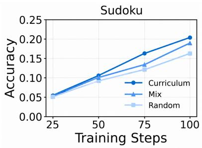
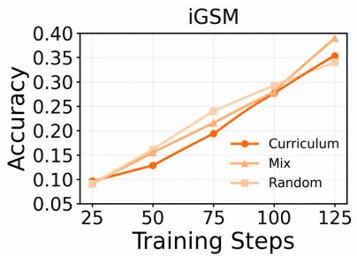
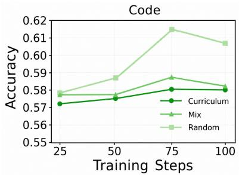
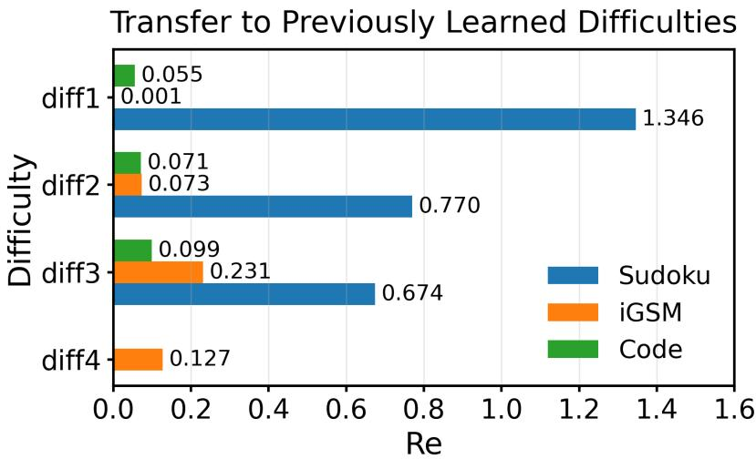
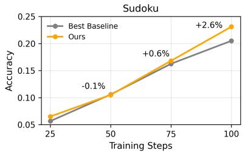
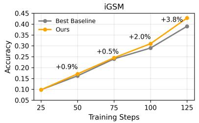
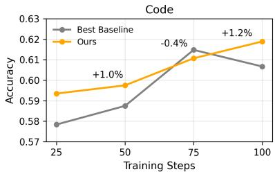
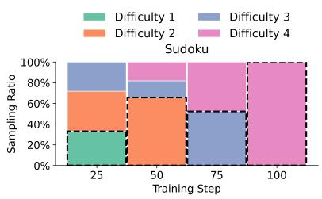
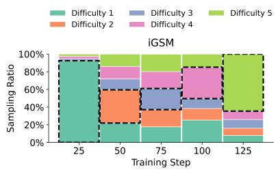
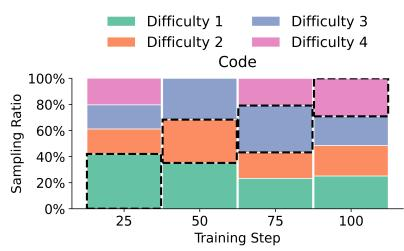

# Understanding Curriculum Learning in Large Language Models via Cross-Dificulty Optimization Dynamics

Zhikai Ding<sup>1</sup>, Ziyi Ye<sup>1,†</sup>

<sup>1</sup>Fudan University

## Abstract

Curriculum learning has been widely adopted in the post-training of large language models by organizing training data from easy to hard. However, its efectiveness varies substantially across reasoning tasks, suggesting that no single curriculum is universally optimal and raising a fundamental question: what determines when curriculum learning works? In this paper, we answer this question by analyzing the optimization dynamics induced by diferent curriculum schedules. We show that the transfer relationship between diferent dificulty levels characterizes the optimization dynamics induced by curriculum learning, which in turn explains the efectiveness of diferent curriculum schedules, and formalize this relationship as Relative Transfer, a principled measure of cross-dificulty knowledge transfer. Based on this measurement, we derive Transfer-aware Dynamic Curriculum Sampling (TDCS), which dynamically adjusts the sampling distribution according to the estimated transfer relationship throughout training. Extensive experiments on multiple reasoning benchmarks demonstrate that TDCS consistently outperforms representative scheduling strategies across diferent tasks, model scales, and training paradigms. More importantly, our work provides a unified optimization-based explanation of curriculum learning through cross-dificulty transfer.

Correspondence: dingzhikai158@gmail.com

## 1 Introduction

Large language models (LLMs) have achieved remarkable success across a wide range of reasoning tasks through supervised fine-tuning (SFT). As post-training datasets continue to grow in both scale and diversity, how to efectively organize training data has become increasingly important for improving optimization performance and model generalization. Consequently, training data scheduling has emerged as a fundamental component of LLM post-training, aiming to determine the order in which training examples are presented throughout optimization [5, 15, 20, 30].

Among various scheduling strategies, Curriculum Learning (CL) [1, 22–24, 35], which organizes training examples from easy to hard, is arguably the most widely adopted paradigm. Originally proposed in traditional machine learning, curriculum learning has demonstrated consistent optimization and generalization benefits across numerous learning problems [11]. Motivated by its success, many recent LLM post-training methods have incorporated curriculum learning by ranking training samples according to predefined dificulty metrics and progressively exposing the model to increasingly challenging examples [13, 28, 31]. Consequently, fixed easy-to-hard curricula are commonly adopted as the default scheduling strategy in existing LLM post-training pipelines.

Although curriculum learning has been widely adopted, its efectiveness varies substantially across reasoning tasks. Existing studies have documented this phenomenon through large-scale empirical evaluations across diferent models, tasks, and dificulty metrics, they demonstrate that curriculum learning may outperform random sampling in some scenarios while becoming inefective or even detrimental in others [7, 9, 26, 30]. Although these studies reveal the limitations of fixed curriculum schedules, they primarily provide empirica observations and analyses of dificulty metrics, leaving a fundamental question unanswered: what determines whether curriculum learning is efective? Without understanding the underlying mechanism, it remains dificult to design more efective curriculum strategies beyond empirical trial and error.

In this paper, we revisit curriculum learning by analyzing the optimization dynamics induced by diferent curriculum schedules. Rather than treating curriculum learning as a predefined training heuristic, we seek to understand the optimization mechanism that determines when and why a curriculum schedule succeeds. To this end, we first conduct a systematic empirical study across multiple reasoning benchmarks. Our results reveal that no fixed scheduling strategy consistently performs best across diferent reasoning tasks, suggesting that the efectiveness of curriculum learning is fundamentally task-dependent rather than universally optimal.

To answer this question, we investigate the optimization dynamics induced by curriculum learning. Specifically, we analyze how optimization on one dificulty level influences the optimization of other dificulty levels throughout training: optimizing one dificulty level may either facilitate or interfere with the optimization of others, and the overall transfer relationship determines whether a fixed curriculum schedule is efective. Based on a first-order optimization analysis, we formalize this transfer relationship as Relative Transfer, a principled measure of cross-dificulty knowledge transfer. This analysis provides a unified explanation of when curriculum learning succeeds or fails across diferent reasoning tasks, going beyond previous empirical observations.

Building upon this theoretical understanding, we derive Transfer-aware Dynamic Curriculum Sampling (TDCS), an adaptive curriculum learning framework that dynamically adjusts the sampling distribution according to the estimated transfer relationship throughout training. Instead of following a predefined easyto-hard schedule, TDCS allocates training samples based on the estimated transfer benefits across dificulty levels. Extensive experiments demonstrate that the resulting sampling strategy consistently outperforms existing fixed scheduling strategies across multiple reasoning benchmarks and model scales, while further generalizing to downstream self-improvement settings.

Our main contributions are summarized as follows:

• We conduct a systematic empirical study of curriculum learning for LLM reasoning and demonstrate that no fixed scheduling strategy consistently performs best across diferent reasoning tasks.

• We provide a theoretical explanation of when curriculum learning succeeds or fails by analyzing crossdificulty knowledge transfer, and formalize this mechanism through Relative Transfer.

• Based on the proposed transfer analysis, we derive Transfer-aware Dynamic Curriculum Sampling (TDCS), which consistently outperforms existing fixed scheduling strategies across multiple reasoning benchmarks, model scales, and self-improvement settings.

## 2 Related Work

## 2.1 Curriculum Learning

Curriculum learning organizes training samples from easy to hard according to predefined dificulty measures to facilitate optimization [1, 10, 17]. Numerous variants have since been proposed, including self-paced learning and mentor-guided curriculum design [8, 14, 19].

Recently, curriculum learning has been widely adopted in LLM post-training. Existing methods construct curricula based on reasoning complexity, model confidence, training loss, or estimated sample dificulty,

Table 1 Dificulty definition for diferent tasks.
<table><tr><td>Task</td><td>Difficulty Definition</td></tr><tr><td>Sudoku</td><td>Number of blank cells</td></tr><tr><td>KodCode</td><td>GPT pass rate</td></tr><tr><td>iGSM</td><td>Reasoning steps</td></tr></table>

Table 2 Performance comparison of scheduling strategies.
<table><tr><td>Task</td><td>Curriculum</td><td>Mix</td><td>Random</td></tr><tr><td>Sudoku</td><td>0.205</td><td>0.190</td><td>0.164</td></tr><tr><td>iGSM</td><td>0.350</td><td>0.390</td><td>0.353</td></tr><tr><td>Code</td><td>0.580</td><td>0.582</td><td>0.607</td></tr></table>

  
(a) Sudoku

  
(b) iGSM

  
(c) Code  
Figure 1 Stepwise accuracy change of diferent schedules.

demonstrating improved performance on reasoning and instruction-following tasks [7, 9, 12, 18, 25]. However, they mainly focus on designing dificulty metrics or curriculum schedules.

In contrast, our work studies the optimization mechanism underlying curriculum learning. Rather than proposing another predefined schedule, we explain when and why diferent curriculum schedules become efective through cross-dificulty optimization analysis.

## 2.2 Adaptive Data Scheduling

Instead of relying on a predefined curriculum, adaptive data scheduling dynamically adjusts the sampling distribution according to the optimization state throughout training [4, 16, 27]. Existing methods estimate sample importance using signals such as training loss, uncertainty, gradient information, or reinforcement learning objectives, and adaptively allocate training resources to improve optimization eficiency [3, 21, 33, 34].

While these methods improve training eficiency through adaptive sample selection, their scheduling decisions are primarily driven by optimization signals that reflect the current training state. In contrast, our work focuses on the transfer relationship between diferent dificulty levels, providing a transfer-based criterion for curriculum scheduling rather than relying solely on optimization heuristics.

## 3 Empirical Observation

To investigate the efectiveness of curriculum learning in large language models, we conduct preliminary experiments on three reasoning benchmarks with naturally defined dificulty levels: Sudoku, KodCode [29], and iGSM [32], covering logical reasoning, code generation, and mathematical reasoning, respectively.

Following the dificulty definitions in Table 1, the training data are partitioned into four dificulty levels for Sudoku and KodCode, and five dificulty levels for iGSM. We compare three representative training schedules: Curriculum, which trains the model from easy to hard; Random, which uniformly samples training examples from all dificulty levels; and Mix, which follows the curriculum schedule while replacing half of the samples at each stage with randomly sampled examples. All methods are trained under the same training budget.

Table 2 reports the final performance of the three scheduling strategies. Surprisingly, Curriculum does not consistently outperform the alternatives. Instead, Curriculum performs best on Sudoku, Mix achieves the highest accuracy on iGSM, and Random performs best on KodCode. These results indicate that curriculum learning is not universally beneficial for large language models, and no single scheduling strategy consistently achieves the best performance across diferent reasoning tasks.

The final performance, however, only reflects the optimization outcome. To obtain a more complete view, we further compare the training dynamics of diferent scheduling strategies in Figure 1. The three tasks exhibit markedly diferent optimization behaviors. While a single scheduling strategy consistently dominates throughout training on Sudoku and KodCode, the optimal strategy on iGSM changes as training progresses.

These observations suggest that the efectiveness of curriculum learning cannot be fully explained by the curriculum schedule itself. Instead, they raise an important question: what optimization mechanism determines whether a curriculum schedule succeeds? To answer this question, we next investigate the optimization process induced by curriculum learning, focusing on how optimization on one dificulty level influences the optimization of others.

## 4 Optimization Analysis of Curriculum Learning

## 4.1 Modeling Knowledge Transfer

The empirical observations in Section 3 show that no single scheduling strategy consistently performs best across diferent reasoning tasks. Understanding the underlying optimization mechanism is therefore essential for explaining the efectiveness of curriculum learning.

In this section, rather than analyzing the curriculum schedule itself, we investigate the optimization dynamics induced by curriculum learning. Specifically, we study how optimization on one dificulty level afects the optimization objective of another. We refer to this cross-dificulty interaction as knowledge transfer.

Assume that the current optimization step is performed on examples from dificulty level $j .$ We are interested in quantifying how this update afects the loss of another dificulty level i. Such cross-dificulty interaction characterizes the knowledge transfer during curriculum learning.

Let the model parameter at training step t be denoted by $w _ { t }$ . After performing one gradient descent step on data with dificulty level $j ,$ the model is updated as

$$
w _ { t + 1 } = w _ { t } - \eta g _ { j } ,\tag{1}
$$

where $\eta$ is the learning rate and $g _ { j } = \nabla L _ { j } ( w _ { t } )$ is the gradient computed on dificulty level $j$

We then analyze the loss of dificulty level i after this update. Applying the first-order Taylor expansion gives

$$
L _ { i } ( w _ { t + 1 } ) \approx L _ { i } ( w _ { t } ) + \nabla L _ { i } ( w _ { t } ) ^ { T } ( w _ { t + 1 } - w _ { t } ) .\tag{2}
$$

Since

$$
\nabla L _ { i } ( w _ { t } ) = g _ { i } ,\tag{3}
$$

substituting Eq. (1) into Eq. (2) yields

$$
L _ { i } ( w _ { t + 1 } ) \approx L _ { i } ( w _ { t } ) - \eta g _ { i } ^ { T } g _ { j } .\tag{4}
$$

Therefore, the expected loss variation on dificulty level i after optimizing dificulty level $j$ can be approximated by

  
Figure 2 Transfer from the current dificulty to other dificulties. Sudoku exhibits consistently strong hard-to-easy transfer, while iGSM and Code show much weaker transfer.

$$
\Delta L _ { i } = L _ { i } ( w _ { t + 1 } ) - L _ { i } ( w _ { t } ) \approx - \eta g _ { i } ^ { T } g _ { j } .\tag{5}
$$

Eq. (5) shows that the influence of optimizing one dificulty level on another is determined by the projection of one gradient onto the descent direction induced by the other. When $g _ { i } ^ { T } g _ { j } > 0$ , optimizing dificulty level j reduces the loss of dificulty level i, indicating positive knowledge transfer. In contrast, negative values imply that optimizing one dificulty level increases the loss of another, resulting in optimization conflicts.

However, the quantity $g _ { i } ^ { T } g _ { j }$ alone does not provide a fair comparison of transfer across diferent target dificulty levels, since its magnitude is also influenced by the scale of the target gradient $g _ { i }$ . To compare transfer efects independently of gradient magnitude, we measure the loss reduction achieved by optimizing dificulty level $j$ relative to that achieved by directly optimizing dificulty level i itself.

When optimizing the target dificulty level i, Eq. (5) gives an expected loss reduction proportional to $g _ { i } ^ { T } g _ { i }$ . In contrast, optimizing dificulty level $j$ reduces the same loss by an amount proportional to $g _ { i } ^ { T } g _ { j }$ . Their ratio therefore naturally measures the relative transfer efect from dificulty level $j$ to dificulty level $i ,$ which we define as the Relative Transfer

$$
\mathrm { R e } ( i , j ) = \frac { g _ { i } ^ { T } g _ { j } } { g _ { i } ^ { T } g _ { i } } .\tag{6}
$$

Intuitively, $\operatorname { R e } ( i , j )$ measures the efectiveness of optimizing dificulty level $j$ relative to directly optimizing dificulty level i. A value of $\operatorname { R e } ( i , j ) = 1$ indicates that optimizing dificulty level $j$ is expected to reduce the loss of dificulty level i as much as directly optimizing i itself. Values between 0 and 1 indicate partial positive transfer, values larger than 1 indicate even stronger transfer than self-optimization, while negative values imply optimization conflicts.

## 4.2 Transfer Analysis

Eq. (6) characterizes the knowledge transfer between arbitrary dificulty levels. In the following analysis, we focus on the final curriculum stage and examine the transfer from the current hardest dificulty level to all previously learned dificulty levels.

Figure 2 visualizes the transfer from the current hardest dificulty level to all previously learned dificulty levels on each task. Sudoku exhibits consistently strong positive transfer, whereas iGSM and KodCode show much weaker transfer to earlier dificulty levels.

These transfer patterns provide an explanation for the empirical observations in Section 3. For Sudoku, strong transfer from the hardest dificulty continues to reduce the losses of previously learned dificulties. Consequently, optimizing only the hardest examples is suficient to maintain performance across all dificulty levels, making a pure curriculum schedule efective. In contrast, the much weaker transfer observed on iGSM and KodCode suggests that optimizing only the hardest examples is insuficient to maintain performance on earlier dificulties, motivating the inclusion of additional replay from previous dificulty levels.

These findings suggest that the optimal sampling strategy should adapt to the observed cross-dificulty transfer relationship rather than follow a predefined curriculum schedule. This observation directly motivates the transfer-aware dynamic curriculum sampling strategy introduced in the next section.

## 5 Transfer-aware Dynamic Curriculum Sampling

Based on the transfer analysis in Section 4, the optimal curriculum should adapt to the observed cross-dificulty transfer relationship rather than follow a predefined easy-to-hard schedule. This observation naturally leads to three design principles. First, the amount of training allocated to the current dificulty should increase with its transfer capability. Second, replay should focus on dificulty levels that receive insuficient transfer. Third, when a harder dificulty provides exceptionally strong positive transfer, it should also be incorporated into training. Based on these principles, we derive Transfer-aware Dynamic Curriculum Sampling (TDCS). The overall procedure is summarized in Algorithm 1.

Current Dificulty Ratio Mapping. Let the current training stage correspond to dificulty level k, referred to as the current dificulty throughout this section. The first step is to determine how much training should remain on the current dificulty. This directly follows from the transfer analysis in Section 4: if the current dificulty can efectively optimize previously learned dificulties, replay becomes less necessary. Intuitively, if the current dificulty can efectively transfer knowledge to previously learned dificulty levels, more training should remain on the current dificulty; otherwise, additional replay is required.

Since dificulty levels that can already be efectively optimized through knowledge transfer require little additional replay, we first identify the dificulty levels that receive insuficient transfer from the current dificulty. Specifically, we select the dificulty levels whose Relative Transfer is smaller than a threshold $\tau _ { e }$

$$
S = \{ i \neq k \mid R e ( i , k ) < \tau _ { e } \} .\tag{7}
$$

We then compute the average Relative Transfer

$$
\bar { R } = \frac { 1 } { | S | } \sum _ { i \in \mathcal { S } } R e ( i , k ) ,\tag{8}
$$

which summarizes the overall transfer capability of the current dificulty to the dificulty levels that require additional replay.

Finally, the average transfer is mapped to the sampling ratio of the current dificulty through a sigmoid function,

$$
\rho _ { k } = \frac { 1 } { 1 + \exp [ - \alpha ( \bar { R } - \beta ) ] } ,\tag{9}
$$

where α and $\beta$ control the slope and midpoint of the mapping, respectively. The sigmoid function provides a smooth transition between replay-oriented and current-dificulty-oriented sampling. Consequently, stronger Relative Transfer leads to a larger sampling ratio for the current dificulty, while weaker transfer encourages more replay of previous dificulty levels.

Table 3 Main results on three reasoning benchmarks. The best result is shown in bold.
<table><tr><td>Category</td><td>Method</td><td>Sudoku</td><td>iGSM</td><td>KodCode</td></tr><tr><td rowspan="3">Fixed Schedule</td><td>Random</td><td>0.164</td><td>0.353</td><td>0.607</td></tr><tr><td>Curriculum</td><td>0.205</td><td>0.350</td><td>0.580</td></tr><tr><td>Mix</td><td>0.190</td><td>0.390</td><td>0.582</td></tr><tr><td>Adaptive Schedule</td><td>Ours</td><td>0.231</td><td>0.428</td><td>0.619</td></tr></table>

Dificulty Allocation. Given the sampling ratio of the current dificulty, the remaining probability $( 1 - \rho _ { k } )$ is allocated to the selected dificulty levels. To prioritize dificulty levels that receive weaker knowledge transfer, we adopt a reverse exponential weighting strategy,

$$
p _ { i } = ( 1 - \rho _ { k } ) \frac { \exp ( - \lambda R e ( i , k ) ) } { \sum _ { j \in \mathcal { S } } \exp ( - \lambda R e ( j , k ) ) } ,\tag{10}
$$

where dificulty levels with weaker transfer receive larger sampling probabilities, encouraging additional replay for dificulty levels that are less likely to benefit from the current optimization.

Harder Dificulty Adjustment. The previous steps determine the sampling distribution according to the estimated Relative Transfer. Nevertheless, when a harder dificulty provides exceptionally strong positive transfer, allocating additional training to that dificulty can further improve subsequent optimization. Therefore, if the Relative Transfer from the current dificulty to a harder dificulty exceeds a threshold $\tau _ { h }$ , i.e.,

$$
R e ( k , j ) > \tau _ { h } ,\tag{11}
$$

a portion of the current sampling probability is reassigned to the harder dificulty in proportion to its Relative Transfer. Finally, all sampling probabilities are normalized to obtain the sampling distribution for the next training stage.

```latex
Algorithm 1 Transfer-aware Dynamic Curriculum Sampling
Require: Relative Transfer matrix Re, current dificulty k
Ensure: Sampling distribution p
1: $S \gets \{ i \neq k \ : | \ : R e ( i , k ) < \tau _ { e } \}$ // Re Filter
2: $\begin{array} { r } { \bar { R }  \vert S \vert ^ { - 1 } \sum _ { i \in { \mathcal { S } } } R e ( i , k ) } \end{array}$ // Mean Transfer
3: ρ ← Sigmoid(R<sup>¯</sup>) // Ratio mapping
4: $p _ { k }  \rho$
5: for all $i \in S$ do
6: $p _ { i } \propto e ^ { - \beta R e ( i , k ) }$ // Dificulty allocation
7: end for
8: for $j > k$ do
9: if $R e ( k , j ) > \tau _ { h }$ then
10: $p _ { j } \propto R e ( k , j )$ // harder adjustment
11: $p _ { k } \gets p _ { k } - p _ { j }$
12: end if
13: end for
14: Normalize p
15: return p
```

## 6 Experiments

  
(a) Sudoku

  
(b) iGSM

  
(c) Code  
Figure 3 Training dynamics of the proposed method and the strongest fixed scheduling baseline during supervised fine-tuning.

## 6.1 Experimental Settings

Datasets. We evaluate our method on three reasoning benchmarks: Sudoku, KodCode [29], and iGSM [32], covering logical reasoning, code generation, and mathematical reasoning, respectively. Following the dificulty definitions introduced in Section 3, Sudoku and KodCode are partitioned into four dificulty levels, while iGSM is partitioned into five dificulty levels. For self-improvement, we use GSM8K and KodCode dataset.

Models and Baselines. We conduct the main experiments on Qwen2.5-1.5B. To evaluate the generalization ability of the proposed method, we further consider Qwen2.5-3B, Qwen2.5-7B [6], and Llama3.2-3B [2]. We compare TDCS with three representative scheduling strategies introduced in Section 3: Curriculum, Random, and Mix.

Implementation Details. All methods are trained under the same training data budget using LoRA finetuning. Unless otherwise specified, all methods are trained for 4 epochs with a learning rate of $1 \times 1 0 ^ { - 5 }$ and a LoRA rank of 64. All remaining hyperparameters are kept identical across diferent methods to ensure a fair comparison.

## 6.2 Main Results

Table 3 summarizes the final performance on the three reasoning benchmarks. Our method consistently achieves the best performance across all tasks, outperforming the strongest fixed scheduling strategy by 2.6%, 3.8%, and 1.2% on Sudoku, iGSM, and KodCode, respectively. These results demonstrate that no single fixed curriculum is universally optimal, while dynamically adjusting the sampling distribution according to the estimated cross-dificulty transfer leads to consistently better optimization.

Figure 3 further compares the training dynamics between TDCS and the strongest baseline. On Sudoku and iGSM, TDCS consistently maintains superior performance throughout training and converges to higher final accuracy. On KodCode, although the advantage is less pronounced during the intermediate stages, our method still achieves the best final performance. This observation suggests that transfer-aware curriculum adjustment not only improves the final optimization result but also provides a more stable training process across diferent reasoning tasks.

To better understand how TDCS achieves these improvements, Figure 4 visualizes the evolution of the sampling distribution during training. The sampling behavior difers substantially across reasoning tasks, reflecting their distinct transfer characteristics. Specifically, TDCS rapidly shifts the sampling distribution toward harder dificulties on Sudoku, where stronger cross-dificulty transfer reduces the need for replay. In contrast, iGSM maintains a moderate replay ratio throughout training, while KodCode preserves considerably larger replay ratios because of its weaker transfer capability. These observations are highly consistent with the transfer analysis in Section 4, demonstrating that TDCS dynamically adapts its curriculum according to the estimated Relative Transfer rather than following a predefined scheduling strategy.

  
(a) Sudoku

  
(b) iGSM

  
(c) Code  
Figure 4 Evolution of the sampling distribution produced by TDCS during supervised fine-tuning on the three reasoning benchmarks. Each stacked bar represents the sampling ratio assigned to diferent dificulty levels at a representative training stage, while dashed boxes indicate the current dificulty.

## 6.3 Generalization

Table 4 Generalization across diferent model scales. Numbers in parentheses denote the absolute accuracy improvement over the strongest baseline
<table><tr><td rowspan="2">Model</td><td colspan="2">Sudoku</td><td colspan="2">iGSM</td></tr><tr><td>Baseline</td><td>Ours</td><td>Baseline</td><td>Ours</td></tr><tr><td>Qwen2.5-3B</td><td>0.428</td><td>0.446 (+1.8%)</td><td>0.525</td><td>0.546 (+2.1%)</td></tr><tr><td>Qwen2.5-7B</td><td>0.438</td><td>0.497 (+5.9%)</td><td>0.766</td><td>0.819 (+5.3%)</td></tr><tr><td>Llama3.2-3B</td><td>0.405</td><td>0.433 (+2.8%)</td><td>0.673</td><td>0.875 (+20.8%)</td></tr></table>

Generalization Across Model Scales. To evaluate whether the proposed transfer-aware sampling strategy generalizes across diferent model scales and architectures, we further conduct experiments on Qwen2.5-3B-Instruct, Qwen2.5-7B-Instruct, and Llama3.2-3B-Instruct. As shown in Table 4, our method consistently outperforms the strongest fixed scheduling strategy on all evaluated models. Notably, the improvements are observed across both the Qwen and Llama model families, indicating that the proposed sampling strategy does not rely on a specific pretrained model or parameter scale. These results suggest that cross-dificulty knowledge transfer is a general optimization property, making the proposed transfer-aware curriculum broadly applicable to diferent LLMs.

Table 5 Self-improvement results under TDCS.
<table><tr><td>Task</td><td>Curriculum</td><td>Mix</td><td>Random</td><td>Ours</td></tr><tr><td>GSM8K</td><td>0.612</td><td>0.601</td><td>0.601</td><td>0.622</td></tr><tr><td>Code</td><td>0.347</td><td>0.338</td><td>0.335</td><td>0.352</td></tr></table>

Generalization Across Training Paradigms. We further evaluate our method in a self-improvement setting, where the model is fine-tuned using its own generated responses instead of manually curated training data. In this setting, model answer accuracy is used as the dificulty metric to construct the curriculum. As shown in Table 5, our method consistently outperforms all fixed scheduling strategies on both GSM8K and KodCode. These results demonstrate that the proposed transfer-aware sampling strategy is compatible with diferent training paradigms and remains efective even when dificulty is estimated from the model’s own predictions.

Table 6 Ablation study of TDCS components.
<table><tr><td>HA</td><td>EDA</td><td>Sudoku</td><td>iGSM</td><td>Code</td></tr><tr><td>X</td><td>√</td><td>0.213</td><td>0.416</td><td>0.612</td></tr><tr><td>√</td><td>X</td><td>0.220</td><td>0.390</td><td>0.589</td></tr><tr><td>√</td><td>√</td><td>0.231</td><td>0.428</td><td>0.619</td></tr></table>

## 6.4 Ablation Study

To evaluate the contribution of each component, we conduct ablation experiments on Qwen2.5-1.5B. In Table 6, HA denotes the Harder Adjustment module, and EDA denotes the Exponential Dificulty Allocation module, which replaces uniform probability allocation with transfer-aware exponential weighting over the selected dificulty levels.

As shown in Table 6, removing either component consistently degrades performance on all three benchmarks, confirming that both components contribute to the efectiveness of TDCS.

Removing HA results in the largest performance drop on Sudoku, where stronger positive transfer from harder to easier dificulty levels makes harder-dificulty adjustment particularly beneficial. In contrast, removing EDA consistently reduces performance across all tasks, indicating that allocating replay according to the estimated transfer relationship is more efective than uniform allocation.

These results are consistent with the transfer analysis in Section 4 and demonstrate that both components are necessary for efectively exploiting cross-dificulty knowledge transfer.

## 7 Conclusion

In this paper, we revisited curriculum learning by analyzing the optimization dynamics induced by diferent curriculum schedules. We introduced Relative Transfer, a principled measure that explains when curriculum learning succeeds by characterizing cross-dificulty knowledge transfer. Based on this analysis, we derived Transfer-aware Dynamic Curriculum Sampling (TDCS), which dynamically adjusts the sampling distribution according to the estimated transfer relationship and consistently outperforms representative curriculum scheduling strategies. We hope that the proposed transfer-based perspective provides a useful foundation for understanding curriculum learning. In future work, we plan to extend the proposed transfer analysis to broader optimization settings and explore more general transfer-aware data scheduling methods.

## Appendix

## 8 Dataset Details

This section provides additional details of the datasets used in our experiments, including dataset statistics, dificulty definitions, and representative examples.

## 8.1 Dataset Statistics

Table 7 summarizes the datasets used in this work. We report the number of training and evaluation samples, the number of dificulty levels, and the corresponding dificulty criterion for each benchmark.

Table 7 Statistics of the datasets used in this work.
<table><tr><td>Dataset</td><td>Train</td><td>Test</td><td>#Levels</td><td>Difficulty</td></tr><tr><td>Sudoku</td><td>800*4epochs</td><td>1000</td><td>4</td><td>Blank cells</td></tr><tr><td>iGSM</td><td>1000*4epochs</td><td>200</td><td>5</td><td>Reasoning steps</td></tr><tr><td>KodCode</td><td>800*4epochs</td><td>200</td><td>4</td><td>GPT pass rate</td></tr></table>

## 8.2 Dataset Examples

This section shows representative examples from the three benchmarks. For each example, we present the input, the expected output, and its corresponding dificulty level.

## 8.3 Sudoku Example

Input   
Fill the Sudoku. Replace each "?" with a digit from 1 to 9.   
Rules:   
Each row, each column, and each 3x3 box must contain the digits 1-9 exactly once.   
Output ONLY the final completed 9x9 grid in the same format.   
Grid:   
[["?", 2, 7, 9, 3, 1, 4, 8, 5], [9, 3, 4, 5, 8, 6, 7, 1, 2], [1, 8, 5, 2, 7, "?", 6, "?", 3], [7, "?", "?", 4, 6, "?", "?", 3, 8], ["?", 4,   
6, "?", 9, 8, 5, 2, "?"], [8, "?", 9, 3, 2, 7, 1, 6, 4], [5, 9, 8, 7, "?", 3, 2, 4, 6], [4, 6, 1, 8, "?", "?", 3, "?", 9], [2, "?", 3, 6, 4,   
9, 8, 5, 1]]   
Output   
[[6, 2, 7, 9, 3, 1, 4, 8, 5], [9, 3, 4, 5, 8, 6, 7, 1, 2], [1, 8, 5, 2, 7, 4, 6, 9, 3], [7, 1, 2, 4, 6, 5, 9, 3, 8], [3, 4, 6, 1, 9, 8, 5, 2,   
7], [8, 5, 9, 3, 2, 7, 1, 6, 4], [5, 9, 8, 7, 1, 3, 2, 4, 6], [4, 6, 1, 8, 5, 2, 3, 7, 9], [2, 7, 3, 6, 4, 9, 8, 5, 1]]   
Dificulty Level: 1

## 8.4 iGSM Example

Input   
The number of each NetVersity’s Microbiology Lab equals 4 times as much as each NetLearn Institute’s Zoology   
Lab. The number of each NetVersity’s Zoology Lab equals 19 more than each NetLearn Institute’s Microbiology   
Lab. The number of each NetLearn Institute’s Microbiology Lab equals 4. The number of each NetLearn Institute’s   
Zoology Lab equals each NetVersity’s Zoology Lab. How many Microbiology Lab does NetVersity have?   
Output   
Define NetLearn Institute’s Microbiology Lab as G; so G = 4. Define NetVersity’s Zoology Lab as S; so S = 19 + G   
= 19 + 4 = 0. Define NetVersity’s Microbiology Lab as P; so P = 4 \* S = 4 \* 0 = 0. Answer: 0   
Dificulty Level: 4

## 8.5 KodCode Example

Input   
def permute(nums): """ Generates all possible permutations of a given list using backtracking.   
:param nums: List of elements to permute   
:return: A list of all permutations   
»> permute([]) == [[]]   
»> permute([1]) == [[1]]   
»> permute([1, 2]) == [[1, 2], [2, 1]]   
»> result = permute([1, 2, 3])   
»> expected = [[1, 2, 3], [1, 3, 2], [2, 1, 3], [2, 3, 1], [3, 1, 2], [3, 2, 1]]   
»> sorted(result) == sorted(expected)   
»> result = permute([1, 1])   
»> expected = [[1, 1], [1, 1]]   
»> sorted(result) == sorted(expected)   
nnn   
Output   
def permute(nums):   
  
Generates all possible permutations of a given list using backtracking.   
:param nums: List of elements to permute   
:return: A list of all permutations   
  
results = []   
def backtrack(path):   
if not nums:   
results.append(path)   
return   
for i in range(len(nums)):   
backtrack(path + [nums[i]])   
nums.pop(i)   
backtrack([])   
return results   
Difficulty Level: 1

## 9 Training Details

This section summarizes the implementation details used in all experiments. We fine-tune the 7B model on 8 NVIDIA RTX 5090 GPUs, and all models smaller than 7B on 8 NVIDIA RTX 4090 GPUs.

During the training procedure of dynamic sampling curriculum learning, we sample and reweigh every dificulty per 25 steps, using 8 examples each dificulty level to calculate the Re matrix, which ensures evaluation accuracy while have a very low extra computation cost.

## 9.1 Hyperparameter Sensitivity Analysis

We conduct a sensitivity analysis of the two hyperparameters in our transfer-aware dynamic curriculum sampling strategy, namely $\tau _ { e }$ and $\tau _ { h }$ . The threshold $\tau _ { e }$ determines which easier dificulty levels are considered for replay, while $\tau _ { h }$ controls when a harder dificulty level receives additional sampling probability based on its relative transferability. The results are reported in Table 9.

The results reveal that the two hyperparameters afect diferent aspects of the sampling strategy. As shown in the left table, varying $\tau _ { e }$ mainly afects the iGSM and Sudoku benchmarks. In particular, a lower $\tau _ { e }$ changes the set of easier problems selected for replay, which has a more noticeable efect on tasks where replaying easier examples is beneficial. This efect is especially apparent on Sudoku, while the performance on Code

Table 8 Training hyperparameters used in all experiments.
<table><tr><td>Hyperparameter</td><td>Value</td></tr><tr><td>Fine-tuning method</td><td>LoRA</td></tr><tr><td>LoRA rank</td><td>64</td></tr><tr><td>LoRA alpha</td><td>128</td></tr><tr><td>LoRA dropout</td><td>0.05</td></tr><tr><td>Target modules</td><td>all</td></tr><tr><td>Optimizer</td><td>AdamW</td></tr><tr><td>Learning rate</td><td>5e-5</td></tr><tr><td>Scheduler</td><td>Constant</td></tr><tr><td>Epochs</td><td>4</td></tr><tr><td>Batch size / GPU</td><td>4/8</td></tr><tr><td>Gradient accumulation</td><td>1</td></tr><tr><td>Gradient checkpointing</td><td>Yes</td></tr><tr><td>Maximum sequence length</td><td>512</td></tr></table>

Table 9 Sensitivity analysis of $\tau _ { e }$ and $\tau _ { h }$ . The middle row in each table corresponds to the configuration used in our final method.

(a) Varying $\tau _ { e }$
<table><tr><td> $\tau _ { e }$ </td><td>iGSM</td><td>Code</td><td>Sudoku</td></tr><tr><td>0.7</td><td>0.412</td><td>0.603</td><td>0.212</td></tr><tr><td>0.5</td><td>0.428</td><td>0.619</td><td>0.231</td></tr><tr><td>0.3</td><td>0.431</td><td>0.610</td><td>0.231</td></tr></table>

(b) Varying $\tau _ { h }$
<table><tr><td> $\tau _ { h }$ </td><td>iGSM</td><td>Code</td><td>Sudoku</td></tr><tr><td>1.05</td><td>0.428</td><td>0.619</td><td>0.228</td></tr><tr><td>0.85</td><td>0.428</td><td>0.619</td><td>0.231</td></tr><tr><td>0.55</td><td>0.405</td><td>0.598</td><td>0.235</td></tr></table>

remains relatively stable across the tested values.

In contrast, $\tau _ { h }$ has a stronger influence on Sudoku, as shown in the right table. This is consistent with the characteristics of Sudoku, where the transfer relationship between easier and harder dificulty levels can be more pronounced. Increasing or decreasing $\tau _ { h }$ changes when additional probability is allocated to harder dificulty levels, thereby directly afecting the balance between easier and harder examples.

Importantly, the middle configuration in each table corresponds to the hyperparameter values used by our final method, namely $\tau _ { e } = 0 . 5$ and $\tau _ { h } = 0 . 8 5$ . These settings achieve consistently strong performance across all three benchmarks, suggesting that they provide a robust balance between replaying easier problems and allocating additional probability to harder problems. We therefore use $\tau _ { e } = 0 . 5$ and $\tau _ { h } = 0 . 8 5$ throughout the main experiments.

## References

[1] Yoshua Bengio, Jérôme Louradour, Ronan Collobert, and Jason Weston. Curriculum learning. In Proceedings of the 26th Annual International Conference on Machine Learning, ICML ’09, page 41–48, New York, NY, USA, 2009. Association for Computing Machinery. ISBN 9781605585161. doi: 10.1145/1553374.1553380. URL https://doi.org/10.1145/1553374.1553380.

[2] Aaron Grattafiori et.al. The llama 3 herd of models, 2024. URL https://arxiv.org/abs/2407.21783.

[3] Yanjun Fu, Faisal Hamman, and Sanghamitra Dutta. T-shirt: Token-selective hierarchical data selection for instruction tuning. In D. Belgrave, C. Zhang, H. Lin, R. Pascanu, P. Koniusz, M. Ghassemi, and N. Chen, editors, Advances in Neural Information Processing Systems, volume 38, pages 113932– 113958. Curran Associates, Inc., 2025. URL https://proceedings.neurips.cc/paper\_files/paper/2025/file/ a59ff5f7384176b5d14a5ded77c4aa4f-Paper-Conference.pdf.

[4] Zayd Hammoudeh and Daniel Lowd. Training data influence analysis and estimation: a survey. Machine Learning, 113(5):2351–2403, March 2024. ISSN 1573-0565. doi: 10.1007/s10994-023-06495-7. URL http: //dx.doi.org/10.1007/s10994-023-06495-7.

[5] Xiaomeng Hu, Yixuan Tang, Haoze Li, Hao Chen, Qi Zhang, Zhanming Shen, Yiming Zhang, Haobo Wang, and Junbo Zhao. Fine-grained data ordering improves fine-tuning for large language models. In Maria Liakata, Viviane P. Moreira, Jiajun Zhang, and David Jurgens, editors, Findings of the Association for Computational Linguistics: ACL 2026, pages 20406–20418, San Diego, California, United States, July 2026. Association for Computational Linguistics. ISBN 979-8-89176-395-1. doi: 10.18653/v1/2026.findings-acl.1021. URL https: //aclanthology.org/2026.findings-acl.1021/.

[6] Binyuan Hui, Jian Yang, Zeyu Cui, Jiaxi Yang, Dayiheng Liu, Lei Zhang, Tianyu Liu, Jiajun Zhang, Bowen Yu, Keming Lu, Kai Dang, Yang Fan, Yichang Zhang, An Yang, Rui Men, Fei Huang, Bo Zheng, Yibo Miao, Shanghaoran Quan, Yunlong Feng, Xingzhang Ren, Xuancheng Ren, Jingren Zhou, and Junyang Lin. Qwen2.5- coder technical report, 2024. URL https://arxiv.org/abs/2409.12186.

[7] Yaning Jia, Chunhui Zhang, Xingjian Diao, Xiangchi Yuan, Zhongyu Ouyang, Chiyu Ma, and Soroush Vosoughi What makes a good curriculum? disentangling the efects of data ordering on LLM mathematical reasoning. In Maria Liakata, Viviane P. Moreira, Jiajun Zhang, and David Jurgens, editors, Proceedings of the 64th Annual Meeting of the Association for Computational Linguistics (Volume 1: Long Papers), pages 34472–34488, San Diego, California, United States, July 2026. Association for Computational Linguistics. ISBN 979-8-89176-390-6. doi: 10.18653/v1/2026.acl-long.1591. URL https://aclanthology.org/2026.acl-long.1591/.

[8] Lu Jiang, Deyu Meng, Qian Zhao, Shiguang Shan, and Alexander Hauptmann. Self-paced curriculum learning. Proceedings of the AAAI Conference on Artificial Intelligence, 29(1), Feb. 2015. doi: 10.1609/aaai.v29i1.9608. URL https://ojs.aaai.org/index.php/AAAI/article/view/9608.

[9] Jisu Kim and Juhwan Lee. Strategic data ordering: Enhancing large language model performance through curriculum learning, 2024. URL https://arxiv.org/abs/2405.07490.

[10] Sanmit Narvekar, Bei Peng, Matteo Leonetti, Jivko Sinapov, Matthew E. Taylor, and Peter Stone. Curriculum learning for reinforcement learning domains: A framework and survey. Journal of Machine Learning Research, 21 (181):1–50, 2020. URL http://jmlr.org/papers/v21/20-212.html.

[11] XIANGYU PENG, Congying Xia, Xinyi Yang, Caiming Xiong, Chien-Sheng Wu, and Chen Xing. Regenesis: Llms can grow into reasoning generalists via self-improvement. In Y. Yue, A. Garg, N. Peng, F. Sha, and R. Yu, editors, International Conference on Learning Representations, volume 2025, pages 62484–62519, 2025. URL https://proceedings.iclr.cc/paper\_files/paper/2025/file/ 9c77f2ce42151b2c2e26d2cf47f99564-Paper-Conference.pdf.

[12] Simon Rampp, Manuel Milling, Andreas Triantafyllopoulos, and Björn W. Schuller. Does the definition of dificulty matter? scoring functions and their role for curriculum learning, 2024. URL https://arxiv.org/abs/2411.00973.

[13] Leonardo Ranaldi, Giulia Pucci, and Andrè Freitas. Does the Order matter? Curriculum learning over languages. In Nicoletta Calzolari, Min-Yen Kan, Veronique Hoste, Alessandro Lenci, Sakriani Sakti, and Nianwen Xue, editors, Proceedings of the 2024 Joint International Conference on Computational Linguistics, Language Resources and

Evaluation (LREC-COLING 2024), pages 5212–5220, Torino, Italia, May 2024. ELRA and ICCL. URL https: //aclanthology.org/2024.lrec-main.464/.

[14] Zhipeng Ren, Daoyi Dong, Huaxiong Li, and Chunlin Chen. Self-paced prioritized curriculum learning with coverage penalty in deep reinforcement learning. IEEE Transactions on Neural Networks and Learning Systems, 29(6):2216–2226, 2018. doi: 10.1109/TNNLS.2018.2790981.

[15] Noveen Sachdeva, Benjamin Coleman, Wang-Cheng Kang, Jianmo Ni, Lichan Hong, Ed H. Chi, James Caverlee, Julian McAuley, and Derek Zhiyuan Cheng. How to train data-eficient llms, 2024. URL https://arxiv.org/ abs/2402.09668.

[16] Andrew Silva, Rohit Chopra, and Matthew Gombolay. Cross-loss influence functions to explain deep network representations. In Gustau Camps-Valls, Francisco J. R. Ruiz, and Isabel Valera, editors, Proceedings of The 25th International Conference on Artificial Intelligence and Statistics, volume 151 of Proceedings of Machine Learning Research, pages 1–17. PMLR, 28–30 Mar 2022. URL https://proceedings.mlr.press/v151/silva22a.html.

[17] Petru Soviany, Radu Tudor Ionescu, Paolo Rota, and Nicu Sebe. Curriculum learning: A survey, 2022. URL https://arxiv.org/abs/2101.10382.

[18] Chongyang Tao and Shihao Xing<sup>1</sup>. Dynamic curriculum learning over dificulty heterogeneity. In Knowledge Science, Engineering and Management: 19th International Conference, KSEM 2026, Beijing, China, July 17–19, 2026, Proceedings, Part I, page 158. Springer Nature, 2026.

[19] He Wang, Alexander Hanbo Li, Yiqun Hu, Sheng Zhang, Hideo Kobayashi, Jiani Zhang, Henghui Zhu, Chung-Wei Hang, and Patrick Ng. DSMentor: Curriculum-guided inference with online memory for data-science LLM agents In Vivek Gupta, Kaize Ding, Harsha Kokel, Yue Zhao, Amit Agarwal, Yu Wang, Michael Glass, Yu Zhang, Kavitha Srinivas, Xiusi Chen, Oktie Hassanzadeh, Qi Zhu, Shuaichen Chang, and Yuan Luo, editors, Proceedings of the First Workshop on Structured Understanding, Retrieval, and Generation in the LLM Era (SURGeLLM 2026), pages 190–208, San Diego, California, United States, July 2026. Association for Computational Linguistics. ISBN 979-8- 89176-406-4. doi: 10.18653/v1/2026.surgellm-1.12. URL https://aclanthology.org/2026.surgellm-1.12/.

[20] Hong Wang, Zhezheng Hao, Jian Luo, Chenxing Wei, Yao Shu, Lei Liu, Qiang Lin, Hande Dong, and Jiawei Chen. Scheduling your llm reinforcement learning with reasoning trees, 2026. URL https://arxiv.org/abs/2510.24832.

[21] Jingtan Wang, Xiaoqiang Lin, Rui Qiao, Pang Wei Koh, Chuan-Sheng Foo, and Bryan Kian Hsiang Low. NICE data selection for instruction tuning in LLMs with non-diferentiable evaluation metric. In Aarti Singh, Maryam Fazel, Daniel Hsu, Simon Lacoste-Julien, Felix Berkenkamp, Tegan Maharaj, Kiri Wagstaf, and Jerry Zhu, editors, Proceedings of the 42nd International Conference on Machine Learning, volume 267 of Proceedings of Machine Learning Research, pages 63662–63689. PMLR, 13–19 Jul 2025. URL https://proceedings.mlr.press/v267/ wang25bm.html.

[22] Xin Wang, Yudong Chen, and Wenwu Zhu. A survey on curriculum learning. IEEE Transactions on Pattern Analysis and Machine Intelligence, 44(9):4555–4576, 2022. doi: 10.1109/TPAMI.2021.3069908.

[23] Xin Wang, Yuwei Zhou, Hong Chen, and Wenwu Zhu. Curriculum learning: Theories, approaches, applications, tools, and future directions in the era of large language models. In Companion Proceedings of the ACM Web Conference 2024, WWW ’24, page 1306–1310, New York, NY, USA, 2024. Association for Computing Machinery. ISBN 9798400701726. doi: 10.1145/3589335.3641257. URL https://doi.org/10.1145/3589335.3641257.

[24] Daphna Weinshall, Gad Cohen, and Dan Amir. Curriculum learning by transfer learning: Theory and experiments with deep networks. In Jennifer Dy and Andreas Krause, editors, Proceedings of the 35th International Conference on Machine Learning, volume 80 of Proceedings of Machine Learning Research, pages 5238–5246. PMLR, 10–15 Jul 2018. URL https://proceedings.mlr.press/v80/weinshall18a.html.

[25] Zhen Hao Wong, Hansi Yang, Quanming Yao, and Yaqing Wang. Robust heterogeneous network representation learning by multifaceted curriculum training. Neural Networks, 196:108438, 2026. ISSN 0893-6080. doi: https://doi.org/10.1016/j.neunet.2025.108438. URL https://www.sciencedirect.com/science/article/pii/ S089360802501319X.

[26] Muling Wu, Qi Qian, Wenhao Liu, Xiaohua Wang, Zisu Huang, Di Liang, LI Miao, Shihan Dou, Changze Lv, Zhenghua Wang, Zhibo Xu, Lina Chen, Tianlong Li, Xiaoqing Zheng, and Xuanjing Huang. Progressive

mastery: Customized curriculum learning with guided prompting for mathematical reasoning, 2025. URL https://arxiv.org/abs/2506.04065.

[27] Mengzhou Xia, Sadhika Malladi, Suchin Gururangan, Sanjeev Arora, and Danqi Chen. Less: Selecting influential data for targeted instruction tuning, 2024. URL https://arxiv.org/abs/2402.04333.

[28] Benfeng Xu, Licheng Zhang, Zhendong Mao, Quan Wang, Hongtao Xie, and Yongdong Zhang. Curriculum learning for natural language understanding. In Dan Jurafsky, Joyce Chai, Natalie Schluter, and Joel Tetreault, editors, Proceedings of the 58th Annual Meeting of the Association for Computational Linguistics, pages 6095– 6104, Online, July 2020. Association for Computational Linguistics. doi: 10.18653/v1/2020.acl-main.542. URL https://aclanthology.org/2020.acl-main.542/.

[29] Zhangchen Xu, Yang Liu, Yueqin Yin, Mingyuan Zhou, and Radha Poovendran. KodCode: A diverse, challenging, and verifiable synthetic dataset for coding. In Wanxiang Che, Joyce Nabende, Ekaterina Shutova, and Mohammad Taher Pilehvar, editors, Findings of the Association for Computational Linguistics: ACL 2025, pages 6980–7008, Vienna, Austria, July 2025. Association for Computational Linguistics. ISBN 979-8-89176-256-5. doi: 10.18653/v1/2025.findings-acl.365. URL https://aclanthology.org/2025.findings-acl.365/.

[30] Zicheng Xu, Ruixuan Zhang, Yu-Neng Chuang, Xiuyi Lou, Hoang Anh Duy Le, Oren Gal, Alexander S. Szalay, Zhaozhuo Xu, Guanchu Wang, and Vladimir Braverman. Learning at the right pace: Adaptive data scheduling improves llm reinforcement learning, 2026. URL https://arxiv.org/abs/2606.22305.

[31] Chengyi Yang, Zhishang Xiang, Yunbo Tang, Zongpei Teng, Chengsong Huang, Fei Long, Yuhan Liu, and Jinsong Su. Ttcs: Test-time curriculum synthesis for self-evolving, 2026. URL https://arxiv.org/abs/2601.22628.

[32] Tian Ye, Zicheng Xu, Yuanzhi Li, and Zeyuan Allen-Zhu. Physics of language models: Part 2.2, how to learn from mistakes on grade-school math problems. In Y. Yue, A. Garg, N. Peng, F. Sha, and R. Yu, editors, International Conference on Learning Representations, volume 2025, pages 78136–78147, 2025. URL https://proceedings. iclr.cc/paper\_files/paper/2025/file/c239bac713017b0b2257b7622bf8aab3-Paper-Conference.pdf.

[33] Ziyi Ye, Xiangsheng Li, Qiuchi Li, Qingyao Ai, Yujia Zhou, Wei Shen, Dong Yan, and Yiqun Liu. Learning llm-as-a-judge for preference alignment. In International Conference on Learning Representations, volume 2025, pages 3537–3564, 2025.

[34] Dylan Zhang, Qirun Dai, and Hao Peng. The best instruction-tuning data are those that fit. In D. Belgrave, C. Zhang, H. Lin, R. Pascanu, P. Koniusz, M. Ghassemi, and N. Chen, editors, Advances in Neural Information Processing Systems, volume 38, pages 141172–141208. Curran Associates, Inc., 2025. URL https://proceedings. neurips.cc/paper\_files/paper/2025/file/cea04322465ad2f261f08e5b47ba9e7a-Paper-Conference.pdf.

[35] Yang Zhang, Amr Mohamed, Hadi Abdine, Guokan Shang, and Michalis Vazirgiannis. Beyond random sampling: Eficient language model pretraining via curriculum learning. In Vera Demberg, Kentaro Inui, and Lluís Marquez, editors, Proceedings of the 19th Conference of the European Chapter of the Association for Computational Linguistics (Volume 1: Long Papers), pages 5776–5794, Rabat, Morocco, March 2026. Association for Computational Linguistics. ISBN 979-8-89176-380-7. doi: 10.18653/v1/2026.eacl-long.271. URL https://aclanthology.org/2026.eacl-long.271/.