# WHY GPT-STYLE MODELS DO NOT DIRECTLYTRANSFER TO SYMBOLIC MUSIC: COMPRESSION INTHE WRONG COORDINATE SYSTEM

Yi Wang

Department of Electronic Engineering, Tsinghua University yiwang24@mails.tsinghua.edu.cn

## ABSTRACT

GPT-style models achieve strong performance by representing language with finite vocabularies of reusable discrete tokens. This success has motivated symbolic music tokenizations to treat recurring musical structures, such as chords, motifs, and phrases, as reusable units analogous to linguistic tokens. However, tokenization derives its advantage not from reusable combination alone, but from compression, and effective compression requires coordinates in which recurring regularities form stable and efficiently predictable distributions. The key problem is therefore not to find larger musical combinations, but to discover the coordinate system in which musical facts become predictively compressible.

From this perspective, we formulate the Effectiveness–Losslessness Framework and define tokenization as the construction of a coordinate system, in which observable facts can be represented effectively without losing the relational freedom required for contextual computation. The Predictive Effectiveness Principle defines the Fact–Token Boundary: decoupling and denesting construct coordinate interfaces that expose stable objective regularities. The Relational Losslessness Principle defines the Token–State Boundary: tokenization must stop before context-dependent relations are fixed in advance, leaving their computation to model states.

Controlled symbolic-music experiments validate these boundaries. Effective coordinate construction improves predictive compressibility, while fixed relational projections constrain contextual modeling. Sequence compaction alone does not guarantee predictive compressibility, while preserving contextual freedom allows higher-order musical organization to emerge without explicit structural labels.

These results reveal why GPT-style models do not transfer directly across modalities: architectures transfer, but tokenization interfaces do not. The fundamental challenge of tokenization is to discover effective representations that expose a domain’s observable regularities while preserving the relational freedom from which contextual structure can emerge.

## 1 INTRODUCTION

## 1.1 FROM LANGUAGE TOKENS TO MUSICAL STRUCTURE

GPT-style models have achieved remarkable success in large part by representing language with a finite vocabulary of reusable discrete tokens Vaswani et al. (2017); Brown et al. (2020). These tokens provide a compact interface between raw sequences and contextual modeling: a finite set of units can be recombined across contexts to represent an effectively unbounded range of words, sentences, and higher-order structures. This compositional reuse is widely viewed as a key reason why token-based sequence modeling scales effectively.

Symbolic music appears to invite the same treatment. It consists of discrete note events and exhibits repetition, hierarchy, long-range dependency, and reuse. Chords, motifs, phrases, and sections therefore appear analogous to linguistic tokens. Existing symbolic-music tokenizations transfer this intuition at different granularities through event streams, compound tokens, regular time-step representations, and learned segment vocabularies Huang et al. (2018); Huang & Yang (2020); Zeng et al. (2021); Qian et al. (2026); Huang et al. (2025); Qu et al. (2025). These approaches treat recurring musical combinations as candidate reusable units, assuming that larger or more structured units may provide a better interface for sequence modeling.

## 1.2 COMPRESSION IN THE WRONG COORDINATE SYSTEM

The intuition that larger reusable units are inherently more compressive confuses a coding mechanism with the source of compression. Tokenization does not become predictively compressive merely because multiple observations are grouped into a single symbol. Compression emerges when the representation places observable facts in coordinates where their recurring regularities form stable and efficiently predictable conditional distributions for a bounded model.

This distinction reveals a deeper ambiguity in what constitutes a token. A token is not defined only by how observations are grouped, but by where representation should begin and where contextual structure should remain unresolved. The fundamental task of tokenization is therefore to construct the coordinate system in which musical facts become predictively compressible.

This motivates the two boundaries that define our framework.

## 1.3 CONTRIBUTIONS

1. We reveal a missing principle in direct GPT transfer: tokenization gains predictive advantage not from reusable combinations alone, but from constructing coordinates in which observable regularities become predictable.

2. We formulate the Effectiveness–Losslessness Framework, which defines where tokenization should begin and end. The Predictive Effectiveness Principle establishes the Fact–Token Boundary: decoupling and denesting construct coordinate interfaces that exposes stable objective regularities. The Relational Losslessness Principle establishes the Token–State Boundary: contextual relations whose meanings depend on surrounding context remain for model-state computation rather than being fixed by the tokenizer.

3. Applying the framework to symbolic music, we construct a coordinate-aware musical representation through coordinate decoupling and denesting, and determine its stopping point through relational losslessness. This naturally derives the coordinate-aware note as a principled musical token: a carrier of observable musical information that is predictively effective and relationally lossless, rather than a predefined semantic combination.

4. We validate the framework through controlled symbolic-music experiments, including matched coordinate interventions, fixed relational projections, combination-coding controls and independentcorpus replication. The results validate the predicted boundary behaviors: effective coordinate construction improves predictive compressibility, while fixed relational projections constrain contextual modeling. Sequence compaction alone does not guarantee predictive compressibility. Moreover, higher-order musical organization is observed to emerge in model outputs without explicit structural supervision.

## 2 THE EFFECTIVENESS–LOSSLESSNESS FRAMEWORK

## 2.1 TOKENIZATION AS EFFECTIVE AND LOSSLESS COORDINATE CONSTRUCTION

Let $x \in \mathcal { X }$ be an observable instance and let $R ( x ) = z _ { 1 : T } \in \mathcal { Z } ^ { * }$ be its coordinate representation. The representation maps observable facts into a model-accessible coordinate space. The encoding may change coordinates, granularity, vocabulary, and sequence structure, but it must preserve the observable distinctions required by the declared modeling scope.

Losslessness alone does not determine an effective representation. Preserving the observable scope is necessary, but predictive improvement emerges only when the coordinate system exposes recurring regularities as stable and efficiently predictable conditional distributions for a bounded model. Under this predictive-compression view, tokenization is the construction of an effective coordinate system in which observable facts become predictively compressible.

The full compression pipeline consists of three separable operations. Coordinate construction determines the representation space and produces coordinate carriers in which observable facts expose learnable objective regularities. Carrier coding determines how these coordinate carriers are serialized, grouped, or combined within the representation. State formation performs contextual, generally non-invertible predictive compression over the preserved representation. The tokenization process constructs the representation interface, while contextual abstraction belongs to the state.

Representations with the same observable scope can induce very different conditional predictive structures. For a bounded predictive model family Q, we measure the predictive code length induced by R as

$$
\mathcal { L } _ { \mathcal { Q } } ( R ) = \operatorname* { i n f } _ { q \in \mathcal { Q } } \mathbb { E } \left[ - \sum _ { t = 1 } ^ { T } \log _ { 2 } q ( z _ { t } \mid z _ { < t } ) \right] .\tag{1}
$$

An effective representation is therefore not defined by a shorter sequence or a smaller vocabulary alone. It places observable information into coordinates from which the specified contextual model can achieve a shorter predictive code. This criterion measures how effectively the representation exposes source regularities to a bounded predictive model.

This definition separates two complementary roles. Effectiveness determines how observable facts are transformed into effective coordinate carriers. Relational losslessness determines where representation-side compression should stop, preserving the contextual degrees of freedom required for contextual states.

## 2.2 EFFECTIVENESS DEFINES THE FACT–TOKEN BOUNDARY

The Predictive Effectiveness Principle determines which observable facts and deterministic relations should enter the token interface. They should be expressed in a coordinate system that exposes stable regularities and reduces the predictive code length achievable by the bounded predictive model family.

Its representation-side operation is predictive effectiveness: eliminating avoidable representational complexity by exposing reusable objective regularities as stable conditional structure. Functional effectiveness does not remove information, but transforms the coordinate interface so that the same observable facts induce more predictable conditional structures for the bounded predictive model.

Decoupling. Suppose an observable fact contains physically distinct factors A and B. In a coupled representation, an objective regularity may require

$$
\delta = G ( F _ { A } ( A ) , F _ { B } ( B ) , F _ { A B } ( A , B ) ) ,\tag{2}
$$

where $F _ { A B }$ is induced by the representation rather than by the underlying regularity. Decoupling removes this artificial interaction:

$$
G ( F _ { A } , F _ { B } , F _ { A B } ) \longrightarrow G ( F _ { A } , F _ { B } ) ,\tag{3}
$$

without assuming that A and B are statistically independent. Genuine dependencies remain available to the model. Decoupling only removes the need to rediscover the same regularities from a representation with unnecessary coupling.

Denesting. Even after decoupling, known transformations may remain hidden inside learned computation:

$$
\delta = G _ { \theta } ( F _ { A , \theta } ( f ( A ) ) , F _ { B , \theta } ( g ( B ) ) ) .\tag{4}
$$

When f and $g$ are objective and reversible, the interface can expose them directly rather than requiring learned computation to rediscover them. Equivalent regularities that would otherwise appear across different transformed instances are aligned in one coordinate interface. A bounded model can reuse one conditional structure instead of relearning many transformed cases.

The Fact–Token Boundary therefore concerns what information enters the coordinate interface, rather than how that information is subsequently coded. Carrier coding and reversible combinations remain possible after this boundary is established, but they cannot replace the coordinate construction that makes predictive compression possible.

## 2.3 LOSSLESSNESS DEFINES THE TOKEN–STATE BOUNDARY

The Relational Losslessness Principle determines where tokenization must stop. It requires preserving the relational degrees of freedom from which contextual interpretations can be computed.

Tokenization may abstract observable facts through a chosen coordinate system, but it must not remove contextual relational alternatives by fixing their identities in advance. A contextual relation may take the form

$$
\rho _ { i j } = f ( x _ { i } , x _ { j } , C ) ,\tag{5}
$$

where C denotes surrounding context. Assigning a fixed relation in the representation replaces the contextual family

$$
\underbrace { \{ f ( x _ { i } , x _ { j } , C ) : C \in { \mathcal { C } } \} } _ { \mathrm { c o n t e x t - d e p e n d e n t f a m i l y } }
$$

with a single mapping

$$
\underbrace { g ( x _ { i } , x _ { j } ) } _ { \mathrm { f i x e d r e l a t i o n } } .
$$

Such a replacement crosses the Token–State Boundary: it converts a context-dependent relation that should be resolved by contextual computation into a token-level identity fixed before context is available. The observable coordinates may remain recoverable within the declared scope, yet alternative relational organizations have already been removed from contextual computation.

Relational losslessness therefore requires tokenization to preserve the contextual degrees of freedom from which relations can be determined. A relation may enter the token interface only when it is a deterministic consequence of preserved observations. Otherwise, tokenization fixes a contextdependent relation as a representation identity and removes alternative interpretations that should remain available to contextual states.

## 2.4 THE TOKEN AS A PREDICTIVELY EFFECTIVE COORDINATE CARRIER

Together, the two principles therefore define the token as follows:

A token is a predictively effective coordinate carrierfor observable information. It exposes stable objective regularities while preserving the contextual degrees of freedom required to determine relations.

The complete framework is

<table><tr><td rowspan="2">observable facts</td><td>coordinate construction → tokens</td><td>contextual computation</td></tr><tr><td>Fact-Token</td><td>→ contextual states. Token-State</td></tr></table>

(6)

A GPT-style predictor operates on the coordinate representation produced by the tokenizer:

$$
x \stackrel { R } { \longrightarrow } z _ { 1 : T } \stackrel { F _ { \theta } } { \longrightarrow } h _ { t }  P _ { \theta } ( z _ { t + 1 } | z _ { < t } ) .
$$

The tokenizer constructs the predictively effective coordinate interface, while the contextual state performs non-invertible predictive compression over the preserved representation. The separation between coordinate construction and contextual compression is therefore a division of responsibility between tokenizer and model state.

## 3 FROM THE TWO BOUNDARIES TO A COORDINATE-AWARE MUSIC MODEL

The framework becomes a sequence of design decisions for symbolic music. We first define the observable score-level facts represented by the interface. Predictive Effectiveness then constructs a coordinate interface in which these facts expose stable predictive regularities. Finally, Relational Losslessness determines which contextual musical relations should remain unresolved until state-side computation.

## 3.1 OBSERVABLE SCOPE AND EVENT DEFINITION

We define the observable score-level event as

$$
n _ { i } = ( t _ { i } , o _ { i } , p _ { i } , d _ { i } ) ,\tag{7}
$$

where $t _ { i }$ denotes event type, $o _ { i }$ onset, $p _ { i }$ pitch, and $d _ { i }$ duration. For REST events, onset and duration define the silent interval. Performance-level and implementation-level attributes, including velocity, instrumentation, controllers, articulation, expressive timing, timbre, and low-level MIDI organization, are outside the semantic event scope. Every modeled field remains explicitly represented within the declared event scope.

All non-drum notes enter one unsegregated event stream. No melody, bass, harmony, accompaniment, instrument-part, or voice partition is provided in advance.

## 3.2 FACT–TOKEN DESIGN: CONSTRUCTING MUSICAL COORDINATES

## 3.2.1 DECOUPLING EVENT CONTENT FROM MUSICAL POSITION

The first predictive-effectiveness operation is to decouple event content from musical position. Type, pitch, and duration describe event content, whereas onset specifies event position:

$$
q _ { i } = ( t _ { i } , p _ { i } , d _ { i } ) , \qquad n _ { i } = ( q _ { i } , o _ { i } ) .\tag{8}
$$

This is a representational decoupling, not an independence assumption. Dependencies between content and position remain available to the predictor, but they are no longer encoded as a single joint identity.

Onset specifies position, whereas duration specifies persistence and therefore belongs to event content. Event i occupies

$$
S _ { i } = [ o _ { i } , o _ { i } + d _ { i } ) .\tag{9}
$$

Simultaneity follows from shared onset and overlap from interval intersection. These deterministic relations remain recoverable from the preserved event coordinates without requiring pre-defined structural identities.

Events are serialized by onset and then ascending pitch. This ordering is a causal convention rather than a musical interpretation. Equal-onset notes remain distinct events with the same onset coordinate.

## 3.2.2 DENESTING MUSICAL TIME AND PITCH COORDINATES

After decoupling event content from position, denesting makes known deterministic transformations explicit rather than requiring the model to rediscover them.

Musical Time. Generic token index is not musical time: simultaneous notes receive different indices, adjacent notes may share one onset, and metrically related events may be separated by arbitrary serialization distance. We therefore derive musical time directly from onset:

$$
\tau _ { i } = \phi ( o _ { i } ) .
$$

The temporal coordinate transforms serialization-dependent time into a musically structured coordinate space. Periodic and relative temporal regularities become explicit rather than remaining hidden in sequence order. The coordinate contains directed bar progress together with periodic within-beat, beat-within-bar, bar, four-bar, and sixteen-bar phases. Pairwise attention bias $B ^ { ( \bar { h } ) } ( \tau _ { i } , \tau _ { j } )$ uses signed onset displacement, within-bar displacement, signed beat distance, and signed bar distance. These coordinates expose temporal regularities without assigning higher-level musical identities, which remain available for contextual computation.

Pitch Operations. Pitch operations must be distinguished by whether they merely change coordinates, remove reversible redundancy, or impose contextual relations:

decomposition, canonicalization, fixed relational projection.

(10)

Pitch-class/register decomposition is bijective, $p _ { i }  ( c _ { i } , r _ { i } )$ . It exposes pitch periodicity through the pitch-class coordinate and separates register, but it does not represent broader contextual relations among pitch events. It is therefore an invertible reparameterization rather than a guaranteed improvement in predictive compressibility.

Canonicalization exploits a reversible global redundancy in pitch representation. In tonal music, many musical relations are organized relative to a reference pitch center rather than absolute pitch values. A global transposition changes this reference while preserving the relative pitch configuration. We therefore separate the transposition coordinate from the canonical pitch representation:

$$
\widetilde { p } _ { i } = p _ { i } - s , \qquad R ( n _ { 1 : N } ) = ( s , \widetilde { z } _ { 1 : N } ) , \qquad p _ { i } = \widetilde { p } _ { i } + s .\tag{11}
$$

The shift remains available for exact reconstruction but is removed as a predictive nuisance. Canonicalization aligns transposed realizations in a common coordinate frame without providing tonic, mode, scale degree, key, or harmonic-function labels.

Fixed chromatic or circle-of-fifths projections are fundamentally different. They replace categorical pitch identity with a predetermined geometry of proximity, converting the contextual relation family

$$
\{ \rho ( c _ { i } , c _ { j } , C ) : C \in \mathcal { C } \}
$$

into a fixed relation

$$
g ( c _ { i } , c _ { j } ) .
$$

Such a projection commits to a relation before the model has access to the context required to determine it.

## 3.3 TOKEN–STATE DESIGN: CONTEXTUAL MUSICAL RELATIONS

The Token–State Boundary determines which musical interpretations must remain context-dependent. The coordinate interface preserves observable evidence, while contextual states resolve interpretations whose identities depend on surrounding context.

Chord identity, motif membership, phrase structure, melody–accompaniment organization, voice identity, and tonal function are therefore not fixed by the tokenizer. They remain available as contextual interpretations over shared event evidence.

The tokenizer preserves the evidence from which such structures can be inferred rather than committing to their contextual interpretation. The contextual state

$$
h _ { i } = F _ { \theta } ( r _ { \le i } , B )\tag{12}
$$

performs task-directed, non-invertible predictive compression over that evidence.

The unsegregated stream is essential to the emergence claim. Because melodic, harmonic, accompaniment, and voice roles are not provided by tracks or token types, any such organization must emerge from shared event evidence and contextual computation.

## 3.4 COORDINATE-AWARE ARCHITECTURE AND EXACT-EVENT PREDICTION

The two boundaries determine the musical token from complementary directions. The Fact–Token Boundary requires the token to preserve observable facts through a predictively effective coordinate interface. The Token–State Boundary requires context-dependent musical interpretations to remain available to contextual states. The resulting musical token is therefore a coordinate-aware note that effectively encodes declared musical coordinates while leaving higher-order organization to the model state.

Formally, the coordinate-aware musical token is

$$
z _ { i } = ( q _ { i } , \tau _ { i } ) , \qquad q _ { i } = ( t _ { i } , \widetilde { p } _ { i } , d _ { i } ) , \qquad \tau _ { i } = \phi ( o _ { i } ) .\tag{13}
$$

The pitch coordinate $\widetilde { p } _ { i }$ optionally applies reversible canonicalization, while $\tau _ { i }$ explicitly represents musical position.

The coordinate-aware representation separates event content and musical time, which are embedded and processed by a causal Transformer. Deterministic temporal relations enter attention through coordinate-derived biases. The decoder predicts the next exact event through the chain-rule order TYPE→TIME→PITCH →DURATION. This ordering is computational rather than semantic. Predicted onset displacements and optional canonical pitch are decoded back to the original observable coordinates.

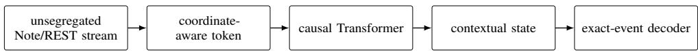  
Figure 1: Coordinate-aware architecture. Effective coordinate carriers feed a causal Transformer; contextual states compress residual predictive uncertainty before exact-event decoding.

Additionally, the coordinate-aware note is the basic token unit in our model. Larger reversible combinations remain possible within this framework when they preserve the declared coordinate representation and improve predictive compressibility.

## 4 RELATED WORK

Tokenization and predictive compression. Recent work formalizes tokenization as a representation mapping independent of a particular vocabulary Gastaldi et al. (2025). Information-theoretic and language-model analyses show that tokenization quality depends on coding efficiency and predictive behavior rather than token count alone Zouhar et al. (2023); Schmidt et al. (2024). Finite-context analyses further show that different lossless representations can induce different predictive losses under bounded models Rajaraman et al. (2024); Jafari Fesharaki et al. (2026).

Serialization and combination. Symbolic-music tokenizers and GPT-style music systems explore event serialization, temporal notation, compound representations, and sequence merging Huang et al. (2018); Huang & Yang (2020); Qu et al. (2025); Zeng et al. (2021); Fradet et al. (2023a); Geerlings & Meroño-Peñuela (2020); Pasquier et al. (2025). These approaches adopt or optimize how representations are serialized or combined. We distinguish such coding operations from coordinate construction and evaluate them under a common predictive code-length criterion.

Abstraction and contextual computation. Hierarchical representations and learned segment codes introduce abstraction into music models Huang et al. (2025); Yu et al. (2022). Temporal layout and tokenization choices also influence modeling behavior Qian et al. (2026); Chen et al. (2026). We instead separate deterministic coordinate operations from contextual abstraction to determine which structures are represented and which emerge in model states.

Music-specific coordinate priors. Symbolic-music models encode pitch, onset, and temporal structure through various coordinate choices Guo et al. (2023); Inaba et al. (2024). Time and duration tokenizations have also been directly compared Fradet et al. (2023b). We place these coordinate choices within the proposed boundary framework and test which operations improve predictive code length under a fixed learner.

## 5 EXPERIMENTS AND DISCUSSION

## 5.1 PROTOCOL AND EVALUATION

All matched comparisons preserve the learner, observable event space, and within-family training budget while changing only the representation interface. Each uses three preregistered seeds, validation-only model selection, and one sealed test. The bounded learner serves as a controlled probe of representation quality rather than a scaling benchmark.

The primary metric is predictive code length in bits per original observable event. Pop-K provides the main mechanistic study, while ComMU tests directional transfer under a separate matched within-corpus protocol. Full protocols and integrity checks appear in section A.

## 5.2 FACT–TOKEN BOUNDARY: COORDINATE CONSTRUCTION

Musical-time coordinates. The temporal family progressively removes the nesting of musical time inside serialization history. A uses generic token position, B introduces absolute onset, C replaces sequence position with directed multi-scale unary time, and D adds deterministic pairwise temporal relations.

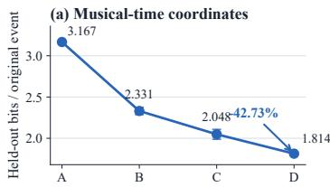

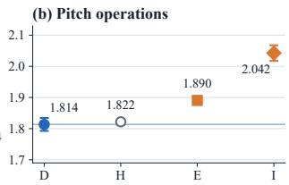

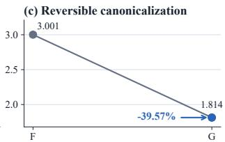  
Figure 2: Matched representation operations. Error bars show SD over three seeds.

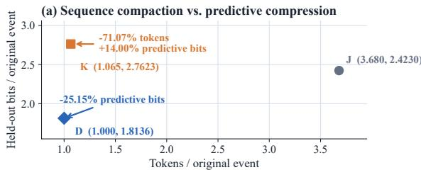

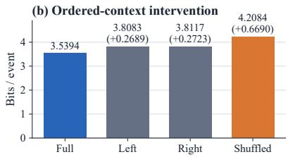  
Figure 3: Carrier and context controls.

A→B→C→D improves monotonically on validation and test. D lowers clean-test predictive code length by 42.73% relative to A, with all seeds agreeing (figure 2a). These coordinates progressively expose temporal regularities hidden by serialization order.

The A/D comparison is independently replicated on ComMU (Lee et al., 2022) under a matched within-corpus budget, supporting the direction of the temporal-coordinate effect.

Pitch coordinate operations. The pitch family separates reparameterization, canonicalization, and fixed relational projection. H bijectively rewrites absolute pitch as pitch class and register but shows no demonstrated gain (figure 2b). Invertible reparameterization alone does not guarantee a more predictive coordinate system.

F/G tests reversible canonicalization on identical shifted scores. G removes the known shift before prediction and retains it only for exact reconstruction. It reduces predictive code length by 39.57% relative to F, with every seed agreeing (figure 2c), without supplying tonal labels.

## 5.3 COORDINATE CONSTRUCTION VERSUS CARRIER CODING

J and K test whether shorter serialization alone explains the coordinate-aware result. J is an eventpreserving REMI-like serialization, while K applies reversible BPE without adding D’s temporal coordinates. Predictive code length is normalized by the same observable-event count.

K shortens J’s serialization by 71.07% yet requires 14.00% more predictive bits, whereas D reduces code length by 25.15% relative to J (figure 3a). Shorter token sequences therefore do not imply shorter predictive codes. Combination coding shortens serialization but does not substitute for coordinate construction.

## 5.4 TOKEN–STATE BOUNDARY: CONTEXTUAL COMPUTATION

Fixed relational projection. E and I replace categorical pitch-class identity with fixed chromatic and fifths geometries. Both increase predictive code length (figure 2b). Unlike deterministic temporal coordinates, these geometries impose pitch relations before contextual computation and constrain relations that should remain available to the state.

Context utilization. The representation experiments determine what information reaches the state, while context intervention tests whether it is used. In the fixed-target intervention, FULL provides complete context, while LEFT, RIGHT, and SHUFFLED remove context or disrupt content–time binding. Removing either context increases code length by about 0.27 bits/event, while shuffling identical content increases it by 0.669 bits/event (figure 3b). Prediction therefore depends on ordered content–time relations rather than context quantity alone.

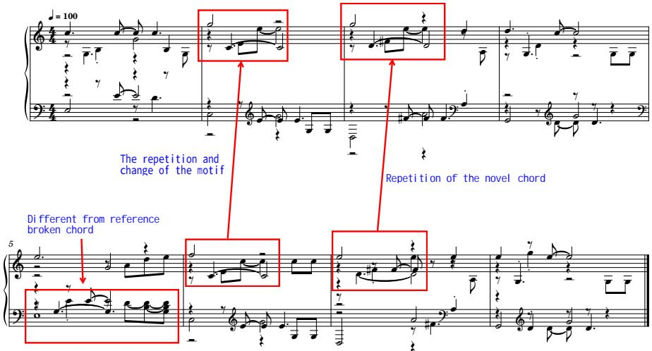  
Figure 4: Generated continuation from a shared prefix, showing recurring local patterns, variation, chordal texture, and longer-range recurrence.

## 5.5 MUSICAL ORGANIZATION WITHOUT STRUCTURAL TOKENS

We examine whether higher-level musical organization can emerge when structural identities are not fixed in the token interface. No melody, bass, accompaniment, harmony, motif, chord, or voice labels enter the unsegregated stream.

The inspected continuation exhibits recurring patterns, variation, chordal texture, and longer-range recurrence (figure 4). This provides qualitative existence evidence that contextual organization can emerge without explicit structural tokens.

## 5.6 SCOPE AND LIMITATIONS

The claims are bounded to the tested representations, a constrained model envelope, and the evaluated symbolic-music setting. Predictive code length is model-relative rather than a global coding optimum or a measure of musical quality. The experiments do not establish explicit semantic decomposition inside the model or characterize scaling behavior beyond the tested setting.

## 6 CONCLUSION

This work reframes tokenization as a coordinate construction problem rather than a search for larger or more reusable symbols. The Effectiveness–Losslessness Framework formalizes this view through two complementary boundaries: The Fact–Token Boundary determines which observable information and deterministic regularities should enter the representation. The Token–State Boundary determines which relations must remain available for contextual computation. Together, these principles define a token as a predictively effective coordinate carrier: a representation that transforms observable facts into predictive coordinates while preserving the contextual degrees of freedom required to determine relations.

Symbolic music validates this framework. Musical-coordinate denesting and reversible canonicalization improve predictive compressibility, while uninformative reparameterization and fixed relational projections do not. Sequence compaction alone is insufficient, and preserving contextual freedom allows higher-order organization to emerge.

Beyond the specific application, the framework suggests a broader interpretation of contextual models. Once observable facts and deterministic regularities are represented through effective coordinates, contextual states can be viewed as learned compressors of the remaining relational uncertainty that is difficult to specify explicitly. This interpretation is not tied to a particular architecture. In this view, Transformer-based models represent one effective mechanism for approximating such contextual compression.

## AI USE STATEMENT

Generative AI systems, including OpenAI Codex/ChatGPT and Google Gemini, were used as research-assistance tools for conceptual brainstorming and critical discussion, code drafting and refactoring, experiment orchestration, literature discovery, figure and table preparation, and editorial revision. AI outputs were not treated as scientific evidence. The human authors retained final control over the research questions, experimental protocols, data inclusion, interpretations, and claims; verified the cited sources, implementations, and reported results; and take full responsibility for the submission. Formal results were produced through the frozen deterministic protocols and auditable receipts reported in the paper rather than from unverified model-generated values.

## REPRODUCIBILITY STATEMENT

Reproducibility is addressed in section 5 and sections A, G and I. These sections specify the lineageaware split, exact prediction target, representation arms, shared model and optimization envelope, preregistered seeds, checkpoint rule, factor-level evaluation, tokenizer controls, and generation provenance. The reported protocol, source-tree, split-manifest, and selected-checkpoint hashes bind each result to its frozen implementation and data lineage. Test data were unavailable to training and checkpoint selection; held-out results were computed once after checkpoint lock.

## ETHICS AND DATA STATEMENT

The experiments use Pop-K (Patchbanks, 2025), distributed by its creators under a Creative Commons Attribution–NonCommercial license, solely for non-commercial research. We attribute the dataset and make no claim of ownership over its source compositions. The dataset record notes that some augmented segments may remain similar to source material; accordingly, source continuations are included only for scholarly comparison, and the selection, provenance, and literal event overlap of the qualitative examples are disclosed in section G. No human-subject study or listener data collection was conducted: author listening was used only to select the explicitly marked qualitative example and is not reported as a human evaluation. Any public release of data-derived artifacts will follow the applicable license and attribution requirements.

## REFERENCES

Tom B. Brown, Benjamin Mann, Nick Ryder, et al. Language models are few-shot learners. Advances in Neural Information Processing Systems, 33, 2020.

Junhao Chen, Mingjin Chen, Jingjia Mao, Lin Chen, Saining Zhang, Minglin Chen, Ruocheng Wu, Liaoyuan Fan, Wenyi Li, Mingju Gao, Henghaofan Zhang, Zhihao Li, Hao Zhao, Yufei Wang, and Ruqi Huang. Agogic: Performance-timed music tokens for LLM-native text-to-symbolic-music generation. arXiv preprint arXiv:2608.03999, 2026. doi: 10.48550/arXiv.2608.03999.

Nathan Fradet, Nicolas Gutowski, Fabien Chhel, and Jean-Pierre Briot. Byte pair encoding for symbolic music. In Proceedings ofthe 2023 Conference on Empirical Methods in Natural Language Processing, pp. 2001–2020. Association for Computational Linguistics, 2023a. doi: 10.18653/v1/ 2023.emnlp-main.123. URL https://aclanthology.org/2023.emnlp-main.123/.

Nathan Fradet, Nicolas Gutowski, Fabien Chhel, and Jean-Pierre Briot. Impact of time and note duration tokenizations on deep learning symbolic music modeling. In Proceedings of the 24th International Society for Music Information Retrieval Conference, 2023b. URL https:// archives.ismir.net/ismir2023/paper/000009.pdf.

Juan Luis Gastaldi, John Terilla, Luca Malagutti, Brian DuSell, Tim Vieira, and Ryan Cotterell. The foundations of tokenization: Statistical and computational concerns. In The Thirteenth International Conference on Learning Representations, 2025. URL https://openreview. net/forum?id=B5iOSxM2I0.

Cariña Geerlings and Albert Meroño-Peñuela. Interacting with GPT-2 to generate controlled and believable musical sequences in ABC notation. In Proceedings ofthe 1st Workshop on NLPfor

Music and Audio, pp. 49–53. Association for Computational Linguistics, 2020. URL https: //aclanthology.org/2020.nlp4musa-1.10/.

Zixun Guo, Jaeyong Kang, and Dorien Herremans. A domain-knowledge-inspired music embedding space and a novel attention mechanism for symbolic music modeling. In Proceedings ofthe AAAI Conference on Artificial Intelligence, volume 37, pp. 5070–5077, 2023. doi: 10.1609/aaai.v37i4. 25635.

Cheng-Zhi Anna Huang, Ashish Vaswani, Jakob Uszkoreit, Noam Shazeer, Curtis Hawthorne, Andrew M. Dai, Matthew D. Hoffman, and Douglas Eck. Music transformer: Generating music with long-term structure. arXiv preprint arXiv:1809.04281, 2018.

Jingyue Huang, Zachary Novack, Phillip Long, Yupeng Hou, Ke Chen, Taylor Berg-Kirkpatrick, and Julian McAuley. MuseTok: Symbolic music tokenization for generation and semantic understanding. arXiv preprint arXiv:2510.16273, 2025. doi: 10.48550/arXiv.2510.16273.

Yu-Siang Huang and Yi-Hsuan Yang. Pop music transformer: Beat-based modeling and generation of expressive pop piano compositions. In Proceedings ofthe 28th ACM International Conference on Multimedia, 2020.

Tatsuro Inaba, Kazuyoshi Yoshii, and Eita Nakamura. On the importance of time and pitch relativity for transformer-based symbolic music generation. In 2024 Asia Pacific Signal and Information Processing Association Annual Summit and Conference. IEEE, 2024. doi: 10.1109/APSIPAASC63619.2025.10849230.

Amirmehdi Jafari Fesharaki, Mohammadamin Rami, and Aslan Tchamkerten. Effective context in transformers: An analysis of fragmentation and tokenization. arXiv preprint arXiv:2605.13485, 2026. doi: 10.48550/arXiv.2605.13485.

Hyun Lee, Taehyun Kim, Hyolim Kang, Minjoo Ki, Hyeonchan Hwang, Kwanho Park, Sharang Han, and Seon Joo Kim. ComMU: Dataset for combinatorial music generation. In Advances in Neural Information Processing Systems: Datasets and Benchmarks Track, 2022. URL https://proceedings.neurips.cc/paper\_files/paper/2022/ hash/fff3ba5059aeeb88c324b6ba9b298166-Abstract-Datasets\_and\_ Benchmarks.html.

Philippe Pasquier, Jeff Ens, Nathan Fradet, Paul Triana, Davide Rizzotti, Jean-Baptiste Rolland, and Maryam Safi. MIDI-GPT: A controllable generative model for computer-assisted multitrack music composition. In Proceedings of the AAAI Conference on Artificial Intelligence, volume 39, pp. 1474–1482, 2025. doi: 10.1609/aaai.v39i2.32138.

Patchbanks. Pop-k: A large-scale augmented symbolic pop-music dataset. Zenodo, 2025. URL https://doi.org/10.5281/zenodo.14791511.

Lekai Qian, Haoyu Gu, Jingwei Zhao, and Ziyu Wang. BEAT: Tokenizing and generating symbolic music by uniform temporal steps. arXiv preprint arXiv:2604.19532, 2026. doi: 10.48550/arXiv. 2604.19532.

Xingwei Qu, Yuelin Bai, Yinghao Ma, et al. MuPT: A generative symbolic music pretrained transformer. In International Conference on Learning Representations, 2025. URL https: //openreview.net/forum?id=iAK9oHp4Zz.

Nived Rajaraman, Jiantao Jiao, and Kannan Ramchandran. An analysis of tokenization: Transformers under markov data. In Advances in Neural Information Processing Systems, volume 37, 2024. doi: 10.52202/079017-1999. URL https://papers.nips.cc/paper\_files/paper/ 2024/hash/724afcaae4ae92a9220a077ffe80088d-Abstract-Conference. html.

Craig W. Schmidt, Varshini Reddy, Haoran Zhang, Alec Alameddine, Omri Uzan, Yuval Pinter, and Chris Tanner. Tokenization is more than compression. In Proceedings ofthe 2024 Conference on Empirical Methods in Natural Language Processing, pp. 678–702. Association for Computational Linguistics, 2024. doi: 10.18653/v1/2024.emnlp-main.40. URL https://aclanthology. org/2024.emnlp-main.40/.

Ashish Vaswani, Noam Shazeer, Niki Parmar, Jakob Uszkoreit, Llion Jones, Aidan N. Gomez, Lukasz Kaiser, and Illia Polosukhin. Attention is all you need. In Advances in Neural Information Processing Systems, 2017.

Botao Yu, Peiling Lu, Rui Wang, Wei Hu, Xu Tan, Wei Ye, Shikun Zhang, Tao Qin, and Tie-Yan Liu. Museformer: Transformer with fine- and coarse-grained attention for music generation. arXiv preprint arXiv:2210.10349, 2022.

Mingliang Zeng, Xu Tan, Rui Wang, Zeqian Ju, Tao Qin, and Tie-Yan Liu. MusicBERT: Symbolic music understanding with large-scale pre-training. arXiv preprint arXiv:2106.05630, 2021.

Vilém Zouhar, Clara Meister, Juan Gastaldi, Li Du, Mrinmaya Sachan, and Ryan Cotterell. Tokenization and the noiseless channel. In Proceedings of the 61st Annual Meeting of the Association for Computational Linguistics (Volume 1: Long Papers), pp. 5184–5207. Association for Computational Linguistics, 2023. doi: 10.18653/v1/2023.acl-long.284. URL https://aclanthology.org/2023.acl-long.284/.

## A FROZEN PROTOCOL SUMMARY

Table 1: Shared formal training envelope.
<table><tr><td>Item</td><td>Frozen value</td></tr><tr><td>Dataset</td><td>popk_clean_v1; lineage-aware train/validation/test manifests</td></tr><tr><td>Rows</td><td>303,767 train; 1,024 validation; 1,024 sealed held-out test</td></tr><tr><td>Carrier and target</td><td>exact Note/REST event stream with a separate termination target; Type→Time→Pitch→Duration</td></tr><tr><td>Backbone</td><td>16 Transformer layers, width 64, 4 heads, FFN 128, dropout 0</td></tr><tr><td>Parameter envelope</td><td>817,107 parameters in the shared implementation envelope; inactive representation paths remain instantiated but frozen, so effective train- able parameter counts may differ slightly across interfaces</td></tr><tr><td>Context</td><td>complete manifest song, capped at 32 bars / 2,048 note tokens; no random note or bar crop</td></tr><tr><td>Seeds</td><td>20260814,20260815,20260816</td></tr><tr><td>Budget</td><td>five target-equivalent epochs; 106,803,335 exact-event exposures  $3 \bar { \times } 1 0 ^ { - 4 }$ </td></tr><tr><td>Optimization</td><td>AdamW; to  $3 \times 1 0 ^ { - 5 }$  cosine schedule with warmup; batch size 128 songs</td></tr><tr><td>Selection</td><td>minimum micro validation bits per exact event; ties resolved in favor of the earliest exposure</td></tr><tr><td>Test firewall</td><td>test data disabled and unloaded during training and checkpoint selec- tion; one evaluation after checkpoint lock</td></tr></table>

The A–E, F–G, and H–I families each have frozen protocol, source-tree, and manifest hashes in the repository receipts. The model envelope is shared within each family. Effective trainable parameter counts vary only because inactive representation paths remain instantiated but frozen.

## B FULL A–I ARM TABLE

Table 2: All formal representation arms. A–E and H–I use the original observed distribution, whereas F–G use a separately shifted distribution. Absolute scores are compared only within the matched families defined in the main text.
<table><tr><td>Family</td><td>Arm</td><td>Active interface</td><td>Validation</td><td>Held-out test</td></tr><tr><td>Time baseline</td><td>A</td><td>raw pitch identity; generic sequence position</td><td>3.149228 ± 0.005408</td><td>3.166764 ± 0.007073</td></tr><tr><td>Time coordinate</td><td>B C</td><td>A + learned absolute onset/bar lookup</td><td>2.331136 ± 0.053990</td><td>2.330793 ± 0.044314</td></tr><tr><td>Time coordinate</td><td></td><td>raw pitch; unary ordered and multi-scale metric time replac- ing generic/absolute position</td><td>2.059991 ± 0.052225</td><td> $2 . 0 4 8 4 8 3 \pm 0 . 0 6 0 4 2 4$ </td></tr><tr><td>Time coordinate</td><td>D</td><td>C + pairwise onset, meter, bar, and beat relations</td><td>1.817177 ± 0.010981</td><td>1.813576 ± 0.020722</td></tr><tr><td>Fixed pitch geometry</td><td>E</td><td>D time; chromatic-circle phase + absolute register replacing categorical pitch-class identity</td><td>1.898178 ± 0.008341</td><td>1.890478 ± 0.012583</td></tr><tr><td>Canonicalization</td><td>F</td><td>known shift s retained; Transformer predicts shifted absolute pitch</td><td>2.978696 ± 0.029743</td><td>3.001370 ± 0.028535</td></tr><tr><td>Canonicalization</td><td>G</td><td>known shift s retained; Transformer predicts canonical pitch; deterministic inverse restores physical pitch</td><td> $1 . 8 1 7 1 9 4 \pm 0 . 0 1 5 2 3 4$ </td><td> $1 . 8 1 3 7 9 5 \pm 0 . 0 1 7 5 7 4$ </td></tr><tr><td>Pitch interface</td><td>H</td><td>learned categorical absolute pitch class + learned absolute register; D time</td><td>1.827137 ± 0.003770</td><td> $1 . 8 2 1 9 0 0 \pm 0 . 0 0 8 8 2 7$ </td></tr><tr><td>Fixed pitch geometry</td><td>I</td><td>fixed circle-of-fifths phase + learned absolute register; D time</td><td> $2 . 0 5 4 1 6 6 \pm 0 . 0 3 0 5 5 0$ </td><td> $2 . 0 4 2 4 7 7 \pm 0 . 0 2 5 1 0 4$ </td></tr></table>

F and G use the same deterministic legal semitone shift in [−5, +6] for each sample, epoch, and seed. In both arms, the shift s is known and retained as part of the complete encoded example. F presents shifted absolute pitch to the Transformer. G canonicalizes pitch according to

$$
\widetilde { p } _ { i } = p _ { i } - s ,\tag{14}
$$

predicts $\widetilde { p } _ { i } ,$ , and restores physical pitch through

$$
p _ { i } = \widetilde { p } _ { i } + s .\tag{15}
$$

The shift is retained for deterministic reconstruction but is not supplied to the Transformer as a predictive feature. G refers only to the final tokenizer-side canonicalization arm. An abandoned legacy implementation that supplied reference information inside the model is excluded from all results and claims.

## C FULL PAIRED FACTOR DECOMPOSITION

Table 3: Held-out paired changes in bits per exact event. Negative values favor the left arm. Rows reconstruct the total change up to floating-point error.
<table><tr><td>Comparison</td><td>Total</td><td>Type</td><td>Time</td><td>Pitch</td><td>Duration</td></tr><tr><td>B-A</td><td>-0.835971</td><td>-0.014702</td><td>-0.079796</td><td>-0.481745</td><td>-0.259728</td></tr><tr><td>C-B</td><td>-0.282310</td><td>-0.000094</td><td>-0.015767</td><td>-0.177615</td><td>-0.088835</td></tr><tr><td>D-C</td><td>-0.234907</td><td>-0.000438</td><td>-0.015093</td><td>-0.164500</td><td>-0.054876</td></tr><tr><td>D-A</td><td>-1.353188</td><td>-0.015234</td><td>-0.110656</td><td>-0.823860</td><td>-0.403439</td></tr><tr><td>H-D</td><td>+0.008324</td><td>-0.000196</td><td>-0.002951</td><td>+0.006471</td><td>+0.004999</td></tr><tr><td>E-H</td><td>+0.068578</td><td>+0.000086</td><td>+0.001960</td><td>+0.054141</td><td>+0.012392</td></tr><tr><td>I-H</td><td>+0.220577</td><td>+0.000278</td><td>+0.006718</td><td>+0.170510</td><td>+0.043071</td></tr><tr><td>I-E</td><td>+0.151999</td><td>+0.000192</td><td>+0.004759</td><td>+0.116369</td><td>+0.030679</td></tr><tr><td>E-D</td><td>+0.076902</td><td>-0.000110</td><td>-0.000991</td><td>+0.060612</td><td>+0.017391</td></tr><tr><td>I-D</td><td>+0.228901</td><td>+0.000082</td><td>+0.003768</td><td>+0.176981</td><td>+0.048070</td></tr><tr><td>G-F</td><td>-1.187575</td><td>-0.000257</td><td>+0.001387</td><td>-0.880078</td><td>-0.308627</td></tr></table>

## D SPLIT AND TEST INTEGRITY

The Pop-K split is constructed at the source-lineage level rather than by cache order. Samples connected by original identity, exact content, or transposition-invariant duplicate evidence are assigned to the same split. Model selection reads validation data only; the test manifest is disabled during training. All reported test values use the frozen validation-selected checkpoints.

For A–E and F–G, final evaluation opened the sealed manifest once after checkpoint selection. In H/I, the initial process opened the manifest once and constructed an immutable 1,024-song / 70,981-token tensor cache, then failed while loading a frozen D/E comparison dependency. The resumed process verified every cache hash, reused the same six H/I checkpoint hashes, did not reopen the manifest or source MIDI files, and performed no training, tuning, or reselection. This was an infrastructure resume rather than a second scientific test invocation.

## E REPRESENTATION DETAILS

All modeled non-drum notes are placed in a single unsegregated event stream. No melody, bass, harmony, accompaniment, instrument-part, or voice partition is supplied to the model. Notes sharing an onset remain separate observable events and are serialized by ascending MIDI pitch. There is no cardinality head, pitch-set decoder, onset-group identity, melody extraction, chord label, or voice label.

For events without pitch, including REST events, a fixed type-specific tie-breaking convention is used. Serialization order is deterministic but does not imply performance order, melodic priority, voice membership, or semantic importance.

Duration remains an exactly recoverable attribute of each Note or REST event rather than an activenote state reconstructed from later transitions. The decoder order is

$$
\mathrm { T Y P E } \to \mathrm { T I M E } \to \mathrm { P I T C H } \to \mathrm { D U R A T I O N } .\tag{16}
$$

This is a chain-rule factorization of the exact-event distribution rather than a semantic ranking of musical attributes.

C, D, E, H, and I use directed bar progress together with within-beat, beat-within-bar, bar, four-bar, and sixteen-bar unary phases. The directed component disambiguates repeated periodic phases, so the joint musical-time coordinate uniquely determines the supported score onset:

$$
\tau _ { i } = \phi ( o _ { i } ) , \qquad \phi ^ { - 1 } ( \tau _ { i } ) = o _ { i } .\tag{17}
$$

The unary interface is therefore an invertible coordinate transformation that preserves the supported score onset.

D, E, H, and I additionally use signed onset displacement, within-bar displacement, signed bar distance, and signed beat distance as deterministic attention biases. These pairwise quantities are computed from preserved musical-time coordinates and do not assign chord, motif, phrase, or voice identity.

D uses raw MIDI-pitch identity. H uses categorical pitch class

$$
c _ { i } = p _ { i } { \mathrm { ~ m o d ~ } } 1 2\tag{18}
$$

together with categorical absolute register

$$
r _ { i } = \left\lfloor { \frac { p _ { i } } { 1 2 } } \right\rfloor .\tag{19}
$$

The pair $( c _ { i } , r _ { i } )$ bijectively determines the supported absolute pitch.

E replaces categorical pitch-class identity with the chromatic phase

$$
\gamma _ { \mathrm { c h r } } ( p _ { i } ) = \left[ \sin \left( \frac { 2 \pi ( p _ { i } \mathrm { m o d } 1 2 ) } { 1 2 } \right) , \cos \left( \frac { 2 \pi ( p _ { i } \mathrm { m o d } 1 2 ) } { 1 2 } \right) \right]\tag{20}
$$

and retains absolute register.

I uses the same phase construction after mapping pitch class to the circle-of-fifths index

$$
f _ { i } = \left( 7 ( p _ { i } \mathrm { ~ m o d ~ } 1 2 ) \right) \mathrm { ~ m o d ~ } 1 2 ,\tag{21}
$$

giving

$$
\gamma _ { \mathrm { f i f } } ( p _ { i } ) = \left[ \sin \left( \frac { 2 \pi f _ { i } } { 1 2 } \right) , \cos \left( \frac { 2 \pi f _ { i } } { 1 2 } \right) \right] .\tag{22}
$$

F and G use identical deterministically shifted physical examples. The known shift s is retained as part of the complete encoding in both arms. F presents shifted absolute pitch to the Transformer and predicts the shifted target. G applies tokenizer-side canonicalization,

$$
\widetilde { p } _ { i } = p _ { i } - s ,\tag{23}
$$

predicts canonical pitch, and applies evaluator-side reconstruction,

$$
p _ { i } = \widetilde { p } _ { i } + s .\tag{24}
$$

The shift is used for deterministic encoding and reconstruction but is not supplied to the Transformer as a predictive feature. No tonic, mode, key, scale-degree, or tonal-function label enters G.

## F SECONDARY CONTEXT EVIDENCE

An earlier relation probe, separate from A–I, tests whether a candidate four-bar target belongs between left and right context. On 6,112 windows from 99 held-out POP909 songs, full-context accuracy was 75.93%, compared with 48.87% for the target-only condition. Replacing left or right context reduced accuracy by 11.42 and 12.37 percentage points, respectively, while replacing both reduced accuracy to 50.87% (figure 5).

Because this probe uses an earlier composition-level representation, it is supporting evidence for contextual dependence rather than part of the primary tokenization result. It is not pooled numerically with the main fixed-target intervention and is not used to support any representation ranking.

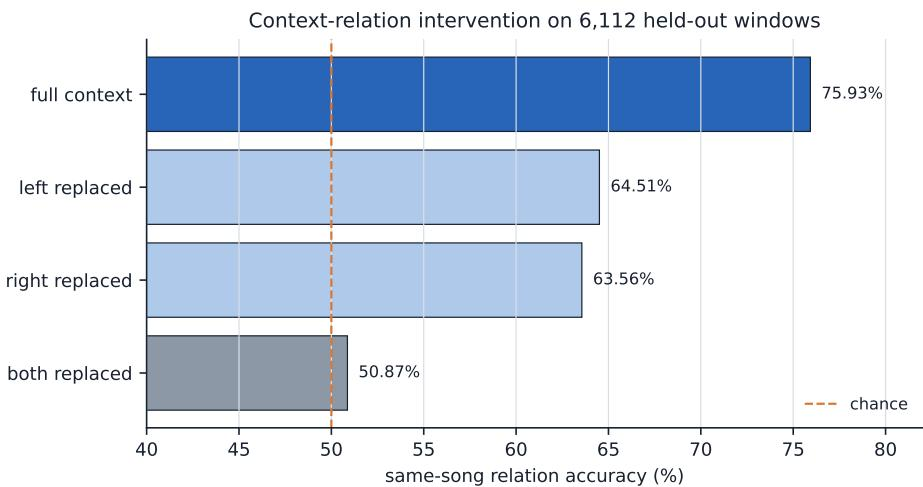  
Figure 5: Secondary context-relation probe. Replacing either side degrades compatibility prediction; replacing both approaches the target-only control.

## G GENERATION PROVENANCE AND SOURCE CONTINUATIONS

The two showcase cases were selected by human listening from one documented ten-case batch generated by the coordinate-aware note-centered causal checkpoint. They are not A–I prevalence estimates. Event Jaccard is the intersection over union of exact

(onset relative to continuation start, MIDI pitch, duration in ticks)

triples. It measures literal event overlap rather than musical quality.

Table 4: Showcase generation receipts.
<table><tr><td></td><td>Case A</td><td>Case B</td></tr><tr><td>Song ID</td><td>popk_304614</td><td>popk_305540</td></tr><tr><td>Checkpoint</td><td>epoch 4.000</td><td>epoch 4.000</td></tr><tr><td>Prefix / generated</td><td>4/4 bars</td><td>4 / 4 bars</td></tr><tr><td>Generated notes</td><td>49</td><td>46</td></tr><tr><td>Generated onsets</td><td>28</td><td>32</td></tr><tr><td>Polyphonic onset rate</td><td>17.9%</td><td>43.8%</td></tr><tr><td>Maximum notes/onset</td><td>7</td><td>2</td></tr><tr><td>Event Jaccard vs. source Sampling</td><td>25.8% temperature 0.85, top-p 0.92, top-k 24</td><td>50.8%</td></tr></table>

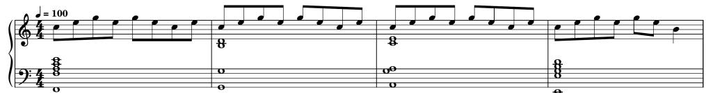

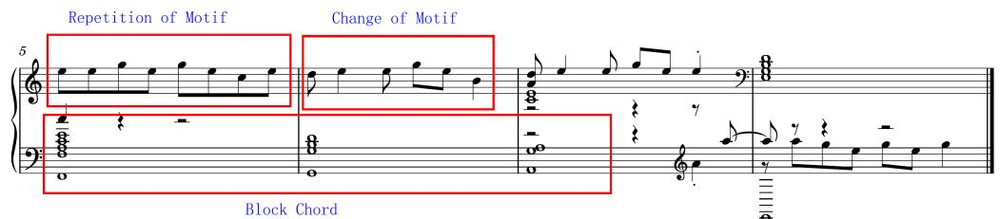  
Figure 6: Case A model continuation. The upper system is the shared four-bar prefix; the lower system is generated. Red boxes and blue labels are manual musical annotations, not model inputs.

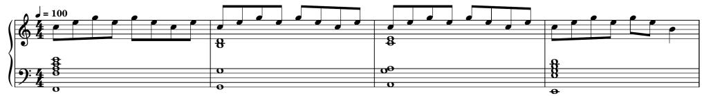

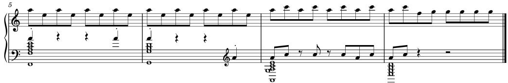  
Figure 7: Case A source continuation for exact visual comparison.

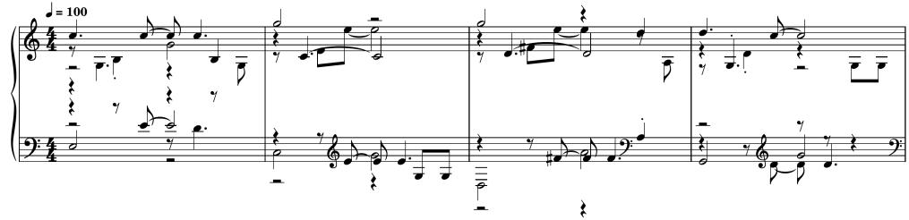

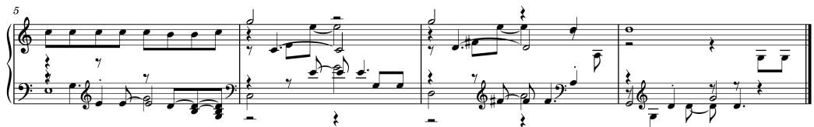  
Figure 8: Case B source continuation for exact visual comparison.

The checkpoint SHA-256 is 946287c1997125c39edf0f1969880f8fc78dd854849459fc952c8dc5b0381f6b. Both examples end when the model emits its separate termination symbol. The annotated scores, source continuations, MIDI files, and WAV files are distributed under docs/demos/m4l-popk/.

## H EVIDENCE BOUNDARIES

• The formal evidence covers one lineage-safe Pop-K task, a small fixed model envelope, three seeds, and five target-equivalent epochs. Held-out negative log-likelihood is a model-relative predictive code-length metric, not a global coding optimum, perceptual-quality measure, or human-preference score.

• H−D was not designed as an equivalence or non-inferiority test. Its near-zero mean difference is descriptive, and one held-out seed reverses direction. The supported conclusion is that H demonstrates no measurable predictive-code-length gain over D.

• E and I replace categorical pitch-class identity with the tested fixed continuous topologies and change effective active parameter counts. Their degradation rejects these particular replacements, not all forms of pitch geometry, learned contextual geometry, or auxiliary geometric features that preserve categorical identity.

• F/G assumes a known deterministic global shift retained in the complete encoding. G does not infer tonic, mode, key, scale degree, tonal function, or a reference frame. F/G is evaluated on a separately shifted observed distribution and is not formally ranked against D.

• Pairwise temporal bias establishes predictive utility for deterministic temporal relations. It does not by itself establish phrase, section, cadence, motif, voice, or full-song structural understanding.

• The framework’s “relationally lossless” criterion refers to preserving context-dependent relational alternatives for state-side computation. Exact reconstruction of the modeled Note/REST event fields and correct sequence termination are separate engineering properties of the event carrier. Neither statement implies byte-for-byte recovery of raw MIDI files, controller data, instrumentation, timbre, articulation, expressive micro-timing, or acoustic performance.

• The fixed-target context intervention establishes sensitivity to ordered content–time binding. It does not identify a unique, human-readable chord, motif, phrase, or voice variable inside the contextual state.

• The two generation cases were selected after listening to ten candidates. They demonstrate inspectable existence rather than population frequency, unbiased musical-quality estimates, or causal attribution to a particular hidden semantic variable.

## I TOKENIZER CONTROLS AND CONTEXT INTERVENTION

Table 5: Frozen tokenizer controls. Predictive bits are summed over every emitted target and normalized by the common prediction-target count: the exact Note/REST events plus one separate termination target per sequence. The termination symbol is an autoregressive coding device, not an observable musical event. Values are mean ± sample SD over three preregistered seeds.
<table><tr><td>Interface</td><td>tokens/event</td><td>validation bits/event</td><td>test bits/event</td></tr><tr><td>J: REMI-like</td><td>3.680</td><td>2.40630 ± 0.01777</td><td>2.42301 ± 0.01951</td></tr><tr><td>K: J + reversible BPE</td><td>1.065</td><td>2.79320 ± 0.01746</td><td>2.76234 ± 0.02512</td></tr><tr><td>D: coordinate-aware</td><td>1.000</td><td>1.81718 ± 0.01098</td><td>1.81358 ± 0.02072</td></tr></table>

Table 6: Fixed-target context intervention. These values belong to a separate context experiment and are not pooled with the matched representation arms.
<table><tr><td>Condition</td><td>bits/event</td><td>change from Full</td></tr><tr><td>FULL</td><td>3.5394</td><td></td></tr><tr><td>LEFT</td><td>3.8083</td><td>+0.2689</td></tr><tr><td>RIGHT</td><td>3.8117</td><td>+0.2723</td></tr><tr><td>SHUFFLED</td><td>4.2084</td><td>+0.6690</td></tr></table>

J uses an event-preserving REMI-like stream with BAR, exact POSITION, pitch/REST, and duration symbols. K applies train-only reversible BPE to that stream without adding D’s multi-scale time coordinates or pairwise temporal relations. D retains one coordinate-aware token representation per original event. The J/K/D comparison is matched in data, split, seeds, model core, original-eventequivalent budget, and validation-only checkpoint selection.

## J INDEPENDENT-CORPUS A/D REPLICATION

The independent replication uses 9,299 ComMU songs in 4/4, split into 8,652 train, 323 validation, and 324 sealed-test songs. Scores retain their original C-major/A-minor normalization; no second transposition is applied. A and D use the same normalized pitch representation and differ only in their musical-time interface. They otherwise share targets, model envelope, decoder, optimizer, batch construction, context policy, three preregistered seeds, five target-equivalent epochs, and the validation-only checkpoint rule within this corpus. The ComMU budget is not asserted to equal Pop-K exposure.

Table 7: Frozen ComMU 4/4 A/D replication. Values are bits per exact original event; summary rows report mean ± sample SD over three preregistered seeds. Lower is better.
<table><tr><td>Arm/seed</td><td>validation</td><td>clean test</td><td>test D-A</td></tr><tr><td>A: raw sequence</td><td> $1 2 . 0 7 5 6 3 \pm 0 . 1 3 7 8 1$ </td><td> $1 1 . 8 5 5 1 4 \pm 0 . 1 3 7 4 8$ </td><td></td></tr><tr><td>D: relational time</td><td> $\mathbf { 1 1 . 9 1 0 1 5 \pm 0 . 1 4 8 3 0 }$ </td><td> $\mathbf { 1 1 . 7 4 8 1 2 \pm 0 . 1 7 3 6 3 }$ </td><td>-0.10701</td></tr><tr><td>20260814</td><td></td><td>A: 11.88487; D: 11.85843</td><td>-0.02644</td></tr><tr><td>20260815</td><td></td><td>A: 11.70522; D: 11.54798</td><td>-0.15723</td></tr><tr><td>20260816</td><td></td><td>A: 11.97532; D: 11.83796</td><td>-0.13736</td></tr></table>

All three paired seeds favor D on validation and sealed test. Test was read once after validationselected checkpoints were frozen, and the launch gate passed for all six runs. Exact and transposition invariant families do not cross splits. Because all six final curves still improve from epoch 4.5 to epoch 5, the result establishes directional replication under a matched budget, not convergence or a ComMU capability limit. On clean test, D primarily improves Type and Time, leaves Duration nearly unchanged, and slightly worsens Pitch. Because the A/D intervention holds pitch encoding fixed, this Pitch difference is an indirect cross-factor effect rather than evidence for or against pitch-coordinate construction. The replication therefore supports the direction of the total temporal-interface effect, not universal improvement of every factor head.