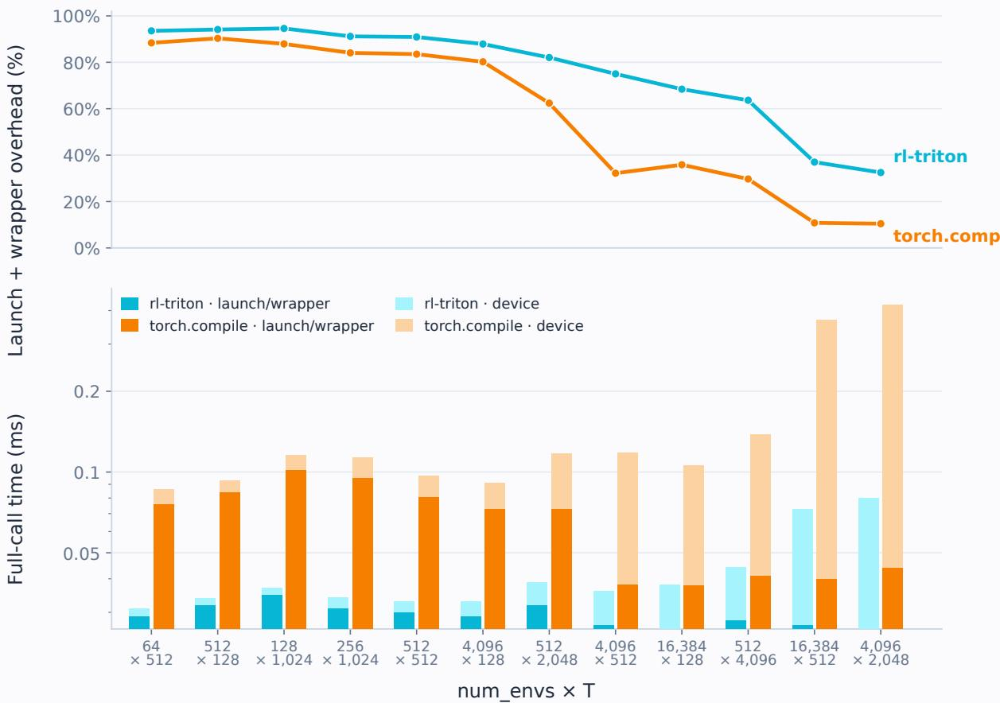
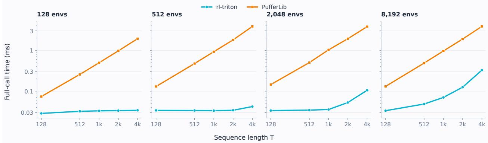
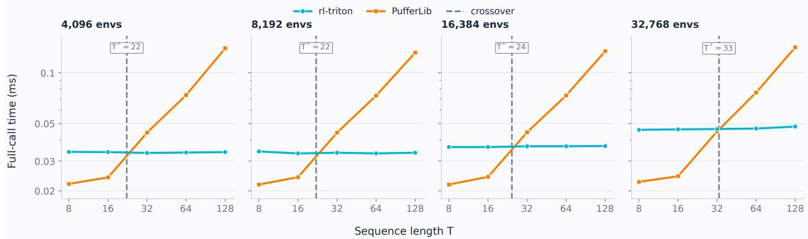

# rl-triton: High-Performance Triton GPU Kernels for Reinforcement Learning Credit Assignment

A PREPRINT

Lars Simon Zehnder\* Independent Researcher Faro, Portugal

## ABSTRACT

We present rl-triton, an open-source library of high-performance GPU kernels for reinforcement learning credit assignment, implemented in Triton. The core contribution is a unified associative scan framework that recasts seven distinct RL estimation algorithms – Generalized Advantage Estimation (GAE), V-Trace, Retrace(λ), TD(λ) returns, discounted returns, eligibility traces, and episodic prefix sums – as instances of a single first-order linear recurrence solved in O(log T) parallel steps. All algorithms share the same associative scan operator, with algorithm-specific fused Triton kernels constructing their recurrence coefficients on-chip. We verify the associative operator algebraically and define the treatment of terminated and truncated episodes explicitly. Benchmarks show a 1.6–5.70× full-call speedup over a vectorized torch.compile baseline in the massively parallel simulation regime (thousands of environments, short rollouts). The reported range covers all seven algorithms on both GPUs, both with and without per-step truncation handling. For most algorithms, speedups increase at longer sequence lengths, as the baseline requires more scan stages as log T grows, each adding an intermediate HBM round-trip. The library is available at https://github.com/simonsays1980/rl-triton.

## 1 Introduction

Every iteration of a deep reinforcement learning training pipeline requires computing credit assignment quantities: advantages, value targets, and return estimates that tell the policy network which actions were good and by how much. These quantities include Generalized Advantage Estimation (GAE) [Schulman et al., 2016], V-Trace targets [Espeholt et al., 2018], Retrace(λ) Q-value targets [Munos et al., 2016], and several simpler estimators. While network forward and backward passes and environment rollouts typically dominate overall training time, credit assignment computations are on the critical path of every update step. They operate over tensors of shape [num envs, seq len], where num envs is the number of parallel environments (or workers) and seq len=T is the number of timesteps in each rollout-buffer row, i.e., the scan length. It is not necessarily the episode length, since a row may contain multiple episodes separated by boundary flags. Typical configurations range from a handful of environments with short rollouts (e.g., 8 environments, 128 steps in standard PPO [Schulman et al., 2017]) to thousands of environments with longer horizons in large-scale distributed training [Espeholt et al., 2018, Petrenko et al., 2020] and RLHF pipelines where rollout sequences span thousands of tokens [Ouyang et al., 2022].

All of these estimators share a common mathematical structure: they are first-order linear recurrences. The five backward estimators have the form

$$
A _ { t } = \alpha _ { t } + \beta _ { t } \cdot A _ { t + 1 } , \qquad A _ { T } = 0 ( \mathrm { o r ~ a ~ b o o t s t r a p ~ v a l u e } ) ,\tag{1}
$$

where $\alpha _ { t }$ and $\beta _ { t }$ are algorithm-specific per-step coefficients. Eligibility traces and episodic prefix sums use the forward time mirror $A _ { t } = \alpha _ { t } + \beta _ { t } A _ { t - 1 }$ . In either direction, the recurrence creates a strict temporal dependency chain: a naive sequential implementation requires T serial steps regardless of how many parallel GPU cores are available.

Existing RL codebases commonly evaluate this recurrence with a sequential loop over t (Section 8). Wrapping that loop in torch.compile removes Python overhead but does not remove its temporal dependency. An O(log T) restructuring instead requires expressing the recurrence as an explicit parallel associative scan [Blelloch, 1990] (Section 2.2). We implement this construction in PyTorch as the baseline used in our evaluation (Section 6.2). Although it has the same asymptotic depth as the Triton scan, each doubling step still incurs an HBM round-trip.

We implement fused Triton kernels for these recurrences. The five backward algorithms use Equation 1, while eligibility traces and episodic prefix sums use its forward-time mirror. Each algorithm has its own fused kernel, which constructs its coefficients (Section 3) from raw rollout inputs on-chip and evaluates the recurrence using the same associative scan operator and combine function.

## Contributions.

1. A unified algebraic framework showing that seven standard RL credit assignment algorithms are instances of a single first-order linear recurrence.

2. Fused Triton kernels sharing one associative scan, with on-chip coefficient construction and explicit termination/truncation handling.

3. Algorithm-specific treatment of bootstrap values at rollout-window boundaries – an additive term in $\alpha _ { T - 1 }$ for some algorithms and a nonzero scan carry for others (Section 3.2).

4. A benchmarking harness showing a 1.6–5.70× full-call speedup over a vectorized torch.compile baseline across all seven algorithms and both GPUs in the massively parallel simulation regime (Section 7).

5. An open-source Python package with correctness tests, performance regression tests, and documentation.

## 2 Background

## 2.1 The Sequential Dependency Problem

Consider the GAE recurrence [Schulman et al., 2016]:

$$
A _ { t } = \delta _ { t } + \gamma \lambda \cdot A _ { t + 1 } ,
$$

where $\delta _ { t } = r _ { t } + \gamma V ( s _ { t + 1 } ) - V ( s _ { t } )$ is the one-step TD error. Computing $A _ { 0 }$ requires $A _ { 1 }$ , which requires $A _ { 2 } .$ , all the way to $A _ { T - 1 }$ . This is a strict sequential chain of length T.

On GPU hardware, sequential chains of length T are expensive not because of arithmetic cost but because of memory traffic: a naive loop must read $\delta _ { t }$ and $\gamma \lambda$ from HBM, perform the addition and multiplication, and write $A _ { t }$ back to HBM – one full round-trip per timestep. For T=1024, num envs=128, this means 1024 serial HBM round-trips even though 128 environment rows could in principle be processed in parallel.

torch.compile cannot remove this dependency: it eliminates per-step Python interpreter overhead, but a compiler cannot break a true data dependency the algorithm itself imposes, so the loop still executes $T$ sequential steps. This uncompiled sequential loop – the pattern used by CleanRL, RLlib, and similar codebases (Section 8) – is reported as the Loop baseline in our results (Section 7).

Removing the O(T) chain requires restructuring the algorithm, not just compiling it: rewriting the recurrence as an associative scan (Section 2.2 below) so that torch.compile has a log T-depth computation to compile in the first place, rather than a T-depth one. This is the vectorized, torch.compile’d doubling-scan baseline used throughout this paper’s evaluation (Section 6.2) and is a substantially stronger baseline than the naive loop – it achieves the same O(log T) depth as our Triton kernel’s internal scan (Section 4.2) – but, as Section 6.2 details, still pays a full HBM round-trip per doubling step rather than keeping intermediate results on-chip.

## 2.2 Parallel Associative Scans

The parallel associative scan is a foundational algorithm in parallel computing [Blelloch, 1990, Ladner and Fischer, 1980]. Given an array of elements $[ x _ { 0 } , x _ { 1 } , \dots , x _ { T - 1 } ]$ and an associative binary operator ⊕, the scan computes all prefix reductions $[ x _ { 0 } , x _ { 0 } \oplus x _ { 1 } , . . . , x _ { 0 } \oplus \cdot \cdot \cdot \oplus x _ { T - 1 } ]$ in ${ \cal O } ( \log T )$ parallel steps on T processors, using a binary tree reduction.

The first-order linear recurrence $A _ { t } = \alpha _ { t } + \beta _ { t } \cdot A _ { t + 1 }$ can be expressed as a prefix scan of tuples $\left( \alpha _ { t } , \beta _ { t } \right)$ under the associative operator:

$$
( \alpha _ { B } , \beta _ { B } ) \oplus ( \alpha _ { A } , \beta _ { A } ) = \left( \alpha _ { B } + \beta _ { B } \alpha _ { A } , \ \beta _ { A } \beta _ { B } \right) .\tag{2}
$$

Proposition 1 (Associativity of ⊕). The operator defined by Equation 2 is associative.

Proof. For any three tuples $( \alpha _ { C } , \beta _ { C } ) , ( \alpha _ { B } , \beta _ { B } ) , ( \alpha _ { A } , \beta _ { A } )$

$$
\begin{array} { r l } & { \left[ \left( \alpha _ { C } , \beta _ { C } \right) \oplus \left( \alpha _ { B } , \beta _ { B } \right) \right] \oplus \left( \alpha _ { A } , \beta _ { A } \right) = \left( \alpha _ { C } + \beta _ { C } \alpha _ { B } , \beta _ { B } \beta _ { C } \right) \oplus \left( \alpha _ { A } , \beta _ { A } \right) } \\ & { \qquad = \left( \alpha _ { C } + \beta _ { C } \alpha _ { B } + \beta _ { B } \beta _ { C } \alpha _ { A } , \beta _ { A } \beta _ { B } \beta _ { C } \right) . } \end{array}
$$

$$
\begin{array} { r l } & { \left( \alpha _ { C } , \beta _ { C } \right) \oplus \big [ \left( \alpha _ { B } , \beta _ { B } \right) \oplus \left( \alpha _ { A } , \beta _ { A } \right) \big ] = \left( \alpha _ { C } , \beta _ { C } \right) \oplus \big ( \alpha _ { B } + \beta _ { B } \alpha _ { A } , \ \beta _ { A } \beta _ { B } \big ) } \\ & { \hphantom { \left( \alpha _ { C } , \beta _ { C } \right) \oplus \big [ \alpha _ { B } , \beta _ { B } \big ) } = ( \alpha _ { C } + \beta _ { C } ( \alpha _ { B } + \beta _ { B } \alpha _ { A } ) , \ \beta _ { A } \beta _ { B } \beta _ { C } ) } \\ & { \hphantom { \left( \alpha _ { C } , \beta _ { C } \right) \oplus \big [ \alpha _ { C } , \beta _ { B } \big ) \oplus \big [ \alpha _ { C } , \beta _ { C } \big ] } = ( \alpha _ { C } + \beta _ { C } \alpha _ { B } + \beta _ { C } \beta _ { B } \alpha _ { A } , \ \beta _ { A } \beta _ { B } \beta _ { C } ) . } \end{array}
$$

Both expressions are equal.

For the five backward recurrences, the kernel loads the sequence in reverse chronological order: reversed index $k = 0$ corresponds to timestep $t = T - 1$ , while $k = T - 1$ corresponds to $t = 0$ . The associative scan therefore operates in late-to-early time order, and the result at reversed index k corresponds to chronological timestep $t = T - 1 - k$ Eligibility traces and episodic prefix sums instead scan the sequence in its original chronological order.

## 2.3 Triton and the GPU Memory Hierarchy

Triton [Tillet et al., 2019] is a domain-specific language and compiler for writing GPU kernels in Python-like syntax. It abstracts over warp-level programming while exposing the key performance-relevant features of the GPU memory hierarchy:

• HBM (High Bandwidth Memory): Main GPU memory, ∼2–3.35 TB/s bandwidth on datacenter HBM3 parts such as the 80GB H100 used in this paper’s evaluation, latency on the order of several hundred cycles. Accessible by all SMs (The RTX 2000 Ada also evaluated here uses 16GB of GDDR6 instead of HBM, at substantially lower bandwidth – Section 7 reports results on both GPUs).

• SRAM (Shared Memory): Per-SM scratchpad, ∼5–10× higher bandwidth than HBM, very low latency. Configurable capacity up to ∼100 KB per SM on Ada-generation SMs (RTX 2000 Ada) and up to ∼228 KB per SM on H100.

• Registers: Per-thread storage, zero-latency access. Arithmetic occurs here. 64K 32-bit registers per SM on both GPUs evaluated in this paper, shared across all resident threads.

Credit assignment kernels are memory-bandwidth bound rather than compute bound [Williams et al., 2009]: the arithmetic intensity (FLOPs per byte of HBM traffic) is low, so reducing HBM accesses directly reduces runtime. The performance advantage of a fused kernel therefore comes from minimizing HBM round-trips [Dao et al., 2022]. A fused implementation keeps the scan state on-chip between stages, avoiding the intermediate HBM round-trips required by a materialized scan. The associative scan keeps intermediate tuples on-chip throughout the ${ \cal O } ( \log T )$ reduction, with no HBM round-trip until the final output store.

Triton’s tl.associative scan primitive maps directly to this pattern, allowing the kernel to express the tree reduction at a high level while the Triton compiler generates efficient hardware-specific reduction instructions for both NVIDIA (warp shuffles) and AMD (wavefront operations) GPUs.

## 3 The Unified Linear Recurrence Framework

## 3.1 The Shared Scan Operator

All seven algorithms use the same associative scan operator and combine function. For the five backward recurrences, the kernel presents $\left( \alpha _ { t } , \beta _ { t } \right)$ to the scan in reverse chronological order and writes the result back in original time order. Eligibility traces and episodic prefix sums instead scan the original sequence in forward order.

For the backward algorithms, the boundary carry A is algorithm-dependent rather than a universal constant; Section 3.2 derives this condition, and Table 1 lists it for each algorithm. The scan incorporates this carry after evaluating the recurrence with tl.associative scan and the combine function in Equation 2. The forward scans use the same combine function but require no successor-value bootstrap.

Table 1: Algorithm-specific coefficients for the shared affine scan, applied in reverse or forward time as appropriate. $d _ { t } ^ { \mathrm { t e r m } } , d _ { t } ^ { \mathrm { t r u n \overline { { c } } } } \in \{ 0 , 1 \}$ flag termination and truncation; $d _ { t } = d _ { t } ^ { \mathrm { t e r m } } \vee d _ { t } ^ { \mathrm { t r u n c } }$ is the flag used in $\beta _ { t } ,$ , combining both. $\bar { \Delta _ { t } } = \bar { v _ { t } } - \bar { V ( s _ { t } ) }$ is the V-Trace value delta (Section 3.3.2). The Bootstrap column gives each algorithm’s scan boundary carry (Section 3.2 explains why it is 0 for GAE/V-Trace/Retrace(λ) but nonzero for TD(λ)/discounted returns). Eligibility traces use vector notation since the trace is vector-valued; see Section 9.2 for per-call scalar handling.
<table><tr><td>Algorithm</td><td> $\pmb { \alpha } _ { t }$ </td><td> $\beta _ { t }$ </td><td>Bootstrap</td></tr><tr><td>GAE</td><td> $r _ { t } + \gamma ( 1 - d _ { t } ^ { \mathrm { t e r m } } ) V ( s _ { t + 1 } ) - V ( s _ { t } )$ </td><td> $\gamma \lambda ( 1 - d _ { t } )$ </td><td> $A _ { T } = 0$ </td></tr><tr><td>V-Trace</td><td> $\rho _ { t } \big ( r _ { t } + \gamma ( 1 - d _ { t } ^ { \mathrm { t e r m } } ) V ( s _ { t + 1 } ) - V ( s _ { t } ) \big )$ </td><td> $\gamma c _ { t } ( 1 - d _ { t } )$ </td><td> $\Delta _ { T } = 0$ </td></tr><tr><td>Retrace(λ)</td><td> $r _ { t } + \gamma ( 1 - d _ { t } ^ { \mathrm { t e r m } } ) \mathbb { E } _ { \pi } [ Q ( s _ { t + 1 } , \cdot ) ] - Q ( s _ { t } , a _ { t } )$ </td><td> $\gamma c _ { t + 1 } ( 1 - d _ { t } )$ </td><td>0</td></tr><tr><td>TD(λ)</td><td> $r _ { t } + \gamma ( 1 - \lambda ) ( 1 - d _ { t } ^ { \mathrm { t e r m } } ) V ( s _ { t + 1 } )$ </td><td> $\gamma \lambda ( 1 - d _ { t } )$ </td><td> $G _ { T } ^ { \lambda }$ </td></tr><tr><td>Disc. Returns</td><td> $r _ { t }$ </td><td> $\gamma ( 1 - d _ { t } )$ </td><td> $G _ { T }$ </td></tr><tr><td>Elig. Traces (fwd)</td><td> $\nabla _ { \mathbf { w } } \hat { V } ( s _ { t } , \mathbf { w } _ { t } )$ </td><td> $\gamma \lambda ( 1 - d _ { t - 1 } )$ </td><td> ${ \bf z } _ { - 1 } = { \bf 0 }$ </td></tr><tr><td>Prefix Sum (fwd)</td><td> $x _ { t }$ </td><td> $1 - d _ { t - 1 }$ </td><td>0</td></tr></table>

For the common case (seq $- 1 \mathsf { e n } \le 1 3 1 0 7 2 )$ , each Python API dispatches to an algorithm-specific fused kernel that receives the raw rollout tensors (rewards, values, done flags, importance ratios, etc.) and constructs $\alpha _ { t }$ and $\beta _ { t }$ in registers; no PyTorch operation materializes them as intermediate tensors. For longer sequences, the backward-scan algorithms use the unfused chunked fallback described in Section 4.3. Table 1 summarizes the per-algorithm mapping from rollout quantities to $\alpha _ { t }$ and $\beta _ { t }$

## 3.2 Episode and Rollout-Window Boundary Semantics

Credit-assignment quantities must not propagate across episode boundaries within a rollout buffer. rl-triton distinguishes termination and truncation, which both sever the scan carry but differ in their bootstrap semantics, from the rollout-window boundary at $t = T - 1$ . Eligibility traces and episodic prefix sums do not use value bootstrapping; for these algorithms, episode boundaries only reset the recurrence.

Terminated steps $( d _ { t } ^ { \mathrm { t e r m } } = 1 )$ . The episode ended naturally. For algorithms that bootstrap from a successor value, $V ( s _ { t + 1 } )$ is conceptually zero and is therefore removed from the local update through $( 1 - d _ { t } ^ { \mathrm { t e r m } } )$ . The decay $\beta _ { t }$ is also zeroed through $( \bar { 1 } - d _ { t } )$ , preventing the scan carry from crossing into the next episode.

Truncated steps $( d _ { t } ^ { \mathrm { t r u n c } } = 1 )$ . The episode was cut short but continues in principle. The value stored at $t + 1$ belongs to the next episode in the rollout buffer and therefore cannot serve as the continuation value. For algorithms that bootstrap from $V ( s _ { t + 1 } )$ , the caller instead supplies the correct continuation through bootstrap values[env, t]; this contribution is incorporated into $\alpha _ { t }$ with the appropriate discount. As for termination, $\beta _ { t } = 0$ severs the scan carry, but does not remove the bootstrap already encoded in $\alpha _ { t }$

Rollout-window boundary (final step $t = T - 1 )$ . If the rollout ends in the middle of an episode, its successor state $s _ { T }$ lies outside the buffer. For GAE, V-Trace, and Retrace(λ), the supplied $V ( s _ { T } )$ enters the local update at $t = T - 1$ while the scan boundary carry remains

$$
A _ { T } = 0 .
$$

A nonzero carry would represent continuation of the trace recurrence beyond the sampled window; the required one-step bootstrap has already been included in $\alpha _ { T - 1 }$ . For TD(λ) and discounted returns, the supplied continuation value at sT is instead distributed between $\alpha _ { T - 1 }$ and the boundary carry $A _ { T } ,$ , with coefficients that sum to the required discounted continuation (Section 3.3.4). Eligibility traces and episodic prefix sums do not require a successor-value bootstrap.

If $t = T - 1$ is itself truncated, it is handled as a truncation rather than as an ordinary non-terminal window edge: the supplied continuation value enters through the truncation term in $\alpha _ { T - 1 }$ , while $\beta _ { T - 1 } = 0$ suppresses any contribution from the scan carry. The bootstrap is therefore not double-counted.

Thus, termination and truncation both reset the recurrence, but termination uses a zero successor value whereas truncation uses a supplied continuation value. $\mathbf { A }$ non-terminal rollout-window edge does not represent an episode boundary; its continuation value enters through $\alpha _ { T - 1 }$ , the boundary carry $A _ { T } ,$ , or both, depending on the algorithm (Section 3.3).

## 3.3 Algorithm-Specific Details

The following subsections specify $\alpha _ { t }$ and $\beta _ { t }$ for each algorithm. Episode-boundary semantics – how terminated steps, truncated steps, and the window boundary are handled – are common to all algorithms and described in Section 3.2; they are not repeated here.

## 3.3.1 Generalized Advantage Estimation (GAE)

GAE [Schulman et al., 2016] computes the advantage as the exponentially-weighted mixture of n-step TD residuals:

$$
A _ { t } ^ { \mathrm { G A E } } = \sum _ { k = 0 } ^ { \infty } ( \gamma \lambda ) ^ { k } \delta _ { t + k } .
$$

This telescopes to the backward recurrence $A _ { t } = \delta _ { t } + \gamma \lambda \cdot A _ { t + 1 }$ . With episode-boundary masking:

$$
\alpha _ { t } = \delta _ { t } = r _ { t } + \gamma ( 1 - d _ { t } ^ { \mathrm { t e r m } } ) V ( s _ { t + 1 } ) - V ( s _ { t } ) , \qquad \beta _ { t } = \gamma \lambda ( 1 - d _ { t } ) .
$$

The $\lambda = 0$ case reduces GAE to a pure one-step TD advantage (low variance, high bias); $\lambda = 1$ yields the full Monte Carlo return minus the baseline (low bias, high variance).

## 3.3.2 V-Trace

V-Trace [Espeholt et al., 2018] corrects for policy lag in distributed training by weighting each TD error with a clipped importance sampling (IS) ratio. Let π be the current learner policy and $\mu$ the behaviour policy that collected the data. Define the per-step IS ratio $\rho _ { t } ^ { \mathrm { r a w } } = \pi ( a _ { t } | s _ { t } ) / \mu ( a _ { t } | s _ { t } )$ , then clip it at two separate thresholds:

$$
\rho _ { t } = \operatorname* { m i n } ( \bar { \rho } , \rho _ { t } ^ { \mathrm { r a w } } ) , \qquad c _ { t } = \operatorname* { m i n } ( \bar { c } , \rho _ { t } ^ { \mathrm { r a w } } ) .
$$

$\bar { \rho }$ controls the bias–variance trade-off of the value target: a smaller $\bar { \rho }$ limits how far the target can deviate from the on-policy value, reducing variance at the cost of some bias. c¯ controls the multi-step trace length: it multiplies along the return trajectory in $\beta _ { t } = \gamma c _ { t } ( 1 - d _ { t } )$ , so a smaller c¯ shortens the effective lookahead, trading variance for bias. Typical defaults are $\bar { \rho } = 1$ and $\bar { c } = 1$ [Espeholt et al., 2018]. The V-Trace target delta satisfies $\Delta _ { t } = \mathsf { \bar { \delta } } _ { t } ^ { V } + \gamma c _ { t } \cdot \Delta _ { t + 1 }$ , mapping to:

$$
\alpha _ { t } = \delta _ { t } ^ { V } = \rho _ { t } \big ( r _ { t } + \gamma ( 1 - d _ { t } ^ { \mathrm { t e r m } } ) V ( s _ { t + 1 } ) - V ( s _ { t } ) \big ) , \qquad \beta _ { t } = \gamma c _ { t } ( 1 - d _ { t } ) .
$$

After the scan, targets are formed as $v _ { t } = \Delta _ { t } + V \big ( s _ { t } \big )$ and advantages as $A _ { t } = \rho _ { t } ( \boldsymbol { r } _ { t } + \gamma \boldsymbol { v } _ { t + 1 } - V ( \boldsymbol { s } _ { t } ) )$ , all computed within the same fused kernel.

## 3.3.3 Retrace(λ)

Retrace(λ) [Munos et al., 2016] extends V-Trace to Q-value estimation with an index shift: the decay coefficient applying to $\Delta _ { t + 1 }$ is $c _ { t + 1 }$ (next-step importance weight) rather than $c _ { t } { : }$

$$
\Delta _ { t } = \delta _ { t } + \gamma c _ { t + 1 } \cdot \Delta _ { t + 1 } .
$$

This shift reflects that Retrace evaluates a state-action pair $\left( { { s _ { t } } , { a _ { t } } } \right)$ : the action $a _ { t }$ is fixed as the subject of evaluation, so off-policy correction begins only from the next action $a _ { t + 1 }$ onward. Because the kernel already loads $\left( \alpha _ { t } , \beta _ { t } \right)$ in reverse chronological order (Section 3), obtaining $c _ { t + 1 }$ requires no separate pre-shifted copy of the action-probability arrays. The same reverse-order load, offset by one position, provides $\pi ( a _ { t + 1 } \mid s _ { t + 1 } )$ and $\scriptstyle \mu ( a _ { t + 1 } \mid s _ { t + 1 } )$ directly in registers alongside π $\cdot ( a _ { t } \mid s _ { t } )$ and $\mu ( a _ { t } \mid s _ { t } )$ (Section 4.2).

The boundary carry is fixed at zero, $\Delta _ { T } = 0$ . The expected Q-values at $s _ { T }$ are already encoded in $\alpha _ { T - 1 }$ . Moreover, $\beta _ { T - 1 } = \gamma c _ { T } \dot { ( 1 - d _ { T - 1 } ) }$ contains $c _ { T }$ , which would require the behaviour-policy probability of an action at sT that was never sampled; we therefore take $c _ { T } = 0$ . Interior values $\Delta _ { t }$ are nonzero in general and are computed by the scan.

## 3.3.4 TD(λ) Returns and Discounted Returns

TD(λ) returns [Sutton and Barto, 2018] interpolate between one-step TD $( \lambda = 0 )$ and Monte Carlo $( \lambda = 1 )$

$$
G _ { t } ^ { \lambda } = r _ { t } + \gamma \big [ ( 1 - \lambda ) V ( s _ { t + 1 } ) + \lambda G _ { t + 1 } ^ { \lambda } \big ] .
$$

Expanding and grouping into $\alpha _ { t } + \beta _ { t } \cdot G _ { t + 1 } ^ { \lambda }$ form:

$$
\alpha _ { t } = r _ { t } + \gamma ( 1 - \lambda ) ( 1 - d _ { t } ^ { \mathrm { t e r m } } ) V ( s _ { t + 1 } ) , \qquad \beta _ { t } = \gamma \lambda ( 1 - d _ { t } ) .
$$

Discounted returns [Sutton and Barto, 2018] are the special case $\lambda = 1$ with no value function: $\alpha _ { t } = r _ { t } , \beta _ { t } = \gamma ( 1 - d _ { t } )$ Two boundary cases require separate treatment. At interior truncated steps $( d _ { t } ^ { \mathrm { t r u n c } } = 1 , t < T - 1 ) , \beta _ { t } = \mathrm { \ i }$ severs the carry, so the supplied continuation value must enter $\alpha _ { t }$ directly. For $\mathrm { T D } ( \lambda )$ , this gives $\alpha _ { t } = r _ { t } + \gamma V ( s _ { t + 1 } ^ { \mathrm { t r u e } } )$ . At the window boundary $( t = T - 1$ , continuing episode), $\beta _ { T - 1 } = \gamma \lambda$ and the bootstrap is passed as the scan carry $G _ { T } = V ( s _ { T } )$ ), entering through both terms at once:

$$
G _ { T - 1 } = \underbrace { r _ { T - 1 } + \gamma ( 1 - \lambda ) V ( s _ { T } ) } _ { \alpha _ { T - 1 } } + \gamma \lambda V ( s _ { T } ) = r _ { T - 1 } + \gamma V ( s _ { T } ) .
$$

The two coefficients on $V ( s _ { T } )$ total γ, pricing the bootstrap in exactly once.

## 3.3.5 Eligibility Traces

Eligibility traces are one of the two forward recurrences in the library:

$$
\begin{array} { r } { \mathbf { z } _ { t } = \gamma \lambda ( 1 - d _ { t - 1 } ) \mathbf { z } _ { t - 1 } + \nabla _ { \mathbf { w } } \hat { V } ( s _ { t } , \mathbf { w } _ { t } ) , \qquad d _ { - 1 } : = 0 . } \end{array}
$$

This maps to $\alpha _ { t } = \nabla _ { \mathbf { w } } \hat { V } ( s _ { t } , \mathbf { w } _ { t } ) , \beta _ { t } = \gamma \lambda ( 1 - d _ { t - 1 } )$ : the carry into t is severed by the preceding step’s flag, since $d _ { t }$ marks where an episode ends, not where the next one starts. Unlike the backward algorithms, the sequence is loaded in chronological order $( t = 0 \to T - 1$ , past to present) so each position accumulates a weighted sum of past gradients rather than future TD errors. The same combine function applies; only the load order differs. For linear function approximation, $\nabla _ { \mathbf { w } } \hat { V } ( s _ { t } , \mathbf { w } _ { t } ) = x _ { t }$ (the feature vector).

## 3.3.6 Episodic Prefix Sum

The episodic prefix sum (segmented scan) is the second forward scan and computes a running total that resets at segment boundaries. Two boundary conventions are supported via a boundary argument, depending on whether the flag marks the end of the preceding segment or the start of the new one. The default, boundar $\mathbf { \nabla } \cdot \mathbf { y } = "$ ends $_ { \tt \Omega } \tt d t ^ { \tt 1 1 }$ , matche the rollout convention used by the other kernels in this library:

$$
C _ { t } = x _ { t } + \left( 1 - d _ { t - 1 } \right) C _ { t - 1 } , \qquad d _ { - 1 } : = 0 ,
$$

mapping to $\alpha _ { t } = x _ { t } , \beta _ { t } = 1 - d _ { t - 1 }$ . Passing boundar $\cdot y = "$ starts at" instead resets at $t \left( \beta _ { t } = 1 - d _ { t } \right)$ , for callers whose boundary flag marks a new segment’s first element directly rather than an ending one.

## 4 Implementation

## 4.1 Kernel Architecture

Each environment row is processed by one Triton program instance, indexed by tl.program id(0). Within the program, a block of BLOCK SIZE timestep elements is distributed across the program’s warps and processed in registers and on-chip memory [Kirk and Hwu, 2016]. Thus, parallelism is exposed both across environment rows through the launch grid and across timesteps within each program.

The generic backward kernel consumes precomputed α and β tensors and is used by the chunked fallback in Section 4.3. For seq len $\leq 1 3 1 0 7 2$ , the algorithm-specific fused kernels instead load the raw rollout tensors and construct $\alpha _ { t }$ and $\beta _ { t }$ in-register, avoiding their materialization in HBM. Both paths then follow the same scan procedure:

1. Load (HBM → registers): Load the required inputs for BLOCK SIZE timesteps, in reverse order for backward scans, using tl.arange-based offsets. Masked loads handle positions beyond the actual sequence length.

2. Construct $\alpha , \beta$ (registers): Fused kernels derive $\alpha _ { t }$ and $\beta _ { t }$ from the raw inputs; the generic kernel receives them directly.

3. Scan (on-chip): Apply tl.associative scan $( \mathbf { \alpha } ( \alpha , \mathbf { \beta } )$ , axis=0, combine fn= combine), giving $O ( \log$ BLOCK SIZE) dependency depth. Out-of-range positions are excluded by the load/store masks.

4. Bootstrap (registers): Incorporate the algorithm-dependent boundary carry $A _ { T }$ as scan result + decay product \* bootstrap (Section 3.2).

5. Store (registers → HBM): Write the results in original time order using the reversed offsets.

Table 2: HBM accesses for GAE (with bootstrap values, no truncations). r: rewards; v: values; d: terminateds; bs: bootstrap values; δ: TD residuals; β: decay scalars; A: advantages.
<table><tr><td>Step</td><td>Reads</td><td>Writes</td></tr><tr><td>Fused pipeline (single Triton kernel) Load  $r , v$  (read twice at offsets rev and rev+1), d, bs; compute α, β in-register; write A Total</td><td>5</td><td>1 6</td></tr><tr><td>Unfused pipeline (three GPU operations) Compute  $\delta = r + \gamma v _ { t + 1 } ( \bar { 1 - d } ) - v _ { t }$  (δ is GAE&#x27;s  $\alpha _ { t } ; v _ { t + 1 }$  reads bs at the boundary column, a</td><td>5</td><td>1</td></tr><tr><td>5th tensor)</td><td></td><td></td></tr><tr><td>Compute  $\beta = \gamma \lambda ( 1 - d )$ </td><td>1</td><td>1</td></tr><tr><td>Scan:  $( \delta , \beta ) \to A$ </td><td>2</td><td>1</td></tr><tr><td>Total</td><td>11</td><td></td></tr></table>

## 4.2 The Fused Kernel Pattern

Fusion eliminates the HBM materialization of α and β between preprocessing and the scan. Table 2 illustrates the resulting traffic reduction for GAE with bootstrap values; the same pattern applies to the other fused kernels.

For GAE, fusion reduces the counted HBM accesses from 11 to 6 by eliminating the write and subsequent read of δ and β. Compile-time constexpr flags further specialize common cases:

• HAS TRUNCATIONS=False: skips the truncateds array and the 2D bootstrap values[num envs, seq len] tensor (used for per-step truncation bootstraps), saving two HBM reads. The window-boundary bootstrap is still supported via a separate 1D scalar argument bootstrap ptr[num envs], controlled by HAS BOOTSTRAP.

• HAS BOOTSTRAP=False: substitutes 0.0 for the window-boundary bootstrap and avoids materializing an all-zero bootstrap ptr. Relative to the previous path, this reduces full-call time by ∼20–27% at small shapes on both GPUs evaluated here.2

## 4.3 Chunked Fallback for Long Sequences

The flat kernel is limited to seq len ≤ 131072 (the maximum BLOCK SIZE supported by Triton’s tl.associative scan). For longer sequences, backward algorithms (GAE, V-Trace, Retrace, TD(λ), discounted returns) fall back to a chunked PyTorch path that processes the sequence in blocks and propagates the carry between blocks. The eligibility trace and prefix-sum forward scans do not have a chunked fallback: a left-to-right chunked forward scan is structurally feasible but was not implemented because sequences longer than 131072 timesteps are very uncommon in on-policy RL, making the added implementation complexity hard to justify.

The chunked path is unfused: it materializes α and β as full tensors before invoking the scan. At seq len > 131072, throughput is dominated by global memory bandwidth rather than kernel launch overhead, so the fusion benefit is smaller and the additional implementation complexity of a fused chunked kernel is not justified for typical RL workloads.

## 4.4 Numerical Precision

All kernels require float32 inputs and raise a TypeError on other dtypes. The scan accumulates T additions over potentially thousands of timesteps; bfloat16’s 7 mantissa bits cause meaningful numerical drift at large T compared to float32’s 23 mantissa bits. In mixed-precision training pipelines (torch.autocast), the recommended pattern is to cast advantage inputs to float32 before the scan and allow the policy forward pass to run in bfloat16.

## 5 Correctness Analysis

## 5.1 Algebraic Verification

Because ⊕ is associative (Section 2.2), the T per-timestep tuples can be reduced in any grouping without changing the result: a $\log _ { 2 } ( T )$ -depth tree reduction yields the same accumulation as the sequential scan, in $\log _ { 2 } ( T )$ dependent steps rather than $\bar { T } .$ Concretely, for a 4-step window the reduction ends with one thread holding a single accumulated tuple spanning all four timesteps; the α component of that tuple works out to

$$
A _ { 0 } = \alpha _ { 0 } + \beta _ { 0 } \bigl ( \alpha _ { 1 } + \beta _ { 1 } ( \alpha _ { 2 } + \beta _ { 2 } \alpha _ { 3 } ) \bigr ) ,
$$

the exact sequential expansion of $A _ { t } = \alpha _ { t } + \beta _ { t } A _ { t + 1 } -$ the value at the first chronological timestep, depending on all four local recurrence terms. Every combine pairs a chronologically-earlier tuple with a chronologically-later one, per Equation 2, so Section $5 . 2 \mathrm { { } ' } \mathrm { { s } }$ boundary-severing argument (stated directly in these same t/t+1, . . . terms) applies here unchanged. Appendix A gives the full thread-by-thread trace.

## 5.2 Episode Boundary Correctness

When $d _ { t } = 1$ at a boundary step, $\beta _ { t } = 0$ , and the operator severs the carry. Combining step $t \mathbf { \bar { s } }$ own tuple $( \alpha _ { t } , 0 )$ with $( \alpha _ { t + 1 \dots } , \beta _ { t + 1 \dots } )$ – the tuple already accumulated for steps $t { + } 1 , \ldots { } - \mathrm { g i v e s }$

$$
( \alpha _ { t } , 0 ) \oplus ( \alpha _ { t + 1 . . } , \beta _ { t + 1 . . } ) = ( \alpha _ { t } + 0 \cdot \alpha _ { t + 1 . . } , \ : 0 \cdot \beta _ { t + 1 . . } ) = ( \alpha _ { t } , \ : 0 ) .
$$

Everything accumulated for later timesteps is multiplied by zero, and the resulting β is zero, so no credit propagates backward past t. The scan result at t is therefore unaffected by any following episode across a done flag.

The tree reduction therefore reproduces the sequential recurrence, while $\beta _ { t } = 0$ prevents propagation across episode boundaries. For the two forward scans, the same argument applies with the shifted boundary coefficient: when $d _ { t - 1 } = 1$ $\beta _ { t } = 0$ prevents carry from the preceding episode from entering timestep t.

## 6 Benchmarking Methodology

## 6.1 Measurement Protocol

All benchmarks use CUDA event timing with the following protocol:

1. Warmup (20 iterations, untimed): absorbs Triton JIT compilation, autotuning, and first-touch allocation.

2. Timed iterations (50 per trial, 5 trials): each iteration is individually timed with CUDA event synchronization before start and after stop.

3. Robust estimator: each trial reports its median over 50 iterations; the final result is the minimum of 5 trial medians.

Credit-assignment errors are often finite and plausible-looking rather than crashes – for example, seeding the window carry with the bootstrap for GAE would double-count $V ( s _ { T } )$ at every position (Section 3.2) – so they survive testing that checks only for NaN/Inf. Every kernel is therefore validated against an independent sequential reference implementation $( \mathsf { a t o l } \mathsf { = r t o l } \mathsf { = } 1 \mathsf { e } \mathsf { - } 4 )$ before timing results are included in the evaluation.

Following established parallel benchmarking practice [Hoefler and Belli, 2015], we report the minimum of five independently warmed trial medians to reduce sensitivity to occasional interference from frequency changes or OS scheduling. Such fixed-overhead events disproportionately affect short kernels and can otherwise produce nonmonotonic measurements across problem sizes.

All GPU benchmarks (both the H100 and the RTX 2000 Ada in Section 7) were run on RunPod-hosted cloud instances, on torch==2.4.1+cu124 with Triton 3.0.0.

## 6.2 Baseline

The baseline uses a linear-space scan: parallel suffix scan/parallel prefix scan, a $\log _ { 2 } ( T )$ -doubling associa tive scan with no log/exp anywhere,3 verified the same way. All seven baselines share the same $\log _ { 2 } ( T )$ )-doubling engine – parallel suffix scan for the backward algorithms, parallel prefix scan (its direct forward-recurrence mirror) for eligibility traces and prefix sum – so the comparison uses one consistent baseline strength across algorithms.

Table 3: Production-regime speedup (num envs=4096, seq len=128), full-call wall time, v0.1.3 release measurements. Loop is the Triton kernel’s speedup over the naive uncompiled sequential-loop baseline. Plain and With trunc. are its speedup over the vectorized torch.compile baseline (Section 6.2). Eligibility traces and prefix sum have no with-truncations path.
<table><tr><td colspan="5">H100 80GB HBM3</td><td colspan="2">RTX 2000 Ada</td></tr><tr><td>Algorithm</td><td>Loop</td><td>Plain</td><td>With trunc.</td><td>Loop</td><td>Plain</td><td>With trunc.</td></tr><tr><td>GAE</td><td>317×</td><td>2.36×</td><td>1.7×</td><td>281×</td><td>2.57×</td><td>1.6×</td></tr><tr><td>V-Trace</td><td>96×</td><td>2.78×</td><td>2.7×</td><td>86×</td><td>3.46×</td><td>3.3×</td></tr><tr><td>Retrace(λ)</td><td>72×</td><td>1.91×</td><td>1.9×</td><td>16×</td><td>1.62×</td><td>1.6×</td></tr><tr><td>λ-returns</td><td>267×</td><td>2.85×</td><td>2.6×</td><td>251×</td><td>5.14×</td><td>4.4×</td></tr><tr><td>Discounted returns</td><td>167×</td><td>2.70×</td><td>2.6×</td><td>171×</td><td>5.70×</td><td>4.6×</td></tr><tr><td>Eligibility traces</td><td>191×</td><td>2.48×</td><td>一</td><td>207×</td><td>2.28×</td><td>一</td></tr><tr><td>Prefix sum</td><td>167×</td><td>2.39×</td><td>一</td><td>168×</td><td>2.25×</td><td>一</td></tr></table>

Baseline scope The results below are relative to this implementation; they do not establish optimality among PyTorch implementations. The doubling-scan baseline pays 6–12 kernel launches per call (one per doubling step, growing with seq len), against 1–2 launches for the rl-triton Triton kernel it is compared against. This launch-count gap is architectural: torch.compile/Inductor does not fuse this elementwise-then-scan pattern into as few kernel launches as a hand-written Triton kernel can.

Every “N× vs. torch.compile” ratio reported in Section 7 is measured against this specific baseline.

## 6.3 Performance Regression Guard

The library includes a CI performance test that checks a GPU-specific minimum speedup over the vectorized baseline at 128 environments and 1024 steps. For each GPU, the threshold is set to 90% of the minimum observed across three independent runs. Across the currently calibrated H100, H200, and RTX 2000 Ada GPUs, the lowest threshold is 1.61× (Retrace on RTX 2000 Ada).

## 7 Results

All results use the v0.1.3 benchmark data,4 measured under the protocol in Section 6.1 against the baseline in Section 6.2. We report results on an NVIDIA H100 80GB HBM3 and an NVIDIA RTX 2000 Ada Generation. Unless stated otherwise, speedups are full-call ratios for the complete compute \*(tensors) -> tensors invocation, including launch and wrapper overhead. Device-only ratios are higher (1.76–13.19× at the headline configuration versus 1.6–5.70× full-call), so we report full-call ratios throughout.

## 7.1 Massively-Parallel-Simulation Headline

Table 3 reports all seven algorithms at num envs=4096, seq len=128: the massively-parallel-simulation regime this library targets (e.g., Isaac Gym/Isaac Lab-style environment counts at short rollout horizons). It reports three tiers per algorithm – the naive loop, the vectorized-and-compiled scan, and the fused Triton kernel – plus the with-truncations path (eligibility traces and prefix sum have no truncation-aware variant). A sequential NumPy CPU loop is also measured but not tabulated; it is several times slower than the GPU loop.5

The 16–317× speedup over the naive loop primarily reflects the reduction from an O(T) sequential recurrence to an O(log T) associative scan (Section 2.2). The vectorized torch.compile baseline already captures much of this gain. Relative to that baseline, fusion provides a further 1.6–5.70× speedup, ranging from 1.6× for Retrace to 5.70× for discounted returns (Table 3). Discounted returns and λ-returns sit at the high end because they are cheapest per step – no importance-sampling ratio, fewer value-function reads than GAE, V-Trace, or Retrace – so the kernel does less per-step work while the shared baseline pays the same cost regardless of algorithm. Figure 1 shows why this regime favors fusion.

  
Figure 1: Launch/wrapper overhead and device time for GAE (plain path, H100) across the twelve shapes in Table 4. Top: launch/wrapper overhead as a fraction of full-call time for rl-triton and the torch.compile baseline, decreasing from ∼88–95% at the smallest shapes to ∼11–37% at the largest. Bottom: full-call time decomposed into launch/wrapper and device components. rl-triton’s launch/wrapper cost remains ∼0.026–0.035 ms, while the baseline’s is 1.4–3.1× larger.

The smaller speedup on the truncation-aware path arises from a property of the Triton kernel, not the baseline. The torch.compile baseline compiles and runs the with-truncations graph unconditionally, so its own time is essentially unchanged whether truncations are all-zero or real. The Triton kernel, by contrast, uses a HAS TRUNCATIONS compile time fast path (Section 4.2) that skips the truncateds array and the 2D bootstrap-values tensor when there are no truncations. For GAE, V-Trace, λ-returns, and discounted returns, the plain path is consistently faster in absolute terms and therefore generally achieves a larger speedup over torch.compile. Retrace shows little systematic difference between the two paths.

Retrace(λ) gives the smallest speedup at this shape on both GPUs, reflecting its heavier per-timestep work relative to the other algorithms. Its with-truncations ratio is still smaller than its plain ratio, like every other algorithm (1.91× → 1.9× on H100, 1.62× → 1.6× on RTX 2000 Ada), but by a much smaller gap: the savings from the HAS TRUNCATIONS fast path constitute a smaller fraction of its total runtime. The same effect also narrows its speedup over the sequential loop, whose HBM round-trips account for a smaller fraction of the heavier computation.

The relative H100 and RTX speedups are shape-dependent: they vary by algorithm and can reverse between shapes for the same algorithm (Section 9.2). Neither GPU consistently yields a larger Triton-to-torch.compile speedup.

This massively-parallel-simulation shape (num envs=4096, seq len=128) is short by design, and it is not where the kernel’s advantage is largest. The ${ \cal O } ( \log T )$ -depth argument (Section 2.2) predicts the opposite: longer rollouts should benefit more, since the vectorized baseline pays proportionally more O(log T) HBM round-trips as T grows while the fused kernel avoids intermediate HBM round-trips between scan stages. We therefore evaluate sequence lengths up to 4096; Section 7.2 reports the resulting scaling behavior.

Table 4: Full shape sweep, plain path, full-call speedup vs. the vectorized torch.compile baseline (v0.1.3 release measurements).
<table><tr><td colspan="3"></td><td rowspan="2">H100 80GB HBM3</td><td colspan="2">RTX 2000 Ada</td></tr><tr><td>num_envs</td><td>seq_len</td><td>GAE</td><td>Retrace</td><td>GAE Retrace</td></tr><tr><td>64</td><td>512</td><td>2.7×</td><td>2.2×</td><td>2.7×</td><td>2.0×</td></tr><tr><td>128</td><td>1024</td><td>3.2×</td><td>2.3×</td><td>3.1×</td><td>1.8×</td></tr><tr><td>256</td><td>1024</td><td>3.3×</td><td>2.3×</td><td>3.0×</td><td>1.4×</td></tr><tr><td>512</td><td>128</td><td>2.8×</td><td>2.0×</td><td>2.5×</td><td>1.8×</td></tr><tr><td>512</td><td>512</td><td>2.9×</td><td>2.2×</td><td>2.8×</td><td>1.4×</td></tr><tr><td>512</td><td>2048</td><td>3.0×</td><td>1.4×</td><td>5.7×</td><td>2.0×</td></tr><tr><td>512</td><td>4096</td><td>3.2×</td><td>0.6×</td><td>6.3×</td><td>0.8×</td></tr><tr><td>4096</td><td>128</td><td>2.8×</td><td>1.9×</td><td>2.5×</td><td>1.6×</td></tr><tr><td>4096</td><td>512</td><td>3.3×</td><td>1.6×</td><td>5.3×</td><td>2.4×</td></tr><tr><td>4096</td><td>2048</td><td>5.3×</td><td>1.8×</td><td>7.8×</td><td>2.9×</td></tr><tr><td>16384</td><td>128</td><td>2.8×</td><td>1.9×</td><td>4.8×</td><td>2.3×</td></tr><tr><td>16384</td><td>512</td><td>5.1×</td><td>1.9×</td><td>6.8×</td><td>2.7×</td></tr></table>

## 7.2 Full-Grid Scaling: GAE and Retrace

Table 4 reports the full shape sweep (twelve (num envs, seq len) configurations, spanning num envs ∈ {64, . . . , 16384} and seq len $\in \ \{ 1 2 8 , \ldots , 4 0 9 6 \} ,$ ) for GAE and Retrace(λ) on both GPUs, plain path, full-call ratio. The corresponding sweeps for the remaining five algorithms are reported in Appendix B.

GAE remains above 2.5× across the sweep and reaches its largest ratios at the larger shapes. Against the uncompiled sequential-loop baseline instead (not tabulated here at every shape; see Table 3 for one representative shape), GAE’s gain grows from 1464× at (64, 512) to 7570× at (512, 4096) on H100. The loop baseline executes an O(T) serial chain of GPU operations, with repeated kernel launches and global-memory traffic at each timestep, whereas the associative scan has only O(log T) dependency depth. Retrace behaves differently: at seq len=4096, its speedup over the doubling-scan baseline falls below 1× (0.6× on H100 and 0.8× on RTX 2000 Ada). It remains faster than the uncompiled sequential loop at every shape in the grid; its minimum loop-baseline speedup is 43.5× on H100 and 4.6× on RTX 2000 Ada. Section 7.3 analyzes the source of the regression.

## 7.3 Retrace’s Register-Pressure Regression Above seq len=2048

Retrace(λ)’s fused kernel reads the [num envs, seq len, num actions] action-probability tensor a second time inkernel to construct $c _ { t + 1 }$ , leaving both the original and shifted values live during the scan. At seq len=4096, this increases register demand enough to cause spilling: at seq len=4096 (num envs=512, num actions=4), ptxas reports 128 registers per thread, a 400-byte per-thread stack frame, and 456 bytes each of spill stores and spill loads, at 25% occupancy.6

The implementation therefore dispatches longer sequences to the generic materialize-then-scan path, which computes the 3D probability terms outside the scan kernel and avoids the same register-pressure limit. The seq len=2048 threshold is conservative rather than the crossover between the two rl-triton paths: at seq len=4096 the fused path is still faster than the generic path (0.73× vs. 0.47× relative to torch.compile), whereas the generic path overtakes it at seq len=8192.

Table 5: GAE share of a PPO update and end-to-end Triton speedup over each baseline, by policy hidden size (seq len=128).
<table><tr><td>Hidden size</td><td>num_envs</td><td>GAE share / E2E vs. loop</td><td>GAE share / E2E vs. scan</td></tr><tr><td>(1024, 1024)</td><td>4096</td><td> $\sim 2 . 2 \% / \sim 1 . 0 2 \times$ </td><td>&lt; 0.1% / ~1.00× (within noise)</td></tr><tr><td>(128, 128)</td><td>16384</td><td> ${ \sim } 1 0 \mathrm { - } 1 5 \% / \sim 1 . 1 1 \mathrm { - } 1 . 1 6 \times$ </td><td>not measured at this configuration</td></tr></table>

†The (128, 128) configuration was evaluated only against the loop baseline.

## 7.4 End-to-End PPO Speedup

We evaluate whether the kernel-level speedups translate into end-to-end PPO speedups using a synthetic update (seq len=128, 4 epochs × 4 minibatches) on an H100. We compare against both the sequential backward loop used by CleanRL, RLlib, and Sample Factory (Section 8) and the vectorized torch.compile baseline of Section 6.2, at two policy sizes:

At the (1024, 1024) policy size, GAE accounts for ∼2.2% of the PPO update against the loop baseline and less than 0.1% against the vectorized scan. The corresponding end-to-end speedups are ∼1.02× and ∼1.00×, respectively, despite the larger isolated-kernel gains in Table 3. At (128, 128) (∼150k parameters), GAE accounts for 10–15% of the update against the loop baseline, and the end-to-end speedup rises to 1.11–1.16× across nine reruns.

These results closely follow Amdahl’s law: eliminating a component that accounts for 2.2% of an update can improve total runtime by at most ∼1.02×, whereas a 10–15% share permits approximately 1.11–1.18×. The microbenchmark results in Sections 7.1–7.2 should therefore be interpreted as isolated-kernel speedups rather than equivalent gains in training throughput.

For feed-forward policies, the addressable share can increase with longer rollouts because policy computation batches timesteps independently whereas credit assignment retains a temporal dependency; repeated advantage computation increases it further. Credit assignment is also learner-side work in high-throughput actor–learner methods such as IMPALA [Espeholt et al., 2018] and APPO [Petrenko et al., 2020], while PufferLib [Suarez, 2025b] similarly targets a small-policy, high-throughput regime with a custom CUDA advantage kernel [Suarez, 2025a]. At (128, 128), CUDA graph replay improves the optimizer step by only ∼1.02–1.08×, indicating that launch overhead is not the dominant cost.

## 7.5 Comparison Against PufferLib

We compare rl-triton against PufferLib’s hand-written CUDA advantage kernel (puff advantage row cuda), which assigns one thread per environment row and performs a sequential O(T) scan. Measurements were collected on an H100 after verifying both kernels against an independent reference on all jointly supported outputs.7

We evaluate two workload regimes. The classic on-policy regime (seq len $\in \ \{ 1 2 8 , \ldots , 4 0 9 6 \}$ , num envs ∈ {128, . . . , 8192}, Figure 2) represents moderate-to-long rollouts with moderate parallelism, as commonly used in PPOstyle training. The massively parallel simulation regime (seq len $\in \{ 8 , \ldots , 1 2 8 \}$ , num envs $\in \{ 4 0 9 6 , \dots , 3 2 7 6 8 \}$ Figure 3) covers short rollouts with high environment parallelism. This regime appears in systems such as PufferLib [Suarez, 2025b], Gigaflow [Cusumano-Towner et al., 2025], GPUDrive [Kazemkhani et al., 2024], Nocturne [Vinitsky et al., 2022], Isaac Gym/Isaac Lab [Makoviychuk et al., 2021, NVIDIA Isaac Lab Team, 2025], and robot-locomotion PPO workloads surveyed by UniLab [Jia et al., 2026].

Across both regimes, rl-triton has lower full-call time at 31 of 40 evaluated shapes. Sequence length largely determines the crossover: in the massively parallel simulation regime, changing num envs does not change the winner at any tested seq len except (num envs, seq len) = (32768, 32) (Figure 3). PufferLib exposes a single dones flag per step and provides neither termination/truncation semantics nor a bootstrap-value mechanism, so these cases cannot be compared directly.

  
Figure 2: Full-call GAE performance of rl-triton and PufferLib in the classic on-policy regime on an H100. rl-triton has lower runtime across all 20 evaluated shapes.

  
Figure 3: Full-call GAE performance of rl-triton and PufferLib in the massively parallel simulation regime on an H100. rl-triton has lower runtime at 11 of 20 shapes, including every configuration with seq len ≥ 32 except (num envs, seq len) = (32768, 32); PufferLib is faster at all configurations with seq len ≤ 16. The crossover shifts to longer sequences as num envs increases, reflecting PufferLib’s low overhead for very short per-thread sequential scans.

## 8 Related Work

RL frameworks. CleanRL [Huang et al., 2022], RLlib [Liang et al., 2018], and Sample Factory [Petrenko et al., 2020] implement GAE and return computation in their training stacks. Representative PyTorch implementations evaluate the temporal recurrence with sequential backward loops rather than an associative scan. rl-triton provides GPU implementations with distinct handling of termination, truncation, and rollout-window bootstrapping (Section 3.2).

Parallel scans in ML. Associative scans are widely used to parallelize linear recurrences in sequence models. State-space and linear recurrent architectures such as S4 [Gu et al., 2022], S5 [Smith et al., 2023], LRU [Orvieto et al., 2023], and Mamba [Gu and Dao, 2023] exploit related parallel recurrence formulations. LRUs have also been used as recurrent backbones for partially observable RL. rl-triton instead applies associative scans to post-rollout scalar credit assignment rather than hidden-state sequence modeling.

IO-aware GPU kernels. FlashAttention [Dao et al., 2022, Dao, 2023] demonstrates how tiling and fusion around the GPU memory hierarchy can reduce HBM traffic and accelerate memory-intensive ML operators. rl-triton applies the same IO-aware principle to RL credit assignment, using Triton to keep the associative scan on-chip.

Off-policy correction. V-Trace [Espeholt et al., 2018] and Retrace(λ) [Munos et al., 2016] are the off-policy correction algorithms implemented in rl-triton. ACER [Wang et al., 2017] uses related truncated importancesampling corrections with trust-region stabilization but is not currently implemented. These methods contain recursive importance-weighted return computations to which the affine-scan formulation applies.

## 9 Discussion and Future Work

## 9.1 Applicability Beyond Standard RL

The recurrence implemented by rl-triton also appears outside conventional on-policy RL, although direct applications beyond RL are limited.

• Long-context LLM post-training. PPO-style LLM training applies credit assignment over generated tokens, so long-chain-of-thought responses can turn advantage estimation into a thousands-step recurrence. T-PPO computes GAE-style advantages over 8K-token truncated windows within responses of up to 24K tokens [Fan et al., 2025], while recent long-context PPO experiments evaluate token-level GAE with up to 8192-token responses and 4096 rollouts per update [Gong et al., 2026]. The same pattern appears in current LLM-RL implementations: SkyRL [Cao et al., 2025] and verl [Sheng et al., 2024] implement token-level GAE with reverse sequential loops, while their REINFORCE++ estimators likewise compute discounted returns by scanning backward over response tokens. These implementations expose the same GAE and discounted-return recurrences targeted by the fused scans here, with framework-specific masking semantics.

• VLA reinforcement learning. PPO-based post-training of vision-language-action policies requires advantage estimation over environment interaction trajectories. RLinf-VLA [Zang et al., 2025], for example, supports PPO training of VLA policies across robotic simulators, and its current implementation computes GAE over [T, B] rollout tensors with a reverse Python loop over T. This is exactly the GAE recurrence implemented by the fused scan here, making VLA training with many parallel environments and longer interaction horizons another natural application.

• World-model reinforcement learning. DreamerV4 [Hafner et al., 2025] trains its value function on imagined trajectories using bootstrapped λ-returns and derives its policy advantages from the same targets. These returns obey the backward affine recurrence implemented here, making imagination-based world-model training another direct application of the fused λ-return scan.

• Spiking-neural-network BPTT. A direct non-RL instance occurs in backpropagation through hard-reset spiking neurons when reset differentiation is detached. The forward pass generates a runtime spike sequence $S _ { t }$ from the neuron state; spike times, and hence the resulting segment lengths, are not known in advance. The backward temporal gradient then has the affine form

$$
g _ { t } = \alpha _ { t } + \beta _ { t } g _ { t + 1 } , \qquad \beta _ { t } = \kappa _ { t } ( 1 - S _ { t } ) ,
$$

so each spike zeros the temporal carry. SNN frameworks such as SpikingJelly provide dedicated GPU kernels for multi-step neuron forward and backward passes [Fang et al., 2023], making this a GPU-relevant instance of the same segmented affine recurrence.

Direct applicability requires a scalar affine recurrence and enough independent sequences for GPU parallelism. RL credit assignment additionally attaches reset and bootstrap semantics to per-step boundary signals. Hard-reset spiking neural-network BPTT with detached reset differentiation is a non-RL example with comparable recurrence-level boundary semantics.

## 9.2 Limitations

Retrace register pressure above seq len=2048. Retrace(λ) becomes slower than torch.compile above seq len=2048 because of the register-pressure effects described in Section 7.3.

GAE device-time regression at the shortest, highest-parallelism shape. At num envs=16384 and seq len=16 on H100, GAE’s device-only ratio falls below 1× relative to torch.compile, while its full-call ratio remains above 1× because launch and wrapper overhead dominate at this shape. GAE is the only one of the five measured algorithms that exhibits this inversion.

Warp-count tuning gap above BLOCK SIZE=16384. Per-BLOCK SIZE warp counts are tuned only up to BLOCK SIZE=16384; larger, reachable sizes fall back to an untuned default of 16 warps. Tuning at small BLOCK SIZE recovered 2.1–2.7× over an untuned default there, suggesting that larger block sizes may also benefit from tuning. We leave this evaluation to future work.

The H100-vs-RTX margin direction is shape-dependent – open question. At a small, launch-overhead-dominated shape (128 environments, 1024 steps) vs. the massively-parallel-simulation shape of Table 3, GAE, V-Trace, and λ-returns each reverse which card shows the larger Triton-vs-torch.compile margin; Retrace alone favors H100 at both. This reversal is a shape effect rather than evidence of a general ”consumer vs. datacenter” trend; its underlying mechanism remains unidentified.

Baseline dependence. All reported speedups are relative to the baseline described in Section 6.2. A faster numerically stable PyTorch implementation would reduce these ratios.

Sequence length limit. Every flat fused kernel is limited to seq len $\leq 1 3 1 0 7 2$ by Triton’s internal block size constraints; the backward kernels fall back to an unfused, two-pass chunked path beyond that, but the two forward scans (eligibility traces, episodic prefix sum) have no chunked fallback at all.

Float32 only. All kernels require float32 inputs (Section 4.4); bfloat16 support is deferred to a future release pending a precision-tradeoff analysis across algorithms and sequence lengths.

Scalar $\beta$ only. $\beta _ { t }$ must be a scalar per timestep, shared across whatever is scanned. Per-dimension $\beta _ { t } ,$ as true online TD(λ)/per-parameter eligibility traces require [van Seijen et al., 2016, Sutton and Barto, 2018], is not supported: $\beta _ { t }$ is baked into the kernel launch as a scalar rather than read per-lane from memory, and supporting it would require a different kernel structure.

## 9.3 Planned Extensions

Planned work focuses on broader rollout support and lower-overhead execution. For multi-turn and tool-use trajectories, we plan observation-skip masking that carries the recurrence across masked tokens $( \beta _ { t } = 1 )$ , together with fused advantage normalization and value loss. Systems work includes bfloat16 I/O, chunked forward scans, CUDA graph support, and fixing the Retrace register-pressure regression (Section 7.3). We also plan differentiable PPO, GRPO, and KL-loss kernels with hand-written backward passes.

## 10 Conclusion

The seven credit-assignment algorithms considered here – GAE, V-Trace, Retrace(λ), TD(λ) returns, discounted returns, eligibility traces, and episodic prefix sums – share a common first-order linear recurrence structure that can be evaluated with the same associative scan operator. Each algorithm is implemented by its own fused Triton kernel, which constructs its recurrence coefficients on-chip. By keeping the O(log T) scan on-chip, rl-triton avoids the sequential loop’s per-timestep HBM round-trips and the vectorized torch.compile baseline’s intermediate HBM round-trips between doubling stages. In the massively parallel simulation regime, this yields 1.6–5.70× full-call speedups over the vectorized baseline. For most algorithms, the gains increase at longer sequence lengths; Retrace is the exception because of its long-sequence register-pressure regression. The implementation preserves the specified handling of terminated episodes, truncated episodes, and rollout-window boundaries.

## Acknowledgements

The author thanks Artur Niederfahrenhorst (Anyscale) for valuable feedback and discussions, and Mark Towers (Gymnasium maintainer) for comments on an early draft and support with the arXiv submission.

## References

Guy E. Blelloch. Prefix sums and their applications. Technical Report CMU-CS-90-190, School of Computer Science, Carnegie Mellon University, 1990. 2

Shiyi Cao, Sumanth Hegde, Dacheng Li, Tyler Griggs, Shu Liu, Eric Tang, Jiayi Pan, Xingyao Wang, Akshay Malik, Graham Neubig, Kourosh Hakhamaneshi, Richard Liaw, Philipp Moritz, Matei Zaharia, Joseph E. Gonzalez, and Ion Stoica. SkyRL-v0: Train real-world long-horizon agents via reinforcement learning, 2025. 14

Marco Cusumano-Towner, David Hafner, Alex Hertzberg, Brody Huval, Aleksei Petrenko, Eugene Vinitsky, Erik Wijmans, Taylor Killian, Stuart Bowers, Ozan Sener, Philipp Krahenb¨ uhl, and Vladlen Koltun. Robust autonomy¨ emerges from self-play. arXiv preprint, 2025. arXiv:2502.03349. 12

Tri Dao. FlashAttention-2: Faster attention with better parallelism and work partitioning. arXiv preprint arXiv:2307.08691, 2023. 13

Tri Dao, Daniel Y. Fu, Stefano Ermon, Atri Rudra, and Christopher Re. FlashAttention: Fast and memory-efficient´ exact attention with IO-awareness. In Advances in Neural Information Processing Systems (NeurIPS), 2022. arXiv:2205.14135. 3, 13

Lasse Espeholt, Hubert Soyer, Remi Munos, Karen Simonyan, Volodymyr Mnih, Tom Ward, Yotam Doron, Vlad Firoiu,´ Tim Harley, Iain Dunning, Shane Legg, and Koray Kavukcuoglu. IMPALA: Scalable distributed deep-RL with importance weighted actor-learner architectures. In International Conference on Machine Learning (ICML), 2018. arXiv:1802.01561. 1, 5, 12, 13

Tiantian Fan, Lingjun Liu, Yu Yue, Jiaze Chen, Chengyi Wang, Qiying Yu, Chi Zhang, Zhiqi Lin, Ruofei Zhu, Yufeng Yuan, Xiaochen Zuo, Bole Ma, Mofan Zhang, Gaohong Liu, Ru Zhang, Haotian Zhou, Cong Xie, Ruidong Zhu, Zhi Zhang, Xin Liu, Mingxuan Wang, Lin Yan, and Yonghui Wu. Truncated proximal policy optimization. arXiv preprint arXiv:2506.15050, 2025. 14

Wei Fang, Yanqi Chen, Jianhao Ding, Zhaofei Yu, Timothee Masquelier, Ding Chen, Liwei Huang, Huihui Zhou, Guoqi´ Li, and Yonghong Tian. SpikingJelly: An open-source machine learning infrastructure platform for spike-based intelligence. Science Advances, 9(40):eadi1480, 2023. 14

Xue Gong, Qi Yi, Ziyuan Nan, Guanhua Huang, Kejiao Li, Yuhao Jiang, Ruibin Xiong, Zenan Xu, Jiaming Guo, Shaohui Peng, and Bo Zhou. Segmental advantage estimation: Enhancing PPO for long-context LLM training. arXiv preprint arXiv:2601.07320, 2026. 14

Albert Gu and Tri Dao. Mamba: Linear-time sequence modeling with selective state spaces. arXiv preprint arXiv:2312.00752, 2023. 13

Albert Gu, Karan Goel, and Christopher Re. Efficiently modeling long sequences with structured state spaces. In ´ International Conference on Learning Representations (ICLR), 2022. arXiv:2111.00396. 13

Danijar Hafner, Wilson Yan, and Timothy Lillicrap. Training agents inside of scalable world models. arXiv preprint arXiv:2509.24527, 2025. 14

Torsten Hoefler and Roberto Belli. Scientific benchmarking of parallel computing systems: Twelve ways to tell the masses when reporting performance results. In Proceedings ofthe International Conferencefor High Performance Computing, Networking, Storage and Analysis (SC’15), 2015. 8

Shengyi Huang, Rousslan Fernand Julien Dossa, Chang Ye, Jeff Braga, Dipam Chakraborty, Kinal Mehta, and Joao˜ G. M. Araujo. CleanRL: High-quality single-file implementations of deep reinforcement learning algorithms.´ Journal ofMachine Learning Research, 23(274):1–18, 2022. 13

Yufei Jia, Zhanxiang Cao, Mingrui Yu, Heng Zhang, Shenyu Chen, Dixuan Jiang, Meng Li, Xiaofan Li, Yiyang Liu, Junzhe Wu, Zheng Li, XiLin Fang, Ting-Yu Tsui, Shengcheng Fu, Haoyang Li, Anqi Wang, Zifan Wang, Dongjie Zhu, Chenyu Cao, Zhenbiao Huang, Ziang Zheng, Jie Lu, Xin Ma, Zhengyang Wei, Xiang Zhao, Tianyue Zhan, Ye He, Yuxiang Chen, Yizhou Jiang, Yue Li, Haizhou Ge, Yuhang Dong, Fan Jia, Ziheng Zhang, Meng Zhang, Xiwa Deng, Zhixing Chen, Hanyang Shao, Chenxin Dong, Yixuan Li, Yizhi Chen, Bokui Chen, Kaifeng Zhang, Hanqing Cui, Yusen Qin, Ruqi Huang, Lei Han, Tiancai Wang, Xiang Li, Yue Gao, and Guyue Zhou. UniLab: A heterogeneous architecture for robot RL beyond GPU-dominant paradigms. arXiv preprint, 2026. arXiv:2605.30313. 12

Saman Kazemkhani, Aarav Pandya, Daphne Cornelisse, Brennan Shacklett, and Eugene Vinitsky. GPUDrive: Datadriven, multi-agent driving simulation at 1 million FPS. arXiv preprint, 2024. arXiv:2408.01584. 12

David B. Kirk and Wen-mei W. Hwu. Programming Massively Parallel Processors: A Hands-On Approach. Morgan Kaufmann, 3rd edition, 2016. 6

Richard E. Ladner and Michael J. Fischer. Parallel prefix computation. Journal of the ACM, 27(4):831–838, 1980. 2

Eric Liang, Richard Liaw, Robert Nishihara, Philipp Moritz, Roy Fox, Ken Goldberg, Joseph Gonzalez, Michael Jordan, and Ion Stoica. RLlib: Abstractions for distributed reinforcement learning. In International Conference on Machine Learning (ICML), 2018. arXiv:1712.09381. 13

Viktor Makoviychuk, Lukasz Wawrzyniak, Yunrong Guo, Michelle Lu, Kier Storey, Miles Macklin, David Hoeller, Nikita Rudin, Arthur Allshire, Ankur Handa, and Gavriel State. Isaac gym: High performance GPU-based physics simulation for robot learning. arXiv preprint, 2021. arXiv:2108.10470. 12

Remi Munos, Tom Stepleton, Anna Harutyunyan, and Marc G. Bellemare. Safe and efficient off-policy reinforcement´ learning. In Advances in Neural Information Processing Systems (NeurIPS), 2016. arXiv:1606.02647. 1, 5, 13

NVIDIA Isaac Lab Team. Isaac lab: A GPU-accelerated simulation framework for multi-modal robot learning. https://arxiv.org/abs/2511.04831, 2025. arXiv:2511.04831. 12

Antonio Orvieto, Samuel L. Smith, Albert Gu, Anushan Fernando, Caglar Gulcehre, Razvan Pascanu, and Soham De. Resurrecting recurrent neural networks for long sequences. In International Conference on Machine Learning (ICML), 2023. arXiv:2303.06349. 13

Long Ouyang, Jeffrey Wu, Xu Jiang, Diogo Almeida, Carroll L. Wainwright, Pamela Mishkin, Chong Zhang, Sandhini Agarwal, Katarina Slama, Alex Ray, John Schulman, Jacob Hilton, Fraser Kelton, Luke Miller, Maddie Simens, Amanda Askell, Peter Welinder, Paul Christiano, Jan Leike, and Ryan Lowe. Training language models to follow instructions with human feedback. In Advances in Neural Information Processing Systems (NeurIPS), 2022. arXiv:2203.02155. 1

Aleksei Petrenko, Zhehui Huang, Tushar Kumar, Gaurav Sukhatme, and Vladlen Koltun. Sample factory: Egocentric 3D control from pixels at 100000 FPS with asynchronous reinforcement learning. In International Conference on Machine Learning (ICML), 2020. arXiv:2006.11751. 1, 12, 13

John Schulman, Philipp Moritz, Sergey Levine, Michael Jordan, and Pieter Abbeel. High-dimensional continuous control using generalized advantage estimation. In International Conference on Learning Representations (ICLR), 2016. arXiv:1506.02438. 1, 2, 5

John Schulman, Filip Wolski, Prafulla Dhariwal, Alec Radford, and Oleg Klimov. Proximal policy optimization algorithms. arXiv preprint arXiv:1707.06347, 2017. 1

Guangming Sheng, Chi Zhang, Zilingfeng Ye, Xibin Wu, Wang Zhang, Ru Zhang, Yanghua Peng, Haibin Lin, and Chuan Wu. HybridFlow: A flexible and efficient RLHF framework. arXiv preprint arXiv:2409.19256, 2024. 14

Jimmy T. H. Smith, Andrew Warrington, and Scott W. Linderman. Simplified state space layers for sequence modeling. In International Conference on Learning Representations (ICLR), 2023. arXiv:2208.04933. 13

Joseph Suarez. PufferLib 3.0 release notes. https://puffer.ai/blog.html, 2025a. Accessed 2026-08-11. 12

Joseph Suarez. PufferLib 2.0: Reinforcement learning at 1m steps/s. Reinforcement Learning Journal, 6:1378–1388, 2025b. 12

Richard S. Sutton and Andrew G. Barto. Reinforcement Learning: An Introduction. MIT Press, 2nd edition, 2018. 5, 6, 15

Philippe Tillet, Hsiang-Tsung Kung, and David Cox. Triton: An intermediate language and compiler for tiled neural network computations. In Proceedings of the 3rd ACM SIGPLAN International Workshop on Machine Learning and Programming Languages (MAPL), 2019. 3

Harm van Seijen, A. Rupam Mahmood, Pilarski Christos, Oussama Mourad, and Richard S. Sutton. True online temporal-difference learning. Journal ofMachine Learning Research, 17(145):1–40, 2016. 15

Eugene Vinitsky, Nathan Lichtle, Xiaomeng Yang, Brandon Amos, and Jakob Foerster. Nocturne: A scalable driving´ benchmark for bringing multi-agent learning one step closer to the real world. arXiv preprint, 2022. arXiv:2206.09889. 12

Ziyu Wang, Victor Bapst, Nicolas Heess, Volodymyr Mnih, Remi Munos, Koray Kavukcuoglu, and Nando de Freitas.´ Sample efficient actor-critic with experience replay. In International Conference on Learning Representations (ICLR), 2017. arXiv:1611.01224. 13

Samuel Williams, Andrew Waterman, and David Patterson. Roofline: An insightful visual performance model for multicore architectures. In Communications ofthe ACM, volume 52, pages 65–76, 2009. 3

Hongzhi Zang, Mingjie Wei, Si Xu, Yongji Wu, Zhen Guo, Yuanqing Wang, Hao Lin, Peihong Wang, Liangzhi Shi, Yuqing Xie, Zhexuan Xu, Zhihao Liu, Kang Chen, Wenhao Tang, Quanlu Zhang, Weinan Zhang, Chao Yu, and Yu Wang. RLinf-VLA: A unified and efficient framework for reinforcement learning of vision-language-action models. arXiv preprint arXiv:2510.06710, 2025. 14

## A Four-Thread Scan Trace

This appendix gives the complete thread-by-thread combine underlying the sketch in Section 5.1. The array is loaded in reverse chronological order, so thread $i ( i = 1 , \dots , 4 )$ initially holds the tuple $( \alpha _ { 4 - i } , \beta _ { 4 - i } )$ . We write $T _ { a . . b }$ for the accumulated tuple covering reversed positions a through $b ,$ and $T _ { k }$ as shorthand for the single-position tuple $T _ { k . . k ^ { - } }$ thread $k ' s$ value before any reduction pass runs (position 1 = last timestep t=3, position 4 = first timestep t=0):

$$
T _ { 1 } = ( \alpha _ { 3 } , \beta _ { 3 } ) , \quad T _ { 2 } = ( \alpha _ { 2 } , \beta _ { 2 } ) , \quad T _ { 3 } = ( \alpha _ { 1 } , \beta _ { 1 } ) , \quad T _ { 4 } = ( \alpha _ { 0 } , \beta _ { 0 } ) .
$$

Table 6: Full twelve-shape sweep for V-Trace, TD(λ)/ λ-returns, discounted returns, eligibility traces, and episodic prefix sum. Values are full-call speedups over the vectorized torch.compile baseline using the v0.1.3 release measurements.
<table><tr><td colspan="9">H100 80GB HBM3</td><td colspan="4">RTX 2000 Ada</td></tr><tr><td>num_envs</td><td>seq_len</td><td>V-Trace</td><td>λ-ret.</td><td>Disc. ret.</td><td>Elig.</td><td>Prefix</td><td>V-Trace</td><td>λ-ret.</td><td>Disc. ret.</td><td>Elig.</td><td>Prefix</td></tr><tr><td>64</td><td>512</td><td>3.0×</td><td>3.0×</td><td>3.0×</td><td>2.8×</td><td>2.8×</td><td>2.9×</td><td>2.9×</td><td>2.9×</td><td>2.6×</td><td>2.5×</td></tr><tr><td>128</td><td>1024</td><td>3.0×</td><td>3.3×</td><td>3.3×</td><td>2.7×</td><td>2.7×</td><td>2.9×</td><td>3.1×</td><td>3.1×</td><td>2.6×</td><td>2.5×</td></tr><tr><td>256</td><td>1024</td><td>3.0×</td><td>3.2×</td><td>3.2×</td><td>2.8×</td><td>2.8×</td><td>2.9×</td><td>3.6×</td><td>3.3×</td><td>2.6×</td><td>2.6×</td></tr><tr><td>512</td><td>128</td><td>2.9×</td><td>2.9×</td><td>2.8×</td><td>2.5×</td><td>2.4×</td><td>2.8×</td><td>2.7×</td><td>2.6×</td><td>2.3×</td><td>2.2×</td></tr><tr><td>512</td><td>512</td><td>3.1×</td><td>3.1×</td><td>3.1×</td><td>2.8×</td><td>2.7×</td><td>3.0×</td><td>3.3×</td><td>3.3×</td><td>2.6×</td><td>2.5×</td></tr><tr><td>512</td><td>2048</td><td>3.0×</td><td>3.2×</td><td>3.3×</td><td>3.1×</td><td>3.2×</td><td>4.2×</td><td>16.8×</td><td>17.2×</td><td>4.9×</td><td>4.6×</td></tr><tr><td>512</td><td>4096</td><td>2.9×</td><td>5.9×</td><td>5.8×</td><td>3.2×</td><td>2.9×</td><td>6.2×</td><td>15.0×</td><td>24.5×</td><td>15.6×</td><td>15.1×</td></tr><tr><td>4096</td><td>128</td><td>2.8×</td><td>2.9×</td><td>2.8×</td><td>2.5×</td><td>2.5×</td><td>3.5×</td><td>5.5×</td><td>5.7×</td><td>2.3×</td><td>2.3×</td></tr><tr><td>4096</td><td>512</td><td>3.1×</td><td>4.9×</td><td>5.3×</td><td>2.7×</td><td>2.7×</td><td>5.7×</td><td>11.8×</td><td>27.9×</td><td>10.4×</td><td>8.8×</td></tr><tr><td>4096</td><td>2048</td><td>4.8×</td><td>8.5×</td><td>8.0×</td><td>5.4×</td><td>5.4×</td><td>7.2×</td><td>14.9×</td><td>18.1×</td><td>7.8×</td><td>7.9×</td></tr><tr><td>16384</td><td>128</td><td>3.0×</td><td>4.4×</td><td>4.2×</td><td>2.0×</td><td>2.2×</td><td>5.4×</td><td>10.0×</td><td>21.8×</td><td>8.5×</td><td>8.0×</td></tr><tr><td>16384</td><td>512</td><td>5.2×</td><td>9.0×</td><td>8.8×</td><td>4.8×</td><td>4.7×</td><td>6.6×</td><td>12.9×</td><td>15.6×</td><td>6.5×</td><td>6.5×</td></tr></table>

Reduction pass 1 (stride 1). Each thread reads from the thread exactly one position to its left. Thread 1 has no left neighbour and keeps its initial tuple. Threads 2, 3, and 4 each combine with their immediate left neighbour’s initial value $T _ { k }$ (all reads happen simultaneously before any writes, so every combine below uses the single-position tuples just defined, never an already-updated span):

$$
\begin{array} { r l } & { T _ { 1 . . 1 } = T _ { 1 } = ( \alpha _ { 3 } , \ \beta _ { 3 } ) , } \\ & { T _ { 1 . . 2 } = T _ { 2 } \oplus T _ { 1 } = ( \alpha _ { 2 } + \beta _ { 2 } \alpha _ { 3 } , \ \beta _ { 3 } \beta _ { 2 } ) , } \\ & { T _ { 2 . . 3 } = T _ { 3 } \oplus T _ { 2 } = ( \alpha _ { 1 } + \beta _ { 1 } \alpha _ { 2 } , \ \beta _ { 2 } \beta _ { 1 } ) , } \\ & { T _ { 3 . . 4 } = T _ { 4 } \oplus T _ { 3 } = ( \alpha _ { 0 } + \beta _ { 0 } \alpha _ { 1 } , \ \beta _ { 1 } \beta _ { 0 } ) . } \end{array}
$$

After pass 1, threads 2, 3, and 4 each cover two adjacent positions.

Reduction pass 2 (stride 2). Each thread reads from the thread two positions to its left. Thread 4 combines its current tuple $T _ { 3 . }$ ..4 with thread 2’s result $T _ { 1 . . 2 } { \rangle }$

$$
T _ { 1 . . 4 } = T _ { 3 . . 4 } \oplus T _ { 1 . . 2 } = { \left( \alpha _ { 0 } + \beta _ { 0 } \alpha _ { 1 } + \beta _ { 0 } \beta _ { 1 } \alpha _ { 2 } + \beta _ { 0 } \beta _ { 1 } \beta _ { 2 } \alpha _ { 3 } , ~ \beta _ { 3 } \beta _ { 2 } \beta _ { 1 } \beta _ { 0 } \right) } .
$$

Thread 4 now covers all four positions, and the loop terminates – exactly $\log _ { 2 } ( \mathtt { B L O C K \_ S I Z E } ) = \log _ { 2 } 4 = 2$ fixed passes, no dynamic stopping criterion. Each thread now holds the correct tuple for its own position: thread 3’s, for instance, is $T _ { 2 . . 3 } \oplus T _ { 1 . . 1 } = { \bar { T } } _ { 1 . . 3 }$ by the same stride-2 combine.

## B Full-Grid Scaling: Remaining Algorithms

Table 4 (Section 7.2) reports the twelve-shape sweep for GAE and Retrace(λ), including Retrace’s long-sequence regression analyzed in Section 7.3. Table 6 reports the corresponding results for the remaining five algorithms.

Unlike Retrace, none of the remaining five algorithms falls below 1× at any measured shape. At several longsequence configurations, the RTX 2000 Ada ratios are substantially larger than on H100. This is driven mainly by the torch.compile baseline: for discounted returns at (512, 4096), the speedup is 5.8× on H100 and 24.5× on RTX, while the baseline is 11× slower on RTX (2.62 ms vs. 0.24 ms) and the Triton kernel itself only ∼2.6× slower.