# A FEM-Based Surrogate Modelling and Optimization Framework for Physics-Constrained Electromagnetic Coil Design

Yucheng Liu

Department of Engineering Science

University of Oxford

Oxford, United Kingdom

yucheng.liu@st-hildas.ox.ac.uk

Abstract—This work evaluates surrogate-assisted optimization of a seven-parameter current-excited coil–core benchmark subject to geometric, manufacturing, and separate core and copper mass constraints. A Python–MPh–COMSOL workflow couples a two-dimensional axisymmetric finite-element method (FEM) model to a Matern-´ 5/2 Gaussian-process (GP) probabilistic surrogate. Here, physics-constrained denotes a design problem evaluated by a governing-equation FEM model and restricted by explicit physical, geometric, manufacturing, and materialallocation constraints; it does not denote a physics-informed GP architecture. Sequential Bayesian optimization (BO) ranks candidates using expected improvement (EI), and every reported incumbent is verified by FEM. Five paired runs show that optimizer ranking depends on the available FEM-evaluation budget: EI–BO improves rapidly at small continuation budgets, COBYLA is stronger at the earliest checkpoint, and BOBYQA attains the highest mean terminal response. A retrospective finite-pool study further finds no robust endpoint advantage of EI over posterior-mean ranking on this smooth response surface. The broader result is that early progress, terminal response, information use, and wall-clock cost can favor different methods in simulation-driven design. A selected-design check at a common total current preserves the observed BOBYQA– COBYLA–EI-BO ordering. The conclusions nevertheless remain conditional on this axisymmetric benchmark and do not establish a fixed-current optimum, fixed-power performance, or electricalefficiency superiority.

Index Terms—Bayesian optimization, coil geometry, electromagnetic simulation, FEM-evaluation efficiency, finite-element method, Gaussian-process surrogate, magnetic constitutive modelling, simulation-driven design, uncertainty quantification

## I. INTRODUCTION

Parameterized field models can require repeated geometry reconstruction, remeshing, and solution, making direct designspace exploration costly as model fidelity and dimensionality increase. Surrogate models reduce the number of required FEM evaluations by learning an approximate input–response map from a limited set of simulations [7], [8].

Gaussian-process regression is attractive in this setting because it is a probabilistic surrogate model that provides both a predictive mean and a model-based uncertainty estimate [5]. Bayesian optimization can use that estimate to balance predicted response against uncertainty [1], [2]. Existing electromagnetic-design studies establish the usefulness of Kriging and other surrogate models, but comparisons often emphasize a terminal design and do not isolate early-budget progress, information use, and elapsed implementation cost [9], [10]. This motivates the controlled seven-dimensional current-excited coil–core benchmark studied here.

Beyond the particular geometry, the study addresses a broader methodological question in simulation-driven engineering design: how optimizer rankings change with the available FEM-evaluation budget. Early improvement, terminal response, use of initial observations, and wall-clock cost need not favor the same method. Moreover, high held-out surrogate accuracy does not by itself establish an incremental optimization benefit from uncertainty-aware acquisition. These observations provide evidence relevant to other finite-element and partial-differential-equation-constrained design problems; they are not claimed as a universal optimizer ranking.

The present work therefore evaluates a standard GP–EI strategy rather than introducing a new kernel or acquisition function. Its contribution is an auditable implementation and budget-dependent empirical comparison on the stated benchmark.

The study makes three workflow- and evaluationlevel contributions. First, it implements an automated geometry–constraint–FEM–surrogate loop through Python– MPh–COMSOL. Second, it reports held-out prediction and uncertainty diagnostics as the training size increases. Third, it compares five repeated runs of EI-BO, BOBYQA, COBYLA, EGO, and Nelder–Mead under paired seed-specific initialization and explicit FEM-count accounting. The comparison separates early-budget sample efficiency from terminal response instead of asserting one budget-independent optimizer ranking. A retrospective finite-pool ablation additionally checks whether alternative GP kernels or acquisition policies alter the observed conclusion.

## II. RELATED WORK

Sequential Kriging optimization with expected improvement was established by efficient global optimization (EGO) for expensive black-box functions [1]; standard GP regression and Latin hypercube design are described in [5], [6]. In electromagnetic design, Kriging has been coupled with global search for large-scale field models [7], and prior studies have examined how surrogate accuracy and predictive uncertainty affect the number and placement of electromagnetic simulations [8], [9]. More recent work on electric machines combines surrogate prediction with explicit treatment of inexpensive geometric constraints in multi-objective search [10]. Earlier coil-specific studies used finite elements to quantify RF-field homogeneity and to combine gradientbased optimization with FEM evaluation [11], [12]. FEMin-the-loop genetic search has also been demonstrated across several electromagnetic-device designs, including an iron-core coil [13], while a recent electromagnetic-forming study combined two-dimensional FEM with response-surface methodology rather than GP uncertainty or sequential BO [14]. Recent surrogate-assisted electromagnetic studies have examined sampling strategies for uncertainty analysis and optimization of EMC simulations [15], Bayesian-neural-network surrogates trained from LHS data generated with COMSOL [16], and neural-surrogate-assisted topology optimization of an electromagnetic-riveting coil [17]. These studies reinforce the broader interest in reducing expensive electromagnetic evaluations, while the present work focuses specifically on GP calibration, paired FEM-budget accounting, and budgetdependent optimizer rankings.

Modern BO work also emphasizes that performance depends on modeling, constraints, and budget rather than on the acquisition label alone. Practical BO studies have shown that kernel and hyperparameter treatment can materially affect optimizer behavior [2]; constrained BO models unknown feasibility jointly with an expensive objective [3]; and trust-region BO replaces one global model with adaptive local models on more difficult search spaces [4]. The present benchmark differs in that its geometric and mass constraints are analytic and inexpensive, so they are screened before FEM evaluation rather than learned as black-box constraints. It also uses a single global GP and therefore does not test whether a trustregion or multi-fidelity construction would generalize better to less smooth electromagnetic responses.

These studies show that space-filling initialization, Kriging uncertainty, and sequential infill are established components of simulation-driven electromagnetic optimization. The present work does not claim novelty for those components. Its scope is the implementation and evaluation of a Python–MPh– COMSOL GP–EI workflow for the stated controlled benchmark, including held-out diagnostics, repeated initial designs, FEM-count accounting, and an explicit separation between observed FEM responses and surrogate predictions. Table I is an illustrative methodological comparison of selected sources, not a systematic literature review or evidence that no closer study exists.

## III. COMPUTATIONAL METHODOLOGY

## A. Optimization Problem Formulation

The benchmark maximizes the FEM-observed surfaceaveraged magnetic-flux-density magnitude over a prescribed

region of interest (ROI). With $\mathbf { x } = [ c _ { 1 } , r _ { 1 } , t _ { 1 } , l _ { 1 } , l _ { 2 } , w _ { 1 } , h _ { 1 } ] ^ { \mathsf { T } }$ the complete problem is

$$
\begin{array} { r l } { \underset { \mathbf { x } } { \mathrm { m a x } } } & { B _ { \mathrm { R O I } } ( \mathbf { x } ) } \\ { \mathrm { s . t . } } & { M _ { \mathrm { c o r e } } ( \mathbf { x } ) \leq 2 0 0 ~ \mathrm { g } , } \\ & { M _ { \mathrm { c o i l } } ( \mathbf { x } ) \leq 5 0 ~ \mathrm { g } , } \\ & { l _ { 1 } - h _ { 1 } - 2 ~ \mathrm { m m } \geq 0 , } \\ & { r _ { 1 } - c _ { 1 } \geq 0 , } \\ & { \mathbf { x } ^ { \mathrm { m i n } } \leq \mathbf { x } \leq \mathbf { x } ^ { \mathrm { m a x } } . } \end{array}\tag{1}
$$

The bounds are listed in Table II. The two mass limits are kept separate because magnetic-core material and copper winding are not treated as interchangeable resources. In the intended benchmark-fabrication context, powder-core material was considered comparatively accessible, whereas a separate copper allowance prevents winding volume from dominating the material allocation. The 50-g copper limit is a protective cap: within the present box bounds its analytic maximum is approximately 31.6 g, so it is not active in the reported runs. A single 250-g total-mass limit would define a different feasible domain by allowing core and copper allocations to compensate for one another; that alternative problem is not evaluated here. These limits are benchmark design choices rather than universal manufacturing limits.

The excitation is held at fixed current density rather than fixed total current. Consequently, the objective measures the response of the combined geometry and its area-dependent applied current; it is not an electrical-efficiency objective. Section III-D defines the ROI response and physical model in detail.

## B. Overview of the Proposed Framework

The objective of the present work is to establish a modular computational workflow for surrogate-assisted search over a controlled, parameterized current-excited coil–core benchmark with a powder core represented by a tabulated catalog B–H relation, using a finite-element reference model and Gaussianprocess regression. Rather than treating optimisation as the primary contribution, the proposed workflow constructs a surrogate representation of the FEM response for candidate ranking and subsequent optimisation under the stated geometric and mass constraints.

The overall computational workflow, summarized in Fig. 1, consists of seven consecutive stages. They are (1) parameterization of the benchmark geometry; (2) normalized LHS candidate generation; (3) mapping and geometric/mass screening; (4) COMSOL FEM reference-model evaluation and ROI extraction; (5) GP fitting; (6) held-out accuracy and calibration assessment; and (7) sequential candidate ranking followed by FEM verification. The GP supplies point predictions and model-based uncertainty during the final stage, but every reported design and best-so-far value remains grounded in a completed FEM observation. This division does not imply lower end-to-end wall-clock cost than the COMSOLembedded references.

TABLE I  
ILLUSTRATIVE POSITIONING AGAINST SELECTED VERIFIED ELECTROMAGNETIC-DESIGN STUDIES. THE TABLE IS NOT AN EXHAUSTIVE SURVEY. “REPEATED” DENOTES REPEATED OPTIMIZATION RUNS, NOT REPEATED SOLVER CALLS.
<table><tr><td>Study</td><td>FEM/EM</td><td>GP uncertainty</td><td>Sequential BO</td><td>Constraints</td><td>Repeated</td><td>Distinguishing scope</td></tr><tr><td>Li et al. [11]</td><td>Yes</td><td>No</td><td>No</td><td>Geometry</td><td>No</td><td>RF-coil  $B _ { 1 }$  homogeneity evaluated with field histograms.</td></tr><tr><td>Shi and Ludwig [12]</td><td>Yes</td><td>No</td><td>No</td><td>Application-specific</td><td>No</td><td>MRI gradient-coil optimization coupled directly to FEM.</td></tr><tr><td>Petkovska et al. [13]</td><td>Yes</td><td>No</td><td>No</td><td>Application-specific</td><td>No</td><td>FEM-coupled genetic optimization of electromagnetic-device designs.</td></tr><tr><td>Satonkar et al. [14]</td><td>Yes</td><td>No</td><td>No</td><td>Bounded DOE</td><td>No</td><td>Two-dimensional FEM with deter- ministic response-surface method-</td></tr><tr><td>This benchmark study</td><td>Yes</td><td>Yes</td><td>Yes</td><td>Geometry and mass Five EI seeds</td><td></td><td>ology. Held-out calibration, observed- FEM accounting, and a paired policy ablation.</td></tr></table>

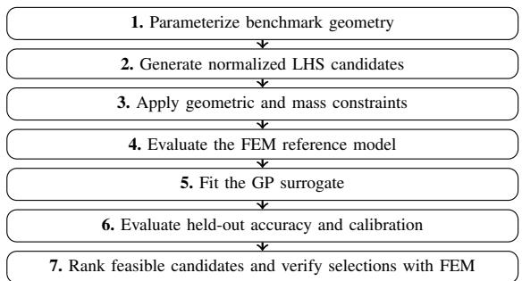  
Fig. 1. Seven-stage workflow used in the reported experiment.

## C. Parameterized Coil–Core Benchmark

Tables II–IV summarize the independent design variables, fixed physical parameters, and analytically derived screening quantities, respectively.

The controlled benchmark considered in this work is a parameterized current-excited coil–core geometry for localized magnetic-field evaluation. Its computational geometry consists of a stepped soft-magnetic core domain and a concentric copper coil domain, with a prescribed region of interest (ROI) above the assembly. An axial aperture is included while preserving geometric symmetry. The model is not presented as a validated representation of a particular commercial material or device. Instead, it provides a fixed and sufficiently structured reference problem for developing and evaluating the proposed surrogate-modelling workflow.

To enable systematic exploration of the design space, the geometry is parameterized using seven independent design variables,

$$
{ \bf x } = \left[ c _ { 1 } , r _ { 1 } , t _ { 1 } , l _ { 1 } , l _ { 2 } , w _ { 1 } , h _ { 1 } \right] ^ { \mathrm { T } } ,\tag{2}
$$

where $c _ { 1 }$ denotes the aperture radius, $r _ { 1 }$ the lower core radius, $t _ { 1 }$ the radial extension defining the upper core radius, $l _ { 1 }$ and $l _ { 2 }$ the heights of the lower and upper core sections, respectively, and $w _ { 1 }$ and $h _ { 1 }$ define the radial width and axial height of the annular coil domain. These variables completely describe the geometry while remaining sufficiently compact for surrogate modelling and design-space exploration.

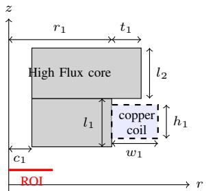  
Fig. 2. Meridional schematic of the axisymmetric benchmark parameterization (not to scale). The dashed copper-coil domain carries the current excitation and is included in the geometric and mass constraints.

Several geometric quantities are obtained analytically from the independent variables rather than treated as additional optimisation variables. In particular, the upper core radius and coil outer radius are given by

$$
r _ { 2 } = r _ { 1 } + t _ { 1 } , \qquad r _ { 0 } = r _ { 1 } + w _ { 1 } ,\tag{3}
$$

thereby ensuring geometric consistency throughout the parameterized design space. The coil bottom is fixed at $z = 2$ mm; hence the axial fit constraint is

$$
l _ { 1 } - h _ { 1 } - 2 ~ \mathrm { m m } \geq 0 .\tag{4}
$$

The manufactured dimensions $c _ { 1 } , \ t _ { 1 } , \ l _ { 2 } , \ w _ { 1 }$ , and $h _ { 1 }$ obey a 0.5-mm minimum. A separate 0.5-mm lower bound on $l _ { 1 }$ is redundant because $h _ { 1 } \geq 0 . 5$ mm and the fit constraint imply $l _ { 1 } ~ \geq ~ 2 . 5$ mm. These conditions are enforced identically in LHS filtering, online candidate selection, and the COMSOLembedded optimization step. Each regenerated FEM dataset stores a design-space fingerprint, and downstream stages reject data created under obsolete bounds or constraints. Core and coil masses are evaluated from the parameterized geometry and used for design-space screening. In the current COMSOL file, the coil physics feature and copper material are both assigned to domain 3, while the core material is assigned to domain 2 and air to domain 1. The coil is represented as a

TABLE II  
INDEPENDENT DESIGN VARIABLES DEFINING THE PARAMETERIZED BENCHMARK GEOMETRY.
<table><tr><td>Symbol</td><td>Description</td><td>Unit</td><td>Feasible range</td></tr><tr><td> $c _ { 1 }$ </td><td>Aperture radius</td><td>mm</td><td>[0.5, 5]</td></tr><tr><td> $r _ { 1 }$ </td><td>Lower core radius</td><td>mm</td><td>[10, 20]</td></tr><tr><td> $t _ { 1 }$ </td><td>Radial extension of upper core</td><td>mm</td><td>[0.5, 10]</td></tr><tr><td> $l _ { 1 }$ </td><td>Lower core height</td><td>mm</td><td>[2.5, 20], with</td></tr><tr><td> $l _ { 2 }$ </td><td>Upper core height</td><td>mm</td><td>[0.5, 20]</td></tr><tr><td> $w _ { 1 }$ </td><td>Coil radial width</td><td>mm</td><td>[0.5, 5]</td></tr><tr><td> $h _ { 1 }$ </td><td>Coil axial height</td><td>mm</td><td>[0.5, 5]</td></tr></table>

TABLE III  
FIXED PHYSICAL AND MATERIAL PARAMETERS FOR THE REGENERATED BENCHMARK.
<table><tr><td>Symbol</td><td>Description</td><td>Unit</td><td>Value / Assumption</td></tr><tr><td> $\rho _ { \mathrm { { C u } } }$ </td><td>Copper density</td><td> $\mathrm { k g } \mathrm { m } ^ { - 3 }$ </td><td>8940</td></tr><tr><td> $\sigma _ { \mathrm { { C u } } }$ </td><td>Coil electrical conductivity</td><td> $\bar { \mathbf { S } _ { \mathbf { m } } } ^ { - 1 }$ </td><td> $6 . 0 \times 1 0 ^ { 7 }$ </td></tr><tr><td> $\boldsymbol { J _ { \mathrm { a p p l y } } }$ </td><td>Applied current-density parameter</td><td> $\mathbf { A } \mathbf { m } ^ { - 2 }$ </td><td> $1 . 0 \times 1 0 ^ { 6 }$ </td></tr><tr><td> $\rho _ { \mathrm { c o r e } }$ </td><td>Core density</td><td> $\mathrm { k g } \mathrm { m } ^ { - 3 }$ </td><td>7000</td></tr><tr><td> $\boldsymbol { B } _ { \mathrm { s a t } }$ </td><td>High Flux saturation flux density</td><td> $\mathrm { \Delta T }$ </td><td>1.5 [18]</td></tr><tr><td>Grade</td><td>Manufacturer nominal permeability grade</td><td></td><td>125 [18]</td></tr><tr><td> $\mu _ { r , \mathrm { s e c } }$ </td><td>Low-field secant value implied by the first table interval</td><td></td><td>120.0</td></tr><tr><td> $\mu _ { r , \mathrm { a i r } }$ </td><td>Air relative permeability</td><td></td><td>1</td></tr></table>

TABLE IV  
DERIVED GEOMETRIC AND SCREENING QUANTITIES.
<table><tr><td>Symbol</td><td>Description</td><td>Unit</td><td>Expression</td></tr><tr><td> $r _ { 2 }$ </td><td>Upper core radius</td><td>mm</td><td> $r _ { 1 } + t _ { 1 }$ </td></tr><tr><td> $r _ { 0 }$ </td><td>Coil outer radius</td><td>mm</td><td> $r _ { 1 } + w _ { 1 }$ </td></tr><tr><td> $M _ { \mathrm { c o r e } }$ </td><td>Core mass</td><td>kg</td><td> $\rho _ { \mathrm { c o r e } } V _ { \mathrm { c o r e } }$ </td></tr><tr><td> $M _ { \mathrm { c o i l } }$ </td><td>Coil mass</td><td>kg</td><td> $\rho _ { \mathrm { C u } } V _ { \mathrm { c o i l } }$ </td></tr><tr><td> $M _ { \mathrm { t o t a l } }$ </td><td>Total mass</td><td>kg</td><td> $M _ { \mathrm { c o r e } } + M _ { \mathrm { c o i l } }$ </td></tr><tr><td> $I _ { \mathrm { c o i l } }$ </td><td>Applied coil current</td><td>A</td><td> $J _ { \mathrm { a p p l y } } w _ { 1 } h _ { 1 }$ </td></tr></table>

For the regenerated experiment, the core is modelled as an isotropic soft-magnetic High Flux 125 domain using the model-embedded 63-point effective DC magnetization table described below. The manufacturer’s published material curves provide family-level context [19], but the project archive does not independently preserve the row-level digitization provenance of the embedded table. The quoted $B _ { \mathrm { s a t } } = 1 . 5 \mathrm { ~ T ~ }$ is a material characteristic and is not a remanent-flux-density input. The coil domain uses the configured copper properties, and the remaining electromagnetic domain is free space. Dynamic hysteresis, core loss, and coupled electro–thermal effects remain outside the steady magnetostatic benchmark.

The independent design variables, fixed benchmark parameters, and derived screening quantities are summarized in Tables II–IV.

For sampling and surrogate construction, the physical design vector is associated with a dimensionless normalized representation,

homogenized annular current-carrying domain rather than an explicit turn-resolved winding.

$$
\mathbf { u } = [ u _ { c _ { 1 } } , u _ { r _ { 1 } } , u _ { t _ { 1 } } , u _ { l _ { 1 } } , u _ { l _ { 2 } } , u _ { w _ { 1 } } , u _ { h _ { 1 } } ] ^ { \mathrm { T } } \in [ 0 , 1 ] ^ { 7 } .\tag{5}
$$

For each design variable $x _ { j } .$ , the corresponding normalized coordinate $u _ { j }$ is mapped to the physical parameter range according to

$$
\begin{array} { r l r } { x _ { j } = x _ { j } ^ { \mathrm { m i n } } + u _ { j } \left( x _ { j } ^ { \mathrm { m a x } } - x _ { j } ^ { \mathrm { m i n } } \right) , } & { { } } & { j = 1 , \ldots , 7 , } \end{array}\tag{6}
$$

where $x _ { i } ^ { \mathrm { m i n } }$ and $x _ { j } ^ { \mathrm { m a x } }$ denote the lower and upper bounds listed in Table II. Latin hypercube sampling is performed in the normalized unit hypercube, whereas the resulting physical variables are used to construct the parameterized FEM geometry and evaluate the associated screening constraints. The normalized coordinates are retained as the numerical input features for subsequent surrogate model construction.

## D. FEM Reference-Model Evaluation

The response of the parameterized coil–core geometry is evaluated using a two-dimensional axisymmetric finiteelement model. The computational domain represents the meridional cross-section of the corresponding rotationally symmetric benchmark, avoiding explicit discretization of the circumferential direction.

## Governing equations and physical assumptions

The benchmark is modeled under a steady magnetostatic assumption. It is not tied to a time-dependent device application; displacement currents, wave propagation, and dynamic material effects are outside its definition.

In the FEM implementation, the magnetostatic problem is solved using the magnetic vector potential formulation and an isotropic nonlinear constitutive law,

$$
{ \bf { B } } = \nabla \times { \bf { A } } , \qquad \nabla \times { \bf { H } } ( { \bf { B } } ) = { \bf { J } } _ { e } ,\tag{7}
$$

where A is the magnetic vector potential and $\mathbf { J } _ { e }$ denotes the impressed source associated with the active coil domain. The collinear isotropic relation $\| \mathbf { H } \| = f ( \| \mathbf { B } \| )$ is supplied by the High Flux 125 effective DC magnetization data.

All simulations are performed under steady-state magnetostatic conditions. Eddy currents, displacement currents, and frequency-dependent effects are not considered in the present model.

## Nonlinear core constitutive specification

High Flux is a 50% Ni–50% Fe distributed-gap powdercore family with soft saturation [20]. Magnetics specifies a saturation flux density of 15,000 gauss (1.5 T) and includes a nominal 125-permeability grade [18]. The value 125 identifies the manufacturer’s material grade; the solver does not use a constant relative permeability of 125. Instead, the core-domain Ampere’s Law feature uses a 63-point DC\` B-H curve tabulated as $\| \mathbf { B } \| = g ( \| \mathbf { H } \| )$ , with H in A/m and B in tesla; COMSOL constructs the inverse relation needed by the constitutive formulation. The table begins at (0, 0); its first nonzero entry is (795.77 A/m, 0.12 T), which implies a low-field secant relative permeability of approximately 120.0 over that first interpolation interval. Field-dependent secant and differential permeabilities are determined by the complete table. Thus the nominal grade, the tabulated low-field slope, and the fielddependent constitutive response are distinct quantities.

The configured core feature uses B-H curve, not Remanent Flux Density, Nonlinear Permanent Magnet, Magnetic Losses, or Effective B-H Curve. The material remanent-flux-density magnitude is zero. The last two alternative features target timeharmonic calculations, whereas this study is stationary [21]. The quoted $\boldsymbol { B } _ { \mathrm { s a t } }$ is not imposed as a discontinuous cap or source; the gradual roll-off is represented by the curve.

The model assigns the copper material and active coil feature to domain 3, the nonlinear High Flux core material to domain 2, and air to domain 1. Table III reports the parameters that define the regenerated benchmark response or its analytic screening constraints.

## Computational Domain and Boundary Conditions

The benchmark geometry is embedded within a finite rectangular meridional air domain. In the COMSOL geometry, this domain spans $0 \leq r \leq 2 0 0$ mm and $- 1 0 0 \leq z \leq 1 0 0$ mm. This fixed domain is used for every parameterized geometry.

Magnetic insulation boundary conditions, $\begin{array} { r } { { \bf n } \times { \bf A } = 0 , } \end{array}$ , are applied at the outer boundary, where n denotes the outward unit normal vector. Enlarging the square domain from 200 to 300 and 400 mm increases the ROI response by 0.214% and 0.228%, respectively, at the selected EI design. The production experiments retain the 200-mm domain; this residual domainsize dependence is reported as a local numerical limitation.

The axisymmetric formulation enforces rotational symmetry about the model axis. No additional mirror-symmetry reduction is applied in the meridional plane.

## Meshing Strategy and Numerical Accuracy

An unstructured free-triangular mesh is generated over all three model domains. The stored COMSOL model uses its automatic mesh-size setting (hauto=3, with custom=off) rather than separately specified local-refinement regions. The same automatic meshing prescription is applied after each parameterized geometry update. At the selected feasible EI design, hauto=3, 2, and 1 generate 2574, 7029, and 26386 elements and responses of 0.00091952, 0.00091963, and 0.00092015 T, respectively. The production-mesh response is therefore 0.069% below the finest-mesh result in this local check.

## Field Quantities and Surrogate Target Definition

For each parameterized geometry, the finite element model computes the magnetic flux density field B(r) throughout the computational domain. While the complete field solution contains rich spatial information, directly constructing a surrogate model for the full magnetic field distribution is computationally inefficient and unnecessary for the present design objective. Instead, a scalar benchmark response is extracted from the FEM solution and adopted as the prediction target for surrogate modelling.

A region of interest (ROI) is defined beneath the magnetic core to represent the target evaluation surface for electromagnetic performance assessment. In the two-dimensional axisymmetric COMSOL geometry, the selected entity is the line segment from $( r , z ) = ( 0 , - 1 0 )$ mm to (5, −10) mm. Revolving this segment about the symmetry axis produces a circular surface of radius 5 mm. The 5-mm radius and 10- mm axial offset are fixed benchmark choices for a localized field metric, not application-derived standards or optimization variables. The surrogate target is the axisymmetric surface average of the magnetic-flux-density magnitude,

$$
B _ { \mathrm { R O I } } = \frac { 1 } { A _ { \mathrm { R O I } } } \int _ { \Gamma _ { \mathrm { R O I } } } \left| { \bf B } ( r , z ) \right| 2 \pi r \mathrm { d } s ,\tag{8}
$$

where $\Gamma _ { \mathrm { R O I } }$ is the selected meridional line and $A _ { \mathrm { R O I } } ~ =$ $\scriptstyle \int _ { \Gamma _ { \mathrm { R O I } } }$ 2πr ds is the area of its surface of revolution. The numerical quadrature, axisymmetric weighting, and normalization are performed by COMSOL’s boundary probe through its Average dataset (bnd1/avh1, intsurface=on). No 2πr factor is introduced manually in the model or in postprocessing.

Compared with a single-point measurement, the surfaceaveraged magnetic flux density provides a more stable scalar response by reducing sensitivity to localized numerical variations arising from mesh discretization and field interpolation. The averaging operation also reduces the influence of isolated local field extrema and provides a scalar response representative of the magnetic field magnitude within the prescribed target region. This quantity is therefore suitable as the prediction target for Gaussian-process surrogate modelling.

The ROI-averaged magnetic flux density magnitude consequently constitutes the scalar training target adopted throughout this work. Spatial field maps and radial ROI profiles of the three selected designs are reported only as post-optimization diagnostics; they are not additional surrogate outputs or optimization objectives.

Accordingly, the scalar surrogate target used in the subsequent Gaussian-process modelling procedure is denoted by

$$
y = \overline { { B } } _ { \mathrm { R O I } } ,\tag{9}
$$

with units of tesla.

## Coil Excitation Scope

The active COMSOL coil feature uses current excitation with

$$
I _ { \mathrm { c o i l } } ( { \bf x } ) = J _ { \mathrm { a p p l y } } w _ { 1 } h _ { 1 } , \qquad J _ { \mathrm { a p p l y } } = 1 0 ^ { 6 } ~ \mathrm { A / m ^ { 2 } } .\tag{10}
$$

Thus the applied total current changes with the coil crosssectional area. A fresh-session diagnostic reloads the source model separately for each case, rebuilds the geometry and mesh, and executes a new stationary solve without saving the source file. At the stored geometry it gives $B _ { \mathrm { R O I } } ~ = ~ 0$ for $J _ { \mathrm { a p p l y } } = 0$ , and $B _ { \mathrm { R O I } } = 0 . 0 0 0 7 7 6 9 5 8 \mathrm { ~ T ~ }$ for the configured $J _ { \mathrm { a p p l y } } = 1 0 ^ { 6 } ~ \mathrm { A / m ^ { 2 } }$ . The zero-current result is consistent with the absence of remanence or another impressed field source. The optimization is therefore conditional on a fixed-currentdensity formulation. Section V-E additionally re-evaluates the three selected geometries at one common total current, but does not re-optimize the design space under fixed current or fixed power and does not establish electrical efficiency.

## FEM Dataset Generation

Latin hypercube sampling (LHS) is performed in the normalized seven-dimensional space. Samples are mapped to physical variables, screened against the geometric and mass constraints, evaluated by COMSOL, and stored as $\mathcal { D } _ { \mathrm { F E M } } =$ $\{ ( \mathbf { u } _ { i } , y _ { i } ) \} _ { i = 1 } ^ { 2 5 0 }$ , where $y _ { i } = B _ { \mathrm { R O I } , i }$ . The following subsection describes the subsequent split and preprocessing; the physical parameters are retained for reconstruction and traceability.

## E. Gaussian Process Surrogate Modelling

## FEM Training Dataset Construction

The parameter table retains each physical design $\mathbf { x } _ { i } ,$ normalized coordinate ${ \bf u } _ { i } ,$ and the associated geometric and massscreening quantities. The COMSOL target table is keyed by the same sample identifier and stores ui together with the FEM response yi, matching the original experiment interface. The GP uses ui as input, while the paired parameter table is retained for COMSOL reconstruction and benchmark interpretation. The dataset is split before any training-dependent preprocessing or model fitting.

The surrogate-data flow is summarized in Fig. 3.

The complete dataset-generation procedure is automated through the MPh interface, which programmatically transfers the physical geometric parameters to COMSOL, executes the required geometry, mesh, and solution sequences, and extracts the prescribed ROI response. The resulting workflow eliminates manual intervention during repeated FEM evaluation and establishes a traceable interface between parameterized electromagnetic simulation and Gaussianprocess surrogate construction.

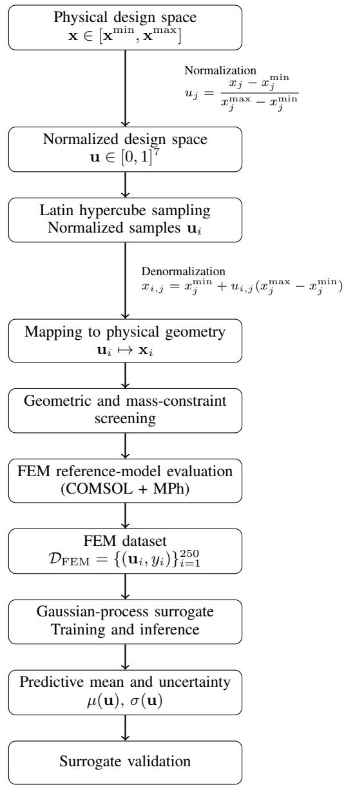  
Fig. 3. Data flow of the proposed surrogate-modelling framework. The bounded physical design space is represented using dimensionless coordinates in the unit hypercube, where Latin hypercube sampling is performed. Each normalized sample is mapped back to its corresponding physical geometry for constraint screening and FEM reference-model evaluation. The normalized coordinates and their associated FEM responses are subsequently paired to construct the Gaussian-process dataset.

## Preprocessing and Data Splits

The 250 FEM records are represented by normalized coordinates $\mathbf { u } _ { i } \in [ 0 , 1 ] ^ { 7 }$ and scalar responses $y _ { i } .$ For each of five random seeds, 50 records are held out before fitting and the remaining 200 form the training pool. Nested subsets of 25, 50, . . . , 200 training records are used for the learning curves, while the 50-sample validation set remains fixed within each split.

Within every fit, each input coordinate and the target are standardized using means and sample standard deviations computed only from the active training subset. The same training-derived transformations are applied to validation points and sequential-search candidates. Predictions are inverse-transformed to tesla before computing metrics or expected improvement; validation observations never enter preprocessing or hyperparameter estimation.

## Gaussian-Process Model

The standardized response is modeled with a zero-mean Gaussian process [5] and a Matern-´ $- 5 / 2$ covariance with automatic relevance determination (ARD), plus a white-noise term:

$$
\begin{array} { l } { { \displaystyle k ( { \bf u } , { \bf u } ^ { \prime } ) = \sigma _ { f } ^ { 2 } \left( 1 + \sqrt { 5 } d + \frac { 5 } { 3 } d ^ { 2 } \right) e ^ { - \sqrt { 5 } d } } \ ~ } \\ { { \displaystyle ~ + \sigma _ { n } ^ { 2 } \delta _ { { \bf u } , { \bf u } ^ { \prime } } } , \ ~ } \\ { { \displaystyle d ^ { 2 } = \sum _ { j = 1 } ^ { 7 } \frac { ( \widetilde { u } _ { j } - \widetilde { u } _ { j } ^ { \prime } ) ^ { 2 } } { \ell _ { j } ^ { 2 } } } . } \end{array}\tag{11}
$$

Here $\widetilde { u } _ { j }$ denotes an input standardized using the active training subset. The implementation uses Python 3.14.6, NumPy 2.4.3, SciPy 1.17.1, and scikit-learn 1.8.0. The GaussianProcessRegressor kernel is initialized as ConstantKerne $\lfloor ( 1 , [ 1 0 ^ { - 3 } , 1 0 ^ { 3 } ] )$ times an ARD Matern-´ $- 5 / 2$ kernel with all seven initial length scales equal to one and bounds $[ 1 0 ^ { - 3 } , 1 0 ^ { 3 } ]$ , plus WhiteKernel $( 1 0 ^ { - 6 } , [ 1 0 ^ { - 1 0 } , 1 0 ^ { - 1 } ] )$ . Targets are standardized externally, so normalize\_y=False; the regressor uses alpha=0, scikit-learn’s L-BFGS-B optimizer, eight optimizer restarts, and the split seed as random\_state. Thus the standardized GP has a zero prior mean rather than an independently fitted constant-mean parameter.

The seven length scales $\ell _ { j }$ , signal variance $\sigma _ { f } ^ { 2 } .$ , and white term $\sigma _ { n } ^ { 2 }$ are estimated by maximizing the log marginal likelihood. Because the FEM responses are deterministic, the white term is interpreted as a numerical nugget that absorbs solver, interpolation, and model-fit discrepancies rather than as physical measurement noise. Across the five 200-sample fits, its optimized value ranged from $1 . 0 \times 1 0 ^ { - 1 0 } \mathrm { t o } 3 . 0 4 \times 1 0 ^ { - 5 }$ on the standardized target scale. Two convergence warnings were recorded across these fits; some smaller-sample learning-curve fits also reached a kernel bound.

For a query $\mathbf { u } _ { * } ,$ , standard GP conditioning provides predictive mean $\mu _ { * } ( \mathbf { u } _ { * } )$ and variance $\sigma _ { * } ^ { 2 } ( \mathbf { u } _ { * } )$ :

$$
\mu _ { * } = m _ { * } + { \bf k } _ { * } ^ { \mathsf { T } } { \bf K } ^ { - 1 } ( \widetilde { \bf y } - { \bf m } ) , \qquad \sigma _ { * } ^ { 2 } = k _ { * * } - { \bf k } _ { * } ^ { \mathsf { T } } { \bf K } ^ { - 1 } { \bf k } _ { * } .\tag{12}
$$

Both quantities are transformed back to the physical response scale. The predictive mean supplies the point estimate. Heldout calibration uses scikit-learn’s full predictive standard deviation, which includes the fitted WhiteKernel contribution at a test point. For deterministic acquisition, the corrected implementation instead uses latent-function variance: the training covariance retains the fitted nugget, while the test-point diagonal and cross-covariance use only the signal kernel.

## F. Surrogate Validation

## Held-out validation protocol

To assess the predictive capability of the Gaussian-process surrogate, model validation is performed using an independent held-out dataset that is excluded entirely from surrogate training and hyperparameter optimization.

Within each repeated experiment, 50 samples are held out before model fitting and retained as an unchanged validation set across all investigated training-set sizes. The remaining 200 samples form the corresponding training pool, from which nested training subsets are constructed. To assess sensitivity to a particular data partition, the complete procedure is repeated using five distinct random seeds. Each seed therefore produces a different train–validation partition and a separate learning curve, while preserving a fixed validation set within that repeat.

During validation, each unseen design sample is first transformed using the standardization parameters obtained from the training dataset before being supplied to the trained Gaussianprocess model. The predicted responses are subsequently converted back to the original physical units and compared directly with the corresponding FEM responses.

This validation strategy evaluates the surrogate on held-out geometries and provides an out-of-sample estimate for the sampled design distribution; it does not establish performance outside the stated parameter ranges or topology. Furthermore, maintaining an identical validation dataset throughout the sample-complexity study enables fair comparison between surrogate models trained using different numbers of FEM samples.

## Point Prediction Metrics

Point accuracy is summarized by RMSE, MAE, and $R ^ { 2 }$ evaluated after inverse-transforming predictions to tesla. Here $y _ { i }$ is the FEM response and $\hat { y } _ { i }$ is the GP predictive mean for held-out sample i. RMSE emphasizes larger errors, MAE reports the average absolute error, and $R ^ { 2 }$ measures explained held-out variation.

## Uncertainty Calibration

For held-out sample i, the inverse-transformed GP standard deviation is $\sigma _ { i }$ . Calibration is assessed by the empirical fractions satisfying $| y _ { i } - \hat { y } _ { i } | ~ \leq ~ \sigma _ { i }$ and $| y _ { i } - \hat { y } _ { i } | ~ \leq ~ 2 \sigma _ { i } .$ compared descriptively with the Gaussian reference coverages of 68.27% and 95.45%. Standardized residuals $( y _ { i } - \hat { y } _ { i } ) / \sigma _ { i }$ are also inspected. These diagnostics test interval behavior on held-out samples; they do not establish calibrated probabilistic guarantees. The standardized-residual mean and sample standard deviation summarize bias and dispersion. Negative log predictive density is computed as

$$
\mathrm { N L P D } : = \frac { 1 } { N } \sum _ { i = 1 } ^ { N } \left[ \frac { 1 } { 2 } \log ( 2 \pi \sigma _ { i } ^ { 2 } ) + \frac { ( y _ { i } - \hat { y } _ { i } ) ^ { 2 } } { 2 \sigma _ { i } ^ { 2 } } \right] .\tag{13}
$$

Because this physical-scale NLPD changes under a change of output units, a standardized-target NLPD is also reported; it subtracts the logarithm of the training target scale from the tesla-scale value. Neither value is compared across different physical tasks. Reliability curves evaluate empirical central Gaussian intervals at 19 nominal levels p from 0.10 to 0.99, using half-width $z _ { p } \sigma _ { i }$ , where $z _ { p } ~ = ~ \Phi ^ { - 1 } [ ( 1 + p ) / 2 ]$ . The plotted band is the mean empirical coverage plus or minus the sample standard deviation across five splits; it is not a confidence band. A pooled standardized-residual Q–Q plot and an absolute-error-versus-predictive-standard-deviation scatter plot expose tail behavior that is not visible from the two coverage values alone.

## Diagnostic and sample-complexity analysis

Parity, reliability, error-versus-uncertainty, and standardizedresidual Q–Q plots complement the scalar metrics. The same validation protocol is applied to nested training subsets to examine how point accuracy and interval coverage change with sample size. The diagnostic figures and results are reported once in Section V.

## IV. OPTIMIZATION PROTOCOL

## A. Protocol Summary

The objective, variables, and complete feasible domain are defined together in Section III-A. Each normalized candidate is mapped to physical units and screened analytically before FEM evaluation. The GP is used only to rank search locations: every incumbent, trajectory value, and reported final design is based on a finite FEM observation. The objective contains the combined response of the tabulated High Flux core and the active current-excited coil; the configured material remanence and external field inputs are zero.

## B. COMSOL-Embedded Reference Optimizers

BOBYQA, COBYLA, EGO, and Nelder–Mead were run through the COMSOL optimization interface using the same parameterized FEM model, variable bounds, constitutive representation, active coil excitation, and analytical constraints. Each method directly evaluated $B _ { \mathrm { R O I } } ;$ no external GP prediction replaced its FEM objective.

For each seed, comparison accounting starts from the same 25 feasible LHS observations used by EI-BO. The embedded optimizer itself does not fit those observations; it starts from a common interior feasible design selected deterministically from that seed’s shared set. Its best-so-far continuation is combined with the shared initial incumbent. Thus the protocol shares the initial incumbent and accounted FEM history, but it does not provide equal use of the 25 observations: EI-BO fits all of them, whereas an embedded method uses one start point. The comparison is consequently an implementationlevel workflow comparison rather than an equal-information algorithm experiment. Each continuation has an accounted budget of

$$
N _ { \mathrm { c o n t } } ^ { \mathrm { m a x } } = 5 0 , \qquad N _ { \mathrm { t o t a l } } ^ { \mathrm { m a x } } = 2 5 + 5 0 = 7 5 .\tag{14}
$$

Native solver stopping conditions remained active, so an embedded continuation could terminate before using all 50 calls. All five methods were repeated for seeds 42–46, permitting paired comparisons at common accounted counts.

## C. Sequential Expected-Improvement Search

Five EI runs use seeds $s \in \{ 4 2 , 4 3 , 4 4 , 4 5 , 4 6 \}$ . Each run begins with $N _ { 0 } = 2 5$ feasible LHS designs evaluated by the FEM model. Input and target transformations are fitted only to observations available within that run, and a separate Matern-´ $5 / 2$ ARD GP is refitted after every new observation. The initial 25 labels are selected from the regenerated 250-record FEM table; subsequent online candidate labels are obtained by new COMSOL evaluations and are never looked up from the remaining offline records.

For incumbent $y _ { \mathrm { b e s t } } ^ { ( n ) }$ = max $i \le n \ y _ { i }$ , the standard maximization-form expected improvement is

$$
\begin{array} { r l r } {  { \mathrm { E I } _ { n } ( \mathbf { u } ) = \Delta _ { n } ( \mathbf { u } ) \Phi ( z _ { n } ) + \sigma _ { n } ( \mathbf { u } ) \phi ( z _ { n } ) , } } \\ & { } & { \Delta _ { n } = \mu _ { n } ( \mathbf { u } ) - y _ { \mathrm { b e s t } } ^ { ( n ) } , } \\ & { } & { z _ { n } = \frac { \Delta _ { n } } { \sigma _ { n } ( \mathbf { u } ) } . } \end{array}\tag{15}
$$

with EI set to zero when $\sigma _ { n } ( \mathbf { u } ) = 0$ . The exploration offset is $\xi = 0$ . Acquisition uses the latent-function predictive standard deviation, excluding the fitted white-noise contribution.

EI is optimized by deterministic finite-candidate maximization rather than a continuous or multi-start optimizer. At online iteration $n ,$ a new pool of 5000 feasible LHS candidates is generated in $[ 0 , \bar { 1 } ] ^ { 7 }$ using seed $s + 1 0 0 9 n$ Analytic geometric and mass constraints are applied during pool generation. Candidates whose Euclidean distance from any observed normalized design is at most $1 0 ^ { - 3 }$ are removed. The GP mean, standard deviation, and EI are then evaluated for every remaining candidate, and the point with the largest EI is selected; ties follow NumPy’s first-maximum rule. No SciPy continuous acquisition optimizer or restart procedure is used. The selected design is mapped to physical units, evaluated once by COMSOL, appended to the run-specific dataset, and used to refit the GP. This continues for 50 sequential acquisitions, giving 75 accounted FEM observations per run. Final designs and best-so-far trajectories use only observed FEM responses, never unevaluated GP predictions.

## D. Paired Finite-Pool Policy Ablation

To isolate candidate-selection policy without additional solver calls, a retrospective ablation uses the 250-record FEM table as a finite candidate set. Random continuation, the current scikit-learn posterior mean and EI, and BoTorch posterior mean and logarithmic EI with screened kernels share 25 initial observations and reveal 50 additional labels per seed. The kernel screen compares Matern-´ $1 / 2 ,$ Matern-´ $\cdot 3 / 2 ,$ , Matern-´ $5 / 2 ,$ , and radial-basis-function covariances on five fixed 200/50 splits. Because this test can select only previously evaluated geometries, it diagnoses policy sensitivity but cannot estimate prospective continuous-domain performance.

## E. Comparison, Cost Accounting, and Rerun

Python controls normalization, feasibility checks, GP fitting, EI evaluation, and data logging; MPh transfers physical parameters to COMSOL, which rebuilds the geometry and mesh, solves the axisymmetric model, and returns the axisymmetric surface average of mf.normB. The 25 initial FEM observations and up to 50 retained continuation observations are included in every method’s accounted cumulative budget.

An accounted FEM observation is either one shared initial observation or one retained finite continuation objective within the configured cap. A raw solver execution, a finite objective return, and a unique feasible geometry are stored separately. COMSOL can emit a terminal or restart row after the nominal cap; for example, EGO seed 43 contains 51 finite continuation rows and hence 76 raw observations, while its accounted comparison budget remains 75. Across the five EGO runs the mean raw count is 75.2. These extra rows are implementation overhead and are not silently described as unique-design budget slots.

The primary horizontal axis is therefore the number of accounted FEM observations, not every low-level solver execution. Performance is reported through best-so-far trajectories and the best observed response at evaluations 30, 40, 50, and 75. Across the five paired seeds, checkpoints and endpoints are summarized by their mean and sample standard deviation. Paired endpoint tests are supporting rather than definitive evidence because five seeds provide limited power.

For terminal comparisons, two-sided paired t-tests are applied to the five seed-matched differences, and Cohen’s $d _ { z }$ is reported as the paired effect size. With only five pairs, a normality test would itself have little diagnostic power; approximate normality is therefore not claimed. The ten pairwise p-values are exploratory and are reported without a multiplecomparison correction, so the response differences, seed-wise consistency, and effect sizes carry more interpretive weight than thresholded significance. For a natively early-stopped run, its last FEM-observed incumbent is its terminal response; missing later checkpoints are not forward-filled for checkpoint summaries.

End-to-end elapsed time is reported separately. It includes initial-data generation, Python–MPh communication, GP refitting, candidate selection, and COMSOL execution for EI, whereas embedded times include the corresponding internal COMSOL runs. These measurements describe implementation cost but do not provide a controlled wall-clock comparison.

The best observed EI design is transferred through the same Python–MPh–COMSOL path and solved again. Agreement checks parameter reconstruction and software-path repeatability only; it is not independent physical validation. The final GP prediction and standardized residual at that design are reported as local surrogate diagnostics.

## V. RESULTS AND DISCUSSION

## A. Surrogate Accuracy and Calibration

The learning-curve experiment used nested training sets of 25, 50, . . . , 200 samples and a fixed 50-sample validation set within each split. Figure 4 shows the representative seed-42 split. Across the five splits, point accuracy improved most strongly up to approximately 100 training samples, continued to improve more gradually through approximately 150 samples, and changed comparatively little thereafter. Table V reports the corresponding mean and sample standard deviation across five train–validation splits.

At 200 training samples, the five-split mean $R ^ { 2 }$ was 0.9996 with a sample standard deviation of 0.0002. The corresponding mean RMSE and MAE were 3.29 and 2.09 $\mu \mathrm { T }$ . The seed-42 model used for the detailed diagnostics is reported separately in Table VI. Across the five splits, mean ±1σ coverage exceeded the Gaussian reference while mean ±2σ coverage remained below it. For the seed-42 model, one-sigma coverage was above its Gaussian reference, whereas two-sigma coverage remained below its reference. The intervals are therefore useful diagnostics rather than calibrated probability guarantees.

Pooling the 250 held-out predictions from the five 200- sample fits gave a standardized-residual mean of −0.122 and sample standard deviation of 1.315. The mean splitlevel NLPD was −11.178 on the tesla scale and −2.523 on the standardized-target scale. These values describe the same within-task predictions under different output scalings and are not interpreted as absolute measures of quality. The dispersion above one and the reliability curve in Fig. 5 indicate under-dispersed uncertainty for part of the sampled design distribution, especially in the negative residual tail.

Table VII shows that the fitted surrogate varied most rapidly along $h _ { 1 }$ and $w _ { 1 }$ and most slowly along $c _ { 1 }$ within the sampled, standardized design space. These descriptive ARD rankings can be affected by correlation, constraints, and kernel misspecification and are not interpreted as physical causal sensitivities. Across the five fits, the signal variance ranged from 70.04 to 231.72 and the optimized log marginal likelihood from 397.01 to 419.71. None of the seven length scales reached its $1 0 ^ { 3 }$ upper bound in these 200-sample fits. Their large values relative to the standardized coordinate span indicate a very smooth fitted response and may also reflect compensation between signal amplitude and length scale; accordingly, the very large $c _ { 1 }$ scale and the ARD table as a whole are treated as surrogate diagnostics rather than a standalone sensitivity analysis.

The high held-out accuracy and large fitted length scales also show that this response surface is unusually smooth over the sampled feasible domain. The benchmark is consequently useful for studying FEM-budget allocation and workflow behavior, but it does not demonstrate a unique advantage of uncertainty-aware BO on a strongly non-smooth or highly multimodal response. This interpretation is consistent with the finite-pool result that posterior mean, EI, and logarithmic EI reach the same endpoint.

## B. Fixed-Budget Optimization

Each run begins with 25 shared LHS observations and permits up to 50 method-specific continuation evaluations. All five methods were repeated for seeds 42–46. Figure 6 and Table IX report the observed best-so-far trajectories, selected budget checkpoints, and terminal responses. At each accounted observation count, the plotted bands are pointwise two-sided 95% Student-t intervals ${ \bar { y } } _ { n } \pm t _ { 0 . 9 7 5 , 4 } s _ { n } / { \sqrt { 5 } }$ . It is not a simultaneous confidence band over the complete trajectory.

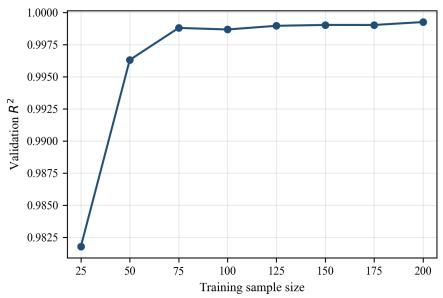  
(a)

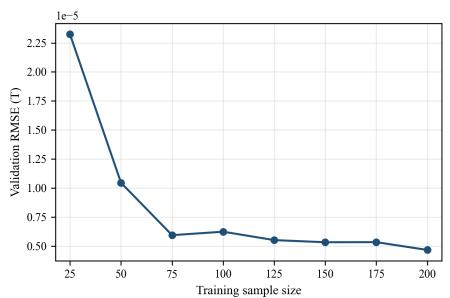  
(b)

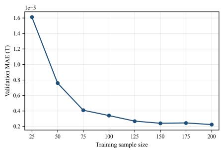

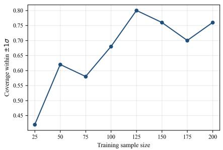  
(d)

(c)  
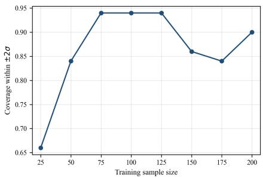  
(e)  
Fig. 4. Representative seed-42 learning curves: (a) $R ^ { 2 } ,$ (b) RMSE, (c) MAE, (d) empirical ±1σ coverage, and (e) empirical ±2σ coverage.

TABLE V  
LEARNING-CURVE METRICS ACROSS FIVE TRAIN–VALIDATION SPLITS, REPORTED AS MEAN ± SAMPLE SD. RMSE AND MAE ARE IN $\mu \mathrm { T }$
<table><tr><td> $N _ { \mathrm { t r a i n } }$ </td><td> $R ^ { 2 }$ </td><td>RMSE</td><td>MAE</td><td> $C _ { 1 \sigma }$ </td><td> $C _ { 2 \sigma }$ </td></tr><tr><td>25</td><td> $0 . 9 8 7 2 \pm 0 . 0 0 4 1$ </td><td> $2 0 . 3 2 \pm 2 . 9 2$ </td><td> $1 4 . 0 7 \pm 1 . 6 3$ </td><td> $0 . 5 1 6 \pm 0 . 0 9 7$ </td><td> $0 . 7 7 6 \pm 0 . 0 8 5$ </td></tr><tr><td>50</td><td> $0 . 9 9 7 3 \pm 0 . 0 0 1 3$ </td><td> $9 . 1 4 \pm 2 . 1 7$ </td><td> $6 . 8 3 \pm 1 . 6 2$ </td><td> $0 . 5 8 0 \pm 0 . 1 1 0$ </td><td> $0 . 8 5 6 \pm 0 . 0 7 1$ </td></tr><tr><td>75</td><td> $0 . 9 9 8 5 \pm 0 . 0 0 0 8$ </td><td> $6 . 7 7 \pm 1 . 8 6$ </td><td> $4 . 7 7 \pm 1 . 1 4$ </td><td> $0 . 5 7 2 \pm 0 . 1 1 7$ </td><td> $0 . 8 6 8 \pm 0 . 0 6 1$ </td></tr><tr><td>100</td><td> $0 . 9 9 9 1 \pm 0 . 0 0 0 4$ </td><td> $5 . 3 3 \pm 1 . 1 2$ </td><td> $3 . 6 1 \pm 0 . 5 3$ </td><td> $0 . 6 6 8 \pm 0 . 0 4 6$ </td><td> $0 . 9 2 0 \pm 0 . 0 3 5$ </td></tr><tr><td>125</td><td> $0 . 9 9 9 2 \pm 0 . 0 0 0 4$ </td><td> $4 . 9 6 \pm 1 . 3 0$ </td><td> $3 . 1 8 \pm 0 . 7 5$ </td><td> $0 . 7 2 0 \pm 0 . 0 7 5$ </td><td> $0 . 9 0 8 \pm 0 . 0 3 0$ </td></tr><tr><td>150</td><td> $0 . 9 9 9 4 \pm 0 . 0 0 0 3$ </td><td> $4 . 3 8 \pm 1 . 3 9$ </td><td> $2 . 7 8 \pm 0 . 7 7$ </td><td> $0 . 7 1 2 \pm 0 . 0 8 3$ </td><td> $0 . 9 0 8 \pm 0 . 0 5 8$ </td></tr><tr><td>175</td><td> $0 . 9 9 9 5 \pm 0 . 0 0 0 3$ </td><td> $3 . 6 9 \pm 1 . 1 4$ </td><td> $2 . 3 0 \pm 0 . 4 1$ </td><td> $0 . 7 3 2 \pm 0 . 0 4 6$ </td><td> $0 . 8 9 6 \pm 0 . 0 4 3$ </td></tr><tr><td>200</td><td> $0 . 9 9 9 6 \pm 0 . 0 0 0 2$ </td><td> $3 . 2 9 \pm 0 . 8 4$ </td><td> $2 . 0 9 \pm 0 . 2 9$ </td><td> $0 . 7 3 6 \pm 0 . 0 4 6$ </td><td> $0 . 9 0 8 \pm 0 . 0 2 3$ </td></tr></table>

HELD-OUT PERFORMANCE OF THE 200-SAMPLE SEED-42 GP USED FOR THE DETAILED DIAGNOSTIC PLOTS.  
TABLE VI
<table><tr><td>Metric</td><td>Value</td></tr><tr><td> $R ^ { 2 }$ </td><td>0.9993</td></tr><tr><td>RMSE</td><td>4.680  $\mu \mathrm { T }$ </td></tr><tr><td>MAE</td><td>2.235  $\mu \mathrm { T }$ </td></tr><tr><td> $C _ { 1 \sigma }$ </td><td>0.76</td></tr><tr><td> $C _ { 2 \sigma }$ </td><td>0.90</td></tr><tr><td>Standardized-residual mean</td><td>-0.449</td></tr><tr><td>Standardized-residual sample SD</td><td>1.668</td></tr><tr><td>Mean NLPD (tesla scale)</td><td>-10.708</td></tr></table>

The budget-dependent behavior is more informative than a single terminal ranking. Numerical “mean ± sample $\mathrm { S D } ^ { \prime \prime }$ summaries are used in the following text, whereas Fig. 6 shows 95% confidence-interval bands. From a common mean initial incumbent of 0.675 mT, EI-BO reaches 0.883 ± 0.019 mT by $n = 3 0 ,$ , after only five new FEM calls. It remains ahead of BOBYQA, EGO, and Nelder–Mead at $n \ = \ 4 0$ and $n = 5 0 ;$ at the latter checkpoint their means are 0.893,

ARD LENGTH SCALES FROM THE FIVE 200-SAMPLE FITS. VALUES ARE MEAN ± SAMPLE SD ON STANDARDIZED INPUT COORDINATES; LOWER VALUES INDICATE STRONGER SURROGATE-IMPLIED VARIATION, NOT CAUSAL IMPORTANCE.  
TABLE VII
<table><tr><td>Variable</td><td>Length scale</td><td>Rank</td></tr><tr><td> $h _ { 1 }$ </td><td> $2 1 . 1 0 \pm 3 . 3 6$ </td><td>1</td></tr><tr><td> $w _ { 1 }$ </td><td> $2 2 . 5 6 \pm 4 . 1 4$ </td><td>2</td></tr><tr><td> $t _ { 1 }$ </td><td> $2 8 . 7 4 \pm 3 . 3 5$ </td><td>3</td></tr><tr><td> $l _ { 1 }$ </td><td> $2 8 . 8 4 \pm 3 . 1 8$ </td><td>4</td></tr><tr><td> $l _ { 2 }$ </td><td> $3 5 . 2 9 \pm 6 . 2 4$ </td><td>5</td></tr><tr><td> $r _ { 1 }$ </td><td> $3 6 . 5 8 \pm 3 . 8 2$ </td><td>6</td></tr><tr><td> $c _ { 1 }$ </td><td> $5 9 1 . 4 1 \pm 1 7 6 . 5 3$ </td><td>7</td></tr></table>

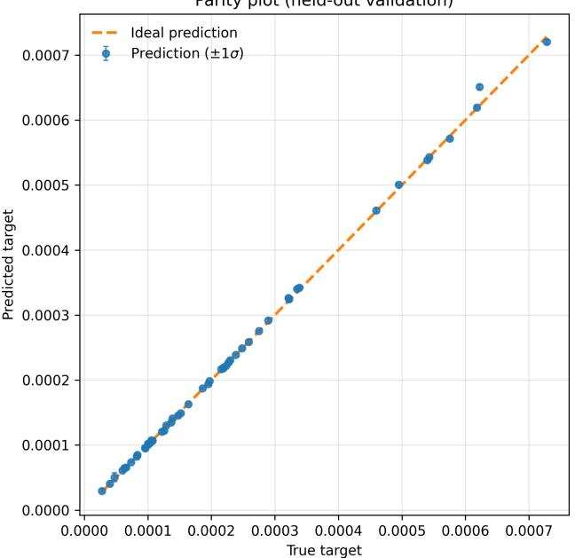  
(a)

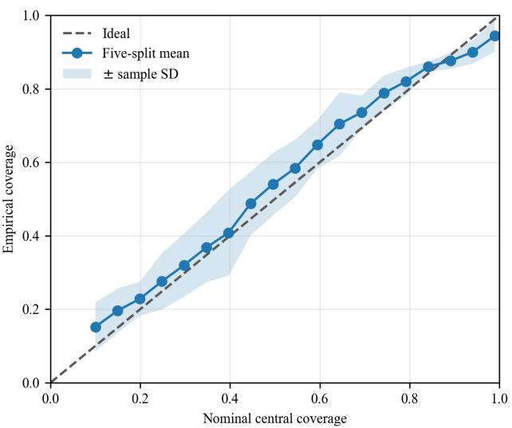  
(b)

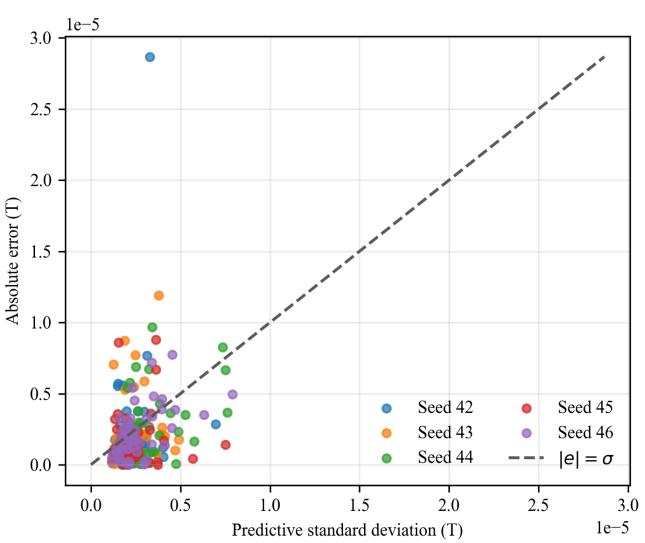  
(c)

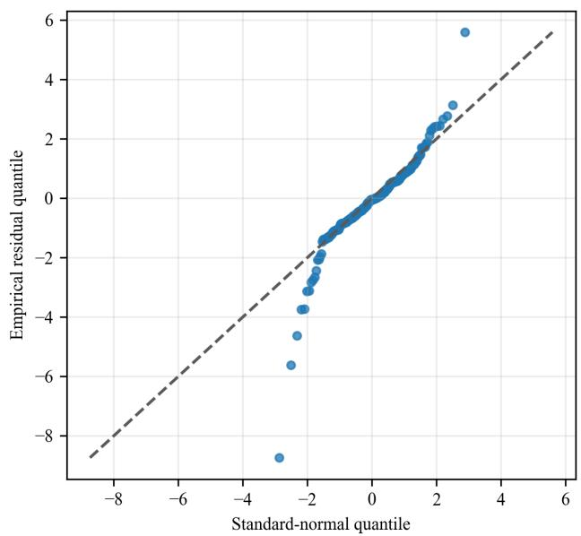  
(d)  
Fig. 5. Surrogate diagnostics: (a) seed-42 parity with ±1σ error bars; and five-split 200-sample diagnostics comprising (b) the reliability curve with a cross-split ± sample-SD band (not a confidence band), (c) absolute error versus predictive standard deviation, and (d) a pooled standardized-residual Q–Q plot.

0.830, 0.680, and 0.713 mT, respectively. BOBYQA subsequently continues improving and reaches $0 . 9 4 3 \pm 0 . 0 2 7$ mT at $n = 7 5 .$ , exceeding EI-BO’s 0.909 ± 0.012 mT. COBYLA is an important exception to the low-budget pattern: it reaches $0 . 9 3 8 \pm 0 . 0 1 8$ mT by $n = 3 0$ , and several runs terminate before later common checkpoints. Consequently, the evidence supports early-budget competitiveness against three references, not budget-independent superiority over every optimizer.

COBYLA’s native stopping is retained rather than artificially extending a converged COMSOL run. For seeds 42–46 it stops at cumulative FEM counts 34, 37, 34, 34, and 41, with terminal responses $0 . 9 6 5 2 , 0 . 9 5 1 3 , 0 . 9 1 8 3 , 0 . 9 1 8 2$ , and 0.9494 mT, respectively. Thus all five runs contribute at $n = 3 0$ , only seed 46 reaches $n = 4 0$ , and no five-seed COBYLA summary exists at $n = 5 0 \ \mathrm { o r } \ n = 7 5 $ . The terminal COBYLA mean uses each run’s last observed incumbent; the checkpoint table leaves unsupported later entries blank.

At the terminal observation of each run, EI-BO exceeds

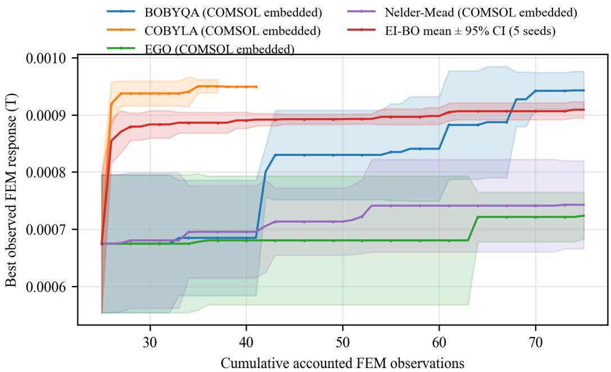  
Fig. 6. Best FEM-observed response versus cumulative accounted FEM observations over five paired seeds. Every trajectory includes the same seed-specific 25-point initial set. Bands are pointwise 95% Student-t intervals, not simultaneous confidence bands.

EGO by 0.186 mT $( d _ { z } = 5 . 0 5$ , unadjusted $p = 3 . 5 1 \times 1 0 ^ { - 4 } )$ and Nelder–Mead by 0.166 mT $( d _ { z } = 2 . 4 2 , p = 5 . 6 4 \times 1 0 ^ { - 3 } )$ in paired tests. BOBYQA exceeds EI-BO by 0.03385 mT $( d _ { z } = 2 . 0 2 , p = 0 . 0 1 0 6 )$ ; COBYLA’s 0.0313-mT advantage has $d _ { z } ~ = ~ 1 . 0 9$ and $p \ = \ 0 . 0 7 1 4$ . These five-seed results establish neither a universal optimizer ranking nor a physical optimum. They show consistently higher paired terminal responses for external GP–EI than for the tested COMSOL EGO and Nelder–Mead implementations on this benchmark, while the effect sizes and raw differences remain more informative than the exploratory p-value thresholds.

## C. Paired Policy-Ablation Results

Table VIII reports the shared-initialization, finite-pool ablation. Kernel screening selected the lowest mean held-out NLPD over the five fixed 200/50 splits, using mean RMSE as a tie-breaker. This rule selected a BoTorch Matern- ´ 5/2 ARD model with a length-scale-prior mean of five. Its mean heldout RMSE was $3 . 1 6 2 \ \mu \mathrm { T }$ , compared with $3 . 2 8 9 ~ \mu \mathrm { T }$ for the production scikit-learn model, but its predictive intervals were overly conservative (99.6% empirical coverage for a nominal 95% interval). All four GP policies reached the same finitepool endpoint. BoTorch logarithmic EI found that endpoint one evaluation earlier than scikit-learn EI in seed 42 and showed no arrival-time advantage in the other four seeds. Thus kernel tuning slightly improves point prediction but does not provide evidence of a robust optimization improvement.

Because this experiment reveals values from a fixed pool rather than running new online trajectories, it does not replace a prospective continuous-domain COMSOL comparison. Three seeds already contain the pool maximum within their initial 25 observations, further limiting statistical power. The equality of the four GP endpoints must therefore be interpreted as a property of this retrospective candidate pool, not a general equivalence of their acquisition functions.

## D. Evaluation Cost

Table XI distinguishes FEM-count efficiency from elapsed time. EI-BO used the early evaluation budget effectively but incurred additional Python–MPh communication, GP refitting, and candidate-management overhead. The present implementation therefore does not demonstrate wall-clock superiority.

The FEM solves used here take seconds rather than hours. Mean end-to-end time was 178.3 s for EI-BO, compared with 116.4 s for BOBYQA, 91.6 s for COBYLA, 109.6 s for EGO, and 122.0 s for Nelder–Mead. This experiment therefore characterizes response per FEM call rather than lower elapsed cost; the case for surrogate assistance becomes more practically relevant when each FEM evaluation is substantially more expensive than in this benchmark.

## E. Selected Design and Repeatability Rerun

Among the EI-BO runs, seed 45 produced the largest observed response, 0.919516 mT. Its geometry in Table XII satisfies the manufacturing, mass, and axial-fit constraints. A samemodel rerun reproduced the recorded response to the reported precision. Across all methods, the largest observed response was the seed-45 BOBYQA result, 0.973669 mT; neither value is claimed to be a global optimum. Table XII shows that both embedded winners drive $t _ { 1 } , w _ { 1 } , h _ { 1 }$ to their upper bounds and use the maximum 25-A current implied by the fixed current density. COBYLA also reaches the axial-fit boundary, while

TABLE VIII  
PAIRED RETROSPECTIVE 25+50 POLICY ABLATION ON THE FINITE FEM POOL. VALUES ARE MEAN ± SAMPLE SD OVER FIVE SHARED INITIALIZATIONS.
<table><tr><td>Policy</td><td></td><td>Endpoint (mT) Improvement (mT)</td></tr><tr><td>Random</td><td> $0 . 7 1 3 \pm 0 . 0 5 5$ </td><td> $0 . 0 3 9 \pm 0 . 0 5 3$ </td></tr><tr><td>scikit-learn posterior mean</td><td> $0 . 7 3 8 \pm 0 . 0 0 0$ </td><td> $0 . 0 6 3 \pm 0 . 0 9 7$ </td></tr><tr><td>scikit-learn latent EI</td><td> $0 . 7 3 8 \pm 0 . 0 0 0$ </td><td> $0 . 0 6 3 \pm 0 . 0 9 7$ </td></tr><tr><td>BoTorch posterior mean</td><td> $0 . 7 3 8 \pm 0 . 0 0 0$ </td><td> $0 . 0 6 3 \pm 0 . 0 9 7$ </td></tr><tr><td>BoTorch logarithmic EI</td><td> $0 . 7 3 8 \pm 0 . 0 0 0$ </td><td> $0 . 0 6 3 \pm 0 . 0 9 7$ </td></tr></table>

BOBYQA leaves only 0.041 mm of fit margin. EI-BO remains slightly interior in these quantities. The terminal advantage of the embedded methods is therefore associated with more aggressive boundary exploitation. Because the two embedded winners also use 25.00 A whereas EI-BO uses 24.234 A, the selected-design fixed-current check below separates this small excitation difference from the response ordering without claiming to solve a new fixed-current optimization problem.

Figures 7 and 8 show that the scalar ROI values arise from smooth, nonzero solved fields rather than isolated probe artifacts. At a common total current of 24.234 A, the two 25-A designs decrease by 3.064%, but the ordering remains BOBYQA, COBYLA, then EI-BO (Table XIII). Thus the selected-design ordering is not explained solely by the original 3.16% current difference. This diagnostic does not establish the optimizer ordering that would result from re-optimizing the entire feasible space at fixed current.

The core-domain maximum (B) values are 0.0190, 0.0634, and 0.0194 T for EI-BO, BOBYQA, and COBYLA, respectively. They remain below the first nonzero input-table point at 0.12 T and far below the quoted 1.5-T saturation flux density. The selected designs therefore operate in the low-field first interpolation interval of the supplied constitutive curve rather than near saturation (Fig. 9).

The EI-BO design has core and coil masses of 170.38 and 19.52 g, respectively, and an axial-fit margin of 0.862 mm. Its optimization-stage response and direct rerun both equal 0.000919516 T to the reported precision. The EI-BO local checks show less than 0.07% change between the production and finest meshes and a 0.228% increase when the outer-domain size is enlarged from 200 to 400 mm. Corresponding production-to-finest mesh differences are 0.004% for BOBYQA and 0.548% for COBYLA; production-to-400-mm domain differences are 0.239% and 0.179%, respectively. At the production, finest-mesh, and largest-domain settings, the ordering remains BOBYQA above COBYLA above EI-BO. These checks support local numerical stability at the reported winners but do not prove ranking invariance across the full design space. The feasible $l _ { 1 }$ perturbations change the EI-BO response by up to 1.15%, so the selected point should be interpreted as the best observation of the reported EI trajectory rather than a locally certified optimum.

## F. Scope and Limitations

The intended conclusions are conditional on the twodimensional axisymmetric FEM benchmark, model-embedded nonlinear B–H relation, ROI definition, and parameterization. Mesh and outer-domain checks at the three selected winners preserve their ordering, but these local tests do not prove response-ranking invariance across the complete design space. The field maps and ROI profiles improve physical interpretability of the scalar objective, yet they remain outputs of the same model rather than independent measurements. Same-model reruns check software-path repeatability but do not address modeling bias.

The model uses a 63-point High Flux 125 effective DC magnetization table. The project archive retains the exact embedded values but not an independent row-level record of their extraction from the cited manufacturer’s public curves. The nominal value 125 selects the material grade and is not imposed as a constant relative permeability; the first interpolation interval implies a low-field secant value of approximately 120. Saturation is represented through the nonlinear constitutive relation rather than through a separate remanentfield input, whose configured magnitude is zero. Because the public curve is an effective catalog-grade relation rather than measurements on the custom stepped specimen, the results remain a numerical benchmark and not a componentlevel material validation. The extracted core-domain mean-tomaximum B ranges lie below 0.064 T, but they are computed rather than experimentally measured operating states. Their placement on the input curve shows that the selected designs are far from the quoted 1.5-T saturation level. Accordingly, the nonlinear catalog relation is a feature of the reference-model configuration, but the present results do not identify nonlinear roll-off or saturation as a governing optimization mechanism.

The separate 200-g core and 50-g copper limits encode noninterchangeable material allowances: powder-core material is treated as comparatively accessible in the intended fabrication context, while the copper allowance is kept separate to prevent winding volume from dominating the design. The copper cap is protective rather than active under the present box bounds, whose analytic maximum coil mass is approximately 31.6 g. A 250-g total-mass problem would have a different feasible domain and has not been evaluated; no claim is made about invariance to that alternative formulation.

The current model assigns the coil feature and copper material to domain 3, and the applied current is $I _ { \mathrm { c o i l } } ~ =$ $J _ { \mathrm { a p p l y } } w _ { 1 } h _ { 1 }$ . Because total current increases with coil crosssectional area, the optimization trajectories remain conditional on fixed current density. Re-evaluation of the three selected geometries at 24.234 A preserves their ordering, but this is not a fixed-current re-optimization and no fixed-power comparison is performed. The results must therefore not be interpreted as electrical-efficiency superiority.

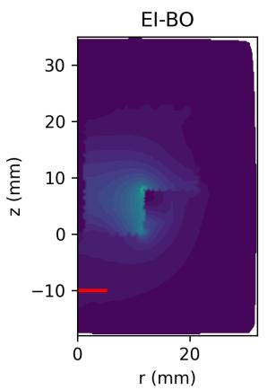

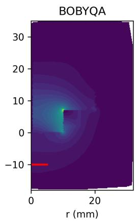

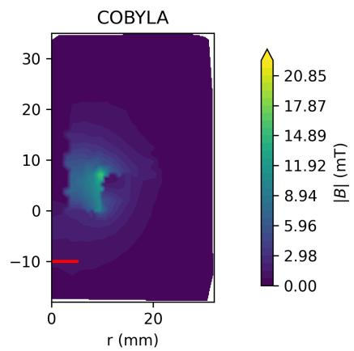  
Fig. 7. Fresh-solve magnetic-flux-density maps for the selected EI-BO, BOBYQA, and COBYLA geometries at the production current density. The red segment marks the meridional ROI whose revolution defines the averaging surface. A common color scale is used across panels.

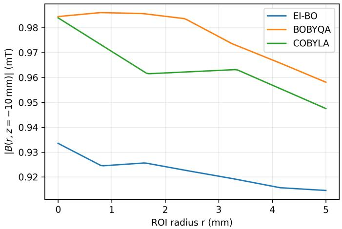  
Fig. 8. Radial magnetic-flux-density profiles on the ROI line (z=-10) mm for the three selected designs. The plotted curves are interpolated from the fresh FEM solution nodes; the reported scalar objective remains COMSOL’s axisymmetrically weighted boundary average.

The search applies the axial-fit condition and 0.5-mm manufacturing minima before every FEM call. Several optimized variables nevertheless approach bounds, and no fabrication tolerance or robustness objective is included. The paired protocol provides a shared accounted observation history and a shared initial incumbent, but not equal use of initial information: EI-BO fits its GP to all 25 initial observations, whereas each embedded optimizer natively starts from one deterministic interior member of that set. This interface difference is part of the compared implementations and limits causal attribution of their performance differences. The finite-pool ablation controls initialization and candidate availability, yet it is retrospective and cannot establish prospective online superiority. The lowbudget comparison is also method-dependent: COBYLA is already stronger than EI-BO at n = 30, while BOBYQA overtakes EI-BO only later. The results are consequently limited to the stated benchmark, implementations, and FEM budgets.

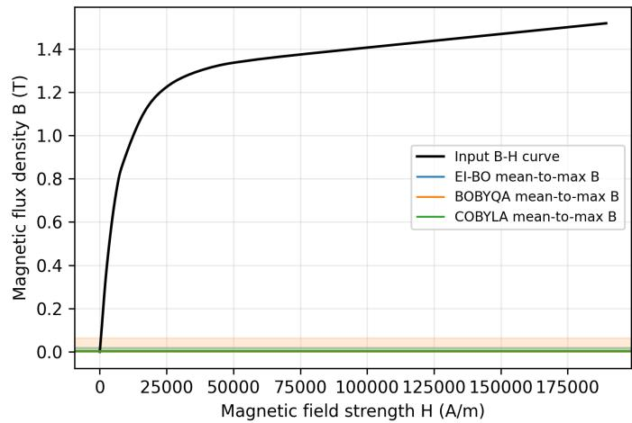  
Fig. 9. Manufacturer-sourced High Flux 125 input (B)–(H) curve and the core-domain mean-to-maximum (B) intervals from fresh solves of the selected geometries. Each interval is a field-magnitude range, not a paired (B(H)) trajectory.

The most consequential remaining extensions are experimental validation of a fabricated geometry, a three-dimensional and tolerance-aware model, and full re-optimization under fixed total current or fixed power if conclusions for those electrical formulations are required. A prospective online posterior-mean trajectory would provide a stronger acquisition-policy control than the present retrospective finitepool ablation, but it is not required to support the narrower budget-dependent comparison reported here.

TABLE IX  
TERMINAL FEM-OBSERVED RESPONSES. VALUES ARE MEAN ± SAMPLE SD AND RANGE OVER FIVE PAIRED SEEDS. COBYLA TERMINAL VALUES INCLUDE NATIVE EARLY STOPPING.
<table><tr><td>Method</td><td>Runs</td><td>Best response, mean ± SD (mT)</td><td>Min-max (mT)</td></tr><tr><td>BOBYQA</td><td>5</td><td> $0 . 9 4 3 \pm 0 . 0 2 7$ </td><td>0.910-0.974</td></tr><tr><td>COBYLA</td><td>5</td><td> $0 . 9 4 0 \pm 0 . 0 2 1$ </td><td>0.918–0.965</td></tr><tr><td>EI-BO</td><td>5</td><td> $0 . 9 0 9 \pm 0 . 0 1 2$ </td><td>0.890-0.920</td></tr><tr><td>Nelder-Mead</td><td>5</td><td> $0 . 7 4 3 \pm 0 . 0 6 2$ </td><td>0.636–0.780</td></tr><tr><td>EGO</td><td>5</td><td> $0 . 7 2 4 \pm 0 . 0 3 3$ </td><td>0.665-0.740</td></tr></table>

TABLE X  
MEAN BEST-OBSERVED RESPONSE AT SELECTED CUMULATIVE FEM BUDGETS (MT), OVER FIVE PAIRED SEEDS. A DASH INDICATES THAT FEWER THAN FIVE COBYLA RUNS REMAINED ACTIVE AT THE CHECKPOINT.
<table><tr><td>Method</td><td> $n = 2 5$ </td><td> $n = 3 0$ </td><td> $n = 4 0$ </td><td> $n = 5 0$ </td></tr><tr><td>EI-BO</td><td>0.675</td><td>0.883</td><td>0.890</td><td>0.893</td></tr><tr><td>BOBYQA</td><td>0.675</td><td>0.675</td><td>0.685</td><td>0.830</td></tr><tr><td>COBYLA</td><td>0.675</td><td>0.938</td><td></td><td></td></tr><tr><td>EGO</td><td>0.675</td><td>0.675</td><td>0.680</td><td>0.680</td></tr><tr><td>Nelder-Mead</td><td>0.675</td><td>0.680</td><td>0.696</td><td>0.713</td></tr></table>

TABLE XI  
END-TO-END COSTS UNDER THE REPORTED IMPLEMENTATIONS. VALUES ARE MEANS OVER FIVE SEEDS AND INCLUDE THE COMMON ESTIMATED 25-POINT INITIAL-FEM COST.
<table><tr><td>Method</td><td>Mean accounted FEM calls End-to-end time (s)</td><td></td></tr><tr><td>EI-BO</td><td>75</td><td> $1 7 8 . 3 \pm 2 8 . 3$ </td></tr><tr><td>BOBYQA</td><td>75</td><td> $1 1 6 . 4 \pm { 1 . 8 }$ </td></tr><tr><td>COBYLA</td><td>36</td><td> $9 1 . 6 \pm 2 7 . 7$ </td></tr><tr><td>EGO</td><td>75</td><td> $1 0 9 . 6 \pm 3 . 8$ </td></tr><tr><td>Nelder-Mead</td><td>75</td><td> $1 2 2 . 0 \pm 5 . 1$ </td></tr></table>

TABLE XII  
BEST FEM-OBSERVED DESIGNS FROM EI-BO, BOBYQA, AND COBYLA. DIMENSIONS ARE IN MM, MASSES IN G, CURRENT IN A, AND RESPONSE IN MT.
<table><tr><td>Quantity</td><td>EI-BO (seed 45)</td><td>BOBYQA (seed 45)</td><td>COBYLA (seed 42)</td></tr><tr><td> $c _ { 1 }$ </td><td>1.2371</td><td>0.5000</td><td>3.0313</td></tr><tr><td> $r _ { 1 }$ </td><td>11.8847</td><td>10.0921</td><td>10.0000</td></tr><tr><td> $t _ { 1 }$ </td><td>9.3159</td><td>10.0000</td><td>10.0000</td></tr><tr><td> $l _ { 1 }$ </td><td>7.7991</td><td>7.0412</td><td>7.0000</td></tr><tr><td> $l _ { 2 }$ </td><td>14.8635</td><td>19.7206</td><td>18.0930</td></tr><tr><td> $_ { w _ { 1 } }$ </td><td>4.9086</td><td>5.0000</td><td>5.0000</td></tr><tr><td> $h _ { 1 }$ </td><td>4.9370</td><td>5.0000</td><td>5.0000</td></tr><tr><td>Core mass</td><td>170.38</td><td>190.70</td><td>169.48</td></tr><tr><td>Coil mass</td><td>19.52</td><td>17.68</td><td>17.55</td></tr><tr><td> $I _ { \mathrm { c o i l } }$ </td><td>24.23</td><td>25.00</td><td>25.00</td></tr><tr><td>Axial-fit margin</td><td>0.8621</td><td>0.0412</td><td>0.0000</td></tr><tr><td>Response</td><td>0.9195</td><td>0.9737</td><td>0.9652</td></tr></table>

TABLE XIII  
SELECTED-GEOMETRY PHYSICAL DIAGNOSTICS. THE COMMON-CURRENT CASE USES 24.234 A, THE MINIMUM PRODUCTION CURRENT AMONG THETHREE DESIGNS; NO RE-OPTIMIZATION IS PERFORMED.
<table><tr><td>Design</td><td>Production I (A)</td><td>Production ROI (mT)</td><td>Common-I ROI (mT)</td><td> $_ \mathrm { C o r e }$  mean B (mT)</td><td>Core max B (mT)</td><td>Common-I rank</td></tr><tr><td>EI-BO</td><td>24.234</td><td>0.91952</td><td>0.91952</td><td>2.858</td><td>18.981</td><td>3</td></tr><tr><td>BOBYQA</td><td>25.000</td><td>0.97361</td><td>0.94378</td><td>2.615</td><td>63.424</td><td>1</td></tr><tr><td>COBYLA</td><td>25.000</td><td>0.96515</td><td>0.93558</td><td>2.816</td><td>19.444</td><td>2</td></tr></table>

TABLE XIV  
LOCAL SENSITIVITY CHECKS AROUND THE SEED-45 EI-BO DESIGN. THE l ROWS USE THE PRODUCTION MESH AND 200-MM DOMAIN; MESH AND DOMAIN ROWS RETAIN THE OPTIMIZED GEOMETRY.
<table><tr><td>Check</td><td>Setting</td><td>BROI (T)</td><td>Relative change</td></tr><tr><td> $l _ { 1 }$  variation</td><td>7.7991 mm (optimized)</td><td>0.00091952</td><td>reference</td></tr><tr><td></td><td>6.9370 mm</td><td>0.00093006</td><td>+1.147%</td></tr><tr><td></td><td>7.3681 mm</td><td>0.00092518</td><td>+0.616%</td></tr><tr><td></td><td>7.2991 mm</td><td>0.00092584</td><td>+0.688%</td></tr><tr><td></td><td>8.2991 mm</td><td>0.00091372</td><td>-0.631%</td></tr><tr><td>Automatic mesh</td><td>hauto=3, 2574 elements</td><td>0.00091952</td><td>-0.069% vs. finest</td></tr><tr><td></td><td>hauto=2, 7029 elements</td><td>0.00091963</td><td>-0.057% vs. finest</td></tr><tr><td></td><td>hauto=1, 26386 elements</td><td>0.00092015</td><td>reference</td></tr><tr><td>Outer square</td><td>200 mm</td><td>0.00091952</td><td>—0.227% vs. largest</td></tr><tr><td></td><td>300 mm</td><td>0.00092149</td><td>-0.013% vs. largest</td></tr><tr><td></td><td>400 mm</td><td>0.00092161</td><td>reference</td></tr></table>

TABLE XV  
MESH AND OUTER-DOMAIN CHECKS AT THE SELECTED BOBYQA AND COBYLA GEOMETRIES. MESH CHANGES ARE RELATIVE TO HAUTO=1 AT 200 MM; DOMAIN CHANGES ARE RELATIVE TO 400 MM AT HAUTO=3.
<table><tr><td>Design</td><td>Setting</td><td>Elements</td><td>BROI (T)</td><td>Relative change</td></tr><tr><td rowspan="5">BOBYQA</td><td>hauto=3, 200 mm</td><td>6342</td><td>0.00097361</td><td>-0.0036% vs. finest</td></tr><tr><td>hauto=2, 200 mm</td><td>12166</td><td>0.00097384</td><td>+0.0206% vs. finest</td></tr><tr><td>hauto=1, 200 mm</td><td>36134</td><td>0.00097364</td><td>reference</td></tr><tr><td>hauto=3, 300 mm</td><td>6670</td><td>0.00097540</td><td>-0.0556% vs. largest</td></tr><tr><td>hauto=3, 400 mm</td><td>6450</td><td>0.00097594</td><td>reference</td></tr><tr><td rowspan="5">COBYLA</td><td>hauto=3, 200 mm</td><td>2149</td><td>0.00096515</td><td>+0.5478% vs. finest</td></tr><tr><td>hauto=2, 200 mm</td><td>6739</td><td>0.00095879</td><td>-0.1151% vs. finest</td></tr><tr><td>hauto=1, 200 mm</td><td>26116</td><td>0.00095989</td><td>reference</td></tr><tr><td>hauto=3, 300 mm</td><td>2192</td><td>0.00096706</td><td>+0.0184% vs. largest</td></tr><tr><td>hauto=3, 400 mm</td><td>2281</td><td>0.00096689</td><td>reference</td></tr></table>

## VI. CONCLUSION

This study implements a Python–MPh–COMSOL workflow for GP-guided optimization of a seven-parameter currentexcited coil–core geometry benchmark with a High Flux core represented by a catalog B–H relation. A fresh-session diagnostic gives zero ROI field at zero applied current and 0.776958 mT at the stored geometry under the configured current density, consistent with an active coil and zero configured remanence. Under paired 25+50 accounted FEM observations, EI-BO improves rapidly during the first few continuation calls and remains ahead of BOBYQA, EGO, and Nelder–Mead through 50 cumulative observations. BOBYQA overtakes it by the 75-observation endpoint, while COBYLA is a genuine exception that performs strongly from the early budget onward. EI-BO nevertheless produces consistently higher paired terminal responses than the tested EGO and Nelder–Mead implementations. Because the methods do not use the 25 initial observations identically, these are implementation-level workflow results, not an equal-information optimizer ranking.

The resulting contribution is therefore an auditable FEM– surrogate workflow together with a budget-dependent empirical conclusion, rather than a claim of universal BO superiority. Kernel screening and retrospective LogEI tests produce no robust endpoint improvement over the production Matern-´ 5/2 EI implementation. Fresh selected-design checks show low core flux-density ranges, locally stable mesh/domain responses, and preservation of the BOBYQA–COBYLA–EI-BO ordering at a common 24.234-A total current. The conclusions remain limited to the model-embedded effective DC magnetization table and axisymmetric benchmark; they do not establish a fixed-current optimum, fixed-power performance, or electricalefficiency superiority.

## DATA AND CODE AVAILABILITY

The scripts, generated FEM tables, optimization histories, and COMSOL model are publicly available at https: //github.com/Haytham-Russell/fem-gp-coil-optimization. The source-model SHA-256 is 1c261222bc6281419b1b1d2b 24e510c30acc6dbff83d4ceff3f10949d66cfcd3; it matches the hash stored with the regenerated 250-point FEM table. Software versions, random seeds, design-space fingerprints, raw and accounted FEM counts, fresh-session model-audit scripts, selected-design physics outputs, winner mesh/domain sensitivity tables, and the exact 63-point constitutive table used in every reported solve are also available. The latter is stored as code/data/py16\_output/bh\_ curve.csv. Both new validation scripts record identical source-model hashes before and after their runs and do not save the source .mph file. The public repository enables external inspection and computational reproduction of the reported workflow, subject to access to a compatible licensed COMSOL installation. A permanent archival DOI has not yet been assigned; the repository URL therefore identifies the currently available version-controlled artifact.

## ACKNOWLEDGMENT

The author thanks Prof. Tao Song at the Institute of Electrical Engineering, Chinese Academy of Sciences, for valuable guidance and discussions during a previous summer research project on electromagnetic simulation.

## REFERENCES

[1] D. R. Jones, M. Schonlau, and W. J. Welch, “Efficient global optimization of expensive black-box functions,” Journal of Global Optimization, vol. 13, no. 4, pp. 455–492, 1998, doi: 10.1023/A:1008306431147.

[2] J. Snoek, H. Larochelle, and R. P. Adams, “Practical Bayesian optimization of machine learning algorithms,” in Advances in Neural Information Processing Systems, vol. 25, pp. 2951–2959, 2012.

[3] J. Gardner, M. Kusner, Z. Xu, K. Weinberger, and J. Cunningham, “Bayesian optimization with inequality constraints,” in Proc. 31st Int. Conf. Machine Learning, Proc. Mach. Learn. Res., vol. 32, no. 2, pp. 937–945, 2014.

[4] D. Eriksson, M. Pearce, J. Gardner, R. D. Turner, and M. Poloczek, “Scalable global optimization via local Bayesian optimization,” in Advances in Neural Information Processing Systems, vol. 32, pp. 5497– 5508, 2019.

[5] C. E. Rasmussen and C. K. I. Williams, Gaussian Processesfor Machine Learning. Cambridge, MA, USA: MIT Press, 2006.

[6] M. D. McKay, R. J. Beckman, and W. J. Conover, “A comparison of three methods for selecting values of input variables in the analysis of output from a computer code,” Technometrics, vol. 21, no. 2, pp. 239– 245, 1979, doi: 10.1080/00401706.1979.10489755.

[7] E. S. Siah, M. Sasena, J. L. Volakis, P. Y. Papalambros, and R. W. Wiese, “Fast parameter optimization of large-scale electromagnetic objects using DIRECT with Kriging metamodeling,” IEEE Transactions on Microwave Theory and Techniques, vol. 52, no. 1, pp. 276–285, 2004, doi: 10.1109/TMTT.2003.820891.

[8] G. Hawe and J. K. Sykulski, “Considerations of accuracy and uncertainty with Kriging surrogate models in single-objective electromagnetic design optimisation,” IET Science, Measurement & Technology, vol. 1, no. 1, pp. 37–47, 2007, doi: 10.1049/iet-smt:20060035.

[9] S. Xiao, M. Rotaru, and J. K. Sykulski, “Exploration versus exploitation using Kriging surrogate modelling in electromagnetic design,” COM-PEL: The International Journal for Computation and Mathematics in Electrical and Electronic Engineering, vol. 31, no. 5, pp. 1541–1551, 2012, doi: 10.1108/03321641211248291.

[10] B. Khoshoo, J. Blank, T. Q. Pham, K. Deb, and S. N. Foster, “Optimal design of electric machine with efficient handling of constraints and surrogate assistance,” Engineering Optimization, vol. 56, no. 2, pp. 274– 292, 2024, doi: 10.1080/0305215X.2022.2152805.

[11] S. Li, Q. X. Yang, and M. B. Smith, “RF coil optimization: Evaluation of $B _ { 1 }$ field homogeneity using field histograms and finite element calculations,” Magnetic Resonance Imaging, vol. 12, no. 7, pp. 1079– 1087, 1994, doi: 10.1016/0730-725X(94)91240-W.

[12] F. Shi and R. Ludwig, “Magnetic resonance imaging gradient coil design by combining optimization techniques with the finite element method,” IEEE Transactions on Magnetics, vol. 34, no. 3, pp. 671–683, 1998, doi: 10.1109/20.668065.

[13] L. Petkovska, G. Cvetkovski, and V. Sarac, “Finite element method coupled with genetic algorithm as a design optimization tool of electromagnetic devices,” in Proc. Int. Symp. Power Electronics, Electrical Drives, Automation and Motion (SPEEDAM), 2004. [Online]. Available: https://eprints.ugd.edu.mk/10251/. Accessed: Jul. 26, 2026.

[14] N. Satonkar, G. Venkatachalam, and S. V. Pitchumani, “Finite element analysis of electromagnetic forming process and optimization of process parameters using RSM,” Mathematics, vol. 12, no. 11, Art. no. 1622, 2024, doi: 10.3390/math12111622.

[15] S. Huo, J. Bai, S. Gao, and Y. Liu, “Sampling strategy selection for EMC simulation surrogate model in uncertainty analysis and electromagnetic optimization design,” Progress In Electromagnetics Research C, vol. 145, pp. 83–90, 2024, doi: 10.2528/PIERC24051003.

[16] J. Davalos-Guzman, J. L. Chavez-Hurtado, and Z. Brito-Brito, “Integrative BNN–LHS surrogate modeling and thermo-mechanical-EM analysis for enhanced characterization of high-frequency low-pass filters in COMSOL,” Micromachines, vol. 15, no. 5, Art. no. 647, 2024, doi: 10.3390/mi15050647.

[17] H. Sun, J. Cui, G. Li, and H. Jiang, “Genetic sampling for surrogateassisted topology optimization in electromagnetic riveting device design,” Materials & Design, vol. 237, Art. no. 112527, 2024, doi: 10.1016/j.matdes.2023.112527.

[18] Magnetics, “High Flux cores: High saturation flux density for high power applications,” [Online]. Available: https://www.mag-inc.com/products/ powder-cores/high-flux-cores. Accessed: Jul. 24, 2026.

[19] Magnetics, “High Flux material curves: DC magnetization curves,” [Online]. Available: https://www.mag-inc.com/products/powder-cores/ high-flux-cores/high-flux-material-curves. Accessed: Jul. 24, 2026.

[20] Magnetics, “Selecting a distributed air-gap powder core for flyback transformers,” [Online]. Available: https://www.mag-inc.com/ design/design-guides/selecting-distributed-air-gap-core. Accessed: Jul. 24, 2026.

[21] COMSOL AB, “Ampere’s Law,” \` COMSOL Multiphysics 6.3 Documentation. [Online]. Available: https://doc.comsol.com/6.3/doc/com. comsol.help.acdc/acdc ug magnetic fields.08.032.html. Accessed: Jul. 24, 2026.