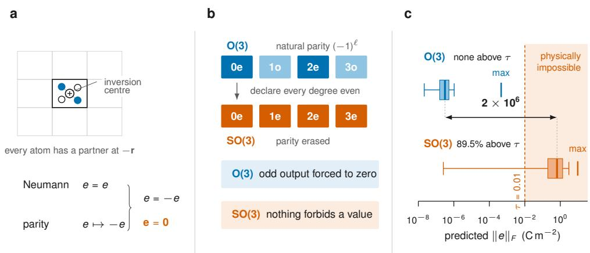
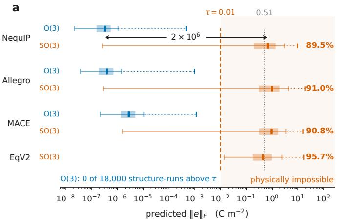
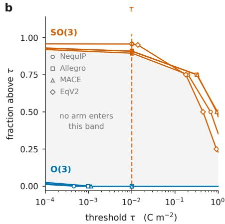
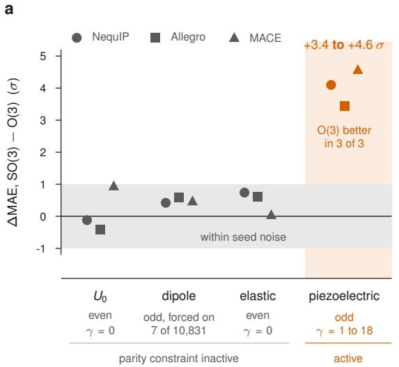
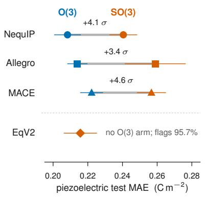
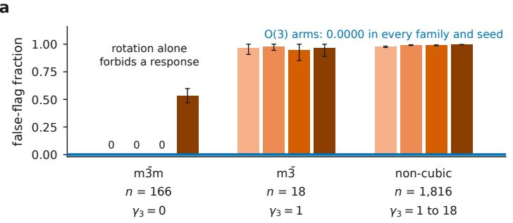
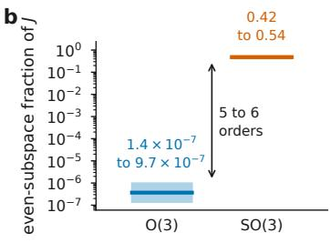
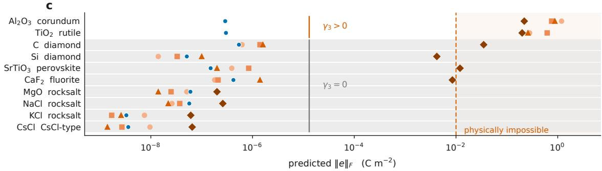
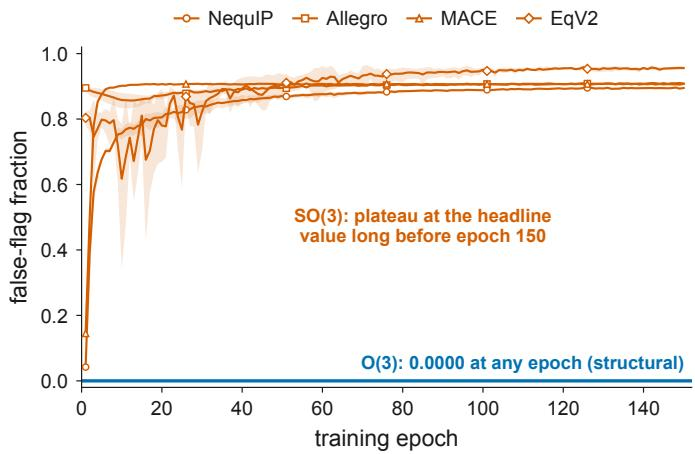
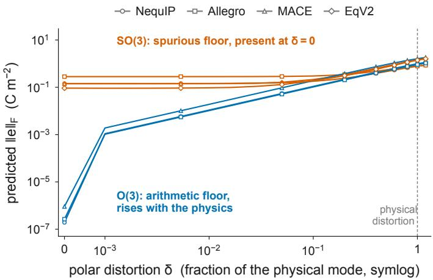

# A single design choice determines whether machine learning models of materials make physically impossible predictions

Parity labels, not training, decide whether a model can predict a symmetry-forbidden response

Can Polat 1 Mustafa Kurban 2,3, Erchin Serpedin 1 Hasan Kurban 4,

1 Department of Electrical and Computer Engineering, Texas A&M University, College Station, TX, USA

2 Department of Electrical and Computer Engineering, Texas A&M University at Qatar, Doha, Qatar

3 Department of Prosthetics and Orthotics, Ankara University, Ankara, Turkey

College of Science and Engineering, Hamad Bin Khalifa University, Doha, Qatar

Correspondence: kurbanm@ankara.edu.tr, hkurban@hbku.edu.qa

## ABSTRACT

Machine-learned models are replacing first-principles calculations across materials discovery, and physical symmetry is the central guarantee built into them. The debate over how much symmetry to hard-wire rather than learn has run on rotations, where a symmetry error is an approximation error. Some constraints are exact: symmetry forces certain property tensors to exactly zero, so a nonzero prediction is physically impossible rather than inaccurate. Here we show that whether a model can make such predictions is decided before training by one rarely reported design bit, whether its features carry parity labels, and derive a criterion, the parity gap, that computes from group theory alone which properties and crystals are exposed. Across matched architecture pairs difering only in that bit, evaluated on two thousand centrosymmetric crystals whose piezoelectric tensor must vanish, paritylabelled arms sit at the floating-point floor while rotation-only arms predict forbidden responses on 90–96% of crystals, six orders of magnitude apart, at no accuracy cost. Training on explicit zeros does not recover exactness, and a head on a frozen universal potential inherits its backbone’s symmetry group. One reflection at random initialization verifies the label in seconds.

## Introduction

Predictions that once required a first-principles calculation are increasingly delegated to machinelearned surrogates across materials discovery, so what an architecture is structurally able to predict now carries direct physical consequences. Symmetry is a central organizing principle for machine learning on atomistic systems [1]. In particular, networks whose features transform equivariantly under the symmetries of three-dimensional space have become a standard construction for molecules and crystals, often described collectively as “E(3)-equivariant” models [2]. The resulting design question is not whether symmetry matters, but which aspects of it should be imposed exactly and which should be left for the model to learn [3]. Much of this discussion has focused on rotational equivariance [4], where symmetry constrains how a prediction changes under a transformation but does not, in general, determine the prediction itself.

That distinction points to a diferent class of symmetry constraints. Rotational equivariance is an approximation target: a model that is slightly wrong in how its predictions transform is still approximately equivariant, and the resulting error can be measured and traded against other considerations [5]. For certain combinations of crystal symmetry and physical property, however, symmetry does not merely constrain a response; it requires that response to be exactly zero [6]. An approximation to such a constraint is therefore qualitatively diferent: a nonzero prediction corresponds to a response that the crystal forbids. This distinction is particularly important for scientific machine learning, where some physical laws are exact rather than approximate [7]. The question is consequently not only whether a model can learn a symmetry, but whether an exact symmetry constraint can be represented directly in its architecture. Here we consider a sharp instance in which the exact constraint costs only a labelling bit, allowing whether a model carries the constraint to be determined before training.

Which class a model falls into is decided by a part of its construction that is rarely reported. E(3) contains improper operations: reflections and the spatial inversion � ∶ � ↦ −�. A network can be exactly equivariant to all rotations while carrying no parity information, and a substantial class of deployed models is built this way: the eSCN lineage [8] and EquiformerV2 (EqV2) [9], the universal potentials eSEN [10] and UMA [11] built on it, and EquiformerV3 (EqV3) [12], whose title declares equivariance to SE(3), a group containing no improper operation at all. Nor is the omission accidental. Allegro ships parity-typed, yet its paper records that the index may simply be dropped to leave features that are only SE(3)-equivariant, because doing so simplifies the network and reduces its memory footprint [13]. Parity is a documented eficiency choice whose cost has not been measured, and one that surfaces nowhere afterwards: such models expose a maximum angular degree and not a parity flag, and we are aware of no model card or validation suite that reports the feature symmetry group [14]. A model missing the labels remains exactly rotation-equivariant and loses nothing on approximation targets. On the exact constraints it loses everything, because nothing in its construction can produce the one permitted value.

The physics supplies an unusually clean instrument. By Neumann’s principle [15], a crystal’s property tensors must be invariant under every operation of its point group. The piezoelectric tensor $e _ { i j k }$ is parity-odd, so in a centrosymmetric crystal inversion requires the tensor to be both unchanged and sign-reversed. It must therefore vanish identically. This is an algebraic consequence of symmetry, not an empirical trend: 92 of the 230 space groups are centrosymmetric, providing a large, label-free population for which any nonzero prediction is known to be forbidden. A network whose features retain parity information can enforce this constraint directly, returning exactly zero at any parameter values, including random initialization. Equivariant architectures can therefore possess a guarantee that is stronger than high predictive accuracy: they can make certain physically forbidden predictions unreachable. What has received much less attention is the converse question—what this guarantee rests on, and what remains when the relevant symmetry information is not built into the representation.

This distinction connects to several recent directions in symmetry-aware learning. Work on symmetry breaking deliberately relaxes equivariance when the physical output is less symmetric [16]; here we consider the complementary case, where there is no symmetry to break and violating the constraint is simply an error. Related work has shown that E(3)-equivariant models can fail to represent chirality when the relevant parity structure is absent [17], illustrating the same issue from the opposite direction. Other approaches explicitly restore parity information or impose tensor constraints at the output, but these choices leave open a more basic question: can the internal representation itself guarantee an exact symmetry-forced zero? That question becomes particularly relevant when symmetry-constrained heads are attached to pretrained potentials whose representations were fixed before the target property was chosen. Here, rather than treating symmetry-forced zeros as a special case of model evaluation, we use them as the measurement itself.

Here we establish that this design decision governs what deployed models predict, in four steps. First, we make the exposure computable before any model is built: group theory supplies a criterion we call the parity gap, which counts, for a target tensor and a crystal class, the components that only parity can force to zero. It vanishes identically at even rank, so the dielectric and elastic tensors are never at risk, and at odd rank it equals the dimension of the rotation-invariant subspace, reaching eighteen for the centrosymmetric triclinic class, where the whole piezoelectric space is exposed. Second, we measure what a nonzero gap costs, on 2,000 centrosymmetric insulators verified with spglib [18], where any nonzero prediction is a certified error obtained without labels or a reference calculation: NequIP [19], Allegro and MACE [20] are each built in two arms difering only in parity labelling, with unmodified EqV2 as a deployed rotation-only representative, and the arms separate by a factor of one million where the gap is nonzero while remaining indistinguishable where it is zero. Third, no training strategy we tested closes that separation: explicit zero labels, scale and loss reweighting shrink the violations without attaining the exact zero that parity-labelled features deliver at any parameter values. Fourth, the label turns out to be decided upstream rather than by the practitioner: a property readout trained on the frozen embeddings of a released universal potential carries whatever symmetry group that backbone was built with, and half the audited architectures able to emit a rank-3 tensor have none to pass on.

## Results

## What parity guarantees, and what its absence costs

Group theory fixes what each symmetry class can promise, and the distinction that matters is between invariance under permutations and translations of a periodic structure and equivariance under the spatial symmetry group [21]. A model $f _ { \theta }$ maps a periodic structure � into a target space � carrying the rank-� polar-tensor representation $D ( Q ) = Q ^ { \otimes r }$ , so that $D ( I ) = ( - 1 ) ^ { r }$ id at the inversion. The piezoelectric tensor has $r = 3$ and � is eighteen-dimensional; throughout, $\| f _ { \theta } ( x ) \| _ { F }$ is the violation magnitude $\left\| e \right\| _ { F }$ that every experiment reports.

Three assumptions are used throughout: (A1) permutation invariance, relabelling atoms of the same species leaves the output unchanged; (A2) translation invariance, under a rigid shift of the whole structure by any vector and under a shift of any single atom by a lattice vector; and (A3) $\mathcal { G }$ -equivariance, $f _ { \theta } ( Q \cdot x ) = D ( Q ) f _ { \theta } ( x )$ for all $Q \in { \mathcal { G } } _ { : }$ with $\mathcal { G } = \mathrm { O } ( 3 )$ for a parity-labelled network and $\mathcal { G } = S O ( 3 )$ otherwise. The symbol $\mathcal { G }$ is reserved for this equivariance group throughout, and � for the point group of a crystal. The rigid-shift clause of (A2) is load-bearing, because a nonsymmorphic space group pairs a rotation with a fractional translation [22]. Every architecture here satisfies (A1) and (A2) by construction, verified numerically.

A structure is centrosymmetric when some point exists about which the inversion maps it onto itself, so that every atom has a partner of the same species at the reflected position, up to a lattice translation (Fig. 1a). One consequence needs no parity at all. The inverted copy of a centrosymmetric crystal is the same periodic solid, relabelled and shifted, so a model that cannot see relabelling or shifts cannot see the inversion: $f _ { \theta } ( I \cdot x ) = f _ { \theta } ( x )$ for every centrosymmetric � and every $\theta ,$ an inversion identity that follows from (A1) and (A2) alone. Adding parity to it gives the guarantee.

Theorem 1 Parity gap. Let � be centrosymmetric with point group � and proper-rotation subgroup $G ^ { + }$ , let the target be a rank-� polar tensor on $V ,$ restricted where relevant to the index-symmetric subspace of the property, and let $f _ { \theta }$ satisfy (A1) and (A2). If $f _ { \theta }$ also satisfies (A3) with $\mathcal { G } = \mathrm { O } ( 3 )$ and � is odd, then $f _ { \boldsymbol { \theta } } ( x ) = 0$ for every �. Ifinstead (A3) holds only for $\mathcal { G } = S O ( 3 )$ , the three assumptions constrain $f _ { \boldsymbol { \theta } } ( { \boldsymbol { x } } )$ only to lie in $V ^ { G ^ { + } }$ . The excess of that subspace over the one the full point group permits, the parity gap $\gamma _ { r } ( G ) = \dim$ $V ^ { G ^ { + } } - \mathrm { d i m } V ^ { G }$ , is 0 for every even � and dim $V ^ { G ^ { + } }$ for every odd �.

The three parts are proved in Supplementary Note 1, and between them they carry the whole argument. The first mentions neither the parameters, the data nor the loss, which is what makes the zero structural rather than learned; for a parity-blind network its second step is simply unavailable, because $D ( I )$ is never invoked. The second says what survives that loss: rotations still return the crystal to itself, once the accompanying translation, fractional for a non-symmorphic group, is absorbed by (A2). The third counts what does not survive, in four lines from the coset splitting $G = G ^ { + } \sqcup I G ^ { + }$ and $D ( I g ) = ( - 1 ) ^ { r } D ( g )$ .

Table 1 evaluates $\gamma _ { r }$ for every centrosymmetric class, computed once from the groups and fixing the design of everything that follows. At rank 1 it vanishes for six of the eleven classes, whose rotations alone already annihilate every vector, which is why a polar target of that rank is a weak probe. At rank 3 it is nonzero for ten of the eleven and reaches eighteen, the full dimension of the piezoelectric space, on triclinic 1̄.

Three consequences support the measurements below rather than the argument, and are proved in Supplementary Note 1: a bound on the O(3) residual in floating point, which places its floor at arithmetic precision and not at symmetry; the vacuity of test-time antisymmetrization, which vanishes on every centrosymmetric structure whether or not the features are parity-labelled; and the extension of the guarantee to the Jacobian of the prediction with respect to the atomic positions, whose even-parity component is forced to vanish.

Table 1 The parity gap of every centrosymmetric crystal class. $\gamma _ { r }$ counts the tensor components that only parity can force to zero, that is the dimension of the subspace in which a rotation-only network is free to predict a symmetry-forbidden response. It vanishes identically at even rank, so parity-even properties are structurally immune, and at odd rank it equals the dimension of the rotation-invariant subspace.
<table><tr><td rowspan="3">Class G</td><td rowspan="3"> $G ^ { + }$ </td><td rowspan="3">Crystal system</td><td colspan="2">Parity gap γr at odd rank</td></tr><tr><td> $r = 1$ </td><td>r = 3</td></tr><tr><td>polarization</td><td>piezoelectric, SHG</td></tr><tr><td>ī</td><td>1</td><td>triclinic</td><td>3</td><td>18</td></tr><tr><td> $2 / \mathrm { m }$ </td><td>2</td><td>monoclinic</td><td>1</td><td>8</td></tr><tr><td>mmm</td><td>222</td><td>orthorhombic</td><td>0</td><td>3</td></tr><tr><td>4/m</td><td>4</td><td>tetragonal</td><td>1</td><td>4</td></tr><tr><td>4/mmm</td><td>422</td><td>tetragonal</td><td>0</td><td>1</td></tr><tr><td>3</td><td>3</td><td>trigonal</td><td>1</td><td>6</td></tr><tr><td>3m</td><td>32</td><td>trigonal</td><td>0</td><td>2</td></tr><tr><td> $6 / \mathrm { m }$ </td><td>6</td><td>hexagonal</td><td>1</td><td>4</td></tr><tr><td>6/mmm</td><td>622</td><td>hexagonal</td><td>0</td><td>1</td></tr><tr><td>m3</td><td>23</td><td>cubic</td><td>0</td><td>1</td></tr><tr><td>m3m</td><td>432</td><td>cubic</td><td>0</td><td>0</td></tr></table>

Entries are computed exactly from the point groups by Reynolds projection, with no model, dataset or trained parameter involved, and every entry is reproduced by the released test suite. $G ^ { + }$ denotes the proper-rotation subgroup of �. At even rank the gap vanishes for every class and every � by Theorem 1, so the dielectric (� = 2) and elastic (� = 4) tensors carry no exposure on any crystal and are not tabulated.

What none of this establishes is that the freedom Theorem 1 leaves an SO(3) model is actually used. Theorems of this kind forbid and permit; whether the permission is taken up, and on how many crystals, is an empirical question, and the measurements below answer it.

## Parity labels decide whether impossible predictions occur

Four targets separate two things a single experiment would confound: being parity-odd, and being evaluated where the parity gap is nonzero. The QM9 [23] internal energy $U _ { 0 }$ and the elasticity tensor are parity-even, so $\gamma = 0$ identically. The QM9 dipole is parity-odd at rank 1, where a point-group census finds symmetry forces a zero for only 7 of the 10,831 evaluation molecules (Supplementary Note 2). Only the piezoelectric tensor is both odd and evaluated at a nonzero gap. The evaluation population is 2,000 centrosymmetric insulators from the Materials Project [24], re-verified with spglib, in two coordinate variants: idealized (snapped onto the exact space group) and raw (as relaxed by density functional theory).

The measurement is a matched-pair ablation (Fig. 1b). NequIP, Allegro and MACE were each built in two arms through a single irreducible-representation helper: an O(3) arm carrying the natural spherical-harmonic parity $( - 1 ) ^ { l }$ , and an SO(3) arm in which every feature is declared parity-even. Only the parity bookkeeping difers, and with it the reflection law the feature algebra enforces; architecture, hyperparameters, data, splits and seeds are shared. EqV2 joins unmodified, with no parity labels to toggle (7 arms × 4 targets × 3 seeds, 84 runs). Before any of them trained, each arm passed a verification gate: the O(3) arms satisfy both the rotation and the reflection law, the SO(3) arms satisfy rotation and fail reflection. Capacity runs the wrong way to explain a deficit, since all-even labelling opens additional tensor-product paths and the SO(3) arms carry between 0.2 and 39.8% more parameters than their partners.

  
Figure 1 A label-free test of physical validity. a, A centrosymmetric crystal, one unit cell drawn heavy among its neighbours; each atom’s partner sits at −�, reached through the inversion centre (crossed circle). Neumann’s principle requires the piezoelectric tensor to be invariant under every point-group operation, while parity sends the rank-3 polar tensor to its negative; the two demands force $e \ = \ - e ,$ hence $e \ = \ 0$ exactly, on every centrosymmetric crystal and for any model that respects both. b, The two arms are built from one code path and difer in one bit. Feature irreducible representations run to $l _ { \mathrm { m a x } } = 3$ in both: the O(3) arm carries the natural spherical-harmonic parity $( - 1 ) ^ { l } ;$ the SO(3) arm declares every degree even. The consequence is structural, not statistical, and holds at every parameter value. c, Predicted magnitudes on the 2,000 centrosymmetric crystals (idealized coordinates) for the NequIP pair, where the true value is exactly zero. Boxes span the 25th to 75th percentile of the per-structure distribution, whiskers the 5th to 95th, the heavy line is the median and the isolated tick is the maximum; values are those tabulated in Supplementary Table S2. Shading marks predictions above the operating threshold $\tau = 0 . 0 1 \mathrm { C m ^ { - 2 } }$ , which the physics forbids. The O(3) median sits at the arithmetic floor. The low tail of the SO(3) whisker is not noise but the m3̄m crystals, on which the parity gap vanishes and rotation alone forces the zero.

The two arms separate by six orders of magnitude on the idealized population (Fig. 1c for the NequIP pair, all cores in Fig. 2a). Not one of the 18,000 O(3) structure-runs exceeds the operating threshold of $0 . 0 1 \mathrm { C m ^ { - 2 } }$ . Their medians sit at the arithmetic floor, and the largest single prediction falls a factor of 7.6 below it. The SO(3) arms cross it for 90–96% of the population, predictions we call false flags, and their median violation matches the magnitude of genuine piezoelectric tensors in the training data, so the typical SO(3) prediction is the size of a real response, not a numerical residue. Because the summed readout is extensive while the piezoelectric tensor is intensive, the whole grid was also trained mean-pooled against a recalibrated threshold. The O(3) fraction stays exactly zero under both poolings on every core and seed, and the SO(3) fractions move by a mean of 0.0065, less than the seed spread (Supplementary Note 3).

The separation depends on neither the operating point nor the coordinate variant: across four decades of threshold the arms stay cleanly separated (Fig. 2b), and the SO(3) fractions are unchanged between idealized and raw coordinates, with the threshold sweep, the two coordinate variants and the statistical treatment set out in Supplementary Note 2. The one nuance is on the O(3) side, where a single structure produces a small raw-variant response and proves genuinely non-centrosymmetric below the selection tolerance: the guarantee detected a data artefact.

  
Figure 2 Parity labels separate possible from impossible predictions by six orders of magnitude. a, Distribution of the predicted piezoelectric magnitude ‖�‖ on the 2,000 centrosymmetric crystals (idealized coordinates), for the O(3) and SO(3) arms of each core. Symmetry forces the true value to zero, so the tinted region above the operating threshold $\tau = 0 . 0 1 \mathrm { C m ^ { - 2 } }$ contains only physically impossible predictions. Box and whisker conventions as in Fig. 1c, here with each percentile taken as the mean of per-seed percentiles over 3 seeds; the capped stem to the right of each box reaches the single largest prediction. The lower tail of each SO(3) whisker is the class-m3̄m population, 8.3% of the crystals, on which the proper-rotation subgroup alone forbids a response and an exactly rotation-equivariant model is therefore also at the floor (Fig. 4a). Percentages give the fraction of structures exceeding �, the false-flag fraction. The double arrow marks the ratio of the two NequIP medians, $2 \times 1 0 ^ { 6 }$ . EqV2 has no O(3) arm. $\mathbf { b } ,$ The same measurement read as a survival function, the fraction of crystals whose predicted magnitude exceeds a threshold $\tau ,$ , over the four decades swept. Markers are exact points, each tabulated percentile fixing one together with the false-flag fraction at the operating threshold; curves interpolate monotonically between them, and the shaded band is the interval between the highest O(3) curve and the lowest ${ \mathrm { S O } } ( 3 )$ curve, which no arm enters at any threshold. Error bars at � are 95% percentile-bootstrap confidence intervals over structures. Blue, O(3) arms; orange, SO(3) arms; marker shape distinguishes cores. Percentiles, false-flag fractions and confidence intervals are tabulated in Supplementary Table S2.

The separation is statistically decisive: structure-paired Wilcoxon tests reject equality at every core and seed, per-structure violations correlate across seeds, and independent architectures flag almost the same crystals.

## Parity costs nothing where the gap is zero

If parity labelling handicapped models on ordinary tasks, removing it could be a defensible trade. It does not. On the three targets carrying no active constraint $( U _ { 0 }$ , dipole and elasticity), the arms are indistinguishable within seed noise, and any visible tendency favours keeping the labels: on the dipole and on elasticity the O(3) arm is nominally better in all three cores, by 0.04 to 0.74 pooled standard deviations, an efect three seeds cannot resolve and from which we claim no significance, while on $U _ { 0 }$ the sign varies (Fig. 3a). Elasticity is a control by Theorem 1, its gap zero at rank 4.

b  
  
Figure 3 The parity gap predicts where the labels matter, and where they do not. a, Diference in test mean absolute error between the SO(3) and O(3) arms, in units of the pooled per-seed standard deviation �, for the three matched cores on all four targets; positive values favour the O(3) arm. Markers are jittered horizontally within each target for legibility. The grey band marks one pooled standard deviation, within which a threeseed comparison cannot resolve a diference and from which we claim no significance. Beneath each target is the parity of its tensor and the parity gap it carries on the evaluated population: $\gamma = 0$ identically for the two parity-even targets by Theorem 1, and � up to 18 for the piezoelectric tensor, nonzero on 91.7% of the evaluated crystals and zero on the class-m3̄m remainder. The dipole is parity-odd but its constraint is active on only 7 of the 10,831 evaluation molecules. Separation appears in the one column where the gap is nonzero, and nowhere else. b, Piezoelectric test MAE for both arms of each core, mean over 3 seeds with bars showing one standard deviation, the two arms of a core joined and the efect size printed above. Values are those tabulated in Supplementary Table S4. EqV2 is shown separately because it has no O(3) arm.

The dipole is the decisive control. It is parity-odd like the piezoelectric tensor, yet the arms match, because at rank 1 the gap is zero or small and the constraint is active on a negligible fraction of the population. What separates the arms is not the target’s parity but a nonzero gap on the crystals evaluated.

Where the gap is nonzero the labels help rather than cost: on the piezoelectric tensor the O(3) arm has the lower in-distribution error in all three matched cores (Fig. 3b), while carrying fewer parameters. EqV2’s in-distribution error is comparable, so its near-universal false flagging coexists with ordinary competence on non-centrosymmetric crystals (Supplementary Note 4).

## Training cannot buy the zero

The natural objection is that the SO(3) failure is a data problem: no centrosymmetric crystal appears in the piezoelectric training set. We retrained every SO(3) arm on the training set augmented with 1,000 spglib-verified centrosymmetric crystals carrying the exact zero as their label, hyperparameters and partitions unchanged.

The decisive measurement is the in-training control: predictions on the very crystals whose explicit zero labels the model was trained on. After training, the models still false-flag roughly nine in ten of them, 0.895–0.922 across the four cores. This is not underfitting, since the zero-labelled rows are fit better than the real-tensor rows in training error, nor a coverage problem, since held-out fractions barely move whether or not the crystal’s space group was seen. Augmentation meanwhile improves the regression error for every core, producing better regressors that still predict impossible values.

Scale does not close the gap. In a zero-injection sweep of the NequIP SO(3) arm from 250 to 16,000 zero-labelled crystals, the held-out violation median falls 8.6-fold, from 0.666 to $0 . 0 7 7 \mathrm { C m } ^ { - 2 }$ while the held-out false-flag fraction moves only from 0.895 to 0.858. The predictions shrink; almost none becomes zero. Weighting those rows a hundredfold in the loss reduces the trained-on fraction by 0.22, leaving two-thirds flagged, and at no weight approaches the exact zero the O(3) arms deliver for free (Supplementary Note 5).

A second repair operates at test time, antisymmetrizing over inversion: $T _ { \mathrm { s y m } } ( x ) = [ f _ { \theta } ( x ) - f _ { \theta } ( I \cdot$ $x ) ] / 2$ . On the exactly-equivariant SO(3) cores this drives the false-flag fraction to $_ { \mathbf { Z } \mathbf { e r } \mathbf { O } , }$ and the success is empty for the reason proved above, since the construction vanishes for any permutationand translation-invariant model and so involves no parity information. It also presupposes knowing the target’s parity, precisely what O(3) features carry, and it fails on EqV2, whose approximate equivariance breaks the identity the fix relies on, leaving its fraction at 0.82.

## The guarantee tracks the physics of symmetry breaking

If parity is the mechanism rather than a correlate of one, the guarantee should switch of exactly when the symmetry does, and stay on wherever the group theory says it must. It does both. We displaced rutile $\mathrm { T i O _ { 2 } }$ along a polar mode over 33 symmetry-verified amplitudes, from the centrosymmetric parent to beyond the physical distortion. The O(3) arms rise smoothly from the arithmetic floor, while the SO(3) arms sit on a spurious floor five to six orders of magnitude higher, present already at zero distortion and dominating the physical signal throughout the smalldistortion regime. Rutile is decisive because $\gamma _ { 3 } ( 4 / m m m ) = 1$ , so parity alone forbids a response at the parent; the separation reproduces on two further 4/mmm paths, rutile-type $\mathrm { S n O _ { 2 } }$ and anatase $\mathrm { T i O _ { 2 } }$

The crystals an SO(3) model gets right are then exactly those with $\gamma _ { 3 } = 0$ , which is the sharpest available test of the mechanism because the prediction is made from the group alone (Fig. 4a). The three matched cores flag none of the m3̄m crystals and 97.6 to 99.2% of the rest, so an exactly rotation-equivariant model approaches the ceiling without reaching it. EqV2 exceeds it, as the stability bound allows for approximate equivariance, and the only route to that excess is its spurious flagging of m3̄m crystals, which an exact model cannot flag at all: 53.4% of them, contributing 4.4 percentage points (Supplementary Note 6).

The guarantee also survives diferentiation, where the Jacobian identity requires the evensubspace energy fraction to vanish exactly at a centrosymmetric geometry. Over 20 crystals spanning 19 space groups, every Jacobian certified against finite diferences, the arms again sit five to six orders of magnitude apart (Fig. 4b). The O(3) architecture does not merely output a zero; it encodes which displacements can activate a response.

The same pattern shows on named materials (Fig. 4c): a full-magnitude tensor for corundum $\mathrm { { A l } _ { 2 } \mathrm { { O } _ { 3 } } }$ , where $\gamma _ { 3 } ~ = ~ 2$ leaves parity as the only protection, and near zero for the rocksalt and diamond-structure compounds of class m3̄m, where $\gamma _ { 3 } = 0$ . On those m3̄m rows the 72 matchedcore SO(3) predictions (3 cores × 3 seeds on eight compounds, each seed counted separately) span

O(3) arms SO(3) NequIP SO(3) Allegro SO(3) MACE SO(3) EqV2

a  

  
Figure 4 The missing guarantee is specifically parity, and it is diferentiable. Markers and colours are shared across panels: blue, the O(3) arms; the four orange tints, the SO(3) arms of each core. a, False-flag fraction of the SO(3) arms, split by the point-group family of the evaluated crystal and labelled by the parity gap $\gamma _ { 3 }$ that Theorem 1 assigns to it: m3̄m, whose proper-rotation subgroup 432 alone annihilates every rank-3 piezoelectric tensor, so $\gamma _ { 3 } = 0 ;$ m3̄, where $\gamma _ { 3 } = 1 ;$ and the non-cubic classes, where $\gamma _ { 3 }$ runs from 1 to 18. Bars are means over 3 seeds and error bars are 95% percentile-bootstrap confidence intervals over structures within each family; the m3̄ interval is wide because that family holds only 18 crystals. The three matched cores return exactly zero on m3̄m and are marked 0 where a bar would have zero height. The blue rule marks the O(3) arms, which are 0.0000 in every family and every seed. b, Even-subspace energy fraction of the Jacobian $J = \partial f _ { \theta } / \partial \mathbf { r }$ of the predicted tensor, at centrosymmetric geometries, over 20 crystals spanning 19 space groups. Each interval is the full range measured over crystals, cores and seeds for one parity arm and the bar inside it is the geometric midpoint; parity forces the O(3) value to exactly zero, so the range it occupies is the arithmetic floor. c, Predicted magnitude on ten named centrosymmetric compounds, whose true tensor is exactly zero in every case. The bracketed groups carry the two regimes: on the shaded rows $\gamma _ { 3 } = 0$ and rotation alone already forbids a response, so the three exactly rotation-equivariant cores sit at the floor alongside O(3) while $\mathrm { E q V 2 } ,$ , equivariant only approximately, crosses the threshold on two of them; on the two unshaded rows $\gamma _ { 3 } > 0$ and only parity forbids a response, which every SO(3) arm then predicts at full magnitude.

$5 . 7 \times 1 0 ^ { - 1 0 }$ to $3 . 2 \times 1 0 ^ { - 6 } \mathrm { { C m ^ { - 2 } } }$ . $\mathtt { E q V 2 }$ exceeds the threshold on two of them, diamond and $\mathrm { S r T i O _ { 3 } }$ the approximate-equivariance failure recorded by its m3̄m bar in Fig. 4a.

## How common the missing label is

The matched arms isolate the mechanism; an audit measures its prevalence. We classified eighteen released architectures by whether their features could in principle guarantee a symmetry-mandated zero for a parity-odd tensor, reading each source at a pinned version and probing numerically where inspection could not settle it. Six attach parity labels; the remaining twelve lack them in three ways (Table 2): six are rotation-equivariant only, three carry a single unlabelled Cartesian vector channel, and three are invariant. At random initialization the three deployed-generation models in the rotation-only class already show the rotation-ceiling signature, their m3̄m violation medians five to six orders of magnitude below the non-cubic ones. Pooling the three populations understates the prevalence among models the constraint can reach: of the twelve able to emit a rank-3 tensor as built, exactly half type parity. The full audit, with the deciding source line for each row, is in Supplementary Note 7.

Table 2 Feature parity across eighteen released architectures. Classification by whether a model’s internal features can, in principle, force a parity-odd tensor output to its symmetry-mandated zero.
<table><tr><td>Architecture</td><td>Internal features</td><td>Parity typed?</td></tr><tr><td colspan="3">Parity-aware (6): an odd-parity output is structurally zero</td></tr><tr><td>NequIP [19]</td><td>O(3) irreps, natural parity  $( - 1 ) ^ { l }$ </td><td>yes</td></tr><tr><td>Allegro [13]</td><td>O(3) irreps, natural parity  $( - 1 ) ^ { l }$ </td><td>yes</td></tr><tr><td>MACE [20]</td><td>O(3) irreps, natural parity  $( - 1 ) ^ { l }$ </td><td>yes</td></tr><tr><td>MatTen [25]</td><td>O(3) irreps, natural parity  $( - 1 ) ^ { l }$ </td><td>yes</td></tr><tr><td>ICTP [26]</td><td>Cartesian harmonics, parity implicit</td><td> $\mathrm { { y e s } ^ { a } }$ </td></tr><tr><td>GotenNet [27]</td><td>untyped attention, polar vector output</td><td> $\mathrm { { y e s } ^ { a } }$ </td></tr><tr><td colspan="3">Rotation-only (6): nothing can force the output to vanish</td></tr><tr><td>EquiformerV1 [28]</td><td>SO(3) irreps, all declared even</td><td>no</td></tr><tr><td>EquiformerV2 [9]</td><td>degree and order only, no parity flag</td><td>no</td></tr><tr><td>eSCN [8]</td><td>degree and order only, no parity flag</td><td>no</td></tr><tr><td>eSEN [10]</td><td>degree and order only, no parity flag</td><td> $\mathrm { n o } ^ { \mathrm { a } }$ </td></tr><tr><td>UMA [11]</td><td>degree and order only, no parity flag</td><td> $\mathrm { n o } ^ { \mathrm { a } }$ </td></tr><tr><td>EquiformerV3 [12]</td><td>degree and order only, no parity flag</td><td> $\mathrm { n o } ^ { \mathrm { a } }$ </td></tr><tr><td colspan="3">Vector-only (3): implicitly polar but untyped, and no rank-3 path</td></tr><tr><td>PaiNN [29]</td><td>one Cartesian vector channel</td><td>no, untyped</td></tr><tr><td>TorchMD-Net [30]</td><td>one Cartesian vector channel</td><td>no, untyped</td></tr><tr><td>ViSNet [31]</td><td>one Cartesian vector channel</td><td>no, untyped</td></tr><tr><td colspan="3">Invariant (3): cannot express an equivariant tensor output</td></tr><tr><td>SchNet [32]</td><td>interatomic distances only</td><td>no path</td></tr><tr><td>DimeNet++ [33]</td><td>distances and bond angles</td><td>no path</td></tr><tr><td>FAENet [34]</td><td>not equivariant, frames applied externally</td><td>no path</td></tr></table>

The final column records whether the features carry an explicit parity label. “no, untyped” marks a single Cartesian vector channel that is polar in fact but declares no parity; “no path” marks a model that cannot express an equivariant tensor output at all. Neither can inherit the guarantee.  
aSettled by measurement at random initialization, source reading having failed to decide the row. GotenNet’s vector output obeys the polar-vector law under improper operations to $1 . 8 \times 1 0 ^ { - 1 5 }$ , against 1.9 for the pseudovector law; eSEN, UMA and EqV3 satisfy the rotation law to $1 0 ^ { - 5 } – 1 0 ^ { - 4 }$ yet violate the mirror law by order unity. ICTP’s rank-3 output is odd to machine precision.  
EquiformerV1 is classed by its released default configuration, although its formulation admits odd irreducible representations. The classification is pinned to the versions recorded in Supplementary Note 7 and does not extend to later releases.

The dedicated crystal-tensor predictors that enforce symmetry at the readout face the same test. We evaluated two of the four current models, GMTNet [35] and CEITNet [36], both built on an invariant backbone with equivariance synthesized only at the tensor head, running each on the same 2,000 crystals through its own released pipeline; the two we did not run are discussed in Supplementary Note 8. Their head algebra does produce structural zeros for most crystals on exactly symmetric inputs, but both still false-flag a substantial minority once their space-group mask is of, and both depend on that mask in ways real inputs erode. GMTNet’s repairs the idealized coordinates completely yet leaks on the raw ones, while CEITNet’s is inert for the fully-forbidden point groups and so fails hardest on the m3̄m crystals that every exactly rotation-equivariant model here gets right by construction, traceable to a benchmark protocol [37] that removes zero tensors from training. Readout-level repair reaches as far as its bookkeeping and no further.

## A deployed pipeline inherits the defect from its backbone

The matched pairs isolate the mechanism inside a network we build. Practice increasingly runs the other way: a property head is attached to the frozen embeddings of a released universal potential, so the feature symmetry group is inherited rather than chosen, by every target built on that backbone. This is the pathway on which the design bit reaches real predictions, and what it transmits is settled in advance.

Proposition 2 Inheritance. Let a backbone �� satisfy (A1)–(A2) and carry O(3) parity-labelled features, and let $h _ { \psi }$ be any equivariant readout from those features to a rank-� odd polar target. Then $h _ { \psi } \circ g _ { \phi }$ satisfies Theorem 1 for every �, trained or not. If instead the backbone declares all its features parity-even, the composite satisfies no such constraint at any �: the zero then holds only for readouts that happen to annihilate the target on centrosymmetric inputs, a property of � rather than of the construction.

Equivariant maps compose and parity types multiply, so the guarantee passes through the head untouched. Erase the labels in the backbone and no head recovers the guarantee, because nothing in the composite’s transformation law supplies it; whether the underlying features still respond to a reflection is beside the point, since no law now constrains how. The frozen-backbone setting is the sharpest test of this, since the head is small, linear and trained, while the property under test lives entirely upstream of it. We trained a piezoelectric head on the frozen features of two released potentials that difer in exactly that property. On MACE-MP-0 [38], whose features carry parity labels, the head’s violations are exactly zero on every crystal and seed; on eSEN-30M-OAM [39], whose features declare every degree even, the same construction false-flags at the full headline rate, at comparable regression accuracy, exactly as Proposition 2 requires. A parity-even rank-2 target such as the dielectric tensor can never expose this, by Theorem 1; the first parity-odd target evaluated where the gap is nonzero will. The design bit therefore does not stay inside the network that declares it. It is fixed once, upstream, by whoever trained the backbone, and every property head attached later inherits whatever was decided then.

## Discussion

The measurements confirm a single mechanism, and the parity gap names and sizes it. Parity labels make a symmetry-mandated zero structural: Theorem 1 holds at any parameter values, so the zero cannot be trained away because it was never trained in, and the Jacobian identity extends the certainty to derivatives. Removing the labels converts that certainty into an ordinary regression error over a subspace whose dimension is fixed in advance by the crystal’s rotation group, and the agreement between unrelated architectures places the efect in the symmetry class rather than in any network.

This bears on whether symmetry can be learned rather than built in. On rotations the evidence that it can is real [40], and the strongest recent statement of that case reports that the pitfalls of unconstrained models can be corrected with minimal efort [41]. On approximation targets we agree. The corrections available there, more data, augmentation, or symmetrization applied afterwards, are exactly what we tested against an exact constraint, and none arrives. The distinction that matters is therefore not equivariant versus unconstrained, nor how much data is available, but whether the predicted quantity is an approximation or an exact identity: where the physics permits any value, learned symmetry is a reasonable trade. Where it permits exactly one, an approximate constraint delivers an error the size of the property. Non-conservative force models made the same bargain against energy conservation and were found wanting when assessed against the physics rather than the test error [42].

The result also gives quantitative content to a distinction the field treats as terminology. Curie’s principle [43], the foundation on which equivariant networks are advertised, is for improper operations silently violated by a widely deployed subclass of the models it is invoked to describe, and $\gamma _ { r }$ counts by how much. The same accounting says where the guarantee should live. Readout-level repairs cover only the quantity someone remembered to repair, take the target’s parity as an input, and leave everything else on the same features unprotected, whereas feature-level parity reaches every quantity the features feed, derivatives included. This is not an argument against readout-level methods but an argument that the feature symmetry group is a prior decision, made once, made invisibly, and inherited by every head downstream.

The practical rule is checkable before a model is built, and Theorem 1 states it in one quantity: parity labels are required exactly where the parity gap is nonzero. That excludes every even-rank property outright and, at rank 3, all but class m3̄m. The rule is not confined to piezoelectricity. In the electric-dipole approximation the second-harmonic-generation tensor shares the rank, the parity and therefore the gap, and it is an active target for machine-learned discovery of nonlinearoptical materials [44], where a rotation-only backbone is unconstrained for the same reason. The approximation is worth stating precisely, because the dipole-forbidden response is not the whole physics: quadrupole-channel nonlinearity produces a measurable second harmonic in pristine centrosymmetric crystals [45]. That signal belongs to a diferent multipole order with its own transformation law; the rank-3 dipole tensor these models predict remains exactly zero.

A remaining objection is that a pipeline can filter centrosymmetric candidates out first, as current nonlinear-optical searches do, restricting the expensive calculation to structures a symmetry oracle calls non-centrosymmetric [46]. Pre-filtering is the same repair with the same costs, inheriting every weakness of that oracle: in our own data all 2,000 crystals are centrosymmetric at the selection tolerance in as-relaxed coordinates, but 2.2% are not at $1 0 ^ { - 4 }$ and 6.5% are not at $1 0 ^ { - 5 }$ . The exposure grows with the pool, which such searches now draw from generative databases whose samplers place atoms on special Wyckof positions with probability zero unless the space group is built in [47]: the structures reaching the filter are those whose symmetry is least reliably determined. A paritylabelled model needs no filter and behaves correctly at the boundary, the single raw-coordinate flag in our data having proved genuinely non-centrosymmetric. That also distinguishes these violations from the minute responses resonance techniques detect in nominally centrosymmetric samples [48], which truly break inversion; ours occur on exactly symmetric structures at full magnitude.

The study has limits. EqV2 is unmodified and reported strictly as measured, so no conclusion depends on it. All three matched O(3) arms use e3nn; a second, non-e3nn implementation reproduces the structural zero as a random-init control but not as a trained fourth arm (Supplementary Note 9), so an implementation-specific contribution to the trained accuracy comparisons cannot be excluded. The readout is extensive where the piezoelectric and elastic properties are intensive; retraining the grid mean-pooled leaves the separation intact, as reported above. The scalar-energy control is deliberately unconverged and hyperparameters were shared, not tuned. The loss-weight and zeroinjection sweeps used one architecture, and neither excludes that more aggressive regimes push violations lower. The audit is pinned to the versions recorded in the Supplementary Information.

Whether a machine-learned model can make physically impossible tensor predictions is therefore fixed before any training run, by the presence or absence of parity labels in its features, which six of the eighteen architectures we audited carry and no model card reports. Not being reported, it cannot be looked up, yet it can be measured in seconds: a single reflection applied at random initialization settles the question, without training, data or a reference calculation. We would put the requirement plainly. Report the feature symmetry group, not only the maximum angular degree, and report it for the backbone as well as the head, because a frozen backbone hands its symmetry group to every target attached to it. For parity-odd targets the label is not bookkeeping; it is the physics.

## Methods

## Physical setting and test statistic

Neumann’s principle states that every macroscopic property tensor of a crystal is invariant under the crystal’s point group. The piezoelectric tensor $e _ { i j k }$ , relating polarization to strain, is a parityodd rank-3 Cartesian tensor, transforming under spatial inversion as $e \mapsto ( - 1 ) ^ { 3 } e = - e ;$ for a centrosymmetric crystal, whose space group contains the inversion, invariance therefore forces $e = 0$ identically. Because the identity is exact, it supplies a test statistic requiring no reference labels: for each evaluated structure we compute the violation magnitude ‖�‖�, the Frobenius norm of the predicted tensor, which equals the prediction error exactly. The change of basis between Cartesian components and irreducible representations is orthonormal, so the norm is identical in either basis. The false-flag fraction at threshold � is the fraction of evaluated structures with $\| e \| _ { F } > \tau$ . The operating point $\tau = 0 . 0 1 \mathrm { C m ^ { - 2 } }$ is calibrated against the empirical distribution of real piezoelectric tensors in the training data, not asserted, and all results are reported alongside the full curve over 25 log-spaced thresholds spanning $1 0 ^ { - 4 }$ to $1 \mathrm { C m } ^ { - 2 }$

Because the readout sums per-atom or per-edge contributions instead of averaging them, the predicted tensor is extensive where the piezoelectric and elastic tensors are intensive, and the violation magnitude inherits that extensivity (Spearman correlation with atom count 0.49–0.69 in both parity modes). The structural zero is unafected, since it holds for any equivariant pooling, and a per-atom-normalized variant of the metric with a correspondingly rescaled threshold leaves all conclusions unchanged.

Both consequences of the extensive choice were verified directly: a randomly initialized supercell control confirms that the summed readout scales with the replica count while a mean-pooled variant of the identical forward pass is size-invariant, and the full piezoelectric grid was additionally retrained with a mean-pooled readout, replacing the sum over atoms or edges with the arithmetic mean over the same index set and recalibrating the violation threshold on the mean-pooled training distribution, with all other settings, including seeds and partitions, shared with the summed-pooled arm.

## Centrosymmetry and the inversion identity

For a rank-� polar tensor the target space � carries the representation $D ( Q ) = Q ^ { \otimes r }$ of $Q \in \mathrm { O } ( 3 )$ for the piezoelectric tensor $r = 3$ and $V = \mathbb { R } ^ { 3 } \otimes \mathrm { S y m } ^ { 2 } ( \mathbb { R } ^ { 3 } )$ is the eighteen-dimensional space of rank-3 tensors symmetric in the strain indices [49]. A periodic structure is centrosymmetric when, with the inversion centre at the origin, some species-preserving permutation of its atoms carries every position to its negative up to a lattice vector. Any model satisfying (A1) and (A2) then obeys $f _ { \theta } ( I \cdot x ) = f _ { \theta } ( x )$ there, at every �; the experiments invert about the cell origin, which the rigid-shift clause of (A2) makes immaterial. Both statements are proved in Supplementary Note 1.

The parity gap of Table 1 is computed, not fitted: each point group is closed from its generators in exact arithmetic and the ranks of the Reynolds projectors onto the invariant subspaces of � and $G ^ { + }$ are diferenced. The construction uses no model, dataset or trained parameter, and the released test suite reproduces every entry (Supplementary Note 1).

## Architectures and the parity toggle

Four cores are evaluated: NequIP, Allegro, and MACE are built as matched pairs sharing one architecture, one set of hyperparameters, one data pipeline, and one set of seeds, difering in the parity labelling of their features. That labelling is the sole intended manipulation, but it is not parameter-neutral: all-even labelling opens additional tensor-product paths, so the SO(3) arm carries between 0.2% and 39.8% more parameters than its O(3) counterpart. The disparity always favours the SO(3) arm, so it cannot account for any SO(3) deficit, and the structural zero holds at any parameter values. EqV2 is evaluated unmodified; it is rotation-only by construction.

All matched arms are generated by a single helper that emits the feature irreducible representations for each angular degree � up to $l _ { \mathrm { m a x } } .$ . The O(3) arm assigns the natural spherical-harmonic parity $( - 1 ) ^ { l }$ , giving the pattern $0 e , 1 o , 2 e , \ldots$ ; the SO(3) arm declares every degree parity-even, $0 e , 1 e , 2 e , \ldots$ . Both the edge spherical harmonics and the hidden features are relabelled, so the geometric content of the two arms is identical and only the transformation law that the feature algebra enforces difers. The framework-specific construction of the SO(3) arms, and why one framework’s preset parity boolean does not itself serve as the toggle, is detailed in Supplementary Note 1. EqV2’s embeddings are indexed by degree and order only and carry no parity label anywhere; it therefore has no O(3) arm.

Each target is expressed in irreducible representations of O(3): the internal energy $U _ { 0 }$ as one even scalar; the molecular dipole as one odd vector, read out directly by an equivariant degree-1 linear head, never assembled from predicted charges and positions; the elasticity tensor as the 21 even components $2 \times 0 e$ ⊕ $2 \times 2 e$ ⊕ $1 \times 4 e ;$ and the piezoelectric tensor as the 18 odd components $2 \times 1 o \oplus 1 \times 2 o \oplus 1 \times 3 o$ . In the ${ \mathrm { S O } } ( 3 )$ arm the output head is relabelled with every odd representation declared even, which is precisely the step that permits an SO(3) model to emit a symmetry-forbidden odd tensor. Index symmetries of the rank-3 and rank-4 tensors are encoded through reduced tensor products, and the change of basis between Cartesian and irreducible components is orthonormal. Each core reads out from the deepest layer whose features still carry degree $l > 0$ and sums peratom (or, for Allegro, per-edge) contributions per structure, which preserves equivariance; EqV2’s coeficients are remapped from its degree-major layout to the multiplicity-major layout of the matched cores.

## Parity verification gate

Because a mislabelled arm would invalidate the study, the toggle was verified numerically before training. For each matched core and arm we probed an internal equivariant feature layer with a random proper rotation and a random improper operation, recording the maximal deviation between the features of the transformed input and the correspondingly transformed features; the O(3) arms are required to satisfy both transformation laws and the SO(3) arms to satisfy the rotation law while failing the reflection law, and all six arms did. EqV2, having no parity-labelled features to probe, is verified at the output level by the evaluation itself and by the output-level audit described below.

## Datasets and splits

QM9 supplies the two molecular targets: 130,831 structures, split randomly into 110,000 training, $1 0 { , } 0 0 0$ validation, and 10,831 test molecules. $U _ { 0 }$ is the total internal energy at 0 K converted to $\mathrm { e V , }$ deliberately without atomic-reference subtraction. The dipole label is constructed from the reference Mulliken charges as $\textstyle \sum _ { i } q _ { i } \mathbf { r } _ { i }$ and converted to debye; such a dipole difers from the densityfunctional magnitude. Measured against the reference dipole moments in the QM9 source files, the point-charge construction underestimates $\mu$ by a median of 17% (interquartile range 5–27%) over the 125,600 kept molecules with $\mu \geq 0 . 5 \mathrm { D }$ , and overestimates on 18% of them. Its direction and parity are nonetheless exact, which is what the comparison requires, and the bias applies identically to both arms.

Crystal targets come from the Materials Project, accessed and processed with pymatgen [50]. The piezoelectric dataset [51] comprises 3,312 structures with density-functional perturbationtheory tensors, split 2,649/331/332; the elasticity dataset [52] comprises 13,080 structures, split 10,464/1,308/1,308.

The centrosymmetric evaluation population was assembled by querying the Materials Project for insulators (band gap above 0.1 eV, since piezoelectricity is defined for insulators) in the 92 centrosymmetric space groups, shufling deterministically, re-verifying every candidate’s space group with spglib at tolerance $1 0 ^ { - 3 }$ , and keeping the first 2,000 confirmed structures; 103 candidates failed re-verification and were rejected. No labels are stored, because the true tensor is exactly zero by symmetry.

The evaluation population is disjoint from the piezoelectric dataset: intersecting the Materials Project identifiers of the 2,000 evaluation crystals with the 2,649 training, 331 validation and 332 test structures gives an empty set in all three cases, so no evaluated crystal was seen with a label at any stage. The training split does contain 22 structures whose reference tensor is exactly zero (16 in training), but none of them is centrosymmetric: re-examination with spglib assigns 15 of the 22 to point groups 432 and 23, and 12 of the 16 training rows to 432, where proper rotations alone forbid a rank-3 response (the rotation ceiling); the remainder are non-centrosymmetric classes whose computed tensors happen to vanish. No false-flag fraction therefore requires adjustment. Every model is evaluated on two coordinate variants of the same 2,000 materials: an idealized variant with coordinates snapped onto the exact space group, which tests the structural guarantee, and a raw variant with the unmodified density-functional-relaxed coordinates, which tests behaviour on real data whose coordinates satisfy inversion only to within a tolerance.

## Training protocol

Both arms of every matched pair train identically: Adam [53] with learning rate $2 \times 1 0 ^ { - 3 }$ , no weight decay, no learning-rate schedule, mean-squared-error loss on normalized targets, three interaction layers, 5.0 Å cutof, 64 features, no early stopping. Per-target settings: $U _ { 0 }$ and dipole use $l _ { \mathrm { m a x } } = 2 ,$ 100 epochs, batch $^ { 3 2 , }$ and a 25,000-molecule training subset; elasticity uses $l _ { \mathrm { m a x } } = 2 ,$ 120 epochs, batch 16, full training split; the piezoelectric tensor uses $l _ { \mathrm { m a x } } = 3 .$ , 150 epochs, batch 16, full training split. Scalar targets are standardized by the training mean and standard deviation; vector and tensor targets are scaled by the training standard deviation only, because subtracting a mean would add a constant non-equivariant ofset and destroy the property under test. Predictions are rescaled to physical units before any metric is computed. Metrics are reported at the final epoch. For context against the crystal-tensor literature, which reports the mean Frobenius-norm distance (Fnorm) and not per-component MAE, the test-split predictions convert to Fnorm $1 . 7 { - } 2 . 1 \mathrm { C m } ^ { - 2 }$ against published piezoelectric values from 0.517 to 0.873 on the standard JARVIS-DFT benchmark with zero tensors removed [54]. The comparison is indicative only: source database, split, label distribution and tuning all difer, and the between-arm comparison, not absolute accuracy, is what carries the result.

$U _ { 0 }$ serves as a parity-even control rather than a competitive benchmark: the target spans roughly 18,000 eV with standard deviation 1,086 eV and is trained without a schedule, so absolute errors sit orders of magnitude above tuned literature models. Both arms share the configuration exactly, and $U _ { 0 }$ carries the largest seed variance of the four targets.

## Statistical analysis

Structure-level comparisons use one-sided Wilcoxon signed-rank tests paired by structure over the 2,000 evaluated crystals, computed independently for each seed, testing whether the O(3) violation is smaller than the SO(3) violation. The test is chosen because the violation distributions are strongly non-normal and bounded below by zero, and the design is paired by construction: both arms see the same structure. With three seeds, seed-level signed-rank tests cannot return $\hbar < 0 . 2 5$ for any efect size; seed-level efects are therefore reported as the between-arm diference in units ofthe pooled per-seed standard deviation $\sigma = [ ( \sigma _ { \mathrm { O } ( 3 ) } ^ { 2 } + \sigma _ { \mathrm { S O } ( 3 ) } ^ { 2 } ) / 2 ] ^ { 1 / 2 }$ , and no significance is claimed from them. The word significant is used only in its statistical sense and only where a test and its �-value are reported. Reproducibility across seeds is quantified by Spearman rank correlation between per-structure violation vectors of independently seeded runs, and agreement between architectures by the same correlation together with the Jaccard index of the flagged sets, computed per matched seed and averaged. False-flag fractions carry 95% percentile-bootstrap confidence intervals over the 2,000 structures, resampled with the same indices across seeds.

## Augmentation, zero-injection sweep, and loss-weight experiments

The augmentation experiment retrains only the SO(3) arms (four cores, three seeds) on the piezoelectric training split plus 1,000 additional spglib-verified centrosymmetric insulators labelled with the exact zero tensor, drawn from the six most populous centrosymmetric space groups (numbers 2, 12, 14, 15, 62, and 225), idealized identically to the evaluation population, and verified disjoint from both the evaluation population and the original training identifiers. Validation and test partitions are inherited unchanged, and the target normalization is frozen at its unaugmented value so that violation magnitudes remain comparable. The O(3) arms are not retrained: their zeros are structural and hold for any training data. Evaluation partitions the untouched population by whether each crystal’s space group appeared in the augmentation list (1,232 seen versus 768 unseen), and an in-training control reports predictions on the zero-labelled crystals themselves, distinguishing zeros that were never learned from learned zeros that fail to generalize.

The zero-injection sweep repeats this protocol on the NequIP SO(3) arm with the number of injected crystals varied over 250, 1,000, 4,000 and $1 6 { , } 0 0 0$ , three seeds per size, holding all other settings fixed. The sets are nested, each smaller one a prefix of the larger, drawn from the same six space groups under the same idealization and disjointness protocol, with the target normalization frozen at its unaugmented value; the largest exhausts the qualifying candidates in those groups. Held-out violation medians and false-flag fractions across the sweep are tabulated in Supplementary Table S7. The loss-weight sweep repeats the NequIP configuration with the 1,016 exactly-zero rows (1,000 injected plus 16 real) up-weighted in the mean-squared-error loss by factors of 10 and 100, three seeds each, all other settings identical.

## Symmetry-breaking sweep, Jacobian analysis, and output-level audits

The symmetry-breaking sweep displaces a centrosymmetric parent along a [001] polar mode, $x ( \delta ) = x _ { \mathrm { p a r e n t } } + \delta \Delta x .$ , over 33 amplitudes per material, with every frame verified by spglib at tolerance $1 0 ^ { - 8 }$ . Rutile $\mathrm { T i O _ { 2 } }$ (space group 136 distorting to 102) carries the argument because its parent has $\gamma _ { 3 } = 1$ , its proper-rotation subgroup 422 admitting a rank-3 invariant, so only parity forbids a response at $\delta \ : = \ : 0$ . That statement is verified by a Reynolds-operator rank test, not asserted.

The Jacobian analysis computes $J = \partial f _ { \theta } / \partial \mathbf { r }$ by automatic diferentiation at the centrosymmetric geometry of 20 evaluated crystals spanning 19 space groups, for both arms of the three matched cores and all seeds, at fixed graph connectivity. The primary statistic is the even-subspace energy fraction $\| J P _ { \mathrm { e v e n } } \| _ { F } / \| J \| _ { F }$ with $P _ { \mathrm { e v e n } } = ( \mathrm { i d } + P ) / 2$ , where � permutes atoms by the structure’s inversion operation and flips displacement signs; the identity $J \circ P = - J$ makes the fraction exactly zero for an O(3) model. Parity scores of leading singular vectors are a secondary check only, since a trained SO(3) model is approximately odd and its scores do not separate the arms cleanly. Every Jacobian is certified against central finite diferences before use.

The output-level audit applies, for every trained piezoelectric model, a mirror test comparing $T ( M x )$ against the parity-transformed $D ( M ) \thinspace T ( x )$ , where � abbreviates $f _ { \theta }$ for a model whose parameters are fixed and not at issue for a random improper operation $M ,$ a rotation test with a proper operation (which both arms must satisfy), and a determinism test of repeated forward passes, with the relative laws measured on non-centrosymmetric structures where the prediction is nonzero. Test-time inversion averaging evaluates $T _ { \mathrm { s y m } } ( x ) = [ T ( x ) - T ( I \cdot x ) ] / 2$ on both coordinate variants, where � ⋅ � inverts positions about the cell origin. This construction is identically zero for any permutation- and translation-invariant model on an exactly centrosymmetric input, a corollary of the inversion identity, verified numerically to a relative residual of $1 0 ^ { - 6 }$ . EqV2’s evaluation convention under its nondeterministic forward pass, its upstream provenance, and its exclusion from the Jacobian analysis are detailed in Supplementary Note 8.

## Computing resources

Training consumed 72.4 GPU-hours across the 84 grid runs on two consumer GPU classes; per-core compute, throughput and memory are tabulated in Supplementary Table S5.

## Reproducibility

Every run records a provenance manifest: git revision and cleanliness, configuration hash, dataset and split manifests, seed, package versions, host, GPU model, CUDA and driver versions. Finalresult runs refuse to execute on a modified source tree. Seeding fixes the Python hash seed, the standard random module, NumPy, and torch [55] including CUDA, with deterministic algorithms enabled and benchmark autotuning disabled. Splits are generated once and referenced by identifier in every result.

## Use of AI tools

A large language model was used to assist with manuscript drafting, copy editing, formatting, and code development. The authors independently reviewed and verified all scientific statements, proofs, analyses, code, figures, tables, and reported results, and take full responsibility for the content of the manuscript.

## DATA AND CODE AVAILABILITY

Every dataset used in this study is public. The two molecular targets come from QM9 under CC0. All crystal data derive from the Materials Project under CC BY 4.0. The piezoelectric tensors from the density-functional perturbation-theory database, the elasticity tensors from the Materials Project elasticity collection. Dataset manifests with content hashes, the split definitions, the identifiers of the 2,000-crystal centrosymmetric evaluation population in both coordinate variants, and the identifiers of the 1,000 augmentation crystals accompany the code, so that every dataset used here can be reconstructed exactly. The data generated in this study are provided in machine-readable form in the same repository. These comprise per-run summary records for the matched-pair experiments, the threshold sweeps in both coordinate variants, the symmetry metadata of the evaluation population, the per-structure model outputs underlying the measurements on released models, and the source values behind every figure and table. The archive is deposited at Zenodo under DOI 10.5281/zenodo.22003285.

All code, comprising the matched-pair model builders and parity toggle, the verification gate, the training and evaluation pipelines, the strengthening experiments, and the test suite verifying every group-theoretic claim, is publicly available at https://github.com/KurbanIntelligenceLab/equiparity under the MIT licence, archived at Zenodo under DOI 10.5281/zenodo.22003285.

## FUNDING

This work received no specific funding from any funding agency in the public, commercial, or not-for-profit sectors.

## AUTHOR CONTRIBUTIONS

C.P. conceived the study, designed and implemented the matched-pair parity-ablation and verification pipeline, conducted all computational experiments and benchmark runs, performed the data analysis, and wrote the original manuscript. M.K., E.S., and H.K. supervised the research, contributed to the interpretation of results, and reviewed and edited the manuscript. All authors read and approved the final manuscript.

## CO M PE T I N G I N T E R E STS

The authors declare no competing financial or non-financial interests.

## References

[1] Alexandre Duval, Simon V. Mathis, Chaitanya K. Joshi, Victor Schmidt, Santiago Miret, Fragkiskos D. Malliaros, Taco Cohen, Pietro Liò, Yoshua Bengio, and Michael Bronstein. A hitchhiker’s guide to geometric GNNs for 3D atomic systems, 2024. URL https://arxiv.org/abs/2312.07511.

[2] Can Polat, Erchin Serpedin, Mustafa Kurban, and Hasan Kurban. ClifordIP: Cliford algebra equivariant interatomic potentials for heterogeneous catalysis. npj Computational Materials, 2026. doi: 10.1038/s41524-026-02259-8.

[3] Allan Zhou, Tom Knowles, and Chelsea Finn. Meta-learning symmetries by reparameterization. International Conference on Learning Representations, 2021. URL https://arxiv.org/abs/2007.02933.

[4] Fabian B. Fuchs, Daniel E. Worrall, Volker Fischer, and Max Welling. SE(3)-transformers: 3D rototranslation equivariant attention networks. Advances in Neural Information Processing Systems, 2020. URL https://arxiv.org/abs/2006.10503.

[5] Rui Wang, Robin Walters, and Rose Yu. Approximately equivariant networks for imperfectly symmetric dynamics. International Conference on Machine Learning, 2022. URL https://arxiv.org/abs/2201.1 1969.

[6] H. Klapper and Th. Hahn. Point-group symmetry and physical properties of crystals. In Th. Hahn, editor, International Tables for Crystallography, Volume A: Space-Group Symmetry, pages 804–808. Springer, 2006.

[7] George Em Karniadakis, Ioannis G. Kevrekidis, Lu Lu, Paris Perdikaris, Sifan Wang, and Liu Yang. Physics-informed machine learning. Nature Reviews Physics, 3:422–440, 2021. doi: 10.1038/s42254-021 -00314-5.

[8] Saro Passaro and C. Lawrence Zitnick. Reducing SO(3) convolutions to SO(2) for eficient equivariant GNNs. International Conference on Machine Learning, 2023. URL https://arxiv.org/abs/2302.03655.

[9] Yi-Lun Liao, Brandon Wood, Abhishek Das, and Tess Smidt. EquiformerV2: Improved equivariant transformer for scaling to higher-degree representations. International Conference on Learning Representations, 2024. URL https://arxiv.org/abs/2306.12059.

[10] Xiang Fu, Brandon M. Wood, Luis Barroso-Luque, Daniel S. Levine, Meng Gao, Misko Dzamba, and C. Lawrence Zitnick. Learning smooth and expressive interatomic potentials for physical property prediction, 2025. URL https://arxiv.org/abs/2502.12147.

[11] Brandon M. Wood, Misko Dzamba, Xiang Fu, Meng Gao, Muhammed Shuaibi, Luis Barroso-Luque, Kareem Abdelmaqsoud, Vahe Gharakhanyan, John R. Kitchin, Daniel S. Levine, Kyle Michel, Anuroop Sriram, Taco Cohen, Abhishek Das, Ammar Rizvi, Sushree Jagriti Sahoo, Zachary W. Ulissi, and C. Lawrence Zitnick. UMA: A family of universal models for atoms, 2025. URL https://arxiv.org/ abs/2506.23971.

[12] Yi-Lun Liao, Alexander J. Hofman, Sabrina C. Shen, Alexandre Duval, Sam Walton Norwood, and Tess Smidt. EquiformerV3: Scaling eficient, expressive, and general SE(3)-equivariant graph attention transformers, 2026. URL https://arxiv.org/abs/2604.09130.

[13] Albert Musaelian, Simon Batzner, Anders Johansson, Lixin Sun, Cameron J. Owen, Mordechai Kornbluth, and Boris Kozinsky. Learning local equivariant representations for large-scale atomistic dynamics. Nature Communications, 14:579, 2023. doi: 10.1038/s41467-023-36329-y.

[14] Leon Wehrhan, Lucien Walewski, Marie Bluntzer, Hugo Chomet, Jules Tilly, Christoph Brunken, and Silvia Acosta-Gutiérrez. MLIPAudit: a benchmarking tool for machine learned interatomic potentials, 2025. URL https://arxiv.org/abs/2511.20487.

[15] John Frederick Nye. Physical Properties ofCrystals: TheirRepresentation by Tensors and Matrices. Oxford University Press, 1985. ISBN 9780198511656.

[16] Sékou-Oumar Kaba and Siamak Ravanbakhsh. Symmetry breaking and equivariant neural networks. NeurIPS 2023 Workshop on Symmetry and Geometry in Neural Representations, 2023. URL https: //arxiv.org/abs/2312.09016.

[17] Alexandru Dumitrescu, Dani Korpela, Markus Heinonen, Yogesh Verma, Valerii Iakovlev, Vikas Garg, and Harri Lähdesmäki. E(3)-equivariant models cannot learn chirality: field-based molecular generation. International Conference on Learning Representations, 2025. URL https://openreview.net/for um?id=mXHTifc1Fn.

[18] Atsushi Togo, Kohei Shinohara, and Isao Tanaka. Spglib: a software library for crystal symmetry search. Science and Technology of Advanced Materials: Methods, 4:2384822, 2024. doi: 10.1080/276604 00.2024.2384822.

[19] Simon Batzner, Albert Musaelian, Lixin Sun, Mario Geiger, Jonathan P. Mailoa, Mordechai Kornbluth, Nicola Molinari, Tess E. Smidt, and Boris Kozinsky. E(3)-equivariant graph neural networks for dataeficient and accurate interatomic potentials. Nature Communications, 13:2453, 2022. doi: 10.1038/s414 67-022-29939-5.

[20] Ilyes Batatia, Dávid Péter Kovács, Gregor N. C. Simm, Christoph Ortner, and Gábor Csányi. MACE: Higher order equivariant message passing neural networks for fast and accurate force fields. Advances in Neural Information Processing Systems, 35, 2022. URL https://arxiv.org/abs/2206.07697.

[21] Johannes Brandstetter, Rob Hesselink, Elise van der Pol, Erik J Bekkers, and Max Welling. Geometric and physical quantities improve e (3) equivariant message passing. arXiv preprint arXiv:2110.02905, 2021.

[22] Chen Zhang, ZY Chen, Zheng Zhang, and YX Zhao. General theory of momentum-space nonsymmorphic symmetry. Physical Review Letters, 130(25):256601, 2023.

[23] Raghunathan Ramakrishnan, Pavlo O. Dral, Matthias Rupp, and O. Anatole von Lilienfeld. Quantum chemistry structures and properties of 134 kilo molecules. Scientific Data, 1:140022, 2014. doi: 10.1038/sdata.2014.22.

[24] Anubhav Jain, Shyue Ping Ong, Geofroy Hautier, Wei Chen, William Davidson Richards, Stephen Dacek, Shreyas Cholia, Dan Gunter, David Skinner, Gerbrand Ceder, and Kristin A. Persson. Commentary: The Materials Project: A materials genome approach to accelerating materials innovation. APL Materials, 1:011002, 2013. doi: 10.1063/1.4812323.

[25] Mingjian Wen, Matthew K. Horton, Jason M. Munro, Patrick Huck, and Kristin A. Persson. An equivariant graph neural network for the elasticity tensors of all seven crystal systems. Digital Discovery, 3:869–882, 2024. doi: 10.1039/D3DD00233K.

[26] Viktor Zaverkin, Francesco Alesiani, Takashi Maruyama, Federico Errica, Henrik Christiansen, Makoto Takamoto, Nicolas Weber, and Mathias Niepert. Higher-rank irreducible Cartesian tensors for equivariant message passing. Advances in Neural Information Processing Systems, 37, 2024. URL https://arxiv.org/abs/2405.14253.

[27] Sarp Aykent and Tian Xia. GotenNet: Rethinking eficient 3D equivariant graph neural networks.

International Conference on Learning Representations, 2025. URL https://openreview.net/forum?id= 5wxCQDtbMo.

[28] Yi-Lun Liao and Tess Smidt. Equiformer: Equivariant graph attention transformer for 3D atomistic graphs. International Conference on Learning Representations, 2023. URL https://arxiv.org/abs/22 06.11990.

[29] Kristof T. Schütt, Oliver T. Unke, and Michael Gastegger. Equivariant message passing for the prediction of tensorial properties and molecular spectra. International Conference on Machine Learning, 139:9377–9388, 2021. URL https://arxiv.org/abs/2102.03150.

[30] Philipp Thölke and Gianni De Fabritiis. TorchMD-NET: Equivariant transformers for neural network based molecular potentials. International Conference on Learning Representations, 2022. URL https: //arxiv.org/abs/2202.02541.

[31] Yusong Wang, Tong Wang, Shaoning Li, Xinheng He, Mingyu Li, Zun Wang, Nanning Zheng, Bin Shao, and Tie-Yan Liu. Enhancing geometric representations for molecules with equivariant vector-scalar interactive message passing. Nature Communications, 15:313, 2024. doi: 10.1038/s41467-023-43720-2.

[32] Kristof T. Schütt, Pieter-Jan Kindermans, Huziel E. Sauceda, Stefan Chmiela, Alexandre Tkatchenko, and Klaus-Robert Müller. SchNet: A continuous-filter convolutional neural network for modeling quantum interactions. Advances in Neural Information Processing Systems, 30:991–1001, 2017. URL https://arxiv.org/abs/1706.08566.

[33] Johannes Gasteiger, Shankari Giri, Johannes T. Margraf, and Stephan Günnemann. Fast and uncertainty-aware directional message passing for non-equilibrium molecules. Machine Learning for Molecules Workshop, NeurIPS, 2020. URL https://arxiv.org/abs/2011.14115.

[34] Alexandre Duval, Victor Schmidt, Alex Hernández-García, Santiago Miret, Fragkiskos D. Malliaros, Yoshua Bengio, and David Rolnick. FAENet: Frame averaging equivariant GNN for materials modeling. International Conference on Machine Learning, 202:9013–9033, 2023. URL https://arxiv.org/abs/23 05.05577.

[35] Keqiang Yan, Alexandra Saxton, Xiaofeng Qian, Xiaoning Qian, and Shuiwang Ji. A space group symmetry informed network for O(3) equivariant crystal tensor prediction. International Conference on Machine Learning, 2024. URL https://arxiv.org/abs/2406.12888.

[36] Dian Jin, Yancheng Yuan, and Xiaoming Tao. Eficient equivariant high-order crystal tensor prediction via Cartesian local-environment many-body coupling. International Conference on Machine Learning, 2026. URL https://arxiv.org/abs/2602.04323.

[37] Kamal Choudhary, Kevin F. Garrity, Andrew C. E. Reid, Brian DeCost, Adam J. Biacchi, Angela R. Hight Walker, Zachary Trautt, Jason Hattrick-Simpers, A. Gilad Kusne, Andrea Centrone, Albert Davydov, Jie Jiang, Ruth Pachter, Gowoon Cheon, Evan Reed, Ankit Agrawal, Xiaofeng Qian, Vinit Sharma, Houlong Zhuang, Sergei V. Kalinin, Bobby G. Sumpter, Ghanshyam Pilania, Pinar Acar, Subhasish Mandal, Kristjan Haule, David Vanderbilt, Karin Rabe, and Francesca Tavazza. The joint automated repository for various integrated simulations (JARVIS) for data-driven materials design. npj Computational Materials, 6:173, 2020. doi: 10.1038/s41524-020-00440-1.

[38] Ilyes Batatia, Philipp Benner, Yuan Chiang, Alin M. Elena, Dávid P. Kovács, Janosh Riebesell, Xavier R. Advincula, Mark Asta, William J. Baldwin, Noam Bernstein, et al. A foundation model for atomistic materials chemistry, 2023. URL https://arxiv.org/abs/2401.00096.

[39] Luis Barroso-Luque, Muhammed Shuaibi, Xiang Fu, Brandon M. Wood, Misko Dzamba, Meng Gao, Ammar Rizvi, C. Lawrence Zitnick, and Zachary W. Ulissi. Open materials 2024 (OMat24) inorganic materials dataset and models, 2024. URL https://arxiv.org/abs/2410.12771.

[40] Johann Brehmer, Sönke Behrends, Pim de Haan, and Taco Cohen. Does equivariance matter at scale?, 2024. URL https://arxiv.org/abs/2410.23179.

[41] Filippo Bigi, Paolo Pegolo, Arslan Mazitov, Jonathan Schmidt, and Michele Ceriotti. Pushing the limits of unconstrained machine-learned interatomic potentials. Machine Learning: Science and Technology, 7(3):035051, 2026. doi: 10.1088/2632-2153/ae6417.

[42] Filippo Bigi, Marcel F. Langer, and Michele Ceriotti. The dark side of the forces: assessing nonconservative force models for atomistic machine learning. International Conference on Machine Learning, 267:4384–4414, 2025. URL https://proceedings.mlr.press/v267/bigi25a.html.

[43] Pierre Curie. Sur la symétrie dans les phénomènes physiques, symétrie d’un champ électrique et d’un champ magnétique. Journal de Physique Théorique et Appliquée, 3:393–415, 1894. doi: 10.1051/jphystap: 018940030039300.

[44] Liudmila A. Klimova, Ivan S. Trofimov, Wenqi Jin, Qigang Song, Aleksey Arsenin, Congwei Xie, Ivan A. Kruglov, and Valentyn Volkov. Symmetry-aware equivariant network for discovering SHGactive materials. Advanced Functional Materials, 36:e23683, 2026. doi: 10.1002/adfm.202523683.

[45] Haoning Tang, Zhitong Ding, Tianyi Ruan, Zeyu Hao, Kenji Watanabe, Takashi Taniguchi, Haozhe Wang, Ali Javey, Feng Wang, and Yuan Cao. Forbidden second harmonics in centrosymmetric bilayer crystals, 2026. URL https://arxiv.org/abs/2601.08830.

[46] Victor Trinquet, Matthew L. Evans, and Gian-Marco Rignanese. Accelerating the discovery of highperformance nonlinear optical materials using active learning and high-throughput screening. Journal ofMaterials Chemistry C, 13(35):18197, 2025.

[47] Rees Chang, Alexander Pak, Andrew Guerra, Nathan Zhan, Nicholas Richardson, Elif Ertekin, and Ryan P. Adams. Space group equivariant crystal difusion, 2025. URL https://arxiv.org/abs/2505 .10994.

[48] Oktay Aktas, Moussa Kangama, Gan Linyu, Gustau Catalan, Xiangdong Ding, Alex Zunger, and Ekhard K. H. Salje. Piezoelectricity in nominally centrosymmetric phases. Physical Review Research, 3:043221, 2021. doi: 10.1103/PhysRevResearch.3.043221.

[49] Vinod Wadhawan. Introduction to ferroic materials. CRC press, 2000.

[50] Shyue Ping Ong, William Davidson Richards, Anubhav Jain, Geofroy Hautier, Michael Kocher, Shreyas Cholia, Dan Gunter, Vincent L. Chevrier, Kristin A. Persson, and Gerbrand Ceder. Python Materials Genomics (pymatgen): A robust, open-source python library for materials analysis. Computational Materials Science, 68:314–319, 2013. doi: 10.1016/j.commatsci.2012.10.028.

[51] Maarten de Jong, Wei Chen, Henry Geerlings, Mark Asta, and Kristin Aslaug Persson. A database to enable discovery and design of piezoelectric materials. Scientific Data, 2:150053, 2015. doi: 10.1038/sd ata.2015.53.

[52] Maarten de Jong, Wei Chen, Thomas Angsten, Anubhav Jain, Randy Notestine, Anthony Gamst, Marcel Sluiter, Chaitanya Krishna Ande, Sybrand van der Zwaag, Jose J. Plata, Cormac Toher, Stefano Curtarolo, Gerbrand Ceder, Kristin A. Persson, and Mark Asta. Charting the complete elastic properties of inorganic crystalline compounds. Scientific Data, 2:150009, 2015. doi: 10.1038/sdata.2015.9.

[53] Diederik P. Kingma and Jimmy Ba. Adam: A method for stochastic optimization. International Conference on Learning Representations, 2015. URL https://arxiv.org/abs/1412.6980.

[54] Yang Zhong, Hongyu Yu, Xingao Gong, and Hongjun Xiang. Edge-based tensor prediction via graph neural networks, 2022. URL https://arxiv.org/abs/2201.05770.

[55] Adam Paszke, Sam Gross, Francisco Massa, Adam Lerer, James Bradbury, Gregory Chanan, Trevor Killeen, Zeming Lin, Natalia Gimelshein, Luca Antiga, Alban Desmaison, Andreas Köpf, Edward Yang, Zachary DeVito, Martin Raison, Alykhan Tejani, Sasank Chilamkurthy, Benoit Steiner, Lu Fang, Junjie Bai, and Soumith Chintala. PyTorch: An imperative style, high-performance deep learning library. Advances in Neural Information Processing Systems, 32, 2019. URL https://arxiv.org/abs/1912.017 03.

[56] Mario Geiger and Tess Smidt. e3nn: Euclidean neural networks, 2022. URL https://arxiv.org/abs/ 2207.09453.

[57] Tiancheng Li, Wentao Li, Anyang Peng, Jianming Xue, Linfeng Zhang, Duo Zhang, and Han Wang. DPA4: pushing the accuracy-cost frontier of interatomic potentials with eMFA SO(2) convolution, 2026. URL https://arxiv.org/abs/2606.02419.

[58] Chenxing Liang, Yuchao Lin, Andrii Kryvenko, Wendi Yu, Chuan Li, Jianwen Xie, Xiaofeng Qian, and Shuiwang Ji. Spin-weighted spherical harmonics enable complete and scalable E(3)-equivariant networks. arXiv preprint arXiv:2607.01408, 2026.

[59] Ahmed A. Elhag, Amir Raja, Alex Morehead, Samuel M. Blau, Hao Zhao, Christian Tyrchan, Eva Nittinger, Garrett M. Morris, and Michael M. Bronstein. Learning inter-atomic potentials without explicit equivariance, 2026. URL https://arxiv.org/abs/2510.00027.

[60] Haowei Hua, Jingwen Yang, Wanyu Lin, and Pan Zhou. Fast crystal tensor property prediction: a general O(3)-equivariant framework based on polar decomposition, 2024. URL https://arxiv.org/ abs/2410.02372.

[61] Luqi Dong, Xuanlin Zhang, Ziduo Yang, Lei Shen, and Yunhao Lu. Accurate piezoelectric tensor prediction with equivariant attention tensor graph neural network. npj Computational Materials, 11 (1):63, 2025. doi: 10.1038/s41524-025-01546-0. EATGNN.

[62] Sunil Poudel, Ram Thapa, Rajendra Basnet, Anna Timofiejczuk, and Anil Kunwar. PiezoTensorNet: Crystallography informed multi-scale hierarchical machine learning model for rapid piezoelectric performance finetuning. Applied Energy, 361:122901, 2024. doi: 10.1016/j.apenergy.2024.122901.

[63] Can Polat, Erchin Serpedin, Mustafa Kurban, and Hasan Kurban. Geometric algebra meets Cartesian tensors: Higher-order equivariance for interatomic potentials, 2026. URL https://arxiv.org/abs/26 06.29584.

[64] Junjie Wang, Yong Wang, Haoting Zhang, Ziyang Yang, Zhixin Liang, Jiuyang Shi, Hui-Tian Wang, Dingyu Xing, and Jian Sun. E(n)-equivariant cartesian tensor message passing interatomic potential. Nature Communications, 15(1):7607, 2024. doi: 10.1038/s41467-024-51886-6.

## Supplementary Information

## Supplementary Note 1: Proofs, construction of the SO(3) arms, and the verification gate

## The assumptions, and the evidence for them

The main text assumes (A1) permutation invariance, (A2) translation invariance under a rigid shift by any vector as well as under lattice translations, and (A3) -equivariance. The first two hold by construction for every architecture in this study: each reads out a sum of per-atom or per-edge contributions on a graph built from lattice-periodic displacement vectors, and a sum is invariant to the order of its terms. They are also measured. On centrosymmetric inputs the relative residual $\| f ( I x ) { - } f ( x ) \| / \| f ( x ) \|$ is at most $1 0 ^ { - 6 }$ for the three matched cores. (A3) is measured at both the feature level, before training, and the output level, after training. EqV2 is the exception and is treated as such: it satisfies (A1)–(A2) only to 0.10–0.15 and (A3) only to 7–11%, so the exact statements below apply to it only through their stability clauses, which is measurable and is measured, as follows.

All four defects were measured directly on the evaluation population for every arm and seed. For Proposition $^ { 6 , }$ over the $2 { , } 0 0 0$ idealized structures the median absolute defects are $\delta \leq 8 \times 1 0 ^ { - 7 }$ and $\eta \leq 8 \times 1 0 ^ { - 7 }$ for the NequIP and Allegro O(3) arms $( \delta \le 6 \times 1 0 ^ { - 6 } , \eta \le 5 \times 1 0 ^ { - 7 }$ for MACE, whose weights are single precision), and the observed violation lies below the measured floor $( \delta + \eta ) / 2$ on every structure of every run; the floor is not loose, with median violations at 60–70% of the median bound, so the O(3) residuals are fully accounted for by arithmetic. For the SO(3) arms � stays below $5 \times 1 0 ^ { - 6 }$ while � has medians 1.2–2.2, so the same inequality bounds nothing there, which is exactly the freedom the headline measures. For EqV2, � (median 0.055) and � (0.73–1.08) give a floor of 0.39–0.57 against observed medians of 0.36–0.54: its violations are quantitatively its measured defects. For the stability clause of Proposition $7 , \delta _ { + }$ and � were measured over the full proper subgroup of every m3̄m crystal (23 rotations each, spglib operations converted to Cartesian). The matched SO(3) cores have $\delta _ { + }$ medians of $3 . 6 \times 1 0 ^ { - 7 }$ to $2 . 2 \times 1 0 ^ { - 6 }$ with m3̄m violation medians of the same order, and the bound $\delta _ { + } / ( 1 - \epsilon )$ holds on every structure where it applies; on most m3̄m structures $\epsilon \geq 1$ numerically, because the relative error divides a machine-zero prediction, and there the equivalent absolute form $\begin{array} { r } { \| f ( x ) \| _ { F } \leq \delta _ { + } + \operatorname* { m a x } _ { R } \| f ( R \cdot x ) - D ( R ) f ( x ) \| _ { F } } \end{array}$ , from the same averaging argument without the rearrangement, holds on all 166 crystals for every arm and seed. For EqV2 the clause is quantitative rather than vacuous: its m3̄m violation medians, $0 . 9 { - } 1 . 4 \times 1 0 ^ { - 2 } ,$ lie below its measured $\delta _ { + }$ medians of $1 . 8 \substack { - 3 . 0 \times 1 0 ^ { - 2 } }$ . The m3̄m signal it reports is therefore its own (A1)–(A2) defect, as the clause predicts.

## The centrosymmetry definition and the inversion identity

Definition 3 Centrosymmetric structure. A periodic structure � is centrosymmetric if, with the inversion centre placed at the origin, there exist a species-preserving involution � of its atoms and lattice vectors $\mathbf { t } _ { i } \in \Lambda$ such that $- \mathbf { r } _ { i } = \mathbf { r } _ { \pi ( i ) } + \mathbf { t } _ { i }$ for every �.

Lemma 4 Inversion identity. Let $f _ { \theta }$ satisfy (A1) and (A2). Then $f _ { \theta } ( I \cdot x ) = f _ { \theta } ( x )$ for every centrosymmetric � and every �.

Proof. Place the inversion centre at the origin; by (A2) this is a choice of coordinates and not an assumption, so inverting about the cell origin instead, as the experiments do, changes the result by a rigid shift and hence not at all. By Definition 3, the inverted structure $I \cdot x$ has its atoms at $- \mathbf { r } _ { i } = \mathbf { r } _ { \pi ( i ) } + \mathbf { t } _ { i }$ . Discarding the lattice translations $\mathbf { t } _ { i }$ by (A2) and relabelling atom � as $\pi ( i )$ by (A1), which is species-preserving, �⋅� and � are the same input to $f _ { \theta } .$ . Hence $f _ { \theta } ( I { \boldsymbol { \cdot } } x ) = f _ { \theta } ( x )$ . No property of $\theta ,$ and no assumption about parity, is used. \_

## The parity gap: statement and proof

The theorem below restates Theorem 1 of the main text with its hypotheses in full; it is the only theorem of the paper, and every other formal result in this note supports a measurement rather than the argument.

Theorem 5 Parity gap. Let � be a centrosymmetric structure with point group � and properrotation subgroup $G ^ { + } = G \cap { \mathrm { S O } } ( 3 )$ . Let the target space � carry the rank-� polar-tensor representation $D ( Q ) = Q ^ { \otimes r }$ , restricted where relevant to a subspace of � that is invariant under � and cut out by index symmetries ofthe property. Let $f _ { \theta }$ satisfy (A1) and (A2). Then

(i) if �� also satisfies (A3) with $\mathcal { G } = \mathrm { O } ( 3 )$ and � is odd, $f _ { \boldsymbol { \theta } } ( x ) = 0$ for every $\theta ;$

(ii) if �� satisfies (A3) with $\mathcal { G } = S O ( 3 )$ only, $f _ { \theta } ( x ) \in V ^ { G ^ { + } }$ , and every $T \in V ^ { G }$ is attained by some $f _ { \theta }$ meeting the hypotheses, so membership of $V ^ { G ^ { + } }$ is the only constraint they impose;

(iii) the parity gap ��(�) ∶= dim $V ^ { G ^ { + } } -$ dim $V ^ { G }$ , which involves only � and � and no model, equals 0 for every even $r ,$ and equals dim $V ^ { G ^ { + } }$ for every odd $r ,$ in which case $V ^ { G } = \{ 0 \}$

Proof. (i) Lemma 4 gives $f _ { \theta } ( I \cdot x ) = f _ { \theta } ( x )$ from (A1) and (A2) alone. Assumption (A3) at $Q = I$ gives $f _ { \theta } ( I \cdot x ) = D ( I ) f _ { \theta } ( x ) = ( - 1 ) ^ { r } f _ { \theta } ( x ) = - f _ { \theta } ( x )$ , because � is odd. Equating, $2 f _ { \theta } ( x ) = 0$ . The argument refers to neither �, the training data, nor the loss.

(ii) Fix $R \in G ^ { + }$ . By definition � is the rotational part of a space-group operation $\{ R | { \bf v } \}$ of $x ,$ so $\{ R | \mathbf { v } \} \cdot x = x$ up to an atom permutation, and the pure rotation satisfies $R \cdot x = x - \mathbf { v }$ up to that permutation. The shift � need not be a lattice vector: for a screw axis or a glide plane it is fractional. It is absorbed by the rigid-shift clause of (A2), which with (A1) gives $f _ { \theta } ( R \cdot x ) = f _ { \theta } ( x )$ , while (A3) gives $f _ { \theta } ( R { \cdot } x ) = R ^ { \otimes r } f _ { \theta } ( x )$ . Hence $R ^ { \otimes r } f _ { \theta } ( x ) = f _ { \theta } ( x )$ for every $R \in G ^ { + }$ , which is membership of $V ^ { G ^ { + } }$ That nothing further is imposed is seen by realising every element of $V ^ { G ^ { + } }$ . Fix any $T \in V ^ { G ^ { + } }$ and define � on the SO(3)-orbit of � by $f ( R \cdot x ) \ : = R ^ { \otimes r } T$ , and by 0 of that orbit. This is well defined precisely because � is $G ^ { + }$ -invariant: if $R _ { 1 } { \cdot } x$ and $R _ { 2 } { \cdot } x$ agree up to permutation and translation then $R _ { 0 } : = R _ { 2 } ^ { - 1 } R _ { 1 } \in G ^ { + }$ , so $R _ { 1 } ^ { \otimes r } T = R _ { 2 } ^ { \otimes r } R _ { 0 } ^ { \otimes r } T = R _ { 2 } ^ { \otimes r } T$ . The map is ${ \mathrm { S O } } ( 3 )$ -equivariant by construction and inherits $( \mathrm { A } 1 )$ and (A2) because it is defined on structures modulo permutation and translation, and it attains $f ( x ) = T$ . The hypotheses therefore cut out $V ^ { G ^ { + } }$ exactly and no smaller set, which is what makes dim $V ^ { G ^ { + } }$ the dimension of the freedom rather than an upper bound on it.

(iii) Since � is centrosymmetric, $I \in G ,$ and det $I \ = \ - 1$ places $I \notin G ^ { + }$ . The inversion is central in O(3) and $G ^ { + }$ has index two in $G ,$ so $G = G ^ { + } \sqcup I G ^ { + }$ as a disjoint union of cosets, and $D ( I g ) = D ( I ) D ( g ) = ( - 1 ) ^ { r } D ( g )$ for every �. Writing Π $\begin{array} { r } { \mathbf { \Pi } _ { \mathrm { ~ \tiny ~ H ~ } } = \mathbf { \Pi } | H | ^ { - 1 } \sum _ { h \in H } D ( h ) } \end{array}$ for the Reynolds projector onto $V ^ { H }$ , so that dim $V ^ { H } = \mathrm { r a n k } \Pi _ { H }$ , and splitting the sum over the two cosets,

$$
\Pi _ { G } ~ = ~ \frac { 1 } { 2 \vert G ^ { + } \vert } \Big [ \sum _ { R \in G ^ { + } } D ( R ) ~ + ~ \sum _ { R \in G ^ { + } } D ( I R ) \Big ] ~ = ~ \frac { 1 + ( - 1 ) ^ { r } } { 2 } \Pi _ { G ^ { + } } .
$$

For even � the prefactor is 1, so $\Pi _ { G } = \Pi _ { G ^ { + } }$ , hence $V ^ { G } = V ^ { G ^ { + } }$ and $\gamma _ { r } ( G ) = 0$ . For odd � the prefactor is 0, so $\Pi _ { G } = 0$ and $V ^ { G } = \{ 0 \}$ ; equivalently, any $T \in V ^ { G }$ obeys $T = D ( I ) T = - T$ . The gap is then dim $V ^ { G ^ { + } }$ by definition.

Each step uses only the coset decomposition and the parity of $r ,$ so the conclusion is unchanged on any �-invariant subspace of $V ,$ in particular on the index-symmetric subspaces that the physical property tensors occupy: permuting tensor indices commutes with $Q ^ { \otimes r }$ , so those subspaces are �-invariant.

The index-symmetry restriction in the statement is load-bearing rather than a convenience. On the full twenty-seven-dimensional space of rank-3 tensors, the proper-rotation group 432 leaves a one-dimensional invariant subspace, spanned by the Levi-Civita tensor, which every proper rotation preserves because det $R = 1$ . That tensor is totally antisymmetric and therefore lies outside the piezoelectric subspace $e _ { i j k } = e _ { i k j } ;$ restricted there, the invariant subspace is {0}. Dropping the restriction would give $\gamma _ { 3 } ( m \bar { 3 } m ) = 1$ instead of 0 and would falsify the parameter-free prediction that Fig. 4a confirms.

Two consequences are worth separating. First, the vanishing of $\gamma _ { r }$ at even rank is structural rather than a coincidence of the classes in use: no parity-even property tensor can expose a missing parity label on any centrosymmetric crystal, which is why the dielectric and elastic targets in this study are controls by construction and not by observation. Second, at odd rank the gap depends only on the rotation subgroup, so it is computable from a space-group symbol with no reference to any model, dataset or trained parameter.

Part (iii) is what makes the prediction sharp for the piezoelectric tensor, and Table 1 evaluates it for every centrosymmetric class at the two odd ranks in common use, $r = 1$ and $r = 3 ,$ , the even ranks being zero throughout by part (iii). Those entries were obtained by constructing each point group from generators, forming $\Pi _ { G ^ { + } }$ and $\Pi _ { G }$ on the relevant tensor space by exact rational and algebraic arithmetic, and taking ranks: $\mathbb { R } ^ { 3 }$ at rank 1, the six-dimensional symmetric space at rank 2, the eighteen-dimensional space with $e _ { i j k } = e _ { i k j }$ at rank 3, and the twenty-one-dimensional space with the full elastic index symmetries at rank 4. The released test suite reproduces every entry, together with the closure and order of all 32 crystallographic point groups, and independently confirms that among the eleven centrosymmetric classes only m3̄m has $\gamma _ { 3 } = 0$ , and that of the 21 non-centrosymmetric classes exactly 20 are piezoelectric with 432 the sole exception.

## What the theorem does not claim

Theorem 5 states prohibition and freedom, not behaviour. Parts (ii) and (iii) say a rotation-only model is unconstrained on a subspace of dimension $\gamma _ { r } ,$ and say nothing about whether it uses that freedom. That the matched SO(3) arms do, on 97.6 to 99.2 per cent of the crystals where $\gamma _ { 3 } > 0 .$ , is an empirical finding and not a corollary. The theorem is silent about accuracy where $\gamma _ { r } = 0 _ { : }$ , assumes the target’s parity is declared correctly at the readout, and covers approximate equivariance only through Proposition 7.

## The arithmetic floor

Proposition 6 Arithmetic floor. Let� be odd,fixa centrosymmetric �, andlet $\delta = \| f _ { \boldsymbol { \theta } } ( I \boldsymbol { x } ) - f _ { \boldsymbol { \theta } } ( \boldsymbol { x } ) \| _ { F }$ and $\eta = \lVert f _ { \boldsymbol { \theta } } ( I \cdot x ) - D ( I ) f _ { \boldsymbol { \theta } } ( x ) \rVert _ { F }$ measure the failure $o f ( A 1 ) { - } ( A 2 )$ and ofthe O(3) law at $Q = I .$ Then $\| f _ { \theta } ( x ) \| _ { F } \le \frac { 1 } { 2 } ( \delta + \eta )$ . The hypothesis that � is odd is essential: at even $r , D ( I ) =$ id forces $\eta = \delta$ and the bound fails for any exactly invariant model with a nonzero output.

Proof. Since $D ( I ) = - \mathrm { i d }$ for odd $r ,$

$$
2 f _ { \theta } ( x ) = \big [ f _ { \theta } ( x ) - f _ { \theta } ( I \cdot x ) \big ] + \big [ f _ { \theta } ( x ) + f _ { \theta } ( I \cdot x ) \big ] ,
$$

and the two brackets have norms $\delta$ and $\eta$ respectively. The triangle inequality gives $2 \| f _ { \theta } ( x ) \| _ { F } \leq$ $\delta + \eta .$

With $\delta = \eta = 0$ the proposition recovers Theorem 5. In floating point � and � are set by the arithmetic, so an ${ \mathrm { O } } ( 3 )$ model’s residual floor is bounded by half their sum and therefore tracks its precision, not its symmetry: this is why the measured ${ \mathrm { O } } ( 3 )$ floors sit at the single-precision level $( 3 \times 1 0 ^ { - 7 } \mathrm { ~ t o ~ } 3 \times 1 0 ^ { - 6 } \mathrm { C ~ m } ^ { - 2 } )$ and why MACE’s is roughly eight times the others’, its symmetric contractions remaining in single precision even under a double-precision cast. Finally, for a parityblind model Lemma 4 forces $f _ { \theta } ( I \cdot x ) = f _ { \theta } ( x )$ , hence $\delta = 0$ and $\eta = 2 \| f _ { \theta } ( x ) \| _ { F }$ , and the bound reads $\| f _ { \theta } ( x ) \| _ { F } \leq \| f _ { \theta } ( x ) \| _ { F }$ . It is vacuous. The guarantee and its stability are lost together, which is the sharpest way to state what the missing label costs.

## Stability of the ceiling

Proposition 7 Stability of the ceiling under approximate equivariance. Let $G ^ { + } ( x ) \subset \mathsf { S O } ( 3 )$ be the proper-rotation subgroup of the point group $o f x ,$ and suppose (A1)–(A2) and (A3) with $\mathcal { G } = S O ( 3 )$ hold only approximately over $G ^ { + } ( x )$ , with defects

$$
\delta _ { + } = \operatorname* { m a x } _ { R \in G ^ { + } ( x ) } \| f _ { \theta } ( R \cdot x ) - f _ { \theta } ( x ) \| _ { F } , \qquad \eta _ { + } = \operatorname* { m a x } _ { R \in G ^ { + } ( x ) } \| f _ { \theta } ( R \cdot x ) - D ( R ) f _ { \theta } ( x ) \| _ { F } ,
$$

and let $V ^ { G ^ { + } ( x ) } = \{ 0 \}$ . Then

$$
\| f _ { \theta } ( x ) \| _ { F } \ \leq \ \delta _ { + } + \eta _ { + } ,
$$

and $i f$ in addition the relative defect $\epsilon = \eta _ { + } / \| f _ { \theta } ( x ) \| _ { F }$ satisfies $\epsilon < 1$ , the sharper bound $\Vert f _ { \theta } ( x ) \Vert _ { F } \leq$ $\delta _ { + } / ( 1 - \epsilon )$ holds. Both reduce to the exact statement ofTheorem 5 at $\delta _ { + } = \eta _ { + } = 0$

Proof. Write $\begin{array} { r } { \Pi = | G ^ { + } ( x ) | ^ { - 1 } \sum _ { R \in G ^ { + } ( x ) } R ^ { \otimes r } } \end{array}$ for the Reynolds projector onto $V ^ { G ^ { + } ( x ) }$ , so that $V ^ { G ^ { + } ( x ) } =$ {0} is equivalent to $\Pi = 0$ . For each � we now have $f _ { \theta } ( R \cdot x ) = f _ { \theta } ( x ) + e _ { R }$ with $\| e _ { R } \| _ { F } \le \delta _ { + }$ , and $f _ { \theta } ( R \cdot x ) = R ^ { \otimes r } f _ { \theta } ( x ) + g _ { R }$ with $\| g _ { R } \| _ { F } \leq \eta _ { \dashv }$ +. Subtracting and averaging over the group,

$$
\Pi f _ { \theta } ( x ) - f _ { \theta } ( x ) \ = \ \frac { 1 } { | G ^ { + } ( x ) | } \sum _ { R } \left( e _ { R } - g _ { R } \right) , \qquad s _ { 0 } \qquad \| \Pi f _ { \theta } ( x ) - f _ { \theta } ( x ) \| _ { F } \ \le \ \delta _ { + } + \eta _ { + } .
$$

With $\Pi = 0$ this reads $\| f _ { \theta } ( x ) \| _ { F } \leq \delta _ { + } + \eta _ { + }$ , the absolute bound. Substituting $\eta _ { + } = \epsilon \| f _ { \theta } ( x ) \| _ { F }$ and rearranging, which requires $\epsilon < 1$ , gives the sharper $\| f _ { \theta } ( x ) \| _ { F } \le \delta _ { + } / ( 1 - \epsilon )$ . Setting both defects to zero recovers the exact statement. ■

The absolute form is the one that applies in practice on the fully forbidden classes. There $f _ { \boldsymbol { \theta } } ( { \boldsymbol { x } } )$ is at machine zero for an exactly equivariant model, so the relative defect � divides by a quantity of order the arithmetic floor and exceeds unity numerically; the absolute bound needs no such division and holds on all 166 m3̄m crystals for every arm and seed.

## Inheritance through a frozen backbone

Proposition 8 Inheritance. Let $g _ { \phi }$ s $a t i s f y \ ( A 1 ) – ( A 2 )$ and be O(3)-equivariant with parity-labelled features, so that $g _ { \phi } ( Q \cdot x ) = \rho ( Q ) g _ { \phi } ( x )$ for a representation $\rho$ of O(3) on the feature space. Let $h _ { \psi }$ be equivariant from that feature space to a rank-� odd polar target, $h _ { \psi } ( \rho ( Q ) u ) = D ( Q ) h _ { \psi } ( u )$ Then $f = h _ { \psi } \circ g _ { \phi }$ satisfies the hypotheses of Theorem 5 for every $\psi ,$ , and therefore vanishes on every centrosymmetric � at every $\psi _ { : }$ , trained or untrained. Ifinstead $\rho ( I ) = \operatorname { i d }$ , that is every feature is declared parity-even, then for centrosymmetric � one has $f ( x ) = 0$ if and only $i f h _ { \psi }$ annihilates $g _ { \phi } ( x )$ a condition on $\psi$ rather than a property of the construction.

Proof. Composition preserves (A1) and (A2), since $h _ { \psi }$ acts pointwise on the pooled feature and $g _ { \phi }$ already discards atom labels and shifts. For equivariance, $f ( Q \cdot x ) = h _ { \psi } ( \rho ( Q ) g _ { \phi } ( x ) ) =$ $D ( Q ) h _ { \psi } ( g _ { \phi } ( x ) ) = D ( Q ) f ( x )$ for every $Q \in \mathrm { O } ( 3 )$ , so $f$ satisfies (A3) with $\mathcal { G } = \mathrm { O } ( 3 )$ and Theorem 5 applies. No property of $\psi$ is used.

For the converse, suppose $\rho ( I ) = \mathrm { i d }$ . The inversion identity still gives $g _ { \phi } ( I \cdot x ) = g _ { \phi } ( x )$ on centrosymmetric $x ,$ hence $f ( I \cdot x ) ~ = ~ f ( x )$ , but the corresponding step of Theorem 5(i) needs $f ( I \cdot x ) = D ( I ) f ( x ) = - f ( x )$ . Combining the two, $f ( x ) = 0$ holds if and only if $h _ { \psi } \big ( g _ { \phi } ( x ) \big ) = 0$ . That is a condition on $\psi$ at the particular feature vector $g _ { \phi } ( x )$ , not a consequence of the construction, and it must hold simultaneously at every centrosymmetric � in the evaluation population. For the linear equivariant readouts used here it is the requirement that $h _ { \psi }$ annihilate the span of $\{ g _ { \phi } ( x ) \}$ over that population, a proper linear subspace of readout parameters whenever some $g _ { \phi } ( x ) \neq 0 ,$ which is the generic case.

Proposition 8 explains a detail of the frozen-backbone measurement that would otherwise look anomalous. The head trained on MACE-MP-0 features returns exactly 0, not the arithmetic floor of $1 0 ^ { - 7 } \mathopen { } \mathclose \bgroup \mathopen { } \mathclose \bgroup \mathopen { } \mathclose \bgroup \mathopen { } \mathclose \bgroup \mathopen { } \mathclose \bgroup \mathopen { } \mathclose \bgroup \mathopen { } \mathclose \bgroup \left. 1 0 ^ { - 6 } \aftergroup \egroup \aftergroup \egroup \aftergroup \egroup \aftergroup \egroup \aftergroup \egroup \aftergroup \egroup \aftergroup \egroup \aftergroup \egroup \aftergroup \egroup \right.$ that the matched-pair O(3) arms return. The reason is that the guarantee there is realised by a single linear map applied to an inversion-invariant embedding: the odd-parity output channels receive no contribution at all, so the zero is produced by the representation bookkeeping rather than by cancellation between floating-point quantities, and Proposition 6 is not the binding constraint.

## The crystallographic ceiling

For the piezoelectric tensor, $V ^ { G } = \{ 0 \}$ precisely for the eleven centrosymmetric crystal classes and for class 432: of the 21 non-centrosymmetric classes, 20 are piezoelectric and 432 is the sole exception, its rotations alone annihilating every rank-3 piezoelectric tensor. The proper-rotation subgroups ofthe eleven centrosymmetric classes 1̄, $2 / \mathrm { m }$ , mmm, 4/m, 4/mmm, 3̄, 3m̄ , 6/m, 6/mmm, $\mathbf { m } { \bar { 3 } } .$ m3m̄ are, respectively, 1, 2, 222, 4, 422, 3, 32, 6, 622, 23, 432. Exactly one of them, 432, is itself non-piezoelectric. Proposition 7 therefore forces an exactly SO(3)-equivariant model to zero on centrosymmetric crystals of class m3m̄ and on no other centrosymmetric class. Both rank statements used in the main text are verified numerically in the released test suite, by computing the rank of the Reynolds projector Π on the eighteen-dimensional piezoelectric space: averaging over 432 gives the zero map (rank 0), over 23 a one-dimensional invariant space (rank 1), and over 422, the rotation subgroup of rutile, also rank 1.

In the evaluation population, 166 of the $2 { , } 0 0 0$ crystals belong to m3m̄ and are forced to zero without parity, leaving 1,834 (91.7%) on which nothing but parity can enforce the zero. The three matched SO(3) cores false-flag 89.53%, 90.95% and 90.77% of the population, that is 97.6%, 99.2% and 99.0% of the crystals on which they are free to violate the constraint. Their $\delta _ { + }$ and � are at the arithmetic floor, so the stability bound $\delta _ { + } / ( 1 - \epsilon )$ is of order $1 0 ^ { - 6 } \mathrm { C m ^ { - 2 } }$ , four orders of magnitude below the operating threshold, and they flag none of the 166 in any seed. EqV2 has $\delta _ { + }$ and � of order $1 0 ^ { - 1 }$ , the bound is correspondingly weak, and it false-flags 53.41% of the m3m̄ crystals, contributing 4.4 percentage points and taking its population false-flag fraction (95.70%) above the ceiling: the ceiling is one only for exact models.

## Test-time inversion averaging is vacuous

Corollary 9 Inversion averaging is vacuous. Let $f _ { \theta }$ satisfy (A1) and (A2) only, with no assumption about parity. Then $T _ { \mathrm { s y m } } ( x ) : = { \textstyle { \frac { 1 } { 2 } } } [ f _ { \theta } ( x ) - f _ { \theta } ( I \cdot x ) ] = 0$ for every centrosymmetric �.

Proof. Immediate from Lemma 4: the bracket vanishes.

Corollary 9 holds for any $f _ { \theta } ,$ , trained or untrained, parity-labelled or not. A zero produced by this construction is therefore not evidence that the model has recovered the constraint. Two consequences are observed. The construction collapses on the raw coordinate variant as well as the idealized one, because the identity needs only the approximate permutation invariance that the raw variant still has. And it fails exactly when (A1) or (A2) fails, EqV2 being the measured case in Supplementary Note 5.

## The guarantee is differentiable

Corollary 10 The guarantee is differentiable. Let $f _ { \theta }$ satisfy the hypotheses ofTheorem $5 ( i )$ and be diferentiable in the atomic positions in a neighbourhood of ${ \dot { x } } ,$ with the neighbour graph held fixed at its value at � throughout that neighbourhood, as it is in the measurement. Let � be centrosymmetric with inversion permutation $\pi ,$ and define � on displacement fields by $( P u ) _ { j } = - u _ { \pi ^ { - 1 } ( j ) } .$ , with $P _ { \mathrm { e v e n } } : =$ $\textstyle { \frac { 1 } { 2 } } ( \operatorname { i d } + P )$ . Then the Jacobian $J = \partial f _ { \theta } / \partial \mathbf { r }$ at� satisfies $J { \circ } P = - J$ , hence $J P _ { \mathrm { e v e n } } = 0$ , so the even-subspace energy fraction $\| J P _ { \mathrm { e v e n } } \| _ { F } / \| J \| _ { F }$ is exactly zero.

Proof. Because � is centrosymmetric the fixed graph is itself inversion-symmetric, so � maps it to itself and the hypothesis is consistent. Displace the structure by �, so atom � sits at $\mathbf r _ { i } + u _ { i }$ . Inverting, atom � moves to $- \mathbf { r } _ { i } - u _ { i } = \mathbf { r } _ { \pi ( i ) } + \mathbf { t } _ { i } - u _ { i }$ by Definition 3. Discarding the lattice translations by (A2) and relabelling $j = \pi ( i )$ by (A1), the inverted structure is � carrying the displacement field � with $\upsilon _ { j } = - u _ { \pi ^ { - 1 } ( j ) }$ , that is $v = P u$ . Hence

$$
f _ { \theta } \big ( I \cdot ( x + u ) \big ) = f _ { \theta } ( x + P u ) .
$$

By (A3) at $Q = I$ with � odd, the left side equals $- f _ { \theta } ( x + u )$ . Therefore $f _ { \theta } ( x + P u ) = - f _ { \theta } ( x + u )$ for every �. Both sides are diferentiable at $u = 0$ and $P$ is linear, so diferentiating gives $\boldsymbol { J } ( P u ) = - \boldsymbol { J } ( u )$ for every �, that is $J \circ P = - J$ . The identity does not use $f _ { \boldsymbol { \theta } } ( x ) = 0$ , although Theorem 5(i) supplies

it. Because $\pi ^ { 2 } = \operatorname { i d }$ we have $P ^ { 2 } = \operatorname { i d } .$ , so $P _ { \mathrm { e v e n } }$ is the orthogonal projector onto the +1 eigenspace of $P ,$ the inversion-even displacement modes, and $\begin{array} { r } { J P _ { \mathrm { e v e n } } = \frac { 1 } { 2 } ( J + J P ) = \frac { 1 } { 2 } ( J - J ) = 0 . } \end{array}$

The even-subspace fractions predicted by Corollary 10 are measured at $1 . 4 \times 1 0 ^ { - 7 }$ to $9 . 7 \times 1 0 ^ { - 7 }$ for the O(3) arms, consistent with the arithmetic floor of Proposition $^ { 6 , }$ and 0.42–0.54 for the SO(3) arms, for which no such identity holds.

## Construction of the SO(3) arms

The three matched cores expose the parity toggle diferently. MACE provides a correct native switch (use\_so3=True) that builds all-even edge spherical harmonics directly. For NequIP and Allegro the preset boolean named parity is not an SO(3) toggle, because the preset builds natural-parity spherical harmonics unconditionally (its own docstring shows odd features surviving parity=False), so the SO(3) arms are constructed instead through the frameworks’ raw-irreducible-representation interfaces with all-even edge harmonics. Allegro additionally requires relabelling the irreducible representations permitted on its tensor track, since its all-even edge harmonics alone do not propagate through the tensor product without the corresponding track relabelling. In every case both the edge spherical harmonics and the hidden features are relabelled, so the geometric content of the O(3) and SO(3) arms is identical and only the enforced transformation law difers.

## Parity verification gate

Before any training, each arm of each matched core was probed at an internal equivariant feature layer with a random proper rotation (det = +1) and a random improper operation (det = −1), measuring the maximal deviation between the features of the transformed input and the correspondingly transformed features of the original input, using the parity-aware representation appropriate to the arm’s declared irreducible representations. An O(3) arm must satisfy both laws; a correctly built SO(3) arm must satisfy the rotation law and fail the reflection law. Supplementary Table S1 lists the results; all six arms returned the required verdict. The gate ran at reduced width (16 features, $l _ { \mathrm { m a x } } = 2 )$ , so its parameter counts are gate-scale. MACE’s symmetric-contraction tensors remain in single precision even under a double-precision cast, so its equivariance errors floor near $1 0 ^ { - 7 }$ and the gate applies single-precision thresholds to MACE alone. A hand-built positive control (an intentionally all-even construction) yields a reflection error of order $1 0 ^ { - 2 }$ where the natural-parity build yields order $1 0 ^ { - 1 6 }$ , confirming that the probe discriminates. EqV2 has no parity-labelled internal features to probe and is verified at the output level instead.

## Capacity

All-even labelling opens additional tensor-product paths, so the SO(3) arm has at least as many parameters as its O(3) counterpart in every one of the twelve matched production configurations, the three cores that carry both arms on each ofthe four targets: the SO(3)/O(3) ratio runs from 1.002 (Allegro, elastic) to 1.398 (MACE, piezoelectric), and for the piezoelectric configurations that carry the headline result it is 1.037 (NequIP), 1.004 (Allegro) and 1.398 (MACE), with EqV2 at 1,489,635 parameters and no O(3) arm. Reduced capacity therefore cannot account for any SO(3) deficit.

Supplementary Table S1. Parity verification gate. Maximal feature-transformation errors per core and arm at gate scale (16 features, $l _ { \mathrm { m a x } } = 2 )$ . The verdict is the symmetry group the measurement certifies.
<table><tr><td>Core</td><td>Arm</td><td>Rotation error</td><td>Reflection error</td><td>Parameters</td><td>Verdict</td></tr><tr><td>NequIP</td><td>O(3)</td><td> $4 . 7 \times 1 0 ^ { - 1 6 }$ </td><td> $4 . 7 \times 1 0 ^ { - 1 6 }$ </td><td>42 304</td><td>O(3)</td></tr><tr><td>NequIP</td><td>SO(3)</td><td> $4 . 7 \times 1 0 ^ { - 1 6 }$ </td><td> $9 . 7 \times 1 0 ^ { - 3 }$ </td><td>45376</td><td>SO(3)</td></tr><tr><td>Allegro</td><td>O(3)</td><td> $5 . 4 \times 1 0 ^ { - 1 5 }$ </td><td> $3 . 3 \times 1 0 ^ { - 1 5 }$ </td><td>12608</td><td>O(3)</td></tr><tr><td>Allegro</td><td>SO(3)</td><td> $9 . 3 \times 1 0 ^ { - 1 5 }$ </td><td>4.9</td><td>12640</td><td>SO(3)</td></tr><tr><td>MACE</td><td>O(3)</td><td> $2 . 4 \times 1 0 ^ { - 7 }$ </td><td> $9 . 4 \times 1 0 ^ { - 8 }$ </td><td>43 280</td><td>O(3)</td></tr><tr><td>MACE</td><td>SO(3)</td><td> $2 . 4 \times 1 0 ^ { - 7 }$ </td><td>1.3</td><td>50 512</td><td>SO(3)</td></tr></table>

Parameter counts are gate-scale, not production-scale.

Supplementary Note 2: Robustness of the violation measurement: thresholds, coordinate variants, and statistics

## Threshold dependence

The operating point of $0 . 0 1 \mathrm { C m } ^ { - 2 }$ is one column of a curve computed over 25 log-spaced thresholds from $1 0 ^ { - 4 }$ to $1 \mathrm { C m } ^ { - 2 }$ ; Fig. 2b plots the full curve on the idealized coordinate variant, and the raw-variant curves are indistinguishable from the idealized ones for every SO(3) arm.

Supplementary Table S2. Distribution of the violation magnitude on the idealized centrosymmetric population. Percentiles of the per-structure magnitude $\| e \| _ { F }$ in $\mathrm { C m ^ { - 2 } }$ , taken as the mean of per-seed percentiles over 3 seeds, with the false-flag fraction � at the operating threshold $\tau = 1 0 ^ { - 2 } \mathrm { C m ^ { - 2 } }$
<table><tr><td>Core and arm</td><td>p5</td><td>p25</td><td>median</td><td> $\phi 7 5$ </td><td>p95</td><td>max</td><td>F</td></tr><tr><td>NequIP O(3)</td><td> $2 . 1 7 \times 1 0 ^ { - 8 }$ </td><td> $1 . 6 0 \times 1 0 ^ { - 7 }$ </td><td> $3 . 1 9 \times 1 0 ^ { - 7 }$ </td><td> $5 . 2 4 \times 1 0 ^ { - 7 }$ </td><td> $1 . 0 5 \times 1 0 ^ { - 6 }$ </td><td> $4 . 5 6 \times 1 0 ^ { - 4 }$ </td><td>0.0000</td></tr><tr><td>NequIP SO(3)</td><td> $2 . 5 6 \times 1 0 ^ { - 7 }$ </td><td> $2 . 0 1 \times 1 0 ^ { - 1 }$ </td><td> $6 . 6 6 \times 1 0 ^ { - 1 }$ </td><td>1.33</td><td>2.97</td><td>9.59</td><td>0.8953</td></tr><tr><td>Allegro O(3)</td><td> $3 . 6 5 \times 1 0 ^ { - 8 }$ </td><td> $1 . 9 3 \times 1 0 ^ { - 7 }$ </td><td> $3 . 8 4 \times 1 0 ^ { - 7 }$ </td><td> $6 . 7 1 \times 1 0 ^ { - 7 }$ </td><td> $1 . 4 1 \times 1 0 ^ { - 6 }$ </td><td> $9 . 7 2 \times 1 0 ^ { - 4 }$ </td><td>0.0000</td></tr><tr><td> $\mathrm { A l l e g r o } \ S O ( 3 )$ </td><td> $2 . 7 6 \times 1 0 ^ { - 7 }$ </td><td> $3 . 1 7 \times 1 0 ^ { - 1 }$ </td><td> $9 . 6 0 \times 1 0 ^ { - 1 }$ </td><td>1.87</td><td>4.22</td><td> $1 . 8 9 \times 1 0 ^ { 1 }$ </td><td>0.9095</td></tr><tr><td>MACE O(3)</td><td> $2 . 1 1 \times 1 0 ^ { - 7 }$ </td><td> $1 . 4 0 \times 1 0 ^ { - 6 }$ </td><td> $2 . 7 6 \times 1 0 ^ { - 6 }$ </td><td> $4 . 7 4 \times 1 0 ^ { - 6 }$ </td><td> $1 . 0 4 \times 1 0 ^ { - 5 }$ </td><td> $1 . 1 4 \times 1 0 ^ { - 3 }$ </td><td>0.0000</td></tr><tr><td>MACE SO(3)</td><td> $1 . 5 4 \times 1 0 ^ { - 6 }$ </td><td> $3 . 2 7 \times 1 0 ^ { - 1 }$ </td><td> $9 . 2 5 \times 1 0 ^ { - 1 }$ </td><td>1.68</td><td>3.40</td><td> $1 . 5 8 \times 1 0 ^ { 1 }$ </td><td>0.9077</td></tr><tr><td> $\mathrm { E q V 2 } \mathrm { S O } ( 3 )$ </td><td> $1 . 3 8 \times { { 1 0 } ^ { - 2 } }$ </td><td> $1 . 7 8 \times { { 1 0 } ^ { - 1 } }$ </td><td> $4 . 4 5 \times { { 1 0 } ^ { - 1 } }$ </td><td> $9 . 0 6 \times { { 1 0 } ^ { - 1 } }$ </td><td>2.41</td><td> $1 . 7 0 \times 1 0 ^ { 1 }$ </td><td>0.9570</td></tr></table>

The 95% percentile-bootstrap confidence interval on � (2,000 resamples, clustered by structure across seeds) is [0.0000, 0.0000] for every O(3) arm, and [0.8820, 0.9083], [0.8970, 0.9215], [0.8953, 0.9193] and [0.9488, 0.9650] for the NequIP, Allegro, MACE and EqV2 SO(3) arms respectively.

## Violation distributions and the O(3) residual floor

Supplementary Table S2 gives the per-structure violation percentiles behind Fig. 2a; the two arms’ distributions are unimodal and efectively disjoint, with only $\operatorname { E q V } 2 ^ { \prime } s$ 5th percentile already above the operating threshold. Pooling all three seeds into a single distribution (rather than averaging per-seed percentiles as in the table, which is why the two sets of figures difer slightly), the O(3) medians run $3 . 1 { \times } 1 0 ^ { - 7 } { - } 2 . 7 { \times } 1 0 ^ { - 6 }$ and the maxima $5 . 5 { \times } 1 0 ^ { - 4 } – 1 . 3 { \times } 1 0 ^ { - 3 } \mathrm { C m } ^ { - 2 }$ , every pooled maximum a factor of 7.6 to 18 below the operating threshold, the tightest margin being MACE’s. MACE’s floor is roughly eight times higher than the others’, consistent with its single-precision symmetric contractions; the floor tracks arithmetic precision, not symmetry.

## Point-group census of the QM9 dipole population

The dipole is a control on which the parity constraint is inactive, so that claim was measured rather than asserted. Inversion symmetry forces a molecular dipole to vanish, and so do several proper-rotation groups; every molecule of the $^ { 1 0 , 8 3 1 }$ -structure QM9 test split was analysed with each symmetry operation verified individually by requiring it to map every atom onto an atom of the same species within tolerance.

The verification step is load-bearing. On this dataset the symmetry analyser labels three molecules $D _ { 2 }$ while returning only the two operations of $C _ { 2 } ;$ those molecules do not in fact carry a forced zero, and accepting the label without checking the operations would have overcounted. After verification, symmetry forces the dipole to vanish for 7 of the 10,831 molecules, methane among them. The claim that the constraint is never active on QM9 is therefore withdrawn and replaced by a measurement: it is active on roughly one molecule in fifteen hundred, or 0.065%, far too few to move an aggregate error, which is why the dipole separates a parity-odd target from an active parity constraint.

## Size dependence and the per-atom variant

The violation magnitude is extensive: the readout sums per-atom or per-edge contributions, and the Spearman correlation between violation and atom count on the idealized population is positive for every SO(3) arm. Recomputing the metric per atom, with the threshold rescaled by the population mean atom count, leaves every conclusion unchanged. That control normalizes the reported metric, not the model; the readout itself is retrained mean-pooled in Supplementary Note 3, which is the stronger test.

## The raw coordinate variant and symmetry tolerance

Density-functional-relaxed coordinates satisfy inversion symmetry only to within the relaxation tolerance, so an exactly O(3)-equivariant model may return a small nonzero tensor on the raw variant, driven by residual asymmetry genuinely present in its input. The false-flag fraction of every SO(3) arm is unchanged between the two variants to within 0.0007; the O(3) arms show a small nonzero fraction on the raw variant only (+0.00017 for NequIP, 0.00000 for Allegro, +0.00033 for MACE at the operating threshold).

Across all nine O(3) runs, exactly one structure ever exceeds the operating threshold on raw coordinates (Materials Project identifier mp-1227949, in three of nine runs). Re-examining its symmetry as a function of tolerance explains why: its idealized coordinates are space group 47 at every tolerance, but its raw coordinates refine to space group 1, which is non-centrosymmetric, at tolerances of $1 0 ^ { - 4 }$ and tighter, recovering space group 47 only at the looser selection tolerance of $1 0 ^ { - 3 }$ . For those coordinates a nonzero piezoelectric tensor is not symmetry-forbidden, and the O(3) response is not a violation but a detection of real symmetry breaking present in the data.

All 2,000 raw structures are verified centrosymmetric by spglib at the selection tolerance of $1 0 ^ { - 3 }$ , but only 1,956 of them (97.8%) are at $1 0 ^ { - 4 }$ and 1,869 (93.5%) at $1 0 ^ { - 5 }$ , against 1,999 of 2,000 on the idealized variant at both tighter tolerances. Independently, the O(3) false-flag fraction on the raw variant at the tightest threshold $( \tau = 1 0 ^ { - 4 } \mathrm { C m ^ { - 2 } } )$ is 2.45–2.82%, agreeing in magnitude with the fraction of genuinely non-centrosymmetric structures, consistent with the O(3) raw-variant response being driven entirely by residual asymmetry in the coordinates. One idealized structure (mp-2923562) also fails the tightest symmetry checks; no O(3) run places it above threshold.

## Statistical analysis

For each matched core, seed, and coordinate variant, a one-sided Wilcoxon signed-rank test over the 2,000 structure-paired violations tests whether the O(3) violation is smaller than the SO(3) violation. Every one of the eighteen tests (three cores × three seeds × two coordinate variants) underflows double precision, the library returning exactly zero, so all are reported as $p < 1 0 ^ { - 3 0 0 }$ ; the O(3) violation is the smaller one on 96.2–98.0% of individual crystals, lowest for MACE on the idealized variant and highest for NequIP on the raw variant.

Every headline false-flag fraction additionally carries a 95% percentile-bootstrap confidence interval over structures (2,000 resamples; the same resample of structure indices is applied to all three seeds’ violation vectors, so the interval describes the reported seed-mean fraction and is clustered by structure). The intervals are given in Supplementary Table S2 and, for the per-family fractions, in Supplementary Note 6; the dominant uncertainty is structure sampling, not seed noise.

With � = 3 seeds, a two-sided Wilcoxon signed-rank test cannot return $\hbar < 0 . 2 5$ for any efect size; the observed values confirm this (every piezoelectric comparison returns exactly the floor value 0.25, reached when all three seeds agree in sign, and every null comparison returns 0.50–1.00). These �-values carry no evidential weight in either direction. Seed-level efects are therefore reported throughout as the between-arm diference divided by the pooled per-seed standard deviation, with no significance claimed.

Spearman rank correlations between the per-structure violation vectors ofindependently seeded runs of the same architecture (idealized variant) are: NequIP mean 0.816 (minimum over seed pairs 0.804), Allegro 0.825 (0.813), MACE 0.829 (0.825), EqV2 0.773 (0.761). Between diferent SO(3) cores, computed per matched seed and averaged, the Spearman correlations range from +0.64 (NequIP–EqV2) to +0.79 (Allegro–MACE), and the Jaccard indices of the flagged sets from 0.929 (NequIP–EqV2, minimum 0.926) to 0.987 (Allegro–MACE, minimum 0.984). Architectures sharing no code beyond the common irreducible-representation library, and for EqV2 not even that, flag 93–99% of the same crystals.

## Supplementary Note 3: Readout pooling: size consistency and trained mean-pooled arms

The piezoelectric and elastic tensors are intensive, whereas the readout used throughout this study sums per-atom (NequIP, MACE, EquiformerV2) or per-edge (Allegro) contributions and is therefore extensive. Because the structural zero of Theorem 1 holds for any equivariant pooling, the choice cannot afect whether an O(3) arm returns zero; it can afect the magnitude an SO(3) arm returns, and so in principle the false-flag fraction. Two questions follow: whether the summed readout in fact scales with cell size, which is answerable at random initialization since the theorem holds at any parameter values, and whether trained behaviour depends on the normalization, which requires retraining.

For the first, nine idealized centrosymmetric crystals were built directly with ase across six space groups (225, 221, 227, 136, 141, 167; six cubic, and rutile $\mathrm { T i O } _ { 2 } .$ , anatase $\mathrm { T i O _ { 2 } }$ and corundum $\mathrm { { A l } _ { 2 } \mathrm { { O } _ { 3 } } }$ as the non-cubic cases), each verified centrosymmetric with spglib, with $2 \times 1 \times 1 , 3 \times 1 \times 1$ and $2 \times 2 \times 2$ supercells of each. Because the graph is built with periodic boundary conditions at a fixed radial cutof, every supercell atom has an environment identical to its primitive-cell counterpart, confirmed by an identical edge-per-atom count at every multiplicity (rutile: 51.33 throughout). At random initialization in double precision the summed readout scales with the replica count on all three cores, the supercell-to-primitive ratio equalling 2, 3 and 8 to within $6 . 6 \times 1 0 ^ { - 1 4 }$ , while a mean-pooled variant of the identical forward pass gives a ratio of 1 to within $1 . 2 \times 1 0 ^ { - 1 4 }$ ; the ratio law is measured on the three non-cubic crystals, since on the cubic ones the random-init SO(3) response already sits at the noise floor forced by the octahedral point group. The O(3) structural zero holds under both poolings on every crystal, cell size and core, with a maximum magnitude of $4 . 7 \times 1 0 ^ { - 1 3 }$ across the sweep: size consistency is a property of the readout, orthogonal to the parity result.

For the second, the full piezoelectric grid was retrained under both readouts, replacing the sum over atoms (NequIP, MACE, EqV2) or edges (Allegro) with the arithmetic mean over the same index set. Architecture, hyperparameters, data partitions, seeds, batch size and the evaluation population are shared within each mean/sum pair, which is what makes the paired diference interpretable. Both arms of every pair are fresh runs of the matched configuration rather than the headline runs themselves: the pooling mode enters the run’s configuration hash, and the target scale is refit from the training split of each run rather than inherited, so the summed arms tabulated here are independent retrainings of the headline configurations. Their false-flag fractions accordingly difer from Supplementary Table S2 by +0.008 to +0.011 on all four cores, in the same direction and by a similar amount whether or not the batch size changed, which is the size of ofset expected between two independently trained sets and not a property of either pooling. Every value lies inside the reported SO(3) band, and the paired comparison below is unafected because it is taken within pairs. Two points of comparison hygiene: the violation threshold is recalibrated on the mean-pooled training distribution by the same procedure used for the summed arm, since mean pooling rescales the predicted magnitudes by roughly the mean atom count; and for MACE and NequIP on this target the larger SO(3) arm exceeded the memory of a 24 GB device, so those pairs were trained at half batch size, applied to both poolings alike, and every pair is compared at a single batch size.

Across the nine matched O(3) pairs the false-flag fraction is exactly zero under both poolings, on every core and seed; the largest single predicted magnitude anywhere in the O(3) arms is $5 . 4 \times 1 0 ^ { - 5 } \mathrm { C m ^ { - 2 } }$ mean-pooled and $8 . 3 \times 1 0 ^ { - 5 }$ summed, both more than two orders of magnitude below the operating threshold and consistent with float32 accumulation. Across the twelve matched SO(3) pairs the false-flag fraction is 0.8715–0.9375 mean-pooled against 0.8855–0.9670 summed, with paired diferences from −0.0375 to +0.0065 and a mean paired diference of −0.0065, smaller than the seed-to-seed spread within either arm; the violation medians are uniformly lower under mean pooling by a factor of order two to three, the expected consequence of dividing by the atom count and the reason the threshold is recalibrated rather than reused. The readout normalization is therefore not load-bearing: an intensive readout leaves the O(3) structural zero exact and the SO(3) failure rate statistically unchanged, so the separation between the two feature symmetry groups is a property of the parity labelling and not an artifact of extensive pooling. Per-core summaries are given in Supplementary Table S3; the elastic target is omitted because it is parity-even, so no symmetry-forbidden value is evaluated there.

Supplementary Table S3. Trained mean-pooled against summed-pooled arms on the piezoelectric target. False-flag fraction � at the operating threshold, recalibrated per pooling, and violation median ̃� in $\mathrm { C m ^ { - 2 } }$ , on the 2,000-crystal centrosymmetric population.
<table><tr><td rowspan="2">Core Batch</td><td rowspan="2"></td><td>F mean-pooled</td><td>F summed</td><td rowspan="2">∆F</td><td rowspan="2"></td><td rowspan="2">ů mean</td><td rowspan="2">Î sum</td></tr><tr><td>±</td><td>土</td></tr><tr><td colspan="8">O(3), parity-labelled</td></tr><tr><td>Allegro 16</td><td></td><td> $0 . 0 0 0 0 \pm \ : 0 . 0 0 0 0$ </td><td> $0 . 0 0 0 0 \pm 0 . 0 0 0 0$ </td><td></td><td> $2 . 1 7 \times 1 0 ^ { - 7 }$ </td><td></td><td> $3 . 9 5 \times 1 0 ^ { - 7 }$ </td></tr><tr><td>MACE</td><td>16</td><td> $0 . 0 0 0 0 \pm \ : 0 . 0 0 0 0$ </td><td> $0 . 0 0 0 0 \pm 0 . 0 0 0 0$ </td><td></td><td> $1 . 3 0 \times 1 0 ^ { - 6 }$ </td><td></td><td> $2 . 4 6 \times 1 0 ^ { - 6 }$ </td></tr><tr><td>NequIP 16</td><td></td><td> $0 . 0 0 0 0 \pm \ : 0 . 0 0 0 0$ </td><td> $0 . 0 0 0 0 \pm 0 . 0 0 0 0$ </td><td>一</td><td> $1 . 5 8 \times 1 0 ^ { - 7 }$ </td><td></td><td> $2 . 4 3 \times 1 0 ^ { - 7 }$ </td></tr><tr><td colspan="8">SO(3), parity-blind</td></tr><tr><td>Allegro 16</td><td></td><td> $0 . 9 0 1 8 \pm \ : 0 . 0 0 2 5$ </td><td> $0 . 8 9 8 2 \pm 0 . 0 0 2 1$ </td><td>0.0037</td><td> $4 . 9 7 \times 1 0 ^ { - 1 }$ </td><td></td><td> $9 . 0 4 \times 1 0 ^ { - 1 }$ </td></tr><tr><td>EqV2</td><td>16</td><td> $0 . 9 2 8 5 \pm \ : 0 . 0 0 9 5$ </td><td> $0 . 9 4 7 2 \pm 0 . 0 1 7 2$ </td><td>-0.0187</td><td> $2 . 3 1 \times 1 0 ^ { - 1 }$ </td><td></td><td> $4 . 1 2 \times 1 0 ^ { - 1 }$ </td></tr><tr><td>MACE</td><td>8</td><td> $0 . 8 9 7 3 \pm \ : 0 . 0 0 0 6$ </td><td> $0 . 8 9 7 8 \pm 0 . 0 0 0 6$ </td><td>-0.0005</td><td> $4 . 0 6 \times 1 0 ^ { - 1 }$ </td><td></td><td> $6 . 5 5 \times 1 0 ^ { - 1 }$ </td></tr><tr><td>NequIP</td><td>8</td><td> $0 . 8 7 6 5 \pm \ : 0 . 0 0 7 8$ </td><td> $0 . 8 8 7 2 \pm 0 . 0 0 1 4$ </td><td>-0.0107</td><td> $2 . 2 7 \times 1 0 ^ { - 1 }$ </td><td></td><td> $5 . 3 9 \times 1 0 ^ { - 1 }$ </td></tr></table>

Values are mean ± standard deviation over 3 seeds for �, and the mean over 3 seeds for ̃�. Δ� is the mean paired diference, mean-pooled minus summed. The two poolings within a pair share architecture, hyperparameters, partitions, seed and batch size; batch size 8 marks the configurations whose SO(3) arm exceeded device memory at 16, applied to both poolings of the pair.

## Supplementary Note 4: Accuracy, compute, and software environment

## Accuracy on all targets

Supplementary Table S4 reports test mean absolute error for every core, arm, and target (mean ± standard deviation over 3 seeds), the values behind Fig. 3. Three features bear on the comparison. First, the arms are not parameter-matched: all-even labelling opens additional tensor-product paths, so the SO(3) arm carries 0.2% to 39.8% more parameters than the O(3) arm. The disparity favours the SO(3) arm throughout, so it cannot explain an SO(3) deficit, but the comparison is between an O(3) arm and a slightly larger SO(3) arm rather than between two networks of equal size. Second, the scalar-energy target is deliberately unconverged (total energy, no atomic-reference subtraction, capped training subset, no schedule; see Methods); its errors of 16.8–53.7 eV correspond to 1.5–4.9% ofthe target standard deviation of1,085.57 eV, and it shows by far the largest seed variance ofthe four targets, so its between-arm comparison has limited resolution. In particular, the apparent Allegro diference on �0 (31.08 versus 26.98 eV, favouring SO(3)) is −0.42 pooled seed standard deviations against an O(3) seed spread of 12.89 eV, consistent with seed noise on an under-converged target. Third, the mean generalization gap |test MAE − val MAE|/val MAE is 1.5% (� ), 0.5% (dipole), 4.8% (elastic), and 17.3% (piezoelectric); the piezoelectric test partition has only 332 structures spanning three orders of magnitude in tensor norm, and the gap applies equally to both arms.

An earlier MACE dipole error of 0.328 D was traced to a misconfigured readout probe (the shallowest interaction block, whose features are efectively scalar); with the corrected deepesttensor probe the value is as tabulated. The O(3) piezoelectric zero is structural and independent of the probe choice.

## Compute

Training across the 84 grid runs consumed 260,779 s = 72.44 GPU-hours (training loop only; container start-up and data preparation excluded), plus 644 s of validation/test evaluation and 320 s of evaluation on the centrosymmetric population, all under CUDA 12.8. Two GPU classes were used and are not interchangeable, so per-core wall-clock is not a like-for-like architecture comparison. Per-epoch time and throughput in Supplementary Table S5 are averaged over all four targets, whose dataset sizes difer. The augmentation experiment added 12 runs and the loss-weight sweep 6 runs on the same hardware classes; earlier exploratory runs are excluded from these figures.

Supplementary Table S4. Test mean absolute error for every core, arm and target, and the efect size the manuscript argues from. Values are mean ± standard deviation over 3 seeds. $\Delta / \sigma$ is the betweenarm diference in units of the pooled per-seed standard deviation; positive values favour the O(3) arm.
<table><tr><td></td><td></td><td>O(3)</td><td></td><td>SO(3)</td><td></td><td></td></tr><tr><td>Core</td><td>Target (unit)</td><td></td><td colspan="2">Test MAE</td><td></td><td> $\Delta / \sigma$ </td></tr><tr><td>NequIP</td><td>U0 (eV)</td><td>53.65 ± 22.50</td><td></td><td>51.66 ± 9.19</td><td></td><td>-0.12</td></tr><tr><td>NequIP</td><td>dipole (D)</td><td> $0 . 0 5 1 9 \pm 0 . 0 0 2 7$ </td><td></td><td> $0 . 0 5 3 0 \pm \ : \ : 0 . 0 0 2 6$ </td><td></td><td>0.42</td></tr><tr><td>NequIP</td><td>elastic (GPa)</td><td> $2 4 . 3 3 \mathrm { ~  ~ { ~ \pm ~ 0 . 2 7 } }$ </td><td></td><td> $2 4 . 4 9 \mathrm { ~  ~ { ~ \pm ~ } ~ } 0 . 1 4$ </td><td></td><td>0.74</td></tr><tr><td>NequIP</td><td>piezoelectric  $( \mathrm { C } \mathrm { m } ^ { - 2 } )$ </td><td> $0 . 2 0 8 3 \pm \ : \ : 0 . 0 0 7 7$ </td><td></td><td> $0 . 2 4 0 5 \pm \ : \ : 0 . 0 0 8 0$ </td><td></td><td>4.10</td></tr><tr><td>Allegro</td><td>U0 (eV)</td><td> $\begin{array} { r l } { 3 1 . 0 8 } & { { } \pm 1 2 . 8 9 } \end{array}$ </td><td></td><td> $2 6 . 9 8 \mathrm { ~  ~ { ~ \pm ~ } ~ } 4 . 8 8$ </td><td></td><td>-0.42</td></tr><tr><td>Allegro</td><td>dipole (D)</td><td> $0 . 0 7 5 1 \pm \ : \ : 0 . 0 0 2 3$ </td><td></td><td> $0 . 0 7 6 4 \pm \ : \ : 0 . 0 0 2 1$ </td><td></td><td>0.59</td></tr><tr><td>Allegro</td><td>elastic (GPa)</td><td> $2 3 . 7 2 \quad \pm \ : 0 . 2 5$ </td><td></td><td> $2 3 . 8 9 \mathrm { ~  ~ { ~ \pm ~ } ~ } 0 . 3 1$ </td><td></td><td>0.60</td></tr><tr><td>Allegro</td><td>piezoelectric (C m−2)</td><td> $0 . 2 1 4 0 \pm 0 . 0 0 5 8$ </td><td></td><td> $0 . 2 5 8 9 \pm 0 . 0 1 7 6$ </td><td></td><td>3.43</td></tr><tr><td>MACE</td><td>U0 (eV)</td><td> $1 6 . 7 6 \mathrm { ~  ~ { ~ \pm ~ } ~ } 6 . 2 9$ </td><td></td><td> $\begin{array} { r l } { 2 6 . 0 9 } & { { } \pm 1 2 . 4 9 } \end{array}$ </td><td></td><td>0.94</td></tr><tr><td>MACE</td><td>dipole (D)</td><td> $0 . 0 4 8 4 \pm \ : \ : 0 . 0 0 1 8$ </td><td></td><td> $0 . 0 5 0 0 \pm \ : \ : 0 . 0 0 4 5$ </td><td></td><td>0.47</td></tr><tr><td>MACE</td><td>elastic (GPa)</td><td> $\begin{array} { r l } { 2 4 . 9 2 \ } & { { } \pm \ 0 . 5 4 } \end{array}$ </td><td></td><td> $2 4 . 9 4 \quad \pm \ : \ : 0 . 6 0$ </td><td></td><td>0.04</td></tr><tr><td>MACE</td><td>piezoelectric (C m−2)</td><td> $0 . 2 2 2 2 \pm \ : \ : 0 . 0 0 6 6$ </td><td></td><td> $0 . 2 5 6 7 \pm 0 . 0 0 8 4$ </td><td></td><td>4.57</td></tr><tr><td>EqV2</td><td>U0 (eV)</td><td>一</td><td></td><td> $2 0 . 7 5 \mathrm { ~  ~ { ~ \pm ~ } ~ } 5 . 9 9$ </td><td></td><td>一</td></tr><tr><td>EqV2</td><td>dipole (D)</td><td>一</td><td></td><td> $0 . 0 3 7 9 \pm 0 . 0 0 1 3$ </td><td></td><td>一</td></tr><tr><td>EqV2</td><td>elastic (GPa)</td><td>一</td><td></td><td> $3 5 . 1 4 \mathrm { ~  ~ { ~ \pm ~ } ~ 3 . 1 2 }$ </td><td></td><td></td></tr><tr><td>EqV2</td><td>piezoelectric  $( \mathrm { C } \mathrm { m } ^ { - 2 } )$ </td><td>一</td><td></td><td> $0 . 2 1 5 7 \pm \ : \ : 0 . 0 0 9 6$ </td><td></td><td>一</td></tr></table>

Three seeds cannot resolve an efect below one pooled standard deviation and no significance is claimed from these figures. On the dipole and on elasticity the sign of Δ/� is positive in all three cores; on the piezoelectric target, the only one on which the parity constraint is active, it exceeds three pooled standard deviations in all three. EqV2 has no O(3) arm. MAE, mean absolute error; D, debye.

Supplementary Table S5. Compute per core over the 84 grid runs. Seconds per epoch and throughput are means ± standard deviation over runs; peak GPU memory is the maximum over runs.
<table><tr><td>Core</td><td>GPU</td><td>Runs</td><td>Train (h)</td><td>s per epoch</td><td>structures s−1</td><td></td><td>Peak (MB)</td></tr><tr><td>NequIP</td><td>RTX 5090</td><td>24</td><td>7.62</td><td> $1 0 . 3 \pm \ : \ : 6 . 0$ </td><td>1603 ±</td><td>996</td><td>1225</td></tr><tr><td>Allegro</td><td>RTX 5090</td><td>24</td><td>5.06</td><td> $6 . 7 \pm \ : \ : 2 . 4$ </td><td> $2 3 4 6 \pm 1 3 4 7$ </td><td></td><td>5495</td></tr><tr><td>MACE</td><td>RTX PRO 6000</td><td>24</td><td>40.64</td><td> $5 5 . 5 \pm \ : 2 1 . 5$ </td><td></td><td> $2 5 2 \pm \mathrm { ~ \quad ~ } 1 0 1$ </td><td>2020</td></tr><tr><td>EqV2</td><td>RTX 5090</td><td>12</td><td>19.12</td><td> $5 0 . 3 \pm \ : 2 8 . 9$ </td><td> $3 5 4 \pm \mathrm { ~  ~ { ~ 2 6 7 } ~ }$ </td><td></td><td>2253</td></tr></table>

## Software environment, numerical precision, and split protocol

Provenance manifests, refusal to run on a modified source tree, and the seeding protocol are described in Reproducibility; each run’s manifest additionally records which installation profile produced it. The two framework families require conflicting versions of the e3nn library [56] (0.4.4 for MACE, 0.6.0 for NequIP and Allegro), so the project defines two mutually exclusive installation profiles over a shared base within one lockfile. Key pins: Python 3.12, PyTorch 2.11.0 with CUDA 12.8, nequip 0.18.0, nequip-allegro 0.8.3, mace-torch 0.3.16, pymatgen 2026.5.4, spglib 2.7.0.

All models train with float32 weights on float64 geometry. Every random split uses seed 42: the QM9 split, drawn after excluding the 3,054 uncharacterized molecules, the crystal 80/10/10 splits, and the shufle that orders the centrosymmetric evaluation candidates. Dataset exclusions applied before splitting: four piezoelectric outliers with $\| e \| > 5 0 \mathrm { C m } ^ { - 2 }$ and 147 failed elasticity calculations with components beyond 2,000 GPa. Crystal data were retrieved from the Materials Project on 2026-07-04 under CC BY 4.0.

## Supplementary Note 5: Attempted repairs: augmentation, zero injection, loss reweighting, and test-time inversion averaging

## Augmentation

Supplementary Table S6 reports the full augmentation experiment: for each core, the false-flag fraction and violation median on the held-out centrosymmetric population split by whether the crystal’s space group appeared in the augmentation list, the unseen split covering the remaining 67 centrosymmetric space groups represented in the population (subset definitions in the table note), together with the non-centrosymmetric test error, before and after augmented retraining. The augmentation identifiers are disjoint from both the evaluation population and the original training identifiers, and no unseen-list space group appears in training. The target normalization was frozen at its unaugmented value of 0.749134 (recomputing it over the zero-augmented set would give 0.638289 and make violation magnitudes incomparable to the headline).

The false-flag fraction falls by at most 0.021 on seen space groups and by 0.013–0.032 on unseen ones, so there is no meaningful transfer because there is barely any improvement to transfer, while the violation medians roughly halve on both subsets and the regression error improves for every core: the augmented models are better regressors that still predict impossible values. The two subsets difer in composition as well as space group, so only the within-subset change relative to baseline is interpretable, not the seen-versus-unseen diference itself. The O(3) rows are quoted from the headline runs without retraining: their zeros hold for any training data, which is the point.

The full training curves settle whether the violations are a transient. The trainers were reinstrumented to evaluate the false-flag fraction on the idealized population at every epoch, and all 12 SO(3) piezoelectric runs were retrained under the identical protocol (Supplementary Fig. S1); a coarse best-validation-versus-final-epoch comparison from the released checkpoints gives the same answer. Every core reaches 0.85 within its first third of training (Allegro from epoch 1, MACE by epoch 4, EqV2 by 23, NequIP by 34), then sits flat at its headline value for the remainder; no curve is still falling at epoch 150. The retrained endpoints reproduce the released headline fractions to within ±0.003 for the deterministic cores (three seeds exactly, to four decimals) and within the measured stochastic draw spread for EqV2. The objection that the violations reflect undertraining is thereby closed in both directions: more training does not remove them, and the reported numbers are the plateau, not a transient.

In the in-training control, the zero-labelled rows are fit better than the real-tensor rows (training MAE 0.014–0.045 versus 0.086–0.128 on targets whose mean component magnitude is 0.145), and training error on real rows is well below test error, so the models are neither ignoring the zeros nor underfitting.

  
Supplementary Fig. S1. False-flag fraction on the idealized centrosymmetric population as a function of training epoch, for the 12 re-instrumented SO(3) piezoelectric retrains (4 cores × 3 seeds; lines are seed means, bands the seed min–max, evaluated every epoch at the operating threshold). Every arm plateaus at its released headline value long before the epoch-150 budget; the O(3) arms are structurally zero at any epoch and any parameters, so they require no curve.

In the in-training control of Supplementary Table S6 (final column), every arm still flags roughly nine in ten of the crystals it was trained to call zero, and none approaches the exact zero. (The fourdecimal agreement between NequIP’s in-training control and its evaluation-population fraction in Supplementary Table S2 is coincidental: at full precision the values are 0.895341 and 0.895333, computed on diferent populations from diferent checkpoints.)

## Zero-injection sweep $( N _ { \mathrm { z e r o } }$ learning curve)

Supplementary Table S7a extends the augmentation experiment to a five-point sweep of the number of zero-labelled centrosymmetric crystals in training, on the NequIP SO(3) configuration. The sets are nested, each smaller one a prefix of the larger, with the �=1,000 point being the Supplementary Table S6 augmentation set exactly, drawn from the same six seen space groups under the same disjointness and idealization protocol with the target normalization frozen throughout; $N { = } 1 6 { , } 0 0 0$ exhausts the qualifying Materials Project candidates in those groups. Over the sweep the heldout violation median falls 8.6-fold while the held-out false-flag fraction moves by only about four percentage points, and the in-training control stays at 0.88–0.90 for every $N \geq 1 { , } 0 0 0$ , its median falling only about twofold, not monotonically, and remaining six times the threshold at the largest feasible �: the loss-weight lesson, that approaching zero is not attaining it, reproduced along the data axis.

## Loss-weight sweep

Supplementary Table S7b tabulates the loss-weight sweep reported in the main text: the 1,016 exactly-zero rows up-weighted by � in the loss. Even at $W = 1 0 0$ the model false-flags two-thirds

Supplementary Table S6. Augmentation experiment. False-flag fraction and violation median on held-out centrosymmetric crystals from seen and unseen space groups, non-centrosymmetric test MAE, and the in-training control, before and after retraining the SO(3) arms on 1,000 crystals labelled with the exact zero tensor.

<table><tr><td></td><td colspan="2">False-flag fraction</td><td colspan="2">Violation median</td><td>±</td><td></td></tr><tr><td>Core and arm</td><td>seen</td><td>unseen</td><td>seen</td><td>unseen</td><td>test MAE</td><td>F trained zeros</td></tr><tr><td>NequIP O(3)</td><td>0.0000 ± 0.0000</td><td> $0 . 0 0 0 0 \pm 0 . 0 0 0 0$ </td><td> $3 . 3 \ \times 1 0 ^ { - 7 }$ </td><td> $2 . 9 \times 1 0 ^ { - 7 }$ </td><td>0.2083 ± 0.0077</td><td>1</td></tr><tr><td>NequIP SO(3) base</td><td>0.9042 ± 0.0021</td><td> $0 . 8 8 1 1 \pm 0 . 0 0 4 0$ </td><td> $8 . 2 6 \times 1 0 ^ { - 1 }$ </td><td> $4 . 2 2 \times 1 0 ^ { - 1 }$ </td><td>0.2405 ± 0.0080</td><td></td></tr><tr><td>NequIP SO(3) aug</td><td>0.9042 ± 0.0024</td><td> $0 . 8 6 8 5 \pm 0 . 0 0 3 9$ </td><td> $4 . 4 9 \times 1 0 ^ { - 1 }$ </td><td> $2 . 5 4 \times 1 0 ^ { - 1 }$ </td><td>0.2278 ± 0.0015</td><td>0.895 ± 0.0020</td></tr><tr><td>Allegro O(3)</td><td> $0 . 0 0 0 0 \pm 0 . 0 0 0 0$ </td><td> $0 . 0 0 0 0 \pm 0 . 0 0 0 0$ </td><td> $4 . 0 ~ \times 1 0 ^ { - 7 }$ </td><td> $3 . 4 \times 1 0 ^ { - 7 }$ </td><td> $0 . 2 1 4 0 \pm 0 . 0 0 5 8$ </td><td></td></tr><tr><td>Allegro SO(3) base</td><td> $0 . 9 0 7 5 \pm 0 . 0 0 0 0$ </td><td> $0 . 9 1 2 8 \pm 0 . 0 0 3 9$ </td><td>1.18</td><td> $5 . 8 6 \times 1 0 ^ { - 1 }$ </td><td> $0 . 2 5 8 9 \pm 0 . 0 1 7 6$ </td><td>一</td></tr><tr><td>Allegro SO(3) aug.</td><td> $0 . 9 0 6 7 \pm 0 . 0 0 0 0$ </td><td> $0 . 8 9 1 9 \pm 0 . 0 0 4 5$ </td><td> $5 . 3 8 \times 1 0 ^ { - 1 }$ </td><td> $2 . 7 4 \times 1 0 ^ { - 1 }$ </td><td> $0 . 2 3 0 3 \pm 0 . 0 0 3 8$ </td><td>0.899 ± 0.0006</td></tr><tr><td>MACE O(3)</td><td> $0 . 0 0 0 0 \pm 0 . 0 0 0 0$ </td><td> $0 . 0 0 0 0 \pm 0 . 0 0 0 0$ </td><td> $3 . 0 ~ \times 1 0 ^ { - 6 }$ </td><td> $2 . 3 \times 1 0 ^ { - 6 }$ </td><td> $0 . 2 2 2 2 \pm 0 . 0 0 6 6$ </td><td></td></tr><tr><td>MACE SO(3) base</td><td> $0 . 9 0 7 5 \pm 0 . 0 0 0 0$ </td><td> $0 . 9 0 8 0 \pm 0 . 0 0 2 0$ </td><td>1.16</td><td> $5 . 0 8 \times 1 0 ^ { - 1 }$ </td><td> $0 . 2 5 6 7 \pm 0 . 0 0 8 4$ </td><td></td></tr><tr><td>MACE SO(3) aug.</td><td> $0 . 9 0 6 7 \pm 0 . 0 0 0 8$ </td><td> $0 . 8 9 2 4 \pm 0 . 0 0 1 5$ </td><td> $5 . 3 4 \times 1 0 ^ { - 1 }$ </td><td> $2 . 5 9 \times 1 0 ^ { - 1 }$ </td><td> $0 . 2 2 2 1 \pm 0 . 0 1 0 7$ </td><td> $0 . 8 9 6 ~ \pm ~ 0 . 0 0 2 5$ </td></tr><tr><td>EqV2 SO(3) base</td><td> $0 . 9 5 0 8 \pm 0 . 0 0 4 8$ </td><td> $0 . 9 6 7 0 \pm 0 . 0 0 6 6$ </td><td> $5 . 4 3 \times 1 0 ^ { - 1 }$ </td><td> $2 . 9 5 \times 1 0 ^ { - 1 }$ </td><td> $0 . 2 1 5 7 \pm 0 . 0 0 9 6$ </td><td></td></tr><tr><td>EqV2 SO(3) aug.</td><td>0.9302 ± 0.0049</td><td> $0 . 9 3 5 3 \pm 0 . 0 1 0 6$ </td><td> $1 . 4 9 \times 1 0 ^ { - 1 }$ </td><td> $1 . 0 2 \times 1 0 ^ { - 1 }$ </td><td> $0 . 1 7 7 4 \pm 0 . 0 0 6 0$ </td><td> $0 . 9 2 2 ~ \pm ~ 0 . 0 0 5 0$ </td></tr></table>

Mean ± standard deviation over 3 seeds. Seen, the 1,232 held-out crystals whose space group appears in the augmentation set (numbers 2, 12, 14, 15, 62, 225); unseen, the remaining 768. Violation medians in $\mathrm { C m ^ { - 2 } } .$ The final column is the in-training control: the false-flag fraction on the 1,016 crystals carrying explicit zero labels in training, 1,000 injected plus 16 real. O(3) rows are the headline runs, not retrained, and are structurally zero. The Allegro and MACE SO(3) baseline rows report an identical seen-group fraction of $0 . 9 0 7 5 \pm 0 . 0 0 0 0$ , that is 1,118 of 1,232 crystals in all three seeds of two architecturally distinct models. This is saturation, not coincidence. The seen group comprises 1,119 non-cubic crystals and 113 of class m3̄m, and both models flag every non-cubic crystal but one while correctly flagging none of the m3̄m ones, so 1,118 is the ceiling this group admits less one. The seen space groups are the lowest-symmetry ones in the population (263 triclinic, 671 monoclinic, 185 orthorhombic), every tetragonal, trigonal and hexagonal crystal falling in the unseen split, so the seen group is where rotation alone forbids fewest components: at the population level these two cores flag 0.990–0.993 of non-cubic crystals, leaving 12 to 18 unflagged in the whole population, of which one is in the seen group against the 7 to 11 a symmetry-blind split would place there. The remaining cores are not saturated and do vary across seeds (NequIP 1,116, 1,111, 1,115; EqV2 1,167, 1,178, 1,169).

Supplementary Table S7. Augmentation sweeps on the NequIP SO(3) configuration. a, Zeroinjection sweep over the number $N _ { \mathrm { z e r o } }$ of zero-labelled centrosymmetric crystals added to training. b, Lossweight sweep on the augmented training set, up-weighting the 1,016 exactly-zero rows by �.

a Zero-injection sweep
<table><tr><td></td><td>F held-out</td><td></td><td>F seen F unseen</td><td>median</td><td>F trained zeros</td><td>median</td></tr><tr><td> $N _ { \mathrm { z e r o } }$ </td><td>±</td><td></td><td></td><td>held-out</td><td>±</td><td>trained zeros</td></tr><tr><td>0</td><td> $0 . 8 9 5 3 \pm 0 . 0 0 0 8$ </td><td>0.9042</td><td>0.8811</td><td>0.666</td><td></td><td>一</td></tr><tr><td>250</td><td> $0 . 8 9 3 7 \pm 0 . 0 0 3 4$ </td><td>0.9058</td><td>0.8741</td><td>0.522</td><td> $0 . 7 5 1 9 \pm 0 . 0 0 3 8$ </td><td>0.116</td></tr><tr><td>1000</td><td> $0 . 8 9 0 5 \pm 0 . 0 0 3 0$ </td><td>0.9042</td><td>0.8685</td><td>0.373</td><td> $0 . 8 9 5 3 \pm 0 . 0 0 2 0$ </td><td>0.120</td></tr><tr><td>4000</td><td> $0 . 8 8 1 8 \pm 0 . 0 0 3 5$ </td><td>0.9018</td><td>0.8498</td><td>0.178</td><td> $0 . 8 8 6 5 \pm 0 . 0 0 1 4$ </td><td>0.086</td></tr><tr><td>16 000</td><td> $0 . 8 5 8 2 \pm 0 . 0 2 0 1$ </td><td>0.8904</td><td>0.8064</td><td>0.077</td><td> $0 . 8 8 2 7 \pm 0 . 0 1 0 9$ </td><td>0.064</td></tr><tr><td colspan="7">b Loss-weight sweep</td></tr><tr><td></td><td>F trained zeros</td><td>median</td><td>F seen</td><td></td><td>F unseen</td><td>test MAE</td></tr><tr><td>W</td><td>土</td><td>trained zeros</td><td></td><td>土</td><td>土</td><td>土</td></tr><tr><td>1</td><td> $0 . 8 9 5 3 \pm \ : 0 . 0 0 2 0$ </td><td>0.1200</td><td></td><td> $0 . 9 0 4 2 \pm 0 . 0 0 2 4$ </td><td> $0 . 8 6 8 5 \pm 0 . 0 0 3 9$ </td><td> $0 . 2 2 7 8 \pm 0 . 0 0 1 5$ </td></tr><tr><td>10</td><td> $0 . 8 7 3 0 \pm \ : 0 . 0 0 2 6$ </td><td>0.0463</td><td> $0 . 9 0 3 1 \pm 0 . 0 0 1 2$ </td><td></td><td> $0 . 8 4 2 0 \pm 0 . 0 0 7 2$ </td><td> $0 . 2 1 8 0 \pm 0 . 0 0 2 7$ </td></tr><tr><td>100</td><td> $0 . 6 7 6 2 \pm \ : 0 . 0 1 5 4$ </td><td>0.0140</td><td> $0 . 8 7 1 5 \pm 0 . 0 0 3 1$ </td><td></td><td> $0 . 7 6 0 4 \pm 0 . 0 0 6 0$ </td><td> $0 . 2 1 4 2 \pm 0 . 0 0 5 5$ </td></tr></table>

Mean ± standard deviation over 3 seeds; medians in $\mathrm { C m } ^ { - 2 } .$ �, false-flag fraction at the operating threshold. In a, held-out fractions are on the untouched 2,000-crystal population, split by whether the crystal’s space group appears in the augmentation set; the trained-zeros columns are the in-training control on the $N _ { \mathrm { z e r o } }$ injected rows plus the 16 real zero tensors already in the training set. $N _ { \mathrm { z e r o } } = 0$ is the headline run and $N _ { \mathrm { z e r o } } = 1 { , } 0 0 0 \uparrow$ the augmentation run of Supplementary Table S6; � = 1 in b is that same run

of the crystals it was trained to call zero; the violation median on those crystals shrinks about ninefold yet remains four orders of magnitude above the O(3) floor, while the regression error slightly improves. Approaching zero is not attaining it; only the parity-labelled structure delivers exactness, at any weight.

## Test-time inversion averaging

The proposed test-time repair antisymmetrizes the prediction over inversion. Writing $T ( x )$ for the model’s predicted tensor, that is $f _ { \boldsymbol { \theta } } ( { \boldsymbol { x } } )$ in the notation of the theorems, the repair forms $T _ { \mathrm { s y m } } ( x ) =$ $[ T ( x ) - T ( I \cdot x ) ] / 2 .$ . On an exactly centrosymmetric input, $I \cdot x$ is the same periodic crystal up to an atom permutation and a lattice translation, so any permutation- and translation-invariant model returns $T ( I \cdot x ) = T ( x )$ , verified to relative residual $1 0 ^ { - 6 }$ for the three matched cores, and $T _ { \mathrm { s y m } }$ vanishes identically, for either parity arm, regardless of what the model has learned. The measurement corrected an expectation we held going in: we assumed the raw coordinate variant, being centrosymmetric only to tolerance, would retain signal under symmetrization; it does not, and the false-flag collapse occurs on both variants. Neither zero is evidence that symmetrization restores parity information; the construction succeeds for a reason that carries none.

Two costs remain even where the collapse occurs: inference is doubled, and the construction presupposes knowing the target’s parity in advance: if the target were parity-even, the correct combination would be the symmetric one, and applying the antisymmetric projection would destroy the prediction. That knowledge is exactly what O(3) features encode per feature, everywhere, for every derived quantity at once.

EqV2 is the exception that proves the mechanism: its false-flag fraction falls only from about 0.95 to about 0.82, because it violates the permutation-invariance identity the fix relies on, its relative residual $| T ( I \cdot x ) - T ( x ) | / | T |$ being 0.10–0.15 rather than $1 0 ^ { - 6 }$ (Supplementary Note 8). The one deployed rotation-only model in this study is the one the proposed fix does not repair.

Quantitatively, on the idealized variant the symmetrized false-flag fraction is exactly 0.0000 for all three matched cores in both parity arms (unsymmetrized SO(3) fractions in Supplementary Table S2), with symmetrized violation medians at the arithmetic floor $( 3 . 0 \times 1 0 ^ { - 7 } , 6 . 5 \times 1 0 ^ { - 7 }$ and $2 . 4 { \times } 1 0 ^ { - 6 } \mathrm { C m ^ { - 2 } }$ for NequIP, Allegro and MACE); the raw variant difers only in the fourth decimal. EqV2 is the exception, falling only from 0.9550 to 0.8222 with its median reaching just $2 . 8 \times 1 0 ^ { - 2 } \mathrm { C m } ^ { - 2 } ;$ ; its forward pass redraws a random per-edge frame on every call, and the 0.9550 here against 0.9570 in Supplementary Table S2 is stochastic evaluation variance under a fresh seeded draw shared by $T ( x )$ and $T ( I \cdot x )$ , not a disagreement between experiments.

## Supplementary Note 6: Symmetry breaking, rotation subgroups, and named materials

## Symmetry-breaking sweep

Supplementary Fig. S2 shows the continuous polar-distortion sweep behind Fig. 4; the distortion protocol and per-frame symmetry verification are given in Methods. The figure caption records the arithmetic floors and spurious SO(3) floors for the rutile $\mathrm { T i O _ { 2 } }$ path and for the two further symmetry-verified 4/mmm paths, rutile-type $\mathrm { { S n O _ { 2 } } }$ and anatase $\mathrm { T i O } _ { 2 } .$ , on which the separation reproduces.

  
Supplementary Fig. S2. Predicted piezoelectric magnitude of rutile $\mathrm { T i O _ { 2 } }$ along a continuous polar distortion � of the centrosymmetric parent, over 33 amplitudes, every frame symmetry-verified. The O(3) arms rise smoothly from the arithmetic floor $( 1 . 9 \times 1 0 ^ { - 7 }$ to $9 . 1 \times 1 0 ^ { - 7 } \mathrm { C m ^ { - 2 } }$ at $\delta = 0 )$ ; the SO(3) arms sit on a spurious floor of $0 . 0 9 { - } 0 . 2 8 \mathrm { C m ^ { - 2 } }$ that is present already at $\delta = 0$ and dominates the physical signal throughout the small-distortion regime. The distortion axis is symmetric-log, matching the sweep’s logspaced amplitudes below $\delta = 0 . 0 5$ , with a true zero for the centrosymmetric parent. The separation is not specific to rutile TiO2. The sweep was repeated on two further symmetry-verified polar paths whose 4/mmm parents’ rotation subgroup 422 likewise admits a rank-3 invariant: rutile-type $\mathrm { \dot { n } O _ { 2 } } ( \mathrm { P 4 _ { 2 } } / \mathrm { m n m } )  \mathrm { P 4 _ { 2 } n m } )$ and anatase $\mathrm { T i O } _ { 2 } \ : ( \mathrm { I } 4 _ { 1 } / \mathrm { a m d }  \mathrm { I } 4 _ { 1 } \mathrm { m d } )$ , every frame verified at symprec $1 0 ^ { - 8 }$ . On both, the O(3) arms again start at their arithmetic floor $( 1 . 2 \times 1 0 ^ { - 7 }$ to $1 . 2 \times 1 0 ^ { - 6 } \mathrm { { C m ^ { - 2 } } }$ at � = 0) while every SO(3) arm sits on a spurious floor of $0 . 0 4 { - } 1 . 2 5 \mathrm { C m ^ { - 2 } }$

## Rotation-subgroup analysis

Supplementary Table S8 gives the per-family false-flag fractions behind Fig. 4a. The group theory is verified numerically in the released test suite by Reynolds-operator rank tests: averaging a general rank-3 tensor over the proper-rotation subgroup 432 of point group m3̄m yields the zero map (projector rank 0), while averaging over subgroup 23 of point group m3̄ yields a one-dimensional invariant space (rank 1). Of the evaluation population, the 18 crystals of class m3̄ and the 1,816 non-cubic ones lie outside what rotation alone can enforce; the quantitative match to the observed SO(3) false-flag fractions is computed in Supplementary Note 1. The SO(3) models’ correct zeros are the ones rotations already guarantee; parity extends the guarantee to the strictly larger set that inversion demands.

## Named centrosymmetric materials

Ten familiar centrosymmetric compounds were evaluated, the true piezoelectric tensor of every one being exactly zero. Every range in this subsection is quoted over seed-averaged predictions, one value per (compound, core), rather than over individual seeds as in the corresponding main-text sentence. The ${ \mathrm { O } } ( 3 )$ prediction is at machine zero throughout, spanning $7 . 1 \times 1 0 ^ { - 1 0 } \mathrm { t o } 2 . 5 \times 1 0 ^ { - 6 } \mathrm { C m } ^ { - 2 }$ across all ten compounds and three cores. The SO(3) predictions split exactly along the rotationsubgroup line of the preceding analysis: the class-m3̄m compounds (rocksalt, fluorite, caesium chloride, diamond-structure, cubic perovskite) are near zero for the exactly rotation-equivariant cores too, because their proper-rotation subgroup 432 already admits no rank-3 tensor, spanning $1 . 1 \times 1 0 ^ { - 9 }$ to $1 . 5 \times 1 0 ^ { - 6 } \mathrm { { C m ^ { - 2 } } }$ , while for the non-cubic compounds, corundum $\mathrm { { A l } _ { 2 } \mathrm { { O } _ { 3 } } }$ (sapphire) and rutile $\mathrm { T i O } _ { 2 } .$ , parity is the only remaining protection and every SO(3) model predicts 0.245 to $1 . 1 2 8 \mathrm { C m } ^ { - 2 }$ . EqV2’s values on the m3̄m compounds span $5 . 8 \times 1 0 ^ { - 8 }$ to $3 . 3 \times 1 0 ^ { - 2 } \mathrm { C m ^ { - 2 } }$ , the nonzero end reflecting its approximate rotational equivariance. Two caveats: the as-relaxed $\mathrm { T i O _ { 2 } }$ coordinates refine to space group 74 at the study tolerance, recovering the rutile group 136 only at looser tolerance (both centrosymmetric and non-cubic, leaving the interpretation unchanged; the analytically built rutile of the symmetry-breaking sweep is exactly group 136); and germanium is absent because its band gap in the source database falls below the insulator cut, so silicon stands in for the diamond-structure semiconductor.

Supplementary Table S8. False-flag fraction of the SO(3) arms by point-group family. Idealized coordinate variant, mean over 3 seeds; EqV2 over five evaluation draws per seed. Brackets give 95% percentilebootstrap confidence intervals over structures within each family.
<table><tr><td></td><td colspan="2">m3m (n = 166)</td><td colspan="2">m3 (n = 18)</td><td colspan="2">non-cubic (n = 1,816)</td></tr><tr><td>Core, SO(3) arm</td><td>F</td><td>95% CI</td><td>F</td><td>95% CI</td><td>F</td><td>95% CI</td></tr><tr><td>NequIP</td><td>0.0000</td><td>[0.0000, 0.0000]</td><td>0.9630</td><td>[0.9074, 1.0000]</td><td>0.9765</td><td>[0.9704, 0.9824]</td></tr><tr><td>Allegro</td><td>0.0000</td><td>[0.0000, 0.0000]</td><td>0.9815</td><td>[0.9444, 1.0000]</td><td>0.9919</td><td>[0.9886, 0.9950]</td></tr><tr><td>MACE</td><td>0.0000</td><td>[0.0000, 0.0000]</td><td>0.9444</td><td>[0.8519, 1.0000]</td><td>0.9903</td><td>[0.9870, 0.9934]</td></tr><tr><td>EqV2</td><td>0.5341</td><td>[0.4679, 0.5984]</td><td>0.9630</td><td>[0.8889, 1.0000]</td><td>0.9956</td><td>[0.9936, 0.9976]</td></tr></table>

The three matched O(3) arms are 0.0000 in every family and every seed, so they are not tabulated. Intervals use 2,000 resamples, clustered by structure across seeds.

## Detection of responses in nominally centrosymmetric materials

Sensitive resonance techniques do detect piezoelectric responses in nominally centrosymmetric materials, including NaCl and $\mathrm { C a F _ { 2 } } .$ , which appear in the named-materials table above. Those measurements report a real sample whose actual structure breaks inversion, whether or not an extrinsic cause is apparent, and their calibrated efective coeficients are orders of magnitude below conventional piezoelectrics, with the low-defect ionic crystals NaCl and $\mathrm { C a F _ { 2 } }$ at the very bottom of that range, below the detection limit of conventional measurement. The SO(3) violations reported here, by contrast, occur on exactly symmetric digital structures and reach the full magnitude of genuine piezoelectric tensors, so they are not the digital counterpart of that physical efect. The parity-labelled models capture the legitimate version ofthe phenomenon: the single raw-coordinate structure an O(3) arm flagged proved genuinely non-centrosymmetric below the selection tolerance, so the model responded to real symmetry breaking present in its input.

## Supplementary Note 7: Prevalence audit of released architectures

Each ofthe eighteen released architectures in Table 2 was classified by reading its released source at a pinned version or commit; the deciding evidence for every row is summarized in Supplementary Table S9, and the unabridged evidence, including the specific source file and line inspected, accompanies the code release. Where source inspection could not settle the classification, the model was built and probed numerically. Two rows were converted from source-reading to measurement: ICTP [26], whose implicit Cartesian-harmonic parity was confirmed by a reflection test at random initialization (its rank-3 output is odd to machine precision, relative residual 0.0, and its rank-2 output even), and GotenNet, which we suspected of discarding parity in its non-parity-typed attention blocks and which the measurement proved parity-aware: its degree-1 output obeys the polar-vector law under a random rotation (relative error $1 . 2 \times 1 0 ^ { - 1 5 } )$ and a random improper operation $( 1 . 8 \times 1 0 ^ { - 1 5 } )$ , while failing the pseudovector law (1.9). Parity is architectural, so probing at random initialization is suficient.

The same reflection test was applied to the three vector-only rows at random initialization in double precision: PaiNN [29], TorchMD-Net (ET) [30] and ViSNet [31]. In every case the node vector channel obeys the polar law $X ( g \cdot x ) ~ = ~ g X ( x )$ under improper operations to machine precision (relative residuals $6 \times 1 0 ^ { - 1 6 } \mathrm { t o } 4 \times 1 0 ^ { - 1 5 } )$ and violates the pseudovector alternative by order unity: the channel is an untyped polar (1�) object, as its edge-vector construction implies. The classification is unchanged, since it records the absence of typed representations and of a rank-3 path, but the load-bearing distinction is measured rather than argued.

The audit covers the current deployed generation directly: eSEN, the universal-potential family UMA that builds on it, and EqV3, whose title declares equivariance to SE(3), were classified by the same source-reading protocol at pinned versions and then measured by the same reflection test, at random initialization with the standard rank-3 readout attached (Theorem 1 holds at any parameter values, so no training is required). All three are SO(3)-only, and the measurement is unambiguous: each satisfies the rotation law to $2 \times 1 0 ^ { - 5 } – 1 \times 1 0 ^ { - 4 }$ (single precision) and is bit deterministic, yet violates the mirror law by order unity (1.8–2.0). On the 2,000-crystal population the random-initialized models already reproduce the rotation-ceiling signature: the m3̄m violation medians sit five to six orders of magnitude below the non-cubic medians (ratios $1 . 2 \times 1 0 ^ { - 6 } - 1 . 9 \times 1 0 ^ { - 5 } )$ , with order-unity responses everywhere rotation does not forbid them. EqV3 is the informative case: it is exactly rotation-equivariant and deterministic, unlike EqV2, so its order-unity mirror violation removes the possibility that the headline behaviour of deployed spherical-channel models is an artefact of approximate equivariance.

## Currency of the audit

The classification measures specific released code at specific versions rather than making a standing claim about the field. Its value lies in the protocol: a reflection applied at random initialization, compared against the polar and pseudovector transformation laws, settles the class of any architecture in seconds without training, data or a reference calculation, and the released test suite performs it. Architectures released after the pinned versions are not measured here and are assigned no class. Work appearing alongside or after this measurement includes further SO(2)-convolution potentials [57], parity-typed spin-weighted harmonic bases [58] and potentials that learn equivariance from the objective rather than imposing it [59]; the classification of any of these is a measurement to be made with the released test, not an inference from its published construction. The table is a measurement on one date, and it is the protocol rather than the table that extends to whatever appears next.

Supplementary Table S9. Full prevalence audit. Classification of eighteen released architectures by the parity structure of their internal features, with the source version or commit inspected and the deciding evidence.
<table><tr><td>Model</td><td>Class</td><td>Version or commit</td><td>Deciding evidence</td></tr><tr><td>NequIP</td><td>parity-aware</td><td>0.18.0</td><td>Parity-labelled e3nn irreps; the preset parity boolean does not strip them.</td></tr><tr><td>Allegro</td><td>parity-aware</td><td>0.8.3</td><td>Parity-labelled e3nn irreps; parity flag documented to include odd features.</td></tr><tr><td>MACE</td><td>parity-aware</td><td>0.3.16</td><td>Natural-parity edge harmonics; use_so3=True is the native all-even toggle.</td></tr><tr><td>MatTen</td><td>parity-aware</td><td>commit 0a04f1c</td><td>Default layer irreps carry both parities explicitly.</td></tr><tr><td>ICTP</td><td>parity-aware</td><td>commit f40592a</td><td>Implicit Cartesian-harmonic parity; rank-3 output measured odd to machine precision.</td></tr><tr><td>GotenNet</td><td>parity-aware</td><td>commit 44c945b</td><td>Settled by measurement: polar law to  $1 . 8 \times 1 0 ^ { - 1 5 }$  pseudovector law failed (1.9).</td></tr><tr><td>EquiformerV1</td><td>SO(3)-only</td><td>commit 64cb786</td><td>Default embeddings all-even; odd irreps only in auxiliary heads.</td></tr><tr><td>EquiformerV2</td><td>SO(3)-only</td><td>vendored; upstream 8fe8cba</td><td>Degree/order-indexed embeddings, no parity; mirror-law violation confirmed (Supplementary Note 8).</td></tr><tr><td>eSCN</td><td>SO(3)-only</td><td>vendored (Meta</td><td>EqV2&#x27;s embedding module; degree/order-typed, no parity label.</td></tr><tr><td>eSEN</td><td>SO(3)-only</td><td>OCP lineage) fairchem-core</td><td>Degree/order-typed coefficients; measured rotation  $4 \times 1 0 ^ { - 5 }$  mirror violated (2.0).</td></tr><tr><td>UMA</td><td>SO(3)-only</td><td>1.10.0 fairchem-core</td><td>eSCN-lineage typing; measured rotation  $1 \times 1 0 ^ { - 4 }$  , mirror violated (1.8).</td></tr><tr><td>EquiformerV3</td><td>SO(3)-only</td><td>2.21.0 commit a7300c5</td><td>Degree-indexed, no parity; rotation-exact, mirror violated (2.0).</td></tr><tr><td>PaiNN</td><td>vector-only</td><td>commit 2a2c913</td><td>One unlabelled Cartesian vector channel; no typed irreps, no rank-3 path.</td></tr><tr><td>TorchMD-Net (ET)</td><td>vector-only</td><td>commit 2a2c913</td><td>Same vector channel; parity never represented.</td></tr><tr><td>ViSNet</td><td>vector-only</td><td>torch-geometric 2.8.0</td><td>Cartesian vector channel; no irreps anywhere.</td></tr><tr><td>SchNet</td><td>invariant</td><td>torch-geometric 2.8.0</td><td>Distance-only; invariant under all of O(3)</td></tr><tr><td>DimeNet++</td><td>invariant</td><td>torch-geometric 2.8.0</td><td>Distances and angles only; blind to mirror images.</td></tr><tr><td>FAENet</td><td>invariant</td><td>commit 1f725cf</td><td>Not equivariant; frame averaging applied externally, improper frames a call-site choice.</td></tr></table>

## Supplementary Note 8: Measurements on released models: dedicated predictors, frozen backbones, output-level audits, and cores not used

## Dedicated symmetry-enforcing crystal-tensor predictors

A parallel line of work enforces the correct tensor symmetry at the readout rather than in the features. The mechanism is a space-group-informed module (GMTNet), a canonicalization of the input frame [60], a symmetry-adapted Cartesian decomposition [61] as in CEITNet and EATGNN, or a crystallography-informed hierarchy that predicts scalar figures of merit per class rather than the tensor itself [62]. Of the four that emit the full rank-3 tensor, we evaluated two: GMTNet and CEITNet, both built on an invariant backbone with the equivariant tensor synthesized only at the head. The remaining two, GoeCTP and EATGNN, both report piezoelectric results in their published papers: GoeCTP benchmarks on a piezoelectric dataset alongside dielectric and elastic ones, and EATGNN predicts the complete rank-3 piezoelectric tensor. Neither, however, releases a trained piezoelectric checkpoint. The EATGNN repository ships a single training script and states that pretrained models are to follow, and the released GoeCTP code carries no weights of any kind. Our protocol for this class of model is evaluation at the authors’ own released checkpoint through their own pipeline, so including these two would have required retraining them ourselves, which measures our training choices rather than the released model. Both are parity-typed at the readout, so the expected outcome is the structural zero that GMTNet and CEITNet exhibit with their masks active; EATGNN reads out on odd irreducible representations through e3nn, which places it with the parity-aware architectures of Supplementary Note 7. We ran GMTNet and CEITNet on the same 2,000-crystal centrosymmetric population as the matched-pair experiment, through each model’s own released pipeline at its released checkpoint, in two conditions: with the model’s built-in space-group symmetry mask active (“mask on”) and disabled (“mask of”), and on both the idealized and the as-relaxed (raw) coordinates. Supplementary Table S10 reports the false-flag fraction (predicted magnitude above the $0 . 0 1 \mathrm { C m } ^ { - 2 }$ operating threshold) in each condition.

Supplementary Table S10. Dedicated symmetry-enforcing predictors on the centrosymmetric population. False-flag fraction, the percentage of the 2,000 crystals with predicted $\| e \| _ { F } > 0 . 0 1 \mathrm { C m } ^ { - 2 }$ , for the two predictors that release piezoelectric checkpoints, with the built-in space-group mask on and of.
<table><tr><td>Model</td><td>Coordinates</td><td>Mask off (%)</td><td>Mask on (%)</td></tr><tr><td>GMTNet</td><td>idealized</td><td>23.45</td><td>0.00</td></tr><tr><td>GMTNet</td><td>raw</td><td>21.70</td><td>1.05</td></tr><tr><td>CEITNet</td><td>idealized</td><td>11.95</td><td>9.15</td></tr><tr><td>CEITNet</td><td>raw</td><td>11.00</td><td>9.35</td></tr></table>

The true tensor is exactly zero for every crystal, so every flagged prediction is a certified error. The mask is each model’s own symmetry-lookup repair.

Two features of Supplementary Table S10 carry the argument: first, the two models rely on the mask very diferently. GMTNet’s mask repairs the idealized coordinates completely (from 23.45% to 0.00%) but leaks to 1.05% on the raw coordinates, where the space-group determination driving the symmetry lookup degrades: the repair is only as good as the symmetry oracle it consults, and real inputs erode that oracle. CEITNet’s mask barely moves its rate (11.95% to 9.15% idealized, 11.00% to 9.35% raw), because the mask is inert precisely for the fully-forbidden point groups, where the readout must already produce zero without help.

Second, the point-group family split inverts the pattern of the feature-based models. Splitting CEITNet’s idealized mask-of predictions by family, it false-flags 68.7% of the 166 crystals of class m3̄m, and only 6.6% of the 1,816 non-cubic crystals where rotation alone does not forbid a response. The m3̄m class is the one every exactly rotation-equivariant model gets right by construction (Proposition 7). The predictor fails hardest exactly where rotation-equivariance would have succeeded, because the benchmark protocol these models are trained under removes symmetry-zero tensors from the training set, so the most strongly forbidden classes are the ones the model never sees. Readout-level repair therefore works exactly as far as its symmetry bookkeeping reaches; the structural guarantee either lives in the features, where it holds at any parameter values, or it is imposed from outside by an oracle that degrades on the inputs one actually encounters.

## Inheritance through frozen pretrained backbones

The matched-pair experiments toggle parity inside a network we build. Downstream practice increasingly does the opposite: it attaches a small property head to the frozen embeddings of a released universal potential, so the backbone’s symmetry group is inherited rather than chosen. We measured that inheritance directly, under one protocol, on two released backbones that difer in exactly the property under test.

MACE-MP-0 small exposes parity-labelled features at the probe layer (interactions.1.linear, irreps $1 2 8 { \times } 0 e + 1 2 8 { \times } 1 o + 1 2 8 { \times } 2 e + 1 2 8 { \times } 3 o )$ , so odd degrees are present and typed. eSEN-30M-OAM (checkpoint esen\_30m\_oam.pt, facebook/OMAT24) exposes $1 2 8 { \times } 0 e + 1 2 8 { \times } 1 e + 1 2 8 { \times } 2 e + 1 2 8 { \times } 3 e$ at $l _ { \mathrm { m a x } } = 3 \colon$ the same degrees, every one declared even. Both feature spaces are 2,048-dimensional. In each case the backbone is frozen and only a linear equivariant readout to the piezoelectric irreps is trained (384 parameters on MACE-MP-0, 512 on eSEN), with Adam, learning rate $2 \times 1 0 ^ { - 3 }$ , 150 epochs, batch 16, no weight decay, three seeds, and the same splits and target normalization as the matched-pair runs. Feature extraction is deterministic to 0 (MACE-MP-0) and $1 . 2 \times 1 0 ^ { - 6 }$ (eSEN) across repeated passes.

The parity-labelled backbone transmits the guarantee intact: every one of the 2,000 centrosymmetric crystals returns an exact zero, in every seed, with a maximum violation of 0.0 rather than an arithmetic floor, because a linear readout of parity-typed features cannot produce an odd-parity output from an inversion-invariant embedding. The parity-blind backbone transmits nothing: the same construction false-flags $0 . 9 0 0 \pm 0 . 0 0 4$ of the population, inside the 0.895–0.957 band of the matched SO(3) arms, at a violation median of $0 . 1 5 2 \mathrm { C m ^ { - 2 } }$ and a maximum of $2 . 6 \mathrm { C m } ^ { - 2 }$ . Regression accuracy on the non-centrosymmetric test split is comparable, 0.158 against $0 . 1 7 0 \mathrm { C m ^ { - 2 } }$ (a 7% diference), so the two heads are equally competent regressors and difer only in whether the symmetry-forbidden zero survives (Supplementary Table S11).

A parity-even target would never have exposed the diference. Probed on the rank-2 dielectric tensor instead, both backbones would have passed, and the first parity-odd head attached later would have inherited the defect silently.

Supplementary Table S11. Piezoelectric head trained on frozen pretrained features: one protocol, two released backbones. Violations are measured on the 2,000-crystal centrosymmetric population, where the true tensor is exactly zero; � is the false-flag fraction at the operating threshold of $0 . 0 1 \mathrm { C m ^ { - 2 } }$
<table><tr><td>Backbone</td><td>Feature parity</td><td>Head params</td><td>F</td><td>median ∥e∥|F</td><td>max∥e|</td></tr><tr><td>MACE-MP-0 small</td><td>parity-labelled</td><td>384</td><td>0.0000 ± 0.0000</td><td>0 ±</td><td>0</td></tr><tr><td>eSEN-30M-OAM</td><td>all-even</td><td>512</td><td> $0 . 8 9 9 7 \pm 0 . 0 0 4 2$ </td><td> $0 . 1 5 2 \pm 0 . 0 0 6$ </td><td>2.605</td></tr></table>

Mean ± standard deviation over 3 seeds; medians and maxima in $\mathrm { C m ^ { - 2 } } .$ . Test MAE on the non-centrosymmetric split: MACE-MP-0 0.1583 ± 0.0000, eSEN-30M-OAM 0.1697 ± 0.0004 C m−2. The MACE-MP-0 head is deterministic across seeds because the backbone is frozen and its readout has a unique least-squares solution on these features.

## Output-level equivariance audit and EqV2 upstream reproduction

All EqV2 findings were reproduced against the pinned upstream source, so they are properties of the released code rather than of our packaging. Two properties of that code bear on how EqV2 is evaluated in this study. First, the forward pass draws a fresh random reference frame per edge on every call, so EqV2 is nondeterministic even in evaluation mode; its values are therefore evaluated with seeded draws, as means over five draws where a single quantity is reported and with one seeded draw shared across paired forward passes where an experiment compares them, with the spread over draws reported below. Second, its autograd Jacobian omits the angular dependence (the Wigner matrices are detached from positions) and disagrees with finite diferences by tens of percent, which is why EqV2 is excluded from the Jacobian analysis. Both properties are established as follows.

For every trained piezoelectric model, three output-level tests were run on the same structures: a mirror test comparing �(��) with the parity-transformed prediction $D ( M ) \thinspace T ( x )$ for a random improper operation �, with � built on the physical odd-parity irreducible representations; a rotation test with a random proper operation, which every arm must satisfy; and a determinism test of repeated forward passes on one input. The relative laws are measured on non-centrosymmetric structures, where the prediction is nonzero, since on a centrosymmetric input an O(3) model predicts machine zero and a relative error would divide floating-point noise. Supplementary Table S12 summarizes the results as ranges over seeds.

The O(3) arms satisfy the mirror law to floating-point precision; the SO(3) arms violate it by order unity, which is the parity defect measured directly at the output. Both arms of every matched core satisfy the rotation law and are bit-deterministic. EqV2 fails all three: its rotation-law error is 7–11%, and it is the only nondeterministic model. For an exactly rotation-equivariant network the output would not depend on that arbitrary frame, so the determinism spread is itself a direct readout of rotational equivariance error; over five seeded draws of the full population evaluation, the median violation has a relative standard deviation of $6 . 5 \times 1 0 ^ { - 3 }$ and the false-flag fraction a standard deviation of $5 . 0 \times 1 0 ^ { - 4 }$ , within which the single-draw headline value lies.

Supplementary Table S12. Output-level equivariance audit of every trained piezoelectric model. Median relative errors over 25 non-centrosymmetric structures, shown as the range over 3 seeds.
<table><tr><td>Core</td><td>Parity</td><td>Mirror</td><td>Rotation</td><td>Determinism</td></tr><tr><td>NequIP</td><td>O(3)</td><td> $5 . 3 – 6 . 0 \times 1 0 ^ { - 7 }$ </td><td> $0 . 9 { - } 1 . 1 \times 1 0 ^ { - 6 }$ </td><td> $0 . 9 { - } 1 . 1 \times 1 0 ^ { - 6 }$ </td></tr><tr><td>NequIP</td><td>SO(3)</td><td> $0 . 5 2 – 1 . 3 0$ </td><td> $0 . 9 { - } 1 . 0 \times 1 0 ^ { - 6 }$ </td><td> $0 . 9 { - } 1 . 6 \times 1 0 ^ { - 6 }$ </td></tr><tr><td>Allegro</td><td>O(3)</td><td> $8 . 2 – 9 . 2 \times 1 0 ^ { - 7 }$ </td><td> $1 . 2 \times 1 0 ^ { - 6 }$ </td><td> $2 . 1 { - } 7 . 3 \times 1 0 ^ { - 6 }$ </td></tr><tr><td>Allegro</td><td>SO(3)</td><td> $1 . 1 1 { - } 1 . 1 7$ </td><td> $1 . 1 { - } 1 . 3 \times 1 0 ^ { - 6 }$ </td><td> $4 . 6 { - } 1 1 . 0 \times 1 0 ^ { - 6 }$ </td></tr><tr><td>MACE</td><td>O(3)</td><td> $3 . 0 { - } 3 . 8 \times 1 0 ^ { - 7 }$ </td><td> $2 . 6 { - } 4 . 2 \times 1 0 ^ { - 6 }$ </td><td> $0 . 8 { - } 1 . 4 \times 1 0 ^ { - 6 }$ </td></tr><tr><td>MACE</td><td>SO(3)</td><td> $0 . 9 3 \substack { - 0 . 9 7 }$ </td><td> $3 . 0 { - } 3 . 9 \times 1 0 ^ { - 6 }$ </td><td> $0 . 7 { - } 1 . 2 \times 1 0 ^ { - 6 }$ </td></tr><tr><td> $\mathrm { E q V 2 }$ </td><td>SO(3)</td><td>0.71-0.98</td><td> $0 . 0 7 3 \substack { - 0 . 1 0 6 }$ </td><td> $0 . 1 1 1 { - } 0 . 1 4 4$ </td></tr></table>

Mirror, violation of the improper-operation law; rotation, violation of the proper-rotation law, which every arm must satisfy; determinism, spread ove five forward passes on one input

The upstream reproduction covered every EqV2 finding against the pinned repository, executed with our readout attached and no modification to the model files. The one executed method not originating in those files is the graph constructor, inherited upstream from an external base class and relocated unchanged so the model could run on periodic crystals; it touches neighbour lists only and no equivariant path. For context, the eSCN paper describes its SO(2) reduction as mathematically equivalent to the full convolution, that is, exact in theory; the frame-induced equivariance defect measured here is a property of the released implementation at this commit, and we report it as

such.

## Supplementary Note 9: A second, non-e3nn O(3) control

All three matched O(3) arms use e3nn, so an implementation-independent check was needed. A first attempt, a core based on Cliford geometric algebra [63], was withdrawn for numerical conditioning rather than parity: it is O(3)-exact in exact arithmetic and cancels to order $1 0 ^ { - 1 5 }$ on machine-perfect centrosymmetric input, but its algebra carries geometric grades only to degree 1, so a degree-3 output must pass through an ill-conditioned cubic tensor product that amplifies the order- $\cdot 1 0 ^ { - 6 }$ coordinate asymmetry of a real crystal into a false-flag fraction of 0.42, measuring the readout’s condition number rather than the parity of the algebra.

We therefore tested a second, independently implemented non-e3nn core as a random-init structural control: HotPP [64], a Cartesian message-passing potential that represents every rank-� feature as a �-fold outer product of the unit bond vector, polar by construction with parity $( - 1 ) ^ { k }$ , and reaches its rank-3 output through a linear channel-mixing readout with no tensor product between input and output rank. The linear readout is precisely the property whose absence disqualified the Cliford core, and an exhaustive search of the package confirms no e3nn dependency.

At random initialization in double precision, on the nine idealized crystals of Supplementary Note 3 fed through periodic neighbour lists, the summed rank-3 feature cancels to the doubleprecision noise floor on every crystal (at worst $4 . 0 \times 1 0 ^ { - 1 4 }$ relative to a fixed per-atom reference scale) and the mirror law holds to machine precision (worst case $2 . 7 \times 1 0 ^ { - 1 5 } )$ . Displacing each crystal along a fixed random direction at � between $1 0 ^ { - 8 }$ and $1 0 ^ { - 3 } \mathrm { \AA }$ to emulate real coordinate noise gives an amplification factor, the relative output violation divided by the relative input displacement, of 2.2–21.5×, constant to better than $1 . 1 \times 1 0 ^ { - 4 }$ across five decades of $\varepsilon ,$ against the 3,000–25,000× of the Cliford core.

This is a random-init structural control on nine crystals, not a trained fourth arm evaluated on the 2,000-crystal population. It establishes the narrower point that the structural zero survives in an implementation sharing no code with e3nn, and that the conditioning failure was a property of the Cliford readout rather than a general obstacle.