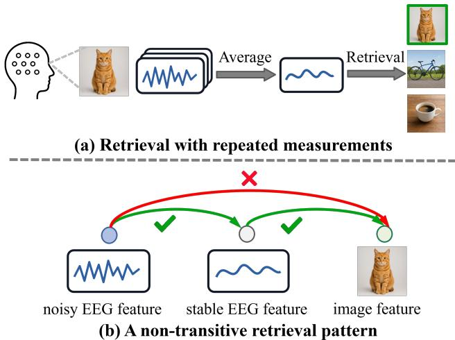
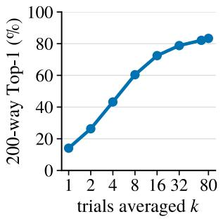
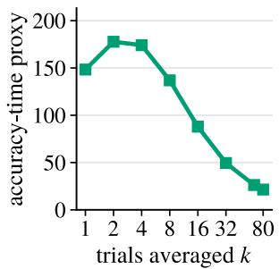
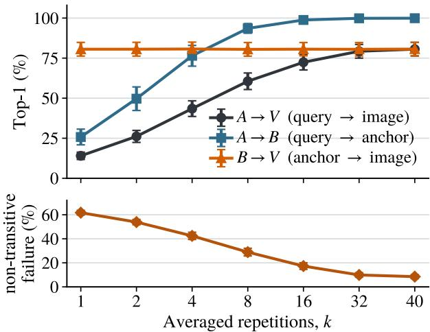
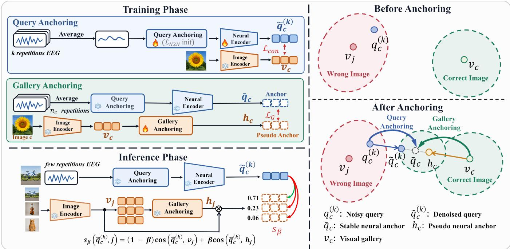
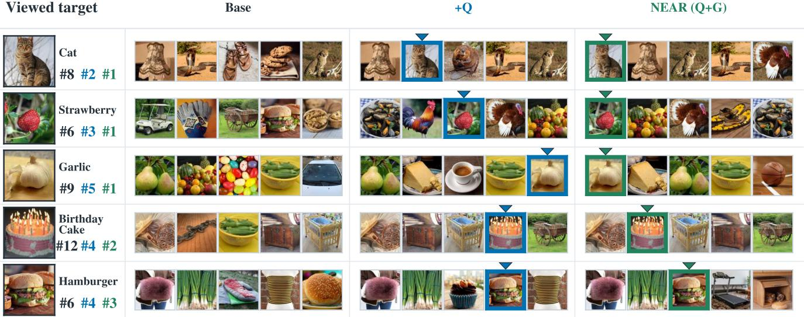
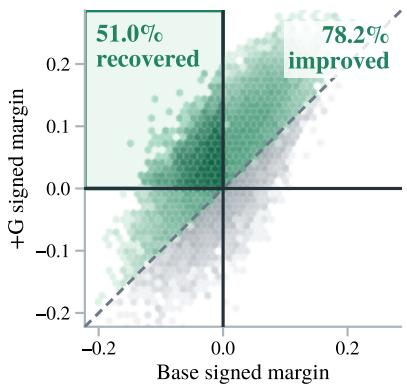

# Beyond Trial Averaging: Anchoring Neural and Visual Representations for Few-Repetition Brain-to-Image Retrieval

Zhenyao Cui, Siyuan Kan, Dingkun Liu, Dongrui Wu

School of Artificial Intelligence and Automation, Huazhong University of Science and Technology, Wuhan, China zycui@hust.edu.cn

## Abstract

Decoding visual information from brain signals probes neural representations and enables neuro-rehabilitation and dream decoding. Recent brain-to-image retrieval approaches have achieved promising performance, typically by averaging many (up to 80) neural trials per image, requiring repeated stimulus presentation that increases latency, cost, and user burden. When only one or a few repetitions are available, the retrieval accuracy drops sharply. This drop is commonly attributed to query noise because averaging suppresses noise and increases signal stability. However, we find a non-transitive alignment pattern: the low-repetition query signal and the image repre- sentation each align with the high-repetition center, but not directly with each other. This pattern shows that query noise is only part of the problem and that gallery placement also afects retrieval. We therefore propose a neural-anchor-based retrieval (NEAR) framework that treats the high-repetition center as an anchor and approaches it from both sides: a de- noiser pulls the noisy query toward the true anchor, and a small network predicts each candidate’s pseudo anchor from its image and pulls the image toward it. Across four datasets spanning EEG, MEG and fMRI, NEAR consistently improved retrieval in the few-repetition regime. On THINGS-EEG2, it improved 200-way Top-1 accuracy by 5.7 and 9.3 percent- age points respectively, when averaging one and four repeti- tions. By anchoring neural and visual representations, NEAR reduces reliance on repeated acquisition and brings neural retrieval closer to real-world deployment.

## 1 Introduction

Brain-to-image retrieval identifies the image a person is view- ing from the corresponding neural response. It can probe visual representations and support neural rehabilitation and dream decoding (Kay et al. 2008; Chaudhary, Birbaumer, and Ramos-Murguialday 2016; Horikawa et al. 2013). Mod-ern systems map EEG, MEG, or fMRI signals and candidate images to a shared space, then retrieve the image most simi- lar to the neural query. Advances in neural encoders, training objectives, and visual targets have produced strong benchmark results (Song et al. 2024; Li et al. 2024; Chen and Wei 2024; Wang et al. 2025; Tang et al. 2026).

These systems, however, often average repeated neural measurements of the same image to suppress trial-specific noise and stabilize the query across EEG, MEG, and fMRI (Giesbrecht and Garrett 2024; Hebart et al. 2023; Allen et al.

  
Figure 1: Non-transitive few-repetition retrieval. (a) Aver-aging repeated measurements produces a stable neural rep- resentation that retrieves the viewed image. (b) The few-repetition query and image each align with this representa- tion, but not reliably with each other.

2022). THINGS-EEG2, for example, presents each test image 80 times before evaluation (Giford et al. 2022; Song et al. 2024). This improves reliability but also increases latency, acquisition cost, and participant burden (Banville et al. 2025).

This dependence becomes problematic when only a few repetitions are available (Banville et al. 2025). On THINGS-EEG2, the same retriever’s 200-way Top-1 accuracy falls from 83.4% with 80 repetitions to 14.0% with one. The standard explanation is that a query from one or a few repetitions contains substantial trial-specific noise, whereas averaging reveals the stable image-evoked response (Blankertz et al. 2011; Rivet et al. 2009; Smith and Kutas 2015; Nørskov et al. 2025).

However, we find that the query is only part of this prob- lem. We design a controlled target-swap experiment and compare three paths for the same concepts: from a few- repetition query to the stable representation estimated from many repetitions of the same image, from this stable repre- sentation to the image, and directly from the query to the image. The experiment reveals the non-transitive pattern in

Figure 1: the few-repetition query and image representation each align with the stable representation, but align less well with each other. This pattern suggests improving retrieval across repetition counts by using the stable neural represen- tation as an anchor and moving both the query and image toward it.

Therefore, we propose neural-anchor-based retrieval (NEAR), which uses the stable neural representation as a common anchor through two branches. Query Anchoring denoises the few-repetition query toward its neural anchor. Gallery Anchoring predicts a pseudo anchor for each candi- date image and combines it with the original visual repre- sentation during scoring.

Across four datasets spanning EEG, MEG, and fMRI, NEAR improves each base retriever despite diferences in signal type, candidate-set size, and neural encoder. On THINGS-EEG2, it raises 200-way Top-1 accuracy by 5.7 and 9.3 percentage points with one and four repetitions, re-spectively, and improves all ten participants at both budgets. These results show that neural anchoring transfers across modalities and improves few-repetition retrieval.

Contributions.

• We reveal a non-transitive pattern that identifies the stable neural representation as an intermediate anchor between a few-repetition query and its image.

• We propose NEAR, which uses this anchor on both sides of retrieval through Query Anchoring and Gallery Anchoring. Query Anchoring denoises the few-repetition query, while Gallery Anchoring predicts a pseudo anchor for each candidate image.

• Across four datasets spanning EEG, MEG, and fMRI, NEAR improves few-repetition retrieval. Further analyses show that Gallery Anchoring improves gallery placement and complements diferent query estimators.

## 2 Related Work

Brain-to-image retrieval with repeated measurements. Most brain-to-image retrieval methods align image represen- tations with neural features averaged over repeated measure- ments. EEG s stems encode the resultin stimulus-locked response in a pretrained visual space and rank held-out im- ages by cross-modal similarity. THINGS-EEG2 averages up to 80 test responses per image, while Alljoined evaluates the same setting under lower-SNR EEG (Giford et al. 2022; Xu et al. 2025). NICE, ATM-S, MUSE, NeuroCLIP, HCF, and UBP improve the neural encoder, training objective, or visual target within this setting (Song et al. 2024; Li et al. 2024; Chen and Wei 2024; Wang et al. 2025; Tang et al. 2026; Wu et al. 2025). Related fMRI systems also use repeated presentations or averaged response estimates to stabilize the query (Scotti et al. 2023, 2024; Efird et al. 2025; Bok et al. 2026). Banville et al. systematically vary the number of averaged responses across EEG, MEG, and fMRI datasets and show consistent but diminishing gains (Banville et al. 2025). The retrieval studies above demonstrate the gains from repeated averaging, while Banville et al. quantify their diminishing re- turns. Our work likewise studies few-repetition retrieval, but further investigates why its accuracy degrades and proposes a method to improve it.

Few-repetition neural-signal estimation and denoising. Across EEG, MEG, and fMRI, repeated averaging aims to re- cover a stable stimulus-linked response from noisy measure- ments. EEG and MEG average time-locked trials to suppress ongoing activity and sensor noise, while fMRI combines responses from repeated presentations to stabilize voxel- response estimates (Blankertz et al. 2011; Hebart et al. 2023; Allen et al. 2022). When only a few repetitions are avail-able, denoising methods pursue the same goal without exten- sive averaging. Spatial filters reweight channels to emphasize event-related components. Regression-based estimators and robust averaging recover the shared response while limiting nuisance variation. Learned denoisers predict the common signal from independently noisy recordings (Makeig et al. 1996; Rivet et al. 2009; Smith and Kutas 2015; Nørskov et al. 2025; Lehtinen et al. 2018). These methods motivate NEAR’s query branch. Unlike these denoising methods, we identify a broader pattern in brain-to-image retrieval: few- repetition accuracy depends jointly on the query and gallery. Gallery-side correction is therefore needed alongside query denoising.

Stimulus-to-brain encoding models. Stimulus-to-brain encoding models provide the closest precedent for predict- ing neural references from stimuli. Kay et al. predict can- didate voxel patterns for fMRI identification, Giford et al. map image features to channel-by-time EEG responses, and Concept2Brain synthesizes multi-channel EEG through an electrophysiological latent space (Kay et al. 2008; Giford et al. 2022; Santos-Mayo et al. 2026). These studies show that moving stimuli toward neural space can improve decod- ing, although they primarily predict responses in the original measurement space. NEAR focuses on retrieval with fewer repetitions. Guided by the non-transitive analysis above, it moves both the query and gallery toward the same stable neural anchor in the learned retrieval space.

## 3 Neural-Anchor-Based Retrieval

Problem setup. For concept $c ,$ let $x _ { c , i }$ denote the neural measurement at repetition $i ,$ let $n _ { c }$ denote the number of repetitions of that concept available for training, and let $v _ { c }$ denote its frozen visual feature. We define the measurement averaged over exactly k repetitions and the resulting noisy query as

$$
x _ { c } ^ { ( k ) } = \frac { 1 } { k } \sum _ { i = 1 } ^ { k } x _ { c , i } , \qquad q _ { c } ^ { ( k ) } = f _ { \theta } \Big ( x _ { c } ^ { ( k ) } \Big ) .\tag{1}
$$

We reserve $\bar { q } _ { c }$ for a stable neural anchor estimated from the larger reference set available in the current split. The target- swap analysis uses repetitions disjoint from the k query rep-etitions, while Gallery Anchoring uses all available train- ing repetitions. All neural, visual, and pseudo-anchor em- beddings are $\ell _ { 2 } { \mathrm { - n o r m a l i z e d } }$ before scoring. The standard retriever ranks candidates by $\left( q _ { c } ^ { ( k ) } \right) ^ { \top } v _ { j }$ and returns the highest-scoring image. Throughout, j indexes candidates in the gallery; when a competitor is meant we write $j \neq c .$ Existing systems stabilize this query through extensive aver- aging. We study the same task with few repetitions.

  
(a) Accuracy saturates

  
(b) Return peaks early  
Figure 2: Accuracy and acquisition return across repetitions. (a) Accuracy rises quickly and then approaches a plateau. (b) Stimulus-time-normalized ITR peaks at $k = 2$ because later gains no longer ofset added stimulus time.

Few-repetition accuracy and acquisition return. We first fix the retriever, preprocessing, and gallery and vary only k to observe how Top-1 accuracy changes. Figure 2a shows that accuracy rises quickly and then approaches a plateau. Each repetition, however, requires another stimulus presentation, so accuracy alone cannot capture the practical trade-of be- tween retrieval performance and acquisition cost. We also use the standard Wolpaw information-transfer rate (ITR), which combines To -1 accurac amon N candidates with tota stimulus time to report information transferred per minute (Wolpaw et al. 2002; McFarland, Sarnacki, and Wolpaw 2003). Figure 2b shows that acquisition eficiency peaks at $k = 2$ and then declines because later gains no longer ofset the added stimulus time. Thus, although accuracy remains low with few repetitions, this regime ofers the highest re- turn per unit acquisition time and is the most relevant range for practical improvement.

## 3.1 Analyzing the Retrieval Gap

Controlled target swap. Test-time averaging improves signal-to-noise ratio and decoding performance, with dimin- ishing returns as more repetitions are added (Banville et al. 2025). This naturally suggests an unstable query as the main source of the low-repetition decline. However, the repetition curve alone does not show how much stable stimulus infor- mation a few-repetition query already contains. We therefore construct a few-repetition query $q _ { c } ^ { ( k ) }$ and a stable neural rep- resentation $\bar { q } _ { c }$ from disjoint repetitions of the same image. Most prior work efectively evaluates $\bar { q } _ { c } \to v _ { c } \colon$ it averages many repetitions to obtain a stable query and retrieves the corresponding image from the visual gallery. We retain this conventional path, introduce $q _ { c } ^ { ( k ) } {  } \bar { q } _ { c }$ , and evaluate ${ q } _ { c } ^ { ( k ) } {  } v _ { c }$ as the direct few-repetition path. All three comparisons use the same candidate concepts and gallery size. Only the query or target representation changes.

  
Figure 3: Target swap exposes non-transitive retrieval. With $q _ { c } ^ { ( \overline { { k } } ) }$ and $\bar { q } _ { c }$ estimated from disjoint repetitions, $q _ { c } ^ { ( k ) }$ retrieves $\bar { q } _ { c }$ more accurately than its image $v _ { c }$ (top). Direct retrieval can still fail when $q ^ { ( k ) } {  } \bar { q }$ and $\bar { q } \to v$ both succeed (bottom).

Stable neural information emerges early. Figure 3 shows how the accuracies of the three target-swap paths change with $k .$ . The $q ^ { ( k ) } {  } \bar { q }$ path rises from 25.8% at $k = 1$ to 76.5% at $k = 4$ and 93.6% at $k = 8 ,$ , showing that a few-repetition query already contains stable stimulus information. $\mathrm { A t } k = 4 .$ $\bar { q } \to v$ and $q ^ { ( k ) } {  } \bar { q }$ reach 80.7% and 76.5%, while direct $\bar { q } ^ { ( k ) } \to v$ reaches only 43.5%. This gap also appears within the same cases: when both paths through q¯succeed, direct retrieval still fails in 42.4% of them. We call this phenomenon a non-transitive pattern: a few-repetition query can retrieve its stable neural representation, and that representation can retrieve the image, while direct query-to-image retrieval re- mains unreliable. To exclude an advantage from comparing two neural representations, we keep the anchor gallery fixed and permute the concept–anchor correspondence. Accuracy drops to 0.1%, confirming that this path relies on the cor-rect concept-specific anchor. This intermediate connection suggests using $\bar { q } _ { c }$ as a common anchor for the few-repetition query and candidate image.

## 3.2 A Two-Term Retrieval Condition

Let c be the correct concept and $\textit { j } \ne \textit { c }$ a competitor, with normalized visual features $v _ { c }$ and $v _ { j }$ . Because co- sine similarity is their dot product, c ranks above $j$ when $\left( q _ { c } ^ { ( k ) } \right) ^ { \top } ( v _ { c } - v _ { j } ) > 0$ . Let $\epsilon _ { c } ^ { ( k ) } = q _ { c } ^ { ( k ) } - \bar { q } _ { c }$ denote the query error after averaging k repetitions. Substitution sepa-rates the score advantage into two terms:

$$
\begin{array} { r } { \left( { q } _ { c } ^ { ( k ) } \right) ^ { \top } ( v _ { c } - v _ { j } ) = \bar { q } _ { c } ^ { \top } \big ( v _ { c } - v _ { j } \big ) + \left( \epsilon _ { c } ^ { ( k ) } \right) ^ { \top } \big ( v _ { c } - v _ { j } \big ) . } \end{array}\tag{2}
$$

We call the first term $\gamma _ { c j } = \bar { q } _ { c } ^ { \top } ( v _ { c } - v _ { j } )$ the stable gallery margin: the correct image’s advantage over $j$ when the query is exactly at its stable anchor. The second term is the amount by which the remaining query error raises or lowers this advantage. Thus, retrieval depends on both the gallery margin and the query error.

To determine how much query error the gallery can tol- erate, we consider the most harmful error direction. The Cauchy–Schwarz inequality (Boyd and Vandenberghe 2004) bounds the magnitude of the second term:

$$
\begin{array} { r l } & { \left| \left( { \epsilon } _ { c } ^ { ( k ) } \right) ^ { \top } ( v _ { c } - v _ { j } ) \right| \le \left\| { \epsilon } _ { c } ^ { ( k ) } \right\| _ { 2 } \left\| v _ { c } - v _ { j } \right\| _ { 2 } , } \\ & { \left( q _ { c } ^ { ( k ) } \right) ^ { \top } \left( v _ { c } - v _ { j } \right) \ge \gamma _ { c j } - \left\| { \epsilon } _ { c } ^ { ( k ) } \right\| _ { 2 } \left\| v _ { c } - v _ { j } \right\| _ { 2 } . } \end{array}
$$

Therefore, a suficient condition for the correct image to remain above every competitor is

$$
\left\| \epsilon _ { c } ^ { ( k ) } \right\| _ { 2 } < \rho _ { c } , \qquad \rho _ { c } = \operatorname* { m i n } _ { j \neq c } \frac { \gamma _ { c j } } { \left\| v _ { c } - v _ { j } \right\| _ { 2 } } .\tag{3}
$$

For each competitor, this ratio is the distance from $\bar { q } _ { c }$ to the decision boundary where j overtakes $c .$ Their minimum, $\rho _ { c } ,$ is the gallery tolerance. Any query error smaller than a positive $\rho _ { c }$ is guaranteed to preserve every ranking, although larger errors may still succeed because the bound uses the worst direction. A non-positive $\rho _ { c }$ means that moving the query to its stable anchor alone cannot guarantee correction.

This condition also explains how the two terms interact across repetition counts. At very low k, large query error dominates the ranking. As averaging stabilizes the query, more cases approach the decision boundary, where a larger gallery tolerance can move them to the correct side. At high k, the query is already precise, but Gallery Anchoring can still recover concepts with small or non-positive stable margins.

The two terms directly motivate NEAR. Query Anchoring replaces $q _ { c } ^ { ( k ) }$ with the denoised query $\tilde { q } _ { c } ^ { ( k ) }$ to reduce its error from $\bar { q } _ { c }$ . Gallery Anchoring predicts a pseudo anchor $h _ { j }$ for each candidate and uses it to increase the stable gallery margin. The two branches therefore target the query error and gallery tolerance $\rho _ { c } .$ . Figure 4 summarizes their training and inference.

## 3.3 Query Anchoring

Query Anchoring denoises the measured signals before neu-ral encoding. We use Noise2Noise as the denoising module (Lehtinen et al. 2018). Consider two repetitions of the same training image, $x _ { c , a } = u _ { c } + n _ { a }$ and $x _ { c , b } = u _ { c } + n _ { b } .$ , where $u _ { c }$ is their shared stimulus-linked response and the two zero- mean noise terms are independent. We train the denoiser $a _ { \phi }$ to predict one repetition from the other:

$$
\mathcal { L } _ { \mathrm { N 2 N } } = \| a _ { \phi } ( x _ { c , a } ) - x _ { c , b } \| _ { 2 } ^ { 2 } .\tag{4}
$$

Because the target noise $n _ { b }$ is independent of the input, it can- not be predicted consistently and averages out across training pairs. The expected squared loss therefore retains the shared response $u _ { c }$ without requiring a clean target (Lehtinen et al. 2018).

After this initialization, we train $a _ { \phi }$ and the neural encoder $f _ { \theta }$ on averages with diferent repetition counts using a stan- dard symmetric contrastive retrieval loss ${ \mathcal { L } } _ { \mathrm { c o n } }$ (Radford et al. 2021). Its two directions bring matching neural and image embeddings closer while separating mismatched pairs. At inference, we average the k repetitions, apply $a _ { \phi }$ , and encode the denoised signal with $f _ { \theta }$ to obtain $\tilde { q } _ { c } ^ { ( k ) }$

For datasets whose training SNR is too low to train Noise2Noise reliably, we instead use fixed wavelet thresh- olding. We apply the fixed operator w to each repetition, average the filtered signals, and encode them with $f _ { \theta } .$ This pathway uses the same contrastive loss while keeping w fixed. Both pathways accept any repetition count because averag- ing preserves the signal shape. Without Query Anchoring, $\tilde { q } _ { c } ^ { ( \bar { k } ) } = q _ { c } ^ { ( k ) }$ . After training either query pathway, we freeze it before training Gallery Anchoring.

## 3.4 Gallery Anchoring and Retrieval

We encode the average of the $n _ { c }$ training repetitions as $\bar { q } _ { c } =$ $\tilde { q } _ { c } ^ { ( n _ { c } ) }$ , the most stable neural target available for concept c. When Query Anchoring is absent, $\tilde { q } _ { c } ^ { ( k ) } = q _ { c } ^ { ( k ) }$

Then, we freeze the neural and visual encoders and train an image-to-neural predictor $g _ { \psi }$ on these targets:

$$
h _ { c } = g _ { \psi } ( v _ { c } ) , \qquad { \mathcal { L } } _ { \mathrm { G } } = 1 - \cos ( h _ { c } , { \bar { q } } _ { c } ) .\tag{5}
$$

Cosine re ression directl fits each candidate reference to the stable neural target identified by the analysis. For an unseen candidate ${ j , h _ { j } = g _ { \psi } ( v _ { j } ) }$ predicts its unavailable $\bar { q } _ { j }$ from the image alone. We call $h _ { j }$ a pseudo anchor.

However, a pseudo anchor can contain prediction error, while the original visual feature retains useful semantic in- formation. We therefore score each candidate with both ref- erences:

$$
s _ { \beta } \Big ( \tilde { q } _ { c } ^ { ( k ) } , j \Big ) = ( 1 - \beta ) \cos \Big ( \tilde { q } _ { c } ^ { ( k ) } , v _ { j } \Big ) + \beta \cos \Big ( \tilde { q } _ { c } ^ { ( k ) } , h _ { j } \Big ) .\tag{6}
$$

Here $\beta \in [ 0 , 1 ]$ balances the two similarities. Setting $\beta = 0$ gives standard visual-gallery scoring, while $\beta = 1$ uses only pseudo anchors. At the stable anchor, (6) changes the gallery term in (2) from $\gamma _ { c j } \mathrm { t o } ( 1 - \beta ) \gamma _ { c j } + \beta \bar { q } _ { c } ^ { \top } ( h _ { c } - \bar { h } _ { j } )$ . Training $h _ { c }$ toward $\bar { q } _ { c }$ makes the new term favor the correct candi- date, increasing the gallery tolerance $\rho _ { c } .$ . Query Anchoring instead reduces the query error. The signed-margin analysis in Section 4.3 tests this efect directly.

## 4 Experiments

## 4.1 Experimental Setup

Our primary evaluation uses two 200-way within-subject EEG benchmarks. THINGS-EEG2 has 10 participants and multiple training and test repetitions, while Alljoined-1.6M has 20 participants and lower-SNR EEG (Giford et al. 2022; Xu et al. 2025). Because both provide multiple training rep- etitions, we evaluate Query and Gallery Anchoring together across repetition counts. For these EEG datasets, repetitions of the training images provide stable targets for the gallery predictor, which receives only candidate image representa- tions at inference.

Besides these EEG benchmarks, we use THINGS-MEG and NSD. THINGS-MEG has multiple test repetitions but one training repetition per stimulus, so we keep its query pathway fixed and evaluate Gallery Anchoring alone (Hebart et al. 2023). The published NSD decoder already provides a usable query from individual 7T fMRI repetitions, so we also keep this pathway fixed and use NSD to isolate Gallery Anchoring. For each participant, we use 8,018 non-test im- ages to fit the query decoder and gallery predictor, with 1,000 additional non-test images used to select the query decoder. The 982 images shared across participants and all their fMRI repetitions are reserved for retrieval evaluation (Allen et al. 2022; Efird et al. 2025; Bok et al. 2026).

  
Figure 4: Training and inference in NEAR. Query Anchoring is learned from k-repetition averages and then frozen; Gallery Anchoring is learned from image–anchor pairs, using all $n _ { c }$ training repetitions of concept c to form the anchor $\bar { q } _ { c }$ . At inference the two branches give a denoised query and a pseudo anchor per candidate, and $\otimes$ combines the two cosine similarities, not the two representations, as in (6). The right panels illustrate both efects.

For both EEG benchmarks, we follow HCF’s preprocess- ing, neural encoder, visual head, and within-subject protocol (Tang et al. 2026). THINGS-EEG2 uses the Noise2Noiseinitialized, repetition-count-aware query pathway. Alljoined has lower training SNR, and matched comparisons favor fixed wavelet thresholding in this regime. We apply it to each rep- etition before averaging.

THINGS-MEG follows its published preprocessing and within-subject retriever (Hebart et al. 2023). For NSD, we follow the global-vector setting of Efird et al. and evaluate the CLIP and robust FARE targets used by Bok et al. (Efird et al. 2025; Bok et al. 2026). By default, $g _ { \psi }$ is an MLP with 2,048 units in each hidden layer. Each comparison changes only the tested component, and we fix $\beta = 0 . 7 5$ across all datasets and repetition counts. Tables and figures use Base to denote the corresponding unanchored retriever. Unless stated otherwise, results average three fixed seeds, and standard deviations are reported where available. We report Top-1 accuracy throughout.

## 4.2 Main Results on EEG

Table 1 compares the unanchored retriever, each anchoring branch, and complete NEAR under the same HCF setting. Complete NEAR exceeds the unanchored retriever at ev- ery reported repetition count on both EEG benchmarks. On THINGS-EEG2, it adds 9.3 Top-1 points at $k = 4$ , and all ten participants improve at every reported repetition count. On lower-SNR Alljoined, at least 18 of 20 participants im-prove at every reported count, including all 20 at $k = 4$ Figure 5 illustrates how the two branches improve individual retrievals at k = 4: Query Anchoring raises the target rank, and complete NEAR places every shown target within the top three.

The trends match the two-term condition in Section 3.2. Query Anchoring contributes more at the lowest repetition counts, when query error is largest. As averaging stabilizes the query, Gallery Anchoring contributes more by improving the stable gallery margin and still helps high-k concepts with limited margins. Lower SNR keeps Query Anchoring useful across Alljoined. Their combination therefore improves retrieval throughout the repetition axis.

Besides, we test whether Gallery Anchoring depends on the query denoiser by combining it with xDAWN, DSS, Noise2Noise, and wavelet thresholding while keeping HCF fixed. Gallery Anchoring improves every repetition count on both EEG datasets for all four estimators. Thus, the gallery- side error persists across denoisers, and Gallery Anchoring corrects it without relying on one estimator.

<table><tr><td>Dataset</td><td>Method</td><td>k=1</td><td>4</td><td>8</td><td>16</td><td>32</td><td>64</td><td>80</td></tr><tr><td rowspan="4">THINGS-EEG2</td><td>Base</td><td>14.0±0.00</td><td> $4 3 . 2 { \pm } 0 . 1 0 $ </td><td> $6 0 . 4 { \pm } 0 . 3 0 $ </td><td> $7 2 . 5 { \pm } 0 . 3 0 $ </td><td> $7 8 . 8 { \pm } 0 . 3 0 $ </td><td> $8 2 . 1 { \pm } 0 . 1 0 $ </td><td> $8 3 . 4 { \pm } 0 . 3 0 $ </td></tr><tr><td> $+ \mathbf { Q }$ </td><td> $1 8 . 4 { \pm } 0 . 1 0 $ </td><td> $4 7 . 5 { \pm } 0 . 4 0 $ </td><td> $6 2 . 1 { \pm } 0 . 4 0 $ </td><td> $7 1 . 7 { \pm } 0 . 3 0 $ </td><td> $7 7 . 2 { \pm } 0 . 4 0 $ </td><td> $7 9 . 9 { \pm } 0 . 5 0 $ </td><td> $8 0 . 5 { \pm } 0 . 3 0 $ </td></tr><tr><td>+G</td><td> $1 4 . 9 { \pm } 0 . 1 0 $ </td><td> $4 7 . 0 { \pm } 0 . 1 0 $ </td><td> $6 5 . 6 { \pm } 0 . 2 0 $ </td><td> $7 7 . 9 { \pm } 0 . 3 0 $ </td><td> $8 4 . 1 { \pm } 0 . 2 0 $ </td><td> $\mathbf { 8 7 . 5 } \pm 0 . 3 0$ </td><td> $\mathbf { 8 8 . 0 \pm 0 . 1 0 }$ </td></tr><tr><td>NEAR</td><td> ${ \bf 1 9 . 8 \pm 0 . 1 0 }$ </td><td> $5 2 . 5 { \pm } 0 . 2 0 $ </td><td> ${ \bf 6 8 . 5 \pm 0 . 2 0 }$ </td><td> $\mathbf { 7 9 . 0 { \pm } 0 . 2 0 }$ </td><td> $\pm 0 . 2 0$ </td><td> $8 7 . 1 { \pm } 0 . 5 0 $ </td><td> $8 7 . 6 { \pm } 0 . 4 0 $ </td></tr><tr><td rowspan="4">Alljoined</td><td>Base</td><td> $1 . 4 1 { \pm } 0 . 0 1$ </td><td> $2 . 8 5 { \pm } 0 . 0 7$ </td><td> $4 . 4 1 { \pm } 0 . 1 0$ </td><td> $6 . 8 1 { \pm } 0 . 1 0 $ </td><td> $9 . 5 7 { \pm } 0 . 3 0 $ </td><td> $1 2 . 9 3 { \pm } 0 . 4 7 $ </td><td> $1 4 . 3 0 { \pm } 0 . 5 7 $ </td></tr><tr><td> $+ \mathbf { Q }$ </td><td> $1 . 7 9 { \pm } 0 . 0 0$ </td><td> $3 . 7 3 { \pm } 0 . 0 4$ </td><td> $5 . 6 5 { \pm } 0 . 0 5$ </td><td> $8 . 4 2 { \pm } 0 . 0 4$ </td><td> $1 1 . 6 8 { \pm } 0 . 1 5 $ </td><td> $1 5 . 5 6 { \pm } 0 . 2 1 $ </td><td> $1 6 . 7 2 { \scriptstyle \pm 0 . 0 6 }$ </td></tr><tr><td> $+ \mathrm { G }$ </td><td> $1 . 5 1 { \pm } 0 . 0 1$ </td><td> $3 . 1 7 { \pm } 0 . 0 8$ </td><td> $4 . 9 2 { \pm } 0 . 0 7$ </td><td> $7 . 5 2 { \pm } 0 . 1 4$ </td><td> $1 0 . 6 0 { \pm } 0 . 2 9 \ $ </td><td> $1 4 . 1 8 { \pm } 0 . 1 6$ </td><td> $1 5 . 6 9 { \pm } 0 . 5 2 $ </td></tr><tr><td>NEAR</td><td> ${ \bf 1 . 9 8 { \pm } } 0 . 0 1 $ </td><td> $\mathbf { 4 . 2 9 } { \pm } 0 . 0 5$ </td><td> ${ \bf 6 . 6 4 \pm 0 . 0 4 }$ </td><td> ${ \bf 9 . 7 9 2 0 . 1 0 }$ </td><td> ${ \pm 0 . 6 0 \pm 0 . 2 3 }$ </td><td> $1 7 . 7 2 { \scriptstyle \pm 0 . 2 9 }$ </td><td> ${ \bf 1 8 . 8 4 \pm 0 . 2 5 }$ </td></tr></table>

Table 1: Top-1 accuracy (%) on THINGS-EEG2 (10 participants) and Alljoined (20 participants). Bold marks the best result at each repetition count.

Figure 5: Representative THINGS-EEG2 retrievals at $k = 4 .$ . Colored borders mark the target among the top five under Base, +Q, and NEAR.
<table><tr><td>Dataset</td><td>Query estimator</td><td>k=1</td><td>2</td><td>4</td><td>8</td><td>16</td><td>32</td><td>64</td><td>80</td></tr><tr><td rowspan="4">THINGS-EEG2</td><td>xDAWN</td><td>16.8/17.9</td><td>28.7/31.4</td><td>43.7/48.5</td><td>57.6/64.6</td><td>67.1/75.7</td><td>72.8/81.5</td><td>75.1/84.3</td><td>75.9/84.7</td></tr><tr><td>DSS</td><td>17.9/18.9</td><td>30.6/33.0</td><td>46.6/50.9</td><td>61.2/67.3</td><td>70.6/78.0</td><td>75.9/83.3</td><td>78.8/85.6</td><td>79.7/86.2</td></tr><tr><td>N2N</td><td>18.4/19.8</td><td>31.3/34.3</td><td>47.5/52.5</td><td>62.1/68.5</td><td>71.7/79.0</td><td>77.2/84.4</td><td>79.9/87.1</td><td>80.5/87.6</td></tr><tr><td>Wavelet</td><td>9.9/10.5</td><td>17.0/18.5</td><td>26.6/29.7</td><td>36.6/41.8</td><td>44.4/51.8</td><td>49.7/58.2</td><td>53.1/62.3</td><td>54.0/63.5</td></tr><tr><td rowspan="4">Alljoined</td><td>xDAWN</td><td>1.46/1.59</td><td>1.99/2.22</td><td>2.96/3.36</td><td>4.62/5.34</td><td>6.83/7.89</td><td>9.46/11.08</td><td>12.82/14.34</td><td>13.69/15.15</td></tr><tr><td>DSS</td><td>1.41/1.53</td><td>1.91/2.15</td><td>2.80/3.21</td><td>4.35/5.04</td><td>6.63/7.68</td><td>9.35/10.37</td><td>11.78/13.34</td><td>12.83/14.18</td></tr><tr><td>N2N</td><td>1.60/1.85</td><td>2.26/2.67</td><td>3.22/3.96</td><td>4.84/6.13</td><td>7.01/9.01</td><td>9.61/12.18</td><td>12.40/15.22</td><td>13.43/16.14</td></tr><tr><td>Wavelet</td><td>1.79/1.98</td><td>2.50/2.82</td><td>3.73/4.29</td><td>5.65/6.64</td><td>8.42/9.79</td><td>11.68/13.60</td><td>15.56/17.72</td><td>16.72/18.84</td></tr></table>

Table 2: Gallery Anchoring complements four query estimators. Each cell reports fixed-query / +G Top-1 accuracy (%), averaged over three seeds.

## 4.3 Gallery Anchoring Across Modalities

Table 3 keeps each query pathway fixed and isolates Gallery Anchoring. Gallery Anchoring improves every MEG and fMRI comparison, including both NSD visual targets. All four participants in each dataset improve at every reported repetition count. Thus, the gallery-side error found in EEG also appears in other brain-imaging modalities, where the same operation improves retrieval.

The NSD gain lets us test the gallery-side mechanism di- rectly. We average held-out repetitions to estimate each test anchor, which enters neither predictor fitting nor +G retrieval. Using it as the query, we compute the signed gallery tolerance $\rho _ { c }$ under unanchored and anchored scores. Positive values indicate correct rankings and negative values indi- cate errors. Figure 6 shows that Gallery Anchoring increases $\rho _ { c }$ for 78.2% of evaluations and corrects 51.0% of negative unanchored values. The mean rises from 0.008 to 0.050, increasing in all 12 participant–seed runs. Thus, pseudo an- chors improve the stable gallery margin and often correct rankings that remain wrong at the stable neural anchor.

<table><tr><td colspan="5">THINGS-MEG (200-way)</td></tr><tr><td>Split</td><td>Method</td><td>k=1</td><td>k=4</td><td>k=12</td></tr><tr><td>Within-subject</td><td>Base +G</td><td> $7 . 5 { \pm } 0 . 4 0 $   $\pm 0 . 1 0$ </td><td> $1 9 . 8 { \pm } 0 . 1 0 $   $2 1 . 9 { \pm } 0 . 4 0 $ </td><td> $3 0 . 9 { \pm } 0 . 3 0 $   $3 2 . 7 { \pm } 1 . 1 0 $ </td></tr><tr><td></td><td colspan="3">NSD 7T fMRI (982-way)</td><td></td></tr><tr><td>Visual target</td><td>Method</td><td>k=1</td><td>k=2</td><td> $k { = } 3$ </td></tr><tr><td rowspan="2">CLIP ViT-L/14</td><td>Base</td><td>27.5±0.20</td><td>37.8±0.10</td><td> $4 3 . 9 { \pm } 0 . 4 0 $ </td></tr><tr><td>+G</td><td>39.4±0.20</td><td>52.1±0.20</td><td> $5 7 . 5 { \pm } 0 . 2 0 $ </td></tr><tr><td rowspan="2">FARE-4 (robust)</td><td>Base</td><td>39.6±0.10</td><td>51.6±0.10</td><td> $5 6 . 8 { \pm } 0 . 2 0 $ </td></tr><tr><td>+G</td><td>54.6±0.20</td><td>68.6±0.10</td><td> $7 4 . 3 { \pm } 0 . 2 0 $ </td></tr></table>

Table 3: Gallery Anchoring improves MEG and fMRI Top-1 accuracy (%) with each query pathway fixed.

  
Figure 6: Gallery Anchoring improves NSD gallery place- ment. Each point is one held-out image for one participant and seed; the upper-left region marks corrected errors.

## 4.4 Stable Targets Drive Gallery Anchoring

To identify what drives Gallery Anchoring, we design matched controls in Table 4. We fix the retriever, query pathway, candidate set, and β, then replace the MLP with ridge regression, replace cosine regression with symmetric InfoNCE, or replace the stable anchor with a single-repetition neural target. Ridge uses 1.0M rather than 8.4M parameters, yet stays within 0.34 points of the MLP across all four budgets. Symmetric InfoNCE retains 59–77% of the MLP gain from $k = 4$ onward, so the gain does not depend on a large nonlinear predictor or one regression loss. The target gives the clearest separation: a single-repetition target helps most at $k = 1$ but falls below the unanchored retriever at $k = 8 0$ whereas every stable-target predictor improves as the query approaches its stable reference. This reversal supports Sec- tion 3.2: Gallery Anchoring works by placing candidates near the stable reference approached by averaged queries.

<table><tr><td>Candidate reference</td><td>k=1</td><td>4</td><td>16</td><td>80</td></tr><tr><td>Base (visual)</td><td>14.05</td><td>43.23</td><td>72.46</td><td>83.35</td></tr><tr><td>Single-repetition target</td><td>15.78</td><td>45.57</td><td>72.41</td><td>81.98</td></tr><tr><td>Stable target, InfoNCE</td><td>14.51</td><td>45.43</td><td>76.25</td><td>86.90</td></tr><tr><td>Stable target, ridge</td><td>14.85</td><td>46.73</td><td>77.59</td><td>87.67</td></tr><tr><td>Stable target, MLP (+G)</td><td>14.91</td><td>46.99</td><td>77.93</td><td>87.97</td></tr></table>

Table 4: Gallery controls on THINGS-EEG2. Three-seed mean Top-1 accuracy (%) with all components except the candidate reference fixed.

## 5 Conclusion

We studied why brain-to-image retrieval degrades with few repetitions. Target swap shows that a few-repetition query and its image can each align with a stable neural representation even when their direct alignment is weak. NEAR uses this shared anchor to denoise the query and predict a pseudo neural anchor for each gallery image.

Across EEG, MEG, and fMRI, NEAR improves retrieval with diferent query denoisers. Its gains follow the stable neu- ral target across predictor classes and objectives, while signed margins confirm better gallery ordering. Thus, repeated av- eraging reveals a neural coordinate that can organize both sides of retrieval.

However, NEAR requires paired brain–image training data, and its participant-specific pseudo anchors must be adapted across participants and sessions. Few-repetition ac- curacy also remains below the high-repetition endpoint. Participant-aware prediction and stronger query estimation may further reduce the repetitions needed for reliable re- trieval.

## References

Allen, E. J.; St-Yves, G.; Wu, Y.; Breedlove, J. L.; Prince, J. S.; Dowdle, L. T.; Nau, M.; Caron, B.; Pestilli, F.; Charest, I.; Hutchinson, J. B.; Naselaris, T.; and Kay, K. N. 2022. A Massive 7T fMRI Dataset to Bridge Cognitive Neuroscience and Artificial Intelligence. Nature Neuroscience, 25: 116– 126.

Banville, H.; Benchetrit, Y.; d’Ascoli, S.; Rapin, J.; and King, J.-R. 2025. Scaling laws for decoding images from brain activity. arXiv preprint arXiv:2501.15322.

Blankertz, B.; Lemm, S.; Treder, M.; Haufe, S.; and Müller, K.-R. 2011. Single-trial analysis and classification of ERP components—a tutorial. NeuroImage, 56(2): 814–825.

Bok, B.; Waseda, F.; Liu, J.; and Echizen, I. 2026. Rethink- ing Brain Decoding with CLIP: The Role of Adversarial Robustness. arXiv preprint arXiv:2607.03165.

Boyd, S.; and Vandenberghe, L. 2004. Convex Optimization. Cambridge University Press.

Chaudhary, U.; Birbaumer, N.; and Ramos-Murguialday, A. 2016. Brain–Computer Interfaces for Communication and Rehabilitation. Nature Reviews Neurology, 12: 513–525.

Chen, C.-S.; and Wei, C.-S. 2024. Mind’s Eye: Image Recog- nition by EEG via Multimodal Similarity-Keeping Con- trastive Learning. arXiv preprint arXiv:2406.16910.

Efird, C. D.; Murphy, A.; Zylberberg, J.; and Fyshe, A. 2025. Finding Shared Decodable Concepts and their Negations in the Brain. In International Conference on Learning Representations (ICLR).

Giesbrecht, B.; and Garrett, J. 2024. Electroencephalogra- phy. In Reference Module in Neuroscience andBiobehavioral Psychology. Elsevier.

Giford, A. T.; Dwivedi, K.; Roig, G.; and Cichy, R. M. 2022. A large and rich EEG dataset for modeling human visual object recognition. NeuroImage, 264: 119754.

Hebart, M. N.; Contier, O.; Teichmann, L.; Rockter, A. H.; Zheng, C. Y.; Kidder, A.; Corriveau, A.; Vaziri-Pashkam, M.; and Baker, C. I. 2023. THINGS-data, a multimodal collection of large-scale datasets for investigating object representations in human brain and behavior. eLife, 12: e82580.

Horikawa, T.; Tamaki, M.; Miyawaki, Y.; and Kamitani, Y. 2013. Neural Decoding of Visual Imagery During Sleep. Science, 340(6132): 639–642.

Kay, K. N.; Naselaris, T.; Prenger, R. J.; and Gallant, J. L. 2008. Identifying natural images from human brain activity. Nature, 452(7185): 352–355.

Lehtinen, J.; Munkberg, J.; Hasselgren, J.; Laine, S.; Karras, T.; Aittala, M.; and Aila, T. 2018. Noise2Noise: Learning Image Restoration without Clean Data. In International Conference on Machine Learning (ICML).

Li, D.; Wei, C.; Li, S.; Zou, J.; and Liu, Q. 2024. Visual Decoding and Reconstruction via EEG Embeddings with Guided Difusion. In Advances in Neural Information Processing Systems (NeurIPS).

Makeig, S.; Bell, A. J.; Jung, T.-P.; and Sejnowski, T. J. 1996. Independent Component Analysis of Electroen- cephalographic Data. In Advances in Neural Information Processing Systems (NeurIPS).

McFarland, D. J.; Sarnacki, W. A.; and Wolpaw, J. R. 2003. Brain–computer interface (BCI) operation: optimizing information transfer rates. Biological Psychology, 63(3): 237– 251.

Nørskov, A. V.; Jørgensen, K.; Zahid, A. N.; and Mørup, M. 2025. Estimating the Event-Related Potential from Few EEG Trials. Transactions on Machine Learning Research.

Radford, A.; Kim, J. W.; Hallacy, C.; Ramesh, A.; Goh, G.; Agarwal, S.; Sastry, G.; Askell, A.; Mishkin, P.; Clark, J.; Krueger, G.; and Sutskever, I. 2021. Learning Transferable Visual Models From Natural Language Supervision. In International Conference on Machine Learning (ICML).

Rivet, B.; Souloumiac, A.; Attina, V.; and Gibert, G. 2009. xDAWN algorithm to enhance evoked potentials: application to brain–computer interface. IEEE Transactions on Biomedical Engineering, 56(8): 2035–2043.

Santos-Mayo, A.; Gilbert, F.; Mirifar, A.; Tebbe, A.-L.; Fang, R.; Ding, M.; and Keil, A. 2026. Concept2Brain: an AI model for predicting neurophysiological responses to text and pictures. Nature Communications.

Scotti, P. S.; Banerjee, A.; Goode, J.; Shabalin, S.; Nguyen, A.; Cohen, E.; Dempster, A. J.; Verlinde, N.; Yundler, E.; Weisberg, D.; Norman, K. A.; and Abraham, T. M. 2023.

Reconstructing the Mind’s Eye: fMRI-to-Image with Con- trastive Learning and a Difusion Prior. In Advances in Neural Information Processing Systems (NeurIPS).

Scotti, P. S.; Tripathy, M.; Villanueva, C. K. T.; Kneeland, R.; Chen, T.; Narang, A.; Santhirasegaran, C.; Xu, J.; Naselaris, T.; Norman, K. A.; and Abraham, T. M. 2024. MindEye2: Shared-Subject Models Enable fMRI-To-Image With 1 Hour of Data. In International Conference on Machine Learning (ICML).

Smith, N. J.; and Kutas, M. 2015. Regression-based esti- mation of ERP waveforms: I. The rERP framework. Psychophysiology, 52(2): 157–168.

Song, Y.; Liu, B.; Li, X.; Shi, N.; Wang, Y.; and Gao, X. 2024. Decoding Natural Images from EEG for Object Recognition. In International Conference on Learning Representations (ICLR).

Tang, J.; Jiang, S.; Su, F.; and Zhao, Z. 2026. Aligning What EEG Can See: Structural Representations for Brain-Vision Matching. arXiv preprint arXiv:2603.07077.

Wang, J.; Zhang, L.; Lin, H.; Liu, Q.; Huang, G.; Li, Z.; Liang, Z.; and Wu, X. 2025. NeuroCLIP: Brain-Inspired Prompt Tuning for EEG-to-Image Multimodal Contrastive Learning. arXiv preprint arXiv:2511.09250.

Wolpaw, J. R.; Birbaumer, N.; McFarland, D. J.; Pfurtscheller, G.; and Vaughan, T. M. 2002. Brain–computer interfaces for communication and control. Clinical Neurophysiology, 113(6): 767–791.

Wu, H.; Li, Q.; Zhang, C.; He, Z.; and Ying, X. 2025. Bridg- ing the Vision-Brain Gap with an Uncertainty-Aware Blur Prior. arXiv preprint arXiv:2503.04207.

Xu, J.; Nunes, U. B.; Jiang, W.; Ryther, S.; Pringle, J.; Scotti, P. S.; Delorme, A.; and Kneeland, R. 2025. Alljoined-1.6M: A Million-Trial EEG-Image Dataset for Evaluat- ing Afordable Brain-Computer Interfaces. arXiv preprint arXiv:2508.18571.