# CONTINUAL REASONING GYM: DIAGNOSING AND HARNESSING SHARED REASONING IN CONTINUAL RLVR

Lirui Luo<sup>1,2</sup> Guoxi Zhang<sup>2</sup> Hongming Xu<sup>2</sup> Rongqing Li<sup>4</sup> Cong Fang<sup>1,3</sup> Lifeng Fan<sup>2</sup>

<sup>1</sup>State Key Lab of General AI, School of Intelligence Science and Technology, Peking University <sup>2</sup>State Key Laboratory of General Artificial Intelligence, BIGAI

<sup>3</sup>Institute for Artificial Intelligence, Peking University

<sup>4</sup>Beijing Institute of Technology

## ABSTRACT

Reinforcement learning with verifiable rewards (RLVR) commonly post-trains reasoning models on multiple tasks, while rerunning multitask RLVR (MTRL) as new tasks are added makes capability expansion costly. We therefore study continual RLVR, which updates the existing model as each task arrives. The central question is whether a model updated this way can perform as well as a jointly trained model. To answer this question, we introduce Continual Reasoning Gym, a continual-RLVR environment that organizes text and visual reasoning tasks into five task sequences. In this setting, we identify two key observations: Sequential RLVR exhibits modest forgetting, yet its final performance remains below that of MTRL. To understand the latter, we decompose final performance and show that forgetting accounts for only part of the gap. To explain the former, we identify shared reasoning: transferable reasoning structure allows training on one task to support others on average. We therefore introduce Continual Prompt Replay (CPR), which harnesses shared reasoning to improve learning on the arriving and future tasks by replaying previous-task prompts and regenerating their responses with the current policy. On average, only CPR reaches MTRL-level performance.

## 1 INTRODUCTION

Reinforcement learning with verifiable rewards (RLVR) commonly post-trains reasoning models on task mixtures fixed before training (Stojanovski et al., 2025; Xu et al., 2026; Xi et al., 2026; Cheng et al., 2025). A deployed coding agent, for example, may later need to adapt to newly released APIs or changing user preferences. Rerunning multitask RLVR (MTRL) over the enlarged task mixture for every new requirement is computationally costly. We therefore study continual RLVR, which updates the existing model as each task arrives.

The central question is whether a model updated this way can perform as well as a jointly trained model (Momeni & Liu, 2025). Catastrophic forgetting is the standard explanation for why sequential learning trails joint training (Kirkpatrick et al., 2017; Wang et al., 2023). Yet reinforcement learning has recently been found to forget less than supervised fine-tuning (SFT), suggesting that continual RLVR may likewise exhibit less forgetting (Shenfeld et al., 2026; Zhang et al., 2026).

To test whether this lower forgetting allows a continually updated model to match a jointly trained one, we introduce Continual Reasoning Gym (CRG), which organizes text and visual reasoning tasks into task sequences. On CRG, we identify two key observations: a sequential RLVR (Seq. RLVR) baseline exhibits modest forgetting, yet its final performance remains below MTRL.

To understand the latter, we derive an exact decomposition of final performance and show that forgetting accounts for only part of the gap. The remaining gap reflects how well the model learns each arriving task and how earlier training benefits future tasks. To explain the former, we identify shared reasoning: transferable reasoning structure allows training on one task to benefit others on average.

We provide empirical evidence for this pattern through a task-gradient alignment analysis and a behavioral case study. We therefore introduce Continual Prompt Replay (CPR), which harnesses shared reasoning to improve learning on the arriving and future tasks by bringing previous-task prompts into current-policy training (Figure 1). CPR is the only continual learning (CL) method to reach MTRL-level performance on average.

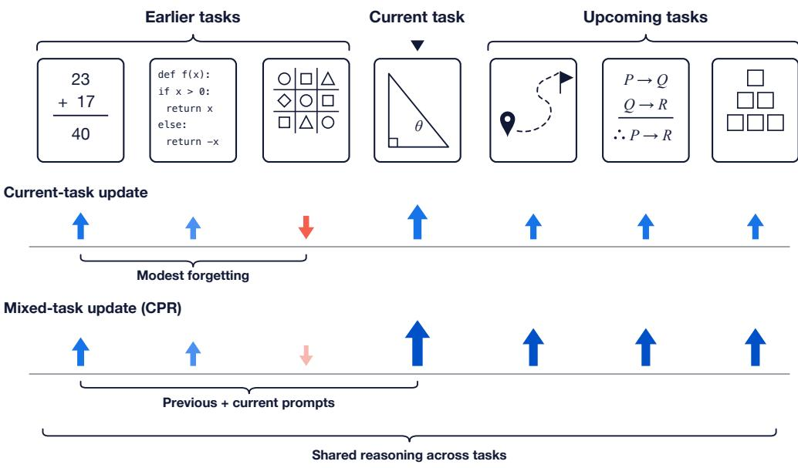  
Figure 1: Shared reasoning explains modest forgetting while CPR harnesses it to improve performance. Later-task updates benefit earlier tasks on average, helping explain modest forgetting. CPR replaces some current-task prompts with previous-task prompts to harness shared reasoning and improve learning on the arriving and future tasks.

Our contributions are threefold:

1. A continual-RLVR environment. We introduce CRG with five task sequences spanning text and visual reasoning, together with implementations of diverse CL methods.

2. A finding of shared reasoning. We identify shared reasoning, whereby training on one task benefits others on average. It explains modest forgetting and can be harnessed to improve learning on the arriving and future tasks. We formalize this finding and provide empirical evidence from task-gradient measurements and a behavioral case study.

3. A continual-RLVR method. We introduce CPR, which harnesses shared reasoning by replaying previous-task prompts and regenerating their responses with the current policy. CPR is the only CL method to reach MTRL-level performance on average.

## 2 RELATED WORK

Continual reinforcement-learning environments. Continual reinforcement-learning environments expose agents to ordered sequences of interactive tasks and evaluate how learning evolves across stages. Existing environments span robotic manipulation, embodied navigation, and coop erative multi-agent tasks (Wolczyk et al., 2021; Liu et al., 2023; Tomilin et al., 2023; 2026). CRG applies this staged protocol to reasoning models trained with RLVR, using programmatic verifiers to score generated responses.

CL benchmarks. CL benchmarks study sequential adaptation of large language models (LLMs), vision–language models (VLMs), and video–language models under stage-wise evaluation (Wang et al., 2023; Srinivasan et al., 2022; Tang et al., 2024). These benchmarks primarily use supervised updates on fixed input–target pairs. CRG instead evaluates stage-wise learning and transfer under continual RLVR, where rewards on policy-generated responses make both trajectories and training signals policy-dependent.

Table 1: Positioning CRG at the intersection of CL and RLVR. CRG combines reasoning tasks, a task sequence, RLVR training, and multiple CL methods. ✓ = present, × = absent.
<table><tr><td colspan="2"></td><td>Reasoning tasks Task sequence RLVR training</td><td></td><td>CL methods</td></tr><tr><td>TRACE (Wang et al., 2023)</td><td>√</td><td>√</td><td>X</td><td>√</td></tr><tr><td>CLiMB (Srinivasan et al., 2022)</td><td>√</td><td>√</td><td>X</td><td>√</td></tr><tr><td>Continual World (Wolczyk et al., 2021)</td><td>X</td><td>√</td><td>X</td><td>√</td></tr><tr><td>LIBERO (Liu et al., 2023)</td><td>×</td><td>√</td><td>X</td><td>√</td></tr><tr><td>Reasoning Gym (Stojanovski et al., 2025)</td><td>√</td><td>×</td><td>√</td><td>X</td></tr><tr><td>VisuLogic (Xu et al., 2026)</td><td>√</td><td>X</td><td>√</td><td>X</td></tr><tr><td>AgentGym-RL (Xi et al., 2026)</td><td>√</td><td>X</td><td>√</td><td>X</td></tr><tr><td>Continual Reasoning Gym (ours)</td><td>√</td><td>√</td><td>√</td><td>√</td></tr></table>

Table 1 summarizes these distinctions. Appendix E discusses additional related work.

## 3 PRELIMINARIES

Continual $\mathbf { R L } . \mathbf { A }$ continual RL problem chains an ordered sequence of tasks $\tau _ { 1 } , \dots , \tau _ { T }$ , each modeled as an MDP, that a single agent learns one at a time (Wolczyk et al., 2021). This paper studies the RLVR specialization, where each task carries a programmatic verifier and every training stage consists of RLVR updates. Starting from a base policy $M _ { 0 }$ , stage i trains on task $\tau _ { i }$ and produces $M _ { i }$ from $M _ { i - 1 }$ , and the goal is a final policy with the highest average success across the $T$ tasks.

Token-level Markov Decision Process. Task $\tau _ { i }$ provides a prompt distribution $\mathcal { D } _ { i }$ and a programmatic verifier $r _ { i } ( x , y ) \in \{ 0 , 1 \}$ for a prompt $x \sim \mathcal { D } _ { i }$ and completed response $y \in \mathcal { V } ^ { * }$ . We model response generation on $\tau _ { i }$ as a token-level MDP $( S , \mathcal { A } , P , \bar { r } _ { i } , \rho _ { i } )$ (Sutton & Barto, 2018). Its state space $s$ contains prompt-conditioned token prefixes, its action space $\boldsymbol { A } = \boldsymbol { \nu }$ is the vocabulary including the terminal token eos, and its initial-state distribution $\rho _ { i }$ draws a prompt $x \sim D _ { i }$ as $s _ { 1 } = x$ The deterministic transition appends the sampled token, $s _ { t + 1 } = P ( s _ { t } , y _ { t } ) = \mathrm { c o n c a t } ( s _ { t } , y _ { t } )$ . The token-level reward $\bar { r } _ { i }$ is zero before termination and equals $r _ { i } ( x , y )$ when eos completes response $y .$ Thus an undiscounted rollout sampled from $\pi _ { \theta }$ has return $r _ { i } ( x , y )$ ), and the RLVR objective is

$$
J _ { i } ( \theta ) = \mathbb { E } _ { x \sim \mathcal { D } _ { i } , y \sim \pi _ { \theta } ( . | x ) } [ r _ { i } ( x , y ) ] .\tag{1}
$$

## 4 CONTINUAL REASONING GYM

In this section, we instantiate the continual RLVR setting from Section 3 with five sequences of verifiable reasoning tasks.

## 4.1 TASK SEQUENCES

A task sequence turns a static task pool into a staged, non-stationary training stream. For each sequence, we select several related but distinct tasks and train them sequentially, allocating $N / T$ steps to each under a total budget of N steps (Figure 2). We instantiate five task sequences across two modalities. The two text settings draw from Reasoning Gym’s largest category algorithmic and its dedicated algebra category, covering procedural symbolic manipulation and symbolic mathematics (Stojanovski et al., 2025). The three visual settings take VisuLogic’s three largest reasoning categories, namely quantitative, spatial, and positional (Xu et al., 2026). Within each category, we define the ordered stage-level subtypes that form the corresponding sequence. Appendix A.1 reports dataset statistics, and Appendix A.3 provides representative examples.

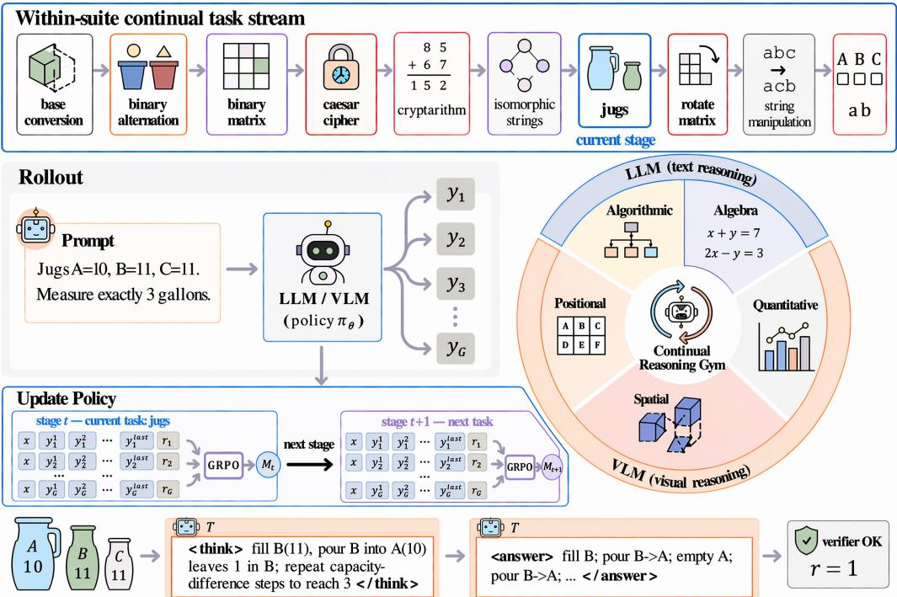  
Figure 2: Policy training proceeds stage by stage through a sequence of verifiable reasoning tasks. Top: the LLM algorithmic sequence contains T=10 tasks, with jugs as the current task. Left: at each stage, the policy rolls out responses y<sub>1</sub>, . . . , y<sub>G</sub> to a prompt. A verifier scores the responses, and Group Relative Policy Optimization (GRPO) uses these scores to produce the stage policy M<sub>t</sub>. Wheel: the five task sequences cover two text-reasoning settings and three visual-reasoning settings. Bottom: a jugs example shows the policy’s reasoning and verifier-checked answer.

## 4.2 BASELINE ALGORITHMS

We use Seq. RLVR as the default baseline. At each stage, it continues training the policy with standard RLVR on the arriving task. MTRL jointly optimizes the same task set and serves as the matched multitask reference. Five CL interventions extend Seq. RLVR. Elastic Weight Consolidation (EWC) (Kirkpatrick et al., 2017) penalizes changes to important weights. KL-to-old-policy penalizes divergence from the pre-task policy. Orthogonal Subspace Fine-Tuning (OSFT) (Nayak et al., 2026) constrains updates to the orthogonal complement of critical directions. ReDo (Sokar et al., 2023) reinitializes dormant units, while FIRE (Han et al., 2026) uses Frobenius-isometry reinitialization to balance stability and plasticity. We additionally include Muon (Liu et al., 2025), which orthogonalizes momentum updates, as an optimizer control.

## 4.3 EVALUATION QUANTITIES

The policy is evaluated on every task before training and after each task stage. From these evaluations, we report BaseAvg and FinalAvg for the two endpoints. To characterize what happens between them, we use forward transfer (FWT), task-learning gain (TLG), and backward transfer (BWT). FWT captures the effect of earlier-task training before a task’s own stage, TLG the effect of direct training on that task, and BWT the effect of subsequent training on later tasks. To compare final performance with the matched multitask reference across task sequences, we report the continual-to-multitask ratio (CTM):

$$
\mathrm { C T M } = \frac { \mathrm { F i n a l A v g } } { \mathrm { F i n a l A v g } _ { \mathrm { M T R L } } } ,\tag{2}
$$

where Final $\operatorname { A v g } _ { \mathrm { M T R L } }$ is the multitask reference trained on the same task set. A CTM of 1 indicates MTRL-level performance. Further details are provided in Appendix A.2.

## 5 CONTINUAL PROMPT REPLAY

In this section, we first decompose final performance to show why the MTRL gap remains despite modest forgetting. We then formalize shared reasoning to explain modest forgetting and motivate CPR, which brings previous-task prompts into current-policy training to improve FWT and TLG.

## 5.1 DECOMPOSING THE MTRL GAP

Seq. RLVR remains below MTRL despite modest forgetting. We first test whether forgetting accounts for the gap. Under Seq. RLVR, training on later tasks reduces performance on previously learned tasks by only 2.47 percentage points on average across the five task sequences, yet final performance reaches only 88% of MTRL (Figure 3). To determine what accounts for the gap beyond this modest forgetting, we decompose FinalAvg as follows.

Proposition 1 (Final Performance Beyond Forgetting).

$$
\begin{array} { r } { \mathrm { F i n a l A v g } = \mathrm { B a s e A v g } + \frac { T - 1 } { T } \mathrm { F W T } + \mathrm { T L G } + \frac { T - 1 } { T } \mathrm { B W T } . } \end{array}\tag{3}
$$

Proof. See Appendix C.1.

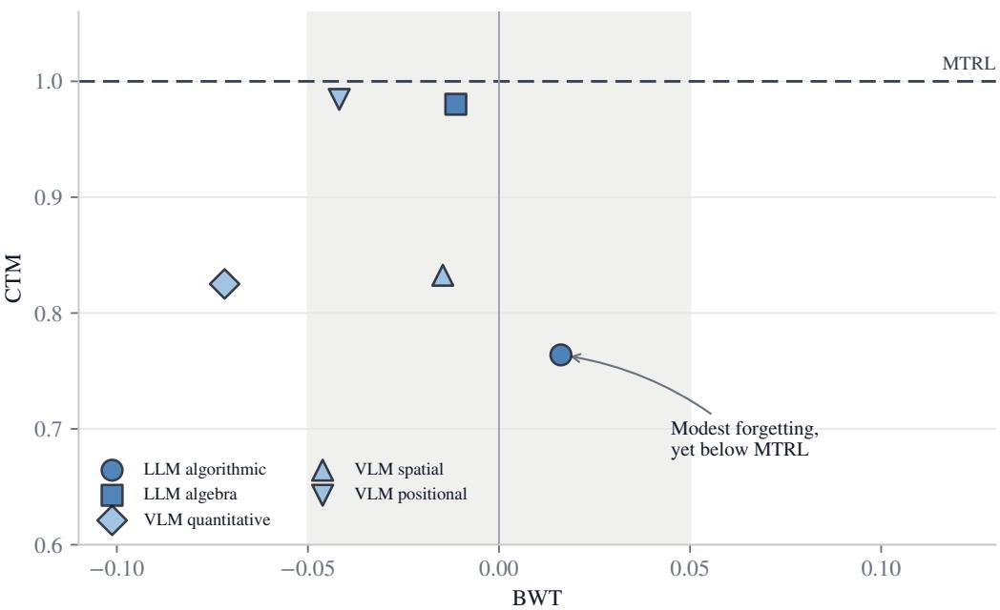  
Figure 3: Seq. RLVR remains below MTRL despite modest forgetting. Each marker represents one task sequence. Across task sequences, performance on earlier tasks falls by only $2 . 4 7$ percentage points on average, yet final performance reaches 88% of MTRL.

Since all methods within a task sequence start from the same initial policy, ∆BaseA $\mathrm { v g } = 0$ . Thus,

$$
\begin{array} { r } { \Delta \mathrm { F i n a l A v g } = \frac { T - 1 } { T } \Delta \mathrm { F W T } + \Delta \mathrm { T L G } + \frac { T - 1 } { T } \Delta \mathrm { B W T } . } \end{array}\tag{4}
$$

Even if the weighted BWT contribution were zero, the gap to MTRL would remain. We therefore ask two questions: why Seq. RLVR exhibits modest forgetting, and how the remaining FWT and TLG gaps can be reduced.

## 5.2 SHARED REASONING EXPLAINS MODEST FORGETTING

To address the first question, we analyze how later-task updates affect earlier-task objectives. Consider an update at stage t with parameters θ. Let $J _ { i }$ denote the objective for task i, with gradient

$g _ { i } ^ { ( t ) } = \nabla _ { \theta } J _ { i } ( \theta )$ , and let $g _ { k } ^ { ( t ) }$ denote the update direction estimated from task k. After an update of size η along this direction,

$$
J _ { i } ( \theta + \eta g _ { k } ^ { ( t ) } ) - J _ { i } ( \theta ) = \eta \langle g _ { i } ^ { ( t ) } , g _ { k } ^ { ( t ) } \rangle + O ( \eta ^ { 2 } ) .
$$

The sign of the inner product indicates whether an update from task k locally benefits or harms task i. The modest forgetting observed above suggests that the cumulative effect of later-task updates is not strongly harmful to earlier tasks on average. One possible explanation is that reasoning tasks share reasoning structure, thus allowing updates on one task to benefit others on average. We call this pattern shared reasoning and formalize it as follows.

Assumption 1 (Mean task-gradient alignment). Across reasoning tasks,

$$
\mathbb { E } _ { t , i , k } \Big [ \langle g _ { i } ^ { ( t ) } , g _ { k } ^ { ( t ) } \rangle \Big ] \geq 0 .\tag{5}
$$

For Seq. RLVR, every update is drawn from the current task, so $k = t .$ . Restricting to earlier tasks $i < t$ and averaging over BWT’s stages and tasks gives the following corollary.

Corollary 1 (Backward Transfer under Mean Alignment). Under Assumption 1, later-stage Seq.   
RLVR updates have a non-negative expectedfirst-order contribution to earlier-task objectives.

Proof. See Appendix C.3.

Corollary 1 connects mean alignment to modest forgetting: later-task updates can benefit earliertask objectives on average. We next ask whether shared reasoning can also improve FWT and TLG. Since mean alignment does not require every task pair to align, the current-task direction may harm some task objectives, while previous-task directions may complement it. This motivates CPR.

## 5.3 HARNESSING SHARED REASONING WITH CPR

To bring previous-task directions into the current update, CPR replays previous-task prompts and regenerates their responses with the current policy. CPR stores each prompt with its task identity and latest pass rate. During later stages, it selects previous-task prompts with intermediate pass rates to replace a fraction of current-task prompts, changing the task-sampling distribution without increasing the number of prompts or rollouts per update.

Let $\widehat { \rho } _ { t }$ be the fraction of replayed prompts in an update at stage $t ,$ and let $q _ { t , k }$ be the fraction of those prompts drawn from task $k < t$ . The mixed-batch update direction is

$$
g _ { t } ^ { \mathrm { C P R } } = ( 1 - \widehat { \rho } _ { t } ) g _ { t } ^ { ( t ) } + \widehat { \rho } _ { t } \sum _ { k < t } q _ { t , k } g _ { k } ^ { ( t ) } .\tag{6}
$$

Applying Assumption 1 to this mixture yields the following corollary.

Corollary 2 (CPR under Mean Alignment). Under Assumption 1, CPR updates have a non-negative expected first-order contribution when averaged over the relevant stages and task objectives.

Proof. See Appendix C.3.

## 6 EXPERIMENTS

We first test the shared-reasoning explanation for modest forgetting, then evaluate whether CPR harnesses shared reasoning to improve FWT and TLG.

## 6.1 SETUP

We instantiate CRG with Qwen3-4B in two text settings and Qwen2.5-VL-7B in three visual settings. For each setting, every method uses a budget of $N = 5 0 0$ optimizer steps. Appendix B.1 provides further experimental details.

## 6.2 EVIDENCE FOR SHARED REASONING

To evaluate shared reasoning as an explanation for modest forgetting, we measure task-gradient alignment and trace changes in reasoning behavior across stages.

Task gradients are positively aligned on average. On the ten-task LLM algorithmic sequence, we compute pairwise cosine similarities between task gradients under Seq. RLVR. The mean cosine is 0.345, and 82.2% of task pairs have positive cosine (Figure 4). This positive mean alignment is consistent with the shared-reasoning explanation for modest forgetting. Additional gradient diagnostics are provided in Appendix D.5.1.

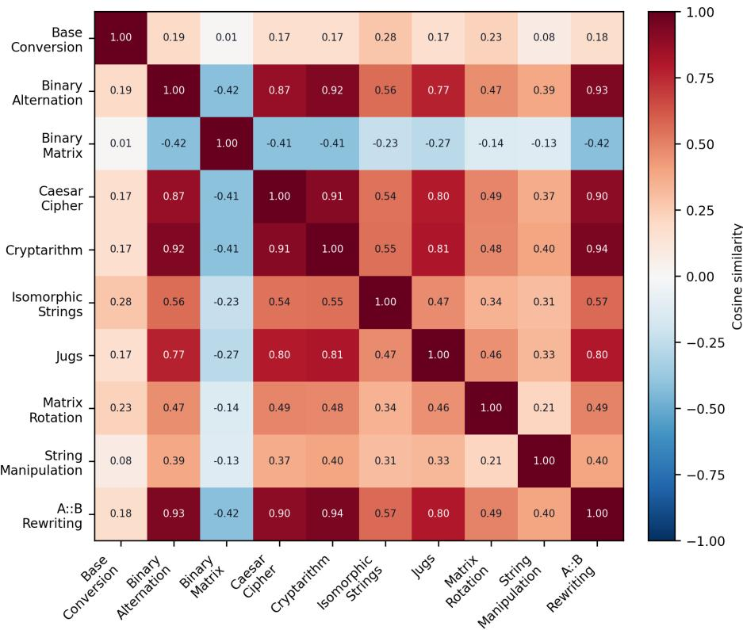  
Figure 4: Task gradients are positively aligned on average under Seq. RLVR. The heatmap shows pairwise cosine similarities between task gradients on the ten-task LLM algorithmic se quence. The mean cosine is 0.345, and 82.2% of task pairs have positive cosine.

Shared reasoning appears in model behavior. Having found positive mean alignment between task gradients, we next examine whether training on other tasks produces corresponding changes in performance and reasoning. Figure 5 tracks jugs success and representative reasoning excerpts throughout Seq. RLVR. Jugs performance improves both before its own stage and during later-task training, with the later-task gain directly consistent with shared reasoning as an explanation for modest forgetting. The excerpts show a parallel progression. Initially, the model finds an optimal route but repeatedly second-guesses it and emits no answer. Before jugs training, it takes a longer route without answering. After direct training, it returns a valid answer after rechecking. At the end of the sequence, it reaches the same answer through shorter, more direct reasoning. Full transcripts are provided in Appendix D.5.2.

We therefore observe shared reasoning at both the update and behavioral levels. We next test whether CPR can harness it to improve learning on the arriving and future tasks.

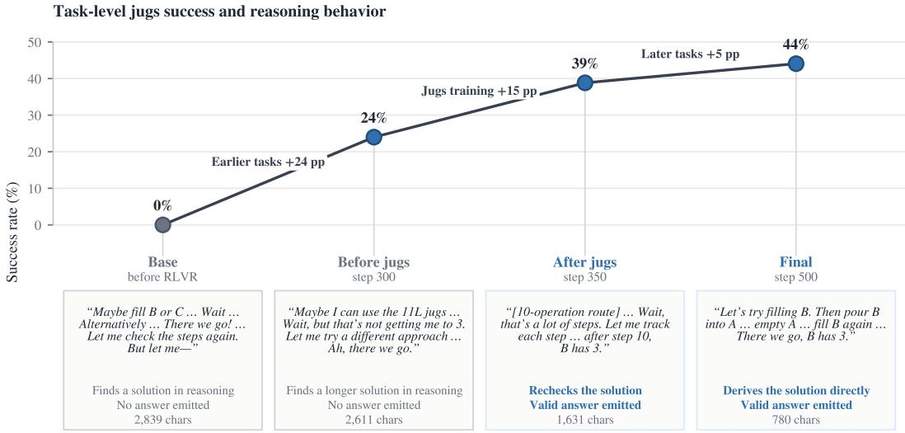  
Figure 5: A jugs case illustrates shared reasoning in both performance and reasoning behavior. Jugs performance improves before its own stage and again during later-task training. The aligned excerpts show a progression from unresolved reasoning to valid and more direct solutions.

## 6.3 CPR RESULTS

CPR reaches MTRL-level performance on average. CPR achieves a mean CTM of 1.03, up from 0.88 under Seq. RLVR, and is the only evaluated CL method to reach MTRL-level performance on average (Table 2).

CPR improves forward transfer and direct task learning. Relative to Seq. RLVR, CPR raises mean FinalAvg by 6.4 percentage points. Of this gain, FWT accounts for +2.4 points and TLG for +4.9 points, while BWT accounts for −0.9 points. CPR’s gain therefore comes from improved learning on arriving and future tasks (Table 2).

Table 2: CPR is the only method to reach MTRL-level performance on average. For each method, FWT, TLG, and BWT report their percentage-point contributions to the change in FinalAvg relative to Seq. RLVR. Total is their sum.
<table><tr><td>Metric</td><td>Seq. RLVR</td><td>Reset (ReDo)</td><td>Reset (FIRE)</td><td>Regularization Optimizer Isolation (EWC)</td><td>(Muon)</td><td>(OSFT)</td><td>Regularization Replay (KL)</td><td>(CPR)</td></tr><tr><td>FWT</td><td>0.0</td><td>-1.5</td><td>-5.8</td><td>-1.7</td><td>+1.3</td><td>-3.4</td><td>+0.6</td><td>+2.4</td></tr><tr><td>TLG</td><td>0.0</td><td>-7.8</td><td>-4.0</td><td>+0.4</td><td>-0.8</td><td>-7.9</td><td>-5.0</td><td>+4.9</td></tr><tr><td>BWT</td><td>0.0</td><td>+3.0</td><td>-14.5</td><td>+2.7</td><td>+2.5</td><td>+2.7</td><td>+5.4</td><td>-0.9</td></tr><tr><td>Total</td><td>0.0</td><td>-6.3</td><td>-24.4</td><td>+1.4</td><td>+3.0</td><td>-8.5</td><td>+1.1</td><td>+6.4</td></tr><tr><td>Mean CTM</td><td>0.88</td><td>0.78</td><td>0.29</td><td>0.87</td><td>0.97</td><td>0.65</td><td>0.95</td><td>1.03</td></tr></table>

Previous-task gradients better align updates with the full task set. To examine their role in CPR’s gains, we evaluate Qwen3-4B task gradients and compare each current-task gradient with an equally weighted combination of the current-task gradient and the mean previous-task gradient. This combination increases cosine similarity with the mean gradient across all tasks from 0.43 to 0.79 on average and yields higher alignment at all nine stages (Figure 6). Additional gradient diagnostics are provided in Appendix D.5.1.

To determine whether CPR benefits from replay itself or from regenerating responses with the current policy, we compare it with no replay and sample replay.

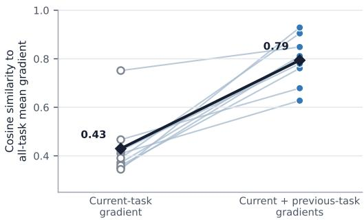  
Figure 6: Previous-task gradients better align updates with the full task set. For Qwen3-4B, each line compares a current-task gradient with an equal-weight combination of that gradient and the mean previous-task gradient. Dark diamonds show the averages across the nine stages.

Current-policy regeneration drives the replay gain. We replace CPR’s freshly generated responses with trajectories from an earlier policy. On LLM algorithmic reasoning, this sample-replay variant reaches a FinalAvg of 47.5%, below no replay at 49.9%, whereas CPR reaches 63.3% and approaches MTRL at 65.3% (Figure 7). The gain therefore depends on regenerating responses with the current policy.

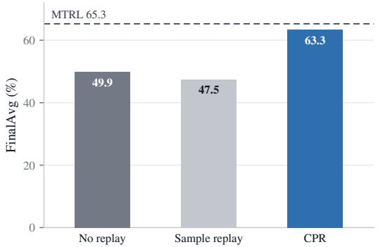  
Figure 7: Current-policy regeneration drives CPR’s replay gain. On LLM algorithmic reasoning, CPR approaches MTRL. Sample replay reuses trajectories generated by an earlier policy and underperforms no replay.

This comparison shows that CPR’s gain depends on both previous-task prompts and current-policy regeneration. Appendix D.2 reports additional replay-pool comparisons, and Appendix D.3 reports replay-ratio robustness.

## 7 CONCLUSION

In this paper, we introduce CRG to evaluate whether continual RLVR can reach MTRL-level performance across text and visual reasoning task sequences. Using CRG, we identify two key observations: Seq. RLVR forgets modestly, yet its performance remains below MTRL. To understand the latter, we decompose final performance and show that preserving earlier-task performance alone cannot close the gap. To understand the former, we identify shared reasoning, whereby training on one task benefits others on average. We then instantiate this insight as CPR, which replays previoustask prompts and regenerates responses with the current policy to harness shared reasoning and improve learning on arriving and future tasks. On CRG, CPR is the only evaluated CL method to reach MTRL-level performance on average.

Limitations. Our experiments focus on five task sequences using Qwen3-4B and Qwen2.5-VL-7B. Extending CRG to agentic settings and larger models remains future work. Our analysis characterizes local update effects and does not capture nonlinear dynamics over extended training.

## AI USE STATEMENT

In this work, we used generative AI tools for formulating mathematical claims, providing critical ingredients for proving mathematical claims, assisting in the writing of proofs, refining hypotheses, implementing methods, and reformatting datasets. We have not used generative AI tools for developing theoretical models or conceptual frameworks, designing research methodology or experiments, generating synthetic datasets, assisting with translation, supporting qualitative and thematic data analysis, or interpreting results, and the remaining required disclosure tasks are not applicable to this work. Additionally, we used generative AI tools for creating and modifying scientific figures, creating and editing software code, drafting and editing parts of the paper, summarizing existing literature, sourcing information, identifying relevant literature, and suggesting the paper’s structure. We have reviewed all AI-assisted work. We checked mathematical arguments, verified citations against their sources, tested AI-assisted code through the reported workflows, and reviewed AI-assisted figures and manuscript revisions. We take responsibility for the final content of this work, including text, claims or artifacts produced with the aid of generative AI.

## ETHICS STATEMENT

This work does not involve private data or raise ethical concerns.

## REPRODUCIBILITY STATEMENT

Section 4 defines the task sequences and stage protocol, while Section 6.1 specifies training and evaluation. Appendix A.1 lists the task sequences, dataset statistics, task construction, and VLM provenance. The rest of the appendix provides exact metric definitions and boundary conventions, complete hyperparameters, full results, proofs, CPR details and ablations, gradient diagnostics, and raw case-study transcripts. Code, configurations, evaluation records, and scripts for regenerating the reported tables and figures will accompany the paper release.

## REFERENCES

Mark Chen, Jerry Tworek, Heewoo Jun, Qiming Yuan, Henrique Ponde de Oliveira Pinto, Jared Kaplan, Harri Edwards, Yuri Burda, Nicholas Joseph, Greg Brockman, et al. Evaluating large language models trained on code. arXiv preprint arXiv:2107.03374, 2021.

Zhoujun Cheng, Shibo Hao, Tianyang Liu, Fan Zhou, Yutao Xie, Feng Yao, Yuexin Bian, Yonghao Zhuang, Nilabjo Dey, Yuheng Zha, Yi Gu, Kun Zhou, Yuqi Wang, Yuan Li, Richard Fan, Jianshu She, Chengqian Gao, Abulhair Saparov, Haonan Li, Taylor W. Killian, Mikhail Yurochkin, Zhengzhong Liu, Eric P. Xing, and Zhiting Hu. Revisiting reinforcement learning for LLM reasoning from a cross-domain perspective. In Advances in Neural Information Processing Systems, Datasets and Benchmarks Track, 2025.

Isaac Han, Sangyeon Park, Seungwon Oh, Donghu Kim, Hojoon Lee, and Kyung-Joong Kim. FIRE: Frobenius-isometry reinitialization for balancing the stability-plasticity tradeoff. In International Conference on Learning Representations, 2026.

James Kirkpatrick, Razvan Pascanu, Neil Rabinowitz, Joel Veness, Guillaume Desjardins, Andrei A. Rusu, Kieran Milan, John Quan, Tiago Ramalho, Agnieszka Grabska-Barwinska, Demis Hassabis, Claudia Clopath, Dharshan Kumaran, and Raia Hadsell. Overcoming catastrophic forgetting in neural networks. Proceedings ofthe National Academy ofSciences, 114(13):3521–3526, 2017.

Bo Liu, Yifeng Zhu, Chongkai Gao, Yihao Feng, Qiang Liu, Yuke Zhu, and Peter Stone. LIBERO: Benchmarking knowledge transfer for lifelong robot learning. In Advances in Neural Information Processing Systems, Datasets and Benchmarks Track, 2023.

Jingyuan Liu, Jianlin Su, Xingcheng Yao, Zhejun Jiang, Guokun Lai, Yulun Du, Yidao Qin, Weixin Xu, Enzhe Lu, Junjie Yan, Yanru Chen, Huabin Zheng, Yibo Liu, Shaowei Liu, Bohong Yin, Weiran He, Han Zhu, Yuzhi Wang, Jianzhou Wang, Mengnan Dong, Zheng Zhang, Yongsheng Kang, Hao Zhang, Xinran Xu, Yutao Zhang, Yuxin Wu, Xinyu Zhou, and Zhilin Yang. Muon is scalable for LLM training. arXiv preprint arXiv:2502.16982, 2025.

David Lopez-Paz and Marc’Aurelio Ranzato. Gradient episodic memory for continual learning. In Advances in Neural Information Processing Systems, 2017.

Lirui Luo, Guoxi Zhang, Hongming Xu, Cong Fang, and Qing Li. SPHERE: Mitigating the loss of spectral plasticity in mixture-of-experts for deep reinforcement learning. In International Conference on Machine Learning, 2026.

Saleh Momeni and Bing Liu. Achieving upper bound accuracy of joint training in continual learning. arXiv preprint arXiv:2502.12388, 2025.

Nikhil Shivakumar Nayak, Krishnateja Killamsetty, Ligong Han, Abhishek Bhandwaldar, Prateek Chanda, Kai Xu, Hao Wang, Aldo Pareja, Oleg Silkin, Mustafa Eyceoz, and Akash Srivastava. Sculpting subspaces: Constrained full fine-tuning in LLMs for continual learning. In International Conference on Learning Representations, 2026.

Idan Shenfeld, Jyothish Pari, and Pulkit Agrawal. RL’s razor: Why online reinforcement learning forgets less. In International Conference on Learning Representations, 2026.

Ghada Sokar, Rishabh Agarwal, Pablo Samuel Castro, and Utku Evci. The dormant neuron phenomenon in deep reinforcement learning. In International Conference on Machine Learning, 2023.

Tejas Srinivasan, Ting-Yun Chang, Leticia Leonor Pinto Alva, Georgios Chochlakis, Mohammad Rostami, and Jesse Thomason. CLiMB: A continual learning benchmark for vision-and-language tasks. In Advances in Neural Information Processing Systems, Datasets and Benchmarks Track, 2022.

Zafir Stojanovski, Oliver Stanley, Joe Sharratt, Richard Jones, Abdulhakeem Adefioye, Jean Kaddour, and Andreas Kopf. REASONING GYM: Reasoning environments for reinforcement learn-¨ ing with verifiable rewards. In Advances in Neural Information Processing Systems, Datasets and Benchmarks Track, 2025.

Richard S. Sutton and Andrew G. Barto. Reinforcement Learning: An Introduction. MIT Press, 2nd edition, 2018.

Tianqi Tang, Shohreh Deldari, Hao Xue, Celso De Melo, and Flora D. Salim. ViLCo-Bench: VIdeo language COntinual learning benchmark. In Advances in Neural Information Processing Systems, Datasets and Benchmarks Track, 2024.

Tristan Tomilin, Meng Fang, Yudi Zhang, and Mykola Pechenizkiy. COOM: A game benchmark for continual reinforcement learning. In Advances in Neural Information Processing Systems, Datasets and Benchmarks Track, 2023.

Tristan Tomilin, Luka van den Boogaard, Samuel Garcin, Constantin Ruhdorfer, Bram Grooten, Fabrice Kusters, Yali Du, Andreas Bulling, Mykola Pechenizkiy, and Meng Fang. MEAL: A benchmark for continual multi-agent reinforcement learning. In International Conference on Machine Learning, 2026.

Xiao Wang, Yuansen Zhang, Tianze Chen, Songyang Gao, Senjie Jin, Xianjun Yang, Zhiheng Xi, Rui Zheng, Yicheng Zou, Tao Gui, Qi Zhang, and Xuanjing Huang. TRACE: A comprehensive benchmark for continual learning in large language models. arXiv preprint arXiv:2310.06762, 2023.

Xumeng Wen, Zihan Liu, Shun Zheng, Shengyu Ye, Zhirong Wu, Yang Wang, Zhijian Xu, Xiao Liang, Junjie Li, Ziming Miao, Jiang Bian, and Mao Yang. Reinforcement learning with verifiable rewards implicitly incentivizes correct reasoning in base LLMs. In International Conference on Learning Representations, 2026.

Maciej Wolczyk, Michal Zajac, Razvan Pascanu, Lukasz Kucinski, and Piotr Milos. Continual world: A robotic benchmark for continual reinforcement learning. In Advances in Neural Information Processing Systems, 2021.

Zhiheng Xi, Jixuan Huang, Chenyang Liao, Baodai Huang, Honglin Guo, Jiaqi Liu, Rui Zheng, Junjie Ye, Jiazheng Zhang, Wenxiang Chen, Wei He, Yiwen Ding, Guanyu Li, Zehui Chen, Zhengyin Du, Xuesong Yao, Yufei Xu, Jiecao Chen, Tao Gui, Zuxuan Wu, Qi Zhang, Xuanjing Huang, and Yu-Gang Jiang. AgentGym-RL: Training LLM agents for long-horizon decision making through multi-turn reinforcement learning. In International Conference on Learning Representations, 2026.

Weiye Xu, Jiahao Wang, Weiyun Wang, Zhe Chen, Wengang Zhou, Aijun Yang, Lewei Lu, Houqiang Li, Xiaohua Wang, Xizhou Zhu, Wenhai Wang, Jifeng Dai, and Jinguo Zhu. Visu-Logic: A benchmark for evaluating visual reasoning in multi-modal large language models. In International Conference on Learning Representations, 2026.

Zhihao Zhang, Qiaole Dong, Qi Zhang, Jun Zhao, Enyu Zhou, Zhiheng Xi, Senjie Jin, Xiaoran Fan, Yuhao Zhou, Mingqi Wu, Yanwei Fu, Tao Ji, Tao Gui, Xuanjing Huang, and Kai Chen. Why reinforcement fine-tuning enables MLLMs preserve prior knowledge better: A data perspective. In International Conference on Learning Representations, 2026.

## APPENDIX

A Continual Reasoning Gym Details 13   
A.1 Task Sequences 13   
A.2 Evaluation Metrics 16   
A.3 Representative Task Examples 16   
B Experimental Details 20   
B.1 Training Configuration 20   
B.2 CPR Implementation 22   
B.3 CPR Resource Overhead 23   
C Theoretical Analysis 24   
C.1 Proof of Proposition 1 . 24   
C.2 First-Order CPR Analysis . 25   
C.3 Corollary Proofs . 26   
D Additional Results 27   
D.1 Full Method Results . 27   
D.2 Additional CPR Ablation Results 31   
D.3 Robustness to Replay Ratio ρ 32   
D.4 CPR Gains Accompany Both Entropy Increases and Decreases . . 32   
D.5 Additional Evidence for Shared Reasoning . 34   
D.6 Pass@K Comparison with the Base Model 39   
D.7 Trained Small Models versus Larger Zero-Shot Models 40   
E Extended Related Work 41   
A CONTINUAL REASONING GYM DETAILS   
A.1 TASK SEQUENCES

CRG instantiates five task sequences comprising 30 stages. The text tasks draw from ReasoningGym (Stojanovski et al., 2025), and the visual tasks draw from VisuLogic (Xu et al., 2026).

VisuLogic defines the top-level quantitative, spatial, and positional domains. We partition each domain into project-defined stage subtypes and fix their training order in Table 3. GPT-5.5 using the xhigh reasoning-effort setting generated the initial subtype assignments. Professional researchers then manually reviewed every assignment. Three quantitative examples remained ambiguous after review and are excluded from the four stage pools. The researcher-reviewed labels define the final spatial and positional subtypes.

## A.1.1 LLM REASONING

Algorithmic Reasoning (LLM). This setting covers ten procedural tasks whose symbolic answers require explicit multi-step computation. Their order is:

Table 3: Five task sequences define the Continual Reasoning Gym streams. Arrows show the training sequence. The LLM algorithmic, LLM algebra, VLM quantitative, VLM spatial, and VLM positional streams contain 10, 6, 4, 6, and 4 stages, respectively.
<table><tr><td>Modality</td><td>Stream</td><td>Ordered stages</td></tr><tr><td rowspan="2">LLM</td><td>Algorithmic</td><td>Base Conversion → Binary Alternation → Binary Matrix → Caesar</td></tr><tr><td>Reasoning</td><td>Cipher → Cryptarithm → Isomorphic Strings → Jugs → Matrix Rotation → String Manipulation → A::B Rewriting</td></tr><tr><td rowspan="2">LLM</td><td>Algebra</td><td>Complex Arithmetic → Intermediate Integration → Polynomial</td></tr><tr><td>Reasoning</td><td>Equations → Polynomial Multiplication → Simple Equations →</td></tr><tr><td>VLM</td><td>Quantitative</td><td>Simple Integration Linear Quantity → Prime Quantity → Point Quantity → Counter</td></tr><tr><td rowspan="2">VLM</td><td>Reasoning</td><td>Quantity</td></tr><tr><td>Spatial Reasoning</td><td>Assembly → Cross-sectional → Hexahedron → Three Views →</td></tr><tr><td>VLM</td><td>Positional</td><td>Spatial Orders → Polyhedron Rotation Translation → Rotation → Comparative → Flip</td></tr><tr><td rowspan="2"></td><td></td><td></td></tr><tr><td>Reasoning</td><td></td></tr></table>

Table 4: Continual Reasoning Gym contains 30 stages across five task sequences. Each setting is split 8:2 into training and test sets. LLM examples are generated procedurally, with at most 20,000 total examples sampled for each text setting. Symbolic and four-way answers are scored by the corresponding task verifier.
<table><tr><td>Modality</td><td>Setting</td><td>Stages</td><td>Total examples</td><td>Answer format</td></tr><tr><td>LLM</td><td>Algorithmic</td><td>10</td><td>20,000</td><td>Symbolic</td></tr><tr><td>LLM</td><td>Algebra</td><td>6</td><td>20,000</td><td>Symbolic</td></tr><tr><td>VLM</td><td>Quantitative</td><td>4</td><td>1,386</td><td>Four-way choice</td></tr><tr><td>VLM</td><td>Spatial</td><td>6</td><td>1,043</td><td>Four-way choice</td></tr><tr><td>VLM</td><td>Positional</td><td>4</td><td>743</td><td>Four-way choice</td></tr><tr><td>Total</td><td></td><td>30</td><td></td><td></td></tr></table>

Base Conversion rewrites a number between numeral bases.

Binary Alternation returns the minimum number of swaps that make a binary string alternate, or reports impossibility.

Binary Matrix computes, for every cell of a binary matrix, the Manhattan distance to the nearest zero.

Caesar Cipher recovers the plaintext of a shift-ciphered message whose shift is unknown.

Cryptarithm solves an addition puzzle for the unique letter-to-digit assignment.

Isomorphic Strings decides whether two strings admit a one-to-one character mapping that preserves structure.

Jugs produces a sequence of fill, pour, and empty operations that measures a target volume.

Matrix Rotation rotates a matrix by a specified angle.

String Manipulation applies a described sequence of string edits.

A::B Rewriting reduces a program under the A::B rewriting system to its normal form.

Each sub-task carries an exact-match verifier over its symbolic answer.

Algebra Reasoning (LLM). This setting covers six symbolic-mathematics tasks. Their order is:

Complex Arithmetic evaluates arithmetic on complex numbers.

Intermediate Integration evaluates integrals at a harder difficulty level.

Polynomial Equations solves a polynomial for its roots.

Polynomial Multiplication expands a product of polynomials.

Simple Equations solves a basic algebraic equation for its unknown.

Simple Integration evaluates integrals at an easier difficulty level.

Answers are checked symbolically, so numerically equivalent forms are accepted.

## A.1.2 VLM VISUAL REASONING

Quantitative Reasoning (VLM). This setting tests changes in graphical quantities, including counts of points, lines, and angles and arithmetic relations among shapes. Its four stages are projectdefined subtypes of VisuLogic’s Quantitative domain:

Linear Quantity element counts change linearly along a row, column, or sequence, by a constant or position-indexed step.

Prime Quantity counts follow a number-theoretic rule such as primality, parity, multiples, or divisibility.

Point Quantity the changing quantity is points, intersections, endpoints, or nodes.

Counter Quantity other count patterns over elements, blocks, edges, segments, or black and white cells.

Spatial Reasoning (VLM). This setting requires reconstructing three-dimensional structure from two-dimensional figures, including folding surfaces and integrating solid shapes. Its six stages are project-defined subtypes of VisuLogic’s Spatial domain:

Assembly assembling, completing, or decomposing 3D parts into matching polyhedron pieces.

Cross-sectional identifying the cross-section of a 3D solid cut by a plane.

Hexahedron reconstructing a cube or cuboid surface from its net or folded box.

Three Views matching a 3D object to its orthographic projection views.

Spatial Orders a sequence, classification, or ordering pattern over spatial figures.

Polyhedron Rotation comparing a solid under 3D rotations, viewing orientations, or symmetry.

Positional Reasoning (VLM). This setting examines transformations that relocate objects while preserving their constituent elements. Its four stages are project-defined subtypes of VisuLogic’s Positional domain:

Translation marked elements shift, swap, or reorder positions while keeping their orientation.

Rotation elements or orientations rotate or cycle around a center or ordered positions.

Comparative a mixed positional relationship in which no single translation, rotation, or flip dominates.

Flip the pattern uses mirror reflection across an axis.

All three VLM settings use four-way multiple-choice instances scored by exact match.

## A.2 EVALUATION METRICS

Stage-wise evaluation records one score for every stage policy and task. Let $R _ { j , i } = S ( M _ { j } , \tau _ { i } )$ denote the mean verifier success rate of stage-j policy $M _ { j }$ on the fixed evaluation examples for task $\tau _ { i } .$ Evaluating $j = 0 , \ldots , T$ on every $i = 1 , \dots , T$ gives a $( T { + } 1 ) \times T$ matrix R for each method and task sequence. This evaluation follows GEM (Lopez-Paz & Ranzato, 2017), its continual-RL use in Continual World (Wolczyk et al., 2021), and its large-model use in TRACE (Wang et al., 2023).

Four entries identify the task-level performance values used by these metrics:

$$
B _ { i } = R _ { 0 , i } , \qquad P _ { i } = R _ { i - 1 , i } , \qquad A _ { i } = R _ { i , i } , \qquad F _ { i } = R _ { T , i } .\tag{7}
$$

They denote performance before any training, immediately before and after direct training on task i, and after all stages. The boundary conventions are $P _ { 1 } : = B _ { 1 }$ and $A _ { T } : = F _ { T }$ .

The metrics are

$$
\begin{array} { r l r l } & { \displaystyle \mathrm { B a s e A v g } = \frac { 1 } { T } \sum _ { i = 1 } ^ { T } B _ { i } , } & & { \displaystyle \mathrm { F i n a l A v g } = \frac { 1 } { T } \sum _ { i = 1 } ^ { T } F _ { i } , } \\ & { \displaystyle \mathrm { F W T } = \frac { 1 } { T - 1 } \sum _ { i = 2 } ^ { T } ( P _ { i } - B _ { i } ) , } & & { \displaystyle \mathrm { T L G } = \frac { 1 } { T } \sum _ { i = 1 } ^ { T } ( A _ { i } - P _ { i } ) , } \\ & { \displaystyle \mathrm { B W T } = \frac { 1 } { T - 1 } \sum _ { i = 1 } ^ { T - 1 } ( F _ { i } - A _ { i } ) . } \end{array}\tag{8}
$$

FWT and BWT follow Lopez-Paz & Ranzato (2017), while TLG is our addition. FWT and BWT average over $T - 1$ applicable tasks because forward transfer is undefined for the first task and backward transfer is undefined for the last task. TLG averages direct learning over all T tasks. Means across the five settings weight each setting equally.

## A.3 REPRESENTATIVE TASK EXAMPLES

Figure 8 shows one task from each setting.

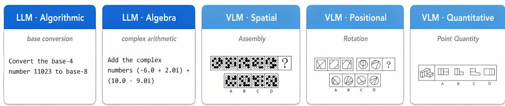  
Figure 8: Representative CRG tasks. One example is shown for each setting.

The transcripts below show one evaluation prompt and a model response in the format consumed by the corresponding verifier. They include the model’s <think> reasoning and <answer> span. The latter supplies the answer scored by the task verifier.

## A.3.1 LLM REASONING

Base Conversion LLM algorithmic   
[PROMPT]   
Your task is to convert a number between two different bases.   
If the target base is > 10, use lowercase letters a-z for digits above 9.   
Now, convert the base-4 number 11023 to base-8

[MODEL RESPONSE]   
<think>   
Okay, let’s see. I need to convert the base-4 number 11023 to base-8. Hmm, how do I do that?   
Well, I remember that converting between bases can be done by first converting the   
number to decimal (base 10) and then to the target base. Let me try that.   
First, let’s convert 11023 (base 4) to decimal. Each digit represents a power of 4. Starting   
from the right, the digits are positions 0 to 4. So the number is 1 1 0 2 3.   
So, the digits are 1, 1, 0, 2, 3. Let me calculate each digit’s value:   
1 4ˆ4 = 1 256 = 256   
1 4ˆ3 = 1 64 = 64   
0 4ˆ2 = 0 16 = 0   
2 4ˆ1 = 2 4 = 8   
3 4ˆ0 = 3 1 = 3   
Now add them all up: 256 + 64 is 320, plus 0 is 320, plus 8 is 328, plus 3 is 331. So the   
decimal equivalent is 331.   
Now, I need to convert 331 (base 10) to base 8. To do that, I divide the number by 8 and keep   
track of the remainders.   
331 divided by 8 is 41 with a remainder of 3.   
41 divided by 8 is 5 with a remainder of 1.   
5 divided by 8 is 0 with a remainder of 5.   
So the remainders, from last to first, are 5, 1, 3. Therefore, the base 8 number is 513.   
Let me check that. 5<sub>\*</sub>8ˆ2 + 1<sub>\*</sub>8 + 3 = 5<sub>\*</sub>64 + 8 +3 = 320 + 11 = 331. Yes, that’s correct. So   
the answer should be 513.   
</think>   
<answer>513</answer>

Complex Arithmetic LLM algebra   
[PROMPT]   
Add the complex numbers: (-6.0 + 2.0i) + (10.0 - 9.0i)   
[MODEL RESPONSE]   
<think>   
Okay, let’s see. I need to add two complex numbers: (-6.0 + 2.0i) and (10.0 - 9.0i). Hmm, how   
do you add complex numbers again? Oh right, you just add the real parts together and   
the imaginary parts together.   
So the first number is -6.0 plus 2.0i. The second one is 10.0 minus 9.0i. Let me break it   
down. The real parts are -6.0 and 10.0. Adding those together: -6.0 + 10.0. That should   
be 4.0, right? Because 10 minus 6 is 4.   
Now the imaginary parts: 2.0i and -9.0i. Adding those gives 2.0 - 9.0, which is -7.0i. So   
combining those two results, the sum should be 4.0 - 7.0i. Let me check again to make   
sure I didn’t mix up any signs. The second number’s imaginary part is negative, so   
subtracting 9.0i from 2.0i would be -7.0i. Yeah, that seems right. So the final answer   
is 4.0 - 7.0i.   
</think>   
<answer>4.0 - 7.0i</answer>

## A.3.2 VLM VISUAL REASONING

Each visual example is a four-way VisuLogic-derived problem whose image contains the answer options. We report the image, shared textual prompt, and model response.

<table><tr><td>[PROMPT]</td><td></td><td></td><td></td><td></td></tr><tr><td></td><td>the left?</td><td>From any angle, which one on the right is not a view of the three-dimensional shape given on</td><td></td><td></td></tr><tr><td></td><td></td><td></td><td></td><td></td></tr><tr><td>A: A B:B</td><td></td><td></td><td></td><td></td></tr><tr><td>C: C</td><td></td><td></td><td></td><td></td></tr><tr><td>D: D</td><td></td><td></td><td></td><td></td></tr><tr><td></td><td></td><td>[four answer options A--D are shown in the image above]</td><td></td><td></td></tr><tr><td></td><td></td><td></td><td></td><td></td></tr><tr><td></td><td>[MODEL RESPONSE] &lt;think&gt;Observation:</td><td></td><td></td><td></td></tr><tr><td></td><td></td><td></td><td></td><td></td></tr><tr><td></td><td>1. Shape left:</td><td></td><td></td><td></td></tr><tr><td></td><td></td><td>- Block structure vertically stacked horizontally.</td><td></td><td></td></tr><tr><td></td><td></td><td>- Visible rectangular planes intersecting.</td><td></td><td></td></tr><tr><td></td><td>2. Options:</td><td></td><td></td><td></td></tr><tr><td></td><td></td><td>- A: Horizontal split rectangles aligned vertically.</td><td></td><td></td></tr><tr><td></td><td></td><td>- B: Vertical split rectangles aligned horizontally.</td><td></td><td></td></tr><tr><td></td><td></td><td>- C: Horizontal split rectangles aligned horizontally.</td><td></td><td></td></tr><tr><td></td><td></td><td>- D: Rectangular dashed lines vertically aligned.</td><td></td><td></td></tr><tr><td></td><td>3. Analysis:</td><td></td><td></td><td></td></tr><tr><td></td><td></td><td>- Option A matches horizontal splits vertically aligned.</td><td></td><td></td></tr><tr><td></td><td></td><td>- Option B matches vertical splits horizontally aligned.</td><td></td><td></td></tr><tr><td></td><td></td><td>- Option C matches horizontal splits horizontally aligned.</td><td></td><td></td></tr><tr><td></td><td></td><td></td><td></td><td></td></tr><tr><td></td><td></td><td>- Option D dashed vertical rectangles align incorrectly.&lt;/think&gt;</td><td></td><td></td></tr></table>

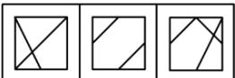

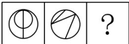

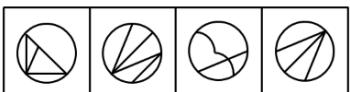

A B C D

<table><tr><td>[PROMPT]</td><td></td><td></td><td>From the four given options, select the most suitable one to fill in the question mark, so</td></tr><tr><td></td><td></td><td>that a certain regularity is presented:</td></tr><tr><td>A: A</td><td></td><td></td></tr><tr><td>B:B</td><td></td><td></td></tr><tr><td>C: C</td><td></td><td></td></tr><tr><td>D: D</td><td></td><td></td></tr><tr><td></td><td></td><td>[four answer options A--D are shown in the image above]</td></tr><tr><td></td><td>[MODEL RESPONSE]</td><td></td></tr><tr><td></td><td></td><td>&lt;think&gt;The pattern involves dividing shapes into sections and rotating these sections within</td></tr><tr><td></td><td>the shape.</td><td></td></tr><tr><td></td><td></td><td>1. In the first row, the square is divided diagonally into two triangles, which are then</td></tr><tr><td></td><td></td><td>rotated and shifted within the square.</td></tr><tr><td>一</td><td></td><td>2. Applying this logic to the circles:</td></tr><tr><td></td><td></td><td>The circle is divided into three equal parts (sectors). - These sectors are then rotated and shifted within the circle to form the pattern seen in</td></tr><tr><td></td><td></td><td>the last column of the first row.</td></tr><tr><td></td><td></td><td></td></tr><tr><td></td><td></td><td>The correct option should reflect this rotation and shifting pattern within the circle.</td></tr><tr><td></td><td></td><td>Option A matches this description as it shows the sectors rotated and shifted similarly</td></tr><tr><td></td><td></td><td>to the pattern observed in the first row&#x27;s last column.&lt;/think&gt;</td></tr><tr><td></td><td></td><td></td></tr><tr><td></td><td>&lt;answer&gt;A&lt;/answer&gt;</td><td></td></tr></table>

Polyhedron Rotation

VLM spatial

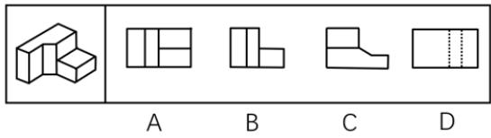

[PROMPT]   
From the four given options, choose the most appropriate one to fill in the question mark, so   
that a certain pattern is formed:   
A: A   
B: B   
C: C   
D: D   
[four answer options A--D are shown in the image above]   
[MODEL RESPONSE]   
<think>   
The arrangement of squares within each grid seems to alternate between two distinct patterns:   
1. Grids with horizontal alignment.   
2. Grids with vertical alignment.   
Observing closely:   
Option A mirrors horizontally aligned squares.   
Option B mirrors vertically aligned squares.   
- Option C mirrors horizontally aligned squares.   
Option D mirrors vertically aligned squares.   
Given the alternating pattern:   
Option B matches vertically aligned squares.   
</think>   
<answer>B</answer>

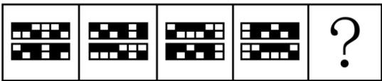

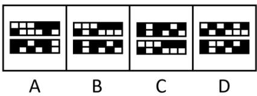

## B EXPERIMENTAL DETAILS

## B.1 TRAINING CONFIGURATION

Table 5: All runs use the same core RLVR configuration. The text experiments use Qwen3-4B, and the visual experiments use Qwen2.5-VL-7B. Training updates all model parameters, including the VLM vision tower.
<table><tr><td>Group</td><td>Hyperparameter</td><td>Value</td></tr><tr><td rowspan="2">Model</td><td>LLM backbone</td><td>Qwen3-4B</td></tr><tr><td>VLM backbone</td><td>Qwen2.5-VL-7B</td></tr><tr><td rowspan="6">RLVR</td><td>Advantage estimator</td><td>GRPO</td></tr><tr><td>Entropy coefficient</td><td> $1 \times 1 0 ^ { - 3 }$  5</td></tr><tr><td>Rollouts per prompt</td><td></td></tr><tr><td>PPO clip range</td><td>0.2</td></tr><tr><td>PPO epochs</td><td>1</td></tr><tr><td>Loss reduction</td><td>Token mean</td></tr><tr><td rowspan="9">Optimization</td><td>Optimizer</td><td>AdamW</td></tr><tr><td>Learning rate</td><td> $1 \times 1 0 ^ { - 6 }$ </td></tr><tr><td>Adam β values</td><td>(0.9, 0.999)</td></tr><tr><td>Weight decay</td><td>0.01</td></tr><tr><td>Learning-rate schedule</td><td>Constant</td></tr><tr><td>Warmup steps</td><td>0</td></tr><tr><td>Gradient clipping</td><td>1.0</td></tr><tr><td>Train batch size</td><td>512</td></tr><tr><td>PPO mini-batch size</td><td>256</td></tr><tr><td rowspan="5">Generation</td><td>Total optimizer steps</td><td>500</td></tr><tr><td>Temperature</td><td>1.0</td></tr><tr><td>Top-p</td><td>1.0</td></tr><tr><td>Top-k</td><td>-1</td></tr><tr><td></td><td>1024</td></tr><tr><td rowspan="6">Sequence length</td><td>Maximum prompt length for LLM Maximum response length for</td><td>1024</td></tr><tr><td>LLM</td><td></td></tr><tr><td>Maximum prompt length for VLM</td><td>1024</td></tr><tr><td>Maximum response length for</td><td>1024</td></tr><tr><td>VLM</td><td></td></tr><tr><td>Maximum model length for VLM</td><td>3072</td></tr><tr><td rowspan="2">Parameter update</td><td>LoRA rank</td><td>0, corresponding to full-parameter updates</td></tr><tr><td>VLM vision tower</td><td>Unfrozen</td></tr></table>

Table 6: MTRL accesses the complete task pool from the first update, whereas CPR replays previous-task prompts. Both use the shared configuration in Table 5.
<table><tr><td>Method</td><td>Setting</td><td>Value</td></tr><tr><td>MTRL</td><td>Task access LLM task sampling</td><td>Complete task pool available from the first update  $P _ { \mathrm { M T R L } } ( k ) = \hat { 1 } / T$ </td></tr><tr><td rowspan="6">CPR</td><td>Replay pool</td><td>Prompts from previous tasks</td></tr><tr><td>Replay fraction Maximum replayed prompts per min</td><td> $\rho = 0 . 5$   $\{ \lfloor \rho b \rfloor , \lfloor b / 2 \rfloor \}$  for batch size b</td></tr><tr><td>batch</td><td></td></tr><tr><td>Store capacity</td><td>One record per observed prompt with task identity and verifier metadata. Footprint reported in Appendix B.3</td></tr><tr><td>Eligibility</td><td>Latest pass rate in [0.24, 0.70]</td></tr><tr><td>Priority</td><td>Smallest distance from pass rate 0.5 first</td></tr><tr><td></td><td>Cooldown</td><td>5 updates</td></tr></table>

Table 7: Each CL baseline changes a specific part of the shared training protocol. The table lists every baseline-specific override. All remaining settings follow Table 5.
<table><tr><td>Method</td><td>Setting</td><td>Value</td></tr><tr><td rowspan="4">EWC</td><td>Penalty coefficient</td><td>1.0</td></tr><tr><td>Fisher decay</td><td>1.0</td></tr><tr><td>Numerical stabilizer €</td><td>10-8</td></tr><tr><td>Fisher samples</td><td>All available samples</td></tr><tr><td rowspan="4">FIRE</td><td>Newton-Schulz steps</td><td>5</td></tr><tr><td>Reset modules</td><td>Attention query and key projections</td></tr><tr><td>Task-boundary handling</td><td>Reset the optimizer and synchronize rollout</td></tr><tr><td></td><td>weights after reset</td></tr><tr><td rowspan="3">ReDo</td><td>Dormancy threshold</td><td>τ = 0.1</td></tr><tr><td>Calibration set LeCun initialization</td><td>8 examples Disabled</td></tr><tr><td></td><td></td></tr><tr><td rowspan="9">Muon</td><td>Momentum</td><td>0.95</td></tr><tr><td>Newton-Schulz steps</td><td>5</td></tr><tr><td>Nesterov momentum</td><td>Enabled</td></tr><tr><td>AdamW-side β values</td><td>(0.9, 0.999) 10-8</td></tr><tr><td>AdamW-side €</td><td></td></tr><tr><td>Learning-rate scaling</td><td>RMS-matched AdamW</td></tr><tr><td>Weight-decay scaling Maximum matrix aspect ratio</td><td>1.0 8</td></tr><tr><td>Maximum matrix dimension</td><td>65,536</td></tr><tr><td></td><td>0.5</td></tr><tr><td rowspan="5">OSFT</td><td>Rank ratio Initialization</td><td>At the start of training and after every task switch</td></tr><tr><td>Task-boundary handling</td><td>Reset the optimizer and synchronize rollout</td></tr><tr><td>Numerical precision</td><td>weights after reinitialization FP32 upcast with BF16 output</td></tr><tr><td>KL coefficient</td><td></td></tr><tr><td></td><td>0.001 0.5</td></tr><tr><td rowspan="4"></td><td>Old-prompt fraction</td><td></td></tr><tr><td>Old-policy refresh</td><td>At every task switch</td></tr><tr><td>Checkpoint requirement</td><td>Task-boundary checkpoint</td></tr></table>

## B.2 CPR IMPLEMENTATION

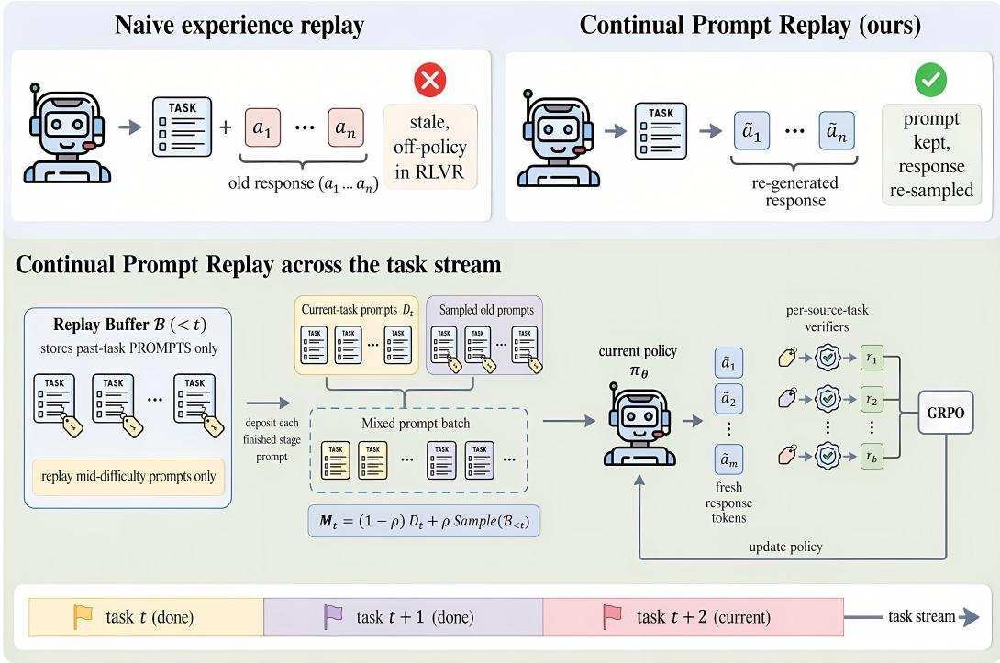  
Figure 9: CPR turns previous-task prompts into current-policy RLVR updates. The top row contrasts stale trajectory replay with CPR’s response regeneration. The lower panel shows one CPR update during a later stage. CPR selects previous-task prompts, mixes them with current-task prompts, generates every response with the current policy, and scores each response with its task verifier before the GRPO update.

Algorithm 1 specifies one CPR update during stage t.

```latex
Algorithm 1: One CPR update during stage t
Input: current-task prompt distribution $\mathcal { D } _ { t } .$ , replay store $B _ { < t } ,$ , task verifiers $\{ r _ { k } \} _ { k \le t }$ , current policy
$\pi _ { \theta } ,$ batch size $b ,$ and replay fraction $\rho .$
1 set the maximum number of replayed prompts to $b _ { R } = \operatorname* { m i n } \{ \lfloor \rho b \rfloor , \lfloor b / 2 \rfloor \}$
2 construct a batch of b prompts by replacing at most $b _ { R }$ current-task prompts with eligible
prompts from $\scriptstyle { { \mathcal { B } } _ { < t } }$ . Let C and R denote the resulting current-task and replay subsets, and set
$\hat { \rho } _ { t } = \hat { | } R | / b$ for this update.
3 form the mixed prompt batch $C \cup R$ with each prompt’s task identity $m ( x )$
4 generate a fresh response $y \sim \pi _ { \theta } ( \cdot \mid x )$ for every prompt $x \in C \cup { \dot { R } } .$
5 score each response with its task verifier, $r _ { m ( x ) } ( x , y )$
6 apply one RLVR update to the mixed batch.
7 refresh the stored record and latest pass rate for each observed prompt, retaining at most one
record per prompt.
Output: updated policy $\pi _ { \theta ^ { \prime } }$ and replay store $\scriptstyle B _ { \leq t }$
```

Replay store and selector. CPR stores one record per prompt and refreshes its pass rate whenever the prompt reappears. The pass rate is the mean verifier score over the five responses generated for that prompt in its latest update.

The default selector admits previous-task prompts whose latest pass rate lies in [0.24, 0.70]. A selected prompt becomes eligible again after five updates. Among eligible prompts, CPR prioritizes those closest to pass rate 0.5.

For one update during stage t, let $n _ { t , k }$ be the number of replayed prompts drawn from task $k < t ,$ and let $\begin{array} { r } { n _ { t } = \sum _ { \ell < t } n _ { t , \ell } } \end{array}$ . When $n _ { t } > 0 , q _ { t , k } = n _ { t , k } / n _ { t }$ and $\begin{array} { r } { \dot { \sum _ { k < t } } q _ { t , k } = 1 } \end{array}$ , so $q _ { t , k }$ is the fraction of replayed prompts in that update drawn from task k. When $n _ { t } \stackrel { \cdot } { = } 0 , \widehat { \rho } _ { t } = 0$ and the replay term is omitted. If fewer than $b _ { R }$ prompts are eligible, then $0 < \widehat { \rho } _ { t } < \rho$ whenever at least one prompt is replayed.

## B.3 CPR RESOURCE OVERHEAD

At each CPR update, previous-task prompts replace current-task prompts within the same 512- prompt batch used by Seq. RLVR, and the current policy draws five responses per prompt. Both methods therefore generate 2,560 rollouts per update. CPR changes the task-sampling distribution without increasing the number of sampled prompts or current-policy rollouts. Its method-specific work is replay selection and CPU-side store access.

Replay-store footprint. CPR stores one record per observed prompt containing the prompt, task and verifier metadata, latest pass rate, and selector state. The serialized footprint is 1.24 KiB per prompt on average across the five CRG settings (Table 8).

Table 8: Average serialized footprint per CPR replay record. Each row reports the mean over prompts in one CRG setting. The final row weights the five settings equally.
<table><tr><td>Setting</td><td>Per prompt (KiB)</td></tr><tr><td>LLM Algorithmic</td><td>1.02</td></tr><tr><td>LLM Algebra</td><td>1.01</td></tr><tr><td>VLM Quantitative</td><td>1.42</td></tr><tr><td>VLM Spatial VLM Positional</td><td>1.39</td></tr><tr><td>Mean</td><td>1.34 1.24</td></tr></table>

Runtime. On eight NVIDIA B200 GPUs, CPR averages 14.8 hours per 500-update run, compared with 14.6 hours for Seq. RLVR (Table 9).

Table 9: Average wall-clock time per 500-update run on eight NVIDIA B200 GPUs.
<table><tr><td>Method</td><td>Mean runtime (h)</td></tr><tr><td>Seq. RLVR</td><td>14.6</td></tr><tr><td>CPR</td><td>14.8</td></tr></table>

## C THEORETICAL ANALYSIS

## C.1 PROOF OF PROPOSITION 1

Adding and subtracting $P _ { i }$ and $A _ { i }$ writes each per-task final score as

$$
F _ { i } = B _ { i } + ( P _ { i } - B _ { i } ) + ( A _ { i } - P _ { i } ) + ( F _ { i } - A _ { i } ) ,\tag{9}
$$

and averaging over the T tasks gives

$$
\begin{array} { c } { \mathrm { F i n a l A v g } = \mathrm { B a s e A v g } + \displaystyle \frac { 1 } { T } \sum _ { i = 1 } ^ { T } ( P _ { i } - B _ { i } ) + \mathrm { T L G } + \frac { 1 } { T } \sum _ { i = 1 } ^ { T } ( F _ { i } - A _ { i } ) } \\ { = \mathrm { B a s e A v g } + \displaystyle \frac { 1 } { T } \sum _ { i = 2 } ^ { T } ( P _ { i } - B _ { i } ) + \mathrm { T L G } + \frac { 1 } { T } \sum _ { i = 1 } ^ { T - 1 } ( F _ { i } - A _ { i } ) , } \end{array}\tag{10}
$$

where the boundary terms $P _ { 1 } - B _ { 1 }$ and $F _ { T } - A _ { T }$ vanish by the conventions of Appendix A.2. Matching the $\textstyle { \frac { 1 } { T } }$ averaging to the $\frac { 1 } { T - 1 }$ normalization of the transfer terms,

$$
{ \frac { 1 } { T } } \sum _ { i = 2 } ^ { T } ( P _ { i } - B _ { i } ) = { \frac { T - 1 } { T } } \mathrm { F W T } , \qquad { \frac { 1 } { T } } \sum _ { i = 1 } ^ { T - 1 } ( F _ { i } - A _ { i } ) = { \frac { T - 1 } { T } } \mathrm { B W T } ,\tag{11}
$$

which yields the identity of Proposition 1.

## C.2 FIRST-ORDER CPR ANALYSIS

By Proposition 1, any FinalAvg difference between methods with the same BaseAvg must pass through FWT, TLG, or BWT. We therefore compare one CPR update with a compute-matched baseline update and ask when replay changes these terms favorably.

Consider one update in stage t at pre-update parameters θ. Let $g _ { i } ^ { ( t ) } = \nabla _ { \theta } J _ { i } ( \theta )$ be the objective gradient for task i, and let $g _ { k } ^ { ( t ) }$ be the update direction induced by prompts from task $k .$ CPR combines prompts from the current task t with prompts from previous tasks $k \ < \ t$ through the direction $g _ { t } ^ { \mathrm { { ^ { c P R } } } }$ in Eq. (6). A first-order expansion of task i under CPR gives

$$
\begin{array} { r l r } {  { \Delta _ { i , \mathrm { C P R } } ^ { ( t ) } : = J _ { i } ( \theta + \eta g _ { t } ^ { \mathrm { C P R } } ) - J _ { i } ( \theta ) } } \\ & { } & { = \eta ( 1 - \widehat { \rho } _ { t } ) \langle g _ { i } ^ { ( t ) } , g _ { t } ^ { ( t ) } \rangle + \eta \widehat { \rho } _ { t } \sum _ { k < t } q _ { t , k } \langle g _ { i } ^ { ( t ) } , g _ { k } ^ { ( t ) } \rangle + O ( \eta ^ { 2 } ) . } \end{array}\tag{12}
$$

The Seq. RLVR baseline uses only the current-task direction, so

$$
\Delta _ { i , \mathrm { s e q } } ^ { ( t ) } = \eta \langle g _ { i } ^ { ( t ) } , g _ { t } ^ { ( t ) } \rangle + O ( \eta ^ { 2 } ) .\tag{13}
$$

Subtracting Eq. (13) from Eq. (12) yields the central comparison:

$$
\Delta _ { i , \mathrm { C P R } } ^ { ( t ) } - \Delta _ { i , \mathrm { s e q } } ^ { ( t ) } = \eta \widehat { \rho } _ { t } \left[ \sum _ { k < t } q _ { t , k } \langle g _ { i } ^ { ( t ) } , g _ { k } ^ { ( t ) } \rangle - \langle g _ { i } ^ { ( t ) } , g _ { t } ^ { ( t ) } \rangle \right] + O ( \eta ^ { 2 } ) .\tag{14}
$$

The bracket compares the average direction recovered from previous-task prompts with the currenttask direction that those prompts replace. CPR improves task i to first order when this difference is positive after the relevant updates are averaged.

If every task pair had non-negative alignment, the current-task direction would already be nonharmful to every objective at first order. Mean alignment is weaker. The current direction may interfere with specific objectives even when the average over previous-task directions and relevant objectives is positive. CPR realizes that average at the current parameters by regenerating responses to previous-task prompts. Assumption 1 gives a non-negative expected first-order contribution under a reported term’s weighting. Equation (14) gives the corresponding CPR–Seq. RLVR difference.

The position of task i relative to stage t determines which decomposition term receives the local effect. Setting $i = t$ gives the contribution during direct training and hence TLG. Tasks with $i < t$ give the contribution to BWT, while tasks with $i > t$ give the contribution to FWT. The replay pool controls the task mixture $q _ { t , k }$ . The replay ratio controls the scale $\widehat { \rho } _ { t }$ . The replay-pool ablation probes $q _ { t , k }$ . The ratio sweep in Appendix D.3 tests robustness to the configured replay scale $\rho .$

## C.3 COROLLARY PROOFS

We first expand the expectation in Assumption 1. For one reported term, let $\alpha _ { t }$ denote its nonnegative stage weights, $p _ { t , i }$ its non-negative task-objective weights, and $w _ { t , k }$ the realized sampling frequencies of prompts from task k. Each set of weights is normalized over its support. For an update mixture with these weights, define $\begin{array} { r } { \Delta _ { i } ^ { ( t ) } = J _ { i } ( \theta + \eta \sum _ { k } w _ { t , k } g _ { k } ^ { ( t ) } ) - J _ { i } ( \theta ) } \end{array}$ . Then

$$
\mathbb { E } _ { t , i , k } \Big [ \langle g _ { i } ^ { ( t ) } , g _ { k } ^ { ( t ) } \rangle \Big ] : = \sum _ { t } \alpha _ { t } \sum _ { i } p _ { t , i } \sum _ { k } w _ { t , k } \mathbb { E } _ { \mathrm { u p d } } \Big [ \langle g _ { i } ^ { ( t ) } , g _ { k } ^ { ( t ) } \rangle \Big ] ,\tag{15}
$$

where $\mathbb { E } _ { \mathrm { u p d } }$ averages prompt, selector, rollout, and update stochasticity. Averaging the corresponding first-order task changes gives

$$
\sum _ { t } { \alpha _ { t } \sum _ { i } { p _ { t , i } \mathbb { E } _ { \mathrm { u p d } } \Big [ \Delta _ { i } ^ { ( t ) } \Big ] } } = \eta \sum _ { t }  \alpha _ { t } \sum _ { i } { p _ { t , i } \sum _ { k } { w _ { t , k } \mathbb { E } _ { \mathrm { u p d } } \Big [ \langle g _ { i } ^ { ( t ) } , g _ { k } ^ { ( t ) } \rangle \Big ] } } + O ( \eta ^ { 2 } ) .\tag{16}
$$

For Corollary 1, the Seq. RLVR baseline has $w _ { t , t } = 1$ . BWT uses later stages and earlier-task objectives, so its first-order contribution is proportional to

$$
\sum _ { t } \alpha _ { t } \sum _ { i < t } p _ { t , i } \mathbb { E } _ { \mathrm { u p d } } \Big [ \langle g _ { i } ^ { ( t ) } , g _ { t } ^ { ( t ) } \rangle \Big ] .\tag{17}
$$

This is Assumption 1 under BWT’s stage and task weighting with $k = t .$ . Its non-negativity proves a non-negative expected first-order contribution to earlier-task objectives even when individual $( i , t )$ pairs are negative.

For Corollary 2, CPR assigns $w _ { t , t } = 1 - \widehat { \rho } _ { t }$ and $w _ { t , k } = \widehat { \rho } _ { t } q _ { t , k }$ for $k \ < \ t .$ . Applying Eq. (16) with $i \ = \ t$ gives the first-order contribution to TLG. Restricting the task weights to $\textit { i } < \textit { t }$ gives BWT, while restricting them to $i > t$ gives FWT. Whenever Assumption 1 holds under one of these weightings, the corresponding right-hand side is non-negative. This proves the corollary for that term. Equation (14) gives the corresponding CPR–Seq. RLVR difference.

## D ADDITIONAL RESULTS

## D.1 FULL METHOD RESULTS

Method rankings vary substantially across task sequences. Figure 10 compares CTM for all eight sequential methods. Figure 11 compares the exact FinalAvg decompositions of the Seq. RLVR baseline versus CPR for each task sequence. Tables 10–14 report the complete results.

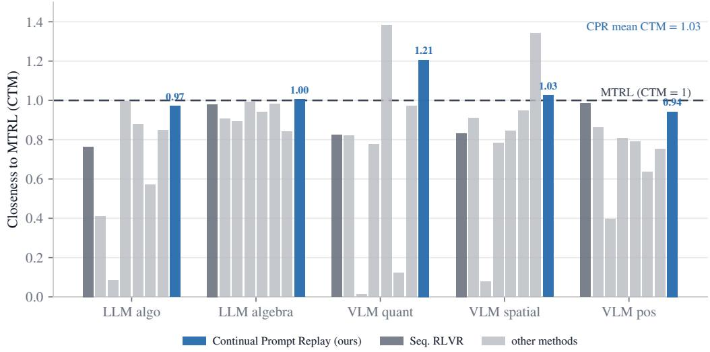  
Figure 10: CPR is the only evaluated CL method that reaches MTRL-level performance on average. Bars show CTM for eight sequential methods in each setting. Seq. RLVR is dark gray. The six other interventions are light gray. CPR is blue. This level is reached or exceeded for LLM algebra, VLM quantitative reasoning, and VLM spatial reasoning. Its mean CTM is 1.03, compared with 0.88 for Seq. RLVR.

The same FinalAvg difference can reflect different changes in FWT, TLG, and BWT. Figure 11 compares the exact FinalAvg decomposition for the Seq. RLVR baseline and CPR for each task sequence.

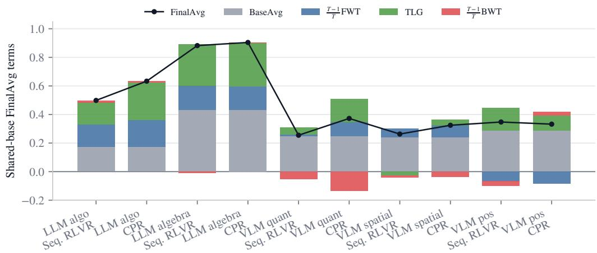  
Figure 11: CPR’s FinalAvg gains arise from FWT, TLG, or both. Each pair compares Seq. RLVR with CPR. Stacked bars show the four terms BaseAvg, $\textstyle { \frac { T - 1 } { T } } \mathrm { F W T } .$ , TLG, $\textstyle { \frac { \dot { T } - 1 } { T } } \mathrm { { B W T } }$ . Black markers show FinalAvg. The BWT effect varies across task sequences. On VLM quantitative reasoning, larger FWT and TLG outweigh a more negative BWT contribution.

Table 10: Complete results for LLM algorithmic reasoning. Base reports pre-training accuracy. Final reports endpoint accuracy. Final−Base, FWT, TLG, BWT use percentage points. The largest reported value in each performance column is bold.
<table><tr><td>Role</td><td>Method</td><td>Model</td><td>Steps</td><td>Base (%)</td><td>Final (%)</td><td>(%)</td><td>Final–Base FWT (%)</td><td>TLG (%)</td><td>BWT (%)</td></tr><tr><td>baseline</td><td>Seq. RLVR</td><td>Qwen3-4B</td><td>500</td><td>17.5</td><td>49.9</td><td>+32.3</td><td>+17.2</td><td>+15.4</td><td>+1.6</td></tr><tr><td>MTRL refer- MTRL ence</td><td></td><td>Qwen3-4B</td><td>500</td><td>17.5</td><td>65.3</td><td>+47.7</td><td></td><td></td><td></td></tr><tr><td>CL method</td><td>FIRE</td><td>Qwen3-4B</td><td>500</td><td>17.5</td><td>5.6</td><td>-11.9</td><td>+10.0</td><td>+12.9</td><td>-37.5</td></tr><tr><td>CL method</td><td>ReDo</td><td>Qwen3-4B</td><td>500</td><td>17.5</td><td>26.8</td><td>+9.2</td><td>+9.5</td><td>+4.6</td><td>-4.4</td></tr><tr><td>CL method</td><td>EWC</td><td>Qwen3-4B</td><td>500</td><td>17.5</td><td>65.0</td><td>+47.5</td><td>+19.9</td><td>+30.1</td><td>-0.6</td></tr><tr><td>CL method</td><td>Muon</td><td>Qwen3-4B</td><td>500</td><td>17.5</td><td>57.4</td><td>+39.9</td><td>+20.0</td><td>+23.7</td><td>-2.0</td></tr><tr><td>CL method</td><td>OSFT</td><td>Qwen3-4B</td><td>500</td><td>17.5</td><td>37.3</td><td>+19.8</td><td>+12.5</td><td>+18.9</td><td>-11.5</td></tr><tr><td>CL method</td><td>CPR</td><td>Qwen3-4B</td><td>500</td><td>17.5</td><td>63.3</td><td>+45.8</td><td>+20.7</td><td>+26.0</td><td>+1.2</td></tr><tr><td>CL method</td><td>KL-to-old-policy</td><td>Qwen3-4B</td><td>500</td><td>17.5</td><td>55.4</td><td>+37.8</td><td>+20.1</td><td>+23.4</td><td>-4.0</td></tr></table>

Table 11: Complete results for LLM algebra. Base reports pre-training accuracy. Final reports endpoint accuracy. Final−Base, FWT, TLG, BWT use percentage points. The largest reported value in each performance column is bold.
<table><tr><td>Role</td><td>Method</td><td>Model</td><td>Steps</td><td>Base (%)</td><td>Final (%)</td><td>(%)</td><td>Final-Base FWT (%)</td><td>TLG (%)</td><td>BWT (%)</td></tr><tr><td>baseline</td><td>Seq. RLVR</td><td>Qwen3-4B</td><td>500</td><td>43.2</td><td>88.2</td><td>+45.1</td><td>+20.3</td><td>+29.1</td><td>-1.1</td></tr><tr><td>MTRL refer- MTRL ence</td><td></td><td>Qwen3-4B</td><td>500</td><td>43.2</td><td>90.0</td><td>+46.8</td><td></td><td></td><td>一</td></tr><tr><td>CL method</td><td>CPR</td><td>Qwen3-4B</td><td>500</td><td>43.2</td><td>90.4</td><td>+47.2</td><td>+19.6</td><td>+30.9</td><td>+0.1</td></tr><tr><td>CL method</td><td>OSFT</td><td>Qwen3-4B</td><td>500</td><td>43.2</td><td>88.4</td><td>+45.2</td><td>+23.6</td><td>+21.9</td><td>+4.3</td></tr><tr><td>CL method</td><td>FIRE</td><td>Qwen3-4B</td><td>500</td><td>43.2</td><td>80.3</td><td>+37.1</td><td>+15.0</td><td>+33.0</td><td>-10.0</td></tr><tr><td>CL method</td><td>ReDo</td><td>Qwen3-4B</td><td>500</td><td>43.2</td><td>81.7</td><td>+38.5</td><td>+19.1</td><td>+23.2</td><td>-0.6</td></tr><tr><td>CL method</td><td>EWC</td><td>Qwen3-4B</td><td>500</td><td>43.2</td><td>89.3</td><td>+46.2</td><td>+19.7</td><td>+30.9</td><td>-1.3</td></tr><tr><td>CL method</td><td>KL-to-old-policy</td><td>Qwen3-4B</td><td>500</td><td>43.2</td><td>75.7</td><td>+32.6</td><td>+16.1</td><td>+4.3</td><td>+17.7</td></tr><tr><td>CL method</td><td>Muon</td><td>Qwen3-4B</td><td>500</td><td>43.2</td><td>84.8</td><td>+41.6</td><td>+25.0</td><td>+23.4</td><td>-3.2</td></tr></table>

Table 12: Complete results for VLM quantitative reasoning. Base reports pre-training accuracy. Final reports endpoint accuracy. Final−Base, FWT, TLG, BWT use percentage points. The largest reported value in each performance column is bold.
<table><tr><td>Role</td><td>Method</td><td>Model</td><td>Steps</td><td>Base (%)</td><td>Final (%)</td><td>(%)</td><td>Final-Base FWT (%)</td><td>TLG (%)</td><td>BWT (%)</td></tr><tr><td>baseline</td><td>Seq. RLVR</td><td>Qwen2.5-VL-7B</td><td>500</td><td>24.8</td><td>25.5</td><td>+0.7</td><td>+1.4</td><td>+5.1</td><td>-7.2</td></tr><tr><td>MTRL refer- MTRL ence</td><td></td><td>Qwen2.5-VL-7B</td><td>500</td><td>24.8</td><td>30.9</td><td>+6.1</td><td></td><td></td><td>一</td></tr><tr><td>CL method</td><td>CPR</td><td>Qwen2.5-VL-7B</td><td>500</td><td>24.8</td><td>37.2</td><td>+12.5</td><td>+13.2</td><td>+16.0</td><td>-18.0</td></tr><tr><td>CL method</td><td>ReDo</td><td>Qwen2.5-VL-7B</td><td>500</td><td>24.8</td><td>25.4</td><td>+0.6</td><td>-1.4</td><td>-3.0</td><td>+6.2</td></tr><tr><td>CL method</td><td>FIRE</td><td>Qwen2.5-VL-7B</td><td>500</td><td>24.8</td><td>0.4</td><td>-24.4</td><td>+0.1</td><td>-3.2</td><td>-28.3</td></tr><tr><td>CL method</td><td>EWC</td><td>Qwen2.5-VL-7B</td><td>500</td><td>24.8</td><td>24.0</td><td>-0.8</td><td>+2.9</td><td>-10.7</td><td>+10.3</td></tr><tr><td>CL method</td><td>Muon</td><td>Qwen2.5-VL-7B</td><td>500</td><td>24.8</td><td>42.7</td><td>+17.9</td><td>+13.9</td><td>+6.3</td><td>+1.6</td></tr><tr><td>CL method</td><td>OSFT</td><td>Qwen2.5-VL-7B</td><td>500</td><td>24.8</td><td>3.8</td><td>-21.0</td><td>-17.0</td><td>-11.3</td><td>+3.9</td></tr><tr><td>CL method</td><td>KL-to-old-policy</td><td>Qwen2.5-VL-7B</td><td>500</td><td>24.8</td><td>30.0</td><td>+5.3</td><td>+7.2</td><td>-15.2</td><td>+20.0</td></tr></table>

Table 13: Complete results for VLM spatial reasoning. Base reports pre-training accuracy. Final reports endpoint accuracy. Final−Base, FWT, TLG, BWT use percentage points. The largest reported value in each performance column is bold.
<table><tr><td>Role</td><td>Method</td><td>Model</td><td>Steps</td><td>Base (%)</td><td>Final (%)</td><td>(%)</td><td>Final-Base FWT (%)</td><td>) TLG (%)</td><td>BWT (%)</td></tr><tr><td>baseline</td><td>Seq. RLVR</td><td>Qwen2.5-VL-7B</td><td>500</td><td>24.1</td><td>26.3</td><td>+2.2</td><td>+7.4</td><td>-2.7</td><td>-1.5</td></tr><tr><td>MTRL refer- MTRL ence</td><td></td><td>Qwen2.5-VL-7B</td><td>500</td><td>24.1</td><td>31.6</td><td>+7.5</td><td></td><td>一</td><td>一</td></tr><tr><td>CL method</td><td>CPR</td><td>Qwen2.5-VL-7B</td><td>500</td><td>24.1</td><td>32.5</td><td>+8.4</td><td>+9.9</td><td>+4.0</td><td>-4.6</td></tr><tr><td>CL method</td><td>ReDo</td><td>Qwen2.5-VL-7B</td><td>500</td><td>24.1</td><td>28.7</td><td>+4.7</td><td>+1.9</td><td>-3.7</td><td>+8.1</td></tr><tr><td>CL method</td><td>FIRE</td><td>Qwen2.5-VL-7B</td><td>500</td><td>24.1</td><td>2.5</td><td>-21.6</td><td>-1.7</td><td>-6.5</td><td>-16.4</td></tr><tr><td>CL method</td><td>EWC</td><td>Qwen2.5-VL-7B</td><td>500</td><td>24.1</td><td>24.7</td><td>+0.6</td><td>-7.7</td><td>+8.7</td><td>-2.0</td></tr><tr><td>CL method</td><td>Muon</td><td>Qwen2.5-VL-7B</td><td>500</td><td>24.1</td><td>26.7</td><td>+2.6</td><td>-4.2</td><td>+1.4</td><td>+5.7</td></tr><tr><td>CL method</td><td>OSFT</td><td>Qwen2.5-VL-7B</td><td>500</td><td>24.1</td><td>30.0</td><td>+5.9</td><td>+1.2</td><td>-1.4</td><td>+7.6</td></tr><tr><td>CL method</td><td>KL-to-old-policy</td><td>Qwen2.5-VL-7B</td><td>500</td><td>24.1</td><td>42.4</td><td>+18.4</td><td>+7.7</td><td>+14.5</td><td>-3.1</td></tr></table>

Table 14: Complete results for VLM positional reasoning. Base reports pre-training accuracy. Final reports endpoint accuracy. Final−Base, FWT, TLG, BWT use percentage points. The largest reported value in each performance column is bold.
<table><tr><td>Role</td><td>Method</td><td>Model</td><td>Steps</td><td>Base (%)</td><td>Final (%)</td><td>(%)</td><td>Final-Base FWT (%)</td><td>) TLG (%)</td><td>BWT (%)</td></tr><tr><td>baseline</td><td>Seq. RLVR</td><td>Qwen2.5-VL-7B</td><td>500</td><td>28.7</td><td>34.7</td><td>+6.0</td><td>-8.9</td><td>+15.8</td><td>-4.2</td></tr><tr><td>MTRL refer- MTRL ence</td><td></td><td>Qwen2.5-VL-7B</td><td>500</td><td>28.7</td><td>35.3</td><td>+6.6</td><td></td><td></td><td></td></tr><tr><td>CL method</td><td>CPR</td><td>Qwen2.5-VL-7B</td><td>500</td><td>28.7</td><td>33.2</td><td>+4.5</td><td>-11.3</td><td>+10.4</td><td>+3.4</td></tr><tr><td>CL method</td><td>ReDo</td><td>Qwen2.5-VL-7B</td><td>500</td><td>28.7</td><td>30.5</td><td>+1.7</td><td>+0.7</td><td>+2.3</td><td>-1.6</td></tr><tr><td>CL method</td><td>FIRE</td><td>Qwen2.5-VL-7B</td><td>500</td><td>28.7</td><td>14.0</td><td>-14.8</td><td>-21.8</td><td>+6.5</td><td>-6.6</td></tr><tr><td>CL method</td><td>Muon</td><td>Qwen2.5-VL-7B</td><td>500</td><td>28.7</td><td>27.9</td><td>-0.8</td><td>-8.2</td><td>+3.6</td><td>+2.4</td></tr><tr><td>CL method</td><td>EWC</td><td>Qwen2.5-VL-7B</td><td>500</td><td>28.7</td><td>28.5</td><td>-0.2</td><td>-7.6</td><td>+5.5</td><td>+0.0</td></tr><tr><td>CL method</td><td>OSFT</td><td>Qwen2.5-VL-7B</td><td>500</td><td>28.7</td><td>22.5</td><td>-6.2</td><td>-4.0</td><td>-5.2</td><td>+2.6</td></tr><tr><td>CL method</td><td>KL-to-old-policy</td><td>Qwen2.5-VL-7B</td><td>500</td><td>28.7</td><td>26.5</td><td>-2.2</td><td>-9.6</td><td>+10.8</td><td>-7.8</td></tr></table>

## D.2 ADDITIONAL CPR ABLATION RESULTS

We use two ablations to isolate CPR’s replay mechanism. Table 15 tests current-policy regeneration.   
Table 16 changes the replay pool.

Table 15: Current-policy regeneration drives CPR’s replay gain. On LLM algorithmic reasoning at 500 steps and $\rho = 0 . 5 ,$ , sample replay reuses earlier-policy trajectories with importance sampling. CPR regenerates responses with the current policy. Delta rows are relative to no replay and are computed from unrounded values. The best value among the three sequential variants in each metric is bold.
<table><tr><td>Variant</td><td>FinalAvg (%)</td><td>FWT (%)</td><td>TLG (%)</td><td>BWT (%)</td></tr><tr><td>No replay (Seq. RLVR)</td><td>49.9</td><td>+17.2</td><td>+15.4</td><td>+1.6</td></tr><tr><td>Sample replay</td><td>47.5</td><td>+19.6</td><td>+10.3</td><td>+2.3</td></tr><tr><td>CPR</td><td>63.3</td><td>+20.7</td><td>+26.0</td><td>+1.2</td></tr><tr><td>MTRL reference</td><td>65.3</td><td></td><td></td><td>一</td></tr><tr><td>∆ Sample replay – no replay</td><td>-2.4</td><td>+2.4</td><td>-5.1</td><td>+0.6</td></tr><tr><td>∆ CPR — no replay</td><td>+13.5</td><td>+3.5</td><td>+10.7</td><td>-0.4</td></tr></table>

Table 16: Replaying prompts from all previous tasks gives the highest mean FinalAvg. No replay corresponds to Seq. RLVR. Replay from only the immediately previous task is reported for LLM algorithmic reasoning. Bold values mark the maximum within each setting and among the mean rows.
<table><tr><td>Setting</td><td>Replay pool</td><td>FinalAvg (%)</td><td></td><td>CTM FWT (%)</td><td>TLG (%)</td><td>BWT (%)</td></tr><tr><td>LLM algorithmic</td><td>No replay</td><td>49.9</td><td>0.76</td><td>+17.2</td><td>+15.4</td><td>+1.6</td></tr><tr><td>LLM algorithmic</td><td>Immediately previous task</td><td>66.3</td><td>1.02</td><td>+20.8</td><td>+30.1</td><td>+0.0</td></tr><tr><td>LLM algorithmic</td><td>All previous tasks (CPR)</td><td>63.3</td><td>0.97</td><td>+20.7</td><td>+26.0</td><td>+1.2</td></tr><tr><td>LLM algorithmic</td><td>Previous and current tasks</td><td>64.3</td><td>0.98</td><td>+20.9</td><td>+29.1</td><td>-1.3</td></tr><tr><td>LLM algebra</td><td>No replay</td><td>88.2</td><td>0.98</td><td>+20.3</td><td>+29.1</td><td>-1.1</td></tr><tr><td>LLM algebra</td><td>All previous tasks (CPR)</td><td>90.4</td><td>1.00</td><td>+19.6</td><td>+30.9</td><td>+0.1</td></tr><tr><td>LLM algebra</td><td>Previous and current tasks</td><td>91.2</td><td>1.01</td><td>+20.8</td><td>+31.3</td><td>-0.8</td></tr><tr><td>VLM quantitative</td><td>No replay</td><td>25.5</td><td>0.83</td><td>+1.4</td><td>+5.1</td><td>-7.2</td></tr><tr><td>VLM quantitative</td><td>All previous tasks (CPR)</td><td>37.2</td><td>1.21</td><td>+13.2</td><td>+16.0</td><td>-18.0</td></tr><tr><td>VLM quantitative</td><td>Previous and current tasks</td><td>36.5</td><td>1.18</td><td>+10.9</td><td>+3.4</td><td>+0.1</td></tr><tr><td>VLM spatial</td><td>No replay</td><td>26.3</td><td>0.83</td><td>+7.4</td><td>-2.7</td><td>-1.5</td></tr><tr><td>VLM spatial</td><td>All previous tasks (CPR)</td><td>32.5</td><td>1.03</td><td>+9.9</td><td>+4.0</td><td>-4.6</td></tr><tr><td>VLM spatial</td><td>Previous and current tasks</td><td>29.8</td><td>0.94</td><td>+6.1</td><td>-0.1</td><td>+0.9</td></tr><tr><td>VLM positional</td><td>No replay</td><td>34.7</td><td>0.98</td><td>-8.9</td><td>+15.8</td><td>-4.2</td></tr><tr><td>VLM positional</td><td>All previous tasks (CPR)</td><td>33.2</td><td>0.94</td><td>-11.3</td><td>+10.4</td><td>+3.4</td></tr><tr><td>VLM positional</td><td>Previous and current tasks</td><td>31.1</td><td>0.88</td><td>-4.3</td><td>+6.7</td><td>-1.4</td></tr><tr><td>Mean</td><td>No replay</td><td>44.9</td><td>0.88</td><td>+7.5</td><td>+12.5</td><td>-2.5</td></tr><tr><td>Mean</td><td>All previous tasks (CPR)</td><td>51.3</td><td>1.03</td><td>+10.4</td><td>+17.5</td><td>-3.6</td></tr><tr><td>Mean</td><td>Previous and current tasks</td><td>50.6</td><td>1.00</td><td>+10.9</td><td>+14.1</td><td>-0.5</td></tr></table>

Replaying prompts from all previous tasks raises mean FinalAvg from 44.9% to 51.3%. Allowing current-task prompts reaches 50.6%.

## D.3 ROBUSTNESS TO REPLAY RATIO ρ

CPR remains near MTRL across a tenfold range of nonzero replay ratios. Holding all other settings fixed on LLM algorithmic reasoning, $\rho \in \{ 0 . 0 5 , 0 . 2 0 , 0 . 5 0 \}$ } gives CTM between 0.97 and 0.99.

Table 17: CPR is robust to replay ratio ρ on LLM algorithmic reasoning. With Qwen3-4B, every tested nonzero ratio reaches CTM 0.97–0.99, compared with 0.76 without replay. FinalAvg varies by only 1.3 percentage points across the nonzero ratios. The best sequential value in each metric is bold.
<table><tr><td>Replay ratio ρ</td><td>FinalAvg (%)</td><td>CTM</td><td>FWT (%)</td><td>TLG (%)</td><td>BWT (%)</td></tr><tr><td>0.00 (Seq. RLVR)</td><td>49.9</td><td>0.76</td><td>+17.2</td><td>+15.4</td><td>+1.6</td></tr><tr><td>0.05</td><td>64.5</td><td>0.99</td><td>+22.7</td><td>+28.9</td><td>-2.6</td></tr><tr><td>0.20</td><td>63.2</td><td>0.97</td><td>+20.1</td><td>+29.2</td><td>-1.8</td></tr><tr><td>0.50</td><td>63.3</td><td>0.97</td><td>+20.7</td><td>+26.0</td><td>+1.2</td></tr><tr><td>MTRL reference</td><td>65.3</td><td>1.00</td><td>一</td><td>一</td><td>一</td></tr></table>

## D.4 CPR GAINS ACCOMPANY BOTH ENTROPY INCREASES AND DECREASES

We test whether lower final-policy entropy consistently accompanies CPR’s performance gains. For each method’s final policy, we measure generated-token predictive entropy on a fixed prompt set under greedy decoding. The reported value is the token-weighted mean over generated response tokens, in nats. Figure 12 compares CPR with the Seq. RLVR baseline within each setting.

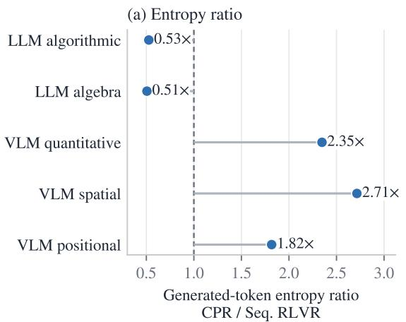

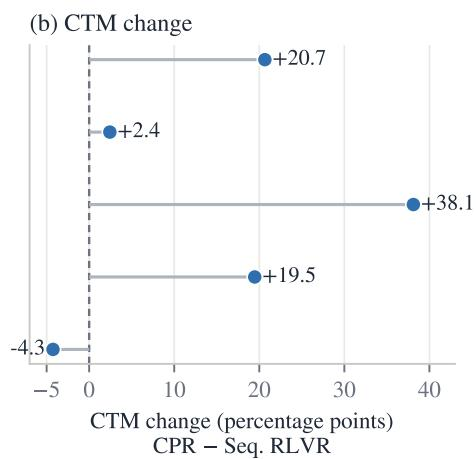  
Figure 12: CPR gains accompany both entropy increases and decreases. Each row pairs CPR with Seq. RLVR in the same setting. The left panel reports the ratio of final-policy generated-token entropy, measured on fixed prompts under greedy decoding. The right panel reports the corresponding CTM change. Dashed lines mark no change. Among the four settings where CPR improves CTM, entropy decreases in both LLM settings and increases in VLM quantitative and spatial reasoning.

CPR gains occur under opposite entropy changes. Entropy falls by 47–49% in the two LLM settings, where CTM rises by 20.7 and 2.4 percentage points. In VLM quantitative and spatial reasoning, entropy rises to 2.35 and 2.71 times the corresponding baseline level while CTM rises by 38.1 and 19.5 points. CPR’s gains therefore do not consistently coincide with lower final-policy entropy.

## D.5 ADDITIONAL EVIDENCE FOR SHARED REASONING

We provide additional diagnostics for both roles of shared reasoning. We compare the current-task direction with a mixture that includes previous-task directions to test the mechanism CPR uses to improve FWT and TLG. We then examine task-gradient alignment across domains. With the jugs trajectory, we connect later-task support to modest forgetting and earlier-task support to forward transfer at the behavioral level.

## D.5.1 GRADIENT ALIGNMENT DIAGNOSTICS

We use two diagnostics. First, at the Qwen3-4B base model, we compare the current-task gradient with a mixture that includes previous-task gradients. Second, we compare task-gradient alignment across domains.

Adding previous-task gradients improves alignment with the all-task mean. At the Qwen3-4B base model $\theta ^ { \star }$ , we evaluate all ten LLM algorithmic task gradients and write

$$
g _ { k } ^ { \star } = \nabla J _ { k } ( \theta ^ { \star } ) , \qquad { \bar { g } } ^ { \star } = \frac { 1 } { 1 0 } \sum _ { i = 1 } ^ { 1 0 } g _ { i } ^ { \star } .\tag{18}
$$

Each $g _ { k } ^ { \star }$ averages two mini-batch gradients from the language-model head and final two transformer blocks. Combining all eight FSDP shards gives 201,861,632 coordinates. The parameters remain fixed throughout collection.

For each stage $t \in \{ 2 , \ldots , 1 0 \}$ in the LLM algorithmic sequence, we compare the current-task direction with an equal-weight previous-task mixture:

$$
g _ { t } ^ { \mathrm { c u r r e n t } } = g _ { t } ^ { \star } , \qquad g _ { t } ^ { \mathrm { m i x } } = 0 . 5 g _ { t } ^ { \star } + \frac { 0 . 5 } { t - 1 } \sum _ { k < t } g _ { k } ^ { \star } .\tag{19}
$$

Only current-task and previous-task gradients enter $g _ { t } ^ { \operatorname* { m i x } }$ . We evaluate both directions by their align ment with the all-task mean $\bar { g } ^ { \star }$ . We use equal weighting to isolate the contribution of previous-task directions from CPR’s prompt selector.

Table 18 reports cosine and inner product with $\bar { g } ^ { \star }$ . Across stages 2 through 10, mean cosine rises from 0.43 to 0.79. Mean inner product rises by 18.2%, while its standard deviation falls by 55.3%. The mixture has the higher cosine in all nine comparisons and the higher raw inner product in seven.

Table 18: Adding previous-task gradients improves alignment with the all-task mean at the Qwen3-4B base model. Each row uses the same fixed set of ten task gradients. For each stage, the mixture assigns half of its weight to the current task and distributes the other half equally across previous tasks. The all-task mean $\bar { g } ^ { \star }$ serves only as the evaluation direction. Inner products are reported in units of 10<sup>−5</sup>.
<table><tr><td colspan="2"></td><td colspan="2">Cosine to  $\bar { g } ^ { \star }$ </td><td colspan="2">Inner product  $( 1 0 ^ { - 5 } )$ </td></tr><tr><td>Stage</td><td>Current task</td><td>Current</td><td>Mixture</td><td>Current</td><td>Mixture</td></tr><tr><td>2</td><td>Binary Alternation</td><td>0.410</td><td>0.628</td><td>1.122</td><td>5.421</td></tr><tr><td>3</td><td>Binary Matrix</td><td>0.467</td><td>0.679</td><td>7.811</td><td>6.616</td></tr><tr><td>4</td><td>Caesar Cipher</td><td>0.351</td><td>0.804</td><td>1.384</td><td>3.801</td></tr><tr><td>5</td><td>Cryptarithm</td><td>0.372</td><td>0.811</td><td>0.964</td><td>2.987</td></tr><tr><td>6</td><td>Isomorphic Strings</td><td>0.751</td><td>0.849</td><td>17.877</td><td>11.039</td></tr><tr><td>7</td><td>Jugs</td><td>0.391</td><td>0.905</td><td>1.619</td><td>4.049</td></tr><tr><td>8</td><td>Matrix Rotation</td><td>0.360</td><td>0.761</td><td>3.394</td><td>4.590</td></tr><tr><td>9</td><td>String Manipulation</td><td>0.422</td><td>0.780</td><td>4.125</td><td>4.806</td></tr><tr><td>10</td><td>A::B Rewriting</td><td>0.344</td><td>0.929</td><td>1.051</td><td>3.193</td></tr><tr><td>Mean</td><td></td><td>0.430</td><td>0.794</td><td>4.372</td><td>5.167</td></tr><tr><td>Std.</td><td></td><td>0.120</td><td>0.092</td><td>5.217</td><td>2.330</td></tr></table>

Shared LLM geometry weakens across domains. Figure 13 combines separately collected CPR diagnostics for the ten algorithmic tasks and six algebra tasks using the same model and parameter subset. Across the 60 cross-domain task pairs, mean cosine is −0.01. The cosine between the two domain-average gradient vectors is 0.006. Both are close to zero, placing the measured algorithmic–algebra geometry near orthogonality. This panel characterizes cross-domain geometry. The comparison above instead measures how adding previous-task gradients at the Qwen3-4B base model changes alignment with the all-task mean.

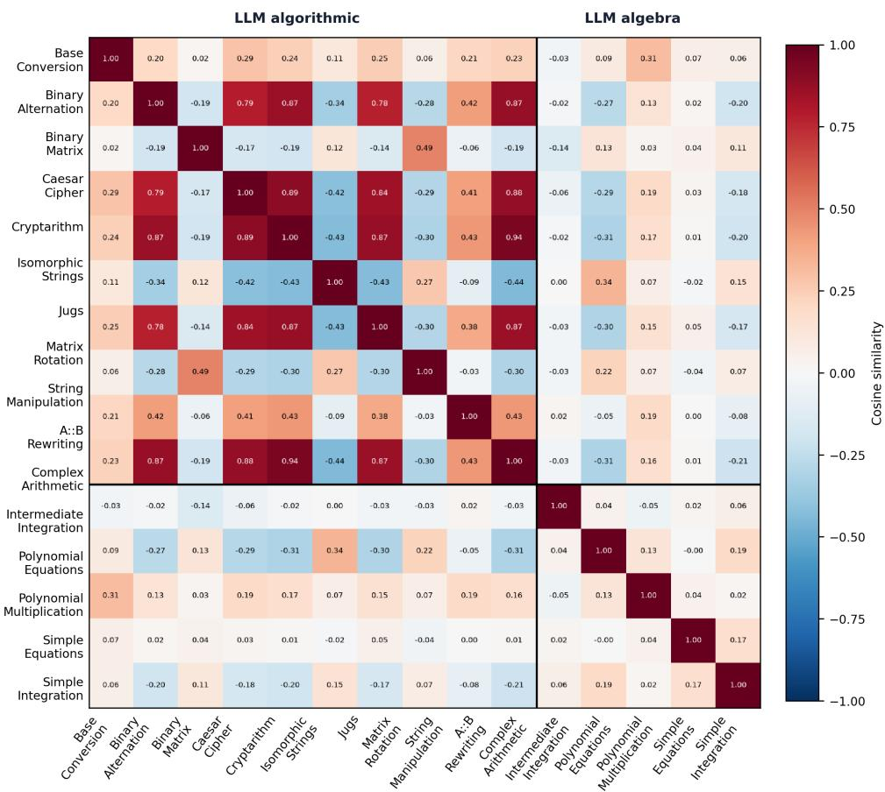  
Figure 13: LLM gradient alignment weakens across the algorithmic–algebra boundary. Pairwise cosines are shown for the ten algorithmic tasks and six algebra tasks. Black lines mark the domain boundary. Cross-domain task pairs have mean cosine −0.01, while the cosine between the two domain-average vectors is 0.006. The panel combines separately collected CPR diagnostics.

Measured VLM gradients remain positively aligned across domains. Figure 14 combines CPR diagnostics collected separately on the quantitative, spatial, and positional domains. Every displayed off-diagonal cosine is positive, including all cross-domain blocks. Comparing these positive VLM cosines with the near-zero LLM geometry, we find that cross-task alignment varies with the reasoning domain.

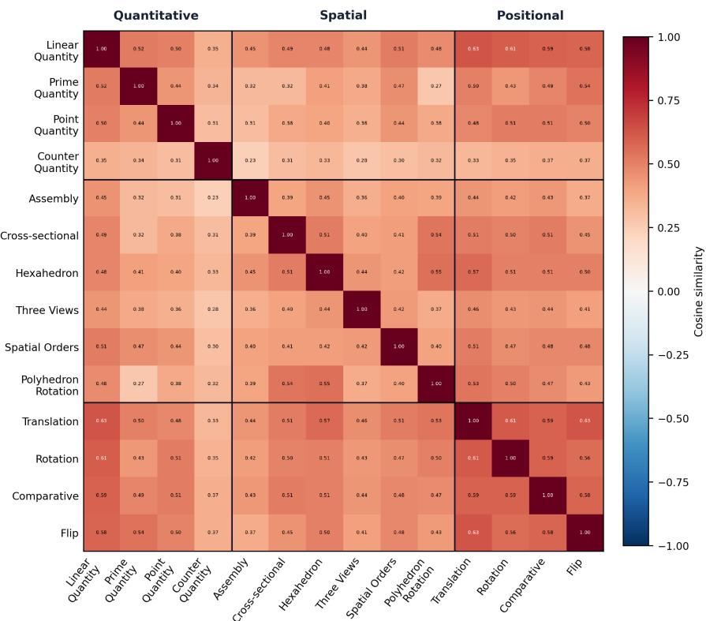  
Figure 14: The measured VLM task gradients are positively aligned across all three domains. The matrix combines separately collected CPR diagnostics for quantitative, spatial, and positional reasoning. Every displayed off-diagonal task pair has positive cosine, including pairs that cross domain boundaries. Black lines mark those boundaries.

At the frozen LLM checkpoint, adding previous-task directions increases average alignment to the all-task direction while reducing its variation across stages 2 through 10. Across domains, measured task-gradient alignment ranges from near-orthogonal algorithmic–algebra geometry to uniformly positive VLM geometry. We use this contrast to characterize the strength of shared reasoning as domain-dependent.

## D.5.2 JUGS REASONING TRAJECTORY

We use the jugs trajectory to distinguish procedural reasoning from verifier-valid answer generation across four checkpoints from the same Seq. RLVR run on the LLM algorithmic stream (Figure 5). Before any RLVR, the base model explores alternative routes, derives the optimal 10-operation Bto-A route, and then continues to recheck it until generation ends without an answer. The pre-jugs policy abandons an initial direction, reaches A=3 through a longer 28-operation route, and likewise emits no answer. After direct jugs training, the model derives the optimal route, explicitly checks all 10 states, and emits a valid answer. The final policy produces the same answer after later-task training while reducing the reasoning trace from 1,631 to 780 characters and omitting the separate rechecking pass.

Raw transcripts. The four outputs summarized in Figure 5 appear below verbatim.

Base model / before RLVR jugs, LLM algorithmic   
<think>   
Okay, let’s see. I need to figure out how to get exactly 3 liters in any of the jugs using   
the given moves. The jugs are A (10L), B (11L), and C (11L). The target is 3 liters. All   
start empty.   
First, I remember that these types of puzzles usually involve filling, emptying, and pouring   
between jugs to reach the desired amount. Since the target is 3, which is smaller than

7. Empty A → A=0, B=2, C=0.

5. Fill B again → B=11, A=1, C=0.

the capacities of all jugs, maybe I need to find a way to measure it through some combination of pours.

Let me think about possible steps. Let’s start by trying to fill the largest jugs first. Maybe fill B or C first. But since they are 11L, which is more than 3, maybe that’s not directly helpful. Wait, but if I can pour from a full jug into another, maybe I can get the right amount.

Wait, the target is 3. Let me think of possible combinations. For example, if I can get 11 - 8 = 3, but how to get 8? Alternatively, maybe using the 10L jug. If I fill A (10L) and pour into B (11L), but B is empty. So pour A into B. Then B has 10L, A is empty. Then fill A again, pour into B. B can take 1L more (since it’s 11L). So after pouring, B is full (11L), and A has 10 - 1 = 9L left. Then empty B. Now, pour the 9L from A into B. Now B has 9L, A is empty. Then fill A again (10L), pour into B. B can take 2 more liters (11-9=2). So after pouring, B is 11L, A has 10-2=8L. Then empty B again. Now pour A’s 8 L into B. B has 8L. Fill A again (10L), pour into B. B can take 3 more liters (11-8=3). So after pouring, A has 10-3=7L, and B is full. But that’s not helpful. Wait, but maybe I can use another jug. Alternatively, maybe using C instead of B.

Alternatively, maybe using the 10L and 11L jugs. Let me think. If I fill B (11L) and pour into A (10L). Then B has 1L left. Then empty A. Now pour the 1L from B into A. Now A has 1L. Then fill B again (11L), pour into A until A is full. A can take 9 more liters. So B would have 11 - 9 = 2L left. Then empty A again. Pour the 2L from B into A. Now A has 2L. Fill B again (11L), pour into A. A can take 8 more liters, so B would have 11 - 8 = 3L. There we go! So B would have 3L. That’s the target. Let me check the steps again.

## So steps would be:

1. Fill B (11L) → B=11, A=0, C=0.

2. Pour B into A until A is full. A can take 10L, so B has 11-10=1L left. Now A=10, B=1, C=0. 3. Empty A → A=0. B=1. C=0

4. Pour B into A. Now A=1, B=0, C=0.

6. Pour B into A until A is full. A can take 9 more liters. So B becomes 11-9=2L. Now A=10, B =2, C=0.

8. Pour B into A. Now A=2, B=0, C=0.

9. Fill B again → B=11, A=2, C=0.

10. Pour B into A until A is full. A can take 8 liters, so B becomes 11-8=3L. Now B=3, which is the target.

## So the moves would be:

fill B, pour B->A, empty A, pour B->A, fill B, pour B->A, empty A, pour B->A, fill B, pour B ->A.

But let me

## Before jugs training / step 300

## <think>

1. Fill the 10L jug (A) to 10L.

6. Pour the 9L from A into B. Now B has 9L, A is empty.

10. Pour the 8L from A into B. Now B has 8L, A is empty.

11. Fill A again (10L).   
12. Pour from A to B. B can take 3L (since it has 8L, needs 3 more to reach 11). So after   
pouring, B is 11L, A has 10 - 3 = 7L.   
13. Empty B again.   
14. Pour the 7L from A into B. Now B has 7L, A is empty.   
15. Fill A again (10L).   
16. Pour from A to B. B can take 4L (7 + 4 = 11). So A has 10 - 4 = 6L.   
17. Empty B again.   
18. Pour the 6L from A into B. Now B has 6L, A is empty.   
19. Fill A again (10L).   
20. Pour from A to B. B can take 5L (6 + 5 = 11). A has 10 - 5 = 5L.   
21. Empty B again.   
22. Pour the 5L from A into B. Now B has 5L, A is empty.   
23. Fill A again (10L).   
24. Pour from A to B. B can take 6L (5 + 6 = 11). A has 10 - 6 = 4L.   
25. Empty B again.   
26. Pour the 4L from A into B. Now B has 4L, A is empty.   
27. Fill A again (10L).   
28. Pour from A to B. B can take 7L (4 + 7 = 11). A has 10 - 7 = 3L.   
Ah, there we go. Now A has 3L. So the steps would be:   
Fill A, pour to B, fill A, pour to B, empty B, pour A to B, fill A, pour to B, empty B, pour   
A to B, fill A, pour to B, empty B, pour A to B, fill A, pour to B, empty B, pour A to B   
, fill A, pour to B, empty B, pour A to B, fill A, pour to B.

After jugs training / step 350 jugs, LLM algorithmic   
<think>   
Okay, let’s see. I need to figure out how to get exactly 3 gallons in any of the jugs. The   
jugs are A (10), B (11), and C (11). The target is 3. So, the possible moves are fill,   
empty, and pour.   
First, I should think about the possible combinations. Since the jugs are 10, 11, and 11,   
maybe I can use the 11-liter jugs to measure out the 3. Let me try to think of steps.   
Let me start by filling the 11-liter jug (B) first. Then, pour it into the 10-liter jug (A).   
That would leave 1 liter in B. Then, empty A. Now, pour the 1 liter from B into A. Now A   
has 1 liter, B is empty. Then, fill B again. Now, pour B into A until A is full. A can   
take 9 more, so B would have 11 - 9 = 2 left. Then empty A again. Now pour the 2 from B   
into A. Now A has 2. Fill B again. Now pour B into A. A can take 8 more, so B would have   
11 - 8 = 3. There we go. So the steps would be:   
Fill B, pour B into A. Empty A, pour B into A. Fill B, pour B into A. Empty A, pour B into A.   
Then fill B again and pour into A. That would leave 3 in B. So the moves would be:   
fill B   
pour B->A   
empty A   
pour B->A   
fill B   
pour B->A   
empty A   
pour B->A   
fill B   
pour B->A   
Wait, but that’s a lot of steps. Let me check again. Let me track each step:   
1. Fill B (11)   
2. Pour B into A (A is 10, B is 1)   
3. Empty A (A is 0, B is 1)   
4. Pour B into A (A is 1, B is 0)   
5. Fill B (11)   
6. Pour B into A (A can take 9, so B has 2 left)   
7. Empty A (A is 0, B is 2)   
8. Pour B into A (A is 2, B is 0)   
9. Fill B (11)   
10. Pour B into A (A can take 8, so B has 3 left)   
So after step 10, B has 3. So the moves would be the list of these steps. So the answer is   
the list of these moves.   
</think>   
<answer>["fill B", "pour B->A", "empty A", "pour B->A", "fill B", "pour B->A", "empty A", "   
pour B->A", "fill B", "pour B->A"]</answer>

Final policy / step 500 jugs, LLM algorithmic   
<think>   
Okay, let’s see. I need to get exactly 3 gallons in any of the jugs. The jugs are A (10), B   
(11), and C (11). The moves are fill, empty, and pour. Let me think.   
First, maybe start by filling the largest jug, like B or C. Let’s try filling B. Then pour   
from B to A. Since A is 10, and B is 11, pouring B into A would fill A to 10, leaving 1   
in B. Then empty A. Now, pour the 1 from B to A. Now A has 1. Then fill B again. Now   
pour B into A. A can take 9 more, so B would have 11-9=2 left. Now B has 2. Then empty A   
. Pour B’s 2 into A. Now A has 2. Fill B again. Pour B into A. A can take 8 more, so B   
would have 11-8=3. There we go, B has 3. So the moves would be: fill B, pour B->A, empty   
A, pour B->A, fill B, pour B->A, empty A, pour B->A, fill B, pour B->A. That gives B as   
3.   
</think>   
<answer>["fill B", "pour B->A", "empty A", "pour B->A", "fill B", "pour B->A", "empty A", "   
pour B->A", "fill B", "pour B->A"]</answer>

Together, we use these diagnostics to distinguish the two roles of shared reasoning. Positive mean gradient alignment persists under both Seq. RLVR and CPR, while its magnitude varies across domains. In the jugs trajectory, the learned solution persists through later training, and the final policy produces it with a shorter reasoning trace, consistent with modest forgetting. Success also improves before direct jugs training, illustrating how shared reasoning can benefit forward transfer.

## D.6 PASS@K COMPARISON WITH THE BASE MODEL

We examine whether CPR improves both single-sample accuracy and solution coverage as the sampling budget increases. We compare Qwen3-4B before RLVR with the final 500-step CPR policy with current-task replay. Each policy produces 16 responses at temperature 0.7 for the same 64 held-out prompts per LLM algorithmic task. We estimate pass@1, pass@4, pass@8, and pass@16 from these responses following Chen et al. (2021).

Table 19: CPR improves both pass@1 and higher-K success rates. CPR with current-task replay outperforms the base model throughout the sampling curve. Both policies use the same 64 held-out prompts per task and sample 16 responses at temperature 0.7. The higher value within each task and K is bold.
<table><tr><td>Task</td><td>Policy</td><td>pass@1</td><td>pass@4</td><td>pass@8</td><td>pass@16</td></tr><tr><td>Base Conversion</td><td>Base</td><td>57.7</td><td>81.0</td><td>87.5</td><td>90.6</td></tr><tr><td></td><td>CPR + current</td><td>98.1</td><td>99.8</td><td>100.0</td><td>100.0</td></tr><tr><td>Binary Alternation</td><td>Base</td><td>0.6</td><td>1.8</td><td>2.7</td><td>3.1</td></tr><tr><td></td><td>CPR + current</td><td>43.1</td><td>55.4</td><td>60.1</td><td>64.1</td></tr><tr><td>Binary Matrix</td><td>Base</td><td>17.9</td><td>27.7</td><td>31.7</td><td>34.4</td></tr><tr><td></td><td>CPR + current</td><td>51.0</td><td>56.6</td><td>58.9</td><td>60.9</td></tr><tr><td>Caesar Cipher</td><td>Base</td><td>0.2</td><td>0.8</td><td>1.6</td><td>3.1</td></tr><tr><td></td><td>CPR + current</td><td>5.8</td><td>9.5</td><td>10.2</td><td>10.9</td></tr><tr><td>Cryptarithm</td><td>Base</td><td>0.0</td><td>0.0</td><td>0.0</td><td>0.0</td></tr><tr><td></td><td>CPR + current</td><td>0.0</td><td>0.0</td><td>0.0</td><td>0.0</td></tr><tr><td>Isomorphic Strings</td><td>Base</td><td>59.4</td><td>88.7</td><td>95.0</td><td>98.4</td></tr><tr><td></td><td>CPR + current</td><td>99.9</td><td>100.0</td><td>100.0</td><td>100.0</td></tr><tr><td>Jugs</td><td>Base</td><td>0.0</td><td>0.0</td><td>0.0</td><td>0.0</td></tr><tr><td>Matrix Rotation</td><td>CPR + current</td><td>51.5</td><td>53.1</td><td>53.1</td><td>53.1</td></tr><tr><td></td><td>Base</td><td>33.2</td><td>38.9</td><td>42.1</td><td>45.3</td></tr><tr><td></td><td>CPR + current</td><td>97.6</td><td>99.6</td><td>99.9</td><td>100.0</td></tr><tr><td>String Manipulation</td><td>Base</td><td>4.9</td><td>11.4</td><td>15.1</td><td>18.8</td></tr><tr><td>A::B Rewriting</td><td>CPR + current</td><td>72.9</td><td>84.2</td><td>87.9</td><td>90.6</td></tr><tr><td></td><td>Base</td><td>0.0</td><td>0.0</td><td>0.0</td><td>0.0</td></tr><tr><td></td><td>CPR + current</td><td>36.0</td><td>55.1</td><td>62.7</td><td>68.8</td></tr><tr><td>Macro-average</td><td>Base</td><td>17.4</td><td>25.0</td><td>27.6</td><td>29.4</td></tr><tr><td></td><td>CPR + current</td><td>55.6</td><td>61.3</td><td>63.3</td><td>64.8</td></tr></table>

CPR raises macro pass@1 from 17.4% to 55.6% and macro pass@16 from 29.4% to 64.8%. Its gains remain large throughout the sampling curve: 38.2, 36.3, 35.7, and 35.5 points at K ∈ {1, 4, 8, 16}. At K = 16, CPR improves nine of the ten tasks, including jugs from 0.0% to 53.1% and A::B rewriting from 0.0% to 68.8%.

## D.7 TRAINED SMALL MODELS VERSUS LARGER ZERO-SHOT MODELS

How does training a small model compare with relying on a larger model’s zero-shot performance? We compare the trained Qwen3-4B and Qwen2.5-VL-7B policies with Claude Opus 4.8, GPT-5.5, and larger same-family Qwen backbones. The Qwen references are Qwen3-32B for text reasoning and Qwen2.5-VL-32B-Instruct and Qwen2.5-VL-72B-Instruct for visual reasoning. Every model receives the same prompt, verifier, fixed evaluation examples, and 1024-token response budget.

Table 20: CPR outperforms larger same-family zero-shot models across all five settings. Scores are mean verifier accuracy on CRG’s fixed evaluation sets with a 1024-token response budget. Claude Opus 4.8, GPT-5.5, and the larger Qwen backbones are evaluated zero-shot. Base is the untrained small model. The Seq. RLVR, CPR, and MTRL columns report trained policies. The best score in each row is bold.
<table><tr><td>Setting</td><td>Opus 4.8</td><td>GPT-5.5</td><td>Qwen-32B</td><td>Qwen-72B</td><td>Base</td><td>Seq. RLVR</td><td>CPR</td><td>MTRL</td></tr><tr><td>LLM algorithmic</td><td>53.7</td><td>77.7</td><td>29.3</td><td>一</td><td>17.5</td><td>49.9</td><td>63.3</td><td>65.3</td></tr><tr><td>LLM algebra</td><td>84.0</td><td>94.8</td><td>66.6</td><td>一</td><td>43.2</td><td>88.2</td><td>90.4</td><td>90.0</td></tr><tr><td>VLM quantitative</td><td>10.5</td><td>5.5</td><td>27.7</td><td>26.6</td><td>24.8</td><td>25.5</td><td>37.2</td><td>30.9</td></tr><tr><td>VLM spatial</td><td>19.9</td><td>0.8</td><td>27.7</td><td>28.9</td><td>24.1</td><td>26.3</td><td>32.5</td><td>31.6</td></tr><tr><td>VLM positional</td><td>19.1</td><td>8.6</td><td>27.7</td><td>25.8</td><td>28.7</td><td>34.7</td><td>33.2</td><td>35.3</td></tr></table>

CPR exceeds the larger same-family Qwen references in every setting. The trained 4B text policy outperforms Qwen3-32B, and the trained 7B visual policy outperforms both Qwen2.5-VL-32B-Instruct and Qwen2.5-VL-72B-Instruct. The frontier models show a modality-dependent pattern. GPT-5.5 remains strongest in both text settings, while CPR exceeds Claude Opus 4.8 and GPT-5.5 in all three visual settings.

## E EXTENDED RELATED WORK

RLVR task suites. RLVR task suites supply verifier-scored reasoning problems. Reasoning Gym (Stojanovski et al., 2025) supplies 100+ procedural generators with algorithmic verifiers and parametric difficulty. VisuLogic (Xu et al., 2026) is a human-verified visual-reasoning benchmark with a rule-based RL baseline. AgentGym-RL (Xi et al., 2026) trains multi-turn LLM agents from environment outcome rewards. Verifiable rewards can also incentivize correct reasoning in base LLMs (Wen et al., 2026). These works establish task-generation and reward interfaces for RLVR. Their training protocols expose a fixed task inventory, with some curricula varying difficulty or interaction horizon. CRG orders task identities into stages and evaluates one policy after each arrival.

Forgetting in CL. Catastrophic forgetting describes the loss of earlier-task performance after training on later tasks and remains a central failure mode in CL (Kirkpatrick et al., 2017). Continual World measures this behavior in reinforcement-learning task sequences (Wolczyk et al., 2021), while TRACE treats earlier-task performance as a primary endpoint for sequentially fine-tuned language models (Wang et al., 2023). Reinforcement and supervised updates exhibit different forgetting behavior. RL’s Razor finds that online reinforcement learning forgets less than supervised fine-tuning when the two are matched on new-task performance (Shenfeld et al., 2026). Zhang et al. report that reinforcement fine-tuning causes less forgetting of prior knowledge than SFT in multimodal language models (Zhang et al., 2026). We take these results as evidence that reinforcement-learning updates may cause less forgetting of earlier capabilities than supervised updates. Low forgetting alone does not determine whether sequential training reaches joint training on the final task set. Final performance also depends on how well arriving tasks are learned and how training transfer across tasks. This distinction motivates our comparison between continual RLVR and MTRL.

CL methods. These methods alter how a learner updates across task stages. Their mechanisms include regularization, plasticity restoration, parameter isolation, replay, and optimization. EWC (Kirkpatrick et al., 2017) regularizes parameters by Fisher information, ReDo (Sokar et al., 2023) reactivates dormant units, FIRE (Han et al., 2026) controls re-initialization geometry, SPHERE (Luo et al., 2026) targets spectral plasticity, OSFT (Nayak et al., 2026) constrains updates to a low-rank subspace, and Muon (Liu et al., 2025) changes the optimizer geometry. Their original evaluations span supervised CL, deep RL, and large-model optimization. Our comparison places representatives of these mechanisms under one continual-RLVR protocol and measures whether they narrow the endpoint gap to MTRL.