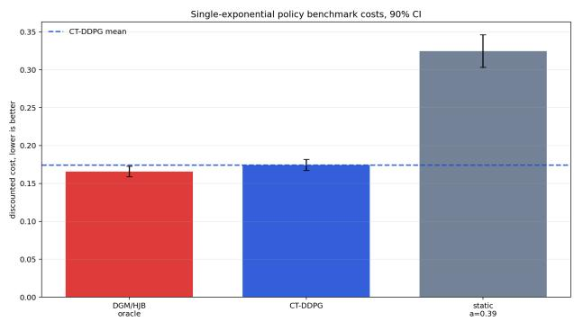
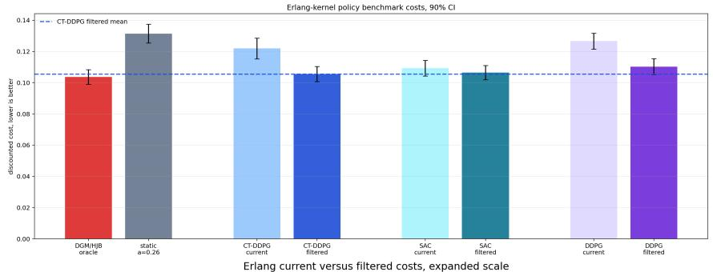
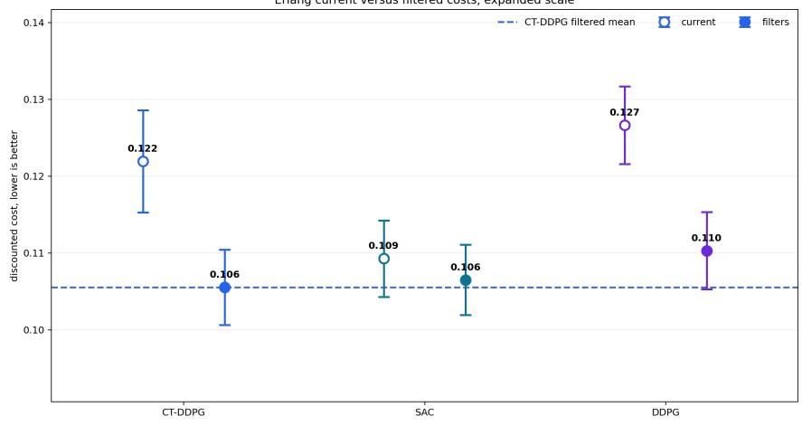
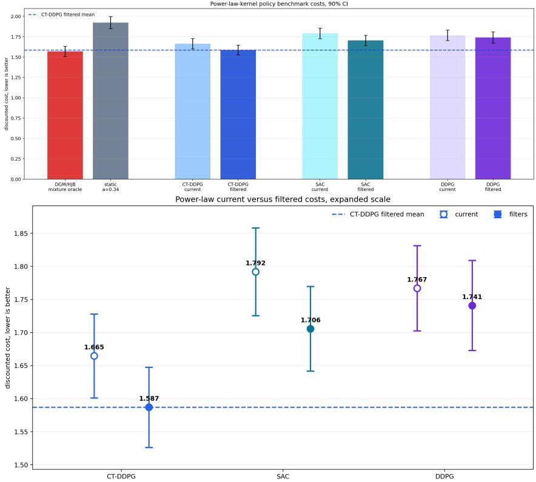

# Continuous-Time Reinforcement Learning for Controlled Hawkes Jump-Difusions

Tomasz R. Bielecki<sup>∗</sup> Thibaut Mastrolia<sup>†</sup> Haoze Yan<sup>‡</sup>

August 20, 2026

## Abstract

We study stochastic control of multivariate Hawkes-driven stochastic diferential equations with machine learning algorithms in a non-Markovian setting. Due to the path dependence of the memory of the Hawkes intensity, this problem does not fall within classical stochastic control theory outside particular Markovian kernels. We first develop a finite-dimensional Markovianization procedure and algorithm to approximate multivariate Hawkes processes with mixtures of exponential kernels. We prove the convergence of the Markovianized approximation of the Hawkes process, its intensity, and the value of the problem to the original non-Markovian processes and the value of the primal problem. We then formulate continuous-time deterministic policy gradient learning on the Markovianized approximation of the problem, called Hawkes-CT DDPG. We propose a model-free algorithm to solve the non-Markovian Hawkes-driven optimization by observing only the event times of the process, the realization of the solution to the SDE, and a chosen set of decay filters, while the Hawkes kernel coeficients remain unknown. We compare our continuous time reinforcement learning Hawkes-CT DDPG method with discrete time reinforcement learning techniques under three diferent types of kernels: simple exponential, Erlang, and power-law kernels.

## 1 Introduction

Cybersecurity has become a major operational concern for large and highly interconnected organizations, where a single security incident can rapidly disrupt essential services and expose sensitive information. A recent illustration is the May 2026 cybersecurity incident afecting Canvas, a cloud-based learning management system used by thousands of schools and universities. The breach led for example UC Berkeley to temporarily restrict access to the platform and potentially exposed information including names, email addresses, student identification numbers, and messages exchanged through Canvas, highlighting the vulnerability of organizations to attacks propagated through third-party digital infrastructure. Such events also illustrate an important feature of cyber risk: attacks rarely occur as isolated and independent events, but may instead arrive in clusters, with previous incidents increasing the likelihood of subsequent malicious activity. Hawkes processes provide a natural probabilistic framework for representing this selfexciting behavior [4]. At the same time, defenders must dynamically decide how to allocate limited security resources as the threat environment evolves. This motivates the combination of Hawkes-process models of cyber-event arrivals with reinforcement learning, which provides a flexible framework for learning adaptive defense strategies in an uncertain and dynamically changing environment. The objective of this study is twofold: study the controlled system of a Hawkes-driven system for general self-excitation processes and develop reinforcement techniques in continuous time to minimize costs related to cascade incidents in an unknown environment.

## 1.1 Hawkes processes: theory, applications, and control

In his pioneering work [28], Alan G. Hawkes introduced the theory of self-exciting point processes, in which the occurrence of an event raises the likelihood of subsequent events; the intensity then decays over time before returning to a baseline level. Since this seminal work, the theory and applications of it have known a growing interest. We refer to for example some recent studies focusing on multivariate processes [11, 10], parameters estimation for linear Hawkes process with general kernel [15], limit and convergence theorems and approximation results [35, 40, 17, 46], expansion formulas and Malliavin calculus [32, 31] or extensions to rough difusions [36, 22, 12]. These processes have found a remarkably wide range of applications, including earthquake modeling [52, 42], finance and microstructure [23, 34], market order flow modeling [38, 37, 26, 25], see also the review papers [3, 29], credit risk [24], epidemiology [48], soccer timing of threat events and ball touches of players [6], more recently, cyber risk [4, 20, 9, 14, 33] or cascade accidents in power plant investment [2]. This last application leads naturally to the question of controlling Hawkes processes, in which a hacker and a defender each seek to optimally manage their losses over the course of an attack episode.

Numerical schemes for simulating Hawkes processes via the so-called thinning method were first investigated in [43, 44], and later rigorously formalized through a two-dimensional Poisson measure by Br´emaud and Massouli´e [13]. Numerical methods for generalized Hawkes have also been recently developed in [54]. The emergence of cyber risk has renewed the mathematical community’s interest in control of Hawkes processes, inducing new challenges related to the control of the intensity process. In its simplest form, a Hawkes process N is a counting process whose self-exciting intensity λ is given by

$$
\lambda _ { t } = \mu _ { \infty } ( t ) + \int _ { 0 } ^ { t - } \Phi ( t - s ) d N _ { s } ,
$$

where $\mu _ { \infty }$ is the baseline intensity and Φ is a kernel that measures the magnitude of the self-excited jumps. The aim of this paper is to study the control of such dynamics in a multidimensional framework, namely

$$
\mathrm { d } X _ { t } = b ( t , X _ { t } , a _ { t } ) \mathrm { d } t + \sigma ( t , X _ { t } , a _ { t } ) \mathrm { d } W _ { t } + \sum _ { i = 1 } ^ { m } \gamma _ { i } ( t , X _ { t - } , a _ { t } ) \mathrm { d } N _ { t } ^ { i } ,
$$

where the intensity of $\boldsymbol { N } = ( N ^ { 1 } , \ldots , N ^ { m } )$ is denoted by $\lambda _ { t } = ( \lambda _ { t } ^ { 1 } , \ldots , \lambda _ { t } ^ { m } ) ^ { \top } \in \mathbb { R } _ { + } ^ { m }$ , and is assumed to be defined componentwise by

$$
\lambda _ { t } ^ { i } = \mu _ { i } ( t , X _ { t - } , a _ { t } ) + \sum _ { j = 1 } ^ { m } \int _ { 0 } ^ { t - } \Phi _ { i j } ( t - s ) \mathrm { d } N _ { s } ^ { j } ,
$$

where Φ is a mutual excitation matrix between each component of N. This kernel lies at the heart of the complexity of Hawkes processes, and developing a self-contained control theory for them remains an open challenge, with only partial preliminary results available so far. When m = 1 and Φ takes the exponential form $\Phi ( s ) = q e ^ { - \beta s }$ , known as the exponential kernel, the intensity λ admits an explicit expression and, in particular, becomes a Markov process. [8] exploited this structure to reduce the stochastic control of a Hawkes-driven difusion with an exponential kernel to a standard Markovian optimization problem with state variables $( N , \lambda )$ later extended in [14, 45] to the control of cyber systems, again restricting attention to a single exponential kernel. To the best of our knowledge, the main recent breakthrough is due to [41], who approximate the value of a stochastic control problem driven by a general-kernel Hawkes process by that of a regularized version driven by a mixture of exponentials. This construction, known as the Markovianization of the generalized Hawkes model, has also been studied for Volterra processes in [1].

## 1.2 Hawkes CT-DDPG: the big picture

The first ingredient of our Hawkes CT-DDPG method is to reconstruct the approximate, Markovianized control problem using only the observed realizations of the controlled difusion together with its event (jump) times, and to store in a replay bufer the new state, composed of the updated difusion value and its jump components. More precisely, the control process a at time t governs how the existing Hawkes memory is read at that time, while past jumps continue to contribute through a classical Hawkes kernel. The Markovian approximation of a kernel Φ controlled by a takes the form

$$
\Phi ( \tau , a ) \approx \Phi _ { K } ( \tau , a ) = \sum _ { k = 1 } ^ { K } Q _ { k } ( a ) e ^ { - \beta _ { k } \tau } .
$$

Note that mixtures of exponentials with possibly negative weights are dense in $L ^ { p } ,$ , see [39]. We use this fundamental result for the Markovianization of the kernel Φ above through the matrices $Q _ { k } ( a )$ which may have non-positive entries. This may produce negative raw memory values. To avoid that, we define the componentwise positive part to the approximated memory term:

$$
\lambda _ { t } ^ { K } = \mu ( t , X _ { t - } ^ { K } , a _ { t } ) + \biggl ( \sum _ { k = 1 } ^ { K } Q _ { k } ( a _ { t } ) Z _ { t - } ^ { K , k } \biggr ) _ { + } ,
$$

where $Z ^ { K , k } = ( Z ^ { K , k , j } ) _ { j = 1 } ^ { m }$ , driven by the jumps of $N ^ { K }$ , componentwise by

$$
Z _ { t - } ^ { K , k , j } : = \int _ { ( 0 , t ) } e ^ { - \beta k ( t - s ) } \mathrm { d } N _ { s } ^ { K , j } , \qquad j = 1 , \ldots , m .
$$

A key technical point is that the memory variables entering the intensity must be predictable. For this reason, throughout the paper the approximating intensity is evaluated at the left-limit memory $Z _ { t - } ^ { K , k }$ . The process $Z _ { t } ^ { K , k }$ itself is c\`adl\`ag and jumps at event times; this convention keeps the intensity predictable while preserving the Markov property of the lifted process. This is the purpose of our first layer, summarized in Algorithm 1 below.

The second ingredient builds on the recent works on continuous time reinforcement learning, investigated in [18] and used in stochastic control in [53] with a relaxed-control formulation and more recently in [16] which uses a Continuous-Time Deep Deterministic Policy Gradient (CT-DDPG) method to update both the control (actor) and the value function (critic) with neural networks. The central idea is to define the training losses for the network weights by extracting as much information as possible from the martingale property of stochastic integrals (the so-called generalized moment method), together with an advantage rate designed to learn the Hamiltonian of the corresponding HJB equation, which is the only quantity containing the unknown parameters. This second layer is summarized in Algorithm 2 below.

Finally, the convergence of our algorithm rests on two main contributions: the Markovianization approximation and the error incurred when training the actor and critic networks via the Hawkes CT-DDPG method. The former can be analyzed theoretically, whereas the latter remains poorly understood within current reinforcement learning theory and can only be assessed numerically, by benchmarking our algorithm against an oracle and against analytical solutions, where these exist, as a sanity check.

The paper is organized as follows. Section 2 introduces the controlled Hawkes jump–difusion model together with the main standing assumptions. Section 3 develops the exponential Markov approximation based on mixtures of exponentials, establishes the corresponding convergence theorem, and presents the online Markov-state update algorithm. Section 4 formulates the Hawkes CT-DDPG method, including the Bellman equation, the advantage rate, the deterministic policy gradient identity, the martingale characterization, and the implementation algorithm. Finally, Section 5 presents numerical experiments under three kernels: a single-exponential kernel, an Erlang kernel, and a power-law kernel. For the first two cases, the exact finite-dimensional Markov representations allow us to construct known-parameter DGM/HJB oracle benchmarks. For the power-law case, which has no exact finite-dimensional Markov representation, we instead use a DGM/HJB benchmark obtained after approximating the kernel by a finite mixture of exponentials. We compare Hawkes CT-DDPG with these model-based benchmarks, a validationselected static policy, and the discrete-time reinforcement-learning methods SAC and DDPG, and we show, in particular, that Hawkes CT-DDPG remains the closest approximator of the oracle in all scenarios and consistently outperforms the other discrete RL methods, thereby extending the findings of [16] to Hawkes-driven difusions.

## 2 Mathematical framework and controlled Hawkes jump-difusions

In the full paper we set a probability space $( \Omega , \mathcal { F } , \mathbb { P } )$ endowed with a $d _ { W }$ -dimensional Browninan motion $W$ . Let $T > 0$ be a finite horizon. Let $\Pi : = ( \Pi ^ { i } ) _ { i \leq m }$ be a family of m independent Poisson random measures on $( 0 , T ] \times \mathbb { R } _ { + }$ each with compensator ds dθ. We set

$$
\mathscr { F } _ { t } : = \sigma \big ( X _ { 0 } , W _ { s } , \Pi ^ { i } ( ( 0 , s ] \times B ) : 0 \leq s \leq t , \ i = 1 , \ldots , m , \ B \in \mathcal { B } ( \mathbb { R } _ { + } ) , \ \mathrm { L e b } ( B ) < \infty \big ) ,
$$

and let F be the usual augmentation of $\mathbb { F } ^ { 0 } = ( \mathcal { F } _ { t } ^ { 0 } ) _ { 0 \leq t \leq T }$ . We call F the environmental filtration. Let $A \subset \mathbb { R } ^ { d _ { a } }$ be the action space with $d \sb a \nearrow 0$ supposed to be compact. An admissible control, also called a policy in the optimization problem, is an A-valued F-predictable process $a = ( a _ { t } ) _ { 0 \leq t \leq T }$ . The random variable $a _ { t }$ is the local action applied at time t. We set

$$
\begin{array} { r } { \mathcal { A } : = \{ a : [ 0 , T ] \times \Omega \longrightarrow A : a \mathrm { ~ i s ~ } \mathbb { F } \mathrm { - p r e d i c t a b l e } \} . } \end{array}
$$

Remark 2.1. The class A is fixed independently of the kernel approximation index K defined in the following section. In particular, when the original and approximating systems are compared later, the same value $a _ { t } ( \omega ) , ; \omega \in \Omega$ is inserted into both systems.

Let $b , \sigma , \gamma$ be the drift, volatility and jump severity coeficients defined for $d _ { x } > 0$ by

$$
\begin{array} { r l } & { b : [ 0 , T ] \times \mathbb { R } ^ { d _ { x } } \times A  \mathbb { R } ^ { d _ { x } } , \qquad \sigma : [ 0 , T ] \times \mathbb { R } ^ { d _ { x } } \times A  \mathbb { R } ^ { d _ { x } \times d _ { W } } , } \\ & { ~ \gamma _ { i } : [ 0 , T ] \times \mathbb { R } ^ { d _ { x } } \times A  \mathbb { R } ^ { d _ { x } } , \qquad i = 1 , \dots , m . } \end{array}
$$

We now define the controlled Hawkes-driven SDE system. Let $( \Omega , \mathcal { F } , \mathbb { F } , \mathbb { P } )$ support an $\mathbb { R } ^ { d _ { x } }$ -valued initial condition $X _ { 0 } ,$ , a d -dimensional Brownian motion W, and mutually independent Poisson random measures $\Pi ^ { 1 } , \ldots , \Pi ^ { m }$ , independent of $( X _ { 0 } , W )$ , each with intensity dt dθ. Let $a \in { \mathcal { A } }$ A controlled Hawkes jump–difusion under a is a strong solution $( X ^ { a } , N ^ { a } , \lambda ^ { a } )$ of the coupled

Brownian-Poisson measure system

$$
\left\{ \begin{array} { l l } { \displaystyle X _ { t } ^ { a } = X _ { 0 } + \int _ { 0 } ^ { t } b ( s , X _ { s } ^ { a } , a _ { s } ) d s + \int _ { 0 } ^ { t } \sigma ( s , X _ { s - } ^ { a } , a _ { s } ) d W s } \\ { \displaystyle \qquad + \sum _ { i = 1 } ^ { m } \int _ { ( 0 , t ] } \int _ { 0 } ^ { \infty } \gamma _ { i } ( s , X _ { s - } ^ { a } , a _ { s } ) \mathbf { 1 } _ { \{ \theta \leq \lambda _ { s } ^ { a } \} } \mathbf { 1 } _ { \{ \theta \leq \lambda _ { s } ^ { a } \} } \mathbf { 1 } ^ { t } ( d s , d \theta ) , \ ~ X _ { 0 } \in \mathbb { R } ^ { d _ { \sigma } } , } \\ { \displaystyle N _ { t } ^ { a , { \lambda } } = \int _ { ( 0 , t ] } \int _ { 0 } ^ { \infty } \mathbf { 1 } _ { \{ \theta \leq \lambda _ { s } ^ { a } \} } \mathbf { 1 } _ { \{ \theta \leq \lambda _ { s } ^ { a } \} } ^ { t } \mathbf { 1 } ^ { t } ( d s , d \theta ) , \ ~ i = 1 , . . . , m , } \\ { \displaystyle \lambda _ { t } ^ { a , { \lambda } } = \mu ( t , X _ { t - } ^ { a } , a _ { t } ) } \\ { \displaystyle \qquad + \sum _ { j = 1 } ^ { m } \int _ { ( 0 , t ) } \int _ { 0 } ^ { \infty } \Phi _ { i j } ( { l } - s , a _ { t } ) \mathbf { 1 } _ { \{ \theta \leq \lambda _ { s } ^ { a } \} } \mathbf { 1 } ^ { t } ( d s , d \theta ) , \ ~ i = 1 , . . . , m . } \end{array} \right.\tag{1}
$$

Remark 2.2. The control inside the kernel Φ is given by the current action $a _ { t }$ , not the historical action $( a _ { s } ) _ { s \leq t }$ . The coeficient $\Phi _ { i j } ( \tau , a )$ represents the lag-τ excitation of component i caused by a past jump in component j, as read under the current action $a _ { t }$

Here $X ^ { a }$ and $N ^ { a }$ are c\`adl\`ag, and $\lambda ^ { a }$ is required to be nonnegative and F-predictable. Equivalently,

$$
\lambda _ { t } ^ { a } = \mu ( t , X _ { t - } ^ { a } , a _ { t } ) + \int _ { ( 0 , t ) } \Phi ( t - s , a _ { t } ) d N _ { s } ^ { a } ,\tag{2}
$$

and the state equation satisfies

$$
d X _ { t } ^ { a } = b ( t , X _ { t - } ^ { a } , a _ { t } ) d t + \sigma ( t , X _ { t - } ^ { a } , a _ { t } ) d W _ { t } + \sum _ { i = 1 } ^ { m } \gamma _ { i } ( t , X _ { t - } ^ { a } , a _ { t } ) d N _ { t } ^ { a , i } .
$$

For a generic current action $a \in A$ , define the current-action memory readout by

$$
H _ { t } ^ { a } ( a ) : = \int _ { ( 0 , t ) } \Phi ( t - s , a _ { t } ) d N _ { s } ^ { a } .\tag{3}
$$

Therefore $\lambda _ { t } ^ { a } = \mu ( t , X _ { t - } ^ { a } , a _ { t } ) + H _ { t } ^ { a } ( a _ { t } )$ . Thus the action used to read the accumulated Hawkes memory at time t is the current action $a _ { t }$ , rather than the historical actions applied when the past events occurred.

Remark 2.3. The strict upper limit (0, t) in (2) ensures that $\lambda _ { t } ^ { a }$ depends only on accepted events strictly before t. Together with the predictability of $a _ { t }$ and $X _ { t - } ^ { a }$ , this avoids ill-posedness of the equation and any algebraic loop at time t.

We define the compensated Poisson measure by $\widetilde { \Pi } ^ { i } ( d s , d \theta ) : = \Pi ^ { i } ( d s , d \theta ) - d s d \theta$ . Note that whenever $\textstyle \int _ { 0 } ^ { T } \lambda _ { s } ^ { a , i } d s < \infty$ almost surely,

$$
M _ { t } ^ { a , i } : = N _ { t } ^ { a , i } - \int _ { 0 } ^ { t } \lambda _ { s } ^ { a , i } d s = \int _ { ( 0 , t ) } \int _ { 0 } ^ { \infty } \mathbf { 1 } _ { \{ \theta \leq \lambda _ { s } ^ { a , i } \} } \widetilde { \Pi } ^ { i } ( d s , d \theta )\tag{4}
$$

is an F-local martingale. Consequently, $\int _ { 0 } ^ { t } \lambda _ { s } ^ { a , i }$ ds is the F-predictable compensator of $N ^ { a , i }$ , and $\lambda ^ { a , i }$ is its intensity.

Remark 2.4 (Environmental and observation filtrations). For a fixed admissible control $^ { a , }$ one may define the observation filtration $\mathbb { F } ^ { a , \mathrm { o b s } }$ as the usual augmentation of

$$
\mathcal { F } _ { t } ^ { a , \mathrm { o b s } } : = \sigma ( X _ { s } ^ { a } , N _ { s } ^ { a } : 0 \leq s \leq t ) .
$$

Then F<sup>a,obs</sup> $\subseteq \mathbb { F }$ . This policy-dependent filtration is useful for describing what is supplied to the learning algorithm, but it is not used to define the common admissible class A in the approximation theorem.

Throughout, $\| \cdot \|$ denotes the Euclidean norm on $\mathbb { R } ^ { d _ { x } }$ and $\mathbb { R } ^ { d _ { a } }$ , and $\Vert \cdot \Vert _ { \mathrm { F } }$ denotes the Frobenius norm on $\mathbb { R } ^ { d _ { x } \times d _ { W } }$ . For vectors in $\mathbb { R } ^ { m }$ , we use the standard ℓ<sup>1</sup>-norm $\| \cdot \| _ { 1 }$ , while for $M \in \mathbb { R } ^ { m \times m }$ ,

$$
\| M \| _ { 1 \to 1 } : = \operatorname* { s u p } _ { v \neq 0 } \frac { \| M v \| _ { 1 } } { \| v \| _ { 1 } } = \operatorname* { m a x } _ { 1 \leq j \leq m } \sum _ { i = 1 } ^ { m } | M _ { i j } | .
$$

This norm is natural for the Hawkes memory because a jump in component $j$ contributes the column $M e _ { j }$ , and

$$
\begin{array} { r } { \| M \Delta N _ { s } \| _ { 1 } \leq \| M \| _ { 1  1 } \| \Delta N _ { s } \| _ { 1 } . } \end{array}
$$

We now set the standing assumption, enforced along this study.

Assumption 2.1 (Standing assumptions). The following conditions hold.

(S1) The maps $b , \sigma ,$ and $\gamma _ { i } , i = 1 , \ldots , m$ , are Borel measurable and continuous in the time and action variable. There exists $L > 0$ such that, uniformly in $( t , u ) \in [ 0 , T ] \times A$ 2

$$
\begin{array} { r l r } & { } & { \| b ( t , x , u ) - b ( t , x ^ { \prime } , u ) \| + \| \sigma ( t , x , u ) - \sigma ( t , x ^ { \prime } , u ) \| } \\ & { } & { \qquad + \displaystyle \sum _ { i = 1 } ^ { m } \| \gamma _ { i } ( t , x , u ) - \gamma _ { i } ( t , x ^ { \prime } , u ) \| \le L \| x - x ^ { \prime } \| , } \end{array}
$$

and

$$
\Vert b ( t , x , u ) \Vert + \Vert \sigma ( t , x , u ) \Vert + \sum _ { i = 1 } ^ { m } \Vert \gamma _ { i } ( t , x , u ) \Vert \leq L ( 1 + \Vert x \Vert ) .
$$

(S2) The baseline map $\mu$ is Borel measurable, nonnegative, and continuous in the time and action variable. Uniformly in $( t , u ) \in [ 0 , T ] \times A$ ，

$$
\| \mu ( t , x , u ) - \mu ( t , x ^ { \prime } , u ) \| _ { 1 } \leq L \| x - x ^ { \prime } \| , \qquad \| \mu ( t , x , u ) \| _ { 1 } \leq L ( 1 + \| x \| ) .
$$

(S3) The kernel Φ is Borel measurable and entrywise nonnegative. For every $T > 0$

$$
\overline { { \phi } } _ { T } ( \cdot ) : = \operatorname* { s u p } _ { u \in A } \| \Phi ( \cdot , u ) \| _ { 1 \to 1 } \in L ^ { 1 } ( [ 0 , T ] ) .
$$

Moreover, for every $a \in { \mathcal { A } }$ , the process $t \mapsto H _ { t } ^ { a } ( a _ { t } )$ defined by (3) admits an F-predictable version.

(S4) For every $a \in { \mathcal { A } }$ , the system (1) admits a pathwise unique strong solution $( X ^ { a } , N ^ { a } , \lambda ^ { a } )$ on $[ 0 , T ]$ . For every $p \geq 1$ , there exists $C _ { p , T } < \infty$ , independent of a, such that

$$
\operatorname* { s u p } _ { a \in { \mathcal A } } { \mathbb E } \Bigg [ \operatorname* { s u p } _ { 0 \le t \le T } \| X _ { t } ^ { a } \| ^ { p } + \| N _ { T } ^ { a } \| _ { 1 } ^ { p } + \left( \int _ { 0 } ^ { T } \| \lambda _ { t } ^ { a } \| _ { 1 } d t \right) ^ { p } \Bigg ] \le C _ { p , T } .
$$

Remark 2.5 (Scope of the well-posedness assumption). This assumption isolates strong existence, pathwise uniqueness, nonexplosion, and uniform moment control from the Markovapproximation argument. All these properties can be verified under appropriate Lyapunov and stability conditions for state-dependent Hawkes intensities, see for example $[ 4 1 ,$ Proposition $\boldsymbol { 1 . 4 } \boldsymbol { ] }$ . The focus of this paper is the finite-dimensional kernel approximation and its use in continuous-time actor–critic learning, rather than a complete existence theory for the nonlinear closed-loop Hawkes system. In particular, these properties are satisfied in the numerical example we investigate below, see Section 5.

When no confusion can arise, we suppress the superscript a and write $( X , N , \lambda )$ for the system controlled by a fixed $a \in { \mathcal { A } }$

## 3 Finite-Dimensional Markov Approximation

In order to develop an RL method in continuous time extending [16] to Hawkes process, we first need to reduce the study to a Markovian optimization with its associated HJB equation. The key idea to to approach any integrable kernel potentially memory dependent with a family of exponential kernels, known as a mixture of exponentials, by using a density argument and convergence of value functions associated to this Markovianized version. This process has been previously developed in [1] for Volterra processes and [41] for Hawkes processes. In our model however, we face a technical challenge since the Markovianized kernel is itself controlled and must approximated the general one unformly with respect to the control. We first set the following assumption to approach any kernel $\Phi \in L ^ { p }$ for some $p \geq 1$ . Then we turn to the Markovianization of the state process and finally to the convergence of the value and objective of the Markovianization controlled process and Hawkes difusion to the general one.

## 3.1 Signed exponential approximation

We enforce the following assumption in this study.

Assumption 3.1. Fix a decay scale $\beta > 0$ . For each $K \geq 1$ , there exists a kernel $\Phi _ { K }$ and a measurable continuous matrix coeficient functions

$$
Q _ { k } : A \to \mathbb { R } ^ { m \times m } , \qquad k = 1 , \dots , K ,
$$

defined by $\begin{array} { r } { \Phi _ { K } ( \tau , a ) : = \sum _ { k = 1 } ^ { K } Q _ { k } ( a ) e ^ { - \beta k \tau } } \end{array}$ . such that

$$
\delta _ { K } ( T ) : = \int _ { 0 } ^ { T } \bar { \varepsilon } _ { K } ( \tau ) \ \mathrm { d } \tau \underset { K  \infty } { \longrightarrow } \ 0 ,
$$

where

$$
\bar { \varepsilon } _ { K } ( \tau ) : = \operatorname* { s u p } _ { a \in A } \| \Phi _ { K } ( \tau , a ) - \Phi ( \tau , a ) \| _ { 1 \to 1 } .
$$

Lemma 3.1. Suppose Assumption 2. $. 1 ( S { \mathcal { V } } )$ and Assumption 3.1 hold.

(i) Let

$$
\bar { \phi } _ { K } ( \tau ) : = \operatorname* { s u p } _ { a \in { \cal A } } \| \Phi _ { K } ( \tau , a ) \| _ { 1  1 } .
$$

Then

$$
\operatorname* { s u p } _ { K \geq 1 } \int _ { 0 } ^ { T } \bar { \phi } _ { K } ( \tau ) \mathrm { ~ d } \tau < \infty .
$$

(ii) For every $K \geq 1$ , the scalar Volterra equation

$$
R _ { K } ( t ) = \bar { \phi } _ { K } ( t ) + \int _ { 0 } ^ { t } \bar { \phi } _ { K } ( t - s ) R _ { K } ( s ) \ \mathrm { d } s\tag{5}
$$

admits a unique solution $R _ { K } \in L ^ { 1 } ( 0 , T )$ . This solution is nonnegative and satisfies

$$
\operatorname* { s u p } _ { K \geq 1 } \int _ { 0 } ^ { T } R _ { K } ( t ) \ \mathrm { d } t < \infty .
$$

Proof. Let

$$
\varphi _ { T } ( \tau ) : = \operatorname* { s u p } _ { a \in A } \| \Phi ( \tau , a ) \| _ { 1 \to 1 } .
$$

For almost every $\tau \in [ 0 , T ]$ , the reverse triangle inequality and the elementary inequality

$$
\left| \operatorname* { s u p } _ { a \in A } f ( a ) - \operatorname* { s u p } _ { a \in A } g ( a ) \right| \leq \operatorname* { s u p } _ { a \in A } | f ( a ) - g ( a ) |
$$

give

$$
\begin{array} { r l } & { \left| \bar { \phi } _ { K } ( \tau ) - \varphi _ { T } ( \tau ) \right| \le \underset { a \in A } { \operatorname* { s u p } } | | \Phi _ { K } ( \tau , a ) | | _ { 1 \to 1 } - | | \Phi ( \tau , a ) | | _ { 1 \to 1 } | } \\ & { \qquad \le \underset { a \in A } { \operatorname* { s u p } } | | \Phi _ { K } ( \tau , a ) - \Phi ( \tau , a ) | | _ { 1 \to 1 } } \\ & { \qquad = \bar { \varepsilon } _ { K } ( \tau ) . } \end{array}
$$

Consequently,

$$
\left\| \bar { \phi } _ { K } - \varphi { \cal T } \right\| _ { L ^ { 1 } ( 0 , T ) } \leq \delta _ { K } ( T ) \longrightarrow 0 .\tag{6}
$$

In particular,

$$
\int _ { 0 } ^ { T } \bar { \phi } _ { K } ( \tau ) ~ \mathrm { d } \tau \leq \int _ { 0 } ^ { T } \varphi _ { T } ( \tau ) ~ \mathrm { d } \tau + \delta _ { K } ( T ) .
$$

Since $\varphi _ { T } \in L ^ { 1 } ( 0 , T )$ by Assumption 2.1(S3), and the convergent sequence $( \delta _ { K } ( T ) ) _ { K \geq 1 }$ is bounded, we obtain

$$
\operatorname* { s u p } _ { K \geq 1 } \int _ { 0 } ^ { T } \bar { \phi } _ { K } ( \tau ) \mathrm { ~ d } \tau < \infty .
$$

This proves part (i).

We next prove part (ii). For $\alpha > 0$ , define the weighted $L ^ { 1 } .$ -norm

$$
\| f \| _ { 1 , \alpha } : = \int _ { 0 } ^ { T } e ^ { - \alpha t } | f ( t ) | \ \mathrm { d } t .
$$

Since

$$
e ^ { - \alpha T } \left. f \right. _ { L ^ { 1 } ( 0 , T ) } \le \left. f \right. _ { 1 , \alpha } \le \left. f \right. _ { L ^ { 1 } ( 0 , T ) } ,
$$

this norm is equivalent to the usual $L ^ { 1 } ( 0 , T )  – \mathrm { n o r m }$

For $f , g \in L ^ { 1 } ( 0 , T )$ , Fubini’s theorem and the change of variable $u = t - s$ yield

$$
\begin{array} { r l } & { \displaystyle \| f * g \| _ { 1 , \alpha } \leq \int _ { 0 } ^ { T } \int _ { 0 } ^ { t } e ^ { - \alpha ( t - s ) } | f ( t - s ) | e ^ { - \alpha s } | g ( s ) | \mathrm { ~ d } s \mathrm { ~ d } t } \\ & { \quad \quad \quad = \displaystyle \int _ { 0 } ^ { T } e ^ { - \alpha s } | g ( s ) | \left( \int _ { 0 } ^ { T - s } e ^ { - \alpha u } | f ( u ) | \mathrm { ~ d } u \right) \mathrm { ~ d } s } \\ & { \quad \quad \quad \quad \leq \| f \| _ { 1 , \alpha } \| g \| _ { 1 , \alpha } . } \end{array}\tag{7}
$$

Fix $K \geq 1$ . By part (i), $\bar { \phi } _ { K } \in L ^ { 1 } ( 0 , T )$ . Moreover, dominated convergence gives

$$
\| { \bar { \phi } } _ { K } \| _ { 1 , \alpha } = \int _ { 0 } ^ { T } e ^ { - \alpha t } { \bar { \phi } } _ { K } ( t ) \mathrm { d } t \longrightarrow 0 \qquad \mathrm { a s ~ } \alpha  \infty .
$$

Therefore, one may choose $\alpha _ { K } > 0$ such that

$$
q _ { K } : = \| \bar { \phi } _ { K } \| _ { 1 , \alpha _ { K } } < 1 .
$$

Consider the afine map

$$
\mathcal { T } _ { K } f : = \bar { \phi } _ { K } + \bar { \phi } _ { K } * f
$$

on the Banach space $L ^ { 1 } ( 0 , T )$ equipped with $\| \cdot \| _ { 1 , \alpha _ { K } }$ . By (7),

$$
\| \mathcal { T } _ { K } f - \mathcal { T } _ { K } g \| _ { 1 , \alpha _ { K } } \leq q _ { K } \| f - g \| _ { 1 , \alpha _ { K } } .
$$

Thus $\mathcal { T } _ { K }$ is a contraction. The Banach fixed-point theorem therefore gives a unique $R _ { K } \in L ^ { 1 } ( 0 , T )$ satisfying (5) almost everywhere on $( 0 , T )$ . The solution is nonnegative. Indeed, starting from $R _ { K } ^ { ( 0 ) } = 0$ and defining

$$
R _ { K } ^ { ( n + 1 ) } : = \mathcal { T } _ { K } R _ { K } ^ { ( n ) } ,
$$

all the iterates are nonnegative, because $\bar { \phi } _ { K } \geq 0 .$ , and $R _ { K } ^ { ( n ) } \to R _ { K }$ in the weighted $L ^ { 1 } { \mathrm { - n o r m } }$ Equivalently, $\begin{array} { r } { R _ { K } ^ { ( n ) } = \sum _ { j = 1 } ^ { n } \bar { \phi } _ { K } ^ { * j } } \end{array}$ , so that $\begin{array} { r } { R _ { K } = \sum _ { j = 1 } ^ { \infty } \bar { \phi } _ { K } ^ { * j } } \end{array}$ with convergence in the weighted $L ^ { 1 _ { - } }$ norm $\| \cdot \| _ { 1 , \alpha _ { K } }$ . It remains to prove the uniform bound in $K$ . Since $\varphi _ { T } \in L ^ { 1 } ( 0 , T )$ , dominated convergence gives

$$
\| \varphi _ { T } \| _ { 1 , \alpha } = \int _ { 0 } ^ { T } e ^ { - \alpha t } \varphi _ { T } ( t ) \mathrm { d } t \longrightarrow 0 \qquad \mathrm { a s ~ } \alpha \to \infty .
$$

Choose $\alpha > 0$ and $\rho \in ( 0 , 1 )$ such that

$$
\| \varphi _ { T } \| _ { 1 , \alpha } < \rho < 1 .
$$

By (6),

$$
\begin{array} { r } { \left\| \bar { \phi } _ { K } - \varphi _ { T } \right\| _ { 1 , \alpha } \leq \left\| \bar { \phi } _ { K } - \varphi _ { T } \right\| _ { L ^ { 1 } ( 0 , T ) } \leq \delta _ { K } ( T ) \longrightarrow 0 . } \end{array}
$$

Hence, after enlarging $K _ { 0 }$ if necessary,

$$
\left\| \bar { \phi } _ { K } \right\| _ { 1 , \alpha } \leq \rho , \qquad K \geq K _ { 0 } .
$$

Taking the weighted L<sup>1</sup>-norm in (5) and using (7), we obtain, for $K \geq K _ { 0 }$

$$
\begin{array} { r } { \| R _ { K } \| _ { 1 , \alpha } \leq \left\| \bar { \phi } _ { K } \right\| _ { 1 , \alpha } + \left\| \bar { \phi } _ { K } \right\| _ { 1 , \alpha } \| R _ { K } \| _ { 1 , \alpha } . } \end{array}
$$

Therefore,

$$
\| R _ { K } \| _ { 1 , \alpha } \leq \frac { \| \bar { \phi } _ { K } \| _ { 1 , \alpha } } { 1 - \| \bar { \phi } _ { K } \| _ { 1 , \alpha } } \leq \frac { \rho } { 1 - \rho } .
$$

Using the equivalence of the weighted and unweighted norms gives

$$
\int _ { 0 } ^ { T } R _ { K } ( t ) ~ \mathrm { d } t \leq e ^ { \alpha T } \| R _ { K } \| _ { 1 , \alpha } \leq e ^ { \alpha T } \frac { \rho } { 1 - \rho } , \qquad K \geq K _ { 0 } .
$$

For the finitely many indices $\begin{array} { r } { K < K _ { 0 } , \int _ { 0 } ^ { T } R _ { K } ( t ) \mathrm { d } t < \infty } \end{array}$ by the existence argument above. Combining these finitely many quantities with the preceding bound yields

$$
\operatorname* { s u p } _ { K \geq 1 } \int _ { 0 } ^ { T } R _ { K } ( t ) \ \mathrm { d } t < \infty .
$$

Remark 3.2 (Example: compact action set, separability and continuity of $Q _ { k } ( \cdot ) )$ . Assume that $m = 1$ and A is a compact set; the kernel $\Phi ( \tau , a )$ is linearly separable $\Phi ( \tau , a ) = { \hat { \Phi } } ( \tau ) Q ( a )$ ; the application $a \longmapsto Q ( a )$ is continuous. Then we choose $\Phi _ { K } ( \tau , a ) = Q ( a ) \hat { \Phi } _ { K } ( \tau )$ , with $\begin{array} { r } { \ddot { \Phi } _ { K } ( \tau ) : = } \end{array}$ $\scriptstyle \sum _ { k = 1 } ^ { K } q _ { k } e ^ { - \beta k \tau }$ for some coeficient $q _ { k }$ such that $\hat { \Phi } _ { K } \longrightarrow \hat { \Phi }$ Therefore, Assumption 3.1 is satisfied and so Lemma 3.1. This is in particular satisfied in the numerical section by choosing $\Phi ( \tau , a ) = Q _ { H i l l } ( a ) \hat { \Phi } ( \tau )$ , with $A = [ 0 , 1 ]$ and $\begin{array} { r } { Q _ { H i l l } ( a ) = 1 - \frac { c _ { e f f } a } { a _ { h a l f } + a } , c _ { e f f } > 0 , a _ { h a l f } \in A } \end{array}$

## 3.2 Markovianization procedure

We now turn to introduce the Markovian version of (Hawkes-SDE). We set a level of truncation $K > 0$ and define the truncated Markovianized version of (1) by

$$
\left\{ \begin{array} { l l } { { X _ { t } ^ { K , a } = X _ { 0 } + \displaystyle \int _ { 0 } ^ { 1 } b ( s , X _ { s ^ { - } } ^ { K , a } , a _ { s } ) d s + \displaystyle \int _ { 0 } ^ { t } \sigma ( s , X _ { s ^ { - } } ^ { K , a } , a _ { s } ) d W _ { s } } } \\ { { \qquad \ } } \\ { { \displaystyle \qquad + \sum _ { i = 1 } ^ { m } \displaystyle \int _ { \{ 0 , t \} } \int _ { 0 } ^ { \infty } \gamma _ { i } ( s , X _ { s ^ { - } } ^ { K , a } , a _ { s } ) \mathbf 1 _ { \{ \theta \leq X _ { s ^ { - } } ^ { K , a } , i \} } \operatorname { \operatorname { I } } ^ { \dagger } ( d s , d \theta ) , \ X _ { 0 } \in \mathbb { R } ^ { d _ { d _ { s } } } , } } \\  { \displaystyle \qquad \} } \\ { { N _ { t } ^ { K , a , i } = \displaystyle \int _ { \{ 0 , t \} } \int _ { 0 } ^ { \infty } \mathbf 1 _ { \{ \theta \leq X _ { s ^ { - } } ^ { K , a , i } , s \} } \operatorname { I } ^ { i } ( d s , d \theta ) , \qquad i = 1 , \dots , m , } } \\  { \displaystyle \left. \begin{array} { l } { { X _ { t } ^ { K , a , i } = \displaystyle \mu _ { \mathrm { t } } ( t , X _ { t } ^ { i } , a _ { t } ) } } \\ { { \qquad + \left( \displaystyle \sum _ { j = 1 } ^ { m } \int _ { \{ 0 , t \} } \int _ { 0 } ^ { \infty } \left( \Phi _ { K } \right) _ { i j } ( t - s , a _ { t } ) \mathbf 1 _ { \{ \theta \leq X _ { s ^ { - } } ^ { K , a } , j \} } \operatorname { I } ^ { j } ( d s , d \theta ) \right) _ { \scriptstyle \mathrm { t } } , \qquad i = 1 , \dots , m . } \end{array}  } } \end{\right.array} \right. \end{array}\tag{8}
$$

For each $k = 1 , \ldots , K$ , define the $\mathbb { R } ^ { m }$ -valued exponentially-weighted Hawkes memory factor $\begin{array} { r } { Z ^ { K , k } = ( Z ^ { K , k , j } ) _ { j = 1 } ^ { m } , } \end{array}$ driven by the jumps of $N ^ { K }$ , componentwise by

$$
Z _ { t - } ^ { K , k , j } : = \int _ { ( 0 , t ) } e ^ { - \beta k ( t - s ) } \mathrm { d } N _ { s } ^ { K , j } = \int _ { ( 0 , t ) } \int _ { 0 } ^ { \infty } e ^ { - \beta k ( t - s ) } { \mathbf 1 } _ { \{ \theta \leq \lambda _ { s } ^ { K , j } \} } \mathrm { I } ^ { j } ( \mathrm { d } s , \mathrm { d } \theta ) , \qquad j = 1 , \dots , m .
$$

Equivalently, $Z ^ { K , k }$ is the $\mathbb { R } ^ { m }$ -valued c\`adl\`ag solution of the linear jump-ODE

$$
\begin{array} { r } { \mathrm { d } Z _ { t } ^ { K , k } = - \beta k Z _ { t } ^ { K , k } \mathrm { ~ d } t + \mathrm { d } N _ { t } ^ { K } , \qquad Z _ { 0 } ^ { K , k } = 0 , } \end{array}\tag{9}
$$

where $N ^ { K } = ( N ^ { K , 1 } , \ldots , N ^ { K , m } ) ^ { \top } \in \mathbb { R } ^ { m }$ ; that is, the j-th component decays at rate $\beta k$ and jumps by 1 at each accepted event of $N ^ { K , j }$ . Therefore, we define the approximate memory of the Hawkes process by

$$
H _ { t } ^ { K } ( a _ { t } ) : = \sum _ { k = 1 } ^ { K } Q _ { k } ( a _ { t } ) Z _ { t - } ^ { K , k } = \int _ { ( 0 , t ) } \sum _ { k = 1 } ^ { K } Q _ { k } ( a _ { t } ) e ^ { - \beta k ( t - s ) } \mathrm { d } N _ { s } ^ { K } = \int _ { ( 0 , t ) } \Phi _ { K } ( t - s , a _ { t } ) \mathrm { d } N _ { s } ^ { K } ,
$$

which recovers the Markovianized kernel $\begin{array} { r } { \Phi _ { K } ( \tau , a ) = \sum _ { k = 1 } ^ { K } Q _ { k } ( a ) e ^ { - \beta k \tau } } \end{array}$ of Assumption 3.1.We define the c\`adl\`ag exponential memory variables

$$
Z _ { t } ^ { K , k } : = \int _ { 0 } ^ { t } e ^ { - \beta k ( t - s ) } \mathrm { d } N _ { s } ^ { K } \in \mathbb { R } ^ { m } , \qquad k = 1 , \ldots , K .
$$

Then, we define the signed approximate memory

$$
H _ { t } ^ { K } ( a _ { t } ) : = \sum _ { k = 1 } ^ { K } Q _ { k } ( a _ { t } ) Z _ { t - } ^ { K , k } .
$$

The approximating Markov Hawkes-SDE is thus given by

$$
\left( H a w k e s - S D E \right) _ { K } \left\{ \begin{array} { l l } { \mathrm { d } X _ { t } ^ { K , a } = b ( t , X _ { t } ^ { K , a } , a _ { t } ) \mathrm { ~ d } t + \sigma ( t , X _ { t } ^ { K , a } , a _ { t } ) \mathrm { ~ d } W _ { t } + \sum _ { i = 1 } ^ { m } \gamma _ { i } ( t , X _ { t - } ^ { K } , a _ { t } ) \mathrm { ~ d } N _ { t } ^ { K , i } , } \\ { ~ \lambda _ { t } ^ { K } = \mu ( t , X _ { t - } ^ { K } , a _ { t } ) + \left( \sum _ { k = 1 } ^ { K } Q _ { k } ( a _ { t } ) Z _ { t - } ^ { K , k } \right) _ { + } ~ , } \\ { \mathrm { d } Z _ { t } ^ { K , k } = - \beta k Z _ { t } ^ { K , k } \mathrm { ~ d } t + \mathrm { d } N _ { t } ^ { K } , } \end{array} \right.
$$

for a choice of $Q _ { k }$ associated with the kernel $\Phi$ as defined under Assumption 3.1 and where for any vector $u \in \mathbb { R } ^ { m }$ , the vector $u _ { + }$ denotes the componentwise positive part:

$$
\begin{array} { r } { u _ { + } = ( \operatorname* { m a x } \{ u _ { 1 } , 0 \} , \ldots , \operatorname* { m a x } \{ u _ { m } , 0 \} ) ^ { \top } . } \end{array}
$$

Remark 3.3 (Signed approximation and positivity). Note that the positive part is set to preserve the usual density argument for finite linear combinations of $\{ e ^ { - \beta k t } \} _ { k \geq 1 }$ in $L ^ { p } ( \mathbb { R } _ { + } )$ . Since signed approximants may create negative raw memory values, the approximating intensity applies a componentwise positive part only to the approximated memory term. Thus signed approximation and valid intensities are both retained.

Definition 3.4 (State Space). The finite-dimensional Markov state is given by

$$
\begin{array} { r } { S _ { t } ^ { K } : = ( t , X _ { t } ^ { K , a } , Z _ { t } ^ { K , 1 } , \dots , Z _ { t } ^ { K , K } ) . } \end{array}
$$

We denote this space by $\boldsymbol { S _ { K } }$ where

$$
\begin{array} { r } { \mathcal { S } _ { K } : = [ 0 , T ] \times \mathbb { R } ^ { d _ { x } } \times ( \mathbb { R } ^ { m } ) ^ { K } . } \end{array}
$$

The process $S _ { t } ^ { K }$ is c\`adl\`ag and Markov. Intensities and controls are evaluated using predictable information. Thus, when a Markov control is used in continuous time, the precise convention is

$$
a _ { t } = \pi ( t , Y _ { t - } ^ { K } ) , \qquad Y _ { t } ^ { K } = ( X _ { t } ^ { K , a } , Z _ { t } ^ { K , 1 } , \dots , Z _ { t } ^ { K , K } ) .
$$

Inside Lebesgue time integrals we often write $\pi ( t , Y _ { t } ^ { K } )$ for readability, since $Y _ { t } ^ { K } = Y _ { t - } ^ { K }$ outside jump times and jump times have zero Lebesgue measure.

Remark 3.5 (Model-free state construction). The matrices $Q _ { k } ( a )$ , the baseline $\mu ,$ and the intensity λ are used only in the theoretical Markov approximation. They are not needed to construct the state $S _ { t } ^ { K }$ . The memory update induced by solving (9) only requires observed event times, component labels, and the chosen decay scale $\beta .$ Hence the representation is compatible with model-free CT-DDPG.

Similarly to the previous standing assumption (S4) we assume that the system (Hawkes − $S D E ) _ { K }$ admits a solution with enough integrability so that the following assumption is enforced along the study.

Assumption 3.2 (Uniform well-posedness and localization moments for the approximations). For every $K \geq 1$ and every admissible control $a \in { \mathcal { A } }$ , the approximating Poisson-embedded system admits a pathwise unique strong solution

$$
( \boldsymbol { X } ^ { K , a } , \boldsymbol { N } ^ { K , a } , \lambda ^ { K , a } )
$$

on $[ 0 , T ]$ . Moreover, there exist $p _ { \star } > 1$ and $C _ { p _ { \star } , T } < \infty$ , independent of K and $^ { a , }$ such that for any $t \in [ 0 , T ]$

$$
\operatorname* { s u p } _ { K \geq 1 } \operatorname* { s u p } _ { a \in \mathcal { A } } \mathbb { E } _ { t , x , \mathbf { z } ^ { K } ; a } \left[ \operatorname* { s u p } _ { t \leq u \leq T } \left. X _ { u } ^ { K , a } \right. ^ { p _ { \star } } + \left. N _ { T } ^ { K , a } \right. _ { 1 } ^ { p _ { \star } } + \left( \int _ { 0 } ^ { T } \left. X _ { t } ^ { K , a } \right. _ { 1 } \mathrm { d } t \right) ^ { p _ { \star } } \right] \leq C _ { p _ { \star } , T } ,
$$

where $\mathbb { E } _ { t , x , \mathbf { z } ^ { K } ; a } [ \cdot ] : = \mathbb { E } [ \cdot | X _ { t } = x , ( Z _ { t } ^ { K , 1 } , \cdot \cdot . . , Z _ { t } ^ { K , K } ) = \mathbf { z } ^ { K } ]$ following the policy a.

We provide a suficient condition for Assumption 3.2 in the proposition below, also satisfied in our numerical simulations (see Appendix A).

Proposition 3.6. Fix $p _ { \star } > 1$ . In addition to Assumption $\it { 2 . 1 ( S I ) - ( S 3 ) }$ and ${ \it 3 . 1 , }$ suppose that the following conditions hold.

(i) The baseline intensity is uniformly bounded:

$$
\operatorname* { s u p } _ { ( t , x , u ) \in [ 0 , T ] \times \mathbb { R } ^ { d _ { x } } \times A } \| \mu ( t , x , u ) \| _ { 1 } \leq \overline { \mu }
$$

for some $\overline { { \mu } } < \infty$

(ii) The jump amplitudes are uniformly bounded:

$$
\operatorname* { s u p } _ { ( t , x , u ) \in [ 0 , T ] \times \mathbb { R } ^ { d _ { x } } \times A } \sum _ { i = 1 } ^ { m } \| \gamma _ { i } ( t , x , u ) \| \leq \Gamma
$$

for some $\Gamma < \infty$

(iii) The nonnegative kernel envelopes satisfy the uniform subcriticality condition

$$
\rho _ { T } : = \operatorname* { s u p } _ { K \geq 1 } \int _ { 0 } ^ { T } \overline { { \phi } } _ { K } ( s ) \mathrm { ~ d } s < 1 , \qquad \overline { { \phi } } _ { K } ( s ) : = \operatorname* { s u p } _ { u \in A } \| \Phi _ { K } ( s , u ) \| _ { 1 \to 1 } .
$$

Then Assumption 3.2 holds with exponent $p _ { \star }$ .

Proof. Fix $K \geq 1$ and $a \in { \mathcal { A } }$ , and set

$$
N _ { t } ^ { K , a , \Sigma } : = \left\| N _ { t } ^ { K , a } \right\| _ { 1 } = \sum _ { i = 1 } ^ { m } N _ { t } ^ { K , a , i } ,
$$

and

$$
\ell _ { t } ^ { K , a } : = \left\| \lambda _ { t } ^ { K , a } \right\| _ { 1 } = \sum _ { i = 1 } ^ { m } \lambda _ { t } ^ { K , a , i } .
$$

Since the componentwise positive-part map satisfies

$$
\begin{array} { r } { \| z _ { + } \| _ { 1 } \leq \| z \| _ { 1 } , } \end{array}
$$

we have the estimate

$$
\begin{array} { r l r } {  { \ell _ { t } ^ { K , a } \leq \| \mu ( t , X _ { t - } ^ { K , a } , a _ { t } ) \| _ { 1 } + \| \int _ { ( 0 , t ) } \Phi _ { K } ( t - s , a _ { t } ) \mathrm { d } N _ { s } ^ { K , a } \| _ { 1 } } } \\ & { } & { \leq \overline { \mu } + \int _ { ( 0 , t ) } \overline { \phi } _ { K } ( t - s ) \mathrm { d } N _ { s } ^ { K , a , \Sigma } . } \end{array}\tag{10}
$$

Let $\overline { { N } } ^ { K }$ be the scalar linear Hawkes process with constant baseline $\overline { { \mu } }$ and nonnegative kernel $\phi _ { K }$

$$
\overline { { \lambda } } _ { t } ^ { K } = \overline { { \mu } } + \int _ { \left( 0 , t \right) } \overline { { \phi } } _ { K } ( t - s ) \mathrm { d } \overline { { N } } _ { s } ^ { K } .
$$

With the common Poisson embedding and the monotonicity of the right-hand side of (10), we can deduce

$$
N _ { t } ^ { K , a , \Sigma } \leq \overline { { N } } _ { t } ^ { K } , \qquad 0 \leq t \leq T , \qquad \mathrm { a . s . }
$$

Extend $\overline { { \phi } } _ { K }$ by zero outside $[ 0 , T ]$ . In the cluster representation of $\overline { { N } } ^ { K }$ , each immigrant generates a Galton–Watson cluster whose number of direct ofspring has Poisson mean

$$
\rho _ { K } : = \int _ { 0 } ^ { T } \overline { { \phi } } _ { K } ( s ) \ \mathrm { d } s \leq \rho _ { T } < 1 .
$$

Let $M _ { T }$ denote the number of immigrants of $\overline { { N } } _ { t } ^ { K }$ occurring in [0, T], so we have $M _ { T } \sim \mathrm { P o i s } ( \overline { { \mu } } T )$ Let ${ \cal S } _ { K , 1 } , { \cal S } _ { K , 2 } , \dots$ . be the independent total cluster sizes associated with these immigrants. Every point of $\overline { { N } } ^ { K }$ observed by time $T$ belongs to one of those clusters, so we have

$$
\overline { { N } } _ { T } ^ { K } \le \sum _ { j = 1 } ^ { M _ { T } } S _ { K , j } .
$$

By Holder’s inequality, we have

$$
\begin{array} { r l r } & { \mathbb { E } \left[ \left( \displaystyle \sum _ { j = 1 } ^ { M _ { T } } S _ { K , j } \right) ^ { p } \bigg | M _ { T } = n \right] \leq n ^ { p - 1 } \displaystyle \sum _ { j = 1 } ^ { n } \mathbb { E } [ S _ { K , j } ^ { p } ] } & \\ & { } & { = n ^ { p } \mathbb { E } [ S _ { K } ^ { p } ] . } \end{array}
$$

Therefore,

$$
\begin{array} { r l } & { \mathbb { E } \left[ \left( \overline { { N } } _ { T } ^ { K } \right) ^ { p } \right] \leq \mathbb { E } \left[ \left( \displaystyle \sum _ { j = 1 } ^ { M _ { T } } S _ { K , j } \right) ^ { p } \right] } \\ & { \qquad \leq \mathbb { E } [ M _ { T } ^ { p } ] \mathbb { E } [ S _ { K } ^ { p } ] . } \end{array}
$$

By Hawkes and Oakes [30, p. 496], the cluster $S _ { K }$ is almost surely finite because $\rho _ { K } < 1$ . In addition, its total progeny has the Borel distribution; see [21, 51]. Since $\rho _ { K } \leq \rho _ { T } < 1$ , a $\mathrm { P o i s s o n } ( \rho _ { K } )$ ofspring variable can be coupled as a thinning of a Poisson $\left( \rho _ { T } \right)$ ofspring variable. Applying this recursively to the Galton–Watson trees gives $S _ { K } \leq S _ { \rho _ { T } } \ \mathrm { a . s . }$ . under a suitable coupling. Then, because of the exponential tail of the Borel $( \rho _ { T } )$ distribution, we have

$$
\operatorname* { s u p } _ { K \geq 1 } \mathbb { E } [ S _ { K } ^ { p _ { \star } } ] \leq \mathbb { E } [ S _ { \rho _ { T } } ^ { p ^ { * } } ] < \infty .
$$

Since the number of immigrants before $T , M _ { T }$ , is bounded by a Poisson random variable with mean $\overline { { \mu } } T$ , it follows that

$$
\operatorname* { s u p } _ { K \geq 1 } \operatorname* { s u p } _ { a \in \mathcal { A } } \left[ \left( N _ { T } ^ { K , a , \Sigma } \right) ^ { p _ { \star } } \right] < \infty .\tag{11}
$$

In particular, the approximating counting processes are nonexplosive. Integrating (10) over time and applying Fubini’s theorem gives

$$
\begin{array} { r l } & { \displaystyle \int _ { 0 } ^ { T } \ell _ { t } ^ { K , a } \mathrm { \ d } t \leq \overline { { \mu } } T + \displaystyle \int _ { ( 0 , T ) } \left( \int _ { s } ^ { T } \overline { { \phi } } _ { K } ( t - s ) \mathrm { \ d } t \right) \mathrm { \ d } N _ { s } ^ { K , a , \Sigma } } \\ & { \qquad \leq \overline { { \mu } } T + \rho _ { T } N _ { T } ^ { K , a , \Sigma } . } \end{array}
$$

Consequently, (11) implies

$$
\operatorname* { s u p } _ { K \geq 1 } \operatorname* { s u p } _ { a \in \mathcal { A } } \mathbb { E } [  ( \int _ { 0 } ^ { T }  \lambda _ { t } ^ { K , a }  _ { 1 } \mathrm { d } t ) ^ { p _ { \star } } ] < \infty .
$$

It remains to estimate the physical state. The uniform boundedness of the jump amplitudes $\mathrm { g i }$ ves

$$
\underset { 0 \leq u \leq t } { \operatorname* { s u p } } \left. \sum _ { i = 1 } ^ { m } \int _ { ( 0 , u ] } \gamma _ { i } ( s , X _ { s - } ^ { K , a } , a _ { s } ) \ \mathrm { d } N _ { s } ^ { K , a , i } \right. \leq \Gamma N _ { t } ^ { K , a , \Sigma } .
$$

Using the linear-growth assumptions on b and $\sigma _ { : }$ , the Burkholder–Davis–Gundy inequality, Young’s inequality, we obtain

$$
\mathbb { E } \left[ \operatorname* { s u p } _ { 0 \leq u \leq t } \left\| X _ { u } ^ { K , a } \right\| ^ { p _ { \star } } \right] \leq C _ { p _ { \star } , T } \left( 1 + \mathbb { E } \left\| X _ { 0 } \right\| ^ { p _ { \star } } + \mathbb { E } \left[ ( N _ { T } ^ { K , a , \Sigma } ) ^ { p _ { \star } } \right] + \int _ { 0 } ^ { t } \mathbb { E } \left[ \operatorname* { s u p } _ { 0 \leq r \leq s } \left\| X _ { r } ^ { K , a } \right\| ^ { p _ { \star } } \right] \mathrm { d } s \right) .
$$

Hence, Gronwall’s inequality yields

$$
\operatorname* { s u p } _ { K \geq 1 } \operatorname* { s u p } _ { a \in \mathcal { A } } \mathbb { E } \left[ \operatorname* { s u p } _ { 0 \leq t \leq T } \left\| X _ { t } ^ { K , a } \right\| ^ { p _ { \star } } \right] < \infty .
$$

Strong existence and pathwise uniqueness up to explosion follow from the standard interlacing construction for jump-difusions; see [47, Chapter V.10, Theorem 57] and [5, Proposition 2.1]. Between consecutive accepted events, the physical state solves a globally Lipschitz difusion SDE, while at each accepted event the counting-process and state updates are uniquely determined by the common Poisson embedding and the pre-jump state. Furthermore, the pathwise domination

$$
N _ { t } ^ { K , a , \Sigma } \leq \overline { { N } } _ { t } ^ { K }
$$

and the almost-sure finiteness of the subcritical Hawkes count $\overline { { N } } _ { T } ^ { K }$ imply that only finitely many accepted events occur on [0, T]. Hence explosion is impossible, and so we have a unique nonexplosive strong solution. Together with the preceding uniform moment estimates, this proves Assumption 3.2. □

Remark 3.7. (ii) and (iii) are satisfied, for example if $\mu , \gamma$ are uniformly bounded in x and A is compact.

## 3.3 Objective functions and convergence of value functions

We assume that the agent is minimizing a running cost $c : [ 0 , T ] \times \mathbb { R } ^ { d _ { x } } \times A \longrightarrow \mathbb { R }$ along the time duration [0, T] and a terminal cost $g : \mathbb { R } ^ { d _ { x } } \longrightarrow \mathbb { R }$ , satisfying the following assumption.

Assumption 3.3 (Cost regularity). c is Borel measurable and continuous in time and action variable. In addition, there exist constants $C > 0$ and $q \geq 0$ such that, uniformly in $( t , a )$

$$
| c ( t , x , a ) | + | g ( x ) | \leq C ( 1 + \| x \| ^ { q + 1 } ) ,
$$

and

$$
\begin{array} { r l } & { | c ( t , x , a ) - c ( t , x ^ { \prime } , a ) | + | g ( x ) - g ( x ^ { \prime } ) | } \\ & { \qquad \leq C \left( 1 + \| x \| ^ { q } + \| x ^ { \prime } \| ^ { q } \right) \| x - x ^ { \prime } \| . } \end{array}
$$

For the objective and value convergence conclusions, the exponent $p _ { \star }$ in Assumption 3.2 is assumed to satisfy

$$
p _ { \star } > q + 1 .
$$

For an admissible control $^ { a , }$ we define the objective function for the problem by

$$
J ( \boldsymbol { a } ) : = \mathbb { E } \left[ \int _ { 0 } ^ { T } \boldsymbol { c } ( \boldsymbol { t } , X _ { t } , a _ { t } ) ~ \mathrm { d } \boldsymbol { t } + \boldsymbol { g } ( X _ { T } ) \right] .
$$

We aim at solving the following problem

$$
V _ { 0 } : = \operatorname* { i n f } _ { a \in { \cal A } } J ( a ) .
$$

We define its Markovian approximation by

$$
V _ { 0 } ^ { K } : = \operatorname* { i n f } _ { a \in \mathcal { A } } J _ { K } ( a ) , \quad J _ { K } ( a ) : =  { \mathbb { E } } \left[ \int _ { 0 } ^ { T } c ( t , X _ { t } ^ { K , a } , a _ { t } ) \mathrm { d } t + g ( X _ { T } ^ { K , a } ) \right] .
$$

Let $\boldsymbol { e } _ { i } ~ \in ~ \mathbb { R } ^ { m }$ be the i-th coordinate vector. For a smooth test function $f ~ = ~ f ( t , x , \mathbf { z } ^ { K } )$ continuously diferentiable with respect to the time component, twice continuously diferentiable with respect to the difusion variable x and one continuously diferentiable with respect to each memory variable $z ^ { i }$ , we define the extended generator

$$
\begin{array} { l } { \displaystyle \mathcal { L } _ { K } ^ { a } f ( t , x , \mathbf { z } ^ { K } ) = \partial _ { t } f ( t , x , \mathbf { z } ^ { K } ) + b ( t , x , a ) \cdot \nabla _ { x } f ( t , x , \mathbf { z } ^ { K } ) + \frac { 1 } { 2 } \mathrm { T r } \left[ \boldsymbol { \sigma } \boldsymbol { \sigma } ^ { \top } ( t , x , a ) \nabla _ { x x } ^ { 2 } f ( t , x , \mathbf { z } ^ { K } ) \right] } \\ { \displaystyle \qquad - \sum _ { k = 1 } ^ { K } \beta k z ^ { k } \cdot \nabla _ { z ^ { k } } f ( t , x , \mathbf { z } ^ { K } ) } \\ { \displaystyle \qquad + \sum _ { i = 1 } ^ { m } \lambda _ { i } ^ { K } ( t , x , \mathbf { z } ^ { K } , a ) \Big [ f ( t , x + \gamma _ { i } ( t , x , a ) , z ^ { 1 } + e _ { i } , \ldots , z ^ { K } + e _ { i } ) - f ( t , x , \mathbf { z } ^ { K } ) \Big ] , } \end{array}
$$

where $\begin{array} { r } { \lambda _ { i } ^ { K } ( t , x , \mathbf { z } ^ { K } , a ) = \Bigl [ \mu ( t , x , a ) + \Bigl ( \sum _ { k = 1 } ^ { K } Q _ { k } ( a ) z ^ { k } \Bigr ) _ { + } \Bigr ] _ { i } . } \end{array}$

Lemma 3.8 (Stopped physical-state stability). Suppose that Assumption $\it { 2 . 1 ( S 1 ) }$ holds. Fix $K \geq 1$ and $a \in { \mathcal { A } }$ . Let

$$
( X ^ { a } , N ^ { a } , \lambda ^ { a } ) \qquad a n d \qquad ( X ^ { K , a } , N ^ { K , a } , \lambda ^ { K , a } )
$$

be constructed with the same Brownian motion, the same Poisson random measures, the same initial condition, and the same admissible control process a. For $R \geq 1$ , define

$$
\tau _ { R } ^ { K , a } : = \operatorname* { i n f } \Big \{ t \in [ 0 , T ] : \left. N _ { t } ^ { K , a } \right. _ { 1 } + \left. N _ { t } ^ { a } \right. _ { 1 } > R o r \ \left. X _ { t } ^ { K , a } \right. > R o r \ \left. X _ { t } ^ { a } \right. > R \Big \} \wedge T .
$$

Set

$$
D _ { X , R } ^ { K , a } ( t ) : = \mathbb { E } \left[ \operatorname* { s u p } _ { 0 \leq u \leq t } \left\| X _ { u \wedge \tau _ { R } ^ { K , a } } ^ { K , a } - X _ { u \wedge \tau _ { R } ^ { K , a } } ^ { a } \right\| \right] ,
$$

and

$$
D _ { \lambda , R } ^ { K , a } ( t ) : = \mathbb { E } \int _ { 0 } ^ { t \wedge \tau _ { R } ^ { K , a } } \big \| \lambda _ { s } ^ { K , a } - \lambda _ { s } ^ { a } \big \| _ { 1 } \mathrm { d } s .
$$

Then, for every $R \geq 1$ , there exists $C _ { T , R } < \infty$ , independent of K and $a \in A ,$ , such that

$$
D _ { X , R } ^ { K , a } ( t ) \leq C _ { T , R } \int _ { 0 } ^ { t } D _ { X , R } ^ { K , a } ( s ) \ \mathrm { d } s + C _ { T , R } D _ { \lambda , R } ^ { K , a } ( t ) , \qquad 0 \leq t \leq T .\tag{12}
$$

Consequently,

$$
\begin{array} { r } { D _ { X , R } ^ { K , a } ( t ) \leq C _ { T , R } D _ { \lambda , R } ^ { K , a } ( t ) , \qquad 0 \leq t \leq T . } \end{array}\tag{13}
$$

Proof. Fix $K \geq 1$ and $a \in { \mathcal { A } }$ . For readability, suppress the superscript $^ { a , }$ and write

$$
\tau _ { R } : = \tau _ { R } ^ { K , a } , \qquad \Delta X _ { t } : = X _ { t } ^ { K } - X _ { t } .
$$

Define

$$
S _ { R } ( t ) : = \operatorname* { s u p } _ { 0 \leq u \leq t } \left\| \Delta X _ { u \wedge \tau _ { R } } \right\| .
$$

Thus,

$$
D _ { X , R } ( t ) = \mathbb { E } [ S _ { R } ( t ) ] .
$$

For each $i = 1 , \ldots , m$ , set

$$
\begin{array} { r } { I _ { s } ^ { K , i } ( \theta ) : = \mathbf { 1 } _ { \{ \theta \leq \lambda _ { s } ^ { K , i } \} } , \qquad I _ { s } ^ { i } ( \theta ) : = \mathbf { 1 } _ { \{ \theta \leq \lambda _ { s } ^ { i } \} } . } \end{array}
$$

Define the counting process for the common jump from two processes by

$$
C _ { t } ^ { K , i } : = \int _ { ( 0 , t ] } \int _ { 0 } ^ { \infty } \mathbf { 1 } _ { \{ \theta \leq \lambda _ { s } ^ { K , i } \wedge \lambda _ { s } ^ { i } \} } \Pi ^ { i } ( \mathrm { d } s , \mathrm { d } \theta ) ,
$$

and define the counting process for the discrepancy between two processes by

$$
\Xi _ { t } ^ { K , i } : = \int _ { ( 0 , t ] } \int _ { 0 } ^ { \infty } \left| I _ { s } ^ { K , i } ( \theta ) - I _ { s } ^ { i } ( \theta ) \right| \Pi ^ { i } ( \mathrm { d } s , \mathrm { d } \theta ) .
$$

Indeed,

$$
\int _ { ( 0 , t ] } \int _ { \mathbb { R } ^ { + } } \big | I _ { s } ^ { K , i } ( \theta ) - I _ { s } ^ { i } ( \theta ) \big | \Pi ^ { i } ( \mathrm { d } s , \mathrm { d } \theta ) = \int _ { ( 0 , t ] } | d N _ { t } ^ { K . i } - d N _ { t } ^ { i } | ,
$$

because for any fixed atom $( s , \theta )$ , if $N _ { s } ^ { K , i }$ and $N _ { s } ^ { K }$ accept or reject it simultaneously, then $\left| I _ { s } ^ { K , i } ( \theta ) - I _ { s } ^ { i } ( \theta ) \right| = | d N _ { t } ^ { K . i } - d N _ { t } ^ { i } | = 0 ;$ if they disagree on this point, then $\left| I _ { s } ^ { K , i } ( \theta ) - I _ { s } ^ { i } ( \theta ) \right| =$ $\lvert d N _ { t } ^ { K . i } - d N _ { t } ^ { i } \rvert = 1$ . Furthermore,

$$
\int _ { 0 } ^ { \infty } \left| I _ { s } ^ { K , i } ( \theta ) - I _ { s } ^ { i } ( \theta ) \right| \ \mathrm { d } \theta = \left| \lambda _ { s } ^ { K , i } - \lambda _ { s } ^ { i } \right| ,
$$

so we have

$$
\mathbb { E } [ \Xi _ { t } ^ { K , i } ] = \mathbb { E } \int _ { ( 0 , t ] } \left| \lambda _ { s } ^ { K , i } - \lambda _ { s } ^ { i } \right| d s\tag{14}
$$

Set

$$
C _ { t } ^ { K } : = \sum _ { i = 1 } ^ { m } C _ { t } ^ { K , i } , \qquad \Xi _ { t } ^ { K } : = \sum _ { i = 1 } ^ { m } \Xi _ { t } ^ { K , i } ,
$$

decomposing the total counts of two processes by common jumps and the discrepancies, we have

$$
\left\| N _ { t } ^ { K } \right\| _ { 1 } + \left\| N _ { t } \right\| _ { 1 } = 2 C _ { t } ^ { K } + \Xi _ { t } ^ { K } .\tag{15}
$$

Let

$$
Q _ { t } ^ { K } : = \left\| N _ { t } ^ { K } \right\| _ { 1 } + \left\| N _ { t } \right\| _ { 1 } .
$$

On a set of probability one, each component counting process has jumps of size at most one. Consequently,

$$
\Delta Q _ { t } ^ { K } \leq 2 m , \qquad 0 \leq t \leq T .
$$

By the definition of $\tau _ { R } , Q _ { \tau _ { R } - } ^ { K } \leq R$ . It follows that, for every $t \in [ 0 , T ]$ 2

$$
Q _ { t \wedge \tau _ { R } } ^ { K } \leq R + 2 m .
$$

Using (15) and the nonnegativity of $\Xi ^ { K }$ , we obtain

$$
C _ { t \wedge \tau _ { R } } ^ { K } \leq \frac { R + 2 m } { 2 } .\tag{16}
$$

Write

$$
\gamma _ { s } ^ { K , i } : = \gamma _ { i } ( s , X _ { s - } ^ { K } , a _ { s } ) , \qquad \gamma _ { s } ^ { i } : = \gamma _ { i } ( s , X _ { s - } , a _ { s } ) .
$$

The jump integrand admits the decomposition

$$
\begin{array} { r l } & { \gamma _ { s } ^ { K , i } I _ { s } ^ { K , i } ( \theta ) - \gamma _ { s } ^ { i } I _ { s } ^ { i } ( \theta ) = \left( \gamma _ { s } ^ { K , i } - \gamma _ { s } ^ { i } \right) \mathbf { 1 } _ { \{ \theta \leq \lambda _ { s } ^ { K , i } \wedge \lambda _ { s } ^ { i } \} } } \\ & { ~ + \gamma _ { s } ^ { K , i } \mathbf { 1 } _ { \{ \lambda _ { s } ^ { i } < \theta \leq \lambda _ { s } ^ { K , i } \} } } \\ & { ~ - \gamma _ { s } ^ { i } \mathbf { 1 } _ { \{ \lambda _ { s } ^ { K , i } < \theta \leq \lambda _ { s } ^ { i } \} } . } \end{array}
$$

Let L be the Lipschitz and growth constant in Assumption 2.1(S1). By the definition of $\tau _ { R }$ , for every $s \leq \tau _ { R } , \left\| X _ { s - } ^ { K } \right\| \vee \left\| X _ { s - } \right\| \leq R$ . Therefore,

$$
\begin{array} { r } { \left. \gamma _ { s } ^ { K , i } - \gamma _ { s } ^ { i } \right. \leq L S _ { R } ( s - ) , } \end{array}
$$

and

$$
\begin{array} { r } { \left\| \gamma _ { s } ^ { K , i } \right\| \vee \left\| \gamma _ { s } ^ { i } \right\| \leq \Gamma _ { R } , \qquad \Gamma _ { R } : = L ( 1 + R ) . } \end{array}
$$

Consequently,

$$
\begin{array} { r } { \left. \gamma _ { s } ^ { K , i } I _ { s } ^ { K , i } ( \theta ) - \gamma _ { s } ^ { i } I _ { s } ^ { i } ( \theta ) \right. \leq L _ { \gamma } S _ { R } ( s - ) \mathbf { 1 } _ { \{ \theta \leq \lambda _ { s } ^ { K , i } \wedge \lambda _ { s } ^ { i } \} } + \Gamma _ { R } \left| I _ { s } ^ { K , i } ( \theta ) - I _ { s } ^ { i } ( \theta ) \right| . } \end{array}
$$

Subtracting the two stopped state equations, and using the Lipschitz continuity of $b ,$ gives

$$
S _ { R } ( t ) \leq L \int _ { 0 } ^ { t } S _ { R } ( s ) \ \mathrm { d } s + M _ { R } ( t ) + \Gamma _ { R } \Xi _ { t \wedge \tau _ { R } } ^ { K } + L \int _ { ( 0 , t \wedge \tau _ { R } ] } S _ { R } ( s - ) \ \mathrm { d } C _ { s } ^ { K } ,\tag{17}
$$

where

$$
M _ { R } ( t ) : = \operatorname* { s u p } _ { 0 \leq u \leq t } \left\| \int _ { 0 } ^ { u \wedge \tau _ { R } } \left[ \sigma ( s , X _ { s - } ^ { K } , a _ { s } ) - \sigma ( s , X _ { s - } , a _ { s } ) \right] \mathrm { d } W _ { s } \right\| .
$$

Set

$$
H _ { R } ( t ) : = L \int _ { 0 } ^ { t } S _ { R } ( s ) \ \mathrm { d } s + M _ { R } ( t ) + \Gamma _ { R } \Xi _ { t \wedge \tau _ { R } } ^ { K } .
$$

The process $H _ { R }$ is nonnegative and nondecreasing. Iterating (17) over the jump times of $C ^ { K }$ gives

$$
{ { S } _ { R } } ( t ) \le { { H } _ { R } } ( t ) \prod _ { 0 < s \le t \wedge { { \tau } _ { R } } } \left( 1 + L \Delta C _ { s } ^ { K } \right) .
$$

Since $1 + x \leq e ^ { x }$ for $x \geq 0$

$$
\prod _ { 0 < s \leq t \land \tau _ { R } } \left( 1 + L \Delta C _ { s } ^ { K } \right) \leq \exp \left( L C _ { t \land \tau _ { R } } ^ { K } \right) .
$$

Using (16), we conclude that

$$
S _ { R } ( t ) \leq \kappa _ { R } \left[ L \int _ { 0 } ^ { t } S _ { R } ( s ) \mathrm { d } s + M _ { R } ( t ) + \Gamma _ { R } \Xi _ { t \wedge \tau _ { R } } ^ { K } \right] ,\tag{18}
$$

where

$$
\kappa _ { R } : = \exp \left( \frac { L ( R + 2 m ) } { 2 } \right) .
$$

By the Burkholder–Davis–Gundy inequality and the Lipschitz continuity of $\sigma _ { \mathrm { { ; } } }$

$$
\mathbb { E } [ M _ { R } ( t ) ] \le C _ { \mathrm { B D G } } L \mathbb { E } \left[ \left( \int _ { 0 } ^ { t \wedge \tau _ { R } } \| \Delta X _ { s - } \| ^ { 2 } \ \mathrm { d } s \right) ^ { 1 / 2 } \right] .
$$

Moreover,

$$
\int _ { 0 } ^ { t \wedge \tau _ { R } } \| \Delta X _ { s - } \| ^ { 2 } ~ \mathrm { d } s \leq S _ { R } ( t ) \int _ { 0 } ^ { t } S _ { R } ( s ) ~ \mathrm { d } s .
$$

Hence, by the Cauchy–Schwarz inequality,

$$
\begin{array} { r } { \mathbb { E } [ M _ { R } ( t ) ] \le C _ { \mathrm { B D G } } L \mathbb { E } \left[ \left( S _ { R } ( t ) \int _ { 0 } ^ { t } S _ { R } ( s ) \ \mathrm { d } s \right) ^ { 1 / 2 } \right] } \\ { \le C _ { \mathrm { B D G } } L \left( D _ { X , R } ( t ) \int _ { 0 } ^ { t } D _ { X , R } ( s ) \ \mathrm { d } s \right) ^ { 1 / 2 } . } \end{array}
$$

Let $\begin{array} { r } { A = \kappa _ { R } C _ { \mathrm { B D G } } L ( \int _ { 0 } ^ { t } D _ { X , R } ( s ) \ \mathrm { d } s ) ^ { 1 / 2 } , B = ( D _ { X , R } ( t ) ) ^ { 1 / 2 } } \end{array}$ , then we have $\begin{array} { r } { A B \le \frac 1 2 A ^ { 2 } + \frac 1 2 B ^ { 2 } } \end{array}$ , which implies

$$
\kappa _ { R } \mathbb { E } [ M _ { R } ( t ) ] \leq \frac { 1 } { 2 } D _ { X , R } ( t ) + C _ { T , R } \int _ { 0 } ^ { t } D _ { X , R } ( s ) ~ \mathrm { d } s ,\tag{19}
$$

where $C _ { T , R }$ is constant depending on T, R. Note that, by (14)

$$
\Xi _ { t } ^ { K } - \int _ { 0 } ^ { t } \big \| \lambda _ { s } ^ { K } - \lambda _ { s } \big \| _ { 1 } \mathrm { d } s
$$

is a local martingale. Therefore, from (14) and Fubini’s theorem,

$$
\begin{array} { l } { { \mathbb { E } \left[ \Xi _ { t \wedge \tau _ { R } } ^ { K } \right] = \displaystyle \sum _ { i = 1 } ^ { m } \mathbb { E } \int _ { ( 0 , T ] } \int _ { 0 } ^ { \infty } { { \bf 1 } } _ { \{ s \leq t \wedge \pi _ { R } \} } \left| { \bf 1 } _ { \{ \theta \leq \lambda _ { s } ^ { K , i } \} } - { \bf 1 } _ { \{ \theta \leq \lambda _ { s } ^ { i } \} } \right| \prod ^ { i } ( { \bf d } s , { \bf d } \theta ) } } \\ { { { } ~ = \displaystyle \sum _ { i = 1 } ^ { m } \mathbb { E } \int _ { 0 } ^ { T } \int _ { 0 } ^ { \infty } { { \bf 1 } } _ { \{ s \leq t \wedge \tau _ { R } \} } \left| { \bf 1 } _ { \{ \theta \leq \lambda _ { s } ^ { K , i } \} } - { \bf 1 } _ { \{ \theta \leq \lambda _ { s } ^ { i } \} } \right| \mathrm { d } \theta \mathrm { d } s } } \\ { { { } ~ = \mathbb { E } \int _ { 0 } ^ { t \wedge \tau _ { R } } \displaystyle \sum _ { i = 1 } ^ { m } \left| \lambda _ { s } ^ { K , i } - \lambda _ { s } ^ { i } \right| \mathrm { d } s } } \\ { { { } ~ = \mathbb { E } \int _ { 0 } ^ { t \wedge \tau _ { R } } \left\| \lambda _ { s } ^ { K } - \lambda _ { s } \right\| _ { 1 } \mathrm { d } s } } \\ { { { } ~ = D _ { \lambda , R } ( t ) . } } \end{array}\tag{20}
$$

Notice that $\Xi _ { t \wedge \tau _ { R } } ^ { K } \leq Q _ { t \wedge \tau _ { R } } ^ { K } \leq R +$ 2m, so the stopped discrepancy count is integrable. Taking expectations in (18), using (19) and (20), gives

$$
D _ { X , R } ( t ) \leq C _ { T , R } \int _ { 0 } ^ { t } D _ { X , R } ( s ) \ \mathrm { d } s + \frac { 1 } { 2 } D _ { X , R } ( t ) + C _ { T , R } D _ { \lambda , R } ( t ) .
$$

Absorbing the term $\scriptstyle { \frac { 1 } { 2 } } D _ { X , R } ( t )$ into the left-hand side yields

$$
D _ { X , R } ( t ) \leq C _ { T , R } \int _ { 0 } ^ { t } D _ { X , R } ( s ) \ \mathrm { d } s + C _ { T , R } D _ { \lambda , R } ( t ) .
$$

This proves (12). Finally, $D _ { \lambda , R }$ is nonnegative and nondecreasing. The inhomogeneous Gronwall inequality therefore gives

$$
\begin{array} { r } { D _ { X , R } ( t ) \leq C _ { T , R } D _ { \lambda , R } ( t ) , \qquad 0 \leq t \leq T , } \end{array}
$$

after enlarging $C _ { T , R }$ if necessary. This proves (13).

We now give a fundamental lemma related to Volterra resolvent.

Lemma 3.9 (Volterra-resolvent comparison). Let $k \in L ^ { 1 } ( [ 0 , T ] ; \mathbb { R } _ { + } )$ , and let R be the solution of the Volterra equation

$$
R ( t ) = k ( t ) + \int _ { 0 } ^ { t } k ( t - s ) R ( s ) \ \mathrm { d } s , \ t \in [ 0 , T ] .
$$

Suppose f, F are nonnegative integrable functions on [0, T] and

$$
f ( t ) \leq F ( t ) + \int _ { 0 } ^ { t } k ( t - s ) f ( s ) \ \mathrm { d } s , \qquad 0 \leq t \leq T .
$$

Then

$$
f ( t ) \leq F ( t ) + \int _ { 0 } ^ { t } R ( t - s ) F ( s ) \ \mathrm { d } s .
$$

Consequently,

$$
\int _ { 0 } ^ { t } f ( u ) ~ \mathrm { d } u \leq \left( 1 + \int _ { 0 } ^ { T } R ( u ) ~ \mathrm { d } u \right) \int _ { 0 } ^ { t } F ( s ) ~ \mathrm { d } s , \qquad 0 \leq t \leq T .
$$

Proof. Define

$$
G ( t ) : = F ( t ) + \int _ { 0 } ^ { t } R ( t - s ) F ( s ) \ : \mathrm { d } s .
$$

Using the resolvent identity $R = k + k * R ,$ we have

$$
G = F + R * F = F + k * F + k * R * F = F + k * G .
$$

Since $f \leq F + k * f$ and $G = F + k * G$ , the Volterra comparison principle (see [7]) gives $f \leq G$ Hence

$$
f ( t ) \leq F ( t ) + \int _ { 0 } ^ { t } R ( t - s ) F ( s ) \ \mathrm { d } s .
$$

Integrating over [0, t] gives

$$
\begin{array} { r l } { \displaystyle \int _ { 0 } ^ { t } f ( u ) \ \mathrm { d } u \leq \int _ { 0 } ^ { t } F ( u ) \ \mathrm { d } u + \int _ { 0 } ^ { t } \int _ { 0 } ^ { u } R ( u - s ) F ( s ) \ \mathrm { d } s \ \mathrm { d } u } & { } \\ { = \displaystyle \int _ { 0 } ^ { t } F ( s ) \left[ 1 + \int _ { s } ^ { t } R ( u - s ) \ \mathrm { d } u \right] \ \mathrm { d } s } & { } \\ { \leq \left( 1 + \displaystyle \int _ { 0 } ^ { T } R ( r ) \ \mathrm { d } r \right) \displaystyle \int _ { 0 } ^ { t } F ( s ) \ \mathrm { d } s . } \end{array}
$$

Theorem 3.10 (Convergence of the Markov approximation). Suppose Assumptions 2.1, 3.1, and 3.2 hold. For every $K \geq 1$ and $a \in { \mathcal { A } }$ , let

$$
( X ^ { a } , N ^ { a } , \lambda ^ { a } ) \qquad a n d \qquad ( X ^ { K , a } , N ^ { K , a } , \lambda ^ { K , a } )
$$

be the respective solutions of (1) and (8), constructed with the same Brownian motion, the same Poisson random measures, and the same admissible control process $a = ( a _ { t } ) _ { 0 \leq t \leq T }$ . Then

$$
\operatorname* { l i m } _ { K \to \infty } \operatorname* { s u p } _ { a \in \mathcal A } \left\{ \mathbb E \left[ \operatorname* { s u p } _ { 0 \leq t \leq T } \left\| X _ { t } ^ { K , a } - X _ { t } ^ { a } \right\| \right] + \mathbb E \int _ { 0 } ^ { T } \left\| \lambda _ { t } ^ { K , a } - \lambda _ { t } ^ { a } \right\| _ { 1 } \mathrm { d } t \right\} = 0 .\tag{21}
$$

Moreover,

$$
\operatorname* { l i m } _ { K  \infty } \operatorname* { s u p } _ { a \in \mathcal { A } } \mathbb { E } [ \sum _ { i = 1 } ^ { m } \operatorname* { s u p } _ { 0 \leq t \leq T } | N _ { t } ^ { K , a , i } - N _ { t } ^ { a , i } | ] = 0 .\tag{22}
$$

$H ,$ in addition, Assumption 3.3 holds with its growth exponent q satisfying

$$
p _ { \star } > q + 1 ,
$$

where $p _ { \star }$ is the exponent in Assumption 3.2, then

$$
\operatorname* { s u p } _ { a \in \mathcal { A } } | J _ { K } ( a ) - J ( a ) | \longrightarrow 0 .
$$

Consequently, for

$$
V _ { 0 } : = \operatorname* { i n f } _ { a \in \mathcal { A } } J ( a ) , \quad \quad V _ { 0 } ^ { K } : = \operatorname* { i n f } _ { a \in \mathcal { A } } J _ { K } ( a ) ,
$$

we have

$$
\left| V _ { 0 } ^ { K } - V _ { 0 } \right| \longrightarrow 0 .
$$

Proof. Fix $K \geq 1$ and $a \in A .$ . Throughout the process-convergence part of the proof, suppress the superscript a. Let $\tau _ { R } : = \tau _ { R } ^ { K , a }$ be the stopping time introduced in Lemma 3.8. Thus,

$$
\tau _ { R } = \operatorname* { i n f } \left\{ t \in [ 0 , T ] : \left\| N _ { t } ^ { K } \right\| _ { 1 } + \left\| N _ { t } \right\| _ { 1 } > R \mathrm { o r } \left\| X _ { t } ^ { K } \right\| > R \mathrm { o r } \left\| X _ { t } \right\| > R \right\} \wedge T .
$$

Define

$$
D _ { X , R } ( t ) : = \mathbb { E } \left[ \operatorname* { s u p } _ { 0 \leq u \leq t } \left\| X _ { u \wedge \tau _ { R } } ^ { K } - X _ { u \wedge \tau _ { R } } \right\| \right] , \quad D _ { \lambda , R } ( t ) : = \mathbb { E } \int _ { 0 } ^ { t \wedge \tau _ { R } } \left\| \lambda _ { s } ^ { K } - \lambda _ { s } \right\| _ { 1 } \mathrm { ~ d } s .
$$

Also set

$$
d _ { \lambda , R } ( t ) : = \mathbb { E } \left[ \mathbf { 1 } _ { \{ t \leq \tau _ { R } \} } \left\| \lambda _ { t } ^ { K } - \lambda _ { t } \right\| _ { 1 } \right] .
$$

Since the singleton $\{ \tau _ { R } \}$ has zero Lebesgue measure, we have

$$
D _ { \lambda , R } ( t ) = \int _ { 0 } ^ { t } d _ { \lambda , R } ( s ) \ \mathrm { d } s .
$$

For each component $i = 1 , \ldots , m$ , recall the discrepancy counting process is defined as

$$
\Xi _ { t } ^ { K , i } : = \int _ { \left( 0 , t \right] } \int _ { 0 } ^ { \infty } \left| \mathbf { 1 } _ { \left\{ \theta \leq \lambda _ { s } ^ { K , i } \right\} } - \mathbf { 1 } _ { \left\{ \theta \leq \lambda _ { s } ^ { i } \right\} } \right| \Pi ^ { i } ( \mathrm { d } s , \mathrm { d } \theta ) \quad \mathrm { a n d } \quad \Xi _ { t } ^ { K } : = \sum _ { i = 1 } ^ { m } \Xi _ { t } ^ { K , i } .
$$

For every i,

$$
\int _ { 0 } ^ { \infty } \left| \mathbf { 1 } _ { \{ \theta \leq \lambda _ { s } ^ { K , i } \} } - \mathbf { 1 } _ { \{ \theta \leq \lambda _ { s } ^ { i } \} } \right| \ \mathrm { d } \theta = \left| \lambda _ { s } ^ { K , i } - \lambda _ { s } ^ { i } \right| .
$$

Moreover,

$$
( s , \theta ) \longmapsto \mathbf { 1 } _ { \left\{ s \leq t \wedge \tau _ { R } \right\} } \left| \mathbf { 1 } _ { \left\{ \theta \leq \lambda _ { s } ^ { K , i } \right\} } - \mathbf { 1 } _ { \left\{ \theta \leq \lambda _ { s } ^ { i } \right\} } \right|
$$

is nonnegative and predictable.

Step 1: global control of the kernel-approximation error. Define

$$
A _ { K } ( t ) : = \mathbb { E } \left\| \int _ { ( 0 , t ) } \left[ \Phi _ { K } ( t - s , a _ { t } ) - \Phi ( t - s , a _ { t } ) \right] \mathrm { d } N _ { s } \right\| _ { 1 } .
$$

$\mathrm { B y }$ the definition of $\bar { \varepsilon } _ { K }$

$$
A _ { K } ( t ) \leq \mathbb { E } \int _ { ( 0 , t ) } \bar { \varepsilon } _ { K } ( t - s ) \mathrm { ~ d ~ } \| N _ { s } \| _ { 1 } .
$$

Consequently, Fubini’s theorem and the compensator of N give

$$
\begin{array} { r l } { \displaystyle \int _ { 0 } ^ { T } A _ { K } ( t ) \ \mathrm { d } t \leq \mathbb { E } \int _ { 0 } ^ { T } \int _ { ( 0 , t ) } \bar { \varepsilon } _ { K } ( t - s ) \ \mathrm { d } \ \| N _ { s } \| _ { 1 } \ \mathrm { d } t } & { } \\ { = \mathbb { E } \int _ { ( 0 , T ) } \left( \int _ { s } ^ { T } \bar { \varepsilon } _ { K } ( t - s ) \ \mathrm { d } t \right) \mathrm { d } \ \| N _ { s } \| _ { 1 } } & { } \\ { = \mathbb { E } \int _ { 0 } ^ { T } \left( \int _ { s } ^ { T } \bar { \varepsilon } _ { K } ( t - s ) \ \mathrm { d } t \right) \| \lambda _ { s } \| _ { 1 } \ \mathrm { d } s } & { } \\ { \leq \delta _ { K } ( T ) \mathbb { E } \int _ { 0 } ^ { T } \| \lambda _ { s } \| _ { 1 } \ \mathrm { d } s } & { } \\ { \leq C \bar { \nu } \delta _ { K } ( T ) . } \end{array}
$$

The last estimate is uniform over $a \in { \mathcal { A } }$ by Assumption 2.1(S4).

Step 2: intensity stability before $\tau _ { R }$ . Define the predictable raw memories

$$
\widehat { H } _ { t } ^ { K } : = \int _ { ( 0 , t ) } \Phi _ { K } ( t - s , a _ { t } ) \mathrm { d } N _ { s } ^ { K } , \qquad H _ { t } : = \int _ { ( 0 , t ) } \Phi ( t - s , a _ { t } ) \mathrm { d } N _ { s } .
$$

The two intensities satisfy

$$
\lambda _ { t } ^ { K } = \mu ( t , X _ { t - } ^ { K } , a _ { t } ) + ( \widehat { H } _ { t } ^ { K } ) _ { + } ,
$$

and, since Φ is entrywise nonnegative,

$$
\lambda _ { t } = \mu ( t , X _ { t - } , a _ { t } ) + H _ { t } = \mu ( t , X _ { t - } , a _ { t } ) + ( H _ { t } ) _ { + } .
$$

The componentwise positive-part map is 1-Lipschitz in the $\ell ^ { 1 } { \mathrm { - n o r m } }$ . Hence, by Assumption 2.1(S2),

$$
\left\| \lambda _ { t } ^ { K } - \lambda _ { t } \right\| _ { 1 } \leq L \left\| X _ { t - } ^ { K } - X _ { t - } \right\| + \left\| \widehat { H } _ { t } ^ { K } - H _ { t } \right\| _ { 1 } .\tag{23}
$$

Decompose

$$
\widehat { H } _ { t } ^ { K } - H _ { t } = \int _ { ( 0 , t ) } \Phi _ { K } ( t - s , a _ { t } ) \mathrm { d } ( N _ { s } ^ { K } - N _ { s } ) + \int _ { ( 0 , t ) } \left[ \Phi _ { K } ( t - s , a _ { t } ) - \Phi ( t - s , a _ { t } ) \right] \mathrm { d } N _ { s } .\tag{24}
$$

For the first term, define

$$
B _ { K , R } ( t ) : =  { \mathbb { E } } \left[ \mathbf { 1 } _ { \{ t \leq \tau _ { R } \} } \left\| \int _ { ( 0 , t ) } \Phi _ { K } ( t - s , a _ { t } ) \mathrm { d } ( N _ { s } ^ { K } - N _ { s } ) \right\| _ { 1 } \right] .
$$

Pathwise, the total variation of $\mathrm { d } ( N ^ { K } - N )$ is bounded by the discrepancy count. Therefore,

$$
\begin{array} { r l } & { B _ { K , R } ( t ) \leq \mathbb { E } \left[ \mathbf { 1 } _ { \{ t \leq \tau _ { R } \} } \displaystyle \sum _ { i = 1 } ^ { m } \int _ { ( 0 , t ) } \bar { \phi } _ { K } ( t - s ) \ \mathrm { d } \Xi _ { s } ^ { K , i } \right] } \\ & { \qquad \leq \mathbb { E } \displaystyle \sum _ { i = 1 } ^ { m } \int _ { ( 0 , t ) } \mathbf { 1 } _ { \{ s \leq \tau _ { R } \} } \bar { \phi } _ { K } ( t - s ) \ \mathrm { d } \Xi _ { s } ^ { K , i } } \\ & { \qquad = \displaystyle \int _ { 0 } ^ { t } \bar { \phi } _ { K } ( t - s ) \mathbb { E } \left[ \mathbf { 1 } _ { \{ s \leq \tau _ { R } \} } \left. \lambda _ { s } ^ { K } - \lambda _ { s } \right. _ { 1 } \right] \ \mathrm { d } s } \\ & { \qquad = \displaystyle \int _ { 0 } ^ { t } \bar { \phi } _ { K } ( t - s ) d _ { \lambda , R } ( s ) \ \mathrm { d } s . } \end{array}\tag{25}
$$

In the second line, we used ${ \bf 1 } _ { \{ t \leq \tau _ { R } \} } \leq { \bf 1 } _ { \{ s \leq \tau _ { R } \} }$ for any $s < t ,$ , and the third line follows from the compensation formula. Multiplying (23) by ${ \bf 1 } _ { \{ t \leq \tau _ { R } \} }$ , taking expectations, and using (24), (25), and the global quantity $A _ { K } ( t )$ , gives

$$
d _ { \lambda , R } ( t ) \leq L D _ { X , R } ( t ) + A _ { K } ( t ) + \int _ { 0 } ^ { t } \bar { \phi } _ { K } ( t - s ) d _ { \lambda , R } ( s ) \ \mathrm { d } s .
$$

Apply Lemma 3.9 with $f = d _ { \lambda , R } , \ F = L D _ { X , R } + A _ { K } , \ k = \bar { \phi } _ { K }$ . Using the uniform resolvent bound gives

$$
\begin{array} { l } { { D _ { \lambda , R } ( t ) \le C _ { T } \left[ \displaystyle \int _ { 0 } ^ { t } D _ { X , R } ( s ) \ \mathrm { d } s + \displaystyle \int _ { 0 } ^ { t } A _ { K } ( s ) \ \mathrm { d } s \right] } } \\ { { \le C _ { T } \displaystyle \int _ { 0 } ^ { t } D _ { X , R } ( s ) \ \mathrm { d } s + C _ { T } \delta _ { K } ( T ) , \qquad 0 \le t \le T . } } \end{array}\tag{26}
$$

Here $C _ { T }$ is independent of $K , a ,$ and R. By Lemma 3.8,

$$
D _ { X , R } ( t ) \leq C _ { T , R } D _ { \lambda , R } ( t ) .
$$

Substituting this estimate into (26) gives

$$
D _ { \lambda , R } ( t ) \leq C _ { T , R } \int _ { 0 } ^ { t } D _ { \lambda , R } ( s ) \ \mathrm { d } s + C _ { T } \delta _ { K } ( T ) .
$$

Gronwall’s inequality implies

$$
D _ { \lambda , R } ( T ) \leq C _ { T , R } \delta _ { K } ( T ) .
$$

Applying Lemma 3.8 once more gives

$$
D _ { X , R } ( T ) \leq C _ { T , R } \delta _ { K } ( T ) .
$$

Therefore, for every fixed $R \geq 1$

$$
\operatorname* { l i m } _ { K \to \infty } \operatorname* { s u p } _ { a \in \mathcal { A } } \left[ D _ { X , R } ^ { K , a } ( T ) + D _ { \lambda , R } ^ { K , a } ( T ) \right] = 0 .\tag{27}
$$

Step 3: removal of the state/total-count localization. Let $p : = p _ { \star }$ . By Markov’s inequality,

$$
\begin{array} { r l } & { \mathbb { P } ( \tau _ { R } ^ { K , a } < T ) \leq \displaystyle \frac { 1 } { R ^ { p } } \mathbb { E } \left[ \operatorname* { s u p } _ { 0 \leq t \leq T } \left\| X _ { t } ^ { K , a } \right\| ^ { p } \right] + \displaystyle \frac { 1 } { R ^ { p } } \mathbb { E } \left[ \operatorname* { s u p } _ { 0 \leq t \leq T } \| X _ { t } ^ { a } \| ^ { p } \right] } \\ & { \quad \quad \quad + \displaystyle \frac { 1 } { R ^ { p } } \mathbb { E } \left[ \left( \left\| N _ { T } ^ { K , a } \right\| _ { 1 } + \left\| N _ { T } ^ { a } \right\| _ { 1 } \right) ^ { p } \right] . } \end{array}\tag{28}
$$

Since

$$
( x + y ) ^ { p } \leq 2 ^ { p - 1 } ( x ^ { p } + y ^ { p } ) , \qquad x , y \geq 0 ,
$$

Assumptions 2.1(S4) and 3.2 imply

$$
\operatorname* { s u p } _ { K \geq 1 } \operatorname* { s u p } _ { a \in \mathcal { A } } \mathbb { P } ( \tau _ { R } ^ { K , a } < T ) \leq \frac { C _ { p , T } } { R ^ { p } } .\tag{29}
$$

For the physical states,

$$
\mathbb { E } \left[ \underset { 0 \leq t \leq T } { \operatorname* { s u p } } \left. X _ { t } ^ { K , a } - X _ { t } ^ { a } \right. \right] \leq D _ { X , R } ^ { K , a } ( T ) + \mathbb { E } \left[ \left( \underset { 0 \leq t \leq T } { \operatorname* { s u p } } \left. X _ { t } ^ { K , a } \right. + \underset { 0 \leq t \leq T } { \operatorname* { s u p } } \left. X _ { t } ^ { a } \right. \right) \mathbf { 1 } _ { \{ \tau _ { R } ^ { K , a } < T \} } \right] .\tag{30}
$$

By H¨older’s inequality,

$$
\begin{array} { r l } & { \mathbb { E } \left[ \left( \underset { 0 \leq t \leq T } { \operatorname* { s u p } } \left. X _ { t } ^ { K , a } \right. + \underset { 0 \leq t \leq T } { \operatorname* { s u p } } \left. X _ { t } ^ { a } \right. \right) \mathbf { 1 } _ { \{ \tau _ { R } ^ { K , a } < T \} } \right] } \\ & { \leq \left. \underset { 0 \leq t \leq T } { \operatorname* { s u p } } \left. X _ { t } ^ { K , a } \right. + \underset { 0 \leq t \leq T } { \operatorname* { s u p } } \left. X _ { t } ^ { a } \right. \right. _ { L ^ { p } } \mathbb { P } ( \tau _ { R } ^ { K , a } < T ) ^ { 1 - \frac { 1 } { p } } . } \end{array}
$$

Using the uniform moment bounds and (29), we obtain

$$
\operatorname* { s u p } _ { K \geq 1 } \operatorname* { s u p } _ { a \in \mathcal A } \mathbb E \left[ \left( \operatorname* { s u p } _ { 0 \leq t \leq T } \left\| X _ { t } ^ { K , a } \right\| + \operatorname* { s u p } _ { 0 \leq t \leq T } \| X _ { t } ^ { a } \| \right) \mathbf 1 _ { \{ \tau _ { R } ^ { K , a } < T \} } \right] \leq \frac { C _ { p , T } } { R ^ { p - 1 } } .\tag{31}
$$

Similarly,

$$
\mathbb { E } \int _ { 0 } ^ { T } \left\| \lambda _ { t } ^ { K , a } - \lambda _ { t } ^ { a } \right\| _ { 1 } \mathrm { d } t \leq D _ { \lambda , R } ^ { K , a } ( T ) + \mathbb { E } \left[ \left( \int _ { 0 } ^ { T } ( \left\| \lambda _ { t } ^ { K , a } \right\| _ { 1 } + \left\| \lambda _ { t } ^ { a } \right\| _ { 1 } ) \mathrm { d } t \right) \mathbf { 1 } _ { \{ \tau _ { R } ^ { K , a } < T \} } \right] .\tag{32}
$$

H¨older’s inequality, the moment assumptions, and (29) give

$$
\operatorname* { s u p } _ { K \geq 1 } \operatorname* { s u p } _ { a \in \mathcal { A } } \mathbb { E } \left[ \left( \int _ { 0 } ^ { T } ( \left. \lambda _ { t } ^ { K , a } \right. _ { 1 } + \left. \lambda _ { t } ^ { a } \right. _ { 1 } ) \mathrm { d } t \right) \mathbf { 1 } _ { \{ \tau _ { R } ^ { K , a } < T \} } \right] \leq \frac { C _ { p , T } } { R ^ { p - 1 } } .\tag{33}
$$

Combining (27), (30), (31), (32), and (33), we obtain

$$
\operatorname* { l i m } _ { K \to \infty } \operatorname* { s u p } _ { a \in \mathcal { A } } \left\{ \mathbb { E } \left[ \operatorname* { s u p } _ { 0 \leq t \leq T } \left. X _ { t } ^ { K , a } - X _ { t } ^ { a } \right. \right] + \mathbb { E } \int _ { 0 } ^ { T } \left. \lambda _ { t } ^ { K , a } - \lambda _ { t } ^ { a } \right. _ { 1 } \mathrm { d } t \right\} \leq \frac { C _ { p , T } } { R ^ { p - 1 } } .
$$

Letting $R \to \infty$ proves (21).

Step 4: convergence of the counting processes. For each component $i ,$ the common Poisson embedding gives the pathwise total-variation bound

$$
\operatorname* { s u p } _ { 0 \leq t \leq T } \left| N _ { t } ^ { K , a , i } - N _ { t } ^ { a , i } \right| \leq \Xi _ { T } ^ { K , a , i } .
$$

By (14),

$$
\mathbb { E } \left[ \sum _ { i = 1 } ^ { m } \operatorname* { s u p } _ { 0 \leq t \leq T } \left| N _ { t } ^ { K , a , i } - N _ { t } ^ { a , i } \right| \right] \leq \mathbb { E } \left[ \sum _ { i = 1 } ^ { m } \Xi _ { T } ^ { K , a , i } \right] = \mathbb { E } \int _ { 0 } ^ { T } \left\| \lambda _ { t } ^ { K , a } - \lambda _ { t } ^ { a } \right\| _ { 1 } \mathrm { ~ d } t .
$$

Taking the supremum over $a \in { \mathcal { A } }$ and using (21) proves (22).

Step 5: objective and value convergence. For every $a \in { \mathcal { A } }$ , define

$$
\Delta _ { K } ^ { a } : = \displaystyle \operatorname* { s u p } _ { 0 \leq t \leq T } \left\| X _ { t } ^ { K , a } - X _ { t } ^ { a } \right\| , \quad \quad U _ { K } ^ { a } : = \operatorname* { m a x } \left\{ \operatorname* { s u p } _ { 0 \leq t \leq T } \left\| X _ { t } ^ { K , a } \right\| , \displaystyle \operatorname* { s u p } _ { 0 \leq t \leq T } \| X _ { t } ^ { a } \| \right\} .
$$

By the weighted Lipschitz condition on c and $g _ { \colon }$

$$
\begin{array} { r l } & { | J _ { K } ( a ) - J ( a ) | \leq C \mathbb { E } \left[ \int _ { 0 } ^ { T } \left( 1 + \left. X _ { t } ^ { K , a } \right. ^ { q } + \left. X _ { t } ^ { a } \right. ^ { q } \right) \left. X _ { t } ^ { K , a } - X _ { t } ^ { a } \right. \ \mathrm { d } t \right] } \\ & { \qquad + C \mathbb { E } \left[ \left( 1 + \left. X _ { T } ^ { K , a } \right. ^ { q } + \left. X _ { T } ^ { a } \right. ^ { q } \right) \left. X _ { T } ^ { K , a } - X _ { T } ^ { a } \right. \right] } \\ & { \qquad \leq C _ { T } \mathbb { E } \left[ \left( 1 + ( U _ { K } ^ { a } ) ^ { q } \right) \Delta _ { K } ^ { a } \right] . } \end{array}\tag{34}
$$

If $q = 0$ , then (21) directly gives

$$
\operatorname* { s u p } _ { a \in { \mathcal { A } } } | J _ { K } ( a ) - J ( a ) | \leq C _ { T } \operatorname* { s u p } _ { a \in { \mathcal { A } } } \mathbb { E } [ \Delta _ { K } ^ { a } ] \longrightarrow 0 .
$$

Suppose now that $q > 0$ , and set $s : = \frac { p _ { \star } } { q }$ , and $\begin{array} { r } { r : = \frac { p _ { \star } } { p _ { \star } - q } } \end{array}$ . Then $r , s > 1$ and $\begin{array} { r } { \frac { 1 } { r } + \frac { 1 } { s } = 1 } \end{array}$ . Moreover, since $p _ { \star } > q + 1$ then $p _ { \star } - q > 1$ and so $r < p _ { \star }$ . First note that Assumptions 2.1(S4) and 3.2 imply

$$
\operatorname* { s u p } _ { K \geq 1 } \operatorname* { s u p } _ { a \in \mathcal { A } } \mathbb { E } \left[ ( U _ { K } ^ { a } ) ^ { p _ { \star } } + ( \Delta _ { K } ^ { a } ) ^ { p _ { \star } } \right] < \infty .\tag{35}
$$

Indeed,

$$
( U _ { K } ^ { a } ) ^ { p _ { \star } } \leq \operatorname* { s u p } _ { 0 \leq t \leq T } \left\| X _ { t } ^ { K , a } \right\| ^ { p _ { \star } } + \operatorname* { s u p } _ { 0 \leq t \leq T } \| X _ { t } ^ { a } \| ^ { p _ { \star } } ,
$$

and

$$
( \Delta _ { K } ^ { a } ) ^ { p _ { \star } } \leq 2 ^ { p _ { \star } - 1 } \left( \operatorname* { s u p } _ { 0 \leq t \leq T } \left. X _ { t } ^ { K , a } \right. ^ { p _ { \star } } + \operatorname* { s u p } _ { 0 \leq t \leq T } \| X _ { t } ^ { a } \| ^ { p _ { \star } } \right) .
$$

Define

$$
\vartheta : = \frac { p _ { \star } - q - 1 } { p _ { \star } - 1 } .
$$

Since $q > 0$ and $p _ { \star } > q + 1$ , we have

$$
0 < \vartheta < 1 , \qquad 1 - \vartheta = \frac { q } { p _ { \star } - 1 } .
$$

Furthermore,

$$
\begin{array} { l } { \displaystyle \vartheta + \frac { 1 - \vartheta } { p _ { \star } } = \frac { p _ { \star } - q - 1 } { p _ { \star } - 1 } + \frac { q } { p _ { \star } ( p _ { \star } - 1 ) } } \\ { \displaystyle = \frac { p _ { \star } - q } { p _ { \star } } = \frac { 1 } { r } . } \end{array}
$$

Define the conjugate H¨older exponents

$$
\kappa _ { 1 } : = \frac { 1 } { r \vartheta } , \qquad \kappa _ { 2 } : = \frac { p _ { \star } } { r ( 1 - \vartheta ) } .
$$

Then we have

$$
\frac { 1 } { \kappa _ { 1 } } + \frac { 1 } { \kappa _ { 2 } } = r \vartheta + \frac { r ( 1 - \vartheta ) } { p _ { \star } } = 1 ,
$$

and therefore $\kappa _ { 1 } , \kappa _ { 2 } > 1$ . Applying H¨older’s inequality yields

$$
\begin{array} { r l } & { \mathbb { E } \left[ ( \Delta _ { K } ^ { a } ) ^ { r } \right] = \mathbb { E } \left[ ( \Delta _ { K } ^ { a } ) ^ { r \vartheta } ( \Delta _ { K } ^ { a } ) ^ { r ( 1 - \vartheta ) } \right] } \\ & { \qquad \leq \mathbb { E } \left[ ( \Delta _ { K } ^ { a } ) ^ { r \vartheta \kappa _ { 1 } } \right] ^ { 1 / \kappa _ { 1 } } \mathbb { E } \left[ ( \Delta _ { K } ^ { a } ) ^ { r ( 1 - \vartheta ) \kappa _ { 2 } } \right] ^ { 1 / \kappa _ { 2 } } } \\ & { \qquad = \mathbb { E } [ \Delta _ { K } ^ { a } ] ^ { r \vartheta } \mathbb { E } \left[ ( \Delta _ { K } ^ { a } ) ^ { p _ { \star } } \right] ^ { r ( 1 - \vartheta ) / p _ { \star } } . } \end{array}
$$

Taking the r-th root gives the inequality

$$
\begin{array} { r } { \mathbb { E } \left[ ( \Delta _ { K } ^ { a } ) ^ { r } \right] ^ { 1 / r } \leq \mathbb { E } [ \Delta _ { K } ^ { a } ] ^ { \vartheta } \mathbb { E } \left[ ( \Delta _ { K } ^ { a } ) ^ { p _ { \star } } \right] ^ { ( 1 - \vartheta ) / p _ { \star } } . } \end{array}\tag{36}
$$

Equivalently,

$$
\begin{array} { r } { \| \Delta _ { K } ^ { a } \| _ { L ^ { r } } \leq \| \Delta _ { K } ^ { a } \| _ { L ^ { 1 } } ^ { \vartheta } \| \Delta _ { K } ^ { a } \| _ { L ^ { p _ { \star } } } ^ { 1 - \vartheta } . } \end{array}
$$

Taking the supremum over $a \in { \mathcal { A } }$ in (36), we obtain

$$
\operatorname* { s u p } _ { a \in \mathcal { A } } \| \Delta _ { K } ^ { a } \| _ { L ^ { r } } \leq \left( \operatorname* { s u p } _ { a \in \mathcal { A } } \mathbb { E } [ \Delta _ { K } ^ { a } ] \right) ^ { \vartheta } \times \left( \operatorname* { s u p } _ { a \in \mathcal { A } } \mathbb { E } \left[ ( \Delta _ { K } ^ { a } ) ^ { p _ { \star } } \right] \right) ^ { ( 1 - \vartheta ) / p _ { \star } } .
$$

The first factor converges to zero by (21), while the second factor is uniformly bounded by (35). Hence

$$
\operatorname* { s u p } _ { a \in \mathcal { A } } \| \Delta _ { K } ^ { a } \| _ { L ^ { r } } \longrightarrow 0 .\tag{37}
$$

We next estimate the other factor in (34). Since $q s = p _ { \star }$ 2

$$
\begin{array} { r l } & { \| 1 + ( U _ { K } ^ { a } ) ^ { q } \| _ { L ^ { s } } ^ { s } = \mathbb { E } \left[ ( 1 + ( U _ { K } ^ { a } ) ^ { q } ) ^ { s } \right] } \\ & { \qquad \leq 2 ^ { s - 1 } \left( 1 + \mathbb { E } \left[ ( U _ { K } ^ { a } ) ^ { q s } \right] \right) } \\ & { \qquad = 2 ^ { s - 1 } \left( 1 + \mathbb { E } \left[ ( U _ { K } ^ { a } ) ^ { p _ { \star } } \right] \right) . } \end{array}
$$

Therefore, by (35),

$$
\operatorname* { s u p } _ { K \geq 1 } \operatorname* { s u p } _ { a \in \mathcal { A } } \| 1 + ( U _ { K } ^ { a } ) ^ { q } \| _ { L ^ { s } } < \infty .\tag{38}
$$

Applying H¨older’s inequality with the conjugate exponents r and s in (34), and using (37) and (38), gives

$$
\begin{array} { r l } { \displaystyle \operatorname* { s u p } _ { a \in \mathcal { A } } | J _ { K } ( a ) - J ( a ) | \leq C _ { T } \operatorname* { s u p } _ { a \in \mathcal { A } } \| 1 + ( U _ { K } ^ { a } ) ^ { q } \| _ { L ^ { s } } \operatorname* { s u p } _ { a \in \mathcal { A } } \| \Delta _ { K } ^ { a } \| _ { L ^ { r } } } & { } \\ { \longrightarrow 0 . } \end{array}
$$

Thus, $\mathrm { s u p } _ { a \in { \mathcal { A } } } | J _ { K } ( a ) - J ( a ) | \longrightarrow 0$ . Finally, define $\begin{array} { r } { \varepsilon _ { K } : = \operatorname* { s u p } _ { a \in \mathcal { A } } | J _ { K } ( a ) - J ( a ) | } \end{array}$ . For every $a \in { \mathcal { A } }$

$$
J ( a ) - \varepsilon _ { K } \leq J _ { K } ( a ) \leq J ( a ) + \varepsilon _ { K } .
$$

Taking the infimum over $a \in { \mathcal { A } }$ yields

$$
V _ { 0 } - \varepsilon _ { K } \le V _ { 0 } ^ { K } \le V _ { 0 } + \varepsilon _ { K } .
$$

Consequently,

$$
\left. V _ { 0 } ^ { K } - V _ { 0 } \right. \le \varepsilon _ { K } = \operatorname* { s u p } _ { a \in \mathcal { A } } \left. J _ { K } ( a ) - J ( a ) \right. \longrightarrow 0 .
$$

## 3.4 Online Markov-state update

We now describe how the finite-dimensional Markov state can be constructed online from observable data, in preparation for the reinforcement-learning method developed in the next section. The decay scale $\beta > 0$ and the number of filters K are user-chosen design parameters, while m is the number of observed event types. At each decision time, the learner only needs the current physical state and the times and component labels of the events observed since the preceding decision time. These observations determine the exponential filters through the recursion

$$
Z _ { t _ { n + 1 } } ^ { k } = e ^ { - \beta k \Delta _ { n } } Z _ { t _ { n } } ^ { k } + \sum _ { ( \tau _ { \ell } , j _ { \ell } ) \in \mathcal E _ { n } } e ^ { - \beta k ( t _ { n + 1 } - \tau _ { \ell } ) } e _ { j _ { \ell } } , \qquad k = 1 , \dots , K .
$$

Thus, the lifted state can be updated without knowing the kernel coeficients $Q _ { k } ( \cdot )$ , the baseline $\mu ,$ the intensity $\lambda ,$ the original kernel Φ, or the state-dynamics coeficients $b , \sigma , \gamma$ . The efect of the applied action on the unknown dynamics is learned from the observed transitions and rewards rather than computed from an explicit model. Algorithm 1 summarizes the resulting update.

Algorithm 1 Online Markov-state update for current-action readout   
Require: Decay scale $\beta > 0 ;$ number of filters $K ;$ Hawkes dimension $m ;$ grid $0 = t _ { 0 } < t _ { 1 } <$   
$< t _ { N } = T _ { }$   
Require: Observed state $X _ { t _ { n } }$ and event times/component labels $( \tau _ { \ell } , j _ { \ell } )$ , where $j _ { \ell } \in \{ 1 , \ldots , m \}$   
Ensure: Markov state $S _ { t _ { n } } ^ { K } = ( t _ { n } , X _ { t _ { n } } , Z _ { t _ { n } } ^ { 1 } , . . . , Z _ { t _ { n } } ^ { K } )$   
1: Initialize $Z _ { 0 } ^ { k } \gets 0 \in \mathbb { R } ^ { m }$ for $k = 1 , \ldots , K .$   
2: for $n = 0 , 1 , \ldots , N - 1$ do   
3: Form $S _ { t _ { n } } ^ { K } \gets ( t _ { n } , X _ { t _ { n } } , Z _ { t _ { n } } ^ { 1 } , \ldots , Z _ { t _ { n } } ^ { K } ) .$   
4: Choose action $a _ { n }$ using the actor, for example $a _ { n } = \pi _ { \theta } ( S _ { t _ { n } } ^ { K } ) + \varepsilon _ { n }$   
5: Apply $a _ { n } \ \mathrm { o n } \ [ t _ { n } , t _ { n + 1 } )$   
6: Observe reward sample $R _ { n } .$ , next state $X _ { t _ { n + 1 } }$ , and events   
$\mathcal { E } _ { n } : = \{ ( \tau _ { \ell } , j _ { \ell } ) : t _ { n } < \tau _ { \ell } \leq t _ { n + 1 } \} .$   
7: Set $\Delta _ { n } \gets t _ { n + 1 } - t _ { n } .$   
8: for $k = 1 , \ldots , K$ do   
9: $Z _ { t _ { n + 1 } } ^ { k } \gets e ^ { - \beta k \Delta _ { n } } Z _ { t _ { n } } ^ { k }$   
10: for all $( \tau _ { \ell } , j _ { \ell } ) \in \mathcal { E } _ { n }$ do   
11: $Z _ { t _ { n + 1 } } ^ { k } \gets Z _ { t _ { n + 1 } } ^ { k } + e ^ { - \beta k ( t _ { n + 1 } - \tau _ { \ell } ) } e _ { j _ { \ell } }$   
12: end for   
13: end for   
14: Form $S _ { t _ { n + 1 } } ^ { K } \gets ( t _ { n + 1 } , X _ { t _ { n + 1 } } , Z _ { t _ { n + 1 } } ^ { 1 } , . . . , Z _ { t _ { n + 1 } } ^ { K } ) .$   
15: Store $( S _ { t _ { n } } ^ { K } , a _ { n } , R _ { n } , S _ { t _ { n + 1 } } ^ { K } , \Delta _ { n } )$ in the replay bufer.   
16: end for

Remark 3.11 (Binned observations). If exact event times inside $[ t _ { n } , t _ { n + 1 } ]$ are unavailable and only counts $\Delta N _ { n } = N _ { t _ { n + 1 } } - N _ { t _ { n } }$ are observed, one may use the endpoint approximation

$$
Z _ { t _ { n + 1 } } ^ { k } \approx e ^ { - \beta k \Delta _ { n } } Z _ { t _ { n } } ^ { k } + \Delta N _ { n } .
$$

The event-exact update in Algorithm 1 is preferable whenever timestamps are available.

## 4 Controlled Hawkes and CT-DDPG

## 4.1 Hawkes-Markov Decision Process and value function

Throughout this section we fix an integer K. We consider a (time augmented) Markov Decision Process with state space given at any time t by

$$
Y _ { t } ^ { K } = ( t , X _ { t } ^ { K , a } , \mathbf { Z } _ { t } ^ { K } ) \in \mathcal { V } _ { K } : = [ 0 , T ] \times \mathbb { R } ^ { d _ { x } } \times ( \mathbb { R } ^ { m } ) ^ { K } ,
$$

where $\mathbf { Z } _ { t } ^ { K } : = Z _ { t } ^ { K , 1 } , \ldots , Z _ { t } ^ { K , K }$ , the random variable $X _ { t } ^ { K }$ represents the observed value of $X ^ { K }$ solving (8) at time t while $Z ^ { K , i }$ are derived from the observation of the event time, see Section 3.4 and Remark 3.11. For the sake of simplicity, we remove the superscript K in this section to alleviate the notations.

We equip $( \mathbb { R } ^ { m } ) ^ { K }$ with the product norm

$$
\left\| \mathbf { z } ^ { K } \right\| _ { \mathcal { Z } _ { K } } : = \sum _ { k = 1 } ^ { K } \left\| z ^ { k } \right\| _ { 1 } .
$$

For each $i = 1 , \ldots , m$ , define

$$
\mathbf { e } _ { i } ^ { K } : = ( e _ { i } , \ldots , e _ { i } ) \in ( \mathbb { R } ^ { m } ) ^ { K } ,
$$

so that, at an event of type i, the memory vector changes from $\mathbf { z } ^ { K }$ to $\mathbf { z } ^ { K } + \mathbf { e } _ { i } ^ { K }$

Definition 4.1 (Deterministic policy and neural network parametrization). We denote by $\pi _ { \zeta }$ : $y _ { K } \longrightarrow A$ a deterministic Markov policy as a neural network parametrized by the weight vector $\zeta \in \mathcal { Z } \subset \mathbb { R } ^ { p }$ for some $p \geq 1$ . We denote by U the set of admissible policies $\pi ^ { \zeta }$ that Assumption $3 . 2$ is satisfied by choosing $a = \pi ^ { \zeta }$ and there exists a locally bounded function $\varpi _ { 1 } : [ 0 , \infty ) \to [ 0 , \infty )$ such that for all $\zeta \in \mathcal { Z } , t \in [ 0 , T ]$ , and $( t , x , \mathbf { z } ^ { K } ) , ( t ^ { \prime } , x ^ { \prime } , \mathbf { z } ^ { K ^ { \prime } } ) \in [ 0 , T ] \times \mathbb { R } ^ { d _ { x } } \times ( \mathbb { R } ^ { \dot { m } } ) ^ { K }$

$$
| \pi _ { \zeta } ( t , x , \mathbf { z } ^ { K } ) - \pi _ { \zeta } ( t ^ { \prime } , x ^ { \prime } , \mathbf { z } ^ { K ^ { \prime } } ) | \leq \varpi _ { 1 } ( | \zeta | ) \left( | t - t ^ { \prime } | + \left. x - x ^ { \prime } \right. + \left. \mathbf { z } - \mathbf { z } ^ { K ^ { \prime } } \right. _ { \mathcal { Z } _ { K } } \right)
$$

and $| \pi _ { \zeta } ( t , 0 , 0 ) | \leq \varpi _ { 1 } ( | \zeta | )$

We denote by $\rho \geq 0$ the reward discount rate. The fixed policy objective is given for any $t \in [ 0 , T ] , \ \mathbf { z } ^ { K } = ( z _ { 1 } , \dots , z _ { K } ) \in ( \mathbb { R } ^ { m } ) ^ { K }$ by

$$
J _ { K } ^ { \zeta } ( t , x , \mathbf { z } ^ { K } ) : = \mathbb { E } _ { t , x , \mathbf { z } ^ { K } ; \pi ^ { \zeta } } \left[ \int _ { t } ^ { T } e ^ { - \rho ( s - t ) } c ( s , X _ { s } ^ { K } , \pi _ { \zeta } ( Y _ { s } ^ { K } ) ) \mathrm { d } s + e ^ { - \rho ( T - t ) } g ( X _ { T } ^ { K } ) \right] .
$$

The value function at time t starting at the point $x , z$ is thus given by

$$
V _ { K } ( t , x , \mathbf { z } ^ { K } ) = \operatorname* { i n f } _ { \pi ^ { \zeta } \in \mathcal { U } } J _ { K } ^ { \zeta } ( t , x , \mathbf { z } ^ { K } ) .
$$

We recall the infinitesimal operator defined above by using the policy $\pi ^ { \zeta }$

$$
\begin{array} { l } { { \displaystyle { \cal E } _ { K } ^ { \pi ^ { * } ( t , x , z ) } f ( t , x , z ) = \partial _ { t } f ( t , x , z ) + b ( t , x , \pi ^ { \xi } ( t , x , z ) ) \cdot \nabla _ { x } f ( t , x , z ) + \frac { 1 } { 2 } \mathrm { T r } \left[ \sigma \sigma ^ { \top } ( t , x , \pi ^ { \xi } ( t , x , z ) ) \nabla _ { x x } ^ { 2 } f ( t , x , z ) \right] } } \\ { { \displaystyle ~ - \sum _ { k = 1 } ^ { K } \beta k z ^ { k } \cdot \nabla _ { z ^ { k } } f ( t , x , z ) } } \\ { { \displaystyle ~ + \sum _ { i = 1 } ^ { m } \lambda _ { i } ^ { K } ( t , x , z , \pi ^ { \xi } ( t , x , z ) ) \Big [ f ( t , x + \gamma _ { i } ( t , x , \pi ^ { \xi } ( t , x , z ) ) , z ^ { 1 } + e _ { i } , \ldots , z ^ { K } + e _ { i } ) - f ( t , x , z ) \Big ] . } } \end{array}
$$

Theorem 4.2. Fix $K \geq 1$ and a deterministic Markov policy $\pi ^ { \zeta } \in \mathcal { U }$ . Suppose that

$$
J _ { K } ^ { \zeta } \in \mathcal { C } ^ { 1 , 2 , 1 } \left( [ 0 , T ] \times \mathbb { R } ^ { d _ { x } } \times ( \mathbb { R } ^ { m } ) ^ { K } \right)
$$

where $\mathcal { C } ^ { 1 , 2 , 1 }$ means once continuously diferentiable in time, twice continuously diferentiable in $x ,$ and once continuously diferentiable in each memory variable $\mathbf { z } ^ { k }$ . Assume moreover that there exist $C > 0$ and $\ell \in [ 1 , p ^ { * } - 2 ]$ such that,

$$
\begin{array} { r l } & { \left\| J _ { K } ^ { \zeta } ( u , x , \mathbf { z } ^ { K } ) \right\| + \left\| \partial _ { t } J _ { K } ^ { \zeta } ( u , x , \mathbf { z } ^ { K } ) \right\| + \left\| \nabla _ { x } J _ { K } ^ { \zeta } ( u , x , \mathbf { z } ^ { K } ) \right\| + \left\| \nabla _ { \mathbf { z } ^ { K } } J _ { K } ^ { \zeta } ( u , x , \mathbf { z } ^ { K } ) \right\| } \\ & { + \left\| \nabla _ { x x } J _ { K } ^ { \zeta } ( u , x , \mathbf { z } ^ { K } ) \right\| \leq C \left( 1 + \left\| x \right\| ^ { \ell } + \left\| \mathbf { z } ^ { K } \right\| _ { \mathcal { Z } _ { K } } ^ { \ell } \right) , } \end{array}\tag{39}
$$

Then $J _ { K } ^ { \zeta }$ satisfies

$$
\begin{array} { r } { \mathcal { L } _ { K } ^ { \pi ^ { \zeta } ( t , x , \mathbf { z } ^ { K } ) } J _ { K } ^ { \zeta } ( t , x , \mathbf { z } ^ { K } ) - \rho J _ { K } ^ { \zeta } ( t , x , \mathbf { z } ^ { K } ) + c \left( t , x , \pi ^ { \zeta } ( t , x , \mathbf { z } ^ { K } ) \right) = 0 , } \end{array}\tag{40}
$$

for $( t , x , \mathbf { z } ^ { K } ) \in [ 0 , T ) \times \mathbb { R } ^ { d _ { x } } \times ( \mathbb { R } ^ { m } ) ^ { K }$ , with terminal condition

$$
J _ { K } ^ { \zeta } ( T , x , { \bf z } ^ { K } ) = g ( x ) .\tag{41}
$$

Conversely, any function v satisfying the same smoothness, growth, and integrability conditions and solving (40)–(41) coincides with $J _ { K } ^ { \zeta }$

Remark 4.3. Note that (39) together with Assumptions 2. $1 ( S 1 ) \ – ( S 2 )$ and 3.1 there exists a constant $\tilde { C } > 0$ such that $| \mathcal { L } _ { K } ^ { \pi ^ { \zeta } ( t , x , \mathbf { z } ^ { K } ) } J _ { K } ^ { \zeta } ( t , x , \mathbf { z } ^ { K } ) | \leq \tilde { C } ( 1 + | x | ^ { p _ { \star } } + \| \mathbf { z } ^ { K } \| ^ { p _ { \star } } )$

Proof of Theorem 4.2. Fix $( t , x , \mathbf { z } ^ { K } ) \in [ 0 , T ] \times \mathbb { R } ^ { d _ { x } } \times ( \mathbb { R } ^ { m } ) ^ { K }$ . For every $s \in [ t , T ]$ , we have

$$
\mathcal I _ { K } ^ { \zeta } ( t , x , \mathbf z ^ { K } ) = \mathbb E _ { t , x , \mathbf z ^ { K } ; \pi ^ { \zeta } } \left[ \int _ { t } ^ { s } e ^ { - \rho ( u - t ) } c \left( Y _ { u } ^ { K } , \pi ^ { \zeta } ( Y _ { u } ^ { K } ) \right) \mathrm d u + e ^ { - \rho ( s - t ) } J _ { K } ^ { \zeta } \left( Y _ { s } ^ { K } \right) \right] .\tag{42}
$$

For $n \geq 1$ , define the local time

$$
\tau _ { n } : = \operatorname* { i n f } \left\{ u \in [ t , T ] : \left\| X _ { u } ^ { K } \right\| + \left\| \mathbf Z _ { u } ^ { K } \right\| _ { \mathcal { Z } _ { K } } \geq n \right\} \wedge T .
$$

From the definition of U, and by Assumption 3.2 we have

$$
\operatorname* { s u p } _ { t \leq u \leq T } \left( \left\| X _ { u } ^ { K } \right\| + \left\| \mathbf { Z } _ { u } ^ { K } \right\| _ { \mathcal { Z } _ { K } } \right) < \infty \qquad \mathbb { P } - \mathrm { a . s . }
$$

Consequently, lim ${ _ n } \tau _ { n } = T$ . By the jump-difusion Itˆo formula on $[ t , s \land \tau _ { n } ]$ we get we obtain

$$
\begin{array} { r l } & { e ^ { - \rho \left( s \wedge \tau _ { n } - t \right) } J _ { K } ^ { \zeta } \left( s \wedge \tau _ { n } , X _ { s \wedge \tau _ { n } } ^ { K } , \mathbf { Z } _ { s \wedge \tau _ { n } } ^ { K } \right) - J _ { K } ^ { \zeta } ( t , x , \mathbf { z } ^ { K } ) + \displaystyle \int _ { t } ^ { s \wedge \tau _ { n } } e ^ { - \rho ( u - t ) } c \left( Y _ { u } ^ { K } , \pi ^ { \zeta } ( Y _ { u } ^ { K } ) \right) \mathrm { d } u } \\ & { = \displaystyle \int _ { t } ^ { s \wedge \tau _ { n } } e ^ { - \rho ( u - t ) } \left[ \mathcal { L } _ { K } ^ { a _ { K } ^ { \zeta } } J _ { K } ^ { \zeta } \left( u , X _ { u - \cdot } ^ { K } , \mathbf { Z } _ { u - \cdot } ^ { K } \right) - \rho J _ { K } ^ { \zeta } \left( u , X _ { u - \cdot } ^ { K } , \mathbf { Z } _ { u - \cdot } ^ { K } \right) + c \left( Y _ { u } ^ { K } , \pi ^ { \zeta } ( Y _ { u } ^ { K } ) \right) \right] \mathrm { d } u } \\ & { \quad + \mathcal { M } _ { s \wedge \tau _ { n } } ^ { K } , } \end{array}
$$

where

$$
\begin{array} { r l } & { \mathcal { M } _ { s \wedge \tau _ { n } } ^ { K } : = \displaystyle \int _ { t } ^ { s \wedge \tau _ { n } } e ^ { - \rho ( u - t ) } \nabla _ { x } J _ { K } ^ { \zeta } \left( u , X _ { u - \cdot } ^ { K } , \mathbf { Z } _ { u - \cdot } ^ { K } \right) ^ { \top } \sigma \left( u , X _ { u - \cdot } ^ { K } , \pi ^ { \zeta } ( Y _ { u } ^ { K } ) \right) \ \mathrm { d } W _ { u } } \\ & { + \displaystyle \sum _ { i = 1 } ^ { m } \int _ { t } ^ { s \wedge \tau _ { n } } e ^ { - \rho ( u - t ) } \left[ J _ { K } ^ { \zeta } \left( u , X _ { u - \cdot } ^ { K } + \gamma _ { i } \left( u , X _ { u - \cdot } ^ { K } , \pi ^ { \zeta } ( Y _ { u } ^ { K } ) \right) , \mathbf { Z } _ { u - \cdot } ^ { K } + \mathbf { e } _ { i } ^ { K } \right) - J _ { K } ^ { \zeta } \left( Y _ { u } ^ { K } \right) \right] \ \mathrm { d } \widetilde { M } _ { u } ^ { K , i } , } \end{array}
$$

with

$$
\widetilde { M } _ { u } ^ { K , i } : = N _ { u } ^ { K , i } - N _ { t } ^ { K , i } - \int _ { t } ^ { u } \lambda _ { i } ^ { K } \left( s , X _ { s - } ^ { K } , \mathbf { Z } _ { s - } ^ { K } , \pi ^ { \zeta } ( s , X _ { s } ^ { K } , \mathbf { Z } _ { s - } ^ { K } ) \right) \ \mathrm { d } s .
$$

Then, taking the expectation under condition (39) together with (42) we get for any $s \in [ t , T ]$

$$
\begin{array} { r } { \mathbb { E } \left[ \int _ { t } ^ { s \wedge \tau _ { n } } e ^ { - \rho \left( u - t \right) } \left[ \mathcal { L } _ { K } ^ { a _ { M } ^ { \zeta } } J _ { K } ^ { \zeta } \left( u , X _ { u - } ^ { K } , \mathbf { Z } _ { u - } ^ { K } \right) - \rho J _ { K } ^ { \zeta } \left( u , X _ { u - } ^ { K } , \mathbf { Z } _ { u - } ^ { K } \right) + c \left( Y _ { u } ^ { K } , \pi ^ { \zeta } ( Y _ { u } ^ { K } ) \right) \right] \mathrm { d } u \right] = 0 . } \end{array}
$$

By the dominated convergence theorem using Remark 4.3 and Assumption 3.3 we deduce that

$$
\begin{array} { r } { \mathcal { L } _ { K } ^ { \pi ^ { \zeta } ( t , x , \mathbf { z } ^ { K } ) } J _ { K } ^ { \zeta } ( t , x , \mathbf { z } ^ { K } ) - \rho J _ { K } ^ { \zeta } ( t , x , \mathbf { z } ^ { K } ) + c \left( t , x , \pi ^ { \zeta } ( t , x , \mathbf { z } ^ { K } ) \right) = 0 . } \end{array}
$$

Conversely, let a function v satisfying $( 4 0 ) \ – ( 4 1 )$ and the same growth and integrability conditions as in (39). Applying Itˆo’s formula to

$$
e ^ { - \rho ( u - t ) } v \left( u , X _ { u } ^ { K } , \mathbf { Z } _ { u } ^ { K } \right)
$$

on $[ t , \tau _ { n } ]$ , and taking expectations we get

$$
v ( t , x , \mathbf { z } ^ { K } ) = \mathbb { E } _ { t , x , \mathbf { z } ^ { K } ; \pi ^ { \zeta } } \left[ \int _ { t } ^ { \tau _ { n } } e ^ { - \rho ( u - t ) } c \left( u , X _ { u } ^ { K } , a _ { u } ^ { \zeta } \right) \ \mathrm { d } u + e ^ { - \rho ( \tau _ { n } - t ) } v \left( \tau _ { n } , X _ { \tau _ { n } } ^ { K } , \mathbf { Z } _ { \tau _ { n } } ^ { K } \right) \right] .\tag{43}
$$

With $\tau _ { n }$ ↑ $T _ { i }$ using the polynomial-growth and the dominated convergence we get

$$
\operatorname* { l i m } _ { n \to \infty } \mathbb { E } \int _ { t } ^ { \tau _ { n } } e ^ { - \rho ( u - t ) } c \left( u , X _ { u } ^ { K } , \pi ^ { \zeta } ( Y _ { u } ^ { K } ) \right) \mathrm { ~ d } u = \mathbb { E } \int _ { t } ^ { T } e ^ { - \rho ( u - t ) } c \left( u , X _ { u } ^ { K } , \pi ^ { \zeta } ( Y _ { u } ^ { K } ) \right) \mathrm { ~ d } u ,
$$

and

$$
\begin{array} { l } { \displaystyle \underset { n  \infty } { \operatorname* { l i m } } \mathbb { E } [ e ^ { - \rho ( \tau _ { n } - t ) } v ( \tau _ { n } , X _ { \tau _ { n } } ^ { K } , \mathbf { Z } _ { \tau _ { n } } ^ { K } ) ] = \mathbb { E } [ e ^ { - \rho ( T - t ) } v ( T , X _ { T } ^ { K } , \mathbf { Z } _ { T } ^ { K } ) ] } \\ { \displaystyle = \mathbb { E } [ e ^ { - \rho ( T - t ) } g ( X _ { T } ^ { K } ) ] . } \end{array}
$$

Letting $n \to \infty$ in (43) therefore yields $v ( t , x , \mathbf { z } ^ { K } ) = J _ { K } ^ { \zeta } ( t , x , \mathbf { z } ^ { K } )$

## 4.2 Advantage rate, performance and critic-advantage update

Definition 4.4 (Advantage rate). The advantage-rate function associated with policy $\pi ^ { \zeta } ~ f o r$ any action a is given by

$$
\begin{array} { r } { A _ { K } ^ { \zeta } ( t , x , \mathbf { z } ^ { K } , a ) : = \mathcal { L } _ { K } ^ { a } J _ { K } ^ { \zeta } ( t , x , \mathbf { z } ^ { K } ) - \rho J _ { K } ^ { \zeta } ( t , x , \mathbf { z } ^ { K } ) + c ( t , x , a ) . } \end{array}
$$

Theorem 4.5 (Martingale characterization of the value and advantage rate). Fix $K \geq 1 , \zeta \in \mathcal { Z }$ and $\pi ^ { \zeta } \in \mathcal { U }$ . Let $\mathcal { V } \in \mathcal { C } ^ { 1 , 2 , 1 } \left( [ 0 , T ] \times \mathbb { R } ^ { d _ { x } } \times ( \mathbb { R } ^ { m } ) ^ { K } \right)$ satisfy the same polynomial-growth and integrability conditions as in Theorem $4 . 2$ Let $\mathcal { Q } : [ 0 , T ] \times \mathbb { R } ^ { d _ { \boldsymbol { x } } } \times ( \mathbb { R } ^ { m } ) ^ { K } \times A \longrightarrow \mathbb { R }$ be continuous with polynomial growth in $x , \mathbf { z } ^ { K }$ of order $p _ { \star }$ . Suppose further that

$$
{ \mathcal V } ( T , x , \mathbf { z } ^ { K } ) = g ( x ) , \qquad Q \left( t , x , \mathbf { z } ^ { K } , \pi ^ { \zeta } ( t , x , \mathbf { z } ^ { K } ) \right) = 0 .\tag{44}
$$

For each $( t , x , \mathbf { z } ^ { K } ) \in [ 0 , T ) \times \mathbb { R } ^ { d _ { x } } \times ( \mathbb { R } ^ { m } ) ^ { K }$ , let $\mathcal { O } _ { t , x , \mathbf { z } ^ { K } } ^ { \zeta } \subset A$ be a neighborhood of $\pi ^ { \zeta } ( t , x , \mathbf { z } ^ { K } )$ Assume that, for every $a \in \mathcal { O } _ { t , x , \mathbf { z } ^ { K } } ^ { \zeta }$ , there exists an admissible A-valued F-predictable process $\alpha = ( \alpha _ { s } ) _ { s \in [ t , T ] }$ such that li $\mathrm { n } _ { s \downarrow t } \alpha _ { s } = a , \mathbb { P } _ { - a . s }$ . Assume moreover that for $s \in [ t , T ]$ ，

$$
\mathbf { M } _ { s } ^ { t , x , z ^ { K } ; \alpha } : = e ^ { - \rho \left( s - t \right) } \gamma \left( s , X _ { s } ^ { K , \alpha } , \mathbf { Z } _ { s } ^ { K , \alpha } \right) + \int _ { t } ^ { s } e ^ { - \rho \left( u - t \right) } \Big [ c \left( u , X _ { u } ^ { K , \alpha } , \alpha _ { u } \right) - \mathcal { Q } \left( u , X _ { u } ^ { K , \alpha } , \mathbf { Z } _ { u } ^ { K , \alpha } , \alpha _ { u } \right) \Big ] \ \mathrm { d } u ,\tag{45}
$$

is an F-martingale. Then for every $( t , x , \mathbf { z } ^ { K } ) \in [ 0 , T ] \times \mathbb { R } ^ { d _ { x } } \times ( \mathbb { R } ^ { m } ) ^ { K } \ a n d \ a \in \mathcal { O } _ { t , x , \mathbf { z } ^ { K } } ^ { \zeta } ,$

$$
\begin{array} { r } { \mathcal { V } ( t , x , { \bf z } ^ { K } ) = J _ { K } ^ { \zeta } ( t , x , { \bf z } ^ { K } ) , \quad \boldsymbol { \mathcal { Q } } ( t , x , { \bf z } ^ { K } , a ) = A _ { K } ^ { \zeta } ( t , x , { \bf z } ^ { K } , a ) . } \end{array}
$$

Proof. For $( t , x , \mathbf { z } ^ { K } ) \in [ 0 , T ) \times \mathbb { R } ^ { d _ { x } } \times ( \mathbb { R } ^ { m } ) ^ { K }$ and $a \in \mathcal { O } _ { t , x , \mathbf { z } ^ { K } } ^ { \zeta }$ . Let α be an exploratory control satisfying the assumptions of the theorem. To simplify notation, write $X _ { s } : = X _ { s } ^ { K , \alpha } , \mathbf { Z } _ { s } : = \mathbf { Z } _ { s } ^ { K , \alpha }$ By the jump–difusion Itˆo formula, for every $s \in [ t , T ]$ 」，

$$
\begin{array} { r l } & { e ^ { - \rho \left( s - t \right) } \mathscr { V } ( s , X _ { s } , \mathbf { Z } _ { s } ) - \mathscr { V } ( t , x , \mathbf { z } ^ { K } ) } \\ & { \quad = \displaystyle \int _ { t } ^ { s } e ^ { - \rho \left( u - t \right) } \left[ \mathscr { L } _ { K } ^ { \alpha _ { u } } \mathscr { V } \left( u , X _ { u - } , \mathbf { Z } _ { u - } \right) - \rho \mathscr { V } \left( u , X _ { u - } , \mathbf { Z } _ { u - } \right) \right] \mathrm { d } u + \mathscr { N } _ { s } , } \end{array}\tag{46}
$$

where $\mathcal { N } = ( \mathcal { N } _ { s } ) _ { s \in [ t , T ] }$ is the local martingale

$$
\begin{array} { r l } & { \mathcal { N } _ { s } = \displaystyle \int _ { t } ^ { s } e ^ { - \rho ( u - t ) } \nabla _ { x } \mathcal { V } \left( u , X _ { u - } , \mathbf { Z } _ { u - } \right) ^ { \top } \sigma \left( u , X _ { u - } , \alpha _ { u } \right) \ \mathrm { d } W _ { u } } \\ & { \qquad + \displaystyle \sum _ { i = 1 } ^ { m } \int _ { t } ^ { s } e ^ { - \rho ( u - t ) } \left( \mathcal { V } \left( u , X _ { u - } + \gamma _ { i } ( u , X _ { u - } , \alpha _ { u } ) , \mathbf { Z } _ { u - } + \mathbf { e } _ { i } ^ { K } \right) - \mathcal { V } ( u , X _ { u - } , \mathbf { Z } _ { u - } ) \right) \ \mathrm { d } \widetilde { M } _ { u } ^ { K , \alpha , i } , } \end{array}
$$

with

$$
\widetilde { M } _ { s } ^ { K , \alpha , i } : = N _ { s } ^ { K , \alpha , i } - N _ { t } ^ { K , \alpha , i } - \int _ { t } ^ { s } \lambda _ { i } ^ { K } \left( u , X _ { u - } , \mathbf { Z } _ { u - } , \alpha _ { u } \right) \ \mathrm { d } u .
$$

Combining (46) with (45) yields

$$
\mathbf { M } _ { s } ^ { t , x , \mathbf { z } ^ { K } ; \alpha } - \mathbf { M } _ { t } ^ { t , x , \mathbf { z } ^ { K } ; \alpha } = \int _ { t } ^ { s } e ^ { - \rho \left( u - t \right) } F \gamma , \varrho \left( u , X _ { u - } , \mathbf { Z } _ { u - } , \alpha _ { u } \right) \mathrm { d } u + \mathcal { N } _ { s } ,
$$

where

$$
F _ { \mathcal { V } , \mathcal { Q } } ( t , x , \mathbf { z } ^ { K } , a ) : = \mathcal { L } _ { K } ^ { a } \mathcal { V } ( t , x , \mathbf { z } ^ { K } ) - \rho \mathcal { V } ( t , x , \mathbf { z } ^ { K } ) + c ( t , x , a ) - \mathcal { Q } ( t , x , \mathbf { z } ^ { K } , a ) .
$$

By assumption, $\mathbf { M } ^ { t , x , \mathbf { z } ^ { K } ; \alpha }$ is a martingale, while N is a local martingale. Therefore,

$$
\left( \int _ { t } ^ { s } e ^ { - \rho \left( u - t \right) } F \nu , \mathbf { \mathscr { Q } } \left( u , X _ { u - } , \mathbf { \mathscr { Z } } _ { u - } , \alpha _ { u } \right) ~ \mathrm { d } u \right) _ { s \in [ t , T ] }
$$

is a local martingale, which has the continuous paths with finite-variation. Hence, we have

$$
\int _ { t } ^ { s } e ^ { - \rho \left( u - t \right) } F _ { \gamma , \mathscr { Q } } \left( u , X _ { u - } , \mathbf { Z } _ { u - } , \alpha _ { u } \right) \mathrm { d } u = 0 , \qquad s \in [ t , T ] , \quad \mathbb { P } \mathrm { - a . s . }\tag{47}
$$

Since the process is c\`adl\`ag, $\operatorname* { l i m } _ { u \downarrow t } \left( X _ { u - } , \mathbf { Z } _ { u - } \right) = \left( x , \mathbf { z } ^ { K } \right)$ , P-a.s. Together with $\operatorname* { l i m } _ { u \downarrow t } \alpha _ { u } = a$ , and the continuity of $F _ { \mathcal { V } , \mathcal { Q } }$ , we get

$$
\operatorname* { l i m } _ { u \downarrow t } e ^ { - \rho ( u - t ) } F \gamma _ { \mathcal { Q } } \left( u , X _ { u - } , \mathbf { Z } _ { u - } , \alpha _ { u } \right) \longrightarrow F _ { \mathcal { V } , \mathcal { Q } } ( t , x , \mathbf { z } ^ { K } , a ) , \quad \mathbb { P } \mathrm { - a . s . }
$$

Setting $s = t + h$ with $h > 0$ , dividing (47) by h, and taking $h \downarrow 0$ , we obtain

$$
\begin{array} { l } { { 0 = \displaystyle \operatorname* { l i m } _ { h \downarrow 0 } \frac { 1 } { h } \int _ { t } ^ { t + h } e ^ { - \rho \left( u - t \right) } F \nu , \varrho \left( u , X _ { u - } , \mathbf { Z } _ { u - } , \alpha _ { u } \right) \ \mathrm { d } u } } \\ { { = F \nu , \varrho ( t , x , \mathbf { z } ^ { K } , a ) . } } \end{array}
$$

Consequently, for every $a \in \mathcal { O } _ { t , x , \mathbf { z } ^ { K } } ^ { \zeta }$

$$
\begin{array} { r } { \mathcal { Q } ( t , x , { \mathbf { z } ^ { K } } , a ) = \mathcal { L } _ { K } ^ { a } \mathcal { V } ( t , x , { \mathbf { z } ^ { K } } ) - \rho \mathcal { V } ( t , x , { \mathbf { z } ^ { K } } ) + c ( t , x , a ) . } \end{array}\tag{48}
$$

Taking $a = \pi ^ { \zeta } ( t , x , \mathbf { z } ^ { K } )$ in (48) and using (44), we obtain

$$
\begin{array} { r } { \mathcal { L } _ { K } ^ { \pi ^ { \zeta } ( t , x , \mathbf { z } ^ { K } ) } \mathcal { V } ( t , x , \mathbf { z } ^ { K } ) - \rho \mathcal { V } ( t , x , \mathbf { z } ^ { K } ) + c \left( t , x , \pi ^ { \zeta } ( t , x , \mathbf { z } ^ { K } ) \right) = 0 , } \end{array}
$$

with terminal condition

$$
\begin{array} { r } { \mathcal { V } ( T , x , \mathbf { z } ^ { K } ) = g ( x ) . } \end{array}
$$

Then Theorem 4.2 yields

$$
\mathcal { V } ( t , x , \mathbf { z } ^ { K } ) = J _ { K } ^ { \zeta } ( t , x , \mathbf { z } ^ { K } ) .
$$

Substituting this identity into (48) and using Definition 4.4 gives

$$
\begin{array} { r } { \mathcal { Q } ( t , x , \mathbf { z } ^ { K } , a ) = A _ { K } ^ { \zeta } ( t , x , \mathbf { z } ^ { K } , a ) . } \end{array}
$$

Connection with critic-advantage learning. Theorem 4.5 provides the identification principle used to train the value and advantage-rate critics. For a fixed policy $\pi ^ { \zeta }$ , we approximate $J _ { K } ^ { \zeta }$ by a value network parametrized by a vector of real numbers θ

$$
V _ { \theta } : [ 0 , T ] \times \mathbb { R } ^ { d _ { x } } \times ( \mathbb { R } ^ { m } ) ^ { K } \longrightarrow \mathbb { R } ,
$$

and introduce an action-dependent network parametrized by a vector of real numbers $\psi$

$$
\overline { { \mathcal { Q } } } _ { \psi } : [ 0 , T ] \times \mathbb { R } ^ { d _ { x } } \times ( \mathbb { R } ^ { m } ) ^ { K } \times A \longrightarrow \mathbb { R } .
$$

The corresponding normalized advantage-rate approximator is

$$
\begin{array} { r } { \mathcal { Q } _ { \psi , \zeta } ( t , x , \mathbf { z } ^ { K } , a ) : = \overline { { \mathcal { Q } } } _ { \psi } ( t , x , \mathbf { z } ^ { K } , a ) - \overline { { \mathcal { Q } } } _ { \psi } \left( t , x , \mathbf { z } ^ { K } , \pi ^ { \zeta } ( t , x , \mathbf { z } ^ { K } ) \right) . } \end{array}\tag{49}
$$

It satisfies

$$
\mathcal { Q } _ { \psi , \zeta } \left( t , x , \mathbf { z } ^ { K } , \pi ^ { \zeta } ( t , x , \mathbf { z } ^ { K } ) \right) = 0 ,
$$

by construction, consistently with the normalization of $A _ { K } ^ { \zeta }$ . For the exact pair $( J _ { K } ^ { \zeta } , A _ { K } ^ { \zeta } )$ , the discounted process in Theorem 4.5 is a martingale under locally exploratory controls with candidates $\nu = V _ { \theta }$ and $\mathcal { Q } = \mathcal { Q } _ { \psi , \zeta }$ . We therefore train $( V _ { \theta } , \mathcal { Q } _ { \psi , \zeta } )$ by driving discrete empirical increments of this process toward zero. The resulting multi-step martingale residual and advantage-critic loss are defined in Subsection 4.4.

## 4.3 Policy loss and actor update.

From Theorem 4.2 we recall that

$$
A _ { K } ^ { \zeta } ( t , x , { \bf z } ^ { K } , \pi ^ { \zeta } ( t , x , { \bf z } ^ { K } ) ) = 0 .
$$

Lemma 4.6. Let $\pi ^ { \zeta } , \pi ^ { \zeta ^ { \prime } }$ be two deterministic Markov policies parameterized by $\zeta , \zeta ^ { \prime } \in \mathcal { Z }$ and let the growth conditions in Theorem $4 . 2$ be satisfied for $J _ { K } ^ { \zeta }$ . Then

$$
J _ { K } ^ { \zeta ^ { \prime } } ( t , x , \mathbf { z } ^ { K } ) - J _ { K } ^ { \zeta } ( t , x , \mathbf { z } ^ { K } ) = \mathbb { E } _ { t , x , z ; \pi ^ { \zeta ^ { \prime } } } \left[ \int _ { t } ^ { T } e ^ { - \rho ( u - t ) } A _ { K } ^ { \zeta } ( Y _ { u } ^ { \zeta ^ { \prime } } , \pi ^ { \zeta ^ { \prime } } ( Y _ { u } ^ { \zeta ^ { \prime } } ) ) \mathrm { d } u \right] .
$$

Proof. Using a similar localization in the proof of Theorem 4.2, we get

$$
\begin{array} { r l } & { \mathbb { E } _ { t , x , z ; \pi \zeta ^ { \prime } } \left[ e ^ { - \rho ( T - t ) } g ( Y _ { T } ^ { \zeta ^ { \prime } } ) \right] - J _ { K } ^ { \zeta } ( t , x , \mathbf { z } ^ { K } ) } \\ & { = \mathbb { E } _ { t , x , \mathbf { z } ^ { K } ; \pi ^ { \zeta ^ { \prime } } } \Big [ \displaystyle \int _ { t } ^ { T } e ^ { - \rho ( u - t ) } \left\{ \mathcal { L } _ { K } ^ { \pi ^ { \zeta ^ { \prime } } ( Y _ { u } ^ { \zeta ^ { \prime } } ) } J _ { K } ^ { \zeta } ( Y _ { u } ^ { \zeta ^ { \prime } } ) - \rho J _ { K } ^ { \zeta } ( Y _ { u } ^ { \zeta ^ { \prime } } ) \right\} \mathrm { d } u \Big ] . } \end{array}
$$

Therefore, by adding $\begin{array} { r } { \mathbb { E } _ { t , x , z ; \pi ^ { \zeta ^ { \prime } } } \Big [ \int _ { t } ^ { T } e ^ { - \rho ( u - t ) } c ( Y _ { u } ^ { \zeta ^ { \prime } } , \pi ^ { \zeta ^ { \prime } } ( Y _ { u } ^ { \zeta ^ { \prime } } ) ) \mathrm { ~ d } u \Big ] } \end{array}$ to both sides we get the equality. □

Assumption 4.1. Fix $K \geq 1$ and $\zeta \in \mathcal { Z }$ . There exist an open neighborhood $\mathcal { O } _ { \zeta } \subset \mathcal { Z }$ of ζ, a constant $C _ { \zeta } > 0$ , and exponents $q _ { \pi } , q _ { A } \ge 0$ such that $q _ { \pi } + q _ { A } < p _ { \star }$ and the following conditions hold.

1. $( \zeta , y ) \longmapsto \pi ^ { \zeta } ( y )$ is continuous on $\mathcal { O } _ { \zeta } \times \mathcal { V } _ { K }$ ; for every $y \in \mathcal { V } _ { K }$ , the map $\zeta \longmapsto \pi ^ { \zeta } ( y )$ is continuously diferentiable, and $( \zeta , y ) \longmapsto D _ { \zeta } \pi ^ { \zeta } ( y )$ is continuous on $\mathcal { O } _ { \zeta } \times \mathcal { V } _ { K }$ . Moreover, $\pi ^ { \zeta } ( y ) \in \operatorname { i n t } ( A )$ and

$$
\begin{array} { r } { \big \| D _ { \zeta } \pi ^ { \zeta } ( y ) \big \| \leq C _ { \zeta } \big ( 1 + \| y \| ^ { q _ { \pi } } \big ) , \qquad ( \xi , y ) \in \mathcal O _ { \zeta } \times \mathcal D _ { K } . } \end{array}
$$

2. $Y ^ { \zeta _ { \varepsilon } } \longrightarrow Y ^ { \zeta }$ in $( \mathbb { P } \otimes d t )$ -measure on $\Omega \times [ 0 , T ]$ , for any $\zeta _ { \varepsilon } \longrightarrow \zeta$ when $\varepsilon \longrightarrow 0$

3. For every $y \in \mathcal { V } _ { K }$ , the map $a \longmapsto A _ { K } ^ { \zeta } ( y , a )$ admits a continuously diferentiable extension to an open neighborhood of $\left\{ \pi ^ { \zeta } ( y ) : \zeta \in { \mathcal { O } } _ { \zeta } \right\}$ . Moreover, the map $( y , a ) \longmapsto \nabla _ { a } A _ { K } ^ { \zeta } ( y , a )$ is continuous on the corresponding domain and

$$
\begin{array} { r } { \left\| \nabla _ { a } A _ { K } ^ { \zeta } \big ( y , \pi ^ { \zeta } ( y ) \big ) \right\| \leq C _ { \zeta } \big ( 1 + \| y \| ^ { q _ { A } } \big ) , \qquad ( \zeta , y ) \in \mathcal O _ { \zeta } \times \mathcal D _ { K } . } \end{array}
$$

Theorem 4.7. Under Assumption 4.1

$$
\nabla _ { \zeta } J _ { K } ^ { \zeta } ( x , \mathbf { z } ^ { K } ) = \mathbb { E } \left[ \int _ { 0 } ^ { T } e ^ { - \rho t } D _ { \zeta } \pi ^ { \zeta } ( Y _ { t } ^ { \zeta } ) ^ { \top } \nabla _ { a } A _ { K } ^ { \zeta } ( Y _ { t } ^ { \zeta } , \pi ^ { \zeta } ( Y _ { t } ^ { \zeta } ) ) \ \mathrm { d } t \right] .
$$

Proof. Fix $\zeta \in \mathcal { Z } , \varepsilon > 0$ and a direction $\eta \in \mathbb { R } ^ { r }$ where $\varepsilon > 0$ is suficiently small so that $\zeta _ { \varepsilon } : = \zeta + \varepsilon \eta$ is in ${ \mathcal { O } } _ { \zeta }$ . From Lemma 4.6, we compute

$$
\frac { J _ { K } ^ { \zeta _ { \varepsilon } } ( x , \mathbf { z } ^ { K } ) - J _ { K } ^ { \zeta } ( x , \mathbf { z } ^ { K } ) } { \varepsilon } = \mathbb { E } _ { 0 , x , \mathbf { z } ^ { K } , \pi ^ { \zeta _ { \varepsilon } } } \Big [ \int _ { 0 } ^ { T } e ^ { - \rho t } \frac { A _ { K } ^ { \zeta } ( Y _ { t } ^ { \zeta _ { \varepsilon } } , \pi _ { \zeta _ { \varepsilon } } ( Y _ { t } ^ { \zeta _ { \varepsilon } } ) ) } { \varepsilon } \mathrm { d } t \Big ] .\tag{50}
$$

Recall that $A _ { K } ^ { \zeta } ( y , \pi _ { \zeta } ( y ) ) = 0$ holds for every state y. Therefore

$$
A _ { K } ^ { \zeta } ( Y _ { t } ^ { \zeta _ { \varepsilon } } , \pi _ { \zeta } ( Y _ { t } ^ { \zeta _ { \varepsilon } } ) ) = 0 ,
$$

and hence

$$
\frac { A _ { K } ^ { \zeta } ( Y _ { t } ^ { \zeta \varepsilon } , \pi _ { \zeta _ { \varepsilon } } ( Y _ { t } ^ { \zeta \varepsilon } ) ) } { \varepsilon } = \frac { A _ { K } ^ { \zeta } ( Y _ { t } ^ { \zeta \varepsilon } , \pi _ { \zeta _ { \varepsilon } } ( Y _ { t } ^ { \zeta \varepsilon } ) ) - A _ { K } ^ { \zeta } ( Y _ { t } ^ { \zeta \varepsilon } , \pi _ { \zeta } ( Y _ { t } ^ { \zeta \varepsilon } ) ) } { \varepsilon } .
$$

Since $a \longmapsto A _ { K } ^ { \zeta } ( y , a )$ is continuously diferentiable from Assumption 4.1, by the fundamental theorem of analysis with respect to the action variable, for any y, we have

$$
\frac { A _ { K } ^ { \zeta } ( y , \pi _ { \zeta _ { \epsilon } } ( y ) ) - A _ { K } ^ { \zeta } ( y , \pi _ { \zeta } ( y ) ) } { \varepsilon } = \int _ { 0 } ^ { 1 } \nabla _ { a } A _ { K } ^ { \zeta } ( y , \pi _ { \zeta + \varepsilon r \eta } ( y ) ) ^ { \top } \left( \frac { \pi ^ { \zeta _ { \varepsilon } } ( y ) - \pi ^ { \zeta } ( y ) } { \varepsilon } \right) d r ,
$$

where the derivative with respect to a is understood with respect to the neural network parameterizing the action variable. Hence,

$$
\begin{array} { r l } & { \frac { J _ { K } ^ { \zeta _ { \varepsilon } } \left( x , \mathbf { z } ^ { K } \right) - J _ { K } ^ { \zeta } \left( x , \mathbf { z } ^ { K } \right) } { \varepsilon } } \\ & { = \mathbb { E } _ { 0 , x , \mathbf { z } ^ { K } ; \pi ^ { \zeta _ { \varepsilon } } } \Bigg [ \int _ { 0 } ^ { T } e ^ { - \rho t } \int _ { 0 } ^ { 1 } \nabla _ { a } A _ { K } ^ { \zeta } \left( Y _ { t } ^ { \zeta _ { \varepsilon } } , \pi ^ { \zeta + r \varepsilon \eta } ( Y _ { t } ^ { \zeta _ { \varepsilon } } ) \right) ^ { \top } \times \frac { \pi ^ { \zeta _ { \varepsilon } } \left( Y _ { t } ^ { \zeta _ { \varepsilon } } \right) - \pi ^ { \zeta } \left( Y _ { t } ^ { \zeta _ { \varepsilon } } \right) } { \varepsilon } d r d t \Bigg ] . } \end{array}
$$

Recall from Assumption 4.1 that

$$
\frac { \pi ^ { \zeta _ { \varepsilon } } ( y ) - \pi ^ { \zeta } ( y ) } { \varepsilon } \underset { \varepsilon  0 } { \longrightarrow } D _ { \zeta } \pi ^ { \zeta } ( y ) \eta , \mathrm { w i t h } \pi ^ { \zeta + r \varepsilon \eta } ( y ) \underset { \varepsilon  0 } { \longrightarrow } \pi ^ { \zeta } ( y )
$$

uniformly on compact sets. Moreover, there exists some constant $C _ { \zeta } ^ { \prime } > 0$ such that

$$
\| \nabla _ { a } A _ { K } ^ { \zeta } \Big ( y , \pi ^ { \zeta + r \varepsilon \eta } ( y ) \Big ) ^ { \top } \times \frac { \pi ^ { \zeta _ { \varepsilon } } ( y ) - \pi ^ { \zeta } ( y ) } { \varepsilon } \| \leq C _ { \zeta } ^ { \prime } ( 1 + \| y \| ^ { q _ { \pi } + q _ { A } } ) .
$$

Since $q _ { \pi } + q _ { A } < p ^ { \star }$ , one can choose $\tilde { q } > 1$ such that $\tilde { q } ( q _ { \pi } + q _ { A } ) \leq p ^ { \star }$ . Therefore,

$$
\operatorname* { s u p } _ { \varepsilon > 0 , \zeta \in \mathcal O _ { \zeta } , r \in [ 0 , 1 ] } \mathbb E \Big [ \int _ { 0 } ^ { T } \| \nabla _ { a } A _ { K } ^ { \zeta } \Big ( Y _ { t } ^ { \zeta \varepsilon } , \pi ^ { \zeta + r \varepsilon \eta } ( Y _ { t } ^ { \zeta \varepsilon } ) \Big ) ^ { \top } \times \frac { \pi ^ { \zeta \varepsilon } ( Y _ { t } ^ { \zeta \varepsilon } ) - \pi ^ { \zeta } ( Y _ { t } ^ { \zeta \varepsilon } ) } { \varepsilon } \| ^ { j } \Big ] d t < \infty .
$$

Then, the family $\begin{array} { r } { \left( \nabla _ { a } A _ { K } ^ { \zeta } \left( Y _ { t } ^ { \zeta _ { \varepsilon } } , \pi ^ { \zeta + r \varepsilon \eta } ( Y _ { t } ^ { \zeta _ { \varepsilon } } ) \right) ^ { \top } \times \frac { \pi ^ { \zeta _ { \varepsilon } } ( Y _ { t } ^ { \zeta _ { \varepsilon } } ) - \pi ^ { \zeta } ( Y _ { t } ^ { \zeta _ { \varepsilon } } ) } { \varepsilon } \right) _ { \varepsilon > 0 , \zeta _ { \varepsilon } \in \mathcal { O } _ { \varepsilon } , \ r \in [ 0 , 1 ] } } \end{array}$ is uniformly integrable. By Vitali’s convergence theorem, taking the limit when $\varepsilon \longrightarrow 0$ in (50) we deduce that

$$
\nabla _ { \zeta } J _ { K } ^ { \zeta } ( x , \mathbf { z } ^ { K } ) = \mathbb { E } _ { 0 , x , \mathbf { z } ^ { K } ; \pi ^ { \zeta } } \left[ \int _ { 0 } ^ { T } e ^ { - \rho t } D _ { \zeta } \pi ^ { \zeta } ( Y _ { t } ^ { \zeta } ) ^ { \top } \nabla _ { a } A _ { K } ^ { \zeta } \left( Y _ { t } ^ { \zeta } , \pi ^ { \zeta } ( Y _ { t } ^ { \zeta } ) \right) d t \right] .
$$

Connection with actor learning. Theorem 4.7 provides the theoretical basis for the actor update. Once the advantage-rate critic has been trained locally around the current policy action, we use

$$
\nabla _ { a } \overline { { \mathcal { Q } } } _ { \psi } \left( t , x , \mathbf { z } ^ { K } , \pi ^ { \zeta } ( t , x , \mathbf { z } ^ { K } ) \right) \approx \nabla _ { a } A _ { K } ^ { \zeta } \left( t , x , \mathbf { z } ^ { K } , \pi ^ { \zeta } ( t , x , \mathbf { z } ^ { K } ) \right) .
$$

From (49) we get

$$
\nabla _ { a } \mathcal { Q } _ { \psi , \zeta } ( t , x , \mathbf { z } ^ { K } , a ) = \nabla _ { a } \overline { { \mathcal { Q } } } _ { \psi } ( t , x , \mathbf { z } ^ { K } , a ) .
$$

Substituting these results yields a sample-based approximation of $\nabla _ { \zeta } J _ { K } ^ { \zeta }$ and the precise actor loss and its joint implementation with the critic update are given in Subsection 4.4.

## 4.4 Full Hawkes CT-DDPG Algorithm

The numerical implementation follows the CT-DDPG method of [16] extended to Hawkes processes with additional terms in the advantage rate function. We extend the algorithm to the lifted Hawkes state $Y _ { n } ^ { K } : = \left( t _ { n } , X _ { t _ { n } } ^ { K } , \mathbf { Z } _ { t _ { n } } ^ { K } \right)$ , where the memory filters $\mathbf { Z } _ { t _ { n } } ^ { K }$ are updated from the observed event times according to Algorithm 1. We therefore record only the main critic and actor updates. Let $V _ { \theta } : \mathcal { V } _ { K } \longrightarrow \mathbb { R }$ be the value network and let $\overline { { \mathcal { Q } } } _ { \psi } : \mathcal { V } _ { K } \times A \longrightarrow$ R be the raw action-dependent advantage-rate network. For a fixed actor $\pi ^ { \zeta }$ , let $\mathcal { Q } _ { \psi , \zeta } ( y , a )$ be the normalized advantage-rate critic defined in (49)

$$
\mathcal { Q } _ { \psi , \zeta } ( y , a ) : = \overline { { \mathcal { Q } } } _ { \psi } ( y , a ) - \overline { { \mathcal { Q } } } _ { \psi } \left( y , \pi ^ { \zeta } ( y ) \right) ,
$$

with $\mathcal { Q } _ { \psi , \zeta } \left( y , \pi ^ { \zeta } ( y ) \right) = 0$ , consistently with the normalization of $A _ { K } ^ { \zeta }$ . For simplicity, we consider a time-discretization $( t _ { k } ) _ { k \geq 0 }$ with $t _ { 0 } = 0$ and path $h > 0$ , that is $t _ { n + 1 } - t _ { n } = h .$ . Given a contiguous L-step trajectory segment sampled from the replay bufer, where $L \geq 1$ denotes the multi-step TD horizon, define

$$
\delta _ { n , L } ^ { \theta , \psi , \zeta } : = e ^ { - \rho L h } \widehat { V } _ { n + L } - V _ { \theta } ( Y _ { n } ^ { K } ) + h \sum _ { \ell = 0 } ^ { L - 1 } e ^ { - \rho \ell h } \Big [ c \left( t _ { n + \ell } , X _ { t _ { n + \ell } } ^ { K } , a _ { n + \ell } \right) - \mathcal { Q } _ { \psi , \zeta } \left( Y _ { n + \ell } ^ { K } , a _ { n + \ell } \right) \Big ] ,
$$

where

$$
\widehat { V } _ { n + L } : = \left\{ \begin{array} { l l } { g ( X _ { T } ^ { K } ) , } & { t _ { n + L } = T , } \\ { V _ { \theta ^ { - } } ( Y _ { n + L } ^ { K } ) , } & { t _ { n + L } < T , } \end{array} \right.
$$

and $V _ { \theta ^ { - } }$ − denotes a target value network. If the replay bufer stores the cost accumulated over an interval rather than a cost rate, the corresponding interval cost replaces $h c ( t _ { n } , X _ { t _ { n } } ^ { K } , a _ { n } )$ . For a batch B of replayed path segments, the critic loss is

$$
\mathcal { L } _ { \mathrm { c r i t i c } } ( \theta , \psi ) : = \frac { 1 } { | \mathcal { B } | } \sum _ { n \in \mathcal { B } } \left| \delta _ { n , L } ^ { \theta , \psi , \zeta } \right| ^ { 2 } + \lambda _ { T } \frac { 1 } { | \mathcal { B } _ { T } | } \sum _ { b \in \mathcal { B } _ { T } } \left| V _ { \theta } \left( T , X _ { T } ^ { K , b } , \mathbf { Z } _ { T } ^ { K , b } \right) - g ( X _ { T } ^ { K , b } ) \right| ^ { 2 } ,
$$

where $B _ { T }$ is a batch of terminal states. The critic parameters are updated by

$$
\theta  \theta - \eta _ { \theta } \nabla _ { \theta } \mathcal { L } _ { \mathrm { c r i t i c } } , \qquad \psi  \psi - \eta _ { \psi } \nabla _ { \psi } \mathcal { L } _ { \mathrm { c r i t i c } } .
$$

During this update, the actor and target-network parameters are held fixed. On the other hand, Theorem 4.7 motivates the actor loss

$$
\mathcal { L } _ { \mathrm { a c t o r } } ( \zeta ) : = \frac { 1 } { | \mathcal { B } _ { A } | } \sum _ { b \in \mathcal { B } _ { A } } e ^ { - \rho t _ { b } } \overline { { \mathcal { Q } } } _ { \psi } \left( Y _ { b } ^ { K } , \pi ^ { \zeta } ( Y _ { b } ^ { K } ) \right) ,\tag{51}
$$

where $B _ { A }$ is a batch of nonterminal lifted states. Indeed, holding the sampled states and $\psi$ fixed,

$$
\nabla _ { \zeta } \mathcal { L } _ { \mathrm { a c t o r } } ( \zeta ) = \frac { 1 } { | \mathcal { B } _ { A } | } \sum _ { b \in \mathcal { B } _ { A } } e ^ { - \rho t _ { b } } D _ { \zeta } \pi ^ { \zeta } ( Y _ { b } ^ { K } ) ^ { \top } \nabla _ { a } \overline { { \mathcal { Q } } } _ { \psi } \left( Y _ { b } ^ { K } , \pi ^ { \zeta } ( Y _ { b } ^ { K } ) \right) .
$$

The raw network $\overline { { \mathcal { Q } } } _ { \psi }$ is used in (51), since fully diferentiating the normalized quantity $\mathcal { Q } _ { \psi , \zeta } ( y , \pi ^ { \zeta } ( y ) )$ would give zero. Because the present problem is formulated as cost minimization, the actor update is

$$
\zeta  \zeta - \eta _ { \zeta } \nabla _ { \zeta } { \mathcal L } _ { \mathrm { a c t o r } } ( \zeta ) .
$$

Replay sampling, exploration noise, target networks, and Polyak averaging are implemented as in [16]. The complete procedure is summarized in Algorithm 2.

```latex
Algorithm 2 Hawkes CT-DDPG
Require: Actor $\pi ^ { \zeta }$ , value critic $V _ { \theta } .$ raw advantage critic $\overline { { \mathcal { Q } } } _ { \psi }$ , target networks, replay bufer $\mathcal { D } ,$
and filter parameters $( \beta , K )$
1: for each episode do
2: Initialize $X _ { 0 } ^ { K }$ and $\begin{array} { r } { { \bf Z } _ { 0 } ^ { K } = 0 . } \end{array}$
3: for $n = 0 , \ldots , N - 1$ do
4: Form
$Y _ { t _ { n } } ^ { K } = ( t _ { n } , X _ { t _ { n } } ^ { K } , \mathbf { Z } _ { t _ { n } } ^ { K } ) .$
5: Select an exploratory action
$a _ { n } = \mathrm { P r o j } _ { A } \left( \pi ^ { \zeta } ( Y _ { t _ { n } } ^ { K } ) + \varepsilon _ { n } \right) .$
6: Apply ${ \boldsymbol { a } } _ { n } ,$ and observe the interval cost, $X _ { t _ { n + 1 } } ^ { K }$ , and the events occurring on $\left( { t _ { n } , t _ { n + 1 } } \right]$
7: Update $\mathbf { Z } _ { t _ { n + 1 } } ^ { K }$ using Algorithm 1, form $Y _ { n + 1 } ^ { K } ,$ and store the transition in $\mathcal { D } .$
8: Sample replayed path segments and update $( \theta , \psi )$ by minimizing ${ \mathcal { L } } _ { \mathrm { c r i t i c } } .$
9: Sample nonterminal lifted states and update $\zeta$ by minimizing $\mathcal { L } _ { i }$ <sub>actor</sub>.
10: Update the target networks by Polyak averaging.
11: end for
12: end for
```

## 5 Numerical illustrations

We now illustrate our result by comparing the Hawkes CT-DDPG eficiency in three settings for the Hawkes kernels. For the sake of simplicity, we work in the one-dimensional setting, that is $m = d _ { x } = d _ { W } = 1$ . We thus set a generative model to test the eficiency of our algorithm. The dynamics of the outcome X is given by

$$
\begin{array} { r } { d X _ { t } = \left( b _ { 0 } - \kappa X _ { t } - b _ { a } a _ { t } \right) d t + \left[ \sigma _ { 0 } + \sigma _ { x } X _ { t } + \sigma _ { a } a _ { t } \right] _ { + } d W _ { t } + \mathrm { c l i p } \big ( \gamma _ { 0 } + \gamma _ { x } X _ { t - } + \gamma _ { a } a _ { t } , \gamma _ { \mathrm { m i n } } , \gamma _ { \mathrm { m a x } } \big ) d N _ { t } , } \end{array}
$$

where N is a Hawkes process with intensity

$$
\lambda _ { t } = \mu ( t , X _ { t - } , a _ { t } ) + \alpha Q ( a _ { t } ) \int _ { 0 } ^ { t - } \phi ( t - s ) d N _ { s } ,
$$

with

$$
\mu ( t , X , a ) = \mathrm { c l i p } \bigl ( \mu _ { 0 } + \mu _ { x } X + \mu _ { a } a , \mu _ { \mathrm { m i n } } , \mu _ { \mathrm { m a x } } \bigr ) , \mathrm { ~ a n d ~ } Q ( a ) = 1 - \frac { c _ { \mathrm { e f f } } a } { a _ { \mathrm { h a l f } } + a } .
$$

$Q$ represents a saturating Hill-type attenuation kernel. The control a reduces the excitation gain, with half-efect at $a = a _ { \mathrm { h a l f } }$ , and maximal reduction parameter $c _ { \mathrm { e f f } }$ . Regarding the stochastic control optimization parameters, we choose

$$
c _ { t } = c _ { x } X _ { t } ^ { 2 } + c _ { a } a _ { t } ^ { 2 } , \qquad g ( X _ { T } ) = \tilde { c } X _ { T } ^ { 2 } .
$$

The numerical setup with choices of values for each parameter is given in Appendix A. We recall that these dynamics and all the introduced parameters remain unknown for the Hawkes CT-DDPG method and are only set for data generation purposes and comparison with modeldependent methods (named the Oracle when Markovian solutions are available). The three scenarios tested are described below.

• Single-exponential kernel. In this case, $\phi ^ { \mathrm { e x p } } ( \tau ) = e ^ { - \rho _ { \mathrm { e x p } } \tau }$ , with $\rho _ { \mathrm { e x p } } > 0$ , and the system is Markovian so that our Markovianization procedure is exact. We compare Hawkes CT-DDPG with an Oracle reducing the stochastic control problem to an HJB equation with state variable X, λ similarly to [8, 14].

• Erlang Kernel. We consider $\phi ^ { \mathrm { E r l a n g } } ( \tau ) = \rho _ { \mathrm { e r } } \tau e ^ { - \rho _ { \mathrm { e r } } \tau }$ , with $\rho _ { \mathrm { e r } } > 0$ . In particular, the system can still be Markovianized introducing two auxiliary processes $L ^ { 1 } , L ^ { 2 }$ with dynamics

$$
d L _ { t } ^ { 1 } = - \rho _ { \mathrm { e r } } L _ { t } ^ { 1 } d t + d N _ { t } , \quad d L _ { t } ^ { 2 } = \rho _ { \mathrm { e r } } \big ( L _ { t } ^ { 1 } - L _ { t } ^ { 2 } \big ) d t .
$$

Then,

$$
\lambda _ { t } ^ { a } = \mu ( t , X _ { t - } ^ { a } , a _ { t } ) + \alpha Q ( a _ { t } ) L _ { t - } ^ { 2 } .
$$

Here α is the excitation-scale parameter in the general intensity specification above; it is not generated by the Erlang Markovianization. We refer to [19] for more details.

• Power-law kernel. This fully non-Markovian kernel is given by $\phi ( \tau ) = h \eta ^ { h } ( \tau + \eta ) ^ { - ( 1 + h ) }$ 2 where $\tau , \eta , h > 0$ . This kernel has infinite memory and is not Markovian.

Known-parameter HJB benchmarks. To separate the error arising from model-free learning from the dificulty of the underlying control problem, we compare the learned policies with model-based benchmarks that are given full knowledge of the environment parameters, including the coeficients $b , \sigma , \gamma , \mu ,$ the Hawkes kernel and its control dependence, and the cost functions. For the single-exponential kernel, the Hawkes memory admits an exact one-factor Markov representation. For the Erlang kernel, it admits an exact two-phase Markov representation with auxiliary states $( L ^ { 1 } , L ^ { 2 } )$ . In these two experiments, we formulate the corresponding finitedimensional HJB equation and solve it numerically using the Deep Galerkin Method introduced in [50]. We refer to the resulting feedback policies as the known-parameter DGM/HJB oracles, up to the numerical approximation error of the HJB solver. The power-law kernel does not admit an exact finite-dimensional Markov representation. In this case, we first approximate the true kernel by a finite exponential mixture,

$$
\varphi ^ { \mathrm { m i x } } ( \tau ) = \sum _ { j = 1 } ^ { M } w _ { j } e ^ { - \beta _ { j } \tau } ,
$$

construct the corresponding finite-dimensional Markov state, and solve the HJB equation of this approximating model using DGM. Since this benchmark contains both kernel-approximation error and numerical HJB error, it is referred to below as the mixture DGM/HJB benchmark, rather than an exact oracle for the original power-law problem. All benchmark and learned policies are evaluated using the same Monte Carlo testing protocol.

  
Figure 1: Single Kernel Environment: Costs Comparison and Sanity Check. Exact-Oracle (red, left), CT-DDPG (blue, center), and validation-selected static strategy (grey, right).

All these kernels are tested with Hawkes CT-DDPG combining Algorithm 1 (Markovianization) and Algorithm 2 (Hawkes CT-DDPG). We compare our results with an Oracle, the best static strategy and two other reinforcement learning methods in discrete-time: Soft Actor-Critic (SAC), see [27] and Deep Deterministic Policy Gradient (DDPG), see [49]. Finally, we also emphasize the efect of the Markovianization Algorithm 1. We compare the Hawkes CT-DDPG algorithm without taking into account the memory (current state, Algorithm 2 only) with the Hawkes CT-DDPG Markovianized (Algorithms 1 and 2, named filtered) for Erlang and power-law kernels. The exact numerical values for each experiment with confidence intervals are given in Appendix A.

Single-exponential Figure 1: sanity check with Oracle comparison. The true exponential kernel is represented exactly by one member of the preselected filter. We note that CT-DDPG attains cost 0.1744, reducing cost by 46.3% relative to the validation-selected static control $a \equiv 0 . 3 9$ , whose cost is 0.3247. The known-parameter DGM/HJB oracle, constructed from the exact one-factor Markov representation, remains better at 0.1658, as expected. This experiment therefore checks that the observed-filter implementation can exploit an exact finite-dimensional memory state; it is not a comparison against SAC or standard DDPG, and it does not contain a current-state ablation.

Erlang kernel Figure 2: Oracle vs. Hawkes CT-DDPG vs discrete time reinforcement learning. The oracle exploits the two-phase Markovianization [19] reducing the problem to a standard stochastic control optimization with state $( X , L ^ { 1 } , L ^ { 2 } )$ , while our Markovianization in Algorithm 2 is applied to a 12-dimensional exponential filter bank. The DGM/HJB oracle remains as expected the best overall policy, with cost 0.1037 and is set as benchmark for the eficiencies of Hawkes CT-DDPG. The filtered Hawkes CT-DDPG (with cost 0.1056) performs better than static, SAC and DDPG and remains the closest to the oracle. Relative to currentstate observations, filtering reduces mean cost by 13.4% for CT-DDPG; 2.55% for SAC, and 12.9% for DDPG. Filtered CT-DDPG is numerically the best learned policy, improving on filtered SAC and filtered DDPG by 0.89% and 4.31%, respectively.

Power-law kernel Figure 3: Hawkes CT-DDPG vs. discrete time reinforcement learning. Because the power-law model has no exact finite-dimensional Markov representation, no exact HJB oracle is available. We instead report the mixture DGM/HJB benchmark obtained by first approximating the power-law kernel with a finite exponential mixture and then solving the corresponding finite-dimensional HJB equation by DGM. The learning methods observe a 20-dimensional exponential filter approximation. Filtering reduces mean cost by 4.67% for



  
Figure 2: Erlang Kernel Environment Costs Comparison. Top from left to right: oracle (red), best static, CT-DDPG no Markovianization (current) and with Markovianization (filtered), SAC current and filtered and DDPG current and filtered. Bottom: value and confidence intervals for CT-DDPG current and filtered, SAC current and filtered, DDPG current and filtered.

  
Figure 3: Power Kernel Environment Costs Comparison. Top from left to right: mixture oracle (red), best static, CT-DDPG no Markovianization (current) and with Markovianization (filtered), SAC current and filtered and DDPG current and filtered. Bottom: value and confidence intervals for CT-DDPG current and filtered, SAC current and filtered, DDPG current and filtered.

CT-DDPG, 4.82% for SAC, and 1.47% for DDPG. Filtered CT-DDPG again has the lowest cost among learned policies. Its cost is 6.96% below filtered SAC and 8.85% below filtered DDPG, while the mixture DGM/HJB oracle remains lower at 1.5696.

Cross-experiment conclusion. The single-exponential experiment serves as a sanity check, confirming that Hawkes CT-DDPG can efectively exploit a finite-dimensional Markov representation. The Erlang and power-law experiments provide more demanding tests: both models are non-Markovian in the physical state alone, although the Erlang kernel admits an exact finite-dimensional Markov lift, whereas the power-law kernel requires an exponential-mixture approximation. In both settings, augmenting the physical state with observable exponential filters improves the performance of CT-DDPG, SAC, and DDPG relative to their state-only counterparts. Moreover, when all model-free methods are supplied with the same preselected filter bank and filter-update rule, Hawkes CT-DDPG achieves the lowest mean cost in both experiments. These results provide consistent evidence that the proposed method is well suited to the control of Hawkes-driven systems with unknown dynamics and kernel parameters.

## References

[1] Eduardo Abi Jaber and Omar El Euch. Multifactor approximation of rough volatility models. SIAM journal on financial mathematics, 10(2):309–349, 2019.

[2] Isabel Agostino and Thibaut Mastrolia. Approximation of singular-stopping control driven by hawkes processes via rescaled mdps. arXiv preprint arXiv:2602.05025, 2026.

[3] Emmanuel Bacry, Iacopo Mastromatteo, and Jean-Fran¸cois Muzy. Hawkes processes in finance. Market Microstructure and Liquidity, 1(01):1550005, 2015.

[4] Adrian Baldwin, Ifat Gheyas, Christos Ioannidis, David Pym, and Julian Williams. Contagion in cyber security attacks. Journal of the Operational Research Society, 68(7):780–791, 2017.

[5] David R. Ba˜nos, Salvador Ortiz-Latorre, and Oriol Zamora Font. Change of measure in a heston–hawkes stochastic volatility model. Advances in Applied Probability, 56(4):1370– 1399, 2024.

[6] Ali Baouan, Sebastien Coustou, Mathieu Lacome, Sergio Pulido, and Mathieu Rosenbaum. Crediting football players for creating dangerous actions in an unbiased way: the generation of threat (got) indices. Journal of Quantitative Analysis in Sports, 2025.

[7] Paul R. Beesack. Comparison theorems and integral inequalities for volterra integral equations. Proceedings of the American Mathematical Society, 20(1):61–66, 1969.

[8] Alain Bensoussan and Benoˆıt Chevalier-Roignant. Stochastic control for difusions with selfexciting jumps: An overview. Mathematical Control and Related Fields, 14(4):1452–1476, 2024.

[9] Yannick Bessy-Roland, Alexandre Boumezoued, and Caroline Hillairet. Multivariate hawkes process for cyber insurance. Annals of Actuarial Science, 15(1):14–39, 2021.

[10] Tomasz R. Bielecki, Jacek Jakubowski, and Mariusz Niew¸eg lowski. Construction and simulation of generalized multivariate hawkes processes. Methodology and Computing in Applied Probability, 24(4):2865–2896, May 2022.

[11] Tomasz R. Bielecki, Jacek Jakubowski, and Mariusz Niew¸eg lowski. Multivariate Hawkes processes with simultaneous occurrence of excitation events coming from diferent sources. Stochastic Models, 39(3):537–565, November 2022.

[12] Alessandro Bondi, Sergio Pulido, and Simone Scotti. The rough hawkes heston stochastic volatility model. Mathematical Finance, 34(4):1197–1241, 2024.

[13] Pierre Br´emaud and Laurent Massouli´e. Stability of nonlinear hawkes processes. The Annals of Probability, pages 1563–1588, 1996.

[14] Giorgia Callegaro, Claudio Fontana, Caroline Hillairet, and Beatrice Ongarato. A stochastic Gordon–Loeb model for optimal cybersecurity investment under clustered attacks. arXiv:2505.01221, 2025.

[15] Alvaro Cartea, Samuel N Cohen, and Saad Labyad. Gradient-based estimation of linear<sup>´</sup> hawkes processes with general kernels. arXiv preprint arXiv:2111.10637, 2021.

[16] Ziheng Cheng, Xin Guo, and Yufei Zhang. Deterministic policy gradient for reinforcement learning with continuous time and state. arXiv:2509.23711, 2026.

[17] Laure Coutin, Benjamin Massat, and Anthony R´eveillac. Quantification of limit theorems for hawkes processes. arXiv preprint arXiv:2503.21273, 2025.

[18] Kenji Doya. Reinforcement learning in continuous time and space. Neural computation, 12(1):219–245, 2000.

[19] Aline Duarte, Eva L¨ocherbach, and Guilherme Ost. Stability, convergence to equilibrium and simulation of non-linear hawkes processes with memory kernels given by the sum of erlang kernels. ESAIM: Probability and Statistics, 23:770–796, 2019.

[20] Elisabeth V Dubois, Omer F Keskin, and Unal Tatar. Cyber risk modeling methods and data sets: A systematic interdisciplinary literature review for actuaries. Society of Actuaries Research Institute, 2022.

[21] Meyer Dwass. The total progeny in a branching process and a related random walk. Journal of Applied Probability, 6(3):682–686, 1969.

[22] Omar El Euch and Mathieu Rosenbaum. The characteristic function of rough heston models. Mathematical Finance, 29(1):3–38, 2019.

[23] Paul Embrechts, Thomas Liniger, and Lu Lin. Multivariate hawkes processes: an application to financial data. Journal of Applied Probability, 48(A):367–378, 2011.

[24] Eymen Errais, Kay Giesecke, and Lisa R Goldberg. Afine point processes and portfolio credit risk. SIAM Journal on Financial Mathematics, 1(1):642–665, 2010.

[25] Alberto Gennaro, Thibaut Mastrolia, and Francesca Primavera. Signature methods for optimal market making. arXiv preprint arXiv:2606.19772, 2026.

[26] Julius Graf and Thibaut Mastrolia. Learning market making with closing auctions. arXiv preprint arXiv:2601.17247, 2026.

[27] Tuomas Haarnoja, Aurick Zhou, Kristian Hartikainen, George Tucker, Sehoon Ha, Jie Tan, Vikash Kumar, Henry Zhu, Abhishek Gupta, Pieter Abbeel, et al. Soft actor-critic algorithms and applications. arXiv preprint arXiv:1812.05905, 2018.

[28] Alan G Hawkes. Spectra of some self-exciting and mutually exciting point processes. Biometrika, 58(1):83–90, 1971.

[29] Alan G Hawkes. Hawkes processes and their applications to finance: a review. Quantitative Finance, 18(2):193–198, 2018.

[30] Alan G. Hawkes and David Oakes. A cluster process representation of a self-exciting process. J. Appl. Probability, 11:493–503, 1974.

[31] Caroline Hillairet, Thomas Peyrat, and Anthony R´eveillac. Multivariate self-exciting processes with dependencies. arXiv preprint arXiv:2503.15958, 2025.

[32] Caroline Hillairet and Anthony R´eveillac. Explicit correlations for the hawkes processes. Stochastics, pages 1–29, 2025.

[33] Caroline Hillairet, Anthony R´eveillac, and Mathieu Rosenbaum. An expansion formula for hawkes processes and application to cyber-insurance derivatives. Stochastic Processes and their Applications, 160:89–119, 2023.

[34] Ulrich Horst and Wei Xu. The microstructure of stochastic volatility models with self-exciting jump dynamics. The Annals of Applied Probability, 32(6):4568–4610, 2022.

[35] Thibault Jaisson and Mathieu Rosenbaum. Limit theorems for nearly unstable hawkes processes. The Annals of Applied Probability, 25(2):600–631, 2015.

[36] Thibault Jaisson and Mathieu Rosenbaum. Rough fractional difusions as scaling limits of nearly unstable heavy tailed hawkes processes. The Annals of Applied Probability, 26(5):2860–2882, 2016.

[37] Paul Jusselin. Optimal market making with persistent order flow. SIAM Journal on Financial Mathematics, 12(3):1150–1200, 2021.

[38] Paul Jusselin and Mathieu Rosenbaum. No-arbitrage implies power-law market impact and rough volatility. Mathematical Finance, 30(4):1309–1336, 2020.

[39] David W Kammler. Approximation with sums of exponentials in lp[0, ∞). Journal of Approximation Theory, 16(4):384–408, 1976.

[40] Mahmoud Khabou, Nicolas Privault, and Anthony R´eveillac. Normal approximation of compound hawkes functionals. Journal of Theoretical Probability, 37(1):549–581, 2024.

[41] Mahmoud Khabou and Mehdi Talbi. Markov approximation for controlled Hawkes jumpdifusions with general kernels. arXiv:2507.11294, 2025.

[42] Junhyeon Kwon, Yingcai Zheng, and Mikyoung Jun. Flexible spatio-temporal hawkes process models for earthquake occurrences. Spatial Statistics, 54:100728, 2023.

[43] Peter AW Lewis and GS Shedler. Simulation of nonhomogeneous poisson processes with log linear rate function. Biometrika, 63(3):501–505, 1976.

[44] Yosihiko Ogata. On lewis’ simulation method for point processes. IEEE transactions on information theory, 27(1):23–31, 1981.

[45] Beatrice Ongarato et al. Hawkes and afine processes in risk modeling: Theory and applications in finance and cybersecurity. 2026.

[46] Tristan Pace and Gordan Zitkovic. Convergence of nonhomogeneous hawkes processes and feller random measures. arXiv preprint arXiv:2412.15999, 2024.

[47] Philip E. Protter. Stochastic Integration and Diferential Equations. Springer, Berlin, second edition, 2005.

[48] Marian-Andrei Rizoiu, Swapnil Mishra, Quyu Kong, Mark Carman, and Lexing Xie. Sir-hawkes: Linking epidemic models and hawkes processes to model difusions in finite populations. In Proceedings of the 2018 world wide web conference, pages 419–428, 2018.

[49] David Silver, Guy Lever, Nicolas Heess, Thomas Degris, Daan Wierstra, and Martin Riedmiller. Deterministic policy gradient algorithms. In International conference on machine learning, pages 387–395. Pmlr, 2014.

[50] Justin Sirignano and Konstantinos Spiliopoulos. Dgm: A deep learning algorithm for solving partial diferential equations. Journal of Computational Physics, 375:1339–1364, December 2018.

[51] J. C. Tanner. A derivation of the borel distribution. Biometrika, 48(1/2):222–224, 1961.

[52] Nicholas J Van Der Elst and Emily E Brodsky. Connecting near-field and far-field earthquake triggering to dynamic strain. Journal of Geophysical Research: Solid Earth, 115(B7), 2010.

[53] Haoran Wang, Thaleia Zariphopoulou, and Xun Yu Zhou. Reinforcement learning in continuous time and space: A stochastic control approach. Journal of Machine Learning Research, 21(198):1–34, 2020.

[54] Xiao-Wei Zhang, Peter W Glynn, Kay Giesecke, and Jose Blanchet. Rare event simulation for a generalized hawkes process. In Proceedings of the 2009 Winter Simulation Conference (WSC), pages 1291–1298. IEEE, 2009.

## A Numerical Setup

The simulator reports discounted reward internally, whereas the tables and figures below report the equivalent positive discounted cost. Thus, lower values indicate better policies. All Monte Carlo comparisons use common test seeds within an experiment.

Table 1: High-level experiment definitions.
<table><tr><td>Item</td><td>Single exponential</td><td>Erlang kernel</td><td>Power-law kernel</td></tr><tr><td>True kernel</td><td> $\phi ( u ) = e ^ { - 1 . 3 0 u }$ </td><td> $\phi ( u ) = \rho u e ^ { - \rho u } , \rho = 1 . 1 5$  (the scale is carried by α)</td><td> $\phi ( u ) = b \eta ^ { b } ( u + \eta ) ^ { - ( 1 + b ) } .$   $\eta = 0 . 1 2 , \ b = 0 . 8 0$ </td></tr><tr><td>True Markovization</td><td>Exact, one exponential memory is included in the auxiliary states filter bank</td><td>Exact, two Erlang  $\bar { Y ^ { 1 } } , Y ^ { 2 }$ </td><td>No finite exact Markovization; simulator uses event-history power-law memory</td></tr><tr><td>CT-DDPG memory state</td><td>Exponential filter bank  $Z ^ { k }$   $K = 8$ </td><td>, Exponential filter bank  $Z ^ { k }$  K = 12</td><td>, Exponential filter bank  $Z ^ { k }$   $K = 2 0$ </td></tr><tr><td>DGM/HJB oracle</td><td>Known-parameter exact state</td><td>Known-parameter exact single-exponential Markov Erlang Markov state</td><td>Known-parameter exponential-mixture approximation with positive memory link</td></tr><tr><td>Generic RL baselines</td><td>Not used in this sanity-check experiment</td><td>SAC and DDPG with current-state and filtered observations</td><td>SAC and DDPG with current-state and filtered observations</td></tr></table>

Table 2: Environment and objective parameters.
<table><tr><td>Parameter</td><td>Single exponential</td><td>Erlang kernel</td><td>Power-law kernel</td></tr><tr><td>Horizon T</td><td>5.0</td><td>5.0</td><td>8.0</td></tr><tr><td>Time step  $\Delta t$ </td><td>0.02</td><td>0.02</td><td>0.02</td></tr><tr><td>Discount rate  $\beta _ { \mathrm { d i s c } }$ </td><td>0.02</td><td>0.02</td><td>0.02</td></tr><tr><td>Baseline  $\mu ( t , x , a )$ </td><td> $\mathrm { c l i p ( 2 . 0 5 + 0 . 1 0 x - }$   $0 . 0 8 a , 1 0 ^ { - 6 } , 6 )$ </td><td> $\mathrm { c l i p } ( 2 . 0 0 + 0 . 0 3 x -$   $0 . 0 4 a , 1 0 ^ { - 6 } , 5 )$ </td><td> $\mathrm { c l i p } ( 0 . 6 0 + 0 . 0 0 2 x -$   $0 . 0 0 2 a , 1 0 ^ { - 6 } , 5 )$ </td></tr><tr><td>Excitation scale α 1.25 Control effect q(a)</td><td> $c _ { a } = 1 . 2 5 , \ a _ { 1 / 2 } = 0 . 3 5$ </td><td>1.05  $c _ { a } = 1 . 3 0 , \ a _ { 1 / 2 } = 0 . 3 5$ </td><td>0.99  $c _ { a } = 1 . 0 8 , \ a _ { 1 / 2 } = 0 . 1 0$ </td></tr><tr><td>Filter decays</td><td> $0 . 3 2 5 k , \ k = 1 , \ldots , 8$   $0 . 0 2 - 0 . 4 5 x - 0 . 7 2 a$ </td><td> $0 . 2 3 k , \ k = 1 , \ldots , 1 2$   $0 . 0 2 - 0 . 4 5 x - 0 . 7 0 a$ </td><td> $1 . 0 0 k , \ k = 1 , \ldots , 2 0$   $- 1 . 0 0 x - 0 . 0 2 a$ </td></tr><tr><td>Drift  $b ( x , a )$  Volatility  $\sigma ( x , a )$ </td><td> $[ 0 . 0 5 + 0 . 0 1 5 x + 0 . 0 8 a ] .$ </td><td> $[ 0 . 0 5 + 0 . 0 1 2 x + 0 . 0 8 a ] _ { + }$ </td><td> $[ 0 . 0 3 + 0 . 0 0 2 x + 0 . 0 0 5 a ] _ { - }$ </td></tr><tr><td>Jump size  $\gamma ( \boldsymbol { x } , \boldsymbol { a } )$ </td><td> $\mathrm { c l i p } ( 0 . 1 0 + 0 . 0 1 5 x -$   $0 . 0 1 5 a , 1 0 ^ { - 4 } , 0 . 2 5 )$ </td><td> $\mathrm { c l i p } ( 0 . 0 8 5 + 0 . 0 0 5 x -$   $0 . 0 1 0 a , 1 0 ^ { - 4 } , 0 . 2 0 )$ </td><td> $\mathrm { c l i p } ( 0 . 5 0 + 0 . 0 0 2 x -$   $0 . 0 5 a , 1 0 ^ { - 4 } , 0 . 9 0 )$ </td></tr><tr><td>State running-cost</td><td>0.80</td><td>0.3000</td><td>1.00</td></tr><tr><td>coefficient  $c _ { x }$  Control</td><td>0.18</td><td>0.2250</td><td>0.50</td></tr><tr><td>running-cost</td><td></td><td></td><td></td></tr><tr><td>coefficient  $c _ { a } ^ { \mathrm { c o s t } }$  Terminal-cost</td><td></td><td></td><td></td></tr></table>

For a transparent suficient-condition check, let $\begin{array} { r } { \bar { q } = \operatorname* { s u p } _ { a \in [ 0 , 1 ] } q ( a ) = 1 } \end{array}$ . On $[ 0 , T ]$ , the true

excitation masses are

$$
\begin{array} { r l } & { M _ { \mathrm { e x p } } = 1 . 2 5 \int _ { 0 } ^ { 5 } e ^ { - 1 . 3 0 u } d u = 0 . 9 6 0 0 9 , } \\ & { M _ { \mathrm { E r l a n g } } = 1 . 0 5 \int _ { 0 } ^ { 5 } 1 . 1 5 u e ^ { - 1 . 1 5 u } d u = 0 . 8 9 3 4 3 , } \\ & { M _ { \mathrm { p o w e r } } = 0 . 9 9 \int _ { 0 } ^ { 8 } 0 . 8 0 ( 0 . 1 2 ) ^ { 0 . 8 0 } ( u + 0 . 1 2 ) ^ { - 1 . 8 0 } d u = 0 . 9 5 6 0 1 . } \end{array}
$$

All are strictly below one. The signed exponential approximations are checked through their positive-link envelope, whose corresponding masses are also below one as reported in the table. Together with compact controls, bounded baseline and jump coeficients, finite horizon, and the displayed Lipschitz coeficients, this gives suficient conditions in Proposition 3.6, which verify the moment requirement in Assumption 3.2 (with the numerical diagnostic using $p _ { * } = 4 )$ . Since the quadratic costs have growth index $q = 1$ , this also gives $p _ { * } > q + 1 = 2$

Table 3: Mean discounted cost with 90% Monte Carlo intervals. Lower is better. The intervals measure rollout uncertainty conditional on one trained policy; bold values identify the best model-free learned policy in each comparison.
<table><tr><td>Policy</td><td>Single exponential</td><td>Erlang kernel</td><td>Power-law kernel</td></tr><tr><td>DGM/HJB oracle</td><td> $0 . 1 6 5 8 \pm 0 . 0 0 7 0$ </td><td> $0 . 1 0 3 7 \pm 0 . 0 0 4 6$ </td><td> $1 . 5 6 9 6 \pm 0 . 0 6 1 7$ </td></tr><tr><td>CT-DDPG current</td><td></td><td> $0 . 1 2 1 9 \pm 0 . 0 0 6 7$ </td><td> $1 . 6 6 4 7 \pm 0 . 0 6 3 4$ </td></tr><tr><td>CT-DDPG filtered</td><td> $0 . 1 7 4 4 \pm 0 . 0 0 7 3$ </td><td> $\mathbf { 0 . 1 0 5 6 \pm 0 . 0 0 4 9 }$ </td><td> $\mathbf { 1 . 5 8 7 0 \pm 0 . 0 6 0 7 }$ </td></tr><tr><td>SAC current</td><td></td><td> $0 . 1 0 9 3 \pm 0 . 0 0 5 0$ </td><td> $1 . 7 9 2 0 \pm 0 . 0 6 6 5$ </td></tr><tr><td>SAC filtered</td><td></td><td> $0 . 1 0 6 5 \pm 0 . 0 0 4 6$ </td><td> $1 . 7 0 5 6 \pm 0 . 0 6 4 1$ </td></tr><tr><td>DDPG current</td><td></td><td> $0 . 1 2 6 6 \pm 0 . 0 0 5 1$ </td><td> $1 . 7 6 6 9 \pm 0 . 0 6 4 4$ </td></tr><tr><td>DDPG filtered</td><td></td><td> $0 . 1 1 0 3 \pm 0 . 0 0 5 0$ </td><td> $1 . 7 4 1 0 \pm 0 . 0 6 8 0$ </td></tr><tr><td> $\mathrm { V a l i d a t i o n { - } s e l e c t e d \ s t a t i c }$ </td><td> $0 . 3 2 4 7 \pm 0 . 0 2 1 4$ </td><td> $0 . 1 3 1 4 \pm 0 . 0 0 6 0$ </td><td> $1 . 9 2 4 2 \pm 0 . 0 7 3 4$ </td></tr></table>

In the single-exponential column, CT-DDPG filtered denotes the proposed CT-DDPG supplied with the eight-filter bank. Because the fourth decay equals the true decay, this bank contains an exact Markov representation. SAC and standard DDPG are not included in this sanity-check experiment.

Implementation and Reporting Notes. All neural policies are trained using normalized observations, bounded controls, minibatch optimization, gradient clipping, and a replay bufer following an initial data-collection period. Slowly updated target value networks are used for stability, with target actor networks additionally employed in the Erlang and power-law experiments, and actor updates are made more conservatively than critic updates when necessary. The reported actor skip terms are direct afine contributions from the current state and selected summaries of the observed filter bank to the actor logit; they provide a stable policy initialization but introduce neither additional observations nor knowledge of the true kernel. SAC and DDPG are trained with replay-based of-policy updates, vectorized simulation, exploration noise where appropriate, and exactly the same current-state or filtered observations used in the corresponding comparison. The DGM oracle is trained by sampling the HJB domain, with additional reachable-state sampling for the power-law approximation. During training, policies are periodically evaluated without exploration on held-out trajectories, and the checkpoint with the lowest validation cost is restored; validation episodes are used only for model selection and are separate from the final Monte Carlo sample. Warm starts, observation normalization, and reward rescaling are used only as numerical stabilization devices, while all reported results are evaluated on independent common-random trajectories and expressed in the original, unscaled cost units.