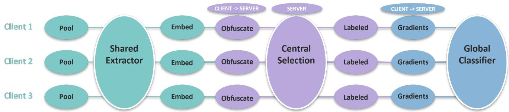
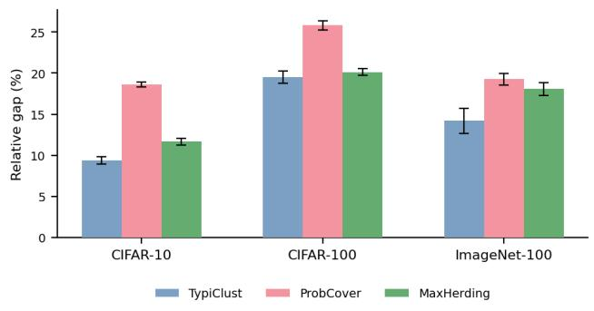
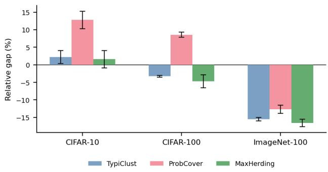
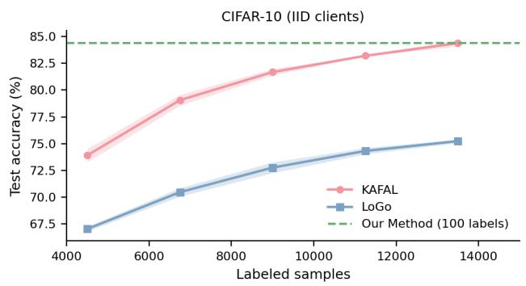
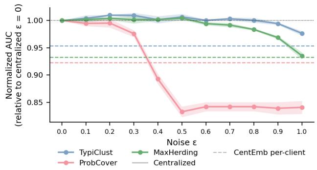
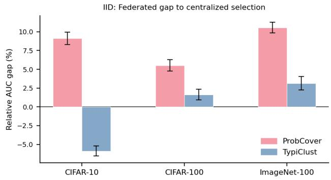
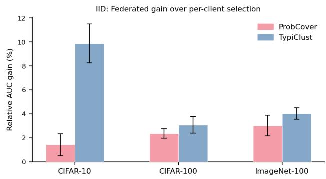
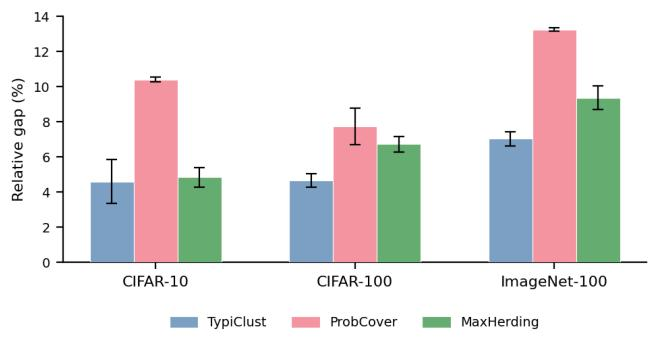
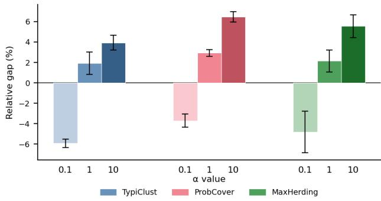

# Coordination on a Budget: Federated Active Learning with Few Labels

Liam Mohr and Daphna Weinshall

School of Computer Science and Engineering The Hebrew University of Jerusalem, Jerusalem 91904, Israel {liam.mohr,daphna}@mail.huji.ac.il

## Abstract

Federated Active Learning (FAL) addresses the dual challenges of data privacy and label scarcity, where the absence of a global data view introduces additional hurdles for coordinated query selection. We study cross-silo FAL in the low-budget regime, where annotation decisions are most critical. We characterize, both theoretically and empirically, a heterogeneity reversal: in low-budget settings, homogeneous (IID) data requires stronger coordination to avoid redundant queries, whereas heterogeneous data naturally promotes diversity; this trend reverses at higher budgets. Thus, in contrast to the standard federated learning (FL) narrative where heterogeneity is a primary challenge, we show that IID settings are more challengingfor query selection in FAL.

Motivated by thesefindings, we propose a new FALframework that utilizes federated representation learning to align client data in a shared embedding space. This enables the server to perform globally coordinated active selection over optionally obfuscated client embeddings, while annotation remains local to each client. Although our framework operates in the more challenging low-budget regime, it achieves performance that surpasses existing FAL methods even when they are given substantially larger annotation budgets, demonstrating the value of centralized coordination under privacy constraints.

## 1 Introduction

Modern machine learning systems are increasingly deployed in settings where data is decentralized and subject to strict privacy and governance constraints. In domains such as healthcare, finance, and telecommunications, data is distributed across institutions and cannot be shared due to regulatory or operational limitations. Federated Learning (FL) addresses this challenge by enabling collaborative model training without access to raw data. However, FL typically assumes labeled data, while in practice, unlabeled data is abundant and annotations are costly and scarce.

Active Learning (AL) offers a complementary solution by selectively querying the most informative samples for annotation. Yet, classical AL relies on centralized access to the unlabeled pool, allowing the model to compare candidates globally. In federated settings, this assumption breaks down: data remains distributed across clients, and coordination is restricted by privacy and communication constraints. This gives rise to the setting of Federated Active Learning (FAL), where query selection must be performed without direct access to a global data view.

A central challenge in FAL is coordinating selection across clients to avoid redundant or suboptimal queries. While data heterogeneity is traditionally viewed as a primary obstacle in federated learning, we uncover a contrasting phenomenon in the low-budget regime. Specifically, we observe a heterogeneity reversal: when clients have similar (IID) data distributions, independent selection leads to redundant queries and poor global coverage, making coordination essential. In contrast, heterogeneous (non-IID) data naturally promotes diversity in selected samples, reducing the need for coordination. This trend reverses at higher budgets, where non-IID data introduces bias in uncertainty estimation, reverting to the classical challenges of FL. We formalize this interaction in Section 3, showing that the value of coordination depends jointly on data heterogeneity and labeling budget. Table 1 summarizes the resulting reversal between diversity- and uncertainty-driven regimes.

Our analysis reveals a key limitation of existing FAL approaches: they do not explicitly account for the interaction between data distribution and labeling budget. A natural baseline is to apply active learning independently at each client and rely on federated training only after annotation, as in prior low-budget FAL pipelines [24]. However, this confines inter-client coordination to the model-training stage, leaving query selection decoupled across clients and failing to fully exploit the potential synergy between active learning and federated learning.

We address this limitation through globally coordinated query selection in a shared federated representation space. A federatively learned feature extractor aligns client embeddings, allowing the server to compare candidates across clients and coordinate selection while raw data remain local. Selected samples are then labeled locally and used for downstream federated training (see Figure 1).

While this design enables effective coordination across clients, it also introduces a potential privacy risk, as shared embeddings may leak information about the underlying data; in visual domains, feature representations can be vulnerable to inversion or reconstruction attacks [5, 8, 27].

Figure 1: Overview of the proposed federated active learning pipeline. A federated feature extractor first induces a shared embedding space across clients. Each client then computes local embeddings and may apply an obfuscation mechanism before transmitting them to the server. The server performs centralized active selection in the aggregated embedding space, while the selected samples are labeled locally by the corresponding clients and used for subsequent federated training.
<table><tr><td>Criterion</td><td>IID Setting</td><td>Non-IID Setting</td><td>novelty</td></tr><tr><td>Diversity</td><td>High Coordination Required (Avoids overlap/redundancy)</td><td>Low Coordination Required (Disjoint supports ensure variety)</td><td>new challenge</td></tr><tr><td>Uncertainty</td><td>Low Coordination Required (Local ≈ Global informative)</td><td>High Coordination Required (Corrects for local representation bias)</td><td>old challenge</td></tr></table>

Table 1: Coordination vs. heterogeneity. In the low-budget regime, IID data require coordination to ensure diversity, making them more challenging than non-IID data - a reversal of the standard FL setting.

To address this challenge, we investigate two privacypreserving approaches, using either controlled perturbation of embeddings or centroid-based aggregation, and study the resulting trade-offs between privacy protection and active selection performance.

## Our contributions are:

• We identify and analyze a heterogeneity reversal in federated active learning: in low-budget regimes, IID data leads to redundant sampling and requires stronger coordination than heterogeneous data.

• We propose a new framework for globally coordinated query selection using shared federated embedding, with two differential-privacy mechanisms for data protection.

• We show that global coordination substantially improves label efficiency in the low-budget regime, while retaining much of this advantage under embedding obfuscation, yielding a favorable privacy-performance trade-off.

## 2 Related Work

Low-Budget Active Learning. Early in the AL process, uncertainty-based methods, such as Entropy Sampling [28], Least Confidence [18], and Margin Sampling [25], frequently underperform because the model’s predictive signal is of low quality [10]. To mitigate this, recent approaches leverage self-supervised representations. For instance, TypiClust [10] prioritizes representative samples from high-density clusters. Similarly, ProbCover [30] and MaxHerding [3] frame active selection as a probabilistic coverage problem, strategically picking samples to maximize the probability that the unlabeled data manifold is spanned within the given budget constraint.

Federated Learning. Federated learning (FL) enables collaborative model training across distributed clients while keeping data localized, primarily addressing privacy, communication efficiency, and statistical heterogeneity [13, 23]. A large body of work focuses on mitigating the challenges arising from non-IID data distributions and limited communication bandwidth [14, 20].

In contrast, our work considers a small number of clients with relatively homogeneous data distributions, allowing us to isolate a different bottleneck: labeled-data scarcity and its interaction with distributed active selection. This perspective complements existing FL research by highlighting challenges that arise even when communication constraints and data heterogeneity are less pronounced.

Federated contrastive representation learning. Methods that are effective for federated learning under supervised objectives, such as cross-entropy, are significantly less effective for contrastive learning, since the global selfsupervised objective does not decompose into a sum of local objectives [32]. This mismatch can lead to degraded representations when applying standard federated averaging. Prior work has proposed adaptations such as prototypebased alignment or modified contrastive objectives to mitigate this issue [19, 29]. Much work has been dedicated to address the adversarial effect of non-IID client distribution on FCRL [7, 11, 12, 22, 26, 32]. Contrastive learning under differential privacy was likewise explored, as in [21].

Federated Active Learning. Most federated active learning (FAL) methods rely on model-based scoring to estimate sample informativeness, making them effective primarily in high-budget regimes while degrading at low budgets. Early work such as [1] adopts a separate AL (S-AL) paradigm, where selection is performed locally at each client. In contrast, F-AL [2] enables collaborative evaluation but shows clear gains only at higher budgets (e.g., 150–200 labels per class on CIFAR-100). Others address this mismatch by selecting samples informative for both local and global objectives [4, 15, 16], typically focusing on non-IID settings where heterogeneity complicates uncertainty estimation [31]. Finally, in Active Federated Learning (AFL), the decision concerns which clients to train rather than which samples to label [9].

To the best of our knowledge, the only FAL method that remains effective in the low-budget regime is [24]. This approach follows a separate active learning (S-AL) paradigm, where sample evaluation is performed locally at each client. By leveraging a selection criterion tailored to low-budget settings [10], it performs well in federated scenarios and outperforms existing FAL baselines [24]. We therefore adopt it as a primary baseline in our experiments.

## 3 Heterogeneity & Inter-Client Coordination

Standard active learning balances two criteria: diversity, which promotes coverage of the feature space, and uncertainty, which targets low-confidence regions. In federated settings, the value of inter-client coordination depends critically on data heterogeneity. We analyze this interaction in the context of active learning query selection criteria, and highlight two key effects:

1. Diversity-centric selection: Under IID data, independent clients tend to select overlapping samples, requiring strong coordination to avoid redundancy. In contrast, heterogeneous data naturally partitions the space, reducing the need for coordination.

2. Uncertainty-centric selection: Under IID data, independent clients tend to learn similar models. In contrast, under non-IID data, local models become biased estimators of global uncertainty, making coordination necessary. This aligns with classical FL results [23], where heterogeneity induces model divergence.

Together, these effects reveal a reversed vulnerability in Federated Active Learning: coordination is most critical for diversity under IID data, and for uncertainty under non-IID data. We formalize this relationship in Section 3.2, focusing on the diversity regime where this reversal departs from standard FL, and validate it empirically in Sections 5.2 and 5.4, with detailed results provided in Appendix C.

## 3.1 Notation and Preliminaries

Let $\mathcal { X } \subseteq \mathbb { R } ^ { d }$ denote the feature space and Y the label space. Consider K clients, where client $k \in \{ 1 , \ldots , K \}$ possesses a local data distribution $\mathcal { P } _ { k }$ over $\mathcal { X } \times \mathcal { V }$ . Let

$$
\mathcal { X } _ { k } = \operatorname { s u p p } ( \mathcal { P } _ { k } ^ { X } )
$$

denote the support of the feature marginal of client k.

Definition 1 (Coordination Gap). Let Φ(S) denote a selection utility for a set $S \subseteq { \mathcal { X } }$ . Let $b _ { k }$ denote the annotation budget ofclient $k ,$ with

$$
\sum _ { k = 1 } ^ { K } b _ { k } = B .
$$

Define the optimal coordinated utility as

$$
\Phi _ { B } ^ { \star } = \operatorname* { m a x } _ { S _ { k } \subseteq \mathcal { X } _ { k } , \ | S _ { k } | = b _ { k } } \Phi \left( \bigcup _ { k = 1 } ^ { K } S _ { k } \right) .
$$

For each client, let

$$
S _ { k } ^ { \star } \in \arg \operatorname* { m a x } _ { S \subseteq \mathscr { X } _ { k } } \Phi ( S )
$$

denote its locally optimal selection. The coordination gap is

$$
\Delta _ { K } = \Phi _ { B } ^ { \star } - \Phi \left( \bigcup _ { k = 1 } ^ { K } S _ { k } ^ { \star } \right) .\tag{1}
$$

## 3.2 Data Heterogeneity and Diversity

We show that the utility of coordination increases with overlap between clients’ selections and vanishes when heterogeneity separates their accessible regions. We formalize this relationship using a cell-coverage model.

Let the shared embedding space be partitioned into M cells, $\mathcal { C } ~ = ~ \{ C _ { 1 } , \ldots , C _ { M } \}$ , representing regions such as clusters or high-density neighborhoods. Define the coverage utility

$$
\Phi ( S ) = \sum _ { m = 1 } ^ { M } \mathbf { 1 } \{ S \cap C _ { m } \neq \emptyset \} .\tag{2}
$$

For each client, define the accessible cell set

$$
A _ { k } = \{ m : C _ { m } \cap \mathcal { X } _ { k } \neq \emptyset \} ,\tag{3}
$$

and the cell-selection probability

$$
a _ { k , m } = \operatorname* { P r } ( S _ { k } ^ { \star } \cap C _ { m } \neq \varnothing ) .\tag{4}
$$

Thus, $a _ { k , m } = 0$ whenever m $\notin A _ { k }$

We start from the expected coordination gap $\bar { \Delta } _ { K } \dot { : }$

$$
\begin{array} { r c l } { \bar { \Delta } _ { K } } & { = } & { \mathbb { E } [ \Delta _ { K } ] = \mathbb { E } [ \Phi _ { B } ^ { \star } ] - \mathbb { E } [ \Phi ( \displaystyle \bigcup _ { k = 1 } ^ { K } S _ { k } ^ { \star } ) ] } \\ & { = } & { \mathbb { E } [ \Phi _ { B } ^ { \star } ] - \displaystyle \sum _ { k = 1 } ^ { K } \mathbb { E } [ \Phi ( S _ { k } ^ { \star } ) ] } \\ & & { + \displaystyle \sum _ { k = 1 } ^ { K } \mathbb { E } [ \Phi ( S _ { k } ^ { \star } ) ] - \mathbb { E } [ \Phi ( \displaystyle \bigcup _ { k = 1 } ^ { K } S _ { k } ^ { \star } ) ] } \end{array}\tag{5}
$$

(6)

The expression in (5) captures the difference between the objectives optimized by the two methods. In the very lowbudget regime, we assume that each selection - whether local or global - is efficient, selecting at most one point per cell. Thus, uncoordinated but efficient selection yields $\begin{array} { r } { \mathbf { \mathbb { E } } [ \Phi _ { B } ^ { \star } ] \approx \sum _ { k = 1 } ^ { K } \mathbb { E } [ \Phi ( S _ { k } ^ { \star } ) ] } \end{array}$ (see Appendix F).

The key difference therefore lies in (6), which measures how much of the utility independently gained by individual clients is preserved in the combined selected set rather than lost to redundant selections. We thus focus on the expected redundancy gap $\bar { \Delta } _ { K } ^ { \mathrm { r e d } }$ , defined as

$$
\bar { \Delta } _ { K } ^ { \mathrm { r e d } } = \sum _ { k = 1 } ^ { K } \mathbb { E } [ \Phi ( S _ { k } ^ { \star } ) ] - \mathbb { E } \left[ \Phi \left( \bigcup _ { k = 1 } ^ { K } S _ { k } ^ { \star } \right) \right] .\tag{7}
$$

Under the aforementioned efficient-selection assumption,

$$
\bar { \Delta } _ { K } \approx \bar { \Delta } _ { K } ^ { \mathrm { r e d } } .\tag{8}
$$

Thus, in what follows, we focus on the redundancy gap.

Proposition 1 (Heterogeneity and the Redundancy Gap). Assume that, for each cell $C _ { m } ,$ , the events $\{ S _ { k } ^ { \star } \cap C _ { m } \neq \varnothing \}$ are independent across clients. Then the following hold:

1. If the accessible cell sets are pairwise disjoint,

$$
A _ { i } \cap A _ { j } = \varnothing \qquad \forall i \neq j ,
$$

then

$$
\bar { \Delta } _ { K } ^ { \mathrm { r e d } } = 0 .
$$

2. Define the contribution of cell $C _ { m }$ to the expected redundancy gap as

$$
\Delta _ { m } = \sum _ { k = 1 } ^ { K } a _ { k , m } - \left( 1 - \prod _ { k = 1 } ^ { K } ( 1 - a _ { k , m } ) \right) .
$$

Then

$$
\frac { \partial \Delta _ { m } } { \partial a _ { j , m } } = 1 - \prod _ { k \neq j } ( 1 - a _ { k , m } ) \geq 0 ,
$$

with strict inequality whenever another client selects from $C _ { m }$ with positive probability.

3. Let

$$
c _ { m } ^ { ( K ) } = 1 - \prod _ { k = 1 } ^ { K } ( 1 - a _ { k , m } )
$$

be the probability that at least one ofthefirst K clients selectsfrom $C _ { m } .$ . Then

$$
\bar { \Delta } _ { K + 1 } ^ { \mathrm { r e d } } - \bar { \Delta } _ { K } ^ { \mathrm { r e d } } = \sum _ { m = 1 } ^ { M } a _ { K + 1 , m } c _ { m } ^ { ( K ) } .
$$

Proof is provide in Appendix F.3.

The last result shows that the marginal redundancy introduced by an additional client is determined by its overlap with the existing selection profile. Heterogeneity that shifts selection mass toward cells with small $c _ { m } ^ { ( K ) }$ therefore causes a smaller increase in the redundancy gap.

Corollary 1. If the clients’ distributions are IID, the redundancy gap increases (or remains unchanged) with the number ofclients.

Proof. If all clients have identical cell-level selection probabilities $a _ { 1 , m } = \cdot \cdot \cdot = a _ { K , m } = a _ { m } ,$ then

$$
\bar { \Delta } _ { K } ^ { \mathrm { r e d } } = \sum _ { m = 1 } ^ { M } \left[ K a _ { m } - \bigl ( 1 - ( 1 - a _ { m } ) ^ { K } \bigr ) \right] ,\tag{9}
$$

and

$$
\bar { \Delta } _ { K + 1 } ^ { \mathrm { r e d } } - \bar { \Delta } _ { K } ^ { \mathrm { r e d } } = \sum _ { m = 1 } ^ { M } a _ { m } \left[ 1 - ( 1 - a _ { m } ) ^ { K } \right] \geq 0 .\tag{10}
$$

Corollary 2. Adding a client whose accessible cells do not overlap with those of the existing clients introduces no additional redundancy.

$$
\begin{array} { l l } { P r o o f . } \\ { A _ { K + 1 } \cap \bigcup _ { k = 1 } ^ { K } A _ { k } = \emptyset } & { \Longrightarrow \quad \bar { \Delta } _ { K + 1 } ^ { \mathrm { r e d } } - \bar { \Delta } _ { K } ^ { \mathrm { r e d } } = 0 . } \end{array}
$$

Together, these results explain why homogeneous partitions may require stronger coordination than heterogeneous partitions: IID clients repeatedly spend their budgets on similar regions, whereas heterogeneity naturally reduces duplicated coverage.

Observation 1. The theoretical coordination gap in Eq. (1) is nonnegative because it is defined relative to the centralized optimum. The empirical gap between realizable centralized and local selection methods may nevertheless be negative. This can occur when a non-IID partition reveals semantic structure that is notfully represented by the embedding geometry, allowing independent local selection to outperform the centralized selection method (see Figure 6b).

## 4 Method

We propose a three-phase FAL framework for cross-silo settings1: (i) federated representation learning, (ii) privacyconscious centralized active selection under client-level budgets, and (iii) federated downstream training (Figure 1). Raw data remain local throughout; only perturbed representations or their obfuscated summaries are communicated for query coordination.

## 4.1 Three-Phase Pipeline

Phase I: Federated Representation Learning The first phase (Figure 1, highlighted in teal) constructs a shared representation space across clients, enabling coordination during the subsequent active selection stage. Accordingly, we train a shared feature extractor using standard Federated Learning (FL), adopting FedAvg [23] to train a SimCLR encoder in a federated manner (see Section 2). At each communication round, the server broadcasts the current encoder, clients perform local contrastive learning on their unlabeled data, and the server aggregates the resulting updates. This allows clients to collaboratively learn a common representation without exchanging raw data. Once training is complete, the global encoder is frozen and distributed to all clients, which use it to embed their local unlabeled data.

Phase II: Obfuscated Centralized Active Selection The second phase (Figure 1, highlighted purple) performs centralized active query selection over the clients’ unlabeled data. To this end we adopt three methods that have demonstrated superior performance in the low-budget regime - ProbCover [30], TypiClust [10] and MaxHerding [3], adapted to the current setting by adding local client budget constraints.

## Client-Constrained Selection

We apply centralized AL selection globally in the shared embedding space while enforcing client-level annotation budgets. For ProbCover and MaxHerding, the server greedily selects the feasible sample with the largest marginal coverage gain, excluding samples from clients whose budgets have been exhausted. For TypiClust, clustering is performed globally, and cluster representatives are allocated subject to the same client budgets. The formal objective, greedy procedure, and approximation guarantee are provided in Appendix B.

## Obfuscation

Directly transmitting embeddings may still introduce privacy risks, including reconstruction or inversion attacks. We therefore study two approaches for obfuscating the perclient embeddings before they are used for centralized selection. Both approaches aim to preserve enough geometric information for effective selection, while reducing the amount of information exposed to the server.

Approach 1: using controlled perturbation.

Approach 2: using data aggregates. We follow the principle of geometric summarization [e.g., 29], whereby clients communicate only aggregate geometric information rather than individual embeddings. To enable coordinated active selection under this constraint, we introduce federated adaptations of ProbCover and TypiClust in Section 4.2.

Phase III: Federated Training of a Global Classifier In Phase III (Figure 1, highlighted blue) selected samples remain local and are used for federated downstream training. We evaluate a neural network trained on raw images, and as an effective alternative in low budgets, a shallow classifier trained over the shared representation learned in Phase I.

## 4.2 Aggregate-Based Federated Active Selection

Sharing individual embeddings enables global coordination, but may reveal information about individual samples. We therefore introduce two federated adaptations of geometry-based active learning, FederatedProbCover and FederatedTypiClust, that coordinate selection across clients while communicating only geometric aggregates and distances. Unlike independent client selection, these methods recover the global geometric information needed for coordinated querying without exposing individual embeddings.

FederatedProbCover (Alg. 1). The key challenge in federating ProbCover is that its greedy criterion depends on the global number of samples newly covered by each query. We replace direct access to the global embedding pool with a distributed proposal-and-count procedure. At each round, each client performs a local ProbCover step and sends only the centroid of the region induced by its best candidate. The server broadcasts these proposals, and clients return the number of currently uncovered local samples covered by each centroid. Summing these counts yields the global coverage gain of every proposal without revealing the covered samples themselves.

The server selects the proposal with maximal global gain and queries the closest feasible sample to that centroid across clients, subject to client annotation budgets. All clients then update their local coverage state using the selected centroid. Thus, subsequent rounds account for coverage already obtained on other clients, explicitly reducing the cross-client redundancy of independent selection.

FederatedTypiClust. TypiClust admits a particularly natural federated adaptation because its selection criterion is already defined through cluster-level geometry. We first construct global clusters using federated k-means: clients communicate only per-cluster sums and counts, from which the server updates the global centroids. Given these centroids, each client reports, for every cluster, the distance to its closest eligible local sample. The server orders clusters according to the TypiClust criterion - prioritizing clusters containing fewer labeled samples and, as a tie-breaker, larger clusters - and queries the globally closest feasible sample to each selected centroid, while enforcing the perclient annotation budgets.

  
(a) IID client partitions.

  
(b) Non-IID client partitions with $\alpha = 0 . 1$

Figure 2: Empirical coordination gap across datasets and selection methods. Error bars denote standard error over 3 random client splits.  
Algorithm 1 FEDERATEDPROBCOVER   
1: while annotation budget remains do   
2: Each client k proposes centroid $c _ { k }$ of its locally best un  
covered region.   
3: Server broadcasts $\left\{ c _ { k } \right\}$ to all clients.   
4: Each client j reports local coverage gain $g _ { j k }$ for every $c _ { k } .$   
5: Server selects $\begin{array} { r } { c ^ { * } = \arg \operatorname* { m a x } _ { c _ { k } } \sum _ { j } g _ { j k } . } \end{array}$   
6: Each client reports its closest feasible sample to $c ^ { * }$ and its   
distance.   
7: Server queries the globally closest candidate subject to   
client budgets.   
8: All clients mark samples covered by $c ^ { * }$ as covered.   
9: end while

The two adaptations recover complementary forms of global geometric information from aggregates: FederatedProbCover estimates global marginal coverage through distributed counting, whereas FederatedTypiClust recovers global cluster structure through federated sufficient statistics. Neither requires transmitting individual embeddings while retaining cross-client coordination.

## 5 Empirical Results

## 5.1 Evaluation Score

The coordination gap $\Delta _ { K }$ in (1) measures the accuracy difference at a given annotation budget. We summarize this gap across budgets using its normalized AUC counterpart, termed Empirical Coordination Gap and defined as follows:

Definition 2 (Empirical Coordination Gap). Let $\mathrm { A U C } _ { \mathrm { c e n t } }$ and $\mathrm { \ A U C _ { \mathrm { p c } } }$ denote the empirical areas under the centralized and per-client accuracy–budget curves, computed by trapezoidal integration over the evaluated budgets. We define the empirical coordination gap as

$$
\widehat { \Delta } _ { \mathrm { A U C } } = 1 0 0 \cdot \frac { \mathrm { A U C } _ { \mathrm { c e n t } } - \mathrm { A U C } _ { \mathrm { p c } } } { \mathrm { A U C } _ { \mathrm { c e n t } } } .
$$

## 5.2 Results: Full Pipeline

We first evaluate the complete pipeline without embedding obfuscation, comparing our coordinated approach with the strengthened per-client baseline described in Appendix A. Both use the same shallow probabilistic classifier architecture; the effects of embedding obfuscation are evaluated separately in Section 5.3.

IID Client Distributions The results for IID clients are shown in Figure 2a and Table 2. In Figure 3 we further compare our method against high budget FAL-specific approaches proposed in [4, 16]. Across datasets and selection methods, our centralized pipeline consistently improves over the per-client baseline, demonstrating a positive gap under IID partitions; this agrees with the redundancybased prediction of Section 3.

Implementation details and methodology are provided in Appendix A.

Non-IID Client Distributions The results for non-IID clients are shown in Figure 2b and Table 2. Across datasets and selection methods, the coordination gap now decreases substantially relative to the IID setting and sometimes becomes negative. This reduction is consistent with the predicted heterogeneity reversal analyzed in Section 3. The negative gaps in some configurations are also consistent with Observation 1, as maximum-confidence aggregation may further benefit from client specialization.

<table><tr><td rowspan="2">Method</td><td colspan="3">CIFAR-10</td><td colspan="3">CIFAR-100</td><td colspan="3">ImageNet-100</td></tr><tr><td>10</td><td>50</td><td>100</td><td>100</td><td>500</td><td>1000</td><td>100</td><td>500</td><td>1000</td></tr><tr><td colspan="10">IID clients</td></tr><tr><td>Our method (ProbCover)</td><td> ${ \bf 4 9 . 5 _ { \pm 3 . 1 } }$ </td><td> $7 8 . 7 _ { \pm 0 . 5 }$ </td><td> ${ \pm } 4 . 4 _ { \pm 0 . 1 }$ </td><td> ${ \bf 4 1 . 3 _ { \pm 0 . 1 } }$ </td><td> ${ \bf 4 8 . 6 } _ { \pm 0 . 6 }$ </td><td> ${ \bf 5 1 . 2 _ { \pm 0 . 6 } }$ </td><td> $\mathbf { 4 0 . 2 _ { \pm 0 . 6 } }$ </td><td> ${ \bf 5 0 . 6 _ { \pm 0 . 4 } }$ </td><td> ${ \pm } 4 . 9 { \scriptstyle \pm } 0 . 1$ </td></tr><tr><td>Ono et al. (ProbCover)</td><td> $3 2 . 3 _ { \pm 3 . 0 }$ </td><td> $6 4 . 8 { \scriptstyle \pm 1 . 1 }$ </td><td> $7 2 . 9 _ { \pm 1 . 1 }$ </td><td> $2 0 . 8 { \scriptstyle \pm 0 . 5 }$ </td><td> $3 6 . 3 _ { \pm 0 . 3 }$ </td><td> $4 1 . 3 _ { \pm 0 . 1 }$ </td><td> $2 4 . 8 _ { \pm 0 . 9 }$ </td><td> $4 1 . 4 _ { \pm 0 . 4 }$ </td><td> $4 6 . 6 { \scriptstyle \pm 0 . 2 }$ </td></tr><tr><td>Our method (TypiClust)</td><td> $\overline { { 3 2 } } . \overline { { 6 } } _ { \pm 5 . 5 }$ </td><td> $\bar { 7 } 8 . \bar { 2 } \bar { \pm } 0 . 7$ </td><td> $\overline { { { \bf 8 } } } \bar { 2 } . \bar { 2 } _ { \pm 0 . 7 } \ :$ </td><td> $\bar { 3 7 } . \bar { 7 } \bar { \pm } 0 . 5$ </td><td> $\bar { 4 } 6 . 3 \bar { \pm } 0 . 1$ </td><td> $\bar { 5 0 . 1 } \bar { \pm } 0 . 1 \bar { }$ </td><td> $\bar { \bf 3 8 . } \bar { \bf 9 } _ { \pm 0 . 7 } ^ { - }$ </td><td> $\overline { { { 4 9 . 5 } } } \underline { { { \bf - } } } _ { 0 . 5 } \overline { { { \bf \delta } } }$ </td><td> $\bar { 5 3 . 8 } _ { \pm 0 . 4 } ^ { - }$ </td></tr><tr><td>Ono et al. (TypiClust)</td><td> $2 9 . 2 { \scriptstyle \pm 5 . 2 }$ </td><td> $6 9 . 4 _ { \pm 0 . 1 }$ </td><td> $7 8 . 9 { \scriptstyle \pm 0 . 5 }$ </td><td> $2 5 . 7 _ { \pm 0 . 7 }$ </td><td> $3 7 . 4 _ { \pm 0 . 4 }$ </td><td> $4 1 . 1 { \scriptstyle \pm 0 . 6 }$ </td><td> $2 8 . 9 { \scriptstyle \pm 0 . 8 }$ </td><td> $4 2 . 6 _ { \pm 0 . 2 }$ </td><td> $4 6 . 2 _ { \pm 1 . 0 }$ </td></tr><tr><td>Our method (MaxHerding)</td><td> $\mathbf { \bar { 6 1 . 7 } \bar { 2 . 6 } }$ </td><td> $\bar { \mathbf { 8 3 . 1 } _ { \pm 0 . 5 } }$ </td><td> $\mathbf { \bar { 8 4 . } } \bar { 2 } _ { \pm 0 . 2 }$ </td><td> $\bar { 3 6 . 2 } \bar { _ { \pm 0 . 4 } }$ </td><td> $\bar { \bf 4 6 . 9 } \bar { \bf _ { \pm 0 . 2 } }$ </td><td> $\mathbf { 5 } \bar { 0 } . \bar { 2 } _ { \pm 0 . 1 }$ </td><td> $\bar { \mathbf { 3 6 . 1 } } \bar { \pm } 0 . 8$ </td><td> $\overline { { { \bf 4 9 . 1 } } } \underline { { { \bf - \mathrm { ~ } } } } \overline { { { \bf 0 . 2 } } }$ </td><td> $\bar { 5 4 . 2 } _ { \pm 0 . 5 } ^ { - }$ </td></tr><tr><td>Ono et al. (MaxHerding)</td><td> $4 6 . 1 _ { \pm 1 . 6 }$ </td><td> $7 1 . 2 { \scriptstyle \pm 0 . 9 }$ </td><td> $7 9 . 2 { \scriptstyle \pm 0 . 4 }$ </td><td> $2 2 . 5 { \scriptstyle \pm 0 . 4 }$ </td><td> $3 7 . 9 { \scriptstyle \pm 0 . 3 }$ </td><td> $4 1 . 6 _ { \pm 0 . 1 }$ </td><td> $1 8 . 3 { \scriptstyle \pm 0 . 1 }$ </td><td> $4 0 . 3 _ { \pm 0 . 3 }$ </td><td> $4 6 . 6 { \scriptstyle \pm 0 . 5 }$ </td></tr><tr><td colspan="10">Non-IID clients  $( \alpha = 0 . 1 )$ </td></tr><tr><td>Our method (ProbCover)</td><td> $3 5 . 3 _ { \pm 4 . 3 }$ </td><td> ${ \bf 6 6 . 5 _ { \pm 2 . 4 } }$ </td><td> $7 7 . 8 _ { \pm 1 . 3 }$ </td><td> $3 1 . 5 _ { \pm 0 . 8 }$ </td><td> $4 4 . 7 _ { \pm 0 . 8 }$ </td><td> $4 8 . 3 _ { \pm 0 . 4 }$ </td><td> $3 2 . 2 _ { \pm 0 . 2 }$ </td><td> $4 4 . 8 _ { \pm 0 . 1 }$ </td><td> $4 9 . 7 _ { \pm 0 . 2 }$ </td></tr><tr><td>Ono et al. (ProbCover)</td><td> $2 6 . 0 { \scriptstyle \pm 0 . 6 }$ </td><td> $5 6 . 8 _ { \pm 1 . 5 }$ </td><td> $6 9 . 8 { \scriptstyle \pm 0 . 4 }$ </td><td> $2 4 . 5 _ { \pm 0 . 7 }$ </td><td> $4 0 . 8 { \scriptstyle \pm 0 . 3 }$ </td><td> $4 6 . 4 _ { \pm 0 . 2 }$ </td><td> $3 2 . 6 _ { \pm 0 . 4 }$ </td><td> ${ \bar { \bf 5 0 . 5 } } _ { \pm 0 . 8 }$ </td><td> ${ \bar { \mathbf { 5 6 . 5 } } } _ { \pm 0 . 8 }$ </td></tr><tr><td>Our method (TypiClust)</td><td> $\overline { { 3 1 . 9 } } _ { \pm 2 . 4 }$ </td><td> $\bar { 6 7 . 2 } \bar { \pm } 2 . 0$ </td><td> $\bar { 7 } \bar { 6 } . \bar { 7 } \pm 1 . 8$ </td><td> $\overline { { 2 8 . 7 } } \overset { - } { \pm 0 . 8 }$ </td><td> $\overline { { 4 } } 1 . 4 _ { \pm 0 . 5 } ^ { - }$ </td><td> $\overline { { 4 6 } } . \overline { { 0 } } _ { \pm 0 . 4 } ^ { - }$ </td><td> $\bar { 3 } 1 . \bar { 3 } \bar { \pm } 0 . 9$ </td><td> $\overline { { 4 3 } } . 2 \overline { { \pm } } 0 . 4 ^ { - }$ </td><td> $\overline { { 4 9 . 3 } } \underline { { = } } \overline { { 0 . 3 } }$ </td></tr><tr><td>Ono et al. (TypiClust)</td><td> $2 6 . 4 _ { \pm 1 . 4 }$ </td><td> ${ \bf 6 7 . 4 _ { \pm 1 . 3 } }$ </td><td> $7 6 . 3 { \scriptstyle \pm 0 . 3 }$ </td><td> $2 7 . 8 { \scriptstyle \pm 1 . 2 }$ </td><td> ${ \pm 3 . 4 } _ { \pm 0 . 3 }$ </td><td> ${ \bf 4 7 . 1 _ { \pm 0 . 1 } }$ </td><td> $3 7 . 7 _ { \pm 0 . 5 }$ </td><td> ${ \bf 5 0 . 8 _ { \pm 0 . 7 } }$ </td><td> ${ \pm } 4 . 8 _ { \pm 0 . 3 }$ </td></tr><tr><td>Our method (MaxHerding)</td><td> $\overline { { 5 4 . 4 } } \underline { { : 2 . 3 } }$ </td><td> $\bar { 7 } 1 . \bar { 8 } \pm 2 . 4$ </td><td> $\overline { { 7 8 . 5 } } \pm 1 . 5$ </td><td> $\bar { 3 0 . 2 } \bar { \pm } 1 . \bar { 5 }$ </td><td> $\overline { { 4 } } 3 . 1 \overline { { \pm } } 0 . 9$ </td><td> $\overline { { 4 7 } } . \overline { { 3 } } \pm 0 . 2$ </td><td> $\bar { 3 0 . 9 2 } 0 . \bar { 3 }$ </td><td> $\overline { { 4 4 } } . \overline { { 6 _ { \pm 0 . 2 } } }$ </td><td> $\overline { { 4 9 } } . \overline { { 4 } } \pm 0 . 3 $ </td></tr><tr><td>Ono et al. (MaxHerding)</td><td> $4 3 . 2 _ { \pm 4 . 9 }$ </td><td> $7 3 . 5 { \scriptstyle \pm 0 . 9 }$ </td><td> $7 8 . 8 { \scriptstyle \pm 0 . 5 }$ </td><td> $3 1 . 5 _ { \pm 0 . 5 }$ </td><td> ${ \bf 4 6 . 1 _ { \pm 0 . 4 } }$ </td><td> ${ \bf 4 8 . 6 { _ { \pm 0 . 2 } } }$ </td><td> $3 7 . 7 _ { \pm 1 . 8 }$ </td><td> ${ \bf 5 1 . 6 _ { \pm 0 . 9 } }$ </td><td> ${ \bf 5 6 . 1 _ { \pm 0 . 3 } }$ </td></tr></table>

Table 2: Full-pipeline comparison between our method and the baseline adapted from Ono et al. [24]. Our method performs globally coordinated selection in a shared federated embedding space and trains a shared classifier using FedAvg. The baseline performs selection and classifier training independently at each client and uses the prediction of the most confident client classifier at inference. Each pair uses the same active selection method. Entries report mean test accuracy $( \% ) \pm$ standard error over three seeds at total annotation budgets corresponding to 1, 5, and 10 labeled samples per class. Bold indicates the best outcome within each pair.

  
Figure 3: Comparison against two representative highbudget FAL methods [4, 16]. The dashed line marks the accuracy achieved by our method using ProbCover selection with a substantially smaller annotation budget, highlighting the effectiveness of coordinated low-budget selection even relative to methods evaluated with larger budgets.  
Figure 4: The normalized AUC as a function of the embedding noise level. Dashed lines show the corresponding aligned embedding per-client baselines for each method.

## 5.3 Privacy-Preserving Data Obfuscation

In this section, we evaluate the two obfuscation mechanisms introduced in Section 4.1: controlled embedding perturbation and centroid-based communication.

Controlled embedding perturbation. We compare noisy centralized selection with independent per-client selection in the aligned embedding space. The noise level ϵ denotes the target expected $\ell _ { 2 }$ displacement between each original and perturbed unit-normalized embedding. TypiClust and MaxHerding incur little or no accuracy loss up to $\epsilon = 0 . 6 ,$ whereas ProbCover is more sensitive to perturbation, see Figure 4 and Appendix D for details.

Federated Versions of the “Classic” AL Selection Algorithms. We also evaluate the two aggregate-based FAL methods described in Section 4.2 under IID client partitions. Figure 5 and Table 3 report their remaining gap to centralized selection and their improvement over independent per-client selection in the shared embedding space. Both outperform independent per-client selection, indicating that aggregate-based cross-client coordination reduces query redundancy. FederatedTypiClust closely matches centralized selection, whereas FederatedProbCover retains a larger gap.

  
(a) The empirical coordination gap between centralized selection and its federated counterpart. Lower indicates closer agreement with centralized selection.

  
(b) The empirical coordination gap over independent per-client selection in the shared embedding space. Higher indicates stronger benefit from coordination.

Figure 5: Centroid-based federated variants of ProbCover and TypiClust under IID client partitions. Left: remaining gap to fully centralized selection. Right: improvement over independent per-client selection in the shared embedding space. Both quantities are computed analogously to the empirical coordination gap; error bars denote standard error over three seeds.
<table><tr><td></td><td colspan="3">CIFAR-10</td><td colspan="3">CIFAR-100</td><td colspan="3">ImageNet-100</td></tr><tr><td>Method</td><td>10</td><td>50</td><td>100</td><td>100</td><td>500</td><td>1000</td><td>100</td><td>500</td><td>1000</td></tr><tr><td colspan="10">ProbCover</td></tr><tr><td>Centralized</td><td> ${ \bf 4 9 . 5 _ { \pm 3 . 1 } }$ </td><td> $7 8 . 7 _ { \pm 0 . 5 }$ </td><td> ${ \pm } 4 . 4 _ { \pm 0 . 1 }$ </td><td> $4 1 . 3 _ { \pm 0 . 1 }$ </td><td> ${ \bf 4 8 . 6 _ { \pm 0 . 6 } }$ </td><td> ${ \bf 5 1 . 2 _ { \pm 0 . 6 } }$ </td><td> $4 0 . 2 { \scriptstyle \pm 0 . 6 }$ </td><td> ${ \bf 5 0 . 6 _ { \pm 0 . 4 } }$ </td><td> ${ \pm } 4 . 9 { \scriptstyle \pm 0 . 1 }$ </td></tr><tr><td>Federated</td><td> $4 8 . 2 _ { \pm 3 . 3 }$ </td><td> $7 3 . 9 _ { \pm 2 . 0 }$ </td><td> $7 9 . 1 _ { \pm 0 . 3 }$ </td><td> ${ \bf 4 2 . 0 _ { \pm 0 . 1 } }$ </td><td> $4 5 . 3 _ { \pm 0 . 2 }$ </td><td> $4 8 . 8 { \scriptstyle \pm 0 . 3 }$ </td><td> ${ \bf 4 0 . 5 } _ { \pm 0 . 5 }$ </td><td> $4 4 . 4 _ { \pm 0 . 3 }$ </td><td> $4 8 . 8 { \scriptstyle \pm 0 . 2 }$ </td></tr><tr><td>CentEmb per-client</td><td> ${ } _ { - } ^ { 3 8 . 1 \pm 3 . 0 } _ { - }$ </td><td> ${ \underline { { 7 3 . 8 } } } _ { - } \pm 1 . 1$ </td><td> $7 9 . 1 _ { \pm 0 . 1 }$ </td><td> $2 7 . 3 _ { \pm 0 . 4 }$ </td><td> $4 5 . 2 _ { \pm 0 . 2 }$ </td><td> $4 9 . 8 _ { \pm 0 . 4 }$ </td><td> $2 3 . 4 _ { \pm 1 . 0 }$ </td><td> $\underline { { 4 4 . 4 } } \underline { { \pm 0 . 1 } }$ </td><td> $5 0 . 2 { \scriptstyle \pm 0 . 5 }$ </td></tr><tr><td colspan="10">TypiClust</td></tr><tr><td>Centralized</td><td> $3 2 . 6 { \scriptstyle \pm 5 . 5 }$ </td><td> $7 8 . 2 { \scriptstyle \pm 0 . 7 }$ </td><td> $\mathbf { 8 } 2 . 2 _ { \pm 0 . 7 }$ </td><td> $3 7 . 7 _ { \pm 0 . 5 }$ </td><td> ${ \bf 4 6 . 3 _ { \pm 0 . 1 } }$ </td><td> ${ \bf 5 0 . 1 _ { \pm 0 . 1 } }$ </td><td> $3 8 . 9 { \scriptstyle \pm 0 . 7 }$ </td><td> ${ \bf 4 9 . 5 _ { \pm 0 . 5 } }$ </td><td> ${ \pm 3 . 8 \mathrm { _ { \pm 0 . 4 } } }$ </td></tr><tr><td>Federated</td><td> $6 2 . 2 { \scriptstyle \pm 1 . 4 }$ </td><td> $\mathbf { 7 9 . 9 2 } \mathbf { \ t 1 . 2 }$ </td><td> $8 1 . 8 { \scriptstyle \pm 0 . 3 }$ </td><td> $3 7 . 8 { \scriptstyle \pm 0 . 2 }$ </td><td> $4 5 . 0 { \scriptstyle \pm 0 . 5 }$ </td><td> $4 9 . 3 { \scriptstyle \pm 0 . 3 }$ </td><td> $3 6 . 3 { \scriptstyle \pm 0 . 7 }$ </td><td> $4 7 . 8 { \scriptstyle \pm 0 . 8 }$ </td><td> $5 3 . 0 { \scriptstyle \pm 0 . 2 }$ </td></tr><tr><td>CentEmb per-client</td><td> $3 1 . 8 _ { \pm 5 . 2 }$ </td><td> $7 3 . 2 { \scriptstyle \pm 0 . 8 }$ </td><td> $\mathbf { 8 } 2 . 2 _ { \pm 0 . 3 }$ </td><td> $3 0 . 9 { \scriptstyle \pm 0 . 4 }$ </td><td> $4 4 . 6 _ { \pm 0 . 2 }$ </td><td> $4 7 . 9 _ { \pm 0 . 2 }$ </td><td> $2 9 . 6 { \scriptstyle \pm 0 . 8 }$ </td><td> $4 6 . 0 { \scriptstyle \pm 0 . 3 }$ </td><td> $5 1 . 1 _ { \pm 0 . 5 }$ </td></tr></table>

Table 3: Test accuracy (%) at 1, 5, and 10 labeled samples per class, comparing fully centralized selection, the federated centroid-based variant (FedProbCover/FedTypiClust), and the noiseless aligned-embedding per-client baseline (CentEmb per-client), under IID client partitions. Mean ± standard error over 3 seeds. Bold marks the best of the three rows per column, within each method block.

## 5.4 Ablation Study

To isolate query coordination from representation quality, we compare centralized and per-client selection within the same federated embedding. Figure 6 shows a positive coordination benefit under IID partitions that decreases and can become negative with increasing heterogeneity, mirroring the full-pipeline trend. This supports the interpretation that the reversal arises from the selection stage itself. Absolute accuracies are reported in Appendix C.

## 6 Discussion

Our results highlight the importance of globally coordinated query selection in low-budget FAL. By using a shared federated representation, our framework enables selection across clients while keeping raw data private and downstream training federated. This allows standard low-budget AL methods to reduce cross-client redundancy without violating privacy constraints. Our results also show that coordination utility depends strongly on client heterogeneity: its benefit is largest under homogeneous partitions and declines as heterogeneity itself provides cross-client diversity.

These results suggest that low-budget FAL is fundamentally a joint selection–representation problem. Coordination is most beneficial when clients are similar enough to produce redundant local queries and can be compared meaningfully in a shared representation space. More broadly, our framework provides a modular foundation for future FAL methods that jointly adapt selection, representation learning, and privacy-preserving coordination.

  
(a) IID client partitions.

  
(b) Non-IID client partitions.  
Figure 6: Same-embedding selection-stage ablation. In both settings, centralized and per-client selection operate on the same federated embedding, isolating the effect of global query coordination from representation quality. Left: Empirical coordination gap under IID client partitions across datasets and selection methods. Right: Empirical coordination gap under non-IID client partitions as the Dirichlet parameter α varies. Positive values indicate that centralized selection improves over independent per-client selection, while negative values indicate that per-client selection performs better.

## Acknowledgments

This work was supported by a grant from the Gatsby Charitable Foundation and AFOSR award FA8655-24-1-7006.

## References

[1] Lulwa Ahmed, Kashif Ahmad, Naina Said, Basheer Qolomany, Junaid Qadir, and Ala Al-Fuqaha. Active learning based federated learning for waste and natural disaster image classification. IEEE Access, 8:208518– 208531, 2020. doi: 10.1109/ACCESS.2020.3038676. 3

[2] Jin-Hyun Ahn, Yeeun Ma, Seoyun Park, and Cheolwoo You. Federated active learning (f-al): an efficient annotation strategy for federated learning. IEEE Access, 12:39261–39269, 2024. 3

[3] Wonho Bae, Junhyug Noh, and Danica J. Sutherland. Generalized coverage for more robust low-budget active learning. arXiv preprint arXiv:2407.12212, 2024. 2, 5, 16

[4] Yu-Tong Cao, Ye Shi, Baosheng Yu, Jingya Wang, and Dacheng Tao. Knowledge-aware federated active learning with non-iid data. In Proceedings of the IEEE/CVF International Conference on Computer Vision, pages 22279–22289, 2023. 3, 6, 7

[5] Konstantinos Chatzikokolakis, Catuscia Palamidessi, and Marco Stronati. Broadening the scope of differential privacy using metrics. In International Symposium on Privacy Enhancing Technologies Symposium, pages 82–102. Springer, 2013. 1

[6] Jia Deng, Wei Dong, Richard Socher, Li-Jia Li, Kai Li, and Li Fei-Fei. Imagenet: A large-scale hierarchical image database. In IEEE Conference on Computer Vision and Pattern Recognition, 2009. 11

[7] Nanqing Dong and Irina Voiculescu. Federated contrastive learning for decentralized unlabeled medical images. In International Conference on Medical Image Computing and Computer-Assisted Intervention, pages 378–387. Springer, 2021. 3

[8] Oluwaseyi Feyisetan, Borat Bhowmick, Damien Desfontaines, and Shiva Prasad Kasiviswanathan. Privacy-and utility-preserving textual substitutions with differential privacy. In Proceedings of the 43rd International ACM SIGIR Conference on Research and Development in Information Retrieval, pages 1797–1800, 2020. 1

[9] Jack Goetz, Kshitiz Malik, Duc Bui, Seungwhan Moon, Honglei Liu, and Anuj Kumar. Active federated learning. arXiv preprint arXiv:1909.12641, 2019. 3

[10] Guy Hacohen, Avihu Dekel, and Daphna Weinshall. Active learning on a budget: Opposite strategies suit high and low budgets. In ICML, 2022. 2, 3, 5, 11

[11] Sungwon Han, Sungwon Park, Fangzhao Wu, Sundong Kim, Chuhan Wu, Xing Xie, and Meeyoung Cha. Fedx: Unsupervised federated learning with cross knowledge distillation. In European Conference on Computer Vision, pages 691–707. Springer, 2022. 3

[12] Shusen Jing, Anlan Yu, Shuai Zhang, and Songyang Zhang. Fedsc: Provable federated self-supervised learning with spectral contrastive objective over noniid data. In International Conference on Machine Learning, pages 22304–22325. PMLR, 2024. 3

[13] Peter Kairouz, H. Brendan McMahan, Brendan Avent, Aurelien Bellet, Mehdi Bennis, Arjun Nitin Bhagoji,´ Keith Bonawitz, Zachary Charles, Graham Cormode, and Rachel Cummings. Advances and open problems in federated learning. Foundations and Trends in Machine Learning, 2021. 2

[14] Sai Praneeth Karimireddy, Satyen Kale, Mehryar Mohri, Sashank J. Reddi, Sebastian Stich, and Ananda Theertha Suresh. Scaffold: Stochastic controlled averaging for federated learning. In ICML, 2020. 2

[15] S Kim, S Bae, Se-Young Yun, and Hwanjun Song. Lgfal: Federated active learning strategy using local and global models. In Proceedings of the ICML Workshop on Adaptive Experimental Design and Active Learning in the Real World, Baltimore, MD, USA, pages 127–139, 2022. 3

[16] SangMook Kim, Sangmin Bae, Hwanjun Song, and Se-Young Yun. Re-thinking federated active learning based on inter-class diversity. In Proceedings of the IEEE/CVF Conference on Computer Vision and Pattern Recognition, pages 3944–3953, 2023. 3, 6, 7

[17] Alex Krizhevsky and Geoffrey Hinton. Learning mul tiple layers of features from tiny images. Technical report, University of Toronto, 2009. 11

[18] David D. Lewis and William A. Gale. A sequential algorithm for training text classifiers. In SIGIR, 1994. 2

[19] Qinbin Li, Bingsheng He, and Dawn Song. Federated contrastive learning. In NeurIPS Workshop on Federated Learning, 2021. 3

[20] Tian Li, Anit Kumar Sahu, Ameet Talwalkar, and Virginia Smith. Federated optimization in heterogeneous networks. In MLSys, 2020. 2

[21] Wenjun Li, Anli Yan, Di Wu, Taoyu Zhu, Teng Huang, Xuandi Luo, and Shaowei Wang. Dpcl: Contrastive representation learning with differential privacy. International Journal ofIntelligent Systems, 37(11):9701– 9725, 2022. 3

[22] Christos Louizos, Matthias Reisser, and Denis Korzhenkov. A mutual information perspective on federated contrastive learning. In The Twelfth International Conference on Learning Representations, 2024. 3

[23] Brendan McMahan, Eider Moore, Daniel Ramage, Seth Hampson, and Blaise Aguera y Arcas. Communication-efficient learning of deep networks from decentralized data. In Artificial intelligence and statistics, pages 1273–1282. Pmlr, 2017. 2, 3, 5

[24] Yuta Ono, Hiroshi Nakamura, and Hideki Takase. Exploring the possibility of typiclust for low-budget federated active learning. In 2025 IEEE 49th Annual Computers, Software, and Applications Conference (COMPSAC), pages 648–653. IEEE, 2025. 1, 3, 7, 11

[25] Tobias Scheffer, Christian Decomain, and Stefan Wrobel. Active hidden markov models for information extraction. In International Conference on Industrial, Engineering and Other Applications ofApplied Intelligent Systems, pages 309–318. Springer, 2001. 2

[26] Seonguk Seo, Jinkyu Kim, Geeho Kim, and Bohyung Han. Relaxed contrastive learning for federated learning. In Proceedings of the IEEE/CVF Conference on Computer Vision and Pattern Recognition, pages 12279–12288, 2024. 3

[27] Jingwei Sun, Ang Li, Binghui Wang, Huanle Lin, Wei Geyer, David Doermann, Yiran Chen, and Hai Li. Soteria: Provable defense against privacy leakage in federated learning from representation perspective. In Proceedings of the IEEE/CVF Conference on Computer Vision and Pattern Recognition, pages 9311– 9319, 2021. 1

[28] Jing Wang and Xiaopu Shang. A new active learning method in bayesian network. Applied Intelligence, 41: 1087–1103, 2014. 2

[29] Hang Ye, Zixuan Li, Wenqi Zhang, Yanfeng Yu, and Qiang Yang. Fedproto: Federated prototype learning across heterogeneous clients. In AAAI, 2021. 3, 5

[30] Ofer Yehuda, Avihu Dekel, Guy Hacohen, and Daphna Weinshall. Active learning through a covering lens. Advances in Neural Information Processing Systems, 35:22354–22367, 2022. 2, 5, 11, 16

[31] Zixin Zhang, Fan Qi, Shuai Li, and Changsheng Xu. Affectfal: Federated active affective computing with non-iid data. In Proceedings of the 31st ACM International Conference on Multimedia, pages 871–882, 2023. 3

[32] Weiming Zhuang, Zixuan Gan, Yao Wen, Yonggang Zhang, and Zhiqiang Yi. Divergence-aware federated self-supervised learning. In ICLR, 2021. 2, 3

## Appendix

## A Experimental Setup and Methodology

Abl We evaluate CIFAR-10, CIFAR-100 [17], and ImageNet-100 [6] using TypiClust, MaxHerding, and Prob-Cover (see Section 2). Following the procedure described in Section 4, the SimCLR feature extractor is trained with FedAvg for 1,000 rounds, with one local epoch per round and batch size 256. Downstream classification uses a onehidden-layer network with 256 hidden units trained with FedAvg.

We compare against a strengthened per-client baseline adapted from Ono et al. [24], which was shown to outperform other FAL baselines in the low-budget regime. In this baseline, clients learn separate feature spaces and perform active selection locally. Since these feature spaces are not aligned, standard FL aggregation is not directly applicable; we therefore train one downstream pipeline per client. At inference time, all client pipelines evaluate each test sample, and the final prediction is taken from the pipeline assigning the highest probability to its predicted class. We use this maximum-confidence aggregation under both IID and non-IID client partitions. This further strengthens the original ResNet-based protocol of Ono et al. [24], as classifiers trained on self-supervised features have been shown to substantially outperform ResNet-based classifiers trained on raw images in the low-budget regime [10, 30].

In all experiments throughout the paper, CIFAR-10 is split across two clients, while CIFAR-100 and ImageNet-100 are split across four clients. Client partitions are generated as described in Appendix E. Selection hyperparameters are set according to the values specified in Appendix G. All experiments are repeated over three random seeds (0-2), and we report the mean performance together with the standard error across seeds.

The experiments were run on a small local GPU cluster; each experiment used between 1 and 4 GPUs, with runtimes ranging from roughly one hour to one day depending on the dataset, method, and budget configuration.

## B Client-Constrained Active Selection

We adapt ProbCover and TypiClust to global selection under client-level annotation budgets.

Client-constrained ProbCover. Let X denote the embedding space and let

$$
X = \bigsqcup _ { i = 1 } ^ { K } X _ { i } \subseteq \mathcal { X }
$$

denote the global unlabeled set, where $X _ { i }$ is held by client i. Let $P$ denote the underlying data distribution, b the global

annotation budget, and $b _ { i }$ the annotation budget of client i, assuming $\begin{array} { r } { \sum _ { i = 1 } ^ { K } b _ { i } = b . } \end{array}$

Following ProbCover [30], define

$$
\begin{array} { r l } & { \quad B _ { \delta } ( \boldsymbol { x } ) = \{ \boldsymbol { x } ^ { \prime } \in \mathcal { X } : \| \boldsymbol { x } - \boldsymbol { x } ^ { \prime } \| _ { 2 } \leq \delta \} , } \\ & { \quad C ( L , \delta ) = \displaystyle \bigcup _ { \boldsymbol { x } \in L } B _ { \delta } ( \boldsymbol { x } ) . } \end{array}
$$

Definition 3 (Client-Constrained Max Probability Cover). The client-constrained extension of Max Probability Cover $i s$

$$
L ^ { \star } \in \arg \operatorname* { m a x } _ { L \subseteq X , \ | L | = b \atop | L \cap X _ { i } | \leq b _ { i } , \forall i } P \big ( C ( L , \delta ) \big ) .
$$

Using the empirical distribution on $X$ , this becomes

$$
L ^ { \star } \in \arg \operatorname* { m a x } _ { \stackrel { L \subseteq X , \ | L | = b } { | L \cap X _ { i } | \leq b _ { i } , \forall i } } \left| \bigcup _ { x \in L } \left( B _ { \delta } ( x ) \cap X \right) \right| .
$$

This is a typed, or colored, maximum-coverage problem, where each candidate is associated with its originating client.

The coverage objective remains monotone submodular. The feasible sets

$$
{ \mathcal { T } } = \{ L \subseteq X : | L | \leq b , | L \cap X _ { i } | \leq b _ { i } \forall i \}
$$

form a truncated partition matroid. Consequently, the standard greedy algorithm achieves a $1 / 2$ approximation, compared with the $( 1 - 1 / e )$ guarantee obtained by ProbCover under a single cardinality constraint.

At each iteration, the server selects the feasible candidate with the largest marginal coverage gain,

$$
\Delta ( x \mid L ) = \left| ( B _ { \delta } ( x ) \cap X ) \setminus \bigcup _ { z \in L } ( B _ { \delta } ( z ) \cap X ) \right| .
$$

Candidates belonging to clients whose budgets have been exhausted are excluded, and selection continues until the global budget b is reached.

Client-constrained TypiClust. TypiClust is applied to the aggregated embedding set, with cluster representatives selected subject to the client-level annotation budgets.

## C Ablation Study

Tables 4 and 5 provide the absolute accuracies underlying the same-embedding coordination-gap results in Figure 6, for IID and non-IID data client distributions respectively. Centralized and per-client selection use the identical Phase-I embedding and downstream training protocol, differing only in query selection. Note that Table 5 reports absolute accuracies as the Dirichlet parameter varies. The decreasing coordination benefit as α decreases corresponds to the trend summarized in Figure 6.

<table><tr><td rowspan="2">Method</td><td colspan="3">CIFAR-10</td><td colspan="3">CIFAR-100</td><td colspan="3">ImageNet-100</td></tr><tr><td>10</td><td>50</td><td>100</td><td>100</td><td>500</td><td>1000</td><td>100</td><td>500</td><td>1000</td></tr><tr><td colspan="10">ProbCover</td></tr><tr><td>Centralized</td><td> ${ \bf 4 9 . 5 _ { \pm 3 . 1 } }$ </td><td> $7 8 . 7 _ { \pm 0 . 5 }$ </td><td> ${ \pm } 4 . 4 _ { \pm 0 . 1 }$ </td><td> ${ \bf 4 1 . 3 _ { \pm 0 . 1 } }$ </td><td> ${ \bf 4 8 . 6 _ { \pm 0 . 6 } }$ </td><td> ${ \bf 5 1 . 2 _ { \pm 0 . 6 } }$ </td><td> $\mathbf { 4 0 . 2 } _ { \pm 0 . 6 }$ </td><td> ${ \bf 5 0 . 6 _ { \pm 0 . 4 } }$ </td><td> ${ \pm } 4 . 9 { \scriptstyle \pm 0 . 1 }$ </td></tr><tr><td>CentEmb per-client</td><td> ${ } _ { - } ^ { 3 8 . 1 \pm 3 . 0 } _ { - }$ </td><td> $7 3 . 8 { \pm } 1 . 1$ </td><td> $\underline { { 7 } } 9 . 1 \underline { { \pm } } 0 . 1$ </td><td> $2 7 . 3 _ { \pm 0 . 4 }$ </td><td> $\underline { { 4 5 } } . 2 _ { \pm 0 . 2 }$ </td><td> $\underline { { 4 9 . 8 } } _ { - } \underline { { { 0 . 4 } } }$ </td><td> $2 3 . { \underline { { 4 } } } _ { \pm 1 . 0 }$ </td><td> $\underline { { 4 4 . 4 } } \underline { { \pm 0 . 1 } }$ </td><td> $5 0 . 2 { \scriptstyle \pm 0 . 5 }$ </td></tr><tr><td colspan="10">TypiClust</td></tr><tr><td>Centralized</td><td> $3 2 . 6 _ { \pm 5 . 5 }$ </td><td> $7 8 . 2 _ { \pm 0 . 7 }$ </td><td> $\mathbf { 8 } 2 . 2 _ { \pm 0 . 7 }$ </td><td> $3 7 . 7 _ { \pm 0 . 5 }$ </td><td> ${ \bf 4 6 . 3 _ { \pm 0 . 1 } }$ </td><td> ${ \bf 5 0 . 1 _ { \pm 0 . 1 } }$ </td><td> $3 8 . 9 { \scriptstyle \pm 0 . 7 }$ </td><td> ${ \bf 4 9 . 5 _ { \pm 0 . 5 } }$ </td><td> ${ \pm 3 . 8 \mathrm { _ { \pm 0 . 4 } } }$ </td></tr><tr><td>CentEmb per-client</td><td> $3 1 . 8 { \scriptstyle \pm 5 . 2 }$ </td><td> $7 3 . 2 { \scriptstyle \pm 0 . 8 }$ </td><td> $\mathbf { 8 } 2 . 2 \pm 0 . 3$ </td><td> $3 0 . 9 { \scriptstyle \pm 0 . 4 }$ </td><td> $4 4 . 6 { \scriptstyle \pm 0 . 2 }$ </td><td> $4 7 . 9 { \scriptstyle \pm 0 . 2 }$ </td><td> $2 9 . 6 { \scriptstyle \pm 0 . 8 }$ </td><td> $4 6 . 0 { \scriptstyle \pm 0 . 3 }$ </td><td> $5 1 . 1 { \scriptstyle \pm 0 . 5 }$ </td></tr><tr><td colspan="10">MaxHerding</td></tr><tr><td>Centralized</td><td> ${ \bf 6 1 . 7 \bot _ { \pm 2 . 6 } }$ </td><td> ${ \bf 8 3 . 1 _ { \pm 0 . 5 } }$ </td><td> $\mathbf { 8 4 . 2 } _ { \pm 0 . 2 }$ </td><td> $3 6 . 2 _ { \pm 0 . 4 }$ </td><td> ${ \bf 4 6 . 9 } _ { \pm 0 . 2 }$ </td><td> ${ \bf 5 0 . } 2 _ { \pm 0 . 1 }$ </td><td> ${ \bf 3 6 . 1 _ { \pm 0 . 8 } }$ </td><td> ${ \bf 4 9 . 1 _ { \pm 0 . 2 } }$ </td><td> ${ 5 4 . 2 } _ { \pm 0 . 5 }$ </td></tr><tr><td>CentEmb per-client</td><td> $4 8 . 2 _ { \pm 2 . 4 }$ </td><td> $7 9 . 1 _ { \pm 0 . 9 }$ </td><td> $8 3 . 3 { \scriptstyle \pm 0 . 9 }$ </td><td> $2 5 . 0 { \scriptstyle \pm 0 . 6 }$ </td><td> $4 4 . 8 _ { \pm 0 . 3 }$ </td><td> $4 8 . 7 _ { \pm 0 . 4 }$ </td><td> $2 0 . 7 _ { \pm 0 . 7 }$ </td><td> $4 4 . 9 _ { \pm 0 . 3 }$ </td><td> $5 1 . 0 { \scriptstyle \pm 0 . 2 }$ </td></tr></table>

Table 4: Same-embedding selection-stage ablation (Figure 6a, IID): test accuracy (%) at 1, 5, and 10 labeled samples per class, comparing centralized selection to per-client selection on the identical shared embedding (CentEmb per-client). Mean ± standard error over 3 seeds. Bold marks the better of the pair per column, within each method block.
<table><tr><td rowspan="2">Method</td><td colspan="3"> $\alpha = 0 . 1$ </td><td colspan="3"> $\alpha = 1$ </td><td colspan="3"> $\alpha = 1 0$ </td></tr><tr><td>100</td><td>500</td><td>1000</td><td>100</td><td>500</td><td>1000</td><td>100</td><td>500</td><td>1000</td></tr><tr><td colspan="10">ProbCover</td></tr><tr><td>Centralized</td><td> $3 1 . 5 { \scriptstyle \pm 0 . 8 }$ </td><td> $4 4 . 7 _ { \pm 0 . 8 }$ </td><td> $4 8 . 3 { \scriptstyle \pm 0 . 4 }$ </td><td> $3 9 . 5 _ { \pm 0 . 1 }$ </td><td> ${ \bf 4 7 . 4 _ { \pm 0 . 3 } }$ </td><td> ${ \bf 4 9 . 9 { \scriptstyle \pm 0 . 2 } }$ </td><td> ${ \bf 4 1 . 2 } _ { \pm 0 . 5 }$ </td><td> ${ \pm 8 . 4 } _ { \pm 0 . 4 }$ </td><td> $\mathbf { 5 0 . 9 } _ { \pm 0 . 4 }$ </td></tr><tr><td>CentEmb per-client</td><td> $3 4 . 7 _ { \pm 0 . 6 }$ </td><td> ${ \bf 4 6 . 5 _ { \pm 0 . 4 } }$ </td><td> ${ \bf 4 9 . 6 _ { \pm 0 . 1 } }$ </td><td> $3 5 . 9 { \scriptstyle \pm 0 . 8 }$ </td><td> $4 6 . 0 { \scriptstyle \pm 0 . 5 }$ </td><td> $4 9 . 3 _ { \pm 0 . 4 }$ </td><td> $3 0 . 6 { \scriptstyle \pm 0 . 2 }$ </td><td> $4 5 . 7 _ { \pm 0 . 6 }$ </td><td> $4 9 . 6 _ { \pm 0 . 2 }$ </td></tr><tr><td colspan="10">TypiClust</td></tr><tr><td>Centralized</td><td> $2 8 . 7 { \scriptstyle \pm 0 . 8 }$ </td><td> $4 1 . 4 { \scriptstyle \pm 0 . 5 }$ </td><td> $4 6 . 0 { \scriptstyle \pm 0 . 4 }$ </td><td> ${ \bf 3 6 . 8 _ { \pm 0 . 7 } }$ </td><td> ${ \bf 4 5 . 0 _ { \pm 0 . 5 } }$ </td><td> ${ \bf 4 8 . 6 { \scriptstyle \pm 0 . 4 } }$ </td><td> $3 7 . 5 { \scriptstyle \pm 0 . 6 }$ </td><td> $4 6 . 5 { \scriptstyle \pm 0 . 3 }$ </td><td> ${ \bf 5 0 . 1 { \bf _ { \pm 0 . 2 } } }$ </td></tr><tr><td>CentEmb per-client</td><td> $3 2 . 8 _ { \pm 0 . 6 }$ </td><td> ${ \bf 4 3 . 8 _ { \pm 0 . 5 } }$ </td><td> ${ \bf 4 7 . 6 _ { \pm 0 . 1 } }$ </td><td> $3 4 . 0 _ { \pm 1 . 0 }$ </td><td> ${ \bf 4 5 . 0 _ { \pm 0 . 5 } }$ </td><td> $4 7 . 8 _ { \pm 0 . 4 }$ </td><td> $3 1 . 9 { \scriptstyle \pm 0 . 4 }$ </td><td> $4 5 . 2 _ { \pm 0 . 6 }$ </td><td> $4 8 . 7 _ { \pm 0 . 1 }$ </td></tr><tr><td colspan="10">MaxHerding</td></tr><tr><td>Centralized</td><td> $3 0 . 2 { \scriptstyle \pm 1 . 5 }$ </td><td> $4 3 . 1 _ { \pm 0 . 9 }$ </td><td> $4 7 . 3 _ { \pm 0 . 2 }$ </td><td> $3 5 . 8 _ { \pm 0 . 5 }$ </td><td> ${ \bf 4 6 . 2 _ { \pm 0 . 3 } }$ </td><td> ${ \bf 4 9 . 2 } _ { \pm 0 . 3 }$ </td><td> $3 6 . 2 _ { \pm 0 . 4 }$ </td><td> ${ \bf 4 6 . 6 { \scriptstyle \pm 0 . 5 } }$ </td><td> ${ \bf 5 0 . 2 _ { \pm 0 . 3 } }$ </td></tr><tr><td>CentEmb per-client</td><td> $3 3 . 6 _ { \pm 0 . 8 }$ </td><td> ${ \bf 4 5 . 1 _ { \pm 0 . 2 } }$ </td><td> ${ \bf 4 9 . 0 _ { \pm 0 . 4 } }$ </td><td> $3 0 . 5 { \scriptstyle \pm 0 . 5 }$ </td><td> $4 5 . 7 _ { \pm 0 . 4 }$ </td><td> $4 8 . 6 { \scriptstyle \pm 0 . 4 }$ </td><td> $2 7 . 8 { \scriptstyle \pm 0 . 0 }$ </td><td> $4 4 . 7 _ { \pm 0 . 1 }$ </td><td> $4 9 . 1 _ { \pm 0 . 3 }$ </td></tr></table>

Table 5: Same-embedding selection-stage ablation (Figure 6b, non-IID, CIFAR-100): test accuracy (%) at 1, 5, and 10 labeled samples per class, comparing centralized selection to per-client selection on the identical shared embedding (CentEmb perclient), across Dirichlet heterogeneity $\alpha \in \{ 0 . 1 , 1 , 1 0 \}$ . Mean ± standard error over 3 seeds. Bold marks the better of the pair per column, within each method block.

## D Embedding Perturbation

Let $\mathbf { X } \in \mathbb { R } ^ { N \times d }$ denote the matrix of embeddings, where each row $\mathbf { x } _ { i }$ is normalized such that $\| \mathbf { x } _ { i } \| _ { 2 } = 1$ . We apply a stochastic perturbation that preserves unit norm while controlling the expected $\ell _ { 2 }$ displacement.

For each embedding $\mathbf { x } _ { i } ,$ we sample a Gaussian vector

$$
\mathbf { g } \sim { \mathcal { N } } ( \mathbf { 0 } , I _ { d } ) ,
$$

and project it onto the tangent space of the unit sphere at ${ \bf x } _ { i } \colon$

$$
\mathbf { g } _ { \perp } = \mathbf { g } - ( \mathbf { g } ^ { \top } \mathbf { x } _ { i } ) \mathbf { x } _ { i } ,
$$

which ensures g $\mathbf { \Pi } _ { \perp } ^ { \top } \mathbf { x } _ { i } = 0$ . We then scale the perturbation as

$$
\pmb { \xi } _ { i } = \frac { \sigma } { \sqrt { d - 1 } } \mathbf { g } _ { \perp } ,
$$

so that

$$
\mathbb { E } \| \pmb { \xi } _ { i } \| _ { 2 } ^ { 2 } = \sigma ^ { 2 } .
$$

The perturbed embedding is defined by

$$
\mathbf { x } _ { i } ^ { \prime } = \frac { \mathbf { x } _ { i } + \pmb { \xi } _ { i } } { \lVert \mathbf { x } _ { i } + \pmb { \xi } _ { i } \rVert _ { 2 } } ,
$$

which guarantees $\| \mathbf { x } _ { i } ^ { \prime } \| _ { 2 } = 1$

Choice of $\sigma .$ The parameter σ is chosen such that the expected displacement after normalization matches a target value ϵ. Since $\pmb { \xi } _ { i } \perp \mathbf { x } _ { i }$ , we have

$$
\| \mathbf { x } _ { i } + \pmb { \xi } _ { i } \| _ { 2 } = \sqrt { 1 + \| \pmb { \xi } _ { i } \| _ { 2 } ^ { 2 } } .
$$

In high dimensions, $\| \pmb { \xi } _ { i } \| _ { 2 } ^ { 2 }$ concentrates sharply around its expectation $\sigma ^ { 2 } ,$ , yielding the approximation

$$
\mathbf { x } _ { i } ^ { \top } \mathbf { x } _ { i } ^ { \prime } \approx \frac { 1 } { \sqrt { 1 + \sigma ^ { 2 } } } .
$$

The squared displacement is therefore

$$
\| \mathbf { x } _ { i } ^ { \prime } - \mathbf { x } _ { i } \| _ { 2 } ^ { 2 } = 2 - 2 \mathbf { x } _ { i } ^ { \top } \mathbf { x } _ { i } ^ { \prime } \approx 2 - \frac { 2 } { \sqrt { 1 + \sigma ^ { 2 } } } .
$$

<table><tr><td rowspan="2">ε</td><td colspan="3">TypiClust</td><td colspan="3">ProbCover</td><td colspan="3">MaxHerding</td></tr><tr><td>100</td><td>500</td><td>1000</td><td>100</td><td>500</td><td>1000</td><td>100</td><td>500</td><td>1000</td></tr><tr><td>0.0</td><td> $3 7 . 7 _ { \pm 0 . 5 }$ </td><td> $4 6 . 3 _ { \pm 0 . 1 }$ </td><td> $5 0 . 1 _ { \pm 0 . 1 }$ </td><td> $4 1 . 3 _ { \pm 0 . 1 }$ </td><td> $4 8 . 6 { \scriptstyle \pm 0 . 6 }$ </td><td> $5 1 . 2 { \scriptstyle \pm 0 . 6 }$ </td><td> $3 6 . 2 { \scriptstyle \pm 0 . 4 }$ </td><td> $4 6 . 9 { \scriptstyle \pm 0 . 2 }$ </td><td> $5 0 . 2 { \scriptstyle \pm 0 . 1 }$ </td></tr><tr><td>0.1</td><td> $3 7 . 5 _ { \pm 0 . 1 }$ </td><td> $4 6 . 7 _ { \pm 0 . 2 }$ </td><td> $5 0 . 1 _ { \pm 0 . 1 }$ </td><td> $4 1 . 7 _ { \pm 0 . 2 }$ </td><td> $4 8 . 4 _ { \pm 0 . 4 }$ </td><td> $5 0 . 8 { \scriptstyle \pm 0 . 3 }$ </td><td> $3 5 . 9 { \scriptstyle \pm 0 . 1 }$ </td><td> $4 6 . 9 { \scriptstyle \pm 0 . 2 }$ </td><td> $5 0 . 3 { \scriptstyle \pm 0 . 4 }$ </td></tr><tr><td>0.3</td><td> $3 7 . 2 _ { \pm 0 . 2 }$ </td><td> $4 7 . 0 _ { \pm 0 . 3 }$ </td><td>50.3±0.1</td><td> $3 9 . 5 { \scriptstyle \pm 0 . 5 }$ </td><td> $4 7 . 1 _ { \pm 0 . 4 }$ </td><td> $5 0 . 6 { \scriptstyle \pm 0 . 3 }$ </td><td> $3 6 . 7 _ { \pm 0 . 5 }$ </td><td> $4 7 . 2 { \scriptstyle \pm 0 . 7 }$ </td><td> $5 0 . 3 _ { \pm 0 . 1 }$ </td></tr><tr><td>0.6</td><td> $3 7 . 7 { \scriptstyle \pm 0 . 4 }$ </td><td> $4 6 . 2 { \scriptstyle \pm 0 . 1 }$ </td><td> $5 0 . 1 { \scriptstyle \pm 0 . 2 }$ </td><td> $2 3 . 0 { \scriptstyle \pm 1 . 3 }$ </td><td> $4 1 . 3 { \scriptstyle \pm 0 . 6 }$ </td><td> $4 7 . 5 { \scriptstyle \pm 0 . 3 }$ </td><td> $3 6 . 6 { \scriptstyle \pm 0 . 4 }$ </td><td> $4 6 . 8 { \scriptstyle \pm 0 . 1 }$ </td><td> $4 9 . 8 { \scriptstyle \pm 0 . 2 }$ </td></tr><tr><td>1.0</td><td> $3 6 . 3 { \scriptstyle \pm 0 . 5 }$ </td><td> $4 5 . 4 _ { \pm 0 . 5 }$ </td><td> $4 9 . 4 _ { \pm 0 . 4 }$ </td><td> $2 4 . 2 _ { \pm 0 . 7 }$ </td><td> $4 1 . 3 _ { \pm 0 . 5 }$ </td><td> $4 7 . 1 _ { \pm 0 . 1 }$ </td><td> $3 2 . 4 _ { \pm 0 . 6 }$ </td><td> $4 4 . 1 _ { \pm 0 . 7 }$ </td><td> $4 8 . 1 _ { \pm 0 . 3 }$ </td></tr><tr><td>CentEmb per-client</td><td> $\bar { 3 0 . 9 _ { \pm 0 . 4 } }$ </td><td> $\bar { 4 4 . 6 } \bar { \pm } 0 . \bar { 2 }$ </td><td> $\overline { { 4 } } \overline { { 7 . 9 } } \overline { { \pm } } \overline { { 0 . 2 } }$ </td><td> $2 \overline { { 7 } } . \overline { { 4 } } \pm \overline { { 0 . 4 } }$ </td><td> $\bar { 4 } 5 . \bar { 2 } \bar { \pm } 0 . \bar { 2 }$ </td><td> $\overline { { 4 9 } } . \overline { { 8 } } \pm \overline { { 0 . 4 } }$ </td><td> $\bar { 2 5 . 0 \pm 0 . 6 }$ </td><td> $\overline { { 4 4 . 8 \pm 0 . 3 } }$ </td><td> $4 \overline { { 8 } } . \overline { { 7 } } \pm 0 . 4$ </td></tr></table>

Table 6: Test accuracy (%) at 1, 5, and 10 labeled samples per class on $\mathrm { C I F A R } { \cdot } 1 0 0 .$ , for centralized active selection under increasing embedding noise ε (rows), for each method (column groups). Mean ± standard error over 3 seeds. The bottom row is the noiseless aligned-embedding per-client baseline (CentEmb per-client).

Matching the expected displacement to $\epsilon ^ { 2 }$ gives

$$
\epsilon \approx \sqrt { 2 - \frac { 2 } { \sqrt { 1 + \sigma ^ { 2 } } } } ,
$$

which yields

$$
\sigma = \sqrt { \frac { 1 } { ( 1 - \epsilon ^ { 2 } / 2 ) ^ { 2 } } - 1 } .
$$

For $\epsilon < \sqrt { 2 }$ , this mapping is bijective in $\sigma ,$ ensuring stable calibration.

Properties. This construction has three key properties: (i) it preserves unit norm exactly, (ii) it induces an isotropic perturbation in the tangent space, and (iii) it provides explicit control over the expected displacement via ϵ, with strong concentration in high dimension.

## Empirical Evaluation

We evaluate embedding obfuscation by adding noise before clients transmit embeddings to the server. Our goal is to determine how much perturbation can be introduced while preserving the gains of centralized selection. We compare noisy centralized selection against independent per-client selection in the aligned embedding space, following the protocol in Appendix C. Results are shown in Table 6, which reports the absolute accuracies underlying Figure 4.

## E Client Split Generation Methodology

We consider both IID and non-IID client partitions. In the IID setting, we randomly split the balanced dataset across clients, so that each client receives approximately the same number of samples and the label distribution is preserved across clients.

In the non-IID setting, each client is assigned data with a distinct label distribution, generated using a Dirichletbased partitioning scheme. Let C denote the number of classes and K the number of clients. For each client $k \in$ $\{ 1 , \ldots , K \}$ , we sample a class-probability vector

$$
p _ { k } \sim \operatorname * { D i r } ( \alpha \mathbf { 1 } ) ,
$$

where $\mathbf { 1 } \in \mathbb { R } ^ { C }$ is the all-ones vector and $\alpha > 0$ is a concentration parameter.

Given these sampled distributions, the dataset is partitioned class-wise. For each class $c ,$ we collect all samples belonging to that class and distribute them among clients according to the probabilities $\{ p _ { k } [ c ] \} _ { k = 1 } ^ { K }$ . This assignment is performed while enforcing that each client receives approximately the same total number of samples, thereby preserving balanced dataset sizes across clients while inducing heterogeneous label distributions.

The parameter α controls the degree of heterogeneity: for $\alpha \ll 1$ , the resulting distributions are highly skewed, leading to strongly non-IID client data; for $\alpha \approx 1$ , the distributions are moderately heterogeneous; and for $\alpha \gg 1$ the class proportions concentrate around uniformity, yielding approximately IID client distributions.

## F Derivation of the Redundancy Gap

This appendix derives Proposition 1 and Corollaries 2 and 1, and relates the redundancy gap to the coordination gap.

## F.1 Expected Coverage

Let

$$
S _ { \mathrm { l o c } } = \bigcup _ { k = 1 } ^ { K } S _ { k } ^ { \star } , \qquad L _ { K } = \sum _ { k = 1 } ^ { K } \mathbb { E } [ \Phi ( S _ { k } ^ { \star } ) ] .
$$

For each cell $C _ { m }$ , define

$$
I _ { m } = { \bf 1 } \{ S _ { \mathrm { l o c } } \cap C _ { m } \neq \emptyset \} .
$$

Then

$$
\Phi ( S _ { \mathrm { l o c } } ) = \sum _ { m = 1 } ^ { M } I _ { m } .
$$

By linearity of expectation,

$$
\mathbb { E } [ \Phi ( S _ { \mathrm { l o c } } ) ] = \sum _ { m = 1 } ^ { M } \operatorname* { P r } ( S _ { \mathrm { l o c } } \cap C _ { m } \neq \emptyset ) .\tag{11}
$$

A cell is not covered by $S _ { \mathrm { l o c } }$ if none of the clients covers it. Conditional independence gives

$$
\begin{array} { l } { \displaystyle \operatorname* { P r } ( S _ { \mathrm { l o c } } \cap C _ { m } = \emptyset ) = \prod _ { k = 1 } ^ { K } \operatorname* { P r } ( S _ { k } ^ { \star } \cap C _ { m } = \emptyset ) } \\ { \displaystyle = \prod _ { k = 1 } ^ { K } ( 1 - a _ { k , m } ) . } \end{array}
$$

Therefore,

$$
\mathbb { E } [ \Phi ( S _ { \mathrm { l o c } } ) ] = \sum _ { m = 1 } ^ { M } \left( 1 - \prod _ { k = 1 } ^ { K } ( 1 - a _ { k , m } ) \right) .\tag{12}
$$

## F.2 Local Coverage and Redundancy

For each client,

$$
\Phi ( S _ { k } ^ { \star } ) = \sum _ { m = 1 } ^ { M } \mathbf { 1 } \{ S _ { k } ^ { \star } \cap C _ { m } \neq \varnothing \} .
$$

Hence,

$$
\begin{array} { r l } {  { \mathbb { E } [ \Phi ( S _ { k } ^ { \star } ) ] = \sum _ { m = 1 } ^ { M } \mathbb { E } [ { \mathbf { 1 } } \{ S _ { k } ^ { \star } \cap C _ { m } \neq \emptyset \} ] } } \\ & { = \sum _ { m = 1 } ^ { M } \operatorname* { P r } ( S _ { k } ^ { \star } \cap C _ { m } \neq \emptyset ) } \\ & { = \sum _ { m = 1 } ^ { M } a _ { k , m } . } \end{array}
$$

Consequently,

$$
L _ { K } = \sum _ { k = 1 } ^ { K } \sum _ { m = 1 } ^ { M } a _ { k , m } .\tag{13}
$$

The quantity $L _ { K }$ counts coverage with multiplicity: a cell covered by multiple clients contributes once for each client. Define the expected cross-client redundancy as

$$
\bar { \Delta } _ { K } ^ { \mathrm { r e d } } = L _ { K } - \mathbb { E } [ \Phi ( S _ { \mathrm { l o c } } ) ] .\tag{14}
$$

Using Eqs. (12) and (13),

$$
\bar { \Delta } _ { K } ^ { \mathrm { r e d } } = \sum _ { m = 1 } ^ { M } \left[ \sum _ { k = 1 } ^ { K } a _ { k , m } - \left( 1 - \prod _ { k = 1 } ^ { K } ( 1 - a _ { k , m } ) \right) \right] .\tag{15}
$$

The expected coordination gap admits the exact decomposition

$$
\bar { \Delta } _ { K } = \big ( \mathbb { E } [ \Phi _ { B } ^ { \star } ] - L _ { K } \big ) + \bar { \Delta } _ { K } ^ { \mathrm { r e d } } .\tag{16}
$$

The first term measures the loss due to ineffective local coverage, while $\bar { \Delta } _ { K } ^ { \mathrm { r e d } }$ measures redundancy across clients.

In the low-budget regime, a locally effective diversitybased selector is expected to cover approximately one new local cell with each query. If client k has budget $b _ { k }$ , then

$$
\mathbb { E } [ \Phi ( S _ { k } ^ { \star } ) ] \approx b _ { k } .
$$

Since

$$
B = \sum _ { k = 1 } ^ { K } b _ { k } ,
$$

this gives

$$
L _ { K } \approx B .
$$

If the centralized selector also covers approximately one new cell per query, then

$$
\mathbb { E } [ \Phi _ { B } ^ { \star } ] \approx B ,
$$

and therefore

$$
L _ { K } \approx \mathbb { E } [ \Phi _ { B } ^ { \star } ] .
$$

Under the idealized equality

$$
{ \cal L } _ { K } = \mathbb { E } [ \Phi _ { B } ^ { \star } ] ,
$$

Eq. (16) becomes

$$
\bar { \Delta } _ { K } = \bar { \Delta } _ { K } ^ { \mathrm { r e d } } = \sum _ { m = 1 } ^ { M } \left[ \sum _ { k = 1 } ^ { K } a _ { k , m } - \left( 1 - \prod _ { k = 1 } ^ { K } ( 1 - a _ { k , m } ) \right) \right] .\tag{17}
$$

## F.3 Disjoint Accessible Cells

We first show that pairwise-disjoint accessible cell sets yield zero redundancy.

Proof of Proposition 1, Part 1. Assume

$$
A _ { i } \cap A _ { j } = \varnothing \qquad \forall i \neq j .
$$

For every cell $C _ { m } .$ , at most one client has $a _ { k , m } > 0$

If all ${ a } _ { k , m }$ are zero, then

$$
1 - \prod _ { k = 1 } ^ { K } ( 1 - a _ { k , m } ) = 0 = \sum _ { k = 1 } ^ { K } a _ { k , m } .
$$

Otherwise, let j be the unique client satisfying $a _ { j , m } > 0 .$ Then

$$
a _ { k , m } = 0 \qquad \forall k \neq j ,
$$

and

$$
\begin{array} { c } { \displaystyle 1 - \prod _ { k = 1 } ^ { K } \left( 1 - a _ { k , m } \right) = 1 - \left( 1 - a _ { j , m } \right) \prod _ { k \neq j } ( 1 - a _ { k , m } ) } \\ { \displaystyle = 1 - \left( 1 - a _ { j , m } \right) } \\ { \displaystyle = a _ { j , m } } \\ { \displaystyle = \sum _ { k = 1 } ^ { K } a _ { k , m } . } \end{array}
$$

Thus, every cell contributes zero to Eq. (15), implying

$$
\bar { \Delta } _ { K } ^ { \mathrm { r e d } } = 0 .
$$

## F.4 Shared Selection Mass

We next show that increasing a client’s selection probability for a cell can only increase that cell’s redundancy contribution.

For a fixed cell $C _ { m }$ , define

$$
\Delta _ { m } = \sum _ { k = 1 } ^ { K } a _ { k , m } - \left( 1 - \prod _ { k = 1 } ^ { K } ( 1 - a _ { k , m } ) \right) .
$$

ProofofProposition 1, Part 2. Differentiating with respect to $a _ { j , m }$ gives

$$
\begin{array} { l } { \displaystyle \frac { \partial \Delta _ { m } } { \partial a _ { j , m } } = 1 - \frac { \partial } { \partial a _ { j , m } } \left( 1 - \prod _ { k = 1 } ^ { K } ( 1 - a _ { k , m } ) \right) } \\ { = 1 - \prod _ { k \neq j } ( 1 - a _ { k , m } ) . } \end{array}
$$

Since $a _ { k , m } \in [ 0 , 1 ]$

$$
0 \leq \prod _ { k \neq j } ( 1 - a _ { k , m } ) \leq 1 ,
$$

and therefore

$$
\frac { \partial \Delta _ { m } } { \partial a _ { j , m } } \geq 0 .
$$

Equality holds if and only if

$$
a _ { k , m } = 0 \qquad \forall k \neq j .
$$

Thus, the derivative is strictly positive exactly when another client selects from $C _ { m }$ with positive probability. □

## F.5 Marginal Effect of an Additional Client

Finally, we characterize the additional redundancy introduced by a new client. Define

$$
c _ { m } ^ { ( K ) } = 1 - \prod _ { k = 1 } ^ { K } ( 1 - a _ { k , m } ) ,
$$

the probability that at least one of the first K clients selects from $C _ { m }$

ProofofProposition 1, Part 3. From Eq. (15),

$$
\bar { \Delta } _ { K } ^ { \mathrm { r e d } } = \sum _ { m = 1 } ^ { M } \left[ \sum _ { k = 1 } ^ { K } a _ { k , m } - \left( 1 - \prod _ { k = 1 } ^ { K } ( 1 - a _ { k , m } ) \right) \right] .
$$

Therefore,

$$
\begin{array} { l } { \displaystyle \bar { \Delta } _ { K + 1 } ^ { \mathrm { r e d } } - \bar { \Delta } _ { K } ^ { \mathrm { r e d } } = \sum _ { m = 1 } ^ { M } \Big [ a _ { K + 1 , m } } \\ { \displaystyle \qquad + \prod _ { k = 1 } ^ { K + 1 } \left( 1 - a _ { k , m } \right) - \prod _ { k = 1 } ^ { K } \left( 1 - a _ { k , m } \right) \Big ] . } \end{array}
$$

For each cell,

$$
\prod _ { k = 1 } ^ { K + 1 } ( 1 - a _ { k , m } ) = { ( 1 - a _ { K + 1 , m } ) } \prod _ { k = 1 } ^ { K } ( 1 - a _ { k , m } ) .
$$

Hence,

$$
\begin{array} { l } { \displaystyle \left( 1 - \prod _ { k = 1 } ^ { K + 1 } ( 1 - a _ { k , m } ) \right) - \left( 1 - \prod _ { k = 1 } ^ { K } ( 1 - a _ { k , m } ) \right) } \\ { = \displaystyle a _ { K + 1 , m } \prod _ { k = 1 } ^ { K } ( 1 - a _ { k , m } ) . } \end{array}
$$

Substituting this identity yields

$$
\begin{array} { l } { \displaystyle \bar { \Delta } _ { K + 1 } ^ { \mathrm { r e d } } - \bar { \Delta } _ { K } ^ { \mathrm { r e d } } = \sum _ { m = 1 } ^ { M } a _ { K + 1 , m } \left[ 1 - \prod _ { k = 1 } ^ { K } ( 1 - a _ { k , m } ) \right] } \\ { \displaystyle = \sum _ { m = 1 } ^ { M } a _ { K + 1 , m } c _ { m } ^ { ( K ) } . } \end{array}
$$

We next show that adding a client whose accessible cells are disjoint from those of the existing clients introduces no additional redundancy.

Proof of Corollary 2. If

$$
A _ { K + 1 } \cap \bigcup _ { k = 1 } ^ { K } A _ { k } = \varnothing ,
$$

then

$$
a _ { K + 1 , m } > 0 \quad \Longrightarrow \quad c _ { m } ^ { ( K ) } = 0 .
$$

Therefore,

$$
\bar { \Delta } _ { K + 1 } ^ { \mathrm { r e d } } - \bar { \Delta } _ { K } ^ { \mathrm { r e d } } = \sum _ { m = 1 } ^ { M } a _ { K + 1 , m } c _ { m } ^ { ( K ) } = 0 .
$$

## F.6 IID Clients

We finally show that, under identical cell-level selection probabilities, the redundancy gap is nondecreasing in the number of clients.

Proof of Corollary 1. Under the IID assumption,

$$
a _ { k , m } = a _ { m }
$$

for every client k. Substituting into Eq. (15) gives

$$
\bar { \Delta } _ { K } ^ { \mathrm { r e d } } = \sum _ { m = 1 } ^ { M } \left[ K a _ { m } - \bigl ( 1 - ( 1 - a _ { m } ) ^ { K } \bigr ) \right] .
$$

For a fixed cell, define

$$
f _ { m } ( K ) = K a _ { m } - \bigl ( 1 - ( 1 - a _ { m } ) ^ { K } \bigr ) .
$$

Its finite difference is

$$
\begin{array} { r l } & { f _ { m } ( K + 1 ) - f _ { m } ( K ) = a _ { m } - a _ { m } ( 1 - a _ { m } ) ^ { K } } \\ & { \qquad = a _ { m } \left[ 1 - ( 1 - a _ { m } ) ^ { K } \right] } \\ & { \qquad \geq 0 . } \end{array}
$$

Summing over cells gives

$$
\bar { \Delta } _ { K + 1 } ^ { \mathrm { r e d } } - \bar { \Delta } _ { K } ^ { \mathrm { r e d } } = \sum _ { m = 1 } ^ { M } a _ { m } \left[ 1 - ( 1 - a _ { m } ) ^ { K } \right] \geq 0 .
$$

Thus, under fixed per-client selection behavior, the expected redundancy gap is nondecreasing in the number of IID clients. □

## G Hyperparameters

Table 7 lists the selection hyperparameters used in our experiments. ProbCover radii follow the dataset-specific values recommended by Yehuda et al. [30]; MaxHerding uses the fixed Gaussian-kernel lengthscale σ = 1 from Bae et al. [3].

<table><tr><td>Dataset</td><td>ProbCover radiusδ</td><td>MaxHerding lengthscale σ</td></tr><tr><td>CIFAR-10</td><td>0.75</td><td>1.0</td></tr><tr><td>CIFAR-100</td><td>0.65</td><td>1.0</td></tr><tr><td>ImageNet-100</td><td>0.55</td><td>1.0</td></tr></table>

Table 7: Selection hyperparameters used in our experiments.