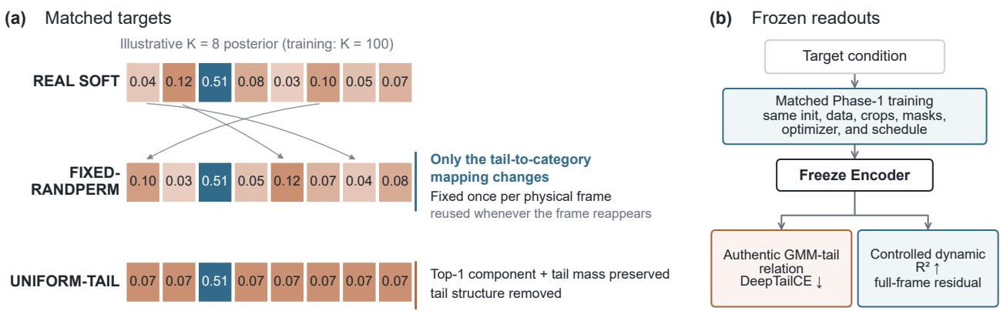
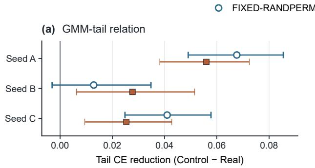
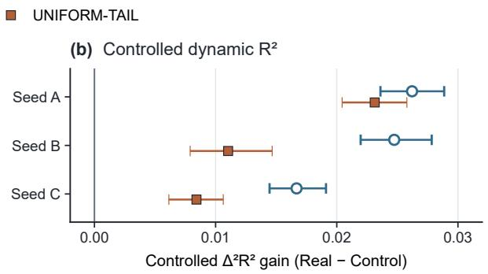
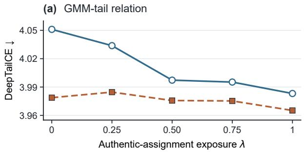
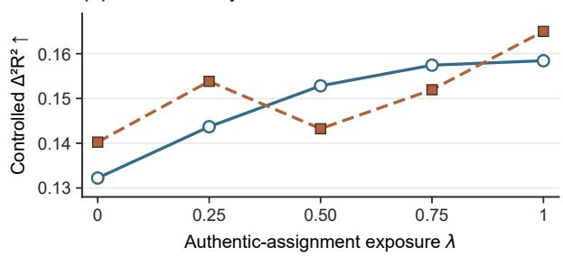
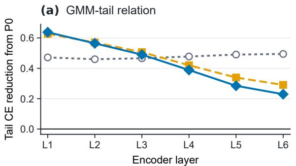
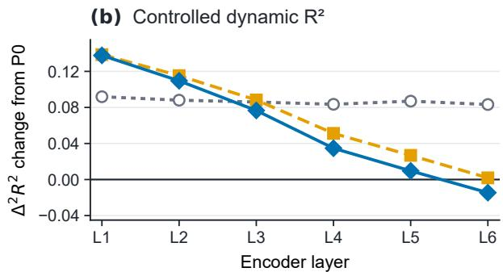

# DOES MAPPING NON-MAXIMAL PROBABILITIES TO GMM COMPONENTS MATTERFOR S-JEPA ENCODER REPRESENTATIONS?

Wenxuan He1, Yunpeng Li1, Shan Liang1

1Department of Intelligent Science, School of Advanced Technology,

Xi’an Jiaotong-Liverpool University, Suzhou, China

1wenxuan.he23@student.xjtlu.edu.cn, 1yunpeng.li21@student.xjtlu.edu.cn, 1Shan.Liang@xjtlu.edu.cn

## ABSTRACT

S-JEPA uses soft Gaussian mixture model (GMM) posteriors instead of hard cluster labels to preserve uncertainty. It remains unclear whether the probability values alone are sufficient, or whether it also matters which GMM components receive the non-maximal probabilities. We test this with two matched controls. FIXED-RANDPERM keeps the top-1 component and probability together with the multiset of non-maximal probability values, but reassigns those non-maximal values using a mapping fixed for each physical frame. UNIFORM-TAIL keeps the top-1 component, its probability, and total non-maximal mass but distributes that mass uniformly. Across three independent seeds, REAL SOFT outperforms both controls on two frozen Encoder readouts. It provides better recovery of the original GMM tail and greater accessibility of spectral dynamics over short time scales after controlling for the complete spectrum of the current frame. In two exposure experiments, both readouts improved overall as more frames retained the original mapping. We also descriptively follow one Phase 2 trajectory after the switch to the online GMM. These results show that the numerical probability structure of the soft target does not fully determine the learned Encoder representation. The mapping of non-maximal probabilities to GMM components also matters.

Index Terms— self-supervised speech learning, soft targets, mechanism analysis, counterfactual training, representation probing

## 1. INTRODUCTION

Many self-supervised speech models learn from discrete cluster targets and predict a single category for each masked speech frame [1, 2, 3, 4, 5, 6]. Such hard targets collapse uncertainty in acoustically ambiguous frames into one label. S-JEPA instead uses soft Gaussian mixture model (GMM) posteriors as training targets in Phase 1 and later switches to an online GMM built from learned representations in Phase 2 [7]. A hard target is one-hot. It assigns probability 1 to one GMM component and 0 to all others. A soft target instead retains a distribution of probability values across the components. For our analysis, we distinguish the numerical probability structure of a target from its category-specific mapping. We use numerical probability structure to mean the top-1 probability and the multiset of non-maximal probability values, independent of which GMM components receive those non-maximal values. The categoryspecific mapping specifies which GMM components receive those values. Whether this mapping affects the representation learned by the S-JEPA Encoder remains unclear.

A direct comparison between soft and hard targets cannot isolate this effect. Converting a soft posterior into a hard label changes the top-1 probability and removes all non-maximal probability mass. It also removes the original mapping between non-maximal values and GMM components. Any resulting representation difference could therefore arise from the change in numerical probability structure or from the loss of the original mapping. We therefore ask a more specific question. If the numerical probability structure is preserved, does changing which GMM components receive the non-maximal values alter the Encoder representation?

We use two counterfactual targets matched to the original soft posterior. REAL SOFT uses the original GMM posterior. FIXED-RANDPERM preserves the top-1 GMM component and probability together with the multiset of non-maximal probability values. It reassigns the non-maximal values across the other GMM components. The resulting mapping is fixed for each physical speech frame throughout training, so repeated presentations of the same frame use the same target. UNIFORM-TAIL provides a complementary control. It preserves the top-1 component, its probability, and the total non-maximal mass, while distributing the remaining mass uniformly across the other components. If the effect of the soft target depends only on its numerical probability structure, REAL SOFT and FIXED-RANDPERM should produce similar Encoder representations. A consistent difference between them would show that the mapping of non-maximal probabilities to GMM components also matters.

We test this prediction with two complementary readouts of the frozen Encoder. The first measures how well the original non-maximal GMM posterior can be recovered from the learned representation. The second measures predictable short-term spectral dynamics after the complete current-frame spectrum has been controlled. This tests whether the effect extends beyond recovery of the GMM target itself. Across three independent training seeds, REAL SOFT performs better than both controls on both readouts. Two deterministic graded exposure experiments also show the predicted overall direction as more frames retain the original mapping. We additionally follow one S-JEPA Phase 2 trajectory to examine how these readouts evolve after the switch to the online GMM. This Phase 2 analysis is descriptive because no matched counterfactual continuation is available. Together, the matched controls show that the numerical probability structure alone does not fully determine the learned representation. The mapping of non-maximal probabilities to GMM components also matters.

  
Fig. 1. Matched Phase 1 counterfactuals and readouts from the frozen Encoder. FIXED-RANDPERM preserves the top-1 component and probability, together with the multiset of non-maximal probability values. It reassigns the non-maximal values through one fixed mapping for each physical frame. UNIFORM-TAIL keeps the top-1 component and total tail mass but removes category-specific tail structure.

## 2. COUNTERFACTUAL TARGET DESIGN

## 2.1. Matched target intervention

For each physical frame t, let $q _ { t } \in \Delta ^ { K - 1 }$ be its fixed Phase 1 GMM posterior, where $K = 1 0 0$ . Let $k _ { t } ^ { * } = \arg \operatorname* { m a x } _ { k \in \{ 1 , . . . , K \} } q _ { t , k }$ and $p _ { t } ^ { * } = q _ { t , k _ { t } ^ { * } }$ . The set $\mathcal { T } _ { t } = \{ 1 , \dots , K \} \setminus \{ k _ { t } ^ { * } \}$ contains the nonmaximal components. REAL SOFT uses $q _ { t }$ without modification. For FIXED-RANDPERM, each physical frame is assigned one fixed bijection $\pi _ { t } : \mathcal { T } _ { t }  \mathcal { T } _ { t }$ . Its target is

$$
q _ { t , k } ^ { \mathrm { R P } } = \left\{ \begin{array} { l l } { p _ { t } ^ { * } , } & { k = k _ { t } ^ { * } , } \\ { q _ { t , \pi _ { t } ( k ) } , } & { k \in \mathcal { T } _ { t } . } \end{array} \right.\tag{1}
$$

This preserves the top-1 component and probability, together with the multiset of non-maximal probability values, and therefore leaves tail mass, entropy, and norm unchanged. Only the mapping from non-maximal values to GMM components changes. The same π is reused across crops, optimization steps, distributed ranks, and repeated occurrences of frame t.

UNIFORM-TAIL keeps $k _ { t } ^ { * }$ and $p _ { t } ^ { * }$ , and assigns $( 1 - p _ { t } ^ { * } ) / ( K - 1 )$ to every index in $\mathcal { T } _ { t } .$ It preserves the top-1 component, its probability, and total non-maximal mass, but removes variation among the non-maximal values (Fig. 1(a)). Unlike FIXED-RANDPERM, it does not introduce a fixed incorrect mapping between non-maximal values and GMM components. The two conditions are complementary controls, not ordered levels of target corruption.

For graded exposure, each physical frame receives one fixed routing score $u _ { t } ~ \in ~ [ 0 , 1 )$ , shared across all exposure levels. At level $\lambda ,$ the frame uses REAL SOFT when $u _ { t } ~ < ~ \lambda$ and FIXED-RANDPERM otherwise. We test $\lambda \in \{ 0 , 0 . 2 5 , 0 . 5 , 0 . 7 5 , 1 \}$ . Thus, every frame uses FIXED-RANDPERM at $\lambda = 0$ and REAL SOFT at $\lambda = 1$ . Reusing the same u across levels makes the REAL SOFT subsets nested. Each physical frame also keeps its selected target whenever it reappears.

## 2.2. Intervention and target audit

Across 4,096 audited frames, REAL SOFT and FIXED-RANDPERM matched on the top-1 component, top-1 probability, multiset of nonmaximal probability values, tail mass, entropy, and norm. All 512 replay trials reproduced the stored frame-specific permutations.

At $\lambda = 0 . 2 5 , 0 . 5 0 .$ and 0.75, the observed REAL SOFT routing fractions were 0.253, 0.501, and 0.747, respectively.

As a target-side sanity check, we asked whether the original tail reflects acoustic similarity. For each phone-transition frame, we measured the excess posterior mass associated with the neighboring phone relative to UNIFORM-TAIL. GMM-to-phone associations and 39-dimensional MFCC phone prototypes were estimated independently on the development set. Acoustic distance was the cosine distance between the prototypes of the current and neighboring phones. Across ordered phone pairs, excess mass decreased as acoustic distance increased (Spearman $\rho = - 0 . 4 9 0 7$ , 95% CI [−0.4982,−0.4756]). The original posterior tail therefore contains systematic target-side acoustic structure. This association motivates the Encoder analysis, but does not show that the trained Encoder retains the relation.

## 3. EXPERIMENTAL PROTOCOL

## 3.1. Model, data, and training

The S-JEPA model uses a seven-layer convolutional front end and a six-layer Transformer Encoder with 768 hidden units. The Predictor has one layer, and the prediction head has 100 outputs. Phase 1 uses the original KL divergence loss.

AdamW uses a learning rate of $1 0 ^ { - 4 } .$ , 500 warmup updates, and weight decay of $1 0 ^ { - 3 }$ . We use gradient clipping at 1, BF16, a global batch size of $^ { 6 4 , }$ and 10k updates. Within each seed, all target conditions share the same initialization, data order, crops, masks, and optimization schedule. We train three seeds for the endpoint comparisons. Two of these seeds include all five exposure levels.

Phase 1 uses a fixed 20 h subset of LibriSpeech with 5,723 utterances from 51 speakers [8]. The probes are fitted on dev-clean, which contains 2,703 utterances from 40 speakers. They are evaluated on test-clean, which contains 2,620 utterances from 40 different speakers. A diagonal GMM with 100 components is fitted only to the training data. Its input contains static, delta, and delta-delta MFCCs [9, 10]. MiniBatch k-means initializes the GMM, followed by 20 EM iterations [11].

The Phase 2 extension follows one official continuation. Layer L5 remains the active GMM layer, and the online GMM has 500 components. P0, P1, P2, and P3 denote 0, 10k, 50k, and 100k Phase

2 updates. No matched Phase 2 counterfactual continuation is available.

## 3.2. Readouts from the frozen Encoder

After training, we discard the Predictor, prediction head, and GMM, and freeze the Encoder. Ridge probes are fitted on unmasked devclean states and evaluated once on test-clean. We report the arithmetic mean over L4, L5, and L6 as the deep summary.

The first endpoint is DeepTailCE. Let $m _ { t } = 1 - p _ { t } ^ { * }$ denote the total non-maximal mass of frame t. We retain frames with $m _ { t } \ge 0 . 1$ which avoids renormalizing posteriors with little tail mass. For each retained frame, the target is the original posterior renormalized over the 99 non-maximal components. The Ridge probe produces 100 outputs. We clip negative outputs to zero, set the top-1 entry to zero, and renormalize the remaining outputs. The denominator and the cross-entropy logarithm use a floor of $\epsilon = 1 0 ^ { - 8 }$ . The resulting cross entropy is the frame-level Tail CE. At each layer, the reported Tail CE pools all retained frames. DeepTailCE is the arithmetic mean of the frame-pooled values at L4, L5, and L6. Lower Deep-TailCE means that the original distribution of non-maximal probability across GMM components is more accessible through a linear readout. This endpoint is most directly tied to the target intervention.

Tail recovery alone cannot show whether the representation difference extends beyond recovery of the GMM target. We therefore use a second endpoint that measures spectral change over a short time window. Let $\bar { \boldsymbol { x } } _ { t } \in \mathbb { R } ^ { 8 0 }$ be the log-Mel spectrum after mean and variance normalization within each utterance. We define the deltadelta target as

$$
\Delta ^ { 2 } x _ { t } = \frac { x _ { t + 2 } - 2 x _ { t } + x _ { t - 2 } } { 4 } ,\tag{2}
$$

with reflection at utterance boundaries.

Part of this target can be predicted from the spectrum of the current frame. A direct probe could therefore score well simply because the Encoder retains the current spectrum. We estimate this contribution with a Ridge covariate model fitted on dev-clean. Phone labels and phone boundaries come from forced alignment of the official LibriSpeech transcripts. Frame region is defined by distance to the nearest valid phone boundary. Boundary frames lie within 20 ms, transition frames lie between 20 and 40 ms, and interior frames are at least 80 ms away. Remaining frames form the other region. Signed boundary position records the side and distance to that boundary. Absolute boundary position retains only the distance.

The phone, GMM top-1 component, and four frame regions use one-hot encoding. The continuous covariates are posterior entropy, top-1 probability, signed and absolute boundary position, and all 80 dimensions of the current log-Mel spectrum. They are standardized on dev-clean, and the same scaling is applied to test-clean. Five development folds grouped by speaker select the Ridge penalty. The final covariate model is fitted on the full development set. It then predicts the delta-delta target on both development and test frames. We subtract these predictions from their corresponding targets. The same residual targets are used for every training condition. Each Encoder probe is fitted on the development residual and evaluated on the test residual.

The full covariate model explained 0.544 of the delta-delta variance on test-clean. As a residual check, the same model class was fitted on the development residual and evaluated on the test residual. It gave $R ^ { 2 } = - 0 . 0 0 0 7$ . These checks show that the residual no longer contains the linear contribution captured by this covariate model. They do not rule out every nonlinear function of the current frame. Higher residual $R ^ { 2 }$ means that spectral dynamics are more accessible beyond the fitted linear contribution of these covariates. We refer to this endpoint as controlled dynamic $R ^ { 2 }$

## 3.3. Statistical evaluation and replication

We use paired bootstrap resampling to assess how each contrast depends on the composition of the evaluation set [12]. Each analysis uses 10,000 draws. The primary bootstrap resamples utterances. The same resampled utterances are used for both members of each contrast. For DeepTailCE, retained frame losses are first averaged within each utterance and layer, and then over L4–L6. Each draw averages the paired condition differences across resampled utterances. Absolute endpoint values are frame-pooled; paired Tail contrasts use utterance-level averages for bootstrap inference. For controlled dynamic $R ^ { 2 }$ , every draw rebuilds pooled $R ^ { 2 }$ at each layer from sufficient statistics stored for the resampled utterances. The layer values are then averaged over L4, L5, and L6.

We also run a cluster bootstrap over the 40 test speakers. Each draw resamples speakers and retains every utterance from each sampled speaker. The same speaker draw is used for both members of a contrast. These intervals condition on the trained models and quantify variation due to the evaluation sample.

The two endpoint metrics have opposite favorable directions. Evidence in the predicted direction means lower DeepTailCE and higher controlled dynamic $R ^ { 2 }$ for REAL SOFT than for a control. For each exposure experiment, we fit an ordinary least squares slope across the five values of λ. The predicted slope is negative for Deep-TailCE and positive for controlled dynamic $\bar { \boldsymbol { R } } ^ { 2 }$ . We also report the contrast between $\lambda = 0$ and $\lambda = 1$ . The exposure analysis uses these slopes and endpoint contrasts. It does not require every intermediate level to be pointwise monotonic.

Independent training seeds address variation across optimization paths. Conditions within a seed form a matched comparison, whereas different seeds use independent initializations and training paths. Agreement across seeds tests whether the predicted effect direction is reproduced after independent training. We treat each seed as one training replication. The two controls and two endpoints within a seed do not create additional training replications.

## 4. EMPIRICAL RESULTS

## 4.1. The mapping effect replicates across three training seeds

Table 1 reports the endpoint values for every trained condition. Figure 2(a) reports paired reductions and speaker-cluster intervals. REAL SOFT achieved lower DeepTailCE than FIXED-RANDPERM in all three seeds, with reductions of 0.0676, 0.0129, and 0.0410. The same direction held against UNIFORM-TAIL, with reductions of 0.0560, 0.0277, and 0.0254.

All six DeepTailCE point estimates favored REAL SOFT. Five of the six 95% speaker-cluster intervals excluded zero. The only interval that crossed zero was the Seed B comparison with FIXED-RANDPERM, with a reduction of 0.0129 and interval [−0.0030,0.0348]. The three point estimates agreed in direction, but their magnitudes differed across seeds.

## 4.2. The effect extends beyond GMM-tail recovery

REAL SOFT had higher controlled dynamic $R ^ { 2 }$ in every seed (Fig. 2(b)). The gains over FIXED-RANDPERM were 0.0262, 0.0247, and 0.0167. The gains over UNIFORM-TAIL were 0.0231,

(b) Controlled dynamic R²  

  
Fig. 2. Three-seed Phase 1 replication. Points show paired Tail CE reductions and controlled dynamic $R ^ { 2 }$ gains. Bars show 95% speakercluster intervals. Positive values favor REAL SOFT.

Table 1. Final frozen Encoder endpoint values under the FIXED-RANDPERM protocol. Lower Tail CE and higher controlled dynamic $R ^ { 2 }$ are better.
<table><tr><td rowspan="2">Seed</td><td colspan="3">DeepTailCE↓</td><td colspan="3">Controlled dynamic  $R ^ { 2 } \uparrow$ </td></tr><tr><td>REAL SOFT</td><td>FIXED-RANDPERM</td><td>UNIFORM-TAIL</td><td>REAL SOFT</td><td>FIXED-RANDPERM</td><td>UNIFORM-TAIL</td></tr><tr><td>A</td><td>3.9831</td><td>4.0511</td><td>4.0409</td><td>0.1584</td><td>0.1322</td><td>0.1353</td></tr><tr><td>B</td><td>3.9652</td><td>3.9787</td><td>3.9940</td><td>0.1650</td><td>0.1403</td><td>0.1540</td></tr><tr><td>C</td><td>3.9526</td><td>3.9928</td><td>3.9778</td><td>0.1575</td><td>0.1408</td><td>0.1491</td></tr></table>

0.0110, and 0.0084. All six 95% speaker-cluster intervals excluded zero. Across both endpoints and both controls, all 12 point estimates from the three training seeds had the predicted direction.

## 4.3. Increasing exposure supports the same effect

Both deterministic exposure runs had endpoint contrasts and fitted slopes in the predicted directions (Fig. 3). In Seed A, the Deep-TailCE and controlled dynamic $R ^ { 2 }$ slopes were −0.069756 and +0.026472. Both trajectories were pointwise monotonic.

In Seed B, the corresponding slopes were −0.014552 and +0.019046. The endpoints retained the predicted direction, but the intermediate levels fluctuated. The exposure results therefore support an overall trend rather than a universal monotonic relationship.

## 4.4. Phase 2 provides a descriptive continuation

The two deep readouts peaked at P1 and then partly receded. Deep-TailCE was 3.976 at P0, 3.491 at P1, 3.634 at P2, and 3.684 at P3. Controlled dynamic $R ^ { 2 }$ was 0.158, 0.243, 0.185, and 0.168 at the same checkpoints. At P3, both readouts remained better than at P0. The P3 to P0 change in DeepTailCE was −0.292 (95% CI [−0.306,−0.279]). The corresponding controlled dynamic $R ^ { 2 }$ change was +0.0099 (95% CI [0.0076,0.0123]).

At P3, the two readouts showed different depth profiles (Fig. 4). DeepTailCE reductions decreased from 0.638 at L1 to 0.229 at L6 but remained positive at every layer. Controlled dynamic $R ^ { 2 }$ changes decreased from +0.1377 at L1 to −0.0146 at L6.

Online GMM weights became progressively more concentrated along the same continuation (Table 2). The number of components with weight above $1 0 ^ { - 6 }$ fell from 59 at P1 to 9 at P3, while the model retained all 500 components.

## Seed A Seed B

  
Fig. 3. Deterministic exposure in two training seeds. Each physical frame keeps one route throughout training. $\mathbf { A } \mathbf { t } \lambda = 0 .$ all frames use FIXED-RANDPERM. At λ = 1, all frames use REAL SOFT.

  
Fig. 4. Depth changes from P0 along one Phase 2 path with L5 fixed. At P3, relation recovery is better at every layer; the dynamic change decreases with depth and becomes negative at L6. The path is descriptive.

Table 2. Online GMM weight concentration along one Phase 2 trajectory. The model keeps $K = 5 0 0$ components throughout.
<table><tr><td>Statistic</td><td>P1 (10k)</td><td>P2 (50k)</td><td>P3 (100k)</td></tr><tr><td> $\# \{ k : w _ { k } > 1 0 ^ { - 6 } \}$ </td><td>59</td><td>12</td><td>9</td></tr><tr><td>Weight entropy (bits)</td><td>4.151</td><td>3.176</td><td>2.798</td></tr><tr><td>Maximum weight</td><td>0.158</td><td>0.270</td><td>0.304</td></tr></table>

## 5. MECHANISTIC INTERPRETATION AND SCOPE

## 5.1. What the Phase 1 intervention establishes

REAL SOFT and FIXED-RANDPERM share the numerical probability structure of each target. They also keep one consistent target for each physical frame. Their only target difference is the mapping from non-maximal probabilities to GMM components. The difference between REAL SOFT and FIXED-RANDPERM appeared in all three matched training seeds. This result shows that the mapping affects what remains linearly accessible in the frozen Encoder. The within-seed design complements prior cross-model and cross-layer analyses [13, 14, 15, 16] by isolating one target property.

The comparison between REAL SOFT and FIXED-RANDPERM is the primary identification test because it retains the top-1 component and the multiset of non-maximal posterior values. UNIFORM-TAIL provides a complementary control. It retains the top-1 component, its probability, and total non-maximal mass, but removes detailed tail structure. The comparison between REAL SOFT and UNIFORM-TAIL asks whether those retained properties are sufficient. The agreement between the two comparisons reduces dependence on a single control construction. Fixed and Uniform are not ordered points on a corruption scale.

The two readouts provide different levels of evidence. Better Tail recovery shows that the original GMM-tail relation remains more accessible in the Encoder. The controlled dynamic $R ^ { 2 }$ gains show that the effect is not limited to recovering the GMM posterior. Graded exposure adds evidence between the Real and Fixed endpoints. In both runs, the endpoints and fitted slopes change in the predicted directions as more frames retain the original mapping. Seed B is not pointwise monotonic, so the result supports an overall exposure trend rather than a universal monotonic relationship.

## 5.2. Scope of the Phase 1 conclusion

Speaker-cluster intervals reduce the likelihood that a few prolific test speakers drive the main effects. The dynamic gains also remain after controlling the complete current spectrum. They therefore cannot be explained solely by the current-frame contribution captured by the covariate model.

The intervention changes the mapping throughout the nonmaximal tail. It identifies the effect of the original mapping as a whole. It does not locate the effect in one GMM component or one specific tail relation.

Both endpoints are linear readouts of the frozen Encoder. They establish what information is accessible to these probes, not how later model computations use that information [17, 18].

## 5.3. Phase 2 representational evolution

Both deep readouts became more accessible at P1 and then partly receded. Online GMM weights became more concentrated along the same trajectory.

By P3, the two readouts showed different depth profiles. The GMM-tail relation remained more accessible than at P0 across all layers, whereas the controlled dynamic gain was concentrated in shallower layers.

Only one standard Phase 2 continuation is available, without a matched counterfactual path. These results therefore describe representational evolution along that continuation. They do not establish that Phase 2 caused the changes or that online GMM concentration caused the depth profiles.

The study covers one S-JEPA architecture, one 20-h training setup, and frozen linear readouts. Other corpora, targets, and downstream tasks remain untested.

## 6. CONCLUSION

This study asks whether the original mapping of non-maximal probabilities matters when the numerical probability structure and target consistency are held fixed. Across three matched Phase 1 training seeds, REAL SOFT outperformed FIXED-RANDPERM on both GMM tail recovery and controlled dynamic $R ^ { 2 }$ . UNIFORM-TAIL also favored REAL SOFT. In two exposure experiments, both GMM tail recovery and controlled dynamic $R ^ { 2 }$ improved overall as more frames retained the original mapping.

These results show that the numerical probability structure of the soft target does not fully determine the representation learned by the Encoder. The mapping of non-maximal probabilities to GMM components also matters.

Along one Phase 2 continuation, the two readouts developed different depth profiles after the switch to the online GMM. This trajectory is descriptive because no matched Phase 2 counterfactual is available.

Ethical standards and conflicts of interest. This study uses public LibriSpeech data and collects no new human-participant data; no ethical approval was required. The authors declare no conflicts of interest.

## 7. REFERENCES

[1] Wei-Ning Hsu, Benjamin Bolte, Yao-Hung Hubert Tsai, Kushal Lakhotia, Ruslan Salakhutdinov, and Abdelrahman Mohamed, “HuBERT: Self-supervised speech representation learning by masked prediction of hidden units,” IEEE/ACM Transactions on Audio, Speech, and Language Processing, vol. 29, pp. 3451–3460, 2021.

[2] Sanyuan Chen, Chengyi Wang, Zhengyang Chen, Yu Wu, Shujie Liu, Zhuo Chen, Jinyu Li, Naoyuki Kanda, Takuya Yoshioka, Xiong Xiao, Jian Wu, Long Zhou, Shuo Ren, Yanmin Qian, Yao Qian, Jian Wu, Michael Zeng, Xiangzhan Yu, and Furu Wei, “WavLM: Large-scale self-supervised pre-training for full stack speech processing,” IEEE Journal of Selected Topics in Signal Processing, vol. 16, no. 6, pp. 1505–1518, 2022.

[3] Chung-Cheng Chiu, James Qin, Yu Zhang, Jiahui Yu, and Yonghui Wu, “Self-supervised learning with randomprojection quantizer for speech recognition,” in Proceedings of the 39th International Conference on Machine Learning, 2022, vol. 162 of Proceedings of Machine Learning Research, pp. 3915–3924.

[4] Alexei Baevski, Yuhao Zhou, Abdelrahman Mohamed, and Michael Auli, “wav2vec 2.0: A framework for self-supervised learning of speech representations,” in Advances in Neural Information Processing Systems, 2020, vol. 33, pp. 12449– 12460.

[5] Alexei Baevski, Wei-Ning Hsu, Qiantong Xu, Arun Babu, Jiatao Gu, and Michael Auli, “data2vec: A general framework for self-supervised learning in speech, vision and language,” in Proceedings of the 39th International Conference on Machine Learning, 2022, vol. 162 of Proceedings of Machine Learning Research, pp. 1298–1312.

[6] Alexander H. Liu, Heng-Jui Chang, Michael Auli, Wei-Ning Hsu, and Jim Glass, “DinoSR: Self-distillation and online clustering for self-supervised speech representation learning,” in Advances in Neural Information Processing Systems, 2023, vol. 36, pp. 58346–58362.

[7] Georgios Ioannides, Adrian Kieback, Judah Goldfeder, Linsey Pang, Aman Chadha, Aaron Elkins, Yann LeCun, and

Ravid Shwartz-Ziv, “S-JEPA: Soft clustering anchors for selfsupervised speech representation learning,” arXiv preprint arXiv:2606.19398, 2026.

[8] Vassil Panayotov, Guoguo Chen, Daniel Povey, and Sanjeev Khudanpur, “LibriSpeech: An ASR corpus based on public domain audio books,” in 2015 IEEE International Conference on Acoustics, Speech and Signal Processing (ICASSP), 2015, pp. 5206–5210.

[9] Steven B. Davis and Paul Mermelstein, “Comparison of parametric representations for monosyllabic word recognition in continuously spoken sentences,” IEEE Transactions on Acoustics, Speech, and Signal Processing, vol. 28, no. 4, pp. 357– 366, 1980.

[10] Sadaoki Furui, “Speaker-independent isolated word recognition using dynamic features of speech spectrum,” IEEE Transactions on Acoustics, Speech, and Signal Processing, vol. 34, no. 1, pp. 52–59, 1986.

[11] Arthur P. Dempster, Nan M. Laird, and Donald B. Rubin, “Maximum likelihood from incomplete data via the EM algorithm,” Journal of the Royal Statistical Society: Series B, vol. 39, no. 1, pp. 1–22, 1977.

[12] Anthony C. Davison and David V. Hinkley, Bootstrap Methods and Their Application, Cambridge University Press, 1997.

[13] Yu-An Chung, Yonatan Belinkov, and James R. Glass, “Similarity analysis of self-supervised speech representations,” in 2021 IEEE International Conference on Acoustics, Speech and Signal Processing (ICASSP), 2021, pp. 3040–3044.

[14] Ankita Pasad, Ju-Chieh Chou, and Karen Livescu, “Layer-wise analysis of a self-supervised speech representation model,” in 2021 IEEE Automatic Speech Recognition and Understanding Workshop (ASRU), 2021, pp. 914–921.

[15] Takanori Ashihara, Marc Delcroix, Takafumi Moriya, Kohei Matsuura, Taichi Asami, and Yusuke Ijima, “What do selfsupervised speech and speaker models learn? new findings from a cross model layer-wise analysis,” in 2024 IEEE International Conference on Acoustics, Speech and Signal Processing (ICASSP), 2024, pp. 10166–10170.

[16] Alexander H. Liu, Sung-Lin Yeh, and James R. Glass, “Revisiting self-supervised learning of speech representation from a mutual information perspective,” in 2024 IEEE International Conference on Acoustics, Speech and Signal Processing (ICASSP), 2024, pp. 12051–12055.

[17] John Hewitt and Percy Liang, “Designing and interpreting probes with control tasks,” in Proceedings of EMNLP-IJCNLP, 2019, pp. 2733–2743.

[18] Abhilasha Ravichander, Yonatan Belinkov, and Eduard Hovy, “Probing the probing paradigm: Does probing accuracy entail task relevance?,” in Proceedings of the 16th Conference of the European Chapter of the Association for Computational Linguistics: Main Volume, 2021, pp. 3363–3377.