# Discretizing Continuous Time Series for Imputation with Masked Diffusion Training

Dongbin Kim1, Seungyun Lee1, Geonwoo Shin1, Jaewook Lee1 \*

1Seoul National University

{dongbin413,rats96,shin0621,jaewook}@snu.ac.kr

## Abstract

Time series imputation is a crucial area for reliable time series analysis, yet it remains challenging due to the complex temporal dynamics and noise of realworld data. Existing approaches, however, exhibit two limitations: missing and observed values are embedded within the same representation space without explicit structural separation, and continuous diffusion-based methods are trained to predict added noise rather than the original signal. To address these, we propose the Masked Diffusion Time-series Imputation Model (MDTIM), which leverages the training paradigm of masked diffusion model for imputation tasks. The [MASK] token is structurally orthogonal to valid observations, and the model directly predicts the original values, naturally aligning both the representation and the learning objective with the imputation task. To bridge the gap between discrete masked diffusion and the continuous, ordinal nature of time series, we further introduce Stochastic Discretization, which maps continuous values to ordinal-aware tokens while preserving continuous dynamics. Our experiments on diverse benchmarks confirm that MDTIM achieves superior robustness and scalability, consistently outperforming state-of-the-art deterministic and generative baselines across various missing scenarios.

## 1 Introduction

Time series imputation is a fundamental task in time series analysis, as real-world data are often partially observed due to sensor failures or transmission errors [16]. At its core, imputation aims to recover the underlying clean signal from partial observations, which requires the representation and learning objective of the model to be well-aligned with the structure of partial observability.

From this perspective, we observe that existing approaches leave room for improvement along two axes. First, at the representation level, both discriminative Transformer-based methods [6] and continuous diffusion models [33] embed missing and observed values within the same data manifold. Although attention masks can prevent the model from attending to missing positions, placeholder values (e.g., zeros) still occupy the same embedding space as valid observations, potentially introducing spurious correlations in the input representation [8]. Second, at the objective level, continuous diffusion models such as CSDI [33] are typically trained to predict the Gaussian noise added to the data rather than the original values themselves, which is somewhat indirect for a task whose goal is to recover what was originally there.

Masked Diffusion Models (MDM), recently developed in Natural Language Processing [28], offer a natural fit for both aspects. Unlike continuous diffusion that corrupts data with Gaussian noise, MDM replaces tokens with a special [MASK] symbol and learns to recover the original values. The [MASK] token is structurally orthogonal to any valid observation, which provides a clearer separation between missing and observed states in the representation. The model also directly predicts the original values rather than the noise, more closely matching the imputation goal.

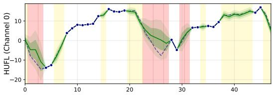

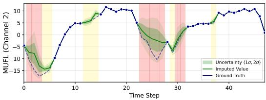  
Figure 1: Imputation results of MDTIM on the ETTh dataset. Red regions indicate intervals where both channels are missing, while yellow regions represent single-channel missingness. The uncertainty (σ), derived from the output probability of MDTIM, is estimated to be higher in the red regions (information scarcity) compared to the yellow regions (richer information).

Despite this conceptual fit, directly applying MDM to time series imputation presents a fundamental challenge. Time series data are inherently continuous and ordinal, whereas language tokens are discrete and categorical. Naive quantization severs the ordinal relationships between adjacent values and loses information below the grid resolution, which is particularly problematic when fine-grained reconstruction is needed. This raises our central research question: How can we leverage the training paradigm ofmasked diffusion while preserving the continuous and ordinal nature oftime series data?

To answer this, we propose the Masked Diffusion Time-series Imputation Model (MDTIM), a framework that bridges discrete masked diffusion and continuous time series modeling. We introduce Stochastic Discretization, which injects noise during tokenization to preserve information in expectation, and replace the standard one-hot objective with Ordinal-Aware Soft Labeling to capture the ordinal relationships between tokens. We further incorporate a spectral consistency objective and an expectation-based decoder for precise continuous reconstruction.

Our main contributions are summarized as follows:

• We propose a Masked Diffusion Framework that addresses the lack of structural separation between missing and observed representations in time series imputation.

• We introduce a novel quantization pipeline by Stochastic Discretization and Ordinal-Aware Soft Labeling, which preserves ordinal relationships within a categorical token space without information loss.

• We employ an Expectation-based Unmasking strategy and Spectral Consistency Regularization, allowing MDTIM to reconstruct continuous time series precisely. Our method consistently outperforms state-of-the-art deterministic and generative baselines across diverse benchmarks.

## 2 Related Work

## 2.1 Time Series Imputation

Time series data are often partially observed due to sensor faults, irregular sampling, or datacollection constraints [35]. Naive deletion or mean/zero imputation can bias estimation and degrade downstream tasks [16], so time-series imputation aims to recover missing values by leveraging temporal dependencies, cross-variable correlations, and informative missingness patterns [4, 6].

Methodologically, deep learning approaches have progressed from RNN-based architectures with masking [4, 3] to Transformer-based models that leverage self-attention to capture long-range dependencies; SAITS [6], in particular, achieves strong performance via Diagonally-Masked Self-Attention. Beyond deterministic models, diffusion-based models such as CSDI [33] and SSSD [20] produce probabilistic imputations by conditioning on observed data and iterative denoising. SSSD further incorporates structured state space models to better capture long-range temporal dependencies. However, this conditional formulation is misaligned with the imputation task: the model learns “what noise was added” rather than “what was originally there”. Moreover, its training objective is decoupled from the masking ratio, applying uniform weight regardless of reconstruction difficulty.

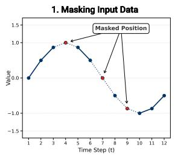

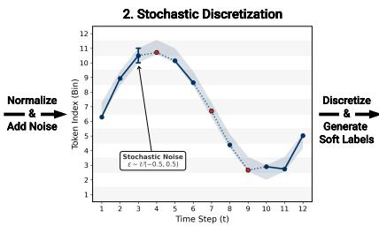

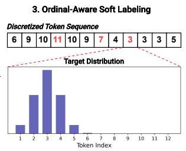  
Figure 2: Overview of the proposed Stochastic Discretization and Ordinal-Aware Soft Labeling framework. The process consists of three stages: (1) Masking Input Data, where missing values are identified; (2) Stochastic Discretization, which applies instance-adaptive normalization and injects stochastic noise $\epsilon \sim \mathcal { U } ( - 0 . 5 , 0 . 5 )$ to bridge the continuous-discrete gap; and (3) Ordinal-Aware Soft Labeling, which maps continuous values to discrete tokens while generating soft target distributions to preserve ordinal semantic relationships.

## 2.2 Masked Diffusion Model

Discrete diffusion models extend the diffusion paradigm to categorical state spaces [13]. Among them, D3PM [2] introduced an absorbing-state formulation, where tokens are progressively replaced by a special [MASK] symbol and recovered through iterative denoising. MDLM [28] adapted this framework to language modeling via a continuous-time weighted cross-entropy objective, demonstrating its effectiveness as a non-autoregressive alternative for conditional text generation. Building on MDLM, subsequent works have improved robustness through unmasking-order-aware training [15] and conditional fidelity by treating observed tokens as fixed anchors during sampling [17, 27]. Despite these advances, masked diffusion has been studied almost exclusively in discrete modalities such as NLP, and its extension to time series remains underexplored due to the fundamental gap between discrete tokens and continuous, ordinal temporal signals.

## 3 Discrete Representation for Time-Series Modeling

Although the Masked Diffusion Model (MDM) offers a promising framework for imputation, directly applying it to time series presents a structural challenge: MDMs are inherently designed for discrete state spaces (e.g., text tokens), whereas time series data consist of continuous numerical values. To bridge this gap, we introduce a unified discretization framework illustrated in Figure 2, which combines Stochastic Discretization to mitigate quantization error and Ordinal-Aware Soft Labeling to preserve the temporal order of the original signals within the discrete vocabulary.

## 3.1 Stochastic Discretization

Instance-Adaptive Normalization. To stabilize local statistics against distribution shifts, we normalize each input window $x \in \mathbb { R } ^ { T \times C }$ into x˜. Specifically, the normalization statistics are computed solely using the observed values (excluding masked positions), ensuring that there is no data-leakage in the training and imputation process.

Stochastic Token Generation. We map the normalized values to a discrete vocabulary of size K. Specifically, we first project the continuous value $\tilde { x } _ { t , c }$ onto the grid coordinates and inject uniform noise $\epsilon \sim \mathcal { U } ( - 0 . 5 , 0 . 5 )$ before rounding:

$$
c _ { t , c } = \frac { \tilde { x } _ { t , c } - v _ { \operatorname* { m i n } } } { v _ { \operatorname* { m a x } } - v _ { \operatorname* { m i n } } } \cdot ( K - 1 ) + 1 , \quad z _ { t , c } = \lfloor c _ { t , c } + \epsilon \rceil ,\tag{1}
$$

where ⌊·⌉ denotes the nearest integer function. This stochastic mechanism preserves information in expectation. For instance, a coordinate $c _ { t , c } = 3 . 6$ is assigned to token 4 with 60% probability and

token 3 with $4 0 \% ,$ ensuring $\mathbb { E } [ z _ { t , c } ] \approx c _ { t , c }$ . This allows the model to learn precise dynamics beyond the fixed grid resolution.

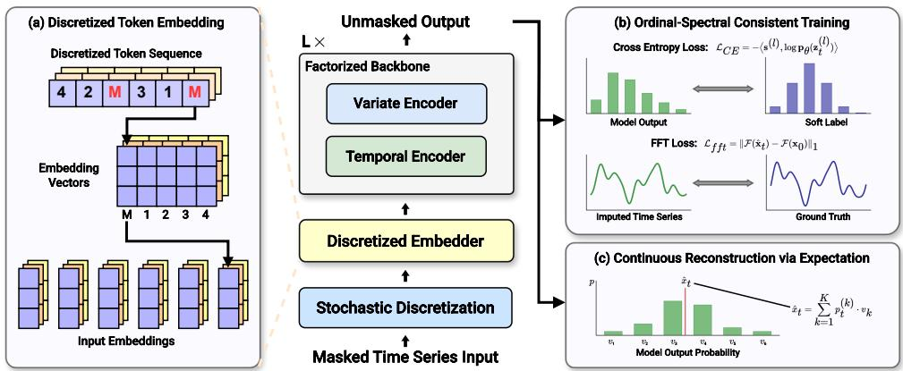  
Figure 3: Overview of the Masked Diffusion Time-series Imputation Model (MDTIM) framework. The architecture operates on the discretized input through three key phases: (a) Discretized Token Embedding: The discrete tokens generated by the stochastic tokenizer are mapped into dense vector representations. (b) Ordinal-Spectral Consistent Training: The backbone is trained with a dual objective combining Ordinal-Aware Soft Cross-Entropy and Spectral Consistency Loss. This ensures spectral consistency across global frequencies while maintaining local ordinal accuracy. (c) Continuous Reconstruction via Expectation: Finally, continuous values are recovered by computing the probability-weighted expectation of the predicted token distribution, enabling precise dense reconstruction from discrete outputs.

## 3.2 Ordinal-Aware Soft Labeling

Treating discretized tokens as independent classes ignores their ordinal nature $( \mathrm { e . g . }$ , token $k$ is semantically closer to $k + 1$ than $k + 1 0 )$ . To enforce continuity, we employ Ordinal-Aware Soft Labeling with a truncated Gaussian kernel.

Given a ground-truth token index $y \in \{ 1 , \ldots , K \}$ , the target probability $s _ { i }$ for the i-th class is defined as:

$$
s _ { i } = { \left\{ \begin{array} { l l } { { \frac { 1 } { Z } } \exp \left( - { \frac { ( i - y ) ^ { 2 } } { \sigma ^ { 2 } } } \right) } & { { \mathrm { i f ~ } } | i - y | \leq w , } \\ { 0 } & { { \mathrm { o t h e r w i s e } } , } \end{array} \right. }\tag{2}
$$

where w is the truncation window size $( \boldsymbol { \mathrm { e } } . \boldsymbol { \mathrm { g } } . , w = 2 )$ , σ controls smoothness, and $Z$ is the normalization constant. Crucially, we assign zero probability to the [MASK] token $( s _ { 0 } = 0 )$ and distant bins. This concentrates probability mass on valid ordinal neighbors while preserving the structural separation of the mask state.

## 4 Masked Diffusion Framework

Building upon the discrete representation of time series data described in Section 3, we introduce the Masked Diffusion Time-series Imputation Model (MDTIM), a framework designed to model the joint distribution of multivariate time series and incorporate training techniques of masked diffusion models. Figure 3 illustrates the overall pipeline.

## 4.1 Factorized Temporal-Variate Backbone

To effectively model the joint distribution of multivariate time series, we employ a Factorized Temporal-Variate Transformer based on the Diffusion Transformer (DiT) proposed by Peebles and Xie [25]. This architecture processes the input through alternating factorization of the time (T) and feature (C) axes.

Discretized Embedding. Given the masked input indices $\mathbf { z } _ { t } \in \{ 0 , \ldots , K \} ^ { B \times T \times C }$ at diffusion step t, we utilize a distinct embedding matrix Ec for each channel c to preserve semantic orthogonality. The input is projected to an initial hidden state $\mathbf { H } ^ { 0 } \in \mathbb { R } ^ { B \times T \times C \times D }$ , where $D$ is the hidden dimension.

Interleaved DiT Blocks. The core network consists of L layers, each sequentially processing the temporal and feature axes via two DiT blocks conditioned on the diffusion timestep t, with Rotary Position Embeddings (RoPE) [32] encoding relative positions. The Temporal block reshapes $\mathbf { H } ^ { ( l - 1 ) }$ to $\mathbb { R } ^ { ( B \cdot C ) \times T \times D }$ and captures time-dependencies along the temporal axis:

$$
{ \bf H } ^ { \prime ( l ) } = \mathrm { T e m p o r a l E n c o d e r } ( { \bf H } ^ { ( l - 1 ) } , t ) .\tag{3}
$$

The Variate block then reshapes $\mathbf { H } ^ { \prime ( l ) }$ to $\mathbb { R } ^ { ( B \cdot T ) \times C \times D }$ and symmetrically models cross-channel correlations:

$$
\mathbf { H } ^ { ( l ) } = \mathrm { V a r i a t e E n c o d e r } ( \mathbf { H } ^ { \prime ( l ) } , t ) .\tag{4}
$$

The final output is projected to vocabulary size $K _ { o u t } = 1 . 5 K$ , covering the extended range $[ - 1 . 5 , 1 . 5 ]$ to account for potential distribution shifts in unobserved regions.

## 4.2 Ordinal-Spectral Consistent Training Objective

To simultaneously ensure local reconstruction fidelity and global temporal coherence, we formulate a dual-domain objective. This combines a discrete diffusion loss adapted for ordinal continuity with an auxiliary spectral regularization term.

Ordinal-Aware Masked Diffusion. We adopt the continuous-time training paradigm of Masked Diffusion Language Models (MDLM) [2, 28], optimizing a weighted variational lower bound (NELBO). Standard MDLM employs a simple cross-entropy loss against one-hot targets, which treats all incorrect tokens equally, failing to capture the ordinal magnitude inherent in time-series data.

To address this, we employ the Ordinal-Aware Soft Labels derived in Sec. 3.2 as the optimization targets. For a set of masked indices $\mathcal { M } _ { t }$ at timestep t, the diffusion loss is formulated as:

$$
\mathcal { L } _ { \mathrm { d i f f } } = \mathbb { E } _ { t } \left[ w ( t ) \sum _ { l \in \mathcal { M } _ { t } } - \langle \mathbf { s } ^ { ( l ) } , \log \mathbf { p } _ { \theta } ( \mathbf { z } _ { t } ^ { ( l ) } ) \rangle \right] ,\tag{5}
$$

where log $\mathbf { p } _ { \theta } ( \mathbf { z } _ { t } ^ { ( l ) } ) \in \mathbb { R } ^ { K }$ is the predicted log-probability vector, and $\mathbf { s } ^ { ( l ) } \in \mathbb { R } ^ { K }$ denotes the soft target distribution. The detailed formulation of time-dependent weight $w ( t )$ and the corresponding noise schedule are detailed in Appendix C.2.2.

Replacing the one-hot target $\mathbf { e } _ { y }$ with $\mathbf { s } ^ { ( l ) }$ can be viewed as a smooth relaxation of the standard MDLM objective. Writing $\mathbf { s } ^ { ( l ) } = ( 1 - \epsilon ) \mathbf { e } _ { y } + \epsilon \mathbf { u } ^ { ( l ) }$ with $\epsilon = 1 - s _ { y } ^ { ( l ) }$ , the per-token loss decomposes as:

$$
- \langle \mathbf { s } ^ { ( l ) } , \log \mathbf { p } _ { \boldsymbol { \theta } } \rangle = ( 1 - \epsilon ) \mathcal { L } _ { \mathrm { N E L B O } } ^ { ( l ) } + \epsilon D _ { \mathrm { K L } } ( \mathbf { u } ^ { ( l ) } \lVert \mathbf { p } _ { \boldsymbol { \theta } } ) + \mathrm { c o n s t } ,\tag{6}
$$

so that the original NELBO is recovered when $\mathbf { s } ^ { ( l ) }$ collapses to a one-hot $( \epsilon  0 )$ and otherwise encourages the predicted distribution to align with the ordinal neighborhood of y. The detailed derivation is provided in Appendix B.

Spectral Consistency Regularization. While the token-wise objective ensures local accuracy, it may neglect global temporal correlations and frequency structures. To strictly enforce global coherence, we incorporate a Spectral Consistency Loss, adapting the frequency-domain regularization proposed in DiffusionTS [41]. During training, we compute a continuous estimate of the full sequence, $\hat { \mathbf { x } } _ { t } .$ by applying expectation-based decoding (Sec. 4.3). We then minimize the $L _ { 1 }$ distance between the Fourier representations of the reconstructed and ground-truth signals:

$$
\mathcal { L } _ { \mathrm { F F T } } = \mathbb { E } _ { t } \left[ \Vert \mathcal { F } ( \hat { \mathbf { x } } _ { t } ) - \mathcal { F } ( \mathbf { x } _ { 0 } ) \Vert _ { 1 } \right] ,\tag{7}
$$

where $\mathcal F ( \cdot )$ denotes the Fast Fourier Transform (FFT).

Therefore, the total training objective is a weighted combination: $\mathcal { L } _ { \mathrm { t o t a l } } = \mathcal { L } _ { \mathrm { d i f f } } + \lambda \mathcal { L } _ { \mathrm { F F T } }$

## 4.3 Continuous Reconstruction via Expectation

Since Stochastic Discretization injects random noise into the input, the model output depends on the specific noise realization. To obtain a robust estimate, we run inference M times $( \boldsymbol { \mathrm { e . g . } } , M = 1 0 )$ with independent noise samples and average the predicted probability distributions, $\begin{array} { r } { \bar { p } _ { t , c } = \frac { 1 } { M } \sum _ { m = 1 } ^ { M } p _ { t , c } ^ { ( m ) } } \end{array}$ The continuous value is then recovered as the expectation over the averaged distribution:

$$
\hat { x } _ { t , c } = \sum _ { k = 1 } ^ { K } \bar { p } _ { t , c } ^ { ( k ) } \cdot v _ { k } ,\tag{8}
$$

where $v _ { k }$ is the center value of the k-th bin within [−1.5, 1.5]. The result is then denormalized using the instance-wise statistics to recover the original scale.

Table 1: Quantitative comparison of multivariate time-series imputation performance (L = 48). We report the MAE of MDTIM and baselines averaged over 3 random seeds at missing ratios of 30% and 70% (50% in Appendix D.1). The best results are highlighted in bold.
<table><tr><td colspan="2">Dataset</td><td colspan="4">Energy</td><td colspan="4">ETTh</td><td colspan="4">Weather</td><td colspan="4">Sine</td><td colspan="2"></td></tr><tr><td colspan="2">Missing Type</td><td colspan="2">Uniform</td><td colspan="2">Geometric</td><td colspan="2">Uniform</td><td colspan="2">Geometric</td><td colspan="2">Uniform</td><td colspan="2">Geometric</td><td colspan="2">Uniform</td><td colspan="2"></td><td colspan="2">Geometric</td></tr><tr><td colspan="2">Model</td><td colspan="2">30% 70%</td><td colspan="2">30% 70%</td><td colspan="2">30% 70%</td><td colspan="2">30%</td><td colspan="2">70% 30%</td><td colspan="2">70% 30%</td><td colspan="2">70% 30%</td><td colspan="2">70% 30%</td><td colspan="2">70%</td></tr><tr><td rowspan="4">RNN</td><td>BRITS</td><td>0.246</td><td>0.379</td><td>0.329</td><td>0.366</td><td>0.194</td><td>0.299</td><td>0.227</td><td>0.292</td><td></td><td>0.050</td><td>0.073</td><td>0.058</td><td>0.071</td><td>0.010</td><td>0.021</td><td>0.020</td><td>0.019</td></tr><tr><td>MRNN</td><td>1.086</td><td>1.143</td><td>1.087</td><td>1.143</td><td>0.743</td><td>0.782</td><td>0.751</td><td>0.781</td><td>0.651</td><td></td><td>0.661</td><td>0.654</td><td>0.659</td><td>0.169</td><td>0.170</td><td>0.169</td><td>0.170</td></tr><tr><td>GRUD</td><td>0.364</td><td>0.457</td><td>0.426</td><td>0.445</td><td>0.310</td><td>0.394</td><td>0.348</td><td>0.383</td><td></td><td>0.104</td><td>0.369</td><td>0.164</td><td>0.350</td><td>0.008</td><td>0.014</td><td>0.013</td><td>0.012</td></tr><tr><td>Transformer</td><td>0.323</td><td>0.401</td><td>0.354</td><td>0.393</td><td>0.168</td><td>0.252</td><td>0.183</td><td>0.247</td><td>0.076</td><td></td><td>0.070</td><td>0.083</td><td>0.068</td><td>0.039</td><td>0.046</td><td>0.042</td><td>0.045</td></tr><tr><td rowspan="4">Transoomer</td><td>Informer</td><td>0.344</td><td>0.379</td><td>0.371</td><td>0.373</td><td>0.207</td><td>0.302</td><td>0.226</td><td>0.296</td><td>0.047</td><td>0.059</td><td>0.052</td><td></td><td>0.058</td><td>0.027</td><td>0.039</td><td>0.036</td><td>0.037</td></tr><tr><td>PatchTST</td><td>0.586</td><td>0.529</td><td>0.528</td><td>0.517</td><td>0.202</td><td>0.272</td><td>0.231</td><td>0.262</td><td></td><td>0.074</td><td>0.082</td><td>0.081</td><td>0.077</td><td>0.015</td><td>0.017</td><td>0.019</td><td>0.015</td></tr><tr><td>SAITS</td><td>0.177</td><td>0.212</td><td>0.204</td><td>0.208</td><td>0.140</td><td>0.210</td><td>0.152</td><td>0.206</td><td>0.045</td><td></td><td>0.049</td><td>0.050</td><td>0.048</td><td>0.026</td><td>0.026</td><td>0.030</td><td>0.025</td></tr><tr><td>ImputeFormer</td><td>0.066</td><td>0.219</td><td>0.113</td><td>0.194</td><td>0.146</td><td>0.245</td><td>0.165</td><td>0.235</td><td></td><td>0.049</td><td>0.171</td><td>0.090</td><td>0.149</td><td>0.006</td><td>0.041</td><td>0.012</td><td>0.037</td></tr><tr><td rowspan="3">CN</td><td>TimesNet</td><td>0.617</td><td>0.818</td><td>0.689</td><td>0.808</td><td>0.593</td><td>0.719</td><td>0.628</td><td>0.717</td><td>0.211</td><td>0.351</td><td>0.225</td><td></td><td>0.348</td><td>0.167</td><td>0.220</td><td>0.189</td><td>0.217</td></tr><tr><td>SCINet</td><td>0.557</td><td>0.571</td><td>0.546</td><td>0.565</td><td>0.238</td><td>0.323</td><td>0.261</td><td>0.317</td><td></td><td>0.074</td><td>0.089</td><td>0.086</td><td>0.087</td><td>0.019</td><td>0.031</td><td>0.026</td><td>0.029</td></tr><tr><td>DLinear</td><td>0.795</td><td>0.527</td><td>0.684</td><td>0.517</td><td>0.379</td><td>0.445</td><td>0.373</td><td>0.435</td><td>0.372</td><td>0.223</td><td>0.345</td><td></td><td>0.220</td><td>0.070</td><td>0.053</td><td>0.062</td><td>0.051</td></tr><tr><td rowspan="4">LIinear</td><td>FiLM</td><td>0.877</td><td>0.520</td><td>0.791</td><td>0.512</td><td>0.696</td><td>0.627</td><td>0.707</td><td></td><td>0.623</td><td>0.380</td><td>0.209</td><td>0.360</td><td>0.206</td><td>0.127</td><td>0.109</td><td>0.132</td><td>0.108</td></tr><tr><td>FreTS</td><td>0.157</td><td>0.219</td><td>0.225</td><td>0.206</td><td>0.222</td><td>0.299</td><td>0.262</td><td></td><td>0.286</td><td>0.071</td><td>0.080</td><td>0.080</td><td>0.074</td><td>0.068</td><td>0.068</td><td></td><td>0.065</td></tr><tr><td>GPVAE</td><td>0.476</td><td>0.730</td><td>0.501</td><td>0.727</td><td>0.333</td><td>0.449</td><td>0.369</td><td></td><td>0.440</td><td>0.158</td><td>0.255</td><td>0.172</td><td>0.252</td><td>0.152</td><td>0.162</td><td>0.075</td><td>0.162</td></tr><tr><td>USGAN</td><td></td><td>0.264 0.412</td><td>0.330</td><td>0.401</td><td>0.208</td><td>0.302</td><td>0.240</td><td></td><td>0.295</td><td>0.087</td><td>0.122</td><td>0.101</td><td>0.118</td><td>0.014</td><td>0.029</td><td>0.153 0.026</td><td>0.026</td></tr><tr><td rowspan="4">Geunrtive</td><td>CSDI</td><td>0.094</td><td>0.139</td><td>0.110</td><td>0.136</td><td>0.160</td><td>0.244</td><td>0.177</td><td>0.240</td><td>0.039</td><td></td><td></td><td></td><td>0.048</td><td>0.003</td><td>0.004</td><td>0.004</td><td>0.004</td></tr><tr><td>FGTI</td><td>0.050</td><td>0.100</td><td>0.065</td><td>0.097</td><td>0.218</td><td>0.349</td><td>0.293</td><td></td><td>0.328</td><td>0.038</td><td>0.049 0.051</td><td>0.044 0.046</td><td>0.049</td><td>0.001</td><td>0.003</td><td></td><td>0.003</td></tr><tr><td></td><td></td><td>0.085</td><td>0.053</td><td>0.082</td><td>0.127</td><td>0.211</td><td>0.146</td><td>0.205</td><td></td><td>0.032</td><td>0.044</td><td>0.036</td><td>0.043</td><td>0.002</td><td>0.004</td><td>0.002 0.003</td><td>0.003</td></tr><tr><td>MDTIM (Ours)</td><td>0.044</td><td></td><td></td><td></td><td></td><td></td><td></td><td></td></table>

## 5 Experiments

We empirically present a comprehensive evaluation of the proposed Masked Diffusion Time-series Imputation Model (MDTIM), comparing it against state-of-the-art deterministic and generative baselines. Our experiments focus on imputation accuracy, robustness to complex missing patterns, and computational efficiency.

## 5.1 Experimental Setup

We evaluate our method on widely used benchmarks: Energy, ETTh, Weather, and the synthetic Sine dataset. To rigorously test the models, we simulate data corruption using two distinct mechanisms: Uniform masking, where observations are dropped randomly to mimic independent failures, and Geometric masking, which removes consecutive time steps to simulate prolonged sensor malfunctions or transmission errors. For both scenarios, we assess performance across varying missing rates of 30%, 50%, and 70%.

We compare MDTIM against a comprehensive suite of 19 baselines spanning various architectural paradigms. These include RNN-based methods such as BRITS[3], MRNN[40], and GRU-D[4]; and Transformer-based models including the canonical Transformer[34], Informer[43], PatchTST[24], SAITS[6], and ImputeFormer[23]. Also, we include recent high-performance convolutional and linear architectures: TimesNet[37], SCINet[19], DLinear[42], FILM[44], and FreTS[39]. Finally, we evaluate against probabilistic frameworks including GP-VAE[9], US-GAN[22], and the diffusionbased CSDI[33] and FGTI[38]. To account for the stochastic nature of the missing data patterns, we evaluate each trained model across three independent inference trials using distinct random seeds for mask generation, and report the averaged Mean Absolute Error (MAE).

## 5.2 Imputation Performance

Main Results. As shown in Table 1, MDTIM achieves the lowest MAE on Energy, ETTh, and Weather across both Uniform and Geometric missing patterns. FGTI [38], a frequency-aware diffusion model, attains the best results on the synthetic Sine dataset whose signal is dominated by a few well-defined frequencies, while MDTIM trails by only a marginal gap (e.g., 0.002 vs. 0.001 at 30% Uniform). On the more complex real-world ETTh dataset, however, FGTI degrades substantially (0.218 vs. 0.127 at 30% Uniform), suggesting that frequency-domain priors generalize less reliably to irregular and non-stationary signals. Compared to the diffusion-based CSDI [33], MDTIM consistently yields lower MAE across all datasets, owing to our Expectation-based Reconstruction that recovers continuous values deterministically from the predicted token distribution and mitigates the sampling variance inherent in continuous diffusion. MDTIM also exhibits notable robustness under geometric masking, where most baselines suffer significant degradation; for instance, on Energy at 30%, MDTIM increases only from 0.044 to 0.053, indicating that the masked diffusion objective encourages inference of global temporal structure rather than reliance on local interpolation.

Scalability to Long-Term Dependencies. To verify that MDTIM captures long-range temporal dependencies, we extend the evaluation to longer sequence lengths $\bar { L \in \{ 9 6 , 1 9 \bar { 2 } \} }$ . As shown in Table 2, the performance advantage of MDTIM grows with the sequence length: while MDTIM is comparable to SAITS at $L = 4 { \bar { 8 } } .$ , the gap widens substantially at longer horizons. At $L = 1 9 2$ with 30% Uniform missing, MDTIM achieves an MAE of 0.123, considerably lower than BRITS (0.192) and SAITS (0.145), indicating that MDTIM captures global context without suffering from the attention dilution often observed in baselines.

Table 2: Robustness analysis on extended sequence lengths $( L \in \{ 9 6 , 1 9 2 \} )$ . We report the MAE averaged over 3 random seeds.
<table><tr><td>Length</td><td colspan="6">96</td><td colspan="6">192</td></tr><tr><td>Missing Type</td><td colspan="3">Uniform</td><td colspan="3">Geometric</td><td colspan="3">Uniform</td><td colspan="3">Geometric</td></tr><tr><td>Model</td><td>30%</td><td>50%</td><td>70%</td><td>30%</td><td>50%</td><td>70%</td><td>30%</td><td>50%</td><td>70%</td><td>30%</td><td>50%</td><td>70%</td></tr><tr><td>BRITS</td><td>0.191</td><td>0.229</td><td>0.287</td><td>0.220</td><td>0.250</td><td>0.280</td><td>0.192</td><td>0.230</td><td>0.287</td><td>0.222</td><td>0.250</td><td>0.280</td></tr><tr><td>SAITS</td><td>0.139</td><td>0.162</td><td>0.204</td><td>0.150</td><td>0.172</td><td>0.200</td><td>0.145</td><td>0.162</td><td>0.198</td><td>0.156</td><td>0.171</td><td>0.195</td></tr><tr><td>CSDI</td><td>0.149</td><td>0.177</td><td>0.222</td><td>0.162</td><td>0.187</td><td>0.218</td><td>0.170</td><td>0.199</td><td>0.245</td><td>0.183</td><td>0.209</td><td>0.241</td></tr><tr><td>MDTIM</td><td>0.124</td><td>0.152</td><td>0.199</td><td>0.138</td><td>0.163</td><td>0.194</td><td>0.123</td><td>0.148</td><td>0.190</td><td>0.135</td><td>0.157</td><td>0.186</td></tr></table>

Probabilistic Imputation Performance Beyond point estimation accuracy, we evaluate the quality of the predictive distributions generated by the models using the Continuous Ranked Probability Score (CRPS). CRPS estimates the calibration (reliability) and sharpness (precision) of the probabilistic inference.

Table 3: Quantitative comparison of probabilistic imputation performance (CRPS, $L = 4 8 )$ . We compare MDTIM with the diffusion-based baseline CSDI. Lower is better.
<table><tr><td colspan="2"></td><td colspan="2">Energy</td><td colspan="2">ETTh</td><td colspan="2">Sine</td></tr><tr><td>Missing Type</td><td>Rate</td><td>CSDI</td><td>MDTIM</td><td>CSDI</td><td>MDTIM</td><td>CSDI</td><td>MDTIM</td></tr><tr><td rowspan="3">Uniform</td><td>30%</td><td>0.0629</td><td>0.0429</td><td>0.1120</td><td>0.0863</td><td>0.0023</td><td>0.0020</td></tr><tr><td>50%</td><td>0.0747</td><td>0.0541</td><td>0.1356</td><td>0.1078</td><td>0.0025</td><td>0.0020</td></tr><tr><td>70%</td><td>0.0927</td><td>0.0771</td><td>0.1748</td><td>0.1520</td><td>0.0030</td><td>0.0020</td></tr><tr><td rowspan="3">Geometric</td><td>30%</td><td>0.0732</td><td>0.0547</td><td>0.1262</td><td>0.1017</td><td>0.0027</td><td>0.0020</td></tr><tr><td>50%</td><td>0.0818</td><td>0.0626</td><td>0.1460</td><td>0.1197</td><td>0.0028</td><td>0.0020</td></tr><tr><td>70%</td><td>0.0905</td><td>0.0733</td><td>0.1708</td><td>0.1462</td><td>0.0029</td><td>0.0020</td></tr></table>

As shown in Table 3, MDTIM consistently outperforms CSDI, the diffusion-based baseline, across all datasets and missing scenarios. On the highly periodic Sine dataset, MDTIM achieves a nearconstant CRPS regardless of the missing rate, indicating that it captures deterministic periodicity with high confidence. While continuous diffusion models often exhibit excessive variance due to sampling noise, MDTIM mitigates such ambiguity through its expectation-based decoding over discrete distributions. Furthermore, on the complex real-world ETTh dataset, MDTIM achieves significantly lower CRPS (e.g., 0.0863 vs. 0.1120 at 30% uniform missing), demonstrating that our Ordinal-Aware Soft Labeling guides the model to produce well-calibrated uncertainty estimates.

Imputation under Naturally Missing Real-World Data. To assess MDTIM under realistic missingness patterns, we further evaluate on PhysioNet 2012 [29], a multivariate clinical time series benchmark with ∼80% natural missingness due to irregular ICU sampling, and apply additional uniform and geometric masking on top of the existing missingness. Since the highly sparse and irregular nature of PhysioNet yields no dominant spectral structure, we disable the spectral consistency loss for this dataset; all other settings remain identical.

As shown in Table 4, MDTIM achieves the lowest MAE across all settings, outperforming SAITS by a clear margin. Notably, FGTI exhibits the largest degradation here, even underperforming BRITS. This indicates that frequency-domain priors become unreliable for highly irregular signals where dominant spectral components are weak or unstable, whereas our ordinal-aware discrete formulation generalizes effectively to real-world sparse and irregular observations.

Table 4: Imputation performance on PhysioNet 2012.
<table><tr><td>PhysioNet2012</td><td>Uniform</td><td></td><td>Geometric</td><td></td></tr><tr><td>Model</td><td>30%</td><td>50% 70%</td><td>30% 50%</td><td>70%</td></tr><tr><td>BRITS</td><td>0.333</td><td>0.364 0.408</td><td>0.356 0.379</td><td>0.405</td></tr><tr><td>SAITS</td><td>0.283</td><td>0.314 0.360</td><td>0.298</td><td>0.3240.358</td></tr><tr><td>CSDI</td><td>0.303 0.332</td><td>0.376</td><td>0.320</td><td>0.3420.374</td></tr><tr><td>ImputeFormer</td><td>0.289 0.329</td><td>0.389</td><td>0.311 0.343</td><td>0.388</td></tr><tr><td>FGTI</td><td>0.338 0.376</td><td>0.425</td><td>0.3700.3970.423</td><td></td></tr><tr><td>MDTIM (Ours)</td><td>0.236 0.279 0.339</td><td></td><td>0.257 0.291 0.337</td><td></td></tr></table>

## 5.3 Computational Efficiency and Model Scalability

Diffusion-based methods often trade efficiency for accuracy. To examine this trade-off, we compare MDTIM against representative baselines at two model scales on the Energy dataset with uniform missing (Table 5).

Table 5: Imputation performance and efficiency on Energy (uniform missing). Inference time is measured on the full test set (MDTIM: M=10 noise samples; CSDI: T=50 diffusion steps).
<table><tr><td>Scale</td><td colspan="5">Small</td><td colspan="5">Large</td></tr><tr><td>Model</td><td>30%</td><td>50%</td><td>70%</td><td>Params (M)</td><td>Time (s)</td><td>30%</td><td>50%</td><td>70%</td><td>Params (M)</td><td>Time (s)</td></tr><tr><td>BRITS</td><td>0.246</td><td>0.296</td><td>0.379</td><td>2.18</td><td>4.88</td><td>0.245</td><td>0.293</td><td>0.371</td><td>8.55</td><td>4.96</td></tr><tr><td>SAITS</td><td>0.212</td><td>0.216</td><td>0.240</td><td>25.25</td><td>0.41</td><td>0.177</td><td>0.185</td><td>0.212</td><td>88.24</td><td>0.79</td></tr><tr><td>CSDI</td><td>0.094</td><td>0.112</td><td>0.139</td><td>1.19</td><td>401.69</td><td>0.074</td><td>0.093</td><td>0.128</td><td>4.49</td><td>894.76</td></tr><tr><td>MDTIM (Ours)</td><td>0.046</td><td>0.065</td><td>0.092</td><td>0.65</td><td>4.05</td><td>0.044</td><td>0.061</td><td>0.085</td><td>8.33</td><td>12.63</td></tr></table>

MDTIM addresses the latency bottleneck of continuous diffusion: while CSDI requires up to 894s at the Large scale, the Small MDTIM completes inference in 4.05s while halving the MAE (0.074→0.046). It is also notably parameter-efficient—the 0.65M Small variant surpasses the 88.24M Large SAITS, suggesting that the masked diffusion objective captures temporal dynamics more densely than scaling deterministic Transformers.

## 5.4 Downstream Forecasting Task

To assess whether the imputation accuracy of MDTIM translates to downstream tasks, we evaluate forecasting performance when the input window contains missing values. Each imputation model reconstructs the partially observed input, after which a fixed PatchTST [24] forecaster, pre-trained on clean sequences, predicts the subsequent H steps. Since the forecaster is identical across all settings, differences in forecasting MAE directly reflect the quality of imputation.

Table 6: Forecasting MAE on Energy (L=48) using a fixed PatchTST predictor with imputed inputs from each model.
<table><tr><td>Energy</td><td colspan="2">Forecast Horizon</td></tr><tr><td>Imputer</td><td>H=4 H=6 H=8 H=12</td><td></td></tr><tr><td>SAITS CSDI MDTIM (Ours)</td><td>0.187 0.207 0.224 0.171 0.1900.208 0.1380.153 0.170</td><td>0.254 0.237 0.200</td></tr></table>

As shown in Table 6, MDTIM yields substantially lower

forecasting error than both baselines across all horizons on Energy, reducing MAE by 19–26% over

SAITS and 16–19% over CSDI. These results indicate that the imputation accuracy of MDTIM propagates to downstream forecasting, and that high-fidelity imputation is essential for tasks that rely on partially observed inputs.

## 5.5 Ablation Studies

To rigorously evaluate the proposed framework, we conduct ablation studies on the contribution of our expectation-based unmasking and soft labeling strategies, and the sensitivity to the vocabulary size.

Table 7: Ablation study on unmasking and labeling strategies. All results are reported as MAE averaged over 3 random seeds under the uniform missing scenario.
<table><tr><td colspan="2">Components</td><td colspan="3">ETTh</td><td colspan="3">Energy</td><td colspan="3">Sine</td></tr><tr><td>Exp. Unmasking</td><td>Soft-Label</td><td>30%</td><td>50%</td><td>70%</td><td>30%</td><td>50%</td><td>70%</td><td>30%</td><td>50%</td><td>70%</td></tr><tr><td>X</td><td>X</td><td>0.134</td><td>0.166</td><td>0.229</td><td>0.053</td><td>0.073</td><td>0.101</td><td>0.0071</td><td>0.0072</td><td>0.0075</td></tr><tr><td>x</td><td>√</td><td>0.131</td><td>0.162</td><td>0.222</td><td>0.056</td><td>0.079</td><td>0.115</td><td>0.0069</td><td>0.0070</td><td>0.0074</td></tr><tr><td>√</td><td>x</td><td>0.129</td><td>0.159</td><td>0.212</td><td>0.044</td><td>0.060</td><td>0.085</td><td>0.0026</td><td>0.0030</td><td>0.0036</td></tr><tr><td>√</td><td>√</td><td>0.127</td><td>0.157</td><td>0.211</td><td>0.044</td><td>0.061</td><td>0.085</td><td>0.0022</td><td>0.0026</td><td>0.0035</td></tr></table>

Impact of Unmasking and Labeling Strategies. Table 7 summarizes the effect of our two proposed components: Expectation-based Unmasking and Ordinal-Aware Soft Labeling. Expectation-based Unmasking consistently reduces error across all datasets, confirming that computing the expected value over discrete bins mitigates quantization error inherent in Argmax selection. The contribution of Soft Labeling, in contrast, scales with the structural regularity of the data. On the highly periodic Sine dataset, Soft Labeling yields a substantial additional gain on top of Expectation-based Unmasking, as ordinal-aware guidance aligns naturally with the smooth, predictable transitions of periodic signals. A similar but milder gain is observed on ETTh, whose complex temporal dynamics still benefit from ordinal regularization under higher uncertainty. On Energy, where the dynamics are less structured, Soft Labeling offers no further improvement beyond Expectation-based Unmasking. These results indicate that Soft Labeling is most effective when the underlying signal exhibits clear ordinal or periodic structure that ordinal-aware guidance can exploit.

Sensitivity to Vocabulary Size (K). We further investigate the impact of the vocabulary size K on imputation accuracy (Table 8), which exhibits a tradeoff between discretization resolution and classification complexity. A small vocabulary (K=20) suffers from high quantization error, failing to capture fine-grained fluctuations. Conversely, K=60 slightly degrades performance, as a larger vocabulary increases the difficulty of the discrete classification task. K=40 achieves the best balance, providing sufficient resolution to approximate the continuous signal while remaining tractable to optimize.

Table 8: MAE on ETTh with varying vocabulary size (K).
<table><tr><td>ETTh</td><td colspan="3">Uniform</td><td colspan="3">Geometric</td></tr><tr><td>Bins</td><td>30%</td><td>50%</td><td>70%</td><td>30%</td><td>50%</td><td>70%</td></tr><tr><td>20</td><td>0.138</td><td>0.166</td><td>0.217</td><td>0.157</td><td>0.181</td><td>0.211</td></tr><tr><td>40</td><td>0.127</td><td>0.157</td><td>0.211</td><td>0.146</td><td>0.173</td><td>0.205</td></tr><tr><td>60</td><td>0.129</td><td>0.160</td><td>0.214</td><td>0.148</td><td>0.175</td><td>0.208</td></tr></table>

## 6 Conclusion and Limitations

We proposed MDTIM, a framework that adapts the masked diffusion training paradigm to continuous time series imputation. By introducing Stochastic Discretization and Ordinal-Aware Soft Labeling, MDTIM bridges the gap between continuous dynamics and categorical tokenization, while the Expectation-based Unmasking strategy enables precise continuous reconstruction. Extensive experiments demonstrate that MDTIM consistently outperforms both deterministic and generative baselines in reconstruction accuracy and robustness across diverse missing scenarios, while requiring substantially less inference time than continuous diffusion baselines.

Limitations and Future Work. While MDTIM demonstrates strong performance across diverse missing scenarios, several aspects warrant further investigation. First, the optimal vocabulary size K may vary across datasets depending on the range and granularity of the underlying signal; a data-adaptive discretization scheme that automatically selects the resolution would further improve generalization. Second, our spectral consistency regularization assumes the presence of stable frequency components and is therefore disabled on benchmarks dominated by irregular sampling such as PhysioNet. Designing an adaptive frequency objective that modulates its influence based on local signal regularity is a promising direction. Finally, our evaluation focuses on standard imputation benchmarks of moderate length; extending MDTIM to extremely long sequences and to multi-scale or non-stationary domains such as financial tick data remains for future work.

## References

[1] Juan Miguel Lopez Alcaraz and Nils Strodthoff. Diffusion-based time series imputation and forecasting with structured state space models. arXiv preprint arXiv:2208.09399, 2022.

[2] Jacob Austin, Daniel D Johnson, Jonathan Ho, Daniel Tarlow, and Rianne Van Den Berg. Structured denoising diffusion models in discrete state-spaces. Advances in neural information processing systems, 34:17981–17993, 2021.

[3] Wei Cao, Dong Wang, Jian Li, Hao Zhou, Lei Li, and Yitan Li. Brits: Bidirectional recurrent imputation for time series. Advances in neural information processing systems, 31, 2018.

[4] Zhengping Che, Sanjay Purushotham, Kyunghyun Cho, David Sontag, and Yan Liu. Recurrent neural networks for multivariate time series with missing values. Scientific reports, 8(1):6085, 2018.

[5] Prafulla Dhariwal and Alexander Nichol. Diffusion models beat gans on image synthesis. Advances in neural information processing systems, 34:8780–8794, 2021.

[6] Wenjie Du, David Cotˆ e, and Yan Liu. Saits: Self-attention-based imputation for time series.´ Expert Systems with Applications, 219:119619, 2023.

[7] Wenjie Du, Jun Wang, Linglong Qian, Yiyuan Yang, Zina Ibrahim, Fanxing Liu, Zepu Wang, Haoxin Liu, Zhiyuan Zhao, Yingjie Zhou, et al. Tsi-bench: Benchmarking time series imputation. arXiv preprint arXiv:2406.12747, 2024.

[8] Gal Fadlon, Idan Arbiv, Nimrod Berman, and Omri Azencot. A diffusion model for regular time series generation from irregular data with completion and masking. In The Thirty-ninth Annual Conference on Neural Information Processing Systems, 2025. URL https://openreview. net/forum?id=M9JmlA6Cgf.

[9] Vincent Fortuin, Dmitry Baranchuk, Gunnar Ratsch, and Stephan Mandt. Gp-vae: Deep ¨ probabilistic time series imputation. In International conference on artificial intelligence and statistics, pages 1651–1661. PMLR, 2020.

[10] Jonathan Ho and Tim Salimans. Classifier-free diffusion guidance. arXiv preprint arXiv:2207.12598, 2022.

[11] Jonathan Ho, Ajay Jain, and Pieter Abbeel. Denoising diffusion probabilistic models. Advances in neural information processing systems, 33:6840–6851, 2020.

[12] Jonathan Ho, Tim Salimans, Alexey Gritsenko, William Chan, Mohammad Norouzi, and David J Fleet. Video diffusion models. Advances in neural information processing systems, 35: 8633–8646, 2022.

[13] Emiel Hoogeboom, Didrik Nielsen, Priyank Jaini, Patrick Forr, and Max Welling. Argmax flows and multinomial diffusion: Learning categorical distributions. Advances in neural information processing systems, 34:12454–12465, 2021.

[14] Tero Karras, Miika Aittala, Timo Aila, and Samuli Laine. Elucidating the design space of diffusion-based generative models. Advances in neural information processing systems, 35: 26565–26577, 2022.

[15] Jaeyeon Kim, Kulin Shah, Vasilis Kontonis, Sham M Kakade, and Sitan Chen. Train for the worst, plan for the best: Understanding token ordering in masked diffusions. In Forty-second International Conference on Machine Learning, 2025.

[16] SeungHyun Kim, Hyunsu Kim, Eunggu Yun, Hwangrae Lee, Jaehun Lee, and Juho Lee. Probabilistic imputation for time-series classification with missing data. In International Conference on Machine Learning, pages 16654–16667. PMLR, 2023.

[17] Hyukhun Koh, Minha Jhang, Dohyung Kim, Sangmook Lee, and Kyomin Jung. Conditional [mask] discrete diffusion language model. In Proceedings of the 2025 Conference on Empirical Methods in Natural Language Processing, pages 8910–8934, 2025.

[18] Zhifeng Kong, Wei Ping, Jiaji Huang, Kexin Zhao, and Bryan Catanzaro. Diffwave: A versatile diffusion model for audio synthesis. arXiv preprint arXiv:2009.09761, 2020.

[19] Minhao Liu, Ailing Zeng, Muxi Chen, Zhijian Xu, Qiuxia Lai, Lingna Ma, and Qiang Xu. Scinet: Time series modeling and forecasting with sample convolution and interaction. Advances in Neural Information Processing Systems, 35:5816–5828, 2022.

[20] Juan Miguel Lopez Alcaraz and Nils Strodthoff. Diffusion-based time series imputation and forecasting with structured atate apace models. Transactions on machine learning research, pages 1–36, 2023.

[21] James E Matheson and Robert L Winkler. Scoring rules for continuous probability distributions. Management science, 22(10):1087–1096, 1976.

[22] Xiaoye Miao, Yangyang Wu, Jun Wang, Yunjun Gao, Xudong Mao, and Jianwei Yin. Generative semi-supervised learning for multivariate time series imputation. In Proceedings ofthe AAAI conference on artificial intelligence, volume 35, pages 8983–8991, 2021.

[23] Tong Nie, Guoyang Qin, Wei Ma, Yuewen Mei, and Jian Sun. Imputeformer: Low ranknessinduced transformers for generalizable spatiotemporal imputation. In Proceedings ofthe 30th ACM SIGKDD conference on knowledge discovery and data mining, pages 2260–2271, 2024.

[24] Yuqi Nie, Nam H Nguyen, Phanwadee Sinthong, and Jayant Kalagnanam. A time series is worth 64 words: Long-term forecasting with transformers. In The Eleventh International Conference on Learning Representations, 2023. URL https://openreview.net/forum? id=Jbdc0vTOcol.

[25] William Peebles and Saining Xie. Scalable diffusion models with transformers. In Proceedings of the IEEE/CVF international conference on computer vision, pages 4195–4205, 2023.

[26] Robin Rombach, Andreas Blattmann, Dominik Lorenz, Patrick Esser, and Bjorn Ommer. High-¨ resolution image synthesis with latent diffusion models. In Proceedings of the IEEE/CVF conference on computer vision and pattern recognition, pages 10684–10695, 2022.

[27] Litu Rout, Constantine Caramanis, and Sanjay Shakkottai. Anchored diffusion language model. Advances in Neural Information Processing Systems, 2025.

[28] Subham Sahoo, Marianne Arriola, Yair Schiff, Aaron Gokaslan, Edgar Marroquin, Justin Chiu, Alexander Rush, and Volodymyr Kuleshov. Simple and effective masked diffusion language models. Advances in Neural Information Processing Systems, 37:130136–130184, 2024.

[29] Ikaro Silva, George Moody, Daniel J Scott, Leo A Celi, and Roger G Mark. Predicting inhospital mortality of icu patients: The physionet/computing in cardiology challenge 2012. In 2012 computing in cardiology, pages 245–248. IEEE, 2012.

[30] Jascha Sohl-Dickstein, Eric Weiss, Niru Maheswaranathan, and Surya Ganguli. Deep unsupervised learning using nonequilibrium thermodynamics. In International conference on machine learning, pages 2256–2265. pmlr, 2015.

[31] Yang Song, Jascha Sohl-Dickstein, Diederik P Kingma, Abhishek Kumar, Stefano Ermon, and Ben Poole. Score-based generative modeling through stochastic differential equations. arXiv preprint arXiv:2011.13456, 2020.

[32] Jianlin Su, Murtadha Ahmed, Yu Lu, Shengfeng Pan, Wen Bo, and Yunfeng Liu. Roformer: Enhanced transformer with rotary position embedding. Neurocomputing, 568:127063, 2024.

[33] Yusuke Tashiro, Jiaming Song, Yang Song, and Stefano Ermon. Csdi: Conditional score-based diffusion models for probabilistic time series imputation. Advances in neural information processing systems, 34:24804–24816, 2021.

[34] Ashish Vaswani, Noam Shazeer, Niki Parmar, Jakob Uszkoreit, Llion Jones, Aidan N Gomez, Łukasz Kaiser, and Illia Polosukhin. Attention is all you need. Advances in neural information processing systems, 30, 2017.

[35] Jun Wang, Wenjie Du, Yiyuan Yang, Linglong Qian, Wei Cao, Keli Zhang, Wenjia Wang, Yuxuan Liang, and Qingsong Wen. Deep learning for multivariate time series imputation: a survey. In Proceedings of the Thirty-Fourth International Joint Conference on Artificial Intelligence, IJCAI ’25, 2025. ISBN 978-1-956792-06-5. doi: 10.24963/ijcai.2025/1187. URL https://doi.org/10.24963/ijcai.2025/1187.

[36] Haixu Wu, Jiehui Xu, Jianmin Wang, and Mingsheng Long. Autoformer: Decomposition transformers with auto-correlation for long-term series forecasting. Advances in neural information processing systems, 34:22419–22430, 2021.

[37] Haixu Wu, Tengge Hu, Yong Liu, Hang Zhou, Jianmin Wang, and Mingsheng Long. Timesnet: Temporal 2d-variation modeling for general time series analysis. In The Eleventh International Conference on Learning Representations, 2023. URL https://openreview.net/forum? id=ju\_Uqw384Oq.

[38] Xinyu Yang, Yu Sun, Xiaojie Yuan, and Xinyang Chen. Frequency-aware generative models for multivariate time series imputation. Advances in Neural Information Processing Systems, 37: 52595–52623, 2024.

[39] Kun Yi, Qi Zhang, Wei Fan, Shoujin Wang, Pengyang Wang, Hui He, Ning An, Defu Lian, Longbing Cao, and Zhendong Niu. Frequency-domain mlps are more effective learners in time series forecasting. Advances in Neural Information Processing Systems, 36:76656–76679, 2023.

[40] Jinsung Yoon, William R Zame, and Mihaela Van Der Schaar. Estimating missing data in temporal data streams using multi-directional recurrent neural networks. IEEE Transactions on Biomedical Engineering, 66(5):1477–1490, 2018.

[41] Xinyu Yuan and Yan Qiao. Diffusion-TS: Interpretable diffusion for general time series generation. In The Twelfth International Conference on Learning Representations, 2024. URL https://openreview.net/forum?id=4h1apFjO99.

[42] Ailing Zeng, Muxi Chen, Lei Zhang, and Qiang Xu. Are transformers effective for time series forecasting? In Proceedings of the AAAI conference on artificial intelligence, volume 37, pages 11121–11128, 2023.

[43] Haoyi Zhou, Shanghang Zhang, Jieqi Peng, Shuai Zhang, Jianxin Li, Hui Xiong, and Wancai Zhang. Informer: Beyond efficient transformer for long sequence time-series forecasting. In Proceedings ofthe AAAI conference on artificial intelligence, volume 35, pages 11106–11115, 2021.

[44] Tian Zhou, Ziqing Ma, Qingsong Wen, Liang Sun, Tao Yao, Wotao Yin, Rong Jin, et al. Film: Frequency improved legendre memory model for long-term time series forecasting. Advances in neural information processing systems, 35:12677–12690, 2022.

## A Preliminaries on Diffusion Models

## A.1 Diffusion Models

Diffusion models [30, 11, 31] are a class of latent-variable generative models that learn to invert a fixed noise-injection process. Since their introduction, they have become the dominant paradigm in many continuous-data generative tasks, achieving state-of-the-art results in image [5, 26, 14], audio [18], and video [12] synthesis, and have also been adopted as strong probabilistic models for time series forecasting and imputation [33, 1].

Notation. Let $\boldsymbol { x } _ { 0 } \in \mathbb { R } ^ { d }$ denote a clean data sample drawn from the data distribution $q ( x _ { 0 } )$ , and let $x _ { t } \in \mathbb { R } ^ { d }$ for $t \in \{ 1 , \ldots , T \}$ denote its noisy latents along the forward chain. A noise schedule $\{ \beta _ { t } \} _ { t = 1 } ^ { T } \subset ( 0 , 1 )$ controls the amount of corruption at each step, with the per-step retention factor $\alpha _ { t } = 1 - \beta _ { t }$ and the cumulative retention factor $\begin{array} { r } { \bar { \alpha } _ { t } = \prod _ { s \leq t } \alpha _ { s } ; } \end{array}$ by construction $\bar { \alpha } _ { 0 } = 1$ and $\bar { \alpha } _ { T } \approx 0$

## A.1.1 Diffusion Framework

Forward (Gaussian corruption). The forward process gradually corrupts a data sample into pure Gaussian noise over T steps:

$$
q ( x _ { t } \mid x _ { t - 1 } ) = N ( x _ { t } ; \sqrt { 1 - \beta _ { t } } x _ { t - 1 } , \beta _ { t } I ) .\tag{9}
$$

A useful property of this Markov chain is that its t-step marginal admits a closed form:

$$
q ( x _ { t } | x _ { 0 } ) = \mathcal { N } ( x _ { t } ; \sqrt { \bar { \alpha } _ { t } } x _ { 0 } , ( 1 - \bar { \alpha } _ { t } ) I ) , x _ { t } = \sqrt { \bar { \alpha } _ { t } } x _ { 0 } + \sqrt { 1 - \bar { \alpha } _ { t } } \epsilon , \epsilon \sim \mathcal { N } ( 0 , I ) .\tag{10}
$$

That is, $x _ { t }$ at any timestep t can be sampled directly from $x _ { 0 }$ without simulating the full chain, which makes per-step training tractable. $\operatorname { A s } t \to T$ , the schedule is chosen so that $\bar { \alpha } _ { T } \approx 0$ and x becomes approximately isotropic Gaussian, independent of $x _ { 0 }$

Reverse (learned denoising). The reverse process incrementally denoises noise back into the data manifold. While the marginal $q ( x _ { t - 1 } | x _ { t } )$ is intractable, the conditional posterior $q ( x _ { t - 1 } | x _ { t } , x _ { 0 } )$ is Gaussian with closed-form mean and variance depending only on $\beta _ { t }$ and $\bar { \alpha } _ { t }$ [11]. A neural network parameterizes the reverse kernel

$$
\begin{array} { r } { p _ { \theta } ( x _ { t - 1 } | x _ { t } ) = \mathcal { N } ( x _ { t - 1 } ; \mu _ { \theta } ( x _ { t } , t ) , \Sigma _ { \theta } ( x _ { t } , t ) ) , } \end{array}\tag{11}
$$

where the mean is typically expressed through a noise predictor $\epsilon _ { \theta } ( x _ { t } , t )$

$$
\mu _ { \theta } ( x _ { t } , t ) = \frac { 1 } { \sqrt { \alpha _ { t } } } \Bigl ( x _ { t } - \frac { \beta _ { t } } { \sqrt { 1 - \bar { \alpha } _ { t } } } \epsilon _ { \theta } ( x _ { t } , t ) \Bigr ) .\tag{12}
$$

## A.1.2 Conditional Diffusion

The diffusion framework introduced in Appendix A.1 defines an unconditional generative model. Many practical applications, including the time series imputation setting of this paper, instead require sampling from a conditional distribution $p ( x _ { 0 } \mid y )$

Let $O \subseteq \{ 1 , \ldots , d \}$ index observed coordinates and $\mathcal { M } = \bar { \mathcal { O } }$ the missing ones. The goal is to sample

$$
x _ { 0 } ^ { \mathcal { M } } \sim p ( x _ { 0 } ^ { \mathcal { M } } \mid x _ { 0 } ^ { \mathcal { O } } ) .\tag{13}
$$

While external-conditioning paradigms such as classifier guidance [5] and classifier-free guidance [10] are effective when y is an external attribute such as a class label or text prompt, they do not apply directly to time series imputation, where the conditioning signal is a subset of the data itself. Diffusionbased imputation methods therefore commonly adopt the following setting [33, 1].

The forward process applies Gaussian corruption only to missing coordinates while preserving observed ones throughout all steps,

$$
q ( x _ { t } ^ { \mathcal { M } } | x _ { 0 } ^ { \mathcal { M } } ) = \mathcal { N } ( x _ { t } ^ { \mathcal { M } } ; \sqrt { \bar { \alpha } _ { t } } x _ { 0 } ^ { \mathcal { M } } , ( 1 - \bar { \alpha } _ { t } ) I ) , \quad x _ { t } ^ { \mathcal { O } } = x _ { 0 } ^ { \mathcal { O } } \forall t .\tag{14}
$$

The noise predictor receives the partially-noisy tensor $\tilde { x } _ { t }$ (noisy on $\mathcal { M } ,$ , clean on O) together with the missingness mask $\mathcal { M }$ and the timestep $t , \epsilon _ { \theta } ( \tilde { x } _ { t } , \mathcal { M } , t )$ , giving the network direct access to which coordinates are observed and what their values are.

## A.1.3 Training objective

Training maximizes a variational lower bound (ELBO) on log $p _ { \theta } ( x _ { 0 } )$ . The bound decomposes into a sum of KL divergences between the tractable forward posterior $q ( x _ { t - 1 } \mid x _ { t } , x _ { 0 } )$ and the learned reverse kernel $p _ { \theta } ( x _ { t - 1 } \mid x _ { t } )$ at each step [11]. Reparameterizing the network as a noise predictor $\epsilon _ { \theta }$ and substituting the closed-form expression for $x _ { t }$ in Equation (10), the per-step KL reduces (up to a t-dependent reweighting) to the simple denoising loss of Ho et al. [11]:

$$
\mathcal { L } _ { \mathrm { s i m p l e } } ( \theta ) = \mathbb { E } _ { t \sim \mathcal { U } \{ 1 , \dots , T \} , x _ { 0 } , \epsilon \sim \mathcal { N } ( 0 , I ) } [ \| \epsilon - \epsilon _ { \theta } \big ( \sqrt { \bar { \alpha } _ { t } } x _ { 0 } + \sqrt { 1 - \bar { \alpha } _ { t } } \epsilon , t \big ) \| _ { 2 } ^ { 2 } ] .\tag{15}
$$

For the conditional setting in Appendix A.1.2, the noise predictor $\epsilon _ { \theta } ( \tilde { x } _ { t } , \mathcal { M } , t )$ takes the partially noisy tensor and the missingness mask as input, and the loss is restricted to the missing coordinates [33, 1]:

$$
\mathcal { L } _ { \mathrm { i m p } } ( \theta ) = \mathbb { E } _ { t \sim \mathcal { U } \{ 1 , \dots , T \} , x _ { 0 } , \epsilon \sim \mathcal { N } ( 0 , I ) , \mathcal { M } } \left[ \| \epsilon ^ { \mathcal { M } } - \epsilon _ { \theta } ^ { \mathcal { M } } ( \tilde { x } _ { t } , \mathcal { M } , t ) \| _ { 2 } ^ { 2 } \right] ,\tag{16}
$$

where the missingness mask $\mathcal { M }$ is sampled from a distribution of patterns during training, encouraging the model to generalize across missingness configurations.

## A.2 Masked Diffusion Language Models

Masked Diffusion Language Models (MDLM) [28] adapt the diffusion framework of Appendix A.1 to discrete sequences by replacing Gaussian corruption with an absorbing-state Markov chain [2]. The role of pure noise $\mathcal { N } ( \bar { 0 } , I )$ in continuous diffusion is played here by a single distinguished symbol [MASK]: the forward process gradually replaces tokens with [MASK], the prior at $t = 1$ is the all-[MASK] sequence, and the reverse process iteratively unmasks positions back to data tokens.

Notation. Let $\begin{array} { r } { t ( i ) = \frac { i } { T } } \end{array}$ and $\begin{array} { r } { s ( i ) = \frac { i - 1 } { T } } \end{array}$ for $i \in \{ 1 , \ldots , T \}$ . Tokens take values in $\{ 0 , 1 , \ldots , K \}$ where 0 denotes [MASK]. We represent tokens as one-hot vectors in $\gamma : = \{ e _ { 0 } , \ldots , e _ { K } \} \subset \{ 0 , 1 \} ^ { K + 1 }$ and denote the [MASK] one-hot by $m : = e _ { 0 }$ . For a length-L sequence $\boldsymbol { x } = ( x ^ { l } ) _ { l = 1 } ^ { L } ,$ , let $\boldsymbol { z } _ { t } = ( z _ { t } ^ { l } ) _ { l = 1 } ^ { L }$ be the latent at time t. We write $\dot { \operatorname { C a t } } ( \cdot ; \pi )$ for a categorical distribution and $\langle \cdot , \cdot \rangle$ for the dot product.

## A.2.1 MDLM Framework

Forward (absorbing mask corruption). The forward process factorizes across token positions and replaces each token by [MASK] with probability $1 - \alpha _ { t } \mathrm { : }$

$$
q ( \boldsymbol { z } _ { t } \mid \boldsymbol { x } ) = \prod _ { l = 1 } ^ { L } \operatorname { C a t } ( \boldsymbol { z } _ { t } ^ { l } ; \alpha _ { t } \boldsymbol { x } ^ { l } + ( 1 - \alpha _ { t } ) m ) ,\tag{17}
$$

with $\alpha _ { t }  1$ as $t  0$ and $\alpha _ { t }  0 \mathrm { a s } t  1$ . We parameterize the noise schedule via $\alpha _ { t } = e ^ { - \sigma ( t ) }$ Our experiments use the log-linear schedule defined by $\sigma ( t ) = - \log ( 1 - t )$ , which yields a linear decay $\alpha _ { t } = 1 - t$

The defining property of this process is that [MASK] is an absorbing state: once $z _ { t } ^ { l } = m$ , it remains masked for all later times. Consequently, $q ( \boldsymbol { z } _ { t } | \boldsymbol { x } )$ depends only on which positions have been masked and the reverse process is naturally structured around iterative unmasking.

Reverse (learned denoising kernel). MDLM parameterizes the reverse kernel $p _ { \theta } ( z _ { s } \mid z _ { t } ) =$ $\textstyle \prod _ { l = 1 } ^ { L } p _ { \theta } ( z _ { s } ^ { l } \mid z _ { t } )$ via a predicted mixture token $x _ { \theta } ^ { l } ( z _ { t } )$ over the K non-mask vocabulary entries. Two structural constraints mirror the absorbing forward process: (i) zero-masking, $\langle x _ { \theta } ^ { l } ( z _ { t } ) , m \rangle = 0$ , so the predictor never re-introduces [MASK] and (ii) carry-over, $z _ { t } ^ { l } \neq m \Rightarrow z _ { s } ^ { l } = z _ { t } ^ { l }$ , so already-unmasked tokens are preserved. As a result, the reverse transition is

$$
\begin{array} { r } { p _ { \theta } ( z _ { s } ^ { l } \mid z _ { t } ) = \left\{ \begin{array} { l l } { \mathrm { C a t } ( z _ { s } ^ { l } ; z _ { t } ^ { l } ) , } & { z _ { t } ^ { l } \neq m , } \\ { \mathrm { C a t } ( z _ { s } ^ { l } ; \frac { \alpha _ { s } - \alpha _ { t } } { 1 - \alpha _ { t } } x _ { \theta } ^ { l } ( z _ { t } ) + \frac { 1 - \alpha _ { s } } { 1 - \alpha _ { t } } m ) , } & { z _ { t } ^ { l } = m . } \end{array} \right. } \end{array}\tag{18}
$$

For masked positions, the update is a mixture: with probability $\frac { \alpha _ { s } - \alpha _ { t } } { 1 - \alpha _ { t } }$ the token is unmasked according to $x _ { \theta } ^ { l } .$ , and otherwise it remains [MASK].

## A.2.2 Conditional Masking

For text infilling, observed tokens can be treated as anchors and excluded from corruption. Let $A \subseteq \{ 1 , \ldots , L \}$ be the anchored index set and A¯ its complement. Anchored positions are preserved exactly throughout the forward process while non-anchored positions undergo standard absorbing mask corruption:

$$
q ( z _ { t } \mid x ) = \prod _ { l \in \cal A } \mathbb { I } [ z _ { t } ^ { l } = x ^ { l } ] \prod _ { l \in \bar { \cal A } } \mathrm { C a t } \big ( z _ { t } ^ { l } ; \alpha _ { t } x ^ { l } + ( 1 - \alpha _ { t } ) m \big ) ,\tag{19}
$$

so that $z _ { t } ^ { l } = x ^ { l }$ for all t and all $l \in \mathcal A$ (hard preservation).

The reverse kernel mirrors this structure. Anchored positions are copied from $z _ { t }$ unchanged, and only non-anchored masked positions are denoised via the standard reverse kernel in Equation (18). This guarantees that observed tokens remain unchanged throughout generation while the model fills in the unobserved ones.

This anchored formulation directly matches the imputation setting in Appendix A.1.2. The anchored set A corresponds to the observed coordinates ${ \mathcal { O } } ,$ and the complement A¯ corresponds to the missing coordinates M.

## A.2.3 Training Objective

MDLM trains the denoising kernel by minimizing a negative ELBO (NELBO). Owing to the absorbing structure of the forward process, each per-step KL between the forward posterior and the learned reverse kernel reduces in closed form to a weighted cross-entropy over currently masked positions, wt $\begin{array} { r } { \sum _ { l \in \mathcal { M } _ { t } } \mathrm { C E } ( x _ { \theta } ^ { l } ( z _ { t } ) , x ^ { l } ) } \end{array}$ where $\begin{array} { r } { w _ { t } = \frac { \alpha _ { t } - \bar { \alpha _ { s } } } { 1 - \alpha _ { t } } } \end{array}$ and $\mathcal { M } _ { t } = \{ l ^ { \star } \} \ : z _ { t } ^ { l } = m \}$ is the set of currently masked positions. The denoiser $x _ { \theta } ^ { l } ( z _ { t } )$ predicts the clean token at position l directly, paralleling the prediction of clean signal $x _ { 0 }$ in continuous diffusion. Taking $T \to \infty$ , the discrete-time sum converges to a continuous-time objective that samples $t \sim \mathcal { U } ( 0 , 1 )$ and uses the weight $\begin{array} { r } { w ( t ) = \frac { \alpha _ { t } ^ { \prime } } { 1 - \alpha _ { t } } ; } \end{array}$

$$
\mathcal { L } _ { \mathrm { C T } } ( x ; \theta ) = \mathbb { E } _ { t } \left[ \frac { \alpha _ { t } ^ { \prime } } { 1 - \alpha _ { t } } \sum _ { l \in \mathcal { M } _ { t } } \mathrm { C E } \big ( x _ { \theta } ^ { l } ( z _ { t } ) , x ^ { l } \big ) \right] ,\tag{20}
$$

which integrates the per-step loss over a continuous time grid and is the form actually used in our experiments.

With anchors (Section A.2.2), observed positions are excluded from the forward process and therefore never appear masked at any time t. The training loss is consequently computed only on non-anchor masked positions $\mathcal { M } _ { t } ^ { \mathrm { a n c h } } \overset { \cdot } { = } \{ l \in \bar { \mathcal { A } } | z _ { t } ^ { l } = \bar  m _ { \} }$ , i $. \mathrm { e } . , \mathcal { M } _ { t }$ is replaced by $\mathcal { M } _ { t } ^ { \mathrm { a n c h } }$ in Equation (20). The denoiser is trained to reconstruct only the missing coordinates conditional on the observed ones, which is exactly the imputation objective $p _ { \theta } ( x _ { 0 } ^ { \mathcal { M } } \mid x _ { 0 } ^ { \mathcal { O } } )$ targeted in Appendix A.1.2.

## B Derivation of the Soft-Label Loss Decomposition

We provide the derivation of the decomposition stated in Eq. 6. For brevity, we suppress the position index l and the timestep weight $w ( t )$ , and consider a single per-token loss

$$
\mathcal { L } = - \langle \mathbf { s } , \log \mathbf { p } _ { \theta } \rangle = - \sum _ { i = 1 } ^ { K } s _ { i } \log p _ { \theta } ( i ) ,\tag{21}
$$

where s is the ordinal-aware soft label centered at the ground-truth index $y \left( \operatorname { E q } . 2 \right)$ and $\mathbf { p } _ { \theta } \in \Delta ^ { K - 1 }$ is the predicted distribution.

Step 1: Decomposition of the soft label. Let $\epsilon : = 1 - s _ { y } \in [ 0 , 1 )$ denote the total mass that s assigns outside the ground-truth index $y .$ . We define

$$
\mathbf { u } : = \frac { \mathbf { s } - s _ { y } \mathbf { e } _ { y } } { 1 - s _ { y } } ,\tag{22}
$$

where $\mathbf { e } _ { y }$ denotes the one-hot vector at position $y .$ By construction, $u _ { y } = 0$ and u is a valid probability distribution supported on the ordinal neighborhood $\mathbf { \dot { \{ } i }  : 0 < | i - y | \leq w \}$ . The soft label can then be written as a convex combination

$$
\mathbf { s } = \left( 1 - \epsilon \right) \mathbf { e } _ { y } + \epsilon \mathbf { u } .\tag{23}
$$

Step 2: Splitting the cross-entropy. Substituting Eq. 23 into L and applying the linearity of the inner product gives

$$
\mathcal { L } = - \big \langle ( 1 - \epsilon ) \mathbf { e } _ { y } + \epsilon \mathbf { u } , \log \mathbf { p } _ { \theta } \big \rangle\tag{24}
$$

$$
= - ( 1 - \epsilon ) \big \langle \mathbf { e } _ { y } , \log \mathbf { p } _ { \theta } \big \rangle - \epsilon \big \langle \mathbf { u } , \log \mathbf { p } _ { \theta } \big \rangle .\tag{25}
$$

The first term is the standard MDLM cross-entropy against the one-hot target,

$$
- \langle \mathbf { e } _ { y } , \log \mathbf { p } _ { \theta } \rangle = - \log p _ { \theta } ( y ) = \mathcal { L } _ { \mathrm { N E L B O } } ,\tag{26}
$$

recovering the per-token NELBO contribution of vanilla MDLM [28].

Step 3: KL form of the second term. The second term is the cross-entropy $H ( \mathbf { u } , \mathbf { p } _ { \theta } )$ , which by the standard identity decomposes as

$$
H ( \mathbf { u } , \mathbf { p } _ { \theta } ) = - \langle \mathbf { u } , \log \mathbf { p } _ { \theta } \rangle = D _ { \mathrm { K L } } ( \mathbf { u } \| \mathbf { p } _ { \theta } ) + H ( \mathbf { u } ) ,\tag{27}
$$

where $\begin{array} { r } { H ( \mathbf { u } ) = - \sum _ { i } u _ { i } \log u _ { i } } \end{array}$ is the entropy of u and depends only on s (i.e., independent of pθ).

Step 4: Combining. Substituting back into Eq. 25 yields

$$
\mathcal { L } = \left( { 1 - \epsilon } \right) \mathcal { L } _ { \mathrm { N E L B O } } + \epsilon D _ { \mathrm { K L } } ( \mathbf { u } \parallel \mathbf { p } _ { \theta } ) + \underbrace { \epsilon H ( \mathbf { u } ) } _ { \mathrm { c o n s t } } ,\tag{28}
$$

which is exactly the decomposition in Eq. 6. Two limiting cases are worth noting:

$\mathbf { A } \mathbf { s }$ the soft label sharpens $( \mathbf { s } \ \to \ \mathbf { e } _ { y }$ , equivalently $\epsilon  0 )$ , the KL term vanishes and $\mathcal { L }  \mathcal { L } _ { \mathrm { N E L B O } }$ , recovering the vanilla MDLM objective.

• For $\epsilon > 0 ,$ the additional non-negative term ϵ $D _ { \mathrm { K L } } ( \mathbf { u } \parallel \mathbf { p } _ { \theta } )$ penalizes probability mass placed outside the ordinal neighborhood of $y ,$ since u is supported only on $\left\{ i : 0 < \bar { | } i - y | \overset { - } { \leq } w \right\}$

The same decomposition holds inside the expectation $\mathbb { E } _ { t } [ w ( t ) \cdot ]$ in Eq. 5 by linearity, giving the full-objective form

$$
\mathcal { L } _ { \mathrm { d i f f } } = \mathbb { E } _ { t } \left[ w ( t ) \sum _ { l \in \mathcal { M } _ { t } } \left( \left( 1 - \epsilon ^ { ( l ) } \right) \mathcal { L } _ { \mathrm { N E L B O } } ^ { ( l ) } + \epsilon ^ { ( l ) } D _ { \mathrm { K L } } \big ( \mathbf { u } ^ { ( l ) } \parallel \mathbf { p } _ { \theta } ( \mathbf { z } _ { t } ^ { ( l ) } ) \big ) \right) \right] + \mathrm { c o n s t . }\tag{29}
$$

## C Experimental Settings

## C.1 Datasets

Table 9: Statistics of benchmark datasets.
<table><tr><td>Datasets</td><td>Features</td><td>Frequency</td><td>Samples</td><td>Domain</td></tr><tr><td>Energy</td><td>28</td><td>10 min.</td><td>19,735</td><td>Weather</td></tr><tr><td>ETTh</td><td>7</td><td>60 min.</td><td>17,420</td><td>Temperature</td></tr><tr><td>Weather</td><td>21</td><td>10 min.</td><td>52,696</td><td>Weather</td></tr><tr><td>Sine</td><td>5</td><td></td><td>10000</td><td>Simulation</td></tr></table>

We evaluate the proposed MDTIM on four time-series datasets: three real-world benchmarks (Energy, ETTh, Weather) to assess practical validity, and one synthetic Sine dataset for controlled evaluation of periodic dynamics. These datasets cover a broad range of dynamics observed in long-horizon multivariate time-series. The Energy1 dataset contains electricity-related measurements with strong seasonality and occasional irregular variations. The $\mathrm { E T T h } ^ { 2 }$ dataset is a standard benchmark derived from Electricity Transformer Dataset [43] and is commonly used to evaluate long-range dependency modeling. The Weather3 [36] dataset includes multivariate meteorological observations characterized by nonlinear interactions, seasonal trends, and stochastic fluctuations. In addition, the synthetic Sine dataset offers a controlled environment with known periodic structure, which helps validate fundamental forecasting behavior under minimal uncontrolled factors. Overall, these datasets were selected to ensure domain diversity and to evaluate performance under both structured periodic signals and noisy, non-stationary real-world patterns. Dataset specifications are summarized in Table 9. For the implementation and training of the baseline models, we adopted the codebase curated by Du et al. [7]4.

## C.2 Training Configurations

We provide the detailed hyperparameter settings used to train MDTIM. To ensure reproducibility, we list the common architectural parameters and training schemes applied across all datasets. All experiments are conducted with dual Intel Xeon Gold 6444Y CPUs and a single NVIDIA H100 PCIe GPU (80GB).

## C.2.1 Hyperparameters

The architecture of MDTIM is based on the Factorized Temporal-Variate Backbone described in Section 4. Table 10 summarizes detailed hyperparameters. We utilized consistent hyperparameter settings across all datasets to ensure reproducibility.

Table 10: Hyperparameters for MDTIM architecture and training.
<table><tr><td>Category</td><td>Parameter</td><td>Value</td><td>Description</td></tr><tr><td rowspan="6">Model</td><td>Hidden Size (D)</td><td>256</td><td>Dimension of hidden states</td></tr><tr><td>Attention Heads</td><td>16</td><td>Number of heads in MSA</td></tr><tr><td>DiT Blocks (L)</td><td>5</td><td>Number of factorized layers</td></tr><tr><td>Dropout</td><td>0.2</td><td>Dropout probability</td></tr><tr><td>Bins (K)</td><td>40</td><td>Vocabulary size for discretization</td></tr><tr><td>Output Range</td><td>1.5</td><td>Value range [—1.5, 1.5]</td></tr><tr><td></td><td>Cond. Dim</td><td>16</td><td>Time-step embedding dimension</td></tr><tr><td rowspan="7">Training</td><td>Batch Size</td><td>256</td><td></td></tr><tr><td>Learning Rate</td><td> $3 \times 1 0 ^ { - 4 }$ </td><td></td></tr><tr><td>Scheduler</td><td>Const. w/ Warmup</td><td></td></tr><tr><td>Warmup Steps</td><td>2,500</td><td></td></tr><tr><td>Max Steps</td><td>10,000</td><td></td></tr><tr><td>Gradient Clip</td><td>1.0</td><td>Norm clipping value</td></tr><tr><td>EMA Decay</td><td>0.995</td><td>Exponential moving average</td></tr><tr><td>FFT Weight (λ)</td><td>1.0</td><td></td><td>Spectral loss weight</td></tr></table>

## C.2.2 Noise Schedule and Time-Dependent Weighting

We employ a Log-Linear Noise Schedule to compute the continuous-time diffusion process. For a time step $t \in [ 0 , 1 ]$ and a small constant $\epsilon = 1 0 ^ { \div 3 }$ , the total noise $\sigma ( t )$ and its rate of change are defined as:

$$
\sigma ( t ) = - \log \left( 1 - ( 1 - \epsilon ) t \right) , \quad \frac { d \sigma } { d t } = \frac { 1 - \epsilon } { 1 - ( 1 - \epsilon ) t }\tag{30}
$$

To ensure balanced training across varying noise levels, we apply importance sampling via a timedependent loss weight $w ( t )$ . This weight effectively normalizes the contribution of each time step to the objective function:

$$
w ( t ) = \frac { d \sigma ( t ) / d t } { e ^ { \sigma ( t ) } - 1 }\tag{31}
$$

This weighting scheme assigns higher importance to low-noise regions $( t \approx 0 )$ , prioritizing the learning of fine-grained details from clean data, while down-weighting highly corrupted states (t ≈ 1) where reconstruction is ambiguous.

## C.3 Evaluation Metrics

We evaluate both point imputation accuracy and the quality of predictive distributions. Let $y _ { i , t , c }$ and $\hat { y } _ { i , t , c }$ denote the ground truth and the imputed value for sample $i ,$ time step t, and channel c. All metrics are computed exclusively on the masked positions, denoted by the set of indices M.

MAE and MSE. We report Mean Absolute Error (MAE) and Mean Squared Error (MSE), averaged over the masked entries $\mathcal { M } \colon$

$$
\mathrm { M A E } = \frac { 1 } { \left| \mathcal { M } \right| } \sum _ { ( i , t , c ) \in \mathcal { M } } \left| \hat { y } _ { i , t , c } - y _ { i , t , c } \right| , \qquad \mathrm { M S E } = \frac { 1 } { \left| \mathcal { M } \right| } \sum _ { ( i , t , c ) \in \mathcal { M } } \left( \hat { y } _ { i , t , c } - y _ { i , t , c } \right) ^ { 2 } .\tag{32}
$$

In probabilistic settings, we set $\hat { y } _ { i , t , c }$ to the sample mean of M generated trajectories, $\hat { y } _ { i , t , c } =$ $\begin{array} { r } { \frac { 1 } { M } \sum _ { m = 1 } ^ { M } \tilde { y } _ { i , t , c } ^ { ( m ) } } \end{array}$

CRPS. To assess the probabilistic imputation performance, we use the Continuous Ranked Probability Score (CRPS) [21]. For a predictive CDF $F _ { i , t , c }$ at a masked position, CRPS is defined as

$$
\mathrm { C R P S } ( F _ { i , t , c } , y _ { i , t , c } ) = \int _ { - \infty } ^ { \infty } \Big ( F _ { i , t , c } ( z ) - \mathbb { I } [ z \geq y _ { i , t , c } ] \Big ) ^ { 2 } d z .\tag{33}
$$

Lower CRPS indicates better probabilistic imputation, rewarding both calibration and sharpness.

Sample-based CRPS Estimation. Since the model produces M stochastic samples $\{ \tilde { y } _ { i , t , c } ^ { ( m ) } \} _ { m = 1 } ^ { M } \sim$ $F _ { i , t , c } ,$ we approximate CRPS by

$$
\overline { { \mathrm { C R P S } } } _ { i , t , c } = \frac { 1 } { M } \sum _ { m = 1 } ^ { M } \left| \tilde { y } _ { i , t , c } ^ { ( m ) } - y _ { i , t , c } \right| - \frac { 1 } { 2 M ^ { 2 } } \sum _ { m = 1 } ^ { M } \sum _ { n = 1 } ^ { M } \left| \tilde { y } _ { i , t , c } ^ { ( m ) } - \tilde { y } _ { i , t , c } ^ { ( n ) } \right| .\tag{34}
$$

We report the average of $\overline { { \mathrm { C R P S } } } _ { i , t , c }$ over all masked entries in $\mathcal { M }$

## D Additional Experimental Results

In this section, we provide supplementary experimental results that complement the main paper. Section D.1 reports the full quantitative comparison including the 50% missing ratio omitted from Table 1 for space. Section D.2 presents an ablation comparing our discrete formulation against a continuous-modeling counterpart, isolating the contribution of Stochastic Discretization.

## D.1 Full Imputation Performance Across All Missing Ratios

Table 11 reports the complete results of our main imputation experiment, including the 30%, 50%, and 70% missing ratios under both Uniform and Geometric scenarios. The 50% column extends the trend reported in the main paper: MDTIM consistently maintains the lowest MAE across the majority of settings, and the relative improvement over baselines remains stable across missing ratios. This confirms that the performance advantage of MDTIM is not specific to any particular corruption level, but holds robustly throughout the regime of partial observation.

## D.2 Comparison with Continuous Modeling

To isolate the contribution of our discrete formulation, we compare MDTIM (Disc), the proposed model, against a continuous-modeling variant MDTIM (Cont). MDTIM (Cont) shares the same Factorized Temporal-Variate backbone and masked diffusion training paradigm, but operates directly on continuous input values and is optimized with a Mean Squared Error (MSE) loss. In contrast,

Table 11: Quantitative comparison of multivariate time-series imputation performance (L = 48). We report the MAE of MDTIM and baselines averaged over 3 random seeds. The best results are highlighted in bold.
<table><tr><td colspan="2">Dataset</td><td colspan="5">Energy</td><td colspan="5">ETTh</td><td colspan="5">Weather</td><td colspan="4">Uniform</td><td></td><td colspan="5">Sine</td></tr><tr><td rowspan="2">Missing Type</td><td colspan="5">Uniform</td><td colspan="3">Geometric</td><td colspan="5">Uniform Geometric</td><td colspan="5">Uniform</td><td colspan="5">Geometric</td><td colspan="5">Geometric</td></tr><tr><td>Model</td><td>30%</td><td>50%</td><td></td><td>70%</td><td>30%</td><td>50%</td><td>70%</td><td>30%</td><td>50%</td><td>70% 30%</td><td>50%</td><td></td><td>70%</td><td>30%</td><td></td><td>50%</td><td>70%</td><td>30%</td><td>50%</td><td>70% 30%</td><td>50%</td><td>70% 30%</td><td>50%</td><td>70%</td><td></td></tr><tr><td>BRITS</td><td></td><td>0.246</td><td>0.296</td><td></td><td>0.379</td><td>0.329</td><td>0.344</td><td></td><td>0.366</td><td>0.194 0.235</td><td>0.299</td><td>0.227</td><td>0.258</td><td>0.292</td><td></td><td>0.050</td><td>0.057</td><td></td><td>0.073</td><td>0.058</td><td>0.063 0.071</td><td>0.010 0.013</td><td>0.021</td><td>0.020 0.019</td><td></td><td>0.019</td><td></td></tr><tr><td>MRNN</td><td></td><td>1.086</td><td>1.107</td><td></td><td>1.143</td><td>1.087</td><td>1.108</td><td></td><td>1.143</td><td>0.743 0.762</td><td>0.782</td><td>0.751</td><td>0.765</td><td>0.781</td><td></td><td>0.651</td><td>0.653</td><td></td><td>0.661</td><td>0.654</td><td>0.656</td><td>0.659 0.169</td><td>0.169 0.170</td><td>0.169</td><td>0.169</td><td>0.170</td><td></td></tr><tr><td>RNN GRUD</td><td></td><td>0.364</td><td>0.387</td><td></td><td>0.457</td><td>0.426</td><td>0.425</td><td></td><td>0.445</td><td>0.310 0.336</td><td>0.394</td><td>0.348</td><td>0.362</td><td>0.383</td><td></td><td>0.104</td><td>0.176</td><td></td><td>0.369</td><td>0.164</td><td></td><td>0.350 0.008</td><td>0.008</td><td>0.014 0.013</td><td>0.012</td><td>0.012</td><td></td></tr><tr><td></td><td></td><td></td><td></td><td></td><td>0.401</td><td>0.354</td><td>0.356</td><td></td><td>0.393</td><td>0.168 0.201</td><td></td><td>0.183</td><td>0.212</td><td>0.247</td><td></td><td>0.076</td><td></td><td></td><td></td><td></td><td>0.231</td><td></td><td></td><td></td><td>0.044</td><td>0.045</td><td></td></tr><tr><td></td><td>Transformer</td><td>0.323</td><td>0.335</td><td></td><td>0.379</td><td>0.371</td><td>0.357</td><td></td><td>0.373</td><td>0.240</td><td>0.252</td><td></td><td>0.256</td><td></td><td></td><td></td><td>0.067</td><td></td><td>0.070</td><td>0.083</td><td>0.072</td><td>0.068 0.039</td><td>0.041</td><td>0.046 0.042</td><td></td><td>0.037</td><td></td></tr><tr><td></td><td>Informer</td><td>0.344</td><td>0.338</td><td></td><td></td><td>0.528</td><td></td><td></td><td>0.517</td><td>0.207 0.218</td><td>0.302</td><td>0.226</td><td></td><td>0.296</td><td></td><td>0.047</td><td>0.046</td><td></td><td>0.059</td><td>0.052</td><td>0.050</td><td>0.058 0.027</td><td>0.025</td><td>0.039 0.036</td><td>0.032</td><td></td><td></td></tr><tr><td></td><td>PatchTST</td><td>0.586</td><td>0.336</td><td></td><td>0.529</td><td></td><td>0.378</td><td></td><td></td><td>0.202</td><td>0.272</td><td>0.231</td><td>0.243</td><td>0.262</td><td></td><td>0.074</td><td>0.061</td><td></td><td>0.082</td><td>0.081</td><td>0.069</td><td>0.077</td><td>0.015 0.011</td><td>0.017 0.019</td><td>0.014</td><td>0.015</td><td></td></tr><tr><td>Trannsomner</td><td>SAITS</td><td>0.177</td><td>0.185</td><td></td><td>0.212</td><td>0.204</td><td></td><td>0.200</td><td>0.208</td><td>0.140</td><td>0.166 0.210</td><td>0.152</td><td>0.176</td><td></td><td>0.206</td><td>0.045</td><td></td><td>0.044</td><td>0.049</td><td>0.050</td><td>0.048</td><td>0.048</td><td>0.026 0.023</td><td>0.026 0.030</td><td>0.026</td><td></td><td>0.025</td></tr><tr><td></td><td>Imputeformer</td><td>0.066</td><td>0.100</td><td></td><td>0.219</td><td>0.113</td><td></td><td>0.143</td><td>0.194</td><td>0.146</td><td>0.178 0.245</td><td>0.165</td><td>0.196</td><td></td><td>0.235</td><td>0.049</td><td></td><td>0.068</td><td>0.171</td><td>0.090</td><td>0.111</td><td>0.149</td><td>0.006 0.012</td><td>0.041 0.012</td><td>0.019</td><td></td><td>0.037</td></tr><tr><td>CNN</td><td>TimesNet</td><td>0.617</td><td></td><td>0.683</td><td>0.818</td><td>0.689</td><td></td><td>0.726</td><td>0.808</td><td>0.593</td><td>0.653 0.719</td><td>0.628</td><td>0.666</td><td></td><td>0.717</td><td>0.211</td><td></td><td>0.202</td><td>0.351</td><td>0.225</td><td>0.223</td><td>0.348</td><td>0.167 0.188</td><td>0.220 0.189</td><td>0.200</td><td>0.217</td><td></td></tr><tr><td></td><td>SCINet</td><td>0.557</td><td></td><td>0.418</td><td>0.571</td><td>0.546</td><td></td><td>0.442</td><td>0.565 0.517</td><td>0.238</td><td>0.252 0.323</td><td>0.261</td><td>0.273</td><td></td><td>0.317</td><td>0.074</td><td></td><td>0.068</td><td>0.089</td><td>0.086</td><td>0.076</td><td>0.087</td><td>0.019 0.018</td><td>0.031 0.026</td><td>0.024</td><td></td><td>0.029</td></tr><tr><td></td><td>DLinear</td><td>0.795</td><td></td><td>0.351</td><td>0.527</td><td>0.684</td><td></td><td>0.388</td><td>0.512</td><td>0.379</td><td>0.319 0.445</td><td>0.373</td><td>0.357</td><td></td><td>0.435</td><td>0.372</td><td></td><td>0.149</td><td>0.223</td><td>0.345</td><td>0.161</td><td>0.220</td><td>0.070 0.032</td><td>0.053</td><td>0.062 0.041</td><td></td><td>0.051</td></tr><tr><td>Iineear FiLM</td><td></td><td>0.877</td><td></td><td>0.380</td><td>0.520</td><td>0.791</td><td></td><td>0.413</td><td>0.206</td><td>0.696</td><td>0.608 0.627</td><td>0.707</td><td>0.627</td><td></td><td>0.623</td><td>0.380</td><td></td><td>0.156</td><td>0.209</td><td>0.360</td><td>0.165</td><td>0.206</td><td>0.127 0.102</td><td>0.109 0.075</td><td>0.132 0.110</td><td>0.049</td><td>0.108 0.065</td></tr><tr><td>FreTS Gentive GPVAE</td><td></td><td>0.157</td><td>0.476</td><td>0.147 0.509</td><td>0.219 0.730</td><td></td><td>0.225 0.501</td><td>0.184 0.532</td><td>0.727</td><td>0.222 0.333</td><td>0.238 0.299 0.349 0.449</td><td>0.262 0.369</td><td>0.266 0.385</td><td></td><td>0.286 0.440</td><td>0.071 0.158</td><td></td><td>0.059 0.153</td><td>0.080 0.255</td><td>0.080 0.172</td><td>0.067</td><td>0.074 0.170 0.252</td><td>0.068 0.037 0.068 0.152 0.150 0.162</td></table>

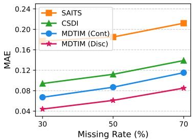  
(a) Uniform Missing

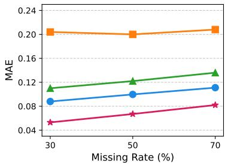  
(b) Geometric Missing  
Figure 4: Comparison between MDTIM (Disc) and MDTIM (Cont) on the Energy dataset, alongside representative baselines (SAITS, CSDI). Results are reported under both uniform and geometric missing scenarios across varying missing rates.

MDTIM (Disc) employs our Stochastic Discretization to map continuous signals into discrete tokens and optimizes the ordinal-aware discrete diffusion objective described in Section 4.

As shown in Figure 4, MDTIM (Cont) already performs competitively with strong baselines, indicating that the masked diffusion paradigm of learning to reconstruct from varying corruption levels with timestep conditioning is itself effective even in continuous spaces. Nevertheless, MDTIM (Disc) consistently achieves lower MAE across all missing rates and missing types. This performance gap confirms that the explicit structural separation between valid observations and missing placeholders, achieved through our orthogonal tokenization, provides a benefit beyond the masked diffusion training scheme alone, and is crucial for time series imputation.

## E Visualization of Imputation Results

We provide comprehensive visualizations of the imputation results across all benchmark datasets: ETTh, Energy, Weather, and Sine with MDTIM. Figures 5, 6, 7, and 8 illustrate the reconstructed time series for all channels (ETTh, Sine) or subset of channels (Energy, Weather). In each figure, the left column displays the results under 50% uniform masking, while the right column shows under 50% geometric masking.

The blue lines represent the ground truth values, while the green lines denote the imputed values (xˆ) reconstructed by MDTIM. The green shaded areas indicate the estimated uncertainty intervals. As observed, MDTIM effectively captures the complex temporal dynamics and periodicity of the multivariate time series.

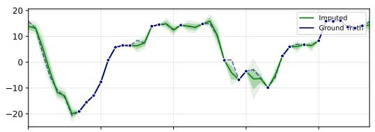

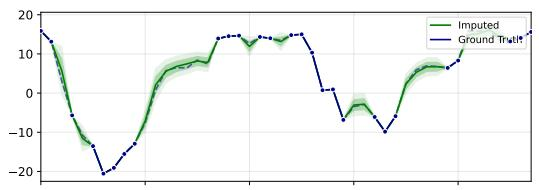

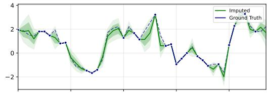

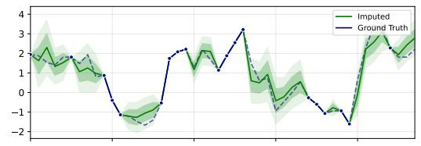

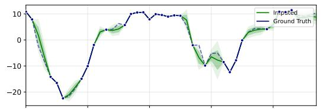

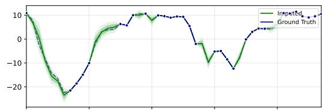

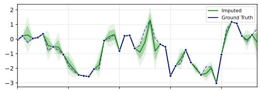

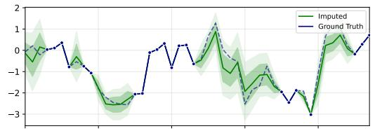

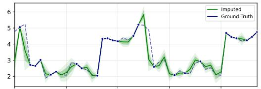

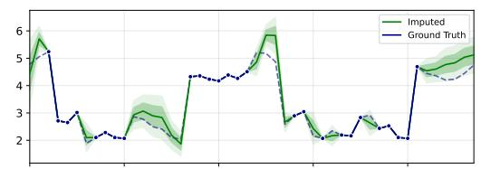

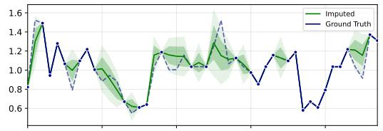

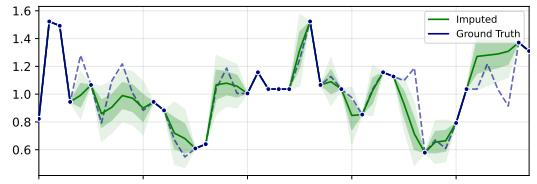

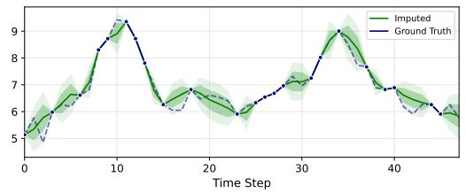  
(a) Uniform Missing

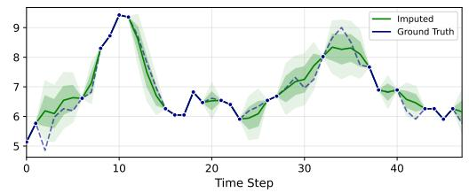  
(b) Geometric Missing  
Figure 5: Visualization of imputation results on the ETTh dataset.

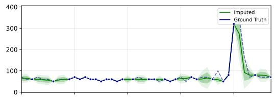

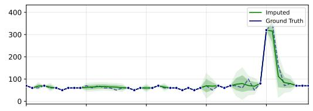

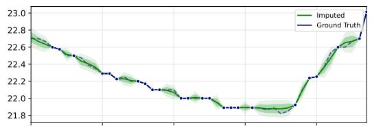

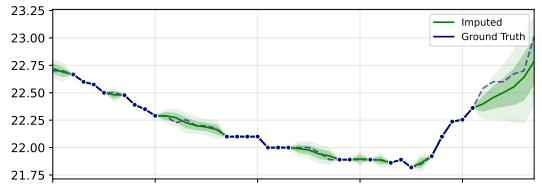

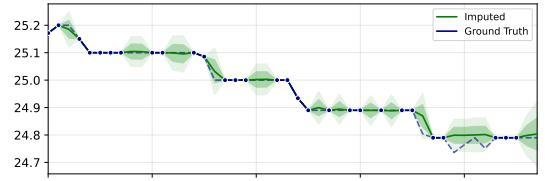

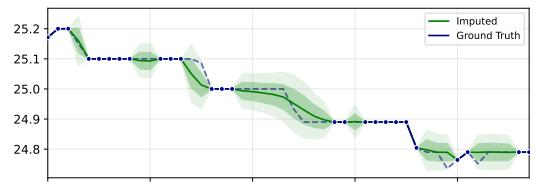

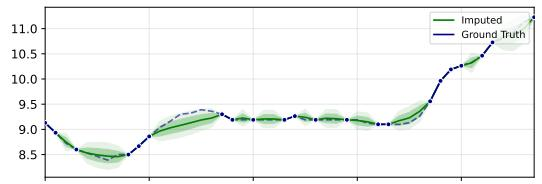

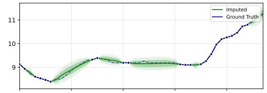

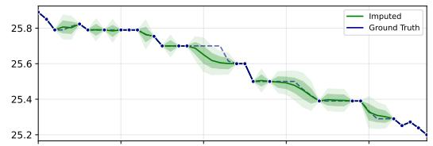

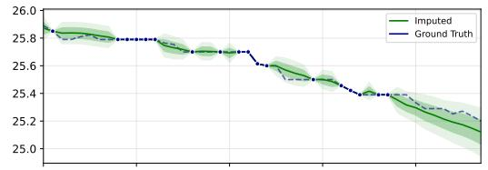

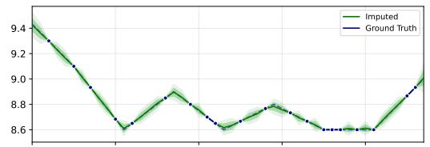

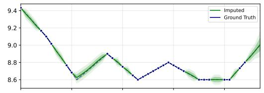

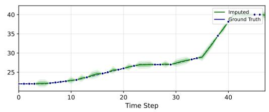  
(a) Uniform Missing

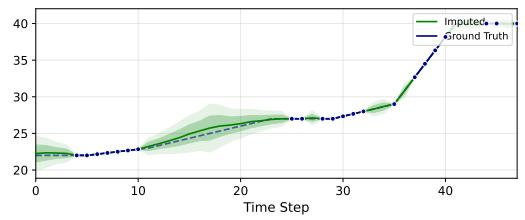  
(b) Geometric Missing  
Figure 6: Visualization of imputation results on the Energy dataset.

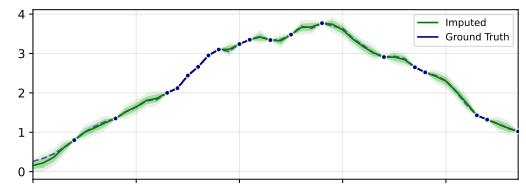

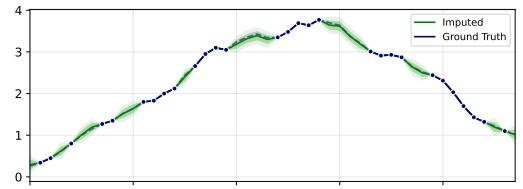

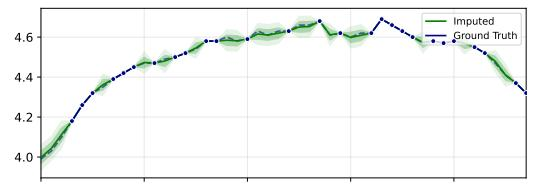

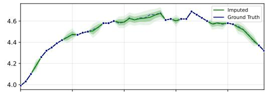

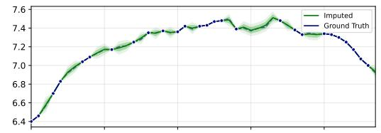

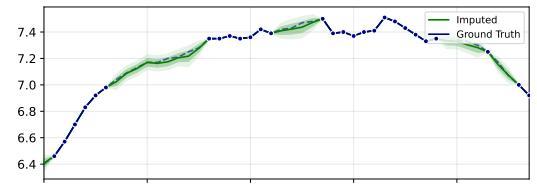

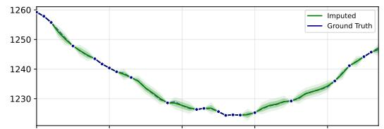

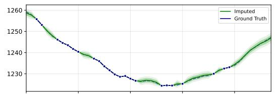

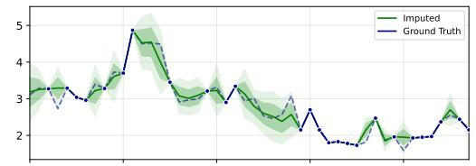

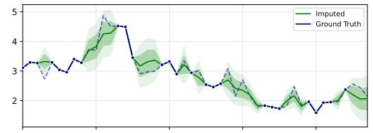

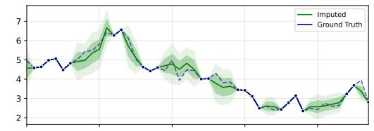

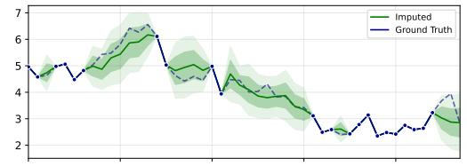

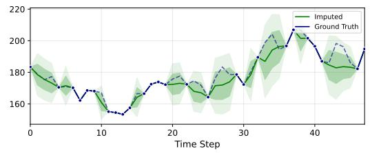  
(a) Uniform Missing

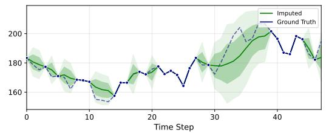  
(b) Geometric Missing  
Figure 7: Visualization of imputation results on the Weather dataset.

  
(a) Uniform Missing

  
(b) Geometric Missing  
Figure 8: Visualization of imputation results on the Sine dataset.