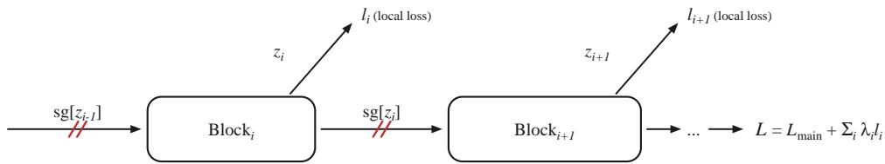
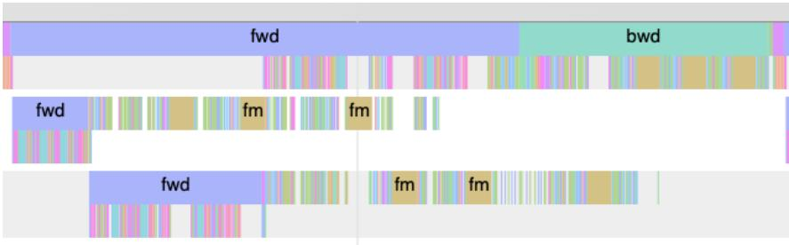
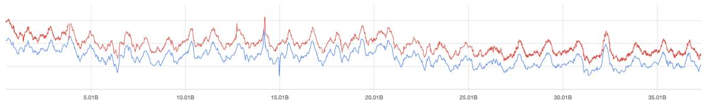

# ERASE: EaRly bAckpropagation SchEdule for Faster Training of Modern Recommendation Systems

Ergan Shang Carnegie Mellon University eshang@andrew.cmu.edu

Flavio Sales Truzzi

Meta Inc.

ftruzzi@meta.com

## Abstract

Lightweight proxy models enable rapid experimentation without repeatedly training frontier-scale systems, but their small kernels often leave modern accelerators underutilized. Conventional training compounds this inefficiency by scheduling the forward and backward passes as disjoint phases, so spare capacity in one cannot be filled by work from the other. We reinterpret the detachment mechanism of Forward-Forward (FF) as a scheduling primitive: given a local objective, detaching a block’s output removes downstream gradient dependencies, making its backward pass ready when its forward pass finishes. ERASE launches each detached subgraph’s backward pass early on a separate CUDA stream, overlapping it with subsequent forward work. Execution trace on a lightweight transformer demonstrates this overlap and its limit: a kernel that saturates the device leaves no capacity for concurrency. On a large-scale click-through-rate model, detaching six dense subarchitectures improves training throughput by up to 9.51% while keeping normalized entropy close to the baseline.

## 1 Introduction

Backpropagation [21, 22] remains the standard method for training modern neural networks across vision and language [4, 26], agent learning and evaluation [14, 18, 28], political and social network inference [16, 24], and the natural sciences [20, 27]. Among its most computationally demanding applications are large-scale recommendation and ranking systems [2, 3], which are continuously retrained on data streams that can outpace a single training job [1, 12]. Training throughput therefore directly affects model freshness and hardware resource burden [8].

For these workloads, throughput depends on accelerator utilization as well as peak arithmetic performance [29]. Collective communication, data movement, and scheduling dependencies can leave capacity unused [8, 17]. Conventional reverse-mode differentiation traverses the graph in reverse topological order, beginning the backward pass only after the entire forward pass has completed. The two phases therefore occupy disjoint intervals, preventing either from using spare capacity in the other.

The same utilization pressure appears at the opposite end of the scale: frontier-scale models require too many resources for rapid, repeated experimentation, so automated research relies on lightweight proxies such as NanoChat [11], which retains a useful experimental signal at orders-of-magnitude smaller scale. The accelerator, however, does not shrink with the model. Small GEMMs may expose too little parallelism to approach peak arithmetic throughput, leaving capacity unused even without launch gaps; CPU scheduling computational overhead can reduce utilization further when gaps occur. We therefore ask how to improve model FLOPs utilization (MFU) when the model is, by design, too small to saturate the device.

Meanwhile, the Forward-Forward (FF) algorithm trains each block against a local objective and passes a detached activation to its successor [9]. This partitions the end-to-end graph into block-local subgraphs: gradients do not cross block boundaries, and activations need not be retained for a global backward pass. Importantly for scheduling, a block’s backward pass becomes ready once its forward pass and local objective are complete, without waiting for the terminal loss or later blocks. It can therefore overlap with subsequent forward passes, enabling work that the conventional forward-then-backward schedule forgoes.

We turn this observation into ERASE (Section 2), which dispatches each detached subgraph’s backward pass as soon as its forward pass returns. Experiments (Section 3) demonstrate the intended overlap and its saturation limit on NanoChat, then measure the throughput improvement on a ranking model. Section 4 analyzes the staggering introduced by asynchronous dispatch.

## 1.1 Related Work

Backpropagation-free learning. Backpropagation-free methods replace the global backward pass with block-local targets. NoProp and DiffusionBlocks attach an auxiliary denoising variable to each block [13, 25], borrowing their training signal from diffusion models [10, 23]; this permits detached activations and block-local updates. Earlier work on Forward-Forward and layer-wise learning likewise shows that local objectives can train competitive models without gradients crossing block boundaries [9, 15].

CUDA Graphs and execution-level acceleration. CUDA Graphs capture and replay kernel sequences, reducing per-kernel CPU launch computational overhead in small-kernel workloads [6, 19]; recent compiler work makes capture more robust in PyTorch [7]. ERASE combines this execution mechanism with FF-style detachment, which creates independent pieces while preserving the usual loss and exact gradients within each piece. Early backward launches each piece on a separate CUDA stream as soon as its forward pass returns, while CUDA Graphs keep the asynchronous launch order consistent across ranks.

## 2 Backprop Free Algorithm

## 2.1 The Forward-Forward algorithm

Data dependency shutdown. For an input embedding $\mathbf { \boldsymbol { x } } \in \mathbb { R } ^ { p }$ , consider a network of B blocks with ${ \boldsymbol { z } } _ { 0 } = { \boldsymbol { x } }$ , activations $z _ { b }$ , and parameters $\theta _ { b } .$ FF [9] computes

$$
z _ { b } = f _ { b } \big ( \mathrm { s g } [ z _ { b - 1 } ] ; \theta _ { b } \big ) , \qquad b = 1 , \ldots , B ,\tag{1}
$$

where sg[·] is the stop-gradient operator: it is the identity on the forward pass and has zero Jacobian on the backward pass. A local loss on the undetached zb updates $\pmb { \theta } _ { b }$ alone and may, for example, apply binary cross-entropy to the goodness score $\begin{array} { r } { G _ { b } = \sum _ { j } z _ { b j } ^ { 2 } } \end{array}$ . Consequently, $\nabla _ { \pmb { \theta } _ { b } }$ depends only on the subgraph between adjacent cut points and is ready once the block’s forward pass and local loss are complete, before the terminal loss is evaluated. ERASE exploits this scheduling consequence of detachment; Figure 1 illustrates the resulting graph.

  
Figure 1: Schematic of FF-style detachment. Each block receives a detached copy of the previous block’s activation, and contributes its own local loss. No gradient crosses a block boundary.

## 2.2 Early backward in ERASE: scheduling, streams, and determinism

Detachment exposes independence but does not change the schedule: a single backward call on the aggregate objective

$$
{ \mathcal { L } } = { \mathcal { L } } _ { \mathrm { m a i n } } + \sum _ { i } \lambda _ { i } \ell _ { i }\tag{2}
$$

still runs at the end of the step. ERASE instead launches each detached subgraph’s backward pass as soon as its forward pass returns, accumulating its parameter gradients while leaving the undetached remainder to the usual end-of-step backward. Because backward operations otherwise serialize with subsequent forward work on the default CUDA stream, ERASE uses separate streams and events to enforce the remaining dependencies. This allows the backward pass of block b to overlap with the forward pass of block $b + 1$

CPU dispatch introduces another tradeoff. Main-thread early backward blocks further dispatch until its autograd call is enqueued. A ThreadPoolExecutor avoids this stall but can vary the kernel and collective order across ranks, creating stragglers that we call staggering. Capturing the affected subgraphs as CUDA Graphs fixes the launch order. Section 4 compares the blocking and non-blocking variants.

## 3 Experiments

As a small-scale sanity check via one A100 GPU, FF-style detachment on a 30-layer MLP using MNIST dataset ([5]) reduced compute-matched backward time by 58% (23.5 to 9.9 ms) and total batch time by 30% (41.2 to 28.8 ms). We then evaluate ERASE on NanoChat [11], using one A100 GPU to demonstrate overlap, and on a lightweight version of a large-scale recommendation model, using eight H100 GPUs to measure throughput.

## 3.1 NanoChat

To verify the intended overlap before experiments on a recommendation model, we partition NanoChat’s multi-head-attention stack into three subgraphs using two detachment points. Figure 2 shows a single-batch execution trace.

  
Figure 2: NanoChat single-batch trace with two detachment points and three streams. Backward work from one subgraph runs alongside forward work from the next.

The trace demonstrates the execution pattern rather than measuring speedup: one subgraph’s backward work overlaps the next subgraph’s forward work, as Section 2.2 predicts. The exception is the fused multi-head attention backward kernel (fm in Figure 2), which runs alone. This is a resource limit rather than a dependency: by fusing the attention matrix multiplications with softmax and avoiding materialization of the sequence-by-sequence attention matrix, the kernel occupies every streaming multiprocessor and leaves no capacity for concurrent work.

This limit reinforces the premise of Section 1: overlap helps only where the hardware is not already saturated. Reducing hidden width, depth, or batch size shrinks kernels without shrinking the acceler ator, leaving resources that small kernels can share but device-filling kernels cannot. Lightweight proxies contain mostly the former, making them natural targets for early backward. Section 3.2 quantifies the benefit on the recommendation model.

## 3.2 CTR Model

## 3.2.1 Setup

The remaining experiments use a click-through-rate (CTR) model with six detached subarchitectures, four of which are assigned separate CUDA streams alongside the main stream. Throughput is the number of training examples processed per second (QPS), summarized by the post-warm-up p90 of per-step samples (higher is better); unlike latency p90, this is the fast end of the distribution. Quality is normalized entropy (NE), the model’s cross-entropy divided by that of a constant predictor; lower is better.

## 3.2.2 Early backward on the CTR model

ERASE launches each detached subarchitecture’s backward pass from a ThreadPoolExecutor as soon as its forward pass completes. Because the worker thread can introduce cross-rank launch-order nondeterminism, we capture a subset of the subarchitectures as CUDA Graphs to fix their order and reduce CPU dispatch computational overhead. This non-blocking configuration (row 1 of Table 1) improves throughput by 7.38% with an NE gap of approximately 1.38% (Figure 3). Section 4 examines its FUP=False setting and compares it with blocking dispatch.

  
Figure 3: NE gap between the non-blocking early-backward variant with CUDA Graphs (red curve) and the baseline (blue curve), approximately 1.38%.

## 4 Caveats

Table 1 reports dispatch and FUP (find\_unused\_parameters) ablations. Blocking launches early backward from the main thread and stalls CPU dispatch during autograd enqueue; FUP controls which parameters participate in gradient synchronization.

Table 1: Throughput on the CTR model, p90 queries per second
<table><tr><td>#</td><td>Configuration</td><td>QPS (p90)</td><td>Gain vs. baseline</td></tr><tr><td>1</td><td>baseline</td><td>184,535.51</td><td>+0.00%</td></tr><tr><td>3</td><td>blocking, FUP=False</td><td>185,223.71</td><td>+0.37%</td></tr><tr><td>2</td><td>blocking, FUP=True</td><td>194,244.72</td><td>+5.26%</td></tr><tr><td>1</td><td>non-blocking + CUDA Graphs, FUP=False</td><td>198,145.28</td><td>+7.38%</td></tr><tr><td>0</td><td>blocking, FUP=True†</td><td>202,078.43</td><td>+9.51%</td></tr></table>

Blocking is deterministic but stalls the CPU: FUP=False gains only 0.37% (row 3), whereas FUP=True gains 5.26% (row 2) by reducing the parameters in the final aggregate backward. CUDA Graphs instead recover a 7.38% gain with non-blocking dispatch and FUP=False (row 1). Together, these results suggest that deterministic, rank-synchronized collective order is useful and that either FUP or CUDA Graphs can provide it.

## 5 Conclusion

ERASE repurposes FF-style detachment as a scheduling primitive: cutting inter-block dependencies makes each backward pass ready after its forward pass, enabling separate-stream overlap while preserving exact within-subgraph gradients without FF’s goodness objective. On a CTR model, ERASE improves p90 QPS by 5–9% with a small NE gap under deterministic cross-rank collective order.

## References

[1] Fedor Borisyuk, Mingzhou Zhou, Qingquan Song, Siyu Zhu, Birjodh Tiwana, Ganesh Parameswaran, Siddharth Dangi, Lars Hertel, Qiang Charles Xiao, Xiaochen Hou, et al. Lirank: Industrial large scale ranking models at linkedin. In Proceedings of the 30th ACM SIGKDD Conference on Knowledge Discovery and Data Mining, pages 4804–4815, 2024.

[2] Heng-Tze Cheng, Levent Koc, Jeremiah Harmsen, Tal Shaked, Tushar Chandra, Hrishi Aradhye, Glen Anderson, Greg Corrado, Wei Chai, Mustafa Ispir, et al. Wide & deep learning for recommender systems. In Proceedings ofthe 1st workshop on deep learningfor recommender systems, pages 7–10, 2016.

[3] Paul Covington, Jay Adams, and Emre Sargin. Deep neural networks for youtube recommendations. In Proceedings of the 10th ACM conference on recommender systems, pages 191–198, 2016.

[4] Jia Deng, Wei Dong, Richard Socher, Li-Jia Li, Kai Li, and Li Fei-Fei. Imagenet: A largescale hierarchical image database. In 2009 IEEE conference on computer vision and pattern recognition, pages 248–255. Ieee, 2009.

[5] Li Deng. The mnist database of handwritten digit images for machine learning research [best of the web]. IEEE signal processing magazine, 29(6):141–142, 2012.

[6] Jonah Ekelund, Stefano Markidis, and Ivy Peng. Boosting performance of iterative applications on gpus: Kernel batching with cuda graphs. In 2025 33rd Euromicro International Conference on Parallel, Distributed, and Network-Based Processing (PDP), pages 70–77. IEEE, 2025.

[7] Abhishek Ghosh, Ajay Nayak, Ashish Panwar, and Arkaprava Basu. Pygraph: Robust compiler support for cuda graphs in pytorch. arXiv preprint arXiv:2503.19779, 2025.

[8] Vipul Gupta, Dhruv Choudhary, Peter Tang, Xiaohan Wei, Xing Wang, Yuzhen Huang, Arun Kejariwal, Kannan Ramchandran, and Michael W Mahoney. Training recommender systems at scale: Communication-efficient model and data parallelism. In Proceedings ofthe 27th ACM SIGKDD Conference on Knowledge Discovery & Data Mining, pages 2928–2936, 2021.

[9] Geoffrey Hinton. The forward-forward algorithm: Some preliminary investigations. arXiv preprint arXiv:2212.13345, 2022.

[10] Jonathan Ho, Ajay Jain, and Pieter Abbeel. Denoising diffusion probabilistic models. Advances in neural information processing systems, 33:6840–6851, 2020.

[11] Andrej Karpathy. autoresearch: Ai agents running research on single-gpu nanochat training automatically. https://github.com/karpathy/autoresearch, 2026.

[12] Eugene Kharitonov. Federated online learning to rank with evolution strategies. In Proceedings ofthe Twelfth ACM International Conference on Web Search and Data Mining, pages 249–257, 2019.

[13] Qinyu Li, Yee Whye Teh, and Razvan Pascanu. Noprop: Training neural networks without back-propagation or forward-propagation. In Conference on Lifelong Learning Agents, pages 525–544. PMLR, 2026.

[14] Zongxia Li, Zhongzhi Li, Yucheng Shi, Ruhan Wang, Junyao Yang, Zhichao Liu, Xiyang Wu, Anhao Li, Yue Yu, Ninghao Liu, Lichao Sun, Haotao Mi, and LeoweiLiang. Longhorizon-terminal-bench: Testing the limits of agents on long-horizon terminal tasks with dense reward-based grading, 2026. URL https://arxiv.org/abs/2607.08964.

[15] Guy Lorberbom, Itai Gat, Yossi Adi, Alexander Schwing, and Tamir Hazan. Layer collaboration in the forward-forward algorithm. In Proceedings of the AAAI conference on artificial intelligence, volume 38, pages 14141–14148, 2024.

[16] Hanjia Lyu and Jiebo Luo. Understanding political polarization via jointly modeling users, connections and multimodal contents on heterogeneous graphs. In Proceedings of the 30th ACM international conference on multimedia, pages 4072–4082, 2022.

[17] Dheevatsa Mudigere, Yuchen Hao, Jianyu Huang, Zhihao Jia, Andrew Tulloch, Srinivas Sridharan, Xing Liu, Mustafa Ozdal, Jade Nie, Jongsoo Park, et al. Software-hardware co-design for fast and scalable training of deep learning recommendation models. In Proceedings ofthe 49th Annual International Symposium on Computer Architecture, pages 993–1011, 2022.

[18] Long Phan, Alice Gatti, Ziwen Han, Nathaniel Li, Josephina Hu, Hugh Zhang, Chen Bo Calvin Zhang, Mohamed Shaaban, John Ling, Sean Shi, et al. Humanity’s last exam. arXiv preprint arXiv:2501.14249, 2025.

[19] PyTorch Team. Accelerating PyTorch with CUDA graphs. PyTorch Blog, https://pytorch. org/blog/accelerating-pytorch-with-cuda-graphs/, 2021. Accessed 2026-08-03.

[20] Yusuf Roohani, Kexin Huang, and Jure Leskovec. Predicting transcriptional outcomes of novel multigene perturbations with gears. Nature biotechnology, 42(6):927–935, 2024.

[21] David E Rumelhart, Geoffrey E Hinton, and Ronald J Williams. Learning representations by back-propagating errors. nature, 323(6088):533–536, 1986.

[22] David E Rumelhart, Geoffrey E Hinton, and Ronald J Williams. (1986) de rumelhart, ge hinton, and rj williams, learning internal representations by error propagation, parallel distributed processing: Explorations in the microstructures of cognition, vol. i, de rumelhart and jl mcclelland (eds.) cambridge, ma: Mit press, pp. 318-362. 1988.

[23] Ergan Shang, Yuting Wei, and Kathryn Roeder. Predicting the unseen: a diffusion-based debiasing framework for transcriptional response prediction at single-cell resolution. Proceedings of the National Academy ofSciences, 122(52):e2525268122, 2025.

[24] Ergan Shang, Yuan Zhang, and Weijing Tang. Inference for balance in dynamic signed networks. arXiv preprint arXiv:2606.08786, 2026.

[25] Makoto Shing, Masanori Koyama, and Takuya Akiba. Diffusionblocks: Block-wise neural network training via diffusion interpretation. In International Conference on Learning Representations, volume 2026, pages 95053–95074, 2026.

[26] Ashish Vaswani, Noam Shazeer, Niki Parmar, Jakob Uszkoreit, Llion Jones, Aidan N Gomez, Łukasz Kaiser, and Illia Polosukhin. Attention is all you need. Advances in neural information processing systems, 30, 2017.

[27] Tianyu Zhang, Ergan Shang, and Kathryn Roeder. Genetic convergence analysis of crispr perturbations deciphers gene functional similarity. bioRxiv, 2025.

[28] Junwei Zhou, Zhen Sun, Binyu Li, Jiangyu Zhou, Yuexi Pan, Hengyu Wang, Honghe Ren, Xiaohan Jia, Xueyang Zhou, Xiaoyu Cao, Yongchao Chen, Yuanning Feng, Junhao Wu, Cheng Zhang, Sijia Chen, Haoyu Xue, Chengsong You, Huan Wang, Koutian Wu, Peigan Gao, Jiakun Wu, Wenzhe Li, Ergan Shang, Qingyuan Zheng, Jingjing Zhou, Ruixuan Jia, Yan Xu, Hongrui Zhang, Xiao-Han Ma, Zhengxiang Cheng, Yuexing Hao, Liting Mai, Xianglin Ji, Wenjun Zhang, Zhuofan Chen, Yixiao Huang, Chi Wang, Wenyue Hua, Yilun Hao, Yuantao Zhai, Ziyan Zhao, and Jingyan Xie. Asi-bench: At the dawn of artificial superintelligence, 2026. URL https://arxiv.org/abs/2608.17271.

[29] Jie Zhu, Zhifang Fan, Xiaoxie Zhu, Yuchen Jiang, Hangyu Wang, Xintian Han, Haoran Ding, Xinmin Wang, Wenlin Zhao, Zhen Gong, et al. Rankmixer: Scaling up ranking models in industrial recommenders. In Proceedings of the 34th ACM International Conference on Information and Knowledge Management, pages 6309–6316, 2025.