# GCNO: Gramian Chebyshev Neural Operator for Physics-Based Compression of Wireless Channels

Rafid Umayer Murshed,1 Shahab Hamidi-Rad,2 Elahe Soltanaghai,1 Akshay Malhotra2

1Department of Computer Science, University of Illinois Urbana-Champaign

2InterDigital AI Lab

{rum3, elahe}@illinois.edu, {Shahab.Hamidi-Rad, akshay.malhotra}@interdigital.com

## Abstract

Large antenna arrays allow wireless systems to serve more users and achieve higher data-rates, but they also make channel feedback expensive: the receiving device must repeatedly report a large complex-valued channel matrix to the base station. Most neural compressors treat this matrix like an image and replace it with a fixed-length code that only a matched neural decoder can interpret. The message therefore does not adapt to channel complexity, and changing the antenna count typically requires retraining. We ask whether a device can instead report only the few dominant propagation paths underlying each channel. We introduce the Gramian Chebyshev Neural Operator (GCNO), a physics-based, variablerate compressor that identifies a sample-dependent set of path directions. GCNO uses receive–transmit channel structure to locate paths, a first-order Taylor correction to refine directions that fall between grid points, and least squares to recover their complex strengths. It is trained without path labels, and the base station reconstructs the channel analytically from the transmitted path tuples rather than through a learned decoder. Across three ray-traced environments, GCNO achieves better reconstruction accuracy at the same payload—or lower payload at the same accuracy—than neural feedback baselines, and transfers to unseen antenna counts without retraining.

## 1 Introduction

Modern cellular systems place large antenna arrays at the base station, known as massive MIMO technology. These arrays can serve many users simultaneously and carry far more data, but only when the base station knows the current wireless channel: how the transmitted signal fades, reflects, and combines on its way to the user. How the base station obtains this information depends on the duplexing scheme. In frequency-division duplex systems, the uplink and downlink occupy diferent frequency bands, so the user measures the downlink channel state information (CSI) and reports it to the base station over a control link. Reporting CSI in full is costly. The channel between an $N _ { r } \times N _ { t }$ array pair is a complex matrix that requires $2 N _ { r } N _ { t }$ real numbers to describe. $\mathrm { ~ A ~ 3 2 ~ } \times \mathrm { ~ 3 2 ~ }$ channel already requires 2,048 numbers, and this cost continues to grow as antenna counts increase toward 6G (Marzetta 2010; Larsson et al. 2014). Because this feedback consumes control-link resources that could otherwise carry data, CSI compression has become a central problem in massive MIMO (Larsson et al. 2014). This raises the main question of our work: What compact channel representation can reduce CSIfeedback without sacrificing reconstruction accuracy or tying the method to one antenna configuration?

Deep learning (DL) has been studied extensively for compressing CSI feedback (O’Shea and Hoydis 2017; Guo et al. 2022). Most learned approaches treat the channel matrix similarly to an image. A neural encoder on the user device (UE) compresses the matrix into a short code, which a matched neural decoder at the base station (BS) uses to reconstruct the channel (Wen, Shih, and Jin 2018). Subsequent methods improve this architecture through convolutional, recurrent, and attention-based processing (Cui, Guo, and Song 2022; Xu, Yuan, and Pun 2021; Tang et al. 2022; Wang et al. 2019), while retaining the same paired encoder–decoder structure. This structure has two important limitations. Channels with diferent levels of complexity are compressed into codes of the same length, preventing the feedback overhead from adapting to the amount of information in each channel. In addition, the encoder and decoder are jointly trained for a specific antenna configuration, so changing the antenna count generally requires both networks to be retrained. These limitations motivate two corresponding evaluation criteria. We assess how few values a method must transmit to achieve a target channel-reconstruction normalized mean-squared error (NMSE) and how accurately it reconstructs channels with diferent antenna counts without retraining.

To address the limitations of prior work, we represent the channel through its underlying multipath structure rather than an antenna-specific latent code. Many outdoor and highfrequency channels are dominated by only a few strong propagation paths (Akdeniz et al. 2014; El Ayach et al. 2014). Under the geometric channel model, each path is described by its complex gain and transmit and receive directions, and the full channel can be reconstructed from the corresponding array responses (Alkhateeb et al. 2014). A channel with K paths therefore requires only 4K real-valued parameters, compared with $2 N _ { r } N _ { t }$ values for the full complex matrix. The user feeds back these path parameters, and the base station reconstructs the channel analytically without a matched neural decoder. Because the underlying paths are determined by the propagation environment rather than the antenna count, the same representation can be used across diferent antenna configurations, while its feedback length naturally follows the number of dominant paths.

Having reduced the feedback problem to a few path parameters, the main challenge is to estimate the continuous transmit and receive directions of those paths. Classical estimators search over a fixed grid of candidate transmit and receive directions and identify the grid points that best match the measurements (Klukas and Fattouche 1998). Such a grid is unsuitable as the final feedback representation because a physical path rarely aligns exactly with one grid point. Its energy instead spreads across neighboring bins (fig. 1), and several grid coeficients may be needed to represent a single path, especially when patterns from multiple paths overlap (Tang et al. 2013). This would increase the feedback length and undermine the compact path-based representation. Directly predicting continuous directions with a neural network is also ill-posed because small directional changes produce rapidly oscillating phase variations in the array response, resulting in a highly non-convex learning objective (Wagle et al. 2025a). We therefore adopt a hybrid approach that uses the direction grid only to construct a structured evidence map and learns to map it to one continuous direction pair for each path.

Recovering continuous path directions across diferent antenna configurations requires a model whose learned parameters are not tied to a fixed input dimension. This motivates the use of neural operators, which learn transformations that can be evaluated on inputs of diferent sizes (Li et al. 2021; Lu et al. 2021). However, the grid-matching pattern also varies across channels according to the locations and interactions of their paths. Standard neural operators apply filters defined by a fixed basis or graph and therefore process every channel using the same filtering structure (Li et al. 2021; Deferrard, Bresson, and Vandergheynst 2016). To address this challenge, we introduce the Gramian Chebyshev Neural Operator (GCNO) to retain the size flexibility of neural operators while adapting the filtering to each observed channel. GCNO constructs receive- and transmit-side Gramian matrices from the channel and uses them to define its Chebyshev filters. The resulting operators reflect the current channel structure, while the learned polynomial coeficients remain shared across antenna configurations.

Our complete approach follows a simple division of work for recovering the path angles and corresponding gains. GCNO first identifies likely path directions (angles) from the channel. Continuous refinement then moves each selected direction away from its grid point and toward a more accurate location. GCNO retains only paths that provide meaningful reconstruction improvement, allowing the path count K to adapt to the channel. Once the path directions are extracted, a least-squares (LS) solver computes their complex strengths (gains). The model learns from channel reconstruction alone and does not require ground-truth path directions, strengths, or path counts. At inference time, the user device feeds back only the recovered path tuples, and the base station reconstructs the full channel by combining the reported path gains and angles with the transmit and receive array geometries.

We evaluate GCNO on city-scale ray-traced channels from Arizona State University (ASU), Dallas, and Seattle. Across the full NMSE–payload trade-of, GCNO achieves lower NMSE at the same payload, or lower payload at the same NMSE, when compared with eight neural feedback baselines.

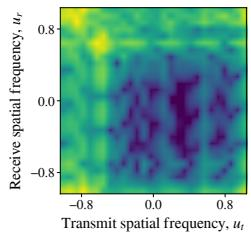

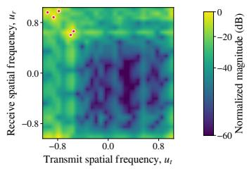  
Figure 1: Of-grid paths spread their energy across neighboring cells. The map is shown (a) alone and (b) with the underlying paths marked, illustrating why a grid-only description may use several entries for one physical path.

It also retains substantially more accuracy when evaluated on antenna counts not seen during training. Replacing GCNO with CNN, Fourier, polynomial, or dilated-convolutional alternatives weakens this transfer or the NMSE–payload tradeof, showing that the gain does not come only from model size. Finally, retraining the model without continuous refinement clearly worsens NMSE, confirming that correcting of-grid directions is necessary for compact path feedback. Our contributions are:

• Variable-rate path compression. We formulate CSI feedback as a variable-length list of retained paths, requiring 4K real values for K reported paths. The feedback size therefore adapts to the channel, and the known array model reconstructs the channel without a matched neural decoder. Across three environments, this framework provides better reconstruction at the same feedback size, or uses fewer reported values at the same accuracy.

• Gramian Chebyshev Neural Operator. We introduce GCNO, which constructs channel-specific filters from receive- and transmit-side correlations while sharing its learned coeficients across antenna counts. This design improves both path recovery and generalizes to antenna counts not seen during training.

• Continuous refinement and LS recovery. We refine each selected receive–transmit direction pair within its grid cell and recover its gain through LS, without using path labels. A separately retrained grid-only variant, evaluated under the same support-selection and payload rules, performs substantially worse in reconstruction and angular accuracy across all three environments.

## 2 Related Work

Our work draws on learned CSI feedback, neural operators, and sparse of-grid recovery.

Neural CSI feedback and learned compression. CsiNet (Wen, Shih, and Jin 2018) introduced the common encoder–decoder design: the user compresses the real and imaginary parts of CSI into a dense code, and a paired base-station network reconstructs the channel. Later work improves this design through residual or dilated convolutions (Lu, Wang, and Song 2020; Tang et al. 2022), stronger CsiNet variants (Guo et al. 2020), recurrent refinement (Wang et al. 2019), attention (Li et al. 2020), and transformers (Xu, Yuan, and Pun 2021; Cui, Guo, and Song 2022). These methods still use a fixed-length code tied to a trained decoder, so feedback does not naturally follow channel complexity, and changing the antenna configuration usually requires a matched model. We instead send a variable set of path gains and efective spatial directions that the receiver converts to CSI using the array geometry.

Neural operators and spectral filters. Neural operators, including FNO (Li et al. 2021) and DeepONet (Lu et al. 2021), learn maps between sampled functions and can operate across discretizations. FNO uses a fixed periodic Fourier basis, while Chebyshev graph networks (Deferrard, Bresson, and Vandergheynst 2016) filter a predefined graph Laplacian. These filtering structures do not adapt to an individual channel, and Fourier periodicity is poorly matched to a bounded angular field of view. GCNO instead forms receive- and transmit-side Gramians from each sample and applies shared Chebyshev polynomial filters, enabling channel-dependent processing across array sizes.

Sparse recovery and of-grid methods. OMP (Pati, Rezaiifar, and Krishnaprasad 1993a), basis pursuit (Chen, Donoho, and Saunders 1998), and sparse Bayesian learning (Tipping 2001) recover dictionary supports without path labels, but of-grid paths spread across several atoms. Atomic-norm recovery (Tang et al. 2013), ESPRIT (Roy and Kailath 1989), of-grid Bayesian learning (Yang, Xie, and Zhang 2013), and Newton refinement (Mamandipoor, Ramasamy, and Madhow 2016a) address continuous directions but require spectral or iterative solves. LISTA (Gregor and LeCun 2010) and related unrolled methods (Borgerding, Schniter, and Rangan 2017) reduce this cost, yet often remain grid-dependent or supervised. GCNO predicts support and Taylor ofsets in one pass, followed by a small least-squares gain solve.

## 3 Problem Formulation

Given a channel matrix, our goal is to describe it with as few reported values as possible while preserving accurate reconstruction at the BS. We do this by extracting a small set of dominant propagation paths that captures the important structure of the channel. Each retained path is described by one complex gain and two spatial directions. We use K to denote the number of paths retained for a particular channel. The compression problem is therefore to choose both K and the corresponding path parameters so that the feedback remains small and the reconstructed channel remains accurate. We also analyze whether the same learned compressor can be applied when the antenna count changes without retraining.

## 3.1 Physical Path Representation

A propagation path produces a predictable phase pattern across each antenna array. We call this pattern the array response. The geometric channel model represents the full channel as the sum of the contributions produced by its paths. For the uniform linear arrays considered here, a direction is described by its spatial coordinate $u \in [ - 1 , 1 ]$ . The corresponding normalized array response is

$$
\begin{array} { c } { \displaystyle { { \bf a } _ { N } ( u ) [ n ] = \frac { 1 } { \sqrt { N } } \exp \left( \mathrm { j } \pi \left( n - \frac { N - 1 } { 2 } \right) u \right) , } } \\ { \displaystyle { n = 0 , \dots , N - 1 . } } \end{array}\tag{1}
$$

We report u through the efective spatial angle $\begin{array} { r l } { \psi } & { { } = } \end{array}$ arcsin(u). This is the direction seen by the array.

Let $K ^ { \star }$ denote the total number of paths in the standard geometric channel model (Alkhateeb et al. 2014). The measured channel is written as

$$
\mathbf { H } = \sum _ { k = 1 } ^ { K ^ { \star } } { g _ { k } } \mathbf { a } _ { N _ { r } } ( u _ { r , k } ) \mathbf { a } _ { N _ { t } } ( u _ { t , k } ) ^ { \mathsf { H } } ,\tag{2}
$$

where H $\in \mathbb { C } ^ { N _ { r } \times N _ { t } } , g _ { k } \in \mathbb { C }$ is the complex gain of path $k ,$ and $u _ { r , k }$ and $u _ { t , k }$ are its receive and transmit spatial directions. Although a channel may contain many weak contributions, most of its energy is often concentrated in a much smaller set of dominant paths. In outdoor and high-frequency channels, this dominant set can often contain five or fewer paths (Akdeniz et al. 2014; El Ayach et al. 2014). Our compressed representation therefore retains $K \leq K ^ { \star }$ paths that preserve the important channel energy. Here, K is the number of paths used for compression, not the total number of physical paths in the environment.

## 3.2 Path-Based Feedback and Reconstruction

Our approach frames CSI feedback directly as a list of retained path parameters. For each path, the device reports its complex gain and its receive and transmit efective spatial angles. The transmitted description is

$$
\mathcal { T } ( \mathbf { H } ) = \left\{ \left( \mathfrak { R } \widehat { g } _ { k } , \mathfrak { I } \widehat { g } _ { k } , \widehat { \psi } _ { r , k } , \widehat { \psi } _ { t , k } \right) \right\} _ { k = 1 } ^ { K } .\tag{3}
$$

Each path contributes four real values, so the feedback size is 4K. Because K is selected separately for each channel, a channel that can be represented accurately with fewer paths requires fewer reported values. Appendix A theoretically derives when 4K feedback is more compact than a fixed latent.

At the base station, the reported efective angles are converted back to spatial coordinates: $\widehat { u } _ { r , k } \ = \ \sin ( \widehat { \psi } _ { r , k } )$ and $\begin{array} { c c l } { \widehat { u } _ { t , k } } & { = } & { \sin ( \widehat { \psi } _ { t , k } ) } \end{array}$ . The channel is then reconstructed through the same channel model as $\hat { \textbf { H } } =$ $\begin{array} { r } { \sum _ { k = 1 } ^ { K } \widehat { g } _ { k } \mathbf { a } _ { N _ { r } } ( \bar { \widehat { u } } _ { r , k } ) \mathbf { a } _ { N _ { t } } ( \widehat { u } _ { t , k } ) ^ { \sf H } } \end{array}$ . Each retained path still requires only four reported values when the antenna count changes. The base station simply evaluates the same arrayresponse formula for the new array size. Thus, the feedback format and reconstruction rule do not depend on a neural decoder trained for one fixed antenna configuration.

## 4 GCNO for Physics-Based CSI Compression

The problem formulation represents the channel using a compact set of path directions and complex gains. We now describe how these parameters are recovered from the measured channel. The pipeline first compares the measured channel with a dictionary of candidate path responses constructed from the known antenna geometry. This produces a directionspace map indicating which receive and transmit directions are most consistent with the observation. GCNO takes the measured channel and this map as inputs and outputs a score for each candidate direction together with continuous corrections that move the estimated directions beyond the discrete grid. The resulting candidates are then filtered to retain distinct paths that contribute meaningfully to channel reconstruction, allowing the estimated path count to vary across channels. Given the retained directions and the measured channel, LS finds the corresponding complex gains.

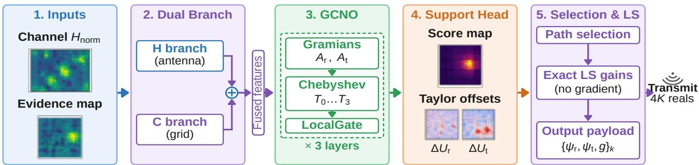  
Figure 2: Overview of GCNO compression. The channel and evidence map are encoded jointly; GCNO predicts path scores and of-grid corrections, path selection retains useful directions, and LS recovers their gains. Appendix B provides more detail.

During training, path selection is replaced by a diferentiable approximation so that the complete pipeline can be optimized using channel reconstruction error. The corrected directions are converted into candidate channel responses, least squares estimates their gains, and the retained responses are combined to reconstruct the measured channel. The reconstruction loss therefore trains GCNO without requiring ground-truth path directions, gains, or path counts.

## 4.1 Direction Grid, Dictionary, and Evidence

The entries of H contain the complete channel observation, but they do not directly show which propagation directions produced it. We obtain a more useful view by first testing a finite set of possible directions. Let $\{ u _ { i } ^ { r } \} _ { i = 1 } ^ { R _ { r } }$ and $\{ u _ { j } ^ { t } \} _ { j = 1 } ^ { R _ { t } }$ be evenly spaced receive and transmit directions over the field of view. Combining these two lists gives a twodimensional direction grid. Each cell (i, j) represents one candidate receive–transmit direction pair.

For every cell, we use the known array responses from Equation (1) to precompute the channel pattern created by a unit-gain path at that pair:

$$
\mathbf { D } _ { i j } = \mathbf { a } _ { N _ { r } } ( u _ { i } ^ { r } ) \mathbf { a } _ { N _ { t } } ( u _ { j } ^ { t } ) ^ { \sf H } , \qquad \mathbf { H } \approx \sum _ { i = 1 } ^ { R _ { r } } \sum _ { j = 1 } ^ { R _ { t } } W _ { i j } \mathbf { D } _ { i j } .\tag{4}
$$

We call $\mathbf { D } _ { i j }$ a dictionary atom, and the fixed collection of all such atoms the dictionary. The second relation is exact when all paths fall on the grid and becomes an approximation otherwise. In that relation, $W _ { i j }$ is the complex contribution assigned to cell $( i , j )$

This construction follows the dictionary-based linearization of (Wagle et al. 2025a,b). Predicting continuous directions directly places oscillatory array-response functions inside backpropagation and creates a dificult non-convex objective. Holding the candidate patterns fixed instead makes the reconstructed channel a linear combination of known matrices. In our method, the grid is only an intermediate search space; its cells are not the final reported paths. To reveal which cells agree with the measured channel, we compute the complex inner product $C _ { i j } = \langle \mathbf { D } _ { i j } , \mathbf { H } \rangle _ { F }$ between H and each dictionary atom. The resulting matrix C is the evidence map. A large $\left| C _ { i j } \right|$ means that the channel contains a component consistent with that direction pair. An of-grid path usually produces a broad pattern over several nearby cells rather than one isolated value. We therefore give GCNO both the complete observation H and the evidence C. Separate lightweight encoders process their real and imaginary parts and combine them into a common complex feature field.

## 4.2 Finding Likely Paths with GCNO

The evidence map indicates where paths may lie, but several paths can produce overlapping patterns, and one of-grid path can activate many cells. GCNO is designed to interpret this full receive–transmit structure rather than process each cell independently. Its central idea is to measure how the current features are related along the receive and transmit axes, then use those sample-specific relationships to filter the features.

Let $\{ \mathbf { X } _ { c } ^ { ( \ell ) } \} _ { c = 1 } ^ { C _ { \ell } }$ denote the complex feature maps at layer ℓ. GCNO forms two correlation matrices, called Gramians:

$$
\mathbf { G } _ { r } ^ { ( \ell ) } = \sum _ { c = 1 } ^ { C _ { \ell } } \mathbf { X } _ { c } ^ { ( \ell ) } \mathbf { X } _ { c } ^ { ( \ell ) \mathsf { H } } , \qquad \mathbf { G } _ { t } ^ { ( \ell ) } = \sum _ { c = 1 } ^ { C _ { \ell } } \mathbf { X } _ { c } ^ { ( \ell ) \mathsf { H } } \mathbf { X } _ { c } ^ { ( \ell ) } .\tag{5}
$$

The first records relationships across receive positions, while the second records relationships across transmit positions. After normalization, they give operators $\mathbf { A } _ { r } ^ { \left( \ell \right) }$ and ${ \bf A } _ { t } ^ { ( \ell ) }$ GCNO then filters each feature map using low-order Chebyshev polynomials (We use order upto $\mathrm { Q } \overset { = } 3 )$ :

$$
\mathbf { Y } _ { c } ^ { ( \ell ) } = \sum _ { c ^ { \prime } = 1 } ^ { C _ { \ell } } \sum _ { p , q = 0 } ^ { Q } \Theta _ { c c ^ { \prime } p q } ^ { ( \ell ) } T _ { p } \left( \mathbf { A } _ { r } ^ { ( \ell ) } \right) \mathbf { X } _ { c ^ { \prime } } ^ { ( \ell ) } T _ { q } \left( \mathbf { A } _ { t } ^ { ( \ell ) } \right) .\tag{6}
$$

The matrices $T _ { p } ( \mathbf { A } _ { r } )$ and $T _ { q } ( \mathbf { A } _ { t } )$ mix information through increasingly broad receive- and transmit-side relationships. The coeficients $\Theta _ { c c ^ { \prime } p q } ^ { ( \ell ) }$ are learned, but the Gramians are recomputed from every input channel. Thus, GCNO uses the same learned rule for all samples while adapting how that rule is applied to each channel. We use three layers and the polynomials $T _ { 0 } , \ldots , T _ { 3 } ;$ ; normalization, recurrence, and local residual corrections are detailed in Appendix B.

The output head produces three maps. The score $S _ { i j }$ gives the priority for testing a path near grid cell $( i , j )$ , while $\Delta U _ { i j } ^ { r }$ and $\Delta U _ { i j } ^ { t }$ correct its receive and transmit directions. GCNO does not predict path gains. Its learned coeficients depend on feature channels and polynomial orders rather than particular antenna indices. When the antenna count changes, the Gramians and physical patterns change size, but the same learned filtering coeficients can still be used.

## 4.3 Of-Grid Refinement, Path Selection, and LS

A grid cell gives only a coarse direction estimate. GCNO refines it within the cell as

$$
\begin{array} { l l } { \widehat { u } _ { i j } ^ { r } = u _ { i } ^ { r } + \Delta U _ { i j } ^ { r } , } & { \widehat { u } _ { i j } ^ { t } = u _ { j } ^ { t } + \Delta U _ { i j } ^ { t } , } \\ { \mathbf { B } _ { i j } = \mathbf { D } _ { i j } + \Delta U _ { i j } ^ { r } \mathbf { D } _ { i j } ^ { r } + \Delta U _ { i j } ^ { t } \mathbf { D } _ { i j } ^ { t } . } \end{array}\tag{7}
$$

Each correction is bounded to half a grid interval on either side of the atoms. The fixed derivative atoms $\mathbf { D } _ { i j } ^ { r }$ and $\mathbf { D } _ { i j } ^ { t }$ describe how the path pattern changes locally with receive and transmit direction. Thus, $\mathbf { B } _ { i j }$ is a first-order Taylor approximation of the pattern at the corrected direction. The dictionary and both derivative dictionaries are analytical, non-trainable tensors. Training therefore does not diferentiate through newly generated steering functions. Appendix B gives their construction and the approximation error.

The score map may contain more candidates than should be reported. At inference, our approach examines cells in descending score order. $\mathbf { A }$ candidate is ignored if its corrected pattern is nearly identical to a path already retained. Otherwise, it is temporarily added and all complex gains are refitted jointly by ridge LS. The candidate is retained only when this addition reduces the channel reconstruction error by a sufficient amount. The scan ends when further candidates no longer provide a meaningful improvement. This procedure lets a simple channel retain fewer paths and a richer channel retain more; the resulting number is K. Exact duplicate, admission, and stopping thresholds are given in Appendix B.

For the final retained directions, the device forms the exact analytical path patterns under no gradient and uses LS to find the gains thatjointly best reconstruct H. Joint fitting accounts for overlap among the retained paths and avoids asking the neural network to estimate their complex gains. The resulting gains and efective spatial angles form the 4K-value message in Equation (3). The base station only evaluates that same geometric channel model with known array response; it does not run GCNO or repeat the selection procedure.

## 4.4 Learning from Channel Reconstruction

Sorting candidates and making hard retention decisions are not diferentiable. During training, we replace them with a smooth version of the same process. A fixed maximum number of soft candidates is available. Each candidate forms a weighted average ofthe corrected grid locations, and nearby scores are reduced before forming the next candidate so that diferent candidates cover diferent regions. An activity value $\alpha _ { k } \in [ 0 , 1 ]$ controls how strongly candidate k contributes.

Therefore, $\textstyle \sum _ { k } \alpha _ { k }$ is a diferentiable estimate of the retained path count rather than a fixed K.

The corresponding first-order patterns are built using Equation (7), and diferentiable ridge LS determines their gains jointly. Let $\widehat { \mathbf { H } } _ { \mathrm { s o f t } }$ denote this training-time reconstruction. With $\mathbb { E } _ { \mathbf { H } }$ denoting the average over training channels, the objective is

$$
\begin{array} { r l } & { \mathcal { L } = \mathbb { E } _ { \mathbf { H } } \left[ \log \left( \mathrm { N M S E } ( \mathbf { H } , \widehat { \mathbf { H } } _ { \mathrm { s o f t } } ) + \varepsilon \right) + \lambda _ { \mathrm { r a t e } } \sum _ { k } \alpha _ { k } \right] } \\ & { \quad \quad + \lambda _ { \mathrm { d u p } } \mathcal { L } _ { \mathrm { d u p } } + \lambda _ { \mathrm { o f f } } \mathcal { L } _ { \mathrm { o f f } } + \lambda _ { \mathrm { s c o r e } } \mathcal { L } _ { \mathrm { s c o r e } } . } \end{array}\tag{8}
$$

The first term rewards accurate tuple-based reconstruction, while the second discourages unnecessary paths. The remaining terms discourage repeated candidates, corrections near the edge of a grid cell, and broadly activated score maps. Their exact definitions and the smooth selection procedure are provided in Appendix B.

Every quantity used for learning comes from the observed channel, the fixed dictionaries, the model outputs, or the LS reconstruction. Ground-truth path directions, gains, and path counts are not used in the loss, validation criterion, checkpoint selection, or hyperparameter selection. At deployment, the smooth training approximation is discarded and replaced by the adaptive hard selection and exact no-gradient LS procedure described above. Fig. 2 summarizes GCNO.

## 5 Experimental Protocol

## 5.1 Datasets and Splits

We evaluate on the ASU, Dallas, and Seattle ray-traced Deep-MIMO scenarios (Alkhateeb 2019). ASU represents a campus; Dallas and Seattle provide distinct urban geometries. Holding channel generation fixed while changing the scene tests whether our findings depend on one map. For each scenario, we use disjoint sets of 10,000 training, 2,000 val idation, and 1,500 test channels and train a separate model. The test set remains untouched until all choices are fixed, and path annotations are used only for final test-set diagnostics.

## 5.2 Baselines

We compare GCNO with eight paired encoder–decoder models: CsiNet (Wen, Shih, and Jin 2018), CRNet (Lu, Wang, and Song 2020), CLNet (Ji and Li 2021), CSITransformer (Xu, Yuan, and Pun 2021), TransNet (Cui, Guo, and Song 2022), M-Net (Yu et al. 2023), SwinCFNet (Cheng et al. 2023), and StarCANet (Zhao et al. 2026). This set spans convolutional, multi-resolution, complex-input, MLP, globalattention, windowed-attention, and compact designs. Each baseline sends a learned latent code that a matched neural decoder converts back to CSI, providing a direct comparison with our sparse physical payload and analytic reconstruction. We retain the published architectures and retrain them from scratch on our splits, using released implementations when available. Appendix C additionally reports comparisons with classical non-neural methods and model sizes: GCNO has only 95K trainable parameters, whereas the closest performing neural baseline SwinCFNet exceeds 10 Millions.

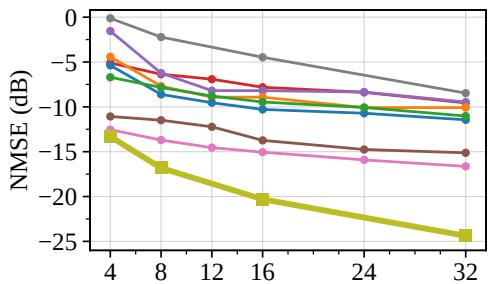  
(a) Payload (floats per sample)

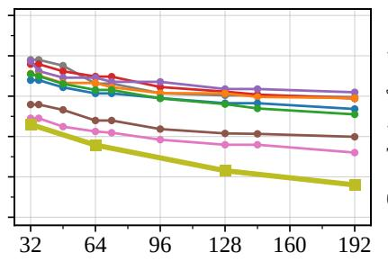  
(b) Payload (bits per sample)

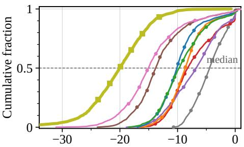  
(c) NMSE (dB)  
Figure 3: Rate–distortion results on ASU. Median NMSE is shown against (a) unquantized payload and (b) total feedback bits; (c) compares the test-channel error distributions at 16 transmitted values. Lower and farther left is better.

## 5.3 Metrics

Our primary metric is NMSE, reported in decibels (dB). It measures reconstruction error relative to the channel energy. For GCNO, reconstruction uses only the transmitted path tuples; for each baseline, it uses the paired neural decoder. We report median NMSE and its empirical CDF. Unquantized rate is the number of transmitted real values: mean 4K for GCNO and the latent length for a baseline. Quantized rate includes all transmitted bits, including the path-count header and quantized tuple or latent entries. Unquantized (floats) and quantized (bits) budgets are separate operating points, not conversions of each other. GCNO budgets are swept via the admission threshold of Section 4; a stated budget is a test-set mean, not a per-sample cap. We also report efectiveangle errors for ψ = arcsin(u) in degrees.

## 5.4 Reproducibility Details

Appendix B gives the dataset, optimization, training, quantization, parameter-count, hardware, software, runtime, and selection details. Training and model selection use only labelfree reconstruction and rate; path counts, directions, gains, oracle quantities, and test results never influence either.

## 6 Results

This section asks two practical questions: how much feedback is needed to reconstruct a channel accurately, and whether the same compressor remains useful when the antenna dimensions change. We first compare GCNO with established neural feedback methods across several environments, using both quantized and unquantized payloads, to determine which method gives the best reconstruction for a given communication cost. We then isolate the main parts of our design. The Taylor ablation tests whether continuous direction refinement is necessary to represent each of-grid path with one compact tuple, while the backbone ablation tests whether GCNO itself provides an advantage over more general neural architectures. Finally, we examine how the selected number of paths changes with channel dificulty, whether the transmitted directions correspond to meaningful propagation structure, and how well a model trained at one array size transfers to unseen antenna configurations without retraining. Appendix C provides extended results and analysis.

Table 1: Median NMSE (dB; lower is better) vs 3 best baselines. Full Comparison is in Appendix C.
<table><tr><td></td><td colspan="2">Seattle</td><td colspan="2">Dallas</td></tr><tr><td>Method</td><td>64 bits</td><td>16 floats</td><td>64 bits</td><td>16 floats</td></tr><tr><td>TransNet</td><td>-9.71</td><td>-10.11</td><td>-6.01</td><td>-6.22</td></tr><tr><td>StarCANet</td><td>-13.04</td><td>-13.65</td><td>-9.35</td><td>-9.79</td></tr><tr><td>SwinCFNet</td><td>-14.37</td><td>-14.70</td><td>-10.71</td><td>-11.28</td></tr><tr><td>GCNO (Ours)</td><td>-14.93</td><td>-18.15</td><td>-15.22</td><td>-19.23</td></tr></table>

## 6.1 Main Rate–Distortion (RD) Results

The key question is whether a variable-length path list provides a better accuracy–payload trade-of than a fixed neural code. Figure 3 shows that GCNO remains on the best quantized RD frontier across the tested bit budgets. The improvement also holds over all of the per-channel error distribution at 16 floats (Fig. 3), rather than arising from a small number of easy channels. Table 1 shows the same ordering in Seattle and Dallas at both quantized and unquantized rates. All GCNO reconstructions use only the transmitted tuples and LS gains. These results support our claim: physical path feedback can provide better reconstruction per transmitted value and is not tied to one environment.

## 6.2 Taylor On/Of Ablation

Path feedback is compact only when one physical path can be represented by one tuple. Without continuous correction, an of-grid path must be approximated from inaccurate grid directions or several neighboring entries. We test this mechanism by retraining GCNO without Taylor ofsets while keeping the support selection and payload rules unchanged. Table 2 shows a large and consistent loss in all three environments, together with much less accurate directions. Retraining therefore cannot compensate for the missing ofgrid correction. Taylor refinement is what converts coarse grid evidence into an accurate continuous path description, preserving the payload advantage of path-based feedback.

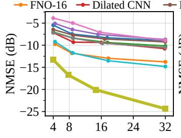  
(a) Payload (floats)

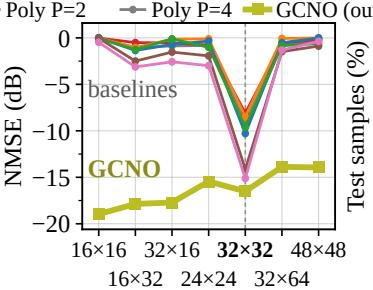  
(b) Array size

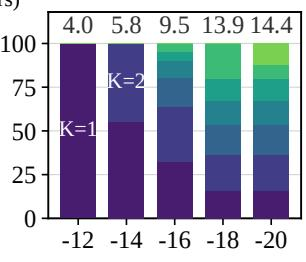  
(c) Target NMSE (dB)

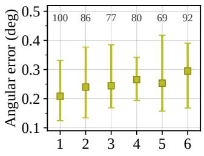  
(d) Strong paths  
Figure 4: Ablation and Generalization results on ASU. (a) RD after replacing only the GCNO backbone. (b) Generalization of the $3 2 \times 3 2 \time 3 2$ -trained model to unseen array sizes without retraining. (c) Selected path counts (Numbers above bars show mean of 4K) as the target NMSE becomes stricter. (d) Angular error and recall (above markers) versus the number of strong paths.

Table 2: Efect of Taylor refinement, error is median (P75).
<table><tr><td></td><td>Dataset Method@16 floats</td><td>Median NMSE (dB) Angular error (°)</td><td></td></tr><tr><td rowspan="2">ASU</td><td>GCNO (Taylor)</td><td>-20.08</td><td>0.23 (0.37)</td></tr><tr><td>GCNO (no Taylor)</td><td>-3.84</td><td>2.01 (2.75)</td></tr><tr><td rowspan="2">Dallas</td><td>GCNO (Taylor)</td><td>-19.23</td><td>0.28 (0.59)</td></tr><tr><td>GCNO (no Taylor)</td><td>-4.14</td><td>2.17 (3.66)</td></tr><tr><td rowspan="2">Seattle</td><td>GCNO (Taylor)</td><td>-18.15</td><td>0.23 (0.46)</td></tr><tr><td>GCNO (no Taylor)</td><td>-3.29</td><td>2.11 (3.20)</td></tr></table>

## 6.3 GCNO Backbone Ablation

We ask whether the physical decoder alone explains the improvement. We replace only the 3 native GCNO layers while retaining the same inputs, support head, Taylor refinement, selection rule, and LS recovery. GCNO gives the strongest RD trade-of against CNN, dilated-CNN, FNO, static Chebyshev, and learned-polynomial replacements (Fig. 4). Since every replacement produces the same type of path payload, the gain cannot be attributed to the analytical decoder alone. The sample-specific receive and transmit Gramians help GCNO identify a smaller, more useful support.

## 6.4 Physical Interpretability

Variable-rate feedback should adapt to what each channel needs rather than act as a fixed code under another name. As the requested accuracy becomes stricter, GCNO assigns additional paths to a growing fraction of the channels (Fig. 4). At the strictest setting, payload continues to increase while reconstruction improves little, revealing the point of diminishing returns. The transmitted directions also remain accurate as the number of strong diagnostic paths increases (Fig. 4). Recall is lower for some richer channels, showing the expected limitation of a compact representation: it preserves the dominant resolvable structure rather than every annotated ray. Appendix C elaborates on this.

## 6.5 Generalization Across Array Sizes

Our second main question is whether the learned compressor remains useful when the antenna count changes. Figure 4 applies the same model trained at $3 2 \times 3 2$ to six changed square and rectangular array configurations, without retraining. GCNO retains strong reconstruction quality throughout, whereas the paired neural baselines lose most of their accuracy away from their native dimensions. This behavior is consistent with GCNO’s design: its learned polynomial coeficients are shared across array sizes, while the physical projections and reconstruction patterns are recomputed for the new geometry. The result supports our claim that one trained model can transfer across antenna counts without requiring a new matched decoder. Appendix C provides exact details on how the baselines were adapted for various arrays.

## 7 Conclusion

This paper examined whether a wireless channel is better compressed through its dominant propagation paths than through a fixed-size code produced for a paired neural decoder. Across ASU, Dallas, and Seattle, the results support the path-based view. GCNO finds a channel-dependent set of directions, Taylor refinement moves them away from the fixed grid, and least squares estimates their strengths. The device reports the retained path tuples. This variable payload gives a better trade-of between reconstruction accuracy and feedback size than neural compressors, while the physical reconstruction rule allows the same model to work when the antenna count changes. The method is trained from channel reconstruction alone, without path labels.

Our experiments focus on narrowband spatial channels. We sought to isolate the value of path-based compression and compare it fairly with encoder-decoder methods, rather than combine that question with delay and OFDM modeling. Extending the representation to wideband channels requires adding delay, or an equivalent frequency coordinate, to each path. Path directions and delays remain nearly constant across nearby subcarriers, and gain changes follow a structured pattern. One path description can therefore serve many frequencies. This shared structure may make OFDM channels even more compressible than the narrowband channels studied here.

## References

3GPP. 2025a. NR; Physical Channels and Modulation. Technical Report ETSI TS 138 211 V18.7.0 (3GPP TS 38.211, Release 18), European Telecommunications Standards Institute. Sec. 4.3.2 and Table 4.3.2-1.

3GPP. 2025b. NR; Physical Layer Procedures for Data. Technical Report ETSI TS 138 214 V18.7.0 (3GPP TS 38.214, Release 18), European Telecommunications Standards Institute. Sec. 5.4 and Tables 5.4-1–5.4-2.

3GPP. 2025c. NR; Radio Resource Control (RRC) Protocol Specification. Technical Report ETSI TS 138 331 V18.6.0 (3GPP TS 38.331, Release 18), European Telecommunications Standards Institute. Sec. 6.3.2, CSI-ReportPeriodicityAndOfset.

Akdeniz, M. R.; Liu, Y.; Samimi, M. K.; Sun, S.; Rangan, S.; Rappaport, T. S.; and Erkip, E. 2014. Millimeter Wave Channel Modeling and Cellular Capacity Evaluation. IEEE Journal on Selected Areas in Communications, 32(6): 1164– 1179.

Alkhateeb, A. 2019. DeepMIMO: A generic deep learning dataset for millimeter wave and massive MIMO applications. arXiv preprint arXiv:1902.06435.

Alkhateeb, A.; El Ayach, O.; Leus, G.; and Heath, R. W. 2014. Channel Estimation and Hybrid Precoding for Millimeter Wave Cellular Systems. IEEE Journal of Selected Topics in Signal Processing, 8(5): 831–846.

Borgerding, M.; Schniter, P.; and Rangan, S. 2017. AMP-Inspired Deep Networks for Sparse Linear Inverse Problems. IEEE Transactions on Signal Processing, 65(16): 4293– 4308.

Chen, S. S.; Donoho, D. L.; and Saunders, M. A. 1998. Atomic Decomposition by Basis Pursuit. SIAM Journal on Scientific Computing, 20(1): 33–61.

Cheng, J.; Chen, W.; Xu, J.; Guo, Y.; Li, L.; and Ai, B. 2023. Swin Transformer-Based CSI Feedback for Massive MIMO. In 2023 IEEE 23rd International Conference on Communication Technology (ICCT), 809–814. IEEE.

Cui, Y.; Guo, A.; and Song, C. 2022. TransNet: Full Attention Network for CSI Feedback in FDD Massive MIMO System. IEEE Wireless Communications Letters, 11(5): 903–907.

Deferrard, M.; Bresson, X.; and Vandergheynst, P. 2016. Convolutional Neural Networks on Graphs with Fast Localized Spectral Filtering. In Advances in Neural Information Processing Systems 29, 3837–3845.

El Ayach, O.; Rajagopal, S.; Abu-Surra, S.; Pi, Z.; and Heath, R. W. 2014. Spatially Sparse Precoding in Millimeter Wave MIMO Systems. IEEE Transactions on Wireless Communications, 13(3): 1499–1513.

Gregor, K.; and LeCun, Y. 2010. Learning Fast Approximations of Sparse Coding. In Proceedings ofthe 27th International Conference on Machine Learning, 399–406.

Guo, J.; Wen, C.-K.; Jin, S.; and Li, G. Y. 2020. Convolutional Neural Network-Based Multiple-Rate Compressive Sensing for Massive MIMO CSI Feedback: Design, Simulation, and Analysis. IEEE Transactions on Wireless Communications, 19(4): 2827–2840.

Guo, J.; Wen, C.-K.; Jin, S.; and Li, G. Y. 2022. Overview of deep learning-based CSI feedback in massive MIMO systems. IEEE Transactions on Communications, 70(12): 8017– 8045.

Ji, S.; and Li, M. 2021. CLNet: Complex Input Lightweight Neural Network Designed for Massive MIMO CSI Feedback. IEEE Wireless Communications Letters, 10(10): 2318–2322.

Klukas, R.; and Fattouche, M. 1998. Line-of-sight angle of arrival estimation in the outdoor multipath environment. IEEE transactions on vehicular technology, 47(1): 342–351.

Larsson, E. G.; Edfors, O.; Tufvesson, F.; and Marzetta, T. L. 2014. Massive MIMO for Next Generation Wireless Systems. IEEE Communications Magazine, 52(2): 186–195.

Li, Q.; Zhang, A.; Liu, P.; Li, J.; and Li, C. 2020. A Novel CSI Feedback Approach for Massive MIMO Using LSTM-Attention CNN. IEEE Access, 8: 7295–7302.

Li, Z.; Kovachki, N.; Azizzadenesheli, K.; Liu, B.; Bhattacharya, K.; Stuart, A.; and Anandkumar, A. 2021. Fourier Neural Operator for Parametric Partial Diferential Equations. In International Conference on Learning Representations.

Lu, L.; Jin, P.; Pang, G.; Zhang, Z.; and Karniadakis, G. E. 2021. Learning Nonlinear Operators via DeepONet Based on the Universal Approximation Theorem of Operators. Nature Machine Intelligence, 3(3): 218–229.

Lu, Z.; Wang, J.; and Song, J. 2020. Multi-Resolution CSI Feedback With Deep Learning in Massive MIMO System. In ICC 2020 – 2020 IEEE International Conference on Communications (ICC), 1–6.

Mamandipoor, B.; Ramasamy, D.; and Madhow, U. 2016a. Newtonized Orthogonal Matching Pursuit: Frequency Estimation Over the Continuum. IEEE Transactions on Signal Processing, 64(19): 5066–5081.

Mamandipoor, B.; Ramasamy, D.; and Madhow, U. 2016b. Newtonized Orthogonal Matching Pursuit: Frequency Estimation over the Continuum. IEEE Transactions on Signal Processing, 64(19): 5066–5081.

Marzetta, T. L. 2010. Noncooperative Cellular Wireless with Unlimited Numbers of Base Station Antennas. IEEE Transactions on Wireless Communications, 9(11): 3590–3600.

O’Shea, T.; and Hoydis, J. 2017. An Introduction to Deep Learning for the Physical Layer. IEEE Transactions on Cognitive Communications and Networking, 3(4): 563–575.

Pati, Y. C.; Rezaiifar, R.; and Krishnaprasad, P. S. 1993a. Orthogonal Matching Pursuit: Recursive Function Approximation with Applications to Wavelet Decomposition. In Conference Record of the Twenty-Seventh Asilomar Conference on Signals, Systems and Computers, volume 1, 40–44.

Pati, Y. C.; Rezaiifar, R.; and Krishnaprasad, P. S. 1993b. Orthogonal Matching Pursuit: Recursive Function Approximation with Applications to Wavelet Decomposition. In Proceedings of the 27th Asilomar Conference on Signals, Systems and Computers, 40–44.

Roy, R.; and Kailath, T. 1989. ESPRIT—Estimation of Signal Parameters via Rotational Invariance Techniques. IEEE Transactions on Acoustics, Speech, and Signal Processing, 37(7): 984–995.

Tang, G.; Bhaskar, B. N.; Shah, P.; and Recht, B. 2013. Compressed Sensing Of the Grid. IEEE Transactions on Information Theory, 59(11): 7465–7490.

Tang, S.; Xia, J.; Fan, L.; Lei, X.; Xu, W.; and Nallanathan, A. 2022. Dilated Convolution Based CSI Feedback Compression for Massive MIMO Systems. IEEE Transactions on Vehicular Technology, 71(10): 11216–11221.

Tipping, M. E. 2001. Sparse Bayesian Learning and the Relevance Vector Machine. Journal of Machine Learning Research, 1: 211–244.

Wagle, S.; Malhotra, A.; Hamidi-Rad, S.; Sant, A.; Love, D. J.; and Brinton, C. G. 2025a. Physics-based generative models for geometrically consistent and interpretable wireless channel synthesis. In Proceedings of the Thirty-Fourth International Joint Conference on Artificial Intelligence, 9384–9392.

Wagle, S.; Malhotra, A.; Hamidi-Rad, S.; Sant, A.; Love, D. J.; and Brinton, C. G. 2025b. Physics-Informed Generative Approaches for Wireless Channel Modeling. In ICLR 2025 Workshop on Deep Generative Model in Machine Learning: Theory, Principle and Eficacy.

Wang, T.; Wen, C.-K.; Jin, S.; and Li, G. Y. 2019. Deep Learning-Based CSI Feedback Approach for Time-Varying Massive MIMO Channels. IEEE Wireless Communications Letters, 8(2): 416–419.

Wen, C.-K.; Shih, W.-T.; and Jin, S. 2018. Deep Learning for Massive MIMO CSI Feedback. IEEE Wireless Communications Letters, 7(5): 748–751.

Xu, Y.; Yuan, M.; and Pun, M.-O. 2021. Transformer Empowered CSI Feedback for Massive MIMO Systems. In 2021 30th Wireless and Optical Communications Conference (WOCC), 157–161.

Yang, Z.; Xie, L.; and Zhang, C. 2013. Of-Grid Direction of Arrival Estimation Using Sparse Bayesian Inference. IEEE Transactions on Signal Processing, 61(1): 38–43.

Yu, Y.; Teng, Y.; Wang, B.; Liu, A.; and Lau, V. 2023. M-Net: A Lightweight Network Based on Multilayer Perceptron for Massive MIMO CSI Feedback. In 2023 IEEE Globecom Workshops (GC Wkshps), 26–31. IEEE.

Zhao, K.; Wu, H.; Xiong, Y.; Zhu, L.; and Xu, M. 2026. StarCANet: A Compact and Eficient Neural Network for Massive MIMO CSI Feedback. IEEE Wireless Communications Letters, 15: 540–544.

## A When Is Path-Based Feedback Minimal?

The main paper uses K for the number of paths retained by the compressor and $K ^ { \star }$ for the total number of paths in the geometric model. Throughout this appendix, $\dot { K }$ retains the same meaning as in the main paper. We isolate the ideal K-path component and ask how many real coordinates are required to represent it exactly. The hats used for estimated quantities in the main paper are omitted here because this appendix analyzes the ideal exact representation. This is a statement about the unquantized payload used in the main rate–distortion comparison; it is not a finite-bit entropy bound.

## A.1 Identifiable K-Path Channels

Write $g _ { k } = x _ { k } + \mathrm { j } y _ { k }$ and collect the path parameters as

$$
\vartheta = ( x _ { 1 } , y _ { 1 } , u _ { r , 1 } , u _ { t , 1 } , \ldots , x _ { K } , y _ { K } , u _ { r , K } , u _ { t , K } ) \in \Theta _ { K } \subset \mathbb { R } _ { \quad \mathcal { O } \cap \mathcal { K } } ^ { 4 K } .\tag{9}
$$

After imposing a fixed canonical ordering of the paths, define the synthesis map

$$
\Phi _ { K } ( \pmb \vartheta ) = \sum _ { k = 1 } ^ { K } g _ { k } \mathbf { a } _ { N _ { r } } ( \boldsymbol { u } _ { r , k } ) \mathbf { a } _ { N _ { t } } ( \boldsymbol { u } _ { t , k } ) ^ { \sf H } ,\tag{10}
$$

and its real vectorization

$$
\phi _ { K } ( \pmb { \vartheta } ) = \left[ \pmb { \mathscr { R } } \{ \mathrm { v e c } \left( \Phi _ { K } ( \pmb { \vartheta } ) \right) \} \right] \in \mathbb { R } ^ { 2 N _ { r } N _ { t } } .\tag{11}
$$

The finite permutation ambiguity does not change the continuous dimension; the canonical ordering only selects one representative.

Assumption A.1 (local identifiability). At the channel under consideration, all retained gains are nonzero, the path direction pairs are distinct and lie in the interior of the unaliased field of view, and $\phi _ { K }$ is locally one-to-one with

$$
\mathrm { r a n k } J _ { \phi _ { K } } ( \vartheta ) = 4 K .\tag{12}
$$

This assumption excludes coincident or locally unresolvable paths. Its four local directions for path k are generated by $\mathbf { \dot { a } } _ { r } \mathbf { a } _ { t } ^ { \mathsf { H } } , \mathrm { j } \mathbf { a } _ { r } \mathbf { a } _ { t } ^ { \mathsf { H } } , g _ { k } \mathbf { a } _ { r } ^ { \prime } \mathbf { a } _ { t } ^ { \mathsf { H } }$ , and $g _ { k } \mathbf { a } _ { r } ( \mathbf { \dot { a } } _ { t } ^ { \prime } ) ^ { \mathsf { H } }$ , where the steering vectors and their derivatives are evaluated at path k. Full Jacobian rank states that the corresponding 4K real perturbations are locally independent.

## A.2 Minimum Dimension of an Exact Fixed Latent

Theorem A.1 (minimal exact latent dimension). Let $\textit { e } :$ $\mathbb { R } ^ { 2 N _ { r } N _ { t } } \ \to \ \mathbb { R } ^ { \dot { m } }$ and $d : \mathbb { R } ^ { m }  \mathbb { R } ^ { 2 N _ { r } N _ { t } }$ be an encoder and decoder that are diferentiable at the considered channel. Suppose that they exactly reconstruct every identifiable $K \mathfrak { - }$ path channel in a neighborhood of $\vartheta \colon$

$d \bigl ( e \bigl ( \phi _ { K } ( \pmb { \vartheta } ^ { \prime } ) \bigr ) \bigr ) = \phi _ { K } \bigl ( \pmb { \vartheta } ^ { \prime } \bigr )$ for all $\vartheta ^ { \prime }$ in that neighborhood.

Then

(13)

$$
m \geq 4 K .\tag{14}
$$

The physical path tuple uses exactly 4K real coordinates and therefore attains this local lower bound.

Proof. Diferentiate (13) with respect to $\vartheta ^ { \prime }$ at ϑ. The chain rule gives

$$
J _ { d } J _ { e } J _ { \phi _ { K } } = J _ { \phi _ { K } } .\tag{15}
$$

By Assumption A.1, the right-hand side has rank $4 K$ . The left-hand side factors through an m-dimensional latent space and therefore has rank at most m. Hence $4 K \leq m$

Under local identifiability, the parameters in (9) themselves form valid local coordinates, and (10) reconstructs the channel exactly. The 4K-coordinate path representation therefore achieves equality. Finally, $\psi = \arcsin ( u )$ is a smooth one-to-one change of coordinates inside the field of view, so reporting $\psi$ instead of u does not change the coordinate count. □

## A.3 Variable Path Count Versus a Fixed-Width Autoencoder

Corollary A.1 (variable-rate advantage). Suppose one fixed-width autoencoder must exactly represent all identifiable channels with

$$
1 \leq K \leq K _ { \operatorname* { m a x } } .
$$

Since this family contains an identifiable $K _ { \mathrm { m a x } }$ -path subset, Theorem A.1 implies

$$
m _ { \mathrm { f i x e d } } \geq 4 K _ { \mathrm { m a x } } .\tag{16}
$$

The path message instead uses

$$
P _ { \mathrm { p a t h } } ( \mathbf { H } ) = 4 K ( \mathbf { H } ) , \qquad \mathbb { E } [ P _ { \mathrm { p a t h } } ] = 4 \mathbb { E } [ K ] .\tag{17}
$$

Consequently, it uses strictly fewer real values on every channel with $K < K _ { \operatorname* { m a x } } ,$ , and it has strictly smaller average payload whenever

$$
\operatorname* { P r } [ K < K _ { \operatorname* { m a x } } ] > 0 .
$$

At $K = K _ { \operatorname* { m a x } } ,$ it meets the $4 K _ { \mathrm { m a x } }$ lower bound; an ideal autoencoder with the same latent dimension may tie this bound.

Thus, under the ideal identifiable model, both representations may reconstruct the channel exactly, but the path representation uses a strictly smaller message whenever the current channel requires fewer than $K _ { \mathrm { m a x } }$ paths.

Scope. The result is deliberately narrow. It applies to differentiable, locally exact codecs with a fixed real-coordinate latent for the identifiable geometric component before quantization. It does not claim that every trained autoencoder must perform worse, or that no alternative 4K-dimensional coordinates exist. It also does not cover deliberately lossy codes, entropy-coded bit strings, coincident paths, or the diffuse and omitted energy outside the retained K-path model. Those efects are measured empirically by the deployable NMSE in the main paper.

## B GCNO Details and Multipath Interpretation

This section gives the normalization and stability details omitted from the main text and then connects the Gramian– Chebyshev operation directly to the geometric multipath model. Bold symbols denote vectors or matrices, and

$$
\langle \mathbf { A } , \mathbf { B } \rangle _ { F } = \mathrm { t r } \left( \mathbf { A } ^ { \mathsf { H } } \mathbf { B } \right) .
$$

## B.1 Multipath Footprints in the Evidence Map Consider first the retained K-path component

$$
\mathbf { H } _ { K } = \sum _ { k = 1 } ^ { K } g _ { k } \mathbf { a } _ { N _ { r } } ( u _ { r , k } ) \mathbf { a } _ { N _ { t } } ( u _ { t , k } ) ^ { \sf H } .\tag{18}
$$

For the receive and transmit grids in the main paper, define the one-dimensional matched-filter footprints

$$
\mathbf { b } _ { r , k } [ i ] = \mathbf { a } _ { N _ { r } } ( u _ { i } ^ { r } ) ^ { \mathsf { H } } \mathbf { a } _ { N _ { r } } ( u _ { r , k } ) ,\tag{19}
$$

$$
\mathbf { b } _ { t , k } [ j ] = \mathbf { a } _ { N _ { t } } ( u _ { j } ^ { t } ) ^ { \mathsf { H } } \mathbf { a } _ { N _ { t } } ( u _ { t , k } ) .\tag{20}
$$

For the centered steering convention of the main paper, each entry is a normalized Dirichlet kernel (with removable singularities defined by continuity),

$$
\kappa _ { N } ( \delta ) = \frac { \sin ( N \pi \delta / 2 ) } { N \sin ( \pi \delta / 2 ) } ,\tag{21}
$$

where δ is the diference between the physical and grid spatial coordinates. Thus, an of-grid path produces a broad receive footprint times a broad transmit footprint.

Let

$$
\mathbf { B } _ { r } = [ \mathbf { b } _ { r , 1 } , \ldots , \mathbf { b } _ { r , K } ] , \qquad \mathbf { B } _ { t } = [ \mathbf { b } _ { t , 1 } , \ldots , \mathbf { b } _ { t , K } ] ,
$$

and

$$
\mathbf { \cal { r } } = \mathrm { d i a g } ( g _ { 1 } , \dots , g _ { K } ) .
$$

Lemma B.1 (exact evidence-map factorization). For the matched-filter map

$$
\begin{array} { r } { C _ { i j } = \langle { \bf D } _ { i j } , { \bf H } _ { K } \rangle _ { F } , } \end{array}
$$

we have

$$
\mathbf { C } = \sum _ { k = 1 } ^ { K } g _ { k } \mathbf { b } _ { r , k } \mathbf { b } _ { t , k } ^ { \sf H } = \mathbf { B } _ { r } \mathbf { \Gamma } \mathbf { \Gamma } \mathbf { B } _ { t } ^ { \sf H } , \qquad \mathrm { r a n k } ( \mathbf { C } ) \leq K .\tag{22}
$$

Proof. Substituting one path into the Frobenius inner product gives

$$
\left. \mathbf { D } _ { i j } , g _ { k } \mathbf { a } _ { N _ { r } } ( u _ { r , k } ) \mathbf { a } _ { N _ { t } } ( u _ { t , k } ) ^ { \sf H } \right. _ { F } = g _ { k } \mathbf { b } _ { r , k } [ i ] \mathbf { b } _ { t , k } [ j ] ^ { * } .\tag{23}
$$

Summing over k gives (22). The rank bound follows because the result is a sum of at most K rank-one matrices. □

The two evidence-map Gramians therefore satisfy

$$
\begin{array} { r } { { \bf C C } ^ { \sf H } = { \bf B } _ { r } { \bf \Gamma } \Gamma ( { \bf B } _ { t } ^ { \sf H } { \bf B } _ { t } ) { \bf \Gamma } ^ { \sf H } { \bf B } _ { r } ^ { \sf H } , } \end{array}
$$

$$
\begin{array} { r } { \mathbf { C } ^ { \mathsf { H } } \mathbf { C } = \mathbf { B } _ { t } \mathbf { \Gamma } ^ { \mathsf { H } } ( \mathbf { B } _ { r } ^ { \mathsf { H } } \mathbf { B } _ { r } ) \mathbf { \Gamma } \mathbf { B } _ { t } ^ { \mathsf { H } } . } \end{array}\tag{24}
$$

(25)

Hence their active receive and transmit subspaces are contained in span(Br) and span(Bt), respectively. The diagonal contributions encode individual path strengths, while the of-diagonal terms encode overlap between nearby path footprints. If the measured channel also contains omitted or difuse energy, its matched-filter contribution is simply added to C by linearity.

## B.2 Normalized Gramian–Chebyshev Filtering For the complex feature state

$$
\left\{ \mathbf { X } _ { c } ^ { ( \ell ) } \right\} _ { c = 1 } ^ { C _ { \ell } } ,
$$

GCNO forms the Gramians given in the main paper and normalizes each side $s \in \{ r , t \}$ as

$$
\overline { { \mathbf { G } } } _ { s } ^ { ( \ell ) } = \frac { \mathbf { G } _ { s } ^ { ( \ell ) } + \epsilon \mathbf { I } } { \mathrm { t r } \left( \mathbf { G } _ { s } ^ { ( \ell ) } + \epsilon \mathbf { I } \right) } , \qquad \mathbf { A } _ { s } ^ { ( \ell ) } = 2 \overline { { \mathbf { G } } } _ { s } ^ { ( \ell ) } - \mathbf { I } .\tag{26}
$$

The Chebyshev matrices are evaluated without an eigendecomposition through

$$
T _ { 0 } ( \mathbf { A } ) = \mathbf { I } , T _ { 1 } ( \mathbf { A } ) = \mathbf { A } , \qquad T _ { q + 1 } ( \mathbf { A } ) = 2 \mathbf { A } T _ { q } ( \mathbf { A } ) - T _ { q - 1 } ( \mathbf { A } ) .\tag{27}
$$

The implementation uses $q = 0 , \ldots , Q$ with $Q = 3$

Proposition B.1 (stable filtering and size-independent weights). For every sample and layer, all eigenvalues of $\mathbf { A } _ { r } ^ { \left( \ell \right) }$ and ${ \bf A } _ { t } ^ { ( \ell ) }$ lie in $[ - 1 , 1 ]$ . Therefore,

$$
\left\| T _ { p } ( \mathbf { A } _ { r } ^ { ( \ell ) } ) \right\| _ { 2 } \leq 1 , \qquad \left\| T _ { q } ( \mathbf { A } _ { t } ^ { ( \ell ) } ) \right\| _ { 2 } \leq 1 .\tag{28}
$$

For one output channel of the linear GCNO core,

$$
\left. \mathcal { F } _ { \ell } ( \mathbf { X } ) _ { c } \right. _ { F } \leq \sum _ { c ^ { \prime } = 1 } ^ { C _ { \ell } } \sum _ { p , q = 0 } ^ { Q } \left| \Theta _ { c c ^ { \prime } p q } ^ { ( \ell ) } \right| \left. \mathbf { X } _ { c ^ { \prime } } ^ { ( \ell ) } \right. _ { F } .\tag{29}
$$

Moreover, the learned coeficients are indexed by feature channels and polynomial orders, not by receive or transmit locations.

Proof. Each Gramian is Hermitian positive semidefinite. Equation (26) therefore places the eigenvalues of $\overline { { \mathbf { G } } } _ { s } ^ { ( \ell ) }$ in [0, 1] and those of ${ \bf A } _ { s } ^ { ( \ell ) } \mathrm { i n } \left[ - 1 , 1 \right]$ . Since

$$
| T _ { q } ( \lambda ) | \leq 1 \qquad \mathrm { f o r e v e r y } \lambda \in [ - 1 , 1 ] ,
$$

the spectral-norm bounds in (28) follow. Applying submultiplicativity and the triangle inequality to the bilateral filter in the main paper gives (29). The final statement follows directly from the indices of $\Theta _ { c c ^ { \prime } p q } ^ { ( \ell ) } .$ Array and grid sizes enter through the analytical projections and sample-specific Gramians, while the learned coeficients remain unchanged. □

## B.3 Neural-Operator Characterization

A neural operator parameterizes a map between function spaces using learned coeficients that are independent of one particular sampling resolution. Let $\mathcal { H } _ { C } = L ^ { 2 } \dot { ( } \Omega _ { r } \times \Omega _ { t } ; \mathbb { C } ^ { C } )$ and let $\mathcal { X } = ( \bar { \mathcal { X } } _ { 1 } , \bar { . . . } , \mathcal { X } _ { C } ) \in \mathcal { H } _ { C }$ denote a complex feature field. Define its receive- and transmit-side Gramian kernels by

$$
k _ { r } ^ { \mathcal { X } } ( u , u ^ { \prime } ) = \sum _ { c = 1 } ^ { C } \int _ { \Omega _ { t } } \mathcal { X } _ { c } ( u , v ) \overline { { \mathcal { X } _ { c } ( u ^ { \prime } , v ) } } d v ,\tag{30}
$$

$$
k _ { t } ^ { \mathcal { X } } ( v , v ^ { \prime } ) = \sum _ { c = 1 } ^ { C } \int _ { \Omega _ { r } } \overline { { \mathcal { X } _ { c } ( u , v ) } } \mathcal { X } _ { c } ( u , v ^ { \prime } ) d u .\tag{31}
$$

Let $\mathcal { G } _ { r } [ \mathcal { X } ]$ and $\mathcal { G } _ { t } [ \mathcal { X } ]$ be the corresponding positive semidefinite integral operators. For $\begin{array} { r } { E ( \mathcal { X } ) = \sum _ { c } \| \dot { \mathcal { X } } _ { c } \| _ { L ^ { 2 } } ^ { 2 } > 0 } \end{array}$ , define

$$
\overline { { \mathcal { G } } } _ { s } [ \mathcal { X } ] = \frac { \mathcal { G } _ { s } [ \mathcal { X } ] } { E ( \mathcal { X } ) } , \qquad \mathcal { A } _ { s } [ \mathcal { X } ] = 2 \overline { { \mathcal { G } } } _ { s } [ \mathcal { X } ] - \mathcal { T } _ { s } , \quad s \in \{ r , t \} .\tag{32}
$$

The function-space GCNO core is

$$
\begin{array} { r l r } {  { [ \mathcal { F } _ { \Theta } ^ { ( \ell ) } ( \mathcal { X } ) ] _ { o } = \sum _ { c = 1 } ^ { C _ { \ell } } \sum _ { p , q = 0 } ^ { Q } \Theta _ { o c p q } ^ { ( \ell ) } } } \\ & { } & { \times T _ { p } ( \mathcal { A } _ { r } [ \mathcal { X } ] ) \mathcal { X } _ { c } T _ { q } ( \mathcal { A } _ { t } [ \mathcal { X } ] ) , } \end{array}\tag{33}
$$

where the left and right actions operate on the receive and transmit coordinates, respectively. Residual addition and the shared pointwise nonlinearity are then composed with this core as in the implemented layer.

Operator characterization. Equation (33) defines a nonlinear map $\mathcal { H } _ { C _ { \ell } } \to \mathcal { H } _ { C _ { \ell + 1 } }$ , because its Gramian operators depend on the current input field. Under the uniform sampling used here, quadrature reduces the two kernels to matrices proportional to $\textstyle \sum _ { c } \mathbf X _ { c } \mathbf X _ { c } ^ { \mathsf { H } }$ and $\textstyle \sum _ { c } \mathbf { X } _ { c } ^ { \mathsf { H } } \mathbf { X } _ { c }$ . The common quadrature factors cancel under normalization, giving exactly the bilateral matrix filter, with ϵI serving only as finite-dimensional numerical regularization.

The learned tensor $\Theta _ { o c p q } ^ { ( \ell ) }$ is indexed only by feature channels and polynomial orders; no learned index ranges over a receive position, transmit position, antenna count, or grid cell. Consequently, the same learned coeficients define compatible discrete realizations on diferent admissible receive– transmit samplings after the fixed analytical projections and sample Gramians are recomputed. GCNO therefore satisfies the neural-operator criterion used in the main paper: it learns a function-space transformation rather than a dimensionspecific matrix map.

This is an architectural transfer property, not a claim of exact equality across resolutions or arbitrary array geometries. Approximation quality under a changed discretization remains an empirical question. The shared stems, LocalGate corrections, and support head are auxiliary maps around the Gramian–Chebyshev backbone and introduce no locationspecific learned parameters.

## B.4 Physical Interpretation of the Chebyshev Core

For one implemented GCNO layer, define the joint receive and transmit subspaces of its input feature maps as

$$
\mathcal { U } _ { \ell } = \mathrm { s p a n } \left( \bigcup _ { c = 1 } ^ { C _ { \ell } } \mathrm { r a n g e } ( \mathbf { X } _ { c } ^ { ( \ell ) } ) \right) , \mathcal { V } _ { \ell } = \mathrm { s p a n } \left( \bigcup _ { c = 1 } ^ { C _ { \ell } } \mathrm { r a n g e } \left( ( \mathbf { X } _ { c } ^ { ( \ell ) } ) ^ { \mathsf { H } } \right) \right) .\tag{34}
$$

Proposition B.2 (subspace action of the GCNO core). For every output channel of the linear bilateral filter in the main paper,

$$
\mathrm { r a n g e } \left( \mathcal { F } _ { \ell } ( \mathbf { X } ) _ { c } \right) \subseteq \mathcal { U } _ { \ell } , \qquad \mathrm { r a n g e } \left( \mathcal { F } _ { \ell } ( \mathbf { X } ) _ { c } ^ { \sf H } \right) \subseteq \mathcal { V } _ { \ell } .\tag{35}
$$

Thus, the linear core mixes the receive and transmit modes already present in the current multi-channel state rather than introducing a fixed external basis.

For a single feature map

$$
\mathbf { X } = \mathbf { U } \pmb { \Sigma } \mathbf { V } ^ { \mathsf { H } } ,
$$

let $\mathbf { { \boldsymbol { \Lambda } } } _ { r }$ and $\mathbf { \Lambda } _ { \pmb { \Lambda } _ { t } }$ denote the eigenvalues of the normalized Gramian operators on the active subspaces. The corresponding single-map core satisfies

$$
\sum _ { p , q = 0 } ^ { Q } \theta _ { p q } T _ { p } ( \mathbf { A } _ { r } ) \mathbf { X } T _ { q } ( \mathbf { A } _ { t } ) = \mathbf { U } \left[ \sum _ { p , q = 0 } ^ { Q } \theta _ { p q } T _ { p } ( \mathbf { A } _ { r } ) \pm T _ { q } ( \mathbf { A } _ { t } ) \right] \mathbf { V } ^ { \mathsf { H } } .\tag{36}
$$

In particular, when $\mathbf { X } = \mathbf { C }$ , Lemma B.1 places these active subspaces inside the spans of the physical receive and transmit footprints.

If, in addition, the normalized footprints

$$
\widetilde { \mathbf { b } } _ { r , k } = \frac { \mathbf { b } _ { r , k } } { \| \mathbf { b } _ { r , k } \| _ { 2 } } , \qquad \widetilde { \mathbf { b } } _ { t , k } = \frac { \mathbf { b } _ { t , k } } { \| \mathbf { b } _ { t , k } \| _ { 2 } }
$$

are mutually orthonormal on each side, then the evidencemap core reduces to

$$
\sum _ { p , q = 0 } ^ { Q } \theta _ { p q } T _ { p } ( \mathbf { A } _ { r } ) \mathbf { C } T _ { q } ( \mathbf { A } _ { t } ) = \sum _ { k = 1 } ^ { K } \widetilde { g } _ { k } h _ { \Theta } ( \xi _ { r , k } , \xi _ { t , k } ) \widetilde { \mathbf { b } } _ { r , k } \widetilde { \mathbf { b } } _ { t , k } ^ { \sf H } ,
$$

where

(37)

$$
\widetilde { g } _ { k } = g _ { k } \| \mathbf { b } _ { r , k } \| _ { 2 } \| \mathbf { b } _ { t , k } \| _ { 2 } , \qquad h _ { \Theta } ( x , y ) = \sum _ { p , q = 0 } ^ { Q } \theta _ { p q } T _ { p } ( x ) T _ { q } ( y ) ,\tag{38}
$$

and

$$
\xi _ { r , k } , \xi _ { t , k } \in [ - 1 , 1 ]
$$

are the normalized Gramian eigenvalues associated with path k. In this separated-path case, the core therefore applies a learned bivariate polynomial response to each physical path footprint.

Proof. The subspace $\mathcal { U } _ { \ell }$ is invariant under $\mathbf { G } _ { r } ^ { ( \ell ) }$ because each term

$$
\mathbf { X } _ { c } ^ { ( \ell ) } ( \mathbf { X } _ { c } ^ { ( \ell ) } ) ^ { \mathsf { H } }
$$

maps into

$$
\mathrm { r a n g e } ( \mathbf { X } _ { c } ^ { ( \ell ) } ) \subseteq \mathcal { U } _ { \ell } .
$$

It is consequently invariant under $\mathbf { A } _ { r } ^ { \left( \ell \right) }$ and every polynomial of that operator. The same argument applied to the adjoint feature maps shows that $\mathcal { V } _ { \ell }$ is invariant under every polynomial of ${ \bf A } _ { t } ^ { ( \ell ) }$ . Left and right polynomial filtering, channel mixing, and summation therefore give (35).

For the single-map case, $\mathbf { A } _ { r }$ and $\mathbf { A } _ { t }$ are afine functions of

$$
\begin{array} { r } { { \mathbf { X } } { \mathbf { X } } ^ { \mathsf { H } } \qquad \mathrm { a n d } \qquad { \mathbf { X } } ^ { \mathsf { H } } { \mathbf { X } } , } \end{array}
$$

so they share the active eigenvectors U and V. A matrix polynomial preserves these eigenvectors; substitution gives (36). Under footprint orthogonality, each normalized footprint is itself a Gramian eigenvector, and applying the same identity path by path yields (37). □

Interpretation and scope. Lemma B.1 shows that a $K \mathfrak { - }$ path channel produces at most K separable matched-filter footprints. Proposition B.2 shows that the implemented linear GCNO core filters the joint receive/transmit modes of its current features; for the ideal evidence map, these modes lie in the physical footprint spans. When the footprints are separated, the action becomes the explicit path-wise response $h _ { \Theta }$ When footprints overlap, the Gramian modes can be mixtures of nearby paths, so the correct interpretation is filtering of their joint physical subspace rather than independent processing of each path.

The full GCNO also contains pointwise nonlinearities and local sharpening. We therefore make no claim that every hidden feature remains rank $K ;$ the result characterizes the physics-aligned linear Gramian–Chebyshev core.

## B.5 Complete Processing Pipeline

The preceding subsections characterized the evidence-map structure and the Gramian–Chebyshev core. We now give the complete implemented path from an observed channel to the transmitted tuple set. The detailed record below refers to the ASU reference model; Dallas and Seattle use the same method and are trained separately on their corresponding splits.

For the reference configuration, $N _ { r } ~ = ~ N _ { t } ~ = ~ 3 2$ and the receive and transmit direction grids each contain $R \ = \ 2 8$ uniformly spaced spatial coordinates over $[ - \sin ( 7 5 ^ { \circ } )$ , sin(75◦)]. The grid spacing is

$$
\delta _ { u } = 0 . 0 7 1 5 5 .
$$

Every input is first normalized as

$$
h _ { \mathrm { s c a l e } } = \| H \| _ { F } , \qquad H _ { \mathrm { n o r m } } = \frac { H } { h _ { \mathrm { s c a l e } } } .\tag{39}
$$

Only $H _ { \mathrm { n o r m } }$ is used by the neural feature extractor. The scale does not require a separate transmitted field: solving for gains using $H _ { \mathrm { n o r m } }$ and multiplying the fitted gains by $h _ { \mathrm { s c a l e } }$ is equivalent to fitting the gains directly to $\bar { H . }$

The fixed matched-filter evidence is

$$
C _ { i j } = \langle D _ { i j } , H _ { \mathrm { n o r m } } \rangle _ { F } , \qquad C \in \mathbb { C } ^ { 2 8 \times 2 8 } ,\tag{40}
$$

where $D , D ^ { r }$ , and $D ^ { t }$ are analytical tensors and are excluded from the optimizer.

For the centered steering convention, let $p _ { N , n } ~ = ~ n -$ $( N - 1 ) / 2$ . The steering derivative with respect to the spatial coordinate is

$$
{ \bf a } _ { N } ^ { \prime } ( u ) [ n ] = j \pi p _ { N , n } { \bf a } _ { N } ( u ) [ n ] .\tag{41}
$$

Accordingly, the fixed derivative dictionaries are

$$
\begin{array} { r } { \mathbf { D } _ { i j } ^ { r } = \mathbf { a } _ { N _ { r } } ^ { \prime } ( u _ { i } ^ { r } ) \mathbf { a } _ { N _ { t } } ( u _ { j } ^ { t } ) ^ { \sf H } , } \\ { \mathbf { D } _ { i j } ^ { t } = \mathbf { a } _ { N _ { r } } ( u _ { i } ^ { r } ) \mathbf { a } _ { N _ { t } } ^ { \prime } ( u _ { j } ^ { t } ) ^ { \sf H } . } \end{array}\tag{42}
$$

These tensors are constructed analytically once for each array configuration and remain non-trainable.

For ofsets $| \delta _ { r } | , | \delta _ { t } | \le \delta _ { u } / 2$ , define the exact and firstorder atoms

$$
\begin{array} { r l } & { \mathbf { A } _ { i j } ( \delta _ { r } , \delta _ { t } ) = \mathbf { a } _ { N _ { r } } ( u _ { i } ^ { r } + \delta _ { r } ) \mathbf { a } _ { N _ { t } } ( u _ { j } ^ { t } + \delta _ { t } ) ^ { \sf H } , } \\ & { \mathbf { B } _ { i j } ^ { ( 1 ) } ( \delta _ { r } , \delta _ { t } ) = \mathbf { D } _ { i j } + \delta _ { r } \mathbf { D } _ { i j } ^ { r } + \delta _ { t } \mathbf { D } _ { i j } ^ { t } . } \end{array}\tag{43}
$$

The best scalar multiple of the unrefined grid atom has normalized squared error

$$
\epsilon _ { \mathrm { g r i d } } = 1 - | \kappa _ { N _ { r } } ( \delta _ { r } ) | ^ { 2 } | \kappa _ { N _ { t } } ( \delta _ { t } ) | ^ { 2 } ,\tag{44}
$$

where $\kappa _ { N }$ is defined in Eq. (13). By first-order expansion,

$$
\Big \| \mathbf { A } _ { i j } \big ( \delta _ { r } , \delta _ { t } \big ) - \mathbf { B } _ { i j } ^ { ( 1 ) } \big ( \delta _ { r } , \delta _ { t } \big ) \Big \| _ { F } = \mathcal { O } \big ( \delta _ { r } ^ { 2 } + \delta _ { t } ^ { 2 } + | \delta _ { r } \delta _ { t } | \big )\tag{45}
$$

and hence its normalized squared approximation error is

$$
\epsilon _ { \mathrm { T a y l o r } } = \mathcal { O } \Bigl [ \bigl ( \delta _ { r } ^ { 2 } + \delta _ { t } ^ { 2 } + \left| \delta _ { r } \delta _ { t } \right| \bigr ) ^ { 2 } \Bigr ] .\tag{46}
$$

The $| \delta _ { r } \delta _ { t } |$ term is the omitted receive–transmit cross term; the remaining omitted terms are second order along the individual direction axes.

The channel and evidence are processed by separate lightweight branches. The channel branch preserves the antenna-domain observation before projecting its learned features to the direction grid, whereas the evidence branch directly processes the grid-domain matched-filter map. Their outputs are fused and passed through the three GCNO/LocalGate layers described below.

Table 3 gives the complete tensor flow. Complex quantities are stored in complex64; neural real-valued channels and scalar metadata use float32. “Fixed” denotes an analytical operation whose coeficients are not trainable. Such a fixed linear operation may still pass gradients to its learned input features.

The learned network therefore predicts only support priorities and local direction corrections. It does not predict gains and does not reconstruct the channel through a neural decoder. During training, a smooth selector and Taylor atoms make the tuple-based reconstruction diferentiable. During deployment, the smooth approximation is discarded: the UE performs adaptive hard support selection, generates exact analytical atoms under no gradient, and jointly fits the gains. The BS receives only the resulting tuples, converts $\widehat { \psi }$ to $\widehat { u } = \sin ( \widehat { \psi } )$ , and evaluates the known geometric synthesis model.

## B.6 Layer-by-Layer GCNO Architecture

Dual input branches. The channel and evidence branches use identical stem widths but do not share parameters. Each stem applies

$$
\mathrm { C o n v _ { 1 \times 1 } ( 2 , 9 6 ) \to \mathrm { G E L U } \to \mathrm { C o n v _ { 1 \times 1 } ( 9 6 , 4 8 ) } . }
$$

The 48 real output channels are interpreted as the real and imaginary parts of 24 complex feature maps. The channelbranch maps are initially sampled on the $3 2 \times 3 2$ antenna grid and are projected to the $2 8 \times 2 8$ direction grid using the fixed dictionary. The evidence branch already operates on the direction grid.

The real and imaginary parts of both branch outputs provide 96 real channels. Two normalized receive/transmit coordinate maps are appended, producing the 98-channel fusion input. The fusion stem applies

$$
\mathrm { C o n v _ { 1 \times 1 } ( 9 8 , 9 6 ) \to \mathrm { G E L U } \to \mathrm { C o n v _ { 1 \times 1 } ( 9 6 , 4 8 ) } , }
$$

and again pairs the result into a 24-channel complex state.

Bilateral GCNO layers. The fused state passes through exactly three GCNO layers. Each layer uses the normalized receive and transmit Gramian operators defined in Sec. B.5 and the preceding theoretical subsections. The Chebyshev order is three, so each side contains the four basis matrices $T _ { 0 } , T _ { 1 } , T _ { 2 } , T _ { 3 }$ . For 24 input and 24 output complex channels, one layer has the coeficient tensor

$$
\Theta ^ { ( \ell ) } \in \mathbb { C } ^ { 2 4 \times 2 4 \times 4 \times 4 } .
$$

All 16 receive–transmit polynomial pairs are applied:

$$
Y _ { o } ^ { ( \ell ) } = \sum _ { c = 1 } ^ { 2 4 } \sum _ { p = 0 } ^ { 3 } \sum _ { q = 0 } ^ { 3 } \Theta _ { o c p q } ^ { ( \ell ) } T _ { p } \left( A _ { r } ^ { ( \ell ) } \right) X _ { c } ^ { ( \ell ) } T _ { q } \left( A _ { t } ^ { ( \ell ) } \right)\tag{47}
$$

The layer adds the input state as a residual connection and applies GELU separately to the real and imaginary parts.

LocalGate. A LocalGate follows each of the three GCNO layers. It has two complementary paths. The local path converts the 24 complex maps into 48 real channels, applies a $3 \times 3$ depthwise convolution, GELU, and a $1 \times 1$ projection, and returns the result through a learned residual scale. This path provides local sharpening without replacing the global Gramian operation. The channel path averages the power of each complex feature channel and applies a $2 4  1 2  2 4$ MLP with GELU and sigmoid. Its multiplicative response is centered at one, so it softly rescales rather than removes feature channels.

Support and ofset head. After the third LocalGate, the complex state is represented by

$$
\left[ \Re X , \ \Im X , \ | X | , \ \log \left( \sum _ { c = 1 } ^ { 2 4 } | X _ { c } | ^ { 2 } \right) \right] ,
$$

which contains $2 4 + 2 4 + 2 4 + 1 = 7 3$ real channels. The compact head is

$$
{ \begin{array} { r l } & { 7 3 \xrightarrow { \mathrm { 1 \times 1 ~ C o n v } } \mathrm { 6 4 } \xrightarrow { \mathrm { \ G E L U } } \mathrm { 6 4 } } \\ & { \qquad \xrightarrow { \mathrm { 3 \times 3 ~ D W C o n v } } \mathrm { 6 4 } \xrightarrow { \mathrm { \ G E L U } } \mathrm { 6 4 } \xrightarrow { \mathrm { 1 \times 1 ~ C o n v } } \ 3 . } \end{array} }
$$

Its first output is the unconstrained score map S. The remaining outputs are converted to receive and transmit corrections by

$$
\Delta U ^ { r } = \frac { \delta _ { u } } { 2 } \operatorname { t a n h } { Z _ { r } } , \qquad \Delta U ^ { t } = \frac { \delta _ { u } } { 2 } \operatorname { t a n h } { Z _ { t } } .\tag{48}
$$

Thus each correction remains within one half-cell of its an chor. No gain head is present.

Exact trainable parameter count. Table 4 counts real scalar parameters. A complex coeficient contributes two real scalars. Fixed dictionaries, coordinate maps, Taylor construction, support selection, and LS contain no trainable parameters.

The checkpoint contains 54 parameter tensors and 95,253 trainable real scalars, which is the 95K model size reported in the main paper.

## B.7 Training Objective and Optimization

Strictly label-free optimization. Training begins from random initialization and does not use a pretrained checkpoint, teacher warmup, signal-processing pseudolabel, path label, oracle path count, oracle gain, oracle direction, or external warm start. Every diferentiable quantity is computed from $H _ { \mathrm { n o r m } }$ , the fixed dictionaries, model outputs, or the corresponding LS reconstruction. The same restriction applies to validation, checkpoint selection, the controller, and operating-point selection.

Table 3: End-to-end tensor flow for GCNO.
<table><tr><td>Stage</td><td>Output shape</td><td>Type</td><td>Operation</td><td>Status</td></tr><tr><td>Observed channel Channel scale</td><td> $\overline { { N _ { b } \times 3 2 \times 3 2 } }$   $N _ { b }$ </td><td>complex real</td><td>Physical channel H</td><td>Input Fixed</td></tr><tr><td>Normalized channel</td><td> $N _ { b } \times 3 2 \times 3 2$ </td><td>complex</td><td> $h _ { \mathrm { s c a l e } } = \| H \| _ { F }$   $H / h _ { \mathrm { s c a l e } }$ </td><td>Fixed</td></tr><tr><td>Channel-branch input</td><td> $N _ { b } \times 2 \times 3 2 \times 3 2$ </td><td>real</td><td>Real and imaginary parts of  $H _ { \mathrm { n o r m } }$ </td><td>Fixed</td></tr><tr><td></td><td></td><td></td><td></td><td></td></tr><tr><td>Evidence map</td><td> $N _ { b } \times 2 8 \times 2 8$ </td><td>complex</td><td> $C _ { i j } = \langle D _ { i j } , \bar { H } _ { \mathrm { n o r m } } \rangle _ { F }$ </td><td>Fixed</td></tr><tr><td>Evidence-branch input Channel stem</td><td> $N _ { b } \times 2 \times 2 8 \times 2 8$ </td><td>real</td><td>Real and imaginary parts of C</td><td>Fixed</td></tr><tr><td></td><td> $N _ { b } \times 2 4 \times 3 2 \times 3 2$ </td><td>complex</td><td>2 → 96 → 48 real channels, paired into 24 com- plex channels</td><td>Learned</td></tr><tr><td>Channel-grid projection</td><td> $N _ { b } \times 2 4 \times 2 8 \times 2 8$ </td><td>complex</td><td>Projection of every learned channel feature through fixed D</td><td>Fixed</td></tr><tr><td>Evidence stem</td><td> $N _ { b } \times 2 4 \times 2 8 \times 2 8$ </td><td>complex</td><td> $2  9 6  4 8$  real channels, paired into 24 com- plex channels</td><td>Learned</td></tr><tr><td>Fusion input</td><td> $N _ { b } \times 9 8 \times 2 8 \times 2 8$ </td><td>real</td><td>Real and imaginary parts of both 24-channel branches, plus two coordinate maps</td><td>Mixed</td></tr><tr><td>Fused state</td><td> $N _ { b } \times 2 4 \times 2 8 \times 2 8$ </td><td>complex</td><td> $9 8 \to 9 6 { \overset { \cdot } { \to } } 4 8$  real channels, paired into 24 complex channels</td><td>Learned</td></tr><tr><td>GCNO states</td><td> $N _ { b } \times 2 4 \times 2 8 \times 2 8$ </td><td>complex</td><td>Three bilateral Gramian-Chebyshev layers, each</td><td>Mixed</td></tr><tr><td>Head features</td><td> $N _ { b } \times 7 3 \times 2 8 \times 2 8$ </td><td>real</td><td>followed by a LocalGate RX, GX, |X|, and  $\begin{array} { r } { \log \left( \sum _ { c } | X _ { c } | ^ { 2 } \right) } \end{array}$ </td><td>Fixed</td></tr><tr><td>Head outputs</td><td> $N _ { b } \times 3 \times 2 8 \times 2 8$ </td><td>real</td><td>One score map and two bounded Taylor-offset</td><td>Learned</td></tr><tr><td>Selected atoms</td><td> $N _ { b } \times K \times 3 2 \times 3 2$ </td><td>complex</td><td>maps Taylor atoms during training; exact steering</td><td>Fixed</td></tr><tr><td>Fitted gains</td><td> $N _ { b } \times K$ </td><td>complex</td><td>atoms during deployment Joint ridge least squares</td><td>Fixed</td></tr><tr><td>Transmitted message</td><td> $N _ { b } \times 4 K$ </td><td>real</td><td> $( \Re \widehat { g } _ { k } , \Im \widehat { g } _ { k } , \widehat { \psi } _ { r , k } , \widehat { \psi } _ { t , k } ) _ { k = 1 } ^ { K }$ </td><td>Output</td></tr></table>

Table 4: Trainable parameters of the implemented GCNO model.
<table><tr><td rowspan=1 colspan=1>Component</td><td rowspan=1 colspan=1>Real parameters</td></tr><tr><td rowspan=2 colspan=1>Channel stem, $\overline { { 2 \to 9 6 \to 4 8 } }$ Evidence stem, $2  9 6  4 8$ Fusion stem, $9 8 \to 9 6 \to 4 8$ GCNO layer 1GCNO layer 2GCNO layer 3Three local residual pathsThree channel gatesScore/offset head</td><td rowspan=1 colspan=1>4,944</td></tr><tr><td rowspan=1 colspan=1>4.944</td></tr><tr><td rowspan=1 colspan=1>Total</td><td rowspan=1 colspan=1>95,253</td></tr></table>

Smooth candidate selection. Training exposes at most $M \ = \ 8$ soft candidates. Let $\mathcal { W } _ { m }$ denote the current selector window for candidate m. A temperature-controlled distribution over that window is

$$
p _ { m } ( i , j ) = \frac { \exp ( S _ { m } ( i , j ) / \tau ) } { \sum _ { ( a , b ) \in \mathcal { W } _ { m } } \exp ( S _ { m } ( a , b ) / \tau ) } , \qquad ( i , j ) \in \mathcal { W } _ { m } .\tag{49}
$$

The corrected continuous center is the probability-weighted expectation

$$
\pmb { \mu } _ { m } = \sum _ { ( i , j ) \in \mathscr { W } _ { m } } p _ { m } ( i , j ) \left[ \boldsymbol { u } _ { i } ^ { r } + \Delta U _ { i j } ^ { r } \right] .\tag{50}
$$

After each candidate, a Gaussian penalty with width 0.8 grid cells and logit penalty 8.5 suppresses its neighborhood before the next soft candidate is formed. This encourages

diferent slots to cover distinct regions. A sigmoid activity $\alpha _ { m } \in ( 0 , 1 )$ controls the contribution of candidate $m ,$ and

$$
\widehat { K } _ { \mathrm { s o f t } } = \sum _ { m = 1 } ^ { 8 } \alpha _ { m }
$$

is the diferentiable estimate of the retained path count.

For the anchor $( i _ { m } , j _ { m } )$ associated with candidate m, the training atom is

$$
B _ { m } = D _ { i _ { m } j _ { m } } + \Delta u _ { r , m } D _ { i _ { m } j _ { m } } ^ { r } + \Delta u _ { t , m } D _ { i _ { m } j _ { m } } ^ { t } .\tag{51}
$$

Exact steering vectors are not generated inside this diferentiable path.

Let

$$
\begin{array} { r } { h = \mathrm { v e c } ( H _ { \mathrm { n o r m } } ) , \qquad B = [ \mathrm { v e c } ( B _ { 1 } ) , \dots , \mathrm { v e c } ( B _ { 8 } ) ] . } \end{array}
$$

Diferentiable complex ridge LS uses $\eta _ { \mathrm { t r a i n } } = 1 0 ^ { - 4 }$

$$
\widehat { \pmb { g } } = \left( \mathcal { B } ^ { \mathrm { H } } \pmb { \mathcal { B } } + \eta _ { \mathrm { t r a i n } } \pmb { I } \right) ^ { - 1 } \pmb { \mathcal { B } } ^ { \mathrm { H } } \boldsymbol { h } , \qquad \widehat { h } _ { \mathrm { s o f t } } = \mathcal { B } \left( \pmb { \alpha } \odot \widehat { \pmb { g } } \right) .\tag{52}
$$

Objective. The complete one-stage objective used by the reference model is

$$
\begin{array} { r l } & { \mathcal { L } = \mathbb { E } _ { H } \left[ \log \left( \frac { \| h - \widehat { h } _ { \mathrm { s o f t } } \| _ { 2 } ^ { 2 } } { \| h \| _ { 2 } ^ { 2 } + \epsilon } + \epsilon \right) \right] + 0 . 0 4 \mathcal { L } _ { \mathrm { r a t e } } } \\ & { \quad \quad \quad + 0 . 0 2 \mathcal { L } _ { \mathrm { d u p } } + 1 0 ^ { - 4 } \mathcal { L } _ { \mathrm { o f f } } + 1 0 ^ { - 4 } \mathcal { L } _ { \mathrm { s c o r e } } . } \end{array}\tag{53}
$$

Here

$$
\mathcal { L } _ { \mathrm { r a t e } } = \mathbb { E } _ { H } \left[ \sum _ { m = 1 } ^ { 8 } \alpha _ { m } \right] .
$$

Table 5: Optimization settings for the ASU reference run.
<table><tr><td>Setting Initialization</td><td>Value</td></tr><tr><td>Optimizer Batch size Adam  $( \beta _ { 1 } , \beta _ { 2 } )$ </td><td>Random; no checkpoint Adam 128</td></tr><tr><td>Adam €</td><td>(0.9,0.999)  $\mathrm { i 0 ^ { - 8 } }$ </td></tr><tr><td>Weight decay</td><td> $1 0 ^ { - 6 }$ </td></tr><tr><td>Global/local learning rate</td><td> $3 { \times } 1 0 ^ { - 4 } / 1 0 ^ { - 4 }$ </td></tr><tr><td>Gradient clipping Mixed precision</td><td>Global norm 5</td></tr><tr><td></td><td>Disabled</td></tr><tr><td>Matrix-multiplication precision</td><td>High</td></tr><tr><td></td><td></td></tr><tr><td>Training ridge</td><td> $1 0 ^ { - 4 }$ </td></tr><tr><td>Maximum soft candidates</td><td>8</td></tr><tr><td>Configured epoch ceiling</td><td></td></tr><tr><td></td><td>78</td></tr><tr><td>Realized controller trajectory Selected paper checkpoint</td><td>71 epochs Epoch 42</td></tr></table>

Table 6: Realized selector-window curriculum.
<table><tr><td>Phase</td><td>Window</td><td>Epochs</td><td>LR</td><td>T</td></tr><tr><td>Global</td><td> $2 8 \times 2 8$ </td><td>30</td><td> $\overline { { 3 \times 1 0 ^ { - } } }$  -4</td><td>0.035</td></tr><tr><td>Local 1</td><td>21</td><td>6</td><td> $1 0 ^ { - 4 }$ </td><td>0.08</td></tr><tr><td>Local 2</td><td>15</td><td>6</td><td> $1 0 ^ { - 4 }$ </td><td>0.08</td></tr><tr><td>Local 3</td><td>9</td><td>7</td><td> $1 0 ^ { - 4 }$ </td><td>0.08</td></tr><tr><td>Local 4</td><td>5</td><td>14</td><td> $1 0 ^ { - 4 }$ </td><td>0.08</td></tr><tr><td>Local 5</td><td>3</td><td>8</td><td> $1 0 ^ { - 4 }$ </td><td>0.08</td></tr></table>

The duplicate term $\mathcal { L } _ { \mathrm { d u p } }$ is the activity-weighted coherence penalty between candidate atoms. The ofset term ${ \mathcal { L } } _ { \mathrm { o f f } }$ penalizes receive and transmit corrections after normalization by the half-cell bound $\delta _ { u } / 2$ . The score term is the spatial mean of the sigmoid-activated score map,

$$
\mathcal { L } _ { \mathrm { s c o r e } } = \mathbb { E } _ { H } \left[ \frac { 1 } { R ^ { 2 } } \sum _ { i , j } \sigma ( S _ { i j } ) \right] .\tag{54}
$$

These terms respectively discourage unnecessary paths, repeated atoms, cell-edge corrections, and broad score activation. No label-derived quantity appears in any term.

Initialization and optimizer. The exact optimization settings are summarized in Table 5. Complex Chebyshev coefficients are initialized from a zero-mean normal distribution with scale

$$
{ \frac { 0 . 0 5 } { { \sqrt { 2 4 \cdot 1 6 } } } } .
$$

The ofset-output weights and biases are initialized to zero. The final projections in the local and channel gates use a zeromean normal initialization of scale $1 0 ^ { - 3 }$ with zero bias. The score-output bias is initialized to −1.45.

Localization curriculum. Training begins with global candidate selection and progressively narrows the selector window. The realized 71-epoch controller trajectory is shown in Table 6. Learning-rate changes are controlled by this phase schedule rather than by any label-dependent scheduler.

The controller uses a relative-improvement threshold of 0.005 and patience three, subject to the listed phase durations. The frozen paper checkpoint is the validation-selected epoch-42 state obtained in the 15-cell phase. The remaining controller epochs were executed but did not replace that validation-best state.

Checkpoint and operating-point choices are made from label-free validation reconstruction and rate quantities. Test channels, ground-truth directions, gains, physical path counts, oracle reconstructions, angle errors, and pathmatching scores do not select the model or any operating threshold.

## B.8 Adaptive Deployment and LS Reconstruction

Deployment replaces the smooth training approximation with a deterministic UE-side procedure under no\_grad. Let the corrected coordinate associated with grid cell $( i , j )$ be

$$
\widetilde { u } _ { i j } ^ { r } = u _ { i } ^ { r } + \Delta U _ { i j } ^ { r } , \qquad \widetilde { u } _ { i j } ^ { t } = u _ { j } ^ { t } + \Delta U _ { i j } ^ { t } .
$$

The exact continuous atom used at deployment is

$$
A ( \widetilde u ^ { r } , \widetilde u ^ { t } ) = a _ { N _ { r } } ( \widetilde u ^ { r } ) a _ { N _ { t } } ( \widetilde u ^ { t } ) ^ { \mathrm { H } } .\tag{55}
$$

This exact atom is used only outside gradient flow.

For each channel, the hard selector performs the following operations.

1. Sort all grid candidates in descending order of the GCNO score.

2. Apply the learned Taylor correction to each tested anchor.

3. Reject a candidate whose corrected pattern is numerically indistinguishable from an already admitted pattern.

4. Generate the candidate’s exact analytical steering atom.

5. Temporarily append the atom to the admitted set and jointly refit all complex gains by ridge LS.

6. Admit the candidate only when it produces the validationselected normalized residual reduction and satisfies the numerical-conditioning safeguard.

7. Stop when no further meaningful reduction is obtained or the operating-point-specific cap is reached.

8. Jointly refit all final gains and form the transmitted tuple set.

For an admitted set A, let

$$
\mathbf { A } _ { \mathcal { A } } = \left[ \operatorname { v e c } ( A _ { 1 } ) , \ldots , \operatorname { v e c } ( A _ { | \mathcal { A } | } ) \right] .
$$

The deployment fit uses

$$
\widehat { \pmb g } _ { \mathcal { A } } = \left( \mathbf { A } _ { \mathcal { A } } ^ { \mathrm { H } } \mathbf { A } _ { \mathcal { A } } + \eta _ { \mathrm { d e p } } I \right) ^ { - 1 } \mathbf { A } _ { \mathcal { A } } ^ { \mathrm { H } } \operatorname { v e c } ( H ) , \qquad \eta _ { \mathrm { d e p } } = 3 \times 1 0 ^ { - 5 } .
$$

If $\widehat { h } _ { \mathcal { A } }$ and $\widehat { h } _ { \mathcal { A } \cup \{ c \} }$ are the trial reconstructions before and after adding candidate c, its normalized improvement is

$$
\Delta ( c \mid \mathcal { A } ) = \frac { \| h - \widehat { h } _ { \mathcal { A } } \| _ { 2 } ^ { 2 } - \| h - \widehat { h } _ { \mathcal { A } \cup \{ c \} } \| _ { 2 } ^ { 2 } } { \| h \| _ { 2 } ^ { 2 } + \epsilon } .\tag{57}
$$

The candidate is retained only when this quantity exceeds the selected threshold. The LS-system condition number is capped at 104, and all reported ASU profiles enforce $K _ { \operatorname* { m i n } } =$ 1.

After support admission, three optional local polishing rounds examine a 3×3 neighborhood around each coordinate using step fractions $1 / 2 , 1 / 4 .$ , and $1 / 8$ . A non-worsening safeguard retains a proposed coordinate change only when it does not increase the jointly refitted residual. Polishing changes neither K nor the payload length.

Table 7: Adaptive support profiles and realized unquantized payloads.
<table><tr><td>Target Region</td><td> $\overline { { K _ { \mathrm { m a x } } } }$ </td><td> $\overline { { \Delta _ { \mathrm { m i n } } } }$ </td><td>Mean</td><td>Median</td></tr><tr><td>-12 dB</td><td>1</td><td>Single candidate</td><td>4.000</td><td>4</td></tr><tr><td>-14 dB</td><td>2</td><td>0.012</td><td>5.795</td><td>4</td></tr><tr><td>-16 dB</td><td>6</td><td>0.002</td><td>9.527</td><td>8</td></tr><tr><td>-18 dB</td><td>6</td><td>0.0005</td><td>13.889</td><td>12</td></tr><tr><td>-20 dB</td><td>7</td><td>0.0005</td><td>14.372</td><td>12</td></tr></table>

Table 7 gives the validation-locked ASU operating profiles. The payload columns are the measured adaptive 4K distributions, not $4 K _ { \mathrm { m a x } }$

The final UE message is

$$
\left\{ \left( \Re \widehat { g } _ { k } , \Im \widehat { g } _ { k } , \widehat { \psi } _ { r , k } , \widehat { \psi } _ { t , k } \right) \right\} _ { k = 1 } ^ { K } .
$$

The BS does not run GCNO, repeat support selection, or refit the gains. It only dequantizes the tuple fields when necessary, computes $\widehat { u } = \sin ( \widehat { \psi } )$ , and analytically synthesizes the reconstructed channel.

## B.9 Quantization and Bit Accounting

Float-domain and bit-domain results are treated as separate operating points. The unquantized rate is the measured mean number of transmitted real values, $4 \mathbb { E } [ K ]$ . The quantized rate is the complete packet length after encoding the selected path count and every retained tuple field. It is not obtained by multiplying an unquantized payload by a fixed number of bits.

The quantized packet uses a fixed three-bit header for K. For a profile with field allocations $b _ { \Re g } , b _ { \Im g } , b _ { \psi _ { \tau } }$ , and $b _ { \psi _ { t } }$ , the packet length for one sample is

$$
B _ { \mathrm { p a c k e t } } = 3 + \sum _ { k = 1 } ^ { K } \left( b _ { \Re g , k } + b _ { \Im g , k } + b _ { \psi _ { r } , k } + b _ { \psi _ { t } , k } \right) .\tag{58}
$$

The scalar codebooks and profile-specific bit allocations are fitted on the validation set. The profile, codebooks, support threshold, and all associated ranges are then frozen before the test set is evaluated. No path annotation or test result is used to construct the quantizer.

For comparison, dense storage of a $3 2 \times 3 2$ complex channel using 32-bit real and imaginary components requires

$$
B _ { \mathrm { d e n s e } } = 2 ( 3 2 ) ( 3 2 ) ( 3 2 ) = 6 5 { , } 5 3 6 \quad { \mathrm { b i t s } } .\tag{59}
$$

The bit-domain compression ratio is consequently

$$
\mathrm { C R } _ { \mathrm { b i t s } } = \frac { 6 5 , 5 3 6 } { \mathbb { E } [ B _ { \mathrm { p a c k e t } } ] } .\tag{60}
$$

Because K is sample-dependent, the actual average packet length need not equal the nominal requested profile. The locked ASU packet means are reported in Table 8.

Table 8: Nominal quantized profiles and measured mean packet lengths on ASU.
<table><tr><td>Requested profile</td><td>Mean transmitted bits</td></tr><tr><td>48</td><td>52.359</td></tr><tr><td>64</td><td>63.354</td></tr><tr><td>96</td><td>82.109</td></tr><tr><td>128</td><td>118.987</td></tr></table>

Table 9: Frozen ASU model and software environment.
<table><tr><td>Item</td><td>Verified value</td></tr><tr><td>GPU</td><td>NVIDIA H100, 80 GB HBM3</td></tr><tr><td>Python</td><td>3.11.13</td></tr><tr><td>PyTorch</td><td>2.11.0+cu128</td></tr><tr><td>CUDA runtime</td><td>12.8</td></tr><tr><td>NumPy</td><td>1.26.4</td></tr><tr><td>PyYAML</td><td>6.0.3</td></tr><tr><td>Matplotlib</td><td>3.10.8</td></tr><tr><td>Model-state tensors</td><td>54</td></tr><tr><td>Trainable parameters</td><td>95,253</td></tr></table>

Only the quantized tuple fields and the path-count header are transmitted. Intermediate GCNO features, score maps, activity values, dictionary coeficients, and neural parameters are not part of the packet. After dequantization, the BS performs the same analytical reconstruction as in the unquantized setting.

## B.10 Reproducibility and Computational Cost

Dataset and splits. The detailed reference record uses the DeepMIMO ASU Campus 3.5 GHz scenario with $3 2 \times 3 2$ half-wavelength arrays and a 75◦ field of view. Channel generation uses 512 OFDM subcarriers over 10 MHz; the center subcarrier is retained for the narrowband experiment. The fixed disjoint split contains 10,000 training, 2,000 validation, and 1,500 held-out test channels. Dallas and Seattle use the same split sizes and are trained separately.

The training data interface exposes the normalized channel and scale required by the method. Path directions, gains, masks, physical path counts, oracle values, and pathmatching quantities are not loaded by the training objective. The held-out test set remains unused until the architecture, checkpoint, quantizer, and operating profiles have been fixed using validation-only quantities.

Frozen-model environment. Table 9 gives the verified environment of the frozen ASU model. The reported parameter count includes only trainable model tensors.

Isolated timing reproduction. Runtime and memory were measured in a separate compute-only reproduction on an otherwise idle NVIDIA H100 with 80 GB HBM3. This benchmark used Python 3.12.8, PyTorch 2.12.0+cu130, CUDA 13.0, and NumPy 2.2.6, while preserving the exact ASU R = 28 configuration.

The benchmark began from random initialization, used batch size 128 with AMP disabled, and executed the frozen 71-epoch controller trajectory. Ten disposable warmup optimizer steps initialized the CUDA kernels on a separate model instance. The synchronized full-fit measurement then processed 5,609 optimizer updates, corresponding to 710,000 sample presentations. The measurement-only final state was not used to replace or select the paper checkpoint.

Table 10 gives the principal compute and memory measurements. Training wall time includes the required in-loop soft validation and the package’s normal checkpoint writes. The inference-memory reserved value includes CUDA allocator cache remaining from the preceding training call; allocated and incremental peaks better represent the live inference footprint.

Complete UE-encoder latency includes Frobenius normalization, matched-filter construction, GCNO inference, adaptive support selection, exact steering generation, joint LS, and all three coordinate-polishing rounds. Batch-1 measurements use 50 warmups and 500 timed calls. Batch-128 throughput uses 10 warmups and 100 timed batches. Disk input/output, host-to-device transfer, quantization, plotting, validation selection, and external metric aggregation are excluded.

The analytical operation count treats one real multiply– accumulate as one MAC and two FLOPs, and one complex multiply–accumulate as four real MACs and eight FLOPs. Nonlinearities, exponentials, divisions, square roots, sorting, linear solves, and condition-number evaluation are not included in these static MAC/FLOP totals. Because the adaptive selector has data-dependent control flow, partial profiler attribution is not presented as a complete decoder FLOP count; measured end-to-end latency is the more appropriate deployment quantity.

## C Extended Results and Analysis

This appendix complements the main-paper results without reproducing their figures or tables. Main-paper Fig. 3 and Table 1 report the headline rate–distortion comparison, while main-paper Fig. 4 and Table 2 report the backbone, antenna-transfer, adaptive-rate, physical-diagnostic, and Taylor-ablation results. We provide only additional curves, controls, and analyses not shown there. All experiments use the same disjoint splits as the main paper, including 1,500 held-out test channels per environment. Training, model selection, and operating-point selection use label-free quantities; path annotations are used only for the post-hoc analysis in Sec. C.3. We use NMSE throughout. An unquantized GCNO payload contains 4K transmitted real values for K retained paths.

## C.1 Complete Rate–Distortion Curves

Main-paper Fig. 3 gives the complete ASU comparison, and main-paper Table 1 gives representative Seattle and Dallas operating points. Figure 5 adds the complete Seattle and Dallas curves for all eight paired encoder–decoder baselines. The ASU row is retained only to place the three environments under one legend and visual scale, rather than as a separate repetition of the main-paper analysis. The broad ordering reported in the main paper persists across the full curves: GCNO is strongest over most of the evaluated range and separates more clearly at medium and larger payloads. Seattle is the closest comparison at the smallest unquantized budget, motivating the targeted seed analysis in Sec. C.7. The agreement across three distinct propagation maps indicates that the observed rate–distortion behavior is not specific to ASU.

Trainable parameter counts. Table 12 reports the number of trainable scalar parameters for one representative instantiated model of each evaluated method. Because some paired autoencoders change size with their instantiated input or bottleneck dimensions, these values characterize the reported model instances rather than configuration-independent architecture constants. Parameter count is provided only as model-size context and is distinct from transmitted payload.

## C.2 Classical Grid Recovery and Extended Taylor Analysis

Grid-OMP control. We compare GCNO with Grid-OMP (Pati, Rezaiifar, and Krishnaprasad 1993b), which selects receive–transmit atoms from the same fixed direction grid and refits their complex gains by LS. Its stopping profiles are fixed on validation data, and its payload follows the same 4K real-value accounting. Table 13 shows that Grid-OMP improves monotonically as more atoms are retained but remains substantially less accurate under this protocol. Near 16 transmitted values, it obtains −4.582 dB NMSE at 14.949 mean values, whereas the fixed-four-path GCNO control obtains −16.511 dB at 16 values. This GCNO row deliberately disables adaptive-K operation: every channel is forced to retain exactly K = 4 paths, giving an identical 16-value payload for every sample. It is therefore distinct from the adaptive ASU operating point with a mean 16-value payload in main-paper Table 2, which obtains −20.08 dB. The fixed-K restriction intentionally lowers GCNO’s attainable accuracy to −16.511 dB and thereby makes the comparison more favorable to Grid-OMP; the two reported GCNO values correspond to diferent evaluation protocols and are not contradictory. This diagnostic indicates that the fixed dictionary and LS fit alone do not explain GCNO’s result; it is not intended as a general ranking of all sparse-recovery algorithms.

Runtime and comparison scope. NR configures CSI reporting in slot units and specifies UE CSI-computation delays in OFDM symbols; the corresponding wall-clock intervals depend on the numerology and report configuration (3GPP 2025c,a,b). These requirements motivate low UE-side processing latency, but they do not impose a universal inference deadline. In our batch-1 H100 timing study, Grid-OMP required approximately 67 ms per channel. For reference, Table 9 reports 15.425 ms for GCNO’s mid profile and 20.690– 23.830 ms for the approximately 16-value profiles closest to the comparison in Table 10. We therefore include Grid-OMP as a lightweight greedy grid-based control rather than claiming that it is universally the fastest classical method. More elaborate of-grid procedures can add repeated detection and refinement steps, as in NOMP (Mamandipoor, Ramasamy, and Madhow 2016b); a fair broader comparison would require implementation- and hardware-matched profiling. Their omission is therefore a scope decision, not a claim that every classical estimator is categorically unsuitable for latency-constrained CSI feedback.

Table 10: Isolated H100 compute and memory profile.
<table><tr><td>Quantity</td><td>Measurement</td><td>Scope</td></tr><tr><td>Full training wall time</td><td>178.441 s</td><td>71 epochs, 5,609 updates, including in-loop validation and normal checkpoint writes</td></tr><tr><td>Full-fit throughput</td><td>3,978.9 samples/s</td><td>Complete synchronized training call</td></tr><tr><td>Warmed training step</td><td>27.212 ms mean</td><td>Batch 128; matched filter, network, soft selection, LS loss, back- ward pass, clipping, and Adam update</td></tr><tr><td>Warmed-step throughput</td><td>4,703.8 samples/s</td><td>100 CUDA-event measurements after 10 warmups</td></tr><tr><td>Training CUDA peak</td><td>3.173 GB allocated</td><td>Maximum live allocation during the full training call</td></tr><tr><td>Inference CUDA peak</td><td>0.339 GB allocated</td><td>Maximum across network, adaptive selector, exact steering, LS,</td></tr><tr><td>Inference incremental peak</td><td>0.226 GB</td><td>and complete-encoder scopes Increase above the resident allocation during inference</td></tr><tr><td>Maximum process CPU RSS</td><td>2.262 GB</td><td>Maximum observed host memory for the benchmark process</td></tr><tr><td>Parameter storage</td><td>381,012 bytes</td><td>95,253 float32 trainable parameters</td></tr><tr><td>Serialized model state</td><td>396,865 bytes</td><td>Model state dictionary without optimizer state</td></tr><tr><td>Paper checkpoint storage GCNO network compute</td><td>1,216,541 bytes</td><td>Serialized training checkpoint</td></tr><tr><td></td><td>334.285M MACs / 668.569M FLOPs</td><td>One neural forward with precomputed evidence, including the fixed channel-branch projection</td></tr><tr><td>Matched-filter preprocessing</td><td>3.211M MACs / 6.423M FLOPs</td><td>One 28 × 28 complex evidence map from a 32 × 32 channel</td></tr></table>

Table 11: End-to-end UE-encoder latency across bundled adaptive operating profiles. Payload entries are measured 4K distributions.
<table><tr><td>Profile</td><td>Payload mean/med./P95</td><td>Mean</td><td>Median</td><td>P95</td><td>P99</td><td>Batch-128 throughput</td></tr><tr><td>Low</td><td>4.000 / 4 / 4</td><td>10.131 ms</td><td>9.930 ms</td><td>10.666 ms</td><td>15.341 ms</td><td>7,996.6 samples/s</td></tr><tr><td>Mid</td><td>8.094 / 8 / 16</td><td>15.425 ms</td><td>15.027 ms</td><td>20.803 ms</td><td>26.702 ms</td><td>3,042.3 samples/s</td></tr><tr><td>High variant</td><td>15.297 / 16 / 32</td><td>20.690 ms</td><td>20.317 ms</td><td>31.973 ms</td><td>32.480 ms</td><td>1,098.3 samples/s</td></tr><tr><td>High</td><td>15.297 / 16 / 32</td><td>23.830 ms</td><td>23.390 ms</td><td>35.908 ms</td><td>36.773 ms</td><td>1,055.2 samples/s</td></tr><tr><td>Maximum</td><td>31.922 / 32 / 32</td><td>32.789 ms</td><td>32.183 ms</td><td>35.053 ms</td><td>44.715 ms</td><td>1,528.4 samples/s</td></tr></table>

Table 12: Trainable parameter counts for representative instantiated models.
<table><tr><td>Method</td><td>Trainable parameters</td></tr><tr><td>CsiNet</td><td>302,956</td></tr><tr><td>CRNet</td><td>450,150</td></tr><tr><td>CLNet</td><td>449,270</td></tr><tr><td>TransNet</td><td>1,026,224</td></tr><tr><td>MNet CSITransformer</td><td>445,200</td></tr><tr><td></td><td>563,520</td></tr><tr><td>StarCANet</td><td>459,688</td></tr><tr><td>SwinCFNet</td><td>10,956,544</td></tr><tr><td>GCNO</td><td>95,253</td></tr></table>

Taylor refinement beyond the main operating point. Main-paper Table 2 already reports the absolute Taylor on/of results at 16 transmitted values, so we do not reproduce them here. Instead, Table 14 reports the additional NMSE improvement at 4, 8, and 32 values, using a separately retrained no-Taylor control with the same support-selection and payload rules. The improvement is positive in all nine additional comparisons and is at least 6.628 dB. These measurements show that the of-grid correction remains useful across the evaluated payload range; we do not interpret the variation with payload as a general scaling law.

Table 13: Grid-OMP operating points and a fixed-four-path GCNO control.
<table><tr><td>Method</td><td>Mean values</td><td>NMSE (dB)</td></tr><tr><td>Grid-OMP @ 4 values</td><td>4.000</td><td>-2.607</td></tr><tr><td>Grid-OMP @ 8 values</td><td>8.000</td><td>-3.791</td></tr><tr><td>Grid-OMP @ 16 values</td><td>14.949</td><td>-4.582</td></tr><tr><td>Grid-OMP @ 32 values</td><td>32.000</td><td>-5.152</td></tr><tr><td>GCNO (K = 4)</td><td>16.000</td><td>-16.511</td></tr></table>

Table 14: NMSE improvement from Taylor refinement beyond the 16-value result in main-paper Table 2. Positive values favor Taylor refinement.
<table><tr><td>Environment</td><td>4 values</td><td>8 values</td><td>32 values</td></tr><tr><td>ASU</td><td>10.729</td><td>13.649</td><td>20.439</td></tr><tr><td>Dallas</td><td>6.628</td><td>13.672</td><td>17.732</td></tr><tr><td>Seattle</td><td>10.819</td><td>12.176</td><td>18.529</td></tr></table>

## C.3 Physical Multipath Fidelity

Main-paper Fig. 4(c) already shows how the selected path count changes with the requested accuracy, and main-paper Fig. 4(d) reports GCNO’s behavior as the number of strong diagnostic paths increases. We therefore do not repeat those plots. Figure 6 instead asks whether the final reconstructions preserve dominant multipath structure relative to the two closest neural baselines.

A diagnostic path is considered strong when its amplitude is within 10 dB of the strongest annotated path in the channel. Receive–transmit direction pairs are matchedjointly within 3◦. GCNO is evaluated directly from its transmitted tuples. Because StarCANet and SwinCFNet output dense channels rather than paths, a single frozen ofline path probe is applied to their reconstructed channels solely for this diagnostic; it does not change their transmitted payloads or NMSE. Under this protocol, GCNO reaches 0.832 strongpath F1 and 0.225◦ median joint efective-angle error, compared with 0.757 and 0.276◦ for StarCANet and 0.748 and 0.262◦ for SwinCFNet. GCNO’s weighted strong-path recall is 0.916. These results support the narrower conclusion that the compact tuple representation preserves dominant resolvable structure well under this matching protocol; they do not imply recovery of every annotated ray or that the neural baselines internally represent channels as paths.

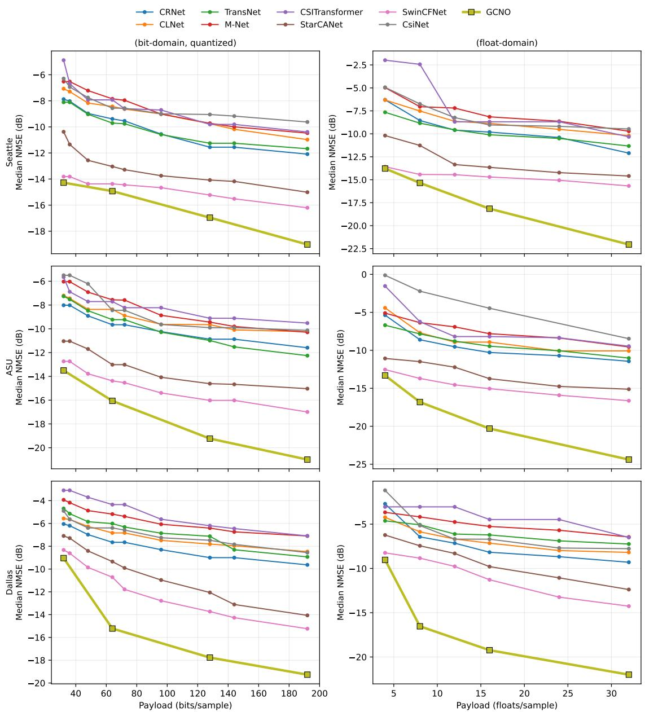  
Figure 5: Complete cross-scene rate–distortion curves. Rows correspond to Seattle, ASU, and Dallas; columns correspond to quantized bits and transmitted real values. This figure extends main-paper Fig. 3 and Table 1 rather than repeating their selected operating points. Lower and farther left is better.

## C.4 Protocol for the Array-Size Results in Main-Paper Fig. 4(b)

Main-paper Fig. 4(b) reports the complete numerical comparison; here we specify the corresponding evaluation protocol. The experiment uses seven receive–transmit array configurations: $1 6 \times 1 6 , 1 6 \times 3 2 , 3 2 \times 1 6 , 2 4 \times 2 4 , 3 2 \times 3 2 ,$ $3 2 \times 6 4 .$ , and $4 8 \times 4 8$ . The renderings are paired so that a given test index represents the same physical link at every array shape. Each shape uses the same locked split of 10,000 training, 2,000 validation, and 1,500 test channels. Evaluation is performed on the ordered, unshufled 1,500-channel test split. No target-shape test sample is used for training, fine-tuning, calibration, or operating-point selection.

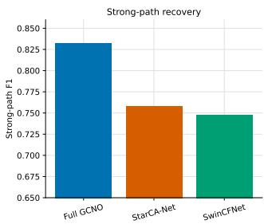

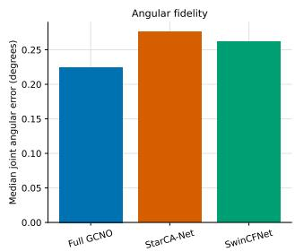  
Figure 6: Post-hoc multipath fidelity. Strong-path F1 measures joint support recovery, while median joint efectiveangle error measures directional accuracy. Higher is better for F1 and lower is better for angular error.

GCNO transfer. The GCNO checkpoint trained at $3 2 \times 3 2$ is applied directly to every target shape without updating any learned parameter. For each $( N _ { r } , N _ { t } )$ , we recompute the fixed steering and derivative dictionaries, matched-filter evidence, sample-specific receive and transmit Gramians, and analytical reconstruction responses at the target dimensions. The learned feature-mixing weights, Chebyshev coeficients, support head, and Taylor-ofset head remain unchanged. GCNO is therefore evaluated natively at each target resolution, rather than by resizing the target channel to the training dimensions.

Frozen neural baselines. The eight paired neural baselines—CsiNet, CRNet, CLNet, TransNet, MNet, CSI-Transformer, StarCANet, and SwinCFNet—use their existing ASU 75◦-field-of-view checkpoints trained at $3 2 \times 3 2$ with a fixed latent length of $M =$ 16 real values. Each model remains in its original $\phantom { 0 } { 3 2 } \times 3 2$ form: no layer, learned tensor, running statistic, latent dimension, or resolution-dependent architectural component is changed. Models are evaluated in inference mode, and each retains its training-split RMS normalization

$$
g _ { m } = \left[ \frac { 1 } { | T | } \sum _ { x \in \mathcal { T } } \frac { \| x \| _ { 2 } ^ { 2 } } { 2 \cdot 3 2 \cdot 3 2 } \right] ^ { - 1 / 2 } ,\tag{61}
$$

where $\tau$ is the $1 0 { , } 0 0 0 ^ { \cdot }$ -channel training split and m indexes the baseline. The input is multiplied by $g _ { m } ,$ and the decoder output is divided by the same fixed value. No normalization statistic is recomputed at a target array size.

Common deterministic baseline adapter. Let $H _ { \mathrm { n o r m } } \in$ $\mathbb { C } ^ { N _ { r } \times N _ { t } }$ be the normalized target channel and define its centered two-channel angular representation as

$$
X _ { N } = \mathrm { s t a c k } _ { \mathfrak { R } , \mathfrak { T } } \left\{ \mathrm { f f t s h i f t } \left[ \mathcal { F } _ { 2 , \mathrm { o r t h o } } ( H _ { \mathrm { n o r m } } ) \right] \right\} , N = ( N _ { r } , N _ { t } ) .\tag{62}
$$

For source shape $\boldsymbol { a } = \left( a _ { r } , a _ { t } \right)$ and destination shape $b =$ $\left( b _ { r } , b _ { t } \right)$ , the external adapter is

$$
\begin{array} { r } { A _ { a  b } ( X ) = \sqrt { \frac { a _ { r } a _ { t } } { b _ { r } b _ { t } } } B _ { a  b } ( X ) , } \end{array}\tag{63}
$$

where $\boldsymbol { B }$ bilinearly interpolates the real and imaginary channels with $\mathtt { a l i g n \_ c o r n e r s = F a l s e }$ . Antialiasing is enabled whenever a dimension is downsampled. If $a = b ,$ the implementation returns an exact clone, with no interpolation or antialiasing. The square-root factor compensates for the change in angular-grid size, and the reverse adapter uses its reciprocal.

For baseline $m ,$ the complete frozen inference path is

$$
z _ { m } = \mathcal { E } _ { m } ( g _ { m } \mathrm { ~ i f f t s h i f t } [ A _ { N  ( 3 2 , 3 2 ) } ( X _ { N } ) ] ) ,\tag{64}
$$

$$
\widehat X _ { N } = { \cal A } _ { ( 3 2 , 3 2 )  N } ( \mathrm { f f t s h i f t } [ g _ { m } ^ { - 1 } { \cal D } _ { m } ( z _ { m } ) ] ) ,\tag{65}
$$

where ${ \mathcal { E } } _ { m }$ and $\mathcal { D } _ { m }$ are the unchanged encoder and decoder. The reconstructed angular representation is finally mapped back to the channel domain using the inverse centered orthonormal two-dimensional DFT.

Table 15 lists the resulting size factors and antialiasing operations. “Forward” denotes target-to-32 × 32 adaptation, and “reverse” denotes $3 2 \times 3 2 – \mathrm { t o }$ -target adaptation.

The adapter is deterministic, parameter-free, and carries no side information. The baseline payload is always 16 real values, giving compression $2 N _ { r } N _ { t } \mathrm { \bar { / 1 6 } }$ . At the native $3 2 \times 3 2$ shape, both adapter directions are exact identities, providing the source-resolution control. Thus, the comparison in main-paper Fig. 4(b) evaluates reuse of frozen models under one common nonlearned dimension-matching rule, rather than models retrained separately for each array configuration. Its scope is limited to the seven tested uniform-lineararray shapes and does not imply invariance to arbitrary array layouts or calibration changes.

## C.5 Cross-Scene Transfer Without Retraining

We further test whether a compressor trained in one propagation scene remains useful in another (Table 16). For each ordered source–target pair among Dallas, Seattle, and ASU, each model is trained only on the source scene and evaluated on the held-out target-scene test split with all learned parameters frozen. No target-scene retraining or fine-tuning is performed. All methods use the nominal 16-value operating point. GCNO reconstructs only from its transmitted path tuples and LS gains, whereas SwinCFNet and StarCANet use their unchanged paired decoders.

GCNO obtains the lowest median NMSE in all six transfer directions, improving over SwinCFNet by 0.166–8.439 dB. This supports the narrower conclusion that its physicsaligned support representation and analytical reconstruction transfer more robustly under the tested scene shifts than the paired latent-code baselines. The result is consistent with, but does not by itself prove, reduced dependence on scenespecific statistics; it does not imply invariance to arbitrary propagation environments.

Table 15: Deterministic input/output adapter used for every frozen neural baseline in main-paper Fig. 4(b). AA denotes antialiasing. The latent payload remains 16 real values for every array shape.
<table><tr><td>Target shape</td><td>Forward scale</td><td>Forward AA</td><td>Reverse scale</td><td>Reverse AA</td><td>Payload</td><td>Compression</td></tr><tr><td> $\overline { { 1 6 \times 1 6 } }$ </td><td> $\overline { { 1 / 2 } }$ </td><td>No</td><td> $\overline { { 2 } }$ </td><td>Both dimensions</td><td>16</td><td>32×</td></tr><tr><td> $1 6 \times 3 2$ </td><td> $1 / \sqrt { 2 }$ </td><td>No</td><td> $\sqrt { 2 }$ </td><td>Receive dimension</td><td>16</td><td>64×</td></tr><tr><td> $3 2 \times 1 6$ </td><td> $1 / \sqrt { 2 }$ </td><td>No</td><td> $\sqrt { 2 }$ </td><td>Transmit dimension</td><td>16</td><td>64×</td></tr><tr><td> $2 4 \times 2 4$ </td><td> $\dot { 3 } / 4$ </td><td>No</td><td> $4 / 3$ </td><td>Both dimensions</td><td>16</td><td>72×</td></tr><tr><td> $3 2 \times 3 2$ </td><td> $1$ </td><td>Exact identity</td><td>1</td><td>Exact identity</td><td>16</td><td>128×</td></tr><tr><td> $3 2 \times 6 4$ </td><td> $\sqrt { 2 }$ </td><td>Transmit dimension</td><td> $1 / \sqrt { 2 }$ </td><td>No</td><td>16</td><td>256×</td></tr><tr><td> $4 8 \times 4 8$ </td><td> $3 / 2$ </td><td>Both dimensions</td><td> $2 / 3$ </td><td>No</td><td>16</td><td>288×</td></tr></table>

Table 16: Cross-scene median NMSE (dB) at the nominal 16-value operating point. Lower is better.
<table><tr><td>Source → target</td><td>GCNO</td><td>SwinCFNet</td><td>StarCANet</td></tr><tr><td>Dallas → Seattle</td><td>-14.203</td><td>-14.037</td><td>-11.799</td></tr><tr><td>Dallas → ASU</td><td>-14.815</td><td>-10.490</td><td>-9.747</td></tr><tr><td>Seattle → Dallas</td><td>-14.197</td><td>-7.146</td><td>-6.572</td></tr><tr><td>Seattle → ASU</td><td>-15.191</td><td>-9.560</td><td>-9.522</td></tr><tr><td>ASU → Dallas</td><td>-15.401</td><td>-6.962</td><td>-6.308</td></tr><tr><td>ASU → Seattle</td><td>-15.821</td><td>-12.932</td><td>-11.092</td></tr></table>

## C.6 Beamforming Utility

We next test whether the reconstructed channel preserves the dominant transmit subspace used in a standard beamforming calculation. Channels are normalized to unit Frobenius norm. For one stream, the precoder is the dominant right singular vector of the reconstructed channel. For two streams, the two dominant right singular vectors are assigned equal power. In both cases, the receiver uses the optimal combiner for the original efective channel. Perfect CSI is included only as a dense reference. GCNO uses 14.636/12/32 mean/median/95th-percentile transmitted values, whereas each neural comparator uses 16 values for every channel.

Table 17 reports mean spectral eficiency. At 20 dB, GCNO obtains 6.5319 bit/s/Hz for one stream, within approximately 0.004 bit/s/Hz of perfect CSI and above both compressed baselines. For two streams, GCNO obtains 6.8240 bit/s/Hz, compared with 6.9644 bit/s/Hz for perfect CSI. The squared alignment of the dominant right singular vector has mean 0.9973, median 0.9995, and fifth percentile 0.9901. These results support preservation of the dominant transmit subspace under this single-user, narrowband, optimal-combiner protocol; they do not establish the same behavior for multiuser scheduling, other precoders, receiver mismatch, or imperfect channel estimation.

## C.7 Seattle Seed Stability under a Baseline-Favorable Envelope

Seattle has the smallest separation between GCNO and the strongest neural baseline in the main comparison. We therefore use it for a targeted seed-sensitivity check rather than repeating the experiment in every environment. Three GCNO runs, using seeds 43, 44, and 45, are evaluated on the same fixed 1,500-channel test split (Table 18.

Table 17: Mean spectral eficiency (bit/s/Hz). Bold marks the strongest compressed method; perfect CSI is a dense reference.
<table><tr><td>Method</td><td>0 dB</td><td>10 dB</td><td>20 dB</td><td>30 dB</td></tr><tr><td colspan="3">One stream</td><td></td><td></td></tr><tr><td>GCNO StarCANet</td><td>0.9411 0.9204</td><td>3.3452 3.2864</td><td>6.5319 6.4447</td><td>9.8395 9.7381</td></tr><tr><td>SwinCFNet</td><td>0.9212</td><td>3.2875</td><td>6.4488</td><td>9.7480</td></tr><tr><td>Perfect CSI</td><td>0.9428</td><td>3.3488</td><td>6.5360</td><td>9.8437</td></tr><tr><td></td><td></td><td>Two streams</td><td></td><td></td></tr><tr><td>GCNO StarCANet</td><td>0.5871 0.5665 0.5725</td><td>2.7846 2.6629 2.7050</td><td>6.8240 6.3938</td><td>12.0669 11.1730</td></tr></table>

Table 18: GCNO seed-level median NMSE across three seeds. All values are in dB.
<table><tr><td>Payload</td><td>Seed 43</td><td>Seed 44</td><td>Seed 45</td><td>µ±σ</td></tr><tr><td>8</td><td>-15.5861</td><td>-15.0772</td><td>-15.1942</td><td> $- 1 5 . 2 8 5 8 \pm 0 . 2 6 6 6$ </td></tr><tr><td>16</td><td>-18.6382</td><td>-17.1041</td><td>-17.6077</td><td> $- 1 7 . 7 8 3 3 \pm 0 . 7 8 2 0$ </td></tr><tr><td>32</td><td>-22.4733</td><td>-20.3709</td><td>-19.9455</td><td> $- 2 0 . 9 2 9 9 \pm 1 . 3 5 3 4$ </td></tr></table>

We construct a deliberately baseline-favorable comparison (Table 19). For each baseline and nominal payload target, we retain the single lowest NMSE obtained across its three evaluated seeds. The selected baseline seed may therefore change independently at each operating point. By contrast, each GCNO seed represents one trained model evaluated across all three payload targets. Because the realized adaptive GCNO payloads difer slightly within a nominal target, we also retain the most favorable baseline value among the corresponding matched-payload comparisons. This protocol is stricter than either averaging the baseline seeds or retaining one baseline seed over the full curve.

Here, $\Delta = \mathrm { N M S E } _ { \mathrm { b a s e l i n e } } - \mathrm { N M S E } _ { \mathrm { G C N O } }$ , so a positive value indicates lower NMSE for GCNO, and min $\bar { \Delta }$ is the smallest margin over the three GCNO runs. The ordering remains unchanged for every GCNO seed, payload target, and comparator, despite allowing each baseline to use its strongest seed independently at every operating point. The smallest observed margin is 0.6463 dB over SwinCFNet and 2.9808 dB over StarCANet. At the 16- and 32-value targets, the minimum margins over SwinCFNet increase to 2.4028 and 4.1635 dB, respectively. This targeted check indicates that the Seattle ordering is not attributable to one favorable GCNO initialization within the evaluated runs; it is not intended as an exhaustive characterization of all possible random seeds.

Table 19: Baseline-favorable best-seed results at each target payload. All values are in dB.
<table><tr><td>Target</td><td>Comparator</td><td>Best NMSE</td><td>min ∆</td></tr><tr><td>8</td><td>SwinCFNet</td><td>-14.4309</td><td>+0.6463</td></tr><tr><td>8</td><td>StarCANet</td><td>-12.0964</td><td>+2.9808</td></tr><tr><td>16</td><td>SwinCFNet</td><td>-14.7013</td><td>+2.4028</td></tr><tr><td>16</td><td>StarCANet</td><td>-14.0868</td><td>+3.0173</td></tr><tr><td>32</td><td>SwinCFNet</td><td>-15.7820</td><td>+4.1635</td></tr><tr><td>32</td><td>StarCANet</td><td>-14.7140</td><td>+5.2315</td></tr></table>