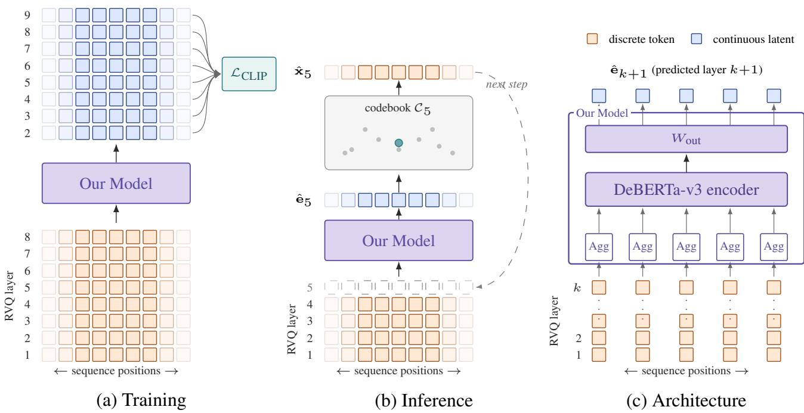

# GEOMETRIC ITERATIVE RETRIEVAL FOR NEURAL AUDIO CODEC RESYNTHESIS

Leo Schmidt-Traub Frédéric Berdoz Luca A. Lanzendörfer Roger Wattenhofer

ETH Zurich

{leoschmidt, fberdoz, lanzendoerfer, wattenhofer}@ethz.ch

## ABSTRACT

Neural audio codecs based on Residual Vector Quantization (RVQ) have become the dominant discrete representation for token-based general audio generation, yet resynthesizing high-quality audio from coarse codec tokens remains an open problem and bounds the fidelity of every system that generates them. Prior work has framed resynthesis as a choice between discrete token prediction and continuous regression. We argue that this dichotomy is incomplete and introduce geometric iterative retrieval, a paradigm that uses the RVQ layer hierarchy itself as a natural iterative decomposition in continuous codebook space. Rather than classifying over discrete vocabularies or regressing to a single target vector, our method performs contrastive retrieval in the codebook’s geometric space. We evaluate our method on codec restoration tasks across speech and music, and show improvements over both single-pass token prediction and one-step regression baselines.

## 1. INTRODUCTION

Neural audio codecs based on Residual Vector Quantization [1–4] have become a key component of modern audio generation. Systems for speech synthesis [5], music generation [6], and general audio modeling [7] all transform audio into sequences of discrete tokens via RVQ, then generate these tokens with language-model-style architectures. RVQ encodes information at decreasing granularity, where the first codebook captures coarse structure and subsequent layers add progressively finer detail. Most work tackles the problem of RVQ generation by having a large model generate the first layer, and a separate, smaller model generate higher layers from the first.

Liu et al. [8] showed that the choice of resynthesis strategy significantly impacts output quality. They identified two existing paradigms and their characteristic failure modes: Token prediction treats resynthesis as iterative classification over discrete codebook indices, predicting tokens layer by layer. It naturally respects the codec hierarchy but is geometry-blind, treating all incorrect codebook entries as equally wrong regardless of their distance from the target. One-step regression operates in continuous space, predicting the full latent representation in a single forward pass. It is geometrically informed but commits to a single global prediction with no iterative correction. Using meansquared error as an objective for regression also leads to mean-seeking behavior and over-smoothing, which, due to the highly non-linear nature of the neural audio codec’s output projection, leads to suboptimal performance. Liu et al. proposed Schrödinger Bridge diffusion as a possible solution. However, diffusion imposes an iterative structure (a noise schedule) that is independent of the codec’s own hierarchy.

<table><tr><td></td><td>Single-step</td><td>Iterative</td></tr><tr><td>Discrete</td><td>(degenerate)</td><td>Token prediction</td></tr><tr><td>Continuous</td><td>Regression</td><td>Diffusion / Retrieval (ours)</td></tr></table>

Table 1. Codec resynthesis methods organized along two axes, the prediction space (discrete vs. continuous) and the refinement strategy (single-step vs. iterative). Prior work occupies three of the four cells. Our method shares the continuous-iterative cell with diffusion, but iterates along the codec’s own RVQ hierarchy rather than along an externally imposed noise schedule, giving each step a meaning grounded in the codec rather than in the sampler.

We observe that the design space is not a spectrum from token prediction to regression but a two-dimensional grid (Table 1), spanning two axes: whether the prediction space is discrete or continuous, and whether refinement is singlestep or iterative. The bottom-right cell, iterative prediction in continuous space, is what we explore in this paper. Diffusion methods occupy this cell with a noise-schedule iteration that is independent of the codec structure. We show that the RVQ hierarchy itself provides a natural, semantically meaningful decomposition that offers an alternative to diffusion’s denoising schedule, where each step corresponds to one level of refinement aligned with the codec’s own structure.

We introduce geometric iterative retrieval, 1 a resynthesis paradigm that is distinct from both token prediction and regression. Each of our D−1 steps predicts a specific RVQ layer with a specific role in the codec hierarchy, trained with a CLIP-style contrastive loss [9] that respects codebook geometry. A self-attention aggregator further replaces the additive assumption of standard RVQ decoding [10] with learned, non-additive combinations of previously predicted layers.

Our contributions can be summarized as follows:

• We propose geometric iterative retrieval, a method for predicting in the space of per-layer continuous codebooks, trained with a CLIP-style contrastive objective, and conditioned on previous layers via a learned non-additive aggregator that replaces RVQ’s additive residual assumption.

• An empirical study on DAC codec restoration across speech and music. Our method attains the best LSD against every learned baseline and is preferred by listeners in a double-blind human evaluation test over single-pass token-prediction, MSE-regression, and cosine-regression baselines.

## 2. RELATED WORK

Neural audio codecs have become the dominant discrete representation for audio generation and processing, enabling systems that cast speech synthesis, music generation, and audio enhancement as language modeling over codec tokens [5–7]. These systems typically decompose audio into multiple layers of tokens via Residual Vector Quantization (RVQ), and then focus their modeling effort on producing the first layer, leaving the recovery of remaining layers as a secondary problem. Yet the choice of resynthesis strategy has significant impact on output quality [8].

## 2.1 Neural Audio Codecs and RVQ

RVQ [1] decomposes a continuous latent $\mathbf { z } \in \mathbb { R } ^ { d }$ into D layers of codebook vectors $\mathbf e _ { k } \in \mathcal C _ { k } = \{ \mathbf c _ { k } ^ { ( 1 ) } , \dots , \mathbf c _ { k } ^ { ( V ) } \}$ where $\begin{array} { r } { \hat { \textbf { z } } = ~ \sum _ { k = 1 } ^ { D } \mathbf { e } _ { k } ; } \end{array}$ layer 1 captures coarse spectral structure and subsequent layers encode progressively finer residual detail. This paradigm was established by Sound-Stream [2] and extended by EnCodec [3]. The Descript Audio Codec (DAC) [4], which we use throughout this work, performs lookup in a low-dimensional space and achieves state-of-the-art fidelity, particularly for music.

Liu et al. [8] showed that one-shot regression on the latent z performs better than single-pass discrete token prediction. Our method builds on this insight but takes a different approach: rather than targeting z directly, we predict individual codebook vectors $\mathbf { e } _ { k }$ layer by layer. We use a contrastive learning objective, inspired by CLIP [9], which showed that contrastive learning over a shared embedding space can replace explicit classification. We apply the same principle to codebook lookup, treating each prediction as retrieval over codebook entries rather than classification among them.

Masked generative models such as SoundStorm [10] and MaskGCT [11] refine tokens over multiple maskeddecoding passes, each refinement remaining a prediction over discrete codebooks. They therefore occupy the same discrete-iterative cell of Table 1 as our token-prediction, which is why we do not compare against them.

## 2.2 Coarse-to-Fine Token Prediction

The dominant resynthesis approach treats the problem as iterative discrete classification. Given tokens from layers $1 , \ldots , k { - } 1$ , a model predicts the codebook index for layer k by classifying over V entries using cross-entropy loss. This paradigm is used in AudioLM’s fine acoustic stage [7], VALL-E’s non-autoregressive model [5], and SoundStorm’s parallel decoding [10].

Token prediction naturally respects the codec hierarchy and is iterative by design. However, the cross-entropy objective is geometry-blind, treating all incorrect codebook entries as equally wrong. The objective carries no explicit geometric signal: predicting an entry geometrically close to the target incurs the same loss as predicting one on the opposite side of the codebook space. For the task of codec resynthesis, a single misprediction in earlier layers propagates down to others, leading to poor reconstruction. The discrete, single-step variant, predicting all layers independently in parallel, sacrifices inter-layer conditioning and is generally inferior, due to an exploding vocabulary size.

The alternative operates in continuous space, predicting the full latent representation in a single forward pass using MSE or cosine similarity loss. Liu et al. [8] showed that directly targeting the latent z via one-shot regression outperforms coarse-to-fine prediction on codec resynthesis, and Kammoun et al. [12] independently confirmed that continuous latent prediction consistently outperforms single-pass discrete token prediction for speech enhancement in the codec space. Du et al. [13] similarly motivate their one-step regression vocoder by the “multi-modal distribution nature of codec tokens,” which they identify as the obstacle to iterative discrete prediction.

The fundamental limitation of one-step regression is statistical: it encourages mean-seeking behavior rather than committing to a single mode. Given only coarse tokens, the posterior over fine-grained details is typically multimodal, with multiple plausible high-frequency realizations consistent with the same coarse structure. The MSE-optimal prediction under a multimodal posterior is the conditional mean, which averages over modes rather than committing to any one of them. An alternative is predicting the layers of all codebooks in parallel. Since DAC, and neural audio codecs at large, use codebooks with a fixed length at each layer [4], we compute the cosine similarity at each layer and quantize based on orientation rather than magnitude. This approach works significantly better, but has the disadvantage of sacrificing inter-layer conditioning.

## 2.3 Diffusion and Flow-Based Methods (Continuous, Iterative, Codec-Agnostic)

Diffusion and flow-based methods work by iterating in the continuous space. Liu et al. [8] proposed Schrödinger Bridges that transport from a degraded codec representation to a high-quality target distribution, and A2SB [14] extended this to end-to-end 44.1 kHz music restoration. Diffusion vocoders such as DiffWave [15] and Multi-Band Diffusion [16] generate waveforms conditioned on codec features, while flow matching approaches [17, 18] offer an alternative iterative framework.

These methods do exhibit emergent coarse-to-fine behavior, where high noise levels correspond to coarse structure and low noise levels to fine detail, but this correspondence is implicit and not aligned to the codec’s own discrete hierarchy. The denoising schedule is independent of the RVQ layer decomposition.

## 3. METHODOLOGY

We implement geometric iterative retrieval as a layer-wise prediction model over DAC’s RVQ stack, trained with a contrastive retrieval objective and a self-attention aggregator (see Figure 1c). Figure 1(a,b) illustrates the overall training and inference pipeline.

## 3.1 Problem Formulation

Given the first-layer codebook tokens $\mathbf { x } _ { 1 } \in \{ 1 , \ldots , V \} ^ { T }$ of an audio segment, the task is to predict the remaining codebook vectors $\mathbf { e } _ { 2 } , \ldots , \mathbf { e } _ { D } \in \mathbb { R } ^ { T \times d }$ such that the decoded audio quality is maximized. The prediction target is the sequence of per-layer codebook vectors $\mathbf { e } _ { k }$ rather than discrete indices or the full pre-quantized embedding $\mathbf { z } .$ This choice is what enables our approach: operating in $\mathbb { R } ^ { d }$ grants access to the codebook’s geometric structure, whilst the per-layer decomposition preserves a semantically meaningful iterative axis.

## 3.2 Architecture

The backbone of our model is a bidirectional DeBERTav3 [19] transformer encoder with 12 layers and hidden dimension 1536. Tokens at each layer are mapped to hidden states via a per-layer, learned embedding table. A single prediction head projects the transformer output to the codebook dimension d.

Self-Attention Codebook Aggregation. Standard RVQ decoding reconstructs the latent as the sum $\hat { \textbf { z } } = \sum _ { k }$ ek. This additive assumption is an architectural constraint of the codec, not a property we need to preserve when conditioning on previously predicted layers. We replace summation with an attention module on the embeddings of layers $1 , \ldots , k { - } 1$ . This lets the model weight earlier layers nonuniformly and capture cross-layer dependencies that pure summation cannot represent.

## 3.3 Training Objective

All D−1 residual layers are predicted in a single forward pass with causal masking along the codebook axis, this results in one pass supplying ground-truth conditioning from lower layers while producing predictions for all higher layers simultaneously.

The training loss is a CLIP-style symmetric contrastive loss [9] between predicted and target codebook vectors.

For each layer k and each position in the batch, the predicted vector $\hat { \mathbf { e } } _ { k }$ must be closer in cosine similarity to the true codebook vector $\mathbf { e } _ { k }$ than to any other codebook vector drawn from the batch. A learnable temperature parameter controls the sharpness of the contrastive distribution.

## 3.4 Inference

At inference, layers are predicted autoregressively along the codebook axis: $\hat { \mathbf { e } } _ { 2 }$ is predicted from $\mathbf { x } _ { 1 } ,$ then ${ \hat { \mathbf { e } } } _ { 3 }$ from $( \mathbf { x } _ { 1 } , \hat { \mathbf { x } } _ { 2 } )$ , and so on through $\hat { \mathbf { e } } _ { D } .$ , where $\hat { \mathbf { x } } _ { k }$ is the closest codebook in $\mathcal { C } _ { k }$ to $\hat { \mathbf { e } } _ { k } .$ . The resulting stack $\big ( \mathbf { x } _ { 1 } , \hat { \mathbf { x } } _ { 2 } , \ldots , \hat { \mathbf { x } } _ { D } \big )$ is passed through DAC’s frozen per-layer output projections, summed to form the latent representation, and decoded by DAC’s frozen decoder. The full inference procedure requires D−1 deterministic steps, matching the step count of discrete coarse-to-fine prediction.

## 4. EXPERIMENTAL SETUP

We evaluate geometric iterative retrieval on codec restoration, the canonical fidelity-driven resynthesis task: given the first RVQ layer of a ground-truth codec token stream, predict the remaining layers, decode, and measure the gap to the full D-layer reconstruction.

## 4.1 Codec

All experiments use the 44.1 kHz Descript Audio Codec [4] with $D = 9$ RVQ layers, codebook size $V =$ 1024, and codebook dimension $d _ { c } ~ = ~ 1 0 2 4$ . DAC performs lookup and quantization in a low-dimensional space, making the effective dimension we use for our predictions $d \ : = \ : 8$ . DAC’s encoder, quantizer, and decoder remain frozen throughout.

## 4.2 Datasets

Training and evaluation use three corpora spanning speech and music: MTG-Jamendo [20], Common Voice [21], and FMA [22]. Each corpus is tokenized with DAC once offline. We hold out a 10 % random validation split per corpus (seed 42). All benchmark numbers are computed on these validation splits. Training mixes the three corpora with sampling weights 10 : 1 : 2 (Jamendo : CV : FMA) to balance different average sample lengths. Each training sample is a 128-frame random crop of the token sequence.

## 4.3 Architecture and Training

The backbone is a 12-layer DeBERTa-v3 [19] encoder with hidden dimension 1536. The codebook aggregator uses 4- head attention at the same dimension, and the output head projects to the codebook dimension $d = 8 .$ . We train with AdamW (learning rate $5 \times 1 0 ^ { - 5 }$ , weight decay $5 \times 1 0 ^ { - 2 } )$ ), a linear warmup over the first 10k steps followed by cosine decay to $1 0 ^ { - 6 }$ over 200k total steps, batch size 16, and bf16 mixed precision. The CLIP-style contrastive loss (Section 3.3) uses a learnable temperature. All D − 1 residual layers are predicted in one forward pass via causal masking along the codebook axis.

  
Figure 1. Combined view of geometric iterative retrieval. (a) During training, the model predicts layers $2 , \ldots , D$ from the masked input stack in a single forward pass, supervised by a CLIP-style contrastive loss per predicted layer. (b) At inference, layer $k + 1$ is predicted from layers $1 , \ldots , k ,$ quantized by nearest-neighbor lookup against the layer-k + 1 codebook, and concatenated for the next step. (c) Architecture: per-position codebook embeddings are aggregated by selfattention into one hidden state, processed by the DeBERTa-v3 encoder, and projected by $W _ { \mathrm { o u t } }$ into the codebook space. Orange = discrete tokens, blue = continuous latents.

## 4.4 Baselines and Ablations

We compare against various baselines and ablations. All models are trained on the same datasets for 24 hours using four NVIDIA RTX A6000s.

Naive first-layer decode. Decode only the given layer through DAC. This is the zero-cost lower bound for any resynthesis method.

One-step continuous regression (OSR). A DeBERTa-v3 encoder of the same capacity as ours, trained to regress the pre-quantized latent z in a single forward pass with cosinesimilarity loss. Instead of predicting a d-dimensional vector at each pass, it predicts a (D−1)×d-dimensional vector that is chunked into D − 1 codebook predictions.

MSE one-step regression. Same DeBERTa-v3 backbone as OSR but trained with mean-squared-error loss directly on the summed residual codebook latent $\sum _ { k = 2 } ^ { D } \mathbf { e } _ { k }$ , and decoded at inference by greedy per-layer nearest-neighbor assignment in the codebook.

Token prediction (CE). A 9-layer Llama-style decoder transformer (hidden 1536, 24 attention heads) trained with next-token cross-entropy over a vocabulary of $D \cdot V =$ 9216 offset tokens, where layer-k indices are shifted by k · V before flattening. Layer 1 is supplied as context and the remaining indices are decoded layer-by-layer.

Full-residual variant (ablation). Same backbone and contrastive objective as ours, but predicting the cumulative residuals $\sum _ { j = k + 1 } ^ { D ^ { - } } \mathbf { e } _ { j }$ rather than $\mathbf { e } _ { k + 1 }$

No-contrastive variant (ablation). Same backbone and per-layer target as ours, but trained with cosine-similarity regression to the true codebook vector rather than a contrastive loss over the codebook.

Additive aggregator (ablation). Same backbone as ours, but adds the codebook embeddings together instead of using the self-attention mechanism.

## 4.5 Evaluation Protocol

We evaluate every method on the validation split of each of the three corpora. We sample 500 clips uniformly at random per corpus. Inputs are the ground-truth first-layer codes, and the reference is the 9-layer DAC reconstruction of the same clip. The gap therefore reflects only resynthesis error, not DAC’s own quantization loss. We additionally report a layer-progression analysis in Section 5.2.

We use three objective metrics for evaluating predictions, log-spectral distance (LSD) [23], SI-SDR [24], and Fréchet Audio Distance (FAD) [25, 26]. We use LSD as our primary objective metric.

## 5. RESULTS

## 5.1 Codec Restoration

Table 2 reports the three metrics for all baselines and our method. The naive first-layer decode establishes the zerocost floor: the gap it leaves to the full-layer reference quantifies how much information is carried by the residual layers and therefore how much a resynthesis method can possibly recover.

<table><tr><td>Method</td><td>LSD↓</td><td>SI-SDR↑</td><td>FAD↓</td></tr><tr><td>Naive</td><td> $1 0 . 8 2 { \pm } 0 . 0 8 $ </td><td> $- 1 . 8 8 { \pm } 0 . 2 4$ </td><td>0.99</td></tr><tr><td>CE</td><td> $\overline { { 1 2 . 4 2 \pm 0 . 2 0 } }$ </td><td> $- 6 . 9 3 { \pm } 0 . 3 0$ </td><td>2.46</td></tr><tr><td>OSR</td><td> $1 1 . 0 3 { \pm } 0 . 0 7$ </td><td> $\mathbf { - 0 . 2 2 \pm 0 . 2 7 }$ </td><td>0.61</td></tr><tr><td>MSE</td><td> $1 2 . 8 6 { \pm } 0 . 2 2$ </td><td> $- 7 . 8 3 { \pm } 0 . 3 0$ </td><td>3.08</td></tr><tr><td>Ours</td><td> $\mathbf { 1 0 . 6 1 \pm 0 . 0 7 }$ </td><td> $- 0 . 6 3 { \pm } 0 . 2 8 $ </td><td>0.94</td></tr></table>

Table 2. Codec restoration results on the combined val split (1500 clips). Lower is better for LSD and FAD, higher is better for SI-SDR. Best per column in bold, second-best underlined. LSD and SI-SDR are reported as mean ± halfwidth of the 95 % normal CI over the 1500 clips. FAD is a single set-level number per cell and admits no per-sample CI. OSR is one-step, layer-wise regression under cosinesimilarity loss. MSE is the same backbone trained with MSE against the residual codebook latent.

Three observations are noteworthy. (i) Our method wins the primary metric against every learned baseline. It attains the best LSD and beats the CE tokenprediction baseline and the MSE one-step baseline on all three metrics. OSR achieves the best SI-SDR and FAD on this table. Our advantage on the objective metrics is concentrated on LSD, and the listening study (Section 5.3) is what most clearly separates the two methods. (ii) The continuous single-step cell is split by the choice of loss. OSR (cosine-similarity) sits near the naive first-layer floor on LSD and beats it on SI-SDR/FAD, whereas MSE performs poorly. This is the conditional-mean minimizer of Section 2.2 made concrete. Under a multimodal posterior, MSE regresses toward zero rather than committing to any mode. Due to the highly non-linear nature of the output projection, this leads to poor reconstruction. (iii) Discrete iterative prediction underperforms continuous iterative prediction by a wide margin. The CE baseline underperforms with 1.81 dB compared to our approach on LSD and 6.30 dB worse on SI-SDR: a geometry-blind classification loss cannot exploit near-misses, confirming the argument of Section 2.2.

Against the naive first-layer decode our approach wins on all three metrics: LSD (10.61 vs. 10.82), SI-SDR $\left( - 0 . 6 3 \ \mathrm { v s . \ } - 1 . 8 8 \right)$ , and FAD (0.94 vs. 0.99). The layerprogression analysis of Section 5.2 localises this gain to the first two predicted layers. Beyond $K { = } 3 ,$ , accumulated prediction error outweighs the residual signal each new layer is meant to encode.

## 5.2 Layer-Progression Analysis

To isolate the contribution of each predicted residual layer, we decode our predictions truncated to the first K layers for $K \in \{ 1 , \ldots , D \}$ and score each truncation against the full D-layer reference (Table 3). This exposes how much of the overall gain comes from each step of the iterative retrieval process.

All three metrics peak at K=3 or earlier, and degrade monotonically thereafter, with FAD more than doubling from K=3 (0.43) to $K { = } 9 \ ( 0 . 9 4 )$ . Each predicted layer contributes both signal (the next codec residual) and noise from its own prediction error, and past $K { = } 3$ the second outweighs the first. The truncated K=3 decode therefore dominates the full $K { = } D$ decode on every spectral metric. One possible explanation is that, since codebooks at each layer have uniform length [4], the model can only choose the direction, not the norm, of the next prediction. This forces the model to commit to a mode, increasing spectral distance on average. We investigate whether this truncation also matches perceptually in the next section.

<table><tr><td>K</td><td>LSD↓</td><td> $\mathrm { S I - S D R \uparrow }$ </td><td>FAD↓</td></tr><tr><td>1 (input only)</td><td>10.81</td><td> $- 1 . 8 8$ </td><td>0.99</td></tr><tr><td>2</td><td> $1 0 . 2 6 ( - 5 . 1 \% )$ </td><td> $- 0 . 3 4 \ : ( + 8 2 \% )$ </td><td> $\mathbf { 0 . 4 3 } \ ( - 5 7 \% )$ </td></tr><tr><td>3</td><td> $\mathbf { 1 0 . 2 0 \ ( - 5 . 6 \% ) }$ </td><td> $- \mathbf { 0 . 2 2 } _ { \mathrm { ~ ( + 8 8 \% ) ~ } }$ </td><td> $\mathbf { 0 . 4 3 \ ( - 5 7 \% ) }$ </td></tr><tr><td>4</td><td> $1 0 . 2 3 ( - 5 . 4 \% )$ </td><td> $- 0 . 3 0 \ ( + 8 4 \% )$ </td><td> $0 . 5 6 \ ( - 4 3 \% )$ </td></tr><tr><td>5</td><td> $1 0 . 3 4 \ : ( - 4 . 3 \% )$ </td><td> $- 0 . 4 1 \ ( + 7 8 \% )$ </td><td> $0 . 6 9 \ ( - 3 0 \% )$ </td></tr><tr><td>6</td><td> $1 0 . 4 1 ~ ( - 3 . 7 \% )$ </td><td> $- 0 . 5 0 \ : ( + 7 3 \% )$ </td><td> $0 . 7 7 \ ( - 2 2 \% )$ </td></tr><tr><td>7</td><td> $1 0 . 4 9 \ ( - 3 . 0 \% )$ </td><td> $- 0 . 5 6 \ : ( + 7 0 \% )$ </td><td> $0 . 8 1 \ ( - 1 8 \% )$ </td></tr><tr><td>8</td><td> $1 0 . 5 5 ( - 2 . 4 \% )$ </td><td> $- 0 . 6 3 \ : ( + 6 6 \% )$ </td><td> $0 . 8 8 ( - 1 1 \% )$ </td></tr><tr><td>9</td><td> $1 0 . 6 1 \ ( - 1 . 9 \% )$ </td><td> $- 0 . 6 4 \ : ( + 6 6 \% )$ </td><td> $0 . 9 4 \ ( - 5 \% )$ </td></tr></table>

Table 3. Reconstruction quality as a function of the number of predicted residual layers K (layer 1 is the groundtruth input, layers $2 , \ldots , K$ are our predictions). All three objective metrics improve from K=1 through K=3 and then degrade monotonically, because each additional residual layer brings progressively less spectral signal while still injecting prediction noise of roughly the same magnitude. Beyond $K { = } 3 ,$ the noise outweighs the signal. Parenthesized values report the percentage change relative to the $K { = } 1$ input-only baseline. Best per column in bold.

## 5.3 Subjective Evaluation

We complement the objective metrics with a double-blind human evaluation on a diverse selection of nine 10-second clips drawn from the validation splits: 2 from MTG-Jamendo, 3 from FMA and 4 from Common Voice. Participants were recruited online 2 . For each clip, listeners rated the six conditions of Table 4 on a 0–100 quality scale against the original audio as an explicit reference. Nineteen listeners each rated all nine clips, yielding $1 9 \times 9 = 1 7 1$ within-listener-clip paired trials per condition. We additionally include a truncated variant of our method (K=3) motivated by the layer progression of Section 5.2, which decodes only the first two predicted residual layers. Table 4 reports the per-condition mean and 95 % confidence interval, together with the paired comparison against our method. The subjective ranking underscores the findings of the objective evaluations. Our method is preferred over every baseline by $\mathrm { a } \sim 1 1 { - } 4 7$ point margin in mean rating, with raters preferring it to OSR on 117 of 165 non-tied trials and to the discrete CE baseline on 164 of 170. The two cells of Table 1 that we argue to be fundamentally limited (discrete CE and continuous singlestep regression under MSE) are also the lowest-rated by listeners, scoring below the naive first-layer decode despite being trained predictors. This is a clear instantiation of the failure modes identified in Section 2. OSR avoids both pitfalls, but still trails our method by 11.2 points on average, isolating the contribution of the iterative codec-native retrieval paradigm itself. The truncated K=3 variant, which Section 5.2 flagged as a natural next step on the basis of objective metrics, trails the full K=9 decode by 5.3 points $( p \approx 1 . 1 { \times } 1 0 ^ { - 4 } )$ . This reverses the direction of the objective layer-progression. Spectral metrics prefer $K { = } 3 .$ listeners prefer $K { = } D$ . Empirically, $K = D$ produces a smoother sound, with less harsh and crackly artifacts. We read this as a feature of the codec-native iterative paradigm rather than a defect, in that lower K is better for overall spectral fidelity (pure retrieval), whilst using the entire D layers yields better sounding samples, which is an advantage for generative tasks.

<table><tr><td>Condition</td><td>Mean (95% CI)</td><td>∆</td><td>W/L</td></tr><tr><td>Naive</td><td>23.8 [21.0, 26.7]</td><td>+31.4</td><td>19/148</td></tr><tr><td>CE</td><td>9.1 [7.5, 10.7]</td><td>+45.5</td><td>6/164</td></tr><tr><td>MSE</td><td>7.6 [5.7, 9.6]</td><td> $+ 4 6 . 8$ </td><td>7/164</td></tr><tr><td>OSR</td><td>43.4 [39.7, 47.1]</td><td> $+ 1 1 . 2$ </td><td>48/117</td></tr><tr><td>Ours (K=3)</td><td>49.3 [45.7, 52.8]</td><td> $+ 5 . 3$ </td><td>64/ 99</td></tr><tr><td>Ours</td><td>54.0 [50.1, 57.9]</td><td></td><td></td></tr></table>

Table 4. Double-blind human evaluation (19 raters $\times ~ 9$ clips). Higher is better. $\Delta$ is the mean per-trial difference (Ours − baseline). Wins/Losses count the trials in which the baseline scored above or below Ours (ties omitted). All five pairwise differences favor our method and are significant under a Wilcoxon signed-rank test (Naive, CE, MSE with $| z | > 9 . 7 ,$ $p < 1 0 ^ { - 2 1 }$ ; OSR with $| z | = 5 . 5 , p =$ $3 . 4 \times 1 0 ^ { - 8 }$ ; Ours (K=3) with $| z | = 3 . 9$ $p = 1 . 1 { \times } 1 0 ^ { - 4 } )$
<table><tr><td>Variant</td><td>LSD↓</td><td>SI-SDR↑</td><td>FAD↓</td></tr><tr><td>Ours</td><td> ${ \bf 1 0 . 6 1 \pm 0 . 0 7 }$ </td><td> ${ \bf - 0 . 6 3 \pm 0 . 2 8 }$ </td><td>0.94</td></tr><tr><td>Full-residual</td><td> $1 2 . 2 9 \pm 0 . 2 2$ </td><td> $- 4 . 2 2 \pm 0 . 3 2$ </td><td>1.14</td></tr><tr><td>No-contrastive</td><td> ${ \underline { { 1 0 . 7 5 } } } \pm 0 . 0 7$ </td><td> $- 1 . 1 7 \pm 0 . 3 1$ </td><td>0.99</td></tr><tr><td>Additive</td><td> $\overline { { 1 1 . 7 4 \pm 0 . 0 9 } }$ </td><td> $- 1 . 2 4 \pm 0 . 3 0$ </td><td>0.96</td></tr></table>

Table 5. Ablation results on the combined validation split. Each variant perturbs one component, the prediction target (per-layer $\mathbf { e } _ { k }$ vs. cumulative residual $\textstyle \sum _ { j = k + 1 } ^ { D } \mathbf { e } _ { j } )$ , the loss (contrastive retrieval vs. cosine regression to the codebook vector), or the layer-aggregation mechanism (self-attention vs. additive summation). Best per column in bold, secondbest underlined. LSD and SI-SDR are reported as mean ± half-width of the 95 % normal CI over the 1500 clips. FAD is a single set-level number per cell.

## 5.4 Ablations

We evaluate the three ablations from Section 4.4, each isolating one component of the proposed method. The results can be seen in Table 5.

Full-Residual vs. Per-Layer Target. Predicting cumulative residuals rather than per-layer codebook vectors is clearly worse, with a 1.7 dB LSD penalty and a 3.6 dB SI-SDR penalty. The per-layer target is what allows the contrastive retrieval objective to be anchored to individual codebook entries. Under the cumulative-residual target, the set of negatives (all codebook vectors in $\mathcal { C } _ { k } )$ is no longer geometrically aligned with the target (a sum of codebook vectors), and the retrieval signal collapses. This confirms that the per-layer decomposition is load-bearing, not an incidental architectural choice.

Contrastive vs. Cosine-Regression Objective. Replacing contrastive retrieval loss with direct cosine regression against the true codebook vector yields a small but consistent penalty: 0.14 dB on LSD, 0.54 dB on SI-SDR, and 0.05 on FAD (Table 5). The gap is smaller than the fullresidual ablation because the per-layer target already constrains the solution to the codebook geometry. The contrastive loss sharpens this by pushing predictions away from other codebook entries, not just toward the target.

Additive vs. Self-Attention Aggregator. Replacing the self-attention aggregator with the additive combination of previously predicted layer embeddings, as in [10], costs 1.13 dB on LSD, 0.61 dB on SI-SDR, and 0.02 on FAD (Table 5). Keeping the per-layer target and contrastive loss intact preserves most of the quality, but the additive prior is still noticeably worse than the attention-based combination at higher RVQ layers, where deviations from exact summation accumulate. This is consistent with the motivation of Section 3.2, in that the additive assumption is an architectural constraint of the codec’s decoder, not a property the model has to inherit when conditioning on its own previous predictions.

## 6. CONCLUSION

We argued that the design space for codec resynthesis is a two-dimensional grid spanning prediction space and refinement strategy, and that the continuous-iterative cell, occupied to date only by diffusion, admits a second instantiation that follows the codec’s own RVQ hierarchy rather than an externally imposed noise schedule. We instantiated this paradigm as geometric iterative retrieval, perlayer prediction in continuous codebook space trained with a CLIP-style contrastive objective and conditioned on previous layers through a learned non-additive self-attention aggregator. On DAC codec restoration, our method attains the best LSD against every learned baseline and is preferred by listeners, with the CE and MSE baselines rated below the naive first-layer decode. Ablations confirm that the per-layer target, the contrastive objective, and the self-attention aggregator each contribute. The layerprogression analysis exposes a tension between objective and subjective evaluation. All three objective metrics peak at $K { = } 3$ and then degrade monotonically, yet listeners prefer the full K=9 decode to the truncated variant. Higher residual layers contribute audible quality that LSD, SI-SDR, and FAD do not capture, which points to a need for codec-resynthesis-aware objective metrics that go beyond spectral fidelity. Beyond DAC, geometric iterative retrieval is codec-agnostic, and extending it to other RVQ codecs and to settings where the coarse layers are themselves generated rather than given is a natural next step.

## 7. REFERENCES

[1] B.-H. Juang and A. H. Gray, “Multiple stage vector quantization for speech coding,” in IEEE International Conference on Acoustics, Speech, and Signal Processing (ICASSP), 1982.

[2] N. Zeghidour, A. Luebs, A. Omran, J. Skoglund, and M. Tagliasacchi, “Soundstream: An end-to-end neural audio codec,” IEEE/ACM Transactions on Audio, Speech, and Language Processing, vol. 30, pp. 495– 507, 2022, arXiv:2107.03312.

[3] A. Défossez, J. Copet, G. Synnaeve, and Y. Adi, “High fidelity neural audio compression,” Transactions on Machine Learning Research, 2023, arXiv:2210.13438.

[4] R. Kumar, P. Seetharaman, A. Luebs, I. Kumar, and K. Kumar, “High-fidelity audio compression with improved RVQGAN,” in Advances in Neural Information Processing Systems (NeurIPS), 2023, arXiv:2306.06546.

[5] C. Wang, S. Chen, Y. Wu, Z. Zhang, L. Zhou, S. Liu, Z. Chen, Y. Liu, H. Wang, J. Li, L. He, S. Zhao, and F. Wei, “Neural codec language models are zero-shot text to speech synthesizers,” arXiv preprint arXiv:2301.02111, 2023.

[6] J. Copet, F. Kreuk, I. Gat, T. Remez, D. Kant, G. Synnaeve, Y. Adi, and A. Défossez, “Simple and controllable music generation,” in Advances in Neural Information Processing Systems (NeurIPS), 2023, arXiv:2306.05284.

[7] Z. Borsos, R. Marinier, D. Vincent, E. Kharitonov, O. Pietquin, M. Sharifi, D. Roblek, O. Teboul, D. Grangier, M. Tagliasacchi, and N. Zeghidour, “AudioLM: A language modeling approach to audio generation,” IEEE/ACM Transactions on Audio, Speech, and Language Processing, 2023, arXiv:2209.03143.

[8] A. H. Liu, Q. Wang, Y. Gong, and J. Glass, “A closer look at neural codec resynthesis: Bridging the gap between codec and waveform generation,” in NeurIPS 2024 Audio Imagination Workshop, 2024, arXiv:2410.22448.

[9] A. Radford, J. W. Kim, C. Hallacy, A. Ramesh, G. Goh, S. Agarwal, G. Sastry, A. Askell, P. Mishkin, J. Clark, G. Krueger, and I. Sutskever, “Learning transferable visual models from natural language supervision,” in International Conference on Machine Learning (ICML), 2021.

[10] Z. Borsos, M. Sharifi, D. Vincent, E. Kharitonov, N. Zeghidour, and M. Tagliasacchi, “SoundStorm: Efficient parallel audio generation,” arXiv preprint arXiv:2305.09636, 2023.

[11] Y. Wang, H. Zhan, L. Liu, R. Zeng, H. Guo, J. Zheng, Q. Zhang, X. Zhang, S. Zhang, and Z. Wu, “Maskgct: Zero-shot text-to-speech with masked generative codec

transformer,” in International Conference on Learning Representations 2025 (ICLR 2025), 2024.

[12] S. Kammoun, X. Alameda-Pineda, and S. Leglaive, “Modeling strategies for speech enhancement in the latent space of a neural audio codec,” arXiv preprint arXiv:2510.26299, 2024.

[13] Z. Du, J. Wang, Q. Chen, Y. Chu, Z. Gao, Z. Li, K. Hu, X. Zhou, J. Xu, Z. Ma, W. Wang, S. Zheng, C. Zhou, Z. Yan, and S. Zhang, “LauraGPT: Listen, attend, understand, and regenerate audio with GPT,” arXiv preprint arXiv:2310.04673, 2023.

[14] Z. Kong, K. J. Shih, W. Nie, A. Vahdat, S.-g. Lee, J. F. Santos, A. Jukic, and R. Valle, “A2SB: Audio-to-audio Schrödinger bridges,” arXiv preprint arXiv:2501.11311, 2025.

[15] Z. Kong, W. Ping, J. Huang, K. Zhao, and B. Catanzaro, “DiffWave: A versatile diffusion model for audio synthesis,” arXiv preprint arXiv:2009.09761, 2020.

[16] R. San Roman, Y. Adi, A. Deleforge, R. Serizel, G. Synnaeve, and A. Défossez, “From discrete tokens to high-fidelity audio using multi-band diffusion,” arXiv preprint arXiv:2308.02560, 2023.

[17] M. Le, A. Vyas, B. Shi, B. Karrer, L. Sari, R. Moritz, M. Williamson, V. Manohar, Y. Adi, J. Mahadeokar, and W.-N. Hsu, “Voicebox: Text-guided multilingual universal speech generation at scale,” in Advances in Neural Information Processing Systems (NeurIPS), 2023, arXiv:2306.15687.

[18] S. Welker, M. Le, R. T. Q. Chen, W.-N. Hsu, T. Gerkmann, A. Richard, and Y.-C. Wu, “FlowDec: A flowbased full-band general audio codec with high perceptual quality,” arXiv preprint arXiv:2503.01485, 2025.

[19] P. He, J. Gao, and W. Chen, “DeBERTaV3: Improving DeBERTa using ELECTRA-Style Pre-Training with Gradient-Disentangled Embedding Sharing,” in International Conference on Learning Representations (ICLR), 2023, arXiv:2111.09543.

[20] D. Bogdanov, M. Won, P. Tovstogan, A. Porter, and X. Serra, “The MTG-Jamendo dataset for automatic music tagging,” in Machine Learning for Music Discovery Workshop, ICML, 2019.

[21] R. Ardila, M. Branson, K. Davis, M. Henretty, M. Kohler, J. Meyer, R. Morais, L. Saunders, F. M. Tyers, and G. Weber, “Common voice: A massivelymultilingual speech corpus,” in Language Resources and Evaluation Conference (LREC), 2020.

[22] M. Defferrard, K. Benzi, P. Vandergheynst, and X. Bresson, “FMA: A dataset for music analysis,” in International Society for Music Information Retrieval Conference (ISMIR), 2017.

[23] A. Gray and J. Markel, “Distance Measures for Speech Processing,” IEEE Transactions on Acoustics, Speech, and Signal Processing, vol. 24, no. 5, pp. 380–391, 1976.

[24] J. Le Roux, S. Wisdom, H. Erdogan, and J. R. Hershey, “SDR – half-baked or well done?” in IEEE International Conference on Acoustics, Speech, and Signal Processing (ICASSP), 2019.

[25] K. Kilgour, M. Zuluaga, D. Roblek, and M. Sharifi, “Fréchet audio distance: A reference-free metric for evaluating music enhancement algorithms,” in Interspeech, 2019.

[26] S. Hershey, S. Chaudhuri, D. P. Ellis, J. F. Gemmeke, A. Jansen, R. C. Moore, M. Plakal, D. Platt, R. A. Saurous, B. Seybold et al., “Cnn architectures for large-scale audio classification,” in 2017 ieee international conference on acoustics, speech and signal processing (icassp). IEEE, 2017, pp. 131–135.