# GRAPHICAL DESIGN OF INTERPRETABLE ARCHITECTURES

Pietro Barbiero

IBM Research Zurich pietro.barbiero@ibm.com

## ABSTRACT

Designing, implementing, and comparing interpretable architectures requires a formal language to represent them. The most common representations fall short in one of two ways. Symbolic equations give no global view of an architecture at a glance. Probabilistic graphical models and flowcharts do not describe actual tensor manipulations, thus hiding key insights and limiting reproducibility. To close this gap, we introduce a graphical notation for designing interpretable AI architectures, adapted from Penrose tensor notation. This graphical notation gives a global view of an architecture and maps one to one onto PyTorch einsum code. We first use this notation to describe architectures that are interpretable by construction, including concept bottlenecks, sparse probes, prototype networks, neural additive models, and mixtures of linear models. We then diagram the key architectural components of Steerling-8B, a frontier interpretable language model. The diagram yields global insights into the architecture (e.g., showing that Steerling is a residual model), a geometric interpretation of each individual operation, and a direct translation into 33 lines of PyTorch code.

Keywords Interpretability · Concepts · Deep Learning · Machine Learning · PyTorch

## 1 Introduction

Frontier AI models manipulate high-dimensional objects called tensors. For this reason, to understand, design, or implement these models, we must think in high-dimensional terms. As frontier models are composed of many such operations, intuitive and formal representations of their tensor manipulations are key to understanding, comparing, and designing state-of-the-art architectures.

Common formal representations, such as symbolic equations, may limit global insights on the architecture at a glance. As an example, the expression

$$
f ( x _ { k } , w _ { k r i } , t _ { k r i j } ) = \sum _ { i } \sigma ( x _ { k } w _ { k r i } ) t _ { k r i j }
$$

hides that the tensor manipulations act on individual features k of x independently. We must carefully work through the whole expression to see this. This process requires time, effort, and it is intrinsically prone to errors. Graphical notations, such as probabilistic graphical models and flowcharts, are commonly used specifically to compensate the shortcomings of symbolic representations and convey immediate insights:

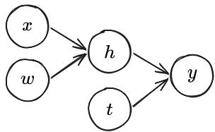  
Probabilistic Graphical Model

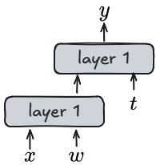  
Flowchart

However, while these diagrams provide a high-level overview of the architecture, they do not specify how the architecture should be concretely implemented thus obfuscating important innovations and limiting reproducibility.

To solve this, we introduce a graphical notation, adapted from Penrose tensor notation, for designing interpretable AI architectures that enables global insights and maps one to one onto PyTorch einsum code. While prior work has used a similar notation to analyse language models and mechanistic interpretability, we use this notation to describe architectures that are interpretable by construction, including concept bottlenecks, sparse probes, prototype networks, neural additive models, and mixtures of linear models. As a case study, we diagram the full architecture of Steerling-8B, showing the advantages of such notation in practice.

## 2 Graphical Einstein-inspired notation in PyTorch

A well-known graphical notation for tensor operations, originating in physics, is Penrose or tensor-network notation [Penrose et al., 1971]. Recent work has adapted it to analyse language models and mechanistic interpretability [Taylor, 2024, Elhage et al., 2021]. To our knowledge, no prior work has used it to analyse models that are interpretable by construction.

We first introduce the fragment of Penrose notation we need. We then use it to analyse the key operations behind frontier interpretable AI models.

## 2.1 Tensors

In this work, a tensor of order k is an array with k indices, $T \in \mathbb { R } ^ { n _ { 1 } \times \cdots \times n _ { k } } , n _ { i } , k \in \mathbb { N } .$ A scalar has order 0, a vector order 1, a matrix order 2, and so on. The table below lists common tensors, how to generate each at random in PyTorch, and its geometric meaning. In our diagrams, a tensor is a circle with “legs”. Each leg stands for one geometric dimension, that is, one array index.

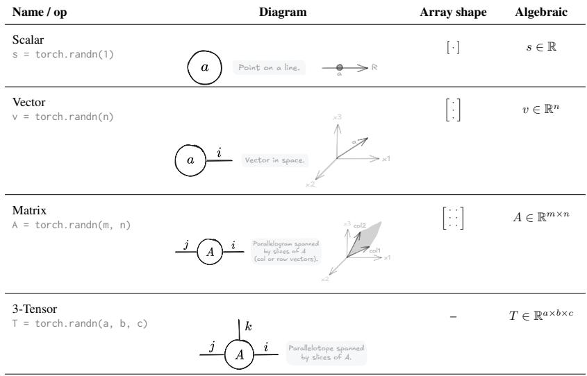

## 2.2 Operations

AI models manipulate tensors using tensor operations. Tensor operations admit a formal notation known as Einsteininspired notationfor operations [Einstein, 1916] or “Einops” [Rogozhnikov, 2022]. PyTorch supports two main Einops: rearrange, which reorders tensor’s axes, and einsum, which combines multiple tensors. Given their expressivity, mastering Einops, and einsum above all, is one of the most useful skills for designing and implementing AI architectures.

Unfortunately, PyTorch einsum is hard to parse at a glance. It is not the best tool for designing, comparing, or reasoning about tensor operations. It does, however, map one to one onto Penrose graphical notation. This visual notation makes complex tensor operations clear, formal, and unambiguous.

The convention works as follows [Einstein, 1916, Penrose et al., 1971]. To combine two tensors, we connect legs that share a label; a shared label marks the same geometric dimension/index. A connected pair of legs is contracted: we multiply the two tensors’ entries together for each value of that shared index, then sum over the index. This leaves “cancels” the leg out. Any legs left unconnected are “free” legs, and they become the indices of the result.

We can turn each diagram directly into PyTorch code with einsum, using the convention einsum('legs\_of\_input\_tensor\_A,legs\_of\_input\_tensor\_B->legs\_of\_output\_tensor', A, B). This lets us design a tensor operation as a diagram, get the diagram’s clarity, and then convert it straight into working PyTorch code.

The table below lists the most common tensor operations. These form the building blocks of the tensor manipulations used in frontier interpretable models.

<table><tr><td>Name / op</td><td colspan="3">Diagram</td><td>Array shape</td><td>Algebraic</td></tr><tr><td>Scalar multiplication h = torch.einsum(&#x27;,-&gt;&#x27;, v, w)</td><td></td><td>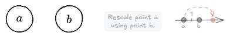</td><td></td><td>·X·=·</td><td> $h = a b$ </td></tr><tr><td>Element-wise product</td><td></td><td></td><td></td><td> ${ \big [ } \colon { \big ] } \odot { \big [ } \colon { \big ] } = { \big [ } \colon { \big ] }$ </td><td> $h _ { i } = a _ { i } b _ { i }$ </td></tr><tr><td></td><td></td><td>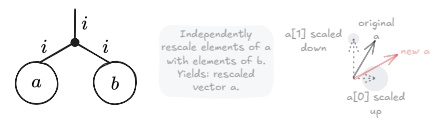</td><td></td><td></td><td></td></tr><tr><td>Dot product h = einsum(&#x27;i,i-&gt;&#x27;, a, b)</td><td></td><td>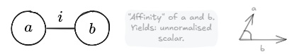</td><td></td><td>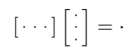</td><td> $\begin{array} { r } { h = \sum _ { i } a _ { i } b _ { i } } \end{array}$ </td></tr><tr><td>Squared norm h = einsum(&#x27;i,i-&gt;&#x27;, a, a)</td><td></td><td>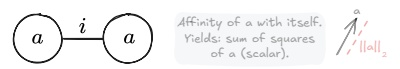</td><td></td><td> $[ \cdots ] [ \vdots ] = \cdot$ </td><td> $\begin{array} { r } { h = \sum _ { i } a _ { i } a _ { i } = \| a \| _ { 2 } } \end{array}$ </td></tr><tr><td>Normalize asqn = einsum  $( \mathbf { \bar { \kappa } _ { i } } , \mathbf { i } \mathbf { - } \mathbf { > } ^ { \prime } , \mathbf { a } , \mathbf { a } )$  an = a / asqn**0.5</td><td></td><td></td><td></td><td>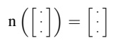</td><td> $\hat { a } _ { i } = a _ { i } / \sqrt { \textstyle \sum _ { j } a _ { j } ^ { 2 } }$ </td></tr><tr><td></td><td></td><td>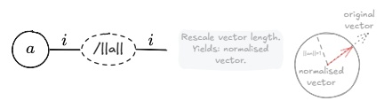</td><td></td><td></td><td></td></tr><tr><td>h = einsum(&#x27;i,i-&gt;&#x27;, a, bn)</td><td>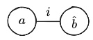</td><td>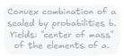</td><td>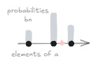</td><td> $\left[ \cdots \cdot \cdot \right] \mathbf { n } \left( \left[ : \right] \right) = \cdot$ </td><td> $\begin{array} { r } { h = \sum _ { i } a _ { i } \hat { b } _ { i } } \end{array}$ </td></tr><tr><td>Cosine similarity h = einsum(&#x27;i,i-&gt;&#x27;, an, bn)</td><td>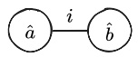</td><td>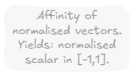</td><td>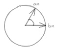</td><td> $[ \cdots ] [ \vdots ] = \cdot$ </td><td> $\begin{array} { r } { h = \sum _ { i } \hat { a } _ { i } \hat { b } _ { i } } \end{array}$ </td></tr><tr><td>Sum of matrix slices h = einsum(&#x27;ik-&gt;i&#x27;, A)</td><td></td><td>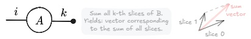</td><td></td><td> ${ \Big [ } \because { \Big ] } = { \Big [ } \vdots { \Big ] } + { \Big [ } \vdots { \Big ] }$ </td><td> $\begin{array} { r } { h _ { i } = \sum _ { k } A _ { i k } } \end{array}$ </td></tr><tr><td>Matrix-vector product h = einsum(&#x27;ij,i-&gt;j&#x27;, A, b)</td><td></td><td></td><td></td><td> $[ : : : : ] \left[ : \right] = [ : ]$ </td><td> $\begin{array} { r } { h _ { j } = \sum _ { i } A _ { i j } b _ { i } } \end{array}$ </td></tr><tr><td>Scaled matrix slices</td><td>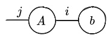</td><td>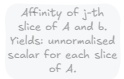</td><td>j-th slice of</td><td></td><td></td></tr><tr><td>h = einsum(&#x27;ij,i-&gt;ij&#x27;, A, b)</td><td></td><td></td><td></td><td></td><td> $H _ { i j } = A _ { i j } b _ { i }$ </td></tr><tr><td></td><td></td><td></td><td></td><td></td><td></td></tr><tr><td>H = einsum(&#x27;ij,ik-&gt;jk&#x27;, A, B)</td><td></td><td></td><td></td><td></td><td></td></tr><tr><td></td><td></td><td></td><td></td><td></td><td></td></tr><tr><td></td><td></td><td></td><td></td><td></td><td></td></tr><tr><td></td><td></td><td></td><td></td><td></td><td></td></tr><tr><td></td><td></td><td></td><td></td><td></td><td></td></tr><tr><td></td><td></td><td></td><td></td><td></td><td></td></tr><tr><td></td><td></td><td></td><td></td><td></td><td></td></tr><tr><td></td><td></td><td></td><td></td><td></td><td></td></tr><tr><td></td><td></td><td>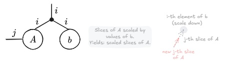</td><td></td><td></td><td></td></tr><tr><td></td><td></td><td></td><td></td><td></td><td></td></tr><tr><td></td><td></td><td></td><td></td><td></td><td></td></tr><tr><td></td><td></td><td></td><td></td><td></td><td></td></tr><tr><td></td><td></td><td></td><td></td><td></td><td></td></tr><tr><td></td><td></td><td></td><td></td><td></td><td></td></tr><tr><td></td><td></td><td></td><td></td><td></td><td></td></tr><tr><td></td><td></td><td></td><td></td><td></td><td></td></tr><tr><td></td><td></td><td></td><td></td><td></td><td></td></tr><tr><td></td><td></td><td></td><td></td><td></td><td></td></tr><tr><td></td><td></td><td></td><td></td><td></td><td></td></tr><tr><td></td><td></td><td></td><td></td><td></td><td></td></tr><tr><td></td><td></td><td></td><td></td><td></td><td></td></tr><tr><td></td><td></td><td></td><td></td><td></td><td></td></tr><tr><td></td><td></td><td></td><td></td><td></td><td></td></tr><tr><td></td><td></td><td></td><td></td><td></td><td></td></tr><tr><td></td><td></td><td></td><td></td><td></td><td></td></tr><tr><td></td><td></td><td></td><td></td><td></td><td></td></tr><tr><td></td><td></td><td></td><td></td><td></td><td></td></tr><tr><td></td><td></td><td></td><td></td><td></td><td></td></tr><tr><td></td><td></td><td></td><td></td><td></td><td></td></tr><tr><td></td><td></td><td></td><td></td><td></td><td></td></tr><tr><td></td><td></td><td></td><td></td><td></td><td></td></tr><tr><td></td><td></td><td></td><td></td><td></td><td></td></tr><tr><td></td><td></td><td></td><td></td><td></td><td></td></tr><tr><td></td><td></td><td></td><td></td><td></td><td></td></tr><tr><td></td><td></td><td></td><td></td><td></td><td></td></tr><tr><td></td><td></td><td></td><td></td><td></td><td></td></tr><tr><td></td><td></td><td></td><td></td><td></td><td></td></tr><tr><td></td><td></td><td></td><td></td><td></td><td></td></tr><tr><td></td><td></td><td></td><td></td><td></td><td></td></tr><tr><td></td><td></td><td></td><td></td><td></td><td> $\begin{array} { r } { H _ { j k } = \sum _ { i } A _ { i j } B _ { i k } } \end{array}$ </td></tr><tr><td></td><td></td><td></td><td></td><td></td><td></td></tr><tr><td></td><td></td><td></td><td></td><td></td><td></td></tr><tr><td></td><td></td><td></td><td></td><td></td><td></td></tr><tr><td></td><td></td><td></td><td></td><td></td><td></td></tr><tr><td></td><td></td><td></td><td></td><td></td><td></td></tr><tr><td></td><td></td><td></td><td></td><td></td><td></td></tr><tr><td>Matrix-matrix product</td><td></td><td></td><td></td><td>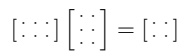</td><td></td></tr><tr></table>

## 3 Graphical design of simple neural models

With linear algebra fresh in mind, we can now use the graphical notation to design AI models. As introductory examples, we design two familiar models, a linear model [Berkson, 1944, Cox, 1958] and a multi-layer perceptron [Rumelhart et al., 1986], before moving to more advanced cases, such as self-attention [Vaswani et al., 2017].

A linear model [Berkson, 1944, Cox, 1958] is one of the oldest models in statistics, yet it remains an important baseline for interpretable machine learning, and it forms the backbone of more complex operations in frontier models. A linear model is a matrix-vector product followed by an activation function. The vector x $\in \mathbb { R } ^ { d }$ holds the features of an input sample, and the matrix $\dot { W } \in \mathbb { R } ^ { h \times d }$ holds the model’s learnable parameters. Since this model usually has a non-linear activation which makes the diagram asymmetric, we extend Penrose diagrams drawing the input node in gray and performing tensor operations from left to right (or top-down):

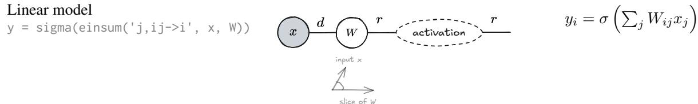

We can apply a linear model to many inputs at once by stacking samples $x _ { j }$ into a batch tensor $\boldsymbol { X } \in \mathbb { R } ^ { b \times d }$ . We can also stack several linear models on top of each other. This gives a multi-layer perceptron (MLP) [Rumelhart et al., 1986]:

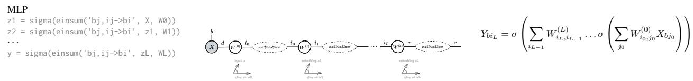

Self-attention [Vaswani et al., 2017] is a key, more complex operation in frontier AI models. This operation projects an input sequence Z of t tokens into a query q, key k, and value v embeddings. For each pair of tokens $( \dot { t } , t _ { p } )$ , self-attention scores how relevant token $t _ { p }$ is to token t. It then uses these relevance scores as weights to combine the value vectors.

Since the tensor manipulations are a bit more complex, we break down the self-attention mechanism into simple atomic manipulations. The first step is to “copy” the input Z since we need to reuse this tensor multiple times. In our notation, copying a tensor can be expressed by branching all its legs. We use the index $t _ { p }$ for the legs of the second and third copy of Z as these legs will be used to index key and value tokens the query can attend to:

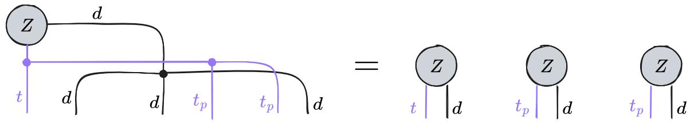

Each copy of the tensor Z gets multiplied by a matrix $W \in \mathbb { R } ^ { d \times e }$ to produce key, query, and value tensors $k , q , v \in \mathbb { R } ^ { t \times e }$

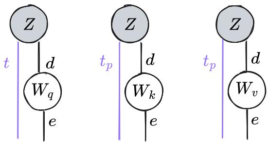

For each pair of tokens $( t , t _ { p } )$ , we compute how much the query token t attends to the key token $t _ { p } \colon$

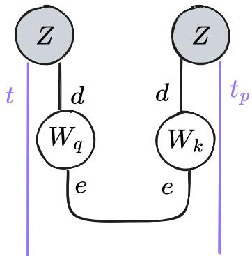

We then normalise these “affinity” scores into probability values using a softmax activation:

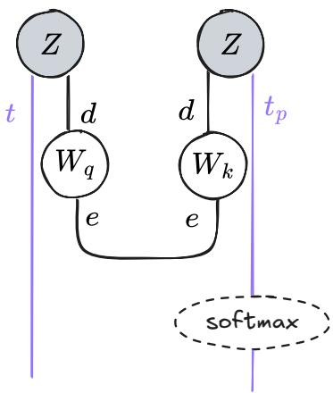

And finally we can compute the new embedding of the token t as a convex combination of value embeddings v weighted by their respective probability score:

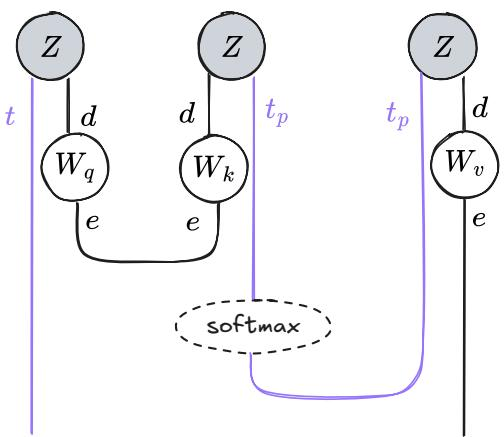

In a single diagram we can draw self-attention as follows:

Self-attention

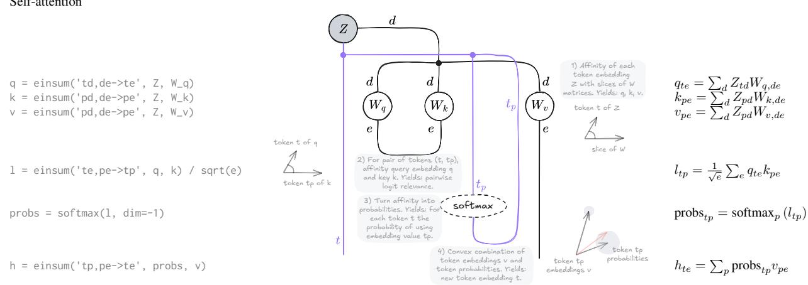

From here on, diagrams stay minimal: we draw only the indices involved in a contraction. PyTorch supports this directly through ellipsis notation, which lets a tensor operation generalize to any number of batch dimensions. For example, an operation with three preserved indices, batch $b ,$ token $t ,$ and head $q ,$ written as

$$
\mathrm { e i n s u m ( ^ { \prime } b t q i j , b t q j k { \mathrm { - } } { > } b t q i k ^ { \prime } , \Delta \ A , \Delta \ B ) }
$$

can be rewritten as

$$
\mathrm { e i n s u m ( \bar { \Psi } . ~ . ~ . ~ i \bar { j } , ~ . ~ . ~ . ~ j k ^ { - } > . ~ . ~ . ~ i k ^ { \prime } , ~ \mathsf { A } , ~ \mathsf { B } ) }
$$

## 4 Graphical design of interpretable architectures

Interpretable architectures can be generally segmented into three distinct components [Koh et al., 2020, Alvarez Melis and Jaakkola, 2018, Chen et al., 2019, Barbiero et al., 2026]: a backbone that maps input x to a hidden representation z, a concept encoding map that turns z into human-meaningful concepts c, and a concept composition map that turns those concepts into a task prediction y.

Most interpretable architectures use specific tensor operations in their concept encoding and concept composition maps to meet interpretability constraints [Rudin, 2019, Barbiero et al., 2026]. Here we analyse the most common and recurring of these operations, shared across different families of interpretable models.

## 4.1 Concept encoding maps

Concept encoding maps transform latent representations z into representations c, known as concepts, that are constrained to align with human semantics. The most common maps in the literature, in order of increasing tensor-manipulation com plexity, are probes such as concept activation vectors (CAVs) [Kim et al., 2018] and sparse autoencoders (SAEs) [Ranzato et al., 2006, Huben et al., 2024, Templeton et al., 2026], concept bottlenecks [Koh et al., 2020, Espinosa Zarlenga et al., 2022], and prototype-based models [Chen et al., 2019, Colamonaco et al., 2026].

Sparse encoders [Ranzato et al., 2006] map latent representations $z \in \mathbb { R } ^ { d }$ into the sparse activations $c \in \mathbb { R } ^ { k }$ via a sparse linear map $\dot { W } \in \mathbb { R } ^ { d \times k }$ with $k \gg d$

Sparse encoders

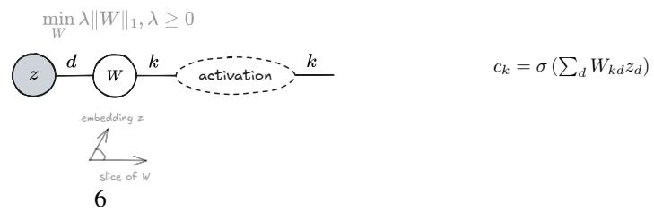

Concept bottlenecks [Koh et al., 2020] map a latent representation z into the concept representation c via a supervised linear map

Concept bottleneck

$$
\begin{array} { r l r } { \binom { z } { z } \frac { d } { \sqrt { w } } \underset { s \in \mathcal { S } _ { w } ^ { d } } { k } \underset { s \in \mathcal { S } _ { w } ^ { - 1 } } { \underbrace { s \dots \dots \dots \dots } } \times } & { \qquad } & { c _ { k } = \sigma \left( \sum _ { d } W _ { k d } z _ { d } \right) } \\ { \underset { s \in \mathcal { S } _ { w } ^ { d } } { \underbrace { m \mathrm { i n } } \mathcal { L } } } & { \underset { W } { \underbrace { m \mathrm { i n } } \mathcal { L } \left( c _ { k } ^ { [ h ] } , c _ { k } \right) } } & { \qquad } & { \qquad } \\ { \underset { s \mathrm { l e e ~ o f } w } { \underbrace { M } } } & { \underset { s \in \mathcal { S } _ { w } ^ { - 1 } } { \underbrace { m \mathrm { i n } } \mathcal { L } } } & { } & { c _ { k } = \sigma \left( \sum _ { d } W _ { k d } z _ { d } \right) } \end{array}
$$

In both cases the tensor operation is identical. The difference lies in the loss and in what the concepts mean: sparse probes recover concept semantics post-hoc (through additional data and labels), while concept bottlenecks build concept semantics into the loss from the start using ground-truth concept annotations $c ^ { [ h ] }$

Concept embedding bottlenecks [Espinosa Zarlenga et al., 2022] map a latent representation z into a high dimensional concept representation $u \in \mathbb { R } ^ { d \times \tilde { k } \times s \times e }$ where s is the concept cardinality and e the embedding size. This concept representation is then used to compute concept predictions $c _ { k } \mathrm { : }$

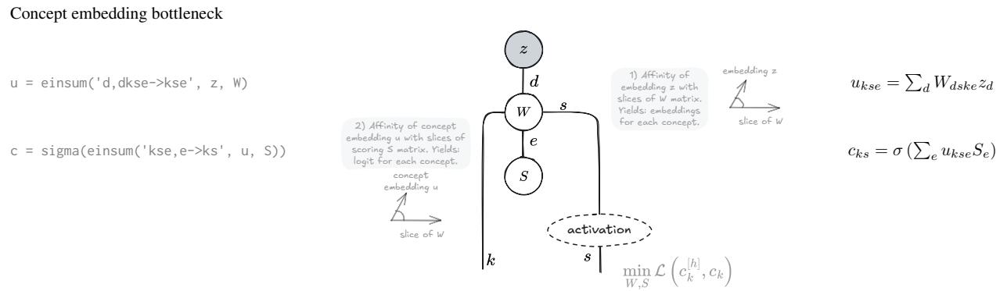

Prototype-based concept maps [Chen et al., 2019, Colamonaco et al., 2026] need a genuinely different tensor operation. We can think of prototypes as reference examples that tell us whether a concept is active. For instance, the embedding of an apple or a ball can serve as a positive “prototypical example” for the concept round, and a fridge or a book as a negative example. Ground-truth prototype labels sit in the tensor $\pi ^ { [ h ] } \in \mathbb { R } ^ { p \times k }$ , so each concept k has p labelled prototypes. For a concept k and an input embedding $z \in \mathbb { R } ^ { d }$ , we compare z against every prototype in $P \in \mathbb { R } ^ { d \times p \times k }$ and compute the concept label based on input-prototype similarity. For instance, if z is closer to the prototypes for book and fridge than to the prototypes for apple and ball, then the predicted label for round should sit close to 0.

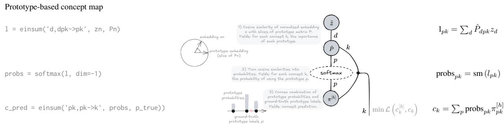

## 4.2 Concept composition maps

In most interpretability works, the concept composition map is a simple linear model: self-explaining neural nets [Alvarez Melis and Jaakkola, 2018], sparse autoencoders [Huben et al., 2024, Templeton et al., 2026], concept bottleneck models [Koh et al., 2020], all use linear models. A few exceptions are worth discussing: neural additive models [Agarwal et al., 2021], concept embedding predictors [Espinosa Zarlenga et al., 2022], and mixtures of linear models [Alvarez Melis and Jaakkola, 2018, Barbiero et al., 2023, Debot et al., 2024, Santis et al., 2026].

Neural additive models [Agarwal et al., 2021] transform concept activations c independently using a different MLP for each concept k and output task r. Then, for each task, they sum the outputs of the MLP of each concept to predict target yr:

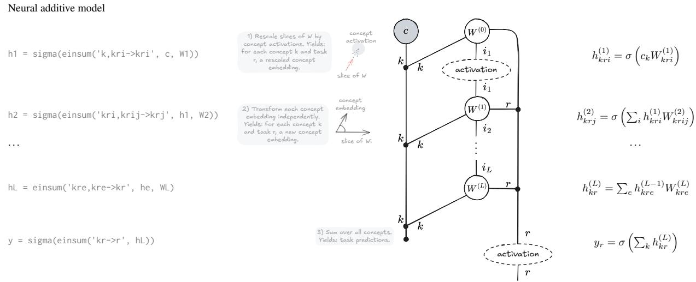

Concept embedding predictors [Espinosa Zarlenga et al., 2022] rescale concept embeddings u (e.g., generated by a concept embedding bottleneck) using concept activations c before projecting into the output space r:

Concept embedding predictor

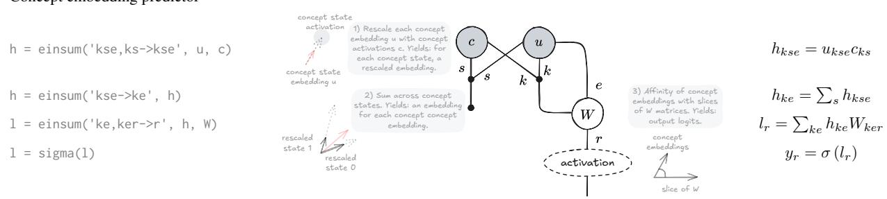

Mixtures of linear models [Santis et al., 2026] compute different predictions for the target $y _ { r }$ using m different linear models. Then each prediction is weighted by the probability of selecting a specific linear model:

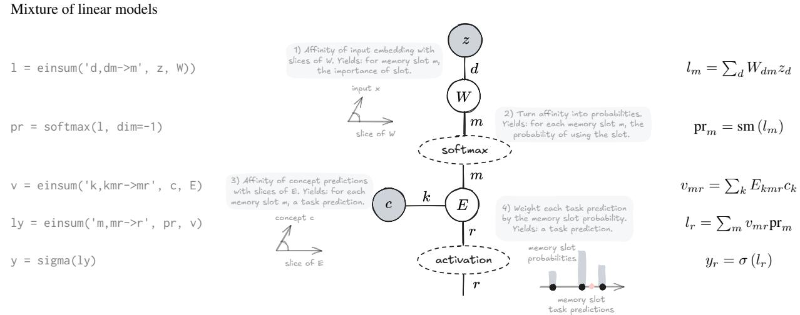

## 5 Case study: frontier interpretable language models

As a case study, we diagram the architecture of Steerling-8B [Team et al., 2026], the largest interpretable-by-design language model publicly available at the time of writing.

To keep the focus on the essential tensor manipulations, we drop batch dimensions, since they aren’t involved in any contraction, and we show a single attention head; extending to multiple heads is straightforward. Under these conditions, the essential tensor manipulations in the Steerling-8B architecture take about 30 lines of code. Drawing the Steerling-8B tensor diagram has three main benefits over the notation used in the original technical report [Team et al., 2026]:

• It shows at a glance that Steerling-8B is a residual model: the gradient can flow from the output straight back to the first input.

• It maps one to one onto PyTorch einops and activation functions, which makes the diagram useful for reproducing the model faithfully.

• Every operation in the diagram has a direct geometric reading in linear algebra. This lets us read each manipulation as a transformation in space, which helps build intuition for the underlying computation.

## 6 Discussion

## 6.1 Related works

Graphical tensor notation dates to Penrose et al. [1971], who introduced diagrams for tensor contraction in physics. The notation has since been adopted by the categorical-quantum-mechanics community [Coecke and Kissinger, 2018], and, more recently, by theoretical computer science and machine learning.

A first line of work has proposed general-purpose diagrammatic languages for deep learning architectures, without a focus on interpretability. Chiang et al. [2021] propose named-axis tensor notation to disambiguate operations such as attention. Abbott [2024] introduces neural circuit diagrams, a graphical language with a formal correspondence to implementation, later used to derive memory-efficient attention algorithms Abbott and Zardini [2025]. Cruttwell et al. [2022], Lorenz and Tull [2023], Gavranovic et al. [2024] pursue a category-theoretic account of architectures´ more broadly, using string diagrams, a mathematical generalization of Penrose notation, to unify architectures such as convolutional neural nets, recurrent neural nets, and transformers under one algebraic framework.

A more recent line of work started analysing the interpretability literature using graphical notations. Giannini et al. [2024], Tull et al. [2024], and Barbiero et al. [2025] use string diagrams to analyse explainable AI methods and interpretable architectures, but without using the tensor manipulation semantics that maps directly to PyTorch programming interfaces. Taylor [2024] applies Penrose notation to mechanistic interpretability, using it to reverse-engineer trained transformer components such as induction heads, building on the informal flowcharts used by Elhage et al. [2021] to describe transformer circuits. However, this line of work analyses pre-trained opaque models and does not consider tensor manipulations required by inherently interpretable models.

This paper takes a notation developed for post-hoc analysis of trained models and, for the first time to our knowledge, applies this notation to the forward problem: analysing and designing architectures that are interpretable by construction, with a direct, mechanical path from diagram to PyTorch code.

## 6.2 Limitations and concrete usage

Tensor diagrams are exact for multilinear operations, but nonlinearities, masking, and discrete operations such as top-k require ad hoc extensions. Closeness to implementation is also a double-edged sword: diagram size grows with the complexity of the tensor manipulations, so full frontier architectures quickly become unwieldy to draw in conference papers. For this reason, we see tensor diagrams as best paired with a coarser formalism such as probabilistic graphical models. Probabilistic graphical models may be used to capture the high-level causal structure between random variables, while small tensor diagrams specify how each conditional probability function is implemented.

## 6.3 Conclusion

We have shown how tensor diagrams can guide the design of interpretable deep neural networks. For the most common tensor manipulations in interpretability research, we have built a “Rosetta stone” showing the matching diagram, PyTorch code, geometric interpretation, and symbolic equation side by side, so readers from different backgrounds can compare and understand them. We also tackled a harder case: we diagrammed and implemented the key modules of a frontier interpretable-by-design language model, Steerling-8B in about 30 lines of code.

Tensor diagrams are expressive, formal, and map directly onto PyTorch code. For these reasons, they could become a standard tool for designing, comparing, and implementing interpretable architectures, alongside other graphical tools such as probabilistic graphical models.

## Steerling-8B

ht = einsum('tr,re->te', X, E)   
hp = einsum('ti,ie->te', X, Ep)   
Z = ht + hp   
q = einsum('te,ed->td', Z, W\_q)   
k = einsum('pe,ed->pd', Z, W\_k)   
v = einsum('pe,ed->pd', Z, W\_v)   
l = einsum('te,pe->tp', q, k)   
l = l / sqrt(W\_k.shape[1])   
l = l + M   
probs = softmax(l, dim=-1)   
h = einsum('tp,pe->te', probs, v)   
h = einsum('te,ed->td', h, W)   
h = dropout(h)   
Z = Z + h   
h = layernorm(Z)   
h = einsum('te,ed->td', h, W1)   
h = sigma(h)   
h = einsum('te,ed->td', h, W2)   
h = dropout(h)   
Z = Z + h   
ls = einsum('te,ek->tk', Z, Ws)   
lu = einsum('te,eu->tu', Z.detach(), Wu)   
cs = sigmoid(ls)   
cu = sigmoid(lu)   
csf = topk(cs)   
cuf = topk(cu)   
csfe = einsum('tk,ke->te', csf, Ks)   
cufe = einsum('tu,ue->te', cuf, Ku)   
ce = csfe + cufe   
Z = Z - ce   
Z = Z + ce   
l = einsum('te,er->tr', Z, Wh)   
y = sigma(l)

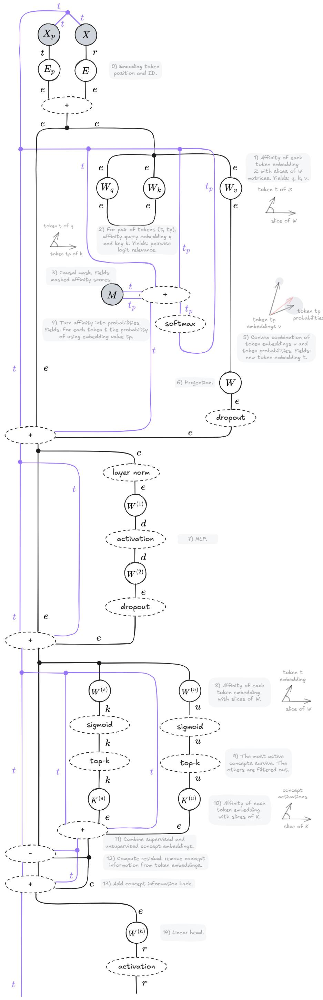

## References

Vincent Abbott. Neural circuit diagrams: Robust diagrams for the communication, implementation, and analysis of deep learning architectures. arXiv preprint arXiv:2402.05424, 2024.

Vincent Abbott and Gioele Zardini. Flashattention on a napkin: A diagrammatic approach to deep learning io-awareness, 2025. URL https://arxiv.org/abs/2412.03317.

Rishabh Agarwal, Levi Melnick, Nicholas Frosst, Xuezhou Zhang, Ben Lengerich, Rich Caruana, and Geoffrey E Hinton. Neural additive models: Interpretable machine learning with neural nets. Advances in neural information processing systems, 34:4699–4711, 2021.

David Alvarez Melis and Tommi Jaakkola. Towards robust interpretability with self-explaining neural networks. Advances in neural information processing systems, 31, 2018.

Pietro Barbiero, Gabriele Ciravegna, Francesco Giannini, Mateo Espinosa Zarlenga, Lucie Charlotte Magister, Alberto Tonda, Pietro Lió, Frederic Precioso, Mateja Jamnik, and Giuseppe Marra. Interpretable neural symbolic concept reasoning. In International Conference on Machine Learning, pages 1801–1825. PMLR, 2023.

Pietro Barbiero, Mateo Espinosa Zarlenga, Alberto Termine, Mateja Jamnik, and Giuseppe Marra. Foundations of interpretable models. arXiv preprint arXiv:2508.00545, 2025.

Pietro Barbiero, Giovanni De Felice, Mateo Espinosa Zarlenga, Francesco Giannini, Filippo Bonchi, Mateja Jamnik, Giuseppe Marra, and Ruggero Noris. The standard interpretable model: A general theory of interpretable machine learning to deductively design interpretable methods using lagrangian mechanics. arXiv preprint arXiv:2606.12289, 2026.

Joseph Berkson. Application of the logistic function to bio-assay. Journal of the American statistical association, 39(227):357–365, 1944.

Chaofan Chen, Oscar Li, Daniel Tao, Alina Barnett, Cynthia Rudin, and Jonathan K Su. This looks like that: deep learning for interpretable image recognition. Advances in neural information processing systems, 32, 2019.

David Chiang, Alexander M Rush, and Boaz Barak. Named tensor notation. arXiv preprint arXiv:2102.13196, 2021.

Bob Coecke and Aleks Kissinger. Picturing quantum processes: A first course on quantum theory and diagrammatic reasoning. In Diagrammatic Representation and Inference: 10th International Conference, Diagrams 2018, Edinburgh, UK, June 18-22, 2018, Proceedings 10, pages 28–31. Springer, 2018.

Stefano Colamonaco, David Debot, Pietro Barbiero, and Giuseppe Marra. Prototype-grounded concept models for verifiable concept alignment. arXiv preprint arXiv:2604.16076, 2026.

David R Cox. The regression analysis of binary sequences. Journal of the Royal Statistical Society Series B: Statistical Methodology, 20(2):215–232, 1958.

Geoffrey SH Cruttwell, Bruno Gavranovic, Neil Ghani, Paul Wilson, and Fabio Zanasi. Categorical foun-´ dations of gradient-based learning. In European Symposium on Programming, pages 1–28. Springer International Publishing Cham, 2022.

David Debot, Pietro Barbiero, Francesco Giannini, Gabriele Ciravegna, Michelangelo Diligenti, and Giuseppe Marra. Interpretable concept-based memory reasoning. Advances in Neural Information Processing Systems, 37:19254–19287, 2024.

Albert Einstein. Die grundlage der allgemeinen relativitätstheorie. In Das Relativitätsprinzip: Eine Sammlung von Abhandlungen, pages 81–124. Springer, 1916.

Nelson Elhage, Neel Nanda, Catherine Olsson, Tom Henighan, Nicholas Joseph, Ben Mann, Amanda Askell, Yuntao Bai, Anna Chen, Tom Conerly, et al. A mathematical framework for transformer circuits. Transformer Circuits Thread, 1(1):12, 2021.

Mateo Espinosa Zarlenga, Pietro Barbiero, Gabriele Ciravegna, Giuseppe Marra, Francesco Giannini, Michelangelo Diligenti, Zohreh Shams, Frederic Precioso, Stefano Melacci, Adrian Weller, et al. Concept embedding models: Beyond the accuracy-explainability trade-off. Advances in neural information processing systems, 35:21400–21413, 2022.

Bruno Gavranovic, Paul Lessard, Andrew Dudzik, Tamara Von Glehn, Joao GM Araújo, and Petar´ Velickoviˇ c. Position: Categorical deep learning is an algebraic theory of all architectures.´ arXiv preprint arXiv:2402.15332, 2024.

Francesco Giannini, Stefano Fioravanti, Pietro Barbiero, Alberto Tonda, Pietro Liò, and Elena Di Lavore. Categorical foundation of explainable ai: A unifying theory. In World Conference on Explainable Artificial Intelligence, pages 185–206. Springer, 2024.

Robert Huben, Hoagy Cunningham, Logan Smith, Aidan Ewart, and Lee Sharkey. Sparse autoencoders find highly interpretable features in language models. In International Conference on Learning Representations, volume 2024, pages 7827–7845, 2024.

Been Kim, Martin Wattenberg, Justin Gilmer, Carrie Cai, James Wexler, Fernanda Viegas, et al. Interpretability beyond feature attribution: Quantitative testing with concept activation vectors (tcav). In International conference on machine learning, pages 2668–2677. PMLR, 2018.

Pang Wei Koh, Thao Nguyen, Yew Siang Tang, Stephen Mussmann, Emma Pierson, Been Kim, and Percy Liang. Concept bottleneck models. In International conference on machine learning, pages 5338–5348. Pmlr, 2020.

Robin Lorenz and Sean Tull. Causal models in string diagrams. arXiv preprint arXiv:2304.07638, 2023.

Roger Penrose et al. Applications of negative dimensional tensors. Combinatorial mathematics and its applications, 1(221-244):3, 1971.

Marc’Aurelio Ranzato, Christopher Poultney, Sumit Chopra, and Yann Cun. Efficient learning of sparse representations with an energy-based model. Advances in neural information processing systems, 19, 2006.

Alex Rogozhnikov. Einops: Clear and reliable tensor manipulations with einstein-like notation. In International Conference on Learning Representations, 2022.

Cynthia Rudin. Stop explaining black box machine learning models for high stakes decisions and use interpretable models instead. Nature machine intelligence, 1(5):206–215, 2019.

David E Rumelhart, Geoffrey E Hinton, and Ronald J Williams. Learning representations by back-propagating errors. nature, 323(6088):533–536, 1986.

Francesco De Santis, Gabriele Ciravegna, Giovanni De Felice, Arianna Casanova, Francesco Giannini, Michelangelo Diligenti, Johannes Schneider, Danilo Giordano, Mateo Espinosa Zarlenga, and Pietro Barbiero. Mixture of concept bottleneck experts. International conference on machine learning, 2026.

Jordan K Taylor. An introduction to graphical tensor notation for mechanistic interpretability. arXiv preprint arXiv:2402.01790, 2024.

Guide Labs Team, Andreas Madsen, Aya Abdelsalam Ismail, Giang Nguyen, Isaac Plant, Muawiz Chaudhary, Nathaniel Monson, Saqib Azim, Zhichen Guo, and Julius Adebayo. Scaling inherently interpretable language models. arXiv preprint arXiv:2608.07594, 2026.

Adly Templeton, Tom Conerly, Jonathan Marcus, Jack Lindsey, Trenton Bricken, Brian Chen, Adam Pearce, Craig Citro, Emmanuel Ameisen, Andy Jones, et al. Scaling monosemanticity: Extracting interpretable features from claude 3 sonnet. arXiv preprint arXiv:2605.29358, 2026.

Sean Tull, Robin Lorenz, Stephen Clark, Ilyas Khan, and Bob Coecke. Towards compositional interpretability for xai, 2024. URL https://arxiv.org/abs/2406.17583.

Ashish Vaswani, Noam Shazeer, Niki Parmar, Jakob Uszkoreit, Llion Jones, Aidan N Gomez, Łukasz Kaiser, and Illia Polosukhin. Attention is all you need. Advances in neural information processing systems, 30, 2017.