# GraphK: Variable-Size Graph Generation with Eficient Edge Construction

Resul Tugay∗   
Department of Artificial Intelligence and Data Engineering   
Ataturk University, Turkey   
Eren Olug∗   
Department of Artificial Intelligence and Data Engineering   
ITU AI Research and Application Center   
Istanbul Technical University, Turkey

Elif Ak Faculty of Engineering and Applied Science Memorial University, Canada

Sule Gunduz Oguducu

Department of Artificial Intelligence and Data Engineering

ITU AI Research and Application Center

Istanbul Technical University, Turkey

resultugay@atauni.edu.tr

olug20@itu.edu.tr

elif.ak@mun.ca

sgunduz@itu.edu.tr

## Abstract

Graph generation models have advanced significantly with deep learning, yet they remain limited in scalability, flexibility, and ability to model underlying structures. We present GraphK, a novel encoder-sampler-decoder framework for graph generation that overcomes these challenges through structural flexibility and computational eficiency. Unlike autoregressive approaches constrained by vocabulary size (i.e. number of nodes in graph generation), GraphK allows for both upscaling (generating graphs with more nodes than the input) and downscaling, providing a flexible control over output graph size. By learning permutation-invariant latent representations and sampling new node embeddings via maximum likelihood estimation, GraphK generalizes across graph sizes and structures. For edge generation, we employ edge prediction with a KDTree-based top-k neighbor search in the latent space, reducing computational cost. Based on the manifold smoothness assumption, our method efectively captures graph properties. Experiments on synthetic and real-world datasets show that GraphK outperforms existing methods, accurately learns graph structures, and generates synthetic graphs without explicit definitions.

Keywords: Graph Generation, Maximum Likelihood Estimation

## 1 Introduction

Graph generation plays a crucial role in modeling and analyzing complex relationships among entities, with wide-ranging applications in domains such as software engineering Brockschmidt et al. (2018); Allamanis et al. (2017), recommender systems Wang et al. (2021), and chemistry Liu et al. (2018). As the diversity of graph-structured data and applications expands, the ability to generate synthetic yet realistic graphs has become increasingly valuable. Graph generation involves the creation of new graphs that preserve specific structural properties of observed real-world graphs, enabling tasks such as data augmentation Abul’atta et al. (2021); Bas et al. (2024); Bojchevski et al. (2018), simulation Leskovec et al. (2010), and code completion Brockschmidt et al. (2018). The study of graph generation has a long history rooted in probabilistic modeling. Classical models such as the Erd˝os–R´enyi random graph, the Barab´asi–Albert model, and the stochastic block model (SBM) have provided foundational insights into the structural properties of real-world graphs, including sparsity and scale-free distributions Erdos and Renyi (1959); Barabasi and Albert (1999); Holland et al. (1983). While these models are simple, they are often limited in their expressive power, failing to capture higher-order structural dependencies or attribute correlations in complex graph data. More importantly, these methods rely on predefined assumptions (e.g., number of nodes, edge probabilities) about graph structure rather than learning these directly from data.

In contrast, recent advances in deep learning-based graph generation seek to overcome these limitations by learning semantic and structural patterns directly from graph data. Notable among these are deep generative models, including variational autoencoder (VAE)- based methods (e.g., GraphVAE Simonovsky and Komodakis (2018), Graphite Grover et al. (2018), JT-VAE Jin et al. (2018)), autoregressive frameworks (e.g., GraphRNN You et al. (2018), GRAN Liao et al. (2020)), and difusion models (e.g., DiGress, score-based models, spectral difusion) Vignac et al. (2022); Kong et al. (2023); Wen et al. (2024). Additionally, flow-based models Luo et al. (2021), though relatively niche, form a significant part of this landscape. Since these models represent a ”probability-based” deep learning approach and explicitly model the underlying probability distributions, unlike the implicit generation mechanisms of autoregressive models such as GraphRNN or the approximate posterior inference used in VAEs. While the strengths and weaknesses of these models are discussed in detail in Sec. 2, we briefly highlight the key limitations: (1) sensitivity to node ordering (i.e., lack of permutation invariance), (2) dificulty scaling beyond training graph sizes, and (3) high computational demands. Addressing these limitations simultaneously remains an open problem, which motivates the development of our proposed framework, GraphK, a novel graph generation approach that balances structural flexibility, permutation invariance, and computational eficiency. Inspired by the encoder-sampler-decoder paradigm Faez et al. (2020), our approach leverages structural embeddings, Gaussian Mixture Models (GMM), and eficient geometric decoding to overcome critical limitations found in prior deep generative graph methods. In what follows, we detail how GraphK addresses each of these limitations.

(1) Lack of permutation invariance: Permutation invariance refers to the property that the generation process should not depend on how nodes are labeled or ordered in the input. This is crucial, as isomorphic graphs can have multiple valid representations, and a robust generative model should treat them equivalently. Autoregressive models like GraphRNNYou et al. (2018) depend heavily on specific node sequencing, and models like GraphVAESimonovsky and Komodakis (2018) require expensive post-hoc matching processes to mitigate order biases. GRAN attempted to alleviate ordering bias by averaging multiple orderings but could not eliminate it entirely. In contrast, GraphK achieves full permutation invariance by decoupling the encoding and generation steps. While the initial encoding uses structurally informative embeddings (e.g., Node2vec or VGAE), the subsequent GMM captures the global distribution of these points, ensuring that the generated samples are independent of original node indexing.

(2) Limited scalability in node count: Most deep generative models are trained on a certain size distribution and have limited ability to scale flexibly beyond the node counts observed during training. GraphK overcomes this limitation through a latent-space sampling strategy that fully decouples the graph size from the training data. By fitting a GMM to the node embeddings, our framework enables flexible sampling of any desired number of latent points, allowing the generation of larger or smaller graphs while preserving key structural patterns from the original input. To the best of our knowledge, this is the first method to explicitly incorporate a principled upscaling mechanism into the graph generation process, ofering a practical capability not addressed in prior work.

(3) High computational cost: Training and inference in prevalent deep generative architectures, particularly difusion models and autoregressive methods, often demand substantial computational resources. They typically exhibit quadratic or higher complexity with increasing graph size. To overcome this, GraphK adopts a highly eficient geometric decoder based on a k-nearest neighbor (kNN) strategy. Instead of performing an exhaustive $O ( N ^ { 2 } )$ search over node pairs to determine connectivity, our method constructs a KDtree Bentley (1975) on sampled latent embeddings, enabling fast nearest neighbor queries with complexity O(N log N).

In summary, our proposed method, GraphK, provides an efective solution in the field of deep graph generation by capturing structural patterns and being robust to node permutations. By combining structural embeddings that ensure permutation invariance, latent-space sampling for scalable size-flexible graph generation, and eficient geometric decoding via nearest-neighbor searches, our approach ofers a computationally lightweight solution. These strengths make it well-suited for a wide range of applications, including social, infrastructure, biological, and knowledge networks, with particular efectiveness in generating community-rich graphs, where latent structure and modularity are especially prominent.

## 2 Related Work

We categorize and review related graph generation methods in three main groups. Table 1 also provides a summary comparison, ofering a quick overview of their capabilities and the limitations discussed in Sec. 1. While we acknowledge the broader landscape of advancements in graph generation, the selected methods have been carefully chosen based on their relevance to the approach.

Variational Autoencoder (VAE) Approaches. Although classical methods are fast and able to generate large graphs, they do not learn features from data. This limitation set the stage for data-driven deep models, where variational autoencoders were among the first deep learning methods applied to graph generation. Here, GraphVAE Simonovsky and Komodakis (2018) is a seminal work that encodes an input graph using a graph neural network, obtaining a latent vector as in GraphK, and then decodes an entire adjacency matrix in one shot. A major limitation of early VAEs like GraphVAE is their poor scalability in graph size. The decoder must output an adjacency matrix of size $N _ { \mathrm { m a x } } ^ { 2 } ,$ , which was applied to graphs with at most 20-30 nodes. Moreover, GraphVAE’s independent edge assumption and small latent dimension made it rely heavily on local structures. It can capture local motifs that it saw during training, but it misses higher-order patterns like communities or long-range dependencies. Subsequent VAE-based methods addressed some of these limitations. Graphite Grover et al. (2018) showed improved results on larger graphs (up to hundreds of nodes) by avoiding the explicit graph matching step; and using permutation-equivariant networks, as also seen in another variant J-Tree VAE Jin et al. (2018). However, their main weakness in modeling complex dependencies (due to the often factorized decoder) led to the development of autoregressive models, which tackle these dependencies by generating graphs step by step.

Deep Autoregressive Models Autoregressive models generate graphs one element at a time, node by node or edge by edge, always conditioning on what has been generated so far. GraphRNN You et al. (2018) treats graph generation as a sequence generation problem using two levels of RNN; DeepGMG Li et al. (2018) also generates graphs by adding nodes and edges sequentially, but instead of using two RNNs and a fixed BFS order, it uses a GNN at each step to make decisions. Both proved capable of learning distributions far more complex than most studies, but their computational complexities due to their sequential nature still limit their application to graphs with thousands of nodes. To address this, GRAN Liao et al. (2020) uses the idea of generating graphs in blocks of nodes with an attention mechanism to capture dependencies while relaxing the strict ordering constraints imposed by RNN-based models. It provided a path to generate much larger graphs than previously possible, but still, the marginalization over orderings and the large GNNs add overhead for the training. More importantly, GRAN is not fully permutation-invariant because it cannot average over all n! orders (i.e., intractable); simply, by sampling a diverse set of orderings, it tries to approximate invariance. Finally, BiGG Dai et al. (2020) is designed to solve the scalability issues of deep graph generative models, and it is capable of generating graphs with thousands of nodes. However, it is a purely autoregressive and a permutation variant approach.

Denoising Difusion Models. One of the most exciting recent developments in generative modeling is the rise of denoising difusion models, also known as score-based models. Two pioneering works in this area for graphs are EDP-GNN Niu et al. (2020), which was the first to bring score-based generative modeling to graphs, and GDSS Wen et al. (2024), which extended difusion to a continuous-time framework. More recently, DiGress Vignac et al. (2022) implements a discrete difusion on graphs via edge-level noise and treats graph learning as the discretization of a partial diferential equation (PDE). This enables smooth and stable transitions during generation, making it especially useful for dynamic or evolving graph structures. To bridge the gap between structural invariance and scalability, Pard Zhao et al. (2024) introduces a hybrid permutation-invariant autoregressive difusion framework. Similar to GRAN, they decompose the generation process into a sequence of blocks, but diferently, they use difusion in internal steps. However, the output of graph size in the generation is still moderate (molecules and planar graphs in benchmarks are at most a few hundred nodes), and it does not explicitly demonstrate the generation of huge single graphs.

Table 1: Overview of related works and their limitations.
<table><tr><td>Method</td><td>Core Approach</td><td>Focus</td><td>Node Order Invariance</td><td>Computational Complexity (per graph)</td><td>Up- scaling</td></tr><tr><td>ER Erdos and Renyi (1959)</td><td>Random graph generation based on edge probability</td><td>General</td><td>No</td><td>Low. ⇒ Generates edges by one Bernoulli draw per pair</td><td>No</td></tr><tr><td>BA Barabasi and Albert (1999)</td><td>Preferential attachment Community structure with</td><td>Scale-free networks</td><td>No</td><td>Low. ⇒ Adds one node with O(1) preferential links</td><td>No</td></tr><tr><td>SBM Holland et al. (1983)</td><td>probabilistic edge connections</td><td>Community</td><td>No</td><td>Low. ⇒ Samples block-wise probabilities. High. ⇒ Sequential edge writing: worst-case O(N2) decisions;</td><td>No</td></tr><tr><td>GraphRNN You et al. (2018)</td><td>Autoregressive node and edge sequence generation</td><td>General</td><td>No</td><td>BFS ordering shortens average run-time but still quadratic on dense graphs. Up to ≈ 80 nodes.</td><td>No</td></tr><tr><td>GRAN Liao et al. (2020)</td><td>Recurrent attention over graph structure</td><td>General</td><td>Partial</td><td>Low. ⇒ Adds b − node blocks; ≈ [N/b] GNN passes. With small constant b the cost grows roughly O(N). Shown to ≈ 5000 nodes.</td><td>No</td></tr><tr><td>BiGG Dai et al. (2020)</td><td>Autoregressive generation via binary indexing trees</td><td>General</td><td>No</td><td>Low. ⇒ O((N + E) log N) using recursive tree factorization. Scales to O(10⁵) nodes.</td><td>No</td></tr><tr><td>Digress Vignac et al. (2022)</td><td>Diffusion denoising with score-based model (transformer denoiser)</td><td>General</td><td>Yes</td><td>Low. ⇒ Randomly add/remove edges and noise attributes, then model learns to reverse this. Moderate. ⇒ Parallelizes edge dependencies to reduce</td><td>No</td></tr><tr><td>PARD Zhao et al. (2024)</td><td>Parallel autoregressive generation with DAG structures</td><td>General</td><td>Yes</td><td>sequential steps: faster than GraphRNN but still limited by underlying autoregressive nature.</td><td>No</td></tr><tr><td>GraphVAE Simonovsky and Komodakis (2018)</td><td>Variational Autoencoder with edge-centric decoding Permutation-invariant encoding,</td><td>Small molecules</td><td>Partial</td><td>High. ⇒ Decoder O(N2) + graph-matching ≈ O(N4) infeasible beyond ≈ 30 nodes.</td><td>No</td></tr><tr><td>GraphK (Ours)</td><td>sampling via GMM, edge construction via KDTree</td><td>Social + Community Yes</td><td></td><td>Low. ⇒ KD-Tree build+kNN links O(N log N) Shown to ≈ 10000 nodes, practically increase further.</td><td>Yes</td></tr></table>

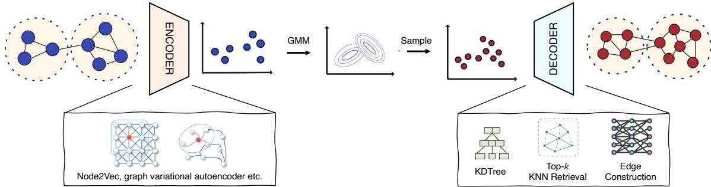  
Figure 1: Overview of the GraphK architecture.

## 3 Methodology

In this section, we describe our proposed method, GraphK1, a graph generation framework that follows an encoder–sampler–decoder architecture as shown in Fig. 1. The model is designed to learn the underlying graph structure from observed graphs and to generate new graphs that preserve this characteristic. Moreover, it supports flexible control over the number of nodes and edges in the generated graph, independent of the size of the input graph. GraphK consists of three main components: (i) the encoder, which maps input graphs into a latent space using flexible graph embedding techniques; (ii) the sampler, which generates new node embeddings by sampling from a learned latent distribution; and (iii) the decoder, which predicts graph connectivity among the sampled nodes using nearest neighbor-based edge construction mechanism. In the following, we provide detailed explanations of each component.

## Encoder

The encoder module maps input graphs into a latent representation space that captures their structural and semantic properties. This module is designed to be modular and flexible, allowing the use of various graph embedding techniques. In our implementation, we used both shallow embedding methods, such as Node2VecGrover and Leskovec (2016), and neural network-based encoders, such as the encoder component of a variational graph autoencoder (VGAE) Kipf and Welling (2016). However, the framework is compatible with any encoding method, making it adaptable to diferent tasks and data characteristics.

General Formulation. Let $G = ( V , E )$ denote the input graph, where $V = \{ v _ { 1 } , v _ { 2 } , . . . , v _ { N } \}$ is the set of nodes, E is the set of edges. The encoder maps the graph into a set of latent embeddings $\mathcal { Z } = \{ z _ { 1 } , z _ { 2 } , . . . , z _ { N } \}$ , where each $z _ { i } \in \mathbb { R } ^ { d }$ is the latent representation of node $v _ { i } \in V$ . This mapping is represented as:

$$
z _ { i } = f _ { \mathrm { e n c } } ( v _ { i } ; G ) , \quad \forall v _ { i } \in V\tag{1}
$$

Node2Vec Encoder. We use structural embedding methods to map nodes into a latent space. In practice, we experimented with both shallow embedding (e.g., Node2Vec Grover and Leskovec (2016)) and neural network-based encoders (e.g., VGAE Kipf and Welling (2016)). Full details of the Node2Vec formulation are provided in Appendix A.2.

VGAE Encoder. Alternatively, we used a neural encoder such as VGAE Kipf and Welling (2016), which encodes both the node features and graph structure into a probabilistic latent space. The VGAE encoder uses a Graph Convolutional Network (GCN) to parameterize the posterior distribution $q ( z _ { i } \mid X , A )$ as a multivariate Gaussian:

$$
q ( z _ { i } \mid X , A ) = { \mathcal { N } } ( z _ { i } \mid \mu _ { i } , \mathrm { d i a g } ( \sigma _ { i } ^ { 2 } ) )\tag{2}
$$

where $A \in \{ 0 , 1 \} ^ { | V | \times | V | }$ is the adjacency matrix, and the mean and variance vectors are computed as:

$$
\mu = \mathrm { G C N } _ { \mu } ( X , A ) , \quad \log \sigma = \mathrm { G C N } _ { \sigma } ( X , A )\tag{3}
$$

Latent vectors $z _ { i }$ are then sampled using the reparameterization trick:

$$
z _ { i } = \mu _ { i } + \sigma _ { i } \odot \epsilon , \quad \epsilon \sim \mathcal { N } ( 0 , I )\tag{4}
$$

This flexible design enables GraphK to leverage diferent types of encoders depending on the complexity of the input data and the desired trade-of between expressiveness and computational cost. Additionally, Equation 3 allows for the incorporation of node features, enabling richer representations when such information is available.

## Sampler

In the GraphK framework, the sampler module is responsible for generating new node embeddings by drawing samples from a learned distribution over the latent space. To capture the complex structure of this latent space, we employ a Gaussian Mixture Model (GMM) that assumes the latent representations are drawn from a mixture of several multivariate Gaussian distributions with unknown parameters. The GMM is parameterized by a set of mixture weights, mean vectors, and covariance matrices, which are estimated via Maximum Likelihood Estimation (MLE) using the latent embeddings produced by the encoder. This formulation enables the sampler to model diverse node representations that reflect the statistical properties of the original graph embeddings. Crucially, using a continuous and parameterized distribution allows the model to generate an arbitrary number of synthetic node embeddings, thereby supporting flexible graph generation that is not constrained by the number of nodes in the input graph.

Let the encoded node representations from the encoder be denoted as $\mathcal { Z } = \{ z _ { 1 } , z _ { 2 } , . . . , z _ { N } \}$ 2 where $z _ { i } \in \mathbb { R } ^ { d }$ is a d-dimensional latent vector. We assume that each $z _ { i }$ is generated from a mixture of K Gaussian components (see implementation details in Appendix). The GMM models the probability density function as:

$$
p ( z _ { i } ) = \sum _ { k = 1 } ^ { K } \pi _ { k } \mathcal { N } ( z _ { i } \mid \mu _ { k } , \Sigma _ { k } )\tag{5}
$$

where $\pi _ { k }$ is the mixing coeficient for component k such that $\textstyle \sum _ { k = 1 } ^ { K } \pi _ { k } = 1$ , and $\mathcal { N } ( z _ { i } \mid \mu _ { k } , \Sigma _ { k } )$ is a multivariate Gaussian distribution with mean $\mu _ { k } \in \mathbb { R } ^ { d }$ and covariance matrix $\Sigma _ { k } \in \mathbb { R } ^ { d \times d }$

To estimate the parameters of the GMM, we employ the Expectation–Maximization (EM) algorithm, a standard procedure for latent-variable models. For completeness, the full update rules are provided in Appendix A.3.

## Decoder

The decoder reconstructs the graph structure by predicting edges between the sampled node embeddings. Specifically, it performs edge prediction that combines distance-based metrics (e.g., dot product or cosine similarity). For each potential node pair $( z _ { i } , z _ { j } )$ , the decoder estimates a connection probability $p _ { i j }$ , which is used to form the adjacency matrix of the generated graph. This strategy helps avoid forming unrealistic or overly dense connections during decoding. Specifically, edges are reconstructed between nodes based on their latent representations. A naive approach would involve computing pairwise similarities for all possible node pairs, resulting in a computational complexity of $O ( n ^ { 2 } )$ , where n is the number of nodes. To overcome this scalability bottleneck, we adopt a more eficient edge generation strategy based on the KDTree algorithm Bentley (1975).

Latent Space Smoothness Assumption. We assume that the learned latent space preserves a smooth manifold structure such that nodes with similar embeddings are more likely to share an edge. Formally, let $z _ { v } \in \mathbb { R } ^ { d }$ denote the latent representation of node v. Under the smoothness assumption Dong et al. (2016), if the Euclidean distance $\lVert z _ { v } - z _ { u } \rVert _ { 2 }$ 2 is small, then nodes v and u are likely to be connected in the graph.

Top-k Nearest Neighbor Retrieval. Let  be the set of all nodes with latent embeddings $Z = \{ z _ { v } \mid v \in \mathcal { V } \}$ . For each node $v \in \mathcal V$ , we aim to find its top-k nearest neighbors based on Euclidean distance in the latent space. The neighborhood set $\mathsf { N } _ { k } ( v )$ is defined as:

$$
\begin{array} { r } { \mathsf { N } _ { k } ( v ) = \mathop { \mathrm { a r g m i n } } _ { u \in \mathcal { V } \backslash \{ v \} } ^ { ( k ) } \| z _ { v } - z _ { u } \| _ { 2 } } \end{array}\tag{6}
$$

Here, argmin(k) returns the k nodes with the smallest distances to $z _ { v }$ . The parameter k is selected based on the mode of the degree distribution of the input graphs, which provides a statistically grounded estimate of connectivity. Notably, the maximum degree of a node is not limited to $k ,$ allowing GraphK to generate power-law graphs (See Appendix A.9).

Eficient Search with KDTree. To compute $\mathsf { N } _ { k } ( v )$ eficiently, we construct a KDTree data structure over the set of latent embeddings $Z .$ The KDTree partitions the latent space using axis-aligned hyperplanes and enables eficient nearest neighbor queries. The construction of the KDTree has average complexity $O ( n \log n )$ , and each query for top-k neighbors can be performed in $O ( \log n + k )$ time in low-dimensional spaces.

Edge Construction. Once $\mathsf { N } _ { k } ( v )$ is obtained for each node $v ,$ we add edges from v to all nodes in $\mathcal { N } _ { k } ( v )$ , efectively forming a locally connected graph structure. Optionally, these candidate edges can be further scored using a learnable edge decoder $f _ { \theta } ( z _ { v } , z _ { u } )$ to predict edge probabilities or weights.

This approach enables scalable and geometry-aware edge construction that is consistent with the statistical properties of the original graph, while significantly reducing the computational burden compared to exhaustive pairwise evaluation. Additionally, in graphs with well-defined community structures, the encoder may learn an embedding space where nodes from the same community are tightly clustered, potentially leading to a loss of intercommunity edge information. To mitigate this, training a learnable edge decoder (i.e., edge prediction model based on neural networks) is beneficial. We also observed that during the training of the decoder, fine-tuning the learned embeddings with a small learning rate further improves performance.

Exchangeability, projectivity, and sparsity. A central tension in generative graph modeling is that permutation-invariant, size-consistent (projective) models are characterized by conditionally independent edges given latent variables (i.e., a graphon or latent-position form), via the Aldous-Hoover theorem and its generalizations. This representation is both suficient and necessary for a broad class of projective models, including stochastic block models and VAE-style latent factor models (Orbanz and Roy, 2015). A well-known corollary is density: if the graphon’s mean edge rate is non-zero, the expected number of edges scales as $\Theta ( n ^ { 2 } )$ , so jointly exchangeable graphs are almost surely dense (or empty) (Orbanz and Roy, 2015). Remedies that simply downscale edge probabilities $( \mathrm { e . g . , } w / n )$ enforce sparsity but do not yield realistic higher-order structure such as power-law degrees. Hamilton (2020) likewise frames the core challenge in graph generation as producing realistic structures, not just any exchangeable samples, while retaining tractability. In this paper, we take a pragmatic route. GraphK is permutation-invariant at the embedding level but deliberately departs from the fully exchangeable regime by enforcing locality via k-NN in latent space, which caps proposed edges at $O ( k n )$ and thus yields linear-edge sparsity. Importantly, because k-NN selection is asymmetric, many nodes may choose the same target, allowing hub formation and heavy-tailed degrees despite each node emitting at most k edges. Conceptually, GraphK addresses the open problem articulated by Orbanz and Roy (2015), reconciling symmetry principles with sparse network properties by permitting limited dependencies between edges, and advances a simple, scalable mechanism that empirically produces realistic community structure while keeping the model permutation-agnostic in its latent parametrization. Our framework thus also contributes a step toward aligning permutation-invariance with sparse graph generation, showing that even a lightweight algorithm like GraphK can produce realistic behavior. We further illustrate this efect in Appendix A.9, where experiments on the Gnutella05 Leskovec and Krevl (2014) network confirm that asymmetric k-NN selection in GraphK can reproduce power-law-like degree distributions.

## 4 Experimental Study

We tested GraphK by evaluating its ability to capture structural properties of both real-world and synthetic networks. Details on data preprocessing steps provided in Appendix A.4.1.

## 4.1 Datasets

We evaluated GraphK on both synthetic and real-world temporal datasets with varying sizes and graph (e.g., protein, community and citation).

Protein dataset. A total of 918 protein graphs from Dobson and Doig (2003) are used, each containing between 100 and 500 nodes. In these graphs, each node represents an amino acid, and an edge is formed between two nodes if the distance between the corresponding amino acids is less than 6 Angstroms. We sampled 225 graphs from this dataset for use with GraphRNN as in their code settings.

CiteSeer dataset. The CiteSeer (CS) network Sen et al. (2008) is a widely used benchmark dataset where documents are represented as nodes and citation relationships as edges. For our experiments, we used the largest connected component, which has a size of $| N | = 2 1 2 0$

Synthetic Networks. To extend our experiments, we used synthetically with community graphs with 2-block community networks with size of 60 $\leq | N | \leq 1 2 0$ and 3-block community networks with size of $6 0 \leq | N | \leq 1 2 0$

## 4.2 Baseline Models

We compared GraphK against both classical graph generation models and recent deep learning-based approaches. As traditional baselines, we included the Erd˝os–R´enyi (E-R) model Erd¨os and R´enyi (1959), which generates random graphs by connecting nodes with a fixed probability, and the Barab´asi–Albert (B-A) model Barab´asi et al. (2002), which produces scale-free networks using preferential attachment. Among deep learningbased methods, we evaluated GraphVAE Simonovsky and Komodakis (2018), a variational autoencoder tailored for graph generation; GraphRNN You et al. (2018), which sequentially constructs graphs using a recurrent neural network to preserve topological structure, and NetGAN, a walk-based auto-regressive graph generation method. For difusion-based models, we include DiGress Vignac et al. (2022) and Pard Zhao et al. (2024). Finally, as a scalable large graph generation method, we include BiGG Dai et al. (2020). This diverse set of baselines enables a comprehensive evaluation of our approach across both conventional and modern graph generation methods.

## 4.3 Experimental Results

For each dataset, we compute Maximum Mean Discrepancy (MMD) Gretton et al. (2012) scores between generated and real graphs using spectral distances, orbit counts, and motif distributions. As shown in Table 2, our model, GraphK, consistently outperforms or remains competitive with baseline models across multiple datasets and metrics. On the 2-block community dataset, GraphK achieves lower orbit and motif scores compared to other baselines, whereas NetGAN attains the lowest spectral score. In the protein dataset, Pard performs well on orbit and motif metrics, with GraphK remaining fairly competitive. For the CiteSeer dataset, GraphK achieves lower overall scores than BiGG and NetGAN, while GraphRNN, DiGress, and Pard fail to scale due to Out-Of-Memory (OOM) errors during training, highlighting the scalability limitations of some autoregressive methods. Overall, these results indicate that GraphK captures both global and local structural properties more efectively and performs better or comparably to both traditional and neural baseline models.

Table 2: Comparison of graph generation quality across models on synthetic and real-world datasets. MMD scores for spectral, orbit, and motif statistics (lower is better).
<table><tr><td rowspan="2"></td><td colspan="3">2-Block Community</td><td colspan="3">Protein</td><td colspan="3">CiteSeer</td></tr><tr><td>Spectral</td><td>Orbit</td><td>Motif</td><td>Spectral</td><td>Orbit</td><td>Motif</td><td>Spectral</td><td>Orbit</td><td>Motif</td></tr><tr><td>ER</td><td>0.051</td><td>1.117</td><td>1.131</td><td>0.102</td><td>1.684</td><td>1.450</td><td>0.056</td><td>1.993</td><td>1.951</td></tr><tr><td>BA</td><td>0.044</td><td>1.214</td><td>1.420</td><td>0.100</td><td>1.139</td><td>1.284</td><td>0.048</td><td>1.127</td><td>1.383</td></tr><tr><td>GraphVAE</td><td>0.106</td><td>1.416</td><td>1.402</td><td>0.082</td><td>1.266</td><td>1.266</td><td>0.245</td><td>1.416</td><td>1.422</td></tr><tr><td>GraphRNN</td><td>0.061</td><td>1.151</td><td>1.116</td><td>0.301</td><td>0.752</td><td>0.804</td><td></td><td>OOM</td><td></td></tr><tr><td>NetGAN</td><td>0.021</td><td>0.298</td><td>0.398</td><td>0.075</td><td>1.112</td><td>1.172</td><td>0.024</td><td>1.351</td><td>1.184</td></tr><tr><td>BIGG</td><td>0.122</td><td>0.331</td><td>0.428</td><td>0.080</td><td>0.257</td><td>0.434</td><td>0.174</td><td>1.333</td><td>1.342</td></tr><tr><td>DiGress</td><td>0.022</td><td>0.268</td><td>0.244</td><td>0.032</td><td>0.262</td><td>0.482</td><td></td><td>OOM</td><td></td></tr><tr><td>Pard</td><td>0.070</td><td>0.250</td><td>0.349</td><td>0.033</td><td>0.253</td><td>0.201</td><td></td><td>OOM</td><td></td></tr><tr><td>GraphK</td><td>0.068</td><td>0.250</td><td>0.233</td><td>0.032</td><td>0.354</td><td>0.528</td><td>0.096</td><td>0.2511</td><td>0.5379</td></tr></table>

Here, we provide a visual comparison of graphs generated by our method GraphK against GraphRNN and GraphVAE, as shown in Fig. 2.

<table><tr><td>Original</td><td>GraphK</td><td>GraphRNN</td><td>GraphVAE</td></tr><tr><td>2-COOM |V|=80, |E|=382</td><td>|V|=110,|E|=717</td><td>|V|=90,|E|=470</td><td>|V|=60, |E|=462</td></tr><tr><td>3-COM |V|=100, |E|=606</td><td>|V|=120, |E|=761</td><td>|V|=74,|E|=267</td><td>|V|=100, |E|=677</td></tr><tr><td>Protein |V|=327, |E|=899</td><td>|V|=267,|E|=895</td><td>注 |V|=288, |E|=747 |V|=67, |E|=172</td><td></td></tr></table>

Figure 2: Visual comparison of graphs generated by diferent models on synthetic community and real-world protein datasets.

We also provide a visual comparison of graphs generated by our method GraphK against GraphRNN and GraphVAE, as shown in Fig. 2. While results on community graphs are comparable across methods, GraphK better captures the structure of protein graphs. This improvement is due to GraphK’s permutation invariance, which allows it to model protein graphs more efectively regardless of node ordering. In contrast, GraphRNN relies on a specific node order, which limits its performance on such datasets. Further evaluation with GRAN can be found in Appendix A.10.

Computational Time Eficiency. The encoder (Node2Vec or VGAE) runs in time roughly proportional to $O ( E )$ (Node2Vec uses random walks over edges) or $\mathcal { O } ( N + E )$ for a GNN encoder. The GMM fitting on the node embeddings is at most (N (mixture components) EM iterations), which for reasonably chosen component counts is manageable. Generation involves sampling $N ^ { \prime }$ node embeddings (i.e., trivial cost) and building a KD-tree ( (N log N)) for neighbor search; connecting top-k neighbors for each node is (Nk log N) with the tree. Typically k is small (like tens), so this is efectively (N log N). Overall, the proposed method scales near-linearly in the number of nodes for generation, much better than quadratically. It can, in principle, generate graphs much larger than those seen in training by sampling more points (i.e., upscaling), as presented in the appendix. By contrast, many prior models either struggle with large N (GraphVAE, GraphRNN, GRAN) or require heavy computation (difusion models). This is a major scalability advantage over methods. We leave the full details of quantitative results in the appendix. In terms of memory, storing the KD-tree is $O ( N )$ and handling adjacency also $\mathcal { O } ( N ^ { 2 } )$ in the worst case if fully connected, but since only k neighbors per node are kept, the resulting graph has about kN edges (linear in $N )$ . As a consequence, there is a performance trade-of: speed vs. granularity, as discussed in the limitations.

## 4.4 Large Graph Generation

We extend our experiments to graphs with larger sizes. Although there is no strict boundary, we describe a graph as large if it has more than 10, 000 nodes. As an ablation study, we train GraphK on a graph with exactly 10, 000 nodes and calculate the time for generating new graphs with various sizes between 5, 000 and 50, 000.

For this experiment, Node2Vec is used as the encoder and trained for 800 epochs, which took approximately 6 minutes. Number of GMM components is selected as 16, and k as 12. GMM fitting took 1.46 seconds, while sampling new embeddings from the learned distribution takes a negligible time (i.e., less than a second). Finally, decoding (i.e., inference) time with dot product is shared in Fig. 3c. The study shows that, technically, the proposed KDTree-based graph decoding approach allows the construction of large graphs having size up to 50, 000 nodes in less than 10 seconds.

Among the baseline models, GraphVAE, GraphRNN, DiGress, and Pard even struggle to process graphs with a thousand nodes. The inference time for BiGG, the only comparable baseline for large graph generation, is reported in their paper as approximately 7 minutes for 10, 000 nodes and about 20 minutes for 50, 000 nodes. Thus, for the dot-product decoder, the inference time of GraphK for 50, 000 nodes is 120 times faster than BiGG. However, it should be noted that, usage of the dot-product decoder requires a well-trained encoder with powerful representation capability. Otherwise, a learnable decoder (e.g., a neural network) can be utilized to increase the quality of generation, at the price of an increase in inference time by a constant factor (i.e., based on the cost of a single forward pass).

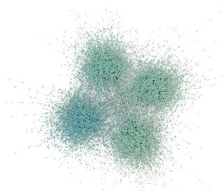  
(a) Input

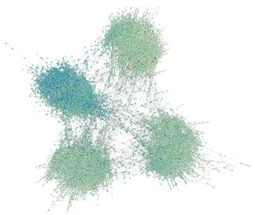  
(b) Generated

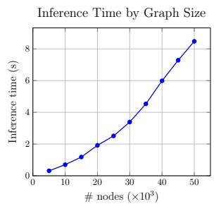  
(c) Time  
Figure 3: Input graph shown in (a) has 10, 000 nodes and approximately 21, 000 edges. One of the generated graphs (b) has 15, 000 nodes and approximately 32, 000 edges. The parameter k is selected as 12. Subfigure (c) shows the decoding (inference) time in seconds with respect to the graph size.

## 4.5 Assessing the Encoder Flexibility

In this ablation study, we aim to assess the generalizability of GraphK by using alternative graph encoders. Specifically, we utilize the Higher Order Proximity Preserved Embedding (HOPE) Ou et al. (2016) method, which focuses on directed graphs and seeks to learn two embedding vectors per node: one acting as a source and the other as a destination (see Fig. 4b).

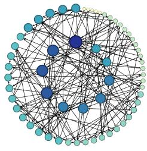  
(a) Input graph

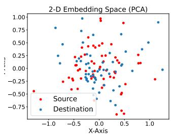  
(b) HOPE node embeddings

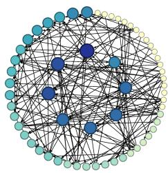  
(c) Generated graph  
Figure 4: Directed graph generation with HOPE encoder. Darker nodes have higher indegree.

For each node $v \in \nu$ , HOPE assigns latent embeddings $Z = \{ z _ { v } ^ { s r c } , z _ { v } ^ { d s t } \ | \ v \in \mathcal { V } \}$ that capture source and destination representations. We use separate GMMs to model these two vector sets and sample new embeddings. To adapt top-k nearest neighbors retrieval into directed graph generation, we modify Eq. 6 as:

$$
\mathsf { N } _ { k } ^ { o u t } ( v ) = \mathrm { a r g m i n } _ { u \in \mathcal { V } \backslash \{ v \} } ^ { ( k ) } \left\| z _ { v } ^ { s r c } - z _ { u } ^ { d s t } \right\| _ { 2 }\tag{7}
$$

Here, $\mathsf { N } _ { k } ^ { o u t } ( v )$ defines the outgoing neighbors (i.e., successors) of the node v. Similarly, the incoming neighbors (i.e., predecessors) $\mathsf { N } _ { k } ^ { i n } ( v )$ can be obtained by swapping the roles of node u and node v within the distance calculation in Eq. 7. This formulation implies that there is a directed edge between node v and node u if the source vector of node v resides close to the destination vector of node u.

For this ablation study, we used a directed E-R graph (Fig. 4a) as input. The generated output (Fig. 4c) is also a directed graph. For visualization, the dual circle layout has been chosen to help observe the distribution of node in-degree values, such that nodes with higher in-degree values are centered. The results confirm that GraphK is highly adaptable to diverse graph types when an appropriate encoder is utilized, and emphasize the flexibility of the proposed framework.

## Limitations

A key limitation of our approach lies in the smoothness assumption made during the decoder step. This assumption suggests that nodes with similar features are likely to be connected, which can limit ability of the model to capture all relevant relationships in the graph. Specifically, two nodes that may not appear in the top-k rankings based on feature similarity might still have a very important edge between them, which our model could overlook. This limitation highlights the need for further research into relaxing the smoothness assumption or incorporating more sophisticated mechanisms that can better identify crucial connections beyond simple feature-based similarity. Another limitation is that the embedding preserves local structure, i.e, nodes that were connected or in the same community in the origina graph will lie close together in latent space, so reconnecting by proximity yields a similar topology. This strategy avoids evaluating all node pairs for edge probabilities; instead of a complete $O ( N ^ { 2 } )$ pairwise comparison, a KD-tree helps find nearest neighbors eficiently. This can naturally capture clustering (latent clusters lead to dense connections inside a community) but might struggle to generate graphs with grid structure or line.

## 5 Conclusion

We proposed GraphK, a graph generation method that efectively captures both structural properties and permutation-invariant characteristics of graphs. Through extensive experiments on synthetic and real-world datasets, including community graphs, protein structures, and citation networks, we demonstrated that GraphK achieves superior performance in terms of spectral, orbit and motif metrics compared to both traditional and deep learning-based baselines. GraphK not only preserves key topological features such as spectral distributions, orbits, and motifs, but also maintains robustness to node ordering.

## Reproducibility Statement

The proposed GraphK is fully reproducible. The model components and training pipeline are specified in Section 3 and Fig. 1 (encoder/sampler/decoder), with an explicit note that all data and code will be released; our camera-ready will include an anonymous repository with scripts to reproduce every table and figure. For implementation details that afect outcomes, Appendix A.2 gives the Node2Vec objective and softmax, Appendix A.3 provides the complete EM updates for the GMM sampler, and Appendix A.4 lists the concrete hyperparameters and optimizer settings we used. Our datasets and preprocessing choices are summarized in Section 4.1 and Appendix A.4.1, and the baselines we compare against are enumerated in Section 4.2. We report evaluation protocols and metrics (MMD over spectra, orbits, and motifs) in Section 4.3 and Table 2, enabling like-for-like replication. We also document analyses that probe specific claims: permutation-invariance stress tests in Appendix A.5, upscaling/downscaling behavior in Appendix A.6. Finally, Appendix A.9 details our power-law study on Gnutella05, including degree histograms for original vs. generated graphs.

## Acknowledgments and Disclosure of Funding

All acknowledgements go at the end of the paper before appendices and references. Moreover, you are required to declare funding (financial activities supporting the submitted work) and competing interests (related financial activities outside the submitted work). More information about this disclosure can be found on the JMLR website.

## Appendix A.

## A.1 Notations

Table 3 summarizes the notations used throughout the paper.

Table 3: Summary of Notations
<table><tr><td>Symbol</td><td>Description</td></tr><tr><td> $\mathcal { G } = ( \nu , \mathcal { E } , \mathcal { X } )$ </td><td>Input graph with node set  $\nu$  and edge set  $\mathcal { E }$  and features of nodes X</td></tr><tr><td> $n = | \nu |$ </td><td>Number of nodes in the graph</td></tr><tr><td> $d$ </td><td>Dimensionality of the latent space</td></tr><tr><td> $z _ { v } \in \mathbb { R } ^ { d }$ </td><td>Latent representation of node  $v \in \mathcal V$ </td></tr><tr><td> $Z = \{ z _ { v } \mid v \in \mathcal { V } \}$ </td><td>Set of latent embeddings for all nodes</td></tr><tr><td> $\lVert z _ { v } - z _ { u } \rVert _ { 2 }$ </td><td>Euclidean distance between node embeddings  $z _ { v }$  and  $z _ { u }$ </td></tr><tr><td> $\mathcal { N } _ { k } ( v )$ </td><td>Top-k nearest neighbors of node v in the latent space</td></tr><tr><td> $k$ </td><td>Number of neighbors retrieved (set to mode of degree distribution)</td></tr><tr><td> $\mathrm { a r g m i n } ^ { ( k ) } \| z _ { v } - z _ { u } \| _ { 2 }$ </td><td>Operator that returns the k nodes closest to  $z _ { v }$ </td></tr><tr><td> $f _ { \theta } ( z _ { v } , z _ { u } )$ </td><td>Learnable decoder function predicting edge strength or existence</td></tr></table>

## A.2 Node2Vec Encoder Details

Node2Vec Grover and Leskovec (2016) learns node embeddings by simulating biased random walks on the graph and applying the Skip-Gram model. For each node $v \in V$ , Node2Vec optimizes the following objective:

$$
\operatorname* { m a x } _ { \Phi } \sum _ { v \in V } \sum _ { u \in \mathbf { N } ( v ) } \log \mathrm { P r } ( u \mid \Phi ( v ) ) ,\tag{8}
$$

where $\Phi : V \to \mathbb { R } ^ { d }$ is the embedding function, ${ \bf N } ( v )$ denotes the neighborhood of node v obtained through biased random walks, and $\operatorname* { P r } ( u \mid \Phi ( v ) )$ is modeled via a softmax:

$$
\operatorname* { P r } ( u \mid \Phi ( v ) ) = \frac { \exp ( \Phi ( u ) ^ { \top } \Phi ( v ) ) } { \sum _ { v ^ { \prime } \in V } \exp ( \Phi ( v ^ { \prime } ) ^ { \top } \Phi ( v ) ) } .\tag{9}
$$

Here, $\operatorname* { P r } ( u \mid \Phi ( v ) )$ denotes the probability of node u appearing in the context of node $v ,$ given their embeddings. It reflects how likely u is to co-occur with v based on the similarity of their vector representations.

## A.3 Expectation–Maximization for GMM

The EM algorithm proceeds iteratively with the following two steps:

E-step. We compute the posterior responsibility $\gamma _ { i k }$ , which represents the probability that the data point $z _ { i }$ was generated by the k-th Gaussian component:

$$
\gamma _ { i k } = \frac { \pi _ { k } \mathcal { N } ( z _ { i } \mid \mu _ { k } , \Sigma _ { k } ) } { \sum _ { j = 1 } ^ { K } \pi _ { j } \mathcal { N } ( z _ { i } \mid \mu _ { j } , \Sigma _ { j } ) } .\tag{10}
$$

M-step. We update the parameters of the mixture model based on the computed responsibilities:

$$
\pi _ { k } ^ { \mathrm { n e w } } = \frac { 1 } { N } \sum _ { i = 1 } ^ { N } \gamma _ { i k } ,\tag{11}
$$

$$
\mu _ { k } ^ { \mathrm { n e w } } = \frac { \sum _ { i = 1 } ^ { N } \gamma _ { i k } z _ { i } } { \sum _ { i = 1 } ^ { N } \gamma _ { i k } } ,\tag{12}
$$

$$
\Sigma _ { k } ^ { \mathrm { n e w } } = \frac { \sum _ { i = 1 } ^ { N } \gamma _ { i k } ( z _ { i } - \mu _ { k } ) ( z _ { i } - \mu _ { k } ) ^ { \top } } { \sum _ { i = 1 } ^ { N } \gamma _ { i k } } .\tag{13}
$$

These E and M steps are repeated until convergence. Once the model is trained, we sample a component $k \sim \mathrm { C a t e g o r i c a l } ( \pi _ { 1 } , . . . , \pi _ { K } )$ and then draw node representations $\tilde { z } \sim \mathcal { N } ( \mu _ { k } , \Sigma _ { k } )$ enabling diverse and structured node embeddings for graph generation.

## A.4 Implementation Details

## A.4.1 Data Preprocessing

Before training and evaluation, we apply several standard preprocessing steps to ensure consistency across datasets. First, graphs are loaded from pre-specified pickle files and renumbered to contiguous node indices, then converted to PyTorch Geometric Data objects with a constant node feature vector of dimension one. For supervised training of the edge decoder, positive edges are paired with some ratio of negatives drawn via negative sampling, and binary edge labels are constructed. During generation, we threshold the predicted adjacency, remove self-loops, drop isolated nodes, and optionally retain only the largest connected component to ensure that outputs are well-formed and comparable. For evaluation, we normalize distributions of Laplacian spectra before computing MMD scores, and we exclude empty graphs from consideration. Motif and orbit statistics are obtained through consistent node reindexing and external ORCA calls. Together, these steps standardize input graphs, ensure realistic generated outputs, and enable fair and reproducible evaluation.

## A.4.2 Experimental Setup

We evaluated deep graph generation baselines using their oficial implementations and default settings: GraphRNN, NetGAN, and DiGress. Since NetGAN relies on an older version of TensorFlow (1.x), we ran it locally, while the other models were executed in Google Colab notebooks for convenience. For evaluation, each method generated 20 graphs, and we measured their similarity to the original graph using the MMD distance. The same evaluation procedure was applied consistently across all baselines.

## A.4.3 Implementation Details of Model Components

Encoder. For the Node2Vec encoder, the choice of hyperparameters depends on the input graph characteristics and size. However, we commonly used a walk length of 20, a context size of 10, and a number of walks to sample per node of 10. Additionally, we used an embedding size of 16. We used second-degree bias parameters p and q as 0.5 and 2.0, respectively. This choice is to exploit a higher degree of neighborhood. Especially for the community graphs, we observed that having a light encoder training is useful since a tight one causes an embedding space with tightly clustered nodes, resulting in missing the inter-community edges. We set the learning rate as 0.001 learning rate trained a Node2Vec model for 600 epochs. In addition to Node2Vec, we conducted experiments with a VGAE as the encoder. In these experiments, we used a number of input channels as 16, hidden channels as 32, and latent size as 16. As optimizer, we used AdamW and set the learning rate as 0.001. Because of its flexibility, ease of usage, and ability to capture localities well, we set our default encoder as Node2Vec.

Sampler. GMM sampler requires a critical hyperparameter, number of components, which refers to the number of Gaussian distributions that the model will use to represent the data (i.e., node embeddings). This hyperparameter should be chosen carefully so that it does not oversimplify or undersimplify the underlying graph distribution in Euclidean space. For example, in the case of graphs with clear communities and rare inter-community edges, we observed that setting the number of components hyperparameter equal to the number of communities is useful. However, this manual approach is not feasible when the underlying graph distribution is complex or communities are unclear (e.g., protein graphs). In those cases, we used the Variational Bayesian Gaussian Mixture Model (VBGMM), a Bayesian extension of traditional GMM. Instead of pre-specifying the number of Gaussian distributions, VBGMM can automatically infer it, resulting in regularized and softer assignments of data points to clusters.

Decoder. For the decoding stage, we used a simple binary classifier composed of a neural network with two linear layers. Since the node embeddings are already initialized using the encoder’s output, using a more complex decoder could lead to overfitting. To convert pairs of node embeddings into edge features, we concatenated several metrics: the Hadamard product, L1 distance, L2 distance, and the element-wise average.

We trained the decoder using the AdamW optimizer with a learning rate of 0.001 and a small weight decay. Instead of freezing the encoder-generated node embeddings, we fine-tuned them during training with a much smaller learning rate (e.g., 10−5). Since link prediction is usually a local task, this fine-tuning can be particularly beneficial when the encoder focuses more on global structural properties of graph (such as GraphWave), which lack locality.

## A.5 Permutation Invariance Evaluation

We conducted an additional experiment to quantify the efect of node ordering on graph generation model outputs. The simplest approach for evaluating permutation invariance involves taking a single input graph G and producing P variants by randomly shufling the node indices, efectively applying diferent permutations π to its adjacency matrix. While topics such as graph isomorphism and canonical graph representations form a separate research area in graph theory Huang et al. (2022); Ma et al. (2024), our focus here is on extending this analysis to real datasets whose inherent structural properties make them particularly sensitive to node ordering.

With this goal in mind, grid graphs initially appear ideal due to their high symmetry, regular topology, large number of structurally indistinct nodes, and extensive automorphism groups. However, grid graphs are outside the modeling scope of our current framework (as discussed in the Limitations section). On the other hand, stochastic block community graphs are overly forgiving. Once a traversal begins within a dense community, breadth-first or depth-first searches tend to collapse multiple permutations into very similar, block-oriented sequences, i.e., quickly traversing one clique before moving to another, which conceals potential ordering biases. We therefore selected Protein Dobson and Doig (2003) graphs for this analysis. Their polymer-backbone topology, characterized by long self-avoiding paths, short secondary-structure cycles, and recurrent local motifs, provides suficient symmetry to highlight ordering bias clearly.

Accordingly, in this part of our evaluation, we compare our model exclusively against GRAN Liao et al. (2020), the current state-of-the-art baseline known for its consistently strong performance across various graph generation benchmarks. We intentionally exclude difusion-based models from the comparison, as they are not well-suited for large graphs and exhibit impractical runtimes in benchmark studies, placing them outside the scope of this competitive evaluation Zhao et al. (2024). To assess how the impact of permutation invariance scales with graph size, we divided our dataset into four groups based on node counts: Group 1 (100–200 nodes), Group 2 (200–300 nodes), Group 3 (300–400 nodes), and Group 4 (400–500 nodes). For each generated graph, we computed the Laplacianspectrum MMD metric. This choice was deliberate, as the Laplacian spectrum (i.e., the set of eigenvalues of the Laplacian matrix) remains invariant to node permutations. Additionally, the Laplacian spectrum efectively captures global structural properties, unlike purely local descriptors such as node degrees, orbit distributions, or clustering coeficients O’Bray et al. (2021). Although these local metrics are also valuable in assessing graph quality, as discussed previously in Table 2, they may remain relatively unchanged despite significant overall topological alterations. A visual comparison was provided in Fig. 10a, here presented with additional detailed results in Fig. 5.

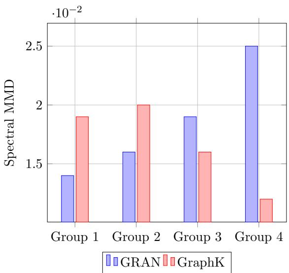  
Figure 5: GraphK vs GRAN in protein dataset. Group 1: (100-200 nodes), Group 2: (200-300 nodes), Group 3: (300-400 nodes), Group 4: (400-500 nodes)

In smaller graphs (under 300 nodes), GRAN achieves slightly superior performance, reproducing spectral characteristics marginally better than GraphK (approximately 15% lower). At this scale, GRAN’s block attention mechanism efectively explores multiple node permutations without accumulating noticeable biases. However, the critical crossover point at Group 3 supports our hypothesis. As graph size increases beyond 300 nodes, GRAN’s Spectral MMD significantly deteriorates, rising from $1 . 9 \times 1 0 ^ { - 2 }$ (300–400 nodes) to $2 . 5 \times 1 0 ^ { - 2 }$ (400–500 nodes). This sharp increase highlights the growing negative impact of node-order sensitivity as graphs become larger and structurally more complex. In contrast, GraphK demonstrates strong permutation invariance, achieving a 52% lower Spectral MMD compared to GRAN at the largest graph size (400–500 nodes).

## A.6 Upscaling - Downscaling Performance

To evaluate the upscaling and downscaling capabilities of GraphK, we conducted an experiment using a three-block community graph. We intentionally set one community to be larger than the others, with approximate sizes of 200, 100, and 100 nodes. Using our proposed GraphK model, we upscaled the graph by a factor of 10, as shown in Fig. 6b. Visual inspection reveals that one community remains slightly larger than the others, demonstrating GraphK’s ability to preserve the relative sizes of communities during upscaling. Next, we trained GraphK on the upscaled graph and generated graphs having a similar number of nodes as the original graph (i.e., graph shown in Fig. 6a). The results, depicted in Fig. 6c, highlight GraphK’s efectiveness in downscaling while maintaining structural properties.

The ability to upscale graphs is particularly critical when available real-world data is sparse, limited, or sensitive. These situations are commonly encountered in domains like social network privacy analysis Abawajy et al. (2016), network trafic simulation Li et al. (2024), and resilience testing of large-scale infrastructure systems. Specifically, in applied machine learning studies, GraphK’s upscaling capability might enable efective data augmentation, providing richer synthetic datasets for training robust graph-based machine learning models Zhou et al. (2025). Furthermore, it can facilitate scenario testing and forecasting in network science, where examining structural evolution at scale is crucial yet dificult with original, fixed-size datasets.

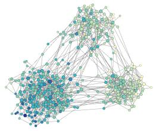  
(a) |N| = 396, |E| = 1040

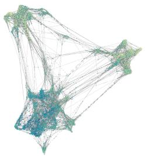  
(b) |N| = 3828, |E| = 22055

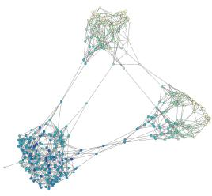  
(c) |N| = 395, |E| = 1560  
Figure 6: Figure (a) shows a graph with three communities generated using the Stochastic Block Model. After upscaling, we obtain Figure (b). Then, we downscale it back, resulting in Figure (c).

## A.7 Visual Assessment

We provide additional visual examples by GraphK, emphasizing its ability to generate graphs with varying sizes but similar structural properties.

<table><tr><td>Original</td><td colspan="2">GraphK</td></tr><tr><td>2-COOM |V|=80, |E|=382</td><td>|V|=40, |E|=222</td><td>|V|=60, |E|=549 |V|=110, |E|=717</td></tr><tr><td>3-COM 福 |V|=100, |E|=606</td><td>福 |V|=50,|E|=480</td><td>|V|=70, |E|=418 |V|=120, |E|=761</td></tr><tr><td>Protein |V|=327, |E|=899</td><td>4</td><td>|V|=160, |E|=657 |V|=200, |E|=644 |V|=267, |E|=895</td></tr></table>

Figure 7

## A.8 Node Classification Downstream Task

To evaluate the efectiveness of the embeddings sampled from GMM, we conducted an experiment combining the encoder and sampler for node embedding augmentation in a node classification task on the CiteSeer dataset. First, we obtained Node2Vec embeddings for all 3,327 nodes. These embeddings were then split into training (120 nodes), validation (500 nodes), and test (1,000 nodes) sets, and an XGBoost Chen and Guestrin (2016) classifier was trained on the training set. Next, we fitted a Gaussian Mixture Model (GMM) with 6 components to the training embeddings and generated additional node embeddings by sampling from the GMM. The sampled embeddings were assigned labels using a K-Nearest Neighbors Cover and Hart (1967) classifier. Finally, we retrained the XGBoost model with the augmented training set and evaluated performance improvements. The results, shown in

Fig. 8, indicate that augmenting the training embeddings via GMM sampling can increase classification accuracy by 2% to 10%.  
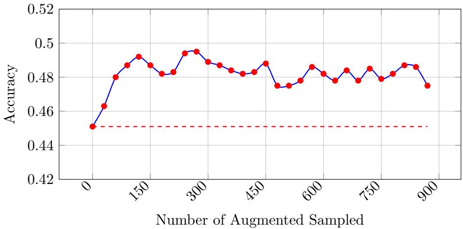  
Figure 8: Augmentation efect on node classification task (Dashed line is the accuracy without augmentation.)

## A.9 Generating Power-Law Behavior

At first glance, the fixed neighborhood size k might appear to limit the emergence of a heavy-tailed degree distribution. However, this is not necessarily the case. To build intuition, consider a point P near the center of an embedding space containing 99 other points, with k = 5. While P selects only 5 neighbors, it may be chosen as a neighbor by many other points, such as 50. In an undirected graph, this would result in $d e g ( P ) = 5 5$ . In other words, although each node can select at most k neighbors, it may be selected by many nodes. This asymmetric selection may lead to the possibility of high-degree hubs and, consequently, a power-law-like degree distribution.

To illustrate this phenomenon, we experimented with the Gnutella05 $( | V | = 8 8 4 6 , | E | =$ 31839) peer-to-peer file-sharing network, which exhibits a power-law-like degree distribution. During this experimentation, we set k=18 and obtained the highest degree of 54. As seen in the Fig. 9, the GraphK-generated graph $( \lvert V \rvert = 8 5 7 8 , \lvert E \rvert = 3 2 6 6 7 )$ has a clear power-lawlike distribution, where the majority of nodes have a low degree while a few nodes act as high-degree hubs. This experiment shows that GraphK can generate graphs exhibiting a power-law degree distribution, as commonly observed in real-world networks.

## A.10 Additional Permutation Invariance Assessment

We also evaluated GRAN using the spectral metric on the Protein dataset. As shown in Fig. 10a, GRAN, which is not permutation invariant, achieves a spectral score of 0.038, while our method, GraphK, achieves a lower score of 0.032. This diference highlights the advantage of permutation invariance in our method, particularly because the spectral metric is sensitive to node orderings. Models like GRAN that rely on fixed node permutations tend to perform worse on datasets where node identities are not aligned. Additionally, we examined the impact of varying the parameter k in the KDTree algorithm as shown in as shown in Fig. 10b. As the number of generated nodes increases, the decoder time grows; however, after a certain point, the runtime stabilizes due to the (n log n) complexity of the KDTree.

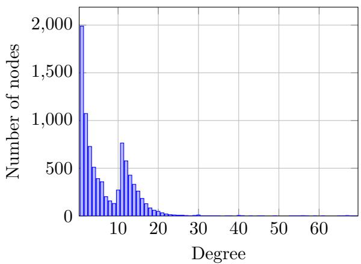  
(a) Original

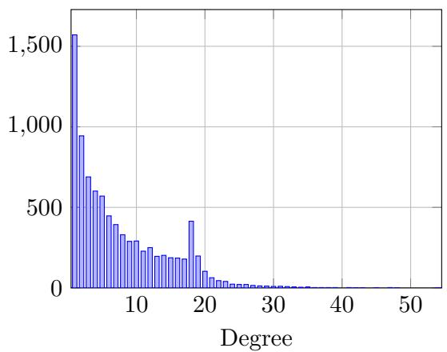  
(b) Generated

Figure 9: Comparison of two histograms  
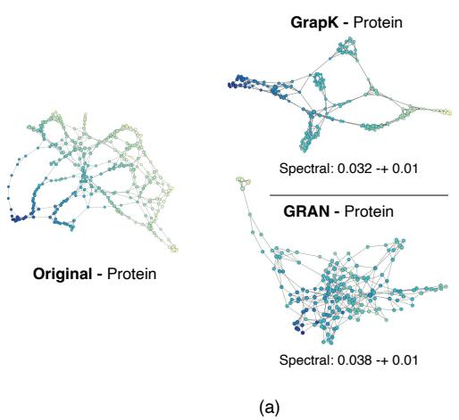

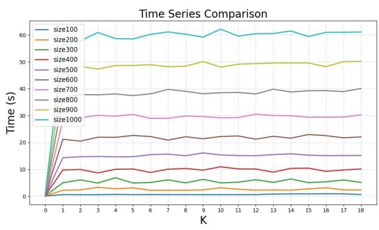  
(b)  
Figure 10: Comparison of spectral scores on the Protein dataset, highlighting the impact of permutation invariance (a), and decoder time calculation to show scale (b)

## References

J. H. Abawajy, M. I. H. Ninggal, and T. Herawan. Privacy preserving social network data publication. IEEE Communications Surveys & Tutorials, 18(3):1974–1997, 2016. doi: 10.1109/COMST.2016.2533668.

O. Abul’atta, E. Mansimov, R. Bonneau, and K. Cho. Masked graph modeling for molecule generation. Nature Communications, 12, 05 2021. doi: 10.1038/s41467-021-23415-2.

M. Allamanis, M. Brockschmidt, and M. Khademi. Learning to represent programs with graphs. arXiv preprint arXiv:1711.00740, 2017.

A.-L. Barabasi and R. Albert. Emergence of scaling in random networks. Science, 286(5439): 509–512, 1999.

A. Barab´asi, H. Jeong, Z. N´eda, E. Ravasz, A. Schubert, and T. Vicsek. Evolution of the social network of scientific collaborations. Physica A: Statistical Mechanics and its Applications, 311(3):590–614, 2002. ISSN 0378-4371. doi: https://doi.org/10.1016/ S0378-4371(02)00736-7. URL https://www.sciencedirect.com/science/article/ pii/S0378437102007367.

S. Bas, K. Kaya, R. Tugay, and S. G. Oguducu. Data augmentation in graph neural networks: The role of generated synthetic graphs, 2024. URL https://arxiv.org/abs/2407.14765.

J. L. Bentley. Multidimensional binary search trees used for associative searching. Communications of the ACM, 18(9):509–517, 1975.

A. Bojchevski, O. Shchur, D. Z¨ugner, and S. G¨unnemann. Netgan: Generating graphs via random walks. In International conference on machine learning, pages 610–619. PMLR, 2018.

M. Brockschmidt, M. Allamanis, A. L. Gaunt, and O. Polozov. Generative code modeling with graphs. arXiv preprint arXiv:1805.08490, 2018.

T. Chen and C. Guestrin. Xgboost: A scalable tree boosting system. In Proceedings of the 22nd ACM SIGKDD International Conference on Knowledge Discovery and Data Mining, KDD ’16, page 785–794. ACM, Aug. 2016. doi: 10.1145/2939672.2939785. URL http://dx.doi.org/10.1145/2939672.2939785.

T. Cover and P. Hart. Nearest neighbor pattern classification. IEEE Transactions on Information Theory, 13(1):21–27, 1967. doi: 10.1109/TIT.1967.1053964.

H. Dai, A. Nazi, Y. Li, B. Dai, and D. Schuurmans. Scalable deep generative modeling for sparse graphs, 2020. URL https://arxiv.org/abs/2006.15502.

P. D. Dobson and A. J. Doig. Distinguishing enzyme structures from non-enzymes without alignments. Journal of molecular biology, 330(4):771–783, 2003.

X. Dong, D. Thanou, P. Frossard, and P. Vandergheynst. Learning laplacian matrix in smooth graph signal representations. IEEE Transactions on Signal Processing, 64(23): 6160–6173, 2016.

P. Erd¨os and A. R´enyi. On random graphs i. Publicationes Mathematicae Debrecen, 6: 290–297, 1959.

P. Erdos and A. Renyi. On random graphs i. Publicationes Mathematicae, 6:290–297, 1959.

F. Faez, Y. Ommi, M. S. Baghshah, and H. R. Rabiee. Deep graph generators: A survey, 2020. URL https://arxiv.org/abs/2012.15544.

A. Gretton, K. M. Borgwardt, M. J. Rasch, B. Sch¨olkopf, and A. Smola. A kernel two-sample test. The Journal of Machine Learning Research, 13(1):723–773, 2012.

A. Grover and J. Leskovec. node2vec: Scalable feature learning for networks. In Proceedings of the 22nd ACM SIGKDD international conference on Knowledge discovery and data mining, pages 855–864, 2016.

A. Grover, A. Zweig, and S. Ermon. Graphite: Iterative generative modeling of graphs. arXiv preprint arXiv:1803.10459, 2018.

W. L. Hamilton. Graph representation learning. Morgan & Claypool Publishers, 2020.

P. W. Holland, K. B. Laskey, and S. Leinhardt. Stochastic blockmodels: First steps. Social networks, 5(2):109–137, 1983.

Z. Huang, Y. Wang, C. Li, and H. He. Going deeper into permutation-sensitive graph neural networks. In International conference on machine learning, pages 9377–9409. PMLR, 2022.

W. Jin, R. Barzilay, and T. Jaakkola. Junction tree variational autoencoder for molecular graph generation. In International conference on machine learning, pages 2323–2332. PMLR, 2018.

T. N. Kipf and M. Welling. Variational graph auto-encoders. arXiv preprint arXiv:1611.07308, 2016.

L. Kong, J. Cui, H. Sun, Y. Zhuang, B. A. Prakash, and C. Zhang. Autoregressive difusion model for graph generation. In International conference on machine learning, pages 17391–17408. PMLR, 2023.

J. Leskovec and A. Krevl. SNAP Datasets: Stanford large network dataset collection. http://snap.stanford.edu/data, June 2014.

J. Leskovec, D. Chakrabarti, J. Kleinberg, C. Faloutsos, and Z. Ghahramani. Kronecker graphs: An approach to modeling networks. Journal of Machine Learning Research, 11 (Feb):985–1042, 2010.

R. Li, Q. Li, Q. Zou, D. Zhao, X. Zeng, Y. Huang, Y. Jiang, F. Lyu, G. Ormazabal, A. Singh, and H. Schulzrinne. Iotgemini: Modeling iot network behaviors for synthetic trafic generation. IEEE Transactions on Mobile Computing, 23(12):13240–13257, 2024. doi: 10.1109/TMC.2024.3426600.

Y. Li, O. Vinyals, C. Dyer, R. Pascanu, and P. Battaglia. Learning deep generative models of graphs. arXiv preprint arXiv:1803.03324, 2018.

R. Liao, Y. Li, Y. Song, S. Wang, C. Nash, W. L. Hamilton, D. Duvenaud, R. Urtasun, and R. S. Zemel. Eficient graph generation with graph recurrent attention networks, 2020. URL https://arxiv.org/abs/1910.00760.

Q. Liu, M. Allamanis, M. Brockschmidt, and A. Gaunt. Constrained graph variational autoencoders for molecule design. Advances in neural information processing systems, 31, 2018.

Y. Luo, K. Yan, and S. Ji. Graphdf: A discrete flow model for molecular graph generation. In International conference on machine learning, pages 7192–7203. PMLR, 2021.

G. Ma, Y. Wang, D. Lim, S. Jegelka, and Y. Wang. A canonicalization perspective on invariant and equivariant learning. arXiv preprint arXiv:2405.18378, 2024.

C. Niu, Y. Song, J. Song, S. Zhao, A. Grover, and S. Ermon. Permutation invariant graph generation via score-based generative modeling. In International conference on artificial intelligence and statistics, pages 4474–4484. PMLR, 2020.

L. O’Bray, M. Horn, B. Rieck, and K. Borgwardt. Evaluation metrics for graph generative models: Problems, pitfalls, and practical solutions. arXiv preprint arXiv:2106.01098, 2021.

P. Orbanz and D. Roy. Bayesian models of graphs, arrays and other exchangeable random structures. IEEE Transactions on Pattern Analysis and Machine Intelligence, 37(2): 437–461, 2015. doi: 10.1109/TPAMI.2014.2334607.

M. Ou, P. Cui, J. Pei, Z. Zhang, and W. Zhu. Asymmetric transitivity preserving graph embedding. In Proceedings of the 22nd ACM SIGKDD International Conference on Knowledge Discovery and Data Mining, KDD ’16, page 1105–1114, New York, NY, USA, 2016. Association for Computing Machinery. ISBN 9781450342322. doi: 10.1145/2939672. 2939751. URL https://doi.org/10.1145/2939672.2939751.

P. Sen, G. Namata, M. Bilgic, L. Getoor, B. Gallagher, and T. Eliassi-Rad. Collective classification in network data. AI Mag., 29(3):93–106, Sept. 2008. ISSN 0738-4602. doi: 10.1609/aimag.v29i3.2157. URL https://doi.org/10.1609/aimag.v29i3.2157.

M. Simonovsky and N. Komodakis. Graphvae: Towards generation of small graphs using variational autoencoders, 2018. URL https://arxiv.org/abs/1802.03480.

C. Vignac, I. Krawczuk, A. Siraudin, B. Wang, V. Cevher, and P. Frossard. Digress: Discrete denoising difusion for graph generation. arXiv preprint arXiv:2209.14734, 2022.

S. Wang, L. Hu, Y. Wang, X. He, Q. Z. Sheng, M. A. Orgun, L. Cao, F. Ricci, and P. S. Yu. Graph learning based recommender systems: A review. arXiv preprint arXiv:2105.06339, 2021.

L. Wen, X. Tang, M. Ouyang, X. Shen, J. Yang, D. Zhu, M. Chen, and X. Wei. Hyperbolic graph difusion model. In Proceedings of the AAAI Conference on Artificial Intelligence, volume 38, pages 15823–15831, 2024.

J. You, R. Ying, X. Ren, W. Hamilton, and J. Leskovec. Graphrnn: Generating realistic graphs with deep auto-regressive models. In International conference on machine learning, pages 5708–5717. PMLR, 2018.

L. Zhao, X. Ding, and L. Akoglu. Pard: Permutation-invariant autoregressive difusion for graph generation. arXiv preprint arXiv:2402.03687, 2024.

J. Zhou, C. Xie, S. Gong, Z. Wen, X. Zhao, Q. Xuan, and X. Yang. Data augmentation on graphs: A technical survey. ACM Comput. Surv., Apr. 2025. ISSN 0360-0300. doi: 10.1145/3732282. URL https://doi.org/10.1145/3732282.