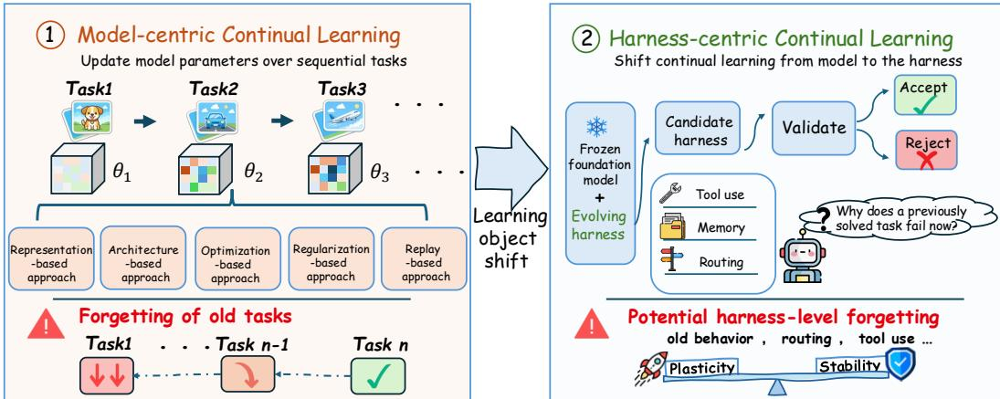
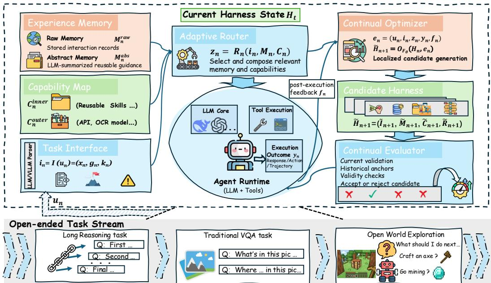
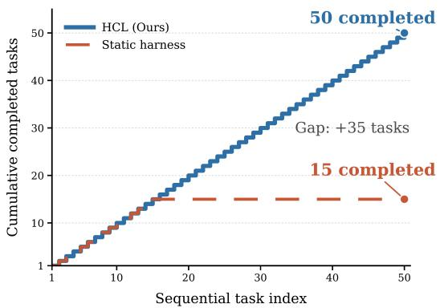
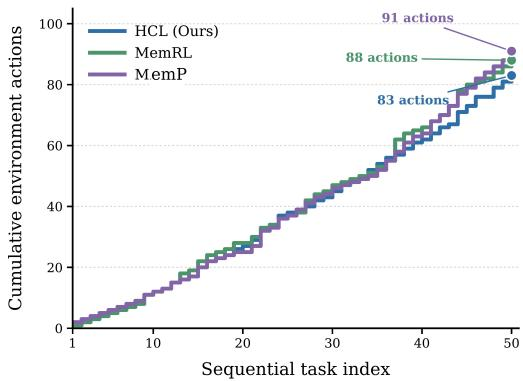
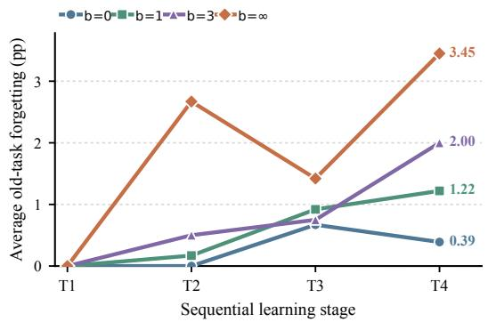
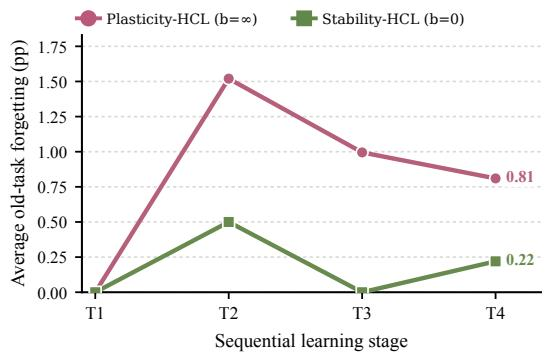

# HARNESS CONTINUAL LEARNING: CONTINUALADAPTATION BEYOND MODEL PARAMETERS

Borui Kang1, Jinrui Gu1, Junhan Lv1, Wenbin Li1∗, Lei Wang2, Yang Gao1

1State Key Laboratory for Novel Software Technology, Nanjing University, China 2University of Wollongong, Australia

## ABSTRACT

Continual learning has largely been model-centric, treating model parameters as the state that changes with sequential experience. Modern agents can also adapt through a harness of prompts, memories, tools, skills, and routing rules. Because these contents jointly shape later execution, a harness update can disrupt previously reliable behavior even when the model is frozen. This raises a new question: how can an agent continually improve its state outside the model while retaining behavior acquired earlier? We formulate Harness Continual Learning (HCL), a new continual learning paradigm in which the harness evolves around a frozen foundation model, and define the resulting loss of earlier behavior as harnesslevel forgetting. We instantiate HCL with four execution-facing components: the Task Interface, Experience Memory, Capability Map, and Adaptive Router. We further introduce guarded harness evolution to separate update generation from state commitment. A Continual Optimizer proposes candidate harnesses from post-execution feedback, and a Continual Evaluator commits the resulting candidate harness only after checking current improvement, historical retention, and validity. Experiments on textual reasoning, multimodal perception, and openworld interaction demonstrate capability accumulation and failure recovery, with relative gains exceeding 10% over corresponding baselines in multiple settings. Component ablations assess the contribution of each harness component, while controlled retention sweeps reveal measurable harness-level forgetting and show that the stability–plasticity trade-off can be explicitly adjusted.

## 1 INTRODUCTION

Continual learning studies how a system acquires capabilities from sequential experience while retaining previously learned behavior (Delange et al., 2022; Wang et al., 2024b; Shi et al., 2025). Existing formulations realize this process mainly by changing model parameters, representations, or architectural components. We refer to this established view as model-centric continual learning.

The rise of agentic AI introduces another source of adaptation: an external harness that determines how a foundation model receives information, retrieves experience, and acts (Jimenez et al., 2024; Xie et al., 2024; Xu et al., 2025; Chen et al., 2025; Li et al., 2026a; Meng et al., 2026). Prompts, memories, tool and skill specifications, and routing policies can persist and evolve across interactions even when the foundation model remains frozen. Agent adaptation is therefore no longer confined to model state: harness state can also accumulate experience and reshape future behavior. This makes the harness a new object ofcontinual learning research, extending the study ofcontinual adaptation beyond model parameters, as illustrated in Figure 1.

We formalize this new direction as Harness Continual Learning (HCL), a continual learning paradigm that acquires and retains capabilities by sequentially updating harness state around a frozen foundation model. Conventional harness optimization typically searches for prompts, functions, or workflows that improve a current objective (Zhang et al., 2024; 2025). HCL instead studies a sequence of updates. Its concern is not only whether the next update helps the current interaction, but also whether the evolving harness retains behavior that earlier updates made reliable. This setting introduces a distinct retention problem. Harness components are coupled in execution: a memory update can change the evidence retrieved for an earlier query; a skill revision can alter tool use; and a routing edit can break a previously successful workflow. An update that helps recent cases can therefore turn an earlier correct answer, valid tool call, or successful action trajectory into a failure without changing the foundation model. We call this phenomenon harness-level forgetting. It extends the classical stability–plasticity problem from model state to harness state.

  
Figure 1: The shift in the object of continual learning. Model-centric methods update model parameters θ over sequential experience. HCL instead updates harness state around a frozen foundation model. In both settings, adaptation can improve new behavior while interfering with behavior acquired earlier.

To study continual adaptation under this retention requirement, we develop an HCL framework with two parts. First, we define the Task Interface, Experience Memory, Capability Map, and Adaptive Router as the harness state and learning object of HCL. These components are jointly versioned and determine how the agent processes information, reuses experience and capabilities, and organizes execution. Second, guarded harness evolution governs state transitions through two modules: a Continual Optimizer that proposes candidate harnesses from post-execution feedback, and a Continual Evaluator that determines whether those candidates can be committed. The two parts jointly operationalize HCL: the former defines what is learned, while the latter controls how the harness is updated over time. Only a candidate harness that improves current validation performance while satisfying the historical-retention budget and validity constraints is committed as the deployed state. This proposal–evaluation–commitment process makes retention an explicit condition of harness adaptation, mitigating harness-level forgetting while controlling the stability–plasticity trade off.

We evaluate HCL across textual reasoning, multimodal perception, and open-world interaction. The results show that harness evolution can accumulate capabilities and support failure recovery, while also producing measurable harness-level forgetting. Historical-retention budgets shift the operating point between adaptation and retention, and more permissive updates do not necessarily produce a stronger final harness. In this work, our contributions are as follows:

• We propose and formalize Harness Continual Learning as a new continual learning paradigm, shifting the learning object from model state to harness state around a frozen foundation model.

• We identify harness-level forgetting and develop guarded harness evolution, in which a Continual Optimizer proposes candidate harnesses and a Continual Evaluator controls commitment through current, historical, and validity checks.

• We show across textual reasoning, multimodal perception, and open-world interaction that harness evolution supports capability accumulation and failure recovery while exhibiting measurable forgetting and a controllable stability–plasticity trade-off.

## 2 RELATED WORK

## 2.1 HARNESS ENGINEERING

Contemporary agent systems place a runtime harness around a foundation model to turn inference into task-directed execution (Li et al., 2026a; Meng et al., 2026; He et al., 2026; Zhou et al., 2026). Across implementations, persistent runtime contents commonly serve four functions. An interface converts raw instructions, observations, documents, or multimodal inputs into a form the agent can use. Memory stores interaction records, summaries, and reusable guidance. A capability registry describes tools, APIs, environment actions, and learned skills together with their invocation conditions. A router or workflow controller selects relevant memories and capabilities, orders their use, and assembles the execution context. Environment adapters execute actions, and task-specific validators check outcomes at the boundary of the pipeline (Gu, 2026; Chen et al., 2026b).

Existing systems develop different parts of this structure. ReAct couples reasoning with environment interaction (Yao et al., 2023). Toolformer, MRKL, and HuggingGPT expose and coordinate external capabilities (Schick et al., 2023; Karpas et al., 2022; Shen et al., 2023). MemGPT, Reflexion, and Voyager retain experience as memory, feedback, or executable skills (Packer et al., 2023; Shinn et al., 2023; Wang et al., 2024a). Together, these components form a coupled execution pipeline. The interface shapes what the router sees. Memory and capability descriptions determine what it can select. The resulting workflow determines how the model acts.

Harness engineering also uses execution feedback to revise prompts, declarative programs, memories, tool-use policies, skills, and workflows (Zhou et al., 2023; Khattab et al., 2024; Abuzakuk et al., 2026; Schick et al., 2023; Shinn et al., 2023; Wang et al., 2024a; Zhong et al., 2026; Zhang et al., 2026d). Recent work broadens this process to configuration search, cross-layer failure diagnosis, and sustained agent improvement (Zhang et al., 2026a; Chen et al., 2026a; Yao et al., 2026; Liu et al., 2026b). These systems show that a harness is editable and can improve with experience. Their main objective, however, is usually the quality of a component or the next configuration on a current task or target distribution. Repeated improvement alone does not provide a general retention criterion for the full harness state (Lin et al., 2026). Our work differs by treating the entire mutable harness as a unified continual learning state and by making retention across committed updates an explicit objective.

## 2.2 MODEL-CENTRIC CONTINUAL LEARNING

Model-centric continual learning adapts a model to a non-stationary stream of tasks or data while seeking to retain capabilities acquired from earlier experience. Its central challenge is catastrophic forgetting, which arises when learning new knowledge disrupts knowledge encoded by the model (Kirkpatrick et al., 2017; Delange et al., 2022; Wang et al., 2024b; Kang et al., 2026). Representation-based approaches learn features or prompts that remain useful across tasks (Wang et al., 2022b;a). Recent analysis also examines how these internal representations shift across a learning sequence (Kim et al., 2025). Architecture-based approaches isolate, expand, or select model components to reduce interference between tasks (Liu et al., 2026a; Lu et al., 2024). Optimizationbased approaches alter the update trajectory or constrain gradients using information from earlier tasks (Lopez-Paz & Ranzato, 2017; Abbes et al., 2026; Shang et al., 2025). Regularization-based approaches penalize changes to parameters or functions that support old behavior (Kirkpatrick et al., 2017; Lewandowski et al., 2025). Replay-based approaches retain or reconstruct earlier examples and mix them with new data (Urettini & Carta, 2025; Wang et al., 2025a; Yue et al., 2025; Bellitto et al., 2024). Recent work extends these families to large language models and broader knowledge streams, but the state being learned remains model knowledge, representations, architectures, or parameters (Liang et al., 2025; Zhang et al., 2026b). Our work moves the continual learning object outside the model. The foundation model parameters remain frozen, while the harness state evolves under explicit acquisition and retention constraints.

Table 1: Execution functions and updatable contents of the four jointly versioned components in the deployed harness $H _ { n }$
<table><tr><td>Component</td><td>Function during execution</td><td>Contents updated in HCL</td></tr><tr><td>Task Interface  $I _ { n }$ </td><td>Transforms raw interactions into structured representations.</td><td>Prompts, task templates, and parsing and normalization rules.</td></tr><tr><td>Experience Memory  $M _ { n }$ </td><td>Provides concrete interactions and abstract guidance for reuse.</td><td>Raw interaction records and LLM-generated Abstract Memory entries.</td></tr><tr><td>Capability Map  $C _ { n }$ </td><td>Provides external operations and reusable inner skills.</td><td>Inner skills extracted from Abstract Memory.</td></tr><tr><td>Adaptive Router  $R _ { n }$ </td><td>Selects and organizes memory and capabilities.</td><td>Routing prompts, selection criteria, and workflow templates.</td></tr></table>

## 3 HARNESS CONTINUAL LEARNING

## 3.1 DEFINITION AND PROBLEM SETTING

Consider a fixed foundation model $F _ { \theta }$ and a harness $H _ { n }$ deployed at interaction step n. The model parameters θ remain unchanged, whereas a committed harness update affects subsequent interactions. We define Harness Continual Learning as the problem of sequentially updating the deployed harness to acquire new behavior while retaining behavior that was reliable before the update. Previously reliable behavior may be a correct response, a valid tool call, or an action trajectory that satisfies an environment goal. Retention requires such behavior to remain successful after later harness updates when evaluated under the same input and execution conditions. This setting differs from conventional harness engineering, which typically optimizes a prompt, tool configuration, or workflow for a current objective. HCL instead studies a sequence of deployed harnesses.

At interaction step n, $\mathbf { u } _ { n }$ denotes the raw interaction, such as an instruction, an observation, or a multimodal input. The harness transforms $\mathbf { u } _ { n }$ into the structured interaction $\mathbf { i } _ { n } .$ Guided by the frozen foundation model, it then combines $\mathbf { i } _ { n }$ with selected memory and capabilities to assemble the execution context $\mathbf { z } _ { n }$ . The model and external runtime execute $\mathbf { z } _ { n }$ to produce the outcome ${ \bf y } _ { n }$ Post-execution feedback is denoted by ${ \bf f } _ { n }$ . We collect these interaction-level objects as

$$
\mathbf { e } _ { n } = \left( \mathbf { u } _ { n } , \mathbf { i } _ { n } , \mathbf { z } _ { n } , \mathbf { y } _ { n } , \mathbf { f } _ { n } \right) .\tag{1}
$$

The Optimizer provides the foundation model $F _ { \theta }$ with an update rule, the deployed harness, and the available interaction evidence as context for generating a candidate harness::

$$
{ \widetilde { H } } _ { n + 1 } = { \mathcal { O } } _ { F _ { \theta } } \left( H _ { n } , \mathbf { e } _ { n } \right) .\tag{2}
$$

The candidate remains separate from the deployed harness until a commitment decision is made. Let $G _ { n } \in \{ 0 , 1 \}$ } denote this decision. The deployed harness evolves as

$$
H _ { n + 1 } = \left\{ \begin{array} { l l } { { \widetilde { H } _ { n + 1 } , } } & { { G _ { n } = 1 , } } \\ { { H _ { n } , } } & { { G _ { n } = 0 . } } \end{array} \right.\tag{3}
$$

Therefore, a candidate affects later interactions only when it is committed. Our framework realizes HCL in two parts. First, it defines the deployed harness state $H _ { n }$ by specifying its mutable contents and versioning them jointly. Second, it controls the update from $H _ { n }$ to $H _ { n + 1 }$ by checking current improvement, historical retention, and validity before commitment.

## 3.2 HARNESS STATE FOR CONTINUAL LEARNING

The design of the HCL state builds on established mechanisms from prior harness and agent systems, including prompt-based task interfaces, persistent memory, tool and skill registries, and routing or workflow controllers (Li et al., 2026a; He et al., 2026). Rather than inheriting the architecture of any single system, HCL organizes these recurring execution functions into four jointly versioned components, whose mutable contents evolve from sequential experience under explicit acquisition and retention constraints.

  
Figure 2: Overview of the HCL framework. The deployed harness $H _ { n }$ supports the execution path from raw interaction $\mathbf { u } _ { n }$ to outcome ${ \bf y } _ { n }$ . When post-execution feedback is available, the Continual Optimizer proposes a candidate harness $\widetilde { H } _ { n + 1 }$ , and the Continual Evaluator accepts or rejects it based on current improvement, historical retention, and validity.

Accordingly, HCL organizes the mutable harness state as

$$
H _ { n } = \left( I _ { n } , M _ { n } , C _ { n } , R _ { n } \right) ,\tag{4}
$$

where $I _ { n } , M _ { n } , C _ { n }$ , and $R _ { n }$ denote the Task Interface, Experience Memory, Capability Map, and Adaptive Router, respectively. At interaction step $n , H _ { n }$ represents the complete harness currently deployed. Its prompts and processing rules, stored experience, reusable skills, and routing specifications persist across interactions and jointly determine how the agent handles future tasks.

Although these four execution functions are common in agent harnesses, HCL differs in how their mutable contents are learned and deployed. Because a change to one component may interact with the others and affect both new and previously learned behavior, HCL treats all proposed changes as one complete candidate harness. The candidate replaces $H _ { n }$ only after it satisfies current improvement, historical retention, and validity requirements. Otherwise, none of its changes enters the deployed harness. HCL therefore turns harness contents into a coordinated mechanism for continual learning rather than a collection of independently edited artifacts.

Table 1 summarizes the execution function of each component and the contents that can be updated through continual interaction. Figure 2 shows how these components support execution and how post-execution feedback initiates a candidate harness.

## 3.2.1 TASK INTERFACE

The Task Interface is the input-processing layer of the harness. It transforms a raw task interaction $\mathbf { u } _ { n }$ into a structured representation of the available input, task objective, and execution constraints:

$$
\mathbf i _ { n } = I _ { n } \left( \mathbf u _ { n } \right) = \left( \mathbf x _ { n } , \mathbf g _ { n } , \mathbf k _ { n } \right) ,\tag{5}
$$

where ${ \bf x } _ { n }$ contains the available input, ${ \bf g } _ { n }$ specifies what the task aims to accomplish, and $\mathbf { k } _ { n }$ records constraints such as output format, legal tool use, and environment restrictions. Internally, $I _ { n }$ specifies the prompts, task templates, and parsing and normalization rules used by an LLM-based parser to perform this transformation.

In HCL, the Task Interface maps heterogeneous task data into a unified representation, making the relevant input, objective, and constraints explicit. This helps the agent focus on task requirements and process different task forms within the same continual learning pipeline. Since interface updates may change how tasks are interpreted, $I _ { n }$ is versioned with the harness.

## 3.2.2 EXPERIENCE MEMORY

Agent memory can take many forms, including episodic records, summaries, and reflections (Park et al., 2023; Packer et al., 2023; Zhong et al., 2024; Shinn et al., 2023; Wang et al., 2025b). From a continual learning perspective, HCL organizes accumulated experience into two complementary forms:

$$
M _ { n } = \left( M _ { n } ^ { \mathrm { r a w } } , M _ { n } ^ { \mathrm { a b s } } \right) ,\tag{6}
$$

where $M _ { n } ^ { \mathrm { r a w } }$ and $M _ { n } ^ { \mathrm { a b s } }$ denote Raw Memory and Abstract Memory, respectively. Raw Memory preserves concrete interactions, whereas Abstract Memory extracts reusable knowledge from them.

Raw Memory $M _ { n } ^ { \mathrm { r a w } }$ stores the raw task input $\mathbf { u } _ { n }$ , the resulting response or action trajectory ${ \bf y } _ { n } ,$ and the subsequent environment or verifier feedback ${ \bf f } _ { n }$ . To keep memory collection simple and storage bounded, it retains a fixed number of interactions from each task in arrival order. These records preserve task-specific evidence about successful behavior and encountered failures, helping the agent reuse earlier solutions and avoid repeating previous errors.

Abstract Memory $M _ { n } ^ { \mathrm { a b s } }$ is produced by using an LLM to summarize the contents of Raw Memory. The LLM consolidates recurring patterns into scoped guidance, such as output conventions, reliable reasoning patterns, and common errors to avoid. As new raw interactions are stored, the summarization process can produce new or updated abstract entries for related future tasks.

Raw Memory retains concrete experience for replay and behavioral recovery, while Abstract Memory generalizes that experience for transfer across tasks. Together, they support adaptation to new tasks while preserving useful knowledge acquired earlier.

## 3.2.3 CAPABILITY MAP

The Capability Map defines the operations and skills that the agent can invoke during execution. HCL organizes these capabilities by their origin:

$$
\begin{array} { r } { C _ { n } = \left( C _ { n } ^ { \mathrm { o u t e r } } , C _ { n } ^ { \mathrm { i n n e r } } \right) , } \end{array}\tag{7}
$$

where $C _ { n } ^ { \mathrm { o u t e r } }$ contains capabilities provided by the external runtime, and $C _ { n } ^ { \mathrm { i n n e r } }$ contains skills acquired through continual interaction.

Outer capabilities connect the frozen model to external resources, such as APIs, retrieval services, perception models, calculators, and environment actions. Each entry specifies its function, expected inputs and outputs, invocation protocol, availability conditions, and known limitations. These capabilities provide the basic operations needed to access information and act in different environments.

Inner capabilities are reusable skills further abstracted from $M _ { n } ^ { \mathrm { a b s } }$ . An LLM can consolidate related abstract memories into more general skills with explicit inputs, outputs, execution steps, and applicable scopes. This turns knowledge accumulated from earlier interactions into procedures that can be directly invoked across tasks. As Abstract Memory evolves, new inner skills can be added and existing skills can be revised.

Unlike a static capability map limited to a predefined library of external operations, $C _ { n }$ can expand its executable skill set through experience. This dynamic connection between accumulated knowledge and inner capabilities allows the frozen-model agent to continually acquire, refine, and transfer skills across tasks.

## 3.2.4 ADAPTIVE ROUTER

The Adaptive Router connects the Task Interface, Experience Memory, and Capability Map to task execution. Given the structured interaction $\mathbf { i } _ { n } ,$ it retrieves relevant experience from $M _ { n }$ , selects capabilities from $C _ { n } ,$ , and organizes them into an execution context:

$$
{ \bf z } _ { n } = R _ { n } \left( { \bf i } _ { n } , M _ { n } , C _ { n } \right) .\tag{8}
$$

The resulting $\mathbf { z } _ { n }$ contains the structured task representation, selected experience and capabilities, and the workflow used for execution.

As $M _ { n }$ and $C _ { n }$ evolve, which experience and capabilities are useful for a task and how they should be organized may also change. At each interaction, $R _ { n }$ uses an LLM together with its routing prompts, selection criteria, and workflow templates to adapt the execution strategy to the current task and available contents. These routing specifications can also be revised across interactions, allowing the Router to evolve alongside Memory and the Capability Map. The frozen model and external runtime then use $\mathbf { z } _ { n }$ to produce the response or action ${ \bf y } _ { n }$

## 3.3 GUARDED HARNESS EVOLUTION

A harness update may improve current behavior while degrading previously reliable behavior on earlier tasks. We therefore introduce guarded harness evolution, which separates update generation from deployment through a proposal–evaluation–commitment process. Given feedback, the Continual Optimizer produces an isolated candidate harness. The Continual Evaluator commits it only if it satisfies current-improvement, historical-retention, and validity requirements. Otherwise, $H _ { n }$ remains deployed. This process makes retention an explicit condition for harness evolution rather than assuming that a useful update on the current task is safe for earlier tasks.

## 3.3.1 CONTINUAL OPTIMIZER: CANDIDATE GENERATION

Interaction feedback indicates whether the current execution is successful, but does not specify how the harness should change. The Continual Optimizer implements the update operator O in Eq. (2) using a prompt template for the foundation model $F _ { \theta }$ . It provides the deployed harness $H _ { n }$ and the interaction evidence $\mathbf { e } _ { n }$ to the model and asks it to propose a candidate harness ${ \widetilde { H } } _ { n + 1 } . ~ F _ { \theta }$ analyzes the execution outcome in light of the feedback and examines the execution context to identify which harness components require revision. It may modify prompts or parsing rules in the Task Interface, record or summarize experience in Memory, add or revise skills in the Capability Map, or adjust selection and workflow rules in the Adaptive Router.

To provide alternative update directions while limiting repeated LLM calls, we use a simple sequential strategy when multiple components require revision. The selected components are considered in a predefined order. For each component, the Optimizer generates up to K alternatives one at a time. Each alternative is evaluated by replacing only the selected component in the current candidate harness while keeping all other components fixed. For each selected component, the Continual Optimizer generates up to K alternatives, each of which is evaluated while all other components remain fixed. The highest-scoring admissible alternative is retained as the basis for revising the next component. If no alternative passes the gate, that component remains unchanged. The deployed harness $H _ { n }$ remains unchanged until the resulting candidate completes evaluation and is committed.

## 3.3.2 CONTINUAL EVALUATOR: HISTORICAL EVALUATION AND COMMITMENT

To align harness updates with the objective of continual learning, we introduce a retention-aware evaluation standard rather than judging candidates only by current-task gains. The Continual Evaluator $E$ examines three complementary aspects: current improvement measures whether the candidate better solves the current task, historical retention checks whether previously reliable behavior is preserved, and validity ensures that the updated harness and its outputs remain usable. The deployed harness $H _ { n }$ and candidate $\widetilde { H } _ { n + 1 }$ are evaluated under the same model, decoding, tool, environment, and seed conditions to provide a controlled comparison. A candidate can replace $H _ { n }$ only when all three requirements are satisfied, allowing the harness to acquire new behavior without ignoring what it has already learned.

Current Improvement. Let $V _ { n }$ denote the validation cases for the current task, and let $P ( H , V _ { n } )$ denote the performance of harness H on these cases. The improvement produced by the candidate is

$$
\Delta _ { n } = P \left( \widetilde { H } _ { n + 1 } , V _ { n } \right) - P \left( H _ { n } , V _ { n } \right) .\tag{9}
$$

The candidate satisfies this criterion when $\Delta _ { n } \geq \delta _ { n }$ , where $\delta _ { n }$ is the predefined minimum improvement. Depending on the task, $P$ may measure answer accuracy, tool-use success, or environment completion.

Historical Retention. Current-task improvement does not indicate whether a candidate preserves behavior acquired earlier. The Evaluator therefore maintains a compact anchor set $A _ { n }$ for historical evaluation. Each anchor contains the raw input and success criterion of a previously observed case, allowing that case to be rerun under both the deployed and candidate harnesses. At the end of each task, anchors are selected using a predefined ratio of previously successful and failed cases. If either group contains too few cases to meet its target, the remaining slots are filled from the other group. The anchors are used only for evaluation and are unavailable during candidate generation. For each anchor $a \in A _ { n }$ , define the binary success indicator

$$
q ( H , a ) \in \{ 0 , 1 \} ,\tag{10}
$$

where $q ( H , a ) = 1$ if harness H satisfies the corresponding success criterion and 0 otherwise. The historical loss introduced by the candidate is

$$
D _ { n } = \sum _ { a \in A _ { n } } \mathbf { 1 } \left[ q ( H _ { n } , a ) = 1 \land q \left( \widetilde { H } _ { n + 1 } , a \right) = 0 \right] ,\tag{11}
$$

where $\mathbf { 1 } [ \cdot ]$ is the indicator function, equal to 1 when the enclosed condition holds and 0 otherwise.

Therefore, $D _ { n }$ counts previously solved anchors that fail under the candidate. The candidate satisfies the historical-retention criterion when $D _ { n } \leq B _ { n }$ , where $B _ { n }$ is the predefined tolerance for historical loss. Setting $B _ { n } ~ = ~ 0$ requires the candidate to preserve every anchor currently solved by $H _ { n }$ Appendix C specifies the success criterion $q ( H , a )$ used for each experimental task.

Validity Check. The candidate must also be executable and comply with the task and runtime requirements. Let ${ \mathcal { L } } _ { n }$ denote the set of validity checks applied at interaction step n. For each $\ell \in \mathcal { L } _ { n } .$ , define

$$
v _ { n , \ell } \left( \widetilde { H } _ { n + 1 } \right) \in \{ 0 , 1 \} ,\tag{12}
$$

where $v _ { n , \ell } \left( \widetilde { H } _ { n + 1 } \right) = 1$ indicates that the candidate satisfies validity check $\ell ,$ and 0 otherwise. These checks may cover artifact syntax, output-schema compliance, legal tool use, task constraints, and environment consistency.

The three criteria are combined into a candidate-specific commitment decision:

$$
G _ { n } ^ { ( k ) } = \mathbf { 1 } \left[ ( \Delta _ { n } ^ { ( k ) } \geq \delta _ { n } ) \wedge ( D _ { n } ^ { ( k ) } \leq B _ { n } ) \wedge \left( \forall \ell , ~ v _ { n , \ell } \left( \widetilde { H } _ { n + 1 } ^ { ( k ) } \right) = 1 \right) \right] .\tag{13}
$$

The decision rule in Eq. (13) serves as a hard admissibility gate. When multiple candidates pass the gate, the Continual Evaluator ranks them using a composite score that aggregates their currentperformance, validity, and historical-retention scores. The highest-scoring candidate is committed as $H _ { n + 1 }$ , with ties broken randomly. If no candidate passes the gate, $H _ { n }$ remains deployed.

By making historical retention a necessary condition for commitment, the admissibility gate supports the acquisition of new behavior while explicitly controlling the loss of previously reliable behavior. The tolerance $B _ { n }$ further adjusts the balance between stability and plasticity.

## 3.4 CONNECTIONS TO MODEL-CENTRIC CONTINUAL LEARNING

HCL draws on several complementary principles from model-centric continual learning, but realizes them through harness mechanisms rather than model-parameter updates (Delange et al., 2022; Wang et al., 2024b). Replay-based methods retain earlier examples to preserve acquired knowledge. Experience Memory follows this principle by storing concrete interactions for later reuse. Representation-based methods learn abstractions that support transfer across tasks. The Capability Map similarly transforms accumulated experience into reusable skills and combines them with external capabilities. Architecture-based methods organize reusable modules and routines to reduce interference. HCL represents these routines as invocable capabilities and uses the Adaptive Router to select and compose them for each interaction. Optimization- and regularization-based methods control parameter updates using information from earlier tasks, allowing new knowledge to be acquired while limiting interference with previous knowledge. HCL applies the same principle to harness updates through the Continual Optimizer and Continual Evaluator. The Optimizer proposes candidate changes from current feedback, while the Evaluator tests them on current validation cases and historical anchors. Only candidates that improve current performance while satisfying historical retention and validity requirements are committed. This proposal–evaluation–commitment process integrates adaptation and protection into continual harness evolution.

These relationships are conceptual rather than one-to-one implementations. More importantly, HCL brings the complementary principles ofmodel-centric continual learning into a unified system-level formulation. Traditional approaches (Kang et al., 2025; Liu et al., 2026c) often treat replay, representation, architecture, optimization, and regularization as separate solution families for adapting model parameters. HCL coordinates their functions within a single evolving harness under the same acquisition–retention objective. It therefore extends continual learning from parameter adaptation to the coordinated evolution of agent infrastructure, providing a unified framework for continual learning beyond the model itself.

## 4 EXPERIMENTS

We evaluate HCL in two regimes. ALFWorld (Shridhar et al., 2021) and Minecraft (Wang et al., 2024a) examine capability accumulation, reuse, and failure recovery during open-world interaction. Textual reasoning and multimodal perception use controlled task streams with repeated evaluation of previously observed tasks, making harness-level forgetting and the stability–plasticity trade-off directly measurable. We also evaluate the control of this trade-off and ablate the four editable harness components. We use different foundation models across the experimental settings to examine whether HCL generalizes across model families and scales rather than depending on a particular model. ALFWorld uses Qwen3.5-9B; Minecraft and the main multimodal experiments use Qwen3.6-27B; textual reasoning uses DeepSeek-V4-Flash; and the component ablation uses Qwen3.5-4B. Within each setting, the same foundation model is used for all comparisons and remains frozen throughout the continual-learning stream. Any adaptation therefore comes from harness updates rather than model training.

## 4.1 EVALUATION PROTOCOL

For each task stream, a single harness evolves sequentially around the same foundation model. Let $H ^ { ( s ) }$ denote the deployed harness after learning task $\mathcal { D } _ { s } ,$ , where s indexes the evaluation stage. At the end of each stage, we evaluate $H ^ { ( s ) }$ on the current task and every previously observed task:

$$
R _ { s , j } = \mathrm { E v a l } \left( H ^ { ( s ) } , { \mathcal D } _ { j } ^ { \mathrm { t e s t } } \right) , \qquad j \le s ,\tag{14}
$$

where $R _ { s , j }$ is the benchmark score or episode success rate on task j. Current-task validation cases and historical anchors are used only by the Continual Evaluator to determine whether a candidate can be committed. The final test sets are disjoint from both and are used only for reporting.

For task streams with metrics on a common scale, we report final average performance and average old-task forgetting:

$$
\operatorname { A v g } _ { T } = { \frac { 1 } { T } } \sum _ { j = 1 } ^ { T } R _ { T , j } , \qquad \operatorname { F g t } _ { T } = { \frac { 1 } { T - 1 } } \sum _ { j = 1 } ^ { T - 1 } \left( \operatorname* { m a x } _ { r \in \{ j , \ldots , T \} } R _ { r , j } - R _ { T , j } \right) .\tag{15}
$$

$\mathrm { A v g } _ { T }$ measures final performance across the complete stream, while $\mathrm { F g t } _ { T }$ measures the average decline of earlier tasks from their best observed performance. Forgetting is marked as $^ { 6 6 } - ^ { 5 5 }$ for Zero shot and Static Harness because they make no sequential updates.

Stability-HCL and Plasticity-HCL are two configurations of the framework, differing only in the historical-loss tolerance $B _ { n }$ . Stability-HCL sets $B _ { n } \ = \ 0$ and rejects any candidate that causes a currently solved anchor to fail. Plasticity-HCL sets $B _ { n } = \infty$ , so historical anchor losses do not block a candidate as long as it satisfies the current-improvement and validity requirements. We evaluate both configurations in ALFWorld and the controlled streams, while Minecraft uses the retention-oriented configuration. Detailed settings are provided in Appendix A.

Table 2: Final performance and harness-level forgetting on ALFWorld with Qwen3.5-9B as the frozen foundation model. The best and second-best results in each metric column are marked in bold and underlined, respectively.
<table><tr><td>Method</td><td>Pick</td><td>Look</td><td>Clean</td><td>Heat</td><td>Cool</td><td>Two-object</td><td>Final Avg. ↑</td><td>Avg. Fgt. ↓</td></tr><tr><td>Static Harness</td><td>95.80</td><td>66.70</td><td>25.80</td><td>26.10</td><td>9.50</td><td>58.80</td><td>47.12</td><td></td></tr><tr><td>RAG Baseline</td><td>95.80</td><td>83.30</td><td>41.90</td><td>39.10</td><td>14.30</td><td>58.80</td><td>55.56</td><td>1.74</td></tr><tr><td>MemP (Fang et al., 2026)</td><td>95.80</td><td>83.30</td><td>48.40</td><td>34.80</td><td>9.50</td><td>47.10</td><td>53.15</td><td>5.18</td></tr><tr><td>MemRL (Zhang et al., 2026c)</td><td>87.50</td><td>66.70</td><td>29.00</td><td>60.90</td><td>23.80</td><td>41.20</td><td>51.51</td><td>5.64</td></tr><tr><td>Stability-HCL (Ours)</td><td>100.00</td><td>83.30</td><td>51.60</td><td>30.40</td><td>28.60</td><td>76.50</td><td>61.74</td><td>2.64</td></tr><tr><td>Plasticity-HCL (Ours)</td><td>100.00</td><td>77.80</td><td>41.90</td><td>39.10</td><td>19.00</td><td>100.00</td><td>62.98</td><td>10.94</td></tr></table>

## 4.2 OPEN-WORLD CAPABILITY ACCUMULATION

We study long-horizon harness evolution in ALFWorld and Minecraft. ALFWorld supports stagewise evaluation across previously observed task categories, while Minecraft provides a longer interaction curriculum for examining capability accumulation, failure recovery, and skill revision.

## 4.2.1 ALFWORLD

We use the text-based ALFWorld environment with a maximum of 50 interaction steps per episode. The continual stream contains six task categories in the order of Pick-and-Place, Look-in-Light, Clean, Heat, Cool, and Two-object manipulation. For each category, 10 training episodes are used for sequential adaptation. After each stage, the harness is evaluated on all observed categories, with final performance reported on the 134 official evaluation episodes.

We compare HCL with a Static Harness, a RAG baseline, MemP (Fang et al., 2026), and MemRL (Zhang et al., 2026c). For fairness, MemP and MemRL are reimplemented within our framework with unified data processing and action selection, while their algorithms remain unchanged. Table 2 shows that reusing past experience improves the Static Harness but is insufficient for broad continual adaptation. RAG increases the final average from 47.12% to 55.56% and achieves the lowest average forgetting among the adaptive baselines. However, retrieval alone cannot revise reusable procedures or routing rules. MemP and MemRL also improve individual categories, but their performance varies considerably across the stream. These results show that memory-based adaptation supports experience reuse, but does not consistently balance capability acquisition and retention.

Both HCL profiles achieve stronger overall performance by evolving the complete harness. Plasticity-HCL obtains the highest final average of 62.98% and solves all Two-object episodes, showing the strongest adaptation to the latest task but also greater forgetting. Stability-HCL reaches a comparable 61.74% and performs best on four of the six categories while substantially reducing average forgetting. Plasticity-HCL therefore favors capability acquisition, whereas Stability-HCL provides a better balance between adaptation and retention. Since the foundation model is frozen and the two profiles differ only in $B _ { n } ,$ , this comparison shows that the Continual Evaluator can explicitly control the stability–plasticity trade-off.

## 4.2.2 MINECRAFT

We evaluate HCL with Qwen3.6-27B on a 50-task Minecraft curriculum that spans resource collection, crafting, mining, tool use, object placement, smelting, and tasks with multiple dependent operations. After each interaction, environment feedback is stored in Experience Memory and can be used to refine reusable capabilities and execution workflows. Previously validated skill tests are retained as historical anchors. A capability addition or revision is committed only when it improves the current objective and continues to pass all applicable retained tests. For comparison, the Static Harness follows the same curriculum without evolution. MemRL and MemP are reproduced within our harness as memory-management baselines, rather than run from their official repositories.

Figure 3 shows differences in progression and execution efficiency. The Static Harness follows HCL for 15 tasks and then plateaus; HCL completes all 50, progressing from collection and crafting to persistent assets and coordinated multi-step execution. HCL uses 83 environment actions, compared with 88 for MemRL and 91 for MemP, indicating less redundant execution. Across later multi-step tasks, HCL avoids repeated diagnosis, crafting, and recovery actions, so its lower curve reflects more efficient reuse of accumulated experience while retaining progression across the full curriculum. Reproducing both baselines in our harness keeps the task interface, capability library, and environment stack common while varying memory management. These results show that HCL supports efficient continual adaptation without updating the foundation model.

(a) Curriculum progression  

(b) Execution efficiency  
  
Figure 3: Curriculum progression and execution efficiency. (a) HCL completes all 50 tasks, while the Static Harness plateaus at 15. (b) Cumulative environment actions over the 50-task curriculum: HCL uses 83, versus 88 for MemRL and 91 for MemP; lower is more efficient.

Table 3: Final performance after the four-task textual-reasoning stream with DeepSeek-V4-Flash as the frozen foundation model. The Zero-shot baseline evaluates each task independently without sequential harness updates. The best and second-best results in each metric column are marked in bold and underlined, respectively.
<table><tr><td>Method</td><td>MuSiQue</td><td>ProofWriter</td><td>GSM8K</td><td>HotpotQA</td><td>Final Avg. ↑</td><td>Avg. Fgt. ↓</td></tr><tr><td>DeepSeek-V4-Flash Zero-shot</td><td>35.00</td><td>42.80</td><td>49.40</td><td>54.80</td><td>45.50</td><td></td></tr><tr><td>Stability-HCL (Ours)</td><td>27.60</td><td>73.00</td><td>50.40</td><td>57.80</td><td>52.20</td><td>0.00</td></tr><tr><td>Plasticity-HCL (Ours)</td><td>29.00</td><td>77.00</td><td>92.00</td><td>60.80</td><td>64.70</td><td>0.07</td></tr></table>

## 4.3 CONTROLLED HARNESS CONTINUAL LEARNING

We next evaluate HCL on task sequences. Within each stream, all HCL profiles share the same foundation model, task order, data allocation, editable artifacts, and candidate generator.

## 4.3.1 TEXTUAL REASONING

The textual stream follows the order MuSiQue (Trivedi et al., 2022), ProofWriter (Tafjord et al., 2021), GSM8K (Cobbe et al., 2021), and HotpotQA (Yang et al., 2018). These tasks cover multi-hop question answering, logical deduction, mathematical reasoning, and knowledge-intensive question answering. For each task, we use 250 examples for adaptation, 50 for validation, and 500 for testing. The foundation model remains frozen throughout the stream. HCL updates only the Task Interface, Experience Memory, Capability Map, and Adaptive Router.

Table 3 shows how different historical-loss tolerances shift HCL between stronger retention and stronger adaptation. Stability-HCL requires accepted updates to preserve performance on the historical anchor set, reducing average forgetting to zero. This strict constraint substantially limits adaptation, resulting in a final average of 52.20%, compared with 64.70% for Plasticity-HCL. Nevertheless, Stability-HCL still outperforms the 45.50% zero-shot baseline, showing that it can acquire new behavior while fully retaining the previously measured behavior.

Plasticity-HCL relaxes the historical-retention requirement and therefore permits more aggressive harness updates. This increases the final average from 52.20% to 64.70%, while introducing only 0.07 average forgetting. With DeepSeek-V4-Flash frozen throughout the stream, these results show that the Continual Evaluator can shift HCL between stronger retention and stronger adaptation solely through the historical-loss tolerance.

Table 4: Final performance after the four-task multimodal-perception stream with Qwen3.6-27B as the frozen foundation model. The Zero-shot baseline evaluates each task independently without sequential harness updates. The best and second-best results in each metric column are marked in bold and underlined, respectively.
<table><tr><td>Method</td><td>Detection</td><td>Caption</td><td>Grounding</td><td>VQAv2</td><td>Final Avg. ↑</td><td>Avg. Fgt. ↓</td></tr><tr><td>Qwen3.6-27B Zero-shot</td><td>4.27</td><td>25.47</td><td>43.00</td><td>84.87</td><td>39.40</td><td></td></tr><tr><td>DGG (Li et al., 2026b)</td><td>29.58</td><td>29.77</td><td>48.96</td><td>62.60</td><td>42.73</td><td>0.26</td></tr><tr><td>Plasticity-HCL (Ours)</td><td>64.14</td><td>37.31</td><td>90.60</td><td>79.80</td><td>67.96</td><td>0.81</td></tr><tr><td>Stability-HCL (Ours)</td><td>65.34</td><td>39.41</td><td>91.60</td><td>79.33</td><td>68.92</td><td>0.22</td></tr></table>

## 4.3.2 MULTIMODAL PERCEPTION

The multimodal stream follows the order of COCO object detection, COCO image captioning, RefCOCO visual grounding, and VQAv2. Qwen3.6-27B remains frozen throughout the stream. For each task, we use 250 examples for adaptation, 50 for validation, and 500 for testing. We additionally compare with DGG (Li et al., 2026b), a recent adaptive method for sequential multi-task continual learning whose setting aligns with this controlled multimodal stream.

Table 4 shows that both HCL profiles substantially outperform Zero-shot and DGG in final average. The largest gains occur in detection and grounding, where the harness must organize spatial information into task-specific outputs. HCL also improves captioning, indicating that its evolving components can support different multimodal objectives and output formats within one task stream.

VQAv2 is the only task on which Zero-shot remains stronger, as the frozen model already performs well on direct image–question answering. Nevertheless, both HCL profiles retain substantially higher VQAv2 performance than DGG. Stability-HCL achieves the highest final average of 68.92% and the lowest forgetting of 0.22, while Plasticity-HCL reaches a similar final average of 67.96%. Overall, HCL enables a single frozen model to continually handle heterogeneous multimodal tasks while maintaining a stronger stability–plasticity balance.

## 4.4 STABILITY–PLASTICITY TRADE-OFF

Following Eq. (13), we vary only the historical-loss tolerance $B _ { n }$ in $D _ { n } \leq B _ { n }$ , while holding the current-improvement and validity criteria fixed. Specifically, $\delta _ { n }$ in Eq. (9) requires an improvement of at least two correct validation cases. Under the validity criterion in Eq. (12), each candidate must achieve at least 90.00% output-format compliance and introduce no syntax, tool-use, or environment violations. These thresholds are chosen heuristically to balance current-task improvement with candidate reliability and remain identical across all settings.

The historical loss $D _ { n }$ in Eq. (11) counts anchors that are solved by $H _ { n }$ but fail under $\widetilde { H } _ { n + 1 }$ . Within each run, we fix $B _ { n } \equiv b$ for all candidate decisions and compare $b \in \{ 0 , 1 , 3 , \infty \}$ . The settings $b = 0$ and $b = \infty$ correspond to Stability-HCL and Plasticity-HCL, respectively. The intermediate settings $b = 1$ and $b = 3$ allow each candidate to introduce at most one and three newly failed anchors across $A _ { n }$ . Each run uses 300 adaptation, 80 validation, and 600 test examples per task, with 80 anchors for every earlier task. A predefined parameter controls the composition of previously successful and failed examples in each anchor set. If either group contains too few examples to meet its target, the remaining slots are filled from the other group. All other experimental conditions remain fixed.

Table 5 shows that increasing b weakens retention. Average forgetting rises from 0.39 at $b = 0$ to 3.45 at $b = \infty$ . Final performance does not increase accordingly: the highest final average of 63.46% occurs at $b = 1$ , while the unrestricted setting reaches 60.13%. One possible explanation is that each committed update changes the subsequent evolution trajectory: without historical constraints, locally beneficial updates may overwrite reusable harness contents, weakening both retention and the experience or capabilities available for later tasks. A moderate value of b therefore provides additional flexibility for adaptation without allowing excessive historical loss. The remaining forgetting at $b = 0$ occurs because the constraint covers a finite anchor set, whereas forgetting is evaluated on separate historical test cases. Preserving all anchors currently solved by $H _ { n }$ cannot guarantee unchanged behavior on historical cases not represented by $A _ { n }$

Table 5: Performance under different fixed values of $b ,$ where $B _ { n } \equiv b$ within each run. All other experimental conditions are held constant. The best and second-best results in each metric column are marked in bold and underlined, respectively.
<table><tr><td>Historical-loss tolerance b</td><td>MuSiQue</td><td>ProofWriter</td><td>GSM8K</td><td>HotpotQA</td><td>Final Avg. ↑</td><td>Avg. Fgt. ↓</td></tr><tr><td> $b = 0$ </td><td>27.83</td><td>73.33</td><td>84.33</td><td>59.50</td><td>61.25</td><td>0.39</td></tr><tr><td> $b = 1$ </td><td>24.83</td><td>77.50</td><td>92.33</td><td>59.17</td><td>63.46</td><td>1.22</td></tr><tr><td> $b = 3$ </td><td>26.83</td><td>79.83</td><td>83.00</td><td>58.50</td><td>62.04</td><td>2.00</td></tr><tr><td> $b = \infty$ </td><td>28.33</td><td>71.00</td><td>82.00</td><td>59.17</td><td>60.13</td><td>3.45</td></tr></table>

  
(a) Textual reasoning under different fixed values of b.

  
(b) Multimodal perception under $b = 0$ and $b = \infty$  
Figure 4: Stage-wise forgetting under different fixed historical-loss tolerances.

Figure 4 complements these final results by showing how forgetting develops across the task sequence. In the textual stream shown in Figure ${ 4 ( \mathrm { a ) } } .$ , smaller values of b generally maintain lower forgetting, with final forgetting increasing consistently from 0.39 at $b = 0$ to 3.45 at $b = \infty$ . In the multimodal stream shown in Figure 4(b), Stability-HCL remains below Plasticity-HCL at every stage after $T _ { 1 }$ and finishes with forgetting of 0.22 rather than 0.81. This pattern reflects the role of b in the commitment gate: smaller values reject more candidates that improve the current task at the expense of historical behavior, thereby constraining the harness to more retention-preserving update trajectories. Larger values permit greater adaptation flexibility but expose earlier tasks to more regression. Together, the two trajectories illustrate that a stricter historical-loss tolerance suppresses forgetting throughout harness evolution.

## 4.5 ABLATION STUDY

We conduct component ablations on the controlled multimodal stream using Qwen3.5-4B with the balanced HCL configuration. The stream follows COCO object detection → COCO image captioning → RefCOCO visual grounding → VQAv2, with 250 adaptation, 50 validation, and 500 test examples for each task. Starting from Full HCL, we disable updates to one harness component at a time while keeping the other three components adaptive. All variants use the same foundation model, task order, evaluation criteria, and update schedule. Table 6 summarizes the resulting component-wise ablation results.

Full HCL achieves the highest final average of 63.41%, showing that the four components contribute complementarily to continual adaptation. Disabling Experience Memory or the Task Interface produces the largest decrease in final performance. In particular, removing Memory updates also increases forgetting to 0.83, indicating that evolving memory supports both the acquisition and retention of behavior. Disabling Capability Map or Adaptive Router updates causes smaller but consistent performance reductions. The small effect of Capability updates may reflect that this multimodal stream relies less on reusable executable procedures than the Minecraft curriculum.

Table 6: Component ablation on the controlled multimodal stream. I, M, C, and R denote the Task Interface, Experience Memory, Capability Map, and Adaptive Router. A check mark indicates that the component is updated, while a cross indicates that its update is disabled. The best and secondbest results in each metric column are marked in bold and underlined, respectively.
<table><tr><td>Component</td><td>I</td><td>M</td><td>C</td><td>R</td><td>Final Avg. ↑</td><td>Avg. Fgt. ↓</td></tr><tr><td>Zero-shot</td><td>一</td><td>1</td><td></td><td>一</td><td>34.84</td><td></td></tr><tr><td>w/o Interface update</td><td>×</td><td>√</td><td>V</td><td>√</td><td>62.37</td><td>0.11</td></tr><tr><td>w/o Memory update</td><td>√</td><td>×</td><td>L</td><td>√</td><td>62.28</td><td>0.83</td></tr><tr><td>w/o Capability update</td><td>√</td><td>√</td><td>×</td><td>√</td><td>63.12</td><td>0.06</td></tr><tr><td>w/o Router update</td><td>√</td><td>V</td><td>V</td><td>X</td><td>62.77</td><td>0.14</td></tr><tr><td>Full HCL</td><td>√</td><td></td><td>L</td><td>√</td><td>63.41</td><td>0.45</td></tr></table>

Several ablations show lower forgetting than Full HCL because restricting the editable components also limits the extent of adaptation. Lower forgetting alone therefore does not necessarily indicate a better evolving harness and should be considered together with final performance. Exact interventions and full per-task results are reported in Appendix B.

## 5 CONCLUSION

We formulate Harness Continual Learning (HCL) as a new continual learning paradigm in which the agent harness, rather than model parameters, evolves through sequential experience. Our framework treats the mutable harness components as a unified evolving state and separates candidate generation from evaluation and commitment, making historical retention an explicit condition for deployment. Experiments show that harness evolution can accumulate capabilities and recover from failures, while also causing measurable forgetting under a frozen foundation model. Explicitly controlling historical loss enables HCL to balance stability and plasticity. These findings demonstrate the potential of continual learning at the harness level, while highlighting unresolved challenges in efficient retention evaluation, harness-content consolidation, and evaluation over longer interaction streams. We hope HCL provides a foundation for addressing these challenges and encourages broader research on reliable agent continual learning.

## REFERENCES

Istabrak Abbes, Gopeshh Subbaraj, Matthew Riemer, Nizar Islah, Tsuguchika Tabaru, Hiroaki Kingetsu, Sarath Chandar, and Irina Rish. Revisiting replay and gradient alignment for continual pre-training of large language models. In Proceedings of the 4th Conference on Lifelong Learning Agents, pp. 465–486, 2026.

Sami Abuzakuk, Anne-Marie Kermarrec, Rishi Sharma, Rasmus Moorits Veski, and Martijn de Vos. Optimizing Agentic Workflows using Meta-tools, 2026.

Giovanni Bellitto, Federica Proietto Salanitri, Matteo Pennisi, Matteo Boschini, Lorenzo Bonicelli, Angelo Porrello, Simone Calderara, Simone Palazzo, and Concetto Spampinato. Saliency-driven Experience Replay for Continual Learning. In Advances in Neural Information Processing Systems, volume 37, 2024.

Jiayi Chen, Junyi Ye, and Guiling Wang. From Standalone LLMs to Integrated Intelligence: A Survey of Compound AI Systems, 2025.

Mengzhuo Chen, Junjie Wang, Zhe Liu, Yawen Wang, and Qing Wang. From Failed Trajectories to Reliable LLM Agents: Diagnosing and Repairing Harness Flaws, 2026a.

Tingyang Chen, Shuo Lu, Kang Zhao, Weicheng Meng, Hanlin Teng, Tianhao Li, Chao Li, Xule Liu, Jian Liang, Zhizhong Zhang, Yuan Xie, Heng Qu, Kun Shao, and Jian Luan. HarnessX: A Composable, Adaptive, and Evolvable Agent Harness Foundry, 2026b.

Karl Cobbe, Vineet Kosaraju, Mohammad Bavarian, Mark Chen, Heewoo Jun, Lukasz Kaiser, Matthias Plappert, Jerry Tworek, Jacob Hilton, Reiichiro Nakano, Christopher Hesse, and John Schulman. Training Verifiers to Solve Math Word Problems, 2021.

Matthias Delange, Rahaf Aljundi, Marc Masana, Sarah Parisot, Xu Jia, Ales Leonardis, Greg Slabaugh, and Tinne Tuytelaars. A Continual Learning Survey: Defying Forgetting in Classification Tasks. IEEE Transactions on Pattern Analysis and Machine Intelligence, 44(7):3366–3385, 2022. doi: 10.1109/TPAMI.2021.3057446.

Runnan Fang, Yuan Liang, Xiaobin Wang, Jialong Wu, Shuofei Qiao, Pengjun Xie, Fei Huang, Huajun Chen, and Ningyu Zhang. MemP: Exploring Agent Procedural Memory. In Findings of the Association for Computational Linguistics: ACL 2026, pp. 17490–17502, 2026. doi: 10. 18653/v1/2026.findings-acl.866.

Shangding Gu. From Model Scaling to System Scaling: Scaling the Harness in Agentic AI, 2026.

Chaoyue He, Xin Zhou, Di Wang, Hong Xu, Wei Liu, and Chunyan Miao. Harness Engineering for Language Agents: The Harness Layer as Control, Agency, and Runtime. Preprints, 2026. doi: 10.20944/preprints202603.1756.v2.

Carlos E. Jimenez, John Yang, Alexander Wettig, Shunyu Yao, Kexin Pei, Ofir Press, and Karthik Narasimhan. SWE-bench: Can Language Models Resolve Real-World GitHub Issues?, 2024.

Borui Kang, Lei Wang, Zhiping Wu, Tao Feng, Yawen Li, Yang Gao, and Wenbin Li. Dynamic multi-layer null space projection for vision-language continual learning. In 2025 IEEE/CVF International Conference on Computer Vision (ICCV), pp. 2077–2086. IEEE, 2025.

Borui Kang, Jinrui Gu, Tao Feng, Qi Fan, Yinghuan Shi, Lei Wang, Wenbin Li, and Yang Gao. Don’t forget why you started: Tackling dual forgetting in vision-language continual learning. In Forty-third International Conference on Machine Learning, 2026.

Ehud Karpas, Omri Abend, Yonatan Belinkov, Barak Lenz, Opher Lieber, Nir Ratner, Yoav Shoham, Hofit Bata, Yoav Levine, Kevin Leyton-Brown, Dor Muhlgay, Noam Rozen, Erez Schwartz, Gal Shachaf, Shai Shalev-Shwartz, Amnon Shashua, and Moshe Tenenholtz. MRKL Systems: A modular, neuro-symbolic architecture that combines large language models, external knowledge sources and discrete reasoning, 2022.

Omar Khattab, Arnav Singhvi, Paridhi Maheshwari, Zhiyuan Zhang, Keshav Santhanam, Sri Vard hamanan, Saiful Haq, Ashutosh Sharma, Thomas T. Joshi, Hanna Moazam, Heather Miller, Matei Zaharia, and Christopher Potts. DSPy: Compiling Declarative Language Model Calls into Self Improving Pipelines, 2024.

Joonkyu Kim, Yejin Kim, and Jy-yong Sohn. Measuring Representational Shifts in Continual Learning: A Linear Transformation Perspective. In Proceedings of the 42nd International Conference on Machine Learning, 2025.

James Kirkpatrick, Razvan Pascanu, Neil Rabinowitz, Joel Veness, Guillaume Desjardins, Andrei A Rusu, Kieran Milan, John Quan, Tiago Ramalho, Agnieszka Grabska-Barwinska, et al. Overcoming catastrophic forgetting in neural networks. Proceedings of the national academy of sciences, 114(13):3521–3526, 2017.

Alex Lewandowski, Michał Bortkiewicz, Saurabh Kumar, Andras Gy´ orgy, Dale Schuurmans, Ma-¨ teusz Ostaszewski, and Marlos C. Machado. Learning Continually by Spectral Regularization. In The Thirteenth International Conference on Learning Representations, 2025.

Junjie Li, Xi Xiao, Yunbei Zhang, Chen Liu, Lin Zhao, Xiaoying Liao, Yingrui Ji, Janet Wang, Jianyang Gu, Yingqiang Ge, Weijie Xu, Xi Fang, Xiang Xu, Tianchen Zhao, Youngeun Kim, Tianyang Wang, Jihun Hamm, Smita Krishnaswamy, Jun Huan, and Chandan Reddy. Agent Harness Engineering: A Survey, 2026a. Withdrawn TMLR submission.

Songze Li, Mingyu Gao, Tonghua Su, Xu-Yao Zhang, and Zhongjie Wang. Multimodal continual instruction tuning with dynamic gradient guidance, 2026b.

Yan-Shuo Liang, Jia-Rui Chen, and Wu-Jun Li. Gated Integration of Low-Rank Adaptation for Continual Learning of Large Language Models. Advances in Neural Information Processing Systems, 38:76577–76607, 2025. doi: 10.52202/085713-2310.

Minhua Lin, Juncheng Wu, Zijun Wang, Zhan Shi, Yisi Sang, Bing He, Zewen Liu, Tianxin Wei, Zongyu Wu, Zhiwei Zhang, Dakuo Wang, Xiang Zhang, Benoit Dumoulin, Cihang Xie, Yuyin Zhou, Suhang Wang, and Hanqing Lu. Harness Updating Is Not Harness Benefit: Disentangling Evolution Capabilities in Self-Evolving LLM Agents, 2026.

Yang Liu, Toan Nguyen, and Flora D Salim. Cp-moe: Consistency-preserving mixture-of-experts for continual learning. arXiv preprint arXiv:2605.20247, 2026a.

Zewen Liu, Zhan Shi, Yisi Sang, Bing He, Minhua Lin, Tianxin Wei, Dakuo Wang, Benoit Dumoulin, Wei Jin, and Hanqing Lu. Adaptive Auto-Harness: Sustained Self-Improvement for Agentic System Deployment on Open-Ended Task Streams, 2026b.

Ziwei Liu, Borui Kang, Wei Li, Hangjie Yuan, Yanbing Yang, Wenbin Li, Yifan Zhu, Tao Feng, and Jun Luo. Branch, or layer? zeroth-order optimization for continual learning of vision-language models. In Proceedings of the AAAI Conference on Artificial Intelligence, pp. 24026–24034, 2026c.

David Lopez-Paz and Marc' Aurelio Ranzato. Gradient Episodic Memory for Continual Learning. In I. Guyon, U. Von Luxburg, S. Bengio, H. Wallach, R. Fergus, S. Vishwanathan, and R. Garnett (eds.), Advances in Neural Information Processing Systems, volume 30. Curran Associates, Inc., 2017.

Aojun Lu, Tao Feng, Hangjie Yuan, Xiaotian Song, and Yanan Sun. Revisiting Neural Networks for Continual Learning: An Architectural Perspective, 2024.

Qianyu Meng, Yanan Wang, Liyi Chen, Yihang Li, Wei Wu, Wenyuan Jiang, Qimeng Wang, Chengqiang Lu, Yan Gao, Yi Wu, and Yao Hu. Agent Harness for Large Language Model Agents: A Survey. Preprints, 2026. doi: 10.20944/preprints202604.0428.v3.

Charles Packer, Sarah Wooders, Kevin Lin, Vivian Fang, Shishir G. Patil, Ion Stoica, and Joseph E. Gonzalez. MemGPT: Towards LLMs as Operating Systems, 2023.

Joon Sung Park, Joseph C. O’Brien, Carrie J. Cai, Meredith Ringel Morris, Percy Liang, and Michael S. Bernstein. Generative Agents: Interactive Simulacra of Human Behavior, 2023.

Timo Schick, Jane Dwivedi-Yu, Roberto Dess\`ı, Roberta Raileanu, Maria Lomeli, Eric Hambro, Luke Zettlemoyer, Nicola Cancedda, and Thomas Scialom. Toolformer: Language Models Can Teach Themselves to Use Tools, 2023.

Jin Shang, Simone Shao, Tian Tong, Fan Yang, Yetian Chen, Yang Jiao, Jia Liu, and Yan Gao. Divide and Orthogonalize: Efficient Continual Learning with Local Model Space Projection. In Proceedings ofthe Forty-First Conference on Uncertainty in Artificial Intelligence, 2025.

Yongliang Shen, Kaitao Song, Xu Tan, Dongsheng Li, Weiming Lu, and Yueting Zhuang. Hugging-GPT: Solving AI Tasks with ChatGPT and its Friends in Hugging Face, 2023.

Haizhou Shi, Zihao Xu, Hengyi Wang, Weiyi Qin, Wenyuan Wang, Yibin Wang, Zifeng Wang, Sayna Ebrahimi, and Hao Wang. Continual Learning of Large Language Models: A Comprehensive Survey, 2025.

Noah Shinn, Federico Cassano, Ashwin Gopinath, Karthik Narasimhan, and Shunyu Yao. Reflexion: Language Agents with Verbal Reinforcement Learning. In A. Oh, T. Naumann, A. Globerson, K. Saenko, M. Hardt, and S. Levine (eds.), Advances in Neural Information Processing Systems, volume 36, pp. 8634–8652. Curran Associates, Inc., 2023.

Mohit Shridhar, Xingdi Yuan, Marc-Alexandre Cotˆ e, Yonatan Bisk, Adam Trischler, and Matthew´ Hausknecht. ALFWorld: Aligning Text and Embodied Environments for Interactive Learning. International Conference on Learning Representations, 2021.

Oyvind Tafjord, Bhavana Dalvi, and Peter Clark. ProofWriter: Generating Implications, Proofs, and Abductive Statements over Natural Language. In Chengqing Zong, Fei Xia, Wenjie Li, and Roberto Navigli (eds.), Findings ofthe Associationfor Computational Linguistics: ACL-IJCNLP 2021, pp. 3621–3634, Online, 2021. Association for Computational Linguistics.

Harsh Trivedi, Niranjan Balasubramanian, Tushar Khot, and Ashish Sabharwal. MuSiQue: Multihop Questions via Single-hop Question Composition. Transactions of the Association for Com putational Linguistics, 10:539–554, 2022.

Edoardo Urettini and Antonio Carta. Online curvature-aware replay: Leveraging second-order information for online continual learning. In Proceedings of the 42nd International Conference on Machine Learning, pp. 60590–60609, 2025.

Guanzhi Wang, Yuqi Xie, Yunfan Jiang, Ajay Mandlekar, Chaowei Xiao, Yuke Zhu, Linxi Fan, and Anima Anandkumar. Voyager: An Open-Ended Embodied Agent with Large Language Models. Transactions on Machine Learning Research, 2024a.

Liyuan Wang, Xingxing Zhang, Hang Su, and Jun Zhu. A comprehensive survey of continual learning: Theory, method and application. IEEE transactions on pattern analysis and machine intelligence, 46(8):5362–5383, 2024b.

Xinrui Wang, Shao-Yuan Li, Jiaqiang Zhang, and Songcan Chen. Cut out and replay: A simple yet versatile strategy for multi-label online continual learning. In Proceedings of the 42nd Interna tional Conference on Machine Learning, pp. 63530–63548, 2025a.

Zifeng Wang, Zizhao Zhang, Sayna Ebrahimi, Ruoxi Sun, Han Zhang, Chen-Yu Lee, Xiaoqi Ren, Guolong Su, Vincent Perot, Jennifer Dy, and Tomas Pfister. DualPrompt: Complementary Prompting for Rehearsal-free Continual Learning, 2022a.

Zifeng Wang, Zizhao Zhang, Chen-Yu Lee, Han Zhang, Ruoxi Sun, Xiaoqi Ren, Guolong Su, Vincent Perot, Jennifer Dy, and Tomas Pfister. Learning to prompt for continual learning. In Proceedings ofthe IEEE/CVF Conference on Computer Vision and Pattern Recognition, pp. 139–149, 2022b.

Zora Zhiruo Wang, Jiayuan Mao, Daniel Fried, and Graham Neubig. Agent Workflow Memory, 2025b.

Tianbao Xie, Danyang Zhang, Jixuan Chen, Xiaochuan Li, Siheng Zhao, Ruisheng Cao, Toh Jing Hua, Zhoujun Cheng, Dongchan Shin, Fangyu Lei, Yitao Liu, Yiheng Xu, Shuyan Zhou, Silvio Savarese, Caiming Xiong, Victor Zhong, and Tao Yu. OSWorld: Benchmarking Multimodal Agents for Open-Ended Tasks in Real Computer Environments, 2024.

Frank F. Xu, Yufan Song, Boxuan Li, Yuxuan Tang, Kritanjali Jain, Mengxue Bao, Zora Z. Wang, Xuhui Zhou, Zhitong Guo, Murong Cao, Mingyang Yang, Hao Yang Lu, Amaad Martin, Zhe Su, Leander Maben, Raj Mehta, Wayne Chi, Lawrence Jang, Yiqing Xie, Shuyan Zhou, and Graham Neubig. TheAgentCompany: Benchmarking LLM Agents on Consequential Real World Tasks, 2025.

Zhilin Yang, Peng Qi, Saizheng Zhang, Yoshua Bengio, William Cohen, Ruslan Salakhutdinov, and Christopher D. Manning. HotpotQA: A Dataset for Diverse, Explainable Multi-hop Question Answering. In Ellen Riloff, David Chiang, Julia Hockenmaier, and Jun’ichi Tsujii (eds.), Proceedings of the 2018 Conference on Empirical Methods in Natural Language Processing, pp. 2369–2380, Brussels, Belgium, 2018. Association for Computational Linguistics.

Shunyu Yao, Jeffrey Zhao, Dian Yu, Nan Du, Izhak Shafran, Karthik Narasimhan, and Yuan Cao. ReAct: Synergizing Reasoning and Acting in Language Models, 2023.

Yilun Yao, Xinyu Tan, Chao-Hsuan Liu, Yaoming Li, Zhengyang Wang, Wenhan Yu, Zhewen Tan, Yuxuan Tian, Guangxiang Zhao, Lin Sun, Xiangzheng Zhang, and Tong Yang. Harness-Bench: Measuring Harness Effects across Models in Realistic Agent Workflows, 2026.

William Yue, Bo Liu, and Peter Stone. t-dgr: A trajectory-based deep generative replay method for continual learning in decision making. In Proceedings of the 3rd Conference on Lifelong Learning Agents, pp. 481–497, 2025.

Hangfan Zhang, Shao Zhang, Kangcong Li, Chen Zhang, Yang Chen, Yiqun Zhang, Lei Bai, and Shuyue Hu. Self-Harness: Harnesses That Improve Themselves, 2026a.

Hongsheng Zhang, Zhong Ji, Jingren Liu, Yanwei Pang, and Jungong Han. Multi-stage knowledge integration of vision-language models for continual learning. IEEE Transactions on Image Processing, 35:615–628, 2026b. doi: 10.1109/TIP.2026.3652014.

Jiayi Zhang, Jinyu Xiang, Zhaoyang Yu, Fengwei Teng, Xionghui Chen, Jiaqi Chen, Mingchen Zhuge, Xin Cheng, Sirui Hong, Jinlin Wang, Bingnan Zheng, Bang Liu, Yuyu Luo, and Chenglin Wu. AFlow: Automating Agentic Workflow Generation. In International Conference on Learning Representations, 2025.

Shaokun Zhang, Jieyu Zhang, Jiale Liu, Linxin Song, Chi Wang, Ranjay Krishna, and Qingyun Wu. Offline Training of Language Model Agents with Functions as Learnable Weights. In Ruslan Salakhutdinov, Zico Kolter, Katherine Heller, Adrian Weller, Nuria Oliver, Jonathan Scarlett, and Felix Berkenkamp (eds.), Proceedings of the 41st International Conference on Machine Learning, volume 235 of Proceedings ofMachine Learning Research, pp. 60315–60335. PMLR, 2024.

Shengtao Zhang, Jiaqian Wang, Ruiwen Zhou, Junwei Liao, Yuchen Feng, Zhuo Li, Yujie Zheng, Weinan Zhang, Ying Wen, Zhiyu Li, et al. Memrl: Self-evolving agents via runtime reinforcement learning on episodic memory. arXiv preprint arXiv:2601.03192, 2026c.

Ziao Zhang, Kou Shi, Shiting Huang, Avery Nie, Yu Zeng, Yiming Zhao, Zhen Fang, Qishen Su, Haibo Qiu, Wei Yang, Qingnan Ren, Shun Zou, Wenxuan Huang, Lin Chen, Zehui Chen, and Feng Zhao. SkillFlow: Benchmarking Lifelong Skill Discovery and Evolution for Autonomous Agents, 2026d.

Shanshan Zhong, Yi Lu, Jingjie Ning, Yibing Wan, Lihan Feng, Yuyi Ao, Leonardo F. R. Ribeiro, Markus Dreyer, Sean Ammirati, and Chenyan Xiong. SkillLearnBench: Benchmarking Continual Learning Methods for Agent Skill Generation on Real-World Tasks, 2026.

Wanjun Zhong, Lianghong Guo, Qiqi Gao, He Ye, and Yanlin Wang. MemoryBank: Enhancing Large Language Models with Long-Term Memory. Proceedings of the AAAI Conference on Artificial Intelligence, 38:19724–19731, 2024.

Chenyu Zhou, Huacan Chai, Wenteng Chen, Zihan Guo, Rong Shan, Yuanyi Song, Tianyi Xu, Yingxuan Yang, Aofan Yu, Weiming Zhang, Congming Zheng, Jiachen Zhu, Zeyu Zheng, Zhuosheng Zhang, Xingyu Lou, Changwang Zhang, Zhihui Fu, Jun Wang, Weiwen Liu, Jianghao Lin, and Weinan Zhang. Externalization in LLM Agents: A Unified Review of Memory, Skills, Protocols and Harness Engineering, 2026.

Yongchao Zhou, Andrei Ioan Muresanu, Ziwen Han, Keiran Paster, Silviu Pitis, Harris Chan, and Jimmy Ba. Large Language Models Are Human-Level Prompt Engineers, 2023.

## SUPPLEMENTARY MATERIAL

The supplementary material provides implementation details, full ablation results, and task-specific anchor criteria.

## A IMPLEMENTATION AND EXPERIMENTAL SETTINGS

## A.1 HARNESS AND EVALUATOR BOUNDARIES

Table 7 summarizes the access and update boundaries of the harness components and the evaluationonly anchor set.

Table 7: Access and update boundaries of the deployed harness and anchor set.
<table><tr><td>Artifact</td><td>Execution and candidate-generation access</td><td>Update boundary</td></tr><tr><td>Task Interface  $I _ { n }$ </td><td>Constructs  ${ \bf i } _ { n } ;$  the Optimizer may revise prompts, templates, and parsing or normalization rules.</td><td>Changes enter  $H _ { n }$  only with a committed candidate.</td></tr><tr><td>Raw and Abstract Memory</td><td>Supplies records and guidance to the Router; the Optimizer may add raw records</td><td>Changes enter  $H _ { n }$  only with a committed candidate.</td></tr><tr><td> $M _ { n } ^ { \mathrm { r a w } } , \dot { M } _ { n } ^ { \mathrm { a b s } }$  Capability Map  $C _ { n }$ </td><td>or revise abstract entries. Supplies capabilities to the Router; the</td><td>Changes enter  $H _ { n }$  only with a</td></tr><tr><td>Adaptive Router  $R _ { n }$ </td><td>Optimizer may add or revise internal skills. Constructs  ${ \bf z } _ { n } ;$  the Optimizer may revise</td><td>committed candidate. Changes enter  $H _ { n }$  only with a</td></tr><tr><td>Anchor Set  $A _ { n }$ </td><td>routing prompts, selection criteria, or workflow templates. Used only by the Evaluator; unavailable to execution and candidate generation.</td><td>committed candidate. Updated at the end of each task and then fixed during candidate</td></tr></table>

Thus, $H _ { n }$ contains only persistent execution-time contents; $\mathbf { i } _ { n } , \mathbf { z } _ { n } .$ and ${ \bf y } _ { n }$ are transient, and $A _ { n }$ remains evaluation-only. Component-level alternatives are evaluated sequentially, and only committed changes enter the deployed harness.

## A.2 EXPERIMENTAL SETTINGS

Table 8 summarizes the experimental settings.

Table 8: Experimental settings. Counts are per task or category unless a stream total is stated.
<table><tr><td>Experiment</td><td>Stream model</td><td>and</td><td>frozen Adaptation/evaluator data</td><td>Final reporting</td></tr><tr><td>ALFWorld main</td><td>Six Two-object;</td><td>categories</td><td>Clean, Heat, Cool, and episode. Evaluation on over the first five categories. frozen all observed categories</td><td>in 10 training episodes per Final success on 134 official eval- the order Pick-and- category, with at most uation episodes, category macro- Place, Look-in-Light, 50 interaction steps per average, and average forgetting</td></tr><tr><td>Minecraft main</td><td>Qwen3.5-9B. dependencies;</td><td>smelting, and multi-step anchors. frozen</td><td>after each stage.</td><td>50 tasks covering col- Sequential environment Cumulative task completion, re- lection, crafting, min- feedback, with retained covery events, and validated skill ing, tool use, placement, skill tests as historical changes. Completed tasks are not systematically replayed after ev- ery update.</td></tr><tr><td>Textual main</td><td>Qwen3.6-27B. MuSiQue</td><td>→ HotpotQA; frozen task.</td><td></td><td>→ 250 adaptation and 50 500 test examples per task. Final ProofWriter → GSM8K validation examples per task scores, average performance, and forgetting.</td></tr><tr><td></td><td></td><td>DeepSeek-V4-Flash. RefCOCO grounding task. → VQAv2; frozen</td><td></td><td>Multimodal main COCO detection → 250 adaptation and 50 500 test examples per task. Final COCO captioning → validation examples per task scores, average performance, and forgetting.</td></tr><tr><td>sweep</td><td>Qwen3.6-27B. V4-Flash.</td><td></td><td>task, with 80 anchors re- ten at each task stage. tained for each earlier task.</td><td>Textual budget The same textual or- 300 adaptation and 80 600 test examples per task. Each der; frozen DeepSeek- validation examples per profile receives 40 proposals, with</td></tr></table>

Across all experiments, validation cases and historical anchors are restricted to the Evaluator, and final test cases are used only for reporting. The main Stability-HCL and Plasticity-HCL profiles use $B _ { n } = 0$ and $B _ { n } = \infty$ , respectively. A main-profile candidate must improve by at least one validation case for discrete metrics or strictly improve the designated continuous score, without introducing an invalid outcome.

Minecraft applies $B _ { n } = 0$ to retained skill tests and therefore evaluates skill-level rather than full task-level retention. The independent textual sweep uses 40 proposal opportunities, requires two additional correct predictions among 80 validation cases and at least 90% format compliance, and varies only $B _ { n } \equiv \bar { b }$ for $b \in \{ 0 , 1 , 3 , \mathrm { { \bar { \infty } } } \}$

## B COMPONENT ABLATION DETAILS

All ablation variants use frozen Qwen3.5-4B and share the task order, data allocation, evaluation criteria, and update schedule in Section 4.5. Table 9 specifies their permitted persistent updates. A disabled component remains available during execution but retains its initialized contents throughout the stream. Zero-shot evaluates the frozen model without the structured HCL harness or sequential updates.

## B.1 ABLATION CONFIGURATIONS

Table 9: Update scope of the component-ablation variants. A ✓ permits persistent updates, while × keeps the component fixed.
<table><tr><td>Method</td><td>I</td><td>M</td><td>C</td><td>R</td><td>Fixed contents</td></tr><tr><td>Zero-shot</td><td></td><td></td><td></td><td></td><td>No structured HCL harness or persistent up- dates.</td></tr><tr><td>Full HCL</td><td>√</td><td>√</td><td>√</td><td>√</td><td>None.</td></tr><tr><td>w/o Interface update</td><td>X</td><td>√</td><td>√</td><td>V</td><td>Prompts, templates, parsing, and normalization</td></tr><tr><td>w/o Memory update</td><td>√</td><td>X</td><td></td><td>√</td><td>rules. Raw and Abstract Memory entries.</td></tr><tr><td>w/o Capability update</td><td>√</td><td>√</td><td>X</td><td>√</td><td>Reusable skills.</td></tr><tr><td>w/o Router update</td><td>√</td><td>√</td><td>√</td><td></td><td>× Routing prompts, selection criteria, and work- flow templates.</td></tr></table>

Because reusable skills may be distilled from Abstract Memory, disabling Memory updates also removes this source of new skills. This variant therefore measures both direct memory adaptation and its downstream effects.

## B.2 FULL PER-TASK RESULTS

Table 10: Full component-ablation results on the controlled multimodal stream. “Committed” counts candidate updates entering the persistent harness.
<table><tr><td>Method</td><td>Detection</td><td>Caption</td><td>Grounding</td><td>VQAv2</td><td>Final Avg. ↑</td><td>Avg. Fgt. ↓</td><td>Committed</td></tr><tr><td>Zero-shot</td><td>35.11</td><td>22.98</td><td>0.00</td><td>81.27</td><td>34.84</td><td>一</td><td>一</td></tr><tr><td>Full HCL</td><td>53.07</td><td>36.09</td><td>87.60</td><td>76.87</td><td>63.41</td><td>0.45</td><td>18</td></tr><tr><td>w/o Interface update</td><td>53.45</td><td>33.56</td><td>87.80</td><td>74.67</td><td>62.37</td><td>0.11</td><td>24</td></tr><tr><td>w/o Memory update</td><td>55.50</td><td>28.95</td><td>88.00</td><td>76.67</td><td>62.28</td><td>0.83</td><td>46</td></tr><tr><td>w/o Capability update</td><td>55.11</td><td>34.16</td><td>86.40</td><td>76.80</td><td>63.12</td><td>0.06</td><td>16</td></tr><tr><td>w/o Router update</td><td>53.59</td><td>36.68</td><td>87.40</td><td>73.40</td><td>62.77</td><td>0.14</td><td>4</td></tr></table>

Interface updates contribute most visibly to Caption and VQAv2, while disabling Memory updates primarily degrades Caption. Fixing the Router causes its largest decline on VQAv2. Capability updates have a smaller effect in this multimodal stream, whose tasks rely less on long-horizon executable skills than the Minecraft curriculum.

Commit counts are trajectory-specific: each commitment changes the deployed harness and may affect subsequent feedback and proposals. Because variants do not necessarily share a proposal sequence, these counts are not directly comparable acceptance rates or measures of update efficiency.

## C ANCHOR SUCCESS CRITERIA

Tables 11–13 define the fixed task-specific criterion $q ( H , a )$ in Eq. (10), applied to the same raw input under $H _ { n }$ and $\widetilde { H } _ { n + 1 }$

## C.1 TEXTUAL REASONING

Table 11: Anchor success criteria for textual reasoning.
<table><tr><td>Task</td><td> $q ( H , a ) = 1$  when</td></tr><tr><td></td><td>MuSiQue / HotpotQAThe normalized predicted short answer exactly matches an accepted reference answer.</td></tr><tr><td>ProofWriter</td><td>The parsed entailment label exactly matches the gold label and the output schema is valid.</td></tr><tr><td>GSM8K</td><td>The parsed final numeric value equals the gold value after comma and unit normalization.</td></tr></table>

## C.2 MULTIMODAL PERCEPTION

Table 12: Anchor success criteria for multimodal perception.
<table><tr><td>Task</td><td> $q ( H , a ) = 1$  when</td></tr><tr><td>COCO detection</td><td>For the queried annotated instance, the predicted category is correct, the matched bounding box has  $\mathrm { I o U } \geq 0 . 5 ,$  and the box schema is valid.</td></tr><tr><td>COCO captioning</td><td>Sentence-level CIDEr against the reference captions is at least 0.5 on the nor- malized [0, 1] scale, and the caption schema is valid.</td></tr><tr><td>RefCOCO grounding VQAv2</td><td>The predicted box is valid and has IoU  $\geq 0 . 5$  with the referred-object box. The standard VQA consensus score is 1.0 after answer normalization.</td></tr></table>

## C.3 INTERACTIVE ENVIRONMENTS

Table 13: Anchor success criteria for interactive environments.
<table><tr><td>Environment</td><td> $q ( H , a ) = 1$  when</td></tr><tr><td>ALFWorld</td><td>The environment&#x27;s specified goal predicate is true within the 50-step limit un- der a valid action sequence.</td></tr><tr><td>Minecraft</td><td>The retained test for the corresponding skill reaches its predefined inventory or world-state predicate through a valid action sequence.</td></tr></table>

Historical-loss counting. Eq. (11) counts an anchor only when it succeeds under $H _ { n }$ but fails under $\widetilde { H } _ { n + 1 }$ . For example, a RefCOCO IoU drop from 0.68 to 0.41 contributes one loss by crossing the 0.5 threshold; improvement on another anchor does not offset it.