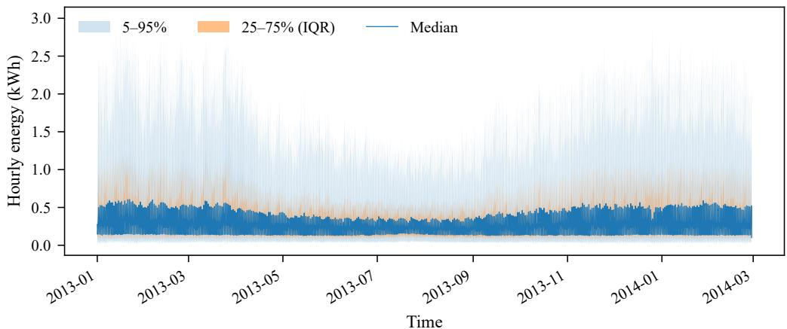
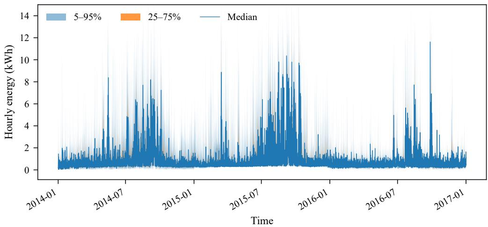
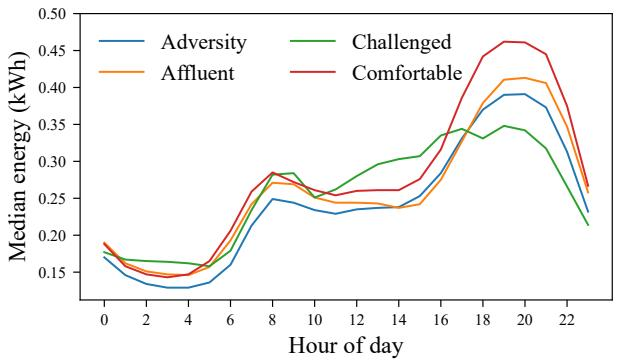
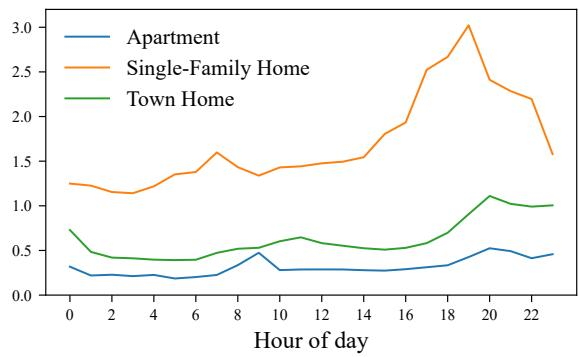

## Highlights

An Empirical Benchmark of Deep Time-Series Models for Smart Meter Energy Forecasting Behnaz Kavoosighafi, Maria Eidenskog, Wiktoria Glad, Katerina Vrotsou

• We benchmark nine deep learning forecasting models on two high-resolution real-world smart meter datasets.

• We show that forecasting accuracy improves with longer historical context only up to a saturation point, while accuracy consistently declines as the prediction horizon increases.

• We demonstrate that lightweight architectures achieve competitive accuracy at lower computational cost, and that architectural diferences become significant mainly at longer horizons and on more heterogeneous data.

• We show, through a subgroup analysis, that Transformer-based models appear to ofer an advantage on the most under-represented population segments, but this pattern is not statistically robust and does not hold consistently across datasets.

# An Empirical Benchmark of Deep Time-Series Models for Smart Meter Energy Forecasting⋆

Behnaz Kavoosighafia,∗, Maria Eidenskogb, Wiktoria Gladb and Katerina Vrotsoua

aLinköping University, Department ofScience and Technology, Norrköping, 60174, Östergötland, Sweden bLinköping University, Department of Thematic Studies, Linköping, 58183, Östergötland, Sweden

## A R T I C L E I N F O

Keywords:   
Time-series forecasting   
Smart meters   
Deep learning   
Energy consumption   
Transformer   
Benchmark

## A BS T R AC T

Accurate forecasting of energy consumption is important for the eficient operation of power systems, with direct implications for operational costs, energy management, and system maintenance. Due to the availability of extensive high-resolution consumption data from smart meters, data-driven methods have been used for short-term and long-term forecasting. However, their comparative performance on real-world smart meter data is still not well studied. In this paper, we present an empirical benchmark of nine modern deep learning models for time-series forecasting, including linear, MLP-based, convolutional, and Transformer architectures. We evaluate these models on two publicly available smart meter datasets. Our analysis focuses on three factors that strongly afect forecasting performance: the length of historical input, the prediction horizon, and the choice of model architecture. We show that extending the historical context improves accuracy, but only up to a saturation point, after which additional input provides limited benefit. In contrast, accuracy decreases as the prediction horizon increases. We also investigate the trade-of between prediction accuracy and computational complexity, and assess the statistical significance and practical magnitude of performance diferences across models. Our results show that deep learning models consistently outperform classical baselines, while lightweight architectures achieve relatively similar performance at significantly lower computational cost. Additionally, architectural diferences only become meaningful at longer forecasting horizons and on more heterogeneous datasets. Finally, a subgroup analysis across geodemographic and household categories shows that model choice has limited impact for most population segments, with attention-based architectures appearing to ofer an advantage on the most under-represented or behaviorally irregular groups, though this advantage is not statistically robust given the small size of the afected subgroups and does not generalize consistently across datasets. This benchmark provides practical guidance for selecting forecasting models in smart meter energy applications.

## 1. Introduction

Accurate forecasting of residential energy consumption is of great importance in modern energy systems, which require reliable hourly or daily load predictions to support demand response, infrastructure planning and investment, and environmental management [37]. Over the last few decades, smart meters have been deployed worldwide to record electricity, water, and other forms of consumption with higher accuracy and fine temporal resolution. As a result, many datasets containing detailed consumption information have become available, often accompanied by auxiliary factors such as weather and demographics that influence consumption patterns [4, 23, 21]. These datasets provide valuable opportunities for data-driven modeling of consumption dynamics and forecasting approaches that capture complex temporal patterns and behavioral variability. At the same time, time-series forecasting has been experiencing significant progress through the adoption of machine learning techniques [8, 20, 24]. Whereas classical statistical models perform well at modeling trends and seasonality [5], neural networks are better suited for capturing nonlinear temporal dependencies. Models based on convolutional networks, recurrent neural networks, and more recently transformer architectures have demonstrated strong predictive capabilities across many forecasting tasks [27, 32, 42]. However, simpler approaches such as linear models and Multi-Layer Perceptrons (MLPs) have also been proposed to reduce computational costs while still delivering high accuracy [40, 15, 41], raising the question of whether increasingly complex architectures consistently outperform simpler models when forecasting structured signals such as energy consumption.

In addition to architectural complexity, there are several other factors that directly influence the performance of forecasting models, including the length of future predictions, typically referred to as the prediction horizon, and the amount of past observations provided as input, known as the historical context. As the prediction horizon increases, forecasting becomes more challenging because models must extrapolate patterns further beyond the observed input window, which increases uncertainty and amplifies modeling errors. This is a fundamental challenge in long-horizon forecasting and has motivated the development of many specialised forecasting architectures [26, 20].

Another important yet often overlooked aspect concerns how model performance changes across diferent population segments. Many studies focus mainly on aggregate predictive accuracy, without scrutinizing whether forecasting models perform similarly across diverse groups. Such analyses are important because household energy consumption is inherently heterogeneous and reflects diferences in socioeconomic characteristics, occupancy patterns, and building types, among other factors [10]. In this work, we examine forecasting performance across diferent socioeconomic categories to assess whether models generalise consistently across population groups. Moreover, the amount of historical context available to a model can influence its forecasting performance [35]. While it is intuitively expected that providing more historical observations improves forecasting accuracy, this efect can change across mode architectures and datasets. Some models benefit substantially from longer input sequences, whereas others may reach a performance plateau once seasonal patterns have been captured. Hence, understanding how diferent models exploit historical context is important when designing forecasting systems for real-world applications.

While several studies benchmark forecasting architectures on general time-series datasets, comparable evaluations on high-resolution smart meter energy data are very limited [32, 27, 42, 38]. A few recent studies have begun to fill this gap, benchmarking foundation models [31] or comparing deep learning architectures such as NBEATS, DLinear, and FEDformer [29] on household-level electricity data, but without jointly examining the efect of historical context length and prediction horizon, reporting an accuracy-eficiency trade-of, or assessing performance across geodemographic or building-type subgroups. Household energy consumption data also show unique characteristics, including strong periodicity, behavioral variability, and diversity across households, which are significantly diferent from the aggregated datasets [30]. In this study, we present an empirical evaluation of forecasting algorithms for shortand long-horizon smart meter energy data and investigate how diferent architectures respond to increasing forecasting dificulty with respect to historical context length and prediction horizon. We evaluate nine representative models, including linear, MLP-based, convolutional, and Transformer-based designs, alongside classical statistical baselines, on two publicly available smart meter datasets. The datasets difer in geographic coverage, temporal resolution, and consumption characteristics, which enables a broader evaluation of model behavior. Unlike prior time series benchmarks evaluated on general purpose research datasets, this study jointly examines model architecture, historica context length, prediction horizon, computational cost, statistical and practical significance, and geodemographic subgroup fairness on real, high resolution smart meter data, providing evidence-based guidance for model selection in operational energy forecasting settings. Our main contributions are summarized as follows:

• An empirical benchmark of nine forecasting architectures, including linear, MLP-based, convolutional, and Transformer-based models, alongside classical baselines (SARIMA, naïve seasonal) on two real-world smart meter datasets.

• An exploratory analysis of the datasets, including consumption patterns, temporal behavior, and the distribution of demographic subgroups.

• An analysis of the trade-of between predictive accuracy and computational eficiency, together with an investigation of how historical context length and prediction horizon influence forecasting performance.

• A subgroup analysis across geodemographic categories, highlighting potential disparities in predictive performance across population segments.

The code used in this study is publicly available at https://github.com/behnazkavoosi/Energy-Time-Series-Library.

## 2. Related Work

## 2.1. Time-Series Forecasting

Time-series forecasting concerns the estimation of future observations based on historical data and is an active research area in machine learning, statistics, and related disciplines [6]. Given the inherent complexity of temporal dynamics, forecasting models aim to learn the underlying structure of the series, such as trend and seasonality, in order to extract informative representations that result in accurate predictions.

Forecasting approaches can be grouped according to the prediction horizon into short-term and long-term forecasting. The definition of a long prediction horizon depends on the temporal resolution of the data. For example, one week corresponds to 168 steps in hourly data but only seven in daily data. Long-term forecasting is usually applied in infrastructure planning, market analysis, maintenance, and scheduling. However, predictive uncertainty generally increases with forecast length because of error accumulation and the gradual loss of reliable contextual information [25]. Short-term forecasting, by contrast, typically achieves higher accuracy and is often employed for operational decision-making and demand response [18].

Forecasting can be performed using classical statistical methods, machine learning approaches, and deep learning models. Statistical models estimate future values using mathematical formulations that approximate the behavior of historical data [13]. Well-known examples include Auto-Regressive (AR), Moving Average (MA), and Auto-Regressive Integrated Moving Average (ARIMA) [5], which are often efective for short-term forecasting but struggle with complex or highly non-linear data. Machine learning models aim to improve predictive performance through supervised learning [2], with methods such as Random Forest [7], eXtreme Gradient Boosting (XGBoost) [9], and Support Vector Machines (SVM) [11]. More recently, deep learning approaches, including Temporal Convolutional Networks (TCNs) [3], Recurrent Neural Networks (RNNs) [16], and Transformers [36], have advanced forecasting by learning complex temporal dependencies and interactions in multivariate data. This flexibility, however, oftentimes comes at the cost of higher computational and data requirements. For comprehensive overviews of forecasting methods, we refer the reader to recent surveys [8, 20, 24, 26].

## 2.2. Energy Consumption Forecasting

Energy and load consumption forecasting has been an active area of research for many years and supports applications ranging from long-term strategic planning and renewable energy integration [37] to building energy system management. In this context, energy data refers to various forms of consumption, including electricity, heating, and water. Predictions may be done at an aggregated scale, estimating total demand for a region or city [19], or at a granular scale, focusing on individual households, buildings, or even specific appliances [30]. Aggregated forecasts are mainly used for urban energy management and cost control, whereas granular predictions are more relevant for engineering, maintenance, and operational optimization [34].

Approaches developed for general time-series analysis are commonly applied in this domain. In the univariate setting, models use historical consumption values as input to generate predictions [33]. In the multivariate scenario, however, additional covariates such as weather conditions, occupancy patterns, and time-of-day or day-of-week indicators are incorporated to enhance performance [17]. For daily-resolution data, derived features such as the daily mean, minimum, maximum, and standard deviation can also be included. For a comprehensive overview of methods in energy consumption forecasting, we refer the reader to [1, 14, 39]. Details of the deep learning-based models used in our experiments are provided in Section 3.2.

## 3. Benchmarking

Energy consumption forecasting plays an important role in reducing operational costs and improving energy eficiency. In this study, we benchmark a range of forecasting algorithms on two diferent energy datasets in order to examine the following research questions:

1. To what extent does model choice influence predictive performance on high-resolution smart meter data?

2. How does the length of historical context afect forecasting accuracy across model families?

3. How does predictive performance degrade as the forecast horizon increases, and do diferent model classes exhibit distinct robustness to long-horizon prediction?

4. Do forecasting models perform similarly across geodemographic population segments, or do certain architectures show advantages for specific groups?

Our main goal is to evaluate modeling decisions under realistic data conditions. We therefore begin with an analysis of datasets to characterize their statistical properties, and then describe the forecasting models and experimental protocol used in the benchmark.

## 3.1. Datasets

We utilized two publicly available smart meter electricity datasets for our experiments: (1) the Low-Carbon London (LCL)1 dataset and (2) the Pecan Street2 dataset. The LCL dataset contains electricity consumption records from 5 561 households in London, collected at a half-hourly resolution over 829 days, spanning November 2011 to February 2014. In addition to consumption data, the dataset is accompanied by survey information that categorizes households according to geodemographic characteristics, including income, education level, and age, among other attributes. However, the original survey responses are not directly accessible. Instead, households are assigned ACORN categories3, which provide aggregated geodemographic labels and therefore do not permit direct mapping to the underlying survey variables. In the Pecan Street dataset, measurements were recorded at 15-minute resolution, mainly over 2013–2017, with additional data extending into 2018–2019 for a subset of households. The dataset includes 73 households from New York, California, and Austin in the United States and provides appliance- or circuit-level electricity measurements. In this work, we computed gross household load by summing all recorded circuit-level consumption channels for each household, excluding grid import/export, solar generation, battery storage, and voltageonly channels. Alongside the data, additional variables such as year of construction, housing type, and house size are also collected to complement the energy data.

Figure 1 illustrates the hourly electricity consumption patterns in the LCL and Pecan Street datasets. For the LCL dataset, the original half-hourly measurements were resampled to hourly resolution for these visualizations and throughout the benchmark in order to reduce computational complexity. Additionally, the analysis is limited to the period January 2013 to March 2014 due to incomplete records for many households in earlier years and ensure a more consistent evaluation period. For the Pecan Street dataset, the original 15-minute resolution was retained for all experiments to assess model performance at a finer temporal granularity and to compensate for the limited number of households through a higher number of time steps per series; for visualization purposes, however, the 15-minute data were aggregated to hourly resolution. Figures 1a and 1b present the population-level hourly envelope over the experimental period for the LCL and Pecan Street datasets, respectively. The median, together with the 25–75% and 5–95% quantile bands, is computed across households at each timestamp. The resulting envelopes indicate obvious annual seasonality, with higher consumption during colder months and lower levels in summer for the LCL dataset, and the opposite for the Pecan Street dataset, which reflects climate diferences between the two datasets. Note that the Pecan Street dataset exhibits higher consumption magnitudes, with peak hourly values going beyond 10 kWh compared to approximately 3 kWh in the LCL dataset, as well as greater household-level variability, as confirmed by the wider quantile bands and more extreme spikes in the population envelope. Figure 1c compares median intraday profiles across four geodemographic ACORN categories within the LCL dataset. Households in the Afluent and Comfortable groups show higher consumption than those in the Adversity and Challenged groups. Diferences are most visible during peak hours, while night-time consumption is relatively similar across categories. We also note that the dataset is socio-economically imbalanced, including 39.4% Afluent, 31.9% Adversity, 27.4% Comfortable, and only 1.3% Challenged households. Results for the Challenged group should therefore be interpreted with caution due to limited representation. Additionally, Figure 1d illustrates median intraday patterns across building types in the Pecan Street dataset. In terms of peak consumption, single-family homes show considerably higher consumption than town homes and apartments, although the overall profile shape is similar across building types. As with the LCL dataset, the Pecan Street dataset is imbalanced with respect to building type: approximately 70% of households are single-family homes, 20% town homes, and 10% apartments.

## 3.2. Models

A wide range of algorithms has been proposed for both long- and short-horizon time-series forecasting, including applications to smart meter energy data. In this study, we selected nine models, ranging from simpler linear approaches to more complex and computationally intensive Transformer-based architectures. The models were chosen to cover the major architectural families in recent time-series forecasting literature, with each model representing a distinct design principle, including linear decomposition, interval and continuous sampling, time-channel mixing, residual encoder– decoder, multi-scale convolution, frequency-domain encoding, and various attention-based mechanisms, so that the benchmark captures a representative and diverse set of modern approaches without redundancy. From a deployment perspective, DLinear, LightTS, and TSMixer’s low computational cost is relevant for utility scale forecasting across thousands of meters, while the cross variate modeling capacity of PatchTST, iTransformer, and Crossformer is more relevant to multivariate settings incorporating covariates such as weather or occupancy. Table 1 summaries the models included in our benchmark, together with their architectural design, core mechanisms, and relative theoretical computational complexity.

Table 1  
Comparison of forecasting models used in our benchmark.
<table><tr><td>Model</td><td>Architecture</td><td>Core Mechanism</td><td>Complexity</td></tr><tr><td>DLinear [40]</td><td>Linear model</td><td>Series decomposition</td><td>Very low</td></tr><tr><td>LightTS [41]</td><td>MLP-based</td><td>Interval and continuous sampling</td><td>Low</td></tr><tr><td>TSMixer [15]</td><td>MLP-based</td><td>Time-channel mixing</td><td>Low</td></tr><tr><td>FiLM [43]</td><td>Memory-based</td><td>Frequency-domain denoising</td><td>Medium</td></tr><tr><td>SCINet [27]</td><td>CNN-based</td><td>Recursive downsampling</td><td>Medium</td></tr><tr><td>TiDE [12]</td><td>MLP-based</td><td>Residual encoder-decoder</td><td>Medium</td></tr><tr><td>Crossformer [42]</td><td>Transformer</td><td>Two-stage attention</td><td>High</td></tr><tr><td>PatchTST [32]</td><td>Transformer</td><td>Patching and channel independence</td><td>High</td></tr><tr><td>Transformer [28]</td><td>Transformer</td><td>Inverted attention across variates</td><td>High</td></tr></table>

At the simpler end, DLinear [40] is a decomposition-based linear model that separates the input into trend and seasonal components using a moving average filter and applies dedicated linear layers to each part. LightTS [41] and TSMixer [15] adopt MLP-based designs: LightTS combines continuous and interval sampling to capture local and global patterns eficiently, while TSMixer alternates between time-mixing and feature-mixing MLP layers to model temporal dependencies and cross-variate interactions. Similarly, TiDE [12] employs a dense MLP-based encoder–decoder architecture with residual connections to incorporate historical observations and dynamic covariates. Moving towards convolutional and hybrid designs, SCINet [27] utilises a recursive binary tree structure within an encoder–decoder framework, where sub-sequences interact through convolutional layers to capture multi-scale temporal dependencies. FiLM [43] integrates Legendre Projection Units to encode long historical context together with Fourier-based enhancement modules to model frequency-domain characteristics. Finally, the Transformer-based models Crossformer [42], PatchTST [32], and iTransformer [28] leverage attention mechanisms: Crossformer applies a two-stage attention scheme to capture cross-time and cross-dimension dependencies, whereas PatchTST divides the input sequence into fixed-length temporal segments and processes them using channel-independent Transformer encoders, modeling each variable separately while sharing parameters across channels. iTransformer embeds the entire time series of each variable into a single token and applies self-attention across variables, making it suitable for capturing multivariate dependencies. For a comprehensive analysis of each architecture, we refer the reader to the original publications.

## 3.3. Experimental Setup

Our pipeline consisted of three stages: data pre-processing, model training, and evaluation (see Section 4). For LCL, we randomly selected 560 out of 5 561 households to reduce computational cost while ensuring representation across all ACORN groups. We limited the analysis to January 2013–March 2014 due to data completeness and resampled the original half-hourly measurements to hourly resolution. For the Pecan Street dataset, we used all 73 households at the original 15-minute resolution. We pre-processed both datasets using standard strategies, including timestamp parsing, removal of invalid entries, and interpolation of missing values where necessary. Specifically, values that fail numeric parsing are treated as missing and filled by linear interpolation using neighboring valid readings in both directions. Any values still missing after interpolation, for example at the start or end of a household’s series where interpolation has no bound on one side, are filled with that household’s mean consumption. For LCL, we applied global standardization using the mean and standard deviation computed from the training portion across all households in order to maintain inter-household magnitude diferences. For Pecan Street, we performed per-household normalization, fitting scaling parameters independently on each household’s training segment. This choice was necessary because

Forecast accuracy of the deep learning models and classical baselines on the LCL dataset at seq\_len = 24 and pred\_len = 24. The best value in each column is bold.
<table><tr><td>Model</td><td>MSE↓</td><td>MAE↓</td><td>MAPE↓</td><td> $R ^ { 2 } \uparrow$ </td><td>r ↑</td><td>cos ↑</td><td>FD ↓</td></tr><tr><td colspan="8">Classical baselines</td></tr><tr><td>Naive seasonal</td><td>0.240</td><td>0.241</td><td>0.721</td><td>0.391</td><td>0.697</td><td>0.792</td><td>0.712</td></tr><tr><td>SARIMA</td><td>0.196</td><td>0.246</td><td>0.991</td><td>0.504</td><td>0.739</td><td>0.820</td><td>0.631</td></tr><tr><td colspan="8">Deep learning models</td></tr><tr><td>DLinear</td><td>0.177</td><td>0.227</td><td>1.310</td><td>0.553</td><td>0.744</td><td>0.857</td><td>0.960</td></tr><tr><td>LightTS</td><td>0.166</td><td>0.216</td><td>1.226</td><td>0.579</td><td>0.761</td><td>0.863</td><td>0.982</td></tr><tr><td>TSMixer</td><td>0.168</td><td>0.217</td><td>1.203</td><td>0.576</td><td>0.760</td><td>0.861</td><td>0.988</td></tr><tr><td>FiLM</td><td>0.177</td><td>0.221</td><td>0.863</td><td>0.551</td><td>0.743</td><td>0.857</td><td>0.969</td></tr><tr><td>SCINet</td><td>0.174</td><td>0.218</td><td>0.854</td><td>0.560</td><td>0.749</td><td>0.858</td><td>0.974</td></tr><tr><td>TiDE</td><td>0.177</td><td>0.221</td><td>0.863</td><td>0.551</td><td>0.743</td><td>0.857</td><td>0.968</td></tr><tr><td>Crossformer</td><td>0.165</td><td>0.217</td><td>1.082</td><td>0.582</td><td>0.763</td><td>0.862</td><td>0.973</td></tr><tr><td>PatchTST</td><td>0.167</td><td>0.214</td><td>0.915</td><td>0.577</td><td>0.760</td><td>0.862</td><td>0.991</td></tr><tr><td>Transformer</td><td>0.166</td><td>0.218</td><td>1.343</td><td>0.581</td><td>0.762</td><td>0.863</td><td>0.953</td></tr></table>

Pecan Street households exhibit significantly larger scale heterogeneity than LCL, while comprising far fewer series. As a result, a single global scaling statistic could be a poor fit for many individual households and dominate the loss by the highest-consumption households. Note that, as a consequence of this diference in pre-processing, absolute error magnitudes are not directly comparable between the two datasets. Once normalization was done, sliding windows were then constructed and split chronologically into 80% training, 10% validation, and 10% test sets. Note that all normalization statistics were computed on the training data to prevent data leakage.

For model training, we used the Time Series Library (TSLib) [38], which provides implementations of 30 forecasting models. We followed the original implementations and trained all models under a consistent sliding-window forecasting setup to ensure fair comparison. From each household time series, we extracted input segments of fixed length (seq\_len) and trained the models to predict the next pred\_len time steps. For encoder–decoder architectures, an additional overlap segment (label\_len) was used to condition the decoder during forecasting. The same window lengths, chronological data splits, and pre-processing procedures were applied across all models so that performance diferences reflect architectural designs. We trained the models, listed in Table 1, for a fixed budget of 5 epochs with a learning rate of $1 0 ^ { - 4 }$ and a batch size of 64 for LCL and 128 for Pecan Street, using the Adam optimizer [22] and Mean Squared Error (MSE) as the loss function. While the training budget, learning rate, batch size, optimizer, and loss function were held fixed across all nine models, each model used its default architecture-specific hyperparameters (e.g., number of layers, hidden dimensions, attention heads) as implemented in TSLib. We therefore report our results as a fixed-compute comparison under each model’s default architecture configuration, rather than a comparison under independently optimized configurations. Note that in our preliminary experiments, we extended training to 10 epochs but observed no improvement in validation performance, which suggests that models had largely stabilized within the selected training budget. All experiments were conducted on an NVIDIA RTX 5090 GPU.

## 4. Results

We evaluate all models across multiple prediction horizons and historical context lengths using global test metrics, including Mean Squared Error (MSE), Mean Absolute Error (MAE), Mean Absolute Percentage Error (MAPE), and the coeficient of determination $( R ^ { 2 } )$ . Note that all reported metrics are computed after inverse-transforming model predictions and ground-truth values back to their original physical scale (kWh). While MSE, MAE, and MAPE quantify point-wise prediction error, $R ^ { 2 }$ captures the proportion of variance in the target explained by the forecasts. MAPE is computed with a small epsilon added to the denominator to avoid division by zero. To assess structural similarity between predicted and ground-truth trajectories, we additionally report Fréchet distance (FD), cosine similarity, and Pearson’s correlation coeficient (�). Fréchet distance and cosine similarity reflect how well a model captures the shape and timing of consumption, which is relevant to demand-response scheduling. Pearson correlation, on the other hand, captures whether relative fluctuations are tracked even when magnitude is of, useful for ranking households by relative load. Computational eficiency is evaluated in terms of training and inference time. In addition to aggregate metrics, we conduct subgroup analyses for relevant categories, such as ACORN groups in the LCL dataset. We also analyze how model-specific mechanisms account for performance diferences between models under diferent conditions. Note that unless otherwise stated, all results reported in this section correspond to the LCL dataset; full results for both datasets are provided in the Supplementary Material.

Best-performing forecasting model (lowest composite score) for each combination of input sequence length $( \mathsf { s e q \mathrm { _ { - } 1 e n } } )$ and prediction horizon (pred\_len) for the LCL dataset.
<table><tr><td>seq_len  $\mathtt { p r e d \_ l e n } $ </td><td rowspan="2">24</td><td rowspan="2">96</td><td rowspan="2">168</td><td rowspan="2">336</td><td rowspan="2">672</td></tr><tr><td></td><td></td></tr><tr><td>24</td><td>PatchTST</td><td>iTransformer</td><td>iTransformer</td><td>Transformer</td><td>iTransformer</td></tr><tr><td>96</td><td>PatchTST</td><td>PatchTST</td><td>Transformer</td><td>Transformer</td><td>PatchTST</td></tr><tr><td>168</td><td>TSMixer</td><td>TSMixer</td><td>TSMixer</td><td>Crossformer</td><td>TiDE</td></tr></table>

Best-performing forecasting model (lowest composite score) for each combination of input sequence length (seq\_len) and prediction horizon (pred\_len) for the Pecan Street dataset.
<table><tr><td></td><td rowspan="3">seq_len 96</td><td rowspan="3"></td><td rowspan="3">672</td><td rowspan="3"></td><td rowspan="3">1344</td></tr><tr><td>pred_len</td><td>384</td></tr><tr><td>96</td><td>TiDE</td></tr><tr><td rowspan="2"></td><td>PatchTST</td><td></td><td></td><td>Crossformer</td><td>iTransformer</td></tr><tr><td>384</td><td>TiDE</td><td>PatchTST</td><td>TiDE</td><td>iTransformer</td></tr><tr><td colspan="2">672</td><td>PatchTST</td><td>TiDE</td><td>TiDE</td><td>Crossformer</td></tr></table>

To establish a baseline, we compare the deep learning models against two classical baselines: Naïve seasonal and Seasonal ARIMA (SARIMA) [5]. The baselines were evaluated on the same test windows as the deep learning models to ensure a fair comparison. The naïve seasonal baseline predicts the next pred\_len steps by repeating the observations from one seasonal cycle prior to the forecast origin. SARIMA models were fitted independently per household using AIC-based order selection from a set of candidate orders, with a seasonal period of 24 hours for the LCL dataset and 96 steps (one day) for the Pecan Street dataset. A context window of three seasonal cycles was used for Kalman filter initialization, and all metrics were computed in the same normalized space as the deep learning outputs to ensure comparability. Table 2 compares all models at seq\_len = 24 and pred\_len = 24 for the LCL dataset. Deep learning models clearly outperform both classical baselines across the primary accuracy metrics (MSE, MAE, ${ \bar { R } } ^ { 2 }$ , Pearson’s �, and cosine similarity), confirming that learned temporal representations capture consumption dynamics more efectively than statistical approaches. This advantage is even more considerable on the Pecan Street dataset, where both baselines result in negative $R ^ { 2 }$ values, which shows their inability to handle the higher household-level variability of this dataset. Interestingly, the naïve seasonal and SARIMA achieve the lowest MAPE and Fréchet distance, respectively, compared to most deep learning models; however, these are metric-specific artifacts: the naïve seasonal baseline benefits from MAPE’s sensitivity to small absolute values in low-consumption periods, while SARIMA’s lower Fréchet distance reflects the inherent smoothness of autoregressive predictions.

## 4.1. Accuracy-Eficiency Model Selection

Considering that diferent models have diferent levels of architectural complexity (see Table 1), we explore the trade-of between prediction accuracy and computational cost. To this end, we introduce a composite metric ${ \mathcal { L } } = \alpha \mathbf { M A E } _ { n } + \beta \mathbf { t i m e } _ { n }$ , where $\mathrm { M A E } _ { n }$ and $\mathrm { t i m e } _ { n }$ are the normalized MAE and training time for a given configuration, obtained via MinMax scaling. The weights � and � are set to 0.7 and 0.3, respectively, to prioritize predictive accuracy while accounting for computational cost; see Supplementary Material for a sensitivity analysis under alternative weightings. Tables 3 and 4 report the best-performing model under this metric for each combination of seq\_len and pred\_len on the LCL and Pecan Street datasets, respectively.

For the LCL dataset, at short horizons (pred\_len = 24), PatchTST achieves the lowest composite score at the shortest input length (seq\_len = 24), while iTransformer dominates across all longer input windows $( \mathtt { s e q \_ l e n } \ge 9 6 )$ suggesting that patch-based attention is most efective under limited context whereas the inverted attention mechanism of iTransformer benefits progressively from larger historical windows. At intermediate horizons $( \mathtt { p r e d \_ l e n } = 9 6 )$ PatchTST performs best at seq\_len ∈ {24, 96, 672}, while iTransformer leads at seq\_len ∈ {168, 336}. At the longest horizon (pred\_len = 168), the results shift towards lighter architectures: TSMixer achieves the lowest composite score for seq\_ $. 1 \mathbf { e n } \in \{ 2 4 , 9 6 , 1 6 8 \}$ , Crossformer at seq\_ $. 1 \mathtt { e n } = 3 3 6 ,$ and TiDE at seq $\mathtt { - } 1 \mathtt { e n } = 6 7 2$ , indicating that the relative advantage of Transformer-based models diminishes at longer horizons where MLP-based and encoderdecoder architectures provide a better accuracy-eficiency trade-of. In contrast, results on the Pecan Street dataset show that PatchTST and TiDE dominate most configurations, with PatchTST leading at shorter context lengths (seq\_len $\in \ \{ 9 6 , 3 8 4 \} ,$ ) for pred\_ $\mathtt { l e n } \in \{ 9 6 , 6 7 2 \}$ and TiDE performing best across the majority of medium and long input windows, which implies that the encoder-decoder design of TiDE is better suited to handle the higher variability and finer temporal resolution of this dataset. iTransformer outperforms other models at the largest context window (seq\_len = 1344) for shorter prediction horizons, and Crossformer at seq $. 1 \mathsf { e n } \in \{ 6 7 2 , 1 3 4 4 \}$ for the longest horizon.

These findings demonstrate that no single model performs best across all configurations, with the optimal choice depending on both the forecasting horizon and the historical context length. The sensitivity analysis in the Supplementary Material confirms that these patterns are mostly stable across alternative weightings: PatchTST and iTransformer dominate at shorter prediction horizons regardless of weighting, while lightweight models become increasingly competitive at longer horizons and more balanced weightings DLinear, LightTS, FiLM, and SCINet do not achieve the lowest composite score under any configuration with the primary weighting scheme on either dataset. Note that model rankings on eficiency reflect architectural diferences rather than hardware-specific efects, and are therefore expected to generalize across GPU platforms; however, this has not been empirically verified on edge or resource-constrained devices, where absolute training and inference times may difer substantially.

## 4.2. Impact of Historical Context

We assess the efect of historical context length (seq\_len) by sweeping the input window from 24 to 672 hours, with results reported in Tables 5–7 for the LCL dataset. Across all models, longer historical context consistently improves performance in terms of MSE, MAE, MAPE, $R ^ { 2 }$ , Pearson’s �, and cosine similarity, as extended input windows enable models to capture periodic patterns and medium-term trends. However, the largest gains are observed when increasing seq\_len from 24 to 168 hours, after which improvements become marginal, suggesting that once daily and weekly seasonality are captured, additional context contributes limited new information and can even cause a plateau or slight degradation in some models, particularly LightTS and iTransformer at longer prediction horizons.

We also examine model-specific trends to understand how diferent architectures exploit additional context. Among linear and MLP-based models (DLinear, LightTS, and TSMixer), LightTS performs best at shorter context lengths while TSMixer takes over at longer ones $( \mathtt { s e q \_ l e n } \ge 1 6 8 )$ , reflecting the benefit of its time- and feature-mixing mechanisms for capturing richer periodic structure. Among Transformer-based models, Crossformer leads at the shortest context length across all horizons, while PatchTST dominates at longer context lengths for pred $. 1 \mathsf { e n } = 2 4$ and Crossformer becomes the leading Transformer at longer contexts for pred\_len = 96 and 168, which suggests that cross-dimension attention mechanisms are increasingly beneficial as both context and horizon grow. With respec to structural similarity, TSMixer achieves the globally best Fréchet distance at seq\_len = 672 and pred\_len = 24, indicating robust preservation of global trajectory geometry due to its mixing mechanism capturing smooth periodic structure without introducing the local deviations that accumulate in attention-based architectures.

## 4.3. Impact of Prediction Horizon

We evaluate sensitivity to the prediction horizon (pred\_len) by considering horizons of 24, 96, and 168 hours (one day, four days, and one week), with results reported in Tables 5–7 for the LCL dataset, where each table corresponds to a fixed horizon with seq\_len varied from 24 to 672 hours. As expected, performance degrades consistently as the prediction horizon increases across all seq\_len configurations, with MSE and MAE increasing and $R ^ { 2 }$ , Pearson’s $r ,$ and cosine similarity declining, since the widening temporal gap between observed inputs and forecast targets makes short-term dependencies less informative and forces predictions to rely on coarse-grained seasonal structure. Architectural rankings also shift with horizon: at pred $\mathtt { - } 1 \mathtt { e n } = 2 4$ , Crossformer leads at the shortest context (seq\_len $= 2 4 )$ , while PatchTST dominates at medium and longer input windows, consistent with its patch-based attention efectively exploiting richer historical context; at pred ${ \tt - } 1 \mathtt { e n } = 9 6 { \it \Psi }$ , Crossformer again leads at the shortest and longest context lengths, while TSMixer and LightTS appear strong at medium input windows; and at pred\_ $. 1 \mathsf { e n } = 1 6 8$ Crossformer leads at the shortest and longest context lengths, with LightTS performing best at intermediate windows, which indicates that the relative advantage of complex attention mechanisms diminishes at longer horizons where lighter architectures ofer a competitive alternative. At the longest horizon, performance diferences across architectures narrow considerably, suggesting that horizon-induced uncertainty limits the advantage conferred by architectural complexity. With respect to structural similarity, DLinear achieves the lowest Fréchet distance most consistently across horizons, particularly at pred\_len = 96 and 168, preserving trajectory-level shape more reliably than other models due to its trend-seasonal decomposition, which constrains predictions to smooth low-frequency dynamics. These results highlight that pointwise accuracy and structural fidelity are not equivalent objectives, and that model selection should reflect the criterion relevant to the deployment setting.

Table 8: Subgroup performance (MSE) across ACORN categories for seq\_len = 96 and pred\_len = 168. The lowest error per subgroup is highlighted in bold.
<table><tr><td rowspan=1 colspan=1></td><td rowspan=1 colspan=1>DLinear</td><td rowspan=1 colspan=1>LightTS</td><td rowspan=1 colspan=1>TSMixer</td><td rowspan=1 colspan=1>FiLM</td><td rowspan=1 colspan=1>SCINet</td><td rowspan=1 colspan=1>TiDE</td><td rowspan=1 colspan=1>CFormer</td><td rowspan=1 colspan=1>PatchTST</td><td rowspan=1 colspan=1>iTrans</td></tr><tr><td rowspan=1 colspan=1>Challenged</td><td rowspan=1 colspan=1>0.192</td><td rowspan=1 colspan=1>0.174</td><td rowspan=1 colspan=1>0.175</td><td rowspan=1 colspan=1>0.192</td><td rowspan=1 colspan=1>0.191</td><td rowspan=1 colspan=1>0.191</td><td rowspan=1 colspan=1>0.164</td><td rowspan=1 colspan=1>0.134</td><td rowspan=1 colspan=1>0.155</td></tr><tr><td rowspan=1 colspan=1>Adversity</td><td rowspan=1 colspan=1>0.108</td><td rowspan=1 colspan=1>0.105</td><td rowspan=1 colspan=1>0.105</td><td rowspan=1 colspan=1>0.108</td><td rowspan=1 colspan=1>0.107</td><td rowspan=1 colspan=1>0.108</td><td rowspan=1 colspan=1>0.105</td><td rowspan=1 colspan=1>0.104</td><td rowspan=1 colspan=1>0.105</td></tr><tr><td rowspan=1 colspan=1>Comfortable</td><td rowspan=1 colspan=1>0.124</td><td rowspan=1 colspan=1>0.121</td><td rowspan=1 colspan=1>0.121</td><td rowspan=1 colspan=1>0.124</td><td rowspan=1 colspan=1>0.123</td><td rowspan=1 colspan=1>0.124</td><td rowspan=1 colspan=1>0.121</td><td rowspan=1 colspan=1>0.121</td><td rowspan=1 colspan=1>0.120</td></tr><tr><td rowspan=1 colspan=1>Affluent</td><td rowspan=1 colspan=1>0.231</td><td rowspan=1 colspan=1>0.221</td><td rowspan=1 colspan=1>0.222</td><td rowspan=1 colspan=1>0.233</td><td rowspan=1 colspan=1>0.228</td><td rowspan=1 colspan=1>0.233</td><td rowspan=1 colspan=1>0.224</td><td rowspan=1 colspan=1>0.224</td><td rowspan=1 colspan=1>0.223</td></tr></table>

Table 9: Subgroup performance (MSE) across building types for the Pecan Street dataset, seq\_len = 672 and pred\_len = 96. The lowest error per subgroup is highlighted in bold.
<table><tr><td rowspan=1 colspan=1></td><td rowspan=1 colspan=1>DLinear</td><td rowspan=1 colspan=1>LightTS</td><td rowspan=1 colspan=1>TSMixer</td><td rowspan=1 colspan=1>FiLM</td><td rowspan=1 colspan=1>SCINet</td><td rowspan=1 colspan=1>TiDE</td><td rowspan=1 colspan=1>CFormer</td><td rowspan=1 colspan=1>PatchTST</td><td rowspan=1 colspan=1>iTrans</td></tr><tr><td rowspan=1 colspan=1>Apartment</td><td rowspan=1 colspan=1>0.333</td><td rowspan=1 colspan=1>0.334</td><td rowspan=1 colspan=1>0.334</td><td rowspan=1 colspan=1>0.339</td><td rowspan=1 colspan=1>0.333</td><td rowspan=1 colspan=1>0.334</td><td rowspan=1 colspan=1>0.330</td><td rowspan=1 colspan=1>0.334</td><td rowspan=1 colspan=1>0.331</td></tr><tr><td rowspan=1 colspan=1>Single-Family</td><td rowspan=1 colspan=1>0.530</td><td rowspan=1 colspan=1>0.528</td><td rowspan=1 colspan=1>0.527</td><td rowspan=1 colspan=1>0.539</td><td rowspan=1 colspan=1>0.528</td><td rowspan=1 colspan=1>0.529</td><td rowspan=1 colspan=1>0.519</td><td rowspan=1 colspan=1>0.529</td><td rowspan=1 colspan=1>0.527</td></tr><tr><td rowspan=1 colspan=1>Town Home</td><td rowspan=1 colspan=1>1.302</td><td rowspan=1 colspan=1>1.304</td><td rowspan=1 colspan=1>1.280</td><td rowspan=1 colspan=1>1.307</td><td rowspan=1 colspan=1>1.298</td><td rowspan=1 colspan=1>1.305</td><td rowspan=1 colspan=1>1.403</td><td rowspan=1 colspan=1>1.327</td><td rowspan=1 colspan=1>1.344</td></tr></table>

## 4.4. Subgroup Analysis

In addition to aggregate accuracy, understanding whether forecasting performance is consistent across population segments matters. This is because uneven accuracy across socioeconomic or housing categories could translate into unequal outcomes in downstream applications such as demand-response eligibility or tarif design, making subgrouplevel evaluation relevant to the fair deployment of these models, not just their overall performance.

We further analyze the performance across geodemographic segments to assess whether forecasting accuracy varies across diferent groups of the population. In Table 8, we present MSE for each ACORN segment under a representative scenario of four days of historical context ( = 96) and one-week-ahead forecasts ( = 168). Although we focus on this scenario to present our results, we note that similar trends were observed across other combinations of context and horizon lengths. For the Adversity, Comfortable, and Afluent segments, models perform very similarly to each other, with diferences in MSE being marginal, which suggests that consumption behavior within these groups is suficiently regular for all architectures to capture. In contrast, the Challenged group shows a diferent pattern: PatchTST achieves the lowest MSE, with a larger gap over other models than observed in any other segment. This is interesting given that the Challenged group is the most under-represented in the dataset (1.3% of households), and that the second and third best performing models on this segment are Crossformer and iTransformer, respectively, which might tentatively suggest that Transformer-based architectures are better suited to modeling irregular consumption patterns, especially in situations with less data. To quantify this, we computed household-level MSE per model for the Challenged group. With only 7 households, the standard error of the household-level mean is large for every model, ranging from 0.069 to 0.110. We note that even the full spread between the best- and worst-performing models corresponds to less than one standard error of the mean. This indicates that the observed ranking on this subgroup cannot be considered stable given the available sample size.

We conduct the same analysis on the Pecan Street dataset, grouping households by building type instead (Table 9). In this case, the pattern difers from LCL: although Crossformer achieves the lowest MSE on Apartment, the smallest group (10% of households), and TSMixer leads on Town Home (20% of households), the gap over other models is marginal in both cases, unlike the notable advantage observed for PatchTST on the Challenged group in LCL. This suggests that while attention-based architectures can perform well on under-represented groups, their advantage is not a consistent, dataset-independent efect, and, where such an advantage does appear, its magnitude may relate to the degree of behavioral irregularity within a segment rather than to representation size alone. We also note that, unlike the ACORN groups in LCL, where median consumption levels are comparable across categories (Figure 1c), the building types in Pecan Street vary significantly in consumption magnitude, as discussed in Section 3.1 (Figure 1d). This explains why the absolute MSE values are substantially diferent across building types in Pecan Street.

Table 10: Vargha–Delaney $\hat { A } _ { 1 2 }$ efect sizes for the LCL dataset at seq\_len = 168 and pred\_len = 24. Each entry $\hat { A } _ { 1 2 } [ i , j ] = P ( \mathrm { r o w }$ model error > column model error), where values above 0.5 indicate that the row model tends to produce higher per-window errors.
<table><tr><td></td><td>DLinear</td><td>LightTS</td><td>TSMixer</td><td>FiLM</td><td>SCINet</td><td>TiDE</td><td>CFormer</td><td>PatchTST</td><td>iTrans.</td></tr><tr><td>DLinear</td><td></td><td>0.510</td><td>0.508</td><td>0.491</td><td>0.506</td><td>0.506</td><td>0.512</td><td>0.515</td><td>0.517</td></tr><tr><td>LightTS</td><td>0.490</td><td></td><td>0.499</td><td>0.482</td><td>0.497</td><td>0.497</td><td>0.503</td><td>0.506</td><td>0.507</td></tr><tr><td>TSMixer</td><td>0.492</td><td>0.501</td><td></td><td>0.483</td><td>0.498</td><td>0.498</td><td>0.504</td><td>0.507</td><td>0.508</td></tr><tr><td>FiLM</td><td>0.509</td><td>0.518</td><td>0.517</td><td></td><td>0.515</td><td>0.514</td><td>0.521</td><td>0.523</td><td>0.525</td></tr><tr><td>SCINet</td><td>0.494</td><td>0.503</td><td>0.502</td><td>0.485</td><td></td><td>0.500</td><td>0.506</td><td>0.509</td><td>0.510</td></tr><tr><td>TiDE</td><td>0.494</td><td>0.503</td><td>0.502</td><td>0.486</td><td>0.500</td><td></td><td>0.506</td><td>0.509</td><td>0.510</td></tr><tr><td>CFormer</td><td>0.488</td><td>0.497</td><td>0.496</td><td>0.479</td><td>0.494</td><td>0.494</td><td></td><td>0.503</td><td>0.504</td></tr><tr><td>PatchTST</td><td>0.485</td><td>0.494</td><td>0.493</td><td>0.477</td><td>0.491</td><td>0.491</td><td>0.497</td><td></td><td>0.501</td></tr><tr><td>iTrans.</td><td>0.483</td><td>0.493</td><td>0.492</td><td>0.475</td><td>0.490</td><td>0.490</td><td>0.496</td><td>0.499</td><td></td></tr></table>

Table 11: Vargha–Delaney $\hat { A } _ { 1 2 }$ efect sizes for the Pecan Street dataset at seq\_len = 96 and pred\_len = 672. Each entry $\hat { A } _ { 1 2 } [ i , j ] = P$ (row model error > column model error), where values above 0.5 indicate that the row model tends to produce higher per-window errors.
<table><tr><td></td><td>DLinear</td><td>LightTS</td><td>TSMixer</td><td>FiLM</td><td>SCINet</td><td>TiDE</td><td>CFormer</td><td>PatchTST</td><td>iTrans.</td></tr><tr><td>DLinear</td><td></td><td>0.546</td><td>0.559</td><td>0.628</td><td>0.621</td><td>0.628</td><td>0.516</td><td>0.626</td><td>0.542</td></tr><tr><td>LightTS</td><td>0.454</td><td></td><td>0.514</td><td>0.590</td><td>0.583</td><td>0.590</td><td>0.468</td><td>0.587</td><td>0.496</td></tr><tr><td>TSMixer</td><td>0.441</td><td>0.486</td><td></td><td>0.578</td><td>0.570</td><td>0.578</td><td>0.455</td><td>0.574</td><td>0.482</td></tr><tr><td>FiLM</td><td>0.372</td><td>0.410</td><td>0.422</td><td></td><td>0.493</td><td>0.500</td><td>0.383</td><td>0.495</td><td>0.406</td></tr><tr><td>SCINet</td><td>0.379</td><td>0.417</td><td>0.430</td><td>0.507</td><td></td><td>0.508</td><td>0.389</td><td>0.502</td><td>0.414</td></tr><tr><td>TiDE</td><td>0.372</td><td>0.410</td><td>0.422</td><td>0.500</td><td>0.492</td><td></td><td>0.382</td><td>0.495</td><td>0.406</td></tr><tr><td>CFormer</td><td>0.484</td><td>0.532</td><td>0.545</td><td>0.617</td><td>0.611</td><td>0.618</td><td></td><td>0.615</td><td>0.528</td></tr><tr><td>PatchTST</td><td>0.374</td><td>0.413</td><td>0.426</td><td>0.505</td><td>0.498</td><td>0.505</td><td>0.385</td><td></td><td>0.409</td></tr><tr><td>iTrans.</td><td>0.458</td><td>0.504</td><td>0.518</td><td>0.594</td><td>0.586</td><td>0.594</td><td>0.472</td><td>0.591</td><td></td></tr></table>

## 4.5. Statistical Analysis

We have, so far, investigated model rankings across prediction horizons and sequence lengths. To assess whether these diferences among models are statistically significant, we conduct a series of statistical tests. We use MAE as the error metric for all statistical tests since it provides a scale-interpretable and outlier-robust measure of forecast accuracy. We first apply the Friedman test, which is a non-parametric test that ranks models within each forecast window and tests whether the resulting average ranks are consistent with the null hypothesis that all models perform equally. A significant result indicates that at least one model is ranked diferently from the others. For both datasets, the test rejected the nul hypothesis across all cases $( p < 0 . 0 0 1$ in every case), confirming that the observed model rankings do not occur by chance. We also conduct a post-hoc analysis using Holm–Bonferroni-corrected pairwise Wilcoxon signed-rank tests on 5 000 subsampled windows per configuration. On both datasets, DLinear is significantly outperformed by all other models in every configuration. For the remaining models, the significance pattern is mostly configuration-dependent on LCL, while on Pecan Street almost all pairs are significant at longer horizons.

Given the large number of overlapping test windows, statistical significance is expected even for negligible diferences. We therefore compute the Vargha–Delaney $\hat { A } _ { 1 2 }$ efect size for each model pair to quantify the practical magnitude of the detected diferences, as reported in Tables 10 and 11. $\hat { A } _ { 1 2 } [ i , j ]$ estimates the probability that model � produces a higher MAE than model � on a randomly selected forecast window; a value of 0.5 indicates no diference, while the assumed thresholds for small, medium, and large efects are 0.56, 0.64, and 0.71, respectively. The two datasets yield diferent findings. On the LCL dataset, $\hat { A } _ { 1 2 }$ values fall within [0.467, 0.533] across all 15 configurations and all 36 model pairs, uniformly below the threshold for even a small efect, which shows that the nine deep learning models perform near-equivalently regardless of input length or forecast horizon. On the Pecan Street dataset, however, the pattern is more complex and reveals a clear horizon-dependent structure: at the shortest horizon (pred\_len = 96), efects are small, but they grow with forecast horizon. Several pairs, most consistently DLinear and Crossformer against models such as TiDE, PatchTST, SCINet, and FiLM, cross the small-efect threshold at longer horizons, demonstrating that architectural diferences begin to matter practically as the forecasting task becomes harder. Importantly, this practical equivalence holds uniformly across all input lengths for a given horizon. This means that it is the forecast horizon, not the input sequence length, that determines whether model choice is meaningful on the Pecan Street dataset. These results establish that model selection is unlikely to be the primary driver of forecast accuracy at short horizons on residential energy data, but that architectural diferences become relevant at longer horizons, especially on more diverse household populations.

To assess whether the pairwise diferences are robust to within-household dependence among overlapping test windows, we conducted a household-level cluster bootstrap across all 15 LCL configurations, re-sampling households rather than windows (2 000 iterations per configuration). The results show that of 540 pairwise model comparisons (36 pairs × 15 configurations), 453 (83.9%) remain statistically significant under this clustered analysis. Seven pairs, including DLinear vs. TSMixer, TiDE, SCINet, and LightTS, are significant in every configuration tested. The least robust pairs are TSMixer vs. SCINet (non-significant in 7 of15 configurations) and LightTS vs. SCINet (non-significant in 6 of 15 configurations). A robustness check against abnormal consumption spikes, included in the Supplementary Material, confirms that all nine models degrade similarly under such conditions.

## 5. Conclusion and Practical Implications

In this paper, we benchmarked nine diferent deep learning forecasting models for forecasting residential energy consumption, evaluated on two high-resolution energy datasets. Our results carry several important implications for real-world forecasting systems. First, we showed that deep learning models consistently outperform classical baselines such as naïve seasonal and SARIMA in overall forecasting accuracy. Second, we demonstrated that simpler deep learning models are fairly comparable to more complex and computationally expensive Transformer-based models, meaning that simpler models may be a better choice for forecasting across multiple households due to their lower computational expense. For example, at seq\_len = 672 and pred\_len = 24 on the LCL dataset, TSMixer achieves an MSE of 0.130, within 1.5% of PatchTST’s best MSE of 0.128, while requiring roughly half the training time. This is further supported by our statistical analysis, which shows that on the LCL dataset, diferences between model architectures are statistically significant but practically negligible, whereas on the Pecan Street dataset, architectural diferences become meaningful at longer forecasting horizons. Third, we showed that forecasting performance is only improved by increasing the historical window of data input into the forecasting model up to the point that dominant seasonal patterns, such as a weekly cycle, are captured, after which additional historical data does little to improve forecasting performance. This implies that for forecasting across individual households, moderate historical input windows may be suficient. Fourth, we showcased that forecasting accuracy is negatively related to the length of the forecast horizon, which highlights the importance of selecting forecasting models and techniques that are appropriate for the forecasting horizon of a given application. Finally, we found that population diferences had limited impact on model choice overall. The apparent Transformer-based advantage on under-represented LCL groups did not hold up statistically and did not generalize across datasets. These findings also carry practical implications for deployment. Since lightweight models such as TSMixer and LightTS achieve accuracy competitive with more complex architectures at substantially lower training cost, utilities forecasting across large meter populations do not necessarily need to utilize the most computationally expensive models. We also note that seasonal drift in consumption patterns may require periodic retraining, which is an operational cost that is not captured by a single train/test split and worth accounting for in deployment planning.

## Acknowledgments

This research was funded by the Swedish Energy Agency (Energimyndigheten) under grant P2024-01187, within the TERMO program (2024-2028).

## CRediT authorship contribution statement

Behnaz Kavoosighafi: Conceptualization, Data curation, Formal analysis, Investigation, Methodology, Software, Validation, Visualization, Writing – original draft, Writing – review & editing. Maria Eidenskog: Funding acquisition,

Project administration, Writing – review & editing. Wiktoria Glad: Funding acquisition, Writing – review & editing.   
Katerina Vrotsou: Conceptualization, Funding acquisition, Supervision, Resources, Writing – review & editing.

## References

[1] Ahmad, A., Hassan, M., Abdullah, M., Rahman, H., Hussin, F., Abdullah, H., Saidur, R., 2014. A review on applications of ann and svm for building electrical energy consumption forecasting. Renewable and Sustainable Energy Reviews 33, 102–109. doi:10.1016/j.rser.2014. 01.069.

[2] Ahmed, N.K., Atiya, A.F., Gayar, N.E., El-Shishiny, H., 2010. An empirical comparison of machine learning models for time series forecasting. Econometric Reviews 29, 594–621. doi:10.1080/07474938.2010.481556.

[3] Bai, S., Kolter, J.Z., Koltun, V., 2018. An empirical evaluation of generic convolutional and recurrent networks for sequence modeling. CoRR abs/1803.01271. arXiv:1803.01271.

[4] Bensalah, M., Hair, A., 2025. High-Resolution Load Dataset from Smart Meters Across Various Cities in Morocco. UCI Machine Learning Repository. doi:https://doi.org/10.24432/C5FC8R.

[5] Box, G., Jenkins, G.M., 1976. Time Series Analysis: Forecasting and Control. Holden-Day.

[6] Box, G.E.P., Jenkins, G., 1990. Time Series Analysis, Forecasting and Control. Holden-Day, Inc., USA.

[7] Breiman, L., 2001. Random forests. Machine Learning 45, 5–32. doi:10.1023/A:1010933404324.

[8] Casolaro, A., Capone, V., Iannuzzo, G., Camastra, F., 2023. Deep learning for time series forecasting: Advances and open problems. Information 14. doi:10.3390/info14110598.

[9] Chen, T., Guestrin, C., 2016. Xgboost: A scalable tree boosting system, in: Proceedings of the 22nd ACM SIGKDD International Conference on Knowledge Discovery and Data Mining, Association for Computing Machinery, New York, NY, USA. p. 785–794. doi:10.1145/2939672. 2939785.

[10] Chen, W., Liu, X., Zhang, X., Shi, J., Yang, H., Han, Z., Zhang, Y., 2025. Sociodif: A socio-aware difusion model for residential electricity consumption data generation. IEEE Transactions on Smart Grid 16, 3786–3800. doi:10.1109/TSG.2025.3575819.

[11] Cortes, C., Vapnik, V., 1995. Support-vector networks. Machine Learning 20, 273–297. doi:10.1007/BF00994018.

[12] Das, A., Kong, W., Leach, A., Mathur, S.K., Sen, R., Yu, R., 2023. Long-term forecasting with tiDE: Time-series dense encoder. Transactions on Machine Learning Research .

[13] De Gooijer, J.G., Hyndman, R.J., 2006. 25 years of time series forecasting. International Journal of Forecasting 22, 443–473. doi:10.1016/ j.ijforecast.2006.01.001.

[14] Deb, C., Zhang, F., Yang, J., Lee, S.E., Shah, K.W., 2017. A review on time series forecasting techniques for building energy consumption. Renewable and Sustainable Energy Reviews 74, 902–924. doi:10.1016/j.rser.2017.02.085.

[15] Ekambaram, V., Jati, A., Nguyen, N., Sinthong, P., Kalagnanam, J., 2023. Tsmixer: Lightweight mlp-mixer model for multivariate time series forecasting, in: Proceedings of the 29th ACM SIGKDD Conference on Knowledge Discovery and Data Mining, Association for Computing Machinery. p. 459–469. doi:10.1145/3580305.3599533.

[16] Elman, J.L., 1990. Finding structure in time. Cognitive Science 14, 179–211. doi:10.1207/s15516709cog1402\_1.

[17] González-Vidal, A., Jiménez, F., Gómez-Skarmeta, A.F., 2019. A methodology for energy multivariate time series forecasting in smart buildings based on feature selection. Energy and Buildings 196, 71–82. doi:10.1016/j.enbuild.2019.05.021.

[18] Hagan, M.T., Behr, S.M., 1987. The time series approach to short term load forecasting. IEEE Transactions on Power Systems 2, 785–791. doi:10.1109/TPWRS.1987.4335210.

[19] Khan, A.N., Iqbal, N., Rizwan, A., Ahmad, R., Kim, D.H., 2021. An ensemble energy consumption forecasting model based on spatial-temporal clustering analysis in residential buildings. Energies 14. doi:10.3390/en14113020.

[20] Kim, J., Kim, H., Kim, H., Lee, D., Yoon, S., 2025. A comprehensive survey of deep learning for time series forecasting: Architectural diversity and open challenges. Artificial Intelligence Review 58, 216. doi:10.1007/s10462-025-11223-9.

[21] Kim, J., Kwak, Y., Mun, S.H., Huh, J.H., 2022. Electric energy consumption predictions for residential buildings: Impact of data-driven model and temporal resolution on prediction accuracy. Journal of Building Engineering 62, 105361. doi:10.1016/j.jobe.2022.105361.

[22] Kingma, D.P., Ba, J., 2014. Adam: A method for stochastic optimization. CoRR abs/1412.6980.

[23] Klemenjak, C., Reinhardt, A., Pereira, L., Makonin, S., Bergés, M., Elmenreich, W., 2019. Electricity consumption data sets: Pitfalls and opportunities, in: Proceedings of the 6th ACM International Conference on Systems for Energy-Eficient Buildings, Cities, and Transportation, New York, NY, USA. p. 159–162. doi:10.1145/3360322.3360867.

[24] Kong, X., Chen, Z., Liu, W., Ning, K., Zhang, L., Muhammad Marier, S., Liu, Y., Chen, Y., Xia, F., 2025. Deep learning for time series forecasting: A survey. International Journal of Machine Learning and Cybernetics 16, 5079–5112. doi:10.1007/s13042-025-02560-w.

[25] Li, Y., Lu, X., Xiong, H., Tang, J., Su, J., Jin, B., Dou, D., 2023. Towards long-term time-series forecasting: Feature, pattern, and distribution, in: 2023 IEEE 39th International Conference on Data Engineering (ICDE), pp. 1611–1624. doi:10.1109/ICDE55515.2023.00127.

[26] Lim, B., Zohren, S., 2021. Time-series forecasting with deep learning: a survey. Philosophical Transactions of the Royal Society A: Mathematical, Physical and Engineering Sciences 379, 20200209. doi:10.1098/rsta.2020.0209.

[27] Liu, M., Zeng, A., Chen, M., Xu, Z., Lai, Q., Ma, L., Xu, Q., 2022. Scinet: Time series modeling and forecasting with sample convolution and interaction. arXiv:2106.09305.

[28] Liu, Y., Hu, T., Zhang, H., Wu, H., Wang, S., Ma, L., Long, M., 2023. itransformer: Inverted transformers are efective for time series forecasting. arXiv preprint arXiv:2310.06625 .

[29] Maragkos, N., Refanidis, I., 2025. A comparative evaluation of time-series forecasting models for energy datasets. Computers 14. doi:10.3390/computers14070246.

[30] Mat Daut, M.A., Hassan, M.Y., Abdullah, H., Rahman, H.A., Abdullah, M.P., Hussin, F., 2017. Building electrical energy consumption forecasting analysis using conventional and artificial intelligence methods: A review. Renewable and Sustainable Energy Reviews 70, 1108– 1118. doi:10.1016/j.rser.2016.12.015.

[31] Meyer, M., Zapata Gonzalez, D., Kaltenpoth, S., Müller, O., 2025. Benchmarking time series foundation models for short-term household electricity load forecasting. IEEE Access 13, 218141–218153. doi:10.1109/access.2025.3648056.

[32] Nie, Y., H. Nguyen, N., Sinthong, P., Kalagnanam, J., 2023. A time series is worth 64 words: Long-term forecasting with transformers, in: International Conference on Learning Representations.

[33] Saab, S., Badr, E., Nasr, G., 2001. Univariate modeling and forecasting of energy consumption: the case of electricity in lebanon. Energy 26, 1–14. doi:10.1016/S0360-5442(00)00049-9.

[34] Somu, N., Raman M R, G., Ramamritham, K., 2021. A deep learning framework for building energy consumption forecast. Renewable and Sustainable Energy Reviews 137, 110591. doi:10.1016/j.rser.2020.110591.

[35] Tang, D., Yang, N., Li, Y., Zhu, Z., Jin, Z., Yuan, D., 2026. Optimal look-back horizon for time series forecasting in federated learning. arXiv:2511.12791.

[36] Vaswani, A., Shazeer, N., Parmar, N., Uszkoreit, J., Jones, L., Gomez, A.N., Kaiser, L., Polosukhin, I., 2017. Attention is all you need, in: Proceedings of the 31st International Conference on Neural Information Processing Systems, Curran Associates Inc., Red Hook, NY, USA. p. 6000–6010.

[37] Wang, H., Lei, Z., Zhang, X., Zhou, B., Peng, J., 2019. A review of deep learning for renewable energy forecasting. Energy Conversion and Management 198, 111799. doi:10.1016/j.enconman.2019.111799.

[38] Wang, Y., Wu, H., Dong, J., Liu, Y., Long, M., Wang, J., 2024. Deep time series models: A comprehensive survey and benchmark .

[39] Wei, N., Li, C., Peng, X., Zeng, F., Lu, X., 2019. Conventional models and artificial intelligence-based models for energy consumption forecasting: A review. Journal of Petroleum Science and Engineering 181, 106187. doi:10.1016/j.petrol.2019.106187.

[40] Zeng, A., Chen, M., Zhang, L., Xu, Q., 2023. Are transformers efective for time series forecasting?, AAAI Press. doi:10.1609/aaai. v37i9.26317.

[41] Zhang, T., Zhang, Y., Cao, W., Bian, J., Yi, X., Zheng, S., Li, J., 2022. Less is more: Fast multivariate time series forecasting with light sampling-oriented mlp structures. ArXiv abs/2207.01186.

[42] Zhang, Y., Yan, J., 2023. Crossformer: Transformer utilizing cross-dimension dependency for multivariate time series forecasting, in: The Eleventh International Conference on Learning Representations.

[43] Zhou, T., Ma, Z., Wang, X., Wen, Q., Sun, L., Yao, T., Yin, W., Jin, R., 2022. Film: frequency improved legendre memory model for long-term time series forecasting, in: Proceedings of the 36th International Conference on Neural Information Processing Systems, Curran Associates Inc., Red Hook, NY, USA.

(a)  

  
(c)  
(b)

  
(d)  
Figure 1: Hourly electricity consumption patterns in the LCL and Pecan Street datasets. (a) Population-level hourly envelope for the LCL dataset, showing the median and 25–75% and 5–95% quantile bands across households. (b) Population-level hourly envelope for the Pecan Street dataset, showing the median and 25–75% and 5–95% quantile bands across households over the period 2014–2017. (c) Median intraday profiles by ACORN socioeconomic group for the LCL dataset. (d) Median intraday profiles by building type for the Pecan Street dataset.

Table 5  
Forecasting performance on the LCL dataset across diferent historical context lengths (�, in hours) for pred\_len = 24. MAPE values are reported in units of ×103. Here, � denotes the Pearson correlation coeficient, cos the cosine similarity, �� the Fréchet distance, and �� and �� the training and inference time in minutes and milliseconds, respectively. The best result per context length is highlighted in bold, and the overall best result is emphasized in bold and underlined.
<table><tr><td>S</td><td>Model</td><td>MSE↓</td><td>MAE↓</td><td>MAPE↓</td><td>R² ↑</td><td>r↑</td><td>cos ↑</td><td>FD ↓</td><td>tt ↓</td><td>it ↓</td></tr><tr><td rowspan="11">24</td><td>DLinear</td><td>0.177</td><td>0.227</td><td>1.310</td><td>0.553</td><td>0.744</td><td>0.857</td><td>0.960</td><td>21.82</td><td>0.24</td></tr><tr><td>LightTS</td><td>0.166</td><td>0.216</td><td>1.226</td><td>0.579</td><td>0.761</td><td>0.863</td><td>0.982</td><td>36.51</td><td>0.80</td></tr><tr><td>TSMixer</td><td>0.168</td><td>0.217</td><td>1.203</td><td>0.576</td><td>0.760</td><td>0.861</td><td>0.988</td><td>29.75</td><td>0.98</td></tr><tr><td>FiLM</td><td>0.177</td><td>0.221</td><td>0.863</td><td>0.551</td><td>0.743</td><td>0.857</td><td>0.969</td><td>198.96</td><td>7.46</td></tr><tr><td>SCINet</td><td>0.174</td><td>0.218</td><td>0.854</td><td>0.560</td><td>0.749</td><td>0.858</td><td>0.974</td><td>307.76</td><td>12.11</td></tr><tr><td>TiDE</td><td>0.177</td><td>0.221</td><td>0.863</td><td>0.551</td><td>0.743</td><td>0.857</td><td>0.968</td><td>43.35</td><td>1.32</td></tr><tr><td>Crossformer</td><td>0.165</td><td>0.217</td><td>1.082</td><td>0.582</td><td>0.763</td><td>0.862</td><td>0.973</td><td>332.18</td><td>8.96</td></tr><tr><td>PatchTST</td><td>0.167</td><td>0.214</td><td>0.915</td><td>0.577</td><td>0.760</td><td>0.862</td><td>0.991</td><td>50.84</td><td>1.70</td></tr><tr><td>iTransformer</td><td>0.166</td><td>0.218</td><td>1.343</td><td>0.581</td><td>0.762</td><td>0.863</td><td>0.953</td><td>49.01</td><td>1.20</td></tr><tr><td></td><td>0.151</td><td>0.208</td><td>1.096</td><td>0.618</td><td>0.786</td><td>0.884</td><td>0.738</td><td>21.89</td><td>0.39</td></tr><tr><td rowspan="11">96</td><td>DLinear LightTS</td><td>0.144</td><td>0.203</td><td>1.020</td><td>0.635</td><td>0.797</td><td>0.889</td><td>0.752</td><td>39.13</td><td>1.30</td></tr><tr><td>TSMixer</td><td>0.144</td><td>0.205</td><td>1.140</td><td>0.635</td><td>0.797</td><td>0.894</td><td>0.743</td><td>32.91</td><td>0.97</td></tr><tr><td>FiLM</td><td>0.151</td><td>0.205</td><td>0.863</td><td>0.617</td><td>0.786</td><td>0.884</td><td>0.738</td><td>334.63</td><td>9.88</td></tr><tr><td>SCINet</td><td>0.149</td><td>0.205</td><td>0.866</td><td>0.622</td><td>0.789</td><td>0.888</td><td>0.733</td><td>438.68</td><td>12.99</td></tr><tr><td>TiDE</td><td>0.151</td><td>0.206</td><td>0.865</td><td>0.617</td><td>0.786</td><td>0.884</td><td>0.736</td><td>44.37</td><td>1.34</td></tr><tr><td>Crossformer</td><td>0.145</td><td>0.201</td><td>0.869</td><td>0.632</td><td>0.795</td><td>0.886</td><td>0.755</td><td>377.66</td><td>8.97</td></tr><tr><td>PatchTST</td><td>0.143</td><td>0.200</td><td>0.932</td><td>0.638</td><td>0.799</td><td>0.893</td><td>0.769</td><td>61.68</td><td>1.69</td></tr><tr><td>Transformer</td><td>0.144</td><td>0.201</td><td>0.876</td><td>0.636</td><td>0.798</td><td>0.891</td><td>0.760</td><td>48.48</td><td>0.88</td></tr><tr><td></td><td>0.139</td><td>0.199</td><td>1.059</td><td>0.647</td><td>0.804</td><td>0.881</td><td>0.747</td><td>20.65</td><td>0.37</td></tr><tr><td rowspan="11">168</td><td>DLinear LightTS</td><td>0.135</td><td>0.194</td><td>0.910</td><td>0.659</td><td>0.812</td><td>0.879</td><td>0.757</td><td>36.93</td><td>0.84</td></tr><tr><td>TSMixer</td><td>0.134</td><td>0.195</td><td>0.966</td><td>0.661</td><td>0.813</td><td>0.882</td><td>0.760</td><td>33.46</td><td>0.98</td></tr><tr><td>FiLM</td><td>0.150</td><td>0.207</td><td>0.912</td><td>0.620</td><td>0.788</td><td>0.873</td><td>0.777</td><td>344.58</td><td>14.42</td></tr><tr><td>SCINet</td><td>0.138</td><td>0.197</td><td>0.855</td><td>0.650</td><td>0.806</td><td>0.882</td><td>0.855</td><td>576.19</td><td>14.27</td></tr><tr><td>TiDE</td><td>0.139</td><td>0.198</td><td>0.869</td><td>0.647</td><td>0.804</td><td>0.882</td><td>0.743</td><td>42.07</td><td>1.33</td></tr><tr><td>Crossformer</td><td>0.136</td><td>0.194</td><td>0.835</td><td>0.656</td><td>0.810</td><td>0.883</td><td>0.760</td><td>379.45</td><td>8.91</td></tr><tr><td>PatchTST</td><td>0.133</td><td>0.193</td><td>0.864</td><td>0.663</td><td>0.814</td><td>0.885</td><td>0.771</td><td>67.86</td><td>3.03</td></tr><tr><td>Transformer</td><td>0.135</td><td>0.192</td><td>0.830</td><td>0.659</td><td>0.812</td><td>0.881</td><td>0.772</td><td>48.61</td><td>1.21</td></tr><tr><td></td><td>0.135</td><td>0.196</td><td>0.925</td><td>0.657</td><td>0.811</td><td>0.877</td><td>0.856</td><td>20.56</td><td>0.23</td></tr><tr><td rowspan="11">336</td><td>DLinear LightTS</td><td>0.131</td><td>0.192</td><td>0.942</td><td>0.667</td><td>0.817</td><td>0.875</td><td>0.855</td><td>20.56</td><td>1.30</td></tr><tr><td>TSMixer</td><td>0.130</td><td>0.190</td><td>0.959</td><td>0.670</td><td>0.818</td><td>0.874</td><td>0.854</td><td>34.56</td><td>1.03</td></tr><tr><td>FiLM</td><td>0.150</td><td>0.208</td><td>0.936</td><td>0.619</td><td>0.787</td><td>0.861</td><td>0.894</td><td>337.53</td><td>15.59</td></tr><tr><td>SCINet</td><td>0.134</td><td>0.195</td><td>0.879</td><td>0.660</td><td>0.812</td><td>0.876</td><td>0.851</td><td>895.46</td><td>16.42</td></tr><tr><td>TiDE</td><td>0.135</td><td>0.195</td><td>0.882</td><td>0.657</td><td>0.811</td><td>0.877</td><td>0.854</td><td>45.76</td><td>2.27</td></tr><tr><td>Crossformer</td><td>0.132</td><td>0.192</td><td>0.834</td><td>0.665</td><td>0.816</td><td>0.878</td><td>0.853</td><td>433.34</td><td>7.06</td></tr><tr><td>PatchTST</td><td>0.130</td><td>0.189</td><td>0.816</td><td>0.672</td><td>0.819</td><td>0.875</td><td>0.846</td><td>80.72</td><td>1.77</td></tr><tr><td>Transformer</td><td>0.131</td><td>0.190</td><td>0.829</td><td>0.667</td><td>0.817</td><td>0.877</td><td>0.851</td><td>47.45</td><td>1.21</td></tr><tr><td>DLinear</td><td>0.134</td><td>0.195</td><td>0.946</td><td>0.660</td><td>0.813</td><td>0.890</td><td>0.693</td><td>21.31</td><td>0.20</td></tr><tr><td rowspan="11">672</td><td>LightTS</td><td>0.131</td><td>0.192</td><td>0.924</td><td>0.667</td><td>0.817</td><td>0.892</td><td>0.677</td><td>36.86</td><td>0.60</td></tr><tr><td>TSMixer FiLM</td><td>0.130 0.150</td><td>0.192</td><td>0.998</td><td>0.669</td><td>0.818</td><td>0.897</td><td>0.673 0.754</td><td>41.20</td><td>1.01</td></table>

Table 6  
Forecasting performance on the LCL dataset across diferent historical context lengths (�, in hours) for pred\_len = 96. MAPE values are reported in units of $\times 1 0 ^ { 3 }$ . Here, � denotes the Pearson correlation coeficient, cos the cosine similarity, �� the Fréchet distance, and �� and �� the training and inference time in minutes and milliseconds, respectively. The best result per context length is highlighted in bold, and the overall best result is emphasized in bold and underlined.
<table><tr><td>S</td><td>Model</td><td>MSE↓</td><td>MAE↓</td><td>MAPE↓</td><td>R2 ↑</td><td>r↑</td><td>cos ↑</td><td>FD ↓</td><td>tt↓</td><td>it ↓</td></tr><tr><td rowspan="11">24</td><td>DLinear</td><td>0.192</td><td>0.241</td><td>1.603</td><td>0.520</td><td>0.722</td><td>0.827</td><td>1.254</td><td>21.88</td><td>0.24</td></tr><tr><td>LightTS</td><td>0.180</td><td>0.231</td><td>1.733</td><td>0.550</td><td>0.742</td><td>0.835</td><td>1.253</td><td>37.09</td><td>0.80</td></tr><tr><td>TSMixer</td><td>0.181</td><td>0.230</td><td>1.530</td><td>0.546</td><td>0.740</td><td>0.835</td><td>1.265</td><td>31.23</td><td>0.97</td></tr><tr><td>FiLM</td><td>0.193</td><td>0.233</td><td>0.961</td><td>0.516</td><td>0.720</td><td>0.826</td><td>1.262</td><td>196.28</td><td>7.47</td></tr><tr><td>SCINet</td><td>0.189</td><td>0.229</td><td>0.968</td><td>0.526</td><td>0.727</td><td>0.833</td><td>1.251</td><td>310.05</td><td>12.19</td></tr><tr><td>TiDE</td><td>0.193</td><td>0.233</td><td>0.963</td><td>0.517</td><td>0.720</td><td>0.826</td><td>1.260</td><td>43.24</td><td>1.33</td></tr><tr><td>Crossformer</td><td>0.179</td><td>0.227</td><td>1.498</td><td>0.553</td><td>0.744</td><td>0.836</td><td>1.267</td><td>307.14</td><td>9.03</td></tr><tr><td>PatchTST</td><td>0.181</td><td>0.226</td><td>1.079</td><td>0.547</td><td>0.741</td><td>0.836</td><td>1.299</td><td>50.39</td><td>1.69</td></tr><tr><td>Transformer</td><td>0.179</td><td>0.227</td><td>1.563</td><td>0.552</td><td>0.743</td><td>0.835</td><td>1.251</td><td>48.62</td><td>1.20</td></tr><tr><td></td><td>0.160</td><td>0.215</td><td>1.257</td><td>0.600</td><td>0.775</td><td>0.847</td><td>1.167</td><td>21.55</td><td>0.24</td></tr><tr><td rowspan="11">96</td><td>DLinear LightTS</td><td>0.153</td><td>0.211</td><td>1.139</td><td>0.616</td><td>0.785</td><td>0.849</td><td>1.188</td><td>38.71</td><td>0.83</td></tr><tr><td>TSMixer</td><td>0.153</td><td>0.211</td><td>1.231</td><td>0.616</td><td>0.785</td><td>0.852</td><td>1.185</td><td>33.10</td><td>0.95</td></tr><tr><td>FiLM</td><td>0.160</td><td>0.212</td><td>0.945</td><td>0.599</td><td>0.774</td><td>0.846</td><td>1.172</td><td>510.94</td><td>23.00</td></tr><tr><td>SCINet</td><td>0.158</td><td>0.212</td><td>0.983</td><td>0.605</td><td>0.778</td><td>0.849</td><td>1.157</td><td>382.49</td><td>13.18</td></tr><tr><td>TiDE</td><td>0.160</td><td>0.212</td><td>0.947</td><td>0.599</td><td>0.774</td><td>0.846</td><td>1.167</td><td>44.53</td><td>1.33</td></tr><tr><td>Crossformer</td><td>0.154</td><td>0.209</td><td>1.093</td><td>0.613</td><td>0.783</td><td>0.849</td><td>1.181</td><td>320.07</td><td>9.06</td></tr><tr><td>PatchTST</td><td>0.153</td><td>0.208</td><td>1.076</td><td>0.615</td><td>0.785</td><td>0.855</td><td>1.190</td><td>52.52</td><td>1.70</td></tr><tr><td>Transformer</td><td>0.153</td><td>0.209</td><td>1.084</td><td>0.617</td><td>0.786</td><td>0.851</td><td>1.197</td><td>47.88</td><td>1.20</td></tr><tr><td>DLinear</td><td>0.149</td><td>0.206</td><td>1.139</td><td>0.627</td><td>0.792</td><td>0.849</td><td>1.090</td><td>20.44</td><td>0.24</td></tr><tr><td rowspan="11">168</td><td>LightTS</td><td>0.145</td><td>0.203</td><td>1.058</td><td>0.637</td><td>0.798</td><td>0.851</td><td>1.118</td><td>38.46</td><td>1.31</td></tr><tr><td>TSMixer</td><td>0.144</td><td>0.202</td><td>1.099</td><td>0.638</td><td>0.799</td><td>0.851</td><td>1.130</td><td>33.15</td><td>1.03</td></tr><tr><td>FiLM</td><td>0.149</td><td>0.205</td><td>0.945</td><td>0.625</td><td>0.791</td><td>0.847</td><td>1.099</td><td>743.67</td><td>33.28</td></tr><tr><td>SCINet</td><td>0.148</td><td>0.204</td><td>0.955</td><td>0.630</td><td>0.794</td><td>0.848</td><td>1.100</td><td>565.89</td><td>14.25</td></tr><tr><td>TiDE</td><td>0.149</td><td>0.204</td><td>0.944</td><td>0.626</td><td>0.792</td><td>0.847</td><td>1.090</td><td>41.76</td><td>1.33</td></tr><tr><td>Crossformer</td><td>0.144</td><td>0.202</td><td>0.996</td><td>0.638</td><td>0.799</td><td>0.854</td><td>1.112</td><td>339.76</td><td>9.13</td></tr><tr><td>PatchTST</td><td>0.145</td><td>0.202</td><td>0.992</td><td>0.637</td><td>0.798</td><td>0.852</td><td>1.123</td><td>65.45</td><td>1.79</td></tr><tr><td>Transformer</td><td>0.146</td><td>0.201</td><td>0.996</td><td>0.634</td><td>0.797</td><td>0.852</td><td>1.139</td><td>47.84</td><td>1.22</td></tr><tr><td rowspan="11"></td><td>DLinear</td><td>0.144</td><td>0.202</td><td>1.086</td><td>0.638</td><td>0.799</td><td>0.855</td><td>1.116</td><td>21.56</td><td>0.24</td></tr><tr><td>LightTS</td><td>0.143</td><td>0.203</td><td>1.055</td><td>0.642</td><td>0.802</td><td>0.854</td><td>1.126</td><td>36.19</td><td>1.30</td></tr><tr><td>TSMixer</td><td>0.141</td><td>0.198</td><td>1.032</td><td>0.646</td><td>0.804</td><td>0.855</td><td>1.162</td><td>33.78</td><td>1.00</td></tr><tr><td>FiLM</td><td>0.146</td><td>0.202</td><td>0.956</td><td>0.635</td><td>0.797</td><td>0.857</td><td>1.125</td><td>1007.12</td><td>47.24</td></tr><tr><td>SCINet</td><td>0.144</td><td>0.201</td><td>0.975</td><td>0.640</td><td>0.800</td><td>0.856</td><td>1.123</td><td>853.27</td><td>16.37</td></tr><tr><td>TiDE</td><td>0.144</td><td>0.201</td><td>0.953</td><td>0.638</td><td>0.799</td><td>0.856</td><td>1.116</td><td>36.70</td><td>2.19</td></tr><tr><td>Crossformer PatchTST</td><td>0.141</td><td>0.199</td><td>0.996</td><td>0.646</td><td>0.804</td><td>0.859</td><td>1.150</td><td>345.71</td><td>9.24</td></tr><tr><td>Transformer</td><td>0.142</td><td>0.202</td><td>1.023</td><td>0.644</td><td>0.802</td><td>0.856</td><td>1.169</td><td>69.21</td><td>2.32</td></tr><tr><td>DLinear</td><td>0.142</td><td>0.200</td><td>0.994</td><td>0.643</td><td>0.802</td><td>0.854</td><td>1.156</td><td>46.79</td><td>1.20</td></tr><tr><td rowspan="11">672</td><td>LightTS</td><td>0.144 0.145</td><td>0.203 0.204</td><td>1.030 1.132</td><td>0.638 0.637</td><td>0.799</td><td>0.861 0.859</td><td>1.000 0.994</td><td>21.09 30.65</td><td>0.38</td></tr><tr><td>TSMixer</td><td>0.142</td><td>0.202</td><td>1.093</td><td>0.644</td><td>0.798 0.803</td><td>0.859</td><td>1.026</td><td>39.00</td><td>0.60 0.99</td></tr><tr><td>FiLM SCINet</td><td>0.146 0.143</td><td>0.203</td><td>0.973</td><td>0.633</td><td>0.796</td><td>0.858</td><td>1.019</td><td>1028.61</td><td>37.47</td></table>

Forecasting performance on the LCL dataset across diferent historical context lengths (�, in hours) for pred\_len = 168. MAPE values are reported in units of ×103. Here, � denotes the Pearson correlation coeficient, cos the cosine similarity, �� the Fréchet distance, and �� and �� the training and inference time in minutes and milliseconds, respectively. The best result per context length is highlighted in bold, and the overall best result is emphasized in bold and underlined
<table><tr><td>S</td><td>Model</td><td>MSE↓</td><td>MAE↓</td><td>MAPE↓</td><td>R2 ↑</td><td>r↑</td><td>cos ↑</td><td>FD ↓</td><td>tt ↓</td><td>it ↓</td></tr><tr><td rowspan="11">24</td><td>DLinear</td><td>0.195</td><td>0.244</td><td>1.687</td><td>0.517</td><td>0.719</td><td>0.824</td><td>1.443</td><td>22.06</td><td>0.24</td></tr><tr><td>LightTS</td><td>0.183</td><td>0.232</td><td>1.650</td><td>0.546</td><td>0.739</td><td>0.832</td><td>1.453</td><td>36.81</td><td>0.79</td></tr><tr><td>TSMixer</td><td>0.185</td><td>0.233</td><td>1.627</td><td>0.540</td><td>0.736</td><td>0.832</td><td>1.480</td><td>30.84</td><td>0.98</td></tr><tr><td>FiLM</td><td>0.196</td><td>0.235</td><td>0.982</td><td>0.513</td><td>0.718</td><td>0.825</td><td>1.448</td><td>195.83</td><td>7.47</td></tr><tr><td>SCINet</td><td>0.192</td><td>0.232</td><td>1.006</td><td>0.523</td><td>0.725</td><td>0.829</td><td>1.456</td><td>309.90</td><td>12.11</td></tr><tr><td>TiDE</td><td>0.196</td><td>0.235</td><td>0.982</td><td>0.513</td><td>0.718</td><td>0.825</td><td>1.450</td><td>44.40</td><td>1.31</td></tr><tr><td>Crossformer</td><td>0.182</td><td>0.229</td><td>1.592</td><td>0.549</td><td>0.741</td><td>0.834</td><td>1.436</td><td>247.66</td><td>8.99</td></tr><tr><td>PatchTST</td><td>0.184</td><td>0.229</td><td>1.139</td><td>0.544</td><td>0.738</td><td>0.832</td><td>1.478</td><td>46.65</td><td>1.72</td></tr><tr><td>Transformer</td><td>0.182</td><td>0.231</td><td>1.644</td><td>0.549</td><td>0.741</td><td>0.833</td><td>1.408</td><td>48.34</td><td>1.20</td></tr><tr><td></td><td>0.162</td><td>0.216</td><td>1.294</td><td>0.598</td><td>0.773</td><td>0.827</td><td>1.364</td><td>21.65</td><td>0.37</td></tr><tr><td rowspan="11">96</td><td>DLinear LightTS</td><td>0.156</td><td>0.213</td><td>1.211</td><td>0.612</td><td>0.783</td><td>0.829</td><td>1.371</td><td>38.59</td><td>0.83</td></tr><tr><td>TSMixer</td><td>0.156</td><td>0.215</td><td>1.372</td><td>0.612</td><td>0.782</td><td>0.829</td><td>1.394</td><td>32.76</td><td>1.09</td></tr><tr><td>FiLM</td><td>0.163</td><td>0.213</td><td>0.957</td><td>0.596</td><td>0.773</td><td>0.826</td><td>1.367</td><td>490.90</td><td>15.71</td></tr><tr><td>SCINet</td><td>0.160</td><td>0.212</td><td>0.978</td><td>0.602</td><td>0.776</td><td>0.827</td><td>1.384</td><td>370.66</td><td>16.60</td></tr><tr><td>TiDE</td><td>0.162</td><td>0.213</td><td>0.955</td><td>0.597</td><td>0.773</td><td>0.826</td><td>1.368</td><td>43.96</td><td>1.79</td></tr><tr><td>Crossformer</td><td>0.157</td><td>0.211</td><td>1.044</td><td>0.610</td><td>0.781</td><td>0.830</td><td>1.376</td><td>251.37</td><td>9.92</td></tr><tr><td>PatchTST</td><td>0.157</td><td>0.212</td><td>1.141</td><td>0.611</td><td>0.782</td><td>0.830</td><td>1.411</td><td>51.74</td><td>1.68</td></tr><tr><td>Transformer</td><td>0.156</td><td>0.211</td><td>1.172</td><td>0.612</td><td>0.782</td><td>0.831</td><td>1.393</td><td>47.59</td><td>2.10</td></tr><tr><td></td><td>0.153</td><td>0.209</td><td>1.233</td><td>0.619</td><td>0.787</td><td>0.835</td><td>1.307</td><td>20.63</td><td>0.24</td></tr><tr><td rowspan="11">168</td><td>DLinear LightTS</td><td>0.150</td><td>0.207</td><td>1.155</td><td>0.627</td><td>0.792</td><td>0.838</td><td>1.337</td><td>38.31</td><td>0.98</td></tr><tr><td>TSMixer</td><td>0.150</td><td>0.208</td><td>1.237</td><td>0.627</td><td>0.792</td><td>0.837</td><td>1.352</td><td>33.31</td><td>1.04</td></tr><tr><td>FiLM</td><td>0.154</td><td>0.207</td><td>0.960</td><td>0.616</td><td>0.785</td><td>0.834</td><td>1.326</td><td>840.00</td><td>38.26</td></tr><tr><td>SCINet</td><td>0.152</td><td>0.209</td><td>1.014</td><td>0.621</td><td>0.788</td><td>0.835</td><td>1.319</td><td>557.84</td><td>14.42</td></tr><tr><td>TiDE</td><td>0.154</td><td>0.207</td><td>0.962</td><td>0.617</td><td>0.786</td><td>0.834</td><td>1.310</td><td>43.63</td><td>2.18</td></tr><tr><td>Crossformer</td><td>0.151</td><td>0.206</td><td>1.124</td><td>0.625</td><td>0.791</td><td>0.838</td><td>1.328</td><td>247.69</td><td>9.13</td></tr><tr><td>PatchTST</td><td>0.151</td><td>0.209</td><td>1.147</td><td>0.626</td><td>0.791</td><td>0.837</td><td>1.378</td><td>44.95</td><td></td></tr><tr><td>Transformer</td><td>0.151</td><td>0.207</td><td>1.071</td><td>0.625</td><td>0.791</td><td>0.838</td><td>1.329</td><td>47.56</td><td>1.98 1.20</td></tr><tr><td></td><td>0.149</td><td>0.206</td><td>1.175</td><td>0.629</td><td>0.793</td><td>0.846</td><td>1.306</td><td>20.46</td><td></td></tr><tr><td rowspan="11">336</td><td>DLinear LightTS</td><td>0.148</td><td>0.205</td><td>1.183</td><td>0.631</td><td>0.794</td><td>0.845</td><td>1.328</td><td>31.07</td><td>0.27 1.31</td></tr><tr><td>TSMixer</td><td>0.146</td><td>0.202</td><td>1.080</td><td>0.635</td><td>0.797</td><td>0.846</td><td>1.341</td><td>33.56</td><td>0.93</td></tr><tr><td>FiLM</td><td>0.151</td><td>0.205</td><td>0.976</td><td>0.625</td><td>0.791</td><td>0.846</td><td>1.336</td><td>1312.73</td><td>62.59</td></tr><tr><td>SCINet</td><td>0.149</td><td>0.204</td><td>1.024</td><td>0.629</td><td>0.793</td><td>0.846</td><td>1.323</td><td>846.47</td><td>12.12</td></tr><tr><td>TiDE</td><td>0.150</td><td>0.204</td><td>0.974</td><td>0.628</td><td>0.793</td><td>0.847</td><td>1.309</td><td>43.05</td><td>0.94</td></tr><tr><td>Crossformer</td><td>0.146</td><td>0.203</td><td>1.073</td><td>0.636</td><td>0.798</td><td>0.846</td><td>1.321</td><td>246.65</td><td>9.23</td></tr><tr><td>PatchTST</td><td>0.148</td><td>0.205</td><td>1.064</td><td>0.632</td><td>0.795</td><td>0.846</td><td>1.418</td><td>61.85</td><td>2.93</td></tr><tr><td>Transformer</td><td>0.148</td><td>0.202</td><td>1.236</td><td>0.632</td><td>0.795</td><td>0.847</td><td>1.373</td><td>46.65</td><td>1.20</td></tr><tr><td>DLinear</td><td>0.149</td><td>0.205</td><td>1.110</td><td>0.629</td><td>0.793</td><td>0.852</td><td>1.287</td><td>21.27</td><td>0.26</td></tr><tr><td rowspan="11">672</td><td>LightTS</td><td>0.150</td><td>0.208</td><td>1.259</td><td>0.625</td><td>0.791</td><td>0.851</td><td>1.282</td><td>30.44</td><td>0.89</td></tr><tr><td>TSMixer FiLM</td><td>0.148 0.151</td><td>0.206</td><td>1.169</td><td>0.631</td><td>0.795</td><td>0.852</td><td>1.299</td><td>34.08</td><td>1.01</td></table>