# Infrared Universality of Collective Dynamics across Transformer and State-Space Architectures

Byung Gyu Chae1

1Electronics and Telecommunications Research Institute,

218 Gajeong-ro, Yuseong-gu, Daejeon 34129, Republic of Korea

bgchae@etri.re.kr

Whether distinct neural architectures develop common collective dynamics remains an open question. Recent analysis of Transformer language models revealed a nearly flat, weakly infrared enhanced time-scale density of states (TDOS) associated with near-marginal long-memory dynamics. Here we test whether a closely related organization emerges in Mamba, whose selective state-space dynamics provides a fundamentally diferent microscopic mechanism.

Mamba allows relaxation dynamics to be resolved at three levels: the intrinsic spectrum of the learned state-space generator, its input-conditioned selective rescaling, and the collective TDOS of the complete block measured from its Jacobian. These spectra are not identical: selective dynamics and the remaining block transformations substantially reorganize the microscopic relaxation hierarchy. Nevertheless, the full block develops a reproducible slow-mode continuum whose infrared sector becomes progressively better resolved with increasing sequence length.

Cumulative spectral analysis over a fixed infrared window yields $\rho ( \lambda ) \sim \lambda ^ { \beta }$ , with the long-sequence Mamba exponent stabilizing near $\beta _ { \mathrm { M } } \simeq - 0 . 1 7 .$ . The corresponding memory dynamics follows $K ( t ) \sim$ $t ^ { - ( 1 + \beta ) }$ , close to the marginal 1/t regime, and is confirmed directly from the measured relaxation spectrum. Despite its diferent microscopic dynamics, Transformer exhibits a closely related full block infrared organization with representative exponents of order $\beta _ { \mathrm { T r } } \sim - 0 . 1$

These results separate explicit microscopic state-space memory from collective infrared organization and show that distinct sequence architectures can develop closely related near-marginal slowmode dynamics. They extend infrared collective organization beyond Transformers and provide an independent test of the dynamical structure described by Cognitive Field Theory.

## I. INTRODUCTION

Large neural networks can exhibit collective dynamical behavior that is not readily inferred from their microscopic computational operations. Although modern sequence models are built from well-defined architectural components, their high-dimensional learned dynamics may develop macroscopic organization that is less dependent on the specific mechanisms used to process information. Identifying such organization is important for determining whether common dynamical principles can emerge across distinct neural architectures.

Recent analysis of Transformer language models revealed a broad time-scale density of states (TDOS) in the relaxation spectrum of hidden-state dynamics, with substantial spectral weight extending toward slow modes [1]. The resolved infrared spectrum is nearly flat but weakly enhanced toward small relaxation rates, approximately described by $\rho ( \lambda ) \sim \lambda ^ { \beta }$ with $\beta \lesssim 0$ and $| \beta | \ll 1$ . Such a spectrum corresponds to scale-free long-memory dynamics close to the marginal $K ( t ) \sim 1 / t$ regime. The persistence of this organization across training, input prompts, network depth, and model scale suggests that it reflects a collective property of Transformer dynamics rather than a feature of a particular hidden-state realization.

A fundamental question is whether this infrared organization is specific to Transformer computation. Transformers share a common microscopic architecture based on self-attention, feed-forward transformations, and residual propagation [2–6]. A stronger test therefore requires a sequence architecture whose temporal dynamics is generated through a qualitatively diferent mechanism.

State-space sequence models provide a distinct approach to long-range temporal computation. Modern developments progressed from continuous-time memory representations such as HiPPO to structured and diagonal state-space models designed for eficient longsequence processing [7–10]. Subsequent work extended these ideas to language modeling and attention-free longrange sequence processing, while related recurrent formulations emphasized the importance of stable spectral parameterization for long-time propagation [11–13]. These developments established state-space dynamics as a major alternative framework for representing long-range temporal structure in learned sequence models.

Mamba provides a particularly important development along this direction by introducing input-dependent selective state-space dynamics [14]. Rather than relying on self-attention, Mamba employs an internal dynamical state whose evolution is controlled by inputdependent state-space parameters. More importantly for the present study, its construction exposes several distinct levels of relaxation dynamics. The learned state-space generator provides an intrinsic hierarchy of relaxation scales, input-dependent selection temporally rescales this hierarchy during inference, and the com plete nonlinear block produces a collective response that can be measured independently through its Jacobian. Mamba therefore provides a direct setting in which microscopic state-space memory and macroscopic collective relaxation can be distinguished within the same trained architecture.

The eigenvalue structure and parameterization of state-space generators have been studied extensively in connection with stability, memory, and long-range propagation [8–10, 12]. In selective SSMs, these intrinsic dynamics are further modulated by input-dependent state transitions, providing a mechanism for contextdependent retention and forgetting [14, 15]. A broad distribution of intrinsic SSM relaxation times does not by itself establish collective infrared memory. The standard SSM relaxation spectrum governs the propagation of input history through the internal state, whereas collective infrared organization concerns the relaxation structure of the complete learned hidden-state transformation. The central question is therefore whether the slow-mode hierarchy encoded and selectively rescaled within the SSM survives or is reorganized into a reproducible collective infrared spectrum at the full-block level.

Here we examine this hierarchy in pretrained Mamba models. We first characterize the intrinsic SSM relaxation spectrum and its input-conditioned efective form, and then independently measure the collective TDOS of the complete block. These dynamical spectra are not identical: selective dynamics and the remaining nonlinear block transformations substantially reorganize the microscopic relaxation hierarchy. Broad slow-mode structure is nevertheless observed at each level, while the complete block develops a distinct collective spectrum with a wellresolved infrared sector.

The collective measurements reveal a reproducible infrared scaling regime. As the retained sequence length is increased, the full-block TDOS becomes progressively smoother and better resolved toward slow relaxation rates, while its large-scale infrared organization remains stable. Cumulative spectral analysis over a fixed resolved infrared window yields a weakly negative exponent that stabilizes near $\beta _ { \mathrm { M } } ~ \simeq ~ - 0 . 1 7$ for the longest sequences examined. The resulting spectrum is therefore nearly flat but weakly infrared enhanced, corresponding through $K ( t ) \sim t ^ { - ( 1 + \beta ) }$ to long-memory dynamics close to the marginal $1 / t$ form.

The central result emerges from comparison with Transformer dynamics. Despite the fundamentally different microscopic mechanisms of attention-based Transformers and selective state-space models [2, 14], their fullblock Jacobian spectra exhibit closely related infrared organization. Transformer measurements yield representative resolved exponents of order $\beta _ { \mathrm { T r } } \sim - 0 . 1$ [1], whereas the Mamba measurements stabilize near $\beta _ { \mathrm { M } } ~ \sim ~ - 0 . 1 7$ These values are neither identical nor interpreted here as a universal critical exponent. Rather, both architectures occupy a closely related near-marginal regime characterized by a broad, nearly flat, weakly infrared-enhanced collective TDOS.

Formal connections between attention and state-space models have also been established through structured state-space duality [16]. The comparison considered here is complementary: rather than relating their computational operators, we compare the empirically measured collective relaxation spectra of the complete learned blocks.

This comparison separates microscopic memory implementation from collective dynamical organization. Mamba implements temporal persistence explicitly through selective state-space evolution, whereas Transformer blocks contain no corresponding recurrent SSM state. The appearance of closely related collective infrared spectra in both systems therefore cannot be explained solely by the explicit state-space memory mechanism of Mamba. Instead, substantially diferent microscopic computations can produce similar long-time organization at the level of the complete hidden-state dynam ics.

This observation is naturally connected with Cognitive Field Theory [17], in which long-lived macroscopic memory is associated with the infrared organization of collective relaxation modes. Within this framework, the TDOS determines the long-time memory kernel through its Laplace transform, so that enhanced spectral weight at slow relaxation rates generates long-lived non-Markovian response. Mamba provides a particularly transparent test of this picture because its microscopic state-space relaxation hierarchy can be examined separately from the collective TDOS of the complete learned block.

The present results therefore extend the observation of near-marginal infrared dynamics beyond the Transformer architecture. They show that two substantially diferent sequence architectures can develop closely related collective slow-mode organization despite implementing temporal computation through diferent microscopic mechanisms. This separation between architecture-specific computation and collective infrared organization suggests that near-marginal slow-mode dynamics may represent a more general dynamical principle of learned sequence processing.

The remainder of this paper is organized as follows. Section II introduces the hierarchy of relaxation dynamics in Mamba and distinguishes the intrinsic and efective SSM spectra from the full-block collective TDOS. Section III presents the spectral measurements and analyzes the emergence and infrared scaling of the full-block dynamics. Section IV compares the collective spectra of Mamba and Transformer. Section V discusses the physical interpretation, limitations, and implications of these results, followed by the conclusion in Sec. VI.

## II. HIERARCHY OF RELAXATION DYNAMICS IN MAMBA

Mamba provides a particularly useful architecture for investigating the relation between microscopic relaxation dynamics and macroscopic collective organization. Unlike attention-based Transformers, where the relaxation spectrum is reconstructed primarily from the Jacobian of the complete hidden-state mapping, the state-space structure of Mamba exposes an internal dynamical operator whose relaxation scales can be examined directly. The selective mechanism further makes the efective statespace evolution input dependent, while the complete Mamba block contains additional projections, nonlinearities, gating operations, and residual propagation.

The relaxation dynamics can therefore be examined at three distinct levels,

$$
{ \cal A } \longrightarrow \overline { { { \cal A } } } _ { t } ( x ) \longrightarrow J _ { \mathrm { b l o c k } } ,\tag{1}
$$

corresponding respectively to the intrinsic state-space spectrum, the input-conditioned efective SSM spectrum, and the collective response of the complete Mamba block. These objects are related through the architecture but describe diferent levels of dynamical organization. Distinguishing them is essential for determining whether the infrared organization of the complete network simply reflects relaxation scales already encoded in the microscopic SSM or emerges through their selective and collective reorganization.

## A. Intrinsic state-space relaxation spectrum

The dynamical core of a Mamba block is a continuoustime state-space system of the form

$$
\frac { d h ( t ) } { d t } = A h ( t ) + B x ( t ) ,\tag{2}
$$

$$
y ( t ) = C h ( t ) ,\tag{3}
$$

where $x ( t )$ denotes the input, $h ( t )$ the internal state, and A the state-transition generator. The eigenvalue spectrum of A defines the intrinsic dynamical time scales available to the state-space system before inputdependent selective modulation is applied.

For an eigenvalue $a _ { i } \in \mathrm { e i g } ( A )$ , a stable continuous-time mode satisfies Re $a _ { i } < 0$ , and its intrinsic relaxation rate is

$$
\lambda _ { i } ^ { \mathrm { i n t } } = - \mathrm { R e } a _ { i } .\tag{4}
$$

The corresponding relaxation time is $\tau _ { i } ^ { \mathrm { i n t } } = 1 / \lambda _ { i } ^ { \mathrm { i n t } }$ . In the standard Mamba parameterization used below, $A =$ $- \exp ( A _ { \mathrm { l o g } } )$ , so that the intrinsic relaxation rates are directly given by $\lambda _ { A } = \exp ( A _ { \log } )$

The intrinsic relaxation spectrum therefore characterizes the hierarchy of time scales encoded directly in the learned SSM generator. We define its normalized relaxation spectral density as

$$
\rho _ { \mathrm { i n t } } ( \lambda ) = \frac { 1 } { N _ { \mathrm { i n t } } } \sum _ { i } \delta \left( \lambda - \lambda _ { i } ^ { \mathrm { i n t } } \right) ,\tag{5}
$$

where $N _ { \mathrm { i n t } }$ denotes the number of intrinsic state-space modes included in the measurement.

An important property of this spectrum is that it can be measured without specifying an input sequence. It therefore provides a direct probe of the relaxation structure encoded in the learned state-space parameters themselves. In this sense, $\rho _ { \mathrm { i n t } } ( \lambda )$ represents the microscopic dynamical spectrum from which the input-conditioned SSM dynamics is constructed.

This intrinsic spectrum should not, however, be identified with the collective TDOS of the complete Mamba block. The state transition used during sequence processing is modified by the selective mechanism, while the complete block contains additional transformations outside the SSM. The intrinsic spectrum therefore establishes the microscopic relaxation structure against which the subsequent input-conditioned and collective levels can be compared.

## B. Input-conditioned efective SSM dynamics

During sequence processing, Mamba does not propagate the continuous state directly through the bare generator A. Instead, the continuous-time dynamics is discretized using an input-dependent step size. Writing the selective discretization parameter at token position t as $\Delta _ { t } ( x )$ , the efective state-transition operator is schematically

$$
\overline { { A } } _ { t } ( x ) = \exp \left[ \Delta _ { t } ( x ) A \right] .\tag{6}
$$

The dependence of $\Delta _ { t }$ on the processed input makes the efective relaxation dynamics input and token dependent.

If $\mu _ { i , t } ^ { \mathrm { e f f } }$ is an eigenvalue of $\overline { { A } } _ { t } ( x )$ , the corresponding discrete efective relaxation rate is

$$
\lambda _ { i , t } ^ { \mathrm { e f f } } = - \ln \left| \mu _ { i , t } ^ { \mathrm { e f f } } \right| .\tag{7}
$$

For the exponential discretization above, a stable intrin sic mode with $\lambda _ { i } ^ { \mathrm { i n t } } = - \mathrm { R e } a _ { i }$ therefore satisfies

$$
\lambda _ { i , t } ^ { \mathrm { e f f } } = \Delta _ { t } ( x ) \lambda _ { i } ^ { \mathrm { i n t } } .\tag{8}
$$

This relation makes the distinction between the intrinsic and efective spectra explicit. The intrinsic spectrum specifies the relaxation hierarchy encoded in the learned SSM generator, whereas the selective mechanism locally rescales these rates according to the processed input. Consequently, even for a fixed learned matrix A, diferent token positions and input sequences can realize diferent efective relaxation structures.

To characterize this input-conditioned dynamics over a sequence, we collect the efective relaxation rates into the normalized efective SSM spectral density

$$
\rho _ { \mathrm { e f f } } \left( \lambda \right) = \frac { 1 } { N _ { \mathrm { e f f } } } \sum _ { t , i } \delta \left( \lambda - \lambda _ { i , t } ^ { \mathrm { e f f } } \right) ,\tag{9}
$$

where $N _ { \mathrm { e f f } }$ is the total number of sampled efective statespace modes.

This construction introduces an important distinction from the intrinsic spectrum. Increasing the retained sequence length does not modify the learned matrix $A .$ but samples a larger and more diverse set of inputconditioned state transitions. The sequence-length dependence of $\rho _ { \mathrm { { e f f } } } ( \lambda )$ therefore reveals how selective dynamics populates and redistributes the efective relaxation scales encountered during sequence processing.

The efective SSM spectrum nevertheless remains an internal state-space quantity. It describes the inputconditioned propagation of the SSM state but does not contain the complete response of the Mamba block. Input and output projections, gating, nonlinear transformations, channel mixing, and residual propagation can further reorganize the dynamics seen by the hidden representation. The collective response must therefore be characterized separately through the Jacobian of the complete block.

## C. Full-block collective relaxation spectrum

Let

$$
H _ { \ell + 1 } = F _ { \ell } ( H _ { \ell } )\tag{10}
$$

denote the complete hidden-state mapping implemented by Mamba block ℓ, where $H _ { \ell }$ contains the retained sequence representations. The local response of the complete block around a given hidden state is described by the Jacobian

$$
J _ { \ell } = \frac { \partial \mathrm { v e c } ( H _ { \ell + 1 } ) } { \partial \mathrm { v e c } ( H _ { \ell } ) } .\tag{11}
$$

Unlike the intrinsic and efective SSM operators, $J _ { \ell }$ contains the response of the complete block. Its spectrum therefore incorporates not only the state-space dynamics and input-dependent selection, but also nonlinear transformations, gating, channel mixing, output projection, and residual propagation.

For a Jacobian eigenvalue

$$
\zeta _ { \alpha } = | \zeta _ { \alpha } | e ^ { i \theta _ { \alpha } } ,\tag{12}
$$

we define the collective relaxation rate as

$$
\begin{array} { r } { \lambda _ { \alpha } ^ { \mathrm { b l o c k } } = - \ln | \zeta _ { \alpha } | . } \end{array}\tag{13}
$$

Modes with $0 < | \zeta _ { \alpha } | < 1$ have positive relaxation rates and correspond to locally contracting directions. $\mathrm { A s } \ | \zeta _ { \alpha } |$ approaches unity from below, $\lambda _ { \alpha } ^ { \mathrm { b l o c k } }$ approaches zero, corresponding to increasingly slow collective relaxation.

The corresponding collective time-scale density of states (TDOS) is defined as

$$
\rho _ { \mathrm { b l o c k } } ( \lambda ) = \frac { 1 } { N _ { \mathrm { b l o c k } } } \sum _ { \alpha } \delta \left( \lambda - \lambda _ { \alpha } ^ { \mathrm { b l o c k } } \right) .\tag{14}
$$

Unlike the intrinsic and efective SSM spectral densities, $\rho _ { \mathrm { b l o c k } } ( \lambda )$ characterizes the collective relaxation spectrum of the complete hidden-state transformation. It is also the direct analogue of the collective TDOS measured from Transformer block Jacobians and therefore provides a common observable for comparing the infrared organization of the two architectures.

The three spectra introduced above consequently describe distinct levels of Mamba dynamics. The intrinsic spectral density $\rho _ { \mathrm { i n t } } ( \lambda )$ characterizes relaxation scales encoded in the learned SSM generator, $\rho _ { \mathrm { { e f f } } } ( \lambda )$ describes their input-conditioned selective rescaling, and the collective TDOS $\rho _ { \mathrm { b l o c k } } ( \lambda )$ characterizes the response of the complete Mamba block. They should therefore not be interpreted as diferent representations of the same spectral object.

There is likewise no requirement that the three spectra have the same functional form. Diferences among the intrinsic, efective, and full-block spectra instead reveal how the internal state-space relaxation hierarchy is progressively reorganized by selective dynamics and by the remaining transformations of the complete block. The measurements below use this hierarchy to determine which spectral features are already present microscopi cally and which persist or emerge at the collective level.

## D. From microscopic relaxation to macroscopic infrared organization

The hierarchy introduced above makes it possible to distinguish microscopic state-space memory from macroscopic collective relaxation within the same Mamba architecture. This distinction is important because the convolution kernel of a standard state-space model and the memory kernel appearing in a self-consistent collective response theory have diferent dynamical roles, even though both can be constructed from distributions of relaxation modes.

For a continuous-time linear state-space system,

$$
{ \dot { h } } ( t ) = A h ( t ) + B x ( t ) , \ y ( t ) = C h ( t ) ,
$$

the formal solution is

$$
h ( t ) = e ^ { A t } h ( 0 ) + \int _ { 0 } ^ { t } d \tau e ^ { A ( t - \tau ) } B x ( \tau ) ,\tag{15}
$$

so that

$$
y ( t ) = C e ^ { A t } h ( 0 ) + \int _ { 0 } ^ { t } d \tau K _ { \mathrm { S S M } } ( t - \tau ) x ( \tau ) ,\tag{16}
$$

with the standard SSM convolution kernel

$$
K _ { \mathrm { S S M } } ( t ) = C e ^ { A t } B .\tag{17}
$$

If the state generator is decomposed into relaxation modes, $A v _ { \alpha } = - \lambda _ { \alpha } v _ { \alpha }$ , the kernel can be written spectrally as

$$
K _ { \mathrm { S S M } } ( t ) = \sum _ { \alpha } c _ { \alpha } e ^ { - \lambda _ { \alpha } t } ,\tag{18}
$$

where the coeficients $c _ { \alpha }$ depend on the input and output couplings. The corresponding frequency-domain transfer function is

$$
G _ { \mathrm { S S M } } ( \omega ) = C ( - i \omega I - A ) ^ { - 1 } B .\tag{19}
$$

The standard SSM kernel therefore propagates and filters the history of the external input. Its memory is an input-history memory generated by the internal statespace dynamics. The existence of a broad intrinsic relaxation spectrum by itself does not imply a self-energy dressing of a macroscopic collective field. A broad distribution of relaxation times is therefore not, by itself, evidence for collective infrared memory: the dynamical question is whether these modes merely transmit past input or participate in a closed response structure that reorganizes the collective dynamics itself.

This distinction becomes explicit in a self-consistent relaxation-field construction. Consider a collective field ϕ(t) coupled to internal relaxation modes $q _ { \alpha } ( t )$

$$
\dot { \phi } ( t ) = - r \phi ( t ) + \sum _ { \alpha } g _ { \alpha } q _ { \alpha } ( t ) + \eta ( t ) ,\tag{20}
$$

$$
\dot { q } _ { \alpha } ( t ) = - \lambda _ { \alpha } q _ { \alpha } ( t ) + g _ { \alpha } \phi ( t ) .\tag{21}
$$

Solving for the relaxation modes gives

$$
q _ { \alpha } ( t ) = q _ { \alpha } ( 0 ) e ^ { - \lambda _ { \alpha } t } + g _ { \alpha } \int _ { 0 } ^ { t } d \tau e ^ { - \lambda _ { \alpha } ( t - \tau ) } \phi ( \tau ) .\tag{22}
$$

Substitution back into the collective-field equation yields

$$
\dot { \phi } ( t ) = - r \phi ( t ) + \int _ { 0 } ^ { t } d \tau K _ { \mathrm { c o l l } } ( t - \tau ) \phi ( \tau ) + \eta _ { \mathrm { e f f } } ( t ) ,\tag{23}
$$

where

$$
K _ { \mathrm { c o l l } } ( t ) = \sum _ { \alpha } g _ { \alpha } ^ { 2 } e ^ { - \lambda _ { \alpha } t } .\tag{24}
$$

The essential structural distinction is therefore between K ∗ x and $K _ { \mathrm { c o l l } } * \phi$ . In the standard SSM, the relaxation kernel transmits the history of an external input through the internal state. In the collective equation, by contrast, the collective variable excites the relaxation sector and subsequently receives its own delayed response. The latter therefore forms a closed dy namical feedback channel.

This diference becomes particularly transparent in frequency space. Eliminating the relaxation modes gives

$$
\left[ - i \omega + r - \Sigma _ { R } ( \omega ) \right] \phi ( \omega ) = \eta _ { \mathrm { e f f } } ( \omega ) ,\tag{25}
$$

with

$$
\Sigma _ { R } ( \omega ) = \sum _ { \alpha } \frac { g _ { \alpha } ^ { 2 } } { \lambda _ { \alpha } - i \omega } .\tag{26}
$$

Defining $G _ { 0 } ^ { - 1 } ( \omega ) = - i \omega + r ,$ the dressed collective response therefore takes the Dyson form

$$
\begin{array} { r } { G _ { R } ^ { - 1 } ( \omega ) = G _ { 0 } ^ { - 1 } ( \omega ) - \Sigma _ { R } ( \omega ) . } \end{array}\tag{27}
$$

The relaxation sector thus modifies the propagator of the collective variable itself, rather than merely filtering an externally supplied input history. This self-energy structure is not generated by the standard input-driven SSM convolution alone; it requires a closed response channel through which the collective variable is dynamically coupled back to the relaxation sector.

The relevance of this distinction for Mamba is immediate. The intrinsic rates encoded in the learned SSM generator and their input-conditioned selective rescaling characterize the explicitly constructed state-space memory mechanism. The complete Mamba block, however, combines this internal dynamics with projections, gating, nonlinear transformations, channel mixing, and residual propagation. Its collective relaxation must therefore be characterized independently from the Jacobian of the complete hidden-state transformation.

Using the quantities defined above, the microscopic-tocollective hierarchy examined in this work is

$$
\lambda _ { \cal A } \longrightarrow \lambda _ { \mathrm { e f f } } ( x _ { t } ) \longrightarrow \{ \lambda _ { \alpha } ^ { \mathrm { b l o c k } } \} \longrightarrow \rho _ { \mathrm { b l o c k } } ( \lambda ) .\tag{28}
$$

The first two levels characterize the explicitly constructed state-space relaxation mechanism, whereas $\rho _ { \mathrm { b l o c k } } ( \lambda )$ is the collective TDOS of the complete learned block.

This distinction provides the basis for the measurements below. A broad intrinsic or efective SSM spectrum alone does not establish collective infrared organi zation. The relevant empirical question is whether, after selective conditioning and the remaining nonlinear block transformations, the independently measured full block Jacobian develops a reproducible low-relaxationrate collective spectrum. If that spectrum remains stable as the retained sequence subspace is enlarged and persists across network depth, the infrared organization cannot be reduced simply to the microscopic convolution spectrum of the underlying SSM.

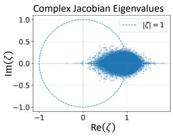

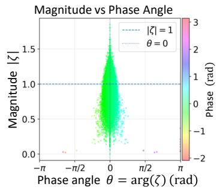

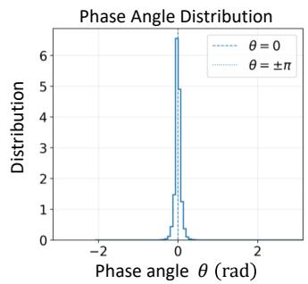

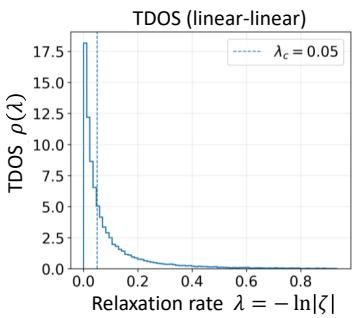

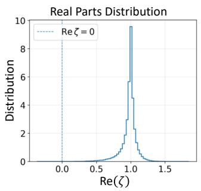

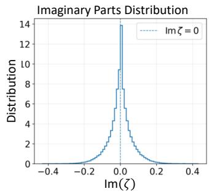

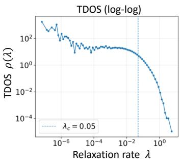

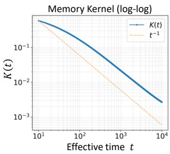  
FIG. 1. Collective spectral analysis of a representative Mamba-370M block (block index $\ell = 2 4 , L = 1 2 8$ retained tokens). (a) Complex eigenvalue spectrum of the full-block Jacobian. (b) Eigenvalue magnitude as a function of phase angle. (c,d) Distributions of the real and imaginary parts of the complex eigenvalues. (e) Phase-angle distribution, strongly concentrated near $\theta = 0$ . (f,g) Time-scale density of states (TDOS) obtained from the stable eigenvalue magnitudes through $\lambda = - \ln | \zeta | ,$ shown on linear and logarithmic scales. The measured spectrum spans many orders of magnitude in relaxation rate and contains a broad population of slow collective modes. The reference scale $\lambda _ { c } \overset { \cdot } { = } 5 \times 1 0 ^ { - 2 }$ is shown only as a visual guide to the slow-relaxation sector and does not define a physical spectral boundary. (h) Memory kernel obtained directly from the Laplace transform of the measured full-block TDOS, without assuming a particular spectral functional form. The quantitative sequence-length dependence, infrared convergence, and scaling of the collective slow-mode sector are analyzed in the following sections.

## III. EMERGENCE OF THE COLLECTIVE INFRARED SPECTRUM

Having distinguished the intrinsic, efective, and fullblock relaxation dynamics, we now examine how these levels are related in a trained Mamba model. We begin by defining the spectral measurement used to characterize the collective dynamics of a complete Mamba block.

## A. Collective spectral measurement of a Mamba block

Throughout this work, we analyze the publicly available pretrained Mamba-370M base model. The model contains 48 Mamba layers with hidden dimension $d _ { \mathrm { m o d e l } } = 1 0 2 4$ and was pretrained on 300 billion tokens from the Pile. The principal architectural parameters relevant to the present spectral analysis are summarized in Table I.

We focus on a single model scale in order to examine, within the same learned architecture, the hierarchy from the intrinsic SSM relaxation spectrum to the inputconditioned efective spectrum and finally to the collective spectrum of the complete block. The retained sequence length is varied systematically from $L \ = \ 8$ to $L = 5 1 2$ , allowing the resolved infrared structure to be tested as increasingly large sequence subspaces are included.

TABLE I. Configuration of the pretrained Mamba-370M model used throughout this work. The SSM parameters correspond to the standard Mamba configuration used by the released model.
<table><tr><td>Configuration</td><td>Mamba-370M</td></tr><tr><td>Model parameters</td><td>370M</td></tr><tr><td>Number of Mamba layers,  $N _ { \mathrm { l a y e r } }$ </td><td>48</td></tr><tr><td>Hidden dimension, dmodel</td><td>1024</td></tr><tr><td>SSM state dimension, dstate</td><td>16</td></tr><tr><td>Expansion factor</td><td>2</td></tr><tr><td>Local convolution width,  $d _ { \mathrm { c o n v } }$ </td><td>4</td></tr><tr><td>Pretraining tokens</td><td>300B</td></tr><tr><td>Pretraining corpus</td><td>The Pile</td></tr></table>

For a hidden representation $H _ { \ell }$ entering a Mamba block, we write the complete block transformation as

$$
H _ { \ell + 1 } = F _ { \ell } ( H _ { \ell } ) .
$$

The collective relaxation spectrum is obtained from the

Jacobian of this complete hidden-state transformation,

$$
J _ { \mathrm { b l o c k } } = \frac { \partial \mathrm { v e c } ( H _ { \ell + 1 } ) } { \partial \mathrm { v e c } ( H _ { \ell } ) } .\tag{29}
$$

Because this Jacobian contains the response of the entire block, its eigenvalue spectrum provides a local measurement of the collective dynamics seen by the hidden representation.

For a retained sequence of length $L ,$ the Jacobian can be decomposed into token-resolved blocks

$$
J _ { t s } = \frac { \partial h _ { t } ^ { \prime } } { \partial h _ { s } } , \qquad t , s = 1 , \ldots , L .\tag{30}
$$

Since the Mamba sequence mapping is causal, the output at token position t cannot depend on future input positions, and therefore

$$
J _ { t s } = 0 , \qquad s > t .\tag{31}
$$

The full sequence Jacobian is consequently block lower triangular. Its characteristic polynomial factorizes into those of the token-diagonal blocks, implying the exact spectral identity

$$
\sigma ( J _ { \mathrm { b l o c k } } ) = \bigcup _ { t = 1 } ^ { L } \sigma ( J _ { t t } ) .\tag{32}
$$

Accordingly, the full eigenvalue spectrum can be obtained from the token-diagonal Jacobians without explicitly constructing and diagonalizing the much larger $( L d _ { \mathrm { m o d e l } } ) \times ( L d _ { \mathrm { m o d e l } } )$ sequence Jacobian. The derivation of Eq. (32) and the distinction between this eigenvalue reduction and the of-diagonal propagation dynamics are given in Appendix A.

Figure 1 illustrates the complete spectral analysis for a representative Mamba-370M block. The measurement is performed at layer 24 using a retained sequence subspace of $L = 1 2 8$ tokens. Throughout this work, layer indices follow the zero-based block indexing of the model implementation; thus, layer 24 denotes the 25th Mamba block in one-based counting.

Diagonalization of the token-resolved Jacobian blocks gives complex eigenvalues

$$
\zeta _ { t \alpha } = | \zeta _ { t \alpha } | e ^ { i \theta _ { t \alpha } } ,
$$

whose union, by Eq. (32), is the eigenvalue spectrum of the full causal sequence Jacobian. For notational simplicity, we suppress the token index below and write the pooled spectrum as $\{ \zeta _ { \alpha } \}$

The eigenvalue magnitudes define the relaxation rates

$$
\begin{array} { r } { \lambda _ { \alpha } = - \ln | \zeta _ { \alpha } | , } \end{array}\tag{33}
$$

while their phases $\theta _ { \alpha } = \arg ( \zeta _ { \alpha } )$ characterize the oscillatory or circulation sector of the local linearized dynamics.

Here propagation through one complete network block is taken as one unit of discrete evolution, $\Delta s \ = \ 1$ , so that $| \zeta _ { \alpha } | = e ^ { - \lambda _ { \alpha } \Delta s }$ directly gives Eq. (33). The resulting $\lambda _ { \alpha }$ is therefore a dimensionless relaxation rate per blockpropagation step rather than a rate per unit of physical time.

The same convention was used in our Transformer analysis [1], permitting direct comparison of the fullblock relaxation spectra of the two architectures. This comparison does not apply to the absolute values of the intrinsic or selectively rescaled SSM rates, which are defined in Mamba’s internal continuous-time parameterization.

Figures 1(a)–1(e) show complementary representations of the complex collective spectrum. The eigenvalues occupy a broad region of the complex plane, with a large population concentrated near the positive real axis and the phase distribution strongly centered around $\theta = 0 .$ The analysis below focuses on the relaxation sector obtained from the eigenvalue magnitudes through Eq. (33).

From the stable relaxation modes we construct the time-scale density of states

$$
\rho _ { L } ( \lambda ) = \frac { 1 } { N } \sum _ { \alpha } \delta ( \lambda - \lambda _ { \alpha } ) ,\tag{34}
$$

where N denotes the total number of stable modes included in the relaxation spectrum.

Equivalently, defining the empirical TDOS of token position t as $\rho _ { t } ( \lambda )$ , the causal spectral decomposition implies

$$
\rho _ { L } ( \lambda ) = \frac { 1 } { L } \sum _ { t = 1 } ^ { L } \rho _ { t } ( \lambda ) ,\tag{35}
$$

up to the corresponding stable-mode normalization when the number of retained stable modes varies between token positions. Thus the sequence-level TDOS is directly constructed from the token-resolved relaxation spectra.

Equation (35) also makes it possible to distinguish the spectral structure itself from finite-sequence sampling. If the token-resolved spectra sample a common learned dynamical organization, individual $\rho _ { t } ( \lambda )$ fluctuate around a common spectral envelope, whereas increasing L suppresses finite-mode fluctuations and progressively improves the resolution of the same underlying distribution. The statistical self-averaging of the token-resolved spectra, including the enhanced finite-sampling fluctuations expected in the deep infrared, is developed in $\mathrm { A p - }$ pendix B.

The resulting TDOS is shown in linear and logarithmic representations in Figs. 1(f) and $1 ( \mathrm { g } )$ . The measured spectrum covers many orders of magnitude in relaxation rate, from a deeply resolved low-λ sector to rates of order unity and above. A broad population of slow collective modes extends continuously toward the smallest numerically resolved relaxation rates, while the spectrum remains broadly populated throughout the intermediate relaxation regime. Thus, already at a single representative layer and sequence length, the complete Mamba block exhibits a wide hierarchy of collective relaxation time scales.

The precise location of the extreme low-λ tail should not, however, be interpreted as a physical infrared cutof. Modes in this regime are the most sensitive to finite spectral resolution, finite sampling, and numerical precision. We therefore base the quantitative infrared analysis below on a common resolved fitting interval rather than on the smallest observed relaxation rate. Independent calculations using double-precision arithmetic confirm that the broad slow-mode organization is robust. The numerical behavior of the extreme infrared tail is examined separately in the corresponding numerical-robustness appendix, while its finite-sampling behavior is discussed analytically in Appendix C.

The dynamical consequence of the measured relaxation spectrum can be represented by the corresponding memory kernel,

$$
K ( t ) = \int d \lambda \rho _ { L } ( \lambda ) e ^ { - \lambda t } = \frac { 1 } { N } \sum _ { \alpha } e ^ { - \lambda _ { \alpha } t } .\tag{36}
$$

Thus the memory kernel is the Laplace transform of the measured TDOS.

Figure 1(h) shows the resulting broad temporal response, reflecting the contribution of relaxation modes distributed over many time scales. Its quantitative longtime scaling is analyzed below together with the infrared spectrum.

At this stage, the enhancement observed at very small λ should not yet be interpreted as evidence for a particular infrared power law. Finite sequence length limits the number of resolved collective modes, and the deepest infrared sector is consequently the most sensitive to spectral sampling. The sequence-length dependence, convergence of the collective spectrum, and quantitative infrared exponent are therefore examined in the following subsections.

Figure 1 establishes the more basic empirical observation that the full-block dynamics contains a broad and densely populated slow-relaxation sector.

The measurement procedure used throughout the remainder of the paper can therefore be summarized as

$$
J _ { \mathrm { b l o c k } }  \{ J _ { t t } \}  \{ \zeta _ { \alpha } \}  \{ \lambda _ { \alpha } , \theta _ { \alpha } \}  \rho _ { L } ( \lambda )  K ( t ) .\tag{37}
$$

Figure 1 defines this collective observable; Appendix A establishes the exact causal spectral reduction underlying its measurement, Appendix B develops its tokenresolved self-averaging properties, and the following analysis examines its microscopic origin, sequence-length dependence, and infrared scaling.

## B. Intrinsic relaxation spectrum of the learned SSM

The full-block spectrum introduced above describes the collective dynamics after all components of a Mamba block have been combined. Mamba, however, provides an additional level of dynamical access that is not generally available in Transformer architectures: the relaxation spectrum encoded directly in the learned statespace generator can be examined independently of the complete block response.

We therefore descend from the full-block collective spectrum to the intrinsic dynamics of the SSM itself. In the Mamba parameterization, the stable continuous-time state generator is represented through learned logarithmic parameters $A _ { \mathrm { l o g } }$ . The corresponding intrinsic relaxation rates are

$$
\lambda _ { A , i } = \exp ( A _ { \log , i } ) ,\tag{38}
$$

with the negative sign absorbed into the stable continuous-time generator. These quantities characterize relaxation scales encoded directly in the learned SSM before input-dependent discretization, gating, and the remaining block transformations are applied.

Figure $2 ( \mathrm { a } )$ shows the learned $A _ { \mathrm { l o g } }$ distribution for a representative layer. The distribution spans a broad interval of logarithmic scales, demonstrating that the learned SSM does not contain a single characteristic relaxation time. Through Eq. (38), this structure corresponds to a hierarchy of intrinsic relaxation rates extending over many orders of magnitude.

To characterize this hierarchy, we define the intrinsic SSM spectral density

$$
\rho _ { A } ( \lambda _ { A } ) = \frac { 1 } { N _ { A } } \sum _ { i } \delta ( \lambda _ { A } - \lambda _ { A , i } ) ,\tag{39}
$$

where $N _ { A }$ is the number of intrinsic SSM modes. Fig ure $2 ( \mathrm { b } )$ shows the resulting spectrum on logarithmic axes. The resolved intrinsic rates extend approximately from $\lambda _ { A } ~ \sim ~ 1 0 ^ { - 5 }$ to beyond $\lambda _ { A } ~ \sim ~ 1 0 ^ { 4 }$ Most spectral weight lies at intermediate relaxation rates, while a lower-density branch extends toward progressively slower modes. Thus, a broad hierarchy of relaxation scales is already encoded in the learned state-space generator before selective input conditioning is applied.

The temporal structure associated with this intrinsic spectrum can be represented by the spectral relaxation kernel

$$
K _ { A } ( t ) = \int _ { 0 } ^ { \infty } d \lambda _ { A } \rho _ { A } ( \lambda _ { A } ) e ^ { - \lambda _ { A } t } = { \frac { 1 } { N _ { A } } } \sum _ { i } e ^ { - \lambda _ { A , i } t } .\tag{40}
$$

As shown in Fig. $2 ( \mathrm { c ) }$ , the broad intrinsic spectrum produces relaxation over an extended range of continuous time scales. The dashed $t ^ { - 1 }$ line is included only as a reference; the intrinsic kernel is not described by a single $1 / t$ law over its full range.

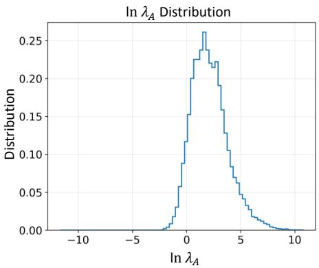

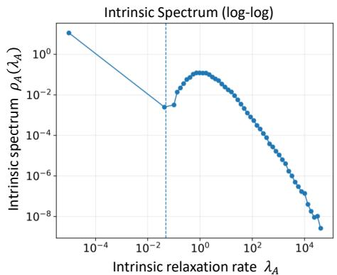

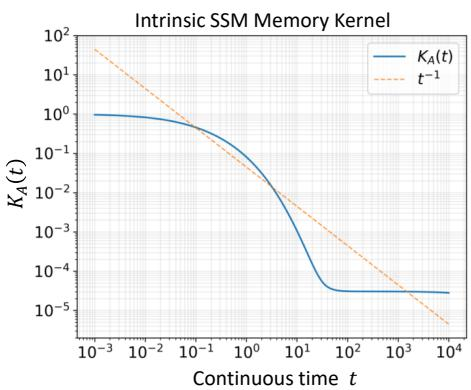  
FIG. 2. Intrinsic relaxation spectrum of the learned SSM in Mamba-370M. (a) Distribution of the learned logarithmic state space parameters $A _ { \mathrm { l o g } }$ for a representative block. The broad distribution is mapped to intrinsic continuous-time relaxation rates through $\lambda _ { A } = \exp ( A _ { \log } )$ . (b) Corresponding intrinsic relaxation-rate density $\rho _ { A } ( \lambda _ { A } )$ on logarithmic axes. The spectrum extends over many orders of magnitude, from a slow-relaxation branch near $\lambda _ { A } \sim 1 0 ^ { - 5 }$ to rapidly relaxing modes beyond $\lambda _ { A } \sim 1 0 ^ { 4 }$ , demonstrating that a broad hierarchy of intrinsic time scales is already encoded in the learned SSM generator. (c) Intrinsic spectral relaxation kernel $\begin{array} { r } { K _ { A } ( t ) = \bar { \int } d \lambda _ { A } \rho _ { A } ( \lambda _ { A } ) e ^ { - \lambda _ { A } t } } \end{array}$ computed directly from the measured intrinsic relaxation spectrum. The dashed $t ^ { - 1 }$ line is included only as a scaling reference. The intrinsic kernel reflects the nonuniform relaxation spectrum of the learned SSM and is not identified with the collective memory kernel or self-energy dressing associated with the full-block collective dynamics.

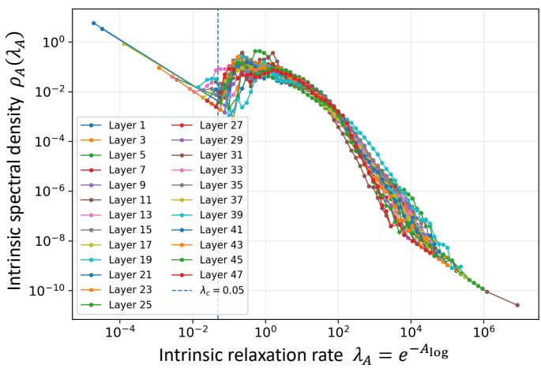  
FIG. 3. Intrinsic SSM relaxation spectra across all blocks of Mamba-370M. The intrinsic relaxation-rate density $\rho _ { A } ( \lambda _ { A } )$ obtained from $\lambda _ { A } = \exp ( A _ { \mathrm { l o g } } )$ , is shown for all 48 Mamba blocks. Despite block-to-block variations, the spectra reproduce a common broad envelope over many orders of magnitude in relaxation rate, including a distributed slow-relaxation sector extending toward the deep infrared. The intermediate and rapidly relaxing sectors exhibit particularly strong overlap across depth, whereas larger fluctuations appear in the more sparsely populated infrared region. The persistence of the overall spectral structure throughout the network demonstrates that the broad intrinsic relaxation hierarchy is a distributed property of the learned Mamba state-space architecture rather than a feature of an isolated block.

Importantly, $K _ { A } ( t )$ is a spectral relaxation kernel of the intrinsic SSM and should not be identified with the collective memory kernel or self-energy associated with the full-block dynamics. It describes the propagation of modes encoded directly in the learned state-space generator, before selective conditioning and the remaining nonlinear transformations of the block are included.

A central question is whether this intrinsic slow-mode hierarchy is specific to the representative layer or distributed throughout the trained network. Figure 3 therefore compares the intrinsic spectra across all 48 layers of Mamba-370M. Across depth, the spectra reproduce a closely related broad envelope over several decades of relaxation rate. The intermediate and rapidly relaxing sectors show particularly strong overlap, whereas the largest layer-to-layer variations occur in the sparsely populated low- $\cdot \lambda _ { A }$ region.

The persistence of this organization throughout the network shows that the broad intrinsic relaxation hierarchy is not confined to an isolated layer. Rather, a distributed hierarchy of intrinsic time scales is encoded throughout the learned Mamba state-space architecture. Fluctuations among the slowest modes occur where the spectral population is sparse and do not alter the common large-scale organization observed across depth.

The intrinsic spectrum should nevertheless not be equated with the collective TDOS obtained from the complete block Jacobian. The intrinsic rates $\lambda _ { A } ~ =$ $\exp ( A _ { \mathrm { l o g } } )$ are continuous-time relaxation parameters of the learned SSM generator, whereas the full-block rates $\lambda _ { \mathrm { b l o c k } } = - \ln | \zeta |$ characterize the response of the complete hidden-state transformation per block propagation step. Their absolute scales, normalization, and spectral forms therefore need not coincide.

The intrinsic analysis establishes the microscopic start-

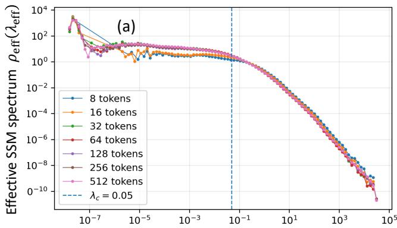  
Effective SSM relaxation rate $\lambda _ { \mathrm { e f f } } = \Delta ( x _ { t } ) e ^ { A _ { \mathrm { l o g } } }$

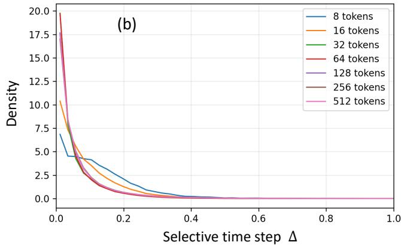  
FIG. 4. Input-conditioned efective SSM relaxation dynamics in Mamba-370M at block index $\ell ~ = ~ 2 4 . \quad \mathrm { ( a ) }$ Efective relaxation-rate density constructed from the selectively rescaled rates $\lambda _ { \mathrm { e f f } } ( x _ { t } ) \ = \ \bar { \Delta } ( x _ { t } ) e ^ { A _ { \mathrm { l o g } } }$ for retained sequence lengths $L \ = \ 8 , 1 6$ , 32, 64, 128, 256, and 512. The efective spectrum spans an exceptionally broad hierarchy of relaxation rates. Short sequences exhibit substantial fluctuations in the sparsely sampled infrared sector, whereas increasing sequence length produces progressively stronger overlap and convergence of the normalized spectral envelope. The dashed vertical line at $\lambda _ { c } ~ = ~ 0 . 0 5$ is shown only as a common reference for the slow-relaxation sector. (b) Distribution of the corresponding input-dependent selective time step $\Delta ( x _ { t } )$ The distributions are strongly weighted toward small $\Delta$ and become increasingly stable with sequence length. Because $\lambda _ { \mathrm { e f f } } ~ = ~ \Delta ( x _ { t } ) e ^ { A _ { \mathrm { l o g } } }$ , small selective time steps shift intrinsic SSM modes toward smaller efective relaxation rates and thereby extend the efective spectrum toward longer time scales. Together, the two panels directly show how Mamba’s selective mechanism dynamically rescales the learned intrinsic relaxation hierarchy during sequence processing.

ing point of the relaxation hierarchy,

$$
A _ { \mathrm { l o g } } \longrightarrow \lambda _ { A } \longrightarrow \rho _ { A } ( \lambda _ { A } ) \longrightarrow K _ { A } ( t ) .\tag{41}
$$

The trained Mamba architecture therefore contains a broad, distributed hierarchy of intrinsic relaxation scales before the complete block response is constructed. We next examine how this hierarchy is reorganized by Mamba’s input-dependent selective dynamics.

## C. Selective temporal rescaling and the efective SSM spectrum

The intrinsic SSM spectrum analyzed above characterizes the relaxation structure encoded directly in the learned state-space generator. Mamba dynamics, however, does not evolve according to this intrinsic spectrum alone. Its local temporal evolution is modulated by the input-dependent selective time step $\Delta ( x _ { t } )$ , so that the relaxation scales activated during inference depend dynamically on the processed input.

For an intrinsic SSM relaxation rate $\lambda _ { A } = \exp ( A _ { \log } )$ the corresponding efective rate at token position t is

$$
\lambda _ { \mathrm { e f f } } ( x _ { t } ) = \Delta ( x _ { t } ) \lambda _ { A } = \Delta ( x _ { t } ) \exp ( A _ { \mathrm { l o g } } ) .\tag{42}
$$

The associated relaxation time is $\tau _ { \mathrm { e f f } } = 1 / \lambda _ { \mathrm { e f f } }$ Thus, smaller values of $\Delta ( x _ { t } )$ shift a given intrinsic mode toward slower efective relaxation and correspondingly longer efective time scales.

To characterize this input-conditioned dynamics over extended sequences, we construct the efective SSM spectral density from the collection of token-dependent rates,

$$
\rho _ { \mathrm { e f f } } ( \lambda ) = \frac { 1 } { N _ { \mathrm { e f f } } } \sum _ { t , \alpha } \delta [ \lambda - \Delta ( x _ { t } ) \lambda _ { A , \alpha } ] ,\tag{43}
$$

where α labels the intrinsic SSM modes and t labels token positions. Unlike the intrinsic spectral density, which is fixed by the learned SSM parameters, $\rho _ { \mathrm { { e f f } } } ( \lambda )$ incorporates the input-conditioned temporal modulation generated during inference.

Figure $4 ( \mathrm { a } )$ shows the efective SSM spectrum of Mamba-370M at layer 24 for sequence lengths ranging from 8 to 512 tokens. The measured efective rates span an exceptionally broad range, extending from approximately $\mathrm { 1 0 ^ { - 7 } }$ to beyond $1 0 ^ { 4 }$ . These values characterize the resolved input-conditioned SSM spectrum and should not be interpreted as relaxation rates per full-block propagation step.

For the shortest sequences, particularly 8 and 16 tokens, the $\mathrm { l o w } { - } \lambda _ { \mathrm { e f f } }$ sector is sparsely sampled and exhibits pronounced finite-sample fluctuations. As the retained sequence length increases, these fluctuations are progressively reduced and the broad spectral envelope becomes increasingly well resolved. By approximately 32–64 tokens, the large-scale form of the spectrum is already clearly established, while longer sequences provide increasingly dense sampling of its slowest efective modes.

At intermediate rates, approximately $1 0 ^ { - 5 } \lesssim \lambda _ { \mathrm { e f f } } \lesssim$ $1 0 ^ { - 2 }$ , the longer-sequence spectra show particularly strong overlap and form a broad, slowly varying region. At larger rates the spectrum turns downward and subsequently decays over several decades. Increasing sequence length therefore primarily improves the statistical resolution of the efective spectrum rather than qualitatively changing its overall form.

The convergence of the normalized spectral distribution is important because increasing sequence length does more than simply increase the number of sampled efective modes. The large-scale distribution itself approaches a reproducible form as longer portions of the sequence are included. The efective SSM dynamics therefore exhibits a stable statistical organization over a broad hierarchy of input-conditioned relaxation scales.

The origin of this temporal rescaling can be examined directly through the selective time step. Figure $4 ( \mathrm { b } )$ shows the measured distributions of $\Delta ( x _ { t } )$ for the same sequence lengths. The distributions contain substantial weight at small $\Delta .$ , while short-sequence fluctuations are progressively reduced as longer sequences are sampled.

Through Eq. (42), small values of $\Delta$ rescale intrinsic modes toward smaller efective relaxation rates. The selective mechanism therefore provides a direct dynamical route by which the learned intrinsic relaxation hierarchy can be extended toward longer efective time scales during inference. The resulting efective spectrum is determined jointly by the intrinsic SSM rates and their inputdependent selective rescaling; selection does not create a new set of intrinsic modes, but dynamically reorganizes their efective temporal scales.

It is important to distinguish this efective SSM spectrum from the collective relaxation spectrum of the complete Mamba block. The dynamical hierarchy is

$$
\lambda _ { A } = e ^ { A _ { \mathrm { l o g } } }  \lambda _ { \mathrm { e f f } } ( x _ { t } ) = \Delta ( x _ { t } ) e ^ { A _ { \mathrm { l o g } } }  \lambda _ { \mathrm { b l o c k } } = - \ln | \zeta | ,\tag{44}
$$

where $\zeta$ denotes an eigenvalue of the full-block Jacobian. The first quantity characterizes the learned intrinsic SSM generator, the second its input-conditioned temporal rescaling, and the third the collective relaxation dynamics of the complete hidden-state transformation.

The efective SSM spectrum should therefore not be identified with the collective TDOS. It represents an intermediate dynamical level connecting the learned statespace generator to the collective response of the complete Mamba block. Mamba thus allows the microscopic relaxation hierarchy and its selective temporal rescaling to be resolved explicitly before the resulting dynamics is reorganized at the full-block level. We next examine this collective spectrum and its infrared organization.

## D. Emergence of the full-block collective relaxation spectrum

The intrinsic and efective SSM spectra characterize the internal relaxation structure of the state-space component of Mamba. The complete block, however, additionally contains input-dependent projections, gating, nonlinear transformations, channel mixing, and residual propagation. Its collective relaxation dynamics must therefore be determined from the full hidden-state transformation rather than from the SSM generator alone.

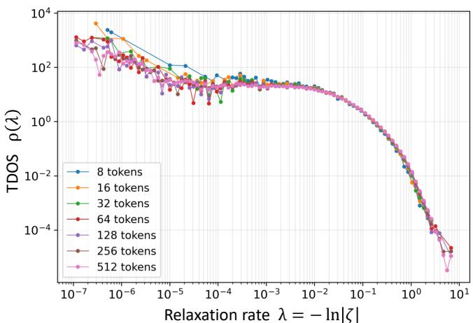  
FIG. 5. Sequence-length dependence of the full-block collective relaxation spectrum in Mamba-370M. The time-scale density of states is obtained from the eigenvalues $\zeta _ { \alpha }$ of the complete block Jacobian through $\lambda _ { \alpha } = - \ln | \zeta _ { \alpha } |$ and is shown for sequence lengths $L = 8 – 5 1 2$ at layer 24. The measured collective spectrum spans approximately eight decades in relaxation rate, from $\bar { \lambda } \sim 1 0 ^ { - 7 }$ to $\lambda \sim 1 0 ^ { 1 }$ . Short sequences exhibit visible finite-size fluctuations in the deep-infrared sector, whereas increasing sequence length progressively resolves slower modes and produces a smoother common spectral envelope. For $L = 5 1 2$ , the collective spectral profile remains comparatively smooth down to approximately $\lambda \sim 5 \times 1 0 ^ { - 6 }$ while individual modes extend further into the sparsely populated extreme-infrared regime near $\lambda \sim 1 0 ^ { - 7 }$ . The simultaneous extension and convergence of the low-λ sector indicate that the infrared continuum becomes progressively better resolved as a larger dynamical subspace is sampled.

Using the full-block Jacobian construction introduced in Sec. III.A, we obtain the collective relaxation rates $\lambda _ { \alpha } = - \ln | \zeta _ { \alpha } |$ and the corresponding full-block TDOS $\rho _ { \mathrm { b l o c k } } ( \lambda )$ This spectrum constitutes the final collective level of the intrinsic–selective–collective hierarchy established above and provides the direct counterpart of the collective TDOS measured from Transformer block Jacobians.

Figure 5 shows the full-block TDOS at layer 24 for retained sequence lengths from 8 to 512 tokens. A broad collective relaxation spectrum is observed over many decades, with a substantial population of modes extending toward small relaxation rates. The intermediate and rapidly relaxing parts of the spectrum approach a common envelope already at relatively short sequence lengths, whereas the strongest sequence-length dependence occurs in the infrared sector.

For short sequences, the lowest-relaxation-rate region is sparsely sampled and exhibits substantial finitesampling fluctuations. Increasing the retained sequence length progressively fills this region, suppresses the fluctuations, and extends the smoothly resolved collective spectrum toward smaller relaxation rates. For the eighttoken measurement, substantial fluctuations appear below approximately $\lambda \sim 1 0 ^ { - 4 } – 1 0 ^ { - 3 }$ , whereas for 512 tokens the spectral profile remains comparatively smooth down to approximately $\lambda ~ \sim ~ 5 ~ \times ~ 1 0 ^ { - 6 }$ The reliably resolved infrared continuum therefore expands substantially as the measured sequence subspace is enlarged.

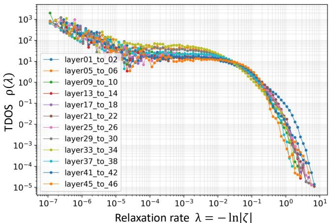  
FIG. 6. Depth dependence of the full-block collective relaxation spectrum in Mamba-370M. The time-scale density of states is measured from full-block Jacobians at a fixed sequence length of $L = 1 2 8$ for layer pairs distributed through out the 48-layer network, from layers $1  2$ to $4 5  4 6$ Despite quantitative variations in local spectral weight and in the high-relaxation-rate rollof, the measured spectra reproduce a closely related organization across depth: a broad slow-relaxation sector, an extended weakly varying infrared region, and a rapid decay toward the ultraviolet. The collective spectra extend over multiple decades into the deepinfrared regime, while the overall spectral envelope remains similar across widely separated layers. The persistence of this low-λ organization across widely separated depths indicates that the collective infrared structure is not restricted to a particular layer but is distributed throughout the trained Mamba model.

This behavior should be distinguished from the occurrence of isolated eigenvalues at still smaller relaxation rates. Such modes extend to values of order $\lambda \sim 1 0 ^ { - 7 }$ but the extreme infrared remains sparsely populated and correspondingly more sensitive to finite-sampling fluctuations. The relevant convergence is instead the progressive transformation of this fluctuating region into a densely sampled and reproducible spectral continuum. Increasing sequence length therefore improves the infrared resolution while preserving the common large-scale spectral envelope.

Across the resolved slow-relaxation sector, the TDOS varies only weakly over a broad range and develops enhanced spectral weight toward smaller λ, before crossing over to rapid suppression at larger relaxation rates. The numerical crossover scales are approximate features of the measured spectra rather than imposed spectral boundaries. The histogram itself is used here primarily to establish the morphology and sequence-length convergence of the collective infrared sector; its scaling exponent is determined independently below from cumulative mode statistics.

The robustness of this organization can be tested independently across network depth. Figure 6 compares full-block TDOS measurements from representative layers distributed throughout Mamba-370M at a fixed sequence length of 128 tokens. Although the detailed spectral weight and local structure vary with depth, the same large-scale morphology is repeatedly recovered: a broad slow-relaxation continuum, a weakly varying infrared sector, and rapid suppression toward the ultraviolet.

The full-block measurements therefore reveal two complementary forms of robustness. Increasing sequence length progressively improves the statistical resolution of the same infrared continuum and leads toward a stable large-scale spectral form, while measurements across network depth recover the same qualitative collective organization from distinct block transformations. Together, these observations indicate that the slow-mode spectrum is a distributed property of the trained Mamba hiddenstate dynamics rather than a feature of a particular token subspace or isolated layer.

The result also completes the microscopic-tomacroscopic hierarchy resolved by the Mamba architecture. The learned SSM provides a broad intrinsic relaxation substrate, input-dependent selection dynamically rescales its temporal structure, and the complete nonlinear block reorganizes these dynamics into the collective TDOS measured from the hidden-state Jacobian. The remaining question is whether the resolved collective infrared sector is described by a reproducible scaling law and whether this scaling itself converges as the measured sequence subspace is enlarged. We address this next using cumulative mode statistics, avoiding direct dependence on histogram binning.

## E. Infrared scaling of the full-block collective spectrum

The full-block measurements above reveal a broad slow-relaxation continuum whose resolved infrared extent increases systematically with sequence length. We now test whether this collective spectrum exhibits a reproducible infrared scaling law.

Direct power-law fitting of histogram-based TDOS estimates is sensitive to logarithmic binning, particularly in the sparsely sampled deep-infrared region. We therefore determine the infrared exponent from the empirical cumulative mode distribution. For

$$
\rho ( \lambda ) \sim C \lambda ^ { \beta } ,\tag{45}
$$

the cumulative number of modes obeys

$$
N ( < \lambda ) \propto \lambda ^ { 1 + \beta } ,\tag{46}
$$

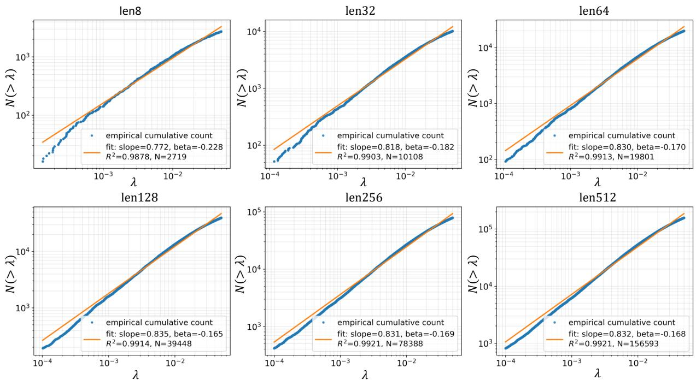  
FIG. 7. Cumulative infrared scaling of the full-block relaxation spectrum in Mamba-370M. The empirical cumulative number of stable relaxation modes, $N ( < \lambda )$ , is shown at layer 24 for sequence lengths $L = 8 , 1 6 , 3 2 , 6 4 , 1 2 8 , 2 5 6 ,$ and 512. For each sequence length, the cumulative spectrum is fitted over the same fixed infrared interval, $1 0 ^ { - 4 } \leq \lambda \leq 5 \times 1 0 ^ { - 2 }$ , according to $N ( < \lambda ) \propto \lambda ^ { s }$ , with the corresponding TDOS exponent given by $\beta = s - 1$ . The fitted exponent evolves from $\beta = - 0 . 2 2 8$ at $L = 8$ and stabilizes near $\beta \simeq - 0 . 1 7$ for the longer sequences, while the coeficients of determination remain approximately $R ^ { 2 } \simeq 0$ .99 throughout. Over the same measurements, the number of modes within the fixed fitting interval increases from $N _ { \mathrm { f i t } } = 2$ , 719 at $L = 8$ to 156, 593 at $L = 5 1 2$ . Thus, the infrared statistics improve by nearly a factor of 58 while the cumulative scaling exponent remains essentially unchanged at the largest sequence lengths. The more sparsely sampled deep-infrared region below the common fitting interval is excluded from the exponent determination.

for $\beta > - 1$ . Thus, writing $N ( < \lambda ) \propto \lambda ^ { s }$ gives

$$
\beta = s - 1 .\tag{47}
$$

To compare diferent sequence lengths on the same basis, all cumulative spectra are fitted over the fixed interval

$$
1 0 ^ { - 4 } \leq \lambda \leq 5 \times 1 0 ^ { - 2 } .\tag{48}
$$

This conservative interval lies within the well-resolved slow-relaxation sector common to all sequence lengths and is held fixed independently of L. The more sparsely sampled deep-infrared region below this interval is therefore excluded from the exponent extraction, even though the longer-sequence measurements resolve the collective spectrum to substantially smaller relaxation rates.

Figure 7 shows the cumulative distributions and corresponding fits for sequence lengths from 8 to 512 tokens. The spectra are approximately linear on logarithmic coordinates over the common fitting window, with coeficients of determination near $R ^ { 2 } \simeq 0 . 9 9$ throughout. The quantitative results are summarized in Table I.

Two features are particularly important. First, the fitted exponent is negative for every sequence length, ranging from $\beta = - 0 . 2 2 8$ to approximately −0.165. The resolved collective spectrum therefore lies consistently on the infrared-enhanced side of the flat-TDOS limit, while the small magnitude $| \beta | \ll 1$ indicates that the spectrum remains close to flat.

TABLE II. Infrared scaling of the Mamba-370M full-block Jacobian TDOS at layer 24. All cumulative spectra are fitted over the fixed interval $1 0 ^ { - 4 } \leq \lambda \leq 5 \times 1 0 ^ { - 2 }$ according to $N ( < \lambda ) \propto \lambda ^ { s }$ , with $\beta = s - 1$ $N _ { \mathrm { { f i t } } }$ denotes the number of modes within the fitting interval.
<table><tr><td>Tokens</td><td>S</td><td>β</td><td> $R ^ { 2 }$ </td><td> $N _ { \mathrm { { f i t } } }$ </td></tr><tr><td>8</td><td>0.772</td><td>-0.228</td><td>0.988</td><td>2,719</td></tr><tr><td>16</td><td>0.802</td><td>-0.198</td><td>0.989</td><td>5,194</td></tr><tr><td>32</td><td>0.818</td><td>-0.182</td><td>0.990</td><td>10,108</td></tr><tr><td>64</td><td>0.830</td><td>-0.170</td><td>0.991</td><td>19,801</td></tr><tr><td>128</td><td>0.835</td><td>-0.165</td><td>0.991</td><td>39,448</td></tr><tr><td>256</td><td>0.831</td><td>-0.169</td><td>0.992</td><td>78,388</td></tr><tr><td>512</td><td>0.832</td><td>-0.168</td><td>0.992</td><td>156,593</td></tr></table>

Second, the exponent becomes increasingly stable as the resolved sequence subspace is enlarged. As summarized in Fig. 8, the values for $L = 6 4$ , 128, 256, and 512 are approximately −0.170, −0.165, −0.169, and −0.168, respectively. Thus, despite an eightfold increase in sequence length from 64 to 512 tokens, the fitted exponent remains confined to a narrow interval of width less than 0.01. Within the sequence lengths examined here, the resolved infrared exponent therefore stabilizes near

$$
\beta _ { \mathrm { I R } } \simeq - 0 . 1 7 .\tag{49}
$$

The persistence of this value through the 512-token measurement also shows that the observed evolution is not a simple monotonic drift toward the exactly flat value $\beta = 0$

This stabilization occurs while the number of modes contained in the same fixed fitting interval increases from 2, 719 at $L = 8$ to 156, 593 at $L = 5 1 2$ , an increase by nearly a factor of 58. Increasing sequence length therefore greatly improves the infrared statistics while leaving the fitted scaling exponent essentially unchanged over the largest measured sequence subspaces. Together with the progressive extension and smoothing of the directly measured TDOS in Fig. 5, this behavior provides strong evidence that the weakly negative exponent is not simply produced by sparse short-sequence sampling.

Because the exponent is obtained from the slope of the cumulative distribution rather than the absolute number of modes, increasing the Jacobian dimension changes the available statistics without trivially fixing the measured value of $\beta .$ The persistence of nearly the same cumulative slope while the sampled mode population increases by almost two orders of magnitude therefore provides an independent test of the relative organization of the collective relaxation spectrum.

The dynamical implication follows from the previously established relation $\begin{array} { r } { \dot { K } ( t ) \sim t ^ { - ( 1 + \beta ) } } \end{array}$ . The stabilized value $\beta _ { \mathrm { I R } } \simeq - 0 . 1 7$ therefore corresponds to

$$
K ( t ) \sim t ^ { - 0 . 8 3 }\tag{50}
$$

over the dynamical regime associated with the resolved infrared scaling window. The full-block dynamics consequently lies close to the marginal 1/t memory form, with a weak enhancement of long-time persistence.

Taken together, the cumulative fits, the consistently negative infrared exponent, its stabilization with increasing sequence length, and the simultaneous growth of infrared statistics identify a reproducible scaling regime in the Mamba full-block dynamics. The collective spectrum is therefore most naturally characterized, over the resolved infrared window, as a nearly flat but weakly infrared-enhanced TDOS with $\beta _ { \mathrm { I R } } ~ \simeq ~ - 0 . 1 7$ This exponent characterizes the measured scaling regime and is not intended as an extrapolation to the asymptotic $\lambda  0$ limit.

## IV. ARCHITECTURE-INDEPENDENT INFRARED COLLECTIVE ORGANIZATION

The preceding analysis establishes that Mamba develops a broad continuum of collective relaxation modes extending into the infrared. This organization can be traced from the intrinsic SSM relaxation spectrum, through input-dependent selective temporal rescaling, to the collective spectrum of the complete nonlinear block. We now ask whether the resulting infrared organization is specific to the state-space architecture of Mamba or reflects a more general property of learned sequence dynamics.

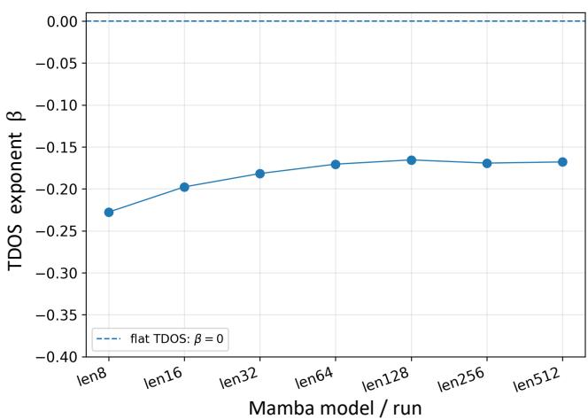  
FIG. 8. Sequence-length dependence of the infrared TDOS exponent in the Mamba-370M full-block dynamics. The exponent $\beta$ is obtained from the cumulative scaling relation $\stackrel { \cdot } { N } ( < \lambda ) \stackrel { \cdot } { \propto } \lambda ^ { 1 + \beta }$ over the common fitting interval $1 0 ^ { - 4 } \ \leq$ $\lambda \stackrel {  } { \le } 5 \stackrel { \cdot } { \times } 1 0 ^ { - 2 }$ As the retained sequence length increases from 8 to 512 tokens, β evolves from −0.228 toward a stable value $\mathrm { n e a r \ t - 0 . 1 7 }$ . For the four longest sequence lengths, $L = 6 4 , 1 2 8 , 2 5 6$ , and 512, the measured values are approximately $\beta ~ = ~ - 0 . 1 7 0 , - 0 . 1 6 5 , - 0 . 1 6 9$ , and −0.168, respectively. Thus, despite an eightfold increase in sequence length from 64 to 512 tokens, the fitted exponent remains confined to a narrow interval below the exactly flat-TDOS limit. The dashed horizontal line denotes this flat-spectrum limit, $\beta ~ = ~ 0$ The stabilization of the measured exponent near $\beta _ { \mathrm { I R } } \simeq - 0 . 1 7 .$ without a systematic drift toward zero, indicates a reproducible, nearly flat but weakly infrared-enhanced scaling regime over the resolved infrared window.

This question can be addressed by direct comparison with Transformers. The comparison is particularly informative because the microscopic dynamics of the two architectures are fundamentally diferent. A Transformer block organizes its hidden representation through attention, nonlinear feed-forward transformations, and residual propagation, schematically,

$$
\widetilde { H } _ { \ell } = H _ { \ell } + \mathrm { A t t n } [ \mathrm { N o r m } ( H _ { \ell } ) ] ,\tag{51}
$$

$$
H _ { \ell + 1 } = \widetilde { H } _ { \ell } + \mathrm { M L P } \left[ \mathrm { N o r m } ( \widetilde { H } _ { \ell } ) \right] .\tag{52}
$$

Mamba instead contains an explicit selective statespace dynamics,

$$
h _ { t } = \overline { { A } } _ { t } h _ { t - 1 } + \overline { { B } } _ { t } x _ { t } , \qquad \overline { { A } } _ { t } = \exp ( \Delta _ { t } A ) ,\tag{53}
$$

in which the input-dependent selective time step $\Delta _ { t }$ locally rescales the internal state evolution.

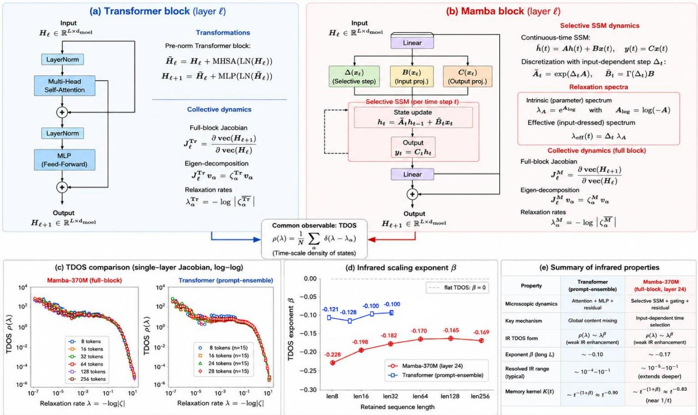  
Two architectures with fundamentally different microscopic mechanisms give rise to closely related collective relaxation spectra. Both show a nearly flat but weakly infrared-singular TDOS $( \beta < 0 , | \beta | \ll 1$ ) and corresponding near-1/t long-time memory.

FIG. 9. Comparison of the microscopic architectures and collective infrared dynamics of Transformer and Mamba. The two architectures generate hidden-state dynamics through fundamentally diferent computational mechanisms: Transformer blocks combine attention, nonlinear feed-forward transformations, and residual propagation, whereas Mamba blocks employ selective state-space evolution with input-dependent temporal modulation. Despite this diference, both architectures can be analyzed using the same full-block collective construction. For each block, the Jacobian of the complete hidden-state transformation is diagonalized and the collective relaxation rates are defined as $\begin{array} { r } { \lambda _ { \alpha } = - \ln | \zeta _ { \alpha } | . } \end{array}$ , allowing the corresponding time-scale density of states $\rho ( \lambda )$ to be compared on the same dynamical convention. The measured full-block spectra exhibit a closely related infrared organization: both contain a broad slow-mode continuum with a nearly flat but weakly enhanced TDOS toward small relaxation rates. Power-law analysis, $\rho ( \lambda ) \sim \lambda ^ { \beta }$ , yields weakly negative infrared exponents in both architectures. The Transformer measurements approach values of order $\beta _ { \mathrm { T r } } \sim - 0 . 1$ , whereas the long-sequence Mamba measurements stabilize near $\beta _ { \mathrm { M } } \sim - 0 . 1 7$ . The numerical exponents are not identical; rather, the common feature is the regime $\beta < 0$ with $| \beta | \ll 1$ Thus, substantially diferent microscopic architectures produce closely related near-marginal collective infrared dynamics when examined through the complete hidden-state transformation.

Despite these distinct microscopic mechanisms, both architectures can be analyzed through the same collective observable at the level of the complete hidden-state transformation. For either architecture, we construct the full-block Jacobian

$$
J _ { \ell } = \frac { \partial \mathrm { v e c } ( H _ { \ell + 1 } ) } { \partial \mathrm { v e c } ( H _ { \ell } ) } ,
$$

with eigenvalues $J _ { \ell } v _ { \alpha } = \zeta _ { \alpha } v _ { \alpha }$ Taking propagation through one complete block as one discrete dynamical step defines the common relaxation coordinate

$$
\begin{array} { r } { \lambda _ { \alpha } = - \ln | \zeta _ { \alpha } | . } \end{array}
$$

The resulting distribution of collective relaxation modes

defines the full-block time-scale density of states $\rho ( \lambda )$

Figure 9 summarizes this architecture-level comparison. The use of a common full-block observable does not imply equivalence of the underlying computations. In Mamba, the learned SSM generator provides an intrinsic relaxation hierarchy, which is selectively rescaled by the input-dependent time step and subsequently reorganized by gating, projections, nonlinearities, and residual propagation. Transformer reaches the same level of collective description through a fundamentally diferent microscopic route. The full-block Jacobian therefore provides a common dynamical coordinate in which the collective organization of the two architectures can be compared without identifying their internal mechanisms.

• Broad continuum of relaxation mode for Mamba state-space model

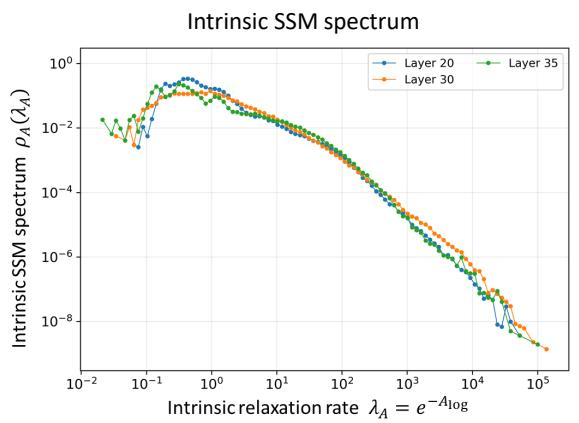

Input-dependent effective SSM spectrum  
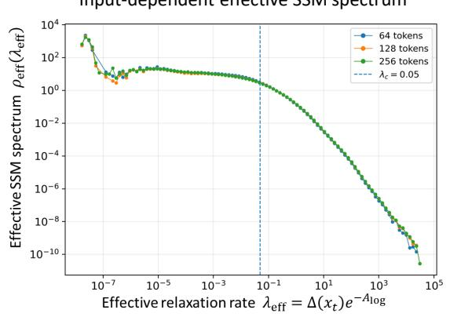

• TDOS comparison (single-layer jacobian, log-log scale)  
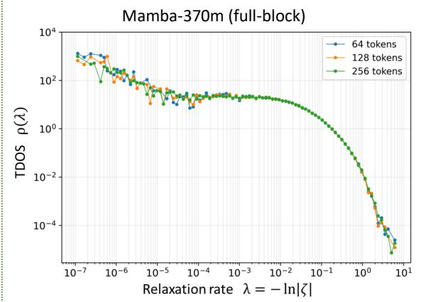

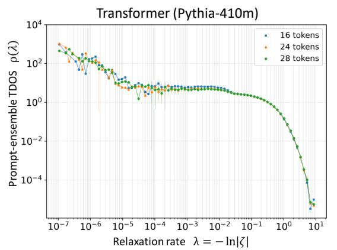  
FIG. 10. Hierarchy from microscopic state-space relaxation to collective infrared organization in Mamba, together with the corresponding collective Transformer spectrum. The learned Mamba SSM first defines an intrinsic distribution of relaxation rates, $\lambda _ { A } = \exp ( A _ { \log } )$ . Input-dependent selective dynamics then temporally rescales these intrinsic modes according to $\lambda _ { \mathrm { e f f } } ( t ) =$ $\Delta _ { t } \lambda _ { A }$ , producing an efective SSM spectrum conditioned on the processed sequence. After input and output projections, gating, nonlinear transformations, and residual propagation are included, the complete Mamba block is characterized independently by the eigenvalues of its full-block Jacobian and the collective rates $\lambda = - \ln | \zeta |$ . These three spectra represent distinct dynamical levels and should not be interpreted as identical spectral objects. Rather, the comparison shows that a broad slowmode hierarchy present in the internal state-space dynamics remains manifest, after substantial spectral reorganization, in the collective response of the complete Mamba block. The Transformer full-block spectrum, obtained independently from the same Jacobian construction, exhibits a similarly broad and nearly flat infrared collective sector despite the absence of an explicit state-space relaxation hierarchy. The figure therefore illustrates the separation between microscopic dynamical implementation and the closely related infrared organization observed at the collective level.

Figure 10 presents the corresponding empirical comparison. Although the detailed spectral densities and ultraviolet structures remain architecture dependent, Transformer and Mamba exhibit closely related organization in the low-relaxation-rate sector. Both contain a broad continuum of collective modes extending toward small λ, together with an extended infrared region whose TDOS is nearly flat but weakly enhanced toward slower relaxation rates.

We quantify this organization by parameterizing the resolved infrared spectrum as

$$
\rho ( \lambda ) \sim C \lambda ^ { \beta } ,\tag{54}
$$

where $\beta = 0$ represents a flat TDOS and $\beta < 0$ corresponds to an enhancement of spectral weight toward the infrared.

The measured exponents are not numerically identical. For the Transformer comparison, we use the Pythia-410M model analyzed in our previous study [1, 18], in which the collective relaxation spectrum was measured from the Jacobian of the complete hidden-state transformation using the same full-block spectral construction. The resolved Pythia-410M values are approximately −0.121, −0.128, −0.10, and −0.10 for retained sequence lengths L = 8, 16, 24, and 28, respectively, giving a representative infrared exponent of order

$$
\beta _ { \mathrm { T r } } \sim - 0 . 1 .\tag{55}
$$

For Mamba-370M, the exponent evolves from $\beta \ =$ −0.228 at $L = 8$ toward values clustered near −0.17 for the longer measurements, with $\beta = - 0 . 1 7 0 , - 0 . 1 6 5$ , and −0.169 at L = 64, 128, and 256, respectively. The longsequence Mamba measurements are therefore characterized by

$$
\beta _ { \mathrm { M } } \sim - 0 . 1 7 .\tag{56}
$$

The numerical diference between these values is not unexpected. The architectures, trained models, microscopic dynamics, and resolved sequence-length ranges are diferent. More important is that both spectra remain close to the flat-TDOS limit on its weakly infraredenhanced side. The sequence-length dependence further supports this interpretation: increasing the resolved dynamical subspace improves the infrared statistics without driving either architecture toward an infrared-depleted spectrum. In Mamba, the exponent becomes nearly stationary for the longest sequences while the directly measured TDOS becomes progressively smoother. The Transformer measurements likewise remain within the weakly negative near-flat regime over the sequence lengths examined.

The significance of this similarity lies precisely in the diference between the microscopic mechanisms that generate the two collective spectra. The comparison can therefore be summarized as

$$
\begin{array} { r l } { \mathrm { T r a n s f o r m e r : } \quad } & { \mathrm { a t t e n t i o n / M L P ~ d y n a m i c s } \longrightarrow \rho _ { \mathrm { T r } } ( \lambda ) , } \\ { \mathrm { M a m b a : } \quad } & { \mathrm { s e l e c t i v e ~ S S M ~ d y n a m i c s } \longrightarrow \rho _ { \mathrm { M } } ( \lambda ) . } \end{array}\tag{57}
$$

The microscopic paths are diferent, yet both terminate in broad, nearly flat collective relaxation spectra with weak infrared enhancement. Moreover, as established in Sec. III, the Mamba full-block TDOS is not a direct copy of either its intrinsic or efective SSM spectrum; substantial spectral reorganization occurs before the collective block response is formed. The similarity observed in Fig. 10 therefore emerges at the collective rather than microscopic level.

Quantitatively, the representative values $\beta _ { \mathrm { T r } } \sim - 0 . 1$ and $\beta _ { \mathrm { M } } \sim - 0 . 1 7$ are not interpreted as a common universal exponent. Rather, both architectures occupy the same qualitative infrared regime,

$$
\beta _ { \mathrm { T r } } < 0 , \qquad \beta _ { \mathrm { M } } < 0 , \qquad | \beta | \ll 1 .\tag{58}
$$

This common regime constitutes the central architecturelevel observation: substantially diferent microscopic sequence dynamics produce collective spectra that are both slow-mode rich and close to the marginal flat-TDOS limit.

The dynamical consequence of this spectral organization follows from the TDOS–memory relation derived in the preceding sections. The representative exponents correspond to long-time kernels of approximately $K ( t ) \sim$ $t ^ { - 0 . 9 }$ for Transformer and $K ( t ) \ \sim \ t ^ { - 0 . 8 3 }$ for Mamba. Both systems therefore remain close to the marginal $1 / t$ regime, with the somewhat more negative Mamba exponent corresponding to a modestly stronger long-time enhancement over the resolved scaling range.

Taken together, these measurements reveal a separation between microscopic implementation and macroscopic dynamical organization. Transformer and Mamba construct their hidden-state transformations through fundamentally diferent computational mechanisms, yet their full-block dynamics independently develop a broad continuum of slow collective modes and a nearly flat, weakly infrared-enhanced TDOS. The present measurements do not establish identical spectra or a universal numerical critical exponent across architectures. They instead provide evidence for a more restricted and physi cally meaningful form of architecture independence: distinct learned sequence architectures can develop closely related infrared collective organization.

The recurrence of this near-marginal regime in both attention-based and selective state-space architectures suggests that infrared slow-mode organization is not uniquely tied to either microscopic mechanism. Rather, it may represent a more general macroscopic dynamical regime accessible to learned sequence models.

## V. DISCUSSION

The present results provide a direct view of how microscopic relaxation dynamics is reorganized into macroscopic infrared organization in a trained sequence model. Mamba is particularly informative in this respect because its state-space formulation exposes an explicit hierarchy of dynamical scales that can be examined separately from the collective response of the complete neural block. The learned SSM generator contains a broad intrinsic distribution of relaxation rates, the selective mechanism rescales these rates in an input-dependent manner during inference, and the complete nonlinear block develops a collective relaxation spectrum measured independently through its Jacobian.

A central observation is that these dynamical levels are related but not spectrally identical. The intrinsic rates $\lambda _ { A } = e ^ { A _ { \mathrm { l o g } } }$ define the temporal substrate encoded in the learned SSM, whereas $\lambda _ { \mathrm { e f f } } ( t ) = \Delta _ { t } \lambda _ { A }$ describes its input-conditioned temporal rescaling. The full-block rates, $\lambda _ { \mathrm { b l o c k } } ~ = ~ - \ln | \zeta |$ , characterize the collective response after gating, nonlinear transformations, projections, channel mixing, and residual propagation have been combined. The full-block TDOS is therefore not a direct image of the spectrum already present in the SSM generator. Rather, the complete architecture substantially reorganizes the microscopic relaxation hierarchy before the collective spectrum is formed.

The selective mechanism provides a particularly transparent example of this reorganization. Through the input-dependent time step $\Delta _ { t } .$ the same intrinsic SSM mode can acquire diferent efective relaxation times depending on the processed input. Small values of $\Delta _ { t }$ shift the corresponding mode toward slower efective relaxation, dynamically extending the temporal scales available during inference. The efective spectrum therefore describes an adaptive temporal organization constructed from, but not identical to, the intrinsic relaxation hierarchy.

TABLE III. Comparison of the collective infrared dynamics measured in Transformer and Mamba. The infrared exponents denote representative resolved scaling behavior and are not expected to be numerically identical between architectures. The corresponding long-time behavior follows from the TDOS–memory relation established in the preceding sections.
<table><tr><td>Property</td><td>Transformer</td><td>Mamba-370M</td></tr><tr><td>Microscopic mechanism</td><td>Attention  $+ \ \mathrm { M L P }$ </td><td>Selective SSM</td></tr><tr><td>Temporal mechanism</td><td>Context-dependent mixing</td><td>Input-dependent state evolution</td></tr><tr><td>Collective observable</td><td>Full-block Jacobian TDOS</td><td>Full-block Jacobian TDOS</td></tr><tr><td>Block relaxation rate</td><td> $- \ln | \zeta |$ </td><td> $- \ln | \zeta |$ </td></tr><tr><td>Infrared form</td><td> $\rho ( \lambda ) \sim \lambda ^ { \beta }$ </td><td> $\rho ( \lambda ) \sim \lambda ^ { \beta }$ </td></tr><tr><td>Representative  $\beta$ </td><td> $\sim - 0 . 1$ </td><td> $\sim - 0 . 1 7$ </td></tr><tr><td>IR character</td><td>Nearly flat, weakly enhanced</td><td>Nearly flat, weakly enhanced</td></tr><tr><td>Long-time kernel</td><td> $K ( t ) \sim t ^ { - 0 . 9 }$ </td><td> $K ( t ) \sim t ^ { - 0 . 8 3 }$ </td></tr><tr><td>Marginal limit</td><td> $\operatorname { N e a r } 1 / t$ </td><td> $\operatorname { N e a r } 1 / t$ </td></tr></table>

The most significant scaling structure appears at the level of the complete block. As the retained sequence length increases, the full-block TDOS becomes progressively smoother and better resolved toward the infrared, while the cumulative exponent stabilizes near $\beta _ { \mathrm { M } } ~ \simeq$ −0.17 for the longest sequences examined. This stabilization occurs while the number of modes sampled within the same fitting interval increases substantially. The observed behavior therefore reflects a reproducible statistical organization of collective relaxation scales rather than simply the appearance of additional eigenvalues in a larger Jacobian.

The sparsely populated extreme deep-infrared edge should nevertheless be distinguished from this resolved scaling regime. The smallest measured relaxation rates are more sensitive to finite-size sampling and numerical resolution, and the infrared exponent is therefore extracted from a common, well-resolved spectral interval rather than from the minimum observed eigenvalues. The central result is the emergence and stabilization of a broad slow-mode continuum, not a particular numerical value of the smallest relaxation rate.

The comparison with Transformer dynamics places this result in a broader context. Transformer and Mamba implement sequence processing through fundamentally diferent microscopic mechanisms. Mamba contains an explicit recurrent state-space evolution with learned relaxation scales and input-dependent temporal selection, whereas Transformer blocks organize hidden representations through attention, nonlinear feed-forward transformations, and residual propagation. There is therefore no microscopic requirement that the two architectures develop the same collective relaxation spectrum.

Nevertheless, when their complete hidden-state transformations are analyzed using the same full-block Jacobian construction, both systems exhibit a closely related infrared organization,

$$
\rho ( \lambda ) \sim \lambda ^ { \beta } , \qquad \beta < 0 , \qquad | \beta | \ll 1 .\tag{59}
$$

The representative exponents, $\beta _ { \mathrm { T r } } ~ \sim ~ - 0 . 1$ and $\beta _ { \mathrm { M } } ~ \sim$ $- 0 . 1 7 .$ , are not numerically identical and should not be interpreted as a universal critical exponent. What is shared is the dynamical regime itself: a broad continuum of collective relaxation modes with a nearly flat but weakly infrared-enhanced TDOS. The present measurements therefore do not establish universality in the strong field-theoretic sense, but they provide evidence that substantially diferent microscopic computational mechanisms can produce closely related macroscopic relaxation organization.

Mamba also clarifies why a relaxation-spectrum description is more than an alternative diagnostic representation of neural-network dynamics. In a Transformer, relaxation rates are inferred a posteriori from the Jaco bian spectrum of the learned hidden-state transforma tion, so the architecture itself does not make it evident that relaxation coordinates should provide a natural description of temporal information processing. In Mamba, by contrast, relaxation dynamics is an explicit part of the computational mechanism. The learned state-space generator directly encodes a hierarchy of relaxation rates, and the selective mechanism dynamically rescales these rates according to the processed input. Relaxation scales are therefore not introduced solely by the present spectral analysis; they are dynamical quantities through which temporal information is propagated within the model.

At the same time, the collective TDOS cannot be reduced to this explicit microscopic relaxation mechanism.

The progression

$$
\lambda _ { A } \longrightarrow \lambda _ { \mathrm { e f f } } ( x _ { t } ) \longrightarrow \{ \lambda _ { \alpha } ^ { \mathrm { b l o c k } } \} \longrightarrow \rho _ { \mathrm { b l o c k } } ( \lambda )
$$

shows that the learned intrinsic hierarchy is selectively rescaled and then reorganized by the complete block before the collective spectrum emerges. The observation of a closely related collective infrared regime in Transformers, where no corresponding SSM relaxation hierarchy is explicitly built into the architecture, further indicates that the full-block relaxation spectrum captures a level of dynamical organization extending beyond the particular microscopic implementation of Mamba.

The physical consequence of this collective organization is long-memory dynamics. Because the memory kernel is the Laplace transform of the relaxation spectrum, a TDOS with $\rho ( \lambda ) \sim \lambda ^ { \beta }$ produces

$$
K ( t ) \sim t ^ { - ( 1 + \beta ) }\tag{60}
$$

over the corresponding resolved scaling regime. An exactly flat TDOS gives the marginal $1 / t$ form, while the weakly negative exponents measured here imply slightly slower decay. This prediction is examined directly in Appendix D, where the memory kernel is constructed from the measured full-block relaxation modes. The full-spectrum kernel remains long lived as progressively slower modes are resolved, while the kernel restricted to the common infrared fitting window exhibits the temporal scaling expected from the measured TDOS exponent. For Mamba, $\beta _ { \mathrm { M } } \simeq - 0 . 1 7$ corresponds to $K ( t ) \stackrel { - } { \sim } t ^ { - 0 . 8 3 }$ over the associated temporal regime.

This result also distinguishes microscopic state-space memory from collective memory. In Mamba, temporal persistence is explicitly implemented through the propagation of an internal SSM state. The collective memory characterized by the full-block TDOS has a diferent status: it describes the relaxation organization of the complete learned hidden-state transformation. Mamba therefore allows microscopic memory implementation and macroscopic collective memory to be observed separately within the same architecture. The Transformer comparison strengthens this distinction, since a closely related near-marginal collective spectrum appears without the same explicit recurrent SSM state or selective temporal rescaling.

Within Cognitive Field Theory, these observations have a natural interpretation. Long-lived collective memory is associated not with a single microscopic memory variable but with the infrared organization of a continuum of collective relaxation modes. The collective TDOS $\rho ( \lambda )$ determines the time-domain memory kernel $K ( t )$ and the corresponding frequency-domain selfenergy $\Sigma _ { R } ( \omega )$ , connecting infrared spectral organization to non-Markovian memory feedback. Mamba provides a particularly transparent test of this distinction because its microscopic relaxation substrate can be measured directly and compared with the independently reconstructed collective spectrum of the complete block.

The results therefore suggest a separation between architecture-specific computation and macroscopic dynamical organization. Microscopic mechanisms determine how each architecture represents and propagates information, whereas the collective TDOS characterizes how the resulting high-dimensional dynamics is organized over relaxation time scales. The observation of closely related infrared organization in Transformer and Mamba suggests that the macroscopic relaxation structure can be substantially less architecture dependent than the microscopic mechanisms from which it emerges.

Several limitations define the scope of this conclusion. The present Mamba measurements focus primarily on Mamba-370M, and the cross-architecture comparison involves two major classes of sequence models rather than an exhaustive set of neural architectures. The measured exponents characterize finite, experimentally resolved infrared intervals and should not be extrapolated directly to the exact $\lambda  0$ limit. Most importantly, the present measurements characterize trained models and do not determine how the intrinsic, efective, and collective relaxation spectra develop throughout optimization.

These limitations define direct extensions of the present work. Measurements across additional model scales and independently trained instances would fur ther test the robustness of the observed infrared regime, while comparisons with recurrent networks and other state-space architectures would determine its architec tural range. Training checkpoints would be particularly informative because they would allow the intrinsic SSM spectrum, the input-conditioned efective spectrum, and the full-block collective TDOS to be followed simultaneously during learning. Such measurements could determine how microscopic temporal structure is progressively reorganized into collective infrared dynamics and, through the corresponding memory kernel and selfenergy, whether the collective response approaches the near-critical regime observed in Transformer dynamics.

Taken together, the present results identify an experimentally accessible form of cross-architecture collective organization. Two substantially diferent sequence architectures exhibit a broad collective slow-mode continuum, a nearly flat but weakly infrared-enhanced TDOS, and the corresponding near-marginal long-memory dynamics. Mamba further demonstrates that relaxation dynamics can be an explicit component of learned temporal computation while the resulting collective TDOS remains distinct from, and cannot be reduced to, the microscopic SSM relaxation hierarchy. The emergence of closely related collective infrared organization in Mamba and Transformer therefore suggests that near-marginal slowmode dynamics may represent a more general macroscopic principle of learned sequence processing rather than a property tied to a particular microscopic mem-

## VI. CONCLUSION

We have investigated the infrared organization of learned dynamics in Mamba and compared it with the collective relaxation structure observed in Transformers.

The explicit state-space formulation of Mamba makes it possible to resolve distinct dynamical levels: the intrinsic relaxation spectrum encoded in the learned SSM generator, its input-dependent temporal rescaling through the selective mechanism, and the collective relaxation spectrum of the complete nonlinear block.

The measurements show that these levels are related but not spectrally identical. Mamba contains a broad intrinsic hierarchy of relaxation scales, which is dynamically rescaled by the input-dependent selective time step. After the remaining nonlinear transformations, gating, projections, and residual propagation are included, the complete block develops a reorganized collective spectrum containing a broad continuum of slow relaxation modes.

With increasing sequence length, this infrared continuum becomes progressively better resolved while its cumulative scaling stabilizes. For the longest sequences examined, the resolved Mamba TDOS is well described by $\rho ( \lambda ) \sim \lambda ^ { \beta }$ with $\beta \simeq - 0 . 1 7$ , corresponding to a nearly flat but weakly infrared-enhanced spectrum.

A central result is that a closely related collective organization is observed in Transformers despite their fundamentally diferent microscopic dynamics. Using the same full-block Jacobian construction, Transformer and Mamba both exhibit broad near-flat infrared spectra with small negative exponents, of order $\beta _ { \mathrm { T r } } \sim - 0 . 1$ and $\beta _ { \mathrm { M } } \sim - 0 . 1 7$ , respectively. The numerical values are not identical and should not be interpreted as a universal critical exponent. Rather, the common observation is a slow-mode-rich collective regime characterized by $\beta < 0$ and $| \beta | \ll 1$

This spectral organization produces near-marginal long-memory dynamics, since $\rho ( \lambda ) ~ \sim ~ \lambda ^ { \beta }$ corresponds to $\begin{array} { r } { \bar { \mathbf { \xi } } _ { K ( t ) } \sim \bar { \mathbf { \xi } } _ { t ^ { - ( 1 + \beta ) } } } \end{array}$ over the associated scaling regime, as also confirmed directly from the measured relaxation spectrum. Thus, two architectures that implement sequence processing through substantially diferent microscopic mechanisms develop collective dynamics close to the marginal 1/t memory form.

Within Cognitive Field Theory, these results support a separation between microscopic memory mechanisms and macroscopic infrared organization. Mamba makes this distinction particularly transparent because its internal relaxation hierarchy can be observed directly, whereas the Transformer comparison shows that a closely related collective infrared regime does not require an explicit state-space mechanism.

The present measurements therefore provide evidence that near-marginal slow-mode organization may represent a more general macroscopic dynamical principle of learned sequence processing rather than a property tied to a particular neural architecture.

Acknowledgements—This work was partially supported by the Institute of Information & Communications Technology Planning & Evaluation (IITP) grant funded by the Korea government (MSIT) (IITP-RS-2025- 02214780).

The author acknowledges the support of ChatGPT (GPT-5, OpenAI) for assistance in literature review and conceptual structuring during early development.

[1] B. G. Chae, “Infrared organization and critical cognitive field formation in Transformer dynamics,” arXiv preprint arXiv:2607.10923v4 (2026).

[2] A. Vaswani, N. Shazeer, N. Parmar, J. Uszkoreit, L. Jones, A. N. Gomez, L. Kaiser, and I. Polosukhin, “Attention is all you need,” Advances in Neural Information Processing Systems 30 (2017).

[3] A. Radford, K. Narasimhan, T. Salimans, and I. Sutskever, “Improving language understanding by generative pre-training,” OpenAI (2018).

[4] T. B. Brown, B. Mann, N. Ryder, M. Subbiah, J. Kaplan et al., “Language models are few-shot learners,” In Advances in Neural Information Processing Systems, 1877- 1901 (2020).

[5] J. Hofmann, S. Borgeaud, A. Mensch, E. Buchatskaya, T. Cai, E. Rutherford et al., “Training compute-optimal large language models,” In Proceedings of the 36th International Conference on Neural Information Processing Systems. 30016-30030 (2022).

[6] J. Kaplan, S. McCandlish, T. Henighan, T. B. Brown, B. Chess, R. Child, S. Gray, A. Radford, J. Wu, and D. Amodei, “Scaling laws for neural language models,” arXiv preprint arXiv.2001.08361 (2020).

[7] A. Gu, T. Dao, S. Ermon, A. Rudra, and C. R´e, “HiPPO: Recurrent memory with optimal polynomial projections,” Advances in Neural Information Processing Systems 33 (2020).

[8] A. Gu, K. Goel, and C. R´e, “Eficiently modeling long sequences with structured state spaces,” International Conference on Learning Representations (2022).

[9] A. Gu, A. Gupta, K. Goel, and C. R´e, “On the parameterization and initialization of diagonal state space models,” Advances in Neural Information Processing Systems 35, 35971–35983 (2022).

[10] J. T. H. Smith, A. Warrington, and S. W. Linderman, “Simplified state space layers for sequence modeling,” International Conference on Learning Representations (2023).

[11] D. Y. Fu, T. Dao, K. K. Saab, A. W. Thomas, A. Rudra, and C. R´e, “Hungry hungry hippos: Towards language modeling with state space models,” International Conference on Learning Representations (2023).

[12] A. Orvieto, S. L. Smith, A. Gu, A. Fernando, C. G¨ul¸cehre, R. Pascanu, and S. De, “Resurrecting recur-

rent neural networks for long sequences,” Proceedings of the 40th International Conference on Machine Learning, PMLR 202 (2023).

[13] M. Poli, S. Massaroli, E. Nguyen, D. Y. Fu, T. Dao, S. Baccus, Y. Bengio, S. Ermon, and C. R´e, “Hyena hierarchy: Towards larger convolutional language models,” Proceedings of the 40th International Conference on Machine Learning, PMLR 202, 28043–28078 (2023).

[14] A. Gu and T. Dao, “Mamba: Linear-time sequence modeling with selective state spaces,” arXiv preprint arXiv:2312.00752 (2023).

[15] N. M. Cirone, A. Orvieto, B. Walker, C. Salvi, and T. Lyons, “Theoretical foundations of deep selective statespace models,” Advances in Neural Information Processing Systems 37 (2024).

[16] T. Dao and A. Gu, “Transformers are SSMs: Generalized models and eficient algorithms through structured state space duality,” Proceedings of the 41st International Conference on Machine Learning, PMLR 235, 10041–10071 (2024).

[17] B. G. Chae, “Cognitive field theory: Memory-dressed collective dynamics of intelligence,” arXiv preprint arXiv:2601.10221v8 (2026).

[18] S. Biderman, H. Schoelkopf, Q. Anthony, H. Bradley, K. O’Brien, E. Hallahan, M. A. Khan et al., “Pythia: A suite for analyzing large language models across training and scaling,” Proceedings of the 40th International Conference on Machine Learning, PMLR 202, 2397–2430 (2023).

# Supplementary Materials

Appendix A: Causal Jacobian structure and exact token-resolved construction of the full relaxation spectrum

In this appendix we establish the relation between the token-resolved Jacobian spectra used in the numerical analysis and the eigenvalue spectrum of the full vectorized sequence mapping.

The key observation is that a strictly causal sequence model generates a block-lower-triangular Jacobian in token space. The characteristic polynomial of such a matrix factorizes exactly into those of its token-diagonal blocks. Consequently, the eigenvalue spectrum of the full sequence Jacobian is the union of the spectra obtained from the token-diagonal Jacobians.

This result provides the mathematical basis for constructing the full relaxation spectrum and the corresponding time-scale density of states (TDOS) without explicitly forming the full sequence Jacobian. The result concerns the eigenvalue spectrum itself; of-diagonal token couplings remain essential for propagation, eigenvector structure, non-normality, and transient dynamics.

(I) Full sequence Jacobian and token-resolved blocks.

Consider a sequence of length $T _ { \cdot }$

$$
H = ( h _ { 1 } , h _ { 2 } , \ldots , h _ { T } ) , \qquad h _ { t } \in \mathbb { R } ^ { d } ,\tag{A1}
$$

where d denotes the hidden-state dimension of the analyzed representation.

A neural block defines a sequence-to-sequence mapping

$$
H ^ { \prime } = F ( H ) .\tag{A2}
$$

After vectorizing the sequence,

$$
\mathrm { v e c } ( H ) \in \mathbb { R } ^ { T d } ,\tag{A3}
$$

the full Jacobian is

$$
J _ { \mathrm { f u l l } } = { \frac { \partial \operatorname { v e c } ( H ^ { \prime } ) } { \partial \operatorname { v e c } ( H ) } } \in \mathbb { R } ^ { T d \times T d } .\tag{A4}
$$

It is convenient to decompose this matrix into $d \times d$ token-resolved blocks,

$$
\begin{array} { r } { J _ { \mathrm { f u l l } } = \left( \begin{array} { l l l l } { J _ { 1 1 } } & { J _ { 1 2 } } & { \cdot \cdot } & { J _ { 1 T } } \\ { J _ { 2 1 } } & { J _ { 2 2 } } & { \cdot \cdot } & { J _ { 2 T } } \\ { \vdots } & { \vdots } & { \ddots } & { \vdots } \\ { J _ { T 1 } } & { J _ { T 2 } } & { \cdot \cdot } & { J _ { T T } } \end{array} \right) , } \end{array}\tag{A5}
$$

where

$$
J _ { t s } = \frac { \partial h _ { t } ^ { \prime } } { \partial h _ { s } } .\tag{A6}
$$

The diagonal block

$$
J _ { t t } = { \frac { \partial h _ { t } ^ { \prime } } { \partial h _ { t } } }\tag{A7}
$$

describes the local linear response of output token t to a perturbation of the corresponding input token.

By contrast, an of-diagonal block

$$
J _ { t s } , \qquad t \ne s ,\tag{A8}
$$

describes the propagation of a perturbation between dif ferent token positions.

(II) Causality and block-triangular structure.

For a strictly causal sequence mapping, the output at position t can depend only on the present and preceding token representations,

$$
h _ { t } ^ { \prime } = F _ { t } ( h _ { 1 } , h _ { 2 } , \ldots , h _ { t } ) .\tag{A9}
$$

It therefore follows directly that

$$
\frac { \partial h _ { t } ^ { \prime } } { \partial h _ { s } } = 0 , \qquad s > t .\tag{A10}
$$

Hence the full sequence Jacobian takes the block-lowertriangular form

$$
J _ { \mathrm { f u l l } } = \left( \begin{array} { l l l l l } { J _ { 1 1 } } & { 0 } & { 0 } & { \cdots } & { 0 } \\ { J _ { 2 1 } } & { J _ { 2 2 } } & { 0 } & { \cdots } & { 0 } \\ { J _ { 3 1 } } & { J _ { 3 2 } } & { J _ { 3 3 } } & { \cdots } & { 0 } \\ { \vdots } & { \vdots } & { \vdots } & { \ddots } & { \vdots } \\ { J _ { T 1 } } & { J _ { T 2 } } & { J _ { T 3 } } & { \cdots } & { J _ { T T } } \end{array} \right) .\tag{A11}
$$

This structure does not imply that diferent token positions are dynamically independent. In a causal statespace model, the blocks

$$
J _ { t s } \ne 0 , \qquad s < t ,\tag{A12}
$$

encode the propagation of information from earlier positions to later positions through the recurrent state-space dynamics.

Causality imposes only the absence of the reverse dependence on future positions,

$$
J _ { t s } = 0 , \qquad s > t .\tag{A13}
$$

The resulting triangular structure is suficient to determine the eigenvalue spectrum exactly.

(III) Exact factorization of the full eigenvalue spectrum.

Let $\mu$ denote an eigenvalue of the full sequence Jacobian. Its characteristic polynomial is

$$
P ( \mu ) = \operatorname* { d e t } \left( \mu I _ { T d } - J _ { \mathrm { f u l l } } \right) .\tag{A14}
$$

Since $J _ { \mathrm { f u l l } }$ is block lower triangular, $\mu I _ { T d } - J _ { \mathrm { f u l l } }$ is also block lower triangular,

$$
\mu I _ { T d } - J _ { \mathrm { f u l l } } = \left( \begin{array} { c c c c } { \mu I _ { d } - J _ { 1 1 } } & { 0 } & { \cdot \cdot \cdot } & { 0 } \\ { - J _ { 2 1 } } & { \mu I _ { d } - J _ { 2 2 } } & { \cdot \cdot \cdot } & { 0 } \\ { \vdots } & { \vdots } & { \ddots } & { \vdots } \\ { - J _ { T 1 } } & { - J _ { T 2 } } & { \cdot \cdot } & { \mu I _ { d } - J _ { T T } } \end{array} \right) .\tag{A15}
$$

The determinant of a block-triangular matrix is the product of the determinants of its diagonal blocks. Therefore,

$$
P ( \mu ) = \prod _ { t = 1 } ^ { T } \operatorname* { d e t } \left( \mu I _ { d } - J _ { t t } \right) .\tag{A16}
$$

The roots of the full characteristic polynomial are consequently exactly the roots of the individual token-block characteristic polynomials. Thus,

$$
\sigma ( J _ { \mathrm { f u l l } } ) = \bigcup _ { t = 1 } ^ { T } \sigma ( J _ { t t } ) ,\tag{A17}
$$

where the union includes algebraic multiplicities.

Importantly, Eq. (A17) does not require the ofdiagonal blocks to be small. The causal couplings

$$
J _ { t s } , \quad \quad s < t ,\tag{A18}
$$

may be large while the eigenvalue identity remains exact.

The reduction therefore follows from causality and tri angularity, rather than from a weak-coupling or localtoken approximation.

The same spectral reduction applies to causal Transformer architectures. Although the microscopic mechanisms of sequence propagation are diferent, causal masking in an autoregressive Transformer likewise prevents the representation at position t from depending on future token positions. Its sequence Jacobian is therefore block lower triangular in token space, and its full eigenvalue spectrum is again determined exactly by the collection of token-diagonal spectra. Thus, the spectral identity derived here is not specific to the state-space implementation of Mamba, but follows more generally from strict causal sequence processing.

(IV) Relaxation rates and token-resolved construction of the TDOS.

Let the eigenvalues of a token-diagonal block satisfy

$$
J _ { t t } u _ { t \alpha } = \mu _ { t \alpha } u _ { t \alpha } , ~ \alpha = 1 , \ldots , d .\tag{A19}
$$

Because the analyzed neural block defines a discrete mapping, repeated application of a mode gives

$$
u _ { t \alpha } ( n ) = \mu _ { t \alpha } ^ { n } u _ { t \alpha } ( 0 ) .\tag{A20}
$$

Writing

$$
\mu _ { t \alpha } = | \mu _ { t \alpha } | e ^ { i \theta _ { t \alpha } } ,\tag{A21}
$$

gives

$$
u _ { t \alpha } ( n ) = | \mu _ { t \alpha } | ^ { n } e ^ { i n \theta _ { t \alpha } } u _ { t \alpha } ( 0 ) .\tag{A22}
$$

The magnitude therefore controls contraction or expansion, while the phase controls rotation in the corresponding eigenspace. For the stable sector,

$$
0 < | \mu _ { t \alpha } | < 1 ,\tag{A23}
$$

we define

$$
| \mu _ { t \alpha } | = e ^ { - \lambda _ { t \alpha } } ,\tag{A24}
$$

so that

$$
\lambda _ { t \alpha } = - \log | \mu _ { t \alpha } | .\tag{A25}
$$

The limit

$$
| \mu _ { t \alpha } |  1 ^ { - }\tag{A26}
$$

corresponds to

$$
\lambda _ { t \alpha } \to 0 ^ { + } ,\tag{A27}
$$

and therefore identifies the slow infrared sector of the relaxation spectrum.

The token-resolved empirical TDOS may be written as

$$
\rho _ { t } ( \lambda ) = \frac { 1 } { d } \sum _ { \alpha = 1 } ^ { d } \delta \left( \lambda - \lambda _ { t \alpha } \right) ,\tag{A28}
$$

with the normalization modified accordingly when only stable modes are retained.

Using Eq. (A17), the full sequence TDOS is

$$
\begin{array} { l } { \displaystyle \rho _ { T } ( \lambda ) = \frac { 1 } { T d } \sum _ { t = 1 } ^ { T } \sum _ { \alpha = 1 } ^ { d } \delta \left( \lambda - \lambda _ { t \alpha } \right) } \\ { \displaystyle = \frac { 1 } { T } \sum _ { t = 1 } ^ { T } \rho _ { t } ( \lambda ) . } \end{array}\tag{A29}
$$

Thus, for a strictly causal mapping, the eigenvalue spectrum of the full sequence Jacobian is determined exactly by the collection of token-diagonal spectra.

The token-resolved computation used in the numerical analysis therefore does not approximate the eigenvalue TDOS of the full causal sequence Jacobian. It provides

an exact decomposition of that spectrum into computationally accessible d × d blocks.

(V) Computational reduction.

The full vectorized sequence Jacobian has dimension

$$
T d \times T d\tag{A30}
$$

and therefore contains

$$
T ^ { 2 } d ^ { 2 }\tag{A31}
$$

matrix elements. Explicit construction and diagonalization of this matrix rapidly become computationally prohibitive for realistic sequence lengths and hidden dimensions.

By contrast, the causal spectral identity (A17) permits the calculation to be performed using the $T$ tokendiagonal matrices

$$
J _ { 1 1 } , J _ { 2 2 } , \ldots , J _ { T T } ,\tag{A32}
$$

each of dimension

$$
d \times d .\tag{A33}
$$

The total number of explicitly stored diagonal-block elements therefore scales as

$$
T d ^ { 2 } ,\tag{A34}
$$

rather than

$$
T ^ { 2 } d ^ { 2 } .\tag{A35}
$$

This reduction makes direct eigenspectral measurements possible while preserving the exact eigenvalue spectrum relevant to the TDOS.

It should be emphasized that this is a reduction of the eigenvalue problem, not a reconstruction of the complete Jacobian matrix.

(VI) Information retained and discarded by the TDOS.

Although the of-diagonal causal blocks do not alter the eigenvalue set of a block-triangular Jacobian, they remain dynamically important.

A simple two-dimensional example illustrates this distinction. Consider

$$
\begin{array} { r } { J = \binom { a } { b } \ 0 } \end{array}\tag{A36}
$$

The eigenvalues are

$$
\mu _ { 1 } = \mu _ { 2 } = a ,\tag{A37}
$$

independent of b.

However, repeated application gives

$$
J ^ { n } = \left( \begin{array} { c c } { { a ^ { n } } } & { { 0 } } \\ { { n b a ^ { n - 1 } } } & { { a ^ { n } } } \end{array} \right) .\tag{A38}
$$

Thus the of-diagonal coupling b can generate substantial transient propagation even though it does not modify the eigenvalues.

More generally, the of-diagonal token blocks remain dynamically important because they can afect token-totoken propagation, eigenvector geometry, non-normality, and transient amplification.

The TDOS should therefore be interpreted specifically as a density of relaxation scales,

$$
\rho ( \lambda ) ,\tag{A39}
$$

rather than as a complete description of all aspects of sequence dynamics.

This distinction is particularly relevant for causal state-space models. Their recurrent state dynamics can produce strong past-to-future propagation through the of-diagonal blocks of ${ J } _ { \mathrm { f u l l } }$ , while the relaxation-rate spectrum remains exactly determined by the token-diagonal blocks.

(VII) Relation to the macroscopic TDOS.

The preceding construction establishes the spectral hierarchy

$$
J _ { \mathrm { f u l l } } \longrightarrow \{ J _ { t t } \} \longrightarrow \{ \mu _ { t \alpha } \} \longrightarrow \{ \lambda _ { t \alpha } \} \longrightarrow \rho _ { T } ( \lambda ) .\tag{A40}
$$

The first equality underlying this hierarchy is exact for a strictly causal mapping: the eigenvalue spectrum of $J _ { \mathrm { f u l l } }$ is completely determined by the token-diagonal spectra.

A separate question is whether the finite-sequence empirical density

$$
\rho _ { T } ( \lambda )\tag{A41}
$$

converges toward a reproducible macroscopic spectral envelope as the number of sampled token positions increases.

That question concerns statistical self-averaging rather than the linear-algebraic spectral identity derived here. As shown in Appendix B, if token-resolved spectra sample a common learned spectral organization, one may write

$$
\rho _ { t } ( \lambda ) = \rho _ { \mathrm { b u l k } } ( \lambda ) + \delta \rho _ { t } ( \lambda ) ,\tag{A42}
$$

so that increasing sequence length suppresses finite-mode fluctuations and progressively resolves the underlying macroscopic TDOS.

The two results therefore have distinct but complementary roles: causal triangularity provides the exact spectral decomposition of the full sequence Jacobian into token-diagonal spectra, whereas spectral self-averaging explains the emergence of a macroscopic TDOS from these token-resolved spectral measures.

Together they provide the mathematical basis for interpreting the token-resolved Jacobian measurements used in the main text as a direct probe of the collective relaxation spectrum of the causal sequence model.

## Appendix B: Token-resolved spectral self-averaging and the macroscopic TDOS

In this appendix we clarify the relation between the token-resolved relaxation spectra and the full time-scale density of states used in the main text.

The central point is that, for a causal sequence mapping, the full Jacobian has a block-triangular structure. Its eigenvalue spectrum is therefore determined exactly by the spectra of the token-diagonal Jacobian blocks. The full TDOS can consequently be interpreted as an average over token-resolved empirical spectral measures.

This observation also provides a statistical interpretation of the sequence-length dependence discussed in the main text. If diferent token positions sample a common learned spectral organization, an individual token already probes the same underlying TDOS, but with finite-mode fluctuations. Increasing the sequence length then improves the statistical resolution of this spectrum rather than generating the spectral envelope itself.

(I) Token-resolved and full relaxation spectra.

Consider a causal neural sequence mapping acting on

$$
H = ( h _ { 1 } , h _ { 2 } , \ldots , h _ { T } ) , \qquad h _ { t } \in \mathbb { R } ^ { d } .\tag{B1}
$$

The token-diagonal Jacobian block is

$$
J _ { t t } = \frac { \partial h _ { t } ^ { \prime } } { \partial h _ { t } } ,\tag{B2}
$$

with eigenvalues

$$
J _ { t t } u _ { t \alpha } = \mu _ { t \alpha } u _ { t \alpha } .\tag{B3}
$$

For stable modes, $0 < | \mu _ { t \alpha } | < 1$ , we define the discrete relaxation rate as

$$
\lambda _ { t \alpha } = - \log | \mu _ { t \alpha } | .\tag{B4}
$$

The corresponding token-resolved empirical TDOS is

$$
\rho _ { t } ( \lambda ) = \frac { 1 } { d } \sum _ { \alpha = 1 } ^ { d } \delta \left( \lambda - \lambda _ { t \alpha } \right) ,\tag{B5}
$$

where the normalization may equivalently be restricted to the number of stable modes when only the stable sector is retained.

For a strictly causal sequence mapping, the full Jacobian has the block-lower-triangular form

$$
J _ { \mathrm { f u l l } } = \left( { \begin{array} { c c c c } { J _ { 1 1 } } & { 0 } & { 0 } & { \cdots } \\ { J _ { 2 1 } } & { J _ { 2 2 } } & { 0 } & { \cdots } \\ { J _ { 3 1 } } & { J _ { 3 2 } } & { J _ { 3 3 } } & { \cdots } \\ { \vdots } & { \vdots } & { \vdots } & { \ddots } \\ { \vdots } & { \vdots } & { \vdots } & { \ddots } \end{array} } \right) .\tag{B6}
$$

The spectrum of a block-triangular matrix is the union of the spectra of its diagonal blocks,

$$
\sigma ( J _ { \mathrm { f u l l } } ) = \bigcup _ { t = 1 } ^ { T } \sigma ( J _ { t t } ) .\tag{B7}
$$

Consequently, pooling the relaxation rates over all token positions gives

$$
\begin{array} { l } { \displaystyle \rho _ { T } ( \lambda ) = \frac { 1 } { T d } \sum _ { t = 1 } ^ { T } \sum _ { \alpha = 1 } ^ { d } \delta \left( \lambda - \lambda _ { t \alpha } \right) } \\ { \displaystyle = \frac { 1 } { T } \sum _ { t = 1 } ^ { T } \rho _ { t } ( \lambda ) . } \end{array}\tag{B8}
$$

Thus the pooled TDOS is not merely a numerical averaging procedure. Under causality, it is the empirical relaxation-rate density associated with the full vectorized sequence Jacobian.

## (II) Common spectral envelope and self-averaging.

Suppose that token-resolved spectra probe a common learned spectral distribution $\rho ( \lambda )$ . The spectrum at an individual token may then be written schematically as

$$
\rho _ { t } ( \lambda ) = \rho ( \lambda ) + \delta \rho _ { t } ( \lambda ) ,\tag{B9}
$$

where $\delta \rho _ { t } ( \lambda )$ denotes finite-mode and context-dependent fluctuations.

For a stationary spectral ensemble,

$$
\mathbb { E } \left[ \rho _ { t } ( \lambda ) \right] = \rho ( \lambda ) ,\tag{B10}
$$

and Eq. (B8) becomes

$$
\rho _ { T } ( \lambda ) = \rho ( \lambda ) + \frac { 1 } { T } \sum _ { t = 1 } ^ { T } \delta \rho _ { t } ( \lambda ) .\tag{B11}
$$

If the token-resolved fluctuations are independent or suficiently weakly correlated, their contribution to the sequence average is suppressed with increasing T. In the ideal independent limit,

$$
\mathrm { V a r } \left[ \rho _ { T } ( \lambda ) \right] \propto \frac { 1 } { T } .\tag{B12}
$$

More generally, correlations between neighboring token spectra replace $T$ by an efective number of statistically independent samples $T _ { \mathrm { e f f } }$ . Provided that the spectral correlations remain suficiently short ranged, one obtains the self-averaging limit

$$
\rho _ { T } ( \lambda ) \longrightarrow \rho ( \lambda ) \qquad ( T  \infty ) .\tag{B13}
$$

Accordingly, the qualitative TDOS envelope may already be visible at the level of individual tokens, while longer sequences suppress finite-sample fluctuations and reveal the common spectral organization with progressively higher resolution.

## (III) Finite-sampling fluctuations in the infrared.

The enhanced fluctuations observed in the deepest infrared have a simple statistical origin. Consider a spectral bin B with probability mass

$$
p _ { B } = \int _ { B } \rho ( \lambda ) d \lambda .\tag{B14}
$$

If N relaxation modes efectively sample this distribution, the expected number of modes in the bin is

$$
\left. n _ { B } \right. = N p _ { B } .\tag{B15}
$$

Neglecting correlations for the purpose of estimating the sampling scale, binomial counting gives

$$
\frac { \delta n _ { B } } { n _ { B } } \sim \frac { 1 } { \sqrt { N p _ { B } } } \qquad ( p _ { B } \ll 1 ) .\tag{B16}
$$

For $T$ tokens with d modes per token, the nominal number of sampled modes is $N \simeq T d$ . If the infrared TDOS follows

$$
\rho ( \lambda ) \simeq C _ { \beta } \lambda ^ { \beta } ,\tag{B17}
$$

and logarithmic bins are used, then $\Delta \lambda \propto \lambda$ , so that

$$
p _ { B } \simeq \rho ( \lambda ) \Delta \lambda \propto \lambda ^ { 1 + \beta } .\tag{B18}
$$

Equation (B16) therefore gives the approximate finitesampling scaling

$$
\frac { \delta \rho } { \rho } \sim \frac { 1 } { \sqrt { T d } } \lambda ^ { - ( 1 + \beta ) / 2 } .\tag{B19}
$$

For the nearly flat infrared spectrum observed in the main text,

$$
\beta \simeq 0 ,\tag{B20}
$$

this reduces to

$$
\frac { \delta \rho } { \rho } \sim \frac { 1 } { \sqrt { T d \lambda } } .\tag{B21}
$$

Thus even a genuinely flat underlying TDOS is expected to exhibit increasing relative fluctuations as $\lambda  0$ when estimated from a finite number of modes. Strong fluctuations in the extreme infrared therefore do not by themselves imply a breakdown of the underlying spectral envelope.

The same counting argument provides an estimate of the smallest relaxation scale that can be statistically resolved. Requiring at least order-one occupation of a logarithmic bin gives

$$
T d C _ { \beta } \lambda _ { \mathrm { r e s } } ^ { 1 + \beta } \sim 1 ,\tag{B22}
$$

and hence

$$
\lambda _ { \mathrm { r e s } } \sim ( T d ) ^ { - 1 / ( 1 + \beta ) } .\tag{B23}
$$

For $\beta \simeq 0$

$$
\lambda _ { \mathrm { r e s } } \sim \frac { 1 } { T d } .\tag{B24}
$$

These relations should be understood as finitesampling estimates: correlations among eigenmodes and among neighboring token spectra reduce the efective number of statistically independent samples.

(IV) Interpretation of the macroscopic TDOS.

The preceding results distinguish two conceptually dif ferent efects of increasing sequence length.

First, the causal Jacobian identity (B7) shows that increasing $T$ adds additional token-resolved relaxation spectra to the full sequence spectrum. Second, if these spectra share a common learned envelope, the enlarged sequence provides progressively better statistical sampling of that same spectral organization.

The resulting hierarchy is therefore

$$
J _ { t t } \longrightarrow \{ \lambda _ { t \alpha } \} \longrightarrow \rho _ { t } ( \lambda ) \longrightarrow \rho _ { T } ( \lambda ) \longrightarrow \rho _ { \mathrm { b u l k } } ( \lambda ) .\tag{B25}
$$

In this interpretation, increasing sequence length does not by itself create the infrared TDOS. Rather, the tokenresolved Jacobian spectra already contain the local spectral tendency, while pooling over tokens suppresses finitemode fluctuations and extends the reliably resolved window toward smaller relaxation rates.

This provides a statistical basis for treating the TDOS as a macroscopic dynamical observable of the learned sequence model. Individual Jacobian eigenvalues and individual token spectra remain microscopic and context dependent, whereas their empirical spectral density can converge toward a reproducible large-scale form. Accordingly, the persistence of the same infrared TDOS envelope across token positions and sequence lengths constitutes a direct test of whether the observed spectral structure reflects a learned collective organization rather than an artifact of finite sequence pooling.

## Appendix C: FP64 numerical validation of the full-block Jacobian TDOS

The full-block Jacobian spectrum measured in the main text extends into an extremely slow-relaxation regime, where the inferred relaxation rates become very small. Because the pretrained Mamba checkpoint is originally stored at finite numerical precision and some operations in the standard implementation may be evaluated in FP32, it is important to determine whether the observed deep-infrared structure is sensitive to the numerical precision used in the Jacobian calculation. We therefore repeated the full-block spectral analysis using an FP64 numerical implementation and compared the resulting spectra directly with the corresponding FP32 measurement.

The purpose of this calculation is not to assign FP64 information to the pretrained parameters themselves. Promoting parameters originally stored at lower precision to double precision does not recover information absent from the checkpoint. Rather, the FP64 calculation reduces subsequent numerical errors in the evaluation of the nonlinear block transformation, automatic diferentiation, Jacobian construction, and eigenspectral analysis. It therefore provides a direct numerical robustness test of the collective relaxation spectrum extracted from the trained model.

For the complete hidden-state mapping

$$
H _ { \ell + 1 } = F _ { \ell } ( H _ { \ell } ) ,\tag{C1}
$$

we construct the full-block Jacobian

$$
J _ { \ell } = \frac { \partial \mathrm { v e c } ( H _ { \ell + 1 } ) } { \partial \mathrm { v e c } ( H _ { \ell } ) } ,\tag{C2}
$$

and obtain its eigenspectrum from

$$
J _ { \ell } u _ { \alpha } = \zeta _ { \alpha } u _ { \alpha } .\tag{C3}
$$

As in the main analysis, the relaxation rate associated with each stable Jacobian eigenmode is defined by

$$
\begin{array} { r } { \lambda _ { \alpha } = - \ln | \zeta _ { \alpha } | , } \end{array}\tag{C4}
$$

and the corresponding full-block time-scale density of states is

$$
\rho _ { \mathrm { b l o c k } } ( \lambda ) = \frac { 1 } { N } \sum _ { \alpha } \delta \left( \lambda - \lambda _ { \alpha } \right) .\tag{C5}
$$

Figure C1(a) shows the resulting FP64 full-block TDOS of Mamba-370M at layer 24 for retained sequence lengths $L = 3 2 , 6 4$ , and 128. For direct comparison, the corresponding FP32 spectrum at $L = 1 2 8$ is overlaid on the same axes. The FP64 spectra for the three sequence lengths reproduce essentially the same large-scale spectral envelope. More importantly, the FP32 and FP64 measurements also closely overlap throughout the statistically well-resolved part of the spectrum, extending from the slow-relaxation sector through the intermediate regime and into the rapidly decaying ultraviolet tail.

This direct overlap provides a stronger numerical test than the FP64 measurement alone. Changing the arithmetic precision modifies the numerical evaluation of the block response and its eigenspectrum, but does not qualitatively reconstruct the measured TDOS. Instead, the same broad collective relaxation structure is recovered independently. The large-scale spectral organization observed in the main analysis is therefore stable against the change in numerical precision.

The infrared comparison is shown more clearly in Fig. C1(b), where the spectra are restricted to

$$
\lambda \le 0 . 0 5\tag{C6}
$$

and evaluated using common logarithmic bins. Over the well-populated infrared regime, the FP32 and FP64 spectra again recover closely related spectral densities and the same overall low-λ organization. Diferences become more visible only toward the extreme infrared, where the number of sampled modes becomes small and individ ual histogram bins consequently exhibit larger statistical fluctuations.

The FP64 calculation additionally allows the numerical continuation of the spectrum to be examined at relaxation rates substantially smaller than those used in the main-text scaling analysis. The measured slow-mode tail extends into the vicinity of

$$
\lambda \sim 1 0 ^ { - 8 } ,\tag{C7}
$$

with the smallest populated bins reaching this extremeinfrared regime. The observation of modes at such small relaxation rates should not be interpreted as assigning eight-decimal-digit physical precision to the original pretrained parameters. Rather, it demonstrates that when the subsequent Jacobian calculation is performed with increased numerical precision, the collective spectrum does not terminate or qualitatively change at the relaxationrate scales emphasized in the FP32 analysis.

It is useful to distinguish the extreme infrared extent of the measured spectrum from the resolved infrared scaling window used to determine the exponent in the main text. The cumulative scaling analysis was deliberately performed over the fixed interval

$$
1 0 ^ { - 4 } \leq \lambda \leq 5 \times 1 0 ^ { - 2 } ,\tag{C8}
$$

where all retained sequence lengths provide suficiently dense mode statistics for a common fit. The much smaller relaxation rates visible in Fig. C1(b) are therefore not used to determine the reported infrared exponent.

These two spectral regimes test diferent aspects of the result. The common fitting interval establishes the reproducible collective scaling

$$
\rho _ { \mathrm { b l o c k } } ( \lambda ) \sim \lambda ^ { \beta _ { \mathrm { I R } } } , \qquad \beta _ { \mathrm { I R } } \simeq - 0 . 1 7 ,\tag{C9}
$$

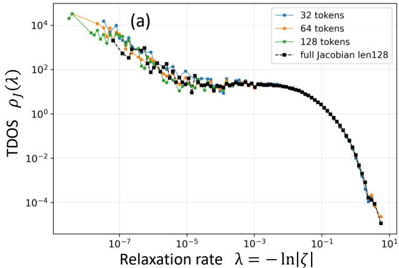

Mamba-370M Layer 24: Common-Bin IR TDOS (λ ≤ 0.05)  
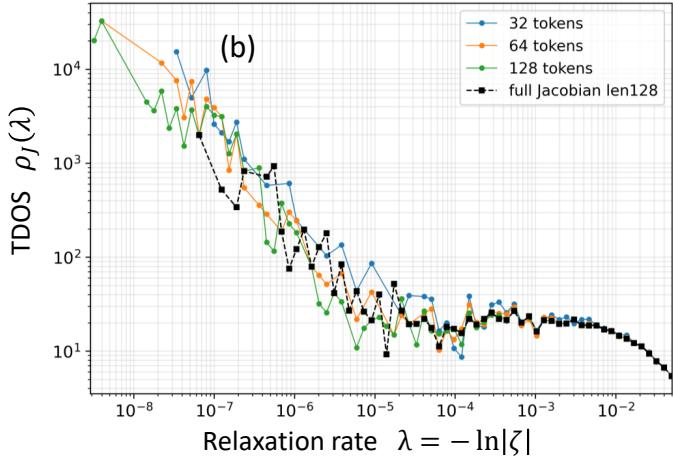  
FIG. C1. FP64 numerical validation of the Mamba-370M full-block Jacobian TDOS. (a) Full-block time-scale density of states at layer 24 obtained from FP64 Jacobian calculations for retained sequence lengths $L = 3 2 , 6 4$ , and 128. The corresponding FP32 spectrum for $L = 1 2 8$ is overlaid as a black dashed curve with square markers. The FP32 and FP64 measurements recover essentially the same collective spectral envelope throughout the statistically well-resolved regime, including the broad slow-relaxation sector, the intermediate spectral region, and the ultraviolet rollof. (b) The same spectra restricted to the infrared region $\lambda \le 0 . 0 5$ using common logarithmic bins. The agreement between FP32 and FP64 persists throughout the resolved infrared continuum, while larger bin-to-bin fluctuations appear in the sparsely populated extreme-infrared tail. The FP64 measurements further resolve the collective spectrum toward relaxation rates of order $\lambda \sim 1 0 ^ { - 8 }$ The persistence of the same large-scale spectral organization under increased numerical precision demonstrates that the observed collective infrared structure is not an artifact of the arithmetic precision used in the full-block Jacobian calculation.

over a statistically well-resolved region. The extremeinfrared measurement instead tests whether the collective relaxation hierarchy continues toward substantially slower modes when the numerical precision of the Jacobian analysis is increased. The latter therefore provides a robustness test rather than an extrapolation of the fitted

power law to $\lambda  0 .$

This distinction is also important because the increasing TDOS toward the extreme infrared does not imply that this region contains the largest absolute number of modes. The TDOS is a density with respect to relaxation rate. Under logarithmic visualization, a small number of modes occupying a very narrow interval in λ can therefore produce a large local density even when the cumulative population of such modes remains small. The stronger fluctuations observed in the lowest-λ bins are consistent with this sparse-mode character and should not be confused with the densely resolved continuum used for the scaling analysis.

The FP32–FP64 comparison nevertheless shows that this statistical distinction does not alter the central result. Over the resolved collective regime, the spectra obtained at the two numerical precisions reproduce essentially the same TDOS morphology. The weakly varying slow-mode sector, its infrared enhancement, and the subsequent crossover toward rapidly relaxing modes all persist under the FP64 calculation. At still smaller relaxation rates, the FP64 analysis extends the observable tail toward $\lambda \sim 1 0 ^ { - 8 }$ without producing a qualitatively diferent spectral organization.

Taken together, these results provide an independent numerical validation of the full-block collective spectrum reported in the main text. The agreement between FP32 and FP64 calculations demonstrates that the observed infrared organization is not generated simply by the numerical precision of the Jacobian analysis, while the extension of the FP64 spectrum toward extremely small relaxation rates confirms the persistence of a hierarchy of very slow collective modes. At the same time, the infrared exponent reported in the main text is determined only from the substantially more conservative, well-populated common scaling window and therefore does not depend on the numerical interpretation of the extreme-infrared tail.

## Appendix D: Memory Kernel from the Full-Block Relaxation Spectrum

The full-block Jacobian measurements presented in the main text characterize the collective relaxation spectrum of the complete Mamba block. Here we examine the same organization directly in the time domain by constructing the memory kernel from the measured relaxation modes. This provides a complementary representation of the infrared TDOS and makes explicit how the observed accumulation of slow collective modes generates long-time temporal persistence.

For a set of stable full-block Jacobian modes with relaxation rates $\{ \lambda _ { \alpha } \}$ , the normalized spectral memory kernel is defined as

$$
K ( t ) = \frac { 1 } { N } \sum _ { \alpha = 1 } ^ { N } e ^ { - \lambda _ { \alpha } t } ,\tag{D1}
$$

where $N$ is the number of modes included in the corresponding spectral sector. In the continuum limit, this becomes

$$
K ( t ) = \int d \lambda \rho ( \lambda ) e ^ { - \lambda t } ,\tag{D2}
$$

where $\rho ( \lambda )$ is the normalized time-scale density of states. The memory kernel is therefore the Laplace transform of the measured relaxation spectrum.

Equation (D2) immediately shows why the infrared sector controls long-time dynamics. At short times, relaxation modes over a broad spectral range contribute to the response. As time increases, modes with large λ are exponentially suppressed by the factor $e ^ { - \lambda t }$ , and the remaining response becomes progressively dominated by modes with small relaxation rates. The long-time behavior of $K ( t )$ therefore provides a direct time-domain representation of the low-λ organization observed in the full-block TDOS.

Figure D1(a) shows the memory kernel constructed from the complete measured stable-mode spectrum at layer 24 for retained sequence lengths from 8 to 512 tokens. Despite the substantial increase in the number of resolved modes with sequence length, the kernels exhibit closely related short- and intermediate-time behavior. Diferences become increasingly visible at long times, where the kernel is most sensitive to the progressively resolved deep-infrared modes. The persistence of the fullspectrum kernel to long efective times therefore reflects the extension of the measured collective spectrum toward increasingly small relaxation rates.

The connection between the infrared TDOS and the temporal scaling of the memory kernel can be obtained analytically. Suppose that over a finite infrared interval the TDOS is described by

$$
\rho ( \lambda ) = C \lambda ^ { \beta } , \qquad \lambda _ { \operatorname * { m i n } } \leq \lambda \leq \lambda _ { \operatorname * { m a x } } .\tag{D3}
$$

The corresponding infrared contribution to the memory kernel is

$$
K _ { \mathrm { I R } } ( t ) = C \int _ { \lambda _ { \operatorname* { m i n } } } ^ { \lambda _ { \operatorname* { m a x } } } d \lambda \lambda ^ { \beta } e ^ { - \lambda t } .\tag{D4}
$$

Introducing the dimensionless variable

$$
u = \lambda t , \qquad d \lambda = { \frac { d u } { t } } ,\tag{D5}
$$

gives

$$
\begin{array} { l } { \displaystyle { K _ { \mathrm { I R } } ( t ) = C \int _ { \lambda _ { \operatorname* { m i n } } t } ^ { \lambda _ { \operatorname* { m a x } } t } \frac { d u } { t } \left( \frac { u } { t } \right) ^ { \beta } e ^ { - u } } } \\ { \displaystyle { = C t ^ { - ( 1 + \beta ) } \int _ { \lambda _ { \operatorname* { m i n } } t } ^ { \lambda _ { \operatorname* { m a x } } t } d u u ^ { \beta } e ^ { - u } } . } \end{array}\tag{D6}
$$

Equivalently,

$$
K _ { \mathrm { I R } } ( t ) = C t ^ { - ( 1 + \beta ) } \left[ \gamma ( 1 + \beta , \lambda _ { \operatorname* { m a x } } t ) - \gamma ( 1 + \beta , \lambda _ { \operatorname* { m i n } } t ) \right] ,\tag{D7}
$$

where $\gamma ( a , x )$ is the lower incomplete gamma function.

This expression naturally produces three temporal regimes. At short times,

$$
t \ll \lambda _ { \operatorname* { m a x } } ^ { - 1 } ,\tag{D8}
$$

all modes in the selected spectral interval satisfy $\lambda t \ll 1$ Using

$$
e ^ { - \lambda t } \simeq 1 - \lambda t + \cdot \cdot \cdot ,\tag{D9}
$$

the leading contribution becomes

$$
K _ { \mathrm { I R } } ( t ) \simeq \frac { C } { 1 + \beta } \biggl ( \lambda _ { \mathrm { m a x } } ^ { 1 + \beta } - \lambda _ { \mathrm { m i n } } ^ { 1 + \beta } \biggr ) .\tag{D10}
$$

The kernel is therefore approximately constant at suficiently short times.

At intermediate times satisfying

$$
\lambda _ { \operatorname* { m a x } } ^ { - 1 } \ll t \ll \lambda _ { \operatorname* { m i n } } ^ { - 1 } ,\tag{D11}
$$

the scaled limits obey

$$
\lambda _ { \operatorname* { m i n } } t \ll 1 , \qquad \lambda _ { \operatorname* { m a x } } t \gg 1 .\tag{D12}
$$

Equation (D6) then reduces to

$$
\begin{array} { l } { { \displaystyle K _ { \mathrm { I R } } ( t ) \simeq C t ^ { - ( 1 + \beta ) } \int _ { 0 } ^ { \infty } d u u ^ { \beta } e ^ { - u } } } \\ { { \displaystyle = C \Gamma ( 1 + \beta ) t ^ { - ( 1 + \beta ) } . } } \end{array}\tag{D13}
$$

Thus, within the temporal regime associated with the resolved power-law spectral window,

$$
\rho ( \lambda ) \sim \lambda ^ { \beta } \qquad \Longrightarrow \qquad K ( t ) \sim t ^ { - ( 1 + \beta ) } .\tag{D14}
$$

For an exactly flat TDOS,

$$
\beta = 0 ,\tag{D15}
$$

this relation gives the marginal memory form

$$
K ( t ) \sim t ^ { - 1 } .\tag{D16}
$$

For the Mamba full-block spectrum measured in the main text, the long-sequence cumulative analysis gives approximately

$$
\beta _ { \mathrm { I R } } \simeq - 0 . 1 7 .\tag{D17}
$$

The corresponding temporal scaling is therefore

$$
K _ { \mathrm { I R } } ( t ) \sim t ^ { - 0 . 8 3 } .\tag{D18}
$$

The measured Mamba collective dynamics thus lies close to the marginal $1 / t$ regime, with a weak enhancement of long-time persistence.

At still longer times,

$$
t \gg \lambda _ { \operatorname* { m i n } } ^ { - 1 } ,\tag{D19}
$$

even the slowest modes contained in the selected spectral interval are suppressed. The leading asymptotic contribution then has the form

$$
K _ { \mathrm { I R } } ( t ) \propto \frac { \lambda _ { \mathrm { m i n } } ^ { \beta } } { t } e ^ { - \lambda _ { \mathrm { m i n } } t } ,\tag{D20}
$$

up to subleading corrections. A finite power-law relaxation spectrum therefore produces the characteristic temporal sequence

short-time plateau $\to \ t ^ { - ( 1 + \beta ) } \ \to$ infrared-cutof decay.

(D21)

To compare this prediction directly with the spectral measurements, we construct an infrared memory kernel using the same fixed interval employed for the cumulative TDOS analysis in the main text,

$$
1 0 ^ { - 4 } \leq \lambda \leq 5 \times 1 0 ^ { - 2 } .\tag{D22}
$$

The two characteristic temporal scales associated with these spectral boundaries are

$$
t _ { \mathrm { U V } } = \lambda _ { \mathrm { m a x } } ^ { - 1 } = \frac { 1 } { 5 \times 1 0 ^ { - 2 } } \simeq 2 0 ,\tag{D23}
$$

and

$$
t _ { \mathrm { I R } } = \lambda _ { \mathrm { m i n } } ^ { - 1 } = \frac { 1 } { 1 0 ^ { - 4 } } = 1 0 ^ { 4 } .\tag{D24}
$$

The power-law regime implied by the measured infrared spectrum is therefore expected primarily over

$$
2 0 \lesssim t \lesssim 1 0 ^ { 4 } .\tag{D25}
$$

Figure D1(b) shows the corresponding infrared memory kernel calculated directly from the measured modes in this fixed spectral interval. The kernel first exhibits a weakly varying short-time regime and then enters an extended slowly decaying region between the inverse spectral boundaries. The measured long-sequence exponent $\beta _ { \mathrm { I R } } \simeq - 0 . 1 7$ predicts $K _ { \mathrm { I R } } ( t ) \sim t ^ { - 0 . 8 \bar { 3 } }$ in this region, close to the $t ^ { - 1 }$ behavior associated with an exactly flat TDOS. The two reference power laws in Fig. D1(b) are therefore shown as scaling guides rather than independent fits to the memory kernel.

For $t \gtrsim 1 0 ^ { 4 }$ , the kernel calculated from the restricted infrared interval falls rapidly. This decay should not be interpreted as the disappearance of memory from the complete Mamba spectrum. It follows directly from imposing the lower boundary $\lambda _ { \operatorname* { m i n } } = 1 0 ^ { - 4 }$ in the restricted construction. The full spectrum contains relaxation modes extending substantially below this value, and these additional modes continue to contribute at longer efective times, as directly demonstrated by Fig. D1(a).

The two panels therefore probe complementary aspects of the same collective relaxation spectrum. Figure D1(a) retains the complete measured spectrum and demonstrates the long temporal reach generated by the deepest resolved relaxation modes. Figure D1(b) isolates the common infrared scaling window and directly tests the temporal consequence of the TDOS exponent extracted in the main text. The distinction is important because the cutof of the restricted kernel is determined by the chosen lower spectral boundary, whereas the fullspectrum kernel continues to receive contributions from modes at substantially smaller relaxation rates.

The time-domain analysis therefore provides an independent representation of the infrared organization identified from the full-block Jacobian spectrum. The cumulative TDOS establishes a nearly flat but weakly infrared-enhanced regime, $\rho ( \lambda ) \sim \lambda ^ { - 0 . 1 7 }$ , and its Laplace transform produces the corresponding slowly decaying response $K ( t ) \sim t ^ { - 0 . 8 3 }$ over the associated temporal window. The proximity of this behavior to the marginal $1 / t$ form connects the measured spectral accumulation of slow collective modes directly to extended temporal persistence.

Importantly, the memory kernel considered here is constructed from the collective relaxation spectrum of the complete Mamba block. It should therefore be distinguished from the microscopic SSM convolution kernel $K _ { \mathrm { S S M } } ( t ) = C e ^ { A t } B$ discussed in Sec. II. The latter propagates the history of the external input through the explicit state-space dynamics, whereas the present kernel characterizes the temporal organization implied by the collective full-block relaxation spectrum. This distinction preserves the microscopic-to-macroscopic hierarchy central to the analysis: the explicit SSM supplies a microscopic state-space memory mechanism, while the fullblock Jacobian reveals the emergent collective relaxation structure whose infrared spectrum generates the longtime kernel examined here.

Mamba-370M Layer 24: Full-Spectrum Memory Kernel  
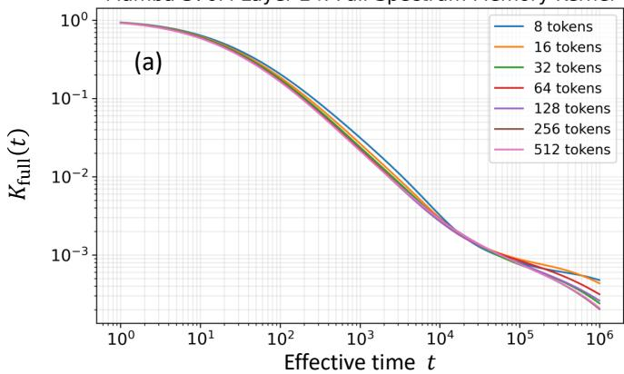

Mamba-370M Layer 24: Infrared Memory Kernel  
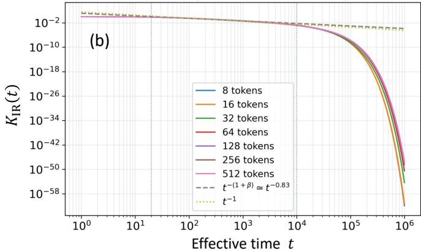  
FIG. D1. Memory kernels constructed from the full-block Jacobian relaxation spectrum of Mamba-370M at layer 24 for retained sequence lengths $L = 8 – 5 1 2$ . (a) Full-spectrum memory kernel $\begin{array} { r } { K _ { \mathrm { f u l l } } ( t ) ~ \stackrel {  } { = } ~ N ^ { - 1 } \sum _ { \alpha } e ^ { - \lambda _ { \alpha } t } } \end{array}$ , evaluated using all measured stable relaxation modes. Despite the substantial increase in the number of resolved modes with sequence length, the kernels exhibit closely overlapping short- and intermediate-time behavior, while diferences become increasingly visible at long times as larger sequence subspaces resolve additional deep-infrared modes. The resulting extension of the long-time tail directly reflects the progressively resolved low-relaxation-rate spectral weight. (b) Infrared memory kernel $K _ { \mathrm { I R } } ( t )$ constructed using only modes within the common scaling interval $1 0 ^ { - 4 } \leq \bar { \lambda } \leq \bar { 5 } \times 1 0 ^ { - 2 }$ employed for the cumulative TDOS analysis. For a power-law TDOS $\rho ( \lambda ) \sim \lambda ^ { \beta }$ , the corresponding intermediate-time kernel obeys $K _ { \mathrm { I R } } ( t ) \sim t ^ { - ( 1 + \beta ) }$ over $\lambda _ { \operatorname* { m a x } } ^ { - 1 } \ll t \ll \lambda _ { \operatorname* { m i n } } ^ { - 1 }$ . The vertical dotted lines mark the inverse spectral boundaries, $t _ { \mathrm { U V } } ~ \simeq ~ 2 0$ and $t _ { \mathrm { I R } } = 1 0 ^ { 4 }$ The dashed $\bar { t } ^ { - 0 . 8 3 }$ reference corresponds to the measured long-sequence exponent $\beta _ { \mathrm { I R } } \simeq - 0 . 1 7$ , while the dotted $t ^ { - 1 }$ line denotes the exactly flat-TDOS limit $\beta = 0 .$ These reference lines are scaling guides rather than fits to the kernel. Beyond $t _ { \mathrm { I R } }$ , the finite lower cutof of the selected infrared window produces the expected rapid decay. Together, the two panels show how the measured collective relaxation spectrum is transformed into extended temporal memory and distinguish the long-time contribution of the complete deepinfrared spectrum from the scaling behavior associated with the fixed resolved infrared window.