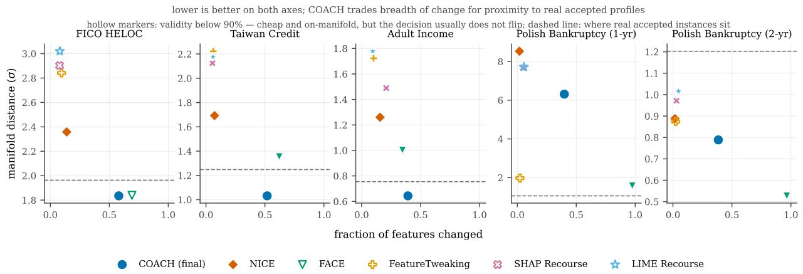

# Leaf Values as Coordinates: Exact Contrastive Explanation for Gradient-Boosted Ensembles

Emanuele Luzio

emanuele.luzio@gmail.com

Independent Researcher

## Abstract

A gradient-boosted ensemble predicts by summing one leaf value per tree. Read those values as coordinates rather than as interme- diate results, and every instance becomes a point in $\mathbb { R } ^ { M }$ on which the model acts linearly: the score is the sum of the coordinates.

This small change of view makes contrastive explanation exact. The diference between two instances is a vector that is identically zero wherever they share a leaf, so the gap between a rejected applicant and an accepted one is carried by a handful of coordinates, each traceable to a real split in a real tree. Nothing is fitted, sampled, or assumed additive in features — the additivity is already there, in the right space.

We build a recourse method on this representation and evaluate it on five tabular datasets under repeated cross-validation. Its rec- ommendation reconstructs the model’s own decision to $6 . 2 \times 1 0 ^ { - 1 5 }$ so an auditor can re-check the arithmetic without the model. On the credit datasets it is Pareto-non-dominated on efort against realism. And when recommendations are restricted to changes the subject could actually make — not their age, not a settled delinquency — it retains 58 % of its validity where the strongest baseline retains 41 %, a distinction the standard evaluation cannot see because it never asks whether a recommendation can be carried out.

## 1 Introduction

Gradient-boosted ensembles are additive by construction. With � trees,

$$
\hat { f } ( x ) \ = \ \sum _ { m = 1 } ^ { M } v _ { m } \big ( \ell _ { m } ( x ) \big ) ,\tag{1}
$$

where $\ell _ { m } ( x )$ is the leaf that � reaches in tree � and ${ v _ { m } } ( \cdot )$ its value. This is normally read as an implementation detail: the model com- putes � numbers and adds them.

Read instead as a representation, it says something stronger. Define

$$
\varphi ( x ) \ = \ \big ( v _ { 1 } ( \ell _ { 1 } ( x ) ) , \ldots , v _ { M } ( \ell _ { M } ( x ) ) \big ) \ \in \ \mathbb { R } ^ { M } .\tag{2}
$$

Then ${ \hat { f } } ( x ) = 1 ^ { \top } \varphi ( x )$ . The model, which is violently non-linear in the input features, is linear in � — indeed it is the simplest possible linear functional, an unweighted sum. All the non-linearity has been pushed into the map � itself, where it is piecewise constant and exactly known.

Three consequences follow, and they are the paper.

Diferences are sparse. For two instances �, �, the vector � (�)− �(�) is identically zero in every coordinate where they reach the same leaf. Their score gap is therefore carried by the trees where they diverge, and by nothing else. This is exact, not approximate.

Explanation is subtraction. Reading of the non-zero coordinates of that diference gives a complete account of why the model scores two instances diferently, in units that sum to the gap. No surrogate is fitted, no reference distribution chosen, no assumption made that the model is additive in features — which it is not, and which is the silent assumption behind attribution-driven explanation.

Recourse is retrieval. If explanation is a diference vector, then producing recourse means choosing what to subtract from: an accepted instance whose diference from the query is small, decisive, and reachable. The method reduces to a choice of neighbour in �- space, plus the accounting that comes free with it.

We develop this into COACH, a recourse method for tabular gradient-boosted models (Section 3), and evaluate it on five datasets (Sections 4–5). The representation’s central promise — that the accounting is exact — is verified directly: across 2, 060 queries the reported coordinates reconstruct the model’s margin gap to 6.2 × 10−15.

We also report a finding that is not about our method. Standard re- course evaluation asks the model whether a modified profile would be approved, never whether the subject could reach it. Restricting recommendations to feasible changes costs every method we test 40–60 % of its validity and reverses their ranking (Section 5.4). Methods that change few features fare worst, which is the opposite of what the conventional metrics reward.

## 2 The Representation

Write $\Delta ( x , y ) = \varphi ( x ) - \varphi ( y )$ and $\mathcal { G } ( x , y ) = \{ m : \ell _ { m } ( x ) \neq \ell _ { m } ( y ) \}$ for the trees where � and � diverge. By construction $\Delta ( x , y ) _ { m } = 0$ for � $\not \in \mathcal { G } ( x , y )$ , so

$$
\hat { f } ( y ) - \hat { f } ( x ) \ = \ \sum _ { m \in \mathcal { G } ( x , y ) } \big [ v _ { m } ( \ell _ { m } ( y ) ) - v _ { m } ( \ell _ { m } ( x ) ) \big ] .\tag{3}
$$

Equation 3 is an identity. It is worth dwelling on how little it asks for: no linearity in features, no independence, no sampling, no locality. Two instances, one model, exact arithmetic.

From coordinates to features. The coordinates of Δ are indexed by trees, and a subject cannot act on a tree. Each diverging tree is therefore attributed to the feature at its decisive split — the node where the two root-to-leaf paths first separate — and coordinates sharing a feature are summed. This produces a table with one row per feature: the split threshold, the number of trees involved, and the summed contribution.

That table is simultaneously the recommendation and its justifi- cation. Because the attribution partitions G, the rows still sum to the exact gap; Section 5.1 confirms they do at scale.

Similarity in this space. Two instances are close in � when they share many leaves. This is the leaf co-occurrence long used as a proximity measure in tree ensembles [14], with one diference that matters here: because our coordinates are the leaf values rather than co-occurrence indicators, they carry sign and magnitude and sum to the prediction. Co-occurrence tells you two instances are similar; � tells you how their diference produces the decision.

<table><tr><td>Feature</td><td>Query</td><td>Comp.</td><td>Threshold</td><td>∆v (trees)</td><td>Solo ∆f</td></tr><tr><td>NetFractionRevolvingBurden</td><td>81</td><td>0</td><td>31.5</td><td>+2.260 (75)</td><td>+1.110</td></tr><tr><td>AverageMInFile</td><td>38</td><td>74</td><td>53.1</td><td>+0.182 (14)</td><td>+0.291</td></tr><tr><td>MSinceOldestTradeOpen</td><td>85</td><td>160</td><td>120.5</td><td>+0.197 (16)</td><td>+0.081</td></tr><tr><td>NumInstallTradesWBalance</td><td>1</td><td>2</td><td>2.0</td><td>+0.050 (2)</td><td>+0.029</td></tr><tr><td>NetFractionInstallBurden</td><td>一</td><td>84</td><td>74.6</td><td>+0.045 (11)</td><td>+0.013</td></tr><tr><td>sum of entries</td><td></td><td></td><td></td><td>+2.734</td><td></td></tr><tr><td>model&#x27;s margin gap</td><td></td><td></td><td></td><td>+2.734</td><td></td></tr></table>

Table 1: A recommendation for a rejected HELOC applicant, scored 0.151 against a threshold of 0.50, against a comparator at 0.733. Each row is a feature reached by summing the coordinates of Δ whose decisive split falls on it; trees counts those coordinates. The last two rows are the point of the representation: the entries reproduce the model’s own margin gap exactly, so the arithmetic can be re-checked without the model. Solo is a diferent quantity — the shift from moving that feature alone — and the fact that the two columns disagree is the feature-interaction efect that Section 3 introduces � to absorb. Note also rows two and three: raising an account-age feature is not something an applicant can do, which Section 5.4 takes up.

## 3 COACH

Given a rejected query $x _ { \mathrm { q } } ,$ COACH selects an accepted comparator $x _ { + }$ and returns the feature table of Section 2.

Eligibility. Comparators are drawn from training instances the model accepts, not those labelled positive: a recommendation must be something the model would actually approve. A margin � re- quires $\hat { f } ( x _ { + } )$ to clear the threshold with surplus, which absorbs a mismatch the representation does not remove — the model is linear in �, but a subject acts on features, and moving one feature changes leaf assignments in trees whose decisive split lies elsewhere.

Ranking. Among eligible comparators, COACH prefers those whose diference is both small in support and concentrated in im- pact:

$$
\begin{array} { r } { \lambda ( x _ { \mathrm { q } } , x _ { + } ) = \underbrace { \left( 1 - \frac { | \mathcal { G } | } { M } \right) } _ { \mathrm { a g r e e m e n t } } \cdot \underbrace { \sum _ { m \in \mathcal { G } } \left| \Delta _ { m } \right| } _ { \sum _ { m } | \varphi ( x _ { \mathrm { q } } ) _ { m } | } , } \end{array}\tag{4}
$$

divided by $1 + \beta d ( x _ { \mathrm { q } } , x _ { + } )$ with � the mean standard-deviation- normalised $L _ { 1 }$ distance in feature space, so that nearby comparators are preferred without changing who is eligible. Section 5.3 reports how much this ranking actually buys, and the answer is: less than its prominence here suggests.

Tiers. Eligible comparators are split into terciles of their own score distribution, giving the subject a progression rather than one target. Terciles rather than fixed probability bands: a confident model on an imbalanced problem can leave a fixed band such as [0.60, 0.65) holding one instance or none, at which point every query silently receives the same comparator, or none at all.

Feasibility. Features difer in what a subject can do with them, and Section 5.4 shows this dominates everything else. Given labels marking each feature mutable, increase-only, decrease-only or immutable, let $F ( x _ { \mathrm { q } } , x _ { + } )$ be the coordinates whose move the labels permit and $s _ { j }$ the scale of feature �. Each candidate is weighted by

$$
w ( x _ { \mathrm { q } } , x _ { + } ) = \frac { \sum _ { j \in F } \lvert x _ { + , j } - x _ { \mathrm { q } , j } \rvert / s _ { j } } { \sum _ { j } \lvert x _ { + , j } - x _ { \mathrm { q } , j } \rvert / s _ { j } } \in [ 0 , 1 ] ,\tag{5}
$$

and the comparator returned maximises $\lambda \cdot w / ( 1 + \beta d )$ . A candidate whose gap rests on the applicant’s age scores � ≈ 0 before any recommendation exists. Rows the subject cannot act on are additionally dropped from the recommendation, while remaining in the audit trail — those trees do carry part of the gap, and removing them would break Equation 3.

## 4 Experimental Setup

Five tabular datasets: FICO HELOC [7], Taiwan Credit Default [24], Adult Income [11], and Polish Bankruptcy at 1- and 2-year horizons [25]. Models are XGBoost [3], 300 trees of depth 4. Baselines are NICE [2], FACE [19], Feature Tweaking [21], and greedy recourse driven by SHAP [13] and LIME [20].

Validity is the fraction of all queries whose recourse the model accepts, so coverage cannot be traded against it. Sparsity is the fraction of features changed; manifold distance is the normalised �2 distance to the five nearest accepted training instances. For the last we also report where genuine accepted instances sit relative to their own neighbours, 0.76–1.96 �, without which a figure in � cannot be judged.

Results are 20 repeated cross-validation splits. With five splits the smallest attainable two-sided Wilcoxon � is 0.0625 — above � before any correction — so a 5-fold design cannot report significance whatever the efect size. Because repeated splits share training data [6], we use the Nadeau–Bengio corrected resampled �-test [16] with Holm correction [8], and follow Demšar [5] in treating the interval on the paired diference as primary.

## 5 Results

## 5.1 The accounting is exact

The representation’s central claim is that the reported rows recon- struct the model’s decision. We tested it adversarially: an indepen- dent verifier receives the recommendation table and nothing else — no model, no training data — and must recover the margin gap.

Across 2, 060 queries on five datasets, the rows account for a fraction 1.0000–1.0000 of the gap, with reconstruction error never exceeding $6 . 2 \times 1 0 ^ { - 1 5 }$ in margin units. This is floating-point noise, and it is what Equation 3 predicts. The practical consequence is that a compliance reviewer can verify the arithmetic linking a recommendation to a decision without access to the model that made it.

## 5.2 Recourse quality

COACH reaches coverage 1.000 and validity between 0.977 and 1.000. On HELOC it lands 22 % closer to real accepted instances than NICE (1.83 vs. 2.36) while changing 58 % of features against NICE’s 14 %; on Taiwan, 39 % closer at 52 % versus 7 %.

That trade is the honest summary. Treating validity as a pre-condition and asking which methods are non-dominated on efort against realism, COACH and NICE both survive on all five datasets, at opposite ends of one frontier; every other baseline is dominated or fails the validity gate somewhere. No weighting-free argument selects between the two — which is why we report dominance rather than a composite score, and why the case for the representation rests on Section 5.1 rather than on winning a metric.

## 5.3 What the ranking is worth

Equation 4 is the one part of the method that looks like a design choice rather than a consequence of the representation. It earns less than it appears to.

Replacing it with an arbitrary eligible comparator — ignoring the query entirely — leaves validity essentially unchanged (≥ 0.965 against ≥ 0.967). Applying a recommendation copies the compara tor’s values on every decisive feature, so the result lands on or near an accepted instance whichever one it is. Validity comes from the eligibility constraint, not from the ranking; � buys narrower recommendations, and proximity to the data manifold comes from the � penalty.

We report this because it is what the representation predicts. If the space is the right one, the operation on top of it should be simple, and a ranking heuristic should not be doing the heavy lifting. It is not.

## 5.4 Recourse the subject can act on

Every validity figure above — ours and, as far as we can tell, ev- eryone’s — is scored by a model with no concept of what a person can do. The worked example in Section 2 is typical: alongside “pay down your revolving balance” it asks the applicant to raise their average account age from 38 to 74 months, that is, to have opened their accounts three years earlier than they did.

Labelling features by mutability and restoring the original value wherever a recommended move is impossible, we re-score every method under the same projection. Table 2 gives the result. NICE falls from 0.993 to 0.409, FACE from 0.973 to 0.432. Three points follow.

The cost is large and common to all methods, which locates it in the evaluation protocol rather than in any algorithm — it is a correction to published numbers we did not produce.

Table 2: Validity when the subject may change only what they can change. Immutable features (age, protected attributes, settled history) are frozen and one-directional features may move only the feasible way; the same projection is applied to every method. Filtered removes infeasible moves after retrieval; constraint-aware folds feasibility into comparator selection. Polish Bankruptcy is excluded: we have no defensible mutability labels for 64 derived accounting ratios.
<table><tr><td>Method</td><td>FICO HELOC</td><td>Taiwan Credit</td><td>Adult Income</td></tr><tr><td>unconstrained</td><td></td><td></td><td></td></tr><tr><td>COACH</td><td>0.967</td><td>1.000</td><td>1.000</td></tr><tr><td>NICE</td><td>0.978</td><td>1.000</td><td>1.000</td></tr><tr><td>FACE</td><td>0.922</td><td>0.997</td><td>1.000</td></tr><tr><td>FeatureTweaking</td><td>0.782</td><td>1.000</td><td>1.000</td></tr><tr><td>feasible changes only</td><td></td><td></td><td></td></tr><tr><td>COACH (constraint-aware)</td><td>0.648</td><td>0.315</td><td>0.752</td></tr><tr><td>COACH (filtered)</td><td>0.547</td><td>0.087</td><td>0.708</td></tr><tr><td>NICE (filtered)</td><td>0.372</td><td>0.115</td><td>0.740</td></tr><tr><td>FACE (filtered)</td><td>0.343</td><td>0.187</td><td>0.767</td></tr><tr><td>FeatureTweaking (filtered)</td><td>0.208</td><td>0.090</td><td>0.893</td></tr></table>

The ordering reverses. NICE leads unconstrained and trails constrained. A practitioner choosing on published validity would pick the method that degrades worst.

Sparsity is the property that breaks. A recommendation touching two or three features has no slack: if one is immutable, most of it is deleted and the remainder rarely moves the decision. A broad recommendation degrades gracefully. COACH retains 58 % of its validity against 41 % for NICE and 44 % for FACE — for the same reason the conventional evaluation penalises it.

Finally, where the constraint is applied matters. Filtering infeasible moves after retrieval gives 0.447; folding feasibility into selection via Equation 5 gives 0.572. That gap exceeds every between-method diference in the unconstrained comparison. We could implement it for one method only — it needs a retrieval step to modify — so we ofer it as a demonstration rather than a general law.

## 5.5 Further checks

How much of a broad recommendation must be acted on. Section 5.4 treats breadth as protective; the fair objection is that a thirteen-feature recommendation is not actionable either. Acting on only the � highest-impact rows retains validity between 0.703 and 1.000 at �=3, and between 0.972 and 1.000 at �=8. Breadth is not an all-or-nothing demand — which is also why it has slack to lose.

Other libraries and deeper trees. Equation 2 is a property of the leaf structure, not of an implementation, so it should trans- fer. Re-running the protocol under LightGBM [10] gives validity within a point of XGBoost on every dataset. Across {XGBoost, LightGBM} × {4, 6, 8} depths ×{300, 800} trees, leaf co-occurrence falls as expected — on HELOC mean agreement drops from about 0.51 at depth 4 to 0.35 at depth 8 — but recommendations do not lengthen and validity is unafected. The agreement term of Equa- tion 4 is a ranking signal; degrading it changes which comparator wins, not whether the winner works.

  
Figure 1: Efort against realism, five datasets. COACH occupies the low-manifold, high-sparsity corner; NICE the opposite. Hollow markers mark validity below 90 %. The dashed line is where genuine accepted instances sit relative to their own neighbours — a recourse at or below it is, by this measure, indistinguishable from a real accepted person.

Cost. Retrieval takes 1.7–11.4 ms per query over a 16× range of pool sizes. It scales with the number of eligible comparators rather than the pool, so it grows fastest on datasets where the model accepts most of the population. The comparison itself is a vectorised operation over a leaf-index matrix; a deployment with a far larger pool would want approximate nearest neighbours on leaf fingerprints, which we have not implemented.

## 6 Related Work

Tree representations. Using leaf structure as a similarity space is not new: random-forest proximities date to Breiman [1], and Marmerola [14] use leaf co-occurrence for counterfactual search. Those constructions are indicator-valued — they record whether two instances share a leaf. Equation 2 keeps the leaf values, so the coordinates are signed, carry magnitude, and sum to the model’s output. That is what turns a similarity measure into an exact de-composition of a decision, and it is the distinction on which this paper rests.

Tree-aware recourse. Tolomei et al. [21] tweak features toward the nearest positive-prediction leaf; Cui et al. [4] extract optimal actions by integer programming; Parmentier and Vidal [17] give a mixed-integer formulation with manifold constraints; and Lucic et al. [12] relax the ensemble into a diferentiable surrogate. All search the tree structure for a point. We retrieve an existing accepted instance and report the exact accounting; an optimiser can find a cheaper point than any instance in the reference population, whereas retrieval makes the justification the selection mechanism itself.

Model-agnostic recourse and its evaluation. Optimisation methods [15, 23] treat the classifier as an oracle. Attribution-driven recourse [13, 20] assumes a per-feature score predicts the efect of moving that feature; for a model additive in trees but not in features this is false, and silently so. Instance-based methods [2, 19] borrow real accepted examples, keeping recommendations grounded without explaining them. Ustun et al. [22] and Karimi et al. [9] constrain generation by actionability and causality; Section 5.4 instead quantifies what omitting the constraint costs at evaluation time, for the many methods that make no feasibility claim. Pawelczyk et al. [18] standardise recourse benchmarking, and the projection used here is the kind of check such a framework could adopt directly.

## 7 Limitations

The mutability labels are judgements about the world, not facts in the data. Ours are documented per feature; where unsure we marked a feature mutable, which constrains less and makes the reported costs lower bounds. We have no defensible labels for Pol- ish Bankruptcy’s 64 derived accounting ratios, so the constrained analysis covers three datasets.

Constrained recourse is measured, not solved: COACH survives the constraint better than the baselines and still lands at 0.572, which nobody should deploy. Getting further needs retrieval that searches for feasible comparators rather than down-weighting infeasible ones.

The audit trail is verified, not validated. We show the artifact is exact and independently checkable; we have not shown that a compliance oficer benefits from it, and until a study exists that claim is a design argument.

Finally, the representation is �-dimensional and tied to one trained model. It is an interpretation device, not a transferable embedding: a retrained ensemble induces a diferent �.

## 8 Conclusion

Treating leaf values as coordinates rather than intermediate results makes a gradient-boosted model linear in a space we can write down exactly. Contrastive explanation then reduces to subtraction, and the result is exact by construction rather than by approximation — verified here to $6 . 2 \times 1 0 ^ { - 1 5 }$ over 2, 060 queries.

Building recourse on that representation gives a method competitive on the conventional metrics and, more usefully, one that de grades gracefully when recommendations are restricted to changes a person can actually make. That last comparison is one the standard evaluation cannot make at all, and it reverses the field’s ranking when it is made.

## References

[1] Leo Breiman. 2001. Random Forests. Machine Learning 45, 1 (2001), 5–32.

[2] Dieter Brughmans, Pieter Leyman, and David Martens. 2024. NICE: An Algorithm for Nearest Instance Counterfactual Explanations. Data Mining and Knowledge Discovery 38 (2024), 2665–2703. https://doi.org/10.1007/s10618-023-00930-y

[3] Tianqi Chen and Carlos Guestrin. 2016. XGBoost: A Scalable Tree Boosting System. In Proceedings ofthe 22nd ACM SIGKDD International Conference on Knowledge Discovery and Data Mining. 785–794.

[4] Zhicheng Cui, Wenlin Chen, Yujie He, and Yixin Chen. 2015. Optimal Action Extraction for Random Forests and Boosted Trees. In Proceedings ofthe 21th ACM SIGKDD International Conference on Knowledge Discovery and Data Mining. 179–188.

[5] Janez Demšar. 2006. Statistical Comparisons of Classifiers over Multiple Data Sets. Journal ofMachine Learning Research 7 (2006), 1–30.

[6] Thomas G. Dietterich. 1998. Approximate Statistical Tests for Comparing Supervised Classification Learning Algorithms. Neural Computation 10, 7 (1998), 1895–1923.

[7] FICO. 2018. Explainable Machine Learning Challenge: HELOC Dataset. https: //communit .fico.com/s/ex lainable-machine-learnin -challen e.

[8] Sture Holm. 1979. A Simple Sequentially Rejective Multiple Test Procedure. Scandinavian Journal ofStatistics 6, 2 (1979), 65–70.

[9] Amir-Hossein Karimi, Bernhard Schölkopf, and Isabel Valera. 2021. Algorithmic Recourse: From Counterfactual Explanations to Interventions. In Proceedings of the 2021 ACM Conference on Fairness, Accountability, and Transparency (FAccT). 353–362.

[10] Guolin Ke, Qi Meng, Thomas Finley, Taifeng Wang, Wei Chen, Weidong Ma, Qiwei Ye, and Tie-Yan Liu. 2017. LightGBM: A Highly Eficient Gradient Boosting Decision Tree. In Advances in Neural Information Processing Systems (NeurIPS), Vol. 30.

[11] Ron Kohavi. 1996. Scaling Up the Accuracy of Naive-Bayes Classifiers: A Decision-Tree Hybrid. In Proceedings of the Second International Conference on Knowledge Discovery and Data Mining (KDD). 202–207.

[12] Ana Lucic, Harrie Oosterhuis, Hinda Haned, and Maarten de Rijke. 2022. FO-CUS: Flexible Optimizable Counterfactual Explanations for Tree Ensembles. In Proceedings ofthe AAAI Conference on Artificial Intelligence, Vol. 36. 5313–5322.

[13] Scott M. Lundberg and Su-In Lee. 2017. A Unified Approach to Interpreting Model Predictions. In Advances in Neural Information Processing Systems (NeurIPS), Vol. 30.

[14] Guilherme Dinis Marmerola. 2020. Calculating Counterfactuals with Random Forests. Blog post, https://gdmarmerola.github.io/forest-embeddings-counterfactual/. Accessed 2026-08-19. Not peer reviewed; cited as the earli est worked application of leaf co-occurrence to counterfactual search that we are aware of..

[15] Ramaravind K. Mothilal, Amit Sharma, and Chenhao Tan. 2020. Explaining Machine Learning Classifiers through Diverse Counterfactual Explanations. In Proceedings of the 2020 Conference on Fairness, Accountability, and Transparency (FAccT). 607–617.

[16] Claude Nadeau and Yoshua Bengio. 2003. Inference for the Generalization Error. Machine Learning 52, 3 (2003), 239–281.

[17] Axel Parmentier and Thibaut Vidal. 2021. Optimal Counterfactual Explanations in Tree Ensembles. In Proceedings ofthe 38th International Conference on Machine Learning. 8422–8431.

[18] Martin Pawelczyk, Sascha Bielawski, Johannes van den Heuvel, Tobias Leemann, and Gjergji Kasneci. 2021. CARLA: A Python Library to Benchmark Algorithmic Recourse and Counterfactual Explanation Algorithms. In NeurIPS 2021 Datasets and Benchmarks Track.

[19] Rafael Poyiadzi, Kacper Sokol, Raul Santos-Rodriguez, Tijl De Bie, and Peter Flach. 2020. FACE: Feasible and Actionable Counterfactual Explanations. In Proceedings ofthe AAAI/ACM Conference on AI, Ethics, and Society. 344–350.

[20] Marco T. Ribeiro, Sameer Singh, and Carlos Guestrin. 2016. "Why Should I Trust You?": Explaining the Predictions of Any Classifier. In Proceedings ofthe 22nd ACM SIGKDD International Conference on Knowledge Discovery and Data Mining. 1135–1144.

[21] Gabriele Tolomei, Fabrizio Silvestri, Andrew Haines, and Mounia Lalmas. 2017. Interpretable Predictions of Tree-based Ensembles via Actionable Feature Tweak ing. In Proceedings ofthe 23rd ACM SIGKDD International Conference on Knowledge Discovery and Data Mining. 465–474.

[22] Berk Ustun, Alexander Spangher, and Yang Liu. 2019. Actionable Recourse in Linear Classification. In Proceedings of the Conference on Fairness, Accountability, and Transparency (FAccT). 10–19.

[23] Sandra Wachter, Brent Mittelstadt, and Chris Russell. 2017. Counterfactual Explanations without Opening the Black Box: Automated Decisions and the GDPR. Harvard Journal ofLaw & Technology 31, 2 (2017), 841–887.

[24] I-Cheng Yeh and Che hui Lien. 2009. The comparisons of data mining techniques for the predictive accuracy of probability of default of credit card clients. Expert Systems with Applications 36, 2 (2009), 2473–2480.

[25] Maciej Zieba, Sebastian Krzysztof Tomczak, and Jakub M. Tomczak. 2016. En-semble Boosted Trees with Synthetic Features Generation in Application to Bankruptcy Prediction. Expert Systems with Applications 58 (2016), 93–101.