# MLREF: Eficient Module Reuse for Reward Design in Reinforcement Learning via Large Language Models

Chenglin Liu<sup>1</sup>, Xun Wang<sup>1</sup>, Ruishuo Chen<sup>1</sup>, Zhuoran Li<sup>1</sup>, and Longbo Huang<sup>1</sup> <sup>#</sup>

<sup>1</sup>I<sub>ns</sub>tit<sub>u</sub>t<sub>e</sub> f<sub>or</sub> I<sub>n</sub>t<sub>er</sub>di<sub>sc</sub>i<sub>p</sub>li<sub>nary</sub> I<sub>n</sub>f<sub>orma</sub>ti<sub>on</sub> S<sub>c</sub>i<sub>ences,</sub> T<sub>s</sub>i<sub>ng</sub>h<sub>ua</sub> U<sub>n</sub>i<sub>vers</sub>it<sub>y</sub> # Corres<sub>p</sub>ondence: lon<sub>g</sub>bohuan<sub>g</sub>@tsin<sub>g</sub>hua.edu.cn

Abstract. Reward function design remains a bottleneck in reinforcement learning. While large language models (LLMs) have enabled automated reward <sub>g</sub>eneration, existin<sub>g</sub> methods <sub>g</sub>enerate and revise <sub>rewar</sub>d f<sub>unc</sub>ti<sub>ons as mono</sub>lithi<sub>c programs, ma</sub>ki<sub>ng</sub> it difi<sub>cu</sub>lt t<sub>o re</sub>li<sub>a</sub>bl<sub>y preserve an</sub>d <sub>reuse e</sub>f<sub>ec</sub>ti<sub>ve</sub> <sub>componen</sub>t<sub>s</sub> di<sub>scovere</sub>d i<sub>n ear</sub>li<sub>er</sub> it<sub>era</sub>ti<sub>ons,</sub> l<sub>ea</sub>di<sub>ng</sub> t<sub>o uns</sub>t<sub>a</sub>bl<sub>e per</sub>f<sub>ormance across</sub> it<sub>era</sub>ti<sub>ons.</sub> T<sub>o</sub> address this, we propose Module Level Reward Evolution Framework (MLREF). At the core of MLREF is a module pool, a persistent repository of reusable reward components. MLREF treats the module pool as the primary optimization object: the pool evolves across iterations by accumulating successful <sub>mo</sub>d<sub>u</sub>l<sub>es,</sub> <sub>re</sub>fi<sub>n</sub>i<sub>ng</sub> <sub>un</sub>d<sub>erper</sub>f<sub>orm</sub>i<sub>ng</sub> <sub>ones,</sub> <sub>an</sub>d <sub>reus</sub>i<sub>ng</sub> <sub>proven</sub> <sub>componen</sub>t<sub>s;</sub> <sub>w</sub>hil<sub>e</sub> <sub>rewar</sub>d f<sub>unc</sub>ti<sub>ons</sub> <sub>are</sub> <sub>cons</sub>t<sub>ruc</sub>t<sub>e</sub>d <sub>as</sub> li<sub>near com</sub>bi<sub>na</sub>ti<sub>ons o</sub>f <sub>mo</sub>d<sub>u</sub>l<sub>es</sub> d<sub>rawn</sub> f<sub>rom</sub> thi<sub>s poo</sub>l<sub>.</sub> T<sub>o</sub> d<sub>r</sub>i<sub>ve</sub> thi<sub>s evo</sub>l<sub>u</sub>ti<sub>on,</sub> MLREF i<sub>n</sub>t<sub>egra</sub>t<sub>es</sub> th<sub>ree mec</sub>h<sub>an</sub>i<sub>sms: re</sub>fl<sub>ec</sub>ti<sub>on-</sub>b<sub>ase</sub>d <sub>re</sub>fi<sub>nemen</sub>t<sub>,</sub> h<sub>y</sub>b<sub>r</sub>id <sub>cre</sub>dit <sub>ass</sub>i<sub>gnmen</sub>t<sub>, an</sub>d <sub>a merge</sub> <sub>s</sub>t<sub>ra</sub>t<sub>egy</sub> <sub>w</sub>ith <sub>ro</sub>llb<sub>ac</sub>k<sub>,</sub> <sub>w</sub>hi<sub>c</sub>h t<sub>oge</sub>th<sub>er</sub> i<sub>mprove</sub> th<sub>e</sub> <sub>e</sub>f<sub>ec</sub>ti<sub>veness</sub> <sub>an</sub>d <sub>ro</sub>b<sub>us</sub>t<sub>ness</sub> <sub>o</sub>f <sub>rewar</sub>d <sub>op</sub>ti<sub>m</sub>i<sub>za</sub>ti<sub>on.</sub> Ex<sub>p</sub>eriments on 17 tasks show that MLREF out<sub>p</sub>erforms stron<sub>g</sub> baselines b<sub>y</sub> 25.2% in locomotion and 6<sub>.</sub>6% i<sub>n man</sub>i<sub>pu</sub>l<sub>a</sub>ti<sub>on, w</sub>ith <sub>more s</sub>t<sub>a</sub>bl<sub>e op</sub>ti<sub>m</sub>i<sub>za</sub>ti<sub>on</sub> d<sub>ynam</sub>i<sub>cs.</sub>

## 1. Introduction

Reinforcement learnin<sub>g</sub> (RL) has achieved remarkable success in various domains (Goldwaser & Thielscher, 2020; Zhu & Zhan<sub>g</sub>, 2021; El<sub>g</sub>uea-A<sub>g</sub>uinaco et al., 2023; Radosavovic et al., 2024). However, its <sub>p</sub>erformance <sub>cr</sub>iti<sub>ca</sub>ll<sub>y</sub> d<sub>epen</sub>d<sub>s on</sub> th<sub>e rewar</sub>d f<sub>unc</sub>ti<sub>on, an</sub>d d<sub>es</sub>i<sub>gn</sub>i<sub>ng an e</sub>f<sub>ec</sub>ti<sub>ve one rema</sub>i<sub>ns a</sub> f<sub>un</sub>d<sub>amen</sub>t<sub>a</sub>l <sub>c</sub>h<sub>a</sub>ll<sub>enge.</sub> S<sub>p</sub>arse rewards are eas<sub>y</sub> to define but often <sub>p</sub>rovide insuficient learnin<sub>g</sub> si<sub>g</sub>nals for o<sub>p</sub>timization (Stanton & Clune, 2018; Hare, 2019), whereas dense rewards often re<sub>q</sub>uire substantial domain ex<sub>p</sub>ertise and manual en<sub>g</sub>ineerin<sub>g</sub> eforts (Sutton & Barto, 1998; Eschmann, 2021).

Recent advances in lar<sub>g</sub>e lan<sub>g</sub>ua<sub>g</sub>e models (LLMs) have <sub>p</sub>rovided new o<sub>pp</sub>ortunities for automatin<sub>g</sub> reward desi<sub>g</sub>n, levera<sub>g</sub>in<sub>g</sub> their stron<sub>g</sub> ca<sub>p</sub>abilities in reasonin<sub>g</sub> (Wei et al., 2022; Zhan<sub>g</sub> et al., 2024), instruction followin<sub>g</sub> (Ou<sub>y</sub>an<sub>g</sub> et al., 2022), and code <sub>g</sub>eneration (Chen et al., 2021). However, directl<sub>y g</sub>enerated rewards often sufer from hallucination, syntactic errors, and semantic misalignment with task objectives, limiting their reliabilit<sub>y</sub> in <sub>p</sub>ractical RL scenarios (Ma et al., 2024; Sun et al., 2025a). These challen<sub>g</sub>es motivate the d<sub>eve</sub>l<sub>opmen</sub>t <sub>o</sub>f it<sub>era</sub>ti<sub>ve</sub> <sub>re</sub>fi<sub>nemen</sub>t f<sub>ramewor</sub>k<sub>s,</sub> <sub>w</sub>h<sub>ere</sub> LLM<sub>s</sub> <sub>progress</sub>i<sub>ve</sub>l<sub>y</sub> i<sub>mprove</sub> <sub>rewar</sub>d f<sub>unc</sub>ti<sub>ons</sub> b<sub>ase</sub>d <sub>on</sub> f<sub>ee</sub>db<sub>ac</sub>k f<sub>rom</sub> RL t<sub>ra</sub>i<sub>n</sub>i<sub>ng.</sub>

T<sub>o</sub> i<sub>mprove</sub> th<sub>e qua</sub>lit<sub>y o</sub>f LLM<sub>-genera</sub>t<sub>e</sub>d <sub>rewar</sub>d<sub>s, numerous</sub> LLM<sub>-</sub>b<sub>ase</sub>d h<sub>arnesses an</sub>d <sub>wor</sub>kfl<sub>ows</sub> h<sub>ave</sub> b<sub>een</sub> d<sub>eve</sub>l<sub>ope</sub>d t<sub>o</sub> it<sub>era</sub>ti<sub>ve</sub>l<sub>y re</sub>fi<sub>ne rewar</sub>d f<sub>unc</sub>ti<sub>ons</sub> th<sub>roug</sub>h i<sub>n</sub>t<sub>erac</sub>ti<sub>on w</sub>ith RL t<sub>ra</sub>i<sub>n</sub>i<sub>ng</sub> f<sub>ee</sub>db<sub>ac</sub>k<sub>.</sub> H<sub>owever, ex</sub>i<sub>s</sub>ti<sub>ng</sub> <sub>approac</sub>h<sub>es pre</sub>d<sub>om</sub>i<sub>nan</sub>tl<sub>y op</sub>ti<sub>m</sub>i<sub>ze rewar</sub>d<sub>s a</sub>t th<sub>e</sub> f<sub>unc</sub>ti<sub>on</sub> l<sub>eve</sub>l b<sub>y genera</sub>ti<sub>ng or mo</sub>dif<sub>y</sub>i<sub>ng mono</sub>lithi<sub>c</sub> reward <sub>p</sub>ro<sub>g</sub>rams, e.<sub>g</sub>., EUREKA (Ma et al., 2024), �<sup>∗</sup> (Li et al., 2025b) and RF-A<sub>g</sub>ent (Gao et al., 2026). With<sub>ou</sub>t <sub>mo</sub>d<sub>u</sub>l<sub>e-</sub>l<sub>eve</sub>l t<sub>rac</sub>ki<sub>ng, cre</sub>dit <sub>ass</sub>i<sub>gnmen</sub>t<sub>, an</sub>d <sub>seman</sub>ti<sub>c recom</sub>bi<sub>na</sub>ti<sub>on,</sub> th<sub>ese me</sub>th<sub>o</sub>d<sub>s s</sub>t<sub>rugg</sub>l<sub>e</sub> t<sub>o</sub> <sub>reuse e</sub>f<sub>ec</sub>ti<sub>ve rewar</sub>d <sub>componen</sub>t<sub>s, resu</sub>lti<sub>ng</sub> i<sub>n re</sub>d<sub>un</sub>d<sub>an</sub>t <sub>an</sub>d i<sub>ne</sub>fi<sub>c</sub>i<sub>en</sub>t <sub>searc</sub>h<sub>.</sub>

Alth<sub>oug</sub>h <sub>prom</sub>i<sub>s</sub>i<sub>ng,</sub> <sub>mo</sub>d<sub>u</sub>l<sub>e-</sub>l<sub>eve</sub>l <sub>rewar</sub>d <sub>op</sub>ti<sub>m</sub>i<sub>za</sub>ti<sub>on</sub> i<sub>n</sub>t<sub>ro</sub>d<sub>uces</sub> <sub>severa</sub>l <sub>un</sub>i<sub>que</sub> <sub>c</sub>h<sub>a</sub>ll<sub>enges</sub> b<sub>eyon</sub>d f<sub>unc</sub>ti<sub>on-</sub> l<sub>eve</sub>l <sub>op</sub>ti<sub>m</sub>i<sub>za</sub>ti<sub>on.</sub> I<sub>n con</sub>t<sub>ras</sub>t t<sub>o op</sub>ti<sub>m</sub>i<sub>z</sub>i<sub>ng a comp</sub>l<sub>e</sub>t<sub>e rewar</sub>d <sub>program, mo</sub>d<sub>u</sub>l<sub>e-</sub>l<sub>eve</sub>l <sub>re</sub>fi<sub>nemen</sub>t <sub>requ</sub>i<sub>res</sub> id<sub>en</sub>tif<sub>y</sub>i<sub>ng</sub> th<sub>e</sub> <sub>seman</sub>ti<sub>c</sub> <sub>ro</sub>l<sub>es</sub> <sub>o</sub>f i<sub>n</sub>di<sub>v</sub>id<sub>ua</sub>l <sub>rewar</sub>d <sub>componen</sub>t<sub>s,</sub> d<sub>e</sub>t<sub>erm</sub>i<sub>n</sub>i<sub>ng</sub> th<sub>e</sub>i<sub>r</sub> <sub>con</sub>t<sub>r</sub>ib<sub>u</sub>ti<sub>on</sub> t<sub>o</sub> <sub>po</sub>li<sub>cy</sub> i<sub>mprovemen</sub>t<sub>, an</sub>d <sub>e</sub>f<sub>ec</sub>ti<sub>ve</sub>l<sub>y coor</sub>di<sub>na</sub>ti<sub>ng</sub> i<sub>n</sub>t<sub>erac</sub>ti<sub>ons among</sub> dif<sub>eren</sub>t <sub>mo</sub>d<sub>u</sub>l<sub>es.</sub> M<sub>oreover, ma</sub>i<sub>n</sub>t<sub>a</sub>i<sub>n</sub>i<sub>ng a</sub> <sub>rewar</sub>d <sub>poo</sub>l <sub>requ</sub>i<sub>res a</sub> t<sub>ra</sub>d<sub>eo</sub>f b<sub>e</sub>t<sub>ween preserv</sub>i<sub>ng prev</sub>i<sub>ous</sub>l<sub>y</sub> di<sub>scovere</sub>d <sub>e</sub>f<sub>ec</sub>ti<sub>ve mo</sub>d<sub>u</sub>l<sub>es an</sub>d <sub>exp</sub>l<sub>or</sub>i<sub>ng new</sub> <sub>rewar</sub>d <sub>componen</sub>t<sub>s, as na</sub>i<sub>ve accumu</sub>l<sub>a</sub>ti<sub>on may</sub> i<sub>n</sub>t<sub>ro</sub>d<sub>uce re</sub>d<sub>un</sub>d<sub>ancy or con</sub>fli<sub>c</sub>ti<sub>ng</sub> i<sub>ncen</sub>ti<sub>ves.</sub> Th<sub>ere</sub>f<sub>ore,</sub> d<sub>es</sub>i<sub>gn</sub>i<sub>ng a mo</sub>d<sub>u</sub>l<sub>e-</sub>l<sub>eve</sub>l <sub>rewar</sub>d <sub>op</sub>ti<sub>m</sub>i<sub>za</sub>ti<sub>on</sub> f<sub>ramewor</sub>k i<sub>s a more c</sub>h<sub>a</sub>ll<sub>eng</sub>i<sub>ng me</sub>t<sub>a-</sub>l<sub>eve</sub>l <sub>op</sub>ti<sub>m</sub>i<sub>za</sub>ti<sub>on</sub> <sub>pro</sub>bl<sub>em:</sub> b<sub>eyon</sub>d l<sub>everag</sub>i<sub>ng</sub> h<sub>o</sub>li<sub>s</sub>ti<sub>c</sub> RL f<sub>ee</sub>db<sub>ac</sub>k f<sub>or rewar</sub>d <sub>eva</sub>l<sub>ua</sub>ti<sub>on,</sub> it <sub>mus</sub>t <sub>a</sub>tt<sub>r</sub>ib<sub>u</sub>t<sub>e per</sub>f<sub>ormance c</sub>h<sub>anges</sub> t<sub>o</sub> i<sub>n</sub>di<sub>v</sub>id<sub>ua</sub>l <sub>mo</sub>d<sub>u</sub>l<sub>es an</sub>d <sub>e</sub>fi<sub>c</sub>i<sub>en</sub>tl<sub>y</sub> di<sub>scover, re</sub>fi<sub>ne, an</sub>d <sub>reuse e</sub>f<sub>ec</sub>ti<sub>ve rewar</sub>d <sub>componen</sub>t<sub>s.</sub>

MLREF: Eficient Module Reuse for Reward Design
<table><tr><td>Property</td><td>EUREKA</td><td>RF-Agent</td><td>MLREF (Ours)</td></tr><tr><td>Optimization Unit</td><td>Function</td><td>Function</td><td>Module Pool</td></tr><tr><td>Module Identity</td><td></td><td>Anonymous</td><td>Named + Spec.</td></tr><tr><td>Cross-iter. Persistence</td><td></td><td>Partial</td><td>Persistent Pool</td></tr><tr><td>Credit Assignment</td><td>Holistic</td><td>Holistic</td><td>Per-Module Hybrid</td></tr><tr><td>Failure Recovery</td><td></td><td>Implicit</td><td>Explicit Rollback</td></tr><tr><td>Semantic Guidance</td><td></td><td></td><td>Task + Feedback Refl.</td></tr></table>

Table 1 | Comparison of key design properties across LLM-based reward design methods. MLREF is the only framework that treats modules as first-class, persistently managed objects with per-module credit assignment, semantic guidance, and <sub>a pr</sub>i<sub>nc</sub>i<sub>p</sub>l<sub>e</sub>d f<sub>a</sub>il<sub>ure recovery mec</sub>h<sub>an</sub>i<sub>sm.</sub>

To address these limitations, we propose Module-Level Reward Evolution Framework (MLREF). At the core of MLREF is a module pool, a persistent repository consisting of multiple reusable reward components, <sub>eac</sub>h t<sub>arge</sub>ti<sub>ng a spec</sub>ifi<sub>c aspec</sub>t <sub>o</sub>f th<sub>e</sub> t<sub>as</sub>k<sub>.</sub> Thi<sub>s poo</sub>l <sub>evo</sub>l<sub>ves across</sub> it<sub>era</sub>ti<sub>ons</sub> b<sub>y accumu</sub>l<sub>a</sub>ti<sub>ng success</sub>f<sub>u</sub>l <sub>mo</sub>d<sub>u</sub>l<sub>es,</sub> <sub>re</sub>fi<sub>n</sub>i<sub>ng</sub> <sub>un</sub>d<sub>erper</sub>f<sub>orm</sub>i<sub>ng</sub> <sub>ones,</sub> <sub>an</sub>d <sub>reus</sub>i<sub>ng</sub> <sub>proven</sub> <sub>componen</sub>t<sub>s</sub> f<sub>or</sub> f<sub>u</sub>t<sub>ure</sub> <sub>rewar</sub>d <sub>cons</sub>t<sub>ruc</sub>ti<sub>on.</sub> At <sub>eac</sub>h it<sub>era</sub>ti<sub>on, rewar</sub>d f<sub>unc</sub>ti<sub>ons are assem</sub>bl<sub>e</sub>d <sub>as</sub> li<sub>near com</sub>bi<sub>na</sub>ti<sub>ons o</sub>f <sub>mo</sub>d<sub>u</sub>l<sub>es</sub> d<sub>rawn</sub> f<sub>rom</sub> th<sub>e poo</sub>l<sub>.</sub> The framework integrates three mechanisms: (i) reflection-based refinement that leverages task analysis and historical feedback to guide module design; (ii) hybrid weight optimization that empirically assigns credit to individual modules; and (iii) a merge strategy with rollback that consolidates successful modules across parallel <sub>samp</sub>l<sub>es w</sub>hil<sub>e recover</sub>i<sub>ng</sub> f<sub>rom</sub> f<sub>a</sub>il<sub>ures.</sub> T<sub>oge</sub>th<sub>er,</sub> th<sub>ese mec</sub>h<sub>an</sub>i<sub>sms ena</sub>bl<sub>e s</sub>t<sub>a</sub>bl<sub>e, emp</sub>i<sub>r</sub>i<sub>ca</sub>ll<sub>y groun</sub>d<sub>e</sub>d <sub>poo</sub>l <sub>evo</sub>l<sub>u</sub>ti<sub>on: eac</sub>h <sub>mo</sub>d<sub>u</sub>l<sub>e</sub>’<sub>s</sub> d<sub>es</sub>i<sub>gn</sub> i<sub>s</sub> i<sub>n</sub>f<sub>orme</sub>d b<sub>y</sub> t<sub>as</sub>k <sub>ana</sub>l<sub>ys</sub>i<sub>s an</sub>d hi<sub>s</sub>t<sub>or</sub>i<sub>ca</sub>l f<sub>ee</sub>db<sub>ac</sub>k<sub>,</sub> it<sub>s con</sub>t<sub>r</sub>ib<sub>u</sub>ti<sub>on</sub> i<sub>s cre</sub>dit<sub>e</sub>d <sub>emp</sub>i<sub>r</sub>i<sub>ca</sub>ll<sub>y ra</sub>th<sub>er</sub> th<sub>an assume</sub>d<sub>, an</sub>d <sub>success</sub>f<sub>u</sub>l <sub>mo</sub>d<sub>u</sub>l<sub>es are conso</sub>lid<sub>a</sub>t<sub>e</sub>d <sub>w</sub>hil<sub>e</sub> f<sub>a</sub>il<sub>ures are ro</sub>ll<sub>e</sub>d b<sub>ac</sub>k<sub>, so</sub> th<sub>e rewar</sub>d i<sub>mproves s</sub>t<sub>ea</sub>dil<sub>y ra</sub>th<sub>er</sub> th<sub>an osc</sub>ill<sub>a</sub>ti<sub>ng across</sub> it<sub>era</sub>ti<sub>ons.</sub> T<sub>a</sub>bl<sub>e</sub> 1 <sub>summar</sub>i<sub>zes</sub> th<sub>e</sub> k<sub>ey</sub> dif<sub>erences</sub> between MLREF and <sub>p</sub>rior LLM-based reward desi<sub>g</sub>n methods.

We validate MLREF on 17 tasks from Isaac G<sub>y</sub>m and Bi-DexHands. Ex<sub>p</sub>eriments show that MLREF out<sub>p</sub>erforms <sub>s</sub>t<sub>a</sub>t<sub>e-o</sub>f<sub>-</sub>th<sub>e-ar</sub>t LLM<sub>-</sub>b<sub>ase</sub>d <sub>rewar</sub>d d<sub>es</sub>i<sub>gn me</sub>th<sub>o</sub>d<sub>s</sub> b<sub>y</sub> 25<sub>.</sub>2% i<sub>n</sub> l<sub>ocomo</sub>ti<sub>on an</sub>d 6<sub>.</sub>6% i<sub>n man</sub>i<sub>pu</sub>l<sub>a</sub>ti<sub>on, an</sub>d <sub>a</sub>bl<sub>a</sub>ti<sub>on s</sub>t<sub>u</sub>di<sub>es ver</sub>if<sub>y</sub> th<sub>e con</sub>t<sub>r</sub>ib<sub>u</sub>ti<sub>ons o</sub>f i<sub>n</sub>di<sub>v</sub>id<sub>ua</sub>l <sub>componen</sub>t<sub>s.</sub> E<sub>vo</sub>l<sub>u</sub>ti<sub>on ana</sub>l<sub>ys</sub>i<sub>s</sub> f<sub>ur</sub>th<sub>er revea</sub>l<sub>s</sub> th<sub>a</sub>t MLREF maintains stable optimization trajectories while baselines sufer from severe performance oscillation, <sub>con</sub>fi<sub>rm</sub>i<sub>ng</sub> th<sub>e e</sub>f<sub>ec</sub>ti<sub>veness o</sub>f th<sub>e ro</sub>llb<sub>ac</sub>k <sub>mec</sub>h<sub>an</sub>i<sub>sm</sub> i<sub>n ac</sub>hi<sub>ev</sub>i<sub>ng</sub> it<sub>era</sub>ti<sub>ve s</sub>t<sub>a</sub>bilit<sub>y.</sub>

I<sub>n</sub> <sub>summary,</sub> <sub>our</sub> <sub>con</sub>t<sub>r</sub>ib<sub>u</sub>ti<sub>ons</sub> <sub>are:</sub>

• W<sub>e</sub> id<sub>en</sub>tif<sub>y</sub> th<sub>e</sub> i<sub>na</sub>bilit<sub>y o</sub>f f<sub>unc</sub>ti<sub>on-</sub>l<sub>eve</sub>l <sub>op</sub>ti<sub>m</sub>i<sub>za</sub>ti<sub>on</sub> t<sub>o e</sub>fi<sub>c</sub>i<sub>en</sub>tl<sub>y reuse mo</sub>d<sub>u</sub>l<sub>es as a</sub> k<sub>ey</sub> d<sub>r</sub>i<sub>ver o</sub>f <sub>per</sub>f<sub>ormance osc</sub>ill<sub>a</sub>ti<sub>on</sub> i<sub>n</sub> LLM<sub>-</sub>b<sub>ase</sub>d <sub>rewar</sub>d <sub>evo</sub>l<sub>u</sub>ti<sub>on.</sub>

• We introduce the module pool abstraction, which shifts the optimization object from individual reward f<sub>unc</sub>ti<sub>ons</sub> t<sub>o</sub> <sub>a</sub> <sub>pers</sub>i<sub>s</sub>t<sub>en</sub>t <sub>repos</sub>it<sub>ory</sub> <sub>o</sub>f <sub>reusa</sub>bl<sub>e</sub> <sub>mo</sub>d<sub>u</sub>l<sub>es,</sub> <sub>an</sub>d d<sub>eve</sub>l<sub>op</sub> th<sub>ree</sub> <sub>comp</sub>l<sub>emen</sub>t<sub>ary</sub> <sub>mec</sub>h<sub>an</sub>i<sub>sms</sub> th<sub>a</sub>t t<sub>oge</sub>th<sub>er ena</sub>bl<sub>e s</sub>t<sub>a</sub>bl<sub>e,</sub> di<sub>rec</sub>t<sub>e</sub>d <sub>poo</sub>l <sub>evo</sub>l<sub>u</sub>ti<sub>on.</sub>

• A<sub>cross</sub> 17 l<sub>ocomo</sub>ti<sub>on an</sub>d <sub>man</sub>i<sub>pu</sub>l<sub>a</sub>ti<sub>on</sub> t<sub>as</sub>k<sub>s,</sub> MLREF <sub>se</sub>t<sub>s a new s</sub>t<sub>a</sub>t<sub>e o</sub>f th<sub>e ar</sub>t <sub>an</sub>d<sub>, more</sub> i<sub>mpor</sub>t<sub>an</sub>tl<sub>y,</sub> <sub>ex</sub>hibit<sub>s su</sub>b<sub>s</sub>t<sub>an</sub>ti<sub>a</sub>ll<sub>y more s</sub>t<sub>a</sub>bl<sub>e op</sub>ti<sub>m</sub>i<sub>za</sub>ti<sub>on</sub> d<sub>ynam</sub>i<sub>cs</sub> th<sub>an pr</sub>i<sub>or me</sub>th<sub>o</sub>d<sub>s, as con</sub>fi<sub>rme</sub>d b<sub>y</sub> b<sub>o</sub>th <sub>a</sub>bl<sub>a</sub>ti<sub>on an</sub>d <sub>evo</sub>l<sub>u</sub>ti<sub>on ana</sub>l <sub>s</sub>i<sub>s.</sub>

## 2. Related Work

Before the advent of LLMs, reward desi<sub>g</sub>n <sub>p</sub>rimaril<sub>y</sub> relied on inverse RL (Adams et al., 2022) and <sub>p</sub>reference based RL (Christiano et al., 2017); both re<sub>q</sub>uire substantial human efort and <sub>g</sub>eneralize <sub>p</sub>oorl<sub>y</sub> across tasks. Earl<sub>y</sub> LLM-based work used LLMs as black-box <sub>g</sub>enerators <sub>q</sub>ueried <sub>p</sub>er timeste<sub>p</sub> (Kwon et al., 2023; Du et al.,

2023), which is com<sub>p</sub>utationall<sub>y p</sub>rohibitive, or <sub>g</sub>enerated code-form rewards without iterative refinement (Yu et al., 2023). Later methods introduced iterative refinement <sub>g</sub>uided b<sub>y</sub> human feedback on visualized behaviors (Xie et al., 2024; Guo et al., 2024; Hazra et al., 2025), but still de end on manual intervention, limitin<sub>g</sub> scalabilit<sub>y</sub>. EUREKA (Ma et al., 2024) established the first full<sub>y</sub> automated <sub>p</sub>i<sub>p</sub>eline for iterative reward <sub>op</sub>ti<sub>m</sub>i<sub>za</sub>ti<sub>on.</sub> B<sub>u</sub>ildi<sub>ng on</sub> thi<sub>s,</sub> $\mathbb { R } ^ { * }$ (Li et al., 2025b) introduced AST-based crossover with <sub>p</sub>reference-based <sub>p</sub>arameter tunin<sub>g</sub>; CARD (Sun et al., 2025a) a<sub>pp</sub>lied heuristic <sub>p</sub>re-screenin<sub>g</sub> before costl<sub>y</sub> RL trainin<sub>g</sub>; RF-A<sub>g</sub>ent (Gao et al., 2026) ada<sub>p</sub>ted MCTS for reward s<sub>p</sub>ace search; and FORGE (Fan & Du, 2025) incor<sub>p</sub>orated <sub>c</sub>h<sub>a</sub>i<sub>n-o</sub>f<sub>-</sub>th<sub>oug</sub>ht <sub>reason</sub>i<sub>ng an</sub>d <sub>sys</sub>t<sub>ema</sub>ti<sub>c crossover.</sub> LLM<sub>-</sub>b<sub>ase</sub>d <sub>rewar</sub>d d<sub>es</sub>i<sub>gn</sub> h<sub>as a</sub>l<sub>so</sub> b<sub>een exp</sub>l<sub>ore</sub>d i<sub>n</sub> <sub>g</sub>ame-<sub>p</sub>la<sub>y</sub>in<sub>g</sub> (Wu et al., 2023; Li et al., 2024; Yifan et al., 2025), multi-a<sub>g</sub>ent RL (Li et al., ${ 2 0 2 5 } \mathrm { a } , \mathrm { c } ;$ Wei et al., 2026), and ofline imitation learnin<sub>g</sub> (Sun et al., 2025b). None of these methods, however, maintain an <sub>exp</sub>li<sub>c</sub>it <sub>mo</sub>d<sub>u</sub>l<sub>e poo</sub>l f<sub>or sys</sub>t<sub>ema</sub>ti<sub>c reuse or accoun</sub>t f<sub>or</sub> LLM<sub>-</sub>i<sub>n</sub>d<sub>uce</sub>d <sub>var</sub>i<sub>ance</sub> i<sub>n eva</sub>l<sub>ua</sub>ti<sub>on.</sub>

I<sub>n con</sub>t<sub>ras</sub>t<sub>,</sub> MLREF i<sub>s</sub> th<sub>e</sub> fi<sub>rs</sub>t f<sub>ramewor</sub>k t<sub>o ma</sub>i<sub>n</sub>t<sub>a</sub>i<sub>n a pers</sub>i<sub>s</sub>t<sub>en</sub>t <sub>mo</sub>d<sub>u</sub>l<sub>e poo</sub>l f<sub>or sys</sub>t<sub>ema</sub>ti<sub>c mo</sub>d<sub>u</sub>l<sub>e-</sub>l<sub>eve</sub>l <sub>accumu</sub>l<sub>a</sub>ti<sub>on, re</sub>fi<sub>nemen</sub>t<sub>, an</sub>d <sub>reuse</sub> th<sub>roug</sub>h<sub>ou</sub>t th<sub>e rewar</sub>d <sub>evo</sub>l<sub>u</sub>ti<sub>on process.</sub>

## 3. Preliminaries

## 3.1. Markov Decision Process and Reinforcement Learning

We consider se<sub>q</sub>uential decision-makin<sub>g p</sub>roblems formalized as Markov Decision Processes (MDPs) (Puterman, 1990), defined b<sub>y</sub> $( S , \mathcal { A } , P , R , \gamma , \rho _ { 0 } )$ <sub>w</sub>ith <sub>s</sub>t<sub>a</sub>t<sub>e space</sub> $s ,$ act<sup>i</sup>on s<sub>p</sub>ace ${ \mathcal { A } } _ { : }$ <sub>,</sub> t<sub>rans</sub>iti<sub>on</sub> k<sub>erne</sub>l $P ,$ <sub>rewar</sub>d f<sub>unc</sub>ti<sub>on</sub> $R : S \times \mathcal { A }  \mathbb { R }$ <sub>,</sub> di<sub>scoun</sub>t f<sub>ac</sub>t<sub>or</sub> $\gamma ,$ <sub>an</sub>d i<sub>n</sub>iti<sub>a</sub>l <sub>s</sub>t<sub>a</sub>t<sub>e</sub> di<sub>s</sub>t<sub>r</sub>ib<sub>u</sub>ti<sub>on</sub> $\rho _ { 0 }$ <sub>.</sub> A <sub>re</sub>i<sub>n</sub>f<sub>orcemen</sub>t l<sub>earn</sub>i<sub>ng a</sub>l<sub>gor</sub>ith<sub>m see</sub>k<sub>s a</sub> <sub>p</sub>o<sup>li</sup>c<sub>y</sub> $\pi : S \to \Delta ( { \mathcal { A } } )$ th<sub>a</sub>t <sub>max</sub>i<sub>m</sub>i<sub>zes</sub> th<sub>e expec</sub>t<sub>e</sub>d di<sub>scoun</sub>t<sub>e</sub>d <sub>re</sub>t<sub>urn</sub> $\begin{array} { r } { J ( \pi ; R ) = \mathbb { E } _ { \pi , P , \rho _ { 0 } } \big [ \sum _ { t } \gamma ^ { t } R ( s _ { t } , a _ { t } ) \big ] } \end{array}$ . Because � is the sole task-specific signal in this objective, the choice of reward function entirely determines the behavior th<sub>a</sub>t i<sub>s</sub> l<sub>earne</sub>d<sub>.</sub>

## 3.2. Reward Design Problem

Based on the MDP defined above, a reward desi<sub>g</sub>n <sub>p</sub>roblem (RDP) (Lewis et al., 2010) is characterized b<sub>y</sub> th<sub>e</sub> t<sub>up</sub>l<sub>e</sub> $\langle \mathcal { E } , \mathcal { R } , \mathcal { A } , F \rangle$ <sub>,</sub> <sub>w</sub>h<sub>ere</sub> $\mathcal { E } = ( \boldsymbol { S } , \mathcal { A } , \boldsymbol { P } )$ denotes the environment, R is the s<sub>p</sub>ace of candidate reward f<sub>unc</sub>ti<sub>ons,</sub> $\mathcal { A }$ i<sub>s</sub> th<sub>e po</sub>li<sub>cy op</sub>ti<sub>m</sub>i<sub>za</sub>ti<sub>on a</sub>l<sub>gor</sub>ith<sub>m, an</sub>d $F : \Pi $ ℝ is t<sup>h</sup>e <sup>fi</sup>tness <sup>f</sup>unction t<sup>h</sup>at eva<sup>l</sup>uates t<sup>h</sup>e t<sub>as</sub>k <sub>per</sub>f<sub>ormance o</sub>f <sub>a po</sub>li<sub>cy.</sub> F<sub>or eac</sub>h <sub>rewar</sub>d f<sub>unc</sub>ti<sub>on</sub> $R \in { \mathcal { R } } _ { : }$ <sub>,</sub> l<sub>e</sub>t $\pi _ { R } = \mathcal { A } ( \mathcal { E } , R )$ d<sub>eno</sub>t<sub>e</sub> th<sub>e po</sub>li<sub>cy o</sub>bt<sub>a</sub>i<sub>ne</sub>d b<sub>y</sub> <sub>op</sub>ti<sub>m</sub>i<sub>z</sub>i<sub>ng</sub> � i<sub>n</sub> $\varepsilon .$ <sub>.</sub> Th<sub>e goa</sub>l <sub>o</sub>f <sub>an</sub> RDP i<sub>s</sub> t<sub>o</sub> id<sub>en</sub>tif<sub>y a rewar</sub>d f<sub>unc</sub>ti<sub>on w</sub>h<sub>ose resu</sub>lti<sub>ng po</sub>li<sub>cy max</sub>i<sub>m</sub>i<sub>zes</sub> th<sub>e</sub> fit<sub>ness:</sub> $R ^ { * } = \arg \operatorname* { m a x } _ { R \in \mathcal { R } } F ( \pi _ { R } ; \mathcal { E } )$ .

## 4. Method

## 4.1. Overview

Ins<sub>p</sub>ired b<sub>y</sub> the <sub>p</sub>rior work (Ma et al., 2024), MLREF models a reward function as a linear combination of <sub>rewar</sub>d <sub>mo</sub>d<sub>u</sub>l<sub>es,</sub> <sub>w</sub>h<sub>ere</sub> <sub>eac</sub>h <sub>mo</sub>d<sub>u</sub>l<sub>e</sub> t<sub>arge</sub>t<sub>s</sub> <sub>a</sub> <sub>spec</sub>ifi<sub>c</sub> <sub>aspec</sub>t <sub>o</sub>f th<sub>e</sub> t<sub>as</sub>k <sub>an</sub>d<sub>,</sub> <sub>w</sub>h<sub>en</sub> <sub>com</sub>bi<sub>ne</sub>d<sub>,</sub> f<sub>orms</sub> <sub>a</sub> <sub>ro</sub>b<sub>us</sub>t <sub>rewar</sub>d f<sub>unc</sub>ti<sub>on</sub> th<sub>a</sub>t b<sub>a</sub>l<sub>ances mu</sub>lti<sub>p</sub>l<sub>e</sub> d<sub>es</sub>id<sub>era</sub>t<sub>a.</sub> F<sub>orma</sub>ll<sub>y, a rewar</sub>d f<sub>unc</sub>ti<sub>on</sub> � i<sub>s cons</sub>t<sub>ruc</sub>t<sub>e</sub>d f<sub>rom a se</sub>t <sub>o</sub>f � <sub>mo</sub>d<sub>u</sub>l<sub>es</sub> $\{ m _ { 1 } , m _ { 2 } , \dots , m _ { K } \}$ <sub>w</sub>ith <sub>correspon</sub>di<sub>ng we</sub>i<sub>g</sub>ht<sub>s</sub> $\left\{ w _ { 1 } , w _ { 2 } , \ldots , w _ { K } \right\}$

$$
R ( s , a ) = \sum _ { k = 1 } ^ { K } w _ { k } \cdot m _ { k } ( s , a ) .\tag{1}
$$

To fully leverage the potential of these modules, MLREF introduces a module pool, a persistent repository where <sub>mo</sub>d<sub>u</sub>l<sub>es are accumu</sub>l<sub>a</sub>t<sub>e</sub>d<sub>, re</sub>fi<sub>ne</sub>d<sub>, an</sub>d <sub>recom</sub>bi<sub>ne</sub>d <sub>across</sub> it<sub>era</sub>ti<sub>ons.</sub> Fi<sub>gure</sub> 1 ill<sub>us</sub>t<sub>ra</sub>t<sub>es</sub> th<sub>e</sub> f<sub>u</sub>ll <sub>p</sub>i<sub>pe</sub>li<sub>ne an</sub>d Al<sub>gor</sub>ith<sub>m</sub> 1 <sub>presen</sub>t<sub>s</sub> th<sub>e correspon</sub>di<sub>ng proce</sub>d<sub>ure;</sub> th<sub>e p</sub>i<sub>pe</sub>li<sub>ne cons</sub>i<sub>s</sub>t<sub>s o</sub>f t<sub>wo p</sub>h<sub>ases:</sub> i<sub>n</sub>iti<sub>a</sub>li<sub>za</sub>ti<sub>on an</sub>d it<sub>era</sub>ti<sub>ve op</sub>ti<sub>m</sub>i<sub>za</sub>ti<sub>on.</sub> I<sub>n</sub> th<sub>e</sub> i<sub>n</sub>iti<sub>a</sub>li<sub>za</sub>ti<sub>on p</sub>h<sub>ase,</sub> th<sub>e</sub> LLM <sub>per</sub>f<sub>orms</sub> i<sub>n</sub>iti<sub>a</sub>l <sub>re</sub>fl<sub>ec</sub>ti<sub>on on</sub> th<sub>e</sub> t<sub>as</sub>k d<sub>escr</sub>i<sub>p</sub>ti<sub>on</sub> and environment code (ste<sub>p</sub>s 1–2), then <sub>g</sub>enerates � diverse module <sub>p</sub>ool variants (ste<sub>p</sub> 3). In the iterative o<sub>p</sub>timization <sub>p</sub>hase, each variant constructs a reward function via wei<sub>g</sub>hted linear combination (ste<sub>p</sub> 4), which is evaluated throu<sub>g</sub>h RL trainin<sub>g</sub> (ste<sub>p</sub> 5). A <sub>p</sub>ool mer<sub>g</sub>e ste<sub>p</sub> consolidates modules from successful variants and rolls back u<sub>p</sub>on failure based on the trainin<sub>g</sub> feedback (ste<sub>p</sub>s 6–7). The LLM then conducts feedback reflection to anal<sub>y</sub>ze trainin<sub>g</sub> outcomes and <sub>g</sub>enerates refined <sub>p</sub>ool variants for the next iteration (ste<sub>p</sub>s 8–9). Com<sub>p</sub>lete LLM <sub>p</sub>rom<sub>p</sub>t tem<sub>p</sub>lates are <sub>p</sub>rovided in the Technical Su<sub>pp</sub>lement.

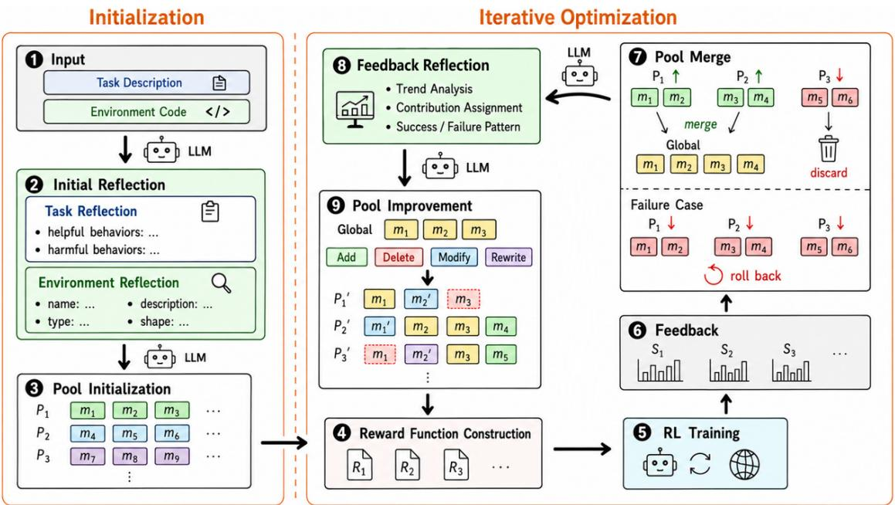  
Figure 1 | Overview of the MLREF pipeline. In the initialization phase (steps 1–3), the LLM performs task and environment reflection and <sub>g</sub>enerates diverse module <sub>p</sub>ool variants. In the iterative o<sub>p</sub>timization <sub>p</sub>hase (ste<sub>p</sub>s 4–9), each variant <sub>assem</sub>bl<sub>es a rewar</sub>d f<sub>unc</sub>ti<sub>on v</sub>i<sub>a we</sub>i<sub>g</sub>ht<sub>e</sub>d li<sub>near com</sub>bi<sub>na</sub>ti<sub>on</sub> f<sub>or</sub> RL <sub>eva</sub>l<sub>ua</sub>ti<sub>on; a merge s</sub>t<sub>ra</sub>t<sub>egy w</sub>ith <sub>ro</sub>llb<sub>ac</sub>k <sub>conso</sub>lid<sub>a</sub>t<sub>es</sub> <sub>success</sub>f<sub>u</sub>l <sub>mo</sub>d<sub>u</sub>l<sub>es; an</sub>d f<sub>ee</sub>db<sub>ac</sub>k <sub>re</sub>fl<sub>ec</sub>ti<sub>on gu</sub>id<sub>es</sub> th<sub>e nex</sub>t <sub>roun</sub>d <sub>o</sub>f <sub>poo</sub>l i<sub>mprovemen</sub>t<sub>.</sub>

Th<sub>e</sub> k<sub>ey</sub> d<sub>epar</sub>t<sub>ure</sub> f<sub>rom pr</sub>i<sub>or wor</sub>k li<sub>es</sub> i<sub>n w</sub>h<sub>a</sub>t i<sub>s</sub> b<sub>e</sub>i<sub>ng op</sub>ti<sub>m</sub>i<sub>ze</sub>d<sub>.</sub> I<sub>n</sub> MLREF<sub>, a rewar</sub>d f<sub>unc</sub>ti<sub>on</sub> i<sub>s on</sub>l<sub>y a</sub> temporary instance assembled from the pool for RL evaluation; the pool itself is the persistent object that <sub>accumu</sub>l<sub>a</sub>t<sub>es ev</sub>id<sub>ence an</sub>d i<sub>mproves over</sub> it<sub>era</sub>ti<sub>ons.</sub> A<sub>s a resu</sub>lt<sub>, e</sub>f<sub>ec</sub>ti<sub>ve mo</sub>d<sub>u</sub>l<sub>es pers</sub>i<sub>s</sub>t b<sub>eyon</sub>d th<sub>e</sub> f<sub>unc</sub>ti<sub>on</sub> th<sub>a</sub>t i<sub>n</sub>t<sub>ro</sub>d<sub>uce</sub>d th<sub>em an</sub>d <sub>are ac</sub>ti<sub>ve</sub>l<sub>y reuse</sub>d i<sub>n su</sub>b<sub>sequen</sub>t it<sub>era</sub>ti<sub>ons;</sub> t<sub>ra</sub>i<sub>n</sub>i<sub>ng</sub> f<sub>ee</sub>db<sub>ac</sub>k i<sub>s app</sub>li<sub>e</sub>d <sub>a</sub>t th<sub>e</sub> <sub>mo</sub>d<sub>u</sub>l<sub>e</sub> l<sub>eve</sub>l<sub>, ena</sub>bli<sub>ng</sub> fi<sub>ner-gra</sub>i<sub>ne</sub>d <sub>an</sub>d <sub>more</sub> t<sub>arge</sub>t<sub>e</sub>d <sub>op</sub>ti<sub>m</sub>i<sub>za</sub>ti<sub>on</sub> th<sub>an</sub> f<sub>unc</sub>ti<sub>on-</sub>l<sub>eve</sub>l <sub>rewr</sub>iti<sub>ng.</sub>

## 4.2. Module Pool

B<sub>e</sub>l<sub>ow</sub> <sub>we</sub> d<sub>escr</sub>ib<sub>e</sub> th<sub>e</sub> th<sub>ree</sub> <sub>s</sub>t<sub>ages</sub> <sub>o</sub>f <sub>poo</sub>l <sub>evo</sub>l<sub>u</sub>ti<sub>on:</sub> i<sub>n</sub>iti<sub>a</sub>li<sub>za</sub>ti<sub>on,</sub> i<sub>mprovemen</sub>t<sub>,</sub> <sub>an</sub>d <sub>merge.</sub>

## 4.2.1 Pool Initialization

I<sub>n</sub> th<sub>e</sub> fi<sub>rs</sub>t it<sub>era</sub>ti<sub>on,</sub> MLREF <sub>cons</sub>t<sub>ruc</sub>t<sub>s</sub> <sub>a</sub> <sub>mo</sub>d<sub>u</sub>l<sub>e</sub> <sub>poo</sub>l f<sub>rom</sub> <sub>scra</sub>t<sub>c</sub>h<sub>.</sub> Th<sub>e</sub> i<sub>n</sub>iti<sub>a</sub>li<sub>za</sub>ti<sub>on</sub> <sub>procee</sub>d<sub>s</sub> i<sub>n</sub> t<sub>wo</sub> <sub>s</sub>t<sub>eps:</sub> <sub>spec</sub>ifi<sub>ca</sub>ti<sub>on genera</sub>ti<sub>on an</sub>d <sub>mo</sub>d<sub>u</sub>l<sub>e</sub> i<sub>mp</sub>l<sub>emen</sub>t<sub>a</sub>ti<sub>on.</sub> A <sub>mo</sub>d<sub>u</sub>l<sub>e</sub>’<sub>s spec</sub>ifi<sub>ca</sub>ti<sub>on</sub> i<sub>s</sub> it<sub>s me</sub>t<sub>a</sub>d<sub>a</sub>t<sub>a, cons</sub>i<sub>s</sub>ti<sub>ng o</sub>f th<sub>e mo</sub>d<sub>u</sub>l<sub>e name,</sub> i<sub>npu</sub>t <sub>var</sub>i<sub>a</sub>bl<sub>e names an</sub>d t<sub>ypes, an</sub>d <sub>a na</sub>t<sub>ura</sub>l<sub>-</sub>l<sub>anguage</sub> d<sub>escr</sub>i<sub>p</sub>ti<sub>on o</sub>f it<sub>s</sub> i<sub>n</sub>t<sub>en</sub>d<sub>e</sub>d f<sub>unc</sub>ti<sub>on.</sub> I<sub>n</sub> th<sub>e</sub> <sub>spec</sub>ifi<sub>ca</sub>ti<sub>on</sub> <sub>genera</sub>ti<sub>on</sub> <sub>s</sub>t<sub>ep,</sub> th<sub>e</sub> LLM <sub>genera</sub>t<sub>es</sub> <sub>a</sub> <sub>se</sub>t <sub>o</sub>f <sub>mo</sub>d<sub>u</sub>l<sub>e</sub> <sub>spec</sub>ifi<sub>ca</sub>ti<sub>ons</sub> th<sub>a</sub>t <sub>co</sub>ll<sub>ec</sub>ti<sub>ve</sub>l<sub>y</sub> <sub>cover</sub> th<sub>e</sub> di<sub>verse requ</sub>i<sub>remen</sub>t<sub>s o</sub>f th<sub>e</sub> t<sub>as</sub>k<sub>, gu</sub>id<sub>e</sub>d b<sub>y</sub> th<sub>e</sub> t<sub>as</sub>k d<sub>escr</sub>i<sub>p</sub>ti<sub>on, env</sub>i<sub>ronmen</sub>t <sub>co</sub>d<sub>e, an</sub>d i<sub>n</sub>iti<sub>a</sub>l <sub>re</sub>fl<sub>ec</sub>ti<sub>on.</sub> I<sub>n</sub> th<sub>e</sub> i<sub>mp</sub>l<sub>emen</sub>t<sub>a</sub>ti<sub>on s</sub>t<sub>ep,</sub> th<sub>e</sub> LLM <sub>genera</sub>t<sub>es</sub> P<sub>y</sub>th<sub>on co</sub>d<sub>e</sub> f<sub>or eac</sub>h <sub>mo</sub>d<sub>u</sub>l<sub>e</sub> b<sub>ase</sub>d <sub>on</sub> it<sub>s spec</sub>ifi<sub>ca</sub>ti<sub>on.</sub> S<sub>epara</sub>ti<sub>ng</sub> <sub>spec</sub>ifi<sub>ca</sub>ti<sub>on</sub> f<sub>rom</sub> i<sub>mp</sub>l<sub>emen</sub>t<sub>a</sub>ti<sub>on</sub> i<sub>mproves genera</sub>ti<sub>on qua</sub>lit<sub>y</sub> b<sub>y</sub> l<sub>e</sub>tti<sub>ng</sub> th<sub>e</sub> LLM f<sub>ocus on one su</sub>bt<sub>as</sub>k <sub>per</sub> <sup>r</sup>espo<sup>n</sup>se.

## 4.2.2 Pool Improvement

F<sub>rom</sub> th<sub>e</sub> <sub>secon</sub>d it<sub>era</sub>ti<sub>on</sub> <sub>onwar</sub>d<sub>,</sub> MLREF <sub>re</sub>fi<sub>nes</sub> th<sub>e</sub> <sub>ex</sub>i<sub>s</sub>ti<sub>ng</sub> <sub>mo</sub>d<sub>u</sub>l<sub>e</sub> <sub>poo</sub>l<sub>.</sub> I<sub>mprovemen</sub>t <sub>a</sub>l<sub>so</sub> f<sub>o</sub>ll<sub>ows</sub> <sub>a</sub> t<sub>wo-s</sub>t<sub>ep s</sub>t<sub>ruc</sub>t<sub>ure:</sub> i<sub>mprovemen</sub>t <sub>p</sub>l<sub>an</sub> d<sub>es</sub>i<sub>gn an</sub>d i<sub>mprovemen</sub>t <sub>p</sub>l<sub>an execu</sub>ti<sub>on.</sub> I<sub>n</sub> th<sub>e p</sub>l<sub>an</sub> d<sub>es</sub>i<sub>gn s</sub>t<sub>ep,</sub> th<sub>e</sub> LLM <sub>pro</sub>d<sub>uces an</sub> i<sub>mprovemen</sub>t <sub>p</sub>l<sub>an</sub> b<sub>ase</sub>d <sub>on</sub> th<sub>e</sub> t<sub>ra</sub>i<sub>n</sub>i<sub>ng s</sub>t<sub>a</sub>ti<sub>s</sub>ti<sub>cs an</sub>d f<sub>ee</sub>db<sub>ac</sub>k <sub>re</sub>fl<sub>ec</sub>ti<sub>on.</sub> W<sub>e a</sub>ll<sub>ow</sub> f<sub>our</sub> t<sub>ypes</sub> <sub>o</sub>f <sub>opera</sub>ti<sub>ons</sub> <sub>on</sub> <sub>mo</sub>d<sub>u</sub>l<sub>es:</sub>

Algorithm 1 MLREF Iterative Optimization   
Require: Task description �, environment code �, LLM M, RL trainer A, merge strategy Merge, max iterations   
�<sub>, para</sub>ll<sub>e</sub>l <sub>samp</sub>l<sub>es</sub> �   
Ensure: Best reward function �<sup>∗</sup>   
P<sub>global</sub> ← ∅, P<sub>prev</sub> ← ∅, S<sub>best</sub> ← ∅, �<sup>∗</sup> ← ∅   
for iter = 1 to � do   
// Stage 1: Module pool generation or improvement   
if iter = 1 then   
ref ← M.Reflect(�, �) // Initial Reflection   
for � = 1 to � in parallel do   
P<sub>�</sub> ← M.InitPool(�, �, ref) // Pool Initialization   
end for   
else   
ref ← M.Reflect(S <sub>rev</sub>, S<sub>best</sub>, P <sub>rev</sub>, P <sub>lobal</sub>) // Feedback Reflection   
for � = 1 to � in parallel do   
P<sub>�</sub> ← M.ImprovePool(�, �, ref, P <sub>lobal</sub>) // Pool Improvement   
end for   
end if   
// Stage 2: Reward construction and RL evaluation   
for � = 1 to � in parallel do   
�<sub>�</sub> ← ConstructReward(P<sub>�</sub>) // Weighted linear combination (Eq. 1)   
S<sub>�</sub> ← A.Train(�<sub>,</sub> �<sub>�</sub>)   
end for   
// Stage 3: Pool merge and best selection   
P <sub>l b l</sub> ← Merge({P<sub>�</sub>}, {S<sub>�</sub>}) // Accumulate or rollback   
(S <sub>rev</sub>, P <sub>rev</sub>) ← argmax S<sub>�</sub> // Select the best pool   
if S > S<sub>b</sub> then   
S<sub>b t</sub> ← S <sub>rev</sub>, �<sup>∗</sup> ← corres<sub>p</sub>ondin<sub>g</sub> reward of $S _ { \mathrm { p r e v } }$   
end if   
end for   
return �<sup>∗</sup>

1. Add. Introduce a new module by providing its specification (analogous to initialization).

2. Delete. Remove a module that is redundant or empirically harmful.

3. Modify. Revise a module’s code while keeping its specification fixed (e.g., fixing incorrect structure or unsuitable out<sub>p</sub>ut scale).

4. Rewrite. Replace both the specification and the code when the specification itself is deficient.

F<sub>or</sub> <sub>eac</sub>h <sub>opera</sub>ti<sub>on,</sub> th<sub>e</sub> LLM <sub>a</sub>l<sub>so</sub> <sub>prov</sub>id<sub>es</sub> <sub>a</sub> <sub>ra</sub>ti<sub>ona</sub>l<sub>e.</sub> I<sub>n</sub> th<sub>e</sub> <sub>execu</sub>ti<sub>on</sub> <sub>s</sub>t<sub>ep,</sub> th<sub>e</sub> LLM i<sub>mp</sub>l<sub>emen</sub>t<sub>s</sub> th<sub>e</sub> <sub>concre</sub>t<sub>e</sub> <sub>co</sub>d<sub>e</sub> <sub>c</sub>h<sub>anges</sub> <sub>re</sub>l<sub>a</sub>ti<sub>ng</sub> t<sub>o</sub> <sub>new</sub> <sub>mo</sub>d<sub>u</sub>l<sub>es,</sub> <sub>mo</sub>difi<sub>e</sub>d <sub>mo</sub>d<sub>u</sub>l<sub>es</sub> <sub>an</sub>d <sub>rewr</sub>itt<sub>en</sub> <sub>mo</sub>d<sub>u</sub>l<sub>es</sub> <sub>accor</sub>di<sub>ng</sub> t<sub>o</sub> th<sub>e</sub> <sub>p</sub>l<sub>an.</sub> Thi<sub>s</sub> two-step <sup>d</sup>ecompos<sup>i</sup>t<sup>i</sup>on aga<sup>i</sup>n <sup>i</sup>mproves output qua<sup>li</sup>ty <sup>b</sup>y separat<sup>i</sup>ng p<sup>l</sup>ann<sup>i</sup>ng <sup>f</sup>rom co<sup>di</sup>ng. By operat<sup>i</sup>ng at th<sub>e per-mo</sub>d<sub>u</sub>l<sub>e</sub> l<sub>eve</sub>l<sub>,</sub> MLREF <sub>ac</sub>hi<sub>eves</sub> fi<sub>ner-gra</sub>i<sub>ne</sub>d <sub>con</sub>t<sub>ro</sub>l <sub>over rewar</sub>d f<sub>unc</sub>ti<sub>on op</sub>ti<sub>m</sub>i<sub>za</sub>ti<sub>on</sub> th<sub>an pr</sub>i<sub>or</sub> f<sub>unc</sub>ti<sub>on-</sub>l<sub>eve</sub>l <sub>approac</sub>h<sub>es.</sub>

## 4.2.3 Pool Merge

At each iteration, MLREF produces � module pool variants in parallel and consolidates them via a module-wise merge. First, variants whose RL performance falls below the historical best by more than a margin � are di<sub>scar</sub>d<sub>e</sub>d<sub>.</sub> All <sub>mo</sub>d<sub>u</sub>l<sub>es</sub> f<sub>rom surv</sub>i<sub>v</sub>i<sub>ng var</sub>i<sub>an</sub>t<sub>s are</sub> th<sub>en co</sub>ll<sub>ec</sub>t<sub>e</sub>d i<sub>n</sub>t<sub>o a s</sub>i<sub>ng</sub>l<sub>e se</sub>t<sub>; w</sub>h<sub>en mu</sub>lti<sub>p</sub>l<sub>e var</sub>i<sub>an</sub>t<sub>s</sub> <sub>con</sub>t<sub>a</sub>i<sub>n mo</sub>d<sub>u</sub>l<sub>es w</sub>ith th<sub>e same name,</sub> th<sub>e</sub> b<sub>es</sub>t<sub>-per</sub>f<sub>orm</sub>i<sub>ng vers</sub>i<sub>on</sub> i<sub>s re</sub>t<sub>a</sub>i<sub>ne</sub>d<sub>.</sub> Si<sub>nce a</sub>ll <sub>var</sub>i<sub>an</sub>t<sub>s</sub> d<sub>er</sub>i<sub>ve</sub> f<sub>rom</sub> th<sub>e same</sub> b<sub>ase poo</sub>l<sub>,</sub> thi<sub>s merge conso</sub>lid<sub>a</sub>t<sub>es</sub> di<sub>verse</sub> i<sub>mprovemen</sub>t <sub>p</sub>l<sub>ans w</sub>ith<sub>ou</sub>t <sub>sacr</sub>ifi<sub>c</sub>i<sub>ng qua</sub>lit<sub>y.</sub> If <sub>no var</sub>i<sub>an</sub>t <sub>mee</sub>t<sub>s</sub> th<sub>e</sub> th<sub>res</sub>h<sub>o</sub>ld<sub>,</sub> MLREF <sub>ro</sub>ll<sub>s</sub> b<sub>ac</sub>k t<sub>o</sub> th<sub>e prev</sub>i<sub>ous poo</sub>l<sub>.</sub> Thi<sub>s ro</sub>llb<sub>ac</sub>k <sub>mec</sub>h<sub>an</sub>i<sub>sm</sub> i<sub>s cen</sub>t<sub>ra</sub>l t<sub>o</sub> MLREF’<sub>s</sub> iterative stability: it prevents a single poor iteration from destroying the entire optimization trajectory. The f<sub>a</sub>il<sub>e</sub>d <sub>a</sub>tt<sub>emp</sub>t<sub>s are recor</sub>d<sub>e</sub>d <sub>an</sub>d f<sub>e</sub>d i<sub>n</sub>t<sub>o</sub> th<sub>e nex</sub>t <sub>roun</sub>d <sub>o</sub>f f<sub>ee</sub>db<sub>ac</sub>k <sub>re</sub>fl<sub>ec</sub>ti<sub>on, encourag</sub>i<sub>ng</sub> th<sub>e</sub> LLM t<sub>o exp</sub>l<sub>ore</sub> dif<sub>eren</sub>t <sub>s</sub>t<sub>ra</sub>t<sub>eg</sub>i<sub>es.</sub>

## 4.3. Reflection

D<sub>esp</sub>it<sub>e</sub> d<sub>ecompos</sub>i<sub>ng comp</sub>l<sub>ex processes</sub> i<sub>n</sub>t<sub>o mu</sub>lti<sub>p</sub>l<sub>e s</sub>t<sub>eps,</sub> LLM <sub>ou</sub>t<sub>pu</sub>t<sub>s can s</sub>till <sub>su</sub>f<sub>er</sub> f<sub>rom</sub> h<sub>a</sub>ll<sub>uc</sub>i<sub>na</sub>ti<sub>on</sub> (<sub>p</sub>roducin<sub>g</sub> invalid code that crashes RL trainin<sub>g</sub>) or insuficient reasonin<sub>g</sub> (<sub>y</sub>ieldin<sub>g</sub> subo<sub>p</sub>timal module desi<sub>g</sub>ns). To im<sub>p</sub>rove out<sub>p</sub>ut stabilit<sub>y</sub> and <sub>q</sub>ualit<sub>y</sub>, we introduce a reflection mechanism ins<sub>p</sub>ired b<sub>y</sub> <sub>p</sub>rior work (Li et al., 2025c; Sun et al., 2025b) usin<sub>g</sub> chain-of-thou<sub>g</sub>ht <sub>p</sub>rom<sub>p</sub>tin<sub>g</sub>. As shown in Fi<sub>g</sub>. 1 (ste<sub>p</sub>s 2 and 8), MLREF <sub>emp</sub>l<sub>oys</sub> t<sub>wo</sub> t<sub>ypes o</sub>f <sub>re</sub>fl<sub>ec</sub>ti<sub>on:</sub> i<sub>n</sub>iti<sub>a</sub>l <sub>re</sub>fl<sub>ec</sub>ti<sub>on</sub> b<sub>e</sub>f<sub>ore</sub> th<sub>e</sub> fi<sub>rs</sub>t it<sub>era</sub>ti<sub>on, an</sub>d f<sub>ee</sub>db<sub>ac</sub>k <sub>re</sub>fl<sub>ec</sub>ti<sub>on</sub> b<sub>e</sub>f<sub>ore</sub> <sub>eac</sub>h <sub>su</sub>b<sub>sequen</sub>t i<sub>mprovemen</sub>t<sub>.</sub>

## 4.3.1 Initial Reflection

Before the first pool initialization, MLREF conducts initial reflection in two parts. Task reflection prompts the LLM t<sub>o ana</sub>l<sub>yze</sub> th<sub>e</sub> t<sub>as</sub>k d<sub>escr</sub>i<sub>p</sub>ti<sub>on,</sub> id<sub>en</sub>tif<sub>y</sub>i<sub>ng con</sub>diti<sub>ons</sub> f<sub>or success,</sub> b<sub>e</sub>h<sub>av</sub>i<sub>ors</sub> lik<sub>e</sub>l<sub>y</sub> t<sub>o</sub> h<sub>e</sub>l<sub>p or</sub> hi<sub>n</sub>d<sub>er</sub> <sub>per</sub>f<sub>ormance,</sub> <sub>an</sub>d <sub>non-o</sub>b<sub>v</sub>i<sub>ous</sub> <sub>s</sub>t<sub>ra</sub>t<sub>eg</sub>i<sub>es</sub> <sub>wor</sub>th <sub>exp</sub>l<sub>or</sub>i<sub>ng.</sub> W<sub>e</sub> <sub>exp</sub>li<sub>c</sub>itl<sub>y</sub> <sub>encourage</sub> di<sub>vers</sub>it<sub>y</sub> <sub>an</sub>d f<sub>or</sub>bid <sub>concre</sub>t<sub>e</sub> code generation at this stage. Environment reflection extracts relevant observation variables including their <sub>names,</sub> t<sub>ypes,</sub> t<sub>ensor s</sub>h<sub>apes, an</sub>d d<sub>escr</sub>i<sub>p</sub>ti<sub>ons</sub> f<sub>rom</sub> th<sub>e env</sub>i<sub>ronmen</sub>t <sub>co</sub>d<sub>e, w</sub>hi<sub>c</sub>h <sub>prov</sub>id<sub>es a re</sub>f<sub>erence</sub> f<sub>or</sub> d<sub>owns</sub>t<sub>ream</sub> <sub>mo</sub>d<sub>u</sub>l<sub>e</sub> d<sub>es</sub>i<sub>gn</sub> <sub>an</sub>d <sub>a</sub> <sub>va</sub>lidit<sub>y</sub> <sub>c</sub>h<sub>ec</sub>k <sub>aga</sub>i<sub>ns</sub>t <sub>un</sub>d<sub>e</sub>fi<sub>ne</sub>d <sub>var</sub>i<sub>a</sub>bl<sub>es.</sub> T<sub>as</sub>k <sub>an</sub>d <sub>env</sub>i<sub>ronmen</sub>t <sub>re</sub>fl<sub>ec</sub>ti<sub>ons</sub> <sub>are separa</sub>t<sub>e</sub>d t<sub>o ensure</sub> d<sub>ep</sub>th i<sub>n eac</sub>h<sub>, an</sub>d th<sub>e resu</sub>lti<sub>ng ana</sub>l<sub>ys</sub>i<sub>s</sub> i<sub>s reuse</sub>d d<sub>ur</sub>i<sub>ng a</sub>ll <sub>su</sub>b<sub>sequen</sub>t <sub>poo</sub>l <sup>im</sup>p<sup>r</sup>o<sup>v</sup>e<sup>m</sup>e<sup>nt</sup> s<sup>t</sup>eps.

## 4.3.2 Feedback Reflection

F<sub>rom</sub> th<sub>e secon</sub>d it<sub>era</sub>ti<sub>on onwar</sub>d<sub>,</sub> MLREF <sub>per</sub>f<sub>orms</sub> f<sub>ee</sub>db<sub>ac</sub>k <sub>re</sub>fl<sub>ec</sub>ti<sub>on on</sub> th<sub>e prev</sub>i<sub>ous roun</sub>d’<sub>s</sub> t<sub>ra</sub>i<sub>n</sub>i<sub>ng</sub> <sub>ou</sub>t<sub>come</sub> b<sub>e</sub>f<sub>ore</sub> <sub>p</sub>l<sub>ann</sub>i<sub>ng</sub> <sub>poo</sub>l i<sub>mprovemen</sub>t<sub>s.</sub>

If trainin<sub>g</sub> com<sub>p</sub>leted successfull<sub>y</sub>, the LLM receives the historical best <sub>p</sub>ool (with its module com<sub>p</sub>osition and trainin<sub>g</sub> results) alon<sub>g</sub>side the <sub>p</sub>revious round’s <sub>p</sub>ool, im<sub>p</sub>rovement <sub>p</sub>lan, and results. It anal<sub>y</sub>zes reward trends <sub>per</sub> <sub>mo</sub>d<sub>u</sub>l<sub>e,</sub> <sub>compares</sub> <sub>mo</sub>d<sub>u</sub>l<sub>e</sub> d<sub>es</sub>i<sub>gn</sub> <sub>an</sub>d <sub>compos</sub>iti<sub>on</sub> b<sub>e</sub>t<sub>ween</sub> th<sub>e</sub> t<sub>wo</sub> <sub>roun</sub>d<sub>s,</sub> <sub>an</sub>d <sub>a</sub>tt<sub>r</sub>ib<sub>u</sub>t<sub>es</sub> <sub>per</sub>f<sub>ormance</sub> <sub>c</sub>h<sub>anges</sub> t<sub>o spec</sub>ifi<sub>c poo</sub>l dif<sub>erences.</sub> Wh<sub>en</sub> th<sub>e prev</sub>i<sub>ous roun</sub>d <sub>ac</sub>hi<sub>eves a new</sub> b<sub>es</sub>t<sub>,</sub> th<sub>e</sub> LLM <sub>ex</sub>t<sub>rac</sub>t<sub>s success</sub>f<sub>u</sub>l d<sub>es</sub>i<sub>gn pa</sub>tt<sub>erns</sub> t<sub>o re</sub>i<sub>n</sub>f<sub>orce; w</sub>h<sub>en per</sub>f<sub>ormance regresses,</sub> it di<sub>agnoses wea</sub>k<sub>nesses</sub> i<sub>n</sub> th<sub>e</sub> i<sub>mprovemen</sub>t <sub>p</sub>l<sub>an</sub> <sub>an</sub>d <sub>proposes</sub> <sub>new</sub> di<sub>rec</sub>ti<sub>ons.</sub>

If t<sub>ra</sub>i<sub>n</sub>i<sub>n encoun</sub>t<sub>ere</sub>d <sub>an error,</sub> th<sub>e</sub> LLM i<sub>ns</sub>t<sub>ea</sub>d <sub>rece</sub>i<sub>ves</sub> th<sub>e error</sub> t<sub>race,</sub> th<sub>e rev</sub>i<sub>ous</sub> i<sub>m rovemen</sub>t l<sub>an, an</sub>d th<sub>e env</sub>i<sub>ronmen</sub>t <sub>co</sub>d<sub>e.</sub> It l<sub>oca</sub>t<sub>es</sub> th<sub>e error source, ana</sub>l<sub>yzes</sub> it<sub>s cause, an</sub>d <sub>sugges</sub>t<sub>s concre</sub>t<sub>e measures</sub> t<sub>o avo</sub>id <sub>s</sub>i<sub>m</sub>il<sub>ar</sub> f<sub>a</sub>il<sub>ures</sub> i<sub>n</sub> f<sub>u</sub>t<sub>ure</sub> it<sub>era</sub>ti<sub>ons.</sub>

A<sub>s</sub> <sub>w</sub>ith i<sub>n</sub>iti<sub>a</sub>l <sub>re</sub>fl<sub>ec</sub>ti<sub>on,</sub> <sub>we</sub> <sub>encourage</sub> th<sub>e</sub> LLM t<sub>o</sub> <sub>exp</sub>l<sub>ore</sub> di<sub>verse</sub> h<sub>ypo</sub>th<sub>eses</sub> <sub>an</sub>d f<sub>or</sub>bid it f<sub>rom</sub> <sub>genera</sub>ti<sub>ng</sub> <sub>concre</sub>t<sub>e</sub> i<sub>mprovemen</sub>t <sub>p</sub>l<sub>ans or co</sub>d<sub>e</sub> d<sub>ur</sub>i<sub>ng</sub> thi<sub>s s</sub>t<sub>ep, preserv</sub>i<sub>ng a c</sub>l<sub>ean separa</sub>ti<sub>on</sub> b<sub>e</sub>t<sub>ween ana</sub>l<sub>ys</sub>i<sub>s an</sub>d <sub>execu</sub>ti<sub>on.</sub>

## 4.4. Weight Optimization

A<sub>ss</sub>i<sub>gn</sub>i<sub>ng</sub> <sub>appropr</sub>i<sub>a</sub>t<sub>e</sub> <sub>we</sub>i<sub>g</sub>ht<sub>s</sub> t<sub>o</sub> <sub>mo</sub>d<sub>u</sub>l<sub>es</sub> i<sub>s</sub> <sub>cr</sub>iti<sub>ca</sub>l<sub>:</sub> dif<sub>eren</sub>t <sub>mo</sub>d<sub>u</sub>l<sub>es</sub> <sub>vary</sub> i<sub>n</sub> i<sub>mpor</sub>t<sub>ance</sub> <sub>an</sub>d <sub>ou</sub>t<sub>pu</sub>t <sub>mag-</sub> <sub>n</sub>it<sub>u</sub>d<sub>e,</sub> <sub>so</sub> <sub>un</sub>if<sub>orm</sub> <sub>we</sub>i<sub>g</sub>hti<sub>ng</sub> i<sub>s</sub> <sub>su</sub>b<sub>op</sub>ti<sub>ma</sub>l<sub>,</sub> <sub>w</sub>hil<sub>e</sub> <sub>re</sub>l<sub>y</sub>i<sub>ng</sub> <sub>so</sub>l<sub>e</sub>l<sub>y</sub> <sub>on</sub> th<sub>e</sub> LLM t<sub>o</sub> <sub>ass</sub>i<sub>gn</sub> <sub>we</sub>i<sub>g</sub>ht<sub>s</sub> l<sub>ea</sub>d<sub>s</sub> t<sub>o</sub> inconsistency across iterations. MLREF addresses this with a hybrid weight optimization strategy that combines LLM-based semantic judgment with empirical evidence from RL training.

Each module maintains two credit scores. LLM credit captures the LLM’s assessment of a module’s relevance: <sub>a</sub>ft<sub>er poo</sub>l i<sub>n</sub>iti<sub>a</sub>li<sub>za</sub>ti<sub>on or</sub> i<sub>mprovemen</sub>t<sub>,</sub> th<sub>e</sub> LLM i<sub>s promp</sub>t<sub>e</sub>d t<sub>o se</sub>l<sub>ec</sub>t <sub>mo</sub>d<sub>u</sub>l<sub>es an</sub>d <sub>propose</sub> i<sub>n</sub>iti<sub>a</sub>l <sub>we</sub>i<sub>g</sub>ht<sub>s,</sub> which are normalized to form LLM credits (with unselected modules receiving zero). Correlation credit captures th<sub>e mo</sub>d<sub>u</sub>l<sub>e</sub>’<sub>s emp</sub>i<sub>r</sub>i<sub>ca</sub>l <sub>con</sub>t<sub>r</sub>ib<sub>u</sub>ti<sub>on: we compu</sub>t<sub>e</sub> th<sub>e</sub> P<sub>earson corre</sub>l<sub>a</sub>ti<sub>on</sub> b<sub>e</sub>t<sub>ween</sub> th<sub>e mo</sub>d<sub>u</sub>l<sub>e</sub>’<sub>s rewar</sub>d <sub>sequence an</sub>d th<sub>e per</sub>f<sub>ormance curve</sub> d<sub>ur</sub>i<sub>ng</sub> t<sub>ra</sub>i<sub>n</sub>i<sub>ng,</sub> i<sub>ncorpora</sub>ti<sub>ng a</sub> ti<sub>me-</sub>l<sub>ag compensa</sub>ti<sub>on</sub> t<sub>o accoun</sub>t f<sub>or</sub> d<sub>e</sub>l<sub>aye</sub>d <sub>e</sub>f<sub>ec</sub>t<sub>s o</sub>f <sub>rewar</sub>d<sub>s on per</sub>f<sub>ormance.</sub> B<sub>o</sub>th th<sub>e raw rewar</sub>d<sub>–per</sub>f<sub>ormance corre</sub>l<sub>a</sub>ti<sub>on an</sub>d th<sub>e corre</sub>l<sub>a</sub>ti<sub>on</sub> <sub>o</sub>f th<sub>e</sub>i<sub>r</sub> t<sub>empora</sub>l dif<sub>erences are com</sub>bi<sub>ne</sub>d i<sub>n</sub>t<sub>o a s</sub>i<sub>ng</sub>l<sub>e corre</sub>l<sub>a</sub>ti<sub>on score.</sub> T<sub>o preven</sub>t <sub>cre</sub>dit <sub>va</sub>l<sub>ues</sub> f<sub>rom</sub> <sub>osc</sub>ill<sub>a</sub>ti<sub>ng</sub> <sub>across</sub> it<sub>era</sub>ti<sub>ons,</sub> b<sub>o</sub>th LLM <sub>an</sub>d <sub>corre</sub>l<sub>a</sub>ti<sub>on</sub> <sub>cre</sub>dit<sub>s</sub> <sub>are</sub> <sub>smoo</sub>th<sub>e</sub>d <sub>v</sub>i<sub>a</sub> <sub>exponen</sub>ti<sub>a</sub>l <sub>mov</sub>i<sub>ng</sub> <sub>average.</sub>

B<sub>e</sub>f<sub>ore com</sub>bi<sub>n</sub>i<sub>ng</sub> th<sub>e</sub> t<sub>wo cre</sub>dit<sub>s, we norma</sub>li<sub>ze</sub> th<sub>em</sub> t<sub>o compara</sub>bl<sub>e ranges:</sub> li<sub>near norma</sub>li<sub>za</sub>ti<sub>on</sub> f<sub>or</sub> th<sub>e</sub> non-ne<sub>g</sub>ative LLM credit, and softmax normalization for the si<sub>g</sub>ned correlation credit (am<sub>p</sub>lif<sub>y</sub>in<sub>g</sub> the distinction between <sub>p</sub>ositivel<sub>y</sub> and ne<sub>g</sub>ativel<sub>y</sub> correlated modules). The normalized scores are then fused into a com<sub>p</sub>osite score via a wei<sub>g</sub>hted sum. For module selection, we a<sub>pp</sub>l<sub>y</sub> an u<sub>pp</sub>er confidence bound (UCB) term over the <sub>compos</sub>it<sub>e score</sub> t<sub>o</sub> b<sub>a</sub>l<sub>ance exp</sub>l<sub>o</sub>it<sub>a</sub>ti<sub>on o</sub>f hi<sub>g</sub>h<sub>-scor</sub>i<sub>ng mo</sub>d<sub>u</sub>l<sub>es w</sub>ith <sub>exp</sub>l<sub>ora</sub>ti<sub>on o</sub>f <sub>un</sub>d<sub>eruse</sub>d <sub>ones.</sub> Th<sub>e</sub> t<sub>op-</sub>� <sub>mo</sub>d<sub>u</sub>l<sub>es</sub> b<sub>y</sub> UCB <sub>score are se</sub>l<sub>ec</sub>t<sub>e</sub>d<sub>, an</sub>d th<sub>e</sub>i<sub>r compos</sub>it<sub>e scores are use</sub>d di<sub>rec</sub>tl<sub>y as</sub> th<sub>e we</sub>i<sub>g</sub>ht<sub>s ��</sub> i<sub>n</sub> th<sub>e</sub> linear combination (E<sub>q</sub>. 1). The full mathematical formulation is <sub>p</sub>rovided in the Technical Su<sub>pp</sub>lement.

## 5. Experiments

## 5.1. Experimental Setup

We evaluate MLREF on 17 re<sub>p</sub>resentative tasks from Isaac G<sub>y</sub>m (Makovi<sub>y</sub>chuk et al., 2021) and Bi-DexHands (Chen et al., 2022), coverin<sub>g</sub> locomotion and dexterous mani<sub>p</sub>ulation challen<sub>g</sub>es (see Table 2 for the full list) to answer the followin<sub>g</sub> <sub>q</sub>uestions: (i) How does MLREF <sub>p</sub>erform com<sub>p</sub>ared to state-of-the-art baselines? (ii) How do individual com<sub>p</sub>onents of MLREF contribute to its <sub>p</sub>erformance? (iii) How stable is the reward evolution <sub>p</sub>rocess under MLREF?

W<sub>e compare aga</sub>i<sub>ns</sub>t t<sub>wo s</sub>t<sub>a</sub>t<sub>e-o</sub>f<sub>-</sub>th<sub>e-ar</sub>t b<sub>ase</sub>li<sub>nes:</sub>

EUREKA (Ma et al., 2024) generates reward function variants at each iteration by prompting the LLM to i<sub>mprove upon</sub> th<sub>e prev</sub>i<sub>ous</sub> b<sub>es</sub>t <sub>can</sub>did<sub>a</sub>t<sub>e, us</sub>i<sub>ng</sub> th<sub>e</sub> t<sub>as</sub>k d<sub>escr</sub>i<sub>p</sub>ti<sub>on, env</sub>i<sub>ronmen</sub>t <sub>co</sub>d<sub>e, an</sub>d t<sub>ra</sub>i<sub>n</sub>i<sub>ng</sub> f<sub>ee</sub>db<sub>ac</sub>k<sub>.</sub> W<sub>e</sub> f<sub>o</sub>ll<sub>ow</sub> th<sub>e or</sub>i<sub>g</sub>i<sub>na</sub>l <sub>con</sub>fi<sub>gura</sub>ti<sub>on:</sub> 5 it<sub>era</sub>ti<sub>ons w</sub>ith 16 <sub>samp</sub>l<sub>es per</sub> it<sub>era</sub>ti<sub>on.</sub>

RF-Agent (Gao et al., 2026) maintains a Monte Carlo tree over the reward space, selecting promising nodes f<sub>or</sub> t<sub>arge</sub>t<sub>e</sub>d <sub>op</sub>ti<sub>m</sub>i<sub>za</sub>ti<sub>on, eva</sub>l<sub>ua</sub>ti<sub>ng</sub> th<sub>em v</sub>i<sub>a</sub> RL<sub>, an</sub>d b<sub>ac</sub>k<sub>-propaga</sub>ti<sub>ng</sub> th<sub>e resu</sub>lt<sub>s.</sub> W<sub>e se</sub>t th<sub>e num</sub>b<sub>er o</sub>f MCTS u<sub>p</sub>dates to 80<sub>,</sub> matchin<sub>g</sub> the total RL trainin<sub>g</sub> bud<sub>g</sub>et of EUREKA.

F<sub>or</sub> MLREF<sub>,</sub> t<sub>o m</sub>iti<sub>ga</sub>t<sub>e</sub> th<sub>e ran</sub>d<sub>omness</sub> i<sub>n</sub>t<sub>ro</sub>d<sub>uce</sub>d b<sub>y</sub> th<sub>e</sub> LLM<sub>, we run eac</sub>h t<sub>as</sub>k f<sub>or</sub> 3 i<sub>n</sub>d<sub>epen</sub>d<sub>en</sub>t <sub>comp</sub>l<sub>e</sub>t<sub>e</sub> pipeline executions and return the reward function from the best execution. Each execution consists of � = 9 iterations with � = 3 parallel module pool variants per iteration, yielding a total RL training budget comparable t<sub>o</sub> th<sub>e</sub> b<sub>ase</sub>li<sub>nes.</sub>

F<sub>or eac</sub>h <sub>a</sub>l<sub>gor</sub>ith<sub>m on eac</sub>h t<sub>as</sub>k<sub>,</sub> RL t<sub>ra</sub>i<sub>n</sub>i<sub>ng runs</sub> f<sub>or</sub> 3<sub>,</sub>000 <sub>epoc</sub>h<sub>s w</sub>ithi<sub>n eac</sub>h it<sub>era</sub>ti<sub>on.</sub> Aft<sub>er</sub> th<sub>e</sub> fi<sub>na</sub>l <sub>rewar</sub>d f<sub>unc</sub>ti<sub>on</sub> i<sub>s pro</sub>d<sub>uce</sub>d<sub>, we eva</sub>l<sub>ua</sub>t<sub>e</sub> it b<sub>y</sub> t<sub>ra</sub>i<sub>n</sub>i<sub>ng a po</sub>li<sub>cy</sub> f<sub>rom scra</sub>t<sub>c</sub>h f<sub>or</sub> 20<sub>,</sub>000 <sub>epoc</sub>h<sub>s us</sub>i<sub>ng</sub> PPO <sub>w</sub>ith 5 inde<sub>p</sub>endent random seeds, followin<sub>g</sub> the RL confi<sub>g</sub>uration of EUREKA (Ma et al., 2024).

All LLM calls use the Dee Seek-V4-Flash model (Xu et al., 2026) in reasonin mode via the oficial API. Full h<sub>yp</sub>er<sub>p</sub>arameter confi<sub>g</sub>urations and LLM <sub>p</sub>rom<sub>p</sub>t tem<sub>p</sub>lates are <sub>p</sub>rovided in the Technical Su<sub>pp</sub>lement. The environment settin<sub>g</sub> follows the confi<sub>g</sub>uration of EUREKA (Ma et al., 2024).

## 5.2. Main Results

To answer Q1, table 2 reports the performance of MLREF compared to EUREKA and RF-Agent across all 17 t<sub>as</sub>k<sub>s.</sub> W<sub>e repor</sub>t th<sub>e mean an</sub>d <sub>s</sub>t<sub>an</sub>d<sub>ar</sub>d d<sub>ev</sub>i<sub>a</sub>ti<sub>on o</sub>f th<sub>e raw per</sub>f<sub>ormance me</sub>t<sub>r</sub>i<sub>cs.</sub> F<sub>or</sub> l<sub>ocomo</sub>ti<sub>on</sub> t<sub>as</sub>k<sub>s, we</sub> raw−s<sub>p</sub>arse (Gao et al., 2026); hi<sub>g</sub>her values indicate better <sub>p</sub>erformance. Bold indicates the best mean result.

Across the 17 tasks<sub>,</sub> MLREF achieves the best avera<sub>g</sub>e <sub>p</sub>erformance in both cate<sub>g</sub>ories. For locomotion<sub>,</sub> MLREF <sub>a</sub>tt<sub>a</sub>i<sub>ns</sub> th<sub>e</sub> hi h<sub>es</sub>t <sub>mean on</sub> 4 <sub>o</sub>f 7 t<sub>as</sub>k<sub>s, w</sub>ith <sub>an avera e norma</sub>li<sub>ze</sub>d <sub>score o</sub>f 3<sub>.</sub>288<sub>, re resen</sub>ti<sub>n a</sub> 25<sub>.</sub>2% i<sub>mprovemen</sub>t <sub>over</sub> th<sub>e</sub> b<sub>es</sub>t b<sub>ase</sub>li<sub>ne.</sub> Th<sub>e ga</sub>i<sub>n</sub> i<sub>s mos</sub>t <sub>s</sub>t<sub>r</sub>iki<sub>ng on</sub> F<sub>ran</sub>k<sub>a</sub> C<sub>a</sub>bi<sub>ne</sub>t<sub>, w</sub>h<sub>ere</sub> MLREF <sub>approac</sub>h<sub>es</sub> the maximum <sub>p</sub>ossible score (0.997 vs. 0.701 of the nearest baseline). For mani<sub>p</sub>ulation, althou<sub>g</sub>h MLREF obtains the best individual result on onl<sub>y</sub> 2 of 10 tasks, its avera<sub>g</sub>e <sub>p</sub>erformance (0.708) is the hi<sub>g</sub>hest amon<sub>g</sub> <sub>a</sub>ll <sub>me</sub>th<sub>o</sub>d<sub>s, y</sub>i<sub>e</sub>ldi<sub>ng a</sub> 6<sub>.</sub>6% i<sub>mprovemen</sub>t <sub>over</sub> th<sub>e</sub> b<sub>es</sub>t b<sub>ase</sub>li<sub>ne, w</sub>ith <sub>par</sub>ti<sub>cu</sub>l<sub>ar</sub>l<sub>y s</sub>t<sub>rong resu</sub>lt<sub>s on</sub> Bl<sub>oc</sub>k St<sub>ac</sub>k <sub>an</sub>d Lift U<sub>n</sub>d<sub>erarm.</sub> Th<sub>ese resu</sub>lt<sub>s</sub> d<sub>emons</sub>t<sub>ra</sub>t<sub>e</sub> th<sub>a</sub>t <sub>sys</sub>t<sub>ema</sub>ti<sub>c mo</sub>d<sub>u</sub>l<sub>e-</sub>l<sub>eve</sub>l <sub>managemen</sub>t <sub>v</sub>i<sub>a</sub> th<sub>e mo</sub>d<sub>u</sub>l<sub>e</sub> <sub>poo</sub>l l<sub>ea</sub>d<sub>s</sub> t<sub>o more e</sub>f<sub>ec</sub>ti<sub>ve rewar</sub>d f<sub>unc</sub>ti<sub>ons</sub> th<sub>an</sub> f<sub>unc</sub>ti<sub>on-</sub>l<sub>eve</sub>l <sub>op</sub>ti<sub>m</sub>i<sub>za</sub>ti<sub>on approac</sub>h<sub>es.</sub>

MLREF: Eficient Module Reuse for Reward Design
<table><tr><td>Task</td><td>EUREKA</td><td>RF-Agent</td><td>MLREF (Ours)</td></tr><tr><td colspan="4">Locomotion</td></tr><tr><td>Allegro Hand</td><td> $2 5 . 4 8 \pm 1 . 2 7$ </td><td> $2 7 . 4 1 \pm 1 . 9 0$ </td><td> $\pm { \bf 8 . 8 9 } \pm { \bf 1 . 3 6 }$ </td></tr><tr><td>Ant</td><td> $1 2 . 3 5 \pm 1 . 2 9$ </td><td> $1 2 . 3 4 \pm 0 . 7 0$ </td><td> $\mathbf { 1 2 . 4 7 \pm 0 . 3 0 }$ </td></tr><tr><td>Anymal</td><td> $\mathbf { - 0 . 0 0 5 7 \pm 0 . 0 0 2 1 }$ </td><td> $- 0 . 0 0 6 4 \pm 0 . 0 0 1 0$ </td><td> $- 0 . 0 0 7 3 \pm 0 . 0 0 1 9$ </td></tr><tr><td>Franka Cabinet</td><td> $0 . 3 9 7 \pm 0 . 2 0 2$ </td><td> $0 . 7 0 1 \pm 0 . 2 0 0$ </td><td> $\mathbf { 0 . 9 9 7 \pm 0 . 0 0 6 }$ </td></tr><tr><td>Humanoid</td><td> $7 . 9 5 \pm 0 . 8 7$ </td><td> $5 . 5 6 \pm 1 . 6 3$ </td><td> $7 . 4 0 \pm 1 . 1 2$ </td></tr><tr><td>Quadcopter</td><td> $- 0 . 0 4 2 \pm 0 . 0 0 7$ </td><td> $- 0 . 2 7 7 \pm 0 . 4 8 5$ </td><td> $\mathbf { - 0 . 0 4 0 \pm 0 . 0 1 1 }$ </td></tr><tr><td>Shadow Hand</td><td> ${ \bf 1 7 . 1 1 \pm 2 . 1 7 }$ </td><td> $1 6 . 5 3 \pm 1 . 6 5$ </td><td> $1 1 . 7 5 \pm 9 . 6 9$ </td></tr><tr><td>Avg. Normalized Score</td><td>2.135</td><td>2.625</td><td> $3 . 2 8 8 \ ( + 2 5 . 2 \% )$ </td></tr><tr><td colspan="4">Manipulation</td></tr><tr><td>Block Stack</td><td> $0 . 1 1 6 \pm 0 . 0 5 0$ </td><td> $0 . 1 3 9 \pm 0 . 0 9 6$ </td><td> $\mathbf { 0 . 3 1 3 \pm 0 . 2 4 4 }$ </td></tr><tr><td>Bottle Cap</td><td> $\mathbf { 0 . 9 9 4 \pm 0 . 0 0 4 }$ </td><td> $0 . 9 9 2 \pm 0 . 0 1 0$ </td><td> $0 . 9 8 7 \pm 0 . 0 1 2$ </td></tr><tr><td>Catch Abreast</td><td> $\mathbf { 0 . 7 1 8 \pm 0 . 0 6 6 }$ </td><td> $0 . 6 5 7 \pm 0 . 0 4 7$ </td><td> $0 . 6 4 4 \pm 0 . 0 5 9$ </td></tr><tr><td>Catch Underarm</td><td> $\mathbf { 0 . 9 1 0 \pm 0 . 0 1 0 }$ </td><td> $0 . 9 0 9 \pm 0 . 0 1 6$ </td><td> $0 . 8 7 1 \pm 0 . 0 3 3$ </td></tr><tr><td>Door Close Outward</td><td> $0 . 2 6 6 \pm 0 . 1 2 9$ </td><td> $\mathbf { 0 . 4 1 5 \pm 0 . 2 6 5 }$ </td><td> $0 . 2 5 6 \pm 0 . 0 8 4$ </td></tr><tr><td>Grasp and Place</td><td> $\mathbf { 0 . 7 1 0 \pm 0 . 3 4 5 }$ </td><td> $0 . 1 8 2 \pm 0 . 1 3 0$ </td><td> $0 . 4 7 5 \pm 0 . 0 4 0$ </td></tr><tr><td>Kettle</td><td> $0 . 4 4 1 \pm 0 . 3 7 6$ </td><td> $\mathbf { 1 . 0 0 0 \pm 0 . 0 0 0 }$ </td><td> $0 . 9 0 1 \pm 0 . 1 9 8$ </td></tr><tr><td>Lift Underarm</td><td> $0 . 5 6 9 \pm 0 . 4 6 5$ </td><td> $0 . 5 1 2 \pm 0 . 3 9 4$ </td><td> $\mathbf { 0 . 9 3 0 \pm 0 . 0 2 2 }$ </td></tr><tr><td>Over</td><td> $0 . 9 6 8 \pm 0 . 0 0 7$ </td><td> $\mathbf { 0 . 9 8 5 \pm 0 . 0 0 2 }$ </td><td> $0 . 9 6 6 \pm 0 . 0 1 1$ </td></tr><tr><td>Swing Cup</td><td> $\mathbf { 0 . 9 4 5 \pm 0 . 0 9 3 }$ </td><td> $0 . 7 2 1 \pm 0 . 3 6 3$ </td><td> $0 . 7 3 6 \pm 0 . 2 9 4$ </td></tr><tr><td>Avg. Performance</td><td>0.664</td><td>0.651</td><td> $\mathbf { 0 . 7 0 8 \ ( + 6 . 6 \% ) }$ </td></tr></table>

Table 2 | Performance comparison across 17 tasks. Each row shows the mean and standard deviation of the raw performance <sub>me</sub>t<sub>r</sub>i<sub>c.</sub> Th<sub>e score o</sub>f l<sub>ocomo</sub>ti<sub>on</sub> t<sub>as</sub>k<sub>s</sub> i<sub>s norma</sub>li<sub>ze</sub>d b<sub>e</sub>f<sub>ore averag</sub>i<sub>ng.</sub> Th<sub>e percen</sub>t<sub>age</sub> i<sub>mprovemen</sub>t i<sub>s re</sub>l<sub>a</sub>ti<sub>ve</sub> t<sub>o</sub> th<sub>e</sub> b<sub>es</sub>t b<sub>ase</sub>li<sub>ne.</sub> B<sub>o</sub>ld i<sub>n</sub>di<sub>ca</sub>t<sub>es</sub> th<sub>e</sub> b<sub>es</sub>t <sub>mean resu</sub>lt<sub>.</sub>
<table><tr><td>Method</td><td>Ant</td><td>Block Stack</td><td>Bottle Cap</td><td>Avg. % of Full</td></tr><tr><td>Full MLREF</td><td> $\mathbf { 1 2 . 4 7 \pm 0 . 3 0 }$ </td><td> $\mathbf { 0 . 3 1 3 \pm 0 . 2 4 4 }$ </td><td> $0 . 9 8 7 \pm 0 . 0 1 2$ </td><td>100.0%</td></tr><tr><td>GPT-40</td><td> $1 0 . 7 7 \pm 1 . 9 5$ </td><td> $0 . 1 0 1 \pm 0 . 0 4 2$ </td><td> $0 . 0 4 1 \pm 0 . 0 2 7$ </td><td>40.9%</td></tr><tr><td>No Pool</td><td> $1 1 . 5 1 \pm 0 . 6 4$ </td><td> $0 . 0 8 5 \pm 0 . 0 4 0$ </td><td> $\mathbf { 0 . 9 8 8 \pm 0 . 0 1 0 }$ </td><td>73.2%</td></tr><tr><td>No Reflection</td><td> $9 . 5 8 \pm 0 . 5 5$ </td><td> $0 . 0 5 7 \pm 0 . 0 3 2$ </td><td> $0 . 6 3 9 \pm 0 . 4 0 1$ </td><td>53.3%</td></tr><tr><td>No Weight Opt.</td><td> $1 1 . 6 8 \pm 1 . 1 4$ </td><td> $0 . 0 4 4 \pm 0 . 0 2 5$ </td><td> $0 . 8 2 9 \pm 0 . 3 3 8$ </td><td>63.9%</td></tr></table>

Table 3 | Ablation results on three representative tasks. Best results are bold.

## 5.3. Ablation Study

To answer Q2, we conduct ablation ex<sub>p</sub>eriments on three re<sub>p</sub>resentative tasks (Ant, Bottle Ca<sub>p</sub>, Block Stack) b<sub>y remov</sub>i<sub>ng or rep</sub>l<sub>ac</sub>i<sub>ng</sub> i<sub>n</sub>di<sub>v</sub>id<sub>ua</sub>l <sub>mec</sub>h<sub>an</sub>i<sub>sms</sub> f<sub>rom</sub> th<sub>e</sub> f<sub>u</sub>ll MLREF f<sub>ramewor</sub>k<sub>:</sub>

1. GPT-4o: replace the LLM backbone (DeepSeek-V4-Flash) with GPT-4o model (OpenAI, 2024).

2. No Pool: remove the module pool; at each iteration, the LLM directly generates a complete reward function<sub>,</sub> analo<sub>g</sub>ous to EUREKA.

3. No Reflection: remove both initial and feedback reflection; the LLM generates and improves pools di<sub>rec</sub>tl<sub>y</sub> f<sub>rom</sub> th<sub>e</sub> t<sub>as</sub>k d<sub>escr</sub>i<sub>p</sub>ti<sub>on an</sub>d <sub>raw</sub> t<sub>ra</sub>i<sub>n</sub>i<sub>ng</sub> f<sub>ee</sub>db<sub>ac</sub>k<sub>.</sub>

4. No Weight Opt.: remove the hybrid weight optimization strategy; the LLM selects modules and assigns <sub>we</sub>i<sub>g</sub>ht<sub>s w</sub>ith<sub>ou</sub>t <sub>emp</sub>i<sub>r</sub>i<sub>ca</sub>l <sub>cre</sub>dit <sub>ass</sub>i<sub>gnmen</sub>t<sub>.</sub>

T<sub>a</sub>bl<sub>e</sub> 3 <sub>repor</sub>t<sub>s</sub> th<sub>e resu</sub>lt<sub>s.</sub> All <sub>o</sub>th<sub>er exper</sub>i<sub>men</sub>t<sub>a</sub>l <sub>se</sub>tti<sub>ngs rema</sub>i<sub>n</sub> id<sub>en</sub>ti<sub>ca</sub>l t<sub>o</sub> th<sub>e</sub> f<sub>u</sub>ll MLREF <sub>con</sub>fi<sub>gura</sub>ti<sub>on.</sub>

Th<sub>e</sub> f<sub>u</sub>ll MLREF f<sub>ramewor</sub>k <sub>ac</sub>hi<sub>eves</sub> th<sub>e</sub> b<sub>es</sub>t <sub>or near-</sub>b<sub>es</sub>t <sub>per</sub>f<sub>ormance across a</sub>ll t<sub>as</sub>k<sub>s.</sub> R<sub>ep</sub>l<sub>ac</sub>i<sub>ng</sub> th<sub>e</sub> LLM backbone with GPT-4o causes the most severe de<sub>g</sub>radation (Av<sub>g</sub>. 40.9%), thou<sub>g</sub>h MLREF still im<sub>p</sub>roves over it<sub>era</sub>ti<sub>ons,</sub> i<sub>n</sub>di<sub>ca</sub>ti<sub>n</sub> th<sub>a</sub>t <sub>oo</sub>l <sub>evo</sub>l<sub>u</sub>ti<sub>on can accumu</sub>l<sub>a</sub>t<sub>e e</sub>f<sub>ec</sub>ti<sub>ve mo</sub>d<sub>u</sub>l<sub>es even</sub> f<sub>rom a wea</sub>k i<sub>n</sub>iti<sub>a</sub>li<sub>za</sub>ti<sub>on.</sub> Disablin<sub>g</sub> reflection incurs the most consistent de<sub>g</sub>radation (Av<sub>g</sub>. 53.3%), hi<sub>g</sub>hli<sub>g</sub>htin<sub>g</sub> its critical role in stabilizin<sub>g</sub> o<sub>p</sub>timization. The No Pool variant matches the full framework on Bottle Ca<sub>p</sub> (0.988 vs. 0.987) d<sub>ue</sub> t<sub>o seren</sub>di<sub>p</sub>it<sub>ous exp</sub>l<sub>ora</sub>ti<sub>on,</sub> b<sub>u</sub>t <sub>w</sub>ith<sub>ou</sub>t th<sub>e poo</sub>l<sub>, success</sub>f<sub>u</sub>l d<sub>es</sub>i<sub>gns canno</sub>t b<sub>e s</sub>t<sub>a</sub>bl<sub>y</sub> i<sub>n</sub>h<sub>er</sub>it<sub>e</sub>d<sub>.</sub> W<sub>e</sub> <sub>a</sub>l<sub>so o</sub>b<sub>serve</sub>d th<sub>a</sub>t <sub>on</sub>l th<sub>e</sub> f<sub>u</sub>ll MLREF f<sub>ramewor</sub>k <sub>cons</sub>i<sub>s</sub>t<sub>en</sub>tl <sub>enera</sub>li<sub>ze</sub>d f<sub>rom va</sub>lid<sub>a</sub>ti<sub>on</sub> t<sub>o</sub> t<sub>es</sub>t<sub>: across a</sub>ll th<sub>ree</sub> t<sub>as</sub>k<sub>s,</sub> th<sub>e rewar</sub>d <sub>se</sub>l<sub>ec</sub>t<sub>e</sub>d b<sub>y</sub> it<sub>s</sub> hi<sub>g</sub>h<sub>es</sub>t <sub>va</sub>lid<sub>a</sub>ti<sub>on score rema</sub>i<sub>ne</sub>d th<sub>e</sub> b<sub>es</sub>t <sub>a</sub>t t<sub>es</sub>t ti<sub>me.</sub> I<sub>n con</sub>t<sub>ras</sub>t<sub>,</sub> th<sub>e</sub> <sub>a</sub>bl<sub>a</sub>t<sub>e</sub>d <sub>var</sub>i<sub>an</sub>t<sub>s</sub> f<sub>requen</sub>tl<sub>y pro</sub>d<sub>uce</sub>d <sub>rewar</sub>d<sub>s</sub> th<sub>a</sub>t <sub>score</sub>d <sub>we</sub>ll d<sub>ur</sub>i<sub>ng va</sub>lid<sub>a</sub>ti<sub>on</sub> b<sub>u</sub>t <sub>un</sub>d<sub>erper</sub>f<sub>orme</sub>d <sub>a</sub>t t<sub>es</sub>t<sub>,</sub> <sub>sugges</sub>ti<sub>ng a</sub> t<sub>en</sub>d<sub>ency</sub> t<sub>o over</sub>fit <sub>w</sub>h<sub>en</sub> i<sub>n</sub>di<sub>v</sub>id<sub>ua</sub>l <sub>componen</sub>t<sub>s are remove</sub>d<sub>.</sub>

## 5.4. Iterative Dynamics


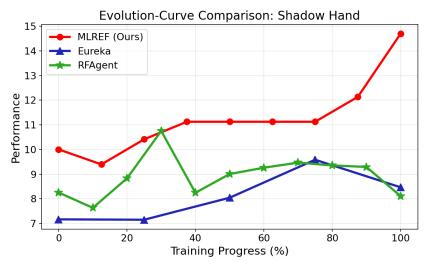

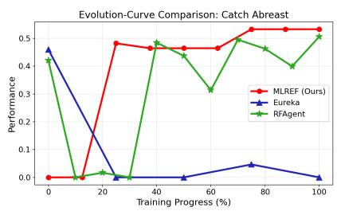  
Figure 2 | Performance evolution across iterations (best sample per iteration). Left: all-task average. Middle: Shadow H<sub>an</sub>d<sub>.</sub> Ri<sub>g</sub>ht<sub>:</sub> C<sub>a</sub>t<sub>c</sub>h Ab<sub>reas</sub>t<sub>.</sub> Sh<sub>a</sub>d<sub>e</sub>d <sub>areas</sub> d<sub>eno</sub>t<sub>e s</sub>t<sub>an</sub>d<sub>ar</sub>d d<sub>ev</sub>i<sub>a</sub>ti<sub>on.</sub>

To answer Q3, Fi<sub>g</sub>ure 2 <sub>p</sub>resents the <sub>p</sub>erformance evolution across o<sub>p</sub>timization iterations on avera<sub>g</sub>e (left <sub>p</sub>anel) and for two re<sub>p</sub>resentative tasks (middle and ri<sub>g</sub>ht <sub>p</sub>anels). For each al<sub>g</sub>orithm, we track the <sub>p</sub>erformance <sub>o</sub>f th<sub>e</sub> b<sub>es</sub>t <sub>samp</sub>l<sub>e a</sub>t <sub>eac</sub>h it<sub>era</sub>ti<sub>on:</sub> f<sub>or</sub> MLREF<sub>,</sub> thi<sub>s</sub> i<sub>s</sub> th<sub>e</sub> b<sub>es</sub>t <sub>among a</sub>ll <sub>para</sub>ll<sub>e</sub>l <sub>poo</sub>l <sub>var</sub>i<sub>an</sub>t<sub>s across</sub> 3 inde<sub>p</sub>endent runs<sub>;</sub> for RF-A<sub>g</sub>ent<sub>,</sub> the best node ex<sub>p</sub>anded at each MCTS ste<sub>p;</sub> for EUREKA<sub>,</sub> the best amon<sub>g</sub> the 16 <sub>sa</sub>m<sub>p</sub>l<sub>es o</sub>f th<sub>a</sub>t it<sub>e</sub>r<sub>a</sub>ti<sub>o</sub>n<sub>.</sub> Sin<sub>ce</sub> th<sub>e</sub> thr<sub>ee</sub> m<sub>e</sub>th<sub>o</sub>d<sub>s ope</sub>r<sub>a</sub>t<sub>e</sub> with dif<sub>e</sub>r<sub>e</sub>nt it<sub>e</sub>r<sub>a</sub>ti<sub>o</sub>n <sub>cou</sub>nt<sub>s,</sub> w<sub>e</sub> n<sub>o</sub>rm<sub>a</sub>liz<sub>e</sub> th<sub>e</sub> horizontal axis to [0, 1] according to evolution progress. For the all-task average, we min-max normalize the <sub>per-</sub>t<sub>as</sub>k <sub>per</sub>f<sub>ormance</sub> t<sub>o ensure</sub> th<sub>a</sub>t <sub>eac</sub>h t<sub>as</sub>k <sub>con</sub>t<sub>r</sub>ib<sub>u</sub>t<sub>es equa</sub>ll<sub>y</sub> t<sub>o</sub> th<sub>e aggrega</sub>t<sub>e curve.</sub>

O<sub>n</sub> th<sub>e a</sub>ll<sub>-</sub>t<sub>as</sub>k <sub>avera e</sub> EUREKA b<sub>ene</sub>fit<sub>s</sub> f<sub>rom</sub> l<sub>ar e sam</sub> l<sub>e coun</sub>t<sub>s</sub> i<sub>n ear</sub>l it<sub>era</sub>ti<sub>ons</sub> b<sub>u</sub>t l<sub>a</sub>t<sub>eaus</sub> th<sub>erea</sub>ft<sub>er</sub> <sub>w</sub>hil<sub>e</sub> MLREF<sub>, s</sub>t<sub>ar</sub>ti<sub>ng</sub> f<sub>rom a</sub> l<sub>ower</sub> i<sub>n</sub>iti<sub>a</sub>l <sub>po</sub>i<sub>n</sub>t<sub>, ex</sub>hibit<sub>s cons</sub>i<sub>s</sub>t<sub>en</sub>t i<sub>mprovemen</sub>t th<sub>roug</sub>h <sub>mo</sub>d<sub>u</sub>l<sub>ar</sub> di<sub>rec</sub>t<sub>e</sub>d <sub>op</sub>ti<sub>m</sub>i<sub>za</sub>ti<sub>on;</sub> RF<sub>-</sub>A<sub>gen</sub>t’<sub>s</sub> MCTS<sub>-</sub>b<sub>ase</sub>d <sub>s</sub>t<sub>ra</sub>t<sub>egy y</sub>i<sub>e</sub>ld<sub>s</sub> i<sub>n</sub>t<sub>erme</sub>di<sub>a</sub>t<sub>e</sub> b<sub>e</sub>h<sub>av</sub>i<sub>or.</sub> O<sub>n</sub> Sh<sub>a</sub>d<sub>ow</sub> H<sub>an</sub>d <sub>an</sub>d C<sub>a</sub>t<sub>c</sub>h Ab<sub>reas</sub>t<sub>,</sub> b<sub>ase</sub>li<sub>nes su</sub>f<sub>er</sub> f<sub>rom severe per</sub>f<sub>ormance osc</sub>ill<sub>a</sub>ti<sub>on.</sub> I<sub>n par</sub>ti<sub>cu</sub>l<sub>ar,</sub> EUREKA d<sub>egra</sub>d<sub>es s</sub>h<sub>arp</sub>l<sub>y a</sub>ft<sub>er a</sub> strong first iteration on Catch Abreast. By contrast, MLREF maintains stable trajectories through its rollback <sub>mec</sub>h<sub>an</sub>i<sub>sm w</sub>hil<sub>e con</sub>ti<sub>nu</sub>i<sub>ng</sub> t<sub>o</sub> i<sub>mprove v</sub>i<sub>a</sub> it<sub>era</sub>ti<sub>ve re</sub>fi<sub>nemen</sub>t<sub>,</sub> d<sub>emons</sub>t<sub>ra</sub>ti<sub>ng s</sub>t<sub>rong op</sub>ti<sub>m</sub>i<sub>za</sub>ti<sub>on s</sub>t<sub>a</sub>bilit<sub>y.</sub> C<sub>omp</sub>l<sub>e</sub>t<sub>e</sub> <sub>evo</sub>l<sub>u</sub>ti<sub>on</sub> <sub>curves</sub> f<sub>or</sub> <sub>a</sub>ll 17 t<sub>as</sub>k<sub>s</sub> <sub>are</sub> <sub>prov</sub>id<sub>e</sub>d i<sub>n</sub> th<sub>e</sub> T<sub>ec</sub>h<sub>n</sub>i<sub>ca</sub>l S<sub>upp</sub>l<sub>emen</sub>t<sub>.</sub>

## 5.5. Discussion

O<sub>ur resu</sub>lt<sub>s</sub> d<sub>emons</sub>t<sub>ra</sub>t<sub>e</sub> th<sub>e e</sub>f<sub>ec</sub>ti<sub>veness o</sub>f <sub>mo</sub>d<sub>u</sub>l<sub>e-</sub>l<sub>eve</sub>l <sub>managemen</sub>t<sub>.</sub> S<sub>evera</sub>l li<sub>m</sub>it<sub>a</sub>ti<sub>ons sugges</sub>t di<sub>rec</sub>ti<sub>ons</sub> f<sub>or</sub> f<sub>u</sub>t<sub>ure wor</sub>k<sub>.</sub> Fi<sub>rs</sub>t<sub>, on sparse-rewar</sub>d <sub>man</sub>i<sub>pu</sub>l<sub>a</sub>ti<sub>on</sub> t<sub>as</sub>k<sub>s suc</sub>h <sub>as</sub> Bl<sub>oc</sub>k St<sub>ac</sub>k<sub>,</sub> MLREF’<sub>s a</sub>b<sub>so</sub>l<sub>u</sub>t<sub>e per</sub>f<sub>ormance</sub> <sub>rema</sub>i<sub>ns mo</sub>d<sub>es</sub>t<sub>, sugges</sub>ti<sub>ng s</sub>t<sub>ronger ear</sub>l<sub>y exp</sub>l<sub>ora</sub>ti<sub>on an</sub>d <sub>progress</sub>i<sub>ve exp</sub>l<sub>o</sub>it<sub>a</sub>ti<sub>on cou</sub>ld i<sub>mprove</sub> th<sub>e</sub> b<sub>a</sub>l<sub>ance.</sub> S<sub>econ</sub>d<sub>, ex</sub>t<sub>en</sub>di<sub>ng</sub> th<sub>e eva</sub>l<sub>ua</sub>ti<sub>on o</sub>f MLREF t<sub>o a</sub> b<sub>roa</sub>d<sub>er range o</sub>f LLM<sub>s,</sub> i<sub>nc</sub>l<sub>u</sub>di<sub>ng open-source mo</sub>d<sub>e</sub>l<sub>s,</sub> <sub>wou</sub>ld f<sub>ur</sub>th<sub>er</sub> <sub>va</sub>lid<sub>a</sub>t<sub>e</sub> it<sub>s</sub> <sub>genera</sub>lit<sub>y.</sub> Fi<sub>na</sub>ll<sub>y,</sub> <sub>w</sub>hil<sub>e</sub> MLREF <sub>curren</sub>tl<sub>y</sub> <sub>opera</sub>t<sub>es</sub> <sub>w</sub>ith <sub>a</sub> <sub>s</sub>i<sub>ng</sub>l<sub>e</sub> LLM<sub>,</sub> <sub>mu</sub>lti<sub>-</sub>LLM <sub>co</sub>ll<sub>a</sub>b<sub>ora</sub>ti<sub>on</sub> t<sub>o</sub> l<sub>everage</sub> di<sub>verse</sub> <sub>reason</sub>i<sub>ng</sub> <sub>an</sub>d k<sub>now</sub>l<sub>e</sub>d<sub>ge</sub> <sub>represen</sub>t<sub>s</sub> <sub>a</sub> <sub>prom</sub>i<sub>s</sub>i<sub>ng</sub> di<sub>rec</sub>ti<sub>on.</sub>

## 6. Conclusion

W<sub>e presen</sub>t<sub>e</sub>d MLREF<sub>, a mo</sub>d<sub>u</sub>l<sub>e poo</sub>l<sub>-</sub>b<sub>ase</sub>d f<sub>ramewor</sub>k th<sub>a</sub>t <sub>op</sub>ti<sub>m</sub>i<sub>zes reusa</sub>bl<sub>e rewar</sub>d <sub>mo</sub>d<sub>u</sub>l<sub>es</sub> th<sub>roug</sub>h <sub>sys-</sub> t<sub>ema</sub>ti<sub>c poo</sub>l<sub>-</sub>l<sub>eve</sub>l <sub>opera</sub>ti<sub>ons.</sub> U<sub>n</sub>lik<sub>e pr</sub>i<sub>or</sub> f<sub>unc</sub>ti<sub>on-</sub>l<sub>eve</sub>l <sub>approac</sub>h<sub>es,</sub> MLREF’<sub>s mo</sub>d<sub>u</sub>l<sub>e poo</sub>l <sub>ena</sub>bl<sub>es pers</sub>i<sub>s</sub>t<sub>en</sub>t <sub>accumu</sub>l<sub>a</sub>ti<sub>on, re</sub>fi<sub>nemen</sub>t<sub>, an</sub>d <sub>reuse o</sub>f <sub>rewar</sub>d <sub>componen</sub>t<sub>s across</sub> it<sub>era</sub>ti<sub>ons, suppor</sub>t<sub>e</sub>d b<sub>y re</sub>fl<sub>ec</sub>ti<sub>on,</sub> h<sub>y</sub>b<sub>r</sub>id <sub>cre</sub>dit <sub>ass</sub>i<sub>gnmen</sub>t<sub>,</sub> <sub>an</sub>d <sub>a</sub> <sub>ro</sub>llb<sub>ac</sub>k<sub>-equ</sub>i<sub>ppe</sub>d <sub>merge</sub> <sub>s</sub>t<sub>ra</sub>t<sub>egy</sub> th<sub>a</sub>t t<sub>oge</sub>th<sub>er</sub> <sub>ac</sub>hi<sub>eve</sub> it<sub>era</sub>ti<sub>ve</sub> <sub>s</sub>t<sub>a</sub>bilit<sub>y.</sub>

Ex<sub>p</sub>eriments on 17 tasks demonstrate that MLREF out<sub>p</sub>erforms state-of-the-art LLM-based reward desi<sub>g</sub>n <sub>me</sub>th<sub>o</sub>d<sub>s, ac</sub>hi<sub>ev</sub>i<sub>ng</sub> 25<sub>.</sub>2% <sub>average</sub> i<sub>mprovemen</sub>t i<sub>n</sub> l<sub>ocomo</sub>ti<sub>on an</sub>d 6<sub>.</sub>6% i<sub>n man</sub>i<sub>pu</sub>l<sub>a</sub>ti<sub>on.</sub> Abl<sub>a</sub>ti<sub>on s</sub>t<sub>u</sub>di<sub>es</sub> <sub>con</sub>fi<sub>rm</sub> th<sub>e con</sub>t<sub>r</sub>ib<sub>u</sub>ti<sub>ons o</sub>f <sub>eac</sub>h <sub>componen</sub>t<sub>, w</sub>ith <sub>re</sub>fl<sub>ec</sub>ti<sub>on</sub> b<sub>e</sub>i<sub>ng par</sub>ti<sub>cu</sub>l<sub>ar</sub>l<sub>y cr</sub>iti<sub>ca</sub>l<sub>.</sub> E<sub>vo</sub>l<sub>u</sub>ti<sub>on ana</sub>l<sub>ys</sub>i<sub>s</sub> further shows that MLREF maintains stable optimization trajectories through its rollback mechanism.

## References

Adams, S., Cody, T., and Beling, P. A. A survey of inverse reinforcement learning. Artificial Intelligence Review, 55(6):4307–4346, 2022.

Chen, M., Tworek, J., Jun, H., Yuan, Q., Pinto, H. P. D. O., Kaplan, J., Edwards, H., Burda, Y., Joseph, N., Brockman, G., et al. Evaluating large language models trained on code. arXiv preprint arXiv:2107.03374, 2021.

Chen<sub>,</sub> Y.<sub>,</sub> Wu<sub>,</sub> T.<sub>,</sub> Wan<sub>g,</sub> S.<sub>,</sub> Fen<sub>g,</sub> X.<sub>,</sub> Jian<sub>g,</sub> J.<sub>,</sub> Lu<sub>,</sub> Z.<sub>,</sub> McAleer<sub>,</sub> S.<sub>,</sub> Don<sub>g,</sub> H.<sub>,</sub> Zhu<sub>,</sub> S.-C.<sub>,</sub> and Yan<sub>g,</sub> Y. Towards human-level bimanual dexterous manipulation with reinforcement learning. In Koyejo, S., Mohamed, S., Agarwal, A., Belgrave, D., Cho, K., and Oh, A. (eds.), Advances in Neural Information Processing Systems, volume 35<sub>, pp</sub>. 5150–5163. Curran Associates<sub>,</sub> Inc.<sub>,</sub> 2022. URL htt<sub>p</sub>s://<sub>p</sub>roceedin<sub>g</sub>s.neuri<sub>p</sub>s.cc/<sub>p</sub>a<sub>p</sub>er<sub>\_</sub>files/ <sub>p</sub>a<sub>p</sub>er/2022/file/217a2a387f52c30755c37b0a73430291-Pa<sub>p</sub>er-Datasets<sub>\_</sub>and<sub>\_</sub>Benchmarks.<sub>p</sub>df.

Christiano<sub>,</sub> P. F.<sub>,</sub> Leike<sub>,</sub> J.<sub>,</sub> Brown<sub>,</sub> T.<sub>,</sub> Martic<sub>,</sub> M.<sub>,</sub> Le<sub>gg,</sub> S.<sub>,</sub> and Amodei<sub>,</sub> D. Dee<sub>p</sub> reinforcement learnin<sub>g</sub> from human preferences. Advances in neural information processing systems, 30, 2017.

Du<sub>,</sub> Y.<sub>,</sub> Watkins<sub>,</sub> O.<sub>,</sub> Wan<sub>g,</sub> Z.<sub>,</sub> Colas<sub>,</sub> C.<sub>,</sub> Darrell<sub>,</sub> T.<sub>,</sub> Abbeel<sub>,</sub> P.<sub>,</sub> Gu<sub>p</sub>ta<sub>,</sub> A.<sub>,</sub> and Andreas<sub>,</sub> J. Guidin<sub>g</sub> <sub>p</sub>retrainin<sub>g</sub> in reinforcement learning with large language models. In International Conference on Machine Learning, pp. 8657–8677. PMLR<sub>,</sub> 2023.

El<sub>guea-</sub>A<sub>gu</sub>i<sub>naco,</sub> Í<sub>.,</sub> S<sub>errano-</sub>M<sub>u</sub>ñ<sub>oz,</sub> A<sub>.,</sub> Ch<sub>rysostomou,</sub> D<sub>.,</sub> I<sub>nz</sub>i<sub>arte-</sub>Hid<sub>a</sub>l<sub>go,</sub> I<sub>.,</sub> B<sub>øg</sub>h<sub>,</sub> S<sub>.,</sub> <sub>an</sub>d A<sub>rana-</sub> Arexolaleiba, N. A review on reinforcement learning for contact-rich robotic manipulation tasks. Robotics and Computer-Integrated Manufacturing, 81:102517, 2023.

Eschmann, J. Reward Function Design in Reinforcement Learning, pp. 25–33. Springer International Publishing, Cham<sub>,</sub> 2021. ISBN 978-3-030-41188-6. doi: 10.1007/978-3-030-41188-6<sub>\_</sub>3. URL htt<sub>p</sub>s://doi.or<sub>g</sub>/10. 1007/978-3-030-41188-6<sub>\_</sub>3.

F<sub>an,</sub> H<sub>. an</sub>d D<sub>u,</sub> J<sub>.</sub> F<sub>org</sub>i<sub>ng</sub> b<sub>e</sub>tt<sub>er rewar</sub>d<sub>s:</sub> A <sub>mu</sub>lti<sub>-agen</sub>t LLM f<sub>ramewor</sub>k f<sub>or au</sub>t<sub>oma</sub>t<sub>e</sub>d <sub>rewar</sub>d <sub>evo</sub>l<sub>u</sub>ti<sub>on,</sub> 2025. URL htt<sub>p</sub>s://o<sub>p</sub>enreview.net/forum?id=Z6GStCfccl.

Gao<sub>,</sub> N.<sub>,</sub> Zhan<sub>g,</sub> X.<sub>,</sub> Jian<sub>g,</sub> X.<sub>,</sub> You<sub>,</sub> M.<sub>,</sub> Zhan<sub>g,</sub> M.<sub>,</sub> and Den<sub>g,</sub> Y. Rf-a<sub>g</sub>ent: automated reward function desi<sub>g</sub>n via language agent tree search. Advances in Neural Information Processing Systems, 38:172532–172577, 2026.

Goldwaser, A. and Thielscher, M. Deep reinforcement learning for general game playing. In Proceedings of the AAAI conference on artificial intelligence, volume 34, pp. 1701–1708, 2020.

Guo, Q., Liu, X., Hui, J., Liu, Z., and Huang, P. Utilizing large language models for robot skill reward shaping in reinforcement learning. In International Conference on Intelligent Robotics and Applications, pp. 3–17. S<sub>p</sub>rin<sub>g</sub>er<sub>,</sub> 2024.

Hare<sub>,</sub> J. Dealin<sub>g</sub> with s<sub>p</sub>arse rewards in reinforcement learnin<sub>g,</sub> 2019. URL htt<sub>p</sub>s://arxiv.or<sub>g</sub>/abs/1910.09281.

Hazra<sub>,</sub> R.<sub>,</sub> S<sub>yg</sub>kounas<sub>,</sub> A.<sub>,</sub> Persson<sub>,</sub> A.<sub>,</sub> Loutfi<sub>,</sub> A.<sub>,</sub> and Zuidber<sub>g</sub> Dos Martires<sub>,</sub> P. Revolve: Reward evolution with large language models using human feedback. In International Conference on Learning Representations, volume 2025<sub>, pp</sub>. 101949–101990<sub>,</sub> 2025.

Kwon, M., Xie, S. M., Bullard, K., and Sadigh, D. Reward design with language models. arXiv preprint arXiv:2303.00001, 2023.

Lewis, R. L., Singh, S., and Barto, A. G. Where do rewards come from. In Proceedings of the international symposium on AI-inspired biology, pp. 2601–2606, 2010.

Li, H., Yang, X., Wang, Z., Zhu, X., Zhou, J., Qiao, Y., Wang, X., Li, H., Lu, L., and Dai, J. Auto mc-reward: Automated dense reward design with large language models for minecraft. In Proceedings of the IEEE/CVF Conference on Computer Vision and Pattern Recognition, pp. 16426–16435, 2024.

Li<sub>,</sub> L<sub>.,</sub> Y<sub>uan,</sub> L<sub>.,</sub> Li<sub>u,</sub> P<sub>.,</sub> Ji<sub>ang,</sub> T<sub>.,</sub> <sub>an</sub>d Y<sub>u,</sub> Y<sub>.</sub> Ll<sub>m-ass</sub>i<sub>s</sub>t<sub>e</sub>d <sub>seman</sub>ti<sub>ca</sub>ll<sub>y</sub> di<sub>verse</sub> t<sub>eamma</sub>t<sub>e</sub> <sub>genera</sub>ti<sub>on</sub> f<sub>or</sub> <sub>e</sub>fi<sub>c</sub>i<sub>en</sub>t multi-agent coordination. In Forty-second International Conference on Machine Learning, 2025a.

Li, P., Jianye, H., Tang, H., Yuan, Y., Qiao, J., Dong, Z., and Zheng, Y. R\*: Eficient reward design via reward structure evolution and parameter alignment optimization with large language models. In Forty-second International Conference on Machine Learning, 2025b.

Li<sub>,</sub> P.<sub>,</sub> Tan<sub>g,</sub> H.<sub>,</sub> Yuan<sub>,</sub> Y.<sub>,</sub> and HAO<sub>,</sub> J. ReMAC: Lar<sub>g</sub>e lan<sub>g</sub>ua<sub>g</sub>e model-driven reward desi<sub>g</sub>n for multiagent manipulation collaboration. In Workshop on Scaling Environments for Agents, 2025c. URL https: //o<sub>p</sub>enreview.net/forum?id=CWYWhLho0a.

Ma<sub>,</sub> Y. J.<sub>,</sub> Lian<sub>g,</sub> W.<sub>,</sub> Wan<sub>g,</sub> G.<sub>,</sub> Huan<sub>g,</sub> D.-A.<sub>,</sub> Bastani<sub>,</sub> O.<sub>,</sub> Ja<sub>y</sub>araman<sub>,</sub> D.<sub>,</sub> Zhu<sub>,</sub> Y.<sub>,</sub> Fan<sub>,</sub> J.<sub>,</sub> et al. Eureka: Human-level reward design via coding large language models. In International conference on learning Representations, volume 2024, pp. 26516–26560, 2024.

Makovi<sub>y</sub>chuk<sub>,</sub> V.<sub>,</sub> Wawrz<sub>y</sub>niak<sub>,</sub> L.<sub>,</sub> Guo<sub>,</sub> Y.<sub>,</sub> Lu<sub>,</sub> M.<sub>,</sub> Store<sub>y,</sub> K.<sub>,</sub> Macklin<sub>,</sub> M.<sub>,</sub> Hoeller<sub>,</sub> D.<sub>,</sub> Rudin<sub>,</sub> N.<sub>,</sub> Allshire<sub>,</sub> A.<sub>,</sub> H<sub>an</sub>d<sub>a,</sub> A<sub>.,</sub> <sub>an</sub>d St<sub>a</sub>t<sub>e,</sub> G<sub>.</sub> I<sub>saac</sub> <sub>gym:</sub> Hi<sub>g</sub>h <sub>per</sub>f<sub>ormance</sub> <sub>gpu-</sub>b<sub>ase</sub>d <sub>p</sub>h<sub>ys</sub>i<sub>cs</sub> <sub>s</sub>i<sub>mu</sub>l<sub>a</sub>ti<sub>on</sub> f<sub>or</sub> <sub>ro</sub>b<sub>o</sub>t l<sub>earn</sub>i<sub>ng,</sub> 2021. URL htt<sub>p</sub>s://arxiv.or<sub>g</sub>/abs/2108.10470.

O<sub>p</sub>enAI. Hello <sub>gp</sub>t-4o. htt<sub>p</sub>s://o<sub>p</sub>enai.com/index/hello-<sub>gp</sub>t-4o/<sub>,</sub> 2024.

Ou<sub>y</sub>an<sub>g,</sub> L.<sub>,</sub> Wu<sub>,</sub> J.<sub>,</sub> Jian<sub>g,</sub> X.<sub>,</sub> Almeida<sub>,</sub> D.<sub>,</sub> Wainwri<sub>g</sub>ht<sub>,</sub> C.<sub>,</sub> Mishkin<sub>,</sub> P.<sub>,</sub> Zhan<sub>g,</sub> C.<sub>,</sub> A<sub>g</sub>arwal<sub>,</sub> S.<sub>,</sub> Slama<sub>,</sub> K.<sub>,</sub> Ray, A., et al. Training language models to follow instructions with human feedback. Advances in neural information processing systems, 35:27730–27744, 2022.

Puterman, M. L. Markov decision processes. Handbooks in operations research and management science, 2: 331–434<sub>,</sub> 1990.

R<sub>a</sub>d<sub>osavov</sub>i<sub>c,</sub> I<sub>.,</sub> Xi<sub>ao,</sub> T<sub>.,</sub> Zh<sub>ang,</sub> B<sub>.,</sub> D<sub>arre</sub>ll<sub>,</sub> T<sub>.,</sub> M<sub>a</sub>lik<sub>,</sub> J<sub>., an</sub>d S<sub>reena</sub>th<sub>,</sub> K<sub>.</sub> R<sub>ea</sub>l<sub>-wor</sub>ld h<sub>umano</sub>id l<sub>ocomo</sub>ti<sub>on</sub> with reinforcement learning. Science Robotics, 9(89):eadi9579, 2024.

St<sub>an</sub>t<sub>on,</sub> C<sub>.</sub> <sub>an</sub>d Cl<sub>une,</sub> J<sub>.</sub> D<sub>eep</sub> <sub>cur</sub>i<sub>os</sub>it<sub>y</sub> <sub>searc</sub>h<sub>:</sub> I<sub>n</sub>t<sub>ra-</sub>lif<sub>e</sub> <sub>exp</sub>l<sub>ora</sub>ti<sub>on</sub> i<sub>mproves</sub> <sub>per</sub>f<sub>ormance</sub> <sub>on</sub> <sub>c</sub>h<sub>a</sub>ll<sub>eng</sub>i<sub>ng</sub> deep reinforcement learning problems. arXiv preprint arXiv:1806.00553, 2018.

Sun<sub>,</sub> S.<sub>,</sub> Liu<sub>,</sub> R.<sub>,</sub> L<sub>y</sub>u<sub>,</sub> J.<sub>,</sub> Yan<sub>g,</sub> J.-W.<sub>,</sub> Zhan<sub>g,</sub> L.<sub>,</sub> and Li<sub>,</sub> X. A lar<sub>g</sub>e lan<sub>g</sub>ua<sub>g</sub>e model-driven reward desi<sub>g</sub>n framework via dynamic feedback for reinforcement learning. Knowledge-Based Systems, 326:114065, 2025a.

Sun<sub>,</sub> S.<sub>,</sub> L<sub>y</sub>u<sub>,</sub> J.<sub>,</sub> Liu<sub>,</sub> R.<sub>,</sub> Yan<sub>,</sub> M.<sub>,</sub> Liu<sub>,</sub> B.<sub>,</sub> Ye<sub>,</sub> D.<sub>,</sub> and Li<sub>,</sub> X. Prof: An llm-based reward code <sub>p</sub>reference optimization framework for ofline imitation learning. arXiv preprint arXiv:2511.13765, 2025b.

Sutton, R. S. and Barto, A. G. Reinforcement Learning: An Introduction. MIT Press, Cambridge, MA, USA, 1998. ISBN 0-262-19398-1. URL htt ://www.cs.ualberta.ca/%7Esutton/book/ebook/the-book.html.

Wei<sub>,</sub> D.<sub>,</sub> Yi<sub>,</sub> P.<sub>,</sub> Lei<sub>,</sub> J.<sub>,</sub> Hon<sub>g,</sub> Y.<sub>,</sub> Don<sub>g,</sub> H.<sub>,</sub> and Du<sub>,</sub> Y. An automated reinforcement learnin<sub>g</sub> reward desi<sub>g</sub>n framework with large language model for cooperative platoon coordination. IEEE Transactions on Intelligent Transportation Systems, 2026.

Wei, J., Wang, X., Schuurmans, D., Bosma, M., Xia, F., Chi, E., Le, Q. V., Zhou, D., et al. Chain-of-thought prompting elicits reasoning in large language models. Advances in neural information processing systems, 35: 24824–24837<sub>,</sub> 2022.

Wu<sub>,</sub> Y.<sub>,</sub> Fan<sub>,</sub> Y.<sub>,</sub> Lian<sub>g,</sub> P. P.<sub>,</sub> Azaria<sub>,</sub> A.<sub>,</sub> Li<sub>,</sub> Y.<sub>,</sub> and Mitchell<sub>,</sub> T. M. Read and rea<sub>p</sub> the rewards: Learnin<sub>g</sub> to <sub>p</sub>la<sub>y</sub> atari with the help of instruction manuals. Advances in Neural Information Processing Systems, 36:1009–1023, 2023.

Xie, T., Zhao, S., Wu, C., Liu, Y., Luo, Q., Zhong, V., Yang, Y., and Yu, T. Text2reward: Reward shaping with language models for reinforcement learning. In International Conference on Learning Representations, volume 2024<sub>, pp</sub>. 35663–35699<sub>,</sub> 2024.

Xu<sub>,</sub> A.<sub>,</sub> Lin<sub>,</sub> B.<sub>,</sub> Xue<sub>,</sub> B.<sub>,</sub> Wan<sub>g,</sub> B.<sub>,</sub> Xu<sub>,</sub> B.<sub>,</sub> Wu<sub>,</sub> B.<sub>,</sub> Zhan<sub>g,</sub> B.<sub>,</sub> Lin<sub>,</sub> C.<sub>,</sub> Don<sub>g,</sub> C.<sub>,</sub> Lin<sub>g,</sub> C.<sub>,</sub> et al. Dee<sub>p</sub>seek-v4: Towards highly eficient million-token context intelligence. arXiv preprint arXiv:2606.19348, 2026.

Yif<sub>an,</sub> H<sub>.,</sub> Bi<sub>n-</sub>Bi<sub>n,</sub> H<sub>.,</sub> B<sub>owen,</sub> Y<sub>.,</sub> <sub>an</sub>d H<sub>a</sub>i<sub>-</sub>T<sub>ao,</sub> Z<sub>.</sub> Ll<sub>m</sub> <sub>coac</sub>h<sub>:</sub> R<sub>ewar</sub>d <sub>s</sub>h<sub>ap</sub>i<sub>ng</sub> f<sub>or</sub> <sub>re</sub>i<sub>n</sub>f<sub>orcemen</sub>t l<sub>earn</sub>i<sub>ng-</sub> based navigation agent. In 2025 Joint International Conference on Automation-Intelligence-Safety (ICAIS) & International Symposium on Autonomous Systems (ISAS), pp. 1–6. IEEE, 2025.

Yu<sub>,</sub> W.<sub>,</sub> Gileadi<sub>,</sub> N.<sub>,</sub> Fu<sub>,</sub> C.<sub>,</sub> Kirmani<sub>,</sub> S.<sub>,</sub> Lee<sub>,</sub> K.-H.<sub>,</sub> Arenas<sub>,</sub> M. G.<sub>,</sub> Chian<sub>g,</sub> H.-T. L.<sub>,</sub> Erez<sub>,</sub> T.<sub>,</sub> Hasenclever<sub>,</sub> L.<sub>,</sub> Humplik, J., et al. Language to rewards for robotic skill synthesis. arXiv preprint arXiv:2306.08647, 2023.

Zhang, X., Du, C., Pang, T., Liu, Q., Gao, W., and Lin, M. Chain of preference optimization: Improving chain-of-thought reasoning in llms. Advances in Neural Information Processing Systems, 37:333–356, 2024.

Zhu, K. and Zhang, T. Deep reinforcement learning based mobile robot navigation: A review. Tsinghua Science and Technology, 26(5):674–691, 2021.

## Appendix

A Weight Optimization Details 14   
A.1 Credit Assi<sub>g</sub>nment 14   
A<sub>.</sub>2 C<sub>re</sub>dit N<sub>orma</sub>li<sub>za</sub>ti<sub>on an</sub>d F<sub>us</sub>i<sub>on</sub> 15   
A.3 Module Selection with UCB 15   
B Hyperparameters 15   
C Iterative Evolution Curves 16   
D LLM Prompt Templates 17   
D.1 S<sub>y</sub>stem Prom<sub>p</sub>t . 17   
D.2 JSON Out<sub>p</sub>ut Format Constraint . 18   
D.3 Initial Reflection Prom<sub>p</sub>ts 18   
D.4 Pool Initialization Prom<sub>p</sub>ts 19   
D.5 Pool Im<sub>p</sub>rovement Prom<sub>p</sub>t . 19   
D<sub>.</sub>6 F<sub>ee</sub>db<sub>ac</sub>k R<sub>e</sub>fl<sub>ec</sub>ti<sub>o</sub>n Pr<sub>o</sub>m<sub>p</sub>t<sub>s .</sub> 20   
D.7 Wei<sub>g</sub>ht Selection Prom<sub>p</sub>t . 22

## A. Weight Optimization Details

Thi<sub>s sec</sub>ti<sub>on prov</sub>id<sub>es</sub> th<sub>e ma</sub>th<sub>ema</sub>ti<sub>ca</sub>l f<sub>ormu</sub>l<sub>a</sub>ti<sub>on o</sub>f th<sub>e</sub> h<sub>y</sub>b<sub>r</sub>id <sub>we</sub>i<sub>g</sub>ht <sub>op</sub>ti<sub>m</sub>i<sub>za</sub>ti<sub>on s</sub>t<sub>ra</sub>t<sub>egy</sub> di<sub>scusse</sub>d i<sub>n</sub> th<sub>e ma</sub>i<sub>n paper.</sub> W<sub>e</sub> d<sub>escr</sub>ib<sub>e</sub> th<sub>e p</sub>i<sub>pe</sub>li<sub>ne</sub> i<sub>n</sub> th<sub>ree s</sub>t<sub>ages: cre</sub>dit <sub>ass</sub>i<sub>gnmen</sub>t<sub>, cre</sub>dit <sub>norma</sub>li<sub>za</sub>ti<sub>on an</sub>d f<sub>us</sub>i<sub>on,</sub> <sub>an</sub>d <sub>mo</sub>d<sub>u</sub>l<sub>e se</sub>l<sub>ec</sub>ti<sub>on.</sub>

## A.1. Credit Assignment

MLREF <sub>ma</sub>i<sub>n</sub>t<sub>a</sub>i<sub>ns</sub> t<sub>wo cre</sub>dit <sub>scores per mo</sub>d<sub>u</sub>l<sub>e:</sub> LLM <sub>cre</sub>dit <sub>an</sub>d <sub>corre</sub>l<sub>a</sub>ti<sub>on cre</sub>dit<sub>.</sub>

## A.1.1 LLM Credit

Aft<sub>er</sub> <sub>poo</sub>l i<sub>n</sub>iti<sub>a</sub>li<sub>za</sub>ti<sub>on</sub> <sub>or</sub> i<sub>mprovemen</sub>t<sub>,</sub> th<sub>e</sub> LLM i<sub>s</sub> <sub>promp</sub>t<sub>e</sub>d t<sub>o</sub> <sub>se</sub>l<sub>ec</sub>t <sub>mo</sub>d<sub>u</sub>l<sub>es</sub> <sub>an</sub>d <sub>propose</sub> i<sub>n</sub>iti<sub>a</sub>l <sub>we</sub>i<sub>g</sub>ht<sub>s.</sub> Th<sub>e</sub> <sub>ass</sub>i<sub>gne</sub>d <sub>we</sub>i<sub>g</sub>ht<sub>s</sub> <sub>are</sub> <sub>norma</sub>li<sub>ze</sub>d t<sub>o</sub> <sub>sum</sub> t<sub>o</sub> 1<sub>,</sub> <sub>serv</sub>i<sub>ng</sub> <sub>as</sub> th<sub>e</sub> LLM <sub>cre</sub>dit $c _ { k } ^ { \mathrm { L L M } }$ f<sub>or</sub> th<sub>e</sub> <sub>curren</sub>t it<sub>era</sub>ti<sub>on;</sub> <sub>unse</sub>l<sub>ec</sub>t<sub>e</sub>d <sub>mo</sub>d<sub>u</sub>l<sub>es rece</sub>i<sub>ve zero cre</sub>dit<sub>.</sub>

## A.1.2 Correlation Credit

D<sub>ur</sub>i<sub>ng</sub> RL t<sub>ra</sub>i<sub>n</sub>i<sub>ng</sub> i<sub>n</sub> th<sub>e prev</sub>i<sub>ous</sub> it<sub>era</sub>ti<sub>on,</sub> l<sub>e</sub>t th<sub>e per</sub>f<sub>ormance curve</sub> b<sub>e</sub> $P = [ p _ { 1 } , p _ { 2 } , . . . , p _ { T } ]$ an<sup>d</sup> t<sup>h</sup>e <sub>p</sub>er-ste<sub>p</sub> <sub>rewar</sub>d <sub>sequence</sub> <sub>o</sub>f <sub>mo</sub>d<sub>u</sub>l<sub>e</sub> $m _ { k }$ b<sub>e</sub> $R = [ r _ { 1 } , r _ { 2 } , \ldots , r _ { T } ]$ <sub>,</sub> <sub>w</sub>h<sub>ere</sub> � i<sub>s</sub> th<sub>e</sub> <sub>num</sub>b<sub>er</sub> <sub>o</sub>f t<sub>ra</sub>i<sub>n</sub>i<sub>ng</sub> <sub>s</sub>t<sub>eps.</sub>

Smoothing. To suppress noise, we apply moving-average smoothing with window size $\psi _ { s }$ t<sub>o</sub> b<sub>o</sub>th <sub>sequences:</sub>

$$
P _ { t } ^ { ( s ) } = \frac { 1 } { w _ { s } } \sum _ { i = 0 } ^ { w _ { s } - 1 } p _ { t + i } , \qquad R _ { t } ^ { ( s ) } = \frac { 1 } { w _ { s } } \sum _ { i = 0 } ^ { w _ { s } - 1 } r _ { t + i } ,\tag{2}
$$

f<sub>or</sub> $t = 1 , 2 , \ldots , T - w _ { s } + 1$

Slow diference. To capture trends, we compute �<sub>�</sub>-step diferences of the smoothed sequences:

$$
\Delta P _ { t } = P _ { t + w _ { d } } ^ { ( s ) } - P _ { t } ^ { ( s ) } , \qquad \Delta R _ { t } = R _ { t + w _ { d } } ^ { ( s ) } - R _ { t } ^ { ( s ) } ,\tag{3}
$$

f<sub>or</sub> $t = 1 , 2 , \ldots , T - w _ { s } - w _ { d } + 1$

Lagged correlation. To account for delayed efects of rewards on performance, we compute Pearson correlation <sub>a</sub>t <sub>mu</sub>lti<sub>p</sub>l<sub>e</sub> l<sub>ag</sub> <sub>s</sub>t<sub>eps</sub> $\ell = 0 , 1 , \ldots , L \colon$

$$
\operatorname { c o r r } _ { \ell } ( X , Y ) = { \frac { \operatorname { C o v } { \bigl ( } X _ { \ell + 1 : T ^ { \prime } } , \ Y _ { 1 : T ^ { \prime } - \ell } { \bigr ) } } { \sigma { \bigl ( } X _ { \ell + 1 : T ^ { \prime } } { \bigr ) } \cdot \sigma { \bigl ( } Y _ { 1 : T ^ { \prime } - \ell } { \bigr ) } } } ,\tag{4}
$$

<sub>w</sub>h<sub>ere</sub> $( X , Y )$ <sub>can</sub> b<sub>e e</sub>ith<sub>er</sub> th<sub>e smoo</sub>th<sub>e</sub>d <sub>pa</sub>i<sub>r</sub> $( P ^ { ( s ) } , R ^ { ( s ) } )$ <sub>or</sub> th<sub>e</sub> dif<sub>erence</sub>d <sub>pa</sub>i<sub>r</sub> $( \Delta P , \Delta R ) , T ^ { \prime }$ i<sub>s</sub> th<sub>e</sub> <sub>sequence</sub> l<sub>e</sub>n<sub>g</sub>th aft<sub>e</sub>r <sub>s</sub>m<sub>oo</sub>thin<sub>g</sub>/dif<sub>e</sub>r<sub>e</sub>ncin<sub>g,</sub> $\operatorname { C o v } ( \cdot , \cdot )$ d<sub>eno</sub>t<sub>es covar</sub>i<sub>ance, an</sub>d $\sigma ( \cdot )$ d<sub>eno</sub>t<sub>es s</sub>t<sub>an</sub>d<sub>ar</sub>d d<sub>ev</sub>i<sub>a</sub>ti<sub>on.</sub>

Th<sub>e</sub> <sub>raw</sub> <sub>an</sub>d dif<sub>eren</sub>ti<sub>a</sub>l <sub>corre</sub>l<sub>a</sub>ti<sub>on</sub> <sub>cre</sub>dit<sub>s</sub> f<sub>or</sub> <sub>mo</sub>d<sub>u</sub>l<sub>e</sub> $m _ { k }$ are:

$$
\begin{array} { r l } & { c _ { k } ^ { \mathrm { r a w } } = \underset { 0 \leq \ell \leq L } { \operatorname* { m a x } } \mathrm { c o r r } _ { \ell } \big ( P ^ { ( s ) } , ~ R ^ { ( s ) } \big ) , } \\ & { c _ { k } ^ { \mathrm { d i f f } } = \underset { 0 \leq \ell \leq L } { \operatorname* { m a x } } \mathrm { c o r r } _ { \ell } \big ( \Delta P , ~ \Delta R \big ) . } \end{array}\tag{5}
$$

Th<sub>e</sub> fi<sub>na</sub>l <sub>corre</sub>l<sub>a</sub>ti<sub>on</sub> <sub>cre</sub>dit i<sub>s</sub> <sub>a</sub> <sub>we</sub>i<sub>g</sub>ht<sub>e</sub>d <sub>com</sub>bi<sub>na</sub>ti<sub>on:</sub>

$$
c _ { k } ^ { \mathrm { c o r r } } = { w _ { \mathrm { r a w } } \cdot c _ { k } ^ { \mathrm { r a w } } + ( 1 - w _ { \mathrm { r a w } } ) \cdot c _ { k } ^ { \mathrm { d i f f } } } ,\tag{6}
$$

<sub>w</sub>h<sub>ere</sub> $w _ { \mathrm { r a w } } \in [ 0 , 1 ]$ b<sub>a</sub>l<sub>ances</sub> th<sub>e con</sub>t<sub>r</sub>ib<sub>u</sub>ti<sub>on o</sub>f <sub>raw versus</sub> dif<sub>eren</sub>ti<sub>a</sub>l <sub>corre</sub>l<sub>a</sub>ti<sub>on.</sub>

## A.1.3 EMA Smoothing

T<sub>o preven</sub>t <sub>cre</sub>dit <sub>va</sub>l<sub>ues</sub> f<sub>rom osc</sub>ill<sub>a</sub>ti<sub>ng across</sub> it<sub>era</sub>ti<sub>ons,</sub> b<sub>o</sub>th LLM <sub>an</sub>d <sub>corre</sub>l<sub>a</sub>ti<sub>on cre</sub>dit<sub>s are smoo</sub>th<sub>e</sub>d <sub>v</sub>i<sub>a</sub> <sub>exponen</sub>ti<sub>a</sub>l <sub>mov</sub>i<sub>ng</sub> <sub>average</sub> <sub>w</sub>ith <sub>up</sub>d<sub>a</sub>t<sub>e</sub> <sub>ra</sub>t<sub>e</sub> <sub>�:</sub>

$$
\begin{array} { r l } & { \tilde { c } _ { k } ^ { \mathrm { L L M } } \gets \alpha \cdot c _ { k } ^ { \mathrm { L L M } } + ( 1 - \alpha ) \cdot \tilde { c } _ { k } ^ { \mathrm { L L M } } , } \\ & { \tilde { c } _ { k } ^ { \mathrm { c o r r } } \gets \alpha \cdot c _ { k } ^ { \mathrm { c o r r } } + ( 1 - \alpha ) \cdot \tilde { c } _ { k } ^ { \mathrm { c o r r } } . } \end{array}\tag{7}
$$

B<sub>o</sub>th <sub>cre</sub>dit<sub>s are</sub> i<sub>n</sub>iti<sub>a</sub>li<sub>ze</sub>d t<sub>o</sub> 0<sub>.</sub> Th<sub>roug</sub>h<sub>ou</sub>t<sub>,</sub> $c _ { k }$ d<sub>eno</sub>t<sub>es</sub> th<sub>e raw cre</sub>dit f<sub>rom</sub> th<sub>e curren</sub>t it<sub>era</sub>ti<sub>on an</sub>d $\tilde { c } _ { k }$ d<sub>eno</sub>t<sub>es</sub> it<sub>s exponen</sub>ti<sub>a</sub>ll<sub>y smoo</sub>th<sub>e</sub>d <sub>es</sub>ti<sub>ma</sub>t<sub>e.</sub> A l<sub>arger � ma</sub>k<sub>es</sub> th<sub>e cre</sub>dit <sub>more respons</sub>i<sub>ve</sub> t<sub>o curren</sub>t <sub>o</sub>b<sub>serva</sub>ti<sub>ons; a</sub> <sub>sma</sub>ll<sub>er � y</sub>i<sub>e</sub>ld<sub>s smoo</sub>th<sub>er evo</sub>l<sub>u</sub>ti<sub>on.</sub>

## A.2. Credit Normalization and Fusion

B<sub>e</sub>f<sub>ore</sub> f<sub>us</sub>i<sub>on,</sub> th<sub>e</sub> t<sub>wo smoo</sub>th<sub>e</sub>d <sub>cre</sub>dit<sub>s</sub> $\tilde { c } _ { i } ^ { \mathrm { L L M } }$ <sub>an</sub>d $\tilde { c } _ { i } ^ { \mathrm { c o r r } }$ <sub>are norma</sub>li<sub>ze</sub>d t<sub>o compara</sub>bl<sub>e ranges.</sub> L<sub>e</sub>t � b<sub>e</sub> th<sub>e</sub> <sub>num</sub>b<sub>er o</sub>f <sub>mo</sub>d<sub>u</sub>l<sub>es</sub> i<sub>n</sub> th<sub>e curren</sub>t <sub>poo</sub>l <sub>var</sub>i<sub>an</sub>t<sub>.</sub>

LLM credit is non-negative and normalized linearly:

$$
s _ { i } ^ { \mathrm { l l m } } = \frac { \tilde { c } _ { i } ^ { \mathrm { L L M } } } { \sum _ { j = 1 } ^ { N } \tilde { c } _ { j } ^ { \mathrm { L L M } } } ,\tag{8}
$$

<sub>w</sub>ith <sub>a un</sub>if<sub>orm</sub> di<sub>s</sub>t<sub>r</sub>ib<sub>u</sub>ti<sub>on</sub> $1 / N$ <sub>app</sub>li<sub>e</sub>d if <sub>a</sub>ll $\tilde { c } _ { j } ^ { \mathrm { L L M } } = 0$

Correlation credit $\tilde { c } _ { i } ^ { \mathrm { c o r r } } \in [ - 1 , 1 ]$ i<sub>s norma</sub>li<sub>ze</sub>d <sub>v</sub>i<sub>a so</sub>ft<sub>max w</sub>ith t<sub>empera</sub>t<sub>ure</sub> $\tau ,$ <sub>su</sub>bt<sub>rac</sub>ti<sub>ng</sub> th<sub>e max</sub>i<sub>mum</sub> f<sub>or</sub> <sub>numer</sub>i<sub>ca</sub>l <sub>s</sub>t<sub>a</sub>bilit<sub>y:</sub>

$$
s _ { i } ^ { \mathrm { c o r r } } = \frac { \exp \bigl ( ( \tilde { c } _ { i } ^ { \mathrm { c o r r } } - \mathrm { m a x } _ { j } ( \tilde { c } _ { j } ^ { \mathrm { c o r r } } ) ) / \tau \bigr ) } { \sum _ { j = 1 } ^ { N } \exp \bigl ( ( \tilde { c } _ { j } ^ { \mathrm { c o r r } } - \mathrm { m a x } _ { j } ( \tilde { c } _ { j } ^ { \mathrm { c o r r } } ) ) / \tau \bigr ) } .\tag{9}
$$

Fusion. The normalized scores are fused into a composite score:

$$
s _ { i } = w _ { \mathrm { L L M } } \cdot s _ { i } ^ { \mathrm { l l m } } + ( 1 - w _ { \mathrm { L L M } } ) \cdot s _ { i } ^ { \mathrm { c o r r } } ,\tag{10}
$$

<sub>w</sub>h<sub>ere</sub> $w _ { \mathrm { L L M } } \in [ 0 , 1 ]$ controls the relative weight of LLM judgment versus empirical evidence.

## A.3. Module Selection with UCB

To balance ex<sub>p</sub>loitation and ex<sub>p</sub>loration, an u<sub>pp</sub>er confidence bound (UCB) bonus is added to the com<sub>p</sub>osite score:

$$
u _ { i } = s _ { i } + \gamma \cdot \frac { \sqrt { \ln ( U + 1 ) } } { u _ { i } + 1 } ,\tag{11}
$$

<sub>w</sub>h<sub>ere</sub> $s _ { i }$ i<sub>s</sub> th<sub>e</sub> f<sub>use</sub>d <sub>compos</sub>it<sub>e score,</sub> � i<sub>s</sub> th<sub>e</sub> t<sub>o</sub>t<sub>a</sub>l <sub>num</sub>b<sub>er o</sub>f ti<sub>mes any mo</sub>d<sub>u</sub>l<sub>e</sub> f<sub>rom</sub> th<sub>e curren</sub>t <sub>poo</sub>l <sub>var</sub>i<sub>an</sub>t h<sub>as</sub> b<sub>een se</sub>l<sub>ec</sub>t<sub>e</sub>d <sub>across</sub> it<sub>era</sub>ti<sub>ons, ��</sub> i<sub>s</sub> th<sub>e se</sub>l<sub>ec</sub>ti<sub>on coun</sub>t <sub>o</sub>f <sub>mo</sub>d<sub>u</sub>l<sub>e ��, an</sub>d <sub>�</sub> i<sub>s</sub> th<sub>e</sub> UCB <sub>exp</sub>l<sub>ora</sub>ti<sub>on</sub> <sub>coe</sub>fi<sub>c</sub>i<sub>en</sub>t<sub>.</sub> Th<sub>e</sub> t<sub>op-</sub>� <sub>mo</sub>d<sub>u</sub>l<sub>es</sub> <sub>ran</sub>k<sub>e</sub>d b<sub>y</sub> <sub>�� are</sub> <sub>se</sub>l<sub>ec</sub>t<sub>e</sub>d<sub>,</sub> <sub>an</sub>d th<sub>e</sub>i<sub>r</sub> <sub>compos</sub>it<sub>e</sub> <sub>scores</sub> <sub>�� are</sub> <sub>use</sub>d di<sub>rec</sub>tl<sub>y</sub> <sub>as</sub> th<sub>e</sub> <sub>we</sub>i<sub>g</sub>ht<sub>s</sub> $w _ { i }$ in the reward combination (E<sub>q</sub>. 1 of the main <sub>p</sub>a<sub>p</sub>er).

## B. Hyperparameters

T<sub>a</sub>bl<sub>e</sub> 4 li<sub>s</sub>t<sub>s a</sub>ll h<sub>yperparame</sub>t<sub>ers use</sub>d i<sub>n</sub> MLREF <sub>an</sub>d th<sub>e</sub> b<sub>ase</sub>li<sub>ne me</sub>th<sub>o</sub>d<sub>s.</sub>

MLREF: Eficient Module Reuse for Reward Design
<table><tr><td>Parameter</td><td>Value</td></tr><tr><td colspan="2">MLREF — Optimization</td></tr><tr><td>Max iterations I</td><td>9</td></tr><tr><td>Parallel samples per iteration S</td><td>3</td></tr><tr><td>Pipeline runs</td><td>3</td></tr><tr><td>RL evaluation seeds</td><td>5</td></tr><tr><td colspan="2">MLREF — Pool Merge</td></tr><tr><td>Soft update threshold t</td><td>0.1</td></tr><tr><td colspan="2">MLREF — Correlation Credit</td></tr><tr><td>Smoothing window size ws</td><td>30</td></tr><tr><td>Differential window size wd</td><td>30</td></tr><tr><td>Max lag steps L</td><td>10</td></tr><tr><td>Raw correlation weight wraw</td><td>0.5</td></tr><tr><td colspan="2">MLREF — Credit Fusion</td></tr><tr><td>EMA update rate α</td><td>0.7</td></tr><tr><td>Softmax temperature τ</td><td>0.25</td></tr><tr><td>LLM credit weight wLLM</td><td>0.5</td></tr><tr><td colspan="2">MLREF — Module Selection</td></tr><tr><td>UCB exploration rate y</td><td>0.2</td></tr><tr><td>Max modules selected K</td><td>5</td></tr><tr><td colspan="2">RL Training</td></tr><tr><td>Algorithm</td><td>PPO</td></tr><tr><td>PPO hyperparameters</td><td>Same as EUREKA (Ma et al., 2024)</td></tr><tr><td>Environment epochs (iterative optimization)</td><td>3,000</td></tr><tr><td>Environment epochs (final evaluation)</td><td>20,000</td></tr><tr><td colspan="2">LLM Configuration</td></tr><tr><td>Model</td><td>DeepSeek-V4-Flash</td></tr><tr><td>Mode</td><td>Reasoning (thinking mode)</td></tr><tr><td colspan="2">Baselines (following original configurations)</td></tr><tr><td>EUREKA (Ma et al., 2024) — Iterations</td><td>5</td></tr><tr><td>EUREKA (Ma et al., 2024) — Samples per iteration</td><td>16</td></tr><tr><td>RF-Agent (Gao et al., 2026) — MCTS updates</td><td>80</td></tr></table>

Table 4 | Hyperparameters for MLREF and baseline methods.

## C. Iterative Evolution Curves

Thi<sub>s sec</sub>ti<sub>on presen</sub>t<sub>s</sub> th<sub>e per</sub>f<sub>ormance evo</sub>l<sub>u</sub>ti<sub>on across op</sub>ti<sub>m</sub>i<sub>za</sub>ti<sub>on</sub> it<sub>era</sub>ti<sub>ons</sub> f<sub>or a</sub>ll 17 t<sub>as</sub>k<sub>s an</sub>d th<sub>ree</sub> d<sub>oma</sub>i<sub>n-</sub>l<sub>eve</sub>l <sub>averages.</sub> F<sub>or per-</sub>t<sub>as</sub>k <sub>curve, so</sub>lid li<sub>nes</sub> d<sub>eno</sub>t<sub>e</sub> th<sub>e</sub> b<sub>es</sub>t <sub>samp</sub>l<sub>e</sub> f<sub>or eac</sub>h it<sub>era</sub>ti<sub>on;</sub> f<sub>or average</sub> <sub>curves, so</sub>lid li<sub>nes an</sub>d <sub>s</sub>h<sub>a</sub>d<sub>e</sub>d <sub>areas represen</sub>t th<sub>e mean an</sub>d <sub>s</sub>t<sub>an</sub>d<sub>ar</sub>d d<sub>ev</sub>i<sub>a</sub>ti<sub>on over</sub> t<sub>as</sub>k<sub>s.</sub> P<sub>er-</sub>t<sub>as</sub>k <sub>curves are</sub> <sub>m</sub>i<sub>n-max</sub> <sub>norma</sub>li<sub>ze</sub>d b<sub>e</sub>f<sub>ore</sub> <sub>averag</sub>i<sub>ng</sub> t<sub>o</sub> <sub>compu</sub>t<sub>e</sub> d<sub>oma</sub>i<sub>n-</sub>l<sub>eve</sub>l <sub>curves.</sub>

Locomotion. Figure 3 shows evolution curves for all 7 locomotion tasks.

Manipulation. Figure 4 shows evolution curves for all 10 manipulation tasks.

Domain-level averages. Figure 5 reports the average evolution curves.

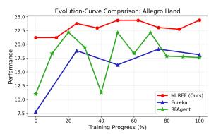

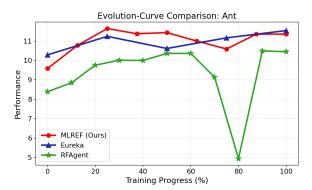

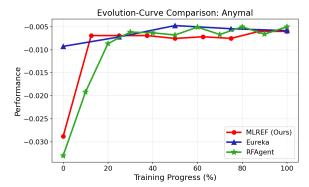

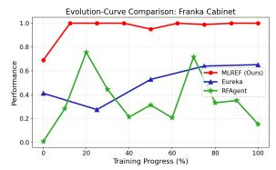

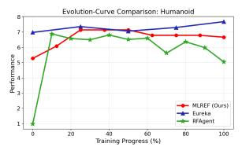

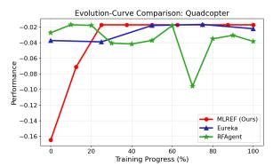  
Figure 3 | Evolution curves for all 7 locomotion tasks.

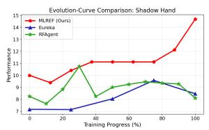

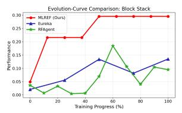

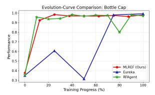

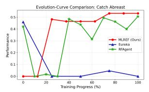

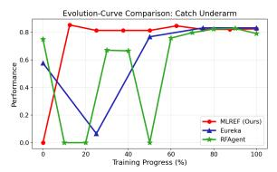

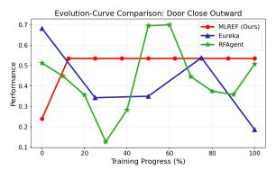

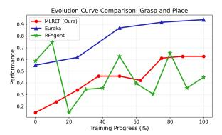

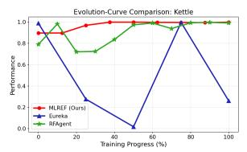

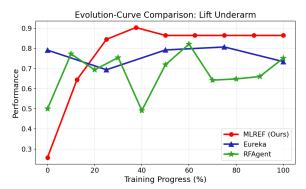

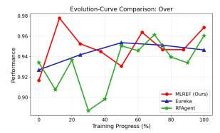

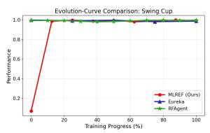

Figure 4 | Evolution curves for all 10 manipulation tasks.  
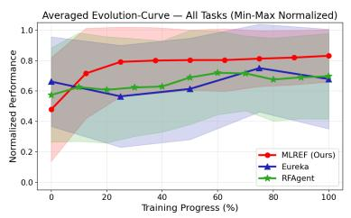

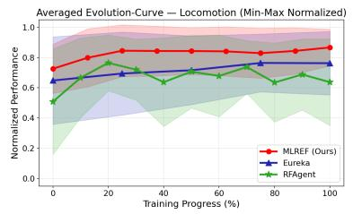

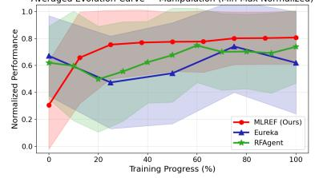  
Figure 5 | Average evolution curves. Left: all 17 tasks. Middle: locomotion (7 tasks). Right: manipulation (10 tasks).

## D. LLM Prompt Templates

This section <sub>p</sub>resents the <sub>p</sub>rom<sub>p</sub>ts used to invoke the LLM at ke<sub>y</sub> sta<sub>g</sub>es of MLREF. Content enclosed in curl<sub>y</sub> braces {} denotes dynamic fields populated at runtime. Unless otherwise noted, all prompts share the following <sub>sys</sub>t<sub>em-</sub>l<sub>eve</sub>l <sub>pream</sub>bl<sub>e.</sub>

## D.1. System Prompt

You are a reward engineer trying to write reward functions to solve reinforcement   
learning tasks as effective as possible .   
Your goal is to write a reward function for the environment that will help the agent   
learn the task described in text .   
Your reward function should use useful variables from the environment as inputs . As   
an example , the reward function signature can be : { task\_reward\_signature\_string }   
Since the reward function will be decorated with @torch . jit. script , please make sure   
that the code is compatible with TorchScript (e.g. , use torch tensor instead of   
numpy array ).   
Make sure any new tensor or variable you introduce is on the same device as the   
input tensors .

## D.2. JSON Output Format Constraint

All <sub>promp</sub>t<sub>s</sub> th<sub>a</sub>t <sub>reques</sub>t <sub>s</sub>t<sub>ruc</sub>t<sub>ure</sub>d <sub>ou</sub>t<sub>pu</sub>t f<sub>rom</sub> th<sub>e</sub> LLM <sub>appen</sub>d th<sub>e</sub> f<sub>o</sub>ll<sub>ow</sub>i<sub>ng</sub> f<sub>orma</sub>t <sub>spec</sub>ifi<sub>ca</sub>ti<sub>on.</sub> I<sub>n</sub>di<sub>v</sub>id<sub>ua</sub>l <sub>promp</sub>t<sub>s</sub> b<sub>e</sub>l<sub>ow</sub> <sub>om</sub>it thi<sub>s</sub> bl<sub>oc</sub>k f<sub>or</sub> b<sub>rev</sub>it<sub>y.</sub>

You are allowed to reason internally before producing the final answer .   
Your final output must be a single JSON object that strictly follows the schema   
below :   
{ schema }   
Do not include your reasoning or any extra text .

## D.3. Initial Reflection Prompts

Th<sub>ese</sub> <sub>promp</sub>t<sub>s</sub> <sub>are</sub> i<sub>ssue</sub>d <sub>once</sub> b<sub>e</sub>f<sub>ore</sub> th<sub>e</sub> fi<sub>rs</sub>t it<sub>era</sub>ti<sub>on</sub> t<sub>o</sub> <sub>ana</sub>l<sub>yze</sub> th<sub>e</sub> t<sub>as</sub>k <sub>an</sub>d <sub>env</sub>i<sub>ronmen</sub>t<sub>.</sub>

## D.3.1 Task Reflection

Before designing reward functions , briefly reflect on the task to understand the   
goal .   
Focus on the following :   
1. What is the final success condition of the task ? Describe only the end result   
that indicates success .   
2. What are some possible behaviors ( including non - intuitive or unexpected ones )   
that could lead to success ?   
3. What are some common failure patterns where the agent appears to make progress   
but never actually completes the task ?

Important guidelines :   
- Do NOT assume the task must be solved in well - defined stages or steps .   
- Do NOT assume the behavior needs to be smooth , stable , or human - like .   
- Success may arise from aggressive , unstable , or surprising interactions .   
- Avoid over - structuring the problem ; keep the reasoning flexible and open - ended .   
Keep the reflection concise and avoid over - decomposition .   
Do NOT design any reward code at this stage . The refined reward code will be   
designed in the next stage based on your reflections here .

## D.3.2 Environment Reflection

Before designing the reward functions , let ’s reflect on the following question to   
better understand the environment :

Question : What are the relevant state variables available in the environment that   
can be used to design the reward functions ? Figure out their types and usages .   
Also identify their shapes if they are tensors .

Note that the available variables are those defined in the class with prefix ‘self .‘ in the environment code .

Please include as many variables as possible , since the reward code will be based on   
these variables .

Rules for writing the reward module code :   
(1) The module should only contain a single function that computes the reward . Do   
not include any helper functions .   
(2) The return type of the function must be torch . Tensor .   
(3) The function name and input variables MUST match the specification . Explicitly   
specify the type of each input variable and the return type of the function .   
(4) The code output should be formatted as a python code string : "‘‘‘ python ...   
  
(5) The code will be run using TorchScript , so it should be compatible with   
TorchScript .

Do NOT design any reward code at this stage . The refined reward code will be   
designed in the next stage based on your reflections here .

## D.4. Pool Initialization Prompts

Th<sub>ese</sub> <sub>promp</sub>t<sub>s</sub> <sub>cons</sub>t<sub>ruc</sub>t th<sub>e</sub> i<sub>n</sub>iti<sub>a</sub>l <sub>mo</sub>d<sub>u</sub>l<sub>e</sub> <sub>poo</sub>l f<sub>rom</sub> <sub>scra</sub>t<sub>c</sub>h<sub>.</sub> G<sub>enera</sub>ti<sub>on</sub> <sub>procee</sub>d<sub>s</sub> i<sub>n</sub> t<sub>wo</sub> <sub>s</sub>t<sub>eps:</sub> fi<sub>rs</sub>t <sub>spec</sub>ifi<sub>ca-</sub> ti<sub>ons,</sub> th<sub>en</sub> i<sub>mp</sub>l<sub>emen</sub>t<sub>a</sub>ti<sub>ons.</sub>

## D.4.1 Specification Generation

Design some reward modules that will be included in the module pool .   
Just provide the function specifications and a brief description of what each module   
does .   
Each module should may named as "< aspect > \_reward " for clarity .   
Generate 4 to 6 different reward modules .   
Tips for designing modules :   
(1) Consider various reward shaping techniques , such as distance - based rewards ,   
progress - based rewards , and task - specific rewards .   
(2) Consider make use of every relevant state information available in the   
environment to design informative reward modules .   
(3) Ensure that the modules are diverse and capture different aspects of the task .

## D.4.2 Module Implementation

```twig
Implement the python code for a reward module based on this specification :
{ specification }
```

Some helpful tips for writing the reward function code :   
(1) You may find it helpful to normalize the reward to a fixed range by applying   
transformations like torch .exp to the reward   
(2) If you choose to transform a reward component , then you must also introduce a   
temperature parameter inside the transformation function ; this parameter must be   
a named variable in the reward function and it must not be an input variable .   
Each transformed reward component should have its own temperature variable

## D.5. Pool Improvement Prompt

F<sub>rom</sub> th<sub>e secon</sub>d it<sub>era</sub>ti<sub>on onwar</sub>d<sub>,</sub> thi<sub>s promp</sub>t <sub>re</sub>fi<sub>nes</sub> th<sub>e ex</sub>i<sub>s</sub>ti<sub>ng mo</sub>d<sub>u</sub>l<sub>e poo</sub>l b<sub>ase</sub>d <sub>on</sub> t<sub>ra</sub>i<sub>n</sub>i<sub>ng s</sub>t<sub>a</sub>ti<sub>s</sub>ti<sub>cs</sub> <sub>an</sub>d f<sub>ee</sub>db<sub>ac</sub>k <sub>re</sub>fl<sub>ec</sub>ti<sub>on.</sub>

Based on the training statistics of the RL training , please fix the bugs in the   
existing modules or suggest improvements to the current module pool to better   
suit the task requirements .   
The details of the current module pool are as follows :   
{ module\_pool\_details }   
You can select from the following types of actions to improve the module pool :   
(1) MODIFY : Making small changes to existing modules to better align with the task   
requirements . You should provide a natural language description of the required   
changes . The module specification CANNOT be changed in this way .   
(2) REWRITE : Making big refactors to existing modules to better align with the task   
requirements . The module specification CAN be changed in this way , but the name   
of the module should remain the same for easier tracking .

(3) ADD : Adding new modules to the pool . You should provide a full module   
specification for the new module without implementing the code .   
(4) REMOVE : Removing modules that are redundant or not useful for the task .   
For each action , please provide a clear natural language explanation of the   
reasoning behind it . You can refer to the training statistics if applicable .   
Some helpful tips for analyzing the policy feedback :   
(1) If the task score is always near zero , then you must consider   
(a) Removing modules that may mislead the agent .   
(b) Adding new modules that better capture important aspects of the task .   
(2) If the values for a certain reward component are near identical throughout , then   
this means RL is not able to optimize this component as it is written . You may   
consider   
(a) Changing its scale or the value of its temperature parameter .   
(b) Removing it from the pool .   
(3) If some reward components ’ magnitude is significantly larger , then you must re -   
scale its value to a proper range .   
(4) The ‘ compute\_reward ‘ function is automatically generated based on the modules   
and the assembly plan , so you should not directly modify the code of ‘   
compute\_reward ‘. Instead , you should modify the modules in the pool and let the   
system automatically generate the new ‘ compute\_reward ‘ function based on the   
updated modules and assembly plan .

## D.6. Feedback Reflection Prompts

Th<sub>e</sub> f<sub>ee</sub>db<sub>ac</sub>k <sub>re</sub>fl<sub>ec</sub>ti<sub>on</sub> <sub>promp</sub>t <sub>var</sub>i<sub>es</sub> d<sub>epen</sub>di<sub>ng</sub> <sub>on</sub> th<sub>e</sub> <sub>ou</sub>t<sub>come</sub> <sub>o</sub>f th<sub>e</sub> <sub>prev</sub>i<sub>ous</sub> RL t<sub>ra</sub>i<sub>n</sub>i<sub>ng</sub> <sub>roun</sub>d<sub>.</sub> W<sub>e</sub> <sub>presen</sub>t th<sub>e</sub> th<sub>ree represen</sub>t<sub>a</sub>ti<sub>ve var</sub>i<sub>an</sub>t<sub>s</sub> b<sub>e</sub>l<sub>ow.</sub>

## D.6.1 Training Failed

The refined reward function in the CURRENT iteration did not run successfully , so we   
roll back to the previous BEST module pool design as the basis of our   
reflection and improvement .   
Here is the previous BEST module pool for your reference :   
{ module\_pool\_details }   
Here is the module pool update plan and the error message in the CURRENT iteration :   
{ improve\_plan }   
{ training\_signal }   
{ env\_plugin }   
Before designing the new reward functions based on the BEST module pool again , let ’s   
reflect on the following questions to better understand the error and identify   
potential issues in the reward function design :   
1. What is the critical error message in the training signal ?   
2. Where is the error occurring in the code ?   
3. Based on the provided environment , what could be the potential reasons for this   
error ?   
4. How can we avoid this error in the next iteration of module pool improvement ?   
Please think step by step and provide your reflections on these questions .   
Just answer the questions one by one using natural language , and feel free to   
provide any additional insights or observations that may be relevant .   
Do NOT design any reward code at this stage . The refined reward function will be   
designed in the next stage based on your reflections here .

## D.6.2 Training Succeeded but Did Not Surpass Best

Here is the BEST module assembly along with the training statistics from the BEST   
iteration :   
{ best\_module\_usage\_list }   
{ best\_training\_signal }   
Here is the module pool update plan in the CURRENT iteration :   
{ improve\_plan }   
Here is the module assembly and statistics from the CURRENT iteration for comparison   
:   
{ module\_usage\_list }   
{ training\_signal }   
Before designing new improvement plan based on the BEST module pool again , let ’s   
reflect on the following questions to better understand the statistics and   
identify potential issues in the current module pool design :   
1. What are the key trends and overall performance observed in the training   
statistics ?   
2. What are the differences in the module design and assembly between the current   
and best iterations ? Are they responsible for the observed performance   
regression ?   
3. How does each reward module contribute to the overall performance ? Are there any   
modules that seem to be more effective or less effective based on the statistics   
? Provide some suggestions on the future use of these modules .   
4. Are there any potential issues or limitations in the current reward function   
design ? How can we address these issues in the next iteration ?   
Please think step by step and provide your reflections on these questions .   
Just answer the questions one by one using natural language , and feel free to   
provide any additional insights or observations that may be relevant .   
Notice that we have rolled back to the BEST module pool , so the next step   
improvement plan will be based on the BEST module pool .   
Try to come up with some new ideas to avoid the repeated regression .   
Do NOT generate any specific plan at this stage . The pool improvement plan will be   
designed in the next stage based on your reflections here .

## D.6.3 Training Succeeded and Surpassed Best

Here is the current module pool details for your reference :   
{ module\_pool\_details }   
Here is the best module assembly along with the training statistics from the CURRENT   
iteration :   
{ module\_usage\_list }   
{ training\_signal }   
Here is the best module assembly and statistics from the PREVIOUS iteration for   
comparison :   
{ module\_usage\_list\_prev }   
{ training\_signal\_prev }   
Here is the module pool update plan in the PREVIOUS iteration :   
{ improve\_plan }   
Before designing new improvement plan for the module pool , let ’s reflect on the   
following questions to better understand the statistics and identify potential   
issues in the current module pool design :   
1. What are the key trends and overall performance observed in the training   
statistics ? Are there any significant improvements or regressions compared to   
the previous iteration ?   
2. What are the differences in the module design and assembly between the current   
and previous iterations ? Are they responsible for the performance regression ?   
3. How does each reward module contribute to the overall performance ? Are there any   
modules that seem to be more effective or less effective based on the statistics   
? Provide some suggestions on the future use of these modules .

Tips for selecting modules :   
Consider including these modules in the final reward function :   
(1) The modules whose reward values changed a lot during training , as they are   
likely to be more effective for RL optimization .   
(2) The modules that were modified in the improvement plan , as they are expected to   
better align with the task requirements .   
(3) The newly added modules in the improvement plan , as they may capture important   
aspects of the task that were previously missing .

4. Are there any potential issues or limitations in the current reward function   
design ? How can we address these issues in the next iteration ?   
Please think step by step and provide your reflections on these questions .   
Just answer the questions one by one using natural language , and feel free to   
provide any additional insights or observations that may be relevant .   
Do NOT generate any specific plan at this stage . The pool improvement plan will be   
designed in the next stage based on your reflections here .

## D.7. Weight Selection Prompt

Thi<sub>s promp</sub>t <sub>as</sub>k<sub>s</sub> th<sub>e</sub> LLM t<sub>o se</sub>l<sub>ec</sub>t <sub>mo</sub>d<sub>u</sub>l<sub>es an</sub>d <sub>ass</sub>i<sub>gn we</sub>i<sub>g</sub>ht<sub>s, pro</sub>d<sub>uc</sub>i<sub>ng</sub> th<sub>e</sub> LLM <sub>cre</sub>dit <sub>use</sub>d i<sub>n</sub> h<sub>y</sub>b<sub>r</sub>id <sub>we</sub>i<sub>g</sub>ht <sub>op</sub>ti<sub>m</sub>i<sub>za</sub>ti<sub>on.</sub>

Here is the modified module pool , along with the specifications of each module . { module\_pool }

You should construct the reward function as a linear combination of the modules in the modified pool .

Please choose the most appropriate modules and decide their weights to construct the reward function for the given task .

You can also refer to the training statistics of the previous RL training and the improvement plan to help you find the most promising modules .

## Tips for choosing weights :

(1) The weights should be non - negative , as all modules are designed to provide positive feedback for desirable behaviors .

(2) The weights should have balanced magnitudes to ensure that no single module dominates the reward signal .

(3) Consider the relative importance of each module in achieving the task objectives when assigning weights .