# Many Optimizers But Only One Training Path: Repeated Resampling for Adaptive Optimizer Selection

Ronald Richman

insureAI

Mario V. Wüthrich

ETH Zürich

August 2026

## Abstract

An optimizer is usually chosen before training a deep neural network and then kept fixed. Treating optimizer choice as a hyperparameter could boost performance, but it requires several complete training runs and discards all but the winner. Repeated Optimizer Resampling (ROR) instead searches during one evolving run. Every b epochs, each candidate optimizer scouts from the current model weights for s epochs. The best scout continues for the remaining b − s epochs, and that completed segment becomes the new incumbent if it improves the validation objective. This design allows the preferred optimizer to change as training progresses.

We compare two variants of ROR on MNIST, Fashion-MNIST, and two motor insurance claim-count models. Nine fixed optimizers and both ROR variants are evaluated with the same ten seeds. One-epoch ROR uses 24% to 35% of the aggregate training needed to identify the best fixed optimizer exhaustively and remains close to that optimizer on all four tasks. These results support short scouting as a practical way to search over optimizers without completing every candidate run.

## 1 Introduction

Training deep neural networks requires choosing an optimizer. In practice, that choice is often made heuristically, even though it is an important hyperparameter, and the selected optimizer is usually kept fixed for the whole training run. AdamW has emerged as a standard choice [14], while recent work reports strong results for Muon when training Transformer models [13, 9]. Some of the choices of optimizers that are available include Adam [10], Lion [2], momentum SGD, Nadam [5], RM-Sprop [8], LAMB [19], and ScheduleFreeAdamW [4]. These methods use different gradient transformations, update rules, and forms of optimizer state.

The best choice for a new problem is not known in advance. It can be identified retrospectively by training every candidate to convergence, but this conventional hyperparameter search is expensive because all but the winning run are discarded. The optimizer with the best complete run also need not be best throughout training: early descent and late refinement may benefit from different update rules. An adaptive sequence could therefore outperform every fixed optimizer, or at least approach the best fixed result without first completing the entire search.

To test this idea, we adapt a procedure from general artifact optimization [1]. Repeated optimizer resampling (ROR) opens a short tournament at regular intervals. Each candidate opti mizer scouts from the same model weights. The best scout continues to the end of the next training segment, while the other scouts are discarded. Repeating the tournament produces one model trajectory and a data-dependent optimizer schedule. ROR is structurally close to successive halving and Hyperband [12], which also train many candidates on short budgets and promote only the most promising ones to longer training budgets. The difference is ROR’s repeated re-entry of optimizer candidates into subsequent tournaments: Hyperband eliminates a losing configuration permanently, whereas every optimizer re-enters each ROR tournament from the current incumbent weights, so a candidate that loses early can still be selected later in training.

An optimizer consists of more than its update formula. Momentum buffers, adaptive moment estimates, iteration counters, and schedule-free variables store information from earlier gradients. If the same optimizer wins two consecutive ROR rounds, resetting these variables makes the second branch a fresh optimization run from the retained weights. Preserving them instead continues the optimization process begun in the preceding round. We therefore test two state policies in what follows. State-preserving ROR (SP-ROR) retains the incumbent optimizer’s compatible state when it is selected again. Cold-start ROR (CS-ROR) reinitializes every optimizer at the start of every tournament.

Stochastic gradient descent with warm restarts (SGDR) [15] provides a useful point of comparison to ROR. SGDR keeps the current model weights and optimizer, returns the learning rate to the top of a cosine schedule at a scheduled restart, and anneals it again. These restarts often lead to improved model performance. ROR is different: a tournament compares several optimizer families, not several learning-rate phases of one optimizer, but we expect the model performance to improve, similar to SGDR.

We ask three questions. Can ROR approach the best fixed optimizer found in hindsight while using a smaller training budget than the exhaustive search needed to identify the best fixed optimizer? How much can the scouting period be shortened before predictive performance changes? Does preserving the incumbent optimizer’s state affect the resulting model or optimizer schedule?

We evaluate nine optimizer and learning-rate pairs on MNIST, Fashion-MNIST, and two motor insurance claim-count models. The best fixed optimizer is an oracle benchmark: it is known only after the exhaustive comparison has finished, and its search cost is the sum of all nine fixed runs. In addition to the oracle benchmark, we will run ROR and, also, a one-shot baseline that compares the set of optimizers once near the start of training.

## 2 Repeated optimizer resampling

An ROR tournament has two time scales. The scouting $p e \cdot$ riod s is the number of epochs used to compare the candidate optimizers. The retained segment length b is the number of epochs by which an accepted tournament advances the model trajectory, with $1 \leq s \leq b .$ . At the start of a tournament, ROR copies the current weights K times. Every optimizer trains one copy for s epochs using the same data order. The best scout then continues for $b - s$ more epochs. If the completed segment improves the incumbent validation objective sufficiently, its weights and optimizer state become the new incumbent. Otherwise, training stops.

Formally, let $\mathcal { O } = \{ o _ { 1 } , . . . , o _ { K } \}$ be the candidate set and let $J _ { \mathrm { v a l } }$ be oriented so that smaller values are better. At the start of tournament $r ,$ the incumbent has weights $\theta _ { r } ,$ optimizer identity $o _ { r }$ , and optimizer state $u _ { r }$ . The first tournament starts from the common random initialization $\theta _ { 0 }$ , without an incumbent optimizer. Candidate o receives the state $\widetilde { u } _ { r , o }$ specified by the state policy (see the next section) and scouts for s epochs:

$$
\begin{array} { r } { ( \theta _ { r , o } ^ { ( s ) } , u _ { r , o } ^ { ( s ) } ) = \operatorname { T r a i n } ( \theta _ { r } , o , \widetilde { u } _ { r , o } , s ) , \qquad o \in \mathcal { O } . } \end{array}\tag{1}
$$

The scout winner is

$$
o _ { r } ^ { \star } = \arg \operatorname* { m i n } _ { o \in \mathcal { O } } J _ { \mathrm { v a l } } ( \theta _ { r , o } ^ { ( s ) } ) .\tag{2}
$$

It continues directly from its scout weights and scout state:

$$
( \theta _ { r , o _ { r } ^ { \star } } ^ { ( b ) } , u _ { r , o _ { r } ^ { \star } } ^ { ( b ) } ) = \mathrm { T r a i n } \Big ( \theta _ { r , o _ { r } ^ { \star } } ^ { ( s ) } , o _ { r } ^ { \star } , u _ { r , o _ { r } ^ { \star } } ^ { ( s ) } , b - s \Big ) .\tag{3}
$$

When $s = b ,$ this continuation has length zero and the scout itself is the completed segment. If the completed segment improves the incumbent objective by more than δ, ROR commits it:

$$
( \theta _ { r + 1 } , o _ { r + 1 } , u _ { r + 1 } ) = ( \theta _ { r , o _ { r } ^ { \star } } ^ { ( b ) } , o _ { r } ^ { \star } , u _ { r , o _ { r } ^ { \star } } ^ { ( b ) } ) .\tag{4}
$$

Otherwise, the round is rejected: the incumbent weights and state remain unchanged, and training stops. The accepted segments define the optimizer schedule along the retained trajectory.

We measure search cost in epoch-equivalents.<sup>1</sup> One tournament trains all K scouts for s epochs and the winner for another b − s epochs, so

$$
C _ { \mathrm { r o u n d } } = K s + ( b - s ) = b + ( K - 1 ) s .\tag{5}
$$

With nine optimizers and $~ b ~ = ~ 3 ,$ the cost is 11 epochequivalents for $s = 1$ , 19 for $s = 2$ , and 27 for $s = 3$ . If ROR opens $T$ tournaments, its cost is $T C _ { \mathrm { r o u n d } } .$ . By comparison, an exhaustive optimizer search costs $\sum _ { o } E _ { o }$ , where $E _ { o }$ is the number of epochs needed to train fixed optimizer o to its stopping point. ROR can therefore use less training than the exhaustive search even though every optimizer participates in every tournament. Aggregate cost includes accepted and rejected tournaments.

State-Preserving and Cold-Start ROR. The policies differ only in the state supplied at the start of each scout. In State-Preserving ROR (SP-ROR), a scout using the incumbent optimizer resumes from its accumulated state, while every challenger begins with newly initialized state:

$$
\begin{array} { r } { \widetilde { u } _ { r , o } ^ { \mathrm { S P } } = \left\{ \begin{array} { l l } { u _ { r } , } & { o = o _ { r } , } \\ { u _ { o } ^ { 0 } ( \theta _ { r } ) , } & { o \neq o _ { r } . } \end{array} \right. } \end{array}\tag{6}
$$

In Cold-Start ROR (CS-ROR), every branch starts with newly initialized optimizer state:

$$
\widetilde { u } _ { r , o } ^ { \mathrm { C S } } = u _ { o } ^ { 0 } ( \theta _ { r } ) , \qquad o \in \mathcal { O } .\tag{7}
$$

All states are new in the first tournament. In either policy, the selected scout keeps its own state during the $b - s$ continuation. The difference arises only at the next tournament: SP-ROR can restore the incumbent’s momentum, adaptive moments, iteration count, and schedule variables, whereas CS-ROR resets them.

We do not retain the state of every losing optimizer. Such state was learned along discarded weights, so attaching it to the winner’s weights would be a state “transplant” rather than exact continuation. Moreover, exact preservation would require retaining each optimizer’s matching weights and advancing all nine paths in parallel, which would recreate the exhaustive search that ROR is intended to avoid.

One-shot selection baseline. As a baseline, we also test one-shot selection, which queries the optimizer set only once. Starting from a common random initialization, all K optimizers train separate model copies for s scout epochs; we set $s = 1$ the shortest scout also used by ROR. The optimizer with the best validation result is selected, its post-scout model weights are retained, and all other branches are discarded. A newly initialized instance of the selected optimizer then continues from those weights until the ordinary early-stopping rule fires. The model is not returned to its original weights, but the optimizer set is never compared again.

If the selected optimizer trains for e additional epochs, the total cost is $K s + e$ epoch-equivalents: $K s$ scout epochs plus the continuation. Because the continuation optimizer is newly initialized, one-shot is a low-cost operational baseline rather than a one-factor ablation of how often the set is queried. The clean state-policy comparison is SP-ROR versus CS-ROR.

Implementation. Every branch starts from the same copied weights. Under SP-ROR, the incumbent restores its optimizer variables and challengers use new optimizer objects; under CS-ROR, all optimizer objects are new. Validation selects both the model and optimizer state for the next round, and the test set is not consulted. Appendix C gives the core Keras 3 pseudocode.

## 3 Experimental design

We run four experiments in two application settings. MNIST and Fashion-MNIST provide conventional image classification tasks, with a classification objective. Motor third party liability claim counts provide a well-studied insurance-pricing problem from actuarial science, allowing us to examine ROR on structured tabular data using Poisson deviance and two model architectures.

Each experiment has the same comparison structure. The nine fixed optimizers are trained independently to define the hindsight-best fixed result and the aggregate cost of finding it. One-shot selection provides a low-cost reference. CS-ROR shows what repeated resampling does when every branch restarts its optimizer, while SP-ROR shows what changes when a repeated incumbent continues with its state intact.

Image classification data and model. MNIST [11] and Fashion-MNIST [20] each contain 60,000 training and 10,000 test $2 8 \times 2 8$ grayscale images. For each seed, 5,000 training observations are randomly reserved for validation. The remaining observations are presented in a fixed order to every branch. The model rescales pixels, flattens each image, and applies dense GELU layers of widths 256, 256, and 128 before a tenclass linear output. It is therefore a fully connected multilayer perceptron, not a convolutional neural network. This deliberately simple architecture lets us study optimizer selection without convolution-specific design choices. The model has 300,938 trainable parameters. The model is trained using the cross-entropy loss.

Insurance pricing data and models. The cleaned French motor third party liability frequency data [3, 18] contain 678,007 policies. We use the published split: 610,206 learning rows and 67,801 test rows. For each seed, 61,021 rows from the learning set are held out for validation, leaving 549,185 for fitting. The model receives Area, vehicle brand, fuel type, and Region as categorical variables. Vehicle power, vehicle age, driver age, bonus-malus, and population density are numerical variables. Policy ID and total claim amount are excluded.

Each categorical variable has its own trainable embedding. A numerical value is placed between up to 16 training-set quantile knots and represented by a linear interpolation of the two adjacent trainable embeddings [7]. The $4 , 7 9 1$ -parameter MLP concatenates these feature embeddings and uses hidden widths 64 and 32. The 4,433-parameter Transformer [17] maps every feature to a 16-dimensional token, adds a learned position embedding, and prepends a learned CLS token. One two-head self-attention block and a feed-forward block update the ten tokens, and the decoder reads the CLS token. This construction follows the tabular tokenization in [16], without their credibility sampling mechanism.

For policy i with exposure $v _ { i } ,$ , the network output $f _ { \boldsymbol { \theta } } ( \boldsymbol { x } _ { i } )$ is a log frequency and

$$
\log \mu _ { i } = f _ { \theta } ( x _ { i } ) + \log v _ { i } .\tag{8}
$$

Exposure is an offset rather than an ordinary feature. We minimize $\mu _ { i } \mathrm { ~ - ~ } y _ { i } \log \mu _ { i }$ and report mean Poisson deviance on the held-out test set. Calibration is total predicted claims divided by total observed claims.

Optimizer set. We use Adam at $1 0 ^ { - 3 } ;$ ; AdamW at $1 0 ^ { - 3 }$ with weight decay $1 0 ^ { - 4 }$ ; Lion at $3 \times 1 0 ^ { - 4 }$ with weight decay $1 0 ^ { - 4 }$ Muon at $1 0 ^ { - 3 }$ with weight decay $1 0 ^ { - 4 } ;$ ; and SGD-Nesterov at $5 \times 1 0 ^ { - 2 }$ with momentum 0.9. Following the hybrid parameter treatment used for Muon [13], Muon is applied only to hidden two-dimensional kernels; its AdamW branch handles biases and the input and output projections. The set also includes Nadam at $\bar { 1 0 } ^ { - 3 }$ , RMSprop at $1 0 ^ { - 3 }$ , LAMB at $1 0 ^ { - 3 }$ with weight decay $1 0 ^ { - 4 }$ , and ScheduleFreeAdamW at $2 . 5 \times 1 0 ^ { - 3 }$ with weight decay $1 0 ^ { - 4 }$ . ScheduleFreeAdamW is the native keras.optimizers.ScheduleFreeAdamW class in Keras 3.15.0, which implements the method of Defazio et al. [4]. No separate schedule-free package or local implementation is used.

These nine optimizer and learning-rate pairs form the exhaustive optimizer comparison, one-shot baseline, and ROR set in every experiment. The learning rates are fixed before the experiments and are not tuned separately for a dataset or model.

Common evaluation setup. All results use seeds 1 through 7, 42, 123, and 2026. The design is fully crossed: every training rule uses the same ten seeds and the same seed-specific data split, initialization procedure, and fixed data order. A rejected ROR round commits neither weights nor optimizer state, so both policies stop at their first rejection. Test performance is evaluated only after validation-based selection. We report the mean and sample standard deviation over seeds. Confidence intervals use paired seed-level differences and the $t _ { 9 }$ quantile.<sup>2</sup> The epoch-equivalent totals include every branch trained by the program, including the final rejected round.

Image classification setup. The image experiments use batch size 256, Keras 3.15, and the JAX CPU backend. Fixed baselines stop when validation accuracy fails to improve by 0.02 percentage points for five epochs, with a 30-epoch cap. The one-shot baseline uses the single handoff defined above. ROR uses $b = 3 ,$ , scouting periods $s \in \{ 1 , 2 , 3 \} , \delta = 0 . 0 2$ percentage points, and a maximum committed trajectory of 30 epochs.

Insurance pricing setup. Gorishniy et al. benchmark 15 optimization methods across 17 tabular datasets and find that Muon consistently outperforms AdamW [6]. In our study, both insurance architectures use the optimizer set described above. Muon receives seven non-embedding matrices in the attention projections, feed-forward block, and CLS decoder; embeddings and the final output layer use Muon’s AdamW branch. Batch size is 4,096. Fixed runs stop after five epochs without a validation loss decrease greater than $1 0 ^ { - 5 }$ , with a 300-epoch safety cap. Both models use b = 3 and $s \in \{ 1 , 2 , 3 \}$ and ROR accepts a completed segment only if it lowers the validation loss by more than $\delta = 1 0 ^ { - 5 }$ , the same improvement threshold used by the fixed-run stopping rule.

## 4 Results

## 4.1 Predictive performance and search cost

Shorter scouting is the clearest result. With $b = 3 ,$ one-epoch scouting $s = 1$ uses 24% to 35% of the training required to complete all nine fixed-optimizer runs. It also costs 51% to 68% less than a ROR design with $s \ : = \ : 3$ . A ROR design with $s = 3$ itself costs less, on average, than completing all nine fixed-optimizer runs because a ROR training run is on average shorter than a full fixed-optimizer run, even though each $s = b = 3$ tournament trains all nine candidates for the full segment. Across the four tasks that average saving is about 17% to 42%; the retained ROR trajectory is typically 8 to 11 epochs on the image and Insurance Transformer experiments, against about 16 for a typical fixed run, and about 26 to 28 epochs on the Insurance MLP, against 49. The predictive effect is smaller and depends on the task. Across all four experiments, no ROR comparison with the best fixed optimizer has a paired 95% confidence interval that excludes zero. The same is true when SP-ROR is compared with CS-ROR.

The practical implication is that ROR substitutes very effectively for the exhaustive search rather than merely approximating one fixed run: the best fixed optimizer differs across the four tasks and is only known after all nine runs complete, while one-epoch ROR achieves similar observed performance, with none of the paired comparisons excluding zero, at 24% to 35% of that cost. On the Insurance Transformer, the one-epoch ROR losses are in fact the lowest observed in the table.

The one-shot baseline is cheaper than one-epoch ROR on every task, and the comparison between the two is informative. On MNIST, one-shot reaches an observed mean of 98.116% at 20.3 epoch-equivalents, better and cheaper than both one-epoch ROR variants. On Fashion-MNIST and both insurance models the one-epoch ROR means are better, for example a Transformer deviance of 0.237627 against 0.237968, at roughly twice the one-shot cost. A single early tournament therefore captures much of the value of optimizer selection when the ranking observed after one epoch persists, as the stable MNIST schedules in Figure 4 suggest. The tasks whose schedules switch optimizer later in training are the ones where repeated tournaments improve on the single early query.

Tables 1 and 2 report the complete optimizer comparisons; Figures 1 and 2 show the seed-level variation.

## 4.1.1 Image classification

On MNIST, fixed Muon reaches 98.095%. One-epoch CS-ROR and SP-ROR reach 97.948% and 97.988%, using 37.4 and 39.6 epoch-equivalents rather than 150.7 for the full opti mizer search. Extending the scout to three epochs raises the ROR means to 98.132% and 98.131%, but roughly triples the search cost. The paired $s = 1$ minus $s \ : = \ : 3$ difference is −0.184 percentage points for CS-ROR, with a 95% confidence interval of $[ - 0 . 3 5 5 , - 0 . 0 1 3 ]$ , and −0.143 points for SP-ROR, with interval [−0.307, 0.021]. MNIST therefore shows the main trade-off: the shortest scout is much cheaper, with a small loss of accuracy.

On Fashion-MNIST, the ROR means lie between 88.897% and 89.068%; fixed ScheduleFreeAdamW reaches 89.059%. One-epoch CS-ROR and SP-ROR cost 53.9 and 48.4 epochequivalents, compared with 152.4 for the full search. Every paired comparison between a shorter scout and s = 3 includes zero, so the experiment provides no clear evidence that longer scouting improves Fashion-MNIST accuracy.

Table 1: Image classification results over ten seeds. Accuracy is the mean test accuracy in percentage points, followed by its sample standard deviation (bigger is better). Ranks use unrounded means across the 16 fitted training rules, with rank 1 best. The full optimizer search row is the aggregate cost of completing all nine fixed runs and is not another fitted model.
<table><tr><td>Training rule</td><td colspan="3">MNIST</td><td colspan="3">Fashion-MNIST</td></tr><tr><td></td><td>Accuracy</td><td>Rank</td><td>Epoch-eq.</td><td>Accuracy</td><td>Rank</td><td>Epoch-eq.</td></tr><tr><td>Adam</td><td>98.003±0.244</td><td>7</td><td>16.5</td><td>88.287±0.472</td><td>13</td><td>16.1</td></tr><tr><td>AdamW</td><td>97.928±0.213</td><td>12</td><td>15.0</td><td>88.262±0.454</td><td>14</td><td>15.8</td></tr><tr><td>Lion</td><td>97.552±0.189</td><td>16</td><td>13.4</td><td>88.578±0.299</td><td>9</td><td>12.9</td></tr><tr><td>Muon</td><td>98.095±0.139</td><td>4</td><td>15.2</td><td>88.431±0.516</td><td>10</td><td>13.3</td></tr><tr><td>SGD-N</td><td>97.787±0.213</td><td>14</td><td>18.1</td><td>88.084±0.356</td><td>15</td><td>17.6</td></tr><tr><td>Nadam</td><td>97.870±0.160</td><td>13</td><td>18.2</td><td>88.293±0.313</td><td>12</td><td>16.0</td></tr><tr><td>RMSprop</td><td>97.977±0.182</td><td>10</td><td>19.4</td><td>88.065±0.381</td><td>16</td><td>18.7</td></tr><tr><td>LAMB</td><td>97.690±0.309</td><td>15</td><td>21.2</td><td>88.419±0.406</td><td>11</td><td>26.5</td></tr><tr><td>SF-AdamW</td><td>98.038±0.097</td><td>5</td><td>13.7</td><td>89.059±0.263</td><td>2</td><td>15.5</td></tr><tr><td>Full optimizer search (all 9)</td><td>n/a</td><td>n/a</td><td>150.7</td><td>n/a</td><td>n/a</td><td>152.4</td></tr><tr><td>One-shot</td><td>98.116±0.119</td><td>3</td><td>20.3</td><td>88.839±0.442</td><td>8</td><td>22.5</td></tr><tr><td>CS-ROR (s = 1)</td><td>97.948±0.169</td><td>11</td><td>37.4</td><td>89.007±0.331</td><td>3</td><td>53.9</td></tr><tr><td>SP-ROR (s = 1)</td><td>97.988±0.165</td><td>8</td><td>39.6</td><td>88.992±0.321</td><td>4</td><td>48.4</td></tr><tr><td>CS-ROR (s = 2)</td><td>98.037±0.169</td><td>6</td><td>58.9</td><td>88.897±0.380</td><td>7</td><td>81.7</td></tr><tr><td>SP-ROR (s = 2)</td><td>97.980±0.164</td><td>9</td><td>68.4</td><td>88.980±0.339</td><td>6</td><td>79.8</td></tr><tr><td>CS-ROR (s = 3)</td><td>98.132±0.182</td><td>1</td><td>116.1</td><td>88.988±0.359</td><td>5</td><td>110.7</td></tr><tr><td>SP-ROR (s = 3)</td><td>98.131±0.099</td><td>2</td><td>110.7</td><td>89.068±0.338</td><td>1</td><td>126.9</td></tr></table>

## 4.1.2 Insurance claim counts

In Table 2, Adam and AdamW agree to the displayed precision on both architectures. This is a rounding coincidence rather than a duplicated run.<sup>3</sup>

On the MLP, fixed Lion reaches a mean deviance of 0.238365. One-epoch CS-ROR and SP-ROR reach 0.238500 and 0.238476, using 107.8 and 110.0 epoch-equivalents rather than 442.4 for the full optimizer search. Two-epoch SP-ROR has the lowest observed loss, 0.238362, at a cost of 199.5. The paired comparisons with s = 3 all include zero, including the s = 1 comparisons, so there is no clear evidence that the longer scout improves MLP deviance.

Fixed Muon ranks 15 of 16 on the MLP, which stands in contrast to the tabular benchmark of Gorishniy et al. [6], where Muon consistently outperformed AdamW. Three differences plausibly contribute: our learning rate of $1 0 ^ { - 3 }$ is fixed in advance rather than tuned for this task, the 4,791-parameter network is far smaller than typical tabular benchmark models, and the embedding-heavy parameterization routes most parameters to Muon’s AdamW branch rather than to its orthogonalized update. Finally, a Poisson deviance might favour different optimizers than the loss functions used in [6].

On the Transformer, fixed Lion reaches 0.237817 (smaller is better). One-epoch CS-ROR and SP-ROR reach 0.237627 and 0.237646, at costs of 42.9 and 40.7 epoch-equivalents rather than 140.8 for the full search. These are the lowest observed losses in the table, but their paired differences from Lion include zero. All shorter-scout comparisons with s = 3 also include zero.

Figure 3 shows the same pattern across tasks. Increasing s raises cost sharply because all nine candidates receive the extra scout epochs, while predictive performance changes much less. Naturally, the first gradient descent steps are the most significant ones and losses flatten after a few epochs. That is why short scouting is good enough. The paired short-scout comparisons are reported in Appendix A.

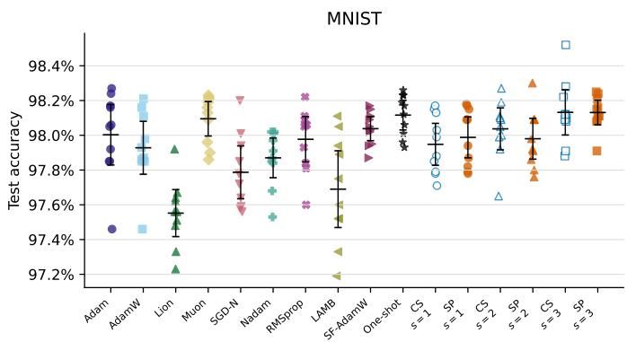

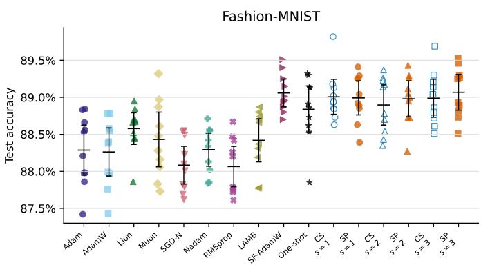  
Figure 1: Image classification accuracy by seed (bigger is better). Points are individual runs; horizontal bars show means and 95% confidence intervals. ROR uses retained segments of b = 3 epochs.

## Insurance claim-count models across ten seeds

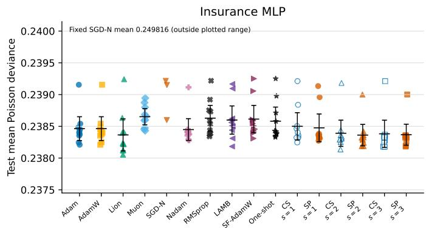

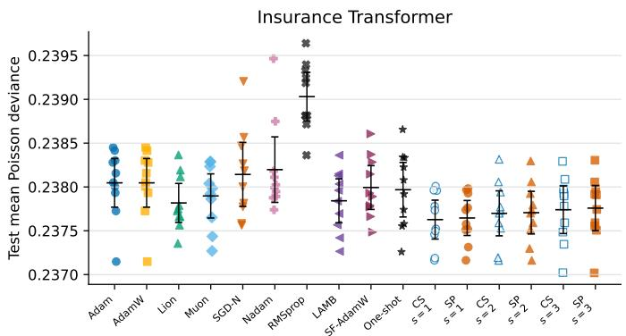  
Figure 2: Insurance test deviance by seed. Points are individual runs; horizontal bars show means and 95% confidence intervals. The MLP panel is restricted to the range containing the competitive methods; the fixed SGD-Nesterov mean of 0.249816 falls outside that range (smaller is better).

Table 2: Insurance results over ten seeds. Test deviance is the mean Poisson deviance, followed by its sample standard deviation (smaller is better). Calibration is predicted claims divided by observed claims. Ranks use unrounded mean deviance across the 16 fitted training rules within each architecture, with rank 1 best. The full optimizer search row is the aggregate cost of completing all nine fixed runs and is not another fitted model.
<table><tr><td>Architecture</td><td>Training rule</td><td>Test deviance</td><td>Rank</td><td>Calibration</td><td>Epoch-eq.</td></tr><tr><td>MLP</td><td>Adam</td><td>0.238463±0.000263</td><td>7</td><td>0.999</td><td>44.3</td></tr><tr><td></td><td>AdamW</td><td>0.238463±0.000263</td><td>8</td><td>0.999</td><td>44.2</td></tr><tr><td></td><td>Lion</td><td>0.238365±0.000353</td><td>2</td><td>0.995</td><td>31.3</td></tr><tr><td></td><td>Muon</td><td>0.238652±0.000178</td><td>15</td><td>0.999</td><td>22.1</td></tr><tr><td></td><td>SGD-N</td><td>0.249816±0.007473</td><td>16</td><td>1.003</td><td>58.1</td></tr><tr><td></td><td>Nadam</td><td>0.238449±0.000240</td><td>6</td><td>1.000</td><td>47.4</td></tr><tr><td></td><td>RMSprop</td><td>0.238629±0.000282</td><td>14</td><td>0.997</td><td>91.5</td></tr><tr><td></td><td>LAMB</td><td>0.238599±0.000311</td><td>12</td><td>0.998</td><td>71.0</td></tr><tr><td></td><td>SF-AdamW</td><td>0.238614±0.000302</td><td>13</td><td>1.003</td><td>32.5</td></tr><tr><td></td><td>Full optimizer search (all 9)</td><td>n/a</td><td>n/a</td><td>n/a</td><td>442.4</td></tr><tr><td></td><td>One-shot</td><td>0.238581±0.000311</td><td>11</td><td>1.001</td><td>44.8</td></tr><tr><td></td><td>CS-ROR (s = 1)</td><td>0.238500±0.000300</td><td>10</td><td>0.999</td><td>107.8</td></tr><tr><td></td><td>SP-ROR (s = 1)</td><td>0.238476±0.000305</td><td>9</td><td>1.001</td><td>110.0</td></tr><tr><td></td><td>CS-ROR (s = 2)</td><td>0.238391±0.000289</td><td>5</td><td>0.999</td><td>209.0</td></tr><tr><td></td><td>SP-ROR (s = 2)</td><td>0.238362±0.000236</td><td>1</td><td>0.999</td><td>199.5</td></tr><tr><td></td><td>CS-ROR (s = 3)</td><td>0.238382±0.000300</td><td>4</td><td>0.999</td><td>280.8</td></tr><tr><td>CLS Transformer</td><td>SP-ROR (s = 3)</td><td>0.238368±0.000232</td><td>3</td><td>0.999</td><td>256.5</td></tr><tr><td></td><td>Adam</td><td>0.238047±0.000388</td><td>13</td><td>1.021</td><td>11.2</td></tr><tr><td></td><td>AdamW</td><td>0.238047±0.000388</td><td>12</td><td>1.021</td><td>11.2</td></tr><tr><td></td><td>Lion</td><td>0.237817±0.000311</td><td>7</td><td>1.007</td><td>11.9</td></tr><tr><td></td><td>Muon</td><td>0.237897±0.000352</td><td>9</td><td>1.006</td><td>13.0</td></tr><tr><td></td><td>SGD-N</td><td>0.238143±0.000510</td><td>14</td><td>1.027</td><td>23.3</td></tr><tr><td></td><td>Nadam</td><td>0.238198±0.000523</td><td>15</td><td>1.024</td><td>13.3</td></tr><tr><td></td><td>RMSprop</td><td>0.239031±0.000388</td><td>16</td><td>0.980</td><td>19.8</td></tr><tr><td></td><td>LAMB</td><td>0.237842±0.000351</td><td>8</td><td>1.020</td><td>23.3</td></tr><tr><td></td><td>SF-AdamW</td><td>0.237993±0.000350</td><td>11</td><td>1.014</td><td>13.8</td></tr><tr><td></td><td>Full optimizer search (all 9)</td><td>n/a</td><td>n/a</td><td>n/a</td><td>140.8</td></tr><tr><td></td><td>One-shot</td><td>0.237968±0.000435</td><td></td><td>1.015</td><td></td></tr><tr><td></td><td>CS-ROR (s = 1)</td><td></td><td>10</td><td></td><td>18.9</td></tr><tr><td></td><td>SP-ROR (s = 1)</td><td>0.237627±0.000311 0.237646±0.000279</td><td>1 2</td><td>1.007 1.007</td><td>42.9 40.7</td></tr><tr><td></td><td>CS-ROR (s = 2)</td><td>0.237699±0.000359</td><td>3</td><td>1.011</td><td>66.5</td></tr><tr><td></td><td>SP-ROR (s = 2)</td><td>0.237707±0.000340</td><td>4</td><td>1.012</td><td>64.6</td></tr><tr><td></td><td>CS-ROR (s = 3)</td><td>0.237740±0.000380</td><td>5</td><td>1.009</td><td>99.9</td></tr><tr><td>SP-ROR (s = 3)</td><td></td><td>0.237758±0.000360</td><td>6</td><td>1.012</td><td>94.5</td></tr></table>

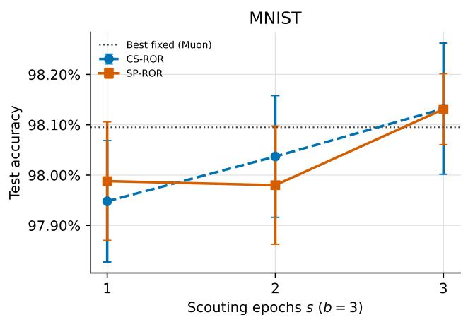

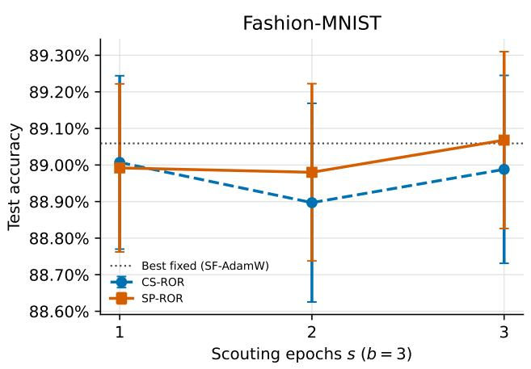

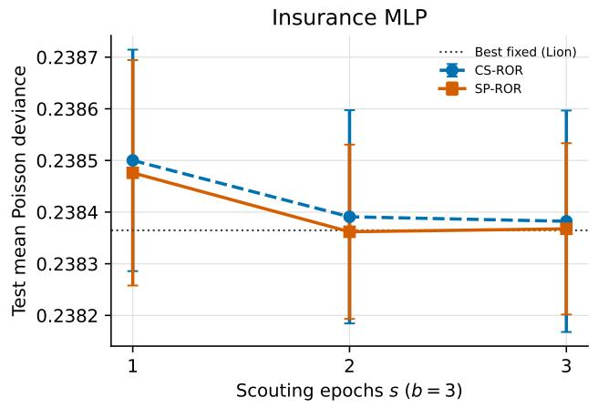

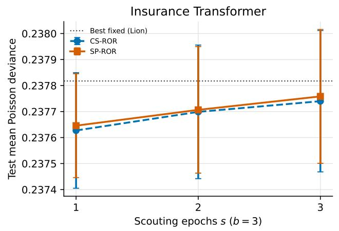  
Figure 3: Predictive performance as the scouting period changes from one to three epochs, with retained segment length fixed at $b = 3 .$ Classification accuracy is higher when better; Poisson deviance is lower when better. Error bars show 95% confidence intervals for the mean.

## 5 Interpreting the schedules

The schedules show which optimizer produced each accepted segment. In SP-ROR, a repeated label means that the incumbent was selected again and resumed with its saved state. A changed label means that ROR switched to a challenger whose state wa initialized at the start of that tournament.

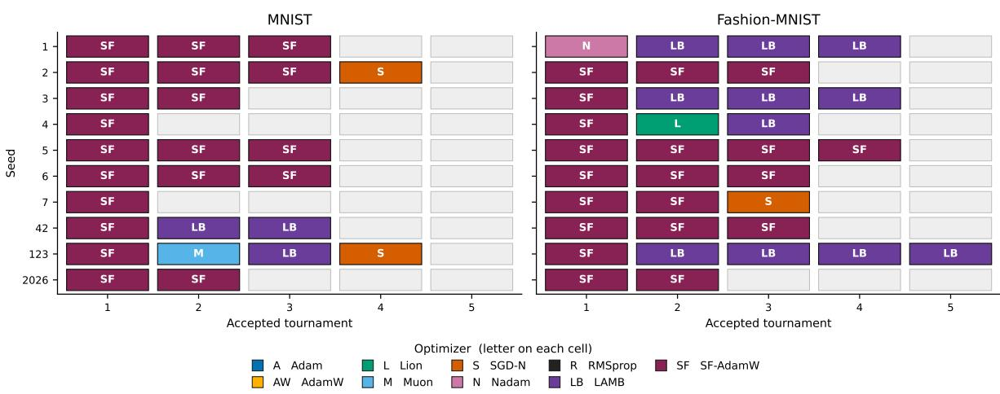

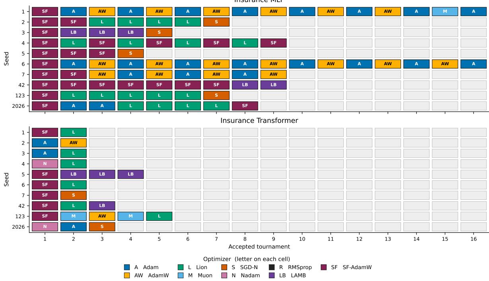  
Figure 4: State-preserving ROR schedules $( s = 1 , b = 3 )$ . Image tasks above, insurance models below. Blank cells follow the first rejected tournament. Letters in each cell are defined in the legend.

The image schedules are comparatively stable (Figure 4). MNIST averages 2.6 accepted tournaments and 0.5 switches per seed. All ten paths start with ScheduleFreeAdamW; seven also end there. Fashion-MNIST averages 3.4 accepted tournaments and 0.6 switches. Nine paths start with ScheduleFreeAdamW, and the final choices are split mainly between ScheduleFreeAdamW and LAMB.

The Insurance MLP changes optimizer more often. Its paths average 9.0 accepted tournaments and 5.6 switches. All start with ScheduleFreeAdamW, but the final optimizers are spread across SGD-Nesterov, Adam, ScheduleFreeAdamW, AdamW, and LAMB. The Insurance Transformer averages 2.7 accepted tournaments and 1.5 switches, and half of its paths finish with Lion.

These schedules support the motivation for checking optimizer choice more than once: the optimizer favored after one epoch is not always the optimizer favored later. They also show that ROR does not switch mechanically at every tournament. On the image tasks it usually retains the incumbent, whereas the Insurance MLP makes frequent changes. The corresponding cold-start schedules, where a repeated label does not carry state forward, are reported in Appendix B.

## 6 Caveats

The experiments cover four tasks, ten seeds, and relatively small networks. They test the optimizer and learning-rate pairs listed in Section 3, not every possible tuning of each optimizer family. A different learning rate could change both the fixedoptimizer ranking and the ROR schedule.

SP-ROR preserves only the incumbent optimizer’s state. Challengers start with new state, so a tournament compares continuation with fresh alternatives. It is not possible to give every challenger its own exact history on the retained weights. Doing so would require maintaining nine matching model trajectories, which is the parallel search that ROR is meant to avoid.

The same validation set is used at every tournament. Repeated queries may eventually favor a schedule that fits that validation sample. A larger search would need a reusable holdout, nested validation, or cross-validation. The one-shot baseline also resets the chosen optimizer before continuation, so it should be read as a cheap practical alternative rather than a state-matched version of ROR.

Epoch-equivalents count all training epochs, including discarded scouts, but they treat every epoch as equally expensive. This ignores differences in per-update work, including Muon’s matrix operations. Hardware-normalized time, energy, or floating-point operations would provide a fuller cost comparison. The fixed data order and first-rejection stopping rule also make these experiments less noisy than training with data augmentation or reshuffling. Such settings would probably need a tournament-level patience rule. The stopping rules used here are also somewhat asymmetric: fixed baselines receive five epochs of patience before stopping, whereas ROR stops at its first rejected tournament, an effective patience of a single b-epoch segment. This asymmetry can end an ROR run that a later tournament would have improved, so it works against ROR’s predictive results while flattering its epoch-equivalent costs.

## 7 Conclusion

We asked whether optimizer selection could happen during training instead of before it. ROR answers that question with a sequence of short tournaments. Every optimizer scouts from the current weights, the best scout completes the next segment, and only that segment is retained. This creates one model path whose optimizer may change as training progresses.

The experiments show that the length of the scout matters more for cost than for prediction. A plausible explanation is that much of the reduction in validation loss occurs during the earliest optimization steps, after which losses often flatten. This may explain why short scouting performs well. With b = 3, reducing s from three epochs to one lowers ROR cost by 51% to 68%. One-epoch ROR uses only 24% to 35% of the aggregate training required to complete all nine fixed-optimizer runs. It finishes close to the best fixed optimizer on all four tasks, although MNIST shows a small accuracy cost for the

shorter scout.

ROR did not show that an optimizer schedule chosen by ROR necessarily predicts better than the best fixed optimizer. Some observed means favor ROR, especially on the Insurance Transformer, but every paired comparison with the best fixed optimizer includes zero. The schedules do show that the preferred optimizer can change within a run, particularly on the Insurance MLP. A larger study is needed to decide whether those changes can reliably outperform a well-tuned fixed choice.

The one-shot baseline sharpens this reading. It is cheaper than one-epoch ROR on every task, beats it on MNIST, and trails its observed means on the other three tasks. When the optimizer ranking after one epoch persists, a single early comparison can capture most of the value of optimizer selection. The case for repeated tournaments - as we do in ROR - rests on tasks where the preferred optimizer changes during training; the price being roughly a doubling of the one-shot cost.

Preserving the incumbent’s optimizer state is conceptually cleaner when the same optimizer wins again, but it has no consistent predictive or computational advantage here. The practical lesson is simpler: if the optimizer is not known in advance, one-epoch scouting provides most of ROR’s benefit at a fraction of the cost of exhaustive search. Longer scouts buy more evidence at each tournament, but they should be justified by a task where that extra evidence improves the final model.

## Use of generative AI

OpenAI Codex assisted with software development, experiment orchestration, language editing, and the preparation of tables and figures. The authors designed the study, specified the methods and comparisons, reviewed the implementation and results, interpreted the findings, and take responsibility for the final manuscript.

## References

[1] L. A. Agrawal et al. optimize\_anything: A Universal APIfor Optimizing any Text Parameter. arXiv:2605.19633, 2026.

[2] X. Chen et al. Symbolic Discovery of Optimization Algorithms. arXiv:2302.06675, 2023.

[3] C. Dutang, A. Charpentier, and E. Gallic. Insurance dataset. CASdatasets, 2024. https://dutangc.github.io/CASdataset s/.

[4] A. Defazio, X. A. Yang, H. Mehta, K. Mishchenko, A. Khaled, and A. Cutkosky. The Road Less Scheduled. Advances in Neural Information Processing Systems, 2024.

[5] T. Dozat. Incorporating Nesterov momentum into Adam. ICLR Workshop, 2016.

[6] Y. Gorishniy, I. Rubachev, D. Feoktistov, and A. Babenko. Benchmarking Optimizers for MLPs in Tabular Deep Learning. arXiv:2604.15297, 2026.

[7] Y. Gorishniy, I. Rubachev, and A. Babenko. On Embeddings for Numerical Features in Tabular Deep Learning. Advances in Neural Information Processing Systems, 2022.

[8] G. Hinton, N. Srivastava, and K. Swersky. Neural networks for machine learning, lecture 6a. Coursera, 2012.

[9] K. Jordan et al. modded-nanoGPT: Speedrunning the NanoGPT Baseline. GitHub repository, 2024. https://github.com/Kel lerJordan/modded-nanogpt.

[10] D. P. Kingma and J. Ba. Adam: A Method for Stochastic Optimization. International Conference on Learning Representations, 2015.

[11] Y. LeCun, L. Bottou, Y. Bengio, and P. Haffner. Gradient-based learning applied to document recognition. Proceedings of the IEEE, 86(11):2278 to 2324, 1998.

[12] L. Li, K. Jamieson, G. DeSalvo, A. Rostamizadeh, and A. Talwalkar. Hyperband: A novel bandit-based approach to hyperparameter optimization. Journal ofMachine Learning Research, 18(185):1 to 52, 2018.

[13] J. Liu et al. Muon is Scalable for LLM Training. arXiv:2502.16982, 2025.

[14] I. Loshchilov and F. Hutter. Decoupled weight decay regularization. International Conference on Learning Representations, 2019.

[15] I. Loshchilov and F. Hutter. SGDR: Stochastic Gradient Descent with Warm Restarts. International Conference on Learning Representations, 2017.

[16] R. Richman, S. Scognamiglio, and M. V. Wüthrich. The credibility transformer. European Actuarial Journal, 2025.

[17] A. Vaswani et al. Attention is all you need. Advances in Neural Information Processing Systems, 2017.

[18] M. V. Wüthrich and M. Merz. Statistical Foundations ofActuarial Learning and its Applications. Springer, 2023.

[19] Y. You, J. Li, S. Reddi, J. Hseu, S. Kumar, S. Bhojanapalli, X. Song, J. Demmel, K. Keutzer, and C.-J. Hsieh. Large batch optimization for deep learning: Training BERT in 76 minutes. International Conference on Learning Representations, 2020.

[20] H. Xiao, K. Rasul, and R. Vollgraf. Fashion-MNIST: A Novel Image Datasetfor Benchmarking Machine Learning Algorithms. arXiv:1708.07747, 2017.

## A Paired short-scout comparisons

Table 3 compares s = 1 and s = 2, i.e. scouting choices less than b, directly with the s = 3 design, keeping b = 3 and matching seeds. Negative accuracy differences favor s = 3; negative deviance differences favor the shorter scout. Fourteen of the sixteen confidence intervals include zero. The exceptions are the MNIST comparisons for CS-ROR at s = 1 and SP-ROR at s = 2, both of which favor s = 3. No adjustment is made for multiple comparisons.

Table 3: Paired short-scout comparisons over ten seeds. Differences are the shorter scout minus s = 3. Search cost is reported in epoch equivalents.
<table><tr><td>Task</td><td>Policy</td><td>Comparison</td><td>Metric</td><td>Difference (95% CI)</td><td>Short eq.</td><td>s = 3 eq.</td></tr><tr><td>MNIST</td><td>CS-ROR</td><td>s = 1 minus s = 3</td><td>Accuracy (pp)</td><td>-0.184 [-0.355, -0.013]</td><td>37.4</td><td>116.1</td></tr><tr><td></td><td>CS-ROR</td><td>s = 2 minus s = 3</td><td>Accuracy (pp)</td><td>-0.095 [-0.256, 0.066]</td><td>58.9</td><td>116.1</td></tr><tr><td></td><td>SP-ROR</td><td>s = 1 minus s = 3</td><td>Accuracy (pp)</td><td>-0.143 [-0.307, 0.021]</td><td>39.6</td><td>110.7</td></tr><tr><td></td><td>SP-ROR</td><td>s = 2 minus s = 3</td><td>Accuracy (pp)</td><td>-0.151 [-0.285, -0.017]</td><td>68.4</td><td>110.7</td></tr><tr><td>Fashion-MNIST</td><td>CS-ROR</td><td>s = 1 minus s = 3</td><td>Accuracy (pp)</td><td>0.019 [-0.258, 0.296]</td><td>53.9</td><td>110.7</td></tr><tr><td></td><td>CS-ROR</td><td>s = 2 minus s = 3</td><td>Accuracy (pp)</td><td>-0.091 [-0.377, 0.195]</td><td>81.7</td><td>110.7</td></tr><tr><td></td><td>SP-ROR</td><td>s = 1 minus s = 3</td><td>Accuracy (pp)</td><td>-0.076 [-0.302, 0.150]</td><td>48.4</td><td>126.9</td></tr><tr><td></td><td>SP-ROR</td><td>s = 2 minus s = 3</td><td>Accuracy (pp)</td><td>-0.088 [-0.310, 0.134]</td><td>79.8</td><td>126.9</td></tr><tr><td>Insurance MLP</td><td>CS-ROR</td><td>s = 1 minus s = 3</td><td>Poisson deviance</td><td>0.000118 [-0.000031, 0.000266]</td><td>107.8</td><td>280.8</td></tr><tr><td></td><td>CS-ROR</td><td>s = 2 minus s = 3</td><td>Poisson deviance</td><td>0.000009 [-0.000036, 0.000053]</td><td>209.0</td><td>280.8</td></tr><tr><td></td><td>SP-ROR</td><td>s = 1 minus s = 3</td><td>Poisson deviance</td><td>0.000108 [-0.000035, 0.000252]</td><td>110.0</td><td>256.5</td></tr><tr><td></td><td>SP-ROR</td><td>s = 2 minus s = 3</td><td>Poisson deviance</td><td>-0.000006 [-0.000042, 0.000031]</td><td>199.5</td><td>256.5</td></tr><tr><td>Insurance Transformer</td><td>CS-ROR</td><td>s = 1 minus s = 3</td><td>Poisson deviance</td><td>-0.000113 [-0.000266, 0.000041]</td><td>42.9</td><td>99.9</td></tr><tr><td></td><td>CS-ROR</td><td>s = 2 minus s = 3</td><td>Poisson deviance</td><td>-0.000041 [-0.000170, 0.000087]</td><td>66.5</td><td>99.9</td></tr><tr><td></td><td>SP-ROR</td><td>s = 1 minus s = 3</td><td>Poisson deviance</td><td>-0.000113 [-0.000239, 0.000014]</td><td>40.7</td><td>94.5</td></tr><tr><td></td><td>SP-ROR</td><td>s = 2 minus s = 3</td><td>Poisson deviance</td><td>-0.000052 [-0.000133, 0.000030]</td><td>64.6</td><td>94.5</td></tr></table>

## B Cold-start schedules

In CS-ROR, every scout starts with newly initialized optimizer state. A repeated label therefore means that the same optimizer type was selected again, not that its momentum or adaptive moments continued.

With s = 1 and b = 3, CS-ROR averages 2.4 accepted tournaments and 0.8 switches on MNIST, 3.9 and 1.1 on Fashion-MNIST, 8.8 and 2.3 on the Insurance MLP, and 2.9 and 1.5 on the Insurance Transformer. The Insurance MLP has 55 repeated labels across the ten seeds. These are repeated cold starts, which explains why a schedule can look stable even though optimizer state is discarded at each tournament.

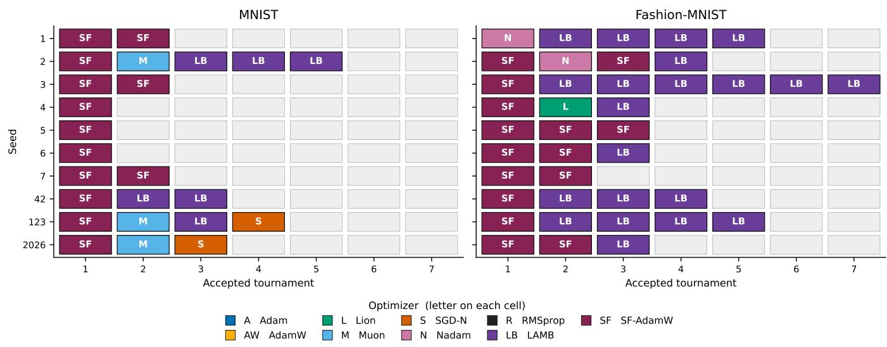

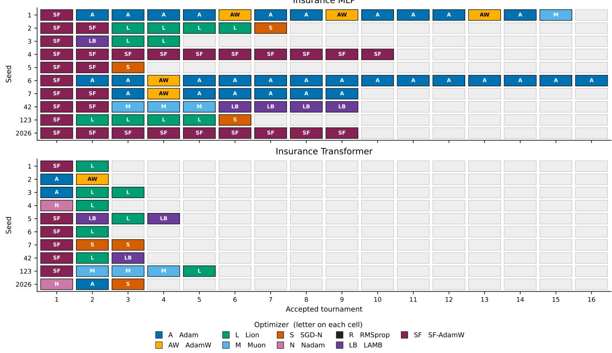  
Figure 5: Cold-start ROR schedules $( s = 1 , b = 3 )$ . Image tasks above, insurance models below. Every scout, including a repeated winner, starts with newly initialized optimizer state. Letters in each cell are defined in the legend.

## C Keras 3 pseudocode

With preserve\_state=True, a repeated incumbent restores its state; with False, every scout starts fresh. In both cases the selected scout keeps its state for the remaining segment\_epochs - scout\_epochs epochs.

Listing 1: SP-ROR and CS-ROR in pure Keras 3 pseudocode.

```python
import keras
optimizer_fns = {
"adam": make_adam,
# Seven other optimizer constructors are omitted here.
"schedule_free_adamw": make_sf_adamw,
}
def train(weights, make_optimizer, epochs, state=None):
model = make_model()
model.set_weights(weights)
optimizer = make_optimizer()
model.compile(optimizer=optimizer, loss=loss_fn)
if state is not None:
optimizer.build(model.trainable_variables)
for variable, value in zip(optimizer.variables, state):
variable.assign(value)
if epochs:
model.fit(
x_train, y_train,
validation_data=(x_valid, y_valid),
epochs=epochs, shuffle=False, verbose=0,
)
score = validation_objective(model, x_valid, y_valid)
new_state = [keras.ops.convert_to_numpy(v)
for v in optimizer.variables]
return model.get_weights(), new_state, score
weights = make_model().get_weights()
incumbent = evaluate_weights(weights, valid_data)
incumbent_name = None
incumbent_state = None
preserve_state = True
scout_epochs = 1
segment_epochs = 3
while True:
scouts = [
(name, *train(
weights, fn, scout_epochs,
state=incumbent_state
if preserve_state and name == incumbent_name
else None,
))
for name, fn in optimizer_fns.items()
]
name, scout_weights, scout_state, scout_score = min(
scouts, key=lambda candidate: candidate[3]
)
if scout_epochs < segment_epochs:
new_weights, new_state, new_score = train(
scout_weights,
optimizer_fns[name],
segment_epochs - scout_epochs,
state=scout_state,
)
else:
new_weights = scout_weights
new_state = scout_state
new_score = scout_score
if incumbent - new_score <= min_delta:
break
weights = new_weights
incumbent_name = name
incumbent_state = new_state
incumbent = new_score
```