# Mechanistic Interpretability of Structure-Aware Numerical Reasoning in LLaMA 3.1–8B

Rahul Chowdhury✉ Northeastern University Boston, MA, USA chowdhury.rah@northeastern.edu

Jiahao Liu   
Mobi.ai   
Boston, MA, USA   
jiahao@takemobi.com   
Pu Zhao   
Northeastern University   
Boston, MA, USA   
p.zhao@northeastern.edu   
Timothy A Rupprecht   
EmbodyX Inc.   
San Mateo, CA, USA   
tarupprecht@gmail.com

Octavia Camps Northeastern University Boston, MA, USA O.Camps@northeastern.edu

Senhao Cao   
Northeastern University   
Boston, MA, USA   
senhao.cao@gmail.com

David Bau Northeastern University Boston, MA, USA davidbau@northeastern.edu

Yanzhi Wang Northeastern University Boston, MA, USA yanzhiwang@northeastern.edu

## Abstract

Recent work has shown that large language models (LLMs) exhibit strong numerical sequence modeling capabilities and show promise in time-series prediction. While LLMs display in-context learning capabilities, the mechanisms with which they accomplish timeseries prediction remain unclear. Specifically, whether they truly understand the underlying structure, which at a minimum requires reasoning over first diferences in the sequence ofnumbers. To study this, we investigate Llama 3.1-8B from a mechanistic interpretabil ity point of view. Mechanistic interpretability is an emerging field concerned with the reverse engineering of the algorithms learned by neural networks such as LLMs. To assess Llamas’ numerical sequence modeling capabilities and to facilitate our mechanistic interpretability analysis, we create a sequence modeling task that cannot be solved without picking up structural cues. Specifically, we sample � random numbers and repeat them with an ofset. We find that Llama displays strong performance on our tasks suggesting that it can pick up on the underlying structure. To understand the mechanisms that allow it to do so, we perform probing experiments and activation patching based counterfactual analysis. Probing reveals that the model computes and stores first diferences in its internal representations without explicit supervision, indicating that it tracks structural information about the sequence. Activation patching reveals that Llama retrieves the relevant first-diference with a mechanism similar to an induction circuit and subsequently adds it to the current value. Notably, our work represents one of the first studies to identify this form of concept induction in LLMs.

CCS Concepts • Computing methodologies → Natural language processing; • Time Series; • Mechanistic Interpretability;

ACM Reference Format: Rahul Chowdhury, Timothy A Rupprecht, Senhao Cao, Jiahao Liu, Octavia Camps, David Bau, Pu Zhao, and Yanzhi Wang. 2026. Mechanistic Interpretability of Structure-Aware Numerical Reasoning in LLaMA 3.1–8B. In The fourth International Workshop on Rich Media with Generative AI (Rich-MediaGAI’26), November 10–14, 2026, Rio de Janeiro, Brazil. ACM, New York, NY, USA, 11 pages. https://doi.org/10.1145/3841458.3841545

## 1 Introduction

Large Language Models (LLMs) can zero-shot extrapolate sequences, and generate novel sequences and functions in response to complex queries [2, 19, 25, 27, 39, 45]. How do they do this? Did they encounter these trends during training and simply extrapolate using a rule learned specifically for those patterns? Or did they learn to infer the underlying structure of sequence data more generally?

If LLMs can understand the ordinal structure of numerical data — identifying a hidden pattern, reasoning about it, and applying a consistent extrapolation algorithm — the implications extend well beyond memorization. It would suggest these models are learning abstract structural reasoning, a capability with relevance far beyond language: reasoning over time-series data, understanding geometric relationships between image pixels, or maintaining structural coherence across connected points in 3D data [21–26, 28, 37, 38].

In this work, we study the LLaMA 3.1–8B model through the lens of mechanistic interpretability. To probe its structural reasoning capabilities, we introduce a non-trivial sequence modeling task, shown in Figure 2, that cannot be solved via token-level copying through induction heads [4]. Our interpretability analysis combines linear probing with activation patching. Probing shows that first-diference representations are locally stored and linearly decodable across layers. Patching experiments further reveal that the model identifies structurally critical tokens, retrieves the correct ofset through induction over these latent diferences, and performs the final arithmetic step by adding that ofset to the last number in the sequence. These computations are precise, localized, and structurally grounded.

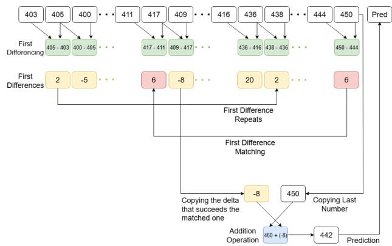  
Figure 1: Illustrates how the model identifies a repeated firstdiference (delta) pattern after diferencing, then extrapolates by locating and copying the delta that immediately follows the final observed one, and adding it to last number.

To our knowledge, this is the first mechanistic interpretability study to uncover an internal mechanism by which an LLM performs induction over latent structure in numerical sequences—where extrapolation arises from arithmetic operations over internal repre sentations retrieved through, and we illustrate it in Figure 1.

## 2 Related Work

Mirchandani et al. [19] showed that LLMs can perform sequence completion tasks, attributing this ability to in-context learning. However, they did not examine whether such performance stems from memorization, nor did they investigate the underlying mech anisms or the model’s understanding of temporal structure. [10] proposed LLM-Time that explored ways to make a pre-trained LLMs fit for time-series forecasting, demonstrating that pretrained LLMs can perform well on time-series forecasting tasks without finetuning. Time-GPT [7] is a foundation model trained exclusively on time-series data, and Lag-Llama [20] is another time-series-specific transformer. While these models highlight efectiveness of transformers for sequence modeling [11, 14–17, 33–36, 43, 44], they fall outside our study scope, as we focus on general-purpose LLM.

Akyürek et al. [1] and Kantamneni et al. [12] examined in-context learning using toy models but did not explore whether LLMs can infer sequential structure in tasks they were not explicitly trained for. [13] applied mechanistic interpretability to identify shared circuits in simple sequence continuation tasks, such as extending short increasing number sequences. While [13] demonstrated LLMs’ ability to handle familiar patterns, it did not address whether these models can reason over more abstract or irregular numerical structures. In contrast, our work investigates whether a LLM can recognize and extrapolate more complex sequential structures—such as sequences defined by arbitrary first diferences. This goes beyond surface-level extension and explores the model’s ability to infer and extend abstract structure in number sequences.

Algorithm 1 Predict Next Number via First-Diference Pattern   
Detection   
Input: Token sequence $S = [ \mathrm { B O S } , s _ { 1 } , s _ { 2 } , \ldots , s _ { n } , ]$   
Output: Predicted next number $s _ { n + 1 }$   
1: Compute first diferences:   
2: $D = [ s _ { 2 } - s _ { 1 } , s _ { 3 } - s _ { 2 } , . . . , s _ { n } - s _ { n - 1 } ]$   
3: Identify repeating pattern � in �   
4: Locate the index � where � first appears in �   
5: Determine the phase position $\boldsymbol { p }$ of $s _ { n }$ within pattern �   
6: Let $d _ { p } = D [ p ]$ be the corresponding first diference   
7: Compute prediction: $s _ { n + 1 } = s _ { n } + d _ { p }$   
8: return $s _ { n + 1 }$

## 3 Problem Setting

## 3.1 Dataset

We design a dataset to have strings containing numbers followed by a comma, and each instance finishes with a comma so that the predicted next token is a number. The numbers in the whole dataset were between 0 and 999. We construct each sequence with first diferences from integers in the set containing all integers between −9 and 9 inclusive, excluding 0. Each sequence consists of unique numbers whose deltas are also unique up to the 17th position, after which the delta repeats.

We design the dataset to specifically test whether the LLM can uncover latent numerical structure and specifically track delta within a sequence. As we illustrate in Figure 2 and in an abbreviated form in Table 1, each sequence comprises two segments: the first is a random walk with unique deltas and no apparent pattern; the second segment reuses the same set of deltas, in the same order, as the first segment. This structure ensures that the model must recognize the pattern in delta and identify the unique location from which the model can copy the delta from.

## 3.2 Model

We conduct all experiments using LLaMA 3.1–8B [9], a transformer [30] based model with 32 layers and 32 attention heads per layer. One key reason for choosing this model is that its tokenizer represents each integer from 0 to 999 as a single token. This property makes the analysis more tractable by reducing the number oftokens per sequence, thereby simplifying both intervention and observation during interpretability experiments. As a result, LLaMA 3.1–8B was used consistently across all experiments.

## 3.3 Software

We extensively use NNsight and NDIF framework [6] for tracing activations, applying interventions, and analyzing internal representations of the LLaMA 3.1–8B model.

## 3.4 Performance Evaluation

We evaluate LLaMA 3.1-8B on the sequence prediction task as shown in Figure 1 and Figure 2, and we formally describe it in Algorithm 1. We prompt the model to predict the 30th number given the first 29 elements of each input sequence. The evaluation dataset consists of 10,000 sequences, each formatted as a commaseparated string of integers. Every instance ends with a comma, indicating that the next token to be predicted should be a number.

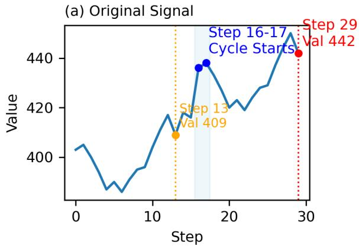

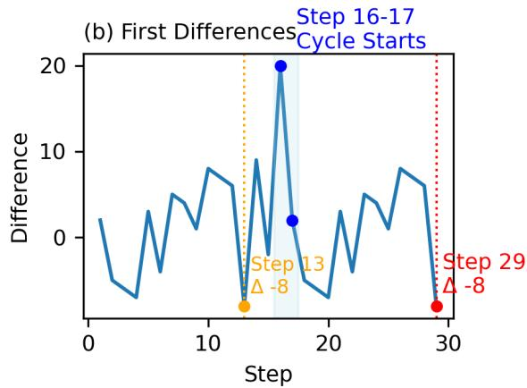

Figure 2: (a) Shows the input signal, which consists of all unique values which means no number appears twice in the sequence. (b) Shows the deltas of the input signal, revealing that a cycle or pattern emerges only after applying the diferencing operation.
<table><tr><td rowspan=1 colspan=1>Index</td><td rowspan=1 colspan=1>0</td><td rowspan=1 colspan=1>1</td><td rowspan=1 colspan=1>2</td><td rowspan=1 colspan=1>3</td><td rowspan=1 colspan=1>4</td><td rowspan=1 colspan=1>5</td><td rowspan=1 colspan=1>23</td><td rowspan=1 colspan=1>24</td><td rowspan=1 colspan=1>25</td><td rowspan=1 colspan=1>26</td><td rowspan=1 colspan=1>27</td><td rowspan=1 colspan=1>31</td><td rowspan=1 colspan=1>32</td><td rowspan=1 colspan=1>33</td><td rowspan=1 colspan=1>34</td><td rowspan=1 colspan=1>35</td><td rowspan=1 colspan=1>36</td><td rowspan=1 colspan=1>37</td><td rowspan=1 colspan=1>55</td><td rowspan=1 colspan=1>56</td><td rowspan=1 colspan=1>57</td><td rowspan=1 colspan=1>58</td><td rowspan=1 colspan=1>59</td></tr><tr><td rowspan=1 colspan=1>Token</td><td rowspan=1 colspan=1>S</td><td rowspan=1 colspan=1>403</td><td rowspan=1 colspan=1>，</td><td rowspan=1 colspan=1>405</td><td rowspan=1 colspan=1>，</td><td rowspan=1 colspan=1>400</td><td rowspan=1 colspan=1>411</td><td rowspan=1 colspan=1>，</td><td rowspan=1 colspan=1>417</td><td rowspan=1 colspan=1>，</td><td rowspan=1 colspan=1>409</td><td rowspan=1 colspan=1>416</td><td rowspan=1 colspan=1>，</td><td rowspan=1 colspan=1>436</td><td rowspan=1 colspan=1>，</td><td rowspan=1 colspan=1>438</td><td rowspan=1 colspan=1>，</td><td rowspan=1 colspan=1>433</td><td rowspan=1 colspan=1>444</td><td rowspan=1 colspan=1>，</td><td rowspan=1 colspan=1>450</td><td rowspan=1 colspan=1>，</td><td rowspan=1 colspan=1>442</td></tr><tr><td rowspan=1 colspan=1>Delta</td><td rowspan=1 colspan=1></td><td rowspan=1 colspan=1></td><td rowspan=1 colspan=1></td><td rowspan=1 colspan=1>2</td><td rowspan=1 colspan=1></td><td rowspan=1 colspan=1>-5</td><td rowspan=1 colspan=1>7</td><td rowspan=1 colspan=1></td><td rowspan=1 colspan=1>6</td><td rowspan=1 colspan=1></td><td rowspan=1 colspan=1>-8</td><td rowspan=1 colspan=1>-2</td><td rowspan=1 colspan=1></td><td rowspan=1 colspan=1>20</td><td rowspan=1 colspan=1></td><td rowspan=1 colspan=1>2</td><td rowspan=1 colspan=1></td><td rowspan=1 colspan=1>-5</td><td rowspan=1 colspan=1>7</td><td rowspan=1 colspan=1></td><td rowspan=1 colspan=1>6</td><td rowspan=1 colspan=1></td><td rowspan=1 colspan=1>-8</td></tr></table>

Table 1: Table shows selected index positions, tokens, and their corresponding first diferences from the tokenized input. A recurrence in the first diference after token 33 marks the onset of a repeating cycle.

Due to this formatting, we tokenize each number and each comma separately, as we illustrate in abbreviated form in Table 2. Including the initial special token, the model processes 59 tokens before generating the $6 0 ^ { \mathrm { { t h } } }$ token as output. This prediction corresponds to the $3 0 ^ { \mathrm { { t h } } }$ number in the sequence.

3.4.1 Metrics. We employ two complementary evaluation metrics: Mean Absolute Error (MAE) quantifies average prediction error:

$$
\mathrm { M A E } = \frac { 1 } { n } \sum _ { i = 1 } ^ { n } \left| y _ { i } - \hat { y } _ { i } \right| ,\tag{1}
$$

where $y _ { i }$ and $\hat { y } _ { i }$ denote the ground truth and predicted values, respectively, and � is the number of instances.

Coeficient of Determination $( R ^ { 2 } )$ measures explained variance:

$$
R ^ { 2 } = 1 - \frac { \sum _ { i = 1 } ^ { n } ( y _ { i } - \hat { y } _ { i } ) ^ { 2 } } { \sum _ { i = 1 } ^ { n } ( y _ { i } - \bar { y } ) ^ { 2 } } ,\tag{2}
$$

where $\bar { y }$ is the mean of ground truth. Values close to 1 indicate strong predictive performance, while values near 0 or negative suggest performance close to or worse than a naive mean predictor.

3.4.2 Results. LLaMA 3.1-8B achieves an MAE of 4.2748 and an $R ^ { 2 }$ of 0.9958 on our evaluation dataset. The high $R ^ { 2 }$ value indicates that the model explains approximately 99.58% of the variance in the target sequences, demonstrating strong pattern recognition capabilities for numerical sequence prediction.

## 4 Is Numerical Information Represented Locally in the Model?

To predict the next number, the model must add the final observed value to a previously seen first diference. This raises a core interpretability question: does the model explicitly encode these numerical components in structured, localized representations, or does it rely solely on implicit pattern recognition?

We use probing experiments to assess the representational content of the model’s hidden states. Unlike patching—which tests whether an activation is functionally necessary by measuring how altering it afects the model’s output—probing asks whether specific information is present in the representation, regardless of whether the model ultimately uses it. Here, we probe for the presence and location of numerically meaningful quantities in the hidden layers by training linear regressors to decode two key values: (1) the first diference from the $2 7 ^ { \mathrm { t h } }$ token position (where it is expected to be stored), and (2) the final number from the $5 7 ^ { \mathrm { t h } }$ token position. If successful, this would indicate that the model explicitly encodes these arithmetic components in localized, interpretable forms, even without task-specific supervision, and uses these interpretable representations for prediction.

## 4.1 Probing Setup

We collect hidden states from two key token positions: the $2 7 ^ { \mathrm { t h } }$ token position, which is expected to encode the first diference that must be added to the final number to predict the next number, and the $5 7 ^ { \mathrm { t h } }$ token position, which contains the final number in the input sequence. At each layer, we train linear regression models using ordinary least squares on 4,500 training samples and 500 held-out samples for testing:

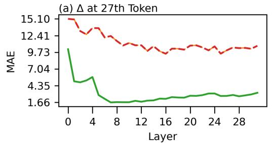

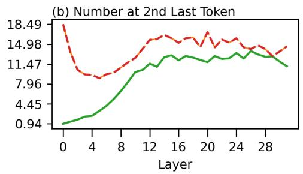

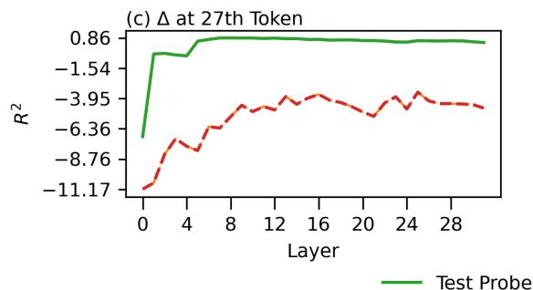

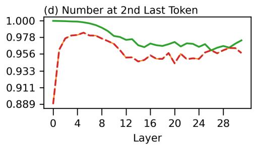  
Figure 3: Layerwise linear decodability of first diferences and final numbers. Mean absolute error (MAE; top) and coeficient of determination $( R ^ { 2 } ;$ bottom) for linear probes trained to decode delta (left) at ${ \bf 2 7 ^ { t h } }$ position and final number (right) at $5 7 ^ { \mathrm { t h } }$ position from hidden states across layers. Solid green lines denote performance on true targets; dashed red lines denote control probes trained on shufled labels. Delta show consistently strong linear decodability, while final number representations gradually lose decodability.

$$
{ \hat { \boldsymbol { \beta } } } = \mathop { \arg \operatorname* { m i n } } _ { \boldsymbol { \beta } } \| \mathbf { Y } - \mathbf { X } \pmb { \beta } \| ^ { 2 } ,\tag{3}
$$

where $\mathbf { X } \in \mathbb { R } ^ { n \times d }$ is the matrix of hidden states (with $d \ : = \ : 4 0 9 6$ dimensional representations across � = 4500 training examples), $\mathbf { Y } \in \mathbf { R } ^ { n }$ is the target vector (either the first diference or the final number), and $\pmb { \beta } \in \mathbb { R } ^ { d }$ is the learned weight vector.

To establish baselines, we implement control conditions that test whether observed decodability reflects genuine localization or spurious correlations. For first diference decoding, we train control probes using activations from the $5 7 ^ { \mathrm { t h } }$ token to predict the first difference of $2 7 ^ { \mathrm { { ^ { d h } } } }$ position, testing whether first diference information is accessible from positions nearer to the last token position. For final number decoding, we train control probes using activations from the $2 7 ^ { \mathrm { t h } }$ token to predict the number at the $5 7 ^ { \mathrm { t h } }$ position. These ensure that successful decoding reflects position-specific encoding rather than global numerical information distribution.

## 4.2 Results

Figure 3 presents the results of probing experiments. The top row reports the MAE of the linear regression model on held-out test samples, while the bottom row shows the $R ^ { 2 }$ . We compute these metrics at each layer to evaluate the linearity of the target quantities throughout the model’s depth.

The results confirm that both the first diference (at the $2 7 ^ { \mathrm { t h } }$ token position) and the final number (at the $5 7 ^ { \mathrm { t h } }$ token position) are linearly decodable from the hidden states, as evidenced by low MAE values and high $R ^ { 2 }$ scores approaching 1. Notably, the first diference becomes linearly accessible starting after the $\dot { 7 } ^ { \mathrm { t h } }$ layer, where the MAE drops sharply and approaches its minimum, while the $R ^ { 2 }$ score increases and stabilizes above 0.8. Although performance slightly decays with depth, it remains relatively stable across the first 16 layers. In contrast, the linear decodability of the final number at the $5 7 ^ { \mathrm { t h } }$ position shows a gradual decline across deeper layers, with MAE increasing and $R ^ { 2 }$ decreasing after layer 8. This suggests that the final number representation becomes increasingly entangled with other contextual information as it propagates through model.

Crucially, the control conditions demonstrate substantially worse performance across all layers for both targets. For first diferences, control probes using $5 7 ^ { \mathrm { { i h } } }$ token activations achieve negative $R ^ { 2 }$ values and high MAE, indicating no meaningful linear relationship. Similarly, control probes attempting to decode final numbers from $2 7 ^ { \mathrm { t h } }$ token activations show consistently poor performance. This confirms that the observed decodability is position-specific and not due to general numerical information in the representations.

Together, these results indicate that the numerical components necessary for the model’s arithmetic composition-the first diference and the final number-are linearly encoded in specific locations.

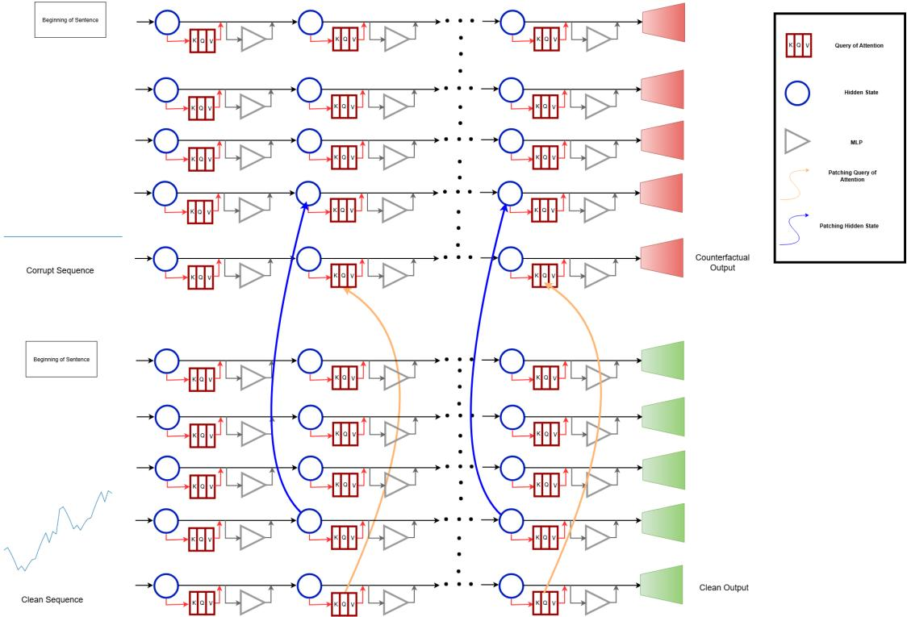  
Figure 4: Illustrates the query-hidden state patching technique that we use to test whether the model performs arithmetic composition by retrieving a first diference from an earlier position. The clean sequence (bottom) contains a structured delta pattern, while the corrupt sequence (top) is flat-valued. We transplant activations from the clean run into the corrupt run from a given layer � onward. We patch hidden states (shown with blue arrows) at layers � to � at one token position at a time except the beginning-of-sequence and final two tokens. We patch the query vector of the final token (shown with orange arrows) from the clean run at layers � + 1 to $L ,$ ensuring the model attends to the correct location encoding the target first diference. This setup isolates and tests the causal contribution of induction and addition behaviors in the model’s prediction pipeline.

## 5 Is the Next Number Computed by Adding a Retrieved First Diference?

Having established that the model encodes first diferences and final numbers in localized representations, we now ask whether it functionally uses those representations to perform arithmetic composition. We test whether the model retrieves a previously seen first diference from a particular token position and perform arithmetic operation on it.

To answer this question, we use activation patching [5, 8, 18, 31, 32, 40–42], following the patching methodology of [3]. We transplant activations from a clean sequence into a corrupt one to determine if the model retrieves the delta from the hypothesized position (delta that follows the latest one) and adds that to a new number of an unseen sequence.

## Clean vs. Corrupt Sequence

We define two types of input sequences:

• Clean sequence: $\boldsymbol { x } ^ { \mathrm { c l e a n } } = ( x _ { 1 } , \dots , x _ { 2 9 } )$ , where the deltas $\Delta _ { i }$ begin to repeat after $i = 1 7$ , and the model predicts: $x _ { 3 0 } =$ $x _ { 2 9 } + \Delta ^ { * }$ where $\Delta ^ { * }$ is the diference retrieved from an earlier position. In tokenized form, �29 appears at token 57, and the output �30 is generated at token 58.

• Corrupt sequence: ${ x ^ { \mathrm { c o r r u p t } } = \left( 1 0 0 , 1 0 0 , \dots , 1 0 0 \right) }$ , so that $\Delta _ { i } = 0$ for all �.

What makes the corrupt sequence particularly well-suited for evaluating the extraction and addition of the first diference is its deliberately flattened structure, which eliminates any intrinsic gradient or variation in the input. The corrupt sequence serves as an ideal control, as it lacks the algorithm present in the clean sequence, allowing us to test whether the model can still retrieve and apply a meaningful first diference from an alternate source.

## 5.1 Patching Setup

Let $H _ { t } ^ { ( l ) }$ and $Q _ { t } ^ { ( l ) }$ denote the hidden state and query vector at token �, layer �. We patch hidden states to all tokens except the beginning token, the final number token (57), and the final token (58):

$$
H _ { t } ^ { \operatorname { c o r r u p t } , ( l : L ) } \gets H _ { t } ^ { \operatorname { c l e a n } , ( l : L ) }
$$

The query vector of final token (58) is patched from one layer above:

$$
{ Q _ { 5 8 } ^ { \mathrm { c o r r u p t } , ( l + 1 : L ) }  Q _ { 5 8 } ^ { \mathrm { c l e a n } , ( l + 1 : L ) } }
$$

In particular, following [3], we patch layer � and all subsequent layers, as we illustrate in Figure 4. Patching downstream layers ensures that transient causal signals are preserved and not suppressed as noise by later layers, thereby, improving sensitivity to the influence of critical nodes on the final prediction.

For the final token, we specifically patch the query vector across layers � + 1 through �. This is necessary because the corrupt sequence does not learn in-context to retrieve target first diferences from earlier tokens. By patching the query vector of the final token from the clean forward pass, we ensure that the model attends to the position encoding the appropriate first diference, thereby, facilitating the intended retrieval behavior.

## 5.2 Causal Metric

To quantify causal influence, we use diference in predicted probabilities of counterfactual label $y _ { \mathrm { c f } } = 1 0 0 + \Delta ^ { * }$ as evaluation metric:

$$
\begin{array} { r } { \Delta P = \mathrm { E } _ { x \sim \mathcal { D } } \left[ P _ { \mathrm { p a t c h e d } } ( y _ { \mathrm { c f } } \mid x ) - P _ { \mathrm { c o r r u p t } } ( y _ { \mathrm { c f } } \mid x ) \right] } \end{array}\tag{4}
$$

where $P _ { \mathrm { p a t c h e d } } ( y _ { \mathrm { c f } } \mid x )$ is the probability assigned to the counterfactual label $y _ { \mathrm { c f } }$ under the patched forward pass, and $P _ { \mathrm { c o r r u p t } } ( y _ { \mathrm { c f } } \mid x )$ is the corresponding probability under the corrupt forward pass. A higher Δ� indicates stronger causal contribution of the patched components to the model’s ability to predict the correct label.

## 5.3 Results

Figure 5 presents the results of the patching experiment conducted on 100 data instances with zero MAE to ensure a strong response signal. We observe a significant increase in the probability diference score (Δ�), highlighted in red in Figure 5, at the $2 7 ^ { \mathrm { { t h } } }$ token position, beginning from layer 14 onward. This indicates that, from layer 15 onward, the query vector of the final token (position 58) causally interacts with the hidden state at position 27. The arithmetic operation is highly localized: only at these layers does the model cleanly separate the corrupt final number and compose it with the correct first diference. Earlier interventions disrupt this alignment due to representational entanglement between the corrupt and patched sequences, which impairs computation.

This finding supports the hypothesis that the model performs induction over first diferences by locating and copying a locally stored delta representation—analogous to the [A][B]...[A][?] pattern discussed in [4]—that follows the final observed one, though this behavior operates at a structural rather than token level. The arithmetic operation that follows induction—adding the copied delta to the final number at position 57 to generate the next token—is generalizable, as the model performs it even in the absence of a guiding algorithm in the corrupt sequence. This confirms that the model engages in both induction and arithmetic composition in numerical sequence extrapolation.

## 6 Can the Model Identify Functionally Critical Tokens for Delta Retrieval and Extrapolation?

Although previous experiments demonstrate that the model stores first diferences in localized representations and retrieves the appropriate ones for arithmetic composition, they do not tell if the model uncovers the underlying algorithm. In particular, uncovering requires identifying the onset of a repeating pattern, aligning it with the final observed diference, and selecting the correct delta to apply. To investigate this, we use patching to isolate the causal contribution of each attention head and assess which heads drive successful extrapolation by routing value from appropriate positions.

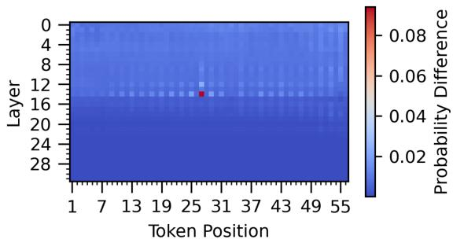  
Figure 5: Heatmap of probability diference scores (Δ�) across layers and token positions, following patching of the final query vector from layers �+1 to � and hidden states from layers � to �. A sharp causal efect emerges at token 27, highlighted in red, indicating that the final query attends to position 27 to retrieve the locally stored first diference that follows the last observed one.

## Patching Setup

We use the same clean and corrupt sequences described in the previous section, where the clean input contains a repeating firstdiference pattern and the corrupt input is a flat sequence of 100s. The target counterfactual label remains: $y _ { \mathrm { c f } } = 1 0 0 + \Delta ^ { * }$

Let $Q _ { s } ^ { ( l , h ) } , K _ { t } ^ { ( l , h ) } , V _ { t } ^ { ( l , h ) }$ , and $W _ { O } ^ { ( l , h ) }$ denote the query, key, value vectors, and output projection matrix for head (�, ℎ) in layer � at token � attending to token positions �. The attention weights at head (�, ℎ) are computed as:

$$
\alpha _ { t , s } ^ { ( l , h ) } = \mathrm { s o f t m a x } \left( \frac { ( Q _ { s } ^ { ( l , h ) } ) ^ { \top } K _ { t } ^ { ( l , h ) } } { \sqrt { d _ { h } } } \right)
$$

The corresponding output of attention head (�, ℎ) at token � is:

$$
z _ { s } ^ { ( l , h ) } = W _ { O } ^ { ( l , h ) } \left( \sum _ { t = 1 } ^ { T } \alpha _ { t , s } ^ { ( l , h ) } \cdot V _ { t } ^ { ( l , h ) } \right)
$$

To evaluate the causal efect of head (�, ℎ) at the final token position $s = 5 8$ , we patch just its output, as we illustrate in Figure 9 in the appendix , from the clean run into the corrupt run:

$$
z _ { 5 8 } ^ { \mathrm { c o r r u p t } , ( l , h ) } \gets z _ { 5 8 } ^ { \mathrm { c l e a n } , ( l , h ) }
$$

This setup isolates the contribution of a single attention head by substituting its output at the final token while preserving the rest of the corrupt context.

## 6.1 Causal Metric

To determine which tokens most significantly contribute to the model’s prediction, we construct a profile of attention heads that integrates two key signals: (1) the causal efect of each head, and (2) the value-weighted attention mass it allocates across token positions. We compute the causal efect as the change in the model’s predicted probability for the counterfactual label when we patch head’s output at position $s = 5 8$ from the clean to the corrupt run, as we describe in the previous section. The second component—the value-weighted attention— identifies how much ofits value is added to the residual stream through this head.

We define the token importance score TI� as:

$$
\mathrm { T I } _ { t } = \frac { 1 } { N } \sum _ { n = 1 } ^ { N } \lambda _ { n } ^ { ( l , h ) } \cdot w _ { n , t } ^ { ( l , h ) } ,\tag{5}
$$

where � is the number of evaluation samples, $\lambda _ { n } ^ { ( l , h ) } = P _ { \mathrm { p a t c h e d } } ( y _ { \mathrm { c f } }$ | $x _ { n } ) - P _ { \mathrm { c o r r u p t } } ( y _ { \mathrm { c f } } \mid x _ { n } )$ is the causal efect of patching head $( l , h )$ in sample �, and $w _ { n , t } ^ { ( l , h ) }$ is the value-weighted attention score at the attended position �. The value-weighted attention score $w _ { n , t } ^ { ( l , h ) }$ is defined using the attention weights and value norms:

$$
w _ { n , t } ^ { ( l , h ) } = \alpha _ { t , s } ^ { ( l , h ) } \cdot \left. \boldsymbol { V } _ { t } ^ { ( l , h ) } \right. _ { 2 } ,\tag{6}
$$

This metric $\mathrm { T I } _ { t }$ weights causal influence with value-aware attention, providing a principled measure of token-level functional relevance to the model’s output.

## 6.2 Results

Figure 6 presents the results of the causal attention-based analysis over 100 sequences with zero MAE, and the top five most relevant tokens are identified as positions 57, 33, 27, 55, and 25. As we show in Table $^ { 1 , }$ these correspond to the critical points that the model needs for identification and extrapolation of the pattern: the final number (57), the onset of the repeating delta pattern (33), the delta that gets added to the final value (27), the number that the model needs to compute the last delta (55), and a token (25) that both matches the final delta and enables retrieval of the next one.

These results also suggest the model emphasizes tokens that support first-diference alignment, with token 27 playing a key role in extrapolation. The pattern of attention supports the hypothesis that the model recognizes the pattern and must have first used the final first diference as a retrieval anchor to locate the appropriate delta, and, upon recognizing the repeating structure, may further leverage phase alignment and positional encoding to guide delta selection.

## 7 Does the Model Prioritize Delta Induction Over Positional Cues?

Prior experiments demonstrate that the model stores and composes first diferences to extrapolate future values. However, they do not reveal whether retrieval is governed by semantic identity of delta or by its positional and phase-based alignment in input.

To investigate this, we perform a key swapping intervention between the $2 7 ^ { \mathrm { { t h } } }$ and $2 5 ^ { \mathrm { t h } }$ tokens—two positions with high and comparable importance scores as shown in Figure 6.

## 7.1 Rotary Position Embedding (RoPE)

Let $\boldsymbol { x } \in \mathbb { R } ^ { d }$ denote an input vector, where � is even. Following the formulation introduced by (Su et al. 2024)[29], we partition � into $d / 2$ adjacent 2D pairs:

$$
\boldsymbol { x } = \left[ \ ( x _ { 1 } ^ { ( 1 ) } , x _ { 1 } ^ { ( 2 ) } ) , \ ( x _ { 2 } ^ { ( 1 ) } , x _ { 2 } ^ { ( 2 ) } ) , \ . . . , \ ( x _ { d / 2 } ^ { ( 1 ) } , x _ { d / 2 } ^ { ( 2 ) } ) \ \right]
$$

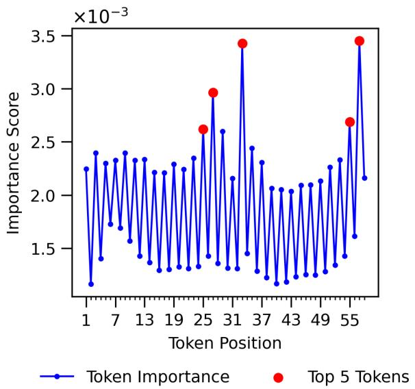  
Figure 6: Token importance scores $( \mathrm { T I } _ { t } )$ across sequence positions. Peaks highlight the model’s use ofstructural alignment for pattern detection and delta retrieval.

Let $W _ { q } , W _ { k } \in \mathbf { R } ^ { d \times d }$ be the query and key projection matrices. For position �, the RoPE-transformed query is:

$$
Q _ { m } = \mathrm { R o P E } ( W _ { q } x , m ) = \bigoplus _ { i = 1 } ^ { d / 2 } R ( m \theta _ { i } ) \left( W _ { q } x \right) _ { i }
$$

and similarly, for position �, the RoPE-transformed key is:

$$
K _ { n } = \mathrm { R o P E } ( W _ { k } x , n ) = \bigoplus _ { i = 1 } ^ { d / 2 } R ( n \theta _ { i } ) \left( W _ { k } x \right) _ { i }
$$

Here, $R ( m \theta _ { i } )$ is a 2D rotation matrix applied to the �-th 2D component:

$$
R ( m \theta _ { i } ) = { \left[ \begin{array} { l l } { \cos ( m \theta _ { i } ) } & { - \sin ( m \theta _ { i } ) } \\ { \sin ( m \theta _ { i } ) } & { \phantom { - } \cos ( m \theta _ { i } ) } \end{array} \right] }
$$

Here, $R ( n \theta _ { i } )$ is a 2D rotation matrix applied to the �-th 2D component:

$$
R ( n \theta _ { i } ) = { \left[ \begin{array} { l l } { \cos ( n \theta _ { i } ) } & { - \sin ( n \theta _ { i } ) } \\ { \sin ( n \theta _ { i } ) } & { \quad \cos ( n \theta _ { i } ) } \end{array} \right] }
$$

The operator $\oplus$ denotes vector concatenation across the $d / 2$ rotated 2D components:

$$
\bigoplus _ { i = 1 } ^ { d / 2 } v _ { i } = [ v _ { 1 } ; v _ { 2 } ; \dots ; v _ { d / 2 } ]
$$

where each $\boldsymbol { v } _ { i } \in \mathbf { R } ^ { 2 }$ , yielding a final vector in $\boldsymbol { \mathbf { R } } ^ { d } .$

The query and key vectors are independently rotated using their respective absolute positions � and �, and the relative positional information gets encoded through their dot product $Q _ { m } ^ { \top } K _ { n }$

## 7.2 Patching Setup

LLaMA 3.1-8B uses rotary position embedding (RoPE) [29] where positional information is local to key and query. We swap Keys $\begin{array} { r } { \dot { \bar { K } } _ { 2 7 } ^ { \mathrm { c l e a n } , ( l : L ) }  K _ { 2 5 } ^ { \mathrm { c l e a n } , ( l : L ) } } \end{array}$ in layer � and all subsequent layers to redirect positional and phase-based cues while preserving $V _ { 2 7 } ^ { \mathrm { c l e a n } , ( l : L ) }$ and $V _ { 2 5 } ^ { \mathrm { c l e a n } , ( l : L ) }$ by patching the values from the original run to maintain their first diference content across layers � + 1 through �, as we illustrate in Figure 10 in the appendix. This setup attempts to disentangle two types of cues bound to the delta representation.

## 7.3 Causal Metric

To quantify the causal impact of an intervention, we measure the change in the model’s confidence for both the counterfactual label $y _ { \mathrm { c f } } = x _ { 2 9 } + \Delta _ { 2 5 }$ and the ground truth label $y _ { \mathrm { g t } } = x _ { 2 9 } + \Delta _ { 2 7 }$ . The causal efect on the counterfactual label is defined as:

$$
\Delta P _ { \mathrm { c f } } = \mathrm { E } _ { x \sim \mathcal { D } } \left[ P _ { \mathrm { p a t c h e d } } ( y _ { \mathrm { c f } } \mid x ) - P _ { \mathrm { c o r r u p t } } ( y _ { \mathrm { c f } } \mid x ) \right] ,\tag{7}
$$

and for the ground truth label:

$$
\Delta P _ { \mathrm { g t } } = \operatorname { E } _ { x \sim \mathcal { D } } \left[ P _ { \mathrm { p a t c h e d } } ( y _ { \mathrm { g t } } \mid x ) - P _ { \mathrm { c o r r u p t } } ( y _ { \mathrm { g t } } \mid x ) \right] .\tag{8}
$$

We also report the absolute probabilities assigned after the intervention: $P _ { \mathrm { p a t c h e d } } ( y _ { \mathrm { c f } } \mid x )$ and $P _ { \mathrm { p a t c h e d } } ( y _ { \mathrm { g t } } \mid x )$ . These metrics together capture both the direction and magnitude of the model’s response to the intervention.

## 7.4 Results

Figure 7 presents the probability diference following the keyswapping intervention $\stackrel { \cdot } { K } _ { 2 7 } ^ { \mathrm { c l e a n } , ( l : L ) }  K _ { 2 5 } ^ { \mathrm { c l e a n } , ( l : L ) }$ that we conduct over 100 instances with zero MAE. The intervention leads to a significant increase in $\Delta P _ { \mathrm { c f } }$ and a corresponding drop in $\Delta P _ { \mathrm { g t } } ,$ suggesting that phase or position-based cues contribute meaningfully for delta retrieval and composition. However, as shown in Figure 8, which reports the absolute probabilities after intervention, the drop in $P _ { \mathrm { p a t c h e d } } ( y _ { \mathrm { g t } } )$ was not suficient for $P _ { \mathrm { p a t c h e d } } ( y _ { \mathrm { c f } } )$ to overtake it. This indicates that although key-based redirection influences the model’s behavior, it is ultimately not strong enough to override the original delta-based composition since the value vector must contain information that this first diference comes after the last observed one. The model’s afinity for delta-based composition supports the hypothesis that it first performed induction over first diferences to learn the underlying structure: internally simulated the composition process, and identified the correct algorithm, potentially refining it through phase-based alignment.

## 8 Conclusion

This work demonstrates the LLM, despite not being explicitly trained for high-precision numerical tasks, exhibit an emergent ability to perform structural extrapolation in numerical sequences without any explicit supervision. We show that the LLM is capable of recognizing trends, inferring position-dependent rules encoded as distinct first diferences, and systematically composing these rules to generate accurate predictions over evolving input sequences. Our analyses reveal that the LLM exhibit reasoning behaviors, operating over latent structure. Patching provided strong evidence that the model identifies numerical patterns, computes first diferences even before recurring structures emerge, stores these diferences locally, and later retrieves them to generate accurate predictions. Probing confirmed that the observed efects are not incidental but reflect functional computations over structured internal representations.

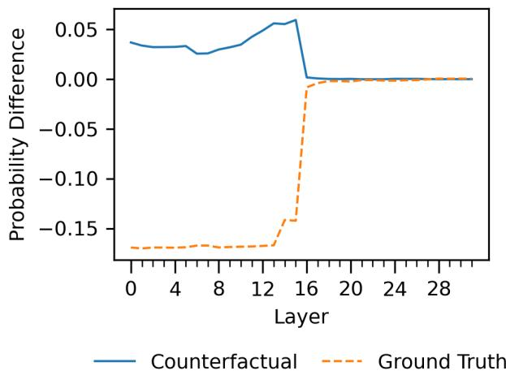

Figure 7: Shows key-swap intervention shifts confidence from ground truth to counterfactual, revealing the role of position-aware attention alignment in delta retrieval.  
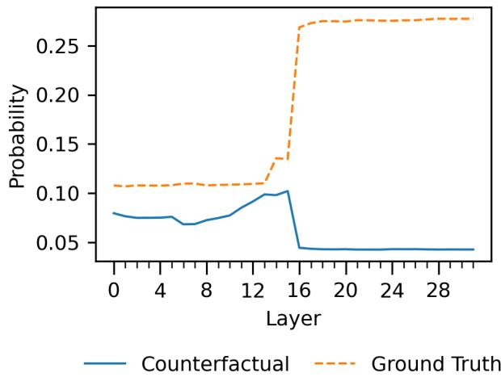  
Figure 8: Shows ground truth remains more probable post key-swap, indicating the model prioritizes delta-based composition over redirected attention.

We believe these findings would invite future work on extending these insights to other reasoning tasks where latent structure plays a critical role.

## References

[1] Ekin Akyürek, Dale Schuurmans, Jacob Andreas, Tengyu Ma, and Denny Zhou. 2022. What learning algorithm is in-context learning? investigations with linear models. arXiv preprint arXiv:2211.15661 (2022).

[2] Sébastien Bubeck, Varun Chandrasekaran, Ronen Eldan, Johannes Gehrke, Eric Horvitz, Ece Kamar, Peter Lee, Yin Tat Lee, Yuanzhi Li, Scott Lundberg, et al. 2023. Sparks of artificial general intelligence: Early experiments with gpt-4. arXiv preprint arXiv:2303.12712 (2023).

[3] Clément Dumas, Veniamin Veselovsky, Giovanni Monea, Robert West, and Chris Wendler. 2024. How do llamas process multilingual text? a latent exploration through activation patching. In ICML 2024 Workshop on Mechanistic Interpretability.

[4] Nelson Elhage, Neel Nanda, Catherine Olsson, Tom Henighan, Nicholas Joseph, Ben Mann, Amanda Askell, Yuntao Bai, Anna Chen, Tom Conerly, Nova Das Sarma, Dawn Drain, Deep Ganguli, Zac Hatfield-Dodds, Danny Hernandez, Andy Jones, Jackson Kernion, Liane Lovitt, Kamal Ndousse, Dario Amodei, Tom Brown, Jack Clark, Jared Kaplan, Sam McCandlish, and Chris Olah. 2021. A Mathemat ical Framework for Transformer Circuits. Transformer Circuits Thread (2021). https://transformer-circuits.pub/2021/framework/index.html.

[5] Matthew Finlayson, Aaron Mueller, Sebastian Gehrmann, Stuart Shieber, Tal Linzen, and Yonatan Belinkov. 2021. Causal analysis of syntactic agreement mechanisms in neural language models. arXiv preprint arXiv:2106.06087 (2021).

[6] Jaden Fiotto-Kaufman, Alexander R Loftus, Eric Todd, Jannik Brinkmann, Caden Juang, Koyena Pal, Can Rager, Aaron Mueller, Samuel Marks, Arnab Sen Sharma, Francesca Lucchetti, Michael Ripa, Adam Belfki, Nikhil Prakash, Sumeet Multani, Carla Brodley, Arjun Guha, Jonathan Bell, Byron Wallace, and David Bau. 2024. NNsight and NDIF: Democratizing Access to Foundation Model Internals. (2024). arXiv:2407.14561 [cs.LG] https://arxiv.org/abs/2407.14561

[7] Azul Garza and Max Mergenthaler-Canseco. 2023. TimeGPT-1. arXiv preprint arXiv:2310.03589 (2023).

[8] Nicholas Goldowsky-Dill, Chris MacLeod, Lucas Sato, and Aryaman Arora. 2023. Localizing model behavior with path patching. arXiv preprint arXiv:2304.05969 (2023).

[9] Aaron Grattafiori, Abhimanyu Dubey, AbhinavJauhri, Abhinav Pandey, Abhishek Kadian, et al. 2024. The Llama 3 Herd of Models. arXiv:2407.21783 [cs.AI] https://arxiv.org/abs/2407.21783

[10] Nate Gruver, Marc Finzi, Shikai Qiu, and Andrew G Wilson. 2024. Large language models are zero-shot time series forecasters. Advances in Neural Information Processing Systems 36 (2024).

[11] Hui Guan, Shaoshan Liu, Xiaolong Ma, Wei Niu, Bin Ren, Xipeng Shen, Yanzhi Wang, and Pu Zhao. 2021. CoCoPIE: Enabling real-time AI on of-the-shelf mobile devices via compression-compilation co-design. Commun. ACM 64, 6 (2021), 62–68.

[12] Subhash Kantamneni, Ziming Liu, and Max Tegmark. 2024. How Do Transformers" Do" Physics? Investigating the Simple Harmonic Oscillator. arXiv preprint arXiv:2405.17209 (2024).

[13] Michael Lan, Philip Torr, and Fazl Barez. 2023. Towards Interpretable Sequence Continuation: Analyzing Shared Circuits in Large Language Models. arXiv preprint arXiv:2311.04131 (2023).

[14] Yanyu Li, Changdi Yang, Pu Zhao, et al. 2023. Towards real-time segmentation on the edge (AAAI’23/IAAI’23/EAAI’23). Article 163, 9 pages. doi:10.1609/aaai. v37i2.25232

[15] Yanyu Li, Pu Zhao, Geng Yuan, Xue Lin, Yanzhi Wang, and Xin Chen. 2022. Pruning-as-search: Eficient neural architecture search via channel pruning and structural reparameterization. arXiv preprint arXiv:2206.01198 (2022).

[16] Juyi Lin, Amir Taherin, Arash Akbari, Arman Akbari, et al. 2025. Vote: visionlanguage-action optimization with trajectory ensemble voting. arXiv preprint arXiv:2507.05116 (2025).

[17] Jun Liu, Zhenglun Kong, Peiyan Dong, Changdi Yang, et al. 2025. Structured agent distillation for large language model. arXiv preprint arXiv:2505.13820 (2025).

[18] Kevin Meng, David Bau, Alex Andonian, and Yonatan Belinkov. 2022. Locating and editing factual associations in GPT. Advances in Neural Information Processing Systems 35 (2022), 17359–17372

[19] Suvir Mirchandani, Fei Xia, Pete Florence, Brian Ichter, Danny Driess, Montserrat Gonzalez Arenas, Kanishka Rao, Dorsa Sadigh, and Andy Zeng. 2023. Large language models as general pattern machines. arXiv preprint arXiv:2307.04721 (2023).

[20] Kashif Rasul, Arjun Ashok, Andrew Robert Williams, Arian Khorasani, George Adamopoulos, Rishika Bhagwatkar, Marin Biloš, Hena Ghonia, Nadhir Hassen, Anderson Schneider, et al. 2023. Lag-llama: Towards foundation models for time series forecasting. In R0-FoMo: Robustness of Few-shot and Zero-shot Learning in Large Foundation Models.

[21] Xuan Shen, Chenxia Han, Yufa Zhou, et al. 2025. DraftAttention: Fast Video Difusion via Low-Resolution Attention Guidance. arXivpreprintarXiv:2505.14708 (2025).

[22] Xuan Shen, Weize Ma, Jing Liu, et al. 2025. QuartDepth: Post-Training Quantization for Real-Time Depth Estimation on the Edge. In CVPR.

[23] Xuan Shen, Weize Ma, Yufa Zhou, et al. 2026. Fastcar: Cache Attentive Replay for Fast Auto-Regressive Video Generation on the Edge. In ICLR.

[24] Xuan Shen, Zhao Song, Yufa Zhou, et al. 2025. Lazydit: Lazy learning for the acceleration of difusion transformers. In AAAI.

[25] Xuan Shen, Zhao Song, Yufa Zhou, et al. 2025. Numerical pruning for eficient autoregressive models. In AAAI.

[26] Xuan Shen, Yizhou Wang, et al. 2025. Eficient Reasoning with Hidden Thinking. arXiv preprint arXiv:2501.19201 (2025).

[27] Xuan Shen, Pu Zhao, Yifan Gong, Zhenglun Kong, Zheng Zhan, Yushu Wu, Ming Lin, Chao Wu, Xue Lin, and Yanzhi Wang. 2024. Search for Eficient Large Language Models. In NeurIPS.

[28] Xuan Shen, Hangyu Zheng, Yifan Gong, et al. 2025. Sparse Learning for State Space Models on Mobile. In ICLR. https://openreview.net/forum?id=t8KLjiFNwn

[29] Jianlin Su, Murtadha Ahmed, Yu Lu, Shengfeng Pan, Wen Bo, and Yunfeng Liu. 2024. Roformer: Enhanced transformer with rotary position embedding. Neurocomputing 568 (2024), 127063.

[30] A Vaswani. 2017. Attention is all you need. Advances in Neural Information Processing Systems (2017).

[31] Jesse Vig, Sebastian Gehrmann, Yonatan Belinkov, Sharon Qian, Daniel Nevo, Yaron Singer, and Stuart Shieber. 2020. Investigating gender bias in language models using causal mediation analysis. Advances in neural information processing systems 33 (2020), 12388–12401.

[32] Kevin Ro Wang, Alexandre Variengien, Arthur Conmy, Buck Shlegeris, and Jacob Steinhardt. 2023. Interpretability in the Wild: a Circuit for Indirect Object Identification in GPT-2 Small. In The Eleventh International Conference on Learning Representations. https://openreview.net/forum?id=NpsVSN6o4u

[33] Siyue Wang, Xiao Wang, Shaokai Ye, Pu Zhao, and Xue Lin. 2018. Defending dnn adversarial attacks with pruning and logits augmentation. In 2018 IEEE Global Conference on Signal and Information Processing (GlobalSIP). IEEE, 1144–1148

[34] Yushu Wu, Yifan Gong, Pu Zhao, et al. 2022. Compiler-aware neural architecture search for on-mobile real-time super-resolution. In ECCV. Springer, 92–111.

[35] Changdi Yang, Pu Zhao, Yanyu Li, et al. 2023. Pruning parameterization with bi-level optimization for eficient semantic segmentation on the edge. In CVPR.

[36] Zheng Zhan, Yifan Gong, Pu Zhao, Geng Yuan, et al. 2021. Achieving on-mobile real-time super-resolution with neural architecture and pruning search. In ICCV. 4821–4831.

[37] Zheng Zhan, Zhenglun Kong, Yifan Gong, et al. 2024. Exploring Token Pruning in Vision State Space Models. In NeurIPS. https://openreview.net/forum?id= eWiGn0Fcdx

[38] Zheng Zhan, Yushu Wu, Yifan Gong, et al. 2024. Fast and Memory-Eficient Video Difusion Using Streamlined Inference. In NeurIPS. https://openreview. net/forum?id=iNvXYQrkpi

[39] Zheng Zhan, Yushu Wu, Zhenglun Kong, et al. 2024. Rethinking Token Reduction for State Space Models. In EMNLP. ACL, Miami, Florida, USA, 1686–1697. https: //aclanthology.org/2024.emnlp-main.100

[40] Lin Zhao, Xinru Jiang, Xi Xiao, Qihui Fan, Lei Lu, Yanzhi Wang, Xue Lin, Octavia Camps, Pu Zhao, and Jianyang Gu. 2026. Hieramp: Coarse-to-fine autoregressive amplification for generative dataset distillation. arXiv preprint arXiv:2603.06932 (2026).

[41] Lin Zhao, Yushu Wu, Yifan Gong, Yanzhi Wang, and Pu Zhao. 2026. OmniMem: Scalable and Adaptive Memory Retrieval for Long Video Generation. arXiv preprint arXiv:2605.30519 (2026).

[42] Lin Zhao, Yushu Wu, Xinru Jiang, Jianyang Gu, Yanzhi Wang, Xiaolin Xu, Pu Zhao, and Xue Lin. 2025. Taming difusion for dataset distillation with high representativeness. arXiv preprint arXiv:2505.18399 (2025).

[43] Pu Zhao, Dani Gunawan, Xuan Shen, Zheng Zhan, et al. 2025. Eficient and Accurate Post-Training Sparsification of Large Language Models with Proximal Operators. In Proceedings ofthe 3rd International Workshop on Rich Media With Generative AI (Ireland) (RichMediaGAI ’25). Association for Computing Machinery, 11–19.

[44] Pu Zhao, Xuan Shen, Zhenglun Kong, Yixin Shen, Sung-En Chang, Timothy Rupprecht, Lei Lu, Enfu Nan, Changdi Yang, Yumei He, et al. 2024. Fully Open Source Moxin-7B Technical Report. arXiv preprint arXiv:2412.06845 (2024).

[45] Pu Zhao, Fei Sun, Xuan Shen, et al. 2024. Pruning Foundation Models for High Accuracy without Retraining. In Findings ofEMNLP 2024. ACL. doi:10.18653/v1/ 2024.findings-emnlp.566

## Appendix

## A Illustrating Patching Experiments

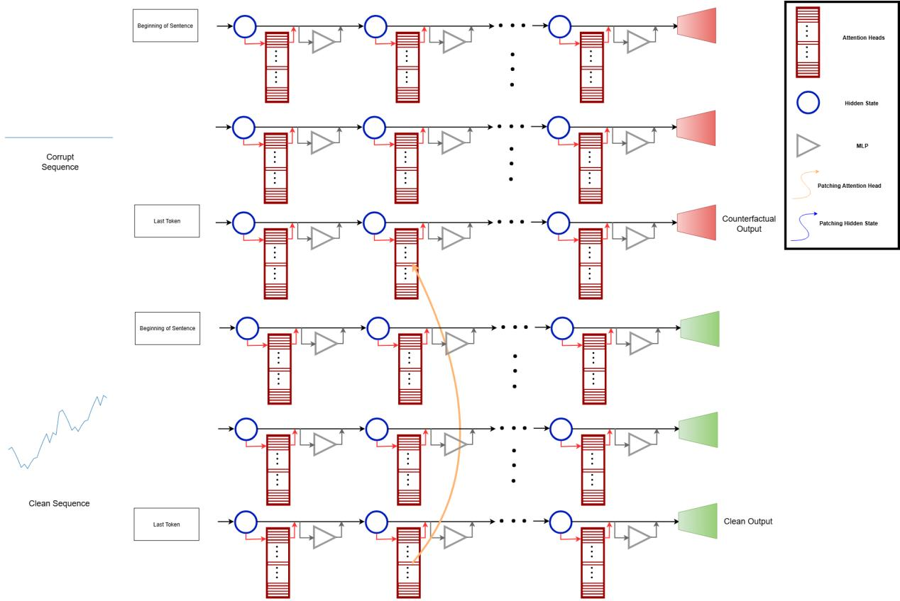  
Figure 9: Illustrates the head-level patching intervention that we use to isolate the functional role of individual attention heads in pattern recognition and delta retrieval. The clean sequence (bottom) contains structured first-diference patterns, while the corrupt sequence (top) is flat-valued. At each layer $l ,$ we patch only the output of a single attention head (at the final token position) from the clean forward pass into the corrupt one (shown with orange arrow), while all other heads and components remain unchanged. This targeted intervention tests whether the selected head causally contribute to the recognition of repeating structure, retrieval of a critical first diference, and contributes to accurate extrapolation in the final prediction.

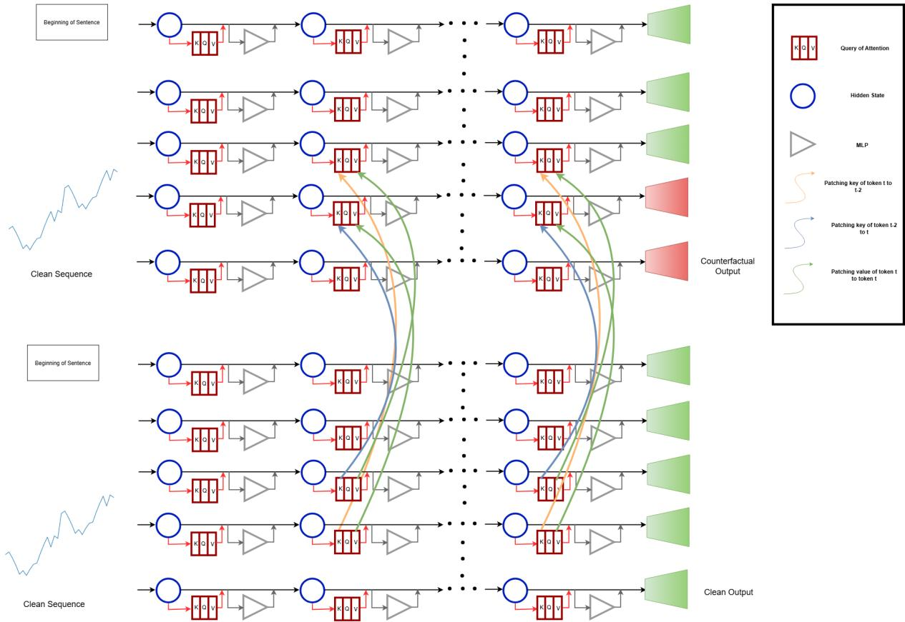  
Figure 10: Illustrates the key-swapping intervention that we use to disentangle the model’s reliance on phase (positional) cues versus delta-based representations during extrapolation. We swap keys from token positions 25 and 27—both identified as causally important—are swapped from layer � onward (indicated by orange and gray arrows), while preserving the respective value vectors from layer � onward. This setup tests whether the model selects the correct first diference for addition based on the original delta identity stored in the value vector or shifts its prediction in response to the redirected positional cue, thereby revealing its bias toward phase.