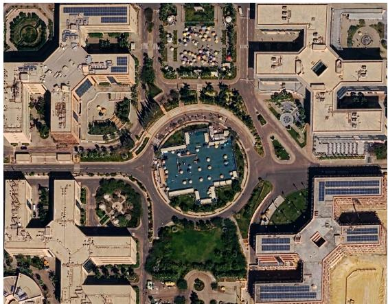
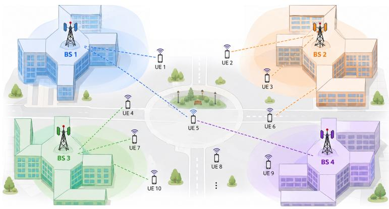
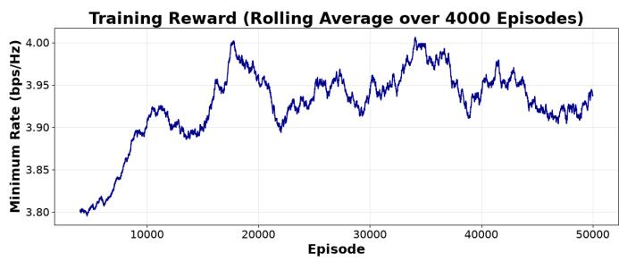
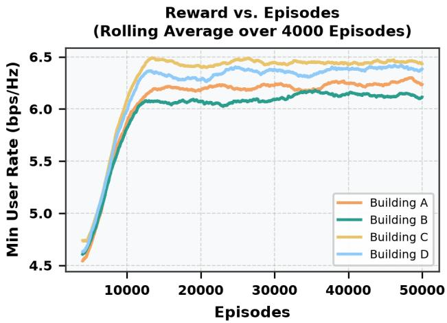
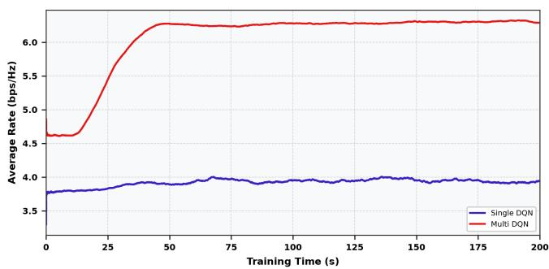
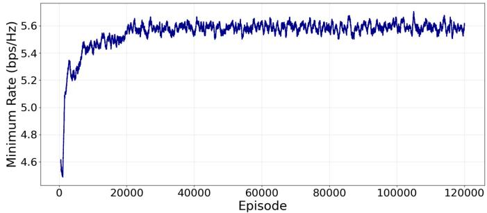
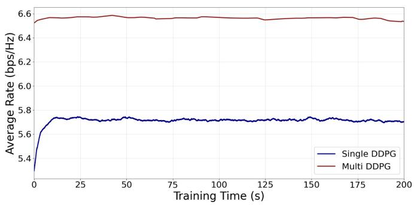
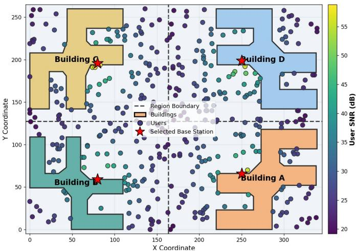

# Multi-Agent Off-Policy Deep Reinforcement Learning for Smart Campus Coverage

Omar Rady , Mohamed Ayman , Ali Arafa , Mohamed Shalma

Faculty of Information Engineering and Technology

The German University in Cairo

Cairo, Egypt

Abstract—Deep reinforcement learning (DRL) has recently gained a great attention due to its real-time adaptation and effectiveness in complex optimization problems. This paper investigates the optimal deployment of millimeter-wave (mmWave) base stations (BSs) in a realistic, non-convex campus topology. The optimization problem is NP-hard, due to the non-convex, non-smooth nature of the max-min fairness objective. To overcome these constraints, we formulate the BS placement as a Markov Decision Process (MDP) and systematically benchmark four DRL schemes: a discrete single-agent Deep Q-Network (DQN), a spatially partitioned Multi-Agent DQN, a continuous single-agent Deep Deterministic Policy Gradient (DDPG), and a geographically partitioned multi-agent DDPG framework. Numerical evaluations reveal that the multi-agent DDPG approach substantially outperforms single-agent in dense scenarios. Additionally full coverage is achieved, and a fairness Jain’s index of 0.94 is obtained. Finally, the multi-agent demonstrates highly efficient computational convergence of dense scenarios with 400 users.

Index Terms—Base station placement, deep reinforcement learning (DRL), Deep Deterministic Policy Gradient (DDPG), Deep Q-Network (DQN), max-min fairness, millimeter-wave (mmWave).

## I. INTRODUCTION

Next-generation (B5G/6G) wireless networks increasingly depend on the millimeter-wave (mmWave) spectrum to accommodate explosive demands for massive connectivity and multi-gigabit throughput. However, the high-frequency nature of mmWave transmissions makes them highly vulnerable to physical blockages, severe penetration attenuation, and atmospheric absorption. Consequently, defining the exact spatial coordinates for base station (BS) infrastructure is no longer a standard planning exercise; it constitutes an NP-hard optimization challenge that dictates network reliability, spectral efficiency, and equitable user fairness.

In practical urban and campus environments, deployment terrains rarely adhere to symmetric or convex geometries, which limits the signal coverage [1]. Conventional mathematical solvers, such as mixed-integer non-linear programming (MINLP) or exhaustive grid-search algorithms, struggle to resolve these non-convex spatial constraints. They either incur prohibitive computational overhead or fail to capture the highly directional propagation dynamics of mmWave signals. To overcome these limitations, Deep Reinforcement Learning (DRL) gained increased attention as a robust, model-free alternative, enabling autonomous agents to iteratively learn and refine optimal solutions [2], [3].

While recent literature has applied DRL and heuristic techniques to mmWave propagation and dynamic load balancing [4], [5], [6], [7], many existing models rely on simplified, unobstructed environments or predefined candidate coordinates [8]. For example, while DQN can jointly optimize mmWave coverage and localization [9], such frameworks often rely on discrete grid representations that restrict action spaces to predefined movements [9]. Conversely, although continuous actor-critic DRL frameworks enable flexible 3D placement of multiple UAV base stations to maximize user Quality of Experience (QoE) [10], they assume unrestricted aerial mobility [10]. The vast majority of the above-mentioned works are limited to single-BS scenarios and single agent modeling. As the environment becomes more complex, the curse of dimensionality dominates leading to a notable degradation in the DRL agents performance. There is a lack of unified optimization frameworks that simultaneously address mmWave characteristics, multi-agent modeling, and the strict topological constraints of non-convex topologies. The primary contributions of this work are as follows:

• We address the joint optimization of multiple base stations placement for a multi-user scenario to enhance the minimum rate for maximum fairness using mmWaves in a practical urban environment.

• The considered BS placement vicinity is a multi-space non-convex topology that leads to a non-convex and consequently, an NP-hard optimization problem.

• We propose the use of both continuous DRL approaches like DDPG and discrete ones as DQN. Furthermore, the two approaches are evaluated using singe and multiagent architectures. By introducing a boundary projection mechanism and a rigorous max-min fairness objective, the multi-agent DDPG framework surpasses other models and achieves superior optimality, guaranteeing 100% coverage, absolute minimum SNRs above 19 dB, and a Jain’s index of 0.94.

## II. SYSTEM AND CHANNEL MODEL

## A. Model Description

We analyze a downlink mmWave communication architecture where BSs are strategically deployed to serve K stationary user equipments (UEs) distributed throughout an indoor/courtyard environment. The geometrical layout strictly models the C-Buildings complex at the Germa university in Cairo (GUC), as illustrated in Fig. 1, featuring four adjacent rectangular structures that enclose a central open courtyard. The optimization goal is to extract the ideal two-dimensional (2D) horizontal coordinates for placing one BS on each of the four building roofs, with the UEs distributed at ground level.

  
Fig. 1. Aerial view of the full campus environment at the German University in Cairo (GUC) showing all main buildings.

## B. Channel Model

The Euclidean 3D distance separating a candidate base station and a user k is formulated as

$$
d _ { k } = \sqrt { ( x _ { \mathrm { B S } } - x _ { k } ) ^ { 2 } + ( y _ { \mathrm { B S } } - y _ { k } ) ^ { 2 } + ( h _ { \mathrm { B S } } - h _ { k } ) ^ { 2 } }\tag{1}
$$

where $( x _ { \mathrm { B S } } , y _ { \mathrm { B S } } )$ and $( x _ { k } , y _ { k } )$ represent the horizontal plane coordinates of the BS and user k, while $h _ { \mathrm { B S } }$ and $h _ { k }$ denote their respective heights. The mmWave channel state incorporating large-scale path loss and small-scale fading is modeled as

$$
h _ { k } = { \sqrt { L ( d _ { k } ) } } g _ { k }\tag{2}
$$

with $g _ { k } \sim \mathcal { C N } ( 0 , 1 )$ capturing Rayleigh fading. The large-scale path loss follows the standard power law:

$$
L ( d _ { k } ) = C _ { 0 } d _ { k } ^ { - \alpha }\tag{3}
$$

where $C _ { 0 }$ specifies the path loss at a 1-meter reference, and α is the attenuation exponent. The received signal vector at user k is given by

$$
y _ { k } = \sqrt { P _ { \mathrm { t x } } } h _ { k } x + n _ { k }\tag{4}
$$

where $P _ { \mathrm { t x } }$ is the transmission power, x is the unit-power data symbol, and $n _ { k } \sim \mathcal { C } \mathcal { N } ( 0 , N _ { 0 } )$ is the additive white Gaussian noise. In a noise-limited mmWave regime, the signal-to-noise ratio (SNR) is expressed as

$$
\gamma _ { k } = \frac { P _ { \mathrm { t x } } | h _ { k } | ^ { 2 } } { N _ { 0 } }\tag{5}
$$

Yielding an achievable data rate for user k of:

$$
R _ { k } = \log _ { 2 } \left( 1 + \gamma _ { k } \right)\tag{6}
$$

## III. PROPOSED DRL-BASED BS PLACEMENT

## A. MDP Formulation

The proposed DRL architecture is defined by an MDP tuple encompassing state observations, continuous/discrete action spaces, and objective-driven reward signals shared across the learning agents. The DRL environments and policy networks are implemented utilizing the Stable-Baselines3 framework to ensure robust and reproducible training.

  
Fig. 2. System model showing the 4 BSs and multiple users

• Observations: The environmental state captures the 2D spatial distribution of all users, defined as

$$
\mathsf { o b s v } = [ ( x _ { 1 } , y _ { 1 } ) , ( x _ { 2 } , y _ { 2 } ) , \cdot \cdot \cdot , ( x _ { K } , y _ { K } ) ]\tag{7}
$$

• Action Space: The agents output the optimal 2D coordinates for the four deployed BSs. Therefore, the joint action vector is formalized as

$$
a _ { t } = [ x _ { \mathrm { B S , 1 } } , y _ { \mathrm { B S , 1 } } , \dotsc , x _ { \mathrm { B S , 4 } } , y _ { \mathrm { B S , 4 } } ]\tag{8}
$$

• Reward Function: The reward mechanism directly reflects the max-min fairness target, defined strictly by the minimum user throughput rate to ensure equitable spatial coverage

$$
\mathtt { r e w a r d } = \operatorname* { m i n } _ { k } \log _ { 2 } ( 1 + \gamma _ { k } )\tag{9}
$$

## B. Multi-Agent DQN

The proposed Multi-Agent Deep Q-Network (MADQN) decomposes the BS placement problem into four cooperative subproblems by partitioning the campus into four regions. A DQN agent is assigned to each region and selects the optimal BS location from a discrete set of candidate positions. Each agent maintains its own Q-network, target network, and replay buffer, enabling decentralized learning while reducing the search space. After all agents complete their selections, the minimum SNR among all campus users is evaluated and used as a shared reward, encouraging fair wireless coverage across the campus. The overall optimization procedure is summarized in Algorithm 1.

## C. Continuous Multi-Partitioning via DDPG

To overcome the inherent resolution limits of grid discretization and avoid local spatial optima, the multi-partition DDPG approach explicitly subdivides the non-convex topography of each of the four building roofs into 5 distinct geometric partitions (North, South, East, West, and Center arms). Consequently, a dedicated continuous actor-critic agent is independently trained on each of these 20 total sub-sectors (Algorithm 2).

Algorithm 1 Multi-Agent DQN for BS Placement   
1: Input: User locations $\{ ( x _ { k } , y _ { k } ) \} _ { k = 1 } ^ { K }$ and candidate BS   
locations for each region   
2: for each agent $i = 1 , \dots , 4$ do   
3: Initialize Q-network $Q _ { \theta _ { i } }$ and target network $Q _ { \bar { \theta } _ { i } }$   
4: Initialize replay buffer $\mathcal { D } _ { i }$   
5: end for   
6: for each episode do   
7: Reset the environment   
8: for each agent i do   
9: Observe local state $s _ { i }$   
10: Select action $a _ { i }$ using an ϵ-greedy policy   
11: $\textbf { i f } a _ { i }$ is invalid then   
12: Apply invalid action penalty   
13: end if   
14: Assign BS location corresponding to $a _ { i }$   
15: end for   
16: Compute the global reward (minimum user SNR)   
17: for each agent i do   
18: Store transition $\left( { { s _ { i } } , { a _ { i } } , { r _ { i } } , { s _ { i } ^ { \prime } } } \right)$ in $\mathcal { D } _ { i }$   
19: Sample a minibatch from $\mathcal { D } _ { i }$   
20: Update $Q _ { \theta _ { i } }$   
21: Update target network $Q _ { \bar { \theta } _ { i } }$   
22: end for   
23: end for   
24: Output: Optimal BS locations for the four campus regions

Unlike the discrete DQN framework, if the DDPG network predicts a coordinate outside the bounds of its designated partition, the point is automatically projected to the nearest valid geometric boundary on the specific roof polygon. The framework then determines the absolute best deployment for the building by selecting the winning partition that yields the highest maximum reward.

## IV. NUMERICAL RESULTS

This section benchmarks the proposed optimization configurations via simulation using the environmental parameters detailed in Table I. The primary performance criteria include achievable max-min rates (bps/Hz), spectral efficiency, signalto-noise ratio (SNR) distributions, and overall sector coverage percentages.

TABLE I  
SIMULATION CONFIGURATION PARAMETERS
<table><tr><td>Parameter Description</td><td>Value</td></tr><tr><td>Total Number of Users (K)</td><td>400 (100 per zone)</td></tr><tr><td>Transmit Power  $( P _ { \mathrm { t x } } )$ </td><td>1.0 W</td></tr><tr><td>Noise Floor Power (N0)</td><td> $1 \times 1 0 ^ { - 1 0 } \mathrm { W }$ </td></tr><tr><td>Path Loss Exponent (α)</td><td>4.0</td></tr><tr><td>BS Antenna Height</td><td>12.0m</td></tr><tr><td>User Equipment Height</td><td>1.7m</td></tr><tr><td>DDPG Learning Rate</td><td> $3 \times 1 0 ^ { - 4 }$ </td></tr><tr><td>DQN Learning Rate</td><td> $3 \times 1 0 ^ { - 4 }$ </td></tr><tr><td>Replay Buffer Capacity</td><td>50,000</td></tr><tr><td>Temporal Discount Factor  $( \gamma )$ </td><td>0.99</td></tr></table>

Algorithm 2 Multi-Agent DDPG for BS Placement   
1: Input: Users $\{ ( x _ { k } , y _ { k } ) \} _ { k = 1 } ^ { K }$ , buildings $b \in \{ 1 . . 4 \}$ , parti  
tions $p \in \{ 1 . . 5 \}$   
2: for each building b do   
3: for each partition $p$ do   
4: Initialize actor $\pi _ { \boldsymbol { \theta } _ { b , p } }$ and critic $Q _ { \phi _ { b , p } }$   
5: Set target networks $\pi _ { \bar { \theta } _ { b , p } } , Q _ { \bar { \phi } _ { b , p } }$   
6: Initialize partitioned replay buffer $\mathcal { D } _ { b , p }$   
7: for each episode do   
8: Initialize environment   
9: for each time step t do   
10: Observe state st   
11: Generate action: $a _ { t } ^ { ( b , p ) } = \pi _ { \theta _ { b , p } } ( s _ { t } ) + \mathcal { N } _ { t }$   
12: Enforce partition boundary projection:   
$a _ { t } ^ { ( b , p ) } \gets \mathrm { P r o j } _ { \mathcal { A } _ { b , p } } ( a _ { t } ^ { ( b , p ) } )$   
13: Apply BS placement $( x _ { \mathrm { { B S } } } ^ { b } , y _ { \mathrm { { B S } } } ^ { b } )  a _ { t } ^ { ( b , p ) }$   
14: Compute step reward $r _ { t } ^ { ( \bar { b } , \bar { p } ) }$   
15: Observe next state $s _ { t + 1 }$   
16: Store tuple $( s _ { t } , a _ { t } ^ { ( b , p ) } , r _ { t } ^ { ( b , p ) } , s _ { t + 1 } )$ in $\mathcal { D } _ { b , p }$   
17: Sample minibatch from $\mathcal { D } _ { b , p }$   
18: Update critic network using Bellman equa  
tion   
19: Ascend policy gradient to update actor   
20: Perform soft target updates: $\bar { \theta } _ { b , p } \gets \tau \theta _ { b , p } +$   
$( 1 - \tau ) \bar { \theta } _ { b , p }$   
21: end for   
22: end for   
23: end for   
24: Select winning partition per building: $( x _ { \mathrm { B S } } ^ { b * } , y _ { \mathrm { B S } } ^ { b * } ) =$   
(b,p)   
arg maxp,t rt   
25: end for   
26: Output: Optimal continuous coordinates for all 4 buildings

  
Fig. 3. Training reward convergence profile for the Single-Agent DQN.

As depicted in Fig. 3, the baseline Single-Agent DQN struggles with the scale of the centralized discrete grid. The moving average reward plateaus at approximately 3.95 bps/Hz. This constrained performance highlights the geometric limitations of quantizing a non-convex space when attempting to optimize highly sensitive mmWave spatial coordinates.

To mitigate centralized grid congestion, Fig. 4 tracks the Multi-Agent DQN formulation. By assigning distinct discrete sub-grids to each of the four rooftops, the distributed agents successfully partition the computational complexity, yielding a noticeably higher and more stable max-min reward floor compared to the single-agent variant.

<table><tr><td>Optimization Technique</td><td>Total Users (n)</td><td>Mean Rate (bps/Hz)</td><td>Min SNR (dB)</td><td>Jain&#x27;s Index (J)</td></tr><tr><td>Single-Agent DQN</td><td>400</td><td>3.17</td><td>0.01</td><td>0.71</td></tr><tr><td>Multi-Agent DQN</td><td>400</td><td>9.05</td><td>14.01</td><td>0.82</td></tr><tr><td>Single-Agent DDPG</td><td>400</td><td>9.64</td><td>19.19</td><td>0.94</td></tr><tr><td>Multi-Agent DDPG</td><td>400</td><td>9.65</td><td>19.18</td><td>0.9486</td></tr></table>

  
Fig. 4. Training reward convergence profile for the Multi-Agent DQN.

  
Fig. 5. Time-based convergence comparison of average rates between Single-Agent and Multi-Agent DQN frameworks.

Furthermore, to highlight the computational efficiency of the distributed approach, Fig. 5 contrasts the average rate convergence against actual training time in seconds. The Multi-Agent DQN not only achieves a higher average rate but also demonstrates that partitioning the state space does not incur prohibitive time delays, rapidly establishing a superior performance floor compared to the single-agent baseline.

Evaluating continuous action spaces, Fig. 6 demonstrates the Single-Agent DDPG operating across the unbounded, unpartitioned campus geometry. By eliminating discrete grid limitations, the continuous agent achieves a substantially higher minimum rate convergence of approximately 5.6 bps/Hz. Nevertheless, managing four concurrent coordinates via a single centralized policy still introduces variance, as the agent struggles to balance overlapping coverage zones.

  
Fig. 6. Episodic training reward progression for the continuous Single-Agent DDPG.

  
Fig. 7. Time-based convergence comparison of average achievable rates for Single-Agent and Multi-Agent DDPG.

Building on the episodic performance, Fig. 7 illustrates the average rate convergence with respect to continuous training time. The multi-agent partitioning scheme maintains a highly stable average rate. By dedicating independent actors to bounded partitions, the system circumvents the extensive search times required by a single centralized agent, proving highly efficient in real-time execution.

To achieve global spatial optimality, the Multi-Agent DDPG framework deploys dedicated continuous agents to the strictly bounded rooftop partitions. Fig. 8 confirms the superiority of this localized exhaustive approach. By isolating the continuous search bounds into 5 arms per building, the framework avoids spatial minima and rapidly converges on an optimal deployment topology yielding a network-wide minimum reward of 6.393 bps/Hz. The system achieves a flawless 100% quadrant coverage (> 0.0 dB). Furthermore, the distributed agents deliver exceptional spectral efficiencies: 9.54, 9.52, 9.74, and 9.80 bps/Hz across Buildings A, B, C, and D, respectively, while sustaining absolute minimum SNRs above 19 dB.

  
Fig. 8. Optimal spatial mapping and resulting SNR distribution generated by the Multi-Agent DDPG framework.

## V. CONCLUSION

This study addressed the complex challenge of optimizing mmWave base station deployments across the non-convex rooftop infrastructure of the GUC campus. By formulating the environment as an MDP, we evaluated four distinct DRL methodologies targeting sum-rate and max-min fairness. Analytical results confirm that the geographically partitioned Multi-Agent DDPG approach significantly outperforms discrete grid-based and centralized continuous baselines. By dividing the complex rooftops into 5 distinct partitions and dedicating independent actor-critic agents to exhaustively search each continuous bound, the proposed framework bypasses dimensional scalability limits and local spatial minima. Ultimately, this approach achieves a superior minimum data rate of 6.393 bps/Hz, robust SNRs exceeding 19 dB, and perfectly equitable quadrant coverage.

## REFERENCES

[1] M. M. H. Shalma, E. A. Maher, and A. El-Mahdy, “Optimal power allocation and passive beamforming of double active ris-aided communication with af relay,” in 2023 2nd International Conference on Smart Cities 4.0, 2023, pp. 74–78.

[2] B. Shamseldin, A. Zedan, M. Shalma, and A. El-Mahdy, “Comparative study of gradient descent and deep reinforcement learning in multi-user rsma systems,” in 2025 7th Novel Intelligent and Leading Emerging Sciences Conference (NILES), 2025, pp. 376–379.

[3] M. M. H. Shalma, E. A. Maher, and A. El-Mahdy, “Hybrid deep reinforcement learning for joint resource allocation in multi-active risaided uplink communications,” in 2025 12th International Conference on Wireless Networks and Mobile Communications (WINCOM), 2025, pp. 1–6.

[4] P. Yu, J. Guo, Y. Huo, X. Shi, J. Wu, and Y. Ding, “Three-dimensional aerial base station location for sudden traffic with deep reinforcement learning in 5g mmwave networks,” International Journal of Distributed Sensor Networks, vol. 16, no. 5, 2020.

[5] M. Vdovichev and D. Bogdanov, “Neural network–based optimization of base station placement for local positioning systems,” in 2026 ElCon Conference of Young Researchers in Electrical Engineering, Automation & Control Systems (ElCon-EE), 2026, pp. 411–414.

[6] Z. Deng, C. Sun, F. Jiang, and J. Wang, “Multi-armed bandit based base stations deployment in millimeter wave network.” New York, NY, USA: Association for Computing Machinery, 2023.

[7] V. R. Farre-Guijarro, J. C. Estrada-Jim´ enez, J. D. Vega S´ anchez,´ J. A. Vasquez-Peralvo, and S. Chatzinotas, “Enhanced 5g/b5g network planning/optimization deploying ris in urban/outdoor scenarios,” in 2024 IEEE 29th International Workshop on Computer Aided Modeling and Design of Communication Links and Networks (CAMAD), 2024, pp. 1–6.

[8] T. Hayakawa, T. Kimura, and J. Cheng, “Robust optimization-based mobile base station placement with uav-assisted data collection under demand uncertainty,” in 2026 40th International Conference on Information Networking (ICOIN), 2026, pp. 900–905.

[9] A. Al-Tahmeesschi, J. Talvitie, M. Lopez-Ben´ ´ıtez, H. Ahmadi, and L. Ruotsalainen, “Multi-objective deep reinforcement learning for 5g base station placement to support localisation for future sustainable traffic,” in 2024 Joint European Conference on Networks and Communications & 6G Summit (EuCNC/6G Summit), vol. Conference Proceedings, 2024, p. 493–498.

[10] L. T. Hoang, C. T. Nguyen, H. D. Le, and A. T. Pham, “Adaptive 3d placement of multiple uav-mounted base stations in 6g airborne small cells with deep reinforcement learning,” Draft/Preprint, 2023.