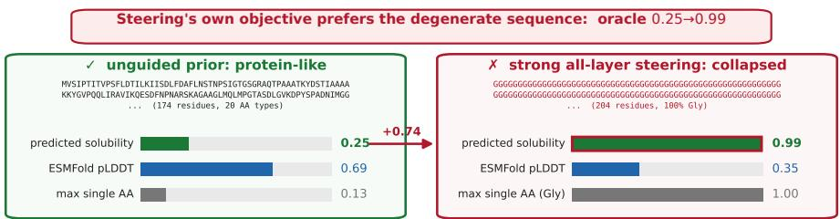
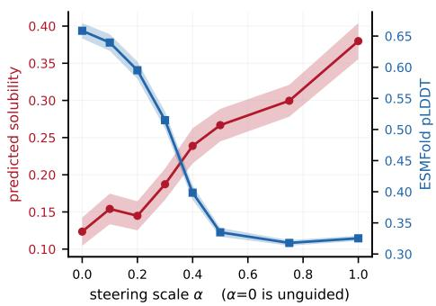
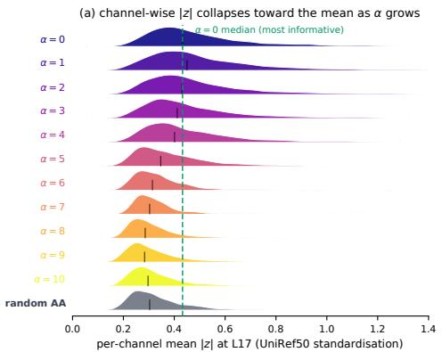
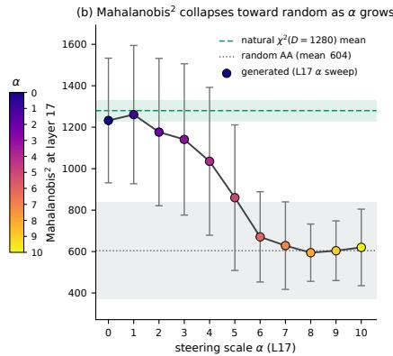
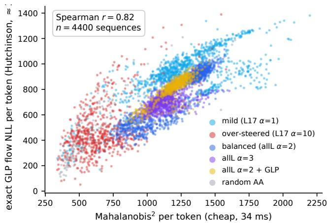
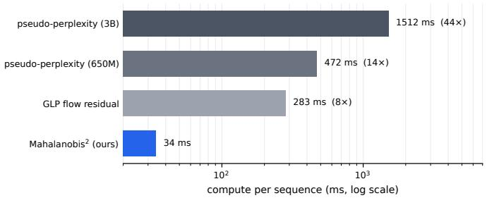

# Off-Manifold Collapse in Guided Protein Language Models

Shuibai Zhang∗,1 Xinchi Liu∗,1 Fred Zhangzhi Peng2 Zhihan Yang3 Shutong Wu1 Yingzi Ma1 Jiawei Zhang1

1University of Wisconsin–Madison 2Duke University 3Cornell University

## Abstract

Protein language models are widely used priors for protein sequence design, and a growing body of work controls them at inference time as an alternative to finetuning. Such guidance faces a dilemma: mild enough to preserve natural activation statistics, it barely moves the property; strong enough to move it, the generations become progressively harder to fold. We show the failure has a specific and cheaply detectable signature, an off-manifold collapse of the model’s own representations. Guided activations fall toward a region statistically indistinguishable from random amino-acid input, and the sequences degenerate to low complexity, yet the property oracle being optimized can still score these generations as a success. The optimized oracle can therefore fail to witness the collapse and, for solubility, can actively reward it, whereas structure and composition expose the failure. Because the failure is already visible in a finished candidate, we detect it at the output rather than modify the generator. We introduce a cheap density prior over natural protein activations and keep only the candidates that remain typical under it, a training-free post-hoc step we call Mahalanobis filtering. At matched guidance settings it improves both the property score and the structural plausibility of the sequences it keeps at negligible cost, without touching the generator, and transfers across different guidance methods. We release the activation statistic at https://huggingface. co/Shuibai12138/off-manifold-collapse-plm.

## 1 Introduction

Pretrained protein language models (PLMs) such as ESM-2 (1), ESM3 (2), ProGen (3), and Prot-GPT2 (4) are widely used priors for protein sequence design, and a growing body of work controls them at inference time rather than by fine-tuning: some follow the gradient of a trained property model through the generator (5; 6; 7; 8), others reshape the token distribution at decoding (9; 10), and activation steering edits the hidden states themselves. Steering is among the most attractive of these: transplanted from the control of large language models (11), it adds a direction computed from high and low-property reference sequences to the residual stream during masked decoding and obtains sequences the oracle scores above the reference set (12); Section 2 gives the mechanism. Steering requires neither gradients through the property model nor weight updates. We study it as the primary intervention and use predictor-gradient guidance as a mechanistically distinct transfer test.

Aggressive inference-time control nevertheless carries a structural cost. Other controllers report the same tension from the opposite side (9; 10). Logit-difference amplification addresses the degraded sequence properties and distributional similarity caused by activation steering (9), while iterative lookback Monte-Carlo sampling targets steering-induced diversity loss (10). These studies establish that the degradation is real and recognized, but each treats it as a reason to replace steering; neither directly characterizes its representation-space signature. Figure 1 shows what it looks like in a single pair of generations: pushed hard enough to move the property, steering makes ESM-2 emit a glycine homopolymer that the solubility oracle rates as almost certainly soluble (0.99) while ESMFold confidence falls to 0.35. The optimized oracle prefers the degenerate sequence, so the failure can only be read from referees outside the steering objective. We therefore ask:

  
Figure 1: The failure mode in one pair of generations (solubility, ESM-2 650M). The unguided sample uses all 20 amino acids, folds confidently, and scores low; under strong all-layer steering the model emits a glycine homopolymer that the steering objective rates as almost certainly soluble. The optimized oracle prefers the degenerate sequence, whereas structure and composition expose it. The population-level property–structure trade-off is reported in Appendix B.

What happens to a protein language model’s representations when steering is pushed hard enough to move the property, and can the resultingfailure be mitigated after generation?

In this work, we make the following contributions:

• A characterization of the failure as off-manifold collapse. Across both solubility and thermostability steering, the representations become less typical and ESMFold pLDDT decreases. However, the property-oracle score does not necessarily decrease at the same time. Therefore, the property score alone is not a reliable indicator of successful steering (Section 3).

• Mahalanobis-filtered steering, a training-free selection layer. A $\chi ^ { 2 } .$ -inspired one-sided typicality test over natural activations that improves the property–structure trade-off at matched settings and costs almost nothing, with a precise account of its scope (Section 4, Appendix H) and a public release of priors, statistics, and code.

## 2 Background

Protein language models. A protein is a string over an alphabet of 20 amino acids whose folded structure determines its function and properties such as solubility or thermostability. Trained on databases of natural proteins, a protein language model is a generic prior over “protein-like” sequences whose activations encode structure and function (13; 14): ESM-2 (1) is a masked language model trained on UniRef (15), and we work with its 650M variant. The family spans masked encoders (1; 16), autoregressive generators (3; 17; 4), discrete-diffusion generators $( 7 ) ,$ instruction-tuned variants (18), and multimodal generative models over sequence, structure, and function (2). Generation is by iterative masked decoding: from a reference sequence, positions are repeatedly masked and resampled from the model until every position has been re-predicted (12).

Activation steering. Activation steering edits a model’s hidden states at inference time: one fixed direction is added to the residual stream, with no weight update, a technique developed for controlling large language models (11; 19; 20; 21). The direction is typically a difference ofmeans between the activations of two contrasting example sets, and Huang et al. (12) apply it to PLMs. Write $h _ { \ell } ( s )$ for the layer-ℓ activation of a reference sequence s, and let H and L be reference sets labeled high and low for the target property. The steering vector, and the update it makes to the residual stream x at that layer in every forward pass of masked decoding, are

$$
v _ { \ell } = \frac { 1 } { | \mathcal { H } | } \sum _ { s \in \mathcal { H } } h _ { \ell } ( s ) \ - \ \frac { 1 } { | \mathcal { L } | } \sum _ { s \in \mathcal { L } } h _ { \ell } ( s ) , \qquad x \gets \left( x + \alpha v _ { \ell } \right) \frac { \| x \| } { \| x + \alpha v _ { \ell } \| } ,\tag{1}
$$

where α sets the strength and the rescaling preserves the norm of x. We use all layer injection (allL) throughout the main experiments and perform a single layer sweep injection for an auxiliary analysis. Preserving the raw norm in Eq. 1, however, does not preserve the per-channel whitened profile, so the steered activations can still leave the model’s typical activation region, as measured in Section 3.

Predictor-gradient guidance. As a mechanistically distinct controller, we also guide masked decoding using the gradient of the property oracle. At each round, the activation is moved by a fraction η of its norm along the normalized gradient, producing an input-dependent direction. Because the same oracle both defines this update and reports the property score, its increase is expected.

How a generated protein is judged. We evaluate generated proteins along two complementary axes. First, a property oracle estimates the intended functional shift: a solubility classifier (22) or a $T _ { m }$ regressor (23), each trained on frozen ESM-2 features. These predictors define the steering objective, but fitness models become less reliable under distant extrapolation and vary across protein families (24; 25). Second, we use ESMFold pLDDT (1) as a proxy for structural plausibility, reporting it over populations rather than treating any individual prediction as definitive. AlphaFold confidence provides an alternative (26); ESMFold’s MSA-free inference makes population-scale evaluation tractable. Neither axis replaces experimental validation: computational metrics do not by themselves establish activity (27); experimental studies of generated proteins and closed-loop methods rely on wet-lab feedback (28; 29); our method remains a computational pre-screen.

## 3 Diagnosing Steering-Induced Collapse

Figures 2–3 use the released solubility difficulty splits solely for diagnostic visualization. sol\_hard contains low-solubility references, whereas sol\_easy contains moderately soluble references; see Appendix A for details.

Property is bought with structure. Figure 2 reveals a systematic trade-off: as steering strengthens, predicted solubility rises overall from 0.12 to 0.38, while ESMFold pLDDT falls sharply from 0.66 to 0.32. Structural confidence deteriorates before a substantial property shift appears: by $\alpha = 0 . 2$ , pLDDT has already fallen to 0.60 while predicted solubility remains near its unguided level, showing that the degradation is gradual rather than confined to extreme steering. Because the oracle measures a predicted property shift rather than experimental validation, we evaluate every setting jointly by its target-property score and pLDDT, and judge our remedy by whether it recovers structural confidence without sacrificing the achieved shift; full sweep results are provided in Appendix B.

  
Figure 2: Property is bought with structure (sol\_hard, $\alpha = 0$ is unguided) Increasing steering strength raises predicted solubility overall but sharply reduces ESMFold pLDDT; bands are standard errors.

Reference statistics. Natural moments $( \mu , \sigma ^ { 2 } )$ are estimated once from UniRef50, reused throughout, and detailed in Appendix A.

What collapses: the representation. To test whether the output-level loss of structural confidence has an activation-space counterpart, we inspect the generator’s own hidden states. We use a diagonal Mahalanobis score because the dominant failure is radial: as steering strengthens, the standardized per-channel activations contract toward the UniRef50 mean, which this score measures directly. Let $\mathbf { \Psi } _ { h } ^ { \bullet } \in \mathbb { R } ^ { L \times D }$ denote the interior-token layer-17 activations of a candidate sequence, where $D = 1 2 8 0$ for ESM-2 650M, and let $( \mu , \sigma ^ { 2 } )$ denote the per-channel mean and variance of natural layer-17 activations, estimated once from UniRef50 (15). We measure

$$
\mathrm { M a h a l } ^ { 2 } ( h ) = \frac { 1 } { L } \sum _ { i = 1 } ^ { L } \sum _ { d = 1 } ^ { D } \left( \frac { h _ { i , d } - \mu _ { d } } { \sigma _ { d } } \right) ^ { 2 } .\tag{2}
$$

This construction adopts a deliberately simplified working model: natural activations are approximately Gaussian after per-channel standardization, and cross-channel covariance is ignored. We do not treat this diagonal Gaussian as an exact model of the latent distribution; rather, it provides a cheap, calibrated statistic of radial typicality. Under this model, the per-token sum has reference distribution $\chi ^ { 2 } ( D )$ with mean D. Because token positions are correlated, however, the sequence-level average is not itself $\chi ^ { 2 } ( D )$ , so we interpret it against the empirical unguided distribution (mean 1226, s.d. 317).

  
Figure 3: Why a Mahalanobis statistic: over-guided activations become indistinguishable from random amino acids (single-layer steering at layer 17, sol\_easy, 100 sequences per α). (a) Density over the 1280 channels of per-channel mean $| z | , z = ( h - \mu ) / \sigma$ standardized by natural UniRef50 layer-17 moments: as α grows every channel moves closer to its natural mean, reaching the gray random-amino-acid reference by $\alpha { \approx } 6 .$ (b) The same effect per sequence (mean and s.d.), against the per-token $\chi ^ { 2 } ( D )$ scale (green, $D \pm { \sqrt { 2 D } } )$ and the random-amino-acid spread (gray); the spread over sequences is far wider than that per-token band, which is why k in Section 4 is set empirically. The failure is a collapse toward the channel-wise mean, which is what a diagonal-Gaussian typicality test detects.

Figure 3 shows that the score falls from 1232 to approximately 600 as steering strengthens, approaching the random-amino-acid reference of 604. On the all-layer sweep in Figure $2 , \mathrm { \bar { M a h a l } ^ { 2 } }$ likewise falls from 1226 to 642 as pLDDT falls from 0.66 to 0.32. These results motivate using the score as an activation-space indicator of the collapse associated with reduced structural confidence. Appendix F validates the diagonal approximation against a flexible flow-based density model fitted to the same activations.

The same inward collapse appears under predictor-gradient guidance. On the same UniRef50 references, increasing η moves populations inward for both properties: Mahal2 and ESMFold pLDDT decrease at every guidance strength. The property increase is not independent evidence because the same oracle supplies the gradient and score. Their synchronized decline shows that inward collapse extends beyond fixed-vector steering; filter transfer is evaluated in Section 5.

## 4 Mahalanobis-Filtered Steering

The diagnosis in Section 3 identifies a dominant inward failure mode: guided activations contract toward the channel-wise mean and fall below the natural shell. Because generator-side mitigations were not consistent across properties (Appendix G), we instead apply a one-sided post-hoc veto to completed candidates. Given the score in Eq. 2, we accept a candidate iff

$$
\mathrm { M a h a l } ^ { 2 } ( h ) \geq D - k \sqrt { 2 D } ,\tag{3}
$$

where we set $k = 1$ once and use the resulting threshold, 1229 for $D = 1 2 8 0$ , unchanged across tasks, properties, reference sets, and guidance mechanisms.

The rule is $\chi ^ { 2 } .$ -inspired rather than an exact sequence-level quantile because token positions are correlated; Appendix E gives its calibration and sensitivity. It is one-sided because it targets inward collapse; outward extremes are outside its scope and reported in Appendix C.

The filter operates only on completed sequences and does not modify decoding. Scoring requires no additional learned model beyond ESM-2: one forward pass of the completed sequence, followed by per-channel standardization and summation using two stored 1280-dimensional moment vectors. Because it reads only the final activations, the same filter attaches unchanged to all-layer steering, predictor-gradient guidance, and unguided generation. Every comparison below is between a generated pool and the subset selected from that same pool by Eq. 3; the filter is a selector, not a standalone generator.

Table 1: Matched all-layer steering before and after filtering on property-unconditioned UniRef50 references $( \alpha = 0 . 5 , k = 1 , n = 1 2 8$ per property). The +filter columns summarize the accepted subset of the same generated population; the filter does not regenerate candidates. Property is predicted solubility probability for sol and predicted $T _ { m } \ : ( ^ { \circ } \mathrm { C } )$ for therm. Intervals are paired-bootstrap 95% confidence intervals. Acc. denotes the fraction of generated candidates retained by the filter.
<table><tr><td></td><td colspan="2">property</td><td colspan="2">pLDDT</td><td colspan="2"></td></tr><tr><td>task</td><td>steer</td><td>+filter</td><td>steer</td><td>+filter</td><td>acc.</td><td>∆ pLDDT</td></tr><tr><td>sol</td><td>0.404</td><td>0.491</td><td>0.401</td><td>0.647</td><td>16%</td><td>+0.247 [0.200, 0.299]</td></tr><tr><td>therm</td><td>56.8</td><td>63.6</td><td>0.446</td><td>0.633</td><td>20%</td><td>+0.187 [0.140, 0.234]</td></tr></table>

## 5 Evaluation

Filtering recovers structural confidence at a fixed steering setting. Table 1 compares each all-layer-steered population with the subset selected from that same population. $\mathrm { A t } \ : \alpha = 0 . 5$ , filtering raises mean pLDDT from 0.401 to 0.647 for solubility and from 0.446 to 0.633 for thermostability. The corresponding paired improvements are +0.247 and +0.187, respectively, with both confidence intervals excluding zero. The mean predicted property also increases within each accepted subset.

These results isolate the effect of selection: the generator, steering strength, references, and decoding seeds are identical before and after filtering. They do not imply that filtered steering universally dominates the filtered unguided prior; that comparison is property-dependent and is reported with the full sweep in Appendix C.

The detector transfers across guidance mechanisms. The result is not restricted to steering. We apply the same method to predictor gradient guidance, without retraining or recalibration. Across both properties and three guidance strengths, increasing the guidance step moves the population inward, and filtering raises mean pLDDT by 0.144–0.175 in all six UniRef50 guidance pools, with every paired-bootstrap interval excluding zero. The oracle increase under gradient guidance is not treated as independent evidence, because the same oracle supplies the guidance gradient. Complete results, including the family reference pool, are reported in Appendix D.

This transfer supports robustness across properties and intervention mechanisms on a broad UniRef50 background. It does not imply that the one-sided rule detects every possible failure of extreme steering: outward collapse remains outside the regime targeted by Eq. 3.

A cheap statistic suffices. Across 4,400 sequences, the diagonal statistic agrees with the exact flow NLL across broad regimes (pooled Spearman r = 0.82), but heterogeneous within-setting correlations do not imply identical selections. The exact NLL used for this comparison costs ≈3 s per sequence and requires a 1.3 GB model; its approximate flow-residual readout costs 283 ms, whereas the Mahalanobis costs 34 ms and stores only 10 KB (Appendix F).

## 6 Conclusion

Effective activation steering can drive ESM-2’s representations off the natural typicality shell into a region shared with random amino-acid input, where a learned oracle may still read the result as a success. Because that signature survives in a finished candidate, a 10 KB one-sided typicality test recovers the sequences a steered pool has left on the manifold, at matched settings and negligible cost. It selects rather than projects, so it helps only while a viable tail remains; Appendix H gives the full scope and limitations.

## References

[1] Zeming Lin, Halil Akin, Roshan Rao, Brian Hie, et al. Evolutionary-scale prediction of atomic-level protein structure with a language model. Science, 379(6637):1123–1130, 2023. doi: 10.1126/science.ade2574.

[2] Thomas Hayes, Roshan Rao, Halil Akin, Nicholas J. Sofroniew, Deniz Oktay, Zeming Lin, Robert Verkuil, et al. Simulating 500 million years of evolution with a language model. Science, 387(6736):850–858, 2025. doi: 10.1126/science.ads0018.

[3] Ali Madani, Ben Krause, Eric R. Greene, et al. Large language models generate functional protein sequences across diverse families. Nature Biotechnology, 41(8):1099–1106, 2023. doi: 10.1038/ s41587-022-01618-2.

[4] Noelia Ferruz, Steffen Schmidt, and Birte Höcker. ProtGPT2 is a deep unsupervised language model for protein design. Nature Communications, 13(1):4348, 2022. doi: 10.1038/s41467-022-32007-7.

[5] Prafulla Dhariwal and Alexander Nichol. Diffusion models beat GANs on image synthesis. In Advances in Neural Information Processing Systems, volume 34, pages 8780–8794, 2021.

[6] Nate Gruver, Samuel Stanton, Nathan Frey, Tim G. J. Rudner, Isidro Hotzel, Julien Lafrance-Vanasse, Arvind Rajpal, Kyunghyun Cho, and Andrew G. Wilson. Protein design with guided discrete diffusion. In Advances in Neural Information Processing Systems, volume 36, pages 12489–12517, 2023. doi: 10.52202/075280-0547.

[7] Xinyou Wang, Zaixiang Zheng, Fei Ye, Dongyu Xue, Shujian Huang, and Quanquan Gu. Diffusion language models are versatile protein learners. In Proceedings ofthe 41st International Conference on Machine Learning, volume 235 of Proceedings of Machine Learning Research, pages 52309–52333. PMLR, 2024. URL https://proceedings.mlr.press/v235/wang24ct.html.

[8] Jason Yang, Wenda Chu, Daniel Khalil, Raul Astudillo, Bruce J. Wittmann, Frances Arnold, and Yisong Yue. Steering generative models with experimental data for protein fitness optimization. In Advances in Neural Information Processing Systems, volume 38, 2025. doi: 10.52202/085713-4866.

[9] Manuel Fernández Burda, Santiago Aranguri, Iván Arcuschin, and Enzo Ferrante. Inference-time toxicity mitigation in protein language models via logit-diff amplification. In ICLR 2026 GEM Workshop, 2026. URL https://openreview.net/forum?id=v3zLrnkvWD.

[10] Francesco Calvanese, Gianluca Lombardi, Martin Weigt, and Jorge Fernandez-de Cossio-Diaz. Steering sequence generation in protein language models through iterative lookback Monte Carlo sampling. In ICML 2026 Workshop on Generative AI and Biology (GenBio), 2026. Spotlight.

[11] Alexander Matt Turner, Lisa Thiergart, Gavin Leech, David Udell, Juan J. Vazquez, Ulisse Mini, and Monte MacDiarmid. Steering language models with activation engineering. arXiv preprint arXiv:2308.10248, 2023. URL https://arxiv.org/abs/2308.10248.

[12] Long-Kai Huang, Rongyi Zhu, Bing He, and Jianhua Yao. Steering protein language models. In Proceedings of the 42nd International Conference on Machine Learning, volume 267 of Proceedings of Machine Learning Research, pages 26247–26260. PMLR, 2025. URL https://proceedings.mlr. press/v267/huang25ba.html.

[13] Alexander Rives, Joshua Meier, Tom Sercu, Siddharth Goyal, et al. Biological structure and function emerge from scaling unsupervised learning to 250 million protein sequences. Proceedings ofthe National Academy of Sciences, 118(15):e2016239118, 2021. doi: 10.1073/pnas.2016239118.

[14] Joshua Meier, Roshan Rao, Robert Verkuil, Jason Liu, Tom Sercu, and Alexander Rives. Language models enable zero-shot prediction of the effects of mutations on protein function. In Advances in Neural Information Processing Systems, volume 34, pages 29287–29303, 2021.

[15] Baris E. Suzek, Yuqi Wang, Hongzhan Huang, Peter B. McGarvey, Cathy H. Wu, and the UniProt Consortium. UniRef clusters: a comprehensive and scalable alternative for improving sequence similarity searches. Bioinformatics, 31(6):926–932, 2015. doi: 10.1093/bioinformatics/btu739.

[16] Ahmed Elnaggar, Michael Heinzinger, Christian Dallago, et al. ProtTrans: Toward understanding the language of life through self-supervised learning. IEEE Transactions on Pattern Analysis and Machine Intelligence, 44(10):7112–7127, 2022. doi: 10.1109/TPAMI.2021.3095381.

[17] Erik Nijkamp, Jeffrey A. Ruffolo, Eli N. Weinstein, Nikhil Naik, and Ali Madani. ProGen2: Exploring the boundaries of protein language models. Cell Systems, 14(11):968–978.e3, 2023. doi: 10.1016/j.cels.2023. 10.002.

[18] Liuzhenghao Lv, Zongying Lin, Hao Li, Yuyang Liu, Jiaxi Cui, Calvin Yu-Chian Chen, Li Yuan, and Yonghong Tian. ProLLaMA: A protein large language model for multitask protein language processing. IEEE Transactions on Artificial Intelligence, 7(2):642–653, 2026. doi: 10.1109/TAI.2025.3564914.

[19] Kenneth Li, Oam Patel, Fernanda Viégas, Hanspeter Pfister, and Martin Wattenberg. Inference-time intervention: Eliciting truthful answers from a language model. In Advances in Neural Information Processing Systems, volume 36, pages 41451–41530, 2023. doi: 10.52202/075280-1797.

[20] Nina Rimsky, Nick Gabrieli, Julian Schulz, Meg Tong, Evan Hubinger, and Alexander Turner. Steering Llama 2 via contrastive activation addition. In Proceedings ofthe 62nd Annual Meeting ofthe Association for Computational Linguistics, pages 15504–15522. Association for Computational Linguistics, 2024. doi: 10.18653/v1/2024.acl-long.828.

[21] Andy Zou, Long Phan, Sarah Chen, James Campbell, et al. Representation engineering: A top-down approach to AI transparency. arXiv preprint arXiv:2310.01405, 2023. URL https://arxiv.org/abs/ 2310.01405.

[22] Sameer Khurana, Reda Rawi, Khalid Kunji, Gwo-Yu Chuang, Halima Bensmail, and Raghvendra Mall. DeepSol: a deep learning framework for sequence-based protein solubility prediction. Bioinformatics, 34 (15):2605–2613, 2018. doi: 10.1093/bioinformatics/bty166.

[23] Anna Jarzab, Nils Kurzawa, Thomas Hopf, et al. Meltome atlas—thermal proteome stability across the tree of life. Nature Methods, 17(5):495–503, 2020. doi: 10.1038/s41592-020-0801-4.

[24] Chase R. Freschlin, Sarah A. Fahlberg, Pete Heinzelman, and Philip A. Romero. Neural network extrapolation to distant regions of the protein fitness landscape. Nature Communications, 15(1):6405, 2024. doi: 10.1038/s41467-024-50712-3.

[25] Pascal Notin, Aaron Kollasch, Daniel Ritter, Lood van Niekerk, Steffanie Paul, Han Spinner, Nathan Rollins, et al. ProteinGym: Large-scale benchmarks for protein fitness prediction and design. In Advances in Neural Information Processing Systems, volume 36, pages 64331–64379, 2023. doi: 10.52202/075280-2810.

[26] John Jumper, Richard Evans, Alexander Pritzel, et al. Highly accurate protein structure prediction with AlphaFold. Nature, 596(7873):583–589, 2021. doi: 10.1038/s41586-021-03819-2.

[27] Sean R. Johnson, Xiaozhi Fu, Sandra Viknander, Clara Goldin, Sarah Monaco, Aleksej Zelezniak, and Kevin K. Yang. Computational scoring and experimental evaluation of enzymes generated by neural networks. Nature Biotechnology, 43(3):396–405, 2025. doi: 10.1038/s41587-024-02214-2.

[28] Robert Verkuil, Ori Kabeli, Yilun Du, Basile I. M. Wicky, Lukas F. Milles, Justas Dauparas, David Baker, Sergey Ovchinnikov, Tom Sercu, and Alexander Rives. Language models generalize beyond natural proteins. bioRxiv, 2022. doi: 10.1101/2022.12.21.521521.

[29] Kaiyi Jiang, Zhaoqing Yan, Matteo Di Bernardo, Samantha R. Sgrizzi, et al. Rapid in silico directed evolution by a protein language model with EVOLVEpro. Science, 387(6732):eadr6006, 2025. doi: 10.1126/science.adr6006.

[30] Grace Luo, Jiahai Feng, Trevor Darrell, Alec Radford, and Jacob Steinhardt. Learning a generative meta-model of LLM activations. In International Conference on Machine Learning (ICML), 2026. URL https://arxiv.org/abs/2602.06964.

[31] Pierre Glaser, Steffanie Paul, Alissa M. Hummer, Charlotte Deane, Debora Susan Marks, and Alan Nawzad Amin. Kernel-based evaluation of conditional biological sequence models. In Proceedings of the 41st International Conference on Machine Learning, volume 235 of Proceedings ofMachine Learning Research, pages 15678–15705. PMLR, 2024. URL https://proceedings.mlr.press/v235/glaser24a.html.

## A Experimental setup and reproducibility

Model and decoding. All experiments use ESM-2 650M (esm2\_t33\_650M\_UR50D) (1) with token dropout disabled. Generation is iterative masked decoding from a reference sequence: ten rounds, each masking 10% of the positions not yet resampled, one forward pass per round, with replacements sampled by top-p (p=0.9, temperature 1.0) restricted to the 20 canonical amino acids. Because the candidate pool shrinks each round, every position is re-predicted exactly once. Batch size is 1. Seeds are fixed per sequence, so matched methods share mask schedules.

Reference sets. Unless noted, each (reference set, property, setting) contains 128 generations. global is a property-unconditioned draw of UniRef50 sequences of length 50–256; both properties share its references and seeds. lyso is reconstructed from the property-thresholded lysozyme-like files released by Huang et al. (12), excluding the 200 steering-vector examples, and is therefore neither property-unconditioned nor a released generation set. The diagnostic-only sol\_hard and sol\_easy splits are likewise property-conditioned: Figure 2 uses the low-solubility split to expose the property–structure trade-off, while Figure 3 uses single-layer steering on the medium split to isolate activation collapse under single-layer steering. Main-text evaluation uses global, with lyso reported as a family-derived replication.

Oracles. Both property predictors are our own retrains of the published recipe, a frozen ESM-2 650M mean-pooled feature extractor with an MLP head, because the original checkpoints were not public. Solubility is trained on DeepSol (22) and reaches test accuracy 0.651; thermostability is trained on Meltome (23) median $T _ { m }$ and reaches test Spearman 0.687. Both are weaker than the figures reported for the originals (0.708 and 0.76 respectively), and the thermostability predictor was trained without redundancy reduction, so its held-out figure is if anything optimistic. Every property number in this paper is this oracle’s, and the oracle is in silico throughout: no experimental validation is claimed.

Referee. Structural plausibility is ESMFold (1) mean per-residue pLDDT at one recycle.

Choice of activation readout layer. We use layer 17 throughout as a fixed activation readout. ESM-2 650M has 33 transformer blocks, making layer 17 its middle layer. This choice also has precedent in activation-distribution modelling: Luo et al. (30) train their activation model on the middle-most layer of both Llama-1B (layer 7) and Llama-8B (layer 15), while exploring multi-layer modelling separately. Layer 17 is also functionally informative in our setting: steering it alone shifts predicted solubility from 0.263 to 0.341 while largely preserving pLDDT (0.662 to 0.635; Table 9). We therefore estimate its natural moments once from UniRef50 and use them throughout. We do not claim that layer 17 is uniquely optimal; multi-layer or layer-adaptive readouts are natural extensions.

Statistics and compute. The pair $( \mu , \sigma ^ { 2 } )$ is estimated once by a streaming Welford pass over interior-token layer-17 activations from ∼58M UniRef50 sequences of length 30–1022. The resulting two 1280-vectors occupy 10 KB and are reused unchanged throughout. Generation costs 0.31 s per sequence under steering and 0.49 s under predictor-gradient guidance; ESMFold adds ≈0.2 s.

## B Additional evidence for inward collapse

Tables 2–3 restrict reporting to $\alpha \leq 1$ , the inward regime relevant to the paper’s claim. On propertyunconditioned references, Mahal2 decreases with pLDDT for both properties through the collapse; the property column is contextual and is not used as evidence. Stronger settings are omitted because they enter qualitatively different regimes outside the scope of the one-sided filter.

Table 3 gives the diagnostic sweep behind Figure 2. On the low-solubility split, the oracle has headroom and rises while pLDDT and Mahal2 fall together through α=0.75; the α=1 row marks the edge where the inward trend begins to flatten.

## C Full matched-setting filtering results

Table 4 is the complete version of Table 1: two reference sets × two properties × four steering strengths, each population reported before and after the filter. Every comparison is between a generated pool and the subset selected from that same pool, with generator, strength, references and

Table 2: Inward-regime steering sweep on the property-unconditioned global references: all-layer steering, n=128 generations per scale per property from the same reference proteins and seeds (1,024 generations per property).
<table><tr><td rowspan="2">α</td><td colspan="3">solubility</td><td colspan="3">thermostability</td></tr><tr><td>prop.</td><td>pLDDT</td><td> $\mathbf { M a h a l } ^ { 2 }$ </td><td> $\mathbf { T _ { m } }$ </td><td>pLDDT</td><td> $\mathbf { M a h a l } ^ { 2 }$ </td></tr><tr><td>0</td><td>0.514</td><td>0.578</td><td>1194</td><td>52.1</td><td>0.578</td><td>1194</td></tr><tr><td>0.1</td><td>0.502</td><td>0.547</td><td>1157</td><td>53.1</td><td>0.563</td><td>1154</td></tr><tr><td>0.2</td><td>0.452</td><td>0.542</td><td>1147</td><td>55.2</td><td>0.548</td><td>1123</td></tr><tr><td>0.3</td><td>0.451</td><td>0.512</td><td>1095</td><td>56.2</td><td>0.535</td><td>1051</td></tr><tr><td>0.4</td><td>0.433</td><td>0.453</td><td>938</td><td>56.9</td><td>0.496</td><td>957</td></tr><tr><td>0.5</td><td>0.404</td><td>0.401</td><td>790</td><td>56.8</td><td>0.446</td><td>868</td></tr><tr><td>0.75</td><td>0.369</td><td>0.334</td><td>650</td><td>51.3</td><td>0.403</td><td>737</td></tr><tr><td>1</td><td>0.450</td><td>0.326</td><td>705</td><td>45.3</td><td>0.459</td><td>936</td></tr></table>

Table 3: Inward-regime steering sweep on sol\_hard: all-layer steering, n=128 generations per scale from the same reference proteins.
<table><tr><td>α</td><td>property</td><td>pLDDT</td><td> $\mathbf { M a h a l } ^ { 2 }$ </td></tr><tr><td>0</td><td>0.124</td><td>0.659</td><td>1226</td></tr><tr><td>0.1</td><td>0.154</td><td>0.640</td><td>1205</td></tr><tr><td>0.2</td><td>0.145</td><td>0.595</td><td>1106</td></tr><tr><td>0.3</td><td>0.187</td><td>0.515</td><td>983</td></tr><tr><td>0.4</td><td>0.239</td><td>0.398</td><td>771</td></tr><tr><td>0.5</td><td>0.267</td><td>0.335</td><td>681</td></tr><tr><td>0.75</td><td>0.300</td><td>0.318</td><td>642</td></tr><tr><td>1</td><td>0.380</td><td>0.325</td><td>674</td></tr></table>

seeds held fixed. The main-text result is the global $\alpha { = } 0 . 5$ pair; the two global $\alpha { = } 0$ rows share sequences and differ only in the property oracle.

Table 4: Matched-setting filtering, all settings. Each cell is property / pLDDT / Mahal2; n=128 per steered row. Rows whose accepted subset is too small to summarize are marked; the acceptance rate itself is the finding in those rows.
<table><tr><td>set / task</td><td>α</td><td>steered</td><td>+filter</td><td>acc.</td></tr><tr><td>1yso/sol</td><td>0</td><td>0.234 / 0.609 / 1157</td><td>0.266 / 0.701 / 1474</td><td>45%</td></tr><tr><td></td><td>0.5</td><td>0.295 / 0.351 / 672</td><td> $n { = } 2 ,$  not summarized</td><td>2%</td></tr><tr><td></td><td>1</td><td>0.421 / 0.342 /   733</td><td>n=1, not summarized</td><td>1%</td></tr><tr><td></td><td>2</td><td>0.672 / 0.494 / 1132</td><td>0.784 / 0.571 /  1484</td><td>27%</td></tr><tr><td>1yso/therm</td><td>0</td><td>51.8 / 0.693 / 1246</td><td>52.9 / 0.760 / 1490</td><td>48%</td></tr><tr><td></td><td>0.5</td><td>60.3 / 0.452 /  777</td><td>69.6 / 0.690 / 1430</td><td>6%</td></tr><tr><td></td><td>1</td><td>46.0 / 0.461 / 996</td><td>n=9, not summarized</td><td>7%</td></tr><tr><td></td><td>2</td><td>44.9 / 0.473 / 1382</td><td>44.9 / 0.473 / 1383</td><td>99%</td></tr><tr><td>global/sol</td><td>0</td><td>0.514 / 0.578 / 1194</td><td>0.611 / 0.723 / 1656</td><td>50%</td></tr><tr><td></td><td>0.5</td><td>0.404 / 0.401 / 790</td><td>0.491 / 0.647 / 1576</td><td>16%</td></tr><tr><td></td><td>1</td><td>0.450 / 0.326 / 705</td><td>0 accepted</td><td>0%</td></tr><tr><td></td><td>2</td><td>0.698 / 0.467 / 1101</td><td>0.797 / 0.540 / 1413</td><td>27%</td></tr><tr><td>global/therm</td><td>0</td><td>52.1 / 0.578 / 1194</td><td>52.1 / 0.723 / 1656</td><td>50%</td></tr><tr><td></td><td>0.5</td><td>56.8 / 0.446 / 868</td><td>63.6 / 0.633 / 1524</td><td>20%</td></tr><tr><td></td><td>1</td><td>45.3 / 0.459 / 936</td><td>n=4, not summarized</td><td>3%</td></tr><tr><td></td><td>2</td><td>44.5 / 0.470 / 1398</td><td>44.5 / 0.470 / 1398</td><td>100%</td></tr></table>

In the mild inward regime, filtering recovers pLDDT within the same generated pool and can also raise its mean property score. It does not imply that filtered steering always beats the filtered unguided prior. Rows with few or no accepted samples show the selector’s dependence on a viable tail, while high acceptance at $\alpha { = } 2$ marks a regime outside the targeted inward collapse; Appendix H states this boundary.

## D Transfer to predictor-gradient guidance

We replace the steering vector with a step along the oracle gradient at the layer-17 activation in each mask-predict round. References, seeds, decoding, threshold and filter are unchanged; η is the fraction of the per-position activation norm moved along the unit gradient. Because the same oracle supplies the gradient and the reported property score, that column is circular and is not used as evidence; pLDDT and $\mathrm { M a h a l } ^ { 2 }$ are the independent referees.

Table 5: Predictor-gradient guidance, no steering vector. Cells are property / pLDDT / Mahal2; n=128 per guided row.
<table><tr><td>set / task</td><td>η</td><td>guided</td><td>+filter</td><td>acc.</td></tr><tr><td>1yso/sol</td><td>0.05</td><td>0.580 / 0.514 / 1011</td><td>0.639 / 0.664 / 1453</td><td>32%</td></tr><tr><td></td><td>0.1</td><td>0.620 / 0.457 /  879</td><td>0.710 / 0.600 / 1488</td><td>18%</td></tr><tr><td></td><td>0.2</td><td>0.671 / 0.397 / 776</td><td>0.769 / 0.496 / 1422</td><td>7%</td></tr><tr><td>1yso/therm</td><td>0.05</td><td>71.2 / 0.553 / 1039</td><td>74.4 / 0.653 / 1469</td><td>27%</td></tr><tr><td></td><td>0.1</td><td>71.4 / 0.470 / 899</td><td>76.4 / 0.629 / 1519</td><td>11%</td></tr><tr><td></td><td>0.2</td><td>71.8 / 0.406 / 769</td><td>73.4 / 0.574 / 1507</td><td>3%</td></tr><tr><td>global/sol</td><td>0.05</td><td>0.746 / 0.532 / 1133</td><td>0.856 / 0.686 / 1619</td><td>44%</td></tr><tr><td></td><td>0.1</td><td>0.775 / 0.501 / 1024</td><td>0.882 / 0.676 / 1588</td><td>33%</td></tr><tr><td></td><td>0.2</td><td>0.789 / 0.467 / 957</td><td>0.850 / 0.633 / 1563</td><td>27%</td></tr><tr><td>global/therm</td><td>0.05</td><td>59.5 / 0.532 / 1142</td><td>60.6 / 0.677 / 1615</td><td>42%</td></tr><tr><td></td><td>0.1</td><td>60.2 / 0.481 / 1055</td><td>63.7 / 0.653 / 1592</td><td>33%</td></tr><tr><td></td><td>0.2</td><td>60.6 / 0.438 / 970</td><td>63.1 / 0.595 / 1524</td><td>28%</td></tr></table>

Across all twelve guided pools, filtering raises mean pLDDT by +0.099 to +0.176, with every paired-bootstrap interval excluding zero. Increasing η moves $\mathrm { M a h a l } ^ { 2 }$ and pLDDT inward together; the result therefore transfers beyond fixed-vector steering. The filtered guided pool need not beat the filtered unguided pool (for example, on global/sol), so the supported claim is recovery relative to each guided parent pool.

## E Threshold design and sensitivity

Table 6 varies k from 0.3 to 2 within representative fixed pools. Acceptance moves by at most seven percentage points and paired ∆pLDDT by at most 0.012 in every row, so we fix k=1 once rather than tune it by task. Pooling intact and collapsed settings would make this sensitivity look artificially smaller and is therefore avoided.

Table 6: Threshold sensitivity within each setting. Entries are acceptance rate and paired ∆pLDDT of the accepted subset over its own parent pool. Five representative pools; the released analysis script reports all nine.
<table><tr><td rowspan="3">pool</td><td colspan="3">acceptance</td><td colspan="3">∆pLDDT</td></tr><tr><td>k=0.3</td><td>k=1</td><td>k=2</td><td>k=0.3</td><td>k=1</td><td>k=2</td></tr><tr><td>global/sol, unguided</td><td>48%</td><td>50%</td><td>55%</td><td>+0.142</td><td> $+ 0 . 1 4 5$ </td><td>+0.143</td></tr><tr><td>global/sol, steer α=0.5</td><td>15%</td><td>16%</td><td>17%</td><td>+0.251</td><td> $+ 0 . 2 4 6$ </td><td>+0.239</td></tr><tr><td>g1obal/therm, steer α=0.5</td><td>20%</td><td>20%</td><td>20%</td><td>+0.186</td><td> $+ 0 . 1 8 7$ </td><td>+0.186</td></tr><tr><td>g1obal/sol, guid. η=0.1</td><td>31%</td><td>33%</td><td>35%</td><td>+0.183</td><td> $+ 0 . 1 7 5$ </td><td> $+ 0 . 1 7 3$ </td></tr><tr><td>1yso/therm, steer α=0.5</td><td>5%</td><td>6%</td><td>8%</td><td>+0.241</td><td>+0.239</td><td> $+ 0 . 2 3 5$ </td></tr></table>

The rule is $\chi ^ { 2 } { \mathrm { - i n s p i r e d } } .$ , not $\chi ^ { 2 } .$ -calibrated. Under independent standardized Gaussian channels, a single-token squared radius has mean D and scale $\sqrt { 2 D }$ , motivating $D - k { \sqrt { 2 D } }$ . Channels and token positions are correlated, however: at mean length $L \approx 1 6 1$ , the independent-token sequence-level s.d. would be about 4, whereas the empirical s.d. over unguided proteins is 317. Thus k is an empirical margin on a natural scale, not a sequence-level null quantile.

## F Learned-density validation and computational cost

Kernel discrepancies provide rigorous population-level tests for conditional biological generators (31), but population distances are unsuitable for rejection sampling, which requires a score for each finished candidate. As an expressive reference, we train a Generative Latent Prior (GLP), a flow-matching model of the same natural activations (30), and compare its exact negative log-likelihood with Mahal2.

Across 4,400 sequences spanning steering regimes and a random-amino-acid anchor, the pooled Spearman association is $r { = } 0 . 8 1 5$ (0.806 without the anchor; Figure 4). This supports coarse, acrossregime agreement. It is not the operational correlation for selection inside a fixed pool: Table 7 shows within-setting values from 0.334 to 0.900. Accordingly, we do not claim that the two scores select the same candidates; the GLP experiment validates the broad geometry, while Tables 4–5 establish the utility of Mahalanobis selection directly.

Table 7: Spearman r between $\mathrm { M a h a l } ^ { 2 }$ and exact GLP NLL. The pooled value summarizes acrossregime association; within-setting values are the relevant comparison for fixed-pool selection and vary substantially.
<table><tr><td>slice</td><td>n</td><td>Spearman r</td></tr><tr><td>pooled (across settings + random-AA anchor)</td><td>4,400</td><td>0.815</td></tr><tr><td>within allL_a2</td><td>1,000</td><td>0.900</td></tr><tr><td>within L17_a1</td><td>1,000</td><td>0.612</td></tr><tr><td>within allL_a3</td><td>1,000</td><td>0.543</td></tr><tr><td>within  $\mathtt { L 1 7 \_ a 1 0 }$  (most collapsed)</td><td>600</td><td>0.334</td></tr></table>

Table 8 separates the exact GLP NLL used above (≈3 s per sequence, ≈90× Mahalanobis) from its approximate flow-residual readout (283 ms, 8×). Mahalanobis takes 34 ms and is the only score requiring no model beyond the ESM-2 already used for generation (Figure 5).

Table 8: Per-sequence cost of naturalness scores (A100, L≈200).
<table><tr><td>score</td><td>time</td><td>storage</td><td>vs. Mahal²</td></tr><tr><td>Mahal2 (ours)</td><td>34 ms</td><td>10 KB</td><td></td></tr><tr><td>GLP flow residual (approximate readout)</td><td>283 ms</td><td>1.3 GB</td><td>8×</td></tr><tr><td>GLP exact NLL (Hutchinson trace)</td><td>≈3s</td><td>1.3GB</td><td>≈90×</td></tr><tr><td>ESM-2 650M pseudo-perplexity</td><td>472 ms</td><td></td><td>14×</td></tr><tr><td>ESM-2 3B pseudo-perplexity</td><td>1,513 ms</td><td></td><td>44×</td></tr></table>

  
Figure 4: Per-sequence $\mathrm { M a h a l } ^ { 2 }$ vs. exact GLP flow NLL over 4,400 sequences (two properties, five settings, plus a random-AA anchor). The pooled association (r=0.815) summarizes separation across regimes, not agreement of within-pool selections; exact NLL is ≈90× slower (3 s vs. 34 ms per sequence).

  
Figure 5: Per-sequence wall-clock cost of four naturalness metrics on ESM-2 activations $( L \approx 2 0 0 ,$ A100 40GB). Mahalanobis is the only one that needs no model beyond the ESM-2 already loaded for generation: one forward pass of the finished sequence and a 10 KB dot product.

## G Why selection rather than generator-side repair

We tested whether steering could instead be repaired during generation using a 32-condition factorial (n=128 each): raw or collapse-orthogonalized vectors, additive or bounded-clamp edits, four layer scopes, and two KL-calibrated strengths. Table 9 reports representative conditions, each evaluated with and without the same post-hoc filter.

Table 9: Representative repair conditions from the 32-condition factorial, steering vs. steering+filter (k=1, n=128). Solubility is a probability, thermostability is $T _ { m } \ : ( ^ { \circ } \mathrm { C } )$
<table><tr><td>Setting</td><td>prop.</td><td>+flt</td><td>pLDDT</td><td>+flt</td><td>acc.</td></tr><tr><td>Solubility (oracle probability)</td><td></td><td></td><td></td><td></td><td></td></tr><tr><td>prior (unguided)</td><td>0.263</td><td>0.335</td><td>0.662</td><td>0.728</td><td>52%</td></tr><tr><td>steer L17</td><td>0.341</td><td>0.373</td><td>0.635</td><td>0.701</td><td>51%</td></tr><tr><td>raw-clamp L17–20 (KL.03)</td><td>0.312</td><td>0.401</td><td>0.658</td><td>0.721</td><td>52%</td></tr><tr><td>steer all-layer (additive)</td><td>0.656</td><td>0.749</td><td>0.446</td><td>0.498</td><td>11%</td></tr><tr><td>Thermostability  $( T _ { m } , { } ^ { \circ } \mathbf { C } )$ </td><td></td><td></td><td></td><td></td><td></td></tr><tr><td>prior (unguided)</td><td>55.3</td><td>56.4</td><td>0.707</td><td>0.758</td><td>55%</td></tr><tr><td>raw-clamp L17 (KL.03)</td><td>55.5</td><td>56.7</td><td>0.705</td><td>0.757</td><td>55%</td></tr><tr><td>raw-clamp all-layer (KL.10)</td><td>64.1</td><td>65.6</td><td>0.713</td><td>0.762</td><td>49%</td></tr><tr><td>naive additive all-layer</td><td>44.8</td><td>44.8</td><td>0.482</td><td>0.482</td><td>99%</td></tr></table>

A bounded all-layer clamp works for thermostability, raising $T _ { m }$ while preserving pLDDT, but no structure-safe repair comparably moves solubility. Generator-side repair is therefore possible but property-specific, requiring its direction, scope and strength to be retuned. The post-hoc selector is the more transferable intervention because it attaches unchanged to these variants, ordinary steering, gradient guidance and unguided generation.

## H Scope and limitations

Mahalanobis filtering selects rather than projects: it helps only when a guided pool retains a viable tail and cannot manufacture a candidate the generator did not produce. Its one-sided rule targets inward collapse, not outward or composition-driven failures such as the homopolymer in Figure 1. All results use one ESM-2 lineage, retrained property oracles, and open-loop ESMFold pLDDT; no wet-lab validation is provided.