# Open-MOPD: Diagnosing and Fixing Capability Imbalance in Multi-Teacher On-Policy Distillation

Huan-ang Gao∗,‡,1,2,3, Haohan Chi∗,1,2,3, Yong Yan1,2,3, Shiyuan Feng1,2, Hanlin Wu1,2, Zheng Jiang3, Bingxiang He3, Wei-Ying Ma1,2, Ya-Qin Zhang1,2, Hao Zhou1,2,†

1SIA-Lab of Tsinghua AIR and ByteDance Seed 2Institute for AI Industry Research (AIR), Tsinghua University 3Department of Computer Science and Technology, Tsinghua University

∗Equal contribution, ‡Project Lead, †Corresponding author

## Abstract

Multi-teacher on-policy distillation (M-OPD) has emerged as a promising paradigm for consolidating domain-specialized reinforcement learning (RL) experts into a single generalist student via dense, token-level reward supervision. Despite its practical success, the optimization dynamics governing multi-teacher capability integration remain poorly understood, and open, rigorously reproducible recipes are conspicuously lacking. In this work, we establish a controlled M-OPD benchmark on SmolLM3-3B-Base with oracle routing, isolating capability integration from routing ambiguity. Our investigation reveals a pronounced capability integration gap: standard M-OPD recovers only 35.6% of the improvement from mixed-domain SFT to RouteRL. Concise tasks such as instruction following sufer severe degradation and premature stagnation. Under this metric, token-level teacher disagreement does not appear to be the dominant bottleneck; the main failure is a severe misallocation of the token-level optimization budget. We identify three separable contributors to this imbalance: structural sequence-length disparities across domains, diferent convergence rates across domains, and reward staleness from stale student updates across repeated minibatches of a shared rollout. To resolve these imbalances, we introduce Open-MOPD, a principled framework incorporating token-share balancing, gap-aware dynamic budget allocation, and student reward refresh. Together, these mechanisms systematically restore cross-domain balance, elevating recovery from 35.6% to 83.4% of the improvement from mixed-domain SFT to RouteRL in one student model. We fully open-source our end-to-end post-training recipe, training trajectories, and evaluation suites on an 8×A100-80GB academic setup.

Project page: https://bytedtsinghua-sia.github.io/Open-MOPD/

## 1 Introduction

Reinforcement learning (RL) has established itself as a foundational pillar in large language model (LLM) post-training, excelling at cultivating specialized capabilities in domain-specific models [1, 2]. However, serving multiple specialized models in real-world applications is often computationally prohibitive, creating a strong demand for a single unified model that preserves these disparate strengths. To consolidate multiple specialists into a single student, multi-teacher on-policy distillation (M-OPD) has emerged as an appealing paradigm; each input prompt is routed to a corresponding domain expert, which provides dense per-token reward supervision over the trajectories generated by the student policy [3–5]. Despite the increasing adoption of multi-teacher distillation in industrial pipelines, the fundamental mechanisms governing multi-domain capability integration

(c) IF recovers least

remain poorly understood, and the research community still lacks an open and rigorously reproducible recipe.

To isolate and examine the core dynamics of multi-teacher consolidation, we construct a fully controlled M-OPD experimental framework initialized from SmolLM3-3B-Base. The pipeline incorporates a threedomain mixed-SFT initialization, three domain-expert RL teachers (spanning mathematics, coding, and general instruction following), and oracle routing based on ground-truth domain labels. Using ground-truth domain labels, we isolate capability integration from routing errors. This design operates at a parameter scale that balances two criteria (Section 2.2), and the entire pipeline and ablation ladder are reproducible on an 8×A100-80GB academic setup, while the model remains capable of long-horizon reasoning.

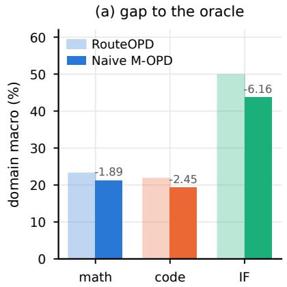

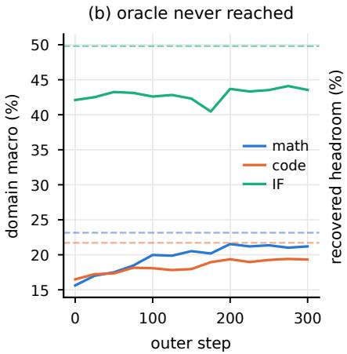

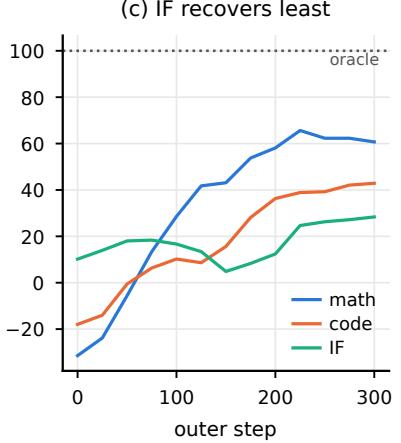  
Figure 1 The integration gap is real and strongly asymmetric. (a) Per-domain macro-averages of Naive M-OPD and RouteOPD, where the number above each bar indicates the gap in that domain; (b) per-domain validation trajectories of Naive M-OPD, with dashed lines denoting the RouteOPD reference for the corresponding domain; (c) recovered theoretical headroom relative to RouteRL, (current − πmixsft)/(RouteRL − πmixsft). Instruction following (IF) exhibits the largest absolute gap and the lowest recovered headroom, and is the earliest domain to stop improving.

Our empirical investigation reveals that perfect routing is far from suficient for successful capability integration. Under a standardized six-benchmark evaluation protocol, naive M-OPD reaches an average score of 28.05, while distilling each domain on its own reaches 31.55. We use RouteOPD to measure the deployment-time integration gap. In particular, concise instruction-following (IF) tasks fall 6.16 points below their RouteOPD reference (3.3× the degradation observed in mathematics) and plateau earliest during training.

Through systematic per-domain measurement, we locate this integration gap in the unmanaged allocation of the token-level optimization budget rather than catastrophic gradient conflict (Section 3). Because on-policy distillation objectives aggregate loss values across tokens, the actual optimization share received by each domain is governed by its gradient token volume rather than its prompt frequency. Consequently, concise IF responses contribute a negligible fraction of gradient tokens despite receiving a balanced prompt allocation, accounting for 20.3% of the input prompts but only 0.99% of the gradient tokens. Furthermore, even if the raw token budget is equalized initially, it drifts apart within tens of steps because the supervisory reward signals diminish at uneven rates as the student converges toward diferent teachers at varying speeds. This imbalance is compounded by standard multi-step rollout reuse, which leaves student-dependent reward components stale across successive gradient updates.

To address these orthogonal failure modes, we introduce Open-MOPD, a principled framework that targets each distortion with a dedicated mechanism (Section 4). First, token-share balancing decouples gradient budget allocation from sequence length, establishing a weighted token-share target rather than a fixed per-batch quota. Second, gap-aware allocation dynamically steers the optimization budget toward domains with the largest remaining student–teacher gap. This prevents the training collapse observed with naive reward normalization at step 74, where budget is wastefully funneled into already-converged domains. Third, student reward refresh recomputes student log-probabilities before each gradient step while caching teacher states, eliminating sample staleness with negligible overhead [6]. In cumulative ablation experiments, Open-MOPD raises recovery from 35.6% to 83.4% in one student model.

Our principal contributions are summarized below.

• Empirical Diagnosis. Using an oracle-routed testbed that isolates integration dynamics from routing errors, we identify and characterize the capability integration gap in multi-teacher on-policy distillation, revealing pronounced cross-domain performance asymmetry and premature stagnation in concise tasks (Section 3).

• Mechanistic Decomposition. Token-level teacher disagreement under our metric is unlikely to be the dominant bottleneck. We instead identify three separable contributors to token-level optimization budget distortion: sequence-length disparities, diferent convergence rates, and reward staleness from stale student updates across repeated minibatches of a shared rollout (Section 4).

• Principled Methodology. We propose Open-MOPD, an optimization framework combining token-share balancing, gap-aware dynamic budget allocation, and student reward refresh, which resolves domain imbalances and recovers most of the available headroom in one student model (Section 4, Section 5).

• Open-Source Recipe. We fully open-source our end-to-end post-training pipeline, model checkpoints, and evaluation suites on a reproducible academic compute budget (Appendix A).

## 2 Open-MOPD: An Open Recipe for Multi-Teacher Capability Integration

Our goal is to integrate the capabilities of several domain experts into one unified student model. Let the set of domains be D. On our base model, D = {math, code, instruction\_following (IF)}. Each domain has an expert teacher $\pi _ { \phi _ { d } }$ trained with reinforcement learning, and the student model is $\pi _ { \theta } .$ . Each training sample carries a domain label $\operatorname { d } ( \mathbf { x } )$ , allowing a single student model to receive supervision signals from the corresponding domain expert across three distinct tasks: mathematics, code generation, and instruction following. With the training framework fixed, Open-MOPD aims to identify a recipe that stably transfers the capabilities of all three experts into a single student model.

## 2.1 The Multi-Teacher On-Policy Distillation Objective

For a prompt x, the student first samples a response $y \sim \pi _ { \boldsymbol { \theta } } ( \cdot \mid x )$ from the current policy. The teacher evaluates student rollouts via a single prefill pass to generate the teacher distribution. Write the routed teacher as $\pi _ { \phi _ { d ( x ) } }$ . At position t, we take the top-k token set of the student distribution

$$
S _ { t } = \mathrm { T o p K } _ { k } \big ( \pi _ { \theta } \big ( \cdot \mid x , y _ { < t } \big ) \big ) ,\tag{1}
$$

with $k = 1 6$ by default. For each $v \in S _ { t }$ , we first define the teacher–student log-probability diference

$$
\delta _ { t } ( v ) = \mathrm { s g } \Bigl [ \log \pi _ { \phi _ { d ( x ) } } ( v \mid x , y _ { < t } ) - \log \pi _ { \theta } ( v \mid x , y _ { < t } ) \Bigr ] ,\tag{2}
$$

where $\mathrm { s g } [ \cdot ]$ denotes stop-gradient; this is the token-level advantage signal of dense distillation. It is then aggregated with softmax weights over $S _ { t }$ into a dense reward

$$
r _ { t } ( v ) = \delta _ { t } ( v ) \cdot { \tilde { \pi } } _ { \theta } ( v \mid x , y _ { < t } ) , \qquad { \tilde { \pi } } _ { \theta } ( v \mid x , y _ { < t } ) = \mathrm { s o f t m a x } _ { u \in \mathcal { S } _ { t } } \big [ \log \pi _ { \theta } ( u \mid x , y _ { < t } ) \big ] ( v ) ,\tag{3}
$$

and tokens outside $S _ { t }$ contribute zero. The position-level reward is

$$
r _ { t } = \sum _ { v \in S _ { t } } r _ { t } ( v ) .\tag{4}
$$

With no critic, $r _ { t }$ is placed directly in the advantage slot of PPO. Intuitively, $\delta _ { t } ( v ) > 0$ means that the teacher assigns a higher probability to token v than the student does; π˜ only determines the share each token inside the top-k contributes to the position-level reward $r _ { t } .$ . Because the student generates every response, the supervision distribution follows the student’s current policy. This is the key diference between on-policy distillation and supervised fine-tuning on ofline teacher trajectories, whose fixed data distribution can create a distribution shift. For this reason, Section 3 starts from this minimal version, which adds no further training mechanisms and keeps the efects of later changes easier to identify.

## 2.2 Base Model Selection

The open recipe uses SmolLM3-3B-Base as its base model. It is a fully open 3B decoder-only model whose pre-training covers web, math and code data and which is trained at a 64K context [7]. This choice balances compute cost with the feasibility of running the full recipe and repeating its ablations.

Experimental feasibility. Multi-teacher OPD needs student generation, one or more teacher forwards, longresponse training and per-domain validation at once; a full reproduction also includes mixed-domain SFT, three domain RL teachers and the final multi-teacher distillation. If the base model started at 7B or larger, that chain would be hard to close within a budget on which an ordinary academic team can ablate repeatedly: the GPU hours taken by a single experiment rise, and the repeated runs needed for mechanism comparisons become unafordable. Open-MOPD therefore takes “runnable on a single 8×A100-80GB node” as a recipe constraint, so that the end-to-end pipeline and the mechanism ablations can be executed repeatedly with limited computational resources.

Model capacity. The base model must also have enough capacity. A model that is too small lets the response length limit truncate long-chain supervision before it enters a usable trajectory; for a failed experiment, it is dificult to determine whether the failure is caused by the algorithm or training configuration, or by the model’s limited ability to discover and learn solutions within the response length limit. We observed this failure mode earlier with the smaller Qwen3-1.7B-Base as base model: across five epochs of SFT on the same OpenR1-Math-93k, its best AIME24 result was only 7.08%, and even with a 31K generation budget the truncation rate stayed at 69.17–80.42%. Qwen2.5-7B-Base on the same data reached 31.25%, with the truncation rate down to 12.92% (Appendix A.1). When most responses are truncated, a failed run reveals little about whether the training method itself is efective. SmolLM3-3B-Base is large enough to learn from the long responses used in our math and code SFT, which has a 32,768-token limit. This lets us measure the integration gap and run the ablations without response truncation dominating the results.

## 2.3 The End-to-End Training Recipe

The Open-MOPD recipe has three stages. The teachers in Stage II and the student in Stage III are initialized from the same mixed-domain SFT model. Table 1 summarizes the base model, the data, and the evaluation settings of the recipe.

Stage I: mixed-domain SFT. Starting from SmolLM3-3B-Base, we balance the sample count of each domain by response token count and then run four epochs of supervised fine-tuning on the mixed data, giving the shared student checkpoint $\pi _ { \mathrm { m i x s f t } }$ . The data mixture is: math OpenR1-Math-93k (93,733 examples), code OCR-50k sampled from the full OpenCodeReasoning set (50,000 examples), and instruction-following Instruction-Nemotron aligned (820,039 examples); estimated by response tokens, the shares are approximately 37% math, 28% code and 35% IF. The sequence length limit is 32,768.

Stage II: per-domain RL teachers. Three teachers are initialized separately from $\pi _ { \mathrm { m i x s f t } }$ , each running RL only on the verifiable reward of its own domain. The math teacher is trained on DAPO-Math-17k; the code teacher is trained on DeepScaler-24k (the LiveCodeBench-decontaminated version); the IF teacher is trained on Nemotron-IF-RL-46k. This stage gives $\pi _ { \phi _ { \mathrm { m a t h } } } , \pi _ { \phi _ { \mathrm { c o d e } } } , \pi _ { \phi _ { \mathrm { I F } } }$

Stage III: multi-teacher on-policy distillation. The student is also initialized from πmixsft. Training prompts come from the union of the three domains and are sampled as a domain mixture. The student πθ generates a response for each sampled prompt. The domain label then selects the corresponding teacher for OPD using the objective in Section 2.1. The response length limit is 16K for math and code and 2K for IF; by default the dense reward is computed on the student top-k $( k = 1 6 )$

Table 1 The Open-MOPD pipeline. Starting from a mixed-domain SFT checkpoint $\left( \pi _ { \mathrm { m i x s f t } } \right)$ , domain-specific RL produces three teacher models $\pi _ { \phi _ { d } }$ . Multi-teacher OPD then trains the student model π from the initial checkpoint. All datasets are publicly released for end-to-end reproducibility.
<table><tr><td>Stage</td><td>Data</td><td>Key settings and products</td></tr><tr><td>Base model</td><td>SmolLM3-3B-Base</td><td>3B; 1.7B fails to close long trajectories, while 7B is too costly for repeated ablations (Appendix A.1)</td></tr><tr><td>I Mixed- domain SFT</td><td>Math: OpenR1-Math-93k Code: OCR-50k (sampled from the full set) IF: Instruction-Nemotron</td><td>Four epochs; sequence limit 32,768; approximately balanced by response tokens  $\left( 3 7 / 2 8 / 3 5 \right)$  product πmixsft</td></tr><tr><td>II Domain RL teachers</td><td>Math: DAPO-Math-17k Code: DeepScaler-24k (LCB-decontaminated) IF: Nemotron-IF-RL-46k</td><td>Independent RL per domain, no domain mixing; all forked from πmixsft products  $\pi _ { \phi _ { \mathrm { m a t h } } } , \pi _ { \phi _ { \mathrm { c o d e } } } , \pi _ { \phi _ { \mathrm { I F } } }$ </td></tr><tr><td>III Multi- teacher OPD</td><td>The union of the three domains&#x27; RL prompts above; each prompt is hard-routed to its teacher by domain label</td><td>Response limit 16K for math/code and 2K for IF; top-k=16; the student is initialized from πmixsft product πθ</td></tr><tr><td>Evaluation Math: AIME24/ AIME25</td><td>Code: LiveCodeBench  $\mathbf { v } 5 / \mathbf { v } 6$  IF: IFEval+ IFBenchtest</td><td>mean@64 / mean@10 / mean@1; averaged evenly across the datasets within a domain first, then macro-averaged over the three domains</td></tr></table>

## 2.4 Evaluation Setup

For each domain, we use the best performance obtained by training a student with its domain teacher alone as a reference. These three single-teacher students together form RouteOPD, our deployment-time integration-gap reference. At evaluation time, the domain label selects the corresponding student to generate the response. The performance gap between the unified multi-teacher OPD (M-OPD) student and RouteOPD defines the integration gap.

All main results use the same online verifier and the same six benchmarks. Scoring is done per dataset first, then averaged simply over the datasets within a domain, and the final total score is the simple average of the three domain averages. The math domain uses AIME24 and AIME25 with $n = 6 4$ and temperature = 0.6, reporting accuracy mean@64; the instruction-following domain uses IFEval and $\mathrm { I F B e n c h } _ { \mathrm { t e s t } }$ (abbreviated $\mathrm { I F B } _ { \mathrm { t e s t } }$ in tables) with n = 1, reporting accuracy mean@1; the code domain uses LiveCodeBench v5 and v6 with $n = 1 0$ and temperature = 1.0, reporting accuracy mean@10.

Table 2 provides the reference results for SmolLM3-3B under this evaluation protocol. It includes the base model, the four mixed-domain SFT checkpoints, the single-domain RL and OPD results, and their domainrouted combinations RouteRL and RouteOPD. It also includes the RFT, $\pi _ { \mathrm { m i x r l } } .$ , Parameter Merging, Naive M-OPD, and Open-MOPD comparisons. The analysis and ablations below use this table as their common reference.

Table 2 Integration gap on SmolLM3-3B. Each domain reports its sub-dataset scores and macro-average. We define the total score as the average of the three domain averages. The four SFT rows are checkpoints after successive epochs. Single-domain RL and OPD report results only for their respective domains. Gray-shaded RouteRL and RouteOPD use a separate model for each domain and select that model using the domain label at evaluation time. They therefore cannot be deployed as one model. The recovery rate is Row Total−SFT RouteRL−SFT , using $\pi _ { \mathrm { m i x s f t } }$ (epoch 4) as the SFT baseline. In the Baselines and M-OPD sections, the highest score in each column is boldfaced and the second highest is underlined.
<table><tr><td>Method</td><td colspan="3">Math (avg@64)</td><td colspan="3">Code (avg@10)</td><td colspan="3">IF</td><td></td><td></td></tr><tr><td></td><td>AIME24</td><td>AIME25</td><td>avg</td><td>LCBv5</td><td>LCBv6</td><td>avg</td><td>IFEval</td><td>IFBtest</td><td>avg</td><td>Total</td><td>Recovery rate</td></tr><tr><td>SmolLM3-3B-Base</td><td>2.08</td><td>1.72</td><td>1.90</td><td>3.41</td><td>6.17</td><td>4.79</td><td>16.08</td><td>13.00</td><td>14.54</td><td>7.08</td><td></td></tr><tr><td>SFT</td><td></td><td></td><td></td><td></td><td></td><td></td><td></td><td></td><td></td><td></td><td></td></tr><tr><td>πmixsft (e1)</td><td>12.24</td><td>16.61</td><td>14.43</td><td>13.29</td><td>17.20</td><td>15.25</td><td>64.70</td><td>16.00</td><td>40.35</td><td>23.34</td><td></td></tr><tr><td>πmixsft (e2)</td><td>12.55</td><td>17.97</td><td>15.26</td><td>13.17</td><td>16.63</td><td>14.90</td><td>65.62</td><td>16.00</td><td>40.81</td><td>23.66</td><td></td></tr><tr><td>πmixsft (e3)</td><td>15.10</td><td>19.53</td><td>17.32</td><td>14.97</td><td>18.57</td><td>16.77</td><td>66.36</td><td>18.00</td><td>42.18</td><td>25.42</td><td></td></tr><tr><td>πmixsft (e4)</td><td>15.63</td><td>20.26</td><td>17.95</td><td>15.99</td><td>19.20</td><td>17.60</td><td>66.91</td><td>16.00</td><td>41.46</td><td>25.67</td><td></td></tr><tr><td>RL</td><td></td><td></td><td></td><td></td><td></td><td></td><td></td><td></td><td></td><td></td><td></td></tr><tr><td>πφmath</td><td>23.65</td><td>24.84</td><td>24.24</td><td></td><td></td><td></td><td></td><td></td><td></td><td></td><td></td></tr><tr><td>πφcode</td><td></td><td></td><td></td><td>22.16</td><td>21.31</td><td>21.73</td><td></td><td></td><td></td><td></td><td></td></tr><tr><td>πφIF</td><td></td><td></td><td></td><td></td><td></td><td></td><td>74.49</td><td>27.67</td><td>51.08</td><td></td><td></td></tr><tr><td>RouteRL</td><td>23.65</td><td>24.84</td><td>24.24</td><td>22.16</td><td>21.31</td><td>21.73</td><td>74.49</td><td>27.67</td><td>51.08</td><td>32.35</td><td>100%</td></tr><tr><td>OPD</td><td></td><td></td><td></td><td></td><td></td><td></td><td></td><td></td><td></td><td></td><td></td></tr><tr><td>Math-OPD</td><td>22.34</td><td>23.96</td><td>23.15</td><td></td><td></td><td></td><td></td><td></td><td></td><td></td><td></td></tr><tr><td>Code-OPD IF-OPD</td><td></td><td></td><td></td><td>22.28</td><td>21.14</td><td>21.71</td><td></td><td></td><td></td><td></td><td></td></tr><tr><td>RouteOPD</td><td></td><td>23.96</td><td>23.15</td><td>22.28</td><td>21.14</td><td></td><td>75.60</td><td>24.00</td><td>49.80</td><td></td><td></td></tr><tr><td></td><td>22.34</td><td></td><td></td><td></td><td></td><td>21.71</td><td>75.60</td><td>24.00</td><td>49.80</td><td>31.55</td><td>88.0%</td></tr><tr><td>Baselines</td><td></td><td></td><td></td><td></td><td></td><td></td><td></td><td></td><td></td><td></td><td></td></tr><tr><td>RFT</td><td>22.97</td><td>23.91</td><td>23.44</td><td>18.98</td><td>19.43</td><td>19.21</td><td>55.08</td><td>18.67</td><td>36.87</td><td>26.51</td><td>12.6%</td></tr><tr><td>πmixrl ParamMerge-Avg</td><td>21.15 18.91</td><td>22.14 20.99</td><td>21.64 19.95</td><td>16.59 18.38</td><td>20.97 21.20</td><td>18.78 19.79</td><td>70.24 70.06</td><td>22.67 17.67</td><td>46.45 43.86</td><td>28.96</td><td>49.3% 32.9%</td></tr><tr><td>ParamMerge-TA</td><td>21.93</td><td>22.76</td><td>22.34</td><td>21.74</td><td>23.14</td><td>22.44</td><td>71.53</td><td>21.67</td><td>46.60</td><td>27.87 30.46</td><td>71.7%</td></tr><tr><td>M-OPD</td><td></td><td></td><td></td><td></td><td></td><td></td><td></td><td></td><td></td><td></td><td></td></tr><tr><td>Naive M-OPD</td><td>20.92</td><td>21.60</td><td>21.26</td><td>17.53</td><td>20.99</td><td>19.26</td><td>68.61</td><td>18.67</td><td>43.64</td><td>28.05</td><td>35.6%</td></tr><tr><td>Open-MOPD (Ours)</td><td>21.98</td><td>22.86</td><td>22.42</td><td>20.84</td><td>22.63</td><td>21.73</td><td>74.49</td><td>24.67</td><td>49.58</td><td>31.24</td><td>83.4%</td></tr></table>

## 3 Diagnosing the Multi-Teacher Integration Gap

The recipe in Section 2 provides an open baseline for multi-teacher OPD. It combines mixed-domain SFT, one teacher for each domain, hard routing by domain label, and on-policy distillation on the student’s own responses. This setup gives all domains the correct teacher signal while training one shared student. However, the shared student still falls short of the domain-specific teachers. This section studies why the shared student does not retain all of the capabilities learned by the domain teachers. We first establish the integration gap with a simple baseline, then test teacher conflict as a possible cause, and finally measure how much training signal each domain receives and how this signal changes during training.

## 3.1 A baseline reveals the integration gap

In Table 2, Naive M-OPD lifts $\pi _ { \mathrm { m i x s f t } }$ from 25.67 to 28.05, which shows that the multi-teacher signal is useful Its score is 0.91 points below $\pi _ { \mathrm { m i x r l } }$ and 3.50 points below RouteOPD. RouteOPD reaches 31.55, showing that the teachers, the student initialization, and the single-teacher distillation objective are suficient to learn these capabilities. The score drops when the three teacher signals are naively combined in one student.

Figure 1 shows that the gap is uneven across domains. IF falls 6.16 points below its RouteOPD reference, which is 3.3 times the math gap of 1.89 points. It is also the main source of the total integration gap (Figure 1a). Along the training trajectory (Figure 1b), none of the three domains reaches its corresponding RouteOPD reference within 300 steps. Figure 1c reports the fraction of each domain’s gap to that reference that has been closed. Over the [200, 300]-step window, math closes 64% of its gap, code 40%, and IF only 26%. IF is also the only domain whose score decreases during the middle of training, falling by 11% over the [100, 200] window.

## 3.2 Testing teacher conflict

A natural hypothesis is that teachers of diferent domains give mutually contradictory token preferences on the same student trajectory: although the math, code and IF teachers are each selected on their own domain only, they share a large number of formatting words, connectives and reasoning templates. If the teachers disagree on these common tokens, multi-task OPD can push the gradients in diferent directions and interfere with the shared parameters. To test this hypothesis, multi-teacher on-policy distillation lets all three teachers score the same context for every token sampled by the student. We define

$$
c _ { t } = \operatorname* { m a x } _ { d \in { \mathcal { D } } } \log \pi _ { \phi _ { d } } ( y _ { t } \mid x , y _ { < t } ) - \operatorname* { m i n } _ { d \in { \mathcal { D } } } \log \pi _ { \phi _ { d } } ( y _ { t } \mid x , y _ { < t } )\tag{5}
$$

as the teacher disagreement. If conflicting teacher signals are a major cause of the multi-task OPD failure, $c _ { t }$ should be large for a substantial fraction of tokens.

Figure 2 provides three tests of this hypothesis. The first two examine how often strong disagreement occurs, while the third tests whether changing such tokens improves training. First, disagreement is small and stable. We measured $c _ { t }$ over the full training run. As we can see in Figure ${ \mathrm { 2 a , } }$ the mean value is 0.126 nat, and $c _ { t }$ remains below 0.27 nat throughout the 300 training steps. Both values are much smaller than the 1-nat conflict threshold (where the probability ratio between the most and least likely teachers is about e ≈ 2.7). These results do not support widespread teacher conflict as the main cause of the integration gap.

Second, high-conflict tokens are rare. Only 0.62% of tokens satisfy $c _ { t } > 1$ on average. The rate is 3.9% on IF, where disagreement is largest, and 0.31% on math (Figure 2b). A maximum value of 30.58 nat shows that extreme conflict can occur, but it is limited to a small number of tokens.

Third, we tested whether directly changing high-conflict tokens improves training. We used two interventions. A conflict mask removes the top 1%, 5%, or 20% of tokens by $c _ { t }$ from the distillation loss, using thresholds of 0.83, 0.49, and 0.22 nat. We rescaled the remaining weights to keep the total loss scale fixed. A consensus target replaces the hard-routed teacher target with the average of the three teachers’ log-probabilities when $c _ { t } \leq 1 ;$ it keeps the routed teacher when $c _ { t } > 1$ (purple points in Figure 2c).

Under the same settings, the three conflict masks reduce the total score by 0.52, 0.73, and 0.75 points, respectively, relative to the baseline. The consensus target reduces it by 0.83 points. High-conflict tokens may be irrelevant noise, or they may carry domain-specific information. Token-level disagreement alone cannot tell these cases apart. This may explain why removing or replacing such tokens hurts performance.

The teacher-conflict experiments show that token-level teacher disagreement under this metric is unlikely to be the dominant bottleneck. We therefore examine how much training signal each domain provides to the shared student and how the available training resources are distributed across domains.

## 3.3 Measuring training imbalance across domains

We study how much training signal each domain receives and how this amount changes during training. We first measure the number of valid response tokens and the average per-token reward for each domain. We then examine how these quantities change over the training trajectory. Finally, we study the efect of using old student probabilities in later inner updates from the same rollout batch. These measurements cover three sources of imbalance, namely token counts, reward magnitudes, and updates based on old student probabilities.

Token imbalance across domains. The training loss uses token-mean aggregation, so every valid response token contributes to the loss once. The raw token share of domain d is therefore

$$
s _ { d } ^ { \mathrm { t o k } } = \frac { n _ { d } L _ { d } } { \sum _ { j \in \mathcal { D } } n _ { j } L _ { j } } ,\tag{6}
$$

where $n _ { d }$ is the number of prompts of that domain and $L _ { d }$ is the average response length. Figure 3 shows that the two shares are completely decoupled along the whole trajectory, where the prompt share is fixed by the sampler at 39.8%/39.8%/20.3%, whereas the token share is 49.7%/49.3%/0.99% (Figure 3a). Across all 300 steps the token share of IF never exceeds 1.65% and never falls below 0.44%, so this is not an incidental property of a particular batch. The cause is given directly by length (Figure 3b): the average response length of math and code is about 10,500 tokens while that of IF is only 409 tokens, a diference of more than 25 times; Equation 6 is therefore almost entirely determined by length. This also shows that simply raising the sampling frequency of IF is not a viable fix. For IF to obtain 1/3 of the token budget, its number of prompts would have to be scaled up about 33.6 times (Figure 3c), and the math and code prompts in a batch would be squeezed to the point where long-chain supervision can no longer be maintained.

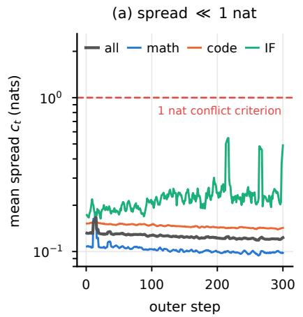

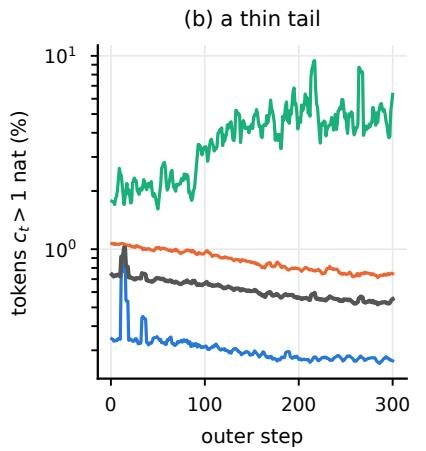

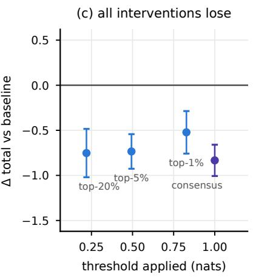  
Figure 2 Teacher conflict is measurable but not the bottleneck. (a) Average teacher disagreement $c _ { t }$ (log scale) and its distance to the 1-nat criterion. The legend applies to both panels (a) and (b). (b) Fraction of tokens with $c _ { t } > 1 ,$ , broken down by domain. (c) Change in total score for four conflict interventions relative to the baseline. Blue points show the conflict mask, where the horizontal axis indicates the filtering threshold when removing top-k% tokens by $c _ { t }$ quantile (larger k means lower threshold). Purple points show the consensus method with a fixed threshold of 1 nat; tokens with $c _ { t } \leq 1$ use the average log-probs of all three teachers, while those with $c _ { t } > 1$ keep the routed teacher. Error bars denote validation standard error.

Reward magnitudes also afect the update budget. In addition to the number of tokens, the strength of each update depends on the reward magnitude. As a simple estimate of the update budget, the contribution of a domain is

$$
B _ { d } \ \propto \ s _ { d } ^ { \mathrm { t o k } } \bar { m } _ { d } , \qquad \bar { m } _ { d } = \mathbb { E } _ { t \in d } [ | r _ { t } | ] .\tag{7}
$$

Figure 4a and Equation 7 show how the reward magnitude changes during training. Early in training, $\bar { m } _ { d }$ is 0.019 for math, 0.063 for code, and 0.091 for IF. The largest value is 4.9 times the smallest. Because $\bar { m } _ { d }$ measures the average diference between the student and teacher policies, it should decrease as the student approaches its teacher during training. The decrease is diferent across domains. Along the same trajectory, IF shrinks by 2.4 times, math by 2.1 times, and code by 1.9 times (Figure 4b). Here $\bar { m } _ { d }$ is the average per-token reward magnitude for domain d. It is the expectation of $\left| \boldsymbol { r } _ { t } \right|$ over the tokens in that domain and measures the average efect of one token on the parameter update.

The efect of the reward magnitude becomes clear after the token shares are balanced. When $s _ { d } ^ { \mathrm { t o k } }$ is fixed at $1 / 3$ for every domain, the training contribution of each domain depends only on $\bar { m } _ { d }$ in Equation 7. Within 25 steps, the budget share of IF drops from 48.7% to around $9 \%$ and ends at 11.4%, while that of code rises from 39.6% to 63.8% (Figure 4c). Thus, balancing the token counts does not keep the training contributions balanced in later steps because the reward magnitudes difer across domains

Multiple inner updates make the reward stale. To reduce the cost of generation, practical training usually performs K inner updates on one large rollout batch. The teacher remains fixed, while the student changes after the first inner update. If later updates still use the student probabilities computed during rollout, log $\pi _ { \theta } ( v \mid x , y _ { < t } )$ and $\tilde { \pi } _ { \theta } ( v \mid x , y _ { < t } ) ~ ( v \in \mathcal { S } _ { t } )$ , then the student-dependent part of Equation 3 is inconsistent with the current policy. Figure 5 measures the policy shift by the KL between the rollout policy and the current policy within the same batch, and its value rises monotonically with K, growing from 0 at K=1 (no shift by definition) to 0.059 at K=4 and 0.216 at K=32 (Figure 5a); the fraction of tokens clipped by PPO rises with K, from 0 to 0.86 (Figure 5b). Therefore, in a high-throughput setting, most tokens are updated after the student has already drifted away from the rollout policy. The dense reward is still computed from the student and teacher probabilities at rollout time.

(c) resampling cannot fix it  
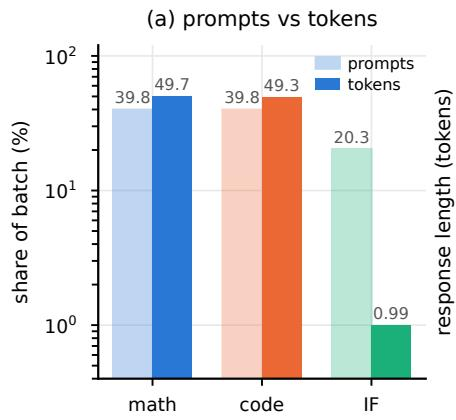

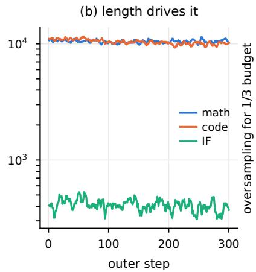

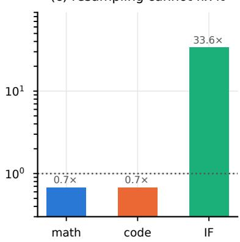  
Figure 3 Prompt share and gradient-token share are decoupled. (a) Whole-run averages of prompt share versus token share per domain (log scale; light bars for prompts, solid bars for tokens). IF accounts for ≈ 20% of prompts but only $\approx 1 \%$ of gradient tokens. (b) Average response length (log scale) accounts for this diference, with ≈ 10, 500 tokens for math/code versus ≈ 409 tokens for IF. (c) Balancing token share (1/3 per domain) solely via oversampling requires a 33.6× prompt multiplier for IF. This severely reduces math and code prompts per batch, making long-chain supervision unsustainable.

These measurements identify three parts of the training signal that need to be controlled. The first is the token budget, followed by reward magnitude and reward freshness. the token budget across domains, the teacher–student gap during training, and the reward delay inside inner updates. The next section presents one method for each part.

## 4 From Diagnosis to Method: Open-MOPD

Open-MOPD keeps the teacher routing and the on-policy distillation objective of Section 2.1, and changes only how the optimization budget is allocated and how the reward components are computed. The three mechanisms correspond to the three measurements of Section 3.3: token-share balancing controls the domain token budget within a batch, gap-following allocation adjusts the budget over the course of training according to the remaining distillation gap, reward refresh refreshes the student-dependent reward across the several inner updates of one rollout. They act on diferent time scales, so they can be validated independently and can also be combined into a single training recipe. Figure 6 gives the complete method, showing the data flow of one training iteration, with badges marking the stage that each mechanism rewrites.

## 4.1 Token-Share Balancing

Token-share balancing assigns a fixed weight to each domain’s token-mean loss. Let $g _ { d } ^ { \star }$ be the target domain budget, where $\textstyle \sum _ { d } g _ { d } ^ { \star } = 1$ . In each batch, we compute $s _ { d } ^ { \mathrm { t o k } }$ from the attention mask and weight the loss of

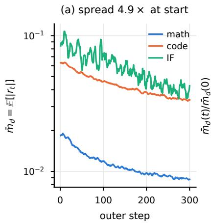

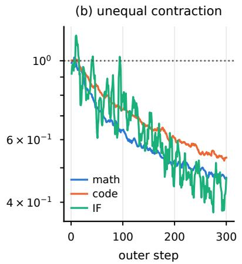

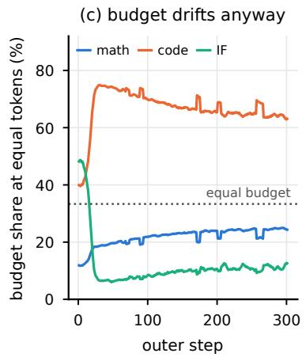  
Figure 4 The effective budget drifts with distillation progress. (a) Per-token reward magnitude $\bar { m } _ { d }$ of each domain (log axis), difering by 4.9× early on; (b) after normalizing to their respective initial values, the three domains shrink at diferent rates, which shows that $\bar { m } _ { d }$ measures the remaining teacher–student gap; (c) on a trajectory where $s _ { d } ^ { \mathrm { t o k } }$ is flattened to $1 / 3 .$ , Equation 7 degenerates to $B _ { d } \propto \bar { m } _ { d } .$ , so the curves show the budget drift caused by the gap alone. Within 25 steps the share of $\mathrm { I F }$ falls below the dashed line to about $9 \%$ , while code rises to 63.8%. Flattening the token share does not lock the budget in place.

domain d by

$$
w _ { d } ^ { \mathrm { s h a r e } } = \frac { g _ { d } ^ { \star } } { s _ { d } ^ { \mathrm { t o k } } } .\tag{8}
$$

After this weighting, the efective share of domain d is

$$
\frac { w _ { d } ^ { \mathrm { s h a r e } } s _ { d } ^ { \mathrm { t o k } } } { \sum _ { j } w _ { j } ^ { \mathrm { s h a r e } } s _ { j } ^ { \mathrm { t o k } } } = g _ { d } ^ { \star } .
$$

This directly controls the actual token ratio in the loss, without relying on stable response lengths or oversampling short answers.

The main recipe uses the equal-share target $g ^ { \star } = ( 1 / 3 , 1 / 3 , 1 / 3 )$ , which needs no corpus-specific tuning. On the token shares shown in Figure 3, it yields weights of 0.69 for math, 0.66 for code and 32.7 for IF. Every IF token is amplified about 48 times to compensate for its 25-fold length disadvantage, while Equation 8 guarantees that the weighted shares of the three domains are exactly 33.33%. Compared with changing only the prompt sampling rates, token-share balancing preserves the diversity of math and code prompts while giving the shorter IF responses a meaningful contribution to training.

Token-share balancing changes how much each domain contributes to the loss through its token weight; it does not change the sampling frequency or the reward magnitude of individual tokens. We intentionally keep this design because the size of the reward shows the gap between the teacher and the student, and simply normalizing it would remove useful information about learning progress.

## 4.2 Gap-Following Allocation

Let $m _ { d }$ be the running per-token reward magnitude for domain d (for example, an exponential moving average of $| r | )$ , which serves as an observable proxy for the remaining teacher–student gap. A naive idea is to normalize the loss with $m _ { d } ^ { - \alpha }$ , giving larger weights to domains with smaller rewards. This may seem reasonable early in training because a small reward can indicate that a domain is learning slowly. However, $m _ { d }$ also tracks the remaining distillation gap: as a domain approaches its teacher, its $m _ { d }$ becomes smaller. Inverse normalization therefore assigns more budget to domains that have already made more progress.

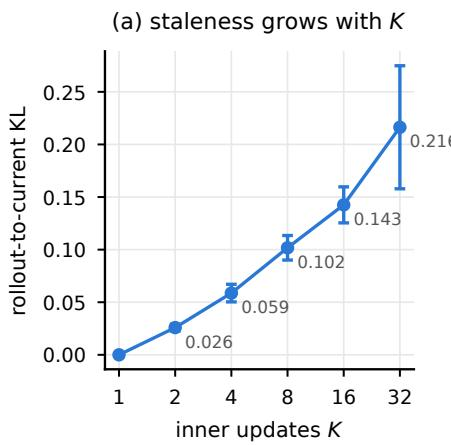

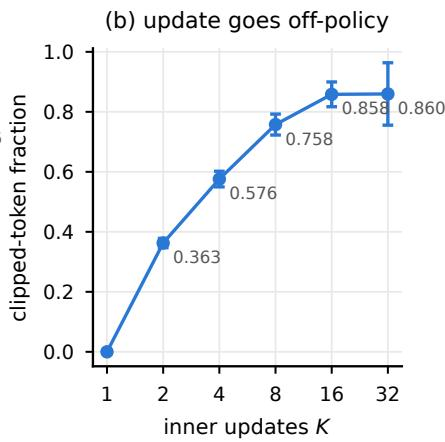  
Figure 5 Repeated inner updates change the student policy within a rollout batch. The horizontal axis is the number of inner updates K per rollout batch. (a) Within the same batch, the KL between the rollout policy and the current student policy grows monotonically with K; (b) the fraction of tokens clipped by PPO rises with K. At $K { = } 1$ both are 0, and the dense reward is then consistent with the current student.

This forms an unstable feedback loop. As a domain converges, its $m _ { d }$ decreases, which in turn increases its assigned weight $m _ { d } ^ { - \alpha }$ . The domain then receives even more training budget, accelerating its convergence and shrinking $m _ { d }$ further. Without any balancing force, the weights continuously diverge and eventually crash the training. We observe this pattern directly in experiments: over the first 75 steps, $m _ { d }$ for IF decreases 35.3-fold. Setting $\alpha = 0 . 5$ causes the IF weight to rise from 26.7 to 90.7, while the code weight drops from 0.44 to 0.27. Therefore, we believe that the inverse rule is unstable when α is positive and not too small.

Gap-following allocation keeps the direction of the gap, interprets it as “capability not yet distilled”, and allocates the budget to the domains that still have a larger gap.

$$
\tilde { w } _ { d } = w _ { d } ^ { \mathrm { s h a r e } } \cdot \mathrm { C l a m p } \left( \left( \frac { m _ { d } } { m _ { \mathrm { r e f } } } \right) ^ { \alpha } , 0 . 0 5 , 2 0 \right) , \qquad w _ { d } ^ { \mathrm { g a p } } = \frac { \tilde { w } _ { d } } { \sum _ { j } \tilde { w } _ { j } s _ { j } ^ { \mathrm { t o k } } } ,\tag{9}
$$

Here $\tilde { w } _ { d }$ is the unnormalized weight before the final normalization. It combines the token-share weight $w _ { d } ^ { \mathrm { s h a r e } }$ from the previous section with a clipped gap factor. The reference value $m _ { \mathrm { r e f } }$ is the mean of $m _ { d }$ across domains in the current batch. Thus, $( m _ { d } / m _ { \mathrm { r e f } } ) ^ { \alpha }$ measures the reward magnitude of domain d relative to the other domains. We clip this factor to [0.05, 20] so that a sudden change in one domain’s reward does not make its training weight too small or too large. The divisor $\sum _ { j } \tilde { w } _ { j } s _ { j } ^ { \mathrm { t o k } }$ is the token-share-weighted mean of the weights, so after normalization $\begin{array} { r } { \sum _ { d } w _ { d } ^ { \mathrm { g a p } } s _ { d } ^ { \mathrm { t o k } } = 1 } \end{array}$ and the total loss scale of a batch stays unchanged. Consequently, when a domain approaches its teacher, its $m _ { d }$ and its budget fall together, while domains with a larger teacher–student gap receive more updates. This allocation rule therefore follows the remaining gap rather than normalizing reward magnitudes; Section 5.2 shows its benefit on top of token-share balancing and the collapse that occurs when α takes a negative sign.

## 4.3 Reward Refresh

The first two mechanisms deal with the budget between domains; reward refresh deals with temporal inconsistency inside one rollout. Our design draws on an insight from AsyncOPD [6]: when the student changes, the student-dependent part of a reverse-KL signal should be recomputed with the current student. We apply this insight to a diferent source of staleness by refreshing the student-dependent reward before each of the K inner updates in our synchronous multi-teacher pipeline. The student is updated K times within one rollout batch, while the rollout trajectories come from the student before these updates. This creates a mismatch in the reward, which reward refresh corrects. Suppose that one rollout is used for K

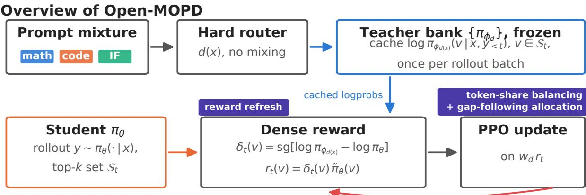  
repeat for K inner updates per rollout batch: the teacher term is reused, the student term is recomputed

Figure 6 Overview of Open-MOPD. Prompts are hard-routed by domain label. During rollout, the teacher computes and caches log-probabilities on $\boldsymbol { S } _ { t }$ once. The student generates responses under its own distribution. Together, both terms form the dense reward for PPO updates. Within each rollout batch, the inner update repeats K times, reusing the teacher term while recomputing the student term via reward refresh. Badges highlight where each mechanism acts: token-share balancing and gap-following allocation determine the domain loss weight $w _ { d } ,$ while reward refresh rebuilds $r _ { t }$ in every inner update.

update minibatches. The teacher needs only one prefill to compute log $\pi _ { \phi _ { d ( x ) } } ( v \mid x , y _ { < t } )$ , while the student probabilities are recomputed after each update. In the actor forward of the k-th inner update, reward refresh recomputes the student-dependent term on the same set $S _ { t }$

$$
\begin{array} { r l } & { \delta _ { t } ^ { ( k ) } ( v ) = \mathrm { s g } \Big [ \log \pi _ { \phi _ { d ( x ) } } ( v \mid x , y _ { < t } ) - \log \pi _ { \theta } ^ { ( k ) } ( v \mid x , y _ { < t } ) \Big ] , } \\ & { r _ { t } ^ { ( k ) } ( v ) = \delta _ { t } ^ { ( k ) } ( v ) \cdot \tilde { \pi } _ { \theta } ^ { ( k ) } ( v \mid x , y _ { < t } ) , \qquad v \in S _ { t } , \quad k = 0 , \ldots , K - 1 . } \end{array}\tag{10}
$$

Here $\tilde { \pi } _ { \boldsymbol { \theta } } ^ { ( k ) }$ is computed on the current student log-probabilities following Equation 3. It is then aggregated into $r _ { t } ^ { ( k ) }$ by Equation 4 and placed in the advantage slot of PPO. The update is subsequently constructed with the $w _ { d } r _ { t } ^ { ( k ) }$ of the current domain, where $w _ { d } = w _ { d } ^ { \mathrm { g a p } }$ when gap-following allocation is enabled and $w _ { d } = w _ { d } ^ { \mathrm { s h a r e } }$ otherwise. Reward refresh reuses the student forward pass already required by PPO and adds no teacher forward. It therefore makes each update use the diference between the current student and the teacher.

At K = 1, Eqs. (3), (4), and (10) reduce to the objective in Section 2.1; at $K > 1$ , they repair only the part of the reward that explicitly depends on the student. The sampled student states still come from rollout time, so reward refresh removes the staleness that can be removed without another prefill.

## 4.4 The Complete Algorithm

Table 3 summarizes the three mechanisms and the quantities they modify. Together, they change token weighting, domain weighting, and reward evaluation in the shared student.

Algorithm 1 summarizes the complete training loop. The teacher log-probabilities are computed once per rollout, while the student-dependent reward term is recomputed before each inner update.

Together, these three mechanisms address the problems found in our diagnosis. Token-share balancing fixes the token budget, gap-following allocation changes each domain’s share of updates as training progresses, and reward refresh keeps the feedback up to date.

Table 3 Summary of the three Open-MOPD mechanisms. Each mechanism modifies a diferent part of the training computation.
<table><tr><td>Mechanism</td><td>Measurement</td><td>Intervention</td></tr><tr><td>token-share balancing</td><td>Response-token share  $s _ { d } ^ { \mathrm { t o k } }$  in the current batch</td><td>Set  $w _ { d } ^ { \mathrm { s h a r e } } = g _ { d } ^ { \star } / s _ { d } ^ { \mathrm { t o k } }$  to equalise the domains&#x27; token shares in the loss.</td></tr><tr><td>gap-following allocation</td><td>Running mean reward magnitude  $m _ { d }$  for each domain</td><td>Multiply the share weight by the clipped factor  $( m _ { d } / m _ { \mathrm { r e f } } ) ^ { \alpha }$  , giving more weight to domains with a larger current reward signal.</td></tr><tr><td>reward refresh</td><td>Student log-probabilities at each inner update</td><td>Recompute the student-dependent reward while reusing the cached teacher log-probabilities.</td></tr></table>

Algorithm 1 Open-MOPD training loop   
Require: Domain-mixed sampler, student $\pi _ { \theta } ,$ teachers $\{ \pi _ { \phi _ { d } } \}$ , inner-step count K   
Ensure: Updated student $\pi _ { \theta }$   
1: for each training step t do   
2: Sample rollout batch $\mathcal { R } _ { t }$ from $\pi _ { \theta }$ and route prompts by domain label.   
3: Compute teacher log-probabilities $\ell _ { \phi , d ( x ^ { ( b ) } ) } ^ { ( b ) }$ for each sampled response.   
4: Compute response-token shares $s _ { d } ^ { \mathrm { t o k } }$ and weights $w _ { d } ^ { \mathrm { s h a r e } }$ using Equation 8.   
5: Update reward means $m _ { d }$ and compute gap weights $w _ { d }$ using Equation 9.   
6: for each inner minibatch $\mathcal { M } _ { t , k } , k = 0 , \ldots , K - 1$ do   
7: Recompute current-student log-probabilities and refresh $r _ { t } ^ { ( k ) }$ using Equation 10.   
8: Update $\theta$ with the PPO objective using $w _ { d } r _ { t } ^ { ( k ) }$   
9: end for   
10: end for

## 5 Ablation Studies

Token-share balancing controls the response-token share across domains, gap-following allocation controls how the update budget follows the remaining teacher–student gap, and reward refresh recomputes the student-dependent reward before each inner update. We first verify these efects one mechanism at a time and measure the resulting change in the corresponding domain score. We then evaluate the combined recipe by its reduction of the integration gap. For reward refresh, we also measure the runtime cost.

## 5.1 Token-Share Balancing

The first test checks the mechanism directly. With token-share balancing enabled (Section 4.1), the weighted token share $w _ { d } s _ { d } ^ { \mathrm { t o k } }$ stays at 33.33% over all 300 steps (marked by the dashed line in Figure 7a); the same sampler with it switched of hands 99% of the gradient tokens to math and code and leaves only about 1% to IF (Figure 3a). The first cause of imbalance measured in Section 3.3 is therefore removed entirely. In Table 4, token-share balancing gives a gain of +1.17 points, almost entirely from $\operatorname { I F } ;$ math and code barely move. This shows that, under naive M-OPD, most token loss is spent on math and code, where the student is already close to its teacher. Token-share balancing increases the token share of IF, which receives very little training otherwise, and improves the overall M-OPD score.

## 5.2 Gap-Following Allocation

We add gap-following allocation on top of token-share balancing. Unlike static balancing, which keeps every domain at around $1 / 3 ,$ gap-following allocation changes domain ratios dynamically as training goes on (Figure 7a). In this setting, the budget goes to the domain with the largest teacher–student gap $\bar { m } _ { d }$ . Averages calculated over the middle window of the baseline trajectory show that $\bar { m } _ { d }$ is 0.028 for code, 0.008 for math, and 0.003 for IF (2.16×, 0.61×, and 0.23× the average, respectively). From the first 25 steps to steps 200–300, the math share grows from 15.1% to 32.6%, the IF share drops from 34.5% to 17.1%, and code gets the most budget (averaging 55.4% and peaking at 87.6%). When tested alone without reward refresh, this mechanism brings a +0.72-point improvement (K = 1 ladder, Table 4).

Table 4 From Naive M-OPD to the full recipe. Each row changes one thing from the row above, as shown in the first column. The three middle columns show whether token-share balancing, gap-following allocation, and reward refresh are turned on. K is the number of inner updates per rollout batch.
<table><tr><td></td><td colspan="2">Mechanism</td><td></td><td colspan="5">Six datasets</td></tr><tr><td>Configuration</td><td></td><td>share gap refresh</td><td>K</td><td>Math</td><td>Code</td><td>IF</td><td>Total</td><td>∆</td></tr><tr><td>Naive M-OPD</td><td></td><td></td><td>1</td><td>21.26</td><td>19.26</td><td>43.64</td><td>28.05</td><td></td></tr><tr><td>+share</td><td>√</td><td></td><td>1</td><td>20.55</td><td>19.57</td><td>47.53</td><td>29.22</td><td>+1.17</td></tr><tr><td> $+ \mathrm { g a p }$ </td><td>√</td><td>√</td><td>1</td><td>21.00 19.31 49.50 29.94</td><td></td><td></td><td></td><td>+1.89</td></tr><tr><td colspan="9">Switching to the K=4 throughput setting (256 prompts per update, 4× rollout batch)</td></tr><tr><td>Naive M-OPD (same-setting control)</td><td></td><td></td><td>4</td><td></td><td></td><td></td><td></td><td>21.62 19.72 46.49 29.28 +1.23</td></tr><tr><td>+share+gap</td><td>√</td><td>√</td><td>4</td><td></td><td></td><td></td><td></td><td>23.05 21.07 47.1630.43 +2.38</td></tr><tr><td>Open-MOPD</td><td>√</td><td>√</td><td>4</td><td></td><td>22.4221.7349.5831.24+3.19</td><td></td><td></td><td></td></tr></table>

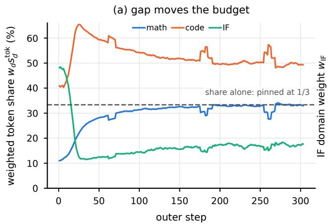

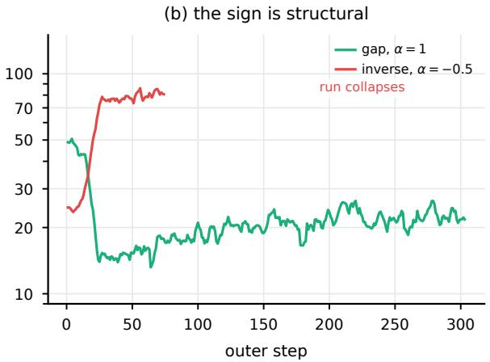  
Figure 7 Gap-following allocation dynamically changes the budget trajectory. (a) Weighted token share $w _ { d } s _ { d } ^ { \mathrm { t o k } }$ : static token-share balancing keeps the share fixed at 1/3 (dashed line). Adding gap-following allocation (α=1) dynamically adjusts the budget based on the remaining teacher–student gap. Domains that converge quickly lose budget, while those with larger gaps receive more resources (e.g., code exceeds 50%, whereas IF drops to ∼ 17%). (b) IF domain weight (log scale): setting α=1 properly reduces its weight, whereas the inverse formulation $( \alpha { = } - 0 . 5 )$ creates an unstable feedback loop, causing training to collapse at step 74.

Reversing the factor gives more budget to domains with smaller gaps. This favors domains that the student already handles well and creates a positive feedback loop. In our experiment, the IF gap shrinks by 32.5×, its weight rises from 24.4 to 80.9, and training stops at step 74 (Figure 7b). The sign of α is therefore fixed by the direction of the gap.

## 5.3 Reward Refresh

Reward refresh (Section 4.3) moves the student-dependent part of the dense reward into every inner update. The teacher log-probs are still prefilled once at the top of the rollout batch and reused throughout, and the student log-probabilities are read from the actor forward that PPO already performs. Reward refresh therefore adds no extra student forward. Without refresh, the dense reward uses the student probabilities saved at rollout time; with refresh, it uses the student probabilities from the current inner update. The teacher term is computed once per outer step in both cases; only the student parameters used to evaluate the reward change.

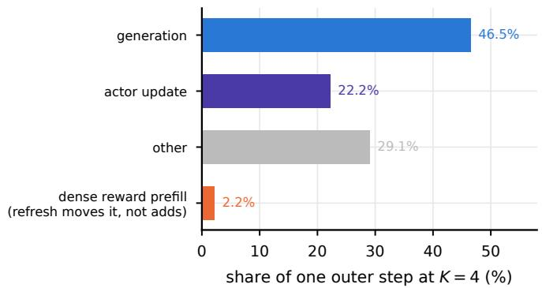  
Figure 8 Composition of one outer step at K=4. Averaged over steady training steps. The dense-reward computation accounts for 2.2% of each step. Reward refresh changes only when the student probabilities are read for this computation, without changing total throughput.

We measure the extra runtime and performance gain from reward refresh. At K=4, the dense-reward computation takes 27.3 s with refresh and 27.8 s without refresh. These values account for 2.10% and 2.12% of one outer step, respectively (Figure 8). The full step takes 1298 s with refresh and 1313 s without it. The diference is small and falls within the step-to-step variation, so reward refresh adds no measurable extra runtime cost. On top of token-share balancing and gap-following allocation, reward refresh gives a further +0.81 points at K=4 (Table 4). This gain supports the efectiveness of the mechanism and completes the Open-MOPD recipe.

## 6 Related Work

## 6.1 On-Policy Distillation and Multi-Teacher Extensions

Distillation on a fixed corpus. Knowledge distillation trains a student to match the teacher’s output distribution [8]. For sequence models, the teacher usually generates responses in advance, and the student learns from this fixed corpus [9]. The student therefore trains on prefixes produced by the teacher, while inference uses prefixes produced by the student. This distribution shift creates the exposure-bias problem in sequence prediction [10, 11]. A large diference in teacher and student capacity can also make distillation dificult [12–14].

On-policy distillation. On-policy distillation (OPD) trains the student on its own rollouts and uses teacher feedback on the prefixes that the student actually visits [15, 16]. Recent work improves this process by changing the divergence, the sampling rule, or the token-level training signal [3, 17–19]. Other studies examine training stability and failure modes, including unreliable feedback on long or drifted prefixes [20]. A recent survey organizes these methods by their feedback signal, teacher access, and optimization rule [21]. Most existing work still uses one teacher. Our work studies how several teachers share the updates of one student.

Staleness under batch reuse. PPO supports multiple minibatch updates within one rollout cycle [22]. In asynchronous RL, policy lag occurs when rollouts come from a policy that is several updates behind the learner [23–28]. Prior work studies how much stale data RL systems can tolerate [29, 30], and recent work examines staleness in OPD [6, 31]. In our synchronous pipeline, each rollout batch is partitioned into K minibatches and used for sequential student updates, so the student-dependent reward can become stale as the student changes. Reward refresh recomputes this term before each inner update using the student probabilities from PPO’s existing actor forward, adding no extra student forward.

From Single-Teacher to Multi-Teacher OPD. MOPD extends OPD to multiple domain teachers through a standard three-stage recipe: train domain specialists from a shared SFT model, route each student rollout to its domain teacher, and use token-level teacher feedback for training [4, 32]. This recipe has been used in several public models. Nemotron-Cascade 2 distills strong intermediate teachers to recover capabilities lost during Cascade RL, while Agents-A1 combines six domain teachers and normalizes the loss across responses and domains [33, 34]. At a larger scale, DeepSeek-V4 distills more than ten teachers, and Kimi K3 uses nine teachers defined by domain and reasoning efort [35, 36]. These studies show that MOPD can integrate specialists at diferent model scales. Open-MOPD studies how to balance the training received by diferent domains during this integration.

## 6.2 Integrating Domain Experts

Training Domain Specialists. Reinforcement learning on a single domain can produce a strong specialist for that domain. The success of DeepSeekMath and DeepSeek-R1 in mathematical reasoning provided a practical recipe for LLM reinforcement learning [1, 37]. DAPO further developed this recipe for large-scale training [2]. Domain-specific RL has since expanded to software engineering, search, and instruction following [38–41]. Each pipeline produces one specialist, while deployment usually requires one model that can handle all of these domains. Our work studies how to integrate these specialists into one student through multi-teacher OPD.

Integration in data space. A common way to combine domains is to train one model on mixed-domain data. Qwen3, for example, uses general-domain RL to improve a wide range of tasks [42]. Another approach trains the domains in sequence. Nemotron-Cascade applies a separate RL stage to each domain, so each stage can use its own data and training settings [43]. In joint training, the data mixture can strongly afect the final model. DoReMi studies this problem in pre-training, while MoDoMoDo extends data-mixture optimization to multi-domain RLVR [44, 45]. Equal task sampling still does not guarantee equal training: diferent tasks can produce gradients with very diferent magnitudes [46]. Open-MOPD studies how unequal response-token counts, diferent teacher–student gaps, and outdated rewards create imbalance across domains in multi-teacher OPD.

Integration in weight space and in module space. A second route combines domain experts after they have been trained. Weight-space methods merge task-specific parameter changes into one checkpoint. Task Arithmetic introduced this operation, TIES-Merging resolves conflicting parameter signs, and DARE sparsifies model changes before they are merged [47–49]. Other methods retain the expert structure during integration. BTM trains experts on diferent domains and combines them through ensembling or parameter averaging, BTX turns their feed-forward layers into a routed mixture of experts, and BTS connects frozen experts with lightweight stitch layers [50–52]. These methods integrate specialists after separate training. Multi-teacher OPD trains one shared student from their outputs, and Open-MOPD studies how to balance the updates received by diferent domains during this shared training.

## 7 Conclusion

We build from scratch a fully open multi-teacher on-policy distillation pipeline—mixed-domain SFT, three domain RL teachers, multi-teacher OPD—and use it to answer one concrete question, namely when routing is already error-free, what prevents the capabilities of three experts from being written into the same set of parameters at once. Our experiments identify the allocation of the optimization budget as the main bottleneck. We identify three separable contributors to imbalance: unequal token counts, unequal reward magnitudes, and outdated rewards during repeated inner updates. The three mechanisms of Open-MOPD—token-share balancing, gap-following allocation, and reward refresh—correspond one by one to these three sources and are validated separately in ablation experiments. Together, they reduce the integration gap from 3.50 points to 0.31 points, while the recovery rate relative to RouteRL rises from 35.6% to 83.4%. We release the complete recipe and the mechanism implementations to support reproducible follow-up work.

## References

[1] Zhihong Shao, Peiyi Wang, Qihao Zhu, Runxin Xu, Junxiao Song, Xiao Bi, Haowei Zhang, Mingchuan Zhang, et al. DeepSeekMath: Pushing the Limits of Mathematical Reasoning in Open Language Models, 2024.

[2] Qiying Yu, Zheng Zhang, Ruofei Zhu, Yufeng Yuan, Xiaochen Zuo, Yu Yue, Weinan Dai, Tiantian Fan, et al. DAPO: An Open-Source LLM Reinforcement Learning System at Scale, 2025.

[3] Yaxuan Li, Yuxin Zuo, Bingxiang He, Jinqian Zhang, Chaojun Xiao, Cheng Qian, Tianyu Yu, Huan-ang Gao, et al. Rethinking On-Policy Distillation of Large Language Models: Phenomenology, Mechanism, and Recipe, 2026.

[4] Wenhan Ma, Jianyu Wei, Liang Zhao, Hailin Zhang, Bangjun Xiao, Lei Li, Qibin Yang, Bofei Gao, et al. MOPD: Multi-Teacher On-Policy Distillation for Capability Integration in LLM Post-Training, 2026.

[5] Akhiad Bercovich, Itay Levy, Izik Golan, Mohammad Dabbah, Ran El-Yaniv, Omri Puny, Ido Galil, Zach Moshe, et al. Llama-Nemotron: Eficient Reasoning Models, 2025.

[6] Wonjun Kang, Kevin Galim, Seunghyuk Oh, Minjun Kang, Sanghyun Park, Donghoon Kim, Minjae Lee, Minseo Kim, et al. AsyncOPD: How Stale Can On-Policy Distillation Be?, 2026.

[7] Hugging Face. SmolLM3: Smol, multilingual, long-context reasoner. https://huggingface.co/blog/smollm3, 2025.

[8] Geofrey Hinton, Oriol Vinyals, and Jef Dean. Distilling the Knowledge in a Neural Network, 2015.

[9] Yoon Kim and Alexander M. Rush. Sequence-Level Knowledge Distillation, 2016.

[10] Marc’Aurelio Ranzato, Sumit Chopra, Michael Auli, and Wojciech Zaremba. Sequence Level Training with Recurrent Neural Networks, 2015.

[11] Samy Bengio, Oriol Vinyals, Navdeep Jaitly, and Noam Shazeer. Scheduled Sampling for Sequence Prediction with Recurrent Neural Networks, 2015.

[12] Jang Hyun Cho and Bharath Hariharan. On the Eficacy of Knowledge Distillation, 2019.

[13] Seyed-Iman Mirzadeh, Mehrdad Farajtabar, Ang Li, Nir Levine, Akihiro Matsukawa, and Hassan Ghasemzadeh. Improved Knowledge Distillation via Teacher Assistant, 2019.

[14] Yuetai Li, Xiang Yue, Zhangchen Xu, Fengqing Jiang, Luyao Niu, Bill Yuchen Lin, Bhaskar Ramasubramanian, and Radha Poovendran. Small Models Struggle to Learn from Strong Reasoners, 2025.

[15] Yuxian Gu, Li Dong, Furu Wei, and Minlie Huang. MiniLLM: On-Policy Distillation of Large Language Models, 2023.

[16] Rishabh Agarwal, Nino Vieillard, Yongchao Zhou, Piotr Stanczyk, Sabela Ramos, Matthieu Geist, and Olivier Bachem. On-Policy Distillation of Language Models: Learning from Self-Generated Mistakes, 2023.

[17] Jongwoo Ko, Sungnyun Kim, Tianyi Chen, and Se-Young Yun. DistiLLM: Towards Streamlined Distillation for Large Language Models, 2024.

[18] Jongwoo Ko, Tianyi Chen, Sungnyun Kim, Tianyu Ding, Luming Liang, Ilya Zharkov, and Se-Young Yun. DistiLLM-2: A Contrastive Approach Boosts the Distillation of LLMs, 2025.

[19] Wenda Xu, Rujun Han, Zifeng Wang, Long T. Le, Dhruv Madeka, Lei Li, William Yang Wang, Rishabh Agarwal, Chen-Yu Lee, and Tomas Pfister. Speculative Knowledge Distillation: Bridging the Teacher-Student Gap Through Interleaved Sampling, 2024.

[20] Yuqian Fu, Haohuan Huang, Kaiwen Jiang, Jiacai Liu, Zhuo Jiang, Yuanheng Zhu, and Dongbin Zhao. Revisiting On-Policy Distillation: Empirical Failure Modes and Simple Fixes, 2026.

[21] Mingyang Song and Mao Zheng. A Survey of On-Policy Distillation for Large Language Models, 2026.

[22] John Schulman, Filip Wolski, Prafulla Dhariwal, Alec Radford, and Oleg Klimov. Proximal Policy Optimization Algorithms, 2017.

[23] Wei Fu, Jiaxuan Gao, Xujie Shen, Chen Zhu, Zhiyu Mei, Chuyi He, Shusheng Xu, Guo Wei, et al. AReaL: A Large-Scale Asynchronous Reinforcement Learning System for Language Reasoning, 2025.

[24] Yinmin Zhong, Zili Zhang, Xiaoniu Song, Hanpeng Hu, Chao Jin, Bingyang Wu, Nuo Chen, Yukun Chen, et al. StreamRL: Scalable, Heterogeneous, and Elastic RL for LLMs with Disaggregated Stream Generation, 2025.

[25] Guangming Sheng, Yuxuan Tong, Borui Wan, Wang Zhang, Chaobo Jia, Xibin Wu, Yuqi Wu, Xiang Li, et al. Laminar: A Scalable Asynchronous RL Post-Training Framework, 2025.

[26] Ran Yan, Youhe Jiang, Tianyuan Wu, Jiaxuan Gao, Zhiyu Mei, Wei Fu, Haohui Mai, Wei Wang, Yi Wu, and Binhang Yuan. AReaL-Hex: Accommodating Asynchronous RL Training over Heterogeneous GPUs, 2025.

[27] Wei Gao, Yuheng Zhao, Dakai An, Tianyuan Wu, Lunxi Cao, Shaopan Xiong, Ju Huang, Weixun Wang, et al. RollPacker: Mitigating Long-Tail Rollouts for Fast, Synchronous RL Post-Training, 2025.

[28] Guangming Sheng, Chi Zhang, Zilingfeng Ye, Xibin Wu, Wang Zhang, Ru Zhang, Yanghua Peng, Haibin Lin, and Chuan Wu. HybridFlow: A Flexible and Eficient RLHF Framework, 2024.

[29] Haizhong Zheng, Jiawei Zhao, and Beidi Chen. Prosperity before Collapse: How Far Can Of-Policy RL Reach with Stale Data on LLMs?, 2025.

[30] Xiaocan Li, Shiliang Wu, and Zheng Shen. A-3PO: Accelerating Asynchronous LLM Training with Staleness-aware Proximal Policy Approximation, 2025.

[31] Liwen Zheng and Haiyun Jiang. Blockwise Policy-Drift Gating for On-Policy Distillation, 2026.

[32] Core Team, Bangjun Xiao, Bingquan Xia, Bo Yang, Bofei Gao, Bowen Shen, Chen Zhang, Chenhong He, et al. MiMo-V2-Flash Technical Report, 2026.

[33] Zhuolin Yang, Zihan Liu, Yang Chen, Wenliang Dai, Boxin Wang, Sheng-Chieh Lin, Chankyu Lee, Yangyi Chen, Dongfu Jiang, Jiafan He, Renjie Pi, Grace Lam, Nayeon Lee, Alexander Bukharin, Mohammad Shoeybi, Bryan Catanzaro, and Wei Ping. Nemotron-Cascade 2: Post-Training LLMs with Cascade RL and Multi-Domain On-Policy Distillation, 2026.

[34] Lei Bai et al. Scaling the Horizon, Not the Parameters: Reaching Trillion-Parameter Performance with a 35B Agent, 2026.

[35] DeepSeek-AI, Anyi Xu, Bangcai Lin, Bing Xue, Bingxuan Wang, Bingzheng Xu, Bochao Wu, Bowei Zhang, et al. DeepSeek-V4: Towards Highly Eficient Million-Token Context Intelligence, 2026.

[36] Kimi Team. Kimi K3: Open Frontier Intelligence, 2026.

[37] DeepSeek-AI, Daya Guo, Dejian Yang, Haowei Zhang, Junxiao Song, Peiyi Wang, Qihao Zhu, Runxin Xu, et al. DeepSeek-R1: Incentivizing Reasoning Capability in LLMs via Reinforcement Learning, 2025.

[38] Naman Jain, Jaskirat Singh, Manish Shetty, Liang Zheng, Koushik Sen, and Ion Stoica. R2E-Gym: Procedural Environments and Hybrid Verifiers for Scaling Open-Weights SWE Agents, 2025.

[39] Yuxiang Wei, Olivier Duchenne, Jade Copet, Quentin Carbonneaux, Lingming Zhang, Daniel Fried, Gabriel Synnaeve, Rishabh Singh, and Sida I. Wang. SWE-RL: Advancing LLM Reasoning via Reinforcement Learning on Open Software Evolution, 2025.

[40] Bowen Jin, Hansi Zeng, Zhenrui Yue, Jinsung Yoon, Sercan Arik, Dong Wang, Hamed Zamani, and Jiawei Han. Search-R1: Training LLMs to Reason and Leverage Search Engines with Reinforcement Learning, 2025.

[41] Valentina Pyatkin, Saumya Malik, Victoria Graf, Hamish Ivison, Shengyi Huang, Pradeep Dasigi, Nathan Lambert, and Hannaneh Hajishirzi. Generalizing Verifiable Instruction Following, 2025.

[42] An Yang, Anfeng Li, Baosong Yang, Beichen Zhang, Binyuan Hui, Bo Zheng, Bowen Yu, Chang Gao, et al. Qwen3 Technical Report, 2025.

[43] Boxin Wang, Chankyu Lee, Nayeon Lee, Sheng-Chieh Lin, Wenliang Dai, Yang Chen, Yangyi Chen, Zhuolin Yang, et al. Nemotron-Cascade: Scaling Cascaded Reinforcement Learning for General-Purpose Reasoning Models, 2025.

[44] Sang Michael Xie, Hieu Pham, Xuanyi Dong, Nan Du, Hanxiao Liu, Yifeng Lu, Percy Liang, Quoc V. Le, Tengyu Ma, and Adams Wei Yu. DoReMi: Optimizing Data Mixtures Speeds Up Language Model Pretraining, 2023.

[45] Yiqing Liang, Jielin Qiu, Wenhao Ding, Zuxin Liu, James Tompkin, Mengdi Xu, Mengzhou Xia, Zhengzhong Tu, Laixi Shi, and Jiacheng Zhu. MoDoMoDo: Multi-Domain Data Mixtures for Multimodal LLM Reinforcement Learning, 2025.

[46] Runzhe Wu, Ankur Samanta, Ayush Jain, Scott Fujimoto, Jeongyeol Kwon, Ben Kretzu, Youliang Yu, Kaveh Hassani, Boris Vidolov, and Yonathan Efroni. Imbalanced Gradients in RL Post-Training of Multi-Task LLMs, 2025.

[47] Gabriel Ilharco, Marco Tulio Ribeiro, Mitchell Wortsman, Suchin Gururangan, Ludwig Schmidt, Hannaneh Hajishirzi, and Ali Farhadi. Editing Models with Task Arithmetic, 2022.

[48] Prateek Yadav, Derek Tam, Leshem Choshen, Colin Rafel, and Mohit Bansal. TIES-Merging: Resolving Interference When Merging Models, 2023.

[49] Le Yu, Bowen Yu, Haiyang Yu, Fei Huang, and Yongbin Li. Language Models are Super Mario: Absorbing Abilities from Homologous Models as a Free Lunch, 2023.

[50] Margaret Li, Suchin Gururangan, Tim Dettmers, Mike Lewis, Tim Althof, Noah A. Smith, and Luke Zettlemoyer. Branch-Train-Merge: Embarrassingly Parallel Training of Expert Language Models, 2022.

[51] Sainbayar Sukhbaatar, Olga Golovneva, Vasu Sharma, Hu Xu, Xi Victoria Lin, Baptiste Rozière, Jacob Kahn, Daniel Li, et al. Branch-Train-MiX: Mixing Expert LLMs into a Mixture-of-Experts LLM, 2024.

[52] Qizhen Zhang, Prajjwal Bhargava, Chloe Bi, Chris X. Cai, Jakob Foerster, Jeremy Fu, Punit Singh Koura, Ruan Silva, Sheng Shen, Emily Dinan, Suchin Gururangan, and Mike Lewis. BTS: Harmonizing Specialized Experts into a Generalist LLM, 2025.

## Appendix

## A Constructing the Open-MOPD Recipe

In this section, we introduce how we obtained the final Open-MOPD recipe. We first screen on math SFT for a base model that stably produces reasoning trajectories, and then extend the selected base model to a mixed-domain SFT over math, code and instruction following.

## A.1 Base Model Choice

OpenR1 math comparison between 1.7B and 7B. Early screening applied the same 93,733 OpenR1 math examples to Qwen3-1.7B-Base and Qwen2.5-7B-Base separately. Both runs use a 32,768-token SFT length limit, a global batch of 128 and a learning rate of $4 \times 1 0 ^ { - 5 }$ , with 732 steps per epoch. Table 6 reports the complete curve over the first five epochs.

The problem with Qwen3-1.7B-Base is not a lack of generation length: under the 31K budget, 69.17–80.42% of the samples still exhaust the limit at all five checkpoints, and only 20.00–31.25% of the answers close </think>; adding epochs does not produce a monotone improvement either, and AIME24 stays below 7.1%. This means that a large fraction of the trajectories seen by a subsequent RL or OPD stage contain only a reasoning prefix and never reach a final answer. A drop in task score can then not be attributed uniquely to the reward, the routing or cross-domain interference, because the base model and the data mixture themselves have not yet learnt to end a reasoning trajectory reliably.

The same OpenR1 data shows the opposite trend on Qwen2.5-7B-Base: AIME24 rises from 16.25% to 31.25% and the truncation rate falls from 42.92% to 12.92%. This rules out the explanation that “OpenR1 trajectories are inherently too long, so any base model would truncate”, and it shows that enlarging the capacity of the base model does recover trajectory closure. Qwen2.5-7B-Base therefore satisfies the capability condition, but it puts the student, the three RL teachers and every mechanism ablation of the full recipe at 7B scale; for an open research baseline that has to be run repeatedly, this cost is too high.

Choosing SmolLM3-3B-Base. The final recipe selects SmolLM3-3B-Base as the compromise between the two ends. Four epochs of mixed-domain SFT over the three domains give $\pi _ { \mathrm { m i x s f t } }$ : OpenR1-Math-93k, the OCR-50k subset sampled from the full OpenCodeReasoning set, and Instruction-Nemotron contribute roughly 37.3%, 28.1% and 34.6% of the training response tokens respectively. The per-domain sample counts are balanced by response token count, so that the 820K short IF answers do not drown out the fewer but longer math and code trajectories.

Table 5 summarises the selection evidence for the three candidate base models. From the table, we can see that 3B is therefore not an arbitrary choice of a “medium model” but an operating point bracketed by two failure boundaries: going down to 1.7B, generation is dominated by unclosed reasoning and truncation, and mechanism attribution is no longer unique; going up to 7B, the single model is stronger, but the end-to-end multi-teacher recipe and its repeated ablations exceed the resource boundary we set for a community baseline. SmolLM3-3B-Base retains enough trajectory capacity while still allowing the final Open-MOPD training to run on a single 8×A100-80GB node.

## A.2 Stage Hyperparameters

This section lists all hyperparameters of the four stages of the recipe, taken from the training configurations that were actually run rather than from recommended values compiled after the fact. Table 7 gives the mixed-domain SFT and the three domain RL teachers, and Table 8 gives single-domain OPD (the RouteOPD oracle of the main text) and multi-teacher OPD. Items not listed use the verl defaults.

Mixed-domain SFT and domain RL teachers. The three teachers share one GRPO configuration and difer only in data, sequence length, rollout group size and number of steps: IF answers are short, so it uses a smaller response limit, smaller groups and more steps; math and code use a 30,000-token response limit to accommodate the full reasoning chain. All three disable the KL penalty and apply group filtering on accuracy (the samples of one prompt are discarded if they are all correct or all wrong, with at most 8 generation batches resampled, which the dynamic sampling trick proposed by DAPO), so that the gradient comes only from groups that discriminate.

Table 5 Base-model choice for Open-MOPD. The table summarises directly the experimental results used when constructing the recipe. The truncation evidence is reported in a dedicated row below each base model.
<table><tr><td>Base model</td><td>SFT data</td><td>Performance</td></tr><tr><td>Qwen3-1.7B-Base</td><td>OpenR1-Math-93k</td><td>AIME24 best 7.08</td></tr><tr><td>Truncation evidence: 69.17–80.42%; capacity and trajectory closure insufficient.</td><td></td><td></td></tr><tr><td>SmolLM3-3B-Base</td><td>Three-domain mixSFT</td><td>AIME24 15.63</td></tr><tr><td>Truncation evidence: 15.2%; chosen as the base model of the recipe.</td><td></td><td></td></tr><tr><td>Qwen2.5-7B-Base</td><td>OpenR1-Math-93k</td><td>AIME24 31.25</td></tr><tr><td></td><td></td><td>Truncation evidence: 12.92%; capable enough, but a full multi-teacher ablation is too costly.</td></tr></table>

Table 6 Base-model screening under the same OpenR1-Math-93k SFT. Each cell is AIME24 accuracy / generation truncation rate (%). Qwen3-1.7B-Base mainly generates long, unclosed reasoning trajectories at every observed checkpoint; Qwen2.5-7B-Base instead raises accuracy and lowers truncation together as SFT proceeds.
<table><tr><td>Epoch</td><td>Step</td><td>Qwen3-1.7B-Base</td><td>Qwen2.5-7B-Base</td></tr><tr><td>1</td><td>732</td><td>4.58 /75.42</td><td>16.25 42.92</td></tr><tr><td>2</td><td>1464</td><td>7.08 /72.50</td><td>20.83 35.42</td></tr><tr><td>3</td><td>2196</td><td>6.67 80.42</td><td>30.83 22.08</td></tr><tr><td>4</td><td>2928</td><td>5.83 69.17</td><td>30.42 19.58</td></tr><tr><td>5</td><td>3660</td><td>6.67 / 69.58</td><td>31.25 /12.92</td></tr></table>

Single-domain OPD and multi-teacher OPD. The two share the same optimiser and distillation settings, so the diference between the RouteOPD oracle and M-OPD in the main text comes only from the number of teachers and the domain mixture, not from the training configuration. The dense reward is computed on the student top-k (k=16), and K=train batch/mini batch=4 is the of-policy depth. The multi-teacher column additionally enables the domain sampler and the three mechanism switches: token-share balancing sets the target gradient share, gap-following allocation adjusts the domain weights by the remaining gap, and reward refresh refreshes the dense reward within every inner update; the table gives their values in the final recipe.

Table 7 Hyperparameters of stages one and two. SFT is standard supervised fine-tuning; the three RL teachers are all GRPO, each initialised from πmixsft and trained only on the verifiable reward of its own domain. World size is given as number of nodes $\times \ \mathrm { G P U s }$ per node, all A100-80GB. “—” means the item does not apply to that stage.
<table><tr><td></td><td>Mixed-domain SFT</td><td>RL: math</td><td>RL: code</td><td>RL: IF</td></tr><tr><td>World size Starting point</td><td>8×8 SmolLM3-3B-Base</td><td>8×8</td><td>8×8 πmixsft</td><td>4×8</td></tr><tr><td rowspan="3">Algorithm train batch size</td><td>Cross-entropy</td><td></td><td>GRPO</td><td></td></tr><tr><td>128</td><td>128</td><td>128</td><td>128</td></tr><tr><td></td><td>32</td><td>32</td><td>32</td></tr><tr><td>mini batch size Learning rate lr schedule</td><td> $4 \times 1 0 ^ { - 5 }$  cosine, warmup 3%</td><td></td><td> $1 \times 1 0 ^ { - 6 }$  constant, warmup 10 steps</td><td></td></tr><tr><td>grad clip Prompt limit</td><td>0.2</td><td></td><td>1.0</td><td></td></tr><tr><td>Response limit</td><td>32,768 (total length)</td><td>1,024</td><td>2,048</td><td>2,048</td></tr><tr><td>rollout n</td><td></td><td>30,000 16</td><td>30,000</td><td>2,048</td></tr><tr><td>Temperature</td><td></td><td></td><td>16</td><td>8</td></tr><tr><td></td><td></td><td></td><td>1.0</td><td></td></tr><tr><td>epochs / steps</td><td>4 epochs</td><td>1,000 steps</td><td>1,000 steps</td><td>3,000 steps</td></tr><tr><td> $\mathrm { c l i p } _ { \mathrm { l o w } } / \mathrm { c l i p } _ { \mathrm { h i g h } }$ </td><td></td><td></td><td></td><td></td></tr><tr><td>KL penalty</td><td></td><td></td><td>0.2 / 0.25</td><td></td></tr><tr><td></td><td></td><td></td><td>disabled</td><td></td></tr><tr><td>entropy coeff</td><td></td><td></td><td>0</td><td></td></tr><tr><td>group filtering</td><td></td><td>by acc, at most 8 generation batches</td><td></td><td></td></tr></table>

Table 8 Hyperparameters of stage three. The left columns are the three single-domain OPD runs (the RouteOPD oracle of the main text) and the right column is multi-teacher OPD. The two share the optimiser, sequence lengths and distillation settings; the token-share balancing / gap-following allocation / reward refresh rows are the values of our mechanisms in the final recipe.
<table><tr><td rowspan="2"></td><td colspan="3">Single-domain OPD (RouteOPD oracle)</td><td>Multi-teacher OPD</td></tr><tr><td>math</td><td>code</td><td>IF</td><td>Open-MOPD</td></tr><tr><td>World size</td><td>1×8</td><td>1×8</td><td>1×8</td><td>1×8</td></tr><tr><td>Teacher</td><td> $\pi _ { \phi _ { \mathrm { m a t h } } }$ </td><td> $\pi _ { \phi _ { \mathrm { c o d e } } }$ </td><td> $\pi _ { \phi _ { \mathrm { I F } } }$ </td><td>3-teacher hard routing</td></tr><tr><td>Student starting point</td><td colspan="4">πmixsft</td></tr><tr><td>train batch size mini batch size</td><td colspan="4">1,024</td></tr><tr><td></td><td colspan="4">256  $( \mathrm { i . e . } ~ K { = } 4 )$ </td></tr><tr><td>Learning rate</td><td colspan="4"> $1 . 5 \times 1 0 ^ { - 6 }$  , constant</td></tr><tr><td> $\mathrm { c l i p } _ { \mathrm { l o w } } / \mathrm { c l i p } _ { \mathrm { h i g h } }$ </td><td colspan="4">0.2 / 0.28</td></tr><tr><td>KL penalty</td><td colspan="4">disabled</td></tr><tr><td>Advantage estimation</td><td colspan="4">dense reward written directly into the advantage slot</td></tr><tr><td>Prompt limit</td><td>1,024</td><td>2,048</td><td>2,048</td><td>2,048</td></tr><tr><td>Response limit</td><td>16,384 16,384</td><td></td><td>1,024</td><td>16K (math/code) / 2K (IF)</td></tr><tr><td>Total steps</td><td colspan="4"></td></tr><tr><td>Reward form</td><td colspan="4">single-teacher dense reward</td></tr><tr><td>top-k</td><td colspan="4">16, from the student distribution, nucleus truncation p=0.99</td></tr><tr><td>Reward weighting</td><td colspan="4">weighted by student probability πθ (Eq. 3)</td></tr><tr><td>share target  $g ^ { \star }$ </td><td colspan="4"></td></tr><tr><td>gap-following α</td><td colspan="4"></td></tr><tr><td>reward refresh</td><td colspan="4">enabled</td></tr></table>