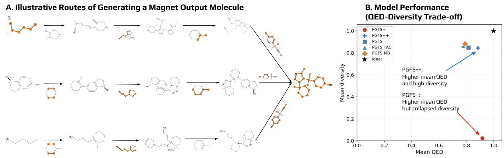
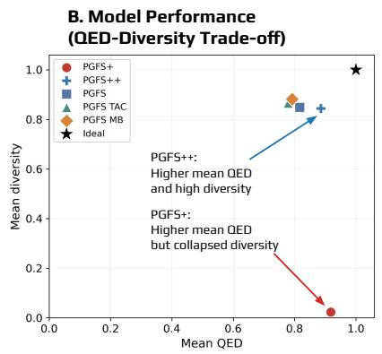
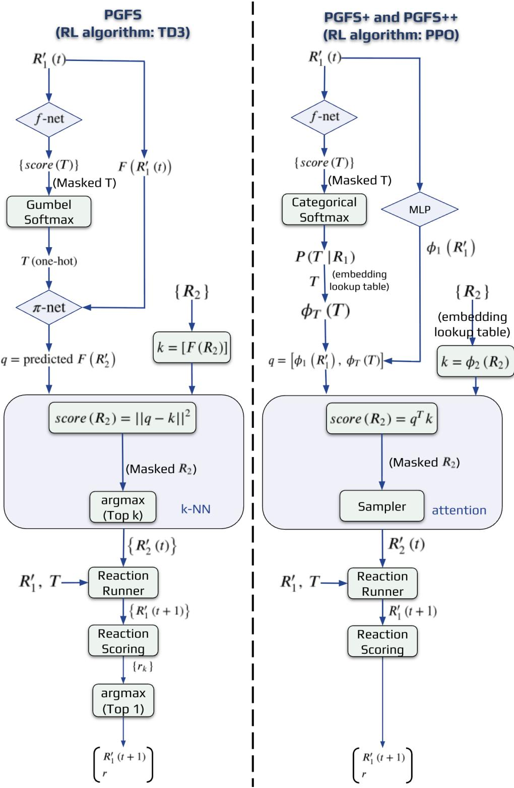
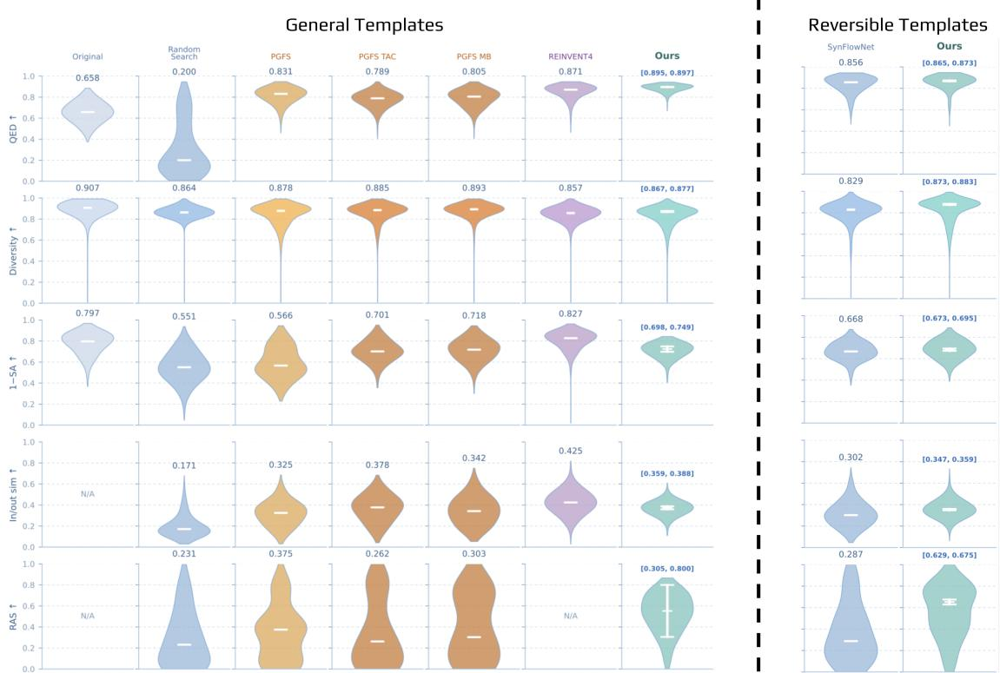
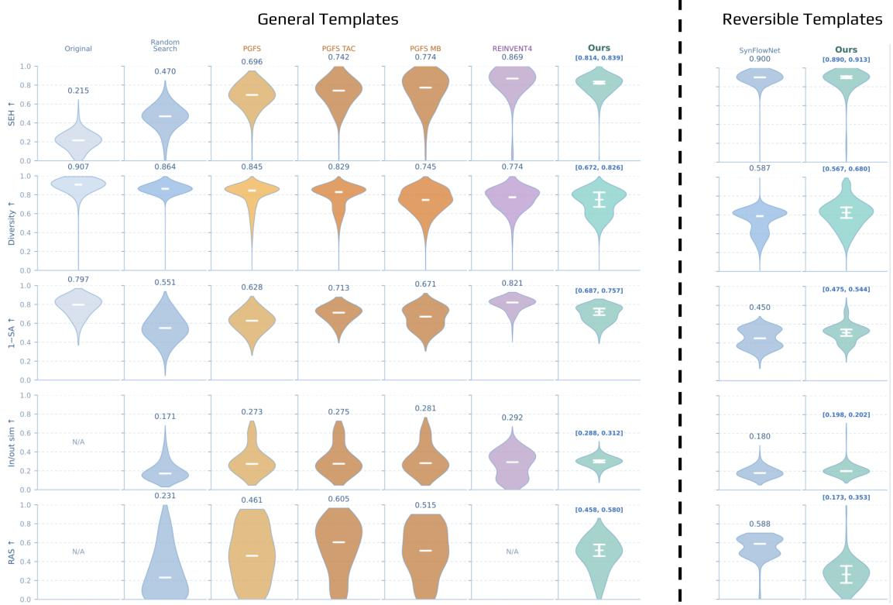
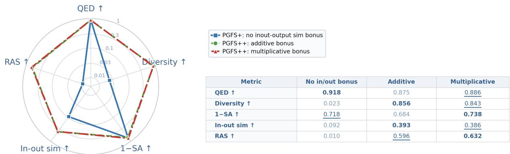
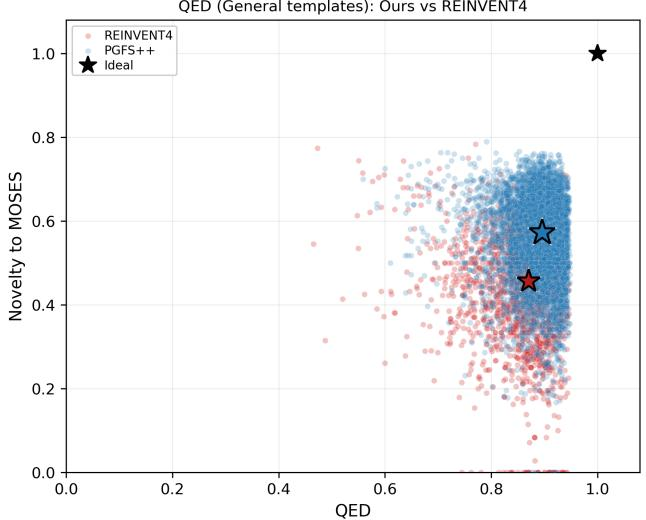
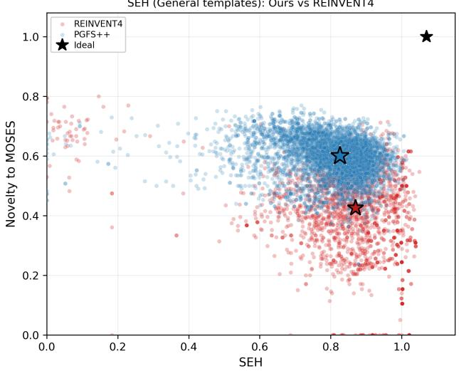
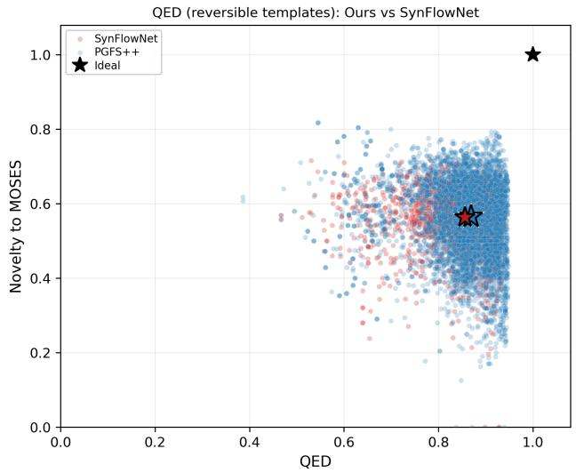
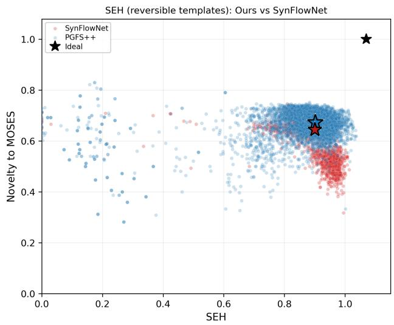

# PGFS++: Molecular Property Improvement under Synthesis and Diversity Constraints

Boqiao Zhang1, Godbless Tamaraebi James1, Sai Krishna Gottipati, Andrew Fitzgibbon1,2,\*

1University of Cambridge, United Kingdom

2Graphcore, United Kingdom

Corresponding author: awf@graphcore.ai

## Abstract

Improving molecular properties, such as drug-likeness or binding afinity, is a recurring task in early-stage drug discovery. However, molecules optimized in an unconstrained chemical space have limited practical value if they cannot be synthesized. Policy Gradient for Forward Synthesis (PGFS) is a synthesis-aware reinforcement learning method for molecular improvement, but its use of reactant embedding prediction makes reactant selection indirect, which, as we show, limits learning efectiveness. We first develop PGFS+, in which reaction templates and second reactants are represented by trainable embedding lookup tables. Combined with a more efective scoring function and RL algorithm, PGFS+ significantly improves the desired property. However, it exposes a reward-hacking failure mode: a powerful reactant search can map diverse input molecules to the same high-reward “magnet molecule”, improving the reward while collapsing the output diversity. We therefore introduce PGFS++, a synthesis-aware reinforcement learning framework for input-specific molecular improvement. Given an input molecule, PGFS++ treats it as the start of a forward-synthesis trajectory, applies learned reaction templates with compatible in-stock building blocks, and produces a molecule with improved target properties, an explicit synthesis route, and structural similarity to the input. Experiments on molecular improvement tasks show that PGFS++ improves target properties while preserving high output diversity.

Keywords: Molecular Optimization; Drug Discovery; Reinforcement Learning; Machine Learning; Forward Synthesis; Synthesis Constraints

## 1 Introduction

Over the past decades, AI for chemistry and drug discovery has been substantially developed. Generative models can output chemically valid de novo molecules in a manner biased towards desired properties such as QED (Quantitative Estimate of Drug-likeness), but most of them do not provide explicit synthesis routes for molecules generated by the model. Reinforcement Learning (RL) is another widely used approach in drug discovery, where an agent interacts with an environment and learns to adapt its policy to maximise a reward signal, such as QED or activity against biologica targets (Zhou et al., 2019; Simm et al., 2020; You et al., 2019). Still, only a few methods generate both attractive molecules and clear synthesis routes. PGFS (Policy Gradient for Forward Synthesis) (Gottipati et al., 2020) is a RL-based method that constrains the search to synthetically-accessible routes and therefore can output feasible synthesis pathways for its output molecules.

RL-based methods with synthesis constraints typically require a predefined set of reaction templates from which the model learns its policy. These reactions are commonly divided into two types: uni-molecular and bi-molecular. For bi-molecular templates, one must additionally select a second reactant, denoted as $R _ { 2 }$ , to react with the first reactant $R _ { 1 }$ under a chosen template T. However, the space of possible $R _ { 2 }$ candidates can be very large, and the action space becomes even larger when the model jointly selects both $T$ and $R _ { 2 }$ . The original PGFS framework overcame this by using a continuous action space for second-reactant selection: a neural $R _ { 2 }$ predictor is trained to predict the embedding of the second reactant, and a nearest-neighbour search is then used to retrieve an actual $R _ { 2 }$ from the available reactant set. However, this design has two limitations. First, the TD3 policy is optimized over a continuous action (predicted reactant embedding), whereas the actual reaction is executed using a discrete reactant retrieved from the available molecule set, creating a mismatch between the optimized action and the executed $R _ { 2 }$ . Second, the predicted action is used directly as the query in the reactant-embedding space, which ties the policy representation to the fixed fingerprint space and may limit eficient comparison among feasible reactants.

  
Figure 1: Reward hacking phenomenon in PGFS+. A, PGFS+ maps hundreds of input molecules to the same output molecule, causing high QED but low output diversity. This is referred to as the magnet output phenomenon. Highlighted atoms indicate the portions of the output molecule that are traced back to the corresponding input molecules. B, Trade-of between mean QED and mean diversity for PGFS, its variants, and PGFS+. Because of the magnet output, PGFS+ achieves high mean QED but has output diversity close to zero.

To address these limitations, we first extend PGFS to PGFS+. Instead of predicting a continuous $R _ { 2 }$ embedding and retrieving neighbours, PGFS+ projects molecules and templates into a learned reaction space and directly scores all template-compatible $R _ { 2 }$ candidates (Fig. 2). This modification allows the policy to compare valid second reactants directly and removes the mismatch between continuous prediction and discrete execution. Additionally, we replace the deterministic k-NN selection step with sampling at training time, which improves learning in the presence of multiple near-equivalent $R _ { 2 }$ candidates.

However, we observe that PGFS+ can introduce a new failure mode: many distinct input molecules are mapped to the same high-reward output molecule. We refer to this diversity collapse as the magnet output problem (Fig. 1). Although such outputs may achieve strong average molecular properties, they substantially reduce output diversity and weaken the ability of the model to perform input-specific molecular improvement. We therefore further develop PGFS++, which retains the direct global $R _ { 2 }$ selection mechanism while preserving diversity.

This paper makes two main contributions:

1. We present PGFS++, a synthesis-constrained reinforcement learning framework for molecular improvement that extends PGFS. PGFS++ can generate molecules with desired properties

  
Figure 2: Workflow comparison between PGFS, PGFS+, and PGFS++. At step $t ,$ all methods use an f-network conditioned on the current first reactant $R _ { 1 } ^ { \prime } ( t )$ to predict the reaction template $T .$ . PGFS uses the fingerprint representation $F ( R _ { 1 } ^ { \prime } ( t ) )$ directly, whereas PGFS+ and $\mathrm { P G F S { + + } }$ first transform the $R _ { 1 }$ representation through an additional MLP. For second-reactant selection, PGFS represents $R _ { 2 }$ candidates using fixed fingerprints and retrieves candidates by k-nearest neighbours. In contrast, PGFS+ and $\mathrm { P G F S { + + } }$ represent template-compatible $R _ { 2 }$ candidates with a trainable embedding lookup table and score them globally using an attention-like mechanism with query $q = \mathrm { c o n c a t } ( \phi _ { 1 } ( R _ { 1 } ^ { \prime } ) , \phi _ { T } ( T ) )$ . Once $R _ { 2 } ^ { \prime } ( t )$ is selected, the reaction runner applies the chosen reaction and returns the product, which becomes the next state $R _ { 1 } ^ { \prime } ( t + 1 )$ .

and greatly improved diversity.

2. We present PGFS+, and identified the magnet output problem, which reflects a broad failure mode in synthesis-aware molecular improvement tasks. We then propose input–output similarity bonus as an efective way to resolve it in PGFS++. This design mitigates magnetoutput collapse and encourages input-specific molecular improvement while maintaining output diversity.

## 2 Related Work

## 2.1 Genetic Algorithms

Genetic Algorithms (GA) are a broad class of algorithms that have been used for the generation of molecules for decades (Tripp and Hernández-Lobato, 2023). They usually represent molecules as graphs (Brown et al., 2004; Jensen, 2019) or strings (Nigam et al., 2020), and recursively generate molecules that are more promising for the target molecular property. Existing GA-based de novo generation methods typically address synthetic feasibility indirectly, by incorporating the synthetic-accessibility (SA) score (Ertl and Schufenhauer, 2009) or its variants into the optimization objective. Consequently, after a molecule with desirable predicted properties is generated, an additional retrosynthesis model or expert assessment is required to determine whether the structure can be practically synthesized.

## 2.2 Generative Models

Another widely used class of methods for molecule generation is generative modeling. A wide range of generative approaches for drug discovery has been explored, such as variational autoencoders (VAEs) (Gómez-Bombarelli et al., 2018) and generative adversarial networks (GANs) (Cao and Kipf, 2022). Despite the advances, they exhibit similar challenges in synthetic feasibility as genetic algorithms.

## 2.3 Synthesis-aware molecule generation

The idea of synthesis-aware molecule generation starts with Vinkers et al. (2003), who introduced SYNOPSIS. This method generates molecules from an initial dataset of available compounds by applying chemical modifications to functional groups. However, as an early rule-based approach, its optimization framework is less flexible and generally less efective than those of more recent methods.

## 2.4 Generative Models with Synthesis Constraints

Generative models with synthesis constraints can generate molecules with desirable properties, while also providing explicit reaction routes for their synthesis. Instead of producing molecular structures first and assessing synthesizability post hoc, these methods incorporate chemical feasibility directly into the generation process. For example, Cretu et al. (2025) combines GFlowNet with a reaction-based Markov decision process to generate drug-like molecules through predefined chemica reactions and building blocks. While the method achieves competitive performance for both molecular property and output diversity, it depends heavily on reversible chemical reaction templates, which introduce additional complexity and limitations on template design. Moreover, SynFlowNet is primarily designed for de novo molecule generation, whereas PGFS++ targets input-specific molecular improvement from a given starting molecule.

## 2.5 RL-based Models with Synthesis Constraints

Reinforcement learning has also been explored as a way to embed synthetic feasibility directly into molecular generation. For example, the PGFS (Policy Gradient for Forward Synthesis) framework (Gottipati et al., 2020) formulates drug discovery as a sequential forward-synthesis problem, where an agent navigates the synthetically accessible chemical space by applying valid reactions to commercially available building blocks at each step of a virtual multi-step synthesis process. Extensions of PGFS, including PGFS-TAC (Towered Actor Critic) (Gottipati et al., 2021) and PGFS-MB (Max-Bellman equation) (Gottipati et al., 2023), provide additional flexibility within this framework. However, they retain similar limitations to PGFS.

## 3 Methods

## 3.1 Overview

Following PGFS, we represent molecular improvement as a sequence of unimolecular or bimolecular reactions applied to an initial molecule. Each synthetic step is decomposed into two sub-actions: selecting a reaction template and, for bi-molecular reactions, selecting a compatible second reactant from the available building blocks. The reaction template is chosen from templates available in laboratory or industrial synthesis, and the second reactant is selected from a set of available building blocks.

The reinforcement learning agent first learns to select an appropriate template T given the current reactant $R _ { 1 }$ . Conditioned on $R _ { 1 }$ and $T$ , it then selects a second reactant $R _ { 2 }$ to maximize the reward associated with the properties of the product molecule. This hierarchical action decomposition ensures that the generated molecules are associated with explicit synthetic routes and improves training eficiency by reducing the complexity of each decision.

A key challenge is that there may be millions of possible $R _ { 2 }$ candidates for each T and $R _ { 1 }$ . PGFS addresses this by using a neural network to predict an $R _ { 2 }$ embedding, followed by k-nearest-neighbor retrieval from the building-block set.

In contrast, PGFS+ and PGFS++ directly scores feasible $R _ { 2 }$ candidates after applying a template-specific compatibility mask. We observed that the large $R _ { 2 }$ action space can be eficiently reduced to a tractable candidate set using RDKit substructure matching. We pre-compute a $T \mathrm { - } R _ { 2 }$ compatibility mask for each bimolecular template. For our dataset, which contains approximately 118,000 molecules and 87 bimolecular templates, pre-computing the masks for all bimolecular templates takes approximately 10 minutes on a single CPU process. This computation is performed only once and can be reused for subsequent training runs. After masking, each bimolecular template has a median of approximately 1000 compatible $R _ { 2 }$ candidates and a maximum of 55,000, making direct attention-like scoring feasible.

As shown in Fig. 2, PGFS+ and PGFS++ concatenate learned embeddings $\phi _ { 1 } ( R _ { 1 } )$ and $\phi _ { T } ( T )$ of $R _ { 1 }$ and $T$ to form a query vector,

$$
q = \mathrm { c o n c a t } ( \phi _ { 1 } ( R _ { 1 } ) , \phi _ { T } ( T ) ) ,
$$

and use this query to score the masked $R _ { 2 }$ embeddings as keys. To support this direct scoring formulation, we replace TD3, the continuous-action reinforcement learning algorithm used in PGFS, with PPO, which naturally supports a categorical policy over the indexed $R _ { 2 }$ action space in PGFS+ and PGFS++.

However, as shown in Fig. 1, when PGFS+ is trained only with a target-property reward, such as $\Delta \mathrm { Q E D }$ , the policy can learn to map diverse input molecules to the same high-reward output molecule.

  
Figure 3: Performance comparison on the QED improving task among ours (PGFS++) and random search, PGFS, PGFS TAC, PGFS MB, REINVENT4 (mol2mol), SynFlowNet. The comparison with SynFlowNet used the reversible reaction templates provided in the SynFlowNet repository to avoid potential issues arising from irreversible templates. Comparison with other baselines uses a general template set derived from Button et al. (2019), containing both reversible and irreversible templates.

Specifically, among 12,689 randomly selected test episodes, 12,415 (97.8%) produced the same output molecule. Empirically, we found that the collapse occurs often because the policy tends to select similar templates and second reactants across diferent starting molecules, producing similar or even identical high-reward outputs. In other words, the model improves diferent inputs by pushing them toward a small number of high-scoring magnet molecules, rather than producing input-specific improved molecules. Although we identify this behaviour in PGFS+, it reflects a broader failure mode in synthesis-aware molecular improvement tasks: when the reward depends mainly on termina molecular properties and does not constrain input–output relatedness, the policy can be incentivised to collapse diverse inputs toward a small set of high-reward products. To mitigate this problem, PGFS++ introduces input–output similarity shaping into the reward function, encouraging the output molecule of each episode to remain structurally close to its corresponding input molecule.

## 3.2 Input-output similarity

To discourage magnet-output collapse, PGFS++ makes similarity to the starting molecule an explicit part of the episode reward. We design the reward function incorporating input–output similarity bonus:

$$
r _ { \mathrm { e p i s o d e } } ^ { \times } = r _ { \mathrm { p r o p e r t y } } ( m _ { \mathrm { o u t } } ) \big ( 1 + c \mathrm { s i m } ( m _ { \mathrm { i n } } , m _ { \mathrm { o u t } } ) \big )\tag{1}
$$

where $r _ { \mathrm { p r o p e r t y } }$ is the property-based reward, such as ∆QED and ∆SEH, $c > 0$ control the bonus strength, and sim $( m _ { \mathrm { i n } } , m _ { \mathrm { o u t } } )$ denotes the Tanimoto similarity (Bajusz et al., 2015) between input

and output molecules per episode.

When the input–output similarity falls below a tolerance threshold τ, we cap the episode reward:

$$
r _ { \mathrm { e p i s o d e } } = \left\{ \begin{array} { l l } { r _ { \mathrm { e p i s o d e } } ^ { \times } , } & { \mathrm { s i m } ( m _ { \mathrm { i n } } , m _ { \mathrm { o u t } } ) \geq \tau , } \\ { \operatorname* { m i n } \{ r _ { \mathrm { e p i s o d e } } ^ { \times } , \kappa \} , } & { \mathrm { s i m } ( m _ { \mathrm { i n } } , m _ { \mathrm { o u t } } ) < \tau , } \end{array} \right.\tag{2}
$$

where κ is the reward cap.

## Diversity drop as inward edit bias.

We compare input and output diversity in the feature space induced by the Tanimoto kernel (Ralaivola et al., 2005; Tripp et al., 2023). Let m and n denote Morgan fingerprint vectors. For non-negative fingerprints, Tanimoto similarity is a positive-definite kernel, so there exists a feature map ψ such that

$$
\langle \psi ( m ) , \psi ( n ) \rangle = \sin ( m , n ) .
$$

Since sim $( m , m ) = 1$ , the induced squared distance is

$$
\begin{array} { c } { \| \psi ( m ) - \psi ( n ) \| ^ { 2 } = \sin ( m , m ) + \sin ( n , n ) - 2 \sin ( m , n ) } \\ { = 2 \big ( 1 - \sin ( m , n ) \big ) . } \end{array}\tag{3}
$$

For an episode with input molecule $m _ { \mathrm { i n } }$ and output molecule $m _ { \mathrm { o u t } } = G ( m _ { \mathrm { i n } } )$ , define

$$
X = \psi ( m _ { \mathrm { i n } } ) , \qquad Y = \psi ( m _ { \mathrm { o u t } } ) , \qquad A = Y - X ,
$$

where A is the edit displacement induced by the policy in the feature space. For an independent   
copy of the episode, primes denote $m _ { \mathrm { i n } } ^ { \prime } , m _ { \mathrm { o u t } } ^ { \prime } , X ^ { \prime }$ , and $Y ^ { \prime }$   
We define the input and output diversity measures as

$$
\begin{array} { r l } & { D _ { \mathrm { i n } } = \mathbb { E } \big [ 1 - \mathrm { s i m } ( m _ { \mathrm { i n } } , m _ { \mathrm { i n } } ^ { \prime } ) \big ] } \\ & { \qquad = \frac { 1 } { 2 } \mathbb { E } \| X - X ^ { \prime } \| ^ { 2 } = \mathbb { E } \| X - \mu _ { X } \| ^ { 2 } = \mathrm { V a r } ( X ) , } \\ & { D _ { \mathrm { o u t } } = \mathbb { E } \big [ 1 - \mathrm { s i m } ( m _ { \mathrm { o u t } } , m _ { \mathrm { o u t } } ^ { \prime } ) \big ] } \\ & { \qquad = \frac { 1 } { 2 } \mathbb { E } \| Y - Y ^ { \prime } \| ^ { 2 } = \mathbb { E } \| Y - \mu _ { Y } \| ^ { 2 } = \mathrm { V a r } ( Y ) , } \end{array}\tag{4}
$$

where $\mu . = \mathbb { E } [ \cdot ]$ . Since $Y = X + A$ and $\mu _ { Y } = \mu _ { X } + \mu _ { A }$

$$
Y - \mu _ { Y } = ( X - \mu _ { X } ) + ( A - \mu _ { A } ) .
$$

Substituting this expression into Equation (4) gives

$$
\begin{array} { r l } & { D _ { \mathrm { o u t } } = D _ { \mathrm { i n } } + V _ { A } + 2 \Gamma , } \\ & { \quad V _ { A } = \mathbb { E } \| A - \mu _ { A } \| ^ { 2 } = \mathrm { V a r } ( A ) \geq 0 , } \\ & { \quad \Gamma = \mathbb { E } [ \langle X - \mu _ { X } , ~ A - \mu _ { A } \rangle ] . } \end{array}\tag{5}
$$

Equation (5) separates the efect of editing into the non-negative edit variance $V _ { A }$ and the input–edit covariance 2Γ. Therefore,

$$
D _ { \mathrm { o u t } } < D _ { \mathrm { i n } } \quad \Longleftrightarrow \quad \Gamma < - { \frac { V _ { A } } { 2 } } .
$$

We refer to this suficiently negative covariance as an inward edit bias.

Complete collapse to a magnet molecule $m ^ { \star }$ gives $Y = \psi ( m ^ { \star } )$ . In this case,

$$
A = \psi ( m ^ { \star } ) - X , \qquad A - \mu _ { A } = - ( X - \mu _ { X } ) ,
$$

and hence

$$
V _ { A } = D _ { \mathrm { i n } } , \Gamma = - D _ { \mathrm { i n } } .
$$

Substitution into Equation (5) recovers $D _ { \mathrm { o u t } } = 0 .$

Bounding diversity drop with input–output similarity.

Since sim $( m , m ) = 1$ , the feature-space embeddings satisfy $\| X \| = \left\| Y \right\| = 1$ . Therefore,

$$
D _ { \mathrm { i n } } = 1 - \| \mu _ { X } \| ^ { 2 } , \qquad D _ { \mathrm { o u t } } = 1 - \| \mu _ { Y } \| ^ { 2 } .
$$

Define the average input–output similarity

$$
\bar { s } = \mathbb { E } \big [ \mathrm { s i m } ( m _ { \mathrm { i n } } , m _ { \mathrm { o u t } } ) \big ] = \mathbb { E } \langle X , Y \rangle .
$$

Let

$$
a = \| \mu _ { X } \| = { \sqrt { 1 - D _ { \mathrm { i n } } } } .
$$

We first bound $\| \mu _ { Y } \|$ in terms of a and s¯.

Set $u = \mu _ { Y } / \| \mu _ { Y } \|$ . For any $\lambda \geq 0$

$$
\begin{array} { r l } { \| \mu _ { Y } \| = \operatorname { \mathbb { E } } \langle u , Y \rangle } \\ { = \operatorname { \mathbb { E } } \langle u + \lambda X , Y \rangle - \lambda \operatorname { \mathbb { E } } \langle X , Y \rangle } \\ { \leq \operatorname { \mathbb { E } } \| u + \lambda X \| - \lambda \bar { s } } \\ { \leq \sqrt { 1 + \lambda ^ { 2 } + 2 \lambda \langle u , \mu _ { X } \rangle } - \lambda \bar { s } } \\ { \leq \sqrt { 1 + \lambda ^ { 2 } + 2 \lambda a } - \lambda \bar { s } . } \end{array}
$$

Minimizing the right-hand side over $\lambda \geq 0$ gives

$$
\| \mu _ { Y } \| \leq h _ { \bar { s } } ( a ) ,
$$

where

$$
h _ { \bar { s } } ( a ) = \left\{ \begin{array} { l l } { 1 , } & { \bar { s } \le a , } \\ { a \bar { s } + \sqrt { 1 - a ^ { 2 } } \sqrt { 1 - \bar { s } ^ { 2 } } , } & { \bar { s } > a . } \end{array} \right.
$$

Hence, the diversity drop

$$
\Delta _ { \mathrm { d i v } } = \left[ D _ { \mathrm { i n } } - D _ { \mathrm { o u t } } \right] _ { + } = \left[ \| \mu _ { Y } \| ^ { 2 } - \| \mu _ { X } \| ^ { 2 } \right] _ { + }
$$

where $[ v ] _ { + } = \operatorname* { m a x } ( v , 0 )$ , satisfies

$$
\Delta _ { \mathrm { d i v } } \leq h _ { \bar { s } } \Big ( \sqrt { 1 - D _ { \mathrm { i n } } } \Big ) ^ { 2 } - \left( 1 - D _ { \mathrm { i n } } \right) .\tag{6}
$$

When $\bar { s } > \sqrt { 1 - D _ { \mathrm { i n } } }$ , this becomes

$$
\Delta _ { \mathrm { d i v } } \leq \left( \bar { s } \sqrt { 1 - D _ { \mathrm { i n } } } + \sqrt { 1 - \bar { s } ^ { 2 } } \sqrt { D _ { \mathrm { i n } } } \right) ^ { 2 } - \left( 1 - D _ { \mathrm { i n } } \right) .\tag{7}
$$

When the input pool is highly diverse $( D _ { \mathrm { i n } } \approx 1 )$ , we have the approximation

$$
\Delta _ { \mathrm { d i v } } \lesssim 1 - \bar { s } ^ { 2 } .
$$

Therefore, the input–output similarity bonus in PGFS++ directly encourages the quantity that tightens this bound: by favouring policies with larger ${ \bar { s } } ,$ it tightens the upper bound on diversity drop.

  
Figure 4: Performance comparison on the SEH improving task among ours $\left( \mathrm { P G F S + + } \right)$ and random search, PGFS, PGFS TAC, PGFS MB, REINVENT4 (mol2mol), SynFlowNet. The comparison with SynFlowNet used the reversible reaction templates provided in the SynFlowNet repository to avoid potential issues arising from irreversible templates. Comparison with other baselines uses a general template set derived from Button et al. (2019), containing both reversible and irreversible templates.

## 4 Experiments

We evaluated the proposed framework on a dataset containing approximately 118,000 molecules from Enamine Building Block Global Stock (Enamine, 2026) and 102 reaction templates derived from Button et al. (2019), including 15 unimolecular and 87 bimolecular templates. The test set consisted of 2,000 randomly selected $R _ { 1 }$ reactants from the dataset. At test time, each model was used to improve every test $R _ { 1 }$ , and metrics were recorded for each episode.

We compared PGFS++ against PGFS, PGFS-TAC, PGFS-MB, SynFlowNet, and the REIN-VENT4 mol2mol model (Loefler et al., 2024). For REINVENT4, we fine-tuned the medium prior model using reinforcement learning for 500 steps, with 2,048 oracle-scored molecules per step. This results in approximately one million oracle calls in total, which is consistent with the number of oracle calls used in PGFS++ training. The remaining baselines were trained with their default settings. For PGFS++, we used either $r _ { \mathrm { p r o p e r t y } } = \Delta \mathrm { Q E D ~ o r } ~ r _ { \mathrm { p r o p e r t y } } = \Delta \mathrm { S E H }$ as the property reward. For the hyperparameters in Equation 1 and 2, we set $\tau = 0 . 2 5 , c = 0 . 5 , \kappa _ { \mathrm { Q E D } } = 0 . 1$ and $\kappa _ { \mathrm { S E H } } = 0 . 3 5$ , reflecting the diferent numerical scales of the two property rewards. All other hyperparameters were kept identical to those used in PGFS. To ensure a fair comparison across synthesis-aware methods, we fixed the reaction budget to at most four reaction steps per episode.

The experiments focused on two optimization objectives: QED (on a [0, 1] scale) and SEH (scaled by a factor of $_ { \mathrm { ~ 8 ~ } } ^ { \mathrm { ~ 1 ~ } } )$ . For each metric, we report a violin plot together with the median. For PGFS++, results are averaged over three random seeds. We additionally report the mean ± standard deviation of the three seed-wise medians to quantify variability across seeds.

  
Figure 5: Ablation of input–output similarity bonus. We compare PGFS+ without an input–output similarity bonus against PGFS++ with additive and multiplicative similarity bonuses. Bold entries indicate the best value for each metric, and underlined entries indicate the second-best value. Without input–output similarity bonus, PGFS+ sufers from the magnet output problem, as reflected by high mean QED, but very low output diversity, input–output similarity, and RAS.

## 4.1 Metrics

In addition to the two optimization objectives, we evaluated generated molecules using diversity, synthetic accessibility (SA), input-output similarity, and Route-Aware Synthesizability (RAS).

Diversity measures structural variation within the output set O. It is defined as one minus the average pairwise Tanimoto similarity between Morgan fingerprints:

$$
D ( O ) = 1 - \frac { 1 } { | P | } \sum _ { m _ { i } , m _ { j } \in P } T ( \mathrm { F P } ( m _ { i } ) , \mathrm { F P } ( m _ { j } ) ) ,
$$

where $P = \{ ( m _ { i } , m _ { j } ) : m _ { i } , m _ { j } \in O , i < j \}$ is the set of unordered molecule pairs, T denotes Tanimoto similarity and FP denotes the Morgan fingerprint representation.

Synthetic accessibility was assessed using the Ertl–Schufenhauer synthetic accessibility (SA) score implemented in RDKit (Landrum, 2026). Although the SA score does not fully capture route-level synthetic feasibility, we used it as a simple molecule-level metric to enable comparison with non-synthesis-aware methods. For visual consistency with the other metrics, we report $1 - \mathrm { S A }$ in plots, so that higher values indicate better synthetic accessibility. While the SA score is widely used to estimate molecule-level synthetic accessibility, it does not fully capture the route-level information of synthesis-aware methods. RAS below addresses this limitation by incorporating information from the generation routes.

Input-output similarity measures the structural similarity between the input molecule $m _ { \mathrm { i n } } ^ { e }$ and the output molecule $m _ { \mathrm { o u t } } ^ { e }$ for each episode $e ,$ averaged across episodes. For each episode $e ,$ we compute

$$
\mathrm { s i m } _ { \mathrm { i n , o u t } } ( e ) = T ( \mathrm { F P } ( m _ { \mathrm { i n } } ^ { e } ) , \mathrm { F P } ( m _ { \mathrm { o u t } } ^ { e } ) ) .
$$

This metric is important for molecule improving tasks, where the optimized molecule should retain structural similarity to the starting molecule.

Route-aware synthesizability (RAS) is a route-level synthetic accessibility score in [0, 1], where higher values indicate more accessible synthetic routes. RAS was computed only for methods that produce explicit reaction trajectories. For an episode $e ,$ let the selected synthetic route contain reaction steps $n = 1 , \ldots , N _ { e }$

For each step n, we obtain two raw accessibility signals and map them to normalized factors in [0, 1]:

1. Reaction feasibility (template score). Let $p _ { n } ^ { \mathrm { r a w } }$ denote the ASKCOS fast-filter plausibility (Tu et al., 2025) of the reaction at step n, which lies in [0, 1], with larger values indicating greater feasibility. We use it directly:

$$
{ \mathrm { R A S } } _ { n } ^ { T } = p _ { n } ^ { \mathrm { r a w } } .
$$

2. Reactant accessibility $( R _ { 2 }$ score). For bimolecular steps, let $s _ { n } ^ { \mathrm { r a w } }$ denote the BR-SAScore (Ertl and Schufenhauer, 2009) of the selected second reactant $R _ { 2 }$ , where smaller values indicate greater accessibility. We map this score to [0, 1] by inverting and rescaling it with fixed bounds $s _ { \mathrm { m i n } } = 1 \mathrm { a n d } s _ { \mathrm { m a x } } = 1 0$

$$
\mathrm { R A S } _ { n } ^ { R _ { 2 } } = \mathrm { c l i p } \left( \frac { s _ { \mathrm { m a x } } - s _ { n } ^ { \mathrm { r a w } } } { s _ { \mathrm { m a x } } - s _ { \mathrm { m i n } } } , 0 , 1 \right) .
$$

For uni-molecular steps, where no building block is added, we set $\mathrm { R A S } _ { n } ^ { R _ { 2 } } = 1$

Each reaction step contributes the product of its two normalized factors. RAS is then computed as the product over all steps on the selected route:

$$
{ \mathrm { R A S } } ( e ) = \prod _ { n = 1 } ^ { N _ { e } } \left( { \mathrm { R A S } } _ { n } ^ { T } \times { \mathrm { R A S } } _ { n } ^ { R _ { 2 } } \right) .
$$

Because every factor lies in [0, 1], longer routes are penalized through multiplication by additional terms.

Although we use BR-SAScore to estimate the accessibility of $R _ { 2 }$ , the RAS metric can incorporate other $R _ { 2 }$ accessibility estimates, such as the price of $R _ { 2 }$

## 4.2 Experiments for QED and SEH improvement

For both the QED and SEH optimization tasks (Figs. 3 and 4), PGFS++ consistently outperformed PGFS and its variants. Compared with REINVENT4, PGFS++ achieved comparable performance. However, unlike PGFS++, REINVENT4 does not produce explicit synthesis routes for the generated molecules.

We also compared PGFS++ with SynFlowNet using the reversible reaction templates provided in the SynFlowNet GitHub repository, to avoid potential issues arising from irreversible templates. Under this setting, PGFS++ also achieved competitive performance on both the QED and SEH optimization tasks.

## 4.3 Ablation Studies

We compared the multiplicative input–output similarity bonus (Equation 1) to the additive form:

$$
\begin{array} { r l } & { r _ { \mathrm { e p i s o d e } } ^ { + } = r _ { \mathrm { p r o p e r t y } } ( m _ { \mathrm { o u t } } ) + w \sin ( m _ { \mathrm { i n } } , m _ { \mathrm { o u t } } ) , } \\ & { r _ { \mathrm { e p i s o d e } } ^ { \times } = r _ { \mathrm { p r o p e r t y } } ( m _ { \mathrm { o u t } } ) \big ( 1 + c \sin ( m _ { \mathrm { i n } } , m _ { \mathrm { o u t } } ) \big ) . } \end{array}\tag{8}
$$

The two forms difer in how strongly they pull the output toward the input. For the additive form,

$$
\frac { \partial r _ { \mathrm { e p i s o d e } } ^ { + } } { \partial \sin } = w ,
$$

while for the multiplicative form,

$$
\frac { \partial r _ { \mathrm { e p i s o d e } } ^ { \times } } { \partial \sin } = c r _ { \mathrm { p r o p e r t y } } ( m _ { \mathrm { o u t } } ) .
$$

Thus, the multiplicative bonus becomes stronger for high-property outputs, where magnet-molecule collapse is most likely to be rewarded.

The multiplicative form also provides a more stable way to control the balance between property optimization and input–output similarity. Because the similarity term scales the property reward, the bonus acts as a relative adjustment to the target-property objective. In contrast, the additive form uses an absolute bonus whose scale must be carefully tuned.

In Fig. 5, we compare the two similarity-bonus forms with the hyperparameters in Equation 8 set to $w = c = 0 . 5$ , while keeping other hyperparameters identical. Both additive and multiplicative similarity bonuses mitigate the magnet molecule problem observed in PGFS+ without similarity bonus. Compared with PGFS+, both variants substantially improve output diversity, input–output similarity, and RAS while maintaining competitive QED. The two bonus forms achieve similar diversity, 1 − SA, input–output similarity, and RAS, but the multiplicative form better preserves QED.

## 5 Conclusion and Discussion

In this work, we introduced PGFS++, a synthesis-constrained reinforcement learning framework for molecular improvement. PGFS++ extends PGFS by using a discrete action space, pre-computed T– $R _ { 2 }$ masks, attention-like global scoring for $R _ { 2 }$ selection, and input–output similarity encouragement. In experiments on QED and SEH improvement tasks, PGFS++ consistently improved over PGFS and its variants and achieved performance competitive with REINVENT4 and SynFlowNet. The framework still has a few limitations. For example, although the input-output similarity bonus can improve similarity while maintaining relatively strong performance on other metrics, the model may be sensitive to the hyperparameter values in Eq. 2.

Some directions of future work are worth pursuing. First, PGFS++ currently uses Morgan fingerprints for $R _ { 1 }$ representation, whereas alternative fingerprints, such as RLV2 and MACCS, or graph-transformer-based representations may further improve performance. Second, beyond QED and SEH, we plan to evaluate the framework on more practical objectives, such as docking scores.

## References

Dávid Bajusz, Anita Rácz, and Károly Héberger. Why is Tanimoto index an appropriate choice for fingerprint-based similarity calculations? Journal of Cheminformatics, 7(1):20, 2015. doi: 10.1186/s13321-015-0069-3.

Neil Brown, Brian McKay, Franco Gilardoni, and Johann Gasteiger. A graph-based genetic algorithm and its application to the multiobjective evolution of median molecules. Journal of Chemical Information and Computer Sciences, 44(3):1079–1087, 2004. doi: 10.1021/ci034290p.

A. Button, D. Merk, J. A. Hiss, and G. Schneider. Automated de novo molecular design by hybrid machine intelligence and rule-driven chemical synthesis. Nature Machine Intelligence, 1(7):307–315, 2019.

Nicola De Cao and Thomas Kipf. Molgan: An implicit generative model for small molecular graphs, 2022. URL https://arxiv.org/abs/1805.11973.

Miruna Cretu, Charles Harris, Ilia Igashov, Arne Schneuing, Marwin Segler, Bruno Correia, Julien Roy, Emmanuel Bengio, and Pietro Liò. Synflownet: Design of diverse and novel molecules with synthesis constraints. In International Conference on Learning Representations (ICLR), 2025. URL https://openreview.net/forum?id=uvHmnahyp1.

Enamine. Enamine, 2026. URL https://enamine.net. Accessed: 2026-06-01.

Peter Ertl and Ansgar Schufenhauer. Estimation of synthetic accessibility score of drug-like molecules based on molecular complexity and fragment contributions. Journal of Cheminformatics, 1(1):8, 2009. doi: 10.1186/1758-2946-1-8.

Sai Krishna Gottipati, Boris Sattarov, Sufeng Niu, Yashaswi Pathak, Haoran Wei, Shengchao Liu, Karam J. Thomas, Simon Blackburn, Connor W. Coley, Jian Tang, Sarath Chandar, and Yoshua Bengio. Learning to navigate the synthetically accessible chemical space using reinforcement learning. In Proceedings of the 37th International Conference on Machine Learning, ICML’20. JMLR.org, 2020.

Sai Krishna Gottipati, Yashaswi Pathak, Boris Sattarov, Sahir, Rohan Nuttall, Mohammad Amini, Matthew E. Taylor, and Sarath Chandar. Towered actor critic for handling multiple action types in reinforcement learning for drug discovery. Proceedings of the AAAI Conference on Artificial Intelligence, 35(1):142–150, 2021. doi: 10.1609/aaai.v35i1.16087.

Sai Krishna Gottipati, Yashaswi Pathak, Rohan Nuttall, Sahir, Raviteja Chunduru, Ahmed Touati, Sriram Ganapathi Subramanian, Matthew E. Taylor, and Sarath Chandar. Maximum reward formulation in reinforcement learning, 2023. URL https://arxiv.org/abs/2010.03744.

Rafael Gómez-Bombarelli, Jennifer N. Wei, David Duvenaud, José Miguel Hernández-Lobato, Benjamín Sánchez-Lengeling, Dennis Sheberla, Jorge Aguilera-Iparraguirre, Timothy D. Hirzel, Ryan P. Adams, and Alán Aspuru-Guzik. Automatic chemical design using a data-driven continuous representation of molecules. ACS Central Science, 4(2):268–276, January 2018. ISSN 2374-7951. doi: 10.1021/acscentsci.7b00572. URL http://dx.doi.org/10.1021/acscentsci.7b00572.

Jan H. Jensen. A graph-based genetic algorithm and generative model/monte carlo tree search for the exploration of chemical space. Chemical Science, 10(12):3567–3572, 2019. doi: 10.1039/ C8SC05372C.

G. Landrum. Rdkit: Open-source cheminformatics software, 2026. URL https://github.com/rdkit/ rdkit/releases/tag/Release\_2026\_03\_3.

Hannes H. Loefler, Jiazhen He, Angelica Tibo, Jon Paul Janet, Alexey Voronov, Lewis H. Mervin, and Ola Engkvist. Reinvent 4: Modern ai-driven generative molecule design. Journal of Cheminformatics, 16(1):20, 2024. doi: 10.1186/s13321-024-00812-5.

Akshat Kumar Nigam, Pascal Friederich, Mario Krenn, and Alán Aspuru-Guzik. Augmenting genetic algorithms with deep neural networks for exploring the chemical space. In International Conference on Learning Representations (ICLR), 2020. URL https://openreview.net/pdf?id=H1lmyRNFvr.

Liva Ralaivola, Sanjay J. Swamidass, Hiroto Saigo, and Pierre Baldi. Graph kernels for chemical informatics. Neural Networks, 18(8):1093–1110, 2005. doi: 10.1016/j.neunet.2005.07.009.

Gregor N. C. Simm, Robert Pinsler, and José Miguel Hernández-Lobato. Reinforcement learning for molecular design guided by quantum mechanics. In Hal Daumé III and Aarti Singh, editors,

Proceedings of the 37th International Conference on Machine Learning, volume 119 of Proceedings of Machine Learning Research, pages 8959–8969. PMLR, 13–18 Jul 2020. URL https://proceedings. mlr.press/v119/simm20b.html.

Austin Tripp and José Miguel Hernández-Lobato. Genetic algorithms are strong baselines for molecule generation, 2023. URL https://arxiv.org/abs/2310.09267.

Austin Tripp, Sergio Bacallado, Sukriti Singh, and José Miguel Hernández-Lobato. Tanimoto random features for scalable molecular machine learning. In Advances in Neural Information Processing Systems, volume 36, 2023.

Zhengkai Tu, Sourabh J. Choure, Mun Hong Fong, Jihye Roh, Itai Levin, Kevin Yu, Joonyoung F. Joung, Nathan Morgan, Shih-Cheng Li, Xiaoqi Sun, Huiqian Lin, Mark Murnin, Jordan P. Liles, Thomas J. Struble, Michael E. Fortunato, Mengjie Liu, William H. Green, Klavs F. Jensen, and Connor W. Coley. Askcos: an open source software suite for synthesis planning, 2025. URL https://arxiv.org/abs/2501.01835.

H. M. Vinkers, M. R. de Jonge, F. F. Daeyaert, J. Heeres, L. M. Koymans, J. H. van Lenthe, P. J. Lewi, H. Timmerman, K. Van Aken, and P. A. Janssen. Synopsis: Synthesize and optimize system in silico. Journal of Medicinal Chemistry, 46(13):2765–2773, 2003. doi: 10.1021/jm030809x.

Jiaxuan You, Bowen Liu, Rex Ying, Vijay Pande, and Jure Leskovec. Graph convolutional policy network for goal-directed molecular graph generation, 2019. URL https://arxiv.org/abs/1806. 02473.

Zhenpeng Zhou, Steven Kearnes, Li Li, Richard N. Zare, and Patrick Riley. Optimization of molecules via deep reinforcement learning. Scientific Reports, 9(1):10752, July 2019. ISSN 2045-2322. doi: 10.1038/s41598-019-47148-x. URL http://dx.doi.org/10.1038/s41598-019-47148-x.

# Supplementary Material for PGFS++: Molecular Property Improvement under Synthesis and Diversity Constraints

## S1 Algorithm Details

## Training paradigm

Figure S2 compares the algorithm of PGFS (left) and $\mathrm { P G F S + + \Delta ( r i g h t ) }$ . For PGFS++, at each time step t, the current molecule $R _ { t } ^ { ( 1 ) }$ is the MDP state. The Actor encodes $R ^ { ( 1 ) }$ by a network f applied to its Morgan fingerprint $\mathrm { F P } ( \mathbf { \bar { \cal R } } ^ { ( 1 ) } )$ , yielding a latent representation

$$
h = f ( \mathrm { F P } ( R ^ { ( 1 ) } ) ) .
$$

A template head then samples a reaction template

$$
T \sim \operatorname { S o f t m a x } ( T _ { \mathrm { m a s k } } \odot W _ { T } h ) ,
$$

where $T _ { \mathrm { m a s k } }$ masks out templates that are chemically infeasible for $R ^ { ( 1 ) }$ . If $T = { \mathrm { S T O P } }$ , the Actor returns immediately with no second reactant. Otherwise, a query head forms

$$
q = \mathrm { M L P } ( [ h , \phi _ { T } ( T ) ] )
$$

from h and a learned template embedding $\phi _ { T } ( T )$ . All building-block candidates $\mathcal { R } ^ { ( 2 ) }$ are represented by a table of learned embeddings as keys

$$
\mathcal { K } = \phi _ { 2 } ( \mathcal { R } ^ { ( 2 ) } ) .
$$

The second reactant is sampled by attention over masked keys,

$$
R ^ { ( 2 ) } \sim \mathrm { S o f t m a x } \big ( R _ { \mathrm { m a s k } } ^ { ( 2 ) } \odot ( q K ^ { \top } ) \big ) ,
$$

where $R _ { \mathrm { m a s k } } ^ { ( 2 ) }$ is the precomputed mask that retains only reactants compatible with template $T .$ . The joint discrete action is therefore $( \mathcal { T } , \mathcal { R } ^ { ( 2 ) } )$ , and the Actor also returns log $\pi ( { \cal T } , R ^ { ( 2 ) } \mid R ^ { ( 1 ) } )$ for PPO. The Critic is a state-value network $V ( \mathrm { F P } ( R ^ { ( 1 ) } ) )$ sharing the same Morgan-fingerprint input. The environment applies ForwardReaction $( R ^ { ( 1 ) } , T , R ^ { ( 2 ) } )$ to obtain the product $R ^ { ( 1 ) ^ { \prime } }$ and assigns a step reward.

Training follows on-policy PPO. The Main loop collects $n _ { \mathrm { s t e p s } }$ transitions into a rollout bufer D, sampling a fresh starting molecule $R ^ { ( 1 ) } \sim p _ { 0 }$ at the beginning of each episode. After each rollout, Update computes generalised advantage estimates

$$
\hat { A } _ { t } = \operatorname { G A E } ( \{ r _ { t } , V _ { t } \} )
$$

<table><tr><td>Symbol</td><td>Value</td><td>Symbol</td><td>Value</td></tr><tr><td>α</td><td> $3 \times 1 0 ^ { - 4 }$ </td><td>λ</td><td>0.95</td></tr><tr><td>Nsteps</td><td>2048</td><td>€</td><td>0.2</td></tr><tr><td>B</td><td>64</td><td> $c _ { e }$ </td><td>0.05</td></tr><tr><td>K</td><td>10</td><td> $c _ { v }$ </td><td>0.5</td></tr><tr><td>γ</td><td>0.99</td><td>gmax</td><td>0.5</td></tr><tr><td></td><td></td><td> $\mathrm { K L } _ { \mathrm { t a r g } }$ </td><td>0.02</td></tr></table>

Table S1: Additional PPO hyperparameters used in PGFS++ experiments (notations as in Equation (S1)).

and returns

$$
{ \hat { G } } _ { t } = { \hat { A } } _ { t } + V _ { t } ,
$$

then maximises the clipped surrogate $\boldsymbol { L } ^ { \mathrm { c l i p } } ( \rho _ { t } , \boldsymbol { \hat { A } } _ { t } )$ with value loss $L _ { V }$ and entropy bonus $H [ \pi ]$ , where

$$
\rho _ { t } = \pi ( a _ { t } \mid R _ { t } ^ { ( 1 ) } ) / \pi _ { \mathrm { o l d } } ( a _ { t } \mid R _ { t } ^ { ( 1 ) } ) .
$$

Early stopping is triggered when $\mathrm { K L } ( \pi _ { \mathrm { o l d } } , \pi )$ exceeds a target threshold $\mathrm { K L } _ { \mathrm { t a r g } }$

## PPO hyperparameters

For a fair comparison, PGFS++ strictly follows the shared experimental hyperparameters of PGFS wherever the two methods are directly comparable. The underlying learning algorithms difer, however: PGFS is trained with of-policy TD3, whereas PGFS++ is trained with on-policy PPO. Writing $\rho _ { t } \ : = \ : \pi ( a _ { t } \mid R _ { t } ^ { ( 1 ) } ) / \pi _ { \mathrm { o l d } } ( a _ { t } \mid R _ { t } ^ { ( 1 ) } )$ for the importance ratio, the PPO objective used by PGFS++ is

$$
{ \cal L } ( \theta ) = - { \cal L } ^ { \mathrm { c l i p } } ( \rho _ { t } , \hat { A } _ { t } ) + c _ { v } { \cal L } _ { V } - c _ { e } H [ \pi ] ,\tag{S1}
$$

where $L ^ { \mathrm { c l i p } }$ is the clipped policy surrogate with clip range $\epsilon , L _ { V }$ is the squared-error value loss, and $H [ \pi ]$ is the policy entropy. Advantages $\hat { A } _ { t }$ are estimated by GAE with discount $\gamma$ and trace parameter λ. Optimisation uses learning rate $\alpha ,$ rollout length $n _ { \mathrm { s t e p s } } ,$ minibatch size $B ,$ and $K$ epochs per rollout, with gradient clipping at $g _ { \mathrm { m a x } }$ and early stopping when $\mathrm { K L } ( \pi _ { \mathrm { o l d } } , \pi ) > \mathrm { K L } _ { \mathrm { t a r g } } .$ Table S1 lists the corresponding hyperparameter values.

## S2 Evaluation protocol

When evaluating model performance, we use the following settings:

• Templates. Two sets of reaction templates are used in experiments: reversible and general. The reversible template set contains only templates for which RDKit can form a backward reaction by swapping reactant and product SMARTS and recovering valid reactants. This auto-reversion is used when learning the backward policy $P _ { B }$ in SynFlowNet. The general template set, which is derived from Button et al. (2019), includes templates that do not support a reliable auto-reversion.

• Inference. At test time we use greedy (argmax) template and reactant selection, with a maximum of 4 reaction steps and an explicit Stop action.

<table><tr><td>Method</td><td>General templates</td><td>Reversible templates</td></tr><tr><td>SynFlowNet</td><td>0.766</td><td>0.856</td></tr><tr><td>Ours</td><td>0.895</td><td>0.867</td></tr></table>

Table S2: Median QED on the test set under general vs. reversible templates. Ours denotes the matched PGFS++ QED models from the main paper.

## S3 Additional experimental results

## S3.1 SynFlowNet performance under general vs. reversible templates

SynFlowNet favors reversible reaction templates to support learning of a backward policy. Table S2 compares median QED on the test set when SynFlowNet is trained and evaluated under genera templates versus under reversible templates. The reversible setting yields substantially higher median QED (0.856 vs. 0.766), consistent with SynFlowNet’s dependence on template reversibility. PGFS++ does not have this restriction and attains strong QED in both settings.

Accordingly, we omit SynFlowNet from the general-template comparisons in the main paper: presenting it there would disadvantage a method whose modelling assumptions are favored to reversible chemistry. For the general-template setting we instead compared to REINVENT4 as a state-of-the-art method, which has no reaction-template constraints. SynFlowNet is retained as the state-of-the-art baseline under reversible templates, and PGFS++ is trained separately in each template setting.

## S3.2 Seed variability of PGFS++

The main paper reports PGFS++ results aggregated over three random seeds. This subsection summarizes the corresponding seed variability.

For the molecule-level results in the main paper, each metric is first averaged across the three seeds for each starting molecule, and the resulting distribution is summarized using the mean ± standard deviation. Table S3 additionally reports the median obtained from each individual seed under all experimental settings. Overall, the target-property results are highly consistent across seeds.

Comparing seeds 123456 and 654321 in Table S3 under general-template QED experiments, their 1−SA remains similar while RAS difers substantially, mainly due to longer routes used by seed 654321 (2.72 vs. 1.16 reactions on average) and diferent template / $R ^ { ( 2 ) }$ usage. This underscores the need for RAS rather than relying on SA alone.

<table><tr><td>Tem.</td><td>Obj.</td><td>Seed/stat.</td><td>Prop. ↑</td><td>Div. ↑</td><td>1 - SA↑</td><td>I/O sim. ↑</td><td>RAS ↑</td></tr><tr><td rowspan="5">Gen.</td><td rowspan="5">QED</td><td>123456</td><td>0.895</td><td>0.873</td><td>0.749</td><td>0.389</td><td>0.705</td></tr><tr><td>654321</td><td>0.897</td><td>0.867</td><td>0.698</td><td>0.360</td><td>0.267</td></tr><tr><td>246135</td><td>0.897</td><td>0.877</td><td>0.722</td><td>0.371</td><td>0.685</td></tr><tr><td>Mean</td><td>0.896</td><td>0.872</td><td>0.723</td><td>0.373</td><td>0.552</td></tr><tr><td>s.d.</td><td>0.001</td><td>0.005</td><td>0.026</td><td>0.015</td><td>0.247</td></tr><tr><td rowspan="5">Gen.</td><td rowspan="5">SEH</td><td>123456</td><td>0.812</td><td>0.772</td><td>0.748</td><td>0.312</td><td>0.545</td></tr><tr><td>654321</td><td>0.835</td><td>0.812</td><td>0.683</td><td>0.298</td><td>0.449</td></tr><tr><td>246135</td><td>0.831</td><td>0.663</td><td>0.735</td><td>0.290</td><td>0.563</td></tr><tr><td>Mean</td><td>0.826</td><td>0.749</td><td>0.722</td><td>0.300</td><td>0.519</td></tr><tr><td>s.d.</td><td>0.012</td><td>0.077</td><td>0.034</td><td>0.011</td><td>0.061</td></tr><tr><td rowspan="5">Rev.</td><td rowspan="5">QED</td><td>123456</td><td>0.867</td><td>0.873</td><td>0.677</td><td>0.360</td><td>0.636</td></tr><tr><td>654321</td><td>0.867</td><td>0.878</td><td>0.678</td><td>0.348</td><td>0.642</td></tr><tr><td>246135</td><td>0.874</td><td>0.883</td><td>0.696</td><td>0.352</td><td>0.679</td></tr><tr><td>Mean</td><td>0.869</td><td>0.878</td><td>0.684</td><td>0.353</td><td>0.652</td></tr><tr><td>s.d.</td><td>0.004</td><td>0.005</td><td>0.011</td><td>0.006</td><td>0.023</td></tr><tr><td rowspan="5">Rev.</td><td rowspan="5">SEH</td><td>123456</td><td>0.913</td><td>0.678</td><td>0.549</td><td>0.202</td><td>0.366</td></tr><tr><td>654321</td><td>0.890</td><td>0.627</td><td>0.494</td><td>0.200</td><td>0.227</td></tr><tr><td>246135</td><td>0.902</td><td>0.566</td><td>0.485</td><td>0.198</td><td>0.197</td></tr><tr><td>Mean</td><td>0.902</td><td>0.624</td><td>0.509</td><td>0.200</td><td>0.263</td></tr><tr><td>s.d.</td><td>0.012</td><td>0.056</td><td>0.035</td><td>0.002</td><td>0.090</td></tr></table>

Table S3: Seed-wise median performance of PGFS++. Gen. and Rev. denote general and reversible reaction templates, respectively. The first three rows of each block report the median over generated molecules for each random seed. The final two rows report the mean and sample standard deviation, respectively, across the three seed-wise medians.

## S3.3 Novelty of generated molecules.

We further compare PGFS++ (Ours) against REINVENT4 and SynFlowNet on novelty relative to known drug-like chemistry in MOSES, a molecular set containing approximately 1.5 million molecules. Using the same seed sweep setting as the main paper, for each generated molecule, we compute its maximum Morgan-fingerprint Tanimoto similarity to any MOSES molecule and define

$$
\operatorname { n o v e l t y } ( m ) = 1 - \operatorname* { m a x } _ { m ^ { \prime } \in \operatorname { M O S E S } } \operatorname { T a n i m o t o } ( \operatorname { F P } ( m ) , \operatorname { F P } ( m ^ { \prime } ) ) .
$$

Figure S1 shows property score (QED or SEH) against novelty for the four settings used in the main paper. For PGFS++, both novelty and property scores are averaged across seeds. Colored stars mark each method’s median (property, novelty). Table S4 reports the corresponding median statistics. Compared with REINVENT4, PGFS++ attains higher novelty at comparable target property, likely because REINVENT4 stays close to its pretraining distribution. Compared with SynFlowNet, PGFS++ remains competitive on both novelty and target property.

<table><tr><td colspan="3"></td><td colspan="4">Median target property</td><td colspan="4">Median novelty</td></tr><tr><td>Templates Objective Seed</td><td></td><td></td><td></td><td>Baseline PGFS++</td><td> $\Delta$ </td><td>p</td><td></td><td>Baseline PGFS++</td><td> $\Delta$ </td><td>p</td></tr><tr><td>Gen.</td><td>QED</td><td>123456 654321 246135</td><td>0.871</td><td>0.895 0.897 0.897</td><td></td><td></td><td>0.457</td><td>0.554 0.613 0.549</td><td></td><td></td></tr><tr><td rowspan="4"></td><td rowspan="4"></td><td></td><td rowspan="4"></td><td>0.896</td><td rowspan="4">+0.025 &lt; 0.001</td><td rowspan="4"></td><td rowspan="4"></td><td>0.572</td><td>+0.115 0.030</td><td rowspan="4"></td></tr><tr><td>Mean</td><td></td><td></td><td></td></tr><tr><td>123456</td><td>0.812</td><td></td><td>0.603</td></tr><tr><td>654321</td><td>0.835</td><td>0.426</td><td>0.609</td></tr><tr><td rowspan="4">Gen.</td><td rowspan="4">SEH</td><td>246135</td><td rowspan="4">0.869</td><td>0.831</td><td rowspan="4"></td><td rowspan="4">-0.043 0.026</td><td rowspan="4"></td><td>0.587</td><td></td><td rowspan="4">+0.174 0.002</td></tr><tr><td>Mean</td><td>0.826</td><td>0.600</td><td></td></tr><tr><td></td><td></td><td></td><td></td></tr><tr><td>123456</td><td>0.867 0.867</td><td></td><td>0.567 0.547</td></tr><tr><td rowspan="4">Rev.</td><td rowspan="4">QED</td><td>654321</td><td rowspan="4">0.856</td><td></td><td rowspan="4"></td><td rowspan="4">+0.013</td><td rowspan="4">0.031</td><td>0.564</td><td></td><td rowspan="4"></td></tr><tr><td>246135</td><td>0.874</td><td>0.582</td><td>+0.001 0.879</td></tr><tr><td>Mean</td><td>0.869</td><td></td><td>0.565</td></tr><tr><td>123456</td><td>0.913</td><td></td><td>0.663</td></tr><tr><td rowspan="3">Rev.</td><td rowspan="3">SEH</td><td>654321</td><td rowspan="3">0.900</td><td>0.890</td><td></td><td rowspan="3"></td><td rowspan="3">0.645</td><td></td><td>0.673</td><td></td></tr><tr><td>246135</td><td>0.902</td><td></td><td>0.682</td><td></td><td></td></tr><tr><td>Mean</td><td>0.902</td><td>+0.002 0.855</td><td>0.673</td><td></td><td>+0.028 0.036</td></tr></table>

Table S4: Target-property and novelty results on the test set. Gen. and Rev. denote general and reversible reaction templates, respectively. For each baseline, the reported value is the median over generated molecules from a single run: REINVENT4 under general templates and SynFlowNet under reversible templates. For PGFS++, the first three rows of each block report the median for each random seed, while the final row reports the mean of the three seed-wise medians. The change ∆ is calculated as the PGFS++ mean minus the corresponding baseline value, such that positive values indicate higher scores for PGFS++. Statistical significance is assessed by comparing PGFS++ with the corresponding baseline over paired starting molecules, quantified by p-values. Shaded cells indicate the PGFS++ mean values used for comparison with the baselines. Boldface indicates the better result within each setting.

  
Figure S1: Property–novelty trade-ofs on the test set. Top: general templates (PGFS++ versus REIN-VENT4) for QED (left) and SEH (right). Bottom: reversible templates (PGFS++ versus SynFlowNet) for QED (left) and SEH (right). Each point is one episode’s generated molecule. Colored stars mark each method’s median (property, novelty). The black star marks an ideal high-property / high-novelty corner. Numerical values of medians are presented in Table S4.

PGFS PGFS++ (Ours)   
1: procedure $\mathbf { A c t o r } ( R ^ { ( 1 ) } )$ 1: procedure Actor( $R ^ { ( 1 ) } )$   
2: $\mathsf { \bar { T } } \gets f \bigl ( \mathrm { F P } ( R ^ { ( 1 ) } ) \bigr )$ ▷ f-net, Morgan FP 2: $\bar { h }  f \big ( \mathrm { F P } ( R ^ { ( 1 ) } ) \big )$ ▷ f-net, Morgan FP   
3: $T \gets \mathrm { G u m b e l S o f t m a x } ( T _ { \mathrm { m a s k } } \odot T , \tau )$ 3: T ∼ Softmax $\left( T _ { \mathrm { m a s k } } \odot W _ { T } h \right)$   
4: $a \gets \pi \big ( [ R ^ { ( 1 ) } , T ] \big )$ ▷ π-net 4: if $T = \mathrm { S r o p }$ then   
5: return $T , a$ 5: return (T, ∅), log $\pi ( T \mid R ^ { ( 1 ) } )$   
6: 6: end if   
7: 7: $\mathrm { : } \ q \gets \mathrm { M L P } \big ( [ h , \mathrm { e m b } ( T ) ] \big )$ ▷ query head   
8: 8: K ← Embedding(R(2)) ▷ learned keys   
9: 9: $R ^ { ( 2 ) } \sim \mathrm { S o f t m a x } \big ( R _ { \mathrm { m a s k } } ^ { ( 2 ) } \odot ( q K ^ { \top } ) \big )$ ▷ attention   
10:   
11: 10: return $( T , R ^ { ( 2 ) } ) , \overrightarrow { \log \pi } ( T , R ^ { ( 2 ) } \mid R ^ { ( 1 ) } )$   
12: 11:   
13: procedure $\mathbf { C r i t i c } ( R ^ { ( 1 ) } , T , a )$ 12: procedure $\mathbf { C r i t i c } ( R ^ { ( 1 ) } )$   
14: return $Q \big ( \mathrm { F P } ( R ^ { ( 1 ) } ) , T , a \big )$ ▷ twin $Q _ { 1 } , Q _ { 2 }$ 13: return $V \big ( \mathrm { F P } ( R ^ { ( 1 ) } ) \big )$ ▷ state value   
15: 14:   
16: procedure $\mathbf { E n v . S t e p } ( R ^ { ( 1 ) } , T , a )$ 15: procedure Env.Step(R(1), T, $R ^ { ( 2 ) } )$   
17: $\mathcal { \bar { R } } ^ { ( 2 ) } \gets \mathrm { V a L I D R E A C T A N T S } ( T )$ 16: if $T = \mathrm { S r o p }$ then   
18: $K \gets [ \mathrm { F P } ( r ) ] _ { r \in \mathcal { R } ^ { ( 2 ) } }$ ▷ RLV2 / MolDSet FP 17: return $R ^ { ( 1 ) } , r _ { t }$   
18: end if   
19: $\mathcal { A }  \mathrm { T o p { - } k } ($ arg minr ∥a − Kr∥2 ▷ kNN(a, R(2)) 19: $\mathcal { R } ^ { ( 2 ) } \gets$ ValidReactants(T) ▷ masked in Actor   
20: $\mathcal { P }  \{ \}$ ForwardReaction $( R ^ { ( 1 ) } , T , r ) \} _ { r \in \mathcal { A } }$ 20: $R ^ { ( 1 ) ^ { \prime } }$ ← ForwardReaction ${ \bf \Delta } ^ { \prime } R ^ { ( 1 ) } , T , R ^ { ( 2 ) } )$   
21: $r _ { t } ^ { \star } , R ^ { ( 1 ) ^ { \prime } } \gets \arg \operatorname* { m a x } _ { p \in \mathcal { P } } \mathrm { S C O R E } \big ( R ^ { ( 1 ) } \to p \big )$ 21: $r _ { t } \gets$ Score $( R ^ { ( 1 ) } \to R ^ { ( 1 ) ^ { \prime } } )$ ▷ ∆reward + bonus   
22: return $R ^ { ( 1 ) ^ { \prime } } , r _ { t } ^ { \star }$   
22: return $R ^ { ( 1 ) ^ { \prime } } , r _ { t }$   
23:   
23:   
24:   
24:   
25: procedure Backward(bufer minibatch)   
25: procedure Update(rollout D)   
26: $T _ { i + 1 } , a _ { i + 1 } \gets \mathrm { A c t o r - t a r g e t } ( R _ { i + 1 } ^ { ( 1 ) } )$   
26: $\hat { A } _ { t } \gets \mathrm { G A E } ( \{ r _ { t } , V _ { t } \} )$   
27: $\begin{array} { r } { y _ { i } \gets r _ { i } + \gamma \operatorname* { m i n } _ { j = 1 , 2 } Q _ { j } ^ { \mathrm { t a r g } } \big ( \mathrm { F P } ( R _ { i + 1 } ^ { ( 1 ) } ) , T _ { i + 1 } , a _ { i + 1 } \big ) } \end{array}$ 27: $\hat { G } _ { t }  \hat { A } _ { t } + \dot { V _ { t } }$   
28: min $\begin{array} { r } { L ( \theta ^ { Q } ) = \frac { 1 } { N } \sum _ { i } \big | y _ { i } - Q \big ( \mathrm { F P } ( R _ { i } ^ { ( 1 ) } ) , T _ { i } , a _ { i } \big ) \big | ^ { 2 } } \end{array}$ 28: for $k = 1$ to $K _ { \mathrm { e p o c h } }$ do   
29: min $\begin{array} { r } { L ( \theta ^ { f , \pi } ) = - \sum _ { i } Q \big ( \mathrm { F P } ( R _ { i } ^ { ( 1 ) } ) , \mathrm { A c t o r } ( R _ { i } ^ { ( 1 ) } ) \big ) } \end{array}$ 29: for each minibatch $B \subset \mathcal { D }$ do   
30: min $\begin{array} { r } { L ( \theta ^ { f } ) = - \sum _ { i } \mathrm { C E } \big ( T _ { i } , \log f ( \mathrm { F P } ( R _ { i } ^ { ( 1 ) } ) ) \big ) } \end{array}$ 30: $\rho _ { t }  \pi ( a _ { t } \mid R _ { t } ^ { ( 1 ) } ) _ { \cdot } / \pi _ { \mathrm { o l d } } ( a _ { t } \mid R _ { t } ^ { ( 1 ) } )$   
31: ${ \cal L } \gets - \dot { L } ^ { \mathrm { c l i p } } ( \rho _ { t } , \hat { A _ { t } } ) + c _ { v } L _ { V } ^ { \cdot } - \dot { c _ { e } } H [ \pi ]$   
31:   
32: 32: $\theta \gets \theta - \alpha \nabla _ { \theta } L$   
33: if $\mathrm { K L } ( \pi _ { \mathrm { o l d } } , \pi ) > \mathrm { K L } _ { \mathrm { t a r g } }$ then   
33:   
34: break   
34:   
35: end if   
35:   
36: end for   
36:   
37: end for   
37:   
38:   
38:   
39:   
39:   
40:   
40: procedure Main $( f , \pi , Q )$   
41: procedure Main(π, V )   
41: for episode = 1 to M do   
42: sample $R _ { 0 } ^ { ( 1 ) }$ 42: for $m = 1$ to M do   
43: $\mathcal { D }  \emptyset$   
43: for $t = 0$ to N do   
44: $T _ { t } , a _ { t } \gets \mathrm { A C T O R } ( R _ { t } ^ { ( 1 ) } )$ 44: for $t = 1$ to $n _ { \mathrm { s t e p s } }$ do   
45: if new episode then   
45: $R _ { t + 1 } ^ { ( 1 ) } , r _ { t } \gets \mathrm { E N V . S T E P } ( R _ { t } ^ { ( 1 ) } , T _ { t } , a _ { t } )$ 46: sample $R ^ { ( 1 ) } \sim p _ { 0 }$   
46: store $( R _ { t } ^ { ( 1 ) } , T _ { t } , a _ { t } , R _ { t + 1 } ^ { ( 1 ) } , r _ { t } )$ in bufer 47: end if   
47: sample a random minibatch from bufer 48: $( T , R ^ { ( 2 ) } ) , \log \pi  \mathrm { A c r o R } ( R ^ { ( 1 ) } )$   
48: Backward(minibatch) 49: $\dot { V }  \mathrm { C R I T I C } ( R ^ { ( 1 ) } )$   
49: end for 50: $R _ { t + 1 } ^ { ( 1 ) } , r _ { t } \gets \mathrm { E N V . S } _ { \mathrm { T E P } } ( R ^ { ( 1 ) } , T , R ^ { ( 2 ) } )$   
50: end for 51: store $( R ^ { ( 1 ) } , T , R ^ { ( 2 ) }$ , log $\pi , V , r _ { t } )$ in D   
52: $R ^ { ( 1 ) } \gets R _ { t + 1 } ^ { ( 1 ) }$   
53: end for   
54: Update(D)   
55: end for  
Figure S2: Side-by-side comparison of PGFS (left) and PGFS++ (right).