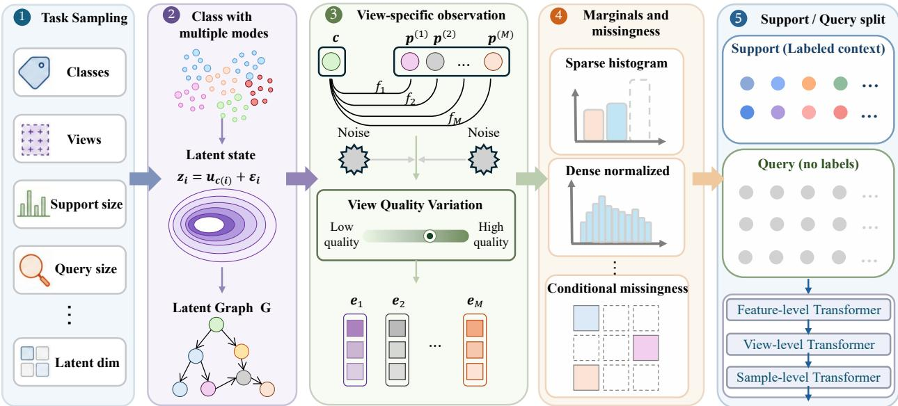
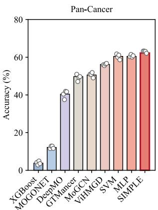
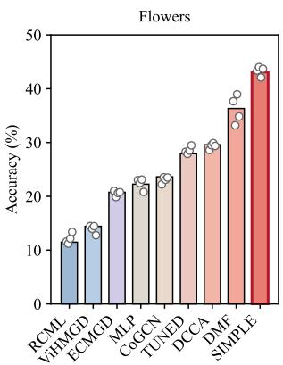
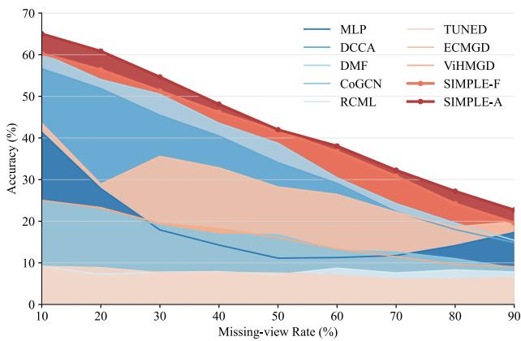
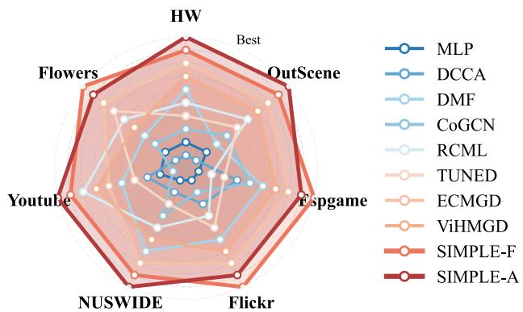
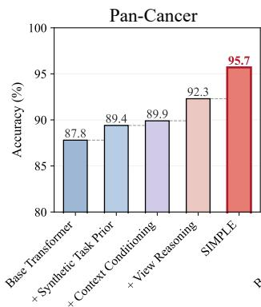
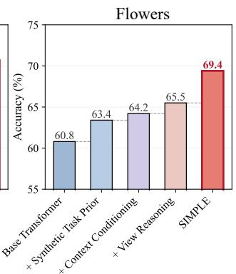
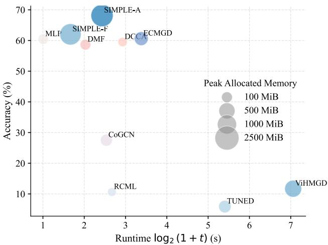

# PRETRAINING REUSABLE INFERENCE ACROSS VIEWS WITH SYNTHETIC TASK PRIORS

Jielong Lu1 Zhihao Wu1 Jiajun Yu1 Zhaoliang Chen2 Haishuai Wang1

1Zhejiang University, Hangzhou, China 2Hong Kong Baptist University, Hong Kong SAR, China

## ABSTRACT

Modern pretrained encoders make representations from heterogeneous views increasingly reusable, but the procedure that determines view utility and combines evidence is still relearned for each downstream task. Consequently, knowledge about view relevance, complementarity, reliability, and missingness is repeatedly discarded rather than transferred across tasks. We therefore reformulate multi-view learning as learning a reusable, task-conditioned inference procedure rather than a fixed fusion function. Based on this perspective, we propose SIMPLE, a prior-fitted multi-view in-context learner that predicts query labels by conditioning on a small labeled support set. Since existing real-world datasets cover only a limited range of view configurations and task structures, we construct a controllable synthetic task prior in embedding space. It generates diverse support-query episodes with varying class structures, shared and view-specific factors, representation geometries, cross-view dependencies, reliability levels, missingness patterns, and distribution shifts. A hierarchical inference architecture then performs reasoning within views, across views, and across support and query samples. Experiments on multi-view and multi-omics benchmarks demonstrate that the frozen variant of SIMPLE achieves competitive performance without updating the inference backbone, while lightweight adapter calibration attains leading performance on most evaluated datasets. Together, the results under frozen, one-shot, and missing-view settings support the central hypothesis that multiview reasoning itself can be pretrained and reused, while lightweight adapter calibration provides task-specific alignment when needed.

Keywords Multi-view Learning · In-Context Learning · Synthetic Task Prior · Transfer Learning

## Introduction

Multi-view learning integrates multiple observations of the same entity to improve prediction [1, 2, 3]. With the development of pretrained encoders, representations from images, texts, graphs, sensors, and biological measurements can increasingly be reused across downstream tasks [4, 5, 6, 7]. However, the subsequent multi-view inference stage remains largely dataset-specific. For each new dataset, existing methods typically train a new fusion module and prediction head to determine which views are useful, how their information should be combined, and how the fused representation should be mapped to the target labels [8, 9, 10, 11, 12].

This creates a fundamental asymmetry in modern multi-view systems: view-specific representations are reusable, whereas the ability to reason over views is repeatedly discarded and relearned. Knowledge about view relevance, complementarity, redundancy, conflict, and missing-view handling is encoded in task-specific parameters and cannot be readily transferred to a new problem [13, 14]. As a result, each downstream dataset is treated as an independent optimization problem, even though many of the underlying inference operations are shared.

A more expressive fusion architecture alone does not resolve this issue. The utility of a view is not fixed, but depends on the current prediction target, the observed instance, the quality of its representation, and which other views are available. A view may be informative for one task but irrelevant for another, complementary to one view but redundant with another, or become essential when alternative observations are missing. Therefore, an appropriate fusion strategy should be inferred from the current task rather than permanently encoded in dataset-specific parameters.

We consequently consider a different formulation of multi-view learning. Instead of learning one fusion function for one dataset, a model should learn how to construct a suitable prediction rule for a new task. Given a labeled support set and unlabeled query samples, the model should infer the label semantics, identify task-relevant information, estimate the conditional reliability of different views, and determine how their evidence should be combined. Under this formulation, the support set acts as a dataset-level task specification rather than merely as supervision for fitting another classifier. This leads to our central question:

Can the process of solving multi-view learning problems be pretrained once and reused across previously unseen tasks?

In SIMPLE, the support set specifies the downstream task, while a pretrained inference backbone constructs the corresponding prediction rule through its forward computation. The object of pretraining is therefore not a fixed predictor for any one dataset, but a procedure for reasoning across views. We instantiate this idea through priorfitted in-context learning [15], with the goal of amortizing task-specific multi-view learning into a shared inference model. Training such a model, however, requires exposure to a broad distribution of multi-view learning problems. Existing real-world datasets provide insufficient coverage: each dataset typically fixes the view composition, encoder representations, label space, cross-view relationships, and observation process. It provides many samples from one task, but only one realization of the much broader multi-view task space.

To obtain the required task diversity, we construct a controllable synthetic multi-view task prior directly in embedding space. Instead of generating realistic raw views, the prior generates complete support-query episodes that emulate the heterogeneous representations produced by different encoders. Across episodes, we vary class structure, shared and view-specific information, representation geometry, cross-view redundancy and complementarity, view quality, missingness mechanisms, and support-query distribution shifts. Importantly, the prior generates different learning problems rather than additional samples from a fixed problem. The model must therefore infer a new prediction rule from context in every episode.

Based on this task prior, we propose a method named Synthetic-prior In-context Multi-view Pretrained LearnEr (SIMPLE). The architecture follows the structure of the required inference process. Feature-level reasoning identifies task-relevant information within each view; view-level reasoning models conditional relationships among the available views; and sample-level reasoning transfers supervision from support examples to query instances. This hierarchy is not an arbitrary combination of fusion modules, but an explicit decomposition of the computations required to solve an unseen multi-view task. At deployment, SIMPLE supports two complementary protocols. SIMPLE-F directly applies the pretrained inference backbone without updating its parameters. SIMPLE-A optimizes only lightweight view adapters and the output head while keeping the inference backbone frozen. Experiments on multi-view and multi-omics benchmarks show that SIMPLE-F can remain competitive with fully trained task-specific methods, while SIMPLE-A achieves leading performance on most evaluated datasets. Further results under one-shot supervision and missing-view conditions demonstrate that the model learns a transferable multi-view inference procedure rather than a fixed dataset-specific fusion rule.

Our main contributions are summarized as follows:

• We reformulate multi-view learning as learning a reusable, task-conditioned inference procedure, rather than fitting an independent fusion function for every downstream dataset.

• We introduce a controllable synthetic multi-view task prior that generates diverse support–query learning problems with varying task structures, representation geometries, cross-view relationships, reliability levels, missingness patterns, and distribution shifts.

• We develop a hierarchical in-context architecture that performs reasoning within views, across views, and across support and query samples, supporting both direct frozen inference and lightweight adapter-based calibration.

• Experiments separate direct reuse from task-specific adaptation: SIMPLE-F evaluates frozen contextual inference, SIMPLE-A evaluates lightweight calibration, and the one-shot and missing-view studies probe limited task evidence and changing view availability. A complementary cross-domain study evaluates frozenbackbone transfer under domain shift.

  
Figure 1: The pipeline of the proposed framework SIMPLE.

## Method

## Notation and Problem Formulation

We consider a multi-view supervised learning task containing N samples and M heterogeneous views. The i-th sample is represented as $\mathcal { X } _ { i } = \{ \mathbf { x } _ { i } ^ { ( m ) } \} _ { m = 1 } ^ { M } , \quad i \in \{ 1 , \dots , N \}$ , where $\mathbf { x } _ { i } ^ { ( m ) }$ denotes the raw observation of view m. Depending on the application, $\mathbf { x } _ { i } ^ { ( m ) }$ may represent an image, a text sequence, an audio signal, a time series, a graph, or a structured feature vector. Each view is processed by a view-specific encoder $E _ { m } ( \cdot )$

$$
\mathbf { h } _ { i } ^ { ( m ) } = E _ { m } ( \mathbf { x } _ { i } ^ { ( m ) } ) , \qquad \mathbf { h } _ { i } ^ { ( m ) } \in \mathbb { R } ^ { d _ { m } } ,\tag{1}
$$

where $d _ { m }$ denotes the output dimension of encoder $E _ { m }$ . The view encoders may have different architectures, pretraining objectives, and output dimensions. A view-specific adapter $P _ { m } ( \cdot )$ maps each encoder output into a common representation space:

$$
\begin{array} { r } { \mathbf { z } _ { i } ^ { ( m ) } = { \cal P } _ { m } ( \mathbf { h } _ { i } ^ { ( m ) } ) , \qquad \mathbf { z } _ { i } ^ { ( m ) } \in \mathbb { R } ^ { d _ { z } } , } \end{array}\tag{2}
$$

where $d _ { z }$ is the unified embedding dimension.

Let

$$
\pmb { S } = \left\{ ( \{ \mathbf { z } _ { i } ^ { ( m ) } \} _ { m = 1 } ^ { M } , y _ { i } ) \right\} _ { i = 1 } ^ { N _ { s } }\tag{3}
$$

denote a labeled support set, and let

$$
\mathcal { Q } = \left\{ \{ \mathbf { z } _ { j } ^ { ( m ) } \} _ { m = 1 } ^ { M } \right\} _ { j = N _ { s } + 1 } ^ { N _ { s } + N _ { q } }\tag{4}
$$

denote an unlabeled query set, where $N = N _ { s } + N _ { q }$ . Our objective is to learn a reusable multi-view inference model $F _ { \pmb { \theta } }$ such that

$$
F _ { \pmb \theta } : ( S , \mathcal { Q } ) \mapsto \widehat { \mathbf Y } _ { \mathcal { Q } } ,\tag{5}
$$

where $\widehat { \mathbf { Y } } _ { \mathcal { Q } } = \left[ \widehat { y } _ { N _ { s } + 1 } , \ldots , \widehat { y } _ { N _ { s } + N _ { q } } \right] ^ { \top }$ contains the predictions for all query samples.

Unlike conventional multi-view models that optimize a task-specific fusion module for each downstream dataset, the proposed model is pretrained over a distribution of synthetic multi-view tasks and is subsequently reused as a general-purpose inference backbone.

## Multi-view Synthetic Task Prior

A pretrained multi-view learner requires exposure to a broad spectrum of learning problems in order to acquire transferable inference capabilities. However, existing multi-view datasets only represent a small subset of possible

combinations of views, semantic structures, and observation conditions. Therefore, we construct a synthetic task prior that defines a distribution over multi-view learning episodes. Specifically, each synthetic task T is formulated as

$$
\mathcal { T } = \{ \boldsymbol { S } _ { T } , \boldsymbol { \mathcal { Q } } _ { T } \} \sim p ( \mathcal { T } ) ,\tag{6}
$$

where $s _ { T }$ and $\mathcal { Q } _ { T }$ denote support and query sets, respectively. Instead of generating samples from a fixed distribution, the proposed prior models the variation of multi-view tasks by jointly considering semantic complexity, view heterogeneity, cross-view dependency, incomplete observation, and distribution shift.

## Task-level Diversity

Each task is associated with a specific configuration describing its classification complexity and multi-view structure. We sample

$$
C _ { \mathcal { T } } \sim p _ { C } , \quad M _ { \mathcal { T } } \sim p _ { M } , \quad D _ { z } \sim p _ { D } ,\tag{7}
$$

where $C \tau , M \tau$ , and $D _ { z }$ represent the number of classes, available views, and latent semantic dimension, respectively. The class prior and instance labels are generated as:

$$
\pi _ { \mathcal { T } } \sim p _ { \pi } , \quad y _ { i } \sim \mathrm { C a t e g o r i c a l } ( \pi _ { \mathcal { T } } ) .\tag{8}
$$

The distribution family p covers diverse label structures, including balanced, imbalanced, and long-tailed scenarios. $p _ { \pi }$   
This enables the pretrained model to adapt to different class distributions instead of assuming a fixed classification prior.

For in-context learning, the support set should provide sufficient information about each class. Therefore, we adopt a constrained sampling strategy that guarantees class coverage when the support budget permits, while preserving natural imbalance in the remaining samples.

## Latent Semantic Structure

We assume that multi-view observations originate from an underlying semantic space shared across views. For each instance, the shared semantic representation is generated from a class-conditional distribution:

$$
\mathbf { z } _ { i } \sim p ( \mathbf { z } | y _ { i } , \mathcal { T } ) .\tag{9}
$$

To model complex intra-class variations, we define the conditional distribution as a mixture of latent modes:

$$
k _ { i } \sim \mathrm { C a t e g o r i c a l } ( \pmb { \rho } _ { y _ { i } } ) ,\tag{10}
$$

$$
\begin{array} { r } { \mathbf { z } _ { i } = \pmb { \mu } _ { y _ { i } , k _ { i } } + \mathbf { L } _ { y _ { i } , k _ { i } } \epsilon _ { i } , \quad \epsilon _ { i } \sim \mathcal { N } ( 0 , I ) . } \end{array}\tag{11}
$$

Here, $\pmb { \mu } _ { y _ { i } , k _ { i } }$ represents a semantic prototype and $\mathbf { L } _ { y _ { i } , k _ { i } }$ controls the latent covariance structure. The mixture formulation allows each category to contain multiple semantic patterns, which better reflects the heterogeneous nature of real-world multi-view concepts.

To further capture nonlinear dependencies among latent semantic factors, we introduce a task-specific dependency structure ${ \bf A } _ { T }$ :

$$
{ \bf z } _ { i } ^ { * } = { \bf z } _ { i } + \alpha _ { T } \phi _ { T } ( { \bf z } _ { i } { \bf A } _ { T } ) ,\tag{12}
$$

where $\phi _ { T } ( \cdot )$ denotes a nonlinear transformation and $\alpha \tau$ controls the dependency strength. The dependency structure is independently sampled across tasks, producing diverse latent geometries ranging from nearly independent factors to highly entangled semantic representations.

## Heterogeneous View Generation

Although different views describe the same underlying instance, each view provides a distinct observation of the shared semantics. We therefore introduce view-specific private factors:

$$
\mathbf { u } _ { i } ^ { ( m ) } \sim p _ { m } ( \mathbf { u } | y _ { i } ) .\tag{13}
$$

The latent representation associated with view m is defined as

$$
\mathbf { h } _ { i } ^ { ( m ) } = [ \mathbf { z } _ { i } ; \mathbf { u } _ { i } ^ { ( m ) } ] .\tag{14}
$$

The observed view embedding is generated through a view-specific observation operator:

$$
\mathbf { x } _ { i } ^ { ( m ) } = \mathcal { O } _ { m } ( \mathbf { h } _ { i } ^ { ( m ) } ) + \epsilon _ { i } ^ { ( m ) } ,\tag{15}
$$

where $\mathcal { O } _ { m } ( \cdot )$ represents the view rendering process. Specifically,

$$
\mathcal { O } _ { m } ( \cdot ) = \mathcal { P } _ { m } \circ g _ { m } \circ W _ { m } ,\tag{16}
$$

where $W _ { m }$ controls the projection geometry, $g _ { m }$ introduces nonlinear transformations, and $\mathcal { P } _ { m }$ determines the representation statistics.

By varying these operators, the task prior covers heterogeneous embedding spaces produced by different pretrained encoders, including differences in dimensionality, normalization, sparsity, anisotropy, and noise patterns.

## Cross-view Dependency

Different multi-view tasks exhibit different relationships between views. Some views contain highly overlapping information, whereas others provide complementary or noisy evidence. We therefore control the contribution of shared and private information:

$$
\mathbf { x } _ { i } ^ { ( m ) } = \alpha _ { m } \mathcal { O } _ { m } ^ { s } ( \mathbf { z } _ { i } ) + ( 1 - \alpha _ { m } ) \mathcal { O } _ { m } ^ { p } ( \mathbf { u } _ { i } ^ { ( m ) } ) + \epsilon _ { i } ^ { ( m ) } ,\tag{17}
$$

where $\alpha _ { m }$ determines the degree of cross-view consistency. Large $\alpha _ { m }$ produces redundant views, while small $\alpha _ { m }$ generates more complementary view-specific representations.

## Incomplete Observation and Distribution Shift

Real-world multi-view systems frequently suffer from missing views and distribution shifts. We introduce a view availability variable:

$$
r _ { i , m } \sim B e r n o u l l i ( 1 - p _ { i , m } ) ,\tag{18}
$$

where the missing probability is determined by

$$
p _ { i , m } = \sigma ( f _ { m } ( \mathbf { z } _ { i } ) ) .\tag{19}
$$

This formulation allows the missing mechanism to depend on latent semantic properties, thereby generating realistic missing-not-at-random patterns. Furthermore, support and query samples may originate from different task states:

$$
\begin{array} { r } { \mathbf { z } _ { i } ^ { q } = \mathbf { z } _ { i } + \Delta _ { T } , } \end{array}\tag{20}
$$

where $\Delta \tau$ represents task-specific distribution shift. These variations encourage the model to learn robust multi-view inference rather than relying on fixed view configurations.

## Hierarchical Multi-view In-Context Transformer

The central challenge of multi-view in-context learning is to infer the relationship between support demonstrations and query instances while handling heterogeneous views. A direct tokenization strategy that treats each view representation as an atomic vector ignores the internal structure of individual views and the hierarchical dependency among features, views, and instances. To address this issue, we introduce a hierarchical multi-view Transformer that performs reasoning at three levels:

1) feature-level representation learning within each view;

2) view-level semantic interaction across views;

3) sample-level in-context reasoning across support and query instances.

Given an input tensor $\mathbf { X } \in \mathbb { R } ^ { B \times N \times M \times F }$ , where B, N, M, and $F$ denote batch size, number of instances, number of views, and feature dimension, respectively, the model constructs a unified task representation through hierarchical transformations.

## Feature-level Representation Learning

Different views may originate from heterogeneous pretrained encoders and therefore exhibit distinct feature organizations. Treating the entire view embedding as a single token may lose fine-grained feature dependencies. Therefore, for each view m, we divide the feature representation into G feature patches:

$$
\mathbf { x } _ { i } ^ { ( m ) } = [ \mathbf { x } _ { i } ^ { ( m , 1 ) } , . . . , \mathbf { x } _ { i } ^ { ( m , G ) } ] .\tag{21}
$$

Each feature patches is projected into the shared model space:

$$
\mathbf { u } _ { i } ^ { ( m , g ) } = \mathrm { M L P } _ { f } ( \mathbf { x } _ { i } ^ { ( m , g ) } ) + \mathbf { e } _ { g } ^ { f } ,\tag{22}
$$

where $\mathbf { e } _ { g } ^ { f }$ encodes the relative position of each feature patches. The feature-level Transformer captures intra-view dependencies:

$$
\{ \widetilde { \mathbf { u } } _ { i } ^ { ( m , g ) } \} _ { g = 1 } ^ { G } = \mathrm { T r } _ { f } \big ( \{ \mathbf { u } _ { i } ^ { ( m , g ) } \} _ { g = 1 } ^ { G } \big ) .\tag{23}
$$

The resulting view representation is obtained through attentive aggregation:

$$
\mathbf { h } _ { i } ^ { ( m ) } = \mathrm { L N } ( \sum _ { g = 1 } ^ { G } \alpha _ { i , g } ^ { ( m ) } \widetilde { \mathbf { u } } _ { i } ^ { ( m , g ) } ) ,\tag{24}
$$

where $\alpha _ { i , g } ^ { ( m ) }$ denotes the learned importance weight of each feature group. Compared with simple averaging, the adaptive aggregation enables the model to emphasize task-relevant feature subspaces.

## View-level Cross-view Reasoning

After obtaining view-specific representations, the model performs cross-view reasoning to discover complementary and redundant information among views. Each view token is augmented with a view identity embedding:

$$
\mathbf { v } _ { i } ^ { ( m ) } = \mathbf { h } _ { i } ^ { ( m ) } + \mathbf { e } _ { m } ^ { \mathrm { m o d } } .\tag{25}
$$

The view Transformer performs self-attention over available views:

$$
\{ \widetilde { \mathbf { v } } _ { i } ^ { ( m ) } \} _ { m = 1 } ^ { M } = \operatorname { T r } _ { m } \bigl ( \{ \mathbf { v } _ { i } ^ { ( m ) } \} _ { m = 1 } ^ { M } ; \mathbf { r } _ { i } \bigr ) ,\tag{26}
$$

where $\mathbf { r } _ { i } = [ r _ { i , 1 } , . . . , r _ { i , M } ]$ is the view availability mask. The mask prevents attention from attending to missing views, enabling the model to dynamically adapt to different view configurations. The multi-view representation of instance i is computed as:

$$
\mathbf { s } _ { i } = \mathrm { L N } \left( \frac { \sum _ { m = 1 } ^ { M } r _ { i , m } \widetilde { \mathbf { v } } _ { i } ^ { ( m ) } } { \sum _ { m = 1 } ^ { M } r _ { i , m } + \epsilon } \right) .\tag{27}
$$

This formulation allows the model to aggregate arbitrary subsets of views without requiring a fixed view combination during pretraining.

## Sample-level In-context Reasoning

Following the in-context learning paradigm, prediction is formulated as reasoning over a task-specific context rather than learning a fixed classifier. Given support demonstrations $\boldsymbol { S } = \{ ( \mathbf { s } _ { i } , y _ { i } ) \} _ { i = 1 } ^ { N _ { s } }$ , and query samples $\mathcal { Q } = \{ \mathbf { s } _ { i } \} _ { i = N _ { s } + 1 } ^ { N } ,$ the model jointly processes support and query instances.

For support samples, labels are embedded as additional task context, whereas query labels are replaced with an unknown token Each instance token is constructed as:

$$
\begin{array} { r } { \mathbf { t } _ { i } = \mathrm { L N } ( \mathbf { s } _ { i } + \mathbf { e } _ { \widetilde { y } _ { i } } ^ { l a b e l } + \mathbf { e } _ { a _ { i } } ^ { r o l e } ) , } \end{array}\tag{28}
$$

where $a _ { i }$ indicates whether the sample belongs to the support or query set. The complete task sequence is processed by the sample-level Transformer:

$$
\{ \mathbf { o } _ { i } \} _ { i = 1 } ^ { N } = \mathrm { T r } _ { s } ( \{ \mathbf { t } _ { i } \} _ { i = 1 } ^ { N } ) ,\tag{29}
$$

Through joint attention over support and query samples, each query representation can dynamically retrieve relevant labeled demonstrations, which enables task-adaptive prediction without optimizing dataset-specific parameters.

## Model Pretraining

For every optimization step, a batch of independent tasks is sampled online from the multi-view task prior. The model observes support features and labels together with query features, while query labels are hidden. The backbone is optimized using query-only cross-entropy:

$$
\mathcal { L } = - \mathbb { E } _ { \mathcal { T } \sim p ( \mathcal { T } ) } \left[ \frac { 1 } { N _ { \mathrm { q } } } \sum _ { i \in \mathcal { D } _ { \mathrm { q } } } \log p _ { \theta } \left( y _ { i } \mid \mathcal { D } _ { \mathrm { s } } , \mathbf { X } _ { \mathrm { q } } , \mathbf { R } \right) \right] .\tag{30}
$$

Because view dropout, conditional missingness, observation noise, and embedding transformations are resampled online, Eq. (30) also acts as implicit masked-view and distribution-robust pretraining. For a downstream multi-view dataset, each raw view is encoded using Eq. (1), and each encoder representation is mapped through Eq. (2). We consider two deployment protocols

## Direct In-Context Inference (SIMPLE-F)

The view encoders and the inference backbone are frozen. A labeled support set is provided as context, and query labels are predicted in a single forward pass without updating the inference backbone.

## Adapter-Only Calibration (SIMPLE-A)

Only the view adapters and output head are optimized:

$$
\pmb { \theta } _ { \mathrm { a d a p t } } = \left\{ \pmb { \theta } _ { P _ { 1 } } , \ldots , \pmb { \theta } _ { P _ { M } } , \mathbf { W } _ { o } , \mathbf { b } _ { o } \right\} .\tag{31}
$$

The parameters of the factorized inference transformer remain frozen.

<table><tr><td rowspan="2">Method</td><td colspan="2">HW</td><td colspan="2">OutScene</td><td colspan="2">Espgame</td><td colspan="2">Flickr</td><td colspan="2">NUSWIDE</td><td colspan="2">Youtube</td><td colspan="2">Flowers</td></tr><tr><td>ACC</td><td>F1</td><td>ACC</td><td>F1</td><td>ACC</td><td>F1</td><td>ACC</td><td>F1</td><td>ACC</td><td>F1</td><td>ACC</td><td>F1</td><td>ACC</td><td>F1</td></tr><tr><td<tr><td>Conventional Methods</td><td colspan="10"></td><td colspan="3"></td></tr><tr><td></td><td>MLP</td><td>93.1</td><td>93.1</td><td>79.7</td><td>80.0</td><td>83.2</td><td>84.0</td><td>68.0</td><td>67.9</td><td>44.1</td><td>44.1</td><td>66.8</td><td>66.4</td><td>60.4</td></tr><tr><td>60.1</td><td>DCCA</td><td>94.8</td><td>94.8</td><td>80.5</td><td>80.7</td><td>83.1</td><td>82.8</td><td>69.3</td><td>69.0</td><td>45.1</td><td>45.2</td><td>70.9</td><td>70.6</td><td>59.5</td></tr><tr><td>58.6</td><td>DMF</td><td>94.2</td><td>94.2</td><td>80.1</td><td>80.4</td><td>85.8</td><td>85.6</td><td>70.0</td><td>69.9</td><td>45.2</td><td>45.2</td><td>70.9</td><td>70.6</td><td>67.7</td></tr><tr><td colspan="3">67.8</td><td colspan="10"></td></tr><tr><td>Multi-view Fusion Methods</td><td>CoGCN</td><td>91.6</td><td>86.9</td><td>71.0</td><td>71.3</td><td>75.9</td><td>75.5</td><td>61.2</td><td>61.1</td><td>40.6</td><td>37.0</td><td>29.3</td><td>21.5</td><td>28.4</td></tr><tr><td>25.6</td><td>RCML</td><td>92.4</td><td>92.4</td><td>78.9</td><td>79.1</td><td>86.0</td><td>85.8</td><td>70.9</td><td>70.4</td><td>42.5</td><td>41.3</td><td>71.2</td><td>71.9</td><td>10.6</td></tr><tr><td>3.2</td><td>TUNED</td><td>90.2</td><td>90.1</td><td>77.3</td><td>77.5</td><td>84.5</td><td>84.2</td><td>68.9</td><td>68.4</td><td>43.0</td><td>40.6</td><td>66.0</td><td>65.4</td><td>5.9</td></tr><tr><td colspan="3">0.7</td><td colspan="3"></td><td colspan="3"></td><td colspan="2">Transformer Models</td><td colspan="2"></td><td colspan="2"></td></tr><tr><td></td><td>ECMGD</td><td>95.6</td><td>95.6</td><td>79.3</td><td>79.3</td><td>84.3</td><td>84.0</td><td>70.5</td><td>70.4</td><td>47.5</td><td>46.5</td><td>59.4</td><td>59.0</td><td>61.0</td></tr><tr><td>60.8</td><td>ViHMGD</td><td>91.7</td><td>91.8</td><td>71.1</td><td>71.5</td><td>85.0</td><td>84.7</td><td>66.0</td><td>65.8</td><td>46.4</td><td>46.5</td><td>57.4</td><td>56.9</td><td>11.7</td></tr><tr><td>5.4</td><td>SIMPLE-F</td><td>93.4</td><td>93.4</td><td>75.0</td><td>74.8</td><td>69.8</td><td>69.6</td><td>61.6</td><td>61.7</td><td>43.8</td><td>42.3</td><td>55.7</td><td>54.5</td><td>61.9</td></tr><tr><td>61.0</td><td>SIMPLE-A</td><td>96.2</td><td>96.2</td><td>81.9</td><td>81.3</td><td>85.9</td><td>85.3</td><td>71.4</td><td>71.3</td><td>46.1</td><td>46.4</td><td>71.0</td><td>71.1</td><td>69.4</td></tr></table>

Table 1: Performance comparison on multi-view datasets. The best available results are highlighted in bold and the second-best available results are underlined. Each entry reports mean ACC and macro-F1 scores (%) over five runs.

## Experiments

We conduct extensive experiments to evaluate the effectiveness and generalization capability of SIMPLE. Specifically, we aim to answer the following research questions:

• RQ1: How does SIMPLE compare with existing multi-view learning methods on standard benchmarks?

• RQ2: Can SIMPLE generalize to unseen tasks with limited supervision and distribution shifts?

• RQ3: How robust is SIMPLE when some views are unavailable during inference?

• RQ4: How does each component contribute to the final performance?

## Experimental Setup

## Datasets

We evaluate SIMPLE on two benchmark suites, including multi-view classification and multi-omics classification datasets. The multi-view suite contains seven datasets: HW, OutScene, ESPGame, Flickr, NUSWIDE, YouTube, and Flowers. The multi-omics suite includes six cancer subtype datasets: GS-BRCA, GS-COAD, GS-GBM, GS-LGG, GS-OV, and Pan-Cancer [16]. Details are provided in the Appendix.

## Compared Methods

We compare SIMPLE with representative baselines from different categories, including conventional predictors, multiview representation learning methods, and multi-omics integration methods. The compared methods include MLP, SVM, XGBoost [17], DCCA [18], DMF [19], Co-GCN [20], RCML [14], TUNED [21], ECMGD [13], ViHMGD [22], DeepMO [23], MOGONET [24], MoGCN [25], and GTMancer [26]. Detailed descriptions of all baselines are provided in the Appendix.

## Overall Comparison

## Classification (RQ1)

We first evaluate the overall performance of SIMPLE on diverse multi-view benchmarks, including multi-view classification and multi-omics prediction tasks. More results are shown in Appendix. Tables 1 and 2 summarize the comparison results on multi-view and multi-omics benchmarks, respectively. Several observations can be drawn from the results. First, SIMPLE-F achieves competitive performance against fully trained multi-view learning approaches, despite requiring no task-specific optimization. This demonstrates that the proposed synthetic multi-view task pretraining enables the model to capture transferable inference patterns rather than relying on dataset-specific correlations. Second, after lightweight adaptation, SIMPLE-A consistently improves upon SIMPLE-F and achieves superior performance on most benchmarks. On the multi-view datasets, SIMPLE-A obtains the best results on HW, OutScene, Flickr, and Flowers, achieving accuracies of 96.2%, 81.9%, 71.4%, and 69.4%, respectively. Similarly, on multi-omics benchmarks, SIMPLE-A achieves leading performance on multiple cancer subtype classification tasks, demonstrating its effectiveness in modeling highly heterogeneous biological views.

<table><tr><td rowspan="2">Method</td><td colspan="2">GS-BRCA</td><td colspan="2">GS-COAD</td><td colspan="2">GS-GBM</td><td colspan="2">GS-LGG</td><td colspan="2">GS-OV</td><td colspan="2">Pan-Cancer</td></tr><tr><td>ACC</td><td>F1</td><td>ACC</td><td>F1</td><td>ACC</td><td>F1</td><td>ACC</td><td>F1</td><td>ACC</td><td>F1</td><td>ACC</td><td>F1</td></tr><tr><td<tr><td>Single-view and Statistical Methods</td><td colspan="8"></td><td colspan="2"></td><td colspan="2"></td></tr><tr><td></td><td>SVM</td><td>74.9</td><td>53.0</td><td>80.4</td><td>47.8</td><td>60.1</td><td>57.0</td><td>94.2</td><td>93.4</td><td>66.0</td><td>65.3</td><td>94.6</td></tr><tr><td>88.3</td><td>XGBoost</td><td>74.7</td><td>49.9</td><td>79.2</td><td>42.2</td><td>58.7</td><td>53.6</td><td>91.6</td><td>89.9</td><td>67.0</td><td>65.5</td><td>93.4</td></tr><tr><td>85.6</td><td>MLP</td><td>71.4</td><td>58.6</td><td>79.2</td><td>58.4</td><td>61.3</td><td>62.1</td><td>93.0</td><td>92.3</td><td>64.9</td><td>64.5</td><td>95.0</td></tr><tr><td colspan="14">90.3</td></tr><tr><td>Multi-omics Representation Learning Methods</td><td>DeepMO</td><td>76.4</td><td>66.1</td><td>80.0</td><td>60.1</td><td>62.9</td><td>63.6</td><td>92.6</td><td>91.7</td><td>66.2</td><td>65.6</td><td>92.0</td><td></td></tr><tr><td>83.9</td><td>MOGONET</td><td>69.7</td><td>44.1</td><td>69.7</td><td>35.1</td><td>40.0</td><td>35.0</td><td>82.9</td><td></td><td>79.5</td><td>46.3</td><td>43.3</td><td>38.3</td></tr><tr><td>16.7</td><td>MoGCN</td><td>70.3</td><td>53.2</td><td>79.6</td><td>46.6</td><td>56.5</td><td>57.3</td><td></td><td>92.1</td><td>90.8</td><td>67.0</td><td>66.2</td><td>89.9</td></tr><tr><td>81.1</td><td>GTMancer</td><td>70.6</td><td>42.7</td><td>81.1</td><td>44.1</td><td>58.0</td><td>50.3</td><td>92.8</td><td></td><td>90.8</td><td>54.9</td><td>51.4</td><td>92.8</td></tr><tr><td>86.1</td><td>ViHMGD</td><td>65.1</td><td>53.3</td><td>44.9</td><td>36.5</td><td>57.3</td><td>54.7</td><td>91.6</td><td></td><td>90.9</td><td>68.4</td><td>67.2</td><td>88.2</td></tr><tr><td>74.2</td><td>SIMPLE-F</td><td>71.7</td><td>64.5</td><td>70.5</td><td>47.8</td><td>54.6</td><td>55.5</td><td>95.1</td><td></td><td>94.0</td><td>62.9</td><td>62.5</td><td>86.6</td></tr><tr><td>82.3</td><td>SIMPLE-A</td><td>77.7</td><td>68.5</td><td>82.1</td><td>59.5</td><td>63.4</td><td>63.6</td><td>96.9</td><td></td><td>95.7</td><td>67.9</td><td>67.9</td><td>95.7</td></tr></table>

Table 2: Performance comparison on multi-omics datasets. The best available results are highlighted in bold and the second-best available results are underlined. Each entry reports mean ACC and macro-F1 scores (%) over five runs.

Figure 2: Performance comparison under the one-shot learning setting on different datasets.  
  
Figure 3: Robustness analysis under different missing-view ratios on the Flowers dataset.

The consistent improvement from SIMPLE-F to SIMPLE-A reveals an important property of the proposed framework: the pretrained model already learns general multi-view reasoning ability, while lightweight adaptation further aligns the learned inference process with task-specific characteristics.

## One-shot Learning (RQ2)

To evaluate the capability of SIMPLE under extremely limited supervision, we conduct one-shot learning experiments, where only one labeled sample per class is available during training. As shown in Fig. 2, all baseline methods experience significant performance degradation due to insufficient labeled examples. In contrast, SIMPLE consistently achieves superior performance on both Pan-Cancer and Flowers datasets. These results indicate that SIMPLE can effectively exploit task-level prior knowledge and contextual information, enabling robust inference beyond conventional supervised learning settings.

  
Figure 4: Cross-dataset ranking comparison after training on Pan-Cancer.

  
Figure 5: Ablation study of different components in SIMPLE.

## Robustness to Missing Views (RQ3)

Real-world multi-view systems often suffer from incomplete observations. Therefore, we evaluate the robustness of SIMPLE by randomly removing views with different missing ratios on the Flowers dataset. As shown in Fig. 3, all methods exhibit performance degradation as the missing-view ratio increases. However, SIMPLE maintains a slower degradation rate compared with existing approaches. Especially under severe missing-view conditions, SIMPLE preserves higher classification accuracy, demonstrating its ability to infer reliable predictions from incomplete multi-view information. This advantage can be attributed to the proposed adaptive view reasoning mechanism, which dynamically exploits available views instead of relying on fixed view combinations.

## Cross-dataset Transfer (RQ2)

To complement the task-level transfer evaluated by SIMPLE-F, we conduct a cross-domain backbone-transfer experiment. All methods are trained on the Pan-Cancer dataset. For each unseen target dataset, the source-trained backbone is frozen and only a target-side linear classifier is fitted from target support data; full protocol details are provided in the Cross-domain Transfer Evaluation appendix section. This protocol evaluates transfer across domains and label spaces and should not be interpreted as parameter-free contextual inference. Instead of reporting absolute accuracy, Fig. 4 summarizes the relative ranking of different methods across target datasets, providing a more comprehensive view of their transferability under heterogeneous domain shifts. As shown in Fig. 4, SIMPLE consistently maintains favorable rankings across diverse target datasets. These results provide complementary evidence that source-trained representations remain useful under heterogeneous domain shifts.

## Ablation Study (RQ4)

To investigate the contribution of each component in SIMPLE, we conduct progressive ablation experiments by gradually adding each proposed module. As shown in Fig. 5, all components consistently improve the performance over the base Transformer on Pan-Cancer and Flowers datasets. Specifically, introducing the synthetic task prior equip the model with inference regularities learned across diverse multi-view tasks, while context conditioning enables those regularities to be instantiated for a new task. The additional gains from view reasoning demonstrate the effectiveness of explicitly modeling interactions among different views. These results verify that each component contributes independently and their combination provides complementary benefits for effective multi-view inference.

## Conclusion

In this work, we reconsidered multi-view learning from the perspective of reusable inference. While pretrained encoders make view-specific representations increasingly transferable, existing methods still relearn how to interpret and combine these views for every downstream dataset. To address this limitation, we proposed SIMPLE that amortizes task-specific fusion and prediction into pretraining. A controllable synthetic task prior exposes the model to diverse learning problems with varying class structures, representation geometries, cross-view relationships, view reliability, missingness patterns, and distribution shifts. Based on these tasks, the hierarchical inference architecture performs reasoning within individual views, across available views, and between support and query samples. Experiments on multi-view and multi-omic benchmarks validate both the transferability and adaptability of the learned inference procedure. These findings suggest that multi-view reasoning can be amortized across tasks, rather than discarded and relearned from scratch for every downstream dataset.

## References

[1] Chun-Hsiao Yeh, Chenyu Wang, Shengbang Tong, Ta-Ying Cheng, Ruoyu Wang, Tianzhe Chu, Yuexiang Zhai, Yubei Chen, Shenghua Gao, and Yi Ma. Seeing from another perspective: Evaluating multi-view understanding in mllms. In Proceedings ofthe AAAI Conference on Artificial Intelligence, pages 12000–12008, 2026.

[2] Rui Wang, Yuting Jiang, Xiaoqing Luo, Xiao-Jun Wu, Nicu Sebe, and Ziheng Chen. Wasserstein-aligned hyperbolic multi-view clustering. In Proceedings of the AAAI Conference on Artificial Intelligence, pages 26444–26452, 2026.

[3] Ruimeng Liu, Xin Zou, Chang Tang, Xiao Zheng, Xingchen Hu, Kun Sun, and Xinwang Liu. Sparsemvc: Probing cross-view sparsity variations for multi-view clustering. Advances in Neural Information Processing Systems, 38:154594–154622, 2026.

[4] Alec Radford, Jong Wook Kim, Chris Hallacy, Aditya Ramesh, Gabriel Goh, Sandhini Agarwal, Girish Sastry, Amanda Askell, Pamela Mishkin, Jack Clark, et al. Learning transferable visual models from natural language supervision. In International conference on machine learning, pages 8748–8763, 2021.

[5] Junnan Li, Dongxu Li, Caiming Xiong, and Steven C. H. Hoi. Blip: Bootstrapping language-image pre-training for unified vision-language understanding and generation. In Proceedings ofthe 39th International Conference on Machine Learning, pages 12888–12900. PMLR, 2022.

[6] Jean-Baptiste Alayrac, Jeff Donahue, Pauline Luc, Antoine Miech, Iain Barr, Yana Hasson, Karel Lenc, Arthur Mensch, Katherine Millican, Malcolm Reynolds, Roman Ring, Eliza Rutherford, Serkan Cabi, Tengda Han, Zhitao Gong, Sina Samangooei, Marianne Monteiro, Jacob Menick, Sebastian Borgeaud, Andrew Brock, Evan Shelhamer, Olivier J. Hénaff, Matthew M. Botvinick, Andrew Zisserman, Oriol Vinyals, and João Carreira. Flamingo: A visual language model for few-shot learning. In Advances in Neural Information Processing Systems, volume 35, pages 23716–23736, 2022.

[7] Rohit Girdhar, Alaaeldin El-Nouby, Zhuang Liu, Mannat Singh, Kalyan Vasudev Alwala, Armand Joulin, and Ishan Misra. Imagebind: One embedding space to bind them all. In Proceedings of the IEEE/CVF Conference on Computer Vision and Pattern Recognition, pages 15180–15190, 2023.

[8] Amir Zadeh, Paul Pu Liang, Navonil Mazumder, Soujanya Poria, Erik Cambria, and Louis-Philippe Morency. Memory fusion network for multi-view sequential learning. In Proceedings ofthe AAAI Conference on Artificial Intelligence, volume 32, 2018.

[9] Ren Wang, Haoliang Sun, Yuling Ma, Xiaoming Xi, and Yilong Yin. Metaviewer: Towards a unified multi-view representation. In Proceedings of the IEEE/CVF Conference on Computer Vision and Pattern Recognition, pages 11590–11599, 2023.

[10] Bo Hu, Kai Zhang, Yanghai Zhang, and Yuyang Ye. Adaptive multimodal fusion: Dynamic attention allocation for intent recognition. In Proceedings of the AAAI Conference on Artificial Intelligence, pages 17267–17275, 2025.

[11] Tingjin Luo, XiangYao Li, Zhangqi Jiang, Shuanghui Zhang, and Dewen Hu. Estim: efficient and scalable tensorial incomplete multi-view semi-supervised classification. In Proceedings ofthe 32nd ACM SIGKDD Conference on Knowledge Discovery and Data Mining V. 1, pages 995–1006, 2026.

[12] Chuanqing Tang, Yifei Shi, Guanghao Lin, Lei Xing, and Long Shi. Trusted multi-view learning for long-tailed classification. In Proceedings ofthe AAAI Conference on Artificial Intelligence, volume 40, pages 25814–25822, 2026.

[13] Jielong Lu, Zhihao Wu, Zhaoliang Chen, Zhiling Cai, and Shiping Wang. Towards multi-view consistent graph diffusion. In Proceedings of the 32nd ACM International Conference on Multimedia, pages 186–195, 2024.

[14] Cai Xu, Jiajun Si, Ziyu Guan, Wei Zhao, Yue Wu, and Xiyue Gao. Reliable conflictive multi-view learning. In Proceedings ofthe AAAI Conference on Artificial Intelligence, volume 38, pages 16129–16137, 2024.

[15] Noah Hollmann, Samuel Müller, Lennart Purucker, Arjun Krishnakumar, Max Körfer, Shi Bin Hoo, Robin Tibor Schirrmeister, and Frank Hutter. Accurate predictions on small data with a tabular foundation model. Nature, 637:319–326, 2025.

[16] Ziwei Yang, Rikuto Kotoge, Xihao Piao, et al. Mlomics: Cancer multi-omics database for machine learning. Scientific Data, 12:913, 2025.

[17] Tianqi Chen and Carlos Guestrin. Xgboost: A scalable tree boosting system. In Proceedings of the 22nd acm Sigkdd International Conference on Knowledge Discovery and Data Mining, pages 785–794, 2016.

[18] Galen Andrew, Raman Arora, Jeff Bilmes, and Karen Livescu. Deep canonical correlation analysis. In International Conference on Machine Learning, pages 1247–1255, 2013.

[19] Weiran Wang, Raman Arora, Karen Livescu, and Jeff Bilmes. On deep multi-view representation learning. In International conference on machine learning, pages 1083–1092, 2015.

[20] Shu Li, Wen-Tao Li, and Wei Wang. Co-gcn for multi-view semi-supervised learning. In Proceedings ofthe AAAI Conference on Artificial Intelligence, pages 4691–4698, 2020.

[21] Haojian Huang, Chuanyu Qin, Zhe Liu, Kaijing Ma, Jin Chen, Han Fang, Chao Ban, Hao Sun, and Zhongjiang He. Trusted unified feature-neighborhood dynamics for multi-view classification. In Proceedings ofthe AAAI Conference on Artificial Intelligence, 2025.

[22] Jielong Lu, Zhihao Wu, Jiajun Yu, Qianqian Shen, Jiajun Bu, and Haishuai Wang. Where views meet curves: Virtual anchors for hyperbolic multi-view graph diffusion. In Proceedings of the 33rd ACM International Conference on Multimedia, pages 2131–2140, 2025.

[23] Yuqi Lin, Wen Zhang, Huanshen Cao, Gaoyang Li, and Wei Du. Classifying breast cancer subtypes using deep neural networks based on multi-omics data. Genes, 11:888, 2020.

[24] Tongxin Wang, Wei Shao, Zhi Huang, Haixu Tang, Jie Zhang, Zhengming Ding, and Kun Huang. Mogonet integrates multi-omics data using graph convolutional networks allowing patient classification and biomarker identification. Nature Communications, 12:3445, 2021.

[25] Xiao Li, Jie Ma, Ling Leng, Mingfei Han, Mansheng Li, Fuchu He, and Yunping Zhu. Mogcn: A multi-omics integration method based on graph convolutional network for cancer subtype analysis. Frontiers in Genetics, 13, 2022.

[26] Jielong Lu, Zhihao Wu, Jiajun Yu, Jiajun Bu, and Haishuai Wang. Multi-omics analysis for cancer subtype infer ence via unrolling graph smoothness priors. In Proceedings ofthe Thirty-Fourth International Joint Conference on Artificial Intelligence, pages 5842–5850, 2025.

Table 3: Statistics of the general multi-view classification datasets. Flower17 is denoted as Flowers in the main paper.
<table><tr><td>Dataset</td><td>Samples</td><td>Classes</td><td>Views</td><td>Domain</td><td>View dimensions</td></tr><tr><td>HW</td><td>2,000</td><td>10</td><td>6</td><td>Handwritten digits</td><td>153, 596, 301, 481, 157, and 27</td></tr><tr><td>OutScene</td><td>2,688</td><td>8</td><td>4</td><td>Outdoor scenes</td><td>512, 432, 256, and 48</td></tr><tr><td>ESP-Game</td><td>11,032</td><td>7</td><td>2</td><td>Image-text</td><td>100 and 100</td></tr><tr><td>Flickr</td><td>12,154</td><td>6</td><td>2</td><td>Image-text</td><td>100 and 100</td></tr><tr><td>NUSWIDE</td><td>1,600</td><td>8</td><td>6</td><td>Web images</td><td>64, 144, 73, 128, 225, and 500</td></tr><tr><td>YouTube</td><td>2,000</td><td>10</td><td>6</td><td>Video and audio</td><td>2,000, 1,024, 64, 512, 64, and 647</td></tr><tr><td>Flower17</td><td>1,360</td><td>17</td><td>7</td><td>Flower images</td><td>1,360 dimensions for each view</td></tr></table>

## Detailed Experimental Settings

This appendix provides additional details about the datasets, compared methods, evaluation protocols, implementation settings, and transfer experiments. Unless otherwise specified, all downstream datasets are strictly excluded from synthetic pretraining.

## Datasets

We evaluate SIMPLE on 13 datasets, including seven general multi-view classification datasets and six multi-omics cancer classification datasets. For every dataset, multiple views describing the same sample share a common classification label.

## General Multi-view Datasets

HW. HW contains 2,000 handwritten digit samples from 10 classes. Each sample is represented by six visual feature views describing complementary shape, texture, and statistical properties.

OutScene. OutScene contains 2,688 outdoor-scene images from eight semantic classes. Each image is represented by four visual feature views encoding global and local image characteristics.

ESP-Game and Flickr. ESP-Game and Flickr are image–text datasets. Each sample contains one visual representation and one textual representation, providing heterogeneous semantic evidence for classification.

NUSWIDE. NUSWIDE contains heterogeneous visual and semantic descriptors of web images. Its six views differ substantially in dimensionality and feature statistics.

YouTube. YouTube contains video samples represented by six heterogeneous visual and audio feature views.

Flower17. Flower17 contains 1,360 flower images from 17 categories. Each image is represented by seven visual descriptors. We denote this dataset as Flowers in the main paper.

## Multi-omics Datasets

The multi-omics datasets are obtained from the MLOmics benchmark [16]. Each patient is represented by four molecular views: gene expression, DNA methylation, microRNA expression, and copy-number variation.

The five GS datasets correspond to cancer-subtype classification within individual cancer cohorts. Pan-Cancer covers 32 cancer types and exhibits greater class diversity and distributional heterogeneity.

## Compared Methods

We compare SIMPLE with conventional classifiers, deep multi-view representation learning methods, uncertainty-aware fusion methods, Transformer-based models, and specialized multi-omics integration approaches.

Table 4: Statistics of the multi-omics datasets. The four view dimensions correspond to gene expression, DNA methylation, microRNA expression, and copy-number variation, respectively.
<table><tr><td>Dataset</td><td>Patients</td><td>Classes</td><td>Views</td><td>View dimensions</td></tr><tr><td>GS-BRCA</td><td>671</td><td>5</td><td>4</td><td>11,203; 11,189; 11,343; 310</td></tr><tr><td>GS-COAD</td><td>260</td><td>4</td><td>4</td><td>11,203; 11,189; 11,343; 286</td></tr><tr><td>GS-GBM</td><td>244</td><td>5</td><td>4</td><td>11,205; 11,192; 11,346; 325</td></tr><tr><td>GS-LGG</td><td>247</td><td>3</td><td>4</td><td>11,205; 11,191; 11,345; 328</td></tr><tr><td>GS-OV</td><td>284</td><td>4</td><td>4</td><td>11,205; 11,191; 11,344; 321</td></tr><tr><td>Pan-Cancer</td><td>8,314</td><td>32</td><td>4</td><td>3,105; 3,139; 3,217; 383</td></tr></table>

## Conventional and Representation Learning Methods

MLP. MLP concatenates all available views and feeds the resulting representation into a two-layer classifier. It serves as a direct feature-level fusion baseline.

SVM. SVM is trained on concatenated and normalized multi-view features using an RBF kernel. It is evaluated on the multi-omics datasets.

XGBoost. XGBoost [17] is trained on concatenated multi-view features and provides a non-neural statistical baseline.

DCCA. DCCA [18] employs view-specific neural encoders and maximizes the correlation between their latent representations before classification.

DMF (our implementation). Our DMF implementation follows the general formulation of deep multi-view representation learning [19]. Each view has an independent encoder and decoder, while the shared representation is obtained by averaging the view-specific latent factors. The objective is defined as

$$
\mathcal { L } _ { \mathrm { D M F } } = \mathcal { L } _ { \mathrm { C E } } + 0 . 5 \mathcal { L } _ { \mathrm { r e c } } + 0 . 1 \mathcal { L } _ { \mathrm { c o n } } ,\tag{32}
$$

where $\mathcal { L } _ { \mathrm { C E } } , \mathcal { L } _ { \mathrm { r e c } } .$ , and ${ \mathcal { L } } _ { \mathrm { c o n } }$ denote classification, reconstruction, and cross-view consistency losses, respectively. Since an official implementation matching our experimental interface was unavailable, this baseline is explicitly denoted as DMF (our implementation).

## Multi-view Fusion Methods

Co-GCN. Co-GCN [20] constructs a graph for each view and applies graph convolution to capture view-specific neighborhood structures.

RCML. RCML [14] performs reliability-aware evidential fusion and reduces the influence of conflicting or uncertain views.

TUNED. TUNED [21] combines neighborhood graph construction with uncertainty-aware evidential learning for incomplete or inconsistent multi-view observations.

## Transformer-based Methods

ECMGD. ECMGD [13] employs Transformer-based cross-view interaction to model view-specific information and shared dependencies.

ViHMGD. ViHMGD [22] combines intra-view representation learning and inter-view interaction to capture high-order relationships among views.

## Multi-omics Integration Methods

DeepMO. DeepMO [23] learns nonlinear representations from multiple omics measurements and integrates them for cancer classification.

MOGONET. MOGONET [24] constructs one patient-similarity graph for each omics view and combines graph convolution with view-correlation discovery.

MoGCN. MoGCN [25] integrates omics-specific representation learning with graph convolution. We use the provided MOGCN\_main training entry point.

GTMancer. GTMancer [26] combines graph and Transformer modules to model sample-level relationships and interactions among omics views.

## Evaluation Protocol

Support–query split. For standard classification experiments, we construct a class-proportional support set containing 10% of all samples and use the remaining 90% as a disjoint query set. At least one labeled support sample is retained for each class. For a given seed, all methods use the same support–query split.

Random seeds. All experiments are repeated using seeds 42, 43, 44, 45, and 46. We report the arithmetic mean over the five runs. When uncertainty is reported, we use the sample standard deviation

$$
s = { \sqrt { { \frac { 1 } { n - 1 } } \sum _ { i = 1 } ^ { n } ( x _ { i } - { \bar { x } } ) ^ { 2 } } } .\tag{33}
$$

Evaluation metrics. We report classification accuracy and macro-averaged F1. Macro-F1 gives equal weight to each class and is therefore suitable for datasets with class imbalance.

Query-label isolation. Query labels are never used for training, adapter calibration, normalization, checkpoint selection, or hyperparameter selection. All normalization statistics and trainable downstream parameters are estimated exclusively from the support set.

Baseline training. MLP, DCCA, DMF, Co-GCN, RCML, TUNED, ECMGD, and ViHMGD are trained for 300 epochs. Whenever an official implementation is available, its original model and loss definitions are retained.

## Implementation Details of SIMPLE

## Input Processing

For SIMPLE, normalization statistics are estimated from the support set only and subsequently applied to both support and query samples. To handle heterogeneous feature dimensions, each view is mapped into a 256-dimensional space using a fixed Gaussian random projection:

$$
\mathbf { R } _ { i j } \sim \mathcal { N } \left( 0 , \frac { 1 } { d _ { \mathrm { i n } } } \right) .\tag{34}
$$

The projection matrix is sampled once for each run and remains fixed for all support and query samples in that run. Missing views are zero-filled for tensor construction but are excluded from attention and aggregation using an explicit binary availability mask.

## Synthetic Multi-view Task Prior

SIMPLE is pretrained exclusively on procedurally generated multi-view classification tasks. No downstream sample, label, or dataset statistic is used during synthetic pretraining.

The main task-prior settings are summarized as follows:

• The number of views is sampled from 1 to 16.

• The number of classes is sampled from 2 to 64.

• The latent semantic dimension is sampled from 8 to 128.

• Each task contains up to 4,096 support samples and 1,024 query samples.

• Each class may contain up to 10 latent mixture components.

• The prior generates shared, view-private, redundant, complementary, weak, uninformative, and conflicting information.

• Observation functions include linear, hyperbolic-tangent, sinusoidal, SiLU, signed-square-root, and quadratic transformations.

• Representations may be anisotropic, sparse, low-rank, correlated, quantized, heavy-tailed, count-like, or ℓ2-normalized.

• The prior includes class imbalance, noisy labels, outliers, spurious correlations, support–query shifts, conditional missingness, block missingness, and whole-view dropout

• At least one view is retained for every generated sample.

The synthetic prior generates distinct learning problems rather than additional samples from a fixed problem. Its purpose is to expose the inference model to broad variations in task structure, representation geometry, cross-view dependency, and observation conditions.

## Model Architecture

The feature-hybrid SIMPLE backbone contains 125,005,122 trainable parameters. Its main architectural settings are:

• Each 256-dimensional input view is divided into four 64-dimensional feature groups.

• A shared MLP maps every feature group to a 768-dimensional token.

• One 12-head Transformer layer performs feature-level interaction within each view.

• Four 12-head Transformer layers model interactions among the available views.

• A mask-aware normalized sum aggregates the available views.

• Support samples receive task-local label embeddings, while support and query samples receive distinct role embeddings.

• A 14-layer, 12-head Transformer performs contextual reasoning across support and query samples.

• All Transformer blocks use pre-normalization, residual connections, GELU feed-forward networks, and dropout of 0.1.

• The prediction decoder combines a learned classifier with cosine-similarity logits computed from contextualized support prototypes.

## Pretraining Settings

SIMPLE is optimized using AdamW with learning rate $1 0 ^ { - 4 }$ , weight decay $1 0 ^ { - 4 }$ , and gradient-norm clipping at 1.0. Each optimization step contains four independently sampled synthetic tasks. Pretraining uses bfloat16 automatic mixed precision and TF32 matrix multiplication. The training seed is 42.

## Frozen Inference

SIMPLE-F directly applies the pretrained inference model to a downstream task. The labeled support samples and unlabeled query samples are jointly processed in the same context, and no model parameter is updated. This protocol evaluates whether the learned multi-view inference procedure transfers directly to an unseen dataset.

## Adapter-only Calibration

SIMPLE-A freezes the complete inference backbone and optimizes only the following lightweight parameters:

• input LayerNorm parameters;

• view-specific scale and bias parameters;

• a low-rank residual adapter;

• a scalar logit temperature; and

• per-class logit biases.

For the general multi-view datasets, we use adapter rank 32, 30 AdamW updates, learning rate $3 \times 1 0 ^ { - 3 }$ , weight decay $1 0 ^ { - 4 }$ , and gradient clipping at 1.0. For the multi-omics datasets, we use adapter rank 2, 80 updates, and learning rate $1 0 ^ { - 3 }$

Adapter calibration uses the support set only. For each eligible class, 70% of the support samples form the in-context subset, while the remaining 30% are treated as pseudo-query samples. Real query labels are never accessed.

## One-shot Evaluation

For one-shot evaluation, exactly one labeled support sample is selected from every class, and all remaining samples form the query set. All methods use the same support samples for a given seed.

## Missing-view Evaluation

For a nominal missing rate between 10% and 90%, each sample–view pair is independently selected for removal. If all views of a sample are removed, one view is randomly restored so that every sample retains at least one observation.

The masks are nested across missing rates. Therefore, a view removed at a lower missing rate remains unavailable at all higher missing rates. For each dataset, missing rate, and seed, all methods use exactly the same mask realization.

## Cross-domain Transfer Evaluation

We further evaluate whether a representation backbone learned from the multi-omics domain can be reused on general multi-view datasets. Pan-Cancer is used as the source dataset, while HW, OutScene, ESP-Game, Flickr, NUSWIDE, YouTube, and Flowers are treated as unseen target datasets.

This experiment should be interpreted as frozen-backbone transfer with target-side linear probing rather than zero-shot classification. Since source and target datasets have different label spaces, a new linear classifier is trained on the target support set, while the representation backbone remains frozen.

## Parameter-free Input Alignment

The source and target datasets have different feature dimensions and numbers of views. We therefore apply a parameterfree alignment procedure that does not use target labels.

For each sample and raw view, feature values are standardized using their sample-wise mean and standard deviation, clipped to [−5, 5], sorted, and linearly interpolated at 128 uniformly spaced quantile positions. This operation converts each raw view into a 128-dimensional distributional descriptor.

The number of views is then converted to four:

• For two-view datasets, we use the two original descriptors, their element-wise mean, and their absolute difference.

• For three-view datasets, we use the three original descriptors and their element-wise mean.

• Four-view datasets are kept unchanged.

• Datasets with more than four views are divided into four groups, and descriptors within each group are averaged.

The same procedure is applied to Pan-Cancer and every target dataset. It contains no trainable parameter and uses no target labels.

## Source Training and Target Linear Probe

For each compared baseline, the transfer experiment consists of four stages:

1. Train the method on all labeled Pan-Cancer samples for 50 epochs.

2. Freeze the complete representation backbone after source training.

3. Initialize a new linear classifier for each target dataset and train it using a class-proportional 10% target support set for 300 epochs.

  
Figure 6: Accuracy–efficiency comparison of different methods. The horizontal axis reports $\log _ { 2 } ( 1 + t )$ , where t is the downstream execution time in seconds. The vertical axis reports classification accuracy, while bubble size represents peak allocated GPU memory. Higher, further-left, and smaller points are preferable.

4. Evaluate the frozen backbone and trained linear classifier on the disjoint 90% target query set.

The target linear classifier is optimized using AdamW with learning rate $1 0 ^ { - 2 } ,$ , weight decay $1 0 ^ { - 4 }$ , and class-weighted cross-entropy. Before linear-probe training, target representations are standardized using statistics estimated from the target support set only.

## Rank-based Visualization

The radar plot reports relative ranks rather than absolute classification accuracy. This choice avoids directly comparing raw accuracy values across target datasets with different numbers of classes and difficulty levels.

For each target dataset $d ,$ methods are ranked according to their mean classification accuracy. Rank one denotes the best-performing method. Tied methods receive their average rank. For visualization, we convert the rank into a normalized score:

$$
r _ { m , d } = \frac { K - q _ { m , d } } { K - 1 } ,\tag{35}
$$

where $q _ { m , d }$ denotes the rank of method m on dataset $d ,$ and K is the number of compared methods. A larger value therefore indicates a better relative rank.

The radar plot should be interpreted as a comparison of ranking consistency across heterogeneous target datasets, rather than a visualization of absolute performance.

## Additional Efficiency Analysis

## Measurement Protocol

We compare predictive accuracy, downstream execution time, and peak allocated GPU memory. All methods are measured using the same hardware, software environment, downstream split, and random seed.

Let t denote the measured downstream execution time in seconds. The horizontal axis reports $\log _ { 2 } ( 1 + t )$ to accommodate large runtime differences across methods. Bubble size represents peak allocated GPU memory measured using torch.cuda.max\_memory\_allocated.

For fully trained baselines, the execution time includes task-specific training. For SIMPLE-A, it includes adapter calibration. For SIMPLE-F, it corresponds to direct contextual inference without downstream optimization. The figure therefore compares downstream adaptation and inference cost rather than only single-batch inference latency.

## Efficiency Results

As shown in Fig. 6, the compared methods exhibit substantially different accuracy–resource trade-offs. MLP has the lowest runtime and a small memory footprint, but its predictive accuracy remains below that of the proposed variants. In contrast, SIMPLE-F achieves higher accuracy while retaining relatively low downstream cost, demonstrating that the pretrained inference backbone can be directly reused without task-specific optimization.

SIMPLE-A achieves the highest accuracy among the compared methods. Its runtime remains lower than that of several task-specific multi-view models, although it requires more peak GPU memory than SIMPLE-F and lightweight conventional baselines. Therefore, SIMPLE-A should not be interpreted as the uniformly cheapest method. Instead, the two proposed variants provide complementary operating points: SIMPLE-F prioritizes direct and efficient deployment, whereas SIMPLE-A trades a moderate amount of additional calibration and memory for improved predictive performance.

Considering accuracy and runtime jointly, MLP, SIMPLE-F, and SIMPLE-A form the empirical Pareto frontier in the plotted comparison. DCCA, DMF, and ECMGD require comparable or longer execution time without surpassing SIMPLE-F in accuracy, while Co-GCN, RCML, TUNED, and ViHMGD exhibit substantially lower accuracy and/or larger runtime. These results support the claim that pretraining a reusable multi-view inference procedure can reduce repeated downstream adaptation cost.