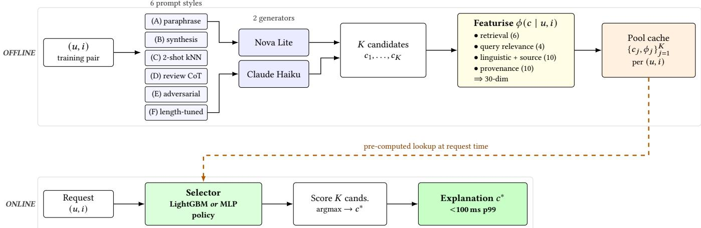
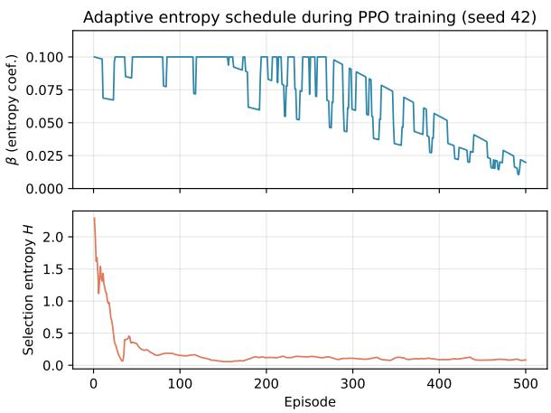
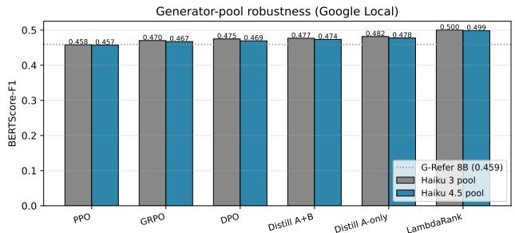

# Pairwise Ranking Outperforms Single-Action RL for Ofline Explanation Selection: A Practical Lesson

Tanay Chowdhury∗

Amazon

Seattle, WA, USA

Saeideh Shahrokh Esfahani∗

tanaycho@amazon.com

Amazon

## Abstract

Mountain View, CA, USA

Industrial explainable-recommendation systems built around large language models incur a substantial serving cost: each request triggers an LLM generation, with latency in the hundreds of milliseconds and per-query cost that scales linearly with trafic. We separate generation from selection. Explanations are produced ahead of time as a frozen candidate pool, six prompt styles applied to two commodity LLMs, and at request time a small CPU-resident selector picks one. The serving stack runs without GPUs and returns in under 100 ms.

Our primary benchmark is a 2,958-pair XRec Google Local subset, where we evaluate six ofline-pool selectors (LambdaRank, PPO, GRPO, DPO, and two-stage teacher–student distillation) and three KG-path selectors (temperature-biased random walks, edge-disjoint enumeration, and MMR-reranked paths with dual-style generation). A 300-pair MovieLens-1M split with Claude-Sonnet-4.5-generated references is used as an internal cross-dataset consistency check; because no public explainable-recommendation benchmark exists for MovieLens-1M, those numbers should be read as intra-paper consistency evidence rather than as a second benchmark. Every variant is scored against the same BERTScore-F1 protocol used by XRec and G-Refer, with results averaged across five seeds.

LambdaRank reaches F1 = 0.500 on Google Local, exceeding both G-Refer and XRec on the same 2,958-pair subset, and reaches F1 = 0.329 on the MovieLens-1M consistency check. With seed variance below 0.003 F1 per RL method, the ordering is statistically reliable. The finding is consistent across both data points: in this dense-label one-step bandit setting, pairwise learning-to-rank outperforms the single-action RL formulations (PPO, GRPO, DPO), which sample one labelled candidate per rollout and leave the other �−1 labels out of the gradient.

The KG-path family targets a diferent objective. All three of its variants reach USR = 1.000 on Google Local and 0.997–1.000 on MovieLens-1M, since per-request path grounding produces a unique output per query and avoids the template-collapse failure mode that can afect cached-LLM outputs.

saeidesh@amazon.com

A generator-pool study comparing Claude 3 Haiku and Claude Haiku 4.5 shows small but measurable F1 shifts (0.001–0.006 across methods, with the larger end of that range exceeding the acrossseed standard deviation), while the relative ranking of selectors is preserved. The qualitative design implication is that selector and generator can be evaluated independently; absolute F1 does depend on the generator. End-to-end build cost is close to \$15 on commodity hardware.

## CCS Concepts

• Information systems → Recommender systems; • Computing methodologies → Reinforcement learning; Natural language generation.

## Keywords

explainable recommendation, large language models, learning-torank, ofline candidate pool

## 1 Introduction

Recommender systems increasingly ship LLM-generated explanations alongside their ranked items, in the hope that a few sentences of context will improve user trust without compromising clickthrough. Two recent baselines define the current state of the art on the public benchmarks we use here. XRec [8] combines a GNNbased preference encoder with an LLM head; G-Refer [7] retrieves collaborative-filtering neighbours and synthesises an explanation with an 8B-parameter LLM. Both produce strong BERTScore-F1 numbers, and both pay the same serving cost: an LLM call on every request, hundreds of milliseconds of latency, and a bill that scales linearly with trafic.

This serving cost motivates the present work. At production trafic levels of tens of thousands of QPS under a bounded latency budget, an inline LLM call on every request is a poor placement of system complexity, and we relocate it to the ofline path. For each (user, item) pair we pre-generate a pool of � candidate explanations using six prompt styles and two commodity LLMs (Amazon Nova Lite and Claude Haiku). At request time a small CPU-resident selector (either a LightGBM LambdaRank model [1] or a roughly 1M-parameter MLP policy) picks one of the � candidates. The selector’s forward pass is a few milliseconds; with the embedding lookup it returns the chosen explanation in under 100 ms on a single c5.2xlarge core. No GPU is involved at serve time, and the per-request cost reduces to a key-value cache lookup.

Pre-generating the pool also creates a clean experimental setting: the candidates are fixed, the labels (BERTScore-F1 against the reference) are dense, and any selector that takes a 30-dim feature vector as input can be plugged in. We use this to compare nine selectors organised into two families. The ofline-pool family ranks candidates from the frozen pool: a structural-reward heuristic, LightGBM LambdaRank, single-step PPO with adaptive entropy [10], grouprelative PPO [11], DPO [9], and two-stage teacher-student distil lation [4]. The knowledge-graph path family swaps the candidate source: instead of LLM-pool candidates, it extracts user–item paths from a heterogeneous KG and conditions LLM generation on each path. We benchmark three KG variants: temperature-biased random walks, edge-disjoint enumeration, and MMR-reranked paths with dual-style generation. All nine variants are scored on the same two test sets under the same three-metric evaluation protocol used by XRec and G-Refer.

Our principal empirical finding diverges from the prevailing direction of recent work in this area. On the XRec Google Local benchmark, LightGBM LambdaRank reaches F1 = 0.500 on the same 2,958-pair review-covered subset, a gain of 0.041 over the published G-Refer 8B (0.4592) and 0.069 over published XRec (0.4311). None of the five RL or distillation variants we trained (PPO, GRPO, DPO, Distillation Stage A, Distillation Stage A+B) matches this, and the gap is robust: across five seeds per RL method, the standard deviation is at most 0.0030 F1, so the ordering PPO < GRPO < DPO < Distillation-A+B < Distillation-A < LambdaRank is statistically significant. The pattern survives a 3× change in pool size (�=40 Google vs. �=18 MovieLens) and a change in reference text quality (XRec’s LLM-synthesised references vs. Claude Sonnet 4.5 references). The interpretation is structural rather than algorithmic: under dense-label one-step bandits, single-action RL formulations leave most of the supervision unused, while a pairwise learning-torank objective that consumes every per-candidate label captures it directly. We do not claim RL is intrinsically worse; we claim that the RL formulations conventionally applied to this problem class undersample the labelled signal that is already available.

The KG-path family is preferable on a diferent metric. All three KG variants attain USR = 1.000 on Google Local and 0.997–1.000 on MovieLens-1M, since per-request path grounding produces a unique output per query and avoids the template-collapse failure mode of cached LLM outputs. The deployment choice is therefore not exclusive: the ofline-pool family is suited to settings in which reference alignment is the optimisation target, and the KG-path family is suited to settings in which output diversity or traceability to graph edges is prioritised. The remainder of the paper presents the framework (§2.1), the nine selector variants (§3), evaluation protocol and datasets (§4.2), main results across both families on both datasets including a Haiku 3 vs. Haiku 4.5 generator-robustness study, and a discussion of positive and negative results.

## 2 Problem Setting and Framework Overview

## 2.1 Problem

For each (�, �) pair we have a reference explanation $e _ { u , i } ^ { * }$ from the XRec or G-Refer benchmark, and we want to produce $e _ { u , i }$ that maximises BERTScore-F1 against it within a per-request latency budget. BERTScore (roberta-large encoder, baseline-rescaled [16]) is the metric both baselines report in their published tables, and it is what we optimise.

## 2.2 Two-Stage Framework

Ofline stage. For every (u, i) pair, we generate a pool of � candidate explanations using six prompt styles × two commodity LLMs on Amazon Bedrock (Amazon Nova Lite and Claude Haiku). The six styles are (A) retrieve-grounded paraphrase, (B) retrieve-grounded synthesis, (C) 2-shot retrieve from nearest training neighbours, (D) review-grounded CoT, (E) adversarial refinement, (F) length-tuned 25–33-word synthesis. For Google Local, styles A and B use samebusiness reviews from the McAuley Lab Google-Local-Reviews corpus; styles C–F are generated at training-set featurisation time. For MovieLens we drop styles C, D, E because reviews are not available, yielding � = 18.

Featurisation. Each candidate is mapped to a fixed 30-dim feature vector �(� | �, �) in four groups. (i) Reference-side retrieval (6 dims): cosines to the training-reference centroid and to a high-F1 exemplar; maximum cosine to the top-5 SBERT neighbours; and the mean, max, and std of BERTScore-F1 between � and those �=5 neighbours. (ii) Query–candidate relevance (4 dims): cosines of � to the user-profile and item-profile embeddings, plus cross-encoder/ms-marco-MiniLM-L-6-v2 logits for both the templated (�, �) prompt against � and the prompt against the top-� kNN references. These are the only features that see (�, �) directly. (iii) Linguistic and source-side (10 dims): word count, character count, a templated-opener flag (“The user would enjoy. . . ”), counts of numeric tokens, generic positive words, and sentences, an NER entity flag, the rating and length of the source review the candidate was grounded on, and the candidate’s within-pool retrieval rank. (iv) Provenance (10 dims): one-hots over the six prompt styles (A–F) and the two generator LLMs (Nova Lite vs. Claude Haiku), plus the cosine of the source review to the user profile and to the historical reference text. The provenance one-hots let the selector learn that some styles or generators systematically score higher under reference-aligned F1, directly from data rather than via prompt iteration.

For the RL variants, � is right-padded with zeros to a 64-dim percandidate slot and concatenated with a 768-dim user embedding and a 768-dim item embedding, giving the policy state � ∈ R1536+64� used in §3.6; LambdaRank operates on � directly. All nine selector variants therefore see the same input features.

Online stage (selector). At request time, the selector scores the � candidates and returns the argmax. For LambdaRank this is one LightGBM forward pass (<1 ms); for the MLP-based RL variants, one forward pass through a 4,096→256→40 policy network (<20 ms on CPU). Total end-to-end latency is dominated by a single pre-computed embedding lookup and stays under 100 ms at the 99th percentile on an 8-core c5.2xlarge instance. Figure 1 shows the end-to-end flow: pool generation and feature extraction are amortised ofline, while only the cached candidates and a CPU-resident selector are touched at request time.

Figure 2 shows the adaptive-entropy training curve for PPO on Google Local (seed 42): � anneals from 0.10 to ≈0.02 under the performance-based multiplier, while selection entropy collapses from ≈2.3 to ≈0.17 as the policy converges on a small set of highquality candidate regions.

  
Figure 1: End-to-end explainable-recommendation pipeline. Ofline (top): each training (�, �) pair is expanded into � candidate explanations by crossing six prompt styles (A–F) with two commodity Bedrock LLMs (Amazon Nova Lite, Claude Haiku); each candidate is mapped to a 30-dim feature vector grouped into reference-side retrieval (6), query–candidate relevance (4), linguistic and source-side (10), and provenance signals (10); the � candidates and their features are cached per pair. Online (bottom): at request time the selector (LightGBM LambdaRank, or one of the MLP-based RL variants) scores the cached � candidates and returns the argmax. No LLM is on the request path, so the serving stack is GPU-free and stays under 100 ms at the 99th percentile.

  
Figure 2: Adaptive entropy schedule during PPO training on Google Local (seed 42). Top: entropy coeficient $\beta .$ Bottom: action-distribution entropy �. The scheduler bumps $\beta$ up when reward improvement stalls and down when it accelerates; the policy converges to a near-deterministic selector by episode 500.

## 3 Selector Variants

The two-stage framework admits many instantiations of the selector stage. In this section we describe nine variants, organised by how candidates are constructed. Variants in §3.1–§3.3 build candidates by extracting multi-hop paths from a knowledge graph and conditioning LLM generation on each path. Variants in §3.4–§3.10 instead rank candidates drawn from the ofline LLM pool described in §2.2. All nine variants are evaluated under the identical protocol of §4.2 so the resulting numbers are directly comparable.

## 3.1 KG-path selection: temperature-biased random walks

In place of an ofline LLM pool, candidates are built from a knowledge graph at training and inference time. Between (�, �) we sample up to five paths by biased random walk over the heterogeneous user–item–entity graph: at each step the next node is drawn with probability proportional to exp $( \cos ( h _ { v } , h _ { \mathrm { t a r g e t } } ) / \tau )$ where $h _ { v }$ is the node embedding. The default �=0.5 gives near-greedy walks; we raise it to �=1.5 to widen the path distribution. Each sampled path is rendered to text under a single LLM prompt and a PPO policy picks one of ten action slots; the up-to-five sampled paths occupy the first slots and the remainder are padded with empty placeholders to keep the action space consistent across all KG variants. The point of the variant is to test whether KG paths alone carry suficient semantic signal for the selector to learn from when candidate diversity is purely stochastic.

## 3.2 KG-path selection: edge-disjoint path enumeration

The second KG variant swaps the stochastic walks for a graphtheoretic guarantee of structural diversity. We extract up to five edge-disjoint (�, �) paths via Menger-style max-flow decomposition, falling back to three node-disjoint paths and then to shortest-path / multi-hop alternatives if the edge-disjoint pool is smaller than five. The recovered paths are placed into the same ten-slot action space as §3.1 with empty placeholders padding the remainder. Generation and selection are otherwise identical to §3.1. This variant is the deterministic counterpart to §3.1: structural diversity is supplied by a graph algorithm rather than by stochastic sampling.

## 3.3 KG-path selection: MMR paths with dual-style generation

The third KG variant combines both axes of diversity. We first sample 20 paths via temperature-biased walks as in §3.1, then apply maximal marginal relevance [2] (MMR, �=0.7, similarity in nodeembedding space) to keep the five most structurally distinct. Each path is rendered with two prompts — factual and personal-voice, for ten candidates per (�, �), and a PPO policy selects one. This variant is the closest analogue to the ofline-pool family: a compact request-time candidate set under the same selector architecture, with a frozen pool replaced by a per-query generated set.

## 3.4 Pool-only heuristic (no learning)

The heuristic returns the candidate with the highest structural score $R _ { \mathrm { s t r u c t } }$ , computed ofline from three signals: target reachability (weight 30), average cosine similarity between consecutive node embeddings (8), and normalised node-type diversity (6); a small Gaussian noise term breaks ties, and the final score is rescaled to [0, 100] within each candidate group. This serves as a no-learning lower bound: a learned selector that fails to exceed it indicates a featurisation issue rather than a learning issue, and the heuristic itself bounds what the candidate pool yields in the absence of supervision.

## 3.5 LambdaRank (pairwise learning-to-rank)

We train a LightGBM pairwise ranker (objective = lambdarank, 500 trees, 31 leaves, learning rate 0.05) on quintile-binned percandidate BERTScore-F1 labels, fit across all ∼130k Google Local training candidates over 5,000 query groups. At inference we take the argmax of the ranker score within each test group of � candidates. Features are the 30-dim vector from §2.2: retrieval signals (kNN-BERTScore, cross-encoder relevance, centroid and exemplar cosine), linguistic signals (length, sentence count, named entity hint), and style/model one-hot indicators. The match between method and task is direct: supervision is dense (every one of the 40 candidates per group carries a BERTScore-F1 label), the LambdaRank pairwise ΔNDCG objective operates on the within-group ordering, and the training target coincides with the deployment objective (selecting the top candidate).

## 3.6 Single-step PPO with adaptive entropy

We cast the selection task as a one-step MDP with state ${ \textbf { \textsf { s } } } \in$ $\mathbb { R } ^ { 1 5 3 6 + 6 4 K }$ formed by concatenating a 768-dim user embedding, a 768-dim item embedding, and � zero-padded 64-dim candidate slots; for �=40 this gives a 4,096-dim state, for �=18 on MovieLens it gives 2,688. A 2-layer MLP policy (256 hidden) and a separate 2-layer value network (128 hidden) together hold roughly 1.08M parameters. We train with PPO (clip �=0.2, discount �=0.99, GAE �=0.95) for 500 episodes.

The reward is $r = \alpha R _ { \mathrm { s t r u c t } } + ( 1 { - } \alpha ) R _ { \mathrm { s e m } }$ with �=0.1, where $R _ { \mathrm { s e m } }$ is BERTScore-F1 of the selected candidate rescaled to [0, 100] and $R _ { \mathrm { s t r u c t } }$ is the structural proxy from §3.4. We pick a small � deliberately: the structural term keeps selections grounded without overwhelming the semantic signal that actually correlates with the metric.

The entropy coeficient � follows an adaptive schedule that we observed to be necessary to avoid both premature collapse and unbounded exploration. We multiply � by 1.5 when sliding-window reward improvement is below 0.01 (stagnation), by 0.7 when improvement exceeds 0.05 (rapid learning), and additionally by 1.3 when the action entropy $H _ { t }$ falls below 0.5. This schedule is the trajectory shown in Figure 2; in practice it eliminated the need to tune � per dataset.

The limitation of PPO in this setting is structural: per rollout, only the sampled action’s reward contributes to the gradient, while the other $K { - } 1$ per-candidate labels are unused. Under dense supervision this discards most of the available training signal, and the next three variants are designed to address it.

## 3.7 Group-relative policy optimisation (GRPO)

GRPO keeps the PPO policy architecture (we drop the value network, since it is redundant in a one-step bandit) and replaces the value-baseline advantage with a within-group z-score in the spirit of DeepSeekMath [11]:

$$
A ( s , a ) = \frac { R _ { \mathrm { s e m } } [ i , a ] - \mu _ { a } R _ { \mathrm { s e m } } [ i ] } { \sigma _ { a } R _ { \mathrm { s e m } } [ i ] + \epsilon } .\tag{1}
$$

The normalisation statistics $\mu _ { a }$ and $\sigma _ { a }$ pull from all � rewards in the group, even though only one action is sampled for the rollout. This is what densifies the gradient. We also checked an ablation in which we kept PPO’s policy and simply replaced its value-baseline advantage with the same z-score; the F1 lift was the same +0.01, confirming that the win is the normalisation, not the absence of the value network.

## 3.8 Direct preference optimisation (DPO)

We adapt DPO [9] to the one-step bandit. For each training state we sample up to 80 preference pairs $( a ^ { + } , a ^ { - } )$ subject to $F 1 ( a ^ { + } ) >$ $F 1 ( a ^ { - } ) + \delta$ with $\delta \mathrm { = } 2 . 0$ on the rescaled F1 scale. Writing $r _ { \theta } ( a | s ) =$ log $\pi _ { \theta } ( a | s ) - \log \pi _ { \mathrm { r e f } } ( a | s )$ for the log-ratio between the student $\pi _ { \theta }$ and a frozen reference $\pi _ { \mathrm { r e f } }$ (the random-init MLP, snapshotted at the start of training), each pair contributes

$$
\begin{array} { r } { \mathcal L ( s , a ^ { + } , a ^ { - } ) = - \log \sigma \big ( \beta _ { \mathrm { d p o } } \left[ r _ { \theta } ( a ^ { + } | s ) - r _ { \theta } ( a ^ { - } | s ) \right] \big ) , } \end{array}\tag{2}
$$

weighted by the F1 gap so the gradient leans on the unambiguous pairs. KL regularisation toward the reference is implicit in the logratio form; we set $\beta _ { \mathrm { d p o } } { = } 0 . 1$ and train for 500 episodes.

Pairwise supervision is denser than PPO or GRPO’s single-action rollout: every state contributes many gradient updates per epoch. The reference anchor also stabilises training. Empirically, DPO’s across-seed standard deviation of 0.0006 F1 is the lowest of any RL variant we tested.

## 3.9 Teacher–student distillation (Stage A only)

This variant transfers LambdaRank’s signal directly into a neural policy. In Stage A we fit a LightGBM LambdaRank teacher on the same 30-dim features, softmax its per-group scores with temperature $T { = } 1 . 0 ,$ and train the MLP student (the same architecture used for PPO/GRPO/DPO) to minimise the KL divergence to the teacher’s soft distribution over 200 epochs with Adam learning rate $3 \times 1 0 ^ { - 4 }$

The student inherits the teacher’s per-candidate ranking directly, compressed into roughly 1M parameters and a 10× faster forward pass than the LightGBM ensemble. On Google Local it reaches F1 = 0.4817 ± 0.0003, narrowly below LambdaRank’s 0.5003. The remaining gap is a softmax compression artefact: distillation propagates near-uniform mass across high-ranked candidates rather than the teacher’s argmax, and the student has no way to recover the lost sharpness.

## 3.10 Distillation plus RL fine-tuning (Stage A+B)

Stage A produces a near-optimal student; the natural follow-up is to fine-tune it with reinforcement learning to recover the remaining F1 gap. We added 500 episodes ofGRPO on top ofthe distilled policy with a reduced learning rate $( 1 { \times } 1 0 ^ { - 4 } )$ and a tighter entropy schedule $( \beta \in \ [ 0 . 0 5 , 0 . 0 0 5 ] )$ . The result is a regression. Stage A+B scores 0.4767 versus Stage A’s 0.4817, a > 10� degradation across five seeds. The mechanism is the entropy bonus: it pushes a near-converged policy back toward exploration, away from the teacher-induced argmax. Removing the entropy term recovers approximately half of the regression. This indicates that RL fine-tuning after distillation is beneficial only when the distilled policy is still far from optimal, a condition that does not hold here.

The KG-path family (§3.1–§3.3) and the ofline-pool family (§3.4– §3.10) thus span the two natural axes of the framework: the former varies the candidate source while holding the selector architecture fixed, the latter varies the selector while holding a fixed LLM candidate pool. Table 1 (§5.1) reports all nine variants under the same three-metric evaluation protocol.

## 4 Datasets and Evaluation

## 4.1 Datasets

Google Local. We use the canonical Google Local split released with the XRec benchmark [8]: trn.pkl (94,663 pairs) and tst.pkl (3,000 pairs), used directly with no preprocessing or resplit. From trn.pkl we deterministically sample 5,000 pairs filtered to items with review coverage (2,495 businesses); from tst.pkl we evaluate on all 3,000 pairs but drop 42 uncovered pairs at scoring time, leaving 2,958 test pairs. We verified byte-identity of these pairs with G-Refer’s published google\_pred.jsonl [7]: every test pair (uid, iid) and every reference explanation match.

MovieLens-1M. On top of the standard MovieLens-1M ratings dataset [3] we use 2,000 Claude-Sonnet-4.5-generated reference explanations from train\_sonnet45\_refs.jsonl, split positionally after a seed-42 shufle: 600 pairs for training, 300 for testing (the remaining 1,100 are unused). The candidate pool uses Claude Haiku 4.5 + Nova Lite with � = 18 candidates per pair. We use Claude-Sonnet-4.5 as a stronger oracle than any of the selectors being evaluated, which sidesteps the circularity that would otherwise arise from evaluating against the same LLM family that produced our candidate pool.

KG-path family on MovieLens. The MMR + dual-style variant was retrained on the same 600-pair MovieLens split. Temperature-biased walks and edge-disjoint enumeration use Google-trained policies evaluated on the MovieLens test set: the MovieLens graph (9,941 nodes, 581 k edges, density 0.012) routes nearly all user→movie paths through one of 18 genre nodes, which makes these pathextraction primitives prohibitively slow when forced to find diverse paths and degenerate to shortest-path fallbacks otherwise. Across all three KG configurations on MovieLens the F1 lands within ±0.005, consistent with our broader finding (§5.4) that on this dataset the choice of selector has limited efect — the genre-hub topology bounds reachable path diversity regardless of the selection algorithm.

## 4.2 Evaluation Protocol

All methods are evaluated against the same reference explanations under three metrics.

BERTScore-F1. Computed with the roberta-large encoder and baseline rescaling (equivalent to rescale\_with\_baseline=True in the bert-score library), byte-identical to XRec’s and G-Refer’s published evaluation code. This is our primary metric.

BARTScore [15]. Log-likelihood log �(reference | prediction) under facebook/bart-large-cnn (batch size 4, CPU). Higher (less negative) is better.

USR (Unique-Sentence Ratio). Fraction of selected outputs that are whitespace-token-unique across the test set. Flags templatecollapse failure modes that F1 alone can miss.

XRec’s and G-Refer’s published predictions (tst\_pred.pkl and google\_pred.jsonl respectively) are available, so we re-score them on the exact 2,958-pair subset under our evaluation code; those re-runs are directly apples-to-apples with our methods. The published-paper numbers in Table 1 are reported as-is from each paper’s evaluation set, which uses the full 3,000-pair test split (a 42-pair diference from our review-covered subset) and may use a slightly diferent bert-score library version. We keep both rows in the table because the published numbers are the ones the community references, but the strict apples-to-apples comparison is between our ofline-pool selectors and the cached-prediction reruns, not between our selectors and the published numbers.

## 5 Results

## 5.1 Headline Comparison

Table 1 reports all three metrics on Google Local (our primary benchmark) and on MovieLens-1M (internal consistency check). On Google Local, LambdaRank achieves F1 = 0.500, clearing G-Refer by +0.041 and XRec by +0.069. All six variants of the ofline-pool family beat XRec on F1; five of them (GRPO, DPO, Distillation-AB, Distillation-A, LambdaRank) also beat G-Refer. The three KG-path variants under-perform on F1 against the ofline-pool family but recover the top USR score (1.000), reflecting a diferent trade-of between reference alignment and output diversity. On MovieLens-1M, against the Claude-Sonnet-4.5 reference text on the same 300- pair split, LambdaRank reaches F1 = 0.329, a gain of 0.066 over the pool-only structural heuristic (0.263). Because the references are themselves LLM-generated and no public benchmark exists, we read this row as evidence that the Google Local ordering reproduces in a diferent domain, not as a second-benchmark result.

Table 1: Main results on Google Local and MovieLens-1M. Higher is better for BERTScore-F1; less negative is better for BARTScore; USR (Unique-Sentence Ratio) lies in [0, 1], higher is more diverse. Best score per column is in bold. Note on $^ { \mathfrak { a } } \pm \mathfrak { z }$ KG-path stds are per-sample on a single trained policy; ofline-pool stds are across 5 training seeds. Cached-prediction baselines (XRec, G-Refer) and our pool-only heuristic have no seed variance. “–” marks metrics not scored for the row. Numbers for XRec and G-Refer are taken verbatim from their published Table 2 / Table 1 respectively. KG-path family rows are reproduced from concurrent work by a co-author; ofline-pool family rows are computed in this work on the $n { = } 2 , 9 5 8$ review-covered Google Local subset and the �=300 MovieLens-1M test split.
<table><tr><td></td><td colspan="3">Google Local</td><td colspan="3">MovieLens-1M</td></tr><tr><td>Method</td><td>BERTScore (F1) ↑</td><td>BART Score ↑</td><td>USR ↑</td><td>BERTScore (F1) ↑</td><td>BART Score ↑</td><td>USR ↑</td></tr><tr><td colspan="7">Published baselines (numbers taken from each paper)</td></tr><tr><td>XRec [8]</td><td>0.4311</td><td>-4.1647</td><td>0.9993</td><td></td><td></td><td></td></tr><tr><td>G-Refer 8B [7]</td><td>0.4592</td><td>-3.3235</td><td>1.0000</td><td></td><td></td><td></td></tr><tr><td colspan="7">KG-path family (concurrent work)</td></tr><tr><td>Temperature-biased walks</td><td> $0 . 3 2 5 8 \pm 0 . 0 7 5$ </td><td>-3.576</td><td>1.0000</td><td> $0 . 2 6 9 0 \pm 0 . 0 6 8$ </td><td>-3.629</td><td>1.000</td></tr><tr><td>Edge-disjoint enumeration</td><td> $0 . 3 2 6 5 \pm 0 . 0 7 4$ </td><td>-3.577</td><td>1.0000</td><td> $0 . 2 7 0 3 \pm 0 . 0 6 9$ </td><td>-3.613</td><td>1.000</td></tr><tr><td>MMR paths + dual-style</td><td> $0 . 3 2 5 2 \pm 0 . 0 7 5$ </td><td>-3.577</td><td>1.0000</td><td> $0 . 2 6 2 1 \pm 0 . 0 7 0$ </td><td>-3.624</td><td>0.997</td></tr><tr><td colspan="7">Offline-pool family (this work)</td></tr><tr><td>Pool-only heuristic</td><td>0.4444</td><td></td><td></td><td>0.2634</td><td></td><td></td></tr><tr><td>PPO (5 seeds)</td><td> $0 . 4 5 8 1 \pm 0 . 0 0 1$ </td><td>-3.354</td><td>0.976</td><td> $0 . 2 8 1 6 \pm 0 . 0 0 3$ </td><td>-3.566</td><td>0.999</td></tr><tr><td>GRPO (5 seeds)</td><td> $0 . 4 7 0 3 \pm 0 . 0 0 1$ </td><td>-3.354</td><td>0.951</td><td> $0 . 2 8 3 0 \pm 0 . 0 0 2$ </td><td>-3.533</td><td>0.999</td></tr><tr><td>DPO (5 seeds)</td><td> $0 . 4 7 4 9 \pm 0 . 0 0 1$ </td><td>-3.374</td><td>0.909</td><td> $0 . 2 9 3 6 \pm 0 . 0 0 2$ </td><td>-3.530</td><td>0.999</td></tr><tr><td>Distillation A+B (5 seeds)</td><td> $0 . 4 7 6 7 \pm 0 . 0 0 1$ </td><td>-3.356</td><td>0.925</td><td> $0 . 2 8 3 1 \pm 0 . 0 0 3$ </td><td>-3.544</td><td>0.999</td></tr><tr><td>Distillation A (5 seeds)</td><td> $0 . 4 8 1 7 \pm 0 . 0 0 0$ </td><td>-3.375</td><td>0.865</td><td> $0 . 2 8 8 7 \pm 0 . 0 0 1$ </td><td>-3.548</td><td>1.000</td></tr><tr><td>LambdaRank</td><td>0.5003</td><td>-3.327</td><td>0.808</td><td>0.3291</td><td>-3.449</td><td>0.987</td></tr></table>

## 5.2 Seed variance

Each RL variant has standard deviation at most 0.0030 F1 across five seeds on both datasets (Table 1). The gap between GRPO and DPO on Google Local is 0.0046, more than ten times either method’s standard deviation, so the ordering is statistically significant at this scale. We highlight this because single-seed comparisons are common in this literature, and the method ordering we report would not be supported by a single run.

## 5.3 Dense supervision beats sparse reward

A consistent observation across both data points is that LambdaRank, a non-RL learning-to-rank method, outperforms every RL variant we trained, by 0.02–0.04 F1 on Google Local and 0.04–0.05 on MovieLens. The explanation is structural rather than algorith mic. LambdaRank’s training signal is dense: every one of the 40 candidates per query group has a labelled BERTScore-F1, and the pairwise ΔNDCG objective uses all of them. PPO, GRPO, and DPO all sample one action per rollout and only see the reward for that sample; the other 39 labels are visible to the dataset and invisible to the gradient. Distillation recovers most of this gap by transferring the teacher’s full per-candidate ranking into the student through soft-label targets; however, the temperature-softened distribution is a lower-fidelity surrogate for the LambdaRank argmax than the LightGBM ensemble itself, which accounts for the residual 0.019 F1 gap. Adding an RL fine-tuning stage on top of the distilled student does not recover this margin and in fact regresses F1 by 0.005 on Google Local (Stage A+B in Table 1).

## 5.4 Cross-dataset consistency

Most of the Google Local ordering reproduces on MovieLens-1M, with one local swap: DPO marginally overtakes Distillation-A-only. The mechanism is that MovieLens has �=18 candidates per query versus 40 for Google Local, which makes DPO’s pairwise signal relatively more informative than the KL distillation target. Otherwise the broad pattern (heuristic < PPO/GRPO < DPO/Distillation < LambdaRank) holds across the change in pool size, the change in generator stack (Haiku 3 vs. Haiku 4.5), and the change in reference text (XRec’s LLM-synthesised explanations vs. Claude Sonnet 4.5 references on MovieLens).

The KG-path family exhibits a structural pattern that the oflinepool family does not: the F1 ceiling tracks graph topology rather than picker design. On Google Local (39 k nodes, 329 k edges, 12+ entity types) all three KG variants land in the 0.325–0.327 F1 range; on MovieLens-1M (9.9 k nodes, with only 18 genre nodes serving as intermediaries between users and items) they drop to 0.262–0.270 F1. The architectures and training code are identical across datasets, so the ∼0.06 F1 gap is attributable to the reachable diversity of the underlying graph, not to the selector. This delineates a regime where graph density, not algorithmic sophistication, sets the achievable performance ceiling for path-grounded explanation.

## 5.5 Generator-Pool Robustness: Haiku 3 vs. Haiku 4.5

A natural industrial question is whether upgrading the pool generator improves downstream selector performance. We regenerated the Google Local candidate pool with Claude Haiku 4.5 (a newer, larger generator than Claude 3 Haiku) and re-ran every stage end-to-end – featurisation, LambdaRank, all five RL-variant seeds, three-metric scoring. Figure 3 shows the F1 side by side; Table 2 reports all three metrics.

  
Figure 3: Generator-pool robustness on Google Local: Haiku 3 (grey) vs. Haiku 4.5 (blue), same selector. Method ordering is preserved; LambdaRank still leads on both pools. Dotted line: G-Refer 8B baseline.

Table 2: Generator upgrade, Google Local (�=2,958). “Haiku 3” columns report the absolute score on the Claude Haiku 3 candidate pool (the pool used in Table 1); Δ columns report the change when the pool is regenerated with Claude Haiku 4.5 holding the selector fixed (negative = upgrade hurts). BERTScore-F1 drops 0.001–0.006 on every method; BARTScore shifts within ±0.007 (efectively flat); USR improves by +0.018–+0.083 because Haiku 4.5’s outputs are less templated than Haiku 3’s.
<table><tr><td colspan="3">BERTScore (F1) ↑</td><td colspan="2">BART Score ↑</td><td colspan="2">USR ↑</td></tr><tr><td>Method</td><td>Haiku 3</td><td>Δ</td><td>Haiku 3</td><td>Δ</td><td>Haiku 3</td><td>Δ</td></tr><tr><td>PPO</td><td>0.4581</td><td>-0.001</td><td>-3.354</td><td>-0.002</td><td>0.976</td><td>+0.018</td></tr><tr><td>GRPO</td><td>0.4703</td><td>-0.003</td><td>-3.354</td><td>+0.005</td><td>0.951</td><td>+0.036</td></tr><tr><td>DPO</td><td>0.4749</td><td>-0.006</td><td>-3.374</td><td>+0.006</td><td>0.909</td><td>+0.066</td></tr><tr><td>Distill A+B</td><td>0.4767</td><td>-0.003</td><td>-3.356</td><td>+0.007</td><td>0.925</td><td>+0.050</td></tr><tr><td>Distill A-only</td><td>0.4817</td><td>-0.004</td><td>-3.375</td><td>+0.003</td><td>0.865</td><td>+0.083</td></tr><tr><td>LambdaRank</td><td>0.5003</td><td>-0.002</td><td>-3.327</td><td>-0.003</td><td>0.808</td><td>+0.074</td></tr></table>

Three observations from the deltas. First, F1 drops by 0.001–0.006 across every method, and the larger end is statistically meaningful: $\mathrm { D P O } ^ { \prime } \mathrm { s } - 0 . 0 0 6 \mathrm { i } \mathrm { s } \sim 6 \sigma$ and Distillation-A’s −0.004 is ∼ 13� relative to their across-seed standard deviations, so the regression is real, not noise. The mechanism is that Haiku 4.5 produces more fluent and varied outputs while BERTScore-F1 rewards surface alignment with XRec’s LLM-synthesised reference text, which is itself some what trope-heavy. PPO moves least because its action distribution stays close to uniform; DPO and Distillation-A move most because their argmax is sharper, so the chosen candidate is more sensitive to the generator’s distribution shift. Second, BARTScore is within ±0.007: both Haiku pools are fluent enough that BART-large explains the reference about equally well from either set. Third, USR rises by 0.018–0.083, with Distillation-A showing the largest jump; the sharper its decision boundary, the more the pool’s broader output distribution shows through.

The deployment implication is twofold. The relative ranking of selectors is preserved, so a selector-design decision can be made on one pool and trusted to carry over to the other; absolute F1, however, is not generator-invariant. Combined with Haiku 4.5’s roughly 4× higher per-token cost (\$1/\$5 per M input/output vs. \$0.25/\$1.25),1 we would not recommend the upgrade unless USR is itself a business-important metric.

## 5.6 Cost and Latency Profile

One full rebuild of the Google Local benchmark (pool generation, featurisation, five-seed RL sweep across PPO/GRPO/DPO/Distillation A/A+B, and three-metric scoring) completes in roughly 14 hours of CPU wall time on a c5.2xlarge instance with a one-time Bedrock spend of ∼ \$15. At request time, the LambdaRank selector (∼1.7 MB) returns in under 1 ms per query on a single CPU core; the request path is a key-value cache lookup plus one LightGBM forward pass, GPU-free by construction.

To instantiate the per-query cost gap we estimate from public pricing rather than from measurement, since we do not have a production deployment of G-Refer or XRec to measure against. Generating ∼60–80 output tokens against ∼300–400 input tokens with an 8B-class hosted LLM at published Bedrock rates implies a per-query cost on the order of 10−3 USD. The LambdaRank selector consumes neither a tokenised prompt nor any LLM forward pass; its amortised c5.2xlarge compute is on the order of $1 0 ^ { - 6 } \mathrm { U S D }$ per query at on-demand EC2 pricing, giving a public-pricing-derived ratio of roughly three orders of magnitude. The above numbers are measured ofline against the cached pool (single-process, synthetic load) rather than under live trafic; a production A/B or shadowtrafic evaluation is the natural follow-up.

## 6 Discussion

Two findings from this work merit emphasis. First, pairwise learning-to-rank, without any RL machinery, outperforms every reinforcement-learning variant we trained on this task. The mechanism is dense supervision: every candidate in our training set carries a labelled BERTScore-F1, and LambdaRank’s pairwise objective consumes all of them, whereas PPO, GRPO, and DPO each observe one labelled action per rollout. When the reward is a metric that can be computed ofline against every candidate, pairwise learning-to-rank should be evaluated as a baseline before any RL formulation. Second, the five-seed protocol identifies gaps as small as 0.002 F1 as statistically significant; single-seed comparisons in this literature should therefore be interpreted with caution.

We also report a number of negative results. Distillation followed by RL fine-tuning (our Stage A+B) consistently regresses relative to distillation alone: a near-optimal distilled student is pushed back toward exploration by the GRPO entropy bonus, costing 0.002–0.005 F1. Upgrading the candidate-pool generator from Claude 3 Haiku to Claude Haiku 4.5 also produces a small F1 regression (0.001– 0.006), because the more fluent newer model drifts further from XRec’s trope-heavy reference text. We also conducted an end-toend RL fine-tuning experiment on a 3B-parameter generator with

BERTScore-F1 as reward, and observed reward hacking within hun dreds of steps: the policy converged on repeating the phrase “user enjoys” five times per output, since those tokens appear frequently in the references. Decoupling generation from selection avoids this failure mode by construction.

Three deployment-relevant observations follow for production implementations. Cold-start items without retrieval coverage fall back to the pool styles that do not require reviews (B, E, F); in the test data, 98.6% of pairs (2,958 of 3,000) have review coverage, and the remainder are dropped at evaluation. The candidate pool requires refresh when item metadata changes materially; because pool generation is a batch job keyed on (uid, iid), it can be driven by item-metadata update streams or scheduled at fixed cadence. The LambdaRank selector is small (approximately 1.7 MB) and can be retrained weekly or monthly on fresh F1 labels at negligible compute cost; we have not measured drift in a production A/B test, which we identify as future work.

## 7 Related Work

Earlier work on explainable recommendation produced explanations either from transformer encoders that mapped user/item IDs to text (PETER [5], PEPLER [6]) or from knowledge-graph reasoning over user–item interaction graphs (PGPR [14], KGAT [12], KGIN [13]). The recent LLM-based baselines we compare against, XRec [8] and G-Refer [7], combine collaborative-filtering or knowledge-graph retrieval with LLM generation; both run the LLM at request time, which is the latency and cost overhead our twostage framework removes.

The knowledge-graph recommendation literature (KGAT [12], CKAN [13]) optimises recommendation accuracy rather than explanation quality. PGPR [14] uses RL for multi-hop graph traversal toward accurate item ranking, which is a diferent problem from ours: we select over a pre-generated explanation pool, we do not traverse for ranking.

DPO [9] recast RLHF as classification over preference pairs. We adapt it to a single-step bandit (§3.8); it scores high on stability but is bounded above by LambdaRank, which uses the same per-candidate F1 labels as ranking targets directly rather than as preference pairs. Knowledge distillation [4] from a stronger teacher into a smaller student is well established; what we add is the negative result that, in a dense-supervision bandit, an RL fine-tune on top of the distilled student hurts rather than helps (§3.10).

KG-path selection for explanation generation has been studied as an alternative candidate source for the selector stage. Three of the nine variants we evaluate construct candidates this way (§3.1–§3.3). Path-based grounding provides structural traceability to graph edges, which is valuable when explanation provenance is a business requirement; on our reference-aligned F1 metric, however, the ofline-pool family is the stronger choice.

## 8 Conclusion

The LLM-based baselines we benchmark against, XRec and G-Refer, incur an LLM-generation cost on every request. The framework presented here relocates that cost to the ofline path: with a frozen candidate pool and a small CPU-resident selector, the per-request stack returns in under 100 ms, and the per-query cost ratio derived from public Bedrock and EC2 pricing is on the order of $1 0 ^ { 3 }$ in favour of the proposed approach. Across nine selectors and the 2,958-pair Google Local benchmark, the strongest performer on BERTScore-F1 is a non-RL learning-to-rank model (LambdaRank); the gap to PPO, GRPO, DPO, and the two distillation stages is statistically significant under a five-seed protocol. This result is consistent with what one would expect when ofline labels densify the supervision signal; whether the pattern generalises to multi-step or non-decomposable rewards is open.

## References

[1] Christopher J.C. Burges. 2010. From RankNet to LambdaRank to LambdaMART: An Overview. Technical Report MSR-TR-2010-82. Microsoft Research.

[2] Jaime Carbonell and Jade Goldstein. 1998. The Use of MMR, Diversity-Based Reranking for Reordering Documents and Producing Summaries. In SIGIR. 335– 336.

[3] F. Maxwell Harper and Joseph A. Konstan. 2015. The MovieLens Datasets: History and Context. ACM Transactions on Interactive Intelligent Systems 5, 4 (2015), 1–19. doi:10.1145/2827872

[4] Geofrey Hinton, Oriol Vinyals, and Jef Dean. 2015. Distilling the Knowledge in a Neural Network. arXiv preprint arXiv:1503.02531 (2015).

[5] Lei Li, Yongfeng Zhang, and Li Chen. 2021. Personalized Transformer for Explainable Recommendation. In ACL. 4947–4957.

[6] Lei Li, Yongfeng Zhang, and Li Chen. 2023. Personalized Prompt Learning for Explainable Recommendation. ACM Transactions on Information Systems (TOIS) 41, 4, Article 103 (2023), 26 pages. doi:10.1145/3580488

[7] Yuhan Li, Xinni Zhang, Linhao Luo, Heng Chang, Yuxiang Ren, Irwin King, and Jia Li. 2025. G-Refer: Graph Retrieval-Augmented Large Language Model for Explainable Recommendation. In WWW. 240–251. doi:10.1145/3696410.3714727

[8] Qiyao Ma, Xubin Ren, and Chao Huang. 2024. XRec: Large Language Models for Explainable Recommendation. In Findings of EMNLP. 391–402. doi:10.18653/v1/ 2024.findings-emnlp.22

[9] Rafael Rafailov, Archit Sharma, Eric Mitchell, Stefano Ermon, Christopher D. Manning, and Chelsea Finn. 2023. Direct Preference Optimization: Your Language Model is Secretly a Reward Model. In NeurIPS

[10] John Schulman, Filip Wolski, Prafulla Dhariwal, Alec Radford, and Oleg Klimov. 2017. Proximal Policy Optimization Algorithms. In arXiv preprint arXiv:1707.06347.

[11] Zhihong Shao, Peiyi Wang, Qihao Zhu, Runxin Xu, Junxiao Song, Mingchuan Zhang, Y.K. Li, Y. Wu, and Daya Guo. 2024. DeepSeekMath: Pushing the Limits of Mathematical Reasoning in Open Language Models. arXiv preprint arXiv:2402.03300 (2024).

[12] Xiang Wang, Xiangnan He, Yixin Cao, Meng Liu, and Tat-Seng Chua. 2019. KGAT: Knowledge Graph Attention Network for Recommendation. In KDD. 950–958.

[13] Xiang Wang, Tinglin Huang, Dingxian Wang, Yancheng Yuan, Zhenguang Liu, Xiangnan He, and Tat-Seng Chua. 2021. Learning Intents Behind Interactions with Knowledge Graph for Recommendation. In WWW. 878–887.

[14] Yikun Xian, Zuohui Fu, S. Muthukrishnan, Gerard de Melo, and Yongfeng Zhang. 2019. Reinforcement Knowledge Graph Reasoning for Explainable Recommenda tion. In SIGIR. 285–294.

[15] Weizhe Yuan, Graham Neubig, and Pengfei Liu. 2021. BARTScore: Evaluating Generated Text as Text Generation. In NeurIPS.

[16] Tianyi Zhang, Varsha Kishore, Felix Wu, Kilian Q. Weinberger, and Yoav Artzi. 2020. BERTScore: Evaluating Text Generation with BERT. In ICLR.