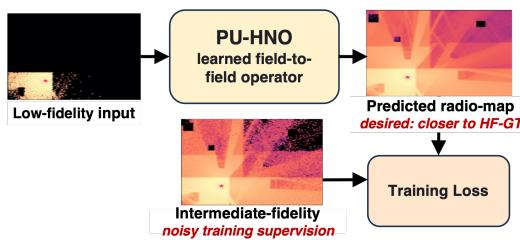
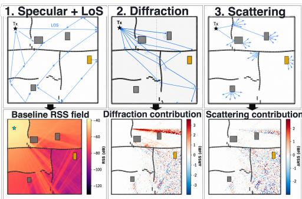
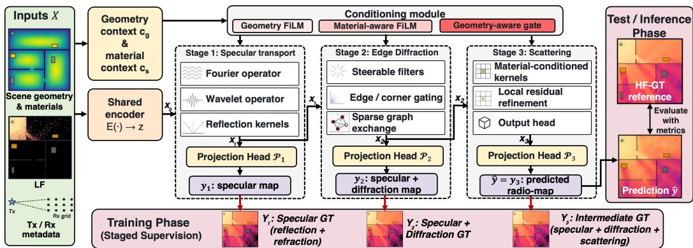
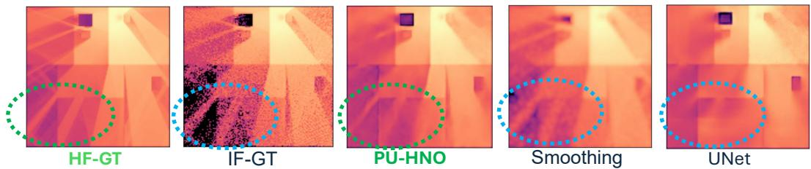
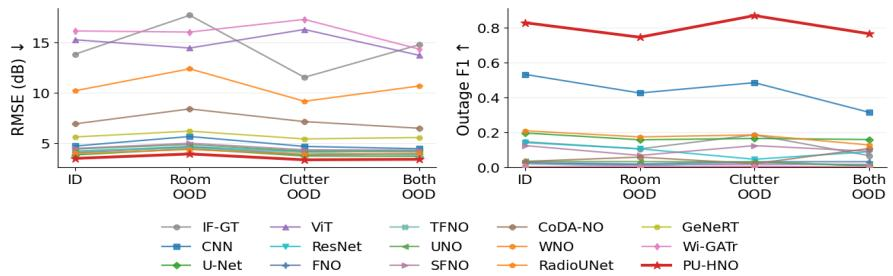
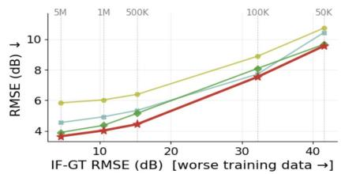
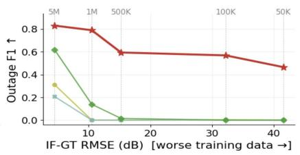
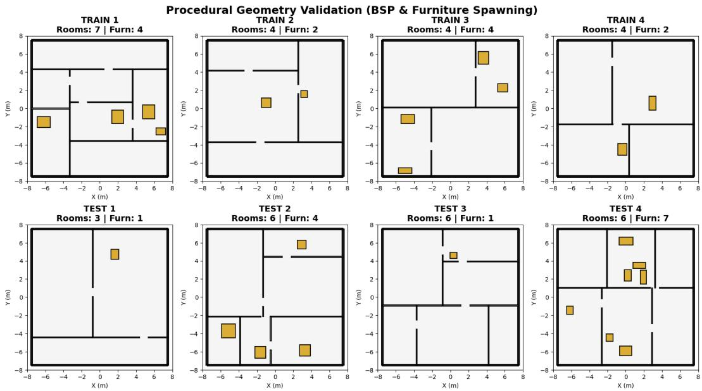
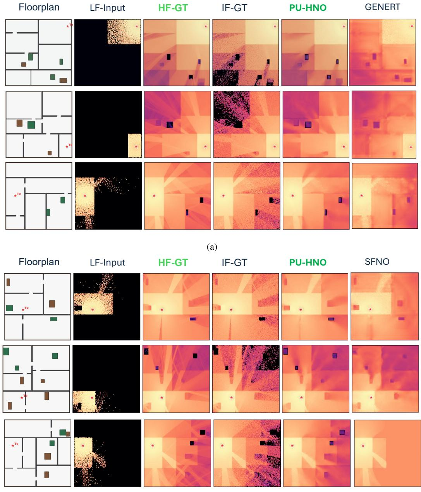
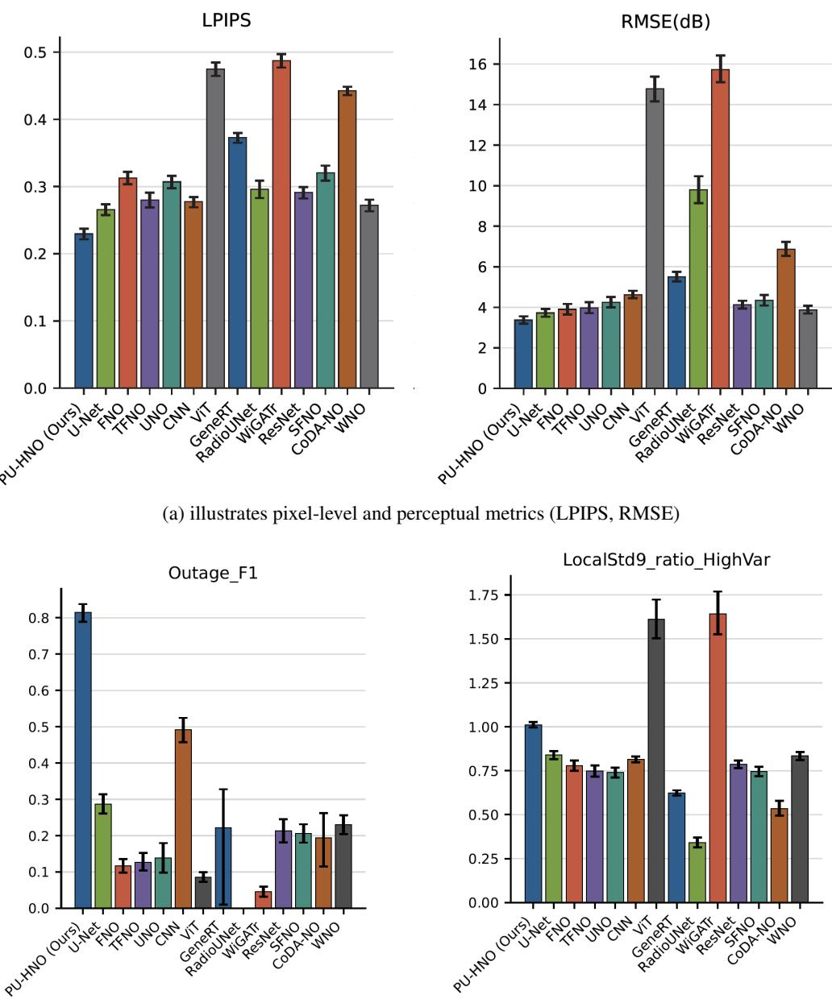

# Physics-Unrolled Neural Operator for Wireless Field Modeling

Rafid Umayer Murshed

Saif Ur Rahman

Mingyue Tang

Elahe Soltanaghai

Department of Computer Science University of Illinois Urbana-Champaign Urbana, IL 61801, USA {rum3, saifu2, mt55, elahe}@illinois.edu

## Abstract

Radio maps are essential for wireless decision-making tasks such as access-point placement, coverage planning, and localization, but their fine spatial details are governed by complex propagation effects and are costly to simulate accurately. Machine learning offers a path to high-fidelity radio-map prediction without running expensive high-fidelity simulations for every scene. However, generating high-quality training labels at scale is also difficult: the affordable labels come from finite-ray simulations, which are richer than low-fidelity inputs but carry residual Monte Carlo noise. We address this challenge with Physics-Unrolled Hybrid Neural Operator (PU-HNO), a three-stage cascade that predicts high-fidelity indoor radio maps from low-fidelity ray-tracing outputs and scene priors by progressively capturing reflection, diffraction, and scattering effects, rather than treating radio maps as generic images. We prove that, under conditionally unbiased label noise, the model can learn stable propagation structure and outperform its own training labels. Experiments across diverse floorplans show that PU-HNO outperforms image-to-image baselines, wireless learning models, and monolithic neural operators across both image-quality and wireless deployment metrics.

## 1 Introduction

Accurate wireless field modeling aims to predict how electromagnetic signals vary across a physical environment. The key challenge is that wireless propagation involves coherent multipath interactions with scene geometry and materials, including reflection, diffraction, and scattering, which can produce sharp spatial variations in received signal strength (RSS) [1, 2]. As a result, practical tasks such as WiFi access-point placement, coverage planning, localization, and network reliability analysis often require high-fidelity radio maps that capture these local variations across space [3, 4, 5].

  
Figure 1: PU-HNO predicts high-fidelity radio maps from low-fidelity inputs and intermediate-fidelity supervision.

However, generating such high-fidelity radio maps requires dense ray sampling or detailed propagation modeling, making it computationally expensive[6, 7].

This motivates the central question of this paper: can machine learning turn low-cost, noisy radio map simulations into high-fidelity radio map predictions? A straightforward direction is to treat this as an image-to-image learning problem [8, 9], where a model maps a low-fidelity input radio map to a sharper output. However, such models are often optimized for global visual similarity or average pixel-wise accuracy, which can smooth out sharp local variations caused by multipath. This is especially problematic for radio maps because those local variations are not visual artifacts; they reflect underlying propagation effects such as reflection, diffraction, and scattering, and are critical for coverage and planning [1, 2].

Another limitation is that learning wireless fields cannot realistically rely on fully high-fidelity labels, since generating them for large training sets is computationally expensive [7]. Instead, the available labels are typically intermediate-fidelity simulations that contain richer spatial structure than the low-fidelity input, but remain noisy and imperfect, as illustrated in Fig. 1. The learning problem is therefore not simply to fit these labels, but to refine coarse fields using the stable structure present in intermediate-fidelity supervision while avoiding simulation noise.

To address these challenges, we propose PU-HNO, a physics-unrolled cascade of neural operators for recovering high-fidelity radio maps from low-fidelity ray-tracing outputs. Rather than predicting the full radio map in one step, PU-HNO refines the output progressively through multiple operator stages, each focusing on a specific wireless propagation effect: broad reflected coverage, edge-driven diffraction near walls and corners, and fine local scattering fluctuations from objects and multipath. Geometry and scene priors are used to constrain these stages, keeping each refinement grounded in the floorplan, material layout, and transmitter/receiver context. This stage-wise design allows the model to build on the output of the previous operator instead of applying one generic smoothing function to the entire field. This operator formulation further enables field-to-field prediction across different layouts and spatial resolutions, while wireless-physics-aware losses encourage the model to preserve meaningful spatial gradients rather than only matching average pixel values.

We evaluate PU-HNO across diverse indoor scenes using simulated radio maps from NVIDIA SionnaRT [10], comparing it against standard vision architectures, general-purpose neural operators, and wireless-specific baselines. We show that PU-HNO can outperform the intermediatefidelity labels used for training, effectively denoising them without access to high-fidelity reference radio maps during training. Our theoretical analysis identifies a precise condition under which this is possible: the label error must be conditionally unbiased for each scene, meaning that for a fixed floorplan the noise has zero mean and does not systematically bias the field in any direction. The random simulation errors then average out across training samples, while the stable propagation structure shared across scenes remains learnable. This condition holds in our ray-tracing setup, where the intermediate-fidelity labels carry zero-mean Monte Carlo noise. In summary, the paper makes the following contributions:

  
Figure 2: Individual propagation mechanisms jointly shaping the radio map.

(i) We introduce PU-HNO, a three-stage neural-operator cascade for wireless field refinement that learns from noisy intermediate-fidelity supervision and progressively captures spatial structure associated with reflection, diffraction, and scattering in unseen environments.

(ii) We design propagation-aware training objectives that emphasize fine-scale spatial structure in wireless fields, helping preserve details that standard pointwise losses tend to smooth out.

(iii) We introduce a deployment-oriented evaluation protocol based on wireless metrics and show that it reveals coverage and planning differences that standard image-quality metrics miss.

(iv) We prove a zero-shot denoising theorem. It shows that, with enough training scenes, an operator trained on noisy labels is provably closer to the high-fidelity reference than those labels themselves. This extends classical image-denoising results from single-image settings to operator learning across many physical scenes.

## 2 Background and Related work

Wireless Fields and Propagation Mechanisms. A wireless field describes how electromagnetic signal strength varies across a physical environment.

The received signal at each location is the superposition of multiple propagation paths, reflecting off of surfaces and objects. A radio map discretizes this field by assigning a received-signal-strength (RSS) value to each location in the deployment area. These maps support decision-making tasks such as access-point placement, coverage planning, localization, and identifying outage-prone regions.

As illustrated in Fig. 2, different propagation mechanisms leave distinct spatial signatures: Lineof-sight (LoS) and specular paths form broad coverage patterns, diffraction creates sharp changes near shadow boundaries, and scattering introduces fine local fluctuations. High-fidelity radio map simulation must therefore capture multiple superimposed mechanisms, not merely increase spatial resolution. Full-wave electromagnetic solvers provide detailed approximations of Maxwell-equation behavior but are often too expensive for repeated room- or building-scale planning [11, 12]. In practice, scene-scale wireless design often relies on ray tracing, which is more scalable than full-wave simulation but still trades off cost and fidelity through the ray budget, number of bounces, and modeled propagation mechanisms, with runtime increasing by over 25× in some cases [6, 13, 14].

Many wireless ray-tracing software packages use Monte Carlo (MC) ray tracing, in which propagation is approximated by launching finitely many rays, tracing their interactions with scene geometry, and aggregating their contributions into an RSS field. With fewer rays, the field is cheaper to compute but only partially converged; with more rays, it becomes richer and more stable at higher cost.

Related Work. Our work builds on three strands of scientific machine learning (ML). Neural operators, physics-informed networks, and multi-fidelity methods learn maps between structured fields, often when the supervision is coarse or comes from simulations at different cost [15, 16, 17, 18, 19, 20]. Image denoising work shows that useful predictions can be learned from noisy labels alone, without any clean reference [21, 22, 23]. A recent wireless paper uses physics priors to learn the statistical distribution of channel parameters from noisy access-point observations [24]. We draw on each. None of them targets indoor radio maps, and none separates the three propagation effects — reflection, diffraction, and scattering — that produce the distinct local patterns wireless coverage planning depends on.

Learning-based wireless surrogates predict signal behavior without exhaustive site surveys. RadioUNet and the Time of Arrival (ToA) dataset family train a U-Net that maps scene geometry directly to a pathloss map [8, 9]. More recent work fuses sparse on-site radio frequency (RF) measurements with visual or geometric priors to fit a richer representation of one scene at a time [25, 4, 5]. Both routes assume something we avoid: the first needs clean training labels and learns one fixed image-to-image map; the second needs RF measurements collected on-site at every new scene. We train once across many scenes on noisy ray-traced labels, and predict on unseen floorplans with no on-site RF data.

A closely related line uses continuous per-scene representations — NeRF-style fields, neural ray tracers, and radiance-field methods that fit one model to a single scene from on-site measurements and predict signal at any location in that scene [26, 27, 3, 28]. Standard channel models, geometrybased simulators, and differentiable ray tracers provide the physical scaffold these methods sit on [29, 30, 6, 31]. In all of them, ray tracing is either the forward simulator that produces the answer or the target a single neural field is fit against. We use ray tracing the other way around: as cheap, noisy supervision across many scenes. Our model learns a prediction that is closer to a high-fidelity reference than those labels are, and it handles reflection, diffraction, and scattering (Fig. 2) in three explicit stages rather than smoothing them into one.

## 3 Method

## 3.1 Problem Formulation

Consider a wireless scene with a fixed transmitter (e.g. a WiFi access point) and receivers distributed over a 2D floorplan $\Omega \subset \mathbb { R } ^ { 2 }$ . The corresponding radio map is a 2D matrix of received signal strength values, where each cell p represents a receiver location on the floorplan. We denote by Y the space of such radio maps. For each scene, the model input $X \in { \mathcal { X } }$ consists of a low-fidelity radio-map (i.e., a coarse simulation-based estimate) and scene priors that describe the floorplan geometry, material information, and coordinate context. The model is trained using a higher-fidelity but still imperfect radio map as the label, denoted by $Y _ { \mathrm { I F - G T } } \in \mathcal { V }$ , which we call the Intermediate-Fidelity radio map labels. Compared with the low-fidelity input u, this label has higher spatial resolution and captures a broader set of wireless interaction mechanisms (e.g. diffraction and scattering). However, it is still an approximate target rather than the final ground truth. For evaluation, we use a separate held-out high-fidelity reference, denoted by $Y _ { \mathrm { H F - G T } } \in \mathcal { V }$ . This high-fidelity ground-truth radio map reference represents the desired radio map that the model aims to recover, but it is used only for evaluation and is never seen during training.

  
Figure 3: PU-HNO estimates high-fidelity radio maps using a three-stage neural-operator architecture that captures different wireless propagation mechanisms.

The objective is to learn a neural operator $f _ { \theta } : \mathcal { X }  \mathcal { Y }$ that maps each input scene representation $X _ { i }$ to a predicted radio map $\hat { Y } _ { i } = f _ { \theta } ( X _ { i } )$ , where θ denotes the trainable parameters. For each training scene $i = 1 , \ldots , n$ , the available label is the intermediate-fidelity radio map $Y _ { \mathrm { I F - G T } } ^ { ( i ) } .$ . The model is optimized as

$$
\theta ^ { \star } = \arg \operatorname* { m i n } _ { \theta } \frac { 1 } { n } \sum _ { i = 1 } ^ { n } \mathcal { L } \big ( f _ { \theta } ( X _ { i } ) , Y _ { \mathrm { I F - G T } } ^ { ( i ) } \big ) ,\tag{1}
$$

where $\theta ^ { \star }$ denotes the learned parameters and $\mathcal { L }$ is the training loss. Although training uses the intermediate-fidelity ground-truth labels, the goal is for $\hat { Y } _ { i }$ to approach the held-out high-fidelity ground-truth reference.

This is achievable under the assumption that the intermediate-fidelity label is a conditionally unbiased approximation of an ideal radio map for each scene. Let $Y _ { \mathrm { o r a c l e } }$ denote this ideal radio map. Then the intermediate-fidelity label can be viewed as

$$
Y _ { \mathrm { I F - G T } } ^ { ( i ) } = Y _ { \mathrm { o r a c l e } } ^ { ( i ) } + \varepsilon _ { i } , \qquad \mathbb { E } [ \varepsilon _ { i } \mid X _ { i } ] = 0 .\tag{2}
$$

This means that, for a fixed scene representation $X _ { i }$ , the intermediate-fidelity label may contain noise, but the noise does not consistently overestimate or underestimate the ideal radio map. Under this assumption, training on intermediate-fidelity ground-truth labels does not systematically push the model away from the desired mapping. Instead, the zero-mean errors can average out across training examples, allowing the learned operator to approach the ideal mapping. Since $\bar { Y } _ { \mathrm { o r a c l e } }$ is not directly available, we use the held-out high-fidelity reference $Y _ { \mathrm { H F - G T } }$ as its evaluation proxy. We formalize this as a zero-shot denoising theorem (Appendix H).

## 3.2 Input Representation

For each scene, we separate the model input into three groups as $X = ( u , g , c ) \in \mathcal { X }$ . where

(i) $u \in \mathcal { V }$ is the low-fidelity (LF) input radio map, which provides a coarse estimate of the received signal strength. We also include a binary mask that marks which grid cells contain valid low-fidelity estimates, along with local features that describe whether the nearby signal pattern has a clear dominant direction, as expected from ray-like propagation.

(ii) $g$ denotes geometry/material prior maps, which are aligned with the input radio-map grid. These maps encode floorplan and propagation-relevant context, including signed distance fields, obstacle and boundary information, transmitter-distance maps, shadow-region indicators, and material-related maps.

(iii) c denotes coordinate priors, which provide spatial and transmitter/receiver context, including receiver-grid coordinates, transmitter-location cues, and transmitter/receiver height information. These coordinate features are Fourier-expanded to provide explicit spatial encoding.

The three input groups are passed through a shared encoder to form the initial latent field. They are also injected directly into the stage-specific operators, where they help form the propagation-aware residual updates at each stage.

## 3.3 Three-Stage Physics-Unrolled Operators

Figure 3 illustrates our proposed Physics-Unrolled Neural Operator (PU-HNO) that refines a lowfidelity radio map into a high-fidelity radio map prediction through a sequence of wireless-aware stages. The key intuition is that wireless propagation effects appear at different levels of spatial complexity: broad coverage patterns are mainly governed by direct and reflected paths, sharper transitions arise near walls, corners, and shadow boundaries due to refraction and diffraction effects, and fine local variations are caused by scattering and multipath interference. Rather than using a single generic operator to recover all of these structures, PU-HNO builds the prediction progressively through three cascaded residual operators:

$$
\begin{array} { r } { x _ { k } = x _ { k - 1 } + \tilde { \mathcal { H } } _ { k } \big ( x _ { k - 1 } ; g , c , s _ { \star } \big ) , \qquad y _ { k } = P _ { k } \big ( x _ { k } \big ) \in \mathcal { V } , \qquad k = 1 , 2 , 3 , } \end{array}\tag{3}
$$

where $x _ { k }$ is the latent field after stage k, $\tilde { \mathcal { H } } k$ is the learned residual operator for that stage, and $P _ { k }$ maps the latent field to the stage-wise radio-map prediction $y _ { k }$ . The stages build on each other through the residual update: stage 1 produces an initial reconstruction of the dominant radio-map structure due to specular reflections, stage 2 refines the remaining edge- and transition-related effects due to diffraction, and stage 3 adds finer local corrections due to scattering. Each intermediate output $y _ { k }$ is supervised by a stage-specific label $Y _ { k }$ with matching physical complexity. In this fidelity ladder, $Y _ { 1 }$ and $Y _ { 2 }$ provide intermediate supervision, while $Y _ { 3 } \equiv \bar { Y _ { \mathrm { I F - G T } } }$ is the final training label used in the problem formulation, and the final prediction is $\hat { Y } = y _ { 3 }$ . The adaptive residual map $s _ { \star } \in [ 0 , 1 ] ^ { \Omega }$ predicted from the first-stage latent field $x _ { 1 }$ , indicates where the current prediction still contains unresolved structure. This allows the later stages to focus on residual propagation effects that were not captured by the previous operator, rather than refining the entire field uniformly. We next define the details of each stage-specific residual operator.

Stage 1: Specular refinement. The first stage captures the dominant, large-scale structure of the radio map. This structure is mainly determined by open propagation paths, line-of-sight regions, and strong reflections from major surfaces such as walls. These effects produce smooth, globally coupled coverage patterns. The Fourier basis represents this broad structure compactly, but pure spectral truncation can blur localized features such as wall-cast shadow boundaries. We therefore combine a global spectral operator G with a wavelet path $\mathcal { W }$ that preserves localized structure, and a reflection-aware local operator $\mathcal { L } _ { \mathrm { r e f l } }$ whose oriented kernels are aligned with the dominant reflection direction inferred from $g \colon$

$$
\tilde { \mathcal { H } } _ { 1 } ( x ; g , c ) = \mathcal { G } ( x ; g , c ) + \mathcal { W } ( x ) + \mathcal { L } _ { \mathrm { r e f l } } ( x ; g , c ) .\tag{4}
$$

After this stage, the model estimates $s _ { \star }$ to flag regions needing further refinement.

Stage 2: Diffraction refinement. The second stage focuses on regions affected by diffraction, such as areas near wall edges, corners, and doorways, where the floor plan causes abrupt propagation changes. These regions are difficult to recover from Stage 1 because diffraction depends on both the local obstacle geometry and the relationship among nearby diffraction sites. We therefore combine a direction-selective diffraction operator $\mathcal { D } _ { \theta }$ with a graph neural operator $\mathcal { N } _ { K }$

$$
\begin{array} { r } { \tilde { \mathcal { H } } _ { 2 } ( x ; g , c , s _ { \star } ) = s _ { \star } \odot \left[ \mathcal { D } _ { \theta } ( x ; g , c ) + \lambda \mathcal { N } _ { K } ( x ; g , c ) \right] . } \end{array}\tag{5}
$$

Here, $\mathcal { D } _ { \theta }$ applies geometry-guided filters using edge, corner, and shadow-boundary cues from $^ { g , }$ while $\mathcal { N } _ { K }$ is a graph neural operator that exchanges information among the top-K candidate diffraction regions. Multiplication by $s _ { \star }$ restricts the update to regions where Stage 1 leaves unresolved structure.

Stage 3: Scattering refinement. The third stage focuses on regions affected by scattering, which occurs when the propagating signal interacts with sharp corners, small geometric irregularities, or materials that disturb the reflected field. Unlike the broad specular structure captured in Stage 1 or the edge-driven diffraction effects refined in Stage 2, scattering produces short-range, fine-scale fluctuations that depend on both local floor-plan geometry and material properties. To capture these effects, we use local kernels $\kappa _ { s } [ g ]$ generated from the geometry/material input $g \colon$

$$
\begin{array} { r } { \tilde { { \mathcal { H } } } _ { 3 } ( x ; g , c , s _ { \star } ) = ( \kappa _ { m } [ g ] \star x ) \odot ( \alpha _ { 0 } + \alpha _ { 1 } s _ { \star } ) , } \end{array}\tag{6}
$$

where ⋆ denotes convolution, $\kappa _ { s } [ g ]$ is the scattering kernel conditioned on the local geometry/material representation $^ { g , }$ and $\alpha _ { 0 }$ and $\alpha _ { 1 }$ control the baseline and residual-guided strength of the scattering correction.

## 3.4 Training Loss Functions

The model is trained with a multi-term objective that supervises stage-wise predictions, preserves spatial transitions, and aligns residual updates with propagation-related features:

$$
\mathcal { L } _ { \mathrm { t o t a l } } = \sum _ { k = 1 } ^ { 3 } \lambda _ { k } \mathcal { L } _ { \mathrm { H u b e r } } ^ { ( k ) } + \lambda _ { \mathrm { s o b } } \mathcal { L } _ { \mathrm { s o b } } + \sum _ { k = 1 } ^ { 3 } \mu _ { k } \mathcal { L } _ { \mathrm { t r a n s } } ^ { ( k ) } .\tag{7}
$$

Stage-matched Huber $\mathcal { L } _ { \mathrm { H u b e r } } ^ { ( k ) }$ . Each prediction $y _ { k }$ is compared with its corresponding label $Y _ { k }$ using a Huber loss, which reduces sensitivity to occasional large errors in the intermediate-fidelity labels. A stage-specific confidence map further emphasizes regions where the corresponding propagation effect is expected to be active.

Distance-modulated Sobolev $\mathcal { L } _ { \mathrm { s o b } }$ . To preserve sharp spatial transitions near walls, corners, and shadow boundaries, we penalize gradient mismatch in the final prediction:

$$
\mathcal { L } _ { \mathrm { { s o b } } } = \mathbb { E } \left[ \| w _ { \mathrm { d i s t } } ( X ) \odot ( \nabla y _ { 3 } - \nabla Y _ { 3 } ) \| _ { 2 } ^ { 2 } \right] ,\tag{8}
$$

where $\nabla$ denotes the spatial gradient and $w _ { \mathrm { { d i s t } } } ( X )$ emphasizes geometrically important regions.

Transport-feature alignment $\mathcal { L } _ { \mathrm { t r a n s } } ^ { ( k ) }$ . Each residual update is compared with the corresponding label update after both are projected onto directional-energy features:

$$
\mathcal { L } _ { \mathrm { t r a n s } } ^ { ( k ) } = \mathbb { E } \left[ \| \Phi _ { k } ( y _ { k } - y _ { k - 1 } ) - \Phi _ { k } ( Y _ { k } - Y _ { k - 1 } ) \| _ { 2 } ^ { 2 } \right] ,\tag{9}
$$

where $\Phi _ { k } ( \cdot )$ extracts local descriptors such as amplitude, coherence, and dominant orientation. This encourages residual corrections to follow propagation structure rather than only pixel-wise error.

The model is trained with a short curriculum that introduces stage-wise supervision first, followed by transport-alignment terms and the weights $\lambda _ { k } , \lambda _ { \mathrm { s o b } }$ , and $\mu _ { k }$ control the relative contributions of different loss factors. Implementation details are provided in Appendix D.

## 4 Evaluation

## 4.1 Setup

Dataset. We generate the dataset using the NVIDIA Sionna RT ray-tracing simulator [10] over randomly generated floorplans with varying areas, room counts, layouts, and furniture-like objects. For each scene, the low-fidelity input is generated using $1 0 ^ { 4 }$ rays with only single-bounce reflections, providing a coarse and incomplete radio map. Models are trained on intermediate-fidelity labels generated with $1 0 ^ { 6 }$ rays and full physics, and evaluated against a held-out high-fidelity reference radio maps, generated with the same full-physics setting but $1 0 ^ { 8 }$ rays. The high-fidelity ground truth (HF-GT) reference is never used during training. Test floorplans differ from the training floorplans in room count, layout, and area, allowing us to evaluate generalization to unseen indoor environments.

Baseline models. We compare PU-HNO against three groups of baselines: image-to-image regressors, including CNN [32], U-Net [33], ResNet [34], and ViT [35]; DL-based wireless channel models, including NERF2[27], RadioUNet [8], GeneRT [36], and WiGATr [26]; and monolithic neural operators, including FNO [37], TFNO [38], UNO [39], SFNO [40], CodaNO [41], and WNO [42].

Table 1: Quantitative radio map prediction results showing that PU-HNO consistently outperforms all baselines across wireless and computer vision metrics.
<table><tr><td rowspan="2">Model Family</td><td rowspan="2">Model</td><td colspan="4">Wireless Performance</td><td colspan="4">Computer Vision / Generic</td></tr><tr><td>Outage F1 ↑</td><td>Fading Ratio ≈ 1</td><td>Tail Error (5%) ↓</td><td>MCESE↓</td><td>RMSE (dB) ↓</td><td>MAE (dB) ↓</td><td>SSIM ↑</td><td>LPIPS↓</td></tr><tr><td>SIONNA</td><td>Training Labels</td><td>0.172</td><td>1.782</td><td>1.661</td><td>1.311</td><td>14.012</td><td>5.486</td><td>0.725</td><td>0.476</td></tr><tr><td rowspan="5">Computer Vision</td><td>CNN</td><td>0.490</td><td>0.799</td><td>1.043</td><td>1.443</td><td>4.798</td><td>3.152</td><td>0.904</td><td>0.277</td></tr><tr><td>UNET</td><td>0.178</td><td>0.815</td><td>0.448</td><td>1.076</td><td>3.851</td><td>2.326</td><td>0.919</td><td>0.266</td></tr><tr><td>RESNET</td><td>0.107</td><td>0.761</td><td>0.531</td><td>1.152</td><td>4.228</td><td>2.692</td><td>0.905</td><td>0.291</td></tr><tr><td>VIT</td><td>0.017</td><td>1.495</td><td>0.145</td><td>1.637</td><td>15.310</td><td>6.188</td><td>0.652</td><td>0.475</td></tr><tr><td>DL-based Channel Models NERF2</td><td>0.026</td><td>0.695</td><td>1.724</td><td>3.405</td><td>5.670</td><td>3.041</td><td>0.857</td><td>0.345</td></tr><tr><td rowspan="4"></td><td>RADIOUNET</td><td>0.000</td><td>0.314</td><td>9.356</td><td>9.348</td><td>10.327</td><td>5.960</td><td>0.840</td><td>0.296</td></tr><tr><td>GENERT</td><td>0.000</td><td>0.608</td><td>1.405</td><td>2.133</td><td>5.620</td><td>3.932</td><td>0.857</td><td>0.373</td></tr><tr><td>WIGATR</td><td>0.002</td><td>1.517</td><td>0.559</td><td>2.078</td><td>16.305</td><td>6.807</td><td>0.643</td><td>0.487</td></tr><tr><td></td><td></td><td></td><td></td><td></td><td></td><td>2.362</td><td></td><td></td></tr><tr><td rowspan="6">Neural Operators</td><td>FNO</td><td>0.025</td><td>0.750</td><td>0.690</td><td>1.605</td><td>4.045</td><td></td><td>0.903</td><td>0.313</td></tr><tr><td>TFNO</td><td>0.018</td><td>0.715</td><td>0.805</td><td>1.848</td><td>4.125</td><td>2.280</td><td>0.912</td><td>0.280</td></tr><tr><td>UNO</td><td>0.030</td><td>0.710</td><td>0.592</td><td>1.671</td><td>4.384</td><td>2.631</td><td>0.898</td><td>0.307</td></tr><tr><td>SFNO</td><td>0.111 0.040</td><td>0.719</td><td>0.556 2.080</td><td>1.645 4.320</td><td>4.467 7.153</td><td>2.633 4.776</td><td>0.891 0.775</td><td>0.320 0.442</td></tr><tr><td>CODANO WNO</td><td>0.191</td><td>0.501 0.809</td><td>0.373</td><td>0.965</td><td>3.982</td><td>2.414</td><td>0.913</td><td>0.272</td></tr><tr><td>PU-HNO (Ours)</td><td>0.820</td><td>1.013</td><td>0.100</td><td>0.747</td><td>3.471</td><td>2.086</td><td>0.928</td><td>0.229</td></tr></table>

  
Figure 4: PU-HNO recovers fine details from noisy labels and approaches the high-fidelity reference.

We also include intermediate-fidelity label as a baseline, since it represents the supervisory target used during training and provides a reference for whether a model can improve beyond the noisy labels.

Evaluation metrics. We evaluate predictions using both wireless and image-quality metrics. Wireless metrics focus on whether the predicted map preserves coverage failures, fading behavior, or spectral efficiency. Image-quality metrics, including RMSE, MAE, SSIM, and LPIPS, measure pixel-level accuracy and structural/perceptual similarity. More details on the metrics are provided in Appendix F.

## 4.2 Results

Prediction accuracy relative to the high-fidelity reference. Table 1 compares all predictions against the held-out HF-GT reference. Overall, PU-HNO gives the most accurate reconstruction across both wireless and image-quality metrics. It reduces tail error to 0.10, brings the fading ratio close to the ideal value of 1.0, increases Outage F1 to 0.82, and reduces RMSE to 3.5 dB. These improvements indicate that PU-HNO is not only reducing average pixel-wise error, but also more accurately captures coverage-critical regions, such as fading and shadowed areas, where wireless performance can degrade. The first row of the table reports the error of intermediate-fidelity radio maps against high-fidelity references. Since intermediate-fidelity radio maps are the training labels, this row serves as a reference for the noise level in the supervision. The fact that PU-HNO outperforms this row shows that the model learns a prediction closer to the high-fidelity reference than the labels it was trained on.

Impact of physics-based model decomposition. Several baselines appear competitive under imagequality metrics. For example, U-Net reaches SSIM 0.919, TFNO reaches 0.912, and WNO is within 15% of PU-HNO on RMSE. However, their wireless metrics are much weaker: U-Net reaches only 0.18 Outage F1, TFNO drops to 0.018, and RadioUNet predicts almost no outage regions. This shows that visual similarity or low average error does not necessarily mean the model preserves the propagation structures that matter for wireless deployment. Image-to-image models tend to recover the average field appearance, while monolithic neural operators capture some global structure but smooth over regime-specific effects. By decomposing the prediction into specular, diffraction, and scattering refinements, PU-HNO better preserves these wireless-critical structures. As a downstream example, using radio map prediction for access-point placement on a 10,000 m2 floorplan gives 92 Mbps throughput for PU-HNO versus 16 Mbps for CNN, even though the two models differ by only 2.7% in SSIM; details are provided in Appendix G.

Table 2: Ablation study showing that PU-HNO benefits from its staged architecture, geometry priors, and propagation-aware losses.
<table><tr><td>Category</td><td>Variant</td><td>Outage F1 ↑</td><td>Fading Ratio ≈ 1</td><td>Tail Error ↓</td><td>RMSE (dB) ↓</td><td>SSIM ↑</td></tr><tr><td rowspan="2">Learning Paradigm</td><td>1A: Single Target (No Curr)</td><td>0.637</td><td>1.124</td><td>0.927</td><td>3.787</td><td>0.927</td></tr><tr><td>1B: Progressive (No Curr)</td><td>0.784</td><td>0.956</td><td>0.217</td><td>3.407</td><td>0.926</td></tr><tr><td rowspan="3">Loss Formulation</td><td>2A: w/o Sobolev Gradient</td><td>0.111</td><td>0.814</td><td>0.381</td><td>3.584</td><td>0.923</td></tr><tr><td>2B: w/o Transport (Ray)</td><td>0.740</td><td>0.910</td><td>1.273</td><td>3.512</td><td>0.916</td></tr><tr><td>2C: Unweighted Masked Huber</td><td>0.128</td><td>0.818</td><td>0.197</td><td>3.655</td><td>0.916</td></tr><tr><td rowspan="3">Engineered Priors</td><td>3A: w/o Geometric Priors</td><td>0.780</td><td>0.967</td><td>0.110</td><td>3.660</td><td>0.923</td></tr><tr><td>3B: w/o Semantic Priors</td><td>0.001</td><td>0.731</td><td>0.959</td><td>4.107</td><td>0.919</td></tr><tr><td>3C: w/o Ray Descriptors</td><td>0.791</td><td>0.997</td><td>0.179</td><td>3.656</td><td>0.927</td></tr><tr><td rowspan="2">Architecture Scale</td><td>4A: Block 1 Only (Refl)</td><td>0.206</td><td>0.834</td><td>0.197</td><td>3.724</td><td>0.921</td></tr><tr><td>4B: Blocks 1 &amp; 2 (Refl + Diff)</td><td>0.399</td><td>0.850</td><td>0.096</td><td>3.603</td><td>0.927</td></tr><tr><td rowspan="2">Micro-Architecture</td><td>4C: w/o Graph Corrector</td><td>0.805</td><td>0.985</td><td>0.098</td><td>3.530</td><td>0.928</td></tr><tr><td>4D: w/o Local Wavelet Path</td><td>0.808</td><td>0.992</td><td>0.213</td><td>3.632</td><td>0.927</td></tr><tr><td>Proposed Full</td><td>5: Full PU-HNO (Ours)</td><td>0.820</td><td>1.013</td><td>0.101</td><td>3.471</td><td>0.928</td></tr></table>

Ablation study of model components. Table 2 shows that the main design components contribute to wireless reliability. Removing semantic/material conditioning causes Outage F1 to collapse from 0.82 to 0.001, indicating that geometry alone is insufficient for predicting coverage failures; the model also needs to know how different materials and objects affect propagation. The loss design has a similar effect. Removing the distance-aware gradient loss or using only plain Huber supervision reduces Outage F1 to 0.11 and 0.13. The staged architecture is also complementary: specular-only prediction gives Outage F1 0.21, adding diffraction raises it to 0.40, and adding scattering increases it to 0.82, with consistent improvements in tail error and fading behavior. Other components, including the curriculum, ray descriptors, and module choices, have smaller but consistent effects.

Qualitative analysis. Figure 4 shows an example radio map comparing the predictions from PU-HNO and the baselines. The intermediate-fidelity labels contain some fine propagation signatures, but they are corrupted by Monte Carlo noise and can be sparse in some regions. Image-trained baselines and direct Gaussian smoothing preserve the broad specular backbone, but they smooth out narrow streaks, shadow boundaries, and local fluctuations. These are the same coverage-critical details captured by the wireless metrics. In contrast, PU-HNO recovers these structures with a pattern closer to HF-GT.

## 4.3 Sensitivity Analysis

Impact of out-of-distribution (OOD) scene shift. We split the test set based on whether the room count and clutter count fall inside or outside the training range, producing four groups: ID, Room-OOD, Clutter-OOD, and Both-OOD. Figure 5 shows that PU-HNO achieves the lowest RMSE across all groups, ranging from 3.31 to 3.89 dB, and maintains Outage F1 between 0.74 and 0.87. In contrast, the strongest baseline on each split reaches only 0.34–0.53 Outage F1. This indicates that PU-HNO generalizes well to unseen layout and clutter, especially in coverage-critical regions.

Impact of intermediate-fidelity label ray budget. To evaluate how noisy the training labels can be, we vary the ray budget used to generate intermediate-fidelity radio maps from 50K to 5M rays, while keeping the HF-GT evaluation reference fixed at the 108-ray setting. As expected, all models degrade when the training labels become noisier, but Figure 5 shows that PU-HNO degrades more gracefully. Even at 50K rays, PU-HNO maintains Outage F1 around 0.47, while all baselines fall below 0.05, and its local-fading ratio remains close to the desired value of 1.0. This result shows that, as long as the intermediate-fidelity labels retain coherent propagation patterns, the physics-aligned stages can extract those patterns while suppressing much of the noise.

Impact of training label noise structure. To evaluate the impact of label-noise type, we replace the original intermediate-fidelity labels with synthetic labels created by adding controlled noise to the HF-GT maps. The models are then evaluated against the uncorrupted HF-GT reference; In summary, PU-HNO is robust to zero-mean noise types, including IID [43], heteroscedastic [44], and spatially correlated noise [45]. Heteroscedastic noise slightly improves RMSE from 3.84 to 3.62 dB and Outage F1 from 0.824 to 0.834, suggesting a regularization effect. In contrast, geometry- and distance-dependent biased noises cause a clear failure, increasing RMSE to 12.06 dB and reducing (b) Model performance as a function of the IF-GT training label ray budget. PU-HNO exhibits strong robustness to highly degraded supervision.

  
(a) Evaluation across in-distribution (ID) and out-of-distribution (OOD) floorplans demonstrates PU-HNO’s superior generalization to unseen room counts and clutter densities

  
GeNeRT TFNOU-Net  PU-HNO

Figure 5: Model sensitivity to structural distribution shifts and training label noise.

Outage F1 to 0.359. This shows that the model can suppress unbiased noise, but not systematic bias in the training labels.

Theoretical Justification. These sensitivity results are supported by our zero-shot denoising theorem in Appendix H. The proof shows that, under the conditionally unbiased noise model in Equation 2, the expected training loss against the noisy intermediate-fidelity labels has the same minimizer as the loss against the underlying ideal radio map. The zero-mean label noise adds variance to the supervision, but it does not shift the optimal mapping. Therefore, if the operator class is expressive enough and enough training scenes are available, empirical risk minimization can learn the stable propagation function rather than the label noises.

## 5 Discussion

Conclusion. This work presents PU-HNO, a physics-unrolled neural operator for high-fidelity radio map prediction from low-fidelity simulation and scene priors. Instead of treating radio maps as generic images, PU-HNO decomposes the prediction into propagation-aware stages that progressively refine specular structure, diffraction effects, and scattering-related details. The results show that this design can learn radio map structure that is closer to the held-out high-fidelity reference than the noisy labels used for training, especially on wireless deployment metrics that capture coverage failures, fading behavior, and spectral-efficiency errors. More broadly, the work demonstrates that imperfect simulation labels can still support high-fidelity wireless field prediction when the model architecture and losses are aligned with the underlying physical structures.

Limitations and Future Work. Despite its effectiveness, PU-HNO has several limitations that motivate future work. First, the model depends on accurate geometry, obstacle, and material priors; missing floorplan details or unseen materials can introduce systematic errors in the predicted field. Future work can address this by incorporating continuous material properties, such as permittivity and conductivity, or by learning uncertainty-aware representations of incomplete geometry. Second, PU-HNO predicts received signal strength only, and does not yet model phase, channel impulse response, or MIMO channel matrices. Extending the framework to complex-valued channel prediction would make it more useful for downstream tasks such as beamforming, localization, and communicationsystem design. Third, our evaluation focuses on indoor, single-transmitter settings with fixed antenna assumptions. Future work should study multi-transmitter interference, outdoor or hybrid indoor– outdoor environments, and antenna conditioning, including orientation, polarization, and radiation patterns. Finally, all supervision and evaluation in this work are based on ray tracing. Since the sensitivity analysis shows that systematic bias in training labels can degrade performance, real-world deployment will require calibration with measured data, sim-to-real adaptation, or hybrid training strategies that combine simulation with sparse field measurements.

## References

[1] A. Goldsmith, Wireless communications. Cambridge university press, 2005.

[2] D. Tse and P. Viswanath, Fundamentals of wireless communication. Cambridge university press, 2005.

[3] H. Lu, C. Vattheuer, B. Mirzasoleiman, and O. Abari, “Newrf: A deep learning framework for wireless radiation field reconstruction and channel prediction,” in Proceedings ofthe 41st International Conference on Machine Learning, ser. Proceedings of Machine Learning Research, vol. 235, 2024.

[4] X. Chen, Z. Feng, K. Qian, and X. Zhang, “Radio frequency ray tracing with neural object representation for enhanced rf modeling,” in Proceedings of the IEEE/CVF Conference on Computer Vision and Pattern Recognition, 2025.

[5] K. Yang, G. Dong, S. Ji, W. Du, and M. Srivastava, “Gsrf: Complex-valued 3d gaussian splatting for efficient radio-frequency data synthesis,” in Advances in Neural Information Processing Systems, 2025.

[6] J. Hoydis, F. Aït Aoudia, S. Cammerer, M. Nimier-David, N. Binder, G. Marcus, and A. Keller, “Sionna RT: Differentiable ray tracing for radio propagation modeling,” arXiv preprint arXiv:2303.11103, 2023. [Online]. Available: https://arxiv.org/abs/2303.11103

[7] C. Modesto, L. Mozart, P. Batista, A. Cavalcante, and A. Klautau, “Accelerating ray tracingbased wireless channels generation for real-time network digital twins,” IEEE Open Journal of the Communications Society, 2025.

[8] R. Levie, Ç. Yapar, G. Kutyniok, and G. Caire, “Radiounet: Fast radio map estimation with convolutional neural networks,” IEEE Transactions on Wireless Communications, vol. 20, no. 6, pp. 4001–4015, 2021.

[9] Ç. Yapar, R. Levie, G. Kutyniok, and G. Caire, “Dataset of pathloss and ToA radio maps with localization application,” arXiv preprint arXiv:2212.11777, 2022. [Online]. Available: https://arxiv.org/abs/2212.11777

[10] J. Hoydis, S. Cammerer, F. Ait Aoudia, M. Nimier-David, L. Maggi, G. Marcus, A. Vem, and A. Keller, “Sionna,” 2022, https://nvlabs.github.io/sionna/.

[11] Altair, “Altair Feko,” https://altair.com/feko, 2026, commercial computational electromagnetics software. Accessed: 2026-05-05.

[12] Ansys, “Ansys HFSS | 3D High Frequency Simulation Software,” https://www.ansys.com/ products/electronics/ansys-hfss, 2026, commercial full-wave 3D electromagnetic simulation software. Accessed: 2026-05-05.

[13] Remcom, “Wireless InSite® Propagation Software,” https://www.remcom.com/ wireless-insite-propagation-software, 2026, commercial wireless propagation and raytracing software. Accessed: 2026-05-05.

[14] M. Zhu, L. Cazzella, F. Linsalata, M. Magarini, M. Matteucci, and U. Spagnolini, “Toward realtime digital twins of em environments: Computational benchmark for ray launching software,” IEEE Open Journal ofthe Communications Society, vol. 5, pp. 6291–6302, 2024.

[15] L. Lu, P. Jin, G. Pang, Z. Zhang, and G. E. Karniadakis, “Learning nonlinear operators via DeepONet based on the universal approximation theorem of operators,” Nature Machine Intelligence, vol. 3, no. 3, pp. 218–229, 2021. [Online]. Available: https://doi.org/10.1038/s42256-021-00302-5

[16] Z. Li, N. B. Kovachki, K. Azizzadenesheli, B. Liu, K. Bhattacharya, A. M. Stuart, and A. Anandkumar, “Fourier neural operator for parametric partial differential equations,”

in International Conference on Learning Representations, 2021. [Online]. Available: https://openreview.net/forum?id=c8P9NQVtmnO

[17] M. Raissi, P. Perdikaris, and G. E. Karniadakis, “Physics-informed neural networks: A deep learning framework for solving forward and inverse problems involving nonlinear partial differential equations,” Journal of Computational Physics, vol. 378, pp. 686–707, 2019. [Online]. Available: https://doi.org/10.1016/j.jcp.2018.10.045

[18] Z. Li, D. Z. Huang, B. Liu, K. Azizzadenesheli, and A. Anandkumar, “Physics-informed neural operator for learning partial differential equations,” in International Conference on Learning Representations, 2022. [Online]. Available: https://openreview.net/forum?id=dtYnHcmQKeM

[19] L. Lu, R. Pestourie, S. G. Johnson, and G. Romano, “Multifidelity deep neural operators for efficient learning of partial differential equations with application to fast inverse design of nanoscale heat transport,” Physical Review Research, vol. 4, no. 2, p. 023210, 2022. [Online]. Available: https://doi.org/10.1103/PhysRevResearch.4.023210

[20] A. A. Howard, M. Perego, G. E. Karniadakis, and P. Stinis, “Multifidelity deep operator networks for data-driven and physics-informed problems,” Journal of Computational Physics, vol. 493, p. 112462, 2023. [Online]. Available: https://doi.org/10.1016/j.jcp.2023.112462

[21] J. Lehtinen, J. Munkberg, J. Hasselgren, S. Laine, T. Karras, M. Aittala, and T. Aila, “Noise2noise: Learning image restoration without clean data,” in Proceedings of the 35th International Conference on Machine Learning, ser. Proceedings of Machine Learning Research, vol. 80, 2018, pp. 2965–2974.

[22] A. Krull, T.-O. Buchholz, and F. Jug, “Noise2void – learning denoising from single noisy images,” in Proceedings of the IEEE/CVF Conference on Computer Vision and Pattern Recognition, 2019, pp. 2129–2137.

[23] Y. Quan, M. Chen, T. Pang, and H. Ji, “Self2self with dropout: Learning self-supervised denoising from single image,” in Proceedings of the IEEE/CVF Conference on Computer Vision and Pattern Recognition, 2020, pp. 1890–1898.

[24] B. Böck, A. Oeldemann, T. Mayer, F. Rossetto, and W. Utschick, “Physics-informed generative modeling of wireless channels,” in Proceedings of the 42nd International Conference on Machine Learning, ser. Proceedings of Machine Learning Research, vol. 267. PMLR, 2025, pp. 4602–4626. [Online]. Available: https://proceedings.mlr.press/v267/bock25a.html

[25] X. Chen, Z. Feng, K. Sun, K. Qian, and X. Zhang, “RFCanvas: Modeling RF channel by fusing visual priors and few-shot RF measurements,” in Proceedings of the 22nd ACM Conference on Embedded Networked Sensor Systems, 2024, pp. 464–477. [Online]. Available: https://doi.org/10.1145/3666025.3699351

[26] T. Orekondy, P. Kumar, S. Kadambi, H. Ye, J. Soriaga, and A. Behboodi, “WiNeRT: Towards neural ray tracing for wireless channel modelling and differentiable simulations,” in International Conference on Learning Representations, 2023. [Online]. Available: https://openreview.net/forum?id=tPKKXeW33YU

[27] X. Zhao, Z. An, Q. Pan, and L. Yang, “NeRF2: Neural radio-frequency radiance fields,” in Proceedings of the 29th Annual International Conference on Mobile Computing and Networking, 2023. [Online]. Available: https://doi.org/10.1145/3570361.3592527

[28] Y. Bu, J. Yu, K. Zheng, X. Zhang, and P. Pal, “NEAR: Neural electromagnetic array response,” in Proceedings ofthe 42nd International Conference on Machine Learning, ser. Proceedings of Machine Learning Research, vol. 267. PMLR, 2025, pp. 5749–5774. [Online]. Available: https://proceedings.mlr.press/v267/bu25c.html

[29] 3rd Generation Partnership Project (3GPP), “Study on channel model for frequencies from 0.5 to 100 GHz,” ETSI, Tech. Rep. TR 38.901, Version 16.1.0, Release 16, 2020. [Online]. Available: https://www.etsi.org/deliver/etsi\_tr/138900\_138999/138901/16.01.00\_60/ tr\_138901v160100p.pdf

[30] S. Jaeckel, L. Raschkowski, K. Börner, and L. Thiele, “Quadriga: A 3-d multi-cell channel model with time evolution for enabling virtual field trials,” IEEE transactions on antennas and propagation, vol. 62, no. 6, pp. 3242–3256, 2014.

[31] J. Hoydis, F. Aït Aoudia, S. Cammerer, F. Euchner, M. Nimier-David, S. ten Brink, and A. Keller, “Learning radio environments by differentiable ray tracing,” arXiv preprint arXiv:2311.18558, 2023. [Online]. Available: https://arxiv.org/abs/2311.18558

[32] Y. LeCun, L. Bottou, Y. Bengio, and P. Haffner, “Gradient-based learning applied to document recognition,” Proceedings of the IEEE, vol. 86, no. 11, pp. 2278–2324, 2002.

[33] O. Ronneberger, P. Fischer, and T. Brox, “U-net: Convolutional networks for biomedical image segmentation,” in International Conference on Medical image computing and computer-assisted intervention. Springer, 2015, pp. 234–241.

[34] K. He, X. Zhang, S. Ren, and J. Sun, “Deep residual learning for image recognition,” in Proceedings ofthe IEEE Conference on Computer Vision and Pattern Recognition, 2016, pp. 770–778.

[35] A. Dosovitskiy, L. Beyer, A. Kolesnikov, D. Weissenborn, X. Zhai, T. Unterthiner, M. Dehghani, M. Minderer, G. Heigold, S. Gelly, J. Uszkoreit, and N. Houlsby, “An image is worth 16x16 words: Transformers for image recognition at scale,” in International Conference on Learning Representations, 2021.

[36] K. Bian, M. Tao, S. Sun, and J. Yu, “Genert: A physics-informed approach to intelligent wireless channel modeling via generalizable neural ray tracing,” arXiv preprint arXiv:2506.18295, 2025.

[37] Z. Li, N. Kovachki, K. Azizzadenesheli, B. Liu, K. Bhattacharya, A. Stuart, and A. Anandkumar, “Fourier neural operator for parametric partial differential equations,” arXiv preprint arXiv:2010.08895, 2020.

[38] J. Kossaifi, N. Kovachki, K. Azizzadenesheli, and A. Anandkumar, “Multi-grid tensorized fourier neural operator for high-resolution pdes,” arXiv preprint arXiv:2310.00120, 2023.

[39] M. A. Rahman, Z. E. Ross, and K. Azizzadenesheli, “U-no: U-shaped neural operators,” arXiv preprint arXiv:2204.11127, 2022.

[40] B. Bonev, T. Kurth, C. Hundt, J. Pathak, M. Baust, K. Kashinath, and A. Anandkumar, “Spherical fourier neural operators: Learning stable dynamics on the sphere,” in International conference on machine learning. PMLR, 2023, pp. 2806–2823.

[41] A. Rahman, R. J. George, M. Elleithy, D. Leibovici, Z. Li, B. Bonev, C. White, J. Berner, R. A. Yeh, J. Kossaifi et al., “Pretraining codomain attention neural operators for solving multiphysics pdes,” Advances in Neural Information Processing Systems, vol. 37, pp. 104 035–104 064, 2024.

[42] T. Tripura and S. Chakraborty, “Wavelet neural operator for solving parametric partial differential equations in computational mechanics problems,” Computer Methods in Applied Mechanics and Engineering, vol. 404, p. 115783, 2023.

[43] C. M. Bishop and N. M. Nasrabadi, Pattern recognition and machine learning. Springer, 2006, vol. 4, no. 4.

[44] H. White, “A heteroskedasticity-consistent covariance matrix estimator and a direct test for heteroskedasticity,” Econometrica: journal of the Econometric Society, pp. 817–838, 1980.

[45] N. Cressie, Statisticsfor spatial data. John Wiley & Sons, 2015.

[46] E. Perez, F. Strub, H. De Vries, V. Dumoulin, and A. Courville, “Film: Visual reasoning with a general conditioning layer,” in Proceedings of the AAAI conference on artificial intelligence, vol. 32, no. 1, 2018.

[47] J. B. Keller, “Geometrical theory of diffraction,” 2016.

[48] I. Loshchilov and F. Hutter, “Decoupled weight decay regularization,” arXiv preprint arXiv:1711.05101, 2017.

[49] L. Li, K. Jamieson, G. DeSalvo, A. Rostamizadeh, and A. Talwalkar, “Hyperband: A novel bandit-based approach to hyperparameter optimization,” Journal of machine learning research, vol. 18, no. 185, pp. 1–52, 2018.

[50] Z. Wang, A. C. Bovik, H. R. Sheikh, and E. P. Simoncelli, “Image quality assessment: from error visibility to structural similarity,” IEEE transactions on image processing, vol. 13, no. 4, pp. 600–612, 2004.

[51] K. Ding, K. Ma, S. Wang, and E. P. Simoncelli, “Image quality assessment: Unifying structure and texture similarity,” IEEE transactions on pattern analysis and machine intelligence, vol. 44, no. 5, pp. 2567–2581, 2020.

[52] R. Zhang, P. Isola, A. A. Efros, E. Shechtman, and O. Wang, “The unreasonable effectiveness of deep features as a perceptual metric,” in Proceedings of the IEEE conference on computer vision and pattern recognition, 2018, pp. 586–595.

[53] J. Canny, “A computational approach to edge detection,” IEEE Transactions on pattern analysis and machine intelligence, no. 6, pp. 679–698, 2009.

[54] P. L. Bartlett, D. J. Foster, and M. J. Telgarsky, “Spectrally-normalized margin bounds for neural networks,” Advances in neural information processing systems, vol. 30, 2017.

[55] N. Kovachki, S. Lanthaler, and S. Mishra, “On universal approximation and error bounds for fourier neural operators,” Journal ofMachine Learning Research, vol. 22, no. 290, pp. 1–76, 2021.

[56] P. L. Bartlett and S. Mendelson, “Rademacher and gaussian complexities: Risk bounds and structural results,” Journal of machine learning research, vol. 3, no. Nov, pp. 463–482, 2002.

## A Broader Impact and Limitations

Intended use. PU-HNO is a learned surrogate for indoor radio-map prediction at sub-6 GHz frequencies, intended for tasks where many candidate configurations must be evaluated against the same scene—access-point placement, coverage planning, and what-if analysis during 6G indoor deployment. The intended user is a network designer or a building-scale digital twin, not an end user of a wireless device. Training and evaluation in this paper use synthetic scenes and synthetic ray-traced fields, so the work raises no privacy, consent, or human-subjects concerns at the dataset level.

Foreseeable benefits. Replacing repeated high-fidelity ray tracing with a learned operator reduces the marginal cost of each candidate configuration by several orders of magnitude; this makes it tractable to consider many more layouts during planning, which we expect to translate into better coverage and lower power in deployed networks. The same surrogate can be used inside outer-loop optimizers for sensor placement or environmental sensing, which would be prohibitive with full ray tracing.

Foreseeable risks. The model is a propagation surrogate; it has no decision-making role and no direct path to harmful downstream uses that ray tracing itself does not already enable. The one risk worth naming is over-trust: a planner who treats the surrogate as ground truth in a regime it was not trained on (e.g., outdoor macrocell, dense metallic clutter, or a frequency outside our training band) may make confident but wrong deployment choices. We address this in two ways: (i) the limitations below state the regime explicitly, and (ii) Section 4.3 shows where the model breaks under controlled perturbation, so that users have a concrete picture of the operating envelope.

Scope and limitations. We list these here, framed by us, so that subsequent appendix sections can be read against a clear scope:

• Singlefrequency. All training and evaluation data are at 5.5 GHz. Frequency transfer would require either retraining or explicit frequency conditioning, which we do not study.

• Indoor only. Scenes are bounded 15 m × 15 m floorplans with concrete outer shell, plasterboard internal walls, and furniture-scale clutter. We do not evaluate outdoor or macrocell propagation.

• Single transmitter. Each sample has one active transmitter; we do not study multi-Tx interference or coordinated transmission.

• Scalar power. The model predicts received signal strength (RSS), not phase, channel impulse response, angular spectrum, or MIMO matrices. Phase-coherent extension is left to future work.

• Ray-traced supervision. Both intermediate-fidelity training labels and HF-GT evaluation references come from the same ray-tracing engine. Sim-to-real calibration against measured radio maps is out of scope.

These are deliberate scoping choices for a single-paper contribution, not fundamental limits of the architecture. Each can be relaxed by changes to the training distribution and conditioning interface; the operator structure and the noise-averaging mechanism in Section H are independent of them.

## B Dataset Generation Pipeline

This appendix summarizes the dataset construction details needed to reproduce the experiments. The main text describes the role of the three fidelity levels: the low-fidelity input, the intermediate-fidelity training labels, and the held-out high-fidelity reference. Here we specify how the procedural indoor scenes, ray-tracing fields, and train/test splits are generated.

## B.1 Scene generation

Each scene is a 15 m × 15 m indoor floorplan with a 3 m ceiling. The outer shell, floor, and ceiling are concrete. Internal room layouts are generated by recursive binary space partitioning (BSP): rectangular rooms are repeatedly split along their longer side, with a minimum room dimension of 3 m and doorway gaps inserted in internal walls. Figure 6 shows representative training and test floorplans from this generator.

Furniture-scale clutter is added by placing axis-aligned cuboid obstacles inside rooms through rejection sampling. Obstacles have horizontal half-extents sampled from Unif(0.3, 0.8) m and heights sampled from Unif(0.8, 1.5) m. We enforce a wall margin and a minimum separation between obstacles to avoid degenerate overlaps. Materials are assigned from a small indoor alphabet: concrete for the outer shell, plasterboard for internal walls, and either concrete or metal for furniture. Material parameters follow the corresponding ITU material profiles and are also stored as per-pixel material labels for model conditioning.

## B.2 Propagation simulation: LF input, IF-GT labels, and HF-GT reference

All radio maps are generated with Sionna RT [6] at 5.5 GHz using isotropic transmit antennas. The receive plane is rasterized to a 128 × 128 grid, and all received-signal-strength (RSS) values are stored in dB. For each transmitter and receive-plane configuration, we generate three fidelity levels:

Low-fidelity input. The low-fidelity field u is generated using $1 0 ^ { 4 }$ rays per transmitter with singlebounce specular propagation. This field is used only as an input scaffold and is never used as a training target.

Intermediate-fidelity labels. The training labels are generated using approximately $1 0 ^ { 6 }$ rays per transmitter. We store three staged labels with increasing propagation complexity: $\dot { Y _ { 1 } }$ contains the specular subset, $Y _ { 2 }$ adds diffraction, and $Y _ { 3 }$ adds diffuse scattering. The final intermediate-fidelity label is $Y _ { \mathrm { I F - G T } } = Y _ { 3 }$ , while $Y _ { 1 }$ and $Y _ { 2 }$ provide stage-matched supervision for the PU-HNO cascade.

High-fidelity reference. The held-out reference is generated with the same propagation mechanisms as ${ \breve { Y } } _ { 3 }$ , but with approximately $1 0 ^ { 8 }$ rays per transmitter. Thus,

$$
\frac { N _ { \mathrm { H F } } } { N _ { \mathrm { I F } } } \approx 1 0 ^ { 2 } .\tag{10}
$$

Under the usual Monte Carlo variance scaling, this makes the HF-GT reference substantially less noisy than the IF-GT training label. HF-GT is used only for validation and testing; it is never used to train PU-HNO or any baseline.

## B.3 Splits and out-of-distribution subgroups

The training distribution contains scenes with room counts in {4, 5, 6, 7} and furniture counts in $\{ 2 , 3 , 4 , 5 , \bar { 6 } \}$ . The test distribution widens both ranges to room counts in {3, 4, 5, 6, 7, 8} and furniture counts in $\{ 0 , 1 , \ldots , 8 \}$ . This lets us evaluate both in-distribution performance and controlled scene-level distribution shift without changing the underlying floorplan generator.

For the OOD sensitivity analysis in Section 4.3, the test set is partitioned into four disjoint groups:

$I D \colon$ room and furniture counts both lie inside the training range.

• Room-OOD: room count lies outside the training range, while furniture count remains inside.

  
Figure 6: Representative training and test floorplans. Environments are procedurally generated via recursive binary space partitioning (BSP) and randomized furniture spawning. The test set introduces structural distribution shifts by expanding the permitted range of room and obstacle counts beyond the training distribution.

• Clutter-OOD: furniture count lies outside the training range, while room count remains inside.

• Both-OOD: both room count and furniture count lie outside the training range.

The released dataset contains the low-fidelity input, staged IF-GT labels, HF-GT references, geometry maps, material labels, transmitter/receiver context, and scene identifiers for each sample.

Dataset Link: PU-HNO Procedural Indoor RSS Dataset

## C Model Architecture

The main text describes PU-HNO as a three-stage residual operator for specular transport, diffraction, and scattering. This appendix records the architectural details needed to reproduce the reported model, without repeating the full motivation from Section 3.

## C.1 Overall structure

PU-HNO applies three residual operators in sequence. Let $x _ { 0 }$ denote the encoded input field and $x _ { k }$ the latent state after stage k. The model uses

$$
x _ { k } \ = \ x _ { k - 1 } \ + \ { \widetilde { H } } _ { k } { \left( x _ { k - 1 } ; \ g , c , s ^ { \star } \right) } , \qquad y _ { k } \ = \ { \mathcal { P } } _ { k } { \left( x _ { k } \right) } , \qquad k = 1 , 2 , 3 ,\tag{11}
$$

where $\widetilde { H } _ { k }$ is the stage-k residual operator, $\mathcal { P } _ { k }$ is the stage readout head, and $s ^ { \star } \in [ 0 , 1 ] ^ { \Omega }$ is the adaptive sizing field used to restrict later corrections to regions that still need refinement. The final prediction is $\widehat { Y } = y _ { 3 }$

The residual form keeps each stage close to an identity correction at initialization and makes the cascade stable: later stages can add localized updates without rewriting the entire field. The model has roughly 2.5M trainable parameters, with most capacity allocated to the first stage because it must recover the global field structure.

  
(b)  
Figure 7: Qualitative evaluation of radio map reconstruction. PU-HNO accurately recovers the High-Fidelity Ground Truth (HF-GT) field from sparse LF-Inputs. Baselines such as GeNeRT (a) and SFNO (b) struggle to preserve these sharp, deployment-critical details and exhibit significant over-smoothing.

## C.2 Encoder and conditioning

The shared encoder maps all input channels to a full-resolution latent field $x _ { 0 }$ . Its inputs are the low-fidelity RSS field, valid-pixel mask, Fourier-expanded coordinates, Fourier-expanded transmitterdistance features, and a compact ray-evidence descriptor extracted from the low-fidelity input. The encoder is a single $3 \times 3$ convolution with normalization and a smooth nonlinearity, producing a latent width of 128.

Table 3: Parameter budget by component. Counts are obtained by instantiating the model used for the reported results and summing over the corresponding submodules. Totals are rounded to the nearest thousand.
<table><tr><td>Component Trainable parameters</td></tr><tr><td>Shared encoder, conditioning, and projection heads</td></tr><tr><td>~187K Stage 1 (specular) ~1.56M</td></tr><tr><td>Stage 2 (diffraction) ~614K</td></tr><tr><td>Stage 3 (scattering) ~147K</td></tr><tr><td>Total ~2.50M</td></tr></table>

Two conditioning streams are reused by all stages. The geometry stream combines SDF, transmitter distance, line-of-sight cues, wedge/corner cues, and occupancy. The semantic stream combines free-space/occupied indicators with per-material labels over {free space, plasterboard, concrete, metal}. These streams are applied through lightweight modulation blocks rather than by repeated concatenation.

We use three recurring conditioning modules:

• Geometry FiLM: a bounded Feature-wise Linear Modulation block conditioned on geometry context [46].

• Material-aware FiLM: the same mechanism conditioned on semantic/material context, used where the operator should behave differently across materials.

• Geometry-aware gate: a pointwise gate that scales residual updates before they are added back to the latent field.

The modulation magnitudes and gate biases are initialized conservatively so that the network begins close to the low-fidelity input and learns corrections gradually.

## C.3 Stage operators

Stage 1: specular refinement. Stage 1 builds the first usable field estimate from the low-fidelity input. It contains three paths: a factorized Fourier path for long-range coupling in the spirit of FNO [16], a local wavelet-style path for localized detail inspired by WNO [42], and a reflectionaware local branch that uses geometry-derived reflection directions to select among oriented filters. The three outputs are fused into a residual update, and the stage readout is added to the low-fidelity field so that y1 remains anchored to the simulator scaffold.

Adaptive sizing field. After Stage 1, a small convolutional head predicts $s ^ { \star } \in [ 0 , 1 ] ^ { \Omega }$ . This field gates the Stage 2 and Stage 3 residual updates. It is not a hand-coded mask; it is learned from the Stage-1 latent, geometry features, and ray-evidence descriptor. Its purpose is to let later stages focus on unresolved regions instead of refining the whole map uniformly.

Stage 2: diffraction refinement. Stage 2 targets edge-driven structure near corners, doorways, and shadow boundaries. It combines a wedge-conditioned directional filtering operator with a sparse graph corrector over geometrically important pixels. The directional operator is aligned with geometric diffraction intuition [47], while the graph corrector allows nearby hard regions to exchange information. Both components are gated by $s ^ { \star }$ before being added to the latent state.

Stage 3: scattering refinement. Stage 3 models the remaining fine, material-dependent local corrections. It uses depthwise-separable convolutions whose channel-wise scale and shift are conditioned on the per-pixel material embedding:

$$
h  \mathrm { G N } ( \mathrm { D W C o n v } ( h ) ) \cdot ( 1 + \gamma ( m ) ) + \beta ( m ) ,\tag{12}
$$

where m is the material embedding map, and $\gamma ( m ) , \beta ( m )$ are pointwise functions of that map. This is a local FiLM-conditioned convolution [46]. The update is again gated by $s ^ { \star }$ and by the geometry-aware gate.

## C.4 Prediction heads and curriculum

The stage readout heads are intentionally small. $\mathcal { P } _ { 1 }$ and $\mathcal { P } _ { 2 }$ are $1 \times 1$ projections, while $\mathcal { P } _ { 3 }$ adds a small geometry-conditioned refinement before the final output. Final layers are initialized near zero so that the initial prediction is close to the low-fidelity input.

Training activates the stages progressively. Stage 1 is trained first, Stage 2 is then enabled with its intermediate label $Y _ { 2 }$ , and Stage 3 is finally enabled with $Y _ { 3 } = Y _ { \mathrm { I F - G T } }$ . The transport-feature auxiliary losses are introduced with a linear ramp only after the main reconstruction objective is established. This curriculum follows the physical ordering of the cascade and is used consistently for all reported PU-HNO runs.

## D Loss Function and Training Protocol

The main text gives the high-level training objective. This appendix specifies the exact loss terms, weights, optimizer, and compute setting used for the reported PU-HNO results.

## D.1 Confidence-modulated reconstruction loss

The intermediate-fidelity labels are finite-budget Monte Carlo ray-tracing outputs, so their reliability varies across space. We therefore use an input-dependent weight that gives extra emphasis to geometrically important regions while masking invalid pixels:

$$
w _ { \mathrm { c o n f } } ( p ) \ : = \ : \left( 1 + \mathrm { c o n f } ( p ) \cdot \mathrm { g e o m } ( p ) \right) \cdot \nVdash _ { \mathrm { v a l i d } } ( p ) ,\tag{13}
$$

with

$$
\mathrm { c o n f } ( p ) = \frac { 1 } { 1 + \left( d ( p ) / r _ { \mathrm { s c a l e } } \right) ^ { 2 } } ,\tag{14}
$$

$$
\mathrm { g e o m } ( p ) = \alpha \exp \big ( - \kappa | \mathrm { S D F } ( p ) | \big ) + \beta \mathrm { b o u n d a r y } ( p ) .\tag{15}
$$

Here $d ( p )$ is the transmitter distance, SDF $( p )$ measures distance to geometry, boundary $\cdot ( p )$ marks edge/corner/shadow-boundary regions, and $\mathcal { H } _ { \mathrm { v a l i d } }$ selects valid IF-GT pixels. The weight depends only on the input and is detached from the optimization graph.

Each stage prediction $y _ { k }$ is supervised by its matching label $Y _ { k }$ using a weighted Huber loss:

$$
{ \mathcal L } _ { \mathrm { r e c } } ^ { ( k ) } = \frac { \sum _ { p } w _ { \mathrm { c o n f } } ( p ) \rho _ { \delta } \big ( y _ { k } ( p ) - Y _ { k } ( p ) \big ) } { \sum _ { p } w _ { \mathrm { c o n f } } ( p ) + \varepsilon } ,\tag{16}
$$

where $\rho _ { \delta }$ is the Huber penalty. The normalization by total active weight keeps the loss scale comparable across scenes.

## D.2 Sobolev gradient loss

To discourage over-smoothed predictions, the final prediction is also supervised in the gradient domain. Let $D _ { x }$ and $D _ { y }$ be fixed Sobel operators. We use

$$
\mathcal { L } _ { \mathrm { s o b } } ~ = ~ \frac { \sum _ { p } w _ { \mathrm { s o b } } ( p ) \left[ \rho _ { \delta } ( D _ { x } y _ { 3 } - D _ { x } Y _ { 3 } ) + \rho _ { \delta } ( D _ { y } y _ { 3 } - D _ { y } Y _ { 3 } ) \right] } { \sum _ { p } w _ { \mathrm { s o b } } ( p ) + \varepsilon } ,\tag{17}
$$

with

$$
w _ { \mathrm { s o b } } ( p ) = \mathrm { c o n f } ( p ) \cdot { \mathcal { N } } _ { \mathrm { v a l i d } } ( p ) .\tag{18}
$$

We apply this term only at Stage 3, because the earlier stage targets are intentionally smoother than the final IF-GT field. Appendix H shows that input-measurable weighted Sobolev losses preserve the same population target under conditionally unbiased label noise.

## D.3 Transport-feature auxiliary loss

We additionally supervise the residual updates $y _ { k } - y _ { k - 1 }$ using fixed directional descriptors. Let $\Phi _ { k } ( \cdot )$ summarize local amplitude, coherence, and dominant orientation from a bank of oriented filters. The transport-feature loss is

$$
{ \mathcal L } _ { \mathrm { t r a n s } } ^ { ( k ) } = \frac { \sum _ { p } w _ { \mathrm { r a y } } ^ { ( k ) } ( p ) \\\mathrm { c o n f } ( p ) \rho _ { \delta ^ { \prime } } \big ( \Phi _ { k } ( y _ { k } - y _ { k - 1 } ) - \Phi _ { k } ( Y _ { k } - Y _ { k - 1 } ) \big ) } { \sum _ { p } w _ { \mathrm { r a y } } ^ { ( k ) } ( p ) \mathrm { c o n f } ( p ) + \varepsilon } .\tag{19}
$$

The descriptor $\Phi _ { k }$ is fixed, not learned. Thus this term does not define a second output target; it only encourages each residual update to follow the directional structure of the corresponding label update.

## D.4 Composite objective

The full objective is

$$
{ \mathcal { L } } = \sum _ { k = 1 } ^ { 3 } \lambda _ { k } { \mathcal { L } } _ { \mathrm { r e c } } ^ { ( k ) } + \lambda _ { \mathrm { s o b } } { \mathcal { L } } _ { \mathrm { s o b } } + \tau ( t ) \sum _ { k = 1 } ^ { 3 } \mu _ { k } { \mathcal { L } } _ { \mathrm { t r a n s } } ^ { ( k ) } ,\tag{20}
$$

where $\tau ( t ) \in [ 0 , 1 ]$ is the transport-loss ramp used during curriculum training. The same coefficients are used for every reported PU-HNO result.

Table 4: Loss hyperparameters used for all reported runs. “Distance scale” refers to $r _ { \mathrm { s c a l e } }$ in Eq. (14), in physical units relative to the 15 m × 15 m floorplan.
<table><tr><td>Term</td><td>Symbol</td><td>Value</td></tr><tr><td>Stage-1 reconstruction</td><td> $\lambda _ { 1 }$ </td><td>0.55</td></tr><tr><td>Stage-2 reconstruction</td><td> $\lambda _ { 2 }$ </td><td>1.00</td></tr><tr><td>Stage-3 reconstruction</td><td> $\lambda _ { 3 }$ </td><td>1.60</td></tr><tr><td>Sobolev gradient</td><td> $\lambda _ { \mathrm { s o b } }$ </td><td>0.15</td></tr><tr><td>Stage-1 transport feature</td><td> $\mu _ { 1 }$ </td><td>0.20</td></tr><tr><td>Stage-2 transport feature</td><td> $\mu _ { 2 }$ </td><td>0.28</td></tr><tr><td>Stage-3 transport feature</td><td> $\mu _ { 3 }$ </td><td>0.40</td></tr><tr><td>Reconstruction Huber transition</td><td> $\delta$ </td><td>1.0</td></tr><tr><td>Transport Huber transition</td><td> $\delta ^ { \prime }$ </td><td>0.05</td></tr><tr><td>Geometry weighting (wall-proximity coefficient)</td><td> $\alpha$ </td><td>0.6</td></tr><tr><td>Geometry weighting (boundary coefficient)</td><td> $\beta$ </td><td>0.4</td></tr><tr><td>SDF decay rate</td><td> $\kappa$ </td><td>4.0</td></tr><tr><td>Distance scale</td><td> $r _ { \mathrm { s c a l e } }$ </td><td>~5m</td></tr></table>

## D.5 Optimizer, precision, and compute

PU-HNO is trained with AdamW [48] using $\beta _ { 1 } = 0 . 9 , \beta _ { 2 } = 0 . 9 5$ , weight decay $1 0 ^ { - 4 }$ , and base learning rate $8 \times 1 0 ^ { - 4 }$ . The learning rate uses a three-epoch linear warm-up followed by cosine decay. Biases, normalization parameters, and one-dimensional parameters are excluded from weight decay.

Training uses an effective batch size of 64 scenes, mixed precision with bfloat16, and gradient clipping at global norm 1.0. A fixed random seed is used for Python, NumPy, and PyTorch. The main results use one seed; robustness to label noise is evaluated separately in Section 4.3.

All reported PU-HNO runs use a single H200-class NVIDIA GPU. A full run uses 35 epochs over the indoor dataset in Appendix B and takes approximately 1.5 GPU-hours. No multi-GPU or multi-node training is required.

## E Baselines and Fair-Comparison Protocol

Table 1 compares PU-HNO against three baseline families: image-to-image regressors, wirelessspecific learning models, and monolithic neural operators. The purpose of this appendix is not to reintroduce these well-known architectures, but to document the comparison protocol and the minimal implementation choices needed for reproducibility.

## E.1 Shared protocol

All baselines use the same train/validation/test split, the same IF-GT supervision, and the same HF-GT evaluation reference as PU-HNO. Each model is sized to the same capacity band as PU-HNO: the target is 2.5M trainable parameters, and all realized counts lie within ±10% of that target. When a published architecture has a default size outside this range, we adjust only width, depth, mode count, rank, or patch size as appropriate, while preserving the architecture’s standard design.

All baselines receive the same information content as PU-HNO: the low-fidelity field u, geometry/material features g including SDF, transmitter distance, occupancy, and material identity, and coordinate features c including receiver coordinates and transmitter/receiver elevations. These input are formatted according to each model family’s native interface.

Hyperparameters are selected using the same search protocol for every baseline. We tune learning rate in $\left\{ 2 \times 1 0 ^ { - 4 } , 6 \times 1 0 ^ { - 4 } , 1 . 2 \times \mathbf { \bar { 1 0 } } ^ { - 3 } \right\}$ and weight decay in $\{ 1 0 ^ { - 5 } , 1 0 ^ { - 4 } \}$ , giving six candidates per model. We use successive halving [49]: six candidates are trained briefly, the best three are promoted, and then the best two are trained longer. The selected configuration is the one with lowest validation RMSE.

The final training recipe is also shared across baselines: AdamW, batch size 64, mixed precision with bfloat16, gradient clipping at global norm 1.0, cosine learning-rate decay, and early stopping on validation RMSE. All reported numbers are produced by one evaluation pipeline that loads each checkpoint, evaluates on the same HF-GT test split, and computes the metrics in Appendix F. Thus, rows in Table 1 differ by architecture, not by data access, optimization, or evaluation code.

## E.2 Baseline families

Image-to-image regressors. We include standard dense-prediction architectures: CNN [32], U-Net [33], ResNet [34], and ViT [35]. These models treat the task as generic multi-channel image regression from scene features to an RSS map. Each model predicts a residual correction over the low-fidelity input, which gives a fair starting point because the low-fidelity map already contains useful propagation structure.

Wireless deep-learning baselines. We include wireless-specific models that are closest to the task setting: NeRF2 [27], RadioUNet [8], GeneRT [36], and WiGATr [26]. These models are adapted to our 2D indoor RSS-prediction task by replacing their native input/output heads where needed while preserving their core modeling principles. They are trained with the same inputs, parameter budget, and tuning protocol as the other baselines.

Neural-operator baselines. We compare against monolithic neural operators: FNO [37], TFNO [38], UNO [39], SFNO [40], CodaNO [41], and WNO [42]. These are the closest methodological baselines because they also learn field-to-field maps. Unlike PU-HNO, however, they apply one homogeneous operator family across the whole RSS field rather than separating specular, diffraction, and scattering refinements.

## E.3 Reference: IF-GT labels

The IF-GT row in Table 1 evaluates the training label itself against HF-GT, with no learned model in between. This row measures the residual error of the supervision signal. It is the reference for the paper’s central claim: a learned model that improves over this row is producing a prediction closer to HF-GT than the labels used for training.

## E.4 Why rankings differ across metric families

Table 1 shows that strong image-quality scores do not necessarily imply strong wireless performance. RMSE, SSIM, and LPIPS are dominated by the broad, smooth RSS structure, while wireless deployment depends heavily on low-RSS regions, local fading, and cell-edge behavior. This is why several baselines appear competitive under image metrics but fail on Outage F1 or fading ratio. The wireless metrics below are included to expose exactly this failure mode.

## F Evaluation Metrics

This appendix defines the evaluation protocol used for Table 1. Standard pixel and perceptual metrics are reported for comparability with dense-regression and image-to-image work. The wireless metrics are defined more explicitly because they measure deployment properties that generic image metrics can miss.

## F.1 Reference field and aggregation

All metrics are computed against the held-out HF-GT reference ${ \widetilde { f } } ( X )$ from Appendix B, never against the IF-GT training labels. Let $\widehat { Y }$ be a model prediction and ${ \widetilde { Y } } = { \widetilde { f } } ( X )$ be the HF-GT reference, both in dB on the $1 2 8 \times 1 2 8$ receive-plane grid. Metrics are computed only over valid pixels,

$$
\mathcal { M } = \big \{ p \in \Omega _ { \mathrm { r x } } : \widetilde { Y } ( p ) \mathrm { i s ~ f i n i t e ~ a n d ~ } \widetilde { Y } ( p ) > Y _ { \operatorname* { m i n } } + \varepsilon \big \} ,\tag{21}
$$

where $Y _ { \mathrm { m i n } } = - 1 5 0 ~ \mathrm { d B }$ is the simulator floor. Pixel metrics are averaged over all valid pixels in the test split. Image-level metrics are computed per scene and then averaged across scenes. The same aggregation is used for every model.

## F.2 Pixel and perceptual metrics

We report MAE, RMSE, and PSNR as standard pointwise reconstruction metrics. MAE and RMSE are measured in dB. PSNR uses a fixed dynamic range $R = 1 7 0 \mathrm { d B }$ , corresponding to the interval from the simulator floor −150 dB to the ceiling 20 dB.

## F.3 Perceptual metrics

We also report SSIM [50], edge-aware SSIM (ESSIM), DISTS [51], LPIPS [52], and GradMean. SSIM, DISTS, and LPIPS are computed after mapping dB-domain fields to [0, 1]; DISTS and LPIPS use three-channel replication and the standard PIQ implementations. ESSIM applies SSIM only near HF-GT edge pixels obtained from Sobel gradients and a Canny detector [53]. GradMean is the mean spatial gradient magnitude of the prediction and is interpreted by closeness to the HF-GT GradMean, not by monotone increase or decrease.

## F.4 Wireless deployment metrics

Wireless deployment decisions depend on where coverage holes occur, how much local fading exists, and how accurately the cell-edge tail is predicted. These properties can be hidden by high SSIM or low RMSE, so we report the following wireless-specific metrics. Constants are listed in Table 5.

## F.4.1 Outage F1

Outage is defined as RSS below $T _ { \mathrm { o u t } } = - 1 0 0 \ : \mathrm { d B m }$ . We threshold both the prediction and HF-GT reference on valid pixels and compute the binary F1 score:

$$
\mathrm { F 1 _ { o u t } = \frac { 2 \cdot P \cdot R } { P + R } , \qquad P = \frac { T P } { T P + F P } , \qquad R = \frac { T P } { T P + F N } , }\tag{22}
$$

where TP, FP, and FN are counted over valid pixels. Outage F1 measures whether the surrogate identifies coverage holes. This is important because a smoothed prediction can have good RMSE while failing to predict weak-signal regions.

## F.4.2 Fading ratio (LocalStd9)

For each valid pixel, we compute the local RSS standard deviation in a $9 \times 9$ window. Let $\sigma _ { 9 } ( \widehat { Y } ) ( p )$ and $\sigma _ { 9 } ( \widetilde { Y } ) ( p )$ denote this quantity for the prediction and reference. We evaluate fading only in the high-variation subset

$$
\begin{array} { r } { \mathcal { H } \ = \ \big \{ p \in \mathcal { M } : \ \sigma _ { 9 } ( \widetilde { Y } ) ( p ) \geq Q _ { 0 . 8 5 } \big ( \sigma _ { 9 } ( \widetilde { Y } ) | _ { \mathcal { M } } \big ) \ \big \} , } \end{array}\tag{23}
$$

and report

$$
\rho _ { \mathrm { f a d e \atop } } = \frac { \mathrm { m e a n } _ { p \in \mathcal { H } } \sigma _ { 9 } ( \widehat { Y } ) ( p ) } { \mathrm { m e a n } _ { p \in \mathcal { H } } \sigma _ { 9 } ( \widetilde { Y } ) ( p ) } .\tag{24}
$$

The ideal value is 1. Values below 1 indicate oversmoothing, while values above 1 indicate excessive local texture.

## F.4.3 SE 5% tail error

We convert RSS to spectral efficiency using a standard AWGN approximation. With bandwidth $B = 2 0 \mathrm { M H z }$ , noise figure $F = 7 \mathrm { d B }$ , and thermal noise −174 dBm/Hz,

$$
N _ { \mathrm { d B m } } = - 1 7 4 + 1 0 \log _ { 1 0 } ( B ) + F .\tag{25}
$$

The spectral efficiency at pixel $p$ is

$$
\mathrm { S E } ( Y ) ( p ) = \mathrm { l o g } _ { 2 } \Big ( 1 + 1 0 ^ { \left( Y ( p ) - N _ { \mathrm { d B m } } \right) / 1 0 } \Big ) [ \mathrm { b / s / H z } ] .\tag{26}
$$

On the high-variation mask $\mathcal { H } ,$ we report the absolute error of the 5th percentile:

$$
\left| \mathrm { S E } _ { 5 \mathcal { H } } ^ { \mathrm { e r r } } \right| = \left| Q _ { 0 . 0 5 } \bigl ( \mathrm { S E } ( \widehat { Y } ) | _ { \mathcal { H } } \bigr ) - Q _ { 0 . 0 5 } \bigl ( \mathrm { S E } ( \widetilde { Y } ) | _ { \mathcal { H } } \bigr ) \right| \quad [ \mathrm { b / s / H z } ] .\tag{27}
$$

This metric measures whether the model preserves the weakest part of the spectral-efficiency distribu tion, which is often where deployment decisions are made.

## F.4.4 MCESE: mean cell-edge SE error

Within H, we define the cell-edge subset as the bottom 10% of pixels by HF-GT RSS:

$$
\mathcal { C } \ = \ \big \{ p \in \mathcal { H } \ : \ \widetilde { Y } ( p ) \le Q _ { 0 . 1 0 } \big ( \widetilde { Y } | \varkappa \big ) \ \big \} .\tag{28}
$$

MCESE is the mean absolute spectral-efficiency error on this subset:

$$
\mathrm { M C E S E } \ = \ { \frac { 1 } { | { \mathcal { C } } | } } \sum _ { p \in { \mathcal { C } } } \left| \mathrm { S E } ( { \widehat { Y } } ) ( p ) - \mathrm { S E } ( { \widetilde { Y } } ) ( p ) \right| \quad [ \mathrm { b / s / H z } ] .\tag{29}
$$

This directly measures prediction error at the weakest high-variation pixels, where coverage and AP-placement decisions are most sensitive.

## F.5 Summary of constants

Table 5: Constants used by the wireless deployment metrics. These values are fixed across all reported experiments and are taken from standard 5–6 GHz indoor wireless practice.
<table><tr><td>Symbol</td><td>Quantity</td><td>Value</td></tr><tr><td> $T _ { \mathrm { o u t } }$ </td><td>Outage threshold</td><td>-100 dBm</td></tr><tr><td> $B$ </td><td>Bandwidth</td><td>20 MHz</td></tr><tr><td> $F$ </td><td>Receiver noise figure</td><td>7 dB</td></tr><tr><td> $N _ { \mathrm { d B m } }$ </td><td>Thermal noise floor (per Eq. (25))</td><td>≈ -94 dBm</td></tr><tr><td> $Y _ { \mathrm { m i n } }$ </td><td>Simulator floor for valid mask</td><td>-150 dB</td></tr><tr><td> $R$ </td><td>Dynamic range for PSNR</td><td>170 dB</td></tr><tr><td> $w$ </td><td>Local-std window size</td><td> $9 \times 9$ </td></tr><tr><td> $q _ { \mathrm { H V } }$ </td><td>High-variance quantile cutoff</td><td>0.85</td></tr><tr><td> $q _ { \mathrm { C E } }$ </td><td>Cell-edge quantile cutoff</td><td>0.10</td></tr><tr><td> $q _ { \mathrm { t a i l } }$ </td><td>SE-tail quantile</td><td>0.05</td></tr></table>

## F.6 Why we report all three families

Pixel, perceptual, and wireless metrics answer different questions. Pixel metrics measure average numerical reconstruction error. Perceptual metrics measure structural similarity when RSS fields are treated as images. Wireless metrics measure whether the prediction supports deployment decisions such as coverage planning, fading-margin estimation, and cell-edge performance assessment. We therefore report all three, but place the most emphasis on the wireless metrics when discussing deployment relevance.

  
(b) highlights deployment-critical wireless metrics (Outage F1, fading ratio)  
Figure 8: Performance comparison across generic and wireless-specific metrics with 95% bootstrap confidence interval.

## G Extended Results

Table 6 gives the full metric version of the main comparison against the held-out HF-GT reference. It extends Table 1 by adding outage recall, PSNR, ESSIM, DISTS, and GradMean. GradMean is included as a global roughness diagnostic: the HF-GT reference has GradMean 1.58, so this column should be interpreted by closeness to 1.58, not by monotone increase or decrease.

The additional columns reinforce the main-text conclusion without changing it: PU-HNO is the best learned predictor across the reported metrics, and its GradMean of 1.582 closely matches the HF-GT value of 1.58. By contrast, IF-GT has GradMean 9.348, indicating that the training labels contain much more high-frequency Monte Carlo roughness than the HF-GT reference. This supports the central claim that PU-HNO does not simply copy the IF-GT label texture.

Table 6: Extended quantitative comparison on the HF-GT indoor test set. R denotes outage recall. Fad. is the local fading ratio and should be close to 1. SE5 is the absolute 5th-percentile spectralefficiency tail error in high-variation regions. Grad is the mean spatial RSS-gradient magnitude. The HF-GT reference has GradMean 1.58; hence Grad should be interpreted by closeness to 1.58, not by monotone increase or decrease. Bold marks the best learned predictor.
<table><tr><td>Family</td><td>Model</td><td>F1↑</td><td>R↑</td><td>Fad.≈ 1</td><td>SE5↓</td><td>MCESE↓</td><td>RMSE↓</td><td>MAE↓</td><td>PSNR↑</td><td>SSIM↑</td><td>ESSIM↑</td><td>LPIPS↓</td><td>DISTS↓</td><td>Grad≈ 1.58</td></tr><tr><td>Label</td><td>IF-GT</td><td>0.172</td><td>0.991</td><td>1.782</td><td>1.661</td><td>1.311</td><td>14.012</td><td>5.486</td><td>21.679</td><td>0.725</td><td>0.405</td><td>0.476</td><td>0.294</td><td>9.348</td></tr><tr><td>CV</td><td>CNN</td><td>0.490</td><td>0.348</td><td>0.799</td><td>1.043</td><td>1.443</td><td>4.798</td><td>3.152</td><td>30.989</td><td>0.904</td><td>0.548</td><td>0.277</td><td>0.202</td><td>1.380</td></tr><tr><td>CV</td><td>U-Net</td><td>0.178</td><td>0.100</td><td>0.815</td><td>0.448</td><td>1.076</td><td>3.851</td><td>2.326</td><td>32.897</td><td>0.919</td><td>0.551</td><td>0.266</td><td>0.199</td><td>1.388</td></tr><tr><td>CV</td><td>ResNet</td><td>0.107</td><td>0.058</td><td>0.761</td><td>0.531</td><td>1.152</td><td>4.228</td><td>2.692</td><td>32.085</td><td>0.905</td><td>0.509</td><td>0.291</td><td>0.211</td><td>1.368</td></tr><tr><td>CV</td><td>ViT</td><td>0.017</td><td>0.045</td><td>1.495</td><td>0.145</td><td>1.637</td><td>15.310</td><td>6.188</td><td>20.909</td><td>0.652</td><td>0.157</td><td>0.475</td><td>0.336</td><td>10.313</td></tr><tr><td>Wireless</td><td>NeRF2</td><td>0.026</td><td>0.015</td><td>0.696</td><td>1.725</td><td>3.406</td><td>5.671</td><td>3.041</td><td>27.291</td><td>0.857</td><td>0.399</td><td>0.345</td><td>0.203</td><td>1.935</td></tr><tr><td>Wireless</td><td>RadioUNet</td><td>0.000</td><td>0.000</td><td>0.314</td><td>9.356</td><td>9.348</td><td>10.327</td><td>5.960</td><td>24.329</td><td>0.840</td><td>0.325</td><td>0.296</td><td>0.268</td><td>0.432</td></tr><tr><td>Wireless</td><td>GeNeRT</td><td>0.000</td><td>0.000</td><td>0.608</td><td>1.405</td><td>2.133</td><td>5.620</td><td>3.932</td><td>29.615</td><td>0.857</td><td>0.401</td><td>0.373</td><td>0.247</td><td>1.530</td></tr><tr><td>Wireless</td><td>WiGATr</td><td>0.002</td><td>0.005</td><td>1.517</td><td>0.559</td><td>2.078</td><td>16.305</td><td>6.807</td><td>20.362</td><td>0.643</td><td>0.132</td><td>0.487</td><td>0.347</td><td>10.282</td></tr><tr><td>NO</td><td>FNO</td><td>0.025</td><td>0.013</td><td>0.750</td><td>0.690</td><td>1.605</td><td>4.045</td><td>2.362</td><td>32.472</td><td>0.903</td><td>0.443</td><td>0.313</td><td>0.225</td><td>1.406</td></tr><tr><td>NO</td><td>TFNO</td><td>0.018</td><td>0.009</td><td>0.715</td><td>0.805</td><td>1.848</td><td>4.125</td><td>2.280</td><td>32.300</td><td>0.912</td><td>0.439</td><td>0.280</td><td>0.217</td><td>1.138</td></tr><tr><td>NO</td><td>UNO</td><td>0.030</td><td>0.015</td><td>0.710</td><td>0.592</td><td>1.671</td><td>4.384</td><td>2.631</td><td>31.771</td><td>0.898</td><td>0.415</td><td>0.307</td><td>0.228</td><td>1.256</td></tr><tr><td>NO</td><td>SFNO</td><td>0.111</td><td>0.060</td><td>0.719</td><td>0.556</td><td>1.645</td><td>4.467</td><td>2.633</td><td>31.608</td><td>0.891</td><td>0.384</td><td>0.320</td><td>0.234</td><td>1.228</td></tr><tr><td>NO</td><td>CoDA-NO</td><td>0.040</td><td>0.029</td><td>0.501</td><td>2.080</td><td>4.320</td><td>7.153</td><td>4.776</td><td>27.519</td><td>0.775</td><td>0.204</td><td>0.442</td><td>0.283</td><td>1.848</td></tr><tr><td>NO</td><td>WNO</td><td>0.191</td><td>0.108</td><td>0.809</td><td>0.373</td><td>0.965</td><td>3.982</td><td>2.414</td><td>32.606</td><td>0.913</td><td>0.552</td><td>0.272</td><td>0.198</td><td>1.413</td></tr><tr><td>Ours</td><td>PU-HNO</td><td>0.820 0.852</td><td></td><td>1.013</td><td>0.100</td><td>0.747</td><td>3.471</td><td>2.086</td><td>33.800</td><td>0.928</td><td>0.576</td><td>0.229</td><td>0.179</td><td>1.582</td></tr></table>

Table 7: Engineering interpretation of outage detection for AP placement on a $1 0 { , } 0 0 0 \mathrm { m } ^ { 2 }$ enterprise floorplan. The assumed true hard-coverage area is $1 { , } 0 0 0 \mathrm { m } ^ { 2 }$
<table><tr><td>Model</td><td>Outage F1 ↑</td><td>Recall ↑</td><td>Missed area  $( \mathrm { m } ^ { 2 } )$ </td><td>Extra APs</td><td>Extra cost</td></tr><tr><td>CNN</td><td>0.490</td><td>0.348</td><td>652</td><td>3</td><td>$4,500</td></tr><tr><td>GeNeRT</td><td>0.000</td><td>0.000</td><td>1,000</td><td>4</td><td>$6,000</td></tr><tr><td>WNO</td><td>0.191</td><td>0.108</td><td>892</td><td>4</td><td>$6,000</td></tr><tr><td>PU-HNO</td><td>0.820</td><td>0.852</td><td>148</td><td>1</td><td>$1,500</td></tr></table>

Figure 7 provides qualitative examples of the same behavior, and Figure 8 reports bootstrap uncertainty for the main metric families.

## G.1 Downstream Case Study: Access-Point Placement

This case study translates the wireless metrics into a simple AP-placement interpretation. It is not a separate benchmark; it is an illustrative calculation using the metrics already reported in Table 6. We consider a $1 0 { , } 0 0 0 \mathrm { m } ^ { 2 }$ enterprise indoor floorplan at 5.5 GHz and compare PU-HNO with one representative baseline from each family: CNN, GeNeRT, and WNO.

Coverage holes and extra APs. Assume that 10% of the floorplan lies in hard-coverage regions that must be detected before final AP placement. Thus,

$$
A _ { \mathrm { o u t } } = 0 . 1 0 \times 1 0 , 0 0 0 = 1 , 0 0 0 \mathrm { m } ^ { 2 } .
$$

Using outage recall, the missed area is

$$
A _ { \mathrm { m i s s } } = ( 1 - \mathrm { R e c a l l } ) A _ { \mathrm { o u t } } .
$$

Assume one additional enterprise AP can correct approximately $2 5 0 \mathrm { m } ^ { 2 }$ of missed hard-coverage area and that the installed retrofit cost is \$1,500 per AP:

$$
N _ { \mathrm { r e t r o f i t } } = \left\lceil A _ { \mathrm { m i s s } } / 2 5 0 \right\rceil .
$$

Under these assumptions, PU-HNO leaves $\mathrm { 1 4 8 ~ m ^ { 2 } }$ of missed hard-coverage area, corresponding to one retrofit AP. CNN leaves $6 5 2 ~ \mathrm { m ^ { 2 } }$ , while GeNeRT and WNO leave $\overline { { 1 } } , 0 0 0 \mathrm { m } ^ { 2 }$ and $\mathrm { 8 9 2 ~ m ^ { 2 } }$ respectively.

Achieved cell-edge throughput. For an 80 MHz enterprise WiFi channel, an error of 1 bit/s/Hz corresponds to an 80 Mbps throughput loss. With a 100 Mbps cell-edge target, we use

$$
R _ { \mathrm { a c h i e v e d } } = \operatorname* { m a x } \left( 0 , 1 0 0 - 8 0 \times \mathrm { S E 5 } \right) \mathrm { M b p s } .
$$

Table 8: Engineering interpretation of 5% tail spectral-efficiency error as achieved cell-edge through put. The target edge throughput is 100 Mbps and the assumed bandwidth is 80 MHz.
<table><tr><td>Model</td><td>SE5 error ↓</td><td>Throughput loss</td><td>Achieved edge throughput ↑</td></tr><tr><td>CNN</td><td>1.043</td><td>83.4 Mbps</td><td>16.6 Mbps</td></tr><tr><td>GeNeRT</td><td>1.405</td><td>112.4 Mbps</td><td>0.0 Mbps</td></tr><tr><td>WNO</td><td>0.373</td><td>29.8 Mbps</td><td>70.2 Mbps</td></tr><tr><td>PU-HNO</td><td>0.100</td><td>8.0 Mbps</td><td>92.0 Mbps</td></tr></table>

PU-HNO achieves an estimated cell-edge throughput of 92.0 Mbps, compared with 16.6 Mbps for CNN, 0.0 Mbps for GeNeRT, and 70.2 Mbps for WNO.

Fading and latency risk. The fading ratio indicates whether the model preserves local multipath fluctuation strength. PU-HNO has fading ratio 1.013, close to the ideal value of 1. CNN, GeNeRT, and WNO have fading ratios 0.799, 0.608, and 0.809, respectively. Thus, these baselines underestimate fading by roughly 19–39%, while PU-HNO over-estimates it by only 1.3%. For AP planning, this means PU-HNO is less likely to make locally unstable regions appear artificially safe.

## H Theoretical appendix: proofs for zero-shot denoising

This appendix provides the formal statement, proof, and supporting results for the zero-shot denoising claim stated informally in Section 3, Eq. (2). After the roadmap (Section H.1), we introduce setup and notation (Section H.2), state the assumptions (Section H.3), justify conditional unbiasedness of finite-ray Monte Carlo ray tracing (Section H.4), prove the population decomposition (Section H.5), and prove Theorem 4 (Section H.6). We then include two extensions: a finite-dimensional realizable analogue (Section H.7) and a Sobolev target-preservation result supporting the training objective in Section 3.4 (Section H.8).

## H.1 Roadmap

Theorem 4 formalizes when empirical risk minimization on noisy IF-GT labels can recover the clean field and eventually become closer to the high-fidelity reference than the labels themselves. Proposition 1 connects the noise model to finite-budget ray tracing, and Lemma 3 gives the key risk-decomposition identity. Proposition 6 provides a simple realizable analogue, while Proposition 7 and Corollary 8 extend the same argument to the discrete Sobolev and weighted Sobolev losses used in Section 3.4.

## H.2 Setup and notation

We consider an indoor wireless scene with one transmitter and many possible receiver locations on a two-dimensional receive plane $\Omega \subset \mathbb { R } ^ { 2 }$ . The quantity of interest is the received signal strength (RSS) field,

$$
Y : \Omega  \mathbb { R } ,
$$

where $Y ( p )$ is the received power, in dB, at receiver location $p \in \Omega$ . We predict this scalar power field only; we do not model phase, channel impulse responses, angular spectra, or MIMO channel matrices.

The physical difficulty is that the RSS field is not determined only by distance from the transmitter. Walls, corners, doorways, furniture, and materials create multiple propagation paths. Some paths travel directly or reflect from large surfaces, producing broad coverage trends. Other paths bend around corners or shadow boundaries, producing sharp transitions. Small objects and material changes add local fluctuations. PU-HNO is built around this simple decomposition: global transport, edge-driven correction, and local scattering correction.

A single input instance is denoted

$$
X = ( u , g , c ) \in \mathcal { X } .
$$

Here u is a cheap low-fidelity RSS field from ray tracing, used as a physical scaffold rather than as the training label. The term g denotes geometry and material information aligned with the receive plane, such as wall and obstacle maps, distance-to-transmitter maps, shadow or line-of-sight cues, and material labels. The term c denotes coordinate information, including receiver-grid coordinates and transmitter/receiver height information. The output space $\mathcal { V }$ is the space of RSS fields on Ω equipped with the norm used in the analysis below.

Let

$$
f ^ { \star } : \mathcal { X }  \mathcal { V }
$$

denote the clean field operator: for an input scene $X , f ^ { \star } ( X )$ is the ideal RSS field that would be obtained by averaging over the simulator’s ray-sampling randomness. This clean field is the object we would like to recover, but it is not observed directly.

Training uses a finite-budget ray-tracing label

$$
{ \cal Y } = f ^ { \star } ( { \cal X } ) + \varepsilon ,
$$

where $\varepsilon$ is the simulation noise caused by using a finite number of sampled rays. Evaluation uses a much higher-budget reference

$$
\tilde { f } ( X ) = f ^ { \star } ( X ) + \delta _ { \mathrm { a b s } } ,
$$

where $\delta _ { \mathrm { a b s } }$ is the remaining error of the high-fidelity reference relative to the clean simulator limit. The key asymmetry is that the training label is noisier than the evaluation reference. Intuitively, the IF-GT label is a noisy photograph of the field, while the high-fidelity reference is a much cleaner photograph of the same underlying object.

We learn an operator $f _ { \theta } : \mathcal { X }  \mathcal { Y }$ from independent training examples $( X _ { i } , Y _ { i } ) _ { i = 1 } ^ { n }$ by empirical risk minimization:

$$
\hat { f } _ { n } \in \arg \operatorname* { m i n } _ { f \in \mathcal { F } } \frac { 1 } { n } \sum _ { i = 1 } ^ { n } \ell _ { f } ( X _ { i } , Y _ { i } ) , \qquad \ell _ { f } ( X , Y ) : = \| f ( X ) - Y \| _ { \mathcal { Y } } ^ { 2 } .
$$

Theorem 4 below explains when this procedure can produce a predictor closer to the high-fidelity reference ${ \tilde { f } } ( X )$ than the training label Y itself. The informal reason is simple: if the simulation noise is conditionally zero-mean, then fitting many noisy labels can recover their average field rather than their sample-specific noise.

Notation summary. Table 9 consolidates the symbols used throughout the appendix. We follow the convention that hatted quantities $( \hat { f } , \hat { Y } )$ denote model predictions, tilded quantities $( \tilde { f } )$ denote High fidelity references, and starred quantities $( f ^ { \star } )$ denote the unobservable clean field. Two expectation symbols appear in the proofs: $\bar { \mathbb { E } } [ \cdot ]$ denotes expectation over a fresh test point $( X , Y )$ , while $\mathbb { E } _ { S } [ \cdot ]$ denotes expectation over the i.i.d. training sample $S = ( X _ { i } , Y _ { i } ) _ { i = 1 } ^ { n }$

For any measurable h : $\mathcal { X }  \mathcal { V } .$ , we write $\| h \| _ { L ^ { 2 } ( P _ { X } ; \mathcal { V } ) } ^ { 2 } : = \mathbb { E } _ { X } \| h ( X ) \| _ { \mathcal { V } } ^ { 2 }$

Bridge to main-paper notation. For accessibility, the main paper writes the ideal field as $Y _ { \mathrm { o r a c l e } } ^ { ( i ) } ,$ the IF-GT training label as $Y _ { \mathrm { I F - G T } } ^ { ( i ) }$ , and the held-out high-fidelity reference as $Y _ { \mathrm { H F - G T } } ^ { ( i ) }$ . The translation to the operator-learning notation used in this appendix is:

$$
f ^ { \star } ( X _ { i } ) \equiv Y _ { \mathrm { o r a c l e } } ^ { ( i ) } , \qquad Y _ { i } \equiv Y _ { \mathrm { I F - G T } } ^ { ( i ) } , \qquad \tilde { f } ( X _ { i } ) \equiv Y _ { \mathrm { H F - G T } } ^ { ( i ) } .
$$

The conditional unbiasedness assumption stated in Eq. (3) of the main paper, $\mathbb { E } [ \varepsilon _ { i } \mid X _ { i } ] = 0 .$ , is exactly Assumption (A1) below. The training objective in Eq. (1) of the main paper, with $\mathcal { L }$ taken to be squared loss, is the empirical risk ${ \widehat { \mathcal { L } } } _ { n } ( f )$ defined here. We use the operator-learning notation throughout the appendix because it makes the noise-averaging mechanism algebraically transparent.

## H.3 Standing assumptions

We begin with the following set of assumptions:

(A1) Noise model. $Y = f ^ { \star } ( X ) + \varepsilon$ with $\mathbb { E } [ \varepsilon \mid X ] = 0$ and $\sigma _ { \mathrm { M C } } ^ { 2 } : = \mathbb { E } \| \varepsilon \| _ { \mathcal { V } } ^ { 2 } < \infty$

(A2) Reference model. $\tilde { f } ( X ) = f ^ { \star } ( X ) + \delta _ { \mathrm { a b s } } ( X )$ with $\eta _ { \mathrm { a b s } } ^ { 2 } : = \mathbb { E } \| \delta _ { \mathrm { a b s } } ( X ) \| _ { \mathcal { V } } ^ { 2 } < \infty$ (A3) Bounded loss class. There exists $M < \infty$ such that $0 \le \ell _ { f } ( x , y ) \le M$ for all $f \in { \mathcal { F } }$ and almost every $( x , y )$

Table 9: Comprehensive notation. Symbols are used consistently across this appendix.
<table><tr><td>Symbol</td><td>Meaning</td></tr><tr><td>Domains and spaces</td><td></td></tr><tr><td> $\Omega \subset \mathbb { R } ^ { 2 }$ </td><td>2D floorplan/deployment domain</td></tr><tr><td> $_ { \mathcal { V } }$ </td><td>Separable Hilbert space of RSS fields on Ω</td></tr><tr><td> $\langle \cdot , \cdot \rangle _ { \mathscr { V } } , \| \cdot \| _ { \mathscr { V } }$ </td><td>Inner product and norm on  $_ { \mathcal { V } }$ </td></tr><tr><td> $\mathcal { G }$ </td><td>Space of scene encodings (geometry, materials) on Ω</td></tr><tr><td> $\boldsymbol { \mathscr { C } }$ </td><td>Space of coordinate priors (Rx grid, Tx/Rx elevations)</td></tr><tr><td> $\scriptstyle { \mathcal { X } } = { \mathcal { Y } } \times { \mathcal { G } } \times { \mathcal { C } }$ </td><td>Input space</td></tr><tr><td> $X = ( u , g , c ) \in \mathcal { X }$ </td><td>Input instance, with law  $P _ { X }$ </td></tr><tr><td> $u \in \mathcal { V }$ </td><td>LF input  $( 1 0 ^ { 4 } \mathrm { - r a y } ,$  single-bounce specular)</td></tr><tr><td> $g \in { \mathcal { G } }$ </td><td>Scene encoding (walls, materials, obstacles)</td></tr><tr><td> $c \in { \mathcal { C } }$ </td><td>Coordinate priors (Rx grid; Tx/Rx elevations)</td></tr><tr><td>Fields and labels</td><td></td></tr><tr><td> $f ^ { \star } : \mathcal { X }  \mathcal { Y }$ </td><td>Clean field operator (population limit of MC RT)</td></tr><tr><td> $Y \in \mathcal { V }$ </td><td>IF-GT label  $( 1 0 ^ { 6 }$  -ray, full physics)</td></tr><tr><td> ${ \tilde { f } } ( X ) \in { \mathcal { V } }$ </td><td>HF-GT reference  $( 1 0 ^ { 8 } \mathrm { - r a y } ,$  full physics)</td></tr><tr><td> $\varepsilon = Y - f ^ { \star } ( X )$ </td><td>MC noise;  $\mathbb { E } [ \varepsilon \mid X ] = 0$ </td></tr><tr><td> $\delta _ { \mathrm { a b s } } ( X ) = \tilde { f } ( X ) - f ^ { \star } ( X )$ </td><td>Reference residual</td></tr><tr><td> $\sigma _ { \mathrm { M C } } ^ { 2 } = \mathbb { E } \| \varepsilon \| _ { \mathcal { V } } ^ { 2 }$ </td><td>MC noise floor</td></tr><tr><td> $\eta _ { \mathrm { a b s } } ^ { \cdot \widetilde { 2 } } = \mathbb { E } \| \delta _ { \mathrm { a b s } } ( X ) \| _ { \mathcal { V } } ^ { 2 }$ </td><td>Reference variance</td></tr><tr><td>Learning</td><td></td></tr><tr><td> $\mathcal { F }$ </td><td>Hypothesis class (a set of operators  $\mathcal { X }  \mathcal { Y } )$ </td></tr><tr><td> $f _ { \boldsymbol { \theta } } \in \mathcal { F }$ </td><td>Parameterized neural operator</td></tr><tr><td> ${ \hat { f } } _ { n }$ </td><td>ERM solution from n i.i.d. samples</td></tr><tr><td> $\ell _ { f } ( x , y ) = \| f ( x ) - y \| _ { y } ^ { 2 }$ </td><td>Squared loss</td></tr><tr><td> $\dot { \mathcal { L } } ( f ) = \mathbb { E } \ell _ { f } ( X , Y )$ </td><td>Population risk</td></tr><tr><td> $\begin{array} { r } { \widehat { \mathcal { L } } _ { n } ( f ) = \frac { 1 } { n } \sum _ { i = 1 } ^ { n } \ell _ { f } ( X _ { i } , Y _ { i } ) } \end{array}$ </td><td>Empirical risk</td></tr><tr><td> $\mathbb { E } _ { S } [ \cdot ]$ </td><td>Expectation over training sample  $S = ( X _ { i } , Y _ { i } ) _ { i = 1 } ^ { n }$ </td></tr><tr><td> $\begin{array} { r } { \varepsilon _ { \mathrm { a p p r o x } } ^ { 2 \setminus \setminus \setminus } = \operatorname* { i n f } _ { f \in \mathcal { F } } \mathbb { E } \| f - f ^ { \star } \| _ { L ^ { 2 } ( P _ { X } ; \mathcal { V } ) } ^ { 2 } } \end{array}$ </td><td>Approximation error</td></tr><tr><td> $\mathcal { L } _ { \mathcal { F } } = \{ \ell _ { f } : f \in \mathcal { F } \}$ </td><td>Loss class</td></tr><tr><td> $\Re _ { n } ( \mathcal { L } _ { F } )$ </td><td>Rademacher complexity of  $\mathcal { L } _ { \mathcal { F } }$ </td></tr><tr><td> $C _ { \mathcal { F } } , M$ </td><td>Complexity and boundedness constants</td></tr><tr><td>Architecture (Section 3)</td><td></td></tr><tr><td> $\tilde { \mathcal { H } } _ { k } \left( k = 1 , 2 , 3 \right)$ </td><td>Stage operator (specular / diffraction / scattering)</td></tr><tr><td></td><td></td></tr><tr><td> $x _ { k } , y _ { k } = P _ { k } ( x _ { k } )$ </td><td>Stage-k latent state and field readout</td></tr><tr><td> $Y _ { k } \left( k = 1 , 2 , 3 \right)$ </td><td>Stage label;  $Y _ { 3 } = Y$ </td></tr><tr><td> $E$ </td><td>Shared encoder;  $\boldsymbol { x } _ { 0 } = E ( u , c _ { g } , c _ { s } )$ </td></tr><tr><td> $c _ { g } \in \mathcal { C } _ { g } , c _ { s } \in \mathcal { C } _ { s }$ </td><td>Geometry / semantic context (derived from g)</td></tr><tr><td> $s ^ { \check { \star } } \in [ \check { 0 } , 1 ] ^ { \Omega }$ </td><td>Adaptive sizing field</td></tr><tr><td> $p \in \Omega$ </td><td>Spatial coordinate</td></tr></table>

(A4) Polynomial Rademacher complexity. $\Re _ { n } ( \mathcal { L } _ { \mathcal { F } } ) \leq C _ { \mathcal { F } } / \sqrt { n }$ for some $C _ { \mathcal { F } } < \infty$

Assumption (A1) is justified physically and mathematically in Section H.4 below. Assumption (A3) is a standard truncation-of-loss assumption; in practice RSS values lie in a bounded range (we clip to $[ - 1 5 0 , 2 0 ] \ \mathrm { d B } )$ , which combined with bounded-weight neural operators ensures the loss is uniformly bounded. Assumption (A4) holds for any neural operator class of bounded depth, width, and weight norm with Lipschitz activations by standard norm-based covering arguments [54]; specifically for FNO-style architectures with bounded spectral truncation, $C _ { \mathcal { F } }$ is polynomial in the architectural constants [55].

## H.4 MC RT as a Hilbert-valued unbiased estimator

We first verify that the noise model (A1) is mathematically consistent with finite-budget MC RT as used to generate IF-GT labels.

Proposition 1 (Hilbert-valued unbiased MC estimator). Fix $X = x \in { \mathcal { X } } .$ . Let $( \Xi , \nu _ { x } )$ denote the path space of propagation trajectories at scene x under the simulator’s physics setting, and let $\mathsf { \bar { G } } _ { x } : \bar { \Xi } \to \mathcal { V }$ map a path $\xi$ to itsfield contribution. Assume that $f ^ { \star }$ is the Bochner integral

$$
f ^ { \star } ( x ) = \int _ { \Xi } G _ { x } ( \xi ) d \nu _ { x } ( \xi ) .\tag{30}
$$

Let $q _ { x }$ be a sampling distribution with $\nu _ { x } \ll q _ { x }$ and define $\begin{array} { r } { Z _ { x } ( \xi ) : = \frac { d \nu _ { x } } { d q _ { r } } ( \xi ) G _ { x } ( \xi ) } \end{array}$ . Suppose $\mathbb { E } _ { q _ { x } } \Vert Z _ { x } ( \xi ) \Vert _ { \mathcal { V } } ^ { 2 } < \infty$ . Given i.i.d. samples $\xi _ { 1 } , \ldots , \xi _ { m } \sim q _ { x }$ , the estimator $\begin{array} { r } { Y _ { m } \tilde { ( x ) } : = \frac { 1 } { m } \sum _ { r = 1 } ^ { m } Z _ { x } ( \xi _ { r } ) } \end{array}$ satisfies

$$
\begin{array} { r } { \mathbb { E } [ Y _ { m } ( x ) \mid X = x ] = f ^ { \star } ( x ) , \quad \mathbb { E } [ \| Y _ { m } ( x ) - f ^ { \star } ( x ) \| _ { \mathcal { Y } } ^ { 2 } \mid X = x ] = \frac { 1 } { m } \mathbb { E } _ { q _ { x } } \| Z _ { x } ( \xi ) - f ^ { \star } ( x ) \| _ { \mathcal { Y } } ^ { 2 } . } \end{array}\tag{31}
$$

Proof. By Radon–Nikodym and Bochner integrability, $\begin{array} { r l r l r l } { { \mathbb { E } } [ Z _ { x } ( \xi ) } & { { } | } & { X } & { { } = } & { x ] } & { { } = } \end{array}$ $\begin{array} { r } { \int _ { \Xi } \frac { d \nu _ { x } } { d q _ { x } } ( \xi ) G _ { x } ( \xi ) d q _ { x } ( \xi ) = \int _ { \Xi } G _ { x } ( \xi ) d \nu _ { x } ( \xi ) = f ^ { \star } ( x ) } \end{array}$ , giving the first claim. For the second, expand $\| Y _ { m } \bar { ( } x ) - f ^ { \star } ( x ) \| _ { \mathcal { V } } ^ { 2 }$ as a double sum and use that distinct samples $\xi _ { r } , \xi _ { s }$ are conditionally independent and centered, so cross-terms vanish:

$$
\begin{array} { r } { \mathbb { E } [ \| Y _ { m } ( x ) - f ^ { \star } ( x ) \| _ { \mathcal { V } } ^ { 2 } \mid X = x ] = \frac { 1 } { m ^ { 2 } } \displaystyle \sum _ { r = 1 } ^ { m } \mathbb { E } [ \| Z _ { x } ( \xi _ { r } ) - f ^ { \star } ( x ) \| _ { \mathcal { V } } ^ { 2 } \mid X = x ] = \frac { 1 } { m } \mathbb { E } _ { q _ { x } } \| Z _ { x } ( \xi ) - f ^ { \star } ( x ) \| _ { \mathcal { V } } ^ { 2 } . } \end{array}\tag{32}
$$

Remark 2. Setting $\varepsilon : = Y _ { m } ( X ) - f ^ { \star } ( X )$ recovers Assumption (A1) with $\begin{array} { r } { \sigma _ { \mathrm { M C } } ^ { 2 } \le \frac { 1 } { m } } \end{array}$ supx Eqx∥Zx − $f ^ { \star } ( x ) \| _ { \mathcal { X } } ^ { 2 }$ . The variance therefore decays as $\mathcal { O } ( m ^ { - 1 } )$ in the ray budget. Choosing $m = 1 0 ^ { 6 }$ for IF-GT and $m \overset { \cdot } { = } 1 0 ^ { 8 }$ for HF-GT gives $\eta _ { \mathrm { a b s } } ^ { 2 } / \sigma _ { \mathrm { M C } } ^ { 2 } \approx 1 0 ^ { - 2 }$ , consistent with the regime $\eta _ { \mathrm { a b s } } ^ { 2 } \ll \sigma _ { \mathrm { M C } } ^ { 2 }$ used in the main text.

## H.5 Population decomposition

The next lemma is the basic identity behind Theorem 4: under unbiased MC supervision, the noisy population risk equals the clean-field risk plus an additive constant.

Lemma 3 (Population decomposition). Under (A1),for every measurable $f : \mathcal { X }  \mathcal { Y }$

$$
\begin{array} { r } { \mathcal { L } ( f ) = \| f - f ^ { \star } \| _ { L ^ { 2 } ( P _ { X } ; \mathcal { V } ) } ^ { 2 } + \sigma _ { \mathrm { M C } } ^ { 2 } . } \end{array}\tag{33}
$$

Hence the population minimizer over all measurable f is exactly $f ^ { \star } { } _ { ; }$ , and the minimizer over $\mathcal { F }$ is the $L ^ { 2 } ( P _ { X } ; \mathcal { \mathcal { V } } _ { \mathit { \lambda } }$ )-projection of $f ^ { \star }$ onto ${ \mathcal F } .$

Proof. Decompose $f ( X ) - Y = ( f ( X ) - f ^ { \star } ( X ) ) - \varepsilon$ and expand the squared norm:

$$
\lVert f ( X ) - Y \rVert _ { \mathcal { V } } ^ { 2 } = \lVert f ( X ) - f ^ { \star } ( X ) \rVert _ { \mathcal { V } } ^ { 2 } - 2 \langle f ( X ) - f ^ { \star } ( X ) , \varepsilon \rangle _ { \mathcal { V } } + \lVert \varepsilon \rVert _ { \mathcal { V } } ^ { 2 } .\tag{34}
$$

The cross-term vanishes in expectation by the tower property and (A1): ${ \mathbb E } \langle f ( X ) - f ^ { \star } ( X ) , \varepsilon \rangle _ { \mathcal { Y } } =$ ${ \mathbb E } \langle f ( X ) - f ^ { \star } ( X ) , { \mathbb E } [ \varepsilon \mid X ] \rangle _ { \mathcal { V } } = 0$ . Taking expectations of the remaining two terms yields (33).

## H.6 Zero-shot denoising theorem

We now state and prove the main result.

Theorem 4 (Zero-shot denoising). Assume $( A I ) { - } ( A 4 )$ . Let $\hat { f } _ { n }$ be the empirical risk minimizer over F from n i.i.d. training samples $( X _ { i } , Y _ { i } )$ , and let $\begin{array} { r } { \varepsilon _ { \mathrm { a p p r o x } } ^ { 2 } : = \operatorname* { i n f } _ { f \in \mathcal { F } } \| f ^ { - } f ^ { \star } \| _ { L ^ { 2 } ( P _ { X } ; \mathcal { V } ) } ^ { 2 } } \end{array}$ denote the approximation error ofF. Then:

(i) Clean-field bound.

$$
\mathbb { E } _ { S } \| \hat { f } _ { n } - f ^ { \star } \| _ { L ^ { 2 } ( P _ { X } ; \mathcal { V } ) } ^ { 2 } \le \varepsilon _ { \mathrm { a p p r o x } } ^ { 2 } + \frac { 4 C _ { \mathcal { F } } } { \sqrt { n } } .\tag{35}
$$

(ii) HF-GT bound.

$$
\mathbb { E } _ { S } \| \hat { f } _ { n } - \tilde { f } \| _ { L ^ { 2 } ( P _ { X } ; \mathcal { V } ) } ^ { 2 } \le 2 \varepsilon _ { \mathrm { a p p r o x } } ^ { 2 } + \frac { 8 C _ { \mathcal { F } } } { \sqrt { n } } + 2 \eta _ { \mathrm { a b s } } ^ { 2 } .\tag{36}
$$

(iii) Crossover. $I f 2 \varepsilon _ { \mathrm { a p p r o x } } ^ { 2 } + \eta _ { \mathrm { a b s } } ^ { 2 } < \sigma _ { \mathrm { M C } } ^ { 2 } ,$ , then for every $n \ge n ^ { \star } : = ( 8 C \varsigma / \Delta ) ^ { 2 }$ with $\Delta : =$ $\sigma _ { \mathrm { M C } } ^ { 2 } - 2 \varepsilon _ { \mathrm { a p p r o x } } ^ { 2 } - \hat { \eta } _ { \mathrm { a b s } } ^ { 2 } ,$

$$
\begin{array} { r } { \mathbb { E } _ { S } \| \hat { f } _ { n } - \tilde { f } \| _ { L ^ { 2 } ( P _ { X } ; \mathcal { V } ) } ^ { 2 } \le \mathbb { E } \| Y - \tilde { f } \| _ { \mathcal { V } } ^ { 2 } . } \end{array}\tag{37}
$$

In words: the learned operator converges to the clean field at the standard $\mathcal { O } ( n ^ { - 1 / 2 } )$ rate (35), and beyond the finite sample size $n ^ { \star }$ its predictions are at least as close to the high-fidelity reference as the noisy training labels themselves are (37). The crossover condition $2 \varepsilon _ { \mathrm { a p p r o x } } ^ { 2 ^ { - } } + \eta _ { \mathrm { a b s } } ^ { 2 } < \sigma _ { \mathrm { M C } } ^ { 2 }$ formalizes the asymmetric-label-quality regime: the model class must be expressive enough relative to the high-fidelity reference quality $( \dot { 2 } \varepsilon _ { \mathrm { a p p r o x } } ^ { 2 } + \eta _ { \mathrm { a b s } } ^ { 2 }$ small), and the training noise must be large enough relative to that reference $( \sigma _ { \mathrm { M C } } ^ { 2 }$ large). Both sides of this inequality are controllable: the left through architecture and reference budget, the right through the IF-GT ray budget.

ProofofTheorem 4. Fix any $\varepsilon ^ { \prime } > 0$ and choose $f _ { \varepsilon ^ { \prime } } \in \mathcal { F }$ with $\begin{array} { r } { \mathcal { L } ( f _ { \varepsilon ^ { \prime } } ) \leq \operatorname* { i n f } _ { f \in \mathcal { F } } \mathcal { L } ( f ) + \varepsilon ^ { \prime } } \end{array}$ . By Lemma 3 applied to $f _ { \varepsilon ^ { \prime } }$ and to the infimum,

$$
\operatorname* { i n f } _ { f \in \mathcal { F } } \mathcal { L } ( f ) = \operatorname* { i n f } _ { f \in \mathcal { F } } \Vert f - f ^ { \star } \Vert _ { L ^ { 2 } ( P _ { X } ; \mathcal { Y } ) } ^ { 2 } + \sigma _ { \mathrm { M C } } ^ { 2 } = \varepsilon _ { \mathrm { a p p r o x } } ^ { 2 } + \sigma _ { \mathrm { M C } } ^ { 2 } .\tag{38}
$$

Step 1: Oracle inequality. Under (A3)–(A4), the standard Rademacher symmetrization bound [56] gives

$$
\mathbb { E } _ { S } \Big [ \operatorname* { s u p } _ { f \in \mathcal { F } } \big | \mathcal { L } ( f ) - \widehat { \mathcal { L } } _ { n } ( f ) \big | \Big ] \leq 2 \Re _ { n } ( \mathcal { L } _ { \mathcal { F } } ) \leq \frac { 2 C _ { \mathcal { F } } } { \sqrt { n } } .\tag{39}
$$

Since $\hat { f } _ { n }$ minimizes ${ \widehat { \mathcal { L } } } _ { n }$ over ${ \mathcal F }$

$$
\begin{array} { r l r } & { } & { \mathbb { E } _ { S } [ \mathcal { L } ( \hat { f } _ { n } ) ] \leq \mathbb { E } _ { S } [ \widehat { \mathcal { L } } _ { n } ( \hat { f } _ { n } ) ] + \displaystyle \frac { 2 C _ { \mathcal { F } } } { \sqrt { n } } \leq \mathbb { E } _ { S } [ \widehat { \mathcal { L } } _ { n } ( f _ { \varepsilon ^ { \prime } } ) ] + \frac { 2 C _ { \mathcal { F } } } { \sqrt { n } } } \\ & { } & { \leq \mathcal { L } ( f _ { \varepsilon ^ { \prime } } ) + \displaystyle \frac { 4 C _ { \mathcal { F } } } { \sqrt { n } } \leq \operatorname* { i n f } _ { f \in \mathcal { F } } \mathcal { L } ( f ) + \varepsilon ^ { \prime } + \frac { 4 C _ { \mathcal { F } } } { \sqrt { n } } . } \end{array}\tag{40}
$$

Step 2: Clean-field bound. Apply Lemma 3 to $\hat { f } _ { n }$ and subtract $\sigma _ { \mathrm { M C } } ^ { 2 } { \mathrm { : } }$

$$
\mathbb { E } _ { S } \| \hat { f } _ { n } - f ^ { \star } \| _ { L ^ { 2 } ( P _ { X } ; \mathcal { V } ) } ^ { 2 } \leq \varepsilon _ { \mathrm { a p p r o x } } ^ { 2 } + \varepsilon ^ { \prime } + \frac { 4 C _ { \mathcal { F } } } { \sqrt { n } } .\tag{41}
$$

Since $\varepsilon ^ { \prime } > 0$ was arbitrary, taking $\varepsilon ^ { \prime } \to 0$ yields (35).

Step 3: HF-GT bound. Decompose $\hat { f } _ { n } ( X ) - \tilde { f } ( X ) = ( \hat { f } _ { n } ( X ) - f ^ { \star } ( X ) ) - \delta _ { \mathrm { a b s } } ( X )$ and apply $\| a - b \| ^ { 2 } \leq 2 \| a \| ^ { 2 } + 2 \| b \| ^ { 2 }$ pointwise. Taking expectations and using (35) gives (36).

Step 4: Label identity. Write $Y - \tilde { f } ( X ) = \varepsilon - \delta _ { \mathrm { a b s } } ( X )$ and expand. The cross-term vanishes by the tower property: $\mathbb { E } { \langle \varepsilon , \delta _ { \mathrm { a b s } } ( X ) \rangle } _ { \mathcal { V } } = \mathbb { E } { \langle } \mathbb { E } [ \varepsilon \mid X ] , \delta _ { \mathrm { a b s } } ( X ) \rangle _ { \mathcal { V } } = \bar { 0 }$ . Therefore

$$
\mathbb { E } \| Y - \tilde { f } ( X ) \| _ { \mathcal { V } } ^ { 2 } = \sigma _ { \mathrm { M C } } ^ { 2 } + \eta _ { \mathrm { a b s } } ^ { 2 } .\tag{42}
$$

Step 5: Crossover. If $2 \varepsilon _ { \mathrm { a p p r o x } } ^ { 2 } + \eta _ { \mathrm { a b s } } ^ { 2 } < \sigma _ { \mathrm { M C } } ^ { 2 }$ , set $\Delta : = \sigma _ { \mathrm { M C } } ^ { 2 } - 2 \varepsilon _ { \mathrm { a p p r o x } } ^ { 2 } - \eta _ { \mathrm { a b s } } ^ { 2 } > 0$ and $n ^ { \star } : = ( 8 C \mathcal { F } / \Delta ) ^ { 2 }$ . For n $\ge n ^ { \star } , 8 C _ { \mathcal { F } } / \sqrt { n } \le \Delta$ , so (36) gives $\begin{array} { r } { \mathbb { E } _ { S } \Vert \hat { f } _ { n } - \tilde { f } \Vert _ { L ^ { 2 } ( P _ { X } ; \mathcal { V } ) } ^ { 2 } \le \sigma _ { \mathrm { M C } } ^ { 2 } + \eta _ { \mathrm { a b s } } ^ { 2 } = } \end{array}$ $\mathbb { E } \| Y - \tilde { f } \| _ { \mathcal { X } } ^ { 2 }$ , which is the regime (37). □

Remark 5 (On the $\eta _ { \mathrm { a b s } } ^ { 2 } \ll \sigma _ { \mathrm { M C } } ^ { 2 }$ regime). Combining Remark 2 with (42) gives $\mathbb { E } \| Y - \tilde { f } \| _ { \mathcal { V } } ^ { 2 } \approx \sigma _ { \mathrm { M C } } ^ { 2 }$ to leading order, justifying the main-text statement that HF-GT acts as an effectively noiseless reference relative to IF-GT.

## H.7 Realizable feature-regression analogue

The following proposition makes the noise-averaging mechanism transparent in a finite-dimensional realizable model. It is not used in the proof of Theorem 4; we include it because it produces the same $1 / \sqrt { n }$ scaling with explicit constants and clarifies what the abstract Rademacher bound is doing.

Proposition 6 (Exact feature regression). Suppose $f ^ { \star } ( x ) = \beta ^ { \star \top } \phi ( x )$ for whitenedfeatures $\phi ( x ) \in$ $\mathbb { R } ^ { m }$ with $\mathbb { E } [ \phi ( X ) \phi ( X ) ^ { \top } ] = I _ { m }$ , and that labels obey $Y _ { i } = \beta ^ { \star \top } \phi ( X _ { i } ) + \varepsilon _ { i }$ with $\mathbb { E } [ \varepsilon _ { i } \mid X _ { i } ] = { \dot { 0 } }$ and $\mathbb { E } [ \varepsilon _ { i } ^ { 2 } \mid X _ { i } ] \leq \sigma ^ { 2 }$ . Let $\begin{array} { r } { \hat { \Sigma } _ { n } : = \frac { 1 } { n } \sum _ { i } \phi ( X _ { i } ) \phi ( X _ { i } ) ^ { \top } } \end{array}$ and assume $\lambda _ { \operatorname* { m i n } } ( { \hat { \Sigma } } _ { n } ) \geq \mu > 0$ . Then the OLS estimator $\hat { \beta }$ satisfies

$$
\mathbb { E } [ \| \hat { \beta } - \beta ^ { \star } \| _ { 2 } ^ { 2 } \mid X _ { 1 : n } ] \leq \frac { m \sigma ^ { 2 } } { \mu n } , \qquad \mathbb { E } [ \| \hat { f } - f ^ { \star } \| _ { L ^ { 2 } ( P _ { X } ) } ^ { 2 } \mid X _ { 1 : n } ] \leq \frac { m \sigma ^ { 2 } } { \mu n } ,\tag{43}
$$

where ${ \hat { f } } ( x ) : = { \hat { \beta } } ^ { \top } \phi ( x )$

Proof. The normal equations give $\begin{array} { r } { \hat { \beta } - \beta ^ { \star } = \hat { \Sigma } _ { n } ^ { - 1 } ( \frac { 1 } { n } \sum _ { i } \phi _ { i } \varepsilon _ { i } ) } \end{array}$ . Conditioning on $X _ { 1 : n }$ , sample independence and conditional zero-mean make cross-terms vanish, so

$$
\begin{array} { r l } & { \mathbb { E } [ \| \hat { \beta } - \beta ^ { \star } \| _ { 2 } ^ { 2 } \mid X _ { 1 : n } ] = \frac { 1 } { n ^ { 2 } } \displaystyle \sum _ { i } \mathbb { E } [ \varepsilon _ { i } ^ { 2 } \mid X _ { i } ] \phi _ { i } ^ { \top } \hat { \Sigma } _ { n } ^ { - 2 } \phi _ { i } \leq \frac { \sigma ^ { 2 } } { n ^ { 2 } } \operatorname { t r } \bigl ( \hat { \Sigma } _ { n } ^ { - 2 } \sum _ { i } \phi _ { i } \phi _ { i } ^ { \top } \bigr ) } \\ & { \phantom { \quad \quad \quad \quad \quad \quad } = \frac { \sigma ^ { 2 } } { n } \operatorname { t r } ( \hat { \Sigma } _ { n } ^ { - 1 } ) \leq \frac { m \sigma ^ { 2 } } { \mu n } . } \end{array}\tag{44}
$$

Whitening gives $\| \hat { f } - f ^ { \star } \| _ { L ^ { 2 } ( P _ { X } ) } ^ { 2 } = \| \hat { \beta } - \beta ^ { \star } \| _ { 2 } ^ { 2 } .$

This shows that even in the simplest setting, with m effective parameters and per-sample variance $\sigma ^ { 2 }$ , the estimation error decays as $m / ( \mu n ) -$ independent of $\sigma ^ { 2 }$ in the same sense as (35): the noise contributes only through a $\sigma ^ { 2 }$ prefactor that is dominated by the $1 / n$ scaling once $n \_ \textgreater$ mσ $^ { - 2 } / ( \mu \cdot \mathrm { t a r g e t } )$

## H.8 Discrete Sobolev target preservation

The Sobolev regularizer in Section 3.4 adds a gradient-domain term to the training loss. We show that this does not shift the population minimizer away from $f ^ { \star }$ , and we extend the result to the geometry-weighted form actually used in Section 3.4.

Let fields be represented on a fixed grid and let D be a fixed linear finite-difference gradient operator. For $\alpha > 0$ , the discrete Sobolev seminorm is $\| v \| _ { H _ { \alpha } ^ { 1 } } ^ { 2 } : = \| v \| _ { 2 } ^ { 2 } + \alpha \| D v \| _ { 2 } ^ { 2 }$

Proposition 7 (Discrete Sobolev population minimizer). Under $( A I )$ , for every measurable $f : \mathcal { X } $ ${ \mathcal { V } } ,$

$$
\mathbb { E } \| f ( X ) - Y \| _ { H _ { \alpha } ^ { 1 } } ^ { 2 } = \mathbb { E } \| f ( X ) - f ^ { \star } ( X ) \| _ { H _ { \alpha } ^ { 1 } } ^ { 2 } + \mathbb { E } \| \varepsilon \| _ { H _ { \alpha } ^ { 1 } } ^ { 2 } ,\tag{45}
$$

so the population minimizer ofthe discrete Sobolev loss is $f ^ { \star }$

Proof. Define the linear map $A _ { 0 } v : = ( v , { \sqrt { \alpha } } D v )$ , so that $\| v \| _ { H _ { \alpha } ^ { 1 } } ^ { 2 } = \| A _ { 0 } v \| _ { 2 } ^ { 2 }$ . Then $A _ { 0 } ( f ( X ) - Y ) =$ $A _ { 0 } ( f ( X ) - f ^ { \star } ( X ) ) - A _ { 0 } \varepsilon .$ Expanding the square and taking expectations,

$$
\begin{array} { r } { \mathbb { E } \| f ( X ) - Y \| _ { H _ { \alpha } ^ { 1 } } ^ { 2 } = \mathbb { E } \| f ( X ) - f ^ { \star } ( X ) \| _ { H _ { \alpha } ^ { 1 } } ^ { 2 } - 2 \mathbb { E } \langle A _ { 0 } ( f ( X ) - f ^ { \star } ( X ) ) , A _ { 0 } \varepsilon \rangle + \mathbb { E } \| \varepsilon \| _ { H _ { \alpha } ^ { 1 } } ^ { 2 } . } \end{array}\tag{46}
$$

Because $A _ { 0 }$ is fixed and linear, it commutes with conditional expectation: E $. A _ { 0 } \varepsilon \mid X ] = A _ { 0 } \mathbb { E } [ \varepsilon \mid$ $X ] = 0 \mathrm { { b y } ( A 1 ) }$ ). The cross-term therefore vanishes by the tower property.

Corollary 8 (Weighted Sobolev with X-measurable weights). Let $W ( X ) : \mathcal { V } \to \mathcal { V }$ be a $; \sigma ( X )$ measurable bounded linear operator on $\mathcal { V } \left( e . g . \right.$ . pointwise multiplication by a bounded geometryderivedfield $w _ { \mathrm { d i s t } } ( X ) )$ . Then under (A1), the weighted Sobolev loss

$$
\mathcal { L } _ { W } ( f ) : = \mathbb { E } \| W ( X ) ( f ( X ) - Y ) \| _ { H _ { \alpha } ^ { 1 } } ^ { 2 }\tag{47}
$$

satisfies $\mathcal { L } _ { W } ( f ) = \mathbb { E } \| W ( X ) ( f ( X ) - f ^ { \star } ( X ) ) \| _ { H _ { \infty } ^ { 1 } } ^ { 2 } + \mathbb { E } \| W ( X ) \varepsilon \| _ { H _ { \infty } ^ { 1 } } ^ { 2 }$ , so its population minimizer (in the kernel-quotient sense determined by $W ( X ) { \big ) }$ is consistent with $f ^ { \star }$ . In particular, the distancemodulated Sobolev loss in Section 3.4 does not bias the population target.

Proof. $W ( X ) A _ { 0 }$ is $\sigma ( X )$ )-measurable and linear, so ${ \mathbb { E } } [ W ( X ) A _ { 0 } \varepsilon \mid X ] = W ( X ) A _ { 0 } { \mathbb { E } } [ \varepsilon \mid X ] = 0$ by (A1). The same expansion as in Proposition 7 eliminates the cross-term. □

The same argument applied with $\alpha = 0$ and $W ( X )$ a geometry-confidence weight covers the confidence-modulated $L ^ { 2 }$ stage losses $\mathcal { L } _ { k }$ in Section 3.4.