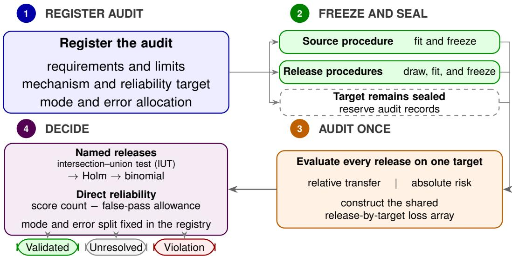
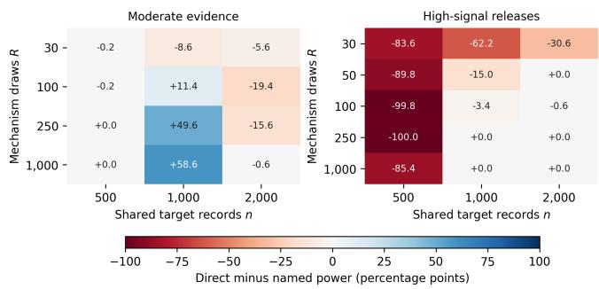
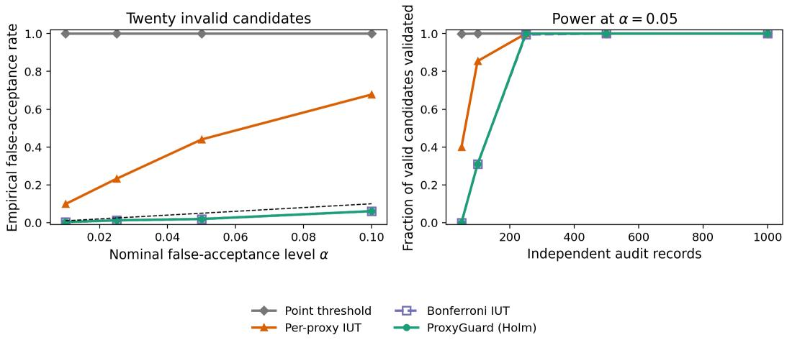
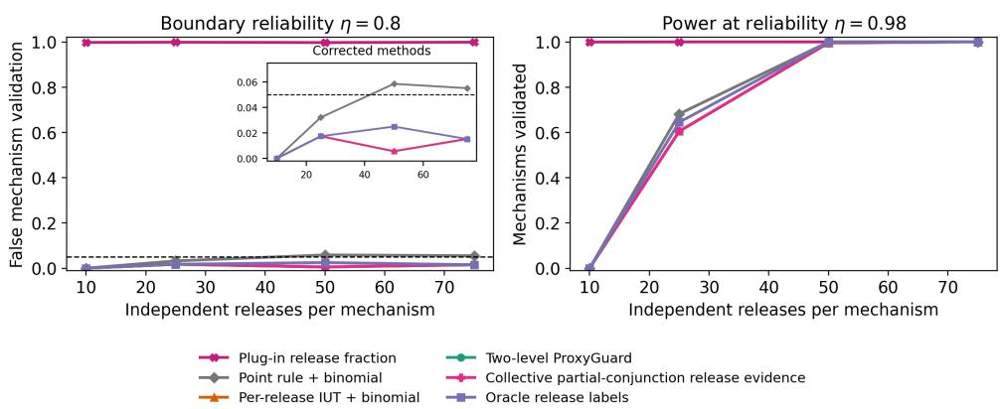
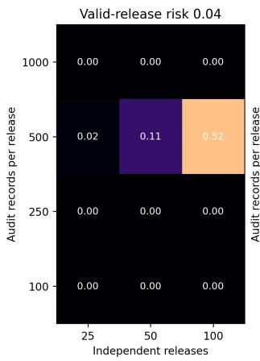
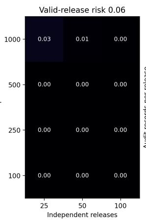
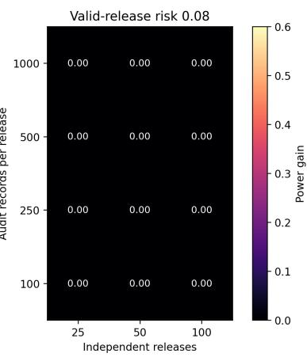
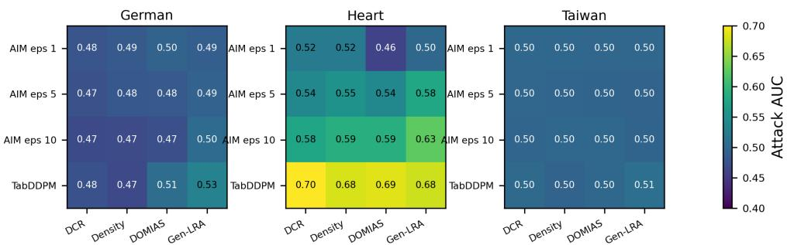
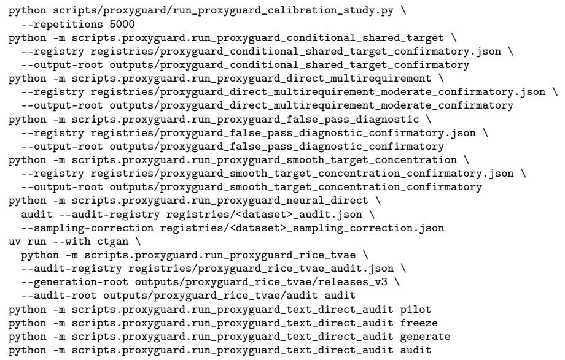

# ProxyGuard: Direct Reliability Inference for Randomized Data Release Mechanisms with Shared Targets

Dipesh Tharu Mahato New York University dm6259@nyu.edu

Pramod Dhungana Queens College pramodkumar.dhungana97@qmail.cuny.edu

## Abstract

Researchers often choose a proxy dataset from many releases, transformations, or seeds. Search can make an invalid release appear adequate, while one adequate release does not establish that its generator is reliable. ProxyGuard controls both errors using prespecified bounded risks and a sealed target set. Named-release mode corrects for multiplicity and certifies specific releases. Direct shared-target mode evaluates independent mechanism draws on a common target, lower-bounds their favorable-score rate, and subtracts a bound on favorable scores contributed by invalid releases. Conditional on the target, release scores are independent, yielding a finite-sample mechanism-reliability guarantee without independent target batches or assumptions on release-level p-value dependence. We show that the meanonly penalty is sharp and derive a smooth-score certificate with additive target concentration. In a registered three-requirement study, direct mode raises power from 5.6% to 64.2% at reliability 0.95, while named mode remains stronger under high-signal evidence. Prospective audits span full-pipeline Rice–TVAE, which retrains on every draw, and a non-tabular text mechanism.

## 1 Introduction

A research group may be unable to share the table used for model development. It may release synthetic data, an older cohort, or a public stand-in instead. The receiving group then needs to know whether a workflow developed on that proxy still supports a specified decision on the target population. Standard synthetic-data evaluations provide useful measurements, but they do not by themselves justify this claim [1, 2].

Two problems arise. An evaluator may screen many generators, privacy settings, transformations, or seeds and retain the release with the most favorable observed results. A point threshold applied after that search can accept an invalid proxy by chance. Even when the selected release is adequate, it may be an atypically favorable draw from an unreliable generator. Evidence about one table does not say how often the frozen mechanism will succeed again.

The downstream specification matters as well. Similar AUC values do not imply similar calibration, decision cost, or inferential behavior [3, 4]. We therefore define proxy validity through losses and limits that researchers fix before opening the target data. A relative requirement compares proxyand source-trained procedures on the same target records. An absolute requirement limits the proxy procedure’s target risk. An audit may require either form or both.

ProxyGuard separates two inferential tasks. Named-release mode tests every registered requirement on a sealed target set and applies Holm correction across releases [5, 6]. It can identify particular releases, but an unresolved release adds no positive evidence to a mechanism claim. Direct sharedtarget mode answers only the mechanism question. It scores independent mechanism draws on the same target records and estimates how often they score favorably. Because a finite target can make an invalid release appear favorable, direct mode subtracts a false-pass allowance. The remainder lower-bounds the probability that a fresh release is truly valid.

Contributions. Our contributions are threefold. First, we formulate mechanism-level reliability when independent randomized releases share one random target. We derive a simultaneous finite-sample lower bound that separates mechanism-draw uncertainty from target-induced falsepass contamination, without independent target batches or assumptions on release-level p-value dependence. Second, we characterize expectation-only contamination control: the mean false-pass bound permits no uniformly smaller target-side correction. We then add bounded-sensitivity structure through registered ramp scores and derive an additive target-concentration certificate. Third, we characterize empirically when direct mechanism inference and named-release certification use evidence differently. Registered simulations identify complementary moderate- and high-signal regimes, while prospective audits show applicability to full-pipeline neural retraining and a non-tabular mechanism. Named-release inference, stratification, planning, and provenance support these contributions rather than add separate novelties. Unlike fixed-configuration risk control, partial-conjunction counting, and fixed-error reliability demonstration, the direct certificate controls a target-random false-pass contribution shared across release evaluations.

At reliability 0.95, direct mode has 64.2% power versus 5.6% for named in the moderate-evidence setting; high-signal evidence reverses the ranking. Prospective audits cover full-pipeline neural retraining, including Rice–TVAE [7, 8], and a frozen 20 Newsgroups text mechanism [9].

Figure 1 summarizes the named-release and direct finite-sample workflows. Development ends before the sealed target audit begins.

  
Figure 1: ProxyGuard workflow. Development ends before the target audit opens. Named-release mode identifies particular releases; direct shared-target mode uses favorable-score frequency after correcting for invalid false passes.

## 2 Related work

Synthetic-data evaluations separate fidelity, downstream utility, and empirical privacy [1, 2]. These measurements can reveal failures, but they do not control the error incurred after searching over candidate releases. Learn-then-Test converts risk requirements into simultaneous tests for predictive configurations [6]. ProxyGuard applies this logic to the learning procedure induced by a proxy, then adds a reliability question over future draws from its release mechanism.

Classical partial-conjunction tests can lower-bound how many releases are valid without identifying them [10]. Tail-Simes needs independence or positive regression dependence on a subset (PRDS), while tail-Fisher needs independence; conditional variants gain power under further assumptions [11].

These methods do not by themselves justify reusing one target sample across all release tests. Our direct result instead conditions on that shared target, infers the mean release score, and controls the invalid-release contribution through a separate target-contamination event. Unlike imperfectinspection models, the false-pass contribution here is target-random and shared across release evaluations rather than a fixed error rate. The named-release mode retains classical binomial reliability inference [12]. The methods differ in their estimands and dependence assumptions. Tail-Simes uses independence or PRDS to lower-bound a count; imperfect-inspection models fix the error model; hierarchical generalized linear mixed models posit a random-effects distribution [13]. Named ProxyGuard identifies releases on a shared random target, whereas direct ProxyGuard gives up their identities for a finite-sample reliability bound. Appendix A reviews connections to reliability demonstration, imperfect inspection, and generator evaluation.

## 3 What it means for a proxy to support a claim

## 3.1 Source, proxy, and target

Let $\mathcal { Q } = \{ Q _ { 1 } , \dots , Q _ { M } \}$ be a finite set of candidate proxies. Candidate $Q$ has a declared source table $P _ { Q }$ and target distribution $T _ { Q }$ . Candidates may share both, as when several synthesizers replace one table, or may belong to different tasks in one correction family. A proxy may be synthetic, transformed, drawn from another site, or taken from another time period.

A learning procedure $S$ covers model fitting, calibration, and decision threshold selection. It produces $f _ { P _ { Q } } ~ = ~ { \cal S } ( P _ { Q } )$ and $f _ { Q } \ = \ S ( Q )$ The procedure may select from a fixed model library using development data. It must finish before researchers inspect target audit outcomes.

Assumption 1 (Independent target audit). Researchers register the audit design before target access and draw an i.i.d. sample from $T _ { Q }$ . The design keeps the complete audit sample independent of proxy construction, model fitting, calibration, threshold selection, and the choice of requirements. Researchers may share audit records across releases and mechanisms.

A holdout used to tune a proxy is development data and cannot also justify the final claim. We introduce fixed-size stratified designs after the core direct result in Section 4.4.

## 3.2 Registered requirements

Let $\mathcal { I }$ index the claims in the audit. A relative-transfer requirement compares proxy and source procedures on the same target record:

$$
D _ { i , Q , j } = \ell _ { j } ( f _ { Q } , Z _ { i , Q } ) - \ell _ { j } ( f _ { P _ { Q } } , Z _ { i , Q } ) , \qquad \Delta _ { Q , j } = \mathbb { E } _ { T _ { Q } } [ D _ { i , Q , j } ] .\tag{1}
$$

This pairing often removes variation that would appear in two test samples. Relative transfer alone does not establish that the proxy procedure is adequate. An absolute-risk requirement instead uses

$$
A _ { i , Q , j } = \ell _ { j } ( f _ { Q } , Z _ { i , Q } ) , \qquad R _ { Q , j } = \mathbb { E } _ { T _ { Q } } [ A _ { i , Q , j } ] .
$$

An application may register either form or both. Write $X _ { i , Q , j }$ for the chosen per-record quantity, $\mu _ { Q , j }$ for its mean, and $\tau _ { j }$ for its limit. Thus $( X , \mu , \tau ) \mathrm { i s } ( D , \tilde { \Delta } , \epsilon )$ for relative transfer and $( { \bar { A } } , R , { \bar { r } } )$ for absolute adequacy. The registry must give known bounds $a _ { j } \le X _ { i , Q , j } \le b _ { j }$ . A loss in [0, 1] gives relative-regret bounds [−1, 1] and absolute-risk bounds [0, 1].

Definition 2 (Claim-valid proxy). Candidate $Q$ is valid for the registered specification when

$$
\mu _ { Q , j } < \tau _ { j } \quad \mathrm { f o r e v e r y } j \in \mathcal { I } .\tag{2}
$$

What ProxyGuard does not claim. ProxyGuard certifies only the registered losses, limits, and target distribution. A relative requirement does not establish absolute adequacy, and an absolute requirement does not establish transfer. Neither result establishes distributional similarity, causal transport, performance in unregistered subgroups, or inferential validity for arbitrary downstream analyses. Researchers must register any additional claim separately and use a statistic suited to that claim.

## 3.3 From one release to a release mechanism

We use proxy for the substitute dataset’s role in the scientific claim and release for one realized draw from a randomized proxy mechanism. Let $G _ { \theta }$ denote a fixed release mechanism, including its generator, privacy setting, preprocessing, and training procedure. For an independent release $Q \sim G _ { \theta }$ , write

$$
A ( Q ) = { \bf 1 } \{ \mu _ { Q , j } < \tau _ { j } \mathrm { ~ f o r ~ e v e r y ~ } j \in \mathcal { I } \} , \qquad \eta _ { \theta } = \operatorname* { P r } _ { Q \sim G _ { \theta } } \{ A ( Q ) = 1 \} .
$$

The claim conditions on the realized source table, registered target, development split, model library, and frozen source procedure. Reliability averages only over randomness registered inside $G _ { \theta } \colon$

<table><tr><td>Registered mechanism choice</td><td>Meaning of the certificate</td></tr><tr><td>dataset sampling only</td><td>conditional on one fitted generator</td></tr><tr><td>generator fitting and sampling</td><td>generator-training and sampling reliability</td></tr><tr><td>fitting, sampling, and proxy learning</td><td>full-pipeline reliability</td></tr><tr><td>fixed generator or learner seed</td><td>conditional on that development choice</td></tr><tr><td>hand-selected favorable seeds</td><td>does not support the mechanism claim</td></tr></table>

Every source of randomness to which the future-release claim should generalize must be redrawn independently inside each mechanism draw; anything fixed is conditioned upon. Independent draws therefore have independent $A ( Q )$ even when they share one target audit.

Definition 3 (Reliable release mechanism). For a registered reliability target $\eta _ { 0 } = 1 - \rho ,$ mechanism $G _ { \theta }$ is reliable when

$$
\eta _ { \theta } > \eta _ { 0 } .
$$

This claim is stronger than validating one table, but does not cover a mechanism retuned after the target audit.

Our audits use Brier loss, clipped normalized log loss, and normalized 5:1 false-negative cost. These lie in [0, 1], so paired regrets lie in [−1, 1]; the cost ratio is a registered sensitivity choice. AUC remains diagnostic, because ranking transport needs a U-statistic bound. Subgroup claims require separate registration and small groups often remain unresolved.

## 4 From target losses to reliability

The two operating modes use different observed summaries of the same latent release validity. Table 1 fixes the terminology used throughout this section. In particular, a favorable direct score is not a release certificate.

<table><tr><td>Object</td><td>Meaning</td><td>Observed?</td><td>Role</td></tr><tr><td>A(Q)</td><td>true validity of release Q</td><td>no</td><td>defines reliability</td></tr><tr><td>pQ</td><td>evidence against release invalidity</td><td>yes</td><td>named-release mode</td></tr><tr><td> $S _ { \theta , ( Q , Z ) } ^ { \mathbf { { \alpha } } }$ </td><td>favorable score on the shared target</td><td>yes</td><td>direct shared-target mode</td></tr><tr><td> $\bar { V _ { \theta } ^ { \mathrm { H o i m } } }$ </td><td>individually recognized releases</td><td>yes</td><td>named mechanism bound</td></tr><tr><td> $\eta _ { \theta }$ </td><td>probability that a fresh release is valid</td><td>no</td><td>mechanism estimand</td></tr></table>

Table 1: Latent and observed objects. “Recognized,” “scores favorably,” and “truly valid” refer to different events.

## 4.1 Decision language

At release level, validated means that the named-release procedure rejects the bad-release null. Violation detected means that a separately corrected lower-bound test places at least one risk above its limit. At mechanism level, the corresponding lower or upper reliability bound must cross $\eta _ { 0 }$ . We call every other result unresolved; failure to validate is not evidence of a violation.

For interpretation, we also report simultaneous requirement bounds, but they do not replace these corrected decisions. This vocabulary separates three questions that point estimates alone can blur: whether the data support validity, whether they support a violation, or whether they support neither.

## 4.2 Testing a named release

For candidate release Q and requirement j, the bad-release null is

$$
H _ { 0 , Q , j } : \mu _ { Q , j } \geq \tau _ { j } .\tag{3}
$$

Let $\bar { X } _ { Q , j }$ and $\widehat { V } _ { Q , j }$ be the sample mean and Bessel-corrected variance on $n = n _ { Q }$ target records. For $n \geq 2$ , the default upper bound is

$$
U _ { Q , j } ( \delta ) = \bar { X } _ { Q , j } + \sqrt { \frac { 2 \widehat { V } _ { Q , j } \log ( 2 / \delta ) } { n } + \frac { 7 ( b _ { j } - a _ { j } ) \log ( 2 / \delta ) } { 3 ( n - 1 ) } } .\tag{4}
$$

This empirical Bernstein bound follows Maurer and Pontil [14]. Its inversion gives

$$
p _ { Q , j } = \operatorname* { i n f } \{ \delta \in ( 0 , 1 ) : U _ { Q , j } ( \delta ) < \tau _ { j } \} ,\tag{5}
$$

with $p _ { Q , j } = 1$ if the set is empty. We also provide a Hoeffding version. Confidence-bound inversion. If nonincreasing $U ( \delta )$ satisfies $\operatorname* { P r } _ { \mu } \{ U ( \boldsymbol { \delta } ) < \mu \} \leq \delta$ , let $p = \operatorname* { i n f } \{ \delta : U ( \delta ) < \tau \}$ , with $p = 1$ if the set is empty. For $t < 1$ and $\varepsilon \in ( 0 , 1 - t ) , p \leq t$ implies $U ( t + \varepsilon ) < \tau \leq \mu , \operatorname { s o } \operatorname { P r } _ { \mu } ( p \leq t ) \leq t + \varepsilon$ Letting $\varepsilon \downarrow 0$ proves super-uniformity; $t = 1$ is immediate. A release is invalid when at least one requirement fails. Validation therefore requires evidence against every component null. The intersection–union test uses

$$
p _ { Q } = \operatorname* { m a x } _ { j \in \mathcal { I } } p _ { Q , j } .\tag{6}
$$

Thus a favorable Brier result cannot compensate for an unresolved cost claim. We then apply Holm’s procedure to the registered release family.

Theorem 4 (False proxy-validation control). Suppose the target sample is independent ofall development and release choices, researchers fix the candidate releases and requirements before the audit opens, and each $p _ { Q , j }$ is super-uniform under Equation (3). $H \widehat { \mathcal { Q } }$ is the set that Holm rejects at level α, then

$$
\operatorname* { P r } \Bigl ( \exists Q \in \widehat { \mathcal { Q } } , \exists j \in \mathcal { I } : \mu _ { Q , j } \geq \tau _ { j } \Bigr ) \leq \alpha .
$$

The result permits arbitrary dependence among requirements and releases.

The proof is in Appendix F. Source and proxy procedures may select different models, calibrators, or thresholds on development data. The theorem conditions on those completed choices and an untouched target sample.

## 4.3 Named-release mechanism inference

Let $\Theta = \{ \theta _ { 1 } , \ldots , \theta _ { H } \}$ be the registered mechanisms. For mechanism θ, draw $R _ { \theta }$ independent releases without target feedback and define

$$
p _ { \theta , r } = \operatorname* { m a x } _ { j \in \mathcal { I } } p _ { Q _ { \theta , r } , j } .\tag{7}
$$

Before target access, choose local levels $\alpha _ { \mathrm { R } , \theta }$ with $\textstyle \sum _ { \theta } \alpha _ { \mathrm { R } , \theta } ~ \leq ~ \alpha _ { \mathrm { R } }$ . Holm testing within each mechanism identifies

$$
V _ { \theta } ^ { \mathrm { H o l m } } = \sum _ { r = 1 } ^ { R _ { \theta } } \mathbf { 1 } \{ \mathrm { H o l m } \mathrm { r e j e c t s } p _ { \theta , r } \mathrm { a t } \alpha _ { \mathrm { R } , \theta } \}\tag{8}
$$

named releases. Equal allocation $\alpha _ { \mathrm { R } } / H$ is the default.

For the bad-mechanism null $H _ { 0 , \theta } ^ { \mathrm { m e c h } } : \eta _ { \theta } \leq \eta _ { 0 }$ , use

$$
p _ { \theta } ^ { \mathrm { m e c h } } = \operatorname* { P r } \{ B _ { \theta } \geq V _ { \theta } ^ { \mathrm { H o l m } } \} , \qquad B _ { \theta } \sim \mathrm { B i n o m i a l } ( R _ { \theta } , \eta _ { 0 } ) ,\tag{9}
$$

followed by Holm correction across mechanisms.

Theorem 5 (False mechanism-validation control). Suppose the target sample is independent of all development and release choices; researchers fix the mechanisms, releases, requirements, and η0 before target access; the component p-values are valid; and releases within each mechanism are independent draws. If the local release levels sum to at most α and the mechanism family uses Holm at $\alpha _ { \mathrm { M } }$ , then

$$
\mathrm { P r } ( \exists \nu a l i d a t e d \theta : \eta _ { \theta } \leq \eta _ { 0 } ) \leq \alpha _ { \mathrm { R } } + \alpha _ { \mathrm { M } } .
$$

The audit may share target records across releases and mechanisms.

The recognized count need not be binomial. Outside the inner error event, $V _ { \theta } ^ { \mathrm { H o l m } }$ is no larger than the latent number of truly valid releases, which makes Equation (9) conservative. Use named-release mode when the audit must identify particular releases.

## 4.4 Direct shared-target mechanism inference

Use direct shared-target mode when the audit needs only the mechanism claim. Its logic has three steps. First, score every independent mechanism draw on the same target. Second, lower-bound the conditional probability of a favorable score. Third, subtract the score contribution that invalid releases can make because the target sample is finite.

Fix slacks $s _ { j } > 0$ before target access and define

$$
S _ { \theta , r } = \prod _ { j \in \mathcal { I } } \mathbf { 1 } \{ \overline { { X } } _ { \theta , r , j } \leq \tau _ { j } - s _ { j } \} , \qquad \overline { { X } } _ { \theta , r , j } = \frac { 1 } { n } \sum _ { i = 1 } ^ { n } X _ { i , \theta , r , j } .\tag{10}
$$

Every release uses the same target records $Z _ { 1 : n }$ . Conditional on those records, the scores are independent Bernoulli observations because the releases are independent draws from $G _ { \theta }$

The direct correction needs a ceiling $\kappa _ { \theta }$ on the worst-case probability that an invalid release crosses every stricter empirical cutoff. Suppose $X _ { j } \in [ a _ { j } , b _ { j } ]$ and $a _ { j } < \tau _ { j } - s _ { j } < \tau _ { j } < b _ { j }$ . Let $d _ { \mathrm { B } }$ be Bernoulli KL divergence. If a release is invalid, at least one true mean is at or above its limit. Hoeffding’s bounded-loss Chernoff inequality [15] then supplies the explicit ceiling

$$
\operatorname* { s u p } _ { Q : A ( Q ) = 0 } \mathbb { E } _ { Z } [ S _ { \theta } ( Q , Z ) ] \leq \kappa _ { \theta } : = \operatorname* { m a x } _ { j } \exp \left[ - n d _ { \mathrm { B } } \left( \frac { \tau _ { j } - s _ { j } - a _ { j } } { b _ { j } - a _ { j } } \bigg | \bigg | \frac { \tau _ { j } - a _ { j } } { b _ { j } - a _ { j } } \right) \right] .\tag{11}
$$

Interpretation. Direct mode observes favorable scores, not valid releases. A favorable score can come from a valid release or from an invalid release that passes by chance on the finite target. The following decomposition separates these two sources. The method lower-bounds total favorable-score mass and subtracts a high-probability upper bound on invalid false-pass mass.

Formally,

$$
\underbrace { \pi _ { \theta } ( Z ) } _ { \mathrm { a l l ~ f a v o r a b l e ~ s c o r e s } } = \mathbb { E } _ { Q } [ A ( Q ) S _ { \theta } ( Q , Z ) \mid Z ] + \underbrace { \beta _ { \theta } ( Z ) } _ { \mathrm { i n v a l i d ~ f a l s e - p a s s ~ m a s s } } \leq \eta _ { \theta } + \beta _ { \theta } ( Z ) ,\tag{12}
$$

where $\beta _ { \theta } ( Z ) = \mathbb { E } _ { Q } [ ( 1 - A ( Q ) ) S _ { \theta } ( Q , Z ) \mid Z ]$ . Equation (11) implies $\mathbb { E } _ { Z } [ \beta _ { \theta } ( Z ) ] \le \kappa _ { \theta }$ , so Markov’s inequality gives $\beta _ { \theta } ( Z ) \le \kappa _ { \theta } / \alpha _ { \mathrm { Z } , \theta }$ outside a target-side event of probability $\alpha _ { \mathrm { { Z } , \theta } }$

Let $\underline { { \pi } } _ { \boldsymbol { \theta } } ^ { \mathrm { C P } }$ be the exact one-sided binomial lower bound on $\pi _ { \theta } ( Z )$ at local level $\alpha _ { \mathrm { Q } , \theta }$ . Rearranging Equation (12) yields

$$
L _ { \theta } ^ { \mathrm { d i r } } = \left[ \underline { { \pi } } _ { \theta } ^ { \mathrm { C P } } - \frac { \kappa _ { \theta } } { \alpha _ { \mathrm { Z } , \theta } } \right] _ { + } .\tag{13}
$$

Thus, Equation (13) is a score-rate lower bound minus a target-side false-pass allowance.

The certificate separates two uncertainty sources. The level $\alpha _ { \mathrm { Q } , \theta }$ controls finite mechanism-draw uncertainty through the binomial lower bound, while $\alpha _ { \mathrm { { Z } , \theta } }$ controls false-pass contamination from the shared finite target through the subtraction term. The theorem allocates these budgets separately and combines their failure probabilities with a union bound.

Theorem 6 (Direct reliability inference with a shared target). Suppose Assumption 1 holds and $Q _ { \theta , 1 } , \ldots , Q _ { \theta , R _ { \theta } } \stackrel { \mathrm { i i d } } { \sim } G _ { \theta }$ within each mechanism. Assume also that the registered losses have known bounds. $I f \sum _ { \theta } \alpha _ { \mathrm { Q } , \theta } \leq \alpha _ { \mathrm { Q } }$ and $\textstyle \sum _ { \theta } \alpha _ { \mathrm { Z } , \theta } \leq \alpha _ { \mathrm { Z } } $ , then

$$
\begin{array} { r } { \operatorname* { P r } \mathopen { } \mathclose \bgroup \left( \eta _ { \theta } \geq L _ { \theta } ^ { \mathrm { d i r } } f o r e \nu e r y \theta \aftergroup \egroup \right) \geq 1 - \alpha _ { \mathrm { Q } } - \alpha _ { \mathrm { Z } } . } \end{array}
$$

The design may share the same target records across all releases and mechanisms. The result does not assume independence or PRDS among release-level p-values.

The proof is in Appendix F.

Why the contamination penalty is necessary. The Markov step may appear conservative, but no smaller dependence on $\alpha _ { \mathrm { { Z } , \theta } }$ follows from the mean constraint alone.

Proposition 7 (Optimality of expectation-only contamination correction). Let $B _ { \kappa }$ contain every random variable $\dot { B } \in [ 0 , \dot { 1 } ]$ with $\begin{array} { r } { \bar { \mathbb { E } } B \leq \kappa . } \end{array}$ For $c \in ( 0 , 1 ]$

$$
\operatorname* { s u p } _ { B \in B _ { \kappa } } \operatorname* { P r } ( B \geq c ) = \operatorname* { m i n } \{ 1 , \kappa / c \} .
$$

Consequently, a uniform $( 1 - \alpha )$ ceiling based only on $\mathbb { E } B \le \kappa$ cannot be smaller than min $\{ 1 , \kappa / \alpha \}$ apart from the convention at equality.

For $c \leq \kappa ,$ , the constant variable $B = c$ attains probability one. For $c > \kappa ,$ , placing mass $\kappa / c$ at c and the remaining mass at zero attains equality. The proof is in Appendix F. Direct mode is informative only when the registered score and target size make its contamination allowance small.

Smooth structured certificate. A registered ramp score supplies structure absent from the meanonly result. With invalid-release mean ceiling $\kappa _ { h }$ , per-record target sensitivity $\rho _ { h }$ , and conditionalmean lower bound $\underline { { \pi } } _ { h }$ , Theorem 12 gives

$$
\boxed { L ^ { \mathrm { s m o o t h } } = \left[ \underline { { \pi } } _ { h } - \operatorname* { m i n } \biggl \{ 1 , \kappa _ { h } + \rho _ { h } \sqrt { \frac { n } { 2 } \log \frac { 1 } { \alpha _ { \mathrm { Z } } } } \biggr \} \right] _ { + } . }\tag{14}
$$

Bounded sensitivity thus replaces the multiplicative Markov allowance by an additive radius; $\mathsf { A p - }$   
pendix D gives the construction and proof, and Appendix L.5 gives its confirmation.

Registered stratified targets. For fixed stratum sizes and registered weights, Proposition 11 validates both modes, including without-replacement sampling. A balanced reserve targets an equal-class mixture unless registered weights restore another prevalence; details are in Appendix C.

## 4.5 Evidence of unreliability

The direct certificate in Section 4.4 is a one-sided lower reliability bound. To establish that a mechanism is unreliable, we instead use corrected named-release violation tests. The oppositedirection null is $H _ { 0 , Q , j } ^ { \mathrm { v i o l } } : \mu _ { Q , j } \leq \tau _ { j }$ . Reflecting the empirical Bernstein bound gives

$$
L _ { Q , j } ( \delta ) = \bar { X } _ { Q , j } - \sqrt { \frac { 2 \hat { V } _ { Q , j } \log ( 2 / \delta ) } { n } - \frac { 7 ( b _ { j } - a _ { j } ) \log ( 2 / \delta ) } { 3 ( n - 1 ) } } , \qquad q _ { Q , j } = \operatorname * { i n f } \{ \delta : L _ { Q , j } ( \delta ) > \tau _ { j } \} .
$$

Apply Holm at $\beta _ { \mathrm { R } }$ to the registered release–requirement family. Let $W _ { \theta }$ count releases with at least one detected violation. Outside the inner error event, $R _ { \theta } - \dot { W _ { \theta } }$ upper-bounds the latent number of valid releases. The mechanism value is

$$
\begin{array} { r } { p _ { \theta } ^ { \mathrm { v i o l } } = \operatorname* { P r } \{ B _ { \theta } \leq R _ { \theta } - W _ { \theta } \} , \qquad B _ { \theta } \sim \mathrm { B i n o m i a l } ( R _ { \theta } , \eta _ { 0 } ) , } \end{array}
$$

followed by Holm at $\beta _ { \mathrm { M } }$

Theorem 8 (False mechanism-violation control). Suppose the target and release conditions of Theorem 5 hold and each $q _ { Q , j }$ is super-uniform under its violation null. Then

$$
\mathrm { P r } ( \exists m e c h a n i s m ~ d e c l a r e d ~ u n r e l i a b l e ~ \theta : \eta _ { \theta } \geq \eta _ { 0 } ) \leq \beta _ { \mathrm { R } } + \beta _ { \mathrm { M } } .
$$

Lower and upper reliability bounds use separate directional budgets. If each direction has total error 0.05, displaying them together gives at least 90% joint coverage by a union bound, not a conventional 95% two-sided interval.

## 4.6 Planning and registered mode choice

Before target access, researchers fix each family budget and its local allocations. Table 4 in $\mathbf { A p } \mathbf { \cdot }$ pendix D maps the budgets to their error events.

Mode-separation consequence. Named identification pays a log R target-sample term; direct target-side terms do not   
grow with R (Theorem 15). Use named mode for release identities or strong per-release evidence, and direct mode for   
aggregate mechanism evidence. Direct is infeasible if contamination exhausts $1 - \eta _ { 0 }$ ; expensive draws favor named   
mode or an unresolved decision.

Researchers choose the mode before target access. Proposition 16 permits a preregistered hybrid with split budgets; an uncorrected maximum would use target outcomes to choose the mode and invalidate the guarantee. The registry likewise fixes hard versus smooth scoring and all $h _ { j } ;$ post-target maximization requires a preregistered simultaneous allocation, or the stated coverage need not hold.

Both modes report one-sided, not two-sided, reliability bounds. Appendix I covers planning, candidate streams, and exposure claims; Appendix G gives a sufficient audit-size bound.

## 5 Experiments

We froze each registry before its confirmatory run. Appendices L, M, and Y record the study map, claim status, hashes, and commands. Unless stated otherwise, total error is 0.05. We select learners and thresholds on development data and hold them fixed for the target audit.

## 5.1 False validation after search

Candidate search. Across 5,000 trials in the 20-candidate, three-requirement study, point thresholds validate an invalid candidate every time; separate tests give 44.0% familywise false validation, and Holm gives 1.94%. Selecting the smallest-p candidate and reusing its target gives 43.46%, compared with 3.08% on a sealed target (Appendix J).

Mechanism calibration. At $R = 5 0$ , audit size 500, and $\eta _ { 0 } = 0 . 8 ,$ the observed passing fraction falsely validates 99.70% of boundary mechanisms. An outer binomial test gives 5.9%; named inference gives 0.56% and 99.57% power at reliability 0.98. Figure 4 and the rare-group study appear in Appendices L and K.

## 5.2 Direct shared-target versus named-release mode

The primary comparison uses three correlated bounded requirements, continuous margins, and one target fluctuation shared by every release. Moderate evidence makes Holm rarely certify an individual release, so direct mode can benefit; the high-signal design lowers variance and makes named evidence decisive.

We tuned both modes on the same $R = n = 1 \small { , } 0 0 0$ pilot with registered grids and the same meanpower objective, then froze them before a new-seed confirmation. Appendix L gives the grids and deterministic tie rule.

<table><tr><td>Method</td><td> $\eta = 0 . 8 0$ </td><td> $\eta = 0 . 9 0$ </td><td> $\eta = 0 . 9 5$ </td></tr><tr><td>Named-release Holm</td><td>0.2</td><td>4.2</td><td>5.6</td></tr><tr><td>Direct shared-target</td><td>0.0</td><td>56.4</td><td>64.2</td></tr><tr><td>Preregistered hybrid</td><td>0.0</td><td>2.4</td><td>57.2</td></tr></table>

Table 2: Validation rates (%) over 500 confirmatory repetitions with ${ \overline { { R = n } } } = 1$ ,000 and $\eta _ { 0 } = 0 . 8$ The boundary column measures false validation; the other columns measure power.

Table 2 shows that direct mode raises power from 4.2% to 56.4% at reliability 0.90 and from 5.6% to 64.2% at 0.95. No direct false validation occurs in 500 boundary trials (one-sided 95% Monte Carlo upper bound 0.60%).

A boundary diagnostic shows why direct mode must subtract the term in Equation (13): omitting it gives 8.05% false validation, while the corrected certificate always abstains (Appendix L.4). In a separate one-requirement, high-reliability stress test, smooth concentration has 86.45% power at $\eta = 0 . 9 9$ versus zero for both Markov certificates, with 0/2,000 boundary errors; all three remain unresolved at $\eta = 0 . 9 5$ (Appendix L.5).

  
Figure 2: Direct minus named power at reliability 0.95 after we planned both methods on the same pilot. Positive cells favor direct shared-target mode; negative cells favor named-release mode.

Figure 2 shows a 49.6-point gain at $R = 2 5 0 , n = 1 , 0 0 0$ , vacuity at $n = 5 0 0$ , and nine ties versus 36 losses in the high-signal design. Planning details are in Appendix L.

## 5.3 Sealed mechanism studies

Each lightweight-neural draw refits the generator and proxy classifier. Fixed balanced reserves target an equal class mixture under Proposition 11, not natural-prevalence risk. The corrected Covertype moderate bounds are 0.948 named and 0.885 direct; Online Shoppers remains unresolved [16, 17]. These corrections establish sampling validity, not direct-mode superiority.

<table><tr><td>Dataset</td><td>High fidelity</td><td>Moderate evidence</td><td>Degraded</td></tr><tr><td>CDC</td><td>both validate (.938/.917)</td><td>both validate (.948/.931)</td><td>violation (U = .280)</td></tr><tr><td>Covertype</td><td>both validate (.938/.910)</td><td>both validate (.948/.885)</td><td>violation (U = .062)</td></tr><tr><td>Online Shoppers</td><td>unresolved (.449/.363)</td><td>unresolved (.002/.017)</td><td>violation (U = .703)</td></tr></table>

Table 3: All nine corrected lightweight-neural configurations. Parentheses give named/direct lower bounds; U is the violation-side upper bound.

As summarized in Table 3, prospective audits cover full-pipeline Rice–TVAE and a frozen 20 Newsgroups unigram [7–9]. Text high and moderate validate under both modes (named/direct: 0.981/0.974 and 0.991/0.987); degraded is unresolved (0.157/0.070). The mechanism is not a modern language model, and no real audit yields a direct-only decision (Appendices N–X).

## 6 Limits of the claim

ProxyGuard guarantees one registered specification on an independent target; it does not cover unregistered subgroups, nor does relative transfer imply absolute adequacy. Balanced claims concern equal class mixtures absent prevalence-restoring weights. Decisions depend on registered limits, slacks, reliability target, and error split; we do not test every policy.

The mean-only subtraction can be vacuous but is uniformly sharp (Proposition 7); direct mode also trades target labels for mechanism draws (Appendix I). Smooth concentration is not uniformly tighter: its positive confirmation is one-requirement and high-reliability, whereas its multi-requirement allowance is vacuous in the text audit. Ramp selection and sharper sensitivity bounds remain open. The text mechanism is a simple unigram, three neural analyses are corrective, and no real audit yields a direct-only decision.

## 7 Conclusion

ProxyGuard separates release and mechanism certification. Named mode preserves identities; direct mode subtracts a high-probability upper bound on invalid releases’ favorable-score mass. Under the registered losses, target, and frozen mechanism law, it lower-bounds a future independent release’s validity probability.

## References

[1] Ahmed Alaa, Boris van Breugel, Evgeny S. Saveliev, and Mihaela van der Schaar. How faithful is your synthetic data? sample-level metrics for evaluating and auditing generative models. In Proceedings of the 39th International Conference on Machine Learning, volume 162 of Proceedings of Machine Learning Research, pages 290–306. PMLR, 2022. URL https://proceedings.mlr.press/v162/alaa22a.html.

[2] Anton Danholt Lautrup, Tobias Hyrup, Arthur Zimek, and Peter Schneider-Kamp. SynthEval: A framework for detailed utility and privacy evaluation of tabular synthetic data. Data Mining and Knowledge Discovery, 39(1):6, 2025. doi: 10.1007/s10618-024-01081-4. URL https: //link.springer.com/article/10.1007/s10618-024-01081-4.

[3] Boris van Breugel, Zhaozhi Qian, and Mihaela van der Schaar. Synthetic data, real errors: How (not) to publish and use synthetic data. In Proceedings of the 40th International Conference on Machine Learning, volume 202 of Proceedings of Machine Learning Research, pages 34793– 34808. PMLR, 2023. URL https://proceedings.mlr.press/v202/van-breugel23a. html.

[4] Alexander Decruyenaere, Heidelinde Dehaene, Paloma Rabaey, Christiaan Polet, Johan Decruyenaere, Stijn Vansteelandt, and Thomas Demeester. The real deal behind the artificial appeal: Inferential utility of tabular synthetic data. In Proceedings ofthe Fortieth Conference on Uncertainty in Artificial Intelligence, volume 244 of Proceedings of Machine Learning Research, pages 966–996. PMLR, 2024. URL https://proceedings.mlr.press/v244 decruyenaere24a.html.

[5] Sture Holm. A simple sequentially rejective multiple test procedure. Scandinavian Journal of Statistics, 6(2):65–70, 1979. URL https://www.jstor.org/stable/4615733.

[6] Anastasios N. Angelopoulos, Stephen Bates, Emmanuel J. Candès, Michael I. Jordan, and Lihua Lei. Learn then test: Calibrating predictive algorithms to achieve risk control. arXiv preprint arXiv:2110.01052, 2021. URL https://arxiv.org/abs/2110.01052.

[7] Ilkay Cinar and Murat Koklu. Rice (Cammeo and Osmancik). UCI Machine Learning Repository, 2019. URL https://archive.ics.uci.edu/dataset/545/rice+cammeo+ and+osmancik.

[8] Lei Xu, Maria Skoularidou, Alfredo Cuesta-Infante, and Kalyan Veeramachaneni. Modeling tabular data using conditional GAN. arXiv preprint arXiv:1907.00503, 2019. URL https: //arxiv.org/abs/1907.00503.

[9] Ken Lang. Newsweeder: Learning to filter netnews. In Proceedings ofthe Twelfth International Conference on Machine Learning, pages 331–339, 1995. doi: 10.1016/B978-1-55860-377-6. 50048-7. URL https://doi.org/10.1016/B978-1-55860-377-6.50048-7.

[10] Yoav Benjamini and Ruth Heller. Screening for partial conjunction hypotheses. Biometrics, 64 (4):1215–1222, 2008. doi: 10.1111/j.1541-0420.2007.00984.x. URL https://doi.org/10. 1111/j.1541-0420.2007.00984.x.

[11] Biyonka Liang, Lu Zhang, and Lucas Janson. Powerful partial conjunction hypothesis testing via conditioning. Biometrika, 112(4):asaf036, 2025. doi: 10.1093/biomet/asaf036. URL https://academic.oup.com/biomet/article/112/4/asaf036/8139907.

[12] C. J. Clopper and Egon S. Pearson. The use of confidence or fiducial limits illustrated in the case of the binomial. Biometrika, 26(4):404–413, 1934. doi: 10.1093/biomet/26.4.404. URL https://academic.oup.com/biomet/article/26/4/404/291538.

[13] Norman E. Breslow and David G. Clayton. Approximate inference in generalized linear mixed models. Journal ofthe American Statistical Association, 88(421):9–25, 1993. doi: 10.1080/ 01621459.1993.10594284. URL https://doi.org/10.1080/01621459.1993.10594284.

[14] Andreas Maurer and Massimiliano Pontil. Empirical bernstein bounds and sample variance penalization. In Proceedings of the 22nd Annual Conference on Learning Theory, pages 115–124, 2009. URL https://www.learningtheory.org/colt2009/papers/012.pdf.

[15] Wassily Hoeffding. Probability inequalities for sums of bounded random variables. Journal ofthe American Statistical Association, 58(301):13–30, 1963. doi: 10.1080/01621459.1963. 10500830. URL https://www.tandfonline.com/doi/abs/10.1080/01621459.1963. 10500830.

[16] Jock Blackard. Covertype, 1998. URL https://archive.ics.uci.edu/dataset/31/ covertype.

[17] C. Sakar and Yomi Kastro. Online shoppers purchasing intention dataset, 2018. URL https://archive.ics.uci.edu/dataset/468/online+shoppers+purchasing+ intention+dataset.

[18] Helena Löfström, Lars Carlsson, and Ernst Ahlberg. Testing exchangeability between real and synthetic data. In Proceedings of the Thirteenth Symposium on Conformal and Probabilistic Prediction with Applications, volume 230 of Proceedings ofMachine Learning Research, pages 424– 431. PMLR, 2024. URL https://proceedings.mlr.press/v230/lofstrom24b.html.

[19] Matteo Zecchin, Sangwoo Park, and Osvaldo Simeone. Adaptive learn-then-test: Statistically valid and efficient hyperparameter selection. In Proceedings of the 42nd International Conference on Machine Learning, volume 267 of Proceedings of Machine Learning Research, pages 74018–74036. PMLR, 2025. URL https://proceedings.mlr.press/v267/zecchin25a. html.

[20] Kailash C. Kapur. Optimal reliability demonstration for binomial testing situation. Reliability Engineering, 19(2):103–111, 1987. doi: 10.1016/0143-8174(87)90105-3. URL https://www. sciencedirect.com/science/article/pii/0143817487901053.

[21] Edward P. Markowski and Carol A. Markowski. Improved attribute acceptance sampling plans in the presence of misclassification error. European Journal ofOperational Research, 139(3): 501–510, 2002. doi: 10.1016/S0377-2217(01)00198-9. URL https://www.sciencedirect. com/science/article/pii/S0377221701001989.

[22] Ryan McKenna, Brett Mullins, Daniel Sheldon, and Gerome Miklau. AIM: An adaptive and iterative mechanism for differentially private synthetic data. Proceedings of the VLDB Endowment, 15(11):2599–2612, 2022. doi: 10.14778/3551793.3551817. URL https://www. vldb.org/pvldb/vol15/p2599-mckenna.pdf.

[23] Akim Kotelnikov, Dmitry Baranchuk, Ivan Rubachev, and Artem Babenko. TabDDPM: Modelling tabular data with diffusion models. In Proceedings ofthe 40th International Conference on Machine Learning, volume 202 of Proceedings of Machine Learning Research, pages 17564– 17579. PMLR, 2023. URL https://proceedings.mlr.press/v202/kotelnikov23a. html.

[24] Hengrui Zhang, Jiani Zhang, Zhengyuan Shen, Balasubramaniam Srinivasan, Xiao Qin, Christos Faloutsos, Huzefa Rangwala, and George Karypis. Mixed-type tabular data synthesis with score-based diffusion in latent space. In International Conference on Learning Representations, 2024. URL https://openreview.net/forum?id=4Ay23yeuz0.

[25] Cynthia Dwork, Frank McSherry, Kobbi Nissim, and Adam Smith. Calibrating noise to sensitivity in private data analysis. In Theory of Cryptography, pages 265–284. Springer, 2006. doi: 10.1007/11681878\_14. URL https://link.springer.com/chapter/10. 1007/11681878\_14.

[26] Boris van Breugel, Hao Sun, Zhaozhi Qian, and Mihaela van der Schaar. Membership inference attacks against synthetic data through overfitting detection. In Proceedings of the 26th International Conference on Artificial Intelligence and Statistics, volume 206 of Proceedings of Machine Learning Research, pages 3493–3514. PMLR, 2023. URL https: //proceedings.mlr.press/v206/breugel23a.html.

[27] Joshua Ward, Chi-Hua Wang, and Guang Cheng. Privacy auditing synthetic data release through local likelihood attacks. arXiv preprint arXiv:2508.21146, 2025. URL https://arxiv.org/ abs/2508.21146.

[28] Eyal German, Daniel Samira, Yuval Elovici, and Asaf Shabtai. MIA-EPT: Membership inference attack via error prediction for tabular data. arXiv preprint arXiv:2509.13046, 2025. URL https://arxiv.org/abs/2509.13046.

[29] Colin McDiarmid. On the method of bounded differences. In J. Siemons, editor, Surveys in Combinatorics, 1989, volume 141 of London Mathematical Society Lecture Note Series, pages 148–188. Cambridge University Press, 1989. doi: 10.1017/CBO9781107359949.008. URL https://doi.org/10.1017/CBO9781107359949.008.

[30] R. Bock. MAGIC gamma telescope. UCI Machine Learning Repository, 2004. URL https: //archive.ics.uci.edu/dataset/159/magic+gamma+telescope.

[31] Mark Hopkins, Erik Reeber, George Forman, and Jaap Suermondt. Spambase. UCI Machine Learning Repository, 1999. URL https://archive.ics.uci.edu/dataset/94/ spambase.

[32] UCI Machine Learning Repository. Cdc diabetes health indicators, 2017. URL https: //archive.ics.uci.edu/dataset/891/cdc+diabetes+health+indicators.

[33] Dennis Wagner, D. Heider, and Georges Hattab. Secondary mushroom. UCI Machine Learning Repository, 2021. URL https://archive.ics.uci.edu/dataset/848/secondary+ mushroom+dataset.

[34] Sergio Moro, Paulo Rita, and Paulo Cortez. Bank marketing. UCI Machine Learning Repository, 2014. URL https://archive.ics.uci.edu/dataset/222/bank+marketing.

[35] Andras Janosi, William Steinbrunn, Matthias Pfisterer, and Robert Detrano. Heart disease. UCI Machine Learning Repository, 1989. URL https://archive.ics.uci.edu/dataset/45/ heart+disease.

[36] Barry Becker and Ronny Kohavi. Adult. UCI Machine Learning Repository, 1996. URL https://archive.ics.uci.edu/dataset/2/adult.

[37] Fabian Pedregosa, Gael Varoquaux, Alexandre Gramfort, Vincent Michel, Bertrand Thirion, Olivier Grisel, Mathieu Blondel, Peter Prettenhofer, Ron Weiss, Vincent Dubourg, Jake Vander plas, Alexandre Passos, David Cournapeau, Matthieu Brucher, Matthieu Perrot, and Edouard Duchesnay. Scikit-learn: Machine learning in python. Journal of Machine Learning Research, 12:2825–2830, 2011. URL https://jmlr.org/papers/v12/pedregosa11a.html.

[38] Hans Hofmann. Statlog (German Credit Data), 1994. URL https://archive.ics.uci. edu/dataset/144/statlog+german+credit+data.

[39] I-Cheng Yeh. Default of credit card clients, 2009. URL https://archive.ics.uci.edu/ dataset/350/default+of+credit+card+clients.

[40] Robert J. Serfling. Probability inequalities for the sum in sampling without replacement. The Annals of Statistics, 2(1):39–48, 1974. doi: 10.1214/aos/1176342611. URL https: //doi.org/10.1214/aos/1176342611.

[41] Markelle Kelly, Rachel Longjohn, and Kolby Nottingham. The UCI machine learning repository, 2023. URL https://archive.ics.uci.edu/.

[42] Kaggle. Give me some credit, 2011. URL https://www.kaggle.com/c/ GiveMeSomeCredit.

[43] Jeff Larson, Surya Mattu, Lauren Kirchner, and Julia Angwin. How we analyzed the COMPAS recidivism algorithm, 2016. URL https://www.propublica.org/article/ how-we-analyzed-the-compas-recidivism-algorithm.

## A Extended related work

The appendix follows the audit from theory to evidence. Appendices A–F develop related work, alternative certificates, and proofs; Appendices G– L cover sample size, planning, calibration, and mechanism simulations. Appendices M– S report claim status and the real-data audits, while Appendices T–Y document learning procedures, generators, attacks, transformation screening, and reproducibility. Readers can follow this order or jump to a cited appendix. Principal alternatives appear in Appendix B, Appendix E, and Appendix H.

Evaluation and risk control. Synthetic tables can preserve common prediction metrics while distorting minority regions or statistical inference [3, 4]. Exchangeability tests ask a broader distributional question [18]; our claims concern only the registered losses. Learn-then-Test and its adaptive variants provide the closest risk-control foundation [6, 19]. Empirical Bernstein bounds and Holm’s procedure supply our inner tests [5, 14].

Partial conjunction and reliability. A partial-conjunction test asks whether at least k hypotheses in a family are false [10]. This matches a mechanism audit that needs a valid-release count but not release identities. Tail-Simes and tail-Fisher can be conservative in moderate-signal settings; conditional tests trade stronger assumptions for power [11]. Binomial reliability demonstration and acceptance sampling ask whether repeated units meet a reliability target [20, 21]. These models typically treat inspection error as a fixed property of a unit-level test. Hierarchical generalized linear mixed models instead introduce a specified random-effects distribution for model-based inference [13]; they do not supply the simultaneous finite-sample shared-target certificate under our boundedloss and registered-sampling assumptions. Here, release validity is latent and every inspection reuses one random target sample. Target reuse couples false-pass errors across releases, and their conditional rate is unknown. The direct certificate conditions on the shared target to recover independence over mechanism draws, then controls the random false-pass contribution on a separate target-side event. This two-axis construction is the part not supplied by classical reliability demonstration.

Generators and attacks. AIM is a workload-adaptive differentially private mechanism [22]; TabDDPM and TabSyn are learned tabular generators [23, 24]. Differential privacy is a mechanism guarantee [25], whereas DOMIAS, Gen-LRA, and MIA-EPT measure specific empirical attacks [26–28]. A bound for a fixed attack suite remains conditional on that suite.

## B Independent-batch partial conjunction

Partial conjunction is a secondary mechanism-only mode when release-level p-values are independent or satisfy a justified PRDS condition. It does not justify dependence created by reusing one target sample. Sort the release values as $p _ { \theta , ( 1 ) } \leq \cdot \cdot \cdot \leq p _ { \theta , ( R _ { \theta } ) }$ and define

$$
\widehat { p } _ { \theta , k } ^ { \mathrm { P C } } = \operatorname* { m i n } \biggl ( \operatorname* { m i n } _ { j = k } ^ { R _ { \theta } } \frac { R _ { \theta } - k + 1 } { j - k + 1 } p _ { \theta , ( j ) } , 1 \biggr ) , \qquad \widehat { p } _ { \theta , k } ^ { \mathrm { P C } } = \operatorname* { m a x } _ { \ell \leq k } \widehat { p } _ { \theta , \ell } ^ { \mathrm { P C } } .\tag{15}
$$

The tail-Simes value tests $H _ { \theta , k } : K _ { \theta } < k$ , where $\begin{array} { r } { K _ { \theta } = \sum _ { r } A ( Q _ { \theta , r } ) } \end{array}$ . The simultaneous lower count is

$$
\begin{array} { r } { \widehat { K } _ { \theta } ^ { \mathrm { L B } } = \operatorname* { m a x } \left\{ k : \tilde { p } _ { \theta , k } ^ { \mathrm { P C } } \leq \alpha _ { \mathrm { R } , \theta } \right\} . } \end{array}\tag{16}
$$

Replacing $V _ { \theta } ^ { \mathrm { H o l m } }$ by this count in Equation (9) gives $p _ { \theta } ^ { \mathrm { m e c h , c o l l } }$

Theorem 9 (Independent-batch collective validation). Under the assumptions ofTheorem 5, condition on the sampled releases andfixed development choices. Suppose the true-null release p-values are conditionally super-uniform and independent or PRDS within each mechanism. Ifthe local levels sum to at most αR, then Holm across mechanisms at αM gives

$$
\mathrm { P r } ( \exists \nu a l i d a t e d \theta : \eta _ { \theta } \leq \eta _ { 0 } ) \leq \alpha _ { \mathrm { R } } + \alpha _ { \mathrm { M } } .
$$

Proposition 10 (Collective-count dominance). At the same local level, $\widehat { K } _ { \theta } ^ { \mathrm { L B } } \geq V _ { \theta } ^ { \mathrm { H o l m } }$ for every mechanism in every run.

## C Stratified target designs

For fixed stratum sizes $n _ { g }$ and registered target weights $w _ { g }$ , use $\begin{array} { r } { \overline { { X } } _ { \theta , r , j } = \sum _ { g } w _ { g } \overline { { X } } _ { \theta , r , j , g } } \end{array}$ . The invalid-release ceiling becomes

$$
\kappa _ { \theta } ^ { \mathrm { s t r a t } } = \operatorname* { m a x } _ { j } \exp \left\{ - \frac { 2 s _ { j } ^ { 2 } } { ( b _ { j } - a _ { j } ) ^ { 2 } \sum _ { g } w _ { g } ^ { 2 } / n _ { g } } \right\} .\tag{17}
$$

When $w _ { g } / n _ { g }$ is constant across strata, the sharper Bernoulli–KL ceiling in Equation (11) remains valid with $n = \textstyle \sum _ { g } n _ { g }$

Proposition 11 (Stratified shared-target extension). Under a registered fixed-size stratified design, the target sample remains independent ofall development and release choices. Each stratum supplies either i.i.d. records or a simple random sample without replacement. Weighted Hoeffding inversion gives valid named-release component p-values. Replacing the empirical means and κθ by their weightedforms in Equation (17) preserves the simultaneous conclusion ofTheorem 6.

## D Continuous shared-target scores

The audit may replace the hard factor in Equation (10) with a registered score in $[ 0 , 1 ]$ . Let $c _ { j } = \tau _ { j } - s _ { j }$ and fix $0 < h _ { j } \leq c _ { j } - a _ { j }$ . Define

$$
\phi _ { j , h } ( x ) = \left\{ \begin{array} { l l } { 1 , } & { x \leq c _ { j } - h _ { j } , } \\ { ( c _ { j } - x ) / h _ { j } , } & { c _ { j } - h _ { j } < x < c _ { j } , } \\ { 0 , } & { x \geq c _ { j } , } \end{array} \right. \qquad S _ { h } ( Q , Z ) = \prod _ { j } \phi _ { j , h } ( \overline { { X } } _ { Q , j } ) .
$$

Conditional release scores are bounded rather than Bernoulli, so a Bernoulli–KL inversion lowerbounds their conditional mean. The ramp also supplies target-side structure that the hard score lacks.

Write $B _ { j } = b _ { j } - a _ { j } , u _ { j } ( t ) = ( t - a _ { j } ) / B _ { j } , \mathrm { a n d } v _ { j } = ( \tau _ { j } - a _ { j } ) / B _ { j }$ . Set

$$
\kappa _ { h } = \operatorname* { m a x } _ { j } \frac { 1 } { h _ { j } } \int _ { c _ { j } - h _ { j } } ^ { c _ { j } } \exp \{ - n d _ { \mathrm { B } } ( u _ { j } ( t ) \| v _ { j } ) \} d t ,\tag{18}
$$

$$
\rho _ { h } = \operatorname* { m i n } \left\{ 1 , \frac { 1 } { n } \sum _ { j } \frac { B _ { j } } { h _ { j } } \right\} , \qquad r _ { h } ( \alpha _ { \mathrm { Z } } ) = \rho _ { h } \sqrt { \frac { n } { 2 } \log \frac { 1 } { \alpha _ { \mathrm { Z } } } } .\tag{19}
$$

Theorem 12 (Smooth shared-target concentration). Suppose the target records are iid and jointly independent ofthe iid mechanism draws. Let $\underline { { \pi } } _ { h }$ be a one-sided $( 1 - \alpha _ { \mathrm { Q } } )$ lower confidence bound for the conditional mean of $S _ { h }$ . Then

$$
{ \cal L } ^ { \mathrm { s m o o t h } } = \left[ \underline { { { \pi } } } _ { h } - \operatorname* { m i n } \{ 1 , \kappa _ { h } + r _ { h } ( \alpha _ { \mathrm { Z } } ) \} \right] _ { + }
$$

satisfies $\operatorname* { P r } \{ \eta \geq L ^ { \mathrm { s m o o t h } } \} \geq 1 - \alpha _ { \mathrm { Q } } - \alpha _ { \mathrm { Z } } .$ . The statement holds simultaneously across mechanisms when their local error levels sum to the declared family budgets.

Proof. For any x, the ramp identity $\begin{array} { r } { \phi _ { j , h } ( x ) \ : = \ : h _ { j } ^ { - 1 } \int _ { c _ { i } - h _ { i } } ^ { c _ { j } } \mathbf { 1 } \{ x \le t \} } \end{array}$ dt and the bounded-loss Chernoff inequality give Equation (18) for an invalid release. Replacing one target record changes $S _ { h }$ by at most $\rho _ { h } .$ , uniformly over releases. The same bound applies after averaging over invalid mechanism draws. McDiarmid’s inequality [29] therefore bounds their target-conditional score mass by $\kappa _ { h } + r _ { h }$ . Combining that event with the conditional bounded-mean lower bound proves the theorem. The expectation-only Markov allowance for the same ramp is min $\{ 1 , \kappa _ { h } / \alpha _ { \mathrm { { Z } } } \}$ ; smooth concentration is strictly tighter whenever $r _ { h } < \kappa _ { h } ( 1 / \alpha _ { \mathrm { Z } } - 1 )$ □

The artifact evaluates Equation (18) with a conservative right Riemann sum.

Ramp-width selection. The widths $h _ { j }$ are development-time design parameters. An auditor may compare a finite grid using only development or pilot estimates of the conditional score rate, $\kappa _ { h }$ and $\rho _ { h }$ , then freeze one configuration before target access. Wider ramps reduce worst-case target sensitivity but may lower favorable-score rates; narrower ramps approach the hard score but can produce a large concentration allowance. We do not claim an optimal ramp-selection rule.

Table 4 summarizes the distinct directional error events.
<table><tr><td>Mode or direction</td><td>Budget</td><td>Error event controlled</td></tr><tr><td>Named lower bound</td><td>αR</td><td>false recognition among named releases</td></tr><tr><td>Named lower bound</td><td>αM</td><td>false validation among mechanisms</td></tr><tr><td>Direct lower bound</td><td>αQ</td><td>conditional score-probability coverage</td></tr><tr><td>Direct lower bound</td><td>αz</td><td>shared-target false-pass contamination</td></tr><tr><td>Violation upper bound</td><td>βR</td><td>false release-level violation</td></tr><tr><td>Violation upper bound</td><td>βM</td><td>false mechanism-level violation</td></tr><tr><td>Registered hybrid</td><td>αN,αD</td><td>named and direct component coverage</td></tr></table>

Table 4: Error budgets and the events they control.

## E A two-axis block certificate

The expectation-only lower bound in Proposition 7 is sharp. One way to obtain more structure is to freeze a random partition of the target into $B = \lfloor n / m \rfloor$ disjoint blocks of size m. Let $W _ { r b } \in [ 0 , 1 ]$ be the registered hard or ramped score of release r on block $b ,$ and let $\begin{array} { r } { \overline { { W } } = ( R B ) ^ { - 1 } \sum _ { r , b } W _ { r b } } \end{array}$ . Define $\kappa _ { m }$ as in Equation (11), with m in place of $n ,$ , and

$$
r _ { R , B } ( \alpha ) = \sqrt { \frac { 1 } { 2 } \left( \frac { 1 } { R } + \frac { 1 } { B } \right) \log \frac { 1 } { \alpha } } .
$$

Theorem 13 (Block-witness reliability certificate). Suppose the target records are iid and jointly independent ofthe iid mechanism draws. For one mechanism,

$$
L ^ { \mathrm { b l k } } = \left[ \frac { \overline { { W } } - r _ { R , B } ( \alpha ) - \kappa _ { m } } { 1 - \kappa _ { m } } \right] _ { + }
$$

satisfies $\operatorname* { P r } \{ \eta \geq L ^ { \mathrm { b l k } } \} \geq 1 - \alpha$ . For several mechanisms, the same statement holds simultaneously when their local error levels sum to at most α.

To see this, view W as a function of the R releases and B target blocks. Replacing one release changes it by at most $1 / R ;$ replacing one block changes it by at most $1 / B$ . McDiarmid’s inequality gives $\mathbb { E } \overline { { W } } \geq \overline { { W } } - r _ { R , B } ( \alpha )$ ) outside an event of probability α. An invalid release has expected witness at most $\kappa _ { m } .$ while a valid release contributes at most one, so $\mathbb { E } \overline { { W } } \le \kappa _ { m } + ( 1 - \kappa _ { m } ) \eta$ . Rearrangement proves the result. The block size trades a smaller $\kappa _ { m }$ against fewer independent blocks, so researchers must choose it during development. We implement this certificate in the artifact but do not select it after target access. We treat it as a structured theoretical extension. The current experiments do not establish when it improves on the expectation-only certificate.

## F Proofs

Proof of Theorem 4. If Q is invalid, some component null $H _ { 0 , Q , j ^ { \star } }$ ⋆ is true. For any $t \in [ 0 , 1 ]$

$$
\operatorname* { P r } ( p _ { Q } \leq t ) = \operatorname* { P r } \biggl ( \operatorname* { m a x } _ { j } p _ { Q , j } \leq t \biggr ) \leq \operatorname* { P r } ( p _ { Q , j ^ { \star } } \leq t ) \leq t .
$$

Thus $p _ { Q }$ is valid for the proxy-level null. Holm controls familywise error over the proxy-level nulls under arbitrary dependence [5].

Proof of Theorem 5. Let $\begin{array} { r } { K _ { \theta } = \sum _ { r = 1 } ^ { R _ { \theta } } A ( Q _ { \theta , r } ) } \end{array}$ be the unobserved number of truly valid releases. Holm controls false release identification within mechanism θ at $\alpha _ { \mathrm { R } , \theta }$ . A union bound over the registered mechanisms therefore gives

$$
\operatorname* { P r } \bigl ( V _ { \theta } ^ { \mathrm { H o l m } } \le K _ { \theta } \mathrm { f o r e v e r y } \theta \bigr ) \ge 1 - \sum _ { \theta } \alpha _ { \mathrm { R } , \theta } \ge 1 - \alpha _ { \mathrm { R } } .
$$

Under $H _ { 0 , \theta } ^ { \mathrm { m e c h } }$ , the binomial upper-tail value computed from $K _ { \theta }$ is super-uniform. The tail decreases with its observed count, so the value computed from $V _ { \theta } ^ { \mathrm { H o l m } }$ is no smaller than that from $K _ { \theta }$ . Holm is monotone in its input $p \mathrm { - }$ -values. Conditional on no inner error, if the test rejects using $V _ { \theta } ^ { \mathrm { H o l m } }$ , it also rejects when using $K _ { \theta }$ . Therefore, a false mechanism rejection is contained in the rejection event of an oracle Holm test based on $K _ { \theta }$ , whose probability is at most $\alpha _ { \mathrm { M } }$ . A union bound with the inner error event completes the proof.

Proof of Proposition 11. For requirement $j ,$ , write $\begin{array} { r } { \widehat { \mu } _ { j } = \sum _ { g } w _ { g } \overline { { X } } _ { j , g } } \end{array}$ . Each observation in stratum $g$ has coefficient ${ w _ { g } / n _ { g } }$ , so weighted Hoeffding gives, for $t > 0$

$$
\operatorname* { P r } \{ \widehat { \mu } _ { j } - \mu _ { j } \leq - t \} \leq \exp \left\{ - \frac { 2 t ^ { 2 } } { ( b _ { j } - a _ { j } ) ^ { 2 } \sum _ { g } w _ { g } ^ { 2 } / n _ { g } } \right\} .
$$

The same inequality holds for simple random sampling without replacement within a finite stratum because the without-replacement sum is no less concentrated than its with-replacement counterpart [15]. Inverting the corresponding upper-tail bound gives a super-uniform named-release component p-value.

If $A ( Q ) = 0 ;$ , some requirement has $\mu _ { j } \geq \tau _ { j }$ . A favorable score then requires $\widehat \mu _ { j } - \mu _ { j } \leq - s _ { j }$ , and the preceding display yields Equation $( 1 7 )$ . When $w _ { g } / n _ { g } = 1 / n$ for every stratum, the weighted sum is the ordinary average of $n = \textstyle \sum _ { q } n _ { g }$ bounded observations. The bounded Bernoulli–KL Chernoff argument applies to independent, not-necessarily-identically-distributed observations with that average mean; the without-replacement comparison gives the same conclusion for finite strata. The remainder of the proof is identical to Theorem 6: condition on the shared stratified sample for the release-score bound, control its invalid false-pass mass on a target-side event, and union-bound the registered mechanisms.

Proof of Theorem 6. Write $A _ { \theta } ( Q )$ for the indicator that release $Q$ satisfies every registered requirement. If $A _ { \theta } ( Q ) = 0$ , some requirement $j ^ { \star }$ has mean at least $\tau _ { j ^ { \star } }$ . Since $S _ { \theta }$ is no larger than the indicator for the $j ^ { \star }$ sample-mean event, the bounded-loss Chernoff inequality gives

$$
\operatorname* { s u p } _ { Q : A _ { \theta } ( Q ) = 0 } \mathbb { E } _ { Z } [ S _ { \theta } ( Q , Z ) ] \leq \kappa _ { \theta } .
$$

Define the target-conditional contribution of invalid releases by

$$
\beta _ { \theta } ( Z ) = \mathbb { E } _ { Q } [ ( 1 - A _ { \theta } ( Q ) ) S _ { \theta } ( Q , Z ) \mid Z ] .
$$

Fubini’s theorem and the preceding bound yield $\mathbb { E } _ { Z } [ \beta _ { \theta } ( Z ) ] \le \kappa _ { \theta }$ . Markov’s inequality therefore gives

$$
\operatorname* { P r } _ { Z } \{ \beta _ { \theta } ( Z ) > \kappa _ { \theta } / \alpha _ { \mathrm { Z } , \theta } \} \le \alpha _ { \mathrm { Z } , \theta } .
$$

Conditional on $Z ,$ the registered scores from independent mechanism draws are iid Bernoulli with mean $\pi _ { \theta } ( Z ) = \mathbb { E } _ { Q } [ S _ { \theta } ( { \bar { Q } } , Z ) \mid Z ]$ . The exact one-sided binomial bound satisfies $\underline { { \pi } } _ { \theta } ^ { \mathrm { C P } } \leq \pi _ { \theta } ( Z )$ except on an event of conditional probability at most $\alpha _ { \mathrm { Q } , \theta }$ . On the intersection of these two events,

$$
\pi _ { \theta } ( Z ) = \mathbb { E } _ { Q } [ A _ { \theta } ( Q ) S _ { \theta } ( Q , Z ) \mid Z ] + \beta _ { \theta } ( Z ) \leq \eta _ { \theta } + \frac { \kappa _ { \theta } } { \alpha _ { \mathrm { Z } , \theta } } .
$$

Rearranging gives Equation (13). Union bounds over the registered mechanisms and the two error families give the stated coverage. The argument does not use the dependence among release-level p-values.

Proof of Proposition 7. Markov’s inequality gives $\operatorname* { P r } ( B \geq c ) \leq$ min $\left\{ 1 , \kappa / c \right\}$ $\operatorname { I f } c \leq \kappa ,$ , the constant variable $B = c$ attains one. If $c > \kappa$ , the variable that equals c with probability $\kappa / c$ and zero otherwise attains $\kappa / c$ . Hence the bound is exact. If a proposed uniform ceiling is smaller than $\kappa / \alpha .$ choose a threshold just above that ceiling and the same two-point construction makes its exceedance probability larger than α. Clipping at one handles $\kappa / \alpha > 1$

Proof of Proposition 14. The invalid-release ceiling is $\kappa _ { \theta } = \exp ( - n d _ { \theta } )$ . Even if every release scores one, the direct lower bound cannot exceed $1 - \kappa _ { \theta } / \alpha _ { \mathrm { Z } , \theta } .$ Exceeding $\eta _ { 0 }$ therefore requires $\exp ( - n d _ { \theta } ) < \alpha _ { \mathrm { { Z } } , \theta } ( 1 - \eta _ { 0 } )$ , which gives the target-size condition.

At fixed $n ,$ suppose this condition holds and write $c _ { \theta } = \kappa _ { \theta } / \alpha _ { \mathrm { Z } , \theta }$ . With all $R _ { \theta }$ scores equal to one, the exact lower binomial bound is $\alpha _ { \mathrm { Q } , \theta } ^ { 1 / R _ { \theta } }$ . No other score outcome can give a larger lower bound. Direct validation therefore requires $\alpha _ { \mathrm { Q } , \theta } ^ { 1 / R _ { \theta } } > \eta _ { 0 } + c _ { \theta }$ . Taking logarithms gives the release-count condition.

Proof of Proposition 16. On the intersection of the simultaneous coverage events for the two component procedures, both lower bounds are no larger than every $\eta _ { \theta } ;$ their maximum is therefore also no larger. A union bound shows that the intersection fails with probability at most $\alpha _ { \mathrm { N } } + \alpha _ { \mathrm { D } } \leq \alpha$

Proof of Theorem 9. Condition on the sampled releases, the fixed development choices, and the resulting configuration of true and false release nulls. Under the conditional super-uniformity and independence or PRDS assumptions, the Simes partial-conjunction value $\widehat { p } _ { \theta , k } ^ { \mathrm { P C } }$ is super-uniform under $H _ { \theta , k } : K _ { \theta } < k [ 1 0 ]$ . Monotonization can only increase this value. If $\widehat { K } _ { \theta } ^ { \mathrm { L B } } > K _ { \theta }$ , then the test for $k = K _ { \theta } + 1$ rejected, so

$$
\mathrm { P r } \left( { \widehat K } _ { \theta } ^ { \mathrm { L B } } > K _ { \theta } \ | \ Q _ { \theta , 1 : R _ { \theta } } \right) \ \leq \alpha _ { \mathrm { R } , \theta } .
$$

Integrating over the release draws preserves the bound, and the union bound over mechanisms is at most αR. As in Theorem 5, if $\widehat { K } _ { \theta } ^ { \mathrm { L B } } \leq K _ { \theta }$ for all θ, then replacing $V _ { \theta } ^ { \mathrm { H o l m } }$ by $\widehat { K } _ { \theta } ^ { \mathrm { L B } }$ in the binomial outer step cannot increase false rejections. Holm at level $\alpha _ { \mathrm { M } }$ across mechanisms then contributes an additional $\alpha _ { \mathrm { M } }$

Proof of Proposition 10. If $V _ { \theta } ^ { \mathrm { H o l m } } = v $ , Holm testing on $\{ p _ { \theta , r } \}$ implies that for every $k \leq v ,$

$$
p _ { \theta , ( k ) } \leq \frac { \alpha _ { \mathrm { R } , \theta } } { R _ { \theta } - k + 1 } .
$$

Taking the $j = k$ term in Equation (15) gives

$$
\begin{array} { r } { \widehat { p } _ { \theta , k } ^ { \mathrm { P C } } \leq \left( R _ { \theta } - k + 1 \right) p _ { \theta , ( k ) } \leq \alpha _ { \mathrm { R } , \theta } . } \end{array}
$$

This holds for every $k \leq v ,$ hence $\widetilde { p } _ { \theta , v } ^ { \mathrm { P C } } \leq \alpha _ { \mathrm { R } , \theta }$ . Therefore $\widehat { K } _ { \theta } ^ { \mathrm { L B } } \geq V _ { \theta } ^ { \mathrm { H o l m } }$

Proof of Theorem 8. Let $K _ { \theta }$ again be the number of truly valid releases. With probability at least $1 - \beta _ { \mathrm { R } }$ , the inner audit makes no false violation declaration. On this event, $\bar { W _ { \theta } } \leq R _ { \theta } - \bar { K } _ { \theta }$ and hence $R _ { \theta } - W _ { \theta } \geq K _ { \theta }$ . Under $H _ { 0 , \theta } : \eta _ { \theta } \geq \eta _ { 0 }$ , the lower-tail binomial value computed from $K _ { \theta }$ is super-uniform. The binomial cdf increases with its observed count, so the value computed from $R _ { \theta } - W _ { \theta }$ is no smaller. Holm therefore makes a false mechanism-violation declaration with probability at most $\beta _ { \mathrm { M } }$ when the inner event holds. A union bound gives the stated result

Release reporting versus mechanism power. The default procedure supports simultaneous statements about individual releases and their mechanism, so it uses inner Holm correction. If only the mechanism claim matters, Theorem 6 reuses one target through a registered release score and a contamination correction. More adaptive scores, confidence-set inversion, or misclassification-aware reliability models may improve power, but they need separate calibration. We do not use uncorrected release labels as a shortcut.

Proof of Proposition 19. Condition on the history before each fresh audit. For an invalid candidate, $\mathrm { P r } ( p _ { t } \leq \alpha _ { t } \mid ^ { - } \mathcal { F } _ { t - 1 } ) \leq \alpha _ { t }$ . Summing these conditional probabilities over rounds gives the result.

## G A sufficient audit size

Proposition 14 (Best-case direct planning limits). Define

$$
d _ { \theta } = \operatorname* { m i n } _ { j } d _ { \mathrm { B } } \bigg ( \frac { \tau _ { j } - s _ { j } - a _ { j } } { b _ { j } - a _ { j } } \bigg | \bigg | \frac { \tau _ { j } - a _ { j } } { b _ { j } - a _ { j } } \bigg ) .
$$

For one mechanism, direct validation at target η0 is impossible unless

$$
n > \frac { \log \{ 1 / [ \alpha _ { \mathrm { Z } , \theta } ( 1 - \eta _ { 0 } ) ] \} } { d _ { \theta } } .
$$

At fixed n, let $c _ { \theta } = \exp ( - n d _ { \theta } ) / \alpha _ { \mathrm { Z } , \theta } . \ I f \eta _ { 0 } + c _ { \theta } < 1$ , validation is impossible unless

$$
R _ { \theta } > \frac { \log \left( \alpha _ { \mathrm { Q } , \theta } \right) } { \log \left( \eta _ { 0 } + c _ { \theta } \right) } .
$$

These necessary limits assume every observed release scores one. They expose the two costs separately: target records reduce contamination, whereas mechanism draws tighten the binomial bound.

Planning takeaway. Target records and mechanism draws solve different problems. Under a common margin, direct mode can reuse one target without paying the log R cost of identifying every valid release, but it still needs enough releases to resolve the reliability gap.

Theorem 15 (Common-margin mode separation). Consider one mechanism with J requirements of width at most B. Suppose every valid release satisfies $\mu _ { Q , j } \leq \tau _ { j } - \gamma f o r a l l j ,$ , and choose $0 < s < \gamma$ Let R independent releases share n i.i.d. target records. For any $\delta _ { \mathrm { Z } } , \delta _ { \mathrm { Q } } \in ( 0 , 1 )$ , the direct certificate obeys, with probability at least $1 - \delta _ { \mathrm { Z } } - \delta _ { \mathrm { Q } } ,$

$$
\begin{array} { r l } & { L ^ { \mathrm { { d i r } } } \geq \eta - \frac { J \exp \{ - 2 n ( \gamma - s ) ^ { 2 } / B ^ { 2 } \} } { \delta _ { \mathrm { Z } } } - \sqrt { \frac { \log ( 1 / \delta _ { \mathrm { Q } } ) } { 2 R } } } \\ & { \quad \quad - \sqrt { \frac { \log ( 1 / \alpha _ { \mathrm { Q } } ) } { 2 R } } - \frac { \exp \{ - 2 n s ^ { 2 } / B ^ { 2 } \} } { \alpha _ { \mathrm { Z } } } . } \end{array}\tag{20}
$$

By contrast, Hoeffding component testsfollowed by Holm recognize every valid release with probability at least $1 - \delta$ under the sufficient condition

$$
n \geq \frac { 2 B ^ { 2 } } { \gamma ^ { 2 } } \operatorname* { m a x } \left\{ \log \frac { R } { \alpha _ { \mathrm { R } } } , \log \frac { R J } { \delta } \right\} .\tag{21}
$$

Thus the target-side terms in the direct sufficient condition do not grow with R, whereas simultaneous identification of the valid releases incurs a log R target-sample term. Direct mode still needs enough releases to resolve the reliability gap in Equation (20).

Proof. For a valid release, a score failure requires at least one empirical mean to exceed its true mean by $\gamma - s$ . Hoeffding and a union bound give failure probability at most $J \exp \{ - 2 n ( \gamma - s ) ^ { 2 } / B ^ { 2 } \}$ Markov’s inequality bounds the target-conditional valid-release miss mass by this quantity divided by $\delta _ { \mathrm { Z } }$ . Conditional on that target, Hoeffding over the R release scores loses the first square-root term. The exact binomial lower bound is no smaller than the displayed Hoeffding lower bound, which loses the second square-root term. Subtracting the registered false-pass allowance gives Equation (20).

For named mode, with probability at least 1−δ, every requirement of every valid release has empirical margin at least $\gamma / 2$ under the second term in Equation (21). Its Hoeffding p-value is then at most $\exp \bar { \{ - n \gamma ^ { 2 } / ( 2 B ^ { 2 } ) \} } \le \alpha _ { \mathrm { { R } } } / R$ by the first term. All such release IUT values pass Holm’s smallest threshold, so Holm recognizes every valid release. □

For development planning we use $C ( n , R ) = c _ { Z } n + c _ { Q } R$ and enumerate registered $( n , R )$ , slack, and error-allocation grids. We score each mode using pilot estimates of its favorable-score or namedrecognition probability. The planner assigns the full audit budget to the selected mode before target access. Table 5 fixes budget 10,000 and compares a moderate regime (direct score probability 0.95, named recognition 0.80) with a high-signal regime (0.95 and 0.98). The planner selects direct mode throughout the former and named mode throughout the latter, while increasing release cost reduces the affordable R. These projected bounds are planning criteria, not confidence statements about pilot estimates.

<table><tr><td>Regime</td><td> $c _ { Q } / c _ { Z }$ </td><td>Mode</td><td>n</td><td>R</td><td>Projected lower bound</td></tr><tr><td>Moderate</td><td>0.01</td><td>direct</td><td>5,000</td><td>1,000</td><td>0.935</td></tr><tr><td>Moderate</td><td>0.10</td><td>direct</td><td>5,000</td><td>1,000</td><td>0.935</td></tr><tr><td>Moderate</td><td>1</td><td>direct</td><td>5,000</td><td>1,000</td><td>0.935</td></tr><tr><td>Moderate</td><td>10</td><td>direct</td><td>5,000</td><td>500</td><td>0.927</td></tr><tr><td>Moderate</td><td>100</td><td>direct</td><td>5,000</td><td>30</td><td>0.779</td></tr><tr><td>High signal</td><td>0.01</td><td>named</td><td>250</td><td>1,000</td><td>0.969</td></tr><tr><td>High signal</td><td>0.10</td><td>named</td><td>250</td><td>1,000</td><td>0.969</td></tr><tr><td>High signal</td><td>1</td><td>named</td><td>250</td><td>1,000</td><td>0.969</td></tr><tr><td>High signal</td><td>10</td><td>named</td><td>250</td><td>500</td><td>0.964</td></tr><tr><td>High signal</td><td>100</td><td>named</td><td>250</td><td>30</td><td>0.828</td></tr></table>

Table 5: Cost-normalized development plans. One target record costs one unit; $c _ { Q } / c _ { Z }$ varies by row.

We also froze a pilot-misspecification check. Holding the true planning rates at 0.95 for direct scores and 0.80 for named recognition, we perturbed each pilot input independently by $\{ - 0 . 1 0 , - 0 . 0 5 , - 0 . 0 2 , 0 , 0 . 0 2 , 0 . 0 5 , 0 . { \bar { 1 } } 0 \}$ . The chosen mode changes in 6.1–8.2% of the 49 perturbation pairs, while mean regret relative to the oracle plan is $0 . 0 1 \bar { 0 } { - } 0 . 0 1 3$ ; the worst adversarial pair loses about 0.165 (Table 6). A pilot can therefore select the wrong side of a close planning comparison, and the projected bound should be stress-tested rather than reported as assured power.

<table><tr><td> $c _ { Q } / c _ { Z }$ </td><td>Mode switch (%)</td><td>Mean regret</td><td>Maximum regret</td></tr><tr><td>0.01</td><td>6.1</td><td>0.010</td><td>0.161</td></tr><tr><td>0.10</td><td>6.1</td><td>0.010</td><td>0.161</td></tr><tr><td>1</td><td>6.1</td><td>0.010</td><td>0.161</td></tr><tr><td>10</td><td>6.1</td><td>0.010</td><td>0.165</td></tr><tr><td>100</td><td>8.2</td><td>0.013</td><td>0.165</td></tr></table>

Table 6: Sensitivity of the development-only planner to misspecified pilot probabilities. Regret is the oracle projected lower bound minus the achieved projection under the fixed true rates.

Proposition 16 (Preregistered hybrid). Suppose named-release bounds are simultaneously valid outside an event of probability αN and direct bounds outside an event of probability αD. $\begin{array} { r } { I f \alpha _ { \mathrm { N } } + \alpha _ { \mathrm { D } } \leq } \end{array}$ $\alpha ,$ then

$$
L _ { \theta } ^ { \mathrm { h y b } } = \operatorname* { m a x } \{ L _ { \theta } ^ { \mathrm { n a m e d } } , L _ { \theta } ^ { \mathrm { d i r } } \}
$$

satisfies $\operatorname* { P r } \{ \eta _ { \theta } \geq L _ { \theta } ^ { \mathrm { h y b } } \forall \theta \} \geq 1 - \alpha$

Proposition 17 (Sufficient size for named-release recognition). Let $B = \operatorname* { m a x } _ { j } ( b _ { j } - a _ { j } )$ and suppose every candidate has margin $\mu _ { Q , j } \leq \tau _ { j } - \gamma$ for all j, with $\gamma > 0$ . Using Hoeffding component tests and n audit records per candidate, Holm validates every candidate with probability at least $1 - \beta$ when

$$
n \geq \frac { 2 B ^ { 2 } } { \gamma ^ { 2 } } \operatorname* { m a x } \left\{ \log \frac { M } { \alpha } , \log \frac { M | \mathcal { I } | } { \beta } \right\} .
$$

Proof. Hoeffding’s inequality and a union bound show that, with probability at least $1 - \beta ,$ , every empirical mean is at most $\mu _ { Q , j } + \gamma / 2$ under the stated sample size. The same condition makes the component-test radius at level $\dot { \alpha } / M$ no larger than $\gamma / 2$ . Thus every component p-value, and hence every candidate IUT p-value, is at most $\alpha / M$ . Bonferroni rejects all candidate nulls, so Holm does as well. □

## H Losses and component tests

## H.1 Exact test in the Bernoulli simulation

For loss count K from n audit records and tolerance $\epsilon ,$ the controlled study tests

$$
H _ { 0 } : \mu \geq \epsilon \quad \mathrm { a g a i n s t } \quad H _ { 1 } : \mu < \epsilon .
$$

The least favorable distribution under the null has parameter ϵ, which gives

$$
p = \operatorname* { P r } _ { \mathrm { B i n o m i a l } ( n , \epsilon ) } ( X \leq K ) .
$$

The candidate p-value is the maximum of its three component values.

## H.2 Target reuse stress test

Every candidate in this registered simulation is invalid by the construction used in Figure 3. The selection rule chooses the smallest intersection–union p-value among 20 candidates. It then either tests that candidate on the same target, tests it once on a fresh target, or keeps the original target but corrects the full family. Table 7 reports the three resulting error rates.

<table><tr><td>Audit design</td><td>False validations</td><td>Rate</td><td>95% Wilson interval</td></tr><tr><td>Select, then reuse target</td><td>2,173/5,000</td><td>0.435</td><td>[0.421, 0.448]</td></tr><tr><td>Select, then seal target</td><td>154/5,000</td><td>0.031</td><td>[0.026, 0.036]</td></tr><tr><td>Test full family with Holm</td><td>118/5,000</td><td>0.024</td><td>[0.020, 0.028]</td></tr></table>

Table 7: False validation after adaptive proxy selection. Every candidate is invalid. We froze the registry and seed before the 5,000-trial run.

## I Planning, adaptive search, and exposure claims

Proposition 18 (Release planning). Even when Holm recognizes every sampled release as valid, its first threshold cannot validate one ofH mechanisms unless

$$
R _ { \theta } \geq { \frac { \log ( \alpha _ { \mathrm { M } } / H ) } { \log ( \eta _ { 0 } ) } } .
$$

This follows from $p _ { \theta } ^ { \mathrm { m e c h } } = \eta _ { 0 } ^ { R _ { \theta } }$ when $V _ { \theta } = R _ { \theta }$ . Writing $\alpha _ { \mathrm { { R } } } = \lambda$ α exposes a planning trade-off: larger λ helps recognize releases but leaves a stricter outer test. We use $\lambda = \bar { 1 } / 2$ as a registered default; any power-based choice must precede target access.

Candidates proposed over time. At round t, let the next candidate depend on earlier rounds and evaluate it on a fresh target batch. If its p-value is conditionally super-uniform, set

$$
\alpha _ { t } = \frac { 6 \alpha } { \pi ^ { 2 } t ^ { 2 } } , \qquad \sum _ { t = 1 } ^ { \infty } \alpha _ { t } = \alpha .
$$

Proposition 19 (Adaptive candidate stream). Validating candidate t only when $p _ { t } \leq \alpha _ { t }$ gives

$$
\operatorname* { P r } ( a n i n \nu a l i d c a n d i d a t e i s e \nu e r \nu a l i d a t e d ) \leq \alpha .
$$

The proof is in Appendix F. Alpha spending does not make a target reusable after its outcomes have shaped the next proxy.

Conditional exposure. An attack needs its own bounded estimand. We use finite-pool advantage, TPR − FPR, at a registered threshold and apply the same IUT and Holm construction to an upper ceiling. The result is conditional on the release, record pools, representation, attack suite, and attacker seeds; details are in Appendix V.

## J Additional release-level calibration

Figure 3 shows the Bernoulli calibration and power curves. The held-out distribution families in Table 8 test the same decision rule under continuous, rare-subgroup, and correlated regrets.

Figure 3: Controlled release study. Left: the chance of validating at least one of 20 invalid candidates. The dashed line is the requested level. Right: the fraction of valid candidates validated as the audit sample grows.
<table><tr><td>Held-out regret family</td><td>Point FWER</td><td>Uncorrected FWER</td><td>ProxyGuard FWER</td><td>ProxyGuard power</td></tr><tr><td>Continuous beta</td><td>0.985</td><td>0.000</td><td>0.000</td><td>0.841</td></tr><tr><td>Rare-subgroup mixture</td><td>0.987</td><td>0.000</td><td>0.000</td><td>0.000</td></tr><tr><td>Correlated candidates</td><td>0.703</td><td>0.000</td><td>0.000</td><td>0.924</td></tr></table>

Table 8: Held-out regret distributions at n = 1,000. FWER is the chance of validating at least one boundary-invalid candidate. Power is the fraction of valid candidates validated.

## J.1 Prediction losses

For binary label y and predicted probability p, Brier loss is $( p - y ) ^ { 2 }$ . Clipped log loss uses $p _ { c } =$ min $( 1 - \eta , \operatorname* { m a x } ( \eta , p ) )$ with $\eta = 1 0 ^ { - 6 }$ . We divide it by − log η to place it in [0, 1].

For false-negative cost c and false-positive cost 1, normalized decision loss is

$$
\ell _ { c } ( y , \widehat { y } ) = \frac { c \mathbf { 1 } \{ y = 1 , \widehat { y } = 0 \} + \mathbf { 1 } \{ y = 0 , \widehat { y } = 1 \} } { \operatorname* { m a x } ( c , 1 ) } .
$$

Each paired proxy-minus-source regret therefore lies in [−1, 1].

## K Held-out regret distributions

The continuous family draws regrets by shifting a beta distribution on [−1, 1]. The rare-subgroup family is a mixture: 8% of records come from a high-regret component and 92% from a low-regret component. The correlated family adds one record-level noise term shared by all candidates and a smaller candidate–requirement term. In the invalid condition, one requirement for every candidate has mean exactly at the tolerance. In the power condition, every requirement is below tolerance by at least 0.04 before clipping.

We chose these families before their full 5,000-repetition runs. They are not fitted to the Bernoulli simulation.

## K.1 Stratified rare-group audit

The registered follow-up uses one subgroup-specific Bernoulli-risk requirement with tolerance 0.10. The subgroup prevalence is 0.02, its valid risk is 0.04, and the boundary risk is 0.10. We test six candidates with Holm correction over 5,000 repetitions. Simple random sampling yields a random subgroup count. The stratified design fixes the subgroup count in advance and uses the remaining labeled records for the rest of the audit. We froze registry SHA-256 391a87f9...575f22 before the run.

<table><tr><td colspan="7">Audit n Random rare n Random FWER Random power Strat. rare n Strat. FWER Strat. power</td></tr><tr><td>500</td><td>10.0</td><td>0.000</td><td>0.000</td><td>250</td><td>0.029</td><td>0.969</td></tr><tr><td>1,000</td><td>20.0</td><td>0.000</td><td>0.000</td><td>500</td><td>0.049</td><td>1.000</td></tr><tr><td>2,500</td><td>50.0</td><td>0.018</td><td>0.090</td><td>1,000</td><td>0.047</td><td>1.000</td></tr></table>

Table 9: Registered subgroup-specific audit. FWER is familywise over six boundary candidates; we average power over six valid candidates. Monte Carlo standard errors are at most 0.31 percentage points. Stratified sampling fixes the rare-group labeled count but does not include recruitment or screening cost.

Table 9 does not show that stratification is free. At prevalence 0.02, obtaining 500 eligible rare-group records may require screening roughly 25,000 population records. It shows instead that a global random audit can be uninformative for a registered rare-group claim even when the total labeled sample appears large.

## L Mechanism-level experiments

Table 10 distinguishes the primary direct comparison from calibration, planning, and historical studies.   
The AIM and bootstrap mechanism details are collected in Section L.11.

<table><tr><td>Study block</td><td>Purpose</td><td>Confirmatory?</td><td>Shared target?</td></tr><tr><td>Registered simulation</td><td>baseline mechanism calibration</td><td>yes</td><td>no</td></tr><tr><td>Initial direct study</td><td>direct-mode sanity check</td><td>yes</td><td>yes</td></tr><tr><td>Primary comparison</td><td>direct versus named-release inference</td><td>yes</td><td>yes</td></tr><tr><td>False-pass diagnostic</td><td>necessity of the contamination term</td><td>yes</td><td>yes</td></tr><tr><td>Smooth concentration</td><td>structured target-side correction</td><td>yes</td><td>yes</td></tr><tr><td>Collective grid</td><td>independent-batch baseline</td><td>yes/amended</td><td>no</td></tr><tr><td>Planning studies</td><td>multiplicity and audit design</td><td>yes</td><td>varies</td></tr><tr><td>Historical studies</td><td>mechanism sensitivities</td><td>mixed</td><td>yes</td></tr></table>

Table 10: Roadmap for the mechanism experiments in this appendix.

## L.1 Registered simulation

The mechanism simulation has five registered mechanisms and three Bernoulli requirements per release. A claim-valid release has risk 0.02 on every requirement. A bad release has one risk 0.12 and two risks 0.02. The loss tolerance is 0.10. Boundary mechanisms produce a claim-valid release with probability 0.80; the power condition uses probability 0.98. We evaluate $R \in \{ 1 0 , 2 5 , 5 0 , 7 5 \}$ releases, audit sizes $n \in \{ 1 0 0 , 2 5 0 , 5 0 0 \}$ , and 5,000 repetitions. We split the 0.05 total error budget equally between release and mechanism testing, then divide the release budget equally across the five mechanism-specific families. Each release has its own simulated audit batch, so the collective mode satisfies the independence condition in Theorem 9.

We fixed the registry, random seeds, reliability targets, and full design before the simulation. After inspecting the first registered run, we added the direct plug-in release-fraction baseline because it was missing from the original comparison. A dated amendment records this addition. It does not change the data-generating process or any ProxyGuard result. Table 11 and Figure 4 report the registered comparison at 50 releases and audit size 500.

## L.2 Direct shared-target confirmation

This experiment checks calibration when shared target records make release scores strongly dependent before conditioning.

The exploratory shared-target grid varied $R \in \{ 2 5 0 , 1 0 0 0 \} , n \in \{ 5 0 0 , 1 0 0 0 , 2 0 0 0 \}$ , and $\eta \in$ {0.80, 0.90, 0.95}. We used it only to select a multiplicity-limited confirmation cell. We then froze the confirmatory registry under SHA-256 5496f46f...39b087 with a new seed and 1,000 repetitions.

<table><tr><td>Method</td><td>False mechanism validation</td><td>Power</td></tr><tr><td>Plug-in fraction</td><td>0.997</td><td>1.000</td></tr><tr><td>Point rule + binomial</td><td>0.059</td><td>1.000</td></tr><tr><td>Per-release IUT + binomial</td><td>0.006</td><td>0.996</td></tr><tr><td>Two-level ProxyGuard</td><td>0.006</td><td>0.996</td></tr><tr><td>Collective partial-conjunction ProxyGuard</td><td>0.006</td><td>0.996</td></tr><tr><td>Oracle release labels</td><td>0.025</td><td>1.000</td></tr></table>

Table 11: Mechanism simulation with 50 releases and audit size 500. False mechanism validation is familywise over five mechanisms with $\eta = \eta _ { 0 } = 0 . 8 ;$ power uses $\eta = 0 . 9 8 .$

  
Figure 4: Mechanism calibration at audit size 500. The left panel uses boundary mechanisms; the right uses reliability 0.98. A plug-in passing fraction carries no uncertainty correction.

The confirmation uses one Bernoulli requirement with limit 0.20. Conditional on validity, release risk is uniform on [0.135, 0.145]; otherwise it is uniform on [0.205, 0.220]. All 1,000 releases use the same 1,000 target uniforms, which induces strong dependence among their empirical losses. The direct score is one when empirical risk is at most 0.158. Its bounded-loss ceiling is

$$
\kappa = \exp \{ - 1 0 0 0 d _ { \mathrm { B } } ( 0 . 1 5 8 \| 0 . 2 ) \} = 0 . 0 0 2 9 1 .
$$

The target-side allocation is 0.045, so the contamination allowance is $\kappa / 0 . 0 4 5 \ = \ 0 . 0 6 4 7 ;$ the remaining 0.005 covers conditional binomial inference across releases. Named-release Holm uses 0.025 for release identification and 0.025 for its outer reliability bound. Table 12 reports the full result. This reversal between η = 0.90 and $\eta = 0 . 9 5$ emerged in the frozen confirmatory run and did not guide cell selection.

<table><tr><td>True reliability</td><td>Named Holm</td><td>Direct shared-target</td><td>Oracle labels</td></tr><tr><td>0.80</td><td> $2 . 2 \pm 0 . 5$ </td><td> $_ { 0 / 1 , 0 0 0 }$ </td><td> $4 . 6 \pm 0 . 7$ </td></tr><tr><td>0.90</td><td> $7 9 . 9 \pm 1 . 3$ </td><td> $6 9 . 0 \pm 1 . 5$ </td><td> $1 , 0 0 0 / 1 , 0 0 0$ </td></tr><tr><td>0.95</td><td> $8 0 . 1 \pm 1 . 3$ </td><td> ${ \bf 8 9 . 2 \pm 1 . 0 }$ </td><td> $1 , 0 0 0 / 1 , 0 0 0$ </td></tr></table>

Table 12: Validation rates (%) over 1,000 repetitions in the initial one-requirement shared-target confirmation. The boundary row measures false validation; the remaining rows measure power. The direct boundary count is shown explicitly; its exact one-sided 95% upper rate is 0.30%.

## L.3 Primary confirmatory direct-mode comparison

This comparison asks which mode has higher power when individual releases provide moderate evidence and when they provide high-signal evidence.

We ran two further confirmations with the same three requirements: relative score in [−1, 1] with limit 0.10, absolute risk in [0, 1] with limit 0.35, and decision cost in [0, 2] with limit 0.80. Valid-release margins and invalid-release excesses are continuous. All releases share the same target fluctuation, and the requirements have additional correlated noise. The two methods tune only their internal error allocation and the direct slack on the same pilot. We use new seeds for confirmation.

The moderate-evidence design uses a smoothed Bernoulli loss: 98% of each normalized loss is a thresholded shared target uniform and 2% is continuous requirement-specific noise. Thus every loss is continuous and bounded, while its variance remains large enough that individual release tests are moderately informative. Registry SHA-256 dd9a608d...02aec0 fixes the pilot-selected allocations before 500 confirmatory repetitions. The high-signal design has lower within-release variance and registry SHA-256 33858a52...a6893e. It supplies a counterexample to universal direct-mode gains.

Figure 2 reports direct minus named power at reliability 0.95 over the full $( R , n )$ grids. In the moderate-evidence design, direct inference gains 58.6 percentage points at $\dot { R } = \dot { n } = 1 , 0 0 0$ and 49.6 points at $R = 2 5 0 , n = 1 , 0 0 0$ . With only 500 target records, its contamination allowance is vacuous; with 2,000, named release evidence is often already decisive. In the high-signal design, direct inference ties in nine of 45 $( R , n , \eta )$ cells and is weaker in the remaining 36. Across both studies, the largest boundary false-validation rate among the proposed methods is 5.0%. When no error occurs in 500 trials, the exact one-sided 95% Monte Carlo upper bound is 0.60%.

## L.4 Why the contamination correction is necessary

The direct theorem does not treat a favorable empirical score as proof that a release is valid. We tested the consequence of dropping that distinction in a separate boundary experiment. Each mechanism has true reliability $\eta = \eta _ { 0 } = 0 . 8$ . Valid-release Bernoulli risks are uniform on [0.30, 0.40]; invalid risks are uniform on [0.5005, 0.54] against limit 0.50. All releases use the same target uniforms. An exploratory grid fixed $R = 2 5 0 , \dot { n } = 1 , 0 0 0$ , and slack 0.01 before a 2,000-trial confirmation with a new seed. Registry SHA-256 9858f894...ed22b6e records the design.

<table><tr><td>Method</td><td>False validation (%)</td><td>Events</td><td>Mean lower bound</td></tr><tr><td>Score-only, no correction</td><td>8.05</td><td>161/2,000</td><td>0.741</td></tr><tr><td>Direct shared-target</td><td>0.00</td><td>0/2,000</td><td>0.000</td></tr><tr><td>Oracle release labels</td><td>4.00</td><td>80/2,000</td><td>0.754</td></tr></table>

Table 13: Boundary diagnostic for the direct contamination correction. The score-only row uses the same conditional binomial lower bound as direct mode but omits $\kappa / \alpha _ { \mathrm { Z } }$ . It is an intentionally invalid diagnostic, not a proposed method.

Table 13 shows that the uncorrected score-only bound validates 161 of 2,000 boundary mechanisms, or 8.05%; its exact one-sided 95% Monte Carlo upper bound is 9.12%. Invalid releases contribute an average 1.21 percentage points to the observed score frequency. The registered Chernoff ceiling is 0.819, so the correct contamination allowance is vacuous in this small-slack regime and the direct method abstains in every trial; the exact one-sided 95% upper bound on its false-validation rate is 0.15%. The oracle-label reference validates 4.00%. This stress test shows why $\underline { { \pi } } _ { \boldsymbol { \theta } } ^ { \mathrm { C P } }$ alone is not a reliability bound.

## L.5 Smooth target-concentration confirmation

Theorem 12 uses a ramp score to replace the expectation-only conversion by bounded target sensitivity. We tested a one-requirement shared-target mechanism with limit 0.8, slack 0.05, valid risk 0.1, and boundary-invalid risk 0.8. A first pilot sought a separation at reliability 0.95 but found no eligible cell, so we ran no confirmation from that registry. A second exploratory registry asked the narrower question at reliability 0.99 and fixed $R = 5 0 0 , n = 2 0 0$ , and ramp width 0.6 before a 2,000-trial confirmation with a new seed. Registry SHA-256 b539abae...70fc57 records the design.

The smooth invalid-release ceiling is 0.00544. Markov turns it into 0.2174; the additive target radius is 0.1601, giving a total allowance of 0.1655. As Table 14 reports, the new certificate validates 1,729 of 2,000 mechanisms at reliability 0.99 while both expectation-only certificates validate none. It has no false validation in 2,000 boundary trials (exact one-sided 95% upper rate 0.15%). At reliability

<table><tr><td>Method</td><td> $\eta = 0 . 8 0$ </td><td> $\eta = 0 . 9 5$ </td><td> $\eta = 0 . 9 9$ </td></tr><tr><td>Hard score + Markov</td><td>0.00</td><td>0.00</td><td>0.00</td></tr><tr><td>Ramp score + Markov</td><td>0.00</td><td>0.00</td><td>0.00</td></tr><tr><td>Ramp + target concentration</td><td>0.00</td><td>0.00</td><td>86.45</td></tr><tr><td>Oracle release labels</td><td>4.25</td><td>100.00</td><td>100.00</td></tr></table>

Table 14: Validation rates (%) in the smooth-score confirmation. The first column is the reliability boundary. Both expectation-only rows use the same error split as the smooth concentration certificate.

0.95 all three feasible-data certificates remain unresolved. This is a high-reliability, large-margin stress test, not evidence that smooth concentration dominates in the moderate-evidence regime.

## L.6 Collective-evidence grid

This grid asks when independent-batch partial conjunction improves on identifying releases one at a time.

We froze the collective extension under registry SHA-256 526dbac6...b14201 before running the full grid. It uses five mechanisms, three Bernoulli requirements, tolerance 0.10, and a badrelease risk of 0.12. The registered reliability target is $\eta _ { 0 } = 0 . 8 .$ . For each cell, a boundary draw with $\eta = 0 . 8$ estimates familywise false mechanism validation. An independent draw with $\eta \in$ {0.90, 0.95, 0.98} estimates power. We vary valid-release risk over {0.04, 0.06, 0.08}, target audit size over {100, 250, 500, 1000}, release count over {25, 50, 100}, and true mechanism reliability in the power draw over {0.90, 0.95, 0.98}. Every cell has 2,000 repetitions. Independent Bernoulli audit batches accompany every release, so a cell uses nR audit observations per mechanism. This experiment does not test the collective procedure under shared target records.

Figure 5 reports the complete power-gain surface at reliability 0.95 rather than selecting one favorable cell. The strongest gain appears at valid-release risk 0.04 and audit size 500. At audit size 1,000, individual release evidence is already decisive when risk is 0.04, so the collective procedure adds no power. At risk 0.08, both procedures remain underpowered throughout this grid. The largest observed familywise false mechanism-validation rate over the boundary draws and both corrected methods is 0.018.

  
Figure 5: Power gained by tail-Simes over named-release Holm with independent target batches. Releases have reliability 0.95. Each cell reports the power difference; nR is the target-observation cost per mechanism.

After inspecting the registered tail-Simes results, we added a tail-Fisher partial-conjunction benchmark without changing the data-generating process, seed, or grid. Amendment SHA-256 d9e48b9b...8a04a records its post hoc status. Table 15 gives the selected moderate-evidence cell. Parentheses contain Monte Carlo standard errors computed across the 2,000 repetitions. Fisher is more powerful here, but the comparison does not support a confirmatory ranking of combining rules.

<table><tr><td>Mechanism input</td><td>Boundary FWER</td><td>Power</td><td>Mean count</td><td>Gain over Holm</td></tr><tr><td>Named-release Holm</td><td>0.0000 (0.0000)</td><td>0.1266 (0.0039)</td><td>83.29</td><td>0.00</td></tr><tr><td>Tail-Simes</td><td>0.0005 (0.0005)</td><td>0.6501 (0.0055)</td><td>90.69</td><td>7.40</td></tr><tr><td>Tail-Fisher</td><td>0.0005 (0.0005)</td><td>0.9035 (0.0036)</td><td>92.71</td><td>9.42</td></tr></table>

Table 15: Collective-method comparison at valid-release risk 0.04, n = 500, R = 100, and power reliability 0.95. Boundary FWER uses $\eta = \eta _ { 0 } = 0 . 8$ . We registered tail-Simes; tail-Fisher is a post hoc benchmark.

## L.7 Near-boundary inner correction

This follow-up tests whether release-level multiplicity correction still matters when invalid releases lie close to the risk limit.

This registered follow-up uses five mechanisms, 200 releases per mechanism, three requirements, and 10,000 repetitions at audit size 500. The true mechanism reliability is on the 0.8 boundary. A claimvalid release has risk 0.02 throughout; a bad release has one risk in {0.100, 0.101, 0.102, 0.120} against tolerance 0.10. “Separate release $\mathrm { I U T s } ^ { \mathbf { \prime } \mathbf { \prime } }$ tests every release at $\alpha _ { \mathrm { R } } = 0 . 0 2 5$ without correcting across releases. The inner-Holm rule corrects the same family. Both feed their recognized-release counts to the same outer binomial tail at $\alpha _ { \mathrm { M } } = 0 . 0 2 5$

<table><tr><td>Bad-release risk</td><td>Inner rule</td><td>Any false release label</td><td>False mechanism validation</td></tr><tr><td>0.100</td><td>Separate release IUTs</td><td>0.9765</td><td>0.0237</td></tr><tr><td>0.100</td><td>Inner Holm</td><td>0.0131</td><td>0.0170</td></tr><tr><td>0.101</td><td>Separate release IUTs</td><td>0.9520</td><td>0.0233</td></tr><tr><td>0.101</td><td>Inner Holm</td><td>0.0113</td><td>0.0171</td></tr><tr><td>0.102</td><td>Separate release IUTs</td><td>0.9325</td><td>0.0237</td></tr><tr><td>0.102</td><td>Inner Holm</td><td>0.0079</td><td>0.0188</td></tr><tr><td>0.120</td><td>Separate release IUTs</td><td>0.0600</td><td>0.0169</td></tr><tr><td>0.120</td><td>Inner Holm</td><td>0.0001</td><td>0.0169</td></tr></table>

Table 16: Near-boundary release recognition. “Any false release label” is familywise over all releases from five boundary mechanisms. The last column is familywise over the five outer mechanism decisions.

Table 16 shows that the uncorrected rule makes at least one false release recognition in most nearboundary trials. Inner Holm nearly removes this error. The outer binomial tail is less sensitive because a small number of false release labels seldom moves the count past its rejection threshold. This experiment therefore supports the need for inner correction when reporting release-level decisions, but does not show a large gain in mechanism-level calibration. Monte Carlo standard errors for the displayed rates are at most 0.25 percentage points.

## L.8 Allocation of the error budget

We varied λ in $\alpha _ { \mathrm { R } } = \lambda \alpha$ over a registered grid. The setting uses five mechanisms, 25 releases, audit size 500, bad-release risk 0.102, and 10,000 repetitions. We did not select a split after seeing the outcomes.

<table><tr><td>λ</td><td>αR</td><td>αM</td><td>False mechanism validation</td><td>Power</td></tr><tr><td>0.10</td><td>0.005</td><td>0.045</td><td>0.020</td><td>0.645</td></tr><tr><td>0.25</td><td>0.013</td><td>0.037</td><td>0.019</td><td>0.643</td></tr><tr><td>0.50</td><td>0.025</td><td>0.025</td><td>0.021</td><td>0.602</td></tr><tr><td>0.75</td><td>0.037</td><td>0.012</td><td>0.000</td><td>0.000</td></tr><tr><td>0.90</td><td>0.045</td><td>0.005</td><td>0.000</td><td>0.000</td></tr></table>

Table 17: Sensitivity to the release-layer share of the total 0.05 error budget. False validation is familywise over five boundary mechanisms; power uses reliability 0.98.

Table 17 shows that the outer test becomes the bottleneck when λ is large. At 25 releases, $\lambda \ge 0 . 7 5$ leaves too little outer budget for any mechanism to cross the first Holm threshold. The observed powers at $\lambda = 0 . 1 0$ and 0.25 are 64.51% and 64.34%; their Monte Carlo standard errors are about 0.48 percentage points. This is a planning result for one design, not a universal allocation rule.

## L.9 Release-count planning

Proposition 18 gives a necessary release count before target sample size enters the calculation. The values below use $\alpha _ { \mathrm { M } } = 0 . 0 2 5$ and the first Holm threshold $\alpha _ { \mathrm { M } } / \dot { H }$

<table><tr><td>Reliability target</td><td>Mechanisms screened</td><td>All-recognized releases needed</td></tr><tr><td>80%</td><td>1</td><td>17</td></tr><tr><td>80%</td><td>5</td><td>24</td></tr><tr><td>80%</td><td>9</td><td>27</td></tr><tr><td>90%</td><td>1</td><td>36</td></tr><tr><td>90%</td><td>5</td><td>51</td></tr><tr><td>90%</td><td>9</td><td>56</td></tr></table>

Table 18: Minimum number of recognized-valid releases needed when Holm recognizes every sampled release as valid.

Table 18 makes the release-count bottleneck explicit: even perfect inner recognition cannot overcome too few mechanism draws.

## L.10 Adaptive candidate stream

At round t, the boundary candidate has one Bernoulli risk equal to 0.10 and two equal to 0.02. A valid candidate has all three risks equal to 0.02. Every round receives 250 new target records. We compare testing each round at 0.05 with the schedule $\alpha _ { t } = 6 ( 0 . 0 5 ) / ( \pi ^ { 2 } t ^ { 2 } )$ over 5,000 repetitions. The main text reports cumulative false validation and the probability of validating a valid candidate that first appears in a given round.

<table><tr><td>Rounds</td><td>Fixed-α false validation</td><td>Spending false validation</td><td>Spending power</td></tr><tr><td>1</td><td>0.034</td><td>0.020</td><td>1.000</td></tr><tr><td>10</td><td>0.271</td><td>0.030</td><td>0.914</td></tr><tr><td>25</td><td>0.549</td><td>0.031</td><td>0.813</td></tr><tr><td>50</td><td>0.798</td><td>0.032</td><td>0.651</td></tr></table>

Table 19: Adaptive search with fresh target batches. Power is for a valid candidate arriving in the named round under quadratic spending.

Table 19 reports the cost of long candidate streams: fixed-level testing accumulates false validations, whereas spending preserves the registered error budget but reduces power in later rounds.

## L.11 AIM and bootstrap mechanisms

The AIM mechanism analysis groups the 45 existing releases into nine dataset–privacy configurations. We fixed $\eta _ { 0 } = 0 . 8$ after those release audits existed, so this analysis is retrospective. Each configuration has only five releases. The table reports separately valid 95% simultaneous one-sided lower and upper bounds in Table 20.

Informed AIM same-table replication. The revision registry presampled 25 AIM seeds for Taiwan at ϵ = 1. The first seed also fixed the source, validation, and target split. Before inspecting any release losses or audit decisions, we recorded a hashed amendment excluding that release from the binomial mechanism sample. Conditional on the frozen split, releases 2–25 are independent draws from the registered seed law; release 1 remains descriptive. The effective outer sample therefore has 24 releases. We chose this configuration because it failed in the earlier retrospective analysis, so the study is an informed replication rather than a new generator search. The new split did not create an untouched audit reserve, as documented below.

<table><tr><td>Dataset</td><td>€ Releases</td><td>Release V/U/F</td><td>One-sided bounds</td><td>Mechanism decision</td></tr><tr><td>German</td><td>1</td><td>5 0/5/0</td><td>[0.00, 1.00]</td><td>Unresolved</td></tr><tr><td>German</td><td>5</td><td>5 0/5/0</td><td>[0.00, 1.00]</td><td>Unresolved</td></tr><tr><td>German</td><td>10</td><td>5 0/5/0</td><td>[0.00, 1.00]</td><td>Unresolved</td></tr><tr><td>Heart</td><td>1</td><td>5 0/5/0</td><td>[0.00, 1.00]</td><td>Unresolved</td></tr><tr><td>Heart</td><td>5</td><td>5 0/5/0</td><td>[0.00, 1.00]</td><td>Unresolved</td></tr><tr><td>Heart</td><td>10</td><td>5 0/5/0</td><td>[0.00, 1.00]</td><td>Unresolved</td></tr><tr><td>Taiwan</td><td>1</td><td>5 0/0/5</td><td>[0.00, 0.69]</td><td>Violation</td></tr><tr><td>Taiwan</td><td>5</td><td>5 0/0/5</td><td>[0.00, 0.69]</td><td>Violation</td></tr><tr><td>Taiwan</td><td>10</td><td>5 0/1/4</td><td>[0.00, 0.84]</td><td>Unresolved</td></tr></table>

Table 20: Two-level retrospective sensitivity analysis of nine AIM configurations at reliability target $\eta _ { 0 } = 0 . 8$ . Release counts are validated/unresolved/violation. The displayed bounds include inner release uncertainty and outer multiplicity.

<table><tr><td>Mechanism</td><td>Releases</td><td>Release V/U/F</td><td>One-sided bounds</td><td>Mean Cost5x regret</td><td>Decision</td></tr><tr><td>AIM, € = 1</td><td>24</td><td>0/0/24</td><td>[0.00, 0.14]</td><td>+0.035</td><td>Violation</td></tr></table>

Table 21: Informed AIM same-table replication after the pre-outcome amendment. Release-count columns list validated/unresolved/violation. The upper endpoint is a nominal 95% simultaneous one-sided bound; record overlap prevents a theorem-backed prospective interpretation.

As Table 21 shows, all 24 eligible releases have a corrected violation. Their mean AUC change is −0.203 and mean normalized Cost5x regret is +0.035. The mechanism-level violation p-value is $1 . 6 8 \times 1 0 ^ { - 1 7 }$ , and the simultaneous reliability upper bound is 0.142 at the separately registered 0.05 violation-error budget. These calculations describe the registered same-table rerun but do not inherit the guarantee in Theorem 8.

We registered the first bootstrap control before release generation. It draws 30 training tables by sampling Taiwan Default source rows with replacement at the original sample size. Each release chooses its learning pipeline on development data, and all releases use the sealed target audit. Mean Brier, clipped-log-loss, and Cost5x regrets are 0.0036, 0.0008, and 0.0059. Their largest simultaneous release upper bounds are 0.0164, 0.0095, and 0.0281. At the registered 0.01 limits, the procedure neither validates nor invalidates any of the 30 releases. Both one-sided mechanism bounds are therefore vacuous.

After that result, we registered an informed positive-control replication. It uses a new split and 30 new bootstrap seeds. The relative-regret limits are 0.04. We also register absolute proxy-risk limits of 0.18 for Brier, 0.07 for normalized clipped log loss, and 0.16 for normalized Cost5x. Table 22 reports the release-level evidence.
<table><tr><td>Requirement</td><td>Form</td><td>Limit</td><td>Mean</td><td>Largest upper bound</td></tr><tr><td>Proxy Brier risk</td><td>Absolute risk</td><td>0.180</td><td>0.138</td><td>0.157</td></tr><tr><td>Proxy Cost5x risk</td><td>Absolute risk</td><td>0.160</td><td>0.113</td><td>0.136</td></tr><tr><td>Proxy log-loss risk</td><td>Absolute risk</td><td>0.070</td><td>0.032</td><td>0.039</td></tr><tr><td>Brier transfer</td><td>Relative regret</td><td>0.040</td><td>0.004</td><td>0.017</td></tr><tr><td>Cost5x transfer</td><td>Relative regret</td><td>0.040</td><td>0.004</td><td>0.027</td></tr><tr><td>Log-loss transfer</td><td>Relative regret</td><td>0.040</td><td>0.001</td><td>0.010</td></tr></table>

Table 22: Informed bootstrap same-table control. “Largest upper bound” is the largest simultaneous release-level upper bound among 30 releases. All six limits came from the pilot, and we fixed them before evaluating the new split.

All 30 releases validate all six requirements. The outer validation p-value is 0.00124 and the 95% simultaneous one-sided reliability lower bound is 0.884, above the registered 0.8 target. We fixed the wider limits from the earlier pilot before evaluating outcomes for the new split. The algorithm returns a positive decision on this nonprivate high-fidelity control, but record reuse prevents a prospective reliability claim. It is not evidence about synthetic-data privacy.

<table><tr><td>Reference</td><td>Brier</td><td>Clipped log loss</td><td>Cost5x</td></tr><tr><td>Source procedure</td><td>0.135</td><td>0.031</td><td>0.109</td></tr><tr><td>Constant 0.5</td><td>0.250</td><td>0.050</td><td>0.156</td></tr><tr><td>Training prevalence</td><td>0.172</td><td>0.038</td><td>0.156</td></tr><tr><td>Registered ceiling</td><td>0.180</td><td>0.070</td><td>0.160</td></tr></table>

Table 23: Target risks used to interpret the absolute ceilings in the informed positive control. Constant policies choose their decision threshold on validation Cost5x before researchers open the target.

The baselines in Table 23 show that the absolute ceilings are safeguards, not proposed deployment standards. Taken alone, they are loose enough for the training-prevalence policy. The registered claim is the conjunction of absolute and relative limits: the constant-0.5 policy exceeds the 0.04 relative limits for Brier and Cost5x, while the training-prevalence policy exceeds the Cost5x limit. The source target risks and the simple policies make the strength of the positive-control claim explicit.

<table><tr><td>Study</td><td>Audit n</td><td>In pilot train</td><td>In pilot validation In pilot audit</td></tr><tr><td>AIM informed rerun</td><td>6,000</td><td>3,623</td><td>1,169 1,208</td></tr><tr><td>Bootstrap informed rerun</td><td>6,000</td><td>3,598</td><td>1,184 1,218</td></tr></table>

Table 24: Record lineage for the informed Taiwan reruns. The three overlap columns partition each replication audit set: every audit record had already appeared in the pilot split. The pilot seed was 3609; the AIM and bootstrap rerun seeds were 1155954205 and 4921. Neither rerun has a record-disjoint target reserve.

We reconstructed Table 24 from the registered split seeds and stable dataset row positions. We selected the AIM configuration from the pilot outcome, and the pilot informed the bootstrap limits and positive-control design. Both reruns were therefore pilot-informed. A fresh split seed changes the role assigned to a record, but it cannot make a previously analyzed finite table independent of those choices. The repository includes the reproducible record-level mapping with the lineage audit.

## M Claim status across experiments

Table 25 separates theorem-backed evidence from descriptive and same-table analyses. We describe relative-only real-data decisions as meeting the registered relative-transfer requirements. They do not establish absolute target adequacy. The same distinction applies to rows labeled “validated” in historical output files. The prospective protocols are in Sections N to R and X.

## N Prospective MAGIC sealed audit

MAGIC Gamma Telescope contains 19,020 simulated event records with ten real-valued features [30]. Archive SHA-256 252e0a78...617191d identifies the official UCI download. Reserve seed 27072701 selected 5,706 row positions uniformly without replacement before we parsed the data; this selection did not use class labels. The remaining 13,314 records formed the development table. Its labels were used to select the source pipeline and to set the six numerical limits.

The frozen registry has SHA-256 d76572a1...25e266db. It records development seed 27072702, release seeds 127001–127030, relative limits of 0.04, reliability target 0.8, and the separate 0.05 release/mechanism error budget. The three absolute ceilings equal source validation risk plus 0.05, rounded upward to three decimals: 0.141 for Brier, 0.072 for normalized clipped log loss, and 0.108 for normalized Cost5x. The audit script verifies hashes for the registry, development table, sealed target, and both position files before reading target outcomes.

Hadron background is the positive class, so the registered 5:1 false-negative cost penalizes accepting a background event as gamma signal, the asymmetric error described in the dataset documentation. All 30 bootstrap releases validate all six requirements. The mechanism lower bound is 0.884 and its Holm-adjusted validation p-value is 0.00124. This is a prospective fidelity result for the frozen

<table><tr><td>Experiment</td><td>Evidence status</td><td>Target lineage</td><td>Registered</td><td>Guarantee</td></tr><tr><td>Release calibration and target-reuse studies</td><td>Confirmatory simulation</td><td>Fresh simulated audit draws</td><td>Yes</td><td>Yes</td></tr><tr><td>Mechanism calibration and planning studies</td><td>Confirmatory simulation</td><td>Fresh simulated audit draws</td><td>Yes</td><td>Yes</td></tr><tr><td>Direct and smooth shared-target confirmations</td><td>Confirmatory simulations</td><td>Fresh simulated targets shared across releases</td><td>Yes</td><td>Yes</td></tr><tr><td>Adaptive candidate stream Temporal site and schema</td><td>Confirmatory simulation</td><td>Fresh simulated batch each round</td><td>Yes</td><td>Yes</td></tr><tr><td>proxies</td><td>Descriptive real-data audit</td><td>Public benchmarks used earlier in project</td><td>Full-run settings only</td><td>No</td></tr><tr><td>Repeated AIM releases</td><td>Retrospective sensitivity</td><td>Existing public benchmark splits and releases</td><td>No</td><td>No</td></tr><tr><td>Initial bootstrap control</td><td>Registered same-table run</td><td>Taiwan records used in earlier project analyses</td><td>Yes</td><td>No</td></tr><tr><td>Informed AIM and bootstrap reruns</td><td>Same-table sensitivity</td><td>Every audit record appeared in pilot split</td><td>Partly</td><td>No</td></tr><tr><td>TabDDPM releases</td><td>Registered descriptive audit</td><td>Public benchmark targets used earlier in project</td><td>Yes</td><td>No</td></tr><tr><td>Public transformation screen</td><td>Descriptive stress screen</td><td>Public benchmark targets used earlier in project</td><td>No</td><td>No</td></tr><tr><td>Membership attack suite</td><td>Registered descriptive audit</td><td>Developed releases and public record pools</td><td>Yes</td><td>No</td></tr><tr><td>MAGIC sealed bootstrap mechanism</td><td>Prospective real mechanism audit</td><td>Uniform, record-disjoint unlabeled reserve from project-new dataset</td><td>Yes</td><td>Yes</td></tr><tr><td>Spambase sealed AIM mechanism</td><td>Prospective private mechanism audit</td><td>Record-disjoint unlabeled reserve from project-new dataset</td><td>Yes; pre-audit amendment</td><td>Yes</td></tr><tr><td>Secondary Mushroom private conditional sampler</td><td>Prospective direct mechanism audit</td><td>Uniform 10,000-record reserve fixed before outcomes were parsed</td><td>Yes; two pre-audit amendments</td><td>Yes</td></tr><tr><td>CDC neural configurations</td><td>Corrective stratified analysis of a prospective audit</td><td>Fixed class strata; equal-mixture target</td><td>Protocol yes; sampling correction after review</td><td>Yes for corrected analysis</td></tr><tr><td>Covertype neural configurations</td><td>Corrective stratified analysis of a prospective audit</td><td>Fixed class strata; equal-mixture target</td><td>Protocol yes; sampling correction</td><td>Yes for corrected analysis</td></tr><tr><td>Online Shoppers neural configurations</td><td>Corrective stratified analysis of a prospective audit</td><td>Fixed class strata; equal-mixture target</td><td>after review Protocol yes; sampling correction</td><td>Yes for corrected analysis</td></tr><tr><td>Rice-TVAE configurations</td><td>Prospective full-pipeline standard-generator audit</td><td>I.i.d. target sample from a record-disjoint project-new population</td><td>after review Yes; pre-target compute</td><td>Yes</td></tr><tr><td>20 Newsgroups text configurations</td><td>Prospective non-tabular mechanism audit</td><td>Official test subset first loaded after freeze; i.i.d. empirical-target draw</td><td>Yes; pre-target size</td><td>Yes</td></tr></table>

Table 25: Provenance and formal status of every reported experiment. An untouched target is independent, across the project, from choices informed by earlier analyses; a different split seed is not sufficient. The guarantee column is “Yes” only when the design supports the conditions of Assumption 1 or the registered stratified extension in Proposition 11.

nonprivate bootstrap mechanism; it is not a privacy claim or evidence about a different generator. Table 26 reports the six component results.
<table><tr><td>Metric</td><td>Rel. mean</td><td>Rel. max UCB</td><td>Limit</td><td>Abs. mean</td><td>Abs. max UCB</td><td>Limit</td></tr><tr><td>Brier</td><td>0.0031</td><td>0.0158</td><td>0.040</td><td>0.0973</td><td>0.1143</td><td>0.141</td></tr><tr><td>Clipped log loss</td><td>0.0006</td><td>0.0100</td><td>0.040</td><td>0.0232</td><td>0.0301</td><td>0.072</td></tr><tr><td>Cost5x</td><td>0.0027</td><td>0.0216</td><td>0.040</td><td>0.0675</td><td>0.0871</td><td>0.108</td></tr></table>

Table 26: Prospective MAGIC bootstrap audit. Means are across 30 releases; “max UCB” is the largest simultaneous release-level upper bound.

## O Prospective Spambase–AIM sealed audit

Spambase contains 4,601 email records with 57 continuous attributes [31]. The official UCI archive has SHA-256 813ac1df...cd1636. Reserve seed 940728 selected 1,840 row positions before we parsed any outcome; the remaining 2,761 records formed the development table. We reverse the UCI indicator so the positive class is legitimate email. The registered 5:1 false-negative cost therefore penalizes a legitimate message classified as spam, following the asymmetry described in the dataset documentation.

The partition registry has SHA-256 4447bbdb...4dc8d. It fixes 30 release seeds, AIM privacy parameters $( \epsilon , \tilde { \delta ) } = \mathsf { \bar { ( 5 , 1 0 ^ { - 6 } ) } }$ , a relative-risk tolerance of 0.06, the rule for setting absolute ceilings, reliability target 0.8, and separate 0.05 budgets for false validation and false violation. Each mechanism draw retrained AIM and sampled a fresh table. After a full 57-feature fit failed to finish within 20 minutes, we stopped the run before the sealed target was read. The 20-minute limit was not preregistered, and the incomplete run produced no finished proxy release or proxy-utility result. We had observed only development-side source quantities, which the design permits before the target audit. To avoid an outcome-guided feature search, the amendment used the first 12 attributes in the official schema as a deterministic prefix. A computational amendment with SHA-256 e7b07689...667519f restricted the mechanism to the first 12 features, six bins, maximum model size 20, and 20 marginals. It left the sealed reserve, release seeds, privacy parameters, claim-setting rule, reliability target, and error allocation unchanged. The amended audit registry, frozen after development and before target access, has SHA-256 2d835cf1...d2520b0.

The selected source procedure is a random forest with decision threshold 0.33. Its target AUC is 0.899 and normalized Cost5x risk is 0.041. Across the 30 AIM releases, mean proxy AUC is 0.535 and mean Cost5x risk is 0.100. Every release has corrected violations of both Brier requirements. The mechanism-level violation p-value is $1 . 0 7 \times 1 0 ^ { - 2 1 }$ and the 95% simultaneous one-sided reliability upper bound is 0.116. This is a prospective negative result for the registered Spambase–AIM configuration. It does not transfer to another AIM workload, dataset, schema, privacy setting, target population, or seed law. The registered component results appear in Table 27.

All 30 DP fits remained internal audit computations on a public benchmark; the disclosed result is the audit decision and summary statistics, not 30 synthetic tables. On a sensitive source, every released DP artifact would require composition accounting. Thirty independent $( 5 , 1 0 ^ { - 6 } )$ training runs are not equivalent to one such release. Sampling 30 tables from one fitted private generator would avoid repeated training-data access by post-processing, but would estimate reliability conditional on that fitted generator rather than reliability of the complete retraining mechanism.
<table><tr><td>Metric</td><td>Rel. limit</td><td>Rel. mean</td><td>Viol.</td><td>Abs. limit</td><td>Abs. mean</td><td>Viol.</td></tr><tr><td>Brier</td><td>0.060</td><td>0.1467</td><td>30/30</td><td>0.174</td><td>0.2558</td><td>30/30</td></tr><tr><td>Clipped log loss</td><td>0.060</td><td>0.0356</td><td>0/30</td><td>0.080</td><td>0.0621</td><td>0/30</td></tr><tr><td>Cost5x</td><td>0.060</td><td>0.0592</td><td>1/30</td><td>0.091</td><td>0.0998</td><td>1/30</td></tr></table>

Table 27: Prospective Spambase–AIM component audit. Means are across 30 independent fullpipeline releases; “Viol.” counts releases with a corrected requirement-level violation.

## P Prospective full-pipeline neural audits

We ran the same frozen full-pipeline design on three project-new UCI tables: CDC Diabetes Health Indicators, Covertype, and Online Shoppers [16, 17, 32]. We partitioned each table into a source table, a development-only planning set, and a record-disjoint target reserve before computing any target result. The reserve fixes equal class counts, so its estimand is the balanced mixture $T _ { \mathrm { b a l } } =$ $\textstyle { \frac { 1 } { 2 } } { \boldsymbol { \overbreve { T } } } ( \cdot \mid Y = 0 ) + { \frac { 1 } { 2 } } T ( \cdot \mid Y = 1 )$ , not natural-prevalence risk. After a review exposed that distinction, we discarded the original i.i.d. analysis and applied the stratified procedure in Proposition 11 with weights $( 1 / 2 , 1 / 2 )$ . No target outcome, limit, slack, mechanism, or seed changed. Development selected high-fidelity, moderate, and degraded settings from a fixed nine-configuration grid. The target remained sealed until every lightweight random-feature autoencoder and downstream proxy model had been fitted and hashed. Thus each release redraws generator fitting, sampling, and proxy learning rather than conditioning on one fitted generator.

The primary requirements are classification error, Brier loss, and normalized 5-to-1 decision cost, each in [0, 1]. A primary limit is the source procedure’s planning risk plus a pre-target degradation budget, capped by a fixed absolute ceiling. The dataset-specific budgets were 0.08 for CDC, 0.06 for Covertype, and 0.09 for Online Shoppers. They are audit policy choices, not estimates of an externally mandated clinical or operational tolerance. Direct scoring used the separately registered

cutoff $\tau _ { j } - s _ { j } ;$ ; the slack never changed $\tau _ { j }$ . The reliability targets were 0.8 for CDC and Covertype and 0.85 for Online Shoppers. We allocated error globally over the three configurations in each study.
<table><tr><td>Dataset</td><td>Configuration</td><td>R</td><td>Named  $V / W$ </td><td>Scores</td><td> $L _ { \mathrm { n a m e d } }$ </td><td> $L _ { \mathrm { d i r } }$ </td></tr><tr><td>CDC</td><td>high</td><td>100</td><td>100/0</td><td>99</td><td>0.938</td><td>0.917</td></tr><tr><td>CDC</td><td>moderate</td><td>300</td><td>295/0</td><td>292</td><td>0.948</td><td>0.931</td></tr><tr><td>CDC</td><td>degraded</td><td>100</td><td>0/85</td><td>0</td><td>0</td><td>0</td></tr><tr><td>Covertype</td><td>high</td><td>100</td><td>100/0</td><td>100</td><td>0.938</td><td>0.910</td></tr><tr><td>Covertype</td><td>moderate</td><td>300</td><td>295/0</td><td>288</td><td>0.948</td><td>0.885</td></tr><tr><td>Covertype</td><td>degraded</td><td>100</td><td>0/100</td><td>0</td><td>0</td><td>0</td></tr><tr><td>Online Shoppers</td><td>high</td><td>100</td><td>60/0</td><td>52</td><td>0.449</td><td>0.363</td></tr><tr><td>Online Shoppers</td><td>moderate</td><td>500</td><td>5/0</td><td>30</td><td>0.002</td><td>0.017</td></tr><tr><td>Online Shoppers</td><td>degraded</td><td>100</td><td>0/44</td><td>0</td><td></td><td>0 0</td></tr></table>

Table 28: Corrective stratified analysis of the prospectively collected lightweight-neural audits. $V / W$ gives named validations and detected violations; “Scores” counts favorable direct scores.

Table 28 reports every corrected configuration. The sampling-valid named analysis recognizes 295 of 300 moderate Covertype releases and gives $L ^ { \mathrm { n a m e d } } = { \bf \bar { 0 . 9 4 8 } }$ , above the direct bound 0.885. The former 0.827 named bound came from treating the fixed balanced reserve as i.i.d. and is not retained. CDC high and moderate also validate under both modes. All degraded configurations have mechanism-level violation evidence; Online Shoppers high and moderate remain unresolved. No target result revised a configuration, limit, slack, or reliability target.

Component Frozen implementation   
Input map source-min–max scaling; registered integer/categorical encodings   
Encoder one random tanh layer; 4–48 hidden features   
Training Gaussian corruption (0.01–0.35); ridge reconstruction solve (10 $^ { - 3 } - 0 . 2 5 )$   
Sampling balanced labels; class-matched source anchors; Gaussian perturbation; decoder clipping and rounding   
Configuration grid nine settings jointly vary width, corruption, sampling noise, label fidelity, and ridge penalt   
Redrawn per release hidden weights, corruption, anchors, synthetic table, and proxy fit seed   
Downstream procedure standardized logistic regression; fixed 0.5 and 1/6 decision thresholds  
Table 29: Architecture of the lightweight neural generator. This is a random-feature denoising autoencoder, not an adversarial or diffusion synthesizer.

Table 29 records the frozen architecture. Release generation took 14 seconds for 500 CDC draws, 162 seconds for 500 Covertype draws, and 4.9 seconds for 700 Online Shoppers draws on the audit machine. Target evaluation took 6.3, 6.9, and 9.0 seconds, respectively. These timings exclude the one-time public-data download and expose the mechanism-cost axis used by the planner in Table 5.

## Q Prospective Rice–TVAE full-pipeline audit

The project-new Rice table contains 3,810 grains, seven measured shape features, and Cammeo/Osmancik labels [7]. Before development, we fixed 500 source rows, 1,000 planning rows, and a record-disjoint 2,310-row empirical target population. The audit contains 2,000 i.i.d. draws with replacement from that sealed population, so its target statement does not rely on the stratified correction.

Development compared standard generators from the official ctgan package [8]. Early CTGAN fits and short TVAE fits did not meet the fixed policy limits. Because the target was still unopened, hashed amendments expanded optimization and synthetic sample size, then froze a replicated TVAE selection grid. Each mechanism draw refits TVAE, samples a new table, and refits standardized logistic regression. The high and moderate configurations use a 64-dimensional latent representation, two 128-unit encoder and decoder layers, batch size 500, 2,000 synthetic rows, and 200 or 80 epochs. The degraded control trains on 300 rows after 20% label corruption. We fixed all release seeds before target access.

The primary limits are 0.151 classification error, 0.1344 Brier loss, and 0.112 normalized 5:1 cost. Each is the source planning risk plus a common 0.08 degradation allowance, capped by a pre-target

absolute ceiling. Thus the error allowance has the direct interpretation of at most eight additional errors per 100 records; the Brier and normalized-cost allowances use the same bounded-risk scale. The separate score slack is 0.035, and $\eta _ { 0 } = 0 . 7 5$ . One degraded draw produced a single-class table. A hashed pre-target compute amendment retained that seed and assigned unit loss to all three requirements rather than silently replacing the failed release.
<table><tr><td>Configuration</td><td></td><td>R Named  $V / W$ </td><td>Scores</td><td> $L _ { \mathrm { n a m e d } }$ </td><td> $L _ { \mathrm { d i r } }$ </td><td>Decision</td></tr><tr><td>High fidelity (200 epochs)</td><td>40</td><td>40/0</td><td>40</td><td>0.852</td><td>0.864</td><td>both validate</td></tr><tr><td>Moderate (80 epochs)</td><td>120</td><td>65/1</td><td>67</td><td>0.405</td><td>0.428</td><td>unresolved</td></tr><tr><td>Degraded</td><td>40</td><td>2/34</td><td>2</td><td>0.001</td><td></td><td>0 violation  $( U = 0 . 3 7 5 )$ </td></tr></table>

Table 30: Prospective Rice–TVAE audit. V/W gives named validations and detected violations. All bounds are simultaneous one-sided 95% statements over the three registered configurations.

Table 30 shows that the high-fidelity mechanism validates under both modes; direct increases the lower bound from 0.852 to 0.864. The moderate mechanism remains unresolved, although direct raises its bound from 0.405 to 0.428. The degraded mechanism has a named violation-side upper bound of 0.375. Generation took 2,103 seconds and target evaluation 6.8 seconds. This is a prospective result for a recognized standard generator with retraining randomness inside the mechanism, but it still doe not furnish a direct-only decision.

## R Prospective Secondary Mushroom direct audit

The official Secondary Mushroom archive contains simulated edible and poisonous mushrooms with 20 measured attributes [33]. We fixed a 10,000-record reserve by uniform row sampling before parsing any outcome. The remaining 51,069 rows formed the development partition. The study uses the 17 categorical features; we excluded the three continuous features before creating the reserve. We use one-hot logistic regressions for the source and proxy procedures and select their Cost5x thresholds on development data.

Two amendments occurred before target access. First, a development-only parse found an undocumented category. The hashed amendment maps any value outside the official domain to the already registered unknown label rather than adding an observed category. Second, the registered AIM pilot failed to complete within 600- and 1,800-second infrastructure allowances and produced no model or pilot output. The reserve remained unopened. A second hashed amendment replaced that mechanism with a class-conditional categorical generator. The partition, release seeds, learners, claims, slacks, reliability target, and error budgets did not change. The partition, mechanism-amendment, and final audit registry hashes begin 03b5a2e6, a1c0e7a4, and 8c7a45f4, respectively.

The private fit releases one class histogram and one feature-by-class contingency table for each of 17 features. One record changes one count in each of these 18 tables, so under add-or-remove-one adjacency the vector query has $\ell _ { 1 }$ sensitivity 18. Independent Laplace noise with scale 18/20 = 0.9 gives pure ϵ = 20 differential privacy. Nonnegative clipping, unit pseudocount smoothing, and the 100 sampled tables are post-processing. Reliability is therefore conditional on this one private fit; it does not include retraining randomness.

The development pilot contained 20 post-processing releases. The registered rule set each score cutoff to the largest pilot mean plus 0.005, rounded upward to 0.001, then added the fixed direct slack to obtain the validity limit. The frozen component values and audit means are in Table 31.

<table><tr><td>Requirement</td><td>Score cutoff</td><td>Validity limit</td><td>Mean</td><td>Range across releases</td></tr><tr><td>Brier transfer</td><td>0.060</td><td>0.100</td><td>0.0474</td><td>[0.0433, 0.0519]</td></tr><tr><td>Absolute Brier</td><td>0.162</td><td>0.182</td><td>0.1467</td><td>[0.1427,0.1513]</td></tr><tr><td>Cost5x transfer</td><td>0.041</td><td>0.081</td><td>0.0225</td><td>[0.0165, 0.0320]</td></tr><tr><td>Absolute Cost5x</td><td>0.097</td><td>0.117</td><td>0.0794</td><td>[0.0733, 0.0889]</td></tr></table>

Table 31: Prospective Secondary Mushroom direct audit. The range is over 100 post-processing releases evaluated on the same $1 0 { , } 0 0 0$ target records.

All 100 releases score below all four cutoffs. The one-sided conditional score lower bound is 0.948396. The invalid-release score ceiling is 0.000323 and the registered target-side allocation converts it to a 0.007180 contamination allowance. Thus $L ^ { \mathrm { d i r } } = 0 . \dot { 9 } 4 1 2 1 6 > \dot { \eta } _ { 0 } = 0 . 8$ . Namedrelease mode also recognizes all 100 releases and gives a 0.963783 lower bound. Source AUC is 0.938 and mean proxy AUC is 0.869. The private fit took 0.03 seconds; sampling 100 tables and fitting their downstream procedures took 24.9 seconds on the recorded machine. These costs describe this categorical post-processing mechanism, not repeated private or neural training.

## S Descriptive stand-in audits

These examples have no row correspondence. Bank Marketing uses 2008 as source, 2009 as proxy, and 2010 as target [34]. Heart trains on Cleveland and Hungary and audits on Switzerland and VA Long Beach [35]. Adult compares full and reduced schemas on disjoint cohorts [36].

<table><tr><td>Proxy relation</td><td>n</td><td>∆AUC</td><td>Brier</td><td>Cost5x</td><td>Decision</td></tr><tr><td>Bank Marketing temporal</td><td>2,620</td><td>-0.030</td><td>-0.135</td><td>-0.317</td><td>Rel. validated</td></tr><tr><td>Heart Disease site</td><td>323</td><td>-0.062</td><td>+0.014</td><td>+0.104</td><td>Unresolved</td></tr><tr><td>Adult reduced schema</td><td>8,141</td><td>-0.044</td><td>+0.030</td><td>+0.012</td><td>Violation</td></tr></table>

Table 32: Descriptive audits without row correspondence. AUC is diagnostic; Brier and Cost5x entries are mean proxy-minus-source regrets.

Table 32 shows that Bank meets the registered relative-transfer requirements although AUC falls by 0.030; Brier and normalized Cost5x risks fall by 0.135 and 0.317. Heart remains unresolved with 323 target records. Adult’s reduced schema produces a corrected Brier-regret violation. These labels apply only to the registered relative requirements and do not inherit the prospective guarantee because these public records had already informed the project.

## T Learning procedure

The source and proxy use the same three-pipeline library implemented with scikit-learn [37]. Logistic regression uses median imputation, standardization, C = 1, and at most 2,000 solver iterations. The random forest has 300 trees and a minimum leaf size of three. Histogram boosting uses learning rate 0.05, 200 iterations, and at most 31 leaves. For each fitted pipeline, we minimize validation Cost5x over 501 thresholds between zero and one. We fix the lowest-cost pipeline and its threshold before opening the target audit. Source and proxy make this choice independently. Generator and transformation protocols are in Sections U and W.

## U Generator details

AIM. We treat feature ranges and category domains as public benchmark schema. They are not estimated as private quantities. The private training split is 60% of each dataset, validation and target audit splits are 20% each, and releases have the same row count as the private training split. AIM uses degree two, maximum model size 40, 40 marginals, at most 5,000 cells, ten bins, $\delta \stackrel { - } { = } 1 0 ^ { - 9 }$ , and five registered release seeds per privacy cell. The Heart, German, and Taiwan target audits contain 54, 200, and 6,000 records [35, 38, 39].

TabDDPM. We use the official Yandex Research repository at commit b476257dd460b778ba09eb97f7a51d6490fa17f8. The implementation models all encoded benchmark features numerically using standard normalization. The MLP has three hidden layers of width 256 and time-embedding dimension 128. Training uses 5,000 steps, batch size 4,096, learning rate 10−3, and 100 diffusion steps. The run used Python 3.10, PyTorch 2.0.1 with CUDA 11.7, and an NVIDIA GTX 1650. We fixed these settings before the full run. Table 33 reports the three resulting release audits.

<table><tr><td>Dataset</td><td>n</td><td>∆AUC</td><td>Brier</td><td>Cost5x</td><td>Decision</td></tr><tr><td>Heart</td><td>54</td><td>+0.015</td><td>-0.015</td><td>-0.011</td><td>Unresolved</td></tr><tr><td>German</td><td>200</td><td>-0.035</td><td>+0.011</td><td>+0.021</td><td>Unresolved</td></tr><tr><td>Taiwan</td><td>6,000</td><td>-0.044</td><td>+0.037</td><td>+0.010</td><td>Violation</td></tr></table>

Table 33: Realized-release TabDDPM audit. Brier and Cost5x are mean regrets; AUC remains diagnostic.

## V Attack construction

For attack k, we reserve nonmembers to set a score threshold $c _ { k }$ at a registered false-positive rate. On a uniform subsample drawn without replacement from the remaining pools, define

$$
D _ { i , Q , k } ^ { \mathrm { a t t a c k } } = \mathbf { 1 } \{ s _ { k } ( X _ { i } ^ { \mathrm { m e m b e r } } ) \geq c _ { k } \} - \mathbf { 1 } \{ s _ { k } ( X _ { i } ^ { \mathrm { n o n m e m b e r } } ) \geq c _ { k } \} .
$$

Its finite-pool mean is attack advantage and lies in [−1, 1]. Hoeffding’s inequality remains valid for uniform sampling without replacement [40]. Our registered ceiling is 0.05, an illustrative policy setting rather than a universal definition of safety.

The attack representation uses median imputation, standardization, and at most ten principal components. We fit it on reference records only. DOMIAS-KDE is the log density ratio between KDEs fitted to the synthetic and reference tables. Gen-LRA uses a Gaussian KDE with Silverman’s bandwidth and the ten nearest synthetic neighbors. The density-only attack drops the reference denominator. DCR is negative distance to the closest synthetic record.

Each attacker seed draws at most 500 members, 500 nonmembers, 1,000 reference records, and 2,000 synthetic records without replacement. The reported intervals use 500 stratified bootstrap repetitions within each seed. These bootstrap intervals describe score sensitivity and do not enter the Holm decision.

For the finite-pool advantage test, half of the nonmember sample calibrates the score threshold. The remaining nonmembers and an equally sized member sample form bounded detection differences. Seed 911 and an advantage ceiling of 0.05 remain fixed in the registry. Table 34 summarizes the corrected claim decisions, and Figure 6 shows the descriptive AUCs across the registered subsamples.
<table><tr><td>Generator</td><td>Dataset</td><td>Releases</td><td>Highest AUC</td><td>TPR@1%</td><td>Decision counts</td></tr><tr><td>AIM</td><td>German</td><td>3</td><td>0.505 (Gen-LRA)</td><td>0.023</td><td>0/3/0</td></tr><tr><td>AIM</td><td>Heart</td><td>3</td><td>0.626 (Gen-LRA)</td><td>0.093</td><td>0/3/0</td></tr><tr><td>AIM</td><td>Taiwan</td><td>3</td><td>0.502 (density-only KDE)</td><td>0.008</td><td>0/3/0</td></tr><tr><td>TabDDPM</td><td>German</td><td>1</td><td>0.533 (Gen-LRA)</td><td>0.016</td><td>0/1/0</td></tr><tr><td>TabDDPM</td><td>Heart</td><td>1</td><td>0.702 (DCR)</td><td>0.346</td><td>0/1/0</td></tr><tr><td>TabDDPM</td><td>Taiwan</td><td>1</td><td>0.510 (Gen-LRA)</td><td>0.016</td><td>0/1/0</td></tr></table>

Table 34: No-box membership results, aggregated by generator and dataset. We select the highest AUC only for display. The final column counts validated/unresolved/violation decisions for the registered attack claim.

  
Figure 6: Mean membership AUC over ten registered subsamples. Rows are realized releases; Density denotes density-only KDE. Values near 0.5 indicate little discrimination for that attack, not a general privacy guarantee.

## W Public transformation screen

The earlier transformation screen remains a useful sample-size check. It uses one stratified 60/20/20 split on ten public binary-classification datasets from UCI, Kaggle’s Give Me Some Credit competition, and ProPublica’s COMPAS analysis [41–43]. We fix logistic regression and temperature scaling without target access. We compare each source with 10% numeric noise, quartile coarsening, and 20% feature masking, giving 30 candidates in one Holm family. Table 35 reports the resulting audit states.

<table><tr><td>Dataset</td><td>Audit n</td><td>Validated / 3</td><td>Remaining state</td></tr><tr><td>Adult Income</td><td>6,513</td><td>1</td><td>2 unresolved</td></tr><tr><td>Australian Credit</td><td>138</td><td>0</td><td>3 unresolved</td></tr><tr><td>Bank Marketing</td><td>9,043</td><td>2</td><td>1 unresolved</td></tr><tr><td>Breast Cancer WDBC</td><td>114</td><td>0</td><td>3 unresolved</td></tr><tr><td>COMPAS</td><td>1,443</td><td>0</td><td>3 unresolved</td></tr><tr><td>German Credit</td><td>200</td><td>0</td><td>3 unresolved</td></tr><tr><td>Give Me Some Credit</td><td>30,000</td><td>3</td><td>none</td></tr><tr><td>Heart Disease</td><td>54</td><td>0</td><td>3 unresolved</td></tr><tr><td>Mammographic Mass</td><td>193</td><td>0</td><td>3 unresolved</td></tr><tr><td>Taiwan Default</td><td>6,000</td><td>1</td><td>2 unresolved</td></tr></table>

Table 35: Risk-controlled transformation results. The audit detects no corrected violation.

## X Prospective 20 Newsgroups text audit

This project-new audit uses the hockey and space classes from 20 Newsgroups [9]. Development loaded only the official training subset. A registered split assigned 895 records to source fitting and 298 to planning; a 500-word source-only vocabulary and MultinomialNB procedure were fixed through scikit-learn [37]. The frozen class-conditional unigram model generates labeled count-vector releases. Each mechanism draw samples a new synthetic corpus and refits the proxy classifier; it does not refit the unigram generator.

The primary limits equal source planning risk plus registered degradation budgets of 0.04 for error and normalized 3:1 decision cost and 0.03 for Brier loss. Registered absolute ceilings cap them. The resulting limits are 0.1205, 0.0789, and 0.0736; the score cutoffs are 0.0905, 0.0589, and 0.0436. Strict and permissive envelopes were also fixed, but the primary specification alone determines the headline decision.

Development-only evidence selected high-signal, moderate-evidence, and degraded configurations by a deterministic margin rule. The original 2,000-record target plan was then found infeasible even under all favorable scores. Before the test subset was loaded, a hashed amendment increased the i.i.d. target draw to 4,000 and changed nothing else. The target population is the empirical distribution over the 793 official test records, not an unrestricted stream of future newsgroup posts. We sampled it

with replacement using the registered seed. All 1,000 release procedures were generated and hashed before this target was opened.
<table><tr><td>Configuration</td><td>R</td><td>Named V</td><td> $L ^ { \mathrm { n a m e d } }$ </td><td> $L ^ { \mathrm { d i r } }$ </td><td>Decision</td></tr><tr><td>High signal</td><td>250</td><td>250</td><td>0.9810</td><td>0.9743</td><td>Both validate</td></tr><tr><td>Moderate evidence</td><td>500</td><td>500</td><td>0.9905</td><td>0.9869</td><td>Both validate</td></tr><tr><td>Degraded</td><td>250</td><td>54</td><td>0.1569</td><td>0.0701</td><td>Unresolved</td></tr></table>

Table 36: Prospective non-tabular text audit at $\overline { { \eta _ { 0 } = 0 . 9 5 } }$ . V is the number of named recognitions. Bounds are simultaneous over the three registered configurations.

Table 36 shows that all high and moderate releases are named, so this audit does not reproduce the multiplicity-limited direct-only regime. The degraded configuration is unresolved rather than declared invalid. The expectation-only contamination allowance is 0.000414. The smooth certificate is vacuous here because its three-factor target-sensitivity allowance reaches one, illustrating that added smooth structure does not guarantee a tighter certificate. Release generation took 35.0 seconds and sealed-target evaluation took 30.7 seconds on the audit machine. This study broadens the application beyond tabular records but uses a simple bag-of-words generator, not a modern language model.

## Y Reproducibility

The repository includes the registry and amendment hashes, package versions, official repository commits, and SHA-256 digests for every downloaded UCI table. The sealed MAGIC, Spambase, Mushroom, CDC, Covertype, Online Shoppers, Rice, and 20 Newsgroups registries also record digests for their development data, audit reserves, and generated release bundles. We record the post hoc lineage correction in proxyguard\_target\_lineage\_note\_20260727.json with its own SHA-256 file. The main commands are:

  
The repository README lists the complete command inventory, including prepare, amendment, freeze, generation, and audit stages.

The current prediction-audit code writes original source-row positions, labels, source and proxy probabilities, selected thresholds, component p-values, and simultaneous bounds. The lineage script reconstructs the historical pilot and rerun roles from registered seeds and writes both a summary and a record-level mapping. The risk-control code reads per-record losses rather than reconstructing evidence from aggregate metrics.