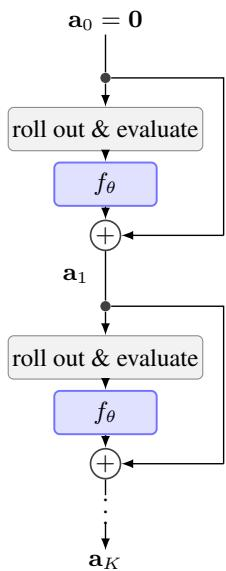
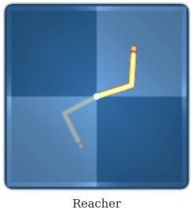
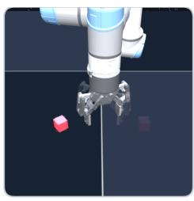
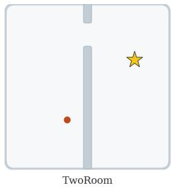
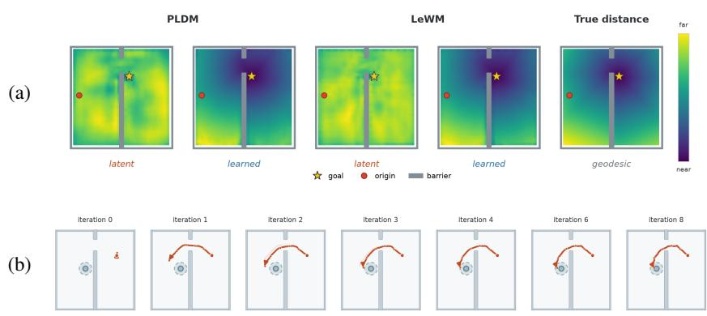
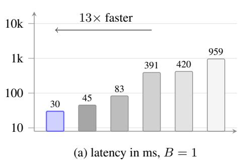
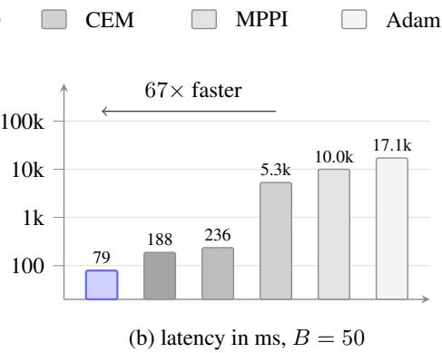
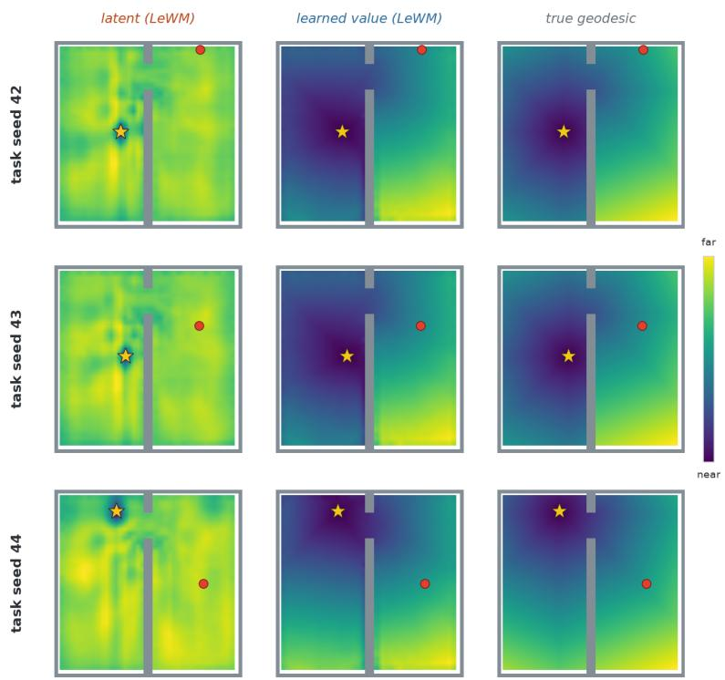
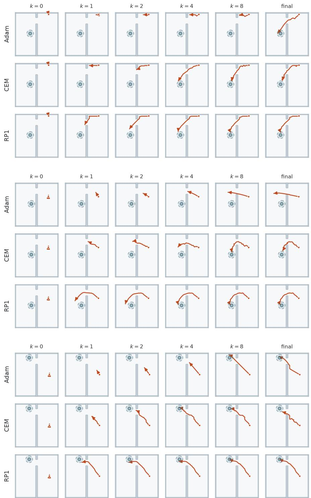

# REINFORCED PLANNING WITH LATENT WORLD MODELS

Armin Sommer∗ Pantheon Industries

Jannik Schilling Pantheon Industries

## ABSTRACT

Humans solve complex problems by constructing plans and mentally simulating their outcomes with an internal model of the world. Machine learning has produced world models that similarly predict the outcomes of action sequences, but the improvement of candidate plans still isn’t fully learned. Current planners are either hand-designed, distilled from a hand-designed optimizer, or learned only to inform an amortized policy rather than to revise the plan itself. We introduce Reinforced Planning, a method based on the idea that search can be learned by reinforcing good search rules into a neural planner. Our implementation RP1 learns both how to evaluate imagined outcomes through a critic, as well as how to improve multi-step plans through an optimizer trained fully offline from imagined world-model roll-outs. To our knowledge, RP1 is the first method to fully learn how to improve multi-step plans. Furthermore, it can be trained independently of and attached to any pretrained latent world model. Across visual navigation, arm reaching, and robotic manipulation on two world-model backbones, RP1 significantly outperforms hand-designed search algorithms, reaching near-perfect success in several settings while using 1, 000× fewer world-model rollouts and being up to 67× faster than the strongest alternative under concurrent inference.

## 1 INTRODUCTION

Humans are commonly understood to solve complex problems by imagining possible futures and evaluating their consequences. Hippocampal activity can represent prospective trajectories before an action is taken [20; 37], supporting the view that the brain uses a learned cognitive map for internal simulation [49]. Computationally, this separates planning into two components: a world model predicts the consequences of hypothetical actions, while a planner determines how candidate action sequences are generated, evaluated, and improved.

Machine learning has made substantial progress on the first component. Latent world models now support high-dimensional visual prediction [7; 8; 10], self-supervised predictive representations [23; 3], and planning with pretrained, reward-free models [54; 44; 28]. Yet the planner operating on top of these models is still usually hand-designed. Given a candidate action sequence, the world model can predict its outcome, but it does not specify how that sequence should be changed to produce a better one. Existing systems therefore rely on fixed search rules, often requiring thousands of world-model evaluations per decision and configurations that must be chosen separately for different tasks and models [8; 13; 54; 44; 38].

While planning has been explored in several forms, learning the update rule in model-based multi-step planning has not been achieved so far: the planning rule is either fixed or inherited from a conventional optimizer, learned through online interaction, or applied only to the next action rather than to an entire plan (Sec. 2).

We introduce the Reinforced Planning method, and its first implementation RP1, which learns both how imagined outcomes should be evaluated and how multi-step plans should be improved. RP1 learns a goal-conditioned quasimetric critic [26; 52] from offline trajectories using temporaldifference learning, then trains a neural planner to repeatedly improve action-plans at inference time, by reinforcing good planning rules into the network weights. At each refinement step, RP1 receives the current action-plan, and evaluates its outcome via world-model rollouts. No conventional optimizer is executed inside this update or used as a training target. To our knowledge, RP1 is the first model-based planner to fully learn an update rule over a multi-step action plan (Sec. 2).

We evaluate RP1 with two pretrained world-model backbones, LeWorldModel and PLDM, across visual navigation (TwoRoom), continuous-control reaching (Reacher), and contact-rich manipulation (OGBench Cube). Across these three domains, RP1 exceeds the strongest existing planners while using only 9 world-model rollouts per decision, compared with 9,000 for the strongest competitor method, and reduces planning latency by up to 67× when multiple control loops share one GPU.

## 2 BACKGROUND

Fixed or inherited planning rules. Most model-based planners use a hand-designed update rule: CEM in PlaNet and DINO-WM, MPPI in the TD-MPC family, or gradient descent through differentiable world-model rollouts [8; 13; 54; 44; 38]. Universal Planning Networks optimize multi step action sequences, but fix gradient descent as the plan optimizer [45]. DMPO retains an MPPI update and shift operation and learns modifications to them from online task return [40]. L2O-MPC learns the runtime update, but only by imitating a higher-budget MPPI expert that must be run during training [39]. In all these, the planning rules are either (partly) hand-designed or learned from a hand-designed optimizer.

Amortized model-based control. The Dreamer methods use their world model to train an amortized policy, but do not plan through the world model at inference time [9]. Diffuser learns a generative model over state–action trajectories that jointly captures dynamics and planning, refining trajectories directly through denoising rather than explicitly rolling out and evaluating successive candidate action plans through a separate world model [19].

Planning to inform amortized policies. The Imagination Based Planner (IBP) and Thinker methods learn which imagined trajectories to construct or inspect, but do not iteratively improve a candidate plan. Instead, the information gathered through imagination conditions the agent’s amortized action policy [36; 5]. Their learned planning behaviour therefore serves to improve fixed action distributions, rather than improving the candidate plan itself, and necessitates online learning.

Iterative next-action optimization. Iterative Amortized Policy Optimization (IAPO) instead learns an iterative optimizer for the current-state action distribution $\pi ( a _ { t } \mid s _ { t } ) [ 3 0 ]$ . Even in its model-based variant, future terms in a world-model rollout remain amortized policy outputs rather than jointly optimized decision variables. The learned optimization therefore remains one-step improvement, rather than learning an update rule over a multi-step plan.

Objectives for imagined plans. JEPA-based world model literature tends to score imagined outcomes by their Euclidean distance to the goal in latent space[28; 44; 54]. This choice has a biological analogy in grid-cell representations, which have been argued to provide a spatial metric for vector-based navigation [11; 4]. However, latent proximity need not reflect temporal reachability (Theorem 1), with recent work showing that learned reachability objectives can outperform latent distance [24]. Evaluating outcomes with learned value functions is also consistent with evidence implicating the orbitofrontal and ventromedial prefrontal cortex in prospective value evaluation [33; 53; 42], and is well established in model-based control [12; 13]. We therefore estimate temporal cost-to-go from experience using a goal-conditioned quasimetric-style critic [21; 41; 1; 14; 26; 52; 51].

## 3 PRELIMINARIES

We consider a goal-conditioned MDP $( S , { \mathcal { A } } , { \mathcal { T } } , g , \rho _ { 0 } )$ with state space $s ,$ , action space $\mathcal { A } \subset \mathbb { R } ^ { | a | }$ goal state $g \subseteq S ,$ , transition function $\mathcal { T } : \mathcal { S } \times \mathcal { A }  \mathcal { S }$ and initial-state distribution $\rho _ { 0 }$ . The agent does not observe s directly, but instead receives an observation o in the form of a visual image.

World model. A world model predicts the next state, given the current state and some candidate action. Specifically, the neural network maps an observation $o _ { t }$ to its latent representation $z _ { t }$ through

an encoder $z _ { t } = E _ { \phi } ( o _ { t } ) \in \mathcal { Z }$ . The world model then predicts the next latent state via a prediction map $h _ { \phi } ( z , a ) = \hat { z }$ , where zˆ is the predicted (or imagined) latent of the next state. We define the N-step rollout operator of the world model via

$$
H _ { \phi } ( { \bf a } , \hat { z } _ { 0 } ) : = h _ { \phi } \big ( h _ { \phi } ( \cdot \cdot \cdot h _ { \phi } ( \hat { z } _ { 0 } , a _ { 0 } ) \cdot \cdot \cdot , a _ { N - 2 } ) , a _ { N - 1 } \big ) = \hat { z } _ { N } ,\tag{1}
$$

a composition of N forward rolls of the world model.

Model-based Planning. Given a start latent $z _ { t }$ and encoded goal $z _ { g } ,$ a plan is scored by a terminal cost $C$ applied to the final latent state, as predicted by the world model $H _ { \phi }$ . This plan aims to optimize the objective

$$
\begin{array} { r } { J ( \mathbf { a } ; z _ { t } , z _ { g } ) : = \cal { C } \big ( H _ { \phi } ( \mathbf { a } , z _ { t } ) , z _ { g } \big ) . } \end{array}\tag{2}
$$

A model-based planner is a search procedure over action sequences: it holds candidate plans and queries the world model $H _ { \phi }$ to evaluate them under J, and applies an update rule

$$
F : { \mathbf a } _ { k } \mapsto { \mathbf a } _ { k + 1 }\tag{3}
$$

for K rounds. Model-based planners differ only in their instantiation of F. A policy $\pi ( a \mid z _ { t } , z _ { g } )$ by contrast, instead amortizes the objective 2 into a direct state-to-action mapping and performs no planning.

## 4 REINFORCED PLANNING

Our method follows an actor-critic architecture: a critic scores latent states with respect to a goal, and an actor, here a learned planner, optimizes the action plan against the critic’s final state estimate.

Critic. The critic is a goal-conditioned value function $V _ { \psi } ( z _ { t } , z _ { g } )$ that estimates the cost-to-go from latent state $z _ { t }$ to an encoded goal state $z _ { g } .$ . Here, lower values correspond to fewer steps to goal and thus signify occupancy of better states. We learn this critic via offline temporal-difference (TD) learning, although it could in theory be any cost-function. During planning, the critic only ever evaluates terminal states $\hat { z } _ { N }$ produced by the rollout operator.

Planner. The planner is a learned operator

$$
\mathcal { F } _ { \theta } : \left( \underbrace { \mathbf { a } _ { k } } _ { \mathrm { c u r r e n t ~ p l a n ~ t e r m i n a l ~ v a l u e } } , \underbrace { \mathbf { g } _ { k } } _ { \mathrm { v a l u e ~ g r a d i e n t } } \right) \longmapsto \underbrace { \mathbf { a } _ { k + 1 } } _ { \mathrm { i m p r o v e d ~ p l a n } } .\tag{4}
$$

parametrized by $\theta ,$ that outputs an improved plan from the current plan, the critic’s value at the plan’s terminal state, and the plan’s value gradient. Starting from an initial plan a , planning does three things per step:

$$
r o l l o u t { : } \hat { z } _ { N } ^ { ( k ) } = H _ { \phi } \big ( \mathbf { a } _ { k } , z _ { t } \big ) ,\tag{5}
$$

$$
e \nu a l u a t e : \quad v _ { k } = V _ { \psi } \big ( \hat { z } _ { N } ^ { ( k ) } , z _ { g } \big ) , \qquad \mathbf { g } _ { k } = \nabla _ { \mathbf { a } _ { k } } V _ { \psi } \big ( \hat { z } _ { N } ^ { ( k ) } , z _ { g } \big ) ,\tag{6}
$$

$$
\begin{array} { r } { i m p r o \nu e \colon \mathbf { a } _ { k + 1 } = \mathcal { F } _ { \theta } \big ( \mathbf { a } _ { k } , v _ { k } , \mathbf { g } _ { k } \big ) . } \end{array}\tag{7}
$$

The optimized plan is the final iteration, $\mathbf { a } ^ { \star } = \mathbf { a } _ { K }$ . While the planner has access to the value and gradient, it is not constrained to follow the plan’s gradient $- \mathbf { g } _ { k }$ and can learn when to trust and distrust it. Task-specific information reaches the planner only through $v _ { k }$ and $\mathbf { g } _ { k }$ , forcing it to learn a plan-update rule rather than a direct state-and-goal-to-action mapping.

Reinforcing good planning rules. Applying $\mathcal { F } _ { \theta }$ produces an imagined optimization trajectory

$$
\mathbf { a } _ { 0 } \xrightarrow { \mathcal { F } _ { \theta } } \mathbf { a } _ { 1 } \xrightarrow { \mathcal { F } _ { \theta } } \cdot \cdot \cdot \xrightarrow { \mathcal { F } _ { \theta } } \mathbf { a } _ { K } ,\tag{8}
$$

where each new plan is obtained by applying the same learned update rule to the preceding plan. The planner is trained to minimize the terminal cost-to-go predicted by the frozen world model $H _ { \phi }$ and value function $V _ { \psi } \mathbf { . }$

$$
\theta ^ { \star } = \arg \operatorname* { m i n } _ { \theta } \mathbb { E } _ { ( z _ { 0 } , z _ { g } ) \sim \mathcal { D } } \left[ V _ { \psi } ( H _ { \phi } ( \mathbf { a } _ { K } , z _ { t } ) , z _ { g } ) \right] + \mathcal { C } ,\tag{9}
$$

where C is some regularizer on intermediate plans’ value. Updates that produce lower-cost imagined plans reduce the optimization objective and are reinforced in the shared parameters of ${ \mathcal { F } } _ { \theta } .$ , while updates that produce higher-cost plans are suppressed. The planner therefore learns rules to improve action sequences, not the action sequences themselves.

## 5 IMPLEMENTATION

As a first realization of a Reinforced Planner, we implement a residual version we call $R P l .$ . Starting from ${ \bf a } _ { 0 } = { \bf 0 }$ , the planner optimizes the action trajectory via

$$
\begin{array} { r l } & { \mathcal { F } _ { \boldsymbol { \theta } } \big ( \mathbf { a } _ { k } , v _ { k } , \mathbf { g } _ { k } \big ) } \\ & { \quad = \mathrm { c l i p } _ { [ - a _ { \mathrm { m a x } } , a _ { \mathrm { m a x } } ] } \Big ( \underbrace { \mathbf { a } _ { k } } _ { \mathrm { p r e v . ~ p l a n } } + \underbrace { f _ { \boldsymbol { \theta } } \big ( \mathbf { a } _ { k } , v _ { k } , \mathbf { g } _ { k } \big ) } _ { \mathrm { r e s i d u a l } \Delta \mathbf { a } _ { k } } \Big ) , } \end{array}\tag{10}
$$

where $f _ { \theta } \colon \mathcal { A } ^ { N } \times \mathbb { R } \times \mathbb { R } ^ { N \times | a | } \to \mathbb { R } ^ { N \times | a | }$ is a neural network producing the plan change $\Delta \mathbf { a } _ { k } = f _ { \theta } ( \mathbf { a } _ { k } , v _ { k } , \mathbf { g } _ { k } )$

This residual update $\Delta { \bf a } _ { k }$ onto the previous plan ${ \bf a } _ { k }$ keeps the gradient flow stable to avoid the vanishing gradient problem[16; 15]. The clip is a projection of each plan iterate onto the box $[ - a _ { \mathrm { m a x } } , a _ { \mathrm { m a x } } ] \left( \mathrm { a n } \ell _ { \infty } \right.$ constraint on the action trajectory, not on the update), bounding actions to $a _ { \mathrm { m a x } }$ standard deviations of the demonstrated distribution so that rollouts stay on the world model’s support. We use open-loop planning for our experiments.

We realize the critic as a metric residual network [27] trained with Implicit Q-Learning through Hindsight Experience Replay[22; 2]. For specifics see Appendix B.

Figure 1: RP1 visual.

## 6 THEORETICAL RESULTS

We formalize two motivations for Reinforced Planning. First, predictive world-model learning does not determine a Euclidean latent geometry suitable for planning without additional training incentives. Second, under any fixed information interface, a learned neural planner can adapt its update rule across tasks, whereas a conventional optimizer uses one fixed configuration throughout the task distribution.

## 6.1 LATENT NORMS AND COST-TO-GO

Recall the encoder $E _ { \phi }$ and latent transition model $h _ { \phi }$ from Section 3. For notational simplicity, we write $E _ { \phi } ( s )$ for the encoding of the observation generated by state s. Let $\mathcal { T } : \mathcal { S } \times \mathcal { A } \stackrel { \setminus } {  } \mathcal { S }$ denote deterministic environment dynamics. We call the latent world model exact when

$$
h _ { \phi } ( E _ { \phi } ( s ) , a ) = E _ { \phi } ( { \mathcal { T } } ( s , a ) ) \qquad { \mathrm { f o r ~ a l l ~ } } ( s , a ) \in { \mathcal { S } } \times { \mathcal { A } } .\tag{11}
$$

Theorem 1 (Prediction does not identify Euclidean latent geometry). Suppose $( E _ { \phi } , h _ { \phi } )$ is exact. If the latent displacements from some state s to two goals $g _ { 1 }$ and $g _ { 2 }$ are linearly independent, then there exist two equally exact latent reparameterizations that reverse which goal is closer to s under Euclidean distance. The ratio between the two distances can be made arbitrarily large.

Proof sketch. Any invertible linear change of latent coordinates can be absorbed into both the encoder and transition model without changing predictive exactness. By mapping the two goal displacements to separate coordinate axes and stretching either axis, either goal can be made arbitrarily farther than the other. The full proof is given in Appendix A.1. □

Theorem 1 does not imply that latent distance is necessarily a poor planning objective. Rather, it shows that predictive accuracy alone cannot determine whether it is a good one: two equally predictive world models can rank the same candidate goals in opposite orders. Agreement between latent distance and temporal cost-to-go is therefore an additional property that must be learned or imposed separately. We learn this property through a goal-conditioned critic trained directly from temporal transitions.

This non-identifiability holds even when the environment is reversible and temporal reachability is symmetric. Appendix A.2 gives the complementary result that temporal reachability can additionally be asymmetric, in which case no symmetric latent norm can represent it exactly.

## 6.2 ADVANTAGE OF LEARNED PLANNING UNDER TASK HETEROGENEITY

For a fixed world model, action space, planning horizon, and objective, let $x = ( z _ { t } , z _ { g } ) \sim \mu$ denote a planning task. A planner state $\omega _ { k } \in \Omega _ { \mathrm { p l } }$ contains all information carried from one refinement round to the next, including the current candidate plans and any optimizer memory. At each round, taskdependent information is exposed through a fixed interface $\bar { \boldsymbol { \tau } } .$ Starting from a shared initialization ω , an update rule $F$ is applied for K rounds:

$$
\omega _ { F , 0 } ( x ) = \omega _ { 0 } , \qquad \omega _ { F , k + 1 } ( x ) = F { \big ( } \omega _ { F , k } ( x ) , { \mathcal { T } } { \big ( } x , \omega _ { F , k } ( x ) { \big ) } { \big ) } .\tag{12}
$$

Its expected loss is

$$
\begin{array} { r } { \mathcal { L } ( F ) = \mathbb { E } _ { x \sim \mu } \left[ \ell \left( x , \omega _ { F , K } ( x ) \right) \right] , } \end{array}\tag{13}
$$

where ℓ is the cost of the plan returned from the final planner state.

Let W denote the compact set of feasible planner inputs, and let $\mathfrak { F } _ { \mathcal { Z } }$ denote the continuous feasible update rules $F : \mathcal { W } \overset { \cdot } { \to } \Omega _ { \mathrm { p l } }$ . The precise ambient spaces and regularity conditions are given in Appendix A.3.

Assumption 1 (Universal search-rule approximation). Assume the neural-planner class $\{ { \mathcal { F } } _ { \theta } : \theta \in$ $\Theta \} \subseteq \bar { \mathfrak { F } } _ { \mathbb { Z } }$ can uniformly approximate every rule in $\mathfrak { F } \tau \mathrm { : \Omega }$ for every $F \in \mathfrak { F } _ { \mathbb { Z } }$ and every $\varepsilon > 0$ , there exists $\theta \in \Theta$ such that

$$
\operatorname* { s u p } _ { w \in \mathcal { W } } \Vert \mathcal { F } _ { \theta } ( w ) - F ( w ) \Vert < \varepsilon .\tag{14}
$$

Now let $\mathcal { X } _ { 1 } , \ldots , \mathcal { X } _ { r }$ be a measurable partition of the task distribution, with $p _ { i } = \mathrm { P r } ( x \in \mathscr { X } _ { i } ) > 0$ For any update rule F, define its regional loss by

$$
\begin{array} { r } { \mathcal { L } _ { i } ( F ) = \mathbb { E } \left[ \ell \big ( x , \omega _ { F , K } ( x ) \big ) \ \middle | \ x \in \mathcal { X } _ { i } \right] . } \end{array}\tag{15}
$$

Let B be a family of fixed search configurations. Each $B \in B$ induces an update rule $F _ { B }$ , and the same configuration is used on every task. We write

$$
\mathcal { L } _ { i } ( B ) = \mathcal { L } _ { i } ( F _ { B } ) , \qquad \mathcal { L } ( B ) = \sum _ { i = 1 } ^ { r } p _ { i } \mathcal { L } _ { i } ( B ) .\tag{16}
$$

Theorem 2 (Strict advantage under task heterogeneity). Under Assumption 1 and the regularity, regional incompatibility, and interface-composability conditions stated in Appendix A.3,

$$
\operatorname* { i n f } _ { \theta \in \Theta } \mathcal { L } ( \mathcal { F } _ { \theta } ) \leq \sum _ { i = 1 } ^ { r } p _ { i } \operatorname* { m i n } _ { B \in \mathcal { B } } \mathcal { L } _ { i } ( B ) < \operatorname* { m i n } _ { B \in \mathcal { B } } \mathcal { L } ( B ) .\tag{17}
$$

Thus, a sufficiently expressive learned planner can strictly outperform every single fixed search configuration by adapting its update behavior across task regions through the shared interface.

Note that Theorem 2 is an idealized matched-interface expressivity result. It identifies an advantage available to a sufficiently expressive learned update rule under the stated assumptions; it does not establish that the finite RP1 architecture contains the resulting rule, that training finds it, or that the empirical planners satisfy the theorem’s deterministic, continuous, and matched-interface setup.

## 7 EXPERIMENTS

  
Figure 2: Experiment environments. In Reacher (left) the agent moves a two-link arm to a goal configuration, here shaded. In OGBench Cube (middle) a robot arm picks up a cube and moves it to a goal position, also shaded. In TwoRoom (right) an agent navigates to a goal position, marked by a star.

Evaluation design. We evaluate RP1 in three visual-control domains, TwoRoom, Reacher, and OGBench Cube, on two world-model bases: LeWorldModel (LeWM) and PLDM. All world-model encoders and dynamics predictors remain frozen during critic and planner training, so differences in performance arise from how imagined trajectories are scored and improved rather than from changes to the world models. We use benchmarks from the StableWorldModel environment [29].

Baselines and controlled comparisons. We compare RP1 against three popular hand-designed planning algorithms and two partly-learned hybrid planners. The hand-designed planners constitute the state of the art for planning with pretrained world models: essentially all recent latent-planning systems use one of them or a close variant [8; 13; 54; 44; 38]. We evaluate each with both latent distance $\| \hat { z } _ { N } - z _ { g } \| _ { 2 } ^ { 2 }$ and the learned objective $V \big ( \hat { z } _ { N } , z _ { g } \big )$ . The hybrid planners DMPO and L2O-MPC use a learned critic, following their original design [40; 39].

Evaluation metrics. We report task success and planning compute cost, measured as the number of world-model rollouts per decision. All planners use identical action chunking: each planned action comprises five primitive actions, and each planner optimizes a sequence of five such chunks, corresponding to a horizon of 25 primitive actions. All methods therefore plan over the same horizon in the same normalized action space. Full evaluation details are provided in Appendix C.

## 7.1 TWOROOM

TwoRoom tests whether model-based agents are capable of appropriate planning when geometric proximity differs from temporal reachability. The agent must pass through a doorway to reach the opposite room, so states that are geometrically close across the wall might still require a long detour.

  
Figure 3: RP1 in TwoRoom. (a) The learned critic better captures temporal cost-to-go than latent $L _ { 2 }$ distance. (b) RP1 iteratively refines its plan, with later updates focusing on fine corrections to the final actions. Additional visualizations are provided in Appendix C.2.

We find that the latent-distance objective does not capture distance-to-goal in the queried worldmodels, whereas a learned value function saturates the benchmark across implemented planners. Once planners are given the learned value critic, their performance largely converges: most methods reach near-saturated success, despite using very different search rules and compute budgets. This suggests that in TwoRoom the dominant difficulty is not how candidate plans are improved, but whether they are evaluated with an objective that reflects temporal reachability rather than latent proximity.

TwoRoom
<table><tr><td></td><td></td><td colspan="2">LeWM</td><td colspan="2">PLDM</td></tr><tr><td>planner</td><td>rollouts</td><td>25 steps</td><td>100 steps</td><td>25 steps</td><td>100 steps</td></tr><tr><td>latent  $L _ { 2 }$  (value critic)</td><td></td><td></td><td></td><td></td><td></td></tr><tr><td>CEM</td><td>9000</td><td>84.0 (100.0)</td><td>13.3 (94.7)</td><td>93.3 (100.0)</td><td>52.0 (89.3)</td></tr><tr><td>MPPI</td><td>9000</td><td>70.7 (87.3)</td><td>20.0 (64.0)</td><td>64.0 (78.7)</td><td>33.3 (58.7)</td></tr><tr><td>Adam</td><td>3000</td><td>94.7 (96.7)</td><td>24.0 (83.3)</td><td>90.7 (96.0)</td><td>42.0 (73.3)</td></tr><tr><td>Offline-DMPO</td><td>256</td><td>96.9</td><td>100.0</td><td>97.8</td><td>92.7</td></tr><tr><td>L20-MPC</td><td>256</td><td>95.8</td><td>90.9</td><td>95.1</td><td>48.2</td></tr><tr><td>RP1 (ours)</td><td>9</td><td>100.0</td><td>94.2</td><td>98.2</td><td>96.0</td></tr></table>

Table 1: Success rate (%). Bold marks the best two entries per column. For CEM, MPPI, and Adam, the main number uses latent $L _ { 2 }$ while the gray parenthesized number uses the learned value critic.

## 7.2 REACHER

Reacher is a two-link arm under torque control, observed only as visual frames. The task is to bring both joints into a target configuration. Success follows the benchmark’s first-hit convention at a loose and a tight tolerance (τ=0.1 and τ=0.05 rad). As in all domains, planners optimize five blocks of five primitive actions, so the planning horizon exactly covers the nominal 25-step distance to the goal.

Reacher complements TwoRoom by removing the objective as a confound: the arm moves in free space, meets no obstacles, and every configuration is reachable from every other, so geometric proximity and temporal reachability essentially coincide. Empirically, latent $L _ { 2 }$ distance is already an adequate surrogate for cost-to-go, and substituting the learned critic barely moves any baseline (Table 2). Whatever separates the planners in this domain must therefore come from how plans are improved, not from how they are scored.

Table 2: Reacher
<table><tr><td></td><td></td><td colspan="2">LeWM</td><td colspan="2">PLDM</td></tr><tr><td>planner</td><td>rollouts</td><td>τ=.1</td><td>T=.05</td><td>τ=.1</td><td>τ=.05</td></tr><tr><td>latent  $L _ { 2 }$  (value critic)</td><td></td><td></td><td></td><td></td><td></td></tr><tr><td>CEM</td><td>9000</td><td>98.7 (97.3)</td><td>80.3 (82.0)</td><td>96.7 (96.0)</td><td>80.0 (76.0)</td></tr><tr><td>MPPI</td><td>9000</td><td>63.7 (74.0)</td><td>39.3 (42.0)</td><td>64.7 (60.0)</td><td>35.7 (38.7)</td></tr><tr><td>Adam</td><td>3000</td><td>94.0 (88.0)</td><td>66.0 (64.7)</td><td>94.3 (92.7)</td><td>66.0 (66.7)</td></tr><tr><td>Offline-DMPO</td><td>256</td><td>92.4</td><td>67.8</td><td>90.0</td><td>62.9</td></tr><tr><td>L20-MPC</td><td>256</td><td>90.9</td><td>69.6</td><td>89.3</td><td>60.9</td></tr><tr><td>RP1 (ours)</td><td>9</td><td>98.7</td><td>88.7</td><td>97.8</td><td>82.0</td></tr></table>

Table 3: First-hit success (%). Goal tolerance τ (rad), bold marks best number. For CEM, MPPI, and Adam, the main number uses latent $L _ { 2 }$ while the gray parenthesized number uses the learned value critic.

Even this near-saturated task discriminates between planners once the tolerance is tightened. At τ=0.1, every competent planner brings the arm into the neighborhood of the goal: margins are within a point or two, and the relevant difference is cost, with RP1 matching the best baseline on three orders of magnitude fewer world-model rollouts. Halving the tolerance separates reaching a region from stopping inside it. All methods degrade, but RP1 degrades the least and retains the best score in every column, and its margin over the strongest baseline widens from at most one point at τ=0.1 to 6.7 points on LeWM and 2.0 on PLDM at τ=0.05. We attribute this to terminal precision rather than coverage: plans that fail at τ=0.05 typically find the right approach and miss only in the final action blocks, which seem to be refined more accurately in RP1 than other methods.

## 7.3 OGBENCH CUBE

OGBench Cube [35] is a vision-based manipulation benchmark: a robot arm must pick up a cube and place it at a goal position, observed only from pixels, with goals placed 25 or 100 primitive steps away (h25, h100). The difficulty of the task comes from contact. A small change early in a plan decides whether the gripper closes on the cube or misses it entirely, so the objective over plans is discontinuous and multimodal, a poor fit for both smooth gradient descent and a unimodal sampling distribution. Contact also makes reachability directed: a dropped or knocked-away cube cannot be undone.

A complication of the benchmark is that its success criterion is partially satisfied at reset: executing no actions at all already scores 56.0% at h25 and 45.3% at h100 under the identical evaluation protocol (Appendix C.4). Raw success rates, which we report as easy, therefore compress exactly the episodes that require manipulation, and differences between planners are partly masked by a floor every method inherits for free. Alongside the easy score we report a hard score, the same runs normalized against the measured no-op floor $f$ as $( s - f ) / ( 1 0 0 - f ) \cdot 1 0 0$ , which measures the fraction of headroom above doing nothing that a planner actually converts. The hard score is our primary number; easy is kept for comparability with the benchmark’s convention.

OGBench Cube.
<table><tr><td></td><td colspan="4">LeWM</td><td colspan="4">PLDM</td></tr><tr><td></td><td colspan="2">25 steps</td><td colspan="2">100 steps</td><td colspan="2">25 steps</td><td colspan="2">100 steps</td></tr><tr><td>planner (roll.)</td><td>easy</td><td>hard</td><td>easy</td><td>hard</td><td>easy</td><td>hard</td><td>easy</td><td>hard</td></tr><tr><td colspan="9">latent  $L _ { 2 }$  (value-critic)</td></tr><tr><td>CEM 9000</td><td>74.0(84.0)</td><td>40.9(63.6)</td><td>58.0(76.7)</td><td>23.2(57.4)</td><td>62.7(70.0)</td><td>15.2(31.8)</td><td>58.7(64.0)</td><td>24.5(34.1)</td></tr><tr><td>MPPI 9000</td><td>56.7(63.3)</td><td>1.6(16.6)</td><td>46.7(52.0)</td><td>2.5(12.2)</td><td>58.7(64.7)</td><td>6.1(19.8)</td><td>47.3(50.7)</td><td>3.6(9.8)</td></tr><tr><td>Adam 3000</td><td>74.0(74.7)</td><td>40.9(42.5)</td><td>57.3(68.7)</td><td>21.9(42.7)</td><td>63.3(64.0)</td><td>16.6(18.2)</td><td>55.3(54.0)</td><td>18.2(15.9)</td></tr><tr><td>Offline-DMPO 256</td><td>72.9</td><td>38.4</td><td>55.8</td><td>19.2</td><td>61.8</td><td>13.2</td><td>51.6</td><td>11.5</td></tr><tr><td>L2O-MPC 256</td><td>64.4</td><td>19.1</td><td>50.0</td><td>8.5</td><td>58.9</td><td>6.6</td><td>45.3</td><td>0.0</td></tr><tr><td>RP1 (ours)9</td><td>89.1</td><td>75.2</td><td>82.4</td><td>67.8</td><td>82.9</td><td>61.1</td><td>77.1</td><td>58.1</td></tr></table>

Table 4: Success rate (%). We report easy numbers and hard numbers. For normalized (hard) scores, we set 0 if the method performed worse than floor, e.g. L2O-MPC on PLDM.

The table separates the two contributions. The learned critic matters mainly at the long horizon: under latent $L _ { 2 } ,$ CEM’s hard score on LeWM falls from 40.9 at h25 to 23.2 at h100, while the same planner scoring with the learned value holds 57.4: once the goal is far away, latent distance stops ordering plans by how long they take to realize. The learned search accounts for the rest: RP1 posts the best score in every column using 9 rollouts per decision against 3,000–9,000 for the hand-designed planners. The normalization itself is informative about the baselines: several hand-designed search algorithms end up within a few points of the no-op policy, so most of their raw success was inherited from not-moving. RP1 does significantly better, getting up to twice the success rate on PLDM on the hard evals of its closest competitor CEM.

## 7.4 WORLD-MODEL HALLUCINATION AND DYNA FINETUNING

Training the planner through a frozen world model lets it exploit model error. Inspecting RP1’s failure episodes in OGBench Cube, we found the world model hallucinating contact outcomes: for LeWM, grasps that miss the cube are nevertheless predicted "magically" to attach it to the arm. No improvement in search can fix such hallucinations. We therefore correct the model rather than the

planner: one Dyna iteration [46] deploys the trained planner, collects its (failure) rollouts, finetunes the world model on them, and retrains the planner (Appendix B.3).
<table><tr><td></td><td colspan="2">LeWM</td><td colspan="2">PLDM</td></tr><tr><td></td><td>25 steps</td><td>100 steps</td><td>25 steps</td><td>100 steps</td></tr><tr><td>RP1 (pretrained world model)</td><td>75.2 (89.1)</td><td>67.8 (82.4)</td><td>61.1 (82.9)</td><td>58.1 (77.1)</td></tr><tr><td>RP1Dyna (finetuned world model)</td><td>87.3 (94.4)</td><td>72.0 (84.7)</td><td>80.2 (91.3)</td><td>67.1 (82.0)</td></tr><tr><td></td><td>+12.1</td><td>+4.2</td><td>+19.1</td><td>+9.0</td></tr></table>

Table 5: Effect of one Dyna iteration (hard success, %). Gray parentheses give the unnormalized easy score. Rollouts are collected on h25 tasks only; the finetuned model is reused unchanged at h100.

One iteration recovers a large part of the exploitation gap, and we found empirically that the "grasp-and-miss" hallucinations were significantly reduced in LeWM. However, despite mitigating exploitation, characterizing when it recurs remains open.

## 7.5 PLANNING SPEED

We measure end-to-end planning latency on OGBench Cube 25-step goal offset with LeWM, including the complete computation from the input latents to the returned action plan. All methods run in fp32 on a single NVIDIA H200 and are benchmarked using both CUDA-graph-captured and eager execution, with the faster mean reported. We consider one planner running alone (B = 1) and 50 independent planners running concurrently on the same GPU (B = 50), representing multiple control loops sharing one accelerator.

  
Figure 4: End-to-end planning latency. On OGBench Cube with LeWM (one NVIDIA H200, fp32), with RP1 13× faster than CEM for one planner and 67× faster for 50 concurrent planners.

The 1,000× reduction in world-model rollouts does not translate one-for-one into single-planner latency because the GPU can evaluate many of a sampling planner’s candidate trajectories in parallel. Nevertheless, RP1 completes a planning request in 30 ms, compared with 391 ms for CEM, the strongest conventional baseline, yielding a 13× speedup. The advantage grows substantially under concurrent inference: RP1 processes 50 planners in 79 ms, whereas CEM requires 5.31 s, yielding a 67× speedup and reducing the amortized GPU time per planner from 106.2 to 1.58 ms. RP1 also remains 3.0× faster than DMPO and 2.4× faster than L2O-MPC in this setting. Thus, the rollout reduction becomes most consequential when one accelerator serves several control loops, such as multiple robot arms planning in tandem.

## 8 DISCUSSION

Our results support the two hypotheses that motivated RP1. First, on tasks where geometric proximity differs from reachability, replacing the latent-distance objective with a learned quasimetric-style critic resolves failures that no amount of additional search can fix (Sec. 7.1). Second, learning the search procedure itself yields large gains where the plan landscape is discontinuous or multimodal: RP1 matches or exceeds the strongest hand-designed planners while issuing two to three orders of magnitude fewer world-model queries. Together, these findings suggest that for current latent world models, planning quality is often the binding constraint on downstream performance, not prediction fidelity.

Several limitations remain. First and foremost, our evaluations are for different hyperparameters between environments. We believe that this can be resolved at least for the critic, and intend on updating the paper once we have found a configuration that works across environments. Our results use open-loop execution; closed-loop replanning may change the relative standing of the methods, so we intend to report this in future work. Because the planner is trained through the frozen world model, it can exploit model errors in regions of poor data coverage; the Dyna-style finetuning loop of Sec. B.3 mitigates but does not eliminate this failure mode, and when planner exploitation occurs is still open for characterization. Finally, our evaluation covers two world-model bases and three domains: broader coverage across model families and longer-horizon, multi-object tasks is needed before claiming generality, and the learned planner currently assumes a fixed horizon and interface, whereas hand-designed planners transfer across these choices without retraining.

## 9 ACKNOWLEDGEMENTS

The authors want to thank Xiao-ke Lu, Sambhav Gupta and Kunvar Thaman for their insightful suggestions on initial drafts.

## REFERENCES

[1] Marcin Andrychowicz, Filip Wolski, Alex Ray, Jonas Schneider, Rachel Fong, Peter Welinder, Bob McGrew, Josh Tobin, Pieter Abbeel, and Wojciech Zaremba. Hindsight experience replay. In Advances in Neural Information Processing Systems (NeurIPS), 2017.

[2] Marcin Andrychowicz, Filip Wolski, Alex Ray, Jonas Schneider, Rachel Fong, Peter Welinder, Bob McGrew, Josh Tobin, Pieter Abbeel, and Wojciech Zaremba. Hindsight experience replay. In Advances in Neural Information Processing Systems (NeurIPS), 2017.

[3] Mahmoud Assran, Quentin Duval, Ishan Misra, Piotr Bojanowski, Pascal Vincent, Michael Rabbat, Yann LeCun, and Nicolas Ballas. Self-supervised learning from images with a jointembedding predictive architecture. In IEEE/CVF Conference on Computer Vision and Pattern Recognition (CVPR), pages 15619–15629, 2023.

[4] Andrea Banino, Caswell Barry, Benigno Uria, Charles Blundell, Timothy Lillicrap, Piotr Mirowski, Alexander Pritzel, Martin J. Chadwick, Thomas Degris, Joseph Modayil, Greg Wayne, Hubert Soyer, Fabio Viola, Brian Zhang, Ross Goroshin, Neil Rabinowitz, Razvan Pascanu, Charlie Beattie, Stig Petersen, Amir Sadik, Stephen Gaffney, Helen King, Koray Kavukcuoglu, Demis Hassabis, Raia Hadsell, and Dharshan Kumaran. Vector-based navigation using grid-like representations in artificial agents. Nature, 557(7705):429–433, 2018. doi: 10.1038/s41586-018-0102-6.

[5] Stephen Chung, Ivan Anokhin, and David Krueger. Thinker: Learning to plan and act. In Advances in Neural Information Processing Systems (NeurIPS), 2023. arXiv:2307.14993.

[6] Vladimir Feinberg, Alvin Wan, Ion Stoica, Michael I. Jordan, Joseph E. Gonzalez, and Sergey Levine. Model-based value estimation for efficient model-free reinforcement learning, 2018. URL https://arxiv.org/abs/1803.00101.

[7] David Ha and Jürgen Schmidhuber. Recurrent world models facilitate policy evolution. Advances in Neural Information Processing Systems, 31, 2018. Extended version “World Models”, arXiv:1803.10122.

[8] Danijar Hafner, Timothy Lillicrap, Ian Fischer, Ruben Villegas, David Ha, Honglak Lee, and James Davidson. Learning latent dynamics for planning from pixels. In International Conference on Machine Learning (ICML), pages 2555–2565, 2019.

[9] Danijar Hafner, Timothy Lillicrap, Jimmy Ba, and Mohammad Norouzi. Dream to control: Learning behaviors by latent imagination, 2020. URL https://arxiv.org/abs/1912. 01603.

[10] Danijar Hafner, Jurgis Pasukonis, Jimmy Ba, and Timothy Lillicrap. Mastering diverse control tasks through world models. Nature, 640:647–653, 2025.

[11] Torkel Hafting, Marianne Fyhn, Sturla Molden, May-Britt Moser, and Edvard I. Moser. Microstructure of a spatial map in the entorhinal cortex. Nature, 436(7052):801–806, 2005. doi: 10.1038/nature03721.

[12] Nicklas Hansen, Xiaolong Wang, and Hao Su. Temporal difference learning for model predictive control. In International Conference on Machine Learning (ICML), 2022.

[13] Nicklas Hansen, Hao Su, and Xiaolong Wang. TD-MPC2: Scalable, robust world models for continuous control. In International Conference on Learning Representations (ICLR), 2024.

[14] Kristian Hartikainen, Xinyang Geng, Tuomas Haarnoja, and Sergey Levine. Dynamical distance learning for semi-supervised and unsupervised skill discovery. In International Conference on Learning Representations (ICLR), 2020.

[15] Kaiming He, Xiangyu Zhang, Shaoqing Ren, and Jian Sun. Deep residual learning for image recognition. CoRR, abs/1512.03385, 2015. URL http://arxiv.org/abs/1512. 03385.

[16] Sepp Hochreiter. Untersuchungen zu dynamischen neuronalen netzen. Master’s thesis, Technische Universität München, 1991.

[17] Peter J. Huber. Robust estimation of a location parameter. The Annals of Mathematical Statistics, 35(1):73–101, 1964.

[18] Taher Jafferjee, Ehsan Imani, Erik Talvitie, Martha White, and Michael Bowling. Hallucinating value: A pitfall of dyna-style planning with imperfect environment models. arXiv preprint arXiv:2006.04363, 2020.

[19] Michael Janner, Yilun Du, Joshua B. Tenenbaum, and Sergey Levine. Planning with diffusion for flexible behavior synthesis, 2022. URL https://arxiv.org/abs/2205.09991.

[20] Adam Johnson and A. David Redish. Neural ensembles in CA3 transiently encode paths forward of the animal at a decision point. Journal ofNeuroscience, 27(45):12176–12189, 2007. doi: 10.1523/JNEUROSCI.3761-07.2007.

[21] Leslie Pack Kaelbling. Learning to achieve goals. In International Joint Conference on Artificial Intelligence (IJCAI), 1993.

[22] Ilya Kostrikov, Ashvin Nair, and Sergey Levine. Offline reinforcement learning with implicit q-learning. In International Conference on Learning Representations (ICLR), 2022.

[23] Yann LeCun. A path towards autonomous machine intelligence. https://openreview. net/forum?id=BZ5a1r-kVsf, 2022. Version 0.9.2.

[24] Liangyu Li, Shengzhi Wang, and Qingwen Liu. Beyond euclidean proximity: Repairing latent world models with horizon-matched trajectory reachability metrics, 2026. URL https: //arxiv.org/abs/2605.22164.

[25] Timothy P. Lillicrap, Jonathan J. Hunt, Alexander Pritzel, Nicolas Heess, Tom Erez, Yuval Tassa, David Silver, and Daan Wierstra. Continuous control with deep reinforcement learning. In International Conference on Learning Representations (ICLR), 2016.

[26] Bo Liu, Yihao Feng, Qiang Liu, and Peter Stone. Metric residual network for sample efficient goal-conditioned reinforcement learning. In Proceedings of the Thirty-Seventh AAAI Conference on Artificial Intelligence (AAAI), pages 8799–8806, 2023. arXiv:2208.08133.

[27] Bo Liu, Yihao Feng, Qiang Liu, and Peter Stone. Metric residual networks for sample efficient goal-conditioned reinforcement learning. In Proceedings of the AAAI Conference on Artificial Intelligence, 2023.

[28] Lucas Maes, Quentin Le Lidec, Damien Scieur, Yann LeCun, and Randall Balestriero. LeWorld-Model: Stable end-to-end joint-embedding predictive architecture from pixels. arXiv preprint arXiv:2603.19312, 2026.

[29] Lucas Maes, Quentin Le Lidec, Luiz Facury, Nassim Massaudi, Ayush Chaurasia, Francesco Capuano, Richard Gao, Taj Gillin, Dan Haramati, Damien Scieur, Yann LeCun, and Randall Balestriero. stable-worldmodel: A platform for reproducible world modeling research and evaluation, 2026. URL https://arxiv.org/abs/2605.21800.

[30] Joseph Marino, Alexandre Piché, Alessandro Davide Ialongo, and Yisong Yue. Iterative amortized policy optimization. In Advances in Neural Information Processing Systems (NeurIPS), 2021.

[31] Volodymyr Mnih, Koray Kavukcuoglu, David Silver, et al. Human-level control through deep reinforcement learning. Nature, 518(7540):529–533, 2015.

[32] Whitney K. Newey and James L. Powell. Asymmetric least squares estimation and testing. Econometrica, 55(4):819–847, 1987.

[33] Camillo Padoa-Schioppa and John A. Assad. Neurons in the orbitofrontal cortex encode economic value. Nature, 441(7090):223–226, 2006. doi: 10.1038/nature04676.

[34] Seohong Park, Dibya Ghosh, Benjamin Eysenbach, and Sergey Levine. Hiql: Offline goalconditioned rl with latent states as actions. In Advances in Neural Information Processing Systems (NeurIPS), 2023.

[35] Seohong Park, Kevin Frans, Benjamin Eysenbach, and Sergey Levine. OGBench: Benchmarking offline goal-conditioned RL. In International Conference on Learning Representations (ICLR), 2025.

[36] Razvan Pascanu, Yujia Li, Oriol Vinyals, Nicolas Heess, Lars Buesing, Sébastien Racanière, David Reichert, Théophane Weber, Daan Wierstra, and Peter Battaglia. Learning model-based planning from scratch. arXiv preprint arXiv:1707.06170, 2017.

[37] Brad E. Pfeiffer and David J. Foster. Hippocampal place-cell sequences depict future paths to remembered goals. Nature, 497(7447):74–79, 2013. doi: 10.1038/nature12112.

[38] Jyothir S V, Siddhartha Jalagam, Yann LeCun, and Vlad Sobal. Gradient-based planning with world models. arXiv preprint arXiv:2312.17227, 2023.

[39] Jacob Sacks and Byron Boots. Learning to optimize in model predictive control. In IEEE International Conference on Robotics and Automation (ICRA), pages 10549–10556, 2022.

[40] Jacob Sacks, Rwik Rana, Kevin Huang, Alex Spitzer, Guanya Shi, and Byron Boots. Deep model predictive optimization. In IEEE International Conference on Robotics and Automation (ICRA), 2024.

[41] Tom Schaul, Daniel Horgan, Karol Gregor, and David Silver. Universal value function approximators. In International Conference on Machine Learning (ICML), 2015.

[42] Nicolas W. Schuck, Ming Bo Cai, Robert C. Wilson, and Yael Niv. Human orbitofrontal cortex represents a cognitive map of state space. Neuron, 91(6):1402–1412, 2016. doi: 10.1016/j.neuron.2016.08.019.

[43] James E. Smith and Robert L. Winkler. The optimizer’s curse: Skepticism and postdecision surprise in decision analysis. Management Science, 52(3):311–322, 2006. doi: 10.1287/mnsc. 1050.0451.

[44] Vlad Sobal, Wancong Zhang, Kyunghyun Cho, Randall Balestriero, Tim G. J. Rudner, and Yann LeCun. Learning from reward-free offline data: A case for planning with latent dynamics models. arXiv preprint arXiv:2502.14819, 2025.

[45] Aravind Srinivas, Allan Jabri, Pieter Abbeel, Sergey Levine, and Chelsea Finn. Universal planning networks: Learning generalizable representations for visuomotor control. In International Conference on Machine Learning (ICML), pages 4732–4741, 2018.

[46] Richard S. Sutton. Dyna, an integrated architecture for learning, planning, and reacting. ACM SIGART Bulletin, 2(4):160–163, 1991. doi: 10.1145/122344.122377.

[47] Richard S. Sutton and Andrew G. Barto. Reinforcement Learning: An Introduction. MIT Press, 2nd edition, 2018.

[48] Erik Talvitie. Self-correcting models for model-based reinforcement learning. In Proceedings ofthe Thirty-First AAAI Conference on Artificial Intelligence (AAAI), pages 2597–2603, 2017.

[49] Edward C. Tolman. Cognitive maps in rats and men. Psychological Review, 55(4):189–208, 1948.

[50] Tongzhou Wang and Phillip Isola. Improved representation of asymmetrical distances with interval quasimetric embeddings. In NeurIPS Workshop on Symmetry and Geometry in Neural Representations, 2022.

[51] Tongzhou Wang, Antonio Torralba, Phillip Isola, and Amy Zhang. Optimal goal-reaching reinforcement learning via quasimetric learning. In International Conference on Machine Learning (ICML), 2023.

[52] Tongzhou Wang, Antonio Torralba, Phillip Isola, and Amy Zhang. Optimal goal-reaching reinforcement learning via quasimetric learning. In International Conference on Machine Learning (ICML), pages 36411–36430, 2023.

[53] Robert C. Wilson, Yuji K. Takahashi, Geoffrey Schoenbaum, and Yael Niv. Orbitofrontal cortex as a cognitive map of task space. Neuron, 81(2):267–279, 2014. doi: 10.1016/j.neuron.2013.11. 005.

[54] Gaoyue Zhou, Hengkai Pan, Yann LeCun, and Lerrel Pinto. DINO-WM: World models on pre-trained visual features enable zero-shot planning. In International Conference on Machine Learning (ICML), 2025. arXiv:2411.04983.

## A PROOFS OF THEORETICAL RESULTS

We formalize two motivations for Reinforced Planning. First, predictive world-model learning does not determine a Euclidean latent geometry suitable for planning. Second, a learned neural planner can adapt its optimization rule to the task, whereas conventional optimizers use one configuration across the task distribution.

## A.1 PROOF OF THEOREM 1

Proof. Let $A \in \mathbb { R } ^ { d \times d }$ be invertible and define

$$
E _ { A } ( s ) = A E _ { \phi } ( s ) , \qquad h _ { A } ( z , a ) = A h _ { \phi } ( A ^ { - 1 } z , a ) .\tag{18}
$$

Then

$$
h _ { A } ( E _ { A } ( s ) , a ) = A h _ { \phi } ( A ^ { - 1 } A E _ { \phi } ( s ) , a )\tag{19}
$$

$$
= A h _ { \phi } ( E _ { \phi } ( s ) , a )\tag{20}
$$

$$
= A E _ { \phi } ( \mathcal { T } ( s , a ) )\tag{21}
$$

$$
= E _ { A } ( { \mathcal { T } } ( s , a ) ) .\tag{22}
$$

Thus, $( E _ { A } , h _ { A } )$ is exact whenever $( E _ { \phi } , h _ { \phi } )$ is exact. The same argument applied recursively shows that all multi-step trajectories remain exactly predicted under the transformed coordinates.

Now define

$$
u = E _ { \phi } ( g _ { 1 } ) - E _ { \phi } ( s ) , \qquad v = E _ { \phi } ( g _ { 2 } ) - E _ { \phi } ( s ) .\tag{23}
$$

Because u and v are linearly independent, there exists an invertible matrix B such that

$$
B u = e _ { 1 } , \qquad B v = e _ { 2 } ,\tag{24}
$$

where $e _ { 1 }$ and $e _ { 2 }$ are the first two standard basis vectors.

For any $R > 1$ , define

$$
A _ { 1 } = \mathrm { d i a g } ( R , 1 , \ldots , 1 ) B ,\tag{25}
$$

$$
A _ { 2 } = \operatorname { d i a g } ( 1 , R , 1 , \ldots , 1 ) B .\tag{26}
$$

Both matrices are invertible and therefore induce exact latent world models. Under the first transformation,

$$
{ \frac { \| E _ { A _ { 1 } } ( g _ { 1 } ) - E _ { A _ { 1 } } ( s ) \| _ { 2 } } { \| E _ { A _ { 1 } } ( g _ { 2 } ) - E _ { A _ { 1 } } ( s ) \| _ { 2 } } } = R ,\tag{27}
$$

whereas under the second,

$$
\frac { \| E _ { A _ { 2 } } ( g _ { 1 } ) - E _ { A _ { 2 } } ( s ) \| _ { 2 } } { \| E _ { A _ { 2 } } ( g _ { 2 } ) - E _ { A _ { 2 } } ( s ) \| _ { 2 } } = \frac { 1 } { R } .\tag{28}
$$

The two exact world models therefore induce opposite Euclidean distance orderings. Since R is arbitrary, the separation between the distances can be made arbitrarily large. □

## A.2 TEMPORAL REACHABILITY AS A DIRECTED DISTANCE

Consider a deterministic controlled system with state space S. Define

$$
\begin{array} { r } { d ^ { \star } ( s , g ) : = \operatorname* { i n f } \left. T \in \mathbb { N } _ { 0 } : \mathrm { s o m e \ l e n g t h }  { \mathrm { \cdot } } T \mathrm { \ a c t i o n \ s e q u e n c e \ t a k e s \ } s \mathrm { \ t o } g \right. } \end{array}\tag{29}
$$

with $d ^ { \star } ( s , g ) = + \infty$ when g is unreachable from s.

Proposition 1 (Temporal reachability is an extended directed quasimetric). For all states $s , y , g ,$

$$
d ^ { \star } ( s , g ) \geq 0 , \qquad d ^ { \star } ( s , g ) = 0 \iff s = g , \qquad d ^ { \star } ( s , g ) \leq d ^ { \star } ( s , y ) + d ^ { \star } ( y , g ) .\tag{30}
$$

However, $d ^ { \star } ( s , g )$ need not equal $d ^ { \star } ( g , s )$ . Consequently, when temporal reachability is asymmetric, no symmetric distance such as a latent norm $\lVert E ( \bar { s } ) - \dot { E ( g ) } \rVert _ { 2 }$ can represent it exactly on all ordered state pairs.

Proof. The empty action sequence takes each state to itself, so $d ^ { \star } ( s , s ) = 0$ . Conversely, a lengthzero sequence cannot change the state, so $\begin{array} { r } { d ^ { \star } ( s , g ) = 0 } \end{array}$ implies $s = g$ . Nonnegativity follows because action sequence lengths belong to $ { \mathbb { N } } _ { 0 }$

The triangle inequality is immediate if either $d ^ { \star } ( s , y )$ or $d ^ { \star } ( y , g )$ is infinite. Otherwise, concatenate a shortest sequence from s to y with a shortest sequence from y to g. The resulting sequence takes s to g and has length $d ^ { \star } ( s , y ) + \dot { d ^ { \star } } ( y , g )$

Finally, consider two states for which an action takes s to $^ { g , }$ but no action sequence returns from g to s. Then $d ^ { \star } ( s , g ) = 1$ while $d ^ { \star } ( g , s ) = + \infty$ . Because every symmetric distance assigns the same value to $( s , g )$ and $( g , s )$ , it cannot represent $d ^ { \star }$ exactly in this case. □

## A.3 FORMAL STATEMENT AND PROOF OF THEOREM 2

We first make the ambient spaces and regularity conditions explicit. Let

$$
\mathcal { Z } \subseteq \mathbb { R } ^ { d _ { z } } , \qquad \mathcal { X } \subseteq \mathcal { Z } \times \mathcal { Z } \subseteq \mathbb { R } ^ { 2 d _ { z } } , \qquad \Omega _ { \mathrm { p l } } \subseteq \mathbb { R } ^ { d _ { \omega } } , \qquad \mathcal { Y } \subseteq \mathbb { R } ^ { d _ { y } } .\tag{31}
$$

Here, $\mathcal { X }$ is the task space, with $x = ( z _ { t } , z _ { g } ) \in \mathcal { X } , \Omega _ { \mathrm { p l } }$ is the planner-state space, and $\mathcal { V }$ is the output space of the planner interface. We assume that X and $\Omega _ { \mathrm { p l } }$ are nonempty and compact, and equip all finite-dimensional spaces and product spaces with their Euclidean norms.

Let $\mu$ be a probability distribution supported on $\mathcal { X } .$ , let $\omega _ { 0 } \in \Omega _ { \mathrm { p l } }$ be the common planner initialization, and let $K < \infty$ be the number of refinement rounds. Assume that

$$
\mathcal { T } : \mathcal { X } \times \Omega _ { \mathrm { p l } } \longrightarrow \mathcal { Y }\tag{32}
$$

and

$$
\ell : \mathcal { X } \times \Omega _ { \mathrm { p l } } \longrightarrow \mathbb { R }\tag{33}
$$

are continuous.

Define the set of feasible planner inputs by

$$
\mathcal { W } = \left. \left( \omega , \mathcal { T } ( x , \omega ) \right) : x \in \mathcal { X } , \ \omega \in \Omega _ { \mathrm { p l } } \right. \subseteq \mathbb { R } ^ { d _ { \omega } + d _ { y } } .\tag{34}
$$

Because $\mathcal { X } \times \Omega _ { \mathrm { p l } }$ is compact and $( x , \omega ) \mapsto ( \omega , \mathscr { T } ( x , \omega ) )$ is continuous, W is compact.

Let

$$
\mathfrak { F } _ { \mathbb { Z } } = \{ F : \mathcal { W } \to \Omega _ { \mathrm { p l } } \ : \ F \mathrm { { i s } \ c o n t i n u o u s \} }\tag{35}
$$

be the class of continuous feasible search rules. For any $F \in \mathfrak { F } _ { \mathcal { Z } }$ , set $\omega _ { F , 0 } ( x ) = \omega _ { 0 }$ , and, for $k = 0 , \ldots , K - 1$

$$
\omega _ { F , k + 1 } ( x ) = F \big ( \omega _ { F , k } ( x ) , \mathcal { T } \big ( x , \omega _ { F , k } ( x ) \big ) \big ) .\tag{36}
$$

Since every rule maps W into $\Omega _ { \mathrm { p l } } .$ , all planner states remain feasible.

The expected loss of F is

$$
\begin{array} { r } { \mathcal { L } ( F ) = \mathbb { E } _ { x \sim \mu } \left[ \ell \left( x , \omega _ { F , K } ( x ) \right) \right] . } \end{array}\tag{37}
$$

Assumption 1 states that $\{ \mathcal { F } _ { \theta } : \theta \in \Theta \} \subseteq \mathfrak { F } _ { \mathbb { Z } }$ and that, for every $F \in \mathfrak { F } _ { \mathbb { Z } }$ and every $\varepsilon > 0$ , there exists $\theta \in \Theta$ satisfying

$$
\operatorname* { s u p } _ { w \in \mathcal { W } } \Vert \mathcal { F } _ { \theta } ( w ) - F ( w ) \Vert < \varepsilon .\tag{38}
$$

Let $\mathcal { X } _ { 1 } , \ldots , \mathcal { X } _ { r }$ be a measurable partition of $x ,$ , up to sets of µ-measure zero, with

$$
p _ { i } = \mu ( \mathcal { X } _ { i } ) > 0 .\tag{39}
$$

For every $F \in \mathfrak { F } _ { \mathbb { Z } }$ , define

$$
\begin{array} { r } { \mathcal { L } _ { i } ( F ) = \mathbb { E } \left[ \ell \big ( x , \omega _ { F , K } ( x ) \big ) \ \middle | \ x \in \mathcal { X } _ { i } \right] . } \end{array}\tag{40}
$$

Let

$$
B \subseteq \mathbb { R } ^ { d _ { B } }\tag{41}
$$

be a nonempty compact family of fixed search configurations. Each $B \in B$ induces a rule $F _ { B } \in \mathfrak { F } _ { \mathcal { Z } }$ with the same configuration B used on every task. Define

$$
\mathcal { L } _ { i } ( B ) = \mathcal { L } _ { i } ( F _ { B } ) , \qquad \mathcal { L } ( B ) = \sum _ { i = 1 } ^ { r } p _ { i } \mathcal { L } _ { i } ( B ) ,\tag{42}
$$

and assume that $B \mapsto { \mathcal { L } } _ { i } ( B )$ is continuous for every region i. Consequently, the regional minimum

$$
b _ { i } : = \operatorname* { m i n } _ { B \in B } { \mathcal { L } } _ { i } ( B )\tag{43}
$$

exists for every i.

Assumption 2 (Regional incompatibility). No fixed configuration minimizes every regional loss:

$$
\bigcap _ { i = 1 } ^ { r } \operatorname { a r g m i n } _ { B \in \mathcal { B } } \mathcal { L } _ { i } ( B ) = \varnothing .\tag{44}
$$

Assumption 3 (Interface composability). There exists a continuous feasible rule $F ^ { \star } \in \mathfrak { F } _ { \mathbb { Z } }$ that attains the best fixed-configuration loss in every region:

$$
\mathcal { L } _ { i } ( F ^ { \star } ) = b _ { i } = \operatorname* { m i n } _ { B \in \mathcal { B } } \mathcal { L } _ { i } ( B ) , \qquad i = 1 , \ldots , r .\tag{45}
$$

Theorem 3 (Strict advantage under task heterogeneity; restatement of Theorem 2). Under Assumption 1, Assumption 2, and Assumption $^ { 3 , }$

$$
\operatorname* { i n f } _ { \theta \in \Theta } \mathcal { L } ( \mathcal { F } _ { \theta } ) \leq \sum _ { i = 1 } ^ { r } p _ { i } \operatorname* { m i n } _ { B \in \mathcal { B } } \mathcal { L } _ { i } ( B ) < \operatorname* { m i n } _ { B \in \mathcal { B } } \mathcal { L } ( B ) .\tag{46}
$$

Proof. By Assumption 3, there exists $F ^ { \star } \in \mathfrak { F } _ { \mathbb { Z } }$ such that $\mathcal { L } _ { i } ( F ^ { \star } ) = b _ { i }$ for every i. Since the regions partition the task distribution,

$$
\mathcal { L } ( F ^ { \star } ) = \sum _ { i = 1 } ^ { r } p _ { i } \mathcal { L } _ { i } ( F ^ { \star } ) = \sum _ { i = 1 } ^ { r } p _ { i } b _ { i } .\tag{47}
$$

We next show that the neural-planner class can approach this loss. For each integer $m \geq 1$ , apply Assumption 1 with $\varepsilon = 1 / m$ . This gives a parameter $\theta _ { m } \in \Theta$ satisfying

$$
\operatorname* { s u p } _ { w \in \mathcal { W } } \Vert \mathcal { F } _ { \theta _ { m } } ( w ) - F ^ { \star } ( w ) \Vert < \frac { 1 } { m } .\tag{48}
$$

For brevity, write

$$
\omega _ { m , k } ( x ) = \omega _ { \mathcal { F } _ { \theta _ { m } } , k } ( x ) , \qquad \omega _ { k } ^ { \star } ( x ) = \omega _ { F ^ { \star } , k } ( x ) .\tag{49}
$$

We prove by induction that, for every fixed $k \leq K$

$$
\operatorname* { s u p } _ { x \in \mathcal { X } } \| \omega _ { m , k } ( x ) - \omega _ { k } ^ { \star } ( x ) \| \longrightarrow 0 \qquad \mathrm { a s } m \to \infty .\tag{50}
$$

The claim holds for $k = 0$ , because all planners share the initialization $\omega _ { 0 }$ . Suppose that it holds at round k. Define

$$
w _ { m , k } ( x ) = \bigl ( \omega _ { m , k } ( x ) , \mathscr { T } \bigl ( x , \omega _ { m , k } ( x ) \bigr ) \bigr ) ,\tag{51}
$$

$$
w _ { k } ^ { \star } ( x ) = \left( \omega _ { k } ^ { \star } ( x ) , \mathcal { T } \big ( x , \omega _ { k } ^ { \star } ( x ) \big ) \right) .\tag{52}
$$

Continuity of $\mathcal { T }$ on the compact set $\boldsymbol { \mathcal { X } } \times \Omega _ { \mathrm { p l } }$ implies uniform continuity. Therefore, the induction hypothesis gives

$$
\operatorname* { s u p } _ { x \in \mathcal { X } } \| w _ { m , k } ( x ) - w _ { k } ^ { \star } ( x ) \| \longrightarrow 0 .\tag{53}
$$

Using the planner recursion and adding and subtracting ${ \cal F } ^ { \star } ( w _ { m , k } ( x ) )$ , we obtain

$$
\begin{array} { r l } & { \underset { x \in \mathcal { X } } { \operatorname* { s u p } } \left. \omega _ { m , k + 1 } ( x ) - \omega _ { k + 1 } ^ { \star } ( x ) \right. } \\ & { \leq \underset { x \in \mathcal { X } } { \operatorname* { s u p } } \left. \mathcal { F } _ { \theta _ { m } } \left( w _ { m , k } ( x ) \right) - F ^ { \star } \left( w _ { m , k } ( x ) \right) \right. } \\ & { \qquad + \underset { x \in \mathcal { X } } { \operatorname* { s u p } } \left. F ^ { \star } \left( w _ { m , k } ( x ) \right) - F ^ { \star } \left( w _ { k } ^ { \star } ( x ) \right) \right. . } \end{array}\tag{54}
$$

(55)

The first term is at most $1 / m$ by Eq. 48. The second converges to zero because $F ^ { \star }$ is uniformly continuous on the compact set W and Eq. 53 holds. This proves Eq. 50 for every finite $k \leq K$

Because ℓ is continuous on the compact set $\mathcal { X } \times \Omega _ { \mathrm { p l } }$ , it is uniformly continuous. Applying Eq. 50 at $k = K$ therefore yields

$$
\operatorname* { s u p } _ { x \in \mathcal { X } } \big | \ell \big ( x , \omega _ { m , K } ( x ) \big ) - \ell \big ( x , \omega _ { K } ^ { \star } ( x ) \big ) \big | \longrightarrow 0 .\tag{56}
$$

Consequently,

$$
{ \mathcal { L } } ( { \mathcal { F } } _ { \theta _ { m } } ) \longrightarrow { \mathcal { L } } ( F ^ { \star } ) .\tag{57}
$$

Together with Eq. 47, this gives

$$
\operatorname* { i n f } _ { \theta \in \Theta } { \mathcal { L } } ( { \mathcal { F } } _ { \theta } ) \leq \sum _ { i = 1 } ^ { r } p _ { i } b _ { i } .\tag{58}
$$

It remains to show that every single fixed configuration has strictly larger expected loss. Define its excess over the regional minima by

$$
\Delta ( B ) = \sum _ { i = 1 } ^ { r } p _ { i } \mathopen { } \mathclose \bgroup \left( \mathcal { L } _ { i } ( B ) - b _ { i } \aftergroup \egroup \right) .\tag{59}
$$

Every term in this sum is nonnegative. By Assumption $^ { 2 , }$ each $B \in B$ is strictly suboptimal in at least one region. Since every $p _ { i } > 0$

$$
\Delta ( B ) > 0 \qquad { \mathrm { f o r ~ e v e r y ~ } } B \in { \mathcal { B } } .\tag{60}
$$

The function $\Delta$ is continuous because it is a finite weighted sum of the continuous functions $\mathcal { L } _ { i }$ Since B is compact, $\Delta$ attains its minimum. Its pointwise strict positivity implies

$$
\eta : = \operatorname* { m i n } _ { B \in \mathcal { B } } \Delta ( B ) > 0 .\tag{61}
$$

Hence

$$
\operatorname* { m i n } _ { B \in \mathcal { B } } \mathcal { L } ( B ) = \operatorname* { m i n } _ { B \in \mathcal { B } } \left[ \sum _ { i = 1 } ^ { r } p _ { i } b _ { i } + \Delta ( B ) \right]\tag{62}
$$

$$
= \sum _ { i = 1 } ^ { r } p _ { i } b _ { i } + \eta\tag{63}
$$

$$
> \sum _ { i = 1 } ^ { r } p _ { i } b _ { i } .\tag{64}
$$

Combining Eq. 58 with Eq. 64 proves

$$
\operatorname* { i n f } _ { \theta \in \Theta } \mathcal { L } ( \mathcal { F } _ { \theta } ) \leq \sum _ { i = 1 } ^ { r } p _ { i } \operatorname* { m i n } _ { B \in \mathcal { B } } \mathcal { L } _ { i } ( B ) < \operatorname* { m i n } _ { B \in \mathcal { B } } \mathcal { L } ( B ) .\tag{65}
$$

## B METHOD DETAILS

## B.1 VALUE LEARNING

For each environment and world model, we train a separate goal-conditioned cost-to-go function [21; 41]

$$
V _ { \psi } ( z , z _ { g } ) \colon \mathcal { Z } \times \mathcal { Z } \to \mathbb { R } _ { \ge 0 } .\tag{66}
$$

Lower values represent shorter predicted temporal distance [14] to the goal, as we assume a cost of 1 per step. The world-model encoder is frozen, and the value function is trained entirely from cached offline latents. The value is represented by a metric residual network [27; 50],

$$
V _ { \psi } ( z , z _ { g } ) = \| u _ { \psi } ( z ) - u _ { \psi } ( z _ { g } ) \| _ { 2 } + \operatorname* { m a x } _ { j } \operatorname { R e L U } \left( v _ { \psi , j } ( z _ { g } ) - v _ { \psi , j } ( z ) \right) .\tag{67}
$$

Here $u _ { \psi }$ is the first half of the latent vector the critic head computes and $v _ { \psi }$ is the second half. The first term is symmetric, while the second permits directed temporal distance [51]. For each update, we sample an anchor $z _ { t }$ , an n-step successor $z _ { t + n _ { \mathrm { e f f } } } ,$ , and a hindsight goal [2] $z _ { g } ,$ where $n _ { \mathrm { e f f } } = \operatorname* { m i n } \{ n , T _ { \mathrm { e p i s o d e } } - t \}$ . In-episode goals are sampled from future states with temporal offsets balanced across the available episode horizon. Cross-episode goals are additionally sampled to train long-range state pairs. If an in-episode goal lies within the backup window, its exact temporal distance δ is used. Otherwise, the target is bootstrapped with an n-step backup [47]:

$$
y _ { t } = \left\{ \begin{array} { l l } { \delta , } & { \delta \leq n _ { \mathrm { e f f } } , } \\ { c _ { \gamma } ( n _ { \mathrm { e f f } } ) + \gamma ^ { n _ { \mathrm { e f f } } } \bar { V } _ { \bar { \psi } } ( z _ { t + n _ { \mathrm { e f f } } } , z _ { g } ) , } & { \mathrm { o t h e r w i s e , } } \end{array} \right.\tag{68}
$$

with

$$
c _ { \gamma } ( n ) = \sum _ { i = 0 } ^ { n - 1 } \gamma ^ { i } = \left\{ \begin{array} { l l } { n , } & { \gamma = 1 , } \\ { \displaystyle \frac { 1 - \gamma ^ { n } } { 1 - \gamma } , } & { \gamma < 1 . } \end{array} \right.\tag{69}
$$

The target parameters [31] are updated by Polyak averaging [25],

$$
\bar { \psi }  ( 1 - \eta ) \bar { \psi } + \eta \psi .\tag{70}
$$

Following implicit Q-learning [22; 34], the value function is trained by asymmetric expectile regression [32], replacing the squared penalty with a Huber penalty [17] for robustness:

$$
\mathcal { L } _ { V } ( \psi ) = \mathbb { E } _ { ( z _ { t } , z _ { g } ) \sim \mathcal { D } } \Big [ \big | \tau - \mathbf { 1 } [ V _ { \psi } ( z _ { t } , z _ { g } ) - y _ { t } > 0 ] \big | \ell _ { \mathrm { H u b e r } } ( V _ { \psi } ( z _ { t } , z _ { g } ) - y _ { t } ) \Big ] .\tag{71}
$$

Since $V _ { \psi }$ is a cost-to-go rather than a return, we use $\tau < 0 . 5 \mathrm { : }$ the weight on overestimation exceeds the weight on underestimation, so $V _ { \psi }$ regresses toward a lower expectile of the target distribution, approximating the shortest temporal distance realizable in the data rather than the behavior-policy average.

## B.2 RP1 TRAINING

RP1 is trained entirely offline while the world-model encoder and dynamics predictor remain frozen. For each world model, the planner is trained from a stride-five latent cache aligned with five-step action blocks. RP1 consists of three fully-connected layers with ReLU activations and hidden width 512, mapping $\mathbb { R } ^ { 2 N | a | + 1 } \to \mathbb { R } ^ { 5 1 2 } \to \bar { \mathbb { R } } ^ { 5 1 2 } \to \mathbb { R } ^ { N | a | }$ , where the input concatenates the flattened plan ${ \bf a } _ { k } \in \mathbb { R } ^ { N | a | }$ , its value gradient ${ \bf g } _ { k } \in \mathbb { R } ^ { N | a | }$ , and the scalar terminal value $v _ { k } ,$ and the output is the residual plan update. For example in OGBench Cube, with a planning horizon of $N = 5$ action blocks and $| a | = 2 5$ (five primitive steps of the five-dimensional arm actions), the refiner is $2 5 1 \to 5 1 2 \to 5 1 2 \to 1 2 5$ , i.e. 0.46M parameters, applied with tied weights at all $K = 8$ refinement steps.

The RP1 actor is a weight-tied residual plan refiner. At refinement step k, it receives the current plan, its terminal value, and the value gradient with respect to the plan:

$$
\begin{array} { r } { \hat { z } _ { N } ^ { ( k ) } = H _ { \phi } ( \mathbf { a } _ { k } , z _ { 0 } ) , } \end{array}\tag{72}
$$

$$
v _ { k } = V _ { \bar { \psi } } ( \hat { z } _ { N } ^ { ( k ) } , z _ { g } ) ,\tag{73}
$$

$$
\begin{array} { r } { { \bf g } _ { k } = \nabla _ { { \bf a } _ { k } } V _ { \bar { \psi } } ( \hat { z } _ { N } ^ { ( k ) } , z _ { g } ) . } \end{array}\tag{74}
$$

The plan is updated by

$$
\begin{array} { r } { { \bf a } _ { k + 1 } = \mathrm { c l i p } _ { [ - a _ { \mathrm { m a x } } , a _ { \mathrm { m a x } } ] } \left[ { \bf a } _ { k } + f _ { \theta } ( { \bf a } _ { k } , v _ { k } , { \bf g } _ { k } ) \right] . } \end{array}\tag{75}
$$

The actor receives no raw current-state or goal latent. Goal information reaches it only through $v _ { k }$ and $\mathbf { g } _ { k }$

The actor is trained by differentiating the terminal value through the frozen world-model rollout. The value and gradient supplied as refiner inputs are detached, while the training loss remains differentiable through the refined action sequence and its resulting rollout. No environment interaction is used during this stage.

Let $v _ { k }$ be the terminal value after refinement step $k .$ The planner objective is

$$
J _ { \mathrm { R P 1 } } ( \theta ) = \mathbb { E } _ { \hat { z } ^ { ( K ) } \sim \mathcal { F } _ { \theta } } \Big [ v _ { K } + \lambda _ { \mathrm { m e a n } } \frac { 1 } { K } \sum _ { k = 1 } ^ { K } v _ { k } \Big ] .\tag{76}
$$

The initial value from Section B.1 initializes the RP1 critic. When critic co-training is enabled, it continues to receive the same cached-data TD updates while a Polyak-averaged copy supplies $v _ { k }$ and $\mathbf { g } _ { k }$

We are doing open-loop planning. For closed-loop control, let τˆ be the first imagined goal-arrival step, measured by $v _ { k } \leq \epsilon ,$ or else just N if the goal is not reached. Choosing the telescoped per-step costs $\begin{array} { r } { \sum _ { i = 0 } ^ { \hat { \tau } - 1 } \gamma ^ { i } ( 1 + \gamma V ( \hat { z } _ { t + i + 1 } ^ { ( K ) } , z _ { g } ) - V ( \hat { z } _ { t + i } ^ { ( K ) } , z _ { g } ) ) } \end{array}$ as the planner’s optimization objective yields an arrival-aware loss that favors reaching the goal earlier.

## B.3 DYNA LOOP

The values $v _ { k }$ in the planner-loss are read off latents $H _ { \phi } ( \mathbf { a } _ { k } , \hat { z } _ { 0 } )$ that the world models $h _ { \phi }$ produced. Should $h _ { \phi }$ be wrong, or not have coverage for the dataset ${ \mathcal { D } } ,$ the planner can exploit inaccuracies, as is well reported in literature [43; 48; 18].

Much of this can be fixed by finetuning the world model on actual roll-out data, as originally proposed in the Dyna loop[46]. For this we deploy $\theta _ { r }$ in the real environment, collect the (failure) trajectories it produces, mix them into the training data, and finetune the world model on the mixture. Then we retrain the planner and repeat.

## C EMPIRICAL RESULTS

## C.1 GENERAL SETUP

Data and evaluation protocol. All world-model encoders and dynamics predictors are frozen throughout; critics and planners are trained purely from cached latents. Each domain provides 10,000 episodes: value functions and planners train on episodes 0–7,999, and all evaluations draw start/goal states from the held-out episodes 8,000–9,999. Hyperparameters are selected on the disjoint evaluation draws {50, 51} and never reported. Unless stated otherwise, reported numbers average over the three predeclared evaluation seeds {42, 43, 44} and, for RP1, over three planner training seeds {0, 1, 2}; Reacher uses a wider protocol (Sec. C.3).

Planning protocol. All planners use 5-step action chunks and optimize H=5 chunks (25 primitive steps) open loop, replanning every 5 chunks (receding horizon 5). The goal is the state h primitive steps ahead and the episode budget is 2h steps; TwoRoom and Cube evaluate $h \in \{ 2 5 , 1 0 0 \}$ (h25, h100), Reacher h=25. Simulator evaluations run under EGL with a pinned render device, serialized per node.

Objectives. Every planner scores the predicted terminal state with one of the two objectives of Sec. C.5: the latent-distance objective $C _ { \mathrm { l a t e n t } } ( \hat { z } _ { N } , z _ { g } ) = \| \hat { z } _ { N } - z _ { g } \| _ { 2 } ^ { 2 } ,$ , or the value objective $C _ { \mathrm { v a l u e } } ( \hat { z } _ { N } , z _ { g } ) \ = \ V _ { \psi } ( \hat { z } _ { N } , z _ { g } )$ , the goal-conditioned temporal-distance critic of Sec. B.1 (MRN quasimetric-style head) trained on the frozen cached latents of each base with the per-domain settings of Table 6 (offline-value block).
<table><tr><td>Hyperparameter</td><td>Cube</td><td>Reacher</td><td>TwoRoom</td></tr><tr><td>Actor — plan refiner</td><td></td><td></td><td></td></tr><tr><td>clip range amax (Eq. 10)</td><td>1.6/4.5</td><td>2.2/1.8</td><td> $1 . 8 / 2 . 6 / 1 . 8 / 2 . 8$ </td></tr><tr><td>mean-weight λmean (Eq. 76)</td><td>0.1</td><td>0.3/0.5</td><td> $0 . 1 / 0 . 3 / 0 . 0 / 0 . 3$ </td></tr><tr><td>actor LR (initial)</td><td> $3 { \cdot } 1 0 ^ { - 4 }$ </td><td> $1 0 ^ { - 4 } / 3 { \cdot } 1 0 ^ { - 4 }$ </td><td> $1 0 ^ { - 4 } / 1 0 ^ { - 3 } / 1 0 ^ { - 3 } / 1 0 ^ { - 3 }$ </td></tr><tr><td>refinement iterations K</td><td>8</td><td>8</td><td>8</td></tr><tr><td>plan horizon H (chunks)</td><td>5</td><td>5</td><td>5</td></tr><tr><td>batch size / training steps</td><td>256/6,000</td><td>128/1,000</td><td>128/8,000</td></tr><tr><td>replay probability</td><td>0.5</td><td>0.5</td><td>0</td></tr><tr><td>max-delta (hindsight-goal cap, chunks)</td><td>10</td><td>12</td><td>12</td></tr><tr><td>cross-episode goal probability</td><td>0.3</td><td>0.3</td><td>0.3</td></tr><tr><td>Critic — co-trained</td><td></td><td></td><td></td></tr><tr><td>value-expansion weight</td><td>1.0</td><td>0</td><td>0</td></tr><tr><td>critic live steps (then frozen EMA teacher)</td><td>3,000</td><td>500</td><td>6,400</td></tr><tr><td>critic/actor step ratio · EMA τ</td><td>1· 0.005</td><td>1· 0.005</td><td>1· 0.005</td></tr><tr><td>γ / n-step</td><td>0.98/50</td><td>0.98/50</td><td>1.0/50</td></tr><tr><td>expectile (annealed)</td><td>0.1→0.03</td><td>0.1→0.03</td><td>0.1</td></tr><tr><td>critic LR (annealed)</td><td> $1 0 ^ { - 3 } {  } 1 0 ^ { - 4 }$ </td><td> $1 0 ^ { - 3 } {  } 1 0 ^ { - 4 }$ </td><td> $1 0 ^ { - 3 }$ </td></tr><tr><td>TD batch size</td><td>1,024</td><td>1,024</td><td>1,024</td></tr><tr><td>Critic initialization — offline value (Sec. B.1)</td><td></td><td></td><td></td></tr><tr><td></td><td colspan="3">MRN quasimetric (hidden 256, embed 128, depth 2)</td></tr><tr><td>head γ / expectile / n-step</td><td>0.98/0.03/50</td><td>0.98/0.05/50</td><td>1.0/0.1/50</td></tr><tr><td>steps / batch</td><td>12,000/1,024</td><td>6,000/1,024</td><td>6,000/1,024</td></tr></table>

Table 6: Selected RP1 configurations across domains. Per-base/per-cell entries are listed LeWM/PLDM for Cube and Reacher, and LeWM·h25/LeWM·h100/PLDM·h25/PLDM·h100 for TwoRoom; all other values are shared across bases within a domain. The actor LR is cosine-annealed to 1/10 of the listed value for Cube and Reacher and held constant for TwoRoom. The offline value of Sec. B.1 initializes the co-trained critic.

RP1 training. All domains share the actor–critic recipe of Sec. B.2: K=8 refinement iterations over the H=5-chunk plan; the co-trained critic is initialized from the offline value, continues TD updates on cached data for the listed number of live steps (one critic step per actor step, its EMA with τ=0.005 serving as the actor’s teacher), and is then frozen; the TD batch size is 1,024 and the cross-episode goal probability is 0.3. Table 6 lists every selected per-domain setting; anything not shown there is shared across domains and bases.

## C.2 TWOROOM

Specific setup. All cells use three fresh actor and critic seeds {0, 1, 2}, averaged over task-seeds {42, 43, 44}. Success is judged by whether the final distance to the goal is within 16 pixels. Figure 5 probes the learned critic, comparing latent distance to the critic’s value landscape on sampled tasks; Fig. 6 traces plan refinement against the hand-designed planners.

  
Figure 5: Latent-Distance vs. learned Cost-to-go. 3 randomly sampled tasks from seeds (42,43,44) and their corresponding cost landscapes.

  
Figure 6: Plan refinement in TwoRoom. Each panel shows the planner’s best-scoring candidate plan at refinement iteration k on the same task, with all planners scoring plans using the learned value critic; “final” is k=30 for Adam and CEM and k=8 for RP1. Iterations differ greatly in cost: one CEM iteration evaluates 300 sampled plans (9,000 rollouts in total), one Adam iteration takes a gradient step on 100 plans in parallel (3,000 rollouts), whereas one RP1 iteration is a single forward pass of the learned refiner costing one rollout (9 in total, including the initial evaluation).

## C.3 REACHER

Specific setup. Reacher widens the seed protocol: we report on evaluation draws $\{ 4 2 , \ldots , 4 7 \}$ averaged over six training seeds $\{ 0 , \ldots , 5 \}$ (36 evaluations per base and tolerance), and each worldmodel base uses a single configuration fixed a priori. Success is first-hit: all joints within τ radians of the goal configuration, scored in a separate simulator pass per τ with termination on success.

Cost windows. On Reacher, both objectives read the predicted terminal state through a latent window of w terminal frames. We take w=1 as the primary setting and report w=3 as an ablation (Tab. 7). The Reacher value critic additionally uses window lag 5 and standardized latents, and the RP1 co-trained critic is initialized from the offline value trained at the matching cost window (single-frame for the primary w=1 result). Widening w from 1 to 3 lets the cost read first-order (velocity) information, which we expect to sharpen the estimate, most visibly at the tight τ=0.05 tolerance.

(a) single-frame costs
<table><tr><td colspan="4">LeWM</td><td colspan="2">PLDM</td></tr><tr><td>planner</td><td>roll.</td><td>τ=.1</td><td>T=.05</td><td>τ=.1</td><td>τ=.05</td></tr><tr><td colspan="6">latent objective</td></tr><tr><td>CEM</td><td>9k</td><td>98.7</td><td>80.3</td><td>96.7</td><td>80.0</td></tr><tr><td>MPPI</td><td>9k</td><td>63.7</td><td>39.3</td><td>64.7</td><td>35.7</td></tr><tr><td>Adam</td><td>3k</td><td>94.0</td><td>66.0</td><td>94.3</td><td>66.0</td></tr><tr><td colspan="6">value objective</td></tr><tr><td>CEM</td><td>9k</td><td>97.3</td><td>82.0</td><td>96.0</td><td>76.0</td></tr><tr><td>MPPI</td><td>9k</td><td>74.0</td><td>42.0</td><td>60.0</td><td>38.7</td></tr><tr><td>Adam</td><td>3k</td><td>88.0</td><td>64.7</td><td>92.7</td><td>66.7</td></tr><tr><td>RP1†</td><td>9</td><td>98.7</td><td>88.7</td><td>97.8</td><td>82.0</td></tr></table>

(b) 3-frame costs
<table><tr><td colspan="4">LeWM</td><td colspan="3">PLDM</td></tr><tr><td>planner</td><td>roll.</td><td>τ=.1</td><td>τ=.05</td><td>τ=.1</td><td></td><td>T=.05</td></tr><tr><td colspan="7">latent objective</td></tr><tr><td>CEM</td><td>9k</td><td>99.0</td><td>94.3</td><td>98.3</td><td></td><td>89.3</td></tr><tr><td>MPPI</td><td>9k</td><td>87.7</td><td></td><td>68.0</td><td>85.7</td><td>64.3</td></tr><tr><td>Adam</td><td>3k</td><td>97.3</td><td></td><td>80.0</td><td>96.7</td><td>77.3</td></tr><tr><td colspan="7">value objective</td></tr><tr><td>CEM</td><td>9k</td><td>99.3</td><td>89.3</td><td></td><td>98.3</td><td>84.7</td></tr><tr><td>MPPI</td><td>9k</td><td>86.0</td><td>66.0</td><td></td><td>83.7</td><td>61.7</td></tr><tr><td>Adam</td><td>3k</td><td>98.3</td><td></td><td>81.0</td><td>97.3</td><td>76.7</td></tr><tr><td>RP1 (ours)</td><td>9</td><td>99.9</td><td></td><td>97.1</td><td>99.4</td><td>91.2</td></tr></table>

Table 7: Reacher, first-hit success (%) by cost window (completes Tab. 2). The single-frame cost (a, our primary setting) feeds only the terminal latent; the three-frame cost (b) additionally feeds the two preceding latents, capturing first-order information and, as expected, tightening success at τ=0.05. RP1 leads every column in both windows.

## C.4 OGBENCH CUBE

Specific setup. Every cell is 50 episodes per evaluation seed. Success follows the benchmark’s cube-placement criterion; the no-op floors (56.0 at h25, 45.3 at h100) are measured by executing zero actions under the identical protocol.

Value expansion. On Cube, value expansion is part of the selected configuration [6]: the critic bootstraps on imagined terminal states whose arrival velocity a single-frame latent cannot represent, letting actor and critic jointly exploit the world model.

Dyna iteration. On-policy episodes are collected with the trained (PRE) planner on h25 tasks from the training split (episodes 0–7999, no termination at goal), mixed 50:50 with the original data and outcome-labeled; the world model is finetuned for 2 epochs at LR $1 0 ^ { - 5 }$ (epoch 1 kept); latent caches and the TD critic are rebuilt under the finetuned model; POST actors retrain with the unchanged recipe. The finetuned model is reused as-is for h100 evaluation (Sec. B.3).

## C.5 PLANNING BASELINES

Each conventional planner is evaluated with two terminal objectives. The latent-distance objective scores the predicted terminal latent by

$$
\begin{array} { r } { C _ { \mathrm { l a t e n t } } ( \hat { z } _ { N } , z _ { g } ) = \| \hat { z } _ { N } - z _ { g } \| _ { 2 } ^ { 2 } . } \end{array}\tag{77}
$$

The value objective uses the goal-conditioned value trained for the corresponding environment and world model:

$$
\begin{array} { r } { C _ { \mathrm { v a l u e } } ( \hat { z } _ { N } , z _ { g } ) = V _ { \psi } ( \hat { z } _ { N } , z _ { g } ) . } \end{array}\tag{78}
$$

All baselines plan in the same normalized 5-chunk action space as RP1 and follow the identical receding-horizon protocol; they differ only in how the action sequence is optimized. Per decision, CEM and MPPI evaluate 9,000 forward rollouts; Adam evaluates 3,000 forward rollouts and the corresponding 3,000 backward passes.

Cross Entropy Method (CEM). CEM samples complete action sequences from a factorized Gaussian, retains the lowest-cost elite set, and refits the sampling distribution after every iteration. We use 300 samples per iteration for 30 iterations with an elite set of 30 (top 10%); the initial distribution is zero-mean with unit variance in the normalized action space.

Model-Predictive Path-Integral (MPPI). MPPI samples Gaussian perturbations around the current action sequence and updates the sequence using exponentially weighted trajectory costs. We use 300 samples per iteration for 30 iterations with temperature λ = 0.5.

Adam. Adam directly differentiates the terminal objective through the frozen world-model rollout and optimizes a batch of action sequences. We optimize 300 sequences in parallel for 10 steps with AdamW at learning rate 0.1 and execute the lowest-cost sequence. For TwoRoom we optimized 100 sequences in parallel at 30 steps.

Deep Model-Predictive Optimization (DMPO). DMPO keeps the MPPI update and learns a residual on it: a network reads the sampling distribution and the N rollout costs (no state, no gradient) and emits a gated mean correction, a covariance update, and a learned warm-start shift [40]. The paper trains this online with PPO; we instead train the same networks offline by pathwise gradients through the frozen world model against the critic $V _ { \psi }$ . Budget: 256 rollouts per decision (256×1).

Learning-to-Optimize MPC (L2O-MPC). L2O-MPC, DMPO’s predecessor, learns the whole sampling update rather than a residual: a network reads the mean, covariance, and N costs and emits a gated replacement mean [39]. As it is not a working optimizer untrained, it is trained by DAgger imitation of a larger-budget MPPI expert (computed here through the frozen world model and critic $V _ { \psi } )$ . Budget: 256 rollouts per decision (64×4).