# Robust Risk Under Evolving Uncertainty: A Wasserstein Counterpart of the Entropic Value-at-Risk

Deep Ganguly\*1

Jan Kretínskýˇ 1,2

1Technical University of Munich, Germany 2Masaryk University, Brno, Czech Republic

## Abstract

An agent still learning its environment should be cautious while ignorant and bold once confident. The entropic value-at-risk captures this through a robust-optimization identity—a confidence level fixes the radius of a relative-entropy ball of alternative models—but that ball cannot reach catastrophes the nominal deems impossible, precisely what a safe agent must hedge. We instead use an optimal-transport ball and study the coherent risk measure it induces, the Wasserstein entropic valueat-risk. It has a variational dual mirroring the entropic formula (an inverse temperature becomes a transport price), occupies a definite place in the risk hierarchy, and provably accounts for the reachable catastrophes the entropic measure ignores; we verify both dualities numerically. Driving the transport radius by belief entropy then yields a closed-form robust dynamic-programming operator whose caution contracts as the belief sharpens, with a certified safety sandwich and a sharp safety switch.

## 1 RISK UNDER EVOLVING UNCERTAINTY

Consider a drone crossing a canyon under uncertain wind. A high-cruise policy is fast when the air is calm but is thrown into the cliffs by a sudden gust; a hover-and-creep policy is safe in any wind but slow. The wind regime—a hidden type z drawn once—is never observed directly; the drone sees only noisy signals and must infer z as it flies. Two reflexes each fail. A controller that assumes the worst case forever (robust control [Iyengar, 2005, Nilim and El Ghaoui, 2005, Wiesemann et al., 2013]) keeps hovering even after the air has visibly calmed: safe, but so conservative that operators switch it off. A controller that commits before its beliefsharpens (expected-value or Bayesian planning [Kaelbling et al., 1998, Ghavamzadeh et al., 2015]) cruises on a hunch, and a single wrong guess about z is fatal—an expected return that blends a benign mode with a catastrophic one is a number nobody actually attains. What is wanted is a controller whose caution evolves with its evidence— maximal under ignorance, vanishing once the environment is identified—together with a safety bound that holds at every stage of learning. The agent’s risk attitude must therefore be a function of its evolving epistemic state, and the entropy of its belief is a live readout of how much it should distrust its own model.

The entropic value-at-risk [Ahmadi-Javid, 2012] turns this intuition into algebra. It is the unique single-parameter coherent family that sweeps from the mean to the essential supremum, and it has an exact distributionally robust representation: its confidence level α equals the radius − ln α of a relative-entropy ball of alternative laws. Ganguly et al. [2025] further show the induced optimization is convex and admits well-posed, convergent estimation. This robust reading is what we want for evolving uncertainty: “how conservative should I be?” becomes “how large should my ambiguity set be?”, and the latter is answered by the agent’s own uncertainty.

But the relative-entropy geometry has a blind spot that is decisive for safety. A ball $\{ Q : \mathrm { K L } ( Q \| P ) \leq \rho \}$ contains only laws absolutely continuous with respect to the nominal P: if P assigns zero probability to a catastrophic transition, no member assigns it positive probability, since KL is infinite off the support of P. As the agent learns and its nominal kernel concentrates away from rare disasters, the relative-entropy adversary loses the ability even to represent those disasters, so the safety check becomes vacuous precisely when overconfidence is most dangerous. The optimaltransport (Wasserstein) geometry has no such blind spot: it prices a perturbation by how far mass must physically move, so a verifier can still ask “what if it is a storm?” at a cost proportional to the distance to that outcome—reachable but expensive [Mohajerin Esfahani and Kuhn, 2018, Gao and Kleywegt, 2023, Blanchet and Murthy, 2019].

Related work. Risk-averse dynamic programming [Ruszczynski, 2010], risk-sensitive control and rein-´ forcement learning [Howard and Matheson, 1972, Chow et al., 2015, Hau et al., 2023], percentile and parameteruncertainty MDPs [Delage and Mannor, 2010], constrained and safe RL [Altman, 1999, García and Fernández, 2015, Sui et al., 2015, Brunke et al., 2022], and adversarially- or Wasserstein-robust RL [Pinto et al., 2017, Abdullah et al., 2019] all add caution to sequential decisions—but with a fixed attitude. Our contribution is to let the ambiguity radius, hence the risk attitude, be read off the agent’s evolving belief, and to give it the optimal-transport geometry safety requires [Kuhn et al., 2019].

Contributions. We keep the entropic value-at-risk’s robust formulation and its guarantees, and replace its ball.

• We define the Wasserstein entropic value-at-risk (WEVaR) and prove a Kantorovich–Rubinstein variational dual (Thm. 1) that mirrors the entropic formula term for term, is convex and well-posed (the transport analogue of the guarantee of Ganguly et al., 2025), and has a closed “mean-plus-Lipschitz” form.

• We show it is coherent and place it in the risk hierarchy (Thm. 2): it is sandwiched against the entropic measure by a transport–entropy inequality and strictly accounts for zero-nominal-probability catastrophes the entropic measure ignores.

• We verify both robust-optimization problems, their dualities, and the comparison numerically with Gurobi (§4), confirming strong duality to solver tolerance.

• Driving the transport radius by belief entropy gives a closed-form robust dynamic-programming operator (Thm. 3) and a computable safety switch under evolving belief (§5).

## 2 THE ENTROPIC VALUE-AT-RISK AND ITS ROBUST FORMULATION

Let X be a bounded loss on a finite space S with reference law P, and let $d : S \times S \to \mathbb { R } _ { > 0 }$ be a ground metric with diameter $D = \operatorname* { m a x } _ { s , s ^ { \prime } } d ( s , s ^ { \prime } )$ . A risk measure is coherent [Artzner et al., 1999] if it is monotone, translation-invariant, positively homogeneous and subadditive; the conditional value-at-risk [Rockafellar and Uryasev, 2000] and the entropic value-at-risk are its canonical instances. The latter has the dual/primal pair

$$
\mathrm { E V a R } _ { \alpha } ( X ) = \operatorname* { i n f } _ { t > 0 } { \frac { 1 } { t } } \big ( \ln \mathbb { E } _ { P } [ e ^ { t X } ] - \ln \alpha \big )\tag{1}
$$

$$
= \operatorname* { s u p } \left\{ \mathbb { E } _ { Q } [ X ] : \mathrm { K L } ( Q \| P ) \leq - \ln \alpha \right\} .\tag{2}
$$

where the inverse temperature t in (1) is the multiplier on the relative-entropy constraint in $( 2 ) ,$ and the worst-case law is the exponential tilt $Q _ { s } ^ { \star } \propto P _ { s } e ^ { t ^ { \star } X _ { s } }$ [Ahmadi-Javid, 2012, Ganguly et al., 2025]. Two facts we carry forward from Ganguly et al. [2025]: (G1) the reparametrized objective is convex, so (1) is a well-posed one-dimensional convex program with a unique solution; (G2) the tilt $Q ^ { \star }$ is supported on supp(P). Property (G2) is the blind spot: $\operatorname { E V a R } _ { \alpha } ( X )$ is independent of the value of X on any zeronominal-probability state, for every α.

## 3 SWAPPING THE BALL: AWASSERSTEIN ROBUST RISK

We keep the robust template (2) and replace the relativeentropy ball by a 1-Wasserstein ball, $\begin{array} { r l } { \mathcal { W } _ { 1 } ( Q , P ) } & { { } = } \end{array}$ min $\textstyle \gamma \in \Gamma ( Q , P ) \sum _ { s , s ^ { \prime } } d ( s , s ^ { \prime } ) \gamma ( s , s ^ { \prime } )$

Definition 1 (WEVaR). For radius $\varepsilon \geq 0$

$$
\operatorname { W E V a R } _ { \varepsilon } ( X ) = \operatorname* { s u p } { \big \{ } \mathbb { E } _ { Q } [ X ] : \mathcal { W } _ { 1 } ( Q , P ) \leq \varepsilon { \big \} } .\tag{3}
$$

Theorem 1 (Variational dual, convexity, closed form). For bounded X and $\varepsilon \geq 0 ,$

$$
\operatorname { W E V a R } _ { \varepsilon } ( X ) = \operatorname* { i n f } _ { \lambda \geq 0 } { \big \{ } \lambda \varepsilon + \mathbb { E } _ { P } [ X _ { \lambda } ^ { c } ] { \big \} } ,\tag{4}
$$

where $\begin{array} { r c l } { X _ { \lambda } ^ { c } ( s ) } & { = } & { \operatorname* { m a x } _ { s ^ { \prime } } ( X ( s ^ { \prime } ) - \lambda d ( s ^ { \prime } , s ) ) } \end{array}$ is the ctransform of X. The objective is convex in λ, so (4) is a well-posed one-dimensional convex program (mirroring (G1)); the optimal price satisfies $\lambda ^ { \star } ~ \leq ~ \mathrm { L i p } _ { d } ( X )$ ; $\varepsilon \mapsto \mathrm { W E V a R } _ { \varepsilon } ( X )$ is concave and nondecreasing; and

$$
\mathrm { W E V a R } _ { \varepsilon } ( X ) = \mathbb { E } _ { P } [ X ] + \varepsilon \operatorname { L i p } _ { d } ( X )\tag{5}
$$

for ε below a saturation threshold (in particular, exactlyfor two-point supports), where $\mathrm { L i p } _ { d } ( X ) = \operatorname* { m a x } _ { s \neq s ^ { \prime } } | X ( s ) -$ $X ( s ^ { \prime } ) | / d ( s , s ^ { \prime } )$

Proofsketch. Strong duality for Wasserstein DRO [Gao and Kleywegt, 2023, Blanchet and Murthy, 2019] gives (4); the c-transform $X _ { \lambda } ^ { c }$ is the transport counterpart of the cumulant $\scriptstyle \frac { 1 } { t } \ln \mathbb { E } _ { P } e ^ { t \vec { X } }$ in (1). Convexity in λ holds because $X _ { \lambda } ^ { c }$ is a pointwise maximum of affine functions of λ, hence convex, and $\mathbb { E } _ { P }$ and the λε term preserve convexity. For $\lambda \geq \operatorname { L i p } _ { d } ( X )$ the maximum is attained at $s ^ { \prime } = s ,$ so the bracket equals $\mathbb { E } _ { P } [ X ]$ and the objective is $\mathbb { E } _ { P } [ X ] + \lambda \varepsilon .$ minimized at $\lambda = \operatorname { L i p } _ { d } ( X )$ ; this gives (5) until transporting all displaceable mass to the maximizer of X saturates the bound, after which the value rises concavely toward maxs X(s). □

Equations (1) and (4) are the same template—inf over a one-dimensional dual variable of a smoothed expectation plus radius-times-multiplier—with an entropic smoothing for the relative-entropy ball and a transport (inf-convolution)

smoothing for the Wasserstein ball. The temperature t and the transport price λ are the same Lagrangian object on two ambiguity geometries.

Proposition 1 (Coherence). WEVaRε is a coherent risk measure for every $\varepsilon \geq 0 .$

Proof sketch. It is the support function of the convex, compact set $\{ Q : \mathcal { W } _ { 1 } ( Q , P ) \leq \varepsilon \}$ , hence positively homogeneous and subadditive; P lies in the set, giving monotonicity; and adding a constant to X shifts every $\mathbb { E } _ { Q } [ X ]$ equally, giving translation invariance. □

Theorem 2 (Hierarchy and relation to the entropic measure). On a finite metric space with diameter D: (i) $\operatorname { W E V a R } _ { 0 } ( X ) = \mathbb { E } _ { P } [ X ]$ and $\mathrm { W E V a R } _ { \varepsilon } ( X ) \uparrow$ ess sup(X) $a s \ \varepsilon \ \uparrow \ D ,$ so WEVaR sweeps the full hierarchy; (ii) (sandwich) $\mathrm { E V a R } _ { \alpha } ( X ) \leq \mathrm { W E V a R } _ { D \sqrt { - \frac { 1 } { 2 } \ln \alpha } } ( X )$ for all $\alpha \in ( 0 , 1 ] ; ( i i i )$ (catastrophe) if $P ( s ^ { \star } ) \dot { = } \bar { 0 }$ and ${ \mathit { X } } ( s ^ { \star } ) >$ $\mathbb { E } _ { P } [ X ] .$ , then $\operatorname { E V a R } _ { \alpha } ( X )$ is independent of $X ( s ^ { \star } ) f o r$ every α, whereas WEVaRε(X) strictly increases in $X ( s ^ { \star } )$ once $\varepsilon > \mathrm { d i s t } _ { d } ( s ^ { \star }$ , supp $P )$

Proof sketch. (i) is immediate from finiteness. (ii): Pinsker gives total variation $\leq \sqrt { \mathrm { K L } / 2 }$ and $\begin{array} { r } { \mathcal { W } _ { 1 } \leq D \cdot \mathrm { T V } , } \end{array}$ so the relative-entropy ball of radius − ln α is contained in the Wasserstein ball of radius $D \sqrt { - \frac { 1 } { 2 } }$ ln α; take suprema [Bobkov and Götze, 1999, Boucheron et al., 2013]. (iii) is (G2) versus the transport reach: no finite-radius relativeentropy ball contains a Wasserstein ball, and the gap is exactly the reachable-but-zero-probability catastrophes.

## 4 EMPIRICAL GUARANTEES

We verify both robust programs and their duals with Gurobi 12 on a five-state metric space $( X = [ 0 , 2 , 4 , 8 , 1 0 0 ]$ $d ( s , s ^ { \prime } ) = | s - s ^ { \prime } | )$ . For the entropic measure we solve the relative-entropy-constrained program (2) (a nonlinear program) and match it against the convex primal (1); for WEVaR we solve the transport linear program (3) and match it against the Kantorovich–Rubinstein dual (4).

Strong duality holds to solver tolerance: the entropic primal (1) and the relative-entropy program (2) agree to $1 . 2 \times 1 0 ^ { - 4 }$ , and the transport linear program agrees with its Kantorovich–Rubinstein dual to $9 \times 1 0 ^ { - 7 } $ . The closed form (5) is exact in the unsaturated regime (here $\varepsilon \le 0 . 1 )$ and is otherwise upper-bounded by the exact one-dimensional dual, which the solver confirms. Across a sweep of radii both measures rise from the mean toward the worst case, with $\mathrm { E V a R } _ { \alpha } \leq \mathrm { W E V a R }$ at the Pinsker-matched radius (Thm. 2(ii)). The catastrophe blind spot is decisive: with a zero-nominal-probability disaster whose loss we grow from 50 to 1000, the entropic value-at-risk changes by exactly 0

KL ball (red $-- )$ is trapped on the support edge; $W _ { 1 }$ ball (blue) reaches the Fail vertex

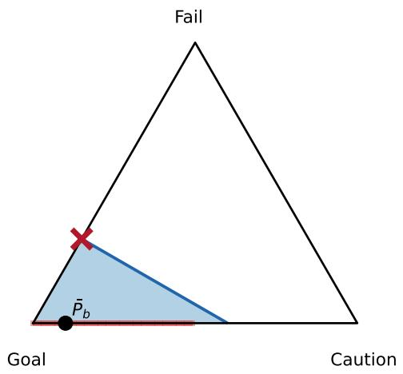  
Figure 1: Why Wasserstein, geometrically. On the next-state simplex at a confident belief—the nominal $\bar { P } _ { b }$ places zero mass on FAIL—the relative-entropy ball (red) is trapped on the support edge, blind to the catastrophe, while the 1-Wasserstein ball (blue) reaches the FAIL vertex; the worstcase adversary (×) sits on its boundary. This is Thm. 2(iii) drawn on $\Delta ( S )$

at fixed confidence, while WEVaR at a fixed radius changes by 807.5—the gap of Thm. 2(iii), shown geometrically in Fig. 1 and quantitatively across radii in Fig. 4 (App. E).

## 5 EVOLVING UNCERTAINTY: BELIEF ENTROPY AS THE RADIUS

We now let the radius evolve. An environment has a hidden type $z \in { \mathcal { Z } }$ drawn once; the agent maintains a Bayesian belief $b \in \Delta ( \mathcal { Z } )$ with update ψ, forms the belief-weighted nominal kernel $\begin{array} { r } { \bar { P } _ { b } ( \cdot \mid s , a ) = \sum _ { z } b ( z ) P ( \cdot \mid s , a , z ) } \end{array}$ , and sets the transport radius to the belief entropy, $\varepsilon ( b ) = \beta \mathcal { H } ( b )$ with $\begin{array} { r } { \mathcal { H } ( b ) = - \sum _ { z } b ( z ) } \end{array}$ ln $b ( z )$ and sensitivity $\beta > 0 .$ , giving the ambiguity set $\mathcal { U } ( b ) = \{ Q : \mathcal { W } _ { 1 } ( Q , \bar { P } _ { b } ) \leq \beta \mathcal { H } ( b ) \}$ As observations sharpen $b ,$ the entropy $\mathcal { H } ( b ) \downarrow 0 ,$ , the ball contracts and drifts toward the nominal (Fig. 2), and via Thm. 1 the agent’s risk attitude slides from worst-case to risk-neutral—a dial driven by epistemic state. Since the controller minimizes value, the relevant functional is the infimal twin of Def. 1, whose closed form is $\mathbb { E } _ { \bar { P } _ { b } } [ V ] -$ $\beta \mathcal { H } ( b ) \operatorname { L i p } _ { d } ( V )$

Theorem 3 (Closed-form robust update; contraction; safety). For the operator, with discount $\gamma \in ( 0 , 1 ]$ and belief update $b ^ { \prime } = \psi ( b , s , a , s ^ { \prime } )$

$$
( \mathfrak { T } V ) ( s , b ) = \operatorname* { m a x } _ { a } \left[ r ( s , a ) + \gamma \operatorname* { i n f } _ { Q \in \mathcal { U } ( b ) } \mathbb { E } _ { Q } V ( s ^ { \prime } , b ^ { \prime } ) \right] :
$$

(i) the inner problem has the closed form of Thm. 1—no coupling linear program—reducing the per- $( s , a , b )$ cost to

U(b) contracts as belief sharpens  
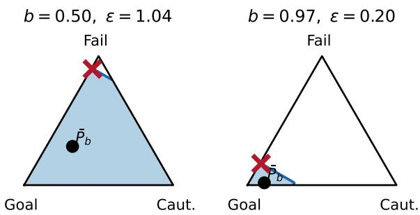  
Figure 2: The entropy-modulated ambiguity set $\mathcal { U } ( b )$ on the next-state simplex. As the belief sharpens the radius $\varepsilon = \beta \mathcal { H } ( b )$ contracts $( 1 . 0 4  0 . 2 0 )$ and the nominal $\bar { P } _ { b }$ drifts toward the goal; the worst-case adversary (×) loses its reach toward the failure vertex—robustness that vanishes with uncertainty (the geometric content of Thm. 3).

$O ( | S | ^ { 2 } ) ; ( i i ) \mathcal { T }$ is a γ-contraction in $\| \cdot \| _ { \infty }$ when $\gamma < 1$ , and a contraction on proper MDPs when $\gamma = 1 ;$ ; either way it has a uniquefixedpoint $V ^ { \star }$ [Bertsekas and Tsitsiklis, 1996]; (iii) $V ^ { \star }$ obeys a safety sandwich $V _ { \mathrm { w c } } ^ { \star } ( s , b ) \leq V ^ { \star } ( s , b ) \leq$ $\mathbb { E } _ { z \sim b } [ V _ { \mathrm { o p t } } ^ { \star } ( s , z ) ]$ between the always-maximally-cautious value and the type-aware oracle, and as $\mathcal { H } ( b )  0$ the radius vanishes and $V ^ { \star } ( s , b )  V _ { \mathrm { o p t } } ^ { \star } ( s , z ^ { \star } )$

Since $\mathcal { H } ( b ) \leq \ln | \mathcal { Z } |$ , the worst-case radius is $\beta$ ln $| \mathcal { Z } |$ ; requiring one action to remain viable under maximal ignorance gives the calibration $\beta < D / \ln | \mathcal { Z } |$ , the transport analogue of choosing a confidence level.

Evolving safety switch. On the Ambiguous Bridge $( \gamma =$ 1), SPRINT reaches the goal (+100) under a benign type but falls to catastrophe (−1000) under an adversarial type, while CRAWL is always safe but costly. With belief $b = [ \alpha , 1 - \alpha ]$ and $d ( S _ { G } , S _ { F } ) = 1 , \mathrm { s o L i p } _ { d } ( V ) = 1 1 0 0 , \mathrm { T h m . 3 ( i ) }$ ) gives in closed form $Q ( \mathrm { S P R I N T } ) = - 1 + 1 1 0 0 ( \alpha - \beta \mathcal { H } ( \alpha ) ) ^ { + } - 1 0 0 0$ and $Q ( \mathrm { C R A W L } ) ~ = ~ 8 0 ~ - ~ 1 1 0 0 \operatorname * { m i n } ( \beta \mathcal { H } ( \alpha ) , 1 )$ , which a Gurobi transport solve reproduces to $1 0 ^ { - 1 3 }$ . Equating them (the entropy terms cancel) yields a safety switch independent of β: the agent CRAWLs until $\alpha \geq \alpha ^ { \star } = 1 0 8 1 / 1 1 0 0$ ≈ 0.983, then SPRINTs. The threshold is set purely by the reward asymmetry. The same creep-then-cruise switch governs the canyon of §1: the drone hovers until its confidence that the air is calm crosses $\approx 0 . 6 3$ , then cruises (Fig. 6, App. E).

Guarantees, illustrated. On a five-state corridor whose forward action slips to a failure state only under a hidden “storm” type (Fig. 3), the safety sandwich of Thm. 3(iii) holds at every belief: the adaptive value never drops below the always-maximally-cautious floor and never exceeds the type-aware oracle. The price of robustness is temporary—the ceiling gap falls from 8.4 at the uniform belief to 4.4 once the belief reaches $b ( \mathrm { c a l m } ) = 0 . 9 5$ , and to zero at identification. Value iteration with the closed-form operator converges from arbitrary initializations at empirical rate $0 . 9 0 = \gamma$ , and the closed-form inner update matches a Gurobi transport solve at every sampled belief (the underlying duality is verified to solver tolerance in §4), so a valid safety bound is available at every iterate, not only at convergence. The belief-simplex manifolds (Fig. 5) and the safety-vs-efficiency rollouts (Fig. 7) appear in App. E.

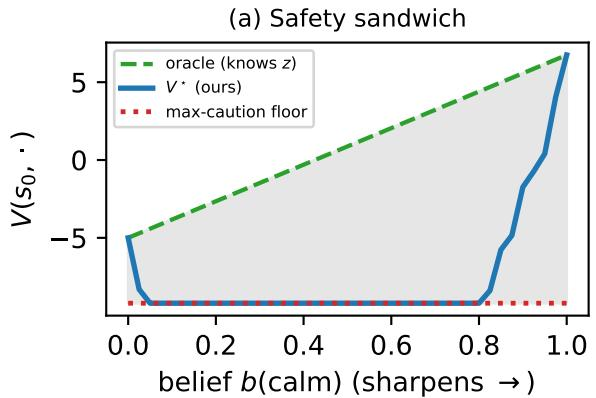

(b) Geometric contraction  
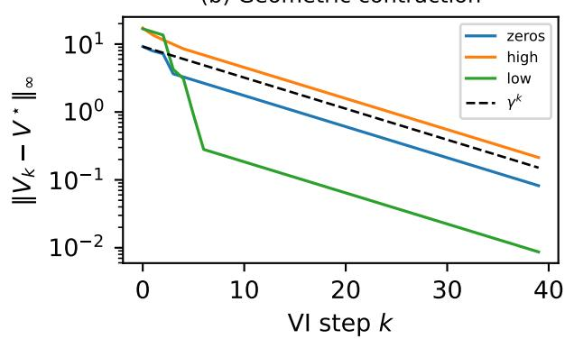  
Figure 3: Computed guarantees on a five-state corridor with a hidden slip type $( \gamma = 0 . 9 ,$ Gurobi-checked). (a) The adaptive value $V ^ { \star } ( s _ { 0 } , b )$ stays inside the safety sandwich between the always-maximally-cautious floor $V _ { \mathrm { w c } }$ and the type-aware oracle ceiling; the price of robustness shrinks as the belief sharpens. (b) From arbitrary initializations, value iteration with the closed-form operator collapses geometrically onto $V ^ { \star }$ along the $\gamma ^ { k }$ envelope, certifying the bound at every iterate.

## 6 DISCUSSION

The entropic and Wasserstein robust risks are the relativeentropy and optimal-transport faces of one idea—a coherent risk whose ambiguity radius is the agent’s epistemic uncertainty—bridged by entropic optimal transport [Cuturi, 2013, Peyré and Cuturi, 2019]; scaling the closed-form operator to continuous spaces via Lipschitz critics and to active information gathering are the natural next steps.

## References

Mohammed Amin Abdullah, Hang Ren, Haitham Bou Ammar, Vladimir Milenkovic, Rui Luo, Mingtian Zhang, and Jun Wang. Wasserstein robust reinforcement learning. arXiv preprint arXiv:1907.13196, 2019.

Amir Ahmadi-Javid. Entropic value-at-risk: A new coherent risk measure. Journal of Optimization Theory and Applications, 155(3):1105–1123, 2012.

Eitan Altman. Constrained Markov Decision Processes. Chapman & Hall/CRC, 1999.

Philippe Artzner, Freddy Delbaen, Jean-Marc Eber, and David Heath. Coherent measures of risk. Mathematical Finance, 9(3):203–228, 1999.

Dimitri P. Bertsekas and John N. Tsitsiklis. Neuro-Dynamic Programming. Athena Scientific, 1996.

Jose Blanchet and Karthyek Murthy. Quantifying distributional model risk via optimal transport. Mathematics of Operations Research, 44(2):565–600, 2019.

Sergey G. Bobkov and Friedrich Götze. Exponential integrability and transportation cost related to logarithmic Sobolev inequalities. Journal of Functional Analysis, 163 (1):1–28, 1999.

Stéphane Boucheron, Gábor Lugosi, and Pascal Massart. Concentration Inequalities: A Nonasymptotic Theory of Independence. Oxford University Press, 2013.

Lukas Brunke, Melissa Greeff, Adam W. Hall, Zhaocong Yuan, Siqi Zhou, Jacopo Panerati, and Angela P. Schoellig. Safe learning in robotics: From learning-based control to safe reinforcement learning. Annual Review of Control, Robotics, and Autonomous Systems, 5:411–444, 2022.

Yinlam Chow, Aviv Tamar, Shie Mannor, and Marco Pavone. Risk-sensitive and robust decision-making: A CVaR optimization approach. In Advances in Neural Information Processing Systems (NeurIPS), 2015.

Marco Cuturi. Sinkhorn distances: Lightspeed computation of optimal transport. In Advances in Neural Information Processing Systems (NeurIPS), 2013.

Erick Delage and Shie Mannor. Percentile optimization for Markov decision processes with parameter uncertainty. Operations Research, 58(1):203–213, 2010.

Deep Ganguly, Sarthak Girotra, Sirish Sekhar, and Ajin George Joseph. Risk-seeking reinforcement learning via multi-timescale entropic value-at-risk optimization. Transactions on Machine Learning Research, 2025.

Rui Gao and Anton J. Kleywegt. Distributionally robust stochastic optimization with Wasserstein distance. Mathematics ofOperations Research, 48(2):603–655, 2023.

Javier García and Fernando Fernández. A comprehensive survey on safe reinforcement learning. Journal of Machine Learning Research, 16:1437–1480, 2015.

Mohammad Ghavamzadeh, Shie Mannor, Joelle Pineau, and Aviv Tamar. Bayesian reinforcement learning: A survey. Foundations and Trends in Machine Learning, 8(5–6): 359–483, 2015.

Jia Lin Hau, Marek Petrik, and Mohammad Ghavamzadeh. Entropic risk optimization in discounted MDPs. In International Conference on Artificial Intelligence and Statistics (AISTATS), 2023.

Ronald A. Howard and James E. Matheson. Risk-sensitive Markov decision processes. Management Science, 18(7): 356–369, 1972.

Garud N. Iyengar. Robust dynamic programming. Mathematics ofOperations Research, 30(2):257–280, 2005.

Leslie Pack Kaelbling, Michael L. Littman, and Anthony R. Cassandra. Planning and acting in partially observable stochastic domains. Artificial Intelligence, 101(1–2):99– 134, 1998.

Daniel Kuhn, Peyman Mohajerin Esfahani, Viet Anh Nguyen, and Soroosh Shafieezadeh-Abadeh. Wasserstein distributionally robust optimization: Theory and applications in machine learning. In Operations Research & Management Science in the Age ofAnalytics (INFORMS TutORials), pages 130–166. INFORMS, 2019.

Peyman Mohajerin Esfahani and Daniel Kuhn. Data-driven distributionally robust optimization using the Wasserstein metric: Performance guarantees and tractable reformulations. Mathematical Programming, 171:115–166, 2018.

Arnab Nilim and Laurent El Ghaoui. Robust control of Markov decision processes with uncertain transition matrices. Operations Research, 53(5):780–798, 2005.

Gabriel Peyré and Marco Cuturi. Computational optimal transport. Foundations and Trends in Machine Learning, 11(5–6):355–607, 2019.

Lerrel Pinto, James Davidson, Rahul Sukthankar, and Abhinav Gupta. Robust adversarial reinforcement learning. In International Conference on Machine Learning (ICML), 2017.

R. Tyrrell Rockafellar and Stanislav Uryasev. Optimization of conditional value-at-risk. Journal of Risk, 2:21–42, 2000.

Andrzej Ruszczynski. Risk-averse dynamic programming ´ for Markov decision processes. Mathematical Programming, 125(2):235–261, 2010.

Yanan Sui, Alkis Gotovos, Joel Burdick, and Andreas Krause. Safe exploration for optimization with Gaussian processes. In International Conference on Machine Learning (ICML), 2015.

Cédric Villani. Optimal Transport: Old and New. Springer, 2009.

Wolfram Wiesemann, Daniel Kuhn, and Berç Rustem. Robust Markov decision processes. Mathematics ofOperations Research, 38(1):153–183, 2013.

## APPENDIX: EXTENDED PROOFS

Throughout, S is finite with $| { \cal S } | = n ;$ d is a metric on $s$ with diameter $D = \operatorname* { m a x } _ { s , s ^ { \prime } } d ( s , s ^ { \prime } ) ; P \in \Delta ( \mathcal { S } )$ is the reference law; $X : S $ R is a bounded loss; and $\begin{array} { r } { \mathcal { W } _ { 1 } ( Q , P ) = \operatorname* { m i n } _ { \gamma \in \Gamma ( Q , P ) } \sum _ { s , s ^ { \prime } } d ( s , s ^ { \prime } ) \gamma ( s , s ^ { \prime } ) } \end{array}$ with $\Gamma ( Q , P )$ the couplings of $Q$ and P. We write $\begin{array} { r } { \mathbb { E } _ { Q } [ X ] = \sum _ { s } Q ( s ) X ( s ) } \end{array}$

## A. THEOREM 1

(a) Duality. Since $\mathcal { W } _ { 1 } ( Q , P )$ is itself a minimum over couplings, the worst-case expectation is the value of a single linear program over the coupling $\gamma \geq 0$ whose first marginal is fixed to $P \colon$

$$
\operatorname { W E V a R } _ { \varepsilon } ( X ) = \operatorname* { m a x } _ { \gamma \geq 0 } \sum _ { s , s ^ { \prime } } \gamma ( s , s ^ { \prime } ) X ( s ^ { \prime } ) \quad \mathrm { s . t . } \quad \sum _ { s ^ { \prime } } \gamma ( s , s ^ { \prime } ) = P ( s ) \ \forall s , \qquad \sum _ { s , s ^ { \prime } } d ( s , s ^ { \prime } ) \gamma ( s , s ^ { \prime } ) \leq \varepsilon ,\tag{6}
$$

where the perturbed law is the second marginal $\begin{array} { r } { Q ( s ^ { \prime } ) = \sum _ { s } \gamma ( s , s ^ { \prime } ) } \end{array}$ (automatically in $\Delta ( \boldsymbol { S } )$ because $\begin{array} { r } { \sum _ { s , s ^ { \prime } } \gamma = \sum _ { s } P ( s ) = } \end{array}$ 1), and the objective equals $\mathbb { E } _ { Q } [ X ]$ . The program is feasible (take $\gamma ( s , s ^ { \prime } ) = P ( s ) \mathbf { 1 } [ s ^ { \prime } = s ]$ , of transport cost $0 \leq \varepsilon )$ and bounded (X is bounded), so LP strong duality applies. Attaching a free multiplier $u ( s )$ to each marginal equality and $\lambda \geq 0$ to the budget, the Lagrangian is

$$
\sum _ { s } P ( s ) u ( s ) + \lambda \varepsilon + \sum _ { s , s ^ { \prime } } \gamma ( s , s ^ { \prime } ) \big ( X ( s ^ { \prime } ) - u ( s ) - \lambda d ( s , s ^ { \prime } ) \big ) .
$$

Its supremum over $\gamma \geq 0$ is finite iff $X ( s ^ { \prime } ) - u ( s ) - \lambda d ( s , s ^ { \prime } ) \leq 0$ for all $s , s ^ { \prime } ,$ , i.e. $u ( s ) \geq$ maxs′ $\begin{array} { r l } { \big ( X ( s ^ { \prime } ) - \lambda d ( s , s ^ { \prime } ) \big ) = } & { { } } \end{array}$ $X _ { \lambda } ^ { c } ( s )$ , in which case the supremum equals $\begin{array} { r } { \sum _ { s } P ( s ) u ( s ) + \lambda { \varepsilon } } \end{array}$ (attained at $\gamma = 0 )$ . Minimizing over feasible u sets $u ( s ) = X _ { \lambda } ^ { c } ( s )$ , giving

$$
\mathrm { W E V a R } _ { \varepsilon } ( X ) = \operatorname* { m i n } _ { \lambda \geq 0 } \left\{ \lambda \varepsilon + \sum _ { s } P ( s ) X _ { \lambda } ^ { c } ( s ) \right\} = \operatorname* { i n f } _ { \lambda \geq 0 } \big \{ \lambda \varepsilon + \mathbb { E } _ { P } [ X _ { \lambda } ^ { c } ] \big \} ,
$$

which is (4). (For general Polish spaces this is Kantorovich–Rubinstein/Wasserstein-DRO strong duality, Villani, 2009, Gao and Kleywegt, 2023, Blanchet and Murthy, 2019.)

(b) Convexity and $\lambda ^ { \star } \le \mathrm { L i p } _ { d } ( X )$ . For each fixed $s , \lambda \mapsto X _ { \lambda } ^ { c } ( s ) = \operatorname* { m a x } _ { s ^ { \prime } } \left( X ( s ^ { \prime } ) - \lambda d ( s , s ^ { \prime } ) \right)$ is a pointwise maximum of functions affine in $\lambda ,$ hence convex; therefore $\begin{array} { r } { \mathbb { E } _ { P } [ X _ { \lambda } ^ { c } ] = \dot { \sum _ { s } } P ( s ) X _ { \lambda } ^ { c } ( s ) } \end{array}$ is convex (nonnegative combination), and $\phi ( \lambda ) : = \lambda \varepsilon + \mathbb { E } _ { P } [ X _ { \lambda } ^ { c } ]$ is convex on $[ 0 , \infty )$ , so (4) is a well-posed one-dimensional convex program. Next, if $\lambda \geq \operatorname { L i p } _ { d } ( X )$ then for every $s , s ^ { \prime } , \ddot { X } ( s ^ { \prime } ) - X ( s ) \leq \mathrm { L i p } _ { d } ( X ) d ( s , s ^ { \prime } ) \leq \lambda d ( s , s ^ { \prime } )$ , so $X ( s ^ { \prime } ) - \lambda d ( s , s ^ { \prime } ) \leq X ( s )$ with equality at $s ^ { \prime } = s ;$ hence $X _ { \lambda } ^ { c } ( s ) ~ = ~ X ( s )$ and $\phi ( \lambda ) = \lambda \varepsilon + \mathbb { E } _ { P } [ X ]$ , which is strictly increasing in λ. A convex $\phi$ that is increasing on $[ \mathrm { L i p } _ { d } ( X ) , \infty )$ attains its minimum at some $\lambda ^ { \star } \le \mathrm { L i p } _ { d } ( X )$

(c) Monotonicity and concavity in ε. The feasible set $\{ Q ~ \colon { \mathcal { W } } _ { 1 } ( Q , P ) \leq \varepsilon \}$ grows with ε, so $\mathrm { W E V a R } _ { \varepsilon } ( X )$ is nondecreasing. By (4) it is an infimum over λ of the maps $\varepsilon \mapsto \lambda \varepsilon + \mathbb { E } _ { P } [ X _ { \lambda } ^ { c } ]$ , each affine in ε; an infimum of affine functions is concave.

(d) Closed form and saturation. Let $T ( s ) \in$ arg maxs $\bigl ( X ( s ^ { \prime } ) - \mathrm { L i p } _ { d } ( X ) d ( s , s ^ { \prime } ) \bigr )$ be a steepest-ascent target and set $\begin{array} { r } { { \bar { \varepsilon } } ( X ) : = \mathbb { E } _ { P } \left[ d ( s , T ( s ) ) \right] = \sum _ { s } P ( s ) d \bigl ( s , T ( s ) \bigr ) } \end{array}$ . The right derivative of the convex function $\mathbb { E } _ { P } [ X _ { \lambda } ^ { c } ]$ at $\lambda = \operatorname { L i p } _ { d } ( X )$ equals $- \textstyle \sum _ { s } { \bar { P } } ( s ) d ( s , { \bar { T } } ( s ) ) = { \bar { - } } { \bar { \varepsilon } } ( X )$ (each active term contributes the negative source–target distance, inactive terms contribute 0). Hence the left derivative of ϕ at $\operatorname { L i p } _ { d } ( X )$ is $\varepsilon - { \bar { \varepsilon } } ( X )$ , which is $\le 0 \ : \mathrm { i f f } \ : \varepsilon \le \bar { \varepsilon } ( X )$ ; in that regime the minimizer is $\lambda ^ { \star } = \operatorname { L i p } _ { d } ( X )$ and

$$
\mathrm { W E V a R } _ { \varepsilon } ( X ) = \mathrm { L i p } _ { d } ( X ) \varepsilon + \mathbb { E } _ { P } [ X _ { \mathrm { L i p } _ { d } ( X ) } ^ { c } ] = \mathbb { E } _ { P } [ X ] + \varepsilon \mathrm { L i p } _ { d } ( X ) .
$$

For $| \mathrm { s u p p } ( P ) \cup \{ T ( s ) \} | = 2$ there is a single transport channel, $\bar { \varepsilon } ( X ) = \mathcal { W } _ { 1 } ( \delta _ { \arg \operatorname* { m a x } X } , \cdot )$ exhausts only at a vertex, and the formula is exact up to that point. □

## B. PROPOSITION 1 (COHERENCE)

Write $\rho ( X ) = { \mathrm { W E V a R } } _ { \varepsilon } ( X ) = \operatorname* { s u p } _ { Q \in B } \mathbb { E } _ { Q } [ X ]$ with $B = \{ Q \ : \ \mathcal { W } _ { 1 } ( Q , P ) \leq \varepsilon \}$ , a nonempty $( P \in B )$ , convex, compact subset of $\Delta ( S )$ . Monotonicity: if $X \leq Y$ pointwise then $\mathbb { E } _ { Q } [ X ] \leq \mathbb { E } _ { Q } [ Y ]$ for every $Q \in B$ (as $Q \geq 0 )$ , so $\rho ( X ) \leq \rho ( Y )$ . Translation invariance: for $c \in \mathbb { R } , \mathbb { E } _ { Q } [ X + c ] = \mathbb { E } _ { Q } [ X ] + c$ for all Q, hence $\rho ( X + c ) = \rho ( X ) + c$ . Positive homogeneity: for $\begin{array} { r } { t \ge 0 , \rho ( t X ) = \operatorname* { s u p } _ { Q \in B } t \mathbb { E } _ { Q } [ X ] = t \rho ( X ) } \end{array}$ . Subadditivity: $\rho ( X + Y ) = \operatorname* { s u p } _ { Q \in B } \left( \mathbb { E } _ { Q } [ X ] + \mathbb { E } _ { Q } [ Y ] \right) \leq$ $\begin{array} { r } { \operatorname* { s u p } _ { Q \in B } \mathbb { E } _ { Q } [ X ] + \operatorname* { s u p } _ { Q \in B } \mathbb { E } _ { Q } [ Y ] = \check { \rho ( X ) } + \rho ( Y ) } \end{array}$ . These are the axioms of Artzner et al. [1999]; B is the risk envelope of the induced dual representation. □

## C. THEOREM 2

(i) Sweep from mean to worst case. $\mathcal { W } _ { 1 }$ is a metric on $\Delta ( S )$ , so ${ \mathcal { W } } _ { 1 } ( Q , P ) = 0 \iff Q = P$ and $\mathrm { { W E V a R } } _ { 0 } ( X ) =$ $\mathbb { E } _ { P } [ X ]$ ]. For any $Q , \mathbb { E } _ { Q } [ X ] \leq \operatorname* { m a x } _ { s } X ( s )$ , so $\mathrm { W E V a R } _ { \varepsilon } ( X ) \leq$ max X(s). Let $s ^ { \bullet } \in$ arg max $\phantom { } _ { \mathrm { s } } X ( s )$ . Then $\mathcal { W } _ { 1 } ( \delta _ { s ^ { \bullet } } , P ) =$ $\begin{array} { r } { \sum _ { s } P ( s ) d ( s , s ^ { \bullet } ) \le \dot { D } , } \end{array}$ , so $\delta _ { s } \bullet \in B$ once $\begin{array} { r } { \varepsilon \geq \sum _ { s } P ( s ) d ( s , s ^ { \bullet } ) } \end{array}$ , whence $\operatorname { W E V a R } _ { \varepsilon } ( X ) = \operatorname* { m a x } _ { s } X ( s )$ . Combined with monotonicity (Thm. 1(c)), $\begin{array} { r } { \mathrm { W E V a R } _ { \varepsilon } ( X ) \uparrow \operatorname* { m a x } _ { s } \bar { X } ( s ) \mathrm { a s } \varepsilon \uparrow D . } \end{array}$

Lemma (transport vs. total variation). For all $Q , P , \mathcal { W } _ { 1 } ( Q , P ) \leq D \cdot \operatorname { T V } ( Q , P )$ , where $\begin{array} { r } { \mathrm { T V } ( Q , P ) = \frac { 1 } { 2 } \sum _ { s } | Q ( s ) - \rrangle } \end{array}$ $P ( s ) |$ . Proof: let $m ( s ) = \operatorname* { m i n } ( Q ( s ) , P ( s ) )$ ; the coupling that keeps mass m in place $( \gamma ( s , s ) \geq m ( s ) )$ and transports the residual mass $\begin{array} { r } { \sum _ { s } ( Q ( s ) - m ( s ) ) = \mathrm { T V } ( Q , P ) } \end{array}$ arbitrarily incurs cost $\leq D \cdot \mathrm { T V } ( Q , P )$ , and $\mathcal { W } _ { 1 }$ is the minimal cost. ⋄

(ii) Sandwich. Fix $\alpha \in ( 0 , 1 ]$ and put $\rho = - \ln \alpha$ . For any Q with $\mathrm { K L } ( Q \| P ) \leq \rho .$ , Pinsker’s inequality gives $\mathrm { T V } ( Q , P ) \leq$ $\sqrt { \mathrm { K L } ( Q \| P ) / 2 } \le \sqrt { \rho / 2 } .$ so by the Lemma $\mathcal { W } _ { 1 } ( Q , P ) \ : \le \ : D \sqrt { \rho / 2 } \ : = \ : D \sqrt { - \frac 1 2 }$ ln α. Therefore $\{ Q \ : \ \mathrm { K L } ( Q \| P ) \ \leq$ $- \ln \alpha \} \subseteq \{ Q : \mathcal { W } _ { 1 } ( Q , P ) \leq D { \sqrt { - { \frac { 1 } { 2 } } \ln \alpha } } \}$ , and taking the supremum of $\mathbb { E } _ { Q } [ X ]$ over the larger set,

$$
\mathrm { E V a R } _ { \alpha } ( X ) = \operatorname* { s u p } _ { \mathrm { K L } ( Q \| P ) \leq - \ln \alpha } \mathbb { E } _ { Q } [ X ] \ \leq \ \operatorname* { s u p } _ { \mathcal { W } _ { 1 } ( Q , P ) \leq D \sqrt { - \frac { 1 } { 2 } \ln \alpha } } \mathbb { E } _ { Q } [ X ] = \mathrm { W E V a R } _ { D \sqrt { - \frac { 1 } { 2 } \ln \alpha } } ( X ) .
$$

(iii) Catastrophe domination. Assume $P ( s ^ { \star } ) = 0$ and $X ( s ^ { \star } ) \ > \ \mathbb { E } _ { P } [ X ]$ . Entropic measure is blind. $\mathbb { E } _ { P } [ e ^ { t X } ] =$ $\sum _ { s : P ( s ) > 0 } P ( \bar { s } ) e ^ { t X ( s ) }$ omits the term $s ^ { \star }$ , so it—and hence $\begin{array} { r } { \operatorname { E V a R } _ { \alpha } ( X ) = \operatorname* { i n f } _ { t > 0 } \frac { 1 } { t } } \end{array}$ (ln EP[etX] − ln α)—does not depend on $X ( s ^ { \star } )$ , for every α. (Dually, any Q with $\mathrm { K L } ( Q \| P ) < \infty$ satisfies $Q \ll P$ , so $Q ( s ^ { \star } ) = 0$ and $\mathbb { E } _ { Q } [ X ]$ ignores $X ( s ^ { \star } ) . )$ Transport measure reacts. Let $\begin{array} { r } { \delta = \mathrm { d i s t } _ { d } ( s ^ { \star } , \operatorname { s u p p } P ) = \operatorname* { m i n } _ { s : P ( s ) > 0 } d ( s , s ^ { \star } ) } \end{array}$ and $s _ { 0 }$ an achieving state. For $\varepsilon > \delta$ choose $\eta _ { 0 } = \operatorname* { m i n } \left( P ( s _ { 0 } ) , \varepsilon / \delta \right) > 0$ and the feasible law $Q _ { \eta _ { 0 } } = P - \eta _ { 0 } \delta _ { s _ { 0 } } + \eta _ { 0 } \delta _ { s ^ { \star } }$ , for which $\mathcal { W } _ { 1 } ( Q _ { \eta _ { 0 } } , P ) \le \eta _ { 0 } \delta \le \varepsilon$ . Then

$$
\begin{array} { r } { \mathrm { W E V a R } _ { \varepsilon } ( X ) \ \geq \ \mathbb { E } _ { Q _ { \eta _ { 0 } } } [ X ] = \mathbb { E } _ { P } [ X ] + \eta _ { 0 } \big ( X ( s ^ { \star } ) - X ( s _ { 0 } ) \big ) , } \end{array}
$$

which is strictly increasing in $X ( s ^ { \star } )$ . Moreover WEVaR $\begin{array} { r } { \dot { \mathbf { \eta } } _ { \varepsilon } ( X ) = \operatorname* { m a x } _ { Q \in B } \sum _ { s } Q ( s ) X ( s ) } \end{array}$ is convex in the vector $X ,$ , and by Danskin’s theorem its partial right-derivative in $X ( s ^ { \star } )$ equals $\operatorname* { m a x } \{ Q ( s ^ { \star } ) : Q$ optimal}; for $X ( s ^ { \star } )$ large enough any optimal Q must place positive mass on $s ^ { \star }$ (else $Q _ { \eta _ { 0 } }$ strictly improves), so the derivative is positive and $\mathrm { W E V a R } _ { \varepsilon } ( X )$ strictly increases in $X ( s ^ { \star } )$ whenever $\varepsilon > \delta$ □

## D. THEOREM 3

Fix $( s , a , b )$ and write the continuation vector $\begin{array} { r } { W ( s ^ { \prime } ) = V \bigl ( s ^ { \prime } , \psi ( b , s , a , s ^ { \prime } ) \bigr ) } \end{array}$ and radius $\varepsilon ( b ) = \beta \mathcal { H } ( b )$ , nominal $\bar { P } _ { b }$

(i) Closed form of the inner minimization. Applying Theorem 1 to the loss −W and using $( - W ) _ { \lambda } ^ { c } ( s ) =$ ma $\begin{array} { r } { \mathfrak { c } _ { s ^ { \prime } } ( - W ( s ^ { \prime } ) - \lambda d ( s ^ { \prime } , s ) ) = - \operatorname* { m i n } _ { s ^ { \prime } } ( W ( s ^ { \prime } ) + \lambda d ( s ^ { \prime } , s ) ) } \end{array}$

$$
\operatorname* { i n f } _ { Q \in \mathcal { U } ( \delta ) } \mathbb { E } _ { Q } [ W ] = - \mathrm { W E N a R } _ { z ( b ) } ( - W ) = \operatorname* { s u p } _ { \lambda > 0 } \Big \{ \mathbb { E } _ { \tilde { P } _ { \lambda } } \big [ W _ { \lambda } ^ { c , - } \big ] - \lambda \varepsilon ( b ) \Big \} , \quad W _ { \lambda } ^ { c , - } ( s ) = \operatorname* { m i n } _ { s ^ { \prime } } \big ( W ( s ^ { \prime } ) + \lambda d ( s , s ^ { \prime } ) \big ) ,
$$

a one-dimensional concave maximization, with first-order/unsaturated value $\mathbb { E } _ { \bar { P } _ { b } } [ W ] - \beta \mathcal { H } ( b ) \mathrm { L i p } _ { d } ( W )$ (Thm. 1(d) applied $\mathrm { t o } - W )$ . Evaluating $\mathrm { L i p } _ { d } ( W )$ costs $O ( n ^ { 2 } )$ and the dual is a scalar program, versus an $O ( n ^ { 2 } )$ -variable transportation $\mathrm { L P } \left( 6 \right)$

(ii) Contraction. We use two properties of T. Monotonicity: if $V \leq V ^ { \prime }$ then $W \leq W ^ { \prime }$ pointwise, so in $\mathbb { f } _ { Q } \mathbb { E } _ { Q } [ W ] \le$ $\operatorname { i n f } _ { Q } \mathbb { E } _ { Q } [ W ^ { \prime } ]$ and, taking m $\operatorname { a x } _ { a } , { \mathfrak { T } } V \leq { \mathfrak { T } } V ^ { \prime }$ . Scaled constant shift: for $c \in \mathbb { R }$ , adding c to V adds c to every continuation, and infQ $\begin{array} { r } { , \mathbb { E } _ { Q } [ W + c ] = \operatorname* { i n f } _ { Q } \mathbb { E } _ { Q } [ W ] + c , } \end{array}$ so ${ \mathfrak { T } } ( V + c \mathbf { 1 } ) = { \mathfrak { T } } V + \gamma c \mathbf { 1 }$ . For $\gamma < 1$ , monotonicity and the scaled shift are exactly the hypotheses of the contraction lemma [Bertsekas and Tsitsiklis, 1996, Ch. $2 ] \colon \mathfrak { T } V - \mathfrak { T } V ^ { \prime } \leq \gamma \| V - V ^ { \prime } \| _ { \infty } \mathbf { 1 }$ and symmetrically, so $\| \mathfrak { T } V - \mathfrak { T } V ^ { \prime } \| _ { \infty } \le \gamma \| V - V ^ { \prime } \| _ { \infty } , \mathtt { a } \gamma$ -contraction. For $\gamma = 1$ the shift is exact and gives nonexpansiveness;

(b) Zero-prob. catastrophe

under properness—every policy together with every kernel selection in the sets $\mathcal { U } ( \cdot )$ reaches the terminal set T in uniformly bounded expected time—the standard stochastic-shortest-path argument [Bertsekas and Tsitsiklis, 1996, Ch. 3] upgrades this to a contraction in a weighted supremum norm $\| \cdot \| _ { w } \colon$ there exist m $\geq 1 , \kappa \in [ 0 , 1 )$ with $\| \mathfrak { T } ^ { m } V - \mathfrak { T } ^ { m } V ^ { \prime } \| _ { w } \leq \kappa \| V - V ^ { \prime } \| _ { w } .$ Either way T has a unique fixed point $V ^ { \star }$

(iii) Safety sandwich. Upper bound. Since $\begin{array} { r } { \bar { P } _ { b } \in \mathcal { U } ( b ) , \operatorname* { i n f } _ { Q \in \mathcal { U } ( b ) } \mathbb { E } _ { Q } [ W ] \le \mathbb { E } _ { \bar { P } _ { b } } [ W ] } \end{array}$ , so ${ \mathfrak { T } } V \leq { \mathfrak { T } } _ { \mathrm { B a y e s } } V$ pointwise, where ${ \mathfrak { T } } _ { \mathrm { B a y e s } }$ is the non-robust operator with kernel $\begin{array} { r } { \bar { P } _ { b } = \sum _ { z } b ( z ) P ( \cdot \mid s , a , z ) } \end{array}$ ; by monotone iteration $V ^ { \star } \leq V _ { \mathrm { B a y e s } } .$ Committing to one policy under belief b cannot beat knowing the type, so $V _ { \mathrm { B a y e s } } ( s , b ) \le \mathbb { E } _ { z \sim b } [ V _ { \mathrm { o p t } } ^ { \star } ( s , z ) ]$ (nonnegative value of information), giving the upper bound. Lower bound. Let $V _ { \mathrm { w c } } ^ { \star }$ be the fixed point of the operator ${ \mathfrak { T } } _ { \mathrm { w c } }$ obtained by replacing the radius $\beta \mathcal { H } ( b )$ with its maximum $\beta \ln { \lvert \mathcal { Z } \rvert }$ at every $( s , b )$ , keeping the same nominal $\bar { P } _ { b }$ Since $\beta \mathcal { H } ( b ) \leq \beta \ln | \mathcal { Z } |$ the ambiguity ball in T is contained in that of ${ \mathfrak { T } } _ { \mathrm { w c } } ,$ so its inner infimum is no smaller; hence $\mathfrak { T } V \geq \mathfrak { T } _ { \mathrm { w c } } V$ pointwise and, by monotone iteration, $V ^ { \star } ( s , b ) \geq V _ { \mathrm { w c } } ^ { \star } ( s , b )$ . This is the bound used in Fig. 3 and requires no nested-set condition. Convergence. As $b \to \delta _ { z ^ { \star } } , \mathcal { H } ( b ) \to 0$ and $\varepsilon ( b ) \to 0 , \operatorname { s o } \mathcal { U } ( b ) \to \{ P ( \cdot \mid s , a , z ^ { \star } ) \}$ ; by the Lipschitz dependence of the value on the radius (Thm. $1 ( \mathrm { c } ) \colon 0 \leq \mathrm { W E V a R } _ { \varepsilon } - \mathrm { W E V a R } _ { 0 } \leq \varepsilon \mathrm { L i p } _ { d } ) , V ^ { \star } ( s , b )  V _ { \mathrm { o p t } } ^ { \star } \bigl ( s , z ^ { \star } \bigr )$ □

## E. SUPPLEMENTARY EXPERIMENTS AND FIGURES

All figures are reproduced by the released code (a Colab-ready package). The body shows the geometric core (Figs. 1, 2) and the certified guarantee $( \mathrm { F i g } . 3 )$ ; the remaining plots are collected here.

Quantitative verification of the dualities. Figure 4 is the solver-side companion to §4: across a sweep of radii the entropic and Wasserstein measures both rise from the mean to the worst case, with $\mathrm { E V a R } _ { \alpha } \leq \mathrm { W E V a R }$ at the Pinsker-matched radius (Thm. 2(ii)); and a zero-nominal-probability disaster leaves the entropic measure flat while WEVaR reacts (Thm. 2(iii)).

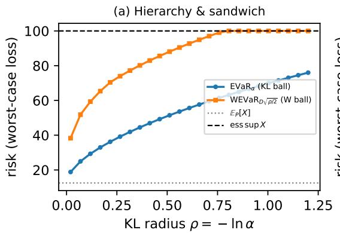

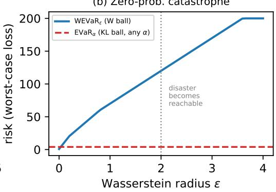  
Figure 4: Gurobi-verified comparison on a five-state metric space. (a) hierarchy and the Pinsker sandwich; (b) the zeroprobability catastrophe: the entropic value-at-risk is invariant to the disaster’s magnitude, WEVaR is not.

Manifolds over the belief simplex. For a three-type environment the belief lives on a 2-simplex, and the controller reads three scalar fields off it (Fig. 5): the radius $\varepsilon ( b ) = \beta \mathcal { H } ( b )$ (an entropy bowl, maximal at the centroid and zero at the vertices), the robust value $V ^ { \star } ( s _ { 0 } , b )$ , and the policy regions.

Safety switches. The belief-dependent policy flips from the safe to the optimal action at a computable threshold (Fig. 6): on the Ambiguous Bridge at $\alpha ^ { \star } \approx 0 . 9 8 3$ (set by the reward asymmetry, independent of β), and on the stormy-drone canyon at $b ( { \mathrm { c a l m } } ) \approx 0 . 6 3$

Safety-vs-efficiency rollouts, and an honest caveat. Figure 7 compares the three planners on the canyon. WEVaR Pareto-dominates the static-robust (MAXIMIN) planner—comparable safety at higher return, the “un-freezing” effect. In this calibrated-belief setting the expected-value (Bayesian) planner is already near-optimally cautious under a severe catastrophe, so the empirical separation between WEVaR and Bayesian is small; the regime in which belief-scaled caution measurably reduces failures is one of miscalibrated belief or distribution shift, where the belief is learned rather than computed from a known model. The body’s contribution is therefore the coherent measure, its geometry, and the certified guarantee; this rollout is illustrative.

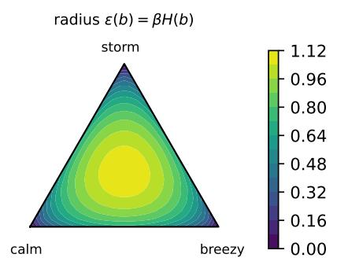

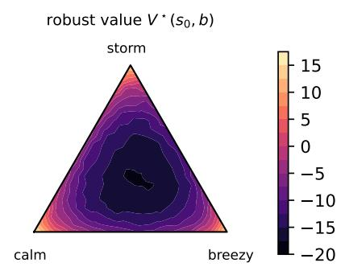

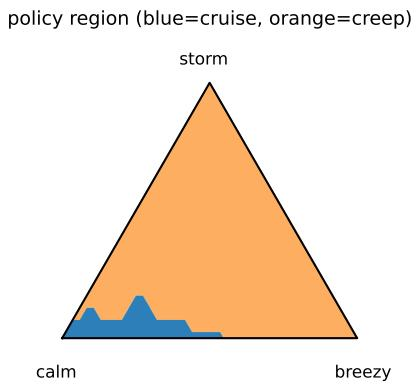  
Figure 5: Manifolds over the belief simplex $\Delta ( \mathcal { Z } )$ , $| \mathcal { Z } | = 3$ (calm/breezy/storm): ambiguity radius, robust value, and policy region (cruise only near the calm vertex).

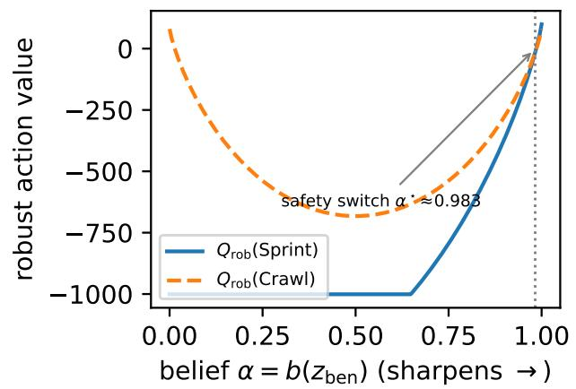

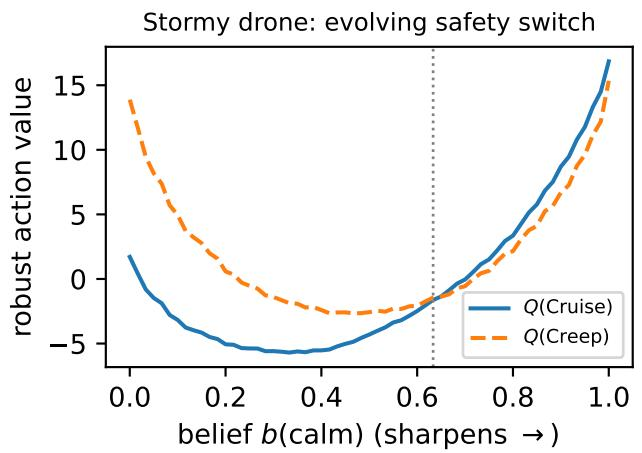  
Figure 6: Robust action values vs. belief. Left: the Ambiguous Bridge (SPRINT vs. CRAWL, switch at $\alpha ^ { \star } \approx 0 . 9 8 3 )$ . Right: the stormy-drone canyon (CRUISE vs. CREEP, switch at b(calm) ≈ 0.63).

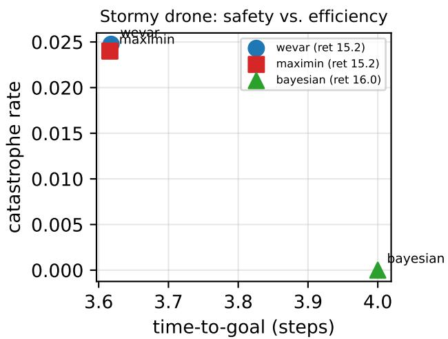  
Figure 7: Catastrophe rate vs. time-to-goal on the stormy-drone canyon (4000 episodes). WEVaR dominates the static-robust MAXIMIN baseline; the Bayesian planner is already cautious here (see caveat).